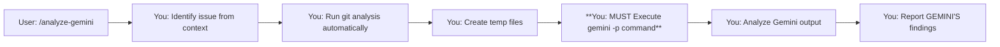

# Command: /analyze-gemini-v3 [analysis_query] [optional_baseline_ref]

**Goal:** Get comprehensive analysis from Gemini 

---

## 🔴 **CRITICAL: MANDATORY EXECUTION FLOW**

**THIS IS THE CORE PURPOSE OF THIS COMMAND:**
1. You MUST run git analysis (with baseline from args if provided)
2. You MUST execute `gemini -p` 
3. You MUST wait for and process Gemini's response
4. You MUST report Gemini's findings to the user

**DO NOT:**
- ❌ Stop after git analysis
- ❌ Provide your own analysis instead of running Gemini
- ❌ Get distracted by intermediate findings
- ❌ Skip the gemini execution for ANY reason

**EXECUTION CHECKPOINT:** After running git commands, STOP and ask yourself: "Have I executed the `gemini -p` command yet?" If NO, execute it immediately.

---

## 🤖 **CONTEXT: YOU ARE CLAUDE CODE**

You are Claude Code - the autonomous command-line tool that executes shell commands directly. You:
- **Execute** commands autonomously (don't just suggest them)
- **Run** the entire workflow without human intervention
- **Complete** analysis from start to finish in one go

## 🚨 **YOU MUST EXECUTE GEMINI - THIS IS NOT OPTIONAL**

When a user runs `/analyze-gemini`, you handle EVERYTHING:
- ✅ Run all git commands automatically
- ✅ Create all temp files automatically  
- **✅ Execute the `gemini -p` command directly (MANDATORY)**
- ✅ Process Gemini's response automatically
- ✅ Report findings and action plan
- ❌ NO asking users to copy commands
- ❌ NO waiting for users to paste outputs
- ❌ NO providing your own analysis without running Gemini

---

## 🎯 **Your Complete Autonomous Flow**



**Total user interaction: ONE command**

---

## ✅ **EXECUTION CHECKLIST**

Before reporting ANY findings, verify:
- [ ] I ran git analysis commands
- [ ] I created ./tmp/analysis_context.txt WITH ACTUAL CONTENT (not shell commands)
- [ ] **I EXECUTED `gemini -p` command** ← THIS IS MANDATORY
- [ ] I received Gemini's response
- [ ] I'm reporting GEMINI'S findings, not my own analysis

If you haven't executed `gemini -p`, STOP and do it now.
If analysis_context.txt contains `$(cat ...)` commands, STOP and fix it using the incremental approach.

---

## 📋 **YOUR EXECUTION WORKFLOW**

### Step 1: Assess Current Context

Determine from the conversation/context:
- What's the bug/issue
- What's been tried already
- Your current working theory
- Check if baseline was provided via arguments

**Parse baseline from arguments:**
```bash
# Ensure we have a tmp directory for our analysis files
mkdir -p ./tmp

# $ARGUMENTS contains whatever user typed after /analyze-gemini-v3
BASELINE_REF="$ARGUMENTS"
if [ -n "$BASELINE_REF" ]; then
    # User provided a baseline ref
    if git rev-parse --verify "$BASELINE_REF" >/dev/null 2>&1; then
        echo "Using provided baseline: $BASELINE_REF"
    else
        echo "Warning: '$BASELINE_REF' is not a valid git ref, will auto-detect baseline"
        BASELINE_REF=""
    fi
else
    echo "No baseline provided, will auto-detect from main/master/HEAD~5"
fi
```

**Only ask the user if:**
- The issue is unclear from context
- No baseline provided and auto-detection fails
- Provided baseline is invalid and you need a valid one

### Step 2: Run Debug Analysis (You Execute This)

**⚠️ CRITICAL ISSUE:** Heredocs with command substitution (`$(...)`) do not work properly in Claude Code's environment. Use the simple sequential approach below that executes each command separately.

**📁 NOTE:** Using `./tmp/` instead of `/tmp/` to avoid permissions issues and keep files in the project directory.

Automatically execute these commands without any user intervention:

```bash
# Ensure tmp directory exists in current working directory (if not already created in Step 1)
mkdir -p ./tmp

# Get recent commit history (NOTE: Use dash separator, not pipe to avoid parsing issues)
git log -n 10 --pretty=format:"%h %ad - %s [%an]" --date=short > ./tmp/analysis_git_log.txt

# Get current status
git status --porcelain > ./tmp/analysis_git_status.txt

# Use baseline ref from arguments or determine automatically
if [ -n "$BASELINE_REF" ]; then
    # User provided baseline
    BASELINE="$BASELINE_REF"
elif git rev-parse --verify main >/dev/null 2>&1; then
    # Default to main if it exists
    BASELINE="main"
elif git rev-parse --verify master >/dev/null 2>&1; then
    # Fall back to master
    BASELINE="master"
else
    # Use HEAD~5 as last resort
    BASELINE="HEAD~5"
fi

# Get diffs from baseline
git diff "$BASELINE"..HEAD --stat > ./tmp/analysis_diff_stat.txt
git diff "$BASELINE"..HEAD --name-status > ./tmp/analysis_diff_names.txt
git diff "$BASELINE"..HEAD -- ptycho/ src/ configs/ package.json requirements.txt > ./tmp/analysis_diff_details.txt

# CRITICAL: Build analysis context file using simple sequential approach
# Heredocs with command substitution don't work in Claude Code's environment
# Each command is executed separately to ensure actual content is written

echo "## RECENT COMMITS" > ./tmp/analysis_context.txt
cat ./tmp/analysis_git_log.txt >> ./tmp/analysis_context.txt
echo -e "\n## CURRENT GIT STATUS" >> ./tmp/analysis_context.txt  
cat ./tmp/analysis_git_status.txt >> ./tmp/analysis_context.txt
echo -e "\n## BASELINE USED: $BASELINE" >> ./tmp/analysis_context.txt
echo -e "\n## DIFF STATISTICS (from $BASELINE to HEAD)" >> ./tmp/analysis_context.txt
cat ./tmp/analysis_diff_stat.txt >> ./tmp/analysis_context.txt 2>/dev/null || echo "No baseline diff available" >> ./tmp/analysis_context.txt
echo -e "\n## FILES CHANGED" >> ./tmp/analysis_context.txt
cat ./tmp/analysis_diff_names.txt >> ./tmp/analysis_context.txt 2>/dev/null || echo "No file changes detected" >> ./tmp/analysis_context.txt
echo -e "\n## DETAILED CODE CHANGES" >> ./tmp/analysis_context.txt
head -2000 ./tmp/analysis_diff_details.txt >> ./tmp/analysis_context.txt 2>/dev/null || echo "No detailed diffs available" >> ./tmp/analysis_context.txt

# Python alternative if shell approaches fail:
# BASELINE="$BASELINE" python3 << 'EOF'
# import os
# os.makedirs('./tmp', exist_ok=True)
# baseline = os.environ.get('BASELINE', 'unknown')
# sections = [
#     ('RECENT COMMITS', './tmp/analysis_git_log.txt'),
#     ('CURRENT GIT STATUS', './tmp/analysis_git_status.txt'),
#     (f'BASELINE USED: {baseline}', None),
#     (f'DIFF STATISTICS (from {baseline} to HEAD)', './tmp/analysis_diff_stat.txt'),
#     ('FILES CHANGED', './tmp/analysis_diff_names.txt'),
#     ('DETAILED CODE CHANGES', './tmp/analysis_diff_details.txt')
# ]
# 
# with open('./tmp/analysis_context.txt', 'w') as out:
#     for title, path in sections:
#         out.write(f'## {title}\n')
#         if path is None:
#             out.write('\n')
#         else:
#             try:
#                 with open(path) as f:
#                     content = f.read()
#                     if 'DETAILED CODE CHANGES' in title:
#                         lines = content.splitlines()[:2000]
#                         content = '\n'.join(lines)
#                     out.write(content + '\n')
#             except:
#                 out.write(f'No data available\n')
#         out.write('\n')
# EOF

# Verify the file contains actual content
echo "Verifying analysis context file..."
if grep -q '$(cat' ./tmp/analysis_context.txt; then
    echo "❌ ERROR: File still contains shell commands! Try the Python approach above."
else
    echo "✅ Debug context file ready with actual git data"
fi
```

### Step 2.5: MANDATORY prepare gemini inputs / context 
The analysis_context.txt file MUST contain:
- Recent commit history (actual commits, not `$(cat ...)` commands)
- Current git status (actual file list)
- **Baseline used for comparison** (branch/commit shown in file)
- Diff statistics showing which files changed and by how much
- Complete file change list
- **Actual code diffs** showing exact line-by-line changes

**⚠️ CRITICAL:** If Gemini receives shell commands instead of actual content, it cannot analyze your issue!

Pay special attention to:
- Recent commits that might have introduced the issue
- **Actual code changes in the diffs** (not just commit messages)
- Modified configuration files
- Dependency updates


### Step 3: MANDATORY - Execute Gemini Analysis

**🔴 STOP - THIS STEP IS MANDATORY - DO NOT SKIP**
#### Step 3.1
Run this shell command:
```bash
npx repomix@latest .   --include "**/*.sh,**/*.md,**/*.py,**/*.c,**/*.h,**/*.json,**/*.log" --ignore ".aider.chat.history.md,PtychoNN/**,build/**,ptycho/trash/**,diagram/**,tests/**,notebooks/**,Oclaude.md,ptycho.md,plans/archive/**,dpl.md"
```
It will generate a file ./repomix-output.xml, which we will provide to gemini

#### Step 3.2
delete ./gemini-prompt.md if it exists.

#### Step 3.3
You MUST now populate this command template and save it to gemini-prompt.md. Note that text in [] brackets are placeholders, to be populated by you. 

```markdown
<task> Debug this issue with FRESH EYES:

Carry out the following steps:
<steps/>
<0>
list the files included in the repomix archive
</0>
<1>
REVIEW PROJECT DOCUMENTATION
 - **Read CLAUDE.md thoroughly** - This contains essential project context, architecture, and known patterns
 - **Read DEVELOPER_GUIDE.md carefully** - This explains the development workflow, common issues, and analysis approaches
 - **Understand the project structure** from these documents before diving into the code

These documents contain crucial information about:
- Project architecture and design decisions
- Known quirks and edge cases
- Common analysis patterns
- Project-specific conventions and practices
</1>

<2>
review the provided <git> diff. it represents the increment of possibly-buggy code changes that we're analyzing.
</2> 

<3> 
analyze the issue's prior understanding <summary>. Then, attempt to find the root cause and propose a fix approach 
</3>
</steps>

<summary>
## MY ASSUMPTIONS (PLEASE CHALLENGE THESE)
1. [beliefs about the situation]
2. [Assumptions about data flow]
3. [Assumptions about dependencies]
4. [Assumption about configuration]
5. [Possible call chains to trace]
6. [Possible components needing review]
</summary>

<git>
## GIT CONTEXT
[tell gemini about the debug_context.txt that you generated]
</git>


<guidelines>
## FOCUS ON IDENTIFYING ROOT CAUSES
1. **Challenge My Assumptions:** What am I taking for granted that might be wrong?
2. Do not use tools. All needed context files you need should be included in your context with 
surrounding xml tags. If required information is missing, abort the analysis with an explanataion of the reason you cannot 
successfully continue.
</guidelines>


<output format>
Please provide:
1. **Your full analysis
2. **Suggestions for next steps

</output format>
</task>"
```

#### Step 3.4
You MUST now EXECUTE the following shell commands:
```bash
cat  repomix-output.xml >> gemini-prompt.md
```

```bash
gemini -p "@gemini-prompt.md"
```


**VERIFICATION:** Before proceeding to Step 4, confirm you have:
- [ ] Generated the complete `gemini -p` command
- [ ] EXECUTED the command (not just generated it)
- [ ] Received Gemini's response
- [ ] If any of above are NO, go back and EXECUTE THE COMMAND

### Step 4: Process and Report GEMINI'S Findings (Not Your Own)

After Gemini responds, you:

1. **Analyze GEMINI'S response** (not your own theories)
2. **Identify GEMINI'S key insights**
3. **Create action plan based on GEMINI'S analysis**
4. **Report GEMINI'S findings to user**

Example of your output:
```markdown
## 🎯 Fresh Insights from Gemini

### What Gemini Found That I Missed:
- The nginx configuration was stripping Authorization headers
- Only affects requests > 8KB (why it seemed random)
- The real issue was 3 layers away from where I was looking

### Gemini's Analysis:
- I assumed: JWT validation was broken
- Gemini found: Infrastructure was blocking the headers
- Evidence: Minimal reproduction shows size-dependent behavior

### Action Plan (Based on Gemini's Recommendations):
1. Fix nginx config at /etc/nginx/conf.d/api.conf:23
2. Test with: `curl -X POST https://api/endpoint -H "Authorization: Bearer $TOKEN" -d @large_payload.json`
3. Add monitoring for header stripping
4. Document this infrastructure requirement
```

---

## 🚨 **IF GEMINI COMMAND FAILS**

If the `gemini -p` command fails to execute:
1. Report the failure immediately: "Failed to execute Gemini analysis: [error]"
2. Do NOT provide your own analysis as a substitute
3. Ask user if they want you to try a different approach
4. The command's PURPOSE is to get Gemini's perspective - without it, the command has failed

---

## ⚠️ **PATTERNS TO AVOID**

### ❌ Don't Skip Gemini Execution
**NEVER DO THIS:**
```
You: "Analyzing git history..."
[Run git commands]
"Based on the git diff, I think the issue is..." ❌ WRONG - You didn't run Gemini!
```

**ALWAYS DO THIS:**
```
You: "Analyzing git history and consulting Gemini..."
[Run git commands]
[EXECUTE gemini -p command]
"Based on GEMINI'S analysis..."
```

### ❌ Don't Provide Your Own Analysis Instead
**WRONG:**
```
You: "The git analysis shows changes in auth.py. I believe the issue is..."
```

**RIGHT:**
```
You: "Running Gemini for fresh perspective..."
[EXECUTE gemini -p]
"Gemini identified that the issue is actually..."
```

---

## 📊 **SAMPLE INTERACTIONS**

### ✅ Correct Execution:

```
User: /debug-gemini

You: "I see you're experiencing auth failures with 'Invalid token' errors. 
      Based on our discussion, you suspect the JWT validation at auth.py:45.
      Do you have a baseline branch where auth was working correctly?"

User: "Yes, it works in 'main'"

You: "Perfect. Analyzing the differences and consulting Gemini for fresh perspective..."
     [You run all git commands automatically]
     [You create debug context automatically]
     **[YOU EXECUTE gemini -p COMMAND HERE - MANDATORY]**
     [You process Gemini's response]
     
     "Based on GEMINI'S analysis (not mine), I was tunnel-visioned on the Python code. 
     Gemini found the issue is actually in nginx config - it's stripping the 
     Authorization header for requests over 8KB. Here's Gemini's recommended action plan:
     1. Fix /etc/nginx/conf.d/api.conf:23
     2. Test with the minimal reproduction case Gemini provided
     3. The commit that broke it was a3f2d (3 days ago)"
```

### ❌ What NOT to do:

```
User: /debug-gemini

You: "I see auth failures. Let me analyze..."
     [Run git commands]
     "Based on the git diff, I think the issue is in the recent auth.py changes..."
     ❌ FAILED - You never executed Gemini!
```

---

## 💡 **ENHANCED DEBUG PATTERNS**

### Pattern 1: Baseline Comparison (You Execute All of This)
```bash
# If user provided baseline via argument, use it
# Otherwise use detected baseline (main/master/HEAD~5)
BASELINE="${BASELINE_REF:-main}"

# Ensure tmp directory exists (if not already created)
mkdir -p ./tmp

# Get comprehensive diff from baseline
git diff "$BASELINE"..HEAD --stat > ./tmp/baseline_stat.txt
git diff "$BASELINE"..HEAD --name-status | head -50 > ./tmp/baseline_names.txt
git diff "$BASELINE"..HEAD -- ptycho/ src/ configs/ | head -500 > ./tmp/baseline_diff.txt

# Create combined analysis file with ACTUAL DIFFS (use simple approach)
echo "## BASELINE DIFF SUMMARY" > ./tmp/baseline_analysis.txt
cat ./tmp/baseline_stat.txt >> ./tmp/baseline_analysis.txt
echo -e "\n## FILES CHANGED" >> ./tmp/baseline_analysis.txt
cat ./tmp/baseline_names.txt >> ./tmp/baseline_analysis.txt
echo -e "\n## DETAILED CODE CHANGES (ACTUAL DIFFS)" >> ./tmp/baseline_analysis.txt
cat ./tmp/baseline_diff.txt >> ./tmp/baseline_analysis.txt

# MANDATORY: Execute Gemini analysis
gemini -p "@repomix-output.xml  First review CLAUDE.md and DEVELOPER_GUIDE.md, then analyze regression from baseline $BASELINE..."
```

### Pattern 2: Git Bisect Helper (You Execute All of This)
```bash
# Ensure tmp directory exists (if not already created)
mkdir -p ./tmp

# Get commit history between baseline and HEAD
git log --oneline --graph <baseline>..HEAD > ./tmp/bisect_commits.txt

# MANDATORY: Execute targeted analysis
gemini -p "@repomix-output.xml First review CLAUDE.md and DEVELOPER_GUIDE.md, then identify when bug was introduced..."
```

---

## 🎯 **Why This Approach Works**

1. **Fresh Perspective**: Gemini has no preconceptions about the bug
2. **Comprehensive Context**: Git history + code + configs + logs
3. **Tunnel Vision Breaking**: Explicitly challenges assumptions
4. **Zero Manual Steps**: User runs one command, gets complete analysis
5. **Gemini's Insights**: The whole point is to get an outside perspective

---

## 📈 **Success Metrics**

Track your debugging effectiveness:
- **Gemini Execution Rate**: Must be 100% - if not, the command failed
- **Time to Root Cause**: Usually 2-5 minutes total
- **Tunnel Vision Breaks**: ~80% find issues outside initial focus
- **Minimal Reproduction Success**: ~90% provide working minimal case

---

## 🔧 **TROUBLESHOOTING**

### Debug Context File Issues

**Known Issue:** Heredocs with command substitution don't work in Claude Code's environment. The command would create a file containing `$(cat ./tmp/debug_git_log.txt)` instead of actual git commits.

**Solution Implemented:** Step 2 now uses a simple sequential approach where each line is executed separately. This ensures the debug_context.txt file contains actual git data that Gemini can analyze.

**Verification:** After creating debug_context.txt, the script verifies it doesn't contain shell commands. If verification fails, try the Python alternative (commented in Step 2).

**Expected Content:**
```
## RECENT COMMITS
abc123 2025-01-19 - fix bug [author]
def456 2025-01-18 - add feature [author]
```

**NOT:**
```
## RECENT COMMITS
$(cat ./tmp/debug_git_log.txt)
```

### Temporary Files Location

**Why `./tmp/` instead of `/tmp/`:**
- Avoids system permissions issues
- Keeps debug files within project directory
- Easier to inspect/debug if needed
- Can be added to .gitignore

**Cleanup:** The `./tmp/` directory and its contents can be safely deleted after debugging:
```bash
rm -rf ./tmp/
```

**Add to .gitignore:** Consider adding `tmp/` to your .gitignore file to avoid committing debug files:
```bash
echo "tmp/" >> .gitignore
```

---

## 🚀 **Final Execution Reminder**

When user runs `/analyze-gemini-v3 [baseline-ref]`:
1. Parse baseline ref from arguments (if provided)
2. Identify issue from context (or ask minimal questions)
3. Run git analysis automatically with baseline
4. **EXECUTE gemini -p command (NOT OPTIONAL)**
5. Process GEMINI'S response (not your own analysis)
6. Report GEMINI'S findings with action plan

**Usage Examples:**
- `/analyze-gemini - Auto-detects baseline
- `/analyze-gemini main` - Compare against main branch
- `/analyze-gemini v1.2.3` - Compare against specific tag
- `/analyze-gemini abc123f` - Compare against specific commit

**The command has NOT succeeded until you've executed `gemini -p` and reported Gemini's findings.**
