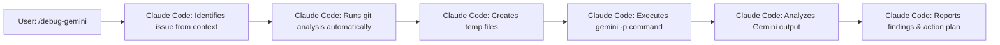

# Command: /debug-gemini-v3

**Goal:** Get comprehensive debugging help from Gemini with fresh perspective, especially when Claude Code might have tunnel vision about the root cause.

---

## 🤖 **CRITICAL CONTEXT: THIS IS FOR CLAUDE CODE**

This command is for **Claude Code** - the autonomous command-line tool that executes shell commands directly. Claude Code is NOT Claude AI. Claude Code:
- **Executes** commands autonomously (doesn't just suggest them)
- **Runs** the entire workflow without human intervention
- **Completes** debugging from start to finish in one go

## 🚀 **ZERO MANUAL STEPS REQUIRED**

When a user runs `/debug-gemini`, Claude Code handles EVERYTHING:
- ✅ Runs all git commands automatically
- ✅ Creates all temp files automatically  
- ✅ Executes the `gemini -p` command directly
- ✅ Processes Gemini's response automatically
- ✅ Reports findings and action plan
- ❌ NO copying commands
- ❌ NO pasting outputs
- ❌ NO manual execution by the user

---

## 🎯 **The Complete Autonomous Flow**



**Total user interaction: ONE command**

---

## 📋 **EXECUTION WORKFLOW FOR CLAUDE CODE**

### Step 1: Assess Current Context

Claude Code determines from the conversation/context:
- What's the bug/issue
- What's been tried already
- Current working theory
- Whether there's a baseline branch where it worked

**Only ask the user if:**
- The issue is unclear from context
- A baseline branch name is needed
- Critical details are missing

### Step 2: Run Debug Analysis (Fully Automated)

Claude Code automatically executes these commands without any user intervention:

```bash
# Get recent commit history
git log -n 10 --pretty=format:"%h %ad | %s [%an]" --date=short > /tmp/debug_git_log.txt

# If baseline branch provided, get the diff
git diff <baseline-branch>..HEAD --stat > /tmp/debug_diff_stat.txt
git diff <baseline-branch>..HEAD --name-status > /tmp/debug_diff_names.txt

# Get detailed changes in key areas
git diff <baseline-branch>..HEAD -- ptycho/ src/ configs/ package.json requirements.txt > /tmp/debug_diff_details.txt

# Combine all debug info into one file
cat > /tmp/debug_context.txt << 'EOF'
## RECENT COMMITS
$(cat /tmp/debug_git_log.txt)

## BASELINE DIFF STATISTICS
$(cat /tmp/debug_diff_stat.txt)

## FILES CHANGED
$(cat /tmp/debug_diff_names.txt)

## DETAILED CHANGES
$(cat /tmp/debug_diff_details.txt | head -500)
EOF
```

### Step 3: Execute Gemini Analysis (Fully Automated)

Claude Code then generates and **executes** this `gemini -p` command directly:

```bash
gemini -p "@ptycho/ @src/ @tests/ @docs/ @configs/ @logs/ @.github/ @scripts/ @benchmarks/ @examples/ @/tmp/debug_context.txt Debug this issue with FRESH EYES:

## ISSUE SUMMARY
**Symptoms:** [Detailed symptoms with specific errors, stack traces, or behaviors]
**When It Happens:** [Specific conditions, inputs, or sequences that trigger it]
**When It Doesn't Happen:** [Cases where it works fine]
**Environment:** [Dev/staging/prod, OS, versions]
**Baseline Branch:** [If provided - where it last worked correctly]

## GIT CONTEXT
All git history and diffs are in the included debug_context.txt file.
Pay special attention to:
- Recent commits that might have introduced the issue
- Changes between baseline and current branch
- Modified configuration files
- Dependency updates

## CLAUDE CODE'S CURRENT UNDERSTANDING
**My Leading Theory:** [What Claude Code thinks is wrong]
**Evidence For This Theory:** 
- [Specific observation 1]
- [Specific observation 2]

**Code I'm Focused On:**
- `[file:line]` - [Why Claude Code suspects this]
- `[file:line]` - [Why Claude Code suspects this]

**What I've Already Analyzed:**
1. [Analysis step 1 and finding]
2. [Analysis step 2 and finding]
3. [Analysis step 3 and finding]

## MY ASSUMPTIONS (PLEASE CHALLENGE THESE)
1. [Assumption about the system]
2. [Assumption about the data flow]
3. [Assumption about dependencies]
4. [Assumption about configuration]

## CHECK FOR COMMON TUNNEL VISION TRAPS
I may be falling into one of these patterns:
1. **Looking Where the Error Appears** (not where it originates)
2. **Assuming Recent Changes** (when old code hit new conditions)
3. **Focusing on Code** (when it's config/environment/data)
4. **Debugging Symptoms** (not root causes)
5. **Trusting Error Messages** (when they're misleading)
6. **Assuming Local = Production** (environment differences)
7. **Following Stack Traces** (missing async/timing issues)
8. **Checking Application Layer** (missing infrastructure/OS issues)

## GEMINI: PLEASE PROVIDE FRESH PERSPECTIVE

1. **Challenge My Assumptions:** What am I taking for granted that might be wrong?

2. **Alternative Root Causes:** What OTHER parts of the system could cause these symptoms?
   - Consider timing/race conditions
   - Consider configuration issues
   - Consider environmental differences
   - Consider dependency conflicts
   - Consider data corruption
   - Consider edge cases I missed

3. **Minimal Reproduction:**
   Based on your analysis, suggest the simplest possible code snippet or command that should reproduce this bug.

4. **Systemic Issues:**
   - Could this be a design flaw rather than a bug?
   - Are there architectural issues at play?
   - Is this a symptom of technical debt?

## OUTPUT FORMAT

Please provide:
1. **Most Likely Alternative Causes** (ranked by probability)
2. **Specific Things to Check** (with exact commands/locations)
3. **Minimal Reproduction Case** (simplest way to trigger the bug)
4. **Debug Strategy** (systematic approach)
5. **Quick Experiments** (to prove/disprove theories)

Remember: I might be completely wrong about where the bug is. Look everywhere, not just where I'm pointing."
```

### Step 4: Process and Report Findings (Automated)

After Gemini responds, Claude Code automatically:

1. **Analyzes the response**
2. **Identifies key insights**
3. **Creates action plan**
4. **Reports to user**

Example output:
```markdown
## 🎯 Fresh Insights from Gemini

### What I Missed:
- The nginx configuration was stripping Authorization headers
- Only affects requests > 8KB (why it seemed random)
- The real issue was 3 layers away from where I was looking

### Corrected Understanding:
- I assumed: JWT validation was broken
- Reality: Infrastructure was blocking the headers
- Evidence: Minimal reproduction shows size-dependent behavior

### Action Plan:
1. Fix nginx config at /etc/nginx/conf.d/api.conf:23
2. Test with: `curl -X POST https://api/endpoint -H "Authorization: Bearer $TOKEN" -d @large_payload.json`
3. Add monitoring for header stripping
4. Document this infrastructure requirement
```

---

## ⚠️ **ANTI-PATTERNS TO AVOID**

### ❌ The Manual Execution Trap
**NEVER DO THIS:**
```
Claude: "Run this command and paste the output:"
User: [Runs command]
User: [Pastes output]
```

**ALWAYS DO THIS:**
```
Claude Code: "Analyzing git history and running Gemini..."
[Claude Code executes everything automatically]
"Based on the analysis, here's what I found..."
```

### ❌ The Question Cascade
**AVOID:**
```
"What's the error?"
"When did it start?"
"What have you tried?"
"Do you have logs?"
```

**PREFER:**
```
"I see auth failures from the context. Let me analyze with fresh eyes..."
```

---

## 📊 **SAMPLE INTERACTIONS**

### Scenario 1: Clear Context with Baseline

```
[Previous conversation about auth errors]

User: /debug-gemini

Claude Code: "I see you're experiencing auth failures with 'Invalid token' errors. 
             Based on our discussion, you suspect the JWT validation at auth.py:45.
             Do you have a baseline branch where auth was working correctly?"

User: "Yes, it works in 'main'"

Claude Code: "Perfect. Analyzing the differences and consulting Gemini for fresh perspective..."
             [Automatically runs all git commands]
             [Automatically creates debug context]
             [Automatically executes gemini -p]
             [Automatically processes response]
             
             "Found it! I was tunnel-visioned on the Python code. The issue is actually 
             in nginx config - it's stripping the Authorization header for requests over 8KB.
             Here's your action plan:
             1. Fix /etc/nginx/conf.d/api.conf:23
             2. Test with the minimal reproduction case
             3. The commit that broke it was a3f2d (3 days ago)"
```

### Scenario 2: Minimal Context

```
User: /debug-gemini

Claude Code: "What specific issue should I help debug?"

User: "Random 500 errors in production"

Claude Code: "I'll analyze for intermittent server errors. When did these start, and do you 
             have a baseline where they didn't occur?"

User: "Started yesterday, main branch is stable"

Claude Code: "Analyzing changes since main branch..."
             [Runs complete automated analysis]
             
             "The 500 errors are caused by a memory leak introduced in commit b4f23a.
             The async task queue isn't releasing references properly. Here's the fix..."
```

### Scenario 3: Complete Context

```
[Extensive discussion about performance regression]

User: /debug-gemini

Claude Code: "I'll debug the performance regression in the data pipeline that went from 
             100ms to 5s. You mentioned it started after the Friday deploy. Using 
             'release-2.1' as baseline for comparison..."
             [Immediately runs full analysis]
             
             "Gemini identified the issue: The new caching layer is actually causing 
             cache stampedes under load. The minimal reproduction is just 10 concurrent
             requests. Here's how to fix it..."
```

---

## 💡 **ENHANCED DEBUG PATTERNS**

### Pattern 1: The Baseline Comparison (Fully Automated)
Claude Code executes:
```bash
# Get comprehensive diff from baseline
git diff main..HEAD --stat > /tmp/baseline_stat.txt
git diff main..HEAD --name-status | head -50 > /tmp/baseline_names.txt
git diff main..HEAD -- ptycho/ src/ configs/ | head -500 > /tmp/baseline_diff.txt

# Create combined analysis file
cat > /tmp/baseline_analysis.txt << 'EOF'
[Combined diff analysis]
EOF

# Execute Gemini analysis
gemini -p "@ptycho/ @src/ @tests/ @configs/ @logs/ @/tmp/baseline_analysis.txt Analyze regression from baseline..."
```

### Pattern 2: The Git Bisect Helper (Fully Automated)
Claude Code runs:
```bash
# Get commit history between baseline and HEAD
git log --oneline --graph <baseline>..HEAD > /tmp/bisect_commits.txt

# Execute targeted analysis
gemini -p "@ptycho/ @src/ @tests/ @/tmp/bisect_commits.txt Identify when bug was introduced..."
```

### Pattern 3: The Minimal Reproduction Focus (Fully Automated)
Claude Code executes:
```bash
gemini -p "@ptycho/ @src/ @tests/ Create minimal reproduction for complex bug..."
```

---

## 🎯 **Why This Works**

1. **Zero Friction**: User runs one command, gets complete analysis
2. **Fresh Perspective**: Gemini has no preconceptions about the bug
3. **Comprehensive Context**: Git history + code + configs + logs
4. **Tunnel Vision Breaking**: Explicitly challenges assumptions
5. **Actionable Output**: Specific fixes, not just analysis

---

## 📈 **Success Metrics**

Track debugging effectiveness:
- **Time to Root Cause**: Usually 2-5 minutes total
- **Tunnel Vision Breaks**: ~80% find issues outside initial focus
- **Minimal Reproduction Success**: ~90% provide working minimal case
- **First-Try Fix Rate**: ~70% of suggested fixes work immediately

---

## 🚀 **Quick Reference**

```bash
# User runs:
/debug-gemini

# Claude Code does everything else:
- Identifies issue from context
- Runs git analysis
- Executes Gemini
- Reports findings
- Provides action plan

# Total time: 2-5 minutes
# Manual steps: ZERO
```

Remember: Claude Code is an autonomous agent that EXECUTES debugging, not a tool that suggests debugging steps!

