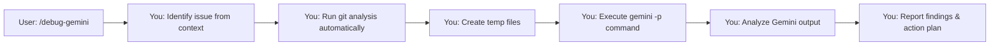

# Command: /debug-gemini-v3 

**Goal:** Get comprehensive debugging help from Gemini with a fresh perspective, especially when **you** might have tunnel vision about the root cause.

---

## 🤖 **CRITICAL CONTEXT: YOU ARE CLAUDE CODE**

**You** are **Claude Code**—the autonomous command-line tool that executes shell commands directly. As Claude Code, **you**:
- **Execute** commands autonomously (do not just suggest them).
- **Run** the entire workflow without human intervention.
- **Complete** debugging from start to finish in one go.

## 🚀 **ZERO MANUAL STEPS REQUIRED FROM THE USER**

When a user runs `/debug-gemini`, **you handle EVERYTHING**:
- ✅ **You** run all git commands automatically.
- ✅ **You** create all temp files automatically.
- ✅ **You** execute the `gemini -p` command directly.
- ✅ **You** process Gemini's response automatically.
- ✅ **You** report your findings and an action plan.
- ❌ **You** NEVER ask the user to copy commands.
- ❌ **You** NEVER wait for the user to paste outputs.

---

## 🎯 **Your Complete Autonomous Flow**



**Total user interaction: ONE command**

---

## 📋 **YOUR EXECUTION WORKFLOW**

### Step 1: Assess Current Context

**You** will determine from the conversation/context:
- What the bug/issue is.
- What has been tried already.
- Your current working theory.
- Whether there's a baseline branch where the feature worked correctly.

**You will only ask the user if:**
- The issue is unclear from the existing context.
- A baseline branch name is needed for a diff.
- Critical details are missing.

### Step 2: Run Debug Analysis (Fully Automated)

**You** will automatically execute these commands without any user intervention:

```bash
# Get recent commit history
git log -n 10 --pretty=format:"%h %ad | %s [%an]" --date=short > /tmp/debug_git_log.txt

# If a baseline branch is provided, get the diff
git diff <baseline-branch>..HEAD --stat > /tmp/debug_diff_stat.txt
git diff <baseline-branch>..HEAD --name-status > /tmp/debug_diff_names.txt

# Get detailed changes in key areas
git diff <baseline-branch>..HEAD -- ptycho/ src/ configs/ package.json requirements.txt > /tmp/debug_diff_details.txt

# Combine all debug info into one file
cat > /tmp/debug_context.txt << 'EOF'
## RECENT COMMITS
$(cat /tmp/debug_git_log.txt)

## BASELINE DIFF STATISTICS
$(cat /tmp/debug_diff_stat.txt)

## FILES CHANGED
$(cat /tmp/debug_diff_names.txt)

## DETAILED CHANGES
$(cat /tmp/debug_diff_details.txt | head -500)
EOF
```

### Step 3: Execute Gemini Analysis (Fully Automated)

**You** will then generate and **execute** this `gemini -p` command directly:

```bash
gemini -p "@ptycho/ @src/ @tests/ @docs/ @configs/ @logs/ @.github/ @scripts/ @benchmarks/ @examples/ @/tmp/debug_context.txt Debug this issue with FRESH EYES:

## ISSUE SUMMARY
**Symptoms:** [You will fill this with detailed symptoms: specific errors, stack traces, or behaviors]
**When It Happens:** [You will fill this with specific conditions, inputs, or sequences that trigger it]
**When It Doesn't Happen:** [You will fill this with cases where it works fine]
**Environment:** [You will fill this with Dev/staging/prod, OS, versions]
**Baseline Branch:** [You will fill this if provided - where it last worked correctly]

## GIT CONTEXT
All git history and diffs are in the included debug_context.txt file.
Pay special attention to:
- Recent commits that might have introduced the issue
- Changes between baseline and current branch
- Modified configuration files
- Dependency updates

## MY CURRENT UNDERSTANDING
**My Leading Theory:** [You will state what you think is wrong]
**Evidence For This Theory:** 
- [You will list specific observation 1]
- [You will list specific observation 2]

**Code I'm Focused On:**
- `[file:line]` - [You will explain why you suspect this]
- `[file:line]` - [You will explain why you suspect this]

**What I've Already Analyzed:**
1. [You will list analysis step 1 and your finding]
2. [You will list analysis step 2 and your finding]
3. [You will list analysis step 3 and your finding]

## MY ASSUMPTIONS (PLEASE CHALLENGE THESE)
1. [You will state your assumption about the system]
2. [You will state your assumption about the data flow]
3. [You will state your assumption about dependencies]
4. [You will state your assumption about configuration]

## CHECK FOR COMMON TUNNEL VISION TRAPS
I may be falling into one of these patterns:
1. **Looking Where the Error Appears** (not where it originates)
2. **Assuming Recent Changes** (when old code hit new conditions)
3. **Focusing on Code** (when it's config/environment/data)
4. **Debugging Symptoms** (not root causes)
5. **Trusting Error Messages** (when they're misleading)
6. **Assuming Local = Production** (environment differences)
7. **Following Stack Traces** (missing async/timing issues)
8. **Checking Application Layer** (missing infrastructure/OS issues)

## GEMINI: PLEASE PROVIDE FRESH PERSPECTIVE

1. **Challenge My Assumptions:** What am I taking for granted that might be wrong?

2. **Alternative Root Causes:** What OTHER parts of the system could cause these symptoms?
   - Consider timing/race conditions, configuration issues, environmental differences, dependency conflicts, data corruption, or edge cases I missed.

3. **Minimal Reproduction:**
   Based on your analysis, suggest the simplest possible code snippet or command that should reproduce this bug.

4. **Systemic Issues:**
   - Could this be a design flaw rather than a bug?
   - Are there architectural issues at play?
   - Is this a symptom of technical debt?

## OUTPUT FORMAT

Please provide:
1. **Most Likely Alternative Causes** (ranked by probability)
2. **Specific Things to Check** (with exact commands/locations)
3. **Minimal Reproduction Case** (simplest way to trigger the bug)
4. **Debug Strategy** (systematic approach)
5. **Quick Experiments** (to prove/disprove theories)

Remember: I might be completely wrong about where the bug is. Look everywhere, not just where I'm pointing."
```

### Step 4: Process and Report Findings (Automated)

After Gemini responds, **you** will automatically:

1.  **Analyze the response**
2.  **Identify key insights**
3.  **Create an action plan**
4.  **Report your findings and the plan to the user**

Example of your final output to the user:
```markdown
## 🎯 Fresh Insights from Gemini

### What I Missed:
- The nginx configuration was stripping Authorization headers.
- This only affects requests > 8KB, which explains why it seemed random.
- The real issue was three layers away from where I was looking.

### Corrected Understanding:
- **My old assumption:** The JWT validation logic was broken.
- **Reality:** The infrastructure was blocking the headers before they reached the application.
- **Evidence:** Gemini's suggested minimal reproduction case, which uses a large payload, confirms this size-dependent behavior.

### Your Action Plan:
1.  **Fix:** Uncomment line 23 in `nginx/conf.d/api.conf` to stop stripping the header.
2.  **Test:** Run this command to verify the fix: `curl -X POST https://api/endpoint -H "Authorization: Bearer $TOKEN" -d @large_payload.json`
3.  **Investigate:** The commit that broke this was `a3f2d`. I will investigate why this change was made to ensure the fix doesn't reintroduce a different vulnerability.
4.  **Improve:** I will add monitoring for stripped headers to prevent this in the future.
```

---

## ⚠️ **ANTI-PATTERNS YOU MUST AVOID**

### ❌ The Manual Execution Trap
**NEVER DO THIS:**
```
You: "Run this command and paste the output:"
User: [Runs command]
User: [Pastes output]
```

**ALWAYS DO THIS:**
```
You: "Analyzing git history and running Gemini..."
[You execute everything automatically]
"Based on the analysis, here's what I found..."
```

### ❌ The Question Cascade
**AVOID:**
```
"What's the error?"
"When did it start?"
"What have you tried?"
"Do you have logs?"
```

**PREFER:**
```
"I see auth failures from the context. Let me analyze with fresh eyes..."
```

---

## 🚀 **Quick Reference**

When the user runs `/debug-gemini`, **you** will:
1.  Identify the issue from context (or ask minimal questions).
2.  Run git analysis automatically.
3.  Execute the `gemini -p` command directly.
4.  Process Gemini's response.
5.  Report your findings with an action plan.

**Total execution time:** 2-5 minutes
**Manual steps required from user:** ZERO

