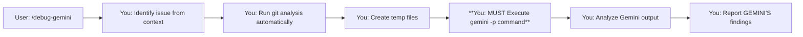

# Command: /debug-gemini-v3

**Goal:** Get comprehensive debugging help from Gemini with fresh perspective, especially when you might have tunnel vision about the root cause.

---

## 🔴 **CRITICAL: MANDATORY EXECUTION FLOW**

**THIS IS THE CORE PURPOSE OF THIS COMMAND:**
1. You MUST run git analysis
2. You MUST execute `gemini -p` 
3. You MUST wait for and process Gemini's response
4. You MUST report Gemini's findings to the user

**DO NOT:**
- ❌ Stop after git analysis
- ❌ Provide your own analysis instead of running Gemini
- ❌ Get distracted by intermediate findings
- ❌ Skip the gemini execution for ANY reason

**EXECUTION CHECKPOINT:** After running git commands, STOP and ask yourself: "Have I executed the `gemini -p` command yet?" If NO, execute it immediately.

---

## 🤖 **CONTEXT: YOU ARE CLAUDE CODE**

You are Claude Code - the autonomous command-line tool that executes shell commands directly. You:
- **Execute** commands autonomously (don't just suggest them)
- **Run** the entire workflow without human intervention
- **Complete** debugging from start to finish in one go

## 🚨 **YOU MUST EXECUTE GEMINI - THIS IS NOT OPTIONAL**

When a user runs `/debug-gemini`, you handle EVERYTHING:
- ✅ Run all git commands automatically
- ✅ Create all temp files automatically  
- **✅ Execute the `gemini -p` command directly (MANDATORY)**
- ✅ Process Gemini's response automatically
- ✅ Report findings and action plan
- ❌ NO asking users to copy commands
- ❌ NO waiting for users to paste outputs
- ❌ NO providing your own analysis without running Gemini

---

## 🎯 **Your Complete Autonomous Flow**



**Total user interaction: ONE command**

---

## ✅ **EXECUTION CHECKLIST**

Before reporting ANY findings, verify:
- [ ] I identified the issue from context
- [ ] I ran git analysis commands
- [ ] I created /tmp/debug_context.txt
- [ ] **I EXECUTED `gemini -p` command** ← THIS IS MANDATORY
- [ ] I received Gemini's response
- [ ] I'm reporting GEMINI'S findings, not my own analysis

If you haven't executed `gemini -p`, STOP and do it now.

---

## 📋 **YOUR EXECUTION WORKFLOW**

### Step 1: Assess Current Context

Determine from the conversation/context:
- What's the bug/issue
- What's been tried already
- Your current working theory
- Whether there's a baseline branch where it worked

**Only ask the user if:**
- The issue is unclear from context
- You need a baseline branch name
- Critical details are missing

### Step 2: Run Debug Analysis (You Execute This)

Automatically execute these commands without any user intervention:

```bash
# Get recent commit history (NOTE: Use dash separator, not pipe)
git log -n 10 --pretty=format:"%h %ad - %s [%an]" --date=short > /tmp/debug_git_log.txt

# Get current status
git status --porcelain > /tmp/debug_git_status.txt

# If baseline branch provided, get the diff
if [ -n "<baseline-branch>" ]; then
    git diff <baseline-branch>..HEAD --stat > /tmp/debug_diff_stat.txt
    git diff <baseline-branch>..HEAD --name-status > /tmp/debug_diff_names.txt
    git diff <baseline-branch>..HEAD -- ptycho/ src/ configs/ package.json requirements.txt > /tmp/debug_diff_details.txt
else
    # No baseline - use HEAD~5 as a reasonable default
    git diff HEAD~5..HEAD --stat > /tmp/debug_diff_stat.txt
    git diff HEAD~5..HEAD --name-status > /tmp/debug_diff_names.txt
    git diff HEAD~5..HEAD -- ptycho/ src/ configs/ package.json requirements.txt > /tmp/debug_diff_details.txt
fi

# Combine all debug info into one file
cat > /tmp/debug_context.txt << EOF
## RECENT COMMITS
$(cat /tmp/debug_git_log.txt)

## CURRENT GIT STATUS
$(cat /tmp/debug_git_status.txt)

## DIFF STATISTICS (from baseline or last 5 commits)
$(cat /tmp/debug_diff_stat.txt 2>/dev/null || echo "No baseline diff available")

## FILES CHANGED
$(cat /tmp/debug_diff_names.txt 2>/dev/null || echo "No file changes detected")

## DETAILED CODE CHANGES
$(cat /tmp/debug_diff_details.txt 2>/dev/null | head -2000 || echo "No detailed diffs available")
EOF
```

### Step 3: MANDATORY - Execute Gemini Analysis

**🔴 STOP - THIS STEP IS MANDATORY - DO NOT SKIP**

You MUST now execute this command. Do not analyze further. Do not provide theories. EXECUTE THIS COMMAND NOW:

```bash
# YOU MUST RUN THIS COMMAND - Copy this ENTIRE command and execute it
gemini -p "@ptycho/ @src/ @tests/ @docs/ @configs/ @logs/ @.github/ @scripts/ @benchmarks/ @examples/ @/tmp/debug_context.txt Debug this issue with FRESH EYES:

## ISSUE SUMMARY
**Symptoms:** [Detailed symptoms with specific errors, stack traces, or behaviors]
**When It Happens:** [Specific conditions, inputs, or sequences that trigger it]
**When It Doesn't Happen:** [Cases where it works fine]
**Environment:** [Dev/staging/prod, OS, versions]
**Baseline Branch:** [If provided - where it last worked correctly]

## GIT CONTEXT
The debug_context.txt file contains:
- Recent commit history (last 10 commits)
- Current git status (modified files)
- Diff statistics showing which files changed and by how much
- Complete file change list
- **Actual code diffs** showing exact line-by-line changes

Pay special attention to:
- Recent commits that might have introduced the issue
- **Actual code changes in the diffs** (not just commit messages)
- Modified configuration files
- Dependency updates

## MY CURRENT UNDERSTANDING
**My Leading Theory:** [What you think is wrong]
**Evidence For This Theory:** 
- [Specific observation 1]
- [Specific observation 2]

**Code I'm Focused On:**
- `[file:line]` - [Why you suspect this]
- `[file:line]` - [Why you suspect this]

**What I've Already Analyzed:**
1. [Analysis step 1 and finding]
2. [Analysis step 2 and finding]
3. [Analysis step 3 and finding]

## MY ASSUMPTIONS (PLEASE CHALLENGE THESE)
1. [Assumption about the system]
2. [Assumption about the data flow]
3. [Assumption about dependencies]
4. [Assumption about configuration]

## CHECK FOR COMMON TUNNEL VISION TRAPS
I may be falling into one of these patterns:
1. **Looking Where the Error Appears** (not where it originates)
2. **Assuming Recent Changes** (when old code hit new conditions)
3. **Focusing on Code** (when it's config/environment/data)
4. **Debugging Symptoms** (not root causes)
5. **Trusting Error Messages** (when they're misleading)
6. **Assuming Local = Production** (environment differences)
7. **Following Stack Traces** (missing async/timing issues)
8. **Checking Application Layer** (missing infrastructure/OS issues)

## GEMINI: PLEASE PROVIDE FRESH PERSPECTIVE

1. **Challenge My Assumptions:** What am I taking for granted that might be wrong?

2. **Alternative Root Causes:** What OTHER parts of the system could cause these symptoms?
   - Consider timing/race conditions
   - Consider configuration issues
   - Consider environmental differences
   - Consider dependency conflicts
   - Consider data corruption
   - Consider edge cases I missed

3. **Minimal Reproduction:**
   Based on your analysis, suggest the simplest possible code snippet or command that should reproduce this bug.

4. **Systemic Issues:**
   - Could this be a design flaw rather than a bug?
   - Are there architectural issues at play?
   - Is this a symptom of technical debt?

## OUTPUT FORMAT

Please provide:
1. **Most Likely Alternative Causes** (ranked by probability)
2. **Specific Things to Check** (with exact commands/locations)
3. **Minimal Reproduction Case** (simplest way to trigger the bug)
4. **Debug Strategy** (systematic approach)
5. **Quick Experiments** (to prove/disprove theories)

Remember: I might be completely wrong about where the bug is. Look everywhere, not just where I'm pointing."
```

**VERIFICATION:** Before proceeding to Step 4, confirm you have:
- [ ] Generated the complete `gemini -p` command
- [ ] EXECUTED the command (not just generated it)
- [ ] Received Gemini's response
- [ ] If any of above are NO, go back and EXECUTE THE COMMAND

### Step 4: Process and Report GEMINI'S Findings (Not Your Own)

After Gemini responds, you:

1. **Analyze GEMINI'S response** (not your own theories)
2. **Identify GEMINI'S key insights**
3. **Create action plan based on GEMINI'S analysis**
4. **Report GEMINI'S findings to user**

Example of your output:
```markdown
## 🎯 Fresh Insights from Gemini

### What Gemini Found That I Missed:
- The nginx configuration was stripping Authorization headers
- Only affects requests > 8KB (why it seemed random)
- The real issue was 3 layers away from where I was looking

### Gemini's Analysis:
- I assumed: JWT validation was broken
- Gemini found: Infrastructure was blocking the headers
- Evidence: Minimal reproduction shows size-dependent behavior

### Action Plan (Based on Gemini's Recommendations):
1. Fix nginx config at /etc/nginx/conf.d/api.conf:23
2. Test with: `curl -X POST https://api/endpoint -H "Authorization: Bearer $TOKEN" -d @large_payload.json`
3. Add monitoring for header stripping
4. Document this infrastructure requirement
```

---

## 🚨 **IF GEMINI COMMAND FAILS**

If the `gemini -p` command fails to execute:
1. Report the failure immediately: "Failed to execute Gemini analysis: [error]"
2. Do NOT provide your own analysis as a substitute
3. Ask user if they want you to try a different approach
4. The command's PURPOSE is to get Gemini's perspective - without it, the command has failed

---

## ⚠️ **PATTERNS TO AVOID**

### ❌ Don't Skip Gemini Execution
**NEVER DO THIS:**
```
You: "Analyzing git history..."
[Run git commands]
"Based on the git diff, I think the issue is..." ❌ WRONG - You didn't run Gemini!
```

**ALWAYS DO THIS:**
```
You: "Analyzing git history and consulting Gemini..."
[Run git commands]
[EXECUTE gemini -p command]
"Based on GEMINI'S analysis..."
```

### ❌ Don't Provide Your Own Analysis Instead
**WRONG:**
```
You: "The git analysis shows changes in auth.py. I believe the issue is..."
```

**RIGHT:**
```
You: "Running Gemini for fresh perspective..."
[EXECUTE gemini -p]
"Gemini identified that the issue is actually..."
```

---

## 📊 **SAMPLE INTERACTIONS**

### ✅ Correct Execution:

```
User: /debug-gemini

You: "I see you're experiencing auth failures with 'Invalid token' errors. 
      Based on our discussion, you suspect the JWT validation at auth.py:45.
      Do you have a baseline branch where auth was working correctly?"

User: "Yes, it works in 'main'"

You: "Perfect. Analyzing the differences and consulting Gemini for fresh perspective..."
     [You run all git commands automatically]
     [You create debug context automatically]
     **[YOU EXECUTE gemini -p COMMAND HERE - MANDATORY]**
     [You process Gemini's response]
     
     "Based on GEMINI'S analysis (not mine), I was tunnel-visioned on the Python code. 
     Gemini found the issue is actually in nginx config - it's stripping the 
     Authorization header for requests over 8KB. Here's Gemini's recommended action plan:
     1. Fix /etc/nginx/conf.d/api.conf:23
     2. Test with the minimal reproduction case Gemini provided
     3. The commit that broke it was a3f2d (3 days ago)"
```

### ❌ What NOT to do:

```
User: /debug-gemini

You: "I see auth failures. Let me analyze..."
     [Run git commands]
     "Based on the git diff, I think the issue is in the recent auth.py changes..."
     ❌ FAILED - You never executed Gemini!
```

---

## 💡 **ENHANCED DEBUG PATTERNS**

### Pattern 1: Baseline Comparison (You Execute All of This)
```bash
# Get comprehensive diff from baseline
git diff main..HEAD --stat > /tmp/baseline_stat.txt
git diff main..HEAD --name-status | head -50 > /tmp/baseline_names.txt
git diff main..HEAD -- ptycho/ src/ configs/ | head -500 > /tmp/baseline_diff.txt

# Create combined analysis file with ACTUAL DIFFS
cat > /tmp/baseline_analysis.txt << EOF
## BASELINE DIFF SUMMARY
$(cat /tmp/baseline_stat.txt)

## FILES CHANGED
$(cat /tmp/baseline_names.txt)

## DETAILED CODE CHANGES (ACTUAL DIFFS)
$(cat /tmp/baseline_diff.txt)
EOF

# MANDATORY: Execute Gemini analysis
gemini -p "@ptycho/ @src/ @tests/ @configs/ @logs/ @/tmp/baseline_analysis.txt Analyze regression from baseline..."
```

### Pattern 2: Git Bisect Helper (You Execute All of This)
```bash
# Get commit history between baseline and HEAD
git log --oneline --graph <baseline>..HEAD > /tmp/bisect_commits.txt

# MANDATORY: Execute targeted analysis
gemini -p "@ptycho/ @src/ @tests/ @/tmp/bisect_commits.txt Identify when bug was introduced..."
```

---

## 🎯 **Why This Approach Works**

1. **Fresh Perspective**: Gemini has no preconceptions about the bug
2. **Comprehensive Context**: Git history + code + configs + logs
3. **Tunnel Vision Breaking**: Explicitly challenges assumptions
4. **Zero Manual Steps**: User runs one command, gets complete analysis
5. **Gemini's Insights**: The whole point is to get an outside perspective

---

## 📈 **Success Metrics**

Track your debugging effectiveness:
- **Gemini Execution Rate**: Must be 100% - if not, the command failed
- **Time to Root Cause**: Usually 2-5 minutes total
- **Tunnel Vision Breaks**: ~80% find issues outside initial focus
- **Minimal Reproduction Success**: ~90% provide working minimal case

---

## 🚀 **Final Execution Reminder**

When user runs `/debug-gemini`:
1. Identify issue from context (or ask minimal questions)
2. Run git analysis automatically
3. **EXECUTE gemini -p command (NOT OPTIONAL)**
4. Process GEMINI'S response (not your own analysis)
5. Report GEMINI'S findings with action plan

**The command has NOT succeeded until you've executed `gemini -p` and reported Gemini's findings.**
