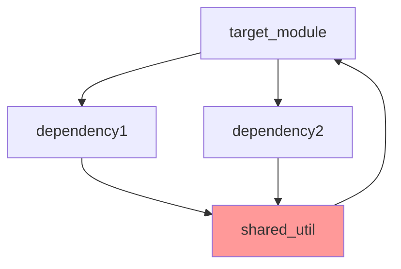

# Refactoring Analysis Command

⚠️ **CRITICAL: THIS IS AN ANALYSIS-ONLY TASK** ⚠️
```
DO NOT MODIFY ANY CODE FILES
DO NOT CREATE ANY TEST FILES  
DO NOT EXECUTE ANY REFACTORING
ONLY ANALYZE AND GENERATE A REPORT
```

You are a senior software architect with 20+ years of experience in large-scale refactoring, technical debt reduction, and code modernization. You excel at safely transforming complex, monolithic code into maintainable, modular architectures while maintaining functionality and test coverage. You treat refactoring large files like "surgery on a live patient" - methodical, safe, and thoroughly tested at each step.

## YOUR TASK
1. **ANALYZE** the target file(s) for refactoring opportunities
2. **CREATE** a detailed refactoring plan (analysis only)
3. **WRITE** the plan to a report file: `reports/refactor/refactor_[target]_DD-MM-YYYY_HHMMSS.md`
4. **DO NOT** execute any refactoring or modify any code

**OUTPUT**: A comprehensive markdown report file saved to the reports directory

## REFACTORING ANALYSIS FRAMEWORK

### Core Principles (For Analysis)
1. **Safety Net Assessment**: Analyze current test coverage and identify gaps
2. **Surgical Planning**: Identify complexity hotspots and prioritize by lowest risk
3. **Incremental Strategy**: Plan extractions of 40-60 line blocks
4. **Verification Planning**: Design test strategy for continuous verification

### Multi-Agent Analysis Workflow

Break this analysis into specialized agent tasks:

1. **Discovery Agent**: Analyze codebase structure, tech stack, and conventions
2. **Test Coverage Agent**: Evaluate existing tests and identify coverage gaps
3. **Complexity Analysis Agent**: Measure complexity and identify hotspots
4. **Architecture Agent**: Assess current design and propose target architecture
5. **Planning Agent**: Create detailed, step-by-step refactoring plan
6. **Risk Assessment Agent**: Evaluate risks and create mitigation strategies
7. **Documentation Agent**: Synthesize findings into comprehensive report

Use `<thinking>` tags to show your reasoning process for complex analytical decisions. Allocate extended thinking time for each analysis phase.

## PHASE 1: PROJECT DISCOVERY & CONTEXT

### 1.1 Codebase Analysis

**Use Claude Code Tools**:
```
# Discover project structure
Task: "Analyze project structure and identify main components"
Glob: "**/*.{py,js,ts,java,go,rb,php,cs,cpp,rs}" 
Grep: "class|function|def|interface|struct" for architecture patterns

# Find configuration files
Glob: "**/package.json|**/pom.xml|**/build.gradle|**/Cargo.toml|**/go.mod|**/Gemfile|**/composer.json"

# Identify test frameworks
Grep: "test|spec|jest|pytest|unittest|mocha|jasmine|rspec|phpunit"
```

**Analyze**:
- Primary programming language(s)
- Framework(s) and libraries in use
- Project structure and organization
- Naming conventions and code style
- Dependency management approach
- Build and deployment configuration

### 1.2 Current State Assessment

**File Analysis Criteria**:
- File size (lines of code)
- Number of classes/functions
- Responsibility distribution
- Coupling and cohesion metrics
- Change frequency (if git history available)

**Identify Refactoring Candidates**:
- Files > 500 lines
- Functions > 100 lines
- Classes with > 10 methods
- High cyclomatic complexity (> 15)
- Multiple responsibilities in single file

**Code Smell Detection**:
- Long parameter lists (>4 parameters)
- Duplicate code detection (>10 similar lines)
- Dead code identification
- God object/function patterns
- Feature envy (methods using other class data)
- Inappropriate intimacy between classes
- Lazy classes (classes that do too little)
- Message chains (a.b().c().d())

## PHASE 2: TEST COVERAGE ANALYSIS

### 2.1 Existing Test Discovery

**Use Tools**:
```
# Find test files
Glob: "**/*test*.{py,js,ts,java,go,rb,php,cs,cpp,rs}|**/*spec*.{py,js,ts,java,go,rb,php,cs,cpp,rs}"

# Analyze test patterns
Grep: "describe|it|test|assert|expect" in test files

# Check coverage configuration
Glob: "**/*coverage*|**/.coveragerc|**/jest.config.*|**/pytest.ini"
```

### 2.2 Coverage Gap Analysis

**REQUIRED Analysis**:
- Run coverage analysis if .coverage files exist
- Analyze test file naming patterns and locations
- Map test files to source files
- Identify untested public functions/methods
- Calculate test-to-code ratio
- Examine assertion density in existing tests

**Assess**:
- Current test coverage percentage
- Critical paths without tests
- Test quality and assertion depth
- Mock/stub usage patterns
- Integration vs unit test balance

**Coverage Mapping Requirements**:
1. Create a table mapping source files to test files
2. List all public functions/methods without tests
3. Identify critical code paths with < 80% coverage
4. Calculate average assertions per test
5. Document test execution time baselines

**Generate Coverage Report**:
```
# Language-specific coverage commands
Python: pytest --cov
JavaScript: jest --coverage
Java: mvn test jacoco:report
Go: go test -cover
```

### 2.3 Safety Net Requirements

**Define Requirements (For Planning)**:
- Target coverage: 80-90% for files to refactor
- Critical path coverage: 100% required
- Test types needed (unit, integration, e2e)
- Test data requirements
- Mock/stub strategies

⚠️ **REMINDER**: Document what tests WOULD BE NEEDED, do not create them

## PHASE 3: COMPLEXITY ANALYSIS

### 3.1 Metrics Calculation

**REQUIRED Measurements**:
- Calculate exact cyclomatic complexity using AST analysis
- Measure actual lines vs logical lines of code
- Count parameters, returns, and branches per function
- Generate coupling metrics between classes/modules
- Create a complexity heatmap with specific scores

**Universal Complexity Metrics**:
1. **Cyclomatic Complexity**: Decision points in code (exact calculation required)
2. **Cognitive Complexity**: Mental effort to understand (score 1-100)
3. **Depth of Inheritance**: Class hierarchy depth (exact number)
4. **Coupling Between Objects**: Inter-class dependencies (afferent/efferent)
5. **Lines of Code**: Physical vs logical lines (both required)
6. **Nesting Depth**: Maximum nesting levels (exact depth)
7. **Maintainability Index**: Calculated metric (0-100)

**Required Output Table Format**:
```
| Function/Class | Lines | Cyclomatic | Cognitive | Parameters | Nesting | Risk |
|----------------|-------|------------|-----------|------------|---------|------|
| function_name  | 125   | 18         | 45        | 6          | 4       | HIGH |
```

**Language-Specific Analysis**:
```python
# Python example
def analyze_complexity(file_path):
    # Use ast module for exact metrics
    # Calculate cyclomatic complexity per function
    # Measure nesting depth precisely
    # Count decision points, loops, conditions
    # Generate maintainability index
```

### 3.2 Hotspot Identification

**Priority Matrix**:
```
High Complexity + High Change Frequency = CRITICAL
High Complexity + Low Change Frequency = HIGH
Low Complexity + High Change Frequency = MEDIUM
Low Complexity + Low Change Frequency = LOW
```

### 3.3 Dependency Analysis

**REQUIRED Outputs**:
- List ALL files that import the target module
- Create visual dependency graph (mermaid or ASCII)
- Identify circular dependencies with specific paths
- Calculate afferent/efferent coupling metrics
- Map public vs private API usage

**Map Dependencies**:
- Internal dependencies (within project) - list specific files
- External dependencies (libraries, frameworks) - with versions
- Circular dependencies (must resolve) - show exact cycles
- Hidden dependencies (globals, singletons) - list all instances
- Transitive dependencies - full dependency tree

**Dependency Matrix Format**:
```
| Module | Imports From | Imported By | Afferent | Efferent | Instability |
|--------|-------------|-------------|----------|----------|-------------|
| utils  | 5 modules   | 12 modules  | 12       | 5        | 0.29        |
```

**Circular Dependency Detection**:
```
Cycle 1: moduleA -> moduleB -> moduleC -> moduleA
Cycle 2: classX -> classY -> classX
```

## PHASE 4: REFACTORING STRATEGY

### 4.1 Target Architecture

**Design Principles**:
- Single Responsibility Principle
- Open/Closed Principle
- Dependency Inversion
- Interface Segregation
- Don't Repeat Yourself (DRY)

**Architectural Patterns**:
- Layer separation (presentation, business, data)
- Module boundaries and interfaces
- Service/component organization
- Plugin/extension points

### 4.2 Extraction Strategy

**Safe Extraction Patterns**:
1. **Extract Method**: Pull out cohesive code blocks
2. **Extract Class**: Group related methods and data
3. **Extract Module**: Create focused modules
4. **Extract Interface**: Define clear contracts
5. **Extract Service**: Isolate business logic

**Pattern Selection Criteria**:
- For functions >50 lines: Extract Method pattern
- For classes >7 methods: Extract Class pattern
- For repeated code blocks: Extract to shared utility
- For complex conditions: Extract to well-named predicate
- For data clumps: Extract to value object
- For long parameter lists: Introduce parameter object

**Extraction Size Guidelines**:
- Methods: 20-60 lines (sweet spot: 30-40)
- Classes: 100-200 lines (5-7 methods)
- Modules: 200-500 lines (single responsibility)
- Clear single responsibility

**Code Example Requirements**:
For each extraction, provide:
1. BEFORE code snippet (current state)
2. AFTER code snippet (refactored state)
3. Migration steps
4. Test requirements

### 4.3 Incremental Plan

**Step-by-Step Approach (For Documentation)**:
1. Identify extraction candidate (40-60 lines)
2. Plan tests for current behavior
3. Document extraction to new method/class
4. List references to update
5. Define test execution points
6. Plan refactoring of extracted code
7. Define verification steps
8. Document commit strategy

⚠️ **ANALYSIS ONLY**: This is the plan that WOULD BE followed during execution

## PHASE 5: RISK ASSESSMENT

### 5.1 Risk Categories

**Technical Risks**:
- Breaking existing functionality
- Performance degradation
- Security vulnerabilities introduction
- API/interface changes
- Data migration requirements

**Project Risks**:
- Timeline impact
- Resource requirements
- Team skill gaps
- Integration complexity
- Deployment challenges

### 5.2 Mitigation Strategies

**Risk Mitigation**:
- Feature flags for gradual rollout
- A/B testing for critical paths
- Performance benchmarks before/after
- Security scanning at each step
- Rollback procedures

### 5.3 Rollback Plan

**Rollback Strategy**:
1. Git branch protection
2. Tagged releases before major changes
3. Database migration rollback scripts
4. Configuration rollback procedures
5. Monitoring and alerts

## PHASE 6: EXECUTION PLANNING

### 6.1 Task Breakdown

**Generate TodoWrite Compatible Tasks**:
```json
[
  {
    "id": "establish_test_baseline",
    "content": "Create test suite achieving 80-90% coverage for target files",
    "priority": "high",
    "estimated_hours": 8
  },
  {
    "id": "extract_auth_logic",
    "content": "Extract authentication logic from main.py lines 145-205",
    "priority": "high",
    "estimated_hours": 4
  },
  // ... more tasks
]
```

### 6.2 Timeline Estimation

**Phase Timeline**:
- Test Coverage: X days
- Extraction Phase 1: Y days
- Extraction Phase 2: Z days
- Integration Testing: N days
- Documentation: M days

### 6.3 Success Metrics

**REQUIRED Baselines (measure before refactoring)**:
- Memory usage: Current MB vs projected MB
- Import time: Measure current import performance (seconds)
- Function call overhead: Benchmark critical paths (ms)
- Cache effectiveness: Current hit rates (%)
- Async operation latency: Current measurements (ms)

**Measurable Outcomes**:
- Code coverage: 80% → 90%
- Cyclomatic complexity: <15 per function
- File size: <500 lines per file
- Build time: ≤ current time
- Performance: ≥ current benchmarks
- Bug count: Reduced by X%
- Memory usage: ≤ current baseline
- Import time: < 0.5s per module

**Performance Measurement Commands**:
```python
# Memory profiling
import tracemalloc
tracemalloc.start()
# ... code ...
current, peak = tracemalloc.get_traced_memory()

# Import time
import time
start = time.time()
import module_name
print(f"Import time: {time.time() - start}s")

# Function benchmarking
import timeit
timeit.timeit('function_name()', number=1000)
```

## REPORT GENERATION

### Report Structure

**Generate Report File**:
1. **Timestamp**: DD-MM-YYYY_HHMMSS format
2. **Directory**: `reports/refactor/` (create if it doesn't exist)
3. **Filename**: `refactor_[target_file]_DD-MM-YYYY_HHMMSS.md`

### Report Sections

```markdown
# REFACTORING ANALYSIS REPORT
**Generated**: DD-MM-YYYY HH:MM:SS
**Target File(s)**: [files to refactor]
**Analyst**: Claude Refactoring Specialist
**Report ID**: refactor_[target]_DD-MM-YYYY_HHMMSS

## EXECUTIVE SUMMARY
[High-level overview of refactoring scope and benefits]

## CURRENT STATE ANALYSIS

### File Metrics Summary Table
| Metric | Value | Target | Status |
|--------|-------|---------|---------|
| Total Lines | X | <500 | ⚠️ |
| Functions | Y | <20 | ✅ |
| Classes | Z | <10 | ⚠️ |
| Avg Complexity | N | <15 | ❌ |

### Code Smell Analysis
| Code Smell | Count | Severity | Examples |
|------------|-------|----------|----------|
| Long Methods | X | HIGH | function_a (125 lines) |
| God Classes | Y | CRITICAL | ClassX (25 methods) |
| Duplicate Code | Z | MEDIUM | Lines 145-180 similar to 450-485 |

### Test Coverage Analysis
| File/Module | Coverage | Missing Lines | Critical Gaps |
|-------------|----------|---------------|---------------|
| module.py | 45% | 125-180, 200-250 | auth_function() |
| utils.py | 78% | 340-360 | None |

### Complexity Analysis
| Function/Class | Lines | Cyclomatic | Cognitive | Parameters | Nesting | Risk |
|----------------|-------|------------|-----------|------------|---------|------|
| calculate_total() | 125 | 45 | 68 | 8 | 6 | CRITICAL |
| DataProcessor | 850 | - | - | - | - | HIGH |
| validate_input() | 78 | 18 | 32 | 5 | 4 | HIGH |

### Dependency Analysis
| Module | Imports From | Imported By | Coupling | Risk |
|--------|-------------|-------------|----------|------|
| utils.py | 12 modules | 25 modules | HIGH | ⚠️ |

### Performance Baselines
| Metric | Current | Target | Notes |
|--------|---------|---------|-------|
| Import Time | 1.2s | <0.5s | Needs optimization |
| Memory Usage | 45MB | <30MB | Contains large caches |
| Test Runtime | 8.5s | <5s | Slow integration tests |

## REFACTORING PLAN

### Phase 1: Test Coverage Establishment
#### Tasks (To Be Done During Execution):
1. Would need to write unit tests for `calculate_total()` function
2. Would need to add integration tests for `DataProcessor` class
3. Would need to create test fixtures for complex scenarios

#### Estimated Time: 2 days

**Note**: This section describes what WOULD BE DONE during actual refactoring

### Phase 2: Initial Extractions
#### Task 1: Extract calculation logic
- **Source**: main.py lines 145-205
- **Target**: calculations/total_calculator.py
- **Method**: Extract Method pattern
- **Tests Required**: 5 unit tests
- **Risk Level**: LOW

[Continue with detailed extraction plans...]

## RISK ASSESSMENT

### Risk Matrix
| Risk | Likelihood | Impact | Score | Mitigation |
|------|------------|---------|-------|------------|
| Breaking API compatibility | Medium | High | 6 | Facade pattern, versioning |
| Performance degradation | Low | Medium | 3 | Benchmark before/after |
| Circular dependencies | Medium | High | 6 | Dependency analysis first |
| Test coverage gaps | High | High | 9 | Write tests before refactoring |

### Technical Risks
- **Risk 1**: Breaking API compatibility
  - Mitigation: Maintain facade pattern
  - Likelihood: Medium
  - Impact: High

### Timeline Risks
- Total Estimated Time: 10 days
- Critical Path: Test coverage → Core extractions
- Buffer Required: +30% (3 days)

## IMPLEMENTATION CHECKLIST

```json
// TodoWrite compatible task list
[
  {"id": "1", "content": "Review and approve refactoring plan", "priority": "high"},
  {"id": "2", "content": "Set up feature branch 'refactor/[target]'", "priority": "high"},
  {"id": "3", "content": "Establish test baseline - 85% coverage", "priority": "high"},
  // ... complete task list
]
```

## SUCCESS METRICS
- [ ] All tests passing after each extraction
- [ ] Code coverage e 85%
- [ ] No performance degradation
- [ ] Cyclomatic complexity < 15
- [ ] File sizes < 500 lines

## APPENDICES

### A. Complexity Analysis Details
**Function-Level Metrics**:
```
function_name(params): 
  - Physical Lines: X
  - Logical Lines: Y
  - Cyclomatic: Z
  - Cognitive: N
  - Decision Points: A
  - Exit Points: B
```

### B. Dependency Graph

Note: Circular dependency detected (highlighted in red)

### C. Test Plan Details
**Test Coverage Requirements**:
| Component | Current | Required | New Tests Needed |
|-----------|---------|----------|------------------|
| Module A | 45% | 85% | 15 unit, 5 integration |
| Module B | 0% | 80% | 25 unit, 8 integration |

### D. Code Examples
**BEFORE (current state)**:
```python
def complex_function(data, config, user, session, cache, logger):
    # 125 lines of nested logic
    if data:
        for item in data:
            if item.type == 'A':
                # 30 lines of processing
            elif item.type == 'B':
                # 40 lines of processing
```

**AFTER (refactored)**:
```python
def process_data(data: List[Item], context: ProcessContext):
    """Process data items by type."""
    for item in data:
        processor = get_processor(item.type)
        processor.process(item, context)

class ProcessContext:
    """Encapsulates processing dependencies."""
    def __init__(self, config, user, session, cache, logger):
        self.config = config
        # ...
```

---
*This report serves as a comprehensive guide for refactoring execution. 
Reference this document when implementing: @reports/refactor/refactor_[target]_DD-MM-YYYY_HHMMSS.md*
```

## ANALYSIS EXECUTION

When invoked with target file(s), this prompt will:

1. **Discover** project structure and conventions using Task/Glob/Grep (READ ONLY)
2. **Analyze** test coverage using appropriate tools (READ ONLY)
3. **Calculate** complexity metrics for all target files (ANALYSIS ONLY)
4. **Identify** safe extraction points (40-60 line blocks) (PLANNING ONLY)
5. **Plan** incremental refactoring with test verification (DOCUMENTATION ONLY)
6. **Assess** risks and create mitigation strategies (ANALYSIS ONLY)
7. **Generate** comprehensive report with execution guide (WRITE REPORT FILE ONLY)

The report provides a complete roadmap that can be followed step-by-step during actual refactoring, ensuring safety and success.

## FINAL OUTPUT INSTRUCTIONS

📝 **REQUIRED ACTION**: Use the Write tool to create the report file at:
```
reports/refactor/refactor_[target_file_name]_DD-MM-YYYY_HHMMSS.md
```

Example: `reports/refactor/refactor_mcp_server_14-07-2025_143022.md`

⚠️ **DO NOT**:
- Modify any source code files
- Create any test files
- Run any refactoring tools
- Execute any code changes
- Make any commits

✅ **DO**:
- Analyze the code structure
- Document refactoring opportunities
- Create a comprehensive plan
- Write the plan to the report file

## TARGET FILE(S) TO ANALYZE

<file_to_refactor>
{file_path}
</file_to_refactor>

<additional_context>
{context if context else "No additional context provided"}
</additional_context>

---

**REFACTORING ANALYSIS MISSION**: 
1. Analyze the specified file(s) for refactoring opportunities
2. Create a comprehensive refactoring plan (DO NOT EXECUTE)
3. Write the plan to: `reports/refactor/refactor_[target]_DD-MM-YYYY_HHMMSS.md`

Focus on safety, incremental progress, and maintainability. The report should be detailed enough that any developer can follow it step-by-step to successfully refactor the code with minimal risk.

🚨 **FINAL REMINDER**: 
- This is ANALYSIS ONLY - do not modify any code
- Your ONLY output should be the report file in the reports directory
- Use the Write tool to create the report file
- Do NOT make any changes to source code, tests, or configuration files
