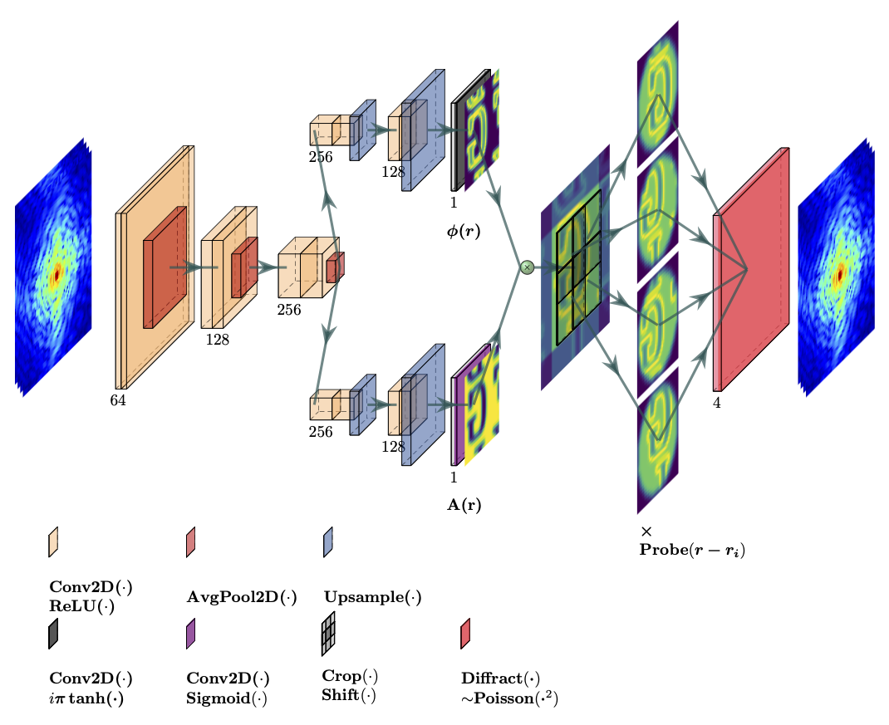

# Physics constrained machine learning for rapid, high resolution diffractive imaging

This repository contains the codebase for the methods presented in the papers "[Physics Constrained Unsupervised Deep Learning for Rapid, High Resolution Scanning Coherent Diffraction Reconstruction](https://www.nature.com/articles/s41598-023-48351-7)" and "[Towards generalizable deep ptychography neural networks](https://arxiv.org/pdf/2509.25104)".

## Overview
PtychoPINN is a library of self-supervised neural networks for ptychography reconstruction. Its main features are its speed (relative to iterative solvers) and high resolution (relative to other ML methods).

## For Developers

Start with the **[Unified Developer Guide](./docs/DEVELOPER_GUIDE.md)** for architecture, data flow, and development conventions.

### Dual-Backend Architecture

PtychoPINN supports both TensorFlow and PyTorch backends:

- **Default Backend**: TensorFlow remains the default for backward compatibility.
- **PyTorch Backend**: PyTorch implementation is available via Lightning orchestration (`ptycho_torch/workflows/components.py`) with training, checkpointing, inference, and stitching.
- **Backend Selection**: Configure backend choice through `TrainingConfig.backend` or `InferenceConfig.backend` fields (`'tensorflow'` or `'pytorch'`). 

<!---
*Fig. 1: Caption for the figure.*
 -->

## Installation
`conda create -n ptycho python=3.10`

`conda activate ptycho`

`pip install .`

## Usage
### Training
`ptycho_train --train_data_file <train_path.npz> --test_data_file <test_path.npz> --output_dir <my_run>`

### Inference 
`ptycho_inference --model_path <my_run> --test_data <test_path.npz> --output_dir <inference_out>`

### Workflow Status

#### Use These by Default
- Train with `scripts/training/train.py` (or `ptycho_train`).
- Run inference with `scripts/inference/inference.py` (or `ptycho_inference`).
- Pick backend with `--backend tensorflow` or `--backend pytorch`.
- Use `--n_groups` for sample count. Add `--n_subsample` only when you want separate subsampling control.
- For PyTorch execution flags:
  - Unified scripts: use `--torch-accelerator` and `--torch-logger`
  - PyTorch-native CLIs: use `--accelerator` and `--logger`

#### Also Supported
- Grid-lines multi-model runs:
  - `scripts/studies/grid_lines_compare_wrapper.py`
- Grid-lines Torch runner:
  - `scripts/studies/grid_lines_torch_runner.py`
  - Architectures: `fno`, `hybrid`, `stable_hybrid`, `fno_vanilla`, `hybrid_resnet`

#### Older Flags and Modes
- `--n_images` in training is older; use `--n_groups`.
- PyTorch `--device` and `--disable_mlflow` are older; use `--accelerator` and `--logger none`.
- MLflow-only inference mode in `ptycho_torch/inference.py` (`--run_id`, `--infer_dir`) is still available, but not the default path.

See examples and READMEs under scripts/.

<!-- 
* subpixel convolution (Depth-to-space)
* make the model robust to arbitrary scaling/incorrect normalization of the diffracted intensity
* other ideas: fft based loss, gradient loss, vq-vae https://www.tensorflow.org/tutorials/generative/style_transfer#define_content_and_style_representations
* probe-based vs reconstruction-based support?

* Fully Convolutional Networks for Semantic Segmentation, explore and discuss. Make a slide explaining the idea.
* Try MC Dropout https://arxiv.org/pdf/1511.02680.pdf
* read deep ensembles https://arxiv.org/pdf/1612.01474.pdf

* hard constraint on diffraction norm using projection, consider tf.keras.constraints.MinMaxNorm
* stochastic probe
* probe symmetry consequences
* add an object normalization layer that uses the L2 norm
* how do super resolution models handle high resolutions?
* shift invariance
* grid permutation
* fourier ring correlation

* characterize robustness impact of Poisson likelihood vs. MAE
 -->
