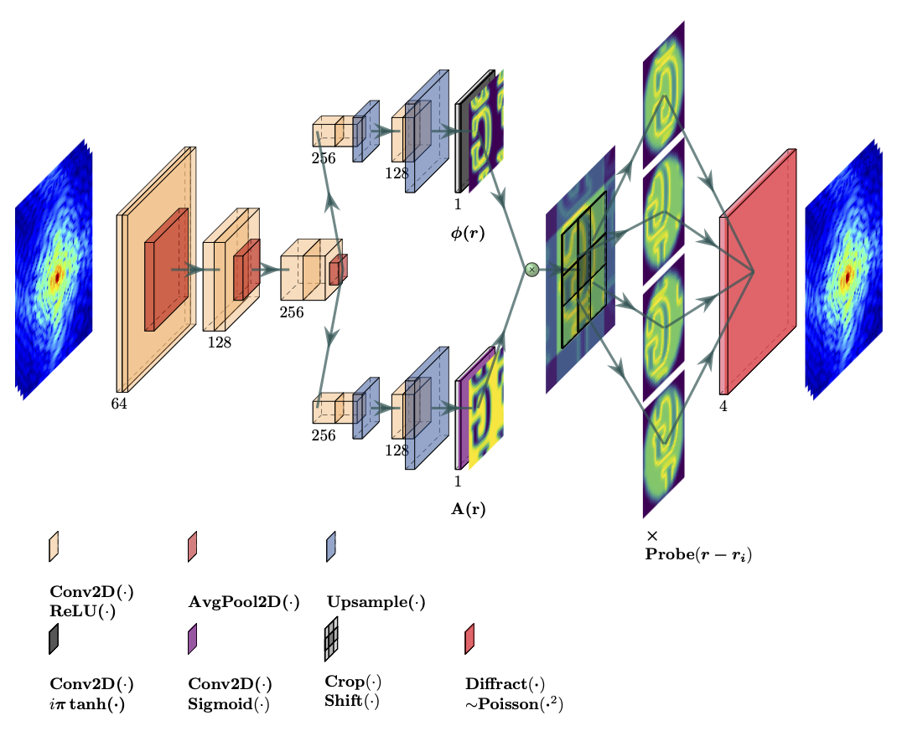

# Physics constrained machine learning for rapid, high resolution diffractive imaging

## Papers

- [Physics Constrained Unsupervised Deep Learning for Rapid, High Resolution Scanning Coherent Diffraction Reconstruction](https://www.nature.com/articles/s41598-023-48351-7)
- [Towards single-shot coherent imaging via overlap-free ptychography](https://arxiv.org/abs/2602.21361)
- [Contrast-invariant deep ptychography neural networks](https://arxiv.org/abs/2608.02869)

## Overview
PtychoPINN is an unsupervised, physics-informed neural network method for scanning CDI reconstruction. It combines the diffraction forward model with real-space overlap constraints.

## Features
- **Unsupervised / self-supervised learning**: Does not require large labeled datasets.
- **Resolution**: Reported gains include about 10 dB PSNR and 3x to 6x improvement in linear resolution.
- **Speed**: Runs much faster than iterative scanning CDI reconstruction.

### Dual-Backend Architecture

PtychoPINN supports both TensorFlow and PyTorch backends:

- **Default Backend**: TensorFlow remains the default for backward compatibility.
- **PyTorch Backend**: Lightning-based implementation under `ptycho_torch/` with training, checkpointing, inference, and stitching. Model architectures (CNN, FNO, FFNO, hybrid variants, and more) are selected through a generator registry.
- **Backend Selection**: Configure through `TrainingConfig.backend` / `InferenceConfig.backend` (`'tensorflow'` or `'pytorch'`), or use the PyTorch-native CLIs directly (`python -m ptycho_torch.train`, `python -m ptycho_torch.inference`). See the [PyTorch Workflow Guide](./docs/workflows/pytorch.md) for configuration details.

Both backends share core configuration and data contracts; backend- and
measurement-specific paths validate their resolved contract explicitly.



## Documentation

- **[Documentation hub](./docs/index.md)** — complete map of guides, specs, and workflows.
- **[Developer Guide](./docs/DEVELOPER_GUIDE.md)** — architecture, data flow, and development conventions.
- **[Commands Reference](./docs/COMMANDS_REFERENCE.md)** — CLI recipes for training, inference, evaluation, and tests.

## Installation

```bash
conda create -n ptycho python=3.11
conda activate ptycho
pip install .
```

**Note:** This will automatically install PyTorch >= 2.2 as a required dependency. For GPU acceleration with specific CUDA versions, you may want to install PyTorch manually first following the [official PyTorch installation guide](https://pytorch.org/get-started/locally/), then run `pip install .`

## Usage

The [Run1084 FFNO notebook](./examples/Run1084_ffno.ipynb) demonstrates the
programmatic PyTorch workflow on `datasets/Run1084_recon3_postPC_shrunk_3.npz`.

### Train

```python
from ptycho_torch.train import train

data = "datasets/Run1084_recon3_postPC_shrunk_3.npz"
model = train(data, "outputs/run1084_ffno", {
    "architecture": "ffno",
    "fno_modes": 12,
    "fno_width": 32,
    "fno_blocks": 4,
    "training_groups": 512,
    "nphotons": 1e9,
    "epochs": 50,
})
```

### Reconstruct

```python
from ptycho_torch.inference import reconstruct

result = reconstruct(model, data, device="cuda")
```

### Plot

```python
import matplotlib.pyplot as plt

figure, axes = plt.subplots(1, 2)

im0 = axes[0].imshow(result.amplitude, cmap="gray", vmin=0.015)
figure.colorbar(im0, ax=axes[0], fraction=0.046, pad=0.04)

im1 = axes[1].imshow(result.phase, cmap="twilight")
figure.colorbar(im1, ax=axes[1], fraction=0.046, pad=0.04)

plt.show()
```

### Inspect the saved configuration

```python
from dataclasses import asdict
from pprint import pprint
from ptycho_torch.workflows.components import load_inference_bundle_torch

models, loaded_config = load_inference_bundle_torch(model.parent)
trained_model = models["diffraction_to_obj"]

pprint(asdict(trained_model.model_config))
pprint(asdict(trained_model.inference_config))
```

## Citation

If you use this code in your research, please cite:

```bibtex
@article{Hoidn2023,
  author  = {Hoidn, Oliver and Mishra, Aashwin Ananda and Mehta, Apurva},
  title   = {Physics constrained unsupervised deep learning for rapid, high resolution scanning coherent diffraction reconstruction},
  journal = {Scientific Reports},
  volume  = {13},
  pages   = {22789},
  year    = {2023},
  doi     = {10.1038/s41598-023-48351-7}
}
```

## License

This project is licensed under the GNU General Public License v3.0 — see the
[LICENSE](./LICENSE) file for details.
