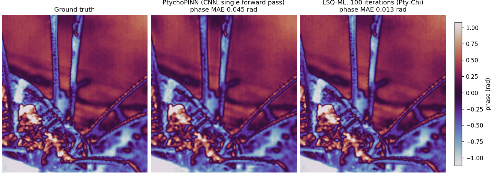
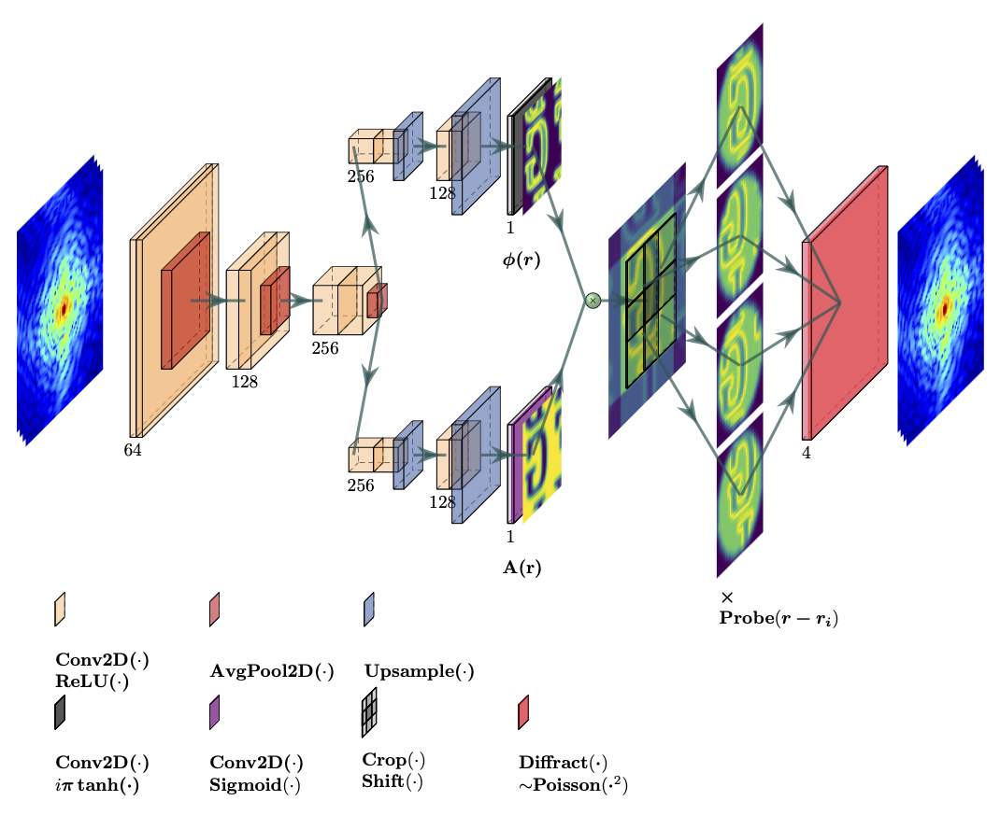

# PtychoPINN: physics-constrained deep learning for rapid, high-resolution diffractive imaging

PtychoPINN reconstructs the complex object (amplitude and phase) of a
ptychography or scanning coherent diffraction imaging (CDI) scan with a neural
network trained **without ground-truth objects**. The network's output is pushed
through the diffraction forward model and compared with the measured intensities,
and the real-space overlap between neighbouring scan positions ties the patches
together. Once trained, a reconstruction is a single forward pass per diffraction
pattern, orders of magnitude faster than iterative solvers.



*Phase of one synthetic test object (2,048 diffraction patterns, 128×128
pixels, a measured probe, Poisson counts) reconstructed by a PtychoPINN CNN in
a single forward pass and by 100 iterations of LSQ-ML (Pty-Chi) with the same
probe; the CNN was trained without seeing this object or any ground truth.
Wrapped-phase MAE against the truth on the illuminated support: 0.045 rad and
0.013 rad. The object's amplitude is within 0.4 % of unity and is not shown.*



## Papers

| Year | Paper | What it adds |
|---|---|---|
| 2023 | [Physics constrained unsupervised deep learning for rapid, high resolution scanning coherent diffraction reconstruction](https://www.nature.com/articles/s41598-023-48351-7), *Scientific Reports* 13, 22789 | The method: a physics-informed, unsupervised PINN for ptychography. About 10 dB PSNR and 3–6× linear resolution over the supervised baseline, at hundreds of times the throughput of iterative reconstruction. |
| 2025 | [Towards generalizable deep ptychography neural networks](https://arxiv.org/abs/2509.25104), *npj Computational Materials* | One model across beamlines: unsupervised training on measured probes with synthetic objects transfers to several instruments at the quality of models trained on each experiment. |
| 2026 | [A unified self-supervised framework for single-frame Fresnel CDI and overlapped ptychography](https://arxiv.org/abs/2602.21361), *Optics Express* | Single-frame Fresnel CDI and overlapped ptychography under one self-supervised framework with a fixed probe; 36× faster than iterative reconstruction and more photon-efficient at low dose. |
| 2026 | [Contrast-invariant deep ptychography neural networks](https://arxiv.org/abs/2608.02869), *Optics Express* | Factorises learned object texture from measurement scale by predicting real and imaginary parts; up to 5× lower Fourier error across experimental datasets. |

## Features

- **Unsupervised.** Training needs diffraction patterns, scan positions, and a
  probe estimate; no reconstructed objects.
- **Physics in the loss.** The forward model (probe × object, far-field
  propagation, Poisson or amplitude likelihood) and the overlap constraint
  are part of the network, so the output is consistent with the data.
- **Fast inference.** One forward pass per pattern; a full scan reconstructs
  in seconds on one GPU.
- **Several generators.** `cnn` (default U-Net), `ffno`, `fno`,
  `fno_vanilla`, and `neuralop_uno`, selected by one configuration field;
  see [the generator README](./ptycho_torch/generators/README.md) and
  [adding an architecture](./docs/workflows/custom_torch_architecture.md).
- **Two backends.** A PyTorch Lightning implementation under `ptycho_torch/`
  (training, checkpointing, inference, stitching) and the original TensorFlow
  implementation under `ptycho/`. `TrainingConfig.backend` /
  `InferenceConfig.backend` select `'tensorflow'` (the default, for backward
  compatibility) or `'pytorch'`; the PyTorch API and CLIs below use the
  PyTorch backend directly. Both share the configuration and data contracts.

## Installation

Python 3.10 or 3.11. The package installs both PyTorch (≥ 2.2) and TensorFlow.

```bash
git clone --recurse-submodules https://github.com/hoidn/PtychoPINN.git
cd PtychoPINN
conda create -n ptycho python=3.11
conda activate ptycho
pip install .
```

For a specific CUDA build, install PyTorch first following the
[PyTorch instructions](https://pytorch.org/get-started/locally/), then run
`pip install .`. The submodules provide the FRC resolution metric
(`ptycho/FRC`) and the PtychoNN baseline (`PtychoNN`); if you cloned without
them, run `git submodule update --init --recursive`.

## Quick start

The repository ships an experimental dataset,
`datasets/Run1084_recon3_postPC_shrunk_3.npz` (35 MB), and the
[Run1084 FFNO notebook](./examples/Run1084_ffno.ipynb) that runs the steps
below; [`examples/programmatic_torch.py`](./examples/programmatic_torch.py) is
the same workflow as a script with the default CNN.

### Train

```python
from ptycho_torch.train import train

data = "datasets/Run1084_recon3_postPC_shrunk_3.npz"
model = train(data, "outputs/run1084_ffno", {
    "architecture": "ffno",
    "fno_modes": 12,
    "fno_width": 32,
    "fno_blocks": 4,
    "training_groups": 512,
    "nphotons": 1e9,
    "epochs": 50,
})
```

`train` returns the path of the saved model bundle (`wts.h5.zip`). The
settings dictionary uses the Torch resolver names (`architecture`,
`training_groups`, `nphotons`, `epochs`, …); the complete table is in the
[Configuration Guide](./docs/CONFIGURATION.md).

### Reconstruct

```python
from ptycho_torch.inference import reconstruct

result = reconstruct(model, data, device="cuda")
```

`result.amplitude` and `result.phase` are the stitched object arrays.
`reconstruct(..., patch_phase_alignment="overlap")` fits one phase constant
per patch from the overlaps before stitching.

### Plot

```python
import matplotlib.pyplot as plt

figure, axes = plt.subplots(1, 2)

im0 = axes[0].imshow(result.amplitude, cmap="gray", vmin=0.015)
figure.colorbar(im0, ax=axes[0], fraction=0.046, pad=0.04)

im1 = axes[1].imshow(result.phase, cmap="twilight")
figure.colorbar(im1, ax=axes[1], fraction=0.046, pad=0.04)

plt.show()
```

### Inspect the saved configuration

```python
from dataclasses import asdict
from pprint import pprint
from ptycho_torch.workflows.components import load_inference_bundle_torch

models, loaded_config = load_inference_bundle_torch(model.parent)
trained_model = models["diffraction_to_obj"]

pprint(asdict(trained_model.model_config))
pprint(asdict(trained_model.inference_config))
```

### Command line

The same training entry point is available as a CLI, and a synthetic
end-to-end pipeline (simulation, training, reconstruction, evaluation) is
installed as `ptycho_synthetic`:

```bash
python -m ptycho_torch.train --train_data_file datasets/Run1084_recon3_postPC_shrunk_3.npz \
    --output_dir outputs/run1084_cli --max_epochs 50 --device cuda
python -m ptycho_torch.inference --help
ptycho_synthetic --output-root outputs/synthetic
```

All commands, flags, and test selectors are in the
[Commands Reference](./docs/COMMANDS_REFERENCE.md).

## Your own data

Training and inference read a flat NPZ with:

| Key | Contents |
|---|---|
| `diffraction` | `[N, H, W]` float, diffraction **amplitudes** (square root of counts) |
| `xcoords`, `ycoords` | `[N]` scan positions in object pixels |
| `probeGuess` | `[H, W]` complex probe estimate |
| `objectGuess` | complex object, used for evaluation when available |
| `scan_index` | `[N]` integer scan membership |

The contract, including the Ptychodus HDF5 product format, is in
[`specs/data_contracts.md`](./specs/data_contracts.md); normalisation and
photon-count conventions are in the
[Data Normalization Guide](./docs/DATA_NORMALIZATION_GUIDE.md), and the
[FLY64 Dataset Guide](./docs/FLY64_DATASET_GUIDE.md) walks through one
experimental dataset end to end.

## Documentation

- [PyTorch Workflow Guide](./docs/workflows/pytorch.md): configuration,
  training, inference, and stitching with the PyTorch backend.
- [Commands Reference](./docs/COMMANDS_REFERENCE.md): CLI recipes for
  training, inference, evaluation, sampling, and tests.
- [Configuration Guide](./docs/CONFIGURATION.md): every configuration field
  and its default.
- [Adding a PyTorch generator architecture](./docs/workflows/custom_torch_architecture.md).
- [Sampling examples](./examples/sampling/README.md): dense and sparse
  grouping of scan positions, memory-constrained runs.
- [Ptychodus API specification](./specs/ptychodus_api_spec.md): the interface
  used by the [Ptychodus](https://github.com/AdvancedPhotonSource/ptychodus)
  plugin.

## Citation

If you use this code, please cite the method paper and, where relevant, the
paper describing the component you use:

```bibtex
@article{Hoidn2023,
  author  = {Hoidn, Oliver and Mishra, Aashwin Ananda and Mehta, Apurva},
  title   = {Physics constrained unsupervised deep learning for rapid, high resolution scanning coherent diffraction reconstruction},
  journal = {Scientific Reports},
  volume  = {13},
  pages   = {22789},
  year    = {2023},
  doi     = {10.1038/s41598-023-48351-7}
}

@article{Vong2025,
  author  = {Vong, Albert and Henke, Steven and Hoidn, Oliver and Ruth, Hanna and Deng, Junjing and Hexemer, Alexander and Shapiro, David and Mehta, Apurva and Gleason, Arianna and Hancock, Levi and Schwarz, Nicholas},
  title   = {Towards generalizable deep ptychography neural networks},
  journal = {npj Computational Materials},
  year    = {2025},
  eprint  = {2509.25104},
  archivePrefix = {arXiv}
}

@article{Hoidn2026,
  author  = {Hoidn, Oliver and Henke, Steven and Vong, Albert and Mishra, Aashwin and Mehta, Apurva and Seaberg, Matthew},
  title   = {A unified self-supervised framework for single-frame {Fresnel} {CDI} and overlapped ptychography},
  journal = {Optics Express},
  year    = {2026},
  eprint  = {2602.21361},
  archivePrefix = {arXiv}
}

@article{Vong2026,
  author  = {Vong, Albert and Henke, Steven and Hoidn, Oliver and Ruth, Hanna and Deng, Junjing and Mehta, Apurva and Shapiro, David and Hexemer, Alexander and Schwarz, Nicholas},
  title   = {Contrast-invariant deep ptychography neural networks},
  journal = {Optics Express},
  year    = {2026},
  eprint  = {2608.02869},
  archivePrefix = {arXiv}
}
```

## License

GNU General Public License v3.0; see [LICENSE](./LICENSE).
