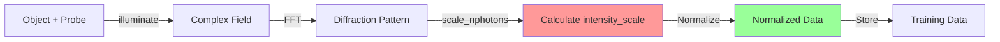
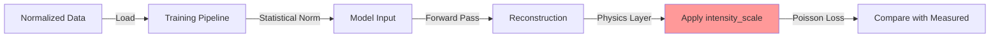

# Data Normalization Guide for PtychoPINN

## Overview

This guide clarifies the three distinct types of normalization used in PtychoPINN and explains when and where each is applied. Understanding these conventions is critical for correctly implementing new features or modifying the data pipeline.

## The Three Types of Normalization

### 1. Physics Normalization (`intensity_scale`)

**Purpose:** Scales simulated diffraction patterns to match realistic experimental photon counts for accurate Poisson noise modeling.

**Key Characteristics:**
- Calculated but NOT applied to internal data
- Used ONLY in the physics loss layer during training
- Controlled by the `nphotons` parameter
- Essential for realistic noise simulation

**Where it's used:**
```python
# In diffsim.py - calculate but don't apply
intensity_scale = scale_nphotons(Y_I * probe_amplitude)  # Calculate factor
X, Y_I, Y_phi = X, Y_I / intensity_scale, Y_phi  # Normalize for pipeline

# In model.py - apply during physics loss calculation
simulated = self.physics_layer(reconstructed) * intensity_scale  # Apply for loss
loss = poisson_nll(measured, simulated)
```

**Critical Convention:** Internal data remains normalized throughout the pipeline. The intensity_scale is only applied at the physics boundary (loss calculation).

### 2. Statistical Normalization (`normalize_data`)

**Purpose:** Preprocesses data for stable neural network training using standard ML techniques.

**Key Characteristics:**
- Zero mean, unit variance normalization
- Applied to training data before model input
- Improves gradient flow and convergence
- Standard deep learning practice

**Where it's used:**
```python
# In loader.py
if normalize_data:
    mean = np.mean(data)
    std = np.std(data)
    data = (data - mean) / std
```

**Important:** This is completely separate from physics normalization and should not be confused with intensity scaling.

### 3. Display/Comparison Scaling

**Purpose:** Adjusts data values for visualization and metric calculation without affecting training.

**Key Characteristics:**
- Applied only for plots, images, and comparisons
- Never affects training or physics calculations
- Can be adjusted for visual clarity

**Where it's used:**
```python
# In visualization code
display_data = data * display_scale  # For better contrast
plt.imshow(display_data, vmin=0, vmax=1)

# In comparison metrics
aligned_recon = align_and_scale(reconstruction, ground_truth)
```

## Data Pipeline Architecture

### Simulation Workflow



**Key Points:**
1. `scale_nphotons` calculates the scaling factor but doesn't apply it
2. Data is stored in normalized form
3. Scaling is applied only during physics loss calculation

### Training Workflow



## Common Pitfalls and Solutions

### Pitfall 1: Applying intensity_scale in data loading

**Wrong:**
```python
# In raw_data.py - DON'T DO THIS
X_scaled = X * norm_Y_I
return RawData(..., X_scaled, ...)
```

**Right:**
```python
# Keep data normalized
return RawData(..., X, ...)  # Return normalized data
```

**Why:** Applying scaling in data loading breaks workflows like `prepare.sh` that expect normalized data.

### Pitfall 2: Confusing nphotons effect

**Misconception:** "Setting nphotons=1e3 should make the data values smaller"

**Reality:** nphotons affects the noise statistics in the Poisson loss, not the data values themselves.

**Correct understanding:**
- Data values remain normalized
- Low nphotons → higher relative noise in Poisson model
- High nphotons → lower relative noise (approaches Gaussian)

### Pitfall 3: Double-scaling in prepare.sh workflow

**Issue:** The prepare.sh workflow includes its own normalization step. Applying intensity_scale before prepare.sh would result in double-scaling.

**Solution:** Keep raw_data.py returning normalized data. Let prepare.sh handle any workflow-specific normalization.

## Module Responsibilities

### diffsim.py
- Calculates intensity_scale
- Returns normalized data
- Documents that scaling is for physics loss only

### raw_data.py
- Maintains normalized data throughout
- Never applies intensity_scale
- Passes nphotons parameter for correct calculation

### model.py
- Applies intensity_scale in physics loss layer
- Handles Poisson noise modeling
- Keeps reconstruction in normalized space

### PyTorch backend
- Derives a dataset-level `intensity_scale` from normalized training amplitudes and resolved `nphotons`
- Persists the derived scale in the model bundle (and hparams) and reuses it for inference
- Does not write derived scale back into dataset metadata

### loader.py
- Handles statistical normalization for ML
- Separate from physics normalization
- Optional based on training needs

## Best Practices

1. **Always document which normalization you're using**
   ```python
   # This is PHYSICS normalization for Poisson loss
   intensity_scale = scale_nphotons(data)
   
   # This is STATISTICAL normalization for ML training
   data = normalize_data(data, zero_mean=True)
   
   # This is DISPLAY scaling for visualization
   plt.imshow(data * display_scale)
   ```

2. **Never mix normalization types**
   - Keep physics and statistical normalization separate
   - Apply display scaling only for output

3. **Test with known values**
   ```python
   # Verify normalization behavior
   assert np.mean(normalized_data) < 1.0  # Should be normalized
   assert intensity_scale > 1.0  # Should be a scaling factor
   ```

4. **Use configuration consistently**
   ```python
   # Always get nphotons from config
   nphotons = config.nphotons  # Not hardcoded
   ```

## Validation Checklist

When implementing or modifying normalization:

- [ ] Is the normalization type clearly documented?
- [ ] Is intensity_scale calculated but not applied to internal data?
- [ ] Is nphotons parameter passed correctly through the pipeline?
- [ ] Does prepare.sh workflow still function correctly?
- [ ] Are visualization scalings separate from training data?
- [ ] Do unit tests verify normalization behavior?

## Related Documentation

- <doc-ref type="guide">CLAUDE.md</doc-ref> - Section 6.5 for quick reference
- <doc-ref type="contract">specs/data_contracts.md</doc-ref> - Data format specifications
- <doc-ref type="guide">docs/DEVELOPER_GUIDE.md</doc-ref> - Architectural overview
- <code-ref type="module">ptycho/diffsim.py</code-ref> - Physics simulation implementation
- <code-ref type="module">ptycho/raw_data.py</code-ref> - Data loading implementation
