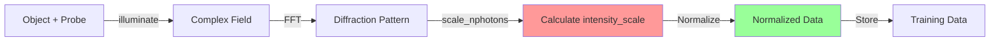
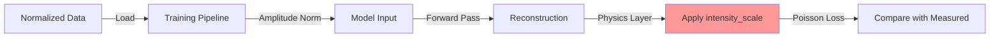

# Data Normalization Guide for PtychoPINN

## Overview

This guide clarifies the three distinct types of normalization used in PtychoPINN and explains when and where each is applied. Understanding these conventions is critical for correctly implementing new features or modifying the data pipeline.

PyTorch rectangular workflows have two versioned contracts. New inputs default to `ci_intensity_v2`/`count_intensity`; historical reproduction uses the explicit pair `legacy_v1`/`normalized_amplitude`. The legacy sections below describe TensorFlow, amplitude-forward, and explicit legacy behavior. They are not the CI absolute-scaling recipe.

## CI Count-Intensity Contract

CI data stores measured detector count intensity and a calibrated physical probe. The probe fixes the object/probe gauge, so inference must use `probe_physical` directly. A normalized training probe may improve conditioning, but its normalization is canceled exactly in the field:

```python
probe_training = q * probe_physical
exit_wave = (1 / q) * probe_training * object_prediction
```

Training statistics are derived once from the finalized training split:

```python
rms_input_scale = sqrt((N / 2) ** 2 / mean_BC(sum_HW(measured_intensity ** 2)))
mean_measured_intensity = mean_BCHW(measured_intensity)
```

CI is enabled only for unsupervised `rectangular_scaled` training with Poisson NLL. MAE is rejected before loading. The Poisson data term is divided by `mean_measured_intensity`; auxiliary object/overlap regularizers are added afterward. Inference uses physical-probe VarPro with the training mask and no `physics_scaling_constant` or training output scale.

## The Three Types of Normalization

### 1. Physics Normalization (`intensity_scale`)

**Purpose:** Scales simulated diffraction patterns to match realistic experimental photon counts for accurate Poisson noise modeling.

**Key Characteristics:**
- Calculated but NOT applied to internal data
- Used ONLY in the physics loss layer during training
- Controlled by the `nphotons` parameter
- Essential for realistic noise simulation

**Where it's used:**
```python
# In diffsim.py - calculate but don't apply
intensity_scale = scale_nphotons(Y_I * probe_amplitude)  # Calculate factor
X, Y_I, Y_phi = X, Y_I / intensity_scale, Y_phi  # Normalize for pipeline

# In model.py - apply during physics loss calculation
simulated = self.physics_layer(reconstructed) * intensity_scale  # Apply for loss
loss = poisson_nll(measured, simulated)
```

**Critical Convention:** Internal data remains normalized throughout the pipeline. The intensity_scale is only applied at the physics boundary (loss calculation).

### 2. Diffraction Amplitude Normalization (`normalize_data`)

**Purpose:** Rescales measured diffraction amplitudes to the canonical PtychoPINN amplitude convention before grouping/model input.

**Key Characteristics:**
- Multiplies each diffraction amplitude stack by a scalar derived from its average squared L2 energy
- Uses the patch size `N` as the target scale: `sqrt(((N / 2) ** 2) / mean(sum(diffraction ** 2)))`
- Applied in the legacy `ptycho.loader.normalize_data()` / `ptycho.raw_data.normalize_data()` path
- Separate from Poisson physics scaling and from any model-internal feature transforms

**Where it's used:**
```python
# In loader.py / raw_data.py
X_full = dset["diffraction"]  # amplitudes, not intensities
norm = np.sqrt(((N / 2) ** 2) / np.mean(np.sum(X_full ** 2, axis=(1, 2))))
X = norm * X_full
```

**Important:** This is completely separate from physics normalization and should not be confused with intensity scaling.

### 3. Display/Comparison Scaling

**Purpose:** Adjusts data values for visualization and metric calculation without affecting training.

**Key Characteristics:**
- Applied only for plots, images, and comparisons
- Never affects training or physics calculations
- Can be adjusted for visual clarity

**Where it's used:**
```python
# In visualization code
display_data = data * display_scale  # For better contrast
plt.imshow(display_data, vmin=0, vmax=1)

# In comparison metrics
aligned_recon = align_and_scale(reconstruction, ground_truth)
```

## Data Pipeline Architecture

### Simulation Workflow


```mermaid
graph LR
    A[Object + Probe] -->|illuminate| B[Complex Field]
    B -->|FFT| C[Diffraction Pattern]
    C -->|scale_nphotons| D[Calculate intensity_scale]
    D -->|Normalize| E[Normalized Data]
    E -->|Store| F[Training Data]
    
    style D fill:#ff9999
    style E fill:#99ff99
```

**Key Points:**
1. `scale_nphotons` calculates the scaling factor but doesn't apply it
2. Data is stored in normalized form
3. Scaling is applied only during physics loss calculation

### Training Workflow


```mermaid
graph LR
    A[Normalized Data] -->|Load| B[Training Pipeline]
    B -->|Amplitude Norm| C[Model Input]
    C -->|Forward Pass| D[Reconstruction]
    D -->|Physics Layer| E[Apply intensity_scale]
    E -->|Poisson Loss| F[Compare with Measured]
    
    style E fill:#ff9999
```

## Common Pitfalls and Solutions

### Pitfall 1: Applying intensity_scale in data loading

**Wrong:**
```python
# In raw_data.py - DON'T DO THIS
X_scaled = X * norm_Y_I
return RawData(..., X_scaled, ...)
```

**Right:**
```python
# Keep data normalized
return RawData(..., X, ...)  # Return normalized data
```

**Why:** Applying scaling in data loading breaks workflows like `prepare.sh` that expect normalized data.

### Pitfall 2: Confusing nphotons effect

**Misconception:** "Setting nphotons=1e3 should make the data values smaller"

**Reality:** nphotons affects the noise statistics in the Poisson loss, not the data values themselves.

**Correct understanding:**
- Data values remain normalized
- Low nphotons → higher relative noise in Poisson model
- High nphotons → lower relative noise (approaches Gaussian)

### Pitfall 3: Double-scaling in prepare.sh workflow

**Issue:** The prepare.sh workflow includes its own normalization step. Applying intensity_scale before prepare.sh would result in double-scaling.

**Solution:** Keep raw_data.py returning normalized data. Let prepare.sh handle any workflow-specific normalization.

## Module Responsibilities

### diffsim.py
- Calculates intensity_scale
- Returns normalized data
- Documents that scaling is for physics loss only

### raw_data.py
- Maintains normalized data throughout
- Never applies intensity_scale
- Passes nphotons parameter for correct calculation

### model.py
- Applies intensity_scale in physics loss layer
- Handles Poisson noise modeling
- Keeps reconstruction in normalized space

### PyTorch backend
- New rectangular workflows default to CI count intensity and persist `rms_input_scale`, `mean_measured_intensity`, the profile pair, and physical-probe gauge metadata.
- Mmap and in-memory loaders preserve both `probe_physical` and `probe_training`; their named tensors use `(B,C,P,H,W)` and support finite incoherent mode sums.
- CI statistics come only from finalized training indices, are accumulated in bounded chunks, and are reused unchanged for validation, checkpoints, bundles, and inference.
- CI training is Poisson-only. Raw count NLL is logged; the optimized data term uses physical-mean normalization.
- CI VarPro uses `probe_physical`, the training detector mask, and `scale=None`. Dose-consistent probe/count changes leave recovered object scale invariant.
- `physics_scaling_constant`, `count_scale_mode=auto`, and `derive_dict_physics_scale` remain explicit legacy/amplitude compatibility behavior. They do not establish CI absolute units.

### loader.py
- Handles diffraction amplitude normalization for legacy data loading
- Separate from physics normalization
- Optional based on training needs

## Best Practices

1. **Always document which normalization you're using**
   ```python
   # This is PHYSICS normalization for Poisson loss
   intensity_scale = scale_nphotons(data)
   
   # This is diffraction amplitude normalization for model input
   data = normalize_data(dset, N)
   
   # This is DISPLAY scaling for visualization
   plt.imshow(data * display_scale)
   ```

2. **Never mix normalization types**
   - Keep physics and statistical normalization separate
   - Apply display scaling only for output

3. **Test with known values**
   ```python
   # Verify normalization behavior
   assert np.isfinite(normalized_data).all()
   assert intensity_scale > 1.0  # Should be a scaling factor
   ```

4. **Use configuration consistently**
   ```python
   # Always get nphotons from config
   nphotons = config.nphotons  # Not hardcoded
   ```

## Validation Checklist

When implementing or modifying normalization:

- [ ] Is the normalization type clearly documented?
- [ ] Is the profile pair explicit, or intentionally defaulted to CI for a new rectangular workflow?
- [ ] For legacy/amplitude data, is intensity_scale calculated but not applied to internal data?
- [ ] For CI, are measured values count intensity and is the stored physical probe calibrated in the same gauge?
- [ ] Are CI statistics derived only from finalized training indices and persisted for inference?
- [ ] Is CI used only with Poisson NLL, never MAE?
- [ ] Does CI inference use the raw physical probe without `physics_scaling_constant` or an output scale?
- [ ] Is nphotons parameter passed correctly through the pipeline?
- [ ] Does prepare.sh workflow still function correctly?
- [ ] Are visualization scalings separate from training data?
- [ ] Do unit tests verify normalization behavior?

## Related Documentation

- <doc-ref type="guide">CLAUDE.md</doc-ref> - Section 6.5 for quick reference
- <doc-ref type="contract">docs/specs/spec-ptycho-core.md</doc-ref> - standalone-NPZ data format specifications
- <doc-ref type="guide">docs/DEVELOPER_GUIDE.md</doc-ref> - Architectural overview
- <code-ref type="module">ptycho/diffsim.py</code-ref> - Physics simulation implementation
- <code-ref type="module">ptycho/raw_data.py</code-ref> - Data loading implementation
- <doc-ref type="finding">docs/findings.md</doc-ref> - POISSON-NORM-001 (count-scale diffraction collapses amplitude-path Poisson training), POISSON-SCALE-001 (grid-lines dict-container path physics-scale opt-in fix)
