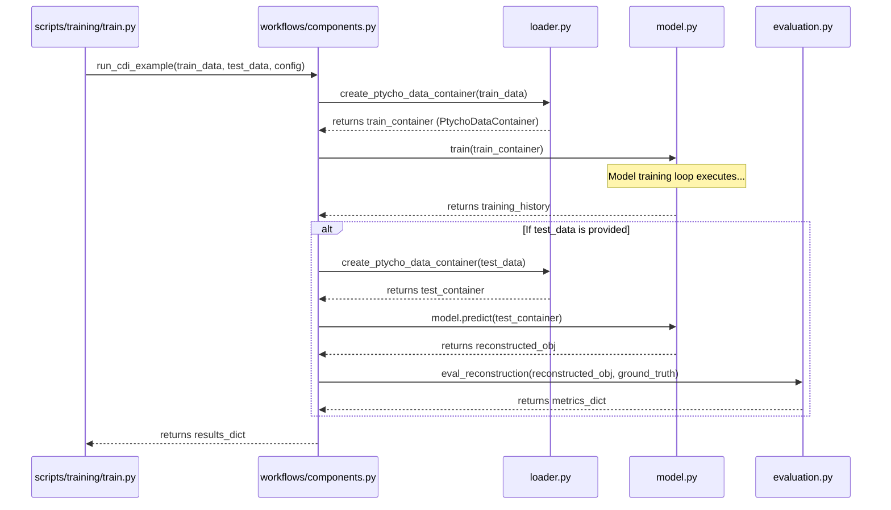

# PtychoPINN Core Architecture

This document provides a high-level overview of the `ptycho/` core library architecture, its main components, and how they interact. It is intended to be a "map" of the system.

For detailed development practices, anti-patterns, and the project's design philosophy, please see the **<doc-ref type="guide">docs/DEVELOPER_GUIDE.md</doc-ref>**.

## 1. Component Diagram

This diagram shows the primary modules in the `ptycho/` library and their relationships. The flow generally moves from configuration and data loading on the left to model execution and evaluation on the right.

**Note:** The component highlighted in red (`params.py`) is a legacy part of the system that is being actively phased out.

```mermaid
graph TD
    subgraph "Configuration"
        A[config/config.py] -- "Updates" --> B[params.py (Legacy)]
    end

    subgraph "Data Pipeline"
        C[NPZ Files] --> D[raw_data.py]
        D -- "RawData" --> E[loader.py]
        E -- "PtychoDataContainer" --> F[Model-Ready Data]
    end

    subgraph "Core Model & Physics"
        G[diffsim.py] -- "Physics Model" --> H[model.py]
        I[tf_helper.py] -- "TF Ops" --> H
        B -- "Global State (DEPRECATED)" --> H
    end
    
    subgraph "Workflows & Evaluation"
        J[workflows/components.py] -- "Orchestrates" --> H
        J -- "Uses" --> E
        K[evaluation.py]
    end

    F -- "Input" --> J
    H -- "Reconstruction" --> K

    style A fill:#cde4ff
    style B fill:#ffcdd2,stroke:#b71c1c,stroke-width:2px
```

## 2. Typical Workflow Sequence (Training Run)

This diagram illustrates the sequence of function calls and data object transformations during a standard training run initiated by a script like `scripts/training/train.py`.



## 3. A Deep Dive: The Data Loading & Preprocessing Pipeline

The journey from a raw `.npz` file on disk to a model-ready batch of tensors is a multi-stage process designed for robustness, physical correctness, and performance. This pipeline is primarily handled by `ptycho/raw_data.py` and `ptycho/loader.py`.

### The Data Transformation Flow

```mermaid
graph TD
    A[1. NPZ File on Disk] --> B(2. Ingestion: RawData Object);
    B --> C{gridsize > 1?};
    C -- No --> D[3a. Legacy Sequential<br>Subsampling];
    C -- Yes --> E[3b. Group-Aware Subsampling<br>(Group-then-Sample)];
    D --> F[4. Grouped Data Dictionary<br>(NumPy Arrays)];
    E --> F;
    F --> G(5. Transformation: loader.py);
    G --> H[6. Model-Ready<br>PtychoDataContainer<br>(TensorFlow Tensors)];

    subgraph "ptycho/raw_data.py"
        B
        C
        D
        E
    end

    subgraph "ptycho/loader.py"
        G
        H
    end
```

### Stage 1: Ingestion (`raw_data.py`)
The process begins by creating a `RawData` object, which is a direct in-memory representation of the `.npz` file.

### Stage 2: Neighbor-Aware Grouping (`RawData.generate_grouped_data()`)
This is the most critical step, especially for **overlap-based training (`gridsize > 1`)**. To ensure training samples are both spatially representative and physically coherent, this function implements a **"group-then-sample"** strategy:
1.  **Discover All Valid Groups:** It scans the *entire* dataset's coordinates to find all possible sets of physically adjacent scan points.
2.  **Cache the Groups:** The results are saved to a cache file (e.g., `my_dataset.g2k4.groups_cache.npz`) to avoid expensive re-computation.
3.  **Randomly Sample from Groups:** It then randomly samples the requested number of *groups* from this complete, pre-computed set.

For `gridsize = 1`, this logic is bypassed in favor of simple sequential subsampling for backward compatibility.

### Stage 3: Transformation to Tensors (`loader.py`)
This final stage prepares the data for TensorFlow by converting the grouped NumPy arrays into a `PtychoDataContainer`, which holds the final, model-ready `tf.Tensor` objects (`X`, `Y`, `coords_nominal`, etc.) that are passed directly to the model.

## 4. Component Reference

-   **`config/config.py`**: The **modern, authoritative configuration system**.
    -   **Key Components:** `ModelConfig`, `TrainingConfig`, `InferenceConfig` (dataclasses).
    -   See the **<doc-ref type="guide">docs/CONFIGURATION_GUIDE.md</doc-ref>**.

-   **`params.py`**: The **legacy global state**. A global dictionary that is **DEPRECATED** but maintained for backward compatibility.

-   **`raw_data.py` & `loader.py`**: The **data ingestion and transformation layers**. They convert raw `.npz` files into model-ready `PtychoDataContainer` objects.
    -   **Key Functions:** `raw_data.generate_grouped_data()`, `loader.create_ptycho_data_container()`.
    -   For a visual breakdown, see **<doc-ref type="technical">ptycho/loader_structure.md</doc-ref>**.

-   **`diffsim.py`**: The **forward physics model**. Encapsulates the scientific domain knowledge of ptychography.
    -   **Key Functions:** `illuminate_and_diffract()`, `mk_simdata()`.

-   **`model.py`**: The **core deep learning model**. Defines the U-Net architecture and custom Keras layers that embed the physics constraints.
    -   **Key Functions:** `create_model_with_gridsize()`, `train()`.

-   **`tf_helper.py`**: A **low-level TensorFlow utility module**. Contains reusable tensor operations for patching, reassembly, and transformations.
    -   **Key Functions:** `reassemble_position()`, `extract_patches_position()`.

-   **`image/` (Package)**: The **modern, authoritative image processing toolkit**. Contains modules for:
    -   `registration.py`: Sub-pixel image alignment (`register_and_align`).
    -   `cropping.py`: Physically correct alignment for evaluation (`align_for_evaluation`).
    -   `stitching.py`: Legacy grid-based patch reassembly.

-   **`evaluation.py`**: The **metrics and quality control module**. Contains all logic for calculating performance metrics (PSNR, SSIM, FRC).
    -   **Key Function:** `eval_reconstruction()`.
    -   Its usage is detailed in the **<doc-ref type="guide">docs/MODEL_COMPARISON_GUIDE.md</doc-ref>**.

-   **`workflows/components.py`**: The **high-level orchestration layer**. Chains together calls to the core library modules to execute end-to-end tasks.
    -   **Key Functions:** `run_cdi_example()`, `setup_configuration()`.
    -   For usage examples, see **<doc-ref type="workflow-guide">scripts/training/CLAUDE.md</doc-ref>**.

## 5. Key Design Principles

-   **Explicit over Implicit**: New code should favor passing configuration and data as explicit arguments rather than relying on global state. This principle is explained in detail in the **<doc-ref type="guide">docs/DEVELOPER_GUIDE.md</doc-ref>**.

-   **Data Contracts**: All data exchange between components must adhere to the formats defined in the **<doc-ref type="contract">docs/data_contracts.md</doc-ref>**.

-   **Separation of Concerns**: Physics simulation (`diffsim`), model architecture (`model`), and data handling (`loader`) are kept in separate, specialized modules.
