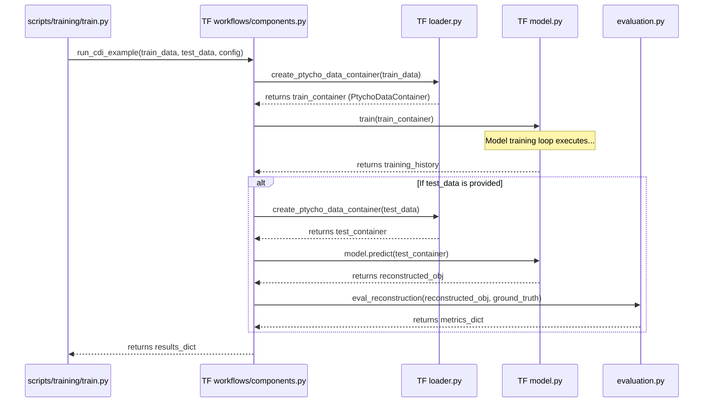
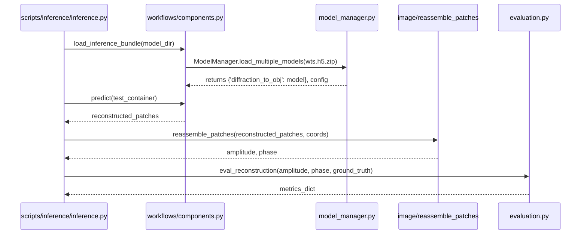

# PtychoPINN Architecture — TensorFlow

This page documents the TensorFlow implementation of PtychoPINN, focusing on modules under `ptycho/` and their orchestration.

## 1. Component Diagram (TensorFlow)

```mermaid
graph TD
    subgraph "Configuration"
        A[config/config.py] -- "Updates" --> B[params.py (Legacy)]
    end

    subgraph "Data Pipeline"
        C[NPZ Files] --> D[raw_data.py]
        D -- "RawData" --> E[loader.py]
        E -- "PtychoDataContainer (tf)" --> F[Model-Ready Data]
    end

    subgraph "Core Model & Physics (TF)"
        G[diffsim.py] -- "Physics Model" --> H[model.py]
        I[tf_helper.py] -- "TF Ops" --> H
        B -- "Global State (DEPRECATED)" --> H
    end

    subgraph "Workflows & Evaluation"
        J[workflows/components.py] -- "Orchestrates" --> H
        J -- "Uses" --> E
        K[evaluation.py]
    end

    F -- "Input" --> J
    H -- "Reconstruction" --> K

    style A fill:#cde4ff
    style B fill:#ffcdd2,stroke:#b71c1c,stroke-width:2px
```

## 2. Training Workflow (TensorFlow)



## 3. Inference Workflow (TensorFlow)



## 4. Component Reference (TensorFlow)

- `config/config.py`: Dataclass configuration (ModelConfig, TrainingConfig, InferenceConfig)
- `params.py`: Legacy global dict (DEPRECATED, compatibility only)
- `raw_data.py` & `loader.py`: Ingestion and transformation to `PtychoDataContainer` (tf)
- `diffsim.py`: Forward physics model
- `model.py`: U‑Net + physics-informed model
- `tf_helper.py`: Low-level TF tensor ops (patching, reassembly)
- `image/`: Registration, cropping, legacy stitching utilities
- `evaluation.py`: Metrics and QC (PSNR, SSIM, FRC)
- `workflows/components.py`: Orchestration entry points (`run_cdi_example`, etc.)
- `model_manager.py`: Multi-model bundle persistence (`wts.h5.zip`)

Config Bridging:
- Backends share canonical dataclasses; see the config bridge mapping: <doc-ref type="spec">specs/spec-ptycho-config-bridge.md</doc-ref>

## 5. Stable Modules & Config Lifecycle

- Do not modify without an approved plan: `ptycho/model.py`, `ptycho/diffsim.py`, `ptycho/tf_helper.py`.
- Always bridge configuration before touching legacy modules:

```python
from ptycho.config.config import TrainingConfig, ModelConfig, update_legacy_dict
from ptycho import params

config = TrainingConfig(model=ModelConfig(...))
update_legacy_dict(params.cfg, config)
```

See also: `docs/debugging/QUICK_REFERENCE_PARAMS.md`.

## 6. Function & Container Mapping (TF ↔ PyTorch)

- Orchestration: `ptycho.workflows.components.run_cdi_example` ↔ `ptycho_torch.workflows.components.run_cdi_example_torch`
- Load model: `load_inference_bundle` ↔ `load_inference_bundle_torch`
- Container: `loader.PtychoDataContainer` ↔ `ptycho_torch.data_container_bridge.PtychoDataContainerTorch`
- Data loader: TF `loader.py` pipelines ↔ Torch `ptycho_torch.dataloader.PtychoDataset` + Lightning DataLoader
- Model: `ptycho/model.py` ↔ `ptycho_torch/model.py`
- Reassembly: `ptycho.image.reassemble_patches` ↔ Torch workflow (uses TF helper for MVP parity)
