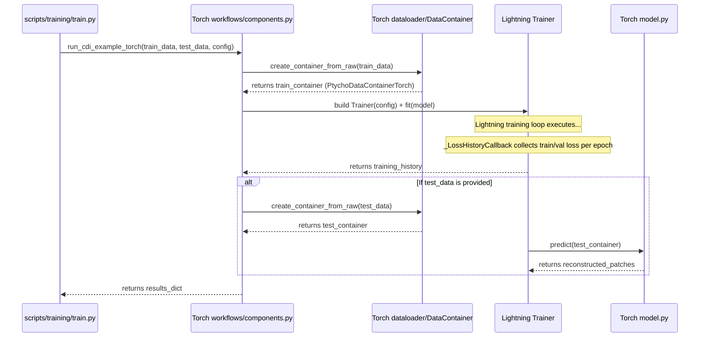
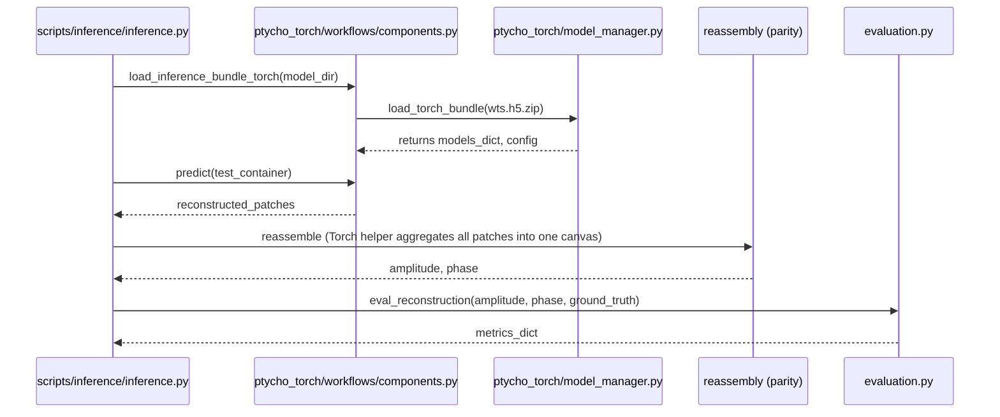

# PtychoPINN Architecture — PyTorch

This page documents the PyTorch implementation of PtychoPINN, focusing on modules under `ptycho_torch/` and their orchestration.

## 1. Component Diagram (PyTorch)

```mermaid
graph TD
    subgraph "Shared Config & Data"
        A[config/config.py] --> B[params.cfg (Legacy Bridge)]
        C[NPZ Files] --> D[ptycho.raw_data.RawData]
    end

    subgraph "PyTorch Orchestration"
        E[ptycho_torch/config_bridge.py]
        F[ptycho_torch/workflows/components.py]
        G[Lightning Trainer]
    end

    subgraph "PyTorch Core"
        H[ptycho_torch/dataloader.py]
        I[ptycho_torch/model.py]
        J[ptycho_torch/model_manager.py]
        K[ptycho_torch/generators/]
    end

    D --> H
    E --> F
    B --> F
    H --> G
    I --> G
    K --> I
    K --> G
    G --> J
```

## 2. Training Workflow (PyTorch)



## 3. Inference Workflow (PyTorch)



See details and current status in **<doc-ref type="guide">docs/workflows/pytorch.md</doc-ref>**.

## 3.1 Reassembly Contract (Torch)

`ptycho_torch.helper.reassemble_patches_position_real` aggregates **across channels (C)** within each batch item. The required semantic contract is:

- Inputs must be shaped `(B, C, N, N)` where **C is the number of patches to stitch** for each sample.
- Offsets must be shaped `(B, C, 1, 2)` in the same order as the C‑dimension patches.
- Output is one stitched canvas per batch item: `(B, M, M)`.

**Inference rule:** when you have one patch per sample (no grouping), **collapse batch into channels** before reassembly so all patches are aggregated into one canvas:

```python
# patch_complex: (num_patches, 1, N, N)
# offsets: (num_patches, 1, 1, 2)
patch_complex_reassemble = patch_complex.reshape(1, -1, N, N)
offsets_reassemble = offsets.reshape(1, -1, 1, 2)
imgs_merged, _, _ = reassemble_patches_position_real(
    patch_complex_reassemble, offsets_reassemble, data_cfg, model_cfg, crop_size=crop_size
)
canvas = imgs_merged[0]  # single stitched image
```

This mirrors TensorFlow’s `shift_and_sum` behavior, which aggregates all patches into a single stitched canvas.

## 4. Component Reference (PyTorch)

- `ptycho_torch/config_bridge.py`: Translates TF dataclasses to Torch equivalents
- `ptycho_torch/data_container_bridge.py`: `PtychoDataContainerTorch` container factory
- `ptycho_torch/dataloader.py`: Datasets and DataLoaders compatible with Lightning
- `ptycho_torch/model.py`: U‑Net + physics-informed Torch model
- `ptycho_torch/model_manager.py`: Torch model bundle persistence and load
- `ptycho_torch/workflows/components.py`: Orchestration entry points (`run_cdi_example_torch`, etc.); includes `_LossHistoryCallback` for collecting per-epoch train/val loss history during Lightning training
- `ptycho_torch/generators/`: Generator registry for architecture selection (see §4.1)
- Reassembly: Currently reuses TF helper for parity; native Torch reassembly planned
- Shared modules: `ptycho/raw_data.py`, `config/config.py`, `docs/specs/spec-ptycho-interfaces.md`

### 4.1 Generator Registry (PyTorch)

The generator registry enables architecture selection via `config.model.architecture`:

| Architecture | Generator Class | Description |
|--------------|-----------------|-------------|
| `cnn` (default) | `CnnGenerator` | U-Net based CNN from `ptycho_torch/model.py` |
| `fno` | `FnoGenerator` | Cascaded FNO → CNN (Arch A) |
| `hybrid` | `HybridGenerator` | Hybrid U-NO with spectral encoder + CNN decoder (Arch B) |
| `stable_hybrid` | `StableHybridGenerator` | Hybrid U-NO with InstanceNorm-stabilized residual blocks |
| `fno_vanilla` | `FnoVanillaGenerator` | Constant‑resolution FNO baseline (no down/upsampling) |
| `hybrid_resnet` | `HybridResnetGenerator` | FNO encoder + CycleGAN ResNet‑6 bottleneck + CycleGAN upsamplers |

**Key modules in `ptycho_torch/generators/`:**
- `registry.py`: `resolve_generator(config)` returns generator instance
- `cnn.py`: CNN generator wrapping `PtychoPINN_Lightning`
- `fno.py`: FNO and Hybrid generators with spectral convolutions
- `fno_vanilla.py`: Constant-resolution FNO baseline
- `hybrid_resnet.py`: FNO encoder + CycleGAN ResNet‑6 decoder (supports optional fixed `resnet_width`)

**FNO Architecture Components (`fno.py`):**
- `SpatialLifter`: 2×3x3 convs with GELU before Fourier layers
- `InputTransform`: Optional dynamic-range compressor (`none|sqrt|log1p|instancenorm`) applied before `SpatialLifter` when `fno_input_transform` is set
- `PtychoBlock`: Spectral conv + 3x3 local conv with outer residual (`y = x + GELU(Spectral(x) + Conv3x3(x))`)
- `HybridUNOGenerator`: Spectral encoder blocks + CNN decoder with skip connections
- `CascadedFNOGenerator`: FNO stage for coarse features → CNN refiner for final output
- `HAS_NEURALOPERATOR`: Module-level flag indicating if `neuraloperator` package is available; when False, `PtychoBlock` uses a fallback FFT-based spectral convolution

**Usage:**
```python
from ptycho.config.config import TrainingConfig, ModelConfig
from ptycho_torch.generators.registry import resolve_generator

config = TrainingConfig(model=ModelConfig(architecture='fno'))
generator = resolve_generator(config)
model = generator.build_model(pt_configs)
```

**Torch Runner:** `scripts/studies/grid_lines_torch_runner.py` provides CLI for training FNO/hybrid models (including `stable_hybrid`, `fno_vanilla`, and `hybrid_resnet`) on cached datasets from the grid-lines workflow.

**Forward Signature Contract (FORWARD-SIG-001):**
FNO and Hybrid architectures use a **single-input forward signature**:
```python
predictions = model(X)  # X = diffraction patterns only
```
Unlike CNN which may accept `model(X, coords)` for position encoding, FNO/Hybrid learn spatial relationships through spectral convolutions and do NOT accept coordinate inputs. The `run_torch_inference()` function enforces this:
```python
if cfg.architecture in ('fno', 'hybrid', 'stable_hybrid', 'fno_vanilla', 'hybrid_resnet'):
    predictions = model(X_test)  # No coords
else:
    predictions = model(X_test, coords)  # CNN path
```

**Output Contract (OUTPUT-COMPLEX-001):**
FNO/Hybrid models output predictions in **real/imag format** with shape `(..., 2)`. The `to_complex_patches()` helper converts to complex64:
```python
def to_complex_patches(real_imag):
    return (real_imag[..., 0] + 1j * real_imag[..., 1]).astype(np.complex64)
```
The runner returns `predictions_complex` key when this conversion is applied.

Config Bridging:
- Normative config mapping and bridge flow: <doc-ref type="spec">docs/specs/spec-ptycho-config-bridge.md</doc-ref>

## 5. Function & Container Mapping (PyTorch ↔ TF)

- Orchestration: `ptycho_torch.workflows.components.run_cdi_example_torch` ↔ `ptycho.workflows.components.run_cdi_example`
- Load model: `load_inference_bundle_torch` ↔ `load_inference_bundle`
- Container: `PtychoDataContainerTorch` ↔ `loader.PtychoDataContainer`
- Data loader: `ptycho_torch.dataloader.PtychoDataset` + Lightning DataLoader ↔ TF `loader.py` pipelines
- Model: `ptycho_torch/model.py` ↔ `ptycho/model.py`
- Reassembly: Torch inference reassembles via `ptycho_torch.helper.reassemble_patches_position_real` by collapsing batch into channels to aggregate all patches; TF path continues to use `ptycho.tf_helper.reassemble_position`
