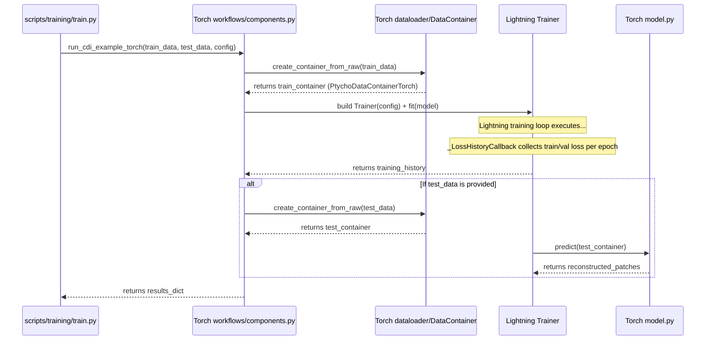
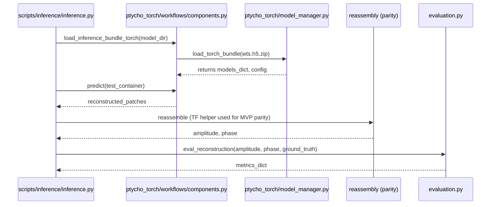

# PtychoPINN Architecture — PyTorch

This page documents the PyTorch implementation of PtychoPINN, focusing on modules under `ptycho_torch/` and their orchestration.

## 1. Component Diagram (PyTorch)

```mermaid
graph TD
    subgraph "Shared Config & Data"
        A[config/config.py] --> B[params.cfg (Legacy Bridge)]
        C[NPZ Files] --> D[ptycho.raw_data.RawData]
    end

    subgraph "PyTorch Orchestration"
        E[ptycho_torch/config_bridge.py]
        F[ptycho_torch/workflows/components.py]
        G[Lightning Trainer]
    end

    subgraph "PyTorch Core"
        H[ptycho_torch/dataloader.py]
        I[ptycho_torch/model.py]
        J[ptycho_torch/model_manager.py]
        K[ptycho_torch/generators/]
    end

    D --> H
    E --> F
    B --> F
    H --> G
    I --> G
    K --> I
    K --> G
    G --> J
```

## 2. Training Workflow (PyTorch)



## 3. Inference Workflow (PyTorch)



See details and current status in **<doc-ref type="guide">docs/workflows/pytorch.md</doc-ref>**.

## 4. Component Reference (PyTorch)

- `ptycho_torch/config_bridge.py`: Translates TF dataclasses to Torch equivalents
- `ptycho_torch/data_container_bridge.py`: `PtychoDataContainerTorch` container factory
- `ptycho_torch/dataloader.py`: Datasets and DataLoaders compatible with Lightning
- `ptycho_torch/model.py`: U‑Net + physics-informed Torch model
- `ptycho_torch/model_manager.py`: Torch model bundle persistence and load
- `ptycho_torch/workflows/components.py`: Orchestration entry points (`run_cdi_example_torch`, etc.); includes `_LossHistoryCallback` for collecting per-epoch train/val loss history during Lightning training
- `ptycho_torch/generators/`: Generator registry for architecture selection (see §4.1)
- Reassembly: Currently reuses TF helper for parity; native Torch reassembly planned
- Shared modules: `ptycho/raw_data.py`, `config/config.py`, `docs/specs/spec-ptycho-interfaces.md`

### 4.1 Generator Registry (PyTorch)

The generator registry enables architecture selection via `config.model.architecture`:

| Architecture | Generator Class | Description |
|--------------|-----------------|-------------|
| `cnn` (default) | `CnnGenerator` | U-Net based CNN from `ptycho_torch/model.py` |
| `fno` | `FnoGenerator` | Cascaded FNO → CNN (Arch A) |
| `hybrid` | `HybridGenerator` | Hybrid U-NO with spectral encoder + CNN decoder (Arch B) |

**Key modules in `ptycho_torch/generators/`:**
- `registry.py`: `resolve_generator(config)` returns generator instance
- `cnn.py`: CNN generator wrapping `PtychoPINN_Lightning`
- `fno.py`: FNO and Hybrid generators with spectral convolutions

**FNO Architecture Components (`fno.py`):**
- `SpatialLifter`: 2×3x3 convs with GELU before Fourier layers
- `PtychoBlock`: Spectral conv + 3x3 local conv with outer residual (`y = x + GELU(Spectral(x) + Conv3x3(x))`)
- `HybridUNOGenerator`: Spectral encoder blocks + CNN decoder with skip connections
- `CascadedFNOGenerator`: FNO stage for coarse features → CNN refiner for final output
- `HAS_NEURALOPERATOR`: Module-level flag indicating if `neuraloperator` package is available; when False, `PtychoBlock` uses a fallback FFT-based spectral convolution

**Usage:**
```python
from ptycho.config.config import TrainingConfig, ModelConfig
from ptycho_torch.generators.registry import resolve_generator

config = TrainingConfig(model=ModelConfig(architecture='fno'))
generator = resolve_generator(config)
model = generator.build_model(pt_configs)
```

**Torch Runner:** `scripts/studies/grid_lines_torch_runner.py` provides CLI for training FNO/hybrid models on cached datasets from the grid-lines workflow.

Config Bridging:
- Normative config mapping and bridge flow: <doc-ref type="spec">docs/specs/spec-ptycho-config-bridge.md</doc-ref>

## 5. Function & Container Mapping (PyTorch ↔ TF)

- Orchestration: `ptycho_torch.workflows.components.run_cdi_example_torch` ↔ `ptycho.workflows.components.run_cdi_example`
- Load model: `load_inference_bundle_torch` ↔ `load_inference_bundle`
- Container: `PtychoDataContainerTorch` ↔ `loader.PtychoDataContainer`
- Data loader: `ptycho_torch.dataloader.PtychoDataset` + Lightning DataLoader ↔ TF `loader.py` pipelines
- Model: `ptycho_torch/model.py` ↔ `ptycho/model.py`
- Reassembly: parity path uses TF helper; native Torch path planned
