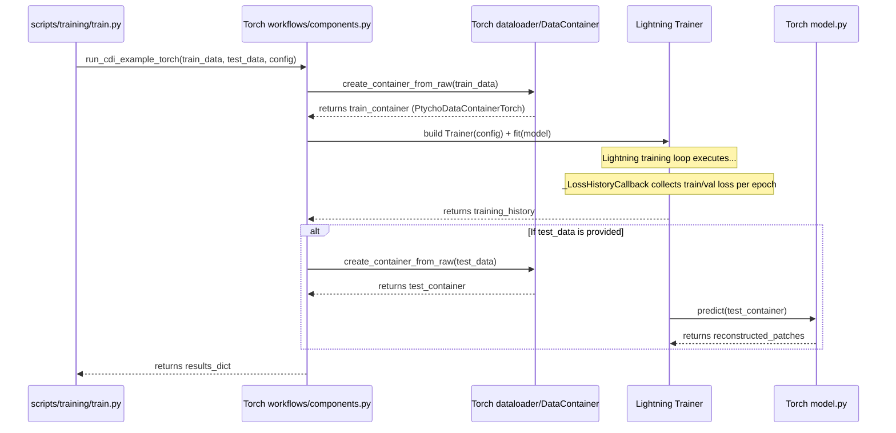
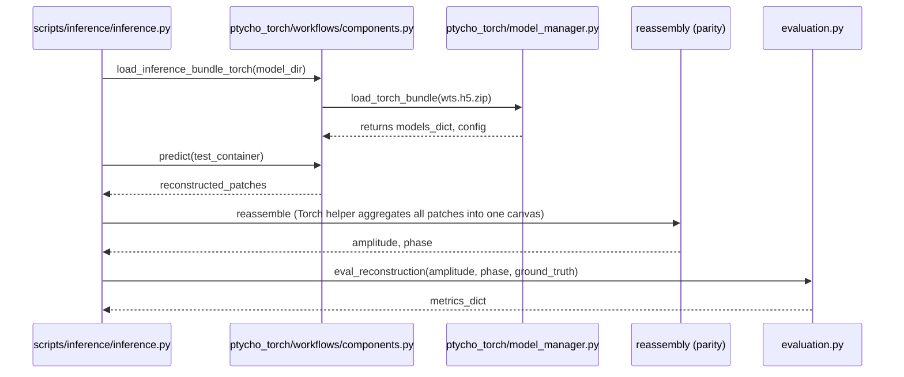

# PtychoPINN Architecture — PyTorch

This page documents the PyTorch implementation of PtychoPINN, focusing on modules under `ptycho_torch/` and their orchestration.

## 1. Component Diagram (PyTorch)

```mermaid
graph TD
    subgraph "Shared Config & Data"
        A[config/config.py] --> B[params.cfg (Legacy Bridge)]
        C[NPZ Files] --> D[ptycho.raw_data.RawData]
    end

    subgraph "PyTorch Orchestration"
        E[ptycho_torch/config_bridge.py]
        F[ptycho_torch/workflows/components.py]
        G[Lightning Trainer]
    end

    subgraph "PyTorch Core"
        H[ptycho_torch/dataloader.py]
        I[ptycho_torch/model.py]
        J[ptycho_torch/model_manager.py]
        K[ptycho_torch/generators/]
    end

    D --> H
    E --> F
    B --> F
    H --> G
    I --> G
    K --> I
    K --> G
    G --> J
```

**Config factory layer (ADR-003):** CLI args and workflow params first pass through `ptycho_torch/config_factory.py` (validate + infer + apply overrides), which delegates to `ptycho_torch/config_bridge.py` for TF-canonical dataclass translation and populates `params.cfg` (CONFIG-001). This factory layer sits between "CLI Args" and `config_bridge.py` in the flow above but is omitted from the diagram itself.

## 2. Training Workflow (PyTorch)


```mermaid
sequenceDiagram
    participant Script as scripts/training/train.py
    participant W as Torch workflows/components.py
    participant D as Torch dataloader/DataContainer
    participant L as Lightning Trainer
    participant M as Torch model.py

    Script->>W: run_cdi_example_torch(train_data, test_data, config)
    W->>D: create_container_from_raw(train_data)
    D-->>W: returns train_container (PtychoDataContainerTorch)

    W->>L: build Trainer(config) + fit(model)
    Note over L: Lightning training loop executes...
    Note over L: _LossHistoryCallback collects train/val loss per epoch
    L-->>W: returns training_history

    alt If test_data is provided
        W->>D: create_container_from_raw(test_data)
        D-->>W: returns test_container
        L->>M: predict(test_container)
        M-->>L: returns reconstructed_patches
    end

    W-->>Script: returns results_dict
```

## 2.1 Torch Data Flow

Torch has two supported training data paths:

1. Native mmap path: standalone NPZ data is loaded by `ptycho_torch.dataloader.PtychoDataset`, memory-mapped into a TensorDict-style store, then yielded as `(tensor_dict, probe, probe_scaling)` batches for Lightning training.
2. Grid-lines dict-container path: cached grouped data is prepared by `scripts.studies.grid_lines_torch_runner.run_torch_training`, wrapped by `ptycho_torch.workflows.components.PtychoLightningDataset`, then yielded with the same `(tensor_dict, probe, probe_scaling)` outer contract.

Both paths feed `ptycho_torch.model.PtychoPINN_Lightning.compute_loss`; inference uses `forward_predict(X, positions, probe, input_scale_factor)`. The normative batch contract lives in <doc-ref type="spec">docs/specs/spec-ptycho-interfaces.md</doc-ref>; raw NPZ/grouped-dict keys live in <doc-ref type="spec">docs/specs/spec-ptycho-core.md</doc-ref>; tensor layout conversions live in <doc-ref type="spec">docs/specs/spec-ptycho-tensor-correspondence.md</doc-ref>; amplitude/count scaling lives in <doc-ref type="guide">docs/DATA_NORMALIZATION_GUIDE.md</doc-ref>.

## 3. Inference Workflow (PyTorch)


```mermaid
sequenceDiagram
    participant Script as scripts/inference/inference.py
    participant W as ptycho_torch/workflows/components.py
    participant MM as ptycho_torch/model_manager.py
    participant Img as reassembly (parity)
    participant E as evaluation.py

    Script->>W: load_inference_bundle_torch(model_dir)
    W->>MM: load_torch_bundle(wts.h5.zip)
    MM-->>W: returns models_dict, config

    Script->>W: predict(test_container)
    W-->>Script: reconstructed_patches

    Script->>Img: reassemble (Torch helper aggregates all patches into one canvas)
    Img-->>Script: amplitude, phase

    Script->>E: eval_reconstruction(amplitude, phase, ground_truth)
    E-->>Script: metrics_dict
```

See details and current status in **<doc-ref type="guide">docs/workflows/pytorch.md</doc-ref>**.

## 3.1 Reassembly Contract (Torch)

`ptycho_torch.helper.reassemble_patches_position_real` aggregates **across channels (C)** within each batch item. The required semantic contract is:

- Inputs must be shaped `(B, C, N, N)` where **C is the number of patches to stitch** for each sample.
- Offsets must be shaped `(B, C, 1, 2)` in the same order as the C‑dimension patches.
- Output is one stitched canvas per batch item: `(B, M, M)`.

**Inference rule:** when you have one patch per sample (no grouping), **collapse batch into channels** before reassembly so all patches are aggregated into one canvas:

```python
# patch_complex: (num_patches, 1, N, N)
# offsets: (num_patches, 1, 1, 2)
patch_complex_reassemble = patch_complex.reshape(1, -1, N, N)
offsets_reassemble = offsets.reshape(1, -1, 1, 2)
imgs_merged, _, _ = reassemble_patches_position_real(
    patch_complex_reassemble, offsets_reassemble, data_cfg, model_cfg, crop_size=crop_size
)
canvas = imgs_merged[0]  # single stitched image
```

This mirrors TensorFlow’s `shift_and_sum` behavior, which aggregates all patches into a single stitched canvas.

**Offset-sign convention:** offsets are negated before translation (`Translation(imgs, -offsets_flat)`), matching TF's `Translation([imgs, -offsets_flat])` convention. See <doc-ref type="spec">docs/specs/spec-ptycho-tensor-correspondence.md</doc-ref> §2.3 for the code citations and <doc-ref type="finding">docs/findings.md</doc-ref> TORCH-REASSEMBLY-SIGN-001 for the convention-fork history and reversal recipe.

## 4. Component Reference (PyTorch)

- `ptycho_torch/config_bridge.py`: Translates TF dataclasses to Torch equivalents
- `ptycho_torch/data_container_bridge.py`: `PtychoDataContainerTorch` container factory
- `ptycho_torch/dataloader.py`: Datasets and DataLoaders compatible with Lightning
- `ptycho_torch/model.py`: U‑Net + physics-informed Torch model
- `ptycho_torch/model_manager.py`: Torch model bundle persistence and load
- `ptycho_torch/workflows/components.py`: Orchestration entry points (`run_cdi_example_torch`, etc.); includes `_LossHistoryCallback` for collecting per-epoch train/val loss history during Lightning training
- `ptycho_torch/generators/`: Generator registry for architecture selection (see §4.1)
- `ptycho_torch/reassembly.py`: Barycentric/VarPro reassembly path — `reconstruct_image_barycentric` (probe-weighted, multi-GPU canvas assembly), `VarProScaler` (global real/imag scale + background solve), `compute_varpro_basis` (per-mode exit-wave FFTs and mode-summed basis images); cross-pipeline bridging traps when evaluating grid-lines-workflow checkpoints through this path are tracked in REASSEMBLY-BRIDGE-001.
- Reassembly: two paths, not "planned" — (1) `ptycho_torch.helper.reassemble_patches_position_real` MVP path, reused for TF-parity training/inference stitching (§3.1); (2) `ptycho_torch/reassembly.py` barycentric/VarPro path, used for probe-weighted multi-GPU inference reconstruction.
- Shared modules: `ptycho/raw_data.py`, `config/config.py`, `docs/specs/spec-ptycho-interfaces.md`

### 4.1 Generator Registry (PyTorch)

The generator registry enables architecture selection via `config.model.architecture`. The registry (`ptycho_torch.generators.registry._REGISTRY`, 14 entries) and its authoritative enumeration in <doc-ref type="spec">docs/specs/spec-ptycho-config-bridge.md</doc-ref> §3 are the source of truth for the full architecture list; the table below is illustrative only.

| Architecture | Generator Class | Description |
|--------------|-----------------|-------------|
| `cnn` (default) | `CnnGenerator` | U-Net based CNN from `ptycho_torch/model.py` |
| `fno` | `FnoGenerator` | Cascaded FNO → CNN (Arch A) |
| `hybrid_resnet` | `HybridResnetGenerator` | FNO encoder + CycleGAN ResNet‑6 bottleneck + CycleGAN upsamplers |
| `spectral_resnet_bottleneck_net` | `SpectralResnetBottleneckGenerator` | Hybrid ResNet shell with a configurable spectral ResNet bottleneck |

**Key modules in `ptycho_torch/generators/`:**
- `registry.py`: `resolve_generator(config)` returns generator instance
- `ffno.py`: FFNO generator with factorized Fourier operators
- `cnn.py`: CNN generator wrapping `PtychoPINN_Lightning`
- `fno.py`: FNO and Hybrid generators with spectral convolutions
- `fno_vanilla.py`: Constant-resolution FNO baseline
- `neuralop_uno.py`: External NeuralOperator U-NO adapter with fail-closed Lines128 CDI contract checks
- `hybrid_resnet.py`: FNO encoder + CycleGAN ResNet‑6 decoder (supports optional fixed `resnet_width`)
- `spectral_resnet_bottleneck.py`: Spectral ResNet bottleneck variant on the Hybrid ResNet shell

**FNO Architecture Components (`fno.py`):**
- `SpatialLifter`: 2×3x3 convs with GELU before Fourier layers
- `InputTransform`: Optional dynamic-range compressor (`none|sqrt|log1p|instancenorm`) applied before `SpatialLifter` when `fno_input_transform` is set
- `PtychoBlock`: Spectral conv + 3x3 local conv with outer residual (`y = x + GELU(Spectral(x) + Conv3x3(x))`)
- `HybridUNOGenerator`: Spectral encoder blocks + CNN decoder with skip connections
- `CascadedFNOGenerator`: FNO stage for coarse features → CNN refiner for final output
- `HAS_NEURALOPERATOR`: Module-level flag indicating if `neuraloperator` package is available; when False, `PtychoBlock` uses a fallback FFT-based spectral convolution

**Usage:**
```python
from ptycho.config.config import TrainingConfig, ModelConfig
from ptycho_torch.generators.registry import resolve_generator

config = TrainingConfig(model=ModelConfig(architecture='fno'))
generator = resolve_generator(config)
model = generator.build_model(pt_configs)
```

**Torch Runner:** `scripts/studies/grid_lines_torch_runner.py` provides CLI for training Torch generator architectures on cached datasets from the grid-lines workflow, including `ffno`, `stable_hybrid`, `fno_vanilla`, `spectral_resnet_bottleneck_net`, `neuralop_uno`, and `hybrid_resnet`.

**Hybrid ResNet Schematics (TikZ/DOT):** Use `scripts/studies/render_hybrid_resnet_schematics.py` to generate a shape-backed architecture manifest and source schematics:

```bash
python scripts/studies/render_hybrid_resnet_schematics.py \
  --output-dir .artifacts/hybrid_resnet_schematics/latest \
  --N 128 --gridsize 2 --fno-width 32 --fno-blocks 4 --fno-modes 12
```

Outputs:
- `.artifacts/hybrid_resnet_schematics/latest/hybrid_resnet_manifest.json`
- `.artifacts/hybrid_resnet_schematics/latest/hybrid_resnet_high_level.tex` (LaTeX/TikZ, ResNet-style)
- `.artifacts/hybrid_resnet_schematics/latest/hybrid_resnet_module_flow.dot` (Graphviz DOT)

**Inference Call Surface:**
The runner-level inference contract is the unified Lightning helper call:
```python
predictions = model.forward_predict(X, positions, probe, input_scale_factor)
```
Generator cores such as FNO/Hybrid still learn spatial relationships from the diffraction tensor and may ignore `positions`/`probe` internally, but `scripts.studies.grid_lines_torch_runner.run_torch_inference` no longer branches to a single-input `model(X)` call. The older FORWARD-SIG-001 wording is superseded in <doc-ref type="finding">docs/findings.md</doc-ref>.

**Output Contract (OUTPUT-COMPLEX-001):**
FNO/Hybrid models output predictions in **real/imag format** with shape `(..., 2)`. The `to_complex_patches()` helper converts to complex64:
```python
def to_complex_patches(real_imag):
    return (real_imag[..., 0] + 1j * real_imag[..., 1]).astype(np.complex64)
```
The runner returns `predictions_complex` key when this conversion is applied.

Config Bridging:
- Normative config mapping and bridge flow: <doc-ref type="spec">docs/specs/spec-ptycho-config-bridge.md</doc-ref>

## 5. Function & Container Mapping (PyTorch ↔ TF)

- Orchestration: `ptycho_torch.workflows.components.run_cdi_example_torch` ↔ `ptycho.workflows.components.run_cdi_example`
- Load model: `load_inference_bundle_torch` ↔ `load_inference_bundle`
- Container: `PtychoDataContainerTorch` ↔ `loader.PtychoDataContainer`
- Data loader: `ptycho_torch.dataloader.PtychoDataset` + Lightning DataLoader ↔ TF `loader.py` pipelines
- Model: `ptycho_torch/model.py` ↔ `ptycho/model.py`
- Reassembly: Torch inference reassembles via `ptycho_torch.helper.reassemble_patches_position_real` by collapsing batch into channels to aggregate all patches; TF path continues to use `ptycho.tf_helper.reassemble_position`

## 6. Component Contracts

IDL-style contracts (signature, inputs/outputs, dependencies, behavior, error modes) for five representative data/workflow/generator components, verified against the tree at write time (2026-07-07). Shapes cross-reference <doc-ref type="spec">docs/specs/spec-ptycho-tensor-correspondence.md</doc-ref> rather than restating; consult that shard for the canonical TF↔Torch tensor tables.

### 6.1 `RawData` (`ptycho.raw_data.RawData`)

```
class RawData:
    def __init__(self, xcoords, ycoords, xcoords_start, ycoords_start, diff3d,
                 probeGuess, scan_index, objectGuess=None, Y=None,
                 norm_Y_I=None, metadata=None)
```
- **Inputs:** `xcoords`/`ycoords`/`xcoords_start`/`ycoords_start` — `(M,)` float64 pixel coordinates; `diff3d` — `(M,N,N)` float32 amplitude (sqrt of counts, not intensity); `probeGuess` — `(N,N)` complex64; `scan_index` — `(M,)` int; `objectGuess` — optional `(H,W)` complex64.
- **Dependencies:** none on `params.cfg` in `__init__`/`_check_data_validity`.
- **Behavior:** `_check_data_validity` asserts array rank/shape consistency, then stores all arguments as instance attributes.
- **Error modes:** `AssertionError` on rank mismatches (coords must be 1D, `diff3d` must be 3D with square patches, `probeGuess`/`objectGuess` must be 2D).

Factory: `RawData.from_file(train_data_file_path: str, validate_config: bool = False, current_config=None) -> RawData`. Loads an NPZ (with metadata) via `MetadataManager.load_with_metadata`; requires `xcoords`, `ycoords`, `diff3d`, `probeGuess` keys (`KeyError` if absent); defaults `xcoords_start`/`ycoords_start` to `xcoords`/`ycoords` and `scan_index` to zeros when absent.

Key method: `generate_grouped_data(N, K=4, nsamples=1, dataset_path=None, seed=None, sequential_sampling=False, gridsize=None, enable_oversampling=False, neighbor_pool_size=None) -> dict`.
- **Dependency (params.cfg):** when `gridsize` arg is `None`, reads `params.get('gridsize', 1)` — `params.cfg['gridsize']` MUST be initialized (via `update_legacy_dict`) before this call, otherwise the group size silently defaults to 1.
- **Returns:** dict built by `_generate_dataset_from_groups` with keys `diffraction` (grouped patterns, `(nsamples,N,N,C)`, C=gridsize²), `Y` (ground-truth patches or `None`), `coords_offsets`, `coords_relative`, `coords_start_offsets`, `coords_start_relative`, `coords_nn`, `coords_start_nn`, `nn_indices`, `objectGuess`, plus `X_full` (normalized diffraction, appended after grouping) and optional `sample_indices`.
- **Error modes:** `ValueError` when `nsamples > n_points` and oversampling is required but `enable_oversampling=False`, or when `neighbor_pool_size < C`; `ValueError` when the dataset has fewer points than `C` or `K < C` (`_generate_groups_efficiently`).

### 6.2 `PtychoDataContainer` (`ptycho.loader.PtychoDataContainer`)

```
class PtychoDataContainer:
    def __init__(self, X, Y_I, Y_phi, norm_Y_I, YY_full, coords_nominal,
                 coords_true, nn_indices, global_offsets, local_offsets, probeGuess)
```
- **Behavior:** lazy-loading TF tensor container — constructor stores NumPy arrays privately (`_X_np`, etc.); each public property tensorifies on first access and caches the result in `_tensor_cache`.
- **Outputs (lazy properties):** `X` — `tf.float32 (B,N,N,C)`; `Y_I`/`Y_phi` — `tf.float32 (B,N,N,C)`; `Y` — `tf.complex64 (B,N,N,C)`, composed via `tf_helper.combine_complex(Y_I, Y_phi)`; `coords_nominal`/`coords_true` — `tf.float32 (B,1,2,C)`; `probe` — `tf.complex64 (N,N)`. NumPy-only attributes: `norm_Y_I`, `YY_full`, `nn_indices`, `global_offsets`, `local_offsets`.
- **Dependency (params.cfg):** `as_tf_dataset(batch_size, shuffle=True)` reads `params.get('intensity_scale')` — requires `params.cfg` to be populated before use.
- **Error modes:** none raised directly; `__len__` depends on `_X_np` being set by the constructor.

Factory: `load(cb: Callable, probeGuess: tf.Tensor, which: str, create_split: bool) -> PtychoDataContainer`. Converts the grouped dict returned by `cb()` into a `PtychoDataContainer`, applying dtype conversion (float64/complex128 → float32/complex64) and optional train/test splitting via `split_data`.

### 6.3 `run_grid_lines_torch` (`scripts.studies.grid_lines_torch_runner.run_grid_lines_torch`)

```
def run_grid_lines_torch(cfg: TorchRunnerConfig, *,
                          invocation_argv=None, invocation_extra=None) -> Dict[str, Any]
```
- **Inputs:** `cfg` — `TorchRunnerConfig` dataclass: `train_npz`/`test_npz`/`output_dir` (`Path`), `architecture` (one of the 14 registry keys), `training_procedure` (`'pinn'`|`'supervised'`), `input_conditioning_mode`, `count_scale_mode`, `N`, `gridsize`, plus architecture-specific hyperparameters (full field list in the dataclass).
- **Dependencies:** does not read `params.cfg` directly; delegates to `run_torch_training` → `_train_with_lightning` (`ptycho_torch/workflows/components.py`), which builds `TrainingConfig`/execution config via `config_factory` and synchronizes `params.cfg` downstream per CONFIG-001.
- **Behavior:** orchestrates load cached train/test NPZ datasets (with metadata) → apply input conditioning → `run_torch_training` (Lightning) → `run_torch_inference` → convert real/imag predictions to complex when the trailing dim is 2 (`to_complex_patches`) → `compute_metrics` → `save_recon_artifact`/`save_run_artifacts` → best-effort visuals rendering (exceptions logged, not raised) → writes invocation-provenance artifacts throughout.
- **Returns:** dict with keys `architecture`, `model_id`, `run_dir`, `metrics`, `history`, `recon_path`, `recon_npz`, `model_params`, `inference_time_s`, `position_reassembly_runtime_contract`, `randomness_contract`, `paper_row_payload`, optional `visuals`, optional `predictions_complex`.
- **Error modes:** `ValueError` if test data lacks all of `YY_ground_truth`/`YY_full`/`objectGuess`; on any other exception, writes an invocation artifact with `status="failed"` and re-raises. Visuals rendering is the sole best-effort path (logs a warning instead of raising).

### 6.4 `run_cdi_example_torch` (`ptycho_torch.workflows.components.run_cdi_example_torch`)

```
def run_cdi_example_torch(train_data, test_data, config: TrainingConfig,
                           flip_x=False, flip_y=False, transpose=False, M=20,
                           do_stitching=False, execution_config=None
                           ) -> Tuple[Optional[Any], Optional[Any], Dict[str, Any]]
```
- **Inputs:** `train_data`/`test_data` — `RawData` | `RawDataTorch` | `PtychoDataContainerTorch`; `config` — `TrainingConfig`; `execution_config` — optional `PyTorchExecutionConfig`.
- **Dependency (params.cfg):** calls `ptycho_config.update_legacy_dict(params.cfg, config)` unconditionally at entry before any delegation, per CONFIG-001.
- **Behavior** (per the current docstring/body): (1) trains via `train_cdi_model_torch`, forwarding `execution_config` when provided; (2) initializes `recon_amp`/`recon_phase` to `None`; (3) if `do_stitching` and `test_data` is provided, stitches via `_reassemble_cdi_image_torch` and merges the reassembly results into `train_results`; (4) if `config.output_dir` is set and `train_results['models']` is truthy, persists via `save_torch_bundle` to `{output_dir}/wts.h5.zip`; (5) returns `(recon_amp, recon_phase, train_results)`.
- **Returns:** tuple of (amplitude or `None`, phase or `None`, results dict — contents depend on `train_cdi_model_torch`/`_reassemble_cdi_image_torch`; includes `'models'` whenever persistence runs).
- **Error modes:** raises nothing directly; propagates exceptions from `train_cdi_model_torch`, `_reassemble_cdi_image_torch`, or `save_torch_bundle`.

### 6.5 `resolve_generator` / registry (`ptycho_torch.generators.registry.resolve_generator`)

```
def resolve_generator(config) -> Generator
```
- **Inputs:** `config` — `TrainingConfig` or `InferenceConfig` with a `model.architecture` field.
- **Dependencies:** reads `config.model.architecture` (str); no `params.cfg` access.
- **Behavior:** looks up `config.model.architecture` in the module-level `_REGISTRY` dict (14 entries: `cnn`, `ffno`, `fno`, `hybrid`, `stable_hybrid`, `fno_vanilla`, `neuralop_uno`, `hybrid_resnet`, `hybrid_resnet_ffno_ptychoblock_encoder`, `hybrid_resnet_ptychoblock_ffno_encoder`, `spectral_resnet_bottleneck_net`, `spectral_resnet_bottleneck_linear_decoder`, `hybrid_resnet_ffno_bottleneck`, `hybrid_resnet_convnext_bottleneck`) and returns `_REGISTRY[arch](config)` — an instantiated generator.
- **Error modes:** `ValueError` if `arch` is not a registered key; message lists the sorted available keys.
