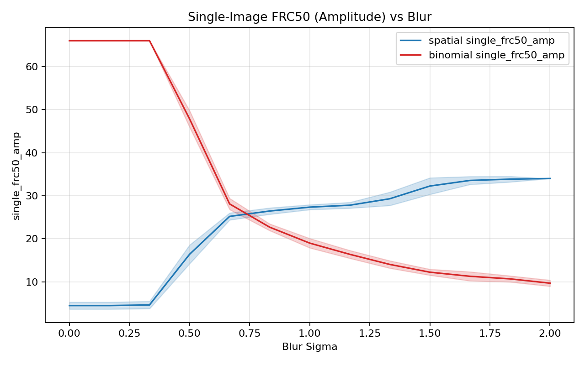
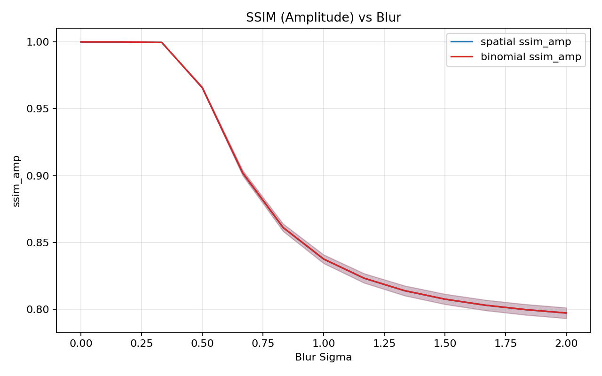
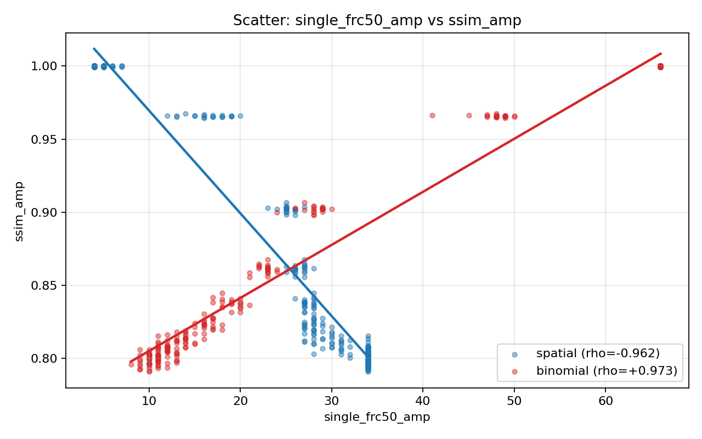
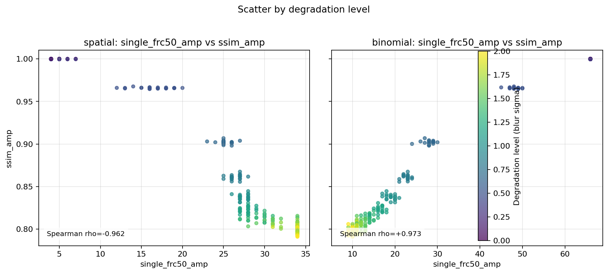
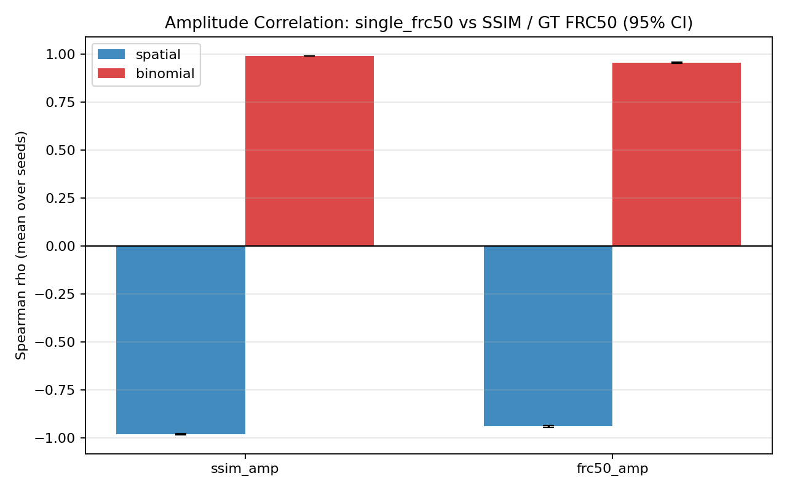
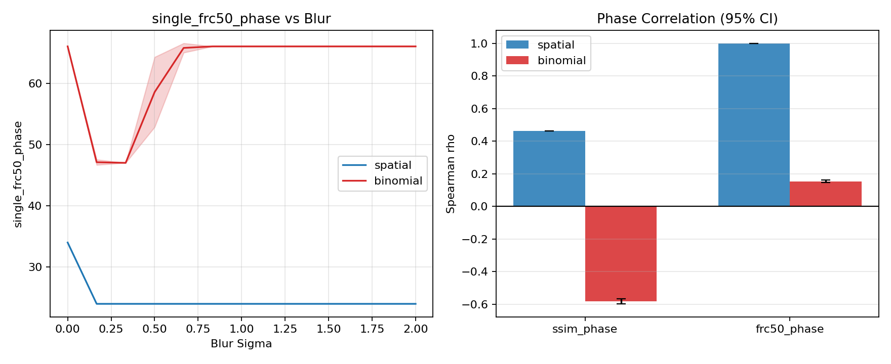

# Single-Image FRC Visual Validation

## Command
```bash
python scripts/studies/analyze_single_image_frc_alignment.py --n-seeds 20 --n-levels 13 --level-max 2.0 --output-dir frc
```

## Sweep Settings
- `n_seeds`: 20
- `n_levels`: 13
- `level_max`: 2.0
- `phase_noise_scale`: 0.03
- `size`: 96
- `offset`: 4

## Key Correlation Summary (Amplitude)

| Mode | rho(single_frc50_amp, ssim_amp) | rho(single_frc50_amp, frc50_amp) |
|---|---:|---:|
| spatial | -0.981 [-0.983, -0.978] | -0.940 [-0.946, -0.934] |
| binomial | +0.991 [+0.990, +0.992] | +0.955 [+0.952, +0.960] |

## Acceptance Checks
- Binomial vs SSIM CI lower bound > 0: **PASS**
- Spatial mode behavior on blur sweeps is documented; anti-alignment is expected for checkerboard split under pure blur perturbation.
- Interpretation is relative-trend only; no absolute physical resolution claim is made.

## Plots

### single_frc50_amp trend


### ssim_amp trend


### Scatter (single_frc50_amp vs ssim_amp)


### Scatter by degradation level


### rho + 95% CI bars


### Phase stability overview


## Artifacts
- Raw metrics: `frc/raw_metrics.csv`
- Summary JSON: `frc/summary.json`
