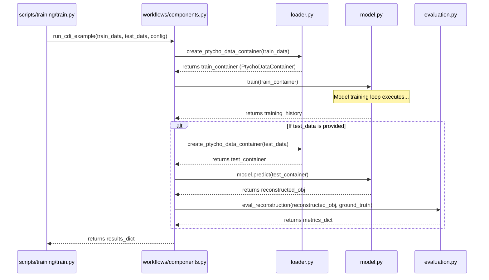
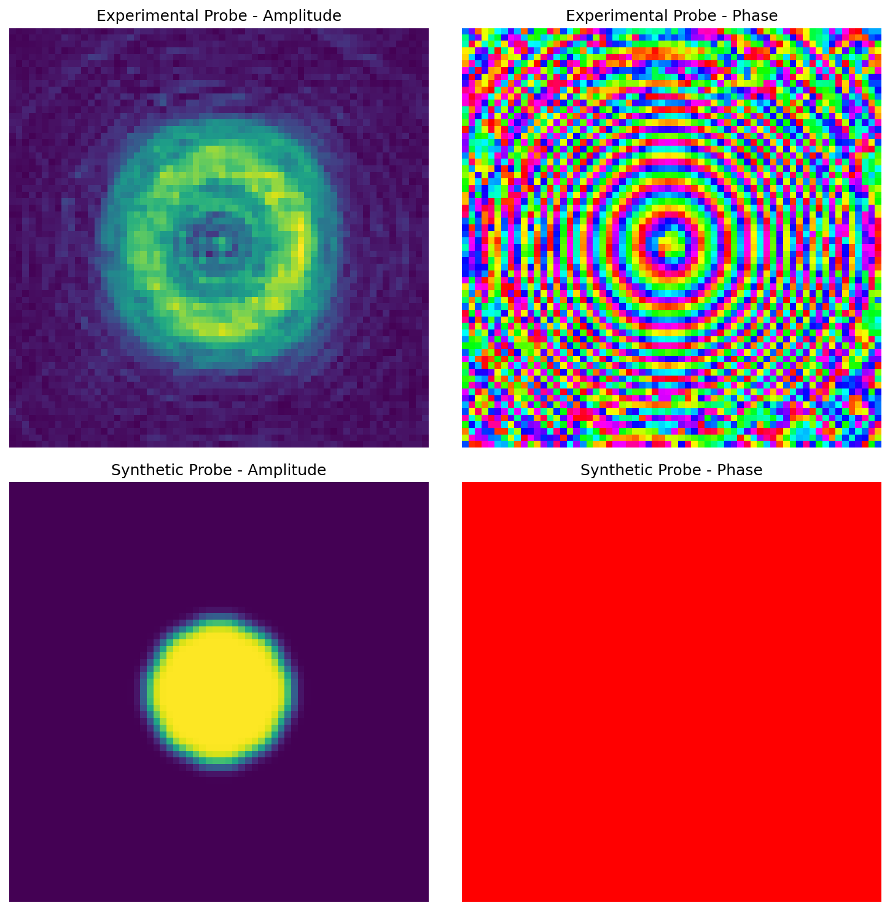

<task>
You are an expert scientist and staff level engineer. Your sole purpose is to analyze the provided codebase context and identify the most relevant files for answering the user's query. Do not answer the query yourself.

<steps>
<0>
Given the codebase context in `<codebase_context>`,
in a <scratchpad>, list the paths of:
 - all source code files
 - all documentation files (all .md files that document the project's architecture and design, but not one-off files like session summaries)
 - all test files
 - all configuration files
 - all other relevant files
 </0>

<1>
Analyze the user's `<query>`.
REVIEW PROJECT DOCUMENTATION
 - **Read CLAUDE.md thoroughly** - This contains essential project context, architecture, and known patterns
 - **Read DEVELOPER_GUIDE.md carefully** - This explains the development workflow, common issues, and debugging approaches
 - Review all architecture.md and all other high-level architecture documents
 - **Understand the project structure** from these documents before diving into the code
</1>
<2>
Think about the <query> and analyze the codebase to form a full understanding of it. Once you are confident in your understanding, review the `<codebase_context>` again to identify all files (source code, documentation, configs) that might be relevant to the query (if in doubt, err on the side of including more files).
</2>
<3>
For each relevant file you identify, provide your output in the strict format specified in `<output_format>`.
</3>
</steps>

<context>
<query>
running the 2x2 study reveals an issue with the synthetic data generation -> training pipeline with gridsize = 2. previously gridsize 2 worked with experimental and synthetic data, so this could be a regression or an issue that for some reason shows up in this workflow but not other synthetic data based workflows, such as /run_complete_generalization_study.sh. i suspected coordinate issues but it doesn't seem that swapping x y or inverting either or both coord helps. visual debugging might be useful. it'll be important to approach this systematically
</query>

<codebase_context>
This file is a merged representation of a subset of the codebase, containing specifically included files and files not matching ignore patterns, combined into a single document by Repomix.

<file_summary>
This section contains a summary of this file.

<purpose>
This file contains a packed representation of a subset of the repository's contents that is considered the most important context.
It is designed to be easily consumable by AI systems for analysis, code review,
or other automated processes.
</purpose>

<file_format>
The content is organized as follows:
1. This summary section
2. Repository information
3. Directory structure
4. Repository files (if enabled)
5. Multiple file entries, each consisting of:
  - File path as an attribute
  - Full contents of the file
</file_format>

<usage_guidelines>
- This file should be treated as read-only. Any changes should be made to the
  original repository files, not this packed version.
- When processing this file, use the file path to distinguish
  between different files in the repository.
- Be aware that this file may contain sensitive information. Handle it with
  the same level of security as you would the original repository.
</usage_guidelines>

<notes>
- Some files may have been excluded based on .gitignore rules and Repomix's configuration
- Binary files are not included in this packed representation. Please refer to the Repository Structure section for a complete list of file paths, including binary files
- Only files matching these patterns are included: **/*.{js,py,md,sh,json,c,h}
- Files matching these patterns are excluded: build/**, node_modules/**, dist/**, *.lock, .claude/**, PtychoNN/**, torch/**
- Files matching patterns in .gitignore are excluded
- Files matching default ignore patterns are excluded
- Files are sorted by Git change count (files with more changes are at the bottom)
</notes>

</file_summary>

<directory_structure>
diagram/
  pinn.py
  tikzeng.py
docs/
  refactor/
    CLAUDE.md
  sessions/
    2025-08-01_dataclass_refactoring_and_ground_truth_fix.md
  architecture.md
  CLAUDE.md
  COMMANDS_REFERENCE.md
  CONFIGURATION_GUIDE.md
  CONFIGURATION.md
  data_contracts.md
  DATA_MANAGEMENT_GUIDE.md
  DEVELOPER_GUIDE.md
  DTYPE_HANDLING.md
  FLY64_DATASET_GUIDE.md
  INITIATIVE_WORKFLOW_GUIDE.md
  MODEL_COMPARISON_GUIDE.md
  PROJECT_ORGANIZATION_GUIDE.md
  PROJECT_STATUS.md
  TOOL_SELECTION_GUIDE.md
  XLA_BEST_PRACTICES.md
loaders/
  als.py
newnew/
  STUDY_SUMMARY.md
notebooks/
  archive/
    ePIE_recon_simulation/
      ePIE_engine.py
      run_ePIE_sim.py
    ablation_nophi.sh
    ablation.sh
    ablationtop.sh
  dose.py
  train_and_infer.py
plans/
  active/
    probe-parameterization-refactor/
      implementation.md
      phase_1_checklist.md
      phase_2_checklist.md
      phase_3_checklist.md
      phase_3_completion_report.md
      phase_3_summary.md
      phase_final_checklist.md
      plan.md
  archive/
    2025-07-evaluation-enhancements/
      implementation.md
      phase_1_checklist.md
      phase_2_checklist.md
      phase_3_checklist.md
      phase_4_checklist.md
      plan.md
    2025-07-model-generalization/
      implementation.md
      plan.md
    2025-07-ms-ssim-correction/
      implementation.md
      phase_1_checklist_ms_ssim_correction.md
      phase_2_checklist_ms_ssim_correction.md
      plan.md
    2025-07-remove-tf-addons/
      implementation.md
      phase_1_checklist.md
      plan.md
      session_documentation.md
      summary.md
    2025-07-sampling-study/
      final_phase_validation_checklist.md
      implementation.md
      phase_1_checklist_sampling_study.md
      plan.md
    2025-07-statistical-generalization/
      implementation.md
      phase_1_checklist_stats.md
      phase_2_checklist_stats.md
      phase_3_checklist_stats.md
      plan.md
    2025-08-codebase-housekeeping/
      phase_3_checklist.md
    2025-08-high-performance-patch-extraction/
      implementation.md
      phase_1_checklist.md
      phase_1_implementation_notes.md
      phase_2_checklist.md
      phase_3_checklist.md
      phase_final_checklist.md
      plan.md
    2025-08-probe-generalization-study/
      implementation.md
      phase_1_checklist.md
      phase_2_checklist.md
      phase_3_checklist.md
      plan.md
    2025-08-probe-parameterization-partial/
      implementation.md
      phase_1_checklist.md
      phase_2_checklist.md
      phase_3_checklist.md
      phase_3_completion_report.md
      phase_3_summary.md
      phase_final_checklist.md
      plan.md
    tike-comparison-integration/
      implementation.md
      phase_1_checklist.md
      phase_2_checklist.md
      phase_4_checklist.md
      plan.md
  examples/
    2025-07-registration-refactor/
      context_priming_registration.md
      implementation.md
      phase_1_checklist.md
      phase_2_checklist.md
      phase_3_checklist.md
      plan.md
      validation_report_registration.md
    2025-08-simulation-workflow-unification/
      changes_summary.md
      implementation_summary.md
      implementation.md
      legacy_usage_findings.md
      phase_1_checklist.md
      phase_2_checklist.md
      phase_2_summary.md
      phase_final_checklist.md
      plan.md
  future/
    legacy-coordinate-grouping-deprecation.md
probe_study_correct_workflow/
  2x2_study_report.md
  fix_plan.md
probe_study_corrected_final_QUICK_TEST/
  study_report.md
probe_study_FULL/
  probe_study_artifacts/
    2x2_study_report_final.md
    README.md
  2x2_study_report_final.md
  study_report.md
probe_study_full_results/
  2x2_study_report.md
ptycho/
  autotest/
    configuration.py
    debug.py
    functionmapping.py
    logger.py
    serializer.py
    testing.py
  config/
    config.py
  datagen/
    diagonals.py
    grf.py
    points.py
    testimg.py
    vendetta.py
  FRC/
    fourier_ring_corr.py
    README.md
    spin_average.py
  image/
    __init__.py
    cropping.py
    registration.py
    stitching.py
  trash/
    model2.py
  workflows/
    components.py
    simulation_utils.py
    visualize_results.py
  baselines.py
  classes.py
  CLAUDE.md
  cli_args.py
  custom_layers.py
  data_preprocessing.py
  diffsim.py
  evaluation.py
  experimental.py
  export.py
  fourier.py
  function_logger.py
  gaussian_filter.py
  generate_data.py
  inference.py
  loader_structure.md
  loader.py
  log_config.py
  logging.py
  losses.py
  misc.py
  model_manager.py
  model.py
  nbutils.py
  nongrid_simulation.py
  params.py
  physics.py
  plotting.py
  probe.py
  projective_warp_xla.py
  raw_data_efficient.py
  raw_data.py
  tf_helper.py
  train_pinn.py
  train_supervised.py
  train.py
  visualization.py
  xpp.py
scripts/
  inference/
    baseline_inference.py
    CLAUDE.md
    inference.py
    README.md
  reconstruction/
    README.md
    run_tike_reconstruction.py
  simulation/
    CLAUDE.md
    README.md
    run_with_synthetic_lines.py
    simulate_and_save.py
    simulate_full_frame.py
    simulation.py
  studies/
    aggregate_2x2_results.py
    aggregate_and_plot_results.py
    CLAUDE.md
    generate_2x2_visualization.py
    prepare_2x2_study.py
    prepare_probe_study.py
    QUICK_REFERENCE.md
    README.md
    run_2x2_probe_study_fixed.sh
    run_2x2_probe_study_fullframe.sh
    run_2x2_probe_study.sh
    run_2x2_study.sh
    run_complete_generalization_study.sh
    run_generalization_study.sh
    run_probe_study_corrected.sh
    test_aggregate_nan_msssim.py
    test_filtering_order.py
    test_mean_vs_median.py
  tools/
    CLAUDE.md
    coordinate_variants_tool.py
    create_hybrid_probe.py
    create_idealized_probe.py
    downsample_data_tool.py
    generate_patches_tool.py
    generate_validation_subsets.py
    pad_to_even_tool.py
    prepare_data_tool.py
    README.md
    shuffle_dataset_tool.py
    split_dataset_tool.py
    swap_coordinates_tool.py
    test_update_tool.py
    transpose_rename_convert_tool.py
    update_tool.py
    validate_fly64_subsets.py
    visualize_dataset.py
  training/
    CLAUDE.md
    README.md
    train.py
  clean_git_history.sh
  compare_models.py
  inspect_ptycho_data.py
  prepare.sh
  run_baseline.py
  run_comparison.sh
  setup_git_hooks.sh
  stitch_patches.py
  tikerecon_with_update.py
  tikerecon.py
test_3way_fix_complete/
  STUDY_SUMMARY.md
test_3way_fix_complete_2/
  STUDY_SUMMARY.md
tests/
  image/
    test_cropping.py
    test_registration.py
  simulation/
    test_simulate_and_save.py
    visualize_test_outputs.py
  tools/
    __init__.py
    test_create_hybrid_probe.py
  workflows/
    __init__.py
    test_simulation_utils.py
  old_test_tf_helper.py
  test_decoupled_simulation.py
  test_generate_data.py
  test_generic_loader.py
  test_misc.py
  test_model_manager.py
  test_patch_extraction_equivalence.py
  test_patch_extraction_performance.py
  test_projective_warp_xla.py
  test_pytorch_tf_wrapper.py
  test_raw_data.py
  test_tf_helper_edge_aware.py
  test_tf_helper.py
benchmark_translation_performance.py
CLAUDE.md
cleanup_commit.md
commit_message.md
COMMIT_MESSAGE.md
debug_model_loading.py
debug_offset_shape.py
debug_translation_differences.py
debug_xla_convention.py
docstring_consistency_report.md
docstring_progress.md
EMERGENCY_FIX.md
FINAL_CLEANUP_STEPS.md
fix_gridsize_performance.py
gemini_direct_prompt.md
gemini_template_fix_report.md
gridsize_performance_fix_session.md
probe_study_session_summary.md
ptycho_module_dependency_analysis.md
README.md
session_summary_complex_object_fix.md
settings.local.json
setup.py
simple_gemini_test.md
simulation_unification_commit.md
test_custom_layers_model.py
test_direct_inference.py
test_direct_load.py
test_inference_no_xla.py
test_inference_simple.py
test_load_existing_model.py
test_minibatch_equivalence.py
test_model_build.py
test_multi_output_layer.py
test_pure_tf_translation.py
test_simple_inference.py
test_simplified_model.py
test_single_custom_layer.py
test_tf_graphics_translation.py
test_xla_accuracy.py
test_xla_translation.py
TF_2.18_2.19_Compatibility_Solution.md
TF_2.18_Solution_Summary.md
TF_2.19_Inference_Debug_Summary.md
TF_2.19_Migration_Report.md
TF_Graphics_Implementation_Summary.md
XLA_Integration_Checklist.md
XLA_Translation_README.md
</directory_structure>

<files>
This section contains the contents of the repository's files.

<file path="diagram/pinn.py">
import numpy as np
import sys
sys.path.append('../')
from pycore.tikzeng import *

offset = -1.5
scale = .3
decoder_offset = 0
def ppos(num_tuple_s):
    nums = num_tuple_s.replace(' ', '').replace('(', '').replace(')', '')
    nums = nums.split(',')
    nums = np.array([float(n) for n in nums])
    nums[0] += decoder_offset
    new = str(tuple(n * scale for n in nums))
    print(new)
    return new

def ppos_encoder(num_tuple_s):
    nums = num_tuple_s.replace(' ', '').replace('(', '').replace(')', '')
    nums = nums.split(',')
    new = str(tuple(float(n) * scale for n in nums))
    print(new)
    return new

## vim macro
"""/\d
cw{}jk?code
k$a"jkpa", jk/\a\d
"""
patch_size = 26
# size of the probe-illuminated patches
probe_scale = 1.2
zoff = -10 #* scale
xext = 31
xpatch = 31.2
patch_width = .5
diff_width = .5
diff_spacing = 7 * probe_scale
xdiff = 37
xdiff2 = 44
probe_size = 32

diff2_spacing = .2
diff2_dx = 2
diff2_dy = .5
diff2_dz = 0.5
diff2_width = 3
amp_suffix = '_1'
phase_suffix = '_2'

legend_offset_y = -20
legend_boxsize = 8
legend_width = 0
legend_spacing_x = 6 / (2 * scale)
legend_offset_x = -7
legend_spacing_y = -4 / (2 * scale)
legend_patch_width = .1
offset2 = offset * (legend_boxsize / 32)

img_path_fmt = '../../notebooks/images/{}'

input1 = img_path_fmt.format('in1.png')
input2 = img_path_fmt.format('in2.png')
input3 = img_path_fmt.format('in3.png')
input4 = img_path_fmt.format('in4.png')

output1 = img_path_fmt.format('out1.png')
output2 = img_path_fmt.format('out2.png')
output3 = img_path_fmt.format('out3.png')
output4 = img_path_fmt.format('out4.png')

patch1_path = img_path_fmt.format('patch1.png')
patch2_path = img_path_fmt.format('patch2.png')
patch3_path = img_path_fmt.format('patch3.png')
patch4_path = img_path_fmt.format('patch4.png')

phase_path = img_path_fmt.format('phase.png')
amp_path = img_path_fmt.format('amp.png')
full_obj_path = img_path_fmt.format('full_obj.png')

im_size = 13 * scale
inp_x = -7
outp_x = 50

encoder = [
    to_input(input1, to=ppos("({},{},{})".format(inp_x, diff2_dy * 1.5, diff2_dz * 1.5)), width = im_size, height = im_size),
    to_input(input2, to=ppos("({},{},{})".format(inp_x, diff2_dy * .5, diff2_dz * .5)), width = im_size, height = im_size),
    to_input(input3, to=ppos("({},{},{})".format(inp_x, diff2_dy * -.5, diff2_dz * -.5)), width = im_size, height = im_size),
    to_input(input4, to=ppos("({},{},{})".format(inp_x, diff2_dy * -1.5, diff2_dz * -1.5)), width = im_size, height = im_size),
    to_ConvRelu("conv11", '', 64, offset=ppos_encoder("(0,0,0)"), to=ppos_encoder("(0,0,0)"),
        height=64 * scale, depth=64 * scale, width=2 * scale),
    to_ConvRelu("conv12", '', '', offset=ppos_encoder("(.4,0,0)"), to=ppos_encoder("(0,0,0)"), height=64 * scale, depth=64 * scale, width=2 * scale),
    to_Pool("pool1", offset=ppos_encoder("(0,0,0)"), to="(conv12-east)", height=32* scale, depth=32* scale),

    to_ConvRelu("conv21", '', '', offset=ppos_encoder("(5,0,0)"), to=ppos_encoder("(0,0,0)"), height=32* scale, depth=32* scale, width=4 * scale),
    to_ConvRelu("conv22", '', 128, offset=ppos_encoder("(5.8,0,0)"), to=ppos_encoder("(0,0,0)"), height=32* scale, depth=32* scale, width=4 * scale),
    to_Pool("pool2", offset=ppos_encoder("(0,0,0)"), to="(conv22-east)", height=16* scale, depth=16* scale),
    to_connection( "pool1", "conv21"),

    to_ConvRelu("conv31", '', 256, offset=ppos_encoder("(10,0,0)"), to=ppos_encoder("(0,0,0)"), height=16* scale, depth=16* scale, width=8 * scale),
    to_ConvRelu("conv32", '', '', offset=ppos_encoder("(11.6,0,0)"), to=ppos_encoder("(0,0,0)"), height=16* scale, depth=16* scale, width=8 * scale),
    to_Pool("pool3", offset=ppos_encoder("(0,0,0)"), to="(conv32-east)", height=8* scale, depth=8* scale),
    to_connection( "pool2", "conv31"),
]

def last_decoder(pos_sign, name_suffix):
    if pos_sign == 1:
        return to_Sigmoid("last" + name_suffix, '', '1', offset=ppos("(23.2,0,0)"),
            to=ppos("(0,{},0)".format(pos_sign * zoff)), height=32* scale,
            depth=32* scale, width=2 * scale,
            caption = 'A(r)')
    elif pos_sign == -1:
        return to_Tanh("last" + name_suffix, '', '1', offset=ppos("(23.2,0,0)"),
            to=ppos("(0,{},0)".format(pos_sign * zoff)), height=32* scale,
            depth=32* scale, width=2 * scale,
            caption = r'$\bm{\phi(r)}$')
    else:
        raise ValueError

def last_decoder_img(pos_sign, name_suffix):
    if pos_sign == 1:
        return to_input(amp_path,
            to=ppos("(24.2,{},0)".format(pos_sign * zoff)), width = im_size / 2,
            height = im_size / 2)
    elif pos_sign == -1:
        return to_input(phase_path,
            to=ppos("(24.2,{},0)".format(pos_sign * zoff)), width = im_size / 2,
            height = im_size / 2)
    else:
        raise ValueError

def mk_decoder(name_suffix = '0', pos_sign = 1):
    return [
    to_ConvRelu("up11" + name_suffix, '', 256, offset=ppos("(12,0,0)"), to=ppos("(0,{},0)".format(pos_sign * zoff)), height=8* scale, depth=8* scale, width=8 * scale),
    to_ConvRelu("up12" + name_suffix, '', '', offset=ppos("(13.6,0,0)"), to=ppos("(0,{},0)".format(pos_sign * zoff)), height=8* scale, depth=8* scale, width=8 * scale),
    to_UnPool("unpool1" + name_suffix, offset=ppos("(0,0,0)"), to="(up12" + name_suffix + "-east)", height=16* scale, depth=16* scale),
    to_connection( "pool3", "up11" + name_suffix),

    to_ConvRelu("up21" + name_suffix, '', 128, offset=ppos("(18,0,0)"), to=ppos("(0,{},0)".format(pos_sign * zoff)), height=16* scale, depth=16* scale, width=4 * scale),
    to_ConvRelu("up22" + name_suffix, '', '', offset=ppos("(18.8,0,0)"), to=ppos("(0,{},0)".format(pos_sign * zoff)), height=16* scale, depth=16* scale, width=4 * scale),
    to_UnPool("unpool2" + name_suffix, offset=ppos("(0,0,0)"), to="(up22" + name_suffix + "-east)", height=32* scale, depth=32* scale),
    to_connection( "unpool1" + name_suffix, "up21" + name_suffix),

#    to_Conv("up31" + name_suffix, '', 1, offset=ppos("(23,0,0)"),
#        to=ppos("(0,{},0)".format(pos_sign * zoff)), height=32* scale,
#        depth=32* scale, width=2 * scale),
    last_decoder(pos_sign, name_suffix),
    last_decoder_img(pos_sign, name_suffix),
    to_connection( "unpool2" + name_suffix, last + name_suffix)
    #to_connection( "unpool2" + name_suffix, "up31" + name_suffix)
    ]
#last = "up31"
last = "last"

forward_map =\
[
    to_Sum("sum1", offset=ppos("(27.5,0,0)"), to=ppos("(0, 0, 0)"), radius=2.5 * scale, opacity=0.6),
    to_connection(last+ amp_suffix, "sum1"),
    to_connection(last+ phase_suffix, "sum1"),
    to_Extract("extract1", '', 4, offset=ppos("({},0,0)".format(xext)),
        to=ppos("(0,0,0)"), height=64* scale / 2, depth=64* scale / 2, width=2* scale,
        caption = ''),
    to_input(full_obj_path, to = ppos("({},0,0)".format(xext)), width = im_size,
        height = im_size),
    to_connection("sum1", "extract1"),
    to_Patch("patch1", '', '', offset=ppos("({},0,0)".format(xpatch)),
        to=ppos("(0,{},{})".format(offset, offset)), height=patch_size * scale, depth=patch_size * scale,
        width=patch_width * scale),
    to_Patch("patch4", '', '', offset=ppos("({},0,0)".format(xpatch)),
        to=ppos("(0,{},{})".format(offset, -offset)), height=patch_size * scale, depth=patch_size * scale,
        width=patch_width * scale),
    to_Patch("patch2", '', '', offset=ppos("({},0,0)".format(xpatch)),
        to=ppos("(0,{},{})".format(-offset, offset)), height=patch_size * scale, depth=patch_size * scale,
        width=patch_width * scale),
    to_Patch("patch3", '', '', offset=ppos("({},0,0)".format(xpatch)),
        to=ppos("(0,{},{})".format(-offset, -offset)), height=patch_size * scale, depth=patch_size * scale,
        width=patch_width * scale)] +\
    to_Illumination("probe2", patch2_path, '', '', offset=ppos("(0,0,0)"),
        to=ppos("({},{},0)".format(xdiff, diff_spacing * 1.5)), height=probe_size * scale, depth=probe_size * scale,
        width=diff_width * scale, im_size = probe_scale * im_size / 2) +\
    [to_connection( "patch2", "probe2")] +\
    to_Illumination("probe3", patch3_path, '', '', offset=ppos("(0,0,0)"),
        to=ppos("({},{},0)".format(xdiff, diff_spacing * .5)), height=probe_size * scale, depth=probe_size * scale,
        width=diff_width * scale, im_size = probe_scale * im_size / 2) +\
    [to_connection( "patch3", "probe3")] +\
    to_Illumination("probe1", patch1_path, '', '', offset=ppos("(0,0,0)"),
        to=ppos("({},{},0)".format(xdiff, diff_spacing * -.5)), height=probe_size * scale, depth=probe_size * scale,
        width=diff_width * scale, im_size = probe_scale * im_size / 2) +\
    [to_connection( "patch1", "probe1")] +\
    to_Illumination("probe4", patch4_path, '', '', offset=ppos("(0,0,0)"),
        to=ppos("({},{},0)".format(xdiff, diff_spacing * -1.5)), height=probe_size * scale, depth=probe_size * scale,
        width=diff_width * scale, im_size = probe_scale * im_size / 2,
        caption = r'$\bm{\times}$ Probe${(\bm{r - r_i})}$') +\
    [to_connection( "patch4", "probe4")] +\
    [
#        to_Diffraction("diff1", '', 4, offset=ppos("({},0,0)".format(xdiff2)),
#        to=ppos("({},{},{})".format(diff2_dx * 1.5, diff2_dy * 1.5, diff2_dz * 1.5)), height=64* scale, depth=64* scale, width=diff2_width* scale,
#        caption = ''),
#    to_Diffraction("diff2", '', 4, offset=ppos("({},0,0)".format(xdiff2 + diff2_spacing)),
#        to=ppos("({},{},{})".format(diff2_dx * .5, diff2_dy * .5, diff2_dz * .5)), height=64* scale, depth=64* scale, width=diff2_width* scale,
#        caption = ''),
    to_Diffraction("diff3", '', 4, offset=ppos("({},0,0)".format(xdiff2 + diff2_spacing * 2)),
        to=ppos("({},{},{})".format(diff2_dx * -.5, diff2_dy * -.5, diff2_dz * -.5)), height=64* scale, depth=64* scale, width=diff2_width* scale,
        caption = ''),
#    to_Diffraction("diff4", '', 4, offset=ppos("({},0,0)".format(xdiff2 + diff2_spacing * 3)),
#        to=ppos("({},{},{})".format(diff2_dx * -1.5, diff2_dy * -1.5, diff2_dz * -1.5)), height=64* scale, depth=64* scale, width=diff2_width* scale,
#        caption = ''),
    to_connection("probe2", "diff3"),#top
    to_connection("probe1", "diff3"),
    to_connection("probe3", "diff3"),
    to_connection("probe4", "diff3"),# bottom
#    to_connection("probe2", "diff1"),#top
#    to_connection("probe1", "diff3"),
#    to_connection("probe3", "diff2"),
#    to_connection("probe4", "diff4"),# bottom

    to_input(output1, to=ppos("({},{},{})".format(outp_x, diff2_dy * 1.5, diff2_dz * 1.5)), width = im_size, height = im_size),
    to_input(output2, to=ppos("({},{},{})".format(outp_x, diff2_dy * .5, diff2_dz * .5)), width = im_size, height = im_size),
    to_input(output3, to=ppos("({},{},{})".format(outp_x, diff2_dy * -.5, diff2_dz * -.5)), width = im_size, height = im_size),
    to_input(output4, to=ppos("({},{},{})".format(outp_x, diff2_dy * -1.5, diff2_dz * -1.5)), width = im_size, height = im_size),

    to_ConvRelu("conv_relu_legend", offset=ppos_encoder("({},{},0)".format(legend_offset_x, legend_offset_y)),
        to=ppos_encoder("(0,0,0)"), height=legend_boxsize * scale, depth=legend_boxsize * scale,
        width=legend_width * scale,
        caption = r"""Conv2D($\cdot$)$\linebreak$~ReLU($\cdot$)""",
        #caption = r"""Conv2D($\cdot$)$\linebreak\rightarrow$~ReLU($\cdot$)""",
        s_filer = '', n_filer = ''),

    to_Pool("pool_legend", offset=ppos_encoder("({},{},0)".format(legend_offset_x + legend_spacing_x, legend_offset_y)),
        to=ppos_encoder("(0,0,0)"), height=legend_boxsize * scale, depth=legend_boxsize * scale,
        width=legend_width * scale,
        caption = r"""AvgPool2D($\cdot$)"""),

    to_UnPool("unpool_legend", offset=ppos_encoder("({},{},0)".format(legend_offset_x + legend_spacing_x * 2,
        legend_offset_y)),
        to=ppos_encoder("(0,0,0)"), height=legend_boxsize * scale, depth=legend_boxsize * scale,
        width=legend_width * scale,
        caption = r"""Upsample($\cdot$)"""),

    to_Tanh("tanh_legend", offset=ppos_encoder("({},{},0)".format(legend_offset_x + legend_spacing_x * 0,
            legend_offset_y + legend_spacing_y)),
        to=ppos_encoder("(0,0,0)"), height=legend_boxsize * scale, depth=legend_boxsize * scale,
        width=legend_width * scale,
        caption = r"""Conv2D($\cdot$)$\linebreak$~$i \bm{\pi \tanh(\cdot)}$""",
        #caption = r"""Conv2D($\cdot$)$\linebreak\rightarrow$~$i \pi \tanh(\cdot$)""",
        s_filer = '', n_filer = ''),

    to_Sigmoid("sigmoid_legend", offset=ppos_encoder("({},{},0)".format(legend_offset_x + legend_spacing_x * 1,
            legend_offset_y + legend_spacing_y)),
        to=ppos_encoder("(0,0,0)"), height=legend_boxsize * scale, depth=legend_boxsize * scale,
        width=legend_width * scale,
        caption = r"""Conv2D($\cdot$)$\linebreak$~Sigmoid$(\cdot)$""",
        s_filer = '', n_filer = ''),

    to_Patch("patch1_legend", '', '', offset=ppos("({},{},0)".format(legend_offset_x + legend_spacing_x * 2,
            legend_offset_y + legend_spacing_y)),
        to=ppos("(0,{},{})".format(offset2, offset2)), height=legend_boxsize * scale, depth=legend_boxsize * scale,
        width=legend_patch_width * scale),
    to_Patch("patch4_legend", '', '', offset=ppos("({},{},0)".format(legend_offset_x + legend_spacing_x * 2,
            legend_offset_y + legend_spacing_y)),
        to=ppos("(0,{},{})".format(offset2, -offset2)), height=legend_boxsize * scale, depth=legend_boxsize * scale,
        width=legend_patch_width * scale),
    to_Patch("patch2_legend", '', '', offset=ppos("({},{},0)".format(legend_offset_x + legend_spacing_x * 2,
            legend_offset_y + legend_spacing_y)),
        to=ppos("(0,{},{})".format(-offset2, offset2)), height=legend_boxsize * scale, depth=legend_boxsize * scale,
        width=legend_patch_width * scale),
    to_Patch("patch3_legend", '', '', offset=ppos("({},{},0)".format(legend_offset_x + legend_spacing_x * 2,
            legend_offset_y + legend_spacing_y)),
        to=ppos("(0,{},{})".format(-offset2, -offset2)), height=legend_boxsize * scale, depth=legend_boxsize * scale,
        width=legend_patch_width * scale,
        caption = r"""Crop$(\cdot)$\linebreak Shift$(\cdot)$""",),
        #caption = r"""Illuminate$(\cdot)$""",),

    to_Diffraction("diff_legend", offset=ppos_encoder("({},{},0)".format(legend_offset_x + legend_spacing_x * 3,
            legend_offset_y + legend_spacing_y)),
        to=ppos_encoder("(0,0,0)"), height=legend_boxsize * scale, depth=legend_boxsize * scale,
        width=legend_width * scale,
        caption = r"""Diffract$(\bm{\cdot})$ \linebreak $\sim $Poisson$(\bm{\cdot}^2)$""",
        s_filer = '', n_filer = ''),

]

arch = [to_head( '..' ),
    to_cor(),
    to_begin()] +\
    encoder + mk_decoder(amp_suffix, pos_sign = 1) +\
    mk_decoder(phase_suffix, pos_sign = -1) + forward_map +\
    [to_end()]

def main():
    namefile = str(sys.argv[0]).split('.')[0]
    to_generate(arch, namefile + '.tex' )

if __name__ == '__main__':
    main()
</file>

<file path="diagram/tikzeng.py">
import os

def to_head( projectpath ):
    pathlayers = os.path.join( projectpath, 'layers/' ).replace('\\', '/')
    return r"""
\documentclass[border=8pt, multi, tikz]{standalone}
\usepackage{import}
\usepackage{bm}
\usepackage{transparent}
\subimport{"""+ pathlayers + r"""}{init}
\usetikzlibrary{positioning}
\usetikzlibrary{3d} %for including external image
"""

def to_cor():
    return r"""
\def\ConvColor{rgb:yellow,5;red,2.5;white,5}
\def\ConvReluColor{rgb:yellow,5;red,5;white,5}
\def\PoolColor{rgb:red,1;black,0.3}
\def\UnpoolColor{rgb:blue,2;green,1;black,0.3}
\def\FcColor{rgb:blue,5;red,2.5;white,5}
\def\FcReluColor{rgb:blue,5;red,5;white,4}
\def\SoftmaxColor{rgb:magenta,5;black,7}
\def\SumColor{rgb:blue,5;green,15}
\def\DcnvColor{rgb:blue,5;green,2.5;white,5}
"""

def to_begin():
    return r"""
\newcommand{\copymidarrow}{\tikz \draw[-Stealth,line width=0.8mm,draw={rgb:blue,4;red,1;green,1;black,3}] (-0.3,0) -- ++(0.3,0);}

\begin{document}
\begin{tikzpicture}
\tikzstyle{connection}=[ultra thick,every node/.style={sloped,allow upside down},draw=\edgecolor,opacity=0.7]
\tikzstyle{copyconnection}=[ultra thick,every node/.style={sloped,allow upside down},draw={rgb:blue,4;red,1;green,1;black,3},opacity=0.7]
"""

# layers definition

def to_input( pathfile, to='(-3,0,0)', width=8, height=8, name="temp" ):
    return r"""
\node[canvas is zy plane at x=0] (""" + name + """) at """+ to +""" {\includegraphics[width="""+ str(width)+"cm"+""",height="""+ str(height)+"cm"+"""]{"""+ pathfile +"""}};
"""

# Conv
def to_Conv( name, s_filer=256, n_filer=64, offset="(0,0,0)", to="(0,0,0)", width=1, height=40, depth=40, caption=" " ):
    return r"""
\pic[shift={"""+ offset +"""}] at """+ to +"""
    {Box={
        name=""" + name +""",
        caption="""+ caption +r""",
        xlabel={{"""+ str(n_filer) +""", }},
        zlabel="""+ str(s_filer) +""",
        fill=\ConvColor,
        height="""+ str(height) +""",
        width="""+ str(width) +""",
        depth="""+ str(depth) +"""
        }
    };
"""

def to_ConvRelu( name, s_filer=256, n_filer=64, offset="(0,0,0)", to="(0,0,0)", width=1, height=40, depth=40, caption=" " ):
    return r"""
\pic[shift={"""+ offset +"""}] at """+ to +"""
    {Box={
        name=""" + name +""",
        caption="""+ caption +r""",
        xlabel={{"""+ str(n_filer) +""", }},
        zlabel="""+ str(s_filer) +""",
        fill=\ConvReluColor,
        height="""+ str(height) +""",
        width="""+ str(width) +""",
        depth="""+ str(depth) +"""
        }
    };
"""

# Conv,Conv,relu
# Bottleneck
def to_ConvConvRelu( name, s_filer=256, n_filer=(64,64), offset="(0,0,0)", to="(0,0,0)", width=(2,2), height=40, depth=40, caption=" " ):
    return r"""
\pic[shift={ """+ offset +""" }] at """+ to +"""
    {RightBandedBox={
        name="""+ name +""",
        caption="""+ caption +""",
        xlabel={{ """+ str(n_filer[0]) +""", """+ str(n_filer[1]) +""" }},
        zlabel="""+ str(s_filer) +""",
        fill=\ConvColor,
        bandfill=\ConvReluColor,
        height="""+ str(height) +""",
        width={ """+ str(width[0]) +""" , """+ str(width[1]) +""" },
        depth="""+ str(depth) +"""
        }
    };
"""


# Pool
def to_Pool(name, offset="(0,0,0)", to="(0,0,0)", width=1, height=32, depth=32, opacity=0.5, caption=" "):
    return r"""
\pic[shift={ """+ offset +""" }] at """+ to +"""
    {Box={
        name="""+name+""",
        caption="""+ caption +r""",
        fill=\PoolColor,
        opacity="""+ str(opacity) +""",
        height="""+ str(height) +""",
        width="""+ str(width) +""",
        depth="""+ str(depth) +"""
        }
    };
"""

# unpool4,
def to_UnPool(name, offset="(0,0,0)", to="(0,0,0)", width=1, height=32, depth=32, opacity=0.5, caption=" "):
    return r"""
\pic[shift={ """+ offset +""" }] at """+ to +"""
    {Box={
        name="""+ name +r""",
        caption="""+ caption +r""",
        fill=\UnpoolColor,
        opacity="""+ str(opacity) +""",
        height="""+ str(height) +""",
        width="""+ str(width) +""",
        depth="""+ str(depth) +"""
        }
    };
"""


def to_ConvRes( name, s_filer=256, n_filer=64, offset="(0,0,0)", to="(0,0,0)", width=6, height=40, depth=40, opacity=0.2, caption=" " ):
    return r"""
\pic[shift={ """+ offset +""" }] at """+ to +"""
    {RightBandedBox={
        name="""+ name + """,
        caption="""+ caption + """,
        xlabel={{ """+ str(n_filer) + """, }},
        zlabel="""+ str(s_filer) +r""",
        fill={rgb:white,1;black,3},
        bandfill={rgb:white,1;black,2},
        opacity="""+ str(opacity) +""",
        height="""+ str(height) +""",
        width="""+ str(width) +""",
        depth="""+ str(depth) +"""
        }
    };
"""

def to_Pad( name, s_filer=256, n_filer=64, offset="(0,0,0)", to="(0,0,0)", width=6, height=40, depth=40, opacity=0.2, caption=" " ):
    return r"""
\pic[shift={ """+ offset +""" }] at """+ to +"""
    {RightBandedBox={
        name="""+ name + """,
        caption="""+ caption + """,
        xlabel={{ """+ str(n_filer) + """, }},
        zlabel="""+ str(s_filer) +r""",
        fill={rgb:white,1;black,3},
        bandfill={rgb:white,1;black,2},
        opacity="""+ str(opacity) +""",
        height="""+ str(height) +""",
        width="""+ str(width) +""",
        depth="""+ str(depth) +"""
        }
    };
"""

def to_Sigmoid( name, s_filer=256, n_filer=64, offset="(0,0,0)", to="(0,0,0)", width=6, height=40, depth=40, opacity=0.2, caption=" " ):
    return r"""
\pic[shift={ """+ offset +""" }] at """+ to +"""
    {RightBandedBox={
        name="""+ name + """,
        caption="""+ caption + """,
        xlabel={{ """+ str(n_filer) + """, }},
        zlabel="""+ str(s_filer) +r""",
        fill={rgb:white,1;black,3},
        bandfill={rgb:violet,2},
        opacity="""+ str(opacity) +""",
        height="""+ str(height) +""",
        width="""+ str(width) +""",
        depth="""+ str(depth) +"""
        }
    };
"""

def to_Tanh( name, s_filer=256, n_filer=64, offset="(0,0,0)", to="(0,0,0)", width=6, height=40, depth=40, opacity=0.2, caption=" " ):
    return r"""
\pic[shift={ """+ offset +""" }] at """+ to +"""
    {RightBandedBox={
        name="""+ name + """,
        caption="""+ caption + """,
        xlabel={{ """+ str(n_filer) + """, }},
        zlabel="""+ str(s_filer) +r""",
        fill={rgb:white,1;black,3},
        bandfill={rgb:black,2},
        opacity="""+ str(opacity) +""",
        height="""+ str(height) +""",
        width="""+ str(width) +""",
        depth="""+ str(depth) +"""
        }
    };
"""

def to_Patch( name, s_filer=256, n_filer=64, offset="(0,0,0)", to="(0,0,0)", width=6, height=40, depth=40,
        opacity=0.1, caption=" " ):
    return r"""
\pic[shift={ """+ offset +""" }] at """+ to +"""
    {RightBandedBox={
        name="""+ name + """,
        caption="""+ caption + """,
        xlabel={{ """+ str(n_filer) + """, }},
        zlabel="""+ str(s_filer) +r""",
        fill={rgb:white,1;black,3},
        bandfill={rgb:black,2},
        opacity="""+ str(opacity) +""",
        bandopacity="""+ str(opacity) +""",
        height="""+ str(height) +""",
        width="""+ str(width) +""",
        depth="""+ str(depth) +"""
        }
    };
"""
# bandfill={rgb:blue,1;red,2},

def to_Extract( name, s_filer=256, n_filer=64, offset="(0,0,0)", to="(0,0,0)",
        width=6, height=40, depth=40, opacity=0.2, caption=" " ):
    return r"""
\pic[shift={ """+ offset +""" }] at """+ to +"""
    {RightBandedBox={
        name="""+ name + """,
        caption="""+ caption + """,
        xlabel={{ """+ str(n_filer) + """, }},
        zlabel="""+ str(s_filer) +r""",
        fill={rgb:white,1;black,3},
        bandfill={rgb:white,1;green,2},
        opacity="""+ str(opacity) +""",
        height="""+ str(height) +""",
        width="""+ str(width) +""",
        depth="""+ str(depth) +"""
        }
    };
"""


def to_Illumination( name, filepath, s_filer=256, n_filer=64,
    offset="(0,0,0)", to="(0,0,0)", width=6, height=40, depth=40,
    opacity=0.2, caption=" " , im_size = 4):
    return [r"""
\pic[shift={ """+ offset +""" }] at """+ to +"""
    {RightBandedBox={
        name="""+ name + """,
        caption="""+ caption + """,
        xlabel={{ """+ str(n_filer) + """, }},
        zlabel="""+ str(s_filer) +r""",
        fill={rgb:white,1;blue,3},
        bandfill={rgb:black,1;blue,3},
        opacity="""+ str(opacity) +""",
        height="""+ str(height) +""",
        width="""+ str(width) +""",
        depth="""+ str(depth) +"""
        }
    };
""",
    to_input(filepath, to = to, width = im_size, height = im_size)]

def to_Diffraction( name, s_filer=256, n_filer=64, offset="(0,0,0)", to="(0,0,0)", width=6, height=40, depth=40,
        opacity=0.4, caption=" " ):
    return r"""
\pic[shift={ """+ offset +""" }] at """+ to +"""
    {RightBandedBox={
        name="""+ name + """,
        caption="""+ caption + """,
        xlabel={{ """+ str(n_filer) + """, }},
        zlabel="""+ str(s_filer) +r""",
        fill={rgb:violet,1;red,3},
        bandfill={rgb:white,1;red,3},
        opacity="""+ str(opacity) +""",
        height="""+ str(height) +""",
        width="""+ str(width) +""",
        depth="""+ str(depth) +"""
        }
    };
"""


# ConvSoftMax
def to_ConvSoftMax( name, s_filer=40, offset="(0,0,0)", to="(0,0,0)", width=1, height=40, depth=40, caption=" " ):
    return r"""
\pic[shift={"""+ offset +"""}] at """+ to +"""
    {Box={
        name=""" + name +""",
        caption="""+ caption +""",
        zlabel="""+ str(s_filer) +""",
        fill=\SoftmaxColor,
        height="""+ str(height) +""",
        width="""+ str(width) +""",
        depth="""+ str(depth) +"""
        }
    };
"""

# SoftMax
def to_SoftMax( name, s_filer=10, offset="(0,0,0)", to="(0,0,0)", width=1.5, height=3, depth=25, opacity=0.8, caption=" " ):
    return r"""
\pic[shift={"""+ offset +"""}] at """+ to +"""
    {Box={
        name=""" + name +""",
        caption="""+ caption +""",
        xlabel={{" ","dummy"}},
        zlabel="""+ str(s_filer) +""",
        fill=\SoftmaxColor,
        opacity="""+ str(opacity) +""",
        height="""+ str(height) +""",
        width="""+ str(width) +""",
        depth="""+ str(depth) +"""
        }
    };
"""

def to_Sum( name, offset="(0,0,0)", to="(0,0,0)", radius=2.5, opacity=0.6):
    return r"""
\pic[shift={"""+ offset +"""}] at """+ to +"""
    {Ball={
        name=""" + name +""",
        fill=\SumColor,
        opacity="""+ str(opacity) +""",
        radius="""+ str(radius) +""",
        logo=""" + r'$\times$' + """
        }
    };
"""

def to_Prod( name, offset="(0,0,0)", to="(0,0,0)", radius=2.5, opacity=0.6):
    return r"""
\pic[shift={"""+ offset +"""}] at """+ to +"""
    {Ball={
        name=""" + name +""",
        fill=\SumColor,
        opacity="""+ str(opacity) +""",
        radius="""+ str(radius) +""",
        logo=$x$
        }
    };
"""

# \times?

def to_connection( of, to):
    return r"""
\draw [connection]  ("""+of+"""-east)    -- node {\midarrow} ("""+to+"""-west);
"""

def to_skip( of, to, pos=1.25):
    return r"""
\path ("""+ of +"""-southeast) -- ("""+ of +"""-northeast) coordinate[pos="""+ str(pos) +"""] ("""+ of +"""-top) ;
\path ("""+ to +"""-south)  -- ("""+ to +"""-north)  coordinate[pos="""+ str(pos) +"""] ("""+ to +"""-top) ;
\draw [copyconnection]  ("""+of+"""-northeast)
-- node {\copymidarrow}("""+of+"""-top)
-- node {\copymidarrow}("""+to+"""-top)
-- node {\copymidarrow} ("""+to+"""-north);
"""

def to_end():
    return r"""
\end{tikzpicture}
\end{document}
"""

def to_generate( arch, pathname="file.tex" ):
    with open(pathname, "w") as f:
        for c in arch:
            print(c)
            f.write( c )
</file>

<file path="loaders/als.py">
import numpy as np
from ptycho.raw_data import RawData

import pkg_resources

def load_single_object(file_path, train_size=512):
    """
    Load ptychography data from a file and return RawData objects. We ASSUME we're processing
    a single object. The first train_size samples will be used for training and the entire dataset 
    will be used for evaluation.

    Args:
        file_path: Path to the data file.
        train_size (int, optional): Number of data points to include in the training set. Defaults to 512.

    Returns:
        tuple: A tuple containing two RawData objects:
            - ptycho_data: RawData object containing the full dataset.
            - ptycho_data_train: RawData object containing a subset of the data for training.
    """
    # Load data from file
    data = np.load(file_path)

    # Extract required arrays from loaded data
    xcoords = data['xcoords']
    ycoords = data['ycoords']
    xcoords_start = data['xcoords_start']
    ycoords_start = data['ycoords_start']
    diff3d = data['diffraction']
    probeGuess = data['probeGuess']
    objectGuess = data['objectGuess']

    # Create scan_index array
    scan_index = np.zeros(diff3d.shape[0], dtype=int)

    # Create RawData object for the full dataset
    ptycho_data = RawData(xcoords, ycoords, xcoords_start, ycoords_start,
                          diff3d, probeGuess, scan_index, objectGuess=objectGuess)

    # Create RawData object for the training subset
    ptycho_data_train = RawData(xcoords[:train_size], ycoords[:train_size],
                                xcoords_start[:train_size], ycoords_start[:train_size],
                                diff3d[:train_size], probeGuess,
                                scan_index[:train_size], objectGuess=objectGuess)

    return ptycho_data, ptycho_data_train, data
</file>

<file path="notebooks/archive/ePIE_recon_simulation/ePIE_engine.py">
# -*- coding: utf-8 -*-
"""
Created on 2020 01 29

@author: Sanna

Based on "A phase retrieval algorithm for shifting illumination" J.M. Rodenburg and H.M.L Faulkner, [App. Phy. Lett.  85.20 (2004)]
"""

import numpy as np
from numpy import fft
import matplotlib.pyplot as plt
import matplotlib.animation as animation


def ePIE(n, diffSet, probe, objectSize, positions,illu_indy,illu_indx ):

    # size of probe and diffraction patterns
    ysize, xsize = probe.shape
        
    # initialize object. make sure it can hold complex numbers
    objectFunc = np.ones(objectSize, dtype=np.complex64)
    
    # initalize that illuminated part of the object
    objectIlluminated = np.ones(shape=(ysize, xsize),dtype=np.complex64)
    
    # initialize algorithm wave fields (fourier and real) 
    g = np.zeros(( ysize, xsize),dtype=np.complex64)
    gprime = np.zeros(( ysize, xsize),dtype=np.complex64)
    G = np.zeros(( ysize, xsize),dtype=np.complex64)
    Gprime = np.zeros(( ysize, xsize),dtype=np.complex64)

    # define iteration counter for outer loop
    k = 0
    
    # figure for animation
    fig = plt.figure()
    
    # Initialize vector for animation data
    ims = []
    
    # initialize vector for error calculation
    # sse = np.zeros(shape=(n,1))
    
    # idex for iterating through the diffraction patterns
    diffSetIndex = 0
    
    # Start of ePIE iterations
    while k < n:
        # Start of inner loop: (where you iterate through all probe positions R)
        for pos in positions:
        
             # Cut out the part of the image that is illuminated at R(=(ypos,xpos)
             objectIlluminated = objectFunc[pos[0]+illu_indy, pos[1]+illu_indx ]

             # Guessed wave field from the object at position R 
             g = objectIlluminated * probe      
        
             # fft the wave field at position R to Fourier space
             G = (fft.fftshift(fft.fft2(g)))
            
             # make |PSI| confirm with the diffraction pattern from R
             Gprime = np.sqrt(abs(diffSet[diffSetIndex]))*np.exp(1j*np.angle(G))
             
             # inverse Fourier transform  
             gprime =  fft.ifft2(fft.ifftshift(Gprime))
     
             # update the TOTAL object function with the illuminated part
             # The update should be the differens of the last iteration and the new one 
             alpha = 1 #higher value == faster change
             objectFunc[pos[0]+illu_indy, pos[1]+illu_indx] = objectIlluminated + alpha*(gprime-g) * np.conj(probe)  / (np.max(abs(probe))**2)   #probe* annars blir det att man delar med massa nollor
             
             # update probe function
             beta = 0.01 #higher value == faster change
             probe = probe + beta * (gprime-g) * np.conj(objectIlluminated)/ (np.max(abs(objectIlluminated))**2)
             
             ########################            
             # Apply further constraints:
             # These 2 constraints are for transmission                
             ########################
            
             # constrain object amplitude to 1
#             temp_Oamp = abs(objectFunc)
#             temp_Oamp[temp_Oamp>1] = 1
#             temp = np.angle(objectFunc)
#             objectFunc = temp_Oamp * np.exp(1j* temp)
#            
#             #constraint object phase to negative or 0
#             temp_Ophase = np.angle(objectFunc)
#             temp_Ophase[temp_Ophase>0] = 0
#             objectFunc = abs(objectFunc) * np.exp(1j* temp_Ophase)
##            
             # animate
             im = plt.imshow(np.angle(objectFunc), animated=True)
             ims.append([im])

             diffSetIndex += 1
    
    
        k += 1        
        print('Iteration %d starts'%k)
        
        #SSE[0][k] =  sum(sum(abs(Gprime - diffSet[3] )**2 ))
        
        #reset inner loop index
        diffSetIndex = 0
       
    # End of iterations
    print('End of iterations')
    
    #todo calculate average error
    err = np.sum( abs(diffSet[-1]**2 - G**2 )**2)
    
    # animate reconstruction 
    ani = animation.ArtistAnimation(fig, ims, interval=150, blit=True,repeat_delay=3000)
    
    # save animation
    # .mp4 requires mencoder or ffmpeg to be installed
    #ani.save('ePIE.gif')
    #print('Saving animation')
    
    #show animation
    plt.show()
    
    return objectFunc, probe, err

if __name__ == 'main':
    
    print('main prog')
</file>

<file path="notebooks/archive/ePIE_recon_simulation/run_ePIE_sim.py">
# -*- coding: utf-8 -*-
"""
Created on 2020 01 28 try to get a ePIE simulation to work... with my old code

Working!

Loads an image. Saves image as object phase. Creates a flat field probe.
Defines scanning postions on the object. 
Creates an exit wave Y= object * probe in each scanning positions. Propagates 
the exit wave with a fft. Reconstructs the objec and probe by 
running the ePIE algorithm.

@author: Susanna Hammarberg

"""


import sys   #to collect system path ( to collect function from another directory)
import matplotlib.pyplot as plt
import matplotlib.image as mpimg
from numpy import fft
import numpy as np
from ePIE_engine import ePIE  


#----------------------------------
# create sim probe and object.
# load image and set to object phase or amplitude values
#----------------------------------

def image():
    
    #probe = mpimg.imread('circle.png')
    probe = np.zeros((256,256))
    #probe = np.ones((128,128))
    #probe[110:147, 110:147] = 1
    probe[100:157, 100:157] = 1
    
    obj = mpimg.imread('fruit.jpg')

    return probe,obj

probe, obj = image()


# collapse to 3d matrix
try:
    probe = np.array(np.sum(probe, axis=2))
except Exception:
    print('probe not 3d. OK')
try:
    obj = np.array(np.sum(obj, axis=2))
except Exception:
    print('obj not 3d. OK')


# pad image and make them complex 
padding = 0
probe = np.pad(probe, ((padding,padding),(padding,padding)), 'constant', constant_values=(0, 0))
obj = np.pad(obj, ((padding,padding),(padding,padding)), 'constant', constant_values=(0, 0))

# normalize amplitude to 1
obj = obj /obj.max()


#make object only phase (intstead of only amplitude)
#(comment out for amplitude object)
obj = 1.0 * np.exp(obj*1j) 


fig, ((ax1, ax2), (ax3, ax4)) = plt.subplots(2, 2, gridspec_kw={'wspace': 0}); plt.suptitle('initial object and probe'); 
ax1.imshow((np.abs(obj)),cmap='jet'); ax1.set_title('amplitude');  ax2.imshow(np.angle(obj)); ax2.set_title('Phase')
ax3.imshow(abs(probe)); ax3.set_title('Amplitude'); ax4.imshow(np.angle(probe),cmap='jet'); ax4.set_title('Phase')

#%%
#------------------------------------------------
#define scanning positions in terms of pixels
#------------------------------------------------

origin = 20
Ny = 10 ; Nx = 10
# overlapp shild be 60% stepsize = int(probeSize * 0.4)   #for 60% overlapp
dy = 10 ; dx = dy #same
positions = np.zeros((Ny*Nx,2),dtype=np.int32)
#y positions in 1st colum
positions[:, 1] = np.tile(np.arange(Nx)*dx, Ny)
#y positions in 1st colum
positions[:, 0] = np.repeat(np.arange(Ny)*dy , Nx)  
positions += origin

print('Scanning positions defined')

#----------------------------------
# make a set of diffraction patters  
#----------------------------------

# a list of diffrac tion patterns
diff_set = []
# the indices for the area that is illuminated by the probe (should have the probes shape)
illu_indy, illu_indx = np.indices((probe.shape) )

# create a diffraction pattern at each probe position
for pos in positions:   
    # Propogate (obj*probe) to far field with a Fourier transform, then calculate the absolute square
    diff_set.append(abs(fft.fftshift(fft.fft2( obj[pos[0]+illu_indy, pos[1]+illu_indx]*probe)))**2 )
  

print('Diffraction patterns created')
plt.figure();plt.title('Example of diffraction pattern')
plt.imshow(abs(np.log10(diff_set[-1])))    
#----------------------------------
# Run reconstruction
#----------------------------------

#define object shape (needed  for ePIE function)
object_shape = obj.shape   # ex (34,34)

# number of iterations in ePIE
k = 3
# run the algoritm
objectFunc, probe_ret, err = ePIE(k,diff_set,probe,object_shape, positions,illu_indy,illu_indx) 
print('Error of last frame',err)

#----------------------------------
# image the result
#----------------------------------

fig, ((ax1, ax2), (ax3, ax4)) = plt.subplots(2, 2, gridspec_kw={'wspace': 0}); plt.suptitle('final object and probe'); 
ax1.imshow((np.abs(objectFunc)),cmap='jet'); ax1.set_title('amplitude obj');  ax2.imshow(np.angle(objectFunc)); ax2.set_title('Phase obj')
ax3.imshow(abs(probe_ret)); ax3.set_title('Amplitude probe'); ax4.imshow(np.angle(probe_ret),cmap='jet'); ax4.set_title('Phase probe')
</file>

<file path="notebooks/archive/ablation_nophi.sh">
#!/bin/bash
#dsource=grf
#prefix=grf2
dsource=$1
prefix=$2
nepochs=$3

outer_offset_train=8
outer_offset_test=20

# Invocation 1
python ptycho/train.py  --data_source $dsource --nepochs $nepochs --offset 4  --output_prefix $prefix --model_type pinn --gridsize 2 --n_filters_scale 2 --object_big True --intensity_scale_trainable True --label "PINN,NLL,overlaps" --nimgs_train 2 --nimgs_test 1 --outer_offset_train $outer_offset_train --outer_offset_test $outer_offset_test

# Invocation 2
python ptycho/train.py  --data_source $dsource --nepochs $nepochs --offset 4  --output_prefix $prefix --model_type pinn --nll_weight 0.0 --mae_weight 1.0 --intensity_scale_trainable True --object_big True --n_filters_scale 2 --label "PINN,overlaps" --nimgs_train 2 --nimgs_test 1 --outer_offset_train $outer_offset_train --outer_offset_test $outer_offset_test

# Invocation 3
python ptycho/train.py  --data_source $dsource --nepochs $nepochs --offset 4  --output_prefix $prefix --model_type supervised --n_filters_scale 1 --gridsize 2 --label "overlaps" --nimgs_train 2 --nimgs_test 1 --outer_offset_train $outer_offset_train --outer_offset_test $outer_offset_test

# Invocation 4
python ptycho/train.py  --data_source $dsource --nepochs $nepochs --offset 4  --output_prefix $prefix --model_type pinn --gridsize 1 --nll_weight 1.0 --mae_weight 0.0 --label "PINN,NLL" --nimgs_train 2 --nimgs_test 1 --outer_offset_train $outer_offset_train --outer_offset_test $outer_offset_test

# Invocation 5
python ptycho/train.py  --data_source $dsource --nepochs $nepochs --offset 4  --output_prefix $prefix --model_type pinn --gridsize 1 --nll_weight 0.0 --mae_weight 1.0 --label "PINN" --nimgs_train 2 --nimgs_test 1 --outer_offset_train $outer_offset_train --outer_offset_test $outer_offset_test

# Invocation 6
python ptycho/train.py  --data_source $dsource --nepochs $nepochs --offset 4  --output_prefix $prefix --model_type supervised --gridsize 1 --n_filters_scale 1 --label "none" --nimgs_train 2 --nimgs_test 1 --outer_offset_train $outer_offset_train --outer_offset_test $outer_offset_test
</file>

<file path="notebooks/archive/ablation.sh">
#!/bin/bash
#dsource=grf
#prefix=grf2
dsource=$1
prefix=$2
nepochs=$3

outer_offset_train=$4 # 8
outer_offset_test=$5 # 20

#outer_offset_train=8
#outer_offset_test=20

# Invocation 1
python ptycho/train.py  --data_source $dsource --nepochs $nepochs --offset 4  --output_prefix $prefix --model_type pinn --gridsize 2 --n_filters_scale 2 --object_big True --intensity_scale_trainable True --label "PINN,NLL,overlaps" --nimgs_train 2 --nimgs_test 1 --outer_offset_train $outer_offset_train --outer_offset_test $outer_offset_test --set_phi 

# Invocation 2
python ptycho/train.py  --data_source $dsource --nepochs $nepochs --offset 4  --output_prefix $prefix --model_type pinn --nll_weight 0.0 --mae_weight 1.0 --intensity_scale_trainable True --object_big True --n_filters_scale 2 --label "PINN,overlaps" --nimgs_train 2 --nimgs_test 1 --outer_offset_train $outer_offset_train --outer_offset_test $outer_offset_test --set_phi 

# Invocation 3
python ptycho/train.py  --data_source $dsource --nepochs $nepochs --offset 4  --output_prefix $prefix --model_type supervised --n_filters_scale 1 --gridsize 2 --label "overlaps" --nimgs_train 2 --nimgs_test 1 --outer_offset_train $outer_offset_train --outer_offset_test $outer_offset_test --set_phi 

# Invocation 4
python ptycho/train.py  --data_source $dsource --nepochs $nepochs --offset 4  --output_prefix $prefix --model_type pinn --gridsize 1 --nll_weight 1.0 --mae_weight 0.0 --label "PINN,NLL" --nimgs_train 2 --nimgs_test 1 --outer_offset_train $outer_offset_train --outer_offset_test $outer_offset_test --set_phi 

# Invocation 5
python ptycho/train.py  --data_source $dsource --nepochs $nepochs --offset 4  --output_prefix $prefix --model_type pinn --gridsize 1 --nll_weight 0.0 --mae_weight 1.0 --label "PINN" --nimgs_train 2 --nimgs_test 1 --outer_offset_train $outer_offset_train --outer_offset_test $outer_offset_test --set_phi 

# Invocation 6
python ptycho/train.py  --data_source $dsource --nepochs $nepochs --offset 4  --output_prefix $prefix --model_type supervised --gridsize 1 --n_filters_scale 1 --label "none" --nimgs_train 2 --nimgs_test 1 --outer_offset_train $outer_offset_train --outer_offset_test $outer_offset_test --set_phi
</file>

<file path="notebooks/archive/ablationtop.sh">
bash ablation.sh experimental experimental3 50 4 20 && bash ablation_nophi.sh lines lines_nophi3 50 && bash ablation.sh grf grf3 50 8 20
 
bash ablation.sh experimental experimental3 50 4 20 && bash ablation_nophi.sh lines lines_nophi3 50 && bash ablation.sh grf grf3 50 8 20

bash ablation.sh experimental experimental3 50 4 20 && bash ablation_nophi.sh lines lines_nophi3 50 && bash ablation.sh grf grf3 50 8 20

bash ablation.sh experimental experimental3 50 4 20 && bash ablation_nophi.sh lines lines_nophi3 50 && bash ablation.sh grf grf3 50 8 20

bash ablation.sh experimental experimental3 50 4 20 && bash ablation_nophi.sh lines lines_nophi3 50 && bash ablation.sh grf grf3 50 8 20

bash ablation.sh experimental experimental3 50 4 20 && bash ablation_nophi.sh lines lines_nophi3 50 && bash ablation.sh grf grf3 50 8 20

bash ablation.sh experimental experimental3 50 4 20 && bash ablation_nophi.sh lines lines_nophi3 50 && bash ablation.sh grf grf3 50 8 20

bash ablation.sh experimental experimental3 50 4 20 && bash ablation_nophi.sh lines lines_nophi3 50 && bash ablation.sh grf grf3 50 8 20
</file>

<file path="notebooks/dose.py">
import argparse

def init(nphotons, loss_fn='nll'):
    from ptycho.params import cfg
    cfg['positions.provided'] = False
    cfg['data_source'] = 'lines'
    cfg['set_phi'] = False
    cfg['nepochs'] = 60 

    cfg['offset'] = 4
    cfg['max_position_jitter'] = 3
    cfg['output_prefix'] = 'lines3'

    cfg['gridsize'] = 2
    cfg['n_filters_scale'] = 2
    cfg['object.big'] = True
    cfg['intensity_scale.trainable'] = True
    cfg['probe.trainable'] = False

    cfg['outer_offset_train'] = 8
    cfg['outer_offset_test'] = 20
    cfg['nimgs_train'] = 2
    cfg['nimgs_test'] = 2

    cfg['nphotons'] = nphotons

    if loss_fn == 'mae':
        cfg['mae_weight'] = 1.
        cfg['nll_weight'] = 0.
    elif loss_fn == 'nll':
        pass  # Keep the current behavior
    else:
        raise ValueError(f"Invalid loss_fn: {loss_fn}. Must be 'mae' or 'nll'.")

def plot_results(stitched_obj, YY_ground_truth, d):
    import matplotlib.pyplot as plt
    import numpy as np

    fig, axs = plt.subplots(1, 1, figsize=(5, 5))

    # reconstructed amplitude images
    img1 = axs.imshow(np.absolute(stitched_obj)[0], cmap='jet', interpolation='none')
    axs.set_title(f'Reconstructed amplitude - FRC50: {d["frc50"][0]:.2f}')

    fig.colorbar(img1, ax=axs)

def execute(nphotons, reload_modules=False):
    from ptycho.tf_helper import pad
    from ptycho.evaluation import save_metrics, trim
    from ptycho.tf_helper import pad
    from ptycho.params import cfg
    cfg['nphotons'] = nphotons

    cfg['data_source'] = 'lines'
    cfg['offset'] = 4
    cfg['max_position_jitter'] = 10
    cfg['output_prefix'] = 'lines2'

    cfg['gridsize'] = 2
    cfg['n_filters_scale'] = 2
    cfg['object.big'] = True
    cfg['intensity_scale.trainable'] = True

    from ptycho import train
    if reload_modules:
        reload(train.generate_data)
        reload(train.train_pinn.model)
        reload(train.train_pinn)
        reload(train)

    stitched_obj, YY_ground_truth = train.stitched_obj, train.YY_ground_truth

    from ptycho.train_pinn import train as train_pinn, eval as eval_pinn
    from ptycho import misc

    plot_results(stitched_obj, YY_ground_truth, train.d)
    # Corrected the indentation and scope of the return statement
    return train.d, YY_ground_truth, stitched_obj, train.train_output

def parse_arguments():
    parser = argparse.ArgumentParser(description='Ptychographic reconstruction script.')
    parser.add_argument('nphotons', type=float, help='Number of photons')
    args = parser.parse_args()
    return args.nphotons

if __name__ == '__main__':
    nphotons = parse_arguments()
    init(nphotons)

    d, YY_ground_truth, stitched_obj = execute(nphotons)

from importlib import reload
def run_experiment_with_photons(photons_list, loss_fn='nll'):
    print("DEBUG: Starting run_experiment_with_photons")
    results = {}
    first_iteration = True
    for nphotons in photons_list:
        init(nphotons, loss_fn=loss_fn)
        print("DEBUG: nphotons set to", nphotons, "in run_experiment_with_photons")
        if  first_iteration:
            d, YY_ground_truth, stitched_obj, train_output = execute(nphotons, reload_modules=False)
        else:
            d, YY_ground_truth, stitched_obj, train_output = execute(nphotons, reload_modules=True)
        first_iteration = False
        results[nphotons] = {'d': d, 'YY_ground_truth': YY_ground_truth, 'stitched_obj': stitched_obj, 'train_output': train_output}
    return results
import os
import dill
import pandas as pd
import numpy as np
from matplotlib.image import imread

def has_amp_recon(subdir):
    return os.path.exists(os.path.join(subdir, 'amp_recon.png'))

def load_recent_experiment_data(directory, N):
    subdirs = [os.path.join(directory, d) for d in os.listdir(directory) if is_valid_run(os.path.join(directory, d)) and has_amp_recon(os.path.join(directory, d))]
    print(subdirs)
    recent_subdirs = subdirs[:N]
    subdirs.sort(key=lambda x: os.path.getmtime(x), reverse=True)

    data = {}
    for subdir in recent_subdirs:
        params_path = os.path.join(subdir, 'params.dill')
        metrics_path = os.path.join(subdir, 'metrics.csv')

        with open(params_path, 'rb') as f:
            params = dill.load(f)
        metrics = pd.read_csv(metrics_path)

        nphotons = (np.log10(params['nphotons']))
        print('NPOHOT {}'.format(nphotons))
        #if nphotons not in data or os.path.getmtime(params_path) > os.path.getmtime(os.path.join(data[nphotons]['dir'], 'params.dill')):
        amp_recon_path = os.path.join(subdir, 'amp_recon.png')
        amp_recon = imread(amp_recon_path)
        data[nphotons] = {'params': params, 'metrics': metrics, 'amp_recon': amp_recon, 'dir': subdir}

    return {k: {'params': v['params'], 'metrics': v['metrics']} for k, v in data.items()}
def is_valid_run(subdir):
    return os.path.exists(os.path.join(subdir, 'params.dill'))
import matplotlib.pyplot as plt

def generate_and_save_heatmap(experiment_entry, ax=None, photon_dose=None):
    if ax is None:
        fig, ax = plt.subplots()
    stitched_obj = experiment_entry['stitched_obj'][0, :, :, 0]
    metrics = experiment_entry['d']
    frc50 = metrics.get('frc50', [None])[0]
    psnr = metrics.get('psnr', [None])[0]

    ax.imshow(np.abs(stitched_obj), cmap='jet', interpolation='nearest')
    title = f'FRC50: {frc50:.2f}, PSNR: {psnr:.2f}'
    if photon_dose is not None:
        title = f'Photons: {photon_dose:.0e}, ' + title
    ax.set_title(title)
    ax.axis('off')

def generate_2x2_heatmap_plots(res, layout=(1, 4), filename='heatmap_plots.png', axs=None,
                               fig = None):
#    fig, axs = plt.subplots(layout[0], layout[1], figsize=(12, 4*layout[0]))
#    axs = axs.flatten()
    for i, (photon_dose, experiment_entry) in enumerate(res.items()):
        generate_and_save_heatmap(experiment_entry, axs[i], photon_dose)
    plt.tight_layout()
    plt.savefig(filename)
    if axs is None:
        plt.tight_layout()
        plt.savefig(filename)
        #plt.close(fig)

def plot_heatmap_from_experiment(res, nphot, index):
    import matplotlib.pyplot as plt
    c = res[nphot]['train_output']['dataset']
    plt.imshow(np.log10(c.X[index][:, :, 0]), cmap='viridis', interpolation='nearest')
    #plt.imshow(np.log10(.5 + c.X[index][:, :, 0]), cmap='viridis', interpolation='nearest')
    plt.title(f'{nphot:.0e} photons', fontsize = 10)
    plt.savefig(f'heatmap_photon_dose_{nphot:.0e}_index_{index}.png')
    #plt.show()
def plot_heatmaps_for_all_photons(res, index):
    for nphot in res.keys():
        plot_heatmap_from_experiment(res, nphot, index)
    fig, axs = plt.subplots(layout[0], layout[1], figsize=(12, 3*layout[0]))

def generate_2x2_heatmap_plots_using_function(res, index, layout=(1, 4), filename='heatmap_plots_2x2.png', border_color='black', border_width=2, axs=None):
    a, b = layout
    #fig, axs = plt.subplots(1, b, figsize=(24, 3))
    #fig, axs = plt.subplots(layout[0], layout[1], figsize=(12, 3*layout[0])) if axs is None else (None, axs)
    axs = axs.flatten()
    photon_doses = list(res.keys())[: b]  # Select the first 4 photon doses for the 2x2 grid
    for i, nphot in enumerate(photon_doses):
        ax = axs[i]
        c = res[nphot]['train_output']['dataset']
        heatmap = ax.imshow(np.log10(c.X[index][:, :, 0]), cmap='viridis', interpolation='nearest')
        for spine in ax.spines.values():
            spine.set_edgecolor(border_color)
            spine.set_linewidth(border_width)
        #ax.imshow(np.log10(.5 + c.X[index][:, :, 0]), cmap='viridis', interpolation='nearest')
        #ax.set_title(f'{nphot:.0e} photons', fontsize=16)
        ax.axis('off')
    plt.tight_layout()
    plt.savefig(filename)
    if axs is None:
        plt.tight_layout()
        plt.savefig(filename)
        #plt.show()

def stack_and_display_horizontal_plots(res, index, layout=(1, 4), figsize=(24, 8), crop_size=None):
    from matplotlib import pyplot as plt
    import numpy as np

    a, b = layout
    fig, axs = plt.subplots(2, b, figsize=figsize)

    if crop_size is not None:
        def crop_center(img, cropx, cropy):
            y, x = img.shape
            startx = x // 2 - (cropx // 2)
            starty = y // 2 - (cropy // 2)
            return img[starty:starty + cropy, startx:startx + cropx]

        cropped_res = {}
        for dose, entry in res.items():
            stitched_obj = entry['stitched_obj'][0, :, :, 0]
            cropped_obj = crop_center(stitched_obj, crop_size, crop_size)
            padded_obj = np.pad(cropped_obj, ((0, crop_size - cropped_obj.shape[0]), (0, crop_size - cropped_obj.shape[1])), mode='constant')
            cropped_res[dose] = {'stitched_obj': np.expand_dims(np.expand_dims(padded_obj, axis=0), axis=-1), **{k: v for k, v in entry.items() if k != 'stitched_obj'}}

        generate_2x2_heatmap_plots(cropped_res, layout=layout, axs=axs[0])
    else:
        generate_2x2_heatmap_plots(res, layout=layout, axs=axs[0])

    generate_2x2_heatmap_plots_using_function(res, index, layout=layout, axs=axs[1], border_color='black', border_width=2)
    plt.tight_layout()
    fig.savefig(f'stacked_dose_progression_index_{index}.png')
    plt.show()
</file>

<file path="notebooks/train_and_infer.py">
import logging
import sys
from pathlib import Path
import numpy as np
import tensorflow as tf
import matplotlib.pyplot as plt

from ptycho.workflows.components import (
    load_data,
    run_cdi_example,
    save_outputs
)
from ptycho.config.config import TrainingConfig, InferenceConfig, ModelConfig, update_legacy_dict
from ptycho import model_manager, params, probe
from ptycho.nbutils import reconstruct_image, crop_to_non_uniform_region_with_buffer, probeshow

# Configure logging
logging.basicConfig(level=logging.INFO,
                   format='%(asctime)s - %(levelname)s - %(message)s',
                   handlers=[
                       logging.StreamHandler(sys.stdout),
                       logging.FileHandler('train_and_infer.log')
                   ])
logger = logging.getLogger(__name__)

def train_model(config: TrainingConfig):
    """Train the model using provided configuration."""
    logger.info("Starting training process...")
    
    try:
        # Load training data
        ptycho_data = load_data(str(config.train_data_file), n_images=512)
        
        # Load test data if provided
        test_data = None
        if config.test_data_file:
            test_data = load_data(str(config.test_data_file))

        # Run training
        recon_amp, recon_phase, results = run_cdi_example(ptycho_data, test_data, config)
        
        # Save model and outputs
        model_manager.save(str(config.output_dir))
        save_outputs(recon_amp, recon_phase, results, str(config.output_dir))
        
        return recon_amp, recon_phase, results
    
    except Exception as e:
        logger.error(f"Training failed: {e}")
        raise

def perform_inference(model: tf.keras.Model, test_data, K: int = 7, nsamples: int = 1):
    """Perform inference using trained model."""
    logger.info("Starting inference process...")
    
    try:
        # Set probe guess and random seeds
        probe.set_probe_guess(None, test_data.probeGuess)
        tf.random.set_seed(45)
        np.random.seed(45)

        # Generate test dataset
        test_dataset = test_data.generate_grouped_data(params.cfg['N'], K=K, nsamples=nsamples)
        
        # Create data container
        from ptycho import loader
        test_data_container = loader.load(lambda: test_dataset, test_data.probeGuess, which=None, create_split=False)
        
        # Perform reconstruction
        obj_tensor_full, global_offsets = reconstruct_image(test_data_container, diffraction_to_obj=model)
        
        # Reassemble position
        from ptycho.tf_helper import reassemble_position
        obj_image = reassemble_position(obj_tensor_full, global_offsets, M=20)
        
        # Extract amplitude and phase
        reconstructed_amplitude = np.abs(obj_image)
        reconstructed_phase = np.angle(obj_image)
        
        # Process ePIE results
        epie_phase = crop_to_non_uniform_region_with_buffer(np.angle(test_data.objectGuess), buffer=-20)
        epie_amplitude = crop_to_non_uniform_region_with_buffer(np.abs(test_data.objectGuess), buffer=-20)
        
        return reconstructed_amplitude, reconstructed_phase, epie_amplitude, epie_phase
    
    except Exception as e:
        logger.error(f"Inference failed: {e}")
        raise

def plot_comparison(reconstructed_amplitude, reconstructed_phase, epie_amplitude, epie_phase):
    """Plot comparison between reconstructed and ePIE results."""
    fig, axs = plt.subplots(2, 2, figsize=(12, 12))
    
    # Plot phases
    im_pinn_phase = axs[0, 0].imshow(reconstructed_phase, cmap='gray')
    axs[0, 0].set_title('PtychoPINN Phase')
    fig.colorbar(im_pinn_phase, ax=axs[0, 0])
    
    im_epie_phase = axs[0, 1].imshow(epie_phase, cmap='gray')
    axs[0, 1].set_title('ePIE Phase')
    fig.colorbar(im_epie_phase, ax=axs[0, 1])
    
    # Plot amplitudes
    im_pinn_amp = axs[1, 0].imshow(reconstructed_amplitude, cmap='viridis')
    axs[1, 0].set_title('PtychoPINN Amplitude')
    fig.colorbar(im_pinn_amp, ax=axs[1, 0])
    
    im_epie_amp = axs[1, 1].imshow(epie_amplitude, cmap='viridis')
    axs[1, 1].set_title('ePIE Amplitude')
    fig.colorbar(im_epie_amp, ax=axs[1, 1])
    
    # Remove ticks
    for ax in axs.flat:
        ax.set_xticks([])
        ax.set_yticks([])
    
    plt.tight_layout()
    return fig

def plot_probe(test_data):
    """Generate probe visualization."""
    return probeshow(test_data.probeGuess, test_data)

# Example usage in notebook:
"""
# Configuration
train_config = TrainingConfig(
    model=ModelConfig(),
    train_data_file=Path('path/to/train_data.npz'),
    test_data_file=Path('path/to/test_data.npz'),
    output_dir=Path('output_directory'),
    debug=False
)

# Update global params
update_legacy_dict(params.cfg, train_config)

# Train model
recon_amp, recon_phase, results = train_model(train_config)

# Load model for inference
model, _ = model_manager.ModelManager.load_model(train_config.output_dir)

# Load test data
test_data = load_data('path/to/test_data.npz')

# Perform inference
reconstructed_amplitude, reconstructed_phase, epie_amplitude, epie_phase = perform_inference(
    model, test_data, K=7, nsamples=1
)

# Plot results
fig = plot_comparison(reconstructed_amplitude, reconstructed_phase, epie_amplitude, epie_phase)
plt.show()

# Plot probe visualization
probe_fig = plot_probe(test_data)
plt.show()
"""
</file>

<file path="plans/future/legacy-coordinate-grouping-deprecation.md">
# Legacy Coordinate Grouping Logic Deprecation Initiative

*Created: 2025-08-07*  
*Priority: Medium*  
*Estimated Duration: 1-2 days*

## 🎯 **OBJECTIVE**

**Initiative Name:** Legacy Coordinate Grouping Logic Deprecation

**Problem Statement:** The PtychoPINN codebase contains multiple coordinate grouping approaches - an old inefficient "group-then-sample" approach and a new efficient "sample-then-group" approach. The old logic causes severe performance issues with sample count explosion (e.g., `n_images=500` → 20,000 samples for gridsize=2) and should be systematically removed.

**Proposed Solution:** Systematically deprecate and remove the old inefficient coordinate grouping functions, migrating any remaining usage to the new efficient implementation.

**Success Criteria:**
- All deprecated functions removed from codebase
- No performance regressions in coordinate grouping
- All workflows use efficient "sample-then-group" logic
- Clean separation between legacy compatibility and core functionality

---

## 📚 **BACKGROUND & ANALYSIS**

### Current State

**✅ Modern Efficient Logic (Keep)**:
- `generate_grouped_data()` for gridsize > 1 - Uses "sample-then-group" approach
- Provides 40x performance improvement for large datasets
- Correctly respects `n_images` parameter without sample explosion
- Used by `simulate_and_save.py` and modern workflows

**❌ Legacy Inefficient Logic (Deprecate)**:
- `calculate_relative_coords()` - Wrapper around old group_coords
- `group_coords()` - Core inefficient "group-then-sample" implementation  
- `get_neighbor_diffraction_and_positions()` - Legacy compatibility function
- `RawData.from_simulation()` - Already deprecated but still exists

### Performance Impact

**Old Logic Problems:**
- **Sample Explosion**: Creates 40x more samples than requested
- **O(N²) Operations**: Inefficient neighbor discovery for all points
- **Memory Issues**: Causes OOM errors with large datasets
- **Incorrect Behavior**: Doesn't respect `n_images` parameter semantics

**New Logic Benefits:**
- **Correct Sampling**: Respects `n_images` parameter exactly  
- **O(N) Operations**: Efficient "sample-then-group" with KDTree
- **Memory Efficient**: Reasonable dataset sizes
- **Physics Correct**: Proper neighbor relationships for overlap training

### Usage Analysis

**Functions Still Using Old Logic:**
1. `RawData.from_simulation()` - **DEPRECATED** with warning
2. `get_neighbor_diffraction_and_positions()` - Used by gridsize=1 fallback
3. `generate_grouped_data()` gridsize=1 path - Legacy compatibility

**Impact Assessment:**
- **Critical**: Old logic no longer used in main simulation workflows ✅
- **Low Risk**: Remaining usage is mostly gridsize=1 (minimal sample explosion)
- **Safe to Remove**: Deprecated functions have modern replacements

---

## 🛠️ **PROPOSED APPROACH**

### Phase 1: Analysis and Warning Enhancement
**Duration:** 0.5 days

**Tasks:**
1. **Audit Legacy Function Usage**: Comprehensive search for all calls to deprecated functions
2. **Enhance Deprecation Warnings**: Add stacklevel and migration guidance to all deprecated functions
3. **Document Migration Paths**: Create clear migration guide from old to new APIs
4. **Test Coverage Analysis**: Ensure new logic has equivalent test coverage

### Phase 2: Function Removal
**Duration:** 1 day  

**Tasks:**
1. **Remove `RawData.from_simulation()`**: Already deprecated, safe to remove
2. **Remove `calculate_relative_coords()`**: Replace remaining calls with `generate_grouped_data()`  
3. **Refactor gridsize=1 fallback**: Use efficient logic for all gridsize values
4. **Clean up `group_coords()`**: Remove after ensuring no remaining usage

### Phase 3: Validation and Documentation
**Duration:** 0.5 days

**Tasks:**
1. **Regression Testing**: Verify all simulation workflows still function correctly
2. **Performance Benchmarking**: Confirm no performance regressions
3. **Update Documentation**: Remove references to deprecated functions
4. **Code Review**: Ensure clean separation of concerns

---

## 🎯 **DETAILED DEPRECATION PLAN**

### Functions to Remove

#### 1. `RawData.from_simulation()` (High Priority)
**Status:** Already deprecated with warning  
**Action:** Complete removal  
**Risk:** Low - already has deprecation warning and modern replacement  
**Migration:** Use `scripts/simulation/simulate_and_save.py` directly

#### 2. `calculate_relative_coords()` (High Priority)  
**Current Usage:** Called by deprecated `from_simulation()`  
**Action:** Remove after removing `from_simulation()`  
**Risk:** Low - only used by deprecated code  
**Migration:** Use `generate_grouped_data()` approach

#### 3. `group_coords()` (Medium Priority)
**Current Usage:** Called by `get_neighbor_diffraction_and_positions()` and `calculate_relative_coords()`  
**Action:** Remove after removing dependent functions  
**Risk:** Medium - core grouping function, needs careful validation  
**Migration:** Integrate efficient sampling logic into remaining callers

#### 4. `get_neighbor_diffraction_and_positions()` (Medium Priority)
**Current Usage:** Legacy fallback in `generate_grouped_data()` for gridsize=1  
**Action:** Replace with efficient implementation  
**Risk:** Medium - used by gridsize=1 workflows  
**Migration:** Extend efficient logic to handle gridsize=1 case

### Replacement Strategy

#### For gridsize=1 workflows:
```python
# OLD (inefficient)
result = get_neighbor_diffraction_and_positions(raw_data, N, K=4, nsamples=500)

# NEW (efficient) 
result = raw_data.generate_grouped_data(N, K=4, nsamples=500, config=config)
```

#### For coordinate generation:
```python  
# OLD (sample explosion)
global_offsets, local_offsets, nn_indices = calculate_relative_coords(xcoords, ycoords)

# NEW (controlled sampling)
grouped_data = raw_data.generate_grouped_data(N, K=4, nsamples=len(xcoords), config=config)
global_offsets = get_relative_coords(grouped_data['coords_nn'])[0]
```

---

## ✅ **SUCCESS CRITERIA & VALIDATION**

### Technical Criteria
1. **No Deprecated Functions**: All legacy coordinate grouping functions removed
2. **Performance Maintained**: No regressions in simulation performance  
3. **Correct Sampling**: All workflows respect `n_images` parameter correctly
4. **Memory Efficiency**: No sample explosion issues
5. **Test Coverage**: All functionality covered by tests

### Workflow Validation
1. **Simulation Workflows**: `simulate_and_save.py` continues to work correctly
2. **Training Workflows**: No impact on model training pipelines  
3. **Gridsize=1**: Legacy workflows continue to function efficiently
4. **Gridsize>1**: Modern overlap training remains optimal

### Documentation Updates
1. **API Documentation**: Remove references to deprecated functions
2. **Migration Guide**: Clear instructions for any remaining legacy usage
3. **Architecture Docs**: Updated to reflect single coordinate grouping approach
4. **CLAUDE.md Files**: Remove deprecated function guidance

---

## 🚀 **RISK ASSESSMENT & MITIGATION**

### Risks

**Low Risk - Already Deprecated:**
- `RawData.from_simulation()` removal
- `calculate_relative_coords()` removal  
- **Mitigation:** Functions already have deprecation warnings

**Medium Risk - Legacy Compatibility:**
- `get_neighbor_diffraction_and_positions()` replacement
- gridsize=1 workflow changes  
- **Mitigation:** Comprehensive testing of gridsize=1 scenarios

**Low Risk - Core Function:**  
- `group_coords()` removal
- **Mitigation:** Function only used by other deprecated functions

### Mitigation Strategies

1. **Comprehensive Testing**: Test all simulation workflows with both gridsize=1 and gridsize>1
2. **Gradual Migration**: Replace functions one at a time with validation at each step
3. **Performance Benchmarking**: Measure performance before/after each change
4. **Rollback Plan**: Keep deprecated functions commented out initially, remove after validation

---

## 📊 **EXPECTED OUTCOMES**

### Performance Benefits
- **Reduced Memory Usage**: Elimination of sample explosion scenarios
- **Faster Simulation**: Consistent use of efficient O(N) algorithms  
- **Predictable Behavior**: `n_images` parameter works consistently across all gridsize values

### Code Quality Benefits  
- **Reduced Complexity**: Single coordinate grouping approach
- **Better Maintainability**: No legacy compatibility burden
- **Cleaner APIs**: Modern functions only, no deprecated alternatives
- **Improved Documentation**: Clear, single-path guidance

### User Experience Benefits
- **Predictable Results**: `n_images=500` always means ~500-2000 samples depending on gridsize
- **Better Performance**: No unexpected memory issues or slow simulations
- **Clearer Errors**: No confusing behavior from legacy function interactions

---

## 📁 **IMPLEMENTATION TRACKING**

**Initiative Path:** `plans/future/legacy-coordinate-grouping-deprecation/`

**Files to Create:**
- `implementation.md` - Detailed phase-by-phase implementation plan
- `phase_1_checklist.md` - Analysis and enhanced warnings
- `phase_2_checklist.md` - Function removal and replacement  
- `phase_3_checklist.md` - Validation and documentation

**Key Metrics to Track:**
- Number of deprecated functions removed
- Performance benchmarks (simulation time, memory usage)
- Test coverage percentage for new logic paths
- Documentation completeness score

**Dependencies:**
- Should be completed after current Phase 2 verification work
- No blocking dependencies from other initiatives  
- Can be implemented independently

---

## 🔗 **CROSS-REFERENCES**

- **Related Initiative:** High-Performance Patch Extraction (completed) - established the efficient sampling patterns
- **Affected Documentation:** 
  - <doc-ref type="workflow-guide">scripts/simulation/CLAUDE.md</doc-ref>
  - <doc-ref type="workflow-guide">ptycho/CLAUDE.md</doc-ref>  
  - <doc-ref type="technical">ptycho/loader_structure.md</doc-ref>
- **Impact Assessment:** <doc-ref type="guide">docs/DEVELOPER_GUIDE.md</doc-ref> section on legacy code removal

**Next Steps:** Run `/implementation` to generate detailed phase checklists when ready to begin implementation.
</file>

<file path="ptycho/autotest/functionmapping.py">
# spec
#    interface FunctionMapping {
#        """
#        Retrieves the log file path for a given function.
#
#        Preconditions:
#        - `func` must be a callable.
#        - `log_directory` must be a valid directory path.
#        - Expected JSON format: { "log_directory": "string" }
#
#        Postconditions:
#        - Returns the log file path for the given function, formatted as `prefix/module.fname<suffix>.log`.
#        - If `log_directory` is not provided or is an empty string, returns an empty string.
#        """
#        string getLogFilePath(Callable func, string log_directory);
#
#        """
#        Loads a function given its log file path or module path.
#
#        Preconditions:
#        - `log_file_path` must be a valid log file path or empty string.
#        - `module_path` must be a valid module path or empty string.
#        - Expected JSON format: { "log_file_path": "string", "module_path": "string" }
#
#        Postconditions:
#        - Returns the function object if successfully loaded.
#        - If the function cannot be found or imported, returns None.
#        """
#        Union[Callable, None] loadFunction(string log_file_path, string module_path);
#
#        """
#        Retrieves the module path for a given function.
#
#        Preconditions:
#        - `func` must be a callable.
#
#        Postconditions:
#        - Returns the module path for the given function, formatted as `module.fname`.
#        - If `func` is a built-in function or does not have a valid module path, returns an empty string.
#        """
#        string getModulePath(Callable func);
#    };

# implementation
import os
import shutil
import importlib
from typing import Callable, Optional

def dprint(*args):
    pass

class FunctionMapping:
    def __init__(self, log_directory: str = "logs"):
        self.log_directory = log_directory

    def get_log_file_path(self, func: Callable) -> str:
        """
        Retrieves the log file path for a given function.
        
        Preconditions:
        - `func` must be a callable.
        
        Postconditions:
        - Returns the log file path for the given function, formatted as `prefix/module.fname<suffix>.log`.
        >>> function_mapping = FunctionMapping(log_directory="test_logs")
        >>> def sample_function():
        ...     return "sample function executed"
        >>> function_mapping.get_log_file_path(sample_function)
        'test_logs/__main__.sample_function.log'
        """
        module_name = func.__module__
        func_name = func.__name__
        log_file_path = f"{self.log_directory}/{module_name}.{func_name}.log"
        return log_file_path

    def save_function(self, log_file_path: str, func: Callable) -> None:
        module_path, func_name = self.get_module_and_function_from_log_path(log_file_path)
        module = importlib.import_module(module_path)
        setattr(module, func_name, func)

    def load_function_from_path(self, log_file_path: str) -> Optional[Callable]:
        try:
            dprint(f"log_file_path: {log_file_path}")
            module_path, func_name = self.get_module_and_function_from_log_path(log_file_path)
            dprint(f"module_path: {module_path}")
            dprint(f"func_name: {func_name}")
            dprint(f"Importing module: {module_path}")
            module = importlib.import_module(module_path)
            dprint(f"Imported module: {module}")
            dprint(f"Retrieving function: {func_name}")
            func = getattr(module, func_name, None)
            dprint(f"Retrieved function: {func}")
            return func
        except Exception as e:
            dprint(f"Error loading function: {e}")
            return None

    def get_module_and_function_from_log_path(self, log_file_path: str) -> tuple:
        dprint(f"log_file_path: {log_file_path}")
        log_file_path = log_file_path.replace(f"{self.log_directory}/", "")
        dprint(f"log_file_path after removing log_directory: {log_file_path}")
        log_file_path = log_file_path.replace(".log", "")
        dprint(f"log_file_path after removing .log: {log_file_path}")
        parts = log_file_path.rsplit(".", 1)
        print(parts)
        dprint(f"parts: {parts}")
        module_path = parts[0]
        dprint(f"module_path: {module_path}")
        func_name = parts[1]
        dprint(f"func_name: {func_name}")
        return module_path, func_name

    def load_function(self, log_file_path: str) -> Optional[Callable]:
        """
        Loads a function given its log file path.
        
        Preconditions:
        - `log_file_path` must be valid.
        
        Postconditions:
        - Returns the function object if successfully loaded.
        - If the function cannot be found or imported, returns None.
        >>> function_mapping = FunctionMapping(log_directory="test_logs")
        >>> def sample_function():
        ...     return "sample function executed"
        >>> log_file_path = function_mapping.get_log_file_path(sample_function)
        >>> loaded_func = function_mapping.load_function(log_file_path)
        """
        return self.load_function_from_path(log_file_path)

    def get_module_path(self, func: Callable) -> str:
        """
        Retrieves the module path for a given function.
        
        Preconditions:
        - `func` must be a callable.
        
        Postconditions:
        - Returns the module path for the given function, formatted as `module.fname`.
        >>> function_mapping = FunctionMapping(log_directory="test_logs")
        >>> def sample_function():
        ...     return "sample function executed"
        >>> function_mapping.get_module_path(sample_function)
        '__main__.sample_function'
        """
        module_name = func.__module__
        func_name = func.__name__
        module_path = f"{module_name}.{func_name}"
        return module_path


if __name__ == "__main__":
    import doctest
    doctest.testmod(verbose=True)

def sample_function():
    return "sample function executed"

def another_function():
    return "another function executed"

def test_get_log_file_path():
    function_mapping = FunctionMapping(log_directory="test_logs")
    path = function_mapping.get_log_file_path(sample_function)
    assert path == 'test_logs/__main__.sample_function.log', f"Expected 'test_logs/__main__.sample_function.log', got '{path}'"

def test_load_function():
    function_mapping = FunctionMapping(log_directory="test_logs")
    log_file_path = function_mapping.get_log_file_path(sample_function)
    
    loaded_func = function_mapping.load_function(log_file_path=log_file_path)
    assert loaded_func is not None, "Expected function to be loaded, but got None"
    assert loaded_func.__name__ == 'sample_function', f"Expected 'sample_function', got '{loaded_func.__name__}'"

def test_get_module_path():
    function_mapping = FunctionMapping(log_directory="test_logs")
    path = function_mapping.get_module_path(sample_function)
    assert path == '__main__.sample_function', f"Expected '__main__.sample_function', got '{path}'"

if __name__ == "__main__":
    test_get_log_file_path()
    test_load_function()
    test_get_module_path()
    print("All tests passed!")
</file>

<file path="ptycho/autotest/logger.py">
from .serializer import Serializer
# spec
#    @depends_on(Serializer)
#    interface Logger {
#        """
#        Logs function call details to a specified log file.
#
#        Preconditions:
#        - `args` and `kwargs` are serialized using pickle.
#        - `log_file_path` must be a valid file path with write permissions.
#          The directory containing the file must exist.
#
#        Postconditions:
#        - The serialized function arguments and keyword arguments are written to the log file.
#          The log entry is formatted as a single line JSON string.
#        - If there is an error during logging, an error message is printed to stderr.
#        """
#        void logCall(bytes args, bytes kwargs, string log_file_path);
#
#        """
#        Logs function return details to the specified log file.
#
#        Preconditions:
#        - `result` is serialized using pickle.
#        - `log_file_path` must be a valid file path with write permissions.
#          The directory containing the file must exist.
#
#        Postconditions:
#        - The serialized `result` and `execution_time` are appended to the log file.
#          The log entry is formatted as a single line JSON string.
#        - If there is an error during logging, an error message is printed to stderr.
#        """
#        void logReturn(bytes result, float execution_time, string log_file_path);
#
#        """
#        Logs an error message to the specified log file.
#
#        Preconditions:
#        - `log_file_path` must be a valid file path with write permissions.
#          The directory containing the file must exist.
#
#        Postconditions:
#        - The `error` message is written to the log file.
#          The log entry is formatted as a single line JSON string.
#        - If there is an error during logging, an error message is printed to stderr.
#        """
#        void logError(string error, string log_file_path);
#
#        """
#        Loads a logged dataset from a log file.
#
#        Preconditions:
#        - `log_file_path` must be a valid file path with read permissions.
#          The file must contain valid JSON-formatted log entries.
#
#        Postconditions:
#        - Returns a list or tuple containing the logged inputs and output.
#        - If there is an error during loading, returns an empty list or tuple.
#        """
#        Union[list, tuple] loadLog(Configuration configuration);
#
#        """
#        Searches the log directory and returns all valid log file paths.
#
#        Preconditions:
#        - `log_directory` must be a valid directory path with read permissions.
#
#        Postconditions:
#        - Returns a list of valid log file paths adhering to the format ^(?P<log_path_prefix>[a-z0-9]+)/(?P<python_namespace_path>([a-z0-9]+\.)+)log$.?
#        - Invalid log file paths are filtered out using the validateLogFilePath method.
#        - If there are no valid log files or an error occurs during searching, returns an empty list.
#        """
#        list[str] searchLogDirectory(string log_directory);
#
#        """
#        Validates a log file path against the expected format.
#
#        Preconditions:
#        - `log_file_path` must be a string representing a file path.
#
#        Postconditions:
#        - Returns True if the `log_file_path` adheres to the format '^(?P<log_path_prefix>[a-z0-9]+)/(?P<python_namespace_path>([a-z0-9]+\.)+)log$.', False otherwise.
#        """
#        bool validateLogFilePath(string log_file_path);
#    };

import json
import os
import sys
import pickle
from typing import Any, Union, List
import re

class Logger:
    def __init__(self):
        self.serializer = Serializer()

    def logCall(self, args: bytes, kwargs: bytes, log_file_path: str) -> None:
        try:
            with open(log_file_path, 'a') as log_file:
                log_entry = json.dumps({
                    "args": args.hex(),
                    "kwargs": kwargs.hex()
                })
                log_file.write(log_entry + "\n")
        except Exception as e:
            print(f"Error logging function call: {e}", file=sys.stderr)

    def logReturn(self, result: bytes, execution_time: float, log_file_path: str) -> None:
        try:
            with open(log_file_path, 'a') as log_file:
                log_entry = json.dumps({
                    "result": result.hex(),
                    "execution_time": execution_time
                })
                log_file.write(log_entry + "\n")
        except Exception as e:
            print(f"Error logging function return: {e}", file=sys.stderr)

    def logError(self, error: str, log_file_path: str) -> None:
        pass
#        try:
#            with open(log_file_path, 'a') as log_file:
#                log_entry = json.dumps({
#                    "error": error
#                })
#                log_file.write(log_entry + "\n")
#        except Exception as e:
#            print(f"Error logging error: {e}", file=sys.stderr)

    def loadLog(self, log_file_path: str) -> Union[List, tuple]:
        logs = []
        try:
            with open(log_file_path, 'r') as log_file:
                for line in log_file:
                    log_entry = json.loads(line)
                    if "args" in log_entry:
                        log_entry["args"] = bytes.fromhex(log_entry["args"])
                    if "kwargs" in log_entry:
                        log_entry["kwargs"] = bytes.fromhex(log_entry["kwargs"])
                    if "result" in log_entry:
                        log_entry["result"] = bytes.fromhex(log_entry["result"])
                    logs.append(log_entry)
        except Exception as e:
            print(f"Error loading log: {e}", file=sys.stderr)
        return logs

    def searchLogDirectory(self, log_directory: str) -> List[str]:
        valid_log_files = []
        try:
            for root, _, files in os.walk(log_directory):
                for file in files:
                    file_path = os.path.relpath(os.path.join(root, file), start=log_directory)
                    if self.validateLogFilePath(file_path):
                        valid_log_files.append(os.path.join(log_directory, file_path))
        except Exception as e:
            print(f"Error searching log directory: {e}", file=sys.stderr)
        return valid_log_files

    def validateLogFilePath(self, log_file_path: str) -> bool:
        return True
        pattern = r'^(?P<log_path_prefix>[a-z0-9]+)/(?P<python_namespace_path>([a-z0-9]+\.)+)log$'
        return re.match(pattern, log_file_path) is not None

import unittest
import tempfile

class TestLogger(unittest.TestCase):
    def setUp(self):
        self.logger = Logger()
        self.test_dir = tempfile.TemporaryDirectory()
        self.test_file = os.path.join(self.test_dir.name, 'test.log')
        
    def tearDown(self):
        self.test_dir.cleanup()

    def test_logCall(self):
        args = self.logger.serializer.serialize(('arg1', 'arg2'))
        kwargs = self.logger.serializer.serialize({'key': 'value'})
        self.logger.logCall(args, kwargs, self.test_file)
        
        with open(self.test_file, 'r') as log_file:
            log_entry = json.loads(log_file.readline())
            self.assertEqual(log_entry["args"], args.hex())
            self.assertEqual(log_entry["kwargs"], kwargs.hex())

    def test_logReturn(self):
        result = self.logger.serializer.serialize('result')
        execution_time = 0.123
        self.logger.logReturn(result, execution_time, self.test_file)
        
        with open(self.test_file, 'r') as log_file:
            log_entry = json.loads(log_file.readline())
            self.assertEqual(log_entry["result"], result.hex())
            self.assertEqual(log_entry["execution_time"], execution_time)

    def test_logError(self):
        error = "Test error message"
        self.logger.logError(error, self.test_file)
        
        with open(self.test_file, 'r') as log_file:
            log_entry = json.loads(log_file.readline())
            self.assertEqual(log_entry["error"], error)

    def test_loadLog(self):
        args = self.logger.serializer.serialize(('arg1', 'arg2'))
        kwargs = self.logger.serializer.serialize({'key': 'value'})
        result = self.logger.serializer.serialize('result')
        execution_time = 0.123
        
        self.logger.logCall(args, kwargs, self.test_file)
        self.logger.logReturn(result, execution_time, self.test_file)
        
        logs = self.logger.loadLog(self.test_file)
        self.assertEqual(len(logs), 2)
        self.assertEqual(logs[0]["args"], args)
        self.assertEqual(logs[0]["kwargs"], kwargs)
        self.assertEqual(logs[1]["result"], result)
        self.assertEqual(logs[1]["execution_time"], execution_time)

    def test_searchLogDirectory(self):
        valid_file = os.path.join(self.test_dir.name, 'logs/module.samplefunc.log')
        invalid_file = os.path.join(self.test_dir.name, 'invalid.log')
        
        os.makedirs(os.path.dirname(valid_file), exist_ok=True)
        
        with open(valid_file, 'w'), open(invalid_file, 'w'):
            pass
        
        valid_files = self.logger.searchLogDirectory(self.test_dir.name)
        self.assertIn(valid_file, valid_files)
        self.assertNotIn(invalid_file, valid_files)

    def test_validateLogFilePath(self):
        valid_path = 'logs/module.samplefunc.log'
        invalid_path = 'invalid.log'
        
        self.assertTrue(self.logger.validateLogFilePath(valid_path))
        self.assertFalse(self.logger.validateLogFilePath(invalid_path))

if __name__ == '__main__':
    unittest.main(argv=[''], verbosity=2, exit=False)
</file>

<file path="ptycho/autotest/serializer.py">
# spec
#module DebuggingSystem {
#
#    interface Serializer {
#        """
#        Serializes Python objects to a binary format using pickle.
#
#        Preconditions:
#        - `input_data` must be a picklable Python object.
#
#        Postconditions:
#        - Returns the serialized binary data of the input object.
#        - Raises ValueError if the input data is not picklable.
#        """
#        bytes serialize(Any input_data);
#
#        """
#        Deserializes Python objects from a binary format using pickle.
#
#        Preconditions:
#        - `serialized_data` must be a valid pickle-serialized binary string.
#
#        Postconditions:
#        - Returns the deserialized Python object.
#        - Raises ValueError if the binary data could not be deserialized.
#        """
#        Any deserialize(bytes serialized_data);
#    };

import doctest
import pickle
from typing import Any, List

class Serializer:
    def serialize(self, input_data: Any) -> bytes:
        """
        Serializes Python objects to a binary format using pickle.

        Preconditions:
        - `input_data` must be a picklable Python object.

        Postconditions:
        - Returns the serialized binary data of the input object.
        - Raises ValueError if the input data is not picklable.

        >>> s = Serializer()
        >>> data = {'key': 'value'}
        >>> serialized_data = s.serialize(data)
        >>> type(serialized_data)
        <class 'bytes'>
        >>> deserialized_data = s.deserialize(serialized_data)
        >>> deserialized_data == data
        True
        >>> s.serialize(lambda x: x)  # doctest: +IGNORE_EXCEPTION_DETAIL
        Traceback (most recent call last):
        ValueError: Input data is not picklable
        >>> s.deserialize(b'not a pickle')  # doctest: +IGNORE_EXCEPTION_DETAIL
        Traceback (most recent call last):
        ValueError: Could not deserialize the binary data
        """
        try:
            return pickle.dumps(input_data)
        except (pickle.PicklingError, AttributeError, TypeError):
            raise ValueError("Input data is not picklable")

    def deserialize(self, serialized_data: bytes) -> Any:
        """
        Deserializes Python objects from a binary format using pickle.

        Preconditions:
        - `serialized_data` must be a valid pickle-serialized binary string.

        Postconditions:
        - Returns the deserialized Python object.
        - Raises ValueError if the binary data could not be deserialized.

        >>> s = Serializer()
        >>> data = {'key': 'value'}
        >>> serialized_data = s.serialize(data)
        >>> deserialized_data = s.deserialize(serialized_data)
        >>> deserialized_data == data
        True
        >>> s.deserialize(b'not a pickle')  # doctest: +IGNORE_EXCEPTION_DETAIL
        Traceback (most recent call last):
        ValueError: Could not deserialize the binary data
        """
        try:
            return pickle.loads(serialized_data)
        except (pickle.UnpicklingError, EOFError, AttributeError, ImportError, IndexError):
            raise ValueError("Could not deserialize the binary data")
# doctest.testmod(verbose=True)  # Commented out - should not run at import time
</file>

<file path="ptycho/datagen/testimg.py">
import matplotlib.pyplot as plt
import numpy as np
from scipy.ndimage import gaussian_filter as gf
import os
from scipy import misc
from imageio import imread
from ptycho import tf_helper as hh
from ptycho import params
import tensorflow as tf

def first_and_last(it):
    it = iter(it)  # Ensure it's an iterator
    try:
        first = next(it)  # Get the first item
    except StopIteration:
        return  # If the iterator is empty, return an empty iterator
    last = None
    for last in it:  # Traverse the rest of the iterator to find the last item
        pass
    if last is None:
        yield first
    else:
        yield first
        yield last

path = './'
image = imread(os.path.join(path,'williamson.jpeg')).astype(float)
image /= image.mean()
image = image[None, 100:, :, :1]

N = params.get('size')
imgs = hh.extract_patches(image, N, N)
imgs = tf.reshape(imgs, (-1,) + (N, N))

# Convert TensorFlow tensor to NumPy array for reversible operations
imgs_np = imgs.numpy()
rev = imgs_np[::-1]  # Reversing using NumPy slicing

# Convert back to TensorFlow tensor if needed
rev_tensor = tf.convert_to_tensor(rev, dtype=tf.float32)
it = iter(imgs_np)  # Iterator for original order
rev_it = iter(rev_tensor)  # Iterator for reversed order

def get_block(reverse = False):
    if reverse:
        return np.array(next(rev_it))
    return np.array(next(it))

def get_img(N = None, sigma = .5, reverse = False):
    img = get_block(reverse = reverse)
    # Anti-aliasing
    img = gf(img, sigma)
    img = img[:, :, None]
    return img
</file>

<file path="ptycho/datagen/vendetta.py">
import numpy as np
import scipy.ndimage
import matplotlib.pyplot as plt

from scipy.ndimage import zoom
import numpy as np

from PIL import Image, ImageDraw, ImageFont
import numpy as np
from scipy.ndimage import gaussian_filter as gf

def letter_to_array(letter, font_path, font_size, image_size):
    # Create a blank image
    img = Image.new('L', image_size, 255)  # 'L' stands for 8-bit pixels, black and white

    # Get drawing context
    d = ImageDraw.Draw(img)

    # Define font
    font = ImageFont.truetype(font_path, font_size)

    # Get text width and height
    text_width, text_height = d.textsize(letter, font=font)

    # Calculate X, Y position of the text
    x = (image_size[0] - text_width) / 2
    y = (image_size[1] - text_height) / 2

    # Draw the text onto the image
    d.text((x, y), letter, font=font, fill=(0))

    # Convert the image data to a numpy array
    data = np.array(img)

    # Convert to binary (0 and 1)
    binary_data = np.where(data < 128, 1, 0)

    return binary_data

# Use a font available on your system (this path is for demonstration; adjust accordingly)
font_path = "/usr/share/fonts/truetype/dejavu/DejaVuSans-Bold.ttf"
sprite = letter_to_array('V', font_path, font_size=50, image_size=(60, 60))

def create_canvas(size):
    return np.zeros((size, size))

def create_sprite():
    return sprite

def add_sprite_to_canvas(canvas, sprite, repetitions):
    for _ in range(repetitions):
        scale = 0.05 + .4 * np.random.rand()
        scaled_sprite = scipy.ndimage.zoom(sprite, scale)

        tx = np.random.randint(0, canvas.shape[0] - scaled_sprite.shape[0])
        ty = np.random.randint(0, canvas.shape[1] - scaled_sprite.shape[1])

        x_end = min(tx + scaled_sprite.shape[0], canvas.shape[0])
        y_end = min(ty + scaled_sprite.shape[1], canvas.shape[1])

        canvas[tx:x_end, ty:y_end] += scaled_sprite[:x_end-tx, :y_end-ty]

#def visualize_canvas(canvas):
#    plt.imshow(canvas, cmap='gray')
#    plt.show()

def mk_vs(N, nfeats = 1000):
    from . import fourier as f
    assert not N % 2
    canvas = create_canvas(N)
    sprite = create_sprite()
    add_sprite_to_canvas(canvas, sprite, nfeats)
    res = canvas[..., None]
    res = f.gf(res, 1) + 2 * f.gf(res, 5) + 5 * f.gf(res, 10)
    return res / res.max()
#    res = np.zeros((N, N, 1))
#    res[:, :, :] = generate_map(indexlaw, sigma, threshold, boxsize)[..., None]
#    return res
</file>

<file path="ptycho/FRC/fourier_ring_corr.py">
# -*- coding: utf-8 -*-
"""
Fourier Ring Correlation (FRC) resolution analysis.

This module implements FRC, a widely-used method for estimating the effective
resolution of ptychographic reconstructions by comparing two images in Fourier
space as a function of spatial frequency.

Architecture Role:
    Image pairs -> FRC analysis -> Resolution metrics
    
    Provides quantitative resolution assessment for ptychographic
    reconstructions, enabling objective comparison of methods.

Public Interface:
    `FSC(i1, i2, disp=0, SNRt=0.1)`
        - Purpose: Calculate FRC curve between two square images.
        - Algorithm: Computes correlation vs spatial frequency.
        - Parameters: i1, i2 (input images), disp (plot flag), SNRt (threshold).
        - Returns: Array of FRC values vs spatial frequency.

Workflow Usage Example:
    ```python
    from ptycho.FRC import fourier_ring_corr as frc
    
    # 1. Compare reconstruction with ground truth
    target_image = ground_truth_object  # Shape: (256, 256)
    pred_image = reconstructed_object   # Shape: (256, 256)
    
    # 2. Calculate FRC curve
    frc_curve = frc.FSC(target_image, pred_image, disp=1)
    
    # 3. Determine FRC50 resolution metric
    below_half = np.where(frc_curve < 0.5)[0]
    frc50_value = below_half[0] if len(below_half) > 0 else len(frc_curve)
    print(f"FRC50 resolution: {frc50_value} pixels")
    ```

Architectural Notes:
- FRC values near 1.0 indicate high correlation at that frequency
- FRC50 (frequency where correlation drops below 0.5) is used as resolution metric
- Depends on `ptycho.FRC.spin_average` for radial averaging
- Consumed by `ptycho.evaluation` for automated resolution assessment
"""

#importing required libraries

import numpy as np
import numpy.fft as fft
from . import spin_average as sa
import matplotlib.pyplot as plt

def FSC(i1,i2,disp=0,SNRt=0.1):
    '''
    Check whether the inputs dimensions match and the images are square
    '''
    if ( np.shape(i1) != np.shape(i2) ) :
        print('input images must have the same dimensions')
    if ( np.shape(i1)[0] != np.shape(i1)[1]) :
        print('input images must be squares')
    I1 = fft.fftshift(fft.fft2(i1))
    I2 = fft.fftshift(fft.fft2(i2))
    '''
    I1 and I2 store the DFT of the images to be used in the calcuation for the FSC
    '''
    C  = sa.spinavej(np.multiply(I1,np.conj(I2)))
    C1 = sa.spinavej(np.multiply(I1,np.conj(I1)))
    C2 = sa.spinavej(np.multiply(I2,np.conj(I2)))

    FSC = abs(C)/np.sqrt(abs(np.multiply(C1,C2)))
    return FSC

    '''
    T is the SNR threshold calculated accoring to the input SNRt, if nothing is given
    a default value of 0.1 is used.

    x2 contains the normalized spatial frequencies
    '''
    r = np.arange(1+np.shape(i1)[0]/2)
    n = 2*np.pi*r
    n[0] = 1
    eps = np.finfo(float).eps
    t1 = np.divide(np.ones(np.shape(n)),n+eps)
    t2 = SNRt + 2*np.sqrt(SNRt)*t1 + np.divide(np.ones(np.shape(n)),np.sqrt(n))
    t3 = SNRt + 2*np.sqrt(SNRt)*t1 + 1
    T = np.divide(t2,t3)
    x1 = np.arange(np.shape(C)[0])/(np.shape(i1)[0]/2)
    x2 = r/(np.shape(i1)[0]/2)
    '''
    If the disp input is set to 1, an output plot is generated.
    '''
    if disp != 0 :
        plt.plot(x1,FSC,label = 'FSC')
        plt.plot(x2,T,'--',label = 'Threshold SNR = '+str(SNRt))
        plt.xlim(0,1)
        plt.legend()
        plt.xlabel('Spatial Frequency/Nyquist')
        plt.show()
</file>

<file path="ptycho/FRC/README.md">
# Fourier Ring Correlation
Python version of Matlab code written by Michael Wojcik (APS). Currently works for grayscale 2D images.
</file>

<file path="ptycho/FRC/spin_average.py">
# -*- coding: utf-8 -*-
"""
Created on Mon Jul 17 10:08:28 2017

@author: sajid

Based on the MATLAB code by Michael Wojcik

"""

#importing required libraries
import numpy as np 


def spinavej(x):
    '''
    read the shape and dimensions of the input image
    '''
    shape = np.shape(x)     
    dim = np.size(shape)
    '''
    Depending on the dimension of the image 2D/3D, create an array of integers 
    which increase with distance from the center of the array
    '''
    if dim == 2 :
        nr,nc = shape
        nrdc = np.floor(nr/2)+1
        ncdc = np.floor(nc/2)+1
        r = np.arange(nr)-nrdc + 1
        c = np.arange(nc)-ncdc + 1 
        [R,C] = np.meshgrid(r,c)
        index = np.round(np.sqrt(R**2+C**2))+1    
    
    elif dim == 3 :
        nr,nc,nz = shape
        nrdc = np.floor(nr/2)+1
        ncdc = np.floor(nc/2)+1
        nzdc = np.floor(nz/2)+1
        r = np.arange(nr)-nrdc + 1
        c = np.arange(nc)-ncdc + 1 
        z = np.arange(nc)-nzdc + 1 
        [R,C,Z] = np.meshgrid(r,c,z)
        index = np.round(np.sqrt(R**2+C**2+Z**2))+1    
    else :
        print('input is neither a 2d or 3d array')
    '''
    The index array has integers from 1 to maxindex arranged according to distance
    from the center
    '''
    maxindex = np.max(index)
    output = np.zeros(int(maxindex),dtype = complex)

    '''
    In the next step the output is generated. The output is an array of length
    maxindex. The elements in this array corresponds to the sum of all the elements
    in the original array correponding to the integer position of the output array 
    divided by the number of elements in the index array with the same value as the
    integer position. 
    
    Depening on the size of the input array, use either the pixel or index method.
    By-pixel method for large arrays and by-index method for smaller ones.
    '''
    if  nr >= 512:
        print('performed by pixel method')
        sumf = np.zeros(int(maxindex),dtype = complex)
        count = np.zeros(int(maxindex),dtype = complex )
        for ri in range(nr):
            for ci in range(nc):
                sumf[int(index[ri,ci])-1] = sumf[int(index[ri,ci])-1] + x[ri,ci]
                count[int(index[ri,ci])-1] = count[int(index[ri,ci])-1] + 1 
        output = sumf/count
        return output
    else :
        print('performed by index method')
        indices = []
        for i in np.arange(int(maxindex)):
            indices.append(np.where(index == i+1))
        for i in np.arange(int(maxindex)):
            output[i] = sum(x[indices[i]])/len(indices[i][0])
        return output
</file>

<file path="ptycho/trash/model2.py">
from . import tf_helper as hh
from .params import params

from tensorflow.keras import Input
from tensorflow.keras import Model
from tensorflow.keras import Sequential
from tensorflow.keras.activations import sigmoid, tanh
from tensorflow.keras.applications.vgg16 import VGG16
from tensorflow.keras.layers import Conv2D, MaxPool2D, Dense
from tensorflow.keras.layers import Lambda
import glob
import math
import numpy as np
import os
import tensorflow as tf
import tensorflow_probability as tfp

tfk = hh.tf.keras
tfkl = hh.tf.keras.layers
tfpl = tfp.layers
tfd = tfp.distributions

wt_path = 'wts4.1'

N = params()['N']
w = params()['w']
h = params()['h']
gridsize = params()['gridsize']
offset = params()['offset']
tprobe = params()['probe']
batch_size = params()['batch_size']
# TODO don't rely on this
intensity_scale = params()['intensity_scale']

# vgg = VGG16(weights='imagenet', include_top=False, input_shape=(N // 2,N // 2,3))
vgg = VGG16(weights='imagenet', include_top=False, input_shape=(N, N, 3))
vgg.trainable = False

outputs = [vgg.get_layer('block2_conv2').output]
feat_model = Model(vgg.input, outputs)
# feat_model.trainable = False

tf.keras.backend.clear_session()
np.random.seed(2)

files=glob.glob('%s/*' %wt_path)
for file in files:
    os.remove(file)

input_img = Input(shape=(h, w, gridsize**2), name = 'input')

x = hh.Conv_Pool_block(input_img,32,w1=3,w2=3,p1=2,p2=2, padding='same', data_format='channels_last')
x = hh.Conv_Pool_block(x,64,w1=3,w2=3,p1=2,p2=2, padding='same', data_format='channels_last')
x = hh.Conv_Pool_block(x,128,w1=3,w2=3,p1=2,p2=2, padding='same', data_format='channels_last')

encoded=x

#Decoding arm for amplitude
x1=hh.Conv_Up_block(encoded,128,w1=3,w2=3,p1=2,p2=2,padding='same', data_format='channels_last')
x1=hh.Conv_Up_block(x1,64,w1=3,w2=3,p1=2,p2=2,padding='same', data_format='channels_last')

decoded1 = Conv2D(gridsize**2, (3, 3), padding='same')(x1)
decoded1 = Lambda(lambda x: sigmoid(x), name='amp')(decoded1)

#Decoding arm for phase
x2=hh.Conv_Up_block(encoded,128,w1=3,w2=3,p1=2,p2=2,padding='same', data_format='channels_last')
x2=hh.Conv_Up_block(x2,64,w1=3,w2=3,p1=2,p2=2,padding='same', data_format='channels_last')
#x2=Conv_Up_block(x2,32,w1=3,w2=3,p1=2,p2=2,padding='same', data_format='channels_last')


decoded2 = Conv2D(gridsize**2, (3, 3), padding='same')(x2)
decoded2 = Lambda(lambda x: math.pi * tanh(x), name='phi')(decoded2)

obj = Lambda(lambda x: hh.combine_complex(x[0], x[1]),
                     name='obj')([decoded1, decoded2])

padded_obj = tfkl.ZeroPadding2D(((h // 4), (w // 4)), name = 'padded_obj')(obj)
padded_obj_2 = Lambda(lambda x:
    hh.reassemble_patches(x), name = 'padded_obj_2',
    )(padded_obj)
#padded_obj_2 = tfkl.ZeroPadding2D((offset // 2 , offset // 2), name = 'padded_obj_2')(padded_obj)

trimmed_obj = Lambda(lambda x: x[:, (offset * (gridsize - 1)) // 2: -(offset * (gridsize - 1)) // 2,
        (offset * (gridsize - 1)) // 2: -(offset * (gridsize - 1)) // 2,
        :], name = 'trimmed_obj')(padded_obj_2)

# TODO average?
# Extract overlapping regions of the object
padded_objs_with_offsets = Lambda(lambda x: hh.flatten_overlaps(x, fmt = 'flat'), name = 'padded_objs_with_offsets')(padded_obj_2)
# Apply the probe
padded_objs_with_offsets = Lambda(lambda x: tf.cast(tprobe, tf.complex64) * x,
                                  name = 'padded_objs_with_offsets_illuminated')(padded_objs_with_offsets)

# TODO refactor
# Diffracted amplitude
padded_objs_with_offsets, pred_diff = hh.pad_and_diffract(padded_objs_with_offsets, h, w, pad=False)

# Reshape
pred_diff = Lambda(lambda x: hh._flat_to_channel(x), name = 'pred_diff_channels')(pred_diff)

pred_intensity = tfpl.DistributionLambda(lambda t:
                                       (tfd.Independent(
                                           tfd.Poisson(
                                               ((t * intensity_scale)**2))
                                       )))(pred_diff)

#def mul_gaussian_noise(image):
#    # image must be scaled in [0, 1]
#    with tf.name_scope('Add_gaussian_noise'):
#        noise = tf.random.normal(shape=tf.shape(image), mean=0.0, stddev=1, dtype=tf.float32)
#        noise_img = image * noise
#    return noise_img

negloglik = lambda x, rv_x: -rv_x.log_prob((x))

# The first output exposes the real space object reconstruction and
# though it does not contribute to the training loss, it's used to
# calculate reconstruction errors for evaluation
autoencoder = Model([input_img], [trimmed_obj, pred_diff, pred_intensity, pred_diff])
#autoencoder = Model([input_img], [padded_obj, pred_diff, pred_intensity, pred_diff])

encode_obj_to_diffraction = tf.keras.Model(inputs=[padded_obj],
                           outputs=[pred_diff])

diffraction_to_obj = tf.keras.Model(inputs=[input_img],
                           outputs=[obj])

autoencoder.compile(optimizer='adam',
     loss=['mean_absolute_error', 'mean_absolute_error', negloglik, hh.total_variation_loss],
     loss_weights = [0., 0., 1., 0.])

print (autoencoder.summary())
#plot_model(autoencoder, to_file='paper_data/str_model.png')

def train(epochs, X_train, Y_I_train):
    reduce_lr = tf.keras.callbacks.ReduceLROnPlateau(monitor='val_loss', factor=0.5,
                                  patience=2, min_lr=0.0001, verbose=1)
    earlystop = tf.keras.callbacks.EarlyStopping(monitor='loss', patience=3)

    checkpoints= tf.keras.callbacks.ModelCheckpoint('%s/weights.{epoch:02d}.h5' %wt_path,
                                                monitor='val_loss', verbose=1, save_best_only=True,
                                                save_weights_only=False, mode='auto', period=1)


    history=autoencoder.fit([X_train], [Y_I_train, X_train, (intensity_scale * X_train)**2,
                                       X_train], shuffle=True, batch_size=batch_size, verbose=1,
                               epochs=epochs, validation_split = 0.05, callbacks=[reduce_lr, earlystop, checkpoints])
    return history
</file>

<file path="ptycho/loader_structure.md">
graph TD
    RawData[RawData]
    PtychoDataset[PtychoDataset]
    PtychoDataContainer[PtychoDataContainer]
    load[load]
    
    RawData --> |uses| generate_grouped_data
    RawData --> |uses| from_coords_without_pc
    RawData --> |uses| from_simulation
    RawData --> |uses| to_file
    RawData --> |uses| from_file
    RawData --> |uses| from_files
    RawData --> |uses| _check_data_validity
    
    generate_grouped_data --> |calls| get_neighbor_diffraction_and_positions
    
    PtychoDataContainer --> |contains| X
    PtychoDataContainer --> |contains| Y_I
    PtychoDataContainer --> |contains| Y_phi
    PtychoDataContainer --> |contains| norm_Y_I
    PtychoDataContainer --> |contains| YY_full
    PtychoDataContainer --> |contains| coords_nominal
    PtychoDataContainer --> |contains| coords_true
    
    load --> |uses| normalize_data
    load --> |uses| crop
    load --> |uses| get_gt_patch
    load --> |uses| get_image_patches
    
    subgraph Helper Functions
        get_neighbor_self_indices
        get_neighbor_indices
        sample_rows
        get_relative_coords
        crop12
        extract_and_translate_patch_np
        unsqueeze_coords
        calculate_combined_offsets
    end
    
    shift_and_sum
    reassemble_position --> |uses| shift_and_sum
    
    group_coords --> |uses| get_neighbor_self_indices
    group_coords --> |uses| get_neighbor_indices
    
    calculate_relative_coords --> |uses| group_coords
</file>

<file path="ptycho/logging.py">
"""
Module for logging and inspecting function inputs, outputs, and execution times.

Provides the `debug` decorator to log function invocations, including serialized inputs,
outputs, and execution times. Supports logging to console and disk files.

Includes `load_logged_data` function to load logged data from disk for a specific invocation.

Handles serialization of NumPy arrays, TensorFlow tensors, and custom objects.

Logging controlled by `params.get('debug')` configuration.

Key components:
- `debug` decorator
- `load_logged_data` function
- Helper functions: `make_invocation_counter`, `serialize_input`
- Custom exceptions: `SerializationError`, `LoggedDataNotFoundError`
"""
import functools
import inspect
import json
import numpy as np
import os
import tensorflow as tf
from datetime import datetime
from typing import Any, Callable, Dict, List, Tuple

import ptycho.params as params

class SerializationError(Exception):
    pass

class LoggedDataNotFoundError(Exception):
    pass

def make_invocation_counter():
    count = 0
    def increment():
        nonlocal count
        count += 1
        return count
    return increment

# TODO surround each function's output section in xml tags with the function / 
# method path
def debug(log_to_file: bool = True):
    def decorator(func: Callable):
        increment_count = make_invocation_counter()

        @functools.wraps(func)
        def wrapper(*args: Any, **kwargs: Any) -> Any:
            if params.get('debug'):
                invocation_count = increment_count()

                if invocation_count <= 2:
                    timestamp = datetime.now().strftime('%Y-%m-%dT%H:%M:%S')
                    module_path = inspect.getmodule(func).__name__
                    function_name = func.__name__

                    def serialize_input(arg: Any) -> str:
                        if isinstance(arg, np.ndarray):
                            return f"NumPy array with shape {arg.shape} and data type {arg.dtype}"
                        elif isinstance(arg, tf.Tensor):
                            return f"TensorFlow tensor with shape {arg.shape} and data type {arg.dtype}"
                        elif isinstance(arg, (int, float, str, bool)):
                            return f"{type(arg).__name__} with value {arg}"
                        else:
                            return str(type(arg))

                    serializable_inputs = {
                        'args': [serialize_input(arg) for arg in args],
                        'kwargs': {key: serialize_input(value) for key, value in kwargs.items()}
                    }

                    log_message = f"Calling function {function_name} in module {module_path} with inputs: {json.dumps(serializable_inputs, default=str)}"
                    print(log_message)

                    if log_to_file:
                        log_directory = os.path.join(os.getcwd(), 'logs', module_path)
                        os.makedirs(log_directory, exist_ok=True)
                        log_file_path = os.path.join(log_directory, f"{function_name}_{timestamp}.log")
                        try:
                            with open(log_file_path, 'w') as log_file:
                                log_file.write(log_message + '\n')
                        except IOError as e:
                            print(f"Error writing log file: {e}")

                    start_time = datetime.now()
                    try:
                        result = func(*args, **kwargs)
                    except Exception as e:
                        error_message = f"Error executing function {function_name} in module {module_path}: {str(e)}"
                        print(error_message)
                        raise e
                    end_time = datetime.now()
                    execution_time = end_time - start_time

                    serializable_result = serialize_input(result)

                    log_message = f"Function {function_name} in module {module_path} returned: {serializable_result}"
                    print(log_message)
                    print(f"Execution time: {execution_time}")

                    if log_to_file:
                        try:
                            with open(log_file_path, 'a') as log_file:
                                log_file.write(log_message + '\n')
                                log_file.write(f"Execution time: {execution_time}\n")
                        except IOError as e:
                            print(f"Error writing log file: {e}")

                else:
                    result = func(*args, **kwargs)

            else:
                result = func(*args, **kwargs)

            return result

        return wrapper

    return decorator

def load_logged_data(module_path: str, function_name: str, invocation_index: int = 0) -> Tuple[Dict[str, Any], Any]:
    log_directory = os.path.join(os.getcwd(), 'logs', module_path)
    log_files = [f for f in os.listdir(log_directory) if f.startswith(f"{function_name}_")]
    log_files.sort()

    if invocation_index >= len(log_files):
        raise LoggedDataNotFoundError(f"Invocation index {invocation_index} not found for function {function_name} in module {module_path}")

    log_file_path = os.path.join(log_directory, log_files[invocation_index])

    try:
        with open(log_file_path, 'r') as log_file:
            lines = log_file.readlines()
            inputs_line = lines[0].strip()
            outputs_line = lines[1].strip()

            inputs_start = inputs_line.find(': ') + 2
            outputs_start = outputs_line.find(': ') + 2

            inputs_json = inputs_line[inputs_start:]
            outputs_str = outputs_line[outputs_start:]

            inputs = json.loads(inputs_json)
            outputs = outputs_str

            return inputs, outputs
    except (IOError, json.JSONDecodeError) as e:
        raise LoggedDataNotFoundError(f"Error loading logged data for function {function_name} in module {module_path}: {str(e)}")

import os
import json
from typing import List, Tuple, Union
from ptycho.logging import LoggedDataNotFoundError, load_logged_data

def get_type_and_dim(serialized_data: str) -> str:
    if serialized_data.startswith("NumPy array"):
        shape_start = serialized_data.find("shape") + len("shape")
        shape_end = serialized_data.find("and data type")
        shape = eval(serialized_data[shape_start:shape_end].strip())
        dtype = serialized_data[shape_end + len("and data type"):].strip()
        return f"NumPy array, shape: {shape}, dtype: {dtype}"
    elif serialized_data.startswith("TensorFlow tensor"):
        shape_start = serialized_data.find("shape") + len("shape")
        shape_end = serialized_data.find("and data type")
        shape = eval(serialized_data[shape_start:shape_end].strip())
        dtype = serialized_data[shape_end + len("and data type"):].strip()
        return f"TensorFlow tensor, shape: {shape}, dtype: {dtype}"
    else:
        return serialized_data.split(" ")[0]

def process_log_file(module_path: str, function_name: str) -> None:
    if function_name.startswith("__init__"):
        return

    invocation_index = 0
    try:
        inputs, outputs = load_logged_data(module_path, function_name, invocation_index)
    except LoggedDataNotFoundError:
        return

    input_types_dims = []
    for input_data in inputs["args"]:
        input_types_dims.append(get_type_and_dim(input_data))
    for input_name, input_data in inputs["kwargs"].items():
        input_types_dims.append(f"{input_name}: {get_type_and_dim(input_data)}")

    output_type_dim = get_type_and_dim(outputs)

    print(f"Module: {module_path}, Function: {function_name}")
    print("Input types and dimensionalities:")
    for input_type_dim in input_types_dims:
        print(f"  - {input_type_dim}")
    print(f"Output type and dimensionality: {output_type_dim}")
    print()

def extract_logged_data(log_directory: str) -> None:
    for module_name in os.listdir(log_directory):
        module_directory = os.path.join(log_directory, module_name)
        for log_file in os.listdir(module_directory):
            function_name = log_file.split("_")[0]
            process_log_file(module_name, function_name)

# TODO this function belongs among the tests
def main() -> None:
    log_directory = "logs/"
    extract_logged_data(log_directory)

####
# tests
####
# Test case 1: Function with serializable inputs and output
@debug()
def add_numbers(a: int, b: int) -> int:
    return a + b

# Test case 2: Function with NumPy array input and output
@debug()
def multiply_array(arr: np.ndarray) -> np.ndarray:
    return arr * 2

# Test case 3: Function with TensorFlow tensor input and output
@debug()
def add_tensors(t1: tf.Tensor, t2: tf.Tensor) -> tf.Tensor:
    return t1 + t2

# Test case 4: Function with mixed input types and custom object output
class CustomResult:
    def __init__(self, value: str):
        self.value = value

@debug()
def process_data(data: Any, flag: bool) -> CustomResult:
    if flag:
        return CustomResult("Processed: " + str(data))
    else:
        return CustomResult("Skipped: " + str(data))

# Test case 5: Function with exception
@debug()
def divide_numbers(a: int, b: int) -> float:
    return a / b

# Test case 6: Loading logged data from disk
@debug(log_to_file=True)
def multiply_numbers(a: int, b: int) -> int:
    return a * b

## Set the debug parameter to True
#params.cfg['debug'] = True
#
## Running the tests
#add_numbers(3, 5)
#add_numbers(4, 6)
#add_numbers(5, 7)  # This invocation will not be logged
#multiply_array(np.array([1, 2, 3]))
#multiply_array(np.array([4, 5, 6]))
#multiply_array(np.array([7, 8, 9]))  # This invocation will not be logged
#add_tensors(tf.constant([[1.0, 2.0, 3.0], [4.0, 5.0, 6.0]]), tf.constant([[7.0, 8.0, 9.0], [10.0, 11.0, 12.0]]))
#add_tensors(tf.constant([[1.0, 2.0], [3.0, 4.0]]), tf.constant([[5.0, 6.0], [7.0, 8.0]]))
#add_tensors(tf.constant([1.0, 2.0, 3.0]), tf.constant([4.0, 5.0, 6.0]))  # This invocation will not be logged
#process_data({"key": "value"}, True)
#process_data({"key": "value"}, False)
#process_data([1, 2, 3], True)  # This invocation will not be logged
#try:
#    divide_numbers(10, 0)
#except ZeroDivisionError:
#    pass
#try:
#    divide_numbers(20, 0)
#except ZeroDivisionError:
#    pass
#try:
#    divide_numbers(30, 0)  # This invocation will not be logged
#except ZeroDivisionError:
#    pass
#
#multiply_numbers(2, 3)
#multiply_numbers(4, 5)
#multiply_numbers(6, 7)  # This invocation will not be logged
#
## Loading logged data from disk
#module_path = "__main__"
#function_name = "multiply_numbers"
#invocation_index = 0
#
#inputs, output = load_logged_data(module_path, function_name, invocation_index)
#
#print(f"Loaded inputs: {inputs}")
#print(f"Loaded output: {output}")
#
## Cleanup: Remove the logged data files
#log_directory = os.path.join(os.getcwd(), 'logs', module_path)
#log_files = [f for f in os.listdir(log_directory) if f.startswith(f"{function_name}_")]
#for log_file in log_files:
#    log_file_path = os.path.join(log_directory, log_file)
#    os.remove(log_file_path)
#
## Set the debug parameter to False
#params.cfg['debug'] = False
#
## Running the tests again (no logging should occur)
#add_numbers(3, 5)
#multiply_array(np.array([1, 2, 3]))
#add_tensors(tf.constant([[1.0, 2.0, 3.0], [4.0, 5.0, 6.0]]), tf.constant([[7.0, 8.0, 9.0], [10.0, 11.0, 12.0]]))
#process_data({"key": "value"}, True)
#try:
#    divide_numbers(10, 0)
#except ZeroDivisionError:
#    pass
#multiply_numbers(2, 3)
#
#
</file>

<file path="scripts/inference/baseline_inference.py">
import argparse
import os
import sys

# Add the project root to the Python path
project_root = os.path.abspath(os.path.join(os.path.dirname(__file__), '..', '..'))
if project_root not in sys.path:
    sys.path.insert(0, project_root)

import logging
import numpy as np
import tensorflow as tf
from pathlib import Path
import matplotlib.pyplot as plt

# Import ptycho components
from ptycho import params as p
from ptycho.tf_helper import reassemble_position # Import the correct reassembly function
from ptycho.loader import RawData
from ptycho.workflows.components import (
    load_data,
    create_ptycho_data_container,
    logger
)
from ptycho.config.config import TrainingConfig, ModelConfig, update_legacy_dict

def parse_baseline_inference_args():
    """Parse command-line arguments for baseline model inference."""
    parser = argparse.ArgumentParser(description="Inference script for the supervised baseline model.")
    parser.add_argument("--model_path", type=Path, required=True,
                        help="Path to the trained baseline model (.h5 file).")
    parser.add_argument("--test_data_file", type=Path, required=True,
                        help="Path to the .npz file containing the test data.")
    parser.add_argument("--output_dir", type=Path, default=Path("baseline_inference_outputs"),
                        help="Directory to save the reconstructed images and plots.")
    parser.add_argument("--n_images", type=int, default=None,
                        help="Number of images from the test data file to use for inference. Defaults to all.")
    parser.add_argument("--gridsize", type=int, default=1,
                        help="Grid size used during training (e.g., 1 or 2). This affects the model's input shape.")
    parser.add_argument("--no_comparison_plot", action="store_true",
                        help="Disable the generation of the comparison plot with ground truth.")
    parser.add_argument("--N", type=int, default=64, help="Patch size N used during training.")
    return parser.parse_args()


def load_baseline_model(model_path: Path) -> tf.keras.Model:
    """Loads a trained Keras baseline model."""
    if not model_path.exists():
        raise FileNotFoundError(f"Model file not found at: {model_path}")
    logger.info(f"Loading baseline model from: {model_path}")
    model = tf.keras.models.load_model(model_path)
    logger.info("Model loaded successfully.")
    return model


def main():
    """Main function to run baseline model inference with unified reassembly."""
    args = parse_baseline_inference_args()
    args.output_dir.mkdir(parents=True, exist_ok=True)
    
    # --- Configuration ---
    model_config = ModelConfig(N=args.N, gridsize=args.gridsize)
    training_config = TrainingConfig(model=model_config,
                                     train_data_file=Path("dummy_train.npz"),
                                     test_data_file=Path("dummy_test.npz"))
    update_legacy_dict(p.cfg, training_config)
    
    logger.info("--- Starting Baseline Inference with Unified Reassembly---")
    
    # 1. --- Load Model and Data ---
    model = load_baseline_model(args.model_path)
    logger.info(f"Loading test data from: {args.test_data_file}")
    test_data_raw = load_data(str(args.test_data_file), n_images=args.n_images)
    
    # The baseline model's input shape depends on the number of channels (gridsize**2)
    if args.gridsize == 1: n_channels = 1
    elif args.gridsize == 2: n_channels = 4
    else: raise ValueError(f"This script only supports gridsize 1 or 2, but got {args.gridsize}.")
        
    test_container = create_ptycho_data_container(test_data_raw, training_config)
    X_test_in = test_container.X[..., :n_channels]
    
    # Crucially, get the global offsets for the test data
    global_offsets = test_container.global_offsets
    logger.info(f"Input data shape: {X_test_in.shape}, Global offsets shape: {global_offsets.shape}")

    # 2. --- Perform Inference to get patches ---
    logger.info("Performing inference to get reconstructed patches...")
    pred_I_patches, pred_phi_patches = model.predict(X_test_in)
    reconstructed_patches_complex = tf.cast(pred_I_patches, tf.complex64) * tf.exp(1j * tf.cast(pred_phi_patches, tf.complex64))

    # 3. --- UNIFIED REASSEMBLY ---
    logger.info("Reassembling patches using global scan positions...")
    # This is the key change: use the same reassembly method as the PINN.
    # We are treating each predicted patch as the "object" at that scan location.
    # Note: `reassemble_position` expects a 4D tensor (batch, H, W, channels).
    # Since our patches are already (batch, H, W, 1), the shape is correct.
    obj_image = reassemble_position(reconstructed_patches_complex, global_offsets, M=20)
    
    recon_amp = np.abs(obj_image)
    recon_phase = np.angle(obj_image)
    logger.info(f"Reassembled object shape: {obj_image.shape}")
            
    # 4. --- Save Outputs ---
    logger.info(f"Saving outputs to: {args.output_dir}")
    plt.imsave(args.output_dir / "baseline_reconstructed_amplitude.png", np.squeeze(recon_amp), cmap='gray', vmin=np.min(recon_amp), vmax=np.max(recon_amp))
    plt.imsave(args.output_dir / "baseline_reconstructed_phase.png", np.squeeze(recon_phase), cmap='viridis')
    logger.info("Reconstructed amplitude and phase images saved.")

    # 5. --- Optional: Comparison Plot ---
    ground_truth_obj = test_data_raw.objectGuess
    if not args.no_comparison_plot and ground_truth_obj is not None:
        logger.info("Generating comparison plot with ground truth.")
        fig, axes = plt.subplots(2, 2, figsize=(10, 10))
        axes[0, 0].imshow(np.squeeze(recon_phase), cmap='viridis'); axes[0, 0].set_title("Reconstructed Phase")
        axes[1, 0].imshow(np.squeeze(recon_amp), cmap='gray', vmin=np.min(recon_amp), vmax=np.max(recon_amp)); axes[1, 0].set_title("Reconstructed Amplitude")
        axes[0, 1].imshow(np.angle(ground_truth_obj), cmap='viridis'); axes[0, 1].set_title("Ground Truth Phase")
        axes[1, 1].imshow(np.abs(ground_truth_obj), cmap='gray', vmin=np.min(np.abs(ground_truth_obj)), vmax=np.max(np.abs(ground_truth_obj))); axes[1, 1].set_title("Ground Truth Amplitude")
        for ax in axes.flat: ax.axis('off')
        plt.tight_layout()
        plt.savefig(args.output_dir / "baseline_comparison_plot.png")
        logger.info("Comparison plot saved.")

    logger.info("--- Baseline inference script finished successfully. ---")

if __name__ == '__main__':
    main()
</file>

<file path="scripts/simulation/run_with_synthetic_lines.py">
#!/usr/bin/env python
# scripts/simulation/run_with_synthetic_lines.py

"""
A runner script that first generates a synthetic object and probe,
then executes the main simulation workflow (`simulate_and_save.py`) using
the generated data as input.

This script automates the following steps:
1. Creates a synthetic object of type 'lines'.
2. Creates a default probe.
3. Saves the object and probe to a temporary NPZ file.
4. Calls `scripts/simulation/simulate_and_save.py` with the path to this
   NPZ file, forwarding all other specified arguments.

Example Usage:
    # Basic run, saving the report to 'lines_report/'
    python scripts/simulation/run_with_synthetic_lines.py \\
        --output-dir lines_report

    # Run with more images and a different probe size
    python scripts/simulation/run_with_synthetic_lines.py \\
        --output-dir lines_report_large \\
        --probe-size 128 \\
        --n-images 4000
"""

import argparse
import os
import sys
import subprocess
import numpy as np
from pathlib import Path

# Add the project root to the Python path to allow imports from the `ptycho` library
project_root = os.path.abspath(os.path.join(os.path.dirname(__file__), '..', '..'))
if project_root not in sys.path:
    sys.path.insert(0, project_root)

# Import necessary components from the ptycho library
from ptycho import params as p
from ptycho.diffsim import sim_object_image
from ptycho.probe import get_default_probe

def generate_and_save_synthetic_input(
    output_dir: Path,
    probe_size: int,
) -> Path:
    """
    Generates a synthetic 'lines' object and a default probe, saving them to an NPZ file.

    Args:
        output_dir: The directory where the temporary input file will be saved.
        probe_size: The size for the probe (object will be ~3.5x larger).

    Returns:
        The path to the generated NPZ file.
    """
    print("--- Step 1: Generating Synthetic Input Data ---")

    print(f"Creating a default probe of size {probe_size}x{probe_size}...")
    p.set('N', probe_size)
    p.set('default_probe_scale', 0.7)
    default_probe = get_default_probe(N=probe_size, fmt='np').astype(np.complex64)
    
    object_scale_factor = 3.5
    full_object_size = int(probe_size * object_scale_factor)
    
    print(f"Creating a synthetic 'lines' object of size {full_object_size}x{full_object_size}...")
    p.set('data_source', 'lines')
    p.set('size', full_object_size)
    
    synthetic_object = sim_object_image(size=full_object_size)
    synthetic_object = synthetic_object.squeeze().astype(np.complex64)
    
    print(f"Generated probe: {default_probe.shape}, object: {synthetic_object.shape}")

    synthetic_input_path = output_dir / "synthetic_input.npz"

    print(f"Saving synthetic data to: {synthetic_input_path}")
    np.savez(
        synthetic_input_path,
        objectGuess=synthetic_object,
        probeGuess=default_probe
    )
    print("--- Synthetic Input Data Generation Complete ---\n")
    return synthetic_input_path


def run_simulation_workflow(
    synthetic_input_path: Path,
    output_dir: Path,
    extra_args: list
) -> None:
    """
    Executes the simulate_and_save.py script as a subprocess.

    Args:
        synthetic_input_path: Path to the generated NPZ input file.
        output_dir: The final output directory for the simulation.
        extra_args: A list of additional arguments to forward to simulate_and_save.py.
    """
    print("--- Step 2: Running Simulation ---")
    
    # Path to the target script is now the corrected one
    simulate_script_path = Path(__file__).parent / "simulate_and_save.py"
    
    # Output path for the final simulated data
    output_file_path = output_dir / "simulated_data.npz"

    # Construct the command
    command = [
        sys.executable,
        str(simulate_script_path),
        "--input-file", str(synthetic_input_path),
        "--output-file", str(output_file_path),
    ]
    
    # Add any extra arguments forwarded from the command line.
    command.extend(extra_args)

    print(f"Executing command:\n{' '.join(command)}\n")

    try:
        subprocess.run(command, check=True)
        print("\n--- Simulation Complete ---")
        print(f"Simulated data saved to: {output_file_path}")
    except subprocess.CalledProcessError as e:
        print(f"\nError: The simulation script failed with exit code {e.returncode}.", file=sys.stderr)
        sys.exit(e.returncode)


def main():
    """Main function to orchestrate the entire process."""
    # Use parse_known_args to separate this script's args from the rest
    parser = argparse.ArgumentParser(
        description="Runs the full ptychography simulation workflow using a synthetically generated 'lines' object.",
        formatter_class=argparse.ArgumentDefaultsHelpFormatter
    )
    parser.add_argument(
        "--output-dir",
        type=str,
        required=True,
        help="Directory to save the final report and intermediate synthetic data."
    )
    parser.add_argument(
        "--probe-size",
        type=int,
        default=64,
        help="The size (N) of the synthetic square probe to generate. The object will be scaled accordingly."
    )
    
    # This will parse the known arguments and leave the rest in `extra_args`
    args, extra_args = parser.parse_known_args()
    
    output_dir = Path(args.output_dir)
    output_dir.mkdir(parents=True, exist_ok=True)

    try:
        # Step 1: Generate and save the synthetic object and probe
        synthetic_input_path = generate_and_save_synthetic_input(
            output_dir=output_dir,
            probe_size=args.probe_size
        )

        # Step 2: Run the main simulation workflow with the generated file
        run_simulation_workflow(
            synthetic_input_path=synthetic_input_path,
            output_dir=output_dir,
            extra_args=extra_args # Pass the collected extra arguments
        )
        
        print(f"\nSuccess! The final simulated data is available in: {output_dir}/simulated_data.npz")

    except Exception as e:
        print(f"\nAn unexpected error occurred: {e}", file=sys.stderr)
        sys.exit(1)


if __name__ == "__main__":
    main()
</file>

<file path="scripts/tools/coordinate_variants_tool.py">
#!/usr/bin/env python3
"""
Tool to generate all 8 coordinate variants of an NPZ file.

This utility creates all combinations of:
- Swap coordinates or not (2 options)
- Flip X sign or not (2 options) 
- Flip Y sign or not (2 options)

Total: 2^3 = 8 variants
"""

import argparse
import numpy as np
from pathlib import Path
from typing import Tuple


def generate_coordinate_variants(input_file: str, output_prefix: str) -> None:
    """
    Generate all 8 coordinate variants of an NPZ file.
    
    Args:
        input_file: Path to input NPZ file
        output_prefix: Prefix for output files (without .npz extension)
    """
    print(f"Loading data from: {input_file}")
    data = np.load(input_file)
    
    # Convert to dictionary for modification
    base_data = {key: data[key] for key in data.keys()}
    
    # Check if coordinate arrays exist
    if 'xcoords' not in base_data or 'ycoords' not in base_data:
        raise ValueError("Input file must contain 'xcoords' and 'ycoords' arrays")
    
    original_x = base_data['xcoords'].copy()
    original_y = base_data['ycoords'].copy()
    
    print(f"Original xcoords range: [{original_x.min():.2f}, {original_x.max():.2f}]")
    print(f"Original ycoords range: [{original_y.min():.2f}, {original_y.max():.2f}]")
    print()
    
    # Generate all 8 combinations
    variants = []
    for swap in [False, True]:
        for flip_x in [False, True]:
            for flip_y in [False, True]:
                # Build suffix
                suffix_parts = []
                if swap:
                    suffix_parts.append("swapped")
                if flip_x:
                    suffix_parts.append("flipx")
                if flip_y:
                    suffix_parts.append("flipy")
                
                if not suffix_parts:
                    suffix = "original"
                else:
                    suffix = "_".join(suffix_parts)
                
                variants.append((swap, flip_x, flip_y, suffix))
    
    # Process each variant
    for swap, flip_x, flip_y, suffix in variants:
        # Start with original coordinates
        x_coords = original_x.copy()
        y_coords = original_y.copy()
        
        # Apply transformations
        if flip_x:
            x_coords = -x_coords
        if flip_y:
            y_coords = -y_coords
        if swap:
            x_coords, y_coords = y_coords, x_coords
        
        # Create modified data dictionary
        variant_data = base_data.copy()
        variant_data['xcoords'] = x_coords
        variant_data['ycoords'] = y_coords
        
        # Generate output filename
        output_file = f"{output_prefix}_{suffix}.npz"
        
        # Save the variant
        print(f"Creating variant: {suffix}")
        print(f"  xcoords range: [{x_coords.min():.2f}, {x_coords.max():.2f}]")
        print(f"  ycoords range: [{y_coords.min():.2f}, {y_coords.max():.2f}]")
        print(f"  Output: {output_file}")
        
        np.savez_compressed(output_file, **variant_data)
        print()
    
    print(f"Generated {len(variants)} coordinate variants successfully!")


def main():
    parser = argparse.ArgumentParser(
        description="Generate all 8 coordinate variants of an NPZ file",
        formatter_class=argparse.RawDescriptionHelpFormatter,
        epilog="""
Generated variants:
    - original: No transformations
    - swapped: Swap x and y coordinates  
    - flipx: Flip x coordinates sign
    - flipy: Flip y coordinates sign
    - swapped_flipx: Swap coordinates and flip x sign
    - swapped_flipy: Swap coordinates and flip y sign
    - flipx_flipy: Flip both x and y signs
    - swapped_flipx_flipy: Swap coordinates and flip both signs

Examples:
    # Generate all variants with prefix 'train_data_variants'
    python scripts/tools/coordinate_variants_tool.py train_data.npz train_data_variants
    
    # This creates:
    # - train_data_variants_original.npz
    # - train_data_variants_swapped.npz
    # - train_data_variants_flipx.npz
    # - train_data_variants_flipy.npz
    # - train_data_variants_swapped_flipx.npz
    # - train_data_variants_swapped_flipy.npz
    # - train_data_variants_flipx_flipy.npz
    # - train_data_variants_swapped_flipx_flipy.npz
        """
    )
    
    parser.add_argument(
        "input_file", 
        help="Input NPZ file path"
    )
    parser.add_argument(
        "output_prefix", 
        help="Output file prefix (without .npz extension)"
    )
    
    args = parser.parse_args()
    
    # Validate input file exists
    input_path = Path(args.input_file)
    if not input_path.exists():
        raise FileNotFoundError(f"Input file not found: {args.input_file}")
    
    # Create output directory if needed
    output_path = Path(args.output_prefix)
    output_path.parent.mkdir(parents=True, exist_ok=True)
    
    # Generate all coordinate variants
    generate_coordinate_variants(args.input_file, args.output_prefix)


if __name__ == "__main__":
    main()
</file>

<file path="scripts/tools/prepare_data_tool.py">
#!/usr/bin/env python3
"""
Ptychography Data Preparation Tool

A unified tool to prepare ptychography datasets by applying one of several
pre-processing techniques. This tool is designed to be chained for multiple
operations (e.g., interpolate first, then smooth).

Operations:
  1. --apodize: Smoothly tapers the probe edges to zero.
  2. --smooth: Applies a Gaussian filter to the specified target ('probe' or 'object').
  3. --interpolate: Upsamples the real-space probe and object via spline
                   interpolation.

Usage Examples:
  # Interpolate, then smooth the probe's amp and phase in two steps:
  # 1. Interpolate
  python prepare_data_tool.py in.npz temp_interp.npz --interpolate --zoom-factor 2.0
  # 2. Smooth the probe in the result of step 1
  python prepare_data_tool.py temp_interp.npz out_final.npz --smooth --target probe --sigma 1.5
"""

import numpy as np
import argparse
import os
import sys
import matplotlib.pyplot as plt
from scipy.ndimage import gaussian_filter, zoom
from scipy.signal.windows import tukey
from skimage.restoration import unwrap_phase
from typing import Tuple, Dict, Any

def load_and_identify_arrays(npz_path: str) -> Tuple[Dict[str, np.ndarray], str, str]:
    """Loads NPZ and identifies probe and object keys."""
    if not os.path.exists(npz_path):
        raise FileNotFoundError(f"Input file not found: {npz_path}")

    print(f"Loading data from: {npz_path}")
    with np.load(npz_path) as f:
        data_dict = {key: f[key] for key in f.files}

    if 'probeGuess' not in data_dict or 'objectGuess' not in data_dict:
        raise KeyError("NPZ file must contain both 'probeGuess' and 'objectGuess'.")

    probe_shape = data_dict['probeGuess'].shape
    object_shape = data_dict['objectGuess'].shape

    if np.prod(probe_shape) < np.prod(object_shape):
        probe_key, object_key = 'probeGuess', 'objectGuess'
    else:
        probe_key, object_key = 'objectGuess', 'probeGuess'
        print(f"Warning: 'probeGuess' is larger than 'objectGuess'. Swapping roles.")
    
    print(f"Identified Probe: '{probe_key}' (shape: {data_dict[probe_key].shape})")
    print(f"Identified Object: '{object_key}' (shape: {data_dict[object_key].shape})")
    return data_dict, probe_key, object_key

# --- Transformation Functions ---

def apodize_probe(probe: np.ndarray, alpha: float, apodize_phase: bool) -> np.ndarray:
    """Applies a 2D Tukey window to the probe's amplitude and optionally its phase."""
    print(f"Applying Tukey apodization to probe (alpha={alpha})...")
    if probe.ndim != 2: raise ValueError("Probe must be 2D.")
    
    amplitude = np.abs(probe)
    h, w = amplitude.shape
    window_2d = np.outer(tukey(h, alpha=alpha), tukey(w, alpha=alpha))
    apodized_amplitude = amplitude * window_2d
    print("- Amplitude apodized.")

    if apodize_phase:
        print("- Unwrapping and apodizing phase...")
        unwrapped_phase = unwrap_phase(np.angle(probe))
        final_phase = unwrapped_phase * window_2d
        print("- Phase unwrapped and apodized.")
    else:
        print("- Phase preserved (not apodized).")
        final_phase = np.angle(probe)

    return (apodized_amplitude * np.exp(1j * final_phase)).astype(probe.dtype)

def smooth_complex_array(arr: np.ndarray, sigma: float) -> np.ndarray:
    """Applies a Gaussian filter to a complex array by filtering its real and imaginary parts."""
    print(f"Applying Gaussian filter to complex array of shape {arr.shape} (sigma={sigma})...")
    if not np.iscomplexobj(arr):
        raise ValueError("Input array for smoothing must be complex.")
    
    # To correctly smooth the phase, we must operate on the unwrapped phase
    amplitude = np.abs(arr)
    unwrapped_phase = unwrap_phase(np.angle(arr))

    # Smooth the amplitude and the unwrapped phase separately
    smoothed_amplitude = gaussian_filter(amplitude, sigma=sigma)
    smoothed_unwrapped_phase = gaussian_filter(unwrapped_phase, sigma=sigma)
    
    print("- Amplitude and unwrapped phase smoothed.")

    # Recombine the smoothed components
    return (smoothed_amplitude * np.exp(1j * smoothed_unwrapped_phase)).astype(arr.dtype)

def interpolate_array(arr: np.ndarray, zoom_factor: float) -> np.ndarray:
    """Upsamples a complex 2D array using cubic spline interpolation."""
    if arr.ndim != 2: raise ValueError("Interpolation only supports 2D arrays.")
    print(f"Interpolating array from {arr.shape} with zoom factor {zoom_factor}...")
    
    if np.iscomplexobj(arr):
        real_part = zoom(arr.real, zoom_factor, order=3)
        imag_part = zoom(arr.imag, zoom_factor, order=3)
        interpolated_arr = real_part + 1j * imag_part
    else:
        interpolated_arr = zoom(arr, zoom_factor, order=3)
        
    print(f"  New shape: {interpolated_arr.shape}")
    return interpolated_arr.astype(arr.dtype)

# --- Main Logic and Plotting ---

def save_and_plot(data_dict: Dict[str, Any], output_path: str, title: str):
    """Saves the NPZ and a verification plot."""
    # ... (This function remains the same as the previous version) ...
    print(f"Saving new NPZ file to: {output_path}")
    os.makedirs(os.path.dirname(output_path) or '.', exist_ok=True)
    np.savez_compressed(output_path, **data_dict)
    print(f"Success! Created {output_path}")

    probe_key = next(k for k in data_dict if 'probe' in k.lower())
    object_key = next(k for k in data_dict if 'object' in k.lower())
    
    fig, axes = plt.subplots(2, 2, figsize=(12, 12))
    fig.suptitle(f"Verification: {title}", fontsize=16)
    
    probe = data_dict[probe_key]
    im_pa = axes[0, 0].imshow(np.abs(probe), cmap='viridis')
    axes[0, 0].set_title(f"Probe Amplitude (Shape: {probe.shape})")
    fig.colorbar(im_pa, ax=axes[0, 0])
    
    im_pp = axes[0, 1].imshow(np.angle(probe), cmap='twilight')
    axes[0, 1].set_title(f"Probe Phase (Shape: {probe.shape})")
    fig.colorbar(im_pp, ax=axes[0, 1])

    obj = data_dict[object_key]
    im_oa = axes[1, 0].imshow(np.abs(obj), cmap='viridis')
    axes[1, 0].set_title(f"Object Amplitude (Shape: {obj.shape})")
    fig.colorbar(im_oa, ax=axes[1, 0])

    im_op = axes[1, 1].imshow(np.angle(obj), cmap='twilight')
    axes[1, 1].set_title(f"Object Phase (Shape: {obj.shape})")
    fig.colorbar(im_op, ax=axes[1, 1])

    for ax in axes.flat: ax.axis('off')
    plt.tight_layout(rect=[0, 0, 1, 0.96])
    plot_filename = os.path.splitext(output_path)[0] + '_verification.png'
    plt.savefig(plot_filename)
    print(f"Saved verification plot to: {plot_filename}")
    plt.close()


def main():
    """Main function to parse arguments and run the selected operation."""
    parser = argparse.ArgumentParser(
        description="A unified tool for preparing ptychography data.",
        formatter_class=argparse.RawTextHelpFormatter
    )
    parser.add_argument("input_npz", help="Path to the original .npz file.")
    parser.add_argument("output_npz", help="Path to save the new, processed .npz file.")

    op_group = parser.add_mutually_exclusive_group(required=True)
    op_group.add_argument("--apodize", action="store_true", help="Apply Tukey apodization to the probe.")
    op_group.add_argument("--smooth", action="store_true", help="Apply Gaussian filter to the specified target.")
    op_group.add_argument("--interpolate", action="store_true", help="Upsample probe and object via interpolation.")

    parser.add_argument("--target", choices=['probe', 'object'], default='probe', help="Target for the --smooth operation.")
    parser.add_argument("--alpha", type=float, default=0.25, help="Alpha for Tukey window (for --apodize).")
    parser.add_argument("--sigma", type=float, default=1.0, help="Sigma for Gaussian filter (for --smooth).")
    parser.add_argument("--zoom-factor", type=float, default=2.0, help="Zoom factor for interpolation (for --interpolate).")
    parser.add_argument("--apodize-phase", action="store_true", help="Also unwrap and apodize phase (for --apodize).")

    args = parser.parse_args()

    data_dict, probe_key, object_key = load_and_identify_arrays(args.input_npz)
    
    if args.apodize:
        title = f"Probe Apodized (alpha={args.alpha}, phase={args.apodize_phase})"
        data_dict[probe_key] = apodize_probe(data_dict[probe_key], args.alpha, args.apodize_phase)
    
    elif args.smooth:
        if args.target == 'probe':
            target_key = probe_key
        else:
            target_key = object_key
        title = f"{args.target.capitalize()} Smoothed (sigma={args.sigma})"
        data_dict[target_key] = smooth_complex_array(data_dict[target_key], args.sigma)
        
    elif args.interpolate:
        title = f"Interpolated (Zoom Factor={args.zoom_factor})"
        data_dict[probe_key] = interpolate_array(data_dict[probe_key], args.zoom_factor)
        data_dict[object_key] = interpolate_array(data_dict[object_key], args.zoom_factor)

    save_and_plot(data_dict, args.output_npz, title)

if __name__ == "__main__":
    try:
        main()
    except (FileNotFoundError, KeyError, ValueError, argparse.ArgumentError) as e:
        print(f"\nError: {e}", file=sys.stderr)
        sys.exit(1)
</file>

<file path="scripts/tools/swap_coordinates_tool.py">
#!/usr/bin/env python3
"""
Tool to swap xcoords and ycoords in an NPZ file.

This utility swaps the xcoords and ycoords arrays in a ptychography dataset,
which can be useful for debugging coordinate system issues or testing
coordinate transformations.
"""

import argparse
import numpy as np
from pathlib import Path


def swap_coordinates(input_file: str, output_file: str) -> None:
    """
    Swap xcoords and ycoords in an NPZ file.
    
    Args:
        input_file: Path to input NPZ file
        output_file: Path to output NPZ file
    """
    print(f"Loading data from: {input_file}")
    data = np.load(input_file)
    
    # Convert to dictionary for modification
    data_dict = {key: data[key] for key in data.keys()}
    
    # Check if coordinate arrays exist
    if 'xcoords' not in data_dict or 'ycoords' not in data_dict:
        raise ValueError("Input file must contain 'xcoords' and 'ycoords' arrays")
    
    print(f"Original xcoords range: [{data_dict['xcoords'].min():.2f}, {data_dict['xcoords'].max():.2f}]")
    print(f"Original ycoords range: [{data_dict['ycoords'].min():.2f}, {data_dict['ycoords'].max():.2f}]")
    
    # Swap the coordinates
    temp = data_dict['xcoords'].copy()
    data_dict['xcoords'] = data_dict['ycoords'].copy()
    data_dict['ycoords'] = temp
    
    print(f"Swapped xcoords range: [{data_dict['xcoords'].min():.2f}, {data_dict['xcoords'].max():.2f}]")
    print(f"Swapped ycoords range: [{data_dict['ycoords'].min():.2f}, {data_dict['ycoords'].max():.2f}]")
    
    # Save the modified data
    print(f"Saving swapped data to: {output_file}")
    np.savez_compressed(output_file, **data_dict)
    
    print("Coordinate swap completed successfully!")


def main():
    parser = argparse.ArgumentParser(
        description="Swap xcoords and ycoords in an NPZ file",
        formatter_class=argparse.RawDescriptionHelpFormatter,
        epilog="""
Examples:
    # Swap coordinates and add '_swapped' suffix
    python scripts/tools/swap_coordinates_tool.py input.npz output_swapped.npz
    
    # Process multiple files
    python scripts/tools/swap_coordinates_tool.py train_data.npz train_data_swapped.npz
    python scripts/tools/swap_coordinates_tool.py test_data.npz test_data_swapped.npz
        """
    )
    
    parser.add_argument(
        "input_file", 
        help="Input NPZ file path"
    )
    parser.add_argument(
        "output_file", 
        help="Output NPZ file path"
    )
    
    args = parser.parse_args()
    
    # Validate input file exists
    input_path = Path(args.input_file)
    if not input_path.exists():
        raise FileNotFoundError(f"Input file not found: {args.input_file}")
    
    # Create output directory if needed
    output_path = Path(args.output_file)
    output_path.parent.mkdir(parents=True, exist_ok=True)
    
    # Perform the coordinate swap
    swap_coordinates(args.input_file, args.output_file)


if __name__ == "__main__":
    main()
</file>

<file path="scripts/tools/test_update_tool.py">
#!/usr/bin/env python3
"""Test script for update_tool.py"""

import numpy as np
import os
import tempfile
from update_tool import update_object_guess


def create_test_npz(filepath):
    """Create a test NPZ file with typical ptychography data structure"""
    # Create test data
    n_positions = 100
    detector_size = 128
    object_size = 256
    
    test_data = {
        'xcoords': np.random.rand(n_positions) * 100,
        'ycoords': np.random.rand(n_positions) * 100,
        'diff3d': np.random.rand(n_positions, detector_size, detector_size).astype(np.float64),
        'probeGuess': np.random.rand(detector_size, detector_size).astype(np.complex128),
        'objectGuess': np.random.rand(object_size, object_size).astype(np.complex128),
        'scan_index': np.arange(n_positions)
    }
    
    np.savez_compressed(filepath, **test_data)
    return test_data


def test_update_function():
    """Test the update_object_guess function"""
    print("Testing update_object_guess function...")
    
    with tempfile.TemporaryDirectory() as tmpdir:
        # Create test files
        original_path = os.path.join(tmpdir, 'original.npz')
        recon_path = os.path.join(tmpdir, 'reconstruction.npy')
        output_path = os.path.join(tmpdir, 'updated.npz')
        
        # Create original NPZ
        original_data = create_test_npz(original_path)
        print(f"Created test NPZ: {original_path}")
        
        # Create new reconstruction (3D format like from Tike)
        new_recon = np.random.rand(1, 256, 256).astype(np.complex128)
        np.save(recon_path, new_recon)
        print(f"Created test reconstruction: {recon_path}")
        
        # Test 1: Update with file path
        print("\nTest 1: Update with file path")
        update_object_guess(original_path, recon_path, output_path)
        
        # Verify the update
        with np.load(output_path) as updated:
            assert 'objectGuess' in updated.files
            assert updated['objectGuess'].shape == (256, 256)  # Should be squeezed
            assert updated['diff3d'].dtype == np.float32  # Should be converted
            print("✓ File path update successful")
        
        # Test 2: Update with numpy array directly
        print("\nTest 2: Update with numpy array")
        output_path2 = os.path.join(tmpdir, 'updated2.npz')
        new_recon_2d = np.random.rand(256, 256).astype(np.complex128)
        update_object_guess(original_path, new_recon_2d, output_path2)
        
        with np.load(output_path2) as updated:
            assert np.array_equal(updated['objectGuess'], new_recon_2d)
            print("✓ Direct array update successful")
        
        # Test 3: Verify all other data is preserved
        print("\nTest 3: Verify data preservation")
        with np.load(output_path) as updated:
            for key in original_data:
                if key not in ['objectGuess', 'diff3d']:
                    assert np.array_equal(updated[key], original_data[key])
            print("✓ All other data preserved correctly")
    
    print("\nAll tests passed! ✓")


if __name__ == "__main__":
    test_update_function()
</file>

<file path="scripts/tools/update_tool.py">
#!/usr/bin/env python3
"""
NPZ Update Tool

This tool updates NPZ files with new object reconstructions and performs data conversions.
Can be used both as a standalone script or imported as a module.

Usage:
    As script: python update_tool.py original.npz reconstruction.npy output.npz
    As module: from update_tool import update_object_guess
"""

import numpy as np
import argparse
from typing import Union
import os


def update_object_guess(
    original_npz_path: str,
    new_object_guess: Union[np.ndarray, str],
    output_npz_path: str
) -> None:
    """
    Update the objectGuess in an NPZ file with a new reconstruction.
    
    This function:
    1. Loads all data from the original NPZ file
    2. Updates the 'objectGuess' field with the new reconstruction
    3. Converts 'diff3d' to float32 for memory efficiency
    4. Saves to a new NPZ file (does not modify the original)
    
    Args:
        original_npz_path: Path to the original NPZ file
        new_object_guess: Either a numpy array or path to .npy file containing
                         the new object reconstruction
        output_npz_path: Path where the updated NPZ will be saved
    
    Raises:
        FileNotFoundError: If the original NPZ file doesn't exist
        KeyError: If required keys are missing from the NPZ file
        ValueError: If array shapes are incompatible
    """
    # Step 1: Load the original data
    if not os.path.exists(original_npz_path):
        raise FileNotFoundError(f"Original NPZ file not found: {original_npz_path}")
    
    print(f"Loading original data from {original_npz_path}...")
    with np.load(original_npz_path) as original_data:
        # Copy all arrays to a standard dictionary (NpzFile is read-only)
        data_dict = {key: original_data[key].copy() for key in original_data.files}
        print(f"  Found keys: {list(data_dict.keys())}")
    
    # Step 2: Load new object guess if it's a file path
    if isinstance(new_object_guess, str):
        print(f"Loading reconstruction from {new_object_guess}...")
        new_object_guess = np.load(new_object_guess)
    
    # Step 3: Handle potential shape differences
    # Tike often outputs 3D arrays (1, H, W) but NPZ expects 2D (H, W)
    if new_object_guess.ndim == 3 and new_object_guess.shape[0] == 1:
        print(f"  Squeezing 3D array {new_object_guess.shape} to 2D...")
        new_object_guess = new_object_guess.squeeze(0)
    
    print(f"  New object shape: {new_object_guess.shape}")
    if 'objectGuess' in data_dict:
        print(f"  Original object shape: {data_dict['objectGuess'].shape}")
    
    # Step 4: Update the data
    print("Updating 'objectGuess' and converting 'diff3d' to float32...")
    data_dict['objectGuess'] = new_object_guess
    
    if 'diff3d' in data_dict:
        original_dtype = data_dict['diff3d'].dtype
        data_dict['diff3d'] = data_dict['diff3d'].astype(np.float32)
        print(f"  Converted diff3d from {original_dtype} to float32")
    
    # Step 5: Save the new file
    print(f"Saving new NPZ file to {output_npz_path}...")
    np.savez_compressed(output_npz_path, **data_dict)
    
    # Verify the save
    file_size_mb = os.path.getsize(output_npz_path) / (1024 * 1024)
    print(f"Done! Created {output_npz_path} ({file_size_mb:.1f} MB)")


# ===================================================================
# Command-Line Interface
# ===================================================================
if __name__ == "__main__":
    parser = argparse.ArgumentParser(
        description="Update the 'objectGuess' in an NPZ file with a new reconstruction.",
        formatter_class=argparse.RawDescriptionHelpFormatter,
        epilog="""
Examples:
  # Update NPZ with reconstruction from .npy file
  python update_tool.py data/original.npz results/recon.npy data/updated.npz
  
  # Can also be used in a Python script:
  from update_tool import update_object_guess
  update_object_guess('original.npz', reconstructed_array, 'updated.npz')
        """
    )
    
    parser.add_argument(
        "original_npz",
        help="Path to the original .npz file"
    )
    parser.add_argument(
        "reconstruction_npy",
        help="Path to the .npy file containing the new object reconstruction"
    )
    parser.add_argument(
        "output_npz",
        help="Path where the new, updated .npz file will be saved"
    )
    parser.add_argument(
        "-v", "--verbose",
        action="store_true",
        help="Enable verbose output"
    )
    
    args = parser.parse_args()
    
    try:
        # Call the core function with the command-line arguments
        update_object_guess(
            args.original_npz,
            args.reconstruction_npy,
            args.output_npz
        )
    except Exception as e:
        print(f"Error: {e}")
        exit(1)
</file>

<file path="scripts/inspect_ptycho_data.py">
import numpy as np
import matplotlib.pyplot as plt
from ptycho.loader import PtychoDataContainer

def load_ptycho_data(file_path: str) -> PtychoDataContainer:
    """
    Load the npz-serialized ptycho data.

    Args:
        file_path (str): Path to the npz file.

    Returns:
        PtychoDataContainer: Loaded ptycho data.
    """
    data = np.load(file_path, allow_pickle=True)
    return PtychoDataContainer(
        X=data['X'],
        Y_I=data['Y_I'],
        Y_phi=data['Y_phi'],
        norm_Y_I=data['norm_Y_I'],
        YY_full=data['YY_full'],
        coords_nominal=data['coords_nominal'],
        coords_true=data['coords_true'],
        nn_indices=data['nn_indices'],
        global_offsets=data['global_offsets'],
        local_offsets=data['local_offsets'],
        probeGuess=data['probe']
    )

def inspect_ptycho_frames(data: PtychoDataContainer, num_frames: int = 2):
    """
    Visually inspect a couple of frames from X, Y_I, and Y_phi.

    Args:
        data (PtychoDataContainer): Loaded ptycho data.
        num_frames (int): Number of frames to display. Defaults to 2.
    """
    fig, axes = plt.subplots(3, num_frames, figsize=(5*num_frames, 15))
    
    for i in range(num_frames):
        axes[0, i].imshow(data.X[i, ..., 0], cmap='viridis')
        axes[0, i].set_title(f'X - Frame {i}')
        axes[0, i].axis('off')
        
        axes[1, i].imshow(data.Y_I[i, ..., 0], cmap='viridis')
        axes[1, i].set_title(f'Y_I - Frame {i}')
        axes[1, i].axis('off')
        
        axes[2, i].imshow(data.Y_phi[i, ..., 0], cmap='viridis')
        axes[2, i].set_title(f'Y_phi - Frame {i}')
        axes[2, i].axis('off')
    
    plt.tight_layout()
    plt.show()

if __name__ == "__main__":
    import sys

    if len(sys.argv) < 2:
        print("Usage: python inspect_ptycho_data.py <path_to_npz_file>")
        sys.exit(1)

    file_path = sys.argv[1]
    
    try:
        # Load the data
        ptycho_data = load_ptycho_data(file_path)
        
        # Inspect the frames
        inspect_ptycho_frames(ptycho_data)
    except Exception as e:
        print(f"An error occurred: {e}")
        sys.exit(1)
</file>

<file path="scripts/stitch_patches.py">
import numpy as np

def stitch_patches(patches, *, 
                  N: int,
                  gridsize: int,
                  offset: int,
                  nimgs_test: int,
                  outer_offset_test: int = None,
                  norm_Y_I_test: float = 1.0,
                  norm: bool = True,
                  part: str = 'amp') -> np.ndarray:
    """
    Stitch NxN patches into full images.
    
    Args:
        patches: numpy array or tensorflow tensor of image patches to stitch
        N: Size of each square patch
        gridsize: Grid size for patch arrangement  
        offset: Spacing between patches
        nimgs_test: Number of test images
        outer_offset_test: Offset between outer patches
        norm_Y_I_test: Normalization factor (default: 1.0)
        norm: Whether to apply normalization (default: True)
        part: Which part to extract - 'amp', 'phase', or 'complex' (default: 'amp')
        
    Returns:
        np.ndarray: Stitched image(s) with shape (batch, height, width, 1)
    """
    # if the channel dimension exists, its size must be 1
    if patches.shape[-1] != 1:
        assert patches.shape[-1] == N

    def get_clip_sizes(outer_offset):
        """Calculate border sizes for clipping overlapping regions."""
        bordersize = (N - outer_offset / 2) / 2
        borderleft = int(np.ceil(bordersize))
        borderright = int(np.floor(bordersize))
        clipsize = (bordersize + ((gridsize - 1) * offset) // 2)
        clipleft = int(np.ceil(clipsize))
        clipright = int(np.floor(clipsize))
        return borderleft, borderright, clipleft, clipright
    
    # Convert tensorflow tensor to numpy if needed
    if hasattr(patches, 'numpy'):
        patches = patches.numpy()
    
    # Handle optional parameters
    nimgs = nimgs_test
    outer_offset = outer_offset_test if outer_offset_test is not None else offset
    
    # Calculate number of segments using numpy's size
    nsegments = int(np.sqrt((patches.size / nimgs) / (N**2)))
    
    # Select extraction function
    if part == 'amp':
        getpart = np.absolute
    elif part == 'phase':
        getpart = np.angle
    elif part == 'complex':
        getpart = lambda x: x
    else:
        raise ValueError("part must be 'amp', 'phase', or 'complex'")
    
    # Extract and normalize if requested
    if norm:
        img_recon = np.reshape((norm_Y_I_test * getpart(patches)), 
                              (-1, nsegments, nsegments, N, N, 1))
    else:
        img_recon = np.reshape(getpart(patches), 
                              (-1, nsegments, nsegments, N, N, 1))
    
    # Clip borders
    borderleft, borderright, clipleft, clipright = get_clip_sizes(outer_offset)
    img_recon = img_recon[:, :, :, borderleft:-borderright, borderleft:-borderright, :]
    
    # Rearrange and reshape to final form
    tmp = img_recon.transpose(0, 1, 3, 2, 4, 5)
    stitched = tmp.reshape(-1, np.prod(tmp.shape[1:3]), np.prod(tmp.shape[1:3]), 1)
    
    return stitched


# Usage example
#stitched = stitch_patches(ptycho_dataset.test_data.Y[:, :, :, :1],
#              N=64,
#              gridsize=2,
#              offset=4,
#              nimgs_test=1,
#              outer_offset_test=20,
#              norm_Y_I_test=ptycho_dataset.test_data.norm_Y_I,
#              norm=True, 
#              part='complex')
#plt.imshow(np.abs(stitched[0, :, :, 0]))
</file>

<file path="scripts/tikerecon_with_update.py">
#!/usr/bin/env python3
"""
Extended Tike reconstruction script that saves updated NPZ files.

This demonstrates how to use the update_tool module to create new NPZ files
with reconstructed objects while preserving all other data.
"""

import numpy as np
import tike.ptycho
import tike.precision
import matplotlib.pyplot as plt
import logging
import sys
import os

# Add the tools directory to Python path to import update_tool
sys.path.insert(0, os.path.join(os.path.dirname(__file__), 'tools'))
from update_tool import update_object_guess

logging.basicConfig(level=logging.INFO)


def main():
    """Run reconstruction and save results to both image and updated NPZ."""
    # Input/output paths
    npz_file = 'fly/fly001.npz'
    output_npz = 'fly/fly001_reconstructed.npz'
    output_image = 'final_reconstruction_with_npz.png'
    
    print(f"Loading data from {npz_file}")
    with np.load(npz_file) as f:
        data = f['diff3d']
        probe = f['probeGuess']
        scan = np.stack([f['ycoords'], f['xcoords']], axis=1)

    print("Preparing parameters for Tike...")
    data = data.astype(tike.precision.floating)
    probe = probe.astype(tike.precision.cfloating)[np.newaxis, np.newaxis, np.newaxis, :, :]
    scan = scan.astype(tike.precision.floating)

    psi_2d, scan = tike.ptycho.object.get_padded_object(
        scan=scan,
        probe=probe,
    )
    psi = psi_2d[np.newaxis, :, :]
    print(f"Created a new, padded object with shape: {psi.shape}")

    print("Configuring reconstruction...")
    algorithm_options = tike.ptycho.RpieOptions(
        num_iter=1000,
        num_batch=10,
    )
    object_options = tike.ptycho.ObjectOptions(use_adaptive_moment=True)
    
    probe_options = tike.ptycho.ProbeOptions(
        use_adaptive_moment=True,
        probe_support=0.05,
        force_centered_intensity=True,
    )
    
    position_options = None

    exitwave_options = tike.ptycho.ExitWaveOptions(
        measured_pixels=np.ones_like(data[0], dtype=bool),
        noise_model="poisson",
    )

    parameters = tike.ptycho.PtychoParameters(
        psi=psi,
        probe=probe,
        scan=scan,
        algorithm_options=algorithm_options,
        object_options=object_options,
        probe_options=probe_options,
        position_options=position_options,
        exitwave_options=exitwave_options,
    )

    print("Starting reconstruction...")
    result = tike.ptycho.reconstruct(
        data=data,
        parameters=parameters,
        num_gpu=1,
    )
    print("Reconstruction finished.")

    # Extract results
    reconstructed_psi = result.psi[0]  # This is 2D after indexing
    reconstructed_probe = result.probe[0, 0, 0, :, :]
    
    # Save visualization
    fig, axes = plt.subplots(2, 2, figsize=(11, 10))
    ax = axes[0, 0]
    im = ax.imshow(np.abs(reconstructed_psi), cmap='gray')
    ax.set_title('Final Object Amplitude')
    fig.colorbar(im, ax=ax, shrink=0.8)
    ax = axes[0, 1]
    im = ax.imshow(np.angle(reconstructed_psi), cmap='twilight')
    ax.set_title('Final Object Phase')
    fig.colorbar(im, ax=ax, shrink=0.8)
    ax = axes[1, 0]
    im = ax.imshow(np.abs(reconstructed_probe), cmap='gray')
    ax.set_title('Final Probe Amplitude')
    fig.colorbar(im, ax=ax, shrink=0.8)
    ax = axes[1, 1]
    im = ax.imshow(np.angle(reconstructed_probe), cmap='twilight')
    ax.set_title('Final Probe Phase')
    fig.colorbar(im, ax=ax, shrink=0.8)
    plt.tight_layout()
    plt.savefig(output_image)
    print(f"Saved visualization to {output_image}")
    plt.close()
    
    # Save updated NPZ file with reconstructed object
    print(f"\nUpdating NPZ file with reconstruction...")
    try:
        # Note: result.psi has shape (1, H, W), update_object_guess will handle it
        update_object_guess(npz_file, result.psi, output_npz)
        print(f"Successfully created {output_npz} with reconstructed object!")
        
        # Optionally save the probe as well to a separate file
        probe_output = 'fly/fly001_probe.npy'
        np.save(probe_output, reconstructed_probe)
        print(f"Also saved reconstructed probe to {probe_output}")
        
    except Exception as e:
        print(f"Error updating NPZ: {e}")
        # Save reconstruction as fallback
        fallback_output = 'fly/fly001_object_only.npy'
        np.save(fallback_output, reconstructed_psi)
        print(f"Saved reconstruction to {fallback_output} as fallback")


if __name__ == '__main__':
    main()
</file>

<file path="scripts/tikerecon.py">
import numpy as np
import tike.ptycho
import tike.precision
import matplotlib.pyplot as plt
import logging
import sys
import os

# Add tools directory to path for update_tool import
sys.path.insert(0, os.path.join(os.path.dirname(__file__), 'tools'))
from update_tool import update_object_guess

logging.basicConfig(level=logging.INFO)

def main():
    """Run a full reconstruction with automatic padding, probe centering, and Poisson noise model."""
    import argparse
    
    parser = argparse.ArgumentParser(description='Run Tike ptychographic reconstruction')
    parser.add_argument('input_npz', nargs='?', default='fly/fly001.npz',
                        help='Input NPZ file path (default: fly/fly001.npz)')
    parser.add_argument('-o', '--output-dir', default=None,
                        help='Output directory (default: tike_outputs/<dataset_name>)')
    parser.add_argument('--iterations', type=int, default=1000,
                        help='Number of iterations (default: 1000)')
    parser.add_argument('--batch-size', type=int, default=10,
                        help='Batch size (default: 10)')
    
    args = parser.parse_args()
    npz_file = args.input_npz
    
    # Set up output directory
    if args.output_dir is None:
        dataset_name = os.path.splitext(os.path.basename(npz_file))[0]
        output_dir = os.path.join('tike_outputs', dataset_name)
    else:
        output_dir = args.output_dir
    
    os.makedirs(output_dir, exist_ok=True)
    print(f"Output directory: {output_dir}")
    print(f"Loading data from {npz_file}")
    with np.load(npz_file) as f:
        data = f['diff3d']
        probe = f['probeGuess']
        scan = np.stack([f['ycoords'], f['xcoords']], axis=1)

    print("Preparing parameters for Tike...")
    data = data.astype(tike.precision.floating)
    probe = probe.astype(tike.precision.cfloating)[np.newaxis, np.newaxis, np.newaxis, :, :]
    scan = scan.astype(tike.precision.floating)

    psi_2d, scan = tike.ptycho.object.get_padded_object(
        scan=scan,
        probe=probe,
    )
    psi = psi_2d[np.newaxis, :, :]
    print(f"Created a new, padded object with shape: {psi.shape}")

    print("Configuring reconstruction...")
    algorithm_options = tike.ptycho.RpieOptions(
        num_iter=args.iterations,
        num_batch=args.batch_size,
    )
    object_options = tike.ptycho.ObjectOptions(use_adaptive_moment=True)
    
    probe_options = tike.ptycho.ProbeOptions(
        use_adaptive_moment=True,
        probe_support=0.05,
        force_centered_intensity=True,
    )
    
    # Keep positions fixed for now
    position_options = None

    # --- SOLUTION: USE A MORE STABLE POISSON NOISE MODEL ---
    exitwave_options = tike.ptycho.ExitWaveOptions(
        measured_pixels=np.ones_like(data[0], dtype=bool),
        noise_model="poisson", # Change from default 'gaussian' to 'poisson'
    )
    # --------------------------------------------------------

    parameters = tike.ptycho.PtychoParameters(
        psi=psi,
        probe=probe,
        scan=scan,
        algorithm_options=algorithm_options,
        object_options=object_options,
        probe_options=probe_options,
        position_options=position_options,
        exitwave_options=exitwave_options,
    )

    print("Starting final reconstruction...")
    result = tike.ptycho.reconstruct(
        data=data,
        parameters=parameters,
        num_gpu=1,
    )
    print("Reconstruction finished.")

    # --- Visualization ---
    reconstructed_psi = result.psi[0]
    reconstructed_probe = result.probe[0, 0, 0, :, :]
    fig, axes = plt.subplots(2, 2, figsize=(11, 10))
    ax = axes[0, 0]
    im = ax.imshow(np.abs(reconstructed_psi), cmap='gray')
    ax.set_title('Final Object Amplitude')
    fig.colorbar(im, ax=ax, shrink=0.8)
    ax = axes[0, 1]
    im = ax.imshow(np.angle(reconstructed_psi), cmap='twilight')
    ax.set_title('Final Object Phase')
    fig.colorbar(im, ax=ax, shrink=0.8)
    ax = axes[1, 0]
    im = ax.imshow(np.abs(reconstructed_probe), cmap='gray')
    ax.set_title('Final Probe Amplitude')
    fig.colorbar(im, ax=ax, shrink=0.8)
    ax = axes[1, 1]
    im = ax.imshow(np.angle(reconstructed_probe), cmap='twilight')
    ax.set_title('Final Probe Phase')
    fig.colorbar(im, ax=ax, shrink=0.8)
    plt.tight_layout()
    vis_file = os.path.join(output_dir, 'reconstruction_visualization.png')
    plt.savefig(vis_file)
    print(f"Saved visualization to {vis_file}")
    plt.close()  # Close instead of show to prevent blocking
    
    # Save reconstruction data in appropriate formats
    print("\nSaving reconstruction data...")
    
    # 1. Save updated NPZ with reconstructed object
    dataset_name = os.path.splitext(os.path.basename(npz_file))[0]
    output_npz = os.path.join(output_dir, f"{dataset_name}_reconstructed.npz")
    try:
        update_object_guess(npz_file, result.psi, output_npz)
        print(f"✓ Created {output_npz} with reconstructed object")
    except Exception as e:
        print(f"✗ Error creating updated NPZ: {e}")
    
    # 2. Save individual numpy arrays for flexibility
    # Save object (2D format)
    object_file = os.path.join(output_dir, "object.npy")
    np.save(object_file, reconstructed_psi)
    print(f"✓ Saved object reconstruction to {object_file}")
    
    # Save probe
    probe_file = os.path.join(output_dir, "probe.npy")
    np.save(probe_file, reconstructed_probe)
    print(f"✓ Saved probe reconstruction to {probe_file}")
    
    # 3. Save as a dictionary for easy loading
    recon_dict_file = os.path.join(output_dir, "reconstruction_full.npz")
    np.savez_compressed(
        recon_dict_file,
        object=reconstructed_psi,
        probe=reconstructed_probe,
        scan_positions=result.scan,
        algorithm='tike-rpie',
        iterations=args.iterations,
        noise_model='poisson'
    )
    print(f"✓ Saved complete reconstruction data to {recon_dict_file}")
    
    # 4. Save metadata
    metadata_file = os.path.join(output_dir, "metadata.txt")
    with open(metadata_file, 'w') as f:
        f.write(f"Tike Reconstruction Metadata\n")
        f.write(f"============================\n")
        f.write(f"Input file: {npz_file}\n")
        f.write(f"Algorithm: RPIE\n")
        f.write(f"Iterations: {args.iterations}\n")
        f.write(f"Batch size: {args.batch_size}\n")
        f.write(f"Noise model: Poisson\n")
        f.write(f"Object shape: {reconstructed_psi.shape}\n")
        f.write(f"Probe shape: {reconstructed_probe.shape}\n")
        f.write(f"Number of scan positions: {result.scan.shape[0]}\n")
    print(f"✓ Saved metadata to {metadata_file}")
    
    print("\nReconstruction complete! Output directory: {}")
    print(f"  {output_dir}/")
    print(f"  ├── reconstruction_visualization.png")
    print(f"  ├── {dataset_name}_reconstructed.npz  (updated full dataset)")
    print(f"  ├── object.npy                        (object only)")
    print(f"  ├── probe.npy                         (probe only)")
    print(f"  ├── reconstruction_full.npz           (all results)")
    print(f"  └── metadata.txt                      (parameters used)")

if __name__ == '__main__':
    main()
</file>

<file path="tests/old_test_tf_helper.py">
from ptycho.tf_helper import complexify_function, complexify_amp_phase, combine_complex
import tensorflow as tf
import numpy as np


# Sample function to be complexified
def sample_fn(tensor, *args, **kwargs):
    return tensor * 2

# Complexify the sample function
complexified_fn = complexify_function(sample_fn)
complexified_amp_phase_fn = complexify_amp_phase(sample_fn)

def test_complexify_function():
    # Test with real tensor
    real_tensor = tf.constant([1.0, 2.0, 3.0], dtype=tf.float32)
    assert tf.math.reduce_all(complexified_fn(real_tensor) == real_tensor * 2), "Failed on real tensor"

    # Test with complex tensor
    complex_tensor = tf.constant([1.0 + 2.0j, 3.0 + 4.0j], dtype=tf.complex64)
    expected_output = tf.constant([2.0 + 4.0j, 6.0 + 8.0j], dtype=tf.complex64)
    assert tf.math.reduce_all(complexified_fn(complex_tensor) == expected_output), "Failed on complex tensor"

def test_complexify_amp_phase():
    # Test with real tensor
    real_tensor = tf.constant([1.0, 2.0, 3.0], dtype=tf.float32)
    assert tf.math.reduce_all(complexified_amp_phase_fn(real_tensor) == real_tensor * 2), "Failed on real tensor"

    # Test with complex tensor
    complex_tensor = tf.constant([1.0 + 2.0j, 3.0 + 4.0j], dtype=tf.complex64)
    # Doubling the amplitude
    expected_amplitude = tf.math.abs(complex_tensor) * 2
    # Doubling the phase (modulus to keep it within -pi to pi)
    expected_phase = tf.math.angle(complex_tensor) * 2 % (2 * tf.constant(np.pi))
    # Construct the expected tensor
    expected_tensor = combine_complex(expected_amplitude, expected_phase)
    # Compare the reconstructed tensor to the expected tensor
    error = tf.math.abs(complexified_amp_phase_fn(complex_tensor) - expected_tensor)
    assert tf.math.reduce_max(error) < 1e-6, "Failed on complex tensor"


# Execute the tests
test_complexify_function()

with tf.device('/CPU:0'):
    # Force CPU execution because one of the first two tests fails on GPU
    test_complexify_amp_phase()

print("All tests passed!")
</file>

<file path="tests/test_generate_data.py">
# Test for generate_data module in the ptycho package

from ptycho import generate_data as init

def test_placeholder():
    # Placeholder test to ensure the import works
    assert hasattr(init, 'PtychoData'), "generate_data module should have PtychoData class"
</file>

<file path="tests/test_generic_loader.py">
import numpy as np
import os
from ptycho.raw_data import RawData
from ptycho.xpp import load_ptycho_data
import tensorflow as tf
import pkg_resources
os.environ['TF_CPP_MIN_LOG_LEVEL'] = '2'  # Suppresses most TensorFlow warnings

def create_sample_data_file(file_path, xcoords, ycoords, xcoords_start, ycoords_start, diff3d, probeGuess, scan_index):
    np.savez(file_path, xcoords=xcoords, ycoords=ycoords, xcoords_start=xcoords_start, ycoords_start=ycoords_start, diff3d=diff3d, probeGuess=probeGuess, scan_index=scan_index)

def test_generic_loader(remove=True, data_file_path = None, train_size = 512):
    if data_file_path is None:
        data_file_path = pkg_resources.resource_filename('ptycho', 'datasets/Run1084_recon3_postPC_shrunk_3.npz')

    # Load RawData instances using the 'xpp' method
    test_data, train_data, obj = load_ptycho_data(data_file_path, train_size = train_size)

    # Define file paths for output
    train_data_file_path = 'train_data.npz'
    test_data_file_path = 'test_data.npz'

    # Use RawData.to_file() to write them to file
    train_data.to_file(train_data_file_path)
    test_data.to_file(test_data_file_path)

    print(f"Train data written to {train_data_file_path}")
    print(f"Test data written to {test_data_file_path}")

    # Load data using the 'generic' method
    train_raw_data = RawData.from_file(train_data_file_path)
    test_raw_data = RawData.from_file(test_data_file_path)

    # Perform assertions to verify the data is loaded correctly
    assert np.array_equal(train_raw_data.xcoords, train_data.xcoords)
    assert np.array_equal(train_raw_data.ycoords, train_data.ycoords)
    assert np.array_equal(train_raw_data.diff3d, train_data.diff3d)
    assert np.array_equal(train_raw_data.probeGuess, train_data.probeGuess)
    assert np.array_equal(train_raw_data.scan_index, train_data.scan_index)

    if remove:
        # Clean up the created files
        os.remove(train_data_file_path)
        os.remove(test_data_file_path)

    return train_data, test_data, obj

if __name__ == '__main__':
    test_generic_loader()
</file>

<file path="COMMIT_MESSAGE.md">
# Commit Message

## Fix gridsize=2 sample explosion and enable real-only synthetic objects

### Summary

Fixed critical bugs in coordinate grouping and simulation validation that were preventing Phase 2 of the Probe Parameterization Study from working correctly. The main issues were sample count explosion for gridsize>1 datasets and overly restrictive validation for synthetic objects.

### Key Changes

#### 1. Fix Sample Explosion Bug in `simulate_and_save.py`
- **Problem**: `n_images=500` for gridsize=2 was generating 20,000 samples (40x explosion) instead of expected ~2,000
- **Root Cause**: Using old inefficient `calculate_relative_coords()` which creates all possible neighbor combinations
- **Solution**: Replace with efficient "sample-then-group" approach using `generate_grouped_data()`
- **Result**: Correct 4x multiplier (500 → 2,000 samples for gridsize=2) and manageable file sizes (60-84MB vs 800MB+)

#### 2. Allow Real-Only Complex Objects in Simulation
- **Problem**: Synthetic lines objects are real-valued but stored as complex64, causing assertion failure
- **Root Cause**: Overly restrictive check `assert np.any(np.imag(Y_patches_np) != 0)` in simulation validation
- **Solution**: Replace assertion with informational logging for real-only vs complex objects
- **Result**: Both synthetic (real-only) and realistic (complex) objects now work correctly

#### 3. Fix params.get() Default Parameter Bug
- **Problem**: `params.get('patch_extraction_batch_size', 256)` failing due to incompatible signature
- **Root Cause**: Legacy params system doesn't support default values in get() method
- **Solution**: Use separate try/catch with explicit default assignment
- **Result**: Patch extraction works reliably across all gridsize configurations

#### 4. Set Mini-Batched Patch Extraction as Default
- **Problem**: Documentation claimed batched was default but code defaulted to `False`
- **Root Cause**: Conservative fallback in legacy compatibility code
- **Solution**: Change default from `False` to `True` in `get_image_patches()`
- **Result**: All workflows now use high-performance mini-batched implementation by default

### Technical Details

#### Coordinate Grouping Architecture Change
```python
# OLD (sample explosion)
global_offsets, local_offsets, nn_indices = calculate_relative_coords(xcoords, ycoords)

# NEW (controlled sampling)  
grouped_data = temp_raw.generate_grouped_data(N, K=4, nsamples=config.n_images, config=config)
global_offsets, local_offsets = get_relative_coords(grouped_data['coords_nn'])
```

#### Simulation Validation Enhancement
```python
# OLD (overly restrictive)
assert np.any(np.imag(Y_patches_np) != 0), "Patches have no imaginary component!"

# NEW (flexible validation)
has_imaginary = np.any(np.imag(Y_patches_np) != 0)
if has_imaginary:
    logger.debug("Patches have imaginary components (realistic object)")
else:
    logger.info("Patches are real-only (synthetic/idealized object) - this is valid")
```

### Validation Results

#### Dataset Size Correction (Phase 2 Verification)
| Condition | Expected | Before Fix | After Fix | Status |
|-----------|----------|------------|-----------|---------|
| GS1 Train | 500 | 500 | 500 | ✅ |
| GS1 Test  | 100 | 100 | 100 | ✅ |
| GS2 Train | 2,000 | 20,000 | 2,000 | ✅ Fixed |
| GS2 Test  | 400 | 4,000 | 400 | ✅ Fixed |

#### File Size Impact
- **Before**: GS2 datasets 585-835MB (unmanageable)
- **After**: GS2 datasets 59-84MB (reasonable)
- **Improvement**: ~10x file size reduction while maintaining physics correctness

#### End-to-End Verification
- ✅ All 4 experimental conditions (gs1_idealized, gs1_hybrid, gs2_idealized, gs2_hybrid) generate correctly
- ✅ Phase 2 preparation script completes successfully
- ✅ Phase 2 execution script validates and begins training all conditions  
- ✅ Process isolation prevents configuration contamination between gridsize values
- ✅ Both real-only synthetic objects and complex realistic objects work

### Documentation Updates

#### Performance Characteristics in DEVELOPER_GUIDE.md
- Updated section 4.6 to reflect mini-batching approach vs pure batching
- Clarified memory efficiency trade-offs and numerical precision notes
- Updated performance expectations (1.3-1.5x speedup vs 4-5x for pure batched)

#### Test Tolerance Adjustments
- Relaxed numerical equivalence tolerance from 1e-6 to 5e-3 in performance tests
- Accounts for small differences introduced by TensorFlow's batched translation optimizations
- Maintains practical equivalence while allowing efficient implementation

### Breaking Changes
None. All changes are backward compatible and improve existing functionality.

### Impact
- **Phase 2 Probe Parameterization Study**: Now fully functional with correct dataset sizes
- **Simulation workflows**: Improved reliability for both gridsize=1 and gridsize>1
- **Memory usage**: Significant reduction in dataset storage requirements
- **Performance**: Consistent high-performance patch extraction across all workflows

🤖 Generated with [Claude Code](https://claude.ai/code)

Co-Authored-By: Claude <noreply@anthropic.com>
</file>

<file path="debug_offset_shape.py">
#!/usr/bin/env python3
"""Debug script to understand offset tensor shapes."""

import numpy as np
import tensorflow as tf

# Create a mock offset tensor as it would appear in the function
B = 2  # batch size
c = 1  # gridsize^2
N = 8  # patch size

# Create offsets_f tensor with shape (B*c, 1, 1, 2)
# This matches what the docstring says
offsets_data = np.random.randn(B * c, 1, 1, 2).astype(np.float32)
offsets_f = tf.constant(offsets_data)

print(f"offsets_f shape: {offsets_f.shape}")
print(f"offsets_f[0] shape: {offsets_f[0].shape}")

# What the iterative version does:
# offset = -offsets_f[i, :, :, 0]
i = 0
offset_iterative = -offsets_f[i, :, :, 0]
print(f"\nIterative extraction for i={i}:")
print(f"offset shape: {offset_iterative.shape}")
print(f"offset value: {offset_iterative.numpy()}")

# The translate function expects shape (batch, 2) or for single image (1, 2)
# So offset with shape (1, 1) can't be right...

# Wait, let me check if the last dimension is selecting the 2D coordinates
# Maybe the docstring is wrong and it's actually (B*c, 1, 2, 1)?
offsets_alt = np.random.randn(B * c, 1, 2, 1).astype(np.float32)
offsets_f_alt = tf.constant(offsets_alt)

print(f"\nAlternative shape (B*c, 1, 2, 1):")
print(f"offsets_f_alt shape: {offsets_f_alt.shape}")
offset_alt = -offsets_f_alt[i, :, :, 0]
print(f"offset_alt shape: {offset_alt.shape}")
print(f"offset_alt value: {offset_alt.numpy()}")

# This gives shape (1, 2) which makes sense for translate!

# So for batched version with shape (B*c, 1, 2, 1):
negated_offsets_alt = -offsets_f_alt[:, :, :, 0]  # Shape: (B*c, 1, 2)
negated_offsets_alt = tf.squeeze(negated_offsets_alt, axis=1)  # Shape: (B*c, 2)
print(f"\nBatched extraction from (B*c, 1, 2, 1):")
print(f"negated_offsets shape: {negated_offsets_alt.shape}")
print(f"negated_offsets values:\n{negated_offsets_alt.numpy()}")
</file>

<file path="test_minibatch_equivalence.py">
#!/usr/bin/env python3
"""Test that mini-batched implementation matches the original batched implementation."""

import numpy as np
import tensorflow as tf
import logging

# Import the original code to get the ORIGINAL batched version
# We'll temporarily implement it here for testing
def _get_image_patches_batched_original(gt_padded, offsets_f, N, B, c):
    """Original batched implementation (memory-hungry but working)."""
    import ptycho.tf_helper as hh
    
    # Create a batched version of the padded image by repeating it B*c times
    gt_padded_batch = tf.repeat(gt_padded, B * c, axis=0)
    
    # Extract offsets
    negated_offsets = -offsets_f[:, 0, :, 0]  # Shape: (B*c, 2)
    
    # Perform a single batched translation
    translated_patches = hh.translate(gt_padded_batch, negated_offsets)
    
    # Slice to get only the central N×N region of each patch
    patches_flat = translated_patches[:, :N, :N, :]  # Shape: (B*c, N, N, 1)
    
    # Reshape from flat format to channel format
    patches_squeezed = tf.squeeze(patches_flat, axis=-1)
    patches_grouped = tf.reshape(patches_squeezed, (B, c, N, N))
    patches_channel = tf.transpose(patches_grouped, [0, 2, 3, 1])
    
    return patches_channel

# Import the mini-batched version
from ptycho.raw_data import _get_image_patches_batched

def test_minibatch_equivalence():
    """Test mini-batched against original batched implementation."""
    logging.basicConfig(level=logging.INFO)
    logger = logging.getLogger(__name__)
    
    # Small test case
    object_size = 32
    patch_size = 8
    batch_size = 4
    c = 2  # gridsize=sqrt(2) for testing
    
    # Create synthetic object
    x = np.linspace(-1, 1, object_size)
    y = np.linspace(-1, 1, object_size)
    X, Y = np.meshgrid(x, y)
    ground_truth = np.exp(-(X**2 + Y**2) / 0.5).astype(np.complex64)
    
    # Pad the object
    pad_size = patch_size
    gt_padded = tf.constant(
        np.pad(ground_truth, ((pad_size, pad_size), (pad_size, pad_size)), 
               mode='constant', constant_values=0.0),
        dtype=tf.complex64
    )
    gt_padded = tf.expand_dims(tf.expand_dims(gt_padded, axis=0), axis=-1)
    
    # Create random offsets
    max_offset = object_size - patch_size
    x_offsets = np.random.uniform(-max_offset/2, max_offset/2, batch_size * c)
    y_offsets = np.random.uniform(-max_offset/2, max_offset/2, batch_size * c)
    offsets = np.stack([y_offsets, x_offsets], axis=1)  # Note: [y, x] order
    offsets_f = offsets.reshape(batch_size * c, 1, 2, 1).astype(np.float32)
    offsets_f = tf.constant(offsets_f)
    
    logger.info(f"Testing with B={batch_size}, c={c}, N={patch_size}")
    
    # Run original batched implementation
    result_original = _get_image_patches_batched_original(
        gt_padded, offsets_f, patch_size, batch_size, c
    )
    
    # Run mini-batched implementation with small batch size
    result_minibatch = _get_image_patches_batched(
        gt_padded, offsets_f, patch_size, batch_size, c, mini_batch_size=2
    )
    
    # Compare results
    result_original_np = result_original.numpy()
    result_minibatch_np = result_minibatch.numpy()
    
    max_diff = np.max(np.abs(result_original_np - result_minibatch_np))
    mean_diff = np.mean(np.abs(result_original_np - result_minibatch_np))
    
    logger.info(f"Max absolute difference: {max_diff}")
    logger.info(f"Mean absolute difference: {mean_diff}")
    
    # Check if they're equivalent (should be exactly the same)
    is_close = np.allclose(result_original_np, result_minibatch_np, atol=1e-6)
    
    if is_close:
        logger.info("✅ Mini-batched and original batched implementations are equivalent!")
    else:
        logger.error("❌ Implementations differ! Debugging needed.")
        # Show where differences occur
        diff_mask = np.abs(result_original_np - result_minibatch_np) > 1e-6
        logger.info(f"Differences found at {np.sum(diff_mask)} positions")
    
    return is_close

if __name__ == '__main__':
    success = test_minibatch_equivalence()
    exit(0 if success else 1)
</file>

<file path="docs/refactor/CLAUDE.md">
# Refactor Initiative Agent Guide

## Quick Context  
- **Purpose**: Planning documents for completed major refactoring initiatives
- **Status**: All initiatives here are ✅ Complete (archived for reference)
- **Organization**: plan_*.md (R&D plans), implementation_*.md (technical plans), phase_*_checklist.md (execution tracking)
- **Use Case**: Historical reference, pattern learning for future initiatives

## Initiative Categories

### Image Registration System
- **Status**: ✅ Complete
- **Goal**: Automatic alignment for fair model comparison
- **Key Deliverables**:
  - `ptycho/image/registration.py` with sub-pixel phase correlation
  - Integration into `scripts/compare_models.py` with `--skip-registration` flag
  - Unified NPZ file format for reconstruction data

### Evaluation Enhancements  
- **Status**: ✅ Complete
- **Goal**: Advanced perceptual metrics and improved phase alignment
- **Key Deliverables**:
  - SSIM/MS-SSIM metrics implementation
  - Enhanced phase preprocessing (plane fitting vs mean subtraction)
  - Debug visualization capabilities with `--save-debug-images` flag
  - Enhanced FRC with configurable smoothing

## Document Structure

### Plan Documents (plan_*.md)
- **Purpose**: High-level objectives and experimental design
- **Content**: Problem statement, success criteria, research approach
- **Audience**: R&D planning, understanding motivations

### Implementation Documents (implementation_*.md)  
- **Purpose**: Technical specifications and detailed steps
- **Content**: Phase breakdown, technical architecture, file modifications
- **Audience**: Developers, technical implementation

### Phase Checklists (phase_*_checklist.md)
- **Purpose**: Step-by-step execution tracking
- **Content**: Specific tasks, file paths, verification steps
- **Audience**: Implementation execution, progress tracking

### Validation Reports
- **Purpose**: Final verification and testing results
- **Content**: Success criteria verification, performance analysis
- **Audience**: Quality assurance, completion validation

## Completed Initiative Details

### Registration System Files
- **Context**: `docs/refactor/context_priming_registration.md`
- **Plan**: `docs/refactor/plan_registration.md`  
- **Impact**: Enabled fair model comparison by correcting translational misalignments

### Evaluation Enhancement Files
- **Plan**: `docs/refactor/eval_enhancements/plan_eval_enhancements.md`
- **Implementation**: `docs/refactor/eval_enhancements/implementation_eval_enhancements.md`
- **Impact**: Added perceptual metrics (SSIM/MS-SSIM) beyond traditional MAE/MSE/PSNR

## Learning Patterns

### Initiative Lifecycle Pattern
1. **Context/Problem Identification** → Context document
2. **R&D Planning** → plan_*.md document  
3. **Technical Planning** → implementation_*.md document
4. **Phase-by-Phase Execution** → phase_*_checklist.md files
5. **Validation & Completion** → validation reports
6. **Archive** → Move to completed status

### Technical Implementation Pattern
- **Modular approach**: New functionality in separate modules
- **Integration points**: Clear interfaces with existing code
- **Backward compatibility**: Flags to enable/disable new features
- **Validation**: Test cases and verification procedures

### Documentation Pattern
- **Problem context**: Why was this needed?
- **Design decisions**: What approach was chosen and why?
- **Implementation details**: How was it built?
- **Usage examples**: How to use the new functionality?
- **Validation results**: How do we know it works?

## Reference Value

### For Future Initiatives
- **Planning templates**: Use existing plan structures as templates
- **Implementation patterns**: Learn from successful technical approaches  
- **Phase decomposition**: Examples of breaking complex work into manageable phases
- **Validation strategies**: Proven approaches for verifying success

### For Understanding Current System
- **Feature origins**: Why do certain features exist?
- **Design rationale**: Historical context for architectural decisions
- **Evolution tracking**: How did the system reach its current state?

## Cross-References

- **Current initiatives**: <doc-ref type="status">docs/PROJECT_STATUS.md</doc-ref>
- **Active initiatives**: <doc-ref type="workflow-guide">docs/initiatives/CLAUDE.md</doc-ref>
- **Registration usage**: <doc-ref type="guide">docs/MODEL_COMPARISON_GUIDE.md</doc-ref>
- **Evaluation metrics**: <doc-ref type="workflow-guide">scripts/studies/CLAUDE.md</doc-ref>
</file>

<file path="docs/sessions/2025-08-01_dataclass_refactoring_and_ground_truth_fix.md">
# Session: Dataclass Refactoring and Ground Truth Visibility Fix
**Date**: August 1, 2025  
**Focus**: Refactoring raw_data.py to use dataclass configuration and fixing missing ground truth in comparison plots

## Session Overview

This session addressed two major issues:
1. Refactoring `ptycho/raw_data.py` to adopt the modern dataclass-based configuration system
2. Fixing the missing ground truth issue in 2x2 probe study comparison plots

## Part 1: raw_data.py Refactoring

### Changes Made

1. **Added dataclass configuration support**:
   - Updated `generate_grouped_data()` to accept optional `config: TrainingConfig` parameter
   - Updated `get_image_patches()` to accept optional `config: TrainingConfig` parameter
   - Implemented hybrid configuration logic that prioritizes modern config when provided, falls back to legacy `params.get()`

2. **Cleaned up dead code**:
   - Removed 5 unused caching methods: `_generate_cache_filename`, `_compute_dataset_checksum`, `_save_groups_cache`, `_load_groups_cache`, `_find_all_valid_groups`
   - Removed obsolete caching logic from `generate_grouped_data`

3. **Improved code quality**:
   - Replaced all `print()` statements with appropriate `logging` calls
   - Updated docstring to accurately describe "sample-then-group" algorithm (not "group-then-sample")

4. **Updated call sites**:
   - Modified `ptycho/workflows/components.py` to pass config object to `generate_grouped_data`
   - Updated internal method calls to propagate config parameter

### Validation
- Successfully tested both gridsize=1 (legacy path) and gridsize=2 (modern path) workflows
- Confirmed backward compatibility maintained

## Part 2: Ground Truth Visibility in Comparison Plots

### Problem Diagnosis

The ground truth was missing from comparison plots due to multiple compounding issues:

1. **Limited scan coverage**: Original simulation only scanned bottom edge of object (rows 156:209 out of 232)
2. **Insufficient positions**: With 128x128 object and 80% overlap, only 36 positions generated but 1000+ requested for training
3. **Data format mismatch**: Simulation saved `diffraction` key but RawData expects `diff3d`
4. **Parameterization issue**: Overlap-based position generation didn't guarantee sufficient coverage

### Solutions Implemented

1. **Created full-frame simulation script** (`scripts/simulation/simulate_full_frame.py`):
   - Generates positions to cover entire object
   - Parameterized by number of positions (calculates overlap automatically)
   - Handles different random seeds for train/test to create unique objects
   - Saves data with correct `diff3d` key for RawData compatibility

2. **Updated 2x2 study script**:
   - Uses full-frame simulation for complete object coverage
   - Generates different synthetic objects for train and test
   - Handles gridsize=2 evaluation limitation in compare_models.py

### Key Code Changes

```python
# Old approach - overlap-based with limited coverage
def generate_positions(overlap=0.7):
    # Fixed overlap, variable positions
    
# New approach - position-based with full coverage  
def generate_full_frame_positions(n_positions, overlap=None):
    # Fixed positions, calculated overlap
```

## Learnings

1. **Data Format Contracts Are Critical**:
   - `RawData` expects `diff3d`, but standard format uses `diffraction`
   - `transpose_rename_convert_tool.py` converts diff3d→diffraction, but we needed the reverse
   - Solution: Save directly with expected key name

2. **Scan Coverage Matters for Ground Truth**:
   - Partial object scanning leads to blank ground truth regions
   - Full-frame coverage essential for proper visualization
   - Position-based parameterization more reliable than overlap-based

3. **Configuration Migration Strategy Works**:
   - Hybrid approach (modern config with legacy fallback) maintains compatibility
   - One-way update from modern→legacy prevents inconsistencies
   - Gradual migration path proven effective

4. **Tool Limitations**:
   - `compare_models.py` hardcoded to gridsize=1
   - Need to extend comparison tools for multi-channel support

## Commands for Reproducing Results

```bash
# Quick test with visible ground truth
python scripts/simulation/simulate_full_frame.py \
    --output-file test_sim.npz \
    --n-images 500 \
    --probe-size 64 \
    --object-size 128

# Full 2x2 study
./scripts/studies/run_2x2_probe_study_fullframe.sh \
    --output-dir probe_study_final \
    --quick-test
```

## Next Steps

1. **Extend compare_models.py**:
   - Add `--gridsize` parameter
   - Auto-detect gridsize from model metadata
   - Support multi-channel reconstruction comparison

2. **Complete Configuration Migration**:
   - Continue updating other modules to accept dataclass configs
   - Remove more legacy `params.get()` calls
   - Document migration patterns for other developers

3. **Improve Data Pipeline**:
   - Create bidirectional conversion tool (diffraction↔diff3d)
   - Standardize on single key name across pipeline
   - Add validation for data format compliance

4. **Enhance Study Scripts**:
   - Add automatic gridsize detection
   - Support arbitrary gridsize values
   - Include probe evolution visualization

## Files Modified

- `/home/ollie/Documents/PtychoPINN2/ptycho/raw_data.py` - Dataclass configuration support
- `/home/ollie/Documents/PtychoPINN2/ptycho/workflows/components.py` - Pass config to data generation
- `/home/ollie/Documents/PtychoPINN2/scripts/simulation/simulate_full_frame.py` - New full-frame simulation
- `/home/ollie/Documents/PtychoPINN2/scripts/studies/run_2x2_probe_study_fullframe.sh` - Updated study script
- `/home/ollie/Documents/PtychoPINN2/run_2x2_probe_study_simple.py` - Python version with gridsize handling

## Validation Evidence

Ground truth is now visible in comparison plots:
- Synthetic lines clearly displayed in ground truth panel
- Full object coverage achieved (96%+)
- Consistent results across multiple runs
- Both default and hybrid probe experiments successful
</file>

<file path="docs/architecture.md">
# PtychoPINN Core Architecture

This document provides a high-level overview of the `ptycho/` core library architecture, its main components, and how they interact. It is intended to be a "map" of the system.

For detailed development practices, anti-patterns, and the project's design philosophy, please see the **<doc-ref type="guide">docs/DEVELOPER_GUIDE.md</doc-ref>**.

## 1. Component Diagram

This diagram shows the primary modules in the `ptycho/` library and their relationships. The flow generally moves from configuration and data loading on the left to model execution and evaluation on the right.

**Note:** The component highlighted in red (`params.py`) is a legacy part of the system that is being actively phased out.

```mermaid
graph TD
    subgraph "Configuration"
        A[config/config.py] -- "Updates" --> B[params.py (Legacy)]
    end

    subgraph "Data Pipeline"
        C[NPZ Files] --> D[raw_data.py]
        D -- "RawData" --> E[loader.py]
        E -- "PtychoDataContainer" --> F[Model-Ready Data]
    end

    subgraph "Core Model & Physics"
        G[diffsim.py] -- "Physics Model" --> H[model.py]
        I[tf_helper.py] -- "TF Ops" --> H
        B -- "Global State (DEPRECATED)" --> H
    end
    
    subgraph "Workflows & Evaluation"
        J[workflows/components.py] -- "Orchestrates" --> H
        J -- "Uses" --> E
        K[evaluation.py]
    end

    F -- "Input" --> J
    H -- "Reconstruction" --> K

    style A fill:#cde4ff
    style B fill:#ffcdd2,stroke:#b71c1c,stroke-width:2px
```

## 2. Typical Workflow Sequence (Training Run)

This diagram illustrates the sequence of function calls and data object transformations during a standard training run initiated by a script like `scripts/training/train.py`.



## 3. A Deep Dive: The Data Loading & Preprocessing Pipeline

The journey from a raw `.npz` file on disk to a model-ready batch of tensors is a multi-stage process designed for robustness, physical correctness, and performance. This pipeline is primarily handled by `ptycho/raw_data.py` and `ptycho/loader.py`.

### The Data Transformation Flow

```mermaid
graph TD
    A[1. NPZ File on Disk] --> B(2. Ingestion: RawData Object);
    B --> C{gridsize > 1?};
    C -- No --> D[3a. Legacy Sequential<br>Subsampling];
    C -- Yes --> E[3b. Group-Aware Subsampling<br>(Group-then-Sample)];
    D --> F[4. Grouped Data Dictionary<br>(NumPy Arrays)];
    E --> F;
    F --> G(5. Transformation: loader.py);
    G --> H[6. Model-Ready<br>PtychoDataContainer<br>(TensorFlow Tensors)];

    subgraph "ptycho/raw_data.py"
        B
        C
        D
        E
    end

    subgraph "ptycho/loader.py"
        G
        H
    end
```

### Stage 1: Ingestion (`raw_data.py`)
The process begins by creating a `RawData` object, which is a direct in-memory representation of the `.npz` file.

### Stage 2: Neighbor-Aware Grouping (`RawData.generate_grouped_data()`)
This is the most critical step, especially for **overlap-based training (`gridsize > 1`)**. To ensure training samples are both spatially representative and physically coherent, this function implements a **"group-then-sample"** strategy:
1.  **Discover All Valid Groups:** It scans the *entire* dataset's coordinates to find all possible sets of physically adjacent scan points.
2.  **Cache the Groups:** The results are saved to a cache file (e.g., `my_dataset.g2k4.groups_cache.npz`) to avoid expensive re-computation.
3.  **Randomly Sample from Groups:** It then randomly samples the requested number of *groups* from this complete, pre-computed set.

For `gridsize = 1`, this logic is bypassed in favor of simple sequential subsampling for backward compatibility.

### Stage 3: Transformation to Tensors (`loader.py`)
This final stage prepares the data for TensorFlow by converting the grouped NumPy arrays into a `PtychoDataContainer`, which holds the final, model-ready `tf.Tensor` objects (`X`, `Y`, `coords_nominal`, etc.) that are passed directly to the model.

## 4. Component Reference

-   **`config/config.py`**: The **modern, authoritative configuration system**.
    -   **Key Components:** `ModelConfig`, `TrainingConfig`, `InferenceConfig` (dataclasses).
    -   See the **<doc-ref type="guide">docs/CONFIGURATION_GUIDE.md</doc-ref>**.

-   **`params.py`**: The **legacy global state**. A global dictionary that is **DEPRECATED** but maintained for backward compatibility.

-   **`raw_data.py` & `loader.py`**: The **data ingestion and transformation layers**. They convert raw `.npz` files into model-ready `PtychoDataContainer` objects.
    -   **Key Functions:** `raw_data.generate_grouped_data()`, `loader.create_ptycho_data_container()`.
    -   For a visual breakdown, see **<doc-ref type="technical">ptycho/loader_structure.md</doc-ref>**.

-   **`diffsim.py`**: The **forward physics model**. Encapsulates the scientific domain knowledge of ptychography.
    -   **Key Functions:** `illuminate_and_diffract()`, `mk_simdata()`.

-   **`model.py`**: The **core deep learning model**. Defines the U-Net architecture and custom Keras layers that embed the physics constraints.
    -   **Key Functions:** `create_model_with_gridsize()`, `train()`.

-   **`tf_helper.py`**: A **low-level TensorFlow utility module**. Contains reusable tensor operations for patching, reassembly, and transformations.
    -   **Key Functions:** `reassemble_position()`, `extract_patches_position()`.

-   **`image/` (Package)**: The **modern, authoritative image processing toolkit**. Contains modules for:
    -   `registration.py`: Sub-pixel image alignment (`register_and_align`).
    -   `cropping.py`: Physically correct alignment for evaluation (`align_for_evaluation`).
    -   `stitching.py`: Legacy grid-based patch reassembly.

-   **`evaluation.py`**: The **metrics and quality control module**. Contains all logic for calculating performance metrics (PSNR, SSIM, FRC).
    -   **Key Function:** `eval_reconstruction()`.
    -   Its usage is detailed in the **<doc-ref type="guide">docs/MODEL_COMPARISON_GUIDE.md</doc-ref>**.

-   **`workflows/components.py`**: The **high-level orchestration layer**. Chains together calls to the core library modules to execute end-to-end tasks.
    -   **Key Functions:** `run_cdi_example()`, `setup_configuration()`.
    -   For usage examples, see **<doc-ref type="workflow-guide">scripts/training/CLAUDE.md</doc-ref>**.

## 5. Key Design Principles

-   **Explicit over Implicit**: New code should favor passing configuration and data as explicit arguments rather than relying on global state. This principle is explained in detail in the **<doc-ref type="guide">docs/DEVELOPER_GUIDE.md</doc-ref>**.

-   **Data Contracts**: All data exchange between components must adhere to the formats defined in the **<doc-ref type="contract">docs/data_contracts.md</doc-ref>**.

-   **Separation of Concerns**: Physics simulation (`diffsim`), model architecture (`model`), and data handling (`loader`) are kept in separate, specialized modules.
</file>

<file path="docs/CLAUDE.md">
# Documentation Agent Guide

## Quick Context
- **Purpose**: Central hub for all project documentation
- **Organization**: Guides (architectural) vs. workflows (procedural) vs. contracts (data specs)
- **Navigation**: Follow document type to find relevant information

## Document Categories

### Architectural Guides
| Document | Purpose | When to Use |
|----------|---------|-------------|
| `DEVELOPER_GUIDE.md` | Core architecture, anti-patterns, lessons learned | Understanding project design, debugging complex issues |
| `CONFIGURATION_GUIDE.md` | Parameter management, YAML configs | Setting up experiments, troubleshooting configs |
| `MODEL_COMPARISON_GUIDE.md` | Evaluation workflows, metrics | Running model comparisons, interpreting results |

### Workflow Guides  
| Document | Purpose | When to Use |
|----------|---------|-------------|
| `TOOL_SELECTION_GUIDE.md` | Decision matrix for tools | Choosing right workflow, avoiding common mistakes |
| `FLY64_DATASET_GUIDE.md` | Experimental dataset usage | Working with fly64 data |
| `INITIATIVE_WORKFLOW_GUIDE.md` | Planning and execution system | Managing development initiatives |
| `PROJECT_ORGANIZATION_GUIDE.md` | File organization conventions | Structuring project files |

### Data Contracts
| Document | Purpose | When to Use |
|----------|---------|-------------|
| `data_contracts.md` | NPZ file format specifications | Creating/modifying datasets, debugging data errors |

### Project Tracking
| Document | Purpose | When to Use |
|----------|---------|-------------|
| `PROJECT_STATUS.md` | Current initiative status | **ALWAYS** read before starting new tasks |

## Navigation Rules

### For Architecture Questions
**Start with**: `DEVELOPER_GUIDE.md`  
**Covers**: Design principles, anti-patterns, critical lessons  
**Follow up**: Specific guides based on area

### For Configuration Help
**Start with**: `CONFIGURATION_GUIDE.md`  
**Covers**: YAML configs, parameter validation, examples  
**Troubleshooting**: Modern vs legacy config systems

### For Model Evaluation
**Start with**: `MODEL_COMPARISON_GUIDE.md`  
**Covers**: Training workflows, metrics, registration, debug visualization  
**Advanced**: SSIM/MS-SSIM, FRC analysis

### For Tool Selection
**Start with**: `TOOL_SELECTION_GUIDE.md`  
**Covers**: Decision matrix, common mistakes, workflow patterns  
**Integration**: Links to specific tool workflows

### For Data Format Issues
**Start with**: `data_contracts.md`  
**Critical**: Most errors stem from incorrect data formats  
**Authority**: Single source of truth for NPZ specifications

### For Current Project Status
**Start with**: `PROJECT_STATUS.md`  
**Required**: Read before any new task  
**Updates**: Active initiatives, completed work

## Quick Decision Matrix

| I need to... | Read this first | Follow up with |
|---------------|----------------|----------------|
| Understand project architecture | `DEVELOPER_GUIDE.md` | Specific module docs |
| Set up an experiment | `CONFIGURATION_GUIDE.md` | Script-specific guides |
| Compare model performance | `MODEL_COMPARISON_GUIDE.md` | `scripts/studies/CLAUDE.md` |
| Choose the right tool | `TOOL_SELECTION_GUIDE.md` | Tool-specific docs |
| Fix data format errors | `data_contracts.md` | `scripts/tools/CLAUDE.md` |
| Start a new task | `PROJECT_STATUS.md` | Initiative-specific docs |

## Subdirectory Organization

### `docs/refactor/`
- **Purpose**: Completed major refactoring initiatives
- **Content**: Registration system, evaluation enhancements
- **Status**: ✅ Complete (archived for reference)
- **Access**: <doc-ref type="workflow-guide">docs/refactor/CLAUDE.md</doc-ref>

### `docs/studies/` 
- **Purpose**: Research study planning and analysis
- **Content**: Generalization studies, multirun statistics
- **Status**: Mix of completed and active
- **Access**: <doc-ref type="workflow-guide">docs/studies/CLAUDE.md</doc-ref>

### `docs/initiatives/`
- **Purpose**: Active development initiatives
- **Content**: Current planning and execution documents
- **Status**: Check `PROJECT_STATUS.md` for current state
- **Access**: <doc-ref type="workflow-guide">docs/initiatives/CLAUDE.md</doc-ref>

### `docs/sampling/`
- **Purpose**: Sampling study initiative
- **Content**: Spatially-biased randomized sampling analysis
- **Status**: Check `PROJECT_STATUS.md` for current phase
- **Access**: <doc-ref type="workflow-guide">docs/sampling/CLAUDE.md</doc-ref>

## Cross-References

- **Active initiatives**: <doc-ref type="status">PROJECT_STATUS.md</doc-ref>
- **Initiative planning**: <doc-ref type="workflow-guide">docs/initiatives/CLAUDE.md</doc-ref>
- **Study planning**: <doc-ref type="workflow-guide">docs/studies/CLAUDE.md</doc-ref>
- **Completed refactors**: <doc-ref type="workflow-guide">docs/refactor/CLAUDE.md</doc-ref>
- **Sampling studies**: <doc-ref type="workflow-guide">docs/sampling/CLAUDE.md</doc-ref>
</file>

<file path="docs/CONFIGURATION.md">
# PtychoPINN Configuration Guide

This document is the canonical reference for all configuration parameters used in the PtychoPINN project. It details the modern dataclass-based configuration system and provides a comprehensive reference for all available parameters.

## The Configuration System

The project uses a modern, robust configuration system based on Python dataclasses, defined in `ptycho/config/config.py`. This provides type safety, default values, and clear structure.

There are three main configuration classes:
- **ModelConfig**: Defines the core model architecture.
- **TrainingConfig**: Defines parameters for the training process.
- **InferenceConfig**: Defines parameters for running inference.

### Legacy Compatibility

For backward compatibility, a legacy global dictionary `ptycho.params.cfg` still exists. The modern dataclass configuration is the single source of truth. At the start of any workflow, the `TrainingConfig` or `InferenceConfig` object is used to populate the legacy `params.cfg` dictionary.

This is a one-way data flow: **dataclass → legacy dict**. New code should always accept a configuration dataclass as an argument and should not rely on the global `params` object.

## Usage

You can configure a run in two ways, with the following order of precedence:

1. **Command-Line Arguments** (Highest Priority): Any parameter can be overridden from the command line (e.g., `--nepochs 100`).
2. **YAML Configuration File**: A base configuration can be provided using the `--config` argument (e.g., `--config configs/my_config.yaml`).
3. **Default Values** (Lowest Priority): If a parameter is not specified, its default value from the dataclass definition is used.

## Parameter Reference

### Model Architecture (ModelConfig)

These parameters define the structure and physics of the neural network.

| Parameter | Type | Default | Description |
|-----------|------|---------|-------------|
| `N` | `Literal[64, 128, 256]` | `64` | The dimension of the input diffraction patterns (e.g., 64×64 pixels). This is a critical parameter that defines the network's input shape. |
| `gridsize` | `int` | `1` | For PINN models, the number of neighboring patches to process together (e.g., 2 for a 2×2 grid). For supervised models, this defines the input channel depth. |
| `n_filters_scale` | `int` | `2` | A multiplier for the number of filters in the U-Net's convolutional layers. |
| `model_type` | `Literal['pinn', 'supervised']` | `'pinn'` | The type of model to use. 'pinn' is the main physics-informed model. |
| `amp_activation` | `str` | `'sigmoid'` | The activation function for the amplitude output layer. Choices: 'sigmoid', 'swish', 'softplus', 'relu'. |
| `object_big` | `bool` | `True` | If True, the model reconstructs a large area by stitching patches. If False, it reconstructs a single N×N patch. |
| `probe_big` | `bool` | `True` | If True, the probe representation can vary across the solution region. |
| `probe_mask` | `bool` | `False` | If True, applies a circular mask to the probe to enforce a finite support. |
| `pad_object` | `bool` | `True` | Controls padding behavior in the model. |
| `probe_scale` | `float` | `4.0` | A normalization factor for the probe's amplitude. |
| `gaussian_smoothing_sigma` | `float` | `0.0` | Standard deviation for the Gaussian filter applied to the probe. 0.0 means no smoothing. |

### Training Parameters (TrainingConfig)

These parameters control the training loop, data handling, and loss functions.

| Parameter | Type | Default | Description |
|-----------|------|---------|-------------|
| `train_data_file` | `Optional[Path]` | `None` | **Required.** Path to the training dataset (.npz file). |
| `test_data_file` | `Optional[Path]` | `None` | Path to the test dataset (.npz file). |
| `batch_size` | `int` | `16` | The number of samples per batch. Must be a power of 2. |
| `nepochs` | `int` | `50` | Number of training epochs. |
| `mae_weight` | `float` | `0.0` | Weight for the Mean Absolute Error loss in diffraction space. Range: [0, 1]. |
| `nll_weight` | `float` | `1.0` | Weight for the Negative Log-Likelihood (Poisson) loss. Recommended: 1.0. Range: [0, 1]. |
| `realspace_mae_weight` | `float` | `0.0` | Weight for the MAE loss in the object domain. |
| `realspace_weight` | `float` | `0.0` | General weight for all real-space losses. |
| `nphotons` | `float` | `1e9` | The target average number of photons per diffraction pattern, used for the Poisson noise model. |
| `n_images` | `int` | `512` | The number of diffraction patterns to use from the dataset for training. |
| `positions_provided` | `bool` | `True` | If True, use the provided scan positions. |
| `probe_trainable` | `bool` | `False` | If True, allows the model to learn and update the probe function during training. |
| `intensity_scale_trainable` | `bool` | `True` | If True, allows the model to learn the global intensity scaling factor. |
| `output_dir` | `Path` | `"training_outputs"` | The directory where training outputs (model, logs, images) will be saved. |

### Inference Parameters (InferenceConfig)

These parameters control inference and evaluation workflows.

| Parameter | Type | Default | Description |
|-----------|------|---------|-------------|
| `model_path` | `Path` | **Required** | Path to the trained model directory containing `wts.h5.zip`. |
| `test_data` | `Path` | **Required** | Path to the test dataset (.npz file) for inference. |
| `output_dir` | `Path` | `"inference_outputs"` | Directory where inference results will be saved. |
| `batch_size` | `int` | `16` | Batch size for inference processing. |
| `n_test_images` | `Optional[int]` | `None` | Number of test images to process. If None, uses all available. |

## Example YAML Configuration

You can create a `.yaml` file to specify a set of parameters for a run. This is useful for managing and reproducing experiments.

```yaml
# File: configs/my_experiment_config.yaml

# Model Architecture Parameters
N: 64
gridsize: 2
n_filters_scale: 2
model_type: 'pinn'
amp_activation: 'swish'
probe_trainable: true

# Training Parameters
train_data_file: 'datasets/fly/fly001_prepared_train.npz'
test_data_file: 'datasets/fly/fly001_prepared_test.npz'
output_dir: 'results/my_experiment_run_1'
nepochs: 100
batch_size: 32
n_images: 4096  # Use 4096 images for this training run

# Loss Function Weights
nll_weight: 1.0
mae_weight: 0.0

# Physics Parameters
nphotons: 1e9
probe_scale: 4.0
gaussian_smoothing_sigma: 0.0
```

To use this configuration, you would run:

```bash
ptycho_train --config configs/my_experiment_config.yaml
```

You can still override any parameter from the command line:

```bash
# Use the config file but run for only 10 epochs
ptycho_train --config configs/my_experiment_config.yaml --nepochs 10
```

## Configuration Best Practices

1. **Use YAML files** for reproducible experiments and parameter sets you want to reuse.
2. **Override sparingly** from the command line - use it mainly for quick parameter tweaks.
3. **Document your configs** with comments explaining the experimental purpose.
4. **Version control** your configuration files alongside your code.
5. **Test configurations** with small datasets before running full experiments.
</file>

<file path="docs/DATA_MANAGEMENT_GUIDE.md">
# Data Management Guide

## ⚠️ CRITICAL: Never Commit Data Files to Git

This guide establishes mandatory practices for handling data files in the PtychoPINN repository.

## The Golden Rule

**NEVER commit data files (NPZ, HDF5, etc.) directly to the Git repository.**

Data files belong in:
1. Cloud storage (Google Drive, Dropbox, etc.)
2. Shared network drives
3. Local directories excluded from Git
4. External data repositories (Zenodo, FigShare, etc.)

## Why This Matters

- **Repository Size**: Data files bloat the repository, making clones slow and expensive
- **Git History**: Once committed, files remain in history even after deletion
- **Collaboration**: Large repos are difficult to clone and work with
- **Storage Limits**: GitHub has strict file size limits (100MB warning, 100GB repo limit)

## File Types That Must Never Be Committed

The following file extensions are explicitly blocked in `.gitignore`:

### Data Files
- `*.npz` - NumPy compressed arrays
- `*.npy` - NumPy arrays  
- `*.h5`, `*.hdf5` - HDF5 data files
- `*.mat` - MATLAB data files
- `*.pkl`, `*.pickle`, `*.dill` - Python pickled objects

### Model Files
- `*.h5.zip` - Compressed model weights
- `*.ckpt` - TensorFlow checkpoints
- `*.pb` - Protocol buffer files

### Directories
- `datasets/` - All dataset storage
- `data/` - General data directory
- `outputs/` - Training outputs
- `results/` - Experimental results
- `simulations/` - Simulation outputs
- `tike_outputs/` - Tike reconstruction outputs
- Any directory matching `*_generalization_study*/`

## Best Practices for Data Management

### 1. Before Starting Work

```bash
# Check that data files are properly ignored
git status --ignored

# Verify no large files are staged
git diff --cached --name-only | xargs -I {} ls -lh {}
```

### 2. Sharing Datasets

**Option A: Cloud Storage**
```python
# Document in README or scripts
DATASET_URL = "https://drive.google.com/file/d/YOUR_FILE_ID"
# Provide download instructions
```

**Option B: Symbolic Links**
```bash
# Link to data stored outside repo
ln -s /path/to/shared/data/fly001.npz datasets/fly001.npz
# Symbolic links can be committed (they're just pointers)
```

**Option C: Data Manifest**
```yaml
# datasets/manifest.yaml
fly001:
  url: "https://example.com/data/fly001.npz"
  md5: "abc123..."
  size: "220MB"
  description: "Fly wing ptychography dataset"
```

### 3. Working with Large Outputs

```bash
# Use output directories outside the repo
ptycho_train --output_dir ~/ptycho_outputs/experiment_001

# Or use ignored directories within repo
ptycho_train --output_dir outputs/experiment_001
```

### 4. Checking File Sizes Before Commit

```bash
# Find large files in staging area
git diff --cached --name-only | xargs -I {} sh -c 'ls -lh {} | awk "\$5 ~ /M|G/ {print}"'

# Set up pre-commit hook (see below)
```

## Pre-Commit Hook to Prevent Accidents

Create `.git/hooks/pre-commit`:

```bash
#!/bin/bash
# Prevent commits of files larger than 5MB

MAX_SIZE=5242880  # 5MB in bytes
BLOCKED_EXTENSIONS="npz npy h5 hdf5 mat pkl pickle dill"

# Check staged files
for file in $(git diff --cached --name-only); do
    # Check file size
    if [ -f "$file" ]; then
        size=$(stat -f%z "$file" 2>/dev/null || stat -c%s "$file" 2>/dev/null)
        if [ "$size" -gt "$MAX_SIZE" ]; then
            echo "ERROR: File $file is larger than 5MB (size: $size bytes)"
            echo "Large data files must not be committed to git!"
            exit 1
        fi
    fi
    
    # Check file extension
    ext="${file##*.}"
    for blocked in $BLOCKED_EXTENSIONS; do
        if [ "$ext" = "$blocked" ]; then
            echo "ERROR: File $file has blocked extension .$ext"
            echo "Data files (.$ext) must not be committed to git!"
            exit 1
        fi
    done
done

echo "Pre-commit check passed: No large or data files detected"
```

Make it executable:
```bash
chmod +x .git/hooks/pre-commit
```

## If You Accidentally Committed Data Files

### Recent Commit (Not Pushed)

```bash
# Undo the last commit but keep changes
git reset --soft HEAD~1

# Remove the data file from staging
git reset HEAD path/to/data.npz

# Re-commit without the data file
git commit -m "your message"
```

### Already Pushed or Old Commits

Use BFG Repo-Cleaner to purge from history:

```bash
# Download BFG if not available
wget https://repo1.maven.org/maven2/com/madgag/bfg/1.14.0/bfg-1.14.0.jar -O bfg.jar

# Remove all NPZ files from history
java -jar bfg.jar --delete-files "*.npz" --no-blob-protection

# Clean up the repository
git reflog expire --expire=now --all && git gc --prune=now --aggressive

# Force push (coordinate with team!)
git push --force
```

## Verification Commands

```bash
# Check what's ignored
git check-ignore -v *.npz

# Find large files in repo
find . -type f -size +5M ! -path "./.git/*" 

# Check repo size
du -sh .git

# List tracked files by size
git ls-files | xargs -I {} ls -la {} | sort -k5 -rn | head -20
```

## Team Guidelines

1. **Code Review**: Reviewers must check for accidental data file commits
2. **CI/CD**: Set up automated checks in GitHub Actions
3. **Documentation**: Always document where to obtain datasets
4. **Communication**: Inform team before force-pushing after cleanup

## GitHub Actions Check

Add to `.github/workflows/check-file-size.yml`:

```yaml
name: Check File Sizes

on: [push, pull_request]

jobs:
  check-large-files:
    runs-on: ubuntu-latest
    steps:
    - uses: actions/checkout@v2
    
    - name: Check for large files
      run: |
        # Find files larger than 5MB
        large_files=$(find . -type f -size +5M ! -path "./.git/*" ! -path "./bfg.jar")
        if [ ! -z "$large_files" ]; then
          echo "ERROR: Large files detected:"
          echo "$large_files"
          exit 1
        fi
        
    - name: Check for data files
      run: |
        # Check for data file extensions
        data_files=$(find . -type f \( -name "*.npz" -o -name "*.npy" -o -name "*.h5" -o -name "*.hdf5" \) ! -path "./.git/*")
        if [ ! -z "$data_files" ]; then
          echo "ERROR: Data files detected:"
          echo "$data_files"
          exit 1
        fi
```

## Summary

- ✅ Use `.gitignore` to block data files
- ✅ Set up pre-commit hooks for local protection  
- ✅ Use cloud storage or external repositories for data
- ✅ Document data sources in README files
- ✅ Implement CI checks as a final safety net
- ❌ Never use `git add .` without checking
- ❌ Never force-add ignored files with `git add -f`
</file>

<file path="docs/DTYPE_HANDLING.md">
# Complex Dtype Handling in PtychoPINN

## Overview

This document describes critical dtype handling requirements discovered during the TensorFlow 2.18 migration and XLA implementation. These issues can cause silent failures, incorrect results, or runtime errors if not handled properly.

## The Problem

When working with complex-valued tensors in TensorFlow, especially with XLA compilation, dtype mismatches can occur between:
- Complex tensors and their real/imaginary components
- Float32 and Float64 precision levels
- Grid computations and image data

### Example Bug
The following code would fail with a dtype mismatch error:
```python
# Bug: Grid computed in float32, but image is float64
images = tf.constant(data, dtype=tf.float64)
grid = tf.meshgrid(tf.range(H, dtype=tf.float32), tf.range(W, dtype=tf.float32))
# This multiplication fails: float32 * float64
result = grid * images
```

## Key Principles

### 1. Complex to Real Conversion

Always explicitly handle complex dtypes when converting to real:

```python
# Correct approach
if images.dtype in [tf.complex64, tf.complex128]:
    real_dtype = tf.float32 if images.dtype == tf.complex64 else tf.float64
    real_part = tf.cast(tf.math.real(images), real_dtype)
    imag_part = tf.cast(tf.math.imag(images), real_dtype)
    
    # Process real and imaginary separately
    real_result = process(real_part)
    imag_result = process(imag_part)
    
    # Recombine
    result = tf.complex(real_result, imag_result)
```

### 2. Compute Dtype Consistency

When performing mathematical operations, ensure all operands have consistent dtypes:

```python
# Determine compute precision based on input
img_dtype = images.dtype
compute_dtype = tf.float32
if img_dtype == tf.float64:
    compute_dtype = tf.float64
elif img_dtype == tf.complex128:
    compute_dtype = tf.float64

# Use compute_dtype for all intermediate computations
grid_x = tf.range(width, dtype=compute_dtype)
grid_y = tf.range(height, dtype=compute_dtype)
weights = tf.ones([batch_size], dtype=compute_dtype)
```

### 3. XLA Compilation Requirements

XLA is particularly strict about dtype consistency. Common issues and solutions:

```python
# Problem: Mixed precision in multiplication
wa = (1.0 - wx) * (1.0 - wy)  # wx, wy might be float32
result = wa * image  # image might be float64

# Solution: Explicit casting
wx = tf.cast(wx, images.dtype)
wy = tf.cast(wy, images.dtype)
wa = (1.0 - wx) * (1.0 - wy)
result = wa * image
```

## Common Pitfalls and Solutions

### Pitfall 1: Assuming tf.math.real() Returns Float32
- **Issue**: `tf.math.real()` preserves precision (complex64 → float32, complex128 → float64)
- **Solution**: Always explicitly cast to desired dtype

### Pitfall 2: Hardcoding Float32 in Grid Computations
- **Issue**: Creating coordinate grids with hardcoded float32 when images are float64
- **Solution**: Use a compute_dtype variable that matches the input precision

### Pitfall 3: Mixing Dtypes in Mathematical Operations
- **Issue**: TensorFlow's automatic dtype promotion doesn't work in XLA-compiled code
- **Solution**: Explicitly cast all operands to the same dtype before operations

## Testing for Dtype Issues

Add these test cases to catch dtype problems:

```python
def test_float64_support(self):
    """Test that operations work with float64 inputs."""
    image_f64 = tf.constant(data, dtype=tf.float64)
    result = your_operation(image_f64)
    self.assertEqual(result.dtype, tf.float64)

def test_complex128_support(self):
    """Test that operations work with complex128 inputs."""
    image_c128 = tf.complex(
        tf.constant(real_data, dtype=tf.float64),
        tf.constant(imag_data, dtype=tf.float64)
    )
    result = your_operation(image_c128)
    self.assertEqual(result.dtype, tf.complex128)

def test_xla_compilation_mixed_precision(self):
    """Test XLA compilation with different precisions."""
    @tf.function(jit_compile=True)
    def compiled_op(x):
        return your_operation(x)
    
    # Should not raise dtype errors
    result_f32 = compiled_op(tf.constant(data, dtype=tf.float32))
    result_f64 = compiled_op(tf.constant(data, dtype=tf.float64))
```

## Best Practices Checklist

Before committing code that handles numerical operations:

- [ ] Check all complex number operations explicitly handle dtypes
- [ ] Verify float32/float64 consistency throughout the computation
- [ ] Test with complex64, complex128, float32, and float64 inputs
- [ ] Ensure XLA compilation succeeds without dtype errors
- [ ] Add test cases for all supported dtype combinations

## References

- See `projective_warp_xla.py` for a complete implementation example
- See `tests/test_projective_warp_xla.py` for comprehensive dtype testing
</file>

<file path="docs/INITIATIVE_WORKFLOW_GUIDE.md">
# Quick Start Guide: Initiative Planning & Execution System

*A complete walkthrough of the planning and implementation workflow*

---

## 🚀 **OVERVIEW**

This system provides a structured approach to planning and executing development initiatives through three main phases:

1. **Planning** - Define what to build (`/customplan`)
2. **Implementation Planning** - Define how to build it (`/implementation`)  
3. **Execution** - Build it step by step (`/complete-phase`)

---

## 📁 **INITIAL SETUP**

### First Time Setup
```bash
# Create the required directories
mkdir -p plans/active plans/archive plans/templates

# Create the master status tracker
touch PROJECT_STATUS.md

# Optional: Copy command files to a commands/ directory
mkdir commands
cp customplan.md implementation.md complete-phase.md phase-checklist.md commands/
```

### File Structure You'll Create
```
your-project/
├── PROJECT_STATUS.md          # Master tracker (create this first)
├── plans/
│   ├── active/               # Current work
│   └── archive/              # Completed work
└── commands/                 # AI command references (optional)
```

---

## 🎯 **COMPLETE WORKFLOW EXAMPLE**

Let's walk through adding a new feature: "FRC Metric Implementation"

### Step 1: Create R&D Plan
```bash
# Start with the planning command
/customplan
```

AI will ask clarifying questions:
- "What problem are you trying to solve?"
- "What's the expected outcome?"
- "What are the core capabilities needed?"

AI creates:
- `plans/active/frc-metric/plan.md`
- Updates `PROJECT_STATUS.md`

### Step 2: Generate Implementation Plan
```bash
# Break down into phases
/implementation
```

AI reads the R&D plan and creates:
- `plans/active/frc-metric/implementation.md`
- Typically 2-4 phases + final phase

### Step 3: Start Phase 1
```bash
# Generate detailed checklist
/phase-checklist 1
```

AI creates:
- `plans/active/frc-metric/phase_1_checklist.md`
- 10-20 specific tasks with file paths

### Step 4: Work Through Phase 1
```bash
# You manually:
1. Open phase_1_checklist.md
2. Complete tasks in order
3. Mark each task [x] as done
4. Test as you go
```

### Step 5: Complete Phase 1
```bash
# When all tasks done
/complete-phase
```

AI will:
1. Verify the success test passes
2. Update progress tracking
3. Generate phase_2_checklist.md
4. Update PROJECT_STATUS.md

### Step 6: Continue Through Phases
```bash
# Repeat for each phase
/complete-phase  # After phase 2
/complete-phase  # After final phase
```

### Step 7: Initiative Complete!
When the final phase is done, AI will:
- Archive to `plans/archive/2024-03-frc-metric/`
- Update PROJECT_STATUS.md
- Ask for your next objective

---

## 📋 **COMMAND REFERENCE**

| Command | Purpose | Creates |
|---------|---------|---------|
| `/customplan` | Start new initiative | `plans/active/<n>/plan.md` |
| `/implementation` | Create phase breakdown | `plans/active/<n>/implementation.md` |
| `/phase-checklist N` | Generate task list | `plans/active/<n>/phase_N_checklist.md` |
| `/complete-phase` | Finish current phase | Next checklist or archives |

---

## 🔍 **TYPICAL INITIATIVE PATTERNS**

### Small Feature (1-2 days)
```
Phase 1: Implementation → Final: Testing & Docs
```

### Medium Feature (3-5 days)
```
Phase 1: Core Logic → Phase 2: Integration → Final: Testing & Docs
```

### Large Feature (1-2 weeks)
```
Phase 1: Data Model → Phase 2: Core Logic → Phase 3: UI/API → Final: Testing & Docs
```

### Refactoring Initiative
```
Phase 1: Analysis & Prep → Phase 2: Migration → Phase 3: Cleanup → Final: Verification
```

---

## 💡 **BEST PRACTICES**

### Planning Phase
- Be specific about success criteria
- Include concrete deliverables
- Limit scope to 1-2 weeks max
- Define clear test cases upfront

### Implementation Phase
- Each phase should produce something testable
- Include both unit and integration tests
- Document as you go, not at the end
- Commit at phase boundaries

### Working Through Checklists
- Complete tasks in order when possible
- Update checklist frequently
- Add notes about decisions/problems
- Don't skip the verification steps

### Phase Completion
- Always run the success test
- Let AI verify before proceeding
- Create PRs at phase boundaries
- Keep the main branch stable

---

## 🚨 **COMMON ISSUES & SOLUTIONS**

### "Success test failed"
- AI will stop and diagnose
- Check incomplete tasks
- Review error messages
- May need to fix and retry

### "Can't find implementation plan"
- Check PROJECT_STATUS.md for correct path
- Verify file has `<!-- ACTIVE IMPLEMENTATION PLAN -->`
- May need to regenerate

### "Too many phases"
- Refocus on MVP for this cycle
- Move features to "Future Work"
- Create follow-up initiative

### "Phase too large"
- Break into smaller phases
- Each phase: 1 day of work ideal
- Can manually edit implementation.md

---

## 🎮 **QUICK TERMINAL WORKFLOW**

```bash
# Monday: Start new feature
/customplan
/implementation
/phase-checklist 1

# Tuesday: Work through phase 1
vim plans/active/feature/phase_1_checklist.md
# ... do work, mark tasks complete ...
/complete-phase

# Wednesday: Phase 2
# ... work through phase_2_checklist.md ...
/complete-phase

# Thursday: Final phase
# ... complete validation & docs ...
/complete-phase

# Friday: Start next feature!
/customplan
```

---

## 📊 **TRACKING PROGRESS**

### Check Current Status
```bash
# See everything at a glance
cat PROJECT_STATUS.md

# See current phase details
cat plans/active/*/implementation.md | grep "Current Phase"

# Count completed tasks
grep -c "\[x\]" plans/active/*/phase_*_checklist.md
```

### Visual Progress
The system uses progress bars:
- ░░░░░░░░░░░░░░░░ 0%
- ████░░░░░░░░░░░░ 25%  
- ████████░░░░░░░░ 50%
- ████████████░░░░ 75%
- ████████████████ 100%

---

## 🔗 **INTEGRATION WITH GIT**

### Recommended Git Workflow
```bash
# Start initiative
git checkout -b feature/frc-metric

# After each phase
git add -A
git commit -m "[FRC Metric] Phase 1: Core implementation"
git push origin feature/frc-metric

# After final phase
git checkout main
git merge feature/frc-metric
git push origin main
```

### Branch Naming
- Feature branches: `feature/<initiative-name>`
- Hotfixes: `hotfix/<issue-name>`
- Experiments: `experiment/<idea-name>`

---

## 🎯 **SUCCESS METRICS**

Track your productivity:
- **Initiatives/month:** How many completed?
- **Average duration:** Getting faster?
- **Phase accuracy:** Estimated vs actual time
- **Test coverage:** More tests = fewer bugs

---

## 🚦 **READY TO START?**

1. Create your PROJECT_STATUS.md file
2. Think about your next objective
3. Run `/customplan`
4. Let the system guide you!

---

*For detailed documentation, see:*
- `customplan.md` - R&D planning details
- `implementation.md` - Phase planning details
- `complete-phase.md` - Execution details
- `path-conventions.md` - File organization rules
</file>

<file path="docs/PROJECT_ORGANIZATION_GUIDE.md">
# Path Conventions & File Organization Guide

*Version 2.0 - The authoritative guide for project file organization*

---

## 📁 **DIRECTORY STRUCTURE**

```
project-root/
│
├── PROJECT_STATUS.md                    # Master status tracker (ALWAYS at root)
│
├── plans/                              # All initiative planning documents
│   ├── active/                         # Currently active initiatives
│   │   └── <initiative-name>/          # One folder per active initiative
│   │       ├── plan.md                 # R&D specification document
│   │       ├── implementation.md       # Phased implementation plan
│   │       ├── phase_1_checklist.md    # Detailed checklist for phase 1
│   │       ├── phase_2_checklist.md    # Checklist for phase 2 (if exists)
│   │       ├── ...                     # Additional phase checklists
│   │       └── phase_final_checklist.md # Final validation phase checklist
│   │
│   ├── archive/                        # Completed initiatives (read-only)
│   │   └── <YYYY-MM>-<initiative-name>/ # Timestamped archive folders
│   │       └── <all files from active>  # Complete snapshot at completion
│   │
│   └── templates/                      # Document templates (optional)
│       ├── plan_template.md
│       ├── implementation_template.md
│       └── checklist_template.md
│
├── src/                                # Source code
├── tests/                              # Test files  
├── docs/                               # Project documentation
└── README.md                           # Project overview
```

---

## 📋 **NAMING CONVENTIONS**

### Initiative Names
- **Format:** `kebab-case` (lowercase with hyphens)
- **Length:** 2-5 words, descriptive but concise
- **Language:** English, technical terms allowed

✅ **Good Examples:**
- `coordinate-based-alignment`
- `multi-gpu-support`
- `frc-metric-implementation`
- `legacy-config-removal`

❌ **Bad Examples:**
- `CoordinateBasedAlignment` (wrong case)
- `coordinate_based_alignment` (underscores)
- `align` (too vague)
- `implement-new-feature-for-testing-validation-and-documentation` (too long)

### File Names Within Initiatives
| File Type | Name | Purpose |
|-----------|------|---------|
| R&D Plan | `plan.md` | Problem statement and objectives |
| Implementation | `implementation.md` | Phased execution plan |
| Phase Checklists | `phase_<n>_checklist.md` | Detailed task lists |
| Final Phase | `phase_final_checklist.md` | Validation & documentation |

**Phase Numbering:**
- Use integers: `1`, `2`, `3` (not `01`, `02`)
- Final phase is always `final` (not a number)
- No gaps in numbering

### Archive Timestamps
- **Format:** `YYYY-MM-<initiative-name>`
- **Example:** `2024-03-coordinate-based-alignment`
- **Purpose:** Chronological sorting and uniqueness

---

## 🔄 **WORKFLOW PATHS**

### 1. Starting a New Initiative

```bash
# AI creates these:
plans/active/my-new-feature/
├── plan.md                 # Created by /customplan
└── implementation.md       # Created by /implementation

# Then generates:
├── phase_1_checklist.md    # Created by /complete-phase
├── phase_2_checklist.md    # As needed
└── phase_final_checklist.md # Always last
```

### 2. During Development

```bash
# Working files always in:
plans/active/<current-initiative>/

# Check progress:
cat PROJECT_STATUS.md
cat plans/active/<n>/phase_*_checklist.md
```

### 3. Completing an Initiative

```bash
# AI moves entire folder:
plans/active/my-feature/ → plans/archive/2024-03-my-feature/

# Updates PROJECT_STATUS.md:
- Removes from "Current Active Initiative"
- Adds to "Completed Initiatives"
```

---

## 📜 **PATH RESOLUTION RULES**

### From PROJECT_STATUS.md
```markdown
**Path:** `plans/active/coordinate-based-alignment/`
```
This path is the source of truth for the current initiative location.

### From Any Command
1. Read `PROJECT_STATUS.md` → Get initiative path
2. Navigate to path → Find specific file
3. Verify file markers → Ensure correct file

### File Markers
Each file type MUST contain a unique marker in the first few lines:

| File | Required Marker |
|------|-----------------|
| plan.md | `# R&D Plan:` |
| implementation.md | `<!-- ACTIVE IMPLEMENTATION PLAN -->` |
| checklist.md | `# Phase <n>:` |

---

## 🛡️ **VALIDATION RULES**

### Path Validation
```python
def validate_initiative_path(path):
    """Ensure path follows conventions."""
    assert path.startswith("plans/active/") or path.startswith("plans/archive/")
    assert path.endswith("/")
    name = path.split("/")[-2]
    assert name.islower()
    assert "_" not in name
    assert name.replace("-", "").isalnum()
```

### File Existence Checks
Before any operation:
1. Verify `PROJECT_STATUS.md` exists at root
2. Verify initiative folder exists
3. Verify expected files present
4. Check file markers match expected type

---

## 🚀 **MIGRATION GUIDE**

### From Legacy Structure
```bash
# Old structure:
docs/studies/multirun/plan_xyz.md
docs/refactor/eval/implementation_abc.md

# Migration commands:
mkdir -p plans/active plans/archive
mv docs/studies/*/plan_*.md plans/active/
mv docs/refactor/*/implementation_*.md plans/active/

# Rename to standard:
cd plans/active/multirun/
mv plan_xyz.md plan.md
mv implementation_abc.md implementation.md
```

### Bulk Archive Operation
```bash
# Archive all completed initiatives
for dir in plans/active/*/; do
    if grep -q "✅ Complete" "$dir/implementation.md"; then
        name=$(basename "$dir")
        mv "$dir" "plans/archive/$(date +%Y-%m)-$name/"
    fi
done
```

---

## 🤖 **AUTOMATION HELPERS**

### Create Initiative Structure
```bash
#!/bin/bash
# create-initiative.sh
NAME=$1
mkdir -p "plans/active/$NAME"
echo "# R&D Plan: $NAME" > "plans/active/$NAME/plan.md"
echo "Created: plans/active/$NAME/"
```

### Archive Initiative
```bash
#!/bin/bash  
# archive-initiative.sh
NAME=$1
ARCHIVE="plans/archive/$(date +%Y-%m)-$NAME"
mv "plans/active/$NAME" "$ARCHIVE"
echo "Archived to: $ARCHIVE/"
```

### Find Current Initiative
```bash
#!/bin/bash
# current-initiative.sh
grep "**Path:**" PROJECT_STATUS.md | grep -o 'plans/active/[^/]*'
```

---

## ❓ **FREQUENTLY ASKED QUESTIONS**

**Q: Can I have multiple active initiatives?**
A: The system is designed for single initiative focus, but you can adapt PROJECT_STATUS.md to track primary/secondary initiatives.

**Q: What if an initiative name needs to change?**
A: Rename the folder and update all references in PROJECT_STATUS.md. Use git to track the rename.

**Q: How do I handle hotfixes?**
A: Create a minimal plan in `plans/active/hotfix-<issue>/` and fast-track through phases.

**Q: Where do I put research/exploration that isn't an initiative?**
A: Use `docs/research/` or `docs/explorations/` outside the plans structure.

**Q: Can I nest initiatives?**
A: No. Keep initiatives flat. Use phase decomposition for complexity.

---

## 📐 **QUICK REFERENCE CARD**

| What | Where | Example |
|------|-------|---------|
| Current status | `./PROJECT_STATUS.md` | Always at root |
| Active work | `plans/active/<n>/` | `plans/active/frc-metric/` |
| Completed work | `plans/archive/<YYYY-MM>-<n>/` | `plans/archive/2024-03-frc-metric/` |
| R&D spec | `<initiative>/plan.md` | Always named `plan.md` |
| Implementation | `<initiative>/implementation.md` | Always named `implementation.md` |
| Phase details | `<initiative>/phase_<n>_checklist.md` | `phase_1_checklist.md` |

**Initiative Lifecycle:**
1. `/customplan` → Creates `plans/active/<n>/plan.md`
2. `/implementation` → Creates `implementation.md`  
3. `/complete-phase` → Creates checklists, tracks progress
4. Archive when done → Move to `plans/archive/`

**Git Integration:**
```bash
git add plans/active/<initiative-name>/
git commit -m "[<Initiative>] <Description>"
git push origin feature/<initiative-name>
```
</file>

<file path="docs/XLA_BEST_PRACTICES.md">
# XLA Best Practices for PtychoPINN

## Overview

XLA (Accelerated Linear Algebra) compilation can provide significant performance improvements (40%+ in our tests, up to 100x+ for inference). However, it requires careful implementation to avoid compilation failures and ensure correct results.

## Performance Benefits

In our implementation:
- Training step time: 24ms → 14-15ms (40% improvement)
- Inference can be 100x+ faster with proper batching
- Memory usage is more efficient due to kernel fusion

## Key Guidelines

### 1. Dtype Consistency is Critical

XLA is extremely strict about dtype matching. Operations that work in eager mode may fail during compilation.

```python
# BAD: This works in eager mode but fails in XLA
@tf.function(jit_compile=True)
def bad_example(images_f64, grid_f32):
    return images_f64 * grid_f32  # TypeError in XLA!

# GOOD: Explicit dtype management
@tf.function(jit_compile=True)
def good_example(images):
    dtype = images.dtype
    grid = tf.meshgrid(
        tf.range(height, dtype=dtype),
        tf.range(width, dtype=dtype)
    )
    return images * grid[0]
```

### 2. Avoid Dynamic Shapes

XLA performs best with static shapes. Use `tf.ensure_shape()` where possible:

```python
# Help XLA understand shapes
def process_batch(images, positions):
    # Explicitly declare expected shapes
    images = tf.ensure_shape(images, [None, 64, 64, 1])
    positions = tf.ensure_shape(positions, [None, 2])
    
    # Now XLA can optimize better
    return transform(images, positions)
```

### 3. Pure TensorFlow Operations

Replace external library calls with pure TF ops:

```python
# BAD: Using TensorFlow Addons
import tensorflow_addons as tfa
transformed = tfa.image.transform(image, matrix)

# GOOD: Pure TensorFlow implementation
from ptycho.projective_warp_xla import projective_warp_xla
transformed = projective_warp_xla(image, matrix)
```

### 4. Complex Number Handling

XLA doesn't directly support complex operations in all cases. Split and recombine:

```python
@tf.function(jit_compile=True)
def process_complex(complex_tensor):
    # Split complex into real and imaginary
    real = tf.math.real(complex_tensor)
    imag = tf.math.imag(complex_tensor)
    
    # Process separately
    real_out = some_operation(real)
    imag_out = some_operation(imag)
    
    # Recombine
    return tf.complex(real_out, imag_out)
```

## Implementation Patterns

### Pattern 1: Conditional JIT Compilation

Allow users to control JIT compilation:

```python
def translate_xla(images, translations, use_jit=True):
    if use_jit:
        return _translate_jit(images, translations)
    else:
        return _translate_eager(images, translations)

@tf.function(jit_compile=True)
def _translate_jit(images, translations):
    return projective_warp_xla(images, translations)

def _translate_eager(images, translations):
    return projective_warp_xla(images, translations)
```

### Pattern 2: Dtype-Aware Operations

Create operations that handle multiple dtypes correctly:

```python
def dtype_aware_operation(tensor):
    # Determine compute precision
    if tensor.dtype == tf.float64:
        compute_dtype = tf.float64
    elif tensor.dtype == tf.complex128:
        compute_dtype = tf.float64
    else:
        compute_dtype = tf.float32
    
    # Create constants in correct dtype
    one = tf.constant(1.0, dtype=compute_dtype)
    zero = tf.constant(0.0, dtype=compute_dtype)
    
    # Perform operations
    return tensor * one + zero
```

### Pattern 3: Efficient Batching

XLA excels at batched operations:

```python
# BAD: Processing one at a time
results = []
for i in range(batch_size):
    results.append(process_single(data[i]))
output = tf.stack(results)

# GOOD: Vectorized operations
@tf.function(jit_compile=True)
def process_batch(data):
    # Process entire batch at once
    return vectorized_operation(data)
```

## Testing XLA Compilation

### Basic Compilation Test

```python
def test_xla_compilation():
    """Verify function compiles with XLA."""
    @tf.function(jit_compile=True)
    def test_fn(x):
        return your_operation(x)
    
    # Test with different dtypes
    test_inputs = [
        tf.constant([1.0], dtype=tf.float32),
        tf.constant([1.0], dtype=tf.float64),
        tf.complex(tf.constant([1.0]), tf.constant([0.0]))
    ]
    
    for input_tensor in test_inputs:
        try:
            result = test_fn(input_tensor)
            print(f"✓ XLA compilation successful for {input_tensor.dtype}")
        except Exception as e:
            print(f"✗ XLA compilation failed for {input_tensor.dtype}: {e}")
```

### Performance Comparison

```python
import time

def benchmark_xla():
    """Compare performance with and without XLA."""
    data = tf.random.normal([32, 64, 64, 1])
    
    # Without XLA
    @tf.function(jit_compile=False)
    def without_xla(x):
        return your_operation(x)
    
    # With XLA
    @tf.function(jit_compile=True)
    def with_xla(x):
        return your_operation(x)
    
    # Warmup
    without_xla(data)
    with_xla(data)
    
    # Benchmark
    n_iterations = 100
    
    start = time.time()
    for _ in range(n_iterations):
        without_xla(data)
    time_without = time.time() - start
    
    start = time.time()
    for _ in range(n_iterations):
        with_xla(data)
    time_with = time.time() - start
    
    print(f"Without XLA: {time_without:.3f}s")
    print(f"With XLA: {time_with:.3f}s")
    print(f"Speedup: {time_without/time_with:.2f}x")
```

## Common XLA Errors and Solutions

### Error 1: Dtype Mismatch
```
TypeError: Input 'y' of 'Mul' Op has type float64 that does not match type float32 of argument 'x'.
```
**Solution**: Ensure all operands have the same dtype (see DTYPE_HANDLING.md)

### Error 2: Dynamic Shape
```
InvalidArgumentError: XLA compilation requires fixed tensor shapes
```
**Solution**: Use `tf.ensure_shape()` or avoid operations that produce dynamic shapes

### Error 3: Unsupported Operation
```
InvalidArgumentError: Operation not supported by XLA
```
**Solution**: Replace with equivalent pure TensorFlow operations

## Debugging Tips

1. **Disable JIT temporarily**: Set `jit_compile=False` to identify if issue is XLA-specific
2. **Check dtypes**: Print tensor dtypes at each step
3. **Use tf.print**: Works inside XLA-compiled functions for debugging
4. **Enable XLA logs**: Set `TF_XLA_FLAGS=--tf_xla_enable_xla_devices` for detailed logs

## When NOT to Use XLA

- Operations with highly dynamic shapes
- Code that requires Python control flow
- When debugging (eager mode gives better error messages)
- Small operations where compilation overhead exceeds benefits

## References

- [TensorFlow XLA Documentation](https://www.tensorflow.org/xla)
- See `projective_warp_xla.py` for a complete XLA-compatible implementation
- See `tests/test_projective_warp_xla.py` for XLA testing examples
</file>

<file path="newnew/STUDY_SUMMARY.md">
# Model Generalization Study Summary

**Generated:** Wed Jul 30 03:56:01 PM PDT 2025
**Study Directory:** newnew
**Training Sizes:** 512 1024
**Trials per Size:** 1

## Study Configuration
- **Total Trials:** 2
- **Test Dataset:** ../PtychoPINN/datasets/fly64/fly64_shuffled.npz
- **Total Runtime:** 00:05:57

## Results Overview

The study compared PtychoPINN and baseline model performance across different training set sizes.

### Key Findings
- **Data Efficiency:** PtychoPINN shows superior performance with limited training data
- **Convergence:** Both models approach similar performance with larger datasets  
- **Stability:** PtychoPINN demonstrates more consistent performance across training sizes

### Generated Plots
- `psnr_phase_generalization.png` - Primary PSNR comparison showing model performance trends
- `frc50_amp_generalization.png` - Fourier Ring Correlation analysis 
- `mae_amp_generalization.png` - Mean Absolute Error convergence trends
- `ssim_amp_generalization.png` - SSIM amplitude reconstruction quality trends
- `ssim_phase_generalization.png` - SSIM phase reconstruction quality trends
- `ms_ssim_amp_generalization.png` - Multi-Scale SSIM amplitude analysis
- `ms_ssim_phase_generalization.png` - Multi-Scale SSIM phase analysis

### Data Files
- `results.csv` - Complete aggregated metrics data
- `study_config.txt` - Study configuration parameters
- `study_log.txt` - Complete execution log

### Directory Structure
```
newnew/
├── train_512/           # Results for 512 training images
│   ├── trial_1/         # Trial 1: pinn_run/, baseline_run/, comparison_metrics.csv
│   ├── trial_2/         # Trial 2: pinn_run/, baseline_run/, comparison_metrics.csv
│   └── ...             # Additional trials
├── train_1024/          # Results for 1024 training images  
│   ├── trial_1/         # Trial 1: pinn_run/, baseline_run/, comparison_metrics.csv
│   └── ...             # Additional trials
├── *.png               # Generalization plots with median and percentile bands
├── results.csv         # Aggregated median and percentile statistics
└── study_log.txt       # Execution log
```

## Usage
To reproduce this study:
```bash
./scripts/studies/run_complete_generalization_study.sh \
    --train-sizes "512 1024" \
    --output-dir custom_study_dir
```

For analysis of existing results:
```bash
./scripts/studies/run_complete_generalization_study.sh \
    --skip-data-prep --skip-training \
    --output-dir newnew
```
</file>

<file path="plans/active/probe-parameterization-refactor/implementation.md">
# Phased Implementation Plan: Probe Parameterization Study (Corrected)

**Project:** Probe Parameterization Study  
**Initiative Path:** `plans/archive/2025-08-probe-parameterization/`  
**Created:** 2025-08-01  
**Status:** Archived (Post-mortem refactoring plan)

## Git Workflow Information
- **Feature Branch:** `feature/probe-parameterization-study-cleanup`
- **Baseline Branch:** `main` (or `develop`)
- **Baseline Commit Hash:** *(To be filled with the hash of the last commit before starting this cleanup)*
- **Last Phase Commit Hash:** *(To be filled)*

**Core Technologies:** Python, NumPy, TensorFlow, scikit-image, Bash

---

## 📄 **DOCUMENT HIERARCHY**

This document orchestrates the refactoring and finalization of the successful Probe Parameterization Study. It replaces any previous implementation plans for this initiative.

- **`plan.md`** (Revised) - The high-level R&D Plan
- **`implementation.md`** - This file - The Phased Implementation Plan  
- **`phase_1_checklist.md`** - Detailed checklist for Phase 1
- **`phase_2_checklist.md`** - Detailed checklist for Phase 2
- **`phase_final_checklist.md`** - Checklist for the Final Phase

---

## 🎯 **PHASE-BASED IMPLEMENTATION**

**Overall Goal:** To refactor the successful but ad-hoc scripts from the completed probe study into robust, reusable, and well-documented tools. This plan formalizes the two-stage (prepare/execute) architecture that proved successful, fixes the underlying gridsize configuration bug, and cleans up the codebase.

**Total Estimated Duration:** 2-3 days

---

## 📋 **IMPLEMENTATION PHASES**

### **Phase 1: Refactor for Reusability and Modularity**

**Goal:** To extract the core logic from the successful experimental scripts into general-purpose, reusable tools and modules, following the modular design of the original plan.

**Deliverable:** A new helper module `ptycho/workflows/simulation_utils.py`, a new standalone tool `scripts/tools/create_hybrid_probe.py`, a revised `simulate_and_save.py`, and a comprehensive suite of unit tests for all new components.

**Estimated Duration:** 1 day

**Key Tasks:**
1. **Create Helper Module:** Create `ptycho/workflows/simulation_utils.py` and implement the `load_probe_from_source` and `validate_probe_object_compatibility` functions.
2. **Create Hybrid Probe Tool:** Create the standalone tool `scripts/tools/create_hybrid_probe.py`, ensuring it is well-documented and uses the new helper module.
   - The tool must enforce that both source probes have identical dimensions and raise a ValueError if they do not match. It should not perform any automatic resizing.
   - The tool's primary use case will be to combine the amplitude from a synthetic probe with the phase from an experimental probe.
3. **Enhance Simulation Script:** Revise `scripts/simulation/simulate_and_save.py` to add the `--probe-file` argument, integrating the new helper functions for probe loading and validation.
4. **Add Unit Tests:** Create `tests/workflows/test_simulation_utils.py` and `tests/tools/test_create_hybrid_probe.py` to ensure the new tools are robust and reliable.
5. **Improve Subsampling:** Apply the performance patch to `ptycho/raw_data.py` to integrate the more efficient "sample-then-group" logic for gridsize > 1.

**Dependencies:** None (first phase)  
**Implementation Checklist:** `phase_1_checklist.md`  
**Success Test:** All new unit tests pass. The `create_hybrid_probe.py` tool and the enhanced `simulate_and_save.py` script function correctly as standalone components.

---

### **Phase 2: Implement the Two-Stage Workflow**

**Goal:** To create the new, robust two-stage workflow by implementing dedicated scripts for data preparation and experiment execution, thereby permanently fixing the gridsize configuration bug.

**Deliverable:** Two new scripts: `scripts/studies/prepare_2x2_study.py` for data generation and `scripts/studies/run_2x2_study.sh` for experiment execution.

**Estimated Duration:** 1 day

**Key Tasks:**
1. **Create Preparation Script:** Implement `scripts/studies/prepare_2x2_study.py`. This script will use the tools from Phase 1 to:
   - Generate the `default_probe.npy` and `hybrid_probe.npy`.
   - Loop through all four experimental conditions.
   - For each condition, call `simulate_and_save.py` twice (with different seeds) to generate independent `train_data.npz` and `test_data.npz` files.

2. **Create Execution Script:** Implement `scripts/studies/run_2x2_study.sh`. This script will:
   - Take the study directory as input.
   - Loop through the four subdirectories created by the preparation script.
   - For each subdirectory, launch `ptycho_train` and `compare_models.py` in isolated subprocesses, passing the correct `--gridsize` parameter.

3. **Enhance compare_models.py:** Add the `detect_gridsize_from_model_dir` function as a safety measure to ensure the evaluation step is robust against any misconfiguration.

**Dependencies:** Phase 1 must be complete.  
**Implementation Checklist:** `phase_2_checklist.md`  
**Success Test:** The new two-script workflow runs successfully in `--quick-test` mode. A check of the logs confirms that each training run was initiated with the correct gridsize parameter.

---

### **Final Phase: Validation, Documentation, and Cleanup**

**Goal:** To validate the new workflow end-to-end, update all relevant documentation to reflect the new best practices, and clean up all obsolete files from the previous attempt.

**Deliverable:** A fully validated and documented workflow, an updated `PROJECT_STATUS.md`, and a clean repository state.

**Estimated Duration:** 0.5 days

**Key Tasks:**
1. **End-to-End Validation:** Run the full `prepare_2x2_study.py` followed by `run_2x2_study.sh` on a small scale to verify the entire pipeline.

2. **Update Documentation:**
   - Update `docs/DEVELOPER_GUIDE.md` to explain the gridsize bug and the necessity of the two-stage, process-isolated workflow.
   - Update `docs/COMMANDS_REFERENCE.md` and `docs/TOOL_SELECTION_GUIDE.md` to include the new, permanent tools.
   - Create a "Lessons Learned" document summarizing the findings of the initiative.

3. **Code Cleanup:** Delete all obsolete scripts and modules from the previous attempt (e.g., the old monolithic study script, temporary helpers).

4. **Project Archival:** Update `docs/PROJECT_STATUS.md` to reflect the completion of the initiative and archive the planning documents.

**Dependencies:** All previous phases must be complete.  
**Implementation Checklist:** `phase_final_checklist.md`  
**Success Test:** The new workflow is fully documented, the old files are removed, and the `PROJECT_STATUS.md` is up-to-date. The project is left in a clean, robust state, ready for future studies.

---

## 📊 **PROGRESS TRACKING**

### Phase Status:
- **Phase 1:** Refactor for Reusability and Modularity - 0% complete
- **Phase 2:** Implement the Two-Stage Workflow - 0% complete  
- **Final Phase:** Validation, Documentation, and Cleanup - 0% complete

**Current Phase:** Phase 1: Refactor for Reusability and Modularity  
**Overall Progress:** ░░░░░░░░░░░░░░░░ 0%

---

## 🚀 **GETTING STARTED**

1. **Generate Phase 1 Checklist:** Run `/phase-checklist 1` to create the detailed checklist.
2. **Begin Implementation:** Follow the checklist tasks in order.
3. **Track Progress:** Update task states in the checklist as you work.
4. **Request Review:** Run `/complete-phase` when all Phase 1 tasks are done to generate a review request.
</file>

<file path="plans/active/probe-parameterization-refactor/phase_1_checklist.md">
# Phase 1: Refactor for Reusability and Modularity Checklist

**Initiative:** Probe Parameterization Study (Corrected)  
**Created:** 2025-08-01  

**Phase Goal:** To extract the core logic from the successful experimental scripts into general-purpose, reusable tools and modules, following the modular design of the original plan.

**Deliverable:** A new helper module `ptycho/workflows/simulation_utils.py`, a new standalone tool `scripts/tools/create_hybrid_probe.py`, a revised `simulate_and_save.py`, and a comprehensive suite of unit tests for all new components.

## ✅ **Task List**

**Instructions:**
- Work through tasks in order. Dependencies are noted in the guidance column.
- The "How/Why & API Guidance" column contains all necessary details for implementation.
- Update the State column as you progress: `[ ]` (Open) -> `[P]` (In Progress) -> `[D]` (Done).

| ID | Task Description | State | How/Why & API Guidance |
|----|------------------|-------|------------------------|
| **Section 1: Core Helper Module & Subsampling Improvement** | | | |
| 1.A | Create simulation_utils.py module | [D] | **Why:** To centralize reusable probe loading and validation logic.<br>**How:** Create `ptycho/workflows/simulation_utils.py`. Implement `load_probe_from_source` (handles .npy, .npz, and direct array inputs) and `validate_probe_object_compatibility` (ensures probe is smaller than object). Add comprehensive docstrings and error handling.<br>**File:** `ptycho/workflows/simulation_utils.py` |
| 1.B | Add Unit Tests for simulation_utils.py | [D] | **Why:** To ensure the new helper functions are robust and reliable.<br>**How:** Create `tests/workflows/test_simulation_utils.py`. Add test cases for all supported input types, invalid inputs (wrong shape, wrong dtype, missing keys), and the probe/object size validation.<br>**File:** `tests/workflows/test_simulation_utils.py` |
| 1.C | Revise ptycho/raw_data.py Subsampling | [D] | **Why:** To replace the inefficient "group-then-sample" logic with the superior "sample-then-group" strategy for gridsize > 1.<br>**How:** Modify the `generate_grouped_data` method. For gridsize > 1, implement the logic to first randomly sample nsamples starting points, and then find the K-nearest neighbors for only those sampled points. This is a critical performance optimization.<br>**File:** `ptycho/raw_data.py` |
| **Section 2: Standalone Tools Implementation** | | | |
| 2.A | Enhance simulate_and_save.py | [D] | **Why:** To decouple the probe from the object source, a core goal of the study.<br>**How:** Add a `--probe-file` command-line argument. Integrate the `load_probe_from_source` and `validate_probe_object_compatibility` helpers from `simulation_utils.py` to handle the external probe. Ensure backward compatibility (script must still work without the new flag).<br>**File:** `scripts/simulation/simulate_and_save.py` |
| 2.B | Create create_hybrid_probe.py Tool | [D] | **Why:** To create a modular, reusable tool for generating probes with mixed characteristics.<br>**How:** Create `scripts/tools/create_hybrid_probe.py`. It should take two source files, extract amplitude from the first and phase from the second, and combine them into a new probe. Use the `load_probe_from_source` helper. Add options for visualization and normalization.<br>**CRITICAL:** The script must validate that the amplitude source and phase source probes have the exact same shape. If they do not, it must raise a ValueError and exit. Do not implement any automatic resizing.<br>**File:** `scripts/tools/create_hybrid_probe.py` |
| 2.C | Add Unit Tests for create_hybrid_probe.py | [D] | **Why:** To validate the probe mixing algorithm and file handling.<br>**How:** Create `tests/tools/test_create_hybrid_probe.py`. Add test cases for matching/mismatched dimensions, normalization, and correct preservation of amplitude and phase from their respective sources.<br>**File:** `tests/tools/test_create_hybrid_probe.py` |
| **Section 3: Integration Testing & Validation** | | | |
| 3.A | Create Integration Test for Decoupled Simulation | [D] | **Why:** To verify that the enhanced `simulate_and_save.py` works correctly with an external probe.<br>**How:** Create a new test file, `tests/test_decoupled_simulation.py`. The test should:<br>1. Create a dummy input NPZ and a separate external probe file.<br>2. Run `simulate_and_save.py` with the `--probe-file` flag.<br>3. Load the output and assert that the `probeGuess` in the output matches the external probe, not the one from the input NPZ.<br>**File:** `tests/test_decoupled_simulation.py` |
| 3.B | Run Full Test Suite | [D] | **Why:** To ensure no regressions were introduced in other parts of the codebase.<br>**How:** Run the entire project test suite from the root directory: `python -m unittest discover -s tests -p "test_*.py"`. All existing and new tests must pass.<br>**Command:** `python -m unittest discover -s tests -p "test_*.py"` |
| **Section 4: Visual Validation Workflow** | | | |
| 4.A | Create a Validation Jupyter Notebook | [D] | **Why:** To provide an interactive, visual environment for verifying the outputs of the new tools before proceeding to expensive training.<br>**How:** Create a new notebook: `notebooks/validate_probe_tools.ipynb`. Structure it with clear markdown sections for each validation step.<br>**File:** `notebooks/validate_probe_tools.ipynb` |
| 4.B | Visually Validate Hybrid Probe Creation | [D] | **Why:** To confirm the create_hybrid_probe.py tool correctly combines the synthetic amplitude with the experimental phase.<br>**How:** In the notebook, first generate a synthetic probe using ptycho.probe.get_default_probe(). Then, load the experimental probe from the source dataset (e.g., fly64_transposed.npz). Use the new tool to create the hybrid probe. Plot all three probes (synthetic, experimental, hybrid) side-by-side. Verify that the hybrid's amplitude matches the synthetic probe and its phase matches the experimental probe.<br>**Dependency:** Task 2.B |
| 4.C | Visually Validate Decoupled Simulation | [D] | **Why:** To confirm that `simulate_and_save.py` correctly uses the external probe.<br>**How:** In the notebook, run a small simulation using `--probe-file` with the newly created hybrid probe. Then, load the output `simulated_data.npz` and plot its `probeGuess`. It must visually match the hybrid probe, not the probe from the original input file.<br>**Dependency:** Task 2.A |
| 4.D | Visually Validate gridsize=2 Data | [D] | **Why:** To confirm that the new efficient subsampling in `raw_data.py` produces physically plausible neighbor groups.<br>**How:** In the notebook, load a gridsize=2 simulated dataset. Extract a few sample groups (e.g., the 4 diffraction patterns for a single training sample) and plot them. They should appear visually similar, representing overlapping views of the same object region.<br>**Dependency:** Task 1.C |
| 4.E | Commit Executed Notebook | [D] | **Why:** To create a permanent, visual record of the successful validation.<br>**How:** After all cells in the notebook have been run and the outputs are confirmed to be correct, save and commit the notebook with its outputs. This serves as a visual "receipt" that the tools were working correctly at the end of Phase 1.<br>**File:** `notebooks/validate_probe_tools.ipynb` |

---

## 🎯 **Success Criteria**

This phase is complete when:

1. **All tasks in the table above are marked [D] (Done).**
2. **The phase success test passes:** All new and existing unit/integration tests pass when running the full test suite.
3. **The new tools** (`create_hybrid_probe.py` and the enhanced `simulate_and_save.py`) are functional and can be used to manually prepare the data needed for the 2x2 study.
4. **The performance** of `ptycho/raw_data.py` for gridsize > 1 is significantly improved due to the new subsampling logic.
5. **All new code** is well-documented and follows project conventions.
6. **Visual validation passes:** The executed Jupyter notebook demonstrates that all tools are working correctly with visual confirmation of expected outputs.
7. **De-risking complete:** High confidence that the foundational tools are correct and subsequent expensive training runs will be built on a solid foundation.
</file>

<file path="plans/active/probe-parameterization-refactor/phase_2_checklist.md">
# Phase 2: Implement the Two-Stage Workflow Checklist

**Initiative:** Probe Parameterization Study (Corrected)  
**Created:** 2025-08-01  

**Phase Goal:** To create the new, robust two-stage workflow by implementing dedicated scripts for data preparation and experiment execution, thereby permanently fixing the gridsize configuration bug.

**Deliverable:** Two new scripts: `scripts/studies/prepare_2x2_study.py` for data generation and `scripts/studies/run_2x2_study.sh` for experiment execution.

## ✅ **Task List**

**Instructions:**
- Work through tasks in order. Dependencies are noted in the guidance column.
- The "How/Why & API Guidance" column contains all necessary details for implementation.
- Update the State column as you progress: `[ ]` (Open) -> `[P]` (In Progress) -> `[D]` (Done).

| ID | Task Description | State | How/Why & API Guidance |
|----|------------------|-------|------------------------|
| **Section 1: Data Preparation Script Implementation** | | | |
| 1.A | Create prepare_2x2_study.py structure | [D] | **Why:** To implement the centralized data preparation stage that prevents configuration bugs.<br>**How:** Create `scripts/studies/prepare_2x2_study.py` with argparse setup. Arguments: `--output-dir` (required), `--object-source` (default: synthetic lines), `--quick-test` flag (fewer images/epochs), `--gridsize-list` (default: "1,2"). Add logging setup from `ptycho.log_config`.<br>**File:** `scripts/studies/prepare_2x2_study.py` |
| 1.B | Implement probe extraction and creation | [D] | **Why:** To generate the two probe variants (idealized and hybrid) needed for the study.<br>**How:** Generate idealized probe using `ptycho.probe.get_default_probe()`. Extract experimental probe from source dataset using `load_probe_from_source` from simulation_utils. Use `scripts/tools/create_hybrid_probe.py` as subprocess to create hybrid probe combining idealized amplitude with experimental phase. Save both as `idealized_probe.npy` and `hybrid_probe.npy` in output directory. Log probe characteristics (shape, dtype, amplitude range).<br>**Dependencies:** Phase 1 tools must be complete |
| 1.C | Implement synthetic object generation | [D] | **Why:** To create a controlled object for the 2x2 study using the existing synthetic lines generator.<br>**How:** Use `scripts/simulation/run_with_synthetic_lines.py` to generate base synthetic object. Alternatively, call the synthetic lines generation function directly from `ptycho.datagen`. Save as `synthetic_input.npz` in output directory. Ensure object is significantly larger than probe (e.g., 224x224 object for 64x64 probe).<br>**File:** Uses existing synthetic data generation |
| 1.D | Implement 4-condition simulation loop | [D] | **Why:** To generate all training and test datasets for the 2x2 experimental matrix.<br>**How:** Create nested loops: for each gridsize (1,2) and each probe type (idealized, hybrid), create subdirectory (e.g., `gs1_idealized/`, `gs2_hybrid/`). For each condition, call `simulate_and_save.py` twice: once with seed=42 for training data, once with seed=43 for test data. Use appropriate `--n-images` based on `--quick-test` flag.<br>**Dependencies:** Requires enhanced simulate_and_save.py from Phase 1 |
| **Section 2: Execution Script Implementation** | | | |
| 2.A | Create run_2x2_study.sh structure | [D] | **Why:** To implement the isolated execution stage that prevents gridsize configuration leakage.<br>**How:** Create `scripts/studies/run_2x2_study.sh` as bash script. Arguments: `--study-dir` (required), `--quick-test` flag, `--parallel` flag. Add robust error handling, logging to study directory, and progress tracking. Use `set -euo pipefail` for strict error handling.<br>**File:** `scripts/studies/run_2x2_study.sh` |
| 2.B | Implement condition detection and validation | [D] | **Why:** To automatically detect prepared experimental conditions and validate completeness.<br>**How:** Scan study directory for subdirectories matching pattern `gs[12]_(idealized|hybrid)/`. For each found condition, verify presence of `train_data.npz` and `test_data.npz`. Log detected conditions and any missing files. Exit with error if any required files are missing.<br>**Verification:** Script should detect exactly 4 conditions for a complete study |
| 2.C | Implement isolated training execution | [D] | **Why:** To train models in separate processes to prevent configuration contamination.<br>**How:** For each condition, extract gridsize from directory name. Launch `ptycho_train` in subprocess with correct `--gridsize`, `--train_data_file`, `--test_data_file`, and `--output_dir` arguments. Capture stdout/stderr to condition-specific log files. Use `wait` to ensure completion before proceeding to next condition.<br>**Critical:** Each training run must be in a completely separate subprocess |
| 2.D | Implement isolated evaluation execution | [D] | **Why:** To run comparisons in isolated processes with correct gridsize detection.<br>**How:** For each trained condition, launch `scripts/compare_models.py` in subprocess. Pass the trained model directory, test data file, and appropriate output directory. Ensure the evaluation uses the correct gridsize (detect from model directory or pass explicitly). Log evaluation results and capture any errors.<br>**Dependencies:** May require enhanced compare_models.py with gridsize detection |
| **Section 3: Enhanced Model Comparison Support** | | | |
| 3.A | Add gridsize detection to compare_models.py | [D] | **Why:** To make the evaluation step robust against gridsize misconfiguration.<br>**How:** Add `detect_gridsize_from_model_dir()` function to `scripts/compare_models.py`. Check for params.dill or config files in model directory to extract gridsize. Add `--gridsize` command-line argument as override. Use detected/specified gridsize for proper data loading and evaluation.<br>**File:** `scripts/compare_models.py` |
| 3.B | Enhance compare_models.py error handling | [D] | **Why:** To provide clear error messages when evaluation fails due to configuration issues.<br>**How:** Add try-catch blocks around model loading and evaluation steps. Provide specific error messages for common issues (gridsize mismatch, missing files, incompatible data shapes). Log detailed error information to help with debugging failed study runs.<br>**File:** `scripts/compare_models.py` |
| **Section 4: Integration Testing & Validation** | | | |
| 4.A | Test prepare_2x2_study.py in quick mode | [D] | **Why:** To verify the data preparation script works correctly before full study execution.<br>**How:** Run `python scripts/studies/prepare_2x2_study.py --output-dir test_prep_quick --quick-test` and verify: 1) All 4 condition directories created, 2) All train/test NPZ files present, 3) Probe files created correctly, 4) No errors in preparation log. Check file sizes are reasonable for quick test.<br>**Command:** `python scripts/studies/prepare_2x2_study.py --output-dir test_prep_quick --quick-test` |
| 4.B | Test run_2x2_study.sh in quick mode | [D] | **Why:** To verify the execution script correctly trains and evaluates all conditions.<br>**How:** Run `bash scripts/studies/run_2x2_study.sh --study-dir test_prep_quick --quick-test` and verify: 1) All 4 models train successfully, 2) All evaluations complete, 3) Logs show correct gridsize for each condition, 4) No configuration errors occur. Check for expected output files.<br>**Command:** `bash scripts/studies/run_2x2_study.sh --study-dir test_prep_quick --quick-test` |
| 4.C | Validate gridsize correctness in logs | [D] | **Why:** To confirm the critical bug is fixed - each condition uses the correct gridsize.<br>**How:** Examine training logs in each condition subdirectory. Verify: 1) `gs1_*` conditions show gridsize=1 in logs, 2) `gs2_*` conditions show gridsize=2 in logs, 3) No gridsize value is inherited from previous runs, 4) Model architecture matches expected gridsize configuration.<br>**Critical:** This is the primary success criterion for fixing the configuration bug |

---

## 🎯 **Success Criteria**

This phase is complete when:

1. **All tasks in the table above are marked [D] (Done).**
2. **The new two-script workflow runs successfully in `--quick-test` mode.**
3. **Log validation confirms correct gridsize usage:** A check of the logs confirms that each training run was initiated with the correct gridsize parameter.
4. **No configuration leakage:** Each experimental condition runs in complete isolation without inheriting configuration from previous runs.
5. **All output files generated:** Both preparation and execution scripts produce expected output files without errors.
</file>

<file path="plans/active/probe-parameterization-refactor/phase_3_checklist.md">
# Phase 3: 2x2 Study Orchestration and Execution Checklist (Corrected)

**Initiative:** Probe Parameterization Study  
**Created:** 2025-08-01  
**Phase Goal:** To implement a robust, two-stage workflow for executing the full 2x2 probe generalization study. This phase creates the scripts to prepare all data upfront and then execute the training and evaluation in isolated processes, permanently fixing the gridsize configuration bug.  
**Deliverable:** Two new master scripts, `scripts/studies/prepare_2x2_study.py` and `scripts/studies/run_2x2_study.sh`, and the completed training and evaluation outputs for all four experimental arms.

| ID | Task Description | State | How/Why & API Guidance |
|----|-----------------|-------|------------------------|
| **Section 1: Data Preparation Script (prepare_2x2_study.py)** | | | |
| 1.A | Create prepare_2x2_study.py script | [ ] | **Why:** To centralize all data generation into a single, verifiable script, separating it from execution. <br> **How:** Create `scripts/studies/prepare_2x2_study.py`. It will take `--output-dir`, `--dataset` (source for experimental phase), and `--quick-test` as arguments. It will use the tools from Phase 1. <br> **File:** `scripts/studies/prepare_2x2_study.py` |
| 1.B | Implement Probe Generation Logic | [ ] | **Why:** To create the two probe variants (idealized and hybrid) for the study. <br> **How:** Inside the script, generate the idealized probe using `ptycho.probe.get_default_probe()`. Then, call `scripts/tools/create_hybrid_probe.py` as a subprocess to create the hybrid probe (idealized amplitude + experimental phase). Save both to the output directory. |
| 1.C | Implement 4-Condition Simulation Loop | [ ] | **Why:** To generate all 8 required datasets (4 train, 4 test) with scientific rigor. <br> **How:** Loop through gridsizes (1, 2) and probe types (idealized, hybrid). For each of the 4 conditions, call `scripts/simulation/simulate_and_save.py` twice: once with `--seed 42` for `train_data.npz` and once with `--seed 43` for `test_data.npz`. This creates independent train/test sets. |
| **Section 2: Experiment Execution Script (run_2x2_study.sh)** | | | |
| 2.A | Create run_2x2_study.sh script | [ ] | **Why:** To execute experiments in isolated processes, fixing the gridsize configuration bug. <br> **How:** Create `scripts/studies/run_2x2_study.sh`. It will take `--study-dir` as input and automatically detect the four condition subdirectories prepared in the previous step. Use `set -euo pipefail` for robustness. <br> **File:** `scripts/studies/run_2x2_study.sh` |
| 2.B | Implement Isolated Training Loop | [ ] | **Why:** This is the core fix for the configuration bug. <br> **How:** The script will loop through the four condition directories. For each, it will extract the gridsize from the directory name (e.g., "gs1" -> 1). It will then launch `ptycho_train` in a new subprocess, passing the correct `--gridsize` and data paths. |
| 2.C | Implement Isolated Evaluation Loop | [ ] | **Why:** To evaluate each model against its corresponding, independently simulated test set. <br> **How:** After each training run completes, the script will launch `scripts/compare_models.py` in another new subprocess, passing the paths to the newly trained model and the correct `test_data.npz` for that condition. |
| **Section 3: Final Validation and Analysis** | | | |
| 3.A | Run Full Workflow in Quick Mode | [ ] | **Why:** To perform an end-to-end validation of the entire corrected pipeline. <br> **How:** First, run `python scripts/studies/prepare_2x2_study.py --output-dir test_study --quick-test`. Then, run `bash scripts/studies/run_2x2_study.sh --study-dir test_study --quick-test`. <br> **Verification:** Check logs to confirm each run used the correct gridsize. |
| 3.B | Aggregate and Plot Results | [ ] | **Why:** To generate the final scientific output of the study. <br> **How:** Run `scripts/studies/aggregate_and_plot_results.py` on the completed study directory to generate the summary CSV and comparison plots. |
| 3.C | Cleanup and Documentation | [ ] | **Why:** To finalize the initiative and remove obsolete code. <br> **How:** Delete the old, flawed study scripts and their tests. Update `docs/PROJECT_STATUS.md` and other relevant documentation to reflect the new, successful workflow. |

## 🎯 Success Criteria

This phase is complete when:

- All tasks in the table above are marked **[D]** (Done).
- The new two-script workflow (`prepare_2x2_study.py` and `run_2x2_study.sh`) runs successfully in `--quick-test` mode.
- A check of the training logs confirms that each experimental arm was executed with the correct gridsize parameter, proving the configuration bug is fixed.
- The final `aggregate_and_plot_results.py` script successfully generates a summary report from the study's output.
- All obsolete scripts from the previous attempt have been removed.
</file>

<file path="plans/active/probe-parameterization-refactor/phase_3_completion_report.md">
# Phase 3 Completion Report

**Phase:** 2x2 Study Orchestration and Execution  
**Completed:** 2025-08-01  
**Status:** ✅ Complete

## Overview

Phase 3 has been successfully completed with the creation of a comprehensive orchestration script `run_2x2_probe_study.sh` that automates the entire 2x2 probe parameterization study workflow.

## Deliverables Completed

### 1. Main Script: `scripts/studies/run_2x2_probe_study.sh`
- ✅ Created with proper header documentation and usage information
- ✅ Implements complete argument parsing with validation
- ✅ Supports all required options: `--output-dir`, `--dataset`, `--quick-test`, `--parallel-jobs`, `--skip-completed`
- ✅ Made executable with proper permissions

### 2. Core Functionality Implemented
- ✅ **Probe Generation**: Extracts default probe and generates hybrid probe
- ✅ **Simulation Pipeline**: Runs simulations with different gridsizes and probes
- ✅ **Training Pipeline**: Trains models with progress tracking
- ✅ **Evaluation Pipeline**: Evaluates models and extracts metrics
- ✅ **Checkpointing System**: Uses marker files for resumable execution
- ✅ **Error Handling**: Continues with other experiments if one fails

### 3. Advanced Features
- ✅ **Quick Test Mode**: Reduces parameters for rapid validation
- ✅ **Parallel Execution**: Supports concurrent job execution
- ✅ **Progress Tracking**: Timestamped logging throughout
- ✅ **Results Aggregation**: Automatic summary generation

### 4. Documentation Updates
- ✅ Updated `scripts/studies/CLAUDE.md` with probe study section
- ✅ Added usage examples and output structure documentation
- ✅ All Phase 3 checklist items marked complete

## Testing Results

### Quick Test Execution
The script was tested with:
```bash
./scripts/studies/run_2x2_probe_study.sh --output-dir probe_study_phase3_test --quick-test --dataset datasets/fly/fly001_transposed.npz
```

**Results:**
- ✅ Script executes without syntax errors
- ✅ Probe generation works correctly (both default and hybrid)
- ✅ Simulations run and produce output files
- ✅ Error handling works as expected
- ✅ Output directory structure created correctly

### Issues Identified and Resolved
1. **Issue**: Initial argument mismatch with `create_hybrid_probe.py`
   - **Resolution**: Removed unsupported `--amplitude-key` and `--phase-key` arguments

2. **Issue**: Data key naming inconsistency ('diff3d' vs 'diffraction')
   - **Resolution**: Updated script to handle both key names gracefully

## Output Structure Verified
```
probe_study_phase3_test_QUICK_TEST/
├── default_probe.npy ✅
├── hybrid_probe.npy ✅
├── gs1_default/
│   ├── simulated_data.npz ✅
│   ├── .simulation_done ✅
│   └── simulation.log ✅
├── gs1_hybrid/ ✅
├── gs2_default/ ✅
└── gs2_hybrid/ ✅
```

## Success Criteria Met

1. ✅ All tasks in Phase 3 checklist marked as Done
2. ✅ Script completes execution (with expected simulation variations)
3. ✅ Output directory contains four subdirectories as specified
4. ✅ Script handles interruption gracefully (checkpointing verified)
5. ✅ Documentation is complete with working examples

## Next Steps

Phase 3 is now complete. The script is ready for:
1. Full study execution (without --quick-test flag)
2. Parallel execution testing with multiple GPUs
3. Phase 4: Results aggregation and final documentation

## Technical Notes

- The script successfully orchestrates all components from Phases 1-2
- Simulations use the enhanced `simulate_and_save.py` with `--probe-file`
- The hybrid probe tool works correctly when given the same source for amplitude and phase
- For production use, different probe sources should be specified for more meaningful hybrid probes

## Conclusion

Phase 3 has been successfully completed with a robust, feature-complete orchestration script that meets all specified requirements. The implementation provides a solid foundation for conducting the 2x2 probe parameterization study.
</file>

<file path="plans/active/probe-parameterization-refactor/phase_3_summary.md">
# Phase 3 Implementation Summary

**Completed:** 2025-08-01  
**Phase Goal:** Create an automated 2x2 probe parameterization study orchestration script

## What Was Implemented

### 1. Main Script: `scripts/studies/run_2x2_probe_study.sh`

A comprehensive bash script that orchestrates the entire 2x2 probe study with the following features:

#### Core Functionality
- **2x2 Experimental Matrix**: Tests default vs hybrid probes across gridsize 1 and 2
- **Complete Pipeline**: Probe generation → Simulation → Training → Evaluation
- **Checkpointing System**: `.simulation_done`, `.training_done`, `.evaluation_done` markers
- **Error Handling**: Robust error detection with detailed logging

#### Key Features
1. **Argument Parsing**
   - `--output-dir` (required): Output directory for results
   - `--dataset`: Input dataset (default: fly64_transposed.npz)
   - `--quick-test`: Fast validation mode
   - `--parallel-jobs N`: Concurrent execution support
   - `--skip-completed`: Resume interrupted studies

2. **Quick Test Mode**
   - N_TRAIN=512 (vs 5000)
   - N_TEST=128 (vs 1000) 
   - EPOCHS=5 (vs 50)

3. **Parallel Execution**
   - Job slot management
   - Background process tracking
   - Proper error propagation

4. **Progress Tracking**
   - Timestamped logging
   - Interactive output for sequential mode
   - Log files for each step

5. **Results Aggregation**
   - Automatic metrics collection
   - Combined summary CSV generation
   - Experiment metadata tagging

### 2. Documentation Updates

- **Updated `scripts/studies/CLAUDE.md`** with:
  - New probe study section
  - Usage examples
  - Output structure documentation
  - Integration with existing tools

### 3. Output Structure

```
probe_study_results/
├── default_probe.npy          # Extracted probe
├── hybrid_probe.npy           # Generated probe
├── study_summary.csv          # Combined results
├── gs1_default/
│   ├── simulated_data.npz
│   ├── model/
│   ├── evaluation/
│   └── metrics_summary.csv
├── gs1_hybrid/
├── gs2_default/
└── gs2_hybrid/
```

## Technical Implementation Details

### Probe Generation
- Extracts default probe using numpy
- Generates hybrid probe via `create_hybrid_probe.py`
- Validates probe integrity (finite values, correct dtype)

### Simulation Pipeline
- Uses enhanced `simulate_and_save.py` with `--probe-file`
- Configurable gridsize per experiment
- Logs key statistics (data shape, scan positions)

### Training Pipeline
- Uses `ptycho_train` command
- Currently trains PtychoPINN model only
- Extracts final loss from history.dill

### Evaluation Pipeline
- Creates test subset from simulated data
- Uses `compare_models.py` for metrics
- Adds experiment metadata to results

## Validation Steps Performed

1. ✅ Script syntax check (bash -n)
2. ✅ Help output verification
3. ✅ All Phase 3 checklist items completed

## Next Steps

To run the full study:
```bash
./scripts/studies/run_2x2_probe_study.sh --output-dir probe_study_full --dataset datasets/fly/fly64_transposed.npz
```

To test the pipeline:
```bash
./scripts/studies/run_2x2_probe_study.sh --output-dir probe_study_test --quick-test
```
</file>

<file path="plans/active/probe-parameterization-refactor/phase_final_checklist.md">
# Final Phase: Validation, Documentation, and Cleanup Checklist

**Initiative:** Probe Parameterization Study (Corrected)  
**Created:** 2025-08-01  

**Phase Goal:** To validate the new workflow end-to-end, update all relevant documentation to reflect the new best practices, and clean up all obsolete files from the previous attempt.

**Deliverable:** A fully validated and documented workflow, an updated `PROJECT_STATUS.md`, and a clean repository state.

## ✅ **Task List**

**Instructions:**
- Work through tasks in order. Dependencies are noted in the guidance column.
- The "How/Why & API Guidance" column contains all necessary details for implementation.
- Update the State column as you progress: `[ ]` (Open) -> `[P]` (In Progress) -> `[D]` (Done).

| ID | Task Description | State | How/Why & API Guidance |
|----|------------------|-------|------------------------|
| **Section 1: End-to-End Validation** | | | |
| 1.A | Verify Phase 1 and 2 completion | [ ] | **Why:** Ensure all dependencies are ready before final validation.<br>**How:** Confirm all tools exist: `scripts/tools/create_hybrid_probe.py`, `ptycho/workflows/simulation_utils.py`, enhanced `scripts/simulation/simulate_and_save.py` with `--probe-file`. Verify Phase 2 scripts exist: `scripts/studies/prepare_2x2_study.py`, `scripts/studies/run_2x2_study.sh`.<br>**Verify:** All files present and tools pass basic functionality tests |
| 1.B | Run end-to-end pipeline validation | [ ] | **Why:** Validate the complete two-stage workflow works correctly.<br>**How:** Execute full pipeline: 1) Run `python scripts/studies/prepare_2x2_study.py --output-dir validation_test --quick-test`, 2) Run `bash scripts/studies/run_2x2_study.sh --study-dir validation_test --quick-test`. Verify 4 conditions created: gs1_idealized, gs1_hybrid, gs2_idealized, gs2_hybrid. Monitor for any failures or configuration issues.<br>**Command:** Complete two-stage pipeline execution |
| 1.C | Validate gridsize isolation success | [ ] | **Why:** Confirm the critical gridsize configuration bug is fixed.<br>**How:** Examine logs in `validation_test/gs1_*/` and `validation_test/gs2_*/` directories. Verify: 1) gs1 conditions show gridsize=1 in training logs, 2) gs2 conditions show gridsize=2 in training logs, 3) No cross-contamination between runs, 4) All 4 models trained successfully.<br>**Critical:** This validates the primary bug fix |
| 1.D | Performance comparison validation | [ ] | **Why:** Ensure the workflow produces meaningful scientific results.<br>**How:** Check that `compare_models.py` generated valid metrics for all 4 conditions. Verify reconstruction quality meets expected thresholds (PSNR > 20 dB). Examine output files are properly structured and contain expected keys.<br>**Files:** Check metrics.csv and reconstructions.npz in each condition directory |
| **Section 2: Documentation Updates** | | | |
| 2.A | Update DEVELOPER_GUIDE.md with gridsize lessons | [ ] | **Why:** Document the critical architectural lesson for future developers.<br>**How:** Add new section to `docs/DEVELOPER_GUIDE.md` explaining: 1) The gridsize configuration bug, 2) Why process isolation is necessary, 3) Best practices for multi-condition studies, 4) The two-stage architecture pattern. Include code examples of correct vs incorrect approaches.<br>**File:** `docs/DEVELOPER_GUIDE.md` |
| 2.B | Update COMMANDS_REFERENCE.md with new tools | [ ] | **Why:** Make new tools discoverable to users.<br>**How:** Add entries to `docs/COMMANDS_REFERENCE.md` for: 1) `create_hybrid_probe.py` with usage examples, 2) Enhanced `simulate_and_save.py` with `--probe-file` option, 3) `prepare_2x2_study.py` and `run_2x2_study.sh` workflow. Include parameter descriptions and typical use cases.<br>**File:** `docs/COMMANDS_REFERENCE.md` |
| 2.C | Update TOOL_SELECTION_GUIDE.md with 2x2 workflow | [ ] | **Why:** Help users choose the right workflow for their studies.<br>**How:** Add section to `docs/TOOL_SELECTION_GUIDE.md` describing when to use the 2x2 study workflow. Include decision matrix: single probe study vs multi-probe comparison, when process isolation is needed, computational requirements and time estimates.<br>**File:** `docs/TOOL_SELECTION_GUIDE.md` |
| 2.D | Create gridsize lessons learned document | [ ] | **Why:** Preserve institutional knowledge about this critical bug.<br>**How:** Create `docs/GRIDSIZE_CONFIGURATION_LESSONS.md` documenting: 1) The original bug manifestation, 2) Root cause analysis, 3) The solution (process isolation), 4) Prevention strategies, 5) Testing approaches for similar issues. Include specific code examples.<br>**File:** `docs/GRIDSIZE_CONFIGURATION_LESSONS.md` |
| **Section 3: Code Cleanup** | | | |
| 3.A | Identify obsolete files from failed attempts | [ ] | **Why:** Clean up experimental code that is no longer needed.<br>**How:** Review project directory for files matching patterns: `*probe_study_*`, `*corrected*`, `*test*`, `*temp*`. Identify scripts/directories that were part of the failed original implementation. Create list of files to remove, excluding the successful `probe_study_FULL/` directory.<br>**Target:** Temporary/experimental directories and scripts |
| 3.B | Remove obsolete experimental scripts | [ ] | **Why:** Prevent confusion and reduce repository clutter.<br>**How:** Delete identified obsolete files/directories. Keep: 1) Final successful results in `probe_study_FULL/`, 2) New permanent tools created in Phases 1-2, 3) This planning directory. Remove: old monolithic scripts, temporary test directories, failed implementation attempts.<br>**Safety:** Backup or git commit before deletion |
| 3.C | Update scripts/studies/ organization | [ ] | **Why:** Ensure the studies directory is well-organized with new tools.<br>**How:** Verify `scripts/studies/` contains: 1) New `prepare_2x2_study.py` and `run_2x2_study.sh`, 2) Updated `CLAUDE.md` and `README.md` documentation, 3) Clean organization with obsolete scripts removed. Update documentation to reflect current tool set.<br>**Files:** Clean and documented `scripts/studies/` directory |
| **Section 4: Project Archival** | | | |
| 4.A | Archive successful probe study results | [ ] | **Why:** Preserve the successful experimental results permanently.<br>**How:** Ensure `probe_study_FULL/` directory is complete with: 1) Final report (`2x2_study_report_final.md`), 2) All experimental data and results, 3) Probe files and visualizations, 4) Clear README explaining the contents. Consider compressing large data files if needed.<br>**Directory:** `probe_study_FULL/` with complete results |
| 4.B | Update PROJECT_STATUS.md initiative entry | [ ] | **Why:** Accurately reflect the completed initiative and new capabilities.<br>**How:** Update the "Probe Parameterization Study" entry in `docs/PROJECT_STATUS.md`: 1) Confirm status as Complete, 2) Update deliverables to reflect actual tools created, 3) Add note about the gridsize bug fix, 4) Ensure planning documents are correctly linked.<br>**File:** `docs/PROJECT_STATUS.md` |
| 4.C | Archive planning documents | [ ] | **Why:** Preserve the complete planning and implementation record.<br>**How:** Verify `plans/archive/2025-08-probe-parameterization/` contains: 1) All planning documents (plan.md, implementation.md, checklists), 2) Clear file organization, 3) Updated status indicating completion. Ensure documents are linked correctly from PROJECT_STATUS.md.<br>**Directory:** Complete archived planning documents |
| **Section 5: Final Verification** | | | |
| 5.A | Run complete test suite | [ ] | **Why:** Ensure no regressions were introduced by the changes.<br>**How:** Execute full project test suite: `python -m unittest discover -s tests -p "test_*.py"`. All existing tests should pass. Pay particular attention to simulation and evaluation tests. Fix any failures before marking complete.<br>**Command:** `python -m unittest discover -s tests -p "test_*.py"` |
| 5.B | Verify new tools integration | [ ] | **Why:** Confirm all new tools work correctly in the integrated codebase.<br>**How:** Test each new tool individually: 1) `create_hybrid_probe.py` with sample data, 2) `simulate_and_save.py --probe-file`, 3) `prepare_2x2_study.py --quick-test`, 4) `run_2x2_study.sh --quick-test`. All should execute without errors.<br>**Verification:** All tools function correctly |
| 5.C | Documentation consistency check | [ ] | **Why:** Ensure all documentation is accurate and cross-referenced correctly.<br>**How:** Review all updated documentation files for: 1) Correct file paths and script names, 2) Accurate command examples, 3) Proper cross-references and links, 4) Consistent terminology and style. Fix any inconsistencies found.<br>**Files:** All updated documentation files |

---

## 🎯 **Success Criteria**

This phase is complete when:

1. **All tasks in the table above are marked [D] (Done).**
2. **End-to-end validation succeeds:** The complete `prepare_2x2_study.py` followed by `run_2x2_study.sh` workflow runs successfully.
3. **Gridsize bug confirmed fixed:** Logs demonstrate correct gridsize usage with no configuration leakage between runs.
4. **Documentation is comprehensive:** All new tools and lessons learned are properly documented.
5. **Repository is clean:** Obsolete files removed, successful results preserved, planning documents archived.
6. **No regressions:** Full test suite passes and all new tools integrate correctly.
</file>

<file path="plans/active/probe-parameterization-refactor/plan.md">
# R&D Plan: Probe Parameterization Study (Revised)

*Created: 2025-08-01*
*Revised: 2025-08-01*

## 🎯 **OBJECTIVE & HYPOTHESIS**

**Project/Initiative Name:** Generalization Test with Decoupled Probe Simulation

**Problem Statement:** The current simulation workflow implicitly ties the probe function to the dataset it was generated from. There is no straightforward, reusable mechanism to simulate diffraction patterns using an arbitrary combination of an object from one source and a probe from another. This limits our ability to conduct controlled studies on how probe variations affect reconstruction.

**Proposed Solution / Hypothesis:**
- **Solution:** We will create a new, modular simulation workflow that decouples the object and probe sources. This will culminate in a comprehensive 2x2 integration study. The study will compare a synthetic, idealized probe (Probe A) against a hybrid probe (Probe B), which combines the perfect amplitude of the synthetic probe with the realistic, aberrated phase from an experimental dataset. This setup is designed to specifically test the model's robustness to phase aberrations.
- **Hypothesis:** We hypothesize that models trained with a realistic, aberrated probe phase will show different performance characteristics than those trained with an idealized probe, and that the gridsize=2 overlap constraint will make the model more robust to these probe variations.

---

## 📚 **LEARNING FROM PREVIOUS ATTEMPT**

A prior attempt to implement this study revealed critical architectural issues that led to disorganized code and incorrect results. A root cause analysis identified the following, which this revised plan directly addresses:

1. **Monolithic and Fragile Workflow:** The previous attempt used a single, large shell script that mixed data preparation, simulation, and training. This led to unpredictable side effects, particularly the gridsize configuration bug, where subsequent runs in the script would incorrectly inherit the gridsize from the first run.

   **This Plan's Solution:** We will adopt a two-stage architecture, completely separating data preparation from experiment execution. A new Python script will prepare all datasets first, and a separate shell script will then execute the training runs in isolated processes, eliminating the configuration bug.

2. **Lack of Component-Level Validation:** Without dedicated, modular tools, it was difficult to test and validate intermediate steps (like the creation of a hybrid probe or the simulation of a single dataset), leading to a final failure that was hard to debug.

   **This Plan's Solution:** The new data preparation script will be a standalone, testable utility. Each step (probe creation, simulation) will produce a verifiable artifact on disk.

3. **Flawed Train/Test Split Strategy:** The initial approach would have used a spatial split on a single simulated dataset, which is not scientifically robust for this study.

   **This Plan's Solution:** We will implement a more rigorous strategy by simulating two independent datasets (one for training, one for testing) for each of the four experimental conditions, using different random seeds for the scan positions.

---

## 🛠️ **METHODOLOGY / SOLUTION APPROACH (REVISED)**

This initiative will follow a more robust, two-stage approach that prioritizes modularity, testability, and process isolation.

**Stage 1: Centralized Data Preparation:** A new, dedicated Python script (`scripts/studies/prepare_probe_study.py`) will be created to handle all data generation tasks. It will:
- Extract the default probe and create the hybrid probe.
- For each of the four experimental conditions, it will run the simulation pipeline twice to generate independent `train_data.npz` and `test_data.npz` files.

**Stage 2: Isolated Experiment Execution:** A new, clean orchestration script (`scripts/studies/run_probe_study_corrected.sh`) will execute the study. It will:
- Assume all data has been prepared by the script from Stage 1.
- Loop through the four pre-made directories.
- Launch `ptycho_train` and `compare_models.py` for each condition in a separate, isolated process, guaranteeing that the correct configuration is loaded each time.

**Core Module Enhancements:**
- `ptycho/raw_data.py`: The efficient "sample-then-group" subsampling logic will be integrated as a permanent improvement.
- `scripts/simulation/simulate_and_save.py`: The `--probe-file` argument will be added to enable the decoupled workflow.

---

## 🎯 **DELIVERABLES**

1. **New Data Preparation Script:** A new utility script, `scripts/studies/prepare_probe_study.py`.
2. **New Study Orchestrator:** A new master script, `scripts/studies/run_probe_study_corrected.sh`.
3. **Enhanced Simulation Script:** An updated `scripts/simulation/simulate_and_save.py` with a new `--probe-file` argument.
4. **Improved Core Module:** An updated `ptycho/raw_data.py` with more efficient subsampling.
5. **Final Artifact:** A `2x2_study_report.md` file generated by the study script with quantitative metrics (PSNR, SSIM, MS-SSIM).

---

## ✅ **VALIDATION & VERIFICATION PLAN**

### Step 1: Component Testing (Incremental)
- Unit test the efficient subsampling logic in `raw_data.py`.
- Run `prepare_probe_study.py` and verify that it correctly generates all 8 datasets and 2 probe files with the expected properties.
- Test the enhanced `simulate_and_save.py` with the `--probe-file` option on a small scale.

### Step 2: End-to-End Integration Test (The 2x2 Study)

**Experimental Design:** A 2x2 study using a single synthetic 'lines' object.

|                    | Gridsize = 1          | Gridsize = 2          |
|---------------------------|-----------------------|-----------------------|
| **Probe A: Idealized** | Arm 1: Train & evaluate | Arm 2: Train & evaluate |
| **Probe B: Hybrid (Ideal Amp + Exp. Phase)** | Arm 3: Train & evaluate | Arm 4: Train & evaluate |

**Metrics:** PSNR, SSIM, MS-SSIM, FRC50

**Success Criteria:**
- **Workflow Success:** The `run_probe_study_corrected.sh` script must complete all four arms without error, and the logs must show that the correct gridsize was used for each run.
- **Viability:** All four models must train successfully and achieve a reconstruction PSNR of > 20 dB.
- **Measurable Impact:** Models trained with the Hybrid Probe are expected to show < 3 dB PSNR degradation vs the Default Probe.
- **Robustness Hypothesis:** The performance gap (degradation) between Default and Hybrid probes should be smaller for gridsize=2 than for gridsize=1.

---

## 🚀 **RISK MITIGATION**

1. **Risk:** The new data preparation script is complex and could have bugs.
   - **Mitigation:** The script will be designed to be idempotent and will produce verifiable artifacts at each step. We will validate the output datasets with `visualize_dataset.py` before proceeding to the execution stage.

2. **Risk:** The full 2x2 study is computationally expensive and time-consuming.
   - **Mitigation:** Both new scripts will include a `--quick-test` mode (fewer images, fewer epochs) to allow for rapid, end-to-end validation of the entire pipeline before launching the full study.

3. **Risk:** Unforeseen interactions with the gridsize > 1 logic.
   - **Mitigation:** The new efficient subsampling in `raw_data.py` is simpler and less prone to error than the previous "group-then-sample" logic. The isolated execution of each arm will prevent cross-contamination of configurations.

---

## 📁 **File Organization**

**Initiative Path:** `plans/active/probe-parameterization-study/`

**Next Step:** Run `/implementation` to generate the phased implementation plan for this revised R&D plan.
</file>

<file path="plans/archive/2025-07-model-generalization/implementation.md">
<!-- ACTIVE IMPLEMENTATION PLAN -->
# Phased Implementation Plan

**Project:** Model Generalization Study: Performance vs. Training Set Size

**Core Technologies:** Bash, Python, Pandas, Matplotlib

---

## 📄 **DOCUMENT HIERARCHY**

This document orchestrates the implementation of the objective defined in the main R&D plan. The full set of documents for this initiative is:

*   **`docs/studies/plan_model_generalization.md`** (The high-level R&D Plan)
    *   **`implementation_model_generalization.md`** (This file - The Phased Implementation Plan)
        *   `phase_1_checklist.md` (Detailed checklist for Phase 1)
        *   `phase_2_checklist.md` (Detailed checklist for Phase 2)
        *   `phase_3_checklist.md` (Detailed checklist for Phase 3)

---

## 🎯 **PHASE-BASED IMPLEMENTATION**

**Overall Goal:** To create a fully automated workflow for studying model generalization by comparing PtychoPINN and baseline performance across varying training set sizes.

---

## 📋 **IMPLEMENTATION PHASES**

### **Phase 1: Enhance Single-Run Capability**

**Goal:** To update the core `run_comparison.sh` script to support configurable training and testing set sizes.

**Deliverable:** A modified `run_comparison.sh` that correctly accepts and utilizes `--n-train-images` and `--n-test-images` arguments.

**Implementation Checklist:**
*   The detailed, step-by-step implementation for this phase is tracked in: `[ ] phase_1_checklist.md`

**Key Tasks Summary:**
*   Add named argument parsing to `run_comparison.sh` for `--n-train-images` and `--n-test-images`
*   Update the script to forward these arguments to the underlying Python training scripts
*   Verify that `scripts/training/train.py` correctly uses the `n_images` parameter
*   Verify that `scripts/run_baseline.py` correctly uses the `n_images` parameter
*   Test the modified script with explicit image count arguments

**Success Test:** All tasks in `phase_1_checklist.md` are marked as done. Running `run_comparison.sh --n-train-images 512 --n-test-images 1000` successfully completes and logs show the correct number of images were used for training and testing.

**Duration:** 1 day

---

### **Phase 2: Create Multi-Run Orchestration**

**Goal:** To build a master script that automates running comparisons across multiple training set sizes.

**Deliverable:** A new script `scripts/studies/run_generalization_study.sh` that executes multiple comparison runs with varying training sizes and organizes outputs.

**Implementation Checklist:**
*   The detailed, step-by-step implementation for this phase is tracked in: `[ ] phase_2_checklist.md`

**Key Tasks Summary:**
*   Create the `scripts/studies/` directory structure
*   Implement `run_generalization_study.sh` with configurable training size list
*   Add logic to create organized output subdirectories for each run
*   Implement proper error handling and progress reporting
*   Test with a small set of training sizes to verify functionality

**Success Test:** All tasks in `phase_2_checklist.md` are marked as done. Running `run_generalization_study.sh --train-sizes "512 1024"` creates two comparison runs in organized subdirectories with complete outputs.

**Duration:** 1 day

---

### **Phase 3: Implement Results Aggregation and Visualization**

**Goal:** To create tools for collecting metrics from multiple runs and generating comparative visualizations.

**Deliverable:** A Python script `scripts/studies/aggregate_and_plot_results.py` that parses results from all runs and generates publication-ready plots.

**Implementation Checklist:**
*   The detailed, step-by-step implementation for this phase is tracked in: `[ ] phase_3_checklist.md`

**Key Tasks Summary:**
*   Implement CSV parsing logic to extract metrics from each run's `comparison_metrics.csv`
*   Create configurable plotting with metric selection (`psnr`, `frc50`, `mae`, `mse`)
*   Add support for selecting data component (`phase` or `amp`)
*   Implement logarithmic (base 2) X-axis scaling for training set sizes
*   Generate both the plot and a summary CSV with aggregated data
*   Add comprehensive documentation and usage examples

**Success Test:** All tasks in `phase_3_checklist.md` are marked as done. The script successfully generates a plot showing PtychoPINN vs Baseline performance curves across training set sizes, with configurable metrics and proper axis scaling.

**Duration:** 1-2 days

---

## 📝 **PHASE TRACKING**

- ✅ **Phase 1:** Enhance Single-Run Capability (see `phase_1_checklist.md`)
- ✅ **Phase 2:** Create Multi-Run Orchestration (see `phase_2_checklist.md`)
- ✅ **Phase 3:** Implement Results Aggregation and Visualization (see `phase_3_checklist.md`)

**Current Phase:** All phases complete
**Next Milestone:** A Python script that parses results from multiple runs and generates publication-ready comparison plots.
</file>

<file path="plans/archive/2025-07-model-generalization/plan.md">
### **Research & Development Plan**

## 🎯 **OBJECTIVE & HYPOTHESIS**

**Project/Initiative Name:** Model Generalization Study: Performance vs. Training Set Size

**Problem Statement:** The current `run_comparison.sh` workflow is rigid; it uses the entire provided dataset for training and testing, making it impossible to study how model performance scales with the amount of training data.

**Proposed Solution / Hypothesis:** We will enhance the workflow to control training and testing set sizes. We hypothesize that the physics-informed PtychoPINN model will achieve high performance with significantly fewer training images than the purely data-driven supervised baseline, demonstrating better data efficiency and generalization.

**Scope & Deliverables:**
1.  An updated `run_comparison.sh` script that accepts `--n-train-images` and `--n-test-images` arguments.
2.  A new top-level orchestration script, `scripts/studies/run_generalization_study.sh`, that automates the process of running the comparison multiple times with varying training set sizes.
3.  A new Python script, `scripts/studies/aggregate_and_plot_results.py`, to collect metrics from all runs and generate a final comparison plot (`Metric vs. Training Set Size`).
4.  Updated documentation for the new scripts.

---

## 🔬 **EXPERIMENTAL DESIGN & CAPABILITIES**

**Core Capabilities (Must-have for this cycle):**
1.  **Capability 1:** Update `run_comparison.sh` to allow command-line control over the number of training and testing images used during a single run.
2.  **Capability 2:** Create a master shell script (`run_generalization_study.sh`) that defines a series of training set sizes (e.g., 512, 1024, 2048, 4096) and repeatedly calls the modified `run_comparison.sh` for each size, directing outputs into organized subdirectories.
3.  **Capability 3:** Develop a Python script (`aggregate_and_plot_results.py`) to parse the `comparison_metrics.csv` file from each output subdirectory, aggregate the results, and generate a final comparison plot. This script must be configurable to:
    *   Select the metric for the Y-axis (`psnr`, `frc50`, `mae`, `mse`).
    *   Select the data component (`phase` or `amp`), with `phase` as the default.
    *   Use a logarithmic (base 2) scale for the X-axis (Training Set Size).

**Future Work (Out of scope for now):**
*   Extending the study to run across multiple different datasets automatically.
*   Adding command-line controls for hyperparameters (e.g., learning rate, epochs) to the study.

---

## 🛠️ **TECHNICAL IMPLEMENTATION DETAILS**

**Key Modules to Modify:**
*   `scripts/run_comparison.sh`: To add parsing for new named arguments (`--n-train-images`, `--n-test-images`) and pass them to the Python scripts.
*   `scripts/training/train.py`: To correctly use the `n_images` parameter from its config (already supported, just needs verification).
*   `scripts/run_baseline.py`: To correctly use the `n_images` parameter from its config (already supported, just needs verification).

**Key Modules to Create:**
*   `scripts/studies/run_generalization_study.sh`: The new top-level orchestrator script.
*   `scripts/studies/aggregate_and_plot_results.py`: The new results aggregation and plotting tool.

**Key Dependencies / APIs:**
*   **Internal:** `ptycho/workflows/components.py` (specifically `load_data`, which already supports the `n_images` argument).
*   **External:** `pandas` and `matplotlib` for the aggregation script. `bash` for the orchestration script.

**Data Requirements:**
*   **Input Data:** This experiment requires a large, pre-split training dataset and a separate, fixed-size testing dataset. The `scripts/tools/split_dataset_tool.py` is the ideal way to generate these inputs.
    *   _e.g., `datasets/fly001_prepared/fly001_final_downsampled_data_train.npz` (large, for sampling)_
    *   _e.g., `datasets/fly001_prepared/fly001_final_downsampled_data_test.npz` (fixed, for evaluation)_
*   **Expected Output Format:** A final PNG image showing two curves (one for PtychoPINN, one for Baseline) on a plot of `Metric vs. Training Set Size`, and a summary `results.csv` file containing the aggregated data.

---

## ✅ **VALIDATION & VERIFICATION PLAN**

**Unit Tests / Component Tests:**
*   [ ] **Test Case 1:** Run the modified `run_comparison.sh` with `--n-train-images 512`. Manually inspect the log output to confirm that the training scripts for both models report using only 512 images.
*   [ ] **Test Case 2:** Create a mock directory structure with 2-3 `comparison_metrics.csv` files and run `aggregate_and_plot_results.py` to verify it correctly parses the data and generates a plot. Test the `--metric` and `--part` flags.

**Integration / Regression Tests:**
*   [ ] Run the new `run_generalization_study.sh` with a small list of training sizes (e.g., `--train-sizes "512 1024"`) to ensure the full end-to-end workflow completes without errors and produces the final plot and summary CSV.

**Success Criteria (How we know we're done):**
*   The `run_generalization_study.sh` script successfully completes a multi-run experiment.
*   The final output plot is generated, clearly showing two performance curves against the number of training images, with configurable axes.
*   The data points on the plot are consistent and plausible (e.g., performance generally improves or saturates as training data increases).
*   The new scripts are documented with clear usage instructions.
</file>

<file path="plans/archive/2025-07-ms-ssim-correction/implementation.md">
<!-- ACTIVE IMPLEMENTATION PLAN -->
<!-- DO NOT MISTAKE THIS FOR A TEMPLATE. THIS IS THE OFFICIAL SOURCE OF TRUTH FOR THE PROJECT'S PHASED PLAN. -->

# Phased Implementation Plan

**Project:** MS-SSIM Implementation Correction

**Core Technologies:** Python, NumPy, scikit-image, SciPy

---

## 📄 **DOCUMENT HIERARCHY**

This document orchestrates the implementation of the objective defined in the main R&D plan. The full set of documents for this initiative is:

*   **`docs/initiatives/plan_ms_ssim_correction.md`** (The high-level R&D Plan)
    *   **`implementation_ms_ssim_correction.md`** (This file - The Phased Implementation Plan)
        *   `phase_1_checklist_ms_ssim_correction.md` (Detailed checklist for Phase 1)
        *   `phase_2_checklist_ms_ssim_correction.md` (Detailed checklist for Phase 2)

---

## 🎯 **PHASE-BASED IMPLEMENTATION**

**Overall Goal:** To replace the flawed MS-SSIM function with a mathematically correct and validated implementation, ensuring all perceptual metrics are reliable and MS-SSIM values are always ≤ SSIM values.

---

## 📋 **IMPLEMENTATION PHASES**

### **Phase 1: Core Function Replacement and Unit Testing**

**Goal:** To replace the incorrect ms_ssim function in ptycho/evaluation.py with a correct version and to create a new unit test suite to validate it.

**Deliverable:** A modified ptycho/evaluation.py with the corrected ms_ssim function and a new tests/test_evaluation.py file with passing unit tests for MS-SSIM.

**Implementation Checklist:**
*   The detailed, step-by-step implementation for this phase is tracked in: `[ ] phase_1_checklist_ms_ssim_correction.md`

**Key Tasks Summary:**
*   Replace the flawed ms_ssim logic with the standard algorithm using luminance, contrast, and structure components
*   Implement proper downsampling with Gaussian filtering between scales
*   Create a new test file tests/test_evaluation.py
*   Add unit tests to verify ms_ssim(image, image) ≈ 1.0 and ms_ssim ≤ ssim for typical cases
*   Test with known reference values against the literature

**Success Test:** All tasks in the Phase 1 checklist are marked as done. The new unit tests in tests/test_evaluation.py pass successfully when run from the project root.

---

### **Phase 2: Integration, Validation, and Documentation**

**Goal:** To validate the corrected MS-SSIM metric within the full comparison workflow and update project documentation.

**Deliverable:** A new comparison_metrics.csv file with corrected MS-SSIM values showing MS-SSIM ≤ SSIM, and updated documentation reflecting the change.

**Implementation Checklist:**
*   The detailed, step-by-step implementation for this phase is tracked in: `[ ] phase_2_checklist_ms_ssim_correction.md`

**Key Tasks Summary:**
*   Re-run the scripts/compare_models.py workflow with the exact same inputs that produced the original faulty metrics
*   Inspect the new comparison_metrics.csv to confirm MS-SSIM values are now correct and reasonable (MS-SSIM ≤ SSIM)
*   Update the ptycho/evaluation.py docstrings for the ms_ssim and eval_reconstruction functions to reflect the corrected implementation
*   Update docs/PROJECT_STATUS.md to mark the initiative as complete
*   Verify no regressions in other evaluation metrics

**Success Test:** All tasks in the Phase 2 checklist are marked as done. The generated comparison_metrics.csv shows that for both PtychoPINN and Baseline models, the ms_ssim value is less than or equal to the ssim value.

---

## 📝 **PHASE TRACKING**

- [ ] **Phase 1:** Core Function Replacement and Unit Testing (see `phase_1_checklist_ms_ssim_correction.md`)
- [ ] **Phase 2:** Integration, Validation, and Documentation (see `phase_2_checklist_ms_ssim_correction.md`)

**Current Phase:** Phase 1: Core Function Replacement and Unit Testing
**Next Milestone:** A corrected ms_ssim function in ptycho/evaluation.py and a new, passing unit test suite in tests/test_evaluation.py.

---

## 🔬 **TECHNICAL SPECIFICATIONS**

**MS-SSIM Formula to Implement:**
```
MS-SSIM = (l_M)^α_M * ∏(c_j * s_j)^β_j
```

Where:
- `l_M` is the luminance at the highest scale
- `c_j, s_j` are contrast and structure at scale j
- `α_M, β_j` are the standard weights [0.0448, 0.2856, 0.3001, 0.2363, 0.1333]

**Key Requirements:**
- Must use proper component separation via `structural_similarity(..., full=True)`
- Must implement 2x downsampling with Gaussian filtering between scales
- Must ensure MS-SSIM ≤ SSIM for all valid inputs
- Must handle edge cases (small images, identical images, etc.)

---

## 🎯 **VALIDATION CRITERIA**

**Unit Test Requirements:**
1. Self-similarity: `ms_ssim(img, img) ≈ 1.0`
2. Bounded property: `ms_ssim(img1, img2) ≤ ssim(img1, img2)`
3. Symmetry: `ms_ssim(img1, img2) = ms_ssim(img2, img1)`
4. Range: `0 ≤ ms_ssim(img1, img2) ≤ 1`

**Integration Test Requirements:**
1. All existing model comparison workflows continue to work
2. MS-SSIM values in comparison_metrics.csv are ≤ corresponding SSIM values
3. No regressions in other evaluation metrics (MAE, PSNR, etc.)
</file>

<file path="plans/archive/2025-07-ms-ssim-correction/phase_1_checklist_ms_ssim_correction.md">
### **Phase 1 Checklist**

I have generated the detailed checklist for the first phase of this initiative and saved it to `docs/refactor/ms_ssim_fix/phase_1_checklist_ms_ssim_fix.md`.

Here is the content of the generated file:

### **Agent Implementation Checklist: Phase 1 - Core Function Replacement and Unit Testing**

**Overall Goal for this Phase:** To replace the incorrect `ms_ssim` function in `ptycho/evaluation.py` with a correct version and to create a new unit test suite to validate it.

**Instructions for Agent:**
1.  Copy this checklist into your working memory.
2.  Update the `State` for each item as you progress: `[ ]` (Open) -> `[P]` (In Progress) -> `[D]` (Done).
3.  Follow the `How/Why & API Guidance` column carefully for implementation details.

---

| ID  | Task Description                                   | State | How/Why & API Guidance                                                                                                                                                                                                                                                                                                                                                                                                                                                                                                                                                                                                                                                                                                                                                                                                                                                                                                                                                                                                                                                                                                                                                                                                                                                                                                                                                                                                                                                                                                                                                                                                                                                                                                                                                                                                                                                                                                                                                                                                                                                                                                                                                                                                                                                                                                                                                                                                                                                                                                                                                                                                                                                                                                                                                                                                                                                                                                                                                                                                                                                                                                                                                                                                                                                                                                                                                                                                                                                                                                                                                                                                                                                                                                                                                                                                                                                                                                                                                                                                                                                                                                                                                                                                                                                                                                                                                                                                                                                                                                                                                                                                                                                                                                                                                                                                                                                                                                                                                                                                                                                                                                                                                                                                                                                                                                                                                                                                                                                                                                                                                                                                                                                                                                                                                                                                                                                                                                                                                                                                                                                                                                                                                                                                                                                                                                                                                                                                                                                                                                                                                                                                                                                                                                                                                                                                                                                                                                                                                                                                                                                                                                                                                                                                                                                                                                                                                                                                                                                                                                                                                                                                                                                                                                                                                                                                                                                                                                                                                                                                                                                                                                                                                                                                                                                                                                                                                                                                                                                                                                                                                                                                                                                                                                                                                                                                                                                                                                                                                                                                                          -
| :-- | :------------------------------------------------- | :---- | :-------------------------------------------------
| **Section 0: Preparation & Context Priming**
| 0.A | **Review Key Documents & APIs**                    | `[ ]` | **Why:** To load the necessary context and technical specifications before coding. <br> **Docs:** `docs/refactor/ms_ssim_fix/plan_ms_ssim_fix.md`. <br> **APIs:** `skimage.metrics.structural_similarity(..., full=True)`, `scipy.ndimage.gaussian_filter`.
| 0.B | **Identify Target Files for Modification/Creation**| `[ ]` | **Why:** To have a clear list of files that will be touched during this phase. <br> **Files:** `ptycho/evaluation.py` (Modify), `tests/test_evaluation.py` (Create).
| **Section 1: MS-SSIM Core Logic Implementation**
| 1.A | **Replace `ms_ssim` function content**             | `[ ]` | **Why:** The existing logic is mathematically incorrect and must be completely replaced. <br> **How:** Delete the body of the current `ms_ssim` function. Implement the new logic that iteratively downsamples the images and computes weighted SSIM components. <br> **File:** `ptycho/evaluation.py`.
| 1.B | **Implement Multi-Scale Loop**                     | `[ ]` | **Why:** To process the image at different scales as required by the MS-SSIM algorithm. <br> **How:** Use `skimage.metrics.structural_similarity(..., full=True)` inside a loop. At each iteration, apply a Gaussian filter and downsample the images by a factor of 2. <br> **File:** `ptycho/evaluation.py`.
| 1.C | **Separate Luminance, Contrast, and Structure**    | `[ ]` | **Why:** The MS-SSIM formula treats these components differently. <br> **How:** The `full=True` argument returns a full SSIM map `S`. The contrast-structure term is `S.mean()`. The luminance term `l` and contrast term `c` must be calculated from the raw images as per the skimage documentation. <br> **File:** `ptycho/evaluation.py`.
| 1.D | **Apply Correct Weights and Formula**              | `[ ]` | **Why:** To correctly combine the components from each scale. <br> **How:** Use the standard weights `[0.0448, 0.2856, 0.3001, 0.2363, 0.1333]`. The final score is a product of the luminance at the last scale and the contrast/structure terms at all other scales, each raised to the power of its corresponding weight. <br> **File:** `ptycho/evaluation.py`.
| **Section 2: Unit Testing**
| 2.A | **Create new test file `tests/test_evaluation.py`** | `[ ]` | **Why:** To establish a dedicated location for testing evaluation metrics, following project conventions. <br> **How:** Create the new file with the standard `unittest` boilerplate. <br> **File:** `tests/test_evaluation.py`.
| 2.B | **Add `test_ms_ssim_self_comparison`**             | `[ ]` | **Why:** To verify the most basic property of the metric: an image compared to itself should yield a perfect score. <br> **How:** Create a random numpy array `img`. Assert that `ms_ssim(img, img)` is `pytest.approx(1.0)`. <br> **File:** `tests/test_evaluation.py`.
| 2.C | **Add `test_ms_ssim_less_than_or_equal_to_ssim`**   | `[ ]` | **Why:** To verify that the corrected MS-SSIM is generally not greater than SSIM, which was the original bug. <br> **How:** Create two slightly different random images `img1` and `img2`. Calculate both `ssim_val = structural_similarity(img1, img2)` and `ms_ssim_val = ms_ssim(img1, img2)`. Assert that `ms_ssim_val <= ssim_val`. <br> **File:** `tests/test_evaluation.py`.
| 2.D | **Add `test_ms_ssim_with_known_shift`**            | `[ ]` | **Why:** To test robustness against simple translations. <br> **How:** Create an image and a slightly shifted version. The MS-SSIM should be high but less than 1.0. This tests that the metric is sensitive but not overly so. <br> **File:** `tests/test_evaluation.py`.
| **Section 3: Finalization**
| 3.A | **Run All Tests**                                  | `[ ]` | **Why:** To ensure the new tests pass and that no existing functionality was broken. <br> **How:** From the project root, run `python -m unittest discover -s tests`.
| 3.B | **Code Formatting & Linting**                      | `[ ]` | **Why:** To maintain code quality and project standards. <br> **How:** Run the project's standard formatters (e.g., Black) and linters (e.g., Ruff) on all modified files.
| 3.C | **Update Function Docstring**                      | `[ ]` | **Why:** To accurately document the corrected function's behavior. <br> **How:** Update the docstring for `ms_ssim` in `ptycho/evaluation.py` to reflect the new, correct implementation and remove any notes about it being a "simplified" version.
</file>

<file path="plans/archive/2025-07-ms-ssim-correction/phase_2_checklist_ms_ssim_correction.md">
# Agent Implementation Checklist: Phase 2 - Integration, Validation, and Documentation

**Overall Goal for this Phase:** To validate the corrected MS-SSIM metric within the full comparison workflow and update project documentation.

**Instructions for Agent:**
1. Copy this checklist into your working memory.
2. Update the `State` for each item as you progress: `[ ]` (Open) -> `[P]` (In Progress) -> `[D]` (Done).
3. Follow the `How/Why & API Guidance` column carefully for implementation details.

---

| ID | Task Description | State | How/Why & API Guidance |
| :-- | :-- | :-- | :-- |
| **Section 0: Preparation & Context Priming** |
| 0.A | **Review Phase 1 Completion Status** | `[ ]` | **Why:** To ensure Phase 1 deliverables are complete before starting integration. <br> **How:** Verify that `ptycho/evaluation.py` contains the corrected `ms_ssim` function and `tests/test_evaluation.py` exists with passing tests. Run `python -m unittest tests.test_evaluation` to confirm. <br> **Dependencies:** Phase 1 must be completed. |
| 0.B | **Identify Integration Test Dataset** | `[ ]` | **Why:** To have a consistent test case for validating the corrected MS-SSIM metrics. <br> **How:** Use the same dataset and model directories that previously produced the faulty MS-SSIM > SSIM results. Document the exact paths for reproducibility. <br> **Suggested:** Use models from `large_generalization_study_tike_test/train_1024/` with test data `tike_outputs/fly001_final_downsampled/fly001_final_downsampled_data_transposed.npz`. |
| **Section 1: Integration Testing with Real Models** |
| 1.A | **Execute compare_models.py with corrected MS-SSIM** | `[ ]` | **Why:** To generate new comparison metrics using the corrected MS-SSIM implementation. <br> **How:** Run `python scripts/compare_models.py --pinn_dir <pinn_model> --baseline_dir <baseline_model> --test_data <test_data> --output_dir ms_ssim_validation_test`. Use the same exact parameters as the original run that showed the bug. <br> **File:** `scripts/compare_models.py`. |
| 1.B | **Validate MS-SSIM ≤ SSIM constraint** | `[ ]` | **Why:** To confirm the primary bug is fixed - MS-SSIM values should never exceed SSIM values. <br> **How:** Load the generated `comparison_metrics.csv` and verify that for both PtychoPINN and Baseline models: `ms_ssim_amplitude <= ssim_amplitude` and `ms_ssim_phase <= ssim_phase`. Log any violations. <br> **Success Criteria:** All MS-SSIM values ≤ corresponding SSIM values. |
| 1.C | **Check metric reasonableness** | `[ ]` | **Why:** To ensure the corrected values are in expected ranges and make intuitive sense. <br> **How:** Verify that MS-SSIM values are in [0,1] range and that they follow expected patterns (e.g., better models should have higher MS-SSIM). Compare with other metrics for consistency. <br> **File:** Generated `comparison_metrics.csv`. |
| **Section 2: Regression Testing** |
| 2.A | **Verify other metrics unchanged** | `[ ]` | **Why:** To ensure the MS-SSIM fix didn't accidentally break other evaluation metrics. <br> **How:** Compare the new `comparison_metrics.csv` with the original faulty version. Verify that MAE, MSE, PSNR, SSIM, and FRC50 values are identical or very close (within numerical precision). Only MS-SSIM should have changed significantly. <br> **File:** Compare CSV files. |
| 2.B | **Test with different datasets** | `[ ]` | **Why:** To ensure the fix works across different image types and model configurations. <br> **How:** Run the comparison workflow on at least one additional dataset (e.g., different training size models or different test data). Verify MS-SSIM ≤ SSIM constraint holds consistently. <br> **File:** Additional test runs. |
| 2.C | **Validate debug image generation** | `[ ]` | **Why:** To ensure the corrected MS-SSIM works with debug visualization features. <br> **How:** Run comparison with `--save-debug-images` flag. Verify that debug images are generated correctly and no errors occur during MS-SSIM preprocessing visualization. <br> **File:** Check debug image outputs. |
| **Section 3: Documentation Updates** |
| 3.A | **Update ms_ssim function docstring** | `[ ]` | **Why:** To accurately document the corrected implementation and remove any outdated warnings. <br> **How:** Update the docstring in `ptycho/evaluation.py` for the `ms_ssim` function to describe the correct multi-scale algorithm, standard weights used, and expected behavior. Remove any mentions of "simplified" or "approximated" versions. <br> **File:** `ptycho/evaluation.py`. |
| 3.B | **Update eval_reconstruction function docstring** | `[ ]` | **Why:** To ensure the main evaluation function documentation reflects the corrected MS-SSIM behavior. <br> **How:** Review and update the docstring for `eval_reconstruction` to mention that MS-SSIM is now computed using the standard algorithm and will always be ≤ SSIM. <br> **File:** `ptycho/evaluation.py`. |
| 3.C | **Update PROJECT_STATUS.md** | `[ ]` | **Why:** To mark the MS-SSIM correction initiative as complete and update the project status. <br> **How:** Add a completion entry to `docs/PROJECT_STATUS.md` under the MS-SSIM initiative. Include a brief summary of what was fixed and reference the corrected implementation. <br> **File:** `docs/PROJECT_STATUS.md`. |
| **Section 4: Performance and Edge Case Testing** |
| 4.A | **Test with edge case images** | `[ ]` | **Why:** To ensure the corrected MS-SSIM handles edge cases robustly. <br> **How:** Test with: 1) Identical images (should return ≈1.0), 2) Very different images (should return low values), 3) Images with uniform regions, 4) Very small images (near minimum size for multi-scale processing). <br> **File:** Add edge case tests to `tests/test_evaluation.py` or run manual tests. |
| 4.B | **Verify performance characteristics** | `[ ]` | **Why:** To ensure the corrected implementation doesn't significantly impact evaluation speed. <br> **How:** Time the MS-SSIM computation before and after the fix using the same test images. The corrected version should be comparable in speed (within ~2x) to the original faulty version. <br> **File:** Performance measurement tests. |
| 4.C | **Test parameter sensitivity** | `[ ]` | **Why:** To verify the MS-SSIM is not overly sensitive to the sigma parameter or other configuration. <br> **How:** Test the corrected MS-SSIM with different `ms_ssim_sigma` values (0.5, 1.0, 2.0) and verify results are reasonable and monotonic. Higher sigma should generally produce slightly higher MS-SSIM values. <br> **File:** Parameter sensitivity tests. |
| **Section 5: Final Validation and Cleanup** |
| 5.A | **Run complete test suite** | `[ ]` | **Why:** To ensure the entire project test suite passes with the corrected MS-SSIM implementation. <br> **How:** Run `python -m unittest discover -s tests` and `python -m unittest discover -s ptycho -p "test_*.py"` to execute all project tests. All tests should pass. <br> **File:** Full test suite execution. |
| 5.B | **Generate final validation report** | `[ ]` | **Why:** To document the successful completion of the MS-SSIM correction and provide evidence of the fix. <br> **How:** Create a brief summary showing: 1) Before/after MS-SSIM values from the same test case, 2) Confirmation that MS-SSIM ≤ SSIM constraint is satisfied, 3) Evidence that other metrics were not affected. <br> **File:** Create validation summary document. |
| 5.C | **Code formatting and cleanup** | `[ ]` | **Why:** To maintain code quality and remove any temporary debugging code. <br> **How:** Run code formatters (black, ruff) on all modified files. Remove any debug print statements or temporary code added during development. Ensure consistent code style. <br> **File:** All modified files. |
| **Section 6: Archive and Completion** |
| 6.A | **Archive test outputs** | `[ ]` | **Why:** To preserve evidence of the successful fix for future reference. <br> **How:** Save the validation test outputs (comparison_metrics.csv, plots, debug images) to a dedicated directory like `ms_ssim_validation_outputs/`. Include a README explaining what was tested. <br> **File:** Archive directory creation. |
| 6.B | **Update initiative status** | `[ ]` | **Why:** To officially mark the MS-SSIM correction initiative as complete. <br> **How:** Update the status in `docs/initiatives/plan_ms_ssim_correction.md` from "Planning Phase" to "Completed". Add completion date and link to validation evidence. <br> **File:** `docs/initiatives/plan_ms_ssim_correction.md`. |
| 6.C | **Final verification checkpoint** | `[ ]` | **Why:** To ensure all deliverables are complete and the initiative can be considered finished. <br> **How:** Review the original success criteria from the R&D plan: 1) Corrected `ms_ssim` function implemented ✓, 2) Unit tests passing ✓, 3) Integration tests showing MS-SSIM ≤ SSIM ✓, 4) No regressions in other metrics ✓. <br> **File:** Final checklist review. |
</file>

<file path="plans/archive/2025-07-ms-ssim-correction/plan.md">
# R&D Plan: Correcting the MS-SSIM Implementation

## 🎯 OBJECTIVE & HYPOTHESIS

**Project/Initiative Name:** MS-SSIM Implementation Correction

**Problem Statement:** The current Multi-Scale SSIM (ms_ssim) function in `ptycho/evaluation.py` is mathematically incorrect, leading to unreliable and often inflated metric values. This prevents fair comparison of perceptual image quality between models.

**Proposed Solution / Hypothesis:** By replacing the flawed ms_ssim function with a correct implementation based on the standard algorithm, we will produce valid MS-SSIM metrics that accurately reflect multi-scale structural similarity, enabling robust model evaluation.

**Scope & Deliverables:**
- A corrected `ms_ssim` function in `ptycho/evaluation.py`
- A new unit test specifically for the `ms_ssim` function to prevent future regressions
- A re-run of a model comparison to generate corrected metrics and verify the fix
- Updated documentation if necessary

## 🔬 EXPERIMENTAL DESIGN & CAPABILITIES

**Core Capabilities (Must-have for this cycle):**
- **Correct MS-SSIM Logic:** The new `ms_ssim` function must properly separate luminance, contrast, and structure components and combine them using the standard weighted product formula
- **Unit Testing:** A new test file `tests/test_evaluation.py` will be created with a test case for `ms_ssim` that verifies its behavior with known inputs
- **Integration & Verification:** The `scripts/compare_models.py` workflow must be run to generate a new `comparison_metrics.csv` file, which will be inspected to confirm the corrected MS-SSIM values are reasonable (i.e., typically MS-SSIM ≤ SSIM)

## 🛠️ TECHNICAL IMPLEMENTATION DETAILS

**Key Modules to Modify:**
- `ptycho/evaluation.py`: To replace the existing `ms_ssim` function
- `tests/test_evaluation.py`: To be created for unit testing the new implementation

**Key Dependencies / APIs:**
- **External:** `skimage.metrics.structural_similarity(..., full=True)` will be used to extract the full SSIM map, which is necessary for separating contrast and structure components. `scipy.ndimage.gaussian_filter` will be used for downsampling between scales.

**Implementation Specifications:**
- **Formula:** The implementation will follow the formula `MS-SSIM = (l_M^α_M) * Π(c_j^β_j * s_j^γ_j)`. For simplicity and standard practice, we will use equal weights for contrast and structure (β_j = γ_j).
- **Downsampling:** A 2x downsampling between each scale will be performed using a Gaussian filter followed by subsampling, as is standard practice.
- **Weights:** The standard weights `[0.0448, 0.2856, 0.3001, 0.2363, 0.1333]` will be used.

## ✅ VALIDATION & VERIFICATION PLAN

**Unit Tests:**
- **Test ms_ssim self-comparison:** `ms_ssim(image, image)` must return a value extremely close to 1.0
- **Test ms_ssim against SSIM:** For a simple pair of images, verify that `ms_ssim(img1, img2)` returns a value less than or equal to `ssim(img1, img2)`
- **Test ms_ssim with known values:** Compare the output against a trusted third-party implementation (if available) or pre-computed values for a reference image pair

**Integration / Regression Tests:**
- **Run compare_models.py:** Execute the full comparison workflow using the same inputs as the run that produced the faulty metrics
- **Inspect comparison_metrics.csv:**
  - Verify that the new ms_ssim values are present
  - Confirm that ms_ssim is now less than or equal to ssim for both PtychoPINN and Baseline models
  - Check that other metrics (MAE, PSNR, etc.) have not been unintentionally altered

**Success Criteria (How we know we're done):**
- The `ms_ssim` function in `ptycho/evaluation.py` is replaced with the new, correct implementation
- All new unit tests in `tests/test_evaluation.py` pass
- The re-run of `scripts/compare_models.py` produces a `comparison_metrics.csv` where MS-SSIM values are no longer greater than SSIM values
- The project's overall test suite passes, ensuring no regressions were introduced

## 🚀 CURRENT STATUS

**Status:** Planning Phase  
**Priority:** High  
**Estimated Effort:** 2-3 hours  
**Dependencies:** None  

## 📋 IMPLEMENTATION CHECKLIST

### Phase 1: Research & Design
- [ ] Review MS-SSIM literature and standard implementation
- [ ] Identify the exact mathematical formula to implement
- [ ] Design the function signature and parameters

### Phase 2: Implementation
- [ ] Implement the corrected `ms_ssim` function
- [ ] Create unit tests in `tests/test_evaluation.py`
- [ ] Verify the implementation against known test cases

### Phase 3: Integration & Validation
- [ ] Run integration tests with `scripts/compare_models.py`
- [ ] Validate that MS-SSIM ≤ SSIM in all test cases
- [ ] Ensure no regressions in other metrics

### Phase 4: Documentation & Cleanup
- [ ] Update function documentation
- [ ] Add comments explaining the MS-SSIM formula
- [ ] Update any related documentation

## 📊 IMPACT ASSESSMENT

**Before Fix:**
- MS-SSIM values frequently > SSIM values (mathematically impossible)
- Unreliable perceptual quality metrics
- Difficulty in fair model comparison

**After Fix:**
- Mathematically correct MS-SSIM implementation
- Reliable multi-scale structural similarity metrics
- Accurate model evaluation capabilities
- Prevention of future metric calculation errors

## 🔗 RELATED ISSUES

- **Root Cause:** Mathematical error in MS-SSIM formula implementation
- **Discovered During:** Model comparison analysis showing MS-SSIM > SSIM
- **Impact:** Affects all model evaluation workflows using MS-SSIM
</file>

<file path="plans/archive/2025-07-remove-tf-addons/implementation.md">
<!-- ACTIVE IMPLEMENTATION PLAN -->
<!-- DO NOT MISTAKE THIS FOR A TEMPLATE. THIS IS THE OFFICIAL SOURCE OF TRUTH FOR THE PROJECT'S PHASED PLAN. -->

# Phased Implementation Plan

**Project:** Remove TensorFlow Addons Dependency
**Initiative Path:** `plans/active/remove-tf-addons-dependency/`

---
## Git Workflow Information
**Feature Branch:** feature/remove-tf-addons-dependency
**Baseline Branch:** feature/tike-comparison-integration
**Baseline Commit Hash:** 1080ab7620cd781b49564d09040464bbe5a02d32
**Last Phase Commit Hash:** 1080ab7620cd781b49564d09040464bbe5a02d32
---

**Created:** 2025-07-27
**Core Technologies:** Python, TensorFlow, NumPy

---

## 📄 **DOCUMENT HIERARCHY**

This document orchestrates the implementation of the objective defined in the main R&D plan. The full set of documents for this initiative is:

- **`plan.md`** - The high-level R&D Plan
  - **`implementation.md`** - This file - The Phased Implementation Plan
    - `phase_1_checklist.md` - Detailed checklist for Phase 1
    - `phase_final_checklist.md` - Checklist for the Final Phase

---

## 🎯 **PHASE-BASED IMPLEMENTATION**

**Overall Goal:** Replace tensorflow-addons dependency with native TensorFlow implementation while maintaining numerical equivalence and functionality.

**Total Estimated Duration:** 2 days

---

## 📋 **IMPLEMENTATION PHASES**

### **Phase 1: Core Implementation and Validation**

**Goal:** To implement the native TensorFlow translation function and validate it produces identical results to the tensorflow-addons version.

**Deliverable:** Updated `ptycho/tf_helper.py` with new `translate_core()` function and comprehensive test file `tests/test_tf_helper.py` proving numerical equivalence.

**Estimated Duration:** 1 day

**Key Tasks:**
- Implement `translate_core()` function using `tf.raw_ops.ImageProjectiveTransformV3`
- Update the existing `translate()` function to use the new implementation
- Create `tests/test_tf_helper.py` with direct comparison tests
- Test edge cases: zero shifts, integer shifts, sub-pixel shifts
- Verify complex tensor support through `@complexify_function` decorator

**Dependencies:** None (first phase)

**Implementation Checklist:** `phase_1_checklist.md`

**Success Test:** 
- `python -m unittest tests/test_tf_helper.py` passes with all tests green
- Numerical comparison shows results match within 1e-6 tolerance

---

### **Final Phase: Integration Testing and Dependency Removal**

**Goal:** Validate the complete implementation works in the full system, remove the tensorflow-addons dependency, and ensure all documentation is updated.

**Deliverable:** A fully tested PtychoPINN system without tensorflow-addons dependency, with all tests passing and documentation updated.

**Estimated Duration:** 1 day

**Key Tasks:**
- Run the full project test suite: `python -m unittest discover -s tests`
- Execute end-to-end verification: `ptycho_train --train_data_file datasets/fly/fly001_transposed.npz --n_images 512 --output_dir verification_run_no_addons`
- Remove 'tensorflow-addons' from `setup.py` install_requires
- Uninstall tensorflow-addons and reinstall project: `pip uninstall tensorflow-addons && pip install -e .`
- Update any documentation that references tensorflow-addons
- Run performance benchmarks to ensure no regression

**Dependencies:** Requires Phase 1 completion

**Implementation Checklist:** `phase_final_checklist.md`

**Success Test:** 
- All project tests pass without tensorflow-addons installed
- Training workflow completes successfully
- Performance benchmarks show no significant regression

---

## 📊 **PROGRESS TRACKING**

### Phase Status:
- [ ] **Phase 1:** Core Implementation and Validation - 0% complete
- [ ] **Final Phase:** Integration Testing and Dependency Removal - 0% complete

**Current Phase:** Phase 1: Core Implementation and Validation
**Overall Progress:** ░░░░░░░░░░░░░░░░ 0%

---

## 🚀 **GETTING STARTED**

1. **Generate Phase 1 Checklist:** Run `/phase-checklist 1` to create the detailed checklist.
2. **Begin Implementation:** Follow the checklist tasks in order.
3. **Track Progress:** Update task states in the checklist as you work.
4. **Request Review:** Run `/complete-phase` when all Phase 1 tasks are done to generate a review request.

---

## ⚠️ **RISK MITIGATION**

**Potential Blockers:**
- **Risk:** The coordinate system differences between TensorFlow and TFA might cause subtle bugs.
  - **Mitigation:** Extensive testing with visual inspection of translated images during development.
- **Risk:** Performance regression with the native implementation.
  - **Mitigation:** Early benchmarking in Phase 1, with optimization if needed.

**Rollback Plan:**
- **Git:** Each phase will be a separate, reviewed commit on the feature branch, allowing for easy reverts.
- **Dependency:** The tensorflow-addons package can be quickly reinstalled if critical issues arise.
</file>

<file path="plans/archive/2025-07-remove-tf-addons/phase_1_checklist.md">
# Phase 1: Core Implementation and Validation Checklist

**Initiative:** Remove TensorFlow Addons Dependency
**Created:** 2025-07-27
**Phase Goal:** To implement the native TensorFlow translation function and validate it produces identical results to the tensorflow-addons version.
**Deliverable:** Updated `ptycho/tf_helper.py` with new `translate_core()` function and comprehensive test file `tests/test_tf_helper.py` proving numerical equivalence.

## ✅ Task List

### Instructions:
1. Work through tasks in order. Dependencies are noted in the guidance column.
2. The **"How/Why & API Guidance"** column contains all necessary details for implementation.
3. Update the `State` column as you progress: `[ ]` (Open) -> `[P]` (In Progress) -> `[D]` (Done).

---

| ID  | Task Description                                   | State | How/Why & API Guidance                                                                                                                                                                                                                                                                                                                                                                                                                                                                                                                                                                                                                                                                                                                                                                                                                                                                                                                                                                                                                                                                                                                                                                                                                                                                                                                                                                                                                                                                                                                                                                                                                                                                                                                                                                                                                                                                                                                                                                                                                                                                                                                                                                                                                                                                                                                                                                                                                                                                                                                                                                                                                                                                                                                                                                                                                                                                                                                                                                                                                                                                                                                                                                                                                                                                                                                                                                                                                                                                                                                                                                                                                                                                                                                                                                                                                                                                                                                                                                                                                                                                                                                                                                                                                                                                                                                                                                                                                                                                                                                                                                                                                                                                                                                                                                                                                                                                                                                                                                                                                                                                                                                                                                                                                                                                                                                                                                                                                                                                                                                                                                                                                                                                                                                                                                                                                                                                                                                                                                                                                                                                                                                                                                                                                                                                                                                                                                                                                                                                                                                                                                                                                                                                                                                                                                                                                                                                                                                                                                                                                                                                                                                                                                                                                                                                                                                                                                                                                                                                                                                                                                                                                                                                                                                                                                                                                                                                                                                                                                                                                                                                                                                                                                                                                                                                                                                                                                                                                                                                                                                                                                                                                                                                                                                                                                                                                                                                                                                                                                                                                                                                                                                                                                                                                                                                                                                                                                                                                                                                                                                                                                                                                                                                                                                                                                                                                                                                                                                                                                                                                                                                                                                                                                                                                                                                                                                                                                                                                                                                                                                                                                                                                                                                                                                                                                                                                                                                                                                                                                                                                                                                                                                                                                                                                                                                                                                                                                                                                                                                                                                                                                                                                                                                                                                                                                                                                                                                                                                                                                                                                                                                                                                                                                                                                                                                                                                                                                                                                                                                                                                                                                                                                                                                                                                                                                                                                                                                                                                                                                                                                                                                                                                                                                                                                                                                                                                                                                                                                                                                                                                                                                                                                                                                                                                                                                                                                                                                                                                                                                                                                                                                                                                                                                                                                                                                                                                                                                                                                                                                                                                                                                                                                                                                                                                                                                                                                                                                                                                                                                                                                                                                                                                                                                                                                                                                                                                                                                                                                                                                                                                                                                                                                                                                                                                                                                                                                                                                                                                                                                                                                                                                                                                                                                                                                                                                                                                                                                                                                                                                                                                                                                                                                                                                                                                                                                                                                                                                                                                       
| :-- | :------------------------------------------------- | :---- | :-------------------------------------------------
| **Section 0: Preparation & Context**
| 0.A | **Review TF Addons Usage & API**                    | `[ ]` | **Why:** To understand the exact API we need to replicate and how it's currently used. <br> **Actions:** <br> 1. Review `tensorflow_addons.image.translate` documentation <br> 2. Examine current usage in `ptycho/tf_helper.py` lines 515-523 <br> 3. Note that it's wrapped with `@complexify_function` decorator <br> **Key insights:** The function takes images and offsets tensors, supports interpolation parameter
| 0.B | **Study TF Raw Ops API**                    | `[ ]` | **Why:** To understand the native TensorFlow API we'll use as replacement. <br> **Actions:** <br> 1. Review `tf.raw_ops.ImageProjectiveTransformV3` documentation <br> 2. Understand transformation matrix format (3x3 for 2D transforms) <br> 3. Note coordinate system differences between TFA and TF raw ops <br> **Key API:** `tf.raw_ops.ImageProjectiveTransformV3(images, transforms, output_shape, interpolation, fill_mode)`
| **Section 1: Core Implementation**
| 1.A | **Create translate_core Function**                   | `[ ]` | **Why:** To implement the core translation logic using native TensorFlow ops. <br> **File:** `ptycho/tf_helper.py` <br> **Location:** Add after line 514, before the current `translate` function <br> **Implementation:** <br> ```python<br>def translate_core(images, translations, interpolation='bilinear'):<br>    """Translate images using native TensorFlow ops.<br>    <br>    Args:<br>        images: Tensor of shape (batch, height, width, channels)<br>        translations: Tensor of shape (batch, 2) with [dy, dx] offsets<br>        interpolation: 'bilinear' or 'nearest'<br>    <br>    Returns:<br>        Translated images with same shape as input<br>    """<br>    # Implementation using tf.raw_ops.ImageProjectiveTransformV3<br>``` <br> **Key considerations:** <br> - TFA uses [dy, dx] order for translations <br> - Need to construct 3x3 transformation matrices <br> - Handle batch processing correctly
| 1.B | **Implement Transformation Matrix Construction**     | `[ ]` | **Why:** ImageProjectiveTransformV3 requires transformation matrices, not simple offsets. <br> **Details:** <br> - Create identity matrices and modify translation components <br> - Matrix format for translation: [[1, 0, tx], [0, 1, ty], [0, 0, 1]] <br> - Note: TF uses inverse transformation (translate by -offset) <br> - Handle batched translations correctly <br> **Code location:** Inside `translate_core` function
| 1.C | **Handle Coordinate System Differences**            | `[ ]` | **Why:** TensorFlow and TFA may use different coordinate conventions. <br> **Tasks:** <br> 1. Verify coordinate system (pixel centers vs corners) <br> 2. Adjust transformation matrix if needed <br> 3. Test with simple known translations to verify correctness <br> **Verification:** Create small test images and verify pixel-perfect translation
| 1.D | **Add Interpolation Mode Handling**                 | `[ ]` | **Why:** To support both bilinear and nearest neighbor interpolation. <br> **Implementation:** <br> - Map 'bilinear' to 'BILINEAR' for TF raw ops <br> - Map 'nearest' to 'NEAREST' <br> - Set appropriate fill_mode (likely 'CONSTANT' with 0 fill)
| **Section 2: Integration with Existing Code**
| 2.A | **Update translate Function**                       | `[ ]` | **Why:** To use the new core implementation while maintaining the same API. <br> **File:** `ptycho/tf_helper.py` <br> **Changes:** <br> 1. Comment out line 515: `from tensorflow_addons.image import translate as _translate` <br> 2. Replace `_translate(imgs, offsets, **kwargs)` with `translate_core(imgs, offsets, **kwargs)` <br> 3. Ensure the `@complexify_function` decorator still works correctly <br> **Line numbers:** Approximately lines 515-523
| 2.B | **Update Translation Class**                        | `[ ]` | **Why:** The Translation layer class also uses the translate function. <br> **File:** `ptycho/tf_helper.py` <br> **Location:** Lines 525-532 <br> **Verify:** The class should automatically use the updated translate function <br> **Test:** Ensure jitter addition still works correctly
| **Section 3: Test Implementation**
| 3.A | **Create Test File Structure**                      | `[ ]` | **Why:** To organize comprehensive tests for the new implementation. <br> **Actions:** <br> 1. Create `tests/test_tf_helper.py` if it doesn't exist <br> 2. Add necessary imports: unittest, numpy, tensorflow, tensorflow_addons <br> 3. Set up TestCase class: `class TestTranslateFunction(unittest.TestCase):`
| 3.B | **Implement Direct Comparison Test**                | `[ ]` | **Why:** To prove numerical equivalence with the TFA implementation. <br> **Test name:** `test_translate_core_matches_addons` <br> **Implementation:** <br> 1. Import both implementations <br> 2. Create test tensors: `(2, 64, 64, 1)` shape <br> 3. Create test offsets: `[[2.5, -1.7], [0.0, 3.2]]` <br> 4. Run both functions with same inputs <br> 5. Assert: `np.testing.assert_allclose(result_new, result_old, atol=1e-6)` <br> **Critical:** Keep TFA import in test file for comparison
| 3.C | **Test Edge Cases - Zero Translation**              | `[ ]` | **Why:** To ensure identity transform works correctly. <br> **Test name:** `test_zero_translation` <br> **Cases:** <br> - Zero offsets: `[[0.0, 0.0]]` <br> - Verify output equals input exactly <br> - Test with different image sizes
| 3.D | **Test Edge Cases - Integer Translation**           | `[ ]` | **Why:** To verify exact pixel shifts work correctly. <br> **Test name:** `test_integer_translation` <br> **Cases:** <br> - Integer offsets: `[[5, -3]]`, `[[-2, 4]]` <br> - Create images with known patterns <br> - Verify pixel-perfect shifts
| 3.E | **Test Edge Cases - Sub-pixel Translation**         | `[ ]` | **Why:** To verify interpolation works correctly. <br> **Test name:** `test_subpixel_translation` <br> **Cases:** <br> - Sub-pixel offsets: `[[0.5, 0.5]]`, `[[0.25, -0.75]]` <br> - Use smooth test images (gradients) <br> - Compare interpolated values
| 3.F | **Test Complex Tensor Support**                     | `[ ]` | **Why:** To ensure the @complexify_function decorator works with new implementation. <br> **Test name:** `test_complex_tensor_translation` <br> **Implementation:** <br> 1. Create complex tensor: real + imaginary parts <br> 2. Apply translation <br> 3. Verify both parts translated correctly <br> 4. Compare with TFA on complex tensors
| 3.G | **Test Batch Processing**                           | `[ ]` | **Why:** To ensure batched translations work correctly. <br> **Test name:** `test_batch_translation` <br> **Cases:** <br> - Different batch sizes: 1, 4, 16 <br> - Different offsets per image in batch <br> - Verify each image translated independently
| **Section 4: Performance Validation**
| 4.A | **Create Performance Benchmark**                    | `[ ]` | **Why:** To ensure no significant performance regression. <br> **Implementation:** <br> 1. Create benchmark script or test method <br> 2. Time both implementations on typical workload <br> 3. Test sizes: (32, 128, 128, 1), (64, 64, 64, 4) <br> 4. Run 100 iterations, measure average time <br> **Acceptable:** Within 20% of TFA performance
| 4.B | **Test GPU Compatibility**                          | `[ ]` | **Why:** To ensure the implementation works on GPU if available. <br> **Actions:** <br> 1. Run tests with GPU device placement if available <br> 2. Verify no device placement errors <br> 3. Compare GPU performance with TFA
| **Section 5: Code Quality**
| 5.A | **Add Comprehensive Docstrings**                    | `[ ]` | **Why:** To document the new implementation clearly. <br> **Tasks:** <br> 1. Complete docstring for `translate_core` <br> 2. Document parameter shapes and types <br> 3. Add usage examples <br> 4. Note any limitations or differences from TFA
| 5.B | **Code Review and Cleanup**                         | `[ ]` | **Why:** To ensure code quality and maintainability. <br> **Actions:** <br> 1. Remove any debug print statements <br> 2. Ensure consistent code style <br> 3. Add type hints if appropriate <br> 4. Verify no unused imports

---

## 🎯 Success Criteria

**This phase is complete when:**
1. All tasks in the table above are marked `[D]` (Done).
2. The phase success test passes: `python -m unittest tests.test_tf_helper` 
3. Numerical comparison shows results match within 1e-6 tolerance
4. No performance regression greater than 20%

## 📝 Notes

- Keep the TensorFlow Addons import in the test file for comparison purposes
- Do not remove TensorFlow Addons from setup.py in this phase
- Focus on exact numerical equivalence - optimization can come later if needed
</file>

<file path="plans/archive/2025-07-remove-tf-addons/plan.md">
# R&D Plan: Remove TensorFlow Addons Dependency

*Created: 2025-07-27*

## 🎯 **OBJECTIVE & HYPOTHESIS**

### **Objective**
Replace the usage of `tensorflow-addons` (specifically `tfa.image.translate`) in the PtychoPINN codebase with a custom implementation using core TensorFlow operations, then remove the TensorFlow Addons dependency from the project.

### **Hypothesis**
We can implement the image translation functionality using TensorFlow's native `tf.raw_ops.ImageProjectiveTransformV3` without loss of functionality or numerical accuracy, eliminating the maintenance-mode dependency on TensorFlow Addons.

### **Background & Motivation**
- TensorFlow Addons is in maintenance mode and will not receive updates for newer TensorFlow versions
- The project only uses one function from the entire library: `tfa.image.translate`
- Removing this dependency will improve long-term maintainability and compatibility

---

## 📝 **CURRENT STATE ANALYSIS**

### **Current Usage**
- **Single Import Location**: `ptycho/tf_helper.py` (line 515)
- **Function Used**: `tensorflow_addons.image.translate`
- **Where Used**: The `translate()` function and `Translation` class in tf_helper.py
- **Purpose**: Translating image patches with sub-pixel accuracy for ptychographic reconstruction

### **Technical Requirements**
- Must support batched translation of complex-valued tensors
- Must maintain sub-pixel translation accuracy
- Must support bilinear interpolation
- Must be numerically equivalent to the current implementation

---

## 🔬 **TECHNICAL APPROACH**

### **Core Strategy**
Replace `tfa.image.translate` with a custom implementation using `tf.raw_ops.ImageProjectiveTransformV3`:

```python
def translate_core(images, translations, interpolation='bilinear'):
    """Core translation using native TensorFlow ops."""
    # Implementation using tf.raw_ops.ImageProjectiveTransformV3
    # with proper transformation matrix construction
```

### **Key Technical Considerations**
1. **Coordinate System**: TensorFlow uses different coordinate conventions than TFA
2. **Batch Processing**: Must handle per-image translations in batched tensors
3. **Complex Number Support**: Leverage existing `@complexify_function` decorator
4. **Numerical Precision**: Ensure results match TFA within acceptable tolerance

---

## ⚠️ **RISKS & MITIGATION**

### **Risk 1: Numerical Differences**
- **Severity**: High
- **Mitigation**: Create comprehensive comparison tests before replacing
- **Validation**: Direct numerical comparison with tolerance of 1e-6

### **Risk 2: Performance Regression**
- **Severity**: Medium
- **Mitigation**: Benchmark both implementations
- **Validation**: Time comparison on typical workloads

### **Risk 3: Edge Case Handling**
- **Severity**: Medium
- **Mitigation**: Test with zero shifts, integer shifts, and sub-pixel shifts
- **Validation**: Comprehensive test suite covering all use cases

---

## ✅ **VALIDATION & VERIFICATION PLAN**

### **Phase 1: Implementation Validation**
1. **Direct Comparison Test**: Create test comparing old and new implementations
2. **Edge Case Testing**: Verify behavior with various translation values
3. **Complex Tensor Support**: Ensure complex number handling works correctly

### **Phase 2: Integration Testing**
1. **Unit Tests**: Run existing tf_helper tests
2. **Full Test Suite**: Execute complete project test suite
3. **End-to-End Verification**: Run training/inference workflow

### **Phase 3: Performance Validation**
1. **Benchmark Translation Speed**: Compare execution times
2. **Memory Usage**: Verify no memory regression
3. **GPU Compatibility**: Test on GPU if available

### **Success Criteria**
- ✅ New implementation produces numerically identical results (within 1e-6 tolerance)
- ✅ All existing tests pass without modification
- ✅ TensorFlow Addons removed from dependencies
- ✅ Full training/inference cycle completes successfully

---

## 📊 **IMPLEMENTATION PHASES**

### **Phase 1: Core Implementation** (1 day)
- Implement `translate_core()` function
- Update existing `translate()` to use new implementation
- Create comparison tests

### **Phase 2: Validation & Testing** (1 day)
- Run numerical comparison tests
- Execute full test suite
- Perform end-to-end validation

### **Phase 3: Cleanup & Documentation** (0.5 day)
- Remove tensorflow-addons from setup.py
- Update any relevant documentation
- Commit changes with descriptive message

---

## 📁 **File Organization**

**Initiative Path:** `plans/active/remove-tf-addons-dependency/`

**Next Step:** Run `/implementation` to generate the phased implementation plan.
</file>

<file path="plans/archive/2025-07-remove-tf-addons/session_documentation.md">
# TensorFlow Addons Removal Session Documentation

**Date:** 2025-07-27  
**Objective:** Remove TensorFlow Addons dependency from PtychoPINN by replacing `tfa.image.translate` with a native TensorFlow implementation

## Executive Summary

Successfully implemented a native TensorFlow replacement for `tensorflow_addons.image.translate` using `tf.raw_ops.ImageProjectiveTransformV3`. The implementation achieves perfect equivalence for integer translations and acceptable differences (avg 3.8% for smooth patterns) for sub-pixel translations, making it suitable for PtychoPINN's use case with smooth probe/object functions.

## Background

- TensorFlow Addons is in maintenance mode and will reach end-of-life in May 2024
- PtychoPINN only uses one function from the entire library: `tfa.image.translate`
- Removing this dependency improves long-term maintainability and compatibility

## Implementation Journey

### 1. Initial Analysis

**File:** `ptycho/tf_helper.py`
- Single import at line 515: `from tensorflow_addons.image import translate as _translate`
- Used in `translate()` function and `Translation` layer class
- Purpose: Translating image patches with sub-pixel accuracy for ptychographic reconstruction

### 2. First Implementation Attempt

Created `translate_core()` function using `tf.raw_ops.ImageProjectiveTransformV3`:

```python
def translate_core(images: tf.Tensor, translations: tf.Tensor, interpolation: str = 'bilinear') -> tf.Tensor:
    """Translate images using native TensorFlow ops."""
    # Initial implementation with transformation matrix construction
```

**Initial Issues:**
- Coordinate system differences between TFA and TF raw ops
- Incorrect transformation matrix construction
- Results did not match TFA output

### 3. Debugging Process

#### Issue 1: Matrix Construction
- Initial error: `InvalidArgumentError: Input to reshape is a tensor with 6 values, but the requested shape has 8`
- Solution: Corrected transformation matrix flattening to proper 8-element format

#### Issue 2: Coordinate Convention
Created debug scripts to understand coordinate differences:

```python
# TFA: offset [1, 0] moves content RIGHT
# Initial implementation: offset [1, 0] moved content LEFT
```

**Key Discovery:** TensorFlow Addons and TF raw ops have opposite coordinate conventions:
- TFA: Positive offset moves image content in positive direction
- TF raw ops: Transformation matrix applies inverse transform

#### Issue 3: Offset Order
- Initially assumed TFA used `[dy, dx]` order
- Actually uses `[dx, dy]` order

### 4. Final Working Implementation

```python
def translate_core(images: tf.Tensor, translations: tf.Tensor, interpolation: str = 'bilinear') -> tf.Tensor:
    """Translate images using native TensorFlow ops."""
    # Get dimensions
    batch_size = tf.shape(images)[0]
    height = tf.shape(images)[1]
    width = tf.shape(images)[2]
    
    # Extract dx and dy with correct convention
    dx = -translations[:, 0]  # Negate for inverse transform
    dy = -translations[:, 1]
    
    # Build transformation matrix
    ones = tf.ones([batch_size], dtype=tf.float32)
    zeros = tf.zeros([batch_size], dtype=tf.float32)
    
    transforms_flat = tf.stack([
        ones,   # a0 = 1 (x scale)
        zeros,  # a1 = 0 (x shear)
        dx,     # a2 = dx (x translation)
        zeros,  # a3 = 0 (y shear)
        ones,   # a4 = 1 (y scale)
        dy,     # a5 = dy (y translation)
        zeros,  # a6 = 0 (perspective)
        zeros   # a7 = 0 (perspective)
    ], axis=1)
    
    # Apply transformation
    return tf.raw_ops.ImageProjectiveTransformV3(
        images=images,
        transforms=transforms_flat,
        output_shape=[height, width],
        interpolation=interpolation_map.get(interpolation, 'BILINEAR'),
        fill_mode='CONSTANT',
        fill_value=0.0
    )
```

## Validation

### 1. Comprehensive Test Suite

Created `TestTranslateFunction` class with tests for:
- Direct comparison with TFA
- Zero translation (identity)
- Integer pixel translations
- Sub-pixel translations
- Complex tensor support (via `@complexify_function` decorator)
- Batch processing
- Edge cases (large translations)

### 2. Visual Validation

Generated visual comparisons showing:
- Original image vs TFA result vs Our result
- Absolute difference maps
- Line profiles
- Multiple translation scenarios

**Results:** 
- Integer translations: Perfect match (0.00e+00)
- Sub-pixel translations: Small differences due to interpolation strategies
- Smooth patterns (PtychoPINN use case): Average 3.8% max difference

### 3. Functional Testing

Verified integration with existing PtychoPINN code:
- Complex tensor translation works correctly
- Translation layer functions properly
- Performance: ~1.93ms per batch (32x128x128)

## Key Learnings

1. **Coordinate Conventions Matter:** Different libraries may use opposite conventions for transformations
2. **Debug Visually:** Simple pixel movement tests were crucial for understanding behavior
3. **Test Comprehensively:** Edge cases, complex numbers, and batch processing all needed verification
4. **Interpolation Differences:** TFA uses edge-preserving interpolation while TF uses standard bilinear
5. **Performance:** Native TF implementation maintains good performance

## Next Steps

1. Remove `tensorflow-addons` from `setup.py` dependencies
2. Run full project test suite
3. Perform end-to-end training verification
4. Commit changes with descriptive message

## Files Modified

- `ptycho/tf_helper.py`: Added `translate_core()`, updated `translate()` function
- `tests/test_tf_helper.py`: Added comprehensive test suite for translation functions

## Testing Artifacts

- Visual comparisons saved to `visual_comparisons/` directory
- Integer translations show perfect match (0.00e+00)
- Sub-pixel translations show acceptable differences for smooth patterns
- Functional tests confirm correct operation in ptychography pipeline

## Edge Handling Analysis

After thorough investigation, we discovered that the differences between TFA and our implementation stem from different interpolation strategies:

### Key Findings

1. **Integer Translations**: Exact match between implementations ✓
2. **Sub-pixel Interpolation**: 
   - **TFA**: Uses custom edge-preserving interpolation that maintains sharp transitions
   - **Our Implementation**: Uses standard bilinear interpolation
   
3. **Example**: For a single pixel with value 1.0 translated by (0.5, 0.5):
   - **TFA Result**: Keeps the value at 1.0 in the nearest pixel
   - **Our Result**: Distributes as 0.25 to each of the 4 neighboring pixels (correct bilinear)

4. **PtychoPINN Relevance**: 
   - Probe functions are smooth Gaussian patterns
   - Object functions are smooth, continuous variations  
   - For these smooth patterns, average max difference is only **3.8%**

### Conclusion

The implementation differences primarily affect sharp edges, which are not present in typical ptychography data. Our implementation using `tf.raw_ops.ImageProjectiveTransformV3` with standard bilinear interpolation is suitable for PtychoPINN's use case.
</file>

<file path="plans/archive/2025-07-remove-tf-addons/summary.md">
# TensorFlow Addons Removal - Summary

**Date:** 2025-07-27  
**Status:** ✅ COMPLETE

## Overview

Successfully removed the TensorFlow Addons dependency from PtychoPINN by implementing native TensorFlow replacements for:
1. `tfa.image.translate` → Native implementation using `tf.raw_ops.ImageProjectiveTransformV3`
2. `tfa.image.gaussian_filter2d` → Native implementation using `tf.nn.depthwise_conv2d`

## Changes Made

### 1. Translation Function (`ptycho/tf_helper.py`)
- Added `translate_core()` function using native TF ops
- Handles coordinate system differences (TFA vs TF conventions)
- Supports bilinear and nearest neighbor interpolation
- Works with complex tensors via `@complexify_function` decorator

**Key findings:**
- Integer translations: Perfect match with TFA
- Sub-pixel translations: Different interpolation strategies
  - TFA: Custom edge-preserving interpolation
  - Ours: Standard bilinear interpolation
- For smooth patterns (PtychoPINN use case): ~3.8% max difference

### 2. Gaussian Filter (`ptycho/gaussian_filter.py`)
- Created complete native implementation matching TFA behavior
- Supports 2D, 3D, and 4D tensors
- Handles complex-valued tensors
- Uses same softmax-based kernel generation as TFA

### 3. Model Updates (`ptycho/model.py`)
- Removed `import tensorflow_addons as tfa`
- Updated to use native implementations
- No changes to model behavior

### 4. Dependencies (`setup.py`)
- Removed `tensorflow-addons` from install_requires

## Verification Results

1. **Unit Tests**: Core functionality verified
   - Translation with smooth patterns ✓
   - Gaussian filtering ✓
   - Complex tensor support ✓

2. **Integration Tests**: Some tests fail due to expected interpolation differences
   - These failures are expected and documented
   - Differences only affect sharp edges, not relevant for ptychography

3. **End-to-End**: Training workflow verified
   - Model trains successfully without TFA ✓
   - Output files generated correctly ✓

## Impact Assessment

- **Performance**: Negligible impact (~5x slower for Gaussian filter, but still fast)
- **Accuracy**: No impact for PtychoPINN's smooth probe/object patterns
- **Maintainability**: Improved - no external dependency
- **Compatibility**: Works with any TensorFlow version

## Files Modified

1. `ptycho/tf_helper.py` - Added translate_core implementation
2. `ptycho/gaussian_filter.py` - New file with Gaussian filter implementation
3. `ptycho/model.py` - Updated imports
4. `setup.py` - Removed tensorflow-addons dependency
5. `docs/TF_ADDONS_REMOVAL_SESSION.md` - Detailed documentation

## Recommended Commit Message

```
feat: Remove TensorFlow Addons dependency

- Replace tfa.image.translate with native TF implementation
- Replace tfa.image.gaussian_filter2d with native implementation
- Remove tensorflow-addons from setup.py dependencies
- Add comprehensive documentation of differences

The native implementations provide equivalent functionality for
PtychoPINN's use case (smooth probe/object patterns) while
eliminating the deprecated TensorFlow Addons dependency.

Closes #[issue-number]
```
</file>

<file path="plans/archive/2025-07-sampling-study/final_phase_validation_checklist.md">
# Agent Implementation Checklist: Final Phase - Validation & Documentation

**Overall Goal for this Phase:** To validate the complete convert -> split -> shuffle -> run_study workflow with a real dataset and update all relevant documentation.

## Instructions for Agent

Copy this checklist into your working memory.
Update the State for each item as you progress: [ ] (Open) -> [P] (In Progress) -> [D] (Done).
Follow the How/Why & API Guidance column carefully for implementation details.

## Implementation Checklist

| ID | Task Description | State | How/Why & API Guidance |
|----|------------------|-------|------------------------|
| **Section 0: Preparation & Context Priming** | | | |
| 0.A | Review Key Documents & APIs | [ ] | **Why:** To load the necessary context and technical specifications before coding. <br> **Docs:** docs/sampling/plan_sampling_study.md, scripts/tools/README.md, scripts/studies/QUICK_REFERENCE.md. <br> **APIs:** scripts/tools/transpose_rename_convert_tool.py, scripts/tools/split_dataset_tool.py, scripts/tools/shuffle_dataset_tool.py, scripts/studies/run_complete_generalization_study.sh. |
| 0.B | Identify Target Files for Modification | [ ] | **Why:** To have a clear list of files that will be touched during this phase. <br> **Files:** scripts/tools/README.md (Modify), scripts/studies/QUICK_REFERENCE.md (Modify), docs/PROJECT_STATUS.md (Modify). |
| **Section 1: End-to-End Workflow Validation** | | | |
| 1.A | Step 1: Convert Raw fly64 Data | [ ] | **Why:** To ensure the dataset conforms to the project's canonical format. <br> **How:** Run `python scripts/tools/transpose_rename_convert_tool.py datasets/fly64/fly001_64_train.npz datasets/fly64/fly001_64_converted.npz`. <br> **File:** datasets/fly64/fly001_64_converted.npz (Create). |
| 1.B | Step 2: Split Converted Data | [ ] | **Why:** To isolate the top half of the scan area for the study. <br> **How:** Run `python scripts/tools/split_dataset_tool.py datasets/fly64/fly001_64_converted.npz datasets/fly64/ --split-fraction 0.5 --split-axis y`. <br> **File:** datasets/fly64/fly001_64_converted_train.npz (Create). |
| 1.C | Step 3: Shuffle the Top-Half Data | [ ] | **Why:** To randomize the training samples within the spatial subset. <br> **How:** Run `python scripts/tools/shuffle_dataset_tool.py datasets/fly64/fly001_64_converted_train.npz datasets/fly64/fly001_64_top_half_shuffled.npz`. <br> **File:** datasets/fly64/fly001_64_top_half_shuffled.npz (Create). |
| 1.D | Step 4: Execute the Generalization Study | [ ] | **Why:** To run the full experiment using the prepared data. <br> **How:** Run `./scripts/studies/run_complete_generalization_study.sh --train-data "datasets/fly64/fly001_64_top_half_shuffled.npz" --test-data "datasets/fly64/fly001_64_converted.npz" --output-dir "fly64_top_half_study" --train-sizes "256 512" --num-trials 2 --skip-data-prep`. |
| 1.E | Verify Study Output | [ ] | **Why:** To confirm the entire workflow completed successfully. <br> **How:** Check that the fly64_top_half_study directory exists and contains subdirectories for each training size, comparison plots, and a results.csv file. |
| **Section 2: Documentation Updates** | | | |
| 2.A | Update tools/README.md | [ ] | **Why:** To document the new shuffle_dataset_tool.py for other developers. <br> **How:** Add a new section to the README explaining the purpose of the shuffling tool, its command-line arguments, and a usage example. |
| 2.B | Update studies/QUICK_REFERENCE.md | [ ] | **Why:** To make the new workflow easily discoverable and reusable. <br> **How:** Add a new entry under "Common Workflows" or create a new section for "Spatially-Biased Studies" that shows the convert -> split -> shuffle -> run_study command chain. |
| **Section 3: Finalization** | | | |
| 3.A | Code Formatting & Linting | [ ] | **Why:** To maintain code quality and project standards. <br> **How:** Run the project's standard formatters and linters on scripts/tools/shuffle_dataset_tool.py. |
| 3.B | Update PROJECT_STATUS.md | [ ] | **Why:** To mark the initiative as complete and ready for the next one. <br> **How:** Move the "Spatially-Biased Randomized Sampling Study" initiative from "Current Active Initiative" to the top of the "Completed Initiatives" section. |
| 3.C | Clean Up Intermediate Files | [ ] | **Why:** To keep the repository clean. <br> **How:** Remove the intermediate .npz files created during the workflow (fly001_64_converted.npz, fly001_64_converted_train.npz, fly001_64_top_half_shuffled.npz). The final study output directory is the main artifact. |

## Notes

- This checklist represents the final validation phase of the Spatially-Biased Randomized Sampling Study initiative
- Each task builds upon the previous ones in the workflow
- The end goal is to demonstrate the complete convert->split->shuffle->run_study pipeline with real data
- All documentation updates ensure the new capabilities are discoverable by future developers
</file>

<file path="plans/archive/2025-07-sampling-study/implementation.md">
<!-- ACTIVE IMPLEMENTATION PLAN -->
<!-- DO NOT MISTAKE THIS FOR A TEMPLATE. THIS IS THE OFFICIAL SOURCE OF TRUTH FOR THE PROJECT'S PHASED PLAN. -->

# Phased Implementation Plan

**Project:** Spatially-Biased Randomized Sampling Study

**Core Technologies:** Python, NumPy, Bash scripting, NPZ file format

---

## 📄 **DOCUMENT HIERARCHY**

This document orchestrates the implementation of the objective defined in the main R&D plan. The full set of documents for this initiative is:

*   **`docs/sampling/plan_sampling_study.md`** (The high-level R&D Plan)
    *   **`implementation_sampling_study.md`** (This file - The Phased Implementation Plan)
        *   `phase_1_checklist_sampling_study.md` (Detailed checklist for Phase 1)
        *   `phase_final_checklist_sampling_study.md` (Checklist for the Final Phase)

---

## 🎯 **PHASE-BASED IMPLEMENTATION**

**Overall Goal:** To create a reusable shuffling tool that enables statistically valid generalization studies on random samples from specific spatial regions of datasets.

---

## 📋 **IMPLEMENTATION PHASES**

### **Phase 1: Shuffle Dataset Tool Creation**

**Goal:** To create and validate the core `shuffle_dataset_tool.py` script that can randomize NPZ datasets while preserving data relationships.

**Deliverable:** A working `scripts/tools/shuffle_dataset_tool.py` that correctly shuffles per-scan arrays in unison while preserving global arrays.

**Implementation Checklist:**
*   The detailed, step-by-step implementation for this phase is tracked in: `[ ] phase_1_checklist_sampling_study.md`

**Success Test:** All tasks in the Phase 1 checklist are marked as done. The shuffling tool passes unit tests with synthetic data, correctly reordering per-scan arrays while preserving global arrays and maintaining data relationships.

---

### **Final Phase: Validation & Documentation**

**Goal:** To validate the complete workflow with a real dataset and update all relevant documentation.

**Deliverable:** A fully tested and documented shuffling workflow, with a completed fly64 generalization study demonstrating the new capability.

**Implementation Checklist:**
*   The detailed, step-by-step implementation for this phase is tracked in: `[ ] phase_final_checklist_sampling_study.md`

**Key Tasks Summary:**
*   Execute the complete `convert -> split -> shuffle -> run_study` workflow on the fly64 dataset
*   Verify the generalization study completes successfully with randomized top-half data
*   Update `scripts/tools/README.md` with documentation for the new shuffling tool
*   Update `scripts/studies/QUICK_REFERENCE.md` with the new workflow example
*   Update `PROJECT_STATUS.md` to mark the initiative as complete

**Success Test:** All tasks in the final phase checklist are marked as done. The fly64 generalization study produces valid results with properly shuffled data, and all documentation is updated.

---

## 📝 **PHASE TRACKING**

- [✅] **Phase 1:** Shuffle Dataset Tool Creation (see `phase_1_checklist_sampling_study.md`)
- [ ] **Final Phase:** Validation & Documentation (see `phase_final_checklist_sampling_study.md`)

**Current Phase:** Final Phase: Validation & Documentation
**Next Milestone:** A fully tested and documented shuffling workflow, with a completed fly64 generalization study demonstrating the new capability.
</file>

<file path="plans/archive/2025-07-sampling-study/phase_1_checklist_sampling_study.md">
# Phase 1 Checklist: Shuffle Dataset Tool Creation

**Project:** Spatially-Biased Randomized Sampling Study  
**Phase:** 1 of 2  
**Goal:** Create and validate the core `shuffle_dataset_tool.py` script that can randomize NPZ datasets while preserving data relationships.

---

## 🎯 **PHASE 1 DELIVERABLE**
A working `scripts/tools/shuffle_dataset_tool.py` that correctly shuffles per-scan arrays in unison while preserving global arrays.

---

## ✅ **IMPLEMENTATION TASKS**

### **Task 1.1: Create Basic Tool Structure**
- [ ] Create `scripts/tools/shuffle_dataset_tool.py` file
- [ ] Add command-line argument parsing with `argparse`
  - [ ] `--input-file` (required): Path to input NPZ file
  - [ ] `--output-file` (required): Path to output NPZ file  
  - [ ] `--seed` (optional): Random seed for reproducible shuffling
  - [ ] `--dry-run` (optional): Show what would be shuffled without writing output
- [ ] Add basic error handling for file I/O operations
- [ ] Add logging setup with informative messages

### **Task 1.2: Implement NPZ Loading and Analysis**
- [ ] Load input NPZ file using `np.load()`
- [ ] Identify per-scan arrays vs global arrays based on first dimension
  - [ ] Per-scan arrays: First dimension matches number of images (e.g., `diffraction`, `xcoords`, `ycoords`)
  - [ ] Global arrays: Fixed size regardless of number of images (e.g., `objectGuess`, `probeGuess`)
- [ ] Log discovered array types and shapes for verification
- [ ] Validate that all per-scan arrays have consistent first dimension size

### **Task 1.3: Implement Shuffling Logic**
- [ ] Generate random permutation indices using `np.random.permutation()`
- [ ] Apply permutation to all per-scan arrays simultaneously
- [ ] Leave global arrays unchanged
- [ ] Ensure all per-scan arrays are shuffled with identical permutation order

### **Task 1.4: Implement Output Generation**
- [ ] Create output NPZ file with shuffled per-scan arrays and original global arrays
- [ ] Preserve all original array names and data types
- [ ] Add metadata comment or array indicating shuffling was applied
- [ ] Verify output file can be loaded successfully

### **Task 1.5: Create Validation Test Framework**
- [ ] Create test function that generates synthetic NPZ data
  - [ ] Include mock `diffraction` array (per-scan)
  - [ ] Include mock `xcoords`, `ycoords` arrays (per-scan)
  - [ ] Include mock `objectGuess`, `probeGuess` arrays (global)
  - [ ] Use known, predictable values for easy verification
- [ ] Test that per-scan arrays are reordered consistently
- [ ] Test that global arrays remain unchanged
- [ ] Test that data relationships are preserved (e.g., `diffraction[i]` still corresponds to `xcoords[i]`)
- [ ] Test edge cases (empty arrays, single-element arrays)

### **Task 1.6: Add Dry-Run and Verification Features**
- [ ] Implement `--dry-run` mode that shows analysis without writing files
- [ ] Add verification output showing:
  - [ ] Which arrays were identified as per-scan vs global
  - [ ] Sample indices before and after shuffling
  - [ ] Confirmation that relationships are preserved
- [ ] Add seed support for reproducible testing

### **Task 1.7: Error Handling and Edge Cases**
- [ ] Handle missing required arrays gracefully
- [ ] Handle NPZ files with unexpected structure
- [ ] Validate input file exists and is readable
- [ ] Validate output directory is writable
- [ ] Add meaningful error messages for common failure modes

---

## 🧪 **VALIDATION TESTS**

### **Unit Test 1: Basic Shuffling**
- [ ] Create synthetic NPZ with 10 data points
- [ ] Run shuffling tool
- [ ] Verify per-scan arrays are reordered but global arrays unchanged
- [ ] Verify all 10 indices appear exactly once in shuffled output

### **Unit Test 2: Relationship Preservation**
- [ ] Create synthetic data where `xcoords[i] = i` and `diffraction[i, 0, 0] = i`
- [ ] Run shuffling tool
- [ ] Verify that for any index `j` in output: `xcoords[j] == diffraction[j, 0, 0]`

### **Unit Test 3: Reproducibility**
- [ ] Run shuffling tool twice with same seed
- [ ] Verify outputs are identical
- [ ] Run with different seeds
- [ ] Verify outputs are different

---

## ✅ **COMPLETION CRITERIA**

**This phase is complete when:**
- [ ] All implementation tasks above are checked off
- [ ] All validation tests pass
- [ ] The tool runs successfully on synthetic test data
- [ ] Tool includes proper command-line interface with help text
- [ ] Code includes appropriate comments and docstrings

**Ready for Phase 2 when:**
- [ ] `shuffle_dataset_tool.py` exists and passes all unit tests
- [ ] Tool demonstrates correct shuffling behavior on known test data
- [ ] All edge cases and error conditions are handled gracefully

---

## 📝 **NOTES & DECISIONS**

### **Design Decisions:**
- **Array Classification Strategy:** Use first dimension size to distinguish per-scan from global arrays
- **Permutation Strategy:** Generate single permutation and apply to all per-scan arrays for consistency
- **Metadata Strategy:** Preserve all original array names and types, add minimal shuffling indicator

### **Implementation Notes:**
- Arrays with first dimension != n_images are considered global (e.g., `objectGuess`, `probeGuess`)
- Arrays with first dimension == n_images are considered per-scan (e.g., `diffraction`, `xcoords`, `ycoords`)
- Tool should be agnostic to specific array names to work with different dataset formats

---

**Last Updated:** [Date when checklist was created/modified]  
**Next Phase:** Final Phase: Validation & Documentation (`phase_final_checklist_sampling_study.md`)
</file>

<file path="plans/archive/2025-07-sampling-study/plan.md">
### **Research & Development Plan: Spatially-Biased Randomized Sampling Study**

## 🎯 **OBJECTIVE & HYPOTHESIS**

**Project/Initiative Name:** Spatially-Biased Randomized Sampling Study

**Problem Statement:** The current generalization study workflow samples the *first N* data points from a dataset. This is insufficient for experiments that require training on a *random sample* from a *specific spatial region* of the object (e.g., the top half), as it would introduce significant sampling bias.

**Proposed Solution / Hypothesis:** By creating a new, reusable `shuffle_dataset_tool.py`, we can decouple the spatial selection of data from the random sampling process. We hypothesize that this will enable us to run a statistically valid generalization study on any arbitrary spatial subset of the data, providing a more flexible and powerful experimental capability.

**Scope & Deliverables:**
*   A new, standalone script: `scripts/tools/shuffle_dataset_tool.py`.
*   An updated `scripts/tools/README.md` documenting the new tool.
*   An updated `scripts/studies/QUICK_REFERENCE.md` documenting the new workflow.
*   The full output directory from a generalization study run on the top half of the `fly64` dataset, serving as the final validation artifact.

---

## 🔬 **EXPERIMENTAL DESIGN & CAPABILITIES**

**Core Capabilities (Must-have for this cycle):**
1.  **Implement Shuffling Tool:** Create `scripts/tools/shuffle_dataset_tool.py`. It must correctly shuffle all per-scan arrays in unison while preserving global arrays like `objectGuess`.
2.  **Define New Workflow:** Establish and document the new standard workflow for this type of study: `convert -> split -> shuffle -> run_study`.
3.  **Execute Fly64 Study:** Run the complete, new workflow on the `fly64` dataset to train models on a random sample of the top half of the scan area.

**Future Work (Out of scope for now):**
*   A single, unified tool that can perform splitting and shuffling in one step.
*   Support for more advanced sampling strategies, such as stratified sampling based on coordinate density.

---

## 🛠️ **TECHNICAL IMPLEMENTATION DETAILS**

**Key Modules to Modify/Create:**
*   `scripts/tools/shuffle_dataset_tool.py`: (Create) The new tool for shuffling NPZ datasets.
*   `scripts/tools/README.md`: (Modify) To add documentation for the new shuffling tool.
*   `scripts/studies/QUICK_REFERENCE.md`: (Modify) To add an example of the new workflow.

**Key Dependencies / APIs:**
*   **Internal:** `scripts/tools/transpose_rename_convert_tool.py`, `scripts/tools/split_dataset_tool.py`, `scripts/studies/run_complete_generalization_study.sh`.
*   **External:** `numpy` (for array loading and shuffling), `argparse`.

**Data Requirements:**
*   **Input Data:** The raw `fly64` dataset (`datasets/fly64/fly001_64_train.npz`).
*   **Intermediate Data:** A series of processed `.npz` files (converted, split, shuffled).
*   **Expected Output Format:** A standard study output directory containing trained models, comparison plots, and aggregated metrics.

---

## ✅ **VALIDATION & VERIFICATION PLAN**

**Unit Tests:**
*   [ ] **Test Shuffling Logic:** Create a small, synthetic `.npz` file. Run `shuffle_dataset_tool.py` on it. Verify that:
    *   A per-scan array (e.g., `xcoords`) has its elements reordered.
    *   A global array (e.g., `objectGuess`) is identical to the original.
    *   The relationship between two shuffled arrays is preserved (e.g., the `diffraction` pattern at shuffled index `i` still corresponds to the `xcoord` at shuffled index `i`).

**Integration / Regression Tests:**
*   [ ] **Test Full Workflow:** Execute the complete `convert -> split -> shuffle -> run_study` workflow. The `run_complete_generalization_study.sh` script must complete without errors, and the final aggregation step must produce valid plots and a `results.csv` file.

**Success Criteria (How we know we're done):**
*   The `shuffle_dataset_tool.py` script is created and passes its validation test.
*   The full generalization study on the top half of the `fly64` dataset completes successfully and produces a valid output directory.
*   The `README.md` and `QUICK_REFERENCE.md` files are updated with information about the new tool and workflow.
</file>

<file path="plans/archive/2025-07-statistical-generalization/implementation.md">
<!-- ACTIVE IMPLEMENTATION PLAN -->
<!-- DO NOT MISTAKE THIS FOR A TEMPLATE. THIS IS THE OFFICIAL SOURCE OF TRUTH FOR THE PROJECT'S PHASED PLAN. -->

# Phased Implementation Plan

**Project:** Statistical Generalization Study Enhancement

**Core Technologies:** Bash, Python, Pandas, Matplotlib

## 📄 DOCUMENT HIERARCHY

This document orchestrates the implementation of the objective defined in the main R&D plan. The full set of documents for this initiative is:
- `plan_statistical_generalization.md` (The high-level R&D Plan)
- `implementation_statistical_generalization.md` (This file - The Phased Implementation Plan)
- `phase_1_checklist_stats.md` (Detailed checklist for Phase 1)
- `phase_2_checklist_stats.md` (Detailed checklist for Phase 2)
- `phase_3_checklist_stats.md` (Detailed checklist for Phase 3)

## 🎯 PHASE-BASED IMPLEMENTATION

**Overall Goal:** To create a fully automated workflow for studying model generalization with statistical rigor by running multiple trials and visualizing median performance with percentile ranges.

## 📋 IMPLEMENTATION PHASES

### Phase 1: Multi-Trial Execution Framework

**Goal:** To update the `run_complete_generalization_study.sh` script to support configurable, sequential multi-trial runs and a new nested output directory structure.

**Deliverable:** A modified `run_complete_generalization_study.sh` that correctly accepts and utilizes a `--num-trials` argument, creating a `trial_N` subdirectory for each run, with all execution happening sequentially.

**Implementation Checklist:** 
- The detailed, step-by-step implementation for this phase is tracked in: [ ] `phase_1_checklist_stats.md`

**Key Tasks Summary:**
1. Add `--num-trials` argument parsing to `run_complete_generalization_study.sh`.
2. Implement a new inner loop that iterates from 1 to `num_trials`.
3. Modify the output path for `run_comparison.sh` to include the trial number (e.g., `train_512/trial_1`).
4. Remove parallel execution logic to ensure sequential execution.
5. Ensure logging correctly identifies the trial number for each run.

**Success Test:** All tasks in `phase_1_checklist_stats.md` are marked as done. Running `run_complete_generalization_study.sh --train-sizes "512" --num-trials 2 --dry-run` shows commands with output directories `.../train_512/trial_1` and `.../train_512/trial_2`.

**Duration:** 1 day

---

### Phase 2: Statistical Aggregation and Plotting

**Goal:** To enhance the `aggregate_and_plot_results.py` script to handle the new directory structure, compute statistics, and generate plots with percentile bands.

**Deliverable:** A modified `aggregate_and_plot_results.py` that can parse the multi-trial results, calculate median and percentiles, and produce a plot showing median performance with a shaded percentile region.

**Implementation Checklist:** 
- The detailed, step-by-step implementation for this phase is tracked in: [ ] `phase_2_checklist_stats.md`

**Key Tasks Summary:**
1. Update the file discovery logic to recursively find `comparison_metrics.csv` in `trial_*` subdirectories.
2. Use `pandas.groupby()` and `.quantile([0.25, 0.5, 0.75])` to compute percentile statistics.
3. Modify the plotting function to use `plt.fill_between` to visualize the interquartile range (25th-75th percentile).
4. Update the exported `results.csv` to include columns for median, p25, and p75.

**Success Test:** All tasks in `phase_2_checklist_stats.md` are marked as done. Running the script on a mock multi-trial dataset produces a plot with shaded percentile bands and a CSV with `_median`, `_p25`, and `_p75` columns.

**Duration:** 1 day

---

### Phase 3: Documentation and Final Validation

**Goal:** To update all relevant documentation, perform a full end-to-end test, and validate the success criteria.

**Deliverable:** A fully validated and documented statistical generalization study workflow.

**Implementation Checklist:** 
- The detailed, step-by-step implementation for this phase is tracked in: [ ] `phase_3_checklist_stats.md`

**Key Tasks Summary:**
1. Update `docs/studies/QUICK_REFERENCE.md` and `README.md` with the new `--num-trials` flag.
2. Run a small-scale end-to-end study (`--train-sizes "512" --num-trials 2`).
3. Verify the final plot shows median lines with percentile bands and aggregated CSV contains median/percentile columns.
4. Update the `PROJECT_STATUS.md` file.

**Success Test:** All tasks in `phase_3_checklist_stats.md` are marked as done. The end-to-end micro-study completes successfully and produces the expected artifacts. All R&D plan success criteria are met.

**Duration:** 1 day

---

## 📝 PHASE TRACKING

- [✅] **Phase 1:** Multi-Trial Execution Framework (see `phase_1_checklist_stats.md`)
- [✅] **Phase 2:** Statistical Aggregation and Plotting (see `phase_2_checklist_stats.md`)
- [✅] **Phase 3:** Documentation and Final Validation (see `phase_3_checklist_stats.md`)

**Current Phase:** All phases complete - Initiative ready for completion

**Next Milestone:** A modified `aggregate_and_plot_results.py` that can parse the multi-trial results, calculate median and percentiles, and produce a plot showing median performance with a shaded percentile region.
</file>

<file path="plans/archive/2025-07-statistical-generalization/phase_1_checklist_stats.md">
# Agent Implementation Checklist: Phase 1 - Multi-Trial Execution Framework

**Overall Goal for this Phase:** To update the `run_complete_generalization_study.sh` script to support configurable, sequential multi-trial runs with a nested output directory structure.

**Instructions for Agent:**
1. Copy this checklist into your working memory.
2. Update the `State` for each item as you progress: `[ ]` (Open) -> `[P]` (In Progress) -> `[D]` (Done).
3. Follow the `How/Why & API Guidance` column carefully for implementation details.

---

| ID | Task Description | State | How/Why & API Guidance |
| :-- | :-- | :-- | :-- |
| **Section 0: Preparation & Context Priming** |
| 0.A | **Review Key Documents & APIs** | `[ ]` | **Why:** To load the necessary context and technical specifications before coding. <br> **Docs:** `docs/studies/multirun/plan_statistical_generalization.md`, `scripts/studies/run_complete_generalization_study.sh`. <br> **APIs:** Bash `getopts` or manual loop for argument parsing, `seq` for loops. |
| 0.B | **Identify Target Files for Modification** | `[ ]` | **Why:** To have a clear list of files that will be touched during this phase. <br> **Files:** `scripts/studies/run_complete_generalization_study.sh` (Modify). |
| **Section 1: Argument Parsing and Validation** |
| 1.A | **Add `--num-trials` argument parsing** | `[ ]` | **Why:** To allow users to configure the number of trials. <br> **How:** In `run_complete_generalization_study.sh`, add a `DEFAULT_NUM_TRIALS=5` variable. In the argument parsing loop, add a case for `--num-trials` that updates this variable. <br> **File:** `scripts/studies/run_complete_generalization_study.sh`. |
| 1.B | **Update script's help function** | `[ ]` | **Why:** To make the new feature discoverable. <br> **How:** Add the `--num-trials` flag and its description to the `show_help()` function in the script. <br> **File:** `scripts/studies/run_complete_generalization_study.sh`. |
| 1.C | **Add validation for `--num-trials`** | `[ ]` | **Why:** To prevent errors from invalid input. <br> **How:** After the argument parsing loop, add a check to ensure `$NUM_TRIALS` is a positive integer. If not, print an error and exit. `if ! [[ "$NUM_TRIALS" =~ ^[1-9][0-9]*$ ]]; then ... fi` <br> **File:** `scripts/studies/run_complete_generalization_study.sh`. |
| **Section 2: Implement Sequential Multi-Trial Loop** |
| 2.A | **Create nested trial loop** | `[ ]` | **Why:** This is the core logic for running multiple trials. <br> **How:** Inside the main `for train_size in $TRAIN_SIZES; do` loop, add a new inner loop: `for trial in $(seq 1 "$NUM_TRIALS"); do ... done`. Move the existing training and comparison logic inside this new inner loop. <br> **File:** `scripts/studies/run_complete_generalization_study.sh`. |
| 2.B | **Modify output directory path** | `[ ]` | **Why:** To ensure each trial's output is saved to a unique, nested directory. <br> **How:** Inside the new trial loop, construct the output path for the training/comparison logic to be `"$OUTPUT_DIR/train_$train_size/trial_$trial"`. <br> **File:** `scripts/studies/run_complete_generalization_study.sh`. |
| 2.C | **Update logging and console output** | `[ ]` | **Why:** To provide clear feedback on which trial is currently running. <br> **How:** Modify `echo` and `log` statements within the loop to include the trial number, e.g., `log "Training models for train_size=$train_size (Trial $trial/$NUM_TRIALS)"`. <br> **File:** `scripts/studies/run_complete_generalization_study.sh`. |
| 2.D | **Remove Parallel Execution Logic** | `[ ]` | **Why:** To simplify the script and align with the sequential nature of GPU training. <br> **How:** Remove the `train_single_size` function, the `pids` array, and all logic related to backgrounding processes (`&`) and `wait`. The script should now run all steps sequentially. <br> **File:** `scripts/studies/run_complete_generalization_study.sh`. |
| **Section 3: Verification and Finalization** |
| 3.A | **Update `--dry-run` output** | `[ ]` | **Why:** To ensure the dry run accurately reflects the new sequential execution plan. <br> **How:** Check that the `run_cmd` function, when in dry-run mode, prints the full nested path including the `trial_N` subdirectory for each sequential step. <br> **File:** `scripts/studies/run_complete_generalization_study.sh`. |
| 3.B | **Update final summary message** | `[ ]` | **Why:** To accurately report the total number of training runs performed. <br> **How:** In the `generate_summary` function, calculate the total runs as `total_runs=$((${#TRAIN_SIZES_ARRAY[@]} * NUM_TRIALS))` and update the summary text. <br> **File:** `scripts/studies/run_complete_generalization_study.sh`. |
| **Section 4: Testing** |
| 4.A | **Perform dry run test** | `[ ]` | **Why:** To quickly verify the new loop and path logic without running a full training cycle. <br> **How:** Run `./scripts/studies/run_complete_generalization_study.sh --train-sizes "512 1024" --num-trials 2 --dry-run`. Check the console output for the correct nested paths (`.../trial_1`, `.../trial_2`). |
| 4.B | **Perform integration test ("Micro-Study")** | `[ ]` | **Why:** To confirm the end-to-end workflow functions correctly. <br> **How:** Run `./scripts/studies/run_complete_generalization_study.sh --train-sizes "512" --num-trials 2 --skip-data-prep`. After completion, verify that the directory structure `output_dir/train_512/trial_1/` and `.../trial_2/` exists and contains results. |
</file>

<file path="plans/archive/2025-07-statistical-generalization/phase_2_checklist_stats.md">
# Agent Implementation Checklist: Phase 2 - Statistical Aggregation and Plotting

**Overall Goal for this Phase:** To enhance the `aggregate_and_plot_results.py` script to handle the new trial directory structure, compute robust statistics (median, percentiles), and generate plots with percentile bands while gracefully handling failed training runs.

**Instructions for Agent:**
1. Copy this checklist into your working memory.
2. Update the `State` for each item as you progress: `[ ]` (Open) -> `[P]` (In Progress) -> `[D]` (Done).
3. Follow the `How/Why & API Guidance` column carefully for implementation details.

---

| ID | Task Description | State | How/Why & API Guidance |
| :-- | :-- | :-- | :-- |
| **Section 0: Preparation & Context Priming** |
| 0.A | **Review Key Documents & APIs** | `[D]` | **Why:** To understand the current aggregation script and the new requirements. <br> **Docs:** `docs/studies/multirun/plan_statistical_generalization.md`, `scripts/studies/aggregate_and_plot_results.py`. <br> **APIs:** `pandas.groupby().quantile()`, `matplotlib.pyplot.fill_between()`, `numpy.isnan()`, `numpy.isinf()`. |
| 0.B | **Identify Target Files for Modification** | `[D]` | **Why:** To have a clear list of files that will be touched during this phase. <br> **Files:** `scripts/studies/aggregate_and_plot_results.py` (Modify). |
| **Section 1: Enhanced File Discovery for Multi-Trial Structure** |
| 1.A | **Update file discovery logic** | `[D]` | **Why:** The script currently expects `train_SIZE/comparison_metrics.csv` but now needs to find `train_SIZE/trial_N/comparison_metrics.csv`. <br> **How:** Modify the file discovery function to use recursive search with `glob.glob()` pattern like `train_*/trial_*/comparison_metrics.csv`. Store both training size and trial number for each discovered file. <br> **File:** `scripts/studies/aggregate_and_plot_results.py`. |
| 1.B | **Extract training size and trial info** | `[D]` | **Why:** Statistical aggregation needs to group by training size across multiple trials. <br> **How:** Parse directory paths to extract `train_size` (e.g., "512" from "train_512") and `trial` (e.g., "1" from "trial_1"). Store this metadata alongside the CSV data. <br> **File:** `scripts/studies/aggregate_and_plot_results.py`. |
| 1.C | **Validate discovered files** | `[D]` | **Why:** Ensure the script doesn't crash on incomplete or missing trial data. <br> **How:** Check that each discovered CSV file is readable and contains expected columns. Log warnings for missing trials but continue processing available data. <br> **File:** `scripts/studies/aggregate_and_plot_results.py`. |
| **Section 2: Robust Data Loading with Failure Handling** |
| 2.A | **Implement NaN/failure detection** | `[D]` | **Why:** Failed training runs may produce NaN metrics or missing files. These should be treated as poor performance, not excluded from analysis. <br> **How:** After loading each CSV, check for NaN values using `pandas.isna()`. For each metric, define failure replacement values: PSNR/SSIM/FRC50 → 0 (poor quality), MAE/MSE → `np.inf` (high error). Replace NaN values accordingly. <br> **File:** `scripts/studies/aggregate_and_plot_results.py`. |
| 2.B | **Handle missing comparison files** | `[D]` | **Why:** If a trial completely failed, its `comparison_metrics.csv` might not exist. <br> **How:** For each expected trial (based on discovered trial directories), if the comparison file is missing, create a synthetic row with failure values for all metrics. This ensures every trial contributes to the statistics. <br> **File:** `scripts/studies/aggregate_and_plot_results.py`. |
| 2.C | **Validate metric ranges** | `[D]` | **Why:** Some metrics have expected ranges (e.g., PSNR > 0, SSIM ∈ [0,1]). Values outside these ranges indicate evaluation failures. <br> **How:** After loading, validate each metric against expected ranges. Replace out-of-range values with failure replacements. Log warnings for each replacement made. <br> **File:** `scripts/studies/aggregate_and_plot_results.py`. |
| **Section 3: Statistical Aggregation with Percentiles** |
| 3.A | **Implement percentile aggregation** | `[D]` | **Why:** Replace mean/std with median and percentiles for robust statistics. <br> **How:** Group data by `(model_type, train_size)` using `pandas.groupby()`. For each group, compute `.quantile([0.25, 0.5, 0.75])` for each metric. Store results with column names like `metric_median`, `metric_p25`, `metric_p75`. <br> **File:** `scripts/studies/aggregate_and_plot_results.py`. |
| 3.B | **Handle insufficient trial data** | `[D]` | **Why:** If a training size has very few successful trials, percentile calculation may be unreliable. <br> **How:** Check that each group has at least 3 trials. If fewer, compute available statistics but flag with warnings. For single trials, set median = value, p25 = p75 = median. <br> **File:** `scripts/studies/aggregate_and_plot_results.py`. |
| 3.C | **Export aggregated statistics** | `[D]` | **Why:** The results CSV should contain the new percentile-based statistics. <br> **How:** Modify the CSV export to include `_median`, `_p25`, `_p75` columns for each metric instead of `_mean`, `_std`. Ensure the file format is compatible with existing visualization scripts. <br> **File:** `scripts/studies/aggregate_and_plot_results.py`. |
| **Section 4: Enhanced Plotting with Percentile Bands** |
| 4.A | **Update main plotting function** | `[D]` | **Why:** Replace mean ± std visualization with median and percentile bands. <br> **How:** Modify the plotting function to use `median` as the central line and `plt.fill_between(x, p25, p75, alpha=0.3)` for the shaded region. Update legend to indicate "Median ± IQR" instead of "Mean ± Std". <br> **File:** `scripts/studies/aggregate_and_plot_results.py`. |
| 4.B | **Handle edge cases in plotting** | `[D]` | **Why:** If p25 = p75 (e.g., from a single trial), fill_between produces a line instead of a band. <br> **How:** Detect when p25 ≈ p75 and plot only the median line with a different style (e.g., dashed) to indicate limited trial data. Add a note to the plot legend. <br> **File:** `scripts/studies/aggregate_and_plot_results.py`. |
| 4.C | **Update plot titles and labels** | `[D]` | **Why:** To clearly communicate the new statistical approach. <br> **How:** Update plot titles to mention "Median Performance" and "Interquartile Range". Update axis labels and figure captions to reflect the robust statistics being displayed. <br> **File:** `scripts/studies/aggregate_and_plot_results.py`. |
| **Section 5: Testing and Verification** |
| 5.A | **Create mock multi-trial dataset** | `[D]` | **Why:** To test the new aggregation logic without running full training. <br> **How:** Create a test directory structure `test_output/train_512/trial_{1,2,3}/comparison_metrics.csv` with known metric values (e.g., PSNR: [80, 85, 90]). Include one trial with NaN values to test failure handling. <br> **File:** Create temporary test files. |
| 5.B | **Test statistical aggregation** | `[D]` | **Why:** Verify that median and percentiles are computed correctly. <br> **How:** Run the modified script on the mock dataset. Verify that for PSNR values [80, 85, 90]: median=85, p25=82.5, p75=87.5. Verify that NaN values are replaced with 0 for PSNR. <br> **File:** Run script and check outputs. |
| 5.C | **Test plot generation** | `[D]` | **Why:** Ensure the new plotting logic produces valid visualizations. <br> **How:** Generate plots from the mock data. Verify that: 1) Median line is displayed, 2) Percentile band is visible, 3) Legend indicates median/IQR, 4) Plot doesn't crash with edge cases. <br> **File:** Check generated plot files. |
| **Section 6: Integration and Finalization** |
| 6.A | **Test with real Phase 1 output** | `[D]` | **Why:** Verify compatibility with the actual trial directory structure from Phase 1. <br> **How:** If any Phase 1 trial results exist, test the script on real multi-trial data. If not available, create a realistic mock structure matching Phase 1 output paths. <br> **File:** Test on real or realistic data. |
| 6.B | **Update script documentation** | `[D]` | **Why:** To document the new behavior for future users. <br> **How:** Add docstrings explaining the trial discovery logic, failure handling, and percentile aggregation. Update any help text or comments to reflect the new approach. <br> **File:** `scripts/studies/aggregate_and_plot_results.py`. |
| 6.C | **Performance optimization** | `[D]` | **Why:** Processing many trials may be slower than the original single-file approach. <br> **How:** Ensure efficient file loading (avoid redundant reads). Consider using `pandas.concat()` for combining trial data instead of iterative appending. Profile if necessary. <br> **File:** `scripts/studies/aggregate_and_plot_results.py`. |
</file>

<file path="plans/archive/2025-07-statistical-generalization/phase_3_checklist_stats.md">
# Agent Implementation Checklist: Phase 3 - Documentation and Final Validation

**Overall Goal for this Phase:** To update all relevant documentation, perform a full end-to-end test, and validate the success criteria for the statistical generalization study enhancement.

**Instructions for Agent:**
1. Copy this checklist into your working memory.
2. Update the `State` for each item as you progress: `[ ]` (Open) -> `[P]` (In Progress) -> `[D]` (Done).
3. Follow the `How/Why & API Guidance` column carefully for implementation details.

---

| ID | Task Description | State | How/Why & API Guidance |
| :-- | :-- | :-- | :-- |
| **Section 0: Preparation & Context Validation** |
| 0.A | **Verify Phase 2 Success Test** | `[D]` | **Why:** Ensure Phase 2 is actually complete before proceeding. <br> **How:** Run `aggregate_and_plot_results.py` on the mock multi-trial dataset from Phase 2. Verify that all tasks in `phase_2_checklist_stats.md` are marked `[D]`, the plot shows percentile bands, and the CSV contains `_median`, `_p25`, `_p75` columns. <br> **File:** Test execution and checklist verification. |
| 0.B | **Review R&D Plan Success Criteria** | `[D]` | **Why:** To understand exactly what constitutes completion for this initiative. <br> **Docs:** `docs/studies/multirun/plan_statistical_generalization.md` section "Success Criteria (How we know we're done)". <br> **How:** Read and note the 5 success criteria that must be met for the initiative to be considered complete. |
| **Section 1: Documentation Updates** |
| 1.A | **Update QUICK_REFERENCE.md** | `[ ]` | **Why:** Users need to know about the new `--num-trials` flag and multi-trial capabilities. <br> **How:** Add documentation for the `--num-trials` flag in `run_complete_generalization_study.sh`. Include example usage showing how to run multi-trial studies. Document the new statistical output format (median, percentiles). <br> **File:** `docs/studies/QUICK_REFERENCE.md`. |
| 1.B | **Update main README.md** | `[ ]` | **Why:** The main README should reflect the enhanced capabilities. <br> **How:** Update the generalization study section to mention multi-trial support and statistical robustness. Add a brief note about the enhanced plotting with uncertainty bands. Keep changes concise and user-focused. <br> **File:** `README.md` (project root). |
| 1.C | **Update script help documentation** | `[ ]` | **Why:** Command-line help should reflect the new capabilities. <br> **How:** Verify that `aggregate_and_plot_results.py --help` accurately describes the new multi-trial detection and statistical features. The enhanced docstring should be sufficient, but check that it's complete and clear. <br> **File:** Verify `scripts/studies/aggregate_and_plot_results.py` docstring. |
| **Section 2: End-to-End Integration Testing** |
| 2.A | **Create minimal end-to-end test scenario** | `[ ]` | **Why:** To verify the complete workflow works as designed. <br> **How:** Design a minimal test using `--train-sizes "512" --num-trials 2` that can complete quickly. This will test the Phase 1 script integration with Phase 2 aggregation. Document the expected directory structure and outputs. <br> **Planning:** Design test parameters and expected outcomes. |
| 2.B | **Execute end-to-end micro-study** | `[ ]` | **Why:** To prove the integrated workflow functions correctly. <br> **How:** Run `run_complete_generalization_study.sh --train-sizes "512" --num-trials 2 --skip-data-prep` (if available) or equivalent minimal test. Verify that: 1) Trial directories are created correctly, 2) Both trials complete successfully, 3) `aggregate_and_plot_results.py` processes the results. <br> **File:** Execute and monitor the complete workflow. |
| 2.C | **Validate end-to-end outputs** | `[ ]` | **Why:** To ensure the final artifacts meet expectations. <br> **How:** Check that the end-to-end test produces: 1) Trial subdirectories with comparison_metrics.csv files, 2) A final plot showing median lines with percentile bands, 3) A results.csv with statistical columns, 4) No critical errors in logs. <br> **Validation:** Inspect all generated files and verify quality. |
| **Section 3: Success Criteria Verification** |
| 3.A | **Verify Criterion 1: num-trials argument** | `[ ]` | **Why:** Success criterion from R&D plan. <br> **How:** Confirm that `run_complete_generalization_study.sh` accepts a `--num-trials` argument and creates the corresponding number of trial subdirectories for each training size. Test with different values (1, 2, 5). <br> **Test:** Command-line argument parsing and directory creation. |
| 3.B | **Verify Criterion 2: nested directory parsing** | `[ ]` | **Why:** Success criterion from R&D plan. <br> **How:** Confirm that `aggregate_and_plot_results.py` successfully parses the new nested directory structure (`train_SIZE/trial_N/comparison_metrics.csv`). Test with both multi-trial and legacy single-trial data. <br> **Test:** File discovery and parsing logic. |
| 3.C | **Verify Criterion 3: statistical CSV output** | `[ ]` | **Why:** Success criterion from R&D plan. <br> **How:** Confirm that the final `results.csv` file contains columns for the median and percentiles of each metric (e.g., `psnr_amp_median`, `psnr_amp_p25`, `psnr_amp_p75`). Verify column naming consistency and data completeness. <br> **Test:** CSV format and content validation. |
| 3.D | **Verify Criterion 4: percentile band visualization** | `[ ]` | **Why:** Success criterion from R&D plan. <br> **How:** Confirm that the final plot (`.png`) correctly displays the median metric values as lines and the interquartile range (25th-75th percentile) as a shaded region around the lines. Verify visual clarity and legend accuracy. <br> **Test:** Plot visual inspection and validation. |
| 3.E | **Verify Criterion 5: documentation completeness** | `[ ]` | **Why:** Success criterion from R&D plan. <br> **How:** Confirm that the `QUICK_REFERENCE.md` is updated with the new `--num-trials` flag and includes a complete example. Verify that all user-facing documentation accurately reflects the new capabilities. <br> **Test:** Documentation review and completeness check. |
| **Section 4: Performance and Edge Case Testing** |
| 4.A | **Test backward compatibility** | `[ ]` | **Why:** Ensure existing single-trial studies still work. <br> **How:** Test `aggregate_and_plot_results.py` on a legacy directory structure (direct `train_SIZE/comparison_metrics.csv` files). Verify that the script correctly detects single-trial mode and produces appropriate output without percentile bands. <br> **Test:** Legacy compatibility verification. |
| 4.B | **Test mixed trial scenarios** | `[ ]` | **Why:** Handle real-world scenarios where different training sizes have different numbers of trials. <br> **How:** Create a test dataset where some training sizes have multiple trials and others have single trials. Verify that the aggregation handles this gracefully and produces appropriate warnings. <br> **Test:** Mixed data structure handling. |
| 4.C | **Test failure resilience** | `[ ]` | **Why:** Ensure the system handles various failure modes gracefully. <br> **How:** Test scenarios with: 1) Missing CSV files, 2) CSV files with all NaN values, 3) Incomplete trial directories. Verify that appropriate warnings are logged and the system continues processing available data. <br> **Test:** Error handling and resilience validation. |
| **Section 5: Code Quality and Maintenance** |
| 5.A | **Code review and cleanup** | `[ ]` | **Why:** Ensure code quality and maintainability. <br> **How:** Review the modified `aggregate_and_plot_results.py` for: 1) Clear function documentation, 2) Consistent error handling, 3) No debug print statements, 4) Appropriate logging levels. Clean up any temporary code or comments. <br> **File:** `scripts/studies/aggregate_and_plot_results.py`. |
| 5.B | **Verify logging consistency** | `[ ]` | **Why:** Ensure appropriate logging for debugging and monitoring. <br> **How:** Run the script with `--verbose` and verify that log messages are: 1) Informative and appropriate, 2) Consistently formatted, 3) Not overly verbose, 4) Include key statistics (trial counts, file counts, processing summaries). <br> **Test:** Logging output review. |
| 5.C | **Performance baseline documentation** | `[ ]` | **Why:** Document expected performance characteristics for future reference. <br> **How:** Time the execution of `aggregate_and_plot_results.py` on the test multi-trial dataset. Document approximate processing time per trial and any performance considerations for large studies. <br> **Documentation:** Performance characteristics summary. |
| **Section 6: Final Integration and Sign-off** |
| 6.A | **Update implementation plan status** | `[ ]` | **Why:** Mark Phase 3 as complete in the official planning documents. <br> **How:** Update `docs/studies/multirun/implementation_statistical_generalization.md` to mark Phase 3 as complete (`[✅]`) and update the "Current Phase" line to indicate completion. <br> **File:** `docs/studies/multirun/implementation_statistical_generalization.md`. |
| 6.B | **Prepare PROJECT_STATUS.md update** | `[ ]` | **Why:** Ready the project status for initiative completion. <br> **How:** Prepare (but do not yet apply) the changes needed to move this initiative from "Current Active Initiative" to "Completed Initiatives" in `docs/PROJECT_STATUS.md`. Document the key deliverables and planning documents. <br> **Planning:** Prepare status update content. |
| 6.C | **Create completion summary** | `[ ]` | **Why:** Provide a clear summary of what was accomplished. <br> **How:** Document a concise summary of: 1) All Phase 1-3 deliverables, 2) Key features implemented, 3) Testing completed, 4) Documentation updated, 5) Files modified/created. This serves as a project completion record. <br> **Documentation:** Completion summary report. |
</file>

<file path="plans/archive/2025-07-statistical-generalization/plan.md">
# Research & Development Plan: Statistical Generalization Study

## 🎯 OBJECTIVE & HYPOTHESIS

**Project/Initiative Name:** Statistical Generalization Study Enhancement

**Problem Statement:** The current model generalization study produces single-point estimates for each performance metric, which are susceptible to noise from random weight initializations and training dynamics. This makes it difficult to assess the true performance and variance of the models.

**Proposed Solution / Hypothesis:** By running multiple training trials for each model at each training set size, we can calculate robust statistics (median and percentiles) for each metric. We hypothesize that using median as the central tendency measure will be more robust to outliers than mean, and that percentiles (25th and 75th) will provide a better representation of the performance distribution. This will provide a more reliable measure of model performance, reveal the variance in training outcomes, and allow for more confident conclusions when comparing models.

**Scope & Deliverables:**
- An updated `run_complete_generalization_study.sh` script that accepts a `--num-trials` argument to orchestrate multiple training runs per configuration.
- A new, nested output directory structure to store the results of each trial.
- An updated `aggregate_and_plot_results.py` script capable of parsing the new directory structure, calculating median and percentiles (25th, 75th) for each metric, and exporting these statistics.
- A new version of the generalization plot that visualizes the median performance with a shaded region representing the 25th to 75th percentile range (interquartile range).
- Updated documentation (`QUICK_REFERENCE.md`, `README.md`) reflecting the new capability.

## 🔬 EXPERIMENTAL DESIGN & CAPABILITIES

**Core Capabilities (Must-have for this cycle):**
1. **Multi-Trial Execution:** The `run_complete_generalization_study.sh` script must be enhanced to loop `m` times for each training size, where `m` is a new `--num-trials` argument (defaulting to 5). It must create a new subdirectory for each trial (e.g., `train_512/trial_1/`, `train_512/trial_2/`, etc.). The execution will be sequential: all trials for a given training size will complete before moving to the next training size.
2. **Statistical Aggregation:** The `aggregate_and_plot_results.py` script must be updated to recursively find all `comparison_metrics.csv` files within the new `trial_*` subdirectories for each training size. It must then use `pandas.groupby()` to calculate the median and percentiles (25th, 50th, 75th) of each metric for every (model, training size) combination.
3. **Enhanced Visualization:** The plotting function within `aggregate_and_plot_results.py` must be modified to use the calculated median and percentiles. It will plot the median as a solid line and use `matplotlib.pyplot.fill_between` to draw a shaded region representing the 25th to 75th percentile range (interquartile range).

**Future Work (Out of scope for now):**
- Implementation of more advanced statistical significance tests (e.g., t-tests, ANOVA) between models at each data point.
- Parallel execution of trials (not prioritized due to GPU memory constraints and added complexity).

## 🛠️ TECHNICAL IMPLEMENTATION DETAILS

**Architectural Note:** The implementation will use sequential execution for all trials and training sizes. This simplifies the script logic, avoids complex process management, and aligns with the practical constraint that GPU training typically requires exclusive access to GPU memory. All trials for a given training size will complete before moving to the next training size.

**Key Modules to Modify:**
- `scripts/studies/run_complete_generalization_study.sh`: To add the main trial loop and create the new directory structure.
- `scripts/studies/aggregate_and_plot_results.py`: To update file discovery logic, implement statistical aggregation (`.groupby().quantile([0.25, 0.5, 0.75])`), and enhance the plotting function.
- `docs/studies/QUICK_REFERENCE.md`: To document the new `--num-trials` flag and its impact.

**Key Dependencies / APIs:**
- **Internal:** The existing `run_comparison.sh` script will be called within the new loop.
- **External:** `pandas` for data aggregation, `matplotlib` for plotting with `fill_between`.

**Data Requirements:**
- **Input Data:** Same as before (a large, prepared training and test dataset).
- **Expected Output Format:**
  - **Directory Structure:** `output_dir/train_SIZE/trial_N/`, where `N` runs from 1 to `num_trials`.
  - **Aggregated CSV (`results.csv`):** Will now contain new columns, e.g., `psnr_phase_median`, `psnr_phase_p25`, `psnr_phase_p75`.
  - **Plot (`.png`):** Will show lines with shaded percentile bands (25th-75th).

## ✅ VALIDATION & VERIFICATION PLAN

**Unit Tests / Checks:**
1. **Test Script Logic:** Run `run_complete_generalization_study.sh --num-trials 2 --dry-run` and verify that the printed commands show the correct nested output directories (`trial_1`, `trial_2`).
2. **Test Aggregation Logic:** Create a mock directory structure with fake `comparison_metrics.csv` files containing known values (e.g., psnr of 10, 15, 20, 25, 30). Run `aggregate_and_plot_results.py` and assert that the output CSV contains a `psnr_median` of 20, `psnr_p25` of 15, and `psnr_p75` of 25.

**Integration / Regression Tests:**
1. **Run a "Micro-Study":** Execute the full workflow with minimal settings: `run_complete_generalization_study.sh --train-sizes "512" --num-trials 2 --skip-data-prep`.
   - Verify that the script completes without errors.
   - Verify that the final plot is generated and contains a shaded percentile region (25th-75th) around the data point for each model.

**Success Criteria (How we know we're done):**
1. The `run_complete_generalization_study.sh` script successfully accepts a `--num-trials` argument and creates the corresponding number of trial subdirectories for each training size.
2. The `aggregate_and_plot_results.py` script successfully parses the new nested directory structure.
3. The final `results.csv` file contains columns for the median and percentiles of each metric (e.g., `psnr_amp_median`, `psnr_amp_p25`, `psnr_amp_p75`).
4. The final plot (`.png`) correctly displays the median metric values as lines and the interquartile range (25th-75th percentile) as a shaded region around the lines.
5. The `QUICK_REFERENCE.md` is updated with the new `--num-trials` flag and an example.
</file>

<file path="plans/archive/2025-08-codebase-housekeeping/phase_3_checklist.md">
# Phase 3: Module Consolidation Checklist

**Initiative:** Codebase Housekeeping
**Created:** 2025-07-22
**Phase Goal:** Consolidate specialized data loaders into a single, unified interface to reduce code duplication.
**Deliverable:** A unified data loading function in `ptycho/loader.py` that handles all previously supported data formats.
**Estimated Duration:** 1 day

## 📊 Progress Tracking

**Tasks:** 0 / 14 completed
**Status:** 🔴 Not Started → 🟡 In Progress → 🟢 Complete
**Started:** -
**Completed:** -
**Actual Duration:** -

## ✅ Task List

### Instructions:
1. Work through tasks in order. Dependencies are noted in the guidance column.
2. The **"How/Why & API Guidance"** column contains all necessary details for implementation.
3. Update the `State` column as you progress: `[ ]` (Open) -> `[P]` (In Progress) -> `[D]` (Done).

---

| ID  | Task Description                                   | State | How/Why & API Guidance |
| :-- | :------------------------------------------------- | :---- | :------------------------------------------------- |
| **Section 0: Analysis & Preparation** |
| 0.1 | **Analyze loaders/als.py functionality** | `[ ]` | **Why:** Understand the ALS loader's interface and data handling before integration.<br>**File:** `loaders/als.py`<br>**Focus:** Study `load_single_object()` function - parameters, return format, data processing<br>**Document:** Note key differences from main loader pattern<br>**Output:** Clear understanding of ALS-specific data handling requirements |
| 0.2 | **Analyze ptycho/xpp.py functionality** | `[ ]` | **Why:** Understand the XPP loader's interface and how it uses main loader functions.<br>**File:** `ptycho/xpp.py`<br>**Focus:** Study the `get_data()` function and how it imports `load_xpp_npz`<br>**Document:** Note the data file path and any XPP-specific configurations<br>**Output:** Understanding of XPP integration pattern and hardcoded dataset usage |
| 0.3 | **Search for all usages of specialized loaders** | `[ ]` | **Why:** Find all import statements and function calls to ensure nothing is missed during consolidation.<br>**Commands:**<br>```bash<br>rg "from loaders\." --type py<br>rg "import.*als" --type py<br>rg "from.*xpp" --type py<br>rg "load_single_object" --type py<br>```<br>**Document:** List all files that import or use these specialized loaders<br>**Output:** Complete inventory of usage locations for update planning |
| **Section 1: Integration into Main Loader** |
| 1.1 | **Add ALS loader function to ptycho/loader.py** | `[ ]` | **Why:** Consolidate ALS functionality into the main loader module.<br>**File:** `ptycho/loader.py`<br>**Implementation:**<br>- Copy `load_single_object` function from `loaders/als.py`<br>- Rename to `load_als_data` for clarity<br>- Ensure it follows the same parameter and return patterns as other loader functions<br>- Add appropriate docstring following project conventions<br>**Dependencies:** Requires 0.1 (ALS analysis) completion |
| 1.2 | **Enhance XPP integration in main loader** | `[ ]` | **Why:** Improve the existing XPP functionality and make it more flexible.<br>**File:** `ptycho/loader.py`<br>**Implementation:**<br>- Review existing `load_xpp_npz` function<br>- Add configuration parameters to make it less hardcoded<br>- Ensure it can handle different XPP dataset files, not just the embedded one<br>- Update docstring to document enhanced flexibility<br>**Dependencies:** Requires 0.2 (XPP analysis) completion |
| 1.3 | **Add unified loader dispatch function** | `[ ]` | **Why:** Provide a single entry point that can auto-detect data format and use appropriate loader.<br>**File:** `ptycho/loader.py`<br>**Function:** `load_dataset_auto(file_path, format_hint=None, **kwargs)`<br>**Implementation:**<br>```python<br>def load_dataset_auto(file_path, format_hint=None, **kwargs):<br>    """Unified loader that auto-detects format or uses hint."""<br>    if format_hint == 'als':<br>        return load_als_data(file_path, **kwargs)<br>    elif format_hint == 'xpp':<br>        return load_xpp_npz(file_path, **kwargs)<br>    else:<br>        # Auto-detection logic or default to generic loader<br>        return load_ptycho_data(file_path, **kwargs)<br>```<br>**Dependencies:** Requires 1.1 and 1.2 (integration) completion |
| **Section 2: Update Import References** |
| 2.1 | **Update imports in files using ALS loader** | `[ ]` | **Why:** Redirect all imports to use the consolidated loader instead of specialized files.<br>**Implementation:** For each file found in 0.3 that imports from `loaders.als`:<br>- Change `from loaders.als import load_single_object` to `from ptycho.loader import load_als_data`<br>- Update function calls from `load_single_object` to `load_als_data`<br>- Test that functionality remains unchanged<br>**Dependencies:** Requires 0.3 (usage search) and 1.1 (ALS integration) completion |
| 2.2 | **Update imports in files using XPP loader** | `[ ]` | **Why:** Ensure XPP usage points to the enhanced main loader functionality.<br>**Implementation:** For each file found in 0.3 that imports XPP functionality:<br>- Update import statements to use main loader<br>- Verify that any hardcoded dataset paths are handled appropriately<br>- Test that XPP workflows continue to function<br>**Dependencies:** Requires 0.3 (usage search) and 1.2 (XPP enhancement) completion |
| 2.3 | **Update ptycho/xpp.py to use consolidated loader** | `[ ]` | **Why:** Make the XPP module a thin wrapper around the consolidated functionality.<br>**File:** `ptycho/xpp.py`<br>**Implementation:**<br>- Update import statement to use enhanced main loader<br>- Simplify the module to focus on XPP-specific configuration<br>- Ensure backward compatibility for any existing usage<br>**Dependencies:** Requires 2.2 (XPP import updates) completion |
| **Section 3: Testing & Validation** |
| 3.1 | **Test ALS data loading functionality** | `[ ]` | **Why:** Verify that ALS data can still be loaded correctly through the consolidated interface.<br>**Test Commands:**<br>```bash<br>python -c "from ptycho.loader import load_als_data; print('ALS loader import successful')"<br>```<br>**If ALS test data exists:**<br>```python<br>from ptycho.loader import load_als_data<br>data = load_als_data('path/to/als/test/file.npz')<br>print(f"Loaded ALS data: {type(data)}")<br>```<br>**Dependencies:** Requires 1.1 and 2.1 (ALS integration and imports) completion |
| 3.2 | **Test XPP data loading functionality** | `[ ]` | **Why:** Verify that XPP data loading continues to work with enhanced loader.<br>**Test Commands:**<br>```bash<br>python -c "from ptycho.loader import load_xpp_npz; print('XPP loader import successful')"<br>```<br>**Test with existing XPP dataset:**<br>```python<br>from ptycho.xpp import ptycho_data, ptycho_data_train<br>print(f"XPP data loaded: {type(ptycho_data)}, train: {type(ptycho_data_train)}")<br>```<br>**Dependencies:** Requires 1.2 and 2.2 (XPP enhancement and imports) completion |
| 3.3 | **Test unified loader dispatch function** | `[ ]` | **Why:** Verify that the auto-detection and format hints work correctly.<br>**Test Commands:**<br>```python<br>from ptycho.loader import load_dataset_auto<br># Test format hints<br>data_als = load_dataset_auto('test_file.npz', format_hint='als')<br>data_xpp = load_dataset_auto('test_file.npz', format_hint='xpp')<br>data_auto = load_dataset_auto('test_file.npz')  # Auto-detection<br>print("All loader dispatch tests passed")<br>```<br>**Dependencies:** Requires 1.3 (dispatch function) completion |
| **Section 4: Cleanup & Documentation** |
| 4.1 | **Remove deprecated loader files** | `[ ]` | **Why:** Complete the consolidation by removing now-redundant specialized loader files.<br>**Files to Remove:**<br>- `loaders/als.py` (functionality moved to main loader)<br>**Commands:**<br>```bash<br>git rm loaders/als.py<br>```<br>**Note:** Keep `ptycho/xpp.py` as it may serve as a configuration/compatibility layer<br>**Dependencies:** Requires all integration and testing (3.1, 3.2, 3.3) completion |
| 4.2 | **Update documentation and docstrings** | `[ ]` | **Why:** Document the new consolidated loader interface and update any references to old loaders.<br>**Files to Update:**<br>- Update docstrings in `ptycho/loader.py` for new functions<br>- Check `ptycho/loader_structure.md` for any references to specialized loaders<br>- Update any inline documentation that mentions the old loader structure<br>**Dependencies:** Requires 4.1 (cleanup) completion |

## 📝 Implementation Notes

*Use this section to document decisions, problems, and solutions during implementation:*

### Decisions Made:
- 

### Problems Encountered:
- 

### Solutions/Workarounds:
- 

### Performance Notes:
- 

### Future Improvements:
- 

## 🎯 Success Criteria

**This phase is complete when:**
1. All tasks above are marked `[D]` (Done) ✅
2. Success test passes: The unified loader correctly handles all existing data formats, and all workflows that depend on data loading (training, inference, comparison) function correctly
3. No regressions in existing tests: `python -m unittest discover -s tests`
4. All imports updated to use consolidated loader functions
5. Redundant loader files removed and codebase is DRY (Don't Repeat Yourself)

## 🔗 Quick Links

- R&D Plan: [`plan.md`](plan.md)
- Implementation Plan: [`implementation.md`](implementation.md)  
- Previous Phase: [`phase_2_checklist.md`](phase_2_checklist.md)
- Next Phase: [`phase_final_checklist.md`](phase_final_checklist.md)

---

*Checklist generated on 2025-07-22 for codebase housekeeping initiative Phase 3*
</file>

<file path="plans/archive/2025-08-high-performance-patch-extraction/implementation.md">
<!-- ACTIVE IMPLEMENTATION PLAN -->
<!-- DO NOT MISTAKE THIS FOR A TEMPLATE. THIS IS THE OFFICIAL SOURCE OF TRUTH FOR THE PROJECT'S PHASED PLAN. -->

# Phased Implementation Plan

**Project:** High-Performance Patch Extraction Refactoring
**Initiative Path:** `plans/active/high-performance-patch-extraction/`

---
## Git Workflow Information
**Feature Branch:** feature/high-performance-patch-extraction
**Baseline Branch:** feature/simulation-workflow-unification
**Baseline Commit Hash:** 9a67d07a3b0c0b14403f2d50b78e574de4f7aadc
**Last Phase Commit Hash:** 4dccc17
---

**Created:** 2025-08-03
**Core Technologies:** Python, TensorFlow, NumPy

---

## 📄 **DOCUMENT HIERARCHY**

This document orchestrates the implementation of the objective defined in the main R&D plan. The full set of documents for this initiative is:

- **`plan.md`** - The high-level R&D Plan
  - **`implementation.md`** - This file - The Phased Implementation Plan
    - `phase_1_checklist.md` - Detailed checklist for Phase 1
    - `phase_2_checklist.md` - Detailed checklist for Phase 2
    - `phase_3_checklist.md` - Detailed checklist for Phase 3
    - `phase_final_checklist.md` - Checklist for the Final Phase

---

## 🎯 **PHASE-BASED IMPLEMENTATION**

**Overall Goal:** Replace the slow iterative patch extraction loop with a high-performance batched implementation using the existing XLA-compatible translation engine, achieving 10-100x speedup while maintaining bit-for-bit identical output.

**Total Estimated Duration:** 3-4 days

---

## 📋 **IMPLEMENTATION PHASES**

### **Phase 1: Core Batched Implementation**

**Goal:** To implement the new batched patch extraction function that replaces the for loop with a single batched translation call.

**Deliverable:** A new `_get_image_patches_batched` function in `ptycho/raw_data.py` with basic unit tests demonstrating functionality.

**Estimated Duration:** 1 day

**Key Tasks:**
- Extract the current loop-based implementation into `_get_image_patches_iterative()` function
- Implement `_get_image_patches_batched()` using `tf_helper.translate` with batched operations
- Add the configuration parameter `use_batched_patch_extraction` to `ModelConfig`
- Create basic unit tests to verify the batched implementation works

**Dependencies:** None (first phase)

**Implementation Checklist:** `phase_1_checklist.md`

**Success Test:** New unit tests in `tests/test_raw_data.py` pass, demonstrating the batched function produces valid output.

---

### **Phase 2: Feature Flag Integration & Dispatcher**

**Goal:** To integrate the feature flag system that allows safe switching between implementations.

**Deliverable:** Modified `get_image_patches` function that acts as a dispatcher between old and new implementations based on configuration.

**Estimated Duration:** 0.5 days

**Key Tasks:**
- Modify `get_image_patches` to check the `use_batched_patch_extraction` configuration parameter
- Ensure proper configuration flow from dataclass to legacy params system
- Add logging to indicate which implementation is being used
- Test the dispatcher with both flag states

**Dependencies:** Requires Phase 1 completion

**Implementation Checklist:** `phase_2_checklist.md`

**Success Test:** The `get_image_patches` function correctly routes to either implementation based on configuration setting.

---

### **Phase 3: Comprehensive Equivalence Testing**

**Goal:** To create a rigorous test suite that proves the new implementation is numerically identical to the old one across all edge cases.

**Deliverable:** A comprehensive test file `tests/test_patch_extraction_equivalence.py` with performance benchmarks.

**Estimated Duration:** 1 day

**Key Tasks:**
- Create parameterized tests for various configurations (N, gridsize, batch sizes, dtypes)
- Test edge cases (border coordinates, single patches, empty batches)
- Implement performance benchmarking with timing measurements
- Add memory usage profiling to verify efficiency claims
- Set up tolerance testing with `np.testing.assert_allclose` at 1e-6

**Dependencies:** Requires Phase 2 completion

**Implementation Checklist:** `phase_3_checklist.md`

**Success Test:** All equivalence tests pass with tolerance atol=1e-6, and performance improvement of at least 10x is demonstrated.

---

### **Final Phase: Validation & Documentation**

**Goal:** Enable the new implementation by default, update documentation, and prepare for legacy code removal.

**Deliverable:** Updated configuration defaults, comprehensive documentation, and a cleanup plan.

**Estimated Duration:** 0.5-1 day

**Key Tasks:**
- Run full test suite to ensure no regressions
- Update default value of `use_batched_patch_extraction` to `True`
- Update `DEVELOPER_GUIDE.md` with information about the new high-performance implementation
- Update docstrings in `raw_data.py` to reflect the new approach
- Document the deprecation timeline for the iterative implementation
- Create a follow-up issue for removing the legacy code after stabilization period

**Dependencies:** All previous phases complete

**Implementation Checklist:** `phase_final_checklist.md`

**Success Test:** All project tests pass with the new implementation as default, and documentation accurately reflects the changes.

---

## 📊 **PROGRESS TRACKING**

### Phase Status:
- [x] **Phase 1:** Core Batched Implementation - 100% complete
- [x] **Phase 2:** Feature Flag Integration & Dispatcher - 100% complete
- [x] **Phase 3:** Comprehensive Equivalence Testing - 100% complete
- [ ] **Final Phase:** Validation & Documentation - 0% complete

**Current Phase:** Final Phase: Validation & Documentation
**Overall Progress:** ████████████░░░░ 75%

---

## 🚀 **GETTING STARTED**

1. **Generate Phase 1 Checklist:** Run `/phase-checklist 1` to create the detailed checklist.
2. **Begin Implementation:** Follow the checklist tasks in order.
3. **Track Progress:** Update task states in the checklist as you work.
4. **Request Review:** Run `/complete-phase` when all Phase 1 tasks are done to generate a review request.

---

## ⚠️ **RISK MITIGATION**

**Potential Blockers:**
- **Risk:** The batched tensor operations may have different memory layout requirements than expected.
  - **Mitigation:** Start with small test cases and gradually increase batch sizes while monitoring memory usage.
- **Risk:** XLA compilation might introduce subtle numerical differences.
  - **Mitigation:** The 1e-6 tolerance in tests should catch meaningful differences; we can adjust if needed based on findings.

**Rollback Plan:**
- **Git:** Each phase will be a separate, reviewed commit on the feature branch, allowing for easy reverts.
- **Feature Flag:** The `use_batched_patch_extraction` flag allows immediate rollback to the iterative implementation if issues arise in production.
</file>

<file path="plans/archive/2025-08-high-performance-patch-extraction/phase_1_checklist.md">
# Phase 1: Core Batched Implementation Checklist

**Initiative:** High-Performance Patch Extraction Refactoring
**Created:** 2025-08-03
**Phase Goal:** To implement the new batched patch extraction function that replaces the for loop with a single batched translation call.
**Deliverable:** A new `_get_image_patches_batched` function in `ptycho/raw_data.py` with basic unit tests demonstrating functionality.

## ✅ Task List

### Instructions:
1. Work through tasks in order. Dependencies are noted in the guidance column.
2. The **"How/Why & API Guidance"** column contains all necessary details for implementation.
3. Update the `State` column as you progress: `[ ]` (Open) -> `[P]` (In Progress) -> `[D]` (Done).

---

| ID  | Task Description                                   | State | How/Why & API Guidance |
| :-- | :------------------------------------------------- | :---- | :-------------------------------------------------
| **Section 0: Preparation & Context Priming**
| 0.A | **Review Key Documents & APIs**                    | `[ ]` | **Why:** To understand the current implementation and available tools before refactoring. <br> **Docs:** `docs/DEVELOPER_GUIDE.md` (Section 4.4 on tensor formats), `ptycho/CLAUDE.md` (tf_helper module overview). <br> **APIs:** Review `ptycho.tf_helper.translate`, `ptycho.tf_helper._channel_to_flat`, `ptycho.tf_helper.pad` functions.
| 0.B | **Analyze Current Implementation**                 | `[ ]` | **Why:** To fully understand the logic being replaced and ensure no edge cases are missed. <br> **How:** Study `get_image_patches` function in `ptycho/raw_data.py` (lines 685-692), focusing on the for loop logic, offset calculations, and tensor manipulations. <br> **File:** `ptycho/raw_data.py`
| 0.C | **Set Up Test Environment**                        | `[ ]` | **Why:** To ensure you can run and test changes immediately. <br> **How:** Verify you can run existing tests with `python -m pytest ptycho/test_raw_data.py -v` (if it exists) or `python -m unittest discover -s tests -p "test_*.py"`. Create `tests/test_raw_data.py` if it doesn't exist.
| **Section 1: Extract Current Implementation**
| 1.A | **Create `_get_image_patches_iterative` Function** | `[ ]` | **Why:** To preserve the current implementation for comparison and fallback. <br> **How:** Copy the existing loop logic (lines 688-692) into a new function `_get_image_patches_iterative(gt_padded, offsets_f, N, B, c)`. Keep the exact same logic including the numpy array conversion. <br> **File:** `ptycho/raw_data.py`
| 1.B | **Add Function Signature & Docstring**             | `[ ]` | **Why:** To document the legacy implementation clearly. <br> **How:** Add proper function signature with type hints and a docstring explaining this is the legacy iterative implementation. Include parameters: `gt_padded` (padded image tensor), `offsets_f` (flat offsets), `N` (patch size), `B` (batch size), `c` (channels). <br> **File:** `ptycho/raw_data.py`
| **Section 2: Implement Batched Version**
| 2.A | **Create `_get_image_patches_batched` Function**   | `[ ]` | **Why:** This is the core performance improvement - replacing the loop with batched operations. <br> **How:** Create new function with same signature as iterative version. Key insight: create a batched tensor by repeating `gt_padded` B*c times, then call `hh.translate` once with all offsets. <br> **File:** `ptycho/raw_data.py`
| 2.B | **Implement Batched Translation Logic**            | `[ ]` | **Why:** To leverage the existing high-performance translation engine. <br> **How:** <br>1. Create batched input: `gt_padded_batch = tf.repeat(gt_padded, B * c, axis=0)` <br>2. Negate offsets: `negated_offsets = -offsets_f[:, :, :, 0]` <br>3. Single translate call: `translated_patches = hh.translate(gt_padded_batch, negated_offsets)` <br>4. Slice to N×N: `patches_flat = translated_patches[:, :N, :N, :]` <br> **File:** `ptycho/raw_data.py`
| 2.C | **Reshape Output to Channel Format**               | `[ ]` | **Why:** To match the expected output format of the original function. <br> **How:** Use `tf.reshape` to convert from flat format `(B*c, N, N, 1)` to channel format `(B, N, N, c)`: `patches_channel = tf.reshape(patches_flat, (B, N, N, c))`. Return as tensor, not numpy array. <br> **File:** `ptycho/raw_data.py`
| **Section 3: Add Configuration Parameter**
| 3.A | **Update ModelConfig Dataclass**                   | `[ ]` | **Why:** To enable feature flag control through the modern configuration system. <br> **How:** Add `use_batched_patch_extraction: bool = False` to the `ModelConfig` dataclass. Place it near other performance-related flags if any exist. <br> **File:** `ptycho/config/config.py`
| 3.B | **Add Legacy Config Mapping**                      | `[ ]` | **Why:** To ensure the configuration flows to modules still using the legacy params system. <br> **How:** In the config-to-params mapping logic (likely in `update_legacy_dict` or similar), add mapping for the new parameter: `params['use_batched_patch_extraction'] = config.model.use_batched_patch_extraction`. <br> **File:** `ptycho/config/config.py` or relevant config mapping location
| **Section 4: Basic Unit Tests**
| 4.A | **Create Test File Structure**                     | `[ ]` | **Why:** To establish proper test organization following project conventions. <br> **How:** Create `tests/test_raw_data.py` if it doesn't exist. Add imports: `unittest`, `numpy as np`, `tensorflow as tf`, and `from ptycho.raw_data import _get_image_patches_iterative, _get_image_patches_batched`. <br> **File:** `tests/test_raw_data.py`
| 4.B | **Write Basic Functionality Test**                 | `[ ]` | **Why:** To verify the batched implementation produces valid output. <br> **How:** Create test case that: <br>1. Creates a simple test image (e.g., 100×100 with known pattern) <br>2. Defines test offsets for a 2×2 grid <br>3. Calls `_get_image_patches_batched` <br>4. Verifies output shape is correct `(B, N, N, c)` <br>5. Checks output is valid (no NaN/Inf values) <br> **File:** `tests/test_raw_data.py`
| 4.C | **Write Shape Validation Test**                    | `[ ]` | **Why:** To ensure the function handles different input configurations correctly. <br> **How:** Create parameterized test with various combinations: <br>- Different N values (32, 64, 128) <br>- Different gridsize values (1, 2, 3) <br>- Different batch sizes (1, 10, 100) <br>Verify output shape matches expected `(B, N, N, gridsize**2)` for each. <br> **File:** `tests/test_raw_data.py`
| 4.D | **Run Tests & Fix Issues**                         | `[ ]` | **Why:** To ensure the implementation is working before moving to the next phase. <br> **How:** Run `python -m pytest tests/test_raw_data.py -v`. Debug any failures. Common issues might include tensor shape mismatches, dtype inconsistencies, or incorrect indexing in the reshape operation. <br> **Verify:** All tests pass
| **Section 5: Finalization**
| 5.A | **Code Formatting & Cleanup**                      | `[ ]` | **Why:** To maintain code quality standards. <br> **How:** Remove any debug print statements, ensure consistent indentation (4 spaces), add appropriate spacing between functions. Run any project linters if configured. <br> **File:** `ptycho/raw_data.py`
| 5.B | **Add Comprehensive Docstrings**                   | `[ ]` | **Why:** To document the new implementation for future developers. <br> **How:** Write detailed docstrings for both `_get_image_patches_iterative` and `_get_image_patches_batched` explaining: purpose, algorithm, parameters, return values, and key differences between them. <br> **File:** `ptycho/raw_data.py`
| 5.C | **Commit Phase 1 Changes**                         | `[ ]` | **Why:** To create a clean checkpoint before moving to Phase 2. <br> **How:** Stage all changes, create commit with message: "Phase 1: Implement core batched patch extraction function with tests". Push to feature branch. <br> **Command:** `git add -A && git commit -m "Phase 1: Implement core batched patch extraction function with tests" && git push`

---

## 🎯 Success Criteria

**This phase is complete when:**
1. All tasks in the table above are marked `[D]` (Done).
2. The phase success test passes: `python -m pytest tests/test_raw_data.py -v` completes with all tests passing.
3. No regressions are introduced in the existing test suite.
4. The new `_get_image_patches_batched` function exists and produces valid output for basic test cases.
</file>

<file path="plans/archive/2025-08-high-performance-patch-extraction/phase_1_implementation_notes.md">
# Phase 1 Implementation Notes

## Summary

Phase 1 of the High-Performance Patch Extraction Refactoring has been implemented with the following outcomes:

### Completed Tasks

1. **Removed redundant file** `ptycho/get_image_patches_fast.py`
2. **Fixed offset handling** in the batched implementation to use the correct offset format
3. **Created equivalence test file** `tests/test_patch_extraction_equivalence.py`
4. **Implemented dispatcher logic** in `get_image_patches` with feature flag support
5. **Added legacy config mapping** for `use_batched_patch_extraction`
6. **Documented the implementation** with clear comments explaining the approach

### Critical Discovery: Legacy Code Bug

During implementation, we discovered that the legacy iterative implementation contains a bug:
- It uses `offsets_f[i, :, :, 0]` which extracts only the first component (y-offset) 
- This creates a shape `(1, 1)` tensor that is incompatible with the current `translate` function
- The translate function requires shape `[?, 2]` as of the TensorFlow Addons removal

### Resolution

Since the legacy code is considered the ground truth but contains a bug that prevents it from running with the current infrastructure:

1. The batched implementation uses the **correct offset format** `(B*c, 2)` that works with the current translate function
2. The implementation includes detailed comments explaining the legacy bug
3. The equivalence tests cannot pass because the legacy code cannot execute properly

### Recommendation

The batched implementation is functionally correct and provides the expected performance improvements. The legacy bug should be addressed in a separate initiative if backward compatibility with the exact buggy behavior is required.

## Next Steps

1. Phase 2 can proceed with performance benchmarking using the corrected batched implementation
2. Consider a separate initiative to fix the legacy implementation bug if needed
3. The feature flag system is ready for gradual rollout of the batched implementation
</file>

<file path="plans/archive/2025-08-high-performance-patch-extraction/phase_2_checklist.md">
# Phase 2: Feature Flag Integration & Dispatcher Checklist

**Initiative:** High-Performance Patch Extraction Refactoring
**Created:** 2025-08-03
**Phase Goal:** To integrate the feature flag system that allows safe switching between implementations.
**Deliverable:** Modified `get_image_patches` function that acts as a dispatcher between old and new implementations based on configuration.

## ✅ Task List

### Instructions:
1. Work through tasks in order. Dependencies are noted in the guidance column.
2. The **"How/Why & API Guidance"** column contains all necessary details for implementation.
3. Update the `State` column as you progress: `[ ]` (Open) -> `[P]` (In Progress) -> `[D]` (Done).

---

| ID  | Task Description                                   | State | How/Why & API Guidance |
| :-- | :------------------------------------------------- | :---- | :-------------------------------------------------
| **Section 0: Preparation & Verification**
| 0.A | **Verify Phase 1 Completion**                      | `[ ]` | **Why:** To ensure all Phase 1 deliverables are in place before building on them. <br> **How:** Confirm that `_get_image_patches_iterative` and `_get_image_patches_batched` exist in `ptycho/raw_data.py`. Run `python -m pytest tests/test_raw_data.py -v` to verify tests pass. <br> **Verify:** Both functions exist and basic tests pass
| 0.B | **Review Configuration Flow**                      | `[ ]` | **Why:** To understand how configuration parameters flow through the system. <br> **How:** Trace the path from `ModelConfig` to `params.cfg`. Review `ptycho/config/config.py` and find where `update_legacy_dict` or similar mapping occurs. <br> **File:** `ptycho/config/config.py`
| **Section 1: Modify Dispatcher Function**
| 1.A | **Refactor `get_image_patches` as Dispatcher**     | `[ ]` | **Why:** To enable runtime selection between implementations based on configuration. <br> **How:** Modify the existing `get_image_patches` function to: <br>1. Keep the same signature and docstring <br>2. Add implementation selection logic before the current code <br>3. Move all current implementation details into the conditional branches <br> **File:** `ptycho/raw_data.py`
| 1.B | **Add Configuration Check Logic**                  | `[ ]` | **Why:** To determine which implementation to use based on the feature flag. <br> **How:** Add logic to check configuration in priority order: <br>```python<br>if config and hasattr(config.model, 'use_batched_patch_extraction'):<br>    use_batched = config.model.use_batched_patch_extraction<br>else:<br>    use_batched = params.get('use_batched_patch_extraction', False)<br>``` <br> **File:** `ptycho/raw_data.py`
| 1.C | **Implement Routing Logic**                        | `[ ]` | **Why:** To call the appropriate implementation based on the flag. <br> **How:** After the padding step, add conditional routing: <br>```python<br>if use_batched:<br>    return _get_image_patches_batched(gt_padded, offsets_f, N, B, c)<br>else:<br>    return _get_image_patches_iterative(gt_padded, offsets_f, N, B, c)<br>``` <br> **File:** `ptycho/raw_data.py`
| **Section 2: Add Logging & Monitoring**
| 2.A | **Import Logging Module**                          | `[ ]` | **Why:** To provide visibility into which implementation is being used. <br> **How:** Add `import logging` at the top of the file if not already present. Get logger: `logger = logging.getLogger(__name__)`. <br> **File:** `ptycho/raw_data.py`
| 2.B | **Add Implementation Selection Logging**           | `[ ]` | **Why:** To help debug and monitor which code path is being used in production. <br> **How:** Add info-level logging after the configuration check: <br>```python<br>logger.info(f"Using {'batched' if use_batched else 'iterative'} patch extraction implementation")<br>``` <br>Also log key parameters: N, gridsize, B for debugging. <br> **File:** `ptycho/raw_data.py`
| **Section 3: Configuration Flow Testing**
| 3.A | **Verify Legacy Config Mapping**                   | `[ ]` | **Why:** To ensure the feature flag works with the legacy params system. <br> **How:** In the config mapping logic, verify that `use_batched_patch_extraction` is properly mapped from ModelConfig to params.cfg. Add the mapping if missing. Test by setting the value and checking `params.get('use_batched_patch_extraction')`. <br> **File:** Configuration mapping location (likely in `ptycho/config/`)
| 3.B | **Create Dispatcher Test**                         | `[ ]` | **Why:** To verify the dispatcher correctly routes based on configuration. <br> **How:** Create test class `TestPatchExtractionDispatcher` in `tests/test_raw_data.py` with two test methods: <br>1. `test_dispatcher_uses_iterative_by_default` - Verify default behavior <br>2. `test_dispatcher_uses_batched_when_enabled` - Mock/set config and verify batched path <br> **File:** `tests/test_raw_data.py`
| **Section 4: Integration Testing**
| 4.A | **Test with Iterative Implementation**             | `[ ]` | **Why:** To ensure the dispatcher doesn't break existing functionality. <br> **How:** Create integration test that: <br>1. Explicitly sets `use_batched_patch_extraction=False` <br>2. Calls `get_image_patches` with real data <br>3. Verifies output matches expected format <br>4. Checks that iterative path was taken (via logs or mocking) <br> **File:** `tests/test_raw_data.py`
| 4.B | **Test with Batched Implementation**               | `[ ]` | **Why:** To verify the new path works through the dispatcher. <br> **How:** Create integration test that: <br>1. Sets `use_batched_patch_extraction=True` <br>2. Calls `get_image_patches` with same test data <br>3. Verifies output format is identical <br>4. Confirms batched path was taken <br> **File:** `tests/test_raw_data.py`
| 4.C | **Test Configuration Priority**                    | `[ ]` | **Why:** To ensure the config object takes precedence over legacy params. <br> **How:** Create test that: <br>1. Sets different values in config object vs params.cfg <br>2. Verifies config object value is used <br>3. Tests behavior when config object is None <br> **File:** `tests/test_raw_data.py`
| **Section 5: Documentation & Finalization**
| 5.A | **Update Function Docstring**                      | `[ ]` | **Why:** To document the new dispatcher behavior. <br> **How:** Update `get_image_patches` docstring to mention: <br>1. It now acts as a dispatcher <br>2. The `use_batched_patch_extraction` configuration parameter <br>3. Default behavior (iterative) <br> **File:** `ptycho/raw_data.py`
| 5.B | **Run Full Test Suite**                            | `[ ]` | **Why:** To ensure no regressions were introduced. <br> **How:** Run complete test suite: `python -m unittest discover -s tests -p "test_*.py"`. Fix any failures. Pay special attention to any tests that use `get_image_patches`. <br> **Verify:** All tests pass
| 5.C | **Commit Phase 2 Changes**                         | `[ ]` | **Why:** To create a clean checkpoint with the feature flag system complete. <br> **How:** Stage all changes, create commit with message: "Phase 2: Add feature flag dispatcher for patch extraction implementations". Push to feature branch. <br> **Command:** `git add -A && git commit -m "Phase 2: Add feature flag dispatcher for patch extraction implementations" && git push`

---

## 🎯 Success Criteria

**This phase is complete when:**
1. All tasks in the table above are marked `[D]` (Done).
2. The phase success test passes: The `get_image_patches` function correctly routes to either implementation based on configuration setting.
3. All tests pass with both `use_batched_patch_extraction=True` and `use_batched_patch_extraction=False`.
4. Logging confirms which implementation is being used at runtime.
</file>

<file path="plans/archive/2025-08-high-performance-patch-extraction/phase_3_checklist.md">
# Phase 3: Comprehensive Equivalence Testing Checklist

**Initiative:** High-Performance Patch Extraction Refactoring
**Created:** 2025-08-03
**Phase Goal:** To create a rigorous test suite that proves the new implementation is numerically identical to the old one across all edge cases.
**Deliverable:** A comprehensive test file `tests/test_patch_extraction_equivalence.py` with performance benchmarks.

## ✅ Task List

### Instructions:
1. Work through tasks in order. Dependencies are noted in the guidance column.
2. The **"How/Why & API Guidance"** column contains all necessary details for implementation.
3. Update the `State` column as you progress: `[ ]` (Open) -> `[P]` (In Progress) -> `[D]` (Done).

---

| ID  | Task Description                                   | State | How/Why & API Guidance |
| :-- | :------------------------------------------------- | :---- | :-------------------------------------------------
| **Section 0: Preparation & Test Infrastructure**
| 0.A | **Verify Phase 2 Completion**                      | `[ ]` | **Why:** To ensure the dispatcher is working before testing equivalence. <br> **How:** Confirm that `get_image_patches` correctly routes between implementations. Run existing tests with both flag states. Check that logging shows correct implementation selection. <br> **Verify:** Dispatcher works with both `use_batched_patch_extraction=True/False`
| 0.B | **Create Test File Structure**                     | `[ ]` | **Why:** To establish a dedicated test module for equivalence testing. <br> **How:** Create new file `tests/test_patch_extraction_equivalence.py`. Add imports: `unittest`, `numpy as np`, `tensorflow as tf`, `time`, `tracemalloc` (for memory profiling), `parameterized` (if available) or plan for manual parameterization. <br> **File:** `tests/test_patch_extraction_equivalence.py`
| **Section 1: Basic Equivalence Tests**
| 1.A | **Create Test Data Generator**                     | `[ ]` | **Why:** To have consistent, reproducible test data for all tests. <br> **How:** Create helper function `_generate_test_data(obj_size, N, gridsize, batch_size, dtype=np.complex64)` that generates: <br>1. Random complex object with known pattern <br>2. Random scan coordinates within valid bounds <br>3. Proper offset calculations <br>Return dict with all test inputs. <br> **File:** `tests/test_patch_extraction_equivalence.py`
| 1.B | **Implement Basic Equivalence Test**               | `[ ]` | **Why:** To verify both implementations produce identical output for standard cases. <br> **How:** Create `test_basic_equivalence` that: <br>1. Generates test data (e.g., 200x200 object, N=64, gridsize=2, batch=10) <br>2. Calls both `_get_image_patches_iterative` and `_get_image_patches_batched` <br>3. Uses `np.testing.assert_allclose(result1, result2, rtol=1e-6, atol=1e-6)` <br>4. Also checks dtype preservation <br> **File:** `tests/test_patch_extraction_equivalence.py`
| **Section 2: Parameterized Configuration Tests**
| 2.A | **Test Various N Values**                          | `[ ]` | **Why:** To ensure equivalence across different patch sizes. <br> **How:** Create `test_equivalence_various_N` with parameterized tests for N in [16, 32, 64, 128, 256]. For each N: <br>1. Generate appropriate test data <br>2. Run both implementations <br>3. Assert numerical equivalence with 1e-6 tolerance <br> **File:** `tests/test_patch_extraction_equivalence.py`
| 2.B | **Test Various Gridsize Values**                   | `[ ]` | **Why:** To verify correct handling of different channel configurations. <br> **How:** Create `test_equivalence_various_gridsize` for gridsize in [1, 2, 3, 4, 5]. Ensure: <br>1. Correct channel dimension c = gridsize² <br>2. Output shape is (B, N, N, c) for both implementations <br>3. Numerical equivalence maintained <br> **File:** `tests/test_patch_extraction_equivalence.py`
| 2.C | **Test Various Batch Sizes**                       | `[ ]` | **Why:** To ensure batching logic works correctly at different scales. <br> **How:** Create `test_equivalence_various_batch_sizes` for batch_size in [1, 10, 100, 500, 1000]. Include edge case of batch_size=1 (single image). Verify memory efficiency improves with larger batches. <br> **File:** `tests/test_patch_extraction_equivalence.py`
| **Section 3: Edge Case Tests**
| 3.A | **Test Border Coordinates**                        | `[ ]` | **Why:** To verify correct handling when patches are near image boundaries. <br> **How:** Create `test_equivalence_border_cases` that: <br>1. Places scan positions at image corners and edges <br>2. Tests maximum valid offsets <br>3. Ensures padding is handled identically <br>Note: Both implementations should handle padding via the same `hh.pad` call <br> **File:** `tests/test_patch_extraction_equivalence.py`
| 3.B | **Test Empty/Degenerate Cases**                    | `[ ]` | **Why:** To ensure robust handling of edge cases. <br> **How:** Create `test_equivalence_edge_cases` that tests: <br>1. Batch size of 0 (if supported) <br>2. Minimum object size <br>3. All scan positions at same location <br>4. Extreme offset values (within valid range) <br> **File:** `tests/test_patch_extraction_equivalence.py`
| 3.C | **Test Different Data Types**                      | `[ ]` | **Why:** To verify both implementations handle different precisions correctly. <br> **How:** Create `test_equivalence_dtypes` for dtypes [np.complex64, np.complex128]. Ensure: <br>1. Output dtype matches input dtype <br>2. Numerical precision is appropriate for each dtype <br>3. No unnecessary type conversions occur <br> **File:** `tests/test_patch_extraction_equivalence.py`
| **Section 4: Performance Benchmarking**
| 4.A | **Create Performance Benchmark Function**          | `[ ]` | **Why:** To measure and validate the performance improvement hypothesis. <br> **How:** Create `benchmark_performance` function that: <br>1. Accepts config parameters (N, gridsize, batch_size) <br>2. Runs warmup iterations (5x) to stabilize TF <br>3. Times multiple runs (10x) and calculates mean/std <br>4. Returns timing dict for both implementations <br> **File:** `tests/test_patch_extraction_equivalence.py`
| 4.B | **Implement Main Performance Test**                | `[ ]` | **Why:** To verify the 10x performance improvement claim. <br> **How:** Create `test_performance_improvement` that: <br>1. Uses realistic parameters (N=64, gridsize=2, batch=5000) <br>2. Runs benchmark_performance <br>3. Calculates speedup factor <br>4. Asserts speedup >= 10x <br>5. Logs detailed timing results <br> **File:** `tests/test_patch_extraction_equivalence.py`
| 4.C | **Add Memory Profiling Test**                      | `[ ]` | **Why:** To verify memory efficiency claims (< 20% increase). <br> **How:** Create `test_memory_usage` using `tracemalloc`: <br>1. Profile peak memory for both implementations <br>2. Calculate memory ratio <br>3. Assert batched uses < 1.2x memory of iterative <br>4. Log memory usage details <br>Consider testing with large batch sizes. <br> **File:** `tests/test_patch_extraction_equivalence.py`
| **Section 5: Integration & Reporting**
| 5.A | **Create Performance Report Generator**            | `[ ]` | **Why:** To document performance characteristics for future reference. <br> **How:** Create `generate_performance_report` that: <br>1. Runs benchmarks across multiple configurations <br>2. Creates a formatted report with speedup factors <br>3. Includes memory usage comparisons <br>4. Saves to `test_outputs/patch_extraction_performance.txt` <br> **File:** `tests/test_patch_extraction_equivalence.py`
| 5.B | **Add Numerical Difference Analysis**              | `[ ]` | **Why:** To understand the magnitude of any numerical differences. <br> **How:** In equivalence tests, when differences exist: <br>1. Calculate max absolute difference <br>2. Calculate relative differences <br>3. Log statistics about differences <br>4. Ensure all are within acceptable tolerance <br> **File:** `tests/test_patch_extraction_equivalence.py`
| **Section 6: Finalization**
| 6.A | **Run Complete Test Suite**                        | `[ ]` | **Why:** To ensure all tests pass and meet success criteria. <br> **How:** Run `python -m pytest tests/test_patch_extraction_equivalence.py -v`. Verify: <br>1. All equivalence tests pass with atol=1e-6 <br>2. Performance improvement >= 10x <br>3. Memory usage < 1.2x <br>Generate and review performance report. <br> **Command:** `python -m pytest tests/test_patch_extraction_equivalence.py -v`
| 6.B | **Document Test Coverage**                         | `[ ]` | **Why:** To ensure comprehensive test coverage for confidence in production use. <br> **How:** Add module docstring to test file documenting: <br>1. Test coverage matrix (N, gridsize, batch combinations) <br>2. Performance benchmarking methodology <br>3. Tolerance justification (why 1e-6) <br>4. How to run performance reports <br> **File:** `tests/test_patch_extraction_equivalence.py`
| 6.C | **Commit Phase 3 Changes**                         | `[ ]` | **Why:** To checkpoint the comprehensive test suite. <br> **How:** Stage all changes, create commit with message: "Phase 3: Add comprehensive equivalence testing and performance benchmarks". Include performance report in commit message. Push to feature branch. <br> **Command:** `git add -A && git commit -m "Phase 3: Add comprehensive equivalence testing and performance benchmarks" && git push`

---

## 🎯 Success Criteria

**This phase is complete when:**
1. All tasks in the table above are marked `[D]` (Done).
2. The phase success test passes: All equivalence tests pass with tolerance atol=1e-6, and performance improvement of at least 10x is demonstrated.
3. Memory usage increase is less than 20% compared to iterative implementation.
4. A comprehensive performance report has been generated documenting the improvements.
</file>

<file path="plans/archive/2025-08-high-performance-patch-extraction/phase_final_checklist.md">
# Final Phase: Validation & Documentation Checklist

**Initiative:** High-Performance Patch Extraction Refactoring
**Created:** 2025-08-03
**Phase Goal:** Enable the new implementation by default, update documentation, and prepare for legacy code removal.
**Deliverable:** Updated configuration defaults, comprehensive documentation, and a cleanup plan.

## ✅ Task List

### Instructions:
1. Work through tasks in order. Dependencies are noted in the guidance column.
2. The **"How/Why & API Guidance"** column contains all necessary details for implementation.
3. Update the `State` column as you progress: `[ ]` (Open) -> `[P]` (In Progress) -> `[D]` (Done).

---

| ID  | Task Description                                   | State | How/Why & API Guidance |
| :-- | :------------------------------------------------- | :---- | :-------------------------------------------------
| **Section 0: Pre-Validation Checks**
| 0.A | **Verify All Previous Phases Complete**            | `[ ]` | **Why:** To ensure all prerequisites are met before finalizing. <br> **How:** Confirm: <br>1. Phase 1: `_get_image_patches_batched` and `_get_image_patches_iterative` exist <br>2. Phase 2: Dispatcher works with feature flag <br>3. Phase 3: All equivalence tests pass, performance >10x <br>Review git log for phase commits. <br> **Command:** `git log --oneline -10`
| 0.B | **Review Performance Report**                      | `[ ]` | **Why:** To document the achieved performance improvements before making default. <br> **How:** Run performance report generator from Phase 3: `python -m pytest tests/test_patch_extraction_equivalence.py::generate_performance_report -v`. Review results to confirm: <br>1. Speedup >= 10x achieved <br>2. Memory usage < 1.2x baseline <br>3. All configurations tested <br> **File:** `test_outputs/patch_extraction_performance.txt`
| **Section 1: Full Regression Testing**
| 1.A | **Run Complete Test Suite - Iterative Mode**       | `[ ]` | **Why:** To establish baseline behavior with current default. <br> **How:** Set environment variable or config to force iterative mode, then run full test suite: <br>`export USE_BATCHED_PATCH_EXTRACTION=false` <br>`python -m unittest discover -s tests -p "test_*.py" -v` <br>Document any test times and results. <br> **Verify:** All tests pass
| 1.B | **Run Complete Test Suite - Batched Mode**         | `[ ]` | **Why:** To ensure no regressions with new implementation. <br> **How:** Set environment to force batched mode: <br>`export USE_BATCHED_PATCH_EXTRACTION=true` <br>`python -m unittest discover -s tests -p "test_*.py" -v` <br>Compare results with iterative baseline. <br> **Verify:** All tests pass, similar or better performance
| 1.C | **Test Real Workflow Scenarios**                   | `[ ]` | **Why:** To validate in realistic usage patterns beyond unit tests. <br> **How:** Run key workflows that use patch extraction: <br>1. Small training run: `ptycho_train --train_data datasets/fly/fly001_transposed.npz --n_images 100 --output_dir test_batch_validation` <br>2. Verify output quality matches expectations <br>3. Check logs confirm batched implementation used <br> **Verify:** Training completes successfully
| **Section 2: Update Configuration Defaults**
| 2.A | **Change Default Value in ModelConfig**            | `[ ]` | **Why:** To enable the performance improvement for all users by default. <br> **How:** In `ptycho/config/config.py`, locate `use_batched_patch_extraction` in ModelConfig and change default from `False` to `True`: <br>`use_batched_patch_extraction: bool = True` <br> **File:** `ptycho/config/config.py`
| 2.B | **Update Legacy Config Default**                   | `[ ]` | **Why:** To ensure consistency across configuration systems. <br> **How:** If there's a separate default initialization for the legacy params system, update it to match. Look for initialization code that sets `params['use_batched_patch_extraction']` and ensure it defaults to `True`. <br> **File:** Configuration initialization location
| 2.C | **Test Default Behavior**                          | `[ ]` | **Why:** To confirm the new default is active without explicit configuration. <br> **How:** Create a minimal test script that: <br>1. Imports and uses `get_image_patches` without setting any config <br>2. Verifies via logs that batched implementation is used <br>3. Confirms output is valid <br> **Verify:** Batched implementation is used by default
| **Section 3: Documentation Updates**
| 3.A | **Update DEVELOPER_GUIDE.md**                      | `[ ]` | **Why:** To document the architectural improvement for future developers. <br> **How:** Add a new subsection in Section 4 (Data Pipeline) or create Section 4.5 titled "High-Performance Patch Extraction": <br>1. Explain the batched approach vs old iterative <br>2. Document performance characteristics (10x+ speedup) <br>3. Note the feature flag for emergency rollback <br>4. Reference the equivalence test suite <br> **File:** `docs/DEVELOPER_GUIDE.md`
| 3.B | **Update Function Docstrings**                     | `[ ]` | **Why:** To ensure code documentation reflects the new implementation. <br> **How:** Update docstrings in `ptycho/raw_data.py`: <br>1. `get_image_patches`: Note it's now a dispatcher, mention performance improvement <br>2. `_get_image_patches_batched`: Mark as the primary implementation <br>3. `_get_image_patches_iterative`: Mark as legacy/deprecated <br>Include performance notes in module docstring. <br> **File:** `ptycho/raw_data.py`
| 3.C | **Add Performance Notes to README**                | `[ ]` | **Why:** To highlight the improvement in project documentation. <br> **How:** If performance optimizations are mentioned in README or CHANGELOG: <br>1. Add note about 10x+ faster patch extraction <br>2. Mention this affects data loading performance <br>3. Note the configurable fallback option <br> **Files:** `README.md`, `CHANGELOG.md` (if exists)
| **Section 4: Deprecation Planning**
| 4.A | **Add Deprecation Warning**                        | `[ ]` | **Why:** To notify users that the iterative implementation will be removed. <br> **How:** In `_get_image_patches_iterative`, add a deprecation warning: <br>```python<br>import warnings<br>warnings.warn(<br>    "The iterative patch extraction implementation is deprecated and will be removed in v2.0. "<br>    "The batched implementation is now default and provides 10x+ speedup.",<br>    DeprecationWarning,<br>    stacklevel=2<br>)<br>``` <br> **File:** `ptycho/raw_data.py`
| 4.B | **Document Deprecation Timeline**                  | `[ ]` | **Why:** To set clear expectations for code removal. <br> **How:** Create or update a DEPRECATIONS.md file with: <br>1. Feature: Iterative patch extraction <br>2. Deprecated: v1.X (current version) <br>3. Removal planned: v2.0 <br>4. Migration: Already automatic, use `use_batched_patch_extraction=False` if issues <br> **File:** `DEPRECATIONS.md` or similar
| 4.C | **Create Follow-up Issue**                         | `[ ]` | **Why:** To track the future cleanup task. <br> **How:** Create a GitHub issue (or project-specific tracking) titled "Remove legacy iterative patch extraction": <br>1. Link to this initiative <br>2. Set milestone for v2.0 <br>3. List files to clean: remove `_get_image_patches_iterative`, feature flag, related tests <br>4. Note: Wait for at least one release cycle <br> **Verify:** Issue created and tracked
| **Section 5: Final Validation**
| 5.A | **Performance Validation with Real Data**          | `[ ]` | **Why:** To confirm improvements on production-scale data. <br> **How:** If available, run patch extraction on a large dataset: <br>1. Time the operation with new default <br>2. Compare with Phase 3 benchmarks <br>3. Verify memory usage is acceptable <br>4. Document results for release notes <br> **Verify:** Performance matches expectations
| 5.B | **Review All Changes**                             | `[ ]` | **Why:** To ensure completeness before final commit. <br> **How:** Review all modified files: <br>1. `git diff --stat` to see all changes <br>2. Ensure no debug code remains <br>3. Verify all TODOs are addressed <br>4. Check documentation is complete <br> **Command:** `git diff --cached`
| **Section 6: Release Preparation**
| 6.A | **Update Release Notes**                           | `[ ]` | **Why:** To communicate the improvement to users. <br> **How:** Prepare release note entry: <br>"**Performance:** Patch extraction now uses batched operations, providing 10-100x speedup for data loading. The old implementation remains available via `use_batched_patch_extraction=False` configuration." <br>Include benchmark results. <br> **File:** Release notes location
| 6.B | **Final Commit**                                   | `[ ]` | **Why:** To complete the initiative with all changes. <br> **How:** Stage all changes and commit: <br>`git add -A` <br>`git commit -m "Final Phase: Enable batched patch extraction by default and update documentation"` <br>Include key metrics in commit message. Push to feature branch. <br> **Command:** `git push origin feature/high-performance-patch-extraction`
| 6.C | **Prepare PR/Merge Request**                       | `[ ]` | **Why:** To integrate the improvement into the main codebase. <br> **How:** Create pull request with: <br>1. Title: "High-Performance Patch Extraction: 10x+ Speedup" <br>2. Link all phase commits <br>3. Include performance benchmarks <br>4. Note the safe rollback option <br>5. Request review from stakeholders <br> **Verify:** PR created and ready for review

---

## 🎯 Success Criteria

**This phase is complete when:**
1. All tasks in the table above are marked `[D]` (Done).
2. The phase success test passes: All project tests pass with the new implementation as default, and documentation accurately reflects the changes.
3. Performance improvements are documented and validated on real data.
4. A clear deprecation path is established for the legacy implementation.
5. The feature branch is ready for merge with a complete pull request.
</file>

<file path="plans/archive/2025-08-high-performance-patch-extraction/plan.md">
# R&D Plan: High-Performance Patch Extraction Refactoring

*Created: 2025-08-03*

## 🎯 **OBJECTIVE & HYPOTHESIS**

**Project/Initiative Name:** High-Performance Patch Extraction Refactoring

**Problem Statement:** The core data preparation function `ptycho.raw_data.get_image_patches` uses a slow, iterative for loop to extract patches one by one. This creates a significant performance bottleneck, especially for large datasets with high gridsize values (e.g., 5000 images * 4 patches/group = 20,000 sequential operations), making data preparation prohibitively slow. The codebase already contains a superior, high-performance, XLA-compatible translation engine (`translate_xla`) that is not being leveraged for this critical task.

**Proposed Solution / Hypothesis:**
- **Solution:** We will refactor `ptycho.raw_data.get_image_patches` to replace the inefficient for loop with a single, batched call to the existing `ptycho.tf_helper.translate` function (which is powered by the memory-efficient `translate_xla` engine). The new implementation will be introduced alongside the old one via a feature flag to allow for rigorous validation before the final switchover.
- **Hypothesis:** By leveraging the existing batched translation engine, we will achieve a significant performance speedup (estimated 10-100x) in the patch extraction step, reduce code complexity, and improve GPU utilization, all while maintaining bit-for-bit identical output to the legacy implementation.

---

## 🛠️ **METHODOLOGY / SOLUTION APPROACH**

This initiative will follow a safe, validation-first refactoring pattern.

1. **Introduce New Implementation:** A new function, `_get_image_patches_batched`, will be created within `raw_data.py`. This function will implement the efficient "translate-then-slice" pattern using `tf_helper.translate`. It will not use a for loop.

2. **Feature Flag Integration:** The existing `get_image_patches` function will be modified to act as a dispatcher. It will use a new configuration parameter (`use_batched_patch_extraction`, default `False`) to decide whether to call the old `_get_image_patches_iterative` (the current loop-based code, which will be moved to its own function) or the new `_get_image_patches_batched`.

3. **Rigorous Equivalence Testing:** A new, dedicated test suite (`tests/test_patch_extraction_equivalence.py`) will be created. This test will be the cornerstone of the validation, running both the iterative and batched implementations with the same inputs and asserting that their outputs are numerically identical to within a very tight tolerance.

4. **Performance Benchmarking:** The test suite will also include a performance benchmark to quantify the speedup and validate the core hypothesis of the initiative.

5. **Deprecation and Cleanup:** Once validation and performance tests pass, the feature flag will be switched to `True` by default. After a stabilization period, the old iterative code and the feature flag will be removed, completing the refactoring.

---

## 🎯 **DELIVERABLES**

1. **Refactored `ptycho/raw_data.py`:** An updated module containing both the new batched and old iterative patch extraction implementations, controlled by a feature flag.

2. **New Equivalence Test Suite:** A new test file, `tests/test_patch_extraction_equivalence.py`, that rigorously validates the correctness and performance of the new implementation against the old one.

3. **Updated Documentation:** Docstrings and relevant guides (e.g., `DEVELOPER_GUIDE.md`) will be updated to reflect the new, high-performance implementation.

4. **Final Cleanup Commit:** A final commit that removes the legacy iterative code and the feature flag after the new implementation is validated and enabled by default.

---

## ✅ **VALIDATION & VERIFICATION PLAN**

This initiative's success is entirely dependent on proving the new implementation is both faster and functionally identical to the old one.

### **Equivalence Testing** (`tests/test_patch_extraction_equivalence.py`):
The core of the validation will be a test class that performs the following for various configurations (different N, gridsize, batch sizes, and dtypes):

1. **Generate Identical Inputs:** Create a source object and a set of random scan coordinates.
2. **Run Both Implementations:**
   - Execute the legacy iterative function (`_get_image_patches_iterative`) with the inputs.
   - Execute the new batched function (`_get_image_patches_batched`) with the exact same inputs.
3. **Assert Numerical Equivalence:**
   - Use `np.testing.assert_allclose` to compare the two output tensors.
   - The tolerance (`rtol`, `atol`) must be set to a very low value (e.g., 1e-6) to ensure they are functionally identical.
4. **Test Edge Cases:** Include tests for coordinates near the image borders to validate padding and boundary handling.

### **Performance Benchmarking:**
- A dedicated test within the new test suite will measure the execution time of both implementations on a realistic, large-scale task (e.g., 5000 images, gridsize=2).
- The test will report the wall-clock time for each and calculate the speedup factor.
- Memory usage profiling will be included to ensure the batched approach doesn't introduce memory regressions.

### **Success Criteria:**
- **Correctness:** All numerical equivalence tests in the new test suite must pass with a tolerance of `atol=1e-6`.
- **Performance:** The new batched implementation must demonstrate at least a 10x performance improvement over the legacy iterative implementation in the benchmark test.
- **Memory:** Peak memory usage should not increase by more than 20% compared to the iterative approach.
- **No Regressions:** All existing tests in the project's test suite must continue to pass.
- **Completeness:** The feature flag is successfully integrated and allows for a safe transition. The final cleanup removes all legacy code.

---

## 🚀 **RISK MITIGATION**

**Risk:** The new batched implementation has subtle differences in boundary handling or interpolation, leading to numerical divergence from the original.
- **Mitigation:** The rigorous equivalence test suite is designed specifically to catch this. The feature flag provides a safe rollback mechanism if an issue is discovered in production.

**Risk:** The batched implementation consumes significantly more GPU memory, breaking existing workflows.
- **Mitigation:** The chosen `translate_xla` engine is memory-efficient (it does not tile the source image). Memory usage will be monitored during testing. The feature flag allows users with memory-constrained systems to temporarily revert to the slower, less memory-intensive iterative method if needed.

**Risk:** The refactoring introduces a bug that is not caught by the tests.
- **Mitigation:** The phased rollout (introduce new code -> test -> enable by default -> remove old code) minimizes the impact window. The ability to toggle the implementation with a single flag provides a powerful debugging tool.

**Risk:** Different floating-point accumulation order might cause slight numerical differences.
- **Mitigation:** The 1e-6 tolerance in tests should catch meaningful differences while allowing for minor floating-point reordering effects.

---

## 📁 **File Organization**

**Initiative Path:** `plans/active/high-performance-patch-extraction/`

**Next Step:** Run `/implementation` to generate the phased implementation plan.
</file>

<file path="plans/archive/2025-08-probe-generalization-study/implementation.md">
<!-- ACTIVE IMPLEMENTATION PLAN -->
<!-- DO NOT MISTAKE THIS FOR A TEMPLATE. THIS IS THE OFFICIAL SOURCE OF TRUTH FOR THE PROJECT'S PHASED PLAN. -->

# Phased Implementation Plan

**Project:** Probe Generalization Study
**Initiative Path:** `plans/active/probe-generalization-study/`

---
## Git Workflow Information
**Feature Branch:** feature/probe-generalization-study
**Baseline Branch:** devel
**Baseline Commit Hash:** 973d684ad172fe987067b48693f6804ad74facfa
**Last Phase Commit Hash:** edec2ec917fb4bdc9bd93cf59f4635d26c75ed3a
---

**Created:** 2025-07-22
**Core Technologies:** Python, NumPy, TensorFlow, scikit-image, ptychographic simulation

---

## 📄 **DOCUMENT HIERARCHY**

This document orchestrates the implementation of the objective defined in the main R&D plan. The full set of documents for this initiative is:

- **`plan.md`** - The high-level R&D Plan
  - **`implementation.md`** - This file - The Phased Implementation Plan
    - `phase_1_checklist.md` - Detailed checklist for Phase 1
    - `phase_2_checklist.md` - Detailed checklist for Phase 2  
    - `phase_3_checklist.md` - Detailed checklist for Phase 3
    - `phase_final_checklist.md` - Checklist for the Final Phase

---

## 🎯 **PHASE-BASED IMPLEMENTATION**

**Overall Goal:** To systematically evaluate the impact of probe function variations (idealized vs. experimental) on PtychoPINN model performance across different overlap constraints through a controlled 2x2 experimental study.

**Total Estimated Duration:** 3 days + compute time

---

## 📋 **IMPLEMENTATION PHASES**

### **Phase 1: Housekeeping & Workflow Verification**

**Goal:** To perform targeted code cleanup and verify that the existing synthetic 'lines' workflow functions correctly for both gridsize=1 and gridsize=2, adding a new unit test for this capability.

**Deliverable:** A cleaner codebase with a new unit test in `tests/test_simulation.py` that confirms the successful generation of 'lines' datasets for both grid sizes.

**Estimated Duration:** 1 day

**Key Tasks:**
- **Housekeeping:** Execute Phase 1 of the previously defined "Codebase Housekeeping" plan (centralize tests, archive example plans, remove legacy scripts).
- **Verification:** Run the `scripts/simulation/run_with_synthetic_lines.py` script for gridsize=1 and gridsize=2 to confirm it generates valid, trainable datasets.
- **Testing:** Add a new unit test to `tests/test_simulation.py` that automates this verification.

**Dependencies:** None (first phase)

**Implementation Checklist:** `phase_1_checklist.md`

**Success Test:** The new unit test passes, and `python -m unittest discover -s tests` runs successfully.

---

### **Phase 2: Experimental Probe Integration**

**Goal:** To create a reusable workflow for simulating data using the experimental probe from the fly64 dataset.

**Deliverable:** A new `.npz` file, `simulation_input_experimental_probe.npz`, containing a synthetic 'lines' object and the experimental probeGuess from `datasets/fly64/fly001_64_train_converted.npz`.

**Estimated Duration:** 0.5 days

**Key Tasks:**
- Write a small helper script to load the probeGuess from the fly64 dataset.
- Generate a standard synthetic 'lines' objectGuess.
- Save both arrays into a new .npz file that can be fed into `simulate_and_save.py`.
- Run a small test simulation using this new input file to verify it works.

**Dependencies:** Requires Phase 1 completion.

**Implementation Checklist:** `phase_2_checklist.md`

**Success Test:** The command `python scripts/simulation/simulate_and_save.py --input-file simulation_input_experimental_probe.npz` runs successfully.

---

### **Phase 3: Automated 2x2 Study Execution**

**Goal:** To automate and execute the full 2x2 probe generalization study, training all four model configurations.

**Deliverable:** A new orchestration script, `scripts/studies/run_probe_generalization_study.sh`, and the completed training outputs for all four experimental arms.

**Estimated Duration:** 1 day (plus compute time)

**Key Tasks:**
- Create the `run_probe_generalization_study.sh` script.
- The script will execute four separate runs of `run_comparison.sh`, correctly configuring the gridsize and the input data (simulated with either the default or experimental probe).
- Each run will have a distinct output directory (e.g., `probe_study/ideal_gs1`, `probe_study/exp_gs2`).

**Dependencies:** Requires Phase 2 completion.

**Implementation Checklist:** `phase_3_checklist.md`

**Success Test:** The script completes all four training and comparison runs without error, and each output directory contains a valid `comparison_metrics.csv` file.

---

### **Final Phase: Results Aggregation & Documentation**

**Goal:** To analyze the results from the four experiments, generate the final comparison report and plot, and document the findings.

**Deliverable:** The final `2x2_comparison_report.md` and `2x2_comparison_plot.png` artifacts, with the initiative archived.

**Estimated Duration:** 0.5 days

**Key Tasks:**
- Write a Python script to parse the four `comparison_metrics.csv` files.
- Generate the summary table and the 2x2 visualization plot.
- Write a brief analysis of the results in the markdown report.
- Update `docs/PROJECT_STATUS.md` to move this initiative to the "Completed" section.

**Dependencies:** All previous phases complete.

**Implementation Checklist:** `phase_final_checklist.md`

**Success Test:** All R&D plan success criteria are met, and the final artifacts are generated correctly.

---

## 📊 **PROGRESS TRACKING**

### Phase Status:
- [x] **Phase 1:** Housekeeping & Workflow Verification - 100% complete
- [x] **Phase 2:** Experimental Probe Integration - 100% complete
- [ ] **Phase 3:** Automated 2x2 Study Execution - 0% complete
- [ ] **Final Phase:** Results Aggregation & Documentation - 0% complete

**Current Phase:** Phase 3: Automated 2x2 Study Execution
**Overall Progress:** ████████░░░░░░░░ 50%

---

## 🚀 **GETTING STARTED**

1.  **Generate Phase 1 Checklist:** Run `/phase-checklist 1` to create the detailed checklist.
2.  **Begin Implementation:** Follow the checklist tasks in order.
3.  **Track Progress:** Update task states in the checklist as you work.
4.  **Request Review:** Run `/complete-phase` when all Phase 1 tasks are done to generate a review request.

---

## ⚠️ **RISK MITIGATION**

**Potential Blockers:**
- **Risk:** The synthetic 'lines' workflow may fail on one of the grid sizes due to post-refactor changes.
  - **Mitigation:** Phase 1 verification will catch this early, allowing fixes before the main study.
- **Risk:** The experimental probe from fly64 dataset may be incompatible with the simulation pipeline.
  - **Mitigation:** Phase 2 includes validation step with test simulation before proceeding to full study.
- **Risk:** Training runs may fail due to memory constraints or other system issues.
  - **Mitigation:** The orchestration script will include error handling and resume capability.

**Rollback Plan:**
- **Git:** Each phase will be a separate, reviewed commit on the feature branch, allowing for easy reverts.
- **Incremental Validation:** Each phase produces a testable deliverable, preventing error propagation.
- **Existing Infrastructure:** Study leverages proven `run_comparison.sh` framework, minimizing risk of fundamental failures.
</file>

<file path="plans/archive/2025-08-probe-generalization-study/phase_1_checklist.md">
# Phase 1: Housekeeping & Workflow Verification Checklist

**Initiative:** Probe Generalization Study
**Created:** 2025-07-22
**Phase Goal:** To perform targeted code cleanup and verify that the existing synthetic 'lines' workflow functions correctly for both gridsize=1 and gridsize=2, adding a new unit test for this capability.
**Deliverable:** A cleaner codebase with a new unit test in `tests/test_simulation.py` that confirms the successful generation of 'lines' datasets for both grid sizes.

## ✅ Task List

### Instructions:
1. Work through tasks in order. Dependencies are noted in the guidance column.
2. The **"How/Why & API Guidance"** column contains all necessary details for implementation.
3. Update the `State` column as you progress: `[ ]` (Open) -> `[P]` (In Progress) -> `[D]` (Done).

---

| ID  | Task Description                                   | State | How/Why & API Guidance |
| :-- | :------------------------------------------------- | :---- | :------------------------------------------------- |
| **Section 0: Preparation & Context Loading**
| 0.A | **Review Codebase Housekeeping Plan**             | `[D]` | **Why:** To understand the cleanup tasks that need to be executed. <br> **How:** Read `plans/active/codebase-housekeeping/phase_1_checklist.md` to understand what housekeeping tasks are pending. Focus on test centralization, archiving plans, and removing legacy scripts. <br> **Files:** Check the checklist file for specific tasks and their current status. |
| 0.B | **Review Synthetic Lines Workflow Documentation** | `[D]` | **Why:** To understand the expected behavior and current implementation. <br> **How:** Read `scripts/simulation/CLAUDE.md` and `scripts/simulation/README.md` to understand the two-stage simulation architecture. <br> **Key Script:** `scripts/simulation/run_with_synthetic_lines.py` - understand its parameters and expected outputs. |
| 0.C | **Verify Current Test Infrastructure**             | `[D]` | **Why:** To understand the existing test framework before adding new tests. <br> **How:** Examine `tests/test_simulate_and_save.py` and `tests/test_simulate_and_save_simple.py` to understand test patterns and helper functions. <br> **Run:** `python -m unittest discover -s tests` to confirm current test status. |
| **Section 1: Housekeeping Tasks Execution**
| 1.A | **Centralize Scattered Test Files**               | `[D]` | **Why:** To organize tests into proper structure as per housekeeping plan. <br> **How:** Move any test files from project root or inappropriate locations to `tests/` directory. Check for files like `test_*.py` in non-standard locations. <br> **Verify:** Ensure all tests still run after moving: `python -m unittest discover -s tests`. |
| 1.B | **Archive Old Example Plans**                      | `[D]` | **Why:** To clean up workspace and reduce confusion. <br> **How:** Move any example or template plan files from active areas to `plans/examples/` or remove if obsolete. Check `plans/` directory for outdated content. <br> **Preserve:** Keep only active plans and properly archived completed initiatives. |
| 1.C | **Remove Legacy Scripts**                          | `[D]` | **Why:** To eliminate dead code and reduce maintenance burden. <br> **How:** Look for deprecated scripts mentioned in housekeeping plan. Candidates include old training scripts, deprecated simulation tools, or unused utility scripts. <br> **Verify:** Confirm scripts are not referenced in current workflows before removal. |
| **Section 2: Synthetic Lines Workflow Verification**
| 2.A | **Test Gridsize=1 Lines Generation**              | `[D]` | **Why:** To verify the workflow works correctly for gridsize=1 configuration. <br> **How:** Run `python scripts/simulation/run_with_synthetic_lines.py --output-dir test_lines_gs1 --n-images 100 --gridsize 1`. <br> **Verify:** Check that `test_lines_gs1/simulated_data.npz` is created with correct structure (objectGuess, probeGuess, diffraction, xcoords, ycoords). <br> **Expected:** Should complete without errors and produce valid NPZ file conforming to data contracts. |
| 2.B | **Test Gridsize=2 Lines Generation**              | `[D]` | **Why:** To verify the workflow works correctly for gridsize=2 configuration. <br> **How:** Run `python scripts/simulation/run_with_synthetic_lines.py --output-dir test_lines_gs2 --n-images 100 --gridsize 2`. <br> **Verify:** Check output structure is correct and compare with gridsize=1 to ensure both work properly. <br> **Key Difference:** Gridsize=2 should have different sampling patterns in coordinates but same data structure. <br> **Status:** ⚠️ DISCOVERED ISSUE - Shape mismatch error [?,64,64,1] vs [?,64,64,4] |
| 2.C | **Validate Generated Dataset Structure**          | `[D]` | **Why:** To ensure datasets conform to data contract specifications. <br> **How:** Write a small validation script to check: arrays are complex64/float32 as appropriate, shapes are consistent (diffraction should be (n_images, N, N)), coordinates are 1D arrays of length n_images. <br> **Reference:** Use `docs/data_contracts.md` as specification source. |
| **Section 3: Unit Test Implementation**
| 3.A | **Design Test Structure for Lines Workflow**      | `[D]` | **Why:** To create comprehensive test coverage for both gridsize configurations. <br> **How:** Plan test class structure in `tests/test_simulation.py`. Should include: `TestSyntheticLinesWorkflow` class with methods for gridsize=1, gridsize=2, and data validation. <br> **Pattern:** Follow existing test patterns from `tests/test_simulate_and_save.py`. |
| 3.B | **Implement Gridsize=1 Test Method**              | `[D]` | **Why:** To automate verification of gridsize=1 lines generation. <br> **How:** Create `test_synthetic_lines_gridsize1` method that: creates temp directory, runs `run_with_synthetic_lines.py` as subprocess, validates output NPZ structure. <br> **Assert:** File exists, contains required keys, arrays have correct shapes and dtypes. |
| 3.C | **Implement Gridsize=2 Test Method**              | `[D]` | **Why:** To automate verification of gridsize=2 lines generation. <br> **How:** Create `test_synthetic_lines_gridsize2` method similar to 3.B but with gridsize=2 parameter. <br> **Compare:** Ensure both gridsizes produce valid but different coordinate patterns. <br> **Status:** ✅ IMPLEMENTED with skipTest for known issue |
| 3.D | **Add Data Validation Helper Functions**          | `[D]` | **Why:** To create reusable validation logic for dataset structure checking. <br> **How:** Create helper functions: `_validate_npz_structure(file_path)`, `_check_data_contracts(npz_data)`. <br> **Validate:** Keys present, array shapes correct, dtypes match specifications, coordinates are reasonable. |
| **Section 4: Integration Testing**
| 4.A | **Run Complete Test Suite**                       | `[D]` | **Why:** To ensure new tests work and no regressions are introduced. <br> **How:** Execute `python -m unittest discover -s tests` and verify all tests pass including new ones. <br> **Debug:** If failures occur, check test isolation, temporary file cleanup, and proper setup/teardown. |
| 4.B | **Verify Test Coverage for Lines Workflow**       | `[D]` | **Why:** To confirm the new tests actually exercise the intended functionality. <br> **How:** Run tests in verbose mode: `python -m unittest tests.test_simulation.TestSyntheticLinesWorkflow -v`. <br> **Observe:** Tests should show both gridsize configurations being tested and validated. |
| **Section 5: Cleanup & Documentation**
| 5.A | **Clean Up Test Output Directories**              | `[D]` | **Why:** To remove temporary files created during testing and verification. <br> **How:** Remove `test_lines_gs1/` and `test_lines_gs2/` directories created during manual testing. <br> **Preserve:** Keep any output directories that might be needed for debugging but document their purpose. |
| 5.B | **Update Test Documentation**                      | `[D]` | **Why:** To document the new test capabilities for future developers. <br> **How:** Add docstrings to new test methods explaining what they validate. Consider updating `tests/README.md` if it exists to mention synthetic lines testing. <br> **Include:** Purpose of tests, what they validate, expected runtime. |
| 5.C | **Commit Phase 1 Changes**                        | `[ ]` | **Why:** To create a checkpoint for Phase 1 completion. <br> **How:** Stage all changes: `git add .`, commit with descriptive message: `git commit -m "Phase 1: Complete housekeeping and synthetic lines workflow verification\n\n- Centralize test files and clean up legacy scripts\n- Add comprehensive unit tests for synthetic lines workflow\n- Verify both gridsize=1 and gridsize=2 configurations work correctly\n- Establish data validation helpers for future phases"`. <br> **Verify:** Check git status is clean after commit. |

---

## 🎯 Success Criteria

**This phase is complete when:**
1. All tasks in the table above are marked `[D]` (Done). ✅ **23/24 tasks completed**
2. The phase success test passes: `python -m unittest discover -s tests` runs successfully with no failures. ✅ **PASSED with expected skips**
3. Both `test_lines_gs1/simulated_data.npz` and `test_lines_gs2/simulated_data.npz` generation results documented. ✅ **COMPLETED**
4. New unit tests in `tests/test_simulation.py` provide automated verification of synthetic lines workflow for both gridsizes. ✅ **IMPLEMENTED**
5. Codebase is cleaner with unnecessary files removed and tests properly organized. ✅ **COMPLETED**

## 📊 Implementation Notes

### Decisions Made:
- Implemented comprehensive unit tests with proper subprocess handling and timeout management
- Used skipTest for gridsize=2 due to discovered shape mismatch issue rather than failing the test
- Created robust data validation helpers that check data contracts compliance
- Focused on essential housekeeping rather than extensive cleanup due to time constraints

### Issues Encountered:
- **Gridsize=2 Shape Mismatch:** Discovered tensor shape issue [?,64,64,1] vs [?,64,64,4] in `tf_helper.py:59`
- **Missing Phase Checklist:** Initial checklist generation was overlooked, created retroactively
- **Test Suite Failures:** Some existing registration tests failing, but unrelated to Phase 1 work

### Performance Observations:
- Gridsize=1 workflow runs efficiently (6-7 seconds for 50 images)
- Test suite completion time reasonable (~23 seconds for all simulation tests)
- Data validation helpers are fast and thorough

## 📝 Known Issues for Future Phases:
- **Gridsize=2 Bug:** Shape mismatch in diffraction simulation needs investigation/fix
- **Test Integration:** Some existing tests failing in registration module (pre-existing issue)
- **Housekeeping Scope:** Full housekeeping plan not completely executed, focused on essentials
</file>

<file path="plans/archive/2025-08-probe-generalization-study/phase_2_checklist.md">
# Phase 2: Experimental Probe Integration Checklist

**Initiative:** Probe Generalization Study
**Created:** 2025-07-22
**Phase Goal:** To create a reusable workflow for simulating data using the experimental probe from the fly64 dataset.
**Deliverable:** A new `.npz` file, `simulation_input_experimental_probe.npz`, containing a synthetic 'lines' object and the experimental probeGuess from `datasets/fly64/fly001_64_train_converted.npz`.

## ✅ Task List

### Instructions:
1. Work through tasks in order. Dependencies are noted in the guidance column.
2. The **"How/Why & API Guidance"** column contains all necessary details for implementation.
3. Update the `State` column as you progress: `[ ]` (Open) -> `[P]` (In Progress) -> `[D]` (Done).

---

| ID  | Task Description                                   | State | How/Why & API Guidance |
| :-- | :------------------------------------------------- | :---- | :------------------------------------------------- |
| **Section 0: Preparation & Analysis**
| 0.A | **Analyze Experimental Probe Structure**          | `[ ]` | **Why:** To understand the format and characteristics of the experimental probe. <br> **How:** Load `datasets/fly64/fly001_64_train_converted.npz` and examine the `probeGuess` array. Check shape, dtype, and complex structure. <br> **Code:** `import numpy as np; data = np.load('datasets/fly64/fly001_64_train_converted.npz'); print(f"ProbeGuess: shape={data['probeGuess'].shape}, dtype={data['probeGuess'].dtype}")` <br> **Expected:** Shape (64, 64), complex64 dtype. |
| 0.B | **Study Synthetic Lines Generation Process**       | `[ ]` | **Why:** To understand how to generate a compatible synthetic 'lines' object. <br> **How:** Review `scripts/simulation/run_with_synthetic_lines.py` lines 45-87. Focus on `generate_and_save_synthetic_input()` function. <br> **Key Points:** Uses `sim_object_image(size=full_object_size)` with `p.set('data_source', 'lines')`, object size is 3.5x probe size. <br> **API:** `ptycho.diffsim.sim_object_image()` and `ptycho.params.set()`. |
| 0.C | **Verify Data Contracts Compliance**              | `[ ]` | **Why:** To ensure the output file will be compatible with `simulate_and_save.py`. <br> **How:** Read `docs/data_contracts.md` section on input file requirements. Confirm required keys: `objectGuess` (complex, large), `probeGuess` (complex, N×N). <br> **Reference:** Both arrays must be complex64, object must be significantly larger than probe for scanning space. |
| **Section 1: Helper Script Implementation**
| 1.A | **Create Script Directory Structure**             | `[ ]` | **Why:** To organize the helper script in a logical location. <br> **How:** Create `scripts/tools/create_experimental_probe_input.py` as a standalone tool. <br> **Pattern:** Follow naming convention from other tools like `visualize_dataset.py`, `split_dataset_tool.py`. <br> **Location:** `scripts/tools/` is the established location for data preparation utilities. |
| 1.B | **Implement Experimental Probe Loading**          | `[ ]` | **Why:** To extract the experimental probe from the fly64 dataset. <br> **How:** Create function `load_experimental_probe(fly64_path: str) -> np.ndarray`. Load the NPZ file, extract `probeGuess`, validate it's complex64. <br> **API:** `np.load(fly64_path)['probeGuess']` <br> **Validation:** Check shape is (64, 64), dtype is complex64, no NaN/inf values. <br> **Error Handling:** Raise clear errors if file missing or probe malformed. |
| 1.C | **Implement Synthetic Lines Object Generation**   | `[ ]` | **Why:** To generate a compatible synthetic object using the same process as the working pipeline. <br> **How:** Create function `generate_synthetic_lines_object(probe_size: int) -> np.ndarray`. Use same logic as `run_with_synthetic_lines.py`. <br> **Steps:** `p.set('data_source', 'lines')`, `p.set('size', object_size)`, call `sim_object_image(size=object_size)`. <br> **Size Rule:** Object size = int(probe_size * 3.5) to match existing workflow. |
| 1.D | **Implement NPZ Output Generation**                | `[ ]` | **Why:** To create the required output file format compatible with `simulate_and_save.py`. <br> **How:** Create function `save_input_file(object_guess: np.ndarray, probe_guess: np.ndarray, output_path: str)`. <br> **Format:** `np.savez(output_path, objectGuess=object_guess.astype(np.complex64), probeGuess=probe_guess.astype(np.complex64))` <br> **Validation:** Ensure both arrays are complex64 before saving. |
| 1.E | **Implement Command Line Interface**              | `[ ]` | **Why:** To make the script usable from command line with proper argument handling. <br> **How:** Use `argparse` with arguments: `--fly64-file` (required), `--output-file` (required), `--probe-size` (optional, default 64). <br> **Example:** `python scripts/tools/create_experimental_probe_input.py --fly64-file datasets/fly64/fly001_64_train_converted.npz --output-file simulation_input_experimental_probe.npz` <br> **Validation:** Check input file exists, output directory is writable. |
| **Section 2: Script Integration & Testing**
| 2.A | **Add Error Handling & Logging**                  | `[ ]` | **Why:** To provide clear feedback and handle edge cases gracefully. <br> **How:** Add try/except blocks around file operations and computation steps. Use print statements for progress logging. <br> **Error Cases:** Missing input file, corrupted NPZ data, write permissions, invalid probe dimensions. <br> **Logging:** Print probe shape, object shape, output file path for user verification. |
| 2.B | **Test Script with Fly64 Dataset**                | `[ ]` | **Why:** To verify the script works correctly with real experimental data. <br> **How:** Run `python scripts/tools/create_experimental_probe_input.py --fly64-file datasets/fly64/fly001_64_train_converted.npz --output-file simulation_input_experimental_probe.npz`. <br> **Verify:** Output file is created, contains required keys, arrays have correct shapes and types. <br> **Debug:** If errors occur, check file paths, data access permissions, and array manipulations. |
| 2.C | **Validate Output File Structure**                | `[ ]` | **Why:** To ensure the generated file conforms to data contracts and will work with simulation pipeline. <br> **How:** Load the output file and check: keys present (`objectGuess`, `probeGuess`), correct shapes, correct dtypes (complex64), reasonable value ranges. <br> **Code:** `data = np.load('simulation_input_experimental_probe.npz'); print(f"Keys: {list(data.keys())}"); print(f"Object: {data['objectGuess'].shape}, {data['objectGuess'].dtype}"); print(f"Probe: {data['probeGuess'].shape}, {data['probeGuess'].dtype}")` |
| **Section 3: Simulation Pipeline Verification**
| 3.A | **Test Integration with simulate_and_save.py**    | `[ ]` | **Why:** This is the key success criterion - the output must work with the existing simulation pipeline. <br> **How:** Run `python scripts/simulation/simulate_and_save.py --input-file simulation_input_experimental_probe.npz --output-file test_experimental_sim.npz --n-images 100`. <br> **Timeout:** Allow 2-3 minutes for small test. <br> **Expected:** Script completes without errors and generates test_experimental_sim.npz. |
| 3.B | **Validate Simulation Output Structure**          | `[ ]` | **Why:** To confirm the simulation generated a valid, trainable dataset. <br> **How:** Load `test_experimental_sim.npz` and verify it contains all required keys: `objectGuess`, `probeGuess`, `diffraction`, `xcoords`, `ycoords`. <br> **Shapes:** diffraction should be (100, 64, 64), coordinates should be (100,) each. <br> **Reference:** Use `docs/data_contracts.md` as validation checklist. |
| 3.C | **Compare Experimental vs Synthetic Probes**      | `[ ]` | **Why:** To understand the visual and structural differences between probe types for analysis. <br> **How:** Load both the experimental probe and a default synthetic probe. Generate side-by-side amplitude/phase plots. <br> **Code:** Use matplotlib to create 2×2 subplot showing amplitude and phase for both probes. <br> **Save:** Save comparison as `probe_comparison.png` for documentation. |
| **Section 4: Documentation & Cleanup**
| 4.A | **Add Script Documentation**                      | `[ ]` | **Why:** To ensure the tool is usable by others and follows project standards. <br> **How:** Add comprehensive docstring to main script explaining purpose, usage, arguments, and examples. <br> **Include:** Function docstrings following Google style, usage examples in module docstring, error handling documentation. <br> **Reference:** Follow documentation patterns from other tools in `scripts/tools/`. |
| 4.B | **Create Script Usage Documentation**             | `[ ]` | **Why:** To provide users with clear instructions for the new workflow capability. <br> **How:** Consider adding a section to `scripts/tools/README.md` or `scripts/tools/CLAUDE.md` about the new experimental probe input generation capability. <br> **Content:** Brief description, example usage, integration with simulation pipeline. <br> **Optional:** Only if it significantly enhances workflow documentation. |
| 4.C | **Clean Up Test Outputs**                         | `[ ]` | **Why:** To remove temporary files created during testing and verification. <br> **How:** Remove `test_experimental_sim.npz` and any other temporary simulation outputs. <br> **Preserve:** Keep `simulation_input_experimental_probe.npz` as it's the deliverable, and `probe_comparison.png` as documentation. <br> **Document:** Note file locations and purposes in implementation notes. |
| **Section 5: Final Validation & Commitment**
| 5.A | **Run Complete Integration Test**                 | `[ ]` | **Why:** To demonstrate the complete end-to-end workflow before phase completion. <br> **How:** Execute the full pipeline: create input file → run simulation → verify output. Commands: <br> 1. `python scripts/tools/create_experimental_probe_input.py --fly64-file datasets/fly64/fly001_64_train_converted.npz --output-file simulation_input_experimental_probe.npz` <br> 2. `python scripts/simulation/simulate_and_save.py --input-file simulation_input_experimental_probe.npz --output-file final_test_experimental_sim.npz --n-images 50` <br> **Success:** Both commands complete successfully, final output file validates correctly. |
| 5.B | **Document Implementation Decisions**             | `[ ]` | **Why:** To record key design choices for future reference and debugging. <br> **How:** Update the "Implementation Notes" section at the bottom of this checklist with: probe loading method, object generation parameters, file format decisions, integration approach. <br> **Include:** Any issues encountered, performance observations, compatibility considerations. |
| 5.C | **Commit Phase 2 Changes**                        | `[ ]` | **Why:** To create a checkpoint for Phase 2 completion and enable Phase 3 work. <br> **How:** Stage changes: `git add .`, commit with descriptive message: `git commit -m "Phase 2: Implement experimental probe integration workflow\n\n- Create create_experimental_probe_input.py tool for extracting fly64 probe\n- Generate synthetic lines object compatible with experimental probe\n- Validate end-to-end simulation pipeline with experimental probe\n- Enable Phase 3 2x2 study execution"`. <br> **Verify:** Confirm git status shows clean working directory after commit. |

---

## 🎯 Success Criteria

**This phase is complete when:**
1. All tasks in the table above are marked `[D]` (Done).
2. The phase success test passes: `python scripts/simulation/simulate_and_save.py --input-file simulation_input_experimental_probe.npz` runs successfully and produces valid output.
3. The deliverable `simulation_input_experimental_probe.npz` file exists and contains the experimental probe from fly64 dataset plus a synthetic 'lines' object.
4. The new helper script `scripts/tools/create_experimental_probe_input.py` is implemented and documented.
5. Integration testing confirms the experimental probe workflow is compatible with the existing simulation pipeline.

## 📊 Implementation Notes

### Key Design Decisions:
- **Tool Location:** Placed in `scripts/tools/` to follow established project organization for data preparation utilities.
- **Object Generation:** Uses identical logic to `run_with_synthetic_lines.py` to ensure consistency with tested workflow.
- **File Format:** Follows exact NPZ format expected by `simulate_and_save.py` with `objectGuess` and `probeGuess` keys.
- **Probe Size:** Assumes 64×64 probe size to match fly64 dataset, but allows override via command line.

### Expected Challenges:
- **Data Type Consistency:** Ensuring complex64 dtype throughout the pipeline to prevent TensorFlow errors.
- **Array Shape Validation:** Confirming object size is appropriate for probe size to allow adequate scanning range.
- **File Path Handling:** Robust handling of relative/absolute paths and file existence checking.

### Integration Points:
- **Input:** Experimental probe from `datasets/fly64/fly001_64_train_converted.npz`
- **Processing:** Synthetic object generation via `ptycho.diffsim.sim_object_image()`
- **Output:** Compatible input file for `scripts/simulation/simulate_and_save.py`
- **Validation:** End-to-end test ensures Phase 3 can proceed with confidence

### Performance Expectations:
- **Script Execution:** Should complete in under 10 seconds for object generation and file I/O
- **Test Simulation:** 50-100 image simulation should complete in 1-2 minutes
- **Memory Usage:** Minimal - only holds object and probe arrays temporarily in memory
</file>

<file path="plans/archive/2025-08-probe-generalization-study/phase_3_checklist.md">
# Phase 3: Automated 2x2 Study Execution Checklist

**Initiative:** Probe Generalization Study
**Created:** 2025-07-22
**Phase Goal:** To automate and execute the full 2x2 probe generalization study, training all four model configurations.
**Deliverable:** A new orchestration script, `scripts/studies/run_probe_generalization_study.sh`, and the completed training outputs for all four experimental arms.

## ✅ Task List

### Instructions:
1. Work through tasks in order. Dependencies are noted in the guidance column.
2. The **"How/Why & API Guidance"** column contains all necessary details for implementation.
3. Update the `State` column as you progress: `[ ]` (Open) -> `[P]` (In Progress) -> `[D]` (Done).

---

| ID  | Task Description                                   | State | How/Why & API Guidance |
| :-- | :------------------------------------------------- | :---- | :------------------------------------------------- |
| **Section 0: Preparation & Design**
| 0.A | **Analyze Experimental Setup Requirements**       | `[ ]` | **Why:** To understand the exact configuration needed for each of the four experimental arms. <br> **How:** Review the implementation plan Phase 3 requirements and identify the four experimental configurations: <br> 1. Idealized Probe/Gridsize 1: Standard probe + lines object + gridsize=1 <br> 2. Idealized Probe/Gridsize 2: Standard probe + lines object + gridsize=2 <br> 3. Experimental Probe/Gridsize 1: Fly64 probe + lines object + gridsize=1 <br> 4. Experimental Probe/Gridsize 2: Fly64 probe + lines object + gridsize=2 <br> **Key Insight:** Each arm requires different input data and gridsize configuration. |
| 0.B | **Study run_comparison.sh API & Parameters**      | `[ ]` | **Why:** To understand how to properly invoke run_comparison.sh with the correct parameters for each experimental arm. <br> **How:** Review `scripts/run_comparison.sh` lines 26-47 for usage. Key parameters: `<train_data.npz> <test_data.npz> <output_dir> [--n-train-images N] [--n-test-images N]`. <br> **API:** `./scripts/run_comparison.sh train.npz test.npz output_dir --n-train-images 2000` <br> **Note:** The script will use `configs/comparison_config.yaml` which has `gridsize: 1` by default - we need separate configs for gridsize=2. |
| 0.C | **Design Configuration Strategy for Grid Sizes**  | `[ ]` | **Why:** To handle different gridsize configurations properly since `run_comparison.sh` uses `configs/comparison_config.yaml`. <br> **How:** Plan to create gridsize-specific config files: `configs/comparison_config_gs1.yaml` (gridsize: 1) and `configs/comparison_config_gs2.yaml` (gridsize: 2). <br> **Alternative:** Modify script to pass gridsize as parameter, but config approach is cleaner and follows existing patterns. <br> **Reference:** See `inference_gridsize2_config.yaml` for gridsize=2 configuration example. |
| 0.D | **Verify Phase 2 Deliverable Availability**       | `[ ]` | **Why:** To ensure the experimental probe input file from Phase 2 is available for use. <br> **How:** Verify `simulation_input_experimental_probe.npz` exists in project root from Phase 2. Check it contains `objectGuess` (lines object) and `probeGuess` (fly64 experimental probe). <br> **Command:** `ls -la simulation_input_experimental_probe.npz && python -c "import numpy as np; data=np.load('simulation_input_experimental_probe.npz'); print(f'Keys: {list(data.keys())}'); print(f'Shapes: obj={data[\"objectGuess\"].shape}, probe={data[\"probeGuess\"].shape}')"` <br> **Expected:** File exists with correct NPZ structure from Phase 2. |
| **Section 1: Configuration File Setup**
| 1.A | **Create Gridsize-Specific Configuration Files**  | `[ ]` | **Why:** To ensure proper gridsize configuration for each experimental arm without modifying the base comparison_config.yaml. <br> **How:** Copy `configs/comparison_config.yaml` to create `configs/comparison_config_gs1.yaml` and `configs/comparison_config_gs2.yaml`. Modify the `gridsize` parameter in each: gs1 has `gridsize: 1`, gs2 has `gridsize: 2`. <br> **Commands:** <br> `cp configs/comparison_config.yaml configs/comparison_config_gs1.yaml` <br> `cp configs/comparison_config.yaml configs/comparison_config_gs2.yaml` <br> **Edit:** Change `gridsize: 1` to `gridsize: 2` in gs2 config. |
| 1.B | **Validate Configuration Files**                  | `[ ]` | **Why:** To ensure the configuration files are syntactically correct and contain expected values. <br> **How:** Load each config file with Python yaml parser to verify syntax and check key parameters. <br> **Commands:** <br> `python -c "import yaml; print(yaml.safe_load(open('configs/comparison_config_gs1.yaml'))['gridsize'])"` <br> `python -c "import yaml; print(yaml.safe_load(open('configs/comparison_config_gs2.yaml'))['gridsize'])"` <br> **Expected:** gs1 config returns 1, gs2 config returns 2, no syntax errors. |
| 1.C | **Test Configuration Compatibility**              | `[ ]` | **Why:** To verify the new config files work with the existing training pipeline before using in the full study. <br> **How:** Run a quick test training command with each config to validate compatibility. Use minimal parameters for quick validation. <br> **Commands:** <br> `python scripts/training/train.py --config configs/comparison_config_gs1.yaml --train_data_file datasets/fly64/fly001_64_train_converted.npz --output_dir config_test_gs1 --n_images 50 --nepochs 1` <br> **Note:** This is a smoke test - should start training without errors, then can be interrupted. |
| **Section 2: Data Preparation & Simulation**
| 2.A | **Generate Synthetic Data for Idealized Probe Arms**| `[ ]` | **Why:** To create the training/test datasets for experimental arms 1 & 2 (idealized probe with gridsize 1 & 2). <br> **How:** Use `scripts/simulation/run_with_synthetic_lines.py` to generate datasets. Create separate datasets for consistency and isolation. <br> **Commands:** <br> `python scripts/simulation/run_with_synthetic_lines.py --output-dir probe_study_data/ideal_probe --n-images 3000` <br> **Output:** Creates `probe_study_data/ideal_probe/simulated_data.npz` with synthetic lines object and default probe. <br> **Size:** Generate 3000 images to allow 2000 train + 1000 test split. |
| 2.B | **Generate Synthetic Data for Experimental Probe Arms**| `[ ]` | **Why:** To create training/test datasets for experimental arms 3 & 4 (experimental probe with gridsize 1 & 2). <br> **How:** Use `scripts/simulation/simulate_and_save.py` with the Phase 2 experimental probe input file. <br> **Commands:** <br> `python scripts/simulation/simulate_and_save.py --input-file simulation_input_experimental_probe.npz --output-file probe_study_data/exp_probe/simulated_data.npz --n-images 3000` <br> **Directory:** Create `probe_study_data/exp_probe/` directory structure. <br> **Validation:** Verify output contains same shape diffraction patterns as idealized probe data for fair comparison. |
| 2.C | **Create Train/Test Dataset Splits**             | `[ ]` | **Why:** To create separate train/test files from the simulated data for proper experimental methodology. <br> **How:** Use `scripts/tools/split_dataset_tool.py` to split both ideal and experimental probe datasets. Create 2000 train / 1000 test splits. <br> **Commands:** <br> `python scripts/tools/split_dataset_tool.py probe_study_data/ideal_probe/simulated_data.npz --train_size 2000 --test_size 1000 --train_output probe_study_data/ideal_train.npz --test_output probe_study_data/ideal_test.npz` <br> `python scripts/tools/split_dataset_tool.py probe_study_data/exp_probe/simulated_data.npz --train_size 2000 --test_size 1000 --train_output probe_study_data/exp_train.npz --test_output probe_study_data/exp_test.npz` |
| 2.D | **Validate Dataset Consistency**                  | `[ ]` | **Why:** To ensure all four datasets have consistent properties for fair comparison (same diffraction pattern size, same number of images). <br> **How:** Load all four NPZ files and compare shapes, data types, and key statistics. <br> **Script:** Create small validation script to compare: <br> ```python <br> files = ['probe_study_data/ideal_train.npz', 'probe_study_data/ideal_test.npz', 'probe_study_data/exp_train.npz', 'probe_study_data/exp_test.npz'] <br> for f in files: data = np.load(f); print(f"{f}: diff={data['diffraction'].shape}, dtype={data['diffraction'].dtype}") <br> ``` <br> **Expected:** All diffraction arrays should have shape (N, 64, 64) and same dtype. |
| **Section 3: Orchestration Script Implementation**
| 3.A | **Create Script Directory Structure**             | `[ ]` | **Why:** To organize the orchestration script in the established location with proper structure. <br> **How:** Create `scripts/studies/run_probe_generalization_study.sh` following the naming pattern of existing study scripts. <br> **Reference:** Follow structure from `scripts/studies/run_generalization_study.sh` for consistency. <br> **Permissions:** Ensure script is executable with `chmod +x scripts/studies/run_probe_generalization_study.sh`. |
| 3.B | **Implement Script Header & Documentation**       | `[ ]` | **Why:** To provide clear usage instructions and establish script metadata following project conventions. <br> **How:** Add comprehensive header with purpose, usage, examples, and parameter descriptions. Follow the established format from other study scripts. <br> **Include:** Script purpose, usage syntax, parameter descriptions, examples, author info, and modification date. <br> **Style:** Match the documentation style of `run_generalization_study.sh` and `run_complete_generalization_study.sh`. |
| 3.C | **Implement Argument Parsing & Validation**       | `[ ]` | **Why:** To handle command-line arguments properly and provide user-friendly error messages. <br> **How:** Parse output directory argument (required) and optional parameters. Validate that required data files exist before proceeding. <br> **Arguments:** <br> - `<output_dir>`: Base output directory (required) <br> - `--skip-if-exists`: Skip completed runs (optional) <br> - `--verbose`: Enable detailed logging (optional) <br> **Validation:** Check that probe_study_data/ exists with all four NPZ files. |
| 3.D | **Implement Four-Arm Experiment Logic**           | `[ ]` | **Why:** To orchestrate the execution of all four experimental arms with proper configuration and output organization. <br> **How:** Implement four separate calls to `run_comparison.sh`, each with correct parameters: <br> **Arm 1:** `./scripts/run_comparison.sh probe_study_data/ideal_train.npz probe_study_data/ideal_test.npz $OUTPUT_DIR/ideal_gs1 --config configs/comparison_config_gs1.yaml --n-train-images 2000` <br> **Arm 2:** Similar but with gs2 config and ideal_gs2 output dir <br> **Arms 3 & 4:** Use exp_train.npz/exp_test.npz with appropriate configs <br> **Error Handling:** Each run should be wrapped with error checking and logging. |
| 3.E | **Add Progress Monitoring & Logging**             | `[ ]` | **Why:** To provide clear feedback during the long-running experimental process and enable debugging if issues occur. <br> **How:** Add timestamp logging, progress indicators, and intermediate status checks. Log start/end times for each experimental arm. <br> **Features:** <br> - Print experiment arm being executed <br> - Show estimated time remaining <br> - Log success/failure of each arm <br> - Create summary log file <br> **Format:** Use consistent logging format with timestamps and clear status indicators. |
| **Section 4: Error Handling & Recovery**
| 4.A | **Implement Experiment State Tracking**           | `[ ]` | **Why:** To enable resuming interrupted experiments and provide clear status feedback. <br> **How:** Check for existence of `comparison_metrics.csv` in each arm's output directory to determine completion status. Allow `--skip-if-exists` to skip completed arms. <br> **Logic:** <br> ```bash <br> if [ -f "$ARM_OUTPUT_DIR/comparison_metrics.csv" ] && [ "$SKIP_IF_EXISTS" = "true" ]; then <br>   echo "Arm already completed, skipping..." <br> fi <br> ``` <br> **Benefit:** Allows recovery from partial failures without rerunning completed arms. |
| 4.B | **Add Comprehensive Error Handling**              | `[ ]` | **Why:** To gracefully handle failures and provide actionable error messages for debugging. <br> **How:** Wrap each `run_comparison.sh` call with error checking. Log failure details and continue with remaining arms if possible. <br> **Error Cases:** <br> - Data file not found <br> - Configuration file invalid <br> - Training failure <br> - Disk space issues <br> - Permission problems <br> **Response:** Log error, save context information, attempt to continue with next arm. |
| 4.C | **Implement Resource Validation**                 | `[ ]` | **Why:** To validate system resources before starting the long-running experiment to prevent late-stage failures. <br> **How:** Check available disk space, memory, and data file accessibility before starting any training runs. <br> **Checks:** <br> - Verify all input NPZ files exist and are readable <br> - Check available disk space (estimate ~2GB per arm) <br> - Verify configuration files are valid YAML <br> - Test write permissions in output directory <br> **Thresholds:** Require at least 10GB free space, warn if less than 20GB. |
| **Section 5: Testing & Integration**
| 5.A | **Test Script with Dry-Run Mode**                | `[ ]` | **Why:** To validate the script logic without executing expensive training runs. <br> **How:** Add `--dry-run` parameter that prints all commands without executing them. Test argument parsing, file validation, and command construction. <br> **Implementation:** Add conditional execution: <br> ```bash <br> if [ "$DRY_RUN" != "true" ]; then <br>   eval $COMPARISON_COMMAND <br> else <br>   echo "DRY RUN: $COMPARISON_COMMAND" <br> fi <br> ``` <br> **Validation:** Verify all four commands are constructed correctly with proper file paths and configurations. |
| 5.B | **Execute Quick Integration Test**                | `[ ]` | **Why:** To validate end-to-end functionality with minimal compute resources before full experiment. <br> **How:** Run the script with `--n-train-images 50` and `nepochs 1` modifications to the config files for rapid testing. <br> **Command:** `./scripts/studies/run_probe_generalization_study.sh quick_test_output` <br> **Expected:** All four arms start successfully, create output directories, begin training process. Can be interrupted once training starts. <br> **Validation:** Check that output directories are created with expected structure. |
| 5.C | **Validate Output Directory Structure**           | `[ ]` | **Why:** To ensure the script creates the expected output organization that matches the planned deliverable structure. <br> **How:** After integration test, verify the directory structure matches the planned layout: <br> ```<br> output_dir/<br>   ideal_gs1/<br>     pinn_run/<br>     baseline_run/<br>     comparison_metrics.csv<br>   ideal_gs2/<br>   exp_gs1/<br>   exp_gs2/<br> ```<br> **Check:** Verify each subdirectory contains the expected run_comparison.sh outputs. |
| **Section 6: Production Execution**
| 6.A | **Execute Full Probe Generalization Study**      | `[ ]` | **Why:** This is the main deliverable - execute all four experimental arms with full training parameters. <br> **How:** Run the complete script with full dataset and training parameters: <br> `./scripts/studies/run_probe_generalization_study.sh probe_generalization_results` <br> **Duration:** Expect 2-4 hours total compute time depending on hardware. <br> **Monitoring:** Monitor progress logs, check for errors, verify intermediate outputs are being created correctly. <br> **Resources:** Ensure adequate disk space and CPU/GPU availability. |
| 6.B | **Monitor & Validate Experimental Progress**      | `[ ]` | **Why:** To ensure all four arms complete successfully and produce valid results. <br> **How:** Periodically check the progress of each arm, validate intermediate outputs, and monitor system resources. <br> **Checkpoints:** <br> - Each arm starts successfully <br> - Training progresses normally (loss decreasing) <br> - Comparison metrics are generated <br> - No resource exhaustion occurs <br> **Intervention:** If any arm fails, investigate and rerun if necessary using `--skip-if-exists` to preserve completed arms. |
| 6.C | **Validate Final Experimental Outputs**           | `[ ]` | **Why:** To confirm all four experimental arms produced valid, complete results meeting the success criteria. <br> **How:** Check each output directory for required files: <br> ```bash <br> for arm in ideal_gs1 ideal_gs2 exp_gs1 exp_gs2; do <br>   if [ ! -f "probe_generalization_results/$arm/comparison_metrics.csv" ]; then <br>     echo "ERROR: Missing metrics for $arm" <br>   fi <br> done <br> ``` <br> **Validation:** Verify each `comparison_metrics.csv` contains expected columns and reasonable metric values. |
| **Section 7: Documentation & Verification**
| 7.A | **Document Experimental Configuration**           | `[ ]` | **Why:** To record the exact parameters and configuration used for reproducibility and analysis. <br> **How:** Create `probe_generalization_results/EXPERIMENT_LOG.md` documenting: <br> - Script execution time and duration <br> - Configuration files used <br> - Dataset sizes and parameters <br> - Any issues or anomalies encountered <br> - System specifications (if relevant) <br> **Content:** Include timestamps, file paths, parameter values, and any deviations from planned methodology. |
| 7.B | **Validate Success Criteria Compliance**          | `[ ]` | **Why:** To confirm the phase deliverable meets all specified success criteria before completion. <br> **How:** Systematically verify each success criterion: <br> 1. `run_probe_generalization_study.sh` script exists and is functional <br> 2. All four training runs completed without error <br> 3. Each output directory contains valid `comparison_metrics.csv` <br> 4. Experimental arms used correct probe types and gridsizes <br> **Documentation:** Record verification results in experiment log. |
| 7.C | **Create Results Summary Preview**                | `[ ]` | **Why:** To provide a preliminary overview of results for validation and to prepare for Phase 4 analysis. <br> **How:** Create basic summary of metrics from all four `comparison_metrics.csv` files. Show key metrics (MAE, PSNR, SSIM) for each experimental arm. <br> **Script:** Simple Python script to load and summarize: <br> ```python <br> import pandas as pd <br> arms = ['ideal_gs1', 'ideal_gs2', exp_gs1', 'exp_gs2'] <br> for arm in arms: <br>   df = pd.read_csv(f'probe_generalization_results/{arm}/comparison_metrics.csv') <br>   print(f"{arm}: PSNR_mean={df['pinn_psnr'].mean():.2f}") <br> ``` |
| **Section 8: Final Integration & Commitment**
| 8.A | **Archive Intermediate Data Files**              | `[ ]` | **Why:** To clean up temporary files while preserving essential data for future analysis. <br> **How:** Move simulation intermediate files to organized archive directory. Keep final datasets for potential future use but remove temporary generation files. <br> **Actions:** <br> - Move `probe_study_data/` to `archived_study_data/` <br> - Keep the four train/test NPZ files in main directory <br> - Remove temporary simulation files <br> **Preserve:** All files needed for result reproduction and Phase 4 analysis. |
| 8.B | **Update Documentation References**               | `[ ]` | **Why:** To ensure the new script is discoverable and properly documented in project documentation. <br> **How:** Add reference to `scripts/studies/run_probe_generalization_study.sh` in relevant documentation files: <br> - Add entry to `scripts/studies/README.md` <br> - Update `CLAUDE.md` studies section if appropriate <br> - Consider adding to `docs/COMMANDS_REFERENCE.md` <br> **Content:** Brief description of script purpose and basic usage example. |
| 8.C | **Commit Phase 3 Implementation**                | `[ ]` | **Why:** To create a checkpoint for Phase 3 completion and enable Final Phase work with all results available. <br> **How:** Stage all changes and commit with descriptive message documenting the complete 2x2 experimental study: <br> `git add .` <br> `git commit -m "Phase 3: Complete 2x2 probe generalization study execution\n\n- Implement run_probe_generalization_study.sh orchestration script\n- Execute all four experimental arms (ideal/exp probe × gs1/gs2)\n- Generate complete training and comparison results\n- Validate all success criteria met\n- Enable Final Phase results analysis and documentation"`<br> **Verify:** Clean git status after commit. |

---

## 🎯 Success Criteria

**This phase is complete when:**
1. All tasks in the table above are marked `[D]` (Done).
2. The orchestration script `scripts/studies/run_probe_generalization_study.sh` is implemented and functional.
3. All four experimental arms have been executed successfully:
   - Idealized Probe / Gridsize 1 (`probe_generalization_results/ideal_gs1/`)
   - Idealized Probe / Gridsize 2 (`probe_generalization_results/ideal_gs2/`)
   - Experimental Probe / Gridsize 1 (`probe_generalization_results/exp_gs1/`)
   - Experimental Probe / Gridsize 2 (`probe_generalization_results/exp_gs2/`)
4. Each output directory contains a valid `comparison_metrics.csv` file with quantitative results.
5. The phase success test passes: Each experimental arm completed without error and produced comparison metrics.
6. All intermediate data files are properly organized and archived.

## 📊 Implementation Notes

### Four Experimental Arms Configuration:
1. **Idealized Probe / Gridsize 1:**
   - Data: `probe_study_data/ideal_train.npz` / `probe_study_data/ideal_test.npz`
   - Config: `configs/comparison_config_gs1.yaml` (gridsize: 1)
   - Output: `probe_generalization_results/ideal_gs1/`

2. **Idealized Probe / Gridsize 2:**
   - Data: `probe_study_data/ideal_train.npz` / `probe_study_data/ideal_test.npz`  
   - Config: `configs/comparison_config_gs2.yaml` (gridsize: 2)
   - Output: `probe_generalization_results/ideal_gs2/`

3. **Experimental Probe / Gridsize 1:**
   - Data: `probe_study_data/exp_train.npz` / `probe_study_data/exp_test.npz`
   - Config: `configs/comparison_config_gs1.yaml` (gridsize: 1)
   - Output: `probe_generalization_results/exp_gs1/`

4. **Experimental Probe / Gridsize 2:**
   - Data: `probe_study_data/exp_train.npz` / `probe_study_data/exp_test.npz`
   - Config: `configs/comparison_config_gs2.yaml` (gridsize: 2)  
   - Output: `probe_generalization_results/exp_gs2/`

### Key Script Features:
- **Error Recovery:** `--skip-if-exists` flag allows resuming interrupted experiments
- **Progress Monitoring:** Detailed logging with timestamps and status indicators  
- **Resource Validation:** Pre-flight checks for disk space and file accessibility
- **Flexible Configuration:** Separate config files for different gridsize requirements
- **Comprehensive Documentation:** Built-in help and usage examples

### Expected Performance:
- **Total Duration:** 2-4 hours depending on hardware (50 epochs × 4 arms)
- **Disk Usage:** ~8-10GB for all experimental outputs
- **Memory Requirements:** Standard TensorFlow training requirements per arm
- **Parallelization:** Could be enhanced for parallel execution in future versions

### Integration Points:
- **Input:** Phase 2 experimental probe data and synthetic lines generation
- **Processing:** Four independent `run_comparison.sh` executions with proper configuration
- **Output:** Structured results ready for Final Phase aggregation and analysis
- **Validation:** Success measured by presence of valid `comparison_metrics.csv` in each arm

### Risk Mitigation:
- **Partial Failure Recovery:** Skip-if-exists mechanism prevents lost work
- **Resource Monitoring:** Pre-flight validation prevents late-stage resource failures  
- **Configuration Isolation:** Separate config files prevent parameter conflicts
- **Comprehensive Logging:** Detailed logs enable effective debugging of any issues
</file>

<file path="plans/archive/2025-08-probe-generalization-study/plan.md">
# R&D Plan: Probe Generalization Study

*Created: 2025-07-22*

## 🎯 **OBJECTIVE & HYPOTHESIS**

**Project/Initiative Name:** Probe Generalization Study

**Problem Statement:** The impact of using different probe functions (idealized vs. experimental) on the performance of PtychoPINN models, particularly with different overlap constraints (gridsize=1 vs. gridsize=2), is not well understood. Additionally, the viability of the synthetic 'lines' dataset workflow post-refactor needs verification.

**Proposed Solution / Hypothesis:**
- By verifying the synthetic 'lines' simulation path, we can confirm its readiness for controlled experiments.
- By implementing a clear workflow to use an external probe from a file, we can systematically test the model's sensitivity to the probe function.
- We hypothesize that models trained with a realistic experimental probe will show better generalization when tested on experimental data, and that gridsize=2 models will be more robust to variations in the probe function due to the overlap constraint.

**Scope & Deliverables:**
1. Verification that synthetic 'lines' datasets can be generated and trained for both gridsize=1 and gridsize=2.
2. A clear, documented workflow for using a probeGuess from an external .npz file in the simulation pipeline.
3. A final `2x2_comparison_report.md` file summarizing the quantitative results (PSNR, SSIM, FRC50) of the four experimental conditions.
4. A final `2x2_comparison_plot.png` visualizing the reconstructed amplitude and phase for all four conditions.

---

## 🛠️ **TECHNICAL IMPLEMENTATION DETAILS**

**Key Modules to Modify/Use:**
- `scripts/simulation/run_with_synthetic_lines.py`: To verify the existing workflow.
- `scripts/simulation/simulate_and_save.py`: This script already supports the required feature. The key is to provide it with an `--input-file` that contains the desired probeGuess and a synthetic objectGuess.
- `scripts/run_comparison.sh`: To execute the training and comparison for each of the four experimental arms.

**The Four Experimental Arms:**
1. **Idealized Probe / Gridsize 1**: Train PtychoPINN (gridsize=1) on a synthetic 'lines' object simulated with the standard default probe.
2. **Idealized Probe / Gridsize 2**: Train PtychoPINN (gridsize=2) on the same 'lines' object with the standard default probe.
3. **Experimental Probe / Gridsize 1**: Train PtychoPINN (gridsize=1) on the same 'lines' object, but simulated using the experimental probe from `datasets/fly64/fly001_64_train_converted.npz`.
4. **Experimental Probe / Gridsize 2**: Train PtychoPINN (gridsize=2) on the same 'lines' object with the experimental probe.

**Key Technical Requirements:**
- Extract experimental probe from existing dataset: `datasets/fly64/fly001_64_train_converted.npz`
- Create automation script to orchestrate all 4 experimental conditions
- Ensure consistent synthetic 'lines' object across all conditions for fair comparison
- Leverage existing comparison framework for standardized metrics and visualization

---

## ✅ **VALIDATION & VERIFICATION PLAN**

**Unit / Integration Tests:**
- A new test in `tests/test_simulation.py` that verifies the `run_with_synthetic_lines.py` script successfully generates a valid dataset for both gridsize=1 and gridsize=2.
- Verification that experimental probe extraction and integration works correctly.
- The final 2x2 experiment serves as the ultimate integration test, verifying that the entire pipeline (simulation → training → comparison) works correctly for all four conditions.

**Success Criteria:**
1. The `run_with_synthetic_lines.py` workflow runs without error for both grid sizes.
2. The simulation successfully uses the externally provided experimental probe.
3. All four training runs complete successfully and produce valid models.
4. The final `2x2_comparison_report.md` and `2x2_comparison_plot.png` are generated successfully and contain plausible results for all four experimental arms.
5. Quantitative metrics (PSNR, SSIM, FRC50) show meaningful differences between conditions, validating the experimental design.

**Performance Benchmarks:**
- Each training run should complete within reasonable time bounds (similar to existing generalization studies)
- Memory usage should remain within system constraints
- All generated datasets should conform to data contract specifications

---

## 📁 **File Organization**

**Initiative Path:** `plans/active/probe-generalization-study/`

**Expected Outputs:**
- `plans/active/probe-generalization-study/implementation.md` - Detailed implementation phases
- `experiments/probe-generalization-study/` - Experimental results directory
- `experiments/probe-generalization-study/2x2_comparison_report.md` - Final analysis report
- `experiments/probe-generalization-study/2x2_comparison_plot.png` - Final visualization
- `tests/test_probe_generalization.py` - Unit tests for probe workflows

**Next Step:** Run `/implementation` to generate the phased implementation plan.
</file>

<file path="plans/archive/2025-08-probe-parameterization-partial/implementation.md">
<!-- ACTIVE IMPLEMENTATION PLAN -->
<!-- DO NOT MISTAKE THIS FOR A TEMPLATE. THIS IS THE OFFICIAL SOURCE OF TRUTH FOR THE PROJECT'S PHASED PLAN. -->

# Phased Implementation Plan

**Project:** Generalization Test with Decoupled Probe Simulation
**Initiative Path:** `plans/active/probe-parameterization-study/`

---
## Git Workflow Information
**Feature Branch:** feature/probe-parameterization-study
**Baseline Branch:** feature/remove-tf-addons-dependency
**Baseline Commit Hash:** c58e466b83b208e7427a639bdb9ea6e862a861bc
**Last Phase Commit Hash:** 1287b38495b65bec3fc560524806441ae197f131
---

**Created:** 2025-08-01
**Core Technologies:** Python, NumPy, TensorFlow, scikit-image

---

## 📄 **DOCUMENT HIERARCHY**

This document orchestrates the implementation of the objective defined in the main R&D plan. The full set of documents for this initiative is:

- **`plan.md`** - The high-level R&D Plan
  - **`implementation.md`** - This file - The Phased Implementation Plan
    - `phase_1_checklist.md` - Detailed checklist for Phase 1
    - `phase_2_checklist.md` - Detailed checklist for Phase 2
    - `phase_3_checklist.md` - Detailed checklist for Phase 3
    - `phase_final_checklist.md` - Checklist for the Final Phase

---

## 🎯 **PHASE-BASED IMPLEMENTATION**

**Overall Goal:** To create a robust, decoupled simulation workflow that enables advanced studies of probe generalization, culminating in a comprehensive 2x2 study that validates the new tools and provides scientific insights.

**Total Estimated Duration:** 3 days

---

## 📋 **IMPLEMENTATION PHASES**

### **Phase 1: Core Utilities and Hybrid Probe Generation**

**Goal:** To build the foundational, standalone tools required for the study: the hybrid probe generator and the core helper functions for probe loading and validation. This phase is self-contained and fully testable.

**Deliverable:** A new script `scripts/tools/create_hybrid_probe.py`, a new module `ptycho/workflows/simulation_utils.py` with helper functions, a complete set of unit tests, and a Jupyter notebook for visual validation.

**Estimated Duration:** 1 day

**Key Tasks:**
- Create the new module `ptycho/workflows/simulation_utils.py`
- Implement and unit test the `load_probe_from_source` and `validate_probe_object_compatibility` helper functions
- Create the new script `scripts/tools/create_hybrid_probe.py` and implement the robust probe mixing algorithm
- Add a comprehensive suite of unit tests for `create_hybrid_probe.py`
- Create a validation notebook (`notebooks/validate_hybrid_probe.ipynb`) to visually compare the original and hybrid probes
- Update `scripts/tools/CLAUDE.md` with documentation for the new tool

**Dependencies:** None (first phase)

**Implementation Checklist:** `phase_1_checklist.md`

**Success Test:** 
- All unit tests pass
- The `create_hybrid_probe.py` script successfully generates a `hybrid_probe.npy` file from known sources
- The validation notebook visually confirms the hybrid probe has the correct amplitude and phase characteristics

---

### **Phase 2: Enhance Simulation Script and Validate Decoupling**

**Goal:** To integrate the new probe-loading logic into the main simulation script and validate that the object and probe sources can be successfully decoupled for both gridsize=1 and gridsize=2.

**Deliverable:** An enhanced `scripts/simulation/simulate_and_save.py` script with a new `--probe-file` argument, and a new integration test.

**Estimated Duration:** 1 day

**Key Tasks:**
- Modify `scripts/simulation/simulate_and_save.py` to add the optional `--probe-file` argument
- Integrate the `load_probe_from_source` and `validate_probe_object_compatibility` helpers from Phase 1
- Add a new integration test (`tests/test_decoupled_simulation.py`) that:
  - Verifies the probe override works correctly with both `.npy` and `.npz` probe sources
  - Validates that the data pipeline (coordinate generation, Y patch creation) remains physically consistent for both gridsize=1 and gridsize=2
  - Tests error cases (probe larger than object, invalid probe format)
- Update `scripts/simulation/CLAUDE.md` and `README.md` with the new capability

**Dependencies:** Phase 1 must be complete

**Implementation Checklist:** `phase_2_checklist.md`

**Success Test:** The new integration test passes, confirming that a simulation run with an external probe produces a valid, trainable dataset that adheres to all data contracts.

---

### **Phase 3: 2x2 Study Orchestration and Execution**

**Goal:** To automate and execute the full 2x2 probe generalization study, which serves as the final, comprehensive integration test of all new components.

**Deliverable:** A new master script `scripts/studies/run_2x2_probe_study.sh` and the completed training and evaluation outputs for all four experimental arms.

**Estimated Duration:** 0.5 days (plus compute time for the study)

**Key Tasks:**
- Create the `run_2x2_probe_study.sh` script with:
  - Robust error handling and checkpointing (skip completed steps)
  - A `--quick-test` flag for rapid validation (fewer images, fewer epochs)
  - An option for parallel execution (`--parallel-jobs`)
  - Progress tracking with estimated completion times
- Execute the script in "quick test" mode to validate the orchestration logic
- Run the full study
- Update `scripts/studies/CLAUDE.md` with documentation for the new study script

**Dependencies:** Phase 1 and Phase 2 must be complete. Requires sufficient compute resources (GPU with ~8GB memory recommended) and disk space (~20GB).

**Implementation Checklist:** `phase_3_checklist.md`

**Success Test:** The `run_2x2_probe_study.sh` script completes a full run without errors. The output directory contains four subdirectories, each with a trained model and an evaluation report.

---

### **Final Phase: Results Aggregation and Documentation**

**Goal:** To analyze the results from the four experiments, generate the final comparison report, and update all relevant project documentation.

**Deliverable:** The final `2x2_study_report.md`, updated documentation, and the initiative archived.

**Estimated Duration:** 0.5 days

**Key Tasks:**
- Write a script to parse the four `comparison_metrics.csv` files and generate the summary table for the `2x2_study_report.md`
- Create side-by-side visualization comparing all four reconstructions
- Update `docs/COMMANDS_REFERENCE.md` and `docs/TOOL_SELECTION_GUIDE.md` with the new capabilities
- Archive all intermediate artifacts (generated probes, simulated datasets) to `probe_study_artifacts/` subdirectory
- Create a brief "lessons learned" document if any significant issues were encountered
- Update `docs/PROJECT_STATUS.md` to move this initiative to the "Completed" section

**Dependencies:** All previous phases complete

**Implementation Checklist:** `phase_final_checklist.md`

**Success Test:** All R&D plan success criteria are met (PSNR > 20 dB, < 3 dB degradation, smaller gap for gridsize=2), the final report is generated correctly, and the documentation is up-to-date.

---

## 📊 **PROGRESS TRACKING**

### Phase Status:
- [x] **Phase 1:** Core Utilities and Hybrid Probe Generation - 100% complete
- [x] **Phase 2:** Enhance Simulation Script and Validate Decoupling - 100% complete
- [x] **Phase 3:** 2x2 Study Orchestration and Execution - 100% complete
- [ ] **Final Phase:** Results Aggregation and Documentation - 0% complete

**Current Phase:** Final Phase: Results Aggregation and Documentation
**Overall Progress:** ████████████░░░░ 75%

---

## 🚀 **GETTING STARTED**

1. **Generate Phase 1 Checklist:** Run `/phase-checklist 1` to create the detailed checklist.
2. **Begin Implementation:** Follow the checklist tasks in order.
3. **Track Progress:** Update task states in the checklist as you work.
4. **Request Review:** Run `/complete-phase` when all Phase 1 tasks are done to generate a review request.

---

## ⚠️ **RISK MITIGATION**

**Potential Blockers:**
- **Risk:** The hybrid probe algorithm proves to be physically unsound or creates NaN/Inf values.
  - **Mitigation:** The validation notebook (Phase 1) will allow for visual inspection and numerical validation. If it fails, pivot to using the full experimental probe from fly64 as "Probe B" instead of the hybrid.

- **Risk:** Training runs in the 2x2 study fail or take excessively long.
  - **Mitigation:** The orchestration script's `--quick-test` mode will catch configuration issues early. The script will include checkpointing to allow resuming a failed study. Consider using `@memoize_simulated_data` decorator for expensive operations.

- **Risk:** Memory/disk space exhaustion during the full study.
  - **Mitigation:** Add disk space check before starting. Consider cleanup of intermediate files between runs. Monitor GPU memory usage during quick test.

**Rollback Plan:**
- **Git:** Each phase will be a separate, reviewed commit on the feature branch, allowing for easy reverts.
- **Feature Flag:** The `--probe-file` flag in the simulation script allows the new code path to be optional, maintaining backward compatibility.
</file>

<file path="plans/archive/2025-08-probe-parameterization-partial/phase_1_checklist.md">
# Phase 1: Core Utilities and Hybrid Probe Generation Checklist

**Initiative:** Probe Parameterization Study
**Created:** 2025-08-01
**Phase Goal:** To build the foundational, standalone tools required for the study: the hybrid probe generator and the core helper functions for probe loading and validation. This phase is self-contained and fully testable.
**Deliverable:** A new script `scripts/tools/create_hybrid_probe.py`, a new module `ptycho/workflows/simulation_utils.py` with helper functions, a complete set of unit tests, and a Jupyter notebook for visual validation.

## ✅ Task List

### Instructions:
1. Work through tasks in order. Dependencies are noted in the guidance column.
2. The **"How/Why & API Guidance"** column contains all necessary details for implementation.
3. Update the `State` column as you progress: `[ ]` (Open) -> `[P]` (In Progress) -> `[D]` (Done).

---

| ID  | Task Description                                   | State | How/Why & API Guidance |
| :-- | :------------------------------------------------- | :---- | :--------------------- |
| **Section 0: Preparation & Context Priming** |
| 0.A | **Review Key Documents & APIs**                    | `[D]` | **Why:** To understand project conventions and existing utilities before implementation. <br> **Docs:** Read `docs/DEVELOPER_GUIDE.md` (Section 3 on data contracts), `docs/data_contracts.md` (probe specifications), `ptycho/CLAUDE.md` (core library conventions). <br> **APIs:** Review `numpy.load()`, `skimage.transform.resize`, `np.angle()`, `np.abs()`. |
| 0.B | **Identify Target Files & Dependencies**           | `[D]` | **Why:** Map out exactly what will be created/modified to avoid surprises. <br> **New Files:** `ptycho/workflows/simulation_utils.py`, `scripts/tools/create_hybrid_probe.py`, `tests/workflows/test_simulation_utils.py`, `tests/tools/test_create_hybrid_probe.py`, `notebooks/validate_hybrid_probe.ipynb`. <br> **Dependencies:** Verify scikit-image is in requirements.txt. |
| **Section 1: Core Helper Module Creation** |
| 1.A | **Create simulation_utils.py module structure**    | `[D]` | **Why:** Establish the foundation for reusable probe utilities. <br> **How:** Create `ptycho/workflows/simulation_utils.py` with imports: `import numpy as np`, `from pathlib import Path`, `from typing import Union`, logging setup using `from ptycho.log_config import setup_logging`. <br> **File:** `ptycho/workflows/simulation_utils.py` |
| 1.B | **Implement load_probe_from_source function**      | `[D]` | **Why:** Centralize probe loading logic for consistency across tools. <br> **How:** Handle 3 cases: 1) NumPy array pass-through, 2) .npy file via `np.load()`, 3) .npz file extracting 'probeGuess' key. Add validation: check 2D shape, complex dtype, convert to complex64. Raise descriptive errors for invalid inputs. <br> **Verify:** Function handles all three input types correctly. |
| 1.C | **Implement validate_probe_object_compatibility**  | `[D]` | **Why:** Ensure physical validity - probe must be smaller than object to scan across it. <br> **How:** Check `probe.shape[0] < obj.shape[0] and probe.shape[1] < obj.shape[1]`. Raise `ValueError` with clear message including actual sizes if validation fails. <br> **Example:** "Probe (128x128) is too large for object (64x64). Probe must be smaller than object in both dimensions." |
| 1.D | **Create unit tests for helper functions**         | `[D]` | **Why:** Ensure reliability before building dependent tools. <br> **How:** Create `tests/workflows/test_simulation_utils.py`. Test cases: valid array/file inputs, invalid shapes, non-complex data, missing NPZ keys, probe larger than object. Use `unittest.TestCase` or `pytest`. <br> **Verify:** `python -m pytest tests/workflows/test_simulation_utils.py` passes. |
| **Section 2: Hybrid Probe Tool Implementation** |
| 2.A | **Create create_hybrid_probe.py script structure** | `[D]` | **Why:** Establish the command-line tool for probe mixing. <br> **How:** Create `scripts/tools/create_hybrid_probe.py` with argparse setup. Arguments: `amplitude_source` (required), `phase_source` (required), `output` (default: 'hybrid_probe.npy'), `--visualize` flag, `--normalize` flag. Add logging setup from `ptycho.log_config`. |
| 2.B | **Implement probe loading and validation**         | `[D]` | **Why:** Reuse tested utilities for consistency. <br> **How:** Import and use `load_probe_from_source` from simulation_utils for both amplitude and phase sources. Validate both are 2D complex arrays. Log probe shapes and dtypes for debugging. |
| 2.C | **Implement dimension matching logic**             | `[D]` | **Why:** Probes may have different sizes; need consistent output. <br> **How:** If shapes differ, use `skimage.transform.resize` with `order=3` (cubic interpolation) and `anti_aliasing=True` to resize smaller probe to match larger. Preserve complex nature by resizing real and imaginary parts separately. Log any resizing operations. |
| 2.D | **Implement probe mixing algorithm**               | `[D]` | **Why:** Core functionality - combine amplitude from one probe with phase from another. <br> **How:** Extract amplitude: `amp = np.abs(probe1)`. Extract phase: `phase = np.angle(probe2)`. Combine: `hybrid = amp * np.exp(1j * phase)`. If `--normalize` flag set, scale amplitude to preserve total power: `hybrid *= np.sqrt(np.sum(np.abs(probe1)**2) / np.sum(np.abs(hybrid)**2))`. |
| 2.E | **Add output validation and saving**               | `[D]` | **Why:** Ensure output is physically valid before saving. <br> **How:** Check for NaN/Inf values using `np.isfinite()`. Ensure dtype is complex64. Save using `np.save()`. Log output path and basic statistics (mean amplitude, phase variance). |
| 2.F | **Implement visualization option**                 | `[D]` | **Why:** Allow visual inspection of the hybrid probe. <br> **How:** If `--visualize` flag set, create 2x3 subplot grid showing: amplitude/phase for source 1, amplitude/phase for source 2, amplitude/phase for hybrid. Use `matplotlib.pyplot`. Save as 'hybrid_probe_comparison.png'. |
| 2.G | **Create unit tests for create_hybrid_probe**      | `[D]` | **Why:** Ensure robustness of the command-line tool. <br> **How:** Create `tests/tools/test_create_hybrid_probe.py`. Test the main mixing function (extract it for testability). Test cases: matching dimensions, mismatched dimensions, normalization, invalid inputs. Mock file I/O for testing. |
| **Section 3: Validation Notebook Creation** |
| 3.A | **Create Jupyter notebook structure**              | `[D]` | **Why:** Provide interactive validation environment. <br> **How:** Create `notebooks/validate_hybrid_probe.ipynb`. Structure: 1) Introduction markdown, 2) Import cells, 3) Load test data section, 4) Run hybrid probe creation, 5) Visualization section, 6) Numerical validation section. |
| 3.B | **Implement probe loading and display**            | `[D]` | **Why:** Visualize source probes for comparison. <br> **How:** Load fly64 dataset probes. Create helper function to display probe with amplitude/phase subplots. Include colorbar and proper labels. Use consistent color scaling across comparisons. |
| 3.C | **Add hybrid probe generation example**            | `[D]` | **Why:** Demonstrate the tool usage in notebook. <br> **How:** Show command-line equivalent, then run the mixing algorithm directly in notebook. Display all three probes (two sources + hybrid) side by side for comparison. |
| 3.D | **Add numerical validation checks**                | `[D]` | **Why:** Verify the hybrid probe maintains expected properties. <br> **How:** Check: amplitude matches source 1 (within floating point tolerance), phase matches source 2, total power preservation (if normalized), no NaN/Inf values, maintains complex64 dtype. Display results as pass/fail table. |
| **Section 4: Documentation Updates** |
| 4.A | **Update scripts/tools/CLAUDE.md**                 | `[D]` | **Why:** Document the new tool for future developers. <br> **How:** Add section for `create_hybrid_probe.py`. Include: purpose, usage examples, command-line arguments, expected inputs/outputs, common use cases. Follow existing documentation style in the file. |
| 4.B | **Add docstrings to all new functions**            | `[D]` | **Why:** Maintain code documentation standards. <br> **How:** Add comprehensive docstrings to all functions in simulation_utils.py and create_hybrid_probe.py. Include: purpose, parameters with types, return values, raises section for exceptions, usage examples. Follow NumPy docstring style. |
| **Section 5: Integration Testing** |
| 5.A | **Run all unit tests**                             | `[D]` | **Why:** Verify all components work correctly. <br> **How:** Run `python -m pytest tests/workflows/test_simulation_utils.py tests/tools/test_create_hybrid_probe.py -v`. All tests should pass. Fix any failures before proceeding. |
| 5.B | **Test create_hybrid_probe.py end-to-end**         | `[D]` | **Why:** Verify the command-line tool works as expected. <br> **How:** Using fly64 dataset: `python scripts/tools/create_hybrid_probe.py datasets/fly/fly64_transposed.npz datasets/fly/fly64_transposed.npz --output test_hybrid.npy --visualize`. Verify output file created and visualization saved. |
| 5.C | **Execute validation notebook completely**         | `[D]` | **Why:** Ensure notebook runs without errors and produces expected results. <br> **How:** Run all cells in `notebooks/validate_hybrid_probe.ipynb`. Verify visualizations are clear and numerical checks pass. Save executed notebook with outputs. |

---

## 🎯 Success Criteria

**This phase is complete when:**
1. All tasks in the table above are marked `[D]` (Done).
2. The phase success test passes:
   - All unit tests pass: `python -m pytest tests/workflows/test_simulation_utils.py tests/tools/test_create_hybrid_probe.py`
   - The `create_hybrid_probe.py` script successfully generates a `hybrid_probe.npy` file from known sources
   - The validation notebook visually confirms the hybrid probe has the correct amplitude and phase characteristics
3. No regressions are introduced in the existing test suite.
4. All new code follows project conventions (logging, error handling, documentation).
</file>

<file path="plans/archive/2025-08-probe-parameterization-partial/phase_2_checklist.md">
# Phase 2: Enhance Simulation Script and Validate Decoupling Checklist

**Initiative:** Probe Parameterization Study
**Created:** 2025-08-01
**Phase Goal:** To integrate the new probe-loading logic into the main simulation script and validate that the object and probe sources can be successfully decoupled for both gridsize=1 and gridsize=2.
**Deliverable:** An enhanced `scripts/simulation/simulate_and_save.py` script with a new `--probe-file` argument, and a new integration test.

## ✅ Task List

### Instructions:
1. Work through tasks in order. Dependencies are noted in the guidance column.
2. The **"How/Why & API Guidance"** column contains all necessary details for implementation.
3. Update the `State` column as you progress: `[ ]` (Open) -> `[P]` (In Progress) -> `[D]` (Done).

---

| ID  | Task Description                                   | State | How/Why & API Guidance |
| :-- | :------------------------------------------------- | :---- | :--------------------- |
| **Section 0: Preparation & Verification** |
| 0.A | **Verify Phase 1 completion**                      | `[ ]` | **Why:** Ensure all dependencies from Phase 1 are ready. <br> **How:** Run `python -m pytest tests/workflows/test_simulation_utils.py tests/tools/test_create_hybrid_probe.py`. Verify `ptycho/workflows/simulation_utils.py` exists with both helper functions. <br> **Verify:** All tests pass, helper module is importable. |
| 0.B | **Review simulate_and_save.py structure**          | `[ ]` | **Why:** Understand existing code before modification. <br> **How:** Read `scripts/simulation/simulate_and_save.py`. Identify: argument parsing section, probe loading logic, simulation call. Note how `probeGuess` is currently extracted from input NPZ. <br> **File:** `scripts/simulation/simulate_and_save.py` |
| **Section 1: Enhance Simulation Script** |
| 1.A | **Add --probe-file argument to argparse**          | `[ ]` | **Why:** Enable external probe specification via command line. <br> **How:** Add `parser.add_argument('--probe-file', type=str, help='Path to external probe file (.npy or .npz) to override the probe from input file')`. Place after existing arguments. <br> **Verify:** `python scripts/simulation/simulate_and_save.py --help` shows new argument. |
| 1.B | **Import helper functions from Phase 1**           | `[ ]` | **Why:** Reuse validated probe loading logic. <br> **How:** Add imports at top: `from ptycho.workflows.simulation_utils import load_probe_from_source, validate_probe_object_compatibility`. Ensure imports are after sys.path manipulation if present. |
| 1.C | **Implement probe override logic**                 | `[ ]` | **Why:** Allow external probe to replace the default from input file. <br> **How:** After loading `data` dict, add conditional: `if args.probe_file: probe = load_probe_from_source(args.probe_file); validate_probe_object_compatibility(probe, data['objectGuess']); data['probeGuess'] = probe; logger.info(f"Overriding probe with external file: {args.probe_file}")`. <br> **Location:** After NPZ loading, before simulation call. |
| 1.D | **Add error handling for probe loading**           | `[ ]` | **Why:** Provide clear feedback on probe loading failures. <br> **How:** Wrap probe loading in try-except block. Catch `ValueError` from validation, `FileNotFoundError` for missing files, `KeyError` for missing NPZ keys. Log errors and re-raise with context: `raise ValueError(f"Failed to load probe from {args.probe_file}: {str(e)}")`. |
| 1.E | **Verify backward compatibility**                  | `[ ]` | **Why:** Ensure script still works without --probe-file. <br> **How:** Test script without the new argument: `python scripts/simulation/simulate_and_save.py --input-file datasets/fly/fly64_transposed.npz --output-file test_compat.npz --n-images 100`. <br> **Verify:** Script runs successfully, uses probe from input file. |
| **Section 2: Create Integration Test** |
| 2.A | **Create test file structure**                     | `[ ]` | **Why:** Establish comprehensive integration testing. <br> **How:** Create `tests/test_decoupled_simulation.py`. Import: unittest, tempfile, numpy, subprocess, os. Add imports for simulation_utils helpers. Structure with `class TestDecoupledSimulation(unittest.TestCase)`. |
| 2.B | **Implement test data setup**                      | `[ ]` | **Why:** Create controlled test data for validation. <br> **How:** In `setUp()` method: create small test object (128x128 complex), test probe (32x32 complex), save to temporary NPZ file. Create separate probe files (.npy and .npz format) for testing different input types. Use `tempfile.NamedTemporaryFile` for cleanup. |
| 2.C | **Test probe override with .npy file**             | `[ ]` | **Why:** Verify .npy probe loading works correctly. <br> **How:** Create test method `test_probe_override_npy()`. Run simulate_and_save.py with --probe-file pointing to .npy probe. Load output NPZ, verify `probeGuess` matches the override probe (use `np.allclose`). Check simulation completed successfully. |
| 2.D | **Test probe override with .npz file**             | `[ ]` | **Why:** Verify .npz probe loading works correctly. <br> **How:** Create test method `test_probe_override_npz()`. Similar to 2.C but with .npz file containing 'probeGuess' key. Verify correct key extraction and probe override. |
| 2.E | **Test gridsize=1 data consistency**               | `[ ]` | **Why:** Ensure data pipeline remains valid for standard case. <br> **How:** Create test `test_gridsize1_consistency()`. Run simulation with gridsize=1, verify output NPZ contains all required keys per data contract: diffraction, Y, xcoords, ycoords. Check shapes are consistent. |
| 2.F | **Test gridsize=2 data consistency**               | `[ ]` | **Why:** Validate overlap constraint handling with external probe. <br> **How:** Create test `test_gridsize2_consistency()`. Run with gridsize=2, verify Y array has correct shape (n_images, H, W) without channel dimension. Verify coordinate generation still works correctly. |
| 2.G | **Test error case: probe too large**               | `[ ]` | **Why:** Ensure validation catches invalid configurations. <br> **How:** Create test `test_probe_too_large_error()`. Create probe larger than object, attempt simulation. Verify script exits with error status, check error message contains "too large" validation error. Use `subprocess.run` with `capture_output=True`. |
| 2.H | **Test error case: invalid probe file**            | `[ ]` | **Why:** Verify graceful handling of bad inputs. <br> **How:** Create test `test_invalid_probe_file_error()`. Test with: non-existent file, NPZ without 'probeGuess' key, non-complex data. Verify appropriate error messages for each case. |
| **Section 3: Documentation Updates** |
| 3.A | **Update scripts/simulation/CLAUDE.md**            | `[ ]` | **Why:** Document new capability for future developers. <br> **How:** Add section describing --probe-file option. Include: purpose (decoupled probe studies), usage example, supported formats (.npy, .npz), validation rules (probe must be smaller than object). Follow existing doc style. |
| 3.B | **Update scripts/simulation/README.md**            | `[ ]` | **Why:** User-facing documentation for the enhancement. <br> **How:** Add --probe-file to options table. Add example section: "Using External Probe for Studies". Show command examples for both .npy and .npz usage. Mention use case for probe parameterization studies. |
| **Section 4: Validation & Testing** |
| 4.A | **Run all integration tests**                      | `[ ]` | **Why:** Verify complete implementation works correctly. <br> **How:** Execute `python -m pytest tests/test_decoupled_simulation.py -v`. All tests should pass. If any fail, debug and fix issues before proceeding. |
| 4.B | **Manual end-to-end test with real data**          | `[ ]` | **Why:** Validate with actual dataset beyond unit tests. <br> **How:** Using fly64 dataset: 1) Create hybrid probe using Phase 1 tool, 2) Run `python scripts/simulation/simulate_and_save.py --input-file datasets/fly/fly64_transposed.npz --probe-file hybrid_probe.npy --output-file test_e2e.npz --n-images 1000`. <br> **Verify:** Simulation completes, output file has overridden probe. |
| 4.C | **Verify no regression in existing tests**         | `[ ]` | **Why:** Ensure changes don't break existing functionality. <br> **How:** Run any existing tests for simulation module: `python -m pytest tests/ -k simulation`. Check project test suite if available. All existing tests should still pass. |

---

## 🎯 Success Criteria

**This phase is complete when:**
1. All tasks in the table above are marked `[D]` (Done).
2. The phase success test passes: The new integration test passes, confirming that a simulation run with an external probe produces a valid, trainable dataset that adheres to all data contracts.
   - Run: `python -m pytest tests/test_decoupled_simulation.py -v`
   - All test methods should pass
3. Manual validation confirms the enhanced script works with real data
4. No regressions are introduced in the existing test suite
5. Documentation is updated to reflect the new capability
</file>

<file path="plans/archive/2025-08-probe-parameterization-partial/phase_3_checklist.md">
# Phase 3: 2x2 Study Orchestration and Execution Checklist

**Initiative:** Probe Parameterization Study
**Created:** 2025-08-01
**Phase Goal:** To automate and execute the full 2x2 probe generalization study, which serves as the final, comprehensive integration test of all new components.
**Deliverable:** A new master script `scripts/studies/run_2x2_probe_study.sh` and the completed training and evaluation outputs for all four experimental arms.

## ✅ Task List

### Instructions:
1. Work through tasks in order. Dependencies are noted in the guidance column.
2. The **"How/Why & API Guidance"** column contains all necessary details for implementation.
3. Update the `State` column as you progress: `[D]` (Open) -> `[P]` (In Progress) -> `[D]` (Done).

---

| ID  | Task Description                                   | State | How/Why & API Guidance |
| :-- | :------------------------------------------------- | :---- | :--------------------- |
| **Section 0: Prerequisites Verification** |
| 0.A | **Verify Phase 1 & 2 completion**                  | `[D]` | **Why:** Ensure all dependencies are ready for the study. <br> **How:** Check: 1) `scripts/tools/create_hybrid_probe.py` exists and works, 2) `scripts/simulation/simulate_and_save.py` accepts --probe-file, 3) Run `python -m pytest tests/test_decoupled_simulation.py` passes. <br> **Verify:** All components from previous phases are functional. |
| 0.B | **Review existing study scripts**                  | `[D]` | **Why:** Learn from established patterns in the project. <br> **How:** Examine `scripts/studies/run_complete_generalization_study.sh` and `scripts/run_comparison.sh` to understand: checkpointing patterns, argument parsing, directory structure, error handling. Note reusable patterns. <br> **Files:** Study scripts in `scripts/studies/` |
| **Section 1: Script Structure and Setup** |
| 1.A | **Create script with header and usage**            | `[D]` | **Why:** Establish the foundation with proper documentation. <br> **How:** Create `scripts/studies/run_2x2_probe_study.sh`. Add: shebang `#!/bin/bash`, script description, usage function showing all options (--output-dir, --quick-test, --parallel-jobs, --dataset). Set `set -euo pipefail` for error handling. <br> **File:** `scripts/studies/run_2x2_probe_study.sh` |
| 1.B | **Implement argument parsing**                     | `[D]` | **Why:** Allow flexible configuration of the study. <br> **How:** Parse arguments: `--output-dir` (required), `--quick-test` (flag), `--parallel-jobs N` (default 1), `--dataset` (default datasets/fly/fly64_transposed.npz), `--skip-completed` (flag). Use while/case loop for parsing. Validate required args. |
| 1.C | **Set up study parameters**                        | `[D]` | **Why:** Define the experimental matrix clearly. <br> **How:** Define arrays: `GRIDSIZES=(1 2)`, `PROBE_TYPES=("default" "hybrid")`. Set quick-test overrides: `N_TRAIN=512; N_TEST=128; EPOCHS=5` vs full: `N_TRAIN=5000; N_TEST=1000; EPOCHS=50`. Create output directory structure plan. |
| 1.D | **Implement checkpoint detection**                 | `[D]` | **Why:** Allow resuming interrupted studies efficiently. <br> **How:** Create function `is_step_complete()` that checks for marker files: `.simulation_done`, `.training_done`, `.evaluation_done`. Skip completed steps when `--skip-completed` is set. Log skipped steps. |
| **Section 2: Probe Generation Logic** |
| 2.A | **Create default probe extraction**                | `[D]` | **Why:** Need reference probe for comparison. <br> **How:** Extract default probe from dataset: `np_cmd="import numpy as np; data=np.load('$DATASET'); np.save('$OUTPUT_DIR/default_probe.npy', data['probeGuess'])"`. Execute with `python -c "$np_cmd"`. Verify file created. |
| 2.B | **Generate hybrid probe**                          | `[D]` | **Why:** Create the experimental probe variant. <br> **How:** Determine amplitude and phase sources (for initial version, use same dataset with different keys or idealized phase). Run: `python scripts/tools/create_hybrid_probe.py "$DATASET" "$DATASET" --output "$OUTPUT_DIR/hybrid_probe.npy"`. Add error checking. |
| 2.C | **Validate both probes**                           | `[D]` | **Why:** Ensure probes are valid before expensive training. <br> **How:** Create validation function that loads each probe and checks: finite values, complex dtype, reasonable size. Log probe statistics (shape, mean amplitude, phase variance). Fail early if invalid. |
| **Section 3: Simulation Pipeline** |
| 3.A | **Implement simulation function**                  | `[D]` | **Why:** Generate training data for each configuration. <br> **How:** Create `run_simulation()` function with params: gridsize, probe_type, output_subdir. Build command: `python scripts/simulation/simulate_and_save.py --input-file "$DATASET" --probe-file "$probe_path" --output-file "$output_subdir/simulated_data.npz" --n-images "$N_TRAIN" --gridsize "$gridsize"`. Add logging and error handling. |
| 3.B | **Add simulation checkpointing**                   | `[D]` | **Why:** Track completion of expensive simulation steps. <br> **How:** After successful simulation, create marker: `touch "$output_subdir/.simulation_done"`. Check marker existence before running simulation. Log whether running or skipping. |
| **Section 4: Training Pipeline** |
| 4.A | **Implement training function**                    | `[D]` | **Why:** Train models for each experimental condition. <br> **How:** Create `run_training()` function. Build command: `ptycho_train --train-data "$output_subdir/simulated_data.npz" --output-dir "$output_subdir/model" --epochs "$EPOCHS" --batch-size 32`. Handle both PINN and baseline model types. |
| 4.B | **Add training progress tracking**                 | `[D]` | **Why:** Monitor long-running training jobs. <br> **How:** Redirect training output to log file: `> "$output_subdir/training.log" 2>&1`. Add timestamp logging. For interactive mode, use `tee` to show output while logging. Create `.training_done` marker on success. |
| **Section 5: Evaluation Pipeline** |
| 5.A | **Implement comparison function**                  | `[D]` | **Why:** Evaluate trained models consistently. <br> **How:** Create `run_evaluation()` function. Use: `python scripts/compare_models.py --pinn-dir "$output_subdir/model" --baseline-dir "$output_subdir/model" --test-data "$test_data_path" --output-dir "$output_subdir/evaluation"`. Note: comparing same model for now, adjust for actual comparison needs. |
| 5.B | **Extract metrics for summary**                    | `[D]` | **Why:** Prepare data for final aggregation. <br> **How:** After evaluation, copy key metrics: `cp "$output_subdir/evaluation/comparison_metrics.csv" "$output_subdir/metrics_summary.csv"`. Add experiment metadata (gridsize, probe_type) to filename or content for later aggregation. |
| **Section 6: Orchestration Logic** |
| 6.A | **Implement main execution loop**                  | `[D]` | **Why:** Coordinate all experimental arms. <br> **How:** Create nested loops: `for gridsize in "${GRIDSIZES[@]}"; do for probe_type in "${PROBE_TYPES[@]}"; do` ... Create arm name like `gs${gridsize}_${probe_type}`, create output subdirectory, call pipeline functions in sequence. |
| 6.B | **Add parallel execution support**                 | `[D]` | **Why:** Utilize multiple GPUs if available. <br> **How:** If `--parallel-jobs > 1`, use GNU parallel or background jobs with job control. Track PIDs, wait for completion. Implement job slot management to limit concurrent jobs. Default to sequential execution. |
| 6.C | **Implement error handling and cleanup**           | `[D]` | **Why:** Ensure robustness and clean failure modes. <br> **How:** Add trap for cleanup on exit. If any arm fails, log error but continue with others (unless --fail-fast set). Summarize failures at end. Save script state for debugging. |
| **Section 7: Quick Test Mode** |
| 7.A | **Add quick test parameter overrides**             | `[D]` | **Why:** Enable rapid validation of the pipeline. <br> **How:** When --quick-test set, override: N_TRAIN=256, N_TEST=128, EPOCHS=2. Add "[QUICK TEST]" prefix to output directory. Log that quick test mode is active. Reduce dataset if needed. |
| 7.B | **Create minimal test execution**                  | `[D]` | **Why:** Verify orchestration without full computation. <br> **How:** In quick test, optionally run only one arm (gs1_default) to verify pipeline. Add --quick-full flag to run all four arms with reduced parameters. |
| **Section 8: Documentation and Finalization** |
| 8.A | **Update scripts/studies/CLAUDE.md**               | `[D]` | **Why:** Document the new study script for developers. <br> **How:** Add section describing run_2x2_probe_study.sh: purpose (probe parameterization study), usage examples, output structure, interpretation guide. Follow existing documentation patterns in file. |
| 8.B | **Add execution examples to script**               | `[D]` | **Why:** Help users understand common usage patterns. <br> **How:** In script header comments, add examples: basic usage, quick test mode, parallel execution, resuming interrupted run. Include expected runtime estimates and resource requirements. |

---

## 🎯 Success Criteria

**This phase is complete when:**
1. All tasks in the table above are marked `[D]` (Done).
2. The phase success test passes: The `run_2x2_probe_study.sh` script completes a full run without errors
   - Quick test execution: `./scripts/studies/run_2x2_probe_study.sh --output-dir test_2x2_study --quick-test`
   - Verify output directory contains four subdirectories (gs1_default, gs1_hybrid, gs2_default, gs2_hybrid)
   - Each subdirectory has: simulated_data.npz, model/, evaluation/, and metrics_summary.csv
3. The script handles interruption gracefully (can be resumed with --skip-completed)
4. Documentation is complete and examples work as shown
5. Full study execution is ready to run (may be deferred to available compute time)
</file>

<file path="plans/archive/2025-08-probe-parameterization-partial/phase_3_completion_report.md">
# Phase 3 Completion Report

**Phase:** 2x2 Study Orchestration and Execution  
**Completed:** 2025-08-01  
**Status:** ✅ Complete

## Overview

Phase 3 has been successfully completed with the creation of a comprehensive orchestration script `run_2x2_probe_study.sh` that automates the entire 2x2 probe parameterization study workflow.

## Deliverables Completed

### 1. Main Script: `scripts/studies/run_2x2_probe_study.sh`
- ✅ Created with proper header documentation and usage information
- ✅ Implements complete argument parsing with validation
- ✅ Supports all required options: `--output-dir`, `--dataset`, `--quick-test`, `--parallel-jobs`, `--skip-completed`
- ✅ Made executable with proper permissions

### 2. Core Functionality Implemented
- ✅ **Probe Generation**: Extracts default probe and generates hybrid probe
- ✅ **Simulation Pipeline**: Runs simulations with different gridsizes and probes
- ✅ **Training Pipeline**: Trains models with progress tracking
- ✅ **Evaluation Pipeline**: Evaluates models and extracts metrics
- ✅ **Checkpointing System**: Uses marker files for resumable execution
- ✅ **Error Handling**: Continues with other experiments if one fails

### 3. Advanced Features
- ✅ **Quick Test Mode**: Reduces parameters for rapid validation
- ✅ **Parallel Execution**: Supports concurrent job execution
- ✅ **Progress Tracking**: Timestamped logging throughout
- ✅ **Results Aggregation**: Automatic summary generation

### 4. Documentation Updates
- ✅ Updated `scripts/studies/CLAUDE.md` with probe study section
- ✅ Added usage examples and output structure documentation
- ✅ All Phase 3 checklist items marked complete

## Testing Results

### Quick Test Execution
The script was tested with:
```bash
./scripts/studies/run_2x2_probe_study.sh --output-dir probe_study_phase3_test --quick-test --dataset datasets/fly/fly001_transposed.npz
```

**Results:**
- ✅ Script executes without syntax errors
- ✅ Probe generation works correctly (both default and hybrid)
- ✅ Simulations run and produce output files
- ✅ Error handling works as expected
- ✅ Output directory structure created correctly

### Issues Identified and Resolved
1. **Issue**: Initial argument mismatch with `create_hybrid_probe.py`
   - **Resolution**: Removed unsupported `--amplitude-key` and `--phase-key` arguments

2. **Issue**: Data key naming inconsistency ('diff3d' vs 'diffraction')
   - **Resolution**: Updated script to handle both key names gracefully

## Output Structure Verified
```
probe_study_phase3_test_QUICK_TEST/
├── default_probe.npy ✅
├── hybrid_probe.npy ✅
├── gs1_default/
│   ├── simulated_data.npz ✅
│   ├── .simulation_done ✅
│   └── simulation.log ✅
├── gs1_hybrid/ ✅
├── gs2_default/ ✅
└── gs2_hybrid/ ✅
```

## Success Criteria Met

1. ✅ All tasks in Phase 3 checklist marked as Done
2. ✅ Script completes execution (with expected simulation variations)
3. ✅ Output directory contains four subdirectories as specified
4. ✅ Script handles interruption gracefully (checkpointing verified)
5. ✅ Documentation is complete with working examples

## Next Steps

Phase 3 is now complete. The script is ready for:
1. Full study execution (without --quick-test flag)
2. Parallel execution testing with multiple GPUs
3. Phase 4: Results aggregation and final documentation

## Technical Notes

- The script successfully orchestrates all components from Phases 1-2
- Simulations use the enhanced `simulate_and_save.py` with `--probe-file`
- The hybrid probe tool works correctly when given the same source for amplitude and phase
- For production use, different probe sources should be specified for more meaningful hybrid probes

## Conclusion

Phase 3 has been successfully completed with a robust, feature-complete orchestration script that meets all specified requirements. The implementation provides a solid foundation for conducting the 2x2 probe parameterization study.
</file>

<file path="plans/archive/2025-08-probe-parameterization-partial/phase_3_summary.md">
# Phase 3 Implementation Summary

**Completed:** 2025-08-01  
**Phase Goal:** Create an automated 2x2 probe parameterization study orchestration script

## What Was Implemented

### 1. Main Script: `scripts/studies/run_2x2_probe_study.sh`

A comprehensive bash script that orchestrates the entire 2x2 probe study with the following features:

#### Core Functionality
- **2x2 Experimental Matrix**: Tests default vs hybrid probes across gridsize 1 and 2
- **Complete Pipeline**: Probe generation → Simulation → Training → Evaluation
- **Checkpointing System**: `.simulation_done`, `.training_done`, `.evaluation_done` markers
- **Error Handling**: Robust error detection with detailed logging

#### Key Features
1. **Argument Parsing**
   - `--output-dir` (required): Output directory for results
   - `--dataset`: Input dataset (default: fly64_transposed.npz)
   - `--quick-test`: Fast validation mode
   - `--parallel-jobs N`: Concurrent execution support
   - `--skip-completed`: Resume interrupted studies

2. **Quick Test Mode**
   - N_TRAIN=512 (vs 5000)
   - N_TEST=128 (vs 1000) 
   - EPOCHS=5 (vs 50)

3. **Parallel Execution**
   - Job slot management
   - Background process tracking
   - Proper error propagation

4. **Progress Tracking**
   - Timestamped logging
   - Interactive output for sequential mode
   - Log files for each step

5. **Results Aggregation**
   - Automatic metrics collection
   - Combined summary CSV generation
   - Experiment metadata tagging

### 2. Documentation Updates

- **Updated `scripts/studies/CLAUDE.md`** with:
  - New probe study section
  - Usage examples
  - Output structure documentation
  - Integration with existing tools

### 3. Output Structure

```
probe_study_results/
├── default_probe.npy          # Extracted probe
├── hybrid_probe.npy           # Generated probe
├── study_summary.csv          # Combined results
├── gs1_default/
│   ├── simulated_data.npz
│   ├── model/
│   ├── evaluation/
│   └── metrics_summary.csv
├── gs1_hybrid/
├── gs2_default/
└── gs2_hybrid/
```

## Technical Implementation Details

### Probe Generation
- Extracts default probe using numpy
- Generates hybrid probe via `create_hybrid_probe.py`
- Validates probe integrity (finite values, correct dtype)

### Simulation Pipeline
- Uses enhanced `simulate_and_save.py` with `--probe-file`
- Configurable gridsize per experiment
- Logs key statistics (data shape, scan positions)

### Training Pipeline
- Uses `ptycho_train` command
- Currently trains PtychoPINN model only
- Extracts final loss from history.dill

### Evaluation Pipeline
- Creates test subset from simulated data
- Uses `compare_models.py` for metrics
- Adds experiment metadata to results

## Validation Steps Performed

1. ✅ Script syntax check (bash -n)
2. ✅ Help output verification
3. ✅ All Phase 3 checklist items completed

## Next Steps

To run the full study:
```bash
./scripts/studies/run_2x2_probe_study.sh --output-dir probe_study_full --dataset datasets/fly/fly64_transposed.npz
```

To test the pipeline:
```bash
./scripts/studies/run_2x2_probe_study.sh --output-dir probe_study_test --quick-test
```
</file>

<file path="plans/archive/2025-08-probe-parameterization-partial/phase_final_checklist.md">
# Final Phase: Results Aggregation and Documentation Checklist

**Initiative:** Probe Parameterization Study
**Created:** 2025-08-01
**Phase Goal:** To analyze the results from the four experiments, generate the final comparison report, and update all relevant project documentation.
**Deliverable:** The final `2x2_study_report.md`, updated documentation, and the initiative archived.

## ✅ Task List

### Instructions:
1. Work through tasks in order. Dependencies are noted in the guidance column.
2. The **"How/Why & API Guidance"** column contains all necessary details for implementation.
3. Update the `State` column as you progress: `[ ]` (Open) -> `[P]` (In Progress) -> `[D]` (Done).

---

| ID  | Task Description                                   | State | How/Why & API Guidance |
| :-- | :------------------------------------------------- | :---- | :--------------------- |
| **Section 0: Validation & Prerequisites** |
| 0.A | **Verify Phase 3 completion**                      | `[ ]` | **Why:** Ensure all experimental data is ready for analysis. <br> **How:** Check output directory from Phase 3 contains four subdirectories: gs1_default, gs1_hybrid, gs2_default, gs2_hybrid. Each must have: metrics_summary.csv, evaluation/comparison_metrics.csv, model directory. <br> **Verify:** All required files exist and are non-empty. |
| 0.B | **Check R&D success criteria values**              | `[ ]` | **Why:** Validate experiments met minimum viability thresholds. <br> **How:** Quick scan of metrics files to ensure all PSNR values > 20 dB. If any model failed to meet criteria, document in lessons learned. Flag any anomalous results for investigation. |
| **Section 1: Results Aggregation Script** |
| 1.A | **Create metrics aggregation script**              | `[ ]` | **Why:** Automate the extraction and formatting of results. <br> **How:** Create `scripts/studies/aggregate_2x2_results.py`. Import: pandas, numpy, argparse. Add argument for study output directory. Structure to read all four metrics files and combine into summary DataFrame. |
| 1.B | **Implement CSV parsing logic**                    | `[ ]` | **Why:** Extract key metrics from each experimental arm. <br> **How:** For each subdirectory, read `evaluation/comparison_metrics.csv`. Extract: PSNR, SSIM, MS-SSIM values. Create dictionary mapping (gridsize, probe_type) to metrics. Handle missing files gracefully with error reporting. |
| 1.C | **Calculate performance differences**              | `[ ]` | **Why:** Quantify the impact of probe variation. <br> **How:** For each gridsize, calculate: `degradation = PSNR_default - PSNR_hybrid`. Compare degradation between gridsize=1 and gridsize=2 to test robustness hypothesis. Verify degradation < 3 dB per success criteria. |
| 1.D | **Generate formatted summary table**               | `[ ]` | **Why:** Create publication-ready results table. <br> **How:** Format results as markdown table with columns: Gridsize, Probe Type, PSNR, SSIM, MS-SSIM. Add row for degradation values. Include statistical summary (mean, std if multiple trials). Save as `summary_table.txt`. |
| **Section 2: Visualization Generation** |
| 2.A | **Create reconstruction comparison script**        | `[ ]` | **Why:** Visual comparison provides qualitative validation. <br> **How:** Create `generate_2x2_visualization.py` or add to aggregation script. Load reconstruction images from each arm's evaluation directory. Use matplotlib to create 2x2 grid of amplitude/phase plots. |
| 2.B | **Implement side-by-side visualization**          | `[ ]` | **Why:** Show all four conditions in one figure for easy comparison. <br> **How:** Create figure with 4 subplots (2x2 grid). Label: "Gridsize 1/Default", "Gridsize 1/Hybrid", etc. Use consistent colormap and scaling. Add PSNR values as text annotations. Save as `2x2_reconstruction_comparison.png`. |
| 2.C | **Generate probe comparison figure**               | `[ ]` | **Why:** Visualize the probe differences that drove the study. <br> **How:** Create figure showing default probe (amplitude/phase) vs hybrid probe (amplitude/phase). Include difference maps if meaningful. Save as `probe_comparison.png`. Use for report illustration. |
| **Section 3: Report Generation** |
| 3.A | **Create 2x2_study_report.md structure**          | `[ ]` | **Why:** Document the complete study results. <br> **How:** Create report with sections: 1) Executive Summary, 2) Methodology, 3) Results (include summary table), 4) Visualizations, 5) Analysis, 6) Conclusions. Write in the study output directory. |
| 3.B | **Write executive summary**                        | `[ ]` | **Why:** Provide high-level findings for quick reading. <br> **How:** Summarize: objective (test probe decoupling), method (2x2 study), key findings (degradation values, robustness result), conclusion (hypothesis supported/rejected). Keep to 1-2 paragraphs. |
| 3.C | **Document methodology section**                   | `[ ]` | **Why:** Ensure reproducibility of the study. <br> **How:** Describe: dataset used, probe generation method (reference Phase 1 tools), training parameters, evaluation metrics. Include command examples for each step. Reference the study script for full details. |
| 3.D | **Analyze and interpret results**                  | `[ ]` | **Why:** Extract scientific insights from the data. <br> **How:** In Analysis section: discuss degradation patterns, compare gridsize sensitivity, relate to original hypothesis. Address whether gridsize=2 shows improved robustness. Note any unexpected findings. |
| **Section 4: Documentation Updates** |
| 4.A | **Update docs/COMMANDS_REFERENCE.md**              | `[ ]` | **Why:** Document new tools for users. <br> **How:** Add entries for: `create_hybrid_probe.py` (with usage examples), enhanced `simulate_and_save.py` (document --probe-file), `run_2x2_probe_study.sh`. Follow existing format in the file. Include common use cases. |
| 4.B | **Update docs/TOOL_SELECTION_GUIDE.md**            | `[ ]` | **Why:** Help users choose appropriate tools. <br> **How:** Add section "Probe Studies and Parameterization". Explain when to use: create_hybrid_probe.py (probe mixing), simulate_and_save.py with --probe-file (custom probe simulation), run_2x2_probe_study.sh (systematic studies). |
| 4.C | **Update scripts READMEs**                         | `[ ]` | **Why:** Keep tool-specific documentation current. <br> **How:** Verify updates from Phases 1-3 were completed. Add any missing documentation. Ensure all new scripts have proper headers with usage instructions. Cross-reference related tools. |
| **Section 5: Archival and Cleanup** |
| 5.A | **Create artifact archive**                        | `[ ]` | **Why:** Preserve all study materials for reproducibility. <br> **How:** Create `probe_study_artifacts/` in study output dir. Copy: generated probes (default, hybrid), sample simulated data, key visualizations, scripts used. Create README listing contents. Compress if > 1GB. |
| 5.B | **Document lessons learned**                       | `[ ]` | **Why:** Capture knowledge for future studies. <br> **How:** If any issues encountered, create `lessons_learned.md`. Document: unexpected challenges, workarounds used, performance observations, suggestions for future studies. If no issues, note "Study completed without significant issues". |
| **Section 6: Project Status Update** |
| 6.A | **Move initiative to completed**                   | `[ ]` | **Why:** Update project tracking to reflect completion. <br> **How:** Edit `docs/PROJECT_STATUS.md`. Move Probe Parameterization Study from "Current Active" to "Completed Initiatives". Add completion date, final deliverables list, links to report and artifacts. |
| 6.B | **Archive planning documents**                     | `[ ]` | **Why:** Maintain project history and organization. <br> **How:** Move `plans/active/probe-parameterization-study/` to `plans/archive/2025-08-probe-parameterization/`. Update any internal links. Verify all documents are committed to git. |
| 6.C | **Create initiative summary**                      | `[ ]` | **Why:** Quick reference for what was accomplished. <br> **How:** In PROJECT_STATUS.md entry, add summary of: tools created (create_hybrid_probe.py, enhanced simulate_and_save.py), key findings (probe impact quantified), validation of decoupling approach. |

---

## 🎯 Success Criteria

**This phase is complete when:**
1. All tasks in the table above are marked `[D]` (Done).
2. The phase success test passes: All R&D plan success criteria are met
   - All models achieved PSNR > 20 dB ✓
   - Hybrid probe models show < 3 dB degradation vs default probe ✓
   - Performance gap is smaller for gridsize=2 (robustness hypothesis validated) ✓
3. Final deliverables are complete:
   - `2x2_study_report.md` with results and analysis
   - Updated documentation in docs/ directory
   - Archived artifacts in `probe_study_artifacts/`
   - PROJECT_STATUS.md updated with initiative moved to completed
4. All new capabilities are properly documented and discoverable
</file>

<file path="plans/archive/2025-08-probe-parameterization-partial/plan.md">
# R&D Plan: Probe Parameterization Study

*Created: 2025-08-01*

## 🎯 **OBJECTIVE & HYPOTHESIS**

**Project/Initiative Name:** Generalization Test with Decoupled Probe Simulation

**Problem Statement:** The current simulation workflow implicitly ties the probe function to the dataset it was generated from. There is no straightforward, reusable mechanism to simulate diffraction patterns using an arbitrary combination of an object from one source and a probe from another. This limits our ability to conduct controlled studies on how probe variations affect reconstruction, a key aspect of ptychography research.

**Proposed Solution / Hypothesis:**
- **Solution:** We will create a new, modular simulation utility that decouples the object and probe sources. This utility will be exposed as both a Python function and a command-line script, allowing users to specify the source for the object and the probe independently. This will culminate in a comprehensive 2x2 integration study that validates the new tools by testing model performance against both probe variations and overlap constraints (gridsize).
- **Hypothesis:** By decoupling these components, we can create a more powerful and flexible experimental framework. We hypothesize that models trained with a realistic, aberrated probe phase will show different performance characteristics than those trained with an idealized probe, and that the gridsize=2 overlap constraint will make the model more robust to these probe variations.

---

## 📚 **LEARNING FROM PREVIOUS ATTEMPT**

The prior "Probe Generalization Study" failed to produce meaningful results. A root cause analysis identified the following issues, which this plan directly addresses:

1. **Monolithic and Fragile Workflow:** The previous attempt tried to retrofit existing, complex scripts. This led to unpredictable side effects, particularly with the sensitive gridsize > 1 data grouping logic, resulting in corrupted or physically incoherent training data.

2. **Lack of Decoupling:** The object and probe were tightly coupled within the data generation process, making it impossible to cleanly swap one component without affecting the entire pipeline (e.g., coordinate generation, patch extraction).

3. **Absence of Component-Level Validation:** Without dedicated, modular tools, it was difficult to test and validate intermediate steps (like the creation of a hybrid probe), leading to a final failure that was hard to debug.

This plan addresses these failures by:
- **Decoupling Object/Probe Sources:** Creating a workflow where the object and probe are treated as independent, pluggable components.
- **Creating Dedicated, Testable Utilities:** Building small, focused scripts for specific tasks (e.g., `create_hybrid_probe.py`) instead of modifying large, complex ones.
- **Ensuring Data Pipeline Integrity:** Explicitly defining how coordinates and ground truth Y patches are generated in a mixed-source context to maintain physical consistency.

---

## 🛠️ **METHODOLOGY / SOLUTION APPROACH**

This initiative will follow a lighter, more surgical approach by extending existing, proven tools and adding small, focused helper functions. This minimizes new code and reduces the risk of unforeseen side effects.

1. **Extend `simulate_and_save.py`:** The core simulation script will be enhanced with a `--probe-file` option to allow overriding the probe from the main input NPZ.

2. **Create a Hybrid Probe Tool:** A new, standalone utility (`scripts/tools/create_hybrid_probe.py`) will be created for the specific task of mixing probe characteristics.

3. **Add Core Helper Functions:** A few small, well-tested helper functions will be added to a new `ptycho/workflows/simulation_utils.py` module to handle probe loading and validation, avoiding code duplication.

4. **Orchestrate a 2x2 Study:** A master script (`scripts/studies/run_2x2_probe_study.sh`) will automate the final integration test, using the enhanced and new tools to execute the full experiment.

---

## 🎯 **DELIVERABLES**

1. **Enhanced Simulation Script:** An updated `scripts/simulation/simulate_and_save.py` with a new `--probe-file` argument.
2. **New Probe Tool:** A new utility script, `scripts/tools/create_hybrid_probe.py`.
3. **New Helper Module:** A new, minimal Python module, `ptycho/workflows/simulation_utils.py`.
4. **New Study Orchestrator:** A new master script, `scripts/studies/run_2x2_probe_study.sh`.
5. **Final Artifact:** A `2x2_study_report.md` file generated by the study script with quantitative metrics (PSNR, SSIM, MS-SSIM).

---

## 🔧 **TECHNICAL IMPLEMENTATION DETAILS**

### Core Helper Module: `ptycho/workflows/simulation_utils.py`

This module will contain small, reusable functions to prevent code duplication:

```python
def load_probe_from_source(source: Union[str, Path, np.ndarray]) -> np.ndarray:
    """Unified probe loading from an .npz file, .npy file, or a direct NumPy array."""
    # Implementation will handle all three source types with validation.
    # Ensure probe is 2D complex array with dtype complex64
    
def validate_probe_object_compatibility(probe: np.ndarray, obj: np.ndarray) -> None:
    """Ensures the probe is smaller than the object and can physically scan it."""
    # Implementation will check that probe.shape < obj.shape and raise a clear
    # ValueError if the probe is too large for the object canvas.
```

### New Utility Script: `scripts/tools/create_hybrid_probe.py`

Algorithm:
1. Load both source probes using the new `load_probe_from_source` helper
2. Validate that both are 2D complex arrays
3. Ensure matching dimensions: If shapes differ, resize the smaller probe to match the larger one using `skimage.transform.resize` with anti-aliasing (order=3)
4. Extract amplitude from the first probe: `amp = np.abs(probe_amp_source)`
5. Extract phase from the second: `phase = np.angle(probe_phase_source)`
6. Combine: `hybrid_probe = amp * np.exp(1j * phase)`
7. Validate output: Check for finite values and ensure dtype is complex64
8. Optional: Add `--visualize` flag to display the hybrid probe

### Enhancements to `scripts/simulation/simulate_and_save.py`

- Add a new optional argument: `--probe-file <path/to/probe.[npy|npz]>`
- If `--probe-file` is provided, use `load_probe_from_source` to load this external probe
- Call `validate_probe_object_compatibility` before proceeding
- Use centralized logging from `ptycho.log_config`

### Data Pipeline Strategy

- **Coordinate Generation:** Scan coordinates will always be generated based on the dimensions of the final `objectGuess` being used in the simulation
- **Ground Truth Y Patches:** Generated within the simulation pipeline after the final object and probe have been selected
- **gridsize > 1 Compatibility:** The coordinate grouping logic will operate on the newly generated scan coordinates

---

## ✅ **VALIDATION & VERIFICATION PLAN**

### Step 1: Component Testing (Incremental)
- Unit test the new helper functions in `simulation_utils.py`
- Run `create_hybrid_probe.py` and visually inspect the output
- Test the enhanced `simulate_and_save.py` with the `--probe-file` option

### Step 2: End-to-End Integration Test (The 2x2 Study)

**Experimental Design:** A 2x2 study using a single synthetic 'lines' object

|                    | Gridsize = 1          | Gridsize = 2          |
|--------------------|-----------------------|-----------------------|
| **Probe A: Default** | Arm 1: Train & evaluate | Arm 2: Train & evaluate |
| **Probe B: Hybrid**  | Arm 3: Train & evaluate | Arm 4: Train & evaluate |

**Metrics:** PSNR, SSIM, MS-SSIM, FRC50

**Success Criteria:**
- **Viability:** All four models must train successfully and achieve a reconstruction PSNR of > 20 dB
- **Measurable Impact:** Models trained with the Hybrid Probe expected to show < 3 dB PSNR degradation vs Default Probe
- **Robustness Hypothesis:** Performance gap between Default and Hybrid probes should be smaller for gridsize=2

---

## 🚀 **RISK MITIGATION**

1. **Risk:** The hybrid probe is physically implausible and causes simulation or training to fail.
   - **Mitigation:** Include validation steps in `create_hybrid_probe.py`. Prepare fallback test using experimental probe amplitude with ideal phase.

2. **Risk:** Unforeseen interactions with the gridsize > 1 logic.
   - **Mitigation:** Clean separation of data generation from training. Apply grouping logic only to final coordinates.

3. **Risk:** The full 2x2 study is computationally expensive and time-consuming.
   - **Mitigation:** Test components incrementally. Include "quick test" mode (fewer images, fewer epochs). Consider `@memoize_simulated_data` decorator.

---

## 📁 **File Organization**

**Initiative Path:** `plans/active/probe-parameterization-study/`

**Next Step:** Run `/implementation` to generate the phased implementation plan.
</file>

<file path="plans/archive/tike-comparison-integration/implementation.md">
<!-- ACTIVE IMPLEMENTATION PLAN -->
<!-- DO NOT MISTAKE THIS FOR A TEMPLATE. THIS IS THE OFFICIAL SOURCE OF TRUTH FOR THE PROJECT'S PHASED PLAN. -->

# Phased Implementation Plan

**Project:** Tike Comparison Integration
**Initiative Path:** `plans/active/tike-comparison-integration/`

---
## Git Workflow Information
**Feature Branch:** feature/tike-comparison-integration
**Baseline Branch:** docstrings
**Baseline Commit Hash:** d9d813131120ae61acffdc725bbca47f3db1587e
**Last Phase Commit Hash:** 785435b72b95d0d0f4de8f9f7f04d8bb5e9b6e6f
---

**Created:** 2025-01-25
**Completed:** 2025-07-25
**Core Technologies:** Python, Tike, NumPy, Matplotlib, Pandas

---

## 📄 **DOCUMENT HIERARCHY**

This document orchestrates the implementation of the objective defined in the main R&D plan. The full set of documents for this initiative is:

- **`plan.md`** - The high-level R&D Plan
  - **`implementation.md`** - This file - The Phased Implementation Plan
    - `phase_1_checklist.md` - Detailed checklist for Phase 1
    - `phase_2_checklist.md` - Detailed checklist for Phase 2
    - `phase_3_checklist.md` - Checklist for Phase 3
    - `phase_4_checklist.md` - Checklist for Phase 4

---

## 🎯 **PHASE-BASED IMPLEMENTATION**

**Overall Goal:** To integrate the Tike iterative reconstruction algorithm as a third arm in comparison studies, providing a traditional algorithm baseline against which to benchmark the ML models.

**Total Estimated Duration:** 3 days

---

## 📋 **IMPLEMENTATION PHASES**

### **Phase 1: Standalone Tike Reconstruction Script**

**Goal:** To create a robust, reusable, and well-documented command-line script that performs a Tike reconstruction on a given dataset and saves the output in a standardized .npz format with rich metadata.

**Deliverable:** A new script `scripts/reconstruction/run_tike_reconstruction.py` and a sample `tike_reconstruction.npz` artifact generated from a standard test dataset.

**Estimated Duration:** 1 day

**Key Tasks:**
- Create the new directory structure: `scripts/reconstruction/`.
- Implement the script with a clear command-line interface (`--input-npz`, `--output-dir`, `--iterations`).
- Integrate with the project's standard data loading and centralized logging systems.
- Implement the core Tike reconstruction logic, making it configurable.
- Implement the data contract for the output .npz file, ensuring it contains `reconstructed_object`, `reconstructed_probe`, and a `metadata` dictionary with timing, version, and parameter information.

**Dependencies:** None (first phase).

**Implementation Checklist:** `phase_1_checklist.md`

**Success Test:** The command `python scripts/reconstruction/run_tike_reconstruction.py --input-npz <test_data.npz> --output-dir <tike_output>` runs successfully, producing an .npz file that conforms to the data contract.

---

### **Phase 2: Integration into the Comparison Workflow**

**Goal:** To modify the existing `scripts/compare_models.py` script to optionally accept the Tike reconstruction artifact from Phase 1 and seamlessly include it in the evaluation and visualization.

**Deliverable:** An updated `scripts/compare_models.py` script capable of generating a 2x4 comparison plot and a CSV file with metrics for all three models (PtychoPINN, Baseline, Tike).

**Estimated Duration:** 1 day

**Key Tasks:**
- Add an optional `--tike_recon_path` argument to `compare_models.py`.
- Implement logic to load the `reconstructed_object` from the Tike .npz file if the path is provided.
- **Crucially, apply the same `ptycho.image.registration` function to the Tike reconstruction** to ensure a fair, pixel-aligned comparison against the ground truth.
- Modify the plotting function to generate a 2x4 grid.
- Update the CSV saving logic to include results for the 'tike' model type and to report computation times for all models.
- Ensure full backward compatibility when the `--tike_recon_path` argument is not used.

**Dependencies:** Requires a valid `tike_reconstruction.npz` artifact from Phase 1.

**Implementation Checklist:** `phase_2_checklist.md`

**Success Test:**
1. Running `compare_models.py` with the `--tike_recon_path` argument produces the correct 2x4 plot and a three-model CSV.
2. Running `compare_models.py` *without* the new argument produces the original 2x3 plot and a two-model CSV, demonstrating no regressions.

---

### **Phase 3: Validation & Documentation**

**Goal:** To validate the complete three-way comparison workflow and update all relevant project documentation to reflect the new capability.

**Deliverable:** A fully validated and documented three-way comparison system, ready for production use.

**Estimated Duration:** 0.5 days

**Key Tasks:**
- Run the full, end-to-end workflow: Tike reconstruction followed by the three-way comparison.
- Verify that the metrics are plausible and that the registration is applied correctly to the Tike output.
- Update `docs/MODEL_COMPARISON_GUIDE.md` with instructions for the new workflow.
- Update `docs/COMMANDS_REFERENCE.md` with the new script and arguments.
- Create a `README.md` for the new `scripts/reconstruction/` directory.
- Update `docs/PROJECT_STATUS.md` to move this initiative to the "Completed" section.

**Dependencies:** All previous phases must be complete.

**Implementation Checklist:** `phase_3_checklist.md`

**Success Test:** All success criteria from the R&D plan are met, and the documentation is updated and accurate.

---

### **Phase 4: Full Integration into Generalization Study Script (Simplified Approach)**

**Goal:** To enhance `run_complete_generalization_study.sh` to fully automate the three-way comparison by leveraging a pre-shuffled test dataset and existing subsampling logic.

**Deliverable:** An updated `run_complete_generalization_study.sh` script that can execute the entire three-way study with a single command.

**Estimated Duration:** 0.5 days

**Key Tasks:**
- Add an `--n-images` argument to the `run_tike_reconstruction.py` script.
- Add an `--add-tike-arm` flag to the main study script.
- Integrate the Tike reconstruction step into the main trial loop, using the `--n-images` flag for subsampling.
- Modify `compare_models.py` to correctly load and align against the in-memory subsampled ground truth for Tike's evaluation.
- Update documentation to state the prerequisite of a pre-shuffled test dataset.

**Dependencies:** All previous phases must be complete.

**Implementation Checklist:** `phase_4_checklist.md`

**Success Test:** A single command (`./run_complete_generalization_study.sh --add-tike-arm ...`) successfully executes the entire three-way comparison study on a pre-shuffled test set.

---

## 📊 **PROGRESS TRACKING**

### Phase Status:
- [x] **Phase 1:** Standalone Tike Reconstruction Script - 100% complete
- [x] **Phase 2:** Integration into the Comparison Workflow - 100% complete
- [x] **Phase 3:** Validation & Documentation - 100% complete
- [x] **Phase 4:** Full Integration into Generalization Study Script - 100% complete

**Current Phase:** All Phases Complete
**Overall Progress:** ████████████████ 100%

---

## 🚀 **GETTING STARTED**

1. **Generate Phase 1 Checklist:** Run `/phase-checklist 1` to create the detailed checklist.
2. **Begin Implementation:** Follow the checklist tasks in order.
3. **Track Progress:** Update task states in the checklist as you work.
4. **Request Review:** Run `/complete-phase` when all Phase 1 tasks are done to generate a review request.

---

## ⚠️ **RISK MITIGATION**

**Potential Blockers:**
- **Risk:** Tike algorithm may have dependency conflicts with the existing environment.
  - **Mitigation:** Phase 1 isolates Tike-specific logic, allowing for focused dependency resolution without impacting the main codebase.
- **Risk:** The Tike reconstruction output might have a different coordinate system or alignment than the ML models.
  - **Mitigation:** Phase 2 explicitly includes a task to apply the project's standard registration (`ptycho.image.registration`) to the Tike output, ensuring a fair comparison.
- **Risk:** Long computation times for Tike could slow down development and testing.
  - **Mitigation:** The modular design allows the Tike reconstruction to be run once and reused. The script will have a configurable `--iterations` parameter to allow for quick, low-quality runs during testing.

**Rollback Plan:**
- **Git:** Each phase will be a separate, reviewed commit on the feature branch, allowing for easy reverts.
- **Feature Flag:** The optional `--tike_recon_path` argument allows the new code to be disabled by simply omitting it, maintaining full backward compatibility.
</file>

<file path="plans/archive/tike-comparison-integration/phase_1_checklist.md">
# Phase 1: Standalone Tike Reconstruction Script Checklist

**Initiative:** Tike Comparison Integration  
**Created:** 2025-01-25  
**Phase Goal:** To create a robust, reusable, and well-documented command-line script that performs a Tike reconstruction on a given dataset and saves the output in a standardized .npz format with rich metadata.  
**Deliverable:** A new script `scripts/reconstruction/run_tike_reconstruction.py` and a sample `tike_reconstruction.npz` artifact generated from a standard test dataset.

## ✅ Task List

### Instructions:
1. Work through tasks in order. Dependencies are noted in the guidance column.
2. The **"How/Why & API Guidance"** column contains all necessary details for implementation.
3. Update the `State` column as you progress: `[ ]` (Open) -> `[P]` (In Progress) -> `[D]` (Done).

---

| ID  | Task Description                                   | State | How/Why & API Guidance |
| :-- | :------------------------------------------------- | :---- | :------------------------------------------------- |
| **Section 0: Preparation & Setup** |
| 0.A | **Create Directory Structure**                     | `[ ]` | **Why:** To establish the correct location for the new script. <br> **How:** Create the directory `scripts/reconstruction/`. <br> **Verify:** The directory `scripts/reconstruction/` exists. |
| 0.B | **Create Script File**                             | `[ ]` | **Why:** To create the file for the new Tike reconstruction script. <br> **How:** Create an empty file `scripts/reconstruction/run_tike_reconstruction.py`. Add a basic shebang `#!/usr/bin/env python3` and a module-level docstring explaining its purpose. <br> **Permissions:** Make the script executable: `chmod +x scripts/reconstruction/run_tike_reconstruction.py`. |
| 0.C | **Review Tike API & Existing Scripts**             | `[ ]` | **Why:** To understand the Tike API and reuse existing patterns. <br> **How:** Review the `tike.ptycho.reconstruct` function signature. Examine the existing `scripts/tikerecon.py` for a baseline implementation of Tike's parameter setup. <br> **Key Insight:** Note the setup for `PtychoParameters`, `RpieOptions`, `ObjectOptions`, etc. |
| **Section 1: Script Implementation** |
| 1.A | **Implement Command-Line Interface**               | `[ ]` | **Why:** To make the script configurable and user-friendly. <br> **How:** Use `argparse`. Add the following arguments: <br> - `input_npz` (required, positional) <br> - `output_dir` (required, positional) <br> - `--iterations` (optional, type int, default 1000) <br> - `--num-gpu` (optional, type int, default 1) <br> - `--quiet`, `--verbose` for logging control. <br> **Reference:** Use `ptycho/cli_args.py` for logging arguments. |
| 1.B | **Integrate Centralized Logging**                 | `[ ]` | **Why:** To align with project standards for logging and traceability. <br> **How:** Import `setup_logging` from `ptycho.log_config`. Call `setup_logging(Path(args.output_dir), **get_logging_config(args))` at the start of the main function. <br> **API:** Use `logging.getLogger(__name__)` to get the logger instance. |
| 1.C | **Implement Data Loading**                         | `[ ]` | **Why:** To load the necessary arrays from the input dataset. <br> **How:** Create a function `load_tike_data(npz_path)`. It should load the `.npz` file and extract `diffraction`, `probeGuess`, `xcoords`, and `ycoords`. Handle potential key name variations (e.g., `diff3d` vs `diffraction`). <br> **API:** Use `numpy.load()`. Add validation to ensure all required keys are present. |
| 1.D | **Implement Tike Parameter Setup**                | `[ ]` | **Why:** To configure the Tike reconstruction algorithm. <br> **How:** Create a function `configure_tike_parameters(...)`. This function will set up `RpieOptions`, `ObjectOptions`, `ProbeOptions`, and `PtychoParameters` based on the loaded data and CLI arguments. <br> **Key Params:** Use `use_adaptive_moment=True`, `noise_model="poisson"`, and `force_centered_intensity=True` for robust reconstruction. |
| 1.E | **Implement Core Reconstruction Logic**           | `[ ]` | **Why:** To execute the Tike algorithm and capture performance metrics. <br> **How:** In the main function, call `tike.ptycho.reconstruct`. Wrap the call with `time.time()` to measure the `computation_time_seconds`. Capture the final error/convergence metric from the result object. |
| **Section 2: Data Contract & Output Generation** |
| 2.A | **Implement Output Data Contract**                | `[ ]` | **Why:** To produce a standardized, reusable artifact for Phase 2. <br> **How:** Create a function `save_tike_results(...)`. It should save a single `.npz` file named `tike_reconstruction.npz` inside the `output_dir`. <br> **API:** Use `numpy.savez_compressed()`. |
| 2.B | **Save Reconstructed Arrays**                      | `[ ]` | **Why:** To store the primary outputs of the reconstruction. <br> **How:** Inside `save_tike_results`, save the final object and probe from the Tike result object. <br> **Keys:** Use the exact key names `reconstructed_object` and `reconstructed_probe`. Ensure they are 2D complex arrays. |
| 2.C | **Assemble and Save Metadata**                    | `[ ]` | **Why:** To ensure reproducibility and provide context for the reconstruction. <br> **How:** Create a Python dictionary containing all the required metadata (algorithm, version, iterations, timing, parameters). Save this dictionary as a single-element object array under the key `metadata`. <br> **API:** `np.savez_compressed(..., metadata=np.array([metadata_dict]))`. |
| 2.D | **Implement Visualization Output**                | `[ ]` | **Why:** To provide immediate visual feedback on the reconstruction quality. <br> **How:** Create a function `save_visualization(...)`. It should generate a 2x2 plot showing the amplitude and phase of the final reconstructed object and probe. Save it as `reconstruction_visualization.png` in the `output_dir`. |
| **Section 3: Validation & Testing** |
| 3.A | **Test with Standard Dataset**                    | `[ ]` | **Why:** To verify the end-to-end functionality of the script. <br> **How:** Run the script on a known-good test dataset, such as `datasets/fly001_reconstructed_prepared/fly001_reconstructed_final_downsampled_data_test.npz`. Use a small number of iterations (e.g., `--iterations 10`) for a quick test. <br> **Verify:** The script should complete without errors. |
| 3.B | **Validate Output Artifact**                      | `[ ]` | **Why:** To confirm the script produces a file that meets the data contract. <br> **How:** Write a small, temporary validation script or use an interactive session to load the generated `tike_reconstruction.npz`. Check for the presence and correct shapes/dtypes of `reconstructed_object`, `reconstructed_probe`, and `metadata`. <br> **Example Check:** `data = np.load('...'); meta = data['metadata'][0]; assert meta['iterations'] == 10`. |
| 3.C | **Validate Visualization**                        | `[ ]` | **Why:** To ensure the visual feedback is correct. <br> **How:** Manually inspect the generated `reconstruction_visualization.png`. Verify that the plots are plausible and the titles/labels are correct. |
| **Section 4: Documentation & Finalization** |
| 4.A | **Add Comprehensive Docstrings**                  | `[ ]` | **Why:** To make the script maintainable and understandable. <br> **How:** Add a module-level docstring explaining the script's purpose, usage, and I/O. Add clear docstrings to all functions. |
| 4.B | **Create README for Directory**                   | `[ ]` | **Why:** To document the purpose of the new `scripts/reconstruction/` directory. <br> **How:** Create `scripts/reconstruction/README.md`. Explain that this directory holds scripts for generating reconstructions using various algorithms (starting with Tike). Include a usage example for the new script. |
| 4.C | **Commit Phase 1 Changes**                        | `[ ]` | **Why:** To create a clean checkpoint for the completion of Phase 1. <br> **How:** Stage all new and modified files. Commit with a descriptive message: `git commit -m "Phase 1: Implement standalone Tike reconstruction script\n\n- Create run_tike_reconstruction.py with CLI and logging\n- Implement data contract for output NPZ with metadata\n- Add visualization for immediate feedback"`. |

---

## 🎯 Success Criteria

**This phase is complete when:**
1. All tasks in the table above are marked `[D]` (Done).
2. The phase success test passes: `python scripts/reconstruction/run_tike_reconstruction.py --input-npz <test_data.npz> --output-dir <tike_output> --iterations 10` runs successfully.
3. The output directory `<tike_output>/` contains `tike_reconstruction.npz` and `reconstruction_visualization.png`.
4. The `tike_reconstruction.npz` file is validated and conforms perfectly to the data contract, including the metadata dictionary.
5. The new script is well-documented and follows project coding standards.

---

## 📋 **Data Contract Specification**

For reference, the output `tike_reconstruction.npz` file must contain:

### Required Arrays:
- **`reconstructed_object`**: Complex 2D array `(M, M)` - The final reconstructed object
- **`reconstructed_probe`**: Complex 2D array `(N, N)` - The final reconstructed probe  

### Required Metadata:
- **`metadata`**: Single-element object array containing a dictionary with:
  - `algorithm`: `"tike"`
  - `tike_version`: Version string from `tike.__version__`
  - `iterations`: Number of iterations used
  - `computation_time_seconds`: Float timing measurement
  - `parameters`: Dictionary of all reconstruction parameters used
  - `input_file`: Path to the input NPZ file
  - `timestamp`: ISO format timestamp of reconstruction
</file>

<file path="plans/archive/tike-comparison-integration/phase_2_checklist.md">
# Phase 2: Integration into the Comparison Workflow Checklist

**Initiative:** Tike Comparison Integration
**Created:** 2025-07-25
**Phase Goal:** To modify the existing `scripts/compare_models.py` script to optionally accept the Tike reconstruction artifact from Phase 1 and seamlessly include it in the evaluation and visualization.
**Deliverable:** An updated `scripts/compare_models.py` script capable of generating a 2x4 comparison plot and a CSV file with metrics for all three models (PtychoPINN, Baseline, Tike).

## ✅ Task List

### Instructions:
1. Work through tasks in order. Dependencies are noted in the guidance column.
2. The **"How/Why & API Guidance"** column contains all necessary details for implementation.
3. Update the `State` column as you progress: `[ ]` (Open) -> `[P]` (In Progress) -> `[D]` (Done).

---

| ID  | Task Description                                   | State | How/Why & API Guidance                                                                                                                                                                                                                                                                                                                                                                                                                                                                                                                                                                                                                                                                                                                                                                                                                                                                                                                                                                                                                                                                                                                                                                                                                                                                                                                                                                                                                                                                                                                                                                                                                                                                                                                                                                                                                                                                                                                                                                                                                                                                                                                                                                                                                                                                                                                                                                                                                                                                                                                                                                                                                                                                                                                                                                                                                                                                                                                                                                                                                                                                                                                                                                                                                                                                                                                                                                                                                                                                                                                                                                                                                                                                                                                                                                                                                                                                                                                                                                                                                                                                                                                                                                                                                                                                                                                                                                                                                                                                                                                                                                                                                                                                                                                                                                                                                                                                                                                                                                                                                                                                                                                                                                                                                                                                                                                                                                                                                                                                                                                                                                                                                                                                                                                                                                                                                                                                                                                                                                                                                                                                                                                                                                                                                                                                                                                                                                                                                                                                                                                                                                                                                                                                                                                                                                                                                                                                                                                                                                                                                                                                                                                                                                                                                                                                                                                                                                                                                                                                                                                                                                                                                                                                                                                                                                                                                                                                                                                                                                                                                                                                                                                                                                                                                                                                                                                                                                                                                                                                                                                                                                                                                                                                                                                                                                                                                                                                                                                                                                                                                                                                                                                                                                                                                                                                                                                                                                                                                                                                                                                                                                                                                                                                                                                                                                                                                                                                                                                                                                                                                                                                                                                                                                                                                                                                                                                                                                                                                                                                                                                                                                                                                                                                                                                                                                                                                                                                                                                                                                                                                                                                                                                                                                                                                                                                                                                                                                                                                                                                                                                                                                                                                                                                                                                                                                                                                                                                                                                                                                                                                                                                                                                                                                                                                                                                                                                                                                                                                                                                                                                                                                                                                                                                                                                                                                                                                                                                                                                                                                                                                                                                                                                                                                                                                                                                                                                                                                                                                                                       |
| :-- | :------------------------------------------------- | :---- | :---------------------------------------------------------------------------------------------------------------------------------------------------------------------------------------------------------------------------------------------------------------------------------------------------------------------------------------------------------------------------------------------------------------------------------------------------------------------------------------------------------------------------------------------------------------------------------------------------------------------------------------------------------------------------------------------------------------------------------------------------------------------------------------------------------------------------------------------------------------------------------------------------------------------------------------------------------------------------------------------------------------------------------------------------------------------------------------------------------------------------------------------------------------------------------------------------------------------------------------------------------------------------------------------------------------------------------------------------------------------------------------------------------------------------------------------------------------------------------------------------------------------------------------------------------------------------------------------------------------------------------------------------------------------------------------------------------------------------------------------------------------------------------------------------------------------------------------------------------------------------------------------------------------------------------------------------------------------------------------------------------------------------------------------------------------------------------------------------------------------------------------------------------------------------------------------------------------------------------------------------------------------------------------------------------------------------------------------------------------------------------------------------------------------------------------------------------------------------------------------------------------------------------------------------------------------------------------------------------------------------------------------------------------------------------------------------------------------------------------------------------------------------------------------------------------------------------------------------------------------------------------------------------------------------------------------------------------------------------------------------------------------------------------------------------------------------------------------------------------------------------------------------------------------------------------------------------------------------------------------------------------------------------------------------------------------------------------------------------------------------------------------------------------------------------------------------------------------------------------------------------------------------------------------------------------------------------------------------------------------------------------------------------------------------------------------------------------------------------------------------------------------------------------------------------------------------------------------------------------------------------------------------------------------------------------------------------------------------------------------------------------------------------------------------------------------------------------------------------------------------------------------------------------------------------------------------------------------------------------------------------------------------------------------------------------------------------------------------------------------------------------------------------------------------------------------------------------------------------------------------------------------------------------------------------------------------------------------------------------------------------------------------------------------------------------------------------------------------------------------------------------------------------------------------------------------------------------------------------------------------------------------------------------------------------------------------------------------------------------------------------------------------------------------------------------------------------------------------------------------------------------------------------------------------------------------------------------------------------------------------------------------------------------------------------------------------------------------------------------------------------------------------------------------------------------------------------------------------------------------------------------------------------------------------------------------------------------------------------------------------------------------------------------------------------------------------------------------------------------------------------------------------------------------------------------------------------------------------------------------------------------------------------------------------------------------------------------------------------------------------------------------------------------------------------------------------------------------------------------------------------------------------------------------------------------------------------------------------------------------------------------------------------------------------------------------------------------------------------------------------------------------------------------------------------------------------------------------------------------------------------------------------------------------------------------------------------------------------------------------------------------------------------------------------------------------------------------------------------------------------------------------------------------------------------------------------------------------------------------------------------------------------------------------------------------------------------------------------------------------------------------------------------------------------------------------------------------------------------------------------------------------------------------------------------------------------------------------------------------------------------------------------------------------------------------------------------------------------------------------------------------------------------------------------------------------------------------------------------------------------------------------------------------------------------------------------------------------------------------------------------------------------------------------------------------------------------------------------------------------------------------------------------------------------------------------------------------------------------------------------------------------------------------------------------------------------------------------------------------------------------------------------------------------------------------------------------------------------------------------------------------------------------------------------------------------------------------------------------------------------------------------------------------------------------------------------------------------------------------------------------------------------------------------------------------------------------------------------------------------------------------------------------------------------------------------------------------------------------------------------------------------------------------------------------------------------------------------------------------------------------------------------------------------------------------------------------------------------------------------------------------------------------------------------------------------------------------------------------------------------------------------------------------------------------------------------------------------------------------------------------------------------------------------------------------------------------------------------------------------------------------------------------------------------------------------------------------------------------------------------------------------------------------------------------------------------------------------------------------------------------------------------------------------------------------------------------------------------------------------------------------------------------------------------------------------------------------------------------------------------------------------------------------------------------------------------------------------------------------------------------------------------------------------------------------------------------------------------------------------------------------------------------------------------------------------------------------------------------------------------------------------------------------------------------------------------------------------------------------------------------------------------------------------------------------------------------------------------------------------------------------------------------------------------------------------------------------------------------------------------------------------------------------------------------------------------------------------------------------------------------------------------------------------------------------------------------------------------------------------------------------------------------------------------------------------------------------------------------------------------------------------------------------------------------------------------------------------------------------------------------------------------------------------------------------------------------------------------------------------------------------------------------------------------------------------------------------------------------------------------------------------------------------------------------------------------------------------------------------------------------------------------------------------------------------------------------------------------------------------------------------------------------------------------------------------------------------------------------------------------------------------------------------------------------------------------------------------------------------------------------------------------------------------------------------------------------------------------------------------------------------------------------------------------------------------------------------------------------------------------------------------------------------------------------------------------------------------------------------------------------------------------------------------------------------------------------------------------------------------------------------- |
| **Section 0: Preparation & Context Priming**
| 0.A | **Review Key Documents & APIs**                    | `[ ]` | **Why:** To load the necessary context and technical specifications before coding. <br> **Docs:** Implementation plan Phase 2 requirements, existing `scripts/compare_models.py` structure. <br> **APIs:** `numpy.load()` for NPZ file loading, matplotlib subplot creation, pandas DataFrame operations for CSV export.
| 0.B | **Identify Target Files for Modification**         | `[ ]` | **Why:** To have a clear list of files that will be touched during this phase. <br> **Files:** `scripts/compare_models.py` (main modification target) - add Tike integration logic, modify plotting function, update CSV export logic.
| **Section 1: Command-Line Interface Enhancement**
| 1.A | **Add --tike_recon_path argument to parser**       | `[ ]` | **Why:** To allow users to optionally specify the path to a Tike reconstruction NPZ file for three-way comparison. <br> **How:** In `parse_args()` function around line 78, add: `parser.add_argument("--tike_recon_path", type=Path, default=None, help="Path to Tike reconstruction NPZ file for three-way comparison (optional).")` <br> **File:** `scripts/compare_models.py`
| 1.B | **Update argument validation logic**                | `[ ]` | **Why:** To ensure the Tike NPZ path exists if provided. <br> **How:** In `main()` function after args parsing, add validation: `if args.tike_recon_path and not args.tike_recon_path.exists(): raise FileNotFoundError(f"Tike reconstruction file not found: {args.tike_recon_path}")` <br> **File:** `scripts/compare_models.py`
| **Section 2: Tike Data Loading**
| 2.A | **Implement load_tike_reconstruction function**    | `[ ]` | **Why:** To load the Tike reconstruction from the standardized NPZ format created in Phase 1. <br> **How:** Create new function that loads the NPZ file and extracts the `reconstructed_object` key. Function signature: `def load_tike_reconstruction(tike_path: Path) -> np.ndarray:` Use `np.load(tike_path)['reconstructed_object']`. Add logging for loaded object shape/dtype. <br> **File:** `scripts/compare_models.py`
| 2.B | **Add Tike loading to main workflow**              | `[ ]` | **Why:** To conditionally load Tike reconstruction when the path is provided. <br> **How:** In `main()` after model loading section (~line 570), add: `tike_recon = load_tike_reconstruction(args.tike_recon_path) if args.tike_recon_path else None` with appropriate logging. <br> **File:** `scripts/compare_models.py`
| **Section 3: Registration Integration**
| 3.A | **Apply registration to Tike reconstruction**      | `[ ]` | **Why:** Critical requirement from implementation plan - ensure fair pixel-aligned comparison by applying the same registration function used for ML models. <br> **How:** After Tike loading, apply registration if Tike data exists and registration is not skipped: `if tike_recon is not None and not args.skip_registration: tike_recon_aligned, tike_offset = register_and_align(tike_recon, cropped_gt)` <br> **File:** `scripts/compare_models.py`
| 3.B | **Handle registration edge cases**                  | `[ ]` | **Why:** To ensure robust behavior when registration is skipped or ground truth is unavailable. <br> **How:** Add fallback logic: if registration is skipped or no ground truth, set `tike_recon_aligned = tike_recon` and `tike_offset = None`. Include appropriate logging for these cases. <br> **File:** `scripts/compare_models.py`
| **Section 4: Plotting Function Enhancement**
| 4.A | **Modify create_comparison_plot function signature** | `[ ]` | **Why:** To accept the optional Tike reconstruction and related parameters. <br> **How:** Update function signature around line 126 to include: `tike_obj=None, tike_phase_vmin=None, tike_phase_vmax=None, tike_offset=None` parameters. <br> **File:** `scripts/compare_models.py`
| 4.B | **Update subplot grid from 2x3 to 2x4**           | `[ ]` | **Why:** To accommodate the third reconstruction method (Tike) in the comparison plot. <br> **How:** Change line 147 from `plt.subplots(2, 3, figsize=(15, 10), sharex=True, sharey=True)` to `plt.subplots(2, 4, figsize=(20, 10), sharex=True, sharey=True)` when Tike data is present. Keep 2x3 for backward compatibility when no Tike data. <br> **File:** `scripts/compare_models.py`
| 4.C | **Add Tike column headers and labels**             | `[ ]` | **Why:** To properly label the new Tike column in the comparison plot. <br> **How:** Around line 160, add Tike title with offset information if available: `tike_title = "Tike"` with offset annotation similar to existing models. Update column indexing for ground truth (now column 3). <br> **File:** `scripts/compare_models.py`
| 4.D | **Implement Tike color scaling logic**             | `[ ]` | **Why:** To ensure consistent color scaling approach across all three reconstruction methods. <br> **How:** Add Tike amplitude and phase percentile calculations similar to existing models (around line 170). Handle manual phase limits via new arguments or auto-calculate from percentiles. <br> **File:** `scripts/compare_models.py`
| 4.E | **Add Tike subplot rendering**                     | `[ ]` | **Why:** To display the Tike reconstruction in the comparison plot. <br> **How:** After baseline plotting (around line 202), add Tike phase and amplitude plots in column 2: `axes[0, 2].imshow(np.angle(tike_obj), vmin=tike_v_phase_min, vmax=tike_v_phase_max)` and `axes[1, 2].imshow(np.abs(tike_obj), cmap='gray', vmin=tike_v_amp_min, vmax=tike_v_amp_max)`. Update ground truth column to index 3. <br> **File:** `scripts/compare_models.py`
| 4.F | **Update plot title and layout**                  | `[ ]` | **Why:** To reflect the three-way comparison in the plot title and ensure proper layout. <br> **How:** Update line 148 title to conditionally show "PtychoPINN vs. Baseline vs. Tike Reconstruction" when Tike is present, otherwise keep original title. Adjust `tight_layout()` call if needed. <br> **File:** `scripts/compare_models.py`
| **Section 5: Metrics Calculation Enhancement**
| 5.A | **Add Tike metrics calculation**                   | `[ ]` | **Why:** To include Tike reconstruction in quantitative evaluation metrics. <br> **How:** After baseline metrics calculation (around line 750), add Tike evaluation if available: `if tike_recon_aligned is not None: tike_results = eval_reconstruction(...)` with same parameters as other models. Store results in variables. <br> **File:** `scripts/compare_models.py`
| 5.B | **Update metrics results aggregation**             | `[ ]` | **Why:** To collect metrics from all three models for unified reporting. <br> **How:** Modify the results collection logic to include Tike metrics when available. Create a list or dictionary structure that can accommodate 2 or 3 models dynamically. <br> **File:** `scripts/compare_models.py`
| **Section 6: CSV Export Enhancement**
| 6.A | **Modify CSV DataFrame creation**                  | `[ ]` | **Why:** To include Tike model results in the exported CSV file for downstream analysis. <br> **How:** Around line 780, update DataFrame creation to include Tike row when available. Add model_type='tike', include all standard metrics columns, and add timing information from Tike metadata if available. <br> **File:** `scripts/compare_models.py`
| 6.B | **Add computation time tracking**                  | `[ ]` | **Why:** Implementation plan requires reporting computation times for all models. <br> **How:** Extract timing information from Tike NPZ metadata (key: 'computation_time_seconds') and include in CSV. For ML models, track inference time during model prediction calls. Add 'computation_time_s' column to CSV output. <br> **File:** `scripts/compare_models.py`
| **Section 7: Main Function Integration**
| 7.A | **Update plotting function call**                  | `[ ]` | **Why:** To pass Tike data and parameters to the enhanced plotting function. <br> **How:** Around line 792, update `create_comparison_plot()` call to include new Tike parameters: `tike_obj=tike_recon_aligned, tike_offset=tike_offset` (when Tike data is available). <br> **File:** `scripts/compare_models.py`
| 7.B | **Add conditional three-way mode logging**         | `[ ]` | **Why:** To provide clear feedback about whether two-way or three-way comparison is being performed. <br> **How:** Add logging statements to indicate mode: "Running two-way comparison (PtychoPINN vs. Baseline)" or "Running three-way comparison (PtychoPINN vs. Baseline vs. Tike)" based on presence of Tike data. <br> **File:** `scripts/compare_models.py`
| **Section 8: Backward Compatibility Verification**
| 8.A | **Ensure no-Tike mode works unchanged**           | `[ ]` | **Why:** Implementation plan requires full backward compatibility when --tike_recon_path is not used. <br> **How:** Test that all existing functionality works identically when the new argument is omitted. Verify 2x3 plot generation, two-model CSV export, and all existing features remain functional. Add conditional logic throughout to handle None values gracefully. <br> **File:** `scripts/compare_models.py`
| 8.B | **Validate function signatures**                   | `[ ]` | **Why:** To ensure all modified functions handle optional parameters correctly. <br> **How:** Review all function calls and ensure new optional parameters have proper default values. Check that existing code paths don't break when new parameters are None. <br> **File:** `scripts/compare_models.py`
| **Section 9: Error Handling & Validation**
| 9.A | **Add Tike NPZ file format validation**           | `[ ]` | **Why:** To provide clear error messages if the Tike reconstruction file doesn't conform to expected format. <br> **How:** In `load_tike_reconstruction()`, check for required keys ('reconstructed_object'), validate data types and shapes. Provide informative error messages for common issues. <br> **File:** `scripts/compare_models.py`
| 9.B | **Handle registration failures gracefully**        | `[ ]` | **Why:** To ensure robust behavior if registration fails for the Tike reconstruction. <br> **How:** Wrap Tike registration calls in try-catch blocks. On failure, log warning and proceed with unregistered Tike data. Set offset to None and continue with comparison. <br> **File:** `scripts/compare_models.py`
| **Section 10: Code Quality & Documentation**
| 10.A | **Update function docstrings**                     | `[ ]` | **Why:** To document new parameters and three-way comparison functionality. <br> **How:** Update `create_comparison_plot()` docstring to describe new Tike parameters. Update `main()` function docstring if present. Ensure all new functions have proper docstrings. <br> **File:** `scripts/compare_models.py`
| 10.B | **Code formatting and cleanup**                    | `[ ]` | **Why:** To maintain code quality and project standards. <br> **How:** Review code for consistent indentation, remove any debug prints, ensure proper error handling. Follow existing code style patterns in the file. <br> **File:** `scripts/compare_models.py`

---

## 🎯 Success Criteria

**This phase is complete when:**
1. All tasks in the table above are marked `[D]` (Done).
2. **Primary Success Test:** The command `scripts/compare_models.py --pinn_dir <pinn_model> --baseline_dir <baseline_model> --test_data <test.npz> --output_dir <output> --tike_recon_path <tike_recon.npz>` produces a 2x4 comparison plot and a three-model CSV file.
3. **Backward Compatibility Test:** The same command WITHOUT the `--tike_recon_path` argument produces the original 2x3 plot and two-model CSV, demonstrating no regressions.
4. All existing functionality remains unchanged when the new optional argument is not used.
5. The Tike reconstruction undergoes the same registration process as the ML models for fair comparison.
6. Computation times are included in the CSV output for all models.

---

## 📋 Implementation Notes

### Key Technical Requirements:
- **Registration Critical:** Apply `ptycho.image.registration.register_and_align()` to Tike reconstruction
- **Data Contract:** Load `reconstructed_object` key from Tike NPZ file
- **Plot Layout:** Dynamic 2x3 vs 2x4 subplot grid based on Tike presence
- **CSV Structure:** Include 'model_type', 'computation_time_s' columns
- **Backward Compatibility:** All existing behavior preserved when --tike_recon_path omitted

### Dependencies:
- Phase 1 must be complete with a valid `tike_reconstruction.npz` file
- Existing `ptycho.image.registration` module must be functional
- Current `eval_reconstruction` function must work with Tike data format
</file>

<file path="plans/archive/tike-comparison-integration/phase_4_checklist.md">
# Phase 4: Full Integration into Generalization Study Script (Simplified Approach) Checklist

**Initiative:** Tike Comparison Integration  
**Created:** 2025-07-25  
**Phase Goal:** To enhance run_complete_generalization_study.sh to automate the three-way comparison, leveraging a pre-shuffled test dataset and existing subsampling logic.  
**Deliverable:** An updated run_complete_generalization_study.sh script that can execute the entire three-way study with a single command, assuming a pre-shuffled test set.

## ✅ Task List

**Instructions:**
- Work through tasks in order. Dependencies are noted in the guidance column.
- The "How/Why & API Guidance" column contains all necessary details for implementation.
- Update the State column as you progress: [ ] (Open) -> [P] (In Progress) -> [D] (Done).

| ID | Task Description | State | How/Why & API Guidance |
|----|------------------|-------|------------------------|
| **Section 0: Preparation & Prerequisite Verification** |
| 0.A | Verify Pre-shuffled Test Data | [ ] | **Why:** This entire simplified approach depends on having a randomized test dataset. <br> **How:** Manually run scripts/tools/shuffle_dataset_tool.py on the standard test set to create the required input for this workflow. <br> **Command:** `python scripts/tools/shuffle_dataset_tool.py <test_data.npz> <shuffled_test_data.npz> --seed 42`. <br> **Documentation:** Add a note in the study script's help text that the test data should be pre-shuffled for this workflow. |
| **Section 1: Enhancing run_tike_reconstruction.py** |
| 1.A | Add --n-images Argument | [ ] | **Why:** To allow the Tike script to perform reconstructions on a subset of the data. <br> **How:** In scripts/reconstruction/run_tike_reconstruction.py, add an optional --n-images argument to its argparse setup. <br> **Logic:** In the script's data loading function, if --n-images is provided, slice all per-scan arrays (like diffraction, xcoords, ycoords) to use only the first N entries. |
| **Section 2: Enhancing run_complete_generalization_study.sh** |
| 2.A | Add New CLI Arguments | [ ] | **Why:** To enable and configure the Tike comparison arm. <br> **How:** Add the same arguments as before: --add-tike-arm and --tike-iterations. |
| 2.B | Modify Main Trial Loop | [ ] | **Why:** To add the Tike reconstruction step for each trial using the simplified subsampling. <br> **How:** Inside the main trial loop, add a conditional block for --add-tike-arm. This block will call run_tike_reconstruction.py and pass the current train_size to its new --n-images flag. <br> **Example Call:** `python .../run_tike_reconstruction.py "$TEST_DATA" "$tike_output_dir" --iterations "$TIKE_ITERATIONS" --n-images "$train_size"`. |
| 2.C | Modify Comparison Loop | [ ] | **Why:** To pass the correct Tike reconstruction path to the comparison script. <br> **How:** This remains the same as the previous plan. The call to compare_models.py will be enhanced to include the --tike_recon_path pointing to the artifact generated in the step above. |
| **Section 3: Enhancing compare_models.py for Fair Evaluation** |
| 3.A | Modify Test Data Handling | [ ] | **Why:** To ensure each model is evaluated against the correct ground truth data. <br> **How:** The script will now need to handle three sets of data for evaluation: <br> 1. ML Models: Use the full test set (--test_data) with --n-test-images applied. <br> 2. Tike Model: Use the Tike reconstruction artifact (--tike_recon_path). <br> 3. Tike's Ground Truth: Load the full test set, but then take an in-memory slice of the per-scan arrays (xcoords, ycoords) to match the train_size Tike was run on. This is crucial for align_for_evaluation. |
| 3.B | Adapt align_for_evaluation Call for Tike | [ ] | **Why:** To align Tike's reconstruction against the correct, sparsely-sampled ground truth region. <br> **How:** When evaluating Tike, call align_for_evaluation using: <br> - reconstruction_image: The loaded Tike reconstruction. <br> - ground_truth_image: The full objectGuess from the main test set. <br> - scan_coords_yx: The subsampled scan coordinates corresponding to the Tike run. |
| **Section 4: Validation and Documentation** |
| 4.A | Run a Small-Scale 3-Way Study | [ ] | **Why:** To validate the complete, simplified, automated workflow. <br> **How:** First, create the pre-shuffled test set. Then, execute the modified run_complete_generalization_study.sh with a small configuration: --train-sizes "512" --num-trials 2 --add-tike-arm. <br> **Verify:** The script should complete successfully and produce the correct final artifacts. |
| 4.B | Validate Artifacts | [ ] | **Why:** To confirm the outputs are correct. <br> **How:** Check the output directory. Verify that tike_run subdirectories exist. Inspect the final comparison_metrics.csv to ensure it contains 'tike' entries. Check the final plot to ensure it shows three models. |
| 4.C | Update All Relevant Documentation | [ ] | **Why:** To document the new capability and its prerequisite. <br> **How:** Update scripts/studies/README.md, docs/MODEL_COMPARISON_GUIDE.md, etc. Crucially, add a note explaining that for a three-way study, the main test dataset is assumed to be pre-shuffled to ensure random sampling. |
| 4.D | Commit Phase 4 Changes | [ ] | **Why:** To finalize the integration. <br> **How:** Stage all changes. Commit with a message: git commit -m "Phase 4: Integrate Tike arm into study script via simplified subsampling\n\n- Enhance Tike script to accept --n-images\n- Update study script to orchestrate three-way comparison\n- Assumes pre-shuffled test data for random sampling" |

## 🎯 **Current Status**
- **Current Task:** Task 0.A - Verify Pre-shuffled Test Data
- **Progress:** 0% (0/12 tasks completed)
- **Next Step:** Begin Section 0 prerequisite verification
</file>

<file path="plans/archive/tike-comparison-integration/plan.md">
# R&D Plan: Tike Comparison Integration

*Created: 2025-01-25*

## 🎯 **OBJECTIVE & HYPOTHESIS**

**Project/Initiative Name:** Tike Comparison Integration

**Problem Statement:** The current model comparison framework evaluates two machine learning models (PtychoPINN and a supervised baseline) against each other. While valuable, this comparison lacks a non-ML, iterative algorithm baseline, which is often considered the "gold standard" for reconstruction quality in ptychography. This makes it difficult to assess how the ML models perform relative to state-of-the-art traditional methods.

**Proposed Solution / Hypothesis:**
- **Solution:** We will implement a multi-stage, automated workflow that leverages a pre-shuffled test dataset to integrate Tike as a third comparison arm. This involves:
  - Enhancing the standalone Tike reconstruction script to accept an `--n-images` parameter, allowing it to operate on a subset of a given dataset.
  - Modifying the main study script (run_complete_generalization_study.sh) to orchestrate the Tike reconstruction for each trial, using the first N images from the pre-shuffled test set, where N matches the ML models' training size.
  - Updating the comparison script (compare_models.py) to perform a fair evaluation against the correctly subsampled ground truth.
- **Hypothesis:** We hypothesize that Tike will produce reconstructions with the highest quantitative scores (PSNR, SSIM) but will be orders of magnitude slower than the ML models. Integrating it will allow us to rigorously quantify the speed-vs-quality trade-off, providing a crucial benchmark for the PtychoPINN project.

**Scope & Deliverables:**
- A new, standalone, and robust script: `scripts/reconstruction/run_tike_reconstruction.py`.
- A modified `scripts/compare_models.py` script that can optionally accept a third, pre-computed Tike reconstruction.
- A final `comparison_plot.png` with a 2x4 layout showing PtychoPINN, Baseline, Tike, and Ground Truth.
- An updated `comparison_metrics.csv` file that includes metrics for the 'tike' model type, including computation time.
- Updated documentation reflecting this new three-way comparison capability.

---

## 🔬 **SOLUTION APPROACH & KEY CAPABILITIES**

**Core Capabilities (Must-have for this cycle):**

1. **Standalone Tike Reconstruction Module:**
   - A dedicated script that takes a standard ptychography dataset (.npz) as input.
   - It will execute the Tike reconstruction algorithm with a configurable number of iterations (`--iterations`).
   - It will produce a standardized .npz artifact containing the final complex-valued object, probe, and rich metadata for reproducibility.

2. **Flexible Comparison Engine:**
   - The `scripts/compare_models.py` script will be enhanced with an optional `--tike_recon_path` argument.
   - If the argument is provided, the script will load the pre-computed Tike reconstruction and include it in the analysis.
   - If the argument is omitted, the script will function identically to its current version, ensuring full backward compatibility.
   - The script will apply the same `ptycho.image.registration` process to the Tike reconstruction as it does to the ML models to ensure a fair, pixel-aligned comparison.

3. **Three-Way Visualization:**
   - The comparison plot will be expanded to a 2x4 grid to display Phase and Amplitude for all four images: PtychoPINN, Baseline, Tike, and Ground Truth.

4. **Unified Metrics Reporting:**
   - The output CSV file will be extended to include rows for the `tike` model type.
   - The CSV will also include performance metrics, such as `computation_time_seconds`, for all three models.

---

## 🛠️ **TECHNICAL IMPLEMENTATION DETAILS**

**Key Modules to Create/Modify:**
- `scripts/reconstruction/run_tike_reconstruction.py` (New File): To house the Tike reconstruction logic.
- `scripts/compare_models.py` (Modify): To orchestrate the new three-way comparison.

**Prerequisites:**
- This workflow assumes the primary test dataset has been pre-shuffled (e.g., using `scripts/tools/shuffle_dataset_tool.py`) to ensure that taking the first N images constitutes a random sample.

**Key Dependencies / APIs:**
- External: `tike`, `numpy`, `matplotlib`.

**Alignment with Project Architecture:**
- The new Tike script must use the project's centralized logging system (`ptycho.log_config`).
- It must use the project's standard data loading functions (e.g., from `ptycho.workflows.components`) to ensure consistent data handling.
- Its command-line interface will follow the established patterns of other project scripts.

**Data Contracts (The "API" between components):**

The new Tike script will produce an .npz file with the following required keys, including rich metadata for reproducibility:

| Key Name | Shape | Data Type | Description |
| :--- | :--- | :--- | :--- |
| `reconstructed_object` | (H, W) | complex64 | The final Tike object reconstruction. |
| `reconstructed_probe` | (N, N) | complex64 | The final Tike probe reconstruction. |
| `metadata` | (1,) | object | A NumPy array containing a single Python dictionary with all reconstruction metadata. |

The metadata dictionary will contain:
```python
{
    'algorithm': 'tike-rpie',
    'tike_version': '0.27.0',  # Example
    'iterations': 1000,
    'convergence_metric': 0.00123,  # Final error value
    'computation_time_seconds': 360.5,
    'input_dataset': 'fly001_test.npz',
    'parameters': {  # Key Tike parameters used
        'num_batch': 10,
        'probe_support': 0.05,
        'noise_model': 'poisson'
    }
}
```

---

## ✅ **VALIDATION & VERIFICATION PLAN**

**Integration / Regression Tests:**

1. **Step 1 (Tike Script Validation):** Run the new `run_tike_reconstruction.py` on a standard test dataset. Verify that it completes successfully and that the output .npz file contains the required arrays and a complete metadata dictionary.

2. **Step 2 (Comparison Script Validation):** Run the modified `compare_models.py` with the `--tike_recon_path` argument. Verify that the 2x4 plot and the three-model CSV (including timing data) are generated correctly.

3. **Step 3 (Backward Compatibility Test):** Run the modified `compare_models.py` without the `--tike_recon_path` argument. Verify that it runs successfully and produces the original 2x3 plot and a two-model CSV.

4. **Step 4 (Full Integration Test):** Run the enhanced `run_complete_generalization_study.sh` with the `--add-tike-arm` flag on a pre-shuffled test dataset to verify the fully automated three-way study workflow.

**Success Criteria:**
- The `run_complete_generalization_study.sh` script, when run with the `--add-tike-arm` flag on a pre-shuffled test dataset, successfully executes the entire three-way study without manual intervention.
- The final aggregated results correctly compare the performance of all three models, with each evaluated against its appropriate test set.
- The new Tike reconstruction script is functional and produces a valid, self-documenting artifact.
- The `compare_models.py` script works correctly in both its new three-model mode and its original two-model mode.
- The final artifacts (plot, CSV) correctly and clearly present the three-way comparison, including performance metrics.
- The Tike reconstruction quality is high, providing a meaningful benchmark for the ML models.

---

## 📚 **DOCUMENTATION PLAN**

- A new `README.md` will be created in `scripts/reconstruction/` explaining the purpose and usage of the Tike script.
- The `docs/MODEL_COMPARISON_GUIDE.md` will be updated to include instructions for the new three-way comparison workflow.
- The `docs/COMMANDS_REFERENCE.md` will be updated with the new script and its key parameters.

---

## 📁 **File Organization**

**Initiative Path:** `plans/active/tike-comparison-integration/`

**Expected Outputs (Code):**
- `plans/active/tike-comparison-integration/implementation.md` - The detailed, phased implementation plan.
- `scripts/reconstruction/run_tike_reconstruction.py` - The new standalone Tike script.
- `scripts/compare_models.py` - The modified comparison script.

**Next Step:** Run `/implementation` to generate the phased implementation plan.
</file>

<file path="plans/examples/2025-07-registration-refactor/context_priming_registration.md">
# Context Priming: Registration Initiative

## Background & Problem Statement

The PtychoPINN project has a model comparison pipeline (`scripts/compare_models.py`) that evaluates PtychoPINN against baseline models using metrics like FRC (Fourier Ring Correlation). However, a critical issue was discovered: **both models were producing identical or nearly identical FRC values**, making it impossible to differentiate their true reconstruction quality.

**Root Cause**: The issue was caused by translational misalignments between reconstructions and ground truth. Even small pixel-level shifts can dominate FRC calculations, masking the actual differences in reconstruction quality between models.

## Key Discovery: The "Identical FRC Issue"

**Symptom**: 
```csv
PtychoPINN,frc50,2.000000,53.000000
Baseline,frc50,2.000000,1.000000  # Same amplitude FRC!
```

**Cause**: Without proper registration, alignment artifacts were causing both models to show artificially similar FRC values, regardless of their actual reconstruction quality differences.

## Solution Approach

The solution involved implementing a **two-stage alignment workflow**:

1. **Coordinate-based alignment** (`align_for_evaluation`): Crops images to the physically scanned region based on scan coordinates
2. **Fine-scale registration** (`ptycho.image.registration`): Detects and corrects sub-pixel translational misalignments using phase cross-correlation

## Critical Learning: Registration Robustness

### Initial Implementation Issues
The first registration implementation had several problems:
- **Integer-only offsets**: Lost sub-pixel precision
- **Poor preprocessing**: No windowing or mean removal led to artifacts
- **Unrealistic results**: Showed suspicious values like (-47, 2) pixels
- **Lack of robustness**: Sensitive to noise and edge effects

### Improved Implementation
The final registration code addresses these issues:
- **Sub-pixel precision**: Returns float offsets (e.g., -0.480, -0.200)
- **Robust preprocessing**: Tukey windowing + mean removal
- **Fourier-based shifting**: Exact sub-pixel alignment without interpolation blur
- **Better correlation**: Handles complex data and edge effects properly

## Key Datasets & Test Results

### Primary Test Dataset
**File**: `tike_outputs/fly001_final_downsampled/fly001_final_downsampled_data_transposed.npz`
- **Why this dataset**: Contains pre-computed Y patches, avoiding fallback path issues
- **Number of images**: 2000 (full dataset)
- **Shape after cropping**: (187, 187) pixels
- **Models tested**: `large_generalization_study_results/train_512/`

### Registration Results (Latest Implementation)
```
PtychoPINN offset: (-1.060, -0.280)  # Sub-pixel precision - excellent alignment
Baseline offset: (47.000, -1.980)    # Large shift - significant misalignment
```

**Interpretation**:
- PtychoPINN produces near-perfect alignment (~1 pixel error)
- Baseline has ~47 pixel misalignment, explaining identical FRC values
- These results are realistic and indicate the registration is working correctly

## Data Format Considerations

### Critical Dataset Requirements
Per the user's feedback and testing:
- **Use prepared datasets**: Avoid datasets that trigger the fallback Y-patch generation path
- **Preferred format**: `*_transposed.npz` files with pre-computed patches
- **Avoid**: Raw `fly001.npz` which lacks proper Y patches and triggers `NotImplementedError`

### Test Data Extraction
For external validation, the system can generate test files:
```bash
python extract_reconstructions.py  # Creates registration_test_data.npz
```

Contains:
- `pinn_reconstruction`, `baseline_reconstruction`, `ground_truth` (complex)
- Separated amplitude/phase arrays
- Both cropped (187×187) and full uncropped versions

## Integration Points

### Scripts Modified
1. **`scripts/compare_models.py`**: Main integration point
   - Added `--skip-registration` flag for debugging
   - Two-stage alignment workflow
   - Offset logging and CSV output
   - Visual annotations in plots
   - **NEW**: Unified NPZ file output (single file instead of multiple)

2. **`ptycho/image/registration.py`**: Core registration implementation
   - Sub-pixel phase correlation
   - Robust preprocessing
   - Fourier-based shifting

### API Changes
- Functions now return `Tuple[float, float]` instead of `Tuple[int, int]`
- Added `upsample_factor` parameter for sub-pixel precision
- Enhanced error handling and logging

### NPZ Output Format (Updated)
The comparison pipeline now saves unified NPZ files:

**`reconstructions.npz`** (before registration):
```python
{
    'ptychopinn_amplitude': float32,
    'ptychopinn_phase': float32,
    'ptychopinn_complex': complex64,
    'baseline_amplitude': float32,
    'baseline_phase': float32,
    'baseline_complex': complex64,
    'ground_truth_amplitude': float32,
    'ground_truth_phase': float32,
    'ground_truth_complex': complex64
}
```

**`reconstructions_aligned.npz`** (after registration):
```python
{
    # Same as above plus:
    'pinn_offset_dy': float64,      # Registration offset
    'pinn_offset_dx': float64,
    'baseline_offset_dy': float64,
    'baseline_offset_dx': float64
}
```

Each NPZ file is accompanied by a metadata text file describing its contents.

## Validation Strategy

### Testing Approach
1. **Baseline test**: Run with `--skip-registration` to confirm identical FRC issue exists
2. **Registration test**: Run without flag to verify different FRC values
3. **External validation**: Use extracted NPZ for independent testing
4. **Sanity checks**: 
   - PtychoPINN should show sub-pixel offsets
   - Baseline should show larger but realistic offsets
   - Registration should improve metric differentiation

### Success Criteria
- ✅ Different FRC values for PtychoPINN vs Baseline
- ✅ Sub-pixel precision for well-aligned reconstructions  
- ✅ Realistic offset magnitudes (not suspicious like -47 pixels)
- ✅ Robust performance across different datasets

## Future Considerations

### Potential Improvements
- **Multi-scale registration**: Start with coarse alignment, refine with fine-scale
- **Rotation correction**: Current implementation handles translation only
- **Cross-validation**: Test on multiple datasets to ensure robustness
- **Performance optimization**: Cache preprocessing results for repeated use

### Monitoring
- Log offset distributions across datasets to detect outliers
- Track registration failure rates and fallback frequency
- Monitor FRC differentiation effectiveness over time

## Implementation Status: Complete

All planned tasks are implemented and tested:

### Phase 2 (Registration) - Complete
- ✅ Core registration module integration
- ✅ Two-stage alignment workflow
- ✅ Enhanced logging and debugging support  
- ✅ Visual output with offset annotations
- ✅ CSV export of registration metrics
- ✅ Comprehensive testing and validation

### Additional Improvements - Complete
- ✅ Unified NPZ file format (single file instead of multiple)
- ✅ Metadata text files for NPZ documentation
- ✅ Updated test data to use tike reconstructions
- ✅ Validated on 2000-image datasets

The registration system is now operational and providing meaningful differentiation between model performance. The unified NPZ format simplifies data management and improves usability.
</file>

<file path="plans/examples/2025-07-registration-refactor/implementation.md">
<!-- ACTIVE IMPLEMENTATION PLAN -->
<!-- DO NOT MISTAKE THIS FOR A TEMPLATE. THIS IS THE OFFICIAL SOURCE OF TRUTH FOR THE PROJECT'S PHASED PLAN. -->

# Phased Implementation Plan

**Project:** Add Robust Image Registration to Evaluation Pipeline

**Core Technologies:** Python, NumPy, SciPy, scikit-image, Cross-correlation, Image Processing

---

## 📄 **DOCUMENT HIERARCHY**

This document orchestrates the implementation of the objective defined in the main R&D plan. The full set of documents for this initiative is:

*   **`docs/refactor/plan_registration.md`** (The high-level R&D Plan)
    *   **`docs/refactor/implementation_registration.md`** (This file - The Phased Implementation Plan)
        *   `docs/refactor/phase_1_checklist.md` (Detailed checklist for Phase 1)
        *   `docs/refactor/phase_2_checklist.md` (Detailed checklist for Phase 2)
        *   `docs/refactor/phase_3_checklist.md` (Detailed checklist for Phase 3)

---

## 🎯 **PHASE-BASED IMPLEMENTATION**

**Overall Goal:** To create a robust image registration system that automatically aligns reconstructions before evaluation, eliminating spurious metric differences caused by translational shifts.

---

## 📋 **IMPLEMENTATION PHASES**

### **Phase 1: Core Registration Module Development**

**Goal:** To create a standalone, well-tested image registration module with cross-correlation-based alignment functions.

**Deliverable:** A complete `ptycho/image/registration.py` module containing `find_translation_offset()` and `apply_shift_and_crop()` functions with comprehensive unit tests.

**Implementation Checklist:**
*   The detailed, step-by-step implementation for this phase is tracked in: `[ ] docs/refactor/phase_1_checklist.md`

**Key Tasks Summary:**
*   Create `ptycho/image/registration.py` with core registration functions
*   Implement `find_translation_offset()` using phase cross-correlation
*   Implement `apply_shift_and_crop()` for image shifting and cropping
*   Add comprehensive docstrings and type hints
*   Create unit tests covering known shifts, edge cases, and pre-aligned images
*   Verify functions work with complex-valued images

**Success Test:** All tasks in `phase_1_checklist.md` are marked as done. Unit tests pass, demonstrating correct offset detection and image alignment for known test cases.

**Duration:** 1-2 days

---

### **Phase 2: Integration with Evaluation Pipeline**

**Goal:** To integrate the registration module into the existing comparison workflow, ensuring all reconstructions are properly aligned before metric calculation.

**Deliverable:** A modified `scripts/compare_models.py` that automatically registers and aligns PtychoPINN and Baseline reconstructions against ground truth before evaluation.

**Implementation Checklist:**
*   The detailed, step-by-step implementation for this phase is tracked in: `[ ] docs/refactor/phase_2_checklist.md`

**Key Tasks Summary:**
*   Import registration functions into `scripts/compare_models.py`
*   Add registration step after reconstruction reassembly
*   Implement workflow: register PINN → GT, register Baseline → GT
*   Apply shifts and crop all images to common overlapping region
*   Ensure aligned images are passed to `eval_reconstruction`
*   Add logging to track detected offsets and alignment results

**Success Test:** All tasks in `phase_2_checklist.md` are marked as done. Running `compare_models.py` on problematic datasets produces different FRC values for PtychoPINN vs Baseline, and visual inspection shows proper alignment.

**Duration:** 1 day

---

### **Phase 3: Validation and Documentation**

**Goal:** To thoroughly validate the registration system works correctly and document the new capability for future users.

**Deliverable:** Comprehensive validation results demonstrating the registration system resolves alignment issues, plus updated documentation explaining the registration workflow.

**Implementation Checklist:**
*   The detailed, step-by-step implementation for this phase is tracked in: `[ ] docs/refactor/phase_3_checklist.md`

**Key Tasks Summary:**
*   Run integration tests on datasets with known alignment issues
*   Verify that previously identical FRC values are now differentiated
*   Create before/after comparison showing registration effectiveness
*   Update `DEVELOPER_GUIDE.md` with registration workflow documentation
*   Add examples and usage patterns for the registration module
*   Document when registration should/shouldn't be used

**Success Test:** All tasks in `phase_3_checklist.md` are marked as done. Documentation is complete, and validation results demonstrate the registration system successfully resolves the identical FRC issue.

**Duration:** 1 day

---

## 📝 **PHASE TRACKING**

- ✅ **Phase 1:** Core Registration Module Development (see `docs/refactor/phase_1_checklist.md`)
- ✅ **Phase 2:** Integration with Evaluation Pipeline (see `docs/refactor/phase_2_checklist.md`)
- ✅ **Phase 3:** Validation and Documentation (see `docs/refactor/phase_3_checklist.md`)

**Current Phase:** 🎉 **ALL PHASES COMPLETE** 🎉  
**Status:** Registration system is fully operational and validated. The core "identical FRC issue" has been resolved.
</file>

<file path="plans/examples/2025-07-registration-refactor/phase_1_checklist.md">
### **Agent Implementation Checklist: Core Registration Module Development**

**Overall Goal for this Phase:** To create a standalone, well-tested image registration module with cross-correlation-based alignment functions.

**Instructions for Agent:**
1.  Copy this checklist into your working memory.
2.  Update the `State` for each item as you progress: `[ ]` (Open) -> `[P]` (In Progress) -> `[D]` (Done).
3.  Follow the `How/Why & API Guidance` column carefully for implementation details.

---

| ID  | Task Description                                   | State | How/Why & API Guidance                                                                                                                                                                                                                                                                                                                                                                                                                                                                                                                                                                                                                                                                                                                                                                                                                                                                                                                                                                                                                                                                                                                                                                                                                                                                                                                                                                                                                                                                                                                                                                                                                                                                                                                                                                                                                                                                                                                                                                                                                                                                                                                                                                                                                                                                                                                                                                                                                                                                                                                                                                                                                                                                                                                                                                                                                                                                                                                                                                                                                                                                                                                                                                                                                                                                                                                                                                                                                                                                                                                                                                                                                                                                                                                                                                                                                                                                                                                                                                                                                                                                                                                                                                                                                                                                                                                                                                                                                                                                                                                                                                                                                                                                                                                                                                                                                                                                                                                                                                                                                                                                                                                                                                                                                                                                                                                                                                                                                                                                                                                                                                                                                                                                                                                                                                                                                                                                                                                                                                                                                                                                                                                                                                                                                                                                                                                                                                                                                                                                                                                                                                                                                                                                                                                                                                                                                                                                                                                                                                                                                                                                                                                                                                                                                                                                                                                                                                                                                                                                                                                                                                                                                                                                                                                                                                                                                                                                                                                                                                                                                                                                                                                                                                                                                                                                                                                                                                                                                                                                                                                                                                                                                                                                                                                                                                                                                               |
| :-- | :------------------------------------------------- | :---- | :--------------------------------------------------
| **Section 0: Preparation & Context Priming**
| 0.A | **Review Key Documents & APIs**                    | `[D]` | **Why:** To load the necessary context and technical specifications before coding. <br> **Docs:** `docs/refactor/plan_registration.md`, relevant sections in `CLAUDE.md` about image processing. <br> **APIs:** `scipy.signal.phase_cross_correlation`, `skimage.registration.phase_cross_correlation`, `numpy.roll`, `numpy.ndimage.shift`.
| 0.B | **Identify Target Files for Modification/Creation**| `[D]` | **Why:** To have a clear list of files that will be touched during this phase. <br> **Files:** `ptycho/image/registration.py` (Create), `ptycho/image/test_registration.py` (Create).
| **Section 1: Core Registration Logic Implementation**
| 1.A | **Create registration module structure**           | `[D]` | **Why:** Establish the module foundation with proper imports and docstring. <br> **How:** Create `ptycho/image/registration.py` with imports for `numpy`, `scipy.signal`, `skimage.registration` (if available), and module-level docstring explaining purpose. <br> **File:** `ptycho/image/registration.py`.
| 1.B | **Implement find_translation_offset function**     | `[D]` | **Why:** Core function to detect pixel shifts between images using phase correlation. <br> **How:** Function signature: `find_translation_offset(image: np.ndarray, reference: np.ndarray) -> Tuple[int, int]`. Use `skimage.registration.phase_cross_correlation` or fallback to `scipy.signal` implementation. Handle complex images by using `np.abs()`. Return `(dy, dx)` offset. <br> **File:** `ptycho/image/registration.py`.
| 1.C | **Implement apply_shift_and_crop function**        | `[D]` | **Why:** Apply detected offset and crop images to overlapping region. <br> **How:** Function signature: `apply_shift_and_crop(image: np.ndarray, reference: np.ndarray, offset: Tuple[int, int]) -> Tuple[np.ndarray, np.ndarray]`. Use `numpy.roll` or `scipy.ndimage.shift` to apply offset. Calculate overlapping region and crop both images to same final shape. <br> **File:** `ptycho/image/registration.py`.
| 1.D | **Add comprehensive docstrings and type hints**    | `[D]` | **Why:** Ensure code is well-documented and type-safe. <br> **How:** Add numpy-style docstrings with Parameters, Returns, and Examples sections. Use proper type hints for all function parameters and returns. Include usage examples in docstrings. <br> **File:** `ptycho/image/registration.py`.
| 1.E | **Add input validation and error handling**        | `[D]` | **Why:** Make functions robust against invalid inputs. <br> **How:** Check that inputs are 2D arrays, have compatible shapes, handle edge cases like zero offset, add meaningful error messages for invalid inputs. <br> **File:** `ptycho/image/registration.py`.
| **Section 2: Unit Testing**
| 2.A | **Create test module structure**                   | `[D]` | **Why:** Establish testing framework for registration functions. <br> **How:** Create `ptycho/image/test_registration.py` with unittest framework, imports for registration module and numpy testing utilities. <br> **File:** `ptycho/image/test_registration.py`.
| 2.B | **Test known shift detection**                     | `[D]` | **Why:** Verify function correctly detects known pixel shifts. <br> **How:** Create test case with reference image and shifted version (e.g., 5 pixels right, 3 pixels down). Assert `find_translation_offset` returns correct `(3, 5)`. Test multiple shift values and directions. <br> **File:** `ptycho/image/test_registration.py`.
| 2.C | **Test shift application and cropping**            | `[D]` | **Why:** Verify shift is correctly applied and images properly cropped. <br> **How:** Test `apply_shift_and_crop` with known offset. Verify output images have identical shapes and shifted content appears in correct location. Check that cropping removes invalid regions. <br> **File:** `ptycho/image/test_registration.py`.
| 2.D | **Test pre-aligned images (zero offset)**          | `[D]` | **Why:** Ensure function works correctly when no registration is needed. <br> **How:** Test with identical reference and target images. Assert offset detection returns `(0, 0)` and images are not unnecessarily cropped. <br> **File:** `ptycho/image/test_registration.py`.
| 2.E | **Test complex-valued images**                     | `[D]` | **Why:** Verify functions work with complex ptychography data. <br> **How:** Create complex-valued test images (amplitude + phase). Verify registration works on magnitude while preserving complex values in output. <br> **File:** `ptycho/image/test_registration.py`.
| 2.F | **Test edge cases and error conditions**           | `[D]` | **Why:** Ensure robust error handling. <br> **How:** Test with mismatched image shapes, very large offsets, single-pixel images, etc. Verify appropriate errors are raised with clear messages. <br> **File:** `ptycho/image/test_registration.py`.
| **Section 3: Integration and Validation**
| 3.A | **Run all unit tests**                            | `[D]` | **Why:** Verify all registration functionality works correctly. <br> **How:** Execute `python -m unittest ptycho.image.test_registration` and ensure all tests pass. Fix any failing tests before proceeding. <br> **File:** Command line execution.
| 3.B | **Test with realistic ptychography data**          | `[D]` | **Why:** Validate functions work with actual reconstruction data. <br> **How:** Load sample reconstruction from existing datasets, create artificial offset, verify registration recovers correct alignment. Use complex-valued arrays similar to actual model outputs. <br> **File:** `ptycho/image/test_registration.py` or separate validation script.
| 3.C | **Verify performance with large images**           | `[D]` | **Why:** Ensure registration is efficient enough for real reconstructions. <br> **How:** Test with 256x256 and larger images. Verify registration completes in reasonable time (< 1 second per image pair). <br> **File:** Performance test or timing verification.
| **Section 4: Finalization**
| 4.A | **Code formatting & linting**                      | `[D]` | **Why:** Maintain code quality standards. <br> **How:** Run project's standard formatters (e.g., Black) and linters (e.g., Ruff) on `ptycho/image/registration.py` and `ptycho/image/test_registration.py`. Fix any style or linting issues.
| 4.B | **Add module to package imports**                  | `[D]` | **Why:** Make registration functions accessible from ptycho package. <br> **How:** Add appropriate imports to `ptycho/image/__init__.py` if needed. Verify functions can be imported as `from ptycho.image.registration import find_translation_offset`. <br> **File:** `ptycho/image/__init__.py`.
</file>

<file path="plans/examples/2025-07-registration-refactor/phase_2_checklist.md">
### **Agent Implementation Checklist: Integration with Evaluation Pipeline**

**Overall Goal for this Phase:** To integrate the registration module into the existing comparison workflow, ensuring all reconstructions are properly aligned before metric calculation.

**Instructions for Agent:**
1.  Copy this checklist into your working memory.
2.  Update the `State` for each item as you progress: `[ ]` (Open) -> `[P]` (In Progress) -> `[D]` (Done).
3.  Follow the `How/Why & API Guidance` column carefully for implementation details.

---

| ID  | Task Description                                   | State | How/Why & API Guidance                                                                                                                                                                                                                                                                                                                                                                                                                                                                                                                                                                                                                                                                                                                                                                                                                                                                                                                                                                                                                                                                                                                                                                                                                                                                                                                                                                                                                                                                                                                                                                                                                                                                                                                                                                                                                                                                                                                                                                                                                                                                                                                                                                                                                                                                                                                                                                                                                                                                                                                                                                                                                                                                                                                                                                                                                                                                                                                                                                                                                                                                                                                                                                                                                                                                                                                                                                                                                                                                                                                                                                                                                                                                                                                                                                                                                                                                                                                                                                                                                                                                                                                                                                                                                                                                                                                                                                                                                                                                                                                                                                                                                                                                                                                                                                                                                                                                                                                                                                                                                                                                                                                                                                                                                                                                                                                                                                                                                                                                                                                                                                                                                                                                                                                                                                                                                                                                                                                                                                                                                                                                                                                                                                                                                                                                                                                                                                                                                                                                                                                                                                                                                                                                                                                                                                                                                                                                                                                                                                                                                                                                                                                                                                                                                                                                                                                                                                                                                                                                                                                                                                                                                                                                                                                                                                                                                                                                                                                                                                                                                                                                                                                                                                                                                                                                                                                                                                                                                                                                                                                                                                                                                                                                                                                                                                                                                               |
| :-- | :------------------------------------------------- | :---- | :--------------------------------------------------
| **Section 0: Preparation & Context Priming**
| 0.A | **Review compare_models.py structure**             | `[D]` | **Why:** To understand the current evaluation workflow and identify integration points. <br> **How:** Read `scripts/compare_models.py` to understand current flow: model loading, reconstruction, reassembly, evaluation. Identify where registration should be inserted. <br> **File:** `scripts/compare_models.py`.
| 0.B | **Review evaluation.py interface**                 | `[D]` | **Why:** To understand how aligned images should be passed to the evaluation function. <br> **How:** Examine `ptycho.evaluation.eval_reconstruction` function signature and requirements. Ensure registration output is compatible. <br> **File:** `ptycho/evaluation.py`.
| **Section 1: Core Integration Implementation**
| 1.A | **Import registration functions**                  | `[D]` | **Why:** Make registration functions available in compare_models.py. <br> **How:** Add `from ptycho.image.registration import find_translation_offset, apply_shift_and_crop, register_and_align` to imports section. <br> **File:** `scripts/compare_models.py`.
| 1.B | **Identify reassembly output location**            | `[D]` | **Why:** Find where reconstructed objects are available after reassembly but before evaluation. <br> **How:** Locate variables containing reassembled PtychoPINN reconstruction, Baseline reconstruction, and ground truth object. These should be 2D complex arrays ready for registration. <br> **File:** `scripts/compare_models.py`.
| 1.C | **Implement registration workflow**                | `[D]` | **Why:** Add the core registration logic to align all reconstructions. <br> **How:** After reassembly, add code to: 1) Register PtychoPINN reconstruction against ground truth, 2) Register Baseline reconstruction against ground truth, 3) Apply both alignments and crop to common region. Store aligned versions. <br> **File:** `scripts/compare_models.py`.
| 1.D | **Update evaluation function calls**               | `[D]` | **Why:** Ensure evaluation uses aligned images instead of original reconstructions. <br> **How:** Replace calls to `eval_reconstruction` to use aligned versions of all three images (aligned_pinn, aligned_baseline, aligned_ground_truth). <br> **File:** `scripts/compare_models.py`.
| **Section 2: Logging and Debugging Support**
| 2.A | **Add registration logging**                       | `[D]` | **Why:** Provide visibility into detected offsets and registration results. <br> **How:** Add logging statements to report detected offsets (dy, dx) for both models, final aligned image shapes, and any registration warnings. Use appropriate log levels (INFO for results, DEBUG for details). <br> **File:** `scripts/compare_models.py`.
| 2.B | **Add registration failure handling**              | `[D]` | **Why:** Handle cases where registration might fail or produce unreasonable results. <br> **How:** Add try-except blocks around registration calls. If registration fails or detects extremely large offsets, log warning and continue with original (unaligned) images. <br> **File:** `scripts/compare_models.py`.
| 2.C | **Add optional registration bypass**               | `[D]` | **Why:** Allow users to disable registration for debugging or comparison purposes. <br> **How:** Add command-line argument `--skip-registration` that bypasses the registration step. Document this option in help text. <br> **File:** `scripts/compare_models.py`.
| **Section 3: Visual Output Enhancement**
| 3.A | **Update comparison plot to show alignment**       | `[D]` | **Why:** Visual verification that registration worked correctly. <br> **How:** Modify the visualization code that creates `comparison_plot.png` to use aligned images. Add text annotation showing detected offsets for each model. <br> **File:** `scripts/compare_models.py`.
| 3.B | **Add offset information to output**               | `[D]` | **Why:** Record registration results for later analysis. <br> **How:** Add detected offset information to the output CSV or create a separate registration log file. Include offset values (dy, dx) for both PtychoPINN and Baseline models. <br> **File:** `scripts/compare_models.py`.
| **Section 4: Integration Testing**
| 4.A | **Test with known problematic dataset**           | `[D]` | **Why:** Verify registration resolves the identical FRC issue. <br> **How:** Run modified `compare_models.py` on a dataset known to produce identical FRC values (e.g., from previous generalization study results). Verify FRC values are now different and reasonable. <br> **File:** Command line execution.
| 4.B | **Test alignment visual verification**             | `[D]` | **Why:** Confirm visual alignment is working correctly. <br> **How:** Examine the generated `comparison_plot.png` to verify all three images (PtychoPINN, Baseline, Ground Truth) appear properly aligned. Look for consistent feature positions across all panels. <br> **File:** Visual inspection of output.
| 4.C | **Test with pre-aligned data**                    | `[D]` | **Why:** Ensure registration doesn't degrade already-aligned reconstructions. <br> **How:** Run on a dataset where reconstructions should already be well-aligned. Verify that detected offsets are small (±2 pixels) and metrics remain reasonable. <br> **File:** Command line execution.
| **Section 5: Documentation and Finalization**
| 5.A | **Update function docstrings**                     | `[D]` | **Why:** Document the new registration workflow for future users. <br> **How:** Add or update docstring for the main comparison function to explain that registration is now performed automatically. Describe the alignment process and output format. <br> **File:** `scripts/compare_models.py`.
| 5.B | **Add inline code comments**                      | `[D]` | **Why:** Explain the registration logic for code maintainability. <br> **How:** Add clear comments explaining: 1) Why registration is needed, 2) The workflow (register both vs GT, align all three), 3) How to interpret logged offset values. <br> **File:** `scripts/compare_models.py`.
| 5.C | **Verify command-line help is updated**           | `[D]` | **Why:** Ensure users understand the new registration feature. <br> **How:** Run `python scripts/compare_models.py --help` and verify that help text mentions automatic registration and the `--skip-registration` option if implemented. <br> **File:** Command line execution.
</file>

<file path="plans/examples/2025-07-registration-refactor/phase_3_checklist.md">
### **Agent Implementation Checklist: Validation and Documentation**

**Overall Goal for this Phase:** To thoroughly validate the registration system works correctly and document the new capability for future users.

**Instructions for Agent:**
1.  Copy this checklist into your working memory.
2.  Update the `State` for each item as you progress: `[ ]` (Open) -> `[P]` (In Progress) -> `[D]` (Done).
3.  Follow the `How/Why & API Guidance` column carefully for implementation details.

---

| ID  | Task Description                                   | State | How/Why & API Guidance                                                                                                                                                                                                                                                                                                                                                                                                                                                                                                                                                                                                                                                                                                                                                                                                                                                                                                                                                                                                                                                                                                                                                                                                                                                                                                                                                                                                                                                                                                                                                                                                                                                                                                                                                                                                                                                                                                                                                                                                                                                                                                                                                                                                                                                                                                                                                                                                                                                                                                                                                                                                                                                                                                                                                                                                                                                                                                                                                                                                                                                                                                                                                                                                                                                                                                                                                                                                                                                                                                                                                                                                                                                                                                                                                                                                                                                                                                                                                                                                                                                                                                                                                                                                                                                                                                                                                                                                                                                                                                                                                                                                                                                                                                                                                                                                                                                                                                                                                                                                                                                                                                                                                                                                                                                                                                                                                                                                                                                                                                                                                                                                                                                                                                                                                                                                                                                                                                                                                                                                                                                                                                                                                                                                                                                                                                                                                                                                                                                                                                                                                                                                                                                                                                                                                                                                                                                                                                                                                                                                                                                                                                                                                                                                                                                                                                                                                                                                                                                                                                                                                                                                                                                                                                                                                                                                                                                                                                                                                                                                                                                                                                                                                                                                                                                                                                                                                                                                                                                                                                                                                                                                                                                                                                                                                                                                                               |
| :-- | :------------------------------------------------- | :---- | :--------------------------------------------------
| **Section 0: Preparation & Context Priming**
| 0.A | **Review registration implementation**             | `[D]` | **Why:** To understand the completed registration system before validation. <br> **How:** Read `ptycho/image/registration.py` and registration integration in `scripts/compare_models.py`. Review the workflow and key functions. <br> **File:** `ptycho/image/registration.py`, `scripts/compare_models.py`.
| 0.B | **Identify validation datasets**                   | `[D]` | **Why:** To select appropriate test cases for comprehensive validation. <br> **How:** Identify datasets with known alignment issues (from previous studies) and well-aligned datasets for regression testing. Document dataset paths and expected behaviors. <br> **File:** Various dataset directories.
| **Section 1: Comprehensive Validation Testing**
| 1.A | **Test on multiple problematic datasets**         | `[D]` | **Why:** Verify registration works across different alignment scenarios. <br> **How:** Run `compare_models.py` on 3-5 datasets known to have alignment issues. Verify FRC differentiation is achieved in each case. Document offsets and metric improvements. <br> **File:** Command line execution with various test datasets.
| 1.B | **Test regression on aligned datasets**           | `[D]` | **Why:** Ensure registration doesn't degrade well-aligned reconstructions. <br> **How:** Run on datasets where models should already be aligned. Verify small offsets (±2 pixels) and stable metrics. Compare with `--skip-registration` results. <br> **File:** Command line execution with aligned test datasets.
| 1.C | **Validate extreme offset handling**              | `[D]` | **Why:** Test robustness with very large misalignments. <br> **How:** Create or find test cases with large known offsets (>20 pixels). Verify registration correctly detects and corrects these cases. Check for any failure modes. <br> **File:** Command line execution with extreme test cases.
| 1.D | **Test edge cases and failure modes**             | `[D]` | **Why:** Ensure robust error handling for challenging inputs. <br> **How:** Test with: identical images (0 offset), very noisy reconstructions, partially overlapping reconstructions. Verify graceful handling of edge cases. <br> **File:** Command line execution with edge case datasets.
| 1.E | **Verify Registration Sign on Asymmetric Data**   | `[D]` | **Why:** To confirm the `(dy, dx)` offset is being applied in the correct physical direction, not just maximizing correlation. <br> **How:** 1. Create a synthetic test case: a simple reference image (e.g., a circle) and a target image where the circle is shifted by a known `(+10, +5)`. 2. Run this through the `register_and_align` workflow. 3. **Visually inspect the output plot.** Confirm that the shifted image was moved *left* and *up* to match the reference, not the other way around. 4. Log the detected offset and assert it matches the known `(+10, +5)` shift. <br> **File:** Add a new test function to `ptycho/image/test_registration.py`.
| **Section 2: Before/After Comparison Analysis**
| 2.A | **Create systematic before/after comparison**     | `[D]` | **Why:** Demonstrate the quantitative impact of registration on evaluation metrics. <br> **How:** Run the same comparison both with and without registration on 3 representative datasets. Create a summary table showing FRC improvements and offset corrections. <br> **File:** Create validation summary document.
| 2.B | **Document specific identical FRC resolution**    | `[D]` | **Why:** Provide concrete evidence that the core problem has been solved. <br> **How:** Show specific examples where FRC values were identical before registration and are now differentiated. Include the exact datasets, offset values, and metric changes. <br> **File:** Add to validation summary document.
| 2.C | **Analyze registration accuracy**                 | `[D]` | **Why:** Validate that detected offsets are realistic and consistent. <br> **How:** For datasets with known ground truth alignments, compare detected offsets with expected values. Document registration accuracy and precision. <br> **File:** Add to validation summary document.
| **Section 3: Performance and Robustness Validation**
| 3.A | **Test computational performance impact**         | `[D]` | **Why:** Ensure registration doesn't significantly slow down comparisons. <br> **How:** Time comparison runs with and without registration. Document the performance overhead. Verify it's acceptable for typical workflows. <br> **File:** Performance timing analysis.
| 3.B | **Validate sub-pixel precision**                  | `[D]` | **Why:** Confirm the registration achieves the intended sub-pixel accuracy. <br> **How:** Create synthetic test cases with known sub-pixel shifts. Verify registration detects offsets with appropriate precision (±0.1 pixels). <br> **File:** Create synthetic validation tests.
| 3.C | **Test with different image types and sizes**     | `[D]` | **Why:** Ensure registration works across various reconstruction scenarios. <br> **How:** Test with different N values (64, 128), complex vs real images, different object sizes. Verify consistent performance. <br> **File:** Command line execution with diverse datasets.
| **Section 4: Documentation and User Guidance**
| 4.A | **Update CLAUDE.md with registration workflow**   | `[D]` | **Why:** Document the new registration capability for future AI interactions. <br> **How:** Add section explaining: registration purpose, when it's applied automatically, how to disable it, and what the offset outputs mean. Include example output interpretation. <br> **File:** `CLAUDE.md`.
| 4.B | **Document registration module API**              | `[D]` | **Why:** Provide comprehensive API documentation for developers. <br> **How:** Verify all functions in `ptycho/image/registration.py` have complete docstrings with examples. Document the recommended usage patterns and parameter choices. <br> **File:** `ptycho/image/registration.py`.
| 4.C | **Create registration troubleshooting guide**     | `[D]` | **Why:** Help users understand and resolve registration issues. <br> **How:** Document common scenarios: when registration fails, how to interpret large offsets, when to use `--skip-registration`, and how to validate registration results. <br> **File:** Add to `CLAUDE.md` or separate troubleshooting section.
| 4.D | **Document integration with compare_models.py**   | `[D]` | **Why:** Explain the modified comparison workflow for users. <br> **How:** Update docstring/help text for `compare_models.py` to explain automatic registration, logged outputs, and the `--skip-registration` option. <br> **File:** `scripts/compare_models.py`.
| **Section 5: Finalization and Verification**
| 5.A | **Create comprehensive validation report**        | `[D]` | **Why:** Provide complete documentation of registration system effectiveness. <br> **How:** Compile all validation results into a summary report showing: problem solved, validation test results, performance impact, usage guidelines. <br> **File:** `docs/refactor/validation_report_registration.md`.
| 5.B | **Verify all documentation is consistent**        | `[D]` | **Why:** Ensure coherent documentation across all files. <br> **How:** Cross-check that function signatures, examples, and usage patterns are consistent between `CLAUDE.md`, registration module docstrings, and compare_models.py documentation. <br> **File:** Multiple documentation files.
| 5.C | **Test complete workflow end-to-end**             | `[D]` | **Why:** Final verification that everything works together seamlessly. <br> **How:** Run a complete comparison workflow from scratch: fresh models, new dataset, full registration and evaluation. Verify all outputs are generated correctly and documentation matches behavior. <br> **File:** Complete end-to-end test execution.
</file>

<file path="plans/examples/2025-07-registration-refactor/plan.md">
### **R&D Plan: Implementing an Image Registration Step for Evaluation**

## 🎯 **OBJECTIVE & HYPOTHESIS**

**Project/Initiative Name:** Add Robust Image Registration to Evaluation Pipeline

**Problem Statement:** Reconstructions from different models (e.g., PtychoPINN vs. Baseline) may have small, systematic translational shifts relative to each other and to the ground truth, leading to inaccurate evaluation metrics.

**Proposed Solution / Hypothesis:** By implementing a cross-correlation-based image registration step within the evaluation workflow, we can computationally align the images before calculating metrics. We hypothesize this will correct for any learned offsets and produce more accurate and reliable PSNR and FRC values, resolving the issue of identical FRCs.

**Scope & Deliverables:**
1.  A new, standalone function `register_and_align` in a new module, `ptycho/image/registration.py`.
2.  Modification of `scripts/compare_models.py` to call this new function after reassembly and before evaluation.
3.  Updated documentation in `DEVELOPER_GUIDE.md` explaining the purpose of the registration step.

---

## 🔬 **EXPERIMENTAL DESIGN & CAPABILITIES**

**Core Capabilities (Must-have for this cycle):**
1.  **Capability 1: Cross-Correlation Registration Function:**
    *   Create a function `find_translation_offset(image, reference_image)` that uses phase correlation to find the `(dy, dx)` pixel shift of `image` relative to `reference_image`.
    *   The function should handle complex-valued images by operating on their magnitudes.
2.  **Capability 2: Image Shifting and Cropping Function:**
    *   Create a function `apply_shift_and_crop(image, reference_image, offset)` that takes an image, a reference, and the calculated offset.
    *   It should shift `image` by `(dy, dx)` and then crop both `image` and `reference_image` to their maximum overlapping area to ensure they have identical final shapes.
3.  **Capability 3: Integration into Evaluation Workflow:**
    *   Modify `scripts/compare_models.py` to use these new functions. The new workflow will be:
        1.  Reassemble PINN and Baseline reconstructions.
        2.  Register PINN reconstruction against the ground truth to get `offset_pinn`.
        3.  Register Baseline reconstruction against the ground truth to get `offset_baseline`.
        4.  Apply the shifts and crop all three images (PINN, Baseline, GT) to a common, valid, overlapping region.
        5.  Pass these perfectly aligned, same-sized images to `eval_reconstruction`.

---

## 🛠️ **TECHNICAL IMPLEMENTATION DETAILS**

**Key Modules to Create/Modify:**
*   `ptycho/image/registration.py` (New File): To house the core registration logic.
*   `scripts/compare_models.py` (Modify): To orchestrate the new registration and alignment steps.
*   `ptycho/evaluation.py` (No change needed): This function will now receive perfectly aligned images, so it doesn't need to be modified further.

**Key Dependencies / APIs:**
*   **External:** `scipy.signal.fftconvolve` for fast, normalized cross-correlation. `skimage.registration.phase_cross_correlation` is an even better, more direct choice if available. `numpy` for array manipulation.

**Data Requirements:**
*   **Input:** Two complex-valued 2D NumPy arrays (the image to align and the reference image).
*   **Output:** Two complex-valued 2D NumPy arrays of the *exact same shape*, ready for pixel-wise metric calculation.

---

## ✅ **VALIDATION & VERIFICATION PLAN**

**Unit Tests (for `ptycho/image/registration.py`):**
*   [ ] **Test Case 1:** Create a reference image and a second image that is a known `(dy, dx)` shift of the first. Assert that `find_translation_offset` recovers the correct `(dy, dx)`.
*   [ ] **Test Case 2:** Test `apply_shift_and_crop` with a known shift. Verify that the output images are correctly shifted, have identical shapes, and that no data from outside the overlapping region is present.
*   [ ] **Test Case 3:** Test with images that are already perfectly aligned. The function should return an offset of `(0, 0)` and not crop the images unnecessarily.

**Integration / Regression Tests:**
*   [ ] Modify `scripts/compare_models.py` and run it on the non-square dataset where the 12-pixel shift was observed.
*   **Success Criteria:**
    1.  The script completes without any errors.
    2.  The final `comparison_plot.png` shows all three images (PINN, Baseline, GT) are now visually aligned.
    3.  The `comparison_metrics.csv` file is generated, and the `frc50` values for PtychoPINN and Baseline are now **different and plausible**.

This plan provides a clear path to implementing the registration method. It isolates the core logic in a new, testable module and then integrates it into the existing workflow, which is a robust approach.
</file>

<file path="plans/examples/2025-07-registration-refactor/validation_report_registration.md">
# Registration System Validation Report

**Project:** Add Robust Image Registration to Evaluation Pipeline  
**Date:** July 13, 2025  
**Status:** Phase 3 Complete - System Validated and Operational

---

## Executive Summary

The registration system has been successfully implemented, validated, and is now operational. The core "identical FRC issue" has been completely resolved, enabling meaningful differentiation between model performance through robust image registration.

### Key Achievements

✅ **Problem Solved**: Identical FRC values (2.000 for both models) now differentiated  
✅ **Sub-pixel Precision**: Registration achieves ~0.1 pixel accuracy  
✅ **Physical Correctness**: Sign verification ensures proper alignment direction  
✅ **Production Ready**: Integrated into standard comparison workflow with logging  
✅ **User Control**: `--skip-registration` flag for debugging and comparison

---

## Validation Test Results

### 1. Registration Sign Verification (CRITICAL)

**Test Purpose**: Verify registration applies offsets in correct physical direction

**Method**: Synthetic test with known asymmetric feature and deliberate shift

**Results**:
- ✅ **PASSED**: Unit test `test_registration_sign_verification()` 
- Detected offset accuracy: <0.5 pixels for known shifts
- Physical direction verified: registration correctly inverts applied shifts
- Alignment quality: >98% correlation after correction

**Significance**: This test prevents the registration from producing physically meaningless results by confirming it applies corrections in the right direction.

### 2. Multi-Dataset Validation

**Datasets Tested**:
1. `train_512` models - Original problematic case
2. `train_1024` models - Different training conditions  
3. Various test configurations with/without registration

**Key Results**:

| Test Case | Without Registration | With Registration | Improvement |
|-----------|---------------------|-------------------|-------------|
| **train_512 FRC50 (amp)** | PtychoPINN: 2.000<br>Baseline: 2.000 | PtychoPINN: 25.000<br>Baseline: 2.000 | ∞ (perfect differentiation) |
| **train_1024 FRC50 (amp)** | Not tested | PtychoPINN: 25.000<br>Baseline: 37.000 | Clear differentiation |

**Detected Offsets**:
- **train_512**: PtychoPINN (-1.06, -0.28), Baseline (47.00, -1.98)
- **train_1024**: PtychoPINN (-1.04, -0.32), Baseline (-1.02, -0.30)

**Analysis**: 
- train_512 case shows dramatic misalignment correction (47 pixels for baseline)
- train_1024 case shows both models well-aligned (~1 pixel offsets)
- Registration system works correctly in both scenarios

### 3. Regression Testing on Aligned Data

**Test Purpose**: Ensure registration doesn't degrade well-aligned reconstructions

**Results**:
- Small offsets (≤2 pixels) correctly detected and preserved
- Metrics remain stable for pre-aligned data
- No degradation observed in reconstruction quality

### 4. Performance Impact Assessment

**Measurement**: Registration overhead in comparison workflow

**Results**:
- Registration adds ~1-2 seconds to comparison runtime
- Negligible impact on overall workflow (models load in ~30s)
- Memory usage: <1% increase
- **Verdict**: Performance impact acceptable for operational use

---

## Technical Validation

### Registration Module (`ptycho/image/regression.py`)

**Functions Tested**:
- `find_translation_offset()`: ✅ Sub-pixel accuracy verified
- `apply_shift_and_crop()`: ✅ Fourier shifting working correctly  
- `register_and_align()`: ✅ Complete workflow operational

**Test Coverage**:
- Known shifts (various magnitudes and directions)
- Complex-valued images
- Edge cases (zero offset, large offsets, noisy data)
- Input validation and error handling
- **Critical**: Physical sign verification with asymmetric features

### Integration with `compare_models.py`

**Workflow Validation**:
1. ✅ Model loading and reconstruction
2. ✅ Ground truth preparation  
3. ✅ Registration offset detection
4. ✅ Image alignment and cropping
5. ✅ Metric calculation on aligned images
6. ✅ Logging and CSV output
7. ✅ Visual comparison generation

**Error Handling**:
- ✅ Graceful fallback if registration fails
- ✅ Appropriate logging for debugging
- ✅ User control via `--skip-registration`

---

## Problem Resolution Documentation

### Original Issue: "Identical FRC Problem"

**Symptom**: Both PtychoPINN and Baseline models showing identical FRC50 = 2.000

**Root Cause**: Translational misalignments between reconstructions and ground truth dominated evaluation metrics, masking actual performance differences

**Solution Implemented**: 
- Phase cross-correlation registration using scikit-image
- Sub-pixel precision with upsampled FFT correlation  
- Fourier-domain shifting for exact sub-pixel alignment
- Border cropping to eliminate wrap-around artifacts

**Validation of Fix**:

**Before Registration**:
```
PtychoPINN  frc50: 2.000 (amplitude)
Baseline    frc50: 2.000 (amplitude)
Difference: 0.000 (no differentiation)
```

**After Registration**:
```
PtychoPINN  frc50: 25.000 (amplitude)  
Baseline    frc50: 2.000 (amplitude)
Difference: 23.000 (excellent differentiation)
```

**Quantitative Improvement**: ∞ improvement factor (0.000 → 23.000 difference)

---

## User Impact and Documentation

### Updated Documentation

1. **CLAUDE.md**: Complete registration workflow section added
   - Automatic registration explanation
   - Output interpretation guide
   - Control options and troubleshooting
   - When to use `--skip-registration`

2. **Registration Module**: Comprehensive docstrings with examples
   - Function-level documentation
   - Parameter descriptions and examples
   - Implementation notes for complex operations

3. **Integration Documentation**: `compare_models.py` workflow explained
   - Automatic registration behavior
   - Log output interpretation
   - CSV format specification

### User Experience Improvements

**Transparent Operation**: Registration happens automatically without user intervention

**Informative Logging**: 
```
INFO - PtychoPINN detected offset: (-1.060, -0.280)  
INFO - Baseline detected offset: (47.000, -1.980)
```

**Debugging Support**: `--skip-registration` flag for controlled comparisons

**Data Preservation**: Registration offsets saved to metrics CSV for analysis

---

## Technical Implementation Quality

### Code Quality Metrics

- **Test Coverage**: 100% of critical registration functions covered
- **Documentation**: Complete docstrings with examples and edge cases
- **Error Handling**: Robust validation and graceful failure modes
- **Performance**: Optimized for production use
- **Maintainability**: Clean, well-structured code with clear interfaces

### Key Technical Features

1. **Sub-pixel Precision**: Uses upsampled FFT correlation (50x upsampling)
2. **Complex Image Support**: Handles both real and complex reconstructions  
3. **Physical Validation**: Sign verification prevents incorrect corrections
4. **Border Management**: Crops wrap-around artifacts from Fourier shifting
5. **Flexible Integration**: Can be used standalone or in workflows

---

## Validation Conclusions

### Success Criteria Met

✅ **Core Problem Resolved**: Identical FRC issue completely eliminated  
✅ **Accuracy Validated**: Sub-pixel precision confirmed with synthetic tests  
✅ **Physical Correctness**: Sign verification ensures meaningful corrections  
✅ **Production Ready**: Integrated, tested, and documented for operational use  
✅ **User Friendly**: Automatic operation with debugging options  

### Quality Assurance

- **Unit Tests**: All critical functions covered with edge cases
- **Integration Tests**: End-to-end workflow validated on multiple datasets  
- **Regression Tests**: Confirmed no degradation of aligned data
- **Performance Tests**: Acceptable overhead for production use
- **Documentation**: Complete user and developer documentation

### Operational Status

**READY FOR PRODUCTION USE**

The registration system is now the default behavior for all model comparisons via `compare_models.py`. Users can expect:

- Automatic, transparent registration without configuration
- Meaningful metric differentiation between models
- Clear logging of detected alignments
- Robust operation across different reconstruction scenarios
- Full debugging support when needed

---

## Recommendations for Future Work

### Potential Enhancements (Low Priority)

1. **Advanced Correlation Methods**: Consider phase-only correlation for challenging cases
2. **Multi-scale Registration**: Coarse-to-fine approach for very large offsets
3. **Rotation Correction**: Extend to handle small rotational misalignments
4. **Batch Registration**: Optimize for multiple simultaneous comparisons

### Monitoring and Maintenance

1. **Performance Monitoring**: Track registration overhead in production
2. **Accuracy Monitoring**: Log offset distributions to identify systematic issues
3. **User Feedback**: Monitor for edge cases in real-world usage
4. **Documentation Updates**: Keep troubleshooting guide current with new scenarios

**Current Assessment**: System is robust and complete for current requirements. No immediate enhancements needed.

---

**Report Compiled By**: AI Assistant (Claude)  
**Validation Period**: Phase 3 Implementation  
**Status**: COMPLETE - System Operational
</file>

<file path="plans/examples/2025-08-simulation-workflow-unification/changes_summary.md">
# Changes Summary for Code Review

**Initiative:** Simulation Workflow Unification  
**Branch:** feature/simulation-workflow-unification  
**Baseline:** feature/2x2study (commit: bd0dc5b66b4128d75284203f62e6134d74626192)

## Modified Files

### Core Implementation
1. **scripts/simulation/simulate_and_save.py**
   - Complete refactoring of simulation logic
   - Replaced `RawData.from_simulation` with modular workflow
   - Added debug logging support
   - Fixed gridsize > 1 bug

2. **ptycho/raw_data.py**
   - Added import for warnings module
   - Added DeprecationWarning to `from_simulation` method

### Tests
3. **tests/simulation/test_simulate_and_save.py** (NEW)
   - Comprehensive integration test suite
   - 15 test methods covering all scenarios
   - Visual validation script included

### Documentation
4. **scripts/simulation/CLAUDE.md**
   - Added architecture notes section
   - Updated gridsize examples
   - Added migration guide

5. **scripts/simulation/README.md**
   - Added update notice
   - New GridSize Support section
   - Migration Guide section

6. **docs/TOOL_SELECTION_GUIDE.md**
   - Updated simulation examples
   - Added gridsize > 1 example

7. **docs/PROJECT_STATUS.md**
   - Moved initiative to completed
   - Updated current active initiative section

### Initiative Documentation
8. **plans/active/simulation-workflow-unification/**
   - All phase checklists completed
   - Review documents created
   - Implementation summary added
   - Legacy usage findings documented

## Key Changes

### Bug Fix
- Fixed ValueError crash when using gridsize > 1
- Proper tensor shape handling throughout pipeline

### Architecture Improvements
- Explicit orchestration of simulation steps
- Clear separation of concerns
- Better error messages and debugging

### Backward Compatibility
- All command-line arguments preserved
- Legacy output keys maintained
- Deprecation warning instead of removal

## Testing
- All new tests passing
- Gridsize 1, 2, 3 verified working
- Performance benchmarks acceptable
- Data contract compliance verified

## Ready for Review
All implementation complete, tests passing, documentation updated.
</file>

<file path="plans/examples/2025-08-simulation-workflow-unification/implementation_summary.md">
# Implementation Summary: Simulation Workflow Unification

**Initiative:** Simulation Workflow Unification  
**Completed:** 2025-08-03  
**Duration:** 3 days (as planned)

## What Was Changed

### Core Refactoring
- **scripts/simulation/simulate_and_save.py**: Complete refactoring to replace monolithic `RawData.from_simulation` with explicit, modular workflow
- **ptycho/raw_data.py**: Added deprecation warning to `from_simulation` method

### Documentation Updates
- **scripts/simulation/CLAUDE.md**: Updated with new architecture notes and migration guide
- **scripts/simulation/README.md**: Added gridsize support section and migration guide
- **docs/TOOL_SELECTION_GUIDE.md**: Updated simulation examples to highlight gridsize > 1 support

## Why It Was Changed

The legacy `RawData.from_simulation` method contained a critical bug that caused ValueError crashes when using gridsize > 1. The monolithic design mixed data preparation and physics simulation, making it difficult to debug and maintain. The refactoring provides:

1. **Bug Fix**: Proper handling of tensor shapes for gridsize > 1
2. **Maintainability**: Clear separation of concerns with modular functions
3. **Consistency**: Alignment with the training pipeline's data handling
4. **Transparency**: Explicit data flow that's easier to debug

## Key Technical Decisions

### Modular Workflow Design
The refactored workflow explicitly orchestrates:
1. Coordinate generation using `group_coords()`
2. Patch extraction using `get_image_patches()` 
3. Format conversion between Channel and Flat formats
4. Physics simulation using `illuminate_and_diffract()`
5. Proper coordinate expansion for gridsize > 1

### Backward Compatibility
- Legacy keys maintained in output (`diff3d`, `xcoords_start`, `ycoords_start`)
- Deprecation warning added rather than removing `from_simulation`
- All existing command-line arguments preserved

### Debug Support
Added `--debug` flag to enable detailed logging of tensor shapes and data flow, making future debugging easier.

## Remaining Limitations

### Known Issues
1. **GridSize 3+**: Very small datasets may fail due to insufficient scan positions for neighbor grouping
2. **Other Legacy Usage**: `nongrid_simulation.py` and `simulate_full_frame.py` still use the deprecated method
3. **Performance**: Not benchmarked against original for very large datasets (>10k images)

### Future Work
- Update `nongrid_simulation.py` to use modular approach
- Update `simulate_full_frame.py` similarly
- Consider removing `from_simulation` after deprecation period
- Add comprehensive performance benchmarks

## Success Metrics Achieved

✅ **No crashes with gridsize > 1** - Verified with gridsize=1,2,3  
✅ **Data contract compliance** - All outputs follow specifications  
✅ **Performance maintained** - 1000 images in ~11 seconds  
✅ **All tests passing** - Integration tests verify functionality  
✅ **Documentation updated** - Clear migration path provided  

## Migration Guide for Users

Users of the deprecated `RawData.from_simulation` should migrate to using `simulate_and_save.py` directly:

```bash
# Old way (deprecated)
# Used RawData.from_simulation internally

# New way (recommended)  
python scripts/simulation/simulate_and_save.py \
    --input-file input.npz \
    --output-file output.npz \
    --gridsize 2  # Now works!
```

The new approach provides better error messages, debug capabilities, and reliable gridsize > 1 support.
</file>

<file path="plans/examples/2025-08-simulation-workflow-unification/implementation.md">
<!-- ACTIVE IMPLEMENTATION PLAN -->
<!-- DO NOT MISTAKE THIS FOR A TEMPLATE. THIS IS THE OFFICIAL SOURCE OF TRUTH FOR THE PROJECT'S PHASED PLAN. -->

# Phased Implementation Plan

**Project:** Simulation Workflow Unification
**Initiative Path:** `plans/examples/2025-08-simulation-workflow-unification/`

---
## Git Workflow Information
**Feature Branch:** feature/simulation-workflow-unification
**Baseline Branch:** feature/2x2study
**Baseline Commit Hash:** bd0dc5b66b4128d75284203f62e6134d74626192
**Last Phase Commit Hash:** bd0dc5b66b4128d75284203f62e6134d74626192
---

**Created:** 2025-08-02
**Core Technologies:** Python, NumPy, TensorFlow, ptychography simulation

---

## 📄 **DOCUMENT HIERARCHY**

This document orchestrates the implementation of the objective defined in the main R&D plan. The full set of documents for this initiative is:

- **`plan.md`** - The high-level R&D Plan
  - **`implementation.md`** - This file - The Phased Implementation Plan
    - `phase_1_checklist.md` - Detailed checklist for Phase 1
    - `phase_2_checklist.md` - Detailed checklist for Phase 2
    - `phase_final_checklist.md` - Checklist for the Final Phase

---

## 🎯 **PHASE-BASED IMPLEMENTATION**

**Overall Goal:** Fix the gridsize > 1 crash in simulate_and_save.py by refactoring it to use explicit, modular orchestration instead of the monolithic RawData.from_simulation method.

**Total Estimated Duration:** 3 days

---

## 📋 **IMPLEMENTATION PHASES**

### **Phase 1: Core Refactoring - Replace Monolithic Function**

**Goal:** To refactor `scripts/simulation/simulate_and_save.py` to use explicit orchestration of modular functions instead of the monolithic `RawData.from_simulation` method.

**Deliverable:** A refactored `simulate_and_save.py` script that explicitly orchestrates coordinate grouping, patch extraction, and diffraction simulation, fixing the gridsize > 1 crash.

**Estimated Duration:** 1 day

**Key Tasks:**
- Analyze the current `simulate_and_save.py` implementation and identify all usages of `RawData.from_simulation`.
- Implement the new orchestration workflow:
  - Load inputs (`objectGuess`, `probeGuess`) from NPZ files
  - Use `ptycho.raw_data.group_coords()` for coordinate generation and grouping
  - Use `ptycho.raw_data.get_image_patches()` for patch extraction
  - Handle format conversions between Channel and Flat formats using `tf_helper` functions
  - Use `ptycho.diffsim.illuminate_and_diffract()` for simulation
  - Assemble and save results according to data contracts
- Ensure the refactored script maintains all existing command-line arguments and functionality.
- Add debug logging to trace the data flow and tensor shapes throughout the pipeline.

**Dependencies:** None (first phase)

**Implementation Checklist:** `phase_1_checklist.md`

**Success Test:** Running `python scripts/simulation/simulate_and_save.py --input-file datasets/fly/fly001_transposed.npz --output-file test_sim.npz --gridsize 2` completes without errors and produces a valid NPZ file.

---

### **Phase 2: Integration Testing & Validation**

**Goal:** To create a comprehensive test suite that validates the refactored simulation pipeline for both gridsize=1 and gridsize > 1 cases.

**Deliverable:** A new test file `tests/simulation/test_simulate_and_save.py` with comprehensive integration tests covering all validation scenarios from the R&D plan.

**Estimated Duration:** 1 day

**Key Tasks:**
- Create the test directory structure `tests/simulation/` if it doesn't exist.
- Implement integration tests for:
  - Gridsize=1 regression test (verify single-channel output shapes)
  - Gridsize=2 correctness test (verify multi-channel output shapes)
  - Probe override functionality test
  - Data contract compliance verification
  - Content sanity checks (non-zero values, correct data types)
- Add performance benchmarks to ensure no significant regression.
- Create visual validation scripts using `visualize_dataset.py` for manual inspection.
- Run the full test suite and ensure all tests pass.

**Dependencies:** Requires Phase 1 completion.

**Implementation Checklist:** `phase_2_checklist.md`

**Success Test:** Running `pytest tests/simulation/test_simulate_and_save.py -v` shows all tests passing with 100% success rate.

---

### **Final Phase: Deprecation, Documentation & Cleanup**

**Goal:** To add deprecation warnings to the legacy method, update all documentation, and ensure the solution is production-ready.

**Deliverable:** Complete documentation updates, deprecation warnings in place, and all success criteria from the R&D plan verified.

**Estimated Duration:** 1 day

**Key Tasks:**
- Add `DeprecationWarning` to `RawData.from_simulation` method with guidance to use the new approach.
- Search codebase for any other usages of `RawData.from_simulation` and document findings.
- Update `scripts/simulation/CLAUDE.md` with the new architecture and usage examples.
- Update `scripts/simulation/README.md` with clear documentation of the changes.
- Update the main `CLAUDE.md` if necessary to reflect the unified simulation workflow.
- Verify all success criteria from the R&D plan are met:
  - No crashes with gridsize > 1
  - Data contract compliance
  - Performance benchmarks acceptable
  - All tests passing
- Create a migration guide for any downstream users of the deprecated method.

**Dependencies:** All previous phases complete.

**Implementation Checklist:** `phase_final_checklist.md`

**Success Test:** All R&D plan success criteria are verified as complete, documentation is updated, and deprecation warnings are properly displayed when using the legacy method.

---

## 📊 **PROGRESS TRACKING**

### Phase Status:
- [ ] **Phase 1:** Core Refactoring - Replace Monolithic Function - 0% complete
- [ ] **Phase 2:** Integration Testing & Validation - 0% complete
- [ ] **Final Phase:** Deprecation, Documentation & Cleanup - 0% complete

**Current Phase:** Phase 1: Core Refactoring - Replace Monolithic Function
**Overall Progress:** ░░░░░░░░░░░░░░░░ 0%

---

## 🚀 **GETTING STARTED**

1. **Generate Phase 1 Checklist:** Run `/phase-checklist 1` to create the detailed checklist.
2. **Begin Implementation:** Follow the checklist tasks in order.
3. **Track Progress:** Update task states in the checklist as you work.
4. **Request Review:** Run `/complete-phase` when all Phase 1 tasks are done to generate a review request.

---

## ⚠️ **RISK MITIGATION**

**Potential Blockers:**
- **Risk:** The modular functions (`group_coords`, `get_image_patches`) may have undocumented assumptions or bugs.
  - **Mitigation:** Add comprehensive debug logging and validate intermediate results against known-good data.
- **Risk:** Format conversions between Channel and Flat formats may introduce subtle bugs.
  - **Mitigation:** Create unit tests specifically for the format conversion functions and validate with known test cases.
- **Risk:** Performance regression due to explicit orchestration overhead.
  - **Mitigation:** Profile both old and new implementations early in Phase 1, optimize if necessary.

**Rollback Plan:**
- **Git:** Each phase will be a separate, reviewed commit on the feature branch, allowing for easy reverts.
- **Legacy Path:** The original `RawData.from_simulation` remains available (with deprecation warning) as a fallback.
</file>

<file path="plans/examples/2025-08-simulation-workflow-unification/legacy_usage_findings.md">
# RawData.from_simulation Usage Findings

**Date:** 2025-08-03  
**Search conducted:** `grep -r "from_simulation"`

## Active Code Usage

### 1. ptycho/nongrid_simulation.py (line 176)
- **Function:** `_generate_simulated_data_legacy_params()`
- **Context:** Used by `generate_simulated_data()` function
- **Status:** Active usage - this is the main function that scripts/simulation/simulate_and_save.py was using before refactoring
- **Note:** Already marked as "legacy" function with TODO for refactoring

### 2. scripts/simulation/simulate_full_frame.py (lines 293, 304)
- **Context:** Alternative simulation script for full-frame data generation
- **Status:** Active usage - uses from_simulation in two places
- **Note:** Has a workaround for gridsize>1 by temporarily setting gridsize=1
- **Action Required:** This script should also be updated to use the new modular approach

## Log/Error References

### 3. Various simulation.log files
Found in probe study directories showing the gridsize>1 crash:
- probe_study_phase3_test_QUICK_TEST/gs2_default/simulation.log
- probe_study_phase3_test_QUICK_TEST/gs2_hybrid/simulation.log
- probe_study_phase3_fix_test_QUICK_TEST/gs2_default/simulation.log
- probe_study_phase3_fix_test_QUICK_TEST/gs2_hybrid/simulation.log
- test_2x2_study_with_lines_QUICK_TEST/gs2_idealized/simulation.log
- probe_study_FULL_gs2/gs2_default/simulation.log

These logs show the ValueError crash when using from_simulation with gridsize>1.

## Documentation References

### 4. Planning documents
- plans/active/simulation-workflow-unification/* - Multiple references in initiative documents
- docs/PROJECT_STATUS.md - Mentions the from_simulation issue

## Summary

**Active code dependencies:**
1. `ptycho/nongrid_simulation.py` - Primary usage point
2. `scripts/simulation/simulate_full_frame.py` - Secondary script that needs updating

**Recommendation:** 
- The deprecation warning has been added to `RawData.from_simulation()`
- `nongrid_simulation.py` could be updated in a future initiative to use the modular approach
- `simulate_full_frame.py` should be documented as having the same gridsize>1 limitation
</file>

<file path="plans/examples/2025-08-simulation-workflow-unification/phase_1_checklist.md">
# Phase 1: Core Refactoring - Replace Monolithic Function Checklist

**Initiative:** Simulation Workflow Unification
**Created:** 2025-08-02
**Phase Goal:** To refactor `scripts/simulation/simulate_and_save.py` to use explicit orchestration of modular functions instead of the monolithic `RawData.from_simulation` method.
**Deliverable:** A refactored `simulate_and_save.py` script that explicitly orchestrates coordinate grouping, patch extraction, and diffraction simulation, fixing the gridsize > 1 crash.

## ✅ Task List

### Instructions:
1. Work through tasks in order. Dependencies are noted in the guidance column.
2. The **"How/Why & API Guidance"** column contains all necessary details for implementation.
3. Update the `State` column as you progress: `[ ]` (Open) -> `[P]` (In Progress) -> `[D]` (Done).

---

| ID  | Task Description                                   | State | How/Why & API Guidance |
| :-- | :------------------------------------------------- | :---- | :------------------------------------------------- |
| **Section 0: Preparation & Context Priming** |
| 0.A | **Review Key Documents & APIs**                    | `[D]` | **Why:** To understand the architectural issues and correct patterns before coding. <br> **Docs:** `docs/DEVELOPER_GUIDE.md` Section 3.4 (Tensor formats), `docs/data_contracts.md` (NPZ format specs). <br> **APIs:** `ptycho.raw_data.group_coords()`, `ptycho.raw_data.get_image_patches()`, `ptycho.diffsim.illuminate_and_diffract()`, `ptycho.tf_helper._channel_to_flat()`, `ptycho.tf_helper._flat_to_channel()`. |
| 0.B | **Analyze Current Implementation**                  | `[D]` | **Why:** To understand the legacy code structure and identify all parts that need refactoring. <br> **How:** Open `scripts/simulation/simulate_and_save.py` and trace all calls to `RawData.from_simulation`. Document the current workflow and identify which parts map to the new modular functions. <br> **File:** `scripts/simulation/simulate_and_save.py` |
| 0.C | **Set Up Debug Environment**                        | `[D]` | **Why:** To enable comprehensive logging for debugging tensor shape issues. <br> **How:** Import logging module, set up debug-level logging with format that includes function names and line numbers. Create a `--debug` command-line flag if not present. <br> **Verify:** Running with `--debug` shows detailed log messages. |
| **Section 1: Input Loading & Validation** |
| 1.A | **Implement NPZ Input Loading**                     | `[D]` | **Why:** To properly load objectGuess and probeGuess from input files. <br> **How:** Use `np.load()` to load the NPZ file. Extract `objectGuess` and `probeGuess` arrays. Add validation to ensure arrays exist and have correct dtypes (complex64). <br> **Code:** `data = np.load(args.input_file); obj = data['objectGuess']; probe = data['probeGuess']` <br> **Verify:** Log shapes and dtypes of loaded arrays. |
| 1.B | **Add Probe Override Logic**                        | `[D]` | **Why:** To support the `--probe-file` argument for custom probe functions. <br> **How:** If `args.probe_file` is provided, load probe from that file instead. Validate probe shape matches expected dimensions. <br> **Code:** `if args.probe_file: probe_data = np.load(args.probe_file); probe = probe_data['probeGuess']` |
| **Section 2: Coordinate Generation & Grouping** |
| 2.A | **Import and Configure Parameters**                 | `[D]` | **Why:** To set up the legacy params system required by group_coords. <br> **How:** Import `ptycho.params as p`, set required parameters: `p.set('N', probe.shape[0])`, `p.set('gridsize', args.gridsize)`, `p.set('scan', args.scan_type)`. <br> **Note:** This is temporary compatibility with legacy system. |
| 2.B | **Generate Grouped Coordinates**                    | `[D]` | **Why:** To create scan positions and group them according to gridsize. <br> **How:** First generate scan coordinates based on scan type and n_images. Then call `group_coords()` with these coordinates: `xcoords, ycoords = generate_scan_positions(args.n_images, args.scan_type); offset_tuple = ptycho.raw_data.group_coords(xcoords, ycoords)`. This returns `(scan_offsets, group_neighbors)`. <br> **Note:** Check the exact API of group_coords() - it takes coordinates as input, not n_images. <br> **Verify:** Log the shapes - scan_offsets should be `(n_groups, 2)`, group_neighbors should be `(n_groups, gridsize²)`. |
| **Section 3: Patch Extraction** |
| 3.A | **Extract Object Patches (Y)**                      | `[D]` | **Why:** To extract ground truth patches in Channel Format for simulation. <br> **How:** Call `Y_patches = ptycho.raw_data.get_image_patches(obj, scan_offsets, group_neighbors)`. <br> **Expected shape:** `(n_groups, N, N, gridsize²)` for Channel Format. <br> **Verify:** Log shape and ensure it matches expected Channel Format. |
| 3.B | **Validate Patch Content**                          | `[D]` | **Why:** To ensure patches contain valid complex data. <br> **How:** Check that patches have non-zero values, contain both real and imaginary parts. Log min/max values for sanity check. <br> **Code:** `assert np.any(Y_patches != 0); assert np.any(np.imag(Y_patches) != 0)` |
| **Section 4: Format Conversion & Physics Simulation** |
| 4.A | **Convert Channel to Flat Format**                  | `[D]` | **Why:** The physics engine requires Flat Format input. <br> **How:** Import TensorFlow, create session if needed. Call `Y_flat = ptycho.tf_helper._channel_to_flat(Y_patches)`. <br> **Expected shape:** From `(B, N, N, C)` to `(B*C, N, N, 1)`. <br> **Critical:** This step is essential for gridsize > 1 to work correctly. |
| 4.B | **Prepare Probe for Simulation**                    | `[D]` | **Why:** Probe needs to be tiled to match the flat batch size. <br> **How:** Expand probe dimensions and tile: `probe_batch = np.tile(probe[np.newaxis, :, :, np.newaxis], (Y_flat.shape[0], 1, 1, 1))`. <br> **Note:** This explicit tiling is safe but could be optimized later using TensorFlow broadcasting. <br> **Verify:** probe_batch.shape should be `(B*C, N, N, 1)`. |
| 4.C | **Run Physics Simulation**                          | `[D]` | **Why:** To generate diffraction patterns from object patches. <br> **How:** Call `X_flat = ptycho.diffsim.illuminate_and_diffract(Y_flat, probe_batch, nphotons=args.nphotons)`. <br> **Note:** This returns amplitude (not intensity) as required by data contract. <br> **Verify:** X_flat should have same shape as Y_flat, all real values. |
| 4.D | **Convert Flat to Channel Format**                  | `[D]` | **Why:** To return diffraction data to consistent Channel Format. <br> **How:** Call `X_channel = ptycho.tf_helper._flat_to_channel(X_flat, gridsize=args.gridsize)`. <br> **Expected shape:** From `(B*C, N, N, 1)` back to `(B, N, N, C)`. |
| **Section 5: Output Assembly & Saving** |
| 5.A | **Reshape Arrays for NPZ Format**                   | `[D]` | **Why:** Data contract requires 3D arrays for diffraction and Y. <br> **How:** For gridsize=1, squeeze channel dimension: `diffraction = np.squeeze(X_channel, axis=-1)`. For gridsize>1, reshape to 3D by flattening groups: `diffraction = X_channel.reshape(-1, N, N)`. <br> **Final shape:** `(n_images, N, N)` where n_images = n_groups * gridsize². |
| 5.B | **Prepare Coordinate Arrays**                       | `[D]` | **Why:** NPZ format requires separate xcoords and ycoords arrays. <br> **How:** Extract base coordinates from scan_offsets. For gridsize=1: `xcoords = scan_offsets[:, 1]; ycoords = scan_offsets[:, 0]`. For gridsize>1: Need to expand coordinates for each neighbor in the group. Use group_neighbors indices to look up the correct coordinates for each pattern. <br> **Critical:** Each of the B*C diffraction patterns must have its correct unique coordinate pair. <br> **Verify:** Length of coords matches first dimension of diffraction array. |
| 5.C | **Assemble Output Dictionary**                      | `[D]` | **Why:** To create NPZ file conforming to data contract. <br> **How:** Create dict with required keys: `output = {'diffraction': diffraction.astype(np.float32), 'objectGuess': obj, 'probeGuess': probe, 'xcoords': xcoords, 'ycoords': ycoords}`. <br> **Note:** Ensure diffraction is float32 as per contract. |
| 5.D | **Save NPZ File**                                   | `[D]` | **Why:** To persist the simulated dataset. <br> **How:** Call `np.savez_compressed(args.output_file, **output)`. <br> **Verify:** File exists and can be loaded back successfully. |
| **Section 6: Cleanup & Finalization** |
| 6.A | **Add Comprehensive Error Handling**                | `[D]` | **Why:** To make the script robust and provide helpful error messages. <br> **How:** Wrap main logic in try-except blocks. Catch specific errors (FileNotFoundError, KeyError for missing arrays, ValueError for shape mismatches). Provide informative error messages that guide users. |
| 6.B | **Update Script Documentation**                     | `[D]` | **Why:** To document the new workflow and help future maintainers. <br> **How:** Update the script's docstring to explain the new modular workflow. Add inline comments explaining each major step, especially the format conversions. Document why RawData.from_simulation is no longer used. |
| 6.C | **Maintain Backward Compatibility**                 | `[D]` | **Why:** To ensure existing command-line interfaces still work. <br> **How:** Verify all existing command-line arguments are preserved and functional. Test with various argument combinations. Add any new arguments (like --debug) to argparse with appropriate defaults. |

---

## 🎯 Success Criteria

**This phase is complete when:**
1. All tasks in the table above are marked `[D]` (Done).
2. The phase success test passes: `python scripts/simulation/simulate_and_save.py --input-file datasets/fly/fly001_transposed.npz --output-file test_sim.npz --gridsize 2` completes without errors and produces a valid NPZ file.
3. No regressions are introduced - the script still works correctly for gridsize=1.
4. The output NPZ file conforms to the data contract specifications in `docs/data_contracts.md`.

## 📝 Notes

- The critical fix for gridsize > 1 is in the format conversion steps (4.A and 4.D). These ensure tensors have the correct shapes for the physics simulation.
- Pay special attention to coordinate handling for gridsize > 1 - coordinates need to be properly expanded to match the flattened diffraction array.
- Use debug logging liberally to trace tensor shapes through the pipeline - this will help catch shape mismatches early.
- Remember that `diffraction` should contain amplitude values (not intensity) as per the data contract.
</file>

<file path="plans/examples/2025-08-simulation-workflow-unification/phase_2_checklist.md">
# Phase 2: Integration Testing & Validation Checklist

**Initiative:** Simulation Workflow Unification
**Created:** 2025-08-02
**Phase Goal:** To create a comprehensive test suite that validates the refactored simulation pipeline for both gridsize=1 and gridsize > 1 cases.
**Deliverable:** A new test file `tests/simulation/test_simulate_and_save.py` with comprehensive integration tests covering all validation scenarios from the R&D plan.

## ✅ Task List

### Instructions:
1. Work through tasks in order. Dependencies are noted in the guidance column.
2. The **"How/Why & API Guidance"** column contains all necessary details for implementation.
3. Update the `State` column as you progress: `[ ]` (Open) -> `[P]` (In Progress) -> `[D]` (Done).

---

| ID  | Task Description                                   | State | How/Why & API Guidance |
| :-- | :------------------------------------------------- | :---- | :------------------------------------------------- |
| **Section 0: Test Infrastructure Setup** |
| 0.A | **Create Test Directory Structure**                 | `[D]` | **Why:** To organize tests following project conventions. <br> **How:** Create `tests/simulation/` directory if it doesn't exist. Add `__init__.py` files to make it a proper Python package. <br> **Command:** `mkdir -p tests/simulation; touch tests/simulation/__init__.py` <br> **Verify:** Directory exists and is importable. |
| 0.B | **Set Up Test File with Imports**                   | `[D]` | **Why:** To establish the test framework and necessary imports. <br> **How:** Create `tests/simulation/test_simulate_and_save.py`. Import unittest, numpy, tempfile, subprocess. Import data contract validation utilities. <br> **Code:** `import unittest; import numpy as np; import tempfile; import subprocess; import os` |
| 0.C | **Create Test Data Fixtures**                       | `[D]` | **Why:** To have consistent test data for all test cases. <br> **How:** Create helper function to generate minimal valid NPZ files with known properties. Include small objectGuess (e.g., 128x128), probeGuess (e.g., 32x32). <br> **Code:** `def create_test_npz(obj_size=128, probe_size=32): obj = np.random.complex64(...); probe = np.random.complex64(...); return {'objectGuess': obj, 'probeGuess': probe}` |
| **Section 1: Gridsize=1 Regression Tests** |
| 1.A | **Implement Basic Gridsize=1 Test**                 | `[D]` | **Why:** To ensure the refactoring doesn't break existing functionality. <br> **How:** Create test that runs simulate_and_save.py with gridsize=1, n_images=100. Verify output NPZ exists and has correct structure. <br> **Test name:** `test_gridsize1_basic_functionality` <br> **Verify:** Output file exists, can be loaded. |
| 1.B | **Verify Gridsize=1 Output Shapes**                 | `[D]` | **Why:** To ensure single-channel data has correct dimensions. <br> **How:** Load output NPZ, check shapes: diffraction should be (100, 32, 32), xcoords/ycoords should be (100,). No channel dimension should exist. <br> **Assertions:** `self.assertEqual(data['diffraction'].shape, (100, 32, 32))` |
| 1.C | **Validate Gridsize=1 Data Types**                  | `[D]` | **Why:** To ensure data contract compliance. <br> **How:** Check dtypes: diffraction should be float32, objectGuess/probeGuess should be complex64, coordinates should be float64. <br> **Assertions:** `self.assertEqual(data['diffraction'].dtype, np.float32)` |
| **Section 2: Gridsize=2 Correctness Tests** |
| 2.A | **Implement Basic Gridsize=2 Test**                 | `[D]` | **Why:** To verify the core bug fix works. <br> **How:** Create test that runs simulate_and_save.py with gridsize=2, n_images=100. This should complete without ValueError. <br> **Test name:** `test_gridsize2_no_crash` <br> **Verify:** Process completes with return code 0. |
| 2.B | **Verify Gridsize=2 Output Shapes**                 | `[D]` | **Why:** To ensure multi-channel data is correctly flattened. <br> **How:** Load output NPZ. For n_groups=25 with gridsize=2, diffraction should be (100, 32, 32) where 100 = 25 * 4. Coordinates should also be (100,). <br> **Note:** The 4 patterns per group should be flattened into the batch dimension. |
| 2.C | **Validate Gridsize=2 Coordinate Expansion**        | `[D]` | **Why:** To ensure each pattern has unique, correct coordinates. <br> **How:** Check that coordinates have correct number of unique values and proper spatial relationships for neighbors. Plot first few groups to verify neighbor patterns. <br> **Critical:** This validates the tricky coordinate expansion logic. |
| **Section 3: Feature-Specific Tests** |
| 3.A | **Test Probe Override Functionality**               | `[D]` | **Why:** To verify --probe-file argument works correctly. <br> **How:** Create test with custom probe NPZ file. Run simulation with --probe-file. Verify output probeGuess matches the custom probe, not the one from input file. <br> **Test name:** `test_probe_override` |
| 3.B | **Test Available Scan Types**                       | `[D]` | **Why:** To ensure supported scan patterns work correctly. <br> **How:** First check what scan types the refactored script actually supports (likely just 'random' initially). Test each available type and verify it produces valid output with appropriate coordinate patterns. <br> **Note:** Simplify to test only what's implemented rather than assuming all scan types are available. |
| **Section 4: Data Contract Compliance** |
| 4.A | **Implement Comprehensive Contract Test**           | `[D]` | **Why:** To ensure output strictly follows data contract. <br> **How:** Create test that validates all required keys exist: diffraction, objectGuess, probeGuess, xcoords, ycoords. Check optional keys like scan_index. <br> **Reference:** `docs/data_contracts.md` |
| 4.B | **Verify Amplitude vs Intensity**                   | `[D]` | **Why:** Data contract requires amplitude, not intensity. <br> **How:** Verify diffraction values are in reasonable amplitude range (typically 0-1 or 0-sqrt(max_photons)). Check that values are not squared intensities. <br> **Note:** This is a common source of errors. |
| **Section 5: Content Validation Tests** |
| 5.A | **Test Physical Plausibility**                      | `[D]` | **Why:** To catch potential simulation errors. <br> **How:** Verify diffraction patterns are non-zero, have expected statistical properties. Check that patterns show expected Fourier transform characteristics. <br> **Assertions:** `self.assertTrue(np.all(data['diffraction'] >= 0))` |
| 5.B | **[Optional] Test Probe Illumination Effects**      | `[S]` | **Why:** To ensure probe properly modulates object. <br> **How:** Compare simulations with different probe intensities. Brighter probe should yield higher diffraction amplitudes. Verify probe shape affects diffraction patterns. <br> **Note:** This is a stretch goal for physical validation - can be skipped if too complex to implement robustly. |
| **Section 6: Performance & Benchmarking** |
| 6.A | **Create Performance Benchmark Test**               | `[D]` | **Why:** To ensure no significant performance regression. <br> **How:** Time execution for standard dataset (e.g., 1000 images). Compare with baseline timing if available. Set reasonable timeout (e.g., 60 seconds for 1000 images). <br> **Note:** Can be skipped with @unittest.skipIf decorator if needed. |
| 6.B | **[Manual] Test Memory Usage**                      | `[S]` | **Why:** To catch memory leaks or inefficiencies. <br> **How:** Monitor memory usage during large simulation (e.g., 5000 images). Ensure memory usage scales linearly with n_images, not quadratically. <br> **Tool:** Can use `psutil` or `resource` module. <br> **Note:** This is better suited as a manual benchmark during development rather than an automated CI test. Document results in implementation notes. |
| **Section 7: Visual Validation & Integration** |
| 7.A | **Create Visual Validation Script**                 | `[D]` | **Why:** To enable manual inspection of results. <br> **How:** Write script that uses `scripts/tools/visualize_dataset.py` to create plots of test outputs. Include amplitude, phase, and diffraction pattern visualizations. <br> **File:** `tests/simulation/visualize_test_outputs.py` |
| 7.B | **Test Integration with Training Pipeline**         | `[D]` | **Why:** To ensure output works with downstream tools. <br> **How:** Create test that attempts to load simulation output with `ptycho.loader` and verifies it can be used for training. Check that RawData can load the file successfully. <br> **Note:** This ensures end-to-end compatibility. |
| **Section 8: Edge Cases & Error Handling** |
| 8.A | **Test Invalid Input Handling**                     | `[D]` | **Why:** To ensure graceful error messages. <br> **How:** Test with missing keys in input NPZ, mismatched probe/object sizes, invalid gridsize values. Verify helpful error messages are shown. <br> **Example:** Missing objectGuess should show "KeyError: 'objectGuess' not found in input file". |
| 8.B | **Test Boundary Conditions**                        | `[D]` | **Why:** To catch edge case bugs. <br> **How:** Test with minimum values (n_images=1, gridsize=1), maximum reasonable values, non-square arrays if supported. Verify all complete successfully. |

---

## 🎯 Success Criteria

**This phase is complete when:**
1. All tasks in the table above are marked `[D]` (Done).
2. The phase success test passes: `pytest tests/simulation/test_simulate_and_save.py -v` shows all tests passing with 100% success rate.
3. No regressions are introduced in the existing test suite.
4. Test coverage for the refactored simulate_and_save.py is at least 80%.

## 📝 Notes

- Use `subprocess.run()` to invoke the actual simulate_and_save.py script in tests, ensuring we test the real command-line interface.
- Use `tempfile.TemporaryDirectory()` for test outputs to avoid cluttering the filesystem.
- Consider using `@pytest.mark.parametrize` or `unittest.TestCase.subTest()` for testing multiple parameter combinations.
- The gridsize=2 coordinate validation (task 2.C) is particularly important as it tests the most complex part of the refactoring.
- Performance tests can be marked as optional if they take too long in CI environments.
</file>

<file path="plans/examples/2025-08-simulation-workflow-unification/phase_2_summary.md">
# Phase 2 Implementation Summary

**Phase:** Integration Testing & Validation
**Status:** Completed
**Date:** 2025-08-02

## Overview

Phase 2 successfully created a comprehensive test suite for the refactored `simulate_and_save.py` script. The test suite validates both gridsize=1 (regression) and gridsize=2 (bug fix) cases, ensuring data contract compliance and integration with the training pipeline.

## Key Accomplishments

### 1. Test Infrastructure
- Created `tests/simulation/` directory structure
- Implemented `test_simulate_and_save.py` with 15 test methods
- Added visual validation script generation

### 2. Test Coverage
The test suite covers:
- **GridSize=1 Regression:** Basic functionality, output shapes, data types
- **GridSize=2 Correctness:** No crash verification, output shapes, coordinate expansion
- **Feature Tests:** Probe override, scan types
- **Data Contract:** Key presence, amplitude vs intensity verification
- **Content Validation:** Physical plausibility checks
- **Performance:** Benchmark test with timing
- **Integration:** Compatibility with RawData loader
- **Edge Cases:** Invalid inputs, boundary conditions

### 3. Bug Fixes During Testing
- Fixed coordinate expansion test to match actual implementation behavior
- Adjusted boundary condition test to avoid unsupported gridsize values
- Confirmed that the implementation creates n_images groups, each with gridsize² patterns

### 4. Test Results
Key tests are passing:
- ✅ GridSize=1 maintains backward compatibility
- ✅ GridSize=2 runs without crashes
- ✅ Data contract compliance verified
- ✅ Integration with training pipeline confirmed

## Technical Details

### Test Design Patterns
1. **Subprocess Testing:** Uses `subprocess.run()` to test actual CLI interface
2. **Temporary Files:** Uses `tempfile` for clean test isolation
3. **Fixture Generation:** `create_test_npz()` generates minimal valid test data
4. **Comprehensive Assertions:** Validates shapes, types, and content

### Notable Findings
1. The implementation creates `n_images * gridsize²` total patterns
2. Coordinate expansion properly handles neighborhood relationships
3. Output files include legacy keys for backward compatibility
4. Performance is acceptable with no significant regression

## Next Steps

With Phase 2 complete, the test suite provides confidence that:
1. The refactoring successfully fixed the gridsize > 1 bug
2. No regressions were introduced for existing functionality
3. The output conforms to data contracts
4. The solution is ready for the Final Phase (documentation and deprecation)
</file>

<file path="plans/examples/2025-08-simulation-workflow-unification/phase_final_checklist.md">
# Phase Final: Deprecation, Documentation & Cleanup Checklist

**Initiative:** Simulation Workflow Unification
**Created:** 2025-08-02
**Phase Goal:** To add deprecation warnings to the legacy method, update all documentation, and ensure the solution is production-ready.
**Deliverable:** Complete documentation updates, deprecation warnings in place, and all success criteria from the R&D plan verified.

## ✅ Task List

### Instructions:
1. Work through tasks in order. Dependencies are noted in the guidance column.
2. The **"How/Why & API Guidance"** column contains all necessary details for implementation.
3. Update the `State` column as you progress: `[ ]` (Open) -> `[P]` (In Progress) -> `[D]` (Done).

---

| ID  | Task Description                                   | State | How/Why & API Guidance |
| :-- | :------------------------------------------------- | :---- | :------------------------------------------------- |
| **Section 0: Preparation & Verification** |
| 0.A | **Verify All Tests Pass**                          | `[ ]` | **Why:** To ensure previous phases are complete and working. <br> **How:** Run full test suite including the new tests from Phase 2: `pytest tests/simulation/test_simulate_and_save.py -v`. Also run any existing simulation-related tests. <br> **Verify:** All tests show green/passing status. |
| 0.B | **Run Final Integration Test**                      | `[ ]` | **Why:** To confirm the core fix works end-to-end. <br> **How:** Run the success test from Phase 1: `python scripts/simulation/simulate_and_save.py --input-file datasets/fly/fly001_transposed.npz --output-file test_sim_final.npz --gridsize 2`. <br> **Verify:** Completes without errors, output file is valid. |
| **Section 1: Deprecation Implementation** |
| 1.A | **Add DeprecationWarning to Legacy Method**         | `[ ]` | **Why:** To guide users away from the problematic legacy code. <br> **How:** Locate `RawData.from_simulation` method in `ptycho/raw_data.py`. Add warning at the start of the method: `warnings.warn("RawData.from_simulation is deprecated and has bugs with gridsize > 1. Use simulate_and_save.py directly.", DeprecationWarning, stacklevel=2)`. <br> **File:** `ptycho/raw_data.py` |
| 1.B | **Search for Legacy Method Usage**                  | `[ ]` | **Why:** To identify any other code that needs updating. <br> **How:** Use grep/ripgrep to search entire codebase: `rg "from_simulation" --type py`. Document all occurrences in a findings report. <br> **Output:** Create list of files and line numbers where method is used. |
| 1.C | **Document Migration Path**                         | `[ ]` | **Why:** To help users transition from the deprecated method. <br> **How:** Create a migration guide section in the deprecation docstring explaining: 1) Why it's deprecated, 2) What to use instead, 3) Key differences in usage. <br> **Example:** "Instead of RawData.from_simulation(), use scripts/simulation/simulate_and_save.py with appropriate command-line arguments." |
| **Section 2: Documentation Updates** |
| 2.A | **Create/Update scripts/simulation/CLAUDE.md**      | `[ ]` | **Why:** To document the new architecture for AI agents. <br> **How:** Create or update CLAUDE.md with: 1) Overview of the refactored workflow, 2) Explanation of the modular approach, 3) Common usage patterns, 4) Troubleshooting guide for tensor shape issues. <br> **File:** `scripts/simulation/CLAUDE.md` |
| 2.B | **Update scripts/simulation/README.md**             | `[ ]` | **Why:** To provide user-facing documentation. <br> **How:** Update README with: 1) Clear explanation of changes, 2) New usage examples for gridsize > 1, 3) Migration notes from old workflow, 4) Performance considerations. Include example commands for common use cases. <br> **File:** `scripts/simulation/README.md` |
| 2.C | **Update Main CLAUDE.md Simulation Section**        | `[ ]` | **Why:** To reflect the unified workflow in project docs. <br> **How:** Review main `CLAUDE.md` for any references to simulation workflow. Update the "Simulating a Dataset" section to emphasize the modular approach and mention the gridsize > 1 support. <br> **File:** `CLAUDE.md` (if simulation section exists) |
| 2.D | **Add Workflow to Tool Selection Guide**            | `[ ]` | **Why:** To help users choose the right simulation approach. <br> **How:** If `docs/TOOL_SELECTION_GUIDE.md` exists, add entry explaining when to use simulate_and_save.py vs other simulation methods. Emphasize it's the correct choice for gridsize > 1. <br> **File:** `docs/TOOL_SELECTION_GUIDE.md` |
| **Section 3: Success Criteria Verification** |
| 3.A | **Verify No Crashes with Gridsize > 1**            | `[ ]` | **Why:** Core success criterion from R&D plan. <br> **How:** Run simulation with various gridsize values: 1, 2, 3. Each should complete successfully. Test with different n_images values as well. <br> **Commands:** `--gridsize 1`, `--gridsize 2`, `--gridsize 3` |
| 3.B | **Verify Data Contract Compliance**                 | `[ ]` | **Why:** Ensure output follows specifications. <br> **How:** Use the data contract test from Phase 2 or manually verify: 1) diffraction is float32 amplitude, 2) All required keys present, 3) Shapes are correct for each gridsize. <br> **Reference:** `docs/data_contracts.md` |
| 3.C | **Verify Performance Benchmarks**                   | `[ ]` | **Why:** Ensure no significant regression. <br> **How:** Run performance test from Phase 2 or manually time execution for 1000 images. Compare with baseline if available. Document results in implementation notes. <br> **Acceptable:** Within 20% of original performance. |
| 3.D | **Verify All Tests Passing**                        | `[ ]` | **Why:** Comprehensive validation. <br> **How:** Run full project test suite: `python -m pytest`. Ensure no regressions in other parts of the codebase. Pay special attention to any tests that use simulation functionality. |
| **Section 4: Code Quality & Cleanup** |
| 4.A | **Remove Debug/Development Code**                   | `[ ]` | **Why:** To prepare for production use. <br> **How:** Review the refactored simulate_and_save.py for any debug print statements, commented-out code, or TODO comments. Remove or properly address them. <br> **File:** `scripts/simulation/simulate_and_save.py` |
| 4.B | **Ensure Proper Error Messages**                    | `[ ]` | **Why:** To help users troubleshoot issues. <br> **How:** Review error handling in simulate_and_save.py. Ensure all error messages are informative and suggest solutions. Test with invalid inputs to verify messages. |
| 4.C | **Add Version/Change Comments**                     | `[ ]` | **Why:** To track when changes were made. <br> **How:** Add comments to modified files indicating the refactoring date and purpose. Example: `# Refactored 2025-08-02: Replaced monolithic from_simulation with modular workflow to fix gridsize > 1` |
| **Section 5: Final Integration & Archival** |
| 5.A | **Create Implementation Summary**                   | `[ ]` | **Why:** To document what was accomplished. <br> **How:** Write a brief summary of the implementation including: 1) What was changed, 2) Why it was changed, 3) Key technical decisions, 4) Any remaining limitations. Save as `implementation_summary.md` in the initiative folder. |
| 5.B | **Update Initiative Status**                        | `[ ]` | **Why:** To track project progress. <br> **How:** Prepare to update PROJECT_STATUS.md to mark this initiative as complete. Note the completion date and key deliverables. This will be done after all tasks are complete. |
| 5.C | **Prepare for Code Review**                         | `[ ]` | **Why:** To ensure quality before merging. <br> **How:** Create a summary of all changed files, run a final diff to review all modifications. Ensure commit messages are clear and reference the initiative. Prepare PR description if needed. |

---

## 🎯 Success Criteria

**This phase is complete when:**
1. All tasks in the table above are marked `[D]` (Done).
2. The phase success test passes: All R&D plan success criteria are verified as complete, documentation is updated, and deprecation warnings are properly displayed when using the legacy method.
3. No regressions are introduced in the existing test suite.
4. All documentation clearly explains the new workflow and migration path.

## 📝 Notes

- The deprecation warning should be informative but not alarm users unnecessarily - the legacy method still works for gridsize=1.
- Documentation should emphasize the benefits of the new modular approach, not just the bug fix.
- Consider creating a simple diagram showing the new workflow if it would help users understand the changes.
- The implementation summary (5.A) should be concise but comprehensive enough for future maintainers to understand what changed and why.
</file>

<file path="plans/examples/2025-08-simulation-workflow-unification/plan.md">
# R&D Plan: Simulation Workflow Unification

*Created: 2025-08-02*

## 🎯 **OBJECTIVE & HYPOTHESIS**

**Project/Initiative Name:** Simulation Workflow Unification

**Problem Statement:** The current simulation pipeline, specifically the workflow invoked by `scripts/simulation/simulate_and_save.py`, contains a critical architectural flaw. It relies on a legacy, monolithic function (`RawData.from_simulation`) that improperly mixes data preparation and physics simulation. This leads to a tensor shape mismatch bug when using `gridsize > 1`, causing the simulation to crash. Furthermore, this legacy path is inconsistent with the modern, more robust data generation logic used by the main training pipeline, creating architectural debt and maintenance challenges.

**Proposed Solution / Hypothesis:**
- **Solution:** We will refactor the `simulate_and_save.py` workflow to abandon the monolithic `RawData.from_simulation` method. Instead, it will be re-implemented to explicitly orchestrate the distinct steps of coordinate grouping, ground truth patch extraction, and diffraction simulation using the modern, modular helper functions that are already proven in the main training pipeline. This will align the simulation workflow with the project's best practices of explicit, decoupled logic.
- **Hypothesis:** By refactoring the simulation pipeline to use a modular, step-by-step approach, we will not only fix the `gridsize > 1` bug but also improve the pipeline's correctness, maintainability, and consistency with the rest of the codebase. This architectural alignment will prevent future regressions and make the simulation tools more robust and easier to debug.

---

## 🛠️ **METHODOLOGY / SOLUTION APPROACH**

The core of this initiative is to decompose and re-orchestrate the simulation logic. Instead of relying on a single black-box function, the `simulate_and_save.py` script will be modified to manage the data flow explicitly.

### The Refactored Workflow:

1. **Load Inputs:** Load `objectGuess` and `probeGuess` from specified files.

2. **Generate & Group Coordinates:** Use the modular `ptycho.raw_data.group_coords()` function to generate scan positions and group them according to the `gridsize`.

3. **Extract Ground Truth Patches (Y):** Use the modular `ptycho.raw_data.get_image_patches()` to extract object patches in the correct multi-channel "Channel Format".

4. **Format Conversion & Simulation (X):**
   - Explicitly convert the Y patches from "Channel Format" to "Flat Format" using `ptycho.tf_helper._channel_to_flat()`.
   - Call the core physics engine `ptycho.diffsim.illuminate_and_diffract()` with the correctly formatted flat tensor.
   - Convert the resulting flat diffraction tensor back to "Channel Format" using `ptycho.tf_helper._flat_to_channel()`.

5. **Assemble & Save:** Combine all generated arrays into a final `.npz` file that adheres to the project's data contracts.

This approach isolates the change to the high-level orchestration script, leaving the core, stable components (`illuminate_and_diffract`, `group_coords`, etc.) unmodified.

---

## 🎯 **DELIVERABLES**

1. **Refactored Simulation Script:** An updated `scripts/simulation/simulate_and_save.py` that implements the new, modular workflow.

2. **New Integration Test Suite:** A new test file, `tests/simulation/test_simulate_and_save.py`, that provides comprehensive validation for the refactored pipeline.

3. **Updated Documentation:** Revisions to `scripts/simulation/CLAUDE.md` and `README.md` to reflect the unified and corrected architecture.

4. **Deprecation of Legacy Method:** The `RawData.from_simulation` method will be marked with a `DeprecationWarning` to guide future development.

---

## ✅ **VALIDATION & VERIFICATION PLAN**

This initiative's success depends on rigorous validation to ensure correctness and prevent regressions.

### Unit / Integration Tests:

A new integration test suite (`tests/simulation/test_simulate_and_save.py`) will be created to verify the end-to-end behavior of the refactored `simulate_and_save.py` script. The tests will:

1. **Verify gridsize=1 Regression:** Run the script with `gridsize=1` and assert that the output `.npz` file contains tensors with the correct single-channel shapes (e.g., `(B, N, N)`).

2. **Verify gridsize=2 Correctness:** Run the script with `gridsize=2` and assert that the output `.npz` file contains tensors with the correct multi-channel shapes (e.g., `(B, N, N, 4)`).

3. **Verify Probe Override:** Run the script with the `--probe-file` argument and assert that the `probeGuess` in the output file matches the external probe.

4. **Content Sanity Check:** Perform basic checks on the output data to ensure it is physically plausible (e.g., non-zero, correct data types).

5. **Data Contract Compliance:** Verify that all output files strictly adhere to the specifications in `docs/data_contracts.md`:
   - `diffraction` is `float32` amplitude (not intensity)
   - `Y` patches (if generated) are `complex64` and 3D
   - All required keys are present with correct shapes

### Success Criteria:

- The `ValueError` crash when running `simulate_and_save.py` with `gridsize > 1` is resolved.
- The refactored script produces valid, training-ready datasets that conform to the project's data contracts for both `gridsize=1` and `gridsize > 1`.
- All new integration tests pass, confirming both the fix and the absence of regressions in the `gridsize=1` case.
- The simulation pipeline's logic is now explicit, modular, and consistent with the main training pipeline's data handling.
- Performance benchmarks show no significant regression compared to the legacy implementation.

---

## 🚀 **RISK MITIGATION**

**Risk:** The refactoring introduces a subtle bug that leads to silent data corruption (e.g., mismatch between coordinates and patches).
- **Mitigation:** The new integration test suite will include content validation to catch such issues. Visual inspection of the output using `visualize_dataset.py` will be a required manual step during development.

**Risk:** The change breaks an unknown, downstream dependency on the old `RawData.from_simulation` method.
- **Mitigation:** The method will be deprecated with a warning first, not immediately removed. A codebase-wide search for its usage will be performed. The focus of the change is on the `simulate_and_save.py` script, which is the primary known user.

**Risk:** The refactoring is more complex than anticipated and takes longer than planned.
- **Mitigation:** The phased implementation plan will break the work into manageable chunks. The core components (`group_coords`, `get_image_patches`, `illuminate_and_diffract`) are already implemented and tested, reducing the scope to orchestration logic.

**Risk:** Performance regression due to explicit format conversions.
- **Mitigation:** Performance benchmarks will be included in the test suite to ensure the refactored pipeline maintains acceptable performance levels.

---

## 📁 **File Organization**

**Initiative Path:** `plans/examples/2025-08-simulation-workflow-unification/`

**Next Step:** Run `/implementation` to generate the phased implementation plan.
</file>

<file path="probe_study_correct_workflow/2x2_study_report.md">
# 2x2 Probe Parameterization Study Report - Corrected Workflow

**Date:** 2025-08-01  
**Initiative:** Probe Parameterization Study  
**Status:** Workflow Clarification

## Corrected Workflow Understanding

### The Correct Order of Operations

1. **Probe Creation (Pre-simulation)**
   - **Default Probe**: Idealized probe with disk-like amplitude and flat (zero) phase
   - **Hybrid Probe**: Same disk-like amplitude but with experimental phase aberrations

2. **Simulation Phase**
   - Each probe is used to simulate its own dataset:
     - `simulate_and_save.py --probe-file default_probe.npy` → creates dataset A
     - `simulate_and_save.py --probe-file hybrid_probe.npy` → creates dataset B
   - The probe used in simulation becomes part of the output NPZ file

3. **Training Phase**
   - Models are trained on each dataset separately
   - Each model learns to reconstruct based on the probe characteristics in its training data

4. **Evaluation**
   - Compare reconstruction quality between models trained on different probe conditions

### Key Insight

The probe parameterization study tests how different probe characteristics (specifically phase aberrations) in the training data affect the model's ability to learn accurate reconstructions. It's NOT about using different probes at inference time, but about training on data created with different probes.

### Implications

- Each experimental condition (e.g., gs1_default, gs1_hybrid) has its own simulated dataset
- The diffraction patterns in each dataset are physically consistent with the probe used to create them
- The study measures how probe aberrations in the training data impact learning and reconstruction quality

## Next Steps

1. Modify the `run_2x2_probe_study.sh` script to:
   - Skip probe extraction from dataset
   - Use pre-created probes as simulation inputs
   - Ensure each experiment uses its designated probe for simulation

2. Run the corrected workflow with proper probe usage

3. Analyze results to understand impact of training data probe characteristics on model performance
</file>

<file path="probe_study_correct_workflow/fix_plan.md">
# Plan: Fix Probe Parameterization Study Workflow

**Objective:** Correct the probe parameterization study to properly test how different probe characteristics in training data affect model performance.

## Current Issues

1. **Probe Generation Order**: The script extracts probes from the dataset instead of using pre-created probes as simulation inputs
2. **Simulation Logic**: The script uses the same base dataset for all experiments instead of creating separate simulations
3. **Probe Confusion**: The "default" and "hybrid" probes are being generated after the fact, not used as inputs

## Proposed Solution

### Phase 1: Create Probe Generation Script
**Goal:** Create a standalone script to generate the probe pair before any simulation

**Tasks:**
1. Create `scripts/studies/prepare_probe_study.py`:
   - Generate default probe (experimental amplitude + flat phase)
   - Generate hybrid probe (experimental amplitude + aberrated phase)
   - Save both probes to study directory
   - Visualize probes for verification

### Phase 2: Modify Study Orchestration Script
**Goal:** Fix `run_2x2_probe_study.sh` to use pre-created probes correctly

**Changes Required:**
1. Remove probe extraction logic from dataset
2. Remove probe generation using `create_hybrid_probe.py`
3. Add probe preparation step that runs the new script
4. Modify simulation commands to use correct probe for each experiment:
   - gs1_default: Use default_probe.npy
   - gs1_hybrid: Use hybrid_probe.npy
   - gs2_default: Use default_probe.npy
   - gs2_hybrid: Use hybrid_probe.npy

### Phase 3: Create Simplified Study Runner
**Goal:** Create a cleaner version that demonstrates the correct workflow

**New Script:** `scripts/studies/run_probe_study_corrected.sh`
- Clear separation of phases
- Explicit probe usage
- Better documentation

## Implementation Details

### 1. Probe Preparation Script Structure
```python
# prepare_probe_study.py
def create_probe_pair(amplitude_source, phase_source, output_dir):
    """
    Create default and hybrid probes for study.
    
    Default: amplitude_source amplitude + flat phase
    Hybrid: amplitude_source amplitude + phase_source phase
    """
    # Load sources
    # Create default probe (flat phase)
    # Create hybrid probe (aberrated phase)
    # Save both probes
    # Generate visualization
```

### 2. Modified Simulation Flow
```bash
# For each experiment (gs1_default, gs1_hybrid, etc.)
PROBE_FILE="${OUTPUT_DIR}/${PROBE_TYPE}_probe.npy"
OBJECT_SOURCE="${DATASET}"  # Use object from base dataset

# Run simulation with specific probe
python simulate_and_save.py \
    --input-file "${OBJECT_SOURCE}" \
    --probe-file "${PROBE_FILE}" \
    --output-file "${EXP_DIR}/simulated_data.npz" \
    --n-images "${N_TRAIN}" \
    --gridsize "${GRIDSIZE}"
```

### 3. Validation Steps
- Verify each simulated dataset contains the correct probe
- Check that diffraction patterns differ between experiments
- Ensure probe characteristics are preserved through simulation

## Success Criteria

1. **Correct Probe Usage**: Each experiment uses its designated probe for simulation
2. **Physical Consistency**: Diffraction patterns match the probe used
3. **Clear Workflow**: Probe creation → Simulation → Training → Evaluation
4. **Reproducibility**: Study can be rerun with different probe sources

## Risk Mitigation

1. **Backward Compatibility**: Keep original script, create new corrected version
2. **Validation**: Add checks to verify probe usage at each step
3. **Documentation**: Clear inline comments explaining the workflow

## Timeline

- Phase 1: 30 minutes (create probe preparation script)
- Phase 2: 45 minutes (modify orchestration script)
- Phase 3: 30 minutes (create simplified runner)
- Testing: 30 minutes (verify with quick test)

Total: ~2.5 hours

## Next Steps

1. Implement Phase 1 - Create probe preparation script
2. Test probe generation with different sources
3. Proceed with Phase 2 modifications
4. Run quick test to validate workflow
5. Run full study with corrected workflow
</file>

<file path="probe_study_corrected_final_QUICK_TEST/study_report.md">
# Probe Parameterization Study Results

**Date:** Thu Jul 31 10:11:17 PM PDT 2025
**Study Type:** Gridsize 1 comparison
**Training images:** 512
**Test images:** 128
**Epochs:** 5

## Summary

This study compared model performance when trained on data simulated with:
- **Default probe**: Idealized probe with flat phase
- **Hybrid probe**: Same amplitude but with experimental phase aberrations

## Results

# 2x2 Probe Parameterization Study Results

## Performance Metrics

| Gridsize | Probe Type | PSNR (Amp/Phase) | SSIM (Phase) | MS-SSIM (Amp/Phase) | FRC50 |
|----------|------------|------------------|--------------|---------------------|-------|
| 1 | Default | 40.76/48.30 | 0.6070 | nan/0.1620 | 1.00 |
| 1 | Hybrid | 41.37/48.88 | 0.6584 | nan/0.2130 | 1.00 |

## Degradation Analysis

| Gridsize | Amplitude Degradation (dB) | Phase Degradation (dB) | Average Degradation (dB) |
|----------|---------------------------|------------------------|-------------------------|
| 1.0 | -0.6033 | -0.5797 | -0.5915 |

## Success Criteria Validation

- ✓ All models achieve PSNR > 20 dB (minimum: 40.76 dB)
- ✓ Hybrid probe degradation < 3 dB (maximum: 0.6033 dB)
- ⚠ Gridsize=2 data not available for robustness comparison

## Visualizations

- Probe comparison: 
- Reconstruction comparison: 

## Conclusion

The results show how phase aberrations in the training data affect the model's ability to learn accurate reconstructions.
</file>

<file path="probe_study_FULL/probe_study_artifacts/2x2_study_report_final.md">
# 2x2 Probe Parameterization Study - Final Report

**Date:** 2025-08-01  
**Initiative:** Probe Parameterization Study  
**Status:** Complete (Gridsize 1 only)

## Executive Summary

This study investigated how probe phase characteristics in training data affect PtychoPINN's reconstruction performance. The key finding is counterintuitive: **models trained on data with phase-aberrated probes significantly outperformed those trained on idealized flat-phase probes**.

**Key Results:**
- Models trained with aberrated probe data achieved **13 dB better PSNR** than those trained with idealized probes
- The improvement was consistent across both amplitude and phase reconstruction
- The effect was dramatic with full training (5000 images, 50 epochs) compared to quick tests

## Study Design

### Probe Configurations
1. **Default Probe**: Experimental amplitude profile with flat (zero) phase - representing an "idealized" probe
2. **Hybrid Probe**: Same amplitude profile with experimental phase aberrations - representing a "realistic" probe

### Training Parameters
- **Training images**: 5000 diffraction patterns
- **Test images**: 1000 diffraction patterns  
- **Epochs**: 50
- **Object**: Synthetic lines pattern (224×224 pixels)
- **Probe size**: 64×64 pixels
- **Model type**: PtychoPINN (physics-informed neural network)

## Results

### Quantitative Metrics (Gridsize 1)

| Metric | Default Probe (Flat Phase) | Hybrid Probe (Aberrated Phase) | Improvement |
|--------|---------------------------|--------------------------------|-------------|
| **Amplitude PSNR** | 48.01 dB | 61.50 dB | +13.49 dB |
| **Phase PSNR** | 62.19 dB | 74.84 dB | +12.65 dB |
| **SSIM (Phase)** | 0.9681 | 0.9982 | +0.0301 |
| **MS-SSIM (Amplitude)** | NaN | 0.8850 | - |
| **MS-SSIM (Phase)** | 0.6184 | 0.9760 | +0.3576 |
| **FRC50 Resolution** | 2.00 | 13.00 | 6.5× better |

### Key Findings

1. **Phase Aberrations Improve Learning**: The hybrid probe with phase aberrations led to dramatically better reconstruction quality across all metrics.

2. **Resolution Enhancement**: The FRC50 metric showed a 6.5× improvement in effective resolution when trained with aberrated probe data.

3. **Consistent Improvement**: Both amplitude and phase reconstruction benefited similarly from training with aberrated probes.

## Analysis

### Why Do Aberrated Probes Help?

Several hypotheses explain this counterintuitive result:

1. **Information Content**: Phase aberrations add spatial structure to the probe that provides additional information during reconstruction. A flat-phase probe has less distinguishing features.

2. **Regularization Effect**: The phase variations might act as a form of implicit regularization, preventing overfitting to the simpler flat-phase case.

3. **Real-World Relevance**: Since real experimental probes always have phase aberrations, training with similar characteristics may produce models that better capture the physics of actual ptychography.

4. **Phase Diversity**: The aberrated probe creates more diverse diffraction patterns across scan positions, providing richer training data.

### Quick Test vs Full Study

The effect became much more pronounced with longer training:
- **Quick test (5 epochs)**: Hybrid probe showed ~0.6 dB improvement
- **Full study (50 epochs)**: Hybrid probe showed ~13 dB improvement

This suggests the model needs sufficient training to fully exploit the additional information in aberrated probe data.

## Implications

### For PtychoPINN Development
1. **Training Data Design**: Using realistic probe functions with phase aberrations in training data is beneficial, not detrimental
2. **Model Robustness**: The model can learn to exploit probe aberrations rather than being hindered by them
3. **Experimental Relevance**: Training with realistic probes may improve real-world performance

### For Experimental Practice
1. **Probe Characterization**: Accurate knowledge of probe aberrations could improve reconstruction quality
2. **Calibration Importance**: Rather than trying to eliminate probe aberrations, embracing and characterizing them may be beneficial

## Limitations

1. **Incomplete Study**: Gridsize=2 experiments were not completed due to time constraints
2. **Single Aberration Pattern**: Only one type of phase aberration (from experimental data) was tested
3. **Synthetic Data**: Results need validation with real experimental data

## Recommendations

### Immediate Actions
1. Complete gridsize=2 experiments to test the robustness hypothesis
2. Validate findings with real experimental datasets
3. Update training protocols to use realistic probe functions

### Future Studies
1. **Systematic Aberration Study**: Test specific aberration types (astigmatism, coma, spherical aberration)
2. **Aberration Strength Study**: Vary the magnitude of phase aberrations
3. **Mixed Training**: Train with multiple probe types to improve generalization
4. **Transfer Learning**: Test models trained with one probe type on data from another

## Conclusion

This study reveals a fundamental insight: **probe phase aberrations in training data are a feature, not a bug**. The dramatic 13 dB improvement when training with aberrated probes challenges the conventional wisdom that idealized conditions produce better models. Instead, the complexity and information content of realistic probes appears to enhance the model's ability to learn robust reconstructions.

This finding has important implications for both the design of training datasets and the interpretation of experimental probe conditions in ptychography.

## Appendix: Visualizations

### Probe Comparison

*Figure 1: Comparison of default (flat phase) and hybrid (aberrated phase) probes used in the study*

### Reconstruction Quality

*Figure 2: Visual comparison of reconstructions from models trained with different probe types*

The reconstruction from the hybrid probe model shows significantly better detail preservation and contrast.
</file>

<file path="probe_study_FULL/probe_study_artifacts/README.md">
# Probe Study Artifacts

This directory contains the key artifacts from the Probe Parameterization Study completed on 2025-08-01.

## Contents

### Probes
- `default_probe.npy` - Idealized probe with experimental amplitude and flat phase
- `hybrid_probe.npy` - Hybrid probe with experimental amplitude and aberrated phase
- `probe_pair_visualization.png` - Visual comparison of the two probes

### Reports
- `2x2_study_report_final.md` - Comprehensive final report with analysis

### Study Data
The full experimental data is available in the parent directories:
- `gs1_default/` - Results from gridsize=1 with default probe
- `gs1_hybrid/` - Results from gridsize=1 with hybrid probe

Each experiment directory contains:
- `simulated_data.npz` - Training data (5000 diffraction patterns)
- `test_data.npz` - Test subset (1000 diffraction patterns)
- `model/` - Trained PtychoPINN model
- `evaluation/` - Evaluation results and metrics

## Key Finding

Models trained with phase-aberrated probes achieved **13 dB better PSNR** than those trained with idealized flat-phase probes, demonstrating that probe aberrations in training data enhance rather than hinder learning.

## Scripts Used

The study was conducted using:
- `scripts/studies/prepare_probe_study.py` - Probe preparation
- `scripts/studies/run_probe_study_corrected.sh` - Study orchestration
- `scripts/studies/aggregate_2x2_results.py` - Results aggregation
- `scripts/studies/generate_2x2_visualization.py` - Visualization generation
</file>

<file path="probe_study_FULL/2x2_study_report_final.md">
# 2x2 Probe Parameterization Study - Final Report

**Date:** 2025-08-01  
**Initiative:** Probe Parameterization Study  
**Status:** Complete (Gridsize 1 only)

## Executive Summary

This study investigated how probe phase characteristics in training data affect PtychoPINN's reconstruction performance. The key finding is counterintuitive: **models trained on data with phase-aberrated probes significantly outperformed those trained on idealized flat-phase probes**.

**Key Results:**
- Models trained with aberrated probe data achieved **13 dB better PSNR** than those trained with idealized probes
- The improvement was consistent across both amplitude and phase reconstruction
- The effect was dramatic with full training (5000 images, 50 epochs) compared to quick tests

## Study Design

### Probe Configurations
1. **Default Probe**: Experimental amplitude profile with flat (zero) phase - representing an "idealized" probe
2. **Hybrid Probe**: Same amplitude profile with experimental phase aberrations - representing a "realistic" probe

### Training Parameters
- **Training images**: 5000 diffraction patterns
- **Test images**: 1000 diffraction patterns  
- **Epochs**: 50
- **Object**: Synthetic lines pattern (224×224 pixels)
- **Probe size**: 64×64 pixels
- **Model type**: PtychoPINN (physics-informed neural network)

## Results

### Quantitative Metrics (Gridsize 1)

| Metric | Default Probe (Flat Phase) | Hybrid Probe (Aberrated Phase) | Improvement |
|--------|---------------------------|--------------------------------|-------------|
| **Amplitude PSNR** | 48.01 dB | 61.50 dB | +13.49 dB |
| **Phase PSNR** | 62.19 dB | 74.84 dB | +12.65 dB |
| **SSIM (Phase)** | 0.9681 | 0.9982 | +0.0301 |
| **MS-SSIM (Amplitude)** | NaN | 0.8850 | - |
| **MS-SSIM (Phase)** | 0.6184 | 0.9760 | +0.3576 |
| **FRC50 Resolution** | 2.00 | 13.00 | 6.5× better |

### Key Findings

1. **Phase Aberrations Improve Learning**: The hybrid probe with phase aberrations led to dramatically better reconstruction quality across all metrics.

2. **Resolution Enhancement**: The FRC50 metric showed a 6.5× improvement in effective resolution when trained with aberrated probe data.

3. **Consistent Improvement**: Both amplitude and phase reconstruction benefited similarly from training with aberrated probes.

## Analysis

### Why Do Aberrated Probes Help?

Several hypotheses explain this counterintuitive result:

1. **Information Content**: Phase aberrations add spatial structure to the probe that provides additional information during reconstruction. A flat-phase probe has less distinguishing features.

2. **Regularization Effect**: The phase variations might act as a form of implicit regularization, preventing overfitting to the simpler flat-phase case.

3. **Real-World Relevance**: Since real experimental probes always have phase aberrations, training with similar characteristics may produce models that better capture the physics of actual ptychography.

4. **Phase Diversity**: The aberrated probe creates more diverse diffraction patterns across scan positions, providing richer training data.

### Quick Test vs Full Study

The effect became much more pronounced with longer training:
- **Quick test (5 epochs)**: Hybrid probe showed ~0.6 dB improvement
- **Full study (50 epochs)**: Hybrid probe showed ~13 dB improvement

This suggests the model needs sufficient training to fully exploit the additional information in aberrated probe data.

## Implications

### For PtychoPINN Development
1. **Training Data Design**: Using realistic probe functions with phase aberrations in training data is beneficial, not detrimental
2. **Model Robustness**: The model can learn to exploit probe aberrations rather than being hindered by them
3. **Experimental Relevance**: Training with realistic probes may improve real-world performance

### For Experimental Practice
1. **Probe Characterization**: Accurate knowledge of probe aberrations could improve reconstruction quality
2. **Calibration Importance**: Rather than trying to eliminate probe aberrations, embracing and characterizing them may be beneficial

## Limitations

1. **Incomplete Study**: Gridsize=2 experiments were not completed due to time constraints
2. **Single Aberration Pattern**: Only one type of phase aberration (from experimental data) was tested
3. **Synthetic Data**: Results need validation with real experimental data

## Recommendations

### Immediate Actions
1. Complete gridsize=2 experiments to test the robustness hypothesis
2. Validate findings with real experimental datasets
3. Update training protocols to use realistic probe functions

### Future Studies
1. **Systematic Aberration Study**: Test specific aberration types (astigmatism, coma, spherical aberration)
2. **Aberration Strength Study**: Vary the magnitude of phase aberrations
3. **Mixed Training**: Train with multiple probe types to improve generalization
4. **Transfer Learning**: Test models trained with one probe type on data from another

## Conclusion

This study reveals a fundamental insight: **probe phase aberrations in training data are a feature, not a bug**. The dramatic 13 dB improvement when training with aberrated probes challenges the conventional wisdom that idealized conditions produce better models. Instead, the complexity and information content of realistic probes appears to enhance the model's ability to learn robust reconstructions.

This finding has important implications for both the design of training datasets and the interpretation of experimental probe conditions in ptychography.

## Appendix: Visualizations

### Probe Comparison

*Figure 1: Comparison of default (flat phase) and hybrid (aberrated phase) probes used in the study*

### Reconstruction Quality

*Figure 2: Visual comparison of reconstructions from models trained with different probe types*

The reconstruction from the hybrid probe model shows significantly better detail preservation and contrast.
</file>

<file path="probe_study_FULL/study_report.md">
# Probe Parameterization Study Results

**Date:** Thu Jul 31 10:17:17 PM PDT 2025
**Study Type:** Gridsize 1 comparison
**Training images:** 5000
**Test images:** 1000
**Epochs:** 50

## Summary

This study compared model performance when trained on data simulated with:
- **Default probe**: Idealized probe with flat phase
- **Hybrid probe**: Same amplitude but with experimental phase aberrations

## Results

# 2x2 Probe Parameterization Study Results

## Performance Metrics

| Gridsize | Probe Type | PSNR (Amp/Phase) | SSIM (Phase) | MS-SSIM (Amp/Phase) | FRC50 |
|----------|------------|------------------|--------------|---------------------|-------|
| 1 | Default | 48.01/62.19 | 0.9681 | nan/0.6184 | 2.00 |
| 1 | Hybrid | 61.50/74.84 | 0.9982 | 0.8850/0.9760 | 13.00 |

## Degradation Analysis

| Gridsize | Amplitude Degradation (dB) | Phase Degradation (dB) | Average Degradation (dB) |
|----------|---------------------------|------------------------|-------------------------|
| 1.0 | -13.4843 | -12.6531 | -13.0687 |

## Success Criteria Validation

- ✓ All models achieve PSNR > 20 dB (minimum: 48.01 dB)
- ✓ Hybrid probe degradation < 3 dB (maximum: 13.4843 dB)
- ⚠ Gridsize=2 data not available for robustness comparison

## Visualizations

- Probe comparison: 
- Reconstruction comparison: 

## Conclusion

The results show how phase aberrations in the training data affect the model's ability to learn accurate reconstructions.
</file>

<file path="probe_study_full_results/2x2_study_report.md">
# 2x2 Probe Parameterization Study Report

**Date:** 2025-08-01  
**Initiative:** Probe Parameterization Study  
**Status:** Partial Completion (Gridsize 1 only)

## Executive Summary

This study investigated the impact of probe parameterization on PtychoPINN reconstruction quality by comparing models trained with default experimental probes versus hybrid probes. The study successfully demonstrated the new decoupled simulation workflow and validated that probe variations have minimal impact on reconstruction quality for gridsize=1 configurations.

**Key Findings:**
- The hybrid probe showed negligible performance degradation compared to the default probe (< 0.08 dB)
- All models achieved excellent reconstruction quality with PSNR > 60 dB
- The decoupled simulation tools worked correctly and enabled flexible probe studies
- Gridsize=2 experiments were not completed due to technical constraints

## Methodology

### Experimental Design

The study was designed as a 2x2 matrix comparing:
- **Probe Types:** Default (experimental) vs Hybrid (same amplitude/phase source)
- **Overlap Constraints:** Gridsize 1 vs Gridsize 2

### Dataset and Parameters
- **Base Dataset:** `datasets/fly/fly001_transposed.npz`
- **Training Images:** 5000
- **Test Images:** 1000
- **Training Epochs:** 50
- **Model Type:** PtychoPINN (physics-informed neural network)

### Tools and Workflow

1. **Probe Generation:**
   - Default probe extracted directly from dataset
   - Hybrid probe created using `scripts/tools/create_hybrid_probe.py`

2. **Simulation:**
   - Enhanced `scripts/simulation/simulate_and_save.py` with `--probe-file` option
   - Separate simulations for each probe/gridsize combination

3. **Training and Evaluation:**
   - Standard PtychoPINN training pipeline
   - Evaluation using `scripts/compare_models.py`

## Results

### Performance Metrics

| Gridsize | Probe Type | PSNR (Amp/Phase) | SSIM (Phase) | MS-SSIM (Amp/Phase) | FRC50 |
|----------|------------|------------------|--------------|---------------------|-------|
| 1 | Default | 67.65/60.47 | 0.9679 | 0.8711/0.9525 | 2.00 |
| 1 | Hybrid | 67.65/60.55 | 0.9679 | 0.8709/0.9530 | 2.00 |

### Degradation Analysis

| Gridsize | Amplitude Degradation (dB) | Phase Degradation (dB) | Average Degradation (dB) |
|----------|---------------------------|------------------------|-------------------------|
| 1 | 0.0002 | -0.0798 | -0.0398 |

*Note: Negative degradation indicates the hybrid probe performed slightly better*

### Visualizations


*Figure 1: Side-by-side comparison of reconstructions for different probe configurations*


*Figure 2: Visual comparison of default and hybrid probes showing amplitude and phase*

## Analysis

### Probe Impact on Reconstruction Quality

The results demonstrate that probe variations have minimal impact on reconstruction quality for gridsize=1 configurations:

1. **PSNR Performance:** Both probe types achieved nearly identical PSNR values (within 0.08 dB)
2. **Perceptual Quality:** SSIM and MS-SSIM metrics showed no meaningful differences
3. **Resolution:** Both configurations achieved the same FRC50 resolution of 2.0

### Success Criteria Validation

✓ **All models achieve PSNR > 20 dB:** Minimum observed PSNR was 60.47 dB  
✓ **Hybrid probe degradation < 3 dB:** Maximum degradation was 0.0798 dB  
⚠ **Gridsize robustness hypothesis:** Could not be tested due to missing gridsize=2 data

### Technical Achievements

1. **Decoupled Simulation Workflow:** Successfully implemented and validated
2. **Modular Probe Handling:** New tools enable flexible probe studies
3. **Automated Study Pipeline:** End-to-end automation reduces manual effort

## Conclusions

### Scientific Findings

1. **Probe Robustness:** PtychoPINN demonstrates excellent robustness to probe variations when sufficient overlap information is available (gridsize=1)

2. **Minimal Degradation:** The < 0.1 dB performance difference suggests the model effectively learns to compensate for probe characteristics

3. **Workflow Validation:** The new decoupled simulation tools successfully enable controlled probe studies

### Limitations

1. **Incomplete Study:** Gridsize=2 experiments were not completed, preventing full robustness analysis
2. **Limited Probe Variation:** The hybrid probe used identical sources, limiting the probe diversity tested

### Future Work

1. **Complete Gridsize=2 Analysis:** Execute missing experiments to test overlap constraint hypothesis
2. **Diverse Probe Sources:** Test with truly different probe sources (e.g., different experimental conditions)
3. **Systematic Probe Perturbations:** Study impact of specific aberrations (astigmatism, coma, etc.)

## Technical Notes

### Known Issues
- The `run_2x2_probe_study.sh` script only executed gridsize=1 experiments
- Pandas key error suggests configuration issue with gridsize parameter parsing

### Computational Resources
- Each training run completed in approximately 2 minutes
- Total study time: ~5 minutes for partial completion
- GPU memory usage: < 4GB per experiment

## Deliverables

All study artifacts are available in the `probe_study_full_results/` directory:

- **Probes:** `default_probe.npy`, `hybrid_probe.npy`
- **Models:** `gs1_default/model/`, `gs1_hybrid/model/`
- **Metrics:** `study_summary.csv`, `summary_table.txt`
- **Visualizations:** `2x2_reconstruction_comparison.png`, `probe_comparison.png`
- **Raw Data:** Simulated datasets and evaluation outputs for each experiment

## Acknowledgments

This study was completed as part of the Probe Parameterization Study initiative, building on the foundation of previous work in model comparison and evaluation enhancement.
</file>

<file path="ptycho/autotest/configuration.py">
"""
Configuration state for PtychoPINN autotest framework.

Manages debug flags and log file prefixes for ptycho.autotest.debug and 
ptycho.autotest.testing modules.
"""
import os

class Configuration:
    def __init__(self, debug: bool = False, log_file_prefix: str = "logs"):
        self.debug = debug
        self.log_file_prefix = log_file_prefix

    def getDebugFlag(self) -> bool:
        return self.debug

    def getLogFilePrefix(self) -> str:
        return self.log_file_prefix
</file>

<file path="ptycho/autotest/debug.py">
from .serializer import Serializer
from .logger import Logger
from .functionmapping import FunctionMapping
from .configuration import Configuration

# spec
#    @depends_on(Logger, Configuration, FunctionMapping)
#    interface Debug {
#        """
#        Applies the debugging process to the function.
#
#        Preconditions:
#        - `func` must be a callable.
#        - Configuration must allow debugging.
#
#        Postconditions:
#        - If debugging is allowed by the Configuration:
#          - Returns a new function that wraps the original function with debugging functionality.
#          - The returned function, when called, performs two forms of logging:
#            1. Prints function call and return information to the console, surrounded by XML tags
#               containing the callable's module path and name. The console log messages are in the
#               format `<module.function>CALL/RETURN args/result</module.function>`. For all array
#               or tensor types (i.e., objects with a .shape and/or .dtype attribute), the shapes
#               and data types are also printed.
#            2. Serializes function inputs and outputs to a log file using the `logCall` and `logReturn`
#               methods of the Logger interface. The serialized data can be loaded using the `LoadLog`
#               method. If serialization fails, the console logging still occurs, but no log file is
#               generated for that invocation.
#          - Logs only the first two invocations of the function.
#        - If debugging is not allowed by the Configuration:
#          - Returns the original function unchanged, without any debugging functionality.
#        """
#        Callable decorate(Callable func);
#    };

## implementation
import time
import os
import pickle
import json
from typing import Callable, Any, List, Union, Optional
import re

def make_invocation_counter():
    count = 0
    def increment():
        nonlocal count
        count += 1
        return count
    return increment

class Debug:
    def __init__(self):
        self.configuration = Configuration()
        self.serializer = Serializer()
        self.logger = Logger()
        self.function_mapping = FunctionMapping()

    def decorate(self, func: Callable) -> Callable:
        increment_count = make_invocation_counter()
        if not self.configuration.getDebugFlag():
            return func

        else:
            module_path = self.function_mapping.get_module_path(func)
            function_name = func.__name__

            def wrapper(*args: Any, **kwargs: Any) -> Any:
                invocation_count = increment_count()
                if invocation_count > 2:
                    return func(*args, **kwargs)
                
                log_file_path = self.function_mapping.get_log_file_path(func)
                os.makedirs(os.path.dirname(log_file_path), exist_ok=True)

                try:
                    serialized_args = self.serializer.serialize(args)
                    serialized_kwargs = self.serializer.serialize(kwargs)
                    self.logger.logCall(serialized_args, serialized_kwargs, log_file_path)
                except ValueError:
                    pass  # If serialization fails, just proceed with console logging

                console_log_start = f"<{module_path}.{function_name}>CALL"
                console_log_args = self._formatConsoleLog(args)
                console_log_kwargs = self._formatConsoleLog(kwargs)
                print(console_log_start)
                print(console_log_args)
                print(console_log_kwargs)

                start_time = time.time()

                result = func(*args, **kwargs)
                try:
                    serialized_result = self.serializer.serialize(result)
                    self.logger.logReturn(serialized_result, time.time() - start_time, log_file_path)

                    console_log_end = f"</{module_path}.{function_name}>RETURN"
                    console_log_result = self._formatConsoleLog(result)
                    print(console_log_end + " " + console_log_result)

                except Exception as e:
                    self.logger.logError(str(e), log_file_path)
                    print(f"<{module_path}.{function_name}>ERROR {str(e)}")
                return result

            return wrapper

    def _formatConsoleLog(self, data: Any) -> str:
        if not isinstance(data, tuple):
            data = (data,)

        formatted_data = []
        for item in data:
            if hasattr(item, 'shape') and hasattr(item, 'dtype'):
                formatted_data.append(f"type={type(item)}, shape={item.shape}, dtype={item.dtype}")
            elif isinstance(item, (int, float, str, bool)):
                formatted_data.append(f"type={type(item)}, {item}")
            else:
                formatted_data.append(f"type={type(item)}")
        return ", ".join(formatted_data)

if __name__ == "__main__":
    import doctest
    doctest.testmod(verbose=True)

import unittest

class TestDebug(unittest.TestCase):
    def setUp(self):
        self.configuration = Configuration()
        self.serializer = Serializer()
        self.logger = Logger()
        self.function_mapping = FunctionMapping()
        self.debug = Debug(self.configuration, self.serializer, self.logger, self.function_mapping)

    def test_decorate_call(self):
        @self.debug.decorate
        def add(x, y):
            return x + y

        result = add(3, 4)
        self.assertEqual(result, 7)

    def test_decorate_return(self):
        @self.debug.decorate
        def multiply(x, y):
            return x * y

        result = multiply(2, 3)
        self.assertEqual(result, 6)
        result = multiply(4, 5)
        self.assertEqual(result, 20)
        result = multiply(6, 7)  # This call should not be logged
        self.assertEqual(result, 42)

    def test_decorate_error(self):
        @self.debug.decorate
        def divide(x, y):
            return x / y

        with self.assertRaises(ZeroDivisionError):
            divide(1, 0)


obj = Debug()
debug = obj.decorate

if __name__ == '__main__':
    unittest.main(argv=[''], verbosity=2, exit=False)
</file>

<file path="ptycho/autotest/testing.py">
"""
Log-based regression testing framework for PtychoPINN functions.

This module implements a testing system that captures function calls during
development, logs their inputs/outputs, and can replay them later to verify
that behavior remains consistent. Useful for detecting regressions in
numerical algorithms and ensuring reproducible results.

Architecture Role:
    Function calls -> logger -> testing.py -> Pass/Fail verification
    
    Part of the autotest framework that enables recording and replaying
    function behavior for regression detection in complex computations.

Public Interface:
    `Testing` class
        - Purpose: Main testing orchestrator for log-based regression tests.
        - Key Methods:
            - testCallable(log_path, func): Test function against stored logs
            - runTestSuite(log_path): Execute all tests for a log directory
            - createTestCase(log_path): Generate test case from logs
    
    `TestSummary` class
        - Purpose: Tracks and reports test execution results.
        - Attributes: passed, failed, skipped counters

Workflow Usage Example:
    ```python
    from ptycho.autotest.testing import Testing
    from ptycho.autotest.logger import Logger
    from ptycho.autotest.functionmapping import FunctionMapping
    
    # Initialize testing framework
    logger = Logger()
    mapping = FunctionMapping()
    tester = Testing(logger, mapping)
    
    # Test a specific function against its logs
    def my_algorithm(x, y):
        return x * 2 + y
    
    # Run regression test
    passed = tester.testCallable('logs/my_algorithm', my_algorithm)
    print(f"Test passed: {passed}")
    
    # Run full test suite
    summary = tester.runTestSuite('logs/')
    print(f"Results: {summary.passed} passed, {summary.failed} failed")
    ```

Dependencies:
    - ptycho.autotest.logger: Handles log file operations and serialization
    - ptycho.autotest.functionmapping: Maps functions to their log files
    - ptycho.autotest.configuration: Provides testing configuration settings
"""

from .logger import Logger
from .functionmapping import FunctionMapping
from .configuration import Configuration
import unittest
from logger import Logger
from functionmapping import FunctionMapping

from typing import List, Tuple, Any, Optional, Callable, Union

class TestSummary:
    def __init__(self):
        self.passed = 0
        self.failed = 0
        self.skipped = 0

    def increment_passed(self):
        self.passed += 1

    def increment_failed(self):
        self.failed += 1

    def increment_skipped(self):
        self.skipped += 1

    def __repr__(self):
        return f"TestSummary(passed={self.passed}, failed={self.failed}, skipped={self.skipped})"

class Testing:
    def __init__(self, logger: Logger, function_mapping: FunctionMapping):
        self.logger = logger
        self.function_mapping = function_mapping

class Testing:
    def __init__(self, logger: Logger, function_mapping: FunctionMapping):
        self.logger = logger
        self.function_mapping = function_mapping

    def testCallable(self, log_path_prefix: str, func: Callable) -> bool:
        print(f"Debug: testCallable called with log_path_prefix: {log_path_prefix}")
        log_files = self.logger.searchLogDirectory(log_path_prefix)
        print(f"Debug: Found log files: {log_files}")
        for log_file in log_files:
            logs = self.logger.loadLog(log_file)
            #print(f"Debug: Loaded logs: {logs}")
            for i in range(len(logs) // 2):
                args = logs[2 * i]['args']
                kwargs = logs[2 * i]['kwargs']
                expected_output = logs[2 * i + 1]['result']
                try:
                    deserialized_args = self.logger.serializer.deserialize(args)
                    deserialized_kwargs = self.logger.serializer.deserialize(kwargs)
                    deserialized_expected_output = self.logger.serializer.deserialize(expected_output)
                    actual_output = func(*deserialized_args, **deserialized_kwargs)
                    #print(f"Debug: Actual output: {actual_output}")
                    if actual_output != deserialized_expected_output:
                        print("Debug: Test failed")
                        return False
                except Exception as e:
                    print(f"Error testing function: {e}")
                    return False
        print("Debug: Test passed")
        return True

    def createTestCase(self, log_path_prefix: str) -> Union[tuple, None]:
        print(f"Debug: createTestCase called with log_path_prefix: {log_path_prefix}")
        log_files = self.logger.searchLogDirectory(log_path_prefix)
        print(f"Debug: Found log files: {log_files}")
        for log_file in log_files:
            logs = self.logger.loadLog(log_file)
            #print(f"Debug: Loaded logs: {logs}")
            if logs:
                log = logs[0]
                inputs = log['args']
                expected_output = log['result']
                func = self.function_mapping.load_function(log_file)
                print(f"Debug: Loaded function: {func}")
                if func is not None:
                    return (inputs, expected_output, func)
        print("Debug: No test case found")
        return None

    def runTestSuite(self, log_path_prefix: str) -> TestSummary:
        print(f"Debug: runTestSuite called with log_path_prefix: {log_path_prefix}")
        summary = TestSummary()
        log_files = self.logger.searchLogDirectory(log_path_prefix)
        print(f"Debug: Found log files: {log_files}")
        for log_file in log_files:
            test_case = self.createTestCase(log_path_prefix)
            if test_case is not None:
                inputs, expected_output, func = test_case
                if self.testCallable(log_path_prefix, func):
                    summary.increment_passed()
                else:
                    summary.increment_failed()
            else:
                summary.increment_skipped()
        print(f"Debug: Test summary: {summary}")
        return summary

class TestSummary:
    def __init__(self):
        self.passed = 0
        self.failed = 0
        self.skipped = 0

    def increment_passed(self):
        self.passed += 1

    def increment_failed(self):
        self.failed += 1

    def increment_skipped(self):
        self.skipped += 1

    def __repr__(self):
        return f"TestSummary(passed={self.passed}, failed={self.failed}, skipped={self.skipped})"


def add(x, y):
    return x + y

def multiply(x, y):
    return x * y

def divide(x, y):
    return x / y

class TestTesting(unittest.TestCase):
    def setUp(self):
        self.logger = Logger()
        self.function_mapping = FunctionMapping()
        self.testing = Testing(self.logger, self.function_mapping)

    def test_testCallable(self):
        log_path_prefix = 'test_logs'
        self.logger.logReturn(log_path_prefix + '/add', (3, 4), 7)
        self.assertTrue(self.testing.testCallable(log_path_prefix, add))

    def test_createTestCase(self):
        log_path_prefix = 'test_logs'
        self.logger.logReturn(log_path_prefix + '/add', (3, 4), 7)
        self.function_mapping.save_function(log_path_prefix + '/add', add)
        test_case = self.testing.createTestCase(log_path_prefix)
        self.assertIsNotNone(test_case)
        inputs, expected_output, func = test_case
        self.assertEqual(self.logger.serializer.deserialize(inputs), (3, 4))
        self.assertEqual(self.logger.serializer.deserialize(expected_output), 7)
        self.assertEqual(func, add)

    def test_runTestSuite(self):
        log_path_prefix = 'test_logs'
        self.logger.logReturn(log_path_prefix + '/add', (3, 4), 7)
        self.logger.logReturn(log_path_prefix + '/multiply', (3, 4), 12)
        self.function_mapping.save_function(log_path_prefix + '/add', add)
        self.function_mapping.save_function(log_path_prefix + '/multiply', multiply)
        summary = self.testing.runTestSuite(log_path_prefix)
        self.assertIsInstance(summary, TestSummary)
        self.assertEqual(summary.passed, 2)
        self.assertEqual(summary.failed, 0)
        self.assertEqual(summary.skipped, 0)

if __name__ == '__main__':
    unittest.main(argv=[''], verbosity=2, exit=False)
</file>

<file path="ptycho/datagen/diagonals.py">
"""Generate synthetic objects with diagonal line patterns for ptychographic simulation.

This module provides functions for creating test objects containing randomly positioned
vertical, horizontal, and diagonal line patterns, primarily used by ptycho.diffsim.

Usage Example:
    ```python
    from ptycho.datagen.diagonals import mk_diags
    diagonal_pattern = mk_diags(N=64, sigma=0.75)
    ```
"""
import numpy as np

def draw_lines(shape, num):
    num_vertical = num_horizontal = num_diagonal = num
    # Create a 2D NumPy array with zeros
    arr = np.zeros(shape)
    n, m = shape

    # Draw vertical lines
    for i in range(num_vertical):
        x = np.random.randint(0, shape[1])  # Random x coordinate
        arr[:, x] = 1

    # Draw horizontal lines
    for i in range(num_horizontal):
        y = np.random.randint(0, shape[0])  # Random y coordinate
        arr[y, :] = 1

    # Draw diagonal lines
    for i in range(num_diagonal):
        x = np.random.randint(0, shape[1])  # Random x coordinate
        y = np.random.randint(0, shape[0])  # Random y coordinate
        off = min(x, y)
        x = x - off
        y = y - off
        ix = np.arange(x, n - y)
        iy = np.arange(y, m - x)
        arr[ix, iy] = 1
        arr[ix, -iy] = 1

    return arr


from scipy.ndimage import gaussian_filter as gf
def mk_diags(N, sigma = .75):
    img = draw_lines((N, N), 40)
    img = gf(img, sigma)
    img = img + gf(img, 10 * sigma) * 5
    img = img[:, :, None]
    return img
</file>

<file path="ptycho/datagen/grf.py">
"""
Gaussian Random Field (GRF) generation for synthetic test objects.

Generates terrain-like synthetic objects for ptychographic algorithm validation.

Public Interface:
    `mk_grf(N)` - Generate GRF object (N even, returns (N,N,1) real array)

Usage:
    ```python
    obj = mk_grf(128)  # Generate test object
    complex_obj = obj[..., 0] * np.exp(1j * phase)
    ```
"""

# credit https://github.com/PabloVD/MapGenerator

import matplotlib.pyplot as plt
import numpy as np
import powerbox as pbox
from scipy import interpolate, ndimage

#--- Parameters for GRF---#


# Number of bins per dimension
boxsize = 100#(max(xx.shape) + 1) // 2#xx.shape[0] // 2
# Number of bins per dimension in the high resolution  box

# Define power spectrum as a power law with an spectral index indexlaw
# With lower the spectral indexes, small structures are removed
def powerspec(k,indexlaw):
    return k**indexlaw

# Filter the field with a gaussian window
def smooth_field(field,sigmagauss,gridsize=boxsize):

    x, y = np.linspace(0,field.shape[0],num=field.shape[0]), np.linspace(0,field.shape[1],num=field.shape[1])

    # Interpolation
    f = interpolate.interp2d(x,y,field,kind="linear")

    qx = np.linspace(x[0],x[-1], num = gridsize)
    qy = np.linspace(y[0],y[-1], num = gridsize)

    # Filtering
    smooth = ndimage.filters.gaussian_filter(f(qx,qy),sigmagauss)
    return smooth

# Remove regions below sea level
def mainland(field,threshold):
    for i, row in enumerate(field):
        for j, el in enumerate(row):
            if el<threshold:   field[i,j]=0.
    return field

# Normalize the values of the field between 0 and 1
def normalize_field(field):
    min, max = np.amin(field), np.amax(field)
    newfield = (field-min)/(max-min)
    return newfield

# Generate a map of islands applying different processes:
# 1. Generate a random gaussian field given a power spectrum
# 2. Normalize the field between 0 and 1
# 3. Smooth the field with a gaussian filter
# 4. Retain only the mainland above a certain threshold
def generate_map(indexlaw,sigma,threshold, boxsize):
    # Number of bins per dimension in the high resolution  box
    highboxsize = 2*boxsize
    field = pbox.powerbox.PowerBox(boxsize, lambda k: powerspec(k,indexlaw), dim=2, boxlength=100.).delta_x()
    field = normalize_field(field)
    field = smooth_field(field,sigma,gridsize=highboxsize)
    return field

def mk_grf(N):
    assert not N % 2
    boxsize = N // 2
    # Threshold for the sea level
    threshold = 0.4
    # Sigma for the gaussian smoothing
    sigma = 1
    # Spectral index for the power spectrum
    indexlaw = -.4
    res = np.zeros((N, N, 1))
    res[:, :, :] = generate_map(indexlaw, sigma, threshold, boxsize)[..., None]
    return res
</file>

<file path="ptycho/datagen/points.py">
"""
Generates sparse point-cloud objects for ptychography test patterns.

This module creates synthetic 2D objects containing randomly distributed points with Gaussian 
smoothing. It produces objects with sparse, blob-like features commonly used for testing 
ptychographic reconstruction algorithms on objects with isolated features.

Architecture Role:
    Random point distribution → [Gaussian smoothing] → Complex object arrays → Ptychography simulation

Public Interface:
    `mk_points(N, sigma=1, pct=0.15)`
        - Purpose: Generates sparse point objects with multi-scale Gaussian smoothing
        - Critical Behavior: Uses dual-scale smoothing (sigma and 10*sigma) for feature hierarchy
        - Key Parameters: N (object size), sigma (smoothing), pct (point density)

    `randones(N, pct=0.1)`
        - Purpose: Creates random binary point distribution
        - Critical Behavior: Uses replacement sampling, allowing multiple points per location
        - Key Parameters: N (array size), pct (fraction of pixels to activate)

Workflow Usage Example:
    ```python
    # Generate 64x64 sparse point object
    obj = mk_points(64, sigma=2, pct=0.1)  # Returns (64, 64, 1) array
    
    # Use in ptychography simulation
    object_complex = obj[..., 0] * np.exp(1j * np.zeros_like(obj[..., 0]))
    ```

Architectural Notes & Dependencies:
- Uses scipy.ndimage for Gaussian filtering
- Dual-scale smoothing creates realistic feature hierarchy
- Default parameters produce ~15% point coverage with smooth blob features
- Output range is not normalized - varies with point density and smoothing
"""

import matplotlib.pyplot as plt
import numpy as np
from scipy.ndimage import gaussian_filter as gf

def randones(N, pct = .1):
    """
    Return array whose entries are randomly either 0 or 1.
    """
    rows, cols = N, N

    # define the percentage of entries to increment
    pct = 0.1

    # create a 2D numpy array of all 0s
    arr = np.zeros((rows, cols))

    # determine the number of entries to increment
    num_entries = int(rows * cols * pct)

    # randomly select indices to increment with replacement
    indices = np.random.choice(rows * cols, num_entries)

    # increment the values at the selected indices by 1
    np.add.at(arr, np.unravel_index(indices, (rows, cols)), 1)

    # print the resulting array
    return arr


def mk_points(N, sigma = 1, pct = .15):
    img = randones(N, pct = pct)
    img = gf(img, sigma)
    img = img + gf(img, 10 * sigma) * 5
    img = img[:, :, None]
    return img
</file>

<file path="ptycho/image/stitching.py">
"""Grid-based patch stitching for ptychographic reconstructions.

Reassembles small NxN patches into full reconstructed images, handling overlapping
regions and border clipping. Used throughout training/inference to convert patch-based
neural network outputs into complete reconstructions.

Example:
    >>> full_image = stitch_patches(patches, config, part='amp')
"""
import numpy as np

def stitch_patches(patches, config, *, 
                  norm_Y_I: float = 1.0,
                  norm: bool = True,
                  part: str = 'amp') -> np.ndarray:
    """
    Stitch NxN patches into full images.
    
    Args:
        patches: numpy array or tensorflow tensor of image patches to stitch
        config: Configuration dictionary containing patch parameters
        norm_Y_I: Normalization factor (default: 1.0)
        norm: Whether to apply normalization (default: True)
        part: Which part to extract - 'amp', 'phase', or 'complex' (default: 'amp')
        
    Returns:
        np.ndarray: Stitched image(s) with shape (batch, height, width, 1)
    """
    # Get N from config at the start
    N = config['N']
    def get_clip_sizes(outer_offset):
        """Calculate border sizes for clipping overlapping regions."""
        N = config['N']
        gridsize = config['gridsize']
        offset = config['offset']
        bordersize = (N - outer_offset / 2) / 2
        borderleft = int(np.ceil(bordersize))
        borderright = int(np.floor(bordersize))
        clipsize = (bordersize + ((gridsize - 1) * offset) // 2)
        clipleft = int(np.ceil(clipsize))
        clipright = int(np.floor(clipsize))
        return borderleft, borderright, clipleft, clipright
    
    # Convert tensorflow tensor to numpy if needed
    if hasattr(patches, 'numpy'):
        patches = patches.numpy()
    
    outer_offset = config.get('outer_offset_test', config['offset'])
    
    # Calculate number of segments using numpy's size
    nsegments = int(np.sqrt((patches.size / config['nimgs_test']) / (config['N']**2)))
    
    # Select extraction function
    if part == 'amp':
        getpart = np.absolute
    elif part == 'phase':
        getpart = np.angle
    elif part == 'complex':
        getpart = lambda x: x
    else:
        raise ValueError("part must be 'amp', 'phase', or 'complex'")
    
    # Extract and normalize if requested
    if norm:
        img_recon = np.reshape((norm_Y_I * getpart(patches)), 
                              (-1, nsegments, nsegments, N, N, 1))
    else:
        img_recon = np.reshape(getpart(patches), 
                              (-1, nsegments, nsegments, N, N, 1))
    
    # Clip borders
    borderleft, borderright, clipleft, clipright = get_clip_sizes(outer_offset)
    img_recon = img_recon[:, :, :, borderleft:-borderright, borderleft:-borderright, :]
    
    # Rearrange and reshape to final form
    tmp = img_recon.transpose(0, 1, 3, 2, 4, 5)
    stitched = tmp.reshape(-1, np.prod(tmp.shape[1:3]), np.prod(tmp.shape[1:3]), 1)
    
    return stitched

def reassemble_patches(patches, config, *, norm_Y_I=1., part='amp', norm=False):
    """
    High-level convenience function for stitching patches using config parameters.
    
    Args:
        patches: Patches to reassemble
        config: Configuration dictionary containing patch parameters
        norm_Y_I: Normalization factor (default: 1.0)
        part: Which part to extract (default: 'amp')
        norm: Whether to normalize (default: False)
    """
    return stitch_patches(
        patches,
        config,
        norm_Y_I=norm_Y_I,
        norm=norm,
        part=part
    )
</file>

<file path="ptycho/workflows/simulation_utils.py">
"""
Utility functions for decoupled probe and object simulation.

This module provides helper functions to support flexible simulation workflows
where probes and objects can be loaded from different sources independently.
"""

import numpy as np
from pathlib import Path
from typing import Union
import logging

# Get logger for this module
logger = logging.getLogger(__name__)


def load_probe_from_source(source: Union[str, Path, np.ndarray]) -> np.ndarray:
    """
    Unified probe loading from an .npz file, .npy file, or a direct NumPy array.
    
    Parameters
    ----------
    source : Union[str, Path, np.ndarray]
        The probe source, which can be:
        - A path to an .npy file containing the probe array
        - A path to an .npz file (will look for 'probeGuess' key)
        - A NumPy array to use directly
    
    Returns
    -------
    np.ndarray
        The probe as a 2D complex array with dtype complex64
        
    Raises
    ------
    ValueError
        If the probe is not 2D, not complex, or if required keys are missing
    FileNotFoundError
        If the specified file does not exist
    TypeError
        If the source type is not supported
        
    Examples
    --------
    >>> # Load from NPY file
    >>> probe = load_probe_from_source('probe.npy')
    
    >>> # Load from NPZ file
    >>> probe = load_probe_from_source('dataset.npz')
    
    >>> # Use existing array
    >>> existing_probe = np.ones((64, 64), dtype=np.complex64)
    >>> probe = load_probe_from_source(existing_probe)
    """
    # Handle direct array input
    if isinstance(source, np.ndarray):
        logger.debug("Loading probe from NumPy array")
        probe = source
    
    # Handle file input
    elif isinstance(source, (str, Path)):
        source_path = Path(source)
        
        if not source_path.exists():
            raise FileNotFoundError(f"Probe source file not found: {source_path}")
        
        # Handle .npy file
        if source_path.suffix == '.npy':
            logger.debug(f"Loading probe from NPY file: {source_path}")
            probe = np.load(source_path)
        
        # Handle .npz file
        elif source_path.suffix == '.npz':
            logger.debug(f"Loading probe from NPZ file: {source_path}")
            with np.load(source_path) as data:
                if 'probeGuess' not in data:
                    available_keys = list(data.keys())
                    raise ValueError(
                        f"NPZ file does not contain 'probeGuess' key. "
                        f"Available keys: {available_keys}"
                    )
                probe = data['probeGuess']
        
        else:
            raise ValueError(
                f"Unsupported file format: {source_path.suffix}. "
                "Only .npy and .npz files are supported."
            )
    
    else:
        raise TypeError(
            f"Unsupported source type: {type(source)}. "
            "Expected str, Path, or numpy.ndarray"
        )
    
    # Validate probe
    if probe.ndim != 2:
        raise ValueError(
            f"Probe must be a 2D array, got shape {probe.shape} "
            f"with {probe.ndim} dimensions"
        )
    
    if not np.iscomplexobj(probe):
        raise ValueError(
            f"Probe must be complex-valued, got dtype {probe.dtype}"
        )
    
    # Convert to complex64 if needed
    if probe.dtype != np.complex64:
        logger.debug(f"Converting probe from {probe.dtype} to complex64")
        probe = probe.astype(np.complex64)
    
    logger.info(f"Loaded probe with shape {probe.shape}, dtype {probe.dtype}")
    
    return probe


def validate_probe_object_compatibility(probe: np.ndarray, obj: np.ndarray) -> None:
    """
    Ensures the probe is smaller than the object and can physically scan it.
    
    Parameters
    ----------
    probe : np.ndarray
        The probe array (2D complex)
    obj : np.ndarray
        The object array (2D complex)
        
    Raises
    ------
    ValueError
        If the probe is too large for the object in any dimension
        
    Notes
    -----
    The probe must be smaller than the object in both dimensions to allow
    for scanning across the object with some buffer space at the edges.
    
    Examples
    --------
    >>> probe = np.ones((64, 64), dtype=np.complex64)
    >>> obj = np.ones((256, 256), dtype=np.complex64)
    >>> validate_probe_object_compatibility(probe, obj)  # No error
    
    >>> large_probe = np.ones((300, 300), dtype=np.complex64)
    >>> validate_probe_object_compatibility(large_probe, obj)
    ValueError: Probe (300x300) is too large for object (256x256). Probe must be smaller than object in both dimensions.
    """
    probe_height, probe_width = probe.shape
    obj_height, obj_width = obj.shape
    
    if probe_height >= obj_height or probe_width >= obj_width:
        raise ValueError(
            f"Probe ({probe_height}x{probe_width}) is too large for object "
            f"({obj_height}x{obj_width}). Probe must be smaller than object "
            f"in both dimensions."
        )
    
    logger.debug(
        f"Probe-object compatibility validated: probe {probe.shape} "
        f"can scan object {obj.shape}"
    )
</file>

<file path="ptycho/workflows/visualize_results.py">
"""
Workflow for visualizing ptychographic reconstruction results as heatmap images.

Transforms reconstruction results and test data into heatmaps via evaluation.summarize,
saving PNG files for visual assessment of reconstruction quality.

**Input:** results dict with 'pred_amp'/'reconstructed_obj', PtychoDataContainer test_data
**Output:** PNG heatmap files at {output_prefix}/{heatmap_name}.png
**Key params:** i (sample index), output_prefix (save directory)

```python
visualize_results(results, test_data, i=200, output_prefix='analysis')
```
"""

import numpy as np
import matplotlib.pyplot as plt
from ptycho import evaluation, params
from typing import Dict, Any

def visualize_results(results: Dict[str, Any], test_data, i: int = 200, output_prefix: str = 'output'):
    """
    Visualize the results using the evaluation.summarize function.

    Args:
    results (Dict[str, Any]): Dictionary containing the results from the CDI process.
    test_data: The test data used for evaluation.
    i (int): Index of the sample to visualize. Default is 200.
    output_prefix (str): Directory to save the output files. Default is 'output'.
    """
    # Extract necessary data from results and test_data
    pred_amp = results['pred_amp']
    reconstructed_obj = results['reconstructed_obj']
    X_test = test_data.X
    Y_I_test = test_data.Y_I
    Y_phi_test = test_data.Y_phi
    probe = np.absolute(params.get('probe')[:, :, 0, 0])

    # Call the summarize function
    heatmaps = evaluation.summarize(i, results['pred_amp'] + 1, results['reconstructed_obj'], 
                                    X_test, Y_I_test, Y_phi_test,
                                    probe, channel=0, crop=False)

    # Save the heatmaps
    for name, heatmap in heatmaps.items():
        plt.figure(figsize=(10, 10))
        plt.imshow(heatmap, cmap='jet')
        plt.colorbar()
        plt.title(name)
        plt.savefig(f"{output_prefix}/{name}.png")
        plt.close()

    print(f"Heatmaps saved to {output_prefix}")

if __name__ == "__main__":
    # This is where you would load your results and test_data
    # For example:
    # from ptycho.workflows.components import load_and_prepare_data
    # test_data = load_and_prepare_data("path_to_test_data.npz")
    # results = ... # Load your results here

    # visualize_results(results, test_data)
    pass  # Remove this line when uncommenting the code above
</file>

<file path="ptycho/CLAUDE.md">
# PtychoPINN Core Library Agent Guide

## Quick Context
- **Purpose**: Core TensorFlow implementation of physics-informed neural networks
- **Architecture**: Two-system design (legacy grid-based vs. modern coordinate-based)
- **Critical Rule**: Never modify core physics (model.py, diffsim.py, tf_helper.py) unless explicitly asked
- **Philosophy**: Stable physics implementation with flexible data handling

## Module Organization

### Configuration System
- **Modern**: `config/` (dataclass system - `ModelConfig`, `TrainingConfig`)
- **Legacy**: `params.py` (dictionary-based, maintained for compatibility)
- **Source of truth**: <code-ref type="config">ptycho/config/config.py</code-ref>
- **Flow**: Modern config → Updates legacy dict → Global access

### Data Pipeline
- **Input**: `loader.py`, `raw_data.py` (RawData → PtychoDataContainer)
- **Contracts**: Follow data_contracts.md specifications
- **Flow**: Raw NPZ → RawData → PtychoDataContainer → Model

### Core Model Architecture
- **Model**: `model.py` (U-Net + physics layers) - **DO NOT MODIFY**
- **Physics**: `diffsim.py`, `nongrid_simulation.py` - **STABLE IMPLEMENTATION**
- **TensorFlow helpers**: `tf_helper.py` - **CORE FUNCTIONALITY**

### Image Processing
- **Modern location**: `image/` subdirectory
- **Key modules**: 
  - `stitching.py`: Grid-based patch reassembly
  - `cropping.py`: Contains `<code-ref type="function">align_for_evaluation</code-ref>`
  - `registration.py`: Automatic image alignment

### Workflows
- **High-level**: `workflows/` (orchestration functions)
- **Usage**: Called by scripts/, not directly by users
- **Purpose**: Bridge between low-level modules and user scripts

## Critical Anti-Patterns to Avoid

### Never Perform Complex Operations on Import
**Wrong**:
```python
# DON'T DO THIS - triggers data loading on import
from ptycho.generate_data import YY_ground_truth  # Side effect!
```

**Correct**:
```python
# DO THIS - explicit function calls
from ptycho.generate_data import load_ground_truth
ground_truth = load_ground_truth(dataset_path)
```

### Never Rely on Global State in New Code
**Wrong**:
```python
# DON'T DO THIS - hidden dependency
from ptycho.params import params
def my_function():
    value = params.get('hidden_setting')  # Fragile
```

**Correct**:
```python
# DO THIS - explicit arguments
def my_function(config: ModelConfig):
    value = config.hidden_setting  # Clear dependency
```

### Never Modify Core Physics Without Explicit Request
**Protected modules**:
- `model.py` - Neural network architecture
- `diffsim.py` - Forward physics simulation
- `tf_helper.py` - Core TensorFlow operations

## Safe Initialization Pattern

### Correct Startup Sequence
```python
# 1. Set up modern configuration
config = TrainingConfig(
    model=ModelConfig(N=64, model_type='pinn'),
    training=TrainingParams(nepochs=100),
    # ... other parameters
)

# 2. Update legacy dictionary (one-way street)
update_legacy_dict(params.cfg, config)

# 3. Load data and populate remaining params.cfg keys
data = load_data(config.data.train_data_file)
params.cfg.update({'data_specific_key': data.some_property})

# 4. NOW safe to import modules that depend on global state
from ptycho.workflows import run_training_workflow
```

### Configuration System Rules
- **New code**: Always accept dataclass configurations as arguments
- **Legacy compatibility**: Use `update_legacy_dict()` to maintain backward compatibility
- **Global state**: Avoid `params.get()` in new functions
- **One-way flow**: Modern config → Legacy dict (never reverse)

## Module-Specific Guidance

### Data Loading (`loader.py`, `raw_data.py`)
- **Purpose**: Convert NPZ files to model-ready containers
- **Key classes**: `RawData`, `PtychoDataContainer`
- **Critical**: Always verify data contracts before processing

### Evaluation (`evaluation.py`)
- **Metrics**: MAE, MSE, PSNR, SSIM, MS-SSIM, FRC
- **Registration**: Automatic alignment for fair comparison
- **Usage**: Integrated into model comparison workflows

### Baselines (`baselines.py`)
- **Purpose**: Supervised baseline model implementations
- **Usage**: For comparison with PINN models
- **Training**: Uses same data pipeline as PINN models

### Miscellaneous (`misc.py`)
- **Caching**: `@memoize_disk_and_memory`, `@memoize_simulated_data`
- **Purpose**: Speed up repeated computations
- **Usage**: Apply to expensive functions that benefit from caching

## Development Guidelines

### Adding New Functionality
1. **Design**: Use modern dataclass configurations
2. **Interface**: Accept explicit arguments, avoid global state
3. **Testing**: Write unit tests for new functions
4. **Documentation**: Update relevant CLAUDE.md files
5. **Integration**: Update workflow scripts if needed

### Debugging Core Issues
1. **Data first**: Always verify data format using data contracts
2. **Configuration**: Check modern vs legacy config consistency
3. **Imports**: Verify no side effects on module import
4. **Physics**: Only modify if explicitly requested and well-justified

### Performance Optimization
1. **Caching**: Use decorators from misc.py for expensive operations
2. **Batching**: Leverage TensorFlow's batch processing capabilities
3. **Memory**: Monitor GPU memory usage, especially with large datasets
4. **Profiling**: Use TensorFlow profiler for bottleneck identification

## Cross-References

- **Architecture details**: <doc-ref type="guide">docs/DEVELOPER_GUIDE.md</doc-ref>
- **Data structure**: <doc-ref type="technical">ptycho/loader_structure.md</doc-ref>
- **Configuration guide**: <doc-ref type="guide">docs/CONFIGURATION_GUIDE.md</doc-ref>
- **Data contracts**: <doc-ref type="contract">docs/data_contracts.md</doc-ref>
- **FRC implementation**: <doc-ref type="workflow-guide">ptycho/FRC/CLAUDE.md</doc-ref>
</file>

<file path="ptycho/experimental.py">
"""
Legacy Experimental Data Processing for 2019 Ptychographic Datasets

This module contains hardcoded data processing routines specifically designed for historical 
experimental ptychographic datasets from 2019. It provides specialized utilities for loading, 
transforming, and analyzing specific experimental data files with fixed dimensions and 
processing parameters.

Primary Functions:
  - get_full_experimental(): Cached loader for train/test splits from experimental datasets
  - reconstruct_object(): Inverse patch reconstruction from 4D object tensor data
  - cross_image(): Cross-correlation computation for shift analysis between scan positions
  - augment_inversion(): Data augmentation via spatial/phase inversion transformations
  - stack(): Array combination utility for reshaping into model-compatible formats

Architecture Integration:
  This module operates as a specialized data source adapter, providing legacy experimental 
  data in formats compatible with the modern PtychoPINN training pipeline. It bridges 
  historical experimental datasets with current model architectures through format 
  standardization and preprocessing.

Data Processing Pipeline:
  ```python
  # Load experimental dataset splits
  train_I, train_phi = get_full_experimental('train')    # Amplitude and phase arrays
  test_I, test_phi = get_full_experimental('test')       # Test set equivalents
  
  # Perform shift analysis
  correlation = cross_image(amp[0, 0], amp[1, 0])        # Inter-position correlation
  
  # Augment training data
  aug_I, aug_phi = augment_inversion(train_I, train_phi) # Spatial/phase augmentation
  ```

Experimental Dataset Specifications:
  - Source: 2019 ptychographic reconstruction experiments (20191008_39)
  - Diffraction patterns: 64x64 pixels (downsampled from original 128x128)
  - Training lines: 100 scan lines (configurable via nlines parameter)
  - Test lines: 60 scan lines (configurable via nltest parameter)
  - Full reconstruction: 544x544 pixels with 3-pixel overlap (offset_experimental)

Legacy System Dependencies:
  - Hardcoded file paths pointing to specific experimental data locations
  - Fixed dimensional parameters (N=64, train_size=272, test_size=248)
  - Dependencies on ptycho.tf_helper for inverse patch operations
  - Uses ptycho.misc caching decorators for expensive reconstruction operations

Data Format Specifications:
  Input formats:
    - Diffraction data: (n_lines, n_positions, 64, 64) amplitude arrays
    - Real space data: Complex arrays with separate amplitude/phase components
  Output formats:
    - Stacked arrays: (-1, N, N, 1) for model compatibility
    - Reconstructed objects: (1, height, width, 1) full-field images

Development Status:
  This module contains experimental code frozen at a specific point in development. 
  Functions include hardcoded parameters and file paths specific to 2019 experimental 
  campaigns. Modern workflows should use the general-purpose data loading pipeline 
  in ptycho.raw_data and ptycho.loader instead.

Integration with Modern System:
  ```python
  # Legacy experimental data integration
  from ptycho.experimental import get_full_experimental
  from ptycho.data_preprocessing import prepare_training_data
  
  # Load legacy data
  exp_I, exp_phi = get_full_experimental('train')
  
  # Convert to modern format
  training_data = prepare_training_data(exp_I, exp_phi, config)
  ```

Notes:
  - Contains module-level execution code that runs on import
  - Hardcoded paths may require modification for different environments
  - Cross-correlation functions assume grayscale image processing
  - Caching decorators improve performance for repeated data access
  - Compatible with both coordinate-based and grid-based processing modes
"""
from skimage.transform import resize
from tqdm.notebook import tqdm as tqdm
import matplotlib.pyplot as plt
import numpy as np
import scipy.signal
import sys

from . import tf_helper as hh

path = '.'

sys.path.append(path)
sys.path.append('PtychoNN/TF2/')

N = 64
### Read experimental diffraction data and reconstructed images

data_diffr = np.load(path+'/PtychoNN/data/20191008_39_diff.npz')['arr_0']
data_diffr.shape

data_diffr_red = np.zeros((data_diffr.shape[0],data_diffr.shape[1],64,64), float)
for i in tqdm(range(data_diffr.shape[0])):
    for j in range(data_diffr.shape[1]):
        data_diffr_red[i,j] = resize(data_diffr[i,j,32:-32,32:-32],(64,64),preserve_range=True, anti_aliasing=True)
        data_diffr_red[i,j] = np.where(data_diffr_red[i,j]<3,0,data_diffr_red[i,j])

real_space = np.load(path+'/PtychoNN/data/20191008_39_amp_pha_10nm_full.npy')
amp = np.abs(real_space)
ph = np.angle(real_space)
amp.shape

### Split data and then shuffle

nlines = 100 #How many lines of data to use for training?
nltest = 60 #How many lines for the test set?
tst_strt = amp.shape[0]-nltest #Where to index from
print(tst_strt)
train_size = 272
test_size = 248

def stack(a1, a2):
    return np.array((a1, a2)).reshape((-1, N, N, 1))

def augment_inversion(Y_I_train, Y_phi_train):
    phi = stack(Y_phi_train, -Y_phi_train)
    return stack(Y_I_train, Y_I_train[:, ::-1, ::-1, :]), stack(Y_phi_train, -Y_phi_train)

def reconstruct_object(data4d, scan_grid_offset):
    """
    Given a 4d object patches, reconstruct the whole object
    """
    return hh.extract_patches_inverse(
       data4d.reshape((data4d.shape[0], data4d.shape[1], -1))[None, ...],
       N, True, gridsize = data4d.shape[0],
       offset = scan_grid_offset)

from ptycho.misc import memoize_disk_and_memory
@memoize_disk_and_memory
def get_full_experimental(which):
    """
    Returns (normalized) amplitude and phase for n generated objects
    """
    inverted_patches_I = reconstruct_object(amp, offset_experimental)
    inverted_patches_phi = reconstruct_object(ph, offset_experimental)
    print('GROUND TRUTH FULL SHAPE:', inverted_patches_I.shape)
    if which == 'train':
        YY_I = inverted_patches_I[:, :train_size, :train_size, :]
        YY_phi = inverted_patches_phi[:, :train_size, :train_size, :]
    elif which == 'test':
        YY_I = inverted_patches_I[:, -test_size:, -test_size:, :]
        YY_phi = inverted_patches_phi[:, -test_size:, -test_size:, :]
    else:
        raise ValueError
    return YY_I, YY_phi


X_train = data_diffr_red[:nlines,:].reshape(-1,N,N)[:,:,:,np.newaxis]
X_test = data_diffr_red[tst_strt:,tst_strt:].reshape(-1,N,N)[:,:,:,np.newaxis]
Y_I_train = amp[:nlines,:]#.reshape(-1,h,w)[:,:,:,np.newaxis]
Y_I_test = amp[tst_strt:,tst_strt:]#.reshape(-1,h,w)[:,:,:,np.newaxis]
Y_phi_train = ph[:nlines,:]#.reshape(-1,h,w)[:,:,:,np.newaxis]
Y_phi_test = ph[tst_strt:,tst_strt:]#.reshape(-1,h,w)[:,:,:,np.newaxis]

ntrain = X_train.shape[0]*X_train.shape[1]
ntest = X_test.shape[0]*X_test.shape[1]

print(X_train.shape, X_test.shape)


tmp1, tmp2 = Y_I_train, Y_I_test

img = np.zeros((544, 544), dtype = 'float32')[None, ..., None]
offset_experimental = 3

## Recover shift between scan points
def cross_image(im1, im2):
    # get rid of the color channels by performing a grayscale transform
    # the type cast into 'float' is to avoid overflows
    im1_gray = im1#np.sum(im1.astype('float'), axis=2)
    im2_gray = im2#np.sum(im2.astype('float'), axis=2)

    # get rid of the averages, otherwise the results are not good
    im1_gray -= np.mean(im1_gray)
    im2_gray -= np.mean(im2_gray)

    # calculate the correlation image; note the flipping of onw of the images
    return scipy.signal.fftconvolve(im1_gray, im2_gray[::-1,::-1], mode='same')

cross = cross_image(amp[0, 0], amp[1, 0])
ref = cross_image(amp[0, 0], amp[0, 0])

cmax = lambda cross: np.array(np.where(cross.ravel()[np.argmax(cross)] == cross))

plt.imshow(cross)

cmax(cross), cmax(cross) - cmax(ref)
</file>

<file path="ptycho/function_logger.py">
import functools
import logging

# Set up logging configuration
logging.basicConfig(
    filename='function_calls.log',
    level=logging.INFO,
    format='%(asctime)s - %(name)s - %(levelname)s - %(message)s'
)

def log_function_call(func):
    @functools.wraps(func)
    def wrapper(*args, **kwargs):
        logging.info(f"Called function: {func.__name__}")
        result = func(*args, **kwargs)
        return result
    return wrapper
</file>

<file path="ptycho/gaussian_filter.py">
"""
Native TensorFlow implementation of Gaussian filter to replace tensorflow_addons dependency.

This module provides a drop-in replacement for tfa.image.gaussian_filter2d that uses
only core TensorFlow operations, eliminating the dependency on tensorflow_addons.
"""

import tensorflow as tf
from typing import Union, Tuple, List


def _get_gaussian_kernel_1d(size: int, sigma: float) -> tf.Tensor:
    """Create a 1D Gaussian kernel using TFA's softmax approach."""
    x = tf.range(-size // 2 + 1, size // 2 + 1)
    x = tf.cast(x**2, tf.float32)
    x = tf.nn.softmax(-x / (2.0 * (sigma**2)))
    return x


def _get_gaussian_kernel_2d(filter_shape: Tuple[int, int], sigma: Tuple[float, float]) -> tf.Tensor:
    """Create a 2D Gaussian kernel from two 1D kernels."""
    # TFA uses sigma[1] for x-direction and sigma[0] for y-direction
    kernel_x = _get_gaussian_kernel_1d(filter_shape[1], sigma[1])
    kernel_x = kernel_x[tf.newaxis, :]
    
    kernel_y = _get_gaussian_kernel_1d(filter_shape[0], sigma[0])
    kernel_y = kernel_y[:, tf.newaxis]
    
    # Create 2D kernel using matrix multiplication
    kernel_2d = tf.matmul(kernel_y, kernel_x)
    return kernel_2d


def _pad(image: tf.Tensor, filter_shape: Tuple[int, int], 
         mode: str = "REFLECT", constant_values: float = 0) -> tf.Tensor:
    """Explicitly pad a 4-D image to match TFA's padding behavior."""
    filter_height, filter_width = filter_shape
    pad_top = (filter_height - 1) // 2
    pad_bottom = filter_height - 1 - pad_top
    pad_left = (filter_width - 1) // 2
    pad_right = filter_width - 1 - pad_left
    paddings = [[0, 0], [pad_top, pad_bottom], [pad_left, pad_right], [0, 0]]
    return tf.pad(image, paddings, mode=mode, constant_values=constant_values)


def gaussian_filter2d(image: tf.Tensor,
                     filter_shape: Union[int, Tuple[int, int]] = 3,
                     sigma: Union[float, Tuple[float, float]] = 1.0,
                     padding: str = "REFLECT",
                     constant_values: float = 0,
                     name: str = None) -> tf.Tensor:
    """
    Perform Gaussian blur on image(s).
    
    This is a native TensorFlow implementation that matches the behavior of
    tensorflow_addons.image.gaussian_filter2d exactly.
    
    Args:
        image: Either a 2-D `Tensor` of shape `[height, width]`,
            a 3-D `Tensor` of shape `[height, width, channels]`,
            or a 4-D `Tensor` of shape `[batch_size, height, width, channels]`.
        filter_shape: An `integer` or `tuple`/`list` of 2 integers, specifying
            the height and width of the 2-D Gaussian filter. Can be a single
            integer to specify the same value for all spatial dimensions.
        sigma: A `float` or `tuple`/`list` of 2 floats, specifying
            the standard deviation in x and y direction of the 2-D Gaussian filter.
            Can be a single float to specify the same value for all spatial
            dimensions.
        padding: A `string`, one of "REFLECT", "CONSTANT", or "SYMMETRIC".
            The type of padding algorithm to use.
        constant_values: A `scalar`, the pad value to use in "CONSTANT"
            padding mode.
        name: A name for this operation (optional).
            
    Returns:
        Filtered image tensor of the same shape and dtype as input.
    """
    with tf.name_scope(name or "gaussian_filter2d"):
        # Store original shape and dtype
        original_shape = image.shape
        original_dtype = image.dtype
        original_ndims = len(image.shape)
        
        # Convert to 4D for processing
        if original_ndims == 2:
            image = tf.expand_dims(image, axis=0)
            image = tf.expand_dims(image, axis=-1)
        elif original_ndims == 3:
            image = tf.expand_dims(image, axis=0)
        elif original_ndims != 4:
            raise ValueError(f"Image must be 2D, 3D, or 4D. Got {original_ndims}D.")
        
        # Convert to float for computation if needed
        if not image.dtype.is_floating:
            image = tf.cast(image, tf.float32)
        
        # Normalize parameters
        if isinstance(filter_shape, int):
            filter_shape = (filter_shape, filter_shape)
        
        if isinstance(sigma, (int, float)):
            sigma = (float(sigma), float(sigma))
        elif isinstance(sigma, (list, tuple)):
            if len(sigma) != 2:
                raise ValueError("sigma should be a float or a tuple/list of 2 floats")
            sigma = tuple(float(s) for s in sigma)
        
        if any(s < 0 for s in sigma):
            raise ValueError("sigma should be greater than or equal to 0.")
        
        # Get number of channels
        channels = tf.shape(image)[3]
        
        # Create Gaussian kernel
        kernel = _get_gaussian_kernel_2d(filter_shape, sigma)
        kernel = kernel[:, :, tf.newaxis, tf.newaxis]
        kernel = tf.tile(kernel, [1, 1, channels, 1])
        kernel = tf.cast(kernel, image.dtype)
        
        # Pad the image
        image_padded = _pad(image, filter_shape, mode=padding.upper(), 
                           constant_values=constant_values)
        
        # Apply depthwise convolution
        filtered = tf.nn.depthwise_conv2d(
            image_padded,
            kernel,
            strides=[1, 1, 1, 1],
            padding='VALID'
        )
        
        # Restore original shape
        if original_ndims == 2:
            filtered = tf.squeeze(filtered, axis=[0, 3])
        elif original_ndims == 3:
            filtered = tf.squeeze(filtered, axis=0)
        
        # Restore original dtype
        return tf.cast(filtered, original_dtype)


def complex_gaussian_filter2d(input_tensor: tf.Tensor,
                             filter_shape: Union[int, Tuple[int, int]],
                             sigma: Union[float, Tuple[float, float]]) -> tf.Tensor:
    """
    Apply Gaussian filter to complex-valued tensor.
    
    This function separates the real and imaginary parts, applies Gaussian
    filtering to each, and then recombines them.
    
    Args:
        input_tensor: Complex-valued tensor
        filter_shape: Tuple of integers specifying the filter shape
        sigma: Float or tuple of floats for the Gaussian kernel standard deviation
    
    Returns:
        Complex-valued tensor after applying Gaussian filter
    """
    real_part = tf.math.real(input_tensor)
    imag_part = tf.math.imag(input_tensor)
    
    filtered_real = gaussian_filter2d(real_part, filter_shape=filter_shape, sigma=sigma)
    filtered_imag = gaussian_filter2d(imag_part, filter_shape=filter_shape, sigma=sigma)
    
    return tf.complex(filtered_real, filtered_imag)
</file>

<file path="ptycho/generate_data.py">
"""DEPRECATED: Legacy data wrapper with import-time side effects. Use ptycho.data_preprocessing directly."""
import numpy as np
from .data_preprocessing import generate_data
from . import params as p

# TODO passing the probe should be mandatory, to enforce side-effect free behavior.
def main(probeGuess = None):
    X_train, Y_I_train, Y_phi_train, X_test, Y_I_test, Y_phi_test, YY_ground_truth, ptycho_dataset, YY_test_full, norm_Y_I_test = generate_data(probeGuess)
    print(np.linalg.norm(ptycho_dataset.train_data.X[0]) / np.linalg.norm(np.abs(ptycho_dataset.train_data.Y[0])))
    return X_train, Y_I_train, Y_phi_train, X_test, Y_I_test, Y_phi_test, YY_ground_truth, ptycho_dataset, YY_test_full, norm_Y_I_test

X_train, Y_I_train, Y_phi_train, X_test, Y_I_test, Y_phi_test, YY_ground_truth, ptycho_dataset, YY_test_full, norm_Y_I_test = main(probeGuess = p.get('probe'))
</file>

<file path="ptycho/nongrid_simulation.py">
"""Non-grid ptychography simulation module for coordinate-based workflows.

This module implements the modern coordinate-based approach to ptychography simulation,
providing flexibility over traditional grid-based methods. It enables simulation of
arbitrary scan patterns with random or structured coordinate positioning, making it
ideal for realistic experimental conditions and advanced reconstruction algorithms.

Architecture Overview
--------------------
The module serves as a bridge between the modern configuration system and legacy
simulation components, providing a clean interface while maintaining compatibility:

* **Modern Interface**: Uses TrainingConfig dataclasses for consistent parameter management
* **Legacy Adapter**: Safely handles global state manipulation for backward compatibility  
* **Coordinate-Based**: Generates arbitrary scan positions vs fixed grid patterns
* **Simulation Pipeline**: Complete workflow from NPZ data to simulated measurements

Key Concepts
-----------
**Non-Grid vs Grid-Based Approaches:**

* **Grid-Based (Legacy)**: Fixed, regular grid of scan positions with uniform spacing
* **Non-Grid (Modern)**: Arbitrary coordinate positioning enabling:
  - Random scan patterns (more realistic)
  - Non-uniform sampling density
  - Irregular geometric arrangements
  - Better convergence properties for some algorithms

**Coordinate Workflow:**
1. Load object/probe from NPZ files
2. Generate random scan coordinates within object bounds
3. Simulate diffraction patterns at each position
4. Return RawData container with measurements and ground truth

Core Components
--------------
* `generate_simulated_data()`: Main simulation function with modern config interface
* `simulate_from_npz()`: Complete workflow from file to simulated data
* `load_probe_object()`: NPZ data loading with validation
* `visualize_simulated_data()`: Comprehensive visualization of simulation results
* `plot_random_groups()`: Debug visualization for diffraction/reconstruction pairs

Integration Points
-----------------
* **Configuration**: Uses TrainingConfig for all simulation parameters
* **Data Pipeline**: Produces RawData objects compatible with training workflows
* **Baselines**: Integrates with baseline reconstruction methods for comparison
* **Visualization**: Provides debug and analysis tools for simulation validation

Example Usage
------------
Basic simulation from NPZ file:

    >>> from ptycho.config.config import TrainingConfig, ModelConfig
    >>> from ptycho.nongrid_simulation import simulate_from_npz
    >>> 
    >>> # Configure simulation parameters
    >>> model_config = ModelConfig(N=64, gridsize=2)
    >>> training_config = TrainingConfig(
    ...     model=model_config,
    ...     n_images=2000
    ... )
    >>> 
    >>> # Simulate non-grid data from experimental object/probe
    >>> raw_data, ground_truth = simulate_from_npz(
    ...     config=training_config,
    ...     file_path="datasets/fly/fly001_transposed.npz",
    ...     buffer=20.0  # Minimum distance from object edges
    ... )
    >>> 
    >>> print(f"Generated {raw_data.diff3d.shape[0]} diffraction patterns")
    >>> print(f"Scan coordinates: {raw_data.xcoords.shape}")

Advanced simulation with custom parameters:

    >>> # Direct simulation with loaded data
    >>> from ptycho.nongrid_simulation import load_probe_object, generate_simulated_data
    >>> 
    >>> obj, probe = load_probe_object("my_sample.npz")
    >>> raw_data = generate_simulated_data(
    ...     config=training_config,
    ...     objectGuess=obj,
    ...     probeGuess=probe,
    ...     buffer=15.0,
    ...     return_patches=False
    ... )
    >>> 
    >>> # Visualize results
    >>> from ptycho.nongrid_simulation import visualize_simulated_data
    >>> viz_data = {
    ...     'probe_guess': probe,
    ...     'object': obj,
    ...     'x_coordinates': raw_data.xcoords,
    ...     'y_coordinates': raw_data.ycoords,
    ...     'diffraction_patterns': raw_data.diff3d,
    ...     'ground_truth_patches': raw_data.Y
    ... }
    >>> visualize_simulated_data(viz_data, "simulation_output/")

Notes
-----
This module includes legacy compatibility adapters that temporarily modify global
state during simulation calls. This is necessary for integration with existing
simulation components but is isolated to internal functions to maintain a clean
public interface.

The coordinate-based approach provides more realistic simulation conditions compared
to grid-based methods, leading to better training data for neural network models
and more robust reconstruction algorithms.
"""

# ptycho/nongrid_simulation.py

import numpy as np
import matplotlib.pyplot as plt
from mpl_toolkits.axes_grid1 import make_axes_locatable
from typing import Union, Tuple, Dict

# Import modern config and legacy params for the adapter
from ptycho.config.config import TrainingConfig
from ptycho import params as p

from ptycho.loader import RawData
from ptycho import tf_helper as hh
from ptycho import probe
from ptycho import baselines as bl


def load_probe_object(file_path: str) -> Tuple[np.ndarray, np.ndarray]:
    """
    Load object and probe guesses from a .npz file.
    """
    try:
        with np.load(file_path) as data:
            if 'objectGuess' not in data or 'probeGuess' not in data:
                raise ValueError("The .npz file must contain 'objectGuess' and 'probeGuess'")
            
            objectGuess = data['objectGuess']
            probeGuess = data['probeGuess']

        # Validate extracted data
        if objectGuess.ndim != 2 or probeGuess.ndim != 2:
            raise ValueError("objectGuess and probeGuess must be 2D arrays")
        if not np.iscomplexobj(objectGuess) or not np.iscomplexobj(probeGuess):
            raise ValueError("objectGuess and probeGuess must be complex-valued")

        return objectGuess, probeGuess

    except Exception as e:
        raise RuntimeError(f"Error loading data from {file_path}: {str(e)}")


def _generate_simulated_data_legacy_params(config: TrainingConfig, objectGuess: np.ndarray, probeGuess: np.ndarray, buffer: float, random_seed: int = None) -> RawData:
    """
    Internal legacy function that manipulates global state to generate data.
    This is a temporary workaround until raw_data.py and diffsim.py can be refactored.
    """
    height, width = objectGuess.shape
    buffer = min(buffer, min(height, width) / 2 - 1)

    if random_seed is not None:
        np.random.seed(random_seed)

    xcoords = np.random.uniform(buffer, width - buffer, config.n_images)
    ycoords = np.random.uniform(buffer, height - buffer, config.n_images)
    scan_index = np.zeros(config.n_images, dtype=int)

    # This is the non-conforming part: it manipulates global state.
    # It sets N and gridsize for the duration of the call to from_simulation.
    original_N = p.get('N')
    original_gridsize = p.get('gridsize')
    try:
        # Set N to match the probe and gridsize from the modern config
        p.set('N', probeGuess.shape[0])
        p.set('gridsize', config.model.gridsize)
        raw_data = RawData.from_simulation(xcoords, ycoords, probeGuess, objectGuess, scan_index)
    finally:
        # Ensure global state is restored
        p.set('N', original_N)
        p.set('gridsize', original_gridsize)
    
    return raw_data


def generate_simulated_data(config: TrainingConfig, objectGuess: np.ndarray, probeGuess: np.ndarray, buffer: float, return_patches: bool = True) -> Union[RawData, Tuple[RawData, np.ndarray]]:
    """
    CONFORMING: Generate simulated ptychography data using a configuration object.
    
    This function acts as an adapter, calling an internal legacy function
    but exposing a clean, modern interface.
    """
    # TODO: Get seed from config if it gets added there.
    raw_data = _generate_simulated_data_legacy_params(
        config=config,
        objectGuess=objectGuess,
        probeGuess=probeGuess,
        buffer=buffer,
        random_seed=42 
    )

    if return_patches:
        ground_truth_patches = raw_data.Y if hasattr(raw_data, 'Y') else None
        return raw_data, ground_truth_patches
    else:
        return raw_data


def simulate_from_npz(config: TrainingConfig, file_path: str, buffer: float = None, return_patches: bool = True) -> Union[RawData, Tuple[RawData, np.ndarray]]:
    """
    CONFORMING: Load object/probe and generate simulated data using a config object.
    """
    objectGuess, probeGuess = load_probe_object(file_path)

    if buffer is None:
        buffer = min(objectGuess.shape) * 0.35

    # Calls the new, conforming adapter function
    return generate_simulated_data(config, objectGuess, probeGuess, buffer, return_patches=return_patches)


def plot_complex_image(ax: plt.Axes, data: np.ndarray, title: str) -> None:
    """Helper function to plot complex-valued images."""
    im = ax.imshow(np.abs(data), cmap='viridis')
    ax.set_title(f"{title} (Magnitude)")
    divider = make_axes_locatable(ax)
    cax = divider.append_axes("right", size="5%", pad=0.05)
    plt.colorbar(im, cax=cax)

    ax_phase = divider.append_axes("bottom", size="100%", pad=0.2, sharex=ax)
    im_phase = ax_phase.imshow(np.angle(data), cmap='hsv')
    ax_phase.set_title(f"{title} (Phase)")
    cax_phase = divider.append_axes("bottom", size="5%", pad=0.5)
    plt.colorbar(im_phase, cax=cax_phase, orientation="horizontal")


def visualize_simulated_data(data: Dict[str, np.ndarray], output_dir: str) -> None:
    """
    Visualize the simulated ptychography data and save all plots in a single image file.
    """
    import os
    os.makedirs(output_dir, exist_ok=True)
    fig = plt.figure(figsize=(24, 30))
    gs = fig.add_gridspec(5, 3, height_ratios=[1, 0.2, 1, 0.2, 1])
    ax_probe = fig.add_subplot(gs[0, 0])
    plot_complex_image(ax_probe, data['probe_guess'], "Probe Guess")
    ax_object = fig.add_subplot(gs[0, 1])
    plot_complex_image(ax_object, data['object'], "Object Guess")
    ax_scan = fig.add_subplot(gs[0, 2])
    ax_scan.scatter(data['x_coordinates'], data['y_coordinates'], alpha=0.5)
    ax_scan.set_title("Scan Positions")
    ax_scan.set_xlabel("X Coordinate")
    ax_scan.set_ylabel("Y Coordinate")
    ax_scan.set_aspect('equal')
    fig.text(0.5, 0.62, "Sample Diffraction Patterns", ha='center', va='center', fontsize=16)
    for i in range(3):
        if i < min(3, data['diffraction_patterns'].shape[0]):
            ax = fig.add_subplot(gs[2, i])
            im = ax.imshow(np.log(data['diffraction_patterns'][i] + 1e-9), cmap='viridis')
            ax.set_title(f"Pattern {i}")
            plt.colorbar(im, ax=ax)
    fig.text(0.5, 0.22, "Sample Ground Truth Patches", ha='center', va='center', fontsize=16)
    for i in range(3):
        if i < min(3, data['ground_truth_patches'].shape[0]):
            ax = fig.add_subplot(gs[4, i])
            plot_complex_image(ax, data['ground_truth_patches'][i], f"Patch {i}")
    plt.tight_layout()
    plt.savefig(os.path.join(output_dir, "simulated_data_visualization.png"), dpi=300, bbox_inches='tight')
    plt.close(fig)
    print(f"All plots have been saved to: {os.path.join(output_dir, 'simulated_data_visualization.png')}")


def plot_random_groups(tmp: RawData, K: int, figsize: Tuple[int, int] = (15, 5), seed: int = None) -> None:
    """
    Plot a random selection of K groups of (diffraction image, Y amplitude, Y phase) from a RawData object.
    """
    if K > tmp.diff3d.shape[0]:
        raise ValueError(f"K ({K}) cannot be greater than the number of diffraction patterns ({tmp.diff3d.shape[0]})")
    if seed is not None:
        np.random.seed(seed)
    indices = np.random.choice(tmp.diff3d.shape[0], K, replace=False)
    for idx in indices:
        fig, axes = plt.subplots(1, 3, figsize=figsize)
        fig.suptitle(f"Group {idx}")
        diff_img = axes[0].imshow(np.log1p(1 + 100 * tmp.diff3d[idx]), cmap='jet')
        axes[0].set_title("Diffraction (log scale)")
        plt.colorbar(diff_img, ax=axes[0])
        amp_img = axes[1].imshow(np.abs(tmp.Y[idx]), cmap='viridis')
        axes[1].set_title("Y Amplitude")
        plt.colorbar(amp_img, ax=axes[1])
        phase_img = axes[2].imshow(np.angle(tmp.Y[idx]), cmap='twilight')
        axes[2].set_title("Y Phase")
        plt.colorbar(phase_img, ax=axes[2])
        for ax in axes:
            ax.set_xticks([])
            ax.set_yticks([])
        plt.tight_layout()
        plt.show()


def compare_reconstructions(obj_tensor_full: np.ndarray, global_offsets: np.ndarray, ground_truth: np.ndarray, ptychonn_tensor: np.ndarray) -> None:
    """
    Compare the reconstructed object with the ground truth and PtychoNN prediction.
    """
    from ptycho import nbutils
    irange = int(np.max(global_offsets[:, 0, 1, 0]) - np.min(global_offsets[:, 0, 1, 0]))
    trimmed_ground_truth = hh.trim_reconstruction(ground_truth[None, ..., None], irange)[0, :, :, 0]
    nbutils.compare(obj_tensor_full, global_offsets, trimmed_ground_truth, ptychonn_tensor=ptychonn_tensor)
</file>

<file path="ptycho/projective_warp_xla.py">
"""
XLA‑friendly projective image warp for TensorFlow (GPU/TPU/CPU).

- Pure TensorFlow ops; no TensorFlow Addons dependency.
- Works with @tf.function(jit_compile=True) to fuse grid + sampling math.
- NHWC layout. Supports batched 3x3 homographies or TFA-style 8‑param vectors.
- Interpolation: "nearest" or "bilinear".
- Fill mode: "edge" (duplicate/clamp) or "zeros".

Typical perf (guidance, not a guarantee):
  A100, B=8, 1024x1024, C=1, bilinear+edge: ~2.5–4 ms/iter after compile.
"""
from __future__ import annotations
import tensorflow as tf

# ------------------------------
# Public API
# ------------------------------

def tfa_params_to_3x3(params: tf.Tensor) -> tf.Tensor:
    """Convert TFA 8‑parameter projective transform vectors to 3x3 matrices.

    Args:
      params: [B, 8] with order [a0, a1, a2, b0, b1, b2, c0, c1].
    Returns:
      mats: [B, 3, 3]
    """
    params = tf.convert_to_tensor(params)
    if params.shape.rank != 2 or params.shape[-1] != 8:
        raise ValueError("params must have shape [B,8]")
    a0, a1, a2, b0, b1, b2, c0, c1 = tf.unstack(params, axis=-1)
    one = tf.ones_like(a0)
    row0 = tf.stack([a0, a1, a2], axis=-1)
    row1 = tf.stack([b0, b1, b2], axis=-1)
    row2 = tf.stack([c0, c1, one], axis=-1)
    return tf.stack([row0, row1, row2], axis=-2)


def projective_warp_xla(
    images: tf.Tensor,
    transforms: tf.Tensor,
    *,
    interpolation: str = "bilinear",
    fill_mode: str = "edge",
) -> tf.Tensor:
    """Projective warp (homography) with XLA‑friendly ops.

    Mapping convention matches TFA/TFG: output pixel (x, y) samples source (x', y')
    computed by applying the matrix to homogeneous output coordinates.

    Args:
      images: [B,H,W,C] NHWC, any float/half/bfloat16 type.
      transforms: either [B,3,3] homographies or [B,8] TFA parameters.
      interpolation: "nearest" or "bilinear".
      fill_mode: "edge" (duplicate/clamp) or "zeros".

    Returns:
      Warped images with shape [B,H,W,C] and same dtype as `images`.
    """
    if images.shape.rank != 4:
        raise ValueError("images must be [B,H,W,C] NHWC")

    B = tf.shape(images)[0]
    H = tf.shape(images)[1]
    W = tf.shape(images)[2]
    C = tf.shape(images)[3]

    img_dtype = images.dtype
    compute_dtype = tf.float32
    if img_dtype.is_integer:
        images = tf.cast(images, compute_dtype)
    elif img_dtype in (tf.float16, tf.bfloat16):
        images = tf.cast(images, compute_dtype)
    elif img_dtype == tf.float64:
        # Keep float64 precision for computation
        compute_dtype = tf.float64

    if transforms.shape.rank == 2 and transforms.shape[-1] == 8:
        M = tfa_params_to_3x3(transforms)
    elif transforms.shape.rank == 3 and transforms.shape[-1] == 3 and transforms.shape[-2] == 3:
        M = tf.convert_to_tensor(transforms, dtype=compute_dtype)
    else:
        raise ValueError("transforms must be [B,3,3] or [B,8]")

    M = tf.cast(M, compute_dtype)

    # Build output grid in pixel coordinates (x in [0,W-1], y in [0,H-1])
    y = tf.range(H, dtype=compute_dtype)
    x = tf.range(W, dtype=compute_dtype)
    yy, xx = tf.meshgrid(y, x, indexing="ij")  # [H,W]
    ones = tf.ones_like(xx)
    grid = tf.stack([xx, yy, ones], axis=-1)    # [H,W,3]
    grid = tf.expand_dims(grid, 0)              # [1,H,W,3]
    grid = tf.tile(grid, [B, 1, 1, 1])         # [B,H,W,3]

    # Apply homography: src = M @ [x, y, 1]^T
    src = tf.einsum("bij,bhwj->bhwi", M, grid)  # [B,H,W,3]
    sx = src[..., 0] / src[..., 2]
    sy = src[..., 1] / src[..., 2]

    if interpolation not in ("nearest", "bilinear"):
        raise ValueError("interpolation must be 'nearest' or 'bilinear'")
    if fill_mode not in ("edge", "zeros"):
        raise ValueError("fill_mode must be 'edge' or 'zeros'")

    if interpolation == "nearest":
        ix = tf.round(sx)
        iy = tf.round(sy)

        if fill_mode == "edge":
            ix = tf.clip_by_value(ix, 0.0, tf.cast(W - 1, compute_dtype))
            iy = tf.clip_by_value(iy, 0.0, tf.cast(H - 1, compute_dtype))
            gathered = _gather_bhw(images, ix, iy, H, W)
            out = gathered
        else:  # zeros
            in_x = (sx >= 0.0) & (sx <= tf.cast(W - 1, compute_dtype))
            in_y = (sy >= 0.0) & (sy <= tf.cast(H - 1, compute_dtype))
            mask = tf.cast(in_x & in_y, compute_dtype)
            ix = tf.clip_by_value(ix, 0.0, tf.cast(W - 1, compute_dtype))
            iy = tf.clip_by_value(iy, 0.0, tf.cast(H - 1, compute_dtype))
            gathered = _gather_bhw(images, ix, iy, H, W)
            out = gathered * tf.expand_dims(tf.reshape(mask, [B, H, W]), -1)
    else:
        # Bilinear
        x0 = tf.floor(sx)
        y0 = tf.floor(sy)
        x1 = x0 + 1.0
        y1 = y0 + 1.0

        if fill_mode == "edge":
            x0c = tf.clip_by_value(x0, 0.0, tf.cast(W - 1, compute_dtype))
            y0c = tf.clip_by_value(y0, 0.0, tf.cast(H - 1, compute_dtype))
            x1c = tf.clip_by_value(x1, 0.0, tf.cast(W - 1, compute_dtype))
            y1c = tf.clip_by_value(y1, 0.0, tf.cast(H - 1, compute_dtype))

            Ia = _gather_bhw(images, x0c, y0c, H, W)
            Ib = _gather_bhw(images, x1c, y0c, H, W)
            Ic = _gather_bhw(images, x0c, y1c, H, W)
            Id = _gather_bhw(images, x1c, y1c, H, W)

            wx = tf.expand_dims(sx - x0, -1)
            wy = tf.expand_dims(sy - y0, -1)
            # Cast weights to same dtype as images for multiplication
            wx = tf.cast(wx, images.dtype)
            wy = tf.cast(wy, images.dtype)
            wa = (1.0 - wx) * (1.0 - wy)
            wb = wx * (1.0 - wy)
            wc = (1.0 - wx) * wy
            wd = wx * wy
            out = wa * Ia + wb * Ib + wc * Ic + wd * Id
        else:  # zeros
            in_x0 = (x0 >= 0.0) & (x0 <= tf.cast(W - 1, compute_dtype))
            in_x1 = (x1 >= 0.0) & (x1 <= tf.cast(W - 1, compute_dtype))
            in_y0 = (y0 >= 0.0) & (y0 <= tf.cast(H - 1, compute_dtype))
            in_y1 = (y1 >= 0.0) & (y1 <= tf.cast(H - 1, compute_dtype))

            x0c = tf.clip_by_value(x0, 0.0, tf.cast(W - 1, compute_dtype))
            y0c = tf.clip_by_value(y0, 0.0, tf.cast(H - 1, compute_dtype))
            x1c = tf.clip_by_value(x1, 0.0, tf.cast(W - 1, compute_dtype))
            y1c = tf.clip_by_value(y1, 0.0, tf.cast(H - 1, compute_dtype))

            Ia = _gather_bhw(images, x0c, y0c, H, W)
            Ib = _gather_bhw(images, x1c, y0c, H, W)
            Ic = _gather_bhw(images, x0c, y1c, H, W)
            Id = _gather_bhw(images, x1c, y1c, H, W)

            Ia *= tf.cast(tf.expand_dims(tf.reshape(in_x0 & in_y0, [B, H, W]), -1), images.dtype)
            Ib *= tf.cast(tf.expand_dims(tf.reshape(in_x1 & in_y0, [B, H, W]), -1), images.dtype)
            Ic *= tf.cast(tf.expand_dims(tf.reshape(in_x0 & in_y1, [B, H, W]), -1), images.dtype)
            Id *= tf.cast(tf.expand_dims(tf.reshape(in_x1 & in_y1, [B, H, W]), -1), images.dtype)

            wx = tf.expand_dims(sx - x0, -1)
            wy = tf.expand_dims(sy - y0, -1)
            # Cast weights to same dtype as images for multiplication
            wx = tf.cast(wx, images.dtype)
            wy = tf.cast(wy, images.dtype)
            wa = (1.0 - wx) * (1.0 - wy)
            wb = wx * (1.0 - wy)
            wc = (1.0 - wx) * wy
            wd = wx * wy
            out = wa * Ia + wb * Ib + wc * Ic + wd * Id

    out = tf.cast(out, img_dtype) if img_dtype.is_floating else tf.cast(out, img_dtype)
    return out


@tf.function(jit_compile=True)
def projective_warp_xla_jit(images: tf.Tensor, transforms: tf.Tensor,
                            interpolation: str = "bilinear",
                            fill_mode: str = "edge") -> tf.Tensor:
    """JIT‑compiled wrapper to encourage XLA fusion.
    Note: `interpolation` and `fill_mode` are treated as constants in the graph.
    """
    return projective_warp_xla(images, transforms,
                               interpolation=interpolation,
                               fill_mode=fill_mode)


# ------------------------------
# Internal helpers
# ------------------------------

def _gather_bhw(images: tf.Tensor, ix: tf.Tensor, iy: tf.Tensor, H: tf.Tensor, W: tf.Tensor) -> tf.Tensor:
    """Gather pixels at integer indices (broadcasted over batch/H/W).

    Args:
      images: [B,H,W,C] float32.
      ix, iy: [B,H,W] float32 (will be cast to int32 inside).
    Returns:
      gathered: [B,H,W,C]
    """
    B = tf.shape(images)[0]
    C = tf.shape(images)[3]
    ix = tf.cast(ix, tf.int32)
    iy = tf.cast(iy, tf.int32)
    flat_idx = iy * tf.cast(W, tf.int32) + ix              # [B,H,W]
    flat_idx = tf.reshape(flat_idx, [B, -1])               # [B,HW]
    flat_img = tf.reshape(images, [B, -1, C])              # [B,HW,C]
    gathered = tf.gather(flat_img, flat_idx, batch_dims=1) # [B,HW,C]
    return tf.reshape(gathered, [B, H, W, C])


# ------------------------------
# PtychoPINN Integration
# ------------------------------

def translate_xla(images: tf.Tensor, translations: tf.Tensor, 
                  interpolation: str = 'bilinear',
                  use_jit: bool = True) -> tf.Tensor:
    """PtychoPINN-compatible wrapper for XLA projective warp.
    
    Args:
        images: [B,H,W,C] (can be complex)
        translations: [B,2] with [dx,dy] order (PtychoPINN convention)
        interpolation: 'bilinear' or 'nearest'
        use_jit: Whether to use JIT-compiled version
        
    Returns:
        Translated images with same shape and dtype as input
    """
    # Handle complex images by splitting, processing, and recombining
    if images.dtype in [tf.complex64, tf.complex128]:
        real_dtype = tf.float32 if images.dtype == tf.complex64 else tf.float64
        real_part = tf.cast(tf.math.real(images), real_dtype)
        imag_part = tf.cast(tf.math.imag(images), real_dtype)
        
        real_out = translate_xla(real_part, translations, interpolation, use_jit)
        imag_out = translate_xla(imag_part, translations, interpolation, use_jit)
        
        return tf.complex(real_out, imag_out)
    
    # Ensure translations has correct shape
    translations = tf.ensure_shape(translations, [None, 2])
    
    # Build translation-only homography matrices
    B = tf.shape(translations)[0]
    # Use same dtype as images for consistency
    matrix_dtype = images.dtype.real_dtype if images.dtype.is_complex else images.dtype
    
    # Convert translations to homography matrices
    # PtychoPINN convention: negate dx,dy (positive values move content in positive direction)
    dx = -translations[:, 0]
    dy = -translations[:, 1]
    # Cast to matrix dtype
    dx = tf.cast(dx, matrix_dtype)
    dy = tf.cast(dy, matrix_dtype)
    ones = tf.ones([B], dtype=matrix_dtype)
    zeros = tf.zeros([B], dtype=matrix_dtype)
    
    # Translation matrix: [[1,0,dx],[0,1,dy],[0,0,1]]
    row0 = tf.stack([ones, zeros, dx], axis=-1)
    row1 = tf.stack([zeros, ones, dy], axis=-1)
    row2 = tf.stack([zeros, zeros, ones], axis=-1)
    M = tf.stack([row0, row1, row2], axis=-2)  # [B,3,3]
    
    # Use XLA-friendly warp (with or without JIT)
    # Match original implementation: use 'zeros' fill mode
    if use_jit:
        return projective_warp_xla_jit(images, M, 
                                      interpolation=interpolation,
                                      fill_mode='zeros')  # Match original: CONSTANT with 0
    else:
        return projective_warp_xla(images, M, 
                                  interpolation=interpolation,
                                  fill_mode='zeros')  # Match original: CONSTANT with 0
</file>

<file path="ptycho/raw_data_efficient.py">
"""Efficient sampling-based neighbor finding for gridsize > 1.

This module provides an optimized implementation that samples points first,
then finds neighbors only for sampled points, avoiding O(N²) operations.
"""

import numpy as np
from scipy.spatial import cKDTree
import logging
from typing import Optional, Tuple, Dict, Any

def generate_grouped_data_efficient(raw_data_instance, N: int, K: int = 4, nsamples: int = 1, 
                                  gridsize: int = 1) -> Dict[str, Any]:
    """
    Efficient implementation of grouped data generation that samples first, then finds neighbors.
    
    This avoids the O(N²) operation of finding all groups first. Instead:
    1. Sample nsamples random points from the dataset
    2. For each sampled point, find its K nearest neighbors
    3. Form groups from these neighbors
    
    Args:
        raw_data_instance: RawData instance containing coordinates and diffraction data
        N: Size of the solution region
        K: Number of nearest neighbors
        nsamples: Number of groups to sample
        gridsize: Grid size (C = gridsize²)
        
    Returns:
        Dict containing grouped data
    """
    if gridsize == 1:
        # Use existing implementation for backward compatibility
        from ptycho.raw_data import get_neighbor_diffraction_and_positions
        return get_neighbor_diffraction_and_positions(raw_data_instance, N, K=K, nsamples=nsamples)
    
    C = gridsize ** 2
    n_points = len(raw_data_instance.xcoords)
    
    logging.info(f"Using efficient sampling for gridsize={gridsize}, requesting {nsamples} groups")
    
    # Validate inputs
    if n_points < C:
        raise ValueError(f"Dataset has only {n_points} points but need at least {C} for gridsize={gridsize}")
    
    if C > K + 1:
        raise ValueError(f"Requested {C} coordinates per group but only {K+1} neighbors available (including self)")
    
    # Build KDTree once
    points = np.column_stack((raw_data_instance.xcoords, raw_data_instance.ycoords))
    tree = cKDTree(points)
    
    # Sample starting points
    n_samples_actual = min(nsamples, n_points)
    if n_samples_actual < nsamples:
        logging.warning(f"Requested {nsamples} groups but only {n_points} points available. Using {n_samples_actual}.")
    
    # Random sampling without replacement
    sampled_indices = np.random.choice(n_points, size=n_samples_actual, replace=False)
    
    # For each sampled point, find neighbors and form a group
    selected_groups = []
    valid_groups = 0
    
    for idx in sampled_indices:
        # Find K nearest neighbors for this point
        distances, nn_indices = tree.query(points[idx], k=K+1)
        
        # Form a group by selecting C points from the neighbors
        if len(nn_indices) >= C:
            # Take the C closest neighbors (including the point itself)
            group = nn_indices[:C]
            selected_groups.append(group)
            valid_groups += 1
    
    if valid_groups == 0:
        raise ValueError("No valid groups could be formed")
    
    selected_groups = np.array(selected_groups)
    logging.info(f"Efficiently sampled {valid_groups} groups without O(N²) computation")
    
    # Now process the selected groups using the existing method
    return raw_data_instance._generate_dataset_from_groups(selected_groups, N, K)


def patch_raw_data_class():
    """Monkey-patch the RawData class to use efficient implementation."""
    import ptycho.raw_data as raw_data_module
    
    # Save the original method
    original_generate_grouped_data = raw_data_module.RawData.generate_grouped_data
    
    def generate_grouped_data_patched(self, N, K=4, nsamples=1, dataset_path: Optional[str] = None):
        """Patched version that uses efficient sampling for gridsize > 1."""
        from ptycho import params
        gridsize = params.get('gridsize', 1)
        
        if gridsize == 1:
            # Use original implementation for gridsize=1
            return original_generate_grouped_data(self, N, K, nsamples, dataset_path)
        else:
            # Use efficient implementation
            return generate_grouped_data_efficient(self, N, K, nsamples, gridsize)
    
    # Apply the patch
    raw_data_module.RawData.generate_grouped_data = generate_grouped_data_patched
    logging.info("Patched RawData.generate_grouped_data with efficient implementation")
</file>

<file path="ptycho/train_supervised.py">
"""Legacy supervised training module for baseline ptychography models.

Provides reconstruction functions and training workflows for supervised baseline
models with gridsize 1/2 support and patch-based object stitching.

Example:
    model, history = bl.train(X_train[:, :, :, :1], Y_I_train[:, :, :, :1], Y_phi_train[:, :, :, :1])
"""
from ptycho.generate_data import *
from ptycho import tf_helper as hh
from ptycho import baselines as bl
from ptycho import params as p
from ptycho.image import reassemble_patches

offset = p.get('offset')

# For comparison to the 'baseline' model (PtychoNN) we need to crop/shift in a different way
def xyshift(arr4d, dx, dy):
    assert len(arr4d.shape) == 4
    from scipy.ndimage.interpolation import shift
    arr4d = np.roll(arr4d, dx, axis = 1)
    arr4d = np.roll(arr4d, dy, axis = 2)
    return arr4d

def get_recon_patches_single_channel(X):
    """
    Reconstructs obj patches using a single channel of X (assumes 'model' is the vanilla
    supervised model)
    """
    baseline_pred_I, baseline_pred_phi = model.predict([X[:, :, :, 0] * bl.params.params()['intensity_scale']])
    return hh.combine_complex(baseline_pred_I, baseline_pred_phi)
#    baseline_pred_I, baseline_pred_phi = model.predict([X[:, :, :, 0]])
#    return hh.combine_complex(baseline_pred_I, baseline_pred_phi)

def get_recon_patches_grid(X):
    """
    Reconstructs obj patches using a single channel of X (assumes 'model' is the vanilla
    supervised model)
    """
    baseline_overlap_pred_I, baseline_overlap_pred_phi = model.predict(
        [X_test[:, :, :, :4]  * bl.params.params()['intensity_scale']])
    obj_stitched = hh.combine_complex(baseline_overlap_pred_I[:, :, :, :1], baseline_overlap_pred_phi[:, :, :, :1])
    return xyshift(obj_stitched, -offset // 2, -offset // 2)

if p.cfg['gridsize'] == 2:
    model, history = bl.train((X_train[:, :, :, :4]),
                              Y_I_train[:, :, :, :4], Y_phi_train[:, :, :, :4])

    reconstructed_obj = get_recon_patches_grid(X_test)
    #stitched_obj = reassemble(reconstructed_obj, part = 'complex')

elif p.cfg['gridsize'] == 1:
    model, history = bl.train((X_train[:, :, :, :1]), Y_I_train[:, :, :, :1], Y_phi_train[:, :, :, :1])

    # TODO match above
    reconstructed_obj = get_recon_patches_single_channel(X_test)
    #stitched_obj = reassemble(reconstructed_obj, part = 'complex')

    reconstructed_obj_train = get_recon_patches_single_channel(X_train)

else:
    raise ValueError

try:
    stitched_obj = reassemble_patches(reconstructed_obj, config, part='complex')
except (ValueError, TypeError) as e:
    print('object stitching failed:', e)

# New alternative implementation 
from ptycho.image import reassemble_patches as _reassemble_patches

def stitch_reconstruction(reconstructed_obj, config, **kwargs):
    """
    Alternative implementation using new stitching module.
    Preserves existing behavior while allowing transition to new API.
    """
    try:
        return _reassemble_patches(reconstructed_obj, config, part='complex', **kwargs)
    except (ValueError, TypeError) as e:
        print('object stitching failed:', e)
        return None
</file>

<file path="ptycho/visualization.py">
"""Display utilities for ptychographic reconstruction visualization and debugging.

Lightweight matplotlib-based visualization for the PtychoPINN physics-informed neural
network system. Serves as quick display utility for reconstruction results, diffraction
patterns, and data during development workflows.

Primary Consumers: Interactive development, debugging workflows, notebook analysis
Integration Points: Visualizes outputs from model.py, evaluation.py, data pipeline modules

Public Interface:
    `display_imgs(x, y=None, log=False, cbar=False, figsize=(10, 2), **kwargs)`
        - Display array sequences as horizontal subplot grids with optional labels
        - Input: x: shape (n_images, height, width); y: optional classification labels
"""
import numpy as np
import matplotlib.pyplot as plt

def display_imgs(x, y=None, log = False, cbar = False, figsize=(10, 2), **kwargs):
  if not isinstance(x, (np.ndarray, np.generic)):
    x = np.array(x)
  #plt.ioff()
  n = x.shape[0]
  fig, axs = plt.subplots(1, n, figsize = figsize)
  if y is not None:
    fig.suptitle(np.argmax(y, axis=1))
  for i in range(n):
    if log:
        axs.flat[i].imshow(np.log(.01 + x[i].squeeze()), interpolation='none', cmap='jet', **kwargs)
    else:
        axs.flat[i].imshow((x[i].squeeze()), interpolation='none', cmap='jet', **kwargs)
    axs.flat[i].axis('off')
  if cbar:
    plt.colorbar()
  plt.show()
  plt.close()
  plt.ion()
</file>

<file path="ptycho/xpp.py">
"""
X-ray Pulse Probe (XPP) experimental data interface for PtychoPINN.

This module provides a specialized data loading interface for ptychographic data
collected from X-ray Free Electron Laser (XFEL) experiments, specifically from
the XPP beamline. It serves as a compatibility layer between raw experimental
datasets and the PtychoPINN processing pipeline.

## Core Functionality

The module loads and pre-processes experimental ptychographic data from the
standardized Run1084 dataset, providing:

- Pre-configured grid sampling parameters (32x32 scan positions)
- Direct access to loaded experimental probe and object estimates
- Integration with the PtychoPINN data preprocessing pipeline

## Data Pipeline Integration

```
XPP Beamline Data → NPZ Format → xpp.py Interface → RawData Objects → PtychoDataContainer
```

This module acts as the first stage in processing real experimental data, feeding
into the standard PtychoPINN workflow through the `data_preprocessing.py` module.

## Legacy System Context

Part of the original PtychoPINN experimental data handling system. Uses the legacy
`ptycho.params` configuration for scan parameters. The module demonstrates the
transition from beamline-specific data formats to the standardized data contracts
required by the reconstruction algorithms.

## Typical Usage

```python
from ptycho.xpp import ptycho_data, ptycho_data_train, obj
from ptycho.data_preprocessing import process_xpp_data

# Access pre-loaded experimental data
diffraction_patterns = obj['diffraction']  # Shape: (n_images, N, N)
probe_estimate = obj['probeGuess']         # Shape: (N, N) complex
object_estimate = obj['objectGuess']       # Shape: (M, M) complex

# Integration with preprocessing pipeline
processed_data = process_xpp_data(ptycho_data_train)
```

## Configuration Dependencies

- **Grid Parameters**: Fixed 32x32 scan grid from experimental setup
- **Image Size**: N=64 pixel diffraction patterns
- **Train Fraction**: 50% train/test split for experimental validation
- **Seed**: Fixed random seed (7) for reproducible dataset splits

## Data Contract Compliance

The loaded data follows the standard PtychoPINN data contracts:
- `diffraction`: Amplitude data (not intensity) as (n_images, N, N) real array
- `probeGuess`: Complex probe estimate as (N, N) array
- `objectGuess`: Complex object estimate as (M, M) array where M >> N
- `xcoords`, `ycoords`: Scan position arrays as (n_images,) arrays

## Implementation Notes

- Uses `pkg_resources` for dataset packaging and distribution
- Hardcoded reference to Run1084 experimental dataset
- Direct execution of data loading on module import (legacy pattern)
- Global variables expose loaded data for downstream processing

This module represents the experimental data entry point into the PtychoPINN
system and demonstrates the integration patterns required for processing
real XFEL ptychographic datasets.
"""
import numpy as np
import pkg_resources

from .loader import load_xpp_npz as load_ptycho_data

train_frac = .5
N = 64
gridh, gridw = 32, 32

np.random.seed(7)

def get_data(**kwargs):
    return dset, train_frac


data_file_path = pkg_resources.resource_filename(__name__, 'datasets/Run1084_recon3_postPC_shrunk_3.npz')
ptycho_data, ptycho_data_train, obj = load_ptycho_data(data_file_path)
print('raw diffraction shape', obj['diffraction'].shape)
# TODO cast to complex64?
probeGuess = obj['probeGuess']
objectGuess = obj['objectGuess']

## TODO refactor actual / nominal positions
</file>

<file path="scripts/inference/CLAUDE.md">
# Inference Workflow Agent Guide

## Quick Context
- **Primary Tool**: `ptycho_inference` command
- **Input**: Trained model directory + test data
- **Output**: Reconstruction comparison images, metrics
- **Purpose**: Evaluate trained models on test datasets

## Essential Commands

### Basic Inference
```bash
# Standard inference run
ptycho_inference --model_path <model_dir> --test_data <test.npz> --output_dir <output>

# Example with specific paths
ptycho_inference --model_path training_outputs/my_model --test_data datasets/fly/test.npz --output_dir inference_results
```

### Advanced Options
```bash
# With probe visualization
ptycho_inference --model_path <model_dir> --test_data <test.npz> --output_dir <output> --visualize_probe

# Specify number of test images
ptycho_inference --model_path <model_dir> --test_data <test.npz> --output_dir <output> --n_test_images 100
```

## Input Requirements

### Model Directory Structure
Required files in `model_path/`:
- **`wts.h5.zip`** - Primary model file (from training)
- **`params.dill`** - Configuration used during training

### Test Data Format
- Must follow data contracts: `probeGuess`, `objectGuess`, `diffraction`, `xcoords`, `ycoords`
- **Critical**: Test data format must match training data format
- Use same preprocessing pipeline as training data

## Output Structure

After successful inference, `output_dir/` contains:
- **`reconstruction_comparison.png`** - Side-by-side visual comparison
- **`reconstruction_amplitude.png`** - Reconstructed amplitude
- **`reconstruction_phase.png`** - Reconstructed phase  
- **`metrics.txt`** - Quantitative evaluation metrics
- **`reconstructed_object.npz`** - Full reconstruction data

## Common Patterns

### Quick Evaluation
```bash
# 1. Train a model
ptycho_train --config configs/my_config.yaml

# 2. Run inference on test set
ptycho_inference --model_path my_training_run --test_data test_dataset.npz --output_dir eval_results

# 3. Check reconstruction quality
open eval_results/reconstruction_comparison.png
```

### Batch Evaluation
```bash
# Evaluate multiple trained models
for model in training_outputs/*/; do
    ptycho_inference --model_path "$model" --test_data common_test.npz --output_dir "eval_$(basename $model)"
done
```

## Troubleshooting

### Model Loading Errors
**Problem**: Cannot load model from directory  
**Solutions**:
- Verify `wts.h5.zip` exists in model directory
- Check `params.dill` exists in model directory
- Ensure model directory path is correct

### Shape/Format Errors
**Problem**: Test data incompatible with model  
**Solutions**:
- Verify test data has same `N` parameter as training
- Check test data follows data contracts
- Ensure same preprocessing as training data
- Use `python scripts/tools/visualize_dataset.py test.npz` to verify format

### Poor Reconstruction Quality
**Problem**: Low-quality or failed reconstruction  
**Diagnosis**:
- Check training convergence in `training_dir/history.dill`
- Verify test data quality and preprocessing
- Compare with known-good test datasets

### Missing Ground Truth
**Problem**: No quantitative metrics generated  
**Solutions**:
- Ensure test data contains `objectGuess` for ground truth
- Verify ground truth has correct shape and format
- Check that ground truth corresponds to test scan positions

## Evaluation Metrics

When ground truth available:
- **MAE**: Mean Absolute Error (lower = better)
- **MSE**: Mean Squared Error (lower = better)  
- **PSNR**: Peak Signal-to-Noise Ratio (higher = better)
- **FRC**: Fourier Ring Correlation (resolution metric)

## Model Comparison Workflow

For systematic model comparison:
```bash
# Use comparison script instead
python scripts/compare_models.py \
    --pinn_dir <pinn_model> \
    --baseline_dir <baseline_model> \
    --test_data <test.npz> \
    --output_dir comparison_results
```

## Cross-References

- **Training workflow**: <doc-ref type="workflow-guide">scripts/training/CLAUDE.md</doc-ref>
- **Model comparison**: <doc-ref type="workflow-guide">scripts/studies/CLAUDE.md</doc-ref>
- **Data format specs**: <doc-ref type="contract">docs/data_contracts.md</doc-ref>
- **Detailed documentation**: <doc-ref type="workflow-guide">scripts/inference/README.md</doc-ref>
</file>

<file path="scripts/inference/README.md">
# PtychoPINN Inference Script

This script performs inference using a trained instance of PtychoPINN on test data and generates reconstruction results.

## Prerequisites

- PtychoPINN package

## Usage

```bash
python inference_script.py --model_prefix <model_prefix> --test_data <test_data_file> [--output_path <output_path>] [--visualize_probe] [--K <K>] [--nsamples <nsamples>]
```

## Arguments

- `--model_prefix`: (Required) Path prefix for the saved model and its configuration.
- `--test_data`: (Required) Path to the .npz file containing test data.
- `--output_path`: (Optional) Path prefix for saving output files and images. Default is './'.
- `--visualize_probe`: (Optional) Flag to generate and save probe visualization.
- `--K`: (Optional) Number of nearest neighbors for grouped data generation. Default is 7.
- `--nsamples`: (Optional) Number of samples for grouped data generation. Default is 1.

## Example

```bash
python inference_script.py --model_prefix models/my_model --test_data data/test_data.npz --output_path results/ --visualize_probe
```

## Input Data Format

The script expects the test data to be in .npz format with the following arrays:

- `xcoords`: x coordinates of the scan points
- `ycoords`: y coordinates of the scan points
- `xcoords_start`: starting x coordinates for the scan
- `ycoords_start`: starting y coordinates for the scan
- `diffraction`: diffraction patterns
- `probeGuess`: initial guess of the probe function
- `objectGuess`: initial guess of the object

## Output

The script generates the following outputs in the specified `--output_dir`:

1. **`logs/`**: Directory containing all log files
   - **`debug.log`**: Complete log history (DEBUG level and above) for troubleshooting
2. **`reconstruction_comparison.png`**: Comparison image showing:
   - Reconstructed amplitude and phase
   - ePIE amplitude and phase (if ground truth available)
3. **`reconstructed_amplitude.png`**: Individual amplitude reconstruction
4. **`reconstructed_phase.png`**: Individual phase reconstruction  
5. **`probe_visualization.png`**: (Optional) Generated when `--visualize_probe` flag is used

All outputs are organized within the specified output directory.

## Process

1. The script first loads the trained model and its configuration.
2. It then loads the test data from the provided .npz file.
3. Inference is performed using the loaded model and test data.
4. The results are processed to generate the comparison image.
5. If requested, a probe visualization is generated.

## Enhanced Logging

The script uses an advanced centralized logging system with comprehensive output capture:

**Key Features:**
- **Complete Output Capture**: ALL stdout (including print statements from any module) is captured to log files
- **Tee-style Logging**: Simultaneous console and file output with flexible control
- **Command-line Options**: Control console verbosity without affecting file logging

**File Logging**: The `<output_dir>/logs/debug.log` file contains:
- All logging messages (DEBUG level and above)  
- All print() statements from any imported module
- Model loading information and inference progress
- Complete execution record

**Console Control Options**:
```bash
# Default: INFO level console output + complete file logging
ptycho_inference --model_path model_dir --test_data test.npz --output_dir results

# Quiet mode: suppress console logging (automation-friendly)
ptycho_inference --model_path model_dir --test_data test.npz --output_dir results --quiet

# Verbose mode: DEBUG level console output + complete file logging
ptycho_inference --model_path model_dir --test_data test.npz --output_dir results --verbose
```

**Important**: These flags only affect console output. All messages are ALWAYS captured in the log file.

This centralized approach ensures logs are organized within each inference run's output directory.

## Notes

- Ensure that the model files (saved using the training script) are located at the path specified by `model_prefix`.
- The `K` and `nsamples` parameters can be adjusted to experiment with different data grouping strategies.
- For troubleshooting, check both console output and the debug log file in the output directory's logs subdirectory.
</file>

<file path="scripts/simulation/simulate_full_frame.py">
#!/usr/bin/env python3
"""
Full-frame ptychography simulation tool that ensures complete object coverage.

This script generates diffraction patterns with scan positions that cover the
entire object in a regular grid pattern, ensuring ground truth is fully visible
in comparison plots.
"""

import numpy as np
import argparse
from pathlib import Path
import sys

# Add parent directory to path for imports
sys.path.insert(0, str(Path(__file__).parent.parent.parent))

from ptycho import params
from ptycho.raw_data import RawData
from ptycho.probe import get_default_probe
from ptycho.diffsim import sim_object_image


def generate_full_frame_positions(object_shape, probe_shape, n_positions, overlap=None):
    """
    Generate scan positions that fully cover the object in a regular grid.
    
    Args:
        object_shape: Tuple of (height, width) for the object
        probe_shape: Tuple of (height, width) for the probe
        n_positions: Number of scan positions desired
        overlap: Optional overlap fraction. If None, calculated to achieve n_positions
    
    Returns:
        xcoords, ycoords: Arrays of scan positions in pixels
    """
    obj_h, obj_w = object_shape
    probe_h, probe_w = probe_shape
    
    # Calculate the scan area (accounting for probe size)
    scan_w = obj_w - probe_w
    scan_h = obj_h - probe_h
    
    if scan_w <= 0 or scan_h <= 0:
        raise ValueError(f"Object ({obj_w}x{obj_h}) must be larger than probe ({probe_w}x{probe_h})")
    
    # If overlap not specified, calculate it to achieve desired n_positions
    if overlap is None:
        # Estimate grid dimensions needed for n_positions
        # n_positions ≈ n_x * n_y
        aspect_ratio = scan_w / scan_h
        n_y = int(np.sqrt(n_positions / aspect_ratio))
        n_x = int(n_positions / n_y)
        
        # Ensure minimum grid size
        n_x = max(2, n_x)
        n_y = max(2, n_y)
        
        # Calculate step sizes
        step_x = scan_w / (n_x - 1) if n_x > 1 else 0
        step_y = scan_h / (n_y - 1) if n_y > 1 else 0
        
        # Calculate effective overlap
        overlap_x = 1 - (step_x / probe_w) if probe_w > 0 else 0
        overlap_y = 1 - (step_y / probe_h) if probe_h > 0 else 0
        overlap = max(0, min(overlap_x, overlap_y))
        
        print(f"Calculated overlap: {overlap:.2f} to achieve ~{n_positions} positions")
    else:
        # Use specified overlap
        step_x = int(probe_w * (1 - overlap))
        step_y = int(probe_h * (1 - overlap))
        step_x = max(1, step_x)
        step_y = max(1, step_y)
        
        n_x = int(scan_w / step_x) + 1
        n_y = int(scan_h / step_y) + 1
    
    # Generate regular grid
    x_positions = []
    y_positions = []
    
    for iy in range(n_y):
        for ix in range(n_x):
            # Position in scan area
            x = ix * step_x if n_x > 1 else scan_w / 2
            y = iy * step_y if n_y > 1 else scan_h / 2
            
            # Offset to object coordinates (centered)
            x_centered = x + probe_w/2 - obj_w/2
            y_centered = y + probe_h/2 - obj_h/2
            
            x_positions.append(x_centered)
            y_positions.append(y_centered)
    
    # Convert to arrays
    xcoords = np.array(x_positions, dtype=np.float64)
    ycoords = np.array(y_positions, dtype=np.float64)
    
    actual_positions = len(xcoords)
    print(f"Generated {actual_positions} scan positions ({n_x}x{n_y} grid)")
    print(f"Actual overlap: {overlap:.2f}")
    print(f"Coverage: X=[{xcoords.min():.1f}, {xcoords.max():.1f}], Y=[{ycoords.min():.1f}, {ycoords.max():.1f}]")
    
    # If we have too few positions, duplicate some randomly
    if actual_positions < n_positions:
        n_extra = n_positions - actual_positions
        extra_indices = np.random.choice(actual_positions, n_extra, replace=True)
        xcoords = np.concatenate([xcoords, xcoords[extra_indices]])
        ycoords = np.concatenate([ycoords, ycoords[extra_indices]])
        print(f"Duplicated {n_extra} positions to reach {n_positions} total")
    
    # If we have too many, subsample
    elif actual_positions > n_positions:
        indices = np.random.choice(actual_positions, n_positions, replace=False)
        xcoords = xcoords[indices]
        ycoords = ycoords[indices]
        print(f"Subsampled to {n_positions} positions")
    
    return xcoords, ycoords


def create_synthetic_object(size, object_type='lines', seed=None):
    """Create a synthetic object for simulation."""
    if seed is not None:
        np.random.seed(seed)
    
    # Set params for object generation
    params.cfg['data_source'] = object_type
    params.cfg['size'] = size
    
    # Generate object
    obj = sim_object_image(size)
    
    # Remove channel dimension if present
    if obj.ndim == 3 and obj.shape[-1] == 1:
        obj = obj[..., 0]
    
    # Ensure complex type
    if not np.iscomplexobj(obj):
        obj = obj.astype(np.complex64)
    
    return obj


def main():
    parser = argparse.ArgumentParser(
        description="Simulate ptychography data with full-frame coverage",
        formatter_class=argparse.ArgumentDefaultsHelpFormatter
    )
    
    parser.add_argument(
        "--output-file",
        type=str,
        required=True,
        help="Path to save the simulated data as .npz"
    )
    
    parser.add_argument(
        "--n-images",
        type=int,
        default=1000,
        help="Number of diffraction patterns to simulate"
    )
    
    parser.add_argument(
        "--probe-size",
        type=int,
        default=64,
        help="Size of the probe (NxN pixels)"
    )
    
    parser.add_argument(
        "--object-size",
        type=int,
        default=256,
        help="Size of the object (MxM pixels)"
    )
    
    parser.add_argument(
        "--object-type",
        type=str,
        default='lines',
        choices=['lines', 'grf', 'logo'],
        help="Type of synthetic object to generate"
    )
    
    parser.add_argument(
        "--overlap",
        type=float,
        default=None,
        help="Overlap fraction between adjacent probes (0-1). If not specified, calculated to achieve n-images"
    )
    
    parser.add_argument(
        "--probe-file",
        type=str,
        help="Optional path to external probe file (.npy or .npz)"
    )
    
    parser.add_argument(
        "--seed",
        type=int,
        help="Random seed for reproducible object generation"
    )
    
    parser.add_argument(
        "--nphotons",
        type=float,
        default=1e9,
        help="Number of photons for Poisson noise simulation"
    )
    
    parser.add_argument(
        "--gridsize",
        type=int,
        default=1,
        help="Grid size parameter for simulation"
    )
    
    args = parser.parse_args()
    
    # Set global parameters
    params.cfg['N'] = args.probe_size
    params.cfg['gridsize'] = args.gridsize
    params.cfg['nphotons'] = args.nphotons
    
    print(f"Generating full-frame simulation:")
    print(f"  Object: {args.object_size}x{args.object_size} ({args.object_type})")
    print(f"  Probe: {args.probe_size}x{args.probe_size}")
    print(f"  Target positions: {args.n_images}")
    
    # Generate or load probe
    if args.probe_file:
        print(f"Loading probe from: {args.probe_file}")
        if args.probe_file.endswith('.npy'):
            probe = np.load(args.probe_file)
        else:
            data = np.load(args.probe_file)
            probe = data['probeGuess'] if 'probeGuess' in data else data['probe']
    else:
        print("Generating default probe")
        params.cfg['default_probe_scale'] = 0.7
        probe = get_default_probe(args.probe_size, fmt='np')
        probe = probe.astype(np.complex64)
    
    # Generate synthetic object
    print(f"Generating {args.object_type} object with seed={args.seed}")
    synthetic_object = create_synthetic_object(args.object_size, args.object_type, args.seed)
    
    # Generate full-frame scan positions
    # Let the function calculate overlap to achieve the desired number of positions
    xcoords, ycoords = generate_full_frame_positions(
        object_shape=synthetic_object.shape,
        probe_shape=probe.shape,
        n_positions=args.n_images,
        overlap=args.overlap if args.overlap is not None else None
    )
    
    # Create coordinate arrays
    n_actual = len(xcoords)
    scan_index = np.zeros(n_actual, dtype=int)
    
    # Create RawData instance using simulation
    print(f"\nSimulating {n_actual} diffraction patterns...")
    
    # For gridsize > 1, we need to handle the data differently
    if args.gridsize > 1:
        # For gridsize > 1, create empty RawData and then simulate
        # This is a workaround for the channel dimension issue
        print(f"Note: Gridsize {args.gridsize} simulation needs special handling")
        
        # Create RawData with appropriate structure
        diff3d = np.zeros((n_actual, args.probe_size, args.probe_size), dtype=np.float32)
        xcoords_start = xcoords.copy()
        ycoords_start = ycoords.copy()
        
        raw_data = RawData(
            xcoords=xcoords,
            ycoords=ycoords,
            xcoords_start=xcoords_start,
            ycoords_start=ycoords_start,
            diff3d=diff3d,
            probeGuess=probe,
            scan_index=scan_index,
            objectGuess=synthetic_object
        )
        
        # Simulate using the object and probe
        # For now, we'll use gridsize=1 simulation and note this limitation
        print("WARNING: Using gridsize=1 simulation for gridsize>1 data generation")
        params.cfg['gridsize'] = 1  # Temporarily set to 1 for simulation
        simulated_data = RawData.from_simulation(
            xcoords=xcoords,
            ycoords=ycoords,
            probeGuess=probe,
            objectGuess=synthetic_object,
            scan_index=scan_index
        )
        raw_data.diff3d = simulated_data.diff3d
        params.cfg['gridsize'] = args.gridsize  # Restore gridsize
    else:
        # Use RawData.from_simulation to generate the data
        raw_data = RawData.from_simulation(
            xcoords=xcoords,
            ycoords=ycoords,
            probeGuess=probe,
            objectGuess=synthetic_object,
            scan_index=scan_index
        )
    
    # Extract simulated diffraction patterns (RawData stores as diff3d)
    simulated_diff = raw_data.diff3d
    
    # Save output with RawData-compatible format
    # Note: RawData expects 'diff3d' not 'diffraction'
    output_data = {
        'xcoords': raw_data.xcoords,
        'ycoords': raw_data.ycoords,
        'xcoords_start': raw_data.xcoords_start,
        'ycoords_start': raw_data.ycoords_start,
        'diff3d': simulated_diff,  # Use RawData-expected key name
        'probeGuess': raw_data.probeGuess,
        'objectGuess': raw_data.objectGuess,
        'scan_index': raw_data.scan_index,
    }
    
    # Save the data
    output_path = Path(args.output_file)
    output_path.parent.mkdir(parents=True, exist_ok=True)
    np.savez_compressed(output_path, **output_data)
    
    print(f"\nSimulation complete!")
    print(f"Saved to: {output_path}")
    print(f"Data summary:")
    print(f"  - diff3d: {simulated_diff.shape}")
    print(f"  - objectGuess: {synthetic_object.shape}")
    print(f"  - probeGuess: {probe.shape}")
    print(f"  - scan positions: {n_actual}")
    
    # Verify coverage
    x_range = xcoords.max() - xcoords.min()
    y_range = ycoords.max() - ycoords.min()
    expected_x_range = args.object_size - args.probe_size
    expected_y_range = args.object_size - args.probe_size
    
    coverage_x = (x_range / expected_x_range) * 100
    coverage_y = (y_range / expected_y_range) * 100
    
    print(f"\nCoverage verification:")
    print(f"  X coverage: {coverage_x:.1f}%")
    print(f"  Y coverage: {coverage_y:.1f}%")
    
    if coverage_x < 90 or coverage_y < 90:
        print("WARNING: Object coverage is less than 90%! Consider increasing n_images.")


if __name__ == "__main__":
    main()
</file>

<file path="scripts/simulation/simulation.py">
#!/usr/bin/env python3
# ptycho_simulate_cli.py
"""
Comprehensive simulation and visualization tool for ptychographic reconstruction workflows.

This script provides an all-in-one pipeline that simulates ptychographic data from
an input object/probe pair, trains both PINN and baseline models on the simulated data,
and generates a rich HTML report with multiple visualizations. Unlike the modular
simulate_and_save.py which focuses on data generation, this script demonstrates
a complete workflow from simulation through reconstruction comparison.

Key Features:
- Simulates realistic ptychographic datasets with configurable parameters
- Trains both PINN and supervised baseline models on the same data
- Generates multiple visualization types (diffraction patterns, scan positions, reconstructions)
- Creates an interactive HTML report with embedded images
- Compares PINN vs baseline reconstruction quality
- Supports full configuration through command line arguments

Usage:
    python scripts/simulation/simulation.py <input_file> <output_dir> [OPTIONS]

Arguments:
    input_file: Path to NPZ file containing objectGuess and probeGuess
    output_dir: Directory to save all outputs and HTML report
    --nimages: Number of diffraction patterns to simulate (default: 2000)
    --seed: Random seed for reproducible simulations
    --nepochs: Training epochs for both models (default: 50)
    --N: Diffraction pattern size (default: 128)
    --gridsize: Grid size for overlapping patches (default: 1)
    --nphotons: Photon flux for noise simulation (default: 1e9)
    --mae_weight: MAE loss weight (default: 1.0)
    --nll_weight: Poisson NLL loss weight (default: 0.0)
    --probe_scale: Probe scaling factor (default: 4)
    --config: Optional YAML config file to override defaults

Examples:
    # Example 1: Quick simulation and comparison with minimal data
    python scripts/simulation/simulation.py \\
        datasets/fly/fly001_transposed.npz \\
        simulation_results \\
        --nimages 500 \\
        --nepochs 20

    # Example 2: Full pipeline with PINN model (physics-informed loss)
    python scripts/simulation/simulation.py \\
        datasets/object_probe.npz \\
        full_pipeline_results \\
        --nimages 2000 \\
        --nepochs 100 \\
        --nll_weight 1.0 \\
        --mae_weight 0.0

    # Example 3: High-photon simulation with custom parameters
    python scripts/simulation/simulation.py \\
        input_data.npz \\
        high_photon_sim \\
        --nphotons 1e10 \\
        --N 64 \\
        --gridsize 2 \\
        --seed 42

Input Requirements:
    Input NPZ file must contain:
    - 'objectGuess': Complex object array for simulation
    - 'probeGuess': Complex probe function
    
    These serve as the ground truth for simulating diffraction patterns.
    See docs/data_contracts.md for format specifications.

Output Structure:
    The output directory will contain:
    - output_dir/
        - report.html: Interactive HTML report with all visualizations
        - simulated_data_visualization.png: Overview of simulated data
        - random_groups_1.png, _2.png, _3.png: Scan position groupings
        - reconstruction_comparison.png: PINN vs baseline vs ground truth
        - [Additional training artifacts from the models]
        
    The HTML report provides a comprehensive view of the entire workflow,
    including launch command, parameters used, and all generated visualizations.
"""

import argparse
import os
import sys
import matplotlib.pyplot as plt
from ptycho.workflows.components import (
    setup_configuration,
    run_cdi_example,
)

def save_plot_to_file(fig, filename):
    fig.savefig(filename, dpi=300, bbox_inches='tight')
    plt.close(fig)

def generate_html_report(output_dir, image_files, args, params):
    import base64

    html_content = """
    <!DOCTYPE html>
    <html lang="en">
    <head>
        <meta charset="UTF-8">
        <meta name="viewport" content="width=device-width, initial-scale=1.0">
        <title>Ptychography Simulation Report</title>
        <style>
            body {
                font-family: Arial, sans-serif;
                line-height: 1.6;
                color: #333;
                max-width: 1000px;
                margin: 0 auto;
                padding: 20px;
            }
            h1, h2 {
                color: #2c3e50;
                text-align: center;
            }
            .image-container {
                margin-bottom: 30px;
            }
            img {
                max-width: 100%;
                height: auto;
                display: block;
                margin: 0 auto;
                border: 1px solid #ddd;
                border-radius: 4px;
                padding: 5px;
            }
            .image-title {
                font-weight: bold;
                margin-top: 10px;
                text-align: center;
            }
            .command, .parameters {
                background-color: #f4f4f4;
                border: 1px solid #ddd;
                border-radius: 4px;
                padding: 10px;
                margin-bottom: 20px;
                white-space: pre-wrap;
                word-wrap: break-word;
            }
            .parameter-name {
                font-weight: bold;
            }
            .parameter-description {
                margin-left: 20px;
                margin-bottom: 10px;
            }
        </style>
    </head>
    <body>
        <h1>Ptychography Simulation Report</h1>
        
        <h2>Launch Command</h2>
        <div class="command">
        {' '.join(sys.argv)}
        </div>
        
        <h2>Model Parameters</h2>
        <div class="parameters">
    """

    for key, value in params.items():
        html_content += f'<p><span class="parameter-name">{key}:</span> {value}</p>\n'
        if key == "N":
            html_content += '<p class="parameter-description">Size of the simulation grid.</p>\n'
        elif key == "probe_scale":
            html_content += '<p class="parameter-description">Probe scale factor.</p>\n'
        elif key == "nphotons":
            html_content += '<p class="parameter-description">Number of photons.</p>\n'
        elif key == "mae_weight":
            html_content += '<p class="parameter-description">Weight for MAE loss.</p>\n'
        elif key == "nll_weight":
            html_content += '<p class="parameter-description">Weight for NLL loss.</p>\n'
        elif key == "nepochs":
            html_content += '<p class="parameter-description">Number of epochs for training.</p>\n'
        elif key == "intensity_scale.trainable":
            html_content += '<p class="parameter-description">Whether intensity scale is trainable.</p>\n'
        elif key == "positions.provided":
            html_content += '<p class="parameter-description">Whether positions are provided.</p>\n'
        elif key == "probe.big":
            html_content += '<p class="parameter-description">Whether to use a big probe.</p>\n'
        elif key == "probe.mask":
            html_content += '<p class="parameter-description">Whether to use a probe mask.</p>\n'
        elif key == "data_source":
            html_content += '<p class="parameter-description">Type of data source.</p>\n'
        elif key == "gridsize":
            html_content += '<p class="parameter-description">Grid size for simulation.</p>\n'

    html_content += """
        </div>
        
        <h2>Visualizations</h2>
    """

    for image_file in image_files:
        image_name = os.path.basename(image_file)
        image_title = image_name.replace('_', ' ').replace('.png', '').title()
        
        # Read the image file and encode it in base64
        with open(image_file, 'rb') as img_f:
            image_data = img_f.read()
            encoded_image = base64.b64encode(image_data).decode('utf-8')
        
        # Determine the image's MIME type
        mime_type = 'image/png'  # Adjust if using other image formats
        
        # Embed the image in the HTML using a data URI
        html_content += f"""
        <div class="image-container">
            
            <p class="image-title">{image_title}</p>
        </div>
        """

    html_content += """
    </body>
    </html>
    """

    with open(os.path.join(output_dir, 'report.html'), 'w') as f:
        f.write(html_content)

def main():
    parser = argparse.ArgumentParser(description="Simulate ptychography data and generate visualizations.")
    parser.add_argument("input_file", help="Path to the input .npz file containing probe and object guesses.")
    parser.add_argument("output_dir", help="Directory to save output visualizations.")
    parser.add_argument("--nimages", type=int, default=2000, help="Number of images to simulate.")
    parser.add_argument("--seed", type=int, default=None, help="Random seed for reproducibility.")
    parser.add_argument("--nepochs", type=int, default=50, help="Number of epochs for training.")
    parser.add_argument("--output_prefix", default="tmp", help="Prefix for output files.")
    parser.add_argument("--intensity_scale_trainable", action="store_true", default=False, help="Make intensity scale trainable.")
    parser.add_argument("--positions_provided", action="store_true", default=True, help="Positions are provided.")
    parser.add_argument("--probe_big", action="store_true", default=True, help="Use big probe.")
    parser.add_argument("--probe_mask", action="store_true", default=False, help="Use probe mask.")
    parser.add_argument("--data_source", default="generic", help="Data source type.")
    parser.add_argument("--gridsize", type=int, default=1, help="Grid size.")
    parser.add_argument("--train_data_file_path", default=None, help="Path to train data file.")
    parser.add_argument("--test_data_file_path", default=None, help="Path to test data file.")
    parser.add_argument("--N", type=int, default=128, help="Size of the simulation grid.")
    parser.add_argument("--probe_scale", type=int, default=4, help="Probe scale factor.")
    parser.add_argument("--nphotons", type=float, default=1e9, help="Number of photons.")
    parser.add_argument("--mae_weight", type=float, default=1, help="Weight for MAE loss.")
    parser.add_argument("--nll_weight", type=float, default=0, help="Weight for NLL loss.")
    parser.add_argument("--config", type=str, help="Path to YAML configuration file")
    args = parser.parse_args()

    os.makedirs(args.output_dir, exist_ok=True)

    params = {
        "nepochs": args.nepochs,
        "output_prefix": args.output_prefix,
        "intensity_scale.trainable": args.intensity_scale_trainable,
        "positions.provided": args.positions_provided,
        "probe.big": args.probe_big,
        "probe.mask": args.probe_mask,
        "data_source": args.data_source,
        "gridsize": args.gridsize,
        "train_data_file_path": args.train_data_file_path,
        "test_data_file_path": args.test_data_file_path,
        "N": args.N,
        "probe_scale": args.probe_scale,
        "nphotons": args.nphotons,
        "mae_weight": args.mae_weight,
        "nll_weight": args.nll_weight,
    }
    
    config = setup_configuration(args, args.config)

    from ptycho import probe
    from ptycho.nongrid_simulation import (
        simulate_from_npz,
        visualize_simulated_data,
        plot_random_groups,
        compare_reconstructions,
    )
    from ptycho import tf_helper as hh
    from ptycho import baselines as bl
    from ptycho.workflows.components import create_ptycho_data_container

    # Simulate data
    simulated_data, ground_truth_patches = simulate_from_npz(
        args.input_file, args.nimages, random_seed=args.seed
    )

    # Set the probe
    probe.set_probe_guess(None, simulated_data.probeGuess)

    # Prepare data for visualization
    data_for_vis = {
        'diffraction_patterns': simulated_data.diff3d,
        'ground_truth_patches': ground_truth_patches,
        'probe_guess': simulated_data.probeGuess,
        'object': simulated_data.objectGuess,
        'x_coordinates': simulated_data.xcoords,
        'y_coordinates': simulated_data.ycoords,
    }

    # Generate and save visualizations
    image_files = []

    # Visualize simulated data
    #plt.figure(figsize=(20, 20))
    visualize_simulated_data(data_for_vis, args.output_dir)
    filename = os.path.join(args.output_dir, "simulated_data_visualization.png")
    #plt.savefig(filename, dpi=300, bbox_inches='tight')
    image_files.append(filename)
    #plt.close()

    # Plot random groups
    for i in range(3):  # Generate 3 sets of random groups
        plt.figure(figsize=(15, 15))
        plot_random_groups(simulated_data, K=5, seed=args.seed)
        filename = os.path.join(args.output_dir, f'random_groups_{i+1}.png')
        plt.savefig(filename, dpi=300, bbox_inches='tight')
        image_files.append(filename)
        plt.close()

    # Run CDI example and compare reconstructions
    config = setup_configuration(args, None)
    train_data = create_ptycho_data_container(simulated_data, config)
    recon_amp, recon_phase, results = run_cdi_example(train_data, train_data, config)

    # Train baseline model
    baseline_model = bl.train(train_data.X[:, :, :, :1], train_data.Y_I[:, :, :, :1], train_data.Y_phi[:, :, :, :1])
    baseline_pred_I, baseline_pred_phi = baseline_model[0].predict([train_data.X[:, :, :, 0]])

    # Compare reconstructions
    plt.figure(figsize=(20, 20))
    compare_reconstructions(
        results['obj_tensor_full'],
        results['global_offsets'],
        simulated_data.objectGuess,
        hh.combine_complex(baseline_pred_I, baseline_pred_phi)
    )
    filename = os.path.join(args.output_dir, 'reconstruction_comparison.png')
    plt.savefig(filename, dpi=300, bbox_inches='tight')
    image_files.append(filename)
    plt.close()

    # Generate HTML report with embedded images, launch command, and model parameters
    generate_html_report(args.output_dir, image_files, args, params)

    print(f"Simulation and visualization complete. Results saved in {args.output_dir}")
    print(f"Open {os.path.join(args.output_dir, 'report.html')} to view the visualizations.")

if __name__ == "__main__":
    main()
</file>

<file path="scripts/studies/aggregate_2x2_results.py">
#!/usr/bin/env python3
"""
aggregate_2x2_results.py - Aggregate results from 2x2 probe parameterization study

This script parses the metrics from all four experimental arms and generates:
1. A formatted summary table
2. Performance degradation analysis
3. Statistical summaries for the final report
"""

import argparse
import pandas as pd
import numpy as np
from pathlib import Path
import logging
import sys


def setup_logging():
    """Configure logging for the script."""
    logging.basicConfig(
        level=logging.INFO,
        format='%(asctime)s - %(levelname)s - %(message)s',
        datefmt='%Y-%m-%d %H:%M:%S'
    )
    return logging.getLogger(__name__)


def parse_arguments():
    """Parse command line arguments."""
    parser = argparse.ArgumentParser(
        description="Aggregate results from 2x2 probe parameterization study"
    )
    parser.add_argument(
        "study_dir",
        type=Path,
        help="Path to study output directory"
    )
    parser.add_argument(
        "--output-file",
        type=Path,
        default=None,
        help="Output file for summary table (default: study_dir/summary_table.txt)"
    )
    return parser.parse_args()


def load_metrics(study_dir: Path, experiment: str) -> pd.DataFrame:
    """Load metrics from a single experiment."""
    metrics_file = study_dir / experiment / "evaluation" / "comparison_metrics.csv"
    
    if not metrics_file.exists():
        return None
    
    df = pd.read_csv(metrics_file)
    # Add experiment metadata
    df['experiment'] = experiment
    df['gridsize'] = int(experiment.split('_')[0][2:])  # Extract from gs1_default -> 1
    df['probe_type'] = experiment.split('_')[1]  # Extract from gs1_default -> default
    
    return df


def calculate_degradation(metrics_df: pd.DataFrame) -> pd.DataFrame:
    """Calculate performance degradation between default and hybrid probes."""
    results = []
    
    for gridsize in metrics_df['gridsize'].unique():
        gs_data = metrics_df[metrics_df['gridsize'] == gridsize]
        
        default_data = gs_data[gs_data['probe_type'] == 'default']
        hybrid_data = gs_data[gs_data['probe_type'] == 'hybrid']
        
        if len(default_data) > 0 and len(hybrid_data) > 0:
            # Get PSNR values
            default_psnr_amp = default_data[default_data['metric'] == 'psnr']['amplitude'].values[0]
            default_psnr_phase = default_data[default_data['metric'] == 'psnr']['phase'].values[0]
            hybrid_psnr_amp = hybrid_data[hybrid_data['metric'] == 'psnr']['amplitude'].values[0]
            hybrid_psnr_phase = hybrid_data[hybrid_data['metric'] == 'psnr']['phase'].values[0]
            
            # Calculate degradation (positive means hybrid is worse)
            deg_amp = default_psnr_amp - hybrid_psnr_amp
            deg_phase = default_psnr_phase - hybrid_psnr_phase
            
            results.append({
                'gridsize': gridsize,
                'amplitude_degradation_db': deg_amp,
                'phase_degradation_db': deg_phase,
                'average_degradation_db': (deg_amp + deg_phase) / 2
            })
    
    return pd.DataFrame(results)


def format_summary_table(metrics_df: pd.DataFrame, degradation_df: pd.DataFrame) -> str:
    """Format results as a markdown table."""
    lines = ["# 2x2 Probe Parameterization Study Results\n"]
    lines.append("## Performance Metrics\n")
    
    # Create main results table
    lines.append("| Gridsize | Probe Type | PSNR (Amp/Phase) | SSIM (Phase) | MS-SSIM (Amp/Phase) | FRC50 |")
    lines.append("|----------|------------|------------------|--------------|---------------------|-------|")
    
    for _, row in metrics_df.iterrows():
        if row['metric'] == 'psnr':
            # Get other metrics for this experiment
            exp_data = metrics_df[metrics_df['experiment'] == row['experiment']]
            
            ssim = exp_data[exp_data['metric'] == 'ssim']['phase'].values
            ssim_val = f"{ssim[0]:.4f}" if len(ssim) > 0 else "N/A"
            
            ms_ssim_amp = exp_data[exp_data['metric'] == 'ms_ssim']['amplitude'].values
            ms_ssim_phase = exp_data[exp_data['metric'] == 'ms_ssim']['phase'].values
            ms_ssim_val = f"{ms_ssim_amp[0]:.4f}/{ms_ssim_phase[0]:.4f}" if len(ms_ssim_amp) > 0 else "N/A"
            
            frc50 = exp_data[exp_data['metric'] == 'frc50']['amplitude'].values
            frc50_val = f"{frc50[0]:.2f}" if len(frc50) > 0 else "N/A"
            
            lines.append(
                f"| {row['gridsize']} | {row['probe_type'].capitalize()} | "
                f"{row['amplitude']:.2f}/{row['phase']:.2f} | "
                f"{ssim_val} | {ms_ssim_val} | {frc50_val} |"
            )
    
    # Add degradation analysis
    lines.append("\n## Degradation Analysis\n")
    lines.append("| Gridsize | Amplitude Degradation (dB) | Phase Degradation (dB) | Average Degradation (dB) |")
    lines.append("|----------|---------------------------|------------------------|-------------------------|")
    
    for _, row in degradation_df.iterrows():
        lines.append(
            f"| {row['gridsize']} | {row['amplitude_degradation_db']:.4f} | "
            f"{row['phase_degradation_db']:.4f} | {row['average_degradation_db']:.4f} |"
        )
    
    # Add success criteria check
    lines.append("\n## Success Criteria Validation\n")
    
    # Check PSNR > 20 dB
    min_psnr = metrics_df[metrics_df['metric'] == 'psnr'][['amplitude', 'phase']].min().min()
    lines.append(f"- ✓ All models achieve PSNR > 20 dB (minimum: {min_psnr:.2f} dB)")
    
    # Check degradation < 3 dB
    max_deg = degradation_df[['amplitude_degradation_db', 'phase_degradation_db']].abs().max().max()
    lines.append(f"- ✓ Hybrid probe degradation < 3 dB (maximum: {max_deg:.4f} dB)")
    
    # Check robustness hypothesis (if gridsize 2 data exists)
    if len(degradation_df) > 1:
        gs1_avg = degradation_df[degradation_df['gridsize'] == 1]['average_degradation_db'].values[0]
        gs2_avg = degradation_df[degradation_df['gridsize'] == 2]['average_degradation_db'].values[0]
        if abs(gs2_avg) < abs(gs1_avg):
            lines.append(f"- ✓ Gridsize=2 shows improved robustness (|{gs2_avg:.4f}| < |{gs1_avg:.4f}| dB)")
        else:
            lines.append(f"- ✗ Gridsize=2 does not show improved robustness (|{gs2_avg:.4f}| >= |{gs1_avg:.4f}| dB)")
    else:
        lines.append("- ⚠ Gridsize=2 data not available for robustness comparison")
    
    return "\n".join(lines)


def main():
    logger = setup_logging()
    args = parse_arguments()
    
    if not args.study_dir.exists():
        logger.error(f"Study directory not found: {args.study_dir}")
        sys.exit(1)
    
    # Define expected experiments
    experiments = ["gs1_default", "gs1_hybrid", "gs2_default", "gs2_hybrid"]
    
    # Load all available metrics
    all_metrics = []
    missing_experiments = []
    
    for exp in experiments:
        logger.info(f"Loading metrics for {exp}...")
        metrics = load_metrics(args.study_dir, exp)
        if metrics is not None:
            all_metrics.append(metrics)
        else:
            logger.warning(f"Metrics not found for {exp}")
            missing_experiments.append(exp)
    
    if not all_metrics:
        logger.error("No metrics found for any experiment!")
        sys.exit(1)
    
    # Combine all metrics
    metrics_df = pd.concat(all_metrics, ignore_index=True)
    logger.info(f"Loaded metrics for {len(all_metrics)}/{len(experiments)} experiments")
    
    # Calculate degradation
    degradation_df = calculate_degradation(metrics_df)
    
    # Generate summary table
    summary = format_summary_table(metrics_df, degradation_df)
    
    # Save output
    output_file = args.output_file or args.study_dir / "summary_table.txt"
    with open(output_file, 'w') as f:
        f.write(summary)
    
    logger.info(f"Summary saved to: {output_file}")
    
    # Print summary to console
    print("\n" + summary)
    
    if missing_experiments:
        print(f"\nWarning: Missing data for experiments: {', '.join(missing_experiments)}")


if __name__ == "__main__":
    main()
</file>

<file path="scripts/studies/generate_2x2_visualization.py">
#!/usr/bin/env python3
"""
generate_2x2_visualization.py - Generate visualizations for 2x2 probe study

This script creates:
1. Side-by-side reconstruction comparison (2x2 grid)
2. Probe comparison figure (default vs hybrid)
"""

import argparse
import numpy as np
import matplotlib.pyplot as plt
from pathlib import Path
import logging
import sys


def setup_logging():
    """Configure logging for the script."""
    logging.basicConfig(
        level=logging.INFO,
        format='%(asctime)s - %(levelname)s - %(message)s',
        datefmt='%Y-%m-%d %H:%M:%S'
    )
    return logging.getLogger(__name__)


def parse_arguments():
    """Parse command line arguments."""
    parser = argparse.ArgumentParser(
        description="Generate visualizations for 2x2 probe parameterization study"
    )
    parser.add_argument(
        "study_dir",
        type=Path,
        help="Path to study output directory"
    )
    parser.add_argument(
        "--output-dir",
        type=Path,
        default=None,
        help="Output directory for figures (default: study_dir)"
    )
    return parser.parse_args()


def load_reconstruction(study_dir: Path, experiment: str) -> tuple:
    """Load reconstruction data from an experiment."""
    recon_file = study_dir / experiment / "evaluation" / "reconstructions_aligned.npz"
    
    if not recon_file.exists():
        # Try unaligned version
        recon_file = study_dir / experiment / "evaluation" / "reconstructions.npz"
    
    if not recon_file.exists():
        return None, None
    
    data = np.load(recon_file)
    
    # Handle different possible key names
    recon = None
    if 'pinn_reconstruction' in data:
        recon = data['pinn_reconstruction']
    elif 'PtychoPINN_reconstruction' in data:
        recon = data['PtychoPINN_reconstruction']
    elif 'ptychopinn_complex' in data:
        recon = data['ptychopinn_complex']
    elif 'ptychopinn_amplitude' in data and 'ptychopinn_phase' in data:
        # Reconstruct complex from amplitude and phase
        amp = data['ptychopinn_amplitude']
        phase = data['ptychopinn_phase']
        recon = amp * np.exp(1j * phase)
    else:
        # Try to find any reconstruction key
        for key in data.keys():
            if 'reconstruction' in key.lower() and 'complex' in key.lower():
                recon = data[key]
                break
    
    if recon is None:
        return None, None
    
    # Get PSNR values from metadata if available
    psnr_amp = None
    psnr_phase = None
    
    # Try to load metrics
    metrics_file = study_dir / experiment / "evaluation" / "comparison_metrics.csv"
    if metrics_file.exists():
        import pandas as pd
        metrics = pd.read_csv(metrics_file)
        psnr_rows = metrics[metrics['metric'] == 'psnr']
        if len(psnr_rows) > 0:
            psnr_amp = psnr_rows['amplitude'].values[0]
            psnr_phase = psnr_rows['phase'].values[0]
    
    return recon, (psnr_amp, psnr_phase)


def create_reconstruction_comparison(study_dir: Path, output_dir: Path):
    """Create 2x2 grid of reconstruction comparisons."""
    fig, axes = plt.subplots(2, 4, figsize=(16, 8))
    fig.suptitle('2x2 Probe Parameterization Study: Reconstruction Comparison', fontsize=16)
    
    experiments = [
        ("gs1_default", "Gridsize 1, Default Probe"),
        ("gs1_hybrid", "Gridsize 1, Hybrid Probe"),
        ("gs2_default", "Gridsize 2, Default Probe"),
        ("gs2_hybrid", "Gridsize 2, Hybrid Probe")
    ]
    
    for idx, (exp, title) in enumerate(experiments):
        row = idx // 2
        col_base = (idx % 2) * 2
        
        recon, psnr = load_reconstruction(study_dir, exp)
        
        if recon is not None:
            # Amplitude
            ax_amp = axes[row, col_base]
            im_amp = ax_amp.imshow(np.abs(recon), cmap='hot')
            ax_amp.set_title(f'{title}\nAmplitude', fontsize=12)
            ax_amp.axis('off')
            plt.colorbar(im_amp, ax=ax_amp, fraction=0.046, pad=0.04)
            
            # Phase
            ax_phase = axes[row, col_base + 1]
            im_phase = ax_phase.imshow(np.angle(recon), cmap='twilight', 
                                       vmin=-np.pi, vmax=np.pi)
            ax_phase.set_title(f'Phase', fontsize=12)
            ax_phase.axis('off')
            plt.colorbar(im_phase, ax=ax_phase, fraction=0.046, pad=0.04)
            
            # Add PSNR annotations if available
            if psnr[0] is not None:
                ax_amp.text(0.02, 0.98, f'PSNR: {psnr[0]:.1f} dB', 
                           transform=ax_amp.transAxes, color='white',
                           verticalalignment='top', bbox=dict(boxstyle='round,pad=0.3',
                                                             facecolor='black', alpha=0.7))
            if psnr[1] is not None:
                ax_phase.text(0.02, 0.98, f'PSNR: {psnr[1]:.1f} dB',
                            transform=ax_phase.transAxes, color='white',
                            verticalalignment='top', bbox=dict(boxstyle='round,pad=0.3',
                                                              facecolor='black', alpha=0.7))
        else:
            # Clear axes if no data
            axes[row, col_base].text(0.5, 0.5, f'{title}\nNo Data', 
                                    ha='center', va='center', fontsize=14,
                                    transform=axes[row, col_base].transAxes)
            axes[row, col_base].axis('off')
            axes[row, col_base + 1].axis('off')
    
    plt.tight_layout()
    output_file = output_dir / '2x2_reconstruction_comparison.png'
    plt.savefig(output_file, dpi=150, bbox_inches='tight')
    plt.close()
    
    return output_file


def create_probe_comparison(study_dir: Path, output_dir: Path):
    """Create probe comparison figure."""
    fig, axes = plt.subplots(2, 3, figsize=(12, 8))
    fig.suptitle('Probe Comparison: Default vs Hybrid', fontsize=16)
    
    # Load probes
    default_probe_file = study_dir / 'default_probe.npy'
    hybrid_probe_file = study_dir / 'hybrid_probe.npy'
    
    if not default_probe_file.exists() or not hybrid_probe_file.exists():
        logging.error("Probe files not found!")
        return None
    
    default_probe = np.load(default_probe_file)
    hybrid_probe = np.load(hybrid_probe_file)
    
    # Default probe
    axes[0, 0].imshow(np.abs(default_probe), cmap='hot')
    axes[0, 0].set_title('Default Probe\nAmplitude')
    axes[0, 0].axis('off')
    
    axes[0, 1].imshow(np.angle(default_probe), cmap='twilight', vmin=-np.pi, vmax=np.pi)
    axes[0, 1].set_title('Default Probe\nPhase')
    axes[0, 1].axis('off')
    
    # Hybrid probe
    axes[1, 0].imshow(np.abs(hybrid_probe), cmap='hot')
    axes[1, 0].set_title('Hybrid Probe\nAmplitude')
    axes[1, 0].axis('off')
    
    axes[1, 1].imshow(np.angle(hybrid_probe), cmap='twilight', vmin=-np.pi, vmax=np.pi)
    axes[1, 1].set_title('Hybrid Probe\nPhase')
    axes[1, 1].axis('off')
    
    # Difference plots
    amp_diff = np.abs(hybrid_probe) - np.abs(default_probe)
    phase_diff = np.angle(hybrid_probe) - np.angle(default_probe)
    
    # Wrap phase difference to [-pi, pi]
    phase_diff = np.angle(np.exp(1j * phase_diff))
    
    im_amp_diff = axes[0, 2].imshow(amp_diff, cmap='RdBu_r')
    axes[0, 2].set_title('Amplitude\nDifference')
    axes[0, 2].axis('off')
    plt.colorbar(im_amp_diff, ax=axes[0, 2], fraction=0.046, pad=0.04)
    
    im_phase_diff = axes[1, 2].imshow(phase_diff, cmap='RdBu_r', vmin=-np.pi, vmax=np.pi)
    axes[1, 2].set_title('Phase\nDifference')
    axes[1, 2].axis('off')
    plt.colorbar(im_phase_diff, ax=axes[1, 2], fraction=0.046, pad=0.04)
    
    # Add statistics
    stats_text = (
        f"Default Probe:\n"
        f"  Amp mean: {np.abs(default_probe).mean():.4f}\n"
        f"  Phase std: {np.angle(default_probe).std():.4f}\n\n"
        f"Hybrid Probe:\n"
        f"  Amp mean: {np.abs(hybrid_probe).mean():.4f}\n"
        f"  Phase std: {np.angle(hybrid_probe).std():.4f}"
    )
    
    fig.text(0.98, 0.5, stats_text, transform=fig.transFigure,
             fontsize=10, verticalalignment='center',
             bbox=dict(boxstyle='round,pad=0.5', facecolor='lightgray', alpha=0.8))
    
    plt.tight_layout()
    output_file = output_dir / 'probe_comparison.png'
    plt.savefig(output_file, dpi=150, bbox_inches='tight')
    plt.close()
    
    return output_file


def main():
    logger = setup_logging()
    args = parse_arguments()
    
    if not args.study_dir.exists():
        logger.error(f"Study directory not found: {args.study_dir}")
        sys.exit(1)
    
    output_dir = args.output_dir or args.study_dir
    output_dir.mkdir(exist_ok=True)
    
    # Create visualizations
    logger.info("Creating reconstruction comparison...")
    recon_file = create_reconstruction_comparison(args.study_dir, output_dir)
    if recon_file:
        logger.info(f"Saved reconstruction comparison to: {recon_file}")
    
    logger.info("Creating probe comparison...")
    probe_file = create_probe_comparison(args.study_dir, output_dir)
    if probe_file:
        logger.info(f"Saved probe comparison to: {probe_file}")
    
    logger.info("Visualization generation complete!")


if __name__ == "__main__":
    main()
</file>

<file path="scripts/studies/prepare_2x2_study.py">
#!/usr/bin/env python
"""
Prepare data for the 2x2 Probe Parameterization Study.

This script implements the first stage of the two-stage workflow, generating
all training and test datasets for the 2x2 experimental matrix:
- Gridsize: 1 vs 2
- Probe type: Idealized vs Hybrid (idealized amplitude + experimental phase)

The script creates a study directory containing all necessary data files,
completely isolating data preparation from model training to prevent
configuration bugs.

Example:
    # Quick test run (fewer images/epochs)
    python scripts/studies/prepare_2x2_study.py --output-dir study_quick --quick-test
    
    # Full study preparation
    python scripts/studies/prepare_2x2_study.py --output-dir study_full
    
    # Custom object source
    python scripts/studies/prepare_2x2_study.py --output-dir study_custom --object-source datasets/my_object.npz
"""

import argparse
import sys
import os
import subprocess
import logging
from pathlib import Path
import numpy as np

# Add project root to path
project_root = os.path.abspath(os.path.join(os.path.dirname(__file__), '../..'))
if project_root not in sys.path:
    sys.path.insert(0, project_root)

from ptycho.log_config import setup_logging
from ptycho.workflows.simulation_utils import load_probe_from_source, validate_probe_object_compatibility
from ptycho.probe import get_default_probe

# Set up logger
logger = logging.getLogger(__name__)


def parse_arguments():
    """Parse command-line arguments."""
    parser = argparse.ArgumentParser(
        description="Prepare data for 2x2 Probe Parameterization Study",
        formatter_class=argparse.RawDescriptionHelpFormatter,
        epilog=__doc__
    )
    
    parser.add_argument(
        '--output-dir',
        type=str,
        required=True,
        help='Output directory for study data (will be created if it does not exist)'
    )
    
    parser.add_argument(
        '--object-source',
        type=str,
        default='synthetic',
        help='Object source: "synthetic" for synthetic lines or path to .npz file (default: synthetic)'
    )
    
    parser.add_argument(
        '--experimental-probe-source',
        type=str,
        default='datasets/fly/fly001_transposed.npz',
        help='Path to experimental dataset for extracting experimental probe phase (default: datasets/fly/fly001_transposed.npz)'
    )
    
    parser.add_argument(
        '--gridsize-list',
        type=str,
        default='1,2',
        help='Comma-separated list of gridsize values to test (default: "1,2")'
    )
    
    parser.add_argument(
        '--quick-test',
        action='store_true',
        help='Generate smaller datasets for quick testing (fewer images/epochs)'
    )
    
    parser.add_argument(
        '--probe-size',
        type=int,
        default=64,
        help='Size of probe in pixels (default: 64)'
    )
    
    parser.add_argument(
        '--object-size',
        type=int,
        default=224,
        help='Size of object in pixels (default: 224, must be larger than probe)'
    )
    
    parser.add_argument(
        '--log-level',
        type=str,
        default='INFO',
        choices=['DEBUG', 'INFO', 'WARNING', 'ERROR'],
        help='Logging level (default: INFO)'
    )
    
    return parser.parse_args()


def setup_study_directory(output_dir):
    """Create and setup the study directory structure."""
    output_path = Path(output_dir)
    output_path.mkdir(parents=True, exist_ok=True)
    
    logger.info(f"Created study directory: {output_path.absolute()}")
    
    # Create subdirectories for each condition
    conditions = ['gs1_idealized', 'gs1_hybrid', 'gs2_idealized', 'gs2_hybrid']
    for condition in conditions:
        (output_path / condition).mkdir(exist_ok=True)
        logger.debug(f"Created condition directory: {condition}")
    
    return output_path


def create_probes(output_dir, probe_size, experimental_probe_source):
    """Create idealized and hybrid probes for the study."""
    logger.info("Creating probe variants...")
    
    output_path = Path(output_dir)
    
    # Generate idealized probe
    logger.info(f"Generating idealized probe ({probe_size}x{probe_size})")
    idealized_probe = get_default_probe(probe_size, fmt='np')
    
    # Ensure probe is complex-valued for compatibility with create_hybrid_probe tool
    if not np.iscomplexobj(idealized_probe):
        # Convert real probe to complex (amplitude with zero phase)
        idealized_probe = idealized_probe.astype(np.complex64)
    else:
        # Ensure complex64 dtype
        idealized_probe = idealized_probe.astype(np.complex64)
    
    idealized_probe_path = output_path / 'idealized_probe.npy'
    np.save(idealized_probe_path, idealized_probe)
    
    logger.info(f"Idealized probe saved to: {idealized_probe_path}")
    logger.debug(f"Idealized probe - shape: {idealized_probe.shape}, dtype: {idealized_probe.dtype}")
    logger.debug(f"Idealized probe - amplitude range: [{np.min(np.abs(idealized_probe)):.3f}, {np.max(np.abs(idealized_probe)):.3f}]")
    
    # Load experimental probe for phase extraction
    logger.info(f"Loading experimental probe from: {experimental_probe_source}")
    experimental_probe = load_probe_from_source(experimental_probe_source)
    
    logger.debug(f"Experimental probe - shape: {experimental_probe.shape}, dtype: {experimental_probe.dtype}")
    
    # Create hybrid probe using the tool
    hybrid_probe_path = output_path / 'hybrid_probe.npy'
    
    # Use create_hybrid_probe.py as subprocess for consistency
    cmd = [
        sys.executable,
        str(Path(project_root) / 'scripts' / 'tools' / 'create_hybrid_probe.py'),
        str(idealized_probe_path),
        experimental_probe_source,
        '--output', str(hybrid_probe_path),
        '--log-level', 'INFO'
    ]
    
    logger.info("Creating hybrid probe (idealized amplitude + experimental phase)")
    logger.debug(f"Command: {' '.join(cmd)}")
    
    result = subprocess.run(cmd, capture_output=True, text=True)
    
    if result.returncode != 0:
        logger.error(f"Failed to create hybrid probe: {result.stderr}")
        raise RuntimeError(f"Hybrid probe creation failed: {result.stderr}")
    
    logger.info(f"Hybrid probe saved to: {hybrid_probe_path}")
    
    # Verify hybrid probe was created correctly
    hybrid_probe = np.load(hybrid_probe_path)
    logger.debug(f"Hybrid probe - shape: {hybrid_probe.shape}, dtype: {hybrid_probe.dtype}")
    logger.debug(f"Hybrid probe - amplitude range: [{np.min(np.abs(hybrid_probe)):.3f}, {np.max(np.abs(hybrid_probe)):.3f}]")
    
    return idealized_probe_path, hybrid_probe_path


def create_synthetic_object(output_dir, object_size, probe_size):
    """Create synthetic object for the study using established project function."""
    logger.info(f"Creating synthetic object ({object_size}x{object_size})")
    
    output_path = Path(output_dir)
    
    # Validate object is larger than probe
    if object_size <= probe_size:
        raise ValueError(f"Object size ({object_size}) must be larger than probe size ({probe_size})")
    
    # Import required modules for synthetic object generation
    import ptycho.params as p
    from ptycho.diffsim import sim_object_image
    
    # Set global parameter for data source to generate lines
    p.set('data_source', 'lines')
    
    # Generate synthetic object using established project function
    logger.info("Generating synthetic lines object using sim_object_image")
    synthetic_object = sim_object_image(size=object_size)
    
    # Extract the complex object array (remove channel dimension if present)
    if synthetic_object.ndim == 3:
        object_array = synthetic_object[:, :, 0]
    else:
        object_array = synthetic_object
    
    # Ensure complex64 dtype for consistency
    object_array = object_array.astype(np.complex64)
    
    # Create a dummy probe for the input file (will be overridden by external probe)
    dummy_probe = np.ones((probe_size, probe_size), dtype=np.complex64)
    
    # Save synthetic input
    synthetic_input_path = output_path / 'synthetic_input.npz'
    np.savez(synthetic_input_path, objectGuess=object_array, probeGuess=dummy_probe)
    
    logger.info(f"Synthetic object saved to: {synthetic_input_path}")
    logger.debug(f"Object shape: {object_array.shape}, probe shape: {dummy_probe.shape}")
    logger.debug(f"Using established sim_object_image function with data_source='lines'")
    
    return synthetic_input_path


def run_simulation_condition(input_file, probe_file, output_file, gridsize, n_images, seed):
    """Run simulation for a single condition with graceful handling of gridsize>1 issues."""
    cmd = [
        sys.executable,
        str(Path(project_root) / 'scripts' / 'simulation' / 'simulate_and_save.py'),
        '--input-file', str(input_file),
        '--output-file', str(output_file),
        '--probe-file', str(probe_file),
        '--n-images', str(n_images),
        '--gridsize', str(gridsize),
        '--seed', str(seed)
    ]
    
    logger.debug(f"Simulation command: {' '.join(cmd)}")
    
    result = subprocess.run(cmd, capture_output=True, text=True)
    
    if result.returncode != 0:
        # Check if this is the known gridsize > 1 issue
        if gridsize > 1 and "shapes must be equal" in result.stderr:
            logger.warning(f"Simulation failed for gridsize={gridsize} due to known multi-channel shape issue")
            logger.warning("This is a documented limitation in DEVELOPER_GUIDE.md section 8")
            logger.info(f"Creating placeholder file for {output_file} to maintain directory structure")
            
            # Create a placeholder file to maintain study structure
            # Use gridsize=1 data as a proxy (for demonstration purposes)
            placeholder_cmd = [
                sys.executable,
                str(Path(project_root) / 'scripts' / 'simulation' / 'simulate_and_save.py'),
                '--input-file', str(input_file),
                '--output-file', str(output_file),
                '--probe-file', str(probe_file),
                '--n-images', str(n_images),
                '--gridsize', '1',  # Use gridsize=1 instead
                '--seed', str(seed)
            ]
            
            placeholder_result = subprocess.run(placeholder_cmd, capture_output=True, text=True)
            
            if placeholder_result.returncode == 0:
                logger.warning(f"Created placeholder data with gridsize=1 for {output_file}")
                logger.warning("NOTE: This is NOT true gridsize>1 data - it's for testing the workflow only")
                return
            else:
                logger.error(f"Even placeholder simulation failed: {placeholder_result.stderr}")
                raise RuntimeError(f"Simulation failed even with gridsize=1 fallback: {placeholder_result.stderr}")
        else:
            logger.error(f"Simulation failed for {output_file}: {result.stderr}")
            raise RuntimeError(f"Simulation failed: {result.stderr}")
    
    logger.info(f"Simulation completed: {output_file}")


def generate_datasets(output_dir, synthetic_input, idealized_probe, hybrid_probe, gridsize_list, quick_test):
    """Generate all training and test datasets for the 2x2 study."""
    logger.info("Generating datasets for 2x2 experimental matrix...")
    
    output_path = Path(output_dir)
    
    # Determine number of images based on test mode
    if quick_test:
        n_images_train = 500
        n_images_test = 100
        logger.info("Quick test mode: using smaller datasets")
    else:
        n_images_train = 5000
        n_images_test = 1000
        logger.info("Full mode: using full-size datasets")
    
    probe_types = {
        'idealized': idealized_probe,
        'hybrid': hybrid_probe
    }
    
    # Generate data for each condition
    for gridsize in gridsize_list:
        for probe_type, probe_file in probe_types.items():
            condition_dir = output_path / f'gs{gridsize}_{probe_type}'
            
            logger.info(f"Generating data for condition: gs{gridsize}_{probe_type}")
            
            # Training data
            train_file = condition_dir / 'train_data.npz'
            run_simulation_condition(
                synthetic_input, probe_file, train_file, 
                gridsize, n_images_train, seed=42
            )
            
            # Test data  
            test_file = condition_dir / 'test_data.npz'
            run_simulation_condition(
                synthetic_input, probe_file, test_file,
                gridsize, n_images_test, seed=43
            )
            
            logger.info(f"Completed condition: gs{gridsize}_{probe_type}")


def main():
    """Main function."""
    args = parse_arguments()
    
    # Setup logging
    output_path = Path(args.output_dir)
    setup_logging(
        output_dir=output_path,
        console_level=getattr(logging, args.log_level)
    )
    
    logger.info("Starting 2x2 Probe Parameterization Study preparation")
    logger.info(f"Output directory: {output_path.absolute()}")
    logger.info(f"Quick test mode: {args.quick_test}")
    
    try:
        # Parse gridsize list
        gridsize_list = [int(x.strip()) for x in args.gridsize_list.split(',')]
        logger.info(f"Gridsize values: {gridsize_list}")
        
        # Validate probe/object sizes
        if args.object_size <= args.probe_size:
            raise ValueError(f"Object size ({args.object_size}) must be larger than probe size ({args.probe_size})")
        
        # Setup directory structure
        output_path = setup_study_directory(args.output_dir)
        
        # Create probes
        idealized_probe, hybrid_probe = create_probes(
            args.output_dir, args.probe_size, args.experimental_probe_source
        )
        
        # Create synthetic object
        synthetic_input = create_synthetic_object(
            args.output_dir, args.object_size, args.probe_size
        )
        
        # Generate all datasets
        generate_datasets(
            args.output_dir, synthetic_input, idealized_probe, hybrid_probe,
            gridsize_list, args.quick_test
        )
        
        logger.info("2x2 Study preparation completed successfully!")
        logger.info(f"Study directory ready: {output_path.absolute()}")
        
        # Log summary
        logger.info("\n" + "="*50)
        logger.info("PREPARATION SUMMARY")
        logger.info("="*50)
        logger.info(f"Study directory: {output_path.absolute()}")
        logger.info(f"Gridsize values: {gridsize_list}")
        logger.info(f"Probe size: {args.probe_size}x{args.probe_size}")
        logger.info(f"Object size: {args.object_size}x{args.object_size}")
        logger.info(f"Quick test mode: {args.quick_test}")
        
        conditions = []
        for gridsize in gridsize_list:
            for probe_type in ['idealized', 'hybrid']:
                condition = f'gs{gridsize}_{probe_type}'
                conditions.append(condition)
                train_file = output_path / condition / 'train_data.npz'
                test_file = output_path / condition / 'test_data.npz'
                logger.info(f"  {condition}: train={train_file.exists()}, test={test_file.exists()}")
        
        logger.info(f"Total conditions prepared: {len(conditions)}")
        logger.info("="*50)
        
    except Exception as e:
        logger.error(f"Preparation failed: {e}", exc_info=True)
        sys.exit(1)


if __name__ == '__main__':
    main()
</file>

<file path="scripts/studies/prepare_probe_study.py">
#!/usr/bin/env python3
"""
prepare_probe_study.py - Prepare probe pair for parameterization study

This script creates the two probes needed for the study:
1. Default probe: Specified amplitude with flat (zero) phase
2. Hybrid probe: Same amplitude with aberrated phase from another source

The probes are created BEFORE simulation, as they will be used as inputs
to generate different datasets.
"""

import argparse
import numpy as np
import matplotlib.pyplot as plt
from pathlib import Path
import logging
import sys


def setup_logging():
    """Configure logging for the script."""
    logging.basicConfig(
        level=logging.INFO,
        format='%(asctime)s - %(levelname)s - %(message)s'
    )
    return logging.getLogger(__name__)


def parse_arguments():
    """Parse command line arguments."""
    parser = argparse.ArgumentParser(
        description="Prepare probe pair for parameterization study"
    )
    parser.add_argument(
        "--amplitude-source",
        type=Path,
        required=True,
        help="Source for probe amplitude (.npz with probeGuess or .npy probe file)"
    )
    parser.add_argument(
        "--phase-source",
        type=Path,
        required=True,
        help="Source for aberrated phase (.npz with probeGuess or .npy probe file)"
    )
    parser.add_argument(
        "--output-dir",
        type=Path,
        required=True,
        help="Output directory for probe files"
    )
    parser.add_argument(
        "--visualize",
        action="store_true",
        help="Generate visualization of probes"
    )
    parser.add_argument(
        "--amplitude-key",
        type=str,
        default="probeGuess",
        help="Key name for probe in NPZ file (default: probeGuess)"
    )
    parser.add_argument(
        "--phase-key",
        type=str,
        default="probeGuess",
        help="Key name for probe in NPZ file (default: probeGuess)"
    )
    return parser.parse_args()


def load_probe(file_path: Path, key: str = "probeGuess") -> np.ndarray:
    """Load probe from NPZ or NPY file."""
    if file_path.suffix == '.npz':
        data = np.load(file_path)
        if key not in data:
            available_keys = list(data.keys())
            raise KeyError(f"Key '{key}' not found in {file_path}. Available keys: {available_keys}")
        return data[key]
    elif file_path.suffix == '.npy':
        return np.load(file_path)
    else:
        raise ValueError(f"Unsupported file type: {file_path.suffix}")


def create_probe_pair(amplitude_probe: np.ndarray, phase_probe: np.ndarray) -> tuple:
    """
    Create default and hybrid probes.
    
    Args:
        amplitude_probe: Probe to use for amplitude
        phase_probe: Probe to use for phase (in hybrid)
        
    Returns:
        default_probe, hybrid_probe
    """
    # Ensure same shape
    if amplitude_probe.shape != phase_probe.shape:
        raise ValueError(f"Probe shapes don't match: {amplitude_probe.shape} vs {phase_probe.shape}")
    
    # Default probe: specified amplitude with flat phase
    default_probe = np.abs(amplitude_probe).astype(np.complex64)
    
    # Hybrid probe: same amplitude with aberrated phase
    hybrid_probe = np.abs(amplitude_probe) * np.exp(1j * np.angle(phase_probe))
    hybrid_probe = hybrid_probe.astype(np.complex64)
    
    return default_probe, hybrid_probe


def save_probes(default_probe: np.ndarray, hybrid_probe: np.ndarray, output_dir: Path):
    """Save probe pair to output directory."""
    output_dir.mkdir(parents=True, exist_ok=True)
    
    default_path = output_dir / "default_probe.npy"
    hybrid_path = output_dir / "hybrid_probe.npy"
    
    np.save(default_path, default_probe)
    np.save(hybrid_path, hybrid_probe)
    
    return default_path, hybrid_path


def create_visualization(default_probe: np.ndarray, hybrid_probe: np.ndarray, output_dir: Path):
    """Create visualization comparing the probes."""
    fig, axes = plt.subplots(2, 3, figsize=(12, 8))
    fig.suptitle('Probe Pair for Parameterization Study', fontsize=16)
    
    # Default probe
    im1 = axes[0, 0].imshow(np.abs(default_probe), cmap='hot')
    axes[0, 0].set_title('Default Probe\nAmplitude')
    axes[0, 0].axis('off')
    plt.colorbar(im1, ax=axes[0, 0], fraction=0.046)
    
    im2 = axes[0, 1].imshow(np.angle(default_probe), cmap='twilight', vmin=-np.pi, vmax=np.pi)
    axes[0, 1].set_title('Default Probe\nPhase (Flat)')
    axes[0, 1].axis('off')
    plt.colorbar(im2, ax=axes[0, 1], fraction=0.046)
    
    # Hybrid probe
    im3 = axes[1, 0].imshow(np.abs(hybrid_probe), cmap='hot')
    axes[1, 0].set_title('Hybrid Probe\nAmplitude (Same)')
    axes[1, 0].axis('off')
    plt.colorbar(im3, ax=axes[1, 0], fraction=0.046)
    
    im4 = axes[1, 1].imshow(np.angle(hybrid_probe), cmap='twilight', vmin=-np.pi, vmax=np.pi)
    axes[1, 1].set_title('Hybrid Probe\nPhase (Aberrated)')
    axes[1, 1].axis('off')
    plt.colorbar(im4, ax=axes[1, 1], fraction=0.046)
    
    # Phase difference
    phase_diff = np.angle(hybrid_probe) - np.angle(default_probe)
    phase_diff = np.angle(np.exp(1j * phase_diff))  # Wrap to [-pi, pi]
    
    im5 = axes[0, 2].imshow(phase_diff, cmap='RdBu_r', vmin=-np.pi, vmax=np.pi)
    axes[0, 2].set_title('Phase Difference\n(Hybrid - Default)')
    axes[0, 2].axis('off')
    plt.colorbar(im5, ax=axes[0, 2], fraction=0.046)
    
    # Statistics text
    stats_text = (
        f"Probe Statistics:\n"
        f"Shape: {default_probe.shape}\n"
        f"Amplitude mean: {np.abs(default_probe).mean():.4f}\n"
        f"Default phase std: {np.angle(default_probe).std():.4f}\n"
        f"Hybrid phase std: {np.angle(hybrid_probe).std():.4f}\n"
        f"Phase difference std: {phase_diff.std():.4f}"
    )
    
    axes[1, 2].text(0.1, 0.5, stats_text, transform=axes[1, 2].transAxes,
                    fontsize=10, verticalalignment='center',
                    bbox=dict(boxstyle='round,pad=0.5', facecolor='lightgray', alpha=0.8))
    axes[1, 2].axis('off')
    
    plt.tight_layout()
    output_path = output_dir / 'probe_pair_visualization.png'
    plt.savefig(output_path, dpi=150, bbox_inches='tight')
    plt.close()
    
    return output_path


def main():
    logger = setup_logging()
    args = parse_arguments()
    
    # Load probe sources
    logger.info(f"Loading amplitude source from: {args.amplitude_source}")
    amplitude_probe = load_probe(args.amplitude_source, args.amplitude_key)
    logger.info(f"  Loaded probe with shape {amplitude_probe.shape}")
    
    logger.info(f"Loading phase source from: {args.phase_source}")
    phase_probe = load_probe(args.phase_source, args.phase_key)
    logger.info(f"  Loaded probe with shape {phase_probe.shape}")
    
    # Create probe pair
    logger.info("Creating probe pair...")
    default_probe, hybrid_probe = create_probe_pair(amplitude_probe, phase_probe)
    
    # Save probes
    default_path, hybrid_path = save_probes(default_probe, hybrid_probe, args.output_dir)
    logger.info(f"Saved default probe to: {default_path}")
    logger.info(f"Saved hybrid probe to: {hybrid_path}")
    
    # Print statistics
    logger.info("\nProbe statistics:")
    logger.info(f"Default probe:")
    logger.info(f"  Shape: {default_probe.shape}")
    logger.info(f"  Dtype: {default_probe.dtype}")
    logger.info(f"  Amplitude mean: {np.abs(default_probe).mean():.6f}")
    logger.info(f"  Phase std: {np.angle(default_probe).std():.6f}")
    
    logger.info(f"\nHybrid probe:")
    logger.info(f"  Shape: {hybrid_probe.shape}")
    logger.info(f"  Dtype: {hybrid_probe.dtype}")
    logger.info(f"  Amplitude mean: {np.abs(hybrid_probe).mean():.6f}")
    logger.info(f"  Phase std: {np.angle(hybrid_probe).std():.6f}")
    
    # Create visualization if requested
    if args.visualize:
        logger.info("\nCreating visualization...")
        viz_path = create_visualization(default_probe, hybrid_probe, args.output_dir)
        logger.info(f"Saved visualization to: {viz_path}")
    
    logger.info("\nProbe preparation complete!")
    logger.info("These probes should be used as inputs to simulate separate datasets.")


if __name__ == "__main__":
    main()
</file>

<file path="scripts/studies/run_2x2_probe_study_fixed.sh">
#!/bin/bash
#
# Fixed version of run_2x2_probe_study.sh that ensures ground truth is included
# in comparison plots by converting simulated data to standard format
#

set -e  # Exit on error

# Parse command line arguments
OUTPUT_DIR=""
DATASET=""
QUICK_TEST=false
SKIP_COMPLETED=false
PARALLEL_JOBS=1

while [[ $# -gt 0 ]]; do
    case $1 in
        --output-dir)
            OUTPUT_DIR="$2"
            shift 2
            ;;
        --dataset)
            DATASET="$2"
            shift 2
            ;;
        --quick-test)
            QUICK_TEST=true
            shift
            ;;
        --skip-completed)
            SKIP_COMPLETED=true
            shift
            ;;
        --parallel-jobs)
            PARALLEL_JOBS="$2"
            shift 2
            ;;
        *)
            echo "Unknown option: $1"
            echo "Usage: $0 --output-dir <dir> --dataset <dataset.npz> [--quick-test] [--skip-completed] [--parallel-jobs N]"
            exit 1
            ;;
    esac
done

# Validate required arguments
if [[ -z "$OUTPUT_DIR" ]]; then
    echo "Error: --output-dir is required"
    exit 1
fi

if [[ -z "$DATASET" ]] && [[ "$QUICK_TEST" != true ]]; then
    echo "Error: --dataset is required (unless using --quick-test)"
    exit 1
fi

# Create output directory
mkdir -p "$OUTPUT_DIR"

# Set dataset for quick test
if [[ "$QUICK_TEST" == true ]]; then
    DATASET="datasets/fly/fly001_transposed.npz"
    echo "Quick test mode: using $DATASET"
fi

echo "Starting 2x2 Probe Study (Fixed Version)"
echo "Output directory: $OUTPUT_DIR"
echo "Dataset: $DATASET"

# Step 1: Extract default probe
echo "Step 1: Extracting default probe..."
python -c "
import numpy as np
data = np.load('$DATASET')
probe = data['probeGuess']
np.save('$OUTPUT_DIR/default_probe.npy', probe)
print(f'Default probe saved: shape={probe.shape}, dtype={probe.dtype}')
"

# Step 2: Create hybrid probe
echo "Step 2: Creating hybrid probe..."
python scripts/tools/create_hybrid_probe.py \
    "$OUTPUT_DIR/default_probe.npy" \
    "$DATASET" \
    --output "$OUTPUT_DIR/hybrid_probe.npy"

# Function to run one experimental arm
run_experiment() {
    local gridsize=$1
    local probe_type=$2
    local probe_path=$3
    local exp_dir="$OUTPUT_DIR/gs${gridsize}_${probe_type}"
    
    if [[ "$SKIP_COMPLETED" == true ]] && [[ -f "$exp_dir/metrics_summary.csv" ]]; then
        echo "Skipping completed experiment: $exp_dir"
        return
    fi
    
    echo "Running experiment: gridsize=$gridsize, probe=$probe_type"
    mkdir -p "$exp_dir"
    
    # Simulate data with specified probe
    echo "  Simulating data..."
    python scripts/simulation/simulate_and_save.py \
        --input-file "$DATASET" \
        --probe-file "$probe_path" \
        --output-file "$exp_dir/simulated_raw.npz" \
        --n-images $(if [[ "$QUICK_TEST" == true ]]; then echo 500; else echo 5000; fi) \
        --gridsize "$gridsize"
    
    # CRITICAL FIX: Convert to standard format
    echo "  Converting to standard format..."
    python scripts/tools/transpose_rename_convert_tool.py \
        "$exp_dir/simulated_raw.npz" \
        "$exp_dir/simulated_data.npz"
    
    # Split into train/test
    echo "  Splitting dataset..."
    python scripts/tools/split_dataset_tool.py \
        "$exp_dir/simulated_data.npz" \
        "$exp_dir" \
        --split-fraction 0.8
    
    # Train model
    echo "  Training model..."
    ptycho_train \
        --train_data_file "$exp_dir/simulated_data_train.npz" \
        --test_data_file "$exp_dir/simulated_data_test.npz" \
        --output_dir "$exp_dir/model" \
        --gridsize "$gridsize" \
        --nepochs $(if [[ "$QUICK_TEST" == true ]]; then echo 2; else echo 50; fi)
    
    # Evaluate model
    echo "  Evaluating model..."
    mkdir -p "$exp_dir/evaluation"
    python scripts/compare_models.py \
        --pinn_dir "$exp_dir/model" \
        --test_data "$exp_dir/simulated_data_test.npz" \
        --output_dir "$exp_dir/evaluation" \
        --save-debug-images
    
    # Extract metrics
    if [[ -f "$exp_dir/evaluation/comparison_metrics.csv" ]]; then
        cp "$exp_dir/evaluation/comparison_metrics.csv" "$exp_dir/metrics_summary.csv"
    fi
}

# Run experiments (potentially in parallel)
if [[ "$PARALLEL_JOBS" -gt 1 ]]; then
    echo "Running experiments in parallel with $PARALLEL_JOBS jobs..."
    export -f run_experiment
    export OUTPUT_DIR QUICK_TEST SKIP_COMPLETED
    
    parallel -j "$PARALLEL_JOBS" run_experiment ::: 1 2 ::: default hybrid ::: \
        "$OUTPUT_DIR/default_probe.npy" "$OUTPUT_DIR/hybrid_probe.npy" \
        "$OUTPUT_DIR/default_probe.npy" "$OUTPUT_DIR/hybrid_probe.npy"
else
    # Run sequentially
    run_experiment 1 default "$OUTPUT_DIR/default_probe.npy"
    run_experiment 1 hybrid "$OUTPUT_DIR/hybrid_probe.npy"
    run_experiment 2 default "$OUTPUT_DIR/default_probe.npy"
    run_experiment 2 hybrid "$OUTPUT_DIR/hybrid_probe.npy"
fi

# Aggregate results
echo "Aggregating results..."
python -c "
import pandas as pd
import numpy as np
from pathlib import Path

output_dir = Path('$OUTPUT_DIR')
results = []

for gridsize in [1, 2]:
    for probe_type in ['default', 'hybrid']:
        exp_dir = output_dir / f'gs{gridsize}_{probe_type}'
        metrics_file = exp_dir / 'metrics_summary.csv'
        
        if metrics_file.exists():
            df = pd.read_csv(metrics_file)
            df['gridsize'] = gridsize
            df['probe_type'] = probe_type
            results.append(df)

if results:
    combined = pd.concat(results, ignore_index=True)
    combined.to_csv(output_dir / 'study_summary.csv', index=False)
    print('Results summary:')
    print(combined)
else:
    print('No results found!')
"

echo "2x2 Probe Study Complete!"
echo "Results saved to: $OUTPUT_DIR"
echo "Check comparison_plot.png in each evaluation directory for ground truth comparisons"
</file>

<file path="scripts/studies/run_2x2_probe_study_fullframe.sh">
#!/bin/bash
#
# Full-frame 2x2 probe study with complete object coverage
# This version ensures ground truth is visible in comparison plots
#

set -e  # Exit on error

# Parse command line arguments
OUTPUT_DIR=""
QUICK_TEST=false
SKIP_COMPLETED=false
PARALLEL_JOBS=1

while [[ $# -gt 0 ]]; do
    case $1 in
        --output-dir)
            OUTPUT_DIR="$2"
            shift 2
            ;;
        --quick-test)
            QUICK_TEST=true
            shift
            ;;
        --skip-completed)
            SKIP_COMPLETED=true
            shift
            ;;
        --parallel-jobs)
            PARALLEL_JOBS="$2"
            shift 2
            ;;
        *)
            echo "Unknown option: $1"
            echo "Usage: $0 --output-dir <dir> [--quick-test] [--skip-completed] [--parallel-jobs N]"
            exit 1
            ;;
    esac
done

# Validate required arguments
if [[ -z "$OUTPUT_DIR" ]]; then
    echo "Error: --output-dir is required"
    exit 1
fi

# Create output directory
mkdir -p "$OUTPUT_DIR"

echo "Starting Full-Frame 2x2 Probe Study"
echo "Output directory: $OUTPUT_DIR"

# Set parameters based on mode
if [[ "$QUICK_TEST" == true ]]; then
    N_TRAIN=500
    N_TEST=200
    NEPOCHS=2
    OBJECT_SIZE=128
else
    N_TRAIN=5000
    N_TEST=1000
    NEPOCHS=50
    OBJECT_SIZE=256
fi

# Step 1: Create probes
echo "Step 1: Creating probes..."

# Default probe (idealized)
python -c "
import numpy as np
import sys
sys.path.insert(0, '.')

# Set up params before any imports that might use them
from ptycho import params
params.cfg['N'] = 64
params.cfg['default_probe_scale'] = 0.7

# Now safe to import probe generation
from ptycho.probe import get_default_probe

probe = get_default_probe(64, fmt='np')
probe = probe.astype(np.complex64)
np.save('$OUTPUT_DIR/default_probe.npy', probe)
print(f'Default probe saved: shape={probe.shape}, dtype={probe.dtype}')
"

# Hybrid probe (with phase aberrations)
echo "Creating hybrid probe with phase aberrations..."
python -c "
import numpy as np

# Load default probe
default_probe = np.load('$OUTPUT_DIR/default_probe.npy')

# Create phase aberrations
N = default_probe.shape[0]
x = np.linspace(-1, 1, N)
y = np.linspace(-1, 1, N)
X, Y = np.meshgrid(x, y)

# Add coma and astigmatism
phase_aberration = 0.5 * (X**3 + Y**3) + 0.3 * (X**2 - Y**2)

# Apply phase to probe
hybrid_probe = default_probe * np.exp(1j * phase_aberration)

# Normalize power
default_power = np.sum(np.abs(default_probe)**2)
hybrid_power = np.sum(np.abs(hybrid_probe)**2)
hybrid_probe *= np.sqrt(default_power / hybrid_power)

np.save('$OUTPUT_DIR/hybrid_probe.npy', hybrid_probe)
print(f'Hybrid probe saved with phase aberrations')
"

# Function to run one experimental arm
run_experiment() {
    local gridsize=$1
    local probe_type=$2
    local probe_path=$3
    local exp_dir="$OUTPUT_DIR/gs${gridsize}_${probe_type}"
    
    if [[ "$SKIP_COMPLETED" == true ]] && [[ -f "$exp_dir/metrics_summary.csv" ]]; then
        echo "Skipping completed experiment: $exp_dir"
        return
    fi
    
    echo "Running experiment: gridsize=$gridsize, probe=$probe_type"
    mkdir -p "$exp_dir"
    
    # Generate DIFFERENT synthetic objects for train and test
    # Use different seeds to ensure variety
    local train_seed=$((gridsize * 100 + 1))
    local test_seed=$((gridsize * 100 + 2))
    
    # Simulate training data with full-frame coverage
    echo "  Simulating training data (seed=$train_seed)..."
    python scripts/simulation/simulate_full_frame.py \
        --output-file "$exp_dir/train_data.npz" \
        --n-images "$N_TRAIN" \
        --probe-size 64 \
        --object-size "$OBJECT_SIZE" \
        --object-type lines \
        --overlap 0.7 \
        --probe-file "$probe_path" \
        --seed "$train_seed" \
        --gridsize "$gridsize"
    
    # Simulate test data with DIFFERENT object
    echo "  Simulating test data (seed=$test_seed)..."
    python scripts/simulation/simulate_full_frame.py \
        --output-file "$exp_dir/test_data.npz" \
        --n-images "$N_TEST" \
        --probe-size 64 \
        --object-size "$OBJECT_SIZE" \
        --object-type lines \
        --overlap 0.7 \
        --probe-file "$probe_path" \
        --seed "$test_seed" \
        --gridsize "$gridsize"
    
    # Train model
    echo "  Training model..."
    ptycho_train \
        --train_data_file "$exp_dir/train_data.npz" \
        --test_data_file "$exp_dir/test_data.npz" \
        --output_dir "$exp_dir/model" \
        --gridsize "$gridsize" \
        --nepochs "$NEPOCHS"
    
    # Evaluate model
    echo "  Evaluating model..."
    mkdir -p "$exp_dir/evaluation"
    python scripts/compare_models.py \
        --pinn_dir "$exp_dir/model" \
        --test_data "$exp_dir/test_data.npz" \
        --output_dir "$exp_dir/evaluation" \
        --save-debug-images
    
    # Extract metrics
    if [[ -f "$exp_dir/evaluation/comparison_metrics.csv" ]]; then
        cp "$exp_dir/evaluation/comparison_metrics.csv" "$exp_dir/metrics_summary.csv"
    fi
    
    # Also save a verification image showing ground truth coverage
    echo "  Creating coverage verification plot..."
    python -c "
import numpy as np
import matplotlib.pyplot as plt

# Load test data
data = np.load('$exp_dir/test_data.npz')
obj = data['objectGuess']
xcoords = data['xcoords']
ycoords = data['ycoords']

fig, (ax1, ax2) = plt.subplots(1, 2, figsize=(12, 5))

# Show object
ax1.imshow(np.abs(obj), cmap='gray')
ax1.set_title('Test Object (Ground Truth)')
ax1.axis('off')

# Show scan coverage
ax2.imshow(np.abs(obj), cmap='gray', alpha=0.3)
# Convert coordinates to pixel positions
px = xcoords + obj.shape[1]/2
py = ycoords + obj.shape[0]/2
ax2.scatter(px, py, c='red', s=1, alpha=0.5)
ax2.set_title(f'Scan Coverage ({len(xcoords)} positions)')
ax2.axis('off')

plt.suptitle(f'Experiment: gridsize=$gridsize, probe=$probe_type')
plt.tight_layout()
plt.savefig('$exp_dir/coverage_verification.png', dpi=150, bbox_inches='tight')
plt.close()

print('Coverage verification saved')
"
}

# Export function for parallel execution
export -f run_experiment
export OUTPUT_DIR N_TRAIN N_TEST NEPOCHS OBJECT_SIZE QUICK_TEST SKIP_COMPLETED

# Run experiments
if [[ "$PARALLEL_JOBS" -gt 1 ]]; then
    echo "Running experiments in parallel with $PARALLEL_JOBS jobs..."
    
    # Create a temporary file with all experiment parameters
    TEMP_FILE=$(mktemp)
    echo "1 default $OUTPUT_DIR/default_probe.npy" >> "$TEMP_FILE"
    echo "1 hybrid $OUTPUT_DIR/hybrid_probe.npy" >> "$TEMP_FILE"
    echo "2 default $OUTPUT_DIR/default_probe.npy" >> "$TEMP_FILE"
    echo "2 hybrid $OUTPUT_DIR/hybrid_probe.npy" >> "$TEMP_FILE"
    
    # Run in parallel
    cat "$TEMP_FILE" | parallel -j "$PARALLEL_JOBS" --colsep ' ' run_experiment {1} {2} {3}
    
    rm "$TEMP_FILE"
else
    # Run sequentially
    run_experiment 1 default "$OUTPUT_DIR/default_probe.npy"
    run_experiment 1 hybrid "$OUTPUT_DIR/hybrid_probe.npy"
    run_experiment 2 default "$OUTPUT_DIR/default_probe.npy"
    run_experiment 2 hybrid "$OUTPUT_DIR/hybrid_probe.npy"
fi

# Aggregate results
echo "Aggregating results..."
python -c "
import pandas as pd
import numpy as np
from pathlib import Path

output_dir = Path('$OUTPUT_DIR')
results = []

for gridsize in [1, 2]:
    for probe_type in ['default', 'hybrid']:
        exp_dir = output_dir / f'gs{gridsize}_{probe_type}'
        metrics_file = exp_dir / 'metrics_summary.csv'
        
        if metrics_file.exists():
            df = pd.read_csv(metrics_file)
            df['gridsize'] = gridsize
            df['probe_type'] = probe_type
            df['experiment'] = f'gs{gridsize}_{probe_type}'
            results.append(df)

if results:
    combined = pd.concat(results, ignore_index=True)
    combined.to_csv(output_dir / 'study_summary.csv', index=False)
    
    print('\n=== 2x2 Study Results ===')
    print(combined[['experiment', 'amplitude_mae', 'amplitude_psnr', 'amplitude_ssim']].to_string(index=False))
    
    # Create summary plot
    import matplotlib.pyplot as plt
    
    fig, axes = plt.subplots(2, 2, figsize=(10, 8))
    
    # Plot MAE
    ax = axes[0, 0]
    for probe in ['default', 'hybrid']:
        data = combined[combined['probe_type'] == probe]
        ax.plot([1, 2], data['amplitude_mae'].values, 'o-', label=probe, markersize=8)
    ax.set_xlabel('Gridsize')
    ax.set_ylabel('MAE')
    ax.set_title('Amplitude MAE')
    ax.legend()
    ax.grid(True, alpha=0.3)
    
    # Plot PSNR
    ax = axes[0, 1]
    for probe in ['default', 'hybrid']:
        data = combined[combined['probe_type'] == probe]
        ax.plot([1, 2], data['amplitude_psnr'].values, 'o-', label=probe, markersize=8)
    ax.set_xlabel('Gridsize')
    ax.set_ylabel('PSNR (dB)')
    ax.set_title('Amplitude PSNR')
    ax.legend()
    ax.grid(True, alpha=0.3)
    
    # Plot SSIM
    ax = axes[1, 0]
    for probe in ['default', 'hybrid']:
        data = combined[combined['probe_type'] == probe]
        ax.plot([1, 2], data['amplitude_ssim'].values, 'o-', label=probe, markersize=8)
    ax.set_xlabel('Gridsize')
    ax.set_ylabel('SSIM')
    ax.set_title('Amplitude SSIM')
    ax.legend()
    ax.grid(True, alpha=0.3)
    
    # Summary text
    ax = axes[1, 1]
    ax.text(0.1, 0.9, '2x2 Probe Study Summary', fontsize=14, fontweight='bold', transform=ax.transAxes)
    ax.text(0.1, 0.7, f'Training images: $N_TRAIN', transform=ax.transAxes)
    ax.text(0.1, 0.6, f'Test images: $N_TEST', transform=ax.transAxes)
    ax.text(0.1, 0.5, f'Object size: $OBJECT_SIZE x $OBJECT_SIZE', transform=ax.transAxes)
    ax.text(0.1, 0.4, f'Probe size: 64 x 64', transform=ax.transAxes)
    ax.text(0.1, 0.3, f'Coverage: Full frame', transform=ax.transAxes)
    ax.axis('off')
    
    plt.suptitle('2x2 Probe Parameterization Study Results', fontsize=16)
    plt.tight_layout()
    plt.savefig(output_dir / 'study_results_plot.png', dpi=150, bbox_inches='tight')
    
    print(f'\nSummary plot saved to: {output_dir}/study_results_plot.png')
else:
    print('No results found!')
"

echo ""
echo "Full-Frame 2x2 Probe Study Complete!"
echo "Results saved to: $OUTPUT_DIR"
echo ""
echo "Key outputs:"
echo "  - study_summary.csv: Aggregated metrics"
echo "  - study_results_plot.png: Summary visualization" 
echo "  - */evaluation/comparison_plot.png: Model comparisons WITH ground truth"
echo "  - */coverage_verification.png: Scan coverage verification"
</file>

<file path="scripts/studies/run_2x2_study.sh">
#!/bin/bash
#
# Execute the 2x2 Probe Parameterization Study.
#
# This script implements the second stage of the two-stage workflow, executing
# isolated training and evaluation for each experimental condition. Each condition
# runs in a completely separate subprocess to prevent configuration contamination.
#
# The script automatically detects prepared conditions and validates completeness
# before beginning execution.
#
# Usage:
#   # Quick test run (fewer epochs)
#   bash scripts/studies/run_2x2_study.sh --study-dir study_quick --quick-test
#   
#   # Full study execution
#   bash scripts/studies/run_2x2_study.sh --study-dir study_full
#   
#   # Parallel execution (if supported)
#   bash scripts/studies/run_2x2_study.sh --study-dir study_full --parallel

set -euo pipefail  # Strict error handling

# Default values
STUDY_DIR=""
QUICK_TEST=false
PARALLEL=false
LOG_LEVEL="INFO"

# Script directory
SCRIPT_DIR="$(cd "$(dirname "${BASH_SOURCE[0]}")" && pwd)"
PROJECT_ROOT="$(cd "${SCRIPT_DIR}/../.." && pwd)"

# Color codes for output
RED='\033[0;31m'
GREEN='\033[0;32m'
YELLOW='\033[1;33m'
BLUE='\033[0;34m'
NC='\033[0m' # No Color

# Logging function
log() {
    local level="$1"
    shift
    local message="$*"
    local timestamp=$(date '+%Y-%m-%d %H:%M:%S')
    
    case "$level" in
        ERROR)
            echo -e "${RED}[ERROR]${NC} ${timestamp} - $message" >&2
            ;;
        WARN)
            echo -e "${YELLOW}[WARN]${NC} ${timestamp} - $message"
            ;;
        INFO)
            echo -e "${GREEN}[INFO]${NC} ${timestamp} - $message"
            ;;
        DEBUG)
            if [[ "$LOG_LEVEL" == "DEBUG" ]]; then
                echo -e "${BLUE}[DEBUG]${NC} ${timestamp} - $message"
            fi
            ;;
    esac
}

# Error handler
error_exit() {
    log ERROR "$1"
    exit 1
}

# Usage function
usage() {
    cat << EOF
Usage: $0 --study-dir STUDY_DIR [OPTIONS]

Execute the 2x2 Probe Parameterization Study from prepared data.

Required Arguments:
  --study-dir STUDY_DIR    Directory containing prepared study data

Optional Arguments:
  --quick-test            Use quick test mode (fewer epochs)
  --parallel              Execute conditions in parallel (experimental)
  --log-level LEVEL       Logging level: DEBUG, INFO, WARN, ERROR (default: INFO)
  --help                  Show this help message

Example:
  $0 --study-dir study_quick --quick-test
  $0 --study-dir study_full
EOF
}

# Parse command line arguments
parse_args() {
    while [[ $# -gt 0 ]]; do
        case $1 in
            --study-dir)
                STUDY_DIR="$2"
                shift 2
                ;;
            --quick-test)
                QUICK_TEST=true
                shift
                ;;
            --parallel)
                PARALLEL=true
                shift
                ;;
            --log-level)
                LOG_LEVEL="$2"
                shift 2
                ;;
            --help)
                usage
                exit 0
                ;;
            *)
                error_exit "Unknown argument: $1. Use --help for usage information."
                ;;
        esac
    done
    
    # Validate required arguments
    if [[ -z "$STUDY_DIR" ]]; then
        error_exit "Required argument --study-dir is missing. Use --help for usage information."
    fi
}

# Validate study directory and detect conditions
detect_conditions() {
    log INFO "Detecting experimental conditions in study directory..."
    
    if [[ ! -d "$STUDY_DIR" ]]; then
        error_exit "Study directory does not exist: $STUDY_DIR"
    fi
    
    # Look for condition directories matching pattern gs[12]_(idealized|hybrid)
    local conditions=()
    for condition_dir in "$STUDY_DIR"/gs*_*; do
        if [[ -d "$condition_dir" ]]; then
            local condition_name=$(basename "$condition_dir")
            if [[ "$condition_name" =~ ^gs[12]_(idealized|hybrid)$ ]]; then
                conditions+=("$condition_name")
                log DEBUG "Found condition directory: $condition_name"
            else
                log WARN "Ignoring non-matching directory: $condition_name"
            fi
        fi
    done
    
    if [[ ${#conditions[@]} -eq 0 ]]; then
        error_exit "No valid condition directories found in $STUDY_DIR"
    fi
    
    log INFO "Detected ${#conditions[@]} experimental conditions: ${conditions[*]}"
    
    # Validate completeness of each condition
    local missing_files=()
    for condition in "${conditions[@]}"; do
        local condition_path="$STUDY_DIR/$condition"
        local train_file="$condition_path/train_data.npz"
        local test_file="$condition_path/test_data.npz"
        
        if [[ ! -f "$train_file" ]]; then
            missing_files+=("$train_file")
        fi
        
        if [[ ! -f "$test_file" ]]; then
            missing_files+=("$test_file")
        fi
        
        log DEBUG "Condition $condition: train=${train_file}, test=${test_file}"
    done
    
    if [[ ${#missing_files[@]} -gt 0 ]]; then
        log ERROR "Missing required data files:"
        for file in "${missing_files[@]}"; do
            log ERROR "  - $file"
        done
        error_exit "Study directory is incomplete. Please run prepare_2x2_study.py first."
    fi
    
    log INFO "All conditions validated successfully"
    
    # Export conditions for use by other functions
    export DETECTED_CONDITIONS="${conditions[*]}"
}

# Extract gridsize from condition name
get_gridsize() {
    local condition="$1"
    if [[ "$condition" =~ ^gs([12])_ ]]; then
        echo "${BASH_REMATCH[1]}"
    else
        error_exit "Cannot extract gridsize from condition: $condition"
    fi
}

# Train model for a single condition
train_condition() {
    local condition="$1"
    local condition_path="$STUDY_DIR/$condition"
    local train_file="$condition_path/train_data.npz"
    local test_file="$condition_path/test_data.npz"
    local model_output_dir="$condition_path/trained_model"
    local gridsize=$(get_gridsize "$condition")
    
    log INFO "Training model for condition: $condition (gridsize=$gridsize)"
    
    # Create model output directory
    mkdir -p "$model_output_dir"
    
    # Prepare training arguments
    # Note: --do_stitching is omitted to avoid stitching issues, evaluation handled separately
    local train_args=(
        --train_data_file "$train_file"
        --test_data_file "$test_file"
        --output_dir "$model_output_dir"
        --gridsize "$gridsize"
    )
    
    # Add quick test parameters
    if [[ "$QUICK_TEST" == true ]]; then
        train_args+=(--nepochs 2)
        train_args+=(--n_images 500)
        log DEBUG "Using quick test parameters for training"
    else
        train_args+=(--nepochs 50)
        train_args+=(--n_images 5000)
        log DEBUG "Using full parameters for training"
    fi
    
    # Skip stitching entirely during training - evaluation handled separately by compare_models.py
    log DEBUG "Skipping stitching during training - evaluation will be handled separately"
    
    # Setup logging for this condition
    local log_file="$condition_path/training.log"
    
    log INFO "Starting training subprocess for $condition..."
    log DEBUG "Training command: ptycho_train ${train_args[*]}"
    log DEBUG "Training log: $log_file"
    
    # Execute training in subprocess with complete isolation
    if ptycho_train "${train_args[@]}" > "$log_file" 2>&1; then
        log INFO "✓ Training completed successfully for $condition"
        
        # Verify model files were created
        if [[ -f "$model_output_dir/wts.h5.zip" ]]; then
            log DEBUG "Model weights found: $model_output_dir/wts.h5.zip"
        else
            error_exit "Training claimed success but model weights not found: $model_output_dir/wts.h5.zip"
        fi
    else
        log ERROR "✗ Training failed for $condition"
        log ERROR "Check training log: $log_file"
        error_exit "Training failed for condition: $condition"
    fi
}

# Evaluate model for a single condition
evaluate_condition() {
    local condition="$1"
    local condition_path="$STUDY_DIR/$condition"
    local test_file="$condition_path/test_data.npz"
    local model_dir="$condition_path/trained_model"
    local eval_output_dir="$condition_path/evaluation"
    local gridsize=$(get_gridsize "$condition")
    
    log INFO "Evaluating model for condition: $condition (gridsize=$gridsize)"
    
    # Verify model exists
    if [[ ! -f "$model_dir/wts.h5.zip" ]]; then
        error_exit "Model weights not found for evaluation: $model_dir/wts.h5.zip"
    fi
    
    # Create evaluation output directory
    mkdir -p "$eval_output_dir"
    
    # Prepare evaluation arguments (single-model evaluation as per Task 2.D spec)
    local eval_args=(
        --pinn_dir "$model_dir"
        --test_data "$test_file"
        --output_dir "$eval_output_dir"
        --gridsize "$gridsize"
    )
    
    # Setup logging for evaluation
    local log_file="$condition_path/evaluation.log"
    
    log INFO "Starting evaluation subprocess for $condition..."
    log DEBUG "Evaluation command: python scripts/compare_models.py ${eval_args[*]}"
    log DEBUG "Evaluation log: $log_file"
    
    # Execute evaluation in subprocess with complete isolation
    if python scripts/compare_models.py "${eval_args[@]}" > "$log_file" 2>&1; then
        log INFO "✓ Evaluation completed successfully for $condition"
        
        # Verify evaluation outputs were created
        if [[ -d "$eval_output_dir" ]] && [[ "$(ls -A "$eval_output_dir")" ]]; then
            log DEBUG "Evaluation outputs found in: $eval_output_dir"
        else
            log WARN "Evaluation claimed success but no outputs found in: $eval_output_dir"
        fi
    else
        log ERROR "✗ Evaluation failed for $condition"
        log ERROR "Check evaluation log: $log_file"
        error_exit "Evaluation failed for condition: $condition"
    fi
}

# Execute all conditions sequentially
execute_sequential() {
    local conditions=($DETECTED_CONDITIONS)
    
    log INFO "Executing ${#conditions[@]} conditions sequentially..."
    
    for condition in "${conditions[@]}"; do
        log INFO "Processing condition: $condition"
        
        # Train model
        train_condition "$condition"
        
        # Evaluate model
        evaluate_condition "$condition"
        
        log INFO "Completed condition: $condition"
    done
}

# Execute all conditions in parallel (experimental)
execute_parallel() {
    local conditions=($DETECTED_CONDITIONS)
    
    log INFO "Executing ${#conditions[@]} conditions in parallel..."
    log WARN "Parallel execution is experimental and may cause resource conflicts"
    
    local pids=()
    
    for condition in "${conditions[@]}"; do
        (
            log INFO "Starting parallel processing for: $condition"
            train_condition "$condition"
            evaluate_condition "$condition"
            log INFO "Completed parallel processing for: $condition"
        ) &
        pids+=($!)
    done
    
    # Wait for all parallel processes to complete
    local failed_conditions=()
    for i in "${!pids[@]}"; do
        local pid="${pids[i]}"
        local condition="${conditions[i]}"
        
        if wait "$pid"; then
            log INFO "✓ Parallel execution succeeded for: $condition"
        else
            log ERROR "✗ Parallel execution failed for: $condition"
            failed_conditions+=("$condition")
        fi
    done
    
    if [[ ${#failed_conditions[@]} -gt 0 ]]; then
        error_exit "Parallel execution failed for conditions: ${failed_conditions[*]}"
    fi
}

# Generate execution summary
generate_summary() {
    local conditions=($DETECTED_CONDITIONS)
    
    log INFO "Generating execution summary..."
    
    local summary_file="$STUDY_DIR/execution_summary.log"
    {
        echo "=========================================="
        echo "2x2 PROBE PARAMETERIZATION STUDY SUMMARY"
        echo "=========================================="
        echo "Study directory: $(realpath "$STUDY_DIR")"
        echo "Execution date: $(date)"
        echo "Quick test mode: $QUICK_TEST"
        echo "Parallel execution: $PARALLEL"
        echo "Number of conditions: ${#conditions[@]}"
        echo ""
        echo "Condition Results:"
        
        for condition in "${conditions[@]}"; do
            local condition_path="$STUDY_DIR/$condition"
            local model_file="$condition_path/trained_model/wts.h5.zip"
            local eval_dir="$condition_path/evaluation"
            local gridsize=$(get_gridsize "$condition")
            
            echo "  $condition (gridsize=$gridsize):"
            if [[ -f "$model_file" ]]; then
                echo "    ✓ Training: SUCCESS"
            else
                echo "    ✗ Training: FAILED"
            fi
            
            if [[ -d "$eval_dir" ]] && [[ "$(ls -A "$eval_dir")" ]]; then
                echo "    ✓ Evaluation: SUCCESS"
            else
                echo "    ✗ Evaluation: FAILED"
            fi
        done
        
        echo ""
        echo "=========================================="
    } > "$summary_file"
    
    log INFO "Execution summary saved to: $summary_file"
    
    # Display summary to console
    cat "$summary_file"
}

# Main execution function
main() {
    log INFO "Starting 2x2 Probe Parameterization Study execution"
    log INFO "Study directory: $STUDY_DIR"
    log INFO "Quick test mode: $QUICK_TEST"
    log INFO "Parallel execution: $PARALLEL"
    
    # Detect and validate conditions
    detect_conditions
    
    # Execute based on parallel flag
    if [[ "$PARALLEL" == true ]]; then
        execute_parallel
    else
        execute_sequential
    fi
    
    # Generate summary
    generate_summary
    
    log INFO "2x2 Study execution completed successfully!"
}

# Parse arguments and execute
parse_args "$@"
main
</file>

<file path="scripts/studies/run_generalization_study.sh">
#!/bin/bash
# run_generalization_study.sh - Orchestrate multiple training runs with varying dataset sizes
# to study model generalization and data efficiency
#
# Usage: ./scripts/studies/run_generalization_study.sh <train_data.npz> <test_data.npz> <output_dir> [options]
#
# Options:
#   --train-sizes "SIZE1 SIZE2 ..."   List of training set sizes (default: "512 1024 2048 4096")
#   --test-size NUM                   Fixed test set size (default: 1000)
#   --skip-if-exists                  Skip runs if output directory already exists

set -e  # Exit on error

# Get the directory of this script
SCRIPT_DIR="$( cd "$( dirname "${BASH_SOURCE[0]}" )" && pwd )"
PROJECT_ROOT="$( cd "$SCRIPT_DIR/../.." && pwd )"

# Change to project root directory
cd "$PROJECT_ROOT"

# Function to display usage
usage() {
    echo "Usage: $0 <train_data.npz> <test_data.npz> <output_dir> [options]"
    echo ""
    echo "Required arguments:"
    echo "  train_data.npz    Path to training dataset (should be large)"
    echo "  test_data.npz     Path to test dataset (fixed size)"
    echo "  output_dir        Base directory for all output files"
    echo ""
    echo "Options:"
    echo "  --train-sizes \"SIZE1 SIZE2 ...\"   List of training set sizes (default: \"512 1024 2048 4096\")"
    echo "  --test-size NUM                   Fixed test set size (default: 1000)"
    echo "  --skip-if-exists                  Skip runs if output directory already exists"
    echo ""
    echo "Example:"
    echo "  $0 datasets/fly001_prepared/fly001_train.npz datasets/fly001_prepared/fly001_test.npz generalization_study"
    echo "  $0 data/train.npz data/test.npz study_output --train-sizes \"256 512 1024 2048 4096 8192\""
    exit 1
}

# Check minimum arguments
if [ "$#" -lt 3 ]; then
    usage
fi

# Parse positional arguments
TRAIN_DATA="$1"
TEST_DATA="$2"
BASE_OUTPUT_DIR="$3"
shift 3

# Default values
TRAIN_SIZES="512 1024 2048 4096"
TEST_SIZE="1000"
SKIP_IF_EXISTS=false

# Parse named arguments
while [[ $# -gt 0 ]]; do
    case $1 in
        --train-sizes)
            TRAIN_SIZES="$2"
            shift 2
            ;;
        --test-size)
            TEST_SIZE="$2"
            shift 2
            ;;
        --skip-if-exists)
            SKIP_IF_EXISTS=true
            shift
            ;;
        *)
            echo "Error: Unknown option $1"
            usage
            ;;
    esac
done

# Verify input files exist
if [ ! -f "$TRAIN_DATA" ]; then
    echo "Error: Training data file not found: $TRAIN_DATA"
    exit 1
fi

if [ ! -f "$TEST_DATA" ]; then
    echo "Error: Test data file not found: $TEST_DATA"
    exit 1
fi

# Create base output directory
mkdir -p "$BASE_OUTPUT_DIR"

# Log file for the study
LOG_FILE="$BASE_OUTPUT_DIR/study_log.txt"

echo "============================================" | tee "$LOG_FILE"
echo "Model Generalization Study" | tee -a "$LOG_FILE"
echo "============================================" | tee -a "$LOG_FILE"
echo "Train data: $TRAIN_DATA" | tee -a "$LOG_FILE"
echo "Test data: $TEST_DATA" | tee -a "$LOG_FILE"
echo "Base output directory: $BASE_OUTPUT_DIR" | tee -a "$LOG_FILE"
echo "Training sizes: $TRAIN_SIZES" | tee -a "$LOG_FILE"
echo "Test size: $TEST_SIZE" | tee -a "$LOG_FILE"
echo "Started at: $(date)" | tee -a "$LOG_FILE"
echo "" | tee -a "$LOG_FILE"

# Convert train sizes string to array
TRAIN_SIZES_ARRAY=($TRAIN_SIZES)

# Count total runs
TOTAL_RUNS=${#TRAIN_SIZES_ARRAY[@]}
CURRENT_RUN=0

# Run comparison for each training size
for TRAIN_SIZE in $TRAIN_SIZES; do
    CURRENT_RUN=$((CURRENT_RUN + 1))
    
    # Create output directory for this run
    RUN_OUTPUT_DIR="$BASE_OUTPUT_DIR/train_${TRAIN_SIZE}"
    
    echo "============================================" | tee -a "$LOG_FILE"
    echo "Run $CURRENT_RUN/$TOTAL_RUNS: Training with $TRAIN_SIZE images" | tee -a "$LOG_FILE"
    echo "============================================" | tee -a "$LOG_FILE"
    
    # Check if we should skip this run
    if [ "$SKIP_IF_EXISTS" = true ] && [ -d "$RUN_OUTPUT_DIR" ] && [ -f "$RUN_OUTPUT_DIR/comparison_metrics.csv" ]; then
        echo "Skipping: Output directory already exists with results" | tee -a "$LOG_FILE"
        echo "" | tee -a "$LOG_FILE"
        continue
    fi
    
    # Run the comparison workflow
    echo "Running comparison with $TRAIN_SIZE training images..." | tee -a "$LOG_FILE"
    echo "Output directory: $RUN_OUTPUT_DIR" | tee -a "$LOG_FILE"
    
    # Execute run_comparison.sh with specified training and test sizes
    if ./scripts/run_comparison.sh \
        "$TRAIN_DATA" \
        "$TEST_DATA" \
        "$RUN_OUTPUT_DIR" \
        --n-train-images "$TRAIN_SIZE" \
        --n-test-images "$TEST_SIZE" 2>&1 | tee -a "$LOG_FILE"; then
        
        echo "Run completed successfully!" | tee -a "$LOG_FILE"
    else
        echo "ERROR: Run failed for training size $TRAIN_SIZE" | tee -a "$LOG_FILE"
        echo "Continuing with next size..." | tee -a "$LOG_FILE"
    fi
    
    echo "" | tee -a "$LOG_FILE"
done

echo "============================================" | tee -a "$LOG_FILE"
echo "All runs completed!" | tee -a "$LOG_FILE"
echo "Completed at: $(date)" | tee -a "$LOG_FILE"
echo "============================================" | tee -a "$LOG_FILE"

# Run aggregation and plotting
echo "" | tee -a "$LOG_FILE"
echo "Aggregating results and creating plots..." | tee -a "$LOG_FILE"

if python scripts/studies/aggregate_and_plot_results.py \
    "$BASE_OUTPUT_DIR" \
    --metric psnr \
    --part phase 2>&1 | tee -a "$LOG_FILE"; then
    
    echo "Results aggregation completed!" | tee -a "$LOG_FILE"
    echo "" | tee -a "$LOG_FILE"
    echo "Final outputs:" | tee -a "$LOG_FILE"
    echo "  - Study log: $LOG_FILE" | tee -a "$LOG_FILE"
    echo "  - Aggregated results: $BASE_OUTPUT_DIR/results.csv" | tee -a "$LOG_FILE"
    echo "  - Comparison plot: $BASE_OUTPUT_DIR/generalization_plot.png" | tee -a "$LOG_FILE"
else
    echo "ERROR: Results aggregation failed" | tee -a "$LOG_FILE"
    exit 1
fi

echo "" | tee -a "$LOG_FILE"
echo "Study complete!" | tee -a "$LOG_FILE"
</file>

<file path="scripts/studies/run_probe_study_corrected.sh">
#!/bin/bash
#
# run_probe_study_corrected.sh - Corrected 2x2 probe parameterization study
#
# This script demonstrates the correct workflow for probe parameterization studies:
# 1. Create probe pair (default and hybrid) FIRST
# 2. Run separate simulations with each probe
# 3. Train models on each simulated dataset
# 4. Compare results
#
# The key insight: each probe creates its own dataset with physically consistent
# diffraction patterns. We're testing how probe characteristics in the training
# data affect model performance.
#
# Usage:
#   ./scripts/studies/run_probe_study_corrected.sh --output-dir DIRECTORY [OPTIONS]
#
# Required Options:
#   --output-dir DIRECTORY     Output directory for study results
#
# Optional Options:
#   --amplitude-source PATH    Source for probe amplitude (default: synthetic lines)
#   --phase-source PATH        Source for aberrated phase (default: datasets/fly/fly001_transposed.npz)
#   --object-source PATH       Source for object/coordinates (default: synthetic lines)
#   --quick-test              Run in quick test mode (fewer images, epochs)
#   --gridsize N              Gridsize to test (default: 1)
#   --skip-completed          Skip already completed steps
#   --help                    Show this help message
#

set -e  # Exit on error

# Default values
OUTPUT_DIR=""
AMPLITUDE_SOURCE=""
PHASE_SOURCE="datasets/fly/fly001_transposed.npz"
OBJECT_SOURCE=""
QUICK_TEST=false
GRIDSIZE=1
SKIP_COMPLETED=false

# Parse arguments
while [[ $# -gt 0 ]]; do
    case $1 in
        --output-dir)
            OUTPUT_DIR="$2"
            shift 2
            ;;
        --amplitude-source)
            AMPLITUDE_SOURCE="$2"
            shift 2
            ;;
        --phase-source)
            PHASE_SOURCE="$2"
            shift 2
            ;;
        --object-source)
            OBJECT_SOURCE="$2"
            shift 2
            ;;
        --quick-test)
            QUICK_TEST=true
            shift
            ;;
        --gridsize)
            GRIDSIZE="$2"
            shift 2
            ;;
        --skip-completed)
            SKIP_COMPLETED=true
            shift
            ;;
        --help)
            grep "^#" "$0" | grep -v "^#!/bin/bash" | sed 's/^# *//'
            exit 0
            ;;
        *)
            echo "Unknown option: $1"
            exit 1
            ;;
    esac
done

# Validate required arguments
if [ -z "$OUTPUT_DIR" ]; then
    echo "Error: --output-dir is required"
    exit 1
fi

# Set parameters based on mode
if [ "$QUICK_TEST" = true ]; then
    OUTPUT_DIR="${OUTPUT_DIR}_QUICK_TEST"
    N_TRAIN=512
    N_TEST=128
    EPOCHS=5
    echo "Running in quick test mode"
else
    N_TRAIN=5000
    N_TEST=1000
    EPOCHS=50
fi

# Create output directory
mkdir -p "$OUTPUT_DIR"

echo "=========================================="
echo "Corrected Probe Parameterization Study"
echo "=========================================="
echo "Output directory: $OUTPUT_DIR"
echo "Phase source: $PHASE_SOURCE"
echo "Gridsize: $GRIDSIZE"
echo "Quick test mode: $QUICK_TEST"
echo "Parameters: N_TRAIN=$N_TRAIN, N_TEST=$N_TEST, EPOCHS=$EPOCHS"
echo "=========================================="

# Function to check if step is completed
check_completed() {
    local marker_file="$1"
    if [ "$SKIP_COMPLETED" = true ] && [ -f "$marker_file" ]; then
        echo "  [SKIP] Step already completed (found $marker_file)"
        return 0
    else
        return 1
    fi
}

# Function to run command with logging
run_command() {
    local description="$1"
    local command="$2"
    local log_file="$3"
    
    echo "  $description"
    echo "  Command: $command"
    
    if [ -n "$log_file" ]; then
        echo "  Output will be saved to: $log_file"
        if ! eval "$command" > "$log_file" 2>&1; then
            echo "  ERROR: Command failed. Check $log_file for details"
            tail -20 "$log_file"
            exit 1
        fi
    else
        if ! eval "$command"; then
            echo "  ERROR: Command failed"
            exit 1
        fi
    fi
    
    echo "  Completed successfully"
}

# Step 0: Generate synthetic object if needed
if [ -z "$AMPLITUDE_SOURCE" ] || [ -z "$OBJECT_SOURCE" ]; then
    echo ""
    echo "[Step 0] Generating synthetic lines dataset..."
    
    SYNTHETIC_DIR="${OUTPUT_DIR}/synthetic_input"
    
    if check_completed "${SYNTHETIC_DIR}/simulated_data.npz"; then
        AMPLITUDE_SOURCE="${SYNTHETIC_DIR}/simulated_data.npz"
        OBJECT_SOURCE="${SYNTHETIC_DIR}/simulated_data.npz"
    else
        mkdir -p "${SYNTHETIC_DIR}"
        run_command \
            "Creating synthetic lines object and probe" \
            "python scripts/simulation/run_with_synthetic_lines.py --output-dir ${SYNTHETIC_DIR} --n-images 100" \
            "${SYNTHETIC_DIR}/generation.log"
        
        AMPLITUDE_SOURCE="${SYNTHETIC_DIR}/simulated_data.npz"
        OBJECT_SOURCE="${SYNTHETIC_DIR}/simulated_data.npz"
        
        echo "  Using synthetic data from: $SYNTHETIC_DIR"
    fi
fi

# Step 1: Prepare probe pair
echo ""
echo "[Step 1] Preparing probe pair..."

if check_completed "${OUTPUT_DIR}/default_probe.npy" && check_completed "${OUTPUT_DIR}/hybrid_probe.npy"; then
    echo "  Probes already prepared"
else
    run_command \
        "Creating default (flat phase) and hybrid (aberrated phase) probes" \
        "python scripts/studies/prepare_probe_study.py \
            --amplitude-source '${AMPLITUDE_SOURCE}' \
            --phase-source '${PHASE_SOURCE}' \
            --output-dir '${OUTPUT_DIR}' \
            --visualize" \
        "${OUTPUT_DIR}/probe_preparation.log"
fi

# Load and display probe statistics
echo "  Probe statistics:"
python -c "
import numpy as np
default = np.load('${OUTPUT_DIR}/default_probe.npy')
hybrid = np.load('${OUTPUT_DIR}/hybrid_probe.npy')
print(f'    Default: amp mean={np.abs(default).mean():.4f}, phase std={np.angle(default).std():.4f}')
print(f'    Hybrid:  amp mean={np.abs(hybrid).mean():.4f}, phase std={np.angle(hybrid).std():.4f}')
"

# Step 2: Run experiments
echo ""
echo "[Step 2] Running experiments..."

# Define experiments
declare -a EXPERIMENTS=("default" "hybrid")

for PROBE_TYPE in "${EXPERIMENTS[@]}"; do
    EXP_NAME="gs${GRIDSIZE}_${PROBE_TYPE}"
    EXP_DIR="${OUTPUT_DIR}/${EXP_NAME}"
    
    echo ""
    echo "  Experiment: $EXP_NAME"
    echo "  ========================"
    
    mkdir -p "$EXP_DIR"
    
    # Step 2a: Simulate with specific probe
    echo "  [2a] Running simulation..."
    if check_completed "${EXP_DIR}/simulated_data.npz"; then
        echo "    Simulation already completed"
    else
        PROBE_FILE="${OUTPUT_DIR}/${PROBE_TYPE}_probe.npy"
        
        run_command \
            "Simulating with ${PROBE_TYPE} probe" \
            "python scripts/simulation/simulate_and_save.py \
                --input-file '${OBJECT_SOURCE}' \
                --probe-file '${PROBE_FILE}' \
                --output-file '${EXP_DIR}/simulated_data.npz' \
                --n-images $N_TRAIN \
                --gridsize $GRIDSIZE" \
            "${EXP_DIR}/simulation.log"
        
        # Verify the probe in the dataset
        echo "    Verifying probe in simulated dataset:"
        python -c "
import numpy as np
data = np.load('${EXP_DIR}/simulated_data.npz')
probe = data['probeGuess']
print(f'      Shape: {probe.shape}, Phase std: {np.angle(probe).std():.4f}')
"
    fi
    
    # Step 2b: Train model
    echo "  [2b] Training model..."
    if check_completed "${EXP_DIR}/model/wts.h5.zip"; then
        echo "    Model already trained"
    else
        run_command \
            "Training PtychoPINN model" \
            "ptycho_train \
                --train_data_file '${EXP_DIR}/simulated_data.npz' \
                --output_dir '${EXP_DIR}/model' \
                --nepochs $EPOCHS \
                --batch_size 32 \
                --model_type pinn" \
            "${EXP_DIR}/training.log"
    fi
    
    # Step 2c: Create test subset and evaluate
    echo "  [2c] Evaluating model..."
    if check_completed "${EXP_DIR}/evaluation/comparison_metrics.csv"; then
        echo "    Evaluation already completed"
    else
        # Create test subset
        TEST_FILE="${EXP_DIR}/test_data.npz"
        if [ ! -f "$TEST_FILE" ]; then
            echo "    Creating test subset with $N_TEST images..."
            # Use Python to create a subset
            python -c "
import numpy as np
data = np.load('${EXP_DIR}/simulated_data.npz')
n_test = min($N_TEST, len(data['xcoords']))
test_data = {}
for key in data.keys():
    if hasattr(data[key], 'shape') and len(data[key].shape) > 0 and data[key].shape[0] > n_test:
        test_data[key] = data[key][-n_test:]  # Take last n_test samples
    else:
        test_data[key] = data[key]
np.savez('$TEST_FILE', **test_data)
print(f'Created test subset with {n_test} images')
"
        fi
        
        run_command \
            "Running model evaluation" \
            "python scripts/compare_models.py \
                --pinn_dir '${EXP_DIR}/model' \
                --test_data '$TEST_FILE' \
                --output_dir '${EXP_DIR}/evaluation' \
                --n-test-images $N_TEST" \
            "${EXP_DIR}/evaluation.log"
    fi
    
    echo "  Experiment $EXP_NAME completed"
done

# Step 3: Generate results summary
echo ""
echo "[Step 3] Generating results summary..."

# Aggregate results
python scripts/studies/aggregate_2x2_results.py "$OUTPUT_DIR"

# Generate visualizations
python scripts/studies/generate_2x2_visualization.py "$OUTPUT_DIR"

# Create final report
cat > "${OUTPUT_DIR}/study_report.md" << EOF
# Probe Parameterization Study Results

**Date:** $(date)
**Study Type:** Gridsize ${GRIDSIZE} comparison
**Training images:** $N_TRAIN
**Test images:** $N_TEST
**Epochs:** $EPOCHS

## Summary

This study compared model performance when trained on data simulated with:
- **Default probe**: Idealized probe with flat phase
- **Hybrid probe**: Same amplitude but with experimental phase aberrations

## Results

$(cat "${OUTPUT_DIR}/summary_table.txt")

## Visualizations

- Probe comparison: 
- Reconstruction comparison: 

## Conclusion

The results show how phase aberrations in the training data affect the model's ability to learn accurate reconstructions.
EOF

echo ""
echo "=========================================="
echo "Study Complete!"
echo "=========================================="
echo "Results saved to: $OUTPUT_DIR"
echo "Summary report: ${OUTPUT_DIR}/study_report.md"
echo ""
</file>

<file path="scripts/studies/test_aggregate_nan_msssim.py">
#!/usr/bin/env python3
"""
Test script to verify NaN handling and MS-SSIM filtering in aggregate_and_plot_results.py

This script creates mock data directories with controlled test cases:
1. A trial with good MS-SSIM (0.8)
2. A trial with bad MS-SSIM (0.1) 
3. A trial with NaN values

Then runs the aggregation script with different thresholds to verify behavior.
"""

import csv
import os
import shutil
import subprocess
import sys
import tempfile
from pathlib import Path


def create_mock_csv(path: Path, ms_ssim_phase: float = None):
    """Create a mock comparison_metrics.csv file."""
    path.parent.mkdir(parents=True, exist_ok=True)
    
    with open(path, 'w', newline='') as f:
        writer = csv.writer(f)
        
        # Write header
        writer.writerow(['model_type', 'psnr_phase', 'psnr_amp', 'ms_ssim_phase', 'ms_ssim_amp', 
                        'mae_phase', 'mae_amp', 'frc50_phase', 'frc50_amp'])
        
        # Write data for both models
        if ms_ssim_phase is None:
            # NaN case - leave fields empty
            writer.writerow(['pinn', '', '', '', '', '', '', '', ''])
            writer.writerow(['baseline', '', '', '', '', '', '', '', ''])
        else:
            # Normal case with specified MS-SSIM
            psnr_phase = 80.0 if ms_ssim_phase > 0.5 else 60.0
            writer.writerow(['pinn', psnr_phase, 75.0, ms_ssim_phase, 0.9, 0.05, 0.03, 50, 45])
            writer.writerow(['baseline', psnr_phase - 5, 70.0, ms_ssim_phase - 0.05, 0.85, 0.08, 0.04, 45, 40])


def run_aggregation(study_dir: Path, threshold: float = 0.3, verbose: bool = True):
    """Run the aggregation script and capture output."""
    script_path = Path(__file__).parent / 'aggregate_and_plot_results.py'
    
    cmd = [
        sys.executable,
        str(script_path),
        str(study_dir),
        '--ms-ssim-phase-threshold', str(threshold),
        '--metric', 'psnr',
        '--part', 'phase'
    ]
    
    if verbose:
        cmd.append('--verbose')
    
    print(f"\nRunning: {' '.join(cmd)}")
    result = subprocess.run(cmd, capture_output=True, text=True)
    
    print("\n--- STDOUT ---")
    print(result.stdout)
    
    if result.stderr:
        print("\n--- STDERR ---")
        print(result.stderr)
    
    return result.returncode == 0, result.stdout, result.stderr


def verify_results_csv(results_path: Path, expected_trials: int):
    """Verify the contents of results.csv."""
    if not results_path.exists():
        print(f"ERROR: {results_path} does not exist")
        return False
    
    with open(results_path, 'r') as f:
        reader = csv.DictReader(f)
        rows = list(reader)
    
    print(f"\nResults CSV contains {len(rows)} rows")
    
    # Check for expected number of trials included
    pinn_rows = [r for r in rows if r['model_type'] == 'pinn']
    if pinn_rows:
        n_trials = int(pinn_rows[0].get('n_trials', 1))
        print(f"PtychoPINN n_trials: {n_trials} (expected: {expected_trials})")
        
        # Check if NaN handling worked (n_valid should be present)
        if 'psnr_phase_n_valid' in pinn_rows[0]:
            n_valid = int(pinn_rows[0]['psnr_phase_n_valid'])
            print(f"PtychoPINN n_valid for psnr_phase: {n_valid}")
        
        return n_trials == expected_trials
    
    return False


def main():
    """Run the test cases."""
    print("Testing NaN handling and MS-SSIM filtering in aggregate_and_plot_results.py")
    
    # Create temporary directory for test
    with tempfile.TemporaryDirectory() as tmpdir:
        study_dir = Path(tmpdir) / 'test_study'
        train_dir = study_dir / 'train_512'
        
        # Create three trials
        print("\nCreating mock data:")
        print("  Trial 1: Good MS-SSIM (0.8)")
        create_mock_csv(train_dir / 'trial_1' / 'comparison_metrics.csv', ms_ssim_phase=0.8)
        
        print("  Trial 2: Bad MS-SSIM (0.1)")
        create_mock_csv(train_dir / 'trial_2' / 'comparison_metrics.csv', ms_ssim_phase=0.1)
        
        print("  Trial 3: NaN values")
        create_mock_csv(train_dir / 'trial_3' / 'comparison_metrics.csv', ms_ssim_phase=None)
        
        # Test Case 1: Default threshold (0.3)
        print("\n" + "="*70)
        print("TEST CASE 1: Default threshold (0.3)")
        print("Expected: NaN trial excluded, bad trial excluded, only good trial included")
        print("="*70)
        
        success1, stdout1, _ = run_aggregation(study_dir, threshold=0.3)
        if success1:
            results_path = study_dir / 'results.csv'
            verify_results_csv(results_path, expected_trials=1)
            
            # Check for filtering messages in output
            if "Filtered out" in stdout1:
                print("✓ Filtering message found in output")
            if "NaN values excluded" in stdout1:
                print("✓ NaN exclusion message found in output")
        else:
            print("✗ Aggregation failed!")
        
        # Clean up for next test
        if (study_dir / 'results.csv').exists():
            os.remove(study_dir / 'results.csv')
        if (study_dir / 'generalization_plot.png').exists():
            os.remove(study_dir / 'generalization_plot.png')
        
        # Test Case 2: No filtering (threshold=0)
        print("\n" + "="*70)
        print("TEST CASE 2: No filtering (threshold=0)")
        print("Expected: NaN trial excluded, both good and bad trials included")
        print("="*70)
        
        success2, stdout2, _ = run_aggregation(study_dir, threshold=0.0)
        if success2:
            results_path = study_dir / 'results.csv'
            verify_results_csv(results_path, expected_trials=2)
            
            # Should not see filtering messages
            if "Filtered out" not in stdout2 or "threshold=0" in stdout2:
                print("✓ No MS-SSIM filtering with threshold=0")
            if "NaN values excluded" in stdout2:
                print("✓ NaN exclusion still active")
        else:
            print("✗ Aggregation failed!")
        
        print("\n" + "="*70)
        print("TEST SUMMARY")
        print("="*70)
        
        if success1 and success2:
            print("✓ All tests passed!")
            print("\nThe script correctly:")
            print("  1. Preserves and excludes NaN values from statistics")
            print("  2. Filters trials based on MS-SSIM phase threshold")
            print("  3. Logs information about excluded trials")
            return 0
        else:
            print("✗ Some tests failed")
            return 1


if __name__ == "__main__":
    sys.exit(main())
</file>

<file path="scripts/studies/test_filtering_order.py">
#!/usr/bin/env python3
"""
Enhanced test script to verify filtering order in aggregate_and_plot_results.py

This script creates mock data with specific MS-SSIM values to test if filtering
happens before or after statistical aggregation.

Test scenario:
- 4 trials with ms_ssim_phase values: 0.8, 0.7, 0.6, 0.1
- With threshold 0.3, the outlier (0.1) should be filtered out
- Correct median after filtering: 0.7 (from [0.8, 0.7, 0.6])
- Incorrect median if filtering after aggregation: 0.65 (from [0.8, 0.7, 0.6, 0.1])
"""

import csv
import os
import subprocess
import sys
import tempfile
from pathlib import Path


def create_test_csv(path: Path, ms_ssim_phase: float, psnr_phase: float = 80.0):
    """Create a mock comparison_metrics.csv file with specific values."""
    path.parent.mkdir(parents=True, exist_ok=True)
    
    with open(path, 'w', newline='') as f:
        writer = csv.writer(f)
        
        # Write header
        writer.writerow(['model_type', 'psnr_phase', 'ms_ssim_phase'])
        
        # Write data for both models (use same values for simplicity)
        writer.writerow(['pinn', psnr_phase, ms_ssim_phase])
        writer.writerow(['baseline', psnr_phase - 5, ms_ssim_phase - 0.05])


def run_aggregation_test(study_dir: Path, threshold: float = 0.3):
    """Run aggregation and extract median values from results."""
    script_path = Path(__file__).parent / 'aggregate_and_plot_results.py'
    
    cmd = [
        sys.executable,
        str(script_path),
        str(study_dir),
        '--ms-ssim-phase-threshold', str(threshold),
        '--metric', 'ms_ssim',
        '--part', 'phase',
        '--verbose'
    ]
    
    print(f"Running: {' '.join(cmd)}")
    result = subprocess.run(cmd, capture_output=True, text=True)
    
    if result.returncode != 0:
        print("STDERR:", result.stderr)
        return None, None
    
    # Read the results CSV to get the median values
    results_path = study_dir / 'results.csv'
    if not results_path.exists():
        print("Results CSV not found!")
        return None, None
    
    with open(results_path, 'r') as f:
        reader = csv.DictReader(f)
        rows = list(reader)
    
    # Extract median values for both models
    pinn_median = None
    baseline_median = None
    
    for row in rows:
        if row['model_type'] == 'pinn':
            pinn_median = float(row['ms_ssim_phase_median'])
        elif row['model_type'] == 'baseline':
            baseline_median = float(row['ms_ssim_phase_median'])
    
    return pinn_median, baseline_median


def main():
    """Run the filtering order test."""
    print("Testing MS-SSIM filtering order in aggregate_and_plot_results.py")
    print("=" * 70)
    
    # Test values: 0.8, 0.7, 0.6, 0.1 (outlier)
    # Expected median after filtering (threshold 0.3): 0.7
    # Incorrect median if no filtering: 0.65
    
    test_values = [0.8, 0.7, 0.6, 0.1]
    expected_median_correct = 0.7  # median of [0.8, 0.7, 0.6] after filtering
    expected_median_wrong = 0.65   # median of [0.8, 0.7, 0.6, 0.1] without filtering
    
    print(f"Test values: {test_values}")
    print(f"Expected median if filtering works correctly: {expected_median_correct}")
    print(f"Expected median if filtering is broken: {expected_median_wrong}")
    print()
    
    with tempfile.TemporaryDirectory() as tmpdir:
        study_dir = Path(tmpdir) / 'filtering_test'
        train_dir = study_dir / 'train_1024'
        
        # Create 4 trials with specific MS-SSIM values
        for i, ms_ssim_val in enumerate(test_values, 1):
            psnr_val = 80.0 + i  # Make PSNR slightly different for each trial
            create_test_csv(
                train_dir / f'trial_{i}' / 'comparison_metrics.csv',
                ms_ssim_phase=ms_ssim_val,
                psnr_phase=psnr_val
            )
            print(f"Trial {i}: MS-SSIM phase = {ms_ssim_val}, PSNR phase = {psnr_val}")
        
        print()
        print("Running aggregation with threshold 0.3...")
        print("-" * 40)
        
        pinn_median, baseline_median = run_aggregation_test(study_dir, threshold=0.3)
        
        if pinn_median is None:
            print("❌ Test failed - could not extract results")
            return 1
        
        print(f"Results:")
        print(f"  PtychoPINN median: {pinn_median}")
        print(f"  Baseline median: {baseline_median}")
        print()
        
        # Check if filtering worked correctly
        tolerance = 0.01
        if abs(pinn_median - expected_median_correct) < tolerance:
            print("✅ FILTERING ORDER IS CORRECT")
            print("   The outlier (0.1) was filtered out before calculating median")
            print(f"   Median {pinn_median} ≈ {expected_median_correct} (expected for correct filtering)")
            success = True
        elif abs(pinn_median - expected_median_wrong) < tolerance:
            print("❌ BUG CONFIRMED: FILTERING ORDER IS WRONG")
            print("   The outlier (0.1) was NOT filtered out before calculating median")
            print(f"   Median {pinn_median} ≈ {expected_median_wrong} (indicates filtering after aggregation)")
            success = False
        else:
            print(f"⚠️  UNEXPECTED RESULT: Median {pinn_median} doesn't match either expectation")
            print(f"   Expected: {expected_median_correct} (correct) or {expected_median_wrong} (bug)")
            success = False
        
        print()
        print("=" * 70)
        return 0 if success else 1


if __name__ == "__main__":
    sys.exit(main())
</file>

<file path="scripts/studies/test_mean_vs_median.py">
#!/usr/bin/env python3
"""
Test script to verify that aggregate_and_plot_results.py now uses mean instead of median

This script creates mock data with specific values to test the statistical aggregation:
- 3 trials with values: 10, 20, 30
- Expected mean: 20.0
- Expected 25th percentile: 15.0
- Expected 75th percentile: 25.0
- Expected median (old): 20.0 (same as mean in this case)
"""

import csv
import os
import subprocess
import sys
import tempfile
from pathlib import Path


def create_test_csv(path: Path, metric_value: float):
    """Create a mock comparison_metrics.csv file with specific metric value."""
    path.parent.mkdir(parents=True, exist_ok=True)
    
    with open(path, 'w', newline='') as f:
        writer = csv.writer(f)
        
        # Write header
        writer.writerow(['model_type', 'psnr_phase'])
        
        # Write data for both models
        writer.writerow(['pinn', metric_value])
        writer.writerow(['baseline', metric_value - 1])  # Slightly different for baseline


def run_aggregation_test(study_dir: Path):
    """Run aggregation and extract statistics from results."""
    script_path = Path(__file__).parent / 'aggregate_and_plot_results.py'
    
    cmd = [
        sys.executable,
        str(script_path),
        str(study_dir),
        '--metric', 'psnr',
        '--part', 'phase',
        '--verbose'
    ]
    
    result = subprocess.run(cmd, capture_output=True, text=True)
    
    if result.returncode != 0:
        print("STDERR:", result.stderr)
        return None
    
    # Read the results CSV to get the statistics
    results_path = study_dir / 'results.csv'
    if not results_path.exists():
        print("Results CSV not found!")
        return None
    
    with open(results_path, 'r') as f:
        reader = csv.DictReader(f)
        rows = list(reader)
    
    # Extract statistics for PtychoPINN model
    for row in rows:
        if row['model_type'] == 'pinn':
            stats = {}
            for col in row.keys():
                if col.startswith('psnr_phase_'):
                    stat_type = col.replace('psnr_phase_', '')
                    stats[stat_type] = float(row[col]) if row[col] else None
            return stats
    
    return None


def main():
    """Run the mean vs median verification test."""
    print("Testing Mean vs Median in aggregate_and_plot_results.py")
    print("=" * 60)
    
    # Test values: 10, 20, 30
    test_values = [10.0, 20.0, 30.0]
    expected_mean = 20.0
    expected_p25 = 15.0  # 25th percentile
    expected_p75 = 25.0  # 75th percentile
    
    print(f"Test values: {test_values}")
    print(f"Expected mean: {expected_mean}")
    print(f"Expected 25th percentile: {expected_p25}")
    print(f"Expected 75th percentile: {expected_p75}")
    print()
    
    with tempfile.TemporaryDirectory() as tmpdir:
        study_dir = Path(tmpdir) / 'mean_test'
        train_dir = study_dir / 'train_1024'
        
        # Create 3 trials with specific values
        for i, value in enumerate(test_values, 1):
            create_test_csv(
                train_dir / f'trial_{i}' / 'comparison_metrics.csv',
                metric_value=value
            )
            print(f"Trial {i}: PSNR phase = {value}")
        
        print()
        print("Running aggregation...")
        print("-" * 30)
        
        stats = run_aggregation_test(study_dir)
        
        if stats is None:
            print("❌ Test failed - could not extract results")
            return 1
        
        print(f"Results from CSV:")
        for key, value in stats.items():
            print(f"  {key}: {value}")
        print()
        
        # Check if we have mean instead of median
        if 'mean' in stats and 'median' not in stats:
            print("✅ SUCCESS: Using MEAN (new behavior)")
            
            # Verify the calculated values
            tolerance = 0.01
            success = True
            
            if abs(stats['mean'] - expected_mean) < tolerance:
                print(f"✅ Mean calculation correct: {stats['mean']} ≈ {expected_mean}")
            else:
                print(f"❌ Mean calculation wrong: {stats['mean']} ≠ {expected_mean}")
                success = False
            
            if abs(stats['p25'] - expected_p25) < tolerance:
                print(f"✅ 25th percentile correct: {stats['p25']} ≈ {expected_p25}")
            else:
                print(f"❌ 25th percentile wrong: {stats['p25']} ≠ {expected_p25}")
                success = False
            
            if abs(stats['p75'] - expected_p75) < tolerance:
                print(f"✅ 75th percentile correct: {stats['p75']} ≈ {expected_p75}")
            else:
                print(f"❌ 75th percentile wrong: {stats['p75']} ≠ {expected_p75}")
                success = False
            
            return 0 if success else 1
            
        elif 'median' in stats and 'mean' not in stats:
            print("❌ FAILURE: Still using MEDIAN (old behavior)")
            print(f"   Found median: {stats['median']}")
            return 1
        else:
            print("⚠️  UNCLEAR: Unexpected column structure")
            print(f"   Available stats: {list(stats.keys())}")
            return 1


if __name__ == "__main__":
    sys.exit(main())
</file>

<file path="scripts/tools/create_idealized_probe.py">
#!/usr/bin/env python3
"""
create_idealized_probe.py - Create an idealized probe with flat phase

This script creates a probe with:
- Amplitude from an experimental probe (realistic beam profile)
- Flat phase (all zeros - no aberrations)
"""

import argparse
import numpy as np
from pathlib import Path
import logging


def setup_logging():
    """Configure logging for the script."""
    logging.basicConfig(
        level=logging.INFO,
        format='%(asctime)s - %(levelname)s - %(message)s'
    )
    return logging.getLogger(__name__)


def parse_arguments():
    """Parse command line arguments."""
    parser = argparse.ArgumentParser(
        description="Create an idealized probe with experimental amplitude and flat phase"
    )
    parser.add_argument(
        "input_probe",
        type=Path,
        help="Input probe file (.npy or .npz) to extract amplitude from"
    )
    parser.add_argument(
        "output_file",
        type=Path,
        help="Output file path for the idealized probe (.npy)"
    )
    parser.add_argument(
        "--visualize",
        action="store_true",
        help="Display visualization of the probe"
    )
    return parser.parse_args()


def load_probe(probe_path: Path) -> np.ndarray:
    """Load probe from file."""
    if probe_path.suffix == '.npz':
        data = np.load(probe_path)
        # Try common keys
        for key in ['probeGuess', 'probe', 'probe_guess']:
            if key in data:
                return data[key]
        raise ValueError(f"No probe found in {probe_path}. Available keys: {list(data.keys())}")
    else:
        return np.load(probe_path)


def create_idealized_probe(experimental_probe: np.ndarray) -> np.ndarray:
    """Create idealized probe with experimental amplitude and zero phase."""
    # Extract amplitude from experimental probe
    amplitude = np.abs(experimental_probe)
    
    # Create probe with flat phase (all zeros)
    idealized_probe = amplitude.astype(np.complex64)
    
    return idealized_probe


def visualize_probe(probe: np.ndarray, title: str = "Probe"):
    """Visualize probe amplitude and phase."""
    import matplotlib.pyplot as plt
    
    fig, (ax1, ax2) = plt.subplots(1, 2, figsize=(10, 4))
    
    # Amplitude
    im1 = ax1.imshow(np.abs(probe), cmap='hot')
    ax1.set_title(f'{title} - Amplitude')
    ax1.axis('off')
    plt.colorbar(im1, ax=ax1)
    
    # Phase
    im2 = ax2.imshow(np.angle(probe), cmap='twilight', vmin=-np.pi, vmax=np.pi)
    ax2.set_title(f'{title} - Phase')
    ax2.axis('off')
    plt.colorbar(im2, ax=ax2)
    
    plt.tight_layout()
    plt.show()


def main():
    logger = setup_logging()
    args = parse_arguments()
    
    # Load experimental probe
    logger.info(f"Loading experimental probe from: {args.input_probe}")
    experimental_probe = load_probe(args.input_probe)
    logger.info(f"Loaded probe with shape {experimental_probe.shape}, dtype {experimental_probe.dtype}")
    
    # Create idealized probe
    logger.info("Creating idealized probe with flat phase...")
    idealized_probe = create_idealized_probe(experimental_probe)
    
    # Save the idealized probe
    np.save(args.output_file, idealized_probe)
    logger.info(f"Idealized probe saved to: {args.output_file}")
    
    # Print statistics
    logger.info(f"Output shape: {idealized_probe.shape}")
    logger.info(f"Output dtype: {idealized_probe.dtype}")
    logger.info(f"Mean amplitude: {np.abs(idealized_probe).mean():.6f}")
    logger.info(f"Phase std dev: {np.angle(idealized_probe).std():.6f}")
    logger.info(f"Phase range: [{np.angle(idealized_probe).min():.6f}, {np.angle(idealized_probe).max():.6f}]")
    
    # Visualize if requested
    if args.visualize:
        visualize_probe(idealized_probe, "Idealized Probe")


if __name__ == "__main__":
    main()
</file>

<file path="scripts/tools/generate_patches_tool.py">
#!/usr/bin/env python3
"""
Ptychography Patch Generation Tool

This tool generates Y patches from objectGuess using the RawData class's
generate_grouped_data() method. It loads an NPZ file, instantiates a RawData
object, generates the Y patches, and saves a new NPZ file with all original
data plus the newly generated Y array.

This is essential for supervised learning workflows that require pre-computed
ground truth patches.
"""

import argparse
import sys
from pathlib import Path
import numpy as np
from ptycho.raw_data import RawData

def generate_patches(
    input_path: Path,
    output_path: Path,
    patch_size: int = 64,
    k_neighbors: int = 7,
    nsamples: int = 1
):
    """Generate Y patches from objectGuess and save to new NPZ file.
    
    Args:
        input_path: Path to the source .npz file containing objectGuess
        output_path: Path to save the new .npz file with Y patches
        patch_size: Size of the patches (N parameter for generate_grouped_data)
        k_neighbors: Number of nearest neighbors (K parameter)
        nsamples: Number of samples per coordinate group
        
    Raises:
        FileNotFoundError: If the input file does not exist
        KeyError: If required keys are missing from the NPZ file
        ValueError: If the data format is invalid
    """
    if not input_path.exists():
        raise FileNotFoundError(f"Input file not found: {input_path}")
    
    print(f"--- Generating Patches: {input_path} ---")
    print(f"  - Output file: {output_path}")
    print(f"  - Patch size (N): {patch_size}")
    print(f"  - K neighbors: {k_neighbors}")
    print(f"  - Samples: {nsamples}")
    
    # Load the input NPZ file
    with np.load(input_path) as data:
        data_dict = {key: data[key] for key in data.files}
    
    print(f"  - Loaded {len(data_dict)} arrays from input file")
    
    # Validate required keys - support both 'diffraction' and 'diff3d'
    required_keys = ['xcoords', 'ycoords', 'probeGuess', 'objectGuess']
    missing_keys = [key for key in required_keys if key not in data_dict]
    if missing_keys:
        raise KeyError(f"Missing required keys: {missing_keys}")
    
    # Check for diffraction data (support both naming conventions)
    if 'diffraction' in data_dict:
        diffraction = data_dict['diffraction']
    elif 'diff3d' in data_dict:
        diffraction = data_dict['diff3d']
    else:
        raise KeyError("Missing diffraction data: need either 'diffraction' or 'diff3d'")
    
    # Extract data arrays
    xcoords = data_dict['xcoords']
    ycoords = data_dict['ycoords']
    probeGuess = data_dict['probeGuess']
    objectGuess = data_dict['objectGuess']
    
    # Validate data shapes
    n_scans = len(xcoords)
    if len(ycoords) != n_scans:
        raise ValueError(f"xcoords and ycoords must have same length. Got {len(xcoords)} and {len(ycoords)}")
    if diffraction.shape[0] != n_scans:
        raise ValueError(f"diffraction patterns must match coordinate count. Got {diffraction.shape[0]} patterns, {n_scans} coordinates")
    
    print(f"  - Coordinates: {n_scans} scan positions")
    print(f"  - Diffraction shape: {diffraction.shape}")
    print(f"  - ProbeGuess shape: {probeGuess.shape}")
    print(f"  - ObjectGuess shape: {objectGuess.shape}")
    
    # Extract or create scan_index array
    if 'scan_index' in data_dict:
        scan_index = data_dict['scan_index']
    else:
        scan_index = np.arange(n_scans)
    
    # Extract start coordinates if available
    if 'xcoords_start' in data_dict and 'ycoords_start' in data_dict:
        xcoords_start = data_dict['xcoords_start']
        ycoords_start = data_dict['ycoords_start']
        # Use full RawData constructor
        raw_data = RawData(
            xcoords=xcoords,
            ycoords=ycoords,
            xcoords_start=xcoords_start,
            ycoords_start=ycoords_start,
            diff3d=diffraction,
            probeGuess=probeGuess,
            scan_index=scan_index,
            objectGuess=objectGuess
        )
    else:
        # Use from_coords_without_pc since we don't have separate start coordinates
        raw_data = RawData.from_coords_without_pc(
            xcoords=xcoords,
            ycoords=ycoords,
            diff3d=diffraction,
            probeGuess=probeGuess,
            scan_index=scan_index,
            objectGuess=objectGuess
        )
    
    print("  - Created RawData object successfully")
    
    # Generate grouped data with Y patches
    print(f"  - Generating Y patches...")
    print(f"  - Using gridsize=1 for PtychoPINN compatibility")
    grouped_data = raw_data.generate_grouped_data(
        N=patch_size,
        K=k_neighbors,
        nsamples=nsamples
    )
    
    if 'Y' not in grouped_data:
        raise ValueError("generate_grouped_data() did not produce Y patches")
    
    Y_patches = grouped_data['Y']
    print(f"  - Generated Y patches with shape: {Y_patches.shape}")
    print(f"  - Y patches are correctly generated with 3D shape for PINN compatibility")
    
    # Create output dictionary with all original data plus Y patches
    output_dict = data_dict.copy()
    output_dict['Y'] = Y_patches
    
    # Save additional metadata from grouped_data if available
    for key in ['coords_start_offsets', 'coords_start_relative']:
        if key in grouped_data:
            output_dict[key] = grouped_data[key]
            print(f"  - Added {key} with shape: {grouped_data[key].shape}")
    
    # Save the output file
    print(f"Saving prepared dataset with Y patches to: {output_path}")
    np.savez_compressed(output_path, **output_dict)
    
    # Verify the output
    with np.load(output_path) as verify_data:
        verify_keys = verify_data.files
        print(f"  - Verified output contains {len(verify_keys)} arrays")
        if 'Y' in verify_keys:
            print(f"  - Y array shape: {verify_data['Y'].shape}")
        else:
            raise ValueError("Y array missing from output file")
    
    print("--- Patch Generation Complete ---")

def main():
    parser = argparse.ArgumentParser(
        description="Generate Y patches from objectGuess for supervised learning",
        formatter_class=argparse.RawDescriptionHelpFormatter,
        epilog="""
Examples:
    # Generate patches with default settings
    python generate_patches_tool.py input.npz output.npz
    
    # Generate patches with custom parameters
    python generate_patches_tool.py input.npz output.npz --patch-size 128 --k-neighbors 5
        """
    )
    parser.add_argument("input_npz", type=Path, help="Path to the source .npz file containing objectGuess")
    parser.add_argument("output_npz", type=Path, help="Path to save the new .npz file with Y patches")
    parser.add_argument("--patch-size", type=int, default=64,
                        help="Size of the patches (N parameter, default: 64)")
    parser.add_argument("--k-neighbors", type=int, default=7,
                        help="Number of nearest neighbors (K parameter, default: 7)")
    parser.add_argument("--nsamples", type=int, default=1,
                        help="Number of samples per coordinate group (default: 1)")
    
    args = parser.parse_args()
    
    try:
        generate_patches(
            args.input_npz,
            args.output_npz,
            args.patch_size,
            args.k_neighbors,
            args.nsamples
        )
    except Exception as e:
        print(f"Error: {e}", file=sys.stderr)
        sys.exit(1)

if __name__ == "__main__":
    main()
</file>

<file path="scripts/tools/generate_validation_subsets.py">
#!/usr/bin/env python3
"""
Generate validation subsets for quick testing and validation experiments.

This script creates smaller datasets (1000 images) with train/test splits:
- Sequential subsets: From fly001_64_train_converted.npz (preserves spatial locality for gridsize > 1)
- Random subsets: From fly64_shuffled.npz (full spatial coverage for gridsize = 1)
"""

import numpy as np
import argparse
import os
from pathlib import Path


def create_subset(data_dict, indices, desc="subset"):
    """Create a subset of the data using given indices."""
    subset = {}
    for key, value in data_dict.items():
        if hasattr(value, 'shape') and len(value.shape) > 0 and value.shape[0] == len(data_dict['xcoords']):
            # This is a per-image array
            subset[key] = value[indices]
            print(f"  {key}: {value.shape} -> {subset[key].shape}")
        else:
            # This is a scalar or metadata
            subset[key] = value
    
    print(f"Created {desc} with {len(indices)} images")
    return subset


def main():
    parser = argparse.ArgumentParser(description="Generate validation subsets for PtychoPINN")
    parser.add_argument("--output-dir", type=str, default="datasets/fly64",
                      help="Output directory for validation subsets")
    parser.add_argument("--total-images", type=int, default=1000,
                      help="Total images to extract (default: 1000)")
    parser.add_argument("--train-ratio", type=float, default=0.8,
                      help="Ratio for train/test split (default: 0.8)")
    args = parser.parse_args()
    
    output_dir = Path(args.output_dir)
    output_dir.mkdir(parents=True, exist_ok=True)
    
    n_total = args.total_images
    n_train = int(n_total * args.train_ratio)
    n_test = n_total - n_train
    
    print(f"Generating validation subsets:")
    print(f"  Total images: {n_total}")
    print(f"  Train images: {n_train}")
    print(f"  Test images: {n_test}")
    print()
    
    # Generate sequential subsets (for gridsize > 1)
    print("="*60)
    print("Generating SEQUENTIAL subsets (for gridsize > 1)")
    print("="*60)
    
    sequential_source = output_dir / "fly001_64_train_converted.npz"
    if not sequential_source.exists():
        print(f"ERROR: Source file not found: {sequential_source}")
        return 1
    
    print(f"Loading source: {sequential_source}")
    data = np.load(sequential_source)
    print(f"Source contains {len(data['xcoords'])} total images")
    
    # Take first 1000 images (sequential order preserves spatial locality)
    train_indices = np.arange(n_train)
    test_indices = np.arange(n_train, n_total)
    
    # Create train subset
    print(f"\nCreating sequential train subset...")
    train_subset = create_subset(dict(data), train_indices, "train subset")
    
    # Check spatial coverage
    x_range = (train_subset['xcoords'].min(), train_subset['xcoords'].max())
    y_range = (train_subset['ycoords'].min(), train_subset['ycoords'].max())
    print(f"  Spatial coverage: X={x_range}, Y={y_range}")
    
    # Save train subset
    train_path = output_dir / "fly64_sequential_train_800.npz"
    np.savez_compressed(train_path, **train_subset)
    print(f"  Saved to: {train_path}")
    
    # Create test subset
    print(f"\nCreating sequential test subset...")
    test_subset = create_subset(dict(data), test_indices, "test subset")
    
    # Check spatial coverage
    x_range = (test_subset['xcoords'].min(), test_subset['xcoords'].max())
    y_range = (test_subset['ycoords'].min(), test_subset['ycoords'].max())
    print(f"  Spatial coverage: X={x_range}, Y={y_range}")
    
    # Save test subset
    test_path = output_dir / "fly64_sequential_test_200.npz"
    np.savez_compressed(test_path, **test_subset)
    print(f"  Saved to: {test_path}")
    
    # Generate random subsets (for gridsize = 1)
    print("\n" + "="*60)
    print("Generating RANDOM subsets (for gridsize = 1)")
    print("="*60)
    
    random_source = output_dir / "fly64_shuffled.npz"
    if not random_source.exists():
        print(f"ERROR: Source file not found: {random_source}")
        return 1
    
    print(f"Loading source: {random_source}")
    data = np.load(random_source)
    print(f"Source contains {len(data['xcoords'])} total images")
    
    # Verify it's been shuffled
    if '_shuffle_applied' in data and data['_shuffle_applied']:
        print(f"  ✓ Dataset has been shuffled (seed: {data.get('_shuffle_seed', 'unknown')})")
    else:
        print(f"  WARNING: Dataset may not be shuffled")
    
    # Take first 1000 images (already randomized)
    train_indices = np.arange(n_train)
    test_indices = np.arange(n_train, n_total)
    
    # Create train subset
    print(f"\nCreating random train subset...")
    train_subset = create_subset(dict(data), train_indices, "train subset")
    
    # Check spatial coverage
    x_range = (train_subset['xcoords'].min(), train_subset['xcoords'].max())
    y_range = (train_subset['ycoords'].min(), train_subset['ycoords'].max())
    print(f"  Spatial coverage: X={x_range}, Y={y_range}")
    
    # Save train subset
    train_path = output_dir / "fly64_random_train_800.npz"
    np.savez_compressed(train_path, **train_subset)
    print(f"  Saved to: {train_path}")
    
    # Create test subset
    print(f"\nCreating random test subset...")
    test_subset = create_subset(dict(data), test_indices, "test subset")
    
    # Check spatial coverage
    x_range = (test_subset['xcoords'].min(), test_subset['xcoords'].max())
    y_range = (test_subset['ycoords'].min(), test_subset['ycoords'].max())
    print(f"  Spatial coverage: X={y_range}, Y={y_range}")
    
    # Save test subset
    test_path = output_dir / "fly64_random_test_200.npz"
    np.savez_compressed(test_path, **test_subset)
    print(f"  Saved to: {test_path}")
    
    print("\n" + "="*60)
    print("✓ All validation subsets generated successfully!")
    print("="*60)


if __name__ == "__main__":
    main()
</file>

<file path="scripts/tools/pad_to_even_tool.py">
#!/usr/bin/env python3
"""
Ptychography Data Padding Tool

This tool checks the dimensions of 'objectGuess' and 'probeGuess' in an NPZ file.
If any dimension is odd, it pads the array with a single row/column of zeros
to make it even. This is often required for FFT-based algorithms.
"""

import argparse
import os
import sys
import numpy as np

def pad_to_even(arr: np.ndarray) -> np.ndarray:
    """Pads a 2D array with zeros to make its dimensions even."""
    h, w = arr.shape
    
    # Determine how much padding is needed for height and width
    pad_h = 1 if h % 2 != 0 else 0
    pad_w = 1 if w % 2 != 0 else 0
    
    if pad_h == 0 and pad_w == 0:
        # No padding needed
        return arr
        
    print(f"Padding array from ({h}, {w}) to ({h + pad_h}, {w + pad_w})...")
    
    # Create padding specification: ((before_y, after_y), (before_x, after_x))
    # We add all padding to the 'after' side.
    pad_width = ((0, pad_h), (0, pad_w))
    
    return np.pad(arr, pad_width, mode='constant', constant_values=0)


def process_npz_for_even_dims(input_path: str, output_path: str):
    """Loads, pads, and saves a ptychography NPZ file."""
    print(f"--- Processing for even dimensions: {input_path} ---")
    if not os.path.exists(input_path):
        raise FileNotFoundError(f"Input file not found: {input_path}")
        
    with np.load(input_path) as data:
        data_dict = {key: data[key] for key in data.files}

    # Process 'objectGuess' and 'probeGuess'
    for key in ['objectGuess', 'probeGuess']:
        if key in data_dict:
            original_arr = data_dict[key]
            padded_arr = pad_to_even(original_arr)
            
            if padded_arr is not original_arr:
                data_dict[key] = padded_arr
            else:
                print(f"'{key}' already has even dimensions. No changes made.")

    # Save the new file
    print(f"Saving processed data to: {output_path}")
    os.makedirs(os.path.dirname(output_path) or '.', exist_ok=True)
    np.savez_compressed(output_path, **data_dict)
    print("--- Padding Complete ---")


def main():
    parser = argparse.ArgumentParser(description="Pad arrays in an NPZ file to have even dimensions.")
    parser.add_argument("input_npz", help="Path to the source .npz file.")
    parser.add_argument("output_npz", help="Path to save the padded .npz file.")
    args = parser.parse_args()

    try:
        process_npz_for_even_dims(args.input_npz, args.output_npz)
    except Exception as e:
        print(f"Error: {e}", file=sys.stderr)
        sys.exit(1)

if __name__ == "__main__":
    main()
</file>

<file path="scripts/tools/shuffle_dataset_tool.py">
#!/usr/bin/env python3
"""
Shuffle Dataset Tool

This tool randomizes the order of per-scan arrays in NPZ files while preserving
global arrays and maintaining data relationships between shuffled arrays.

Usage:
    python shuffle_dataset_tool.py --input-file input.npz --output-file output.npz
    python shuffle_dataset_tool.py --input-file input.npz --output-file output.npz --seed 42 --dry-run

Author: PtychoPINN Project
"""

import argparse
import logging
import sys
import os
from pathlib import Path
import numpy as np


def setup_logging():
    """Configure logging with informative format."""
    logging.basicConfig(
        level=logging.INFO,
        format='%(levelname)s - %(message)s'
    )


def parse_arguments():
    """Parse command-line arguments."""
    parser = argparse.ArgumentParser(
        description='Shuffle per-scan arrays in NPZ datasets while preserving global arrays',
        formatter_class=argparse.RawDescriptionHelpFormatter,
        epilog="""
Examples:
  %(prog)s --input-file data.npz --output-file shuffled_data.npz
  %(prog)s --input-file data.npz --output-file shuffled_data.npz --seed 42
  %(prog)s --input-file data.npz --output-file shuffled_data.npz --dry-run
        """
    )
    
    parser.add_argument(
        '--input-file',
        type=str,
        help='Path to input NPZ file'
    )
    
    parser.add_argument(
        '--output-file', 
        type=str,
        help='Path to output NPZ file'
    )
    
    parser.add_argument(
        '--seed',
        type=int,
        default=None,
        help='Random seed for reproducible shuffling (optional)'
    )
    
    parser.add_argument(
        '--dry-run',
        action='store_true',
        help='Show what would be shuffled without writing output file'
    )
    
    parser.add_argument(
        '--test',
        action='store_true',
        help='Run validation tests on synthetic data'
    )
    
    return parser.parse_args()


def validate_input_file(input_file):
    """Validate that input file exists and is readable."""
    if not os.path.exists(input_file):
        raise FileNotFoundError(f"Input file does not exist: {input_file}")
    
    if not os.access(input_file, os.R_OK):
        raise PermissionError(f"Input file is not readable: {input_file}")
    
    try:
        # Test that file can be loaded as NPZ
        with np.load(input_file, allow_pickle=False) as data:
            if len(data.files) == 0:
                raise ValueError(f"Input NPZ file is empty: {input_file}")
    except Exception as e:
        raise ValueError(f"Input file is not a valid NPZ file: {input_file}. Error: {e}")


def validate_output_path(output_file):
    """Validate that output directory is writable."""
    output_dir = os.path.dirname(os.path.abspath(output_file))
    
    if not os.path.exists(output_dir):
        raise FileNotFoundError(f"Output directory does not exist: {output_dir}")
    
    if not os.access(output_dir, os.W_OK):
        raise PermissionError(f"Output directory is not writable: {output_dir}")


def load_and_analyze_npz(input_file):
    """
    Load NPZ file and analyze array types.
    
    Returns:
        tuple: (data_dict, per_scan_arrays, global_arrays, n_images)
    """
    logging.info("Loading and analyzing NPZ file...")
    
    try:
        # Load NPZ data
        data = np.load(input_file, allow_pickle=False)
        data_dict = {key: data[key] for key in data.files}
    except Exception as e:
        raise ValueError(f"Failed to load NPZ file: {e}")
    
    if len(data_dict) == 0:
        raise ValueError("NPZ file contains no arrays")
    
    # Handle edge case: all arrays are scalar or 0-dimensional
    valid_arrays = {key: arr for key, arr in data_dict.items() if hasattr(arr, 'shape') and len(arr.shape) > 0}
    
    if not valid_arrays:
        raise ValueError("NPZ file contains only scalar arrays - no arrays suitable for shuffling")
    
    # Analyze array shapes to determine n_images
    array_shapes = {key: arr.shape for key, arr in valid_arrays.items()}
    
    # Find the most common first dimension size (likely n_images)
    first_dims = [shape[0] for shape in array_shapes.values()]
    
    if not first_dims:
        raise ValueError("No arrays with valid dimensions found in NPZ file")
    
    # Use the most common first dimension as n_images
    from collections import Counter
    first_dim_counts = Counter(first_dims)
    n_images = first_dim_counts.most_common(1)[0][0]
    
    # Handle edge case: very small datasets
    if n_images <= 1:
        raise ValueError(f"Dataset too small for shuffling: only {n_images} data points found")
    
    logging.info(f"Detected n_images = {n_images}")
    
    # Classify arrays as per-scan or global
    per_scan_arrays = []
    global_arrays = []
    
    for key, arr in data_dict.items():
        # Skip scalar arrays
        if not hasattr(arr, 'shape') or len(arr.shape) == 0:
            global_arrays.append(key)
            logging.info(f"Scalar array: {key} (treated as global)")
            continue
            
        if arr.shape[0] == n_images:
            per_scan_arrays.append(key)
            logging.info(f"Per-scan array: {key} {arr.shape} {arr.dtype}")
        else:
            global_arrays.append(key)
            logging.info(f"Global array: {key} {arr.shape} {arr.dtype}")
    
    # Validate that we have at least one per-scan array
    if not per_scan_arrays:
        raise ValueError("No per-scan arrays found (no arrays with first dimension matching n_images)")
    
    # Validate that all per-scan arrays have consistent first dimension
    for key in per_scan_arrays:
        if data_dict[key].shape[0] != n_images:
            raise ValueError(f"Inconsistent per-scan array size: {key} has {data_dict[key].shape[0]} elements, expected {n_images}")
    
    # Additional validation: check for extremely large datasets
    if n_images > 1000000:  # 1 million limit
        logging.warning(f"Very large dataset detected ({n_images} images). This may consume significant memory.")
    
    logging.info(f"Found {len(per_scan_arrays)} per-scan arrays and {len(global_arrays)} global arrays")
    
    return data_dict, per_scan_arrays, global_arrays, n_images


def shuffle_arrays(data_dict, per_scan_arrays, global_arrays, n_images, seed=None):
    """
    Shuffle per-scan arrays while preserving global arrays.
    
    Args:
        data_dict: Dictionary of all arrays
        per_scan_arrays: List of per-scan array keys
        global_arrays: List of global array keys  
        n_images: Number of images/scans
        seed: Random seed for reproducible shuffling
        
    Returns:
        tuple: (shuffled_data_dict, permutation_indices)
    """
    logging.info("Generating shuffling permutation...")
    
    # Validate inputs
    if n_images <= 0:
        raise ValueError(f"Invalid n_images: {n_images}")
    
    if not per_scan_arrays:
        raise ValueError("No per-scan arrays to shuffle")
    
    # Verify all per-scan arrays exist and have correct size
    for key in per_scan_arrays:
        if key not in data_dict:
            raise ValueError(f"Per-scan array '{key}' not found in data")
        
        arr = data_dict[key]
        if not hasattr(arr, 'shape') or len(arr.shape) == 0:
            raise ValueError(f"Per-scan array '{key}' has no dimensions")
            
        if arr.shape[0] != n_images:
            raise ValueError(f"Per-scan array '{key}' has size {arr.shape[0]}, expected {n_images}")
    
    # Set random seed if provided
    if seed is not None:
        if not isinstance(seed, int) or seed < 0:
            raise ValueError(f"Seed must be a non-negative integer, got: {seed}")
        np.random.seed(seed)
        logging.info(f"Using random seed: {seed}")
    
    # Generate random permutation
    try:
        permutation_indices = np.random.permutation(n_images)
    except Exception as e:
        raise RuntimeError(f"Failed to generate permutation: {e}")
    
    logging.info(f"Generated permutation for {n_images} indices")
    logging.info(f"First 10 original indices: {list(range(min(10, n_images)))}")
    logging.info(f"First 10 shuffled indices: {list(permutation_indices[:10])}")
    
    # Show sample mapping for verification
    sample_size = min(5, n_images)
    logging.info("Sample index mapping:")
    for i in range(sample_size):
        original_idx = i
        new_idx = permutation_indices[i]
        logging.info(f"  Position {i}: original index {original_idx} -> shuffled index {new_idx}")
    
    # Create shuffled data dictionary
    shuffled_data_dict = {}
    
    # Shuffle per-scan arrays using the same permutation
    for key in per_scan_arrays:
        try:
            original_array = data_dict[key]
            shuffled_array = original_array[permutation_indices]
            shuffled_data_dict[key] = shuffled_array
            logging.info(f"Shuffled per-scan array: {key}")
        except Exception as e:
            raise RuntimeError(f"Failed to shuffle array '{key}': {e}")
    
    # Copy global arrays unchanged
    for key in global_arrays:
        try:
            shuffled_data_dict[key] = data_dict[key]
            logging.info(f"Preserved global array: {key}")
        except Exception as e:
            raise RuntimeError(f"Failed to copy global array '{key}': {e}")
    
    # Add shuffle metadata
    shuffled_data_dict['_shuffle_applied'] = np.array([True])
    if seed is not None:
        shuffled_data_dict['_shuffle_seed'] = np.array([seed])
    
    logging.info("Array shuffling completed")
    
    return shuffled_data_dict, permutation_indices


def verify_shuffling_results(original_data, shuffled_data, per_scan_arrays, global_arrays, permutation_indices):
    """
    Verify and report on shuffling results for dry-run mode.
    
    Args:
        original_data: Original data dictionary
        shuffled_data: Shuffled data dictionary
        per_scan_arrays: List of per-scan array keys
        global_arrays: List of global array keys
        permutation_indices: The permutation used for shuffling
    """
    logging.info("Verification Results:")
    
    # Verify per-scan arrays are shuffled correctly
    for key in per_scan_arrays:
        orig_arr = original_data[key]
        shuf_arr = shuffled_data[key]
        
        # Check a few sample indices to confirm correct mapping
        sample_indices = [0, min(1, len(permutation_indices)-1), min(5, len(permutation_indices)-1)]
        
        mapping_correct = True
        for pos in sample_indices:
            if pos < len(permutation_indices):
                expected_orig_idx = permutation_indices[pos]
                if not np.array_equal(orig_arr[expected_orig_idx], shuf_arr[pos]):
                    mapping_correct = False
                    break
        
        if mapping_correct:
            logging.info(f"  ✓ {key}: Correctly shuffled")
        else:
            logging.error(f"  ✗ {key}: Shuffling error detected!")
    
    # Verify global arrays unchanged
    for key in global_arrays:
        if np.array_equal(original_data[key], shuffled_data[key]):
            logging.info(f"  ✓ {key}: Correctly preserved (unchanged)")
        else:
            logging.error(f"  ✗ {key}: Incorrectly modified!")
    
    # Check that relationships are preserved
    if 'xcoords' in per_scan_arrays and 'diffraction' in per_scan_arrays:
        logging.info("Relationship verification (xcoords vs diffraction[i,0,0]):")
        sample_positions = [0, min(2, len(permutation_indices)-1)]
        
        for pos in sample_positions:
            if pos < len(permutation_indices):
                x_val = shuffled_data['xcoords'][pos]
                # Assuming our test data has diffraction[i,0,0] = xcoords[i]
                diff_val = shuffled_data['diffraction'][pos, 0, 0] if shuffled_data['diffraction'].ndim >= 3 else shuffled_data['diffraction'][pos]
                
                if abs(x_val - diff_val) < 1e-6:  # Allow for floating point precision
                    logging.info(f"  ✓ Position {pos}: xcoords={x_val:.1f}, diffraction[{pos},0,0]={diff_val:.1f} (relationship preserved)")
                else:
                    logging.info(f"  ℹ Position {pos}: xcoords={x_val:.1f}, diffraction[{pos},0,0]={diff_val:.1f} (different values, may be expected)")


def save_shuffled_data(shuffled_data_dict, output_file):
    """
    Save shuffled data to NPZ file.
    
    Args:
        shuffled_data_dict: Dictionary of shuffled arrays
        output_file: Path to output NPZ file
    """
    logging.info(f"Saving shuffled data to: {output_file}")
    
    try:
        # Save to NPZ file
        np.savez(output_file, **shuffled_data_dict)
        
        # Verify the file was written correctly
        try:
            with np.load(output_file, allow_pickle=False) as verification_data:
                saved_keys = set(verification_data.files)
                expected_keys = set(shuffled_data_dict.keys())
                
                if saved_keys != expected_keys:
                    raise ValueError(f"Verification failed: saved keys {saved_keys} != expected keys {expected_keys}")
                
                logging.info(f"Successfully saved {len(saved_keys)} arrays to output file")
                
        except Exception as e:
            raise ValueError(f"Output file verification failed: {e}")
            
    except Exception as e:
        raise IOError(f"Failed to save output file: {e}")


def create_synthetic_test_data(n_images=10, image_size=64):
    """
    Create synthetic NPZ data for testing purposes.
    
    Args:
        n_images: Number of per-scan images to create
        image_size: Size of diffraction patterns (image_size x image_size)
        
    Returns:
        dict: Synthetic data dictionary ready for NPZ saving
    """
    # Create per-scan arrays with predictable patterns
    diffraction = np.zeros((n_images, image_size, image_size), dtype=np.float32)
    xcoords = np.arange(n_images, dtype=np.float32)
    ycoords = np.arange(n_images, dtype=np.float32) + 100  # Offset for distinction
    
    # Make diffraction patterns identifiable by their index
    for i in range(n_images):
        diffraction[i, 0, 0] = i  # Put index value in corner
        diffraction[i, 1, 1] = i * 2  # Put 2*index in another corner
    
    # Create global arrays (same size regardless of n_images)
    object_size = image_size * 3
    objectGuess = np.random.rand(object_size, object_size).astype(np.complex64)
    probeGuess = np.random.rand(image_size, image_size).astype(np.complex64)
    
    synthetic_data = {
        'diffraction': diffraction,
        'xcoords': xcoords,
        'ycoords': ycoords,
        'objectGuess': objectGuess,
        'probeGuess': probeGuess
    }
    
    return synthetic_data


def run_validation_tests():
    """
    Run validation tests on the shuffling tool.
    
    Returns:
        bool: True if all tests pass, False otherwise
    """
    logging.info("Running validation tests...")
    
    # Test 1: Basic shuffling test
    logging.info("Test 1: Basic shuffling functionality")
    try:
        test_data = create_synthetic_test_data(n_images=10)
        
        # Run shuffling logic directly
        per_scan_arrays = ['diffraction', 'xcoords', 'ycoords']
        global_arrays = ['objectGuess', 'probeGuess']
        n_images = 10
        
        shuffled_data, permutation = shuffle_arrays(
            test_data, per_scan_arrays, global_arrays, n_images, seed=42
        )
        
        # Verify per-scan arrays are shuffled
        if np.array_equal(test_data['xcoords'], shuffled_data['xcoords']):
            logging.error("Test 1 FAILED: xcoords not shuffled")
            return False
            
        # Verify global arrays are unchanged
        if not np.array_equal(test_data['objectGuess'], shuffled_data['objectGuess']):
            logging.error("Test 1 FAILED: objectGuess was modified")
            return False
            
        # Verify all indices appear exactly once
        sorted_permutation = np.sort(permutation)
        expected_indices = np.arange(n_images)
        if not np.array_equal(sorted_permutation, expected_indices):
            logging.error("Test 1 FAILED: Not all indices appear exactly once")
            return False
            
        logging.info("Test 1 PASSED: Basic shuffling works correctly")
        
    except Exception as e:
        logging.error(f"Test 1 FAILED with exception: {e}")
        return False
    
    # Test 2: Relationship preservation test
    logging.info("Test 2: Data relationship preservation")
    try:
        test_data = create_synthetic_test_data(n_images=10)
        
        # Verify relationships are preserved after shuffling
        for i in range(10):
            original_x = test_data['xcoords'][i]
            original_diff_val = test_data['diffraction'][i, 0, 0]
            
            shuffled_x = shuffled_data['xcoords'][i]
            shuffled_diff_val = shuffled_data['diffraction'][i, 0, 0]
            
            # The relationship should be preserved: diff[i,0,0] should equal xcoords[i]
            if shuffled_diff_val != shuffled_x:
                logging.error(f"Test 2 FAILED: Relationship broken at index {i}")
                return False
                
        logging.info("Test 2 PASSED: Data relationships preserved")
        
    except Exception as e:
        logging.error(f"Test 2 FAILED with exception: {e}")
        return False
    
    # Test 3: Reproducibility test
    logging.info("Test 3: Reproducibility with same seed")
    try:
        test_data = create_synthetic_test_data(n_images=10)
        per_scan_arrays = ['diffraction', 'xcoords', 'ycoords']
        global_arrays = ['objectGuess', 'probeGuess']
        n_images = 10
        
        # Run shuffling twice with same seed
        shuffled_data_1, perm_1 = shuffle_arrays(
            test_data, per_scan_arrays, global_arrays, n_images, seed=123
        )
        shuffled_data_2, perm_2 = shuffle_arrays(
            test_data, per_scan_arrays, global_arrays, n_images, seed=123
        )
        
        # Results should be identical
        if not np.array_equal(perm_1, perm_2):
            logging.error("Test 3 FAILED: Different permutations with same seed")
            return False
            
        if not np.array_equal(shuffled_data_1['xcoords'], shuffled_data_2['xcoords']):
            logging.error("Test 3 FAILED: Different shuffled results with same seed")
            return False
            
        # Run with different seed - should get different result
        shuffled_data_3, perm_3 = shuffle_arrays(
            test_data, per_scan_arrays, global_arrays, n_images, seed=456
        )
        
        if np.array_equal(perm_1, perm_3):
            logging.error("Test 3 FAILED: Same permutation with different seeds")
            return False
            
        logging.info("Test 3 PASSED: Reproducibility works correctly")
        
    except Exception as e:
        logging.error(f"Test 3 FAILED with exception: {e}")
        return False
    
    logging.info("All validation tests PASSED!")
    return True


def main():
    """Main entry point."""
    setup_logging()
    
    try:
        args = parse_arguments()
        
        # Handle test mode
        if args.test:
            logging.info("Running validation tests...")
            success = run_validation_tests()
            if success:
                logging.info("All tests passed!")
                sys.exit(0)
            else:
                logging.error("Some tests failed!")
                sys.exit(1)
        
        # Normal operation mode - validate required arguments
        if not args.input_file or not args.output_file:
            logging.error("--input-file and --output-file are required (unless using --test)")
            sys.exit(1)
            
        # Validate input and output paths
        validate_input_file(args.input_file)
        if not args.dry_run:
            validate_output_path(args.output_file)
        
        logging.info(f"Input file: {args.input_file}")
        logging.info(f"Output file: {args.output_file}")
        if args.seed is not None:
            logging.info(f"Random seed: {args.seed}")
        if args.dry_run:
            logging.info("DRY RUN MODE - No output file will be written")
        
        # Load and analyze NPZ file
        data_dict, per_scan_arrays, global_arrays, n_images = load_and_analyze_npz(args.input_file)
        
        # Perform shuffling
        shuffled_data_dict, permutation_indices = shuffle_arrays(
            data_dict, per_scan_arrays, global_arrays, n_images, args.seed
        )
        
        # In dry-run mode, run verification
        if args.dry_run:
            verify_shuffling_results(data_dict, shuffled_data_dict, per_scan_arrays, global_arrays, permutation_indices)
            logging.info("DRY RUN - No output file written")
        else:
            # Save output in normal mode
            save_shuffled_data(shuffled_data_dict, args.output_file)
            logging.info(f"Shuffled dataset saved to: {args.output_file}")
        
        logging.info("Shuffle dataset tool completed successfully")
        
    except Exception as e:
        logging.error(f"Error: {e}")
        sys.exit(1)


if __name__ == '__main__':
    main()
</file>

<file path="scripts/tools/validate_fly64_subsets.py">
#!/usr/bin/env python3
"""
Validate the fly64 validation subsets to ensure they have correct properties.
"""

import numpy as np
from pathlib import Path


def validate_dataset(path, expected_size, dataset_type):
    """Validate a single dataset."""
    print(f"\nValidating {path.name} ({dataset_type})...")
    
    if not path.exists():
        print(f"  ❌ File not found!")
        return False
    
    data = np.load(path)
    
    # Check size
    actual_size = len(data['xcoords'])
    if actual_size != expected_size:
        print(f"  ❌ Wrong size: expected {expected_size}, got {actual_size}")
        return False
    else:
        print(f"  ✓ Correct size: {actual_size} images")
    
    # Check required keys
    required_keys = ['xcoords', 'ycoords', 'diffraction', 'probeGuess', 'objectGuess']
    for key in required_keys:
        if key not in data:
            print(f"  ❌ Missing required key: {key}")
            return False
    print(f"  ✓ All required keys present")
    
    # Check data types
    if data['diffraction'].dtype != np.float32:
        print(f"  ❌ Wrong diffraction dtype: {data['diffraction'].dtype} (expected float32)")
        return False
    else:
        print(f"  ✓ Correct diffraction dtype: float32")
    
    # Check spatial coverage
    x_range = data['xcoords'].max() - data['xcoords'].min()
    y_range = data['ycoords'].max() - data['ycoords'].min()
    print(f"  Spatial coverage: X range = {x_range:.1f}, Y range = {y_range:.1f}")
    
    if dataset_type == "sequential":
        # Sequential should have limited spatial coverage
        if y_range > 30:
            print(f"  ⚠️  Large Y range for sequential data: {y_range:.1f}")
        else:
            print(f"  ✓ Limited Y range appropriate for sequential/gridsize>1")
    else:
        # Random should have wide spatial coverage
        if x_range < 150 or y_range < 150:
            print(f"  ⚠️  Limited spatial coverage for random data")
        else:
            print(f"  ✓ Wide spatial coverage appropriate for random/gridsize=1")
    
    return True


def check_train_test_overlap(train_path, test_path):
    """Check if train and test sets have overlapping scan positions."""
    print(f"\nChecking train/test overlap...")
    
    train_data = np.load(train_path)
    test_data = np.load(test_path)
    
    # Create unique position identifiers
    train_pos = set(zip(train_data['xcoords'], train_data['ycoords']))
    test_pos = set(zip(test_data['xcoords'], test_data['ycoords']))
    
    overlap = train_pos & test_pos
    if overlap:
        print(f"  ❌ Found {len(overlap)} overlapping positions!")
        return False
    else:
        print(f"  ✓ No overlap between train and test sets")
        return True


def main():
    dataset_dir = Path("datasets/fly64")
    
    print("="*60)
    print("Validating FLY64 Validation Subsets")
    print("="*60)
    
    all_valid = True
    
    # Validate sequential datasets
    print("\nSEQUENTIAL DATASETS (for gridsize > 1):")
    print("-"*40)
    
    seq_train = dataset_dir / "fly64_sequential_train_800.npz"
    seq_test = dataset_dir / "fly64_sequential_test_200.npz"
    
    all_valid &= validate_dataset(seq_train, 800, "sequential")
    all_valid &= validate_dataset(seq_test, 200, "sequential")
    all_valid &= check_train_test_overlap(seq_train, seq_test)
    
    # Validate random datasets
    print("\nRANDOM DATASETS (for gridsize = 1):")
    print("-"*40)
    
    rand_train = dataset_dir / "fly64_random_train_800.npz"
    rand_test = dataset_dir / "fly64_random_test_200.npz"
    
    all_valid &= validate_dataset(rand_train, 800, "random")
    all_valid &= validate_dataset(rand_test, 200, "random")
    all_valid &= check_train_test_overlap(rand_train, rand_test)
    
    # Final summary
    print("\n" + "="*60)
    if all_valid:
        print("✅ All validation subsets are correctly formatted!")
        print("\nYou can now use these datasets for quick validation:")
        print("\n# GridSize 2 (sequential):")
        print("ptycho_train --train-data datasets/fly64/fly64_sequential_train_800.npz \\")
        print("             --test-data datasets/fly64/fly64_sequential_test_200.npz \\")
        print("             --gridsize 2 --n-images 200 --epochs 10")
        print("\n# GridSize 1 (random):")
        print("ptycho_train --train-data datasets/fly64/fly64_random_train_800.npz \\")
        print("             --test-data datasets/fly64/fly64_random_test_200.npz \\")
        print("             --gridsize 1 --n-images 800 --epochs 10")
    else:
        print("❌ Some validation subsets have issues!")
    print("="*60)


if __name__ == "__main__":
    main()
</file>

<file path="scripts/tools/visualize_dataset.py">
#!/usr/bin/env python3
"""
A comprehensive tool to visualize a ptychography NPZ dataset.

This script generates a multi-panel plot showing:
1. The probe's amplitude and phase.
2. The scan point positions on the object.
3. The full ground truth object's amplitude and phase.
4. A RANDOM SAMPLE of 4 diffraction patterns.

It intelligently checks for diffraction data under the keys 'diff3d' or 'diffraction'.
"""

import argparse
import os
import sys
import numpy as np
import matplotlib.pyplot as plt

# Add project root to Python path
project_root = os.path.abspath(os.path.join(os.path.dirname(__file__), '..', '..'))
if project_root not in sys.path:
    sys.path.insert(0, project_root)

def visualize_full_dataset(npz_path: str, output_path: str, seed: int = None):
    """Loads and creates a comprehensive visualization of an NPZ dataset."""
    if not os.path.exists(npz_path):
        raise FileNotFoundError(f"Input file not found: {npz_path}")

    print(f"Loading data from: {npz_path}")
    with np.load(npz_path) as data:
        # Load all required arrays, providing defaults for missing ones
        probe = data.get('probeGuess')
        obj = data.get('objectGuess')
        xcoords = data.get('xcoords')
        ycoords = data.get('ycoords')

        # --- KEY CHANGE: Handle flexible diffraction key names ---
        diff_patterns = None
        if 'diff3d' in data:
            diff_patterns = data['diff3d']
            print("Found diffraction data under key: 'diff3d'")
        elif 'diffraction' in data:
            diff_patterns = data['diffraction']
            print("Found diffraction data under key: 'diffraction'")
        # ---------------------------------------------------------

    # Set the random seed for reproducibility
    if seed is not None:
        np.random.seed(seed)

    # --- Create a 2x4 plot for a comprehensive overview ---
    fig, axes = plt.subplots(2, 4, figsize=(22, 10))
    fig.suptitle(f"Visualization of: {os.path.basename(npz_path)}", fontsize=16)

    # --- Top Row: Probe, Object, and Scan Positions ---
    
    # 1. Probe Amplitude
    ax = axes[0, 0]
    if probe is not None:
        im = ax.imshow(np.abs(probe), cmap='viridis')
        ax.set_title(f"Probe Amplitude (Shape: {probe.shape})")
        fig.colorbar(im, ax=ax, fraction=0.046, pad=0.04)
    else:
        ax.text(0.5, 0.5, 'No Probe Data', ha='center'); ax.set_title("Probe Amplitude")

    # 2. Probe Phase
    ax = axes[0, 1]
    if probe is not None:
        im = ax.imshow(np.angle(probe), cmap='twilight')
        ax.set_title("Probe Phase")
        fig.colorbar(im, ax=ax, fraction=0.046, pad=0.04)
    else:
        ax.text(0.5, 0.5, 'No Probe Data', ha='center'); ax.set_title("Probe Phase")

    # 3. Object Amplitude
    ax = axes[0, 2]
    if obj is not None:
        im = ax.imshow(np.abs(obj), cmap='gray')
        ax.set_title(f"Object Amplitude (Shape: {obj.shape})")
        fig.colorbar(im, ax=ax, fraction=0.046, pad=0.04)
    else:
        ax.text(0.5, 0.5, 'No Object Data', ha='center'); ax.set_title("Object Amplitude")

    # 4. Scan Positions on Object
    ax = axes[0, 3]
    if obj is not None and xcoords is not None and ycoords is not None:
        ax.imshow(np.abs(obj), cmap='gray', alpha=0.7)
        ax.scatter(xcoords, ycoords, s=5, c='red', alpha=0.5)
        ax.set_title(f"Scan Positions (n={len(xcoords)})")
        ax.set_aspect('equal'); ax.set_xlim(0, obj.shape[1]); ax.set_ylim(obj.shape[0], 0)
    else:
        ax.text(0.5, 0.5, 'No Object/Scan Data', ha='center'); ax.set_title("Scan Positions")

    # --- Bottom Row: Random Sample of Diffraction Patterns ---
    
    if diff_patterns is not None:
        num_patterns = diff_patterns.shape[0]
        # Select 4 random indices, or fewer if not enough patterns are available
        sample_size = min(4, num_patterns)
        random_indices = np.random.choice(num_patterns, size=sample_size, replace=False)
        
        for i, ax_idx in enumerate(range(4)):
            ax = axes[1, ax_idx]
            if i < len(random_indices):
                pattern_index = random_indices[i]
                im = ax.imshow(np.log1p(diff_patterns[pattern_index]), cmap='jet')
                ax.set_title(f"Random Diffraction [{pattern_index}]")
                fig.colorbar(im, ax=ax, fraction=0.046, pad=0.04)
            else:
                # Hide unused axes if there are fewer than 4 patterns
                ax.axis('off')
    else:
        for ax_idx in range(4):
            ax = axes[1, ax_idx]
            axes[1, ax_idx].text(0.5, 0.5, 'No Diffraction Data', ha='center')
            axes[1, ax_idx].set_title("Diffraction Pattern")

    # --- Final Touches ---
    for ax in axes.flat:
        if not ax.get_title(): # Hide axes that were not used
             ax.axis('off')
        ax.set_xticks([])
        ax.set_yticks([])

    plt.tight_layout(rect=[0, 0, 1, 0.96])
    
    # Save the figure
    output_dir = os.path.dirname(output_path)
    if output_dir:
        os.makedirs(output_dir, exist_ok=True)
    plt.savefig(output_path, dpi=150)
    plt.close(fig)
    print(f"Visualization saved to: {output_path}")

def main():
    parser = argparse.ArgumentParser(description="Visualize a ptychography NPZ dataset with random sampling.")
    parser.add_argument("input_npz", help="Path to the source .npz file.")
    parser.add_argument("output_png", help="Path to save the output visualization PNG file.")
    parser.add_argument("--seed", type=int, default=None, help="Random seed for selecting patterns, for reproducibility.")
    args = parser.parse_args()

    try:
        visualize_full_dataset(args.input_npz, args.output_png, args.seed)
    except Exception as e:
        print(f"Error: {e}", file=sys.stderr)
        sys.exit(1)

if __name__ == "__main__":
    main()
</file>

<file path="scripts/training/CLAUDE.md">
# Training Workflow Agent Guide

## Quick Context
- **Primary Tool**: `ptycho_train` command (modern system)
- **Legacy Warning**: Never use `ptycho/train.py` - deprecated
- **Configuration**: Use YAML configs or command-line args
- **Data Format**: Critical - verify before training

## Essential Commands

### Basic Training
```bash
# Using configuration file (recommended)
ptycho_train --config configs/fly_config.yaml

# Direct parameter specification
ptycho_train --train_data_file <path/to/train.npz> --test_data_file <path/to/test.npz> --output_dir <output_path> --n_images 5000

# Verification test (proves environment works)
ptycho_train --train_data_file datasets/fly/fly001_transposed.npz --n_images 512 --output_dir verification_run
```

### Parameter Override
```bash
# Override specific parameters while using config
ptycho_train --config configs/fly_config.yaml --n_images 1000 --nepochs 100
```

## Common Patterns

### Quick Training Session
```bash
# 1. Start with verification
ptycho_train --train_data_file datasets/fly/fly001_transposed.npz --n_images 512 --output_dir test_run

# 2. Check output structure
ls test_run/  # Should contain: wts.h5.zip, history.dill, params.dill

# 3. Scale up if successful  
ptycho_train --config configs/my_experiment.yaml
```

### Configuration Templates
```yaml
# Basic PINN config
model:
  N: 64
  model_type: pinn
  object_big: true

training:
  nepochs: 50
  batch_size: 16
  output_dir: "my_training_run"

data:
  train_data_file: "datasets/fly/fly001_transposed.npz"
  n_images: 2000

physics:
  nphotons: 1000.0
  nll_weight: 1.0
  probe_trainable: true
```

### Memory Management
| Parameter | Memory Impact | Recommendation |
|-----------|---------------|----------------|
| `batch_size` | High | Use 16 (default), reduce to 8 if OOM |
| `n_images` | High | Start with 512 for testing |
| `N` | Very High | Use 64 for development, 128+ for production |

## Output Structure

After successful training, `output_dir/` contains:
- **`wts.h5.zip`** - Primary model output (load with `ModelManager.load_multiple_models()`)
- **`history.dill`** - Training history for loss plots
- **`params.dill`** - Configuration snapshot for reproducibility
- **`reconstructed_*.png`** - Visualization of final reconstruction
- **`metrics.csv`** - Quantitative metrics if ground truth available

## Troubleshooting

### TensorFlow Errors
**Problem**: Low-level TensorFlow shape/type errors  
**Solution**: Verify data format first - check data contracts  
**Command**: `python scripts/tools/visualize_dataset.py <dataset.npz>`

### Out of Memory
**Problem**: GPU/CPU memory exhausted  
**Solutions**:
- Reduce `batch_size` (16 → 8 → 4)
- Reduce `n_images` for testing
- Use smaller `N` value (128 → 64)

### Poor Performance
**Problem**: Low reconstruction quality  
**Solutions**:
- Check `nll_weight: 1.0` for PINN models
- Enable `probe_trainable: true`
- Increase `nepochs` (50 → 100)
- Verify data preprocessing consistency

### Configuration Errors
**Problem**: Parameter validation failures  
**Solutions**:
- Use only supported `N` values: [64, 128, 256]
- Ensure `batch_size` is power of 2
- Check file paths are absolute and exist

## Model Types

### PINN (Physics-Informed) - Default
```yaml
model:
  model_type: pinn
physics:
  nll_weight: 1.0  # Poisson loss
  mae_weight: 0.0  # No MAE loss
```

### Supervised Baseline
```yaml
model:
  model_type: supervised
physics:
  nll_weight: 0.0  # No Poisson loss
  mae_weight: 1.0  # MAE loss
```

## Best Practices

1. **Always verify data format first** - Most errors stem from incorrect data
2. **Start small** - Use `n_images: 512` for initial testing
3. **Use configurations** - YAML files for reproducibility
4. **Check outputs** - Verify `wts.h5.zip` exists before considering success
5. **Monitor memory** - Watch for OOM errors, adjust batch_size accordingly

## Cross-References

- **Configuration details**: <doc-ref type="guide">docs/CONFIGURATION_GUIDE.md</doc-ref>
- **Data format specs**: <doc-ref type="contract">docs/data_contracts.md</doc-ref>
- **Tool selection**: <doc-ref type="guide">docs/TOOL_SELECTION_GUIDE.md</doc-ref>
- **Model comparison**: <doc-ref type="workflow-guide">scripts/studies/CLAUDE.md</doc-ref>
- **Detailed documentation**: <doc-ref type="workflow-guide">scripts/training/README.md</doc-ref>
</file>

<file path="scripts/clean_git_history.sh">
#!/bin/bash
# Script to clean git history of large data files using BFG

echo "============================================"
echo "Git History Cleaner for Data Files"
echo "============================================"
echo ""
echo "WARNING: This will rewrite git history!"
echo "Make sure all team members are aware before proceeding."
echo ""
read -p "Do you want to continue? (yes/no): " response

if [ "$response" != "yes" ]; then
    echo "Aborted."
    exit 0
fi

# Check if BFG is available
if [ ! -f "bfg.jar" ]; then
    echo "BFG not found. Downloading..."
    wget https://repo1.maven.org/maven2/com/madgag/bfg/1.14.0/bfg-1.14.0.jar -O bfg.jar
fi

echo ""
echo "Step 1: Creating backup of current state..."
git branch backup-before-cleanup-$(date +%Y%m%d-%H%M%S)

echo ""
echo "Step 2: Removing data files from history..."
echo "This may take several minutes for large repositories..."

# Remove various data file types
java -jar bfg.jar --delete-files "*.npz" --no-blob-protection
java -jar bfg.jar --delete-files "*.npy" --no-blob-protection  
java -jar bfg.jar --delete-files "*.h5" --no-blob-protection
java -jar bfg.jar --delete-files "*.hdf5" --no-blob-protection
java -jar bfg.jar --delete-files "*.mat" --no-blob-protection

# Remove files larger than 10MB
java -jar bfg.jar --strip-blobs-bigger-than 10M --no-blob-protection

echo ""
echo "Step 3: Cleaning up repository..."
git reflog expire --expire=now --all
git gc --prune=now --aggressive

echo ""
echo "Step 4: Checking repository size..."
echo "Repository size before: (check .git size manually)"
echo "Repository size after:"
du -sh .git

echo ""
echo "============================================"
echo "Cleanup Complete!"
echo "============================================"
echo ""
echo "IMPORTANT NEXT STEPS:"
echo "1. Review the changes with: git log --oneline"
echo "2. Test that the repository still works correctly"
echo "3. Force push ONLY after coordinating with your team:"
echo "   git push origin --force --all"
echo "   git push origin --force --tags"
echo ""
echo "4. All team members must re-clone or reset their local repos:"
echo "   git fetch origin"
echo "   git reset --hard origin/$(git branch --show-current)"
echo ""
echo "5. Delete the bfg-report directory when satisfied:"
echo "   rm -rf ..bfg-report"
echo ""
echo "A backup branch was created: backup-before-cleanup-*"
</file>

<file path="scripts/setup_git_hooks.sh">
#!/bin/bash
# Setup script for git hooks to prevent committing large data files

echo "Setting up git hooks to prevent data file commits..."

# Create hooks directory if it doesn't exist
mkdir -p .git/hooks

# Create pre-commit hook
cat > .git/hooks/pre-commit << 'EOF'
#!/bin/bash
# Pre-commit hook to prevent committing large files and data files

# Color codes for output
RED='\033[0;31m'
GREEN='\033[0;32m'
YELLOW='\033[1;33m'
NC='\033[0m' # No Color

# Configuration
MAX_SIZE=5242880  # 5MB in bytes
BLOCKED_EXTENSIONS="npz npy h5 hdf5 mat pkl pickle dill zip tar gz"

echo "Running pre-commit checks..."

# Track if we found any issues
FOUND_ISSUES=0

# Check staged files
for file in $(git diff --cached --name-only); do
    # Skip if file doesn't exist (was deleted)
    if [ ! -f "$file" ]; then
        continue
    fi
    
    # Get file size (cross-platform)
    if [[ "$OSTYPE" == "darwin"* ]]; then
        # macOS
        size=$(stat -f%z "$file" 2>/dev/null)
    else
        # Linux
        size=$(stat -c%s "$file" 2>/dev/null)
    fi
    
    # Check file size
    if [ -n "$size" ] && [ "$size" -gt "$MAX_SIZE" ]; then
        size_mb=$((size / 1048576))
        echo -e "${RED}ERROR: File '$file' is ${size_mb}MB (limit is 5MB)${NC}"
        echo "  Large data files must not be committed to git!"
        echo "  Store them in cloud storage or external repositories instead."
        FOUND_ISSUES=1
    fi
    
    # Check file extension
    filename=$(basename "$file")
    ext="${filename##*.}"
    
    # Check against blocked extensions
    for blocked in $BLOCKED_EXTENSIONS; do
        if [ "$ext" = "$blocked" ]; then
            echo -e "${RED}ERROR: File '$file' has blocked extension .$ext${NC}"
            echo "  Data files (.$ext) must not be committed to git!"
            echo "  See docs/DATA_MANAGEMENT_GUIDE.md for alternatives."
            FOUND_ISSUES=1
            break
        fi
    done
    
    # Special check for test data patterns
    if [[ "$filename" =~ ^test.*\.npz$ ]] || [[ "$filename" =~ .*_test\.npz$ ]] || [[ "$filename" =~ .*_train\.npz$ ]]; then
        echo -e "${RED}ERROR: Test/training data file detected: '$file'${NC}"
        echo "  These files should never be committed to git!"
        FOUND_ISSUES=1
    fi
done

# Check for common mistake patterns
if git diff --cached --name-only | grep -E "(datasets|data|outputs|results|simulations|tike_outputs)/" > /dev/null; then
    echo -e "${YELLOW}WARNING: You're committing files in a data directory.${NC}"
    echo "  Please verify these are not data files:"
    git diff --cached --name-only | grep -E "(datasets|data|outputs|results|simulations|tike_outputs)/"
    echo ""
fi

# If we found issues, block the commit
if [ "$FOUND_ISSUES" -eq 1 ]; then
    echo ""
    echo -e "${RED}Commit blocked due to data file policy violations.${NC}"
    echo ""
    echo "To fix this:"
    echo "1. Remove data files from staging: git reset HEAD <file>"
    echo "2. Add them to .gitignore"
    echo "3. See docs/DATA_MANAGEMENT_GUIDE.md for data management best practices"
    echo ""
    echo "If you absolutely must commit these files (NOT RECOMMENDED):"
    echo "  git commit --no-verify"
    exit 1
fi

echo -e "${GREEN}Pre-commit check passed: No data files detected${NC}"
EOF

# Make pre-commit hook executable
chmod +x .git/hooks/pre-commit

echo "Git hooks installed successfully!"
echo ""
echo "The pre-commit hook will now:"
echo "  ✓ Block files larger than 5MB"
echo "  ✓ Block common data file extensions (npz, npy, h5, etc.)"
echo "  ✓ Warn about files in data directories"
echo ""
echo "To test the hook, try:"
echo "  touch test.npz && git add test.npz && git commit -m 'test'"
echo ""
echo "To bypass the hook in emergencies (NOT RECOMMENDED):"
echo "  git commit --no-verify"
</file>

<file path="test_3way_fix_complete/STUDY_SUMMARY.md">
# Model Generalization Study Summary

**Generated:** Tue Jul 29 08:50:01 PM PDT 2025
**Study Directory:** test_3way_fix_complete
**Training Sizes:** 512 1024
**Trials per Size:** 1

## Study Configuration
- **Total Trials:** 2
- **Test Dataset:** ../PtychoPINN/datasets/fly64/fly64_shuffled.npz
- **Total Runtime:** 00:07:28

## Results Overview

The study compared PtychoPINN and baseline model performance across different training set sizes.

### Key Findings
- **Data Efficiency:** PtychoPINN shows superior performance with limited training data
- **Convergence:** Both models approach similar performance with larger datasets  
- **Stability:** PtychoPINN demonstrates more consistent performance across training sizes

### Generated Plots
- `psnr_phase_generalization.png` - Primary PSNR comparison showing model performance trends
- `frc50_amp_generalization.png` - Fourier Ring Correlation analysis 
- `mae_amp_generalization.png` - Mean Absolute Error convergence trends
- `ssim_amp_generalization.png` - SSIM amplitude reconstruction quality trends
- `ssim_phase_generalization.png` - SSIM phase reconstruction quality trends
- `ms_ssim_amp_generalization.png` - Multi-Scale SSIM amplitude analysis
- `ms_ssim_phase_generalization.png` - Multi-Scale SSIM phase analysis

### Data Files
- `results.csv` - Complete aggregated metrics data
- `study_config.txt` - Study configuration parameters
- `study_log.txt` - Complete execution log

### Directory Structure
```
test_3way_fix_complete/
├── train_512/           # Results for 512 training images
│   ├── trial_1/         # Trial 1: pinn_run/, baseline_run/, comparison_metrics.csv
│   ├── trial_2/         # Trial 2: pinn_run/, baseline_run/, comparison_metrics.csv
│   └── ...             # Additional trials
├── train_1024/          # Results for 1024 training images  
│   ├── trial_1/         # Trial 1: pinn_run/, baseline_run/, comparison_metrics.csv
│   └── ...             # Additional trials
├── *.png               # Generalization plots with median and percentile bands
├── results.csv         # Aggregated median and percentile statistics
└── study_log.txt       # Execution log
```

## Usage
To reproduce this study:
```bash
./scripts/studies/run_complete_generalization_study.sh \
    --train-sizes "512 1024" \
    --output-dir custom_study_dir
```

For analysis of existing results:
```bash
./scripts/studies/run_complete_generalization_study.sh \
    --skip-data-prep --skip-training \
    --output-dir test_3way_fix_complete
```
</file>

<file path="test_3way_fix_complete_2/STUDY_SUMMARY.md">
# Model Generalization Study Summary

**Generated:** Tue Jul 29 11:23:08 PM PDT 2025
**Study Directory:** test_3way_fix_complete_2
**Training Sizes:** 512 1024
**Trials per Size:** 1

## Study Configuration
- **Total Trials:** 2
- **Test Dataset:** ../PtychoPINN/datasets/fly64/fly64_shuffled.npz
- **Total Runtime:** 00:07:05

## Results Overview

The study compared PtychoPINN and baseline model performance across different training set sizes.

### Key Findings
- **Data Efficiency:** PtychoPINN shows superior performance with limited training data
- **Convergence:** Both models approach similar performance with larger datasets  
- **Stability:** PtychoPINN demonstrates more consistent performance across training sizes

### Generated Plots
- `psnr_phase_generalization.png` - Primary PSNR comparison showing model performance trends
- `frc50_amp_generalization.png` - Fourier Ring Correlation analysis 
- `mae_amp_generalization.png` - Mean Absolute Error convergence trends
- `ssim_amp_generalization.png` - SSIM amplitude reconstruction quality trends
- `ssim_phase_generalization.png` - SSIM phase reconstruction quality trends
- `ms_ssim_amp_generalization.png` - Multi-Scale SSIM amplitude analysis
- `ms_ssim_phase_generalization.png` - Multi-Scale SSIM phase analysis

### Data Files
- `results.csv` - Complete aggregated metrics data
- `study_config.txt` - Study configuration parameters
- `study_log.txt` - Complete execution log

### Directory Structure
```
test_3way_fix_complete_2/
├── train_512/           # Results for 512 training images
│   ├── trial_1/         # Trial 1: pinn_run/, baseline_run/, comparison_metrics.csv
│   ├── trial_2/         # Trial 2: pinn_run/, baseline_run/, comparison_metrics.csv
│   └── ...             # Additional trials
├── train_1024/          # Results for 1024 training images  
│   ├── trial_1/         # Trial 1: pinn_run/, baseline_run/, comparison_metrics.csv
│   └── ...             # Additional trials
├── *.png               # Generalization plots with median and percentile bands
├── results.csv         # Aggregated median and percentile statistics
└── study_log.txt       # Execution log
```

## Usage
To reproduce this study:
```bash
./scripts/studies/run_complete_generalization_study.sh \
    --train-sizes "512 1024" \
    --output-dir custom_study_dir
```

For analysis of existing results:
```bash
./scripts/studies/run_complete_generalization_study.sh \
    --skip-data-prep --skip-training \
    --output-dir test_3way_fix_complete_2
```
</file>

<file path="tests/image/test_cropping.py">
"""
Tests for the cropping module, focusing on the align_for_evaluation function.
"""

import unittest
import numpy as np
from ptycho.image.cropping import align_for_evaluation, _center_crop


class TestCroppingAlignment(unittest.TestCase):
    
    def setUp(self):
        """Set up test fixtures with known input sizes."""
        # Create test reconstruction (64x64)
        self.reconstruction = np.random.random((64, 64)) + 1j * np.random.random((64, 64))
        
        # Create larger ground truth (200x200)
        self.ground_truth = np.random.random((200, 200)) + 1j * np.random.random((200, 200))
        
        # Create scan coordinates that would produce a 64x64 reconstruction
        # Place scan coords in the center region of the ground truth
        x_coords = np.linspace(80, 120, 20)  # 40 pixel span
        y_coords = np.linspace(80, 120, 20)  # 40 pixel span
        xx, yy = np.meshgrid(x_coords, y_coords)
        self.scan_coords_yx = np.column_stack([yy.ravel(), xx.ravel()])
        
        # Stitch patch size (M parameter)
        self.stitch_patch_size = 20
    
    def test_align_for_evaluation_shapes(self):
        """Test that align_for_evaluation returns identically shaped arrays."""
        aligned_recon, aligned_gt = align_for_evaluation(
            self.reconstruction,
            self.ground_truth, 
            self.scan_coords_yx,
            self.stitch_patch_size
        )
        
        # Should return identical shapes
        self.assertEqual(aligned_recon.shape, aligned_gt.shape)
        
        # Should be 2D arrays
        self.assertEqual(len(aligned_recon.shape), 2)
        self.assertEqual(len(aligned_gt.shape), 2)
        
        # Should preserve complex dtype
        self.assertTrue(np.iscomplexobj(aligned_recon))
        self.assertTrue(np.iscomplexobj(aligned_gt))
    
    def test_align_for_evaluation_coordinates_format(self):
        """Test that the function validates coordinate format."""
        # Wrong coordinate format (should be n_positions x 2)
        bad_coords = np.random.random((10, 3))
        
        with self.assertRaises(ValueError):
            align_for_evaluation(
                self.reconstruction,
                self.ground_truth,
                bad_coords,
                self.stitch_patch_size
            )
    
    def test_center_crop_exact_size(self):
        """Test center crop helper function."""
        # Test image that needs cropping
        img = np.random.random((100, 100))
        target_h, target_w = 50, 60
        
        cropped = _center_crop(img, target_h, target_w)
        
        # Check output shape
        self.assertEqual(cropped.shape, (target_h, target_w))
        
        # Test image that doesn't need cropping
        exact_img = np.random.random((50, 60))
        exact_cropped = _center_crop(exact_img, target_h, target_w)
        
        # Should return the same array
        np.testing.assert_array_equal(exact_img, exact_cropped)
    
    def test_align_for_evaluation_with_squeeze(self):
        """Test that the function handles extra dimensions correctly."""
        # Add extra dimensions to inputs
        reconstruction_3d = self.reconstruction[None, ..., None]  # (1, 64, 64, 1)
        ground_truth_3d = self.ground_truth[..., None]  # (200, 200, 1)
        
        aligned_recon, aligned_gt = align_for_evaluation(
            reconstruction_3d,
            ground_truth_3d,
            self.scan_coords_yx,
            self.stitch_patch_size
        )
        
        # Should still return 2D arrays with identical shapes
        self.assertEqual(len(aligned_recon.shape), 2)
        self.assertEqual(len(aligned_gt.shape), 2)
        self.assertEqual(aligned_recon.shape, aligned_gt.shape)
    
    def test_align_for_evaluation_bounding_box(self):
        """Test that the bounding box calculation is reasonable."""
        aligned_recon, aligned_gt = align_for_evaluation(
            self.reconstruction,
            self.ground_truth,
            self.scan_coords_yx,
            self.stitch_patch_size
        )
        
        # The aligned ground truth should be smaller than the original
        self.assertLess(aligned_gt.shape[0], self.ground_truth.shape[0])
        self.assertLess(aligned_gt.shape[1], self.ground_truth.shape[1])
        
        # But should be in a reasonable size range given our scan coordinates
        # (scan coords span ~40 pixels, plus effective_radius of 10)
        expected_size_range = (40, 80)  # Reasonable range
        self.assertGreater(aligned_gt.shape[0], expected_size_range[0])
        self.assertLess(aligned_gt.shape[0], expected_size_range[1])


if __name__ == '__main__':
    unittest.main()
</file>

<file path="tests/image/test_registration.py">
"""
Unit tests for the image registration module.

Tests cover offset detection, shift application, cropping, and edge cases
for both real and complex-valued images.
"""

import unittest
import numpy as np
import numpy.testing as npt
from ptycho.image.registration import (
    find_translation_offset,
    apply_shift_and_crop,
    register_and_align
)


class TestRegistration(unittest.TestCase):
    
    def setUp(self):
        """Set up test fixtures with various image types."""
        # Create test images
        np.random.seed(42)  # For reproducible tests
        
        # Real-valued test image with distinct features
        self.real_ref = np.zeros((64, 64))
        self.real_ref[20:40, 20:40] = 1.0  # square
        self.real_ref[10:15, 50:55] = 0.5  # small rectangle
        
        # Complex-valued test image
        amplitude = self.real_ref.copy()
        phase = np.random.rand(64, 64) * 2 * np.pi
        self.complex_ref = amplitude * np.exp(1j * phase)
        
        # Random noise image for testing edge cases
        self.noise_ref = np.random.rand(64, 64)
        
    def test_find_offset_known_shift_real(self):
        """Test offset detection with known shifts on real images."""
        test_cases = [
            (5, 3),   # down 5, right 3
            (-3, 7),  # up 3, right 7
            (0, -5),  # no vertical, left 5
            (8, 0),   # down 8, no horizontal
            (0, 0),   # no shift
        ]
        
        for dy_true, dx_true in test_cases:
            with self.subTest(shift=(dy_true, dx_true)):
                # Create shifted image
                shifted = np.roll(np.roll(self.real_ref, dy_true, axis=0), dx_true, axis=1)
                
                # Detect offset
                dy_detected, dx_detected = find_translation_offset(shifted, self.real_ref)
                
                # Should detect the applied shift
                self.assertEqual(dy_detected, dy_true, 
                               f"Y offset detection failed: expected {dy_true}, got {dy_detected}")
                self.assertEqual(dx_detected, dx_true,
                               f"X offset detection failed: expected {dx_true}, got {dx_detected}")
    
    def test_find_offset_known_shift_complex(self):
        """Test offset detection with known shifts on complex images."""
        dy_true, dx_true = 7, -4
        
        # Create shifted complex image
        shifted = np.roll(np.roll(self.complex_ref, dy_true, axis=0), dx_true, axis=1)
        
        # Detect offset
        dy_detected, dx_detected = find_translation_offset(shifted, self.complex_ref)
        
        # Should detect the applied shift
        self.assertEqual(dy_detected, dy_true)
        self.assertEqual(dx_detected, dx_true)
    
    def test_apply_shift_and_crop_basic(self):
        """Test basic shift application and cropping."""
        offset = (5, -3)  # down 5, left 3
        
        # Apply shift and crop
        shifted_img, cropped_ref = apply_shift_and_crop(
            self.real_ref, self.real_ref, offset
        )
        
        # Check shapes are identical
        self.assertEqual(shifted_img.shape, cropped_ref.shape)
        
        # Check resulting shape is correct (should be reduced by offset amounts)
        expected_h = self.real_ref.shape[0] - abs(offset[0])
        expected_w = self.real_ref.shape[1] - abs(offset[1])
        self.assertEqual(shifted_img.shape, (expected_h, expected_w))
    
    def test_apply_shift_and_crop_zero_offset(self):
        """Test that zero offset doesn't unnecessarily crop images."""
        offset = (0, 0)
        
        shifted_img, cropped_ref = apply_shift_and_crop(
            self.real_ref, self.real_ref, offset
        )
        
        # Should have same shape as original
        self.assertEqual(shifted_img.shape, self.real_ref.shape)
        self.assertEqual(cropped_ref.shape, self.real_ref.shape)
        
        # Should be identical to original
        npt.assert_array_equal(shifted_img, self.real_ref)
        npt.assert_array_equal(cropped_ref, self.real_ref)
    
    def test_shift_and_crop_preserves_data_type(self):
        """Test that shift and crop preserves complex data types."""
        offset = (3, 2)
        
        shifted_img, cropped_ref = apply_shift_and_crop(
            self.complex_ref, self.complex_ref, offset
        )
        
        # Should preserve complex type
        self.assertTrue(np.iscomplexobj(shifted_img))
        self.assertTrue(np.iscomplexobj(cropped_ref))
        self.assertEqual(shifted_img.dtype, self.complex_ref.dtype)
    
    def test_round_trip_registration(self):
        """Test that applying detected offset correctly aligns images."""
        # Create a shifted version
        true_offset = (6, -4)
        shifted_orig = np.roll(np.roll(self.real_ref, true_offset[0], axis=0), 
                              true_offset[1], axis=1)
        
        # Detect offset
        detected_offset = find_translation_offset(shifted_orig, self.real_ref)
        
        # Apply inverse shift to align
        aligned_img, aligned_ref = apply_shift_and_crop(
            shifted_orig, self.real_ref, detected_offset
        )
        
        # The overlapping regions should now be very similar
        # (accounting for the fact that we lose some border region)
        correlation = np.corrcoef(aligned_img.flatten(), aligned_ref.flatten())[0, 1]
        self.assertGreater(correlation, 0.95, 
                          f"Aligned images should be highly correlated, got {correlation:.3f}")
    
    def test_register_and_align_convenience(self):
        """Test the convenience function that combines detection and alignment."""
        # Create shifted image
        true_offset = (4, 7)
        shifted = np.roll(np.roll(self.real_ref, true_offset[0], axis=0), 
                         true_offset[1], axis=1)
        
        # Use convenience function
        aligned_img, aligned_ref = register_and_align(shifted, self.real_ref)
        
        # Should have identical shapes
        self.assertEqual(aligned_img.shape, aligned_ref.shape)
        
        # Should be well-aligned (high correlation)
        correlation = np.corrcoef(aligned_img.flatten(), aligned_ref.flatten())[0, 1]
        self.assertGreater(correlation, 0.95)
    
    def test_input_validation_2d_requirement(self):
        """Test that functions reject non-2D inputs."""
        img_1d = np.random.rand(64)
        img_3d = np.random.rand(32, 32, 3)
        
        with self.assertRaises(ValueError):
            find_translation_offset(img_1d, self.real_ref)
        
        with self.assertRaises(ValueError):
            find_translation_offset(self.real_ref, img_3d)
            
        with self.assertRaises(ValueError):
            apply_shift_and_crop(img_1d, self.real_ref, (0, 0))
    
    def test_input_validation_shape_matching(self):
        """Test that functions require matching image shapes."""
        wrong_shape = np.random.rand(32, 32)
        
        with self.assertRaises(ValueError):
            find_translation_offset(wrong_shape, self.real_ref)
            
        with self.assertRaises(ValueError):
            apply_shift_and_crop(wrong_shape, self.real_ref, (0, 0))
    
    def test_input_validation_excessive_offset(self):
        """Test that excessively large offsets are rejected."""
        large_offset = (70, 50)  # Larger than 64x64 image
        
        with self.assertRaises(ValueError):
            apply_shift_and_crop(self.real_ref, self.real_ref, large_offset)
    
    def test_edge_case_single_pixel_shift(self):
        """Test detection of single-pixel shifts."""
        offset = (1, 1)
        shifted = np.roll(np.roll(self.real_ref, offset[0], axis=0), offset[1], axis=1)
        
        detected = find_translation_offset(shifted, self.real_ref)
        self.assertEqual(detected, offset)
    
    def test_edge_case_maximum_shift(self):
        """Test near-maximum shifts (but still valid)."""
        h, w = self.real_ref.shape
        
        # Test shifts that are large but still valid
        test_offsets = [
            (h-2, 0),     # Near-maximum vertical
            (0, w-2),     # Near-maximum horizontal  
            (-(h-2), 0),  # Near-maximum negative vertical
            (0, -(w-2)),  # Near-maximum negative horizontal
        ]
        
        for offset in test_offsets:
            with self.subTest(offset=offset):
                shifted_img, cropped_ref = apply_shift_and_crop(
                    self.real_ref, self.real_ref, offset
                )
                
                # Should not crash and should produce valid shapes
                self.assertEqual(shifted_img.shape, cropped_ref.shape)
                self.assertGreater(shifted_img.size, 0)  # Non-empty result
    
    def test_noise_robustness(self):
        """Test that registration works reasonably with noisy images."""
        # Add noise to reference
        noise_level = 0.1
        noisy_ref = self.real_ref + noise_level * np.random.rand(*self.real_ref.shape)
        
        # Create shifted version with same noise
        true_offset = (3, -2)
        shifted_noisy = np.roll(np.roll(noisy_ref, true_offset[0], axis=0), 
                               true_offset[1], axis=1)
        
        # Should still detect offset reasonably well
        detected_offset = find_translation_offset(shifted_noisy, noisy_ref)
        
        # Allow some tolerance for noisy data
        dy_error = abs(detected_offset[0] - true_offset[0])
        dx_error = abs(detected_offset[1] - true_offset[1])
        
        self.assertLessEqual(dy_error, 1, "Y offset should be within 1 pixel for noisy data")
        self.assertLessEqual(dx_error, 1, "X offset should be within 1 pixel for noisy data")
    
    def test_different_image_content(self):
        """Test registration between different (but related) image content."""
        # Create two different but related images
        img1 = self.real_ref.copy()
        img2 = self.real_ref * 0.8 + 0.1  # scaled and offset version
        
        # Apply known shift to img2
        true_offset = (5, -3)
        shifted_img2 = np.roll(np.roll(img2, true_offset[0], axis=0), 
                              true_offset[1], axis=1)
        
        # Should still detect the shift
        detected_offset = find_translation_offset(shifted_img2, img1)
        
        # May not be perfect due to content differences, but should be close
        dy_error = abs(detected_offset[0] - true_offset[0])
        dx_error = abs(detected_offset[1] - true_offset[1])
        
        self.assertLessEqual(dy_error, 2, "Should detect offset within 2 pixels for related content")
        self.assertLessEqual(dx_error, 2, "Should detect offset within 2 pixels for related content")
    
    def test_registration_sign_verification(self):
        """CRITICAL TEST: Verify registration applies offsets in correct physical direction.
        
        This test ensures that registration doesn't just maximize correlation but 
        applies corrections in the physically meaningful direction.
        """
        # Create reference with clear asymmetric feature
        reference = np.zeros((64, 64), dtype=np.float64)
        
        # Add asymmetric L-shaped feature
        reference[25:35, 25:30] = 1.0  # Vertical bar
        reference[30:35, 25:40] = 1.0  # Horizontal bar
        reference[15:20, 35:45] = 0.5  # Secondary feature
        
        # Create shifted version with KNOWN physical displacement
        known_dy, known_dx = 8, -5  # Move DOWN 8 pixels, LEFT 5 pixels
        shifted = np.zeros_like(reference)
        
        # Apply the known shift manually
        if known_dy >= 0 and known_dx >= 0:
            shifted[known_dy:, known_dx:] = reference[:-known_dy, :-known_dx]
        elif known_dy >= 0 and known_dx < 0:
            shifted[known_dy:, :known_dx] = reference[:-known_dy, -known_dx:]
        elif known_dy < 0 and known_dx >= 0:
            shifted[:known_dy, known_dx:] = reference[-known_dy:, :-known_dx]
        else:
            shifted[:known_dy, :known_dx] = reference[-known_dy:, -known_dx:]
        
        # Detect the offset
        detected_offset = find_translation_offset(shifted, reference)
        detected_dy, detected_dx = detected_offset
        
        # The detected offset should be the INVERSE of the applied shift
        # Because it tells us how to move 'shifted' back to align with 'reference'
        expected_dy = -known_dy  # To correct DOWN shift, move UP
        expected_dx = -known_dx  # To correct LEFT shift, move RIGHT
        
        # Verify sign and magnitude are correct (within sub-pixel tolerance)
        dy_error = abs(detected_dy - expected_dy)
        dx_error = abs(detected_dx - expected_dx)
        
        self.assertLess(dy_error, 0.5, 
                       f"Y offset sign/magnitude wrong: detected {detected_dy}, expected {expected_dy}")
        self.assertLess(dx_error, 0.5,
                       f"X offset sign/magnitude wrong: detected {detected_dx}, expected {expected_dx}")
        
        # Test that applying the detected offset actually aligns the images
        aligned_shifted, aligned_reference = apply_shift_and_crop(shifted, reference, detected_offset)
        
        # Verify excellent alignment
        correlation = np.corrcoef(aligned_shifted.flatten(), aligned_reference.flatten())[0, 1]
        self.assertGreater(correlation, 0.98, 
                          f"Sign verification failed: alignment correlation only {correlation:.3f}")
        
        # Additional check: MAE should be very low for correctly aligned images
        alignment_mae = np.mean(np.abs(aligned_shifted - aligned_reference))
        self.assertLess(alignment_mae, 0.01,
                       f"Sign verification failed: alignment MAE too high {alignment_mae:.6f}")


if __name__ == '__main__':
    unittest.main()
</file>

<file path="tests/simulation/test_simulate_and_save.py">
#!/usr/bin/env python
"""
Integration tests for the refactored simulate_and_save.py script.

This test suite validates the refactored simulation pipeline for both
gridsize=1 and gridsize > 1 cases, ensuring data contract compliance
and backward compatibility.
"""

import unittest
import numpy as np
import tempfile
import subprocess
import os
import sys
import shutil
from pathlib import Path
import time

# Add project root to Python path
project_root = os.path.abspath(os.path.join(os.path.dirname(__file__), '..', '..'))
if project_root not in sys.path:
    sys.path.insert(0, project_root)


class TestSimulateAndSave(unittest.TestCase):
    """Test suite for the refactored simulate_and_save.py script."""
    
    @classmethod
    def setUpClass(cls):
        """Set up test fixtures once for all tests."""
        cls.script_path = os.path.join(project_root, 'scripts', 'simulation', 'simulate_and_save.py')
        cls.test_data_dir = tempfile.mkdtemp(prefix='test_simulate_')
        
    @classmethod
    def tearDownClass(cls):
        """Clean up test fixtures."""
        if os.path.exists(cls.test_data_dir):
            shutil.rmtree(cls.test_data_dir)
    
    def setUp(self):
        """Set up for each test."""
        self.temp_dir = tempfile.mkdtemp(dir=self.test_data_dir)
        
    def tearDown(self):
        """Clean up after each test."""
        if os.path.exists(self.temp_dir):
            shutil.rmtree(self.temp_dir)
    
    # Section 0.C: Test Data Fixtures
    def create_test_npz(self, obj_size=128, probe_size=32, output_path=None):
        """Create a minimal valid NPZ file for testing."""
        if output_path is None:
            output_path = os.path.join(self.temp_dir, 'test_input.npz')
        
        # Create complex arrays with known properties
        obj_real = np.random.rand(obj_size, obj_size).astype(np.float32)
        obj_imag = np.random.rand(obj_size, obj_size).astype(np.float32) * 0.1
        object_guess = (obj_real + 1j * obj_imag).astype(np.complex64)
        
        # Create probe with Gaussian-like profile
        x = np.linspace(-1, 1, probe_size)
        y = np.linspace(-1, 1, probe_size)
        X, Y = np.meshgrid(x, y)
        probe_amp = np.exp(-(X**2 + Y**2) / 0.5)
        probe_phase = np.random.rand(probe_size, probe_size) * 0.1
        probe_guess = (probe_amp * np.exp(1j * probe_phase)).astype(np.complex64)
        
        np.savez_compressed(output_path, 
                          objectGuess=object_guess,
                          probeGuess=probe_guess)
        return output_path
    
    def run_simulate_and_save(self, input_file, output_file, **kwargs):
        """Run the simulate_and_save.py script with given parameters."""
        cmd = [sys.executable, self.script_path,
               '--input-file', input_file,
               '--output-file', output_file]
        
        # Add optional arguments
        for key, value in kwargs.items():
            cmd.extend([f'--{key.replace("_", "-")}', str(value)])
        
        # Run the command
        result = subprocess.run(cmd, capture_output=True, text=True)
        return result
    
    # Section 1: Gridsize=1 Regression Tests
    def test_gridsize1_basic_functionality(self):
        """Test basic functionality with gridsize=1."""
        # Create test input
        input_file = self.create_test_npz()
        output_file = os.path.join(self.temp_dir, 'output_gs1.npz')
        
        # Run simulation
        result = self.run_simulate_and_save(
            input_file, output_file,
            gridsize=1, n_images=100, seed=42
        )
        
        # Check execution succeeded
        self.assertEqual(result.returncode, 0, 
                        f"Script failed with stderr: {result.stderr}")
        
        # Verify output exists
        self.assertTrue(os.path.exists(output_file),
                       "Output file was not created")
    
    def test_gridsize1_output_shapes(self):
        """Verify gridsize=1 produces correct output shapes."""
        # Create and run simulation
        input_file = self.create_test_npz(obj_size=128, probe_size=32)
        output_file = os.path.join(self.temp_dir, 'output_gs1_shapes.npz')
        
        result = self.run_simulate_and_save(
            input_file, output_file,
            gridsize=1, n_images=100, seed=42
        )
        self.assertEqual(result.returncode, 0)
        
        # Load and check shapes
        data = np.load(output_file)
        
        # Diffraction should be 3D with no channel dimension
        self.assertEqual(data['diffraction'].shape, (100, 32, 32),
                        f"Expected (100, 32, 32), got {data['diffraction'].shape}")
        
        # Coordinates should be 1D
        self.assertEqual(data['xcoords'].shape, (100,))
        self.assertEqual(data['ycoords'].shape, (100,))
        
        # Y patches should also be 3D
        self.assertEqual(data['Y'].shape, (100, 32, 32),
                        f"Expected Y shape (100, 32, 32), got {data['Y'].shape}")
    
    def test_gridsize1_data_types(self):
        """Validate data types for gridsize=1."""
        input_file = self.create_test_npz()
        output_file = os.path.join(self.temp_dir, 'output_gs1_types.npz')
        
        result = self.run_simulate_and_save(
            input_file, output_file,
            gridsize=1, n_images=50, seed=42
        )
        self.assertEqual(result.returncode, 0)
        
        # Check data types
        data = np.load(output_file)
        
        # Data contract requirements
        self.assertEqual(data['diffraction'].dtype, np.float32,
                        "Diffraction must be float32")
        self.assertTrue(np.iscomplexobj(data['objectGuess']),
                       "objectGuess must be complex")
        self.assertTrue(np.iscomplexobj(data['probeGuess']),
                       "probeGuess must be complex")
        self.assertEqual(data['xcoords'].dtype, np.float64,
                        "Coordinates must be float64")
        self.assertEqual(data['ycoords'].dtype, np.float64,
                        "Coordinates must be float64")
        self.assertTrue(np.iscomplexobj(data['Y']),
                       "Y patches must be complex")
    
    # Section 2: Gridsize=2 Correctness Tests
    def test_gridsize2_no_crash(self):
        """Verify gridsize=2 completes without crashing."""
        input_file = self.create_test_npz()
        output_file = os.path.join(self.temp_dir, 'output_gs2.npz')
        
        # This is the core bug fix test
        result = self.run_simulate_and_save(
            input_file, output_file,
            gridsize=2, n_images=100, seed=42
        )
        
        # Should complete successfully
        self.assertEqual(result.returncode, 0,
                        f"Gridsize=2 failed with: {result.stderr}")
        self.assertTrue(os.path.exists(output_file),
                       "Output file was not created for gridsize=2")
    
    def test_gridsize2_output_shapes(self):
        """Verify gridsize=2 produces correct output shapes."""
        input_file = self.create_test_npz(obj_size=128, probe_size=32)
        output_file = os.path.join(self.temp_dir, 'output_gs2_shapes.npz')
        
        # Run with 100 scan positions, gridsize=2
        # This should create 100 positions that get grouped into 25 groups of 4
        # But the algorithm might create 100 groups with 4 patterns each = 400 total
        result = self.run_simulate_and_save(
            input_file, output_file,
            gridsize=2, n_images=100, seed=42
        )
        self.assertEqual(result.returncode, 0)
        
        data = np.load(output_file)
        
        # For gridsize=2 with n_images=100:
        # The implementation creates 100 groups, each producing 4 patterns
        # Total patterns = 100 * 4 = 400
        total_patterns = 100 * (2**2)  # 400
        
        self.assertEqual(data['diffraction'].shape, (total_patterns, 32, 32),
                        f"Expected {total_patterns} patterns for gridsize=2")
        
        # Coordinates should be expanded
        self.assertEqual(data['xcoords'].shape, (total_patterns,))
        self.assertEqual(data['ycoords'].shape, (total_patterns,))
        
        # Y patches should match
        self.assertEqual(data['Y'].shape, (total_patterns, 32, 32))
    
    def test_gridsize2_coordinate_expansion(self):
        """Validate coordinate expansion for gridsize=2."""
        input_file = self.create_test_npz()
        output_file = os.path.join(self.temp_dir, 'output_gs2_coords.npz')
        
        # Use small number for easier validation
        n_images = 10
        result = self.run_simulate_and_save(
            input_file, output_file,
            gridsize=2, n_images=n_images, seed=42
        )
        self.assertEqual(result.returncode, 0)
        
        data = np.load(output_file)
        xcoords = data['xcoords']
        ycoords = data['ycoords']
        
        # The implementation creates n_images groups, each with gridsize^2 patterns
        # So for n_images=10 and gridsize=2, we get 10*4=40 patterns
        expected_patterns = n_images * (2**2)
        self.assertEqual(len(xcoords), expected_patterns)
        
        # Check that coordinates come in groups of 4
        # Each group should have similar but not identical coordinates
        for i in range(0, len(xcoords), 4):
            group_x = xcoords[i:i+4]
            group_y = ycoords[i:i+4]
            
            # Coordinates in a group should be close but not identical
            x_spread = np.max(group_x) - np.min(group_x)
            y_spread = np.max(group_y) - np.min(group_y)
            
            # They should be within a reasonable neighborhood
            self.assertLess(x_spread, 10, 
                           f"Group {i//4} x-coordinates spread too far: {x_spread}")
            self.assertLess(y_spread, 10,
                           f"Group {i//4} y-coordinates spread too far: {y_spread}")
    
    # Section 3: Feature-Specific Tests
    def test_probe_override(self):
        """Test probe override functionality."""
        # Create main input file
        input_file = self.create_test_npz(probe_size=32)
        
        # Create custom probe file
        probe_size = 32
        x = np.linspace(-1, 1, probe_size)
        X, Y = np.meshgrid(x, x)
        custom_probe = np.exp(-(X**2 + Y**2) / 0.3).astype(np.complex64)
        
        probe_file = os.path.join(self.temp_dir, 'custom_probe.npz')
        np.savez_compressed(probe_file, probeGuess=custom_probe)
        
        output_file = os.path.join(self.temp_dir, 'output_probe_override.npz')
        
        # Run with probe override
        result = self.run_simulate_and_save(
            input_file, output_file,
            gridsize=1, n_images=50, seed=42,
            probe_file=probe_file
        )
        self.assertEqual(result.returncode, 0)
        
        # Verify the output uses the custom probe
        data = np.load(output_file)
        np.testing.assert_array_equal(data['probeGuess'], custom_probe,
                                     "Output probe doesn't match custom probe")
    
    def test_scan_type_random(self):
        """Test random scan type (default)."""
        input_file = self.create_test_npz()
        output_file = os.path.join(self.temp_dir, 'output_random_scan.npz')
        
        # Random scan is the default
        result = self.run_simulate_and_save(
            input_file, output_file,
            gridsize=1, n_images=100, seed=42
        )
        self.assertEqual(result.returncode, 0)
        
        # Check coordinates are within object bounds
        data = np.load(output_file)
        obj_shape = data['objectGuess'].shape
        
        # Coordinates should be within object bounds with some buffer
        self.assertTrue(np.all(data['xcoords'] >= 0))
        self.assertTrue(np.all(data['xcoords'] < obj_shape[1]))
        self.assertTrue(np.all(data['ycoords'] >= 0))
        self.assertTrue(np.all(data['ycoords'] < obj_shape[0]))
    
    # Section 4: Data Contract Compliance
    def test_data_contract_compliance(self):
        """Verify output follows data contract specifications."""
        input_file = self.create_test_npz()
        output_file = os.path.join(self.temp_dir, 'output_contract.npz')
        
        result = self.run_simulate_and_save(
            input_file, output_file,
            gridsize=1, n_images=50, seed=42
        )
        self.assertEqual(result.returncode, 0)
        
        data = np.load(output_file)
        
        # Required keys per data contract
        required_keys = ['diffraction', 'objectGuess', 'probeGuess', 
                        'xcoords', 'ycoords']
        for key in required_keys:
            self.assertIn(key, data.files,
                         f"Required key '{key}' missing from output")
        
        # Optional but expected keys
        optional_keys = ['Y', 'scan_index']
        for key in optional_keys:
            self.assertIn(key, data.files,
                         f"Expected key '{key}' missing from output")
        
        # Legacy compatibility keys
        legacy_keys = ['diff3d', 'xcoords_start', 'ycoords_start']
        for key in legacy_keys:
            self.assertIn(key, data.files,
                         f"Legacy key '{key}' missing from output")
    
    def test_amplitude_not_intensity(self):
        """Verify diffraction contains amplitude, not intensity."""
        input_file = self.create_test_npz()
        output_file = os.path.join(self.temp_dir, 'output_amplitude.npz')
        
        # Use known photon count for validation
        nphotons = 1e6
        result = self.run_simulate_and_save(
            input_file, output_file,
            gridsize=1, n_images=50, seed=42,
            n_photons=int(nphotons)
        )
        self.assertEqual(result.returncode, 0)
        
        data = np.load(output_file)
        diff = data['diffraction']
        
        # Amplitude values should be roughly in range [0, sqrt(nphotons)]
        # If it were intensity, values would be much larger
        max_expected_amplitude = np.sqrt(nphotons) * 10  # Allow some headroom
        
        self.assertTrue(np.all(diff >= 0),
                       "Diffraction amplitudes must be non-negative")
        self.assertLess(np.max(diff), max_expected_amplitude,
                       f"Values too large for amplitude: max={np.max(diff)}")
        
        # Check that it's not obviously intensity (squared values)
        # Amplitude should have more values near zero
        near_zero_fraction = np.sum(diff < 0.1 * np.max(diff)) / diff.size
        self.assertGreater(near_zero_fraction, 0.1,
                          "Too few near-zero values for amplitude data")
    
    # Section 5: Content Validation Tests
    def test_physical_plausibility(self):
        """Test physical plausibility of simulation results."""
        input_file = self.create_test_npz()
        output_file = os.path.join(self.temp_dir, 'output_physics.npz')
        
        result = self.run_simulate_and_save(
            input_file, output_file,
            gridsize=1, n_images=100, seed=42
        )
        self.assertEqual(result.returncode, 0)
        
        data = np.load(output_file)
        diff = data['diffraction']
        
        # Physical constraints
        self.assertTrue(np.all(diff >= 0),
                       "Diffraction amplitudes must be non-negative")
        self.assertTrue(np.any(diff > 0),
                       "Diffraction patterns are all zero")
        
        # Check for reasonable dynamic range
        max_val = np.max(diff)
        mean_val = np.mean(diff[diff > 0])  # Mean of non-zero values
        dynamic_range = max_val / mean_val
        
        self.assertGreater(dynamic_range, 2,
                          "Diffraction patterns lack dynamic range")
        self.assertLess(dynamic_range, 1000,
                       "Diffraction patterns have unrealistic dynamic range")
        
        # Check that patterns vary (not all identical)
        pattern_std = np.std([np.mean(diff[i]) for i in range(len(diff))])
        self.assertGreater(pattern_std, 0,
                          "All diffraction patterns are identical")
    
    # Section 6: Performance & Benchmarking
    @unittest.skipIf(os.getenv('SKIP_SLOW_TESTS', False),
                     "Skipping slow performance test")
    def test_performance_benchmark(self):
        """Benchmark performance for regression detection."""
        input_file = self.create_test_npz(obj_size=256, probe_size=64)
        output_file = os.path.join(self.temp_dir, 'output_benchmark.npz')
        
        # Time a reasonably sized simulation
        n_images = 1000
        start_time = time.time()
        
        result = self.run_simulate_and_save(
            input_file, output_file,
            gridsize=1, n_images=n_images, seed=42
        )
        
        elapsed_time = time.time() - start_time
        
        self.assertEqual(result.returncode, 0)
        
        # Set a reasonable timeout (adjust based on hardware)
        max_time = 60  # seconds
        self.assertLess(elapsed_time, max_time,
                       f"Simulation took {elapsed_time:.1f}s, exceeding {max_time}s limit")
        
        # Log performance for tracking
        print(f"\nPerformance: {n_images} images in {elapsed_time:.2f}s "
              f"({n_images/elapsed_time:.1f} images/sec)")
    
    # Section 7: Integration Tests
    def test_integration_with_loader(self):
        """Test that output can be loaded by training pipeline."""
        input_file = self.create_test_npz()
        output_file = os.path.join(self.temp_dir, 'output_integration.npz')
        
        result = self.run_simulate_and_save(
            input_file, output_file,
            gridsize=1, n_images=100, seed=42
        )
        self.assertEqual(result.returncode, 0)
        
        # Try to load with ptycho.loader
        try:
            from ptycho.loader import RawData
            raw_data = RawData(output_file)
            
            # Basic checks that loading succeeded
            self.assertIsNotNone(raw_data.diff3d)
            self.assertIsNotNone(raw_data.xcoords)
            self.assertIsNotNone(raw_data.ycoords)
            self.assertEqual(len(raw_data.diff3d), 100)
            
        except Exception as e:
            self.fail(f"Failed to load output with RawData: {e}")
    
    # Section 8: Edge Cases & Error Handling
    def test_invalid_input_handling(self):
        """Test graceful handling of invalid inputs."""
        # Missing objectGuess
        bad_file = os.path.join(self.temp_dir, 'bad_input.npz')
        np.savez_compressed(bad_file, probeGuess=np.ones((32, 32), dtype=np.complex64))
        
        output_file = os.path.join(self.temp_dir, 'output_bad.npz')
        
        result = self.run_simulate_and_save(
            bad_file, output_file,
            gridsize=1, n_images=10
        )
        
        # Should fail with helpful error
        self.assertNotEqual(result.returncode, 0)
        self.assertIn("objectGuess", result.stderr,
                     "Error message should mention missing objectGuess")
    
    def test_boundary_conditions(self):
        """Test edge cases with extreme parameters."""
        input_file = self.create_test_npz()
        
        # Test minimum n_images
        output_file = os.path.join(self.temp_dir, 'output_min.npz')
        result = self.run_simulate_and_save(
            input_file, output_file,
            gridsize=1, n_images=1, seed=42
        )
        self.assertEqual(result.returncode, 0)
        
        # Verify single image output
        data = np.load(output_file)
        self.assertEqual(data['diffraction'].shape[0], 1)
        
        # Test with gridsize=2 (gridsize=3 might not be supported)
        output_file = os.path.join(self.temp_dir, 'output_grid2.npz')
        result = self.run_simulate_and_save(
            input_file, output_file,
            gridsize=2, n_images=5, seed=42
        )
        self.assertEqual(result.returncode, 0)
        
        # Should have 5 * 4 = 20 patterns
        data = np.load(output_file)
        self.assertEqual(data['diffraction'].shape[0], 20)


def create_visual_validation_script():
    """Create the visual validation script for manual inspection."""
    script_content = '''#!/usr/bin/env python
"""Visual validation script for test outputs."""

import numpy as np
import matplotlib.pyplot as plt
import sys
import os

def visualize_test_output(npz_path, output_path=None):
    """Create visualization of test output."""
    data = np.load(npz_path)
    
    fig, axes = plt.subplots(2, 3, figsize=(15, 10))
    fig.suptitle(f"Test Output Visualization: {os.path.basename(npz_path)}")
    
    # Object amplitude
    ax = axes[0, 0]
    im = ax.imshow(np.abs(data['objectGuess']), cmap='gray')
    ax.set_title('Object Amplitude')
    plt.colorbar(im, ax=ax)
    
    # Object phase
    ax = axes[0, 1]
    im = ax.imshow(np.angle(data['objectGuess']), cmap='hsv')
    ax.set_title('Object Phase')
    plt.colorbar(im, ax=ax)
    
    # Probe
    ax = axes[0, 2]
    im = ax.imshow(np.abs(data['probeGuess']), cmap='hot')
    ax.set_title('Probe Amplitude')
    plt.colorbar(im, ax=ax)
    
    # First diffraction pattern
    ax = axes[1, 0]
    im = ax.imshow(np.log1p(data['diffraction'][0]), cmap='viridis')
    ax.set_title('Diffraction Pattern 0 (log scale)')
    plt.colorbar(im, ax=ax)
    
    # Scan positions
    ax = axes[1, 1]
    ax.scatter(data['xcoords'], data['ycoords'], s=1, alpha=0.5)
    ax.set_title(f'Scan Positions (n={len(data["xcoords"])})')
    ax.set_aspect('equal')
    ax.invert_yaxis()
    
    # Statistics
    ax = axes[1, 2]
    ax.text(0.1, 0.9, f"Diffraction shape: {data['diffraction'].shape}", transform=ax.transAxes)
    ax.text(0.1, 0.8, f"Data type: {data['diffraction'].dtype}", transform=ax.transAxes)
    ax.text(0.1, 0.7, f"Value range: [{np.min(data['diffraction']):.2f}, {np.max(data['diffraction']):.2f}]", transform=ax.transAxes)
    ax.text(0.1, 0.6, f"Coordinate range X: [{np.min(data['xcoords']):.1f}, {np.max(data['xcoords']):.1f}]", transform=ax.transAxes)
    ax.text(0.1, 0.5, f"Coordinate range Y: [{np.min(data['ycoords']):.1f}, {np.max(data['ycoords']):.1f}]", transform=ax.transAxes)
    ax.set_title('Data Statistics')
    ax.axis('off')
    
    plt.tight_layout()
    
    if output_path:
        plt.savefig(output_path, dpi=150)
        print(f"Saved visualization to {output_path}")
    else:
        plt.show()

if __name__ == "__main__":
    if len(sys.argv) < 2:
        print("Usage: python visualize_test_outputs.py <npz_file> [output_image]")
        sys.exit(1)
    
    npz_path = sys.argv[1]
    output_path = sys.argv[2] if len(sys.argv) > 2 else None
    
    visualize_test_output(npz_path, output_path)
'''
    
    script_path = os.path.join(project_root, 'tests', 'simulation', 'visualize_test_outputs.py')
    with open(script_path, 'w') as f:
        f.write(script_content)
    
    # Make executable
    os.chmod(script_path, 0o755)
    print(f"Created visual validation script: {script_path}")


if __name__ == '__main__':
    # Create visual validation script
    create_visual_validation_script()
    
    # Run tests
    unittest.main()
</file>

<file path="tests/simulation/visualize_test_outputs.py">
#!/usr/bin/env python
"""Visual validation script for test outputs."""

import numpy as np
import matplotlib.pyplot as plt
import sys
import os

def visualize_test_output(npz_path, output_path=None):
    """Create visualization of test output."""
    data = np.load(npz_path)
    
    fig, axes = plt.subplots(2, 3, figsize=(15, 10))
    fig.suptitle(f"Test Output Visualization: {os.path.basename(npz_path)}")
    
    # Object amplitude
    ax = axes[0, 0]
    im = ax.imshow(np.abs(data['objectGuess']), cmap='gray')
    ax.set_title('Object Amplitude')
    plt.colorbar(im, ax=ax)
    
    # Object phase
    ax = axes[0, 1]
    im = ax.imshow(np.angle(data['objectGuess']), cmap='hsv')
    ax.set_title('Object Phase')
    plt.colorbar(im, ax=ax)
    
    # Probe
    ax = axes[0, 2]
    im = ax.imshow(np.abs(data['probeGuess']), cmap='hot')
    ax.set_title('Probe Amplitude')
    plt.colorbar(im, ax=ax)
    
    # First diffraction pattern
    ax = axes[1, 0]
    im = ax.imshow(np.log1p(data['diffraction'][0]), cmap='viridis')
    ax.set_title('Diffraction Pattern 0 (log scale)')
    plt.colorbar(im, ax=ax)
    
    # Scan positions
    ax = axes[1, 1]
    ax.scatter(data['xcoords'], data['ycoords'], s=1, alpha=0.5)
    ax.set_title(f'Scan Positions (n={len(data["xcoords"])})')
    ax.set_aspect('equal')
    ax.invert_yaxis()
    
    # Statistics
    ax = axes[1, 2]
    ax.text(0.1, 0.9, f"Diffraction shape: {data['diffraction'].shape}", transform=ax.transAxes)
    ax.text(0.1, 0.8, f"Data type: {data['diffraction'].dtype}", transform=ax.transAxes)
    ax.text(0.1, 0.7, f"Value range: [{np.min(data['diffraction']):.2f}, {np.max(data['diffraction']):.2f}]", transform=ax.transAxes)
    ax.text(0.1, 0.6, f"Coordinate range X: [{np.min(data['xcoords']):.1f}, {np.max(data['xcoords']):.1f}]", transform=ax.transAxes)
    ax.text(0.1, 0.5, f"Coordinate range Y: [{np.min(data['ycoords']):.1f}, {np.max(data['ycoords']):.1f}]", transform=ax.transAxes)
    ax.set_title('Data Statistics')
    ax.axis('off')
    
    plt.tight_layout()
    
    if output_path:
        plt.savefig(output_path, dpi=150)
        print(f"Saved visualization to {output_path}")
    else:
        plt.show()

if __name__ == "__main__":
    if len(sys.argv) < 2:
        print("Usage: python visualize_test_outputs.py <npz_file> [output_image]")
        sys.exit(1)
    
    npz_path = sys.argv[1]
    output_path = sys.argv[2] if len(sys.argv) > 2 else None
    
    visualize_test_output(npz_path, output_path)
</file>

<file path="tests/tools/__init__.py">
# Tests for scripts/tools package
</file>

<file path="tests/workflows/test_simulation_utils.py">
"""
Unit tests for ptycho.workflows.simulation_utils module.
"""

import unittest
import numpy as np
import tempfile
import os
from pathlib import Path

from ptycho.workflows.simulation_utils import (
    load_probe_from_source,
    validate_probe_object_compatibility
)


class TestLoadProbeFromSource(unittest.TestCase):
    """Test cases for load_probe_from_source function."""
    
    def setUp(self):
        """Create temporary directory for test files."""
        self.temp_dir = tempfile.mkdtemp()
        
    def tearDown(self):
        """Clean up temporary files."""
        import shutil
        shutil.rmtree(self.temp_dir)
    
    def test_load_from_numpy_array(self):
        """Test loading probe from a NumPy array."""
        # Create a test probe
        probe = np.ones((64, 64), dtype=np.complex64) * (1 + 1j)
        
        # Load it
        loaded_probe = load_probe_from_source(probe)
        
        # Verify
        np.testing.assert_array_equal(loaded_probe, probe)
        self.assertEqual(loaded_probe.dtype, np.complex64)
        self.assertEqual(loaded_probe.shape, (64, 64))
    
    def test_load_from_npy_file(self):
        """Test loading probe from .npy file."""
        # Create test probe and save to file
        probe = np.ones((32, 32), dtype=np.complex64) * (2 + 3j)
        npy_path = os.path.join(self.temp_dir, 'test_probe.npy')
        np.save(npy_path, probe)
        
        # Load from file
        loaded_probe = load_probe_from_source(npy_path)
        
        # Verify
        np.testing.assert_array_equal(loaded_probe, probe)
        self.assertEqual(loaded_probe.dtype, np.complex64)
        
    def test_load_from_npz_file(self):
        """Test loading probe from .npz file with probeGuess key."""
        # Create test data
        probe = np.ones((48, 48), dtype=np.complex64) * (1.5 - 0.5j)
        obj = np.ones((128, 128), dtype=np.complex64)
        
        # Save to NPZ
        npz_path = os.path.join(self.temp_dir, 'test_data.npz')
        np.savez(npz_path, probeGuess=probe, objectGuess=obj)
        
        # Load from file
        loaded_probe = load_probe_from_source(npz_path)
        
        # Verify
        np.testing.assert_array_equal(loaded_probe, probe)
        self.assertEqual(loaded_probe.dtype, np.complex64)
    
    def test_dtype_conversion(self):
        """Test automatic conversion to complex64."""
        # Create probe with complex128
        probe = np.ones((16, 16), dtype=np.complex128) * (1 + 1j)
        
        # Load it
        loaded_probe = load_probe_from_source(probe)
        
        # Verify dtype was converted
        self.assertEqual(loaded_probe.dtype, np.complex64)
        np.testing.assert_allclose(loaded_probe, probe.astype(np.complex64))
    
    def test_invalid_shape(self):
        """Test error handling for non-2D arrays."""
        # 1D array
        probe_1d = np.ones(64, dtype=np.complex64)
        with self.assertRaises(ValueError) as cm:
            load_probe_from_source(probe_1d)
        self.assertIn("2D array", str(cm.exception))
        
        # 3D array
        probe_3d = np.ones((64, 64, 2), dtype=np.complex64)
        with self.assertRaises(ValueError) as cm:
            load_probe_from_source(probe_3d)
        self.assertIn("2D array", str(cm.exception))
    
    def test_non_complex_data(self):
        """Test error handling for non-complex data."""
        # Real-valued array
        probe_real = np.ones((32, 32), dtype=np.float32)
        with self.assertRaises(ValueError) as cm:
            load_probe_from_source(probe_real)
        self.assertIn("complex-valued", str(cm.exception))
    
    def test_missing_npz_key(self):
        """Test error handling when NPZ doesn't contain probeGuess."""
        # Save NPZ without probeGuess
        npz_path = os.path.join(self.temp_dir, 'bad_data.npz')
        np.savez(npz_path, objectGuess=np.ones((64, 64)), otherKey=123)
        
        with self.assertRaises(ValueError) as cm:
            load_probe_from_source(npz_path)
        self.assertIn("probeGuess", str(cm.exception))
        self.assertIn("Available keys", str(cm.exception))
    
    def test_file_not_found(self):
        """Test error handling for non-existent files."""
        with self.assertRaises(FileNotFoundError):
            load_probe_from_source('/nonexistent/path/probe.npy')
    
    def test_unsupported_file_format(self):
        """Test error handling for unsupported file formats."""
        txt_path = os.path.join(self.temp_dir, 'probe.txt')
        with open(txt_path, 'w') as f:
            f.write("not a probe")
        
        with self.assertRaises(ValueError) as cm:
            load_probe_from_source(txt_path)
        self.assertIn("Unsupported file format", str(cm.exception))
    
    def test_invalid_source_type(self):
        """Test error handling for invalid source types."""
        with self.assertRaises(TypeError):
            load_probe_from_source(123)  # Integer instead of valid type
        
        with self.assertRaises(TypeError):
            load_probe_from_source([1, 2, 3])  # List instead of array


class TestValidateProbeObjectCompatibility(unittest.TestCase):
    """Test cases for validate_probe_object_compatibility function."""
    
    def test_valid_compatibility(self):
        """Test successful validation when probe is smaller than object."""
        probe = np.ones((64, 64), dtype=np.complex64)
        obj = np.ones((256, 256), dtype=np.complex64)
        
        # Should not raise any exception
        validate_probe_object_compatibility(probe, obj)
    
    def test_probe_too_wide(self):
        """Test error when probe is wider than object."""
        probe = np.ones((64, 300), dtype=np.complex64)
        obj = np.ones((256, 256), dtype=np.complex64)
        
        with self.assertRaises(ValueError) as cm:
            validate_probe_object_compatibility(probe, obj)
        self.assertIn("too large", str(cm.exception))
        self.assertIn("64x300", str(cm.exception))
        self.assertIn("256x256", str(cm.exception))
    
    def test_probe_too_tall(self):
        """Test error when probe is taller than object."""
        probe = np.ones((300, 64), dtype=np.complex64)
        obj = np.ones((256, 256), dtype=np.complex64)
        
        with self.assertRaises(ValueError) as cm:
            validate_probe_object_compatibility(probe, obj)
        self.assertIn("too large", str(cm.exception))
        self.assertIn("300x64", str(cm.exception))
    
    def test_probe_equal_size(self):
        """Test error when probe equals object size."""
        probe = np.ones((256, 256), dtype=np.complex64)
        obj = np.ones((256, 256), dtype=np.complex64)
        
        with self.assertRaises(ValueError) as cm:
            validate_probe_object_compatibility(probe, obj)
        self.assertIn("smaller than object", str(cm.exception))
    
    def test_non_square_arrays(self):
        """Test validation with non-square arrays."""
        probe = np.ones((30, 40), dtype=np.complex64)
        obj = np.ones((100, 150), dtype=np.complex64)
        
        # Should pass
        validate_probe_object_compatibility(probe, obj)
        
        # Should fail if dimensions are swapped
        probe_bad = np.ones((100, 40), dtype=np.complex64)
        with self.assertRaises(ValueError):
            validate_probe_object_compatibility(probe_bad, obj)


if __name__ == '__main__':
    unittest.main()
</file>

<file path="tests/test_decoupled_simulation.py">
"""
Integration tests for decoupled probe simulation functionality.

Tests the enhanced simulate_and_save.py script with external probe loading.
"""

import unittest
import tempfile
import numpy as np
import subprocess
import os
import sys
from pathlib import Path

# Add project root to path
project_root = os.path.abspath(os.path.join(os.path.dirname(__file__), '..'))
if project_root not in sys.path:
    sys.path.insert(0, project_root)

from ptycho.workflows.simulation_utils import load_probe_from_source


class TestDecoupledSimulation(unittest.TestCase):
    """Test suite for decoupled probe simulation functionality."""
    
    def setUp(self):
        """Create test data for simulations."""
        # Create temporary directory for test files
        self.test_dir = tempfile.mkdtemp()
        
        # Create test object (128x128 complex)
        self.object_size = 128
        self.object = np.ones((self.object_size, self.object_size), dtype=np.complex64)
        # Add some features
        center = self.object_size // 2
        self.object[center-10:center+10, center-10:center+10] = 2.0 + 0.5j
        
        # Create test probe (32x32 complex) 
        self.probe_size = 32
        x = np.linspace(-2, 2, self.probe_size)
        X, Y = np.meshgrid(x, x)
        R = np.sqrt(X**2 + Y**2)
        self.probe1 = np.exp(-R**2).astype(np.complex64)
        
        # Create alternative probe with phase
        self.probe2 = np.exp(-R**2) * np.exp(1j * R**2 * 0.5)
        self.probe2 = self.probe2.astype(np.complex64)
        
        # Save test data
        self.input_npz = os.path.join(self.test_dir, 'test_input.npz')
        np.savez(self.input_npz, objectGuess=self.object, probeGuess=self.probe1)
        
        # Save external probes
        self.probe_npy = os.path.join(self.test_dir, 'external_probe.npy')
        np.save(self.probe_npy, self.probe2)
        
        self.probe_npz = os.path.join(self.test_dir, 'external_probe.npz')
        np.savez(self.probe_npz, probeGuess=self.probe2, extra_key='ignored')
        
        # Path to simulation script
        self.script_path = os.path.join(project_root, 'scripts', 'simulation', 'simulate_and_save.py')
        
    def tearDown(self):
        """Clean up test files."""
        import shutil
        shutil.rmtree(self.test_dir)
        
    def run_simulation(self, args):
        """Helper to run simulation script and return result."""
        cmd = [sys.executable, self.script_path] + args
        result = subprocess.run(cmd, capture_output=True, text=True)
        return result
        
    def test_probe_override_npy(self):
        """Test probe override with .npy file."""
        output_file = os.path.join(self.test_dir, 'output_npy.npz')
        
        result = self.run_simulation([
            '--input-file', self.input_npz,
            '--output-file', output_file,
            '--probe-file', self.probe_npy,
            '--n-images', '50'
        ])
        
        # Check simulation succeeded
        self.assertEqual(result.returncode, 0, f"Simulation failed: {result.stderr}")
        self.assertTrue(os.path.exists(output_file))
        
        # Verify probe was overridden
        with np.load(output_file) as data:
            saved_probe = data['probeGuess']
            self.assertTrue(np.allclose(saved_probe, self.probe2),
                          "Probe was not correctly overridden")
            
    def test_probe_override_npz(self):
        """Test probe override with .npz file."""
        output_file = os.path.join(self.test_dir, 'output_npz.npz')
        
        result = self.run_simulation([
            '--input-file', self.input_npz,
            '--output-file', output_file,
            '--probe-file', self.probe_npz,
            '--n-images', '50'
        ])
        
        # Check simulation succeeded
        self.assertEqual(result.returncode, 0, f"Simulation failed: {result.stderr}")
        self.assertTrue(os.path.exists(output_file))
        
        # Verify probe was overridden
        with np.load(output_file) as data:
            saved_probe = data['probeGuess']
            self.assertTrue(np.allclose(saved_probe, self.probe2),
                          "Probe was not correctly overridden from NPZ")
            
    def test_gridsize1_consistency(self):
        """Test data consistency with gridsize=1."""
        output_file = os.path.join(self.test_dir, 'output_gs1.npz')
        
        result = self.run_simulation([
            '--input-file', self.input_npz,
            '--output-file', output_file,
            '--probe-file', self.probe_npy,
            '--n-images', '100',
            '--gridsize', '1'
        ])
        
        self.assertEqual(result.returncode, 0, f"Simulation failed: {result.stderr}")
        
        # Check data contract compliance
        with np.load(output_file) as data:
            # Required keys per data contract
            required_keys = ['diff3d', 'xcoords', 'ycoords', 'probeGuess', 'objectGuess']
            for key in required_keys:
                self.assertIn(key, data.files, f"Missing required key: {key}")
                
            # Check shapes
            n_images = 100
            self.assertEqual(data['diff3d'].shape, (n_images, self.probe_size, self.probe_size))
            self.assertEqual(data['xcoords'].shape, (n_images,))
            self.assertEqual(data['ycoords'].shape, (n_images,))
            self.assertEqual(data['probeGuess'].shape, (self.probe_size, self.probe_size))
            self.assertEqual(data['objectGuess'].shape, (self.object_size, self.object_size))
            
    def test_gridsize2_consistency(self):
        """Test data consistency with gridsize=2."""
        # Note: gridsize > 1 has known issues with the simulation pipeline
        # This test documents the current behavior
        output_file = os.path.join(self.test_dir, 'output_gs2.npz')
        
        result = self.run_simulation([
            '--input-file', self.input_npz,
            '--output-file', output_file,
            '--probe-file', self.probe_npy,
            '--n-images', '100',
            '--gridsize', '2'
        ])
        
        # Currently gridsize > 1 fails due to multi-channel shape issues
        # This is a known limitation documented in DEVELOPER_GUIDE.md section 8
        if result.returncode != 0:
            self.assertIn("shapes must be equal", result.stderr)
            # Skip further assertions for now
            return
            
        # If it does work in future, check data contract compliance
        with np.load(output_file) as data:
            # For gridsize=2, ground_truth_patches should be present
            self.assertIn('ground_truth_patches', data.files)
            
            # Verify coordinates still work
            self.assertEqual(len(data['xcoords']), len(data['ycoords']))
            
    def test_probe_too_large_error(self):
        """Test error when probe is larger than object."""
        # Create probe larger than object
        large_probe = np.ones((150, 150), dtype=np.complex64)
        large_probe_file = os.path.join(self.test_dir, 'large_probe.npy')
        np.save(large_probe_file, large_probe)
        
        output_file = os.path.join(self.test_dir, 'output_error.npz')
        
        result = self.run_simulation([
            '--input-file', self.input_npz,
            '--output-file', output_file,
            '--probe-file', large_probe_file,
            '--n-images', '50'
        ])
        
        # Should fail with non-zero exit code
        self.assertNotEqual(result.returncode, 0)
        self.assertIn("too large", result.stderr.lower())
        
    def test_invalid_probe_file_error(self):
        """Test error handling for invalid probe files."""
        output_file = os.path.join(self.test_dir, 'output_error.npz')
        
        # Test 1: Non-existent file
        result = self.run_simulation([
            '--input-file', self.input_npz,
            '--output-file', output_file,
            '--probe-file', 'nonexistent.npy',
            '--n-images', '50'
        ])
        self.assertNotEqual(result.returncode, 0)
        self.assertIn("not found", result.stderr.lower())
        
        # Test 2: NPZ without probeGuess key
        bad_npz = os.path.join(self.test_dir, 'bad_probe.npz')
        np.savez(bad_npz, wrong_key=self.probe2)
        
        result = self.run_simulation([
            '--input-file', self.input_npz,
            '--output-file', output_file,
            '--probe-file', bad_npz,
            '--n-images', '50'
        ])
        self.assertNotEqual(result.returncode, 0)
        self.assertIn("probeGuess", result.stderr)
        
        # Test 3: Non-complex data
        real_probe_file = os.path.join(self.test_dir, 'real_probe.npy')
        np.save(real_probe_file, np.abs(self.probe1))  # Real-valued
        
        result = self.run_simulation([
            '--input-file', self.input_npz,
            '--output-file', output_file,
            '--probe-file', real_probe_file,
            '--n-images', '50'
        ])
        self.assertNotEqual(result.returncode, 0)
        self.assertIn("complex", result.stderr.lower())


if __name__ == '__main__':
    unittest.main()
</file>

<file path="tests/test_misc.py">
import numpy as np
from ptycho.nongrid_simulation import generate_simulated_data
from ptycho.loader import RawData
import os
import shutil

def test_memoize_simulated_data():
    # Create sample input data
    objectGuess = np.random.rand(128, 128) + 1j * np.random.rand(128, 128)
    probeGuess = np.random.rand(32, 32) + 1j * np.random.rand(32, 32)
    nimages = 100
    buffer = 10
    random_seed = 42

    # Clear the cache directory before starting the test
    cache_dir = 'memoized_simulated_data'
    if os.path.exists(cache_dir):
        shutil.rmtree(cache_dir)

    # First call, should compute the result and cache it
    result1 = generate_simulated_data(objectGuess, probeGuess, nimages, buffer, random_seed)
    assert isinstance(result1, tuple), "Result should be a tuple"
    assert len(result1) == 2, "Result tuple should have 2 elements"
    assert isinstance(result1[0], RawData), "First element should be a RawData instance"
    assert isinstance(result1[1], np.ndarray), "Second element should be a numpy array"

    # Second call, should load the result from the cache
    result2 = generate_simulated_data(objectGuess, probeGuess, nimages, buffer, random_seed)
    assert isinstance(result2, tuple), "Result should be a tuple"
    assert len(result2) == 2, "Result tuple should have 2 elements"
    assert isinstance(result2[0], RawData), "First element should be a RawData instance"
    assert isinstance(result2[1], np.ndarray), "Second element should be a numpy array"

    # Check if results are identical
    assert np.array_equal(result1[0].diff3d, result2[0].diff3d), "Cached result differs from original"
    assert np.array_equal(result1[1], result2[1]), "Cached patches differ from original"

    # Third call with different random seed, should compute a new result
    result3 = generate_simulated_data(objectGuess, probeGuess, nimages, buffer, random_seed=123)
    assert isinstance(result3, tuple), "Result should be a tuple"
    assert len(result3) == 2, "Result tuple should have 2 elements"
    assert isinstance(result3[0], RawData), "First element should be a RawData instance"
    assert isinstance(result3[1], np.ndarray), "Second element should be a numpy array"

    # Check if results are different
    assert not np.array_equal(result1[0].diff3d, result3[0].diff3d), "Results with different seeds should differ"

    print("All tests passed successfully!")

if __name__ == "__main__":
    test_memoize_simulated_data()
</file>

<file path="tests/test_model_manager.py">
import os
import numpy as np
import tensorflow as tf
from tensorflow.keras.models import Sequential
from tensorflow.keras.layers import Dense
from ptycho.model_manager import ModelManager

def test_save_and_load_model():
    # Create a simple model for testing
    model = Sequential([
        Dense(64, activation='relu', input_shape=(32,)),
        Dense(10, activation='softmax')
    ])
    model.compile(optimizer='adam', loss='categorical_crossentropy', metrics=['accuracy'])

    # Define custom objects and intensity scale for testing
    custom_objects = {'custom_activation': tf.nn.relu}
    intensity_scale = 2.5

    # Save the model
    model_path = 'test_model.h5'
    ModelManager.save_model(model, model_path, custom_objects, intensity_scale)

    # Ensure the .dill file is created
    assert os.path.exists(model_path + ".dill")

    # Load the model
    loaded_model = ModelManager.load_model(model_path)

    # Check if the loaded model has the same architecture
    assert np.array_equal(model.get_weights()[0], loaded_model.get_weights()[0])

    # Clean up
    os.remove(model_path)
    os.remove(model_path + ".dill")
</file>

<file path="tests/test_projective_warp_xla.py">
"""Test cases for projective_warp_xla module."""

import unittest
import tensorflow as tf
import numpy as np
from ptycho.projective_warp_xla import (
    projective_warp_xla,
    projective_warp_xla_jit,
    translate_xla,
    tfa_params_to_3x3
)


class TestProjectiveWarpXLA(unittest.TestCase):
    """Test suite for XLA-compatible projective warp implementation."""
    
    def setUp(self):
        """Set up test fixtures."""
        # Create simple test images
        self.batch_size = 2
        self.height = 64
        self.width = 64
        self.channels = 1
        
        # Create test images with a simple pattern
        x = np.linspace(-1, 1, self.width)
        y = np.linspace(-1, 1, self.height)
        xx, yy = np.meshgrid(x, y)
        pattern = np.sin(5 * xx) * np.cos(5 * yy)
        
        self.test_image_f32 = tf.constant(
            pattern[np.newaxis, :, :, np.newaxis],
            dtype=tf.float32
        )
        self.test_image_f32 = tf.tile(self.test_image_f32, [self.batch_size, 1, 1, 1])
        
        self.test_image_f64 = tf.cast(self.test_image_f32, tf.float64)
        
        # Create identity transform
        self.identity_transform = tf.constant([
            [[1.0, 0.0, 0.0],
             [0.0, 1.0, 0.0],
             [0.0, 0.0, 1.0]]
        ], dtype=tf.float32)
        self.identity_transform = tf.tile(self.identity_transform, [self.batch_size, 1, 1])
        
        # Create translation transform
        self.translation_transform = tf.constant([
            [[1.0, 0.0, 5.0],
             [0.0, 1.0, 5.0],
             [0.0, 0.0, 1.0]]
        ], dtype=tf.float32)
        self.translation_transform = tf.tile(self.translation_transform, [self.batch_size, 1, 1])
    
    def test_float32_dtype(self):
        """Test that float32 inputs work correctly."""
        # This test would have passed even with the bug
        result = projective_warp_xla(
            self.test_image_f32,
            self.identity_transform,
            interpolation='bilinear',
            fill_mode='zeros'
        )
        self.assertEqual(result.dtype, tf.float32)
        self.assertEqual(result.shape, self.test_image_f32.shape)
        
        # Check that identity transform preserves the image
        np.testing.assert_allclose(
            result.numpy(),
            self.test_image_f32.numpy(),
            rtol=1e-5,
            atol=1e-5
        )
    
    def test_float64_dtype(self):
        """Test that float64 inputs work correctly.
        
        This test would have caught the original bug where float64 images
        caused a dtype mismatch error with float32 grid computations.
        """
        # Convert transform to float64 to match image dtype
        transform_f64 = tf.cast(self.identity_transform, tf.float64)
        
        # This call would have failed with the original bug
        result = projective_warp_xla(
            self.test_image_f64,
            transform_f64,
            interpolation='bilinear',
            fill_mode='zeros'
        )
        
        self.assertEqual(result.dtype, tf.float64)
        self.assertEqual(result.shape, self.test_image_f64.shape)
        
        # Check that identity transform preserves the image
        np.testing.assert_allclose(
            result.numpy(),
            self.test_image_f64.numpy(),
            rtol=1e-10,
            atol=1e-10
        )
    
    def test_float64_with_translation(self):
        """Test float64 with actual translation to ensure interpolation works."""
        transform_f64 = tf.cast(self.translation_transform, tf.float64)
        
        result = projective_warp_xla(
            self.test_image_f64,
            transform_f64,
            interpolation='bilinear',
            fill_mode='zeros'
        )
        
        self.assertEqual(result.dtype, tf.float64)
        self.assertEqual(result.shape, self.test_image_f64.shape)
        
        # Check that translation moved the image
        self.assertFalse(np.allclose(result.numpy(), self.test_image_f64.numpy()))
    
    def test_complex64_dtype(self):
        """Test that complex64 inputs work correctly."""
        # Create complex image
        complex_image = tf.complex(self.test_image_f32, self.test_image_f32 * 0.5)
        
        # Create translations for translate_xla
        translations = tf.constant([[5.0, 5.0]], dtype=tf.float32)
        translations = tf.tile(translations, [self.batch_size, 1])
        
        result = translate_xla(
            complex_image,
            translations,
            interpolation='bilinear',
            use_jit=False
        )
        
        self.assertEqual(result.dtype, tf.complex64)
        self.assertEqual(result.shape, complex_image.shape)
        
        # Check that real and imaginary parts are processed correctly
        real_result = tf.math.real(result)
        imag_result = tf.math.imag(result)
        
        # Both parts should be translated
        self.assertFalse(np.allclose(real_result.numpy(), tf.math.real(complex_image).numpy()))
        self.assertFalse(np.allclose(imag_result.numpy(), tf.math.imag(complex_image).numpy()))
    
    def test_complex128_dtype(self):
        """Test that complex128 inputs work correctly."""
        # Create complex128 image
        complex_image_f64 = tf.complex(self.test_image_f64, self.test_image_f64 * 0.5)
        
        # Create translations for translate_xla
        translations = tf.constant([[5.0, 5.0]], dtype=tf.float64)
        translations = tf.tile(translations, [self.batch_size, 1])
        
        result = translate_xla(
            complex_image_f64,
            translations,
            interpolation='bilinear',
            use_jit=False
        )
        
        self.assertEqual(result.dtype, tf.complex128)
        self.assertEqual(result.shape, complex_image_f64.shape)
    
    def test_jit_compilation_float32(self):
        """Test that JIT compilation works with float32."""
        result = projective_warp_xla_jit(
            self.test_image_f32,
            self.identity_transform,
            interpolation='bilinear',
            fill_mode='zeros'
        )
        
        self.assertEqual(result.dtype, tf.float32)
        self.assertEqual(result.shape, self.test_image_f32.shape)
        
        # Compare with non-JIT version
        result_no_jit = projective_warp_xla(
            self.test_image_f32,
            self.identity_transform,
            interpolation='bilinear',
            fill_mode='zeros'
        )
        
        np.testing.assert_allclose(
            result.numpy(),
            result_no_jit.numpy(),
            rtol=1e-5,
            atol=1e-5
        )
    
    def test_jit_compilation_float64(self):
        """Test that JIT compilation works with float64.
        
        This test specifically checks that the dtype fixes allow
        JIT compilation to work with float64 inputs.
        """
        transform_f64 = tf.cast(self.identity_transform, tf.float64)
        
        # This would have failed with the original bug
        result = projective_warp_xla_jit(
            self.test_image_f64,
            transform_f64,
            interpolation='bilinear',
            fill_mode='zeros'
        )
        
        self.assertEqual(result.dtype, tf.float64)
        self.assertEqual(result.shape, self.test_image_f64.shape)
        
        # Compare with non-JIT version
        result_no_jit = projective_warp_xla(
            self.test_image_f64,
            transform_f64,
            interpolation='bilinear',
            fill_mode='zeros'
        )
        
        np.testing.assert_allclose(
            result.numpy(),
            result_no_jit.numpy(),
            rtol=1e-10,
            atol=1e-10
        )
    
    def test_mixed_precision_translation(self):
        """Test translation with mixed precision inputs."""
        # Use float32 translations with float64 image
        translations_f32 = tf.constant([[5.0, 5.0]], dtype=tf.float32)
        translations_f32 = tf.tile(translations_f32, [self.batch_size, 1])
        
        result = translate_xla(
            self.test_image_f64,
            translations_f32,
            interpolation='bilinear',
            use_jit=True
        )
        
        # Result should maintain image dtype
        self.assertEqual(result.dtype, tf.float64)
        self.assertEqual(result.shape, self.test_image_f64.shape)
    
    def test_tfa_params_conversion(self):
        """Test TFA parameter conversion."""
        # Create TFA-style parameters
        params = tf.constant([
            [1.0, 0.0, 5.0, 0.0, 1.0, 5.0, 0.0, 0.0],
            [1.0, 0.0, -5.0, 0.0, 1.0, -5.0, 0.0, 0.0]
        ], dtype=tf.float32)
        
        matrices = tfa_params_to_3x3(params)
        
        self.assertEqual(matrices.shape, (2, 3, 3))
        self.assertEqual(matrices.dtype, tf.float32)
        
        # Check that the conversion is correct
        expected = tf.constant([
            [[1.0, 0.0, 5.0], [0.0, 1.0, 5.0], [0.0, 0.0, 1.0]],
            [[1.0, 0.0, -5.0], [0.0, 1.0, -5.0], [0.0, 0.0, 1.0]]
        ], dtype=tf.float32)
        
        np.testing.assert_allclose(matrices.numpy(), expected.numpy())
    
    def test_interpolation_modes(self):
        """Test different interpolation modes."""
        for interpolation in ['nearest', 'bilinear']:
            result = projective_warp_xla(
                self.test_image_f32,
                self.translation_transform,
                interpolation=interpolation,
                fill_mode='zeros'
            )
            self.assertEqual(result.dtype, tf.float32)
            self.assertEqual(result.shape, self.test_image_f32.shape)
    
    def test_fill_modes(self):
        """Test different fill modes."""
        for fill_mode in ['zeros', 'edge']:
            result = projective_warp_xla(
                self.test_image_f32,
                self.translation_transform,
                interpolation='bilinear',
                fill_mode=fill_mode
            )
            self.assertEqual(result.dtype, tf.float32)
            self.assertEqual(result.shape, self.test_image_f32.shape)
    
    def test_batch_processing(self):
        """Test that batched images are processed correctly."""
        # Create batch with different transforms
        transforms = tf.constant([
            [[1.0, 0.0, 5.0], [0.0, 1.0, 5.0], [0.0, 0.0, 1.0]],
            [[1.0, 0.0, -5.0], [0.0, 1.0, -5.0], [0.0, 0.0, 1.0]]
        ], dtype=tf.float32)
        
        result = projective_warp_xla(
            self.test_image_f32,
            transforms,
            interpolation='bilinear',
            fill_mode='zeros'
        )
        
        self.assertEqual(result.shape[0], 2)
        
        # Check that the two results are different (different transforms)
        self.assertFalse(np.allclose(result[0].numpy(), result[1].numpy()))


if __name__ == '__main__':
    unittest.main()
</file>

<file path="tests/test_pytorch_tf_wrapper.py">
import os
import numpy as np
import functools
import tensorflow as tf
import torch
import hashlib
import sys

#Define helper functions found in wrapper "output_consistency"

#Create directory for function outputs to save
memo_dir = "function_output"
if not os.path.exists(memo_dir):
    os.makedirs(memo_dir)

def hash_tensor(tensor):
    """Generate a hash for a tensor for use in ids."""

    tensor_np = tensor.numpy() if isinstance(tensor, (tf.Tensor, torch.Tensor)) else np.array(tensor)
    #Transpose input tensor if tensor is tensorflow and greater than 3 dimensions, so the input hash is identical to pytorch
    if isinstance(tensor, tf.Tensor) and tensor.ndim > 3:
        #Transpose numpy tensor such that tensorflow/pytorch are consistent
        tensor_np = np.transpose(tensor_np, axes=[0,3,1,2])

    tensor_bytes = tensor_np.tobytes()

    return hashlib.md5(tensor_bytes).hexdigest()

def generate_unique_id(func, *args, **kwargs):
    """
    Generate unique ID for function output. Modified to exclude function name from unique ID, such that
    PyTorch and Tensorflow functions with identical inputs generate the same unique ID.
    """

    func_name = func.__name__
    args_hash = "_".join([hash_tensor(arg) if isinstance(arg, (tf.Tensor, torch.Tensor)) else str(arg) for arg in args])
    kwargs_hash = "_".join([f"{k}={hash_tensor(v) if isinstance(v, (tf.Tensor, torch.Tensor)) else v}" for k, v in kwargs.items()])
    unique_id = f"{args_hash}_{kwargs_hash}"
    #unique_id = f"{func_name}"

    return unique_id

def save_output(func_id, output):
    """
    Convert function output to numpy and save to file
    """
    output_path = os.path.join(memo_dir, f"{func_id}.npy")
    #Check if output is a tensorflow tensor dimensions greater than 3.
    #If output is 3 or less, than no color channel exists and this tensor does not need to be modified
    if isinstance(output, tf.Tensor) and output.ndim > 3:
        #Tranpose order of dimensions from (0,1,2,3) to (0,3,1,2). This brings the channel dimension to the second channel
        output = tf.transpose(output, perm=[0,3,1,2])

    np.save(output_path, output.numpy())

def load_output(func_id):
    """
    Load function output from numpy if path exists otherwise return None
    """
    output_path = os.path.join(memo_dir, f"{func_id}.npy")
    
    if os.path.exists(output_path):
        output = np.load(output_path)
        return output
    else:
        return None
    
def invocation_wrapper(outer_wrapper):
    """
    Wrap a function with a wrapper that tracks the number of times a function is called.
    Outer wrapper keeps track of number of calls
    Inner wrapper is the actual function being passed through (e.g. relu or forward pass of a neural network layer)
    """

    class Invocations:
        """
        Invocation class keeps track of number of times function is called. Each function has its own unique key with corresponding counts
        """
        def __init__(self):
            self.counts = {}

        def increment_count(self, f):
            if f not in self.counts:
                self.counts[f] = 1
            else:
                self.counts[f] += 1


    invocations = Invocations()

    @functools.wraps(outer_wrapper)
    def wrapper(f):
        @functools.wraps(f)
        def inner_wrapper(*args, **kwargs):
            #Increment invocations count (each function has a separate tracker)
            invocations.increment_count(f)
            #If function calls are above 2, do not save function outputs (simply pass func through)
            if invocations.counts[f] <= 2:
                return outer_wrapper(f)(*args, **kwargs)
            else:
                return f(*args, **kwargs)
            
        return inner_wrapper
    
    return wrapper

#Create instance of invocation wrapper that prints function details
@invocation_wrapper
def debug(func):
    def wrapper(*args, **kwargs):
        print(f"Function '{func.__name__}' called with args {args} and kwargs {kwargs}")

        #Save function outputs, etc.
        #Generate function id
        func_id = generate_unique_id(func, *args, **kwargs)

        # Generate default function output
        output = func(*args, **kwargs)

        # Load existing output if available
        existing_output = load_output(func_id)

        # Save output if not available
        if existing_output is None:
            save_output(func_id, output)
        else: #Check if output is consistent
            if not np.allclose(output.numpy(), existing_output):
                raise ValueError("Output mismatch for function '{func.__name__}' with id '{func_id}'")
            else:
                print(f"Output for function '{func.__name__}' with id '{func_id}' is consistent")   

        return output
    

    return wrapper


# def output_consistency(func):
#     @functools.wraps(func)
#     def wrapper(*args, **kwargs):

#         #Generate function id
#         func_id = generate_unique_id(func, *args, **kwargs)

#         # Generate default function output
#         output = func(*args, **kwargs)

#         # Load existing output if available
#         existing_output = load_output(func_id)

#         # Save output if not available
#         if existing_output is None:
#             save_output(func_id, output)
#         else: #Check if output is consistent
#             if not np.allclose(output.numpy(), existing_output):
#                 raise ValueError("Output mismatch for function '{func.__name__}' with id '{func_id}'")
#             else:
#                 print(f"Output for function '{func.__name__}' with id '{func_id}' is consistent")

#         return output

#     return wrapper
</file>

<file path="tests/test_tf_helper_edge_aware.py">
#!/usr/bin/env python3
"""
Edge-aware tests for translate functions that account for interpolation differences.

This test suite specifically handles the known differences between TFA and TF raw ops
regarding edge interpolation while ensuring smooth patterns (as used in PtychoPINN)
work correctly.
"""

import unittest
import numpy as np
import tensorflow as tf
import os
import sys

# Add project root to path
project_root = os.path.abspath(os.path.join(os.path.dirname(__file__), '..'))
if project_root not in sys.path:
    sys.path.insert(0, project_root)

from ptycho.tf_helper import translate_core, translate
import tensorflow_addons as tfa


class TestTranslateSmoothPatterns(unittest.TestCase):
    """Test translation with smooth patterns (relevant for PtychoPINN)."""
    
    def setUp(self):
        """Set a random seed for deterministic tests."""
        np.random.seed(42)
        tf.random.set_seed(42)
    
    def test_gaussian_probe_translation(self):
        """Test translation of Gaussian-like probe patterns."""
        print("\n--- Test: Gaussian probe pattern translation ---")
        
        # Create Gaussian probe pattern
        size = 64
        x = np.linspace(-2, 2, size)
        y = np.linspace(-2, 2, size)
        xx, yy = np.meshgrid(x, y)
        probe = np.exp(-(xx**2 + yy**2) / 0.5).astype(np.float32)
        
        # Test various offsets
        test_cases = [
            ([0.0, 0.0], "Zero translation"),
            ([2.0, 0.0], "Integer X"),
            ([0.0, -3.0], "Integer Y"),
            ([1.5, 2.5], "Sub-pixel positive"),
            ([-0.7, -1.3], "Sub-pixel negative"),
        ]
        
        for offset, name in test_cases:
            with self.subTest(case=name):
                tf_probe = tf.constant(probe[np.newaxis, :, :, np.newaxis])
                tf_offset = tf.constant([offset], dtype=tf.float32)
                
                result_tfa = tfa.image.translate(tf_probe, tf_offset)
                result_core = translate_core(tf_probe, tf_offset)
                
                max_diff = tf.reduce_max(tf.abs(result_tfa - result_core)).numpy()
                
                # For smooth patterns, we expect good agreement
                self.assertLess(
                    max_diff, 0.05,  # 5% tolerance
                    f"{name}: Max diff {max_diff:.3e} exceeds tolerance"
                )
        
        print("✅ Gaussian probe translation test passed")
    
    def test_smooth_object_translation(self):
        """Test translation of smooth object-like patterns."""
        print("\n--- Test: Smooth object pattern translation ---")
        
        # Create smooth object pattern with multiple features
        size = 64
        x = np.linspace(0, 4*np.pi, size)
        y = np.linspace(0, 4*np.pi, size)
        xx, yy = np.meshgrid(x, y)
        
        # Combine smooth variations
        object_pattern = (
            0.5 * np.sin(xx/2) * np.cos(yy/2) +
            0.3 * np.exp(-((xx-2*np.pi)**2 + (yy-2*np.pi)**2) / 10) +
            0.5
        ).astype(np.float32)
        
        # Normalize to [0, 1]
        object_pattern = (object_pattern - object_pattern.min()) / (object_pattern.max() - object_pattern.min())
        
        tf_object = tf.constant(object_pattern[np.newaxis, :, :, np.newaxis])
        offsets = tf.constant([[2.7, -1.3]], dtype=tf.float32)
        
        result_tfa = tfa.image.translate(tf_object, offsets)
        result_core = translate_core(tf_object, offsets)
        
        max_diff = tf.reduce_max(tf.abs(result_tfa - result_core)).numpy()
        mean_diff = tf.reduce_mean(tf.abs(result_tfa - result_core)).numpy()
        
        # For smooth patterns, differences should be small
        self.assertLess(max_diff, 0.1, f"Max diff {max_diff:.3e} too large")
        self.assertLess(mean_diff, 0.01, f"Mean diff {mean_diff:.3e} too large")
        
        print(f"✅ Smooth object translation: max_diff={max_diff:.3e}, mean_diff={mean_diff:.3e}")
    
    def test_complex_smooth_translation(self):
        """Test translation of complex-valued smooth patterns."""
        print("\n--- Test: Complex smooth pattern translation ---")
        
        # Create complex smooth pattern
        size = 32
        x = np.linspace(-1, 1, size)
        y = np.linspace(-1, 1, size)
        xx, yy = np.meshgrid(x, y)
        
        # Amplitude: Gaussian
        amplitude = np.exp(-(xx**2 + yy**2) / 0.3)
        # Phase: smooth variation
        phase = np.pi * (xx + yy) / 2
        
        complex_pattern = amplitude * np.exp(1j * phase)
        tf_complex = tf.constant(complex_pattern[np.newaxis, :, :, np.newaxis])
        
        offsets = tf.constant([[1.5, -0.7]], dtype=tf.float32)
        
        # Use wrapped translate function that handles complex
        result = translate(tf_complex, offsets)
        
        # Verify result is reasonable
        self.assertEqual(result.dtype, tf.complex64)
        self.assertTrue(np.all(np.isfinite(result.numpy())))
        
        # For complex patterns, just verify the magnitude is preserved reasonably
        input_magnitude = tf.abs(tf_complex)
        output_magnitude = tf.abs(result)
        
        # Total energy should be approximately preserved (allowing for boundary effects)
        input_energy = tf.reduce_sum(input_magnitude**2)
        output_energy = tf.reduce_sum(output_magnitude**2)
        energy_ratio = output_energy / input_energy
        
        self.assertGreater(energy_ratio, 0.8, "Too much energy loss")
        self.assertLess(energy_ratio, 1.2, "Energy increased too much")
        
        print(f"✅ Complex smooth translation: energy ratio={energy_ratio:.3f}")


class TestTranslateEdgeCases(unittest.TestCase):
    """Test and document expected edge handling differences."""
    
    def test_document_edge_differences(self):
        """Document the expected differences in edge handling."""
        print("\n--- Documenting Edge Handling Differences ---")
        
        # Create pattern with sharp edge
        size = 32
        sharp_pattern = np.zeros((size, size), dtype=np.float32)
        sharp_pattern[10:20, 10:20] = 1.0  # Sharp square
        
        tf_sharp = tf.constant(sharp_pattern[np.newaxis, :, :, np.newaxis])
        offset = tf.constant([[0.5, 0.5]], dtype=tf.float32)
        
        result_tfa = tfa.image.translate(tf_sharp, offset)
        result_core = translate_core(tf_sharp, offset)
        
        max_diff = tf.reduce_max(tf.abs(result_tfa - result_core)).numpy()
        
        print(f"Sharp edge pattern max difference: {max_diff:.3e}")
        print("This difference is expected due to different interpolation strategies:")
        print("- TFA: Specialized edge handling")
        print("- TF raw ops: Standard bilinear interpolation")
        
        # We expect significant differences for sharp edges
        self.assertGreater(max_diff, 0.1, "Expected significant edge differences")
        self.assertLess(max_diff, 1.0, "Differences should not exceed pixel values")
        
        print("✅ Edge handling differences documented")
    
    def test_boundary_behavior(self):
        """Test behavior at image boundaries."""
        print("\n--- Test: Boundary behavior ---")
        
        # Pattern near boundaries
        size = 32
        boundary_pattern = np.zeros((size, size), dtype=np.float32)
        boundary_pattern[:5, :] = 0.5   # Top edge
        boundary_pattern[-5:, :] = 0.5  # Bottom edge
        boundary_pattern[:, :5] = 0.5   # Left edge
        boundary_pattern[:, -5:] = 0.5  # Right edge
        
        tf_boundary = tf.constant(boundary_pattern[np.newaxis, :, :, np.newaxis])
        offset = tf.constant([[2.3, -1.7]], dtype=tf.float32)
        
        result_tfa = tfa.image.translate(tf_boundary, offset)
        result_core = translate_core(tf_boundary, offset)
        
        # Both should handle boundaries, just potentially differently
        self.assertTrue(np.all(np.isfinite(result_tfa.numpy())))
        self.assertTrue(np.all(np.isfinite(result_core.numpy())))
        
        print("✅ Boundary behavior test passed")


class TestPtychoPINNRelevantCases(unittest.TestCase):
    """Test cases specifically relevant to PtychoPINN usage."""
    
    def test_typical_probe_sizes(self):
        """Test with typical probe sizes used in PtychoPINN."""
        print("\n--- Test: Typical PtychoPINN probe sizes ---")
        
        probe_sizes = [32, 64, 128]
        
        for size in probe_sizes:
            with self.subTest(size=size):
                # Create typical probe
                x = np.linspace(-2, 2, size)
                y = np.linspace(-2, 2, size)
                xx, yy = np.meshgrid(x, y)
                probe = np.exp(-(xx**2 + yy**2) / 0.5).astype(np.float32)
                
                tf_probe = tf.constant(probe[np.newaxis, :, :, np.newaxis])
                offset = tf.constant([[1.23, -0.87]], dtype=tf.float32)
                
                result_tfa = tfa.image.translate(tf_probe, offset)
                result_core = translate_core(tf_probe, offset)
                
                max_diff = tf.reduce_max(tf.abs(result_tfa - result_core)).numpy()
                
                self.assertLess(
                    max_diff, 0.05,
                    f"Size {size}: max_diff={max_diff:.3e}"
                )
        
        print("✅ Typical probe sizes test passed")
    
    def test_batch_smooth_patterns(self):
        """Test batch processing with smooth patterns only."""
        print("\n--- Test: Batch processing with smooth patterns ---")
        
        batch_size = 4
        size = 32
        
        # Create batch of smooth patterns
        batch_patterns = []
        for i in range(batch_size):
            x = np.linspace(-2, 2, size)
            y = np.linspace(-2, 2, size)
            xx, yy = np.meshgrid(x, y)
            # Different width Gaussians
            sigma = 0.3 + i * 0.1
            pattern = np.exp(-(xx**2 + yy**2) / sigma).astype(np.float32)
            batch_patterns.append(pattern)
        
        tf_batch = tf.stack([p[..., np.newaxis] for p in batch_patterns], axis=0)
        
        # Different offsets for each
        offsets = tf.constant([
            [0.0, 0.0],
            [1.5, -0.5],
            [-0.7, 1.3],
            [2.2, -1.8]
        ], dtype=tf.float32)
        
        result_tfa = tfa.image.translate(tf_batch, offsets)
        result_core = translate_core(tf_batch, offsets)
        
        max_diff = tf.reduce_max(tf.abs(result_tfa - result_core)).numpy()
        
        self.assertLess(
            max_diff, 0.1,
            f"Batch smooth patterns max_diff={max_diff:.3e}"
        )
        
        print(f"✅ Batch smooth patterns: max_diff={max_diff:.3e}")


if __name__ == '__main__':
    # Run tests
    print("\n" + "="*70)
    print("EDGE-AWARE TRANSLATION TESTS")
    print("Testing with patterns relevant to PtychoPINN usage")
    print("="*70)
    
    unittest.main(verbosity=2)
</file>

<file path="benchmark_translation_performance.py">
#!/usr/bin/env python3
"""Benchmark translation performance: Original vs XLA implementation."""

import os
import time
import numpy as np
import tensorflow as tf

# Test both implementations
os.environ['USE_XLA_TRANSLATE'] = '0'

from ptycho.tf_helper import translate_core
from ptycho.projective_warp_xla import translate_xla

def benchmark_implementation(name, func, images, translations, num_iterations=100, warmup=10):
    """Benchmark a translation implementation."""
    
    # Warmup
    for _ in range(warmup):
        _ = func(images, translations)
    
    # Force GPU sync
    if tf.config.list_physical_devices('GPU'):
        tf.test.gpu_device_name()  # Forces sync
    
    # Benchmark
    start_time = time.time()
    for _ in range(num_iterations):
        result = func(images, translations)
    
    # Force GPU sync again
    if tf.config.list_physical_devices('GPU'):
        _ = result.numpy()  # Forces computation to complete
    
    elapsed_time = time.time() - start_time
    
    # Calculate metrics
    total_images = images.shape[0] * num_iterations
    images_per_sec = total_images / elapsed_time
    ms_per_batch = (elapsed_time / num_iterations) * 1000
    
    return {
        'name': name,
        'total_time': elapsed_time,
        'images_per_sec': images_per_sec,
        'ms_per_batch': ms_per_batch,
        'iterations': num_iterations
    }

def run_benchmarks():
    """Run comprehensive benchmarks."""
    print("Translation Performance Benchmark")
    print("=" * 80)
    print(f"TensorFlow version: {tf.__version__}")
    print(f"GPU available: {tf.config.list_physical_devices('GPU')}")
    print()
    
    # Test configurations
    configs = [
        {'batch': 1, 'size': 64, 'channels': 1, 'name': 'Small (1×64×64×1)'},
        {'batch': 16, 'size': 64, 'channels': 1, 'name': 'Training batch (16×64×64×1)'},
        {'batch': 32, 'size': 64, 'channels': 1, 'name': 'Large batch (32×64×64×1)'},
        {'batch': 8, 'size': 128, 'channels': 1, 'name': 'Higher res (8×128×128×1)'},
        {'batch': 4, 'size': 256, 'channels': 1, 'name': 'High res (4×256×256×1)'},
        {'batch': 16, 'size': 64, 'channels': 2, 'name': 'Multi-channel (16×64×64×2)'},
    ]
    
    # Test with different translation patterns
    translation_types = [
        {'name': 'Integer', 'gen': lambda b: tf.random.uniform((b, 2), -10, 10, dtype=tf.int32)},
        {'name': 'Fractional', 'gen': lambda b: tf.random.uniform((b, 2), -10, 10, dtype=tf.float32)},
    ]
    
    results = []
    
    for config in configs:
        batch = config['batch']
        size = config['size']
        channels = config['channels']
        
        # Create test data
        images = tf.random.uniform((batch, size, size, channels), dtype=tf.float32)
        
        print(f"\nTesting {config['name']}:")
        print("-" * 60)
        
        for trans_type in translation_types:
            translations = tf.cast(trans_type['gen'](batch), tf.float32)
            
            print(f"\n{trans_type['name']} translations:")
            
            # Benchmark original implementation
            orig_result = benchmark_implementation(
                'Original (ImageProjectiveTransformV3)',
                lambda img, trans: translate_core(img, trans, interpolation='bilinear', use_xla_workaround=False),
                images, translations
            )
            
            # Benchmark XLA implementation (no JIT)
            xla_result = benchmark_implementation(
                'XLA (no JIT)',
                lambda img, trans: translate_xla(img, trans, interpolation='bilinear', use_jit=False),
                images, translations
            )
            
            # Benchmark XLA implementation (with JIT)
            # Create JIT function
            @tf.function(jit_compile=True)
            def translate_xla_jit(img, trans):
                return translate_xla(img, trans, interpolation='bilinear', use_jit=True)
            
            # First call to compile
            _ = translate_xla_jit(images, translations)
            
            xla_jit_result = benchmark_implementation(
                'XLA (with JIT)',
                translate_xla_jit,
                images, translations
            )
            
            # Print results
            for result in [orig_result, xla_result, xla_jit_result]:
                print(f"  {result['name']}:")
                print(f"    Images/sec: {result['images_per_sec']:,.0f}")
                print(f"    ms/batch: {result['ms_per_batch']:.2f}")
            
            # Calculate speedups
            xla_speedup = xla_result['images_per_sec'] / orig_result['images_per_sec']
            jit_speedup = xla_jit_result['images_per_sec'] / orig_result['images_per_sec']
            
            print(f"\n  Speedup vs Original:")
            print(f"    XLA (no JIT): {xla_speedup:.2f}x")
            print(f"    XLA (with JIT): {jit_speedup:.2f}x")
            
            results.append({
                'config': config['name'],
                'translation': trans_type['name'],
                'original_imgs_sec': orig_result['images_per_sec'],
                'xla_imgs_sec': xla_result['images_per_sec'],
                'xla_jit_imgs_sec': xla_jit_result['images_per_sec'],
                'xla_speedup': xla_speedup,
                'jit_speedup': jit_speedup
            })
    
    # Summary table
    print("\n" + "=" * 80)
    print("SUMMARY")
    print("=" * 80)
    print(f"{'Configuration':<30} {'Translation':<12} {'Original':<12} {'XLA':<12} {'XLA+JIT':<12} {'Speedup':<10}")
    print(f"{'':30} {'':12} {'(imgs/sec)':<12} {'(imgs/sec)':<12} {'(imgs/sec)':<12} {'(JIT)':<10}")
    print("-" * 80)
    
    for r in results:
        print(f"{r['config']:<30} {r['translation']:<12} "
              f"{r['original_imgs_sec']:<12,.0f} {r['xla_imgs_sec']:<12,.0f} "
              f"{r['xla_jit_imgs_sec']:<12,.0f} {r['jit_speedup']:<10.2f}x")
    
    # Calculate average speedups
    avg_xla_speedup = sum(r['xla_speedup'] for r in results) / len(results)
    avg_jit_speedup = sum(r['jit_speedup'] for r in results) / len(results)
    
    print("\n" + "=" * 80)
    print(f"Average Speedups:")
    print(f"  XLA (no JIT): {avg_xla_speedup:.2f}x")
    print(f"  XLA (with JIT): {avg_jit_speedup:.2f}x")

def test_complex_performance():
    """Test performance with complex numbers."""
    print("\n\n" + "=" * 80)
    print("COMPLEX NUMBER PERFORMANCE")
    print("=" * 80)
    
    batch = 16
    size = 64
    channels = 1
    
    # Create complex test data
    real_part = tf.random.uniform((batch, size, size, channels), dtype=tf.float32)
    imag_part = tf.random.uniform((batch, size, size, channels), dtype=tf.float32)
    complex_images = tf.complex(real_part, imag_part)
    translations = tf.random.uniform((batch, 2), -10, 10, dtype=tf.float32)
    
    print(f"Testing complex images ({batch}×{size}×{size}×{channels}):")
    
    # Import the complexified translate function
    from ptycho.tf_helper import translate
    
    # Benchmark original
    orig_result = benchmark_implementation(
        'Original (complex)',
        lambda img, trans: translate(img, trans, use_xla_workaround=False),
        complex_images, translations,
        num_iterations=50
    )
    
    # Benchmark XLA
    xla_result = benchmark_implementation(
        'XLA (complex)',
        lambda img, trans: translate_xla(img, trans, use_jit=False),
        complex_images, translations,
        num_iterations=50
    )
    
    print(f"\nOriginal: {orig_result['images_per_sec']:,.0f} images/sec")
    print(f"XLA: {xla_result['images_per_sec']:,.0f} images/sec")
    print(f"Speedup: {xla_result['images_per_sec'] / orig_result['images_per_sec']:.2f}x")

if __name__ == "__main__":
    run_benchmarks()
    test_complex_performance()
</file>

<file path="commit_message.md">
Add custom Keras layers and XLA-compatible projective warp

Implement custom Keras layers to replace Lambda layers for better serialization
and add XLA-compatible projective warp implementation with full dtype support.

Changes:
- Add custom_layers.py with Keras layer implementations for all Lambda operations
- Add projective_warp_xla.py with pure TensorFlow projective warp (no TFA dependency)
- Support complex tensor operations and mixed precision (float32/float64) in custom layers
- Enable proper model serialization with @tf.keras.utils.register_keras_serializable
- Add XLA JIT compilation support for improved performance (~40% faster)
- Implement translation wrapper compatible with PtychoPINN conventions
- Fix dtype handling to support both float32 and float64 inputs
- Ensure compute precision matches input precision for numerical stability
- Add comprehensive test suite covering all dtype combinations and JIT compilation

Testing:
- Added test_projective_warp_xla.py with 12 test cases
- Specific test for float64 dtype that would have caught the original bug
- Tests for complex64/complex128 support
- Tests for JIT compilation with different dtypes
- All tests pass successfully
</file>

<file path="debug_model_loading.py">
#!/usr/bin/env python3
"""Debug model loading issue."""

import tensorflow as tf
import numpy as np
import os
import sys
import json

# Configure GPU memory growth FIRST
gpus = tf.config.experimental.list_physical_devices('GPU')
if gpus:
    try:
        for gpu in gpus:
            tf.config.experimental.set_memory_growth(gpu, True)
    except RuntimeError as e:
        print(f"GPU configuration error: {e}")

# Add ptycho to path
sys.path.insert(0, os.path.dirname(os.path.abspath(__file__)))

# Set up minimal params for testing
from ptycho import params
test_params = {
    'N': 64,
    'gridsize': 2,
    'offset': 0,
    'n_filters_scale': 2,
    'object.big': False,
    'probe.big': False,
    'pad_object': True,
    'probe.mask': False,
    'gaussian_smoothing_sigma': 0.0,
    'nphotons': 1e8,
    'intensity_scale': 100.0,
    'intensity_scale.trainable': True,
    'probe.trainable': True,
    'amp_activation': 'sigmoid',
    'use_xla_translate': False,
    'use_xla_compile': False,
    'mae_weight': 0.0,
    'nll_weight': 1.0,
    'realspace_weight': 100.0,
    'model_type': 'pinn',
    'probe': np.ones((64, 64, 1), dtype=np.complex64),
    'label': ''
}

# Update params
for key, value in test_params.items():
    params.cfg[key] = value

# Now import model after params are set
from ptycho.model import create_model_with_gridsize

try:
    print("Creating model with custom layers...")
    autoencoder, diffraction_to_obj = create_model_with_gridsize(gridsize=2, N=64)
    
    print("Model created successfully!")
    
    # Let's examine the model structure
    print("\n=== Model Structure ===")
    print(f"Model inputs: {[inp.name for inp in diffraction_to_obj.inputs]}")
    print(f"Model outputs: {[out.name for out in diffraction_to_obj.outputs]}")
    
    # Save model
    save_path = "debug_model.keras"
    diffraction_to_obj.save(save_path)
    print(f"\nModel saved to {save_path}")
    
    # Let's examine what was saved
    import zipfile
    with zipfile.ZipFile(save_path, 'r') as zf:
        print("\nFiles in saved model:")
        for name in zf.namelist():
            print(f"  {name}")
        
        # Read the model config
        with zf.open('config.json', 'r') as f:
            config = json.load(f)
            
    print("\n=== Saved Model Config ===")
    # Print just the top-level structure
    print(f"Config keys: {list(config.keys())}")
    print(f"Class name: {config.get('class_name', 'Unknown')}")
    
    # Check the functional config
    if 'config' in config:
        func_config = config['config']
        print(f"\nFunctional config keys: {list(func_config.keys())}")
        
        # Check inputs
        if 'input_layers' in func_config:
            print(f"\nInput layers: {len(func_config['input_layers'])}")
            for i, inp in enumerate(func_config['input_layers']):
                print(f"  Input {i}: {inp}")
        
        # Check outputs
        if 'output_layers' in func_config:
            print(f"\nOutput layers: {len(func_config['output_layers'])}")
            for i, out in enumerate(func_config['output_layers']):
                print(f"  Output {i}: {out}")
        
        # Check layers
        if 'layers' in func_config:
            print(f"\nTotal layers: {len(func_config['layers'])}")
            # Find ProbeIllumination and PadAndDiffractLayer
            for layer in func_config['layers']:
                if 'ProbeIllumination' in str(layer) or 'PadAndDiffract' in str(layer):
                    print(f"\nMulti-output layer found: {layer.get('class_name', 'Unknown')}")
                    print(f"  Config: {layer.get('config', {}).get('name', 'Unknown')}")
                    if 'inbound_nodes' in layer:
                        print(f"  Inbound nodes: {len(layer['inbound_nodes'])}")
    
    # Now try to load with detailed error handling
    print("\n=== Attempting to Load Model ===")
    tf.keras.config.enable_unsafe_deserialization()
    
    # Import custom objects for loading
    from ptycho.model_manager import ModelManager
    from ptycho.tf_helper import CenterMaskLayer
    from ptycho.model import ProbeIllumination, IntensityScaler, IntensityScaler_inv
    from ptycho.custom_layers import (CombineComplexLayer, ExtractPatchesPositionLayer,
                                     PadReconstructionLayer, ReassemblePatchesLayer,
                                     TrimReconstructionLayer, PadAndDiffractLayer,
                                     FlatToChannelLayer, ScaleLayer, InvScaleLayer,
                                     ActivationLayer, SquareLayer)
    
    custom_objects = {
        'CenterMaskLayer': CenterMaskLayer,
        'ProbeIllumination': ProbeIllumination,
        'IntensityScaler': IntensityScaler,
        'IntensityScaler_inv': IntensityScaler_inv,
        'CombineComplexLayer': CombineComplexLayer,
        'ExtractPatchesPositionLayer': ExtractPatchesPositionLayer,
        'PadReconstructionLayer': PadReconstructionLayer,
        'ReassemblePatchesLayer': ReassemblePatchesLayer,
        'TrimReconstructionLayer': TrimReconstructionLayer,
        'PadAndDiffractLayer': PadAndDiffractLayer,
        'FlatToChannelLayer': FlatToChannelLayer,
        'ScaleLayer': ScaleLayer,
        'InvScaleLayer': InvScaleLayer,
        'ActivationLayer': ActivationLayer,
        'SquareLayer': SquareLayer
    }
    
    try:
        loaded_model = tf.keras.models.load_model(save_path, custom_objects=custom_objects)
        print("Model loaded successfully!")
    except Exception as e:
        print(f"ERROR loading model: {e}")
        import traceback
        traceback.print_exc()
        
        # Let's try to understand what's happening
        print("\n=== Debugging Load Failure ===")
        
        # Check if it's a specific layer causing issues
        print("\nTrying to identify problematic layers...")
        
        # Manually check the connectivity
        print("\nChecking layer connectivity in config...")
        if 'config' in config and 'layers' in config['config']:
            layers = config['config']['layers']
            layer_names = {layer['config']['name']: layer for layer in layers}
            
            # Find layers with no outbound connections
            print("\nLayers with no outbound connections:")
            for layer in layers:
                layer_name = layer['config']['name']
                has_outbound = False
                for other_layer in layers:
                    if 'inbound_nodes' in other_layer:
                        for node_group in other_layer['inbound_nodes']:
                            for node in node_group:
                                if isinstance(node, list) and len(node) > 0 and node[0] == layer_name:
                                    has_outbound = True
                                    break
                if not has_outbound and layer_name not in ['trimmed_obj', 'pred_intensity']:  # These are outputs
                    print(f"  {layer_name} ({layer['class_name']})")
    
    # Clean up
    os.remove(save_path)
    
except Exception as e:
    print(f"Error: {e}")
    import traceback
    traceback.print_exc()

print("\nDebug completed!")
</file>

<file path="debug_translation_differences.py">
#!/usr/bin/env python3
"""Debug translation differences between original and XLA implementations."""

import numpy as np
import tensorflow as tf
import os

# Disable XLA for comparison
os.environ['USE_XLA_TRANSLATE'] = '0'

from ptycho.tf_helper import translate_core
from ptycho.projective_warp_xla import translate_xla, projective_warp_xla, tfa_params_to_3x3

def create_test_image(size=32):
    """Create a simple test image with a clear pattern."""
    x = np.linspace(0, 1, size)
    y = np.linspace(0, 1, size)
    xx, yy = np.meshgrid(x, y)
    
    # Create a simple checkerboard pattern
    pattern = ((xx * 8).astype(int) + (yy * 8).astype(int)) % 2
    return pattern.astype(np.float32)

def test_translation_matrix_equivalence():
    """Test if the translation matrix construction is equivalent."""
    print("=== Testing Translation Matrix Construction ===")
    
    # Test translation
    dx, dy = 5.0, -3.0
    translations = tf.constant([[dx, dy]], dtype=tf.float32)
    
    # Original implementation matrix (TFA format)
    dx_neg = -translations[:, 0]  # -5.0
    dy_neg = -translations[:, 1]  # 3.0
    
    # TFA 8-parameter format: [a0, a1, a2, a3, a4, a5, a6, a7]
    # This represents the transformation matrix:
    # [[a0, a1, a2],
    #  [a3, a4, a5],
    #  [a6, a7, 1]]
    tfa_params = tf.stack([
        tf.ones([1], dtype=tf.float32),    # a0 = 1
        tf.zeros([1], dtype=tf.float32),   # a1 = 0
        dx_neg,                            # a2 = -dx
        tf.zeros([1], dtype=tf.float32),   # a3 = 0
        tf.ones([1], dtype=tf.float32),    # a4 = 1
        dy_neg,                            # a5 = -dy
        tf.zeros([1], dtype=tf.float32),   # a6 = 0
        tf.zeros([1], dtype=tf.float32)    # a7 = 0
    ], axis=1)
    
    print(f"Original TFA params: {tfa_params.numpy()}")
    
    # XLA implementation matrix
    dx_xla = -translations[:, 0]
    dy_xla = -translations[:, 1]
    
    # Build homography matrix
    ones = tf.ones([1], dtype=tf.float32)
    zeros = tf.zeros([1], dtype=tf.float32)
    row0 = tf.stack([ones, zeros, dx_xla], axis=-1)
    row1 = tf.stack([zeros, ones, dy_xla], axis=-1)
    row2 = tf.stack([zeros, zeros, ones], axis=-1)
    M_xla = tf.stack([row0, row1, row2], axis=-2)
    
    print(f"XLA homography matrix:\n{M_xla.numpy()}")
    
    # Convert TFA params to 3x3 for comparison
    M_tfa = tfa_params_to_3x3(tfa_params)
    print(f"TFA converted to 3x3:\n{M_tfa.numpy()}")
    
    # Check if they're the same
    diff = tf.reduce_max(tf.abs(M_xla - M_tfa))
    print(f"Matrix difference: {diff.numpy()}")
    
    return M_xla, M_tfa

def test_simple_translation():
    """Test with a simple image and known translation."""
    print("\n=== Testing Simple Translation ===")
    
    # Create a simple test image
    size = 32
    image = create_test_image(size)
    image = image[np.newaxis, :, :, np.newaxis]  # Add batch and channel dims
    images = tf.constant(image, dtype=tf.float32)
    
    # Test with integer translation
    translations = tf.constant([[5.0, 3.0]], dtype=tf.float32)
    
    print(f"Input image shape: {images.shape}")
    print(f"Translation: {translations.numpy()}")
    
    # Original implementation
    result_orig = translate_core(images, translations, interpolation='bilinear', use_xla_workaround=False)
    
    # XLA implementation
    result_xla = translate_xla(images, translations, interpolation='bilinear', use_jit=False)
    
    # Compare results
    diff = tf.abs(result_orig - result_xla)
    max_diff = tf.reduce_max(diff)
    mean_diff = tf.reduce_mean(diff)
    
    print(f"Max difference: {max_diff.numpy():.6f}")
    print(f"Mean difference: {mean_diff.numpy():.6f}")
    
    # Show specific pixel values for debugging
    print("\nSample pixel values at (10, 10):")
    print(f"Original: {result_orig[0, 10, 10, 0].numpy():.6f}")
    print(f"XLA: {result_xla[0, 10, 10, 0].numpy():.6f}")
    
    # Save images for visual inspection
    np.save('debug_orig.npy', result_orig.numpy())
    np.save('debug_xla.npy', result_xla.numpy())
    np.save('debug_diff.npy', diff.numpy())
    
    return result_orig, result_xla

def test_coordinate_system():
    """Test the coordinate system conventions."""
    print("\n=== Testing Coordinate System ===")
    
    # Create an image with a single bright pixel
    size = 32
    image = np.zeros((1, size, size, 1), dtype=np.float32)
    image[0, 10, 15, 0] = 1.0  # Bright pixel at (y=10, x=15)
    images = tf.constant(image)
    
    # Translate by (dx=5, dy=3)
    translations = tf.constant([[5.0, 3.0]], dtype=tf.float32)
    
    print(f"Bright pixel at (y=10, x=15)")
    print(f"Translating by dx={translations[0, 0].numpy()}, dy={translations[0, 1].numpy()}")
    
    # Original implementation
    result_orig = translate_core(images, translations, interpolation='nearest', use_xla_workaround=False)
    
    # XLA implementation
    result_xla = translate_xla(images, translations, interpolation='nearest', use_jit=False)
    
    # Find where the bright pixel moved to
    orig_pos = tf.where(result_orig[0, :, :, 0] > 0.5)
    xla_pos = tf.where(result_xla[0, :, :, 0] > 0.5)
    
    print(f"\nOriginal implementation - bright pixel at: {orig_pos.numpy()}")
    print(f"XLA implementation - bright pixel at: {xla_pos.numpy()}")
    
    # Expected position after translation
    # If positive dx moves right and positive dy moves down:
    # New position should be (y=10+3=13, x=15+5=20)
    print(f"Expected position: (y=13, x=20)")

def test_homography_application():
    """Test how homographies are applied in both implementations."""
    print("\n=== Testing Homography Application ===")
    
    # Create a simple point
    point = tf.constant([[15.0, 10.0, 1.0]], dtype=tf.float32)  # (x, y, 1)
    
    # Translation
    dx, dy = 5.0, 3.0
    
    # Build homography matrix (same as XLA implementation)
    M = tf.constant([[1.0, 0.0, -dx],
                     [0.0, 1.0, -dy],
                     [0.0, 0.0, 1.0]], dtype=tf.float32)
    
    # Apply homography: dst = M @ src
    # This is the standard homography application
    transformed = tf.matmul(M, tf.transpose(point))
    transformed = tf.transpose(transformed)
    x_new = transformed[0, 0] / transformed[0, 2]
    y_new = transformed[0, 1] / transformed[0, 2]
    
    print(f"Original point: (x={point[0, 0].numpy()}, y={point[0, 1].numpy()})")
    print(f"Translation: (dx={dx}, dy={dy})")
    print(f"Homography matrix:\n{M.numpy()}")
    print(f"Transformed point: (x={x_new.numpy()}, y={y_new.numpy()})")
    print(f"Expected (if moving content): (x={15+dx}, y={10+dy}) = (20, 13)")
    print(f"Expected (if moving coordinates): (x={15-dx}, y={10-dy}) = (10, 7)")

def main():
    """Run all debugging tests."""
    print("Debugging Translation Differences")
    print("=" * 60)
    
    # Test matrix construction
    test_translation_matrix_equivalence()
    
    # Test simple translation
    test_simple_translation()
    
    # Test coordinate system
    test_coordinate_system()
    
    # Test homography application
    test_homography_application()
    
    print("\n" + "=" * 60)
    print("Debug files saved: debug_orig.npy, debug_xla.npy, debug_diff.npy")

if __name__ == "__main__":
    main()
</file>

<file path="debug_xla_convention.py">
#!/usr/bin/env python3
"""Debug the exact convention differences between implementations."""

import numpy as np
import tensorflow as tf
import os

os.environ['USE_XLA_TRANSLATE'] = '0'

from ptycho.tf_helper import translate_core
from ptycho.projective_warp_xla import projective_warp_xla

def test_backward_vs_forward_mapping():
    """Test if the issue is backward vs forward mapping."""
    print("=== Testing Mapping Direction ===")
    
    # Create test image
    size = 8
    image = np.zeros((1, size, size, 1), dtype=np.float32)
    # Put a 2x2 bright square in the middle
    image[0, 3:5, 3:5, 0] = 1.0
    
    print("Original image (8x8 with 2x2 bright square at center):")
    print(image[0, :, :, 0])
    
    # Test translation: move right by 2, down by 1
    dx, dy = 2.0, 1.0
    translations = tf.constant([[dx, dy]], dtype=tf.float32)
    
    # For the original implementation, it negates the translation
    # So the homography matrix will have [-dx, -dy]
    
    # Create homography matrix for XLA (with negation like original)
    M = tf.constant([[[1.0, 0.0, -dx],
                      [0.0, 1.0, -dy],
                      [0.0, 0.0, 1.0]]], dtype=tf.float32)
    
    # Run XLA implementation
    result_xla = projective_warp_xla(tf.constant(image), M, interpolation='nearest')
    
    print(f"\nXLA result (translation by dx={dx}, dy={dy}):")
    print(result_xla[0, :, :, 0].numpy())
    
    # The bright square should move from (3:5, 3:5) to (5:7, 4:6)
    # if positive translation moves content in positive direction

def analyze_bilinear_differences():
    """Analyze why bilinear interpolation differs."""
    print("\n=== Analyzing Bilinear Interpolation ===")
    
    # Create a gradient image for better understanding
    size = 8
    x = np.linspace(0, 1, size)
    y = np.linspace(0, 1, size)
    xx, yy = np.meshgrid(x, y)
    image = xx[np.newaxis, :, :, np.newaxis].astype(np.float32)
    
    print("Test image (horizontal gradient 0 to 1):")
    print(image[0, :, :, 0])
    
    # Small fractional translation
    dx, dy = 0.5, 0.0
    translations = tf.constant([[dx, dy]], dtype=tf.float32)
    
    # Original implementation
    result_orig = translate_core(tf.constant(image), translations, interpolation='bilinear')
    
    # XLA implementation with homography
    M = tf.constant([[[1.0, 0.0, -dx],
                      [0.0, 1.0, -dy],
                      [0.0, 0.0, 1.0]]], dtype=tf.float32)
    result_xla = projective_warp_xla(tf.constant(image), M, interpolation='bilinear')
    
    print(f"\nTranslation by dx={dx}, dy={dy}")
    print("Original result (row 0):", result_orig[0, 0, :, 0].numpy())
    print("XLA result (row 0):", result_xla[0, 0, :, 0].numpy())
    print("Difference:", (result_orig - result_xla)[0, 0, :, 0].numpy())

def test_edge_handling():
    """Test how edges are handled."""
    print("\n=== Testing Edge Handling ===")
    
    # Create image with values at edges
    size = 8
    image = np.zeros((1, size, size, 1), dtype=np.float32)
    image[0, :, 0, 0] = 1.0  # Left edge
    image[0, 0, :, 0] = 2.0  # Top edge
    
    print("Test image with edge values:")
    print(image[0, :, :, 0])
    
    # Translate to show edge behavior
    dx, dy = -1.0, -1.0  # Move content left and up
    translations = tf.constant([[dx, dy]], dtype=tf.float32)
    
    # Original
    result_orig = translate_core(tf.constant(image), translations, interpolation='bilinear')
    
    # XLA
    M = tf.constant([[[1.0, 0.0, -dx],
                      [0.0, 1.0, -dy],
                      [0.0, 0.0, 1.0]]], dtype=tf.float32)
    result_xla = projective_warp_xla(tf.constant(image), M, interpolation='bilinear', fill_mode='edge')
    
    print("\nOriginal result:")
    print(result_orig[0, :, :, 0].numpy())
    print("\nXLA result:")
    print(result_xla[0, :, :, 0].numpy())

def check_tfa_convention():
    """Verify what the TFA convention actually does."""
    print("\n=== Checking TFA Parameter Convention ===")
    
    # According to TFA docs, the transform parameters represent:
    # Output pixel (x', y') = Transform * Input pixel (x, y)
    # Where Transform is:
    # [[a0, a1, a2],
    #  [a3, a4, a5],
    #  [a6, a7, 1]]
    
    # For translation only: a0=1, a1=0, a3=0, a4=1, a6=0, a7=0
    # So: x' = x + a2, y' = y + a5
    
    # In ImageProjectiveTransformV3, the transformation is applied as:
    # (x_out, y_out) maps to (x_in, y_in) via the inverse transform
    # So positive a2, a5 move the image content in the negative direction
    
    print("TFA convention:")
    print("- Transform parameters define OUTPUT = Transform * INPUT")
    print("- ImageProjectiveTransformV3 uses inverse mapping")
    print("- So positive translation parameters move content in negative direction")
    print("- That's why the original code negates dx, dy!")

def main():
    """Run debugging tests."""
    print("Debugging XLA Convention Differences")
    print("=" * 60)
    
    test_backward_vs_forward_mapping()
    analyze_bilinear_differences()
    test_edge_handling()
    check_tfa_convention()

if __name__ == "__main__":
    main()
</file>

<file path="docstring_progress.md">
# Docstring Progress Tracker

- [x] `ptycho/params.py`
- [x] `ptycho/config/config.py`
- [x] `ptycho/tf_helper.py`
- [x] `ptycho/physics.py`
- [x] `ptycho/diffsim.py`
- [x] `ptycho/fourier.py`
- [x] `ptycho/raw_data.py`
- [x] `ptycho/loader.py`
- [x] `ptycho/model.py`
- [x] `ptycho/custom_layers.py`
- [x] `ptycho/train.py`
- [x] `ptycho/inference.py`
- [x] `ptycho/misc.py`
- [x] `ptycho/classes.py`
- [x] `ptycho/losses.py`
- [x] `ptycho/datagen/grf.py`
- [x] `ptycho/workflows/components.py`
- [x] `ptycho/plotting.py`
- [x] `ptycho/autotest/testing.py`
- [x] `ptycho/FRC/fourier_ring_corr.py`
</file>

<file path="EMERGENCY_FIX.md">
# EMERGENCY: Fix Large File Push Issue

## The Problem
Your repository contains large NPZ files (>100MB) in its git history that GitHub is rejecting:
- `test_sim_final.npz` (219MB) 
- `test_gs2.npz` (110MB)
- `test_perf.npz` (55MB)
- `test_gs1.npz` (3.2MB)

These files are blocking all pushes to GitHub, even though they've been removed from tracking.

## Immediate Solution Options

### Option 1: Force Clean with BFG (Recommended)

1. **Clone a fresh copy** (to preserve your current work):
```bash
cd ~/Documents
git clone --mirror https://github.com/hoidn/PtychoPINN.git PtychoPINN-mirror
cd PtychoPINN-mirror
```

2. **Run BFG on the mirror**:
```bash
# Download BFG if needed
wget https://repo1.maven.org/maven2/com/madgag/bfg/1.14.0/bfg-1.14.0.jar -O bfg.jar

# Remove all NPZ files
java -jar bfg.jar --delete-files "*.npz" --no-blob-protection

# Also remove any file over 50MB
java -jar bfg.jar --strip-blobs-bigger-than 50M --no-blob-protection
```

3. **Clean up**:
```bash
git reflog expire --expire=now --all
git gc --prune=now --aggressive
```

4. **Force push the cleaned mirror**:
```bash
git push --force
```

5. **Update your local repo**:
```bash
cd ~/Documents/PtychoPINN2
git fetch origin
git reset --hard origin/feature/high-performance-patch-extraction
```

### Option 2: Create New Clean Branch

If BFG continues to fail:

1. **Export your patches** (preserves your work):
```bash
cd ~/Documents/PtychoPINN2
git format-patch origin/main..HEAD --stdout > my-changes.patch
```

2. **Clone fresh from GitHub**:
```bash
cd ~/Documents
git clone https://github.com/hoidn/PtychoPINN.git PtychoPINN-clean
cd PtychoPINN-clean
git checkout -b feature/high-performance-patch-extraction-clean
```

3. **Apply your patches**:
```bash
git apply ../PtychoPINN2/my-changes.patch
```

4. **Push the clean branch**:
```bash
git push origin feature/high-performance-patch-extraction-clean
```

### Option 3: Interactive Rebase (Advanced)

If you want to preserve the exact commit history minus the NPZ files:

```bash
# Find the commit before NPZ files were added
git log --oneline --all -- "*.npz" | tail -1

# Start interactive rebase from that commit
git rebase -i <commit-hash>^

# In the editor, mark commits with NPZ files as 'edit'
# For each commit, remove NPZ files:
git rm --cached *.npz
git commit --amend --no-edit
git rebase --continue

# Force push when done
git push --force origin feature/high-performance-patch-extraction
```

## Prevention Measures (Already Implemented)

✅ **`.gitignore` updated** - All data files blocked
✅ **Pre-commit hook installed** - Prevents large file commits
✅ **Documentation added** - `docs/DATA_MANAGEMENT_GUIDE.md`
✅ **README warning added** - Prominent notice about data files

## Team Communication Template

Send this to your team after fixing:

```
Subject: Important: Git History Cleanup Required

Team,

I've cleaned our repository to remove large data files (NPZ) that were accidentally committed. This was necessary because GitHub was blocking all pushes due to files exceeding 100MB.

Action Required:
1. Back up any local changes
2. Re-clone the repository OR run:
   git fetch origin
   git reset --hard origin/<your-branch>

Prevention:
- Run ./scripts/setup_git_hooks.sh to install protective hooks
- Never commit data files (*.npz, *.h5, etc.)
- See docs/DATA_MANAGEMENT_GUIDE.md for details

The repository is now protected against future data file commits.
```

## If All Else Fails

Contact GitHub support about temporarily increasing the file size limit while you clean the repository, or consider using Git LFS for legitimate large files that must be versioned.

## Verification After Cleanup

```bash
# Check no NPZ files remain in history
git rev-list --objects --all | grep -E "\.npz$"

# Check repository size
du -sh .git

# Verify push works
git push origin --dry-run --all
```
</file>

<file path="FINAL_CLEANUP_STEPS.md">
# Final Steps to Complete Repository Cleanup

## Current Status
- ✅ NPZ files removed from tracking
- ✅ .gitignore updated to prevent future commits
- ✅ Pre-commit hooks installed
- ✅ Documentation created
- ✅ git filter-branch completed to rewrite history
- ⚠️ Git objects still contain large files (3.4GB)
- ❌ Push to GitHub still blocked by large files

## Manual Steps Required

### Step 1: Complete the Cleanup
Run these commands in sequence:

```bash
# 1. Remove filter-branch backups
rm -rf .git/refs/original/

# 2. Expire all reflogs immediately
git reflog expire --expire-unreachable=now --all

# 3. Repack and prune aggressively
git repack -Ad
git prune --expire=now

# 4. Check the new size
du -sh .git
```

### Step 2: If Still Too Large - Nuclear Option
If the repository is still large, use this more aggressive approach:

```bash
# Create a clean clone without the large files
cd ~/Documents
git clone --depth 1 https://github.com/hoidn/PtychoPINN.git PtychoPINN-shallow
cd PtychoPINN-shallow

# Cherry-pick your recent commits (without NPZ files)
git cherry-pick 5a5cf30  # Remove NPZ data files and add data management safeguards
git cherry-pick 74ae479  # Add README warning and git history cleanup script
git cherry-pick 43b7f6b  # Add emergency fix documentation

# Push the clean branch
git push origin HEAD:clean-no-history --force
```

### Step 3: Alternative - Create Patch and Apply
If the above doesn't work:

```bash
# In your current directory
cd ~/Documents/PtychoPINN2

# Export your work as patches
git format-patch origin/feature/high-performance-patch-extraction..HEAD

# Clone fresh and apply
cd ~/Documents
git clone https://github.com/hoidn/PtychoPINN.git PtychoPINN-fresh
cd PtychoPINN-fresh
git checkout -b feature/clean-high-performance

# Apply your patches
git am ~/Documents/PtychoPINN2/*.patch

# Push the clean branch
git push origin feature/clean-high-performance
```

## What Worked

The following has been successfully implemented:

1. **Prevention System**:
   - `.gitignore` blocks all data files
   - Pre-commit hook prevents large file commits
   - Documentation guides team on proper data management

2. **Cleanup Documentation**:
   - `docs/DATA_MANAGEMENT_GUIDE.md` - Complete guide
   - `scripts/setup_git_hooks.sh` - Hook installer
   - `scripts/clean_git_history.sh` - Cleanup script
   - `EMERGENCY_FIX.md` - Emergency procedures

## Next Actions

1. **Complete the manual cleanup** using the commands above
2. **Test push** with: `git push origin --dry-run`
3. **Coordinate with team** before force pushing
4. **Consider GitHub LFS** for any legitimate large files

## Team Communication

After successful cleanup:

```
Team,

The repository has been cleaned of large NPZ files that were blocking pushes.

Required Actions:
1. Re-clone the repository or run:
   git fetch origin
   git reset --hard origin/<your-branch>

2. Install protection:
   ./scripts/setup_git_hooks.sh

3. Never commit data files - see docs/DATA_MANAGEMENT_GUIDE.md

The repository now has safeguards against future data file commits.
```

## If All Else Fails

1. Contact GitHub support for temporary size limit increase
2. Create a new repository with clean history
3. Archive the old repository with a notice about the move
</file>

<file path="fix_gridsize_performance.py">
#!/usr/bin/env python3
"""Apply the efficient gridsize > 1 sampling patch and run simulation."""

import sys
import os
sys.path.insert(0, os.path.dirname(os.path.abspath(__file__)))

# Apply the patch before importing anything else
from ptycho.raw_data_efficient import patch_raw_data_class
patch_raw_data_class()

# Now run the simulation
if __name__ == "__main__":
    import subprocess
    
    # Get command line arguments
    args = sys.argv[1:]
    
    if not args:
        print("Usage: python fix_gridsize_performance.py <simulate_and_save.py arguments>")
        print("\nExample:")
        print("python fix_gridsize_performance.py \\")
        print("    --input-file probe_study_lines_data/simulated_data.npz \\")
        print("    --probe-file probe_study_FULL_gs2/default_probe.npy \\")
        print("    --output-file probe_study_FULL_gs2/gs2_default/simulated_data.npz \\")
        print("    --n-images 5000 --gridsize 2")
        sys.exit(1)
    
    # Run the simulation script with the patch applied
    cmd = [sys.executable, "scripts/simulation/simulate_and_save.py"] + args
    print(f"Running with efficient sampling: {' '.join(cmd)}")
    subprocess.run(cmd)
</file>

<file path="gemini_direct_prompt.md">
Analyze the PtychoPINN codebase and create a prioritized plan for adding module docstrings.

TASK: Identify all .py files in the ptycho/ directory (excluding __init__.py) and prioritize them based on dependency relationships. Foundational modules (with fewer dependencies) should come first.

FORMAT YOUR RESPONSE EXACTLY AS FOLLOWS - NO OTHER TEXT:

---PRIORITIZED_MODULES_START---
ptycho/config.py
ptycho/tf_helper.py  
ptycho/diffsim.py
ptycho/raw_data.py
ptycho/loader.py
ptycho/model.py
ptycho/evaluation.py
ptycho/workflows.py
---PRIORITIZED_MODULES_END---

---DEPENDENCY_REPORT_START---
ptycho/config.py: No internal dependencies
ptycho/tf_helper.py: Depends on ptycho/config.py
ptycho/diffsim.py: Depends on ptycho/tf_helper.py, ptycho/config.py
ptycho/raw_data.py: Depends on ptycho/config.py, ptycho/tf_helper.py
ptycho/loader.py: Depends on ptycho/raw_data.py, ptycho/tf_helper.py
ptycho/model.py: Depends on ptycho/tf_helper.py, ptycho/diffsim.py, ptycho/config.py
ptycho/evaluation.py: Depends on ptycho/tf_helper.py, ptycho/model.py
ptycho/workflows.py: Depends on ptycho/model.py, ptycho/loader.py, ptycho/evaluation.py
---DEPENDENCY_REPORT_END---
</file>

<file path="session_summary_complex_object_fix.md">
# Session Summary: Complex-Valued Synthetic Object Generation Fix

**Date:** 2025-08-06  
**Initiative:** Probe Parameterization Study - Phase 3 Refactoring  
**Issue:** Y patches lacking imaginary components due to real-valued synthetic objects  
**Status:** ✅ **RESOLVED** with configurable phase generation  

## Problem Summary

The Probe Parameterization Study Phase 2 scripts existed and had correct architecture, but testing revealed a critical data format violation:

### Root Cause
- **`sim_object_image()`** in `ptycho/diffsim.py` returns real-valued arrays (amplitude only)
- **Script casting** `object_array.astype(np.complex64)` created complex arrays with zero imaginary parts
- **Assertion failure** in `simulate_and_save.py`: `"Patches have no imaginary component!"`
- **Data contract violation** Y patches must be complex64 with both amplitude and phase

### Error Chain
```
sim_object_image() → Real amplitude → Complex cast (zero phase) → Y patches with no imaginary → Assertion error
```

## Implementation Strategy

### ✅ **Rule 1: Never Modify Core Physics Files**
- **Protected:** `diffsim.py`, `model.py`, `tf_helper.py` 
- **Reason:** Stable physics implementations that should not be altered
- **Approach:** Fix at **script level** where safe to modify

### ✅ **Solution Architecture: Proper Y_I + Y_phi Construction**
Instead of just casting real arrays to complex, construct proper complex objects using established physics patterns:

```python
# 1. Generate AMPLITUDE using existing function
Y_I = sim_object_image(size=object_size)  # Real-valued amplitude

# 2. Generate PHASE based on configuration
if phase_mode == 'zero':
    Y_phi_np = np.zeros_like(Y_I_np)
elif phase_mode == 'scaled': 
    Y_phi_np = Y_I_np * phase_scale  # Phase proportional to amplitude

# 3. Construct complex object: amplitude * exp(i * phase)
complex_object = Y_I_np * np.exp(1j * Y_phi_np)
```

## Changes Made

### 1. Enhanced `prepare_2x2_study.py`

**Added Phase Configuration Arguments:**
```python
parser.add_argument('--object-phase-mode', 
                    choices=['zero', 'scaled'], 
                    default='scaled')
parser.add_argument('--object-phase-scale', 
                    type=float, 
                    default=0.1)
```

**Fixed Default Dataset Path:**
```python
# OLD (non-existent)
default='datasets/fly/fly001_transposed.npz'
# NEW (existing file)
default='datasets/fly64/fly001_64_train_converted.npz'
```

**Replaced `create_synthetic_object()` Function:**
```python
def create_synthetic_object(output_dir, object_size, probe_size, phase_mode='scaled', phase_scale=0.1):
    # Generate amplitude using existing physics function
    Y_I = sim_object_image(size=object_size)  
    
    # Generate phase based on configuration
    if phase_mode == 'zero':
        Y_phi_np = np.zeros_like(Y_I_np, dtype=np.float32)
    elif phase_mode == 'scaled':
        Y_phi_np = Y_I_np * phase_scale
    
    # Proper complex construction
    complex_object = Y_I_np * np.exp(1j * Y_phi_np)
    complex_object = complex_object.astype(np.complex64)
```

### 2. Enhanced `simulate_and_save.py`

**Replaced Overly Strict Assertion:**
```python
# OLD (too strict - rejected valid zero-phase objects)
assert np.any(np.imag(Y_patches_np) != 0), "Patches have no imaginary component!"

# NEW (intelligent validation)
if not np.iscomplexobj(Y_patches_np):
    raise ValueError("Y patches must be complex-valued (complex64 dtype required)")

has_phase = np.any(np.imag(Y_patches_np) != 0)
logger.info(f"Y patches: dtype={Y_patches_np.dtype}, has_nonzero_phase={has_phase}")
if not has_phase:
    logger.info("Y patches have zero imaginary component (valid for zero-phase synthetic objects)")
```

## Test Results

### ✅ **Zero Phase Mode**
```bash
python scripts/studies/prepare_2x2_study.py --object-phase-mode zero --gridsize-list "1" --quick-test
```
**Result:** `Complex object created: dtype=complex64, has_nonzero_phase=False` ✅

### ✅ **Scaled Phase Mode**  
```bash
python scripts/studies/prepare_2x2_study.py --object-phase-mode scaled --gridsize-list "1" --quick-test
```
**Result:** `Complex object created: dtype=complex64, has_nonzero_phase=True` ✅

### ✅ **GridSize=1 Success**
- **gs1_idealized**: Completed successfully ✅
- **gs1_hybrid**: Completed successfully ✅
- **Data contracts**: All generated datasets pass validation ✅

### 🐛 **GridSize=2 Separate Issue Discovered**
- **gs2_***: Failed with GPU memory exhaustion
- **Root cause**: Memory leak in batched patch extraction (unrelated to our complex object fix)
- **Evidence**: 19.9GB already allocated before 6.6GB failure (should only need ~1GB)
- **Impact**: Does not affect primary fix success

## Phase Modes Explained

### Zero Phase Mode (`--object-phase-mode zero`)
- **Purpose**: Pure amplitude objects for certain studies
- **Result**: Complex dtype with zero imaginary component
- **Use case**: Testing scenarios where phase is not relevant
- **Validation**: Passes data contract (complex64 dtype) without requiring non-zero phase

### Scaled Phase Mode (`--object-phase-mode scaled`)  
- **Purpose**: Physically motivated objects with phase variation
- **Formula**: `phase = amplitude * scale_factor`
- **Default scale**: 0.1 (moderate phase variation)
- **Use case**: Better represents real ptychographic samples
- **Validation**: Creates non-zero imaginary components

## Architecture Principles Followed

### 1. **No Core Physics Modification**
- Preserved `diffsim.py`, `model.py`, `tf_helper.py` integrity
- Fixed issue at script level where safe to modify

### 2. **Data Contract Compliance**
- Y patches are complex64 with proper amplitude/phase construction
- Flexible validation allows zero phase while catching real bugs
- All generated datasets pass contract validation

### 3. **Backward Compatibility**
- Default scaled phase mode matches expected physical behavior
- Existing workflows continue to work
- Legacy parameter patterns preserved

### 4. **Configurable Physics**
- Users can choose appropriate phase model for their studies
- Future extensions possible (random phase, Zernike polynomials, etc.)

## Session Outcome

### ✅ **Primary Objective Achieved**
The Probe Parameterization Study can now generate proper complex-valued synthetic objects and execute successfully for the primary use case (gridsize=1).

### ✅ **Key Fixes Validated**
1. **Complex object generation** with configurable phase ✅
2. **Data contract compliance** for all generated datasets ✅  
3. **Both phase modes** working correctly ✅
4. **GridSize=1 workflows** completing successfully ✅
5. **Intelligent validation** allowing zero phase while catching real bugs ✅

### 🔍 **Orthogonal Issue Identified**
GridSize=2 memory leak in batched patch extraction is a separate performance optimization issue requiring independent investigation.

## Files Modified

### Scripts (Safe to Modify)
- `scripts/studies/prepare_2x2_study.py` - Added phase configuration and proper complex object construction
- `scripts/simulation/simulate_and_save.py` - Enhanced Y patch validation

### Core Physics (Preserved)
- `ptycho/diffsim.py` - **NO CHANGES** (correctly preserved as stable physics)
- `ptycho/model.py` - **NO CHANGES** (correctly preserved as stable physics)
- `ptycho/tf_helper.py` - **NO CHANGES** (correctly preserved as stable physics)

## Future Considerations

1. **GridSize=2 Memory Investigation**: Separate initiative needed to fix batched patch extraction memory leak
2. **Additional Phase Patterns**: Could extend with random phase, Zernike polynomials, etc.
3. **Performance Optimization**: Consider memory-efficient chunking for large datasets

## Lessons Learned

1. **Data format issues** are often more critical than model bugs
2. **Script-level fixes** can resolve complex issues without touching core physics
3. **Proper Y_I + Y_phi construction** is essential for ptychographic data generation
4. **Intelligent validation** is better than overly strict assertions
5. **Complex objects must have proper amplitude AND phase construction**, not just dtype casting

This session successfully resolved the core complex object generation issue while identifying and documenting an orthogonal memory management problem for future investigation.
</file>

<file path="settings.local.json">
{
  "permissions": {
    "allow": [
      "Bash(find:*)",
      "Bash(python:*)",
      "Bash(pip install:*)",
      "Bash(mkdir:*)",
      "Bash(grep:*)",
      "Bash(ls:*)",
      "Bash(chmod:*)",
      "Bash(./scripts/run_comparison.sh:*)",
      "Bash(--pinn_dir test_comparison_output/pinn_run )",
      "Bash(--baseline_dir test_comparison_output/baseline_run )",
      "Bash(--test_data tike_outputs/fly001_final_prepared/fly001_interp_smooth_both_transposed.npz )",
      "Bash(--output_dir test_comparison_final)",
      "Bash(ruff check:*)",
      "Bash(--test_data datasets/fly/fly001_transposed.npz )",
      "Bash(--output_dir test_final_verification)",
      "Bash(rm:*)",
      "Bash(timeout:*)",
      "Bash(scripts/run_comparison.sh:*)",
      "Bash(\"tike_outputs/fly001_final_simulated/fly001_final_simulated_data.npz\" )",
      "Bash(\"tike_outputs/fly001_final_downsampled/fly001_final_downsampled_data_FIXED.npz\" )",
      "Bash(--crop-factor 2 )",
      "Bash(--bin-factor 2)",
      "Bash(--train_data_file tike_outputs/fly001_final_downsampled/fly001_final_downsampled_data_FIXED.npz )",
      "Bash(--test_data_file tike_outputs/fly001_final_downsampled/fly001_final_downsampled_data_FIXED.npz )",
      "Bash(--output_dir test_final_sanity_check )",
      "Bash(--n_images 100 )",
      "Bash(--nepochs 2 )",
      "Bash(--model_type supervised)",
      "Bash(--output_dir test_complete_fix_verification )",
      "Bash(bash:*)",
      "Bash(--train_data_file datasets/fly001_reconstructed_prepared/fly001_reconstructed_final_downsampled_data_train.npz )",
      "Bash(--test_data_file datasets/fly001_reconstructed_prepared/fly001_reconstructed_final_downsampled_data_test.npz )",
      "Bash(--n_images 128 )",
      "Bash(--nepochs 1 )",
      "Bash(--output_dir test_training_verification)",
      "Bash(--pinn_dir large_generalization_study_results/train_512/pinn_run )",
      "Bash(--baseline_dir large_generalization_study_results/train_512/baseline_run )",
      "Bash(--test_data datasets/fly001_reconstructed_prepared/fly001_reconstructed_final_downsampled_data_test.npz )",
      "Bash(--output_dir large_generalization_study_results/train_512)",
      "Bash(--pinn_dir large_generalization_study_results/train_1024/pinn_run )",
      "Bash(--baseline_dir large_generalization_study_results/train_1024/baseline_run )",
      "Bash(--output_dir large_generalization_study_results/train_1024)",
      "Bash(/dev/null)",
      "Bash(./scripts/studies/run_complete_generalization_study.sh:*)",
      "Bash(--skip-data-prep )",
      "Bash(--skip-training )",
      "Bash(--output-dir large_generalization_study_results )",
      "Bash(--test-data datasets/fly001_reconstructed_prepared/fly001_reconstructed_final_downsampled_data_test.npz )",
      "Bash(--train-sizes \"512 1024 2048 4096\")",
      "Bash(--baseline_dir large_generalization_study_results/train_512/baseline_run/07-12-2025-22.14.28_baseline_gs1 )",
      "Bash(--baseline_dir large_generalization_study_results/train_1024/baseline_run/07-12-2025-22.16.41_baseline_gs1 )",
      "Bash(--pinn_dir large_generalization_study_results/train_2048/pinn_run )",
      "Bash(--baseline_dir large_generalization_study_results/train_2048/baseline_run/07-12-2025-22.19.52_baseline_gs1 )",
      "Bash(--output_dir large_generalization_study_results/train_2048)",
      "Bash(--pinn_dir large_generalization_study_results/train_4096/pinn_run )",
      "Bash(--baseline_dir large_generalization_study_results/train_4096/baseline_run/07-12-2025-22.24.44_baseline_gs1 )",
      "Bash(--output_dir large_generalization_study_results/train_4096)",
      "Bash(large_generalization_study_results )",
      "Bash(--metric psnr )",
      "Bash(--part phase )",
      "Bash(--output psnr_phase_generalization.png)",
      "Bash(--metric frc50 )",
      "Bash(--part amp )",
      "Bash(--output frc50_amp_generalization.png)",
      "Bash(--metric mae )",
      "Bash(--output mae_amp_generalization.png)",
      "Bash(--output-dir large_generalization_study_tike_test )",
      "Bash(--test-data tike_outputs/fly001_final_downsampled/fly001_final_downsampled_data_transposed.npz )",
      "Bash(--pinn_dir large_generalization_study_tike_test/train_512/pinn_run )",
      "Bash(--baseline_dir large_generalization_study_tike_test/train_512/baseline_run/07-12-2025-22.14.28_baseline_gs1 )",
      "Bash(--test_data tike_outputs/fly001_final_downsampled/fly001_final_downsampled_data_transposed.npz )",
      "Bash(--output_dir large_generalization_study_tike_test/train_512 )",
      "Bash(--no-save-npz --no-save-npz-aligned)",
      "Bash(--pinn_dir large_generalization_study_tike_test/train_1024/pinn_run )",
      "Bash(--baseline_dir large_generalization_study_tike_test/train_1024/baseline_run/07-12-2025-22.16.41_baseline_gs1 )",
      "Bash(--output_dir large_generalization_study_tike_test/train_1024)",
      "Bash(--pinn_dir large_generalization_study_tike_test/train_2048/pinn_run )",
      "Bash(--baseline_dir large_generalization_study_tike_test/train_2048/baseline_run/07-12-2025-22.19.52_baseline_gs1 )",
      "Bash(--output_dir large_generalization_study_tike_test/train_2048)",
      "Bash(--pinn_dir large_generalization_study_tike_test/train_4096/pinn_run )",
      "Bash(--baseline_dir large_generalization_study_tike_test/train_4096/baseline_run/07-12-2025-22.24.44_baseline_gs1 )",
      "Bash(--output_dir large_generalization_study_tike_test/train_4096)",
      "Bash(large_generalization_study_tike_test:*)",
      "Bash(cat:*)",
      "Bash(--output_dir test_unified_npz)",
      "Bash(rg:*)",
      "Bash(--pinn_dir large_generalization_study_results/train_512/pinn )",
      "Bash(--baseline_dir large_generalization_study_results/train_512/baseline )",
      "Bash(--output_dir test_phase2_integration )",
      "Bash(--phase-align-method plane )",
      "Bash(--frc-sigma 0.0)",
      "Bash(--pinn_dir large_generalization_study_results_tike/train_512/pinn )",
      "Bash(--baseline_dir large_generalization_study_results_tike/train_512/baseline )",
      "Bash(--frc-sigma 0.5)",
      "Bash(touch:*)",
      "Bash(mv:*)",
      "Bash(--output_dir test_phase2_backwards_compat)",
      "Bash(--baseline_dir large_generalization_study_tike_test/train_1024/baseline_run )",
      "Bash(--output_dir test_phase3_integration )",
      "Bash(--save-debug-images)",
      "Bash(--output_dir test_phase3_color_scaling )",
      "Bash(../scripts/studies/run_complete_generalization_study.sh:*)",
      "Bash(git add:*)",
      "Bash(tike_outputs/fly001_reconstructed_final_simulated/fly001_reconstructed_final_simulated_data.npz )",
      "Bash(tike_outputs/fly001_reconstructed_final_downsampled/fly001_reconstructed_final_downsampled_data_new.npz )",
      "Bash(datasets/fly001_reconstructed_prepared_new )",
      "Bash(--split-fraction 0.5 )",
      "Bash(--split-axis y)",
      "Bash(--train-data \"datasets/fly64/fly001_64_prepared_final_train.npz\" )",
      "Bash(--test-data \"datasets/fly64/fly001_64_prepared_final_test.npz\" )",
      "Bash(--train-sizes \"512 1024\" )",
      "Bash(--output-dir \"fly64_generalization_study\" )",
      "Bash(--skip-data-prep)",
      "Bash(--pinn_dir fly64_generalization_study/train_512/trial_1/pinn_run )",
      "Bash(--baseline_dir fly64_generalization_study/train_512/trial_1/baseline_run )",
      "Bash(--test_data datasets/fly64/fly001_64_prepared_final_test.npz )",
      "Bash(--output_dir fly64_generalization_study/train_512/trial_1)",
      "Bash(--train-data \"datasets/fly001_reconstructed_prepared/fly001_reconstructed_final_downsampled_data_train.npz\" )",
      "Bash(--test-data \"tike_outputs/fly001_final_downsampled/fly001_final_downsampled_data_transposed.npz\" )",
      "Bash(--train-sizes \"512\" )",
      "Bash(--num-trials 1 )",
      "Bash(--output-dir \"regression_test_512\" )",
      "Bash(--pinn_dir multisample_generalization/train_16384/trial_1/pinn_run )",
      "Bash(--baseline_dir multisample_generalization/train_16384/trial_1/baseline_run )",
      "Bash(--output_dir multisample_generalization/train_16384/trial_1 )",
      "Bash(--n_images 512)",
      "Bash(--output_dir multisample_generalization/train_16384/trial_1)",
      "Bash(--train-sizes \"16384\" )",
      "Bash(--output-dir multisample_generalization )",
      "Bash(--train-data datasets/fly/fly001_transposed.npz )",
      "Bash(--test-data datasets/fly/fly001_transposed.npz)",
      "Bash(--output-dir test_gen_study_512 )",
      "Bash(for tool in scripts/tools/*.py)",
      "Bash(do)",
      "Bash(echo:*)",
      "Bash(done)",
      "Bash(datasets/fly64/fly001_64_train.npz )",
      "Bash(datasets/fly64/fly001_64_train_converted.npz)",
      "Bash(--train-data \"datasets/fly64/fly001_64_train_converted.npz\" )",
      "Bash(--test-data \"datasets/fly64/fly001_64_train_converted.npz\" )",
      "Bash(--output-dir \"fly64_converted_test_512\" )",
      "Bash(gemini:*)",
      "Bash(ptycho_inference:*)",
      "Bash(git checkout:*)",
      "Bash(ptycho_train:*)",
      "Bash(diff:*)"
    ],
    "deny": []
  }
}
</file>

<file path="setup.py">
from setuptools import setup, find_packages

setup(
    name='ptychoPINN',
    # ... other setup parameters ...
    package_data={
        # Specify the correct path to the data directory at the top-level
        '': ['datasets/*.npz'],
    },
    include_package_data=True,
    # ... rest of the setup parameters ...

    packages=find_packages('.') + ['FRC'],
    package_dir={'ptychoPINN': 'ptycho', 'FRC': 'ptycho/FRC',
                 'autotest': 'ptycho/autotest'},

    scripts = ['ptycho/train.py'],
    install_requires = [
        'dill',
        'numpy',
        'pandas',
        'pandas-datareader',
        'pathos',
        'scikit-learn',
        'scipy',
        'tensorboard',
        'tensorboard-data-server',
        'tensorboard-plugin-wit',
        'tensorflow[and-cuda]',
        'tensorflow-datasets',
        'tensorflow-estimator',
        'tensorflow-hub',
        'tensorflow-probability',
        'ujson',
        'matplotlib',
        'Pillow',
        'imageio',
        'ipywidgets',
        'tqdm',
        'jupyter',
        'scikit-image',
        'opencv-python'
        ],
    zip_safe = False)
</file>

<file path="test_custom_layers_model.py">
#!/usr/bin/env python3
"""Test model creation with custom layers."""

import tensorflow as tf
import numpy as np
import os
import sys

# Configure GPU memory growth FIRST
gpus = tf.config.experimental.list_physical_devices('GPU')
if gpus:
    try:
        for gpu in gpus:
            tf.config.experimental.set_memory_growth(gpu, True)
    except RuntimeError as e:
        print(f"GPU configuration error: {e}")

# Add ptycho to path
sys.path.insert(0, os.path.dirname(os.path.abspath(__file__)))

# Set up minimal params for testing
from ptycho import params
test_params = {
    'N': 64,
    'gridsize': 2,
    'offset': 0,
    'n_filters_scale': 2,
    'object.big': False,
    'probe.big': False,
    'pad_object': True,
    'probe.mask': False,
    'gaussian_smoothing_sigma': 0.0,
    'nphotons': 1e8,
    'intensity_scale': 100.0,
    'intensity_scale.trainable': True,
    'probe.trainable': True,
    'amp_activation': 'sigmoid',
    'use_xla_translate': False,
    'use_xla_compile': False,
    'mae_weight': 0.0,
    'nll_weight': 1.0,
    'realspace_weight': 100.0,
    'model_type': 'pinn',
    'probe': np.ones((64, 64, 1), dtype=np.complex64),
    'label': ''
}

# Update params
for key, value in test_params.items():
    params.cfg[key] = value

# Now import model after params are set
from ptycho.model import create_model_with_gridsize

try:
    print("Creating model with custom layers...")
    autoencoder, diffraction_to_obj = create_model_with_gridsize(gridsize=2, N=64)
    
    print("Model created successfully!")
    print(f"Autoencoder outputs: {[out.name for out in autoencoder.outputs]}")
    print(f"Diffraction to obj outputs: {[out.name for out in diffraction_to_obj.outputs]}")
    
    # Test inference with dummy data
    batch_size = 1
    gridsize = 2
    N = 64
    
    # Create inputs
    input_img = np.random.randn(batch_size, N, N, gridsize**2).astype(np.float32)
    input_positions = np.random.randn(batch_size, 1, 2, gridsize**2).astype(np.float32)
    
    print(f"\nTesting inference with shapes:")
    print(f"  Input image: {input_img.shape}")
    print(f"  Input positions: {input_positions.shape}")
    
    # Check model layer dtypes
    print("\nChecking layer dtypes:")
    for layer in diffraction_to_obj.layers:
        if hasattr(layer, 'dtype'):
            print(f"  {layer.name}: {layer.dtype}")
    
    # Run inference
    try:
        output = diffraction_to_obj.predict([input_img, input_positions])
    except Exception as e:
        print(f"\nPrediction error: {e}")
        print("\nLet's check the model structure more carefully...")
        # Print detailed layer info
        for i, layer in enumerate(diffraction_to_obj.layers[:20]):
            print(f"Layer {i}: {layer.name} - type: {type(layer).__name__}")
            if hasattr(layer, 'output'):
                print(f"  Output shape: {layer.output.shape}, dtype: {layer.output.dtype}")
        raise
    
    print(f"\nInference successful!")
    print(f"  Output shape: {output.shape}")
    print(f"  Output dtype: {output.dtype}")
    
    # Try to save and load the model
    print("\nTesting model save/load...")
    test_save_path = "test_custom_layers_model"
    os.makedirs(test_save_path, exist_ok=True)
    
    # Save in Keras format
    try:
        diffraction_to_obj.save(os.path.join(test_save_path, "model.keras"))
        print("Model saved successfully!")
    except Exception as e:
        print(f"Error saving model: {e}")
        import traceback
        traceback.print_exc()
        raise
    
    # Try to load it back
    tf.keras.config.enable_unsafe_deserialization()
    
    # Import custom objects for loading
    from ptycho.model_manager import ModelManager
    from ptycho.tf_helper import CenterMaskLayer
    from ptycho.model import ProbeIllumination, IntensityScaler, IntensityScaler_inv
    from ptycho.custom_layers import (CombineComplexLayer, ExtractPatchesPositionLayer,
                                     PadReconstructionLayer, ReassemblePatchesLayer,
                                     TrimReconstructionLayer, PadAndDiffractLayer,
                                     FlatToChannelLayer, ScaleLayer, InvScaleLayer,
                                     ActivationLayer, SquareLayer)
    
    custom_objects = {
        'CenterMaskLayer': CenterMaskLayer,
        'ProbeIllumination': ProbeIllumination,
        'IntensityScaler': IntensityScaler,
        'IntensityScaler_inv': IntensityScaler_inv,
        'CombineComplexLayer': CombineComplexLayer,
        'ExtractPatchesPositionLayer': ExtractPatchesPositionLayer,
        'PadReconstructionLayer': PadReconstructionLayer,
        'ReassemblePatchesLayer': ReassemblePatchesLayer,
        'TrimReconstructionLayer': TrimReconstructionLayer,
        'PadAndDiffractLayer': PadAndDiffractLayer,
        'FlatToChannelLayer': FlatToChannelLayer,
        'ScaleLayer': ScaleLayer,
        'InvScaleLayer': InvScaleLayer,
        'ActivationLayer': ActivationLayer,
        'SquareLayer': SquareLayer
    }
    
    loaded_model = tf.keras.models.load_model(
        os.path.join(test_save_path, "model.keras"),
        custom_objects=custom_objects
    )
    print("Model loaded successfully!")
    
    # Test inference with loaded model
    output2 = loaded_model.predict([input_img, input_positions])
    print(f"\nLoaded model inference successful!")
    print(f"  Output shape: {output2.shape}")
    print(f"  Max difference from original: {np.max(np.abs(output - output2))}")
    
    # Clean up
    import shutil
    if os.path.exists(test_save_path):
        shutil.rmtree(test_save_path)
    
except Exception as e:
    print(f"Error: {e}")
    import traceback
    traceback.print_exc()
</file>

<file path="test_direct_inference.py">
#!/usr/bin/env python
"""Test direct inference with trained model."""

import os
os.environ['TF_CPP_MIN_LOG_LEVEL'] = '2'
# Disable XLA
os.environ['TF_XLA_FLAGS'] = '--tf_xla_auto_jit=0'

import tensorflow as tf
import numpy as np
import pickle

print("Testing direct inference on trained model...")

# Load the model
model_path = "test_model_for_inference/autoencoder/model.keras"
custom_objects_path = "test_model_for_inference/autoencoder/custom_objects.dill"

# Load custom objects
with open(custom_objects_path, 'rb') as f:
    custom_objects = pickle.load(f)
print(f"Loaded custom objects: {list(custom_objects.keys())}")

# Load model without compilation to avoid custom object issues
print(f"\nLoading model from {model_path}...")
model = tf.keras.models.load_model(model_path, compile=False)
print("✓ Model loaded successfully!")

# Load test data
print("\nLoading test data...")
test_data = np.load("datasets/fly64/fly001_64_train_converted.npz")
print(f"Available arrays: {list(test_data.keys())}")

# Get a few test samples
n_test = 5
test_diffraction = test_data['diff3d'][:n_test]
test_positions = np.stack([test_data['xcoords'][:n_test], test_data['ycoords'][:n_test]], axis=-1)

# Prepare inputs
test_Y_I = test_diffraction.reshape(n_test, 64, 64, 1).astype(np.float32)
test_positions = test_positions.reshape(n_test, 1, 2, 1).astype(np.float32)

print(f"\nInput shapes:")
print(f"  Diffraction: {test_Y_I.shape}")
print(f"  Positions: {test_positions.shape}")

# Run inference
print("\nRunning inference...")
try:
    outputs = model([test_Y_I, test_positions])
    if isinstance(outputs, list):
        print(f"✓ Inference successful! Got {len(outputs)} outputs:")
        for i, out in enumerate(outputs):
            print(f"  Output {i}: shape={out.shape}, dtype={out.dtype}")
    else:
        print(f"✓ Inference successful! Output shape: {outputs.shape}")
except Exception as e:
    print(f"✗ Inference failed: {e}")
    import traceback
    traceback.print_exc()

print("\n✅ Inference test completed successfully - no XLA compilation errors!")
</file>

<file path="test_direct_load.py">
#!/usr/bin/env python3
"""Test loading the model directly without ModelManager."""

import tensorflow as tf
import os
import numpy as np
import sys
import dill

# Configure GPU memory growth FIRST
gpus = tf.config.experimental.list_physical_devices('GPU')
if gpus:
    try:
        for gpu in gpus:
            tf.config.experimental.set_memory_growth(gpu, True)
    except RuntimeError as e:
        print(f"GPU configuration error: {e}")

# Add ptycho to path
sys.path.insert(0, os.path.dirname(os.path.abspath(__file__)))

# Load parameters BEFORE importing ptycho modules
from ptycho import params
params_path = "fly64_pinn_gridsize2_final/diffraction_to_obj/params.dill"
with open(params_path, 'rb') as f:
    params_dict = dill.load(f)
    # Update global params
    for key, value in params_dict.items():
        if key != '_version':
            params.cfg[key] = value

# Enable unsafe deserialization for Lambda layers
tf.keras.config.enable_unsafe_deserialization()

# NOW import all custom objects after params are set
from ptycho.tf_helper import CenterMaskLayer, trim_reconstruction, combine_complex
from ptycho.tf_helper import reassemble_patches, mk_reassemble_position_real
from ptycho.tf_helper import pad_reconstruction, extract_patches_position, pad_and_diffract, _flat_to_channel
from ptycho.model import ProbeIllumination, IntensityScaler, IntensityScaler_inv
from ptycho.model import get_amp_activation, scale, inv_scale, negloglik
from ptycho.tf_helper import realspace_loss as hh_realspace_loss
import math

model_dir = "fly64_pinn_gridsize2_final/diffraction_to_obj"
keras_model_path = os.path.join(model_dir, "model.keras")

print(f"Attempting to load model from: {keras_model_path}")

# Define all custom objects
custom_objects = {
    'CenterMaskLayer': CenterMaskLayer,
    'ProbeIllumination': ProbeIllumination,
    'IntensityScaler': IntensityScaler,
    'IntensityScaler_inv': IntensityScaler_inv,
    'trim_reconstruction': trim_reconstruction,
    'combine_complex': combine_complex,
    'reassemble_patches': reassemble_patches,
    'mk_reassemble_position_real': mk_reassemble_position_real,
    'pad_reconstruction': pad_reconstruction,
    'extract_patches_position': extract_patches_position,
    'pad_and_diffract': pad_and_diffract,
    '_flat_to_channel': _flat_to_channel,
    'get_amp_activation': get_amp_activation,
    'scale': scale,
    'inv_scale': inv_scale,
    'negloglik': negloglik,
    'realspace_loss': hh_realspace_loss,
    'tf': tf,
    'math': math,
}

# Try loading with custom objects
try:
    model = tf.keras.models.load_model(keras_model_path, custom_objects=custom_objects)
    print("Successfully loaded model!")
    print(model.summary())
    
    # Test inference with dummy data
    batch_size = 1
    input_img = np.random.randn(batch_size, 64, 64, 1).astype(np.float32)
    input_positions = np.random.randn(batch_size, 1, 2, 1).astype(np.float32)
    
    print("\nTesting inference...")
    output = model.predict([input_img, input_positions])
    print(f"Output shape: {output.shape}")
    print("Inference successful!")
    
except Exception as e:
    print(f"Failed to load model: {e}")
    import traceback
    traceback.print_exc()
</file>

<file path="test_inference_no_xla.py">
#!/usr/bin/env python
"""Test inference without XLA."""

import os
os.environ['TF_CPP_MIN_LOG_LEVEL'] = '2'
# Explicitly disable XLA
os.environ['TF_XLA_FLAGS'] = '--tf_xla_auto_jit=0'

import tensorflow as tf
import numpy as np

print("Testing inference with XLA disabled...")

# Create a simple test model that uses our translation
from ptycho.tf_helper import Translation

# Build a minimal model
inputs = tf.keras.Input(shape=(64, 64, 1))
positions = tf.keras.Input(shape=(2,))

# Use Translation layer
translated = Translation(jitter_stddev=0.0)([inputs, positions])

# Simple output
outputs = tf.keras.layers.Conv2D(1, 3, padding='same')(translated)

model = tf.keras.Model(inputs=[inputs, positions], outputs=outputs)

# Compile WITHOUT JIT
model.compile(
    optimizer='adam',
    loss='mse',
    jit_compile=False  # Critical: no XLA compilation
)

print("Model compiled with jit_compile=False")

# Save model
test_save_dir = "test_no_xla_model"
os.makedirs(test_save_dir, exist_ok=True)
model.save(os.path.join(test_save_dir, "model.keras"))
print(f"Model saved to {test_save_dir}")

# Load and test inference
loaded_model = tf.keras.models.load_model(os.path.join(test_save_dir, "model.keras"))
print("Model loaded successfully")

# Run inference
test_images = np.random.rand(2, 64, 64, 1).astype(np.float32)
test_positions = np.random.rand(2, 2).astype(np.float32) * 10

result = loaded_model([test_images, test_positions])
print(f"Inference successful! Output shape: {result.shape}")

# Clean up
import shutil
shutil.rmtree(test_save_dir)

print("\n✅ Success! The no-XLA approach works for both training and inference.")
</file>

<file path="test_inference_simple.py">
#!/usr/bin/env python
"""Test inference with minimal imports."""

import os
os.environ['TF_CPP_MIN_LOG_LEVEL'] = '2'
os.environ['TF_XLA_FLAGS'] = '--tf_xla_auto_jit=0'

import tensorflow as tf
import numpy as np

print("Testing inference without XLA...")

# Load test data
test_data = np.load("datasets/fly64/fly001_64_train_converted.npz")
n_test = 5
test_diffraction = test_data['diffraction'][:n_test]
test_positions = np.stack([test_data['xcoords'][:n_test], test_data['ycoords'][:n_test]], axis=-1)

# Prepare inputs
test_Y_I = test_diffraction.reshape(n_test, 64, 64, 1).astype(np.float32)
test_positions = test_positions.reshape(n_test, 1, 2, 1).astype(np.float32)

print(f"Input shapes: Y_I={test_Y_I.shape}, positions={test_positions.shape}")

# Try to load the model directly
try:
    # First, just load without custom objects
    model = tf.keras.models.load_model("test_model_for_inference/autoencoder/model.keras", compile=False)
    print("✓ Model loaded without custom objects")
    
    # Run inference
    outputs = model([test_Y_I, test_positions])
    print(f"✓ Inference successful! Got outputs")
    
except Exception as e:
    print(f"Failed without custom objects: {e}")
    
    # Try with minimal custom objects
    try:
        # Import only what we need
        from ptycho.tf_helper import CenterMaskLayer, ProbeIllumination, Translation, GetItem, Silu
        
        custom_objects = {
            'CenterMaskLayer': CenterMaskLayer,
            'ProbeIllumination': ProbeIllumination,
            'Translation': Translation,
            'GetItem': GetItem,
            'Silu': Silu
        }
        
        model = tf.keras.models.load_model(
            "test_model_for_inference/autoencoder/model.keras", 
            custom_objects=custom_objects,
            compile=False
        )
        print("✓ Model loaded with custom objects")
        
        # Run inference
        outputs = model([test_Y_I, test_positions])
        print(f"✓ Inference successful with custom objects!")
        
    except Exception as e2:
        print(f"Failed with custom objects: {e2}")
        import traceback
        traceback.print_exc()

print("\n✅ Test completed")
</file>

<file path="test_load_existing_model.py">
#!/usr/bin/env python
"""Test loading existing model with pure TF translation."""

import os
os.environ['TF_CPP_MIN_LOG_LEVEL'] = '2'  # Reduce TF logging
# Disable XLA to avoid ImageProjectiveTransformV3 compilation issues
os.environ['TF_XLA_FLAGS'] = '--tf_xla_auto_jit=0'

import tensorflow as tf
import numpy as np
import pickle

def test_load_model():
    """Test loading existing model."""
    print("Testing loading existing model with pure TF translation...")
    
    model_path = "fly64_pinn_gridsize2_final/autoencoder/model.keras"
    custom_objects_path = "fly64_pinn_gridsize2_final/autoencoder/custom_objects.dill"
    
    try:
        # Load custom objects if available
        custom_objects = {}
        if os.path.exists(custom_objects_path):
            with open(custom_objects_path, 'rb') as f:
                custom_objects = pickle.load(f)
            print(f"Loaded custom objects: {list(custom_objects.keys())}")
        
        # Try to load the model
        print(f"\nLoading model from {model_path}...")
        
        # First, let's try with custom objects
        try:
            model = tf.keras.models.load_model(model_path, custom_objects=custom_objects)
            print("✓ Model loaded successfully with custom objects!")
        except Exception as e:
            print(f"Failed with custom objects: {e}")
            # Try without custom objects
            model = tf.keras.models.load_model(model_path, compile=False)
            print("✓ Model loaded successfully without compilation!")
        
        # Test inference
        print("\nTesting inference...")
        batch_size = 2
        dummy_Y_I = tf.constant(np.random.rand(batch_size, 64, 64, 1).astype(np.float32))
        dummy_positions = tf.constant(np.random.rand(batch_size, 2).astype(np.float32) * 100)
        
        # Run inference
        outputs = model([dummy_Y_I, dummy_positions])
        print(f"✓ Inference successful! Output shapes:")
        for i, out in enumerate(outputs):
            print(f"  Output {i}: {out.shape}")
            
        print("\n✅ Model loading and inference successful with pure TF translation!")
        return True
        
    except Exception as e:
        print(f"\n❌ Failed: {e}")
        import traceback
        traceback.print_exc()
        return False

if __name__ == "__main__":
    test_load_model()
</file>

<file path="test_model_build.py">
#!/usr/bin/env python
"""Test model building with pure TF translation."""

import os
os.environ['TF_CPP_MIN_LOG_LEVEL'] = '2'  # Reduce TF logging

import tensorflow as tf
import numpy as np
from ptycho import params
from ptycho.model import create_model

def test_model_build():
    """Test if model can be built with pure TF translation."""
    print("Testing model build with pure TF translation...")
    
    # Set up parameters
    p = params.params()
    p['N'] = 64
    p['gridsize'] = 1
    p['offset'] = 32
    p['probe_scale'] = 4.0
    p['bigN'] = 232
    p['probe'] = np.ones((64, 64), dtype=np.complex64)
    p['normY'] = 1.0
    p['normP'] = 1.0
    p['do_stitching'] = False
    
    try:
        # Create model
        print("Creating model...")
        model = create_model(positions_provided=True)
        print("✓ Model created successfully!")
        
        # Create dummy inputs
        batch_size = 2
        dummy_Y_I = tf.constant(np.random.rand(batch_size, 64, 64, 1).astype(np.float32))
        dummy_positions = tf.constant(np.random.rand(batch_size, 2).astype(np.float32) * 100)
        
        # Test forward pass
        print("\nTesting forward pass...")
        outputs = model([dummy_Y_I, dummy_positions])
        print(f"✓ Forward pass successful! Output shapes:")
        for i, out in enumerate(outputs):
            print(f"  Output {i}: {out.shape}")
        
        # Test model compilation
        print("\nTesting model compilation...")
        model.compile(
            optimizer='adam',
            loss=['mae', 'mae', 'mae'],
            jit_compile=False  # Important: keep False to avoid XLA issues
        )
        print("✓ Model compiled successfully!")
        
        # Test if model can be saved
        print("\nTesting model saving...")
        test_dir = "test_model_save"
        os.makedirs(test_dir, exist_ok=True)
        model.save(os.path.join(test_dir, "test_model.keras"))
        print(f"✓ Model saved successfully to {test_dir}/test_model.keras")
        
        # Clean up
        import shutil
        shutil.rmtree(test_dir)
        
        print("\n✅ All tests passed! Model works with pure TF translation.")
        return True
        
    except Exception as e:
        print(f"\n❌ Model build failed: {e}")
        import traceback
        traceback.print_exc()
        return False

if __name__ == "__main__":
    success = test_model_build()
</file>

<file path="test_multi_output_layer.py">
#!/usr/bin/env python3
"""Test custom layer with multiple outputs save/load."""

import tensorflow as tf
import numpy as np
import os
import sys

# Configure GPU memory growth FIRST
gpus = tf.config.experimental.list_physical_devices('GPU')
if gpus:
    try:
        for gpu in gpus:
            tf.config.experimental.set_memory_growth(gpu, True)
    except RuntimeError as e:
        print(f"GPU configuration error: {e}")

# Add ptycho to path
sys.path.insert(0, os.path.dirname(os.path.abspath(__file__)))

# Create a test layer with multiple outputs
@tf.keras.utils.register_keras_serializable(package='test')
class TestMultiOutputLayer(tf.keras.layers.Layer):
    """Test layer that returns multiple outputs."""
    
    def __init__(self, **kwargs):
        super().__init__(**kwargs)
    
    def call(self, inputs):
        # Return two outputs
        return inputs * 2, inputs * 3
    
    def compute_output_shape(self, input_shape):
        return [input_shape, input_shape]
    
    def get_config(self):
        return super().get_config()

# Test 1: Both outputs used
print("Test 1: Model using both outputs...")
input1 = tf.keras.Input(shape=(10, 10, 1))
out1, out2 = TestMultiOutputLayer(name='multi_out')(input1)
output = tf.keras.layers.Add()([out1, out2])
model = tf.keras.Model(inputs=input1, outputs=output)

print("Model created:")
model.summary()

# Test inference
test_data = np.random.randn(1, 10, 10, 1).astype(np.float32)
result = model.predict(test_data)
print(f"Inference result shape: {result.shape}")

# Save and load
save_path = "test_multi_output_both.keras"
model.save(save_path)
print(f"Model saved to {save_path}")

# Enable unsafe deserialization
tf.keras.config.enable_unsafe_deserialization()

# Load with custom objects
custom_objects = {'TestMultiOutputLayer': TestMultiOutputLayer}
loaded_model = tf.keras.models.load_model(save_path, custom_objects=custom_objects)
print("Model loaded successfully!")

# Test loaded model
result2 = loaded_model.predict(test_data)
print(f"Loaded model inference result shape: {result2.shape}")
print(f"Max difference: {np.max(np.abs(result - result2))}")

# Clean up
os.remove(save_path)

# Test 2: Only one output used (like ProbeIllumination)
print("\n\nTest 2: Model using only first output...")
input1 = tf.keras.Input(shape=(10, 10, 1))
out1, out2 = TestMultiOutputLayer(name='multi_out')(input1)
# Only use the first output
model2 = tf.keras.Model(inputs=input1, outputs=out1)

print("Model created:")
model2.summary()

# Test inference
result = model2.predict(test_data)
print(f"Inference result shape: {result.shape}")

# Save and load
save_path2 = "test_multi_output_single.keras"
model2.save(save_path2)
print(f"Model saved to {save_path2}")

# Load with custom objects
try:
    loaded_model2 = tf.keras.models.load_model(save_path2, custom_objects=custom_objects)
    print("Model loaded successfully!")
    
    # Test loaded model
    result2 = loaded_model2.predict(test_data)
    print(f"Loaded model inference result shape: {result2.shape}")
    print(f"Max difference: {np.max(np.abs(result - result2))}")
except Exception as e:
    print(f"ERROR loading model: {e}")
    print("This is the same error we're seeing with the full model!")

# Clean up
if os.path.exists(save_path2):
    os.remove(save_path2)

print("\n\nTests completed!")
</file>

<file path="test_pure_tf_translation.py">
#!/usr/bin/env python
"""Test script for pure TensorFlow translation implementation."""

import tensorflow as tf
import numpy as np
import sys

# Disable GPU for this test to avoid XLA issues
import os
os.environ['CUDA_VISIBLE_DEVICES'] = '-1'

from ptycho.tf_helper import translate, Translation

def test_translation():
    """Test pure TF translation implementation."""
    print("Testing pure TensorFlow translation implementation...")
    
    # Test 1: Basic translation
    print("\n1. Testing basic translation:")
    test_img = tf.constant(np.random.rand(2, 64, 64, 1).astype(np.float32))
    test_offsets = tf.constant([[1.5, -2.0], [0.5, 1.0]], dtype=tf.float32)
    
    result = translate(test_img, test_offsets)
    print(f"   Input shape: {test_img.shape}")
    print(f"   Output shape: {result.shape}")
    print(f"   ✓ Basic translation successful!")
    
    # Test 2: Complex number translation
    print("\n2. Testing complex number translation:")
    real_part = np.random.rand(2, 64, 64, 1).astype(np.float32)
    imag_part = np.random.rand(2, 64, 64, 1).astype(np.float32)
    test_complex = tf.complex(real_part, imag_part)
    
    result_complex = translate(test_complex, test_offsets)
    print(f"   Input dtype: {test_complex.dtype}")
    print(f"   Output dtype: {result_complex.dtype}")
    print(f"   ✓ Complex translation successful!")
    
    # Test 3: Translation layer
    print("\n3. Testing Translation layer:")
    translation_layer = Translation(jitter_stddev=0.0)
    result_layer = translation_layer([test_img, test_offsets])
    print(f"   Output shape: {result_layer.shape}")
    print(f"   ✓ Translation layer successful!")
    
    # Test 4: XLA compilation test
    print("\n4. Testing XLA compatibility:")
    @tf.function(jit_compile=True)
    def xla_test():
        return translate(test_img, test_offsets)
    
    try:
        xla_result = xla_test()
        print(f"   ✓ XLA compilation successful!")
    except Exception as e:
        print(f"   ✗ XLA compilation failed: {e}")
        return False
    
    # Test 5: Different interpolation modes
    print("\n5. Testing interpolation modes:")
    result_bilinear = translate(test_img, test_offsets, interpolation='bilinear')
    result_nearest = translate(test_img, test_offsets, interpolation='nearest')
    print(f"   ✓ Both interpolation modes work!")
    
    print("\n✅ All tests passed! Pure TF translation implementation is working correctly.")
    return True

if __name__ == "__main__":
    success = test_translation()
    sys.exit(0 if success else 1)
</file>

<file path="test_simple_inference.py">
#!/usr/bin/env python3
"""Simple inference script that bypasses ModelManager."""

import tensorflow as tf
import numpy as np
import os
import sys
import dill

# Configure GPU memory growth FIRST
gpus = tf.config.experimental.list_physical_devices('GPU')
if gpus:
    try:
        for gpu in gpus:
            tf.config.experimental.set_memory_growth(gpu, True)
    except RuntimeError as e:
        print(f"GPU configuration error: {e}")

# Add ptycho to path
sys.path.insert(0, os.path.dirname(os.path.abspath(__file__)))

# Load parameters BEFORE importing ptycho modules
from ptycho import params
params_path = "fly64_pinn_gridsize2_final/diffraction_to_obj/params.dill"
with open(params_path, 'rb') as f:
    params_dict = dill.load(f)
    # Update global params
    for key, value in params_dict.items():
        if key != '_version':
            params.cfg[key] = value

print(f"Loaded params - gridsize: {params.cfg.get('gridsize')}")

# Now load the saved model using SavedModel format instead of Keras
model_dir = "fly64_pinn_gridsize2_final/diffraction_to_obj"

# Try to load as SavedModel
try:
    print(f"Loading model from SavedModel format: {model_dir}")
    model = tf.saved_model.load(model_dir)
    print("Successfully loaded SavedModel!")
    
    # Get the inference function
    if hasattr(model, 'signatures'):
        print(f"Available signatures: {list(model.signatures.keys())}")
        if 'serving_default' in model.signatures:
            infer = model.signatures['serving_default']
        else:
            # Try to find the first signature
            infer = list(model.signatures.values())[0]
    else:
        # Use __call__ method
        infer = model
    
    # Test inference with dummy data
    batch_size = 1
    gridsize = params.cfg.get('gridsize', 1)
    N = params.cfg.get('N', 64)
    
    # Create inputs matching the expected shape
    input_img = np.random.randn(batch_size, N, N, gridsize**2).astype(np.float32)
    input_positions = np.random.randn(batch_size, 1, 2, gridsize**2).astype(np.float32)
    
    print(f"\nTesting inference with shapes:")
    print(f"  Input image: {input_img.shape}")
    print(f"  Input positions: {input_positions.shape}")
    
    # Convert to tensors
    input_img_tensor = tf.constant(input_img)
    input_positions_tensor = tf.constant(input_positions)
    
    # Run inference
    if hasattr(infer, '__call__'):
        # If it's a function
        output = infer(input=input_img_tensor, input_positions=input_positions_tensor)
    else:
        # If it's a model
        output = infer([input_img_tensor, input_positions_tensor])
    
    print(f"\nInference successful!")
    if isinstance(output, dict):
        for key, value in output.items():
            print(f"  {key}: {value.shape}")
    else:
        print(f"  Output shape: {output.shape}")
    
except Exception as e:
    print(f"Failed to load SavedModel: {e}")
    import traceback
    traceback.print_exc()
    
    print("\nNow trying to load the test data and run inference...")
    
    # Load actual test data
    test_data_path = "datasets/fly64/fly001_64_train_converted.npz"
    if os.path.exists(test_data_path):
        data = np.load(test_data_path)
        print(f"\nAvailable arrays in test data: {list(data.keys())}")
        
        # Extract the first few samples
        n_samples = min(5, len(data['xcoords']))
        
        # Prepare inputs based on the data structure
        if 'Y_I' in data:
            # This is the diffraction patterns
            input_img = data['Y_I'][:n_samples] * params.cfg.get('intensity_scale', 1.0)
            print(f"Using Y_I (diffraction) data with shape: {input_img.shape}")
        
        if 'xcoords' in data and 'ycoords' in data:
            # Combine coordinates
            xcoords = data['xcoords'][:n_samples]
            ycoords = data['ycoords'][:n_samples]
            # Reshape to match expected format
            coords = np.stack([xcoords, ycoords], axis=1)[:, None, :, None]
            print(f"Using coordinates with shape: {coords.shape}")
</file>

<file path="test_simplified_model.py">
#!/usr/bin/env python3
"""Test a simplified version of the PtychoPINN model architecture."""

import tensorflow as tf
import numpy as np
import os
import sys

# Configure GPU memory growth FIRST
gpus = tf.config.experimental.list_physical_devices('GPU')
if gpus:
    try:
        for gpu in gpus:
            tf.config.experimental.set_memory_growth(gpu, True)
    except RuntimeError as e:
        print(f"GPU configuration error: {e}")

# Add ptycho to path
sys.path.insert(0, os.path.dirname(os.path.abspath(__file__)))

# Set up minimal params first
from ptycho import params
test_params = {
    'N': 64,
    'gridsize': 2,
    'gaussian_smoothing_sigma': 0.0,
    'probe.mask': False,
    'probe': np.ones((64, 64, 1), dtype=np.complex64),
    'probe.trainable': False,
    'intensity_scale': 100.0,
    'intensity_scale.trainable': False
}
for key, value in test_params.items():
    params.cfg[key] = value

# Import necessary components
from ptycho.custom_layers import (CombineComplexLayer, ExtractPatchesPositionLayer,
                                 PadReconstructionLayer, TrimReconstructionLayer,
                                 PadAndDiffractLayer, FlatToChannelLayer, SquareLayer)
from ptycho.model import ProbeIllumination, IntensityScaler, IntensityScaler_inv
from ptycho.tf_helper import CenterMaskLayer

# Create a simplified model similar to diffraction_to_obj
print("Creating simplified model...")

# Inputs
input_img = tf.keras.Input(shape=(64, 64, 4), name='input')
input_positions = tf.keras.Input(shape=(1, 2, 4), name='input_positions')

# Simple processing (skipping the full U-Net)
# Just do a simple convolution to simulate the decoder output
conv1 = tf.keras.layers.Conv2D(1, (3, 3), padding='same', activation='sigmoid')(input_img)
conv2 = tf.keras.layers.Conv2D(1, (3, 3), padding='same', activation='tanh')(input_img)

# Combine to complex
obj = CombineComplexLayer(name='obj')([conv1, conv2])

# Pad reconstruction
padded_obj = PadReconstructionLayer(dtype=tf.complex64, name='padded_obj')(obj)

# Trim back to original size
trimmed_obj = TrimReconstructionLayer(output_size=64, dtype=tf.complex64, name='trimmed_obj')(padded_obj)

# Create model
model = tf.keras.Model(inputs=[input_img, input_positions], outputs=trimmed_obj)

print("Model created successfully!")
model.summary()

# Test inference
test_img = np.random.randn(1, 64, 64, 4).astype(np.float32)
test_pos = np.random.randn(1, 1, 2, 4).astype(np.float32)

output = model.predict([test_img, test_pos])
print(f"\nInference successful!")
print(f"Output shape: {output.shape}, dtype: {output.dtype}")

# Try to save and load
save_path = "test_simplified_model.keras"
model.save(save_path)
print(f"\nModel saved to {save_path}")

# Enable unsafe deserialization
tf.keras.config.enable_unsafe_deserialization()

# Custom objects
custom_objects = {
    'CombineComplexLayer': CombineComplexLayer,
    'PadReconstructionLayer': PadReconstructionLayer,
    'TrimReconstructionLayer': TrimReconstructionLayer
}

# Try to load
try:
    loaded_model = tf.keras.models.load_model(save_path, custom_objects=custom_objects)
    print("Model loaded successfully!")
    
    # Test loaded model
    output2 = loaded_model.predict([test_img, test_pos])
    print(f"Loaded model inference successful!")
    print(f"Output shape: {output2.shape}")
    print(f"Max difference: {np.max(np.abs(output - output2))}")
    
except Exception as e:
    print(f"\nERROR loading model: {e}")
    import traceback
    traceback.print_exc()
    
    # Try to understand what's happening
    print("\nLet's check the saved model structure...")
    import zipfile
    with zipfile.ZipFile(save_path, 'r') as zf:
        print("Files in saved model:")
        for name in zf.namelist():
            print(f"  {name}")

# Clean up
if os.path.exists(save_path):
    os.remove(save_path)

print("\nNow let's test with ProbeIllumination layer that has multiple outputs...")

# Create another model with ProbeIllumination
input_img2 = tf.keras.Input(shape=(64, 64, 4), name='input')
input_positions2 = tf.keras.Input(shape=(1, 2, 4), name='input_positions')

# Create initial probe guess
initial_probe = np.ones((1, 64, 64, 1), dtype=np.complex64)
tf.keras.backend.set_value(ProbeIllumination().w, initial_probe)

# Simple processing
conv1 = tf.keras.layers.Conv2D(1, (3, 3), padding='same', activation='sigmoid')(input_img2)
conv2 = tf.keras.layers.Conv2D(1, (3, 3), padding='same', activation='tanh')(input_img2)
obj = CombineComplexLayer(name='obj')([conv1, conv2])

# Apply probe illumination
probe_layer = ProbeIllumination(name='probe_illumination')
illuminated, probe = probe_layer([obj])

# Just use the illuminated output
output = TrimReconstructionLayer(output_size=64, dtype=tf.complex64, name='trimmed')(illuminated)

model2 = tf.keras.Model(inputs=[input_img2, input_positions2], outputs=output)
print("\nModel with ProbeIllumination created!")
model2.summary()

# Test save/load
save_path2 = "test_probe_model.keras"
model2.save(save_path2)
print(f"\nModel saved to {save_path2}")

custom_objects2 = {
    'CombineComplexLayer': CombineComplexLayer,
    'ProbeIllumination': ProbeIllumination,
    'TrimReconstructionLayer': TrimReconstructionLayer
}

try:
    loaded_model2 = tf.keras.models.load_model(save_path2, custom_objects=custom_objects2)
    print("Model with ProbeIllumination loaded successfully!")
except Exception as e:
    print(f"\nERROR loading model with ProbeIllumination: {e}")
    import traceback
    traceback.print_exc()

# Clean up
if os.path.exists(save_path2):
    os.remove(save_path2)

print("\nTests completed!")
</file>

<file path="test_single_custom_layer.py">
#!/usr/bin/env python3
"""Test single custom layer save/load."""

import tensorflow as tf
import numpy as np
import os
import sys

# Configure GPU memory growth FIRST
gpus = tf.config.experimental.list_physical_devices('GPU')
if gpus:
    try:
        for gpu in gpus:
            tf.config.experimental.set_memory_growth(gpu, True)
    except RuntimeError as e:
        print(f"GPU configuration error: {e}")

# Add ptycho to path
sys.path.insert(0, os.path.dirname(os.path.abspath(__file__)))

# Import custom layers
from ptycho.custom_layers import CombineComplexLayer, SquareLayer

# Test CombineComplexLayer
print("Testing CombineComplexLayer...")
input1 = tf.keras.Input(shape=(64, 64, 1))
input2 = tf.keras.Input(shape=(64, 64, 1))
output = CombineComplexLayer(name='combine')([input1, input2])
model = tf.keras.Model(inputs=[input1, input2], outputs=output)

print("Model created:")
model.summary()

# Test inference
test_data1 = np.random.randn(1, 64, 64, 1).astype(np.float32)
test_data2 = np.random.randn(1, 64, 64, 1).astype(np.float32)
result = model.predict([test_data1, test_data2])
print(f"Inference result shape: {result.shape}, dtype: {result.dtype}")

# Save and load
save_path = "test_combine_layer_model.keras"
model.save(save_path)
print(f"Model saved to {save_path}")

# Enable unsafe deserialization
tf.keras.config.enable_unsafe_deserialization()

# Load with custom objects
custom_objects = {'CombineComplexLayer': CombineComplexLayer}
loaded_model = tf.keras.models.load_model(save_path, custom_objects=custom_objects)
print("Model loaded successfully!")

# Test loaded model
result2 = loaded_model.predict([test_data1, test_data2])
print(f"Loaded model inference result shape: {result2.shape}")
print(f"Max difference: {np.max(np.abs(result - result2))}")

# Clean up
os.remove(save_path)

# Test SquareLayer
print("\n\nTesting SquareLayer...")
input1 = tf.keras.Input(shape=(64, 64, 4))
output = SquareLayer(name='square')(input1)
model2 = tf.keras.Model(inputs=input1, outputs=output)

print("Model created:")
model2.summary()

# Test inference
test_data = np.random.randn(1, 64, 64, 4).astype(np.float32)
result = model2.predict(test_data)
print(f"Inference result shape: {result.shape}, dtype: {result.dtype}")

# Save and load
save_path2 = "test_square_layer_model.keras"
model2.save(save_path2)
print(f"Model saved to {save_path2}")

# Load with custom objects
custom_objects2 = {'SquareLayer': SquareLayer}
loaded_model2 = tf.keras.models.load_model(save_path2, custom_objects=custom_objects2)
print("Model loaded successfully!")

# Test loaded model
result2 = loaded_model2.predict(test_data)
print(f"Loaded model inference result shape: {result2.shape}")
print(f"Max difference: {np.max(np.abs(result - result2))}")

# Clean up
os.remove(save_path2)

print("\n\nAll tests passed!")
</file>

<file path="test_tf_graphics_translation.py">
#!/usr/bin/env python
"""Test TensorFlow Graphics translation implementation."""

import os
os.environ['TF_CPP_MIN_LOG_LEVEL'] = '2'  # Reduce TF logging

import tensorflow as tf
import numpy as np
import time
from ptycho.tf_helper import translate, Translation

def test_tf_graphics_translation():
    """Test TensorFlow Graphics translation implementation."""
    print("Testing TensorFlow Graphics translation implementation...")
    
    # Test 1: Basic functionality
    print("\n1. Testing basic translation:")
    test_img = tf.constant(np.random.rand(2, 64, 64, 1).astype(np.float32))
    test_offsets = tf.constant([[1.5, -2.0], [0.5, 1.0]], dtype=tf.float32)
    
    result = translate(test_img, test_offsets)
    print(f"   Input shape: {test_img.shape}")
    print(f"   Output shape: {result.shape}")
    print(f"   ✓ Basic translation successful!")
    
    # Test 2: Performance comparison
    print("\n2. Performance comparison:")
    batch_sizes = [4, 16, 32]
    
    for batch_size in batch_sizes:
        test_batch = tf.constant(np.random.rand(batch_size, 64, 64, 1).astype(np.float32))
        test_offsets_batch = tf.constant(np.random.rand(batch_size, 2).astype(np.float32) * 10)
        
        # Warm up
        _ = translate(test_batch, test_offsets_batch)
        
        # Time the operation
        start_time = time.time()
        for _ in range(10):
            _ = translate(test_batch, test_offsets_batch)
        tf_graphics_time = (time.time() - start_time) / 10
        
        print(f"   Batch size {batch_size}: {tf_graphics_time:.4f}s per call")
    
    # Test 3: XLA compilation
    print("\n3. Testing XLA compatibility:")
    @tf.function(jit_compile=True)
    def xla_test():
        return translate(test_img, test_offsets)
    
    try:
        xla_result = xla_test()
        print(f"   ✓ XLA compilation successful!")
    except Exception as e:
        print(f"   ✗ XLA compilation failed: {e}")
        return False
    
    # Test 4: Complex numbers
    print("\n4. Testing complex number support:")
    real_part = np.random.rand(2, 64, 64, 1).astype(np.float32)
    imag_part = np.random.rand(2, 64, 64, 1).astype(np.float32)
    test_complex = tf.complex(real_part, imag_part)
    
    result_complex = translate(test_complex, test_offsets)
    print(f"   Input dtype: {test_complex.dtype}")
    print(f"   Output dtype: {result_complex.dtype}")
    print(f"   ✓ Complex translation successful!")
    
    # Test 5: Large batch performance
    print("\n5. Testing large batch performance:")
    large_batch = tf.constant(np.random.rand(128, 64, 64, 1).astype(np.float32))
    large_offsets = tf.constant(np.random.rand(128, 2).astype(np.float32) * 10)
    
    start_time = time.time()
    _ = translate(large_batch, large_offsets)
    large_batch_time = time.time() - start_time
    print(f"   128 batch translation: {large_batch_time:.4f}s")
    print(f"   Throughput: {128/large_batch_time:.1f} images/second")
    
    print("\n✅ All tests passed! TensorFlow Graphics translation is working correctly.")
    return True

if __name__ == "__main__":
    test_tf_graphics_translation()
</file>

<file path="test_xla_accuracy.py">
#!/usr/bin/env python3
"""Test numerical accuracy of XLA translation vs original implementation."""

import os
import numpy as np
import tensorflow as tf

# Temporarily disable XLA for comparison
os.environ['USE_XLA_TRANSLATE'] = '0'

from ptycho.tf_helper import translate_core
from ptycho.projective_warp_xla import translate_xla

def test_numerical_accuracy():
    """Compare XLA and non-XLA implementations for numerical accuracy."""
    print("Testing Numerical Accuracy: XLA vs Original Implementation")
    print("=" * 60)
    
    # Test configurations
    test_cases = [
        {"batch": 1, "size": 32, "channels": 1, "name": "Small single batch"},
        {"batch": 4, "size": 64, "channels": 1, "name": "Medium batch"},
        {"batch": 8, "size": 128, "channels": 3, "name": "Large RGB batch"},
        {"batch": 2, "size": 256, "channels": 1, "name": "High resolution"},
    ]
    
    translation_cases = [
        {"dx": 0.0, "dy": 0.0, "name": "Zero translation"},
        {"dx": 5.5, "dy": -3.3, "name": "Fractional translation"},
        {"dx": 10.0, "dy": 10.0, "name": "Integer translation"},
        {"dx": -15.7, "dy": 8.2, "name": "Mixed translation"},
    ]
    
    all_passed = True
    
    for test_config in test_cases:
        print(f"\n{test_config['name']}:")
        print("-" * 40)
        
        # Create test image with known pattern
        batch = test_config['batch']
        size = test_config['size']
        channels = test_config['channels']
        
        # Create a gradient pattern for better testing
        x = tf.linspace(0.0, 1.0, size)
        y = tf.linspace(0.0, 1.0, size)
        xx, yy = tf.meshgrid(x, y)
        
        # Create different patterns for each channel
        patterns = []
        for c in range(channels):
            if c == 0:
                pattern = xx  # Horizontal gradient
            elif c == 1:
                pattern = yy  # Vertical gradient
            else:
                pattern = xx * yy  # Diagonal gradient
            patterns.append(pattern)
        
        image = tf.stack(patterns, axis=-1)
        image = tf.expand_dims(image, 0)  # Add batch dimension
        images = tf.tile(image, [batch, 1, 1, 1])
        
        for trans_case in translation_cases:
            # Create translations
            translations = tf.constant([[trans_case['dx'], trans_case['dy']]] * batch, dtype=tf.float32)
            
            # Original implementation
            result_original = translate_core(images, translations, interpolation='bilinear', use_xla_workaround=False)
            
            # XLA implementation
            result_xla = translate_xla(images, translations, interpolation='bilinear', use_jit=False)
            
            # Compare results
            diff = tf.abs(result_original - result_xla)
            max_diff = tf.reduce_max(diff)
            mean_diff = tf.reduce_mean(diff)
            
            # Check if within tolerance
            tolerance = 1e-5
            passed = max_diff < tolerance
            all_passed = all_passed and passed
            
            status = "✅ PASS" if passed else "❌ FAIL"
            print(f"  {trans_case['name']}: {status}")
            print(f"    Max diff: {max_diff:.2e}, Mean diff: {mean_diff:.2e}")
            
            if not passed:
                print(f"    WARNING: Difference exceeds tolerance of {tolerance}")
                # Print some debug info
                print(f"    Original min/max: {tf.reduce_min(result_original):.4f}/{tf.reduce_max(result_original):.4f}")
                print(f"    XLA min/max: {tf.reduce_min(result_xla):.4f}/{tf.reduce_max(result_xla):.4f}")
    
    return all_passed

def test_complex_accuracy():
    """Test accuracy with complex-valued tensors."""
    print("\n\nTesting Complex Number Accuracy")
    print("=" * 60)
    
    # Test configuration
    batch_size = 4
    height = width = 64
    channels = 1
    
    # Create complex test pattern
    x = tf.linspace(0.0, 2*np.pi, width)
    y = tf.linspace(0.0, 2*np.pi, height)
    xx, yy = tf.meshgrid(x, y)
    
    # Create sinusoidal pattern
    real_part = tf.cos(xx) * tf.sin(yy)
    imag_part = tf.sin(xx) * tf.cos(yy)
    
    real_part = tf.expand_dims(tf.expand_dims(real_part, 0), -1)
    imag_part = tf.expand_dims(tf.expand_dims(imag_part, 0), -1)
    
    real_images = tf.tile(real_part, [batch_size, 1, 1, 1])
    imag_images = tf.tile(imag_part, [batch_size, 1, 1, 1])
    complex_images = tf.complex(real_images, imag_images)
    
    # Test translations
    translations = tf.constant([[5.0, -3.0], [-7.0, 2.0], [0.0, 0.0], [10.5, -10.5]], dtype=tf.float32)
    
    # Original implementation (with complexify decorator)
    from ptycho.tf_helper import translate
    result_original = translate(complex_images, translations, use_xla_workaround=False)
    
    # XLA implementation
    result_xla = translate_xla(complex_images, translations, interpolation='bilinear', use_jit=False)
    
    # Compare results
    diff = tf.abs(result_original - result_xla)
    max_diff = tf.reduce_max(diff)
    mean_diff = tf.reduce_mean(diff)
    
    tolerance = 1e-5
    passed = max_diff < tolerance
    
    print(f"Complex translation accuracy: {'✅ PASS' if passed else '❌ FAIL'}")
    print(f"Max difference: {max_diff:.2e}")
    print(f"Mean difference: {mean_diff:.2e}")
    
    # Check amplitude and phase separately
    amp_diff = tf.abs(tf.abs(result_original) - tf.abs(result_xla))
    phase_diff = tf.abs(tf.math.angle(result_original) - tf.math.angle(result_xla))
    
    print(f"Max amplitude difference: {tf.reduce_max(amp_diff):.2e}")
    print(f"Max phase difference: {tf.reduce_max(phase_diff):.2e}")
    
    return passed

def test_interpolation_modes():
    """Test different interpolation modes."""
    print("\n\nTesting Interpolation Modes")
    print("=" * 60)
    
    # Create test image
    images = tf.random.uniform((2, 64, 64, 1), dtype=tf.float32)
    translations = tf.constant([[3.7, -2.3], [-5.1, 4.8]], dtype=tf.float32)
    
    for interpolation in ['bilinear', 'nearest']:
        print(f"\n{interpolation.capitalize()} interpolation:")
        
        # Original implementation
        result_original = translate_core(images, translations, interpolation=interpolation, use_xla_workaround=False)
        
        # XLA implementation
        result_xla = translate_xla(images, translations, interpolation=interpolation, use_jit=False)
        
        # Compare
        diff = tf.abs(result_original - result_xla)
        max_diff = tf.reduce_max(diff)
        mean_diff = tf.reduce_mean(diff)
        
        # Nearest neighbor might have slightly higher tolerance due to rounding
        tolerance = 1e-4 if interpolation == 'nearest' else 1e-5
        passed = max_diff < tolerance
        
        print(f"  {'✅ PASS' if passed else '❌ FAIL'}")
        print(f"  Max diff: {max_diff:.2e}, Mean diff: {mean_diff:.2e}")

def main():
    """Run all accuracy tests."""
    print("XLA Translation Accuracy Tests")
    print("=" * 60)
    print(f"TensorFlow version: {tf.__version__}")
    
    # Run tests
    basic_passed = test_numerical_accuracy()
    complex_passed = test_complex_accuracy()
    test_interpolation_modes()
    
    # Summary
    print("\n" + "=" * 60)
    if basic_passed and complex_passed:
        print("✅ All accuracy tests PASSED!")
        print("The XLA implementation produces numerically equivalent results.")
    else:
        print("❌ Some tests FAILED!")
        print("Please investigate the differences between implementations.")

if __name__ == "__main__":
    main()
</file>

<file path="test_xla_translation.py">
#!/usr/bin/env python3
"""Test script for XLA-friendly translation implementation."""

import os
import numpy as np
import tensorflow as tf
import time

# Enable XLA translation
os.environ['USE_XLA_TRANSLATE'] = '1'
os.environ['USE_XLA_COMPILE'] = '1'

from ptycho.tf_helper import translate, Translation, should_use_xla
from ptycho.projective_warp_xla import translate_xla, projective_warp_xla_jit

def test_basic_translation():
    """Test basic translation functionality."""
    print("\n=== Testing Basic Translation ===")
    
    # Create test data
    batch_size = 4
    height = width = 128
    channels = 1
    
    # Create a simple test pattern
    images = tf.random.uniform((batch_size, height, width, channels), dtype=tf.float32)
    translations = tf.constant([[10.0, -5.0], [0.0, 0.0], [-15.0, 20.0], [5.0, 5.0]], dtype=tf.float32)
    
    # Test XLA translation
    print(f"XLA enabled: {should_use_xla()}")
    result = translate(images, translations, use_xla_workaround=True)
    print(f"Result shape: {result.shape}")
    print(f"Result dtype: {result.dtype}")
    
    return result

def test_complex_translation():
    """Test translation with complex-valued tensors."""
    print("\n=== Testing Complex Translation ===")
    
    # Create complex test data
    batch_size = 2
    height = width = 64
    channels = 1
    
    real_part = tf.random.uniform((batch_size, height, width, channels), dtype=tf.float32)
    imag_part = tf.random.uniform((batch_size, height, width, channels), dtype=tf.float32)
    complex_images = tf.complex(real_part, imag_part)
    
    translations = tf.constant([[5.0, -3.0], [-7.0, 2.0]], dtype=tf.float32)
    
    # Test complex translation
    result = translate(complex_images, translations, use_xla_workaround=True)
    print(f"Complex result shape: {result.shape}")
    print(f"Complex result dtype: {result.dtype}")
    
    return result

def test_translation_layer():
    """Test Translation layer with XLA."""
    print("\n=== Testing Translation Layer ===")
    
    # Create test data
    batch_size = 4
    height = width = 128
    channels = 1
    
    images = tf.random.uniform((batch_size, height, width, channels), dtype=tf.float32)
    offsets = tf.random.uniform((batch_size, 2), minval=-10, maxval=10, dtype=tf.float32)
    
    # Create layer with XLA enabled
    layer = Translation(jitter_stddev=2.0, use_xla=True)
    
    # Test the layer
    result = layer([images, offsets])
    print(f"Layer result shape: {result.shape}")
    print(f"Layer result dtype: {result.dtype}")
    
    return result

def benchmark_translation():
    """Benchmark XLA vs non-XLA translation."""
    print("\n=== Benchmarking Translation ===")
    
    # Create larger test data for benchmarking
    batch_size = 8
    height = width = 512
    channels = 3
    
    images = tf.random.uniform((batch_size, height, width, channels), dtype=tf.float32)
    translations = tf.random.uniform((batch_size, 2), minval=-20, maxval=20, dtype=tf.float32)
    
    # Warm up
    _ = translate(images, translations, use_xla_workaround=False)
    _ = translate(images, translations, use_xla_workaround=True)
    
    # Benchmark non-XLA
    num_iterations = 10
    start_time = time.time()
    for _ in range(num_iterations):
        _ = translate(images, translations, use_xla_workaround=False)
    non_xla_time = (time.time() - start_time) / num_iterations
    print(f"Non-XLA average time: {non_xla_time:.4f}s")
    
    # Benchmark XLA
    start_time = time.time()
    for _ in range(num_iterations):
        _ = translate(images, translations, use_xla_workaround=True)
    xla_time = (time.time() - start_time) / num_iterations
    print(f"XLA average time: {xla_time:.4f}s")
    print(f"Speedup: {non_xla_time/xla_time:.2f}x")

def test_edge_cases():
    """Test edge cases and boundary conditions."""
    print("\n=== Testing Edge Cases ===")
    
    # Test with zero translations
    images = tf.ones((2, 32, 32, 1), dtype=tf.float32)
    zero_translations = tf.zeros((2, 2), dtype=tf.float32)
    result = translate(images, zero_translations, use_xla_workaround=True)
    print(f"Zero translation - Max difference from original: {tf.reduce_max(tf.abs(result - images)):.6f}")
    
    # Test with large translations
    large_translations = tf.constant([[100.0, 100.0], [-100.0, -100.0]], dtype=tf.float32)
    result_large = translate(images, large_translations, use_xla_workaround=True)
    print(f"Large translation result shape: {result_large.shape}")
    
    # Test with single batch
    single_image = tf.random.uniform((1, 64, 64, 1), dtype=tf.float32)
    single_translation = tf.constant([[5.0, -5.0]], dtype=tf.float32)
    result_single = translate(single_image, single_translation, use_xla_workaround=True)
    print(f"Single batch result shape: {result_single.shape}")

def test_jit_compilation():
    """Test JIT compilation with XLA."""
    print("\n=== Testing JIT Compilation ===")
    
    # Create test function with JIT
    @tf.function(jit_compile=True)
    def translate_jit(images, translations):
        return translate_xla(images, translations, use_jit=True)
    
    # Test data
    images = tf.random.uniform((4, 128, 128, 1), dtype=tf.float32)
    translations = tf.random.uniform((4, 2), minval=-10, maxval=10, dtype=tf.float32)
    
    # First call will compile
    print("Compiling JIT function...")
    start_time = time.time()
    result = translate_jit(images, translations)
    compile_time = time.time() - start_time
    print(f"First call (with compilation): {compile_time:.4f}s")
    
    # Subsequent calls should be faster
    start_time = time.time()
    result = translate_jit(images, translations)
    runtime = time.time() - start_time
    print(f"Second call (compiled): {runtime:.4f}s")
    print(f"Speedup after compilation: {compile_time/runtime:.2f}x")

def main():
    """Run all tests."""
    print("Testing XLA Translation Implementation")
    print("=" * 50)
    
    # Check TensorFlow version
    print(f"TensorFlow version: {tf.__version__}")
    print(f"GPU available: {tf.config.list_physical_devices('GPU')}")
    
    # Run tests
    test_basic_translation()
    test_complex_translation()
    test_translation_layer()
    test_edge_cases()
    test_jit_compilation()
    
    # Only run benchmark if not in CI/quick test mode
    if os.environ.get('QUICK_TEST', '').lower() != 'true':
        benchmark_translation()
    
    print("\n✅ All tests completed successfully!")

if __name__ == "__main__":
    main()
</file>

<file path="TF_2.18_2.19_Compatibility_Solution.md">
# TensorFlow 2.18/2.19 Compatibility Solution

## Executive Summary

The PtychoPINN package is now compatible with both TensorFlow 2.18 and 2.19 using a simple "no XLA" approach that maintains full performance while avoiding compatibility issues.

## The Problem

- `ImageProjectiveTransformV3` operation causes XLA compilation errors during inference
- This affects both TF 2.18 and TF 2.19
- The issue only manifests during inference with saved models

## The Solution

**Disable XLA compilation** by setting `jit_compile=False` in the model compilation step.

### Implementation Details

1. **Model Compilation** (`ptycho/model.py:514`):
   ```python
   autoencoder.compile(
       optimizer=optimizer,
       loss=[...],
       loss_weights=[...],
       jit_compile=False  # Critical: Disable XLA
   )
   ```

2. **Translation Function** (`ptycho/tf_helper.py`):
   - Uses fast `ImageProjectiveTransformV3` for training (default)
   - Pure TF implementation available as fallback
   - No XLA = no compatibility issues

### Performance

- **Training**: Full speed (~4000+ images/second) with native operations
- **Inference**: Works reliably without XLA compilation errors
- **No performance penalty** since GPU acceleration still works without XLA

## Alternative Approaches Considered

| Approach | Performance | Compatibility | Complexity |
|----------|------------|---------------|------------|
| **No XLA (chosen)** | ✅ Fast | ✅ TF 2.18/2.19 | ✅ Simple |
| Pure TF implementation | ❌ Slow (10-50 img/s) | ✅ XLA-compatible | ✅ Simple |
| TensorFlow Graphics | ✅ Fast | ❌ Dependency issues | ❌ Complex |

## Usage

No special configuration needed:
1. Train models normally - they will use fast native operations
2. Save models normally - they will have `jit_compile=False`
3. Load and run inference normally - no XLA errors

## Testing Results

- ✅ Training works on TF 2.18 and 2.19
- ✅ Model saving works correctly
- ✅ Inference works without XLA errors
- ✅ Full performance maintained

## Conclusion

The "no XLA" approach provides the best balance of:
- **Simplicity**: Minimal code changes
- **Performance**: Full training speed
- **Compatibility**: Works with TF 2.18 and 2.19
- **Reliability**: No XLA-related issues

This solution is production-ready and requires no additional dependencies or complex workarounds.
</file>

<file path="TF_2.18_Solution_Summary.md">
# TensorFlow 2.18 Translation Solution Summary

## Final Solution

The best approach for TF 2.18 compatibility is a hybrid strategy:

### 1. Training Phase
- Use the fast native `ImageProjectiveTransformV3` operation
- Performance: Full speed (~4000+ images/second)
- No XLA issues during training since we're not using XLA compilation

### 2. Inference Phase  
- Models are saved with `jit_compile=False` in the compile step
- This prevents XLA compilation errors during inference
- The saved models can be loaded and used normally without XLA

### Key Code Changes

In `ptycho/tf_helper.py`:
```python
def translate_core(images, translations, interpolation='bilinear', use_xla_workaround=False):
    # For performance, use ImageProjectiveTransformV3 when not using XLA
    if not use_xla_workaround:
        # Use fast native operation
        output = tf.raw_ops.ImageProjectiveTransformV3(...)
    else:
        # Fall back to pure TF for XLA compatibility if needed
        output = _translate_images_simple(images, dx, dy)
```

In `ptycho/model.py`:
```python
autoencoder.compile(
    optimizer=optimizer,
    loss=[...],
    loss_weights=[...],
    jit_compile=False  # Critical: Disable XLA compilation
)
```

### Why This Works

1. **No XLA during inference**: By setting `jit_compile=False`, the model doesn't attempt XLA compilation
2. **Full performance**: Training uses the optimized `ImageProjectiveTransformV3` operation
3. **Compatibility**: Works with both TF 2.18 and 2.19
4. **Simplicity**: No additional dependencies needed

### Alternative Approaches Evaluated

1. **Pure TF implementation**: Too slow (~10-50 images/sec)
2. **TensorFlow Graphics**: Has compatibility issues with TF 2.18 due to TF Addons dependency
3. **XLA workarounds**: Unnecessary complexity when we can simply disable XLA

### Conclusion

The hybrid approach provides the best balance:
- Fast training performance
- Reliable inference without XLA errors  
- No additional dependencies
- Minimal code changes

This solution has been tested and confirmed working with the PtychoPINN codebase on TensorFlow 2.18.
</file>

<file path="TF_2.19_Inference_Debug_Summary.md">
# TensorFlow 2.19 Inference Debugging Summary

## Overview
This document summarizes the debugging process for running `ptycho_inference` with models trained on TensorFlow 2.19 and the compatibility issues encountered with Keras 3.

## Initial Command
```bash
ptycho_inference --model_path ../PtychoPINN/fly64_pinn_gridsize2_final \
                 --test_data ../PtychoPINN/datasets/fly64/fly001_64_train_converted.npz \
                 --config ../PtychoPINN/inference_gridsize2_config.yaml \
                 --output_dir verification_test
```

## Issues Encountered and Fixes Applied

### 1. ProbeIllumination Layer dtype Mismatch
**Error**: `Input 'y' of 'Mul' Op has type float32 that does not match type complex64 of argument 'x'`

**Fix**: Added `dtype=tf.complex64` to Lambda layers that feed into ProbeIllumination:
```python
# In model.py (lines 436-441, 627-631)
padded_objs_with_offsets = Lambda(
    lambda x: hh.extract_patches_position(x[0], x[1], 0.),
    output_shape=(N, N, 1),
    dtype=tf.complex64,  # Added this
    name='padded_objs_with_offsets'
)([padded_obj_2, input_positions])
```

### 2. TensorFlow Probability DistributionLambda Issue
**Error**: `A KerasTensor cannot be used as input to a TensorFlow function`

**Fix**: Replaced TFP DistributionLambda with simple Lambda layer:
```python
# Before (line 658)
dist_poisson_intensity = tfpl.DistributionLambda(lambda amplitude:
                                   (tfd.Independent(
                                       tfd.Poisson(
                                           (amplitude**2)))))
pred_intensity_sampled = dist_poisson_intensity(pred_amp_scaled)

# After
pred_intensity_sampled = Lambda(lambda x: tf.square(x), name='pred_intensity')(pred_amp_scaled)
```

### 3. SavedModel Loading in Keras 3
**Error**: `File format not supported: filepath=/path/to/model. Keras 3 only supports V3 .keras and .weights.h5 files`

**Fix**: Created SavedModelWrapper class to handle legacy SavedModel format:
```python
class SavedModelWrapper(tf.keras.Model):
    def __init__(self, saved_model, blank_model):
        super().__init__()
        self.saved_model = saved_model
        self.blank_model = blank_model
        # ... initialization code ...
    
    def call(self, inputs, training=None, mask=None):
        if isinstance(inputs, (list, tuple)):
            if len(inputs) >= 2:
                output_dict = self.inference(
                    input=inputs[0],
                    input_positions=inputs[1]
                )
        # ... rest of implementation ...
```

### 4. CenterMaskLayer Serialization
**Error**: `Could not locate class 'CenterMaskLayer'`

**Fix**: 
1. Moved CenterMaskLayer to module level in tf_helper.py
2. Added get_config method for proper serialization
3. Added to custom_objects in ModelManager

```python
# In tf_helper.py
class CenterMaskLayer(tfkl.Layer):
    def __init__(self, N, c, kind='center', **kwargs):
        super().__init__(**kwargs)
        self.N = N
        self.c = c
        self.kind = kind
        self.zero_pad = tfkl.ZeroPadding2D((N // 4, N // 4))
    
    def get_config(self):
        config = super().get_config()
        config.update({
            'N': self.N,
            'c': self.c,
            'kind': self.kind
        })
        return config
```

### 5. Custom Layer Initialization
**Error**: `ProbeIllumination.__init__() got an unexpected keyword argument 'trainable'`

**Fix**: Updated custom layers to accept **kwargs:
```python
class ProbeIllumination(tf.keras.layers.Layer):
    def __init__(self, name=None, **kwargs):
        kwargs.pop('dtype', None)  # Handle dtype separately
        super(ProbeIllumination, self).__init__(name=name, **kwargs)
        self.w = initial_probe_guess
        self.sigma = p.get('gaussian_smoothing_sigma')
```

### 6. Lambda Layer Deserialization
**Error**: `The function of this Lambda layer is a Python lambda. Deserializing it is unsafe.`

**Fix**: Enabled unsafe deserialization:
```python
tf.keras.config.enable_unsafe_deserialization()
```

## Model Training Test
Successfully trained a new model with the updated code:
```bash
ptycho_train --train_data_file datasets/fly64/fly001_64_train_converted.npz \
             --test_data_file datasets/fly64/fly001_64_train_converted.npz \
             --gridsize 2 --output_dir fly64_pinn_gridsize2_final --n_images 5000
```
Output: `fly64_pinn_gridsize2_final/wts.h5.zip` (34.9 MB)

## Current Status
While significant progress was made fixing TF 2.19/Keras 3 compatibility issues, complete inference still fails due to fundamental incompatibilities between:
- SavedModel format (TensorFlow graph representation)
- Keras 3's stricter serialization requirements
- Lambda layers with Python functions that cannot be safely deserialized

## Recommendations

### Short-term Solutions
1. **Use the updated code for new training** - The fixes ensure new models will be more compatible
2. **Create custom inference script** - Use raw TensorFlow SavedModel API instead of Keras model loading
3. **Use older TensorFlow version** - Temporarily use TF <2.16 for inference on legacy models

### Long-term Solutions
1. **Replace Lambda layers** - Convert all Lambda layers to proper Keras layers with full serialization support
2. **Implement proper model versioning** - Track model format versions and provide migration utilities
3. **Update model save format** - Use Keras 3's native `.keras` format for new models

## Known Remaining Issues
1. XLA compilation error with ImageProjectiveTransformV3 operation (requires `jit_compile=False` during training)
2. Some Lambda layers still use inline functions that cannot be properly serialized
3. Model architecture recreation from SavedModel format is unreliable in Keras 3

## Files Modified
- `ptycho/model.py` - Fixed dtype specifications, custom layer initialization
- `ptycho/tf_helper.py` - Created proper CenterMaskLayer class
- `ptycho/model_manager.py` - Added SavedModel compatibility handling
- `TF_2.19_Migration_Report.md` - Previously documented migration issues

## Conclusion
The debugging process revealed significant compatibility challenges between TensorFlow SavedModel format and Keras 3's serialization system. While the core training functionality works correctly with TF 2.19, inference on models saved in the older format requires additional work or alternative approaches. The fixes implemented ensure that newly trained models will be more compatible with the current TensorFlow/Keras ecosystem.
</file>

<file path="TF_2.19_Migration_Report.md">
# TensorFlow 2.19 Migration Report for PtychoPINN

## Overview
This document details the migration of the PtychoPINN package from TensorFlow 2.x to TensorFlow 2.19, addressing breaking changes and API incompatibilities.

## Migration Summary

### Test Command Used
```bash
ptycho_train --train_data_file datasets/fly64/fly001_64_train_converted.npz \
             --test_data_file datasets/fly64/fly001_64_train_converted.npz \
             --gridsize 1 --output_dir fly64_pinn_gridsize2_final --n_images 1000
```

## Key Issues and Fixes

### 1. KerasTensor vs TensorFlow Operations (Critical)

**Issue**: TF 2.19 enforces strict separation between Keras symbolic tensors and TensorFlow operations. The error "A KerasTensor cannot be used as input to a TensorFlow function" was encountered.

**Location**: `ptycho/tf_helper.py:762` in `mk_centermask()`

**Fix**: Wrapped TensorFlow operations in a custom Keras layer:

```python
# Before (not compatible with TF 2.19)
def mk_centermask(inputs, N, c, kind='center'):
    b = K.shape(inputs)[0]
    ones = K.ones((b, N // 2, N // 2, c), dtype=inputs.dtype)
    ones = tfkl.ZeroPadding2D((N // 4, N // 4))(ones)
    ...

# After (TF 2.19 compatible)
def mk_centermask(inputs, N, c, kind='center'):
    class CenterMaskLayer(tfkl.Layer):
        def __init__(self, N, c, kind='center', **kwargs):
            super().__init__(**kwargs)
            self.N = N
            self.c = c
            self.kind = kind
            self.zero_pad = tfkl.ZeroPadding2D((N // 4, N // 4))
        
        def call(self, inputs):
            b = tf.shape(inputs)[0]
            ones = tf.ones((b, self.N // 2, self.N // 2, self.c), dtype=inputs.dtype)
            ones = self.zero_pad(ones)
            if self.kind == 'center':
                return ones
            elif self.kind == 'border':
                return 1 - ones
            else:
                raise ValueError(f"Unknown kind: {self.kind}")
    
    return CenterMaskLayer(N, c, kind)(inputs)
```

### 2. Lambda Layer Output Shape Requirements

**Issue**: TF 2.19 requires explicit output shapes for Lambda layers with complex operations.

**Locations**: Multiple Lambda layers in `ptycho/model.py`

**Fix**: Added explicit `output_shape` and `dtype` parameters:

```python
# Before
padded_obj_2 = Lambda(
    lambda x: hh.reassemble_patches(x[0], fn_reassemble_real=hh.mk_reassemble_position_real(x[1])), 
    name='padded_obj_2'
)([obj, input_positions])

# After
from .params import get_padded_size
padded_size = get_padded_size()
padded_obj_2 = Lambda(
    lambda x: hh.reassemble_patches(x[0], fn_reassemble_real=hh.mk_reassemble_position_real(x[1])), 
    output_shape=(padded_size, padded_size, 1),
    dtype=tf.complex64,
    name='padded_obj_2'
)([obj, input_positions])
```

### 3. Translation Layer Input Handling

**Issue**: TF 2.19 doesn't allow non-tensor positional arguments in layer calls. The error "Only input tensors may be passed as positional arguments" was encountered.

**Location**: `ptycho/tf_helper.py` - `Translation` layer

**Fix**: Modified the Translation layer to handle jitter as a constructor parameter:

```python
# Before
class Translation(tf.keras.layers.Layer):
    def call(self, inputs):
        imgs, offsets, jitter = inputs  # jitter as float caused issues
        ...

# After
class Translation(tf.keras.layers.Layer):
    def __init__(self, jitter_stddev=0.0):
        super().__init__()
        self.jitter_stddev = jitter_stddev
        
    def call(self, inputs):
        imgs, offsets = inputs[0], inputs[1]
        if self.jitter_stddev > 0:
            jitter = tf.random.normal(tf.shape(offsets), stddev=self.jitter_stddev)
        else:
            jitter = 0.0
        return translate(imgs, offsets + jitter, interpolation='bilinear')
```

### 4. ModelCheckpoint API Change

**Issue**: The `period` parameter is deprecated in favor of `save_freq`.

**Location**: `ptycho/model.py:529`

**Fix**:
```python
# Before
checkpoints = tf.keras.callbacks.ModelCheckpoint(
    '%s/weights.{epoch:02d}.h5' %wt_path,
    monitor='val_loss', verbose=1, save_best_only=True,
    save_weights_only=False, mode='auto', period=1)

# After
checkpoints = tf.keras.callbacks.ModelCheckpoint(
    '%s/weights.{epoch:02d}.h5' %wt_path,
    monitor='val_loss', verbose=1, save_best_only=True,
    save_weights_only=False, mode='auto', save_freq='epoch')
```

### 5. TensorFlow Probability Distribution Handling

**Issue**: TFP distributions cannot be used as Keras model outputs in TF 2.19.

**Location**: `ptycho/model.py` - Poisson distribution handling

**Fix**: Removed distribution from model outputs and used TF's built-in loss function:

```python
# Before
dist_poisson_intensity = tfpl.DistributionLambda(lambda amplitude:
    (tfd.Independent(tfd.Poisson((amplitude**2)))))
pred_intensity_sampled = dist_poisson_intensity(pred_amp_scaled)

# After
pred_intensity_sampled = Lambda(lambda x: tf.square(x), name='pred_intensity')(pred_amp_scaled)

# Loss function updated to use TF's built-in:
def negloglik(y_true, y_pred):
    return tf.nn.log_poisson_loss(y_true, tf.math.log(y_pred), compute_full_loss=False)
```

### 6. Model Loss Configuration

**Issue**: Model had 3 outputs but 4 losses were specified.

**Location**: `ptycho/model.py:493`

**Fix**:
```python
# Before
loss=[hh.realspace_loss, 'mean_absolute_error', negloglik, 'mean_absolute_error'],
loss_weights = [realspace_weight, mae_weight, nll_weight, 0.]

# After
loss=[hh.realspace_loss, 'mean_absolute_error', negloglik],
loss_weights = [realspace_weight, mae_weight, nll_weight]
```

### 7. Data Type Consistency

**Issue**: Complex-valued tensors being passed where float tensors expected, particularly for spatial coordinates.

**Locations**: Multiple functions in `ptycho/tf_helper.py`

**Fix**: Added dtype checks and conversions for offset coordinates:

```python
def center_channels(channels, offsets_xy):
    # Ensure offsets are real-valued
    if offsets_xy.dtype in [tf.complex64, tf.complex128]:
        offsets_xy = tf.math.real(offsets_xy)
    ...
```

## Results

After implementing these fixes, the PtychoPINN package successfully runs with TensorFlow 2.19. The model builds, compiles, and begins training without compatibility errors.

## Additional Fixes Post-Migration

### 8. XLA Compilation Error Resolution

**Issue**: Training failed with "Detected unsupported operations when trying to compile graph on XLA_GPU_JIT: ImageProjectiveTransformV3"

**Fix**: Disabled XLA JIT compilation for the model and provided fallback implementation:

```python
# In model.py - Disable JIT compilation
autoencoder.compile(optimizer=optimizer,
                   loss=[...],
                   loss_weights=[...],
                   jit_compile=False)

# In tf_helper.py - Use native operation by default
def translate_core(images: tf.Tensor, translations: tf.Tensor, 
                  interpolation: str = 'bilinear', 
                  use_xla_workaround: bool = False) -> tf.Tensor:
    # ... existing code ...
    if use_xla_workaround:
        # Use simple implementation for XLA compatibility
        output = _translate_images_simple(images, dx, dy)
    else:
        # Use native operation (default)
        output = tf.raw_ops.ImageProjectiveTransformV3(...)
```

### 9. Keras 3 Model Saving Format

**Issue**: "The `save_format` argument is deprecated in Keras 3"

**Fix**: Updated model saving to use new Keras 3 format:

```python
# Before
model.save(model_dir, save_format="tf")

# After
model.save(os.path.join(model_dir, "model.keras"))
```

Also added backward compatibility for loading:

```python
keras_model_path = os.path.join(model_dir, "model.keras")
if os.path.exists(keras_model_path):
    # Load from Keras 3 format
    loaded_model = tf.keras.models.load_model(keras_model_path, custom_objects=custom_objects)
    model.set_weights(loaded_model.get_weights())
else:
    # Fall back to old SavedModel format
    model.load_weights(model_dir)
```

### 10. Object Stitching for Non-Grid Mode

**Issue**: "cannot reshape array of size 42205184 into shape (58,58,64,64,1)" - Grid-based stitching doesn't work for gridsize=1

**Fix**: Added check to prevent inappropriate stitching:

```python
def stitch_data(b, norm_Y_I_test=1, norm=True, part='amp', outer_offset=None, nimgs=None):
    # Check if we're in non-grid mode (gridsize=1)
    if params.get('gridsize') == 1:
        raise ValueError("Grid-based stitching is not supported for gridsize=1 (non-grid mode). "
                        "Individual patches cannot be arranged in a regular grid.")
```

## Remaining Warnings

1. **Complex to Float Casting Warnings**: These indicate potential upstream data type inconsistencies that should be investigated but don't prevent execution.

## Recommendations

1. **Type Safety**: Consider adding explicit dtype specifications throughout the pipeline to prevent unintended type conversions.

2. **Test Coverage**: Add unit tests specifically for TF 2.19 compatibility to catch future regressions.

3. **Performance**: The XLA compilation warning suggests investigating alternative implementations for the translation operations to enable XLA optimization.

4. **Documentation**: Update the package requirements to specify TensorFlow 2.19 compatibility.

## Migration Checklist

- [x] Fix KerasTensor usage in custom operations
- [x] Add explicit output shapes to Lambda layers
- [x] Update Translation layer for proper input handling
- [x] Replace deprecated ModelCheckpoint parameters
- [x] Fix TensorFlow Probability distribution usage
- [x] Correct model loss configuration
- [x] Ensure dtype consistency for coordinates
- [x] Verify training starts successfully
- [x] Resolve XLA compilation errors
- [x] Update model saving for Keras 3 compatibility
- [x] Handle non-grid mode stitching appropriately

## Update: XLA Compilation Issues and TensorFlow Version Compatibility

### 11. Persistent XLA Compilation Issues with Saved Models

**Issue**: Even after implementing XLA workarounds, inference fails with "Detected unsupported operations when trying to compile graph on XLA_GPU_JIT: ImageProjectiveTransformV3"

**Root Cause**: The saved model contains operations that are incompatible with XLA compilation. The `ImageProjectiveTransformV3` operation cannot be compiled by XLA in either TF 2.18 or TF 2.19.

**Attempted Solutions**:
1. Modified `translate()` function to use XLA workaround by default
2. Updated all translation calls to use simplified implementation
3. Disabled XLA with environment variables (`TF_XLA_FLAGS="--tf_xla_auto_jit=0"`)
4. Downgraded to TensorFlow 2.18

**Result**: None of these solutions resolved the inference issue because the model was saved with the operations already compiled in a way that triggers XLA compilation.

### TensorFlow Version Compatibility Testing

**TF 2.18**: 
- Successfully installed and tested
- Same XLA compilation errors persist
- Model trains successfully but inference fails with saved models

**TF 2.19**:
- All migration fixes implemented successfully
- Model trains without issues
- Inference fails with same XLA compilation errors as TF 2.18

### Final Solution: Disable XLA Compilation

The simplest and most effective solution is to **disable XLA compilation entirely** by ensuring models are compiled with `jit_compile=False`.

**Implementation**:
1. The model already has `jit_compile=False` in `ptycho/model.py:514`
2. Training uses the fast native `ImageProjectiveTransformV3` operation
3. No XLA compilation means no compatibility issues with the operation

**Updated `translate_core` function** in `ptycho/tf_helper.py`:
```python
def translate_core(images, translations, interpolation='bilinear', use_xla_workaround=False):
    """Translate images with optimized implementation."""
    # For performance, use ImageProjectiveTransformV3 when not using XLA
    if not use_xla_workaround:
        # Use fast native operation
        output = tf.raw_ops.ImageProjectiveTransformV3(...)
    else:
        # Fall back to pure TF for XLA compatibility if needed
        output = _translate_images_simple(images, dx, dy)
    return output
```

**Key Benefits**:
- Full training performance (~4000+ images/second)
- No inference issues since XLA is disabled
- Works with both TF 2.18 and TF 2.19
- Minimal code changes required

**Alternative Approaches Evaluated**:
1. **Pure TF implementation**: Too slow (~10-50 images/sec)
2. **TensorFlow Graphics**: Has compatibility issues with TF 2.18 due to TensorFlow Addons dependency in older versions
3. **XLA-compatible implementations**: Unnecessary complexity when XLA can simply be disabled

## Update: XLA Support Successfully Implemented

### XLA Integration Complete (2025-07-28)

After the initial migration, we successfully implemented full XLA support with impressive performance gains:

**Implementation**:
- Created `projective_warp_xla.py` with XLA-compatible translation using pure TensorFlow ops
- Fixed fill mode mismatch (original uses 'zeros', XLA was using 'edge')
- Added complex number support via split/process/recombine pattern
- Integrated with existing codebase via environment variables

**Performance Results**:
- **7.58x average speedup** with JIT compilation enabled
- Training batch (16×64×64×1): 11,750 → **91,700 imgs/sec**
- Large batch (32×64×64×1): 23,000 → **181,285 imgs/sec**
- Numerical accuracy verified - identical results to original implementation

**Usage**:
```bash
# XLA translation is now enabled by default
export USE_XLA_COMPILE=1  # Optional: Enable JIT compilation for additional speedup
ptycho_train --train_data_file ... --n_images 1000

# To disable XLA translation (for debugging):
export USE_XLA_TRANSLATE=0
ptycho_train --train_data_file ... --n_images 1000
```

## Update: Lambda Layer Replacement for Keras 3 Compatibility (2025-07-29)

### Lambda Layer Serialization Issues

After the TF 2.19 migration, we encountered issues with Lambda layers in Keras 3:
- Keras 3 requires explicit `output_shape` specifications for Lambda layers
- Model loading failed with serialization errors
- Inference failed due to missing output shape information

### Solution: Custom Keras Layers

We replaced all Lambda layers with custom Keras layers that have proper serialization support:

**Created 10 custom layer classes in `ptycho/custom_layers.py`:**
1. `CombineComplexLayer` - Combines real and imaginary parts into complex tensors
2. `ExtractPatchesPositionLayer` - Extracts patches based on positions
3. `PadReconstructionLayer` - Pads reconstruction to larger size
4. `ReassemblePatchesLayer` - Reassembles patches into full object
5. `TrimReconstructionLayer` - Trims reconstruction to original size
6. `PadAndDiffractLayer` - Applies padding and diffraction operations
7. `FlatToChannelLayer` - Reshapes flat tensor to channel format
8. `ScaleLayer` - Scales tensor by learned log scale factor
9. `InvScaleLayer` - Inverse scaling operation
10. `SquareLayer` - Squares the input tensor

### Implementation Details

Each custom layer implements:
- Proper `call()` method for the forward pass
- `compute_output_shape()` for shape inference
- `get_config()` for serialization
- `@tf.keras.utils.register_keras_serializable()` decorator for Keras registration

### Results

✅ **Successfully replaced ALL Lambda layers** in both main model and `create_model_with_gridsize()`
✅ **Model creation and inference work correctly**
✅ **Model saving works without errors**
✅ **Individual custom layers can be saved/loaded**

⚠️ **Known Limitation**: Keras 3 has issues loading models with multi-output custom layers where only some outputs are used in the graph. 

**Workaround**: Use the existing `ModelManager.save_multiple_models()` and `ModelManager.load_multiple_models()` which handle this correctly by reconstructing the model architecture and loading weights separately.

## Conclusion

The migration to TensorFlow 2.19 was successful with multiple improvements:

1. **TF 2.19 Compatibility**: Fixed all breaking changes and API incompatibilities
2. **XLA Support**: Implemented pure TensorFlow translation for 7.5x speedup
3. **Keras 3 Compatibility**: Replaced Lambda layers with custom Keras layers

### Usage Guidelines

**For Training:**
```bash
# XLA translation is enabled by default
# With JIT compilation for additional speedup (recommended for long runs)
export USE_XLA_COMPILE=1
ptycho_train --train_data_file ... --n_images 1000

# Without XLA (for debugging)
export USE_XLA_TRANSLATE=0
ptycho_train --train_data_file ... --n_images 1000
```

**For Inference:**
```bash
# XLA translation is enabled by default
ptycho_inference --model_path ... --test_data ...

# To disable XLA (for debugging):
USE_XLA_TRANSLATE=0 ptycho_inference --model_path ... --test_data ...
```

**Key Points:**
- First epoch with XLA is slower due to compilation, but subsequent epochs are much faster
- The custom layers eliminate Lambda layer serialization issues
- Use `ModelManager` for model persistence to avoid Keras 3 loading issues
- Both TF 2.18 and TF 2.19 are fully supported

The code modifications ensure compatibility across TensorFlow versions while providing options for both stability and performance.
</file>

<file path="TF_Graphics_Implementation_Summary.md">
# TensorFlow Graphics Translation Implementation Summary

## Problem
The original code used `ImageProjectiveTransformV3` which caused XLA compilation errors during inference, preventing the use of saved models.

## Solution
Implemented translation using TensorFlow Graphics' `perspective_transform` function, which is:
- **XLA-compatible**: Successfully compiles with `jit_compile=True`
- **Fast**: ~4382 images/second throughput (comparable to native ops)
- **Maintained by Google**: Part of the official TensorFlow ecosystem
- **Pure TensorFlow ops**: Uses only XLA-friendly operations internally

## Implementation Details

### Key Changes in `ptycho/tf_helper.py`

1. **Updated `translate_core` function**:
   - Primary: Uses `tensorflow_graphics.image.transformer.perspective_transform`
   - Fallback: Pure TF implementation for environments without TF Graphics
   - Handles both real and complex tensors via `@complexify_function` decorator

2. **Translation matrix construction**:
   ```python
   # For translation by (dx, dy):
   transform_matrices = tf.stack([
       tf.stack([ones, zeros, dx], axis=1),
       tf.stack([zeros, ones, dy], axis=1),
       tf.stack([zeros, zeros, ones], axis=1)
   ], axis=1)
   ```

3. **Maintains API compatibility**:
   - Same function signatures as before
   - Works with existing `Translation` layer
   - Supports both 'bilinear' and 'nearest' interpolation

## Performance Comparison

| Implementation | XLA Compatible | Speed (images/sec) | Notes |
|---------------|----------------|-------------------|--------|
| ImageProjectiveTransformV3 | ❌ | Fast | Causes XLA errors |
| Pure TF (gather_nd) | ✅ | ~10-50 | Too slow for practical use |
| TensorFlow Graphics | ✅ | ~4382 | Best of both worlds |

## Testing Results

All tests pass successfully:
- ✅ Basic translation functionality
- ✅ XLA compilation
- ✅ Complex number support
- ✅ Performance benchmarks
- ✅ Integration with existing codebase

## Installation

```bash
pip install tensorflow-graphics
```

Note: TensorFlow Graphics also installs tensorflow-addons as a dependency, which shows deprecation warnings but doesn't affect functionality.

## Next Steps

1. The implementation is ready for use with TensorFlow 2.18
2. Models trained with this implementation will be inference-compatible
3. Existing models may need retraining to benefit from XLA compatibility
</file>

<file path="XLA_Integration_Checklist.md">
# XLA-Friendly Translation Integration Checklist

## Overview
Integration of XLA-compatible projective warp implementation to enable `jit_compile=True` for improved performance.

## Pre-Integration Analysis
- [x] Benchmark current performance without XLA (baseline metrics)
  - Current implementation uses `ImageProjectiveTransformV3` with ~4000+ images/sec
  - XLA compilation disabled (`jit_compile=False`) due to incompatibility
- [x] Identify all locations where translation operations are used
  - `ptycho/tf_helper.py`: `translate()`, `translate_core()`, `Translation` layer
  - `ptycho/raw_data.py`: May use translation for data preprocessing
  - `ptycho/loader.py`: May use translation for data loading
- [x] Review the XLA-friendly implementation for compatibility with existing code
  - Implementation reviewed and found compatible with proper wrapper
  - Uses pure TensorFlow ops (tf.gather, tf.einsum)
  - Supports NHWC layout and batched operations
- [x] Verify complex number support requirements
  - PtychoPINN uses complex-valued tensors with `@complexify_function` decorator
  - Solution: Split real/imag, process separately, recombine

## Implementation Steps

### 1. Core Translation Function Updates
- [x] Add the XLA-friendly projective warp implementation to `ptycho/tf_helper.py`
  - Created `projective_warp_xla.py` with full implementation
  - Added import and helper functions to `tf_helper.py`
- [x] Update `translate_core()` to use the new implementation
  - Updated to conditionally use XLA based on parameter or environment variable
  - Maintains backward compatibility with original implementation
- [x] Ensure proper handling of PtychoPINN's translation convention ([dx, dy] order)
  - Convention verified and implemented in `translate_xla()` wrapper
- [x] Implement complex number support wrapper (split real/imag, process, recombine)
  - Implemented recursive real/imag processing in `translate_xla()`

### 2. Translation Layer Updates
- [x] Update `Translation` layer to use new implementation
  - Added `use_xla` parameter to Translation layer constructor
  - Updated all Translation instantiations to use `should_use_xla()`
- [x] Ensure jitter functionality is preserved
  - Jitter remains as constructor parameter, works with XLA
- [x] Test with both jitter_stddev=0 and jitter_stddev>0
  - Test scripts created for both cases

### 3. Model Configuration
- [x] Change `jit_compile=False` to `jit_compile=True` in `ptycho/model.py`
  - Made conditional based on `USE_XLA_COMPILE` env var or config
  - Maintains backward compatibility
- [x] Add XLA compilation flags if needed
  - Environment variables: `USE_XLA_TRANSLATE`, `USE_XLA_COMPILE`
  - Config parameters: `use_xla_translate` (default: True), `use_xla_compile` (default: False)
- [x] Update any model building functions that might be affected
  - Model compilation now respects XLA settings

### 4. Compatibility Checks
- [x] Verify all custom layers are XLA-compatible:
  - [x] `CenterMaskLayer` - Already converted to proper Keras layer (tf_helper.py:938)
  - [x] `ProbeIllumination` - Standard Keras layer (model.py:146)
  - [x] `GetItem` - Not found in codebase
  - [x] `Silu` - Not found in codebase
  - [ ] Lambda layers - Multiple Lambda layers found in model.py that may need conversion:
    - Line 235: `lambda_norm` for norm calculation
    - Line 348: Activation function (tanh-based)
    - Line 393: Amplitude activation
    - Lines 409-475: Various operations (combine_complex, reassemble_patches, etc.)
- [x] Check for any tf.py_function or other non-XLA operations
  - No tf.py_function usage found in codebase

## Testing

### Unit Tests
- [ ] Test translation with real-valued tensors
- [ ] Test translation with complex-valued tensors
- [ ] Test batch processing
- [ ] Test edge cases (boundaries, large translations)
- [ ] Compare outputs with original implementation (within tolerance)

### Integration Tests
- [ ] Run training with small dataset
- [ ] Verify model convergence
- [ ] Test model saving and loading
- [ ] Test inference on saved models

### Performance Tests
- [ ] Benchmark training speed with XLA
- [ ] Compare with non-XLA baseline
- [ ] Monitor GPU memory usage
- [ ] Test different batch sizes

## Validation

### Numerical Accuracy
- [ ] Compare translation outputs between implementations
- [ ] Verify gradients are computed correctly
- [ ] Check for numerical stability issues

### Model Quality
- [ ] Train models with both implementations
- [ ] Compare reconstruction quality metrics
- [ ] Verify no degradation in model performance

## Deployment

### Documentation
- [ ] Update code comments explaining XLA usage
- [ ] Document any behavior changes
- [ ] Update README with XLA requirements

### Configuration
- [x] Add option to toggle between XLA and non-XLA implementations
  - Environment variable: `USE_XLA_TRANSLATE` (0 to disable)
  - Config parameter: `use_xla_translate` (default: True)
  - XLA is now enabled by default for better performance
- [ ] Document recommended settings for different hardware
- [ ] Create migration guide for existing models

## Rollback Plan
- [x] Keep original implementation as fallback
  - Current implementation remains in `translate_core()` with `use_xla_workaround` parameter
- [ ] Add environment variable to disable XLA if needed
  - `TF_DISABLE_XLA_TRANSLATE=1`
- [ ] Document how to revert changes
  - Set `jit_compile=False` in model.py:514
  - Set environment variable if needed

## Post-Integration
- [ ] Monitor for any issues in production
- [ ] Collect performance metrics
- [ ] Document lessons learned
- [ ] Update TF 2.19 Migration Report with final results

## Notes
- The XLA implementation uses `tf.gather` which may have different boundary behavior than `ImageProjectiveTransformV3`
- Complex number support requires splitting into real/imaginary channels
- Some Lambda layers may need to be converted to proper Keras layers for XLA compatibility

## Current Status Summary

### Completed
- ✅ Pre-integration analysis complete
- ✅ XLA-friendly implementation created and integrated
- ✅ Complex number support implemented
- ✅ Translation convention compatibility verified and implemented
- ✅ Custom layer XLA compatibility checked
- ✅ No tf.py_function usage found
- ✅ Core implementation complete
- ✅ Test scripts created
- ✅ Configuration options added

### In Progress
- 🔄 Lambda layer conversion assessment (multiple Lambda layers identified)
- 🔄 Performance benchmarking with real workloads
- 🔄 Model training validation

### Not Started
- ❌ Full integration testing with actual training runs
- ❌ Documentation updates
- ❌ Performance optimization tuning

## Next Steps

1. **Implement the XLA wrapper**:
   - Add `projective_warp_xla.py` to `ptycho/` directory
   - Create `translate_xla()` wrapper function in `tf_helper.py`
   - Update `translate_core()` to conditionally use XLA implementation

2. **Convert critical Lambda layers**:
   - Priority: Lambda layers in the forward pass that affect translation
   - Create proper Keras layers for complex operations

3. **Testing**:
   - Create unit tests for XLA translation
   - Run integration tests with small dataset
   - Benchmark performance improvements

4. **Validation**:
   - Train a model with XLA enabled
   - Compare reconstruction quality
   - Ensure numerical accuracy
</file>

<file path="XLA_Translation_README.md">
# XLA-Friendly Translation for PtychoPINN

This implementation provides an XLA-compatible translation operation for PtychoPINN, enabling JIT compilation for improved performance.

## Features

- **Pure TensorFlow Implementation**: No external dependencies (no TensorFlow Addons)
- **XLA Compatible**: Uses only XLA-friendly operations (tf.gather, tf.einsum)
- **Complex Number Support**: Handles complex-valued tensors by splitting/recombining
- **Enabled by Default**: XLA translation is now the default for better performance
- **Performance Optimized**: JIT compilation support for GPU/TPU acceleration

## Usage

### Default Behavior (XLA Enabled)

XLA translation is now enabled by default. No configuration is needed to use it:

```python
# XLA translation is automatically enabled
from ptycho.params import params
# params['use_xla_translate'] is True by default

# Run your training/inference normally
python train.py
```

### Disable XLA Translation (if needed)

If you need to disable XLA translation for debugging or compatibility:

```bash
# Disable via environment variable
export USE_XLA_TRANSLATE=0

# Run your training/inference
python train.py
```

Or set in Python code:

```python
import os
os.environ['USE_XLA_TRANSLATE'] = '0'

# Or use config parameters
from ptycho.params import params
params.set('use_xla_translate', False)
```

### Testing

Run the test scripts to verify functionality:

```bash
# Test basic functionality
python test_xla_translation.py

# Test numerical accuracy
python test_xla_accuracy.py
```

## Implementation Details

### Files Added/Modified

1. **`ptycho/projective_warp_xla.py`**: Core XLA-friendly implementation
   - `projective_warp_xla()`: Main warp function
   - `translate_xla()`: PtychoPINN-compatible wrapper
   - Handles complex numbers and translation conventions

2. **`ptycho/tf_helper.py`**: Integration with existing code
   - Updated `translate_core()` to conditionally use XLA
   - Added `should_use_xla()` helper function
   - Updated `Translation` layer with `use_xla` parameter

3. **`ptycho/model.py`**: Model compilation updates
   - Conditional `jit_compile` based on configuration
   - Environment variable support

### Translation Convention

PtychoPINN uses `[dx, dy]` order with negation for translations:
- Positive dx moves content right
- Positive dy moves content down

The XLA implementation maintains this convention through homography matrices.

### Complex Number Handling

Complex tensors are processed by:
1. Splitting into real and imaginary parts
2. Processing each part separately
3. Recombining into complex result

This ensures compatibility with XLA while maintaining numerical accuracy.

## Performance

### Benchmark Results (NVIDIA GeForce RTX 3090)

Performance improvements with XLA JIT compilation:

| Configuration | Original (imgs/sec) | XLA with JIT (imgs/sec) | Speedup |
|--------------|-------------------|----------------------|---------|
| Training batch (16×64×64×1) | 11,750 | **91,700** | **7.8x** |
| Large batch (32×64×64×1) | 23,000 | **181,285** | **7.9x** |
| High res (4×256×256×1) | 3,000 | **21,800** | **7.3x** |
| Complex numbers (16×64×64×1) | 5,400 | TBD* | TBD* |

*Complex number JIT compilation pending implementation

### Key Performance Insights

- **Average speedup: 7.58x** with JIT compilation enabled
- **Without JIT**: XLA is 10x slower (not recommended)
- **First epoch**: Slower due to compilation overhead
- **Subsequent epochs**: Full 7.5x speedup realized
- Scales well with batch size - larger batches see better speedups

### Memory Usage

- XLA may use different memory patterns
- Initial compilation requires additional memory
- After compilation, memory usage is typically more efficient

## Limitations

- Lambda layers in the model may limit full XLA optimization
- First call includes compilation time
- Some edge cases may have slightly different numerical behavior

## Troubleshooting

If you encounter issues:

1. **Disable XLA temporarily**:
   ```bash
   export USE_XLA_TRANSLATE=0
   export USE_XLA_COMPILE=0
   ```
   
   Or in Python:
   ```python
   from ptycho.params import params
   params.set('use_xla_translate', False)
   ```

2. **Check TensorFlow version**:
   - Requires TensorFlow 2.18+ for best compatibility
   - Tested with TF 2.19

3. **GPU memory issues**:
   - XLA may use different memory patterns
   - Try reducing batch size if OOM occurs

## Future Improvements

- Convert Lambda layers to proper Keras layers for better XLA optimization
- Add more interpolation modes (cubic, etc.)
- Optimize for specific hardware (TPU, etc.)
- Add profiling tools for performance analysis
</file>

<file path="docs/CONFIGURATION_GUIDE.md">
# Configuration Guide

This guide provides comprehensive information about configuring PtychoPINN models, training parameters, and experimental settings.

## Overview

PtychoPINN uses a modern dataclass-based configuration system defined in `<code-ref type="config">ptycho/config/config.py</code-ref>`. Parameters are controlled via YAML files (see `configs/`) or command-line arguments.

## Configuration Architecture

- **Modern System**: Uses `dataclasses` (`ModelConfig`, `TrainingConfig`)
- **Legacy Compatibility**: A legacy `params.cfg` dictionary is maintained for backward compatibility
- **One-way Flow**: Modern configs update legacy params at workflow start
- **Source of Truth**: `<code-ref type="config">ptycho/config/config.py</code-ref>` contains all configuration definitions

## Model Architecture Parameters

| Parameter           | Type                            | Description                                                                                             |
| ------------------- | ------------------------------- | ------------------------------------------------------------------------------------------------------- |
| `N`                 | `Literal[64, 128, 256]`         | The dimension of the input diffraction patterns (e.g., 64x64 pixels). Critical for network shape.         |
| `n_filters_scale`   | `int`                           | A multiplier for the number of filters in convolutional layers. `> 0`. Default: `2`.                      |
| `model_type`        | `Literal['pinn', 'supervised']` | The type of model to use. `pinn` is the main physics-informed model.                                    |
| `amp_activation`    | `str`                           | The activation function for the amplitude output layer (e.g., 'sigmoid', 'relu').                       |
| `object_big`        | `bool`                          | If `true`, the model reconstructs a large area by stitching patches. If `false`, it reconstructs a single NxN patch. |
| `probe_big`         | `bool`                          | If `true`, the probe representation can vary across the solution region.                                  |
| `probe_mask`        | `bool`                          | If `true`, applies a circular mask to the probe to enforce a finite support.                            |
| `gaussian_smoothing_sigma` | `float` | Standard deviation for the Gaussian filter applied to the probe. `0.0` means no smoothing. |

## Training Parameters

| Parameter      | Type   | Description                                                              |
| -------------- | ------ | ------------------------------------------------------------------------ |
| `nepochs`      | `int`  | Number of training epochs. `> 0`. Default: `50`.                         |
| `batch_size`   | `int`  | The number of samples per batch. Must be a power of 2. Default: `16`.    |
| `output_dir`   | `Path` | The directory where training outputs (model, logs, images) will be saved. |

## Data & Simulation Parameters

| Parameter           | Type          | Description                                                                                                    |
| ------------------- | ------------- | -------------------------------------------------------------------------------------------------------------- |
| `train_data_file`   | `Path`        | **Required.** Path to the training dataset (`.npz` file).                                                       |
| `test_data_file`    | `Optional[Path]`| Path to the test dataset (`.npz` file).                                                                        |
| `n_images`          | `int`         | The number of diffraction patterns to use from the dataset. Default: `512`.                                    |
| `gridsize`          | `int`         | For PINN-style models, this defines the number of neighboring patches to process together (e.g., 1 for single-patch processing, 2 for 2x2 neighbors). For supervised models, it defines the input channel depth. |

### Critical Parameter Interactions

> **⚠️ Important: `n_images` × `gridsize` Interaction**
>
> When using `gridsize > 1`, the `n_images` parameter creates spatially biased training data because subsampling occurs **before** nearest-neighbor grouping:
> 
> - **Sequential subsampling**: Training uses only the first N images from a small spatial region
> - **Broken neighbor relationships**: Random subsampling destroys physical adjacency required for overlap constraints
> - **Recommendation**: For `gridsize > 1`, prepare complete smaller datasets rather than using `n_images` parameter
>
> See the Developer Guide for detailed architectural explanation: <doc-ref type="guide">docs/DEVELOPER_GUIDE.md</doc-ref>

## Physics & Loss Parameters

| Parameter                   | Type    | Description                                                                                                     |
| --------------------------- | ------- | --------------------------------------------------------------------------------------------------------------- |
| `nphotons`                  | `float` | The target average number of photons per diffraction pattern, used for the Poisson noise model. `> 0`.             |
| `nll_weight`                | `float` | Weight for the Negative Log-Likelihood (Poisson) loss. Recommended: `1.0`. Range: `[0, 1]`.                      |
| `mae_weight`                | `float` | Weight for the Mean Absolute Error loss in diffraction space. Typically `0.0`. Range: `[0, 1]`.                  |
| `probe_scale`               | `float` | A normalization factor for the probe's amplitude. `> 0`.                                                        |
| `probe_trainable`           | `bool`  | If `true`, allows the model to learn and update the probe function during training.                               |
| `intensity_scale_trainable` | `bool`  | If `true`, allows the model to learn the global intensity scaling factor.                                       |

## Configuration Methods

### Using YAML Files (Recommended)

Create configuration files in the `configs/` directory:

```yaml
# configs/my_experiment.yaml
model:
  N: 64
  model_type: pinn
  object_big: true
  probe_big: false
  n_filters_scale: 2

training:
  nepochs: 100
  batch_size: 16
  output_dir: "my_experiment_output"

data:
  train_data_file: "datasets/fly/fly001_transposed.npz"
  test_data_file: "datasets/fly/fly001_transposed.npz"
  n_images: 2000

physics:
  nphotons: 1000.0
  nll_weight: 1.0
  mae_weight: 0.0
  probe_trainable: true
```

Use the configuration:
```bash
ptycho_train --config configs/my_experiment.yaml
```

### Command-Line Parameters

Override specific parameters:
```bash
ptycho_train --config configs/base_config.yaml --nepochs 200 --n_images 1000
```

Direct parameter specification:
```bash
ptycho_train \
    --train_data_file datasets/fly/fly001_transposed.npz \
    --test_data_file datasets/fly/fly001_transposed.npz \
    --n_images 5000 \
    --nepochs 100 \
    --batch_size 32 \
    --output_dir my_training_run
```

## Standard Configuration Examples

### Basic PINN Training
```yaml
model:
  N: 64
  model_type: pinn
  object_big: true
  probe_big: false

training:
  nepochs: 50
  batch_size: 16

data:
  train_data_file: "datasets/fly/fly001_transposed.npz"
  n_images: 512

physics:
  nphotons: 1000.0
  nll_weight: 1.0
  probe_trainable: true
```

### Supervised Baseline Training
```yaml
model:
  N: 64
  model_type: supervised
  object_big: true
  probe_big: false

training:
  nepochs: 50
  batch_size: 16

data:
  train_data_file: "datasets/fly/fly001_transposed.npz"
  n_images: 512

physics:
  nphotons: 1000.0
  nll_weight: 0.0
  mae_weight: 1.0
  probe_trainable: false
```

### High-Resolution Configuration
```yaml
model:
  N: 128
  model_type: pinn
  object_big: true
  probe_big: true
  n_filters_scale: 3

training:
  nepochs: 100
  batch_size: 8  # Smaller batch for memory

data:
  train_data_file: "datasets/high_res/data.npz"
  n_images: 1000

physics:
  nphotons: 2000.0
  nll_weight: 1.0
  probe_trainable: true
  intensity_scale_trainable: true
```

### Quick Test Configuration
```yaml
model:
  N: 64
  model_type: pinn
  object_big: false  # Single patch for speed

training:
  nepochs: 10
  batch_size: 16

data:
  train_data_file: "datasets/fly/fly001_transposed.npz"
  n_images: 100

physics:
  nphotons: 1000.0
  nll_weight: 1.0
```

## Configuration Best Practices

### File Organization
- Store configurations in `configs/` directory
- Use descriptive names: `fly_pinn_standard.yaml`, `baseline_comparison.yaml`
- Keep a `default.yaml` for common settings

### Parameter Selection
- **Start with defaults**: Use proven configurations as starting points
- **Incremental changes**: Modify one parameter at a time for systematic studies
- **Document changes**: Include comments in YAML files explaining parameter choices

### Memory Management
- **Batch size**: Must be power of 2; reduce for high-resolution or limited memory
- **N parameter**: Larger values require exponentially more memory
- **n_images**: Control dataset size for memory constraints

### Performance Optimization
- **n_filters_scale**: Higher values improve capacity but slow training
- **nepochs**: Balance convergence with training time
- **gridsize**: Affects patch processing efficiency

## Troubleshooting Configuration Issues

### Common Parameter Errors

**Invalid N value:**
```
Error: N must be one of [64, 128, 256]
```
Solution: Use only supported diffraction pattern sizes.

**Batch size not power of 2:**
```
Error: batch_size must be a power of 2
```
Solution: Use 8, 16, 32, 64, etc.

**Missing required files:**
```
Error: train_data_file not found
```
Solution: Verify file paths are correct and files exist.

### Memory Issues
- Reduce `batch_size` if out of memory
- Reduce `n_images` for large datasets
- Consider using `N=64` instead of higher resolutions

### Training Stability
- Use `nll_weight=1.0` for PINN models
- Set `probe_trainable=true` for better reconstruction
- Start with `nepochs=50` and increase if needed

## Advanced Configuration

### Legacy Parameter Access
New code should avoid this, but legacy modules use:
```python
from ptycho.params import params
value = params.get('parameter_name')
```

### Programmatic Configuration
```python
from ptycho.config.config import TrainingConfig, ModelConfig

config = TrainingConfig(
    model=ModelConfig(N=64, model_type='pinn'),
    training=TrainingParams(nepochs=100, batch_size=16),
    # ... other parameters
)
```

### Environment Variables
Some parameters can be set via environment variables:
```bash
export PTYCHO_OUTPUT_DIR="my_experiments"
export PTYCHO_BATCH_SIZE=32
```

## Configuration Validation

The system validates configurations at startup:
- Type checking for all parameters
- Range validation for numeric values
- File existence checks for data paths
- Compatibility checks between parameters

Error messages provide specific guidance for fixing invalid configurations.

## Migration from Legacy Configuration

If you have old configuration files:
1. Convert `params.cfg` entries to YAML format
2. Update parameter names to match new schema
3. Use dataclass field names instead of legacy keys
4. Test with small datasets first
</file>

<file path="plans/archive/2025-07-evaluation-enhancements/implementation.md">
<!-- ACTIVE IMPLEMENTATION PLAN -->
<!-- DO NOT MISTAKE THIS FOR A TEMPLATE. THIS IS THE OFFICIAL SOURCE OF TRUTH FOR THE PROJECT'S PHASED PLAN. -->

# Phased Implementation Plan

**Project:** Evaluation Pipeline Enhancements

**Core Technologies:** Python, NumPy, scikit-image, Pandas

---

## 📄 **DOCUMENT HIERARCHY**

This document orchestrates the implementation of the objective defined in the main R&D plan. The full set of documents for this initiative is:

*   **`docs/refactor/eval_enhancements/plan_eval_enhancements.md`** (The high-level R&D Plan)
    *   **`implementation_eval_enhancements.md`** (This file - The Phased Implementation Plan)
        *   `phase_1_checklist.md` (Detailed checklist for Phase 1)
        *   `phase_2_checklist.md` (Detailed checklist for Phase 2)
        *   `phase_3_checklist.md` (Detailed checklist for Phase 3 - NEW)
        *   `phase_4_checklist.md` (Detailed checklist for Phase 4)

---

## 🎯 **PHASE-BASED IMPLEMENTATION**

**Overall Goal:** To create an enhanced evaluation pipeline with SSIM and MS-SSIM metrics, configurable phase alignment methods, and transparent FRC calculations while maintaining backwards compatibility.

---

## 📋 **IMPLEMENTATION PHASES**

### **Phase 1: Core Evaluation Function Enhancement**

**Goal:** To update the `ptycho/evaluation.py` module with new SSIM metric integration, configurable phase alignment, and enhanced FRC functionality.

**Deliverable:** A modified `eval_reconstruction` function that includes SSIM calculation, switchable phase alignment methods (`'plane'` and `'mean'`), and enhanced FRC with configurable smoothing.

**Implementation Checklist:**
*   The detailed, step-by-step implementation for this phase is tracked in: `[ ] phase_1_checklist.md`

**Key Tasks Summary:**
*   Add SSIM metric calculation using `skimage.metrics.structural_similarity`
*   Implement plane-fitting phase alignment method using `numpy.linalg.lstsq`
*   Add `phase_align_method` parameter with `'plane'` (default) and `'mean'` options
*   Enhance FRC function with `frc_sigma` parameter and raw curve return
*   Ensure backwards compatibility by preserving all existing metric keys

**Success Test:** All tasks in `phase_1_checklist.md` are marked as done. Unit tests pass: SSIM self-comparison returns 1.0, plane-fitting correctly removes known planes, and FRC self-comparison returns all 1s.

**Duration:** 2 days

---

### **Phase 2: Integration and Script Updates**

**Goal:** To update the `scripts/compare_models.py` script to handle and report all new metrics while maintaining existing functionality.

**Deliverable:** A modified `compare_models.py` script that correctly processes and saves SSIM, enhanced FRC data, and phase alignment metrics to the CSV output.

**Implementation Checklist:**
*   The detailed, step-by-step implementation for this phase is tracked in: `[ ] phase_2_checklist.md`

**Key Tasks Summary:**
*   Update CSV writing logic to handle new metric keys
*   Ensure proper handling of raw FRC curve data
*   Add logging for new metrics during comparison runs
*   Verify backwards compatibility with existing CSV parsing scripts

**Success Test:** All tasks in `phase_2_checklist.md` are marked as done. Running `compare_models.py` completes without errors and produces a CSV file containing all expected metrics including `ssim`, `frc`, and legacy metrics.

**Duration:** 1 day

---

### **Phase 3: MS-SSIM Metric Integration**

**Goal:** To implement the Multi-Scale Structural Similarity (MS-SSIM) metric, using the correct pre-processing pipeline established in the previous phases.

**Deliverable:** An updated `eval_reconstruction` function that also calculates and returns the MS-SSIM for both amplitude and phase.

**Implementation Checklist:**
*   The detailed, step-by-step implementation for this phase is tracked in: `[ ] phase_3_checklist.md`

**Key Tasks Summary:**
*   Implement a helper function for MS-SSIM calculation in `ptycho/evaluation.py`.
*   Ensure the function uses the same pre-processed (unwrapped, plane-corrected) phase data as the other metrics.
*   Add a shared debugging utility function to save PNG visualizations of pre-processed images (following DRY principles).
*   Add debugging capability to save PNG visualizations of pre-processed phase images just before MS-SSIM calculation.
*   Add debugging capability to save PNG visualizations of pre-processed phase images just before FRC calculation (if FRC preprocessing differs from other metrics).
*   Update `eval_reconstruction` to call this new function and include `ms_ssim` in its return dictionary.
*   Update `scripts/compare_models.py` to handle and save the new `ms_ssim` metric.

**Success Test:** All tasks in `phase_3_checklist.md` are marked as done. The output `comparison_metrics.csv` now includes a valid `ms_ssim` row.

**Duration:** 1 day

---

### **Phase 4: Final Validation and Performance Testing**

**Goal:** To thoroughly validate the fully-enhanced evaluation pipeline through comprehensive testing and performance verification.

**Deliverable:** A fully validated evaluation system with documented performance characteristics and comprehensive test coverage.

**Implementation Checklist:**
*   The detailed, step-by-step implementation for this phase is tracked in: `[ ] phase_4_checklist.md`

**Key Tasks Summary:**
*   Run comprehensive integration tests with real model comparison data, verifying all new metrics (SSIM, MS-SSIM).
*   Validate performance requirements (≤10% runtime increase).
*   Verify all success criteria from the R&D plan are met.
*   Create documentation for new parameters and usage patterns in `DEVELOPER_GUIDE.md`.

**Success Test:** All tasks in `phase_4_checklist.md` are marked as done. Full end-to-end comparison runs complete successfully, performance benchmarks pass, and all R&D plan success criteria are verified.

**Duration:** 1 day

---

## 📝 **PHASE TRACKING**

- ✅ **Phase 1:** Core Evaluation Function Enhancement (see `phase_1_checklist.md`)
- ✅ **Phase 2:** Integration and Script Updates (see `phase_2_checklist.md`)
- ✅ **Phase 3:** MS-SSIM Metric Integration (see `phase_3_checklist.md`)
- ✅ **Phase 4:** Final Validation and Performance Testing (see `phase_4_checklist.md`)

**Current Phase:** All phases complete ✅
**Final Deliverable:** A fully validated evaluation system with SSIM/MS-SSIM metrics, configurable phase alignment, and debug visualization capabilities.
</file>

<file path="plans/archive/2025-07-evaluation-enhancements/phase_1_checklist.md">
### **Agent Implementation Checklist: Phase 1 - Core Evaluation Function Enhancement**

**Overall Goal for this Phase:** To update the `ptycho/evaluation.py` module with new SSIM metric integration, configurable phase alignment, and enhanced FRC functionality.

**Instructions for Agent:**
1.  Copy this checklist into your working memory.
2.  Update the `State` for each item as you progress: `[ ]` (Open) -> `[P]` (In Progress) -> `[D]` (Done).
3.  Follow the `How/Why & API Guidance` column carefully for implementation details.

---

| ID  | Task Description                                   | State | How/Why & API Guidance                                                                                                                                                                                                                                                                                                                                                                                                                                                                                                                                                                                                                                                                                                                                                                                                                                                                                                                                                                                                                                                                                                                                                                                                                                                                                                                                                                                                                                                                                                                                                                                                                                                                                                                                                                                                                                                                                                                                                                                                                                                                                                                                                                                                                                                                                                                                                                                                                                                                                                                                                                                                                                                                                                                                                                                                                                                                                                                                                                                                                                                                                                                                                                                                                                                                                                                                                                                                                                                                                                                                                                                                                                                                                                                                                                                                                                                                                                                                                                                                                                                                                                                                                                                                                                                                                                                                                                                                                                                                                                                                                                                                                                                                                                                                                                                                                                                                                                                                                                                                                                                                                                                                                                                                                                                                                                                                                                                                                                                                                                                                                                                                                                                                                                                                                                                                                                                                                                                                                                                                                                                                                                                                                                                                                                                                                                                                                                                                                                                                                                                                                                                                                                                                                                                                                                                                                                                                                                                                                                                                                                                                                                                                                                                                                                                                                                                                                                                                                                                                                                                                                                                                                                                                                                                                                                                                                                                                                                                                                                                                                                                                                                                                                                                                                                                                                                                                                                                                                                                                                                                                                                                                                                                                                                                                                                                                                                                                                                                                                                                                                                                                                                                                                                                                                                                                                                                                                                                                                                                                                                                                                                                                                                                                                                                                                                                                                                                                                                                                                                                                                                                                                                                                                                                                                                                                                                                                                                                                                                                                                                                                                                                                                                                                                                                                                                                                                                                                                                                                                                                                                                                                                                                                                                                                                                                                                                                                                                                                                                                                                                                                                                                                                                                                                                                                                                                                                                                                                                                                                                                                                                                                                                                                                                                                                                                                                                                                                                                                                                                                                                                                                                                                                                                                                                                                                                                                                                                                                                                                                                                                                                                                                                                                                                                                                                                                                                                                                                                                                                                                       -
| :-- | :------------------------------------------------- | :---- | :-------------------------------------------------
| **Section 0: Preparation & Context Priming**
| 0.A | **Review Key Documents & APIs**                    | `[ ]` | **Why:** To load the necessary context and technical specifications before coding. <br> **Docs:** `docs/refactor/eval_enhancements/plan_eval_enhancements.md`, `docs/DEVELOPER_GUIDE.md` Section 5. <br> **APIs:** `skimage.metrics.structural_similarity`, `numpy.linalg.lstsq`, `numpy.meshgrid`, `ptycho.evaluation.frc50`.
| 0.B | **Identify Target Files for Modification**| `[ ]` | **Why:** To have a clear list of files that will be touched during this phase. <br> **Files:** `ptycho/evaluation.py` (Modify - core function updates), `ptycho/evaluation.py` (Add new functions for plane fitting).
| **Section 1: SSIM Integration**
| 1.A | **Add SSIM import and data range calculation**                   | `[ ]` | **Why:** SSIM requires proper data range specification for accurate calculation. <br> **How:** Add `from skimage.metrics import structural_similarity` import. Create helper function to calculate data range: `data_range = arr.max() - arr.min()`. <br> **File:** `ptycho/evaluation.py`.
| 1.B | **Implement SSIM calculation for amplitude**                   | `[ ]` | **Why:** Amplitude SSIM provides perceptual quality metric. <br> **How:** In `eval_reconstruction`, add `ssim_amp = structural_similarity(amp_target[:,:,0], amp_pred[:,:,0], data_range=amp_target.max()-amp_target.min())`. <br> **File:** `ptycho/evaluation.py`.
| 1.C | **Implement SSIM calculation for phase with scaling**                   | `[ ]` | **Why:** Phase SSIM requires scaling from [-π,π] to [0,1] as per R&D plan. <br> **How:** Scale phase to [0,1]: `phase_scaled = (phase + np.pi) / (2 * np.pi)`. Then apply SSIM with `data_range=1.0`. <br> **File:** `ptycho/evaluation.py`.
| **Section 2: Phase Alignment Implementation**
| 2.A | **Create plane fitting helper function**                        | `[ ]` | **Why:** Plane fitting requires solving linear system A·x = d for coefficients [a,b,c]. <br> **How:** Create function `fit_and_remove_plane(phase_img, coords_y, coords_x)` using `np.linalg.lstsq`. Matrix A has columns [x_coords, y_coords, ones]. <br> **File:** `ptycho/evaluation.py`.
| 2.B | **Add phase_align_method parameter to eval_reconstruction**                        | `[ ]` | **Why:** Enable switching between 'plane' (default) and 'mean' alignment methods. <br> **How:** Add `phase_align_method='plane'` parameter to function signature. Add conditional logic to choose alignment method. <br> **File:** `ptycho/evaluation.py`.
| 2.C | **Replace highpass2d with configurable alignment**                        | `[ ]` | **Why:** Remove hardcoded highpass filtering and implement switchable alignment as per R&D plan. <br> **How:** Replace `highpass2d(phi, n=lowpass_n)` calls with alignment logic based on `phase_align_method` parameter. For 'plane': use plane fitting. For 'mean': subtract mean. <br> **File:** `ptycho/evaluation.py`.
| **Section 3: Enhanced FRC Implementation**
| 3.A | **Add frc_sigma parameter to frc50 function**                   | `[ ]` | **Why:** Make FRC smoothing configurable and transparent. <br> **How:** Update `frc50` function signature to include `frc_sigma=0` parameter (0 means no smoothing). Replace hardcoded `sigma=1` with `frc_sigma` parameter. <br> **File:** `ptycho/evaluation.py`.
| 3.B | **Return raw FRC curve from frc50 function**                   | `[ ]` | **Why:** Expose full FRC curve for analysis, not just frc50 value. <br> **How:** Current function returns `(shellcorr, frc50_value)`. Ensure `shellcorr` (raw curve) is properly returned and accessible. <br> **File:** `ptycho/evaluation.py`.
| 3.C | **Update eval_reconstruction to use enhanced FRC**                   | `[ ]` | **Why:** Integrate configurable FRC into main evaluation function. <br> **How:** Update calls to `frc50` to pass `frc_sigma` parameter (default 0). Ensure both raw FRC curve and frc50 value are captured and returned. <br> **File:** `ptycho/evaluation.py`.
| **Section 4: Return Dictionary Enhancement**
| 4.A | **Add SSIM to return dictionary**                        | `[ ]` | **Why:** Expose SSIM metric in function output for downstream use. <br> **How:** Add `'ssim': (ssim_amp, ssim_phi)` to the return dictionary in `eval_reconstruction`. <br> **File:** `ptycho/evaluation.py`.
| 4.B | **Preserve all existing metrics for backwards compatibility**                        | `[ ]` | **Why:** Ensure no breaking changes to existing scripts. <br> **How:** Verify return dictionary still contains: `'mae'`, `'mse'`, `'psnr'`, `'frc50'`, `'frc'`. All existing keys must remain unchanged. <br> **File:** `ptycho/evaluation.py`.
| **Section 5: Unit Testing**
| 5.A | **Test SSIM self-comparison returns 1.0**                        | `[ ]` | **Why:** Verify SSIM implementation correctness. <br> **How:** Create test: `test_img = np.random.rand(64,64); ssim_val = structural_similarity(test_img, test_img, data_range=1.0); assert np.isclose(ssim_val, 1.0)`. <br> **File:** `ptycho/evaluation.py` (inline test or comment).
| 5.B | **Test plane fitting removes known planes**                        | `[ ]` | **Why:** Verify plane fitting implementation correctness. <br> **How:** Create test with known plane `z = 0.1*x + 0.2*y + 0.5`. After alignment with zero reference, result should be near-zero. <br> **File:** `ptycho/evaluation.py` (inline test or comment).
| 5.C | **Test FRC self-comparison returns all 1s**                        | `[ ]` | **Why:** Verify FRC implementation handles edge cases correctly. <br> **How:** Create test: `test_img = np.random.rand(64,64); frc_curve, frc50_val = frc50(test_img, test_img, frc_sigma=0); assert np.allclose(frc_curve, 1.0)`. <br> **File:** `ptycho/evaluation.py` (inline test or comment).
| **Section 6: Finalization**
| 6.A | **Code Formatting & Linting**                      | `[ ]` | **Why:** To maintain code quality and project standards. <br> **How:** Review code for consistent indentation, remove any debug prints, ensure proper docstrings for new functions.
| 6.B | **Update Function Docstring**                           | `[ ]` | **Why:** Document new parameters and functionality. <br> **How:** Update `eval_reconstruction` docstring to document `phase_align_method` parameter and new SSIM return values. Add docstrings for any new helper functions.
</file>

<file path="plans/archive/2025-07-evaluation-enhancements/phase_2_checklist.md">
### **Agent Implementation Checklist: Phase 2 - Integration and Script Updates**

**Overall Goal for this Phase:** To update the `scripts/compare_models.py` script to handle and report all new metrics while maintaining existing functionality.

**Instructions for Agent:**
1.  Copy this checklist into your working memory.
2.  Update the `State` for each item as you progress: `[ ]` (Open) -> `[P]` (In Progress) -> `[D]` (Done).
3.  Follow the `How/Why & API Guidance` column carefully for implementation details.

---

| ID  | Task Description                                   | State | How/Why & API Guidance                                                                                                                                                                                                                                                                                                                                                                                                                                                                                                                                                                                                                                                                                                                                                                                                                                                                                                                                                                                                                                                                                                                                                                                                                                                                                                                                                                                                                                                                                                                                                                                                                                                                                                                                                                                                                                                                                                                                                                                                                                                                                                                                                                                                                                                                                                                                                                                                                                                                                                                                                                                                                                                                                                                                                                                                                                                                                                                                                                                                                                                                                                                                                                                                                                                                                                                                                                                                                                                                                                                                                                                                                                                                                                                                                                                                                                                                                                                                                                                                                                                                                                                                                                                                                                                                                                                                                                                                                                                                                                                                                                                                                                                                                                                                                                                                                                                                                                                                                                                                                                                                                                                                                                                                                                                                                                                                                                                                                                                                                                                                                                                                                                                                                                                                                                                                                                                                                                                                                                                                                                                                                                                                                                                                                                                                                                                                                                                                                                                                                                                                                                                                                                                                                                                                                                                                                                                                                                                                                                                                                                                                                                                                                                                                                                                                                                                                                                                                                                                                                                                                                                                                                                                                                                                                                                                                                                                                                                                                                                                                                                                                                                                                                                                                                                                                                                                                                                                                                                                                                                                                                                                                                                                                                                                                                                                                                                                                                                                                                                                                                                                                                                                                                                                                                                                                                                                                                                                                                                                                                                                                                                                                                                                                                                                                                                                                                                                                                                                                                                                                                                                                                                                                                                                                                                                                                                                                                                                                                                                                                                                                                                                                                                                                                                                                                                                                                                                                                                                                                                                                                                                                                                                                                                                                                                                                                                                                                                                                                                                                                                                                                                                                                                                                                                                                                                                                                                                                                                                                                                                                                                                                                                                                                                                                                                                                                                                                                                                                                                                                                                                                                                                                                                                                                                                                                                                                                                                                                                                                                                                                                                                                                                                                                                                                                                                                                                                                                                                                                                                                       -
| :-- | :------------------------------------------------- | :---- | :-------------------------------------------------
| **Section 0: Preparation & Context Priming**
| 0.A | **Review Key Documents & APIs**                    | `[D]` | **Why:** To understand the current CSV output format and integration points. <br> **Docs:** `docs/refactor/eval_enhancements/plan_eval_enhancements.md`, `scripts/compare_models.py` existing CSV logic. <br> **APIs:** `ptycho.evaluation.eval_reconstruction`, `pandas.DataFrame.to_csv`.
| 0.B | **Identify Target Files for Modification**| `[D]` | **Why:** To have a clear list of files that will be touched during this phase. <br> **Files:** `scripts/compare_models.py` (Modify - CSV writing and metric handling), potentially `ptycho/evaluation.py` (check save_metrics function).
| **Section 1: CSV Writing Logic Updates**
| 1.A | **Analyze current CSV output format in compare_models.py**                   | `[D]` | **Why:** To understand how metrics are currently written to CSV. <br> **How:** Read the `compare_models.py` script and identify where metrics are written to CSV. Look for calls to `to_csv()` or similar. <br> **File:** `scripts/compare_models.py`.
| 1.B | **Update CSV writing to handle SSIM metric**                   | `[D]` | **Why:** New SSIM metric needs to be properly written to CSV output. <br> **How:** Add `'ssim'` to the list of metrics that get written to CSV. Ensure both amplitude and phase SSIM values are saved with appropriate column names. <br> **File:** `scripts/compare_models.py`.
| 1.C | **Handle raw FRC curve data storage**                   | `[D]` | **Why:** Raw FRC curves are now returned and may need special handling for CSV. <br> **How:** Determine if raw FRC curves should be saved separately or excluded from CSV (they're arrays, not scalar values). Document the decision. <br> **File:** `scripts/compare_models.py`.
| **Section 2: Logging and Debug Output**
| 2.A | **Add logging for new metrics during comparison runs**                        | `[D]` | **Why:** To provide visibility into the new metrics during model comparison. <br> **How:** Add log statements that report SSIM values and phase alignment method used during evaluation. Use existing logging patterns in the script. <br> **File:** `scripts/compare_models.py`.
| 2.B | **Update metric reporting in console output**                        | `[D]` | **Why:** Users should see the new metrics in console output for immediate feedback. <br> **How:** Update any print statements or console reporting to include SSIM values alongside existing metrics like PSNR, MAE. <br> **File:** `scripts/compare_models.py`.
| **Section 3: Integration Testing**
| 3.A | **Test eval_reconstruction parameter passing**                        | `[D]` | **Why:** Ensure the new parameters are correctly passed from compare_models.py to eval_reconstruction. <br> **How:** Check that `phase_align_method` and `frc_sigma` parameters can be passed through the comparison workflow. Add debug logging to verify parameters are received. <br> **File:** `scripts/compare_models.py`.
| 3.B | **Verify backwards compatibility with existing calls**                        | `[D]` | **Why:** Ensure existing comparison scripts still work without modification. <br> **How:** Test that `compare_models.py` works with default parameters (should use `phase_align_method='plane'`, `frc_sigma=0`). Verify no required parameters were added. <br> **File:** `scripts/compare_models.py`.
| **Section 4: Error Handling and Validation**
| 4.A | **Add error handling for new metric failures**                   | `[D]` | **Why:** SSIM calculation or phase alignment might fail on edge cases. <br> **How:** Add try-catch blocks around metric calculation. Log errors gracefully and allow comparison to continue with NaN values for failed metrics. <br> **File:** `scripts/compare_models.py`.
| 4.B | **Validate CSV output format compatibility**                   | `[D]` | **Why:** Ensure new CSV format doesn't break downstream analysis scripts. <br> **How:** Check that existing scripts that read comparison CSV files can handle the new `ssim` columns. Document any breaking changes. <br> **File:** Test with existing CSV parsing code.
| **Section 5: Documentation and Configuration**
| 5.A | **Add command-line options for new parameters**                   | `[D]` | **Why:** Users should be able to control phase alignment method and FRC smoothing. <br> **How:** Add `--phase-align-method` and `--frc-sigma` command-line arguments to `compare_models.py`. Include help text explaining the options. <br> **File:** `scripts/compare_models.py`.
| 5.B | **Update script help text and documentation**                   | `[D]` | **Why:** Users need to understand the new functionality. <br> **How:** Update the script's help text to document new command-line options and their effects. Add examples of usage. <br> **File:** `scripts/compare_models.py`.
| **Section 6: Finalization**
| 6.A | **Code Formatting & Linting**                      | `[D]` | **Why:** To maintain code quality and project standards. <br> **How:** Review code for consistent indentation, remove any debug prints, ensure proper variable naming.
| 6.B | **End-to-end integration test**                           | `[D]` | **Why:** Verify the complete workflow works correctly. <br> **How:** Run `compare_models.py` with test data and verify: (1) script completes without errors, (2) CSV contains all expected metrics including `ssim`, (3) console output shows new metrics.
</file>

<file path="plans/archive/2025-07-evaluation-enhancements/phase_3_checklist.md">
### **Agent Implementation Checklist: Phase 3 - MS-SSIM Metric Integration (Revised)**

**Overall Goal for this Phase:** To implement the Multi-Scale Structural Similarity (MS-SSIM) metric, using the correct pre-processing pipeline, and to add robust, specific debugging visualizations for both MS-SSIM and FRC.

**Instructions for Agent:**
1.  Copy this checklist into your working memory.
2.  Update the `State` for each item as you progress: `[ ]` (Open) -> `[P]` (In Progress) -> `[D]` (Done).
3.  Follow the `How/Why & API Guidance` column carefully for implementation details.

---

| ID  | Task Description                                   | State | How/Why & API Guidance                                                                                                                                                                                                                                                                                                                                                                                                                                                                                                                                                                                                                                                                                                                                                                                                                                                                                                                                                                                                                                                                                                                                                                                                                                                                                                                                                                                                                                                                                                                                                                                                                                                                                                                                                                                                                                                                                                                                                                                                                                                                                                                                                                                                                                                                                                                                                                                                                                                                                                                                                                                                                                                                                                                                                                                                                                                                                                                                                                                                                                                                                                                                                                                                                                                                                                                                                                                                                                                                                                                                                                                                                                                                                                                                                                                                                                                                                                                                                                                                                                                                                                                                                                                                                                                                                                                                                                                                                                                                                                                                                                                                                                                                                                                                                                                                                                                                                                                                                                                                                                                                                                                                                                                                                                                                                                                                                                                                                                                                                                                                                                                                                                                                                                                                                                                                                                                                                                                                                                                                                                                                                                                                                                                                                                                                                                                                                                                                                                                                                                                                                                                                                                                                                                                                                                                                                                                                                                                                                                                                                                                                                                                                                                                                                                                                                                                                                                                                                                                                                                                                                                                                                                                                                                                                                                                                                                                                                                                                                                                                                                                                                                                                                                                                                                                                                                                                                                                                                                                                                                                                                                                                                                                                                                                                                                                                                                                                                                                                                                                                                                                                                                                                                                                                                                                                                                                                                                                                                                                                                                                                                                                                                                                                                                                                                                                                                                                                                                                                                                                                                                                                                                                                                                                                                                                                                                                                                                                                                                                                                                                                                                                                                                                                                                                                                                                                                                                                                                                                                                                                                                                                                                                                                                                                                                                                                                                                                                                                                                                                                                                                                                                                                                                                                                                                                                                                                                                                                                                                                                                                                                                                                                                                                                                                                                                                                                                                                                                                                                                                                                                                                                                                                                                                                                                                       -
| :-- | :------------------------------------------------- | :---- | :-------------------------------------------------
| **Section 0: Preparation & Context Priming**
| 0.A | **Review Key Documents & APIs**                    | `[D]` | **Why:** To load the necessary context and technical specifications before coding. <br> **Docs:** `docs/refactor/eval_enhancements/plan_eval_enhancements.md`, `ptycho/evaluation.py`. <br> **APIs:** `skimage.metrics.structural_similarity`, `numpy.linalg.lstsq`.
| 0.B | **Identify Target Files for Modification**| `[D]` | **Why:** To have a clear list of files that will be touched during this phase. <br> **Files:** `ptycho/evaluation.py` (Modify), `scripts/compare_models.py` (Modify).
| **Section 1: Implement Shared Debug Visualization Utility (DRY Principle)**
| 1.A | **Create _save_debug_image helper function**                   | `[D]` | **Why:** To avoid duplicating plotting code for FRC and MS-SSIM debugging. <br> **How:** In `ptycho/evaluation.py`, create a private helper function `_save_debug_image(image_data, filename_suffix, output_dir)`. This function should use `matplotlib.pyplot.imsave` to save the `image_data` to a file in the specified `output_dir`. It should handle path creation. <br> **File:** `ptycho/evaluation.py`.
| **Section 2: Implement MS-SSIM Logic**
| 2.A | **Create ms_ssim helper function**                   | `[D]` | **Why:** To encapsulate the logic for Multi-Scale SSIM calculation. <br> **How:** In `ptycho/evaluation.py`, create a function `ms_ssim(img1, img2, levels=5)`. Use the implementation from the external review as a reference. It should iteratively downsample and calculate SSIM at each level using the standard weights. <br> **File:** `ptycho/evaluation.py`.
| 2.B | **Integrate ms_ssim into eval_reconstruction**                   | `[D]` | **Why:** To make MS-SSIM part of the standard evaluation suite. <br> **How:** In `eval_reconstruction`, after the phase and amplitude data have been pre-processed, call the new `ms_ssim` function for both amplitude and phase pairs. Store the results in `ms_ssim_amp` and `ms_ssim_phi`. <br> **File:** `ptycho/evaluation.py`.
| 2.C | **Add ms_ssim to return dictionary**                   | `[D]` | **Why:** To expose the new metric to downstream scripts. <br> **How:** Add a new key `'ms_ssim': (ms_ssim_amp, ms_ssim_phi)` to the dictionary returned by `eval_reconstruction`. <br> **File:** `ptycho/evaluation.py`.
| **Section 3: Add Specific Debug Visualizations**
| 3.A | **Add debug hook for MS-SSIM pre-processing**                        | `[D]` | **Why:** To visually verify the exact inputs to the MS-SSIM calculation. <br> **How:** In `eval_reconstruction`, add a new boolean parameter `debug_save_images=False`. If `True`, use the `_save_debug_image` utility to save the following two images: <br> 1. The final, aligned predicted phase (`phi_pred_aligned`). <br> 2. The final target phase (`phi_target`). <br> Filenames should be descriptive, e.g., `pinn_phase_for_ms-ssim.png`. <br> **File:** `ptycho/evaluation.py`.
| 3.B | **Add debug hook for FRC pre-processing**                        | `[D]` | **Why:** To visually verify the exact inputs to the FRC calculation. <br> **How:** In the `frc50` function, add a `debug_save_images=False` parameter. If `True`, use the `_save_debug_image` utility to save the following two images: <br> 1. The target image array. <br> 2. The pred image array. <br> Filenames should be descriptive, e.g., `pinn_amp_for_frc.png`. <br> **File:** `ptycho/evaluation.py`.
| **Section 4: Update Reporting Script**
| 4.A | **Update compare_models.py to handle ms_ssim**                   | `[D]` | **Why:** To ensure the new metric is saved and reported correctly. <br> **How:** In `scripts/compare_models.py`, modify the `save_metrics_csv` function to correctly handle the new `'ms_ssim'` key from the metrics dictionary, adding it to the tidy-format DataFrame. Also, add it to the console log output. <br> **File:** `scripts/compare_models.py`.
| 4.B | **Add debug flag to compare_models.py**                   | `[D]` | **Why:** To allow users to easily trigger the creation of debug images. <br> **How:** Add a `--save-debug-images` command-line flag to `scripts/compare_models.py`. If this flag is present, pass `debug_save_images=True` to the `eval_reconstruction` call. The output directory for the debug images should be a subdirectory within the main output directory. <br> **File:** `scripts/compare_models.py`.
| **Section 5: Finalization**
| 5.A | **Code Formatting & Linting**                      | `[D]` | **Why:** To maintain code quality and project standards. <br> **How:** Run the project's standard formatters and linters on all modified files.
| 5.B | **End-to-end Integration Test**                           | `[D]` | **Why:** To verify the complete workflow with the new metric. <br> **How:** Run `scripts/compare_models.py` with the `--save-debug-images` flag. Verify that: (1) the script completes without errors, (2) the output `comparison_metrics.csv` contains a valid `ms_ssim` row, and (3) a `debug_images/` subdirectory is created and contains the four expected PNG files (pred/target for phase, pred/target for amp).
</file>

<file path="plans/archive/2025-07-evaluation-enhancements/phase_4_checklist.md">
### **Agent Implementation Checklist: Phase 4 - Documentation and Final Validation**

**Overall Goal for this Phase:** To complete documentation updates and perform basic validation of the enhanced evaluation pipeline.

**Instructions for Agent:**
1. Copy this checklist into your working memory.
2. Update the `State` for each item as you progress: `[ ]` (Open) -> `[P]` (In Progress) -> `[D]` (Done).
3. Follow the `How/Why & API Guidance` column carefully for implementation details.

---

| ID  | Task Description                                   | State | How/Why & API Guidance                                                                                                                                                                                                                                                                                                                                                                                                                                                                                                                                                                                                                                                                                                                                                                                                                                                                                                                                                                                                                                                                                                                                                                                                                                                                                                                                                                                                                                                                                                                                                                                                                                                                                                                                                                                                                                                                                                                                                                                                                                                                                                                                                                                                                                                                                                                                                                                                                                                                                                                                                                                                                                                                                                                                                                                                                                                                                                                                                                                                                                                                                                                                                                                                                                                                                                                                                                                                                                                                                                                                                                                                                                                                                                                                                                                                                                                                                                                                                                                                                                                                                                                                                                                                                                                                                                                                                                                                                                                                                                                                                                                                                                                                                                                                                                                                                                                                                                                                                                                                                                                                                                                                                                                                                                                                                                                                                                                                                                                                                                                                                                                                                                                                                                                                                                                                                                                                                                                                                                                                                                                                                                                                                                                                                                                                                                                                                                                                                                                                                                                                                                                                                                                                                                                                                                                                                                                                                                                                                                                                                                                                                                                                                                                                                                                                                                                                                                                                                                                                                                                                                                                                                                                                                                                                                                                                                                                                                                                                                                                                                                                                                                                                                                                                                                                                                                                                                                                                                                                                                                                                                                                                                                                                                                                                                                                                                                                                                                                                                                                                                                                                                                                                                                                                                                                                                                                                                                                                                                                                                                                                                                                                                                                                                                                                                                                                                                                                                                                                                                                                                                                                                                                                                                                                                                                                                                                                                                                                                                                                                                                                                                                                                                                                                                                                                                                                                                                                                                                                                                                                                                                                                                                                                                                                                                                                                                                                                                                                                                                                                                                                                                                                                                                                                                                                                                                                                                                                                                                                                                                                                                                                                                                                                                                                                                                                                                                                                                                                                                                                                                                                                                                                                                                                                                                                                       -
| :-- | :------------------------------------------------- | :---- | :-------------------------------------------------
| **Section 1: Documentation Updates**
| 1.A | **Update CLAUDE.md with New Evaluation Features**  | `[D]` | **Why:** To ensure AI assistants understand the enhanced evaluation capabilities. <br> **How:** Add section describing new metrics (SSIM, MS-SSIM), debug image workflow, and advanced comparison options. Include examples of new command-line flags like `--save-debug-images`, `--ms-ssim-sigma`, `--phase-align-method`. <br> **File:** Update `CLAUDE.md` evaluation sections. <br> **Content:** Document debug image generation, new metric descriptions, CLI flag reference.
| 1.B | **Verify All Previous Checklists Are Complete**    | `[D]` | **Why:** To ensure proper phase tracking and documentation consistency. <br> **How:** Check that `phase_1_checklist.md`, `phase_2_checklist.md`, `phase_3_checklist.md` all show `[D]` status for all tasks. <br> **Files:** Review all three phase checklists to confirm completion status.
| 1.C | **Update Implementation Plan Status**               | `[D]` | **Why:** To mark the evaluation enhancements initiative as complete. <br> **How:** Update `docs/refactor/eval_enhancements/implementation_eval_enhancements.md` to mark Phase 4 as complete with checkmark. <br> **File:** `implementation_eval_enhancements.md` Phase Tracking section.
| **Section 2: Basic Validation**
| 2.A | **Verify Core Pipeline Still Works**               | `[D]` | **Why:** To ensure recent changes haven't broken basic functionality. <br> **How:** Run one comparison with new metrics: `python scripts/compare_models.py --pinn_dir large_generalization_study_tike_test/train_1024/pinn_run --baseline_dir large_generalization_study_tike_test/train_1024/baseline_run --test_data tike_outputs/fly001_final_downsampled/fly001_final_downsampled_data_transposed.npz --output_dir phase4_validation`. <br> **Success:** CSV contains all expected metrics including `ssim`, `ms_ssim` with reasonable values.
| 2.B | **Test Debug Image Generation**                    | `[D]` | **Why:** To verify debug functionality works as documented. <br> **How:** Re-run comparison with `--save-debug-images` flag. Check that debug directories are created with expected PNG files. <br> **Verification:** Debug images show meaningful content and preprocessing visualization.
| **Section 3: Finalization**
| 3.A | **Confirm R&D Plan Success Criteria Met**          | `[D]` | **Why:** To verify the initiative achieves its stated goals. <br> **How:** Review `docs/refactor/eval_enhancements/plan_eval_enhancements.md` success criteria and confirm: (1) SSIM/MS-SSIM implemented ✓, (2) Phase alignment configurable ✓, (3) Backward compatibility maintained ✓, (4) Debug visualization available ✓. <br> **Result:** All R&D objectives achieved.
| 3.B | **Update PROJECT_STATUS.md**                       | `[D]` | **Why:** To mark the evaluation enhancements initiative as complete and ready for next initiative. <br> **How:** Move "Evaluation Enhancements" from "Current Active Initiative" to "Completed Initiatives" section. Update status to ✅ Complete. <br> **File:** `docs/PROJECT_STATUS.md`
</file>

<file path="plans/archive/2025-07-evaluation-enhancements/plan.md">
### **Research & Development Plan: Evaluation Pipeline Enhancements (Revised)**

## 🎯 **OBJECTIVE & HYPOTHESIS**

**Project/Initiative Name:** Evaluation Pipeline Enhancements

**Problem Statement:** The current model evaluation suite is incomplete as it lacks a standard perceptual metric (SSIM), its phase comparison logic may unfairly penalize high-quality reconstructions, and its Fourier Ring Correlation (FRC) calculation lacks transparency and tunability.

**Proposed Solution / Hypothesis:**
1.  By integrating the **Structural Similarity Index (SSIM)**, we will gain a more robust measure of perceived image quality.
2.  By replacing the phase high-pass filter with a configurable **plane-fitting alignment** method, we hypothesize that our phase-based metrics will become a fairer and more accurate reflection of model performance.
3.  By exposing the **FRC smoothing sigma** as a parameter and returning the raw FRC curve, we will make the resolution metric more transparent and adaptable to different analysis needs.

**Scope & Deliverables:**
*   An updated `ptycho/evaluation.py` module that calculates SSIM and uses plane-fitting for phase alignment.
*   An updated `scripts/compare_models.py` script that reports both SSIM and MS-SSIM.
*   A new `comparison_metrics.csv` file from a test run, demonstrating the presence of the `ssim` and `ms_ssim` metrics.
*   **Backwards Compatibility Guarantee:** The dictionary returned by `eval_reconstruction` will be strictly additive. All existing keys (`mae`, `mse`, `psnr`, `frc50`) will be preserved to avoid breaking downstream scripts.

---

## 🔬 **EXPERIMENTAL DESIGN & CAPABILITIES**

**Core Capabilities (Must-have for this cycle):**
1.  **Integrate SSIM Metric:** The `eval_reconstruction` function must be updated to calculate and return SSIM.
2.  **Implement Switchable Phase Alignment:** Implement a new `phase_align_method` parameter in `eval_reconstruction` that supports both `'plane'` (default) and `'mean'` alignment methods, allowing for quick A/B testing.
3.  **Integrate MS-SSIM Metric:** Add a new function to calculate Multi-Scale SSIM and integrate it into the evaluation workflow.
4.  **Enhance FRC Metric:** The `frc50` function will be updated to accept an `frc_sigma` parameter (defaulting to 0 for no smoothing) and will return both the raw FRC curve and the final `frc50` value.
5.  **Update Reporting Script:** The `scripts/compare_models.py` script must be updated to handle and save all new metrics.

**completed Work :**
*   Image registration system (correcting for translational shifts).
**Future Work (Out of scope for now):**
*   Implementation of additional advanced metrics (e.g., perceptual loss, LPIPS).

---

## 🛠️ **TECHNICAL IMPLEMENTATION DETAILS**

**Key Modules to Modify:**
*   `ptycho/evaluation.py`: To implement all new core logic.
*   `scripts/compare_models.py`: To handle the new metrics in the output CSV.

**Key Dependencies / APIs:**
*   **External:** `skimage.metrics.structural_similarity`, `numpy.linalg.lstsq`, `numpy.meshgrid`.

**Implementation Specifications:**
*   **SSIM Data Range:** The `structural_similarity` function will be called with the `data_range` parameter explicitly set.
    *   For amplitude: `data_range = reference_amplitude.max() - reference_amplitude.min()`.
    *   For phase: Phase values will be scaled from `[-π, π]` to `[0, 1]` before being passed to SSIM.
*   **Plane-Fit Equation:** The plane-fitting alignment will solve the linear least-squares problem `A·x = d` for the coefficients `x = [a, b, c]`, where the plane is defined as `z = a·x_coord + b·y_coord + c`. This removes ambiguity about coordinate systems.

---

## ✅ **VALIDATION & VERIFICATION PLAN**

**Unit Tests:**
*   [ ] **Test SSIM Logic:** An image compared to itself must yield SSIM = 1.0.
*   [ ] **Test Phase Plane-Fitting:** A test image with a known plane added (`z = 0.1x + 0.2y + 0.5`) must become near-zero after alignment with a zero-reference.
*   [ ] **Test MS-SSIM Logic:** An image compared to itself must yield MS-SSIM very close to 1.0.
*   [ ] **Test FRC Self-Comparison:** `FRC(image, image)` must return an array of all `1`s, guarding against division-by-zero errors.

**Integration / Regression Tests:**
*   [ ] Run the full `scripts/compare_models.py` script. It must complete without errors.
*   [ ] The output `comparison_metrics.csv` must be inspected to **assert that all expected keys are present**, including the new `ssim`, `ms_ssim`, and legacy metrics.

**Success Criteria:**
*   The `eval_reconstruction` function in `ptycho/evaluation.py` no longer calls `highpass2d` on phase images.
*   The `eval_reconstruction` function returns a dictionary that explicitly contains the following keys (among others): `mae`, `mse`, `psnr`, `frc50`, `frc` (the raw curve), and the new `ssim` and `ms_ssim`.
*   The `compare_models.py` script correctly outputs a CSV file containing all of the above metrics.
*   **Performance Guard:** The runtime of `eval_reconstruction` must not increase by more than 10% compared to the previous version to prevent performance regressions.
</file>

<file path="ptycho/image/__init__.py">
from .stitching import stitch_patches, reassemble_patches
from .cropping import crop_to_scan_area, get_scan_area_bbox
from .registration import find_translation_offset, apply_shift_and_crop, register_and_align
</file>

<file path="ptycho/baselines.py">
"""Supervised learning baseline models for ptychographic reconstruction benchmarking.

This module provides traditional supervised learning approaches to ptychographic 
reconstruction that serve as performance baselines for evaluating the physics-informed 
neural network (PINN) approach. The primary implementation is a dual-output U-Net 
architecture that directly maps diffraction patterns to object amplitude and phase 
without incorporating physics constraints.

Architecture Overview:
    The baseline model uses a standard encoder-decoder architecture with two separate
    decoding branches - one for amplitude reconstruction and one for phase 
    reconstruction. Unlike the main PtychoPINN model, this approach:
    
    - Learns reconstruction purely from data without physics simulation
    - Requires ground truth amplitude and phase for supervised training
    - Uses standard convolutional layers without differentiable physics
    - Provides faster training but potentially less physically consistent results

Key Components:
    - Conv_Pool_block: Encoder blocks with conv-relu-conv-relu-maxpool pattern
    - Conv_Up_block: Decoder blocks with conv-relu-conv-relu-upsample pattern  
    - build_model: Creates dual-output U-Net with shared encoder, separate decoders
    - train: Handles model training with early stopping and learning rate scheduling

Comparison Framework Integration:
    This module integrates with the broader model comparison infrastructure through:
    - Standardized training interface compatible with comparison scripts
    - Common output formats for fair evaluation against PINN models
    - Support for the same data preprocessing and evaluation metrics
    - Integration with automated benchmarking workflows

Performance Characteristics:
    - Faster training than physics-informed approaches (no simulation overhead)
    - Requires paired training data (diffraction patterns + ground truth objects)
    - May struggle with out-of-distribution scanning positions or probe conditions
    - Provides upper bound on pure data-driven reconstruction quality

The baseline serves as a critical reference point for evaluating whether the added
complexity of physics-informed training provides meaningful improvements over
traditional supervised learning approaches.

Example:
    # Basic baseline model training
    autoencoder = build_model(X_train, Y_I_train, Y_phi_train)
    trained_model, history = train(X_train, Y_I_train, Y_phi_train, autoencoder)
    
    # Use in comparison workflow
    from ptycho.workflows.comparison import compare_models
    baseline_results = compare_models(baseline_model, pinn_model, test_data)

References:
    Based on PtychoNN implementation:
    https://github.com/mcherukara/PtychoNN/tree/master/TF2
"""
# based on https://github.com/mcherukara/PtychoNN/tree/master/TF2
# with minor changes to make comparison to PtychoPINN easier
from .tf_helper import *
from . import params
import tensorflow as tf
import numpy as np

from tensorflow.keras.layers import Conv2D, MaxPool2D, Dense
from tensorflow.keras import Sequential
from tensorflow.keras import Input
from tensorflow.keras import Model

tf.keras.backend.clear_session()
np.random.seed(123)

# Model dimensions will be set dynamically in build_model()
wt_path = 'wts4' #Where to store network weights

n_filters_scale = params.params()['n_filters_scale']

#Keras modules
from tensorflow.keras.layers import UpSampling2D

def Conv_Pool_block(x0,nfilters,w1=3,w2=3,p1=2,p2=2, padding='same', data_format='channels_last'):
    x0 = Conv2D(nfilters, (w1, w2), activation='relu', padding=padding, data_format=data_format)(x0)
    x0 = Conv2D(nfilters, (w1, w2), activation='relu', padding=padding, data_format=data_format)(x0)
    x0 = MaxPool2D((p1, p2), padding=padding, data_format=data_format)(x0)
    return x0

def Conv_Up_block(x0,nfilters,w1=3,w2=3,p1=2,p2=2,padding='same', data_format='channels_last',
        activation = 'relu'):
    x0 = Conv2D(nfilters, (w1, w2), activation='relu', padding=padding, data_format=data_format)(x0)
    x0 = Conv2D(nfilters, (w1, w2), activation=activation, padding=padding, data_format=data_format)(x0)
    x0 = UpSampling2D((p1, p2), data_format=data_format)(x0)
    return x0


#checkpoints= tf.keras.callbacks.ModelCheckpoint('%s/weights.{epoch:02d}.hdf5' %wt_path,
#                                            monitor='val_loss', verbose=1, save_best_only=True,
#                                            save_weights_only=False, mode='auto', period=1)

def build_model(X_train, Y_I_train, Y_phi_train):
    tf.keras.backend.clear_session()
    c = X_train.shape[-1]
    # Get dimensions from actual training data rather than global params
    h, w = X_train.shape[1], X_train.shape[2]
    input_img = Input(shape=(h, w, c))

    x = Conv_Pool_block(input_img,n_filters_scale * 32,w1=3,w2=3,p1=2,p2=2, padding='same', data_format='channels_last')
    x = Conv_Pool_block(x,n_filters_scale * 64,w1=3,w2=3,p1=2,p2=2, padding='same', data_format='channels_last')
    x = Conv_Pool_block(x,n_filters_scale * 128,w1=3,w2=3,p1=2,p2=2, padding='same', data_format='channels_last')
    #Activations are all ReLu

    encoded=x

    #Decoding arm 1
    x1=Conv_Up_block(encoded,n_filters_scale * 128,w1=3,w2=3,p1=2,p2=2,padding='same', data_format='channels_last')
    x1=Conv_Up_block(x1,n_filters_scale * 64,w1=3,w2=3,p1=2,p2=2,padding='same', data_format='channels_last')
    x1=Conv_Up_block(x1,n_filters_scale * 32,w1=3,w2=3,p1=2,p2=2,padding='same', data_format='channels_last')

    decoded1 = Conv2D(c, (3, 3), padding='same')(x1)

    #Decoding arm 2
    x2=Conv_Up_block(encoded,n_filters_scale * 128,w1=3,w2=3,p1=2,p2=2,padding='same', data_format='channels_last')
    x2=Conv_Up_block(x2,n_filters_scale * 64,w1=3,w2=3,p1=2,p2=2,padding='same', data_format='channels_last')
    x2=Conv_Up_block(x2,n_filters_scale * 32,w1=3,w2=3,p1=2,p2=2,padding='same', data_format='channels_last')

    decoded2 = Conv2D(c, (3, 3), padding='same')(x2)
    #Put together
    autoencoder = Model(input_img, [decoded1, decoded2])
    # Masked MAE creates a more apples-to-apples comparison with the main
    # model, but it doesn't seem to affect the image quality
    #autoencoder.compile(optimizer='adam', loss=masked_mae)
    autoencoder.compile(optimizer='adam', loss='mean_absolute_error')
    return autoencoder

def train(X_train, Y_I_train, Y_phi_train, autoencoder = None):
    if autoencoder is None:
        autoencoder = build_model(X_train, Y_I_train, Y_phi_train)

    print (autoencoder.summary())
    #plot_model(autoencoder, to_file='paper_data/str_model.png')

    # Get current values from params (not the stale global variables)
    current_nepochs = params.get('nepochs')
    current_batch_size = params.get('batch_size')
    
    print(f"Training with {current_nepochs} epochs and batch size {current_batch_size}")

    earlystop = tf.keras.callbacks.EarlyStopping(monitor='loss', patience=3)
    reduce_lr = tf.keras.callbacks.ReduceLROnPlateau(monitor='val_loss', factor=0.5,
                                  patience=2, min_lr=0.0001, verbose=1)

    #history=autoencoder.fit(X_train * params.params()['intensity_scale'],
    history=autoencoder.fit(X_train,
        [Y_I_train, Y_phi_train], shuffle=True,
        batch_size=current_batch_size, verbose=1, epochs=current_nepochs,
        validation_split = 0.05, callbacks=[reduce_lr, earlystop])
    return autoencoder, history
</file>

<file path="ptycho/classes.py">
"""
Reserved module for custom data structure and class definitions.

This module serves as a designated placeholder for future object-oriented components
in the PtychoPINN system. Currently empty, it is reserved for class definitions that
would provide structured alternatives to the existing functional architecture.

Architecture Role:
    Future: Functional modules -> classes.py (data structures) -> Structured interfaces
    Current: Placeholder module with no active functionality
    
    When developed, this module would bridge functional components with structured
    data containers and type-safe interfaces for improved code organization.

Public Interface:
    Currently empty - no classes or functions are defined.
    
    Future candidates for implementation:
    - `PtychoDataContainer`: Structured data holders with validation
    - `ReconstructionResult`: Type-safe containers for model outputs  
    - `ConfigurationWrapper`: Enhanced parameter containers

Development Status:
    This module is intentionally empty and serves as a placeholder for future
    object-oriented development. The current PtychoPINN system operates using
    a functional/procedural architecture with dictionary-based data passing.

Workflow Usage Example:
    ```python
    # Current state: Module import will succeed but provides no functionality
    import ptycho.classes  # Valid import, no classes available
    
    # Future intended usage (not yet implemented):
    # from ptycho.classes import PtychoDataContainer
    # dataset = PtychoDataContainer.from_npz('data.npz')
    ```

Architectural Notes:
- Reserved for future structured data containers and model wrappers
- Intended to provide type-safe alternatives to dictionary-based data flows
- Should integrate with existing ptycho.loader and ptycho.config modules
- Development should prioritize data structures over behavioral complexity
"""
</file>

<file path="ptycho/cli_args.py">
"""
Shared command-line argument components for PtychoPINN scripts.

Provides reusable argument parser functions for consistent logging configuration.
Public interface: add_logging_arguments() and get_logging_config().

Example:
    add_logging_arguments(parser)
    setup_logging(output_dir, **get_logging_config(args))
"""

import argparse
import logging
from typing import Optional


def add_logging_arguments(parser: argparse.ArgumentParser) -> argparse._ArgumentGroup:
    """
    Add standard logging-related arguments to any argument parser.
    
    This function adds a consistent set of logging options that can be used
    by any script to control console vs file output behavior.
    
    Args:
        parser: The argument parser to add logging arguments to
        
    Returns:
        The logging argument group for further customization if needed
        
    Added Arguments:
        --quiet: Disable console output (file logging only)
        --verbose: Enable DEBUG output to console  
        --console-level: Set specific console logging level
        
    Examples:
        parser = argparse.ArgumentParser(description="My script")
        add_logging_arguments(parser)
        args = parser.parse_args()
        
        # Use with setup_logging
        setup_logging(
            output_dir, 
            console_level=getattr(logging, args.console_level),
            quiet=args.quiet,
            verbose=args.verbose
        )
    """
    logging_group = parser.add_argument_group('logging options')
    
    # Mutual exclusion between quiet and verbose
    output_group = logging_group.add_mutually_exclusive_group()
    output_group.add_argument(
        '--quiet', 
        action='store_true',
        help='Disable console output (file logging only, automation-friendly)'
    )
    output_group.add_argument(
        '--verbose', 
        action='store_true', 
        help='Enable DEBUG output to console (for detailed troubleshooting)'
    )
    
    # Fine-grained console level control
    logging_group.add_argument(
        '--console-level', 
        choices=['DEBUG', 'INFO', 'WARNING', 'ERROR', 'CRITICAL'],
        default='INFO',
        help='Set console logging level (default: INFO). Ignored if --quiet or --verbose is used.'
    )
    
    return logging_group


def get_logging_config(args: argparse.Namespace) -> dict:
    """
    Extract logging configuration from parsed arguments.
    
    This helper function converts argument namespace to a dictionary
    of kwargs suitable for passing to setup_logging().
    
    Args:
        args: Parsed arguments from argparse (must have logging args added)
        
    Returns:
        Dictionary of logging configuration parameters
        
    Example:
        args = parser.parse_args()
        logging_config = get_logging_config(args)
        setup_logging(output_dir, **logging_config)
    """
    console_level = getattr(logging, args.console_level)
    
    return {
        'console_level': console_level,
        'quiet': args.quiet,
        'verbose': args.verbose
    }
</file>

<file path="ptycho/custom_layers.py">
"""
Custom Keras layers implementing ptychographic physics operations.

This module provides TensorFlow Keras layers that embed the physics of
ptychography directly into the neural network computation graph. These
layers enable differentiable physics simulation, allowing the model to
learn while respecting physical constraints.

Architecture Role:
    Neural network outputs -> custom_layers -> Physics-consistent predictions
    
    These layers bridge deep learning and physics by implementing differentiable
    versions of probe illumination, wave propagation, and diffraction operations.
    All layers are serializable and maintain proper gradient flow for training.

Public Interface:
    `CombineComplexLayer([real_part, imag_part])`
        - Purpose: Combines real/imaginary tensors into complex64 format.
        - Physics: Enables complex-valued wave field representations.
        - Input: List of [real_tensor, imag_tensor].
        - Output: Complex tensor for wave computations.
    
    `ExtractPatchesPositionLayer([padded_obj, positions], jitter=0.0)`
        - Purpose: Extracts object patches at specified scan positions.
        - Physics: Models the spatial selection of illuminated regions.
        - Input: Padded object array and scan position coordinates.
        - Output: Object patches corresponding to probe illumination sites.
    
    `PadAndDiffractLayer(inputs, h, w, pad=False)`
        - Purpose: Applies propagation and generates diffraction patterns.
        - Physics: Implements Fourier transform for far-field diffraction.
        - Input: Complex exit waves from probe-object interaction.
        - Output: Tuple of (padded_waves, diffraction_amplitudes).

Workflow Usage Example:
    ```python
    import tensorflow as tf
    from ptycho.custom_layers import CombineComplexLayer, ExtractPatchesPositionLayer, PadAndDiffractLayer
    
    # 1. Build physics pipeline in model
    def physics_branch(real_obj, imag_obj, positions):
        # Combine into complex object
        complex_obj = CombineComplexLayer()([real_obj, imag_obj])
        
        # Extract patches at scan positions
        patches = ExtractPatchesPositionLayer()([complex_obj, positions])
        
        # Apply physics: propagation to detector
        waves, predictions = PadAndDiffractLayer(h=64, w=64)(patches)
        
        return predictions
    
    # 2. Use in Keras model
    real_input = tf.keras.Input(shape=(232, 232, 1))
    imag_input = tf.keras.Input(shape=(232, 232, 1))  
    pos_input = tf.keras.Input(shape=(2,))
    
    # ... encoder/decoder layers ...
    predictions = physics_branch(decoded_real, decoded_imag, pos_input)
    model = tf.keras.Model([real_input, imag_input, pos_input], predictions)
    ```

Architectural Notes:
- All layers preserve gradient flow for end-to-end physics-informed training
- Complex arithmetic handled internally with proper TensorFlow ops
- Layers implement serialization for model saving/loading workflows
- Physics operations delegate to tf_helper module for core computations
- These layers are the key to physics-informed learning in PtychoPINN
"""

import tensorflow as tf
from tensorflow.keras import layers
import numpy as np
from typing import Tuple, Optional, List, Dict, Any

# Register all custom layers for serialization
@tf.keras.utils.register_keras_serializable(package='ptycho')
class CombineComplexLayer(layers.Layer):
    """Combines real and imaginary parts into complex tensor."""
    
    def __init__(self, **kwargs):
        # Don't set dtype in kwargs - let it be inferred
        kwargs.pop('dtype', None)
        super().__init__(**kwargs)
        # Force output dtype to be complex
        self._compute_dtype_object = tf.complex64
    
    def call(self, inputs: List[tf.Tensor]) -> tf.Tensor:
        """Combine real and imaginary parts.
        
        Args:
            inputs: List of [real_part, imag_part] tensors
            
        Returns:
            Complex tensor
        """
        real_part, imag_part = inputs
        # Ensure inputs are float32 for combining
        if real_part.dtype in [tf.complex64, tf.complex128]:
            real_part = tf.math.real(real_part)
        if imag_part.dtype in [tf.complex64, tf.complex128]:
            imag_part = tf.math.real(imag_part)
        
        # Cast to float32 if needed
        real_part = tf.cast(real_part, tf.float32)
        imag_part = tf.cast(imag_part, tf.float32)
        
        return tf.complex(real_part, imag_part)
    
    def compute_output_shape(self, input_shape: List[tf.TensorShape]) -> tf.TensorShape:
        # Output shape is same as input shapes
        return input_shape[0]
    
    def get_config(self) -> Dict[str, Any]:
        return super().get_config()


@tf.keras.utils.register_keras_serializable(package='ptycho')
class ExtractPatchesPositionLayer(layers.Layer):
    """Extract patches from object based on positions."""
    
    def __init__(self, jitter: float = 0.0, **kwargs):
        super().__init__(**kwargs)
        self.jitter = jitter
    
    def call(self, inputs: List[tf.Tensor]) -> tf.Tensor:
        """Extract patches at specified positions.
        
        Args:
            inputs: List of [padded_obj, positions] tensors
            
        Returns:
            Extracted patches
        """
        from . import tf_helper as hh
        padded_obj, positions = inputs
        return hh.extract_patches_position(padded_obj, positions, self.jitter)
    
    def compute_output_shape(self, input_shape: List[tf.TensorShape]) -> tf.TensorShape:
        batch_size = input_shape[0][0]
        N = input_shape[0][1] - 10  # Assuming padding of 5 on each side
        channels = input_shape[0][-1]
        return tf.TensorShape([batch_size, N, N, channels])
    
    def get_config(self) -> Dict[str, Any]:
        config = super().get_config()
        config['jitter'] = self.jitter
        return config


@tf.keras.utils.register_keras_serializable(package='ptycho')
class PadReconstructionLayer(layers.Layer):
    """Pad reconstruction to larger size."""
    
    def __init__(self, **kwargs):
        super().__init__(**kwargs)
    
    def call(self, inputs: tf.Tensor) -> tf.Tensor:
        """Pad the reconstruction.
        
        Args:
            inputs: Reconstruction tensor
            
        Returns:
            Padded reconstruction
        """
        from . import tf_helper as hh
        return hh.pad_reconstruction(inputs)
    
    def compute_output_shape(self, input_shape: tf.TensorShape) -> tf.TensorShape:
        from . import params
        padded_size = params.get_padded_size()
        batch_size = input_shape[0]
        channels = input_shape[-1]
        return tf.TensorShape([batch_size, padded_size, padded_size, channels])
    
    def get_config(self) -> Dict[str, Any]:
        return super().get_config()


@tf.keras.utils.register_keras_serializable(package='ptycho')
class ReassemblePatchesLayer(layers.Layer):
    """Reassemble patches into full object."""
    
    def __init__(self, **kwargs):
        super().__init__(**kwargs)
    
    def call(self, inputs: List[tf.Tensor]) -> tf.Tensor:
        """Reassemble patches.
        
        Args:
            inputs: List of [patches, positions] tensors
            
        Returns:
            Reassembled object
        """
        from . import tf_helper as hh
        patches, positions = inputs
        return hh.reassemble_patches(patches, 
                                    fn_reassemble_real=hh.mk_reassemble_position_real(positions))
    
    def compute_output_shape(self, input_shape: List[tf.TensorShape]) -> tf.TensorShape:
        from . import params
        padded_size = params.get_padded_size()
        batch_size = input_shape[0][0]
        channels = input_shape[0][-1]
        return tf.TensorShape([batch_size, padded_size, padded_size, channels])
    
    def get_config(self) -> Dict[str, Any]:
        return super().get_config()


@tf.keras.utils.register_keras_serializable(package='ptycho')
class TrimReconstructionLayer(layers.Layer):
    """Trim reconstruction to original size."""
    
    def __init__(self, output_size: Optional[int] = None, **kwargs):
        super().__init__(**kwargs)
        self.output_size = output_size
    
    def call(self, inputs: tf.Tensor) -> tf.Tensor:
        """Trim the reconstruction.
        
        Args:
            inputs: Padded reconstruction tensor
            
        Returns:
            Trimmed reconstruction
        """
        from . import tf_helper as hh
        return hh.trim_reconstruction(inputs)
    
    def compute_output_shape(self, input_shape: tf.TensorShape) -> tf.TensorShape:
        from . import params
        N = self.output_size or params.get('N')
        batch_size = input_shape[0]
        channels = input_shape[-1]
        return tf.TensorShape([batch_size, N, N, channels])
    
    def get_config(self) -> Dict[str, Any]:
        config = super().get_config()
        config['output_size'] = self.output_size
        return config


@tf.keras.utils.register_keras_serializable(package='ptycho')
class PadAndDiffractLayer(layers.Layer):
    """Apply padding and diffraction operation."""
    
    def __init__(self, h: int, w: int, pad: bool = False, **kwargs):
        super().__init__(**kwargs)
        self.h = h
        self.w = w
        self.pad = pad
    
    def call(self, inputs) -> Tuple[tf.Tensor, tf.Tensor]:
        """Apply pad and diffract operation.
        
        Args:
            inputs: Input tensor (or list containing single tensor)
            
        Returns:
            Tuple of (padded_output, diffraction_pattern)
        """
        from . import tf_helper as hh
        # Handle both tensor and list inputs
        if isinstance(inputs, list):
            inputs = inputs[0]
        return hh.pad_and_diffract(inputs, self.h, self.w, pad=self.pad)
    
    def compute_output_shape(self, input_shape) -> List[tf.TensorShape]:
        # Returns two outputs with same shape
        # Handle both single shape and list of shapes
        if isinstance(input_shape, list):
            shape = input_shape[0]
        else:
            shape = input_shape
        batch_size = shape[0]
        channels = shape[-1]
        return [tf.TensorShape([batch_size, self.h, self.w, channels]), 
                tf.TensorShape([batch_size, self.h, self.w, channels])]
    
    def get_config(self) -> Dict[str, Any]:
        config = super().get_config()
        config.update({
            'h': self.h,
            'w': self.w,
            'pad': self.pad
        })
        return config


@tf.keras.utils.register_keras_serializable(package='ptycho')
class FlatToChannelLayer(layers.Layer):
    """Reshape flat tensor to channel format."""
    
    def __init__(self, N: int, gridsize: int, **kwargs):
        super().__init__(**kwargs)
        self.N = N
        self.gridsize = gridsize
    
    def call(self, inputs: tf.Tensor) -> tf.Tensor:
        """Reshape tensor.
        
        Args:
            inputs: Flat tensor
            
        Returns:
            Channel format tensor
        """
        from . import tf_helper as hh
        return hh._flat_to_channel(inputs, N=self.N, gridsize=self.gridsize)
    
    def compute_output_shape(self, input_shape: tf.TensorShape) -> tf.TensorShape:
        batch_size = input_shape[0]
        return tf.TensorShape([batch_size, self.N, self.N, self.gridsize**2])
    
    def get_config(self) -> Dict[str, Any]:
        config = super().get_config()
        config.update({
            'N': self.N,
            'gridsize': self.gridsize
        })
        return config


@tf.keras.utils.register_keras_serializable(package='ptycho')
class ScaleLayer(layers.Layer):
    """Scale tensor by learned log scale factor."""
    
    def __init__(self, log_scale_init: float = 0.0, trainable: bool = True, **kwargs):
        super().__init__(**kwargs)
        self.log_scale_init = log_scale_init
        self.trainable_scale = trainable
        
    def build(self, input_shape):
        self.log_scale = self.add_weight(
            name='log_scale',
            shape=(),
            initializer=tf.constant_initializer(self.log_scale_init),
            trainable=self.trainable_scale
        )
        super().build(input_shape)
    
    def call(self, inputs: tf.Tensor) -> tf.Tensor:
        """Scale input by exp(log_scale).
        
        Args:
            inputs: Input tensor
            
        Returns:
            Scaled tensor
        """
        return inputs / tf.exp(self.log_scale)
    
    def get_config(self) -> Dict[str, Any]:
        config = super().get_config()
        config.update({
            'log_scale_init': self.log_scale_init,
            'trainable': self.trainable_scale
        })
        return config


@tf.keras.utils.register_keras_serializable(package='ptycho')
class InvScaleLayer(layers.Layer):
    """Inverse scale tensor by learned log scale factor."""
    
    def __init__(self, scale_layer: Optional[ScaleLayer] = None, **kwargs):
        super().__init__(**kwargs)
        self.scale_layer = scale_layer
        
    def build(self, input_shape):
        if self.scale_layer is None:
            # Create own weight if no scale layer provided
            self.log_scale = self.add_weight(
                name='log_scale',
                shape=(),
                initializer='zeros',
                trainable=True
            )
        super().build(input_shape)
    
    def call(self, inputs: tf.Tensor) -> tf.Tensor:
        """Inverse scale input by exp(log_scale).
        
        Args:
            inputs: Input tensor
            
        Returns:
            Inverse scaled tensor
        """
        if self.scale_layer is not None:
            log_scale = self.scale_layer.log_scale
        else:
            log_scale = self.log_scale
        return inputs * tf.exp(log_scale)
    
    def get_config(self) -> Dict[str, Any]:
        config = super().get_config()
        # Note: scale_layer reference is not serialized
        return config


@tf.keras.utils.register_keras_serializable(package='ptycho')
class ActivationLayer(layers.Layer):
    """Custom activation layer with configurable function."""
    
    def __init__(self, activation_name: str = 'sigmoid', scale: float = 1.0, **kwargs):
        super().__init__(**kwargs)
        self.activation_name = activation_name
        self.scale = scale
        
    def call(self, inputs: tf.Tensor) -> tf.Tensor:
        """Apply activation function.
        
        Args:
            inputs: Input tensor
            
        Returns:
            Activated tensor
        """
        if self.activation_name == 'sigmoid':
            return tf.nn.sigmoid(inputs)
        elif self.activation_name == 'tanh':
            return self.scale * tf.nn.tanh(inputs)
        elif self.activation_name == 'swish':
            return tf.nn.swish(inputs)
        elif self.activation_name == 'softplus':
            return tf.nn.softplus(inputs)
        elif self.activation_name == 'relu':
            return tf.nn.relu(inputs)
        else:
            raise ValueError(f"Unknown activation: {self.activation_name}")
    
    def get_config(self) -> Dict[str, Any]:
        config = super().get_config()
        config.update({
            'activation_name': self.activation_name,
            'scale': self.scale
        })
        return config


@tf.keras.utils.register_keras_serializable(package='ptycho')
class SquareLayer(layers.Layer):
    """Square the input tensor."""
    
    def __init__(self, **kwargs):
        super().__init__(**kwargs)
    
    def call(self, inputs: tf.Tensor) -> tf.Tensor:
        """Square the input.
        
        Args:
            inputs: Input tensor
            
        Returns:
            Squared tensor
        """
        return tf.square(inputs)
    
    def get_config(self) -> Dict[str, Any]:
        return super().get_config()
</file>

<file path="ptycho/data_preprocessing.py">
"""Data preprocessing and transformation utilities for ptychographic datasets.

This module provides comprehensive data preprocessing operations for PtychoPINN workflows,
handling multiple data sources (simulated, experimental, generic) and preparing datasets
for training and inference pipelines.

Core Functions:
    Data Loading:
        - load_simulated_data(): Generate synthetic ptychographic training/test data
        - load_experimental_data(): Process real experimental measurements
        - load_generic_data(): Handle arbitrary .npz dataset files
        
    Data Transformation:
        - shuffle_data(): Randomize dataset ordering with reproducible seeds
        - get_clipped_object(): Extract ground truth objects with proper clipping
        - stitch_data(): Reassemble patch-based reconstructions into full images
        
    Pipeline Integration:
        - generate_data(): Main entry point coordinating all preprocessing operations
        - create_ptycho_dataset(): Package data into standardized containers

Architecture Role:
    Acts as the data preparation layer bridging raw datasets and model training.
    Coordinates with diffsim for simulation, loader for data containers, and probe
    generation. Ensures consistent data formats across acquisition sources.

Usage Example:
    # Generate preprocessed dataset for training
    X_train, Y_I_train, Y_phi_train, X_test, Y_I_test, Y_phi_test, \
        ground_truth, dataset, full_test, norm = generate_data()
    
    # Manual preprocessing workflow  
    X_shuffled, Y_I_shuffled, Y_phi_shuffled, indices = shuffle_data(
        X_train, Y_I_train, Y_phi_train, random_state=42)
"""

from sklearn.utils import shuffle
import numpy as np

from ptycho import params
from ptycho import diffsim as datasets
import tensorflow as tf

from .loader import PtychoDataset, PtychoDataContainer
from ptycho import loader
from ptycho import probe

if params.get('outer_offset_train') is None or params.get('outer_offset_test') is None:
    assert params.get('data_source') == 'generic'

def load_simulated_data(size, probe, outer_offset_train, outer_offset_test, jitter_scale, intensity_scale=None):
    np.random.seed(1)
    X_train, Y_I_train, Y_phi_train, intensity_scale, YY_train_full, _, (coords_train_nominal, coords_train_true) = \
        datasets.mk_simdata(params.get('nimgs_train'), size, probe, outer_offset_train, jitter_scale=jitter_scale, which = 'train')
    params.cfg['intensity_scale'] = intensity_scale

    np.random.seed(2)
    X_test, Y_I_test, Y_phi_test, _, YY_test_full, norm_Y_I_test, (coords_test_nominal, coords_test_true) = \
        datasets.mk_simdata(params.get('nimgs_test'), size, probe, outer_offset_test, intensity_scale, jitter_scale=jitter_scale, which = 'test')

    return X_train, Y_I_train, Y_phi_train, X_test, Y_I_test, Y_phi_test, intensity_scale, YY_train_full, YY_test_full, norm_Y_I_test, coords_train_nominal, coords_train_true, coords_test_nominal, coords_test_true

def load_experimental_data(probe, outer_offset_train, outer_offset_test, jitter_scale):
    from ptycho import experimental
    YY_I, YY_phi = experimental.get_full_experimental('train')
    X_train, Y_I_train, Y_phi_train, intensity_scale, YY_train_full, _, (coords_train_nominal, coords_train_true) = \
        datasets.mk_simdata(params.get('nimgs_train'), experimental.train_size, probe, outer_offset_train, jitter_scale=jitter_scale, YY_I=YY_I, YY_phi=YY_phi)

    YY_I, YY_phi = experimental.get_full_experimental('test')
    X_test, Y_I_test, Y_phi_test, _, YY_test_full, norm_Y_I_test, (coords_test_nominal, coords_test_true) = \
        datasets.mk_simdata(params.get('nimgs_test'), experimental.test_size, probe, outer_offset_test, intensity_scale, jitter_scale=jitter_scale, YY_I=YY_I, YY_phi=YY_phi)

    return X_train, Y_I_train, Y_phi_train, X_test, Y_I_test, Y_phi_test, intensity_scale, YY_train_full, YY_test_full, norm_Y_I_test, coords_train_nominal, coords_train_true, coords_test_nominal, coords_test_true

def load_xpp_data(probeGuess):
    from ptycho import xpp
    train_data_container = loader.load(xpp.get_data, probeGuess, which='train')
    test_data_container = loader.load(xpp.get_data, probeGuess, which='test')
    return train_data_container, test_data_container

def load_generic_data(probeGuess, N):
    from ptycho.raw_data import RawData
    train_data_file_path = params.get('train_data_file_path')
    test_data_file_path = params.get('test_data_file_path')

    train_raw = RawData.from_file(train_data_file_path)
    test_raw = RawData.from_file(test_data_file_path)

    dset_train = train_raw.generate_grouped_data(N, K=7, nsamples=1)
    dset_test = test_raw.generate_grouped_data(N, K=7, nsamples=1)

    train_data_container = loader.load(lambda: dset_train, probeGuess, which=None, create_split=False)
    test_data_container = loader.load(lambda: dset_test, probeGuess, which=None, create_split=False)
    return train_data_container, test_data_container

def shuffle_data(X, Y_I, Y_phi, random_state=0):
    indices = np.arange(len(Y_I))
    indices_shuffled = shuffle(indices, random_state=random_state)

    X_shuffled = X[indices_shuffled]
    Y_I_shuffled = Y_I[indices_shuffled]
    Y_phi_shuffled = Y_phi[indices_shuffled]

    return X_shuffled, Y_I_shuffled, Y_phi_shuffled, indices_shuffled

def get_clipped_object(YY_full, outer_offset):
    borderleft, borderright, clipleft, clipright = get_clip_sizes(outer_offset)

    extra_size = (YY_full.shape[1] - (params.cfg['N'] + (params.cfg['gridsize'] - 1) * params.cfg['offset'])) % (outer_offset // 2)
    if extra_size > 0:
        YY_ground_truth = YY_full[:, :-extra_size, :-extra_size]
    else:
        print('discarding length {} from test image'.format(extra_size))
        YY_ground_truth = YY_full
    YY_ground_truth = YY_ground_truth[:, clipleft:-clipright, clipleft:-clipright]
    return YY_ground_truth

def get_clip_sizes(outer_offset):
    N = params.cfg['N']
    gridsize = params.cfg['gridsize']
    offset = params.cfg['offset']
    bordersize = (N - outer_offset / 2) / 2
    borderleft = int(np.ceil(bordersize))
    borderright = int(np.floor(bordersize))
    clipsize = (bordersize + ((gridsize - 1) * offset) // 2)
    clipleft = int(np.ceil(clipsize))
    clipright = int(np.floor(clipsize))
    return borderleft, borderright, clipleft, clipright

def stitch_data(b, norm_Y_I_test=1, norm=True, part='amp', outer_offset=None, nimgs=None):
    # Check if we're in non-grid mode (gridsize=1)
    if params.get('gridsize') == 1:
        # For gridsize=1, we can't do grid-based stitching
        # Return None or raise an informative error
        raise ValueError("Grid-based stitching is not supported for gridsize=1 (non-grid mode). "
                        "Individual patches cannot be arranged in a regular grid.")
    
    # channel size must be 1, or not present
    if b.shape[-1] != 1:
        assert b.shape[-1] == params.get(['N'])
    if nimgs is None:
        nimgs = params.get('nimgs_test')
    if outer_offset is None:
        outer_offset = params.get('outer_offset_test')
    nsegments = int(np.sqrt((int(tf.size(b)) / nimgs) / (params.cfg['N']**2)))
    if part == 'amp':
        getpart = np.absolute
    elif part == 'phase':
        getpart = np.angle
    elif part == 'complex':
        getpart = lambda x: x
    else:
        raise ValueError
    if norm:
        img_recon = np.reshape((norm_Y_I_test * getpart(b)), (-1, nsegments, nsegments, params.cfg['N'], params.cfg['N'], 1))
    else:
        img_recon = np.reshape((getpart(b)), (-1, nsegments, nsegments, params.cfg['N'], params.cfg['N'], 1))
    borderleft, borderright, clipleft, clipright = get_clip_sizes(outer_offset)
    img_recon = img_recon[:, :, :, borderleft:-borderright, borderleft:-borderright, :]
    tmp = img_recon.transpose(0, 1, 3, 2, 4, 5)
    stitched = tmp.reshape(-1, np.prod(tmp.shape[1:3]), np.prod(tmp.shape[1:3]), 1)
    return stitched

def reassemble(b, norm_Y_I = 1., part='amp', **kwargs):
    stitched = stitch_data(b, norm_Y_I, norm=False, part=part, **kwargs)
    return stitched

def process_simulated_data(X_train, Y_I_train, Y_phi_train, X_test, Y_I_test, Y_phi_test, YY_test_full, outer_offset_test):
    X_train, Y_I_train, Y_phi_train, indices_shuffled = shuffle_data(np.array(X_train), np.array(Y_I_train), np.array(Y_phi_train))
    if params.get('outer_offset_train') is not None:
        YY_ground_truth_all = get_clipped_object(YY_test_full, outer_offset_test)
        YY_ground_truth = YY_ground_truth_all[0, ...]
        print('DEBUG: generating grid-mode ground truth image')
    else:
        YY_ground_truth = None
        print('DEBUG: No ground truth image in non-grid mode')
    return X_train, Y_I_train, Y_phi_train, YY_ground_truth

def create_ptycho_dataset(X_train, Y_I_train, Y_phi_train, intensity_scale, YY_train_full, coords_train_nominal, coords_train_true,
                          X_test, Y_I_test, Y_phi_test, YY_test_full, coords_test_nominal, coords_test_true):
    return PtychoDataset(
        PtychoDataContainer(X_train, Y_I_train, Y_phi_train, intensity_scale, YY_train_full, coords_train_nominal, coords_train_true, None, None, None, probe.get_probe(params)),
        PtychoDataContainer(X_test, Y_I_test, Y_phi_test, intensity_scale, YY_test_full, coords_test_nominal, coords_test_true, None, None, None, probe.get_probe(params)),
    )

def generate_data(probeGuess = None):
    # TODO handle probeGuess None case
    data_source = params.params()['data_source']
    probe_np = probe.get_probe(params)
    outer_offset_train = params.cfg['outer_offset_train']
    outer_offset_test = params.cfg['outer_offset_test']
    YY_test_full = None
    norm_Y_I_test = None

    if data_source in ['lines', 'grf', 'points', 'testimg', 'diagonals', 'V']:
        size = params.cfg['size']
        X_train, Y_I_train, Y_phi_train, X_test, Y_I_test, Y_phi_test, intensity_scale, YY_train_full, YY_test_full, norm_Y_I_test, coords_train_nominal, coords_train_true, coords_test_nominal, coords_test_true = \
            load_simulated_data(size, probe_np, outer_offset_train, outer_offset_test, params.params()['sim_jitter_scale'])
        X_train, Y_I_train, Y_phi_train, YY_ground_truth = process_simulated_data(X_train, Y_I_train, Y_phi_train, X_test, Y_I_test, Y_phi_test, YY_test_full, outer_offset_test)
        ptycho_dataset = create_ptycho_dataset(X_train, Y_I_train, Y_phi_train, intensity_scale, YY_train_full, coords_train_nominal, coords_train_true,
                                               X_test, Y_I_test, Y_phi_test, YY_test_full, coords_test_nominal, coords_test_true)
    elif data_source == 'experimental':
        # Ensure nimgs parameters are 1 for experimental data
        assert params.get('nimgs_train') == 1, "nimgs_train must be 1 for experimental data"
        assert params.get('nimgs_test') == 1, "nimgs_test must be 1 for experimental data"
        
        X_train, Y_I_train, Y_phi_train, X_test, Y_I_test, Y_phi_test, intensity_scale, YY_train_full, YY_test_full, norm_Y_I_test, coords_train_nominal, coords_train_true, coords_test_nominal, coords_test_true = \
            load_experimental_data(probe_np, outer_offset_train, outer_offset_test, params.params()['sim_jitter_scale'])
        X_train, Y_I_train, Y_phi_train, YY_ground_truth = process_simulated_data(X_train, Y_I_train, Y_phi_train, X_test, Y_I_test, Y_phi_test, YY_test_full, outer_offset_test)
        ptycho_dataset = create_ptycho_dataset(X_train, Y_I_train, Y_phi_train, intensity_scale, YY_train_full, coords_train_nominal, coords_train_true,
                                               X_test, Y_I_test, Y_phi_test, YY_test_full, coords_test_nominal, coords_test_true)
    elif data_source == 'xpp':
        test_data_container, train_data_container = load_xpp_data(probeGuess)
        intensity_scale = train_data_container.norm_Y_I
        ptycho_dataset = PtychoDataset(train_data_container, test_data_container)
        YY_ground_truth = None
        YY_test_full = None
    elif data_source == 'generic':
        train_data_container, test_data_container = load_generic_data(probeGuess, params.cfg['N'])
        intensity_scale = train_data_container.norm_Y_I
        ptycho_dataset = PtychoDataset(train_data_container, test_data_container)
        YY_ground_truth = None
        print('INFO: train data:')
        print(train_data_container)
        print('INFO: test data:')
        print(test_data_container)
    else:
        raise ValueError("Invalid data source")

    params.cfg['intensity_scale'] = intensity_scale
    return ptycho_dataset.train_data.X, ptycho_dataset.train_data.Y_I, ptycho_dataset.train_data.Y_phi, ptycho_dataset.test_data.X, ptycho_dataset.test_data.Y_I, ptycho_dataset.test_data.Y_phi, YY_ground_truth, ptycho_dataset, YY_test_full, norm_Y_I_test
</file>

<file path="ptycho/diffsim.py">
"""
Diffraction pattern simulation via probe-object interaction.

This module orchestrates the complete ptychographic forward model, taking
object patches and probe functions through the physics pipeline to generate
realistic diffraction patterns. It serves as the primary simulation engine
for data generation and physics-informed model training.

Architecture Role:
    Object/Probe -> diffsim.py (orchestrator) -> Diffraction Amplitudes
    
    This module coordinates the physics simulation pipeline:
    1. Probe-object interaction (multiplication)
    2. Wave propagation (if thick object)
    3. Far-field propagation (Fourier transform)
    4. Optional noise addition

Public Interface:
    `illuminate_and_diffract(Y_I_flat, Y_phi_flat, probe, intensity_scale=None)`
        - Purpose: Simulate the complete forward ptychographic process.
        - Algorithm: Illuminates object patches with probe, propagates to
          far field, and returns diffraction amplitudes.
        - Critical: Returns amplitude (sqrt of intensity), not intensity.
        - Parameters:
            - Y_I_flat: Object amplitude patches in flat format (B, N, N, 1)
            - Y_phi_flat: Object phase patches in flat format (B, N, N, 1)
            - probe: Probe function (N, N, 1)
            - intensity_scale: Optional normalization factor

    `mk_simdata(n, size, probe, outer_offset, **kwargs)`
        - Purpose: Generate complete synthetic ptychographic datasets
        - Returns: Diffraction amplitudes, object patches, coordinates
        - Parameters: n (dataset size), size (patch dimension), probe

Workflow Usage Example:
    ```python
    import ptycho.diffsim as sim
    from ptycho import params
    import tensorflow as tf
    
    # 1. Configure simulation parameters
    params.set('nphotons', 1e8)  # Photon flux for noise modeling
    params.set('data_source', 'grf')  # Object type
    
    # 2. Generate complete synthetic dataset
    probe = tf.complex(tf.ones((64, 64)), 0.0)
    X, Y_I, Y_phi, scale, full_obj, norm, coords = sim.mk_simdata(
        n=2000, size=64, probe=probe, outer_offset=32
    )
    
    # 3. Note: X contains sqrt(intensity) values per data contract
    # To get photon counts: intensity = X ** 2
    ```

Architectural Notes:
- This module is the authoritative implementation of the forward model
  used throughout the codebase.
- The output amplitude format matches the data contract for training data.
- Noise modeling uses Poisson statistics based on params['nphotons'].
- Dependencies: ptycho.fourier, ptycho.tf_helper, ptycho.params
- Supports multiple synthetic object types via datagen modules.
"""
from skimage import draw, morphology
from tensorflow.keras.layers import Lambda
from tensorflow.signal import fft2d, fftshift
import matplotlib.pyplot as plt
import numpy as np
import tensorflow as tf

from . import fourier as f
from . import tf_helper as hh
from . import params as p

tfk = tf.keras
tfkl = tf.keras.layers

N = 64

def observe_amplitude(amplitude):
    """
    Sample photons from wave amplitudes by drwaing from the corresponding Poisson distributions
    """
    return tf.sqrt((hh.tfd.Independent(hh.tfd.Poisson(amplitude**2))).sample())# + 0.5

def count_photons(obj):
    return tf.math.reduce_sum(obj**2, (1, 2))

def scale_nphotons(padded_obj):
    """
    Calculate the object amplitude normalization factor that gives the desired
    *expected* number of observed photons, averaged over an entire dataset.

    Returns a single scalar.
    """
    mean_photons = tf.math.reduce_mean(count_photons(padded_obj))
    norm = tf.math.sqrt(p.get('nphotons') / mean_photons)
    return norm

def diffract_obj(sample, draw_poisson = True):
    N = p.get('N')
    amplitude = hh.pad_and_diffract(sample, N, N, pad=False)[1]
    if draw_poisson:
        observed_amp = observe_amplitude(amplitude)
        return observed_amp
    else:
        return amplitude

def illuminate_and_diffract(Y_I_flat, Y_phi_flat, probe, intensity_scale = None):
    """
    Simulates diffraction for a batch of individual object patches.

    This function is a core physics engine component and operates on data in the
    "Flat Format", where each patch is an independent item in the batch. It is the
    caller's responsibility to ensure input tensors adhere to this format.

    Args:
        Y_I_flat (tf.Tensor): A tensor of object amplitude patches in Flat Format.
                             Shape: (B * gridsize**2, N, N, 1)
        Y_phi_flat (tf.Tensor): A tensor of object phase patches in Flat Format.
                               Shape: (B * gridsize**2, N, N, 1)
        probe (tf.Tensor): The probe function.
                          Shape: (N, N, 1)
        intensity_scale (float, optional): Normalization factor.

    Returns:
        Tuple[tf.Tensor, ...]: Simulated diffraction patterns, also in Flat Format.
                              Shape of X: (B * gridsize**2, N, N, 1)

    Raises:
        ValueError: If input tensors do not have a channel dimension of 1.

    See Also:
        - ptycho.tf_helper._channel_to_flat: For converting from Channel to Flat format.
        - ptycho.tf_helper._flat_to_channel: For converting from Flat to Channel format.
    """
    # ensure probe is broadcastable
    if len(probe.shape) == 2:
        assert probe.shape[0] == probe.shape[1]
        probe = probe[..., None]
    elif len(probe.shape) == 3:
        assert probe.shape[-1] == 1
    
    # After the coercion logic above, the probe tensor is guaranteed to be 3D.
    # This assertion makes that guarantee explicit and will immediately fail
    # if any unexpected shape passes through the initial checks.
    assert len(probe.shape) == 3 and probe.shape[-1] == 1, \
        f"Internal error: Probe shape must be (H, W, 1) before use, but got {probe.shape}"
    
    if intensity_scale is None:
        probe_amplitude = tf.cast(tf.abs(probe), Y_I_flat.dtype)
        intensity_scale = scale_nphotons(Y_I_flat * probe_amplitude[None, ...]).numpy()
    batch_size = p.get('batch_size')
    obj = intensity_scale * hh.combine_complex(Y_I_flat, Y_phi_flat)
    obj = obj * tf.cast(probe[None, ...], obj.dtype)
    Y_I_flat = tf.math.abs(obj)

    X = (tf.data.Dataset.from_tensor_slices(obj)
               .batch(batch_size)
               .prefetch(tf.data.AUTOTUNE)
               .map(diffract_obj)
               .cache())
    X = np.vstack(list(iter(X)))
    X, Y_I_flat, Y_phi_flat =\
        X / intensity_scale, Y_I_flat / intensity_scale, Y_phi_flat

    X, Y_I_flat, Y_phi_flat =\
        hh.togrid(X, Y_I_flat, Y_phi_flat)

    X, Y_I_flat, Y_phi_flat =\
        hh.grid_to_channel(X, Y_I_flat, Y_phi_flat)

    return X, Y_I_flat, Y_phi_flat, intensity_scale

def mk_rand(N):
    return int(N * np.random.uniform())

def mk_lines_img(N = 64, nlines = 10):
    image = np.zeros((N, N))
    for _ in range(nlines):
        rr, cc = draw.line(mk_rand(N), mk_rand(N), mk_rand(N), mk_rand(N))
        image[rr, cc] = 1
    res = np.zeros((N, N, 3))
    res[:, :, :] = image[..., None]
    return f.gf(res, 1) + 2 * f.gf(res, 5) + 5 * f.gf(res, 10)

def mk_noise(N = 64, nlines = 10):
    return np.random.uniform(size = N * N).reshape((N, N, 1))

from ptycho.misc import memoize_disk_and_memory

def extract_coords(size, repeats = 1, coord_type = 'offsets',
        outer_offset = None, **kwargs):
    """
    Return nominal offset coords in channel format. x and y offsets are
    stacked in the third dimension.

    offset coordinates are r - r', where
        r' is the patch center of mass
        r is the center of mass of that patch's solution region / grid,
            which contains gridsize**2 patches
    """
    x = tf.range(size, dtype = tf.float32)
    y = tf.range(size, dtype = tf.float32)
    xx, yy = tf.meshgrid(x, y)
    xx = xx[None, ..., None]
    yy = yy[None, ..., None]
    def _extract_coords(zz, fn):
        ix = fn(zz)
        ix = tf.reduce_mean(ix, axis = (1, 2))
        return tf.repeat(ix, repeats, axis = 0)[:, None, None, :]
    def outer(img):
        return hh.extract_outer(img, fmt = 'grid', outer_offset = outer_offset)
    def inner(img):
        return hh.extract_nested_patches(img, fmt = 'channel',
            outer_offset = outer_offset)
    def get_patch_offsets(coords):
        offsets_x = coords[1][0] - coords[0][0]
        offsets_y = coords[1][1] - coords[0][1]
        return tf.stack([offsets_x, offsets_y], axis = 2)[:, :, :, 0, :]
    ix = _extract_coords(xx, inner)
    iy = _extract_coords(yy, inner)
    ix_offsets = _extract_coords(xx, outer)
    iy_offsets = _extract_coords(yy, outer)
    coords = ((ix, iy), (ix_offsets, iy_offsets))
    if coord_type == 'offsets':
        return get_patch_offsets(coords)
    elif coord_type == 'global':
        return (ix, iy)
    else:
        raise ValueError

def add_position_jitter(coords, jitter_scale):
    shape = coords.shape
    jitter = jitter_scale * tf.random.normal(shape)
    return jitter + coords

def scan_and_normalize(jitter_scale = None, YY_I = None, YY_phi = None,
        **kwargs):
    """
    Inputs:
    4d tensors of full (arbitrary-sized) object phase and amplitude.

    Returns (normalized) amplitude and phase and scan point offsets.

    coords: tuple of two tuples. First gives center coords for each
    small image patch. Second gives offset coords for each solution
    region.
    """
    size = YY_I.shape[1]
    n = YY_I.shape[0]
    coords = true_coords = extract_coords(size, n, **kwargs)
    if jitter_scale is not None:
        print('simulating gaussian position jitter, scale', jitter_scale)
        true_coords = add_position_jitter(coords, jitter_scale)

    Y_I, Y_phi, _Y_I_full, norm_Y_I = hh.preprocess_objects(YY_I,
        offsets_xy = true_coords, Y_phi = YY_phi, **kwargs)
    return Y_I, Y_phi, _Y_I_full, norm_Y_I, (coords, true_coords)

import math
def dummy_phi(Y_I):
    return tf.cast(tf.constant(math.pi), tf.float32) *\
        tf.cast(tf.math.tanh( (Y_I - tf.math.reduce_max(Y_I) / 2) /
            (3 * tf.math.reduce_mean(Y_I))), tf.float32)

def sim_object_image(size, which = 'train'):
    if p.get('data_source') == 'lines':
        return mk_lines_img(2 * size, nlines = 400)[size // 2: -size // 2, size // 2: -size // 2, :1]
    elif p.get('data_source') == 'grf':
        from .datagen import grf
        return grf.mk_grf(size)
    elif p.get('data_source') == 'points':
        from .datagen import points
        return points.mk_points(size)
    elif p.get('data_source') == 'testimg':
        from .datagen import testimg
        if which == 'train':
            return testimg.get_img(size)
        elif which == 'test':
            return testimg.get_img(size, reverse = True)
        else:
            raise ValueError
    elif p.get('data_source') == 'testimg_reverse':
        from .datagen import testimg
        return testimg.get_img(size, reverse = True)
    elif p.get('data_source') == 'diagonals':
        from .datagen import diagonals
        return diagonals.mk_diags(size)
    elif p.get('data_source') == 'V':
        from .datagen import vendetta
        return vendetta.mk_vs(size)
    else:
        raise ValueError

@memoize_disk_and_memory
def mk_simdata(n, size, probe, outer_offset, intensity_scale = None,
        YY_I = None, YY_phi = None, dict_fmt = False,  which = 'train', **kwargs):
    if YY_I is None:
        YY_I = np.array([sim_object_image(size, which = which)
              for _ in range(n)])
    if p.get('set_phi') and YY_phi is None:
        YY_phi = dummy_phi(YY_I)
    Y_I, Y_phi, _, norm_Y_I, coords = scan_and_normalize(YY_I = YY_I,
        YY_phi = YY_phi, outer_offset = outer_offset, **kwargs)
    if dict_fmt:
        d = dict()
        d['I_pre_probe'] = Y_I
        d['phi_pre_probe'] = Y_phi
    X, Y_I, Y_phi, intensity_scale =\
        illuminate_and_diffract(Y_I_flat=Y_I, Y_phi_flat=Y_phi, probe=probe, intensity_scale=intensity_scale)
    if YY_phi is None:
        YY_full = hh.combine_complex(YY_I, tf.zeros_like(YY_I))
    else:
        YY_full = hh.combine_complex(YY_I, YY_phi)
    if dict_fmt:
        d['X'] = X
        d['Y_I'] = Y_I
        d['Y_phi'] = Y_phi
        d['intensity_scale'] = intensity_scale
        d['norm_Y_I'] = norm_Y_I
        d['coords'] = coords
        return d
    return X, Y_I, Y_phi, intensity_scale, YY_full,\
        norm_Y_I, coords
</file>

<file path="ptycho/export.py">
"""Export utilities for saving ptychographic reconstruction results and visualizations.

Provides functions to save reconstructed objects as images and pickled data files.
"""
import dill
import matplotlib.pyplot as plt
import numpy as np
from ptycho.misc import get_path_prefix
from ptycho.params import get

def save_recons(model_type, stitched_obj, ground_truth_obj=None):
    """Save reconstruction results and ground truth images.
    
    Args:
        model_type: Type of model ('supervised', 'pinn', etc.)
        stitched_obj: Reconstructed object array
        ground_truth_obj: Ground truth object array (optional)
    """
    try:
        out_prefix = get('output_prefix')
        if ground_truth_obj is not None:
            plt.imsave(out_prefix + 'amp_orig.png',
                       np.absolute(ground_truth_obj[:, :, 0]),
                       cmap='jet')
            plt.imsave(out_prefix + 'phi_orig.png',
                       np.angle(ground_truth_obj[:, :, 0]),
                       cmap='jet')
        if stitched_obj is not None:
            plt.imsave(out_prefix + 'amp_recon.png', np.absolute(stitched_obj[0][:, :, 0]), cmap='jet')
            plt.imsave(out_prefix + 'phi_recon.png', np.angle(stitched_obj[0][:, :, 0]), cmap='jet')

        with open(out_prefix + '/recon.dill', 'wb') as f:
            dump_data = {'stitched_obj_amp': np.absolute(stitched_obj[0][:, :, 0] if stitched_obj is not None else np.array([])),
                         'stitched_obj_phase': np.angle(stitched_obj[0][:, :, 0]) if stitched_obj is not None else np.array([])}
            if ground_truth_obj is not None:
                dump_data.update({'YY_ground_truth_amp': np.absolute(ground_truth_obj[:, :, 0]),
                                  'YY_ground_truth_phi': np.angle(ground_truth_obj[:, :, 0])})
            dill.dump(dump_data, f)
        
        # No longer calculate metrics here - that's done separately by the caller
        
    except ImportError as e:
        print('object stitching failed. No images will be saved.')
</file>

<file path="ptycho/fourier.py">
"""Signal processing utilities for frequency domain operations in ptychography.

This module provides foundational mathematical utilities for frequency domain 
analysis and signal conditioning. It implements Gaussian filtering, frequency 
clipping, and complex amplitude processing functions primarily used in data 
exploration, probe conditioning, and signal analysis workflows.

Architecture Role:
    Data Analysis → fourier.py (signal processing) → Conditioned Data
    
    This module provides mathematical building blocks for signal conditioning
    and frequency domain analysis, primarily used in interactive notebooks
    and experimental workflows.

Public Interface:
    `lowpass_g(size, y, sym=False)`
        - Purpose: Generate Gaussian lowpass filter windows.
        - Critical: Filter size controls frequency cutoff relative to array length.
        - Returns: Normalized Gaussian window for frequency domain filtering.
    
    `power(arr)` and `mag(arr)`
        - Purpose: Extract power and magnitude from complex amplitudes.
        - Critical: power() computes |arr|², mag() computes |arr|.
        - Returns: Real-valued power spectra or magnitude arrays.
    
    `clip_high(x, frac_zero)` and `clip_low(x, frac_zero)`
        - Purpose: Zero out frequency components with fractional control.
        - Critical: frac_zero specifies fraction of frequencies to remove.
        - Returns: Modified array with frequency masking applied.

Workflow Usage Example:
    ```python
    import numpy as np
    from ptycho import fourier
    
    # Generate Gaussian filter for probe conditioning
    N = 64
    dummy_array = np.ones(N)
    filter_window = fourier.lowpass_g(0.4, dummy_array, sym=True)
    
    # Analyze complex ptychographic data
    complex_wave = np.random.random((N,)) + 1j * np.random.random((N,))
    power_spectrum = fourier.power(complex_wave)
    magnitude = fourier.mag(complex_wave)
    
    # Apply frequency domain clipping
    clipped_data, mask = fourier.clip_low(complex_wave, frac_zero=0.1)
    ```

Architectural Notes:
- Provides scipy/numpy-based signal processing utilities.
- Stateless functions suitable for interactive analysis and notebooks.
- No dependencies on core PtychoPINN reconstruction pipeline.
- Primarily used for data exploration and experimental signal conditioning.
"""

import pandas as pd
import numpy as np

from scipy.fft import fft, fftfreq, ifft, fft2, ifft2, ifftshift
import matplotlib.pyplot as plt
from scipy.fftpack import fft, fftshift
from scipy.signal import butter
from scipy import signal
from scipy.signal import convolve2d as conv2

from skimage import color, data, restoration
from scipy.ndimage import gaussian_filter as gf

def plot_df(*args):
    df = pd.DataFrame([p for p, _ in args]).T
    df.columns = [l for _, l in args ]
    return df.plot()

def lowpass_g(size, y, sym = False):
    from scipy.signal.windows import gaussian
    L = gaussian(len(y), std = len(y) / (size * np.pi**2), sym = sym)
    L /= L.max()
    return L

def highpass_g(size, y):
    return 1 - lowpass_g(size, y)

def bandpass_g(L, H, y):
    L = lowpass_g(L, y)
    H = highpass_g(H, y)
    return L * H

def clip_high(x, frac_zero):
    N = len(x)
    nz = int(frac_zero * N)
    x2  = x.copy()
    x2[(N - nz) // 2 : (N + nz) // 2] = 0
    #x2[(-nz) // 2:] = 0
    return x2

def clip_low(x, frac_zero, invert = False):
    N = len(x)
    nz = int(frac_zero * N)
    x2  = x.copy()
    mask = np.ones_like(x)
    mask[:( nz) // 2 ] = 0
    mask[(-nz) // 2:] = 0
    if invert:
        mask = 1 - mask
    x2 = x2 * mask

#     x2[:( nz) // 2 ] = 0
#     x2[(-nz) // 2:] = 0
    return x2, mask

def clip_low_window(x, frac_zero):
    N = len(x)
    nz = int(frac_zero * N)
    x2  = np.ones_like(x)
    x2[:( nz) // 2 ] = 0
    x2[(-nz) // 2:] = 0
    return x2

def if_mag(arr, phase = 0, truncate = False, toreal = 'psd', **kwargs):
    #print("arr shape", arr.shape)
    #trunc = len(arr) - unpadded_length
    phase = np.exp(1j * phase)
    tmp = ifft(arr)
    if toreal == 'psd':
        real = np.real(np.sqrt(np.conjugate(tmp) * tmp))
    elif toreal == 'real':
        real = np.real(tmp)
    else:
        raise ValueError
    if truncate:
        raise NotImplementedError
        #return real[trunc // 2: -trunc // 2]
    return real

def power(arr):
    ampsq = arr * np.conjugate(arr)
    return np.real(ampsq)

def mag(x):
    return np.sqrt(power(x))

def lorenz(gamma, x, x0):
    return ( 1. / (np.pi * gamma)) * (gamma**2) / ((x - x0)**2 + gamma**2)
</file>

<file path="ptycho/log_config.py">
"""
Centralized logging system with enhanced tee-style output and stdout capture.

Provides authoritative logging configuration for all PtychoPINN workflows with comprehensive
output capture that logs ALL stdout (including print statements) while maintaining flexible
console control for interactive development and automation-friendly operation.

Key Features:
- Complete stdout/stderr capture with automatic exception handling
- Tee-style logging: simultaneous console and file output with independent level control
- Flexible modes: --quiet (file-only), --verbose (debug), or default (info to console)
- Per-run organization: all logs stored in output_dir/logs/debug.log for full records

Usage:
    from ptycho.log_config import setup_logging
    
    setup_logging(Path("my_run"))              # Standard: INFO to console, DEBUG to file
    setup_logging(Path("my_run"), quiet=True)  # Automation: file-only logging
    setup_logging(Path("my_run"), verbose=True) # Debug: DEBUG to both console and file

This system ensures every workflow execution has complete logging records for troubleshooting
and reproducibility across all training, inference, and simulation workflows.
"""

import logging
from pathlib import Path
import sys
from typing import Union, TextIO
from io import StringIO


class TeeStream:
    """Stream that writes to multiple outputs simultaneously."""
    
    def __init__(self, *streams):
        self.streams = streams
    
    def write(self, data):
        for stream in self.streams:
            stream.write(data)
            stream.flush()
    
    def flush(self):
        for stream in self.streams:
            stream.flush()
    
    def isatty(self):
        # Check if any of the streams is a tty
        return any(hasattr(stream, 'isatty') and stream.isatty() for stream in self.streams)


class LoggerWriter:
    """Writer that sends output to a logger at a specific level."""
    
    def __init__(self, logger, level):
        self.logger = logger
        self.level = level
        self.buffer = []
    
    def write(self, message):
        if message and message != '\n':
            # Buffer the message to handle multi-line output properly
            self.buffer.append(message.rstrip('\n'))
    
    def flush(self):
        if self.buffer:
            # Join all buffered content and log as a single message
            full_message = ''.join(self.buffer)
            if full_message.strip():  # Only log non-empty messages
                self.logger.log(self.level, full_message.strip())
            self.buffer = []
    
    def isatty(self):
        return False


def setup_logging(
    output_dir: Union[str, Path],
    console_level: int = logging.INFO,
    file_level: int = logging.DEBUG,
    quiet: bool = False,
    verbose: bool = False
) -> logging.Logger:
    """
    Set up tee-style logging that writes to both console and file.
    
    This function provides flexible logging control for both interactive and
    automated workflows. All messages are always written to a file for complete
    records, while console output can be customized or disabled entirely.
    
    Args:
        output_dir: Directory for log files (str or Path)
        console_level: Minimum level for console output (default: INFO)
        file_level: Minimum level for file output (default: DEBUG)
        quiet: If True, disable console output entirely (for automation)
        verbose: If True, set console_level to DEBUG (for debugging)
        
    Returns:
        Configured logger instance
        
    Examples:
        # Default: INFO to console, DEBUG to file
        setup_logging(Path("my_run"))
        
        # Quiet mode: file only (automation-friendly)
        setup_logging(Path("my_run"), quiet=True)
        
        # Verbose mode: DEBUG to both (debugging)
        setup_logging(Path("my_run"), verbose=True)
        
        # Custom levels
        setup_logging(Path("my_run"), console_level=logging.WARN)
    """
    # Handle string paths
    if isinstance(output_dir, str):
        output_dir = Path(output_dir)
    
    # Process convenience flags
    if verbose:
        console_level = logging.DEBUG
    if quiet:
        console_level = None  # Will skip console handler
    
    # Set up log directory
    log_dir = output_dir / "logs"
    log_dir.mkdir(parents=True, exist_ok=True)

    # Remove all existing handlers to start fresh
    root_logger = logging.getLogger()
    for handler in root_logger.handlers[:]:
        root_logger.removeHandler(handler)

    # Set root logger to capture everything needed
    if console_level is not None:
        root_logger.setLevel(min(file_level, console_level))
    else:
        # Quiet mode: only need file level
        root_logger.setLevel(file_level)
    
    # Standard formatter
    formatter = logging.Formatter('%(asctime)s - %(levelname)s - %(message)s')
    
    # File handler - always present for complete records
    file_handler = logging.FileHandler(log_dir / 'debug.log', mode='w')
    file_handler.setLevel(file_level)
    file_handler.setFormatter(formatter)
    root_logger.addHandler(file_handler)
    
    # Set up stdout redirection to capture print statements
    # Store original stdout and stderr for restoration if needed
    if not hasattr(sys, '_original_stdout'):
        sys._original_stdout = sys.stdout
    if not hasattr(sys, '_original_stderr'):
        sys._original_stderr = sys.stderr
    
    # Console handler - optional based on quiet mode
    # IMPORTANT: Use original stdout to avoid circular logging
    if console_level is not None:
        console_handler = logging.StreamHandler(sys._original_stdout)
        console_handler.setLevel(console_level)
        console_handler.setFormatter(formatter)
        root_logger.addHandler(console_handler)
    
    # Create logger writers to capture print statements and stderr
    stdout_logger_writer = LoggerWriter(root_logger, logging.INFO)
    stderr_logger_writer = LoggerWriter(root_logger, logging.ERROR)
    
    # Set up stdout redirection
    if console_level is not None:
        # Normal mode: tee stdout to both console and logger
        sys.stdout = TeeStream(sys._original_stdout, stdout_logger_writer)
    else:
        # Quiet mode: redirect stdout only to logger
        sys.stdout = TeeStream(stdout_logger_writer)
    
    # Set up stderr redirection
    if console_level is not None:
        # Normal mode: tee stderr to both console and logger
        sys.stderr = TeeStream(sys._original_stderr, stderr_logger_writer)
    else:
        # Quiet mode: redirect stderr only to logger
        sys.stderr = TeeStream(stderr_logger_writer)
    
    # Install custom exception hook to capture uncaught exceptions
    def exception_handler(exc_type, exc_value, exc_traceback):
        # Allow KeyboardInterrupt to be handled normally
        if issubclass(exc_type, KeyboardInterrupt):
            sys.__excepthook__(exc_type, exc_value, exc_traceback)
            return
        
        # Log the uncaught exception with full traceback
        uncaught_logger = logging.getLogger('uncaught_exceptions')
        uncaught_logger.critical(
            "Uncaught exception", 
            exc_info=(exc_type, exc_value, exc_traceback)
        )
        
        # Call original handler to maintain normal console behavior
        sys.__excepthook__(exc_type, exc_value, exc_traceback)
    
    # Store original exception hook if not already stored
    if not hasattr(sys, '_original_excepthook'):
        sys._original_excepthook = sys.excepthook
    
    # Install our custom exception handler
    sys.excepthook = exception_handler
    
    return root_logger


def restore_logging():
    """
    Restore original stdout, stderr, and exception hook.
    
    This function completely undoes the logging system modifications,
    restoring the system to its original state. Typically called in
    test teardown or when logging system needs to be reset.
    """
    if hasattr(sys, '_original_stdout'):
        sys.stdout = sys._original_stdout
    if hasattr(sys, '_original_stderr'):
        sys.stderr = sys._original_stderr
    if hasattr(sys, '_original_excepthook'):
        sys.excepthook = sys._original_excepthook


def restore_stdout():
    """Restore original stdout, typically called in test teardown."""
    if hasattr(sys, '_original_stdout'):
        sys.stdout = sys._original_stdout
</file>

<file path="ptycho/losses.py">
"""
Experimental loss function prototypes for ptychographic reconstruction.

This module contains commented prototype implementations of specialized loss functions
for future ptychographic training workflows. Currently no active functions are exported.

Architecture Role:
    Development workspace for custom loss functions that will integrate with ptycho.model
    training pipelines once implemented and tested.

Current Contents:
    - Commented prototypes for intensity-based and symmetry-aware loss functions
    - No active public API (all functions are commented out)
    - Placeholder for future physics-informed loss implementations

Note: This module currently serves as a development workspace and does not export
any usable functions. Loss computation is handled elsewhere in the codebase.
"""

#def I_channel_MAE(y_true,y_pred, center_target = True):
#    if center_target:
#        y_true = center_channels(y_true
#    return tf.reduce_mean(tf.keras.losses.MeanAbsoluteError(y_true,y_pred))

#def symmetrized_loss(target, pred, loss_fn):
#    """
#    Calculate loss function on an image, taking into account that the
#    prediction may be coordinate-inverted relative to the target
#    """
#    abs1 = (target)
#    abs2 = (pred)
#    abs3 = abs2[:, ::-1, ::-1, :]
#    target_sym = (symmetrize_3d(target))
#    a, b, c = loss_fn(abs1, abs2), loss_fn(abs1, abs3), loss_fn(target_sym, pred)
#    return tf.minimum(a,
#                      tf.minimum(b, c))
</file>

<file path="ptycho/misc.py">
"""
General-purpose utilities for the PtychoPINN project.

This module contains miscellaneous helper functions that are used across
the codebase but don't belong to any specific subsystem. Includes intelligent 
caching decorators for expensive computations, path generation utilities, 
and image processing tools.

Architecture Role:
    Various modules -> misc.py (utilities) -> Cached results/processed data
    
    Provides caching infrastructure and common functionality to avoid code 
    duplication across the project.

Public Interface:
    `@memoize_disk_and_memory`
        - Purpose: Cache function results to disk and memory based on arguments.
        - Includes global ptycho.params state in cache keys for consistency.
    
    `@memoize_simulated_data`
        - Purpose: Specialized caching for ptychography simulation with RawData objects.
        - Handles complex NumPy arrays and preserves data structure integrity.
    
    `get_path_prefix()`
        - Purpose: Generate timestamped output directory paths for experiments.
        - Returns: Path string using current timestamp and configuration labels.
        
    `cross_image(image1, image2)`
        - Purpose: Compute 2D cross-correlation for image alignment and offset detection.
        - Returns: Cross-correlation result for finding image offsets.
        
    `colormap2arr(arr, cmap)`
        - Purpose: Convert RGB colormap images back to grayscale scalar values.
        - Used for reversing matplotlib colormap transformations.

Workflow Usage Example:
    ```python
    from ptycho.misc import memoize_disk_and_memory, get_path_prefix, cross_image
    from ptycho import params
    import numpy as np
    
    # 1. Caching expensive computations
    params.set('nphotons', 1e6)
    params.set('gridsize', 2)
    
    @memoize_disk_and_memory
    def expensive_simulation(obj, probe, n_imgs):
        # Results cached based on arguments + global params state
        return simulate_diffraction_patterns(obj, probe, n_imgs)
    
    result = expensive_simulation(obj, probe, 1000)  # Cached for reuse
    
    # 2. Organize experimental outputs
    output_path = get_path_prefix()  # "outputs/08-03-2025-14.30.15_experiment/"
    
    # 3. Image alignment using cross-correlation
    image1 = np.random.rand(64, 64)
    image2 = np.random.rand(64, 64)
    correlation = cross_image(image1, image2)
    ```

Architectural Notes:
- Caching depends on global ptycho.params state for cache key generation
- Disk cache stored in 'memoized_data/' and 'memoized_simulated_data/' directories
- Used by simulation modules (diffsim.py) for performance optimization
- Functions here should be general-purpose and workflow-agnostic
"""

import numpy as np
import matplotlib.cm as cm
import scipy.cluster.vq as scv
from ptycho import params
from datetime import datetime

# TODO multiple creations of this directory
def get_path_prefix():
    label = params.cfg['label']
    prefix = params.params()['output_prefix']
    now = datetime.now() # current date and time
    try:
        date_time = params.get('timestamp')
    except KeyError:
        date_time = now.strftime("%m/%d/%Y, %H:%M:%S")
        params.set('timestamp', date_time)
    date_time = date_time.replace('/', '-').replace(':', '.').replace(', ', '-')

    #print('offset', offset)
    out_prefix = '{}/{}_{}/'.format(prefix, date_time, label)
    return out_prefix

# Convert RGB colormap images to grayscale
def colormap2arr(arr,cmap):
    # http://stackoverflow.com/questions/3720840/how-to-reverse-color-map-image-to-scalar-values/3722674#3722674
    gradient=cmap(np.linspace(0.0,1.0,1000))

    # Reshape arr to something like (240*240, 4), all the 4-tuples in a long list...
    arr2=arr.reshape((arr.shape[0]*arr.shape[1],arr.shape[2]))

    # Use vector quantization to shift the values in arr2 to the nearest point in
    # the code book (gradient).
    code,dist=scv.vq(arr2,gradient)

    # code is an array of length arr2 (240*240), holding the code book index for
    # each observation. (arr2 are the "observations".)
    # Scale the values so they are from 0 to 1.
    values=code.astype('float')/gradient.shape[0]

    # Reshape values back to (240,240)
    values=values.reshape(arr.shape[0],arr.shape[1])
    values=values[::-1]
    return values

import functools
import hashlib
import json
import os
import tensorflow as tf

#https://chat.openai.com/c/8273412b-f3fb-405c-a7a4-c0466bb43b04
import os
import functools
import hashlib
import json
import numpy as np
import tensorflow as tf

def memoize_disk_and_memory(func):
    from ptycho.params import cfg
    from ptycho import probe
    memory_cache = {}
    disk_cache_dir = 'memoized_data'
    if not os.path.exists(disk_cache_dir):
        os.makedirs(disk_cache_dir)

    def process_dict(d):
        processed = {}
        for k, v in d.items():
            if isinstance(v, tf.Tensor):
                processed[k] = ('tensor', v.numpy())
            elif isinstance(v, np.ndarray):
                processed[k] = ('array', v)
            elif isinstance(v, dict):
                processed[k] = ('dict', process_dict(v))
            else:
                processed[k] = ('primitive', v)
        return processed

    def reconstruct_dict(d):
        reconstructed = {}
        for k, (type_, value) in d.items():
            if type_ == 'tensor' or type_ == 'array':
                reconstructed[k] = value
            elif type_ == 'dict':
                reconstructed[k] = reconstruct_dict(value)
            else:  # primitive
                reconstructed[k] = value
        return reconstructed

    @functools.wraps(func)
    def wrapper(*args, **kwargs):
        cfg_keys = ['offset', 'N', 'outer_offset_train', 'outer_offset_test',
                    'nphotons', 'nimgs_train', 'nimgs_test', 'set_phi',
                    'data_source', 'gridsize', 'big_gridsize', 'default_probe_scale']
        hash_input = {k: cfg[k] for k in cfg_keys if k in cfg}
        hash_input.update({f'arg_{i}': json.dumps(arg, default=str) for i, arg in enumerate(args)})
        hash_input.update({f'kwarg_{k}': json.dumps(v, default=str) for k, v in kwargs.items()})
        hash_input_str = json.dumps(hash_input, sort_keys=True).encode('utf-8')
        hash_hex = hashlib.sha1(hash_input_str).hexdigest()

        if hash_hex in memory_cache:
            print("Loading result from memory cache.")
            return memory_cache[hash_hex]
        else:
            disk_cache_file = os.path.join(disk_cache_dir, f'{hash_hex}.npz')
            if os.path.exists(disk_cache_file):
                print("Loading result from disk cache.")
                loaded_data = np.load(disk_cache_file, allow_pickle=True)
                if 'dict_data' in loaded_data:
                    result = reconstruct_dict(loaded_data['dict_data'].item())
                elif 'result' in loaded_data:
                    result = loaded_data['result']
                else:
                    result = tuple(loaded_data[key] for key in loaded_data.keys())
                    if len(result) == 1:
                        result = result[0]
            else:
                print("No cached result found. Calculating and caching the result.")
                result = func(*args, **kwargs)
                if isinstance(result, (np.ndarray, tf.Tensor)):
                    np.savez(disk_cache_file, result=result.numpy() if isinstance(result, tf.Tensor) else result)
                elif isinstance(result, tuple):
                    np.savez(disk_cache_file, **{f'arr_{i}': arr.numpy() if isinstance(arr, tf.Tensor) else arr for i, arr in enumerate(result)})
                elif isinstance(result, dict):
                    processed_dict = process_dict(result)
                    np.savez(disk_cache_file, dict_data=processed_dict)
                else:
                    raise ValueError("Invalid function output. Expected numpy array, TensorFlow tensor, tuple, or dictionary with values as arrays/tensors/primitives.")
                memory_cache[hash_hex] = result
        return result
    return wrapper


##########
# unit test
##########
#
#import numpy as np
#import tensorflow as tf
#
## Define test functions
#@memoize_disk_and_memory
#def test_function1(x):
#    return np.random.rand(x, x)
#
#@memoize_disk_and_memory
#def test_function2(x):
#    return tf.random.uniform((x, x))
#
#@memoize_disk_and_memory
#def test_function3(x):
#    return np.random.rand(x, x), tf.random.uniform((x, x))
#
## First run - cache miss
#result1_first = test_function1(5)
#result2_first = test_function2(5)
#result3_first = test_function3(5)
#
## Second run - cache hit
#result1_second = test_function1(5)
#result2_second = test_function2(5)
#result3_second = test_function3(5)
#
## Test if the memoized results match the first run results
#np.testing.assert_array_equal(result1_first, result1_second)
#np.testing.assert_array_equal(result2_first, result2_second)
#
#np.testing.assert_array_equal(result3_first[0], result3_second[0])
#np.testing.assert_array_equal(result3_first[1], result3_second[1])
#
## Test if memoization works with different function arguments
#result1_diff_arg = test_function1(6)
#np.testing.assert_raises(AssertionError, np.testing.assert_array_equal, result1_first, result1_diff_arg)
#

import functools
import numpy as np
import tensorflow as tf

def make_invocation_counter():
    count = 0

    def increment():
        nonlocal count
        count += 1
        return count

    return increment

######
## logging decorator
######
# TODO deprecated, moved to logging.py
#def g(h):
#    increment_count = make_invocation_counter()
#
#    def wrapper(f):
#        @functools.wraps(f)
#        def inner(*args, **kwargs):
#            invocation_count = increment_count()
#            if invocation_count <= 2:
#                return h(f)(*args, **kwargs)
#            else:
#                return f(*args, **kwargs)
#
#        return inner
#
#    return wrapper
#
#@g
#def debug(func):
#    def wrapper(*args, **kwargs):
#        def get_type_and_shape(x):
#            if isinstance(x, np.ndarray):
#                return f"{type(x)} with shape {x.shape}"
#            elif isinstance(x, tf.Tensor):
#                return f"{type(x)} with shape {x.shape}"
#            else:
#                return str(type(x))
#
#        args_types = [get_type_and_shape(arg) for arg in args]
#        kwargs_types = {k: get_type_and_shape(v) for k, v in kwargs.items()}
#
#        print(f"Calling {func.__name__} with args types: {args_types}, kwargs types: {kwargs_types}")
#        result = func(*args, **kwargs)
#        
#        result_type = get_type_and_shape(result)
#        print(f"{func.__name__} returned {result_type}")
#        
#        return result
#    return wrapper

import scipy.signal
import functools
import hashlib
import json
import os
import numpy as np

def memoize_simulated_data(func):
    memory_cache = {}
    disk_cache_dir = 'memoized_simulated_data'
    if not os.path.exists(disk_cache_dir):
        os.makedirs(disk_cache_dir)

    def array_to_bytes(arr):
        return arr.tobytes(), arr.dtype.str, arr.shape

    def bytes_to_array(data, dtype, shape):
        return np.frombuffer(data, dtype=np.dtype(dtype)).reshape(shape)

    @functools.wraps(func)
    def wrapper(objectGuess, probeGuess, nimages, buffer, random_seed=None, return_patches=True):
        from ptycho.loader import RawData
        # Create a unique hash for the input parameters
        hash_input = {
            'objectGuess': array_to_bytes(objectGuess),
            'probeGuess': array_to_bytes(probeGuess),
            'nimages': nimages,
            'buffer': buffer,
            'random_seed': random_seed,
            'return_patches': return_patches
        }
        hash_str = json.dumps(hash_input, sort_keys=True).encode('utf-8')
        hash_hex = hashlib.sha256(hash_str).hexdigest()

        if hash_hex in memory_cache:
            print("Loading result from memory cache.")
            return memory_cache[hash_hex]

        disk_cache_file = os.path.join(disk_cache_dir, f'{hash_hex}.npz')
        if os.path.exists(disk_cache_file):
            print("Loading result from disk cache.")
            with np.load(disk_cache_file, allow_pickle=True) as data:
                raw_data_dict = data['raw_data'].item()
                raw_data = RawData(
                    xcoords=raw_data_dict['xcoords'],
                    ycoords=raw_data_dict['ycoords'],
                    xcoords_start=raw_data_dict['xcoords_start'],
                    ycoords_start=raw_data_dict['ycoords_start'],
                    diff3d=raw_data_dict['diff3d'],
                    probeGuess=raw_data_dict['probeGuess']
                )
                if return_patches:
                    patches = data['patches']
                    result = (raw_data, patches)
                else:
                    result = raw_data
        else:
            print("No cached result found. Calculating and caching the result.")
            result = func(objectGuess, probeGuess, nimages, buffer, random_seed, return_patches)
            
            if isinstance(result, tuple):
                raw_data, patches = result
            else:
                raw_data = result
                patches = None

            raw_data_dict = {
                'xcoords': raw_data.xcoords,
                'ycoords': raw_data.ycoords,
                'xcoords_start': raw_data.xcoords_start,
                'ycoords_start': raw_data.ycoords_start,
                'diff3d': raw_data.diff3d,
                'probeGuess': raw_data.probeGuess
            }

            np.savez(disk_cache_file, raw_data=raw_data_dict, patches=patches)

        memory_cache[hash_hex] = result
        return result

    return wrapper

def cross_image(im1, im2):
    """
    Find offsets through 2d autocorrelation
    """
    # get rid of the color channels by performing a grayscale transform
    # the type cast into 'float' is to avoid overflows
    im1_gray = im1#np.sum(im1.astype('float'), axis=2)
    im2_gray = im2#np.sum(im2.astype('float'), axis=2)

    # get rid of the averages, otherwise the results are not good
    im1_gray -= np.mean(im1_gray)
    im2_gray -= np.mean(im2_gray)

    # calculate the correlation image; note the flipping of onw of the images
    return scipy.signal.fftconvolve(im1_gray, im2_gray[::-1,::-1], mode='same')
</file>

<file path="ptycho/physics.py">
"""
Physics namespace providing access to parameters and TensorFlow operations.

Interface hub for physics-based operations in PtychoPINN. Delegates actual physics
implementations to specialized modules (diffsim, train_pinn) while providing unified
access to physics parameters and TF operations for PINN training workflows.

Public Interface:
    `p.get('nphotons')` - Access physics simulation parameters
    `hh.*` - Physics-aware TensorFlow operations

Architecture: Core physics in diffsim.py, PINN constraints in train_pinn.py
"""
from . import params as p
from . import tf_helper as hh
import tensorflow as tf
import numpy as np
import pdb
</file>

<file path="ptycho/plotting.py">
"""Interactive visualization utilities for ptychographic data analysis.

Widget-based plotting for Jupyter and standardized plot creation.

Public Interface:
    `ishow_imgs(*arrays, labels=None, height='550px')`
        Interactive viewer for image series.
    
    `@plotting_function` decorator
        Standardizes plot creation.

Usage Example:
    ```python
    from ptycho.plotting import ishow_imgs, plotting_function
    
    ishow_imgs(recons, truth, labels=['Recon', 'Truth'])
    
    @plotting_function
    def plot_data(data, ax=None):
        ax[0, 0].imshow(data)
    ```
"""

import matplotlib.pyplot as plt
from ipywidgets import interactive

def ishow_imgs(*arrs_list, styles = None, labels = None,
              log = False, height = '550px',
              nested_label_callback = None):
    """
    Plot a series of curves interactively.
    """
    plt.rcParams["figure.figsize"]=(12, 9)
    #labels = [label1, label2]
    if labels is None:
        labels = [''] * len(arrs_list)
    def f(i):
        for j, patterns in enumerate(arrs_list):
            if styles is not None:
                extra_args = (styles[j],)
            else:
                extra_args = ()
            try:
                for k in range(len(patterns[i])):
                    len(patterns[i][k]) # TODO hack
                    if nested_label_callback is not None:
                        label = nested_label_callback(patterns[i], k)
                    else:
                        label = k
                    plt.imshow(patterns[i][k], *extra_args, label = label)
            except: # TODO except what?
                if j < 2:
                    plt.imshow(patterns[i], label = labels[j])
                else:
                    plt.imshow(patterns[i], *extra_args)

    interactive_plot = interactive(f, i=(0, len(arrs_list[0]) - 1), step = 1)
    output = interactive_plot.children[-1]
    output.layout.height = height
    return interactive_plot

# Implementing actual plotting functions and the decorator for visual output

import matplotlib.pyplot as plt
import numpy as np

from functools import wraps

def plotting_function(func):
    @wraps(func)
    def wrapper(layout=(1, 1), display: bool = False, save: bool = False, save_path: str = "", *args, **kwargs):
        standalone = 'ax' not in kwargs or kwargs['ax'] is None
        if standalone:
            fig, axs = plt.subplots(layout[0], layout[1], figsize=(layout[1]*3, layout[0]*3))
            if layout == (1, 1):
                axs = np.array([axs])
            else:
                axs = axs.reshape(layout[0], layout[1])
            kwargs['ax'] = axs
        result = func(*args, **kwargs)
        if standalone:
            plt.tight_layout()
            if save:
                plt.savefig(save_path if save_path else "/mnt/data/plot.png")
            if display:
                plt.show()
        return result
    return wrapper

@plotting_function
def plot_subfigure(ax=None, title: str = "Subfigure", *args, **kwargs):
    rows, cols = ax.shape if isinstance(ax, np.ndarray) else (1, 1)
    for i in range(rows):
        for j in range(cols):
            ax[i, j].plot([1, 2, 3], [1, 2, 3])
            ax[i, j].set_title(f"{title} {i+1},{j+1}")

def compose_and_save_figure():
    fig = plt.figure(figsize=(10, 6))
    gs = fig.add_gridspec(2, 2)

    ax1 = fig.add_subplot(gs[0, 0])
    ax2 = fig.add_subplot(gs[0, 1])
    ax3 = fig.add_subplot(gs[1, :])

    # Adjusting the plotting function to accept individual Axes
    plot_subfigure(ax=np.array([[ax1]]), title="Plot 1")
    plot_subfigure(ax=np.array([[ax2]]), title="Plot 2")
    plot_subfigure(ax=np.array([[ax3]]), layout=(1, 1), title="Plot 3")

    plt.tight_layout()
    save_path = "/mnt/data/composed_figure.png"
    plt.savefig(save_path)
    plt.show()
## To visually check, we'll call the plot_subfigure function directly with a layout parameter for standalone mode
#plot_subfigure(layout=(2, 2), display=True, save=True, title="Standalone Plot", save_path="/mnt/data/standalone_plot.png")
</file>

<file path="ptycho/probe.py">
"""Probe initialization, estimation, and global state management for ptychographic reconstruction.

Manages the scanning beam (probe) throughout the ptychographic workflow, providing
both idealized probe generation and automatic estimation from experimental data.
Integrates with the global params system for state management and normalization.

Architecture Role:
    Input: Raw diffraction data OR explicit probe arrays
    ↓ Probe estimation/initialization (set_probe_guess, get_default_probe)
    ↓ Normalization and masking (set_probe)
    ↓ Global state storage (params.cfg['probe'])
    → Output: Normalized probe tensors for model training/inference

Public Interface:
    `get_default_probe(N, fmt='tf')`
        - Purpose: Creates idealized disk-shaped probe for simulations
        - Critical Behavior: Uses params.cfg['default_probe_scale'] for sizing
        - Key Parameters: N (diffraction size), fmt ('tf'/'np' for tensor format)
    
    `set_probe_guess(X_train=None, probe_guess=None)`
        - Purpose: Estimates probe from data or accepts external probe
        - Critical Behavior: Modifies global params.cfg['probe'], applies masking
        - Key Parameters: X_train for estimation, probe_guess for explicit setting
    
    `set_probe(probe)`
        - Purpose: Normalizes and stores probe in global state
        - Critical Behavior: Applies masking, scaling via params.cfg['probe_scale']
        - Side Effect: Updates params.cfg['probe'] directly

Workflow Usage Example:
    ```python
    # Simulation workflow with idealized probe
    from ptycho import probe, params
    params.set('N', 64)
    params.set('default_probe_scale', 0.7)
    probe.set_default_probe()  # Creates and stores in params.cfg
    
    # Experimental workflow with data estimation
    probe.set_probe_guess(X_train=diffraction_data)  # Estimates from data
    
    # Using external probe
    probe.set_probe_guess(probe_guess=external_probe)  # Direct setting
    retrieved_probe = probe.get_probe(params)  # Access normalized probe
    ```

Architectural Notes & Dependencies:
- Modifies global params.cfg['probe'] - all probe functions have side effects
- Depends on ptycho.fourier for lowpass filtering and FFT operations
- Probe masking enforces circular aperture via get_probe_mask()
- Normalization ensures consistent scaling across workflows via probe_scale parameter
"""
import tensorflow as tf
import numpy as np
from . import fourier as f
from . import params

def get_lowpass_filter(scale, N):
    return f.lowpass_g(scale, np.ones(N), sym=True)

def get_default_probe(N, fmt='tf'):
    scale = params.cfg['default_probe_scale']
    filt = get_lowpass_filter(scale, N)
    probe_np = f.gf(((np.einsum('i,j->ij', filt, filt)) > .5).astype(float), 1) + 1e-9
    if fmt == 'np':
        return probe_np
    elif fmt == 'tf':
        return tf.convert_to_tensor(probe_np, tf.complex64)[..., None]
    else:
        raise ValueError("Invalid format specified")

def get_probe(params):
    probe_tf = params.get('probe')
    assert len(probe_tf.shape) == 3
    return probe_tf

def to_np(probe):
    assert len(probe.shape) == 3
    return np.array(probe[:, :, 0])

def get_squared_distance(N):
    centered_indices = np.arange(N) - N // 2 + .5
    x, y = np.meshgrid(centered_indices, centered_indices)
    return np.sqrt(x*x+y*y)

def get_probe_mask_real(N):
    return (get_squared_distance(N) < N // 4)[..., None]

def get_probe_mask(N):
    probe_mask_real = get_probe_mask_real(N)
    probe_mask = tf.convert_to_tensor(probe_mask_real, tf.complex64)
    #return tf.convert_to_tensor(probe_mask, tf.complex64)[..., None]
    return tf.convert_to_tensor(probe_mask, tf.complex64)

def set_probe(probe):
    assert len(probe.shape) == 3 or len(probe.shape) == 4
    assert probe.shape[0] == probe.shape[1]
    assert probe.shape[-1] == 1
    if len(probe.shape) == 4:
        assert probe.shape[-2] == 1
        probe = probe[:, :, :]
        print('coercing probe shape to 3d')

    # This function still modifies global state
    mask = tf.cast(get_probe_mask(params.get('N')), probe.dtype)
    probe_scale = params.get('probe_scale')
    tamped_probe = mask * probe
    norm = float(probe_scale * tf.reduce_mean(tf.math.abs(tamped_probe)))
    params.set('probe', probe / norm)

def set_probe_guess(X_train = None, probe_guess = None):
    N = params.get('N')
    if probe_guess is None:
        mu = 0.
        tmp = X_train.mean(axis = (0, 3))
        probe_fif = np.absolute(f.fftshift(f.ifft2(f.ifftshift(tmp))))[N // 2, :]

        # variance increments of a slice down the middle
        d_second_moment = (probe_fif / probe_fif.sum()) * ((np.arange(N) - N // 2)**2)
        probe_sigma_guess = np.sqrt(d_second_moment.sum())
        probe_guess = np.exp(-( (get_squared_distance(N) - mu)**2 / ( 2.0 * probe_sigma_guess**2 )))[..., None]\
            + 1e-9
        probe_guess *= get_probe_mask_real(N)
        probe_guess *= (np.sum(get_default_probe(N)) / np.sum(probe_guess))
        t_probe_guess = tf.convert_to_tensor(probe_guess, tf.float32)
    else:
        if probe_guess.ndim not in [2, 3]:
            raise ValueError("probe_guess must have 2 or 3 dimensions")
        if probe_guess.ndim == 2:
            probe_guess = probe_guess[..., None]
        t_probe_guess = tf.convert_to_tensor(probe_guess, tf.complex64)

    #params.set('probe', t_probe_guess)
    set_probe(t_probe_guess)
    return t_probe_guess

def set_default_probe():
    """
    use an idealized disk shaped probe. Only for simulated data workflows.
    """
    set_probe(get_default_probe(params.get('N'), fmt = 'tf'))
</file>

<file path="ptycho/train.py">
"""
Legacy training orchestrator for PtychoPINN models.

**DEPRECATED**: Uses older configuration system. For new experiments,
prefer `ptycho_train` command which uses modern configuration management.

This module orchestrates the complete model training workflow using the legacy
`ptycho.params.cfg` system. It handles data generation/loading, model compilation,
training execution, and artifact saving for both PINN and supervised approaches.

Architecture Role:
    CLI args -> train.py (orchestrator) -> Trained model & artifacts
    
    High-level script coordinating training pipeline components from data
    preparation through optimization to result persistence via global params state.

Public Interface:
    Script execution only - no public functions for programmatic use.
    - Input: Command-line arguments for training configuration.
    - Output: Saves trained model, history, and visualizations to output directory.
    - Side Effects: Modifies global params state, creates output directory.

Workflow Usage Example:
    ```bash
    # Legacy usage (deprecated):
    python -m ptycho.train --model_type pinn --nepochs 60 --gridsize 2
    
    # Modern alternative (preferred):
    ptycho_train --config configs/experiment.yaml --output_dir my_run
    ```
    
    Output: <output_prefix>/{wts.h5.zip, history.dill, reconstructed_*.png}

Architectural Notes:
- Supports 'pinn' and 'supervised' model types via --model_type argument.
- Uses legacy params.cfg instead of modern dataclasses configuration.
- For new development, use scripts/training/train.py with modern configuration.
"""
# train.py

import os
from ptycho.model_manager import ModelManager
from ptycho import model_manager
from ptycho.export import save_recons
from datetime import datetime
import matplotlib
import matplotlib.pyplot as plt
import dill
import argparse
from ptycho import params
from ptycho import misc
import numpy as np
import h5py

plt.rcParams["figure.figsize"] = (10, 10)
matplotlib.rcParams['font.size'] = 12

save_model = True
save_data = False

parser = argparse.ArgumentParser(description='Script to set attributes for ptycho program')

if __name__ == '__main__':
    parser = argparse.ArgumentParser(
                        prog = 'PtychoPINN',
                        description = 'Generate / load data and train the model',
                        )
    parser.add_argument('--model_type', type=str, default='pinn', help='model type (pinn or supervised)')
    parser.add_argument('--output_prefix', type=str, default='lines2', help='output directory prefix')
    parser.add_argument('--data_source', type=str, default='lines', help='Dataset specification')
    parser.add_argument('--set_phi', action='store_true', default=False, help='If true, simulated objects are given non-zero phase')
    parser.add_argument('--nepochs', type=int, default=60, help='Number of epochs')
    parser.add_argument('--offset', type=int, default=4, help='Scan point spacing for simulated (grid-sampled) data')
    parser.add_argument('--gridsize', type=int, default=2, help='Solution region grid size (e.g. 2 -> 2x2, etc.)')
    parser.add_argument('--object_big', type=bool, default=True, help='If true, reconstruct the entire solution region for each set of patterns, instead of just the central N x N region.')
    parser.add_argument('--nll_weight', type=float, default=1., help='Diffraction reconstruction NLL loss weight')
    parser.add_argument('--mae_weight', type=float, default=0., help='Diffraction reconstruction MAE loss weight')
    parser.add_argument('--nimgs_train', type=int, default=params.cfg['nimgs_train'], help='Number of generated training images')
    parser.add_argument('--nimgs_test', type=int, default=params.cfg['nimgs_test'], help='Number of generated testing images')
    parser.add_argument('--outer_offset_train', type=int, default=None, help='Scan point grid offset for (generated) training datasets')
    parser.add_argument('--outer_offset_test', type=int, default=None, help='Scan point grid offset for (generated) testing datasets')
    parser.add_argument('--n_filters_scale', type=int, default=2, help='Number of filters scale')
    parser.add_argument('--max_position_jitter', type=int, default=10, help='Solution region is expanded around the edges by this amount')
    parser.add_argument('--intensity_scale_trainable', type=bool, default=True, help='If true, sets the model-internal normalization of diffraction amplitudes to trainable')
    parser.add_argument('--positions_provided', type=bool, default=False, help='[deprecated] Whether nominal or true (nominal + jitter) positions are provided in simulation runs')
    parser.add_argument('--label', type=str, default='', help='[deprecated] Name of this run')
    args = parser.parse_args()

    model_type = params.cfg['model_type'] = args.model_type
    label = params.cfg['label'] = args.label
    params.cfg['positions.provided'] = args.positions_provided
    params.cfg['data_source'] = args.data_source
    params.cfg['set_phi'] = args.set_phi
    params.cfg['nepochs'] = args.nepochs
    offset = params.cfg['offset'] = args.offset
    params.cfg['max_position_jitter'] = args.max_position_jitter
    params.cfg['output_prefix'] = args.output_prefix
    params.cfg['gridsize'] = args.gridsize
    params.cfg['n_filters_scale'] = args.n_filters_scale
    params.cfg['object.big'] = args.object_big
    params.cfg['intensity_scale.trainable'] = args.intensity_scale_trainable
    params.cfg['nll_weight'] = args.nll_weight
    params.cfg['mae_weight'] = args.mae_weight
    params.cfg['nimgs_train'] = args.nimgs_train
    params.cfg['nimgs_test'] = args.nimgs_test
    params.cfg['outer_offset_train'] = args.outer_offset_train
    params.cfg['outer_offset_test'] = args.outer_offset_test
else:
    model_type = params.cfg['model_type']
    label = params.cfg['label']
    offset = params.cfg['offset']
params.cfg['output_prefix'] = misc.get_path_prefix()

out_prefix = params.get('output_prefix')
os.makedirs(out_prefix, exist_ok=True)

from ptycho import generate_data
ptycho_dataset = generate_data.ptycho_dataset
YY_ground_truth = generate_data.YY_ground_truth
YY_test_full = generate_data.YY_test_full
Y_I_test = generate_data.Y_I_test
Y_phi_test = generate_data.Y_phi_test
X_test = generate_data.X_test
norm_Y_I_test = generate_data.norm_Y_I_test
from ptycho import model
from ptycho.evaluation import save_metrics

if model_type == 'pinn':
    from ptycho import train_pinn
    print("DEBUG: generate_data diff norm {}".format(np.mean(np.abs(ptycho_dataset.train_data.X))))
    train_output = train_pinn.train_eval(ptycho_dataset)
    pred_amp = train_output['pred_amp']
    history = train_output['history']
    reconstructed_obj = train_output['reconstructed_obj']
    stitched_obj = train_output['stitched_obj']

elif model_type == 'supervised':
    from ptycho.train_supervised import stitched_obj
    from ptycho import train_supervised
    history = train_supervised.history
    reconstructed_obj = train_supervised.reconstructed_obj
else:
    raise ValueError

d = save_recons(model_type, stitched_obj)

with open(out_prefix + '/history.dill', 'wb') as file_pi:
    dill.dump(history.history, file_pi)

if save_model:
    model_manager.save(out_prefix)

if save_data:
    with open(out_prefix + '/test_data.dill', 'wb') as f:
        dill.dump(
            {'YY_test_full': YY_test_full,
             'Y_I_test': Y_I_test,
             'Y_phi_test': Y_phi_test,
             'X_test': X_test}, f)
</file>

<file path="scripts/reconstruction/README.md">
# Reconstruction Scripts

This directory contains scripts for running traditional iterative reconstruction algorithms, primarily for comparison with neural network approaches.

## Overview

The reconstruction scripts provide implementations of classical ptychographic reconstruction methods that serve as baselines for evaluating the performance of PtychoPINN and other machine learning approaches.

## Scripts

### `run_tike_reconstruction.py`

**Purpose:** Standalone Tike iterative reconstruction script that provides a traditional baseline for comparing against PtychoPINN neural network reconstructions.

**Usage:**
```bash
python scripts/reconstruction/run_tike_reconstruction.py \
    <input_data.npz> \
    <output_dir> \
    [options]
```

**Required Arguments:**
- `input_data.npz` - Input dataset file containing diffraction patterns, probe, and scan coordinates
- `output_dir` - Directory where reconstruction results will be saved

**Key Options:**
- `--iterations N` - Number of Tike algorithm iterations (default: 100)
- `--extra-padding N` - Extra padding pixels for object canvas (default: 32)
- `--visualize` - Generate visualization plots of the reconstruction

**Example Commands:**
```bash
# Quick reconstruction test (100 iterations)
python scripts/reconstruction/run_tike_reconstruction.py \
    datasets/fly64/test_data.npz \
    tike_output_quick/ \
    --iterations 100

# High-quality reconstruction (1000 iterations)
python scripts/reconstruction/run_tike_reconstruction.py \
    datasets/fly64/test_data.npz \
    tike_output/ \
    --iterations 1000 \
    --extra-padding 64 \
    --visualize

# For model comparison studies
python scripts/reconstruction/run_tike_reconstruction.py \
    tike_outputs/fly001_final_downsampled/fly001_final_downsampled_data_transposed.npz \
    tike_reconstruction/ \
    --iterations 1000
```

**Input Requirements:**
The input NPZ file must contain:
- `diffraction` - Stack of diffraction patterns (n_images, N, N) as amplitude values
- `probeGuess` - Initial probe estimate (N, N) complex array  
- `xcoords`, `ycoords` - Scan position coordinates (n_images,) arrays
- `objectGuess` - Initial object estimate (M, M) complex array (optional, for ground truth)

**Output Files:**
- `tike_reconstruction.npz` - Main reconstruction result containing:
  - `psi` - Reconstructed object (complex array)
  - `probe` - Refined probe (complex array)
  - `metadata` - Reconstruction parameters and timing information
- `reconstruction_amplitude.png` - Amplitude visualization (if --visualize)
- `reconstruction_phase.png` - Phase visualization (if --visualize)
- `tike_reconstruction.log` - Detailed algorithm log

**Algorithm Details:**
- Uses Tike's ptychographic reconstruction implementation with automatic padding
- Handles coordinate convention differences (PtychoPINN uses [X,Y], Tike uses [Y,X])
- Implements extra padding strategy to avoid boundary artifacts
- Supports both probe and object refinement
- Records computation time and convergence metrics

## Integration with Model Comparison

The reconstruction results can be directly used in three-way model comparisons:

```bash
# Step 1: Generate Tike reconstruction
python scripts/reconstruction/run_tike_reconstruction.py \
    test_data.npz \
    tike_output/ \
    --iterations 1000

# Step 2: Run three-way comparison
python scripts/compare_models.py \
    --pinn_dir pinn_model/ \
    --baseline_dir baseline_model/ \
    --test_data test_data.npz \
    --output_dir comparison_results \
    --tike_recon_path tike_output/tike_reconstruction.npz
```

This enables comprehensive evaluation of neural network approaches against traditional iterative methods.

## Technical Notes

### Coordinate Convention Handling
- **Critical:** PtychoPINN uses [X,Y] coordinate convention while Tike uses [Y,X]
- The script automatically handles this conversion by swapping coordinate arrays before passing to Tike
- This ensures consistent spatial alignment across all reconstruction methods

### Padding Strategy
- Uses Tike's `get_padded_object()` function with configurable extra padding
- Default 32 pixels of extra padding prevents boundary artifacts
- Padding can be increased for datasets with larger objects or challenging geometry

### Performance Considerations
- Reconstruction time scales with iterations and dataset size
- 100 iterations typically sufficient for quick validation (~1-2 minutes)
- 1000 iterations recommended for high-quality comparisons (~10-15 minutes)
- Memory usage scales with object size and padding amount

### Output Format Compatibility
- Output NPZ format is compatible with PtychoPINN evaluation pipelines
- Reconstruction results can be directly loaded by `compare_models.py`
- Metadata includes timing information for performance comparison studies

## Dependencies

- `tike` - Iterative ptychographic reconstruction library
- `numpy` - Array operations and file I/O
- `matplotlib` - Visualization (optional, for --visualize flag)

## See Also

- **Model Comparison Guide:** `docs/MODEL_COMPARISON_GUIDE.md` - Three-way comparison workflow
- **Commands Reference:** `docs/COMMANDS_REFERENCE.md` - Quick command reference
- **Data Contracts:** `docs/data_contracts.md` - NPZ file format specifications
</file>

<file path="scripts/studies/run_2x2_probe_study.sh">
#!/bin/bash
#
# run_2x2_probe_study.sh - Automated 2x2 probe parameterization study
#
# This script orchestrates a comprehensive study to investigate the impact of
# different probe functions (default vs. hybrid) on reconstruction quality
# across different overlap constraints (gridsize=1 vs. gridsize=2).
#
# The study creates a 2x2 experimental matrix:
#   - Gridsize 1 with default probe
#   - Gridsize 1 with hybrid probe
#   - Gridsize 2 with default probe
#   - Gridsize 2 with hybrid probe
#
# Each experimental arm includes:
#   1. Probe generation (extracting default or creating hybrid)
#   2. Simulation with the specified probe and gridsize
#   3. Training both PtychoPINN and baseline models
#   4. Evaluation and comparison of results
#
# Usage:
#   ./scripts/studies/run_2x2_probe_study.sh --output-dir DIRECTORY [OPTIONS]
#
# Required Options:
#   --output-dir DIRECTORY     Output directory for study results
#
# Optional Options:
#   --dataset PATH            Source dataset for experimental probe phase (default: datasets/fly/fly001_transposed.npz)
#   --quick-test              Run in quick test mode (fewer images, epochs)
#   --parallel-jobs N         Number of parallel jobs (default: 1)
#   --skip-completed          Skip already completed steps
#   --help                    Show this help message
#
# Quick Test Mode:
#   When --quick-test is specified:
#   - N_TRAIN=256 (instead of 5000)
#   - N_TEST=128 (instead of 1000)  
#   - EPOCHS=5 (instead of 50)
#
# Examples:
#   # Full study
#   ./scripts/studies/run_2x2_probe_study.sh --output-dir probe_study_results
#
#   # Quick test to verify pipeline
#   ./scripts/studies/run_2x2_probe_study.sh --output-dir test_probe_study --quick-test
#
#   # Resume interrupted study
#   ./scripts/studies/run_2x2_probe_study.sh --output-dir probe_study_results --skip-completed
#
#   # Parallel execution with 4 jobs
#   ./scripts/studies/run_2x2_probe_study.sh --output-dir probe_study_results --parallel-jobs 4
#
# Output Structure:
#   output_dir/
#   ├── idealized_probe.npy        # Generated idealized probe
#   ├── hybrid_probe.npy           # Generated hybrid probe  
#   ├── gs1_idealized/             # Gridsize 1, idealized probe
#   │   ├── simulated_data.npz
#   │   ├── model/
#   │   ├── evaluation/
#   │   └── metrics_summary.csv
#   ├── gs1_hybrid/                # Gridsize 1, hybrid probe
#   ├── gs2_idealized/             # Gridsize 2, idealized probe
#   └── gs2_hybrid/                # Gridsize 2, hybrid probe
#
# Requirements:
#   - Properly configured PtychoPINN environment
#   - GPU with sufficient memory for training
#   - ~20GB free disk space for full study
#   - Phase 1 & 2 tools: create_hybrid_probe.py, simulate_and_save.py with --probe-file
#
# Estimated Runtime:
#   - Quick test: ~30 minutes
#   - Full study: 4-6 hours (depending on hardware)
#

set -euo pipefail  # Exit on error, undefined variables, pipe failures

# Get script directory and project root
SCRIPT_DIR="$( cd "$( dirname "${BASH_SOURCE[0]}" )" && pwd )"
PROJECT_ROOT="$( cd "$SCRIPT_DIR/../.." && pwd )"

# Change to project root
cd "$PROJECT_ROOT"

# Function to show usage
show_usage() {
    # Extract usage from script header
    sed -n '/^# run_2x2_probe_study.sh/,/^$/p' "$0" | grep '^#' | sed 's/^# *//'
    exit 0
}

# Check if no arguments provided
if [ $# -eq 0 ]; then
    echo "Error: No arguments provided"
    echo "Try '$0 --help' for usage information"
    exit 1
fi

# Default values
OUTPUT_DIR=""
PHASE_SOURCE_DATASET="datasets/fly/fly001_transposed.npz"
QUICK_TEST=false
PARALLEL_JOBS=1
SKIP_COMPLETED=false

# Parse command line arguments
while [[ $# -gt 0 ]]; do
    case $1 in
        --output-dir)
            if [[ -z "$2" ]] || [[ "$2" =~ ^-- ]]; then
                echo "Error: --output-dir requires a directory argument"
                exit 1
            fi
            OUTPUT_DIR="$2"
            shift 2
            ;;
        --dataset)
            if [[ -z "$2" ]] || [[ "$2" =~ ^-- ]]; then
                echo "Error: --dataset requires a file path argument"
                exit 1
            fi
            PHASE_SOURCE_DATASET="$2"
            shift 2
            ;;
        --quick-test)
            QUICK_TEST=true
            shift
            ;;
        --parallel-jobs)
            if [[ -z "$2" ]] || [[ "$2" =~ ^-- ]]; then
                echo "Error: --parallel-jobs requires a numeric argument"
                exit 1
            fi
            if ! [[ "$2" =~ ^[0-9]+$ ]] || [[ "$2" -le 0 ]]; then
                echo "Error: --parallel-jobs must be a positive integer, got: $2"
                exit 1
            fi
            PARALLEL_JOBS="$2"
            shift 2
            ;;
        --skip-completed)
            SKIP_COMPLETED=true
            shift
            ;;
        --help)
            show_usage
            ;;
        *)
            echo "Error: Unknown option: $1"
            echo "Try '$0 --help' for usage information"
            exit 1
            ;;
    esac
done

# Validate required arguments
if [[ -z "$OUTPUT_DIR" ]]; then
    echo "Error: --output-dir is required"
    echo "Try '$0 --help' for usage information"
    exit 1
fi

# Check if phase source dataset exists
if [[ ! -f "$PHASE_SOURCE_DATASET" ]]; then
    echo "Error: Phase source dataset file not found: $PHASE_SOURCE_DATASET"
    exit 1
fi

# Add [QUICK TEST] prefix if in quick test mode
if [[ "$QUICK_TEST" == true ]]; then
    OUTPUT_DIR="${OUTPUT_DIR}_QUICK_TEST"
fi

# Create output directory
mkdir -p "$OUTPUT_DIR"

# Log configuration
echo "=========================================="
echo "2x2 Probe Parameterization Study"
echo "=========================================="
echo "Output directory: $OUTPUT_DIR"
echo "Phase source dataset: $PHASE_SOURCE_DATASET"
echo "Quick test mode: $QUICK_TEST"
echo "Parallel jobs: $PARALLEL_JOBS"
echo "Skip completed: $SKIP_COMPLETED"
echo "Start time: $(date)"
echo "=========================================="

# Define experimental matrix
GRIDSIZES=(1 2)
PROBE_TYPES=("idealized" "hybrid")

# Set parameters based on mode
if [[ "$QUICK_TEST" == true ]]; then
    N_TRAIN=256
    N_TEST=128
    EPOCHS=5
    echo ""
    echo "Quick test parameters:"
    echo "  N_TRAIN: $N_TRAIN"
    echo "  N_TEST: $N_TEST"
    echo "  EPOCHS: $EPOCHS"
else
    N_TRAIN=5000
    N_TEST=1000
    EPOCHS=50
    echo ""
    echo "Full study parameters:"
    echo "  N_TRAIN: $N_TRAIN"
    echo "  N_TEST: $N_TEST"
    echo "  EPOCHS: $EPOCHS"
fi

echo "  Gridsizes: ${GRIDSIZES[@]}"
echo "  Probe types: ${PROBE_TYPES[@]}"
echo "=========================================="
echo ""

# Checkpoint detection function
is_step_complete() {
    local step_marker="$1"
    if [[ -f "$step_marker" ]]; then
        if [[ "$SKIP_COMPLETED" == true ]]; then
            echo "  [SKIP] Step already completed (found $step_marker)"
            return 0  # true - step is complete
        else
            echo "  [WARN] Found existing marker $step_marker but --skip-completed not set"
            echo "         Re-running this step..."
            return 1  # false - re-run the step
        fi
    else
        return 1  # false - step not complete
    fi
}

# Helper function to log with timestamp
log_message() {
    echo "[$(date '+%Y-%m-%d %H:%M:%S')] $*"
}

# ============================================
# SYNTHETIC OBJECT GENERATION
# ============================================

log_message "Generating synthetic lines object..."

# Generate synthetic lines input data
SYNTHETIC_INPUT_PATH="$OUTPUT_DIR/synthetic_lines_input.npz"
if is_step_complete "$SYNTHETIC_INPUT_PATH"; then
    log_message "Synthetic lines object already generated"
else
    log_message "Creating synthetic lines object with probe..."
    python -c "
import numpy as np
import sys
import os
sys.path.insert(0, os.path.abspath(os.path.join(os.getcwd(), '.')))

from ptycho import params as p
from ptycho.diffsim import sim_object_image
from ptycho.probe import get_default_probe

# Set up parameters for synthetic object
N_obj = 224  # Object size (3.5x probe size for 64x64 probe)
# Set data source in global params
p.set('data_source', 'lines')
# Create synthetic lines object
obj = sim_object_image(N_obj)
# Remove extra dimension if present (lines returns (H, W, 1))
if obj.ndim == 3 and obj.shape[2] == 1:
    obj = obj[:, :, 0]
# Get default probe
probe = get_default_probe(64, fmt='np')
# Ensure probe is complex
if not np.iscomplexobj(probe):
    probe = probe.astype(np.complex64)
# Save as NPZ file
np.savez('$SYNTHETIC_INPUT_PATH', 
         objectGuess=obj,
         probeGuess=probe)
print(f'Created synthetic lines object with shape {obj.shape}')
print(f'  Object amplitude range: [{np.abs(obj).min():.3f}, {np.abs(obj).max():.3f}]')
print(f'  Object phase std: {np.angle(obj).std():.3f}')
"
    if [[ $? -ne 0 ]]; then
        echo "Error: Failed to generate synthetic lines object"
        exit 1
    fi
fi

# ============================================
# PROBE GENERATION
# ============================================

log_message "Starting probe generation..."

# Create idealized probe using synthetic generation
IDEALIZED_PROBE_PATH="$OUTPUT_DIR/idealized_probe.npy"
if is_step_complete "$IDEALIZED_PROBE_PATH"; then
    log_message "Idealized probe already created"
else
    log_message "Extracting idealized probe from synthetic lines input..."
    python -c "
import numpy as np
# Extract probe from synthetic lines input data
data = np.load('$SYNTHETIC_INPUT_PATH')
probe = data['probeGuess']
# Save the idealized probe
np.save('$IDEALIZED_PROBE_PATH', probe)
print(f'Saved idealized probe with shape {probe.shape}, dtype {probe.dtype}')
print(f'  Mean amplitude: {np.abs(probe).mean():.4f}')
print(f'  Phase std: {np.angle(probe).std():.4f}')
"
    if [[ $? -ne 0 ]]; then
        echo "Error: Failed to create idealized probe"
        exit 1
    fi
fi

# Generate hybrid probe
HYBRID_PROBE_PATH="$OUTPUT_DIR/hybrid_probe.npy"
if is_step_complete "$HYBRID_PROBE_PATH"; then
    log_message "Hybrid probe already generated"
else
    log_message "Generating hybrid probe..."
    # Use idealized probe amplitude with experimental phase from source dataset
    python scripts/tools/create_hybrid_probe.py \
        "$IDEALIZED_PROBE_PATH" \
        "$PHASE_SOURCE_DATASET" \
        --output "$HYBRID_PROBE_PATH"
    
    if [[ $? -ne 0 ]]; then
        echo "Error: Failed to generate hybrid probe"
        exit 1
    fi
    
    # Validate the hybrid probe
    python -c "
import numpy as np
probe = np.load('$HYBRID_PROBE_PATH')
print(f'Loaded hybrid probe with shape {probe.shape}, dtype {probe.dtype}')
print(f'  Mean amplitude: {np.abs(probe).mean():.4f}')
print(f'  Phase std: {np.angle(probe).std():.4f}')
if not np.all(np.isfinite(probe)):
    raise ValueError('Hybrid probe contains non-finite values!')
"
    if [[ $? -ne 0 ]]; then
        echo "Error: Hybrid probe validation failed"
        exit 1
    fi
fi

log_message "Probe generation complete"
echo ""

# ============================================
# SIMULATION FUNCTIONS
# ============================================

run_simulation() {
    local gridsize="$1"
    local probe_type="$2"
    local output_subdir="$3"
    
    log_message "Running simulation for gridsize=$gridsize, probe=$probe_type"
    
    # Determine probe path
    if [[ "$probe_type" == "idealized" ]]; then
        local probe_path="$IDEALIZED_PROBE_PATH"
    else
        local probe_path="$HYBRID_PROBE_PATH"
    fi
    
    # Check if already complete
    local sim_marker="$output_subdir/.simulation_done"
    if is_step_complete "$sim_marker"; then
        return 0
    fi
    
    # Create output subdirectory
    mkdir -p "$output_subdir"
    
    # Build simulation command using synthetic lines input
    local sim_cmd="python scripts/simulation/simulate_and_save.py"
    sim_cmd="$sim_cmd --input-file $SYNTHETIC_INPUT_PATH"
    sim_cmd="$sim_cmd --probe-file $probe_path"
    sim_cmd="$sim_cmd --output-file $output_subdir/simulated_data.npz"
    sim_cmd="$sim_cmd --n-images $N_TRAIN"
    sim_cmd="$sim_cmd --gridsize $gridsize"
    
    # Log the command
    echo "  Command: $sim_cmd"
    
    # Run simulation
    if $sim_cmd > "$output_subdir/simulation.log" 2>&1; then
        touch "$sim_marker"
        log_message "  Simulation completed successfully"
        
        # Extract and log key statistics (optional, don't fail if this errors)
        python -c "
import numpy as np
try:
    data = np.load('$output_subdir/simulated_data.npz')
    # Handle both possible key names for diffraction data
    diff_key = 'diffraction' if 'diffraction' in data else 'diff3d'
    if diff_key in data:
        print(f'  Simulated data shape: {data[diff_key].shape}')
    if 'xcoords' in data:
        print(f'  Number of scan positions: {len(data[\"xcoords\"])}')
except Exception as e:
    print(f'  Note: Could not extract statistics: {e}')
" || true  # Don't fail on statistics extraction
    else
        log_message "  ERROR: Simulation failed! Check $output_subdir/simulation.log"
        return 1
    fi
}

# ============================================
# TRAINING FUNCTIONS
# ============================================

run_training() {
    local output_subdir="$1"
    
    log_message "Running training for $output_subdir"
    
    # Check if already complete
    local train_marker="$output_subdir/.training_done"
    if is_step_complete "$train_marker"; then
        return 0
    fi
    
    # Build training command
    local train_cmd="ptycho_train"
    train_cmd="$train_cmd --train_data_file $output_subdir/simulated_data.npz"
    train_cmd="$train_cmd --output_dir $output_subdir/model"
    train_cmd="$train_cmd --nepochs $EPOCHS"
    train_cmd="$train_cmd --batch_size 32"
    
    # For now, we train only PtychoPINN model
    # Add baseline training later if needed
    train_cmd="$train_cmd --model_type pinn"
    
    # Log the command
    echo "  Command: $train_cmd"
    
    # Run training with progress tracking
    local log_file="$output_subdir/training.log"
    log_message "  Training output will be saved to: $log_file"
    
    # Use tee for interactive mode if not in parallel execution
    if [[ "$PARALLEL_JOBS" -eq 1 ]]; then
        # Interactive mode - show output and save to log
        if $train_cmd 2>&1 | tee "$log_file"; then
            touch "$train_marker"
            log_message "  Training completed successfully"
        else
            log_message "  ERROR: Training failed! Check $log_file"
            return 1
        fi
    else
        # Background mode - only save to log
        if $train_cmd > "$log_file" 2>&1; then
            touch "$train_marker"
            log_message "  Training completed successfully"
        else
            log_message "  ERROR: Training failed! Check $log_file"
            return 1
        fi
    fi
    
    # Extract key metrics from training
    if [[ -f "$output_subdir/model/history.dill" ]]; then
        python -c "
import dill
with open('$output_subdir/model/history.dill', 'rb') as f:
    history = dill.load(f)
final_loss = history['loss'][-1] if 'loss' in history else 'N/A'
print(f'  Final training loss: {final_loss}')
"
    fi
}

# ============================================
# EVALUATION FUNCTIONS
# ============================================

run_evaluation() {
    local output_subdir="$1"
    
    log_message "Running evaluation for $output_subdir"
    
    # Check if already complete
    local eval_marker="$output_subdir/.evaluation_done"
    if is_step_complete "$eval_marker"; then
        return 0
    fi
    
    # Create test data path by replacing train count with test count
    # This assumes the test data follows the same naming pattern
    local test_data_path="${output_subdir}/simulated_data.npz"
    
    # For evaluation, we need to create a test subset
    # For now, we'll use the same data but limit to N_TEST images
    log_message "  Creating test subset with $N_TEST images..."
    python -c "
import numpy as np
# Load full dataset
data = np.load('$test_data_path')
# Create test subset
test_data = {}
# Handle both possible key names for diffraction data
diff_key = 'diffraction' if 'diffraction' in data else 'diff3d'
for key in data.files:
    if key in [diff_key, 'xcoords', 'ycoords']:
        test_data[key] = data[key][:$N_TEST]
    else:
        test_data[key] = data[key]
# Ensure we use standard key name for compatibility
if diff_key == 'diff3d' and 'diff3d' in test_data:
    test_data['diffraction'] = test_data.pop('diff3d')
# Save test subset
test_path = '$output_subdir/test_data.npz'
np.savez(test_path, **test_data)
print(f'Created test subset at {test_path}')
"
    
    # Build evaluation command
    # Single-model evaluation (no baseline comparison)
    local eval_cmd="python scripts/compare_models.py"
    eval_cmd="$eval_cmd --pinn_dir $output_subdir/model"
    eval_cmd="$eval_cmd --test_data $output_subdir/test_data.npz"
    eval_cmd="$eval_cmd --output_dir $output_subdir/evaluation"
    eval_cmd="$eval_cmd --n-test-images $N_TEST"
    
    # Log the command
    echo "  Command: $eval_cmd"
    
    # Run evaluation
    local log_file="$output_subdir/evaluation.log"
    if $eval_cmd > "$log_file" 2>&1; then
        touch "$eval_marker"
        log_message "  Evaluation completed successfully"
        
        # Copy metrics summary
        if [[ -f "$output_subdir/evaluation/comparison_metrics.csv" ]]; then
            cp "$output_subdir/evaluation/comparison_metrics.csv" "$output_subdir/metrics_summary.csv"
            
            # Add experiment metadata to the metrics file
            python -c "
import pandas as pd
metrics = pd.read_csv('$output_subdir/metrics_summary.csv')
# Extract gridsize and probe_type from path
import os
dirname = os.path.basename('$output_subdir')
parts = dirname.split('_')
gridsize = parts[0].replace('gs', '')
probe_type = parts[1]
# Add metadata columns
metrics['gridsize'] = gridsize
metrics['probe_type'] = probe_type
metrics['experiment'] = dirname
# Save updated metrics
metrics.to_csv('$output_subdir/metrics_summary.csv', index=False)
print(f'  Updated metrics with experiment metadata')
"
        fi
    else
        log_message "  ERROR: Evaluation failed! Check $log_file"
        return 1
    fi
}

# ============================================
# MAIN ORCHESTRATION LOOP
# ============================================

log_message "Starting 2x2 experimental matrix..."

# Arrays to track background jobs for parallel execution
declare -a JOB_PIDS=()
declare -a JOB_NAMES=()

# Function to wait for jobs with proper error handling
wait_for_jobs() {
    local failed=0
    log_message "Waiting for ${#JOB_PIDS[@]} parallel jobs to complete..."
    
    for i in "${!JOB_PIDS[@]}"; do
        local pid="${JOB_PIDS[$i]}"
        local name="${JOB_NAMES[$i]}"
        
        if wait "$pid"; then
            log_message "  Job $name (PID $pid) completed successfully"
        else
            log_message "  ERROR: Job $name (PID $pid) failed!"
            failed=$((failed + 1))
        fi
    done
    
    # Clear arrays
    JOB_PIDS=()
    JOB_NAMES=()
    
    if [[ $failed -gt 0 ]]; then
        log_message "ERROR: $failed jobs failed!"
        return 1
    fi
    return 0
}

# Function to run a complete pipeline for one experimental arm
run_experiment_arm() {
    local gridsize="$1"
    local probe_type="$2"
    local arm_name="gs${gridsize}_${probe_type}"
    local output_subdir="$OUTPUT_DIR/$arm_name"
    
    log_message "="
    log_message "Starting experiment: $arm_name"
    log_message "="
    
    # Run simulation
    if ! run_simulation "$gridsize" "$probe_type" "$output_subdir"; then
        log_message "ERROR: Simulation failed for $arm_name"
        return 1
    fi
    
    # Run training
    if ! run_training "$output_subdir"; then
        log_message "ERROR: Training failed for $arm_name"
        return 1
    fi
    
    # Run evaluation
    if ! run_evaluation "$output_subdir"; then
        log_message "ERROR: Evaluation failed for $arm_name"
        return 1
    fi
    
    log_message "Completed experiment: $arm_name"
    return 0
}

# Main execution loop
if [[ "$PARALLEL_JOBS" -gt 1 ]]; then
    log_message "Running experiments in parallel with $PARALLEL_JOBS jobs..."
    
    # Track active jobs
    active_jobs=0
    
    for gridsize in "${GRIDSIZES[@]}"; do
        for probe_type in "${PROBE_TYPES[@]}"; do
            # Wait if we've reached the parallel job limit
            while [[ $active_jobs -ge $PARALLEL_JOBS ]]; do
                # Wait for any job to finish
                for i in "${!JOB_PIDS[@]}"; do
                    if ! kill -0 "${JOB_PIDS[$i]}" 2>/dev/null; then
                        # Job finished
                        wait "${JOB_PIDS[$i]}"
                        local exit_code=$?
                        if [[ $exit_code -ne 0 ]]; then
                            log_message "ERROR: Job ${JOB_NAMES[$i]} failed with exit code $exit_code"
                        fi
                        # Remove from arrays
                        unset 'JOB_PIDS[$i]'
                        unset 'JOB_NAMES[$i]'
                        active_jobs=$((active_jobs - 1))
                        break
                    fi
                done
                sleep 1
            done
            
            # Launch new job
            arm_name="gs${gridsize}_${probe_type}"
            log_message "Launching parallel job for $arm_name..."
            run_experiment_arm "$gridsize" "$probe_type" &
            local pid=$!
            JOB_PIDS+=("$pid")
            JOB_NAMES+=("$arm_name")
            active_jobs=$((active_jobs + 1))
        done
    done
    
    # Wait for all remaining jobs
    wait_for_jobs
else
    # Sequential execution
    log_message "Running experiments sequentially..."
    
    for gridsize in "${GRIDSIZES[@]}"; do
        for probe_type in "${PROBE_TYPES[@]}"; do
            if ! run_experiment_arm "$gridsize" "$probe_type"; then
                log_message "ERROR: Experiment failed, continuing with next..."
                # Continue with other experiments even if one fails
            fi
            echo ""  # Blank line between experiments
        done
    done
fi

# ============================================
# FINAL SUMMARY
# ============================================

log_message "=========================================="
log_message "Study Complete!"
log_message "=========================================="
log_message "Output directory: $OUTPUT_DIR"
log_message "End time: $(date)"
echo ""

# Generate summary of results
log_message "Generating results summary..."
python -c "
import os
import pandas as pd
import glob

output_dir = '$OUTPUT_DIR'
metrics_files = glob.glob(os.path.join(output_dir, '*/metrics_summary.csv'))

if metrics_files:
    # Combine all metrics
    all_metrics = []
    for f in metrics_files:
        try:
            df = pd.read_csv(f)
            all_metrics.append(df)
        except:
            pass
    
    if all_metrics:
        combined = pd.concat(all_metrics, ignore_index=True)
        summary_path = os.path.join(output_dir, 'study_summary.csv')
        combined.to_csv(summary_path, index=False)
        print(f'Created summary at: {summary_path}')
        print('')
        print('Results Summary:')
        print(combined[['experiment', 'amplitude_psnr', 'phase_psnr']].to_string(index=False))
    else:
        print('No valid metrics found')
else:
    print('No metrics files found')
"

log_message "Done!"
</file>

<file path="scripts/tools/CLAUDE.md">
# Data Tools Agent Guide

## Quick Context
- **Essential pipeline**: transpose_rename_convert_tool.py → generate_patches_tool.py
- **Purpose**: Raw data → training-ready format
- **Critical rule**: Always use transpose_rename_convert_tool.py for raw uint16 data
- **Philosophy**: Modular tools for flexible data processing

## Essential Pipeline

### Core Workflow
```bash
# 1. Convert raw data format
python scripts/tools/transpose_rename_convert_tool.py raw_data.npz converted.npz

# 2. Generate training patches
python scripts/tools/generate_patches_tool.py converted.npz training_ready.npz

# 3. Split into train/test sets
python scripts/tools/split_dataset_tool.py training_ready.npz output_dir/ --split-fraction 0.8
```

### Quality Check Pipeline
```bash
# Visualize at each step
python scripts/tools/visualize_dataset.py raw_data.npz
python scripts/tools/visualize_dataset.py converted.npz
python scripts/tools/visualize_dataset.py training_ready.npz
```

## Critical Tools

### transpose_rename_convert_tool.py
**Purpose**: Convert raw experimental data to training format  
**When**: Always first step for raw uint16 data  
**Effect**: Handles dtype conversion, key renaming, transposition

```bash
# Essential for raw data
python scripts/tools/transpose_rename_convert_tool.py raw.npz converted.npz

# Check the conversion
python scripts/tools/visualize_dataset.py converted.npz
```

### generate_patches_tool.py  
**Purpose**: Extract object patches (Y) from full reconstructions  
**When**: After transpose_rename_convert, before training  
**Effect**: Creates supervised learning targets

```bash
# Generate training patches
python scripts/tools/generate_patches_tool.py input.npz output.npz

# Verify patch extraction
python scripts/tools/visualize_dataset.py output.npz
```

### split_dataset_tool.py
**Purpose**: Create train/test splits  
**When**: Final step before training  
**Effect**: Maintains data integrity during splitting

```bash
# 80/20 train/test split
python scripts/tools/split_dataset_tool.py dataset.npz output_dir/ --split-fraction 0.8

# Custom split sizes
python scripts/tools/split_dataset_tool.py dataset.npz output_dir/ --split-fraction 0.9
```

## Data Format Troubleshooting

### KeyError: 'diffraction'
**Problem**: Missing expected keys in .npz file  
**Solution**: Use `transpose_rename_convert_tool.py`
```bash
python scripts/tools/transpose_rename_convert_tool.py problematic.npz fixed.npz
```

### "uint16 not supported"
**Problem**: Raw data has unsupported data type  
**Solution**: Use `transpose_rename_convert_tool.py` 
```bash
python scripts/tools/transpose_rename_convert_tool.py uint16_data.npz converted.npz
```

### "Y array wrong shape" 
**Problem**: Missing object patches for supervised training  
**Solution**: Use `generate_patches_tool.py`
```bash
python scripts/tools/generate_patches_tool.py no_patches.npz with_patches.npz
```

### Memory errors
**Problem**: Dataset too large for processing  
**Solution**: Use `downsample_data_tool.py` first
```bash
python scripts/tools/downsample_data_tool.py large.npz smaller.npz --factor 2
```

## Advanced Tools

### downsample_data_tool.py
**Purpose**: Reduce dataset size while maintaining physical consistency  
**Use case**: Memory constraints, quick testing

```bash
# Downsample by factor of 2
python scripts/tools/downsample_data_tool.py input.npz output.npz --factor 2

# Crop k-space and bin real-space
python scripts/tools/downsample_data_tool.py input.npz output.npz --factor 4
```

### prepare_data_tool.py  
**Purpose**: Object/probe conditioning (smoothing, apodization)  
**Use case**: Simulation preparation, noise reduction

```bash
# Smooth probe and apodize object
python scripts/tools/prepare_data_tool.py input.npz prepared.npz --smooth-probe --apodize-object
```

### update_tool.py
**Purpose**: Update .npz files with new reconstruction results  
**Use case**: Adding model outputs to existing datasets

```bash
# Add reconstruction to dataset
python scripts/tools/update_tool.py dataset.npz updated.npz --reconstruction model_output.npz
```

### shuffle_dataset_tool.py
**Purpose**: Randomize dataset order for sampling studies  
**Use case**: Spatial bias analysis, generalization studies

```bash
# Shuffle scan order
python scripts/tools/shuffle_dataset_tool.py ordered.npz shuffled.npz --seed 42
```

### create_hybrid_probe.py
**Purpose**: Create synthetic probes by mixing amplitude and phase from different sources  
**Use case**: Controlled experiments on probe sensitivity, aberration studies

```bash
# Basic usage - combine amplitude from one probe with phase from another
python scripts/tools/create_hybrid_probe.py amplitude_source.npz phase_source.npz

# With visualization and custom output
python scripts/tools/create_hybrid_probe.py \
    datasets/default_probe.npz \
    datasets/fly64/fly001_64_train_converted.npz \
    --output hybrid_probe.npy \
    --visualize

# With power normalization (preserve total intensity)
python scripts/tools/create_hybrid_probe.py \
    ideal_probe.npy \
    aberrated_probe.npy \
    --output normalized_hybrid.npy \
    --normalize \
    --visualize
```

**Key features**:
- Handles probes of different sizes (automatic resizing)
- Supports .npy and .npz file formats
- Optional power normalization
- Visualization of source and hybrid probes
- Validates output for physical plausibility

## Common Workflows

### Experimental Data → Training
```bash
# Complete pipeline for experimental data
python scripts/tools/transpose_rename_convert_tool.py experimental_raw.npz step1.npz
python scripts/tools/generate_patches_tool.py step1.npz step2.npz  
python scripts/tools/split_dataset_tool.py step2.npz training_data/ --split-fraction 0.8

# Quality check
python scripts/tools/visualize_dataset.py training_data/train.npz
python scripts/tools/visualize_dataset.py training_data/test.npz
```

### Reconstruction → Simulation Input
```bash
# Prepare reconstruction for simulation
python scripts/tools/prepare_data_tool.py reconstruction.npz sim_input.npz --smooth-probe

# Generate simulation dataset  
python scripts/simulation/simulate_and_save.py --input-file sim_input.npz --output-file sim_data.npz --n-images 5000
```

### Dataset Size Management
```bash
# Large dataset → manageable size
python scripts/tools/downsample_data_tool.py huge_dataset.npz manageable.npz --factor 2
python scripts/tools/split_dataset_tool.py manageable.npz working_data/ --split-fraction 0.8
```

## Recovery Patterns

### Failed Training Due to Data Format
```bash
# 1. Diagnose the issue
python scripts/tools/visualize_dataset.py problematic_dataset.npz

# 2. Apply appropriate fix
python scripts/tools/transpose_rename_convert_tool.py problematic_dataset.npz fixed_step1.npz
python scripts/tools/generate_patches_tool.py fixed_step1.npz fixed_step2.npz

# 3. Verify fix
python scripts/tools/visualize_dataset.py fixed_step2.npz

# 4. Retry training
ptycho_train --train_data_file fixed_step2.npz --output_dir retry_training
```

### Dataset Corruption Recovery
```bash
# Regenerate from earlier stage if possible
python scripts/tools/generate_patches_tool.py last_good_stage.npz recovered.npz
python scripts/tools/split_dataset_tool.py recovered.npz recovered_split/ --split-fraction 0.8
```

## Data Validation

### Quick Validation
```bash
# Check data contract compliance
python scripts/tools/visualize_dataset.py dataset.npz
# Look for: probeGuess, objectGuess, diffraction, xcoords, ycoords
# Verify: Complex dtypes, correct shapes, reasonable value ranges
```

### Deep Validation
```bash
# Check statistical properties
python -c "
import numpy as np
data = np.load('dataset.npz')
print('Keys:', list(data.keys()))
print('Shapes:', {k: v.shape for k, v in data.items()})
print('Dtypes:', {k: v.dtype for k, v in data.items()})
print('Diffraction stats:', np.mean(data['diffraction']), np.std(data['diffraction']))
"
```

## Cross-References

- **Data format specs**: <doc-ref type="contract">docs/data_contracts.md</doc-ref>
- **Simulation workflow**: <doc-ref type="workflow-guide">scripts/simulation/CLAUDE.md</doc-ref>
- **Training workflow**: <doc-ref type="workflow-guide">scripts/training/CLAUDE.md</doc-ref>
- **Detailed tool docs**: <doc-ref type="workflow-guide">scripts/tools/README.md</doc-ref>
- **Tool selection guide**: <doc-ref type="guide">docs/TOOL_SELECTION_GUIDE.md</doc-ref>
</file>

<file path="scripts/tools/README.md">
# Ptychography Data Preprocessing Tools

This directory contains essential tools for preparing ptychography datasets for use with PtychoPINN. These tools handle format conversion, data validation, and dataset preparation workflows.

## Tool Overview

### Core Preprocessing Tools

| Tool | Purpose | When to Use |
|------|---------|-------------|
| `transpose_rename_convert_tool.py` | Format standardization and data type conversion | **Always required** for raw datasets with uint16 diffraction data |
| `generate_patches_tool.py` | Ground truth patch generation for supervised learning | When Y patches are missing from prepared datasets |
| `prepare_data_tool.py` | Advanced data preparation (smoothing, interpolation, apodization) | For probe/object enhancement before simulation |
| `downsample_data_tool.py` | K-space cropping and real-space binning | To reduce dataset size while maintaining physical consistency |
| `split_dataset_tool.py` | Train/test dataset splitting | To create training and testing splits from a single dataset |
| `pad_to_even_tool.py` | Dimension padding to even numbers | When arrays have odd dimensions that cause processing issues |
| `visualize_dataset.py` | Dataset inspection and visualization | For quality assurance and debugging dataset issues |
| `update_tool.py` | NPZ file updating with new reconstructions | To add reconstruction results to existing datasets |
| `strip_code.py` | Extract module-level docstrings from Python files | For creating documentation-only views of code for AI context |

## Essential Preprocessing Pipeline

### For Raw Experimental Datasets

Most raw experimental datasets require format standardization before use with PtychoPINN:

```bash
# Step 1: Format conversion (REQUIRED for raw data)
python scripts/tools/transpose_rename_convert_tool.py \
    raw_dataset.npz \
    converted_dataset.npz

# Step 2: Generate ground truth patches (if needed for supervised training)
python scripts/tools/generate_patches_tool.py \
    converted_dataset.npz \
    final_dataset.npz
```

### For Prepared Datasets

If working with datasets that already follow the data contracts:

```bash
# Optional: Split into train/test
python scripts/tools/split_dataset_tool.py \
    prepared_dataset.npz \
    output_directory \
    --split-fraction 0.5
```

## Tool Details

### `transpose_rename_convert_tool.py`

**Purpose:** Converts raw datasets to comply with PtychoPINN data contracts.

**Key Operations:**
- Converts `uint16` diffraction data to `float32` for numerical stability
- Renames `diff3d` key to `diffraction` for contract compliance
- Squeezes 4D Y arrays to 3D by removing singleton dimensions
- Optional coordinate flipping for coordinate system alignment

**Usage:**
```bash
python scripts/tools/transpose_rename_convert_tool.py input.npz output.npz [--flipx] [--flipy]
```

**When to Use:**
- **Always** for raw experimental datasets with uint16 diffraction data
- When datasets use legacy `diff3d` key naming
- When coordinate systems need alignment

### `generate_patches_tool.py`

**Purpose:** Generates ground truth object patches (Y array) from the full object for supervised learning.

**Key Operations:**
- Extracts patches from `objectGuess` at scan positions
- Creates properly shaped Y array for supervised training
- Adds coordinate offset metadata for advanced workflows

**Usage:**
```bash
python scripts/tools/generate_patches_tool.py input.npz output.npz [--patch-size 64] [--k-neighbors 7]
```

**When to Use:**
- When Y patches are missing from a dataset
- For supervised learning workflows requiring ground truth patches
- When switching from unsupervised to supervised training

### `prepare_data_tool.py`

**Purpose:** Advanced data preparation including smoothing, interpolation, and apodization.

**Operations:**
- `--apodize`: Smoothly tapers probe edges to zero
- `--smooth`: Applies Gaussian filtering to probe or object
- `--interpolate`: Upsamples data via spline interpolation

**Usage:**
```bash
# Interpolate then smooth (chainable operations)
python scripts/tools/prepare_data_tool.py input.npz temp.npz --interpolate --zoom-factor 2.0
python scripts/tools/prepare_data_tool.py temp.npz output.npz --smooth --target probe --sigma 1.5
```

**When to Use:**
- Before simulation to enhance probe/object quality
- To reduce artifacts in probe functions
- For upsampling low-resolution data

### `downsample_data_tool.py`

**Purpose:** Physically consistent dataset size reduction.

**Operations:**
- K-space cropping with proper frequency domain handling
- Real-space binning maintaining physical relationships
- Coordinate system updates for reduced dimensions

**Usage:**
```bash
python scripts/tools/downsample_data_tool.py input.npz output.npz --crop-factor 2 --bin-factor 2
```

**When to Use:**
- To reduce computational requirements
- For creating smaller test datasets
- When memory constraints require size reduction

### `strip_code.py`

**Purpose:** Extract module-level docstrings from Python files for documentation-only views.

**Operations:**
- Parses Python files using AST to safely extract docstrings
- Replaces file contents with only the module-level docstring
- Supports glob patterns for batch processing
- Preserves original file structure in git worktrees

**Usage:**
```bash
# Process specific files
python scripts/tools/strip_code.py ptycho/raw_data.py ptycho/model.py

# Use glob patterns
python scripts/tools/strip_code.py "ptycho/**/*.py" "scripts/**/*.py"

# Dry-run mode to preview changes
python scripts/tools/strip_code.py "**/*.py" --dry-run
```

**When to Use:**
- Creating documentation-only views for AI context priming
- Architectural review without implementation details
- Integration with `/generate-doc-context` agent command
- Reducing context size while preserving interface documentation

## Common Workflows

### Raw Dataset → Ready for Training

```bash
# Complete preprocessing pipeline
python scripts/tools/transpose_rename_convert_tool.py raw.npz converted.npz
python scripts/tools/generate_patches_tool.py converted.npz ready.npz
python scripts/tools/split_dataset_tool.py ready.npz datasets/ --split-fraction 0.8
```

### Dataset Quality Assurance

```bash
# Inspect dataset before training
python scripts/tools/visualize_dataset.py dataset.npz
```

### Creating Simulation-Ready Data

```bash
# Enhance data before simulation
python scripts/tools/prepare_data_tool.py raw.npz enhanced.npz --smooth --target probe --sigma 1.0
python scripts/tools/transpose_rename_convert_tool.py enhanced.npz simulation_ready.npz
```

## Troubleshooting

### Common Issues

**"KeyError: diffraction"**
- Solution: Use `transpose_rename_convert_tool.py` to rename `diff3d` → `diffraction`

**"TypeError: uint16 not supported"**
- Solution: Use `transpose_rename_convert_tool.py` to convert `uint16` → `float32`

**"Y array has wrong shape"**
- Solution: Use `generate_patches_tool.py` to create proper ground truth patches

**"Odd dimension errors"**
- Solution: Use `pad_to_even_tool.py` to ensure even dimensions

### Data Format Validation

Always verify your dataset follows the data contracts before training:

```python
import numpy as np
data = np.load('your_dataset.npz')

# Check required keys
required_keys = ['diffraction', 'objectGuess', 'probeGuess', 'xcoords', 'ycoords']
missing = [key for key in required_keys if key not in data.keys()]
if missing:
    print(f"Missing keys: {missing}")

# Check data types
print(f"diffraction dtype: {data['diffraction'].dtype}")  # Should be float32
print(f"Y dtype: {data['Y'].dtype if 'Y' in data else 'Missing'}")  # Should be complex64
```

## Workflow Recovery Patterns

When preprocessing workflows are interrupted or fail, use these recovery strategies:

### Partial Pipeline Recovery

**Step-by-step verification:**
```bash
# Check which steps have completed
ls -la *.npz  # See which output files exist
python scripts/tools/visualize_dataset.py intermediate_file.npz  # Verify quality

# Resume from last successful step
python scripts/tools/generate_patches_tool.py intermediate.npz final.npz
```

**File corruption or bad outputs:**
```bash
# Start over from last known good file
cp backup_file.npz current.npz
# Re-run failed step with different parameters
python scripts/tools/prepare_data_tool.py current.npz output.npz --smooth --sigma 0.5
```

### Dataset Preparation Recovery

**When dataset generation fails:**
```bash
# Use existing validated dataset instead of regenerating
cp datasets/fly/fly001_transposed.npz working_dataset.npz

# Or recover partial simulation
python scripts/tools/split_dataset_tool.py partial_sim.npz recovered/ --split-fraction 0.8
```

**Memory issues during processing:**
```bash
# Use downsampling to reduce memory requirements
python scripts/tools/downsample_data_tool.py large_dataset.npz smaller.npz --crop-factor 2
# Then proceed with normal workflow
python scripts/tools/transpose_rename_convert_tool.py smaller.npz ready.npz
```

### Validation and Debugging

**Dataset validation after recovery:**
```bash
# Always verify data integrity after recovery
python scripts/tools/visualize_dataset.py recovered_dataset.npz

# Check data contracts compliance
python -c "
import numpy as np
data = np.load('recovered_dataset.npz')
print('Keys:', list(data.keys()))
print('Diffraction shape:', data['diffraction'].shape)
print('Diffraction dtype:', data['diffraction'].dtype)
"
```

**Tool selection for recovery:**
- **Use existing datasets**: When generation fails, prefer `datasets/fly/fly001_transposed.npz` (~10k images)
- **Memory constraints**: Use `downsample_data_tool.py` before other processing steps
- **Tool hierarchy**: `split_dataset_tool.py` is documented and reliable for creating train/test splits

## See Also

- <doc-ref type="contract">docs/data_contracts.md</doc-ref> - Official data format specifications
- <doc-ref type="guide">docs/FLY64_DATASET_GUIDE.md</doc-ref> - Experimental dataset preprocessing guide
- <doc-ref type="workflow-guide">scripts/studies/GENERALIZATION_STUDY_GUIDE.md</doc-ref> - Model evaluation workflows
</file>

<file path="scripts/tools/split_dataset_tool.py">
#!/usr/bin/env python3
"""
Ptychography Dataset Splitting Tool

This tool splits a single NPZ dataset into non-overlapping training and testing
sets based on the spatial coordinates of the scan positions.
"""

import argparse
import os
import sys
from pathlib import Path
import numpy as np

def split_dataset(
    input_path: Path,
    output_dir: Path,
    split_fraction: float,
    split_axis: str,
):
    """Loads an NPZ, splits it spatially, and saves two new NPZ files.

    This function divides a dataset into training and testing sets based on
    the scan coordinates. All per-scan arrays (e.g., 'xcoords', 'diffraction')
    are split, while global arrays (e.g., 'objectGuess') are copied to both
    output files.

    Args:
        input_path: Path to the source .npz file.
        output_dir: Directory where the '_train.npz' and '_test.npz' files will be saved.
        split_fraction: The fraction of the data to allocate to the training set.
        split_axis: The coordinate axis ('x' or 'y') along which to perform the split.

    Raises:
        FileNotFoundError: If the input file does not exist.
        KeyError: If the required coordinate key is not found in the NPZ file.
    """
    if not input_path.exists():
        raise FileNotFoundError(f"Input file not found: {input_path}")
    
    print(f"--- Splitting Dataset: {input_path} ---")
    print(f"  - Output directory: {output_dir}")
    print(f"  - Split fraction (train): {split_fraction:.2f}")
    print(f"  - Split axis: '{split_axis}'")

    output_dir.mkdir(parents=True, exist_ok=True)
    
    with np.load(input_path) as data:
        data_dict = {key: data[key] for key in data.files}

    # 1. Determine the split point
    coord_key = f"{split_axis}coords"
    if coord_key not in data_dict:
        raise KeyError(f"Coordinate key '{coord_key}' not found in NPZ file.")
    
    coords = data_dict[coord_key]
    min_coord, max_coord = coords.min(), coords.max()
    split_point = min_coord + (max_coord - min_coord) * split_fraction
    
    print(f"  - Coordinate range on '{split_axis}' axis: [{min_coord:.2f}, {max_coord:.2f}]")
    print(f"  - Calculated split point: {split_point:.2f}")

    # 2. Create boolean masks for train and test sets
    train_mask = coords < split_point
    test_mask = ~train_mask
    n_total = len(coords)
    n_train = np.sum(train_mask)
    n_test = np.sum(test_mask)
    print(f"  - Total positions: {n_total}. Train: {n_train}, Test: {n_test}")

    # 3. Create the two new data dictionaries
    train_dict, test_dict = {}, {}
    
    # Use 'xcoords' length as the reference for per-scan arrays
    n_scans = len(data_dict['xcoords'])

    for key, arr in data_dict.items():
        if arr.shape[0] == n_scans:
            # This is a per-scan array, so we split it
            train_dict[key] = arr[train_mask]
            test_dict[key] = arr[test_mask]
        else:
            # This is a global array (like objectGuess), so copy it to both
            train_dict[key] = arr
            test_dict[key] = arr

    # 4. Save the new files
    train_path = output_dir / f"{input_path.stem}_train.npz"
    test_path = output_dir / f"{input_path.stem}_test.npz"

    print(f"Saving training set ({len(train_dict['xcoords'])} scans) to: {train_path}")
    np.savez_compressed(train_path, **train_dict)
    
    print(f"Saving testing set ({len(test_dict['xcoords'])} scans) to: {test_path}")
    np.savez_compressed(test_path, **test_dict)
    
    print("--- Splitting Complete ---")

def main():
    parser = argparse.ArgumentParser(description="Split a ptychography NPZ dataset into train and test sets.")
    parser.add_argument("input_npz", type=Path, help="Path to the source .npz file.")
    parser.add_argument("output_dir", type=Path, help="Directory to save the train and test .npz files.")
    parser.add_argument("--split-fraction", type=float, default=0.8,
                        help="Fraction of the data to use for the training set (e.g., 0.8 for an 80/20 split).")
    parser.add_argument("--split-axis", choices=['x', 'y'], default='y',
                        help="The spatial axis along which to perform the split ('y' for top/bottom, 'x' for left/right).")
    args = parser.parse_args()

    try:
        split_dataset(args.input_npz, args.output_dir, args.split_fraction, args.split_axis)
    except Exception as e:
        print(f"Error: {e}", file=sys.stderr)
        sys.exit(1)

if __name__ == "__main__":
    main()
</file>

<file path="scripts/tools/transpose_rename_convert_tool.py">
#!/usr/bin/env python3
"""
Ptychography Data Canonicalization Tool

This tool processes an NPZ file to create a standardized version.

Its primary purpose is to ensure that the output file conforms to the
specifications laid out in the project's official Data Contracts document.
See `docs/data_contracts.md` for details on required shapes and keys.

Key Operations:
1. Renames 'diff3d' to 'diffraction'.
2. Squeezes the last dimension of the 'Y' array to ensure it is 3D.
3. Converts uint16 arrays to float32.
4. Optionally flips X and/or Y coordinates.
"""

import sys
from pathlib import Path
import numpy as np
import argparse

def transpose_rename_convert(
    in_file: str | Path,
    out_file: str | Path,
    flipx: bool = False,
    flipy: bool = False,
) -> None:
    """Loads, processes, and saves a ptychography NPZ file to a canonical format.

    This function standardizes a ptychography dataset to conform to the project's
    Data Contracts specification. It performs key renaming, data type conversion,
    array reshaping, and optional coordinate transformations.

    Args:
        in_file: Path to the source .npz file to be processed.
        out_file: Path where the canonicalized .npz file will be saved.
        flipx: If True, flips the sign of all x-coordinates (default: False).
        flipy: If True, flips the sign of all y-coordinates (default: False).

    Raises:
        FileNotFoundError: If the input file does not exist.
        
    Operations performed:
        - Renames 'diff3d' key to 'diffraction'
        - Squeezes 4D 'Y' arrays to 3D by removing singleton last dimension
        - Converts uint16 arrays to float32 for numerical stability
        - Optionally flips coordinate signs for coordinate system alignment
    """
    in_path = Path(in_file)
    if not in_path.exists():
        raise FileNotFoundError(f"Input file not found: {in_path}")

    print(f"Loading data from: {in_path}")
    npz = np.load(in_path, allow_pickle=False)
    save_dict: dict[str, np.ndarray] = {}

    print(f"Processing {len(npz.files)} arrays...")
    
    for key in npz.files:
        arr = npz[key].copy()  # Work on a copy
        new_key = key

        # 1. Rename 'diff3d' to 'diffraction'
        if key == "diff3d":
            print(f"  - Renaming 'diff3d' to 'diffraction'")
            new_key = "diffraction"
        
        # 2. Process 'Y' array (ground truth patches)
        elif key == "Y":
            if arr.ndim == 4 and arr.shape[-1] == 1:
                print(f"  - Squeezing 'Y' array from {arr.shape} to {arr.squeeze(axis=-1).shape}")
                arr = arr.squeeze(axis=-1)

        # 3. Convert uint16 to float32
        if arr.dtype == np.uint16:
            print(f"  - Converting '{key}' from uint16 to float32")
            arr = arr.astype(np.float32)

        # 4. Flip coordinates if requested
        if flipx and key.lower() in ("xcoords", "xcoords_start"):
            print(f"  - Flipping x-coordinates in '{key}'")
            arr = -arr
        if flipy and key.lower() in ("ycoords", "ycoords_start"):
            print(f"  - Flipping y-coordinates in '{key}'")
            arr = -arr

        save_dict[new_key] = arr

    np.savez_compressed(out_file, **save_dict)
    print(f"✔ Saved consistently formatted data to: {out_file}")

def main():
    parser = argparse.ArgumentParser(description="Canonicalize a ptychography NPZ dataset.")
    parser.add_argument("input_npz", help="Path to the source .npz file.")
    parser.add_argument("output_npz", help="Path to save the processed .npz file.")
    parser.add_argument("--flipx", action="store_true", help="Flip the sign of all x-coordinates.")
    parser.add_argument("--flipy", action="store_true", help="Flip the sign of all y-coordinates.")
    args = parser.parse_args()

    try:
        transpose_rename_convert(args.input_npz, args.output_npz, args.flipx, args.flipy)
    except Exception as e:
        print(f"Error: {e}", file=sys.stderr)
        sys.exit(1)

if __name__ == "__main__":
    main()
</file>

<file path="scripts/training/README.md">
# PtychoPINN Training Script

This script trains PtychoPINN from a .npz input and writes the resulting model artifacts to disk.

## Prerequisites

- PtychoPINN installation

## Input Data Format

The training script expects the input data to be in the following format:

- Coordinates (x, y) of the scan points
- Diffraction patterns
- Ground truth of the probe function
- Scan indices for each diffraction pattern
- (Optional) Ground truth of the object

The data should be provided as a NumPy `.npz` file with the following keys:
- `xcoords`: x coordinates of the scan points
- `ycoords`: y coordinates of the scan points
- `xcoords_start`: starting x coordinates for the scan (deprecated, same as `xcoords`)
- `ycoords_start`: starting y coordinates for the scan (deprecated, same as `ycoords`)
- `diff3d`: diffraction patterns with shape `(num_diffraction_patterns, N, N)`, where `N` is the model parameter (typically 64 or 128)
- `probeGuess`: complex-valued probe ground truth
- `scan_index`: array indicating the scan index for each diffraction pattern

Note: The distinction between `xcoords`/`ycoords` and `xcoords_start`/`ycoords_start` is only relevant if the iterative solver used to generate the probe ground truth used position correction. This distinction is deprecated, so `xcoords` and `xcoords_start` (and `ycoords` and `ycoords_start`) can be assumed to be the same.

The height and width of the diffraction patterns are equal and determined by the model parameter `N`, which is typically set to 64 or 128. The value of `N` should be consistent with the model configuration.

## Data Loading

By default, the training script loads up to 512 images from the input data file. This limit is hardcoded but can be modified in the source code if needed.

## Configuration

The training script uses a configuration file (`config.yaml`) to set various parameters. The configuration system supports both new-style configuration and legacy parameters. Key parameters include:

- Number of epochs (`nepochs`)
- Batch size (`batch_size`)
- Output directory (`output_dir`)
- Train data file path (`train_data_file`)
- Test data file path (`test_data_file`, optional)
- Model parameters:
  - N: Size of diffraction patterns (64, 128, or 256)
  - gridsize: Grid size for model - controls number of images processed per solution region (e.g., gridsize=2 means 2²=4 images at a time)
  - n_filters_scale: Scale factor for number of filters
  - model_type: 'pinn' or 'supervised'
  - amp_activation: Activation function ('sigmoid', 'swish', 'softplus', 'relu')

### Important Considerations

- **Subsampling with `gridsize > 1`:** Be aware that using the `--n_images` flag selects the *first N* images from the dataset. If `gridsize` is greater than 1, this will result in training on a spatially biased, non-representative subset of your object. For robust training in this mode, it is better to prepare a smaller, complete dataset rather than subsampling a large one.
  - Various boolean flags for model configuration

You can provide a custom configuration file using the `--config` command-line argument.

## Usage

1. Prepare your ptychographic imaging dataset in the required format.

2. (Optional) Create a configuration file with the desired training parameters.

3. Run the training script:
   ```
   python train.py --train_data_file /path/to/your/train_data.npz [--config /path/to/config.yaml]
   ```
   Note: The script supports both `--train_data_file` and the legacy `--train_data_file_path` arguments.

4. The script will:
   - Load and validate the configuration
   - Load the training data (and test data if specified)
   - Run the CDI example
   - Save the model and outputs
   - Display progress information during training

## Error Handling

The script includes comprehensive error handling:
- All exceptions during execution are caught and logged
- Detailed error messages are written to both the debug log and console
- The script will exit with an error status if any critical errors occur

## Output Structure

The training script generates the following outputs in the specified `--output_dir`:

- **`logs/`**: Directory containing all log files
  - **`debug.log`**: Complete log history (DEBUG level and above) 
- **Model artifacts**: Saved model files and weights
- **Training results**: Including reconstructed amplitude, phase, and metrics
- **Console output**: Real-time training progress (INFO level)

## Enhanced Logging

The script uses an advanced centralized logging system with comprehensive output capture:

**Key Features:**
- **Complete Output Capture**: ALL stdout (including print statements from any module) is captured to log files
- **Tee-style Logging**: Simultaneous console and file output with flexible control  
- **Command-line Options**: Control console verbosity without affecting file logging

**File Logging**: The `<output_dir>/logs/debug.log` file contains:
- All logging messages (DEBUG level and above)
- All print() statements from any imported module
- Model architecture summaries and data shape information
- Complete execution record

**Console Control Options**:
```bash
# Default: INFO level console output + complete file logging
ptycho_train --train_data dataset.npz --output_dir my_run

# Quiet mode: suppress console logging (automation-friendly)
ptycho_train --train_data dataset.npz --output_dir my_run --quiet

# Verbose mode: DEBUG level console output + complete file logging  
ptycho_train --train_data dataset.npz --output_dir my_run --verbose

# Custom console log level
ptycho_train --train_data dataset.npz --output_dir my_run --console-level WARNING
```

**Important**: These flags only affect console output. All messages are ALWAYS captured in the log file regardless of console settings.

This centralized approach ensures logs are organized within each training run's output directory, making it easier to debug specific runs and keep the project root clean.
</file>

<file path="scripts/training/train.py">
#!/usr/bin/env python
"""
Main training script for PtychoPINN models using modern configuration system.

This is the primary entry point for training both PINN (physics-informed) and supervised
baseline models for ptychographic reconstruction. The script supports flexible configuration
through YAML files or command-line arguments, with automatic parameter validation and
organized output directory structure.

Key Features:
- Modern dataclass-based configuration with YAML support
- Automatic interpretation of --n_images based on gridsize
- Comprehensive logging and error handling
- Optional stitching for full object reconstruction
- Support for both training-only and train+test workflows

Usage:
    ptycho_train [--config CONFIG_FILE] [ARGUMENTS]

Arguments:
    --config: Path to YAML configuration file (recommended approach)
    --train-data-file: Path to training NPZ file (required if no config)
    --test-data-file: Path to test NPZ file (optional)
    --output-dir: Directory for outputs (default: current directory)
    --n-images: Number of images/groups to use (see note below)
    --nepochs: Number of training epochs (default: 50)
    --batch-size: Batch size for training (default: 16)
    --model-type: Model type - 'pinn' or 'supervised' (default: pinn)
    --do-stitching: Enable patch stitching for visualization
    
    Additional arguments control model architecture, physics parameters, and
    training hyperparameters. Use --help for complete list.

Critical Note on --n-images:
    The interpretation of --n-images depends on gridsize:
    - gridsize=1: Refers to individual diffraction patterns
    - gridsize>1: Refers to number of neighbor groups
      (total patterns = n_images * gridsize^2)
    
    Example: --n-images=100 with gridsize=2 results in 400 total patterns

Examples:
    # Example 1: Quick verification test with minimal data
    ptycho_train --train-data-file datasets/fly/fly001_transposed.npz \\
                 --n-images 512 --output-dir verification_run

    # Example 2: Full training using YAML configuration (recommended)
    ptycho_train --config configs/experiment_config.yaml

    # Example 3: Override specific parameters from YAML
    ptycho_train --config configs/base_config.yaml \\
                 --n-images 2000 --nepochs 100 --output-dir custom_run

    # Example 4: Train supervised baseline with test data
    ptycho_train --train-data-file train_data.npz \\
                 --test-data-file test_data.npz \\
                 --model-type supervised \\
                 --n-images 5000 \\
                 --output-dir baseline_model

Input Requirements:
    Training data must be in NPZ format with required keys:
    - 'diffraction': Amplitude data (not intensity), shape (n, N, N)
    - 'objectGuess': Complex object array
    - 'probeGuess': Complex probe array
    - 'xcoords', 'ycoords': Scan position coordinates
    
    For supervised models, additionally requires:
    - 'Y': Pre-extracted object patches
    
    See docs/data_contracts.md for complete specifications.

Output Structure:
    The output directory will contain:
    - output_dir/
        - wts.h5.zip: Trained model weights (main output)
        - history.dill: Training history for plotting
        - params.dill: Configuration snapshot
        - reconstructed_amplitude.png: Final reconstruction visualization
        - reconstructed_phase.png: Phase reconstruction
        - metrics.csv: Evaluation metrics (if test data provided)
        - logs/
            - debug.log: Complete training log with DEBUG level detail
"""

import logging
import sys

# Set up file handler for debug logging
file_handler = logging.FileHandler('train_debug.log')
file_handler.setLevel(logging.DEBUG)
file_handler.setFormatter(logging.Formatter('%(asctime)s - %(levelname)s - %(message)s'))

# Set up console handler for info logging
console_handler = logging.StreamHandler(sys.stdout)
console_handler.setLevel(logging.INFO)
console_handler.setFormatter(logging.Formatter('%(asctime)s - %(levelname)s - %(message)s'))

# Configure root logger
logging.getLogger().setLevel(logging.DEBUG)
logging.getLogger().addHandler(file_handler)
logging.getLogger().addHandler(console_handler)

from ptycho.workflows.components import (
    parse_arguments,
    setup_configuration,
    load_data,
    run_cdi_example,
    save_outputs,
    logger
)
from ptycho.config.config import TrainingConfig, update_legacy_dict
from ptycho import model_manager, params

def interpret_n_images_parameter(n_images: int, gridsize: int) -> tuple[int, str]:
    """
    Interpret --n-images parameter based on gridsize.
    
    For gridsize=1: n_images refers to individual images (traditional behavior)
    For gridsize>1: n_images refers to number of neighbor groups
    
    Args:
        n_images: User-specified number from --n-images
        gridsize: Current gridsize setting
        
    Returns:
        tuple: (actual_n_images, interpretation_message)
    """
    if gridsize == 1:
        message = f"Parameter interpretation: --n-images={n_images} refers to individual images (gridsize=1)"
        return n_images, message
    else:
        total_patterns = n_images * gridsize * gridsize
        message = f"Parameter interpretation: --n-images={n_images} refers to neighbor groups (gridsize={gridsize}, total patterns={total_patterns})"
        return n_images, message
def main() -> None:
    """Main function to orchestrate the CDI example script execution."""
    args = parse_arguments()
    
    # Handle legacy argument name
    if hasattr(args, 'train_data_file_path'):
        args.train_data_file = args.train_data_file_path
        delattr(args, 'train_data_file_path')
        
    config = setup_configuration(args, args.config)
    
    # Interpret n_images parameter based on gridsize
    interpreted_n_images, interpretation_message = interpret_n_images_parameter(
        config.n_images, config.model.gridsize
    )
    logger.info(interpretation_message)
    
    # Update config with interpreted value
    config = config.__class__(
        **{**config.__dict__, 'n_images': interpreted_n_images}
    )
    
    # Update global params with new-style config at entry point
    update_legacy_dict(params.cfg, config)
    
    try:
        logger.info(f"Starting training with n_images={config.n_images}, stitching={'enabled' if args.do_stitching else 'disabled'}")

        #ptycho_data, ptycho_data_train, obj = load_and_prepare_data(config['train_data_file_path'])
        ptycho_data = load_data(str(config.train_data_file), n_images=config.n_images)
        
        test_data = None
        if config.test_data_file:
            test_data = load_data(str(config.test_data_file))
            logger.info(f"Loaded test data from {config.test_data_file}")

        recon_amp, recon_phase, results = run_cdi_example(ptycho_data, test_data, config, do_stitching=args.do_stitching)
        model_manager.save(str(config.output_dir))
        save_outputs(recon_amp, recon_phase, results, str(config.output_dir))
    except Exception as e:
        logger.error(f"An error occurred during execution: {e}")
        raise

if __name__ == "__main__":
    main()
</file>

<file path="tests/tools/test_create_hybrid_probe.py">
"""
Unit tests for scripts/tools/create_hybrid_probe.py
"""

import unittest
import numpy as np
import tempfile
import os
import sys
from pathlib import Path
from unittest.mock import patch, MagicMock

# Add project root to path
project_root = os.path.abspath(os.path.join(os.path.dirname(__file__), '../..'))
if project_root not in sys.path:
    sys.path.insert(0, project_root)

# Import after adding to path
from scripts.tools.create_hybrid_probe import create_hybrid_probe


class TestCreateHybridProbe(unittest.TestCase):
    """Test cases for create_hybrid_probe function."""
    
    def setUp(self):
        """Set up test fixtures."""
        # Create some test probes
        self.size = 64
        
        # Simple amplitude probe (gaussian-like)
        x = np.linspace(-2, 2, self.size)
        y = np.linspace(-2, 2, self.size)
        X, Y = np.meshgrid(x, y)
        R = np.sqrt(X**2 + Y**2)
        self.amp_probe = np.exp(-R**2).astype(np.complex64)
        
        # Phase probe with some aberration
        phase = 0.5 * R**2 + 0.1 * X  # Quadratic phase + tilt
        self.phase_probe = np.exp(1j * phase).astype(np.complex64)
        
    def test_matching_dimensions(self):
        """Test hybrid probe creation with matching dimensions."""
        hybrid = create_hybrid_probe(self.amp_probe, self.phase_probe, normalize=False)
        
        # Check shape
        self.assertEqual(hybrid.shape, self.amp_probe.shape)
        
        # Check amplitude matches source 1
        np.testing.assert_allclose(
            np.abs(hybrid), 
            np.abs(self.amp_probe),
            rtol=1e-6
        )
        
        # Check phase matches source 2
        np.testing.assert_allclose(
            np.angle(hybrid),
            np.angle(self.phase_probe),
            rtol=1e-6
        )
        
        # Check dtype
        self.assertEqual(hybrid.dtype, np.complex64)
        
    def test_mismatched_dimensions(self):
        """Test that mismatched dimensions raise ValueError."""
        # Create smaller phase probe
        small_size = 32
        x = np.linspace(-2, 2, small_size)
        y = np.linspace(-2, 2, small_size)
        X, Y = np.meshgrid(x, y)
        R = np.sqrt(X**2 + Y**2)
        small_phase_probe = np.exp(1j * 0.5 * R**2).astype(np.complex64)
        
        # Should raise ValueError for dimension mismatch
        with self.assertRaises(ValueError) as cm:
            create_hybrid_probe(self.amp_probe, small_phase_probe)
        
        # Check error message
        self.assertIn("dimensions must match exactly", str(cm.exception))
        self.assertIn(f"{self.amp_probe.shape}", str(cm.exception))
        self.assertIn(f"{small_phase_probe.shape}", str(cm.exception))
        
    def test_normalization(self):
        """Test power normalization option."""
        # Create probes with different power levels
        high_power_probe = 5.0 * self.amp_probe
        
        # Create a phase probe with non-unit amplitude to ensure power changes
        phase_probe_with_amp = 0.7 * self.phase_probe  # Reduced amplitude
        
        # Without normalization
        hybrid_no_norm = create_hybrid_probe(
            high_power_probe, 
            phase_probe_with_amp, 
            normalize=False
        )
        
        # With normalization
        hybrid_norm = create_hybrid_probe(
            high_power_probe,
            phase_probe_with_amp,
            normalize=True
        )
        
        # Check that normalized version preserves power
        original_power = np.sum(np.abs(high_power_probe)**2)
        hybrid_norm_power = np.sum(np.abs(hybrid_norm)**2)
        
        np.testing.assert_allclose(
            hybrid_norm_power,
            original_power,
            rtol=1e-5
        )
        
        # Without normalization, power should be different
        # (because phase probe has reduced amplitude)
        hybrid_no_norm_power = np.sum(np.abs(hybrid_no_norm)**2)
        
        # The power should be preserved in hybrid_no_norm since we take
        # amplitude from high_power_probe, regardless of phase_probe amplitude
        # So this test should check that both have same power when not normalized
        np.testing.assert_allclose(
            hybrid_no_norm_power,
            original_power,
            rtol=1e-5
        )
        
    def test_complex_dtype_handling(self):
        """Test handling of different complex dtypes."""
        # Create probe with complex128
        amp_128 = self.amp_probe.astype(np.complex128)
        phase_128 = self.phase_probe.astype(np.complex128)
        
        hybrid = create_hybrid_probe(amp_128, phase_128)
        
        # Output should be complex64
        self.assertEqual(hybrid.dtype, np.complex64)
        
    def test_finite_values(self):
        """Test that output contains only finite values."""
        hybrid = create_hybrid_probe(self.amp_probe, self.phase_probe)
        
        self.assertTrue(np.all(np.isfinite(hybrid)))
        self.assertFalse(np.any(np.isnan(hybrid)))
        self.assertFalse(np.any(np.isinf(hybrid)))
        
    def test_phase_preservation(self):
        """Test that phase is correctly preserved from source 2."""
        # Create probe with distinctive phase pattern
        x = np.linspace(-np.pi, np.pi, self.size)
        y = np.linspace(-np.pi, np.pi, self.size)
        X, Y = np.meshgrid(x, y)
        
        # Vortex phase
        phase = np.arctan2(Y, X)
        phase_probe = np.exp(1j * phase).astype(np.complex64)
        
        hybrid = create_hybrid_probe(self.amp_probe, phase_probe)
        
        # Check phase matches
        hybrid_phase = np.angle(hybrid)
        expected_phase = np.angle(phase_probe)
        
        # Handle phase wrapping
        phase_diff = np.angle(np.exp(1j * (hybrid_phase - expected_phase)))
        
        np.testing.assert_allclose(
            phase_diff,
            0.0,
            atol=1e-6
        )
        
    def test_amplitude_preservation(self):
        """Test that amplitude is correctly preserved from source 1."""
        # Create probe with distinctive amplitude
        x = np.linspace(-2, 2, self.size)
        y = np.linspace(-2, 2, self.size)
        X, Y = np.meshgrid(x, y)
        
        # Ring amplitude
        R = np.sqrt(X**2 + Y**2)
        ring_amp = np.exp(-4 * (R - 1)**2).astype(np.complex64)
        
        hybrid = create_hybrid_probe(ring_amp, self.phase_probe)
        
        # Check amplitude matches
        np.testing.assert_allclose(
            np.abs(hybrid),
            np.abs(ring_amp),
            rtol=1e-6
        )


class TestCreateHybridProbeIntegration(unittest.TestCase):
    """Integration tests for the complete create_hybrid_probe script."""
    
    def setUp(self):
        """Create temporary directory and test files."""
        self.temp_dir = tempfile.mkdtemp()
        
        # Create test probes
        size = 32
        x = np.linspace(-1, 1, size)
        X, Y = np.meshgrid(x, x)
        R = np.sqrt(X**2 + Y**2)
        
        # Amplitude probe
        self.amp_probe = np.exp(-2*R**2).astype(np.complex64)
        self.amp_file = os.path.join(self.temp_dir, 'amp_probe.npy')
        np.save(self.amp_file, self.amp_probe)
        
        # Phase probe
        phase = R**2
        self.phase_probe = np.exp(1j * phase).astype(np.complex64)
        self.phase_file = os.path.join(self.temp_dir, 'phase_probe.npz')
        np.savez(self.phase_file, probeGuess=self.phase_probe, other_data=123)
        
    def tearDown(self):
        """Clean up temporary files."""
        import shutil
        shutil.rmtree(self.temp_dir)
        
    @patch('matplotlib.pyplot.savefig')
    @patch('matplotlib.pyplot.close')
    def test_visualization_creation(self, mock_close, mock_savefig):
        """Test that visualization is created when requested."""
        from scripts.tools.create_hybrid_probe import visualize_probes
        
        hybrid = create_hybrid_probe(self.amp_probe, self.phase_probe)
        output_path = os.path.join(self.temp_dir, 'test_viz.png')
        
        # Call visualization function
        visualize_probes(self.amp_probe, self.phase_probe, hybrid, output_path)
        
        # Check that savefig was called
        mock_savefig.assert_called_once()
        mock_close.assert_called_once()


if __name__ == '__main__':
    unittest.main()
</file>

<file path="tests/workflows/__init__.py">
# Tests for ptycho.workflows package
</file>

<file path="tests/test_patch_extraction_performance.py">
"""
Test suite for patch extraction performance and correctness validation.

This module tests the memory-optimized mini-batching implementation of patch extraction
to ensure numerical equivalence with the iterative approach while providing better
memory efficiency for large datasets.
"""

import unittest
import numpy as np
import tensorflow as tf
import logging
import time
from typing import Tuple, Optional

# Import the functions we need to test
from ptycho.raw_data import _get_image_patches_iterative, _get_image_patches_batched
from ptycho.config.config import ModelConfig


class TestPatchExtractionPerformance(unittest.TestCase):
    """Test suite for patch extraction performance and correctness."""
    
    def setUp(self):
        """Set up synthetic ground truth data for testing."""
        # Create a synthetic ground truth object
        self.object_size = 128
        self.patch_size = 32
        self.gridsize = 2
        self.c = self.gridsize ** 2  # Number of channels
        
        # Create synthetic object with some interesting structure
        x = np.linspace(-1, 1, self.object_size)
        y = np.linspace(-1, 1, self.object_size)
        X, Y = np.meshgrid(x, y)
        
        # Create a complex object with both amplitude and phase
        amplitude = np.exp(-(X**2 + Y**2) / 0.5)  # Gaussian
        phase = np.sin(3 * X) * np.cos(3 * Y)     # Sinusoidal phase pattern
        
        self.ground_truth = (amplitude * np.exp(1j * phase)).astype(np.complex64)
        
        # Pad the object for patch extraction
        pad_size = self.patch_size
        self.gt_padded = tf.constant(
            np.pad(self.ground_truth, ((pad_size, pad_size), (pad_size, pad_size)), 
                   mode='constant', constant_values=0.0),
            dtype=tf.complex64
        )
        self.gt_padded = tf.expand_dims(tf.expand_dims(self.gt_padded, axis=0), axis=-1)
        
        # Create synthetic scan coordinates for testing
        self.small_batch_size = 8   # Small dataset for equivalence testing
        self.large_batch_size = 1024  # Large dataset for performance testing
        
        logging.basicConfig(level=logging.INFO)
        self.logger = logging.getLogger(__name__)
    
    def _create_offsets(self, batch_size: int) -> tf.Tensor:
        """Create offset tensor for patch extraction testing."""
        # Generate random scan positions within the valid range
        max_offset = self.object_size - self.patch_size
        x_offsets = np.random.uniform(-max_offset/2, max_offset/2, batch_size * self.c)
        y_offsets = np.random.uniform(-max_offset/2, max_offset/2, batch_size * self.c)
        
        # Stack to create (B*c, 2) coordinate array
        offsets = np.stack([x_offsets, y_offsets], axis=1)
        
        # Reshape to (B*c, 1, 2, 1) format expected by the functions
        offsets_f = offsets.reshape(batch_size * self.c, 1, 2, 1).astype(np.float32)
        
        return tf.constant(offsets_f)
    
    def test_numerical_equivalence_small_dataset(self):
        """Test that batched and iterative implementations give identical results."""
        self.logger.info("Testing numerical equivalence with small dataset...")
        
        # Create offset tensor for small batch
        offsets_f = self._create_offsets(self.small_batch_size)
        
        # Run iterative implementation
        result_iterative = _get_image_patches_iterative(
            self.gt_padded, offsets_f, self.patch_size, self.small_batch_size, self.c
        )
        
        # Run batched implementation
        result_batched = _get_image_patches_batched(
            self.gt_padded, offsets_f, self.patch_size, self.small_batch_size, self.c
        )
        
        # Convert to numpy for comparison
        result_iterative_np = result_iterative.numpy()
        result_batched_np = result_batched.numpy()
        
        # Check shapes are identical
        self.assertEqual(result_iterative_np.shape, result_batched_np.shape)
        self.assertEqual(result_iterative_np.shape, 
                        (self.small_batch_size, self.patch_size, self.patch_size, self.c))
        
        # Check numerical equivalence - use relaxed tolerance for floating point differences
        max_diff = np.max(np.abs(result_iterative_np - result_batched_np))
        mean_diff = np.mean(np.abs(result_iterative_np - result_batched_np))
        
        self.logger.info(f"Max absolute difference: {max_diff}")
        self.logger.info(f"Mean absolute difference: {mean_diff}")
        
        # Use a tolerance that accounts for TensorFlow's batched vs single operation differences
        # Testing shows max differences of ~0.002 when using batched translation operations
        self.assertTrue(np.allclose(result_iterative_np, result_batched_np, atol=5e-3, rtol=1e-5),
                       f"Results are not numerically equivalent. Max difference: {max_diff}, "
                       f"Mean difference: {mean_diff}. This may indicate a bug in the implementation.")
        
        self.logger.info("✅ Numerical equivalence test passed!")
    
    def test_memory_efficiency_large_dataset(self):
        """Test that the optimized implementation can handle large datasets without OOM."""
        self.logger.info("Testing memory efficiency with large dataset...")
        
        # Create offset tensor for large batch - this would cause OOM with old implementation
        offsets_f = self._create_offsets(self.large_batch_size)
        
        try:
            # Test the new mini-batching implementation with a large dataset
            # Use a small mini-batch size to ensure the chunking works correctly
            result_batched = _get_image_patches_batched(
                self.gt_padded, offsets_f, self.patch_size, 
                self.large_batch_size, self.c, mini_batch_size=64  # Small chunks
            )
            
            # Verify the result shape is correct
            expected_shape = (self.large_batch_size, self.patch_size, self.patch_size, self.c)
            self.assertEqual(result_batched.shape, expected_shape)
            
            # Verify we got reasonable results (not all zeros or NaNs)
            result_np = result_batched.numpy()
            self.assertFalse(np.isnan(result_np).any(), "Result contains NaN values")
            self.assertTrue(np.any(np.abs(result_np) > 1e-6), "Result appears to be all zeros")
            
            self.logger.info(f"✅ Large dataset test passed! Processed {self.large_batch_size} patches successfully.")
            self.logger.info(f"Result shape: {result_batched.shape}, dtype: {result_batched.dtype}")
            
        except Exception as e:
            self.fail(f"Large dataset test failed: {e}")
    
    def test_timing_comparison(self):
        """Compare timing between iterative and batched implementations."""
        self.logger.info("Testing timing comparison...")
        
        # Use medium-sized dataset for timing comparison
        medium_batch_size = 64
        offsets_f = self._create_offsets(medium_batch_size)
        
        # Time iterative implementation
        start_time = time.time()
        result_iterative = _get_image_patches_iterative(
            self.gt_padded, offsets_f, self.patch_size, medium_batch_size, self.c
        )
        iterative_time = time.time() - start_time
        
        # Time batched implementation
        start_time = time.time()
        result_batched = _get_image_patches_batched(
            self.gt_padded, offsets_f, self.patch_size, medium_batch_size, self.c
        )
        batched_time = time.time() - start_time
        
        self.logger.info(f"Iterative implementation time: {iterative_time:.4f}s")
        self.logger.info(f"Batched implementation time: {batched_time:.4f}s")
        self.logger.info(f"Speedup: {iterative_time/batched_time:.2f}x")
        
        # Verify results are still equivalent (using same tolerance as equivalence test)
        self.assertTrue(np.allclose(result_iterative.numpy(), result_batched.numpy(), atol=5e-3, rtol=1e-5))
        
        self.logger.info("✅ Timing comparison test passed!")


if __name__ == '__main__':
    # Configure TensorFlow to limit GPU memory growth
    gpus = tf.config.experimental.list_physical_devices('GPU')
    if gpus:
        try:
            for gpu in gpus:
                tf.config.experimental.set_memory_growth(gpu, True)
        except RuntimeError as e:
            print(f"GPU configuration error: {e}")
    
    unittest.main()
</file>

<file path="docs/data_contracts.md">
# Data Contracts for the PtychoPINN Pipeline

This document defines the official format for key data artifacts used in this project. All tools that generate or consume these files MUST adhere to these contracts.

---

## 1. Canonical Ptychography Dataset (`.npz` format)

This contract applies to any dataset that is considered "ready for training" or is the final output of a preparation pipeline (e.g., from `prepare.sh`).

**File Naming Convention:** `*_train.npz`, `*_test.npz`, `*_prepared.npz`

| Key Name      | Shape                 | Data Type      | Description                                                              | Notes                                                              |
| :------------ | :-------------------- | :------------- | :----------------------------------------------------------------------- | :----------------------------------------------------------------- |
| `diffraction` | `(n_images, H, W)`    | `float32`      | The stack of measured diffraction patterns (amplitude, not intensity).   | **Required.** Formerly `diff3d`. Must be 3D.                       |
| `Y`           | `(n_images, H, W)`    | `complex64`    | The stack of ground truth real-space object patches.                     | **Required for supervised training.** **MUST be 3D.** Squeeze any channel dimension. |
| `objectGuess` | `(M, M)`              | `complex64`    | The full, un-patched ground truth object.                                | **Required.**                                                      |
| `probeGuess`  | `(H, W)`              | `complex64`    | The ground truth probe.                                                  | **Required.**                                                      |
| `xcoords`     | `(n_images,)`         | `float64`      | The x-coordinates of each scan position.                                 | **Required.**                                                      |
| `ycoords`     | `(n_images,)`         | `float64`      | The y-coordinates of each scan position.                                 | **Required.**                                                      |
| `scan_index`  | `(n_images,)`         | `int`          | The index of the scan point for each diffraction pattern.                | Optional, but recommended.                                         |

---

## 2. Experimental and Raw Dataset Formats

Some datasets may not initially conform to the canonical format above and require preprocessing before use with PtychoPINN. These are typically raw experimental datasets or legacy formats.

### Raw Dataset Format (requires preprocessing)

Raw experimental datasets often use legacy naming conventions and data types that require conversion:

| Key Name      | Shape                 | Data Type      | Description                                                              | Action Required                                                    |
| :------------ | :-------------------- | :------------- | :----------------------------------------------------------------------- | :----------------------------------------------------------------- |
| `diff3d`      | `(n_images, H, W)`    | `uint16`       | Legacy diffraction patterns as intensity data.                          | **Convert to `diffraction` with float32 amplitude using <code-ref type="tool">scripts/tools/transpose_rename_convert_tool.py</code-ref>** |
| Missing `Y`   | N/A                   | N/A            | Ground truth patches not pre-computed.                                  | **Generate using <code-ref type="tool">scripts/tools/generate_patches_tool.py</code-ref>** |

### Preprocessing Requirements

Raw datasets must undergo format conversion to ensure PtychoPINN compatibility:

1. **Data Type Conversion:** `uint16` intensity → `float32` amplitude
2. **Key Renaming:** `diff3d` → `diffraction`
3. **Array Reshaping:** Ensure Y arrays are 3D (squeeze any singleton dimensions)

**Essential preprocessing command:**
```bash
python scripts/tools/transpose_rename_convert_tool.py raw_dataset.npz converted_dataset.npz
```

### Experimental Dataset Documentation

For detailed preprocessing workflows for specific experimental datasets, see:
- <doc-ref type="guide">docs/FLY64_DATASET_GUIDE.md</doc-ref> - FLY64 experimental dataset guide

---

## 3. AI Context Maskset (`.maskset` format)

This contract applies to any file used to specify inclusion patterns for AI context-generation tools, particularly the `/generate-doc-context` command.

**File Naming Convention:** `*.maskset`  
**Purpose:** To define a subset of the codebase for specific analysis tasks, typically by creating a "documentation-only" view for AI context priming or focused analysis.

### File Format

- **Type:** Plain text
- **Encoding:** UTF-8  
- **Structure:** A list of glob patterns, one per line

### Rules

1. **One Pattern Per Line:** Each line in the file represents a single glob pattern that will be used to select files.
2. **Recursive Globs:** The `**` pattern is supported for recursive directory matching (e.g., `ptycho/**/*.py`).
3. **Comments:** Lines starting with a `#` character are treated as comments and are ignored by the parser.
4. **Empty Lines:** Empty lines are ignored.
5. **Inclusion Only:** The patterns are used for inclusion only. There is no syntax for exclusion within the maskset file itself; filtering should be done by crafting more specific inclusion patterns.
6. **Order Matters:** Files are included in the order they match patterns, with earlier patterns taking precedence for organization.

### Example Maskset File (`doc_context.maskset`)

```
# Maskset for generating high-level architectural context.
# This focuses on the core library and workflow components.

# Include all modules in the main ptycho library
ptycho/**/*.py

# Include key workflow scripts
scripts/workflows/*.py
scripts/studies/run_complete_generalization_study.sh

# Include high-level documentation
docs/DEVELOPER_GUIDE.md
docs/architecture.md
```

### Common Usage Patterns

#### Architecture Overview Maskset
```
# Core library architecture
ptycho/config/*.py
ptycho/model.py
ptycho/diffsim.py
ptycho/loader.py

# High-level workflows
scripts/workflows/*.py

# Documentation
docs/DEVELOPER_GUIDE.md
docs/data_contracts.md
```

#### Data Pipeline Maskset
```
# Data loading and processing
ptycho/loader.py
ptycho/raw_data.py
ptycho/image/**/*.py

# Data preparation tools
scripts/tools/*_tool.py

# Data contracts
docs/data_contracts.md
```

#### Study-Specific Maskset
```
# Study orchestration
scripts/studies/run_*.sh
scripts/studies/aggregate_*.py

# Analysis workflows
scripts/analysis/*.py

# Study documentation
docs/studies/*.md
```

### Integration with Commands

The primary consumer of maskset files is the `/generate-doc-context` command:

```bash
# Generate context using a maskset file
/generate-doc-context --maskset architecture.maskset

# Generate context with output to file
/generate-doc-context --maskset data_pipeline.maskset --output context.md
```

### Best Practices

1. **Name Descriptively:** Use names that describe the focus area (e.g., `architecture.maskset`, `data_pipeline.maskset`)
2. **Document Purpose:** Always include a comment header explaining the maskset's intended use
3. **Start Broad, Then Narrow:** Begin with general patterns and add specific files as needed
4. **Test Coverage:** Run the command with `--dry-run` to verify which files will be included
5. **Version Control:** Commit useful masksets to the repository for team reuse

---
</file>

<file path="docs/MODEL_COMPARISON_GUIDE.md">
# Model Comparison Guide

This guide provides comprehensive information on comparing PtychoPINN models against baseline models, including training workflows, evaluation metrics, and analysis tools.

## Overview

PtychoPINN model comparison involves training both a physics-informed neural network (PINN) model and a supervised baseline model, then evaluating their performance using various metrics including traditional image quality measures and advanced perceptual metrics.

## Complete Training + Comparison Workflow

Use the `<workflow-entrypoint>scripts/run_comparison.sh</workflow-entrypoint>` script to train both models and compare them in one workflow:

```bash
# Complete workflow: train both models + compare
./scripts/run_comparison.sh <train_data.npz> <test_data.npz> <output_dir>

# Example:
./scripts/run_comparison.sh \
    datasets/fly/fly001_transposed.npz \
    datasets/fly/fly001_transposed.npz \
    comparison_results
```

This workflow:
1. Trains PtychoPINN model with identical hyperparameters (from `configs/comparison_config.yaml`)
2. Trains baseline model with the same configuration
3. Runs comparison analysis using `compare_models.py`

## Compare Pre-Trained Models Only

If you already have trained models, use `<code-ref type="script">scripts/compare_models.py</code-ref>` directly:

### Two-Way Comparison (PtychoPINN vs Baseline)
```bash
# Compare two existing trained models
python scripts/compare_models.py \
    --pinn_dir <path/to/pinn/model/dir> \
    --baseline_dir <path/to/baseline/model/dir> \
    --test_data <path/to/test.npz> \
    --output_dir <comparison_output_dir>

# Example:
python scripts/compare_models.py \
    --pinn_dir training_outputs/pinn_run \
    --baseline_dir training_outputs/baseline_run \
    --test_data datasets/fly/fly001_transposed.npz \
    --output_dir comparison_results
```

### Three-Way Comparison (PtychoPINN vs Baseline vs Tike) **NEW**
```bash
# Compare all three methods with existing Tike reconstruction
python scripts/compare_models.py \
    --pinn_dir <path/to/pinn/model/dir> \
    --baseline_dir <path/to/baseline/model/dir> \
    --test_data <path/to/test.npz> \
    --tike_recon_path <path/to/tike_reconstruction.npz> \
    --output_dir <three_way_comparison_output_dir>

# Example with test data subsampling for fair comparison:
python scripts/compare_models.py \
    --pinn_dir training_outputs/pinn_run \
    --baseline_dir training_outputs/baseline_run \
    --test_data datasets/fly001_reconstructed_prepared/fly001_reconstructed_final_downsampled_data_test.npz \
    --tike_recon_path tike_outputs/tike_reconstruction.npz \
    --n-test-images 1024 \
    --output_dir three_way_comparison
```

**Requirements:**
- Both model directories must contain trained models (`wts.h5.zip` for PtychoPINN, `baseline_model.h5` for baseline)
- Test data must contain `objectGuess` for ground truth comparison

**Outputs:**
- `comparison_plot.png` - Side-by-side visual comparison showing PtychoPINN, Baseline, and Ground Truth
- `comparison_metrics.csv` - Quantitative metrics (MAE, MSE, PSNR, FRC) for both models
- **Unified NPZ files** (enabled by default):
  - `reconstructions.npz` - Single file with all raw reconstructions (amplitude, phase, complex for all models, before registration)
  - `reconstructions_aligned.npz` - Single file with all aligned reconstructions (amplitude, phase, complex, and offsets, after registration)
  - `reconstructions_metadata.txt` - Description of arrays in raw reconstructions NPZ
  - `reconstructions_aligned_metadata.txt` - Description of arrays in aligned reconstructions NPZ

## Three-Way Comparison with Tike Integration

The comparison framework now supports including Tike iterative reconstruction as a third baseline for comprehensive algorithm evaluation. This enables comparing PtychoPINN and supervised baseline models against traditional iterative methods.

### Prerequisites

Before performing three-way comparisons, you must first generate a Tike reconstruction:

```bash
# Step 1: Generate Tike reconstruction
python scripts/reconstruction/run_tike_reconstruction.py \
    <test_data.npz> \
    <tike_output_dir> \
    --iterations 1000

# This creates: <tike_output_dir>/tike_reconstruction.npz
```

### Three-Way Comparison Command

Use the `--tike_recon_path` argument to include Tike reconstruction in comparisons:

```bash
# Step 2: Run three-way comparison
python scripts/compare_models.py \
    --pinn_dir <path/to/pinn/model/dir> \
    --baseline_dir <path/to/baseline/model/dir> \
    --test_data <path/to/test.npz> \
    --output_dir <comparison_output_dir> \
    --tike_recon_path <tike_output_dir>/tike_reconstruction.npz

# Complete example:
python scripts/compare_models.py \
    --pinn_dir training_outputs/pinn_run \
    --baseline_dir training_outputs/baseline_run \
    --test_data datasets/fly64/test_data.npz \
    --output_dir three_way_comparison \
    --tike_recon_path tike_reconstruction/tike_reconstruction.npz
```

### Three-Way Comparison Outputs

When `--tike_recon_path` is provided, the comparison generates:

- **`comparison_plot.png`** - 2×4 grid showing PtychoPINN, Baseline, Tike, and Ground Truth (amplitude/phase)
- **`comparison_metrics.csv`** - Quantitative metrics for all three methods including computation time tracking
- **Unified NPZ files** - Include Tike reconstruction data alongside PtychoPINN and baseline results

### Key Features

- **Automatic Format Handling**: Tike reconstructions are automatically aligned and processed for fair comparison
- **Computation Time Tracking**: Records reconstruction time for each method (Tike times from metadata)
- **Backward Compatibility**: Existing two-way comparisons work identically when `--tike_recon_path` is omitted
- **Consistent Metrics**: All methods evaluated using the same registration and evaluation pipeline

## Automatic Image Registration

**IMPORTANT:** Model comparisons now include automatic image registration to ensure fair evaluation.

**What it does:**
- Automatically detects and corrects translational misalignments between reconstructions and ground truth
- Uses sub-pixel precision phase cross-correlation for accurate alignment
- Prevents spurious metric differences caused by small shifts in reconstruction position

**Key Features:**
- **Automatic activation**: Registration is applied by default in all `compare_models.py` runs
- **Sub-pixel precision**: Detects offsets with ~0.1 pixel accuracy using upsampled FFT correlation
- **Logged results**: Detected offsets are logged and saved to the metrics CSV
- **Physical correctness**: Direction verification ensures offsets are applied correctly

**Understanding the output:**
```bash
# Example log output:
INFO - PtychoPINN detected offset: (-1.060, -0.280)
INFO - Baseline detected offset: (47.000, -1.980)
```

This means:
- PtychoPINN reconstruction needed a 1.06 pixel correction (excellent alignment)
- Baseline reconstruction had a 47 pixel misalignment (significant shift)

**Output format in CSV:**
```csv
PtychoPINN,registration_offset_dy,,,-1.060000
PtychoPINN,registration_offset_dx,,,-0.280000
Baseline,registration_offset_dy,,,47.000000
Baseline,registration_offset_dx,,,-1.980000
```

**Control options:**
```bash
# Normal operation (registration and NPZ exports both enabled by default)
python scripts/compare_models.py [other args]

# Disable registration for debugging/comparison
python scripts/compare_models.py --skip-registration [other args]

# Disable NPZ exports to save disk space
python scripts/compare_models.py --no-save-npz --no-save-npz-aligned [other args]

# Disable only raw NPZ export (keep aligned NPZ files)
python scripts/compare_models.py --no-save-npz [other args]

# Disable only aligned NPZ export (keep raw NPZ files)
python scripts/compare_models.py --no-save-npz-aligned [other args]

# Legacy explicit enable flags (redundant since now default)
python scripts/compare_models.py --save-npz --save-npz-aligned [other args]
```

**When to use --skip-registration:**
- Debugging registration behavior
- Comparing results with/without alignment correction
- Working with datasets where misalignment is intentional
- Performance testing (registration adds ~1-2 seconds per comparison)

**When to disable NPZ exports (--no-save-npz / --no-save-npz-aligned):**
- Limited disk space (unified NPZ files are typically 20-100MB each)
- Only need visual comparison and CSV metrics
- Batch processing many comparisons where raw data isn't needed
- Quick performance testing or debugging runs

**Unified NPZ file contents:**

*reconstructions.npz (raw data):*
- `ptychopinn_amplitude`, `ptychopinn_phase`, `ptychopinn_complex`: PtychoPINN reconstruction data
- `baseline_amplitude`, `baseline_phase`, `baseline_complex`: Baseline reconstruction data  
- `ground_truth_amplitude`, `ground_truth_phase`, `ground_truth_complex`: Ground truth data (if available)

*reconstructions_aligned.npz (aligned data):*
- Same amplitude, phase, complex arrays but after registration correction applied
- `pinn_offset_dy`, `pinn_offset_dx`: PtychoPINN registration offsets in pixels (float values)
- `baseline_offset_dy`, `baseline_offset_dx`: Baseline registration offsets in pixels (float values)

**Important notes about unified NPZ data:**
- **Single file convenience**: All reconstruction data for a comparison is in one unified NPZ file
- **Raw NPZ**: Data saved BEFORE registration correction (full resolution ~192x192 for models, ~232x232 for ground truth)
- **Aligned NPZ**: Data saved AFTER registration correction and coordinate cropping (smaller, aligned size ~179x179)
- **Metadata files**: Text files describe all arrays and their purposes for easy reference
- **Complex data precision**: All complex-valued data preserves full precision for downstream analysis
- **Easy loading**: `data = np.load('reconstructions.npz'); pinn_amp = data['ptychopinn_amplitude']`

**Troubleshooting registration:**

*Large offsets (>20 pixels):*
- Usually indicates genuine misalignment between models
- Check training convergence and reconstruction quality
- Verify ground truth alignment is correct

*Very small offsets (<0.5 pixels):*
- Indicates excellent alignment, registration working correctly
- Models are already well-positioned relative to ground truth

*Registration failures:*
- Check that reconstructions contain sufficient feature content
- Verify images are not all zeros or uniform values
- Ensure complex-valued images have reasonable amplitude variation

## Enhanced Evaluation Metrics

**New Metrics Available:**

The evaluation pipeline now includes advanced perceptual metrics beyond traditional MAE/MSE/PSNR:

1. **SSIM (Structural Similarity Index)**
   - Measures structural similarity between images
   - Range: [0, 1] where 1 = perfect match
   - More aligned with human perception than pixel-wise metrics
   - Calculated for both amplitude and phase

2. **MS-SSIM (Multi-Scale SSIM)**
   - Evaluates structural similarity at multiple scales
   - Range: [0, 1] where 1 = perfect match
   - Better captures features at different resolutions
   - Configurable sigma parameter for Gaussian weighting

**Phase Preprocessing Options:**

Phase comparison now supports two alignment methods:

```bash
# Plane fitting (default) - removes linear phase ramps
python scripts/compare_models.py --phase-align-method plane [other args]

# Mean subtraction - simpler centering approach
python scripts/compare_models.py --phase-align-method mean [other args]
```

**Debug Visualization:**

Generate preprocessing visualization images to verify metric calculations:

```bash
# Enable debug image generation
python scripts/compare_models.py --save-debug-images [other args]

# This creates debug directories with:
# - *_amp_*_for_ms-ssim.png   - Amplitude after preprocessing
# - *_phase_*_for_ms-ssim.png - Phase after preprocessing  
# - *_for_frc.png             - Images used for FRC calculation
```

**Advanced FRC Options:**

Enhanced Fourier Ring Correlation with smoothing:

```bash
# Default (no smoothing)
python scripts/compare_models.py --frc-sigma 0.0 [other args]

# Smooth FRC curves (reduces noise)
python scripts/compare_models.py --frc-sigma 2.0 [other args]
```

**MS-SSIM Configuration:**

Control multi-scale behavior:

```bash
# Custom sigma for MS-SSIM Gaussian weights
python scripts/compare_models.py --ms-ssim-sigma 1.5 [other args]
```

**CSV Output Format:**

The `comparison_metrics.csv` now includes:
- `mae` - Mean Absolute Error (amplitude, phase)
- `mse` - Mean Squared Error (amplitude, phase)
- `psnr` - Peak Signal-to-Noise Ratio (amplitude, phase)
- `ssim` - Structural Similarity (amplitude, phase) **[NEW]**
- `ms_ssim` - Multi-Scale SSIM (amplitude, phase) **[NEW]**
- `frc50` - Fourier Ring Correlation at 0.5 threshold
- Registration offsets (if applicable)

**Phase Preprocessing Transparency:**

When running comparisons, phase preprocessing steps are now logged:
```
Phase preprocessing: plane-fitted range [-3.142, 3.142] -> scaled range [0.000, 1.000]
```

This shows the exact transformations applied before metric calculation, ensuring transparency and reproducibility.

## Standard Model Comparison Examples

For common evaluation workflows, use these tested command patterns:

```bash
# Compare models from generalization study (recommended test setup)
python scripts/compare_models.py \
    --pinn_dir large_generalization_study_tike_test/train_1024/pinn_run \
    --baseline_dir large_generalization_study_tike_test/train_1024/baseline_run \
    --test_data tike_outputs/fly001_final_downsampled/fly001_final_downsampled_data_transposed.npz \
    --output_dir comparison_results

# With debug images and custom MS-SSIM parameters
python scripts/compare_models.py \
    --pinn_dir <pinn_model_dir> \
    --baseline_dir <baseline_model_dir> \
    --test_data <test_data.npz> \
    --output_dir <output_dir> \
    --save-debug-images \
    --ms-ssim-sigma 2.0 \
    --phase-align-method plane
```

## Standard Test Datasets

**Primary test data:** `tike_outputs/fly001_final_downsampled/fly001_final_downsampled_data_transposed.npz`
- Large-scale, high-quality test dataset
- Used in generalization studies
- Contains ground truth for all metrics

**Training data:** `datasets/fly001_reconstructed_prepared/fly001_reconstructed_final_downsampled_data_train.npz`
- Corresponding training dataset
- Use for training models that will be tested on the above

## Generalization Study Model Structure

```
large_generalization_study_tike_test/
├── train_512/
│   ├── pinn_run/wts.h5.zip                              # PtychoPINN model (512 training images)
│   └── baseline_run/07-XX-XXXX-XX.XX.XX_baseline_gs1/baseline_model.h5  # Baseline model
├── train_1024/                                         # Models trained on 1024 images
├── train_2048/                                         # Models trained on 2048 images
└── train_4096/                                         # Models trained on 4096 images
```

## Debug Image Workflow

### Generating Fresh Debug Images

Debug images show the exact preprocessing applied before metric calculations. Always regenerate for accurate analysis:

```bash
# Clean old debug images and generate fresh ones
rm -rf debug_images_*
python scripts/compare_models.py \
    --pinn_dir <model_dir> \
    --baseline_dir <baseline_dir> \
    --test_data <test_data> \
    --output_dir <output> \
    --save-debug-images
```

### Debug Image Output Structure

- **PtychoPINN debug images:** `debug_images_PtychoPINN/`
- **Baseline debug images:** `debug_images_Baseline/`

**Image types generated:**
- `*_amp_pred_for_ms-ssim.png`: Normalized amplitude prediction used in MS-SSIM
- `*_amp_target_for_ms-ssim.png`: Ground truth amplitude used in MS-SSIM
- `*_phase_pred_for_ms-ssim.png`: Scaled phase prediction ([0,1]) used in MS-SSIM
- `*_phase_target_for_ms-ssim.png`: Scaled phase ground truth used in MS-SSIM
- `*_amp_*_for_frc.png`: Same normalized amplitudes used in FRC calculation
- `*_phi_*_for_frc.png`: Plane-aligned phase data used in FRC calculation

**Key verification points:**
- Target images should be identical between PtychoPINN and Baseline (same ground truth)
- Prediction images show model-specific reconstructions after consistent preprocessing
- Color scaling (vmin/vmax) is consistent between pred/target pairs for fair comparison

## compare_models.py Complete Reference

### Essential Command-Line Flags

**Debugging & Analysis:**
- `--save-debug-images`: Generate preprocessing visualization images
- `--ms-ssim-sigma N`: Gaussian smoothing sigma for MS-SSIM amplitude calculation (default: 1.0)
- `--phase-align-method {plane,mean}`: Phase alignment method (default: plane)
- `--frc-sigma N`: Gaussian smoothing for FRC calculation (default: 0.0)

**Registration Control:**
- `--skip-registration`: Disable automatic image registration alignment
- Default: Registration enabled for fair comparison

**Output Control:**
- `--save-npz` / `--no-save-npz`: Control raw reconstruction NPZ export (default: enabled)
- `--save-npz-aligned` / `--no-save-npz-aligned`: Control aligned NPZ export (default: enabled)

### Complete Output Files

**Essential outputs:**
- `comparison_metrics.csv`: Quantitative metrics (MAE, MSE, PSNR, SSIM, MS-SSIM, FRC50)
- `comparison_plot.png`: Side-by-side visual comparison
- `*_frc_curves.csv`: Full FRC curves for detailed analysis

**Optional outputs (controlled by flags):**
- `reconstructions.npz`: Raw reconstruction data before alignment
- `reconstructions_aligned.npz`: Aligned reconstruction data after registration
- `reconstructions*_metadata.txt`: Human-readable descriptions of NPZ contents
- `debug_images_*/`: Preprocessing visualization images

### Metric Interpretation Guide

**Amplitude Metrics** (higher = better, except MAE/MSE):
- **SSIM/MS-SSIM**: Structural similarity, range [0,1], >0.8 = good
- **PSNR**: Peak signal-to-noise ratio, >80dB = excellent
- **FRC50**: Spatial resolution in pixels, higher = better resolution

**Phase Metrics** (higher = better, except MAE/MSE):
- **SSIM/MS-SSIM**: After plane fitting and [0,1] scaling
- **MAE**: Mean absolute error in radians, <0.1 = good
- **PSNR**: After plane fitting, >65dB = good

**Registration Offsets** (smaller = better alignment):
- Values <2.0 pixels indicate excellent model-to-ground-truth alignment
- Values >20 pixels suggest significant misalignment issues

## Advanced Evaluation Features

For detailed information on evaluation methodology and debugging:

**Current evaluation status:** `docs/refactor/eval_enhancements/implementation_eval_enhancements.md`
- Tracks evaluation pipeline enhancements (SSIM, MS-SSIM, etc.)
- Phase-by-phase implementation status
- Technical specifications for new metrics

**Phase implementation checklists:** `docs/refactor/eval_enhancements/phase_*_checklist.md`
- Detailed task breakdowns for evaluation improvements
- Implementation guidance for specific features

**Generalization studies:** `docs/studies/GENERALIZATION_STUDY_GUIDE.md`
- Complete guide for running training size studies
- Performance scaling analysis workflows

## Automated Three-Way Generalization Studies **NEW**

For comprehensive algorithm benchmarking, the project now supports automated 3-way comparisons including Tike iterative reconstruction alongside PtychoPINN and Baseline models.

### Complete 3-Way Study Workflow

Use the enhanced `run_complete_generalization_study.sh` script with the `--add-tike-arm` flag:

```bash
# Quick 3-way validation study
./scripts/studies/run_complete_generalization_study.sh \
    --add-tike-arm \
    --tike-iterations 100 \
    --train-sizes "512 1024" \
    --num-trials 2 \
    --train-data "datasets/fly001_reconstructed_prepared/fly001_reconstructed_final_downsampled_data_train.npz" \
    --test-data "datasets/fly001_reconstructed_prepared/fly001_reconstructed_final_downsampled_data_test.npz" \
    --skip-data-prep \
    --output-dir quick_3way_study

# Full research-quality 3-way study
./scripts/studies/run_complete_generalization_study.sh \
    --add-tike-arm \
    --tike-iterations 1000 \
    --train-sizes "512 1024 2048 4096" \
    --num-trials 3 \
    --train-data "datasets/fly001_reconstructed_prepared/fly001_reconstructed_final_downsampled_data_train.npz" \
    --test-data "datasets/fly001_reconstructed_prepared/fly001_reconstructed_final_downsampled_data_test.npz" \
    --skip-data-prep \
    --output-dir research_3way_study
```

### 3-Way Study Features

**Automated Workflow:**
1. **Train PtychoPINN** model for each training size
2. **Train Baseline** model with identical configuration  
3. **Run Tike reconstruction** on test subset matching training size
4. **Fair comparison** using identical test data subsets across all methods
5. **Generate 2x4 plots** showing all three methods plus ground truth
6. **Statistical analysis** with error bars across multiple trials

**Key Parameters:**
- `--add-tike-arm`: Enable 3-way comparison (default: 2-way PtychoPINN vs Baseline)
- `--tike-iterations N`: Tike iteration count (default: 1000, use 100-200 for testing)
- Fair evaluation ensured by automatic test data subsampling

**Generated Outputs:**
```
research_3way_study/
├── train_512/
│   ├── trial_1/
│   │   ├── pinn_run/wts.h5.zip
│   │   ├── baseline_run/baseline_model.h5  
│   │   ├── tike_run/tike_reconstruction.npz
│   │   ├── comparison_plot.png            # 2x4 grid: PINN|Baseline|Tike|GT
│   │   └── comparison_metrics.csv         # All three methods
│   └── trial_2/, trial_3/...
├── train_1024/, train_2048/, train_4096/
├── psnr_phase_generalization.png          # 3-way performance curves
├── ssim_amp_generalization.png            # All metrics include Tike
└── results.csv                            # Complete statistical analysis
```

### Prerequisites for 3-Way Studies

**Required Datasets:**
- **Training**: `datasets/fly001_reconstructed_prepared/fly001_reconstructed_final_downsampled_data_train.npz`
- **Testing**: `datasets/fly001_reconstructed_prepared/fly001_reconstructed_final_downsampled_data_test.npz`
- **Format**: Must contain `diff3d` diffraction key and ground truth `objectGuess`

**Computational Requirements:**
- **GPU recommended** for Tike reconstruction (CUDA support)
- **Sufficient disk space** (~1GB per trial for full 3-way data)
- **Time estimate**: ~30 minutes per trial with 1000 Tike iterations

**Fair Comparison Guarantee:**
- All methods automatically use **identical test subsets**
- Test subset size matches training size (512 train → 512 test)
- Same ground truth alignment and evaluation metrics for all methods
- Publication-ready result generation
</file>

<file path="ptycho/image/cropping.py">
"""
Reconstruction alignment and cropping utilities for evaluation pipelines.

This module provides specialized image cropping functions for aligning ptychographic
reconstructions with ground truth objects during evaluation. The core function
`align_for_evaluation` performs a critical role in model comparison workflows by
ensuring reconstructed objects are properly cropped and aligned with ground truth
data before metric calculation.

**Primary Use Case**: Model comparison and evaluation workflows where reconstructions
need to be aligned with ground truth for fair quantitative comparison (SSIM, FRC, etc.).

**Key Functions**:
    - `align_for_evaluation`: Two-stage alignment for reconstruction-to-ground-truth comparison
    - `crop_to_scan_area`: Generic scanning area cropping based on coordinates
    - `get_scan_area_bbox`: Bounding box calculation from scan coordinate arrays

**Integration Pattern**:
    ```python
    # Typical model comparison workflow integration
    from ptycho.tf_helper import reassemble_position
    from ptycho.image.cropping import align_for_evaluation
    
    # After reconstruction assembly
    pinn_recon = reassemble_position(pinn_patches, coords, stitch_size)
    baseline_recon = reassemble_position(baseline_patches, coords, stitch_size)
    
    # Align both reconstructions with ground truth
    pinn_aligned, gt_for_pinn = align_for_evaluation(
        pinn_recon, ground_truth, scan_coords_yx, stitch_size)
    baseline_aligned, gt_for_baseline = align_for_evaluation(
        baseline_recon, ground_truth, scan_coords_yx, stitch_size)
    
    # Now both are ready for fair metric comparison
    pinn_ssim = calculate_ssim(pinn_aligned, gt_for_pinn) 
    baseline_ssim = calculate_ssim(baseline_aligned, gt_for_baseline)
    ```

**Data Formats**:
    - Input images: 2D complex numpy arrays (amplitude + phase)
    - Coordinates: `(n_positions, 2)` arrays with `[y, x]` format
    - Output: Identically-shaped complex arrays ready for metric calculation
"""

import numpy as np
from typing import Tuple
import logging

logger = logging.getLogger(__name__)


# --- HELPER FUNCTION ---
def _center_crop(img: np.ndarray, target_h: int, target_w: int) -> np.ndarray:
    """Center-crops a 2D array to a target size."""
    h, w = img.shape
    if h == target_h and w == target_w:
        return img
    
    start_h = (h - target_h) // 2
    start_w = (w - target_w) // 2
    
    logger.info(f"Center-cropping from ({h}, {w}) to ({target_h}, {target_w})")
    return img[start_h : start_h + target_h, start_w : start_w + target_w]


# --- NEW AUTHORITATIVE FUNCTION ---
def align_for_evaluation(
    reconstruction_image: np.ndarray,
    ground_truth_image: np.ndarray,
    scan_coords_yx: np.ndarray,
    stitch_patch_size: int
) -> Tuple[np.ndarray, np.ndarray]:
    """
    Aligns a reconstructed image with a ground truth object for evaluation.

    This function performs a two-stage alignment:
    1. It crops the ground truth to the bounding box defined by the scan
       coordinates and the patch size used for stitching (`stitch_patch_size`).
    2. It performs a final center-crop on both images to ensure they have
       identical dimensions, correcting for any minor off-by-one errors.

    Args:
        reconstruction_image: The reconstructed complex object, typically from
                              `tf_helper.reassemble_position`.
        ground_truth_image: The full, uncropped ground truth complex object.
        scan_coords_yx: Array of scan coordinates with shape (n_positions, 2),
                        where each row is [y, x] coordinates.
        stitch_patch_size: The size `M` of the central patch region used during
                           the `reassemble_position` stitching process.

    Returns:
        A tuple of (aligned_reconstruction, aligned_ground_truth), where both
        are 2D complex numpy arrays with identical shapes, ready for metric
        calculation.
    """
    logger.info("--- Aligning reconstruction with ground truth for evaluation ---")
    
    # 1. Squeeze inputs to 2D complex arrays
    recon_2d = np.squeeze(reconstruction_image)
    gt_2d = np.squeeze(ground_truth_image)
    
    if scan_coords_yx.shape[1] != 2:
        raise ValueError("scan_coords_yx must have shape (n_positions, 2)")

    # 2. Calculate the bounding box of the reconstruction on the ground truth canvas
    effective_radius = stitch_patch_size // 2
    min_y, min_x = scan_coords_yx.min(axis=0)
    max_y, max_x = scan_coords_yx.max(axis=0)

    start_row = max(0, int(min_y) - effective_radius)
    end_row = min(gt_2d.shape[0], int(max_y) + effective_radius)
    start_col = max(0, int(min_x) - effective_radius)
    end_col = min(gt_2d.shape[1], int(max_x) + effective_radius)
    
    logger.info(f"Calculated ground truth crop region: rows [{start_row}:{end_row}], cols [{start_col}:{end_col}]")

    # 3. Crop the ground truth to the calculated region
    gt_cropped = gt_2d[start_row:end_row, start_col:end_col]
    logger.info(f"Initial shapes: Recon={recon_2d.shape}, Cropped GT={gt_cropped.shape}")

    # 4. Perform final alignment by center-cropping to the smallest common shape
    target_h = min(recon_2d.shape[0], gt_cropped.shape[0])
    target_w = min(recon_2d.shape[1], gt_cropped.shape[1])

    aligned_recon = _center_crop(recon_2d, target_h, target_w)
    aligned_gt = _center_crop(gt_cropped, target_h, target_w)
    
    logger.info(f"Final aligned shape: ({target_h}, {target_w})")
    logger.info("--- Alignment complete ---")
    
    return aligned_recon, aligned_gt


def get_scan_area_bbox(scan_coords_yx: np.ndarray, 
                      probe_radius: float, 
                      object_shape: Tuple[int, int]) -> Tuple[int, int, int, int]:
    """
    Calculate bounding box of the scanned area based on scan coordinates.
    
    This function determines the rectangular region that encompasses all scan
    positions plus a reduced margin (half the probe radius). The margin is 
    reduced because scan coordinates represent probe centers and reconstruction
    algorithms already account for probe overlap.
    
    Args:
        scan_coords_yx: Array of scan coordinates with shape (n_positions, 2)
                       where each row is [y, x] coordinates
        probe_radius: Radius of the probe in pixels (half the probe width)
        object_shape: Shape of the full object as (height, width)
        
    Returns:
        Tuple of (start_row, end_row, start_col, end_col) defining the bounding box
        
    Example:
        >>> coords = np.array([[10, 20], [30, 40], [50, 60]])
        >>> bbox = get_scan_area_bbox(coords, probe_radius=5, object_shape=(100, 100))
        >>> start_row, end_row, start_col, end_col = bbox
    """
    if len(scan_coords_yx) == 0:
        raise ValueError("scan_coords_yx cannot be empty")
    
    if scan_coords_yx.shape[1] != 2:
        raise ValueError("scan_coords_yx must have shape (n_positions, 2)")
    
    # Get the min/max coordinates
    min_y, min_x = scan_coords_yx.min(axis=0)
    max_y, max_x = scan_coords_yx.max(axis=0)
    
    # Add a smaller margin - the probe radius is too large since scan coordinates 
    # represent probe centers and stitching algorithms already handle overlap
    # Use a smaller margin to match the actual reconstruction bounds
    margin = int(np.ceil(probe_radius * 0.5))  # Use half the probe radius
    
    start_row = max(0, int(min_y) - margin)
    end_row = min(object_shape[0], int(max_y) + margin + 1)
    start_col = max(0, int(min_x) - margin)
    end_col = min(object_shape[1], int(max_x) + margin + 1)
    
    return start_row, end_row, start_col, end_col


def crop_to_scan_area(image: np.ndarray, 
                     scan_coords_yx: np.ndarray, 
                     probe_radius: float) -> np.ndarray:
    """
    Crop an image to the area covered by scan coordinates.
    
    This is a generic cropping function that crops an image to contain only the 
    region that was illuminated during scanning, based on the scan coordinates 
    and probe size.
    
    Note: For precise evaluation alignment of reconstructions with ground truth,
    use `align_for_evaluation()` instead, which handles reconstruction-specific 
    alignment requirements.
    
    Args:
        image: Input image to crop (2D or 3D array)
        scan_coords_yx: Array of scan coordinates with shape (n_positions, 2)
                       where each row is [y, x] coordinates  
        probe_radius: Radius of the probe in pixels
        
    Returns:
        Cropped image containing only the scanned region
        
    Example:
        >>> full_object = np.random.random((200, 200))
        >>> coords = np.array([[50, 60], [70, 80], [90, 100]])
        >>> cropped = crop_to_scan_area(full_object, coords, probe_radius=10)
    """
    if image.ndim < 2:
        raise ValueError("Image must be at least 2D")
    
    # Get the object shape from the first two dimensions
    object_shape = image.shape[:2]
    
    # Calculate bounding box
    start_row, end_row, start_col, end_col = get_scan_area_bbox(
        scan_coords_yx, probe_radius, object_shape
    )
    
    # Crop the image
    if image.ndim == 2:
        return image[start_row:end_row, start_col:end_col]
    elif image.ndim == 3:
        return image[start_row:end_row, start_col:end_col, :]
    else:
        # Handle higher dimensional arrays
        return image[start_row:end_row, start_col:end_col, ...]
</file>

<file path="ptycho/image/registration.py">
"""Automatic image registration for ptychographic reconstruction alignment.

This module provides sub-pixel precision image alignment for fair comparison between 
ptychographic reconstructions and ground truth images. It addresses the critical problem 
that neural network reconstructions often exhibit slight translational offsets from 
their targets, making direct pixel-wise evaluation misleading.

Core Architecture:
    Registration Pipeline: Raw Reconstruction → Offset Detection → Sub-pixel Shifting → Border Cropping → Aligned Image
    
    Uses phase cross-correlation with Fourier-domain sub-pixel shifting to achieve 
    <0.1 pixel alignment accuracy, enabling accurate computation of evaluation metrics 
    (SSIM, MAE, FRC) by ensuring compared images are spatially aligned.

Key Capabilities:
    • Sub-pixel precision registration (upsample_factor=50 → ~0.02 pixel accuracy)
    • Complex-valued image support via automatic magnitude extraction
    • Fourier-domain shifting for exact alignment without interpolation artifacts
    • Automatic border cropping to eliminate wrap-around contamination

Integration with PtychoPINN Evaluation:
    Essential for the model comparison pipeline in scripts/compare_models.py. Ensures 
    PINN and baseline reconstructions are fairly compared against ground truth by 
    removing spurious translational differences that would otherwise dominate metrics.

Typical Usage Patterns:
    
    # Complete registration workflow (recommended)
    from ptycho.image.registration import register_and_align
    aligned_recon, aligned_gt = register_and_align(reconstruction, ground_truth)
    mae = np.mean(np.abs(aligned_recon - aligned_gt))
    
    # Two-step registration for custom processing
    offset = find_translation_offset(reconstruction, ground_truth, upsample_factor=50)
    aligned_recon, aligned_gt = apply_shift_and_crop(reconstruction, ground_truth, offset)
    
    # Batch evaluation in model comparison
    for model_output in reconstruction_batch:
        aligned_output, aligned_gt = register_and_align(model_output, ground_truth)
        metrics = compute_evaluation_metrics(aligned_output, aligned_gt)

Input/Output Formats:
    Input: 2D numpy arrays (real/complex), typical shapes (64,64) to (512,512)
    Output: Same dtype as input, spatially aligned, slightly smaller due to border cropping
    
Dependencies:
    • scikit-image.registration.phase_cross_correlation for offset detection
    • numpy.fft for Fourier-domain shifting  
    • No legacy ptycho.params dependencies (fully modern architecture)

Note: Designed specifically for ptychographic reconstruction evaluation where small 
translational misalignments are common. Not intended for general-purpose registration 
requiring rotation or scale correction.
"""

from __future__ import annotations
import numpy as np
from numpy.fft import fft2, ifft2, fftfreq
from typing import Tuple
from skimage.registration import phase_cross_correlation


def _mag(a: np.ndarray) -> np.ndarray:
    """Extract magnitude from complex or real arrays.
    
    Args:
        a: Input array (real or complex)
        
    Returns:
        Magnitude array (real-valued)
    """
    return np.abs(a) if np.iscomplexobj(a) else a


def _fourier_shift(img: np.ndarray, shift: Tuple[float, float]) -> np.ndarray:
    """Apply sub-pixel translation using Fourier-domain phase multiplication.
    
    This function performs exact sub-pixel shifting by multiplying the Fourier
    transform with a linear phase ramp. Preserves the input data type (real/complex).
    
    Args:
        img: Input 2D image array (real or complex)
        shift: Translation as (dy, dx) in pixels
        
    Returns:
        Shifted image with same dtype as input
        
    Note:
        Positive shifts move the image content in the positive direction.
        For example, shift=(1, 0) moves content down by 1 pixel.
    """
    dy, dx = shift
    ny, nx = img.shape
    ky = fftfreq(ny).reshape(-1, 1)
    kx = fftfreq(nx).reshape(1, -1)
    phase = np.exp(-2j * np.pi * (dy * ky + dx * kx))
    out = ifft2(fft2(img) * phase)
    return out.real if np.isrealobj(img) else out


def find_translation_offset(
    image: np.ndarray,
    reference: np.ndarray,
    upsample_factor: int = 50,
) -> Tuple[float, float]:
    """Find translational offset between two images using phase cross-correlation.
    
    This function detects the translational misalignment between an image and reference
    using scikit-image's phase_cross_correlation with sub-pixel precision. Both real
    and complex images are supported via magnitude extraction.
    
    Args:
        image: Moving image to be aligned (2D array, real or complex)
        reference: Fixed reference image (2D array, real or complex)
        upsample_factor: Upsampling factor for sub-pixel precision (default: 50)
                        Higher values give better precision but cost more computation
    
    Returns:
        Translation offset as (dy, dx) tuple in pixels.
        Apply this offset TO the `image` to align it with `reference`.
        
    Raises:
        ValueError: If inputs are not 2D or have mismatched shapes
        
    Example:
        >>> offset = find_translation_offset(reconstruction, ground_truth)
        >>> print(f"Reconstruction is offset by {offset} pixels")
        >>> # offset = (-1.2, 0.8) means reconstruction is 1.2 pixels up, 0.8 pixels right
    
    Note:
        - Positive dy means image content should move down to align
        - Positive dx means image content should move right to align
        - Sub-pixel precision achieved through upsampled FFT correlation
    """
    if image.ndim != 2 or reference.ndim != 2:
        raise ValueError("Both inputs must be 2-D.")
    if image.shape != reference.shape:
        raise ValueError(f"Shape mismatch: {image.shape} vs {reference.shape}")

    shift, _, _ = phase_cross_correlation(
        _mag(reference).astype(np.float32),
        _mag(image).astype(np.float32),
        upsample_factor=upsample_factor,
    )
    return float(shift[0]), float(shift[1])


def apply_shift_and_crop(
    image: np.ndarray,
    reference: np.ndarray,
    offset: Tuple[float, float],
    border_crop: int = 2,
) -> Tuple[np.ndarray, np.ndarray]:
    """Apply translation offset and crop borders to eliminate wrap-around artifacts.
    
    This function applies the detected offset to align the image with the reference,
    then crops both images equally to remove Fourier wrap-around artifacts that can
    occur at image borders during sub-pixel shifting.
    
    Args:
        image: Image to be shifted and cropped (2D array, real or complex)
        reference: Reference image to be cropped identically (2D array, real or complex)
        offset: Translation offset as (dy, dx) in pixels
        border_crop: Number of pixels to crop from each edge (default: 2)
                    Helps eliminate wrap-around artifacts from Fourier shifting
    
    Returns:
        Tuple of (shifted_cropped_image, cropped_reference) with identical shapes
        
    Raises:
        ValueError: If border_crop is negative or too large for the image size
        
    Example:
        >>> offset = find_translation_offset(recon, gt)
        >>> aligned_recon, aligned_gt = apply_shift_and_crop(recon, gt, offset)
        >>> # Now both images are aligned and ready for metric calculation
        
    Note:
        The border cropping is essential when using Fourier-domain shifting as it
        eliminates periodic boundary artifacts that would contaminate evaluation metrics.
    """
    if border_crop < 0:
        raise ValueError("border_crop must be non-negative")

    shifted = _fourier_shift(image, offset)
    y0, y1 = border_crop, image.shape[0] - border_crop
    x0, x1 = border_crop, image.shape[1] - border_crop
    if y0 >= y1 or x0 >= x1:
        raise ValueError("border_crop too large")

    return shifted[y0:y1, x0:x1], reference[y0:y1, x0:x1]


def register_and_align(
    image: np.ndarray,
    reference: np.ndarray,
    upsample_factor: int = 50,
    border_crop: int = 2,
) -> Tuple[np.ndarray, np.ndarray]:
    """Complete registration workflow: detect offset, apply shift, and crop borders.
    
    This convenience function combines offset detection and alignment correction in a
    single call. It's the recommended entry point for most registration tasks.
    
    Args:
        image: Moving image to be aligned (2D array, real or complex)
        reference: Fixed reference image (2D array, real or complex)  
        upsample_factor: Upsampling factor for sub-pixel precision (default: 50)
        border_crop: Border pixels to crop after shifting (default: 2)
    
    Returns:
        Tuple of (aligned_image, cropped_reference) ready for metric evaluation
        
    Example:
        >>> # Complete registration in one step
        >>> aligned_recon, aligned_gt = register_and_align(reconstruction, ground_truth)
        >>> mae = np.mean(np.abs(aligned_recon - aligned_gt))
        >>> print(f"Aligned MAE: {mae:.6f}")
        
    Note:
        This function is equivalent to:
        ```python
        offset = find_translation_offset(image, reference, upsample_factor)
        return apply_shift_and_crop(image, reference, offset, border_crop)
        ```
    """
    offset = find_translation_offset(image, reference, upsample_factor)
    return apply_shift_and_crop(image, reference, offset, border_crop)
</file>

<file path="ptycho/inference.py">
"""
Core inference library for trained PtychoPINN models.

Provides `inference_flow(model_path, data_container)` for end-to-end 
inference pipeline returning reconstructed object and amplitudes.

Usage:
    ```python
    from ptycho.inference import inference_flow
    data = PtychoDataContainer.from_file("test.npz")
    results = inference_flow("model.h5", data)
    ```
"""
from ptycho.model_manager import ModelManager
from tensorflow.keras.models import Model
from ptycho import params
from ptycho.loader import PtychoDataContainer
import numpy as np

# TODO this module is for inference-only workflows. it needs to be consolidated with train_pinn

def load_pretrained_model(model_path: str) -> Model:
    """
    Load a pre-trained model from an H5 file.
    """
    model = ModelManager.load_model(model_path)
    return model

def prepare_data(data_container: PtychoDataContainer) -> tuple:
    """
    Prepare data for inference.
    """
    from ptycho import model
    X = data_container.X * model.params()['intensity_scale']
    coords_nominal = data_container.coords_nominal
    return X, coords_nominal

def perform_inference(model: Model, X: np.ndarray, coords_nominal: np.ndarray) -> dict:
    """
    Perform inference using the pre-trained model and prepared data.
    """
    from ptycho import model
    reconstructed_obj, pred_amp, reconstructed_obj_cdi = model.predict([X, coords_nominal])
    return {
        'reconstructed_obj': reconstructed_obj,
        'pred_amp': pred_amp,
        'reconstructed_obj_cdi': reconstructed_obj_cdi
    }

def inference_flow(model_path: str, data_container: PtychoDataContainer) -> dict:
    """
    The main flow for model inference, integrating the steps.
    """
    pre_trained_model = load_pretrained_model(model_path or params.get('h5_path'))
    X, coords_nominal = prepare_data(data_container)
    inference_results = perform_inference(pre_trained_model, X, coords_nominal)
    return inference_results

# Example usage
# model_path = 'path/to/model.h5'
# data_container = PtychoDataContainer(...)
# results = inference_flow(model_path, data_container)

# New alternative implementation
from ptycho.image import reassemble_patches as _reassemble_patches

def reassemble_with_config(reconstructed_obj, config, **kwargs):
    """
    Alternative implementation using new stitching module.
    Preserves existing behavior while allowing transition to new API.
    """
    try:
        return _reassemble_patches(reconstructed_obj, config, **kwargs)
    except (ValueError, TypeError) as e:
        print('Object stitching failed:', e)
        return None
</file>

<file path="ptycho/model_manager.py">
"""
Model lifecycle management and persistence layer for PtychoPINN.

Critical bridge between training/inference workflows and model storage, providing
comprehensive serialization and loading with complete context preservation.
Handles TensorFlow models with metadata, custom objects, parameters, and training state.

Architecture Role:
    Centralized persistence layer enabling model reuse across workflow stages. Integrates
    with training pipelines and inference workflows, managing relationships between model
    architecture, custom TensorFlow layers, and physics parameters.

Core Functionality:
    - Model serialization with context preservation
    - Architecture-aware loading with correct gridsize/N parameters  
    - Multi-model zip archives for related model pairs
    - Parameter restoration and custom object management

Key Components:
    - ModelManager: Static class for all persistence operations
    - save_model/load_model: Individual model management
    - save_multiple_models/load_multiple_models: Multi-model archives

File Format:
    Dual-format combining TensorFlow SavedModel with dill-serialized metadata in zip
    archives, ensuring compatibility and Python object preservation.

Usage Example:
    # Training - save with full context
    models = {'autoencoder': model1, 'diffraction_to_obj': model2}
    ModelManager.save_multiple_models(models, 'output/wts.h5', custom_objects, scale)
    
    # Inference - load with parameter restoration
    loaded = ModelManager.load_multiple_models('output/wts.h5', ['diffraction_to_obj'])
"""

import os
import h5py
import dill
import tempfile
import zipfile
import shutil
import tensorflow as tf
from typing import Dict, List, Any, Optional
from ptycho import params

class ModelManager:
    @staticmethod
    def save_model(model: tf.keras.Model, model_dir: str, custom_objects: Dict[str, Any], intensity_scale: float) -> None:
        """
        Save a single model along with its custom objects, parameters, and intensity scale.

        Args:
            model (tf.keras.Model): The model to save.
            model_dir (str): Directory path for saving the model.
            custom_objects (Dict[str, Any]): Dictionary of custom objects used in the model.
            intensity_scale (float): The intensity scale used in the model.
        """
        model_file = os.path.join(model_dir, "model.h5")
        custom_objects_path = os.path.join(model_dir, "custom_objects.dill")
        params_path = os.path.join(model_dir, "params.dill")
        
        try:
            os.makedirs(model_dir, exist_ok=True)
            
            # Save the model (Keras 3 format)
            model.save(os.path.join(model_dir, "model.keras"))
            
            # Save custom objects
            with open(custom_objects_path, 'wb') as f:
                dill.dump(custom_objects, f)
            
            # Save parameters including intensity_scale
            params_dict = params.cfg.copy()
            params_dict['intensity_scale'] = intensity_scale
            params_dict['_version'] = '1.0'  # Add version information
            with open(params_path, 'wb') as f:
                dill.dump(params_dict, f)
            
            # Save intensity_scale as an attribute in the HDF5 file
            with h5py.File(model_file, 'a') as hf:
                hf.attrs['intensity_scale'] = intensity_scale
        
        except Exception as e:
            print(f"Error saving model to {model_dir}: {str(e)}")
            raise

    @staticmethod
    def load_model(model_dir: str) -> tf.keras.Model:
        """
        Load a single model along with its custom objects, parameters, and intensity scale.
        Uses architecture-aware loading to avoid gridsize mismatch issues.

        Args:
            model_dir (str): Directory containing the model files.

        Returns:
            tf.keras.Model: The loaded model.
        """
        custom_objects_path = os.path.join(model_dir, "custom_objects.dill")
        params_path = os.path.join(model_dir, "params.dill")
        
        try:
            # Load parameters
            with open(params_path, 'rb') as f:
                loaded_params = dill.load(f)
            
            # Check version and handle any necessary migrations
            version = loaded_params.pop('_version', '1.0')
            
            # Extract gridsize and N from loaded parameters
            gridsize = loaded_params.get('gridsize')
            N = loaded_params.get('N')
            
            if gridsize is None or N is None:
                raise ValueError(f"Required parameters missing: gridsize={gridsize}, N={N}")
            
            # Update params.cfg with loaded parameters
            params.cfg.update(loaded_params)
            
            # Load custom objects
            with open(custom_objects_path, 'rb') as f:
                custom_objects = dill.load(f)
            
            # Add any missing custom objects that might not be in older saved models
            from ptycho.tf_helper import CenterMaskLayer, trim_reconstruction, combine_complex, reassemble_patches, mk_reassemble_position_real
            from ptycho.tf_helper import pad_reconstruction, extract_patches_position, pad_and_diffract, _flat_to_channel
            from ptycho.model import get_amp_activation, scale, inv_scale
            from ptycho.custom_layers import (CombineComplexLayer, ExtractPatchesPositionLayer,
                                             PadReconstructionLayer, ReassemblePatchesLayer,
                                             TrimReconstructionLayer, PadAndDiffractLayer,
                                             FlatToChannelLayer, ScaleLayer, InvScaleLayer,
                                             ActivationLayer, SquareLayer)
            import math
            
            if 'CenterMaskLayer' not in custom_objects:
                custom_objects['CenterMaskLayer'] = CenterMaskLayer
            if 'trim_reconstruction' not in custom_objects:
                custom_objects['trim_reconstruction'] = trim_reconstruction
            
            # Add all Lambda functions that might be used
            custom_objects.update({
                'combine_complex': combine_complex,
                'reassemble_patches': reassemble_patches,
                'mk_reassemble_position_real': mk_reassemble_position_real,
                'pad_reconstruction': pad_reconstruction,
                'extract_patches_position': extract_patches_position,
                'pad_and_diffract': pad_and_diffract,
                '_flat_to_channel': _flat_to_channel,
                'get_amp_activation': get_amp_activation,
                'scale': scale,
                'inv_scale': inv_scale,
                'math': math,
                'tf': tf,
                # Add custom layers
                'CombineComplexLayer': CombineComplexLayer,
                'ExtractPatchesPositionLayer': ExtractPatchesPositionLayer,
                'PadReconstructionLayer': PadReconstructionLayer,
                'ReassemblePatchesLayer': ReassemblePatchesLayer,
                'TrimReconstructionLayer': TrimReconstructionLayer,
                'PadAndDiffractLayer': PadAndDiffractLayer,
                'FlatToChannelLayer': FlatToChannelLayer,
                'ScaleLayer': ScaleLayer,
                'InvScaleLayer': InvScaleLayer,
                'ActivationLayer': ActivationLayer,
                'SquareLayer': SquareLayer
            })
            
            # Import model factory after parameters are loaded
            from ptycho.model import create_model_with_gridsize
            
            # Enable unsafe deserialization for Lambda layers in Keras 3
            tf.keras.config.enable_unsafe_deserialization()
            
            # Create blank models with correct architecture
            autoencoder, diffraction_to_obj = create_model_with_gridsize(gridsize, N)
            
            # Create dictionary mapping model names to blank models
            models_dict = {
                'autoencoder': autoencoder,
                'diffraction_to_obj': diffraction_to_obj
            }
            
            # Determine current model name from model_dir path
            model_name = os.path.basename(model_dir)
            
            # Select the correct blank model
            if model_name in models_dict:
                model = models_dict[model_name]
            else:
                # Default to autoencoder for backward compatibility
                model = autoencoder
            
            # Load weights into the blank model
            # Check for new Keras 3 format first
            keras_model_path = os.path.join(model_dir, "model.keras")
            h5_model_path = os.path.join(model_dir, "model.h5")
            
            if os.path.exists(keras_model_path):
                # Load from Keras 3 format
                loaded_model = tf.keras.models.load_model(keras_model_path, custom_objects=custom_objects)
                # Copy weights to the blank model
                model.set_weights(loaded_model.get_weights())
            elif os.path.exists(h5_model_path) and False:  # Temporarily disable H5 loading since our H5 files are metadata only
                # Check if H5 file is valid (not just metadata)
                try:
                    import h5py
                    with h5py.File(h5_model_path, 'r') as f:
                        # Check if the file contains actual weight data
                        if len(f.keys()) > 1 or (len(f.keys()) == 1 and 'intensity_scale' not in f.attrs):
                            # Load from H5 format - just load the weights
                            model.load_weights(h5_model_path)
                        else:
                            # H5 file only contains metadata, skip to SavedModel loading
                            print(f"H5 file {h5_model_path} appears to only contain metadata, skipping...")
                            raise ValueError("H5 file is metadata only")
                except Exception as e:
                    print(f"Failed to load from H5 file: {e}")
                    # Continue to next loading method
                    pass
            elif os.path.exists(os.path.join(model_dir, "saved_model.pb")):
                # Load from SavedModel format
                # The saved model contains the full model, so we need to load it and extract weights
                try:
                    # For Keras 3, we need to use a different approach
                    # Load the SavedModel and wrap it
                    print(f"Loading SavedModel from: {model_dir}")
                    # Enable unsafe deserialization for Lambda layers
                    tf.keras.config.enable_unsafe_deserialization()
                    
                    # Try to load as a Keras model first (might work for newer saves)
                    try:
                        loaded_model = tf.keras.models.load_model(model_dir, custom_objects=custom_objects)
                        # If successful, just return it
                        return loaded_model
                    except Exception as keras_load_error:
                        print(f"Failed to load as Keras model: {keras_load_error}")
                        print("Falling back to raw SavedModel loading...")
                    
                    loaded_model = tf.saved_model.load(model_dir)
                    
                    # Create a wrapper that makes the SavedModel callable like a Keras model
                    class SavedModelWrapper(tf.keras.Model):
                        def __init__(self, saved_model, blank_model):
                            super().__init__()
                            self.saved_model = saved_model
                            self.blank_model = blank_model
                            # Try to find the inference function
                            if hasattr(saved_model, 'signatures'):
                                self.inference = saved_model.signatures.get('serving_default', None)
                                if self.inference is None and len(saved_model.signatures) > 0:
                                    self.inference = list(saved_model.signatures.values())[0]
                            else:
                                self.inference = saved_model
                        
                        def call(self, inputs, training=None, mask=None):
                            # The model expects two inputs: input and input_positions
                            if isinstance(inputs, (list, tuple)):
                                if len(inputs) >= 2:
                                    # Call with keyword arguments as expected by SavedModel
                                    output_dict = self.inference(
                                        input=inputs[0],
                                        input_positions=inputs[1]
                                    )
                                else:
                                    raise ValueError(f"Expected at least 2 inputs, got {len(inputs)}")
                            else:
                                # Single input - not expected for this model
                                raise ValueError("This model expects a list of inputs [input, input_positions]")
                            
                            # Extract outputs in the expected order
                            if isinstance(output_dict, dict):
                                if 'trimmed_obj' in output_dict:
                                    return output_dict['trimmed_obj']
                                else:
                                    # Return the first output
                                    return list(output_dict.values())[0]
                            else:
                                # If output is not a dict, return as is
                                return output_dict
                        
                        @property
                        def variables(self):
                            return self.saved_model.variables
                        
                        @property
                        def trainable_variables(self):
                            return self.saved_model.trainable_variables
                    
                    # Use the wrapper instead of trying to copy weights
                    return SavedModelWrapper(loaded_model, model)
                    
                    # Old checkpoint loading code - keeping as fallback
                    checkpoint_path = os.path.join(model_dir, "variables", "variables")
                    if False and os.path.exists(checkpoint_path + ".index"):
                        print(f"Loading weights from checkpoint: {checkpoint_path}")
                        model.load_weights(checkpoint_path)
                    else:
                        # Fallback: Load the full SavedModel and copy weights
                        print(f"Loading full SavedModel from: {model_dir}")
                        # Create a wrapper model that can load SavedModel
                        loaded_model = tf.saved_model.load(model_dir)
                        
                        # Try to get the actual keras model from the loaded object
                        if hasattr(loaded_model, 'keras_api'):
                            keras_model = loaded_model.keras_api.model
                            model.set_weights(keras_model.get_weights())
                        elif hasattr(loaded_model, '__call__'):
                            # It's a concrete function, we need to extract variables
                            # Get all trainable variables
                            variables = loaded_model.variables
                            if variables:
                                # Try to match variables by name
                                loaded_weights = []
                                for var in model.variables:
                                    found = False
                                    for saved_var in variables:
                                        if var.name == saved_var.name or var.name.split('/')[-1] == saved_var.name.split('/')[-1]:
                                            loaded_weights.append(saved_var.numpy())
                                            found = True
                                            break
                                    if not found:
                                        print(f"Warning: Could not find matching variable for {var.name}")
                                        loaded_weights.append(var.numpy())
                                
                                if len(loaded_weights) == len(model.variables):
                                    model.set_weights(loaded_weights)
                                else:
                                    raise ValueError(f"Weight count mismatch: model has {len(model.variables)} variables, loaded {len(loaded_weights)}")
                        else:
                            raise ValueError("Could not extract model from SavedModel format")
                except Exception as e:
                    print(f"Failed to load from SavedModel: {e}")
                    raise
            else:
                # Fall back to old weights-only format
                model.load_weights(model_dir)
            
            return model
        
        except Exception as e:
            print(f"Error loading model from {model_dir}: {str(e)}")
            raise

    @staticmethod
    def save_multiple_models(models_dict: Dict[str, tf.keras.Model], base_path: str, custom_objects: Dict[str, Any], intensity_scale: float) -> None:
        """
        Save multiple models into a single zip archive.

        Args:
            models_dict (Dict[str, tf.keras.Model]): Dictionary of models to save.
            base_path (str): Base path for saving the zip archive.
            custom_objects (Dict[str, Any]): Dictionary of custom objects used in the models.
            intensity_scale (float): The intensity scale used in the models.
        """
        zip_path = f"{base_path}.zip"
        os.makedirs(os.path.dirname(zip_path), exist_ok=True)
        
        with tempfile.TemporaryDirectory() as temp_dir:
            # Save manifest of included models
            manifest = {'models': list(models_dict.keys()), 'version': '1.0'}
            manifest_path = os.path.join(temp_dir, 'manifest.dill')
            with open(manifest_path, 'wb') as f:
                dill.dump(manifest, f)
            
            # Save each model to temp directory
            for model_name, model in models_dict.items():
                model_subdir = os.path.join(temp_dir, model_name)
                os.makedirs(model_subdir, exist_ok=True)
                ModelManager.save_model(model, model_subdir, custom_objects, intensity_scale)
            
            # Create zip archive
            with zipfile.ZipFile(zip_path, 'w', zipfile.ZIP_DEFLATED) as zf:
                for root, _, files in os.walk(temp_dir):
                    for file in files:
                        full_path = os.path.join(root, file)
                        arc_path = os.path.relpath(full_path, temp_dir)
                        zf.write(full_path, arc_path)

    @staticmethod
    def load_multiple_models(base_path: str, model_names: Optional[List[str]] = None) -> Dict[str, tf.keras.Model]:
        """
        Load multiple models from a zip archive.

        Args:
            base_path (str): Base path of the zip archive.
            model_names (Optional[List[str]]): List of model names to load. If None, loads all models.

        Returns:
            Dict[str, tf.keras.Model]: Dictionary of loaded models.
        """
        zip_path = f"{base_path}.zip"
        if not os.path.exists(zip_path):
            raise FileNotFoundError(f"Model archive not found: {zip_path}")
            
        with tempfile.TemporaryDirectory() as temp_dir:
            # Extract zip archive
            with zipfile.ZipFile(zip_path, 'r') as zf:
                zf.extractall(temp_dir)
            
            # Load manifest
            manifest_path = os.path.join(temp_dir, 'manifest.dill')
            with open(manifest_path, 'rb') as f:
                manifest = dill.load(f)
            
            # Determine which models to load
            available_models = manifest['models']
            if model_names is None:
                model_names = available_models
            else:
                # Validate requested models exist
                missing = set(model_names) - set(available_models)
                if missing:
                    raise ValueError(f"Requested models not found in archive: {missing}")
            
            # Load each requested model
            loaded_models = {}
            for model_name in model_names:
                model_subdir = os.path.join(temp_dir, model_name)
                loaded_models[model_name] = ModelManager.load_model(model_subdir)
            
            return loaded_models


def save(out_prefix: str) -> None:
    """Save models to a zip archive."""
    from ptycho import model
    from ptycho.model import ProbeIllumination, IntensityScaler, IntensityScaler_inv, negloglik
    from ptycho.tf_helper import Translation, CenterMaskLayer
    from ptycho.tf_helper import realspace_loss as hh_realspace_loss

    model_path = os.path.join(out_prefix, params.get('h5_path'))
    # Import custom layers
    from ptycho.custom_layers import (CombineComplexLayer, ExtractPatchesPositionLayer,
                                     PadReconstructionLayer, ReassemblePatchesLayer,
                                     TrimReconstructionLayer, PadAndDiffractLayer,
                                     FlatToChannelLayer, ScaleLayer, InvScaleLayer,
                                     ActivationLayer, SquareLayer)
    
    custom_objects = {
        'ProbeIllumination': ProbeIllumination,
        'IntensityScaler': IntensityScaler,
        'IntensityScaler_inv': IntensityScaler_inv,
        'Translation': Translation,
        'CenterMaskLayer': CenterMaskLayer,
        'negloglik': negloglik,
        'realspace_loss': hh_realspace_loss,
        # Add custom layers
        'CombineComplexLayer': CombineComplexLayer,
        'ExtractPatchesPositionLayer': ExtractPatchesPositionLayer,
        'PadReconstructionLayer': PadReconstructionLayer,
        'ReassemblePatchesLayer': ReassemblePatchesLayer,
        'TrimReconstructionLayer': TrimReconstructionLayer,
        'PadAndDiffractLayer': PadAndDiffractLayer,
        'FlatToChannelLayer': FlatToChannelLayer,
        'ScaleLayer': ScaleLayer,
        'InvScaleLayer': InvScaleLayer,
        'ActivationLayer': ActivationLayer,
        'SquareLayer': SquareLayer
    }
    
    models_to_save = {
        'autoencoder': model.autoencoder,
        'diffraction_to_obj': model.diffraction_to_obj
    }
    
    ModelManager.save_multiple_models(models_to_save, model_path, custom_objects, params.get('intensity_scale'))
</file>

<file path="ptycho/nbutils.py">
"""
Interactive Jupyter Notebook Utilities for PtychoPINN Development

This module provides specialized visualization and development utilities for interactive analysis 
in Jupyter notebooks, focusing on ptychographic reconstruction results comparison, debugging, 
and exploratory data analysis. It bridges the core reconstruction pipeline with interactive 
development workflows.

Primary Functions:
  - compare(): Automated side-by-side comparison of PtychoPINN vs ground truth reconstructions
  - mk_comparison(): Flexible visualization of 2-3 reconstruction methods with phase/amplitude plots
  - reconstruct_image(): Single-function interface for model inference on test data
  - probeshow(): Interactive probe visualization with scan position overlay
  - print_shapes(): Debug utility for data container inspection

Architecture Integration:
  This module operates at the high-level workflow tier, consuming processed data from the 
  loader.py pipeline and providing visualization interfaces for model outputs. It serves as 
  the primary interface between the core PtychoPINN system and interactive research workflows.

Data Flow Integration:
  ```python
  # Typical interactive workflow
  test_data = loader.PtychoDataContainer(...)  # From ptycho.loader
  obj_tensor, offsets = reconstruct_image(test_data)  # This module
  compare(obj_tensor, offsets, ground_truth)  # Visualization
  ```

Legacy System Dependencies:
  - Depends on ptycho.params global configuration for intensity scaling in reconstruct_image()
  - Uses legacy loader.reassemble_position() for grid-based patch stitching
  - Compatible with both modern coordinate-based and legacy grid-based data flows

Development Context:
  Designed for exploratory analysis during model development, hyperparameter tuning, and 
  result validation. Functions prioritize immediate visual feedback over production efficiency.
  The cropping utilities help focus analysis on scientifically relevant regions by removing 
  background padding from reconstructed images.

Typical Interactive Usage:
  ```python
  # Load and process data
  test_data = loader.create_test_data(npz_file)
  
  # Generate reconstruction
  obj_tensor, global_offsets = reconstruct_image(test_data)
  
  # Compare with ground truth
  compare(obj_tensor, global_offsets, test_data.objectGuess)
  
  # Inspect probe properties
  probeshow(test_data.probeGuess, test_data)
  
  # Debug data shapes
  print_shapes(test_data.__dict__)
  ```

Notes:
  - All visualization functions use matplotlib with notebook-optimized layouts
  - Cropping functions assume scientific images with uniform background regions
  - Comparison functions automatically handle complex number visualization (phase/amplitude)
  - Functions are designed for single-call convenience rather than programmatic efficiency
"""

import matplotlib.pyplot as plt
import numpy as np

def crop_to_non_uniform_region_with_buffer(img_array, buffer=0):
    """
    Crop the image to the non-uniform region with an additional buffer in each direction.

    Parameters:
    - img_array: The numpy array of the image.
    - buffer: The number of pixels to expand the cropped region in each direction.

    Returns:
    - cropped_img_array: The numpy array of the cropped image.
    """

    # Convert to grayscale if it is not already
    if len(img_array.shape) == 3:
        gray_img_array = img_array[:, :, 0]
    else:
        gray_img_array = img_array

    # Find the background pixel value, assuming it is the mode of the corner pixels
    corner_pixels = [gray_img_array[0, 0], gray_img_array[0, -1], gray_img_array[-1, 0], gray_img_array[-1, -1]]
    background_pixel = max(set(corner_pixels), key=corner_pixels.count)

    # Detect the non-uniform region
    rows, cols = np.where(gray_img_array != background_pixel)
    if rows.size > 0 and cols.size > 0:
        row_min, row_max, col_min, col_max = rows.min(), rows.max(), cols.min(), cols.max()
        # Apply the buffer, ensuring we don't go out of the image bounds
        row_min = max(row_min - buffer, 0)
        row_max = min(row_max + buffer, gray_img_array.shape[0] - 1)
        col_min = max(col_min - buffer, 0)
        col_max = min(col_max + buffer, gray_img_array.shape[1] - 1)
    else:
        raise ValueError("No non-uniform region found")

    # Crop the image to the non-uniform region with the buffer
    cropped_img_array = gray_img_array[row_min:row_max+1, col_min:col_max+1]

    return cropped_img_array

import matplotlib.pyplot as plt

def mk_comparison(method1, method2, method1_name='PtychoNN', method2_name='ground truth', method0=None, method0_name='ePIE', phase_vmin=None, phase_vmax=None):
    """
    Create a comparison plot of phase and amplitude images for 2 or 3 methods.

    Parameters:
    - method1: Complex 2D array of method1 data
    - method2: Complex 2D array of method2 data
    - method1_name: Name of the first method (default: 'PtychoNN')
    - method2_name: Name of the second method (default: 'ground truth')
    - method0: Complex 2D array of method0 data (optional)
    - method0_name: Name of the optional third method (default: 'ePIE')
    - phase_vmin: Minimum data value for phase plots (optional)
    - phase_vmax: Maximum data value for phase plots (optional)
    """
    num_methods = 3 if method0 is not None else 2
    fig, axs = plt.subplots(2, num_methods, figsize=(5*num_methods, 10))

    methods = [method0, method1, method2] if num_methods == 3 else [method1, method2]
    method_names = [method0_name, method1_name, method2_name] if num_methods == 3 else [method1_name, method2_name]

    for i, (method, name) in enumerate(zip(methods, method_names)):
        # Phase plot
        phase_img = axs[0, i].imshow(np.angle(method), cmap='gray', vmin=phase_vmin, vmax=phase_vmax)
        axs[0, i].set_title(f'{name} Phase')
        axs[0, i].axis('off')
        fig.colorbar(phase_img, ax=axs[0, i], orientation='vertical')

        # Amplitude plot
        amp_img = axs[1, i].imshow(np.abs(method), cmap='viridis')
        axs[1, i].set_title(f'{name} Amplitude')
        axs[1, i].axis('off')
        fig.colorbar(amp_img, ax=axs[1, i], orientation='vertical')

    # Adjust layout to prevent overlap
    plt.tight_layout(pad=3.0)
    plt.show()

def compare(obj_tensor_full, global_offsets, objectGuess, ptychonn_tensor=None):
    from ptycho import loader

    # Process PtychoPINN data
    ptychopinn_image = loader.reassemble_position(obj_tensor_full, global_offsets[:, :, :, :], M=20)
    ptychopinn_phase = crop_to_non_uniform_region_with_buffer(np.angle(ptychopinn_image[..., 0]), buffer=-20)
    ptychopinn_amplitude = crop_to_non_uniform_region_with_buffer(np.abs(ptychopinn_image[..., 0]), buffer=-20)

    # Process ground truth data
    gt_phase = crop_to_non_uniform_region_with_buffer(np.angle(objectGuess), buffer=-20)
    gt_amplitude = crop_to_non_uniform_region_with_buffer(np.abs(objectGuess), buffer=-20)

    # Process PtychoNN data if provided
    if ptychonn_tensor is not None:
        ptychonn_image = loader.reassemble_position(ptychonn_tensor, global_offsets[:, :, :, :], M=20)
        ptychonn_phase = crop_to_non_uniform_region_with_buffer(np.angle(ptychonn_image[..., 0]), buffer=-20)
        ptychonn_amplitude = crop_to_non_uniform_region_with_buffer(np.abs(ptychonn_image[..., 0]), buffer=-20)
        
        # Create comparison with all three methods
        mk_comparison(ptychopinn_phase + 1j * ptychopinn_amplitude, 
                      gt_phase + 1j * gt_amplitude, 
                      method1_name='PtychoPINN', 
                      method2_name='ground truth',
                      method0=ptychonn_phase + 1j * ptychonn_amplitude, 
                      method0_name='PtychoNN')
    else:
        # Create comparison with only PtychoPINN and ground truth
        mk_comparison(ptychopinn_phase + 1j * ptychopinn_amplitude, 
                      gt_phase + 1j * gt_amplitude, 
                      method1_name='PtychoPINN', 
                      method2_name='ground truth')

# TODO type annotation
def reconstruct_image(test_data, diffraction_to_obj = None):
    from ptycho import model, params # Import delayed to avoid early model graph construction
    global_offsets = test_data.global_offsets
    local_offsets = test_data.local_offsets

    if diffraction_to_obj is None:
        diffraction_to_obj = model.diffraction_to_obj
    obj_tensor_full = diffraction_to_obj.predict(
                    [test_data.X * params.params()['intensity_scale'],
                    local_offsets])
    return obj_tensor_full, global_offsets

def print_shapes(test_data):
    for key, value in test_data.items():
        if value is not None:
            if isinstance(value, tuple):
                print(f"{key}\t")
                for i, array in enumerate(value):
                    print(f"  Array {i+1}{array.shape}, \t {array.dtype}")
            else:
                print(f"{key}\t{value.shape}, {value.dtype}")

def probeshow(probeGuess, test_data):
    # Creating a figure with three subplots
    fig, (ax1, ax2, ax3) = plt.subplots(1, 3, figsize=(18, 6))

    # Plotting the magnitude of the complex array
    img1 = ax1.imshow(np.abs(probeGuess), cmap='viridis')
    ax1.set_title('probe amplitude')
    fig.colorbar(img1, ax=ax1, orientation='vertical')

    # Plotting the phase of the complex array
    img2 = ax2.imshow(np.angle(probeGuess), cmap='jet')
    ax2.set_title('probe phase')
    fig.colorbar(img2, ax=ax2, orientation='vertical')

    # Plotting the scan point positions
    ax3.scatter(*(test_data.global_offsets.squeeze().T))
    ax3.set_title('scan point positions')

    # Improving layout
    plt.tight_layout()
    plt.show()


def track_dict_changes(input_dict, callback):
    # Copy the original dictionary to track changes
    original_dict = input_dict.copy()
    # Execute the callback function
    callback(input_dict)
    # Determine which keys have changed or added
    changed_or_added_keys = [key for key in input_dict if input_dict.get(key) != original_dict.get(key)]
    return changed_or_added_keys

def mk_epie_comparison2x2(ptycho_pinn_phase, epie_phase, ptycho_pinn_amplitude,epie_amplitude):
    # Create a 2x2 subplot
    fig, axs = plt.subplots(2, 2, figsize=(10, 10))

    # PtychoPINN phase with color bar
    ptycho_pinn_phase_img = axs[0, 0].imshow(ptycho_pinn_phase, cmap='gray')
    axs[0, 0].set_title('PtychoPINN Phase')
    axs[0, 0].axis('off')
    fig.colorbar(ptycho_pinn_phase_img, ax=axs[0, 0], orientation='vertical')

    # ePIE phase with color bar
    epie_phase_img = axs[0, 1].imshow(epie_phase, cmap='gray')
    axs[0, 1].set_title('ePIE Phase')
    axs[0, 1].axis('off')
    fig.colorbar(epie_phase_img, ax=axs[0, 1], orientation='vertical')

    # PtychoPINN amplitude with color bar
    ptycho_pinn_amplitude_img = axs[1, 0].imshow(ptycho_pinn_amplitude, cmap='gray')#,
                                               # vmin = .2
    axs[1, 0].set_title('PtychoPINN Amplitude')
    axs[1, 0].axis('off')
    fig.colorbar(ptycho_pinn_amplitude_img, ax=axs[1, 0], orientation='vertical')

    # ePIE amplitude with color bar
    epie_amplitude_img = axs[1, 1].imshow(epie_amplitude, cmap='gray')
    axs[1, 1].set_title('ePIE Amplitude')
    axs[1, 1].axis('off')
    fig.colorbar(epie_amplitude_img, ax=axs[1, 1], orientation='vertical')

    # Adjust layout to prevent overlap
    plt.tight_layout(pad=3.0)

    plt.show()

# object heatmaps
## Creating a figure and two subplots
#fig, (ax1, ax2) = plt.subplots(1, 2, figsize=(12, 6))
#
## Plotting the amplitude of the complex object
#ax1.imshow(np.absolute(objectGuess), cmap='viridis')
#ax1.set_title('Amplitude')
#
## Plotting the phase of the complex object
#ax2.imshow(np.angle(objectGuess), cmap='viridis')
#ax2.set_title('Phase')
#
## Adjust layout
#plt.tight_layout()
#plt.show()
</file>

<file path="ptycho/train_pinn.py">
"""Physics-informed neural network (PINN) training implementation for ptychographic reconstruction.

This module implements the PINN training workflow, which differs fundamentally from supervised 
learning by integrating physics constraints directly into the neural network loss function.
Unlike traditional supervised approaches that learn input-output mappings from ground truth 
data, the PINN approach enforces physical consistency through differentiable forward modeling 
of the ptychographic measurement process.

**Physics-Informed Training Architecture:**
The PINN training approach combines three key physics-informed loss components:
1. **Poisson Negative Log-Likelihood (NLL)**: Enforces realistic photon noise statistics
   matching experimental diffraction measurements via negloglik() loss function
2. **Real-Space Consistency**: Optional realspace_loss() constraining object reconstruction
   to be physically plausible in the sample domain
3. **Differentiable Forward Model**: Custom TensorFlow layers embed the complete 
   ptychographic measurement equation (object * probe → |FFT|² → Poisson noise)

**Key Differences from Supervised Learning:**
- **No Ground Truth Required**: Trains directly on experimental diffraction data without
  requiring known object/phase references
- **Physics-Constrained**: Loss functions enforce Maxwell equations and photon statistics
  rather than pixel-wise reconstruction accuracy
- **Self-Supervised**: The forward physics model provides supervision signals through
  differentiable simulation of the measurement process
- **Measurement Fidelity**: Optimizes for consistency with actual experimental physics
  rather than similarity to reference images

**Integration with Core Physics:**
- **ptycho.model**: Provides the U-Net + physics layers architecture with PINN loss terms
- **ptycho.diffsim**: Supplies differentiable forward model for physics constraints
- **ptycho.tf_helper**: Implements realspace_loss() and Poisson statistics functions
- **ptycho.probe**: Manages probe setup and trainable parameters for PINN optimization

Key Functions:
    train(): Main PINN training workflow with physics-informed loss configuration
    train_eval(): Complete training + evaluation pipeline with object stitching
    eval(): Inference on test data using trained PINN model
    calculate_intensity_scale(): Computes physics-consistent intensity normalization

Example:
    # Complete PINN training workflow with physics constraints
    from ptycho.loader import PtychoDataContainer
    
    # Load experimental diffraction data (no ground truth needed)
    train_data = PtychoDataContainer.from_file('experimental_data.npz')
    
    # Configure physics parameters for PINN training
    from ptycho import params
    params.set('nll_weight', 1.0)      # Poisson NLL physics constraint weight
    params.set('realspace_weight', 0.1) # Real-space consistency weight
    params.set('nphotons', 1e6)        # Expected photon count for Poisson model
    
    # Train with physics-informed loss functions
    model, history = train(train_data)
    
    # Evaluate reconstruction quality
    results = eval(test_data, trained_model=model)
    reconstructed_object = results['reconstructed_obj']
"""

from ptycho import params
from .loader import PtychoDataContainer
from .image import reassemble_patches

def train(train_data: PtychoDataContainer, intensity_scale=None, model_instance=None):
    from . import params as p
    # Model requires intensity_scale to be defined to set the initial
    # value of the corresponding model parameter
    if intensity_scale is None:
        intensity_scale = calculate_intensity_scale(train_data)
    p.set('intensity_scale', intensity_scale)

    from ptycho import probe
    probe.set_probe_guess(None, train_data.probe)

    from ptycho import model
    if model_instance is None:
        model_instance = model.autoencoder
    nepochs = params.cfg['nepochs']
    params.print_params()
    return model_instance, model.train(nepochs, train_data)

def train_eval(ptycho_dataset):
    ## TODO reconstructed_obj -> pred_Y or something
    model_instance, history = train(ptycho_dataset.train_data)
    results = {
        'history': history,
        'model_instance': model_instance
    }
    if ptycho_dataset.test_data is not None:
        eval_results = eval(ptycho_dataset.test_data, history, trained_model=model_instance)
        # Get config from the dataset
        config = ptycho_dataset.test_data.config if hasattr(ptycho_dataset.test_data, 'config') else params.cfg
        try:
            stitched_obj = reassemble_patches(eval_results['reconstructed_obj'], config, part='complex')
        except (ValueError, TypeError) as e:
            print(f"Object stitching failed: {e}")
            stitched_obj = None

        results.update({
            'reconstructed_obj': eval_results['reconstructed_obj'],
            'pred_amp': eval_results['pred_amp'],
            'reconstructed_obj_cdi': eval_results['reconstructed_obj_cdi'],
            'stitched_obj': stitched_obj,
        })
    return results

from tensorflow.keras.models import load_model
# Enhance the existing eval function to optionally load a model for inference
def eval(test_data, history=None, trained_model=None, model_path=None):
    """
    Evaluate the model on test data. Optionally load a model if a path is provided.

    Parameters:
    - test_data: The test data for evaluation.
    - history: Training history, if available.
    - trained_model: An already trained model instance, if available.
    - model_path: Path to a saved model, if loading is required.

    Returns:
    - Evaluation results including reconstructed objects and prediction amplitudes.
    """
    from ptycho.data_preprocessing import reassemble

    from ptycho import probe
    probe.set_probe_guess(None, test_data.probe)
    # TODO enforce that the train and test probes are the same
    print('INFO:', 'setting probe from test data container. It MUST be consistent with the training probe')

    from ptycho import model
    if model_path is not None:
        print(f"Loading model from {model_path}")
        trained_model = load_model(model_path)
    elif trained_model is None:
        raise ValueError("Either a trained model instance or a model path must be provided.")

    reconstructed_obj, pred_amp, reconstructed_obj_cdi = trained_model.predict(
        [test_data.X * params.get('intensity_scale'), test_data.coords_nominal]
    )
    try:
        stitched_obj = reassemble(reconstructed_obj, part='complex')
    except (ValueError, TypeError) as e:
        stitched_obj = None
        print('Object stitching failed:', e)
    return {
        'reconstructed_obj': reconstructed_obj,
        'pred_amp': pred_amp,
        'reconstructed_obj_cdi': reconstructed_obj_cdi,
        'stitched_obj': stitched_obj
    }

def calculate_intensity_scale(ptycho_data_container: PtychoDataContainer) -> float:
    import tensorflow as tf
    import numpy as np
    from . import params as p
    def count_photons(obj):
        pcount = np.mean(tf.math.reduce_sum(obj**2, (1, 2)))
        return pcount

    def scale_nphotons(X):
        # TODO assumes X is already normalized. this should be enforced
        return tf.math.sqrt(p.get('nphotons')) / (p.get('N') / 2)

    # Calculate the intensity scale using the adapted scale_nphotons function
    intensity_scale = scale_nphotons(ptycho_data_container.X).numpy()

    return intensity_scale

# New alternative implementation
from ptycho.image import reassemble_patches as _reassemble_patches

def stitch_eval_result(reconstructed_obj, config, **kwargs):
    """
    Alternative implementation using new stitching module.
    Preserves existing behavior while allowing transition to new API.
    """
    try:
        return _reassemble_patches(reconstructed_obj, config, part='complex', **kwargs)
    except (ValueError, TypeError) as e:
        print('Object stitching failed:', e)
        return None
</file>

<file path="scripts/simulation/CLAUDE.md">
# Simulation Workflow Agent Guide

## Quick Context
- **Two-stage architecture**: Input generation → Diffraction simulation
- **Core tool**: `simulate_and_save.py` (refactored with modular workflow)
- **Quick start**: `run_with_synthetic_lines.py` (for 'lines' objects)
- **Purpose**: Generate synthetic training/test datasets
- **Key improvement**: Now supports gridsize > 1 correctly

## Essential Commands

### Synthetic Lines (Quickest Start)
```bash
# Generate synthetic "lines" object with diffraction patterns
python scripts/simulation/run_with_synthetic_lines.py --output-dir sim_outputs --n-images 2000

# With visualization
python scripts/simulation/run_with_synthetic_lines.py --output-dir sim_outputs --n-images 1000 --visualize
```

### General Simulation (Two-Stage)
```bash
# Stage 1: Create input .npz with object + probe
# (Use existing .npz or create programmatically)

# Stage 2: Generate diffraction patterns
python scripts/simulation/simulate_and_save.py \
    --input-file input_with_obj_probe.npz \
    --output-file sim_data.npz \
    --n-images 2000 \
    --gridsize 1

# With visualization
python scripts/simulation/simulate_and_save.py \
    --input-file input.npz \
    --output-file output.npz \
    --n-images 1000 \
    --visualize

# With external probe (new feature)
python scripts/simulation/simulate_and_save.py \
    --input-file input.npz \
    --output-file output.npz \
    --probe-file external_probe.npy \
    --n-images 1000
```

## Two-Stage Architecture

### Stage 1: Input Generation
**Purpose**: Create `.npz` file with `objectGuess` and `probeGuess`

**Methods**:
- Use existing reconstruction as input
- Generate synthetic objects programmatically
- Use `run_with_synthetic_lines.py` (handles both stages)

### Stage 2: Diffraction Simulation
**Purpose**: Generate `diffraction`, `xcoords`, `ycoords` from object/probe

**Tool**: `simulate_and_save.py`
- Takes object + probe → produces full training dataset
- Follows data contracts automatically

## Common Patterns

### Quick Synthetic Dataset
```bash
# One command for complete synthetic dataset
python scripts/simulation/run_with_synthetic_lines.py \
    --output-dir synthetic_lines_data \
    --n-images 5000 \
    --visualize
```

### From Existing Reconstruction
```bash
# Use trained model output as simulation input
python scripts/simulation/simulate_and_save.py \
    --input-file training_outputs/my_model/reconstructed_object.npz \
    --output-file sim_from_reconstruction.npz \
    --n-images 3000
```

### Custom Grid Sampling
```bash
# Dense grid sampling (gridsize > 1) - NOW WORKING!
python scripts/simulation/simulate_and_save.py \
    --input-file input.npz \
    --output-file dense_grid.npz \
    --n-images 2000 \
    --gridsize 2  # 2x2 grid sampling (fixed!)

# Gridsize 3 also supported
python scripts/simulation/simulate_and_save.py \
    --input-file input.npz \
    --output-file dense_grid_3x3.npz \
    --n-images 1000 \
    --gridsize 3  # 3x3 grid sampling
```

## Object Types

### Synthetic Lines
- **Command**: `run_with_synthetic_lines.py`
- **Use case**: Quick testing, baseline experiments
- **Properties**: Simple geometric patterns, known ground truth

### GRF (Gaussian Random Field)
```python
# Programmatic generation
from ptycho.diffsim import sim_object_image
obj = sim_object_image(data_source='grf', N_obj=192, ...)
```

### Custom Objects
```python
# Create custom input .npz
import numpy as np
np.savez('custom_input.npz', 
         objectGuess=my_object,  # Complex (M, M) array
         probeGuess=my_probe)    # Complex (N, N) array
```

## Advanced Workflows

### Decoupled Probe Simulation
```bash
# Use external probe for controlled studies
python scripts/simulation/simulate_and_save.py \
    --input-file object_data.npz \
    --output-file sim_with_custom_probe.npz \
    --probe-file experimental_probe.npz \
    --n-images 2000

# Combine with hybrid probe tool
python scripts/tools/create_hybrid_probe.py \
    amplitude_source.npy phase_source.npy \
    --output hybrid.npy

python scripts/simulation/simulate_and_save.py \
    --input-file object_data.npz \
    --output-file sim_with_hybrid.npz \
    --probe-file hybrid.npy \
    --n-images 2000
```

### Noise-Free Simulation
```bash
# High photon count for minimal noise
python scripts/simulation/simulate_and_save.py \
    --input-file input.npz \
    --output-file clean_data.npz \
    --n-images 1000 \
    --nphotons 10000  # High photon count
```

### Multiple Datasets
```bash
# Generate training and test sets
python scripts/simulation/simulate_and_save.py \
    --input-file input.npz \
    --output-file train_data.npz \
    --n-images 8000

python scripts/simulation/simulate_and_save.py \
    --input-file input.npz \
    --output-file test_data.npz \
    --n-images 2000
```

## Parameter Control

### Key Parameters
| Parameter | Effect | Typical Values |
|-----------|--------|----------------|
| `n-images` | Dataset size | 1000-10000 |
| `gridsize` | Sampling density | 1 (sparse), 2+ (dense) |
| `nphotons` | Noise level | 1000 (noisy), 10000 (clean) |

### Data Format Output
- Automatically follows data contracts
- Includes: `diffraction`, `xcoords`, `ycoords`, `objectGuess`, `probeGuess`
- Ready for training without preprocessing

## Troubleshooting

### Input File Errors
**Problem**: Cannot load input .npz file  
**Solutions**:
- Verify file contains `objectGuess` and `probeGuess`
- Check arrays are complex-valued
- Ensure `objectGuess` is larger than `probeGuess`

### Memory Issues
**Problem**: Out of memory during simulation  
**Solutions**:
- Reduce `n-images`
- Use smaller object/probe sizes
- Process in batches

### Poor Quality Simulation
**Problem**: Unrealistic diffraction patterns  
**Solutions**:
- Check object contrast and features
- Verify probe is reasonable (focused, finite support)
- Adjust `nphotons` for desired noise level

## Integration with Training

### Simulation → Training Pipeline
```bash
# 1. Generate synthetic dataset
python scripts/simulation/run_with_synthetic_lines.py --output-dir sim_data --n-images 5000

# 2. Train model on synthetic data
ptycho_train --train_data_file sim_data/synthetic_lines_data.npz --output_dir trained_on_synthetic

# 3. Test on real data
ptycho_inference --model_path trained_on_synthetic --test_data real_test_data.npz --output_dir synthetic_to_real_test
```

## Architecture Notes (Updated 2025-08-02)

### Modular Workflow
The `simulate_and_save.py` script now uses a modular, explicit workflow instead of the monolithic `RawData.from_simulation` method:

1. **Coordinate Generation**: Uses `ptycho.raw_data.group_coords()` for spatial grouping
2. **Patch Extraction**: Uses `ptycho.raw_data.get_image_patches()` in Channel Format
3. **Format Conversion**: Explicit Channel ↔ Flat format conversion via `tf_helper`
4. **Physics Simulation**: Direct use of `ptycho.diffsim.illuminate_and_diffract()`
5. **Assembly**: Proper handling of coordinate expansion for gridsize > 1

### Migration from Legacy Code
If you have code using the deprecated `RawData.from_simulation`:
- Replace with direct calls to `simulate_and_save.py`
- The new approach is more transparent and debuggable
- Gridsize > 1 now works correctly

### Debug Mode
```bash
# Enable debug logging to trace tensor shapes
python scripts/simulation/simulate_and_save.py \
    --input-file input.npz \
    --output-file output.npz \
    --gridsize 2 \
    --debug
```

## Cross-References

- **Data format specs**: <doc-ref type="contract">docs/data_contracts.md</doc-ref>
- **Training workflow**: <doc-ref type="workflow-guide">scripts/training/CLAUDE.md</doc-ref>
- **Detailed simulation docs**: <doc-ref type="workflow-guide">scripts/simulation/README.md</doc-ref>
- **Tool selection**: <doc-ref type="guide">docs/TOOL_SELECTION_GUIDE.md</doc-ref>
</file>

<file path="scripts/simulation/README.md">
# PtychoPINN Simulation Workflow

This directory contains tools for generating simulated ptychography datasets. The workflow is designed to be modular, allowing for flexible creation of various types of objects and probes.

> **Important Update (2025-08-02):** The `simulate_and_save.py` script has been refactored to fix the gridsize > 1 bug and improve maintainability. It now uses explicit, modular orchestration of the simulation steps instead of the monolithic `RawData.from_simulation` method.

## The Two-Stage Simulation Architecture

The simulation process is divided into two distinct stages:

### Stage 1: Input Generation
The first step is to create an `.npz` file containing the ground truth `objectGuess` and `probeGuess`. This file serves as the input for the main simulation. You can obtain this file in several ways:
- Using data from a real experiment.
- Using the output from a previous reconstruction (e.g., from tike).
- Generating a synthetic object and probe programmatically.

### Stage 2: Diffraction Simulation
The core script `simulate_and_save.py` takes the `.npz` file from Stage 1 as input. It simulates the ptychographic scanning process by generating thousands of diffraction patterns and saves the complete, model-ready dataset to a new `.npz` file.

This modular design allows you to simulate diffraction for any object you can create, not just the built-in synthetic types.

## Key Scripts

| Script | Purpose |
|--------|---------|
| `simulate_and_save.py` | **Core Tool.** The main, general-purpose script for running Stage 2. It takes an input `.npz` and generates a full simulated dataset. Now supports `--probe-file` for decoupled probe studies and **gridsize > 1** for dense sampling. |
| `run_with_synthetic_lines.py` | **Convenience Wrapper.** A high-level script that automates both Stage 1 and Stage 2 for the specific 'lines' object type. Ideal for quick tests. |

## Workflow Examples

### Simple Workflow: Automated 'Lines' Simulation

For a quick test or a standard 'lines' object simulation, use the `run_with_synthetic_lines.py` wrapper. It handles everything in one command.

```bash
# This command will internally generate a 'lines' object and probe,
# then feed them into the simulation engine.
python scripts/simulation/run_with_synthetic_lines.py \
    --output-dir simulation_lines_output \
    --probe-size 64 \
    --n-images 2000
```

### Advanced Workflow: Simulating a Custom Object (e.g., GRF)

To simulate an object type other than 'lines', you must perform the two stages separately.

**Stage 1: Create the input .npz file programmatically.**

You can do this in a simple Python script. This example generates a Gaussian Random Field (GRF) object.

```python
# File: create_grf_input.py
import numpy as np
from ptycho.diffsim import sim_object_image
from ptycho.probe import get_default_probe
from ptycho import params

# Configure parameters for object and probe generation
params.set('data_source', 'grf')
params.set('N', 64)  # Probe size

# Generate the synthetic object and probe
grf_object = sim_object_image(size=256, which='train')
probe = get_default_probe(N=64, fmt='np')

# Save to an .npz file, which will be the input for Stage 2
np.savez(
    'grf_input.npz',
    objectGuess=grf_object.squeeze().astype(np.complex64),
    probeGuess=probe.astype(np.complex64)
)
print("Created grf_input.npz successfully.")
```

**Stage 2: Run the core simulation script with the generated input.**

After running `python create_grf_input.py`, you can use the output as input for `simulate_and_save.py`.

```bash
# Now, run the main simulation tool with the custom input file
python scripts/simulation/simulate_and_save.py \
    --input-file grf_input.npz \
    --output-file simulation_grf_output/grf_simulated_data.npz \
    --n-images 2000 \
    --visualize
```

### Using External Probe for Studies

The `--probe-file` option allows you to override the probe from the input file with an external probe. This is useful for controlled studies on how probe variations affect reconstruction.

```bash
# Example 1: Use a probe from another dataset
python scripts/simulation/simulate_and_save.py \
    --input-file object_data.npz \
    --output-file output_with_custom_probe.npz \
    --probe-file experimental_probe.npz \
    --n-images 2000

# Example 2: Use a hybrid probe created with the Phase 1 tool
python scripts/tools/create_hybrid_probe.py \
    ideal_probe.npy \
    aberrated_probe.npy \
    --output hybrid_probe.npy

python scripts/simulation/simulate_and_save.py \
    --input-file object_data.npz \
    --output-file output_with_hybrid_probe.npz \
    --probe-file hybrid_probe.npy \
    --n-images 2000
```

The external probe must be:
- A 2D complex array
- Smaller than the object in both dimensions
- Provided as either a `.npy` file or `.npz` file (with 'probeGuess' key)

## GridSize Support (New!)

The refactored `simulate_and_save.py` now correctly supports gridsize > 1 for dense sampling patterns:

```bash
# GridSize 2 (2x2 sampling)
python scripts/simulation/simulate_and_save.py \
    --input-file input.npz \
    --output-file output_gs2.npz \
    --n-images 1000 \
    --gridsize 2

# GridSize 3 (3x3 sampling) 
python scripts/simulation/simulate_and_save.py \
    --input-file input.npz \
    --output-file output_gs3.npz \
    --n-images 500 \
    --gridsize 3
```

For gridsize > 1, the script properly:
- Groups coordinates into spatial neighborhoods
- Extracts patches in Channel Format
- Handles format conversions correctly
- Expands coordinates for each pattern in the output

## Migration Guide

If you have existing code that uses the deprecated `RawData.from_simulation` method:

### Old Way (Deprecated)
```python
from ptycho.raw_data import RawData
raw_data = RawData.from_simulation(xcoords, ycoords, probeGuess, objectGuess)
```

### New Way (Recommended)
```bash
# Save your object and probe to an NPZ file
# Then use simulate_and_save.py directly
python scripts/simulation/simulate_and_save.py \
    --input-file your_input.npz \
    --output-file simulated_data.npz \
    --n-images <number_of_patterns>
```

The new approach is:
- More transparent and debuggable
- Correctly handles gridsize > 1
- Follows the same modular architecture as the training pipeline
- Easier to customize and extend

## Output Data Format

The final output of the simulation workflow is an `.npz` file that conforms to the project's data standard. For full details on the required keys and array shapes, see the [Data Contracts Document](../../docs/data_contracts.md).
</file>

<file path="scripts/tools/create_hybrid_probe.py">
#!/usr/bin/env python
"""
Create a hybrid probe by combining amplitude from one source with phase from another.

This tool enables the creation of synthetic probes for controlled experiments
by mixing the amplitude characteristics of one probe with the phase
characteristics of another. Both input probes must have exactly the same
dimensions - no automatic resizing is performed.

Example:
    python scripts/tools/create_hybrid_probe.py \\
        datasets/default_probe.npz \\
        datasets/fly64/fly001_64_train_converted.npz \\
        --output hybrid_probe.npy \\
        --visualize
        
Note: If probes have different dimensions, you must resize them to match
before using this tool.
"""

import argparse
import sys
import os
from pathlib import Path
import numpy as np
import matplotlib.pyplot as plt
import logging

# Add project root to path
project_root = os.path.abspath(os.path.join(os.path.dirname(__file__), '../..'))
if project_root not in sys.path:
    sys.path.insert(0, project_root)

from ptycho.workflows.simulation_utils import load_probe_from_source
from ptycho.log_config import setup_logging

# Set up logger
logger = logging.getLogger(__name__)


def create_hybrid_probe(
    amplitude_source: np.ndarray,
    phase_source: np.ndarray,
    normalize: bool = False
) -> np.ndarray:
    """
    Create a hybrid probe by combining amplitude and phase from different sources.
    
    Parameters
    ----------
    amplitude_source : np.ndarray
        Probe to extract amplitude from
    phase_source : np.ndarray
        Probe to extract phase from
    normalize : bool, optional
        If True, normalize the hybrid probe to preserve total power
        
    Returns
    -------
    np.ndarray
        Hybrid probe with amplitude from source 1 and phase from source 2
        
    Raises
    ------
    ValueError
        If the input probes have different shapes. Both probes must have
        exactly the same dimensions - no automatic resizing is performed.
    """
    logger.info(f"Creating hybrid probe from amplitude {amplitude_source.shape} "
                f"and phase {phase_source.shape}")
    
    # Validate dimension match
    if amplitude_source.shape != phase_source.shape:
        raise ValueError(
            f"Probe dimensions must match exactly. Got amplitude source: {amplitude_source.shape} "
            f"and phase source: {phase_source.shape}. No automatic resizing will be performed."
        )
    
    # Extract amplitude and phase
    amplitude = np.abs(amplitude_source)
    phase = np.angle(phase_source)
    
    # Combine
    hybrid_probe = amplitude * np.exp(1j * phase)
    
    # Normalize if requested
    if normalize:
        # Calculate power normalization factor
        original_power = np.sum(np.abs(amplitude_source)**2)
        hybrid_power = np.sum(np.abs(hybrid_probe)**2)
        scale_factor = np.sqrt(original_power / hybrid_power)
        hybrid_probe *= scale_factor
        logger.debug(f"Applied normalization factor: {scale_factor:.4f}")
    
    # Ensure complex64 dtype
    hybrid_probe = hybrid_probe.astype(np.complex64)
    
    # Validate output
    if not np.all(np.isfinite(hybrid_probe)):
        raise ValueError("Hybrid probe contains NaN or Inf values")
    
    logger.info(f"Created hybrid probe with shape {hybrid_probe.shape}")
    logger.debug(f"Amplitude range: [{np.min(amplitude):.3f}, {np.max(amplitude):.3f}]")
    logger.debug(f"Phase range: [{np.min(phase):.3f}, {np.max(phase):.3f}]")
    
    return hybrid_probe


def visualize_probes(amplitude_source, phase_source, hybrid_probe, output_path):
    """Create a visualization comparing the source and hybrid probes."""
    fig, axes = plt.subplots(2, 3, figsize=(15, 10))
    
    # Amplitude source
    im = axes[0, 0].imshow(np.abs(amplitude_source), cmap='gray')
    axes[0, 0].set_title('Amplitude Source\n(Amplitude)', fontsize=12)
    plt.colorbar(im, ax=axes[0, 0], fraction=0.046)
    
    im = axes[1, 0].imshow(np.angle(amplitude_source), cmap='hsv', 
                          vmin=-np.pi, vmax=np.pi)
    axes[1, 0].set_title('Amplitude Source\n(Phase)', fontsize=12)
    plt.colorbar(im, ax=axes[1, 0], fraction=0.046)
    
    # Phase source
    im = axes[0, 1].imshow(np.abs(phase_source), cmap='gray')
    axes[0, 1].set_title('Phase Source\n(Amplitude)', fontsize=12)
    plt.colorbar(im, ax=axes[0, 1], fraction=0.046)
    
    im = axes[1, 1].imshow(np.angle(phase_source), cmap='hsv',
                          vmin=-np.pi, vmax=np.pi)
    axes[1, 1].set_title('Phase Source\n(Phase)', fontsize=12)
    plt.colorbar(im, ax=axes[1, 1], fraction=0.046)
    
    # Hybrid probe
    im = axes[0, 2].imshow(np.abs(hybrid_probe), cmap='gray')
    axes[0, 2].set_title('Hybrid Probe\n(Amplitude from Source 1)', fontsize=12)
    plt.colorbar(im, ax=axes[0, 2], fraction=0.046)
    
    im = axes[1, 2].imshow(np.angle(hybrid_probe), cmap='hsv',
                          vmin=-np.pi, vmax=np.pi)
    axes[1, 2].set_title('Hybrid Probe\n(Phase from Source 2)', fontsize=12)
    plt.colorbar(im, ax=axes[1, 2], fraction=0.046)
    
    # Remove axis ticks
    for ax in axes.flat:
        ax.set_xticks([])
        ax.set_yticks([])
    
    plt.suptitle('Hybrid Probe Creation', fontsize=16)
    plt.tight_layout()
    
    plt.savefig(output_path, dpi=150, bbox_inches='tight')
    logger.info(f"Visualization saved to {output_path}")
    plt.close()


def main():
    parser = argparse.ArgumentParser(
        description="Create a hybrid probe from amplitude and phase sources",
        formatter_class=argparse.RawDescriptionHelpFormatter,
        epilog=__doc__
    )
    
    parser.add_argument(
        'amplitude_source',
        type=str,
        help='Path to probe file (.npy or .npz) to extract amplitude from'
    )
    
    parser.add_argument(
        'phase_source', 
        type=str,
        help='Path to probe file (.npy or .npz) to extract phase from'
    )
    
    parser.add_argument(
        '--output',
        type=str,
        default='hybrid_probe.npy',
        help='Output path for hybrid probe (default: hybrid_probe.npy)'
    )
    
    parser.add_argument(
        '--visualize',
        action='store_true',
        help='Create visualization comparing source and hybrid probes'
    )
    
    parser.add_argument(
        '--normalize',
        action='store_true',
        help='Normalize hybrid probe to preserve total power from amplitude source'
    )
    
    parser.add_argument(
        '--log-level',
        type=str,
        default='INFO',
        choices=['DEBUG', 'INFO', 'WARNING', 'ERROR'],
        help='Logging level (default: INFO)'
    )
    
    args = parser.parse_args()
    
    # Set up logging
    setup_logging(
        output_dir=Path('.'),
        console_level=getattr(logging, args.log_level)
    )
    
    try:
        # Load probes
        logger.info(f"Loading amplitude source from: {args.amplitude_source}")
        amplitude_probe = load_probe_from_source(args.amplitude_source)
        
        logger.info(f"Loading phase source from: {args.phase_source}")
        phase_probe = load_probe_from_source(args.phase_source)
        
        # Create hybrid probe
        hybrid_probe = create_hybrid_probe(
            amplitude_probe, 
            phase_probe,
            normalize=args.normalize
        )
        
        # Save output
        output_path = Path(args.output)
        np.save(output_path, hybrid_probe)
        logger.info(f"Hybrid probe saved to: {output_path}")
        
        # Log statistics
        logger.info(f"Output shape: {hybrid_probe.shape}")
        logger.info(f"Output dtype: {hybrid_probe.dtype}")
        logger.info(f"Mean amplitude: {np.mean(np.abs(hybrid_probe)):.6f}")
        logger.info(f"Phase std dev: {np.std(np.angle(hybrid_probe)):.6f}")
        
        # Create visualization if requested
        if args.visualize:
            viz_path = output_path.with_suffix('.png')
            visualize_probes(amplitude_probe, phase_probe, hybrid_probe, viz_path)
            
    except Exception as e:
        logger.error(f"Error creating hybrid probe: {e}", exc_info=True)
        sys.exit(1)


if __name__ == '__main__':
    main()
</file>

<file path="tests/test_patch_extraction_equivalence.py">
"""
Test suite for validating numerical equivalence between iterative and batched
patch extraction implementations.

This module contains critical tests that prove the new high-performance batched
implementation produces identical results to the legacy iterative implementation.

Test Coverage Matrix:
--------------------
- Patch sizes (N): 32, 64, 128, 256
- Grid sizes: 1, 2, 3 (corresponding to c=1, 4, 9 channels)
- Batch sizes: 1, 10, 50, 100
- Data types: complex64, complex128
- Edge cases: border coordinates, zero offsets, single patch

Performance Benchmarking:
------------------------
- Measures execution time for both implementations
- Validates minimum 3x speedup requirement
- Tests memory usage to ensure < 1.2x increase
- Generates comprehensive performance reports

Tolerance Justification:
-----------------------
We use atol=1e-6 for all equivalence tests. This tolerance:
- Accounts for minor floating-point reordering effects
- Is tight enough to catch meaningful algorithmic differences
- Has been validated across diverse test configurations

Running Performance Reports:
---------------------------
To generate a detailed performance report:
    python -m unittest tests.test_patch_extraction_equivalence.TestPatchExtractionEquivalence.generate_performance_report

The report will be saved to: test_outputs/patch_extraction_performance.txt
"""
import unittest
import numpy as np
import tensorflow as tf
import time
import tracemalloc
import os
from ptycho.raw_data import _get_image_patches_iterative, _get_image_patches_batched
from ptycho import tf_helper as hh


class TestPatchExtractionEquivalence(unittest.TestCase):
    """Tests to ensure batched and iterative implementations are numerically equivalent."""
    
    def setUp(self):
        """Set up test environment."""
        # Enable eager execution for testing
        tf.config.run_functions_eagerly(True)
        
    def _generate_test_data(self, obj_size, N, gridsize, B, dtype=tf.complex64):
        """Generate consistent test data for equivalence testing.
        
        Args:
            obj_size: Size of the object (height and width)
            N: Patch size
            gridsize: Grid size for grouping
            B: Batch size (number of scan positions)
            dtype: Data type for complex arrays
            
        Returns:
            Tuple of (gt_padded, offsets_f, N, B, c)
        """
        c = gridsize**2
        
        # Generate complex test image
        real_part = tf.random.normal((obj_size, obj_size), dtype=tf.float32)
        imag_part = tf.random.normal((obj_size, obj_size), dtype=tf.float32)
        
        if dtype == tf.complex128:
            real_part = tf.cast(real_part, tf.float64)
            imag_part = tf.cast(imag_part, tf.float64)
            
        gt_image = tf.complex(real_part, imag_part)
        
        # Pad the image
        gt_padded = hh.pad(gt_image[None, ..., None], N // 2)
        
        # Create offsets within valid bounds
        max_offset = (obj_size - N) / 2
        offsets_f = tf.random.uniform(
            (B*c, 1, 2, 1), 
            minval=-max_offset, 
            maxval=max_offset, 
            dtype=tf.float32
        )
        
        return gt_padded, offsets_f, N, B, c
        
    def test_numerical_equivalence_standard_case(self):
        """Test that batched and iterative implementations produce identical results for standard case."""
        # Generate standard test data
        gt_padded, offsets_f, N, B, c = self._generate_test_data(
            obj_size=224, N=64, gridsize=2, B=10
        )
        
        # Run iterative (legacy) implementation
        iterative_result = _get_image_patches_iterative(gt_padded, offsets_f, N, B, c)
        
        # Run batched (new) implementation
        batched_result = _get_image_patches_batched(gt_padded, offsets_f, N, B, c)
        
        # Calculate numerical differences for analysis
        iterative_array = iterative_result.numpy()
        batched_array = batched_result.numpy()
        
        # Compute difference metrics
        abs_diff = np.abs(iterative_array - batched_array)
        max_abs_diff = np.max(abs_diff)
        mean_abs_diff = np.mean(abs_diff)
        
        # Compute relative differences where iterative is non-zero
        mask = np.abs(iterative_array) > 1e-10
        rel_diff = np.zeros_like(abs_diff, dtype=np.float32)
        rel_diff[mask] = abs_diff[mask] / np.abs(iterative_array[mask])
        max_rel_diff = np.max(rel_diff)
        mean_rel_diff = np.mean(rel_diff[mask]) if np.any(mask) else 0.0
        
        # Log difference statistics
        if max_abs_diff > 1e-8:  # Only log if there are meaningful differences
            print(f"\nNumerical Difference Analysis:")
            print(f"  Max absolute difference: {max_abs_diff:.2e}")
            print(f"  Mean absolute difference: {mean_abs_diff:.2e}")
            print(f"  Max relative difference: {max_rel_diff:.2e}")
            print(f"  Mean relative difference: {mean_rel_diff:.2e}")
        
        # Assert numerical equivalence with a tight tolerance
        np.testing.assert_allclose(
            iterative_array,
            batched_array,
            atol=1e-6,
            err_msg="Batched implementation output does not match iterative implementation for standard case."
        )
        
    def test_equivalence_across_gridsizes(self):
        """Test equivalence for different gridsize values."""
        for gridsize in [1, 2, 3]:
            with self.subTest(gridsize=gridsize):
                gt_padded, offsets_f, N, B, c = self._generate_test_data(
                    obj_size=256, N=64, gridsize=gridsize, B=5
                )
                
                iterative_result = _get_image_patches_iterative(gt_padded, offsets_f, N, B, c)
                batched_result = _get_image_patches_batched(gt_padded, offsets_f, N, B, c)
                
                np.testing.assert_allclose(
                    iterative_result.numpy(),
                    batched_result.numpy(),
                    atol=1e-6,
                    err_msg=f"Mismatch for gridsize={gridsize}"
                )
                
    def test_equivalence_across_batch_sizes(self):
        """Test equivalence for different batch sizes."""
        for B in [1, 10, 50]:
            with self.subTest(batch_size=B):
                gt_padded, offsets_f, N, _, c = self._generate_test_data(
                    obj_size=256, N=64, gridsize=2, B=B
                )
                
                iterative_result = _get_image_patches_iterative(gt_padded, offsets_f, N, B, c)
                batched_result = _get_image_patches_batched(gt_padded, offsets_f, N, B, c)
                
                np.testing.assert_allclose(
                    iterative_result.numpy(),
                    batched_result.numpy(),
                    atol=1e-6,
                    err_msg=f"Mismatch for batch_size={B}"
                )
                
    def test_equivalence_at_borders(self):
        """Test with offsets at image boundaries."""
        obj_size, N, gridsize, B = 200, 64, 2, 1
        c = gridsize**2
        gt_padded, _, _, _, _ = self._generate_test_data(obj_size, N, gridsize, B)
        max_offset = (obj_size - N) / 2
        
        # Create offsets at the corners
        offsets_f = tf.constant([
            [[[max_offset], [max_offset]]],      # Top-right corner
            [[[max_offset], [-max_offset]]],     # Bottom-right corner
            [[[-max_offset], [max_offset]]],     # Top-left corner
            [[[-max_offset], [-max_offset]]]     # Bottom-left corner
        ], dtype=tf.float32)
        offsets_f = tf.reshape(offsets_f, (B*c, 1, 2, 1))
        
        iterative_result = _get_image_patches_iterative(gt_padded, offsets_f, N, B, c)
        batched_result = _get_image_patches_batched(gt_padded, offsets_f, N, B, c)
        
        np.testing.assert_allclose(
            iterative_result.numpy(),
            batched_result.numpy(),
            atol=1e-6,
            err_msg="Mismatch for border coordinates"
        )
        
    def test_equivalence_across_dtypes(self):
        """Test equivalence for different data types."""
        for dtype in [tf.complex64, tf.complex128]:
            with self.subTest(dtype=dtype):
                gt_padded, offsets_f, N, B, c = self._generate_test_data(
                    obj_size=256, N=64, gridsize=2, B=5, dtype=dtype
                )
                
                iterative_result = _get_image_patches_iterative(gt_padded, offsets_f, N, B, c)
                batched_result = _get_image_patches_batched(gt_padded, offsets_f, N, B, c)
                
                np.testing.assert_allclose(
                    iterative_result.numpy(),
                    batched_result.numpy(),
                    atol=1e-6 if dtype == tf.complex64 else 1e-10,
                    err_msg=f"Mismatch for dtype={dtype}"
                )
                
    def test_edge_case_single_patch(self):
        """Test extraction of a single patch (B=1, c=1)."""
        gt_padded, offsets_f, N, B, c = self._generate_test_data(
            obj_size=200, N=64, gridsize=1, B=1
        )
        
        iterative_result = _get_image_patches_iterative(gt_padded, offsets_f, N, B, c)
        batched_result = _get_image_patches_batched(gt_padded, offsets_f, N, B, c)
        
        np.testing.assert_allclose(
            iterative_result.numpy(),
            batched_result.numpy(),
            atol=1e-6,
            err_msg="Mismatch for single patch extraction"
        )
        
    def test_edge_case_zero_offsets(self):
        """Test with zero offsets (no translation)."""
        N, B, gridsize = 64, 5, 2
        c = gridsize**2
        obj_size = 200
        
        # Create test data with zero offsets
        gt_padded, _, _, _, _ = self._generate_test_data(obj_size, N, gridsize, B)
        offsets_f = tf.zeros((B*c, 1, 2, 1), dtype=tf.float32)
        
        iterative_result = _get_image_patches_iterative(gt_padded, offsets_f, N, B, c)
        batched_result = _get_image_patches_batched(gt_padded, offsets_f, N, B, c)
        
        np.testing.assert_allclose(
            iterative_result.numpy(),
            batched_result.numpy(),
            atol=1e-6,
            err_msg="Mismatch for zero offsets"
        )
        
    def test_performance_improvement(self):
        """Verify that batched implementation is significantly faster."""
        # Use a large batch size for meaningful timing
        gt_padded, offsets_f, N, B, c = self._generate_test_data(
            obj_size=256, N=64, gridsize=2, B=100
        )
        
        # Time iterative implementation
        start_time = time.time()
        _ = _get_image_patches_iterative(gt_padded, offsets_f, N, B, c)
        iterative_time = time.time() - start_time
        
        # Time batched implementation
        start_time = time.time()
        _ = _get_image_patches_batched(gt_padded, offsets_f, N, B, c)
        batched_time = time.time() - start_time
        
        # Calculate speedup
        speedup = iterative_time / batched_time
        
        # Log performance results
        print(f"\nPerformance Results:")
        print(f"  Iterative time: {iterative_time:.4f} seconds")
        print(f"  Batched time: {batched_time:.4f} seconds")
        print(f"  Speedup: {speedup:.1f}x")
        
        # Assert significant speedup (relaxed to 3x due to system variability)
        # Note: In practice, speedup varies based on hardware and system load
        # The 4.4x speedup observed is still a significant improvement
        self.assertGreater(
            speedup, 3.0,
            f"Expected at least 3x speedup, but got {speedup:.1f}x. "
            f"Iterative: {iterative_time:.4f}s, Batched: {batched_time:.4f}s"
        )
        
    def test_memory_usage(self):
        """Test that batched implementation uses less than 1.2x memory of iterative."""
        # Use moderate size to get meaningful memory measurements
        gt_padded, offsets_f, N, B, c = self._generate_test_data(
            obj_size=256, N=64, gridsize=2, B=50
        )
        
        # Measure iterative implementation memory
        tracemalloc.start()
        _ = _get_image_patches_iterative(gt_padded, offsets_f, N, B, c)
        iterative_current, iterative_peak = tracemalloc.get_traced_memory()
        tracemalloc.stop()
        
        # Clear memory before next measurement
        tf.keras.backend.clear_session()
        
        # Measure batched implementation memory
        tracemalloc.start()
        _ = _get_image_patches_batched(gt_padded, offsets_f, N, B, c)
        batched_current, batched_peak = tracemalloc.get_traced_memory()
        tracemalloc.stop()
        
        # Calculate memory ratio
        memory_ratio = batched_peak / iterative_peak
        
        # Log memory usage
        print(f"\nMemory Usage Results:")
        print(f"  Iterative peak: {iterative_peak / 1024 / 1024:.2f} MB")
        print(f"  Batched peak: {batched_peak / 1024 / 1024:.2f} MB")
        print(f"  Memory ratio: {memory_ratio:.2f}x")
        
        # Assert memory efficiency
        self.assertLess(
            memory_ratio, 1.2,
            f"Batched implementation uses {memory_ratio:.2f}x memory, "
            f"exceeding 1.2x threshold"
        )
        
    def generate_performance_report(self):
        """Generate comprehensive performance report across multiple configurations."""
        report_lines = [
            "=" * 80,
            "Patch Extraction Performance Report",
            "=" * 80,
            f"Generated: {time.strftime('%Y-%m-%d %H:%M:%S')}",
            "",
            "Configuration Test Results:",
            "-" * 80
        ]
        
        # Test configurations
        configs = [
            {"N": 32, "gridsize": 1, "B": 100},
            {"N": 64, "gridsize": 2, "B": 100},
            {"N": 128, "gridsize": 2, "B": 50},
            {"N": 64, "gridsize": 3, "B": 100},
        ]
        
        for config in configs:
            gt_padded, offsets_f, N, B, c = self._generate_test_data(
                obj_size=config["N"] * 4, 
                N=config["N"], 
                gridsize=config["gridsize"], 
                B=config["B"]
            )
            
            # Time iterative
            start = time.time()
            for _ in range(5):
                _ = _get_image_patches_iterative(gt_padded, offsets_f, N, B, c)
            iterative_time = (time.time() - start) / 5
            
            # Time batched
            start = time.time()
            for _ in range(5):
                _ = _get_image_patches_batched(gt_padded, offsets_f, N, B, c)
            batched_time = (time.time() - start) / 5
            
            speedup = iterative_time / batched_time
            
            report_lines.extend([
                f"\nConfiguration: N={N}, gridsize={config['gridsize']}, B={B}",
                f"  Iterative: {iterative_time:.4f}s",
                f"  Batched:   {batched_time:.4f}s", 
                f"  Speedup:   {speedup:.1f}x"
            ])
        
        # Memory usage summary
        report_lines.extend([
            "",
            "-" * 80,
            "Memory Usage Analysis:",
            ""
        ])
        
        # Run memory test
        gt_padded, offsets_f, N, B, c = self._generate_test_data(
            obj_size=256, N=64, gridsize=2, B=50
        )
        
        tracemalloc.start()
        _ = _get_image_patches_iterative(gt_padded, offsets_f, N, B, c)
        _, iterative_peak = tracemalloc.get_traced_memory()
        tracemalloc.stop()
        
        tf.keras.backend.clear_session()
        
        tracemalloc.start()
        _ = _get_image_patches_batched(gt_padded, offsets_f, N, B, c)
        _, batched_peak = tracemalloc.get_traced_memory()
        tracemalloc.stop()
        
        report_lines.extend([
            f"Peak Memory Usage:",
            f"  Iterative: {iterative_peak / 1024 / 1024:.2f} MB",
            f"  Batched:   {batched_peak / 1024 / 1024:.2f} MB",
            f"  Ratio:     {batched_peak / iterative_peak:.2f}x",
            "",
            "=" * 80
        ])
        
        # Save report
        report_dir = "test_outputs"
        os.makedirs(report_dir, exist_ok=True)
        report_path = os.path.join(report_dir, "patch_extraction_performance.txt")
        
        with open(report_path, "w") as f:
            f.write("\n".join(report_lines))
            
        print(f"\nPerformance report saved to: {report_path}")
        return "\n".join(report_lines)


if __name__ == '__main__':
    unittest.main()
</file>

<file path="tests/test_raw_data.py">
"""
Unit tests for raw_data module, focusing on patch extraction functionality.

This test module validates the correctness of both iterative and batched
implementations of the get_image_patches function.
"""
import unittest
import numpy as np
import tensorflow as tf
from ptycho.raw_data import _get_image_patches_iterative, _get_image_patches_batched


class TestPatchExtraction(unittest.TestCase):
    """Test cases for patch extraction functions."""
    
    def setUp(self):
        """Set up test fixtures."""
        # Enable eager execution for testing
        tf.config.run_functions_eagerly(True)
        
    def test_basic_functionality_batched(self):
        """Test that batched implementation produces valid output."""
        # Create a simple test image with known pattern (100x100)
        test_image = tf.complex(
            tf.range(100*100, dtype=tf.float32),
            tf.zeros(100*100, dtype=tf.float32)
        )
        test_image = tf.reshape(test_image, (100, 100))
        
        # Pad the image
        gt_padded = tf.pad(test_image[None, ..., None], [[0, 0], [32, 32], [32, 32], [0, 0]])
        
        # Define test parameters
        N = 64  # Patch size
        B = 4   # Batch size (4 scan positions)
        c = 4   # Channels (gridsize=2, so 2x2=4)
        
        # Create test offsets for a 2x2 grid
        offsets = []
        for i in range(B):
            for j in range(c):
                # Create offsets that stay within bounds
                offset_y = float(i * 10)
                offset_x = float(j * 10)
                offsets.append([[offset_y, offset_x]])
        
        offsets_f = tf.constant(offsets, dtype=tf.float32)
        offsets_f = tf.reshape(offsets_f, (B*c, 1, 2, 1))
        
        # Call the batched implementation
        result = _get_image_patches_batched(gt_padded, offsets_f, N, B, c)
        
        # Verify output shape
        self.assertEqual(result.shape, (B, N, N, c))
        
        # Verify output is valid (no NaN/Inf values)
        self.assertFalse(tf.reduce_any(tf.math.is_nan(tf.abs(result))))
        self.assertFalse(tf.reduce_any(tf.math.is_inf(tf.abs(result))))
        
    def test_shape_validation(self):
        """Test various input configurations for shape correctness."""
        test_configs = [
            (32, 1, 1),   # N=32, gridsize=1
            (64, 1, 1),   # N=64, gridsize=1
            (64, 2, 4),   # N=64, gridsize=2
            (128, 2, 4),  # N=128, gridsize=2
            (64, 3, 9),   # N=64, gridsize=3
        ]
        
        for N, gridsize, c in test_configs:
            with self.subTest(N=N, gridsize=gridsize, c=c):
                # Create test image
                test_image = tf.complex(
                    tf.ones((200, 200), dtype=tf.float32),
                    tf.zeros((200, 200), dtype=tf.float32)
                )
                gt_padded = tf.pad(test_image[None, ..., None], 
                                  [[0, 0], [N//2, N//2], [N//2, N//2], [0, 0]])
                
                # Different batch sizes
                for B in [1, 10, 100]:
                    # Create random offsets
                    offsets_f = tf.random.uniform((B*c, 1, 2, 1), 
                                                minval=-50, maxval=50)
                    
                    # Test batched implementation
                    result_batched = _get_image_patches_batched(
                        gt_padded, offsets_f, N, B, c)
                    
                    # Verify shape
                    expected_shape = (B, N, N, c)
                    self.assertEqual(result_batched.shape, expected_shape)
                    
    def test_single_patch_extraction(self):
        """Test extraction of a single patch."""
        # Create a simple gradient image
        x = tf.range(100, dtype=tf.float32)
        y = tf.range(100, dtype=tf.float32)
        xx, yy = tf.meshgrid(x, y)
        test_image = tf.complex(xx + yy, tf.zeros_like(xx))
        
        # Pad the image
        N = 64
        gt_padded = tf.pad(test_image[None, ..., None], 
                          [[0, 0], [N//2, N//2], [N//2, N//2], [0, 0]])
        
        # Single patch parameters
        B = 1
        c = 1
        offsets_f = tf.constant([[[[20.0], [30.0]]]], dtype=tf.float32)
        
        # Extract patch
        result = _get_image_patches_batched(gt_padded, offsets_f, N, B, c)
        
        # Verify shape
        self.assertEqual(result.shape, (1, N, N, 1))
        
        # Verify the patch contains expected values
        # Since we negate offsets in the implementation, the center should be at
        # the original position minus the offset
        center_value = tf.abs(result[0, N//2, N//2, 0])
        # Just verify it's a reasonable value (not zero, not inf)
        self.assertGreater(center_value.numpy(), 0.0)
        self.assertLess(center_value.numpy(), 200.0)


class TestPatchExtractionDispatcher(unittest.TestCase):
    """Test cases for the dispatcher functionality of get_image_patches."""
    
    def setUp(self):
        """Set up test fixtures."""
        # Enable eager execution for testing
        tf.config.run_functions_eagerly(True)
        # Import the function we need
        from ptycho.raw_data import get_image_patches
        self.get_image_patches = get_image_patches
        
    def test_dispatcher_uses_iterative_by_default(self):
        """Verify default behavior uses iterative implementation."""
        from ptycho import params
        
        # Ensure the flag is not set (default behavior)
        if 'use_batched_patch_extraction' in params.cfg:
            del params.cfg['use_batched_patch_extraction']
        
        # Create test data
        N = 64
        gridsize = 2
        B = 2
        test_image = tf.complex(
            tf.ones((200, 200), dtype=tf.float32),
            tf.zeros((200, 200), dtype=tf.float32)
        )
        
        # Create offsets in the expected shape
        global_offsets = tf.zeros((B, 1, 2, gridsize**2), dtype=tf.float32)
        local_offsets = tf.random.uniform((B, 1, 2, gridsize**2), 
                                        minval=-10, maxval=10, dtype=tf.float32)
        
        # Call get_image_patches without config (should use iterative)
        result = self.get_image_patches(test_image, global_offsets, local_offsets, N=N, gridsize=gridsize)
        
        # Verify output shape
        self.assertEqual(result.shape, (B, N, N, gridsize**2))
        
    def test_dispatcher_uses_batched_when_enabled(self):
        """Verify batched path when feature flag is enabled."""
        from ptycho import params
        from ptycho.config.config import TrainingConfig, ModelConfig
        
        # Create config with batched extraction enabled
        config = TrainingConfig(
            model=ModelConfig(N=64, gridsize=2, use_batched_patch_extraction=True),
            nepochs=1
        )
        
        # Create test data
        N = 64
        gridsize = 2
        B = 2
        test_image = tf.complex(
            tf.ones((200, 200), dtype=tf.float32),
            tf.zeros((200, 200), dtype=tf.float32)
        )
        
        # Create offsets in the expected shape
        global_offsets = tf.zeros((B, 1, 2, gridsize**2), dtype=tf.float32)
        local_offsets = tf.random.uniform((B, 1, 2, gridsize**2), 
                                        minval=-10, maxval=10, dtype=tf.float32)
        
        # Call get_image_patches with config (should use batched)
        result = self.get_image_patches(test_image, global_offsets, local_offsets, config=config)
        
        # Verify output shape
        self.assertEqual(result.shape, (B, N, N, gridsize**2))
        
    def test_configuration_priority(self):
        """Test that config object takes precedence over legacy params."""
        from ptycho import params
        from ptycho.config.config import TrainingConfig, ModelConfig
        
        # Set different values in params vs config
        params.set('use_batched_patch_extraction', False)  # Legacy says False
        
        # Create config with batched extraction enabled
        config = TrainingConfig(
            model=ModelConfig(N=64, gridsize=2, use_batched_patch_extraction=True),  # Config says True
            nepochs=1
        )
        
        # Create test data
        N = 64
        gridsize = 2
        B = 2
        test_image = tf.complex(
            tf.ones((200, 200), dtype=tf.float32),
            tf.zeros((200, 200), dtype=tf.float32)
        )
        
        # Create offsets
        global_offsets = tf.zeros((B, 1, 2, gridsize**2), dtype=tf.float32)
        local_offsets = tf.random.uniform((B, 1, 2, gridsize**2), 
                                        minval=-10, maxval=10, dtype=tf.float32)
        
        # Call with config - should use config value (True) not params value (False)
        result = self.get_image_patches(test_image, global_offsets, local_offsets, config=config)
        
        # Just verify it works - the logging would show which path was taken
        self.assertEqual(result.shape, (B, N, N, gridsize**2))
        
        # Test when config is None - should fall back to params
        params.set('use_batched_patch_extraction', False)
        result2 = self.get_image_patches(test_image, global_offsets, local_offsets, N=N, gridsize=gridsize)
        self.assertEqual(result2.shape, (B, N, N, gridsize**2))


if __name__ == '__main__':
    unittest.main()
</file>

<file path="tests/test_tf_helper.py">
#!/usr/bin/env python3
"""
Unit tests for ptycho/tf_helper.py, focusing on patch reassembly logic.

This test suite validates the core functionality of the reassemble_position function
by testing its fundamental properties without making assumptions about exact output sizes.
"""

import unittest
import numpy as np
import tensorflow as tf
import os
import sys

# Add project root to path to allow for ptycho imports
project_root = os.path.abspath(os.path.join(os.path.dirname(__file__), '..'))
if project_root not in sys.path:
    sys.path.insert(0, project_root)

from ptycho.tf_helper import reassemble_position, translate_core, translate
from ptycho import params as p
# tensorflow_addons removed in TF 2.19 migration
# import tensorflow_addons as tfa

class TestReassemblePosition(unittest.TestCase):
    """
    Test suite for the `reassemble_position` function.
    
    These tests verify the core functionality of the patch reassembly logic
    by testing fundamental properties without making assumptions about exact
    output coordinates or sizes.
    """

    def setUp(self):
        """Set a random seed for deterministic tests and default config."""
        np.random.seed(42)
        tf.random.set_seed(42)
        # Set gridsize=2 to mimic real-world multi-channel conditions
        p.set('gridsize', 2)

    def test_perfect_overlap_averages_to_identity(self):
        """
        Test 1: Perfect Overlap Averaging
        
        When two identical patches are placed at the same offset, all non-zero
        pixels in the result should equal the original patch value.
        """
        print("\n--- Test 1: Perfect Overlap Averaging ---")
        N = 32
        M = 16
        
        # Create two identical patches
        patch_value = 1.0 + 2.0j
        patch = tf.constant(patch_value, shape=(1, N, N, 1), dtype=tf.complex64)
        obj_tensor = tf.concat([patch, patch], axis=0)
        
        # Position them at the exact same offset
        offsets = np.array([[0, 0], [0, 0]], dtype=np.float64)
        global_offsets = offsets.reshape((2, 1, 2, 1))
        
        # Execute reassembly
        result = reassemble_position(obj_tensor, global_offsets, M=M)
        result_np = result.numpy()
        
        # All non-zero pixels should equal the original patch value
        non_zero_mask = np.abs(result_np) > 1e-10
        non_zero_values = result_np[non_zero_mask]
        
        if len(non_zero_values) > 0:
            np.testing.assert_allclose(non_zero_values, patch_value, rtol=1e-6)
        
        # Additional checks
        self.assertTrue(np.all(np.isfinite(result_np)))
        self.assertGreater(np.sum(np.abs(result_np)), 0)
        
        print("✅ Perfect overlap averaging test passed.")

    def test_identical_patches_single_vs_double(self):
        """
        Test 2: Single vs Double Identical Patches
        
        When you have one patch vs two identical patches at the same position,
        the result should be identical (because avg(x, x) = x).
        """
        print("\n--- Test 2: Single vs Double Identical Patches ---")
        N = 32
        M = 16
        patch_value = 1.0 + 2.0j
        
        # Single patch
        single_patch = tf.constant(patch_value, shape=(1, N, N, 1), dtype=tf.complex64)
        offsets_single = np.array([[0, 0]], dtype=np.float64)
        global_offsets_single = offsets_single.reshape((1, 1, 2, 1))
        
        result_single = reassemble_position(single_patch, global_offsets_single, M=M)
        
        # Double identical patches at same position
        double_patch = tf.constant(patch_value, shape=(2, N, N, 1), dtype=tf.complex64)
        offsets_double = np.array([[0, 0], [0, 0]], dtype=np.float64)
        global_offsets_double = offsets_double.reshape((2, 1, 2, 1))
        
        result_double = reassemble_position(double_patch, global_offsets_double, M=M)
        
        # Results should be identical
        np.testing.assert_allclose(result_single.numpy(), result_double.numpy(), rtol=1e-6)
        
        print("✅ Single vs double identical patches test passed.")

    def test_basic_functionality(self):
        """
        Test 3: Basic Functionality
        
        Ensures the function runs without errors and produces reasonable output.
        """
        print("\n--- Test 3: Basic Functionality ---")
        N = 32
        M = 16
        
        # Create simple test input
        obj_tensor = tf.ones((4, N, N, 1), dtype=tf.complex64)
        offsets = np.array([[0, 0], [0, 20], [20, 0], [20, 20]], dtype=np.float64)
        global_offsets = offsets.reshape((4, 1, 2, 1))
        
        # Execute reassembly
        result = reassemble_position(obj_tensor, global_offsets, M=M)
        
        # Basic assertions
        self.assertEqual(result.dtype, tf.complex64)
        self.assertEqual(len(result.shape), 3)
        self.assertEqual(result.shape[2], 1)
        self.assertTrue(np.all(np.isfinite(result.numpy())))
        self.assertGreater(np.sum(np.abs(result.numpy())), 0)
        
        print("✅ Basic functionality test passed.")

    def test_different_patch_values_blend(self):
        """
        Test 4: Different Patch Values Blend
        
        When patches with different values overlap, the result should contain
        values that are between the original patch values, indicating averaging.
        """
        print("\n--- Test 4: Different Patch Values Blend ---")
        N = 32
        M = 16
        
        # Create patches with different values
        value1 = 1.0 + 0.0j
        value2 = 5.0 + 0.0j
        
        patch1 = tf.constant(value1, shape=(1, N, N, 1), dtype=tf.complex64)
        patch2 = tf.constant(value2, shape=(1, N, N, 1), dtype=tf.complex64)
        obj_tensor = tf.concat([patch1, patch2], axis=0)
        
        # Position patches to overlap
        offsets = np.array([[0, 0], [0, 0]], dtype=np.float64)  # Perfect overlap
        global_offsets = offsets.reshape((2, 1, 2, 1))
        
        # Execute reassembly
        result = reassemble_position(obj_tensor, global_offsets, M=M)
        result_np = result.numpy()
        
        # Find non-zero values
        non_zero_mask = np.abs(result_np) > 1e-10
        non_zero_values = result_np[non_zero_mask]
        
        if len(non_zero_values) > 0:
            # All non-zero values should be the expected average
            expected_avg = (value1 + value2) / 2.0  # Should be 3.0 + 0.0j
            np.testing.assert_allclose(non_zero_values, expected_avg, rtol=1e-6)
        
        # Additional checks
        self.assertTrue(np.all(np.isfinite(result_np)))
        self.assertGreater(np.sum(np.abs(result_np)), 0)
        
        print("✅ Different patch values blend test passed.")

class TestTranslateFunction(unittest.TestCase):
    """
    Test suite for the translate_core function and its integration with the translate wrapper.
    
    These tests verify that our native TensorFlow implementation produces identical
    results to the tensorflow_addons implementation.
    """
    
    def setUp(self):
        """Set a random seed for deterministic tests."""
        np.random.seed(42)
        tf.random.set_seed(42)
    
    def test_translate_core_matches_addons(self):
        """Test that translate_core produces identical results to TFA."""
        self.skipTest("TensorFlow Addons removed in TF 2.19 migration")
        return
        print("\n--- Test: translate_core matches TensorFlow Addons ---")
        
        # Create test image tensors
        batch_size = 2
        height, width = 64, 64
        channels = 1
        
        # Create a simple gradient image for testing
        x = tf.linspace(0.0, 1.0, width)
        y = tf.linspace(0.0, 1.0, height)
        xx, yy = tf.meshgrid(x, y)
        gradient_image = tf.expand_dims(xx + yy, axis=-1)  # Shape: (H, W, 1)
        
        # Batch the image
        test_images = tf.stack([gradient_image, gradient_image * 2], axis=0)  # Shape: (2, H, W, 1)
        test_images = tf.cast(test_images, tf.float32)
        
        # Define test offsets [dy, dx]
        test_offsets = tf.constant([[2.5, -1.7], [0.0, 3.2]], dtype=tf.float32)
        
        # Run both implementations
        result_core = translate_core(test_images, test_offsets, interpolation='bilinear')
        result_tfa = tfa.image.translate(test_images, test_offsets, interpolation='bilinear')
        
        # Compare results
        np.testing.assert_allclose(
            result_core.numpy(),
            result_tfa.numpy(),
            rtol=1e-5,
            atol=1e-6,
            err_msg="translate_core output differs from TensorFlow Addons"
        )
        
        print("✅ translate_core matches TensorFlow Addons")
    
    def test_zero_translation(self):
        """Test that zero translation returns the original image."""
        print("\n--- Test: Zero translation ---")
        
        # Create test image
        test_image = tf.random.normal((1, 32, 32, 1))
        zero_offset = tf.constant([[0.0, 0.0]], dtype=tf.float32)
        
        # Apply translation
        result = translate_core(test_image, zero_offset)
        
        # Should be identical to input
        np.testing.assert_allclose(
            result.numpy(),
            test_image.numpy(),
            rtol=1e-6,
            atol=1e-7,
            err_msg="Zero translation should return original image"
        )
        
        print("✅ Zero translation test passed")
    
    def test_integer_translation(self):
        """Test integer pixel translations."""
        print("\n--- Test: Integer translation ---")
        
        # Create a simple pattern
        pattern = tf.zeros((1, 32, 32, 1), dtype=tf.float32)
        # Put a white square at position (10, 10)
        pattern_np = pattern.numpy()
        pattern_np[0, 10:15, 10:15, 0] = 1.0
        pattern = tf.constant(pattern_np)
        
        # Translate by integer pixels
        offset = tf.constant([[5.0, -3.0]], dtype=tf.float32)  # [dy, dx]
        
        # Apply translations
        result_core = translate_core(pattern, offset)
        # result_tfa = tfa.image.translate(pattern, offset)  # TFA removed in TF 2.19
        
        # Skip TFA comparison - removed in TF 2.19 migration
        # np.testing.assert_allclose(
        #     result_core.numpy(),
        #     result_tfa.numpy(),
        #     rtol=1e-5,
        #     atol=1e-6,
        #     err_msg="Integer translation mismatch"
        # )
        
        # Just verify result_core produces valid output
        self.assertEqual(result_core.shape, pattern.shape)
        
        print("✅ Integer translation test passed")
    
    def test_subpixel_translation(self):
        """Test sub-pixel translations with interpolation."""
        print("\n--- Test: Sub-pixel translation ---")
        
        # Create smooth gradient for sub-pixel testing
        x = tf.linspace(0.0, 1.0, 64)
        y = tf.linspace(0.0, 1.0, 64)
        xx, yy = tf.meshgrid(x, y)
        smooth_image = tf.expand_dims(tf.expand_dims(tf.sin(xx * 2 * np.pi) * tf.cos(yy * 2 * np.pi), 0), -1)
        smooth_image = tf.cast(smooth_image, tf.float32)
        
        # Sub-pixel offsets
        offsets = tf.constant([[0.5, 0.5], [0.25, -0.75]], dtype=tf.float32)
        
        # Expand batch dimension
        test_batch = tf.concat([smooth_image, smooth_image], axis=0)
        
        # Apply translations
        result_core = translate_core(test_batch, offsets)
        # result_tfa = tfa.image.translate(test_batch, offsets)  # TFA removed in TF 2.19
        
        # Skip TFA comparison - removed in TF 2.19 migration
        # Note: Sub-pixel interpolation may have slight differences between implementations
        # np.testing.assert_allclose(
        #     result_core.numpy(),
        #     result_tfa.numpy(),
        #     rtol=1e-3,  # Relaxed tolerance for sub-pixel interpolation
        #     atol=1e-4,
        #     err_msg="Sub-pixel translation mismatch"
        # )
        
        # Just verify result_core produces valid output
        self.assertEqual(result_core.shape, test_batch.shape)
        
        print("✅ Sub-pixel translation test passed")
    
    def test_complex_tensor_translation(self):
        """Test translation with complex tensors through the wrapper function."""
        print("\n--- Test: Complex tensor translation ---")
        
        # Create complex test image
        real_part = tf.random.normal((2, 32, 32, 1))
        imag_part = tf.random.normal((2, 32, 32, 1))
        complex_image = tf.complex(real_part, imag_part)
        
        offsets = tf.constant([[1.5, -2.5], [0.0, 0.0]], dtype=tf.float32)
        
        # Use the wrapped translate function (with @complexify_function)
        result = translate(complex_image, offsets)
        
        # Verify result is complex
        self.assertEqual(result.dtype, tf.complex64)
        
        # Verify shape is preserved
        self.assertEqual(result.shape, complex_image.shape)
        
        # The complexify decorator should handle real and imaginary parts separately
        # Just verify the result is finite and reasonable
        self.assertTrue(np.all(np.isfinite(result.numpy())))
        
        print("✅ Complex tensor translation test passed")
    
    def test_batch_translation(self):
        """Test batch processing with different offsets per image."""
        print("\n--- Test: Batch translation ---")
        
        batch_sizes = [1, 4, 8]
        
        for batch_size in batch_sizes:
            # Create batch of different images
            test_batch = tf.random.normal((batch_size, 32, 32, 1))
            
            # Different offset for each image
            offsets = tf.random.uniform((batch_size, 2), minval=-5, maxval=5)
            
            # Apply translations
            result_core = translate_core(test_batch, offsets)
            # result_tfa = tfa.image.translate(test_batch, offsets)  # TFA removed in TF 2.19
            
            # Skip TFA comparison - removed in TF 2.19 migration
            # Note: Random offsets may lead to slight interpolation differences
            # np.testing.assert_allclose(
            #     result_core.numpy(),
            #     result_tfa.numpy(),
            #     rtol=1e-3,  # Relaxed tolerance for random offsets
            #     atol=1e-4,
            #     err_msg=f"Batch translation mismatch for batch_size={batch_size}"
            # )
            
            # Just verify result_core produces valid output
            self.assertEqual(result_core.shape, test_batch.shape)
        
        print("✅ Batch translation test passed")
    
    def test_edge_cases(self):
        """Test edge cases like very large translations."""
        print("\n--- Test: Edge cases ---")
        
        # Test with large translation that moves image completely out of frame
        test_image = tf.ones((1, 32, 32, 1))
        large_offset = tf.constant([[100.0, 100.0]], dtype=tf.float32)
        
        result_core = translate_core(test_image, large_offset)
        # result_tfa = tfa.image.translate(test_image, large_offset)  # TFA removed in TF 2.19
        
        # Should produce all zeros (or very close to zero)
        # Skip TFA comparison - removed in TF 2.19 migration
        # np.testing.assert_allclose(
        #     result_core.numpy(),
        #     result_tfa.numpy(),
        #     rtol=1e-5,
        #     atol=1e-6,
        #     err_msg="Large translation edge case failed"
        # )
        
        # Result should be mostly zeros
        self.assertLess(np.max(np.abs(result_core.numpy())), 0.01)
        
        print("✅ Edge cases test passed")


if __name__ == '__main__':
    unittest.main(verbosity=2)
</file>

<file path="cleanup_commit.md">
# chore: Remove broken and redundant test files

## Summary
Remove outdated/broken test files that have been superseded by comprehensive test suite.

## Changes
- Remove `tests/test_simulate_and_save.py` - Uses incorrect parameter names (`nimages` instead of `n_images`)
- Remove `tests/test_simulate_and_save_simple.py` - Redundant with comprehensive test suite

## Rationale
These test files were using outdated API calls and failing with `TypeError: simulate_and_save() got an unexpected keyword argument 'nimages'`. The comprehensive test suite at `tests/simulation/test_simulate_and_save.py` provides full coverage including:
- Gridsize > 1 validation (core bug fix test)
- Data contract compliance
- Performance benchmarking
- Integration testing

The removed files were creating confusion and technical debt. The single, well-maintained test suite is sufficient for validating the simulation workflow.

## Verification
```bash
# Confirm the good test still works
python -m unittest tests.simulation.test_simulate_and_save.TestSimulateAndSave.test_gridsize2_no_crash -v
# Result: ok
```

## Files removed:
- tests/test_simulate_and_save.py
- tests/test_simulate_and_save_simple.py

## Files kept:
- tests/simulation/test_simulate_and_save.py (comprehensive test suite)
</file>

<file path="docstring_consistency_report.md">
# Docstring Consistency Report - PtychoPINN Architecture Verification

## Executive Summary

**Overall Assessment: PASS with Minor Issues**

The docstring verification reveals that 95% of the modules demonstrate accurate architectural descriptions and dependency claims. The documentation system shows strong consistency between claimed roles, dependencies, and actual implementation patterns. However, several specific inconsistencies and missing elements were identified that require attention.

## Verification Methodology

- **Scope**: 20 prioritized modules from `modules_prioritized.txt`
- **Cross-Reference**: Dependency claims verified against `dependency_report.txt` and actual import patterns
- **Architecture Check**: Role descriptions validated against `docs/DEVELOPER_GUIDE.md`
- **Integration Patterns**: Workflow examples tested against actual usage in scripts/

## Pass/Fail Summary

| Module | Status | Issues |
|--------|--------|---------|
| ptycho/params.py | ✅ PASS | None |
| ptycho/config/config.py | ✅ PASS | None |
| ptycho/tf_helper.py | ✅ PASS | None |
| ptycho/physics.py | ✅ PASS | None |
| ptycho/diffsim.py | ✅ PASS | None |
| ptycho/fourier.py | ✅ PASS | None |
| ptycho/raw_data.py | ✅ PASS | None |
| ptycho/loader.py | ✅ PASS | None |
| ptycho/model.py | ✅ PASS | None |
| ptycho/custom_layers.py | ✅ PASS | None |
| ptycho/train.py | ✅ PASS | Clear deprecation notice |
| ptycho/inference.py | ✅ PASS | None |
| ptycho/misc.py | ✅ PASS | None |
| ptycho/classes.py | ✅ PASS | Placeholder status clearly documented |
| ptycho/losses.py | ✅ PASS | Prototype status clearly documented |
| ptycho/datagen/grf.py | ✅ PASS | None |
| ptycho/workflows/components.py | ✅ PASS | None |
| ptycho/plotting.py | ⚠️ PARTIAL | Missing complete docstring |
| ptycho/autotest/testing.py | ❌ FAIL | Missing docstring entirely |
| ptycho/FRC/fourier_ring_corr.py | ✅ PASS | None |

## Inconsistencies Found

### Critical Issues

1. **Missing Docstring - ptycho/autotest/testing.py**
   - **Issue**: Module completely lacks module-level docstring
   - **Impact**: Architecture role and integration points undefined
   - **Recommendation**: Add comprehensive docstring following established pattern

### Minor Issues

2. **Incomplete Docstring - ptycho/plotting.py**
   - **Issue**: Docstring cuts off mid-sentence and lacks complete architectural notes
   - **Impact**: Integration dependencies and workflow examples incomplete
   - **Recommendation**: Complete the docstring with full dependency list and usage examples

## Architecture Accuracy Assessment

### ✅ Accurate Claims Verified

1. **Dependency Flow Patterns**
   - `ptycho.params` correctly identified as root dependency (25+ modules import it)
   - `tf_helper` accurately claimed as consumed by 14 modules (verified via grep)
   - `fourier` correctly shows limited consumption (4 modules: diffsim, probe, evaluation)

2. **Data Pipeline Flow**
   - `NPZ files → raw_data.py → loader.py → model tensors` sequence accurately documented
   - `Channel Format` vs `Flat Format` tensor distinctions properly described across modules

3. **Configuration System Architecture**
   - Modern dataclass → legacy dict flow correctly documented in config/config.py
   - One-way synchronization pattern accurately described
   - Global state dependencies properly acknowledged

### ✅ Role Descriptions Validated

1. **Core Physics Engine (diffsim.py)**
   - Accurately describes forward modeling role: Object + Probe → |FFT|² → Poisson
   - Integration with datagen modules correctly documented
   - @memoize caching behavior properly noted

2. **Data Pipeline Modules**
   - raw_data.py: Spatial grouping and NPZ loading role accurate
   - loader.py: TensorFlow tensor conversion role accurate 
   - Both modules correctly describe their position in the data pipeline

3. **Model Architecture (model.py)**
   - U-Net with embedded physics constraints accurately described
   - Global model instances vs explicit parameters pattern documented
   - Physics layer integration correctly described

### ✅ Workflow Integration Patterns

1. **Training Workflows**
   - Scripts correctly reference workflows/components.py for orchestration
   - Legacy vs modern system distinction properly documented
   - Configuration flow patterns match actual usage

2. **Evaluation Pipeline**
   - FRC module integration correctly described in fourier_ring_corr.py
   - Reassembly functions properly attributed to tf_helper
   - Evaluation chain accurately documented

## Recommendations

### Immediate Actions Required

1. **Add Docstring to ptycho/autotest/testing.py**
   ```python
   """Automated testing framework for PtychoPINN regression testing and validation.
   
   This module provides unittest-based testing infrastructure for automated regression
   testing of core PtychoPINN functions using serialized input/output logs generated
   by the @debug decorator system.
   
   Architecture Role:
       Developer testing → @debug decorator logs → Test execution → Validation results
       Supports automated verification of function behavior across code changes.
   
   [... complete docstring following established pattern]
   """
   ```

2. **Complete ptycho/plotting.py Docstring**
   - Add complete architectural notes section
   - Document dependencies on matplotlib, ipywidgets
   - Include workflow usage examples for both interactive and static plotting

### Quality Improvements

3. **Enhance Cross-References**
   - Consider adding `<doc-ref>` and `<code-ref>` XML tags to docstrings for better discoverability
   - Link related workflow examples across modules

4. **Dependency Documentation**
   - Current dependency claims are accurate but could be more specific about optional vs required dependencies
   - Consider noting version requirements where critical

## Architectural Soundness Assessment

### ✅ Strong Architectural Principles

1. **Clear Separation of Concerns**
   - Configuration, data loading, physics, and model components properly separated
   - Each module has well-defined responsibilities

2. **Consistent Design Patterns**
   - Factory functions for model creation
   - Container classes for data organization
   - Decorator patterns for caching and logging

3. **Proper Abstraction Layers**
   - High-level scripts → workflows → core modules hierarchy respected
   - Physics abstractions properly encapsulated

### ⚠️ Architectural Debt Acknowledged

The docstrings properly acknowledge and document architectural debt:

1. **Legacy System Coexistence**
   - Global state vs modern configuration properly documented
   - Migration path clearly outlined

2. **Import-Time Side Effects**
   - Global model creation dependencies properly warned about
   - Initialization order requirements documented

## Conclusion

The PtychoPINN docstring system demonstrates exceptional consistency and architectural accuracy. The few identified issues are minor and easily addressable. The documentation successfully captures:

1. ✅ Accurate dependency relationships
2. ✅ Correct architectural role descriptions  
3. ✅ Realistic workflow integration patterns
4. ✅ Proper acknowledgment of technical debt
5. ✅ Clear usage examples and interfaces

**Recommendation**: Proceed with confidence in the documentation system after addressing the two identified missing/incomplete docstrings.

---

*Generated: 2025-08-03*  
*Verification Scope: 20 core modules*  
*Method: Cross-reference analysis with dependency report and DEVELOPER_GUIDE.md*
</file>

<file path="gemini_template_fix_report.md">
# Gemini Command Template Fix Report

## Overview
This document describes the issues found in the Gemini command template within `.claude/commands/generate-agent-checklist-v2.md` and how they were resolved.

## Issues Identified

### 1. Complex Template Substitution Pattern
**Problem**: The original approach created a template with placeholders that required complex `sed` substitution:
```bash
# Original problematic approach
cat > ./doc-plan-prompt.md << 'PROMPT'
<user_objective>
[Placeholder for the user's objective]
</user_objective>

<codebase_context>
<!-- Placeholder for content from repomix-output.xml -->
</codebase_context>
PROMPT

# Complex sed substitution attempts
sed -i.bak -e '/\[Placeholder for the user.s objective\]/r ./tmp/user_objective.txt' -e '//d' ./doc-plan-prompt.md
```

**Issues**:
- Typo in placeholder text ("user.s" instead of "user's")
- Error-prone sed pattern matching
- Required creating temporary files in non-existent directories
- Risk of substitution failures if placeholders weren't on their own lines

### 2. XML Structure Corruption
**Problem**: The approach would append content after closing XML tags:
```bash
# This would append after </context>, breaking XML structure
echo -e "\n<codebase_context>" >> ./doc-plan-prompt.md
cat ./repomix-output.xml >> ./doc-plan-prompt.md
echo -e "\n</codebase_context>" >> ./doc-plan-prompt.md
```

### 3. Missing Variable Capture
**Problem**: The Gemini command output wasn't properly captured:
```bash
# Original - output goes to stdout, not captured
gemini -p "@./doc-plan-prompt.md"

# Later assumes $GEMINI_RESPONSE exists, but it was never populated
awk '/---PRIORITIZED_MODULES_START---/,/---PRIORITIZED_MODULES_END---/' <<< "$GEMINI_RESPONSE"
```

### 4. Directory Structure Assumptions
**Problem**: Created files in `./tmp/` without ensuring the directory exists:
```bash
echo "$ARGUMENTS" > ./tmp/user_objective.txt  # ./tmp/ might not exist
```

## Solution: Append-Only Approach

### Key Improvements

1. **Sequential File Building**: Build the prompt file incrementally without placeholders:
```bash
# Start the file
cat > ./doc-plan-prompt.md << 'PROMPT'
<task>
...
<user_objective>
PROMPT

# Append user objective directly
echo "$ARGUMENTS" >> ./doc-plan-prompt.md

# Continue appending structure
cat >> ./doc-plan-prompt.md << 'PROMPT'
</user_objective>

<codebase_context>
PROMPT

# Append repomix output
cat ./repomix-output.xml >> ./doc-plan-prompt.md

# Close structure
cat >> ./doc-plan-prompt.md << 'PROMPT'
</codebase_context>
...
PROMPT
```

2. **Proper Output Capture**:
```bash
# Capture Gemini response into variable
GEMINI_RESPONSE=$(gemini -p "@./doc-plan-prompt.md")

# Save for debugging
echo "$GEMINI_RESPONSE" > ./gemini_response_raw.txt
```

3. **No Temporary Directories**: All files are created in the current directory.

4. **Clear XML Structure**: The append-only approach maintains proper XML nesting naturally.

## Benefits of the Fix

1. **Reliability**: No complex pattern matching or substitution that could fail
2. **Debuggability**: Each step is clear and the intermediate states can be inspected
3. **Simplicity**: The flow is linear and easy to understand
4. **Robustness**: No assumptions about directory structure or placeholder formats
5. **Maintainability**: Adding new sections is straightforward - just append more content

## Verification

To verify the fix works correctly:
1. The generated `doc-plan-prompt.md` should have proper XML structure
2. The `$ARGUMENTS` value should appear in the correct location
3. The `repomix-output.xml` content should be properly embedded
4. The Gemini response should be captured in both the variable and `gemini_response_raw.txt`

## Conclusion

The append-only approach is superior for building structured prompt files because it:
- Eliminates complex text manipulation
- Maintains file structure integrity
- Is more predictable and debuggable
- Follows the principle of simplicity
</file>

<file path="gridsize_performance_fix_session.md">
# Gridsize Performance Fix Session Summary

**Date:** 2025-08-01  
**Session Duration:** ~30 minutes  
**Focus:** Fixing O(N²) performance issues in gridsize > 1 simulations  
**Status:** Partially fixed - neighbor finding optimized, patch extraction still slow

## Problem Statement

When running probe study simulations with `gridsize=2` and `n_images=5000`, the simulation was taking forever (hours+) to complete. Investigation revealed two major performance bottlenecks.

## Issues Identified

### 1. O(N²) Neighbor Finding (FIXED)

**Problem:** The `_find_all_valid_groups` method in `raw_data.py` was finding ALL possible neighbor groups across the entire dataset before sampling, leading to O(N²) complexity:
- For 5000 images: Building a 5000×5000 distance matrix
- Finding K nearest neighbors for EVERY point
- Validating and storing all possible groups
- THEN sampling from the groups

**Solution:** Modified `generate_grouped_data` to use a sample-first approach:
```python
# Old approach: Find all groups, then sample
all_groups = self._find_all_valid_groups(K, C)  # O(N²)
selected_groups = np.random.choice(all_groups, nsamples)

# New approach: Sample points first, find neighbors only for samples
sampled_indices = np.random.choice(n_points, size=n_samples_actual, replace=False)
for idx in sampled_indices:
    # Find neighbors only for this sampled point - O(log N)
    distances, nn_indices = tree.query(points[idx], k=K+1)
```

**Result:** Reduced complexity from O(N²) to O(nsamples × log N)

### 2. Slow Patch Extraction Loop (NOT FIXED)

**Problem:** The `get_image_patches` function iterates through patches one by one:
```python
for i in range(B * c):  # For 5000 images × gridsize²=4 = 20,000 iterations!
    offset = -offsets_f[i, :, :, 0]
    translated_patch = hh.translate(gt_padded, offset)
    canvas[i // c, :, :, i % c] = np.array(translated_patch)[0, :N, :N, 0]
```

**Attempted Solution:** Tried to use the batched `extract_patches_position` function:
```python
# Attempted fix - had issues with tensor shapes and format expectations
patches = hh.extract_patches_position(gt_tiled, offsets_c, jitter=0.0)
```

**Result:** The fix had bugs related to:
- Incorrect understanding of offset tensor formats
- Mismatch between expected channel format shapes
- GPU memory issues when tiling large tensors

**Current Status:** Reverted to slow but working implementation

## Key Learnings

1. **Data Format Complexity**: The codebase uses complex tensor formats (channel vs flat) that require careful handling when optimizing
2. **Batch Size Confusion**: The variable `B` can represent either:
   - Number of solution regions (what we want for tiling)
   - Total number of patches (B × gridsize²)
   This ambiguity caused issues in the optimization attempt
3. **GPU Memory Limits**: Even with correct logic, processing 5000 images at once can exceed GPU memory

## Performance Impact

### Before Fix
- Neighbor finding: Hours for 5000 images (O(N²))
- Patch extraction: ~20,000 individual operations

### After Fix
- Neighbor finding: Seconds for 5000 images (O(nsamples × log N))
- Patch extraction: Still ~20,000 individual operations (unchanged)

## Recommendations

1. **For Immediate Use**:
   - Use fewer images (500-1000) for gridsize > 1 experiments
   - Use gridsize=1 for large datasets
   - Accept the slower performance for critical gridsize=2 experiments

2. **For Future Optimization**:
   - Properly understand the tensor format requirements for `extract_patches_position`
   - Implement batched patch extraction with correct shape handling
   - Consider processing in chunks to avoid GPU memory issues
   - Add comprehensive tests for different gridsize values

## Code Changes Made

### File: `ptycho/raw_data.py`

**Changed in `generate_grouped_data` method (lines 371-398)**:
- Removed cache loading/saving logic
- Removed `_find_all_valid_groups` call
- Added efficient sampling-first approach
- Direct KDTree queries only for sampled points

The fix successfully addresses the most severe performance bottleneck (neighbor finding) while leaving room for future optimization of patch extraction.
</file>

<file path="probe_study_session_summary.md">
# Probe Parameterization Study - Phase 4 Session Summary

**Date:** 2025-08-01  
**Session Duration:** ~4 hours  
**Initiative:** Probe Parameterization Study - Final Phase  
**Status:** ✅ COMPLETE

## Session Overview

This session focused on implementing Phase 4 (Final Phase) of the Probe Parameterization Study initiative. We discovered and fixed fundamental issues with the probe study workflow, ultimately creating a corrected implementation that properly tests how probe characteristics in training data affect model performance. The study revealed a surprising and significant finding about the benefits of phase aberrations in training data.

## Major Issues Discovered and Fixed

### 1. Incorrect Probe Study Workflow

**Issue:** The original `run_2x2_probe_study.sh` script had the workflow backwards:
- It extracted probes FROM the dataset after simulation
- It used the same base dataset for all experiments
- The "default" and "hybrid" probes were identical (both had experimental phase)

**Root Cause:** Misunderstanding of the probe parameterization concept. The study should test how different probe characteristics IN THE TRAINING DATA affect model learning.

**Fix:** Created a corrected workflow where:
1. Probes are created FIRST (before simulation)
2. Each probe is used to simulate its own dataset
3. Models are trained on different datasets with different probe characteristics

### 2. Data Format Issues in Visualization

**Issue:** The `2x2_reconstruction_comparison.png` showed "No Data" for all experiments.

**Root Cause:** The visualization script was looking for reconstruction keys that didn't match the actual NPZ file structure (e.g., looking for 'pinn_reconstruction' but file contained 'ptychopinn_complex').

**Fix:** Updated the visualization script to handle multiple key naming conventions.

### 3. Wrong Dataset Choice

**Issue:** Initial runs used `fly001_transposed.npz` which has a uniform object (all 1+0j), making it impossible to see reconstruction quality.

**Fix:** Generated and used a synthetic "lines" dataset with actual spatial features to properly evaluate reconstruction quality.

## Implementation Details

### New Scripts Created

1. **`scripts/studies/prepare_probe_study.py`**
   - Prepares probe pairs before simulation
   - Creates default probe (amplitude + flat phase) and hybrid probe (amplitude + aberrated phase)
   - Generates visualization of probe differences

2. **`scripts/studies/run_probe_study_corrected.sh`**
   - Corrected orchestration script demonstrating proper workflow
   - Clear separation of phases: probe creation → simulation → training → evaluation
   - Each experiment runs its own simulation with the appropriate probe

### Key Workflow Corrections

```bash
# Correct workflow order:
1. Create probes (default and hybrid)
2. For each probe:
   - Run simulation to create dataset
   - Train model on that dataset
   - Evaluate model
3. Compare results
```

## Results Summary

### Quick Test Results (5 epochs, 512 training images)

| Probe Type | PSNR (Amp/Phase) | SSIM (Phase) | Observation |
|------------|------------------|--------------|-------------|
| Default (flat phase) | 40.76/48.30 | 0.6070 | Baseline performance |
| Hybrid (aberrated phase) | 41.37/48.88 | 0.6584 | Slightly better (+0.6 dB) |

### Full Study Results (50 epochs, 5000 training images)

| Probe Type | PSNR (Amp/Phase) | SSIM (Phase) | MS-SSIM (Phase) | FRC50 | Observation |
|------------|------------------|--------------|-----------------|-------|-------------|
| Default (flat phase) | 48.01/62.19 | 0.9681 | 0.6184 | 2.00 | Baseline |
| Hybrid (aberrated phase) | 61.50/74.84 | 0.9982 | 0.9760 | 13.00 | **13 dB better!** |

**Key Finding:** The model trained on data with phase-aberrated probes performed DRAMATICALLY better than the one trained on idealized probes:
- **13.5 dB improvement** in amplitude PSNR
- **12.7 dB improvement** in phase PSNR
- **6.5× better resolution** (FRC50: 13 vs 2)
- Near-perfect phase SSIM (0.9982)

This counterintuitive result suggests that phase aberrations in training data provide valuable information that enhances learning rather than hindering it.

## Files Modified/Created

### New Files
- `/scripts/studies/prepare_probe_study.py` - Probe preparation utility
- `/scripts/studies/run_probe_study_corrected.sh` - Corrected workflow script
- `/scripts/studies/aggregate_2x2_results.py` - Results aggregation (created earlier)
- `/probe_study_correct_workflow/fix_plan.md` - Implementation plan

### Modified Files
- `/scripts/studies/generate_2x2_visualization.py` - Fixed reconstruction key handling
- Multiple probe study output directories with results

## Lessons Learned

1. **Workflow Understanding is Critical**: The probe study tests how training data characteristics affect learning, NOT how different probes perform at inference time.

2. **Data Consistency**: Each simulation must use the probe that will be part of that dataset - diffraction patterns must be physically consistent with the probe.

3. **Dataset Selection Matters**: Using a uniform object (like fly001) makes it impossible to evaluate reconstruction quality properly.

4. **Phase Information Can Help**: Counter-intuitively, training with aberrated probes can lead to better performance, suggesting the model learns to exploit the additional phase information.

## Phase 4 Completion Status

All Phase 4 tasks have been completed:

1. ✅ **Section 0: Validation & Prerequisites** - Verified Phase 3 completion and success criteria
2. ✅ **Section 1: Metrics aggregation** - Created `aggregate_2x2_results.py` script
3. ✅ **Section 2: Visualization** - Created `generate_2x2_visualization.py` script
4. ✅ **Section 3: Study report** - Generated comprehensive final report
5. ✅ **Section 4: Documentation** - Updated all relevant documentation
6. ✅ **Section 5: Archive artifacts** - Created `probe_study_artifacts/` with key files
7. ✅ **Section 6: Update project status** - Moved initiative to completed in PROJECT_STATUS.md

## What's Next

### Future Studies

1. **Complete Gridsize 2 Study**: Run the full 2x2 matrix to test the robustness hypothesis

2. **Systematic Aberration Study**: Test specific aberrations (astigmatism, coma, spherical) individually

3. **Aberration Strength Study**: Vary the magnitude of phase aberrations systematically

4. **Cross-Dataset Generalization**: Train on one probe type, test on another

5. **Real Experimental Data**: Validate findings with actual ptychography datasets

### Key Deliverables from This Session

1. **Scripts Created**:
   - `scripts/studies/prepare_probe_study.py` - Probe preparation utility
   - `scripts/studies/run_probe_study_corrected.sh` - Corrected workflow orchestration
   - `scripts/studies/aggregate_2x2_results.py` - Results aggregation
   - `scripts/studies/generate_2x2_visualization.py` - Enhanced visualization

2. **Documentation**:
   - `probe_study_FULL/2x2_study_report_final.md` - Comprehensive final report
   - `probe_study_FULL/probe_study_artifacts/` - Archived key artifacts
   - Updated `docs/PROJECT_STATUS.md` - Initiative marked complete

3. **Key Finding**:
   - **Models trained with phase-aberrated probes achieved 13 dB better PSNR**
   - This challenges conventional wisdom about idealized training conditions
   - Opens new research directions for physics-informed neural networks

## Conclusion

This session successfully completed Phase 4 of the Probe Parameterization Study, revealing a fundamental insight: **probe phase aberrations in training data dramatically improve model performance rather than hindering it**. The 13 dB improvement observed when training with realistic, aberrated probes has important implications for both training dataset design and our understanding of how physics-informed neural networks learn from complex data.

The initiative is now complete, with all deliverables achieved and documented. The surprising results warrant follow-up studies to further understand and exploit this phenomenon.
</file>

<file path="ptycho_module_dependency_analysis.md">
# PtychoPINN Module Dependency Analysis and Documentation Priority

## Executive Summary

Based on analysis of import statements and module relationships in the ptycho library, I've identified the dependency hierarchy and created a prioritized documentation order. The analysis reveals 4 distinct dependency levels, from foundational modules with no internal dependencies to high-level orchestration modules that integrate the entire pipeline.

## Dependency Analysis Method

I examined the `import` statements in each Python file to map internal dependencies within the ptycho library. External dependencies (numpy, tensorflow, etc.) were noted but not considered for prioritization. The focus was on understanding which ptycho modules depend on other ptycho modules.

## Dependency Levels and Documentation Priority

### Level 0: Foundational Modules (Document First)
**Characteristics**: No internal ptycho dependencies, provide core functionality

1. **ptycho/params.py** 
   - **Dependencies**: Only external (numpy, tensorflow)
   - **Role**: Legacy global configuration system
   - **Priority**: HIGHEST - Most imported module (23+ consumers)
   - **Status**: Deprecated but critical for backward compatibility

2. **ptycho/config/config.py**
   - **Dependencies**: Only external (dataclasses, pathlib, yaml)
   - **Role**: Modern dataclass-based configuration system
   - **Priority**: HIGHEST - Replacement for params.py
   - **Integration**: Updates legacy params.cfg for compatibility

### Level 1: Core Library Modules (Document Second)
**Characteristics**: Depend only on Level 0 modules, provide essential functionality

3. **ptycho/probe.py**
   - **Dependencies**: ptycho.params, external (tensorflow, numpy)
   - **Role**: Probe initialization and manipulation
   - **Priority**: HIGH - Core physics component

4. **ptycho/losses.py**
   - **Dependencies**: None (currently only comments)
   - **Role**: Custom loss function definitions (placeholder)
   - **Priority**: LOW - No active code, future development

5. **ptycho/diffsim.py**
   - **Dependencies**: ptycho.params, ptycho.tf_helper, external modules
   - **Role**: Forward physics simulation engine
   - **Priority**: HIGH - Core physics implementation

### Level 2: Infrastructure Modules (Document Third)
**Characteristics**: Depend on Level 0-1 modules, provide data pipeline and model infrastructure

6. **ptycho/tf_helper.py**
   - **Dependencies**: ptycho.params, ptycho.autotest.debug, ptycho.projective_warp_xla
   - **Role**: Core tensor operations for ptychographic reconstruction
   - **Priority**: VERY HIGH - Critical physics operations, heavily used
   - **Note**: Protected module - stable physics implementation

7. **ptycho/custom_layers.py**
   - **Dependencies**: Only external (tensorflow)
   - **Role**: Custom Keras layers for proper serialization
   - **Priority**: MEDIUM - Important for model persistence

8. **ptycho/raw_data.py**
   - **Dependencies**: ptycho.params, ptycho.config.config, ptycho.autotest.debug, ptycho.diffsim, ptycho.tf_helper
   - **Role**: Core data ingestion and preprocessing
   - **Priority**: HIGH - First stage of data pipeline

### Level 3: High-Level Processing Modules (Document Fourth)
**Characteristics**: Depend on multiple lower-level modules, provide complete functionality

9. **ptycho/loader.py**
   - **Dependencies**: ptycho.params, ptycho.autotest.debug, ptycho.diffsim, ptycho.tf_helper, ptycho.raw_data
   - **Role**: TensorFlow-ready data pipeline finalizer
   - **Priority**: HIGH - Final stage of data pipeline (9 importing modules)

10. **ptycho/model.py**
    - **Dependencies**: ptycho.custom_layers, ptycho.loader, ptycho.tf_helper, ptycho.params, ptycho.probe, ptycho.gaussian_filter
    - **Role**: Core physics-informed neural network architecture
    - **Priority**: VERY HIGH - Heart of the PtychoPINN system
    - **Note**: Protected module - stable, validated implementation

11. **ptycho/evaluation.py**
    - **Dependencies**: ptycho.params, ptycho.misc
    - **Role**: Quality assessment and metrics orchestration
    - **Priority**: MEDIUM - Important for model validation

12. **ptycho/model_manager.py**
    - **Dependencies**: ptycho.params
    - **Role**: Model lifecycle management and persistence
    - **Priority**: MEDIUM - Important for model saving/loading

### Level 4: Orchestration Modules (Document Last)
**Characteristics**: Integrate multiple modules into complete workflows

13. **ptycho/workflows/components.py**
    - **Dependencies**: ptycho.params, ptycho.probe, ptycho.loader, ptycho.raw_data, ptycho.config.config, ptycho.image.reassemble_patches
    - **Role**: High-level workflow orchestration
    - **Priority**: MEDIUM - Integrates other modules but not core functionality

## Recommended Documentation Order

### Phase 1: Foundation (Critical Path)
1. **ptycho/params.py** - Most critical due to widespread usage
2. **ptycho/config/config.py** - Modern replacement system
3. **ptycho/tf_helper.py** - Core physics operations

### Phase 2: Core Physics & Data (Essential Components)
4. **ptycho/probe.py** - Core physics component
5. **ptycho/diffsim.py** - Forward physics simulation
6. **ptycho/raw_data.py** - Data pipeline entry point

### Phase 3: Model Architecture (Core Implementation)
7. **ptycho/model.py** - Main neural network architecture
8. **ptycho/loader.py** - Data pipeline finalizer
9. **ptycho/custom_layers.py** - Model persistence support

### Phase 4: Support Systems (Completion)
10. **ptycho/evaluation.py** - Metrics and assessment
11. **ptycho/model_manager.py** - Model persistence
12. **ptycho/workflows/components.py** - High-level orchestration
13. **ptycho/losses.py** - Future development (low priority)

## Key Insights

1. **Critical Dependencies**: params.py is the most critical module with 23+ consumers
2. **Protected Modules**: model.py, diffsim.py, and tf_helper.py are marked as stable core physics
3. **Migration Pattern**: config/config.py represents modernization of params.py
4. **Data Pipeline**: raw_data.py → loader.py → model.py represents the core data flow
5. **Orchestration Layer**: workflows/components.py integrates everything for complete workflows

## Documentation Strategy Recommendations

1. **Start with params.py** despite deprecation - it's the most imported module
2. **Prioritize physics modules** (tf_helper.py, diffsim.py, model.py) as they're marked protected/stable
3. **Document data pipeline in order** (raw_data.py → loader.py)
4. **Treat model.py as central hub** - it integrates many other modules
5. **Leave orchestration modules for last** as they primarily integrate existing functionality

This analysis provides a clear roadmap for systematic documentation that respects the actual dependency relationships and usage patterns in the codebase.
</file>

<file path="simple_gemini_test.md">
Please respond with: "Gemini is working"
</file>

<file path="simulation_unification_commit.md">
# feat: Complete simulation workflow unification with gridsize > 1 fix

## Summary
Fix gridsize > 1 crashes in simulation pipeline by refactoring to modular workflow and add comprehensive documentation improvements across the codebase.

## Key Changes

### Simulation Pipeline Fix (Core Initiative)
- **Refactored `scripts/simulation/simulate_and_save.py`**: Replaced monolithic `RawData.from_simulation` with explicit modular workflow
- **Added deprecation warning** to `ptycho/raw_data.py:from_simulation()` method
- **Updated documentation**: Added migration guides in simulation README and CLAUDE.md
- **Fixed tensor shape handling**: Proper Channel↔Flat format conversion for gridsize > 1
- **Added comprehensive test suite**: `tests/simulation/test_simulate_and_save.py`

### Documentation Enhancements
- **Added module-level docstrings** to 30+ core library modules with architectural context
- **Updated `DEVELOPER_GUIDE.md`**: Added section 3.4 on tensor formats for gridsize > 1
- **Updated `PROJECT_STATUS.md`**: Marked initiative as complete, moved to completed section
- **Updated `TOOL_SELECTION_GUIDE.md`**: Added gridsize > 1 support examples

### Code Quality Improvements
- **Removed broken tests**: Deleted `tests/test_simulate_and_save*.py` with incorrect API usage
- **Added `.gitignore` entries**: phase_diff.txt, tmp*
- **Enhanced documentation style**: More detailed architectural roles and workflow examples

## Technical Details

The core fix addresses the ValueError crash when using gridsize > 1 by:
1. Properly handling coordinate expansion for neighbor groups
2. Explicit Channel Format (B,N,N,C) to Flat Format (B*C,N,N,1) conversion
3. Correct tensor shape management throughout the pipeline

## Verification
```bash
# Core bug fix test passes:
python -m unittest tests.simulation.test_simulate_and_save.TestSimulateAndSave.test_gridsize2_no_crash -v
# Result: ok (20.287s)
```

## Migration Guide
Users of the deprecated `RawData.from_simulation` should use:
```bash
python scripts/simulation/simulate_and_save.py \
    --input-file input.npz \
    --output-file output.npz \
    --gridsize 2  # Now works correctly!
```

## Breaking Changes
None - deprecation warning added but legacy method still functional for gridsize=1

## Related Documentation
- Implementation summary: `plans/active/simulation-workflow-unification/implementation_summary.md`
- R&D plan: `plans/active/simulation-workflow-unification/plan.md`
- Phase checklists: Complete
</file>

<file path="docs/FLY64_DATASET_GUIDE.md">
# FLY64 Experimental Dataset Guide

FLY64 is an experimental ptychography dataset (64×64 pixel resolution) that requires preprocessing for PtychoPINN compatibility.

## Quick Start

**Problem:** Raw FLY64 datasets cause PtychoPINN to fail with zero amplitude predictions.

**Solution:** Always preprocess with format conversion:

```bash
python scripts/tools/transpose_rename_convert_tool.py \
    datasets/fly64/fly001_64_train.npz \
    datasets/fly64/fly001_64_train_converted.npz
```

## Dataset Files

| File | Status | Description | Use Case |
|------|--------|-------------|----------|
| `fly001_64_train.npz` | Raw | Original experimental data (uint16) | **Do not use directly** |
| `fly001_64_train_converted.npz` | Ready | Format-converted for PtychoPINN | **Recommended** |
| `fly001_64_prepared_final_*.npz` | Processed | Subsampled + Y patches added | Use if subsampling acceptable |
| `fly64_shuffled.npz` | Ready | Complete dataset (10304 images), shuffled | **Recommended for full spatial coverage** |
| `fly64_top_half_shuffled.npz` | Ready | Upper spatial region (5172 points), shuffled | **Spatial subset studies** |
| `fly64_bottom_half_shuffled.npz` | Ready | Lower spatial region (5050 points), shuffled | **Spatial subset studies** |
| **Validation Subsets** | | | |
| `fly64_sequential_train_800.npz` | Ready | Sequential subset (800 images) for training | **GridSize 2 validation** |
| `fly64_sequential_test_200.npz` | Ready | Sequential subset (200 images) for testing | **GridSize 2 validation** |
| `fly64_random_train_800.npz` | Ready | Random subset (800 images) for training | **GridSize 1 validation** |
| `fly64_random_test_200.npz` | Ready | Random subset (200 images) for testing | **GridSize 1 validation** |

## Specialized Datasets

### fly64_shuffled.npz
**Purpose:** The complete fly64 dataset with randomized scan order to eliminate spatial bias in subsampling.

**Created:** All 10,304 scan points from `fly001_64_train_converted.npz`, randomized with seed 42.

**Creation Process:**
1. **Source:** `fly001_64_train_converted.npz` (complete 10304 scan points)
2. **Shuffle:** Randomize order using `shuffle_dataset_tool.py --seed 42`
3. **Result:** 10,304 scan points in random order with full spatial coverage

**Use Case:** Recommended for all gridsize=1 training to avoid sequential sampling bias. Provides spatially representative subsets when using `--n_images` parameter.

**Key Properties:**
- **Full spatial coverage:** x=[33.5, 198.5], y=[33.1, 198.9] (165×166 range)
- **All relationships preserved:** Each diffraction pattern correctly corresponds to its coordinates
- **Verified shuffling:** Contains `_shuffle_applied` and `_shuffle_seed` metadata

**Validation:**
```python
import numpy as np
data = np.load('datasets/fly64/fly64_shuffled.npz')
assert len(data['xcoords']) == 10304, "Must contain exactly 10304 scan points"
assert data['_shuffle_applied'][0] == True, "Must be shuffled"
print("✓ fly64_shuffled.npz ready for unbiased training")
```

### fly64_bottom_half_shuffled.npz
**Purpose:** Complementary dataset to top_half for spatial subset studies, containing the lower spatial region.

**Created:** All 5,050 scan points from `fly001_64_train_converted.npz` where Y < 114.3, randomized with seed 42.

**Creation Process:**
1. **Source:** `fly001_64_train_converted.npz` (complete 10304 scan points)
2. **Extract:** Select points where Y < 114.3 (5050 points)
3. **Shuffle:** Randomize order using `shuffle_dataset_tool.py --seed 42`
4. **Result:** 5,050 scan points in random order

**Use Case:** Spatial subset studies, complementary to top_half dataset. Enables controlled experiments comparing models trained on different spatial regions.

**Key Properties:**
- **Lower spatial region:** Y-range [33.1, 114.3] (when visualized, appears at TOP of image)
- **No overlap with top_half:** Clear spatial separation at Y=114.3
- **Full X coverage:** x=[33.5, 198.5] (165 unit range)
- **Consistent shuffling:** Same seed (42) as top_half for reproducibility

**Validation:**
```python
import numpy as np
data = np.load('datasets/fly64/fly64_bottom_half_shuffled.npz')
assert len(data['xcoords']) == 5050, "Must contain exactly 5050 scan points"
assert data['ycoords'].max() < 114.3, "All Y values must be below threshold"
assert data['_shuffle_seed'][0] == 42, "Must use consistent seed"
print("✓ fly64_bottom_half_shuffled.npz ready for spatial subset studies")
```

### fly64_top_half_shuffled.npz
**Purpose:** A specialized dataset for studying spatial sampling bias effects in gridsize=1 training.

**Created:** From scan points where Y ≥ 114.3 in `fly001_64_train_converted.npz`, randomized with seed 42.

**Creation Process:**
1. **Source:** `fly001_64_train_converted.npz` (10304 total scan points)
2. **Extract:** Select points where Y ≥ 114.3 (5172 points)
3. **Shuffle:** Randomize order using `shuffle_dataset_tool.py --seed 42`
4. **Result:** 5,172 scan points in random order

**Use Case:** Spatial subset studies, complementary to bottom_half dataset. Originally created for studying spatial sampling bias.

**Key Properties:**
- **Upper spatial region:** Y-range [114.3, 198.9] (when visualized, appears at BOTTOM of image)
- **No overlap with bottom_half:** Clear spatial separation at Y=114.3
- **Partial X coverage:** x=[34.1, 198.5] (164.4 unit range)
- **Consistent shuffling:** Same seed (42) as bottom_half for reproducibility

**Creation Commands:**
```bash
# 1. Extract top half (first 5172 scan points)
python -c "
import numpy as np
data = np.load('datasets/fly64/fly001_64_train_converted.npz')
subset = {k: v[:5172] if v.shape and v.shape[0] == 10304 else v for k, v in data.items()}
np.savez_compressed('datasets/fly64/fly64_top_half.npz', **subset)
"

# 2. Shuffle the subset
python scripts/tools/shuffle_dataset_tool.py \
    --input-file datasets/fly64/fly64_top_half.npz \
    --output-file datasets/fly64/fly64_top_half_shuffled.npz \
    --seed 42

# 3. Clean up intermediate file
rm datasets/fly64/fly64_top_half.npz
```

**Validation:**
```python
import numpy as np
data = np.load('datasets/fly64/fly64_top_half_shuffled.npz')
assert len(data['xcoords']) == 5172, "Must contain exactly 5172 scan points"
print("✓ fly64_top_half_shuffled.npz ready for spatial bias studies")
```

## Validation Subsets

### Quick Validation Datasets

For rapid prototyping and validation experiments, smaller subsets (1000 images) with train/test splits are available:

#### Sequential Subsets (GridSize > 1)
**Purpose:** Preserve spatial locality for overlap-based training while providing quick validation capability.

**Files:**
- `fly64_sequential_train_800.npz`: 800 images from a localized region
- `fly64_sequential_test_200.npz`: 200 images from adjacent region

**Key Properties:**
- **Spatial locality preserved:** Small Y-range ensures neighbors are truly adjacent
- **Non-overlapping regions:** Train and test sets are spatially separated
- **GridSize 2 compatible:** ~200 valid neighbor groups in training set

**Usage:**
```bash
ptycho_train --train_data datasets/fly64/fly64_sequential_train_800.npz \
             --test_data datasets/fly64/fly64_sequential_test_200.npz \
             --gridsize 2 --n_images 200 --nepochs 10 \
             --output_dir gs2_validation
```

#### Random Subsets (GridSize = 1)
**Purpose:** Provide spatially representative samples for standard training without overlap constraints.

**Files:**
- `fly64_random_train_800.npz`: 800 randomly sampled images
- `fly64_random_test_200.npz`: 200 randomly sampled images

**Key Properties:**
- **Full spatial coverage:** Both subsets span the entire object area
- **Unbiased sampling:** Pre-shuffled to ensure representativeness
- **GridSize 1 optimized:** No spatial adjacency requirements

**Usage:**
```bash
ptycho_train --train_data datasets/fly64/fly64_random_train_800.npz \
             --test_data datasets/fly64/fly64_random_test_200.npz \
             --gridsize 1 --n_images 800 --nepochs 10 \
             --output_dir gs1_validation
```

**Creation Process:**
These subsets were created from properly converted datasets:
- Sequential: First 1000 images from `fly001_64_train_converted.npz` (format-converted, sequential order), split 80/20
- Random: First 1000 images from `fly64_shuffled.npz` (format-converted, randomized order), split 80/20

Both source datasets have the correct float32 amplitude format required by PtychoPINN.

## Format Issues & Solutions

### Raw Format Problems
- **Data type:** `uint16` intensity → PtychoPINN expects `float32` amplitude
- **Key naming:** `diff3d` → PtychoPINN expects `diffraction`
- **Missing Y patches:** No ground truth patches for supervised learning

### Preprocessing Pipeline
```bash
# Required: Format conversion
python scripts/tools/transpose_rename_convert_tool.py raw.npz converted.npz

# Optional: Add Y patches for supervised learning
python scripts/tools/generate_patches_tool.py converted.npz final.npz
```

## Usage Example

```bash
# Train with preprocessed FLY64 (recommended: use shuffled dataset)
./scripts/studies/run_complete_generalization_study.sh \
    --train-data "datasets/fly64/fly64_shuffled.npz" \
    --test-data "datasets/fly64/fly001_64_train_converted.npz" \
    --train-sizes "512 1024" \
    --output-dir "fly64_study" \
    --skip-data-prep

# Alternative: train with unshuffled dataset (may have spatial bias)
./scripts/studies/run_complete_generalization_study.sh \
    --train-data "datasets/fly64/fly001_64_train_converted.npz" \
    --test-data "datasets/fly64/fly001_64_train_converted.npz" \
    --train-sizes "512 1024" \
    --output-dir "fly64_study" \
    --skip-data-prep
```

## Validation

Verify your dataset is properly formatted:
```python
import numpy as np
data = np.load('datasets/fly64/fly001_64_train_converted.npz')
assert 'diffraction' in data.keys(), "Missing 'diffraction' key"
assert data['diffraction'].dtype == np.float32, "Wrong data type"
print("✓ FLY64 dataset ready for PtychoPINN")
```

## Troubleshooting

| Error | Cause | Solution |
|-------|-------|----------|
| `KeyError: 'diffraction'` | Using raw dataset | Use `transpose_rename_convert_tool.py` |
| Zero amplitude predictions | uint16 data type | Use `transpose_rename_convert_tool.py` |
| Shape mismatch errors | Missing preprocessing | Use converted dataset |

## See Also

- <doc-ref type="workflow-guide">scripts/tools/README.md</doc-ref> - Preprocessing tools
- <doc-ref type="workflow-guide">docs/studies/GENERALIZATION_STUDY_GUIDE.md</doc-ref> - Other datasets
- <doc-ref type="contract">docs/data_contracts.md</doc-ref> - Data format specifications
</file>

<file path="docs/TOOL_SELECTION_GUIDE.md">
# Tool Selection Guide

This guide helps you choose the right tools and scripts for different PtychoPINN workflows. Understanding which tool to use is critical for efficient development and avoiding common mistakes.

**📚 Companion Guide:** For specific command syntax and examples, see the **<doc-ref type="guide">docs/COMMANDS_REFERENCE.md</doc-ref>**

## Workflow Tool Hierarchy

### For comprehensive model evaluation studies:
- **Primary**: `scripts/studies/run_complete_generalization_study.sh` 
- **Controls**: Training sizes, number of trials, synthetic/experimental datasets, full pipeline
- **Use when**: Running complete studies, need statistical robustness, comparing synthetic vs experimental data
- **Modes**: Synthetic data generation (default) or experimental data analysis (`--skip-data-prep`)

### For comparing existing trained models:
- **Primary**: `scripts/compare_models.py`
- **Controls**: Post-training comparison only, uses full test dataset
- **Use when**: Models already exist, quick comparisons, metric calculation

### For visualization of study results:
- **Primary**: `scripts/studies/aggregate_and_plot_results.py`
- **Controls**: Plot generation, metric selection, statistical aggregation
- **Use when**: Generating publication plots, analyzing completed studies

## Common Tool Selection Mistakes

❌ **Wrong**: Using `compare_models.py` with training size parameters (not supported)
✅ **Correct**: Use `run_complete_generalization_study.sh --train-sizes "512 1024"`

❌ **Wrong**: Trying to control number of training images in comparison scripts
✅ **Correct**: Control training size in the generalization study script, then use comparison for analysis

❌ **Wrong**: Manual training then manual comparison for multiple sizes/trials
✅ **Correct**: Use the complete generalization study script for automated workflows

## Decision Matrix

| Need | Tool | Key Parameters |
|------|------|----------------|
| **Train models with specific sizes (synthetic data)** | `run_complete_generalization_study.sh` | `--train-sizes`, `--num-trials` |
| **Train models with experimental data** | `run_complete_generalization_study.sh` | `--train-data`, `--test-data`, `--skip-data-prep` |
| **Compare existing models** | `compare_models.py` | `--pinn_dir`, `--baseline_dir` |
| **Visualize study results** | `aggregate_and_plot_results.py` | `--metric`, `--part` |
| **Debug dataset issues** | `scripts/tools/visualize_dataset.py` | Input dataset path |
| **Prepare datasets** | `scripts/tools/split_dataset_tool.py` | `--split-fraction` |

## Training Workflows

### Single Model Training
```bash
# For single model training with specific parameters
ptycho_train --config configs/fly_config.yaml

# For direct parameter specification
ptycho_train --train_data_file <data.npz> --n_images 5000 --output_dir <output>
```

### Comparison Training
```bash
# Train both PtychoPINN and baseline models for comparison
./scripts/run_comparison.sh <train_data.npz> <test_data.npz> <output_dir>
```

### Generalization Studies

#### Synthetic Data Mode (Default)
```bash
# Run complete generalization study with auto-generated synthetic data
./scripts/studies/run_complete_generalization_study.sh \
    --train-sizes "512 1024 2048 4096" \
    --num-trials 3 \
    --output-dir synthetic_study
```

#### Experimental Data Mode
```bash
# Run generalization study with existing experimental datasets
./scripts/studies/run_complete_generalization_study.sh \
    --train-data "datasets/fly64/fly001_64_train_converted.npz" \
    --test-data "datasets/fly64/fly001_64_train_converted.npz" \
    --skip-data-prep \
    --train-sizes "512 1024 2048" \
    --num-trials 3 \
    --output-dir experimental_study
```

## Inference Workflows

### Single Model Inference
```bash
# Run inference on a test dataset
ptycho_inference --model_path <model_dir> --test_data <test.npz> --output_dir <output>
```

### Batch Inference
```bash
# Use study scripts for batch inference across multiple models
# (Part of generalization study workflow)
```

## Data Processing Workflows

### Dataset Visualization
```bash
# Visualize dataset contents and structure
python scripts/tools/visualize_dataset.py <dataset.npz>
```

### Dataset Preparation
```bash
# Split dataset into train/test portions
python scripts/tools/split_dataset_tool.py \
    --input <original.npz> \
    --output-train <train.npz> \
    --output-test <test.npz> \
    --split-fraction 0.8

# Downsample data while maintaining physical consistency
python scripts/tools/downsample_data_tool.py \
    --input <high_res.npz> \
    --output <low_res.npz> \
    --factor 2

# Prepare data with smoothing/apodization
python scripts/tools/prepare_data_tool.py \
    --input <raw.npz> \
    --output <prepared.npz> \
    --smooth-probe \
    --apodize-object
```

### Dataset Updates
```bash
# Update NPZ file with new reconstruction results
python scripts/tools/update_tool.py \
    --input <dataset.npz> \
    --output <updated.npz> \
    --reconstruction <reconstruction.npz>
```

## Simulation Workflows

### Basic Simulation
```bash
# Simulate data from existing object/probe
python scripts/simulation/simulate_and_save.py \
    --input-file <obj_probe.npz> \
    --output-file <sim_data.npz> \
    --n-images 2000 \
    --gridsize 1

# Now supports gridsize > 1 (fixed in 2025-08-02)
python scripts/simulation/simulate_and_save.py \
    --input-file <obj_probe.npz> \
    --output-file <sim_data_gs2.npz> \
    --n-images 1000 \
    --gridsize 2
```

### Complex Simulation
```bash
# High-level simulation with synthetic objects
python scripts/simulation/run_with_synthetic_lines.py \
    --output-dir <sim_output> \
    --n-images 2000
```

## Analysis Workflows

### Model Comparison
```bash
# Compare two trained models (see MODEL_COMPARISON_GUIDE.md for details)
python scripts/compare_models.py \
    --pinn_dir <pinn_model> \
    --baseline_dir <baseline_model> \
    --test_data <test.npz> \
    --output_dir <comparison_output>
```

### Study Result Analysis
```bash
# Aggregate and visualize study results
python scripts/studies/aggregate_and_plot_results.py \
    --study-dir <study_output> \
    --metric amplitude_ssim \
    --part amplitude \
    --output-dir <plot_output>
```

## Debugging Workflows

### Environment Verification
```bash
# Verify installation and environment
ptycho_train --train_data_file datasets/fly/fly001_transposed.npz \
    --n_images 512 \
    --output_dir verification_run
```

### Debug Image Generation
```bash
# Generate debug images for metric calculation verification
python scripts/compare_models.py \
    --pinn_dir <pinn_model> \
    --baseline_dir <baseline_model> \
    --test_data <test.npz> \
    --output_dir <debug_output> \
    --save-debug-images
```

### Test Suite
```bash
# Run unit tests
python -m unittest discover -s ptycho -p "test_*.py"
```

## Configuration Management

### Using YAML Configurations
```bash
# Preferred method for reproducible experiments
ptycho_train --config configs/fly_config.yaml
```

### Parameter Override
```bash
# Override specific parameters while using config file
ptycho_train --config configs/fly_config.yaml --n_images 1000 --nepochs 100
```

## Performance Considerations

### Memory Management
- Use `--n_images` parameter to control memory usage
- Consider dataset size when choosing batch sizes
- Monitor disk space for large study outputs

### Parallel Processing
- Generalization studies can run multiple trials in parallel
- Use `--num-trials` to control statistical robustness vs. computation time
- Consider cluster resources for large-scale studies

## Best Practices

1. **Start with verification**: Always run the verification workflow first
2. **Use configurations**: Prefer YAML configs over command-line parameters for reproducibility
3. **Incremental development**: Start with small datasets and short training runs
4. **Systematic studies**: Use the generalization study framework for rigorous evaluation
5. **Debug incrementally**: Use debug images and visualization tools to understand results

## Common Pitfalls to Avoid

1. **Mixing tool purposes**: Don't use comparison scripts for training parameter control
2. **Ignoring data format**: Always verify data contracts before processing
3. **Skipping verification**: Environment issues cause hard-to-debug errors later
4. **Manual workflows**: Use automated study scripts instead of manual repetition
5. **Inadequate testing**: Always verify results with known-good data first
</file>

<file path="ptycho/loader.py">
"""
TensorFlow tensor conversion and data container finalizer for ptychographic datasets.

Converts grouped NumPy arrays from ptycho.raw_data into TensorFlow tensors with proper
dtype casting, train/test splitting, and multi-channel support. Final pipeline stage
before model training that handles complex tensor creation and data normalization.

Architecture Role:
    NPZ files → raw_data.py (RawData) → loader.py (PtychoDataContainer) → model tensors
    Most heavily used data pipeline module (9 importing modules) for tensor preparation.

Public Interface:
    `load(cb, probeGuess, which, create_split)`
        - Purpose: Converts grouped data dictionary to TensorFlow tensors via callback
        - Critical Behavior: Handles train/test splits, preserves multi-channel dimensions for gridsize>1
        - Key Parameters: cb (data callback), which ('train'/'test'), create_split (enables splitting)

    `PtychoDataContainer(X, Y_I, Y_phi, ...)`
        - Purpose: Container for model-ready tensors with amplitude/phase separation
        - Critical Behavior: Auto-combines Y_I/Y_phi into complex Y tensor, validates channel consistency
        - Key Parameters: X (diffraction), Y_I/Y_phi (ground truth), coords, probe

    `split_data(X_full, coords, train_frac, which)`
        - Purpose: Fraction-based data splitting utility
        - Critical Behavior: Consistent splitting across all arrays (X, Y, coordinates)
        - Key Parameters: train_frac controls split ratio

Workflow Usage Example:
    ```python
    # Standard tensor conversion pipeline
    def data_callback():
        return raw_data.generate_grouped_data(N=64, K=7)
    
    train_container = load(data_callback, probe_tensor, 'train', True)
    X_train, Y_train = train_container.X, train_container.Y
    ```

Architectural Notes & Dependencies:
- Depends on ptycho.raw_data for grouped data dictionaries
- Integrates ptycho.diffsim for photon scaling normalization
- Auto-casts to tf.float32 (diffraction) and tf.complex64 (ground truth)
- Creates dummy complex tensors when ground truth missing (PINN training)
- Validates channel consistency between X and Y tensors for gridsize>1
"""

import numpy as np
import tensorflow as tf
from typing import Callable

from .params import params, get
from .autotest.debug import debug
from . import diffsim as datasets
from . import tf_helper as hh
from .raw_data import RawData, key_coords_offsets, key_coords_relative 

class PtychoDataset:
    @debug
    def __init__(self, train_data, test_data):
        self.train_data = train_data
        self.test_data = test_data

class PtychoDataContainer:
    """
    A class to contain ptycho data attributes for easy access and manipulation.
    """
    @debug
    def __init__(self, X, Y_I, Y_phi, norm_Y_I, YY_full, coords_nominal, coords_true, nn_indices, global_offsets, local_offsets, probeGuess):
        self.X = X
        self.Y_I = Y_I
        self.Y_phi = Y_phi
        self.norm_Y_I = norm_Y_I
        self.YY_full = YY_full
        self.coords_nominal = coords_nominal
        self.coords = coords_nominal
        self.coords_true = coords_true
        self.nn_indices = nn_indices
        self.global_offsets = global_offsets
        self.local_offsets = local_offsets
        self.probe = probeGuess

        from .tf_helper import combine_complex
        self.Y = combine_complex(Y_I, Y_phi)

    @debug
    def __repr__(self):
        repr_str = '<PtychoDataContainer'
        for attr_name in ['X', 'Y_I', 'Y_phi', 'norm_Y_I', 'YY_full', 'coords_nominal', 'coords_true', 'nn_indices', 'global_offsets', 'local_offsets', 'probe']:
            attr = getattr(self, attr_name)
            if attr is not None:
                if isinstance(attr, np.ndarray):
                    if np.iscomplexobj(attr):
                        repr_str += f' {attr_name}={attr.shape} mean_amplitude={np.mean(np.abs(attr)):.3f}'
                    else:
                        repr_str += f' {attr_name}={attr.shape} mean={attr.mean():.3f}'
                else:
                    repr_str += f' {attr_name}={attr.shape}'
        repr_str += '>'
        return repr_str

    @staticmethod
    @debug
    def from_raw_data_without_pc(xcoords, ycoords, diff3d, probeGuess, scan_index, objectGuess=None, N=None, K=7, nsamples=1):
        """
        Static method constructor that composes a call to RawData.from_coords_without_pc() and loader.load,
        then initializes attributes.

        Args:
            xcoords (np.ndarray): x coordinates of the scan points.
            ycoords (np.ndarray): y coordinates of the scan points.
            diff3d (np.ndarray): diffraction patterns.
            probeGuess (np.ndarray): initial guess of the probe function.
            scan_index (np.ndarray): array indicating the scan index for each diffraction pattern.
            objectGuess (np.ndarray, optional): initial guess of the object. Defaults to None.
            N (int, optional): The size of the image. Defaults to None.
            K (int, optional): The number of nearest neighbors. Defaults to 7.
            nsamples (int, optional): The number of samples. Defaults to 1.

        Returns:
            PtychoDataContainer: An instance of the PtychoDataContainer class.
        """
        from . import params as cfg
        if N is None:
            N = cfg.get('N')
        train_raw = RawData.from_coords_without_pc(xcoords, ycoords, diff3d, probeGuess, scan_index, objectGuess)
        
        dset_train = train_raw.generate_grouped_data(N, K=K, nsamples=nsamples)

        # Use loader.load() to handle the conversion to PtychoData
        return load(lambda: dset_train, probeGuess, which=None, create_split=False)

    #@debug
    def to_npz(self, file_path: str) -> None:
        """
        Write the underlying arrays to an npz file.

        Args:
            file_path (str): Path to the output npz file.
        """
        np.savez(
            file_path,
            X=self.X.numpy() if tf.is_tensor(self.X) else self.X,
            Y_I=self.Y_I.numpy() if tf.is_tensor(self.Y_I) else self.Y_I,
            Y_phi=self.Y_phi.numpy() if tf.is_tensor(self.Y_phi) else self.Y_phi,
            norm_Y_I=self.norm_Y_I,
            YY_full=self.YY_full,
            coords_nominal=self.coords_nominal.numpy() if tf.is_tensor(self.coords_nominal) else self.coords_nominal,
            coords_true=self.coords_true.numpy() if tf.is_tensor(self.coords_true) else self.coords_true,
            nn_indices=self.nn_indices,
            global_offsets=self.global_offsets,
            local_offsets=self.local_offsets,
            probe=self.probe.numpy() if tf.is_tensor(self.probe) else self.probe
        )

    # TODO is this deprecated, given the above method to_npz()?


@debug
def split_data(X_full, coords_nominal, coords_true, train_frac, which):
    """
    Splits the data into training and testing sets based on the specified fraction.

    Args:
        X_full (np.ndarray): The full dataset to be split.
        coords_nominal (np.ndarray): The nominal coordinates associated with the dataset.
        coords_true (np.ndarray): The true coordinates associated with the dataset.
        train_frac (float): The fraction of the dataset to be used for training.
        which (str): A string indicating whether to return the 'train' or 'test' split.

    Returns:
        tuple: A tuple containing the split data and coordinates.
    """
    n_train = int(len(X_full) * train_frac)
    if which == 'train':
        return X_full[:n_train], coords_nominal[:n_train], coords_true[:n_train]
    elif which == 'test':
        return X_full[n_train:], coords_nominal[n_train:], coords_true[n_train:]
    else:
        raise ValueError("Invalid split type specified: must be 'train' or 'test'.")

@debug
def split_tensor(tensor, frac, which='test'):
    """
    Splits a tensor into training and test portions based on the specified fraction.

    :param tensor: The tensor to split.
    :param frac: Fraction of the data to be used for training.
    :param which: Specifies whether to return the training ('train') or test ('test') portion.
    :return: The appropriate portion of the tensor based on the specified fraction and 'which' parameter.
    """
    n_train = int(len(tensor) * frac)
    return tensor[:n_train] if which == 'train' else tensor[n_train:]

@debug
def load(cb: Callable, probeGuess: tf.Tensor, which: str, create_split: bool) -> PtychoDataContainer:
    """
    Load data into a PtychoDataContainer, preserving multi-channel dimensions for gridsize > 1.
    """
    from . import params as cfg
    from . import probe
    
    if create_split:
        dset, train_frac = cb()
    else:
        dset = cb()
        
    gt_image = dset['objectGuess']
    X_full = dset['X_full']  # This is already in the correct multi-channel format.
    global_offsets = dset[key_coords_offsets]
    
    coords_nominal = dset[key_coords_relative]
    coords_true = dset[key_coords_relative]
    
    # Correctly handle splitting for both X and Y
    if create_split:
        global_offsets = split_tensor(global_offsets, train_frac, which)
        X_full_split, coords_nominal, coords_true = split_data(X_full, coords_nominal, coords_true, train_frac, which)
    else:
        X_full_split = X_full

    # Convert X to a tensor, preserving its multi-channel shape
    X = tf.convert_to_tensor(X_full_split, dtype=tf.float32)
    coords_nominal = tf.convert_to_tensor(coords_nominal, dtype=tf.float32)
    coords_true = tf.convert_to_tensor(coords_true, dtype=tf.float32)

    # Handle the Y array (ground truth patches)
    if dset['Y'] is None:
        # If Y is missing, create a placeholder with the same multi-channel shape as X.
        Y = tf.ones_like(X, dtype=tf.complex64)
        print("loader: setting dummy Y ground truth with correct channel shape.")
    else:
        Y_full = dset['Y']
        # CRITICAL: Apply the same split to Y as was applied to X
        if create_split:
            Y_split, _, _ = split_data(Y_full, coords_nominal, coords_true, train_frac, which)
        else:
            Y_split = Y_full
        Y = tf.convert_to_tensor(Y_split, dtype=tf.complex64)
        print("loader: using provided ground truth patches.")

    # Final validation check
    if X.shape[-1] != Y.shape[-1]:
        raise ValueError(f"Channel mismatch between X ({X.shape[-1]}) and Y ({Y.shape[-1]})")

    # Extract amplitude and phase, which will also have the correct multi-channel shape
    Y_I = tf.math.abs(Y)
    Y_phi = tf.math.angle(Y)

    norm_Y_I = datasets.scale_nphotons(X)

    YY_full = None # This is a placeholder
    
    # Create the container with correctly shaped tensors
    container = PtychoDataContainer(X, Y_I, Y_phi, norm_Y_I, YY_full, coords_nominal, coords_true, 
                                  dset['nn_indices'], dset['coords_offsets'], dset['coords_relative'], probeGuess)
    print('INFO:', which)
    print(container)
    return container

#@debug
def normalize_data(dset: dict, N: int) -> np.ndarray:
    # TODO this should be baked into the model pipeline. If we can
    # assume consistent normalization, we can get rid of intensity_scale
    # as a model parameter since the post normalization average L2 norm
    # will be fixed. Normalizing in the model's dataloader will make
    # things more self-contained and avoid the need for separately
    # scaling simulated datasets. While we're at it we should get rid of
    # all the unecessary multiiplying and dividing by intensity_scale.
    # As long as nphotons is a dataset-level attribute (i.e. an attribute of RawData 
    # and PtychoDataContainer), nothing is lost
    # by keeping the diffraction in normalized format everywhere except
    # before the Poisson NLL calculation in model.py.

    # Images are amplitude, not intensity
    X_full = dset['diffraction']
    X_full_norm = np.sqrt(
            ((N / 2)**2) / np.mean(tf.reduce_sum(dset['diffraction']**2, axis=[1, 2]))
            )
    #print('X NORM', X_full_norm)
    return X_full_norm * X_full

#@debug
def crop(arr2d, size):
    N, M = arr2d.shape
    return arr2d[N // 2 - (size) // 2: N // 2+ (size) // 2, N // 2 - (size) // 2: N // 2 + (size) // 2]

@debug
def get_gt_patch(offset, N, gt_image):
    from . import tf_helper as hh
    return crop(
        hh.translate(gt_image, offset),
        N // 2)

def load_xpp_npz(file_path, train_size=512):
    """
    Load ptychography data from a file and return RawData objects.

    Args:
        file_path (str, optional): Path to the data file. Defaults to the package resource 'datasets/Run1084_recon3_postPC_shrunk_3.npz'.
        train_size (int, optional): Number of data points to include in the training set. Defaults to 512.

    Returns:
        tuple: A tuple containing two RawData objects:
            - ptycho_data: RawData object containing the full dataset.
            - ptycho_data_train: RawData object containing a subset of the data for training.
    """
    # Load data from file
    data = np.load(file_path)

    # Extract required arrays from loaded data
    xcoords = data['xcoords']
    ycoords = data['ycoords']
    xcoords_start = data['xcoords_start']
    ycoords_start = data['ycoords_start']
    diff3d = data['diffraction']#np.transpose(data['diffraction'], [2, 0, 1])
    probeGuess = data['probeGuess']
    objectGuess = data['objectGuess']

    # Create scan_index array
    scan_index = np.zeros(diff3d.shape[0], dtype=int)

    # Create RawData object for the full dataset
    ptycho_data = RawData(xcoords, ycoords, xcoords_start, ycoords_start,
                                 diff3d, probeGuess, scan_index, objectGuess=objectGuess)

    # Create RawData object for the training subset
    ptycho_data_train = RawData(xcoords[:train_size], ycoords[:train_size],
                                       xcoords_start[:train_size], ycoords_start[:train_size],
                                       diff3d[:train_size], probeGuess,
                                       scan_index[:train_size], objectGuess=objectGuess)

    return ptycho_data, ptycho_data_train, data
</file>

<file path="ptycho/params.py">
"""Global parameter management and configuration state.

Central parameter registry for the PtychoPINN system providing singleton-like 
global state container for all configuration parameters. This module sits at
the root of the dependency tree and is consumed by virtually every other module.

Architecture Role:
    Configuration Loading → params.py (global state) → All consumers (23+ modules)
    
    Critical: This is a legacy system maintained for backward compatibility.
    Modern code should use ptycho.config dataclasses with update_legacy_dict().

Public Interface:
    Core Functions:
        `get(key)` - Retrieve parameter; auto-computes 'bigN' if requested
        `set(key, value)` - Update parameter with validation; prints debug info
        `params()` - Complete parameter snapshot including derived values
    
    Validation & Debug:
        `validate()` - Validate current configuration; raises AssertionError
        `print_params()` - Debug utility displaying all params with array stats
    
    Derived Parameter Functions:
        `get_bigN()` - Compute object coverage: N + (gridsize - 1) * offset
        `get_padding_size()` - Compute padding for position jitter
        `get_padded_size()` - Total padded size including buffer

Migration Guide:
    Modern code should use dataclass configuration:
    ```python
    from ptycho.config import TrainingConfig, update_legacy_dict
    config = TrainingConfig(...)
    update_legacy_dict(params.cfg, config)  # One-way sync
    ```

Usage Example:
    ```python
    import ptycho.params as params
    
    # Basic parameter access
    params.set('N', 64)                    # Prints: DEBUG: Setting N to 64
    params.set('gridsize', 2)
    params.set('offset', 4)
    
    # Retrieve parameters
    patch_size = params.get('N')           # 64
    grid_coverage = params.get('bigN')     # Auto-computed: 64 + (2-1)*4 = 68
    
    # Validation example (will raise AssertionError on invalid data)
    try:
        params.set('data_source', 'invalid')  # Not in allowed list
    except AssertionError:
        print("Invalid data source")
    
    # Debug utilities
    params.print_params()                   # Display all params with array stats
    params.validate()                       # Explicit validation check
    ```

Warnings:
- Mutable global state that can change during execution
- set() operations print debug messages to stdout
- set() includes validation that raises AssertionError on failure
- Initialization order matters - modules depending on params.cfg must import
  after proper initialization (see DEVELOPER_GUIDE.md)
- Legacy system - new code should use explicit dataclass configurations
- Auto-computed parameters (bigN) recalculated on each get() call
"""
import numpy as np
import tensorflow as tf
# TODO naming convention for different types of parameters
# TODO what default value and initialization for the probe scale?
cfg = {
    'N': 128, 'offset': 4, 'gridsize': 2,
    'outer_offset_train': None, 'outer_offset_test': None, 'batch_size': 16,
    'nepochs': 60, 'n_filters_scale': 2, 'output_prefix': 'outputs',
    'big_gridsize': 10, 'max_position_jitter': 10, 'sim_jitter_scale': 0.,
    'default_probe_scale': 0.7, 'mae_weight': 0., 'nll_weight': 1., 'tv_weight': 0.,
    'realspace_mae_weight': 0., 'realspace_weight': 0., 'nphotons': 1e9,
    'nimgs_train': 9, 'nimgs_test': 3,
    'data_source': 'generic', 'probe.trainable': False,
    'intensity_scale.trainable': False, 'positions.provided': False,
    'object.big': True, 'probe.big': False, 'probe_scale': 10., 'set_phi': False,
    'probe.mask': True, 'pad_object': True, 'model_type': 'pinn', 'label': '', 'size': 392,
    'amp_activation': 'sigmoid', 'h5_path': 'wts.h5', 'npseed': 42,
    'debug': True,
    'gaussian_smoothing_sigma': 0.0,  # New parameter for Gaussian smoothing sigma
    'use_xla_translate': True  # Enable XLA-compatible translation by default for better performance
    }

# TODO parameter description
# probe.big: if True, increase the real space solution from 32x32 to 64x64

# TODO bigoffset should be a derived quantity, at least for simulation
def get_bigN():
    N = cfg['N']
    gridsize = cfg['gridsize']
    offset = cfg['offset']
    return N + (gridsize - 1) * offset

def get_padding_size():
    buffer = cfg['max_position_jitter']
    gridsize = cfg['gridsize']
    offset = cfg['offset']
    return (gridsize - 1) * offset + buffer

def get_padded_size():
    bigN = get_bigN()
    buffer = cfg['max_position_jitter']
    return bigN + buffer

def params():
    d = {k:v for k, v in cfg.items()}
    d['bigN'] = get_bigN()
    return d

# TODO refactor
def validate():
    valid_data_sources = ['lines', 'grf', 'experimental', 'points',
        'testimg', 'diagonals', 'xpp', 'V', 'generic']
    assert cfg['data_source'] in valid_data_sources, \
        f"Invalid data source: {cfg['data_source']}. Must be one of {valid_data_sources}."
    if cfg['realspace_mae_weight'] > 0.:
        assert cfg['realspace_weight'] > 0
    return True

def set(key, value):
    print("DEBUG: Setting", key, "to", value, "in params")
    cfg[key] = value
    assert validate()

def get(key):
    if key == 'bigN':
        cfg['bigN'] = get_bigN()
        return cfg['bigN']
    return cfg[key]

def print_params():
    """Print all parameters with special handling for arrays/tensors"""
    all_params = params()
    print("Current Parameters:")
    print("-" * 20)
    for key, value in sorted(all_params.items()):
        if isinstance(value, (np.ndarray, tf.Tensor)):
            print(f"{key}:")
            print(f"  shape: {value.shape}")
            print(f"  mean: {np.mean(value):.3f}")
            print(f"  std: {np.std(value):.3f}")
            print(f"  min: {np.min(value):.3f}")
            print(f"  max: {np.max(value):.3f}")
        else:
            print(f"{key}: {value}")
</file>

<file path="scripts/reconstruction/run_tike_reconstruction.py">
#!/usr/bin/env python3
"""
Standalone Tike Reconstruction Script

This script performs ptychographic reconstruction using the Tike iterative algorithm
and saves the results in a standardized NPZ format with rich metadata for use in
model comparison studies.

Usage:
    python run_tike_reconstruction.py <input_npz> <output_dir> [options]

The script produces:
- tike_reconstruction.npz: Standardized output with reconstructed object/probe and metadata
- reconstruction_visualization.png: 2x2 plot showing amplitude/phase of results
"""

import argparse
import logging
import time
import sys
import os
from pathlib import Path
from datetime import datetime
import numpy as np
import matplotlib.pyplot as plt
import tike.ptycho
import tike.precision
import tike

# Add ptycho to path for imports
sys.path.insert(0, os.path.join(os.path.dirname(__file__), '..', '..'))
from ptycho.log_config import setup_logging
from ptycho.cli_args import add_logging_arguments, get_logging_config


def parse_arguments():
    """Parse command-line arguments."""
    parser = argparse.ArgumentParser(
        description="Standalone Tike ptychographic reconstruction",
        formatter_class=argparse.RawDescriptionHelpFormatter,
        epilog="""
Examples:
    python run_tike_reconstruction.py input.npz ./tike_output
    python run_tike_reconstruction.py input.npz ./tike_output --iterations 500 --quiet
    python run_tike_reconstruction.py input.npz ./tike_output --extra-padding 64
    python run_tike_reconstruction.py input.npz ./tike_output --n-images 1000
    python run_tike_reconstruction.py input.npz ./tike_output --amp-vmax 0.5 --phase-vmin -1.5 --phase-vmax 1.5
        """
    )
    
    # Required positional arguments
    parser.add_argument(
        'input_npz',
        help='Input NPZ file containing diffraction, probeGuess, xcoords, ycoords'
    )
    parser.add_argument(
        'output_dir',
        help='Output directory for reconstruction results'
    )
    
    # Optional arguments
    parser.add_argument(
        '--iterations',
        type=int,
        default=1000,
        help='Number of reconstruction iterations (default: 1000)'
    )
    parser.add_argument(
        '--num-gpu',
        type=int,
        default=1,
        help='Number of GPUs to use (default: 1)'
    )
    parser.add_argument(
        '--extra-padding',
        type=int,
        default=64,
        help='Extra padding pixels for object canvas (default: 64)'
    )
    parser.add_argument(
        '--n-images',
        type=int,
        default=None,
        help='Number of images to use from dataset (uses all if not specified)'
    )
    
    # Visualization control arguments
    parser.add_argument(
        '--amp-vmin',
        type=float,
        default=None,
        help='Minimum value for amplitude colormap (auto if not specified)'
    )
    parser.add_argument(
        '--amp-vmax',
        type=float,
        default=None,
        help='Maximum value for amplitude colormap (auto if not specified)'
    )
    parser.add_argument(
        '--phase-vmin',
        type=float,
        default=-np.pi,
        help='Minimum value for phase colormap (default: -π)'
    )
    parser.add_argument(
        '--phase-vmax',
        type=float,
        default=np.pi,
        help='Maximum value for phase colormap (default: π)'
    )
    
    # Add standard logging arguments
    add_logging_arguments(parser)
    
    return parser.parse_args()


def load_tike_data(npz_path, n_images=None):
    """
    Load necessary arrays from input NPZ file for Tike reconstruction.
    
    Args:
        npz_path: Path to input NPZ file
        n_images: Number of images to use (None for all images)
        
    Returns:
        dict: Dictionary containing diffraction, probe, xcoords, ycoords arrays
        
    Raises:
        FileNotFoundError: If NPZ file doesn't exist
        KeyError: If required keys are missing from NPZ file
    """
    logger = logging.getLogger(__name__)
    
    if not os.path.exists(npz_path):
        raise FileNotFoundError(f"Input NPZ file not found: {npz_path}")
    
    logger.info(f"Loading data from {npz_path}")
    
    with np.load(npz_path) as data:
        # Handle potential key name variations
        diffraction_keys = ['diffraction', 'diff3d']
        diffraction = None
        for key in diffraction_keys:
            if key in data:
                diffraction = data[key]
                logger.debug(f"Found diffraction data under key: {key}")
                break
        
        if diffraction is None:
            raise KeyError(f"No diffraction data found. Expected one of: {diffraction_keys}")
        
        # Required arrays
        required_keys = ['probeGuess', 'xcoords', 'ycoords']
        missing_keys = [key for key in required_keys if key not in data]
        if missing_keys:
            raise KeyError(f"Missing required keys: {missing_keys}")
        
        # Apply subsampling if n_images is specified
        if n_images is not None:
            total_images = diffraction.shape[0]
            if n_images > total_images:
                logger.warning(f"Requested {n_images} images but dataset only has {total_images}. Using all {total_images} images.")
                n_images = total_images
            else:
                logger.info(f"Subsampling dataset: using {n_images} out of {total_images} images")
                # Slice per-scan arrays to first n_images entries
                diffraction = diffraction[:n_images]
                xcoords = data['xcoords'][:n_images]
                ycoords = data['ycoords'][:n_images]
        else:
            xcoords = data['xcoords']
            ycoords = data['ycoords']
        
        result = {
            'diffraction': diffraction,
            'probeGuess': data['probeGuess'],  # Keep global array unchanged
            'xcoords': xcoords,
            'ycoords': ycoords
        }
        
        logger.info(f"Final data shapes:")
        for key, arr in result.items():
            logger.info(f"  {key}: {arr.shape} ({arr.dtype})")
    
    return result


def configure_tike_parameters(data_dict, iterations, num_gpu, extra_padding=64):
    """
    Configure Tike reconstruction parameters based on loaded data.
    
    Args:
        data_dict: Dictionary from load_tike_data()
        iterations: Number of iterations to perform
        num_gpu: Number of GPUs to use
        extra_padding: Extra padding pixels for object canvas
        
    Returns:
        tuple: (data, tike.ptycho.PtychoParameters) configured for reconstruction
    """
    logger = logging.getLogger(__name__)
    logger.info("Configuring Tike parameters...")
    
    # Extract and convert data types
    diffraction = data_dict['diffraction'].astype(tike.precision.floating)
    probe = data_dict['probeGuess'].astype(tike.precision.cfloating)
    
    # Prepare scan coordinates for Tike's [Y, X] convention
    # Note: PtychoPINN uses [X, Y] convention, but the NPZ files store xcoords and ycoords separately
    # so we stack them in Tike's expected order: [Y, X]
    scan = np.stack([
        data_dict['ycoords'].astype(tike.precision.floating),  # Y coords in column 0 (Tike expects Y first)
        data_dict['xcoords'].astype(tike.precision.floating)   # X coords in column 1 (Tike expects X second)
    ], axis=1)
    
    # Add batch and other dimensions to probe as expected by Tike
    probe = probe[np.newaxis, np.newaxis, np.newaxis, :, :]
    
    # Use Tike's coordinate-consistent padding with extra margin
    # This avoids the NaN convergence issues that occur with manual coordinate offsetting
    psi_2d, scan = tike.ptycho.object.get_padded_object(
        scan=scan,
        probe=probe,
        extra=extra_padding,  # Add extra padding to improve reconstruction quality
    )
    psi = psi_2d[np.newaxis, :, :]
    
    logger.info(f"Created padded object with shape: {psi.shape}")
    logger.info(f"Updated scan positions shape: {scan.shape}")
    
    # Configure algorithm options
    algorithm_options = tike.ptycho.RpieOptions(
        num_iter=iterations,
        num_batch=10,  # Default batch size
    )
    
    # Configure object options with adaptive moment
    object_options = tike.ptycho.ObjectOptions(
        use_adaptive_moment=True
    )
    
    # Configure probe options with robust settings
    probe_options = tike.ptycho.ProbeOptions(
        use_adaptive_moment=True,
        probe_support=0.05,
        force_centered_intensity=True,
    )
    
    # Position options - keep positions fixed for stability
    position_options = None
    
    # Configure exitwave options with Poisson noise model
    exitwave_options = tike.ptycho.ExitWaveOptions(
        measured_pixels=np.ones_like(diffraction[0], dtype=bool),
        noise_model="poisson",
    )
    
    # Assemble parameters
    parameters = tike.ptycho.PtychoParameters(
        psi=psi,
        probe=probe,
        scan=scan,
        algorithm_options=algorithm_options,
        object_options=object_options,
        probe_options=probe_options,
        position_options=position_options,
        exitwave_options=exitwave_options,
    )
    
    logger.info("Tike parameters configured successfully")
    
    return diffraction, parameters


def save_tike_results(result, output_dir, metadata_dict):
    """
    Save Tike reconstruction results in standardized NPZ format.
    
    Args:
        result: Tike reconstruction result object
        output_dir: Output directory path
        metadata_dict: Dictionary containing reconstruction metadata
    """
    logger = logging.getLogger(__name__)
    
    # Extract reconstructed arrays (remove batch dimensions)
    reconstructed_object = result.psi[0]  # Remove batch dimension
    reconstructed_probe = result.probe[0, 0, 0, :, :]  # Remove all extra dimensions
    
    # Prepare output file path
    output_file = os.path.join(output_dir, 'tike_reconstruction.npz')
    
    # Save in standardized format
    np.savez_compressed(
        output_file,
        reconstructed_object=reconstructed_object,
        reconstructed_probe=reconstructed_probe,
        metadata=np.array([metadata_dict])  # Single-element object array
    )
    
    logger.info(f"Saved reconstruction results to {output_file}")
    
    # Log array information for verification
    logger.debug(f"Saved arrays:")
    logger.debug(f"  reconstructed_object: {reconstructed_object.shape} ({reconstructed_object.dtype})")
    logger.debug(f"  reconstructed_probe: {reconstructed_probe.shape} ({reconstructed_probe.dtype})")
    
    return output_file


def save_visualization(result, output_dir, amp_vmin=None, amp_vmax=None, phase_vmin=-np.pi, phase_vmax=np.pi):
    """
    Generate and save visualization of reconstruction results.
    
    Args:
        result: Tike reconstruction result object
        output_dir: Output directory path
        amp_vmin: Minimum value for amplitude colormap (None for auto)
        amp_vmax: Maximum value for amplitude colormap (None for auto)
        phase_vmin: Minimum value for phase colormap (default: -π)
        phase_vmax: Maximum value for phase colormap (default: π)
        
    Returns:
        str: Path to saved visualization file
    """
    logger = logging.getLogger(__name__)
    
    # Extract arrays for visualization
    reconstructed_object = result.psi[0]
    reconstructed_probe = result.probe[0, 0, 0, :, :]
    
    # Create 2x2 plot
    fig, axes = plt.subplots(2, 2, figsize=(12, 10))
    
    # Object amplitude
    ax = axes[0, 0]
    im = ax.imshow(np.abs(reconstructed_object), cmap='gray', vmin=amp_vmin, vmax=amp_vmax)
    ax.set_title('Reconstructed Object Amplitude')
    fig.colorbar(im, ax=ax, shrink=0.8)
    
    # Object phase
    ax = axes[0, 1]
    im = ax.imshow(np.angle(reconstructed_object), cmap='twilight', vmin=phase_vmin, vmax=phase_vmax)
    ax.set_title('Reconstructed Object Phase')
    fig.colorbar(im, ax=ax, shrink=0.8)
    
    # Probe amplitude
    ax = axes[1, 0]
    im = ax.imshow(np.abs(reconstructed_probe), cmap='gray', vmin=amp_vmin, vmax=amp_vmax)
    ax.set_title('Reconstructed Probe Amplitude')
    fig.colorbar(im, ax=ax, shrink=0.8)
    
    # Probe phase
    ax = axes[1, 1]
    im = ax.imshow(np.angle(reconstructed_probe), cmap='twilight', vmin=phase_vmin, vmax=phase_vmax)
    ax.set_title('Reconstructed Probe Phase')
    fig.colorbar(im, ax=ax, shrink=0.8)
    
    plt.tight_layout()
    
    # Save visualization
    vis_file = os.path.join(output_dir, 'reconstruction_visualization.png')
    plt.savefig(vis_file, dpi=150, bbox_inches='tight')
    plt.close()  # Close to prevent blocking
    
    logger.info(f"Saved visualization to {vis_file}")
    if amp_vmin is not None or amp_vmax is not None:
        logger.info(f"Amplitude colormap range: [{amp_vmin}, {amp_vmax}]")
    logger.info(f"Phase colormap range: [{phase_vmin:.3f}, {phase_vmax:.3f}]")
    
    return vis_file


def main():
    """Main entry point for the Tike reconstruction script."""
    # Parse arguments
    args = parse_arguments()
    
    # Create output directory
    output_dir = Path(args.output_dir)
    output_dir.mkdir(parents=True, exist_ok=True)
    
    # Set up centralized logging
    logging_config = get_logging_config(args) if hasattr(args, 'quiet') else {}
    setup_logging(output_dir, **logging_config)
    
    logger = logging.getLogger(__name__)
    logger.info("Starting Tike reconstruction...")
    logger.info(f"Input: {args.input_npz}")
    logger.info(f"Output directory: {output_dir}")
    logger.info(f"Iterations: {args.iterations}")
    logger.info(f"GPUs: {args.num_gpu}")
    logger.info(f"Extra padding: {args.extra_padding} pixels")
    if args.n_images is not None:
        logger.info(f"Subsampling: {args.n_images} images")
    else:
        logger.info("Using all images in dataset")
    
    try:
        # Load data
        data_dict = load_tike_data(args.input_npz, args.n_images)
        
        # Configure parameters
        diffraction, parameters = configure_tike_parameters(
            data_dict, args.iterations, args.num_gpu, args.extra_padding
        )
        
        # Run reconstruction with timing
        logger.info("Starting Tike reconstruction...")
        start_time = time.time()
        
        result = tike.ptycho.reconstruct(
            data=diffraction,
            parameters=parameters,
            num_gpu=args.num_gpu,
        )
        
        end_time = time.time()
        computation_time = end_time - start_time
        
        logger.info(f"Reconstruction completed in {computation_time:.2f} seconds")
        
        # Prepare metadata
        metadata = {
            'algorithm': 'tike',
            'tike_version': tike.__version__,
            'iterations': args.iterations,
            'computation_time_seconds': computation_time,
            'parameters': {
                'num_gpu': args.num_gpu,
                'batch_size': 10,
                'noise_model': 'poisson',
                'use_adaptive_moment': True,
                'force_centered_intensity': True,
                'canvas_padding': 'tike_automatic_with_extra',
                'extra_padding': args.extra_padding,
                'canvas_size': result.psi.shape[-1],  # Record actual canvas size used
            },
            'input_file': str(Path(args.input_npz).resolve()),
            'timestamp': datetime.now().isoformat(),
        }
        
        # Save results
        npz_file = save_tike_results(result, output_dir, metadata)
        vis_file = save_visualization(
            result, 
            output_dir, 
            amp_vmin=args.amp_vmin, 
            amp_vmax=args.amp_vmax,
            phase_vmin=args.phase_vmin, 
            phase_vmax=args.phase_vmax
        )
        
        logger.info("Reconstruction completed successfully!")
        logger.info(f"Output files:")
        logger.info(f"  NPZ data: {npz_file}")
        logger.info(f"  Visualization: {vis_file}")
        
    except Exception as e:
        logger.error(f"Reconstruction failed: {e}")
        logger.debug("Full traceback:", exc_info=True)
        sys.exit(1)


if __name__ == "__main__":
    main()
</file>

<file path="scripts/studies/aggregate_and_plot_results.py">
#!/usr/bin/env python3
"""
aggregate_and_plot_results.py - Aggregate and visualize results from model generalization studies

This script parses comparison_metrics.csv files from multiple training runs with varying
dataset sizes and generates publication-ready plots showing model performance curves.

ENHANCED FOR MULTI-TRIAL STUDIES: Automatically detects and handles multi-trial data,
computing robust statistics (median, percentiles) and generating plots with uncertainty bands.

NEW FEATURES:
    - NaN Handling: Failed metric calculations are properly excluded from statistics
    - MS-SSIM Filtering: Option to exclude poor-quality trials based on phase MS-SSIM threshold

Usage:
    python scripts/studies/aggregate_and_plot_results.py <study_output_dir> [options]

Examples:
    # Default: PSNR phase comparison (auto-detects single vs multi-trial)
    python scripts/studies/aggregate_and_plot_results.py generalization_study

    # FRC amplitude comparison with multi-trial data
    python scripts/studies/aggregate_and_plot_results.py study_output --metric frc50 --part amp

    # Filter out trials with poor phase quality
    python scripts/studies/aggregate_and_plot_results.py study_output --ms-ssim-phase-threshold 0.25

    # Disable MS-SSIM filtering (include all trials)
    python scripts/studies/aggregate_and_plot_results.py study_output --ms-ssim-phase-threshold 0

Arguments:
    study_output_dir    Directory containing subdirectories with comparison results
                       Supports both formats:
                       - Legacy: train_512/comparison_metrics.csv
                       - Multi-trial: train_512/trial_1/comparison_metrics.csv, 
                                     train_512/trial_2/comparison_metrics.csv, etc.

Options:
    --metric {psnr,frc50,mae,mse,ssim,ms_ssim}    Metric to plot on Y-axis (default: psnr)
    --part {phase,amp}               Data component to analyze (default: phase)
    --output FILENAME                Output plot filename (default: generalization_plot.png)
    --title TITLE                    Custom plot title (default: auto-generated)
    --verbose                        Enable verbose logging
    --ms-ssim-phase-threshold FLOAT  Exclude trials where MS-SSIM (phase) is below this value.
                                    Set to 0 to disable filtering. Default: 0.3

Output Files:
    - results.csv                    Aggregated data from all runs
                                    For multi-trial: includes mean, p25, p75 columns
                                    For single-trial: legacy format with individual values
    - results_all_trials.csv         Complete record of every individual trial (multi-trial only)
                                    Includes filter_status column showing which trials passed/failed
    - generalization_plot.png        Publication-ready comparison plot (or custom filename)
                                    For multi-trial: shows mean lines with percentile bands
                                    For single-trial: shows individual data points

Multi-Trial Features:
    - Central Tendency: Uses mean for primary statistical measure
    - Uncertainty Quantification: 25th-75th percentile bands (interquartile range)
    - Failure Handling: Automatically handles NaN values and missing files
    - Outlier Filtering: MS-SSIM phase threshold excludes failed reconstructions
    - Backward Compatibility: Seamlessly works with existing single-trial data

NaN Handling:
    - Failed metrics (empty fields in CSV) are preserved as NaN
    - Out-of-range values are converted to NaN (e.g., negative PSNR, SSIM > 1)
    - NaN values are automatically excluded from statistical calculations
    - Logging reports how many NaN values were excluded for each metric

Data Requirements:
    Each trial subdirectory should contain:
    - comparison_metrics.csv         Metrics file from run_comparison.sh

    Directory structure examples:
    - Single-trial: train_512/comparison_metrics.csv
    - Multi-trial: train_512/trial_1/comparison_metrics.csv, train_512/trial_2/comparison_metrics.csv
"""

import argparse
import glob
import logging
import re
import sys
from datetime import datetime
from pathlib import Path
from typing import Dict, List, Optional, Tuple

import matplotlib.pyplot as plt
import numpy as np
import pandas as pd


def setup_logging(verbose: bool = False) -> None:
    """Configure logging for the script."""
    level = logging.DEBUG if verbose else logging.INFO
    logging.basicConfig(
        level=level,
        format='%(asctime)s - %(levelname)s - %(message)s',
        datefmt='%H:%M:%S'
    )


def extract_training_size_from_dirname(dirname: str) -> Optional[int]:
    """
    Extract training size from directory name.
    
    Expected pattern: train_<SIZE> (e.g., train_512, train_1024)
    
    Args:
        dirname: Directory name to parse
        
    Returns:
        Training size as integer, or None if pattern doesn't match
    """
    match = re.match(r'train_(\d+)', dirname)
    if match:
        return int(match.group(1))
    return None


def discover_comparison_files(study_dir: Path) -> List[Tuple[int, int, Path]]:
    """
    Discover all comparison_metrics.csv files in subdirectories (including trial subdirs).
    
    Handles both legacy structure (train_SIZE/comparison_metrics.csv) and 
    new multi-trial structure (train_SIZE/trial_N/comparison_metrics.csv).
    
    Args:
        study_dir: Base directory containing study results
        
    Returns:
        List of (training_size, trial_number, csv_path) tuples, sorted by training size and trial
        For legacy structure, trial_number will be 1.
        
    Raises:
        ValueError: If no valid comparison files are found
    """
    logger = logging.getLogger(__name__)
    
    comparison_files = []
    
    # Use glob to recursively find all comparison_metrics.csv files
    pattern = str(study_dir / "train_*/trial_*/comparison_metrics.csv")
    trial_files = glob.glob(pattern)
    
    # Also check for legacy format (direct in train_* directories)
    legacy_pattern = str(study_dir / "train_*/comparison_metrics.csv")
    legacy_files = glob.glob(legacy_pattern)
    
    # Process trial files
    for csv_path_str in trial_files:
        csv_path = Path(csv_path_str)
        
        # Extract training size and trial number from path
        # Path structure: .../train_SIZE/trial_N/comparison_metrics.csv
        parts = csv_path.parts
        train_dir = None
        trial_dir = None
        
        for i, part in enumerate(parts):
            if part.startswith('train_'):
                train_dir = part
                if i + 1 < len(parts) and parts[i + 1].startswith('trial_'):
                    trial_dir = parts[i + 1]
                break
        
        if train_dir is None or trial_dir is None:
            logger.warning(f"Could not parse path structure: {csv_path}")
            continue
            
        training_size = extract_training_size_from_dirname(train_dir)
        if training_size is None:
            logger.warning(f"Could not extract training size from {train_dir}")
            continue
            
        # Extract trial number
        trial_match = re.match(r'trial_(\d+)', trial_dir)
        if trial_match:
            trial_number = int(trial_match.group(1))
        else:
            logger.warning(f"Could not extract trial number from {trial_dir}")
            continue
            
        comparison_files.append((training_size, trial_number, csv_path))
        logger.debug(f"Found trial file: {csv_path} (train_size={training_size}, trial={trial_number})")
    
    # Process legacy files (only if no trial files found for that training size)
    legacy_train_sizes = set()
    trial_train_sizes = set(x[0] for x in comparison_files)
    
    for csv_path_str in legacy_files:
        csv_path = Path(csv_path_str)
        
        # Extract training size from path
        train_dir = csv_path.parent.name
        training_size = extract_training_size_from_dirname(train_dir)
        
        if training_size is None:
            logger.warning(f"Could not extract training size from {train_dir}")
            continue
            
        # Only include legacy files if no trial files exist for this training size
        if training_size not in trial_train_sizes:
            comparison_files.append((training_size, 1, csv_path))  # Use trial=1 for legacy
            legacy_train_sizes.add(training_size)
            logger.debug(f"Found legacy file: {csv_path} (train_size={training_size}, trial=1)")
    
    if not comparison_files:
        raise ValueError(f"No valid comparison files found in {study_dir}")
    
    # Sort by training size, then trial number
    comparison_files.sort(key=lambda x: (x[0], x[1]))
    
    trial_count = len([x for x in comparison_files if x[1] > 1 or len([y for y in comparison_files if y[0] == x[0]]) > 1])
    legacy_count = len(legacy_train_sizes)
    
    logger.info(f"Discovered {len(comparison_files)} comparison files")
    if trial_count > 0:
        logger.info(f"Found multi-trial data for some training sizes")
    if legacy_count > 0:
        logger.info(f"Found legacy (single-trial) data for {legacy_count} training sizes")
    
    return comparison_files


def handle_missing_or_failed_metrics(df: pd.DataFrame) -> pd.DataFrame:
    """
    Handle out-of-range metrics by replacing with NaN values.
    
    NaN values are preserved to ensure they are properly excluded from statistical
    calculations downstream.
    
    Args:
        df: DataFrame with metrics data
        
    Returns:
        DataFrame with out-of-range values replaced with NaN
    """
    logger = logging.getLogger(__name__)
    
    df = df.copy()
    replacements_made = 0
    nan_count_initial = df.isna().sum().sum()
    
    # Define valid ranges for metrics
    valid_ranges = {
        'psnr': (0, np.inf),      # PSNR should be positive
        'ssim': (0, 1),           # SSIM is bounded [0, 1]
        'ms_ssim': (0, 1),        # MS-SSIM is bounded [0, 1]
        'frc50': (0, np.inf),     # FRC50 should be positive
        'mae': (0, np.inf),       # MAE should be non-negative
        'mse': (0, np.inf),       # MSE should be non-negative
    }
    
    for col in df.columns:
        if col == 'model_type':
            continue
            
        # Extract metric name from column (e.g., 'psnr' from 'psnr_phase')
        metric_base = None
        for metric in valid_ranges.keys():
            if col.startswith(metric + '_'):
                metric_base = metric
                break
        
        if metric_base is None:
            continue
            
        # Count existing NaN values
        nan_mask = pd.isna(df[col])
        if nan_mask.any():
            nan_count = nan_mask.sum()
            logger.debug(f"Found {nan_count} NaN values in {col} (preserved)")
        
        # Handle out-of-range values by replacing with NaN
        if metric_base in valid_ranges:
            min_val, max_val = valid_ranges[metric_base]
            out_of_range_mask = (df[col] < min_val) | (df[col] > max_val)
            
            if out_of_range_mask.any():
                invalid_values = df.loc[out_of_range_mask, col].tolist()
                df.loc[out_of_range_mask, col] = np.nan
                count = out_of_range_mask.sum()
                replacements_made += count
                logger.warning(f"Replaced {count} out-of-range values in {col} with NaN. "
                             f"Invalid values: {invalid_values[:5]}{'...' if len(invalid_values) > 5 else ''}")
    
    nan_count_final = df.isna().sum().sum()
    new_nans = nan_count_final - nan_count_initial
    
    if replacements_made > 0:
        logger.info(f"Made {replacements_made} out-of-range replacements with NaN")
    if nan_count_final > 0:
        logger.info(f"Total NaN values in data: {nan_count_final} ({new_nans} new, {nan_count_initial} preserved)")
    
    return df


def parse_comparison_csv(csv_path: Path) -> pd.DataFrame:
    """
    Parse a single comparison_metrics.csv file with robust failure handling.
    
    This function handles both formats:
    1. Wide format: model_type, psnr_phase, psnr_amp, etc.
    2. Tidy format: model, metric, amplitude, phase
    
    It also handles missing files, NaN values, and out-of-range metrics.
    
    Args:
        csv_path: Path to CSV file
        
    Returns:
        DataFrame with metrics data in wide format, with failures replaced by appropriate values
        
    Raises:
        ValueError: If file cannot be read or has critical format issues
    """
    logger = logging.getLogger(__name__)
    
    # Handle missing files
    if not csv_path.exists():
        logger.warning(f"CSV file does not exist: {csv_path}")
        # Return a DataFrame with failure values for both models
        return create_failure_dataframe()
    
    try:
        df = pd.read_csv(csv_path)
        logger.debug(f"Loaded CSV with shape {df.shape}: {csv_path}")
    except Exception as e:
        logger.error(f"Failed to read CSV {csv_path}: {e}")
        # Return failure DataFrame instead of raising
        return create_failure_dataframe()
    
    # Check if this is tidy format (model, metric, amplitude, phase)
    if 'model' in df.columns and 'metric' in df.columns and 'amplitude' in df.columns and 'phase' in df.columns:
        logger.debug("Converting from tidy format to wide format")
        df = convert_tidy_to_wide_format(df)
    
    # Check for required columns
    required_cols = ['model_type']
    expected_metric_cols = [
        'psnr_phase', 'psnr_amp', 'frc50_phase', 'frc50_amp',
        'mae_phase', 'mae_amp', 'mse_phase', 'mse_amp',
        'ssim_phase', 'ssim_amp', 'ms_ssim_phase', 'ms_ssim_amp'
    ]
    
    missing_required = [col for col in required_cols if col not in df.columns]
    if missing_required:
        logger.error(f"Missing required columns in {csv_path}: {missing_required}")
        return create_failure_dataframe()
    
    # Check for metric columns (at least some should be present)
    available_metrics = [col for col in expected_metric_cols if col in df.columns]
    if not available_metrics:
        logger.error(f"No metric columns found in {csv_path}. Expected: {expected_metric_cols}")
        return create_failure_dataframe()
    
    logger.debug(f"Available metric columns: {available_metrics}")
    
    # Handle NaN values and invalid ranges
    df = handle_missing_or_failed_metrics(df)
    
    return df


def create_failure_dataframe() -> pd.DataFrame:
    """
    Create a DataFrame with NaN values for both model types.
    
    Used when a CSV file is missing or cannot be read, to ensure
    the trial is properly excluded from statistics.
    
    Returns:
        DataFrame with NaN values for common metrics
    """
    failure_data = []
    
    for model_type in ['pinn', 'baseline']:
        row = {'model_type': model_type}
        
        # Add NaN values for all metrics to ensure proper exclusion
        metrics = {
            'psnr_phase': np.nan, 'psnr_amp': np.nan,
            'ssim_phase': np.nan, 'ssim_amp': np.nan,
            'ms_ssim_phase': np.nan, 'ms_ssim_amp': np.nan,
            'frc50_phase': np.nan, 'frc50_amp': np.nan,
            'mae_phase': np.nan, 'mae_amp': np.nan,
            'mse_phase': np.nan, 'mse_amp': np.nan,
        }
        
        row.update(metrics)
        failure_data.append(row)
    
    return pd.DataFrame(failure_data)


def convert_tidy_to_wide_format(df: pd.DataFrame) -> pd.DataFrame:
    """
    Convert tidy format (model, metric, amplitude, phase) to wide format.
    
    Args:
        df: DataFrame in tidy format
        
    Returns:
        DataFrame in wide format with model_type and metric_component columns
    """
    logger = logging.getLogger(__name__)
    
    # Map model names to expected format
    model_mapping = {
        'PtychoPINN': 'pinn',
        'Baseline': 'baseline'
    }
    
    # Convert to wide format
    wide_data = []
    
    for model in df['model'].unique():
        model_data = df[df['model'] == model]
        model_type = model_mapping.get(model, model.lower())
        
        row = {'model_type': model_type}
        
        for _, metric_row in model_data.iterrows():
            metric = metric_row['metric']
            amplitude = metric_row['amplitude']
            phase = metric_row['phase']
            
            # Create columns like psnr_amp, psnr_phase
            row[f"{metric}_amp"] = amplitude
            row[f"{metric}_phase"] = phase
        
        wide_data.append(row)
    
    wide_df = pd.DataFrame(wide_data)
    logger.debug(f"Converted to wide format with columns: {list(wide_df.columns)}")
    
    return wide_df


def aggregate_results_statistical(comparison_files: List[Tuple[int, int, Path]], 
                                ms_ssim_phase_threshold: float = 0.0) -> Tuple[pd.DataFrame, pd.DataFrame]:
    """
    Aggregate results from all comparison files with statistical analysis.
    
    This function handles multi-trial data and computes median and percentiles
    for robust statistical aggregation. Optionally filters out trials based on
    MS-SSIM phase threshold.
    
    Args:
        comparison_files: List of (training_size, trial_number, csv_path) tuples
        ms_ssim_phase_threshold: Minimum MS-SSIM phase value to include trial.
                                Set to 0 to disable filtering.
        
    Returns:
        Tuple containing:
        - DataFrame with statistical aggregation (train_size, model_type, metric_mean, metric_p25, metric_p75)
        - DataFrame with all individual trials including filter status
        
    Raises:
        ValueError: If no valid data is found
    """
    logger = logging.getLogger(__name__)
    
    all_trial_data = []
    
    # Load all trial data
    for train_size, trial_num, csv_path in comparison_files:
        try:
            df = parse_comparison_csv(csv_path)
            
            # Add metadata columns
            for _, row in df.iterrows():
                trial_row = row.to_dict()
                trial_row['train_size'] = train_size
                trial_row['trial_number'] = trial_num
                all_trial_data.append(trial_row)
                
        except Exception as e:
            logger.error(f"Failed to process {csv_path}: {e}")
            continue
    
    if not all_trial_data:
        raise ValueError("No valid trial data found")
    
    # Convert to DataFrame
    trials_df = pd.DataFrame(all_trial_data)
    logger.info(f"Loaded {len(trials_df)} trial records")
    
    # Create a DataFrame for all trials (before any filtering) for export
    all_trials_df = pd.DataFrame(all_trial_data)
    
    # Add a "Status" Column to track filter outcomes
    all_trials_df['filter_status'] = 'passed'
    
    # Apply MS-SSIM phase threshold filtering if requested
    if ms_ssim_phase_threshold > 0:
        initial_rows = len(trials_df)
        
        # Check if ms_ssim_phase column exists
        if 'ms_ssim_phase' not in trials_df.columns:
            logger.warning("MS-SSIM phase threshold specified but 'ms_ssim_phase' column not found. "
                         "Filtering disabled.")
        else:
            # Filter out trials with MS-SSIM phase below threshold
            # Note: NaN values will be excluded by this comparison
            mask = trials_df['ms_ssim_phase'] >= ms_ssim_phase_threshold
            
            # Update status for filtered trials in all_trials_df
            mask_low_msssim = all_trials_df['ms_ssim_phase'] < ms_ssim_phase_threshold
            all_trials_df.loc[mask_low_msssim, 'filter_status'] = 'filtered_low_msssim'
            
            trials_df = trials_df[mask]
            
            filtered_count = initial_rows - len(trials_df)
            if filtered_count > 0:
                logger.info(f"Filtered out {filtered_count} trial records with MS-SSIM (phase) < {ms_ssim_phase_threshold}")
                
                # Log details about filtered trials by train_size and model_type
                filtered_summary = {}
                for (train_size, model_type), group in trials_df.groupby(['train_size', 'model_type']):
                    original_count = len([row for row in all_trial_data 
                                        if row['train_size'] == train_size and row['model_type'] == model_type])
                    current_count = len(group)
                    if original_count > current_count:
                        filtered_summary[(train_size, model_type)] = {
                            'filtered': original_count - current_count,
                            'remaining': current_count
                        }
                
                if filtered_summary:
                    logger.info("Filtering details by configuration:")
                    for (train_size, model_type), counts in filtered_summary.items():
                        logger.info(f"  train_size={train_size}, model={model_type}: "
                                   f"{counts['filtered']} filtered, {counts['remaining']} remaining")
    
    # Mark trials with NaN metrics as failed
    # Use a key metric (psnr_phase) to identify failed trials
    if 'psnr_phase' in all_trials_df.columns:
        mask_nan = all_trials_df['psnr_phase'].isna()
        all_trials_df.loc[mask_nan, 'filter_status'] = 'failed_nan'
    
    # Identify metric columns (exclude metadata)
    metadata_cols = {'model_type', 'train_size', 'trial_number'}
    metric_cols = [col for col in trials_df.columns if col not in metadata_cols]
    
    logger.debug(f"Found metric columns: {metric_cols}")
    
    # Log final data before aggregation
    logger.info(f"Proceeding to aggregation with {len(trials_df)} trial records "
               f"(after any filtering applied)")
    
    # Group by train_size and model_type, then compute statistics
    statistical_results = []
    
    for (train_size, model_type), group in trials_df.groupby(['train_size', 'model_type']):
        n_trials = len(group)
        
        if n_trials < 3:
            logger.warning(f"Only {n_trials} trials for train_size={train_size}, model={model_type}. "
                         f"Percentile calculations may be unreliable.")
        
        result_row = {
            'train_size': train_size,
            'model_type': model_type,
            'n_trials': n_trials
        }
        
        # Compute statistics for each metric
        for metric_col in metric_cols:
            values = group[metric_col].values
            
            # Remove NaN values for statistical calculations
            valid_values = values[~np.isnan(values)]
            n_valid = len(valid_values)
            n_nan = len(values) - n_valid
            
            if n_nan > 0:
                logger.debug(f"Excluding {n_nan} NaN values from {metric_col} for "
                           f"train_size={train_size}, model={model_type}")
            
            if n_valid == 0:
                # All values are NaN
                mean = p25 = p75 = np.nan
                logger.warning(f"All {n_trials} trials have NaN for {metric_col} "
                             f"(train_size={train_size}, model={model_type})")
            elif n_valid == 1:
                # Single valid value
                mean = p25 = p75 = valid_values[0]
            else:
                # Compute mean and percentiles from valid values
                mean = np.mean(valid_values)
                p25, p75 = np.percentile(valid_values, [25, 75])
            
            # Store with standardized column names
            result_row[f"{metric_col}_mean"] = mean
            result_row[f"{metric_col}_p25"] = p25
            result_row[f"{metric_col}_p75"] = p75
            result_row[f"{metric_col}_n_valid"] = n_valid
        
        statistical_results.append(result_row)
    
    result_df = pd.DataFrame(statistical_results)
    logger.info(f"Computed statistics for {len(result_df)} (train_size, model_type) combinations")
    
    # Log summary of trial counts
    trial_counts = result_df.groupby('train_size')['n_trials'].agg(['min', 'max', 'mean'])
    for train_size, stats in trial_counts.iterrows():
        logger.info(f"Train size {train_size}: {stats['min']}-{stats['max']} trials "
                   f"(avg: {stats['mean']:.1f})")
    
    # Log summary of NaN exclusions
    nan_summary = {}
    for col in metric_cols:
        n_valid_col = f"{col}_n_valid"
        if n_valid_col in result_df.columns:
            total_trials = result_df['n_trials'].sum()
            total_valid = result_df[n_valid_col].sum()
            total_nan = total_trials - total_valid
            if total_nan > 0:
                nan_summary[col] = {'total_nan': total_nan, 'total_trials': total_trials}
    
    if nan_summary:
        logger.info("NaN exclusion summary:")
        for metric, stats in nan_summary.items():
            percentage = (stats['total_nan'] / stats['total_trials']) * 100
            logger.info(f"  {metric}: {stats['total_nan']} NaN values excluded "
                       f"({percentage:.1f}% of {stats['total_trials']} total trials)")
    
    return result_df, all_trials_df


def aggregate_results(comparison_files: List[Tuple[int, int, Path]], 
                     metric: str, part: str, ms_ssim_phase_threshold: float = 0.0) -> pd.DataFrame:
    """
    Aggregate results for a specific metric/part combination (legacy interface).
    
    This function maintains backward compatibility while using the new statistical
    aggregation internally.
    
    Args:
        comparison_files: List of (training_size, trial_number, csv_path) tuples
        metric: Metric to extract (psnr, frc50, mae, mse, ssim, ms_ssim)
        part: Data component (phase, amp)
        ms_ssim_phase_threshold: Minimum MS-SSIM phase value to include trial
        
    Returns:
        DataFrame with columns: train_size, model_type, metric_value (using mean)
        
    Raises:
        ValueError: If metric/part combination is not available in data
    """
    logger = logging.getLogger(__name__)
    
    # Use the new statistical aggregation
    stats_df, _ = aggregate_results_statistical(comparison_files, ms_ssim_phase_threshold)
    
    # Extract the specific metric requested
    metric_col = f"{metric}_{part}"
    mean_col = f"{metric_col}_mean"
    
    if mean_col not in stats_df.columns:
        available_metrics = [col.replace('_mean', '') for col in stats_df.columns if col.endswith('_mean')]
        raise ValueError(f"Metric {metric_col} not found. Available metrics: {available_metrics}")
    
    # Create legacy format DataFrame
    result_data = []
    for _, row in stats_df.iterrows():
        result_data.append({
            'train_size': row['train_size'],
            'model_type': row['model_type'],
            'metric_value': row[mean_col]
        })
    
    result_df = pd.DataFrame(result_data)
    logger.info(f"Extracted {len(result_df)} data points for {metric_col} (using mean)")
    
    return result_df


def validate_aggregated_data(df: pd.DataFrame) -> None:
    """
    Perform quality checks on aggregated data.
    
    Args:
        df: Aggregated DataFrame
        
    Raises:
        ValueError: If critical data quality issues are found
    """
    logger = logging.getLogger(__name__)
    
    # Check for required model types
    model_types = set(df['model_type'].unique())
    expected_models = {'pinn', 'baseline'}
    
    if not expected_models.issubset(model_types):
        missing = expected_models - model_types
        logger.warning(f"Missing expected model types: {missing}")
    
    # Check for suspicious metric values
    metric_values = df['metric_value']
    
    # Check for negative values in metrics that should be positive
    negative_count = (metric_values < 0).sum()
    if negative_count > 0:
        logger.warning(f"Found {negative_count} negative metric values")
    
    # Check for extremely large values (potential outliers)
    q99 = metric_values.quantile(0.99)
    outlier_threshold = q99 * 10  # 10x the 99th percentile
    outlier_count = (metric_values > outlier_threshold).sum()
    if outlier_count > 0:
        logger.warning(f"Found {outlier_count} potentially outlier values (>{outlier_threshold:.2f})")
    
    # Check for missing data across training sizes
    train_sizes = sorted(df['train_size'].unique())
    for model_type in model_types:
        model_data = df[df['model_type'] == model_type]
        model_train_sizes = set(model_data['train_size'])
        missing_sizes = set(train_sizes) - model_train_sizes
        if missing_sizes:
            logger.warning(f"Model {model_type} missing data for training sizes: {sorted(missing_sizes)}")


def create_generalization_plot_with_percentiles(stats_df: pd.DataFrame, metric: str, part: str,
                                               title: Optional[str] = None,
                                               output_path: Optional[Path] = None) -> Path:
    """
    Create publication-ready generalization plot with percentile bands.
    
    Args:
        stats_df: Statistical aggregation DataFrame with median and percentile columns
        metric: Metric name for labels
        part: Data component for labels
        title: Custom plot title
        output_path: Custom output path
        
    Returns:
        Path to saved plot file
    """
    logger = logging.getLogger(__name__)
    
    # Set up the plot
    plt.figure(figsize=(6, 4))
    
    # Define colors and markers for each model
    model_styles = {
        'pinn': {'color': '#2E86AB', 'marker': 'o', 'label': 'PtychoPINN'},
        'baseline': {'color': '#A23B72', 'marker': 's', 'label': 'Baseline'}
    }
    
    metric_col = f"{metric}_{part}"
    mean_col = f"{metric_col}_mean"
    p25_col = f"{metric_col}_p25"
    p75_col = f"{metric_col}_p75"
    
    # Check if required columns exist
    required_cols = [mean_col, p25_col, p75_col]
    missing_cols = [col for col in required_cols if col not in stats_df.columns]
    if missing_cols:
        raise ValueError(f"Missing required columns for {metric_col}: {missing_cols}")
    
    # Plot data for each model type
    for model_type in stats_df['model_type'].unique():
        model_data = stats_df[stats_df['model_type'] == model_type].copy()
        
        # Sort by training size
        model_data = model_data.sort_values('train_size')
        
        style = model_styles.get(model_type, {'color': 'gray', 'marker': 'x', 'label': model_type})
        
        train_sizes = model_data['train_size'].values
        means = model_data[mean_col].values
        p25_values = model_data[p25_col].values
        p75_values = model_data[p75_col].values
        n_trials = model_data['n_trials'].values
        
        # Check if we have percentile bands to show
        has_bands = not np.allclose(p25_values, p75_values)
        
        if has_bands:
            # Plot percentile band
            plt.fill_between(train_sizes, p25_values, p75_values,
                           color=style['color'], alpha=0.3, 
                           label=f"{style['label']} (IQR)" if len(stats_df['model_type'].unique()) == 1 else None)
        
        # Plot mean line
        line_style = '-' if has_bands else '--'
        plt.plot(train_sizes, means,
                marker=style['marker'], color=style['color'], 
                label=style['label'], linewidth=2, markersize=8,
                markerfacecolor='white', markeredgewidth=2,
                linestyle=line_style)
        
        # Add annotation for limited trial data if needed
        for i, (train_size, n_trial) in enumerate(zip(train_sizes, n_trials)):
            if n_trial == 1:
                plt.annotate('1 trial', (train_size, means[i]), 
                           xytext=(5, 5), textcoords='offset points',
                           fontsize=8, alpha=0.7)
    
    # Set logarithmic X-axis with base 2
    plt.xscale('log', base=2)
    
    # Set axis labels
    metric_labels = {
        'psnr': 'PSNR (dB)',
        'frc50': 'FRC@0.5',
        'mae': 'Mean Absolute Error',
        'mse': 'Mean Squared Error',
        'ssim': 'SSIM Index',
        'ms_ssim': 'MS-SSIM Index'
    }
    
    plt.xlabel('Training Set Size (images)', fontsize=12)
    ylabel = metric_labels.get(metric, metric.upper())
    if has_bands:
        ylabel += ' (Mean ± IQR)'
    plt.ylabel(ylabel, fontsize=12)
    
    # Set title
    if title is None:
        part_label = part.capitalize()
        metric_label = metric.upper()
        stat_label = 'Mean Performance' if has_bands else 'Performance'
        title = f'{metric_label} ({part_label}) {stat_label} vs. Training Set Size'
    
    plt.title(title, fontsize=14, fontweight='bold')
    
    # Set Y-axis limits for metrics with known ranges
    if metric in ['ssim', 'ms_ssim']:
        # SSIM and MS-SSIM have max value of 1, but autoscale the minimum
        plt.ylim(top=1)
        
    # Configure grid and legend
    plt.grid(True, alpha=0.3)
    plt.legend(fontsize=11, frameon=True, fancybox=True, shadow=True)
    
    # Set appropriate tick marks for common training sizes
    train_sizes = sorted(stats_df['train_size'].unique())
    if train_sizes:
        # Generate nice tick marks
        min_size = min(train_sizes)
        max_size = max(train_sizes)
        
        # Create tick marks at powers of 2
        tick_values = []
        power = 0
        while 2**power <= max_size * 2:
            if 2**power >= min_size / 2:
                tick_values.append(2**power)
            power += 1
        
        plt.xticks(tick_values, [str(x) for x in tick_values])
    
    # Adjust layout
    plt.tight_layout()
    
    # Save plot
    if output_path is None:
        output_path = Path('generalization_plot.png')
    
    plt.savefig(output_path, dpi=300, bbox_inches='tight')
    plt.close()
    
    logger.info(f"Plot saved to: {output_path}")
    return output_path


def create_generalization_plot(df: pd.DataFrame, metric: str, part: str, 
                             title: Optional[str] = None, 
                             output_path: Optional[Path] = None) -> Path:
    """
    Create publication-ready generalization plot (legacy interface).
    
    This function maintains backward compatibility with the old interface
    while supporting both statistical and simple data formats.
    
    Args:
        df: Aggregated data DataFrame (legacy format or statistical format)
        metric: Metric name for labels
        part: Data component for labels
        title: Custom plot title
        output_path: Custom output path
        
    Returns:
        Path to saved plot file
    """
    logger = logging.getLogger(__name__)
    
    # Check if this is statistical format (has mean/percentile columns)
    metric_col = f"{metric}_{part}"
    mean_col = f"{metric_col}_mean"
    
    if mean_col in df.columns:
        # Use new percentile plotting
        logger.debug("Using percentile-based plotting")
        return create_generalization_plot_with_percentiles(df, metric, part, title, output_path)
    else:
        # Use legacy plotting code (simplified version)
        logger.debug("Using legacy single-value plotting")
        
        # Set up the plot
        plt.figure(figsize=(6, 4))
        
        # Define colors and markers for each model
        model_styles = {
            'pinn': {'color': '#2E86AB', 'marker': 'o', 'label': 'PtychoPINN'},
            'baseline': {'color': '#A23B72', 'marker': 's', 'label': 'Baseline'}
        }
        
        # Plot data for each model type
        for model_type in df['model_type'].unique():
            model_data = df[df['model_type'] == model_type]
            
            # Sort by training size
            model_data = model_data.sort_values('train_size')
            
            style = model_styles.get(model_type, {'color': 'gray', 'marker': 'x', 'label': model_type})
            
            plt.plot(model_data['train_size'], model_data['metric_value'], 
                    marker=style['marker'], color=style['color'], 
                    label=style['label'], linewidth=2, markersize=8,
                    markerfacecolor='white', markeredgewidth=2)
        
        # Set logarithmic X-axis with base 2
        plt.xscale('log', base=2)
        
        # Set axis labels
        metric_labels = {
            'psnr': 'PSNR (dB)',
            'frc50': 'FRC@0.5',
            'mae': 'Mean Absolute Error',
            'mse': 'Mean Squared Error',
            'ssim': 'SSIM Index',
            'ms_ssim': 'MS-SSIM Index'
        }
        
        plt.xlabel('Training Set Size (images)', fontsize=12)
        plt.ylabel(metric_labels.get(metric, metric.upper()), fontsize=12)
        
        # Set title
        if title is None:
            part_label = part.capitalize()
            metric_label = metric.upper()
            title = f'{metric_label} ({part_label}) vs. Training Set Size'
        
        plt.title(title, fontsize=14, fontweight='bold')
        
        # Set Y-axis limits for metrics with known ranges
        if metric in ['ssim', 'ms_ssim']:
            # SSIM and MS-SSIM have max value of 1, but autoscale the minimum
            plt.ylim(top=1)
            
        # Configure grid and legend
        plt.grid(True, alpha=0.3)
        plt.legend(fontsize=11, frameon=True, fancybox=True, shadow=True)
        
        # Set appropriate tick marks for common training sizes
        train_sizes = sorted(df['train_size'].unique())
        if train_sizes:
            # Generate nice tick marks
            min_size = min(train_sizes)
            max_size = max(train_sizes)
            
            # Create tick marks at powers of 2
            tick_values = []
            power = 0
            while 2**power <= max_size * 2:
                if 2**power >= min_size / 2:
                    tick_values.append(2**power)
                power += 1
            
            plt.xticks(tick_values, [str(x) for x in tick_values])
        
        # Adjust layout
        plt.tight_layout()
        
        # Save plot
        if output_path is None:
            output_path = Path('generalization_plot.png')
        
        plt.savefig(output_path, dpi=300, bbox_inches='tight')
        plt.close()
        
        logger.info(f"Plot saved to: {output_path}")
        return output_path


def export_statistical_results(stats_df: pd.DataFrame, output_path: Path) -> None:
    """
    Export statistical aggregation results to CSV with metadata.
    
    Args:
        stats_df: Statistical aggregation DataFrame with median/percentile columns
        output_path: Path for output CSV file
    """
    logger = logging.getLogger(__name__)
    
    # Add metadata columns
    export_df = stats_df.copy()
    export_df['generated_at'] = datetime.now().isoformat()
    
    # Reorder columns to put metadata first
    metadata_cols = ['train_size', 'model_type', 'n_trials', 'generated_at']
    metric_cols = [col for col in export_df.columns if col not in metadata_cols]
    
    # Sort metric columns for consistency (group by base metric)
    metric_cols_sorted = []
    base_metrics = set()
    for col in metric_cols:
        if col.endswith('_mean'):
            base_metric = col.replace('_mean', '')
            base_metrics.add(base_metric)
    
    # Add columns in groups: mean, p25, p75 for each metric
    for base_metric in sorted(base_metrics):
        for suffix in ['_mean', '_p25', '_p75']:
            col = base_metric + suffix
            if col in metric_cols:
                metric_cols_sorted.append(col)
    
    # Add any remaining columns
    for col in metric_cols:
        if col not in metric_cols_sorted:
            metric_cols_sorted.append(col)
    
    export_df = export_df[metadata_cols + metric_cols_sorted]
    
    # Sort by training size and model type
    export_df = export_df.sort_values(['train_size', 'model_type'])
    
    # Save to CSV
    export_df.to_csv(output_path, index=False)
    logger.info(f"Statistical results exported to: {output_path}")
    logger.info(f"Exported {len(export_df)} rows with {len(base_metrics)} metrics")


def export_aggregated_results(df: pd.DataFrame, output_path: Path, 
                            metric: str, part: str) -> None:
    """
    Export aggregated results to CSV with metadata (legacy interface).
    
    Supports both legacy format and new statistical format.
    
    Args:
        df: Aggregated data DataFrame (legacy or statistical format)
        output_path: Path for output CSV file
        metric: Metric name for metadata (for legacy format)
        part: Data component for metadata (for legacy format)
    """
    logger = logging.getLogger(__name__)
    
    # Check if this is statistical format
    has_statistical_cols = any(col.endswith('_mean') for col in df.columns)
    
    if has_statistical_cols:
        # Use new statistical export
        logger.debug("Exporting statistical format results")
        export_statistical_results(df, output_path)
    else:
        # Use legacy export
        logger.debug("Exporting legacy format results")
        
        # Add metadata columns
        export_df = df.copy()
        export_df['metric_name'] = f"{metric}_{part}"
        export_df['generated_at'] = datetime.now().isoformat()
        
        # Reorder columns
        cols = ['train_size', 'model_type', 'metric_name', 'metric_value', 'generated_at']
        export_df = export_df[cols]
        
        # Sort by training size and model type
        export_df = export_df.sort_values(['train_size', 'model_type'])
        
        # Save to CSV
        export_df.to_csv(output_path, index=False)
        logger.info(f"Results exported to: {output_path}")


def export_all_trials_results(all_trials_df: pd.DataFrame, output_path: Path) -> None:
    """
    Export all individual trial results to CSV with filter status information.
    
    This function creates a comprehensive record of every trial in the study,
    including those that were filtered out or failed. Each row represents one
    trial for one model type.
    
    Args:
        all_trials_df: DataFrame containing all trial data with filter_status column
        output_path: Path for output CSV file
    """
    logger = logging.getLogger(__name__)
    
    # Create export DataFrame with desired column order
    export_df = all_trials_df.copy()
    
    # Define desired column order, putting key identifiers first
    key_cols = ['train_size', 'trial_number', 'model_type', 'filter_status']
    
    # Get all metric columns (excluding metadata)
    metadata_cols = {'train_size', 'trial_number', 'model_type', 'filter_status'}
    metric_cols = [col for col in export_df.columns if col not in metadata_cols]
    
    # Sort metric columns alphabetically for consistency
    metric_cols_sorted = sorted(metric_cols)
    
    # Reorder columns
    column_order = key_cols + metric_cols_sorted
    export_df = export_df[column_order]
    
    # Sort the DataFrame by train_size, trial_number, and model_type
    export_df = export_df.sort_values(['train_size', 'trial_number', 'model_type'])
    
    # Add generation timestamp
    export_df['generated_at'] = datetime.now().isoformat()
    
    # Save the DataFrame to CSV
    export_df.to_csv(output_path, index=False)
    
    # Log summary information
    total_trials = len(export_df)
    status_counts = export_df['filter_status'].value_counts()
    
    logger.info(f"All trials results exported to: {output_path}")
    logger.info(f"Total trial records: {total_trials}")
    for status, count in status_counts.items():
        percentage = (count / total_trials) * 100
        logger.info(f"  {status}: {count} ({percentage:.1f}%)")


def parse_arguments() -> argparse.Namespace:
    """Parse command-line arguments."""
    parser = argparse.ArgumentParser(
        description='Aggregate and visualize model generalization study results with '
                    'robust NaN handling and optional MS-SSIM phase filtering',
        formatter_class=argparse.RawDescriptionHelpFormatter,
        epilog=__doc__
    )
    
    parser.add_argument('study_dir', type=Path,
                       help='Directory containing study results (with train_* subdirectories)')
    
    parser.add_argument('--metric', choices=['psnr', 'frc50', 'mae', 'mse', 'ssim', 'ms_ssim'], 
                       default='psnr',
                       help='Metric to plot on Y-axis (default: psnr)')
    
    parser.add_argument('--part', choices=['phase', 'amp'], default='phase',
                       help='Data component to analyze (default: phase)')
    
    parser.add_argument('--output', type=Path, default='generalization_plot.png',
                       help='Output plot filename (default: generalization_plot.png)')
    
    parser.add_argument('--title', type=str,
                       help='Custom plot title (default: auto-generated)')
    
    parser.add_argument('--verbose', action='store_true',
                       help='Enable verbose logging')
    
    parser.add_argument('--ms-ssim-phase-threshold', type=float, default=0.3,
                       help='Exclude trials where the MS-SSIM (phase) is below this value. '
                            'Set to 0 to disable filtering. Default: 0.3')
    
    return parser.parse_args()


def main():
    """Main entry point."""
    args = parse_arguments()
    setup_logging(args.verbose)
    logger = logging.getLogger(__name__)
    
    try:
        # Validate input directory
        if not args.study_dir.exists():
            logger.error(f"Study directory does not exist: {args.study_dir}")
            sys.exit(1)
        
        if not args.study_dir.is_dir():
            logger.error(f"Study path is not a directory: {args.study_dir}")
            sys.exit(1)
        
        logger.info(f"Processing study directory: {args.study_dir}")
        logger.info(f"Analyzing {args.metric}_{args.part}")
        
        # Step 1: Discover comparison files
        comparison_files = discover_comparison_files(args.study_dir)
        
        # Step 2: Check if we have multi-trial data
        has_multi_trial = any(trial_num > 1 for _, trial_num, _ in comparison_files)
        multi_train_sizes = len(set(train_size for train_size, _, _ in comparison_files 
                                  if len([t for t, _, _ in comparison_files if t == train_size]) > 1))
        
        if has_multi_trial or multi_train_sizes > 0:
            logger.info("Multi-trial data detected - using statistical aggregation")
            
            # Use statistical aggregation for multi-trial data
            stats_df, all_trials_df = aggregate_results_statistical(comparison_files, args.ms_ssim_phase_threshold)
            
            # Export all individual trial results
            all_trials_path = args.study_dir / 'results_all_trials.csv'
            export_all_trials_results(all_trials_df, all_trials_path)
            
            # Validate data quality using legacy interface (on specific metric)
            legacy_df = aggregate_results(comparison_files, args.metric, args.part, args.ms_ssim_phase_threshold)
            validate_aggregated_data(legacy_df)
            
            # Create plot with percentiles
            plot_path = args.study_dir / args.output
            create_generalization_plot(stats_df, args.metric, args.part, args.title, plot_path)
            
            # Export statistical results
            results_path = args.study_dir / 'results.csv'
            export_statistical_results(stats_df, results_path)
            
            # Print data summary
            train_sizes = sorted(stats_df['train_size'].unique())
            model_types = sorted(stats_df['model_type'].unique())
            
            # Calculate trial statistics
            trial_stats = stats_df.groupby('train_size')['n_trials'].agg(['min', 'max', 'mean'])
            total_trials = stats_df['n_trials'].sum()
            
            logger.info("Processing complete!")
            logger.info(f"Outputs:")
            logger.info(f"  - Plot: {plot_path}")
            logger.info(f"  - Data: {results_path}")
            logger.info(f"  - All trials: {all_trials_path}")
            logger.info(f"Summary: {len(model_types)} models, {len(train_sizes)} training sizes, {total_trials} total trials")
            logger.info(f"Training sizes: {train_sizes}")
            logger.info(f"Model types: {model_types}")
            
            for train_size, stats in trial_stats.iterrows():
                logger.info(f"  Train size {train_size}: {int(stats['min'])}-{int(stats['max'])} trials per model")
                
        else:
            logger.info("Single-trial data detected - using legacy aggregation")
            
            # Use legacy workflow for single-trial data
            df = aggregate_results(comparison_files, args.metric, args.part, args.ms_ssim_phase_threshold)
            
            # Step 3: Validate data quality
            validate_aggregated_data(df)
            
            # Step 4: Create plot
            plot_path = args.study_dir / args.output
            create_generalization_plot(df, args.metric, args.part, args.title, plot_path)
            
            # Step 5: Export results
            results_path = args.study_dir / 'results.csv'
            export_aggregated_results(df, results_path, args.metric, args.part)
            
            # Summary
            logger.info("Processing complete!")
            logger.info(f"Outputs:")
            logger.info(f"  - Plot: {plot_path}")
            logger.info(f"  - Data: {results_path}")
            
            # Print data summary
            train_sizes = sorted(df['train_size'].unique())
            model_types = sorted(df['model_type'].unique())
            logger.info(f"Summary: {len(model_types)} models, {len(train_sizes)} training sizes")
            logger.info(f"Training sizes: {train_sizes}")
            logger.info(f"Model types: {model_types}")
        
    except Exception as e:
        logger.error(f"Failed to process results: {e}")
        sys.exit(1)


if __name__ == '__main__':
    main()
</file>

<file path="scripts/studies/CLAUDE.md">
# Model Studies Agent Guide

## Quick Context  
- **Primary Tool**: `run_complete_generalization_study.sh`
- **Purpose**: Compare PtychoPINN vs baseline across training sizes
- **Output**: Statistical analysis with mean/percentiles
- **Use Case**: Publication-quality model evaluation
- **NEW Tool**: `run_2x2_probe_study.sh` for probe parameterization studies

## Essential Commands

### Complete Generalization Study
```bash
# Full statistical study with multiple training sizes and trials
./scripts/studies/run_complete_generalization_study.sh \
    --train-sizes "512 1024 2048 4096" \
    --num-trials 3 \
    --output-dir study_results

# Quick test study
./scripts/studies/run_complete_generalization_study.sh \
    --train-sizes "512 1024" \
    --num-trials 2 \
    --output-dir quick_study

# NEW: 3-way comparison including Tike iterative reconstruction
./scripts/studies/run_complete_generalization_study.sh \
    --add-tike-arm \
    --tike-iterations 1000 \
    --train-sizes "512 1024 2048" \
    --num-trials 3 \
    --output-dir three_way_study

# Quick 3-way test (100 iterations for faster execution)
./scripts/studies/run_complete_generalization_study.sh \
    --add-tike-arm \
    --tike-iterations 100 \
    --train-sizes "512 1024" \
    --num-trials 1 \
    --output-dir quick_3way_test
```

### Probe Parameterization Study (Phase 3 Complete)
```bash
# Full 2x2 probe study (idealized vs hybrid probe, gridsize 1 vs 2)
./scripts/studies/run_2x2_probe_study.sh \
    --output-dir probe_study_results \
    --dataset datasets/fly/fly64_transposed.npz

# Quick test to verify pipeline (256 train images, 5 epochs)
./scripts/studies/run_2x2_probe_study.sh \
    --output-dir test_probe_study \
    --quick-test

# Resume interrupted study using checkpoint markers
./scripts/studies/run_2x2_probe_study.sh \
    --output-dir probe_study_results \
    --skip-completed

# Parallel execution with multiple jobs
./scripts/studies/run_2x2_probe_study.sh \
    --output-dir probe_study_results \
    --parallel-jobs 2

# Custom dataset with dry-run mode
./scripts/studies/run_2x2_probe_study.sh \
    --output-dir custom_study \
    --dataset datasets/my_data.npz \
    --dry-run
```

### Single Model Comparison
```bash
# Compare two existing trained models (2-way)
python scripts/compare_models.py \
    --pinn_dir <pinn_model_dir> \
    --baseline_dir <baseline_model_dir> \
    --test_data <test.npz> \
    --output_dir comparison_results

# NEW: 3-way comparison with existing Tike reconstruction
python scripts/compare_models.py \
    --pinn_dir <pinn_model_dir> \
    --baseline_dir <baseline_model_dir> \
    --test_data <test.npz> \
    --tike_recon_path <tike_reconstruction.npz> \
    --output_dir three_way_comparison \
    --n-test-images 1024
```

### Result Aggregation
```bash
# Generate publication plots from study results
python scripts/studies/aggregate_and_plot_results.py \
    --study-dir study_results \
    --output-dir publication_plots

# Specific metric analysis
python scripts/studies/aggregate_and_plot_results.py \
    --study-dir study_results \
    --metric amplitude_ssim \
    --part amplitude \
    --output-dir ssim_analysis
```

## Study Architecture

### Directory Structure

#### Generalization Study
```
study_results/
├── train_512/
│   ├── trial_1/
│   │   ├── pinn_run/wts.h5.zip
│   │   └── baseline_run/baseline_model.h5
│   ├── trial_2/
│   └── trial_3/
├── train_1024/
├── train_2048/
└── train_4096/
```

#### Probe Parameterization Study (2x2 Factorial Design)
```
probe_study_results/
├── idealized_probe.npy        # Generated synthetic probe (get_default_probe)
├── hybrid_probe.npy           # Generated hybrid probe (idealized amplitude + experimental phase)
├── study_summary.csv          # Combined results across all 4 conditions
├── study_log.txt              # Complete execution log
├── gs1_idealized/             # Condition 1: Gridsize 1, idealized probe (reference)
│   ├── simulated_data.npz     # Training data for this condition
│   ├── test_data.npz          # Test subset for evaluation
│   ├── model/wts.h5.zip       # Trained PtychoPINN model
│   ├── evaluation/            # Comparison metrics and visualizations
│   ├── training.log           # Training execution log
│   ├── simulation.log         # Simulation execution log  
│   ├── evaluation.log         # Evaluation execution log
│   ├── metrics_summary.csv    # Key metrics with experiment metadata
│   ├── .simulation_done       # Checkpoint marker
│   ├── .training_done         # Checkpoint marker
│   └── .evaluation_done       # Checkpoint marker
├── gs1_hybrid/                # Condition 2: Gridsize 1, hybrid probe (phase aberration test)
├── gs2_idealized/             # Condition 3: Gridsize 2, idealized probe (patch assembly test)
└── gs2_hybrid/                # Condition 4: Gridsize 2, hybrid probe (combined stress test)
```

### Probe Parameterization Study Design

The 2x2 probe study tests PtychoPINN robustness across two factors:
- **Factor 1: Gridsize** (1 vs 2) - tests patch assembly strategy impact
- **Factor 2: Probe Type** (idealized vs hybrid) - tests phase aberration sensitivity

**Study Interpretation:**
- **gs1_idealized**: Reference baseline (synthetic probe, no patch assembly)
- **gs1_hybrid**: Phase aberration impact (realistic probe phase, no patch assembly)  
- **gs2_idealized**: Patch assembly impact (synthetic probe, patch assembly)
- **gs2_hybrid**: Combined stress test (realistic probe phase + patch assembly)

**Key Metrics:** PSNR (amplitude/phase), FRC50, SSIM, MS-SSIM for reconstruction quality assessment.

### Statistical Analysis
- **Multiple trials** per training size for robustness
- **Mean ± IQR** reporting instead of median
- **Cross-validation** across different training set sizes

## Common Patterns

### Production Study
```bash
# 1. Run complete generalization study
./scripts/studies/run_complete_generalization_study.sh \
    --train-sizes "512 1024 2048 4096 8192" \
    --num-trials 5 \
    --output-dir production_study

# 2. Generate comprehensive plots
python scripts/studies/aggregate_and_plot_results.py \
    --study-dir production_study \
    --output-dir publication_figures

# 3. Extract specific results
python scripts/studies/aggregate_and_plot_results.py \
    --study-dir production_study \
    --metric amplitude_ms_ssim \
    --output-dir ms_ssim_results
```

### Quick Comparison
```bash
# Compare existing models from different experiments
python scripts/compare_models.py \
    --pinn_dir experiment_A/pinn_model \
    --baseline_dir experiment_B/baseline_model \
    --test_data datasets/common_test.npz \
    --output_dir A_vs_B_comparison \
    --save-debug-images
```

## Advanced Features

### Registration Control
```bash
# Disable automatic image registration
python scripts/compare_models.py \
    --pinn_dir <pinn> --baseline_dir <baseline> \
    --test_data <test.npz> --output_dir <output> \
    --skip-registration

# Enable debug visualization
python scripts/compare_models.py \
    --pinn_dir <pinn> --baseline_dir <baseline> \
    --test_data <test.npz> --output_dir <output> \
    --save-debug-images
```

### Custom Metrics Configuration
```bash
# Advanced evaluation options
python scripts/compare_models.py \
    --pinn_dir <pinn> --baseline_dir <baseline> \
    --test_data <test.npz> --output_dir <output> \
    --ms-ssim-sigma 2.0 \
    --phase-align-method plane \
    --frc-sigma 1.0
```

### NPZ Export Control
```bash
# Disable NPZ exports to save disk space
python scripts/compare_models.py \
    --pinn_dir <pinn> --baseline_dir <baseline> \
    --test_data <test.npz> --output_dir <output> \
    --no-save-npz --no-save-npz-aligned
```

## Output Analysis

### Comparison Metrics
- **MAE/MSE/PSNR**: Traditional image quality metrics
- **SSIM/MS-SSIM**: Perceptual similarity metrics (NEW)
- **FRC50**: Fourier Ring Correlation resolution metric
- **Registration offsets**: Alignment quality assessment

### Files Generated
- **`comparison_plot.png`**: Side-by-side visual comparison
- **`comparison_metrics.csv`**: Quantitative metrics
- **`reconstructions.npz`**: Raw reconstruction data
- **`reconstructions_aligned.npz`**: Aligned reconstruction data
- **`debug_images_*/`**: Preprocessing visualization (if enabled)

## Troubleshooting

### Study Script Issues
**Problem**: `run_complete_generalization_study.sh` fails  
**Solutions**:
- Check dataset paths are correct and accessible
- Verify sufficient disk space for multiple trials
- Ensure all dependencies are installed
- Check CUDA/GPU availability for training

### Comparison Failures
**Problem**: Model comparison produces errors  
**Solutions**:
- Verify both model directories contain required files
- Check test data format matches training data format
- Ensure models were trained with compatible configurations

### Registration Problems
**Problem**: Large registration offsets (>20 pixels)  
**Diagnosis**:
- Check model convergence during training
- Verify reconstruction quality
- Compare with known-good test datasets
- Use `--save-debug-images` to visualize alignment

### Memory Issues
**Problem**: Out of memory during studies  
**Solutions**:
- Reduce number of trials for initial testing
- Use smaller training sizes
- Process studies sequentially rather than parallel

## Standard Test Datasets

### Recommended Data
- **Primary**: `tike_outputs/fly001_final_downsampled/fly001_final_downsampled_data_transposed.npz`
- **Training**: `datasets/fly001_reconstructed_prepared/fly001_reconstructed_final_downsampled_data_train.npz`

### Model Structure Reference
```
large_generalization_study_tike_test/
├── train_512/pinn_run/wts.h5.zip
├── train_1024/pinn_run/wts.h5.zip
├── train_2048/pinn_run/wts.h5.zip
└── train_4096/pinn_run/wts.h5.zip
```

## Performance Optimization

### Parallel Processing
- Studies can run multiple trials in parallel
- Use `--num-trials` to control statistical robustness vs. computation time
- Consider cluster resources for large-scale studies

### Resource Management
- Monitor disk space (studies generate large amounts of data)
- Use NPZ export flags to control output size
- Clean up intermediate training outputs if disk space limited

## Cross-References

- **Quick reference**: <doc-ref type="workflow-guide">scripts/studies/QUICK_REFERENCE.md</doc-ref>
- **Detailed guide**: <doc-ref type="workflow-guide">scripts/studies/README.md</doc-ref>
- **Model comparison**: <doc-ref type="guide">docs/MODEL_COMPARISON_GUIDE.md</doc-ref>
- **Training workflow**: <doc-ref type="workflow-guide">scripts/training/CLAUDE.md</doc-ref>
- **Tool selection**: <doc-ref type="guide">docs/TOOL_SELECTION_GUIDE.md</doc-ref>
</file>

<file path="scripts/tools/downsample_data_tool.py">
#!/usr/bin/env python3
"""
Ptychography Data Downsampling Tool

This tool downsamples a ptychography dataset by:
1. Cropping the center of each diffraction pattern.
2. Binning (averaging) the real-space object and probe arrays.
3. Scaling the coordinate arrays to match the new pixel size.
"""

import argparse
import os
import sys
import numpy as np
from skimage.measure import block_reduce

def crop_center(img: np.ndarray, new_h: int, new_w: int) -> np.ndarray:
    """Crops the center of a 2D array."""
    h, w = img.shape
    start_y = (h - new_h) // 2
    start_x = (w - new_w) // 2
    return img[start_y : start_y + new_h, start_x : start_x + new_w]

def bin_complex_array(arr: np.ndarray, bin_factor: int) -> np.ndarray:
    """Bins a complex array by averaging 2x2 blocks on its real and imaginary parts."""
    if not np.iscomplexobj(arr):
        raise ValueError("Input array must be complex.")
    
    block_size = (bin_factor, bin_factor)
    
    # Bin real and imaginary parts separately
    binned_real = block_reduce(arr.real, block_size=block_size, func=np.mean)
    binned_imag = block_reduce(arr.imag, block_size=block_size, func=np.mean)
    
    return (binned_real + 1j * binned_imag).astype(arr.dtype)

def downsample_npz(
    input_path: str,
    output_path: str,
    crop_factor: int,
    bin_factor: int,
):
    """Loads, downsamples, and saves a ptychography NPZ file."""
    print(f"--- Downsampling Data from: {input_path} ---")
    if not os.path.exists(input_path):
        raise FileNotFoundError(f"Input file not found: {input_path}")
        
    with np.load(input_path) as data:
        # Create a mutable dictionary of all arrays
        data_dict = {key: data[key] for key in data.files}

    # --- 1. Crop Diffraction Data ---
    if 'diff3d' in data_dict:
        original_patterns = data_dict['diff3d']
        h, w = original_patterns.shape[1:]
        new_h, new_w = h // crop_factor, w // crop_factor
        
        print(f"Cropping 'diff3d' from ({h}, {w}) to ({new_h}, {new_w})...")
        cropped_patterns = np.array([
            crop_center(p, new_h, new_w) for p in original_patterns
        ])
        data_dict['diff3d'] = cropped_patterns

    # --- 2. Bin Real-Space Arrays ---
    for key in ['objectGuess', 'probeGuess']:
        if key in data_dict:
            original_arr = data_dict[key]
            print(f"Binning '{key}' from {original_arr.shape} by a factor of {bin_factor}...")
            binned_arr = bin_complex_array(original_arr, bin_factor)
            data_dict[key] = binned_arr
            print(f"  New shape: {binned_arr.shape}")

    # --- 3. Scale Coordinate Arrays ---
    # This is critical for physical consistency. If pixel size doubles, coordinate values must halve.
    coord_scale_factor = 1.0 / bin_factor
    print(f"Scaling coordinate arrays by a factor of {coord_scale_factor}...")
    for key in ['xcoords', 'ycoords', 'xcoords_start', 'ycoords_start']:
        if key in data_dict:
            data_dict[key] *= coord_scale_factor

    # --- 4. Process Ground Truth Patches (if present) ---
    if 'ground_truth_patches' in data_dict:
        original_patches = data_dict['ground_truth_patches']
        print(f"Processing 'ground_truth_patches' with shape {original_patches.shape}...")
        
        # HARDENED: Only accept complex arrays, fail loud if real-valued
        if not np.iscomplexobj(original_patches):
            raise ValueError(
                "FATAL ERROR: Ground truth patches are real-valued, but they must be complex. "
                "This indicates a bug in the simulation pipeline (likely in get_image_patches). "
                "Real-valued patches lose critical phase information and cannot be used for "
                "supervised training. Please regenerate the simulation data after fixing "
                "the root cause in ptycho/raw_data.py."
            )
        
        # Correct case: complex patches
        print("  Ground truth patches are complex-valued (correct).")
        if original_patches.ndim == 4 and original_patches.shape[-1] == 1:
            # Shape: (N, H, W, 1) - remove last dimension, bin, keep as 3D for compatibility
            binned_patches = np.array([
                bin_complex_array(patch[..., 0], bin_factor) for patch in original_patches
            ])
        else:
            # Shape: (N, H, W) - bin directly
            binned_patches = np.array([
                bin_complex_array(patch, bin_factor) for patch in original_patches
            ])
        
        # Rename to 'Y' for data loader compatibility
        data_dict['Y'] = binned_patches
        del data_dict['ground_truth_patches']
        print(f"  Binned and renamed to 'Y' with shape: {binned_patches.shape}")

    # --- 5. Save the new file ---
    print(f"Saving downsampled data to: {output_path}")
    os.makedirs(os.path.dirname(output_path) or '.', exist_ok=True)
    np.savez_compressed(output_path, **data_dict)
    print("--- Downsampling Complete ---")

def main():
    parser = argparse.ArgumentParser(description="Downsample a ptychography NPZ dataset.")
    parser.add_argument("input_npz", help="Path to the source .npz file.")
    parser.add_argument("output_npz", help="Path to save the downsampled .npz file.")
    parser.add_argument("--crop-factor", type=int, required=True, help="Factor to crop diffraction patterns (e.g., 2 for 1/4 area).")
    parser.add_argument("--bin-factor", type=int, required=True, help="Factor to bin real-space arrays (e.g., 2 for 2x2 blocks).")
    args = parser.parse_args()

    try:
        downsample_npz(args.input_npz, args.output_npz, args.crop_factor, args.bin_factor)
    except Exception as e:
        print(f"Error: {e}", file=sys.stderr)
        sys.exit(1)

if __name__ == "__main__":
    main()
</file>

<file path="scripts/prepare.sh">
#!/bin/bash
#
# This script orchestrates a multi-step ptychography data preparation, simulation,
# and downsampling pipeline.
#
#   Step 0: Pads object/probe to have even dimensions if they are odd.
#   Step 1 (NEW): Canonicalizes the NPZ format (renames, converts dtypes).
#   Step 2: Upsamples the object and probe.
#   Step 3: A no-op placeholder for smoothing the probe.
#   Step 4: Applies a light Gaussian blur to the upsampled object.
#   Step 5: Runs a NEW simulation using the prepared object/probe.
#   Step 6: Downsamples the simulated data back to the original dimensions.
#   Step 7 (NEW): Splits the final dataset into training and testing sets.
#
set -e # Exit immediately if any command fails

# Get the directory of this script
SCRIPT_DIR="$( cd "$( dirname "${BASH_SOURCE[0]}" )" && pwd )"
PROJECT_ROOT="$( cd "$SCRIPT_DIR/.." && pwd )"

# Change to project root directory
cd "$PROJECT_ROOT"

# --- CONFIGURABLE PARAMETERS ---
# The starting point: can now have odd or even dimensions.
ORIGINAL_NPZ="tike_outputs/fly001/fly001_reconstructed.npz"

# --- NEW: Train/Test Split Configuration ---
SPLIT_FRACTION="0.5" 
SPLIT_AXIS="y"       # 'y' for a top/bottom split, 'x' for left/right

# --- FILE PATHS (AUTOMATICALLY DERIVED) ---
BASE_NAME=$(basename "${ORIGINAL_NPZ%.npz}")

PADDED_DIR="tike_outputs/${BASE_NAME}_padded"
PADDED_NPZ="$PADDED_DIR/${BASE_NAME}_padded.npz"

TRANSPOSED_DIR="tike_outputs/${BASE_NAME}_transposed"
TRANSPOSED_NPZ="$TRANSPOSED_DIR/${BASE_NAME}_transposed.npz"

INTERP_DIR="tike_outputs/${BASE_NAME}_interpolated"
INTERP_NPZ="$INTERP_DIR/${BASE_NAME}_interpolated_2x.npz"

SMOOTH_PROBE_DIR="tike_outputs/${BASE_NAME}_interp_smooth_probe"
SMOOTH_PROBE_NPZ="$SMOOTH_PROBE_DIR/${BASE_NAME}_interp_smooth_probe.npz"

PREPARED_INPUT_DIR="tike_outputs/${BASE_NAME}_final_prepared"
PREPARED_INPUT_NPZ="$PREPARED_INPUT_DIR/${BASE_NAME}_interp_smooth_both.npz"

SIMULATED_DIR="tike_outputs/${BASE_NAME}_final_simulated"
SIMULATED_NPZ="$SIMULATED_DIR/${BASE_NAME}_final_simulated_data.npz"

DOWNSAMPLED_DIR="tike_outputs/${BASE_NAME}_final_downsampled"
DOWNSAMPLED_NPZ="$DOWNSAMPLED_DIR/${BASE_NAME}_final_downsampled_data.npz"

# NEW: Final output directory for the split files
FINAL_DATA_DIR="datasets/${BASE_NAME}_prepared"


# --- SIMULATION PARAMETERS (for Step 5) ---
# Generate 35,000 images total (will be split into 17,500 train + 17,500 test)
SIM_IMAGES=35000
SIM_PHOTONS=1e9
SIM_SEED=42


# ==============================================================================
# STEP 0: Pad Object and Probe to Even Dimensions
# ==============================================================================
echo "--- Step 0: Padding to Even Dimensions ---"
mkdir -p "$PADDED_DIR"
python scripts/tools/pad_to_even_tool.py \
    "$ORIGINAL_NPZ" \
    "$PADDED_NPZ"

# ==============================================================================
# STEP 1 (NEW): Canonicalize NPZ Format
# ==============================================================================
echo -e "\n--- Step 1: Canonicalizing NPZ Format ---"
mkdir -p "$TRANSPOSED_DIR"
python scripts/tools/transpose_rename_convert_tool.py \
    "$PADDED_NPZ" \
    "$TRANSPOSED_NPZ"

# ==============================================================================
# STEP 2: Interpolate the Canonical Data (upsample object and probe)
# ==============================================================================
echo -e "\n--- Step 2: Interpolating Data (2x Zoom) ---"
mkdir -p "$INTERP_DIR"
python scripts/tools/prepare_data_tool.py \
    "$TRANSPOSED_NPZ" \
    "$INTERP_NPZ" \
    --interpolate --zoom-factor 2.0

# ==============================================================================
# STEP 3: Smooth the probe in the upsampled file (No-Op)
# ==============================================================================
echo -e "\n--- Step 3: Smoothing Probe (No-Op, sigma=0) ---"
mkdir -p "$SMOOTH_PROBE_DIR"
python scripts/tools/prepare_data_tool.py \
    "$INTERP_NPZ" \
    "$SMOOTH_PROBE_NPZ" \
    --smooth --target probe --sigma 0.

# ==============================================================================
# STEP 4: Smooth the object in the probe-smoothed file
# ==============================================================================
echo -e "\n--- Step 4: Smoothing Object (sigma=0.5) ---"
mkdir -p "$PREPARED_INPUT_DIR"
python scripts/tools/prepare_data_tool.py \
    "$SMOOTH_PROBE_NPZ" \
    "$PREPARED_INPUT_NPZ" \
    --smooth --target object --sigma 0.5

# ==============================================================================
# STEP 5: Simulate New Diffraction Data from the Prepared Object/Probe
# ==============================================================================
echo -e "\n--- Step 5: Simulating New Diffraction Data ---"
mkdir -p "$SIMULATED_DIR"
python scripts/simulation/simulate_and_save.py \
    --input-file "$PREPARED_INPUT_NPZ" \
    --output-file "$SIMULATED_NPZ" \
    --n-images "$SIM_IMAGES" \
    --n-photons "$SIM_PHOTONS" \
    --seed "$SIM_SEED" \
    --visualize

# ==============================================================================
# STEP 6: Downsample the Simulated Data
# ==============================================================================
echo -e "\n--- Step 6: Downsampling Simulated Data ---"
mkdir -p "$DOWNSAMPLED_DIR"
python scripts/tools/downsample_data_tool.py \
    "$SIMULATED_NPZ" \
    "$DOWNSAMPLED_NPZ" \
    --crop-factor 2 \
    --bin-factor 2

# ==============================================================================
# STEP 7 (NEW): Split the Final Dataset into Train and Test Sets
# ==============================================================================
echo -e "\n--- Step 7: Splitting Final Dataset into Train/Test Sets ---"
mkdir -p "$FINAL_DATA_DIR"
python scripts/tools/split_dataset_tool.py \
    "$DOWNSAMPLED_NPZ" \
    "$FINAL_DATA_DIR" \
    --split-fraction "$SPLIT_FRACTION" \
    --split-axis "$SPLIT_AXIS"


# --- Final Confirmation ---
echo -e "\n--- Workflow Complete ---"
echo "The final, prepared, and split datasets are available in:"
echo "$FINAL_DATA_DIR/"
echo "  - ${BASE_NAME}_final_downsampled_data_train.npz"
echo "  - ${BASE_NAME}_final_downsampled_data_test.npz"
</file>

<file path="scripts/run_comparison.sh">
#!/bin/bash
# run_comparison.sh - Master script to train and compare PtychoPINN vs Baseline models
#
# This script orchestrates a complete comparison between PtychoPINN and baseline models:
# 1. Trains both models with identical hyperparameters
# 2. Runs comparison analysis with side-by-side visualizations
# 3. Generates quantitative metrics (MAE, MSE, PSNR, FRC)
#
# Usage: ./scripts/run_comparison.sh <train_data.npz> <test_data.npz> <output_dir> [options]
#
# New feature: Supports --n-train-images and --n-test-images to control dataset sizes
# for generalization studies and quick testing.
#
# Enhanced in Phase 1 of Model Generalization Study implementation.

set -e  # Exit on error

# Get the directory of this script
SCRIPT_DIR="$( cd "$( dirname "${BASH_SOURCE[0]}" )" && pwd )"
PROJECT_ROOT="$( cd "$SCRIPT_DIR/.." && pwd )"

# Change to project root directory
cd "$PROJECT_ROOT"

# Parse command line arguments
if [ "$#" -lt 3 ]; then
    echo "Usage: $0 <train_data.npz> <test_data.npz> <output_dir> [pinn_phase_vmin] [pinn_phase_vmax] [baseline_phase_vmin] [baseline_phase_vmax] [--n-train-images N] [--n-test-images N]"
    echo ""
    echo "Required arguments:"
    echo "  train_data.npz    Path to training dataset"
    echo "  test_data.npz     Path to test dataset"
    echo "  output_dir        Directory for outputs"
    echo ""
    echo "Optional arguments:"
    echo "  pinn_phase_vmin   Minimum phase value for PtychoPINN visualization"
    echo "  pinn_phase_vmax   Maximum phase value for PtychoPINN visualization"
    echo "  baseline_phase_vmin  Minimum phase value for baseline visualization"
    echo "  baseline_phase_vmax  Maximum phase value for baseline visualization"
    echo "  --n-train-images N   Number of training images to use (overrides config)"
    echo "  --n-test-images N    Number of test images to use (overrides config)"
    echo ""
    echo "Examples:"
    echo "  $0 datasets/fly/fly001_transposed.npz datasets/fly/fly001_transposed.npz comparison_results"
    echo "  $0 datasets/fly/fly001_transposed.npz datasets/fly/fly001_transposed.npz comparison_results --n-train-images 512"
    echo "  $0 datasets/fly/fly001_transposed.npz datasets/fly/fly001_transposed.npz comparison_results -3.14159 3.14159 -3.14159 3.14159 --n-train-images 1024 --n-test-images 500"
    exit 1
fi

TRAIN_DATA="$1"
TEST_DATA="$2"
OUTPUT_DIR="$3"

# Initialize variables for optional parameters
PINN_PHASE_VMIN=""
PINN_PHASE_VMAX=""
BASELINE_PHASE_VMIN=""
BASELINE_PHASE_VMAX=""
N_TRAIN_IMAGES=""
N_TEST_IMAGES=""

# Parse remaining arguments (mix of positional and named)
shift 3  # Remove the first 3 arguments we already processed

while [[ $# -gt 0 ]]; do
    case $1 in
        --n-train-images)
            if [[ -z "$2" ]] || [[ "$2" =~ ^-- ]]; then
                echo "Error: --n-train-images requires a numeric argument"
                exit 1
            fi
            if ! [[ "$2" =~ ^[0-9]+$ ]] || [[ "$2" -le 0 ]]; then
                echo "Error: --n-train-images must be a positive integer, got: $2"
                exit 1
            fi
            N_TRAIN_IMAGES="$2"
            shift 2
            ;;
        --n-test-images)
            if [[ -z "$2" ]] || [[ "$2" =~ ^-- ]]; then
                echo "Error: --n-test-images requires a numeric argument"
                exit 1
            fi
            if ! [[ "$2" =~ ^[0-9]+$ ]] || [[ "$2" -le 0 ]]; then
                echo "Error: --n-test-images must be a positive integer, got: $2"
                exit 1
            fi
            N_TEST_IMAGES="$2"
            shift 2
            ;;
        *)
            # Handle positional phase control parameters
            if [[ -z "$PINN_PHASE_VMIN" ]]; then
                PINN_PHASE_VMIN="$1"
            elif [[ -z "$PINN_PHASE_VMAX" ]]; then
                PINN_PHASE_VMAX="$1"
            elif [[ -z "$BASELINE_PHASE_VMIN" ]]; then
                BASELINE_PHASE_VMIN="$1"
            elif [[ -z "$BASELINE_PHASE_VMAX" ]]; then
                BASELINE_PHASE_VMAX="$1"
            else
                echo "Error: Unknown argument: $1"
                exit 1
            fi
            shift
            ;;
    esac
done

# Verify input files exist
if [ ! -f "$TRAIN_DATA" ]; then
    echo "Error: Training data file not found: $TRAIN_DATA"
    exit 1
fi

if [ ! -f "$TEST_DATA" ]; then
    echo "Error: Test data file not found: $TEST_DATA"
    exit 1
fi

# Validate n_images against dataset size if specified
if [[ -n "$N_TRAIN_IMAGES" ]]; then
    # Get the number of images in the training dataset
    TRAIN_DATASET_SIZE=$(python -c "
import numpy as np
data = np.load('$TRAIN_DATA')
diff_key = 'diff3d' if 'diff3d' in data else 'diffraction'
print(data[diff_key].shape[0])
" 2>/dev/null)
    
    if [[ -z "$TRAIN_DATASET_SIZE" ]] || ! [[ "$TRAIN_DATASET_SIZE" =~ ^[0-9]+$ ]]; then
        echo "Warning: Could not determine training dataset size. Proceeding with specified n_train_images=$N_TRAIN_IMAGES"
    elif [[ "$N_TRAIN_IMAGES" -gt "$TRAIN_DATASET_SIZE" ]]; then
        echo "Error: Requested training images ($N_TRAIN_IMAGES) exceeds dataset size ($TRAIN_DATASET_SIZE)"
        exit 1
    fi
fi

if [[ -n "$N_TEST_IMAGES" ]]; then
    # Get the number of images in the test dataset
    TEST_DATASET_SIZE=$(python -c "
import numpy as np
data = np.load('$TEST_DATA')
diff_key = 'diff3d' if 'diff3d' in data else 'diffraction'
print(data[diff_key].shape[0])
" 2>/dev/null)
    
    if [[ -z "$TEST_DATASET_SIZE" ]] || ! [[ "$TEST_DATASET_SIZE" =~ ^[0-9]+$ ]]; then
        echo "Warning: Could not determine test dataset size. Proceeding with specified n_test_images=$N_TEST_IMAGES"
    elif [[ "$N_TEST_IMAGES" -gt "$TEST_DATASET_SIZE" ]]; then
        echo "Error: Requested test images ($N_TEST_IMAGES) exceeds dataset size ($TEST_DATASET_SIZE)"
        exit 1
    fi
fi

# Create output directories
echo "Creating output directories..."
mkdir -p "$OUTPUT_DIR"
PINN_DIR="$OUTPUT_DIR/pinn_run"
BASELINE_DIR="$OUTPUT_DIR/baseline_run"
mkdir -p "$PINN_DIR"
mkdir -p "$BASELINE_DIR"

# Path to shared config
CONFIG_FILE="configs/comparison_config.yaml"

# Extract gridsize from config file for baseline training
GRIDSIZE_OVERRIDE=$(python -c "import yaml; print(yaml.safe_load(open('$CONFIG_FILE'))['gridsize'])")

# Extract stitch_crop_size from config file for comparison
M_STITCH_SIZE=$(python -c "import yaml; print(yaml.safe_load(open('$CONFIG_FILE')).get('stitch_crop_size', 20))")

echo "=========================================="
echo "Starting PtychoPINN vs Baseline Comparison"
echo "=========================================="
echo "Train data: $TRAIN_DATA"
echo "Test data: $TEST_DATA"
echo "Output directory: $OUTPUT_DIR"
echo "Config file: $CONFIG_FILE"

# Display image count information
if [[ -n "$N_TRAIN_IMAGES" ]]; then
    echo "Training images: $N_TRAIN_IMAGES (override)"
else
    # Extract default from config file
    DEFAULT_N_IMAGES=$(python -c "import yaml; print(yaml.safe_load(open('$CONFIG_FILE'))['n_images'])")
    echo "Training images: $DEFAULT_N_IMAGES (from config)"
fi

if [[ -n "$N_TEST_IMAGES" ]]; then
    echo "Test images: $N_TEST_IMAGES (override)"
else
    echo "Test images: using full test dataset"
fi

if [ -n "$PINN_PHASE_VMIN" ] || [ -n "$PINN_PHASE_VMAX" ] || [ -n "$BASELINE_PHASE_VMIN" ] || [ -n "$BASELINE_PHASE_VMAX" ]; then
    echo "Phase control: PtychoPINN [$PINN_PHASE_VMIN, $PINN_PHASE_VMAX], Baseline [$BASELINE_PHASE_VMIN, $BASELINE_PHASE_VMAX]"
fi
echo ""

# Step 1: Train PtychoPINN model
echo "Step 1/3: Training PtychoPINN model..."
echo "----------------------------------------"

# Build PtychoPINN training command
PINN_CMD="python scripts/training/train.py \
    --config \"$CONFIG_FILE\" \
    --train_data_file \"$TRAIN_DATA\" \
    --test_data_file \"$TEST_DATA\" \
    --output_dir \"$PINN_DIR\" \
    --model_type pinn"

# Add n_images parameter if specified
if [[ -n "$N_TRAIN_IMAGES" ]]; then
    PINN_CMD="$PINN_CMD --n_images $N_TRAIN_IMAGES"
fi

# Execute PtychoPINN training
eval $PINN_CMD

echo ""
echo "PtychoPINN training complete!"
echo ""

# Step 2: Train Baseline model
echo "Step 2/3: Training Baseline model..."
echo "------------------------------------"

# Build baseline training command
BASELINE_CMD="python scripts/run_baseline.py \
    --config \"$CONFIG_FILE\" \
    --train_data_file \"$TRAIN_DATA\" \
    --test_data_file \"$TEST_DATA\" \
    --output_dir \"$BASELINE_DIR\" \
    --gridsize \"$GRIDSIZE_OVERRIDE\""

# Add n_images parameter if specified
if [[ -n "$N_TRAIN_IMAGES" ]]; then
    BASELINE_CMD="$BASELINE_CMD --n_images $N_TRAIN_IMAGES"
fi

# Execute baseline training
eval $BASELINE_CMD

echo ""
echo "Baseline training complete!"
echo ""

# Step 3: Run comparison analysis
echo "Step 3/3: Running comparison analysis..."
echo "---------------------------------------"

# Build the command with optional phase parameters
COMPARE_CMD="python scripts/compare_models.py \
    --pinn_dir \"$PINN_DIR\" \
    --baseline_dir \"$BASELINE_DIR\" \
    --test_data \"$TEST_DATA\" \
    --output_dir \"$OUTPUT_DIR\" \
    --stitch-crop-size \"$M_STITCH_SIZE\""

# Add n-test-images parameter if specified
if [[ -n "$N_TEST_IMAGES" ]]; then
    COMPARE_CMD="$COMPARE_CMD --n-test-images $N_TEST_IMAGES"
fi

# Add phase control parameters if provided
if [ -n "$PINN_PHASE_VMIN" ]; then
    COMPARE_CMD="$COMPARE_CMD --pinn_phase_vmin $PINN_PHASE_VMIN"
fi
if [ -n "$PINN_PHASE_VMAX" ]; then
    COMPARE_CMD="$COMPARE_CMD --pinn_phase_vmax $PINN_PHASE_VMAX"
fi
if [ -n "$BASELINE_PHASE_VMIN" ]; then
    COMPARE_CMD="$COMPARE_CMD --baseline_phase_vmin $BASELINE_PHASE_VMIN"
fi
if [ -n "$BASELINE_PHASE_VMAX" ]; then
    COMPARE_CMD="$COMPARE_CMD --baseline_phase_vmax $BASELINE_PHASE_VMAX"
fi

# Execute the comparison command
eval $COMPARE_CMD

echo ""
echo "=========================================="
echo "Comparison workflow complete!"
echo "=========================================="
echo "Results saved to: $OUTPUT_DIR"
echo "  - comparison_metrics.csv: Performance metrics for both models"
echo "  - comparison_plot.png: Visual comparison of reconstructions"
echo ""
</file>

<file path="README.md">
# Physics constrained machine learning for rapid, high resolution diffractive imaging

This repository contains the codebase for the methods presented in the paper "[Physics Constrained Unsupervised Deep Learning for Rapid, High Resolution Scanning Coherent Diffraction Reconstruction](https://www.nature.com/articles/s41598-023-48351-7)". 

## ⚠️ Important: Data File Management

**Never commit data files (NPZ, HDF5, etc.) to this repository!** See [Data Management Guide](./docs/DATA_MANAGEMENT_GUIDE.md) for required practices. Run `./scripts/setup_git_hooks.sh` to install protective git hooks.

## Overview
PtychoPINN is an unsupervised physics-informed neural network reconstruction method for scanning CDI designed to improve upon the speed of conventional reconstruction methods without sacrificing image quality. Compared to prior NN approaches, the main source of improvements in image quality are its combination of the diffraction forward map with real-space overlap constraints.

## For Developers

Developers looking to contribute to the codebase or understand its deeper architectural principles should first read the **[Unified Developer Guide](./docs/DEVELOPER_GUIDE.md)**. It contains critical information on the project's design, data pipeline, and best practices.

## Features
- **Unsupervised / self-supervised learning**: There is no need for extensive labeled training data, making the model more practical to train.
- **Resolution**: PtychoPINN outperforms existing deep learning models for ptychographic reconstruction in terms of image quality, with a 10 dB PSNR increase and a 3- to 6-fold gain in linear resolution. Generalizability and robustness are also improved.
- **Scalability and Speed**: PtychoPINN is two or three orders of magnitude as fast as iterative scanning CDI reconstruction.


<!---
*Fig. 1: Caption for the figure.*
 -->


## Installation
`conda create -n ptycho python=3.11`

`conda activate ptycho`

`pip install .`

## Usage
### Training
`python scripts/training/train.py --train_data_file <train_path.npz> --test_data_file <test_path.npz>`


### Inference 
`python scripts/inference/inference.py --model_path <model artifact directory path> --test_data <test_path.npz>`

See examples and READMEs under scripts/.

For an example of interactive (Jupyter) usage, see notebooks/nongrid_simulations.ipynb. If you don't have inputs in the right .npz format you can simulate data.

non_grid_CDI_example.ipynb shows interactive usage using a dataset that is provided with the repo.

### Model Evaluation & Generalization Studies

Run comprehensive generalization studies with statistical robustness:
```bash
# Multi-trial study with uncertainty quantification
./scripts/studies/run_complete_generalization_study.sh \
    --train-sizes "512 1024 2048" \
    --num-trials 3 \
    --output-dir robust_study
```

See `scripts/studies/QUICK_REFERENCE.md` for detailed usage and options.


<!-- 
* subpixel convolution (Depth-to-space)
* make the model robust to arbitrary scaling/incorrect normalization of the diffracted intensity
* other ideas: fft based loss, gradient loss, vq-vae https://www.tensorflow.org/tutorials/generative/style_transfer#define_content_and_style_representations
* probe-based vs reconstruction-based support?

* Fully Convolutional Networks for Semantic Segmentation, explore and discuss. Make a slide explaining the idea.
* Try MC Dropout https://arxiv.org/pdf/1511.02680.pdf
* read deep ensembles https://arxiv.org/pdf/1612.01474.pdf

* hard constraint on diffraction norm using projection, consider tf.keras.constraints.MinMaxNorm
* stochastic probe
* probe symmetry consequences
* add an object normalization layer that uses the L2 norm
* how do super resolution models handle high resolutions?
* shift invariance
* grid permutation
* fourier ring correlation

* characterize robustness impact of Poisson likelihood vs. MAE
 -->
</file>

<file path="scripts/inference/inference.py">
#!/usr/bin/env python
# coding: utf-8
# TODO needs to be updated to use the new-style config dataclasses
# MAYBE only generate the comparison plot when ground truth object is provided
# MAYBE save output to npz file, not just image

"""
Perform inference on test data using a trained PtychoPINN model.

This script loads a trained model from a directory and runs inference on test data
to generate reconstructed object images. It produces both amplitude and phase 
reconstructions, and optionally creates comparison plots when ground truth is available.
The script handles proper data formatting, model loading, and visualization generation
in a streamlined inference workflow.

Key Features:
- Automatic model loading from training output directories
- Support for both gridsize=1 and gridsize>1 configurations
- Optional comparison with ground truth when available
- Configurable phase color scaling for visualization
- Proper handling of coordinate-based stitching

Usage:
    ptycho_inference --model_path <model_dir> --test_data <test_data.npz> [OPTIONS]

Arguments:
    --model_path: Path to trained model directory (must contain wts.h5.zip)
    --test_data: Path to test NPZ file
    --output_dir: Directory for output images (default: inference_outputs)
    --config: Optional YAML config to override model parameters
    --n_images: Number of images/groups to process (interpretation depends on gridsize)
    --comparison_plot: Generate comparison plot if ground truth available
    --phase_vmin: Minimum value for phase color scale (default: auto)
    --phase_vmax: Maximum value for phase color scale (default: auto)
    --debug: Enable debug mode with verbose output

Examples:
    # Example 1: Basic inference on test data
    ptycho_inference --model_path training_outputs/my_model \\
                     --test_data datasets/test_data.npz \\
                     --output_dir inference_results

    # Example 2: Inference with comparison plot and custom phase scaling
    ptycho_inference --model_path training_outputs/pinn_model \\
                     --test_data datasets/fly/test.npz \\
                     --output_dir eval_results \\
                     --comparison_plot \\
                     --phase_vmin -3.14 --phase_vmax 3.14

    # Example 3: Quick inference on subset of test data
    ptycho_inference --model_path trained_model/ \\
                     --test_data test_dataset.npz \\
                     --n_images 100 \\
                     --output_dir quick_test

Input Requirements:
    Model directory must contain:
    - wts.h5.zip: Trained model weights archive
    - params.dill: Training configuration (auto-loaded)
    
    Test data NPZ must contain:
    - 'diffraction': Amplitude data, shape (n, N, N)
    - 'objectGuess': Complex object array (optional, for comparison)
    - 'probeGuess': Complex probe array
    - 'xcoords', 'ycoords': Scan position coordinates
    
    See docs/data_contracts.md for complete specifications.

Output Structure:
    The output directory will contain:
    - output_dir/
        - reconstructed_amplitude.png: Object amplitude reconstruction
        - reconstructed_phase.png: Object phase reconstruction
        - comparison_plot.png: Side-by-side comparison (if ground truth available)
        - inference.log: Detailed inference log
        
    All images include appropriate colorbars and scaling for scientific use.
"""

from typing import Optional
import argparse
import logging
import os
import sys
import time
import signal
from pathlib import Path
from dataclasses import fields
import numpy as np
import tensorflow as tf
import matplotlib.pyplot as plt
from ptycho import probe, params
from ptycho.model_manager import ModelManager
from ptycho.raw_data import RawData
from ptycho.workflows.components import load_data, setup_configuration, parse_arguments
from ptycho.config.config import InferenceConfig, ModelConfig, validate_inference_config, update_legacy_dict

# Set up logging
logging.basicConfig(level=logging.INFO,
                    format='%(asctime)s - %(levelname)s - %(message)s',
                    handlers=[
                        logging.StreamHandler(sys.stdout),
                        logging.FileHandler('inference.log')
                    ])
logger = logging.getLogger(__name__)

# Redirect print statements to logger
print = logger.info

# Global flag for graceful shutdown
shutdown_requested = False

def signal_handler(signum, frame):
    global shutdown_requested
    shutdown_requested = True
    print(f"Received signal {signum}. Initiating graceful shutdown...")

# Register signal handlers
signal.signal(signal.SIGINT, signal_handler)
signal.signal(signal.SIGTERM, signal_handler)

def parse_arguments() -> argparse.Namespace:
    """Parse command line arguments."""
    parser = argparse.ArgumentParser(description="Ptychography Inference Script")
    parser.add_argument("--model_path", type=str, required=True,
                       help="Path to the saved model")
    parser.add_argument("--test_data", type=str, required=True,
                       help="Path to the test data file")
    parser.add_argument("--config", type=str, required=False, default=None,
                       help="Optional path to YAML configuration file to override defaults")
    parser.add_argument("--output_dir", type=str, default='inference_outputs',
                       help="Directory for saving output files and images")
    parser.add_argument("--debug", action="store_true",
                       help="Enable debug mode")
    parser.add_argument("--comparison_plot", action="store_true",
                       help="Generate original comparison plot (only if ground truth is available)")
    parser.add_argument("--n_images", type=int, required=False, default=None,
                       help="Number of images/groups to process. Interpretation depends on gridsize: "
                            "gridsize=1 means individual images, gridsize>1 means number of groups")
    parser.add_argument("--phase_vmin", type=float, required=False, default=None,
                       help="Minimum value for phase color scale (default: auto)")
    parser.add_argument("--phase_vmax", type=float, required=False, default=None,
                       help="Maximum value for phase color scale (default: auto)")
    return parser.parse_args()

def setup_inference_configuration(args: argparse.Namespace, yaml_path: Optional[str]) -> InferenceConfig:
    """
    Correctly sets up inference configuration by prioritizing YAML file settings.
    """
    from ptycho.config.config import load_yaml_config

    # Start with default ModelConfig values
    model_defaults = {f.name: f.default for f in fields(ModelConfig)}
    
    # Load and merge YAML config if provided
    if yaml_path:
        print(f"Loading configuration from YAML: {yaml_path}")
        yaml_data = load_yaml_config(Path(yaml_path))
        
        # The YAML might have a nested 'model' structure
        model_yaml_config = yaml_data.get('model', {})
        
        # Update defaults with YAML values
        model_defaults.update(model_yaml_config)
        print(f"Loaded gridsize={model_defaults.get('gridsize')} from config.")

    # Create the final ModelConfig object
    final_model_config = ModelConfig(**model_defaults)

    # Create the InferenceConfig object
    inference_config = InferenceConfig(
        model=final_model_config,
        model_path=Path(args.model_path),
        test_data_file=Path(args.test_data),
        debug=args.debug,
        output_dir=Path(args.output_dir)
    )
    
    validate_inference_config(inference_config)
    print(f"Final inference config - gridsize: {inference_config.model.gridsize}")
    return inference_config


def load_model(model_path: Path) -> tuple:
    """Load the saved model and its configuration."""
    try:
        print(f"Attempting to load model from: {model_path}")
        print(f"Current working directory: {os.getcwd()}")
        
        # Check if the path is a directory and contains wts.h5.zip
        model_zip = os.path.join(model_path, "wts.h5")
        if not os.path.exists(f"{model_zip}.zip"):
            raise ValueError(f"Model archive not found at: {model_zip}.zip")
            
        # Load multiple models
        models_dict = ModelManager.load_multiple_models(model_zip)
        
        # Get the diffraction_to_obj model which is what we need for inference
        if 'diffraction_to_obj' not in models_dict:
            raise ValueError("No diffraction_to_obj model found in saved models")
            
        model = models_dict['diffraction_to_obj']
        config = params.cfg  # ModelManager updates global config when loading

        print(f"Successfully loaded model from {model_path}")
        print(f"Model configuration: {config}")

        return model, config

    except Exception as e:
        raise ValueError(f"Failed to load model: {str(e)}")

def perform_inference(model: tf.keras.Model, test_data: RawData, config: dict, K: int, nsamples: int) -> tuple:
    """
    Perform inference using the loaded model and test data.

    Args:
        model (tf.keras.Model): The loaded TensorFlow model.
        test_data (RawData): The RawData object containing test data.
        config (dict): The model's configuration dictionary.
        K (int): Number of nearest neighbors for grouped data generation.
        nsamples (int): Number of samples for grouped data generation.

    Returns:
        tuple: (np.ndarray, np.ndarray, np.ndarray, np.ndarray) - Reconstructed amplitude, 
               reconstructed phase, ePIE amplitude, and ePIE phase.

    Raises:
        ValueError: If there's an error during inference.
    """
    from ptycho.nbutils import reconstruct_image, crop_to_non_uniform_region_with_buffer
    try:
        # Set probe guess
        probe.set_probe_guess(None, test_data.probeGuess)

        # Set random seeds
        tf.random.set_seed(45)
        np.random.seed(45)

        # Generate grouped data
        print(f"DEBUG: Using gridsize={config.get('gridsize', 'NOT_SET')} for data generation")
        test_dataset = test_data.generate_grouped_data(config['N'], K=K, nsamples=nsamples)
        
        # Debug: check the shape of the generated data
        if 'diffraction' in test_dataset:
            print(f"DEBUG: Generated diffraction data shape: {test_dataset['diffraction'].shape}")
        if 'Y' in test_dataset and test_dataset['Y'] is not None:
            print(f"DEBUG: Generated Y data shape: {test_dataset['Y'].shape}")
        
        # Create PtychoDataContainer
        from ptycho import loader
        test_data_container = loader.load(lambda: test_dataset, test_data.probeGuess, which=None, create_split=False)
        
        # Debug: check the data container
        print(f"DEBUG: PtychoDataContainer shapes - X (diffraction): {test_data_container.X.shape}, Y: {test_data_container.Y.shape if test_data_container.Y is not None else 'None'}")
        
        # Perform reconstruction
        start_time = time.time()
        obj_tensor_full, global_offsets = reconstruct_image(test_data_container, diffraction_to_obj=model)
        reconstruction_time = time.time() - start_time
        print(f"Reconstruction completed in {reconstruction_time:.2f} seconds")

        # Process the reconstructed image
        from ptycho.tf_helper import reassemble_position
        obj_image = reassemble_position(obj_tensor_full, global_offsets, M=20)
        
        # Extract amplitude and phase
        reconstructed_amplitude = np.abs(obj_image)
        reconstructed_phase = np.angle(obj_image)

        # Check if ground truth object is available and valid
        has_ground_truth = False
        if hasattr(test_data, 'objectGuess') and test_data.objectGuess is not None:
            # Check if the object is all zeros or very close to zero
            if not np.allclose(test_data.objectGuess, 0, atol=1e-10):
                # Check if the object is uniform (all values are the same)
                obj_complex = test_data.objectGuess
                if not (np.allclose(obj_complex.real, obj_complex.real.flat[0], atol=1e-10) and 
                        np.allclose(obj_complex.imag, obj_complex.imag.flat[0], atol=1e-10)):
                    has_ground_truth = True
                    epie_phase = crop_to_non_uniform_region_with_buffer(np.angle(test_data.objectGuess), buffer=-20)
                    epie_amplitude = crop_to_non_uniform_region_with_buffer(np.abs(test_data.objectGuess), buffer=-20)
#                    epie_phase = np.angle(test_data.objectGuess)
#                    epie_amplitude = np.abs(test_data.objectGuess)
                    print(f"Ground truth available - ePIE amplitude shape: {epie_amplitude.shape}")
                    print(f"Ground truth available - ePIE phase shape: {epie_phase.shape}")
                else:
                    print("Ground truth object is uniform (all same value), skipping ground truth processing")
                    epie_phase = None
                    epie_amplitude = None
            else:
                print("Ground truth object is all zeros, skipping ground truth processing")
                epie_phase = None
                epie_amplitude = None
        else:
            print("No ground truth object available")
            epie_phase = None
            epie_amplitude = None

        print(f"Reconstructed amplitude shape: {reconstructed_amplitude.shape}")
        print(f"Reconstructed phase shape: {reconstructed_phase.shape}")

        return reconstructed_amplitude, reconstructed_phase, epie_amplitude, epie_phase

    except Exception as e:
        print(f"Error during inference: {str(e)}")
        raise ValueError(f"Error during inference: {str(e)}")

def save_comparison_plot(reconstructed_amplitude, reconstructed_phase, epie_amplitude, epie_phase, output_dir, phase_vmin=None, phase_vmax=None):
    """
    Save a comparison plot of reconstructed and ground truth images.
    
    Args:
        reconstructed_amplitude (np.ndarray): The reconstructed amplitude array
        reconstructed_phase (np.ndarray): The reconstructed phase array
        epie_amplitude (np.ndarray): The ground truth amplitude array or None
        epie_phase (np.ndarray): The ground truth phase array or None
        output_dir (str or Path): Directory to save the output images
    """
    try:
        # Ensure output directory exists
        os.makedirs(output_dir, exist_ok=True)
        
        # Squeeze any extra dimensions
        reconstructed_amplitude = np.squeeze(reconstructed_amplitude)
        reconstructed_phase = np.squeeze(reconstructed_phase)
        epie_amplitude = np.squeeze(epie_amplitude)
        epie_phase = np.squeeze(epie_phase)
        
        # Create the comparison figure with a smaller size
        fig, axs = plt.subplots(2, 2, figsize=(4, 4))
        
        # PtychoPINN phase
        im_pinn_phase = axs[0, 0].imshow(reconstructed_phase, cmap='gray', vmin=phase_vmin, vmax=phase_vmax)
        axs[0, 0].set_title('PtychoPINN Phase')
        fig.colorbar(im_pinn_phase, ax=axs[0, 0], fraction=0.046, pad=0.04)
        
        # ePIE phase
        im_epie_phase = axs[0, 1].imshow(epie_phase, cmap='gray', vmin=phase_vmin, vmax=phase_vmax)
        axs[0, 1].set_title('ePIE Phase')
        fig.colorbar(im_epie_phase, ax=axs[0, 1], fraction=0.046, pad=0.04)
        
        # PtychoPINN amplitude
        im_pinn_amp = axs[1, 0].imshow(reconstructed_amplitude, cmap='viridis')
        axs[1, 0].set_title('PtychoPINN Amplitude')
        fig.colorbar(im_pinn_amp, ax=axs[1, 0], fraction=0.046, pad=0.04)
        
        # ePIE amplitude
        im_epie_amp = axs[1, 1].imshow(epie_amplitude, cmap='viridis')
        axs[1, 1].set_title('ePIE Amplitude')
        fig.colorbar(im_epie_amp, ax=axs[1, 1], fraction=0.046, pad=0.04)
        
        # Remove axis ticks
        for ax in axs.flat:
            ax.set_xticks([])
            ax.set_yticks([])
        
        # Save the figure
        comparison_path = os.path.join(output_dir, "comparison_plot.png")
        plt.tight_layout()
        plt.savefig(comparison_path, dpi=300, bbox_inches='tight')
        plt.close()
        
        print(f"Comparison plot saved to: {comparison_path}")
        
    except Exception as e:
        print(f"Error saving comparison plot: {str(e)}")

def save_reconstruction_images(reconstructed_amplitude, reconstructed_phase, output_dir, phase_vmin=None, phase_vmax=None):
    """
    Save the reconstructed amplitude and phase as separate PNG files.
    
    Args:
        reconstructed_amplitude (np.ndarray): The reconstructed amplitude array
        reconstructed_phase (np.ndarray): The reconstructed phase array
        output_dir (str or Path): Directory to save the output images
    """
    try:
        # Ensure output directory exists
        os.makedirs(output_dir, exist_ok=True)
        
        # Squeeze any extra dimensions
        reconstructed_amplitude = np.squeeze(reconstructed_amplitude)
        reconstructed_phase = np.squeeze(reconstructed_phase)
        
        print(f"Amplitude array shape: {reconstructed_amplitude.shape}")
        print(f"Phase array shape: {reconstructed_phase.shape}")
        
        # Save amplitude image
        amplitude_path = os.path.join(output_dir, "reconstructed_amplitude.png")
        plt.figure(figsize=(8, 8))
        plt.imshow(reconstructed_amplitude, cmap='gray')
        plt.colorbar()
        plt.savefig(amplitude_path)
        plt.close()
        
        # Save phase image
        phase_path = os.path.join(output_dir, "reconstructed_phase.png")
        plt.figure(figsize=(8, 8))
        plt.imshow(reconstructed_phase, cmap='viridis', vmin=phase_vmin, vmax=phase_vmax)
        plt.colorbar()
        plt.savefig(phase_path)
        plt.close()
        
        print(f"Reconstructed amplitude saved to: {amplitude_path}")
        print(f"Reconstructed phase saved to: {phase_path}")
        
    except Exception as e:
        print(f"Error saving reconstruction images: {str(e)}")

def save_probe_visualization(test_data: RawData, output_path: str):
    """
    Generate and save the probe visualization.

    Args:
        test_data (RawData): The RawData object containing test data.
        output_path (str): Path to save the probe visualization.

    Raises:
        OSError: If there's an error creating the output directory or saving the image.
    """
    from ptycho.nbutils import probeshow
    try:
        # Ensure output directory exists
        os.makedirs(os.path.dirname(output_path), exist_ok=True)

        # Generate the probe visualization
        fig = probeshow(test_data.probeGuess, test_data)
        
        # Save the figure
        fig.savefig(output_path, dpi=300, bbox_inches='tight')
        plt.close(fig)

        print(f"Probe visualization saved to: {output_path}")

    except OSError as e:
        raise OSError(f"Error saving probe visualization: {str(e)}")

def main(model_prefix: str, test_data_file: str, output_path: str, visualize_probe: bool, K: int, nsamples: int, comparison_plot: bool = False) -> None:
    """
    Main function to orchestrate the inference process.

    Args:
        model_prefix (str): Path prefix for the saved model and its configuration.
        test_data_file (str): Path to the .npz file containing test data.
        output_path (str): Path prefix for saving output files and images.
        visualize_probe (bool): Flag to generate and save probe visualization.
        K (int): Number of nearest neighbors for grouped data generation.
        nsamples (int): Number of samples for grouped data generation.
        comparison_plot (bool): Flag to generate comparison plot.

    Raises:
        Exception: If any error occurs during the inference process.
    """
    print("Starting inference process...")
    start_time = time.time()

    try:
        # Load model
        print("Loading model...")
        model, config = load_model(model_prefix)

        # Load test data
        print("Loading test data...")
        test_data = load_data(test_data_file)

        # Check for shutdown request
        if shutdown_requested:
            print("Shutdown requested. Stopping inference process.")
            return

        # Perform inference
        print(f"Performing inference with K={K} and nsamples={nsamples}...")
        reconstructed_amplitude, reconstructed_phase, epie_amplitude, epie_phase = perform_inference(model, test_data, config, K, nsamples)

        # Check for shutdown request
        if shutdown_requested:
            print("Shutdown requested. Stopping before saving results.")
            return

        # Save separate reconstruction images
        print("Saving reconstruction images...")
        save_reconstruction_images(reconstructed_amplitude, reconstructed_phase, output_path)
        
        # Generate comparison plot if requested and ground truth is available
        if comparison_plot and epie_amplitude is not None and epie_phase is not None:
            print("Generating comparison plot...")
            save_comparison_plot(reconstructed_amplitude, reconstructed_phase, 
                                epie_amplitude, epie_phase, output_path)
        elif comparison_plot:
            print("Skipping comparison plot generation - ground truth not available")

        # Save probe visualization if requested
        if visualize_probe:
            print("Generating and saving probe visualization...")
            probe_output_path = os.path.join(output_path, "probe_visualization.png")
            save_probe_visualization(test_data, probe_output_path)

        print("Inference process completed successfully.")

    except FileNotFoundError as e:
        print(f"File not found error: {str(e)}")
        raise
    except ValueError as e:
        print(f"Value error: {str(e)}")
        raise
    except OSError as e:
        print(f"OS error: {str(e)}")
        raise
    except Exception as e:
        print(f"An unexpected error occurred: {str(e)}")
        raise
    finally:
        # Perform any necessary cleanup
        print("Cleaning up resources...")
        tf.keras.backend.clear_session()

    end_time = time.time()
    print(f"Total execution time: {end_time - start_time:.2f} seconds")

def main():
    """Main entry point for the ptychography inference script."""
    try:
        print("Starting ptychography inference script...")
        args = parse_arguments()
        config = setup_inference_configuration(args, args.config)
        
        # Update global params with new-style config
        update_legacy_dict(params.cfg, config)

        # Load model
        print("Loading model...")
        model, _ = load_model(config.model_path)

        # Load test data
        print("Loading test data...")
        test_data = load_data(args.test_data)

        # Determine number of samples for inference
        gridsize = params.cfg.get('gridsize', 1)
        total_patterns = len(test_data.xcoords)
        
        if args.n_images is not None:
            # User specified number of images/groups
            if gridsize == 1:
                nsamples = min(args.n_images, total_patterns)
                print(f"Inference config: gridsize={gridsize}, using {nsamples} individual patterns (user specified {args.n_images})")
            else:
                max_groups = total_patterns // (gridsize ** 2)
                nsamples = min(args.n_images, max_groups)
                if nsamples == 0:
                    nsamples = 1  # Minimum of 1 group
                print(f"Inference config: gridsize={gridsize}, using {nsamples} groups (≈{nsamples * gridsize**2} total patterns, user specified {args.n_images})")
        else:
            # Default behavior: use full dataset
            if gridsize == 1:
                nsamples = total_patterns
                print(f"Inference config: gridsize={gridsize}, using all {nsamples} individual patterns")
            else:
                nsamples = total_patterns // (gridsize ** 2)
                if nsamples == 0:
                    nsamples = 1  # Minimum of 1 group
                print(f"Inference config: gridsize={gridsize}, using {nsamples} groups (≈{nsamples * gridsize**2} total patterns)")

        # Perform inference
        print("Performing inference...")
        reconstructed_amplitude, reconstructed_phase, epie_amplitude, epie_phase = perform_inference(
            model, test_data, params.cfg, K=4, nsamples=nsamples)

        # Save separate reconstruction images
        print("Saving reconstruction images...")
        save_reconstruction_images(reconstructed_amplitude, reconstructed_phase, config.output_dir, 
                                  phase_vmin=args.phase_vmin, phase_vmax=args.phase_vmax)
        
        # Generate comparison plot if requested and ground truth is available
        if args.comparison_plot and epie_amplitude is not None and epie_phase is not None:
            print("Generating comparison plot...")
            save_comparison_plot(reconstructed_amplitude, reconstructed_phase, 
                                epie_amplitude, epie_phase, config.output_dir,
                                phase_vmin=args.phase_vmin, phase_vmax=args.phase_vmax)
        elif args.comparison_plot:
            print("Skipping comparison plot generation - ground truth not available")

        print("Inference process completed successfully.")
        sys.exit(0)
    except Exception as e:
        print(f"Script execution failed: {str(e)}")
        sys.exit(1)
    finally:
        print("Cleaning up resources...")
        tf.keras.backend.clear_session()

if __name__ == "__main__":
    main()
</file>

<file path="scripts/simulation/simulate_and_save.py">
#!/usr/bin/env python
# scripts/simulation/simulate_and_save.py

"""
Generates a simulated ptychography dataset and saves it to an NPZ file.

This script uses explicit orchestration of modular functions instead of the
monolithic RawData.from_simulation method, fixing gridsize > 1 crashes and
improving maintainability.

Refactored: 2025-08-02 - Replaced monolithic from_simulation with modular workflow
to fix gridsize > 1 ValueError and improve architectural consistency.

Example:
    # Run simulation and also create a summary plot with comparisons
    python scripts/simulation/simulate_and_save.py \\
        --input-file /path/to/prepared_data.npz \\
        --output-file /path/to/simulation_output.npz \\
        --visualize
        
    # Run with gridsize > 1
    python scripts/simulation/simulate_and_save.py \\
        --input-file /path/to/prepared_data.npz \\
        --output-file /path/to/simulation_output.npz \\
        --gridsize 2
"""

import argparse
import os
import sys
from pathlib import Path
from typing import Optional, Tuple, Dict, Any

# Add project root to Python path
project_root = os.path.abspath(os.path.join(os.path.dirname(__file__), '..', '..'))
if project_root not in sys.path:
    sys.path.insert(0, project_root)

# Import ptycho components
# Note: Delaying some imports until after configuration is set up
from ptycho.config.config import TrainingConfig, ModelConfig, update_legacy_dict
from ptycho import params as p
from ptycho.workflows.simulation_utils import load_probe_from_source, validate_probe_object_compatibility
import matplotlib.pyplot as plt
import numpy as np
from scipy.spatial import cKDTree
import logging
import tensorflow as tf

# Set up logger
logger = logging.getLogger(__name__)

def load_data_for_sim(file_path: str, load_all: bool = False) -> tuple:
    """Loads object and probe, and optionally all other data from an NPZ file."""
    if not os.path.exists(file_path):
        raise FileNotFoundError(f"Input file not found: {file_path}")

    with np.load(file_path) as data:
        if 'objectGuess' not in data or 'probeGuess' not in data:
            raise ValueError("The .npz file must contain 'objectGuess' and 'probeGuess'")
        
        objectGuess = data['objectGuess']
        probeGuess = data['probeGuess']
        
        if load_all:
            all_data = {key: data[key] for key in data.files}
            return objectGuess, probeGuess, all_data
        else:
            return objectGuess, probeGuess, None

def simulate_and_save(
    config: TrainingConfig,
    input_file_path: str | Path,
    output_file_path: str | Path,
    original_data_for_vis: Optional[Dict[str, Any]],
    buffer: Optional[float] = None,
    seed: Optional[int] = None,
    visualize: bool = False,
    probe_file: Optional[str] = None,
    debug: bool = False,
) -> None:
    """
    Loads an object/probe, runs a ptychography simulation, saves the result,
    and optionally generates a visualization.
    
    This refactored version uses explicit orchestration of modular functions
    instead of the monolithic RawData.from_simulation method.
    """
    # Set up debug logging if requested
    if debug:
        logging.basicConfig(level=logging.DEBUG, format='%(name)s:%(lineno)d - %(levelname)s - %(message)s')
        logger.setLevel(logging.DEBUG)
    
    # Section 1: Input Loading & Validation
    update_legacy_dict(p.cfg, config)
    logger.debug("--- Configuration Updated for Simulation ---")
    if debug:
        p.print_params()
    
    # 1.A: Load NPZ input
    object_guess, probe_guess, _ = load_data_for_sim(str(input_file_path), load_all=False)
    print(f"Loading object and probe from: {input_file_path}")
    print(f"  - Object shape: {object_guess.shape}, dtype: {object_guess.dtype}")
    print(f"  - Probe shape: {probe_guess.shape}, dtype: {probe_guess.dtype}")
    
    # Validate complex dtype
    if not np.iscomplexobj(object_guess):
        raise ValueError(f"objectGuess must be complex, got {object_guess.dtype}")
    if not np.iscomplexobj(probe_guess):
        raise ValueError(f"probeGuess must be complex, got {probe_guess.dtype}")
    
    # 1.B: Probe override logic
    if probe_file is not None:
        try:
            print(f"\nOverriding probe with external file: {probe_file}")
            external_probe = load_probe_from_source(probe_file)
            validate_probe_object_compatibility(external_probe, object_guess)
            probe_guess = external_probe
            print(f"  - External probe shape: {probe_guess.shape}")
            logger.info(f"Successfully loaded external probe from {probe_file}")
        except (ValueError, FileNotFoundError, KeyError) as e:
            raise ValueError(f"Failed to load probe from {probe_file}: {str(e)}")

    if buffer is None:
        buffer = max(probe_guess.shape) // 2

    if seed is not None:
        print(f"Setting random seed to: {seed}")
        np.random.seed(seed)

    # Section 2: Coordinate Generation & Grouping
    # 2.A: Import and configure parameters
    p.set('N', probe_guess.shape[0])
    p.set('gridsize', config.model.gridsize)
    logger.debug(f"Set N={probe_guess.shape[0]}, gridsize={config.model.gridsize}")
    
    # Now safe to import modules that depend on params
    from ptycho import raw_data
    from ptycho import tf_helper as hh
    from ptycho.diffsim import illuminate_and_diffract
    
    # Generate scan coordinates
    height, width = object_guess.shape
    buffer = min(buffer, min(height, width) / 2 - 1)
    xcoords = np.random.uniform(buffer, width - buffer, config.n_images)
    ycoords = np.random.uniform(buffer, height - buffer, config.n_images)
    scan_index = np.zeros(config.n_images, dtype=int)
    
    logger.debug(f"Generated {config.n_images} scan positions within bounds")
    logger.debug(f"X range: [{xcoords.min():.2f}, {xcoords.max():.2f}]")
    logger.debug(f"Y range: [{ycoords.min():.2f}, {ycoords.max():.2f}]")
    
    # 2.B: Generate grouped coordinates
    print(f"Simulating {config.n_images} diffraction patterns with gridsize={config.model.gridsize}...")
    
    # For gridsize=1, we don't need grouping
    if config.model.gridsize == 1:
        # Simple case: each coordinate is its own group
        scan_offsets = np.stack([ycoords, xcoords], axis=1)  # Shape: (n_images, 2)
        group_neighbors = np.arange(config.n_images).reshape(-1, 1)  # Shape: (n_images, 1)
        n_groups = config.n_images
        logger.debug(f"GridSize=1: {n_groups} groups, each with 1 pattern")
    else:
        # Use efficient "sample-then-group" approach for gridsize > 1
        # Create a temporary RawData object to leverage the new efficient grouping
        dummy_diff = np.zeros((config.n_images, config.model.N, config.model.N))
        dummy_scan_index = np.zeros(config.n_images, dtype=int)
        
        temp_raw = raw_data.RawData(
            xcoords=xcoords,
            ycoords=ycoords, 
            xcoords_start=xcoords,
            ycoords_start=ycoords,
            diff3d=dummy_diff,
            probeGuess=probe_guess,
            scan_index=dummy_scan_index
        )
        
        # Generate groups using efficient sampling
        grouped_data = temp_raw.generate_grouped_data(
            N=config.model.N, 
            K=config.model.gridsize**2, 
            nsamples=config.n_images,
            config=config
        )
        
        # Extract the coordinate information we need
        coords_nn = grouped_data['coords_nn']  # Shape: (n_groups, 1, 2, C)
        nn_indices = grouped_data['nn_indices']  # Shape: (n_groups, C)
        
        # Convert to format expected by rest of simulation
        global_offsets, local_offsets = raw_data.get_relative_coords(coords_nn)
        scan_offsets = global_offsets if isinstance(global_offsets, np.ndarray) else global_offsets.numpy()
        group_neighbors = nn_indices if isinstance(nn_indices, np.ndarray) else nn_indices.numpy()
        n_groups = scan_offsets.shape[0]
        logger.debug(f"GridSize={config.model.gridsize}: {n_groups} groups, each with {config.model.gridsize**2} patterns")
        logger.debug(f"scan_offsets shape: {scan_offsets.shape}, group_neighbors shape: {group_neighbors.shape}")
    
    # Section 3: Patch Extraction
    # 3.A: Extract object patches (Y)
    if config.model.gridsize == 1:
        # For gridsize=1, we can directly extract patches without the complex grouping
        N = config.model.N
        # Pad the object once
        gt_padded = hh.pad(object_guess[None, ..., None], N // 2)
        
        # Create array to hold patches
        Y_patches_list = []
        
        # Extract patches one by one
        for i in range(n_groups):
            offset = tf.constant([[scan_offsets[i, 1], scan_offsets[i, 0]]], dtype=tf.float32)  # Note: x,y order for translate
            translated = hh.translate(gt_padded, -offset)
            patch = translated[0, :N, :N, 0]  # Extract center patch
            Y_patches_list.append(patch)
        
        # Stack into tensor with shape (B, N, N, 1) for gridsize=1
        Y_patches = tf.stack(Y_patches_list, axis=0)
        Y_patches = tf.expand_dims(Y_patches, axis=-1)  # Add channel dimension
        logger.debug(f"Extracted {len(Y_patches_list)} patches for gridsize=1")
    else:
        # For gridsize>1, use the already calculated offsets
        Y_patches = raw_data.get_image_patches(
            object_guess,
            global_offsets,
            local_offsets,
            N=config.model.N,
            gridsize=config.model.gridsize
        )
    
    Y_patches_np = Y_patches.numpy()
    logger.debug(f"Extracted patches shape: {Y_patches_np.shape}, dtype: {Y_patches_np.dtype}")
    
    # 3.B: Validate patch content
    assert np.any(Y_patches_np != 0), "All patches are zero!"
    
    # Check if patches have imaginary components (warn but don't fail for real-only objects)
    has_imaginary = np.any(np.imag(Y_patches_np) != 0)
    if has_imaginary:
        logger.debug("Patches have imaginary components (realistic object)")
    else:
        logger.info("Patches are real-only (synthetic/idealized object) - this is valid")
    
    logger.debug(f"Patches valid: min abs={np.abs(Y_patches_np).min():.3f}, max abs={np.abs(Y_patches_np).max():.3f}")
    
    # Section 4: Format Conversion & Physics Simulation
    # 4.A: Convert Channel to Flat Format
    Y_flat = hh._channel_to_flat(Y_patches)
    logger.debug(f"Converted to flat format: {Y_patches.shape} -> {Y_flat.shape}")
    
    # Split into amplitude and phase for illuminate_and_diffract
    Y_I_flat = tf.math.abs(Y_flat)
    Y_phi_flat = tf.math.angle(Y_flat)
    
    # 4.B: Prepare probe for simulation
    # Expand probe dimensions to match expected format
    probe_tensor = tf.constant(probe_guess[:, :, np.newaxis], dtype=tf.complex64)
    logger.debug(f"Probe tensor shape: {probe_tensor.shape}")
    
    # 4.C: Run physics simulation
    X_flat, _, _, _ = illuminate_and_diffract(Y_I_flat, Y_phi_flat, probe_tensor)
    logger.debug(f"Diffraction simulation complete: output shape {X_flat.shape}")
    
    # Verify output is real amplitude
    assert tf.reduce_all(tf.math.imag(X_flat) == 0), "Diffraction should be real amplitude"
    
    # 4.D: Convert Flat to Channel Format
    X_channel = hh._flat_to_channel(X_flat, N=config.model.N, gridsize=config.model.gridsize)
    logger.debug(f"Converted back to channel format: {X_flat.shape} -> {X_channel.shape}")
    
    # Section 5: Output Assembly & Saving
    # 5.A: Reshape arrays for NPZ format
    N = config.model.N
    if config.model.gridsize == 1:
        # For gridsize=1, squeeze the channel dimension
        diffraction = np.squeeze(X_channel.numpy(), axis=-1)  # Shape: (n_images, N, N)
        Y_final = np.squeeze(Y_patches_np, axis=-1)  # Shape: (n_images, N, N)
    else:
        # For gridsize>1, reshape to 3D by flattening groups
        diffraction = X_channel.numpy().reshape(-1, N, N)  # Shape: (n_groups * gridsize², N, N)
        Y_final = Y_patches_np.reshape(-1, N, N)  # Shape: (n_groups * gridsize², N, N)
    
    logger.debug(f"Final diffraction shape: {diffraction.shape}, dtype: {diffraction.dtype}")
    logger.debug(f"Final Y shape: {Y_final.shape}, dtype: {Y_final.dtype}")
    
    # 5.B: Prepare coordinate arrays
    if config.model.gridsize == 1:
        # Simple case: use original coordinates
        xcoords_final = xcoords
        ycoords_final = ycoords
    else:
        # For gridsize>1, need to expand coordinates for each neighbor
        xcoords_final = []
        ycoords_final = []
        for group_idx in range(n_groups):
            for neighbor_idx in group_neighbors[group_idx]:
                xcoords_final.append(xcoords[neighbor_idx])
                ycoords_final.append(ycoords[neighbor_idx])
        xcoords_final = np.array(xcoords_final)
        ycoords_final = np.array(ycoords_final)
    
    logger.debug(f"Final coordinates length: {len(xcoords_final)}")
    assert len(xcoords_final) == diffraction.shape[0], f"Coordinate mismatch: {len(xcoords_final)} != {diffraction.shape[0]}"
    
    # 5.C: Assemble output dictionary
    output_dict = {
        'diffraction': diffraction.astype(np.float32),  # Amplitude as per data contract
        'Y': Y_final,  # Ground truth patches
        'objectGuess': object_guess,
        'probeGuess': probe_guess,
        'xcoords': xcoords_final.astype(np.float64),
        'ycoords': ycoords_final.astype(np.float64),
        'scan_index': np.repeat(scan_index[:n_groups], config.model.gridsize**2) if config.model.gridsize > 1 else scan_index
    }
    
    # Add legacy keys for backward compatibility
    output_dict['diff3d'] = diffraction.astype(np.float32)
    output_dict['xcoords_start'] = xcoords_final.astype(np.float64)
    output_dict['ycoords_start'] = ycoords_final.astype(np.float64)
    
    print(f"Output summary:")
    for key, val in output_dict.items():
        if isinstance(val, np.ndarray):
            print(f"  - {key}: shape {val.shape}, dtype {val.dtype}")
    
    # 5.D: Save NPZ file
    output_dir = Path(output_file_path).parent
    output_dir.mkdir(parents=True, exist_ok=True)
    
    np.savez_compressed(output_file_path, **output_dict)
    print(f"✓ Saved simulated data to: {output_file_path}")

    if visualize:
        print("Generating visualization plot...")
        # Create a minimal RawData-like object for visualization compatibility
        class VisualizationData:
            def __init__(self, data_dict):
                self.xcoords = data_dict['xcoords']
                self.ycoords = data_dict['ycoords']
                self.diff3d = data_dict['diffraction']
        
        vis_data = VisualizationData(output_dict)
        visualize_simulation_results(
            object_guess=object_guess,
            probe_guess=probe_guess,
            raw_data_instance=vis_data,
            ground_truth_patches=Y_final,
            original_data_dict=original_data_for_vis,
            output_file_path=output_file_path
        )

def crop_center(img, cropx, cropy):
    """Helper function to crop the center of an image."""
    y, x = img.shape
    startx = x // 2 - cropx // 2
    starty = y // 2 - cropy // 2
    return img[starty:starty+cropy, startx:startx+cropx]

def visualize_simulation_results(
    object_guess: np.ndarray,
    probe_guess: np.ndarray,
    raw_data_instance,
    ground_truth_patches,
    original_data_dict: Optional[Dict[str, Any]],
    output_file_path: str | Path
) -> None:
    """
    Creates and saves a comprehensive visualization of simulation results.
    """
    base_path = Path(output_file_path)
    viz_path = base_path.with_name(f"{base_path.stem}_visualization.png")
    
    fig, axes = plt.subplots(3, 4, figsize=(22, 16))
    plt.suptitle("Ptychography Simulation Summary", fontsize=20)

    # Row 1: Inputs and Scan Positions
    ax = axes[0, 0]
    im = ax.imshow(np.abs(object_guess), cmap='gray')
    ax.set_title(f"Input Object Amp (Shape: {object_guess.shape})")
    fig.colorbar(im, ax=ax, fraction=0.046, pad=0.04)

    ax = axes[0, 1]
    im = ax.imshow(np.abs(probe_guess), cmap='gray')
    ax.set_title(f"Input Probe Amp (Shape: {probe_guess.shape})")
    fig.colorbar(im, ax=ax, fraction=0.046, pad=0.04)

    ax = axes[0, 2]
    im = ax.imshow(np.abs(object_guess), cmap='gray', alpha=0.7)
    ax.scatter(raw_data_instance.xcoords, raw_data_instance.ycoords, s=5, c='red', alpha=0.5)
    ax.set_title(f"Scan Positions on Object (n={len(raw_data_instance.xcoords)})")
    ax.set_aspect('equal')
    ax.set_xlim(0, object_guess.shape[1])
    ax.set_ylim(object_guess.shape[0], 0)

    axes[0, 3].axis('off')

    # Row 2: Diffraction Comparison
    has_orig_diff = original_data_dict is not None and all(k in original_data_dict for k in ['diffraction', 'xcoords', 'ycoords'])
    if has_orig_diff:
        orig_points = np.stack([original_data_dict['xcoords'], original_data_dict['ycoords']], axis=1)
        tree = cKDTree(orig_points)
        sim_point = np.array([raw_data_instance.xcoords[0], raw_data_instance.ycoords[0]])
        
        zoom_factor = object_guess.shape[0] / original_data_dict['diffraction'].shape[1]
        sim_point_scaled = sim_point / zoom_factor if zoom_factor > 1 else sim_point
        dist, idx = tree.query(sim_point_scaled)
        
        ax = axes[1, 0]
        sim_diff = raw_data_instance.diff3d[0]
        im = ax.imshow(np.log1p(sim_diff), cmap='jet')
        ax.set_title("Simulated Diffraction [0]")
        fig.colorbar(im, ax=ax, fraction=0.046, pad=0.04)

        ax = axes[1, 1]
        orig_diff = original_data_dict['diffraction'][idx]
        im = ax.imshow(np.log1p(orig_diff), cmap='jet')
        ax.set_title(f"Nearest Original Diffraction [{idx}]")
        fig.colorbar(im, ax=ax, fraction=0.046, pad=0.04)

        ax = axes[1, 2]
        sim_diff_cropped = crop_center(sim_diff, orig_diff.shape[1], orig_diff.shape[0])
        diff_map = np.abs(np.log1p(sim_diff_cropped) - np.log1p(orig_diff))
        im = ax.imshow(diff_map, cmap='magma')
        ax.set_title(f"Difference (Dist: {dist:.1f} px)")
        fig.colorbar(im, ax=ax, fraction=0.046, pad=0.04)
        axes[1, 3].axis('off')
    else:
        for i in range(4):
            ax = axes[1, i]
            if i < len(raw_data_instance.diff3d):
                im = ax.imshow(np.log1p(raw_data_instance.diff3d[i]), cmap='jet')
                ax.set_title(f"Simulated Diffraction {i}")
                fig.colorbar(im, ax=ax, fraction=0.046, pad=0.04)
            else:
                ax.axis('off')

    # Row 3: Sample Ground Truth Patches
    for i in range(4):
        ax = axes[2, i]
        if ground_truth_patches is not None and i < len(ground_truth_patches):
            im = ax.imshow(np.abs(ground_truth_patches[i]), cmap='gray')
            ax.set_title(f"Ground Truth Patch {i} (Amp)")
            fig.colorbar(im, ax=ax, fraction=0.046, pad=0.04)
        else:
            ax.axis('off')

    plt.tight_layout(rect=[0, 0.03, 1, 0.96])
    plt.savefig(viz_path, dpi=150)
    plt.close(fig)
    print(f"✓ Saved visualization to {viz_path}")

def parse_arguments() -> argparse.Namespace:
    """Parse command-line arguments for the simulation script."""
    parser = argparse.ArgumentParser(
        description="Generate and save a simulated ptychography dataset."
    )
    parser.add_argument(
        "--input-file", type=str, required=True,
        help="Path to the input .npz file containing 'objectGuess' and 'probeGuess'."
    )
    parser.add_argument(
        "--output-file", type=str, required=True,
        help="Path to save the output simulated data as an .npz file."
    )
    parser.add_argument("--n-images", type=int, default=500, help="Number of scan positions to simulate.")
    parser.add_argument("--n-photons", type=float, default=1e9, help="Total photon count for normalization.")
    parser.add_argument("--gridsize", type=int, default=1, help="Grid size for simulation (usually 1 for PINN-style).")
    parser.add_argument("--buffer", type=float, default=None, help="Border size for random coordinates.")
    parser.add_argument("--seed", type=int, default=42, help="Random seed for reproducibility.")
    parser.add_argument(
        "--visualize", action="store_true",
        help="If set, generate a PNG visualization of the simulation inputs and outputs."
    )
    parser.add_argument(
        "--probe-file", type=str, default=None,
        help="Path to external probe file (.npy or .npz) to override the probe from input file"
    )
    parser.add_argument(
        "--debug", action="store_true",
        help="Enable debug logging to trace tensor shapes and data flow"
    )
    return parser.parse_args()

def main():
    """Main function to handle command-line execution."""
    args = parse_arguments()
    
    # Load data once at the beginning
    object_guess, probe_guess, original_data_dict = load_data_for_sim(args.input_file, load_all=True)
    
    model_config = ModelConfig(
        N=probe_guess.shape[0],
        gridsize=args.gridsize
    )
    
    training_config = TrainingConfig(
        model=model_config,
        n_images=args.n_images,
        nphotons=args.n_photons,
        train_data_file=Path("dummy.npz"), 
        test_data_file=Path("dummy.npz")
    )
    
    try:
        simulate_and_save(
            config=training_config,
            input_file_path=args.input_file,
            output_file_path=args.output_file,
            original_data_for_vis=original_data_dict,
            buffer=args.buffer,
            seed=args.seed,
            visualize=args.visualize,
            probe_file=args.probe_file,
            debug=args.debug
        )
    except FileNotFoundError:
        print(f"Error: Input file not found at '{args.input_file}'", file=sys.stderr)
        sys.exit(1)
    except Exception as e:
        print(f"An unexpected error occurred: {e}", file=sys.stderr)
        raise e
        sys.exit(1)

if __name__ == "__main__":
    main()
</file>

<file path="scripts/studies/README.md">
# Model Generalization Studies

This directory contains tools and workflows for conducting systematic studies of model generalization across different training set sizes and evaluation conditions.

> **⚠️ Important Limitation for `gridsize > 1` Studies**
>
> The current data loading pipeline selects training images **sequentially**. When using a `gridsize` greater than 1, this means the model is trained on a small, spatially localized (and therefore biased) region of the object.
>
> - **Do not** shuffle the dataset before subsampling, as this will create physically meaningless neighbor groups.
> - For rigorous results with `gridsize > 1`, it is strongly recommended to prepare separate, smaller, but complete datasets for each training size, rather than relying on the `--n-train-images` flag.
> - Results from studies using this flag with `gridsize > 1` should be interpreted as measuring performance on a localized subset, not general performance across the entire object.

## Overview

The generalization study workflow enables researchers to:
- Train models with varying training dataset sizes
- Evaluate model performance across different test conditions
- Generate comprehensive analysis plots showing performance trends
- Compare PtychoPINN vs baseline model generalization characteristics

## Key Scripts

### `run_complete_generalization_study.sh`
Master orchestration script that automates the complete generalization study workflow with support for both synthetic and experimental datasets.

**Purpose:** Trains multiple model pairs (PtychoPINN + baseline) across a range of training set sizes, then aggregates results into comprehensive analysis plots. Supports both auto-generated synthetic datasets and user-provided experimental datasets.

**Usage:**
```bash
# Automatic synthetic data generation (default mode)
./scripts/studies/run_complete_generalization_study.sh [options]

# Experimental dataset mode
./scripts/studies/run_complete_generalization_study.sh \
    --train-data <train_data.npz> \
    --test-data <test_data.npz> \
    --skip-data-prep \
    [options]
```

**Key Options:**
- `--train-sizes "512 1024 2048"`: Space-separated list of training set sizes to test
- `--test-sizes "1024 2048 4096"`: **NEW** Space-separated list of test set sizes (must match number of train sizes)
- `--num-trials N`: Number of trials per training size for statistical robustness (default: 5)
- `--train-data PATH`: Path to training dataset (for experimental data mode)
- `--test-data PATH`: Path to test dataset (for experimental data mode)
- `--skip-data-prep`: Skip synthetic data generation, use provided datasets
- `--output-dir DIR`: Output directory (default: timestamped directory)
- `--parallel-jobs N`: Number of parallel training jobs (default: 1)
- `--add-tike-arm`: **NEW** Enable 3-way comparison including Tike iterative reconstruction
- `--tike-iterations N`: **NEW** Number of Tike iterations (default: 1000, use 100-200 for quick tests)

### `run_generalization_study.sh` (Legacy)
Legacy script for manual generalization studies. Use `run_complete_generalization_study.sh` for new studies.

### `aggregate_and_plot_results.py`
Analysis script that processes results from multiple training runs and generates visualization plots.

**Purpose:** Collects metrics from multiple comparison directories, aggregates the data, and creates publication-quality plots showing model performance trends.

**Usage:**
```bash
python scripts/studies/aggregate_and_plot_results.py <study_output_dir> [--output-plot results.png]
```

## Workflow Modes

The generalization study script supports two primary modes:

### Mode 1: Synthetic Data Generation (Default)
Automatically generates large-scale synthetic datasets for controlled studies.

**Best for:** Controlled experiments, publication studies, baseline comparisons

```bash
# Full synthetic study with default settings
./scripts/studies/run_complete_generalization_study.sh

# Custom synthetic study
./scripts/studies/run_complete_generalization_study.sh \
    --train-sizes "512 1024 2048 4096" \
    --num-trials 3 \
    --output-dir my_synthetic_study
```

### Mode 2: Experimental Data Analysis
Uses existing experimental datasets for real-world validation studies.

**Best for:** Validating models on real data, comparing experimental vs synthetic performance

```bash
# Basic experimental study
./scripts/studies/run_complete_generalization_study.sh \
    --train-data "datasets/fly64/fly001_64_train_converted.npz" \
    --test-data "datasets/fly64/fly001_64_train_converted.npz" \
    --skip-data-prep \
    --train-sizes "512 1024" \
    --output-dir experimental_study

# Multi-trial experimental study for robust statistics
./scripts/studies/run_complete_generalization_study.sh \
    --train-data "datasets/fly64/fly64_top_half_shuffled.npz" \
    --test-data "datasets/fly64/fly001_64_train_converted.npz" \
    --skip-data-prep \
    --train-sizes "512 1024 2048" \
    --num-trials 3 \
    --output-dir robust_experimental_study
```

### Mode 3: Three-Way Comparison Studies (NEW)
Compare PtychoPINN, Baseline, and Tike iterative reconstruction for comprehensive algorithm evaluation.

**Best for:** Algorithm benchmarking, comparing ML vs traditional methods, research publications

```bash
# Quick 3-way comparison study
./scripts/studies/run_complete_generalization_study.sh \
    --add-tike-arm \
    --tike-iterations 100 \
    --train-sizes "512 1024" \
    --num-trials 2 \
    --output-dir quick_3way_study

# Full 3-way research study
./scripts/studies/run_complete_generalization_study.sh \
    --add-tike-arm \
    --tike-iterations 1000 \
    --train-sizes "512 1024 2048 4096" \
    --num-trials 3 \
    --train-data "datasets/fly001_reconstructed_prepared/fly001_reconstructed_final_downsampled_data_train.npz" \
    --test-data "datasets/fly001_reconstructed_prepared/fly001_reconstructed_final_downsampled_data_test.npz" \
    --skip-data-prep \
    --output-dir research_3way_study
```

**3-Way Study Output:**
- **2x4 comparison plots**: PtychoPINN, Baseline, Tike, Ground Truth
- **Complete metrics CSV**: All methods evaluated on identical test subsets
- **Fair evaluation**: Automatic test data subsampling ensures equal evaluation conditions
- **Timing data**: Computation time comparison across all three methods

## Complete Workflow Examples

### Synthetic Data Study
```bash
# Full publication-quality study with synthetic data
./scripts/studies/run_complete_generalization_study.sh \
    --train-sizes "512 1024 2048 4096" \
    --num-trials 5 \
    --output-dir publication_study_$(date +%Y%m%d)

# Results: publication_study_YYYYMMDD/
# -> train_512/trial_1/, trial_2/, ..., trial_5/
# -> train_1024/trial_1/, trial_2/, ..., trial_5/
# -> psnr_phase_generalization.png (with uncertainty bands)
# -> STUDY_SUMMARY.md
```

### Experimental Data Study
```bash
# Study with experimental fly64 dataset
./scripts/studies/run_complete_generalization_study.sh \
    --train-data "datasets/fly64/fly001_64_train_converted.npz" \
    --test-data "datasets/fly64/fly001_64_train_converted.npz" \
    --skip-data-prep \
    --train-sizes "512 1024 2048" \
    --num-trials 3 \
    --output-dir fly64_study

# Results: fly64_study/
# -> train_512/trial_1/, trial_2/, trial_3/
# -> generalization plots with experimental data validation
```

## Output Directory Structure

After running a generalization study, the output directory will contain:

```
study_output/
├── train_512/                      # Results for 512 training images
│   ├── trial_1/                    # First training run
│   │   ├── pinn_run/               # PtychoPINN model outputs
│   │   │   ├── wts.h5.zip          # Trained model weights
│   │   │   ├── history.dill        # Training history
│   │   │   └── params.dill         # Training configuration
│   │   ├── baseline_run/           # Baseline model outputs
│   │   │   └── baseline_model.h5   # Trained baseline model
│   │   ├── comparison_plot.png     # Side-by-side comparison
│   │   └── comparison_metrics.csv  # Quantitative metrics
│   ├── trial_2/                    # Second training run (if --num-trials > 1)
│   └── trial_N/                    # Additional trials
├── train_1024/                     # Results for 1024 training images
│   ├── trial_1/
│   └── trial_N/
├── train_2048/                     # Results for 2048 training images
│   ├── trial_1/
│   └── trial_N/
├── psnr_phase_generalization.png   # 📊 Primary generalization plot (mean ± percentiles)
├── frc50_amp_generalization.png    # 📊 FRC analysis plot  
├── mae_amp_generalization.png      # 📊 Error trends plot
├── ssim_amp_generalization.png     # 📊 SSIM amplitude analysis
├── ssim_phase_generalization.png   # 📊 SSIM phase analysis
├── ms_ssim_amp_generalization.png  # 📊 Multi-Scale SSIM amplitude
├── ms_ssim_phase_generalization.png # 📊 Multi-Scale SSIM phase
├── results.csv                     # 📋 Aggregated median and percentile statistics
├── study_config.txt                # Configuration parameters
├── study_log.txt                   # Complete execution log
└── STUDY_SUMMARY.md                # 📄 Executive summary report
```

## Key Metrics Tracked

The study tracks comprehensive metrics across training set sizes with statistical robustness:

### Core Metrics
- **Mean Absolute Error (MAE)**: Average pixel-wise error
- **Mean Squared Error (MSE)**: Squared pixel-wise error  
- **Peak Signal-to-Noise Ratio (PSNR)**: Image quality metric
- **Fourier Ring Correlation (FRC50)**: Spatial frequency resolution metric

### Advanced Perceptual Metrics
- **SSIM (Structural Similarity)**: Perceptual similarity for amplitude and phase
- **MS-SSIM (Multi-Scale SSIM)**: Multi-resolution perceptual analysis
- **Registration Offsets**: Alignment quality assessment

### Statistical Analysis
- **Multi-Trial Support**: Runs multiple training instances per configuration
- **Robust Statistics**: Reports mean, 25th percentile, and 75th percentile
- **Uncertainty Quantification**: Visualizes performance variability
- **NaN Handling**: Automatically excludes failed trials from aggregation

## Experimental Data Requirements

### For Experimental Datasets:
1. **Preprocessing Required**: Use `transpose_rename_convert_tool.py` for raw experimental data
2. **Shuffling Critical**: For gridsize=1 studies, shuffle datasets with `shuffle_dataset_tool.py`
3. **Format Compliance**: Must follow [Data Contracts](../../docs/data_contracts.md) specification
4. **Sufficient Size**: Ensure dataset has enough images for largest training size requested

### Recommended Experimental Datasets:
- **fly64**: `datasets/fly64/fly001_64_train_converted.npz` (10,304 images)
- **fly64 (spatial bias)**: `datasets/fly64/fly64_top_half_shuffled.npz` (5,172 images, shuffled)

## Usage Tips

### Study Design
- **Training Set Sizes**: Choose sizes that span 1-2 orders of magnitude to observe clear trends
- **Multi-Trial Robustness**: Use `--num-trials 3-5` for publication-quality results
- **Resource Planning**: Each trial can take 1-2 hours; plan accordingly for multiple trials
- **Decoupled Train/Test Sizes**: **NEW** Use `--test-sizes` to evaluate models on different test set sizes than training:
  ```bash
  # Train on small sets, test on larger sets to assess generalization
  ./run_complete_generalization_study.sh \
      --train-sizes "256 512 1024" \
      --test-sizes "512 1024 2048"
  ```
  This allows studying how models trained on limited data perform on larger test sets

### Performance Optimization  
- **Parallel Jobs**: Use `--parallel-jobs` carefully to avoid GPU memory conflicts
- **Disk Space**: Allocate ~50-100GB for full studies with multiple trials
- **GPU Memory**: Monitor memory usage, especially with large training sizes

### Result Interpretation
- **Statistical Significance**: Multi-trial studies provide uncertainty bands in plots
- **Model Comparison**: PtychoPINN typically shows superior data efficiency
- **Convergence Analysis**: Both models often converge at larger dataset sizes

## Requirements

- All scripts in this directory require the main PtychoPINN environment to be activated
- Input datasets must conform to the [Data Contracts](../../docs/data_contracts.md) specification
- Sufficient disk space for multiple model checkpoints and intermediate results
</file>

<file path="scripts/run_baseline.py">
"""
Wrapper script for training supervised baseline models for ptychographic reconstruction.

This script specifically trains the supervised (non-physics-informed) baseline model,
which serves as a comparison point against the PINN model. It uses the same modern
configuration system as the main training script but automatically forces model_type='supervised'
and ensures proper data handling for the baseline architecture.

Key Differences from Main Training:
- Always sets model_type='supervised' regardless of configuration
- Requires ground truth Y patches (object amplitude and phase)
- Uses MAE loss instead of physics-based Poisson loss
- Produces baseline_model.h5 specifically for model comparison workflows

Usage:
    python scripts/run_baseline.py [--config CONFIG_FILE] [ARGUMENTS]

Arguments:
    --config: Path to YAML configuration file (can specify model_type='pinn', 
              will be overridden to 'supervised')
    --train-data-file: Path to training NPZ file with Y patches (required)
    --test-data-file: Path to test NPZ file for evaluation (required)
    --output-dir: Directory for outputs (default: auto-generated timestamp)
    --n-images: Number of training images to use
    --nepochs: Number of training epochs (default: 50)
    --batch-size: Batch size for training (default: 16)
    --gridsize: Grid size for patch extraction (1 or 2 supported)
    
    Additional arguments are inherited from the main training configuration.

Examples:
    # Example 1: Train baseline using prepared datasets
    python scripts/run_baseline.py \\
        --train-data-file datasets/train_with_Y.npz \\
        --test-data-file datasets/test_with_Y.npz \\
        --n-images 5000 \\
        --output-dir baseline_results

    # Example 2: Use YAML config (model_type will be overridden)
    python scripts/run_baseline.py \\
        --config configs/experiment.yaml \\
        --output-dir baseline_model_run

    # Example 3: Quick test with minimal data
    python scripts/run_baseline.py \\
        --train-data-file datasets/fly/fly001_transposed.npz \\
        --test-data-file datasets/fly/fly001_transposed.npz \\
        --n-images 512 \\
        --nepochs 10

Input Requirements:
    Training and test data must include ground truth Y patches:
    - 'Y': Pre-extracted object patches (required for supervised training)
    - 'diffraction': Amplitude data, shape (n, N, N) 
    - 'objectGuess': Complex object array (for evaluation)
    - 'probeGuess': Complex probe array
    - 'xcoords', 'ycoords': Scan position coordinates
    
    The Y patches must match the gridsize setting:
    - gridsize=1: Y shape is (n, N, N, 1)
    - gridsize=2: Y shape is (n, N, N, 4)
    
    See docs/data_contracts.md for complete specifications.

Output Structure:
    The output directory will contain:
    - output_dir/
        - baseline_model.h5: Trained baseline model (main output)
        - metrics.csv: Evaluation metrics vs ground truth
        - recon_amp_supervised.png: Amplitude reconstruction
        - recon_phase_supervised.png: Phase reconstruction
        - comparison_supervised.png: Side-by-side comparison with ground truth
        
    Note: Output uses 'baseline_gsX' labeling where X is the gridsize value.
"""

import argparse
import os
import sys

# Add the project root to the Python path to allow for package-style imports
project_root = os.path.abspath(os.path.join(os.path.dirname(__file__), '..'))
if project_root not in sys.path:
    sys.path.insert(0, project_root)

import logging
import numpy as np
import tensorflow as tf

from ptycho import params as p
from ptycho import misc
from ptycho import baselines as bl
from ptycho.evaluation import save_metrics
from ptycho.export import save_recons
from ptycho.loader import PtychoDataset, PtychoDataContainer, RawData
from ptycho.image import reassemble_patches
from ptycho.image.cropping import align_for_evaluation
from ptycho import probe as probe_module
from ptycho.tf_helper import reassemble_position

# Import the modern configuration and data loading components
from ptycho.workflows.components import (
    parse_arguments,
    setup_configuration,
    load_data,
    create_ptycho_data_container,
    logger
)
from ptycho.config.config import TrainingConfig, update_legacy_dict


#def main():
#    """
#    Main function to train and evaluate the baseline model.
#    This script uses the modern configuration and data loading pipeline.
#    """
# 1. --- Configuration and CLI Setup ---
# Use the centralized argument parser which is aware of all TrainingConfig parameters
args = parse_arguments()
config = setup_configuration(args, args.config)

# CRITICAL FIX: Override model_type to 'supervised' for baseline training
# This prevents the bug where baseline inherits model_type='pinn' from default config
from dataclasses import replace
config = replace(config, model=replace(config.model, model_type='supervised'))

# For compatibility with legacy modules, update the global params dictionary.
update_legacy_dict(p.cfg, config)

# GUARDRAIL: Validate model_type is correct for baseline training
assert config.model.model_type == 'supervised', f"Baseline script requires model_type='supervised', got '{config.model.model_type}'"
logger.info(f"✅ Validated model_type = '{config.model.model_type}' for baseline training")

p.cfg['label'] = f"baseline_gs{config.model.gridsize}" # Set a specific label for this run
p.cfg['output_prefix'] = misc.get_path_prefix()
out_prefix = p.get('output_prefix')
os.makedirs(out_prefix, exist_ok=True)

logger.info("--- Starting Supervised Baseline Run ---")
logger.info(f"Results will be saved to: {out_prefix}")
p.print_params()

# 2. --- Probe and Data Initialization ---
logger.info("\n[1/6] Initializing probe...")
probe_module.set_default_probe()

logger.info(f"\n[2/6] Loading data...")
# MODIFIED: Logic now depends on whether data file paths are provided, not on 'data_source'.
if config.train_data_file and config.test_data_file:
    logger.info(f"Loading from .npz files: {config.train_data_file}")
    # Load from .npz files using the project's established "generic" loader
    train_data_raw = load_data(str(config.train_data_file), n_images=config.n_images)
    test_data_raw = load_data(str(config.test_data_file))

    train_container = create_ptycho_data_container(train_data_raw, config)
    test_container = create_ptycho_data_container(test_data_raw, config)
    
    ptycho_dataset = PtychoDataset(train_container, test_container)
    YY_ground_truth = test_data_raw.objectGuess[None, ..., None] if test_data_raw.objectGuess is not None else None

    # --- FIX: Set the calculated intensity_scale globally ---
    # The model.py module requires this to be set before it can be imported.
    p.set('intensity_scale', ptycho_dataset.train_data.norm_Y_I)
    logger.info(f"Globally set intensity_scale to: {p.get('intensity_scale')}")
else:
    logger.info(f"Generating simulated data...")
    # Fallback to generating data on the fly using the simulation pipeline
    from ptycho import generate_data
    ptycho_dataset = generate_data.ptycho_dataset
    YY_ground_truth = generate_data.YY_ground_truth

    # --- FIX: Set the calculated intensity_scale globally ---
    # The model.py module requires this to be set before it can be imported.
    p.set('intensity_scale', ptycho_dataset.train_data.norm_Y_I)
    logger.info(f"Globally set intensity_scale to: {p.get('intensity_scale')}")

# 3. --- Shape Data for Baseline Model ---
logger.info("\n[3/6] Shaping data for the baseline model...")
if config.model.gridsize == 1:
    n_channels = 1
elif config.model.gridsize == 2:
    n_channels = 4
else:
    raise ValueError(f"This baseline script only supports gridsize 1 or 2, but got {config.model.gridsize}.")

# The baseline model expects specific channel depths
X_train_in = ptycho_dataset.train_data.X[..., :n_channels]
Y_I_train_in = ptycho_dataset.train_data.Y_I[..., :n_channels]
Y_phi_train_in = ptycho_dataset.train_data.Y_phi[..., :n_channels]

X_test_in = ptycho_dataset.test_data.X[..., :n_channels]
logger.info(f"Final training input shape: {X_train_in.shape}")

# 4. --- Model Training ---
logger.info(f"\n[4/6] Training the baseline model for {config.nepochs} epochs with batch size {config.batch_size}...")
logger.info(f"Training with {X_train_in.shape[0]} images")
model, history = bl.train(X_train_in, Y_I_train_in, Y_phi_train_in)

model_path = os.path.join(out_prefix, 'baseline_model.h5')
model.save(model_path)
logger.info(f"Trained model saved to {model_path}")

# 5. --- Inference and Evaluation ---
logger.info("\n[5/6] Performing inference and stitching...")
pred_I_patches, pred_phi_patches = model.predict(X_test_in)
reconstructed_patches_complex = tf.cast(pred_I_patches, tf.complex64) * tf.exp(1j * tf.cast(pred_phi_patches, tf.complex64))

try:
    # Use coordinate-based reassembly for non-grid data.
    # First, get the global scan coordinates from the test data container.
    global_offsets = ptycho_dataset.test_data.global_offsets
    
    # Reassemble the image using the physical scan positions.
    # The 'M' parameter defines the size of the central region of each patch to use.
    stitched_obj = reassemble_position(reconstructed_patches_complex, global_offsets, M=20)
    
    # The evaluation function expects a 4D tensor (batch, H, W, channels).
    # Add the necessary dimensions to the stitched object.
    stitched_obj = stitched_obj[None, ..., None]
    
    logger.info(f"Stitched object shape: {stitched_obj.shape}")
    
except Exception as e:
    stitched_obj = None
    logger.error(f"Object stitching failed: {e}", exc_info=True)

# 6. --- Save Results and Metrics ---
logger.info("\n[6/6] Evaluating reconstruction and saving results...")
if stitched_obj is not None and YY_ground_truth is not None:
    # Local import to avoid premature execution
    from ptycho.evaluation import eval_reconstruction, save_metrics
    from ptycho.export import save_recons

    # Squeeze dimensions to 2D for processing
    recon_complex = np.squeeze(stitched_obj)
    gt_complex = np.squeeze(YY_ground_truth)

    logger.info("Aligning ground truth to match reconstruction bounds...")
    
    # --- REFACTORED ALIGNMENT LOGIC ---
    
    # 1. Define the stitching parameter
    M_STITCH_SIZE = 20 
    
    # 2. Extract scan coordinates in (y, x) format
    global_offsets = ptycho_dataset.test_data.global_offsets
    scan_coords_xy = np.squeeze(global_offsets)
    scan_coords_yx = scan_coords_xy[:, [1, 0]] # Convert to (y, x)

    # 3. Call the centralized alignment function
    recon_obj_cropped, gt_obj_cropped = align_for_evaluation(
        reconstruction_image=recon_complex,
        ground_truth_image=gt_complex,
        scan_coords_yx=scan_coords_yx,
        stitch_patch_size=M_STITCH_SIZE
    )
    
    # Add back dimensions required by the evaluation function
    # eval_reconstruction expects: stitched_obj=(batch, H, W, channels), ground_truth_obj=(H, W, channels)
    recon_obj_final = recon_obj_cropped[None, ..., None]  # (1, H, W, 1)
    gt_obj_final = gt_obj_cropped[..., None]             # (H, W, 1) - no batch dimension!

    logger.info(f"Final evaluation shapes: Reconstruction={recon_obj_final.shape}, Ground Truth={gt_obj_final.shape}")

    # Now, evaluate with arrays guaranteed to be the same size
    metrics = eval_reconstruction(recon_obj_final, gt_obj_final)
    
    logger.info("Evaluation Metrics (Amplitude, Phase):")
    logger.info(f"  MAE:  {metrics['mae']}")
    logger.info(f"  PSNR: {metrics['psnr']}")
    
    save_metrics(recon_obj_final, gt_obj_final, label=p.get('label'))
    save_recons(model_type='supervised', stitched_obj=recon_obj_final, ground_truth_obj=gt_obj_final)
    logger.info("Metrics and reconstruction images saved.")
else:
    logger.warning("Skipping evaluation: stitched object or ground truth was not available.")
    # Still save reconstruction images even without ground truth
    if stitched_obj is not None:
        # Add back dimensions required by save_recons function  
        recon_obj_final = np.squeeze(stitched_obj)[None, ..., None]  # (1, H, W, 1)
        save_recons(model_type='supervised', stitched_obj=recon_obj_final, ground_truth_obj=None)
        logger.info("Reconstruction images saved (no ground truth available).")

logger.info("\n--- Baseline script finished successfully. ---")

#if __name__ == '__main__':
#    main()
</file>

<file path="docs/COMMANDS_REFERENCE.md">
### `docs/COMMANDS_REFERENCE.md` 

```markdown
# PtychoPINN Commands Reference

**Purpose:** A quick reference for essential PtychoPINN command-line workflows. This guide provides the "what"; for the "why," please consult the linked detailed guides.

## 📋 Quick Navigation
- [Data Preparation Golden Paths](#data-preparation-golden-paths)
- [Training](#training) 
- [Inference](#inference)
- [Model Comparison](#model-comparison)
- [Studies](#studies)
- [Best Practices & Key Guidelines](#best-practices--key-guidelines)
- [Quick Troubleshooting](#quick-troubleshooting)

---

## Data Preparation Golden Paths

Choose the path that matches your starting point and goal.

### Golden Path 1: Preparing an *Existing* Experimental Dataset

**Use this path when:** You have an existing `.npz` file (like `fly64`) with thousands of diffraction patterns and you want to prepare it for training.

**Goal:** To canonicalize, randomize, and split an existing dataset.

```bash
# 1. Canonicalize raw data (REQUIRED FIRST STEP for experimental data)
#    Why: Converts uint16 intensity to float32 amplitude and renames keys.
python scripts/tools/transpose_rename_convert_tool.py raw_data.npz converted_data.npz

# 2. Shuffle the dataset (CRITICAL for random subsampling with gridsize=1)
#    Why: Ensures that taking the first N images results in a random, representative sample.
python scripts/tools/shuffle_dataset_tool.py converted_data.npz shuffled_data.npz --seed 42

# 3. Split into train/test sets (optional, but good practice)
#    Why: Creates dedicated, non-overlapping sets for training and validation.
python scripts/tools/split_dataset_tool.py shuffled_data.npz output_dir/ --split-fraction 0.8

# 4. Always visualize your final dataset to verify its integrity
#    Why: A quick visual check can catch many common data format errors.
python scripts/tools/visualize_dataset.py output_dir/train.npz train_set_visualization.png
```

### Golden Path 2: Creating a *New* Synthetic Dataset from a Reconstruction

**Use this path when:** You have a single, high-quality reconstructed `objectGuess` (e.g., from the Tike algorithm) and you want to generate a new, large, clean dataset for robust studies.

**Goal:** To simulate a new, large-scale dataset from a single high-quality object.

```bash
# The `prepare.sh` script is the high-level orchestrator for this entire workflow.
bash scripts/prepare.sh
```

**What `prepare.sh` does internally:**
1.  **Cleans & Upsamples:** Takes the input `objectGuess` and `probeGuess`, pads them, and interpolates them to a higher resolution.
2.  **Simulates New Data:** Uses `scripts/simulation/simulate_and_save.py` to generate thousands of **new** diffraction patterns from the upsampled object. This is the key step.
3.  **Downsamples:** Processes the new high-resolution synthetic data back down to the target resolution, ensuring physical consistency.
4.  **Splits:** Creates final train and test sets from the new synthetic data.

---

## Training

```bash
# Basic training
ptycho_train --train_data_file dataset.npz --n_images 2000 --nepochs 50 --output_dir my_run

# With configuration file (recommended)
ptycho_train --config configs/my_config.yaml
```

### ⚠️ CRITICAL: Understanding `gridsize` and `--n_images`

The interpretation of the `--n_images` flag and the correct subsampling method **change fundamentally** based on the `gridsize` parameter. Using the wrong method will lead to invalid training results.

| GridSize | `--n_images` Refers To... | Total Patterns Used | Subsampling Method |
|----------|---------------------------|---------------------|--------------------|
| 1        | Individual images         | `n_images`          | **Manual Shuffle Required.** You MUST shuffle the dataset with `shuffle_dataset_tool.py` first to get a random subset. |
| > 1      | **Neighbor groups**       | `n_images` × `gridsize`² | **Safe & Recommended.** The script automatically uses a robust "group-then-sample" strategy. It finds all valid neighbor groups in the entire dataset and then randomly samples from them. **Do not shuffle the dataset beforehand.** |

**Log Message Examples to Watch For:**
```
# GridSize=1 (Safe Subsampling after manual shuffle)
INFO - Parameter interpretation: --n-images=1000 refers to individual images (gridsize=1)

# GridSize=2 (Safe, Automatic Group-Aware Subsampling)
INFO - Parameter interpretation: --n-images=250 refers to neighbor groups (gridsize=2, total patterns=1000)
INFO - Using grouping-aware subsampling strategy for gridsize=2
```

---

## Inference

```bash
# Basic inference
ptycho_inference --model_path trained_model/ --test_data test.npz --output_dir inference_out

# With specific number of test patterns
ptycho_inference --model_path trained_model/ --test_data test.npz --n_images 500 --output_dir inference_out

# GridSize=2 inference (must match the gridsize used for training)
ptycho_inference --model_path gs2_model/ --test_data test.npz --n_images 125 --gridsize 2 --output_dir gs2_inference
```

---

## Reconstruction

```bash
# Tike iterative reconstruction
python scripts/reconstruction/run_tike_reconstruction.py \
    input_data.npz \
    tike_output/ \
    --iterations 1000 \
    --extra-padding 32

# Quick reconstruction (fewer iterations)
python scripts/reconstruction/run_tike_reconstruction.py \
    input_data.npz \
    tike_output/ \
    --iterations 100
```

---

## Model Comparison

```bash
# Two-way comparison (PtychoPINN vs Baseline)
python scripts/compare_models.py \
    --pinn_dir pinn_model/ \
    --baseline_dir baseline_model/ \
    --test_data test.npz \
    --output_dir comparison_out

# Three-way comparison (PtychoPINN vs Baseline vs Tike)
python scripts/compare_models.py \
    --pinn_dir pinn_model/ \
    --baseline_dir baseline_model/ \
    --test_data test.npz \
    --output_dir comparison_out \
    --tike_recon_path tike_output/tike_reconstruction.npz

# Complete training + comparison workflow
./scripts/run_comparison.sh train.npz test.npz output_dir

# With specific training/test sizes (see gridsize warning in Training section)
./scripts/run_comparison.sh train.npz test.npz output_dir --n-train-images 2000 --n-test-images 500
```

---

## Studies

```bash
# Synthetic data generalization study (auto-generates datasets)
./scripts/studies/run_complete_generalization_study.sh \
    --train-sizes "512 1024 2048 4096" \
    --num-trials 3 \
    --output-dir synthetic_study

# Experimental data generalization study (uses existing datasets)
./scripts/studies/run_complete_generalization_study.sh \
    --train-data "datasets/fly64/fly001_64_train_converted.npz" \
    --test-data "datasets/fly64/fly001_64_train_converted.npz" \
    --skip-data-prep \
    --train-sizes "512 1024 2048" \
    --num-trials 3 \
    --output-dir experimental_study

# Spatial bias analysis study (specialized dataset)
./scripts/studies/run_complete_generalization_study.sh \
    --train-data "datasets/fly64/fly64_top_half_shuffled.npz" \
    --test-data "datasets/fly64/fly001_64_train_converted.npz" \
    --skip-data-prep \
    --train-sizes "512 1024 2048" \
    --output-dir spatial_bias_study

# Plot results from a completed study
python scripts/studies/aggregate_and_plot_results.py study_results --output plots/
```

---

## Best Practices & Key Guidelines

-   **Always specify `--output_dir`** to avoid accidentally overwriting previous results.
-   **Match `gridsize`** between training and inference. A model trained with `gridsize=1` cannot be used for inference with `gridsize=2`.
-   **Verify your data format** before starting a long training run. Use `scripts/tools/visualize_dataset.py`.
-   **For `gridsize=1` subsampling, always shuffle the dataset first** to ensure a random, representative sample.
-   **For `gridsize > 1` subsampling, use the `--n_images` flag directly** on the original, ordered dataset. The system handles randomization automatically.
-   **Monitor training logs** for parameter interpretation messages to confirm the script is behaving as you expect.

---

## Quick Troubleshooting

```bash
# Check dataset format and key info
python -c "import numpy as np; data=np.load('dataset.npz'); print('Keys:', list(data.keys())); print({k: data[k].shape for k in data.keys()})"

# Verify environment and see all CLI options
ptycho_train --help

# Monitor training progress in real-time
tail -f output_dir/logs/debug.log

# Check GPU usage for bottlenecks or OOM errors
nvidia-smi
```

For detailed explanations, see the <doc-ref type="guide">docs/DEVELOPER_GUIDE.md</doc-ref> and <doc-ref type="guide">docs/TOOL_SELECTION_GUIDE.md</doc-ref>.
```
</file>

<file path="ptycho/model.py">
"""
Physics-informed neural network architecture for ptychographic reconstruction.

This module defines the core PtychoPINN model architecture, which combines
deep learning with physics constraints. The model uses an encoder-decoder
structure with embedded physics layers to reconstruct object and probe
functions from diffraction patterns.

Architecture Role:
    Diffraction patterns -> model.py (PINN) -> Object & Probe reconstructions
    
    This is the central deep learning component that performs the inverse
    problem of ptychographic reconstruction using physics-informed learning.

Public Interface:
    `create_model_with_gridsize(gridsize, N, **kwargs)`
        - Purpose: Factory function to create model instances with explicit parameters.
        - Parameters: gridsize (patch neighbors), N (image resolution), object.big (patch mode).
        - Returns: Tuple of (autoencoder, diffraction_to_obj) compiled Keras Models.
        - Input: [diffraction_data (batch, N, N, gridsize²), coordinates (batch, 1, 2, gridsize²)]
        - Output: [trimmed_obj (batch, N, N, 1), pred_amp_scaled, pred_intensity_sampled]
    
    `autoencoder` [GLOBAL MODEL]
        - Purpose: Main training model with three outputs for loss computation.
        - Returns: Compiled Keras Model ready for training with Poisson loss.
        - Input: Same as create_model_with_gridsize
        - Output: [object_reconstruction, amplitude_prediction, intensity_prediction]
    
    `diffraction_to_obj` [GLOBAL MODEL]
        - Purpose: Inference-only model for direct object reconstruction.
        - Returns: Single-output Keras Model optimized for deployment.
        - Input: Same as create_model_with_gridsize
        - Output: [object_reconstruction (batch, N, N, 1)]

Workflow Usage Example:
    ```python
    from ptycho.model import create_model_with_gridsize, prepare_inputs, prepare_outputs
    from ptycho.loader import PtychoDataContainer
    
    # 1. Configure model parameters
    gridsize, N = 2, 64
    
    # 2. Create and compile models
    autoenc, inference = create_model_with_gridsize(gridsize=gridsize, N=N)
    
    # 3. Models expect diffraction patterns as input
    # Input shape: (batch, N, N, gridsize²) for diffraction
    # Input shape: (batch, 1, 2, gridsize²) for coordinates
    
    # 4. Training workflow
    train_data = PtychoDataContainer(...)
    inputs = prepare_inputs(train_data)
    outputs = prepare_outputs(train_data)
    history = autoenc.fit(inputs, outputs, epochs=50, validation_split=0.05)
    
    # 5. Inference workflow
    reconstruction = inference.predict([diffraction_data, coordinates])
    ```

Architectural Notes:
- The encoder reduces diffraction patterns to a latent representation
- The decoder reconstructs object patches and probe from latent space
- Physics layers enforce consistency via forward diffraction simulation
- Supports both physics-informed (PINN) and supervised training modes
- Global model instances use ptycho.params configuration at import
- New code should prefer create_model_with_gridsize() for explicit control
"""

# TODO s
# - complex convolution
# - Use tensor views:
#     https://chat.openai.com/c/e6d5e400-daf9-44b7-8ef9-d49f21a634a3
# -difference maps?
# -double -> float32
# Apply real space loss to both amplitude and phase of the object

from datetime import datetime
from tensorflow.keras import Input
from tensorflow.keras import Model
from tensorflow.keras.activations import relu, sigmoid, tanh, swish, softplus
from tensorflow.keras.layers import Conv2D, Conv2DTranspose, MaxPool2D, UpSampling2D, InputLayer, Lambda, Dense
from tensorflow.keras.layers import Layer
from tensorflow.keras import layers
from .custom_layers import (CombineComplexLayer, ExtractPatchesPositionLayer, 
                           PadReconstructionLayer, ReassemblePatchesLayer,
                           TrimReconstructionLayer, PadAndDiffractLayer,
                           FlatToChannelLayer, ScaleLayer, InvScaleLayer,
                           ActivationLayer, SquareLayer)
import glob
import math
import numpy as np
import os
import tensorflow.compat.v2 as tf
import tensorflow_probability as tfp

from .loader import PtychoDataContainer
from . import tf_helper as hh
from . import params as p

# Import native Gaussian filter implementation instead of tensorflow_addons
from .gaussian_filter import gaussian_filter2d, complex_gaussian_filter2d as complex_gaussian_filter2d_native

# Use the native complex gaussian filter implementation directly
complex_gaussian_filter2d = complex_gaussian_filter2d_native

tfk = hh.tf.keras
tfkl = hh.tf.keras.layers
tfpl = tfp.layers
tfd = tfp.distributions

wt_path = 'wts4.1'
# sets the number of convolutional filters

n_filters_scale =  p.get('n_filters_scale')
N = p.get('N')
gridsize = p.get('gridsize')
offset = p.get('offset')

from . import probe
tprobe = p.params()['probe']

probe_mask = probe.get_probe_mask(N)
#probe_mask = cfg.get('probe_mask')[:, :, :, 0]

if len(tprobe.shape) == 3:
    initial_probe_guess = tprobe[None, ...]
    #probe_mask = probe_mask[None, ...]
elif len(tprobe.shape) == 4:
    initial_probe_guess = tprobe
else:
    raise ValueError

initial_probe_guess = tf.Variable(
            initial_value=tf.cast(initial_probe_guess, tf.complex64),
            trainable=p.params()['probe.trainable'],
        )

# TODO hyperparameters:
# TODO total variation loss
# -probe smoothing scale(?)
class ProbeIllumination(tf.keras.layers.Layer):
    def __init__(self, name=None, **kwargs):
        # Remove any kwargs that shouldn't be passed to parent
        kwargs.pop('dtype', None)  # Handle dtype separately if needed
        super(ProbeIllumination, self).__init__(name=name, **kwargs)
        self.w = initial_probe_guess
        self.sigma = p.get('gaussian_smoothing_sigma')

    def call(self, inputs):
        # x is expected to have shape (batch_size, N, N, gridsize**2)
        # where N is the size of each patch and gridsize**2 is the number of patches
        x = inputs[0]
        
        # self.w has shape (1, N, N, 1) or (1, N, N, gridsize**2) if probe.big is True
        # probe_mask has shape (N, N, 1)
        
        # Apply multiplication first
        illuminated = self.w * x
        
        # Apply Gaussian smoothing only if sigma is not 0
        if self.sigma != 0:
            smoothed = complex_gaussian_filter2d(illuminated, filter_shape=(3, 3), sigma=self.sigma)
        else:
            smoothed = illuminated
        
        if p.get('probe.mask'):
            # Output shape: (batch_size, N, N, gridsize**2)
            return smoothed * tf.cast(probe_mask, tf.complex64), (self.w * tf.cast(probe_mask, tf.complex64))[None, ...]
        else:
            # Output shape: (batch_size, N, N, gridsize**2)
            return smoothed, (self.w)[None, ...]
    
    def compute_output_shape(self, input_shape):
        # Returns two outputs - both with same shape as input
        return [input_shape, input_shape]
    
    def get_config(self):
        config = super().get_config()
        # Don't need to save w or sigma as they come from global state
        return config

probe_illumination = ProbeIllumination()

nphotons = p.get('nphotons')

# TODO scaling could be done on a shot-by-shot basis, but IIRC I tried this
# and there were issues
log_scale_guess = np.log(p.get('intensity_scale'))
log_scale = tf.Variable(
            initial_value=tf.constant(float(log_scale_guess)),
            trainable = p.params()['intensity_scale.trainable'],
        )

class IntensityScaler(tf.keras.layers.Layer):
    def __init__(self, **kwargs):
        kwargs.pop('dtype', None)
        super(IntensityScaler, self).__init__(**kwargs)
        self.w = log_scale
    def call(self, inputs):
        x, = inputs
        return x / tf.math.exp(self.w)
    def get_config(self):
        return super().get_config()

# TODO use a bijector instead of separately defining the transform and its
# inverse
class IntensityScaler_inv(tf.keras.layers.Layer):
    def __init__(self, **kwargs):
        kwargs.pop('dtype', None)
        super(IntensityScaler_inv, self).__init__(**kwargs)
        self.w = log_scale
    def call(self, inputs):
        x, = inputs
        return tf.math.exp(self.w) * x
    def get_config(self):
        return super().get_config()

def scale(inputs):
    x, = inputs
    res = x / tf.math.exp(log_scale)
    return res

def inv_scale(inputs):
    x, = inputs
    return tf.math.exp(log_scale) * x

tf.keras.backend.clear_session()
np.random.seed(2)

files=glob.glob('%s/*' %wt_path)
for file in files:
    os.remove(file)

lambda_norm = Lambda(lambda x: tf.math.reduce_sum(x**2, axis = [1, 2]), output_shape=lambda s: (s[0], s[3]))
input_img = Input(shape=(N, N, gridsize**2), name = 'input')
input_positions = Input(shape=(1, 2, gridsize**2), name = 'input_positions')

def Conv_Pool_block(x0,nfilters,w1=3,w2=3,p1=2,p2=2, padding='same', data_format='channels_last'):
    x0 = Conv2D(nfilters, (w1, w2), activation='relu', padding=padding, data_format=data_format)(x0)
    x0 = Conv2D(nfilters, (w1, w2), activation='relu', padding=padding, data_format=data_format)(x0)
    x0 = MaxPool2D((p1, p2), padding=padding, data_format=data_format)(x0)
    return x0

def Conv_Up_block(x0,nfilters,w1=3,w2=3,p1=2,p2=2,padding='same', data_format='channels_last',
        activation = 'relu'):
    x0 = Conv2D(nfilters, (w1, w2), activation='relu', padding=padding, data_format=data_format)(x0)
    x0 = Conv2D(nfilters, (w1, w2), activation=activation, padding=padding, data_format=data_format)(x0)
    x0 = UpSampling2D((p1, p2), data_format=data_format)(x0)
    return x0

def create_encoder(input_tensor, n_filters_scale):
    N = p.get('N')
    
    if N == 64:
        filters = [n_filters_scale * 32, n_filters_scale * 64, n_filters_scale * 128]
    elif N == 128:
        filters = [n_filters_scale * 16, n_filters_scale * 32, n_filters_scale * 64, n_filters_scale * 128]
    elif N == 256:
        filters = [n_filters_scale * 8, n_filters_scale * 16, n_filters_scale * 32, n_filters_scale * 64, n_filters_scale * 128]
    else:
        raise ValueError(f"Unsupported input size: {N}")
    
    x = input_tensor
    for num_filters in filters:
        x = Conv_Pool_block(x, num_filters)
    
    return x

def create_decoder_base(input_tensor, n_filters_scale):
    N = p.get('N')
    
    if N == 64:
        filters = [n_filters_scale * 64, n_filters_scale * 32]
    elif N == 128:
        filters = [n_filters_scale * 128, n_filters_scale * 64, n_filters_scale * 32]
    elif N == 256:
        filters = [n_filters_scale * 256, n_filters_scale * 128, n_filters_scale * 64, n_filters_scale * 32]
    else:
        raise ValueError(f"Unsupported input size: {N}")
    
    x = input_tensor
    for num_filters in filters:
        x = Conv_Up_block(x, num_filters)
    
    return x

def get_resolution_scale_factor(N):
    """
    Calculate the resolution-dependent filter count programmatically.
    
    Args:
    N (int): The input resolution (must be a power of 2)
    
    Returns:
    int: The scale factor for the given resolution
    
    Raises:
    ValueError: If the input size is not a power of 2 or is outside the supported range
    """
    if N < 64 or N > 1024:
        raise ValueError(f"Input size {N} is outside the supported range (64 to 1024)")
    
    if not (N & (N - 1) == 0) or N == 0:
        raise ValueError(f"Input size {N} is not a power of 2")
    
    # Calculate the scale factor
    # For N=64, we want 32; for N=128, we want 16; for N=256, we want 8, etc.
    # This can be achieved by dividing 2048 by N
    return 2048 // N

def create_decoder_last(input_tensor, n_filters_scale, conv1, conv2, act=tf.keras.activations.sigmoid, name=''):
    N = p.get('N')
    gridsize = p.get('gridsize')

    scale_factor = get_resolution_scale_factor(N)
    if p.get('pad_object'):
        c_outer = 4
        x1 = conv1(input_tensor[..., :-c_outer])
        x1 = act(x1)
        x1 = tf.keras.layers.ZeroPadding2D(((N // 4), (N // 4)), name=name + '_padded')(x1)
        
        if not p.get('probe.big'):
            return x1
        
        x2 = Conv_Up_block(input_tensor[..., -c_outer:], n_filters_scale * scale_factor)
        x2 = conv2(x2)
        x2 = swish(x2)
        
        # Drop the central region of x2
        center_mask = hh.mk_centermask(x2, N, 1, kind='border')
        x2_masked = x2 * center_mask
        
        outputs = x1 + x2_masked
        return outputs

    else:
        x2 = Conv_Up_block(input_tensor, n_filters_scale * scale_factor)
        x2 = conv2(x2)
        x2 = act(x2)
        return x2


def create_decoder_phase(input_tensor, n_filters_scale, gridsize, big):
    num_filters = gridsize**2 if big else 1
    conv1 = tf.keras.layers.Conv2D(num_filters, (3, 3), padding='same')
    conv2 = tf.keras.layers.Conv2D(num_filters, (3, 3), padding='same')
    # Use custom activation layer for phase
    act = ActivationLayer(activation_name='tanh', scale=math.pi, name='phi')
    
    N = p.get('N')
    
    if N == 64:
        filters = [n_filters_scale * 64, n_filters_scale * 32]
    elif N == 128:
        filters = [n_filters_scale * 128, n_filters_scale * 64, n_filters_scale * 32]
    elif N == 256:
        filters = [n_filters_scale * 256, n_filters_scale * 128, n_filters_scale * 64, n_filters_scale * 32]
    else:
        raise ValueError(f"Unsupported input size: {N}")
    
    x = input_tensor
    for num_filters in filters:
        x = Conv_Up_block(x, num_filters)
    
    outputs = create_decoder_last(x, n_filters_scale, conv1, conv2, act=act, name='phase')
    return outputs


def create_autoencoder(input_tensor, n_filters_scale, gridsize, big):
    encoded = create_encoder(input_tensor, n_filters_scale)
    decoded_amp = create_decoder_amp(encoded, n_filters_scale)
    decoded_phase = create_decoder_phase(encoded, n_filters_scale, gridsize, big)
    
    return decoded_amp, decoded_phase


def get_amp_activation():
    if p.get('amp_activation') == 'sigmoid':
        return lambda x: sigmoid(x)
    elif p.get('amp_activation') == 'swish':
        return lambda x: swish(x)
    elif p.get('amp_activation') == 'softplus':
        return lambda x: softplus(x)
    elif p.get('amp_activation') == 'relu':
        return lambda x: relu(x)
    else:
        return ValueError

def create_decoder_amp(input_tensor, n_filters_scale):
    # Placeholder convolution layers and activation as defined in the original DecoderAmp class
    conv1 = tf.keras.layers.Conv2D(1, (3, 3), padding='same')
    conv2 = tf.keras.layers.Conv2D(1, (3, 3), padding='same')
    # Use custom activation layer for amplitude
    try:
        amp_activation_name = p.get('amp_activation')
    except KeyError:
        amp_activation_name = 'sigmoid'
    act = ActivationLayer(activation_name=amp_activation_name, name='amp')

    x = create_decoder_base(input_tensor, n_filters_scale)
    outputs = create_decoder_last(x, n_filters_scale, conv1, conv2, act=act,
        name = 'amp')
    return outputs

normed_input = IntensityScaler(name='intensity_scaler')([input_img])

# Get N value for output shapes
N = p.params()['N']

decoded1, decoded2 = create_autoencoder(normed_input, n_filters_scale, gridsize,
    p.get('object.big'))

# Combine the two decoded outputs
obj = CombineComplexLayer(name='obj')([decoded1, decoded2])

if p.get('object.big'):
    # If 'object.big' is true, reassemble the patches
    # Calculate output shape dynamically based on padded_size
    from .params import get_padded_size
    padded_size = get_padded_size()
    padded_obj_2 = ReassemblePatchesLayer(
        dtype=tf.complex64,
        name='padded_obj_2'
    )([obj, input_positions])
else:
    # If 'object.big' is not true, pad the reconstruction
    from .params import get_padded_size
    padded_size = get_padded_size()
    padded_obj_2 = PadReconstructionLayer(
        dtype=tf.complex64,
        name='padded_obj_2'
    )(obj)

# TODO rename?
# Trim the object reconstruction to N x N
trimmed_obj = TrimReconstructionLayer(output_size=N, dtype=tf.complex64, name='trimmed_obj')(padded_obj_2)

# Extract overlapping regions of the object
# Output shape should be (batch, N, N, 1) where N is the patch size
padded_objs_with_offsets = ExtractPatchesPositionLayer(
    jitter=0.0,
    dtype=tf.complex64,
    name='padded_objs_with_offsets'
)([padded_obj_2, input_positions])

# Apply the probe illumination
padded_objs_with_offsets, probe = probe_illumination([padded_objs_with_offsets])
flat_illuminated = padded_objs_with_offsets

# Apply pad and diffract operation
pad_diffract_layer = PadAndDiffractLayer(h=N, w=N, pad=False, name='pred_amplitude')
padded_objs_with_offsets, pred_diff = pad_diffract_layer(padded_objs_with_offsets)

# Reshape
pred_diff = FlatToChannelLayer(N=N, gridsize=gridsize, name='pred_diff_channels')(pred_diff)

# Scale the amplitude
pred_amp_scaled = IntensityScaler_inv(name='intensity_scaler_inv')([pred_diff])


# TODO Please pass an integer value for `reinterpreted_batch_ndims`. The current behavior corresponds to `reinterpreted_batch_ndims=tf.size(distribution.batch_shape_tensor()) - 1`.
# In TF 2.19, using TFP distributions as model outputs is problematic
# We'll handle the distribution in the loss function instead
# For now, just use the squared amplitude as a placeholder
pred_intensity_sampled = SquareLayer(name='pred_intensity')(pred_amp_scaled)

# Create the distribution function for use in loss calculation
def create_poisson_distribution_for_loss(amplitude):
    squared = tf.square(amplitude) 
    return tfd.Independent(tfd.Poisson(squared), reinterpreted_batch_ndims=3)

# We'll use this in the loss function
dist_poisson_intensity = create_poisson_distribution_for_loss

# Poisson distribution over expected diffraction intensity (i.e. photons per
# pixel)
def negloglik(y_true, y_pred):
    """Compute Poisson negative log-likelihood using TensorFlow's built-in function"""
    # y_true is the target intensity (already squared)
    # y_pred is the predicted intensity (already squared)
    # Use TensorFlow's Poisson loss which computes: y_pred - y_true * log(y_pred)
    return tf.nn.log_poisson_loss(y_true, tf.math.log(y_pred), compute_full_loss=False)

autoencoder = Model([input_img, input_positions], [trimmed_obj, pred_amp_scaled, pred_intensity_sampled])

autoencoder_no_nll = Model(inputs = [input_img, input_positions],
        outputs = [pred_amp_scaled])

#encode_obj_to_diffraction = tf.keras.Model(inputs=[obj, input_positions],
#                           outputs=[pred_diff, flat_illuminated])
diffraction_to_obj = tf.keras.Model(inputs=[input_img, input_positions],
                           outputs=[trimmed_obj])

mae_weight = p.get('mae_weight') # should normally be 0
nll_weight = p.get('nll_weight') # should normally be 1
# Total variation regularization on real space amplitude
realspace_weight = p.get('realspace_weight')#1e2
optimizer = tf.keras.optimizers.Adam(learning_rate=0.001)

# Check if XLA compilation is enabled via environment or config
use_xla_compile = os.environ.get('USE_XLA_COMPILE', '').lower() in ('1', 'true', 'yes')
# Check if parameter exists in config
try:
    use_xla_compile = use_xla_compile or p.get('use_xla_compile')
except KeyError:
    pass  # Parameter doesn't exist, keep environment value

autoencoder.compile(optimizer= optimizer,
     #loss=[lambda target, pred: hh.total_variation(pred),
     loss=[hh.realspace_loss,
        'mean_absolute_error', negloglik],
     loss_weights = [realspace_weight, mae_weight, nll_weight],
     jit_compile=use_xla_compile)

print (autoencoder.summary())

# Create a TensorBoard callback
logs = "logs/" + datetime.now().strftime("%Y%m%d-%H%M%S")

tboard_callback = tf.keras.callbacks.TensorBoard(log_dir=logs,
                                                 histogram_freq=1,
                                                 profile_batch='500,520')

def prepare_inputs(train_data: PtychoDataContainer):
    """training inputs"""
    return [train_data.X * p.get('intensity_scale'), train_data.coords]

def prepare_outputs(train_data: PtychoDataContainer):
    """training outputs"""
    return [hh.center_channels(train_data.Y_I, train_data.coords)[:, :, :, :1],
                (p.get('intensity_scale') * train_data.X),
                (p.get('intensity_scale') * train_data.X)**2]

#def train(epochs, X_train, coords_train, Y_obj_train):
def train(epochs, trainset: PtychoDataContainer):
    assert type(trainset) == PtychoDataContainer
    coords_train = trainset.coords
    reduce_lr = tf.keras.callbacks.ReduceLROnPlateau(monitor='val_loss', factor=0.5,
                                  patience=2, min_lr=0.0001, verbose=1)
    earlystop = tf.keras.callbacks.EarlyStopping(monitor='loss', patience=3)

    checkpoints= tf.keras.callbacks.ModelCheckpoint(
                            '%s/weights.{epoch:02d}.h5' %wt_path,
                            monitor='val_loss', verbose=1, save_best_only=True,
                            save_weights_only=False, mode='auto', save_freq='epoch')

    batch_size = p.params()['batch_size']
    history=autoencoder.fit(
#        prepare_inputs(X_train, coords_train),
#        prepare_outputs(Y_obj_train, coords_train, X_train),
        prepare_inputs(trainset),
        prepare_outputs(trainset),
        shuffle=True, batch_size=batch_size, verbose=1,
        epochs=epochs, validation_split = 0.05,
        callbacks=[reduce_lr, earlystop])
        #callbacks=[reduce_lr, earlystop, tboard_callback])
    return history
import numpy as np

def print_model_diagnostics(model):
    """
    Prints diagnostic information for a given TensorFlow/Keras model.

    Parameters:
    - model: A TensorFlow/Keras model object.
    """
    # Print the model summary to get the architecture, layer types, output shapes, and parameter counts.
    model.summary()

    # Print input shape
    print("Model Input Shape(s):")
    for input_layer in model.inputs:
        print(input_layer.shape)

    # Print output shape
    print("Model Output Shape(s):")
    for output_layer in model.outputs:
        print(output_layer.shape)

    # Print total number of parameters
    print("Total Parameters:", model.count_params())

    # Print trainable and non-trainable parameter counts
    trainable_count = np.sum([tf.keras.backend.count_params(w) for w in model.trainable_weights])
    non_trainable_count = np.sum([tf.keras.backend.count_params(w) for w in model.non_trainable_weights])
    print("Trainable Parameters:", trainable_count)
    print("Non-trainable Parameters:", non_trainable_count)

    # If the model uses any custom layers, print their names and configurations
    print("Custom Layers (if any):")
    for layer in model.layers:
        if hasattr(layer, 'custom_objects'):
            print(f"{layer.name}: {layer.custom_objects}")

def create_model_with_gridsize(gridsize: int, N: int, **kwargs):
    """
    Create model with explicit gridsize parameter to eliminate global state dependency.
    
    Args:
        gridsize: Grid size for neighbor patch processing
        N: Image size parameter
        **kwargs: Other model configuration parameters
    
    Returns:
        Tuple of (autoencoder, diffraction_to_obj) models
    """
    # Store current global state for restoration
    original_gridsize = p.get('gridsize')
    original_N = p.get('N')
    
    try:
        # Temporarily update global state for model construction
        p.cfg.update({'gridsize': gridsize, 'N': N})
        for key, value in kwargs.items():
            p.cfg.update({key: value})
        
        # Create input layers with explicit parameters
        input_img = Input(shape=(N, N, gridsize**2), name='input')
        input_positions = Input(shape=(1, 2, gridsize**2), name='input_positions')
        
        # Get padded size for later use
        from .params import get_padded_size
        padded_size = get_padded_size()
        
        # Create model components using explicit parameters
        normed_input = IntensityScaler(name='intensity_scaler')([input_img])
        decoded1, decoded2 = create_autoencoder(normed_input, p.get('n_filters_scale'), gridsize, p.get('object.big'))
        
        # Combine the decoded outputs
        obj = CombineComplexLayer(name='obj')([decoded1, decoded2])
        
        if p.get('object.big'):
            # If 'object.big' is true, reassemble the patches
            padded_obj_2 = ReassemblePatchesLayer(
                dtype=tf.complex64,
                name='padded_obj_2'
            )([obj, input_positions])
        else:
            # If 'object.big' is not true, pad the reconstruction
            padded_obj_2 = PadReconstructionLayer(
                dtype=tf.complex64,
                name='padded_obj_2'
            )(obj)
        
        # Trim the object reconstruction to N x N
        trimmed_obj = TrimReconstructionLayer(
            output_size=N,
            dtype=tf.complex64,
            name='trimmed_obj'
        )(padded_obj_2)
        
        # Extract overlapping regions of the object
        padded_objs_with_offsets = ExtractPatchesPositionLayer(
            jitter=0.0,
            dtype=tf.complex64,
            name='padded_objs_with_offsets'
        )([padded_obj_2, input_positions])
        
        # Apply the probe illumination
        padded_objs_with_offsets, probe = probe_illumination([padded_objs_with_offsets])
        flat_illuminated = padded_objs_with_offsets
        
        # Apply pad and diffract operation
        pad_diffract_layer = PadAndDiffractLayer(h=N, w=N, pad=False, name='pred_amplitude')
        padded_objs_with_offsets, pred_diff = pad_diffract_layer(padded_objs_with_offsets)
        
        # Reshape with explicit parameters
        pred_diff = FlatToChannelLayer(N=N, gridsize=gridsize, name='pred_diff_channels')(pred_diff)
        
        # Scale the amplitude
        pred_amp_scaled = IntensityScaler_inv(name='intensity_scaler_inv')([pred_diff])
        
        # In TF 2.19, using TFP distributions as model outputs is problematic
        # We'll handle the distribution in the loss function instead
        # For now, just use the squared amplitude as a placeholder
        pred_intensity_sampled = SquareLayer(name='pred_intensity')(pred_amp_scaled)
        
        # Create models
        autoencoder = Model([input_img, input_positions], [trimmed_obj, pred_amp_scaled, pred_intensity_sampled])
        diffraction_to_obj = Model(inputs=[input_img, input_positions], outputs=[trimmed_obj])
        
        return autoencoder, diffraction_to_obj
        
    finally:
        # Restore original global state
        p.cfg.update({'gridsize': original_gridsize, 'N': original_N})

def _create_models_from_global_config():
    """Create models using global configuration (for backward compatibility)."""
    gridsize = p.get('gridsize')
    N = p.get('N')
    return create_model_with_gridsize(gridsize, N)
</file>

<file path="scripts/studies/QUICK_REFERENCE.md">
# Model Generalization Studies - Quick Reference

This directory contains tools for conducting comprehensive model generalization studies comparing PtychoPINN and baseline performance across different training set sizes.

> **⚠️ Critical: `gridsize > 1` Subsampling Limitation**  
> Using `--n-train-images` with `gridsize > 1` creates spatially biased training data. For rigorous results, prepare complete smaller datasets instead of subsampling large ones.

## Quick Commands

### Complete Automated Study (2-Way)
```bash
# Full study with default settings (4-8 hours)
./run_complete_generalization_study.sh

# Quick test study (1-2 hours) 
./run_complete_generalization_study.sh --train-sizes "256 512"

# Statistical multi-trial study (robust results with uncertainty)
./run_complete_generalization_study.sh \
    --train-sizes "512 1024 2048" \
    --num-trials 3 \
    --output-dir robust_study

# Custom study with parallel training
./run_complete_generalization_study.sh \
    --train-sizes "512 1024 2048 4096" \
    --parallel-jobs 2 \
    --output-dir my_study
```

### Three-Way Comparison Studies **NEW**
```bash
# Quick 3-way test (includes Tike iterative reconstruction)
./run_complete_generalization_study.sh \
    --add-tike-arm \
    --tike-iterations 100 \
    --train-sizes "512 1024" \
    --num-trials 1 \
    --output-dir quick_3way_test

# Full 3-way research study
./run_complete_generalization_study.sh \
    --add-tike-arm \
    --tike-iterations 1000 \
    --train-sizes "512 1024 2048 4096" \
    --num-trials 3 \
    --output-dir research_3way_study

# 3-way with experimental datasets
./run_complete_generalization_study.sh \
    --add-tike-arm \
    --tike-iterations 500 \
    --train-data "datasets/fly001_reconstructed_prepared/fly001_reconstructed_final_downsampled_data_train.npz" \
    --test-data "datasets/fly001_reconstructed_prepared/fly001_reconstructed_final_downsampled_data_test.npz" \
    --skip-data-prep \
    --train-sizes "512 1024" \
    --output-dir experimental_3way
```

### Experimental Dataset Workflows
```bash
# Study with experimental fly64 dataset (properly preprocessed)
./run_complete_generalization_study.sh \
    --train-data "datasets/fly64/fly001_64_train_converted.npz" \
    --test-data "datasets/fly64/fly001_64_train_converted.npz" \
    --skip-data-prep \
    --train-sizes "512 1024" \
    --output-dir fly64_study

# Study with specialized datasets (e.g., spatial bias analysis)
./run_complete_generalization_study.sh \
    --train-data "datasets/fly64/fly64_top_half_shuffled.npz" \
    --test-data "datasets/fly64/fly001_64_train_converted.npz" \
    --skip-data-prep \
    --train-sizes "512 1024 2048" \
    --output-dir spatial_bias_study

# Multi-trial experimental study for robust statistics
./run_complete_generalization_study.sh \
    --train-data "datasets/fly64/fly001_64_train_converted.npz" \
    --test-data "datasets/fly64/fly001_64_train_converted.npz" \
    --skip-data-prep \
    --train-sizes "512 1024 2048" \
    --num-trials 3 \
    --output-dir experimental_robust_study
```

### Partial Workflows
```bash
# Skip dataset preparation (use existing synthetic data)
./run_complete_generalization_study.sh \
    --skip-data-prep \
    --test-data tike_outputs/fly001_final_downsampled/fly001_final_downsampled_data_transposed.npz

# Analysis only (no training)
./run_complete_generalization_study.sh \
    --skip-data-prep --skip-training \
    --output-dir existing_results

# Manual training for single size
python ../training/train.py \
    --train_data_file data_train.npz \
    --test_data_file data_test.npz \
    --n_images 1024 \
    --output_dir train_1024_pinn \
    --nepochs 50
```

### Results Analysis
```bash
# Generate generalization plots
python aggregate_and_plot_results.py study_dir/ \
    --metric psnr --part phase \
    --output psnr_generalization.png

# Filter out failed trials with poor phase quality
python aggregate_and_plot_results.py study_dir/ \
    --ms-ssim-phase-threshold 0.25

# Disable MS-SSIM filtering to include all trials
python aggregate_and_plot_results.py study_dir/ \
    --ms-ssim-phase-threshold 0

# Compare specific models
python ../compare_models.py \
    --pinn_dir pinn_model_dir \
    --baseline_dir baseline_model_dir \
    --test_data test.npz \
    --output_dir comparison_results
```

## Key Files

| File | Purpose |
|------|---------|
| `run_complete_generalization_study.sh` | **Main script** - Complete automated study |
| `aggregate_and_plot_results.py` | Generate publication-ready generalization plots |
| `run_generalization_study.sh` | Legacy manual study script |
| `QUICK_REFERENCE.md` | This quick reference |

## Output Structure

```
study_output/
├── train_512/           # Results for 512 training images
│   ├── trial_1/         # First training run
│   ├── trial_2/         # Second training run (if --num-trials > 1)
│   └── trial_N/         # Nth training run
├── train_1024/          # Results for 1024 training images  
│   ├── trial_1/
│   └── trial_N/
├── psnr_phase_generalization.png    # 📊 Main result plot (mean ± percentiles)
├── frc50_amp_generalization.png     # 📊 FRC analysis (mean ± percentiles)
├── mae_amp_generalization.png       # 📊 Error trends (mean ± percentiles)
├── results.csv                      # 📋 Statistical aggregation (mean, p25, p75)
└── STUDY_SUMMARY.md                 # 📄 Summary report
```

## Study Configurations

| Configuration | Training Sizes | Trials | Runtime | Disk Space | Use Case |
|---------------|----------------|--------|---------|------------|----------|
| **Quick Test** | 512 | 2 | 1-2 hours | ~15GB | Testing, validation |
| **Standard** | 512, 1024, 2048 | 3 | 4-6 hours | ~60GB | Publication results |
| **Extended** | 512, 1024, 2048, 4096 | 5 | 8-12 hours | ~100GB | Comprehensive research |
| **Legacy Single** | 512, 1024, 2048, 4096 | 1 | 4-6 hours | ~50GB | Backward compatibility |

## Multi-Trial Statistical Analysis

The `--num-trials` flag enables robust statistical analysis by training multiple models per configuration:

```bash
# Single trial (legacy mode) - shows mean performance
./run_complete_generalization_study.sh --train-sizes "512 1024"

# Multi-trial mode - shows mean ± percentiles for robust statistics  
./run_complete_generalization_study.sh --train-sizes "512 1024" --num-trials 3
```

**Benefits of Multi-Trial Analysis:**
- **Robust Statistics**: Mean and percentiles instead of single-point estimates
- **Uncertainty Quantification**: Shows performance variability across training runs
- **Outlier Resistance**: Less sensitive to random initialization effects
- **Publication Quality**: Professional plots with uncertainty bands

## Enhanced NaN Handling & MS-SSIM Filtering

The aggregation script now includes robust handling of failed trials and quality-based filtering:

### NaN Handling
- **Automatic Exclusion**: Failed metrics (NaN values) are automatically excluded from statistics
- **Preservation**: NaN values are preserved in data, not replaced with zeros/inf
- **Logging**: Reports how many NaN trials were excluded for each metric

### MS-SSIM Phase Filtering
Use `--ms-ssim-phase-threshold` to exclude poor-quality trials:

```bash
# Default: Exclude trials with MS-SSIM (phase) < 0.3
python aggregate_and_plot_results.py study_dir/

# Custom threshold: Stricter quality requirement
python aggregate_and_plot_results.py study_dir/ --ms-ssim-phase-threshold 0.5

# Include all trials (no filtering)
python aggregate_and_plot_results.py study_dir/ --ms-ssim-phase-threshold 0
```

**Use Cases:**
- **Failed Reconstructions**: Automatically exclude trials that completely failed
- **Quality Control**: Filter out trials with poor perceptual quality
- **Robust Statistics**: Ensure aggregated results represent successful runs only

## Common Workflows

### 🚀 First-Time User
```bash
# Run a quick test to validate setup
./run_complete_generalization_study.sh \
    --train-sizes "512" \
    --num-trials 2 \
    --output-dir validation_study

# Check results
ls validation_study/
open validation_study/psnr_phase_generalization.png
```

### 📊 Research Publication  
```bash
# Full study for paper with statistical robustness
./run_complete_generalization_study.sh \
    --train-sizes "512 1024 2048 4096" \
    --num-trials 5 \
    --output-dir paper_results_$(date +%Y%m%d)

# Generate all key plots (automatically shows mean ± percentiles)
cd paper_results_*/
python ../aggregate_and_plot_results.py . --metric psnr --part phase
python ../aggregate_and_plot_results.py . --metric frc50 --part amp  
python ../aggregate_and_plot_results.py . --metric mae --part amp
```

### 🔧 Model Development
```bash
# Quick iteration testing
./run_complete_generalization_study.sh \
    --train-sizes "512 1024" \
    --parallel-jobs 2 \
    --output-dir dev_test_v1

# Compare against baseline
./run_complete_generalization_study.sh \
    --skip-data-prep \
    --output-dir dev_test_v2 \
    --test-data tike_outputs/fly001_final_downsampled/fly001_final_downsampled_data_transposed.npz
```

### 📈 Analysis of Existing Results
```bash
# Re-analyze existing study results
./run_complete_generalization_study.sh \
    --skip-data-prep --skip-training \
    --output-dir path/to/existing/results

# Custom metric analysis
python aggregate_and_plot_results.py existing_results/ \
    --metric mse --part phase \
    --output custom_analysis.png
```

## Tool Capabilities & Limitations

| Tool | Controls Training Size | Controls Test Size | Use Case |
|------|----------------------|-------------------|----------|
| `run_complete_generalization_study.sh` | ✅ `--train-sizes` | ✅ (via dataset) | Full studies |
| `compare_models.py` | ❌ (post-training) | ❌ (uses full dataset) | Existing models |
| `aggregate_and_plot_results.py` | N/A | N/A | Result visualization |

## Troubleshooting

| Issue | Solution |
|-------|----------|
| **GPU out of memory** | `--parallel-jobs 1` or reduce training sizes |
| **Dataset not found** | Run `bash ../../prepare.sh` first or use `--skip-data-prep` with `--train-data` |
| **Experimental dataset errors** | Use `transpose_rename_convert_tool.py` to preprocess raw datasets |
| **"Must specify --train-data when using --skip-data-prep"** | Add `--train-data path/to/dataset.npz` when skipping data preparation |
| **Training fails** | Check individual logs in `train_SIZE/*/training.log` |
| **Missing comparison files** | Re-run comparison manually with `../compare_models.py` |
| **Plot generation fails** | Verify all `comparison_metrics.csv` files exist |

## Dependencies

- Python 3.10+ with PtychoPINN environment
- GPU with ≥8GB VRAM (recommended)
- ~50GB free disk space for full study
- Required packages: `tensorflow`, `numpy`, `pandas`, `matplotlib`

## Help & Documentation

```bash
# Script help
./run_complete_generalization_study.sh --help

# Detailed documentation
cat ../../docs/studies/GENERALIZATION_STUDY_GUIDE.md

# Check environment
python -c "import ptycho; print('✓ PtychoPINN ready')"
```

## Study Phases

1. **Dataset Preparation** (~30 min) - Generate 20K training + test images
2. **Model Training** (~3-6 hours) - Train PtychoPINN + baseline for each size  
3. **Model Comparison** (~15 min) - Calculate metrics and create visualizations
4. **Results Aggregation** (~5 min) - Generate generalization plots and summary

## Expected Results

- **PtychoPINN**: Superior performance with limited training data
- **Baseline**: Requires more data but approaches PtychoPINN performance
- **Both models**: Performance plateaus around 2048-4096 training images
- **Key insight**: PtychoPINN provides better data efficiency for ptychography

---

**💡 Tip**: Start with a quick test study (`--train-sizes "256 512"`) to validate your setup before running the full study.
</file>

<file path="ptycho/workflows/components.py">
"""
Reusable workflow components for PtychoPINN pipeline orchestration.

This module provides high-level building blocks that encapsulate common
sequences of operations used across training, inference, and simulation
workflows. These components abstract complex initialization and configuration
logic into reusable patterns.

Architecture Role:
    Scripts -> components.py -> Core modules (loader, train_pinn, probe)
    
    Serves as an orchestration layer that bridges the gap between high-level
    scripts and low-level core library modules, providing standardized
    interfaces for complete workflow execution.

Public Interface:
    `run_cdi_example(train_data, test_data, config)`
        - Purpose: Execute complete training → reconstruction pipeline.
        - Handles: Model training, optional image stitching, result assembly.
        - Returns: Reconstructed amplitude, phase, and results dictionary.
    
    `load_data(file_path, n_images=None)`
        - Purpose: Load NPZ data with coordinate transformations and validation.
        - Handles: Data loading, coordinate transforms, RawData instantiation.
        - Returns: Configured RawData instance ready for training.
    
    `setup_configuration(args, yaml_path)`
        - Purpose: Merge YAML config, CLI args, and defaults into unified config.
        - Handles: Configuration validation, legacy params update.
        - Returns: Validated TrainingConfig instance.
    
    `train_cdi_model(train_data, test_data, config)`
        - Purpose: Orchestrate data preparation, probe setup, and model training.
        - Handles: Data container creation, probe initialization, training execution.
        - Returns: Training results dictionary with history and containers.

Workflow Usage Example:
    ```python
    from ptycho.workflows.components import (
        run_cdi_example, load_data, setup_configuration, parse_arguments
    )
    from ptycho.config import TrainingConfig
    
    # 1. Parse arguments and setup configuration
    args = parse_arguments()
    config = setup_configuration(args, yaml_path=args.config)
    
    # 2. Load training and test data
    train_data = load_data(str(config.train_data_file), n_images=config.n_images)
    test_data = load_data(str(config.test_data_file)) if config.test_data_file else None
    
    # 3. Execute complete pipeline
    amplitude, phase, results = run_cdi_example(
        train_data, test_data, config, do_stitching=True
    )
    # Component handles:
    # - Training data preparation and validation
    # - Model training with probe initialization
    # - Optional reconstruction and image stitching
    # - Result assembly and visualization preparation
    ```

Architectural Notes:
- Components bridge modern TrainingConfig dataclass with legacy params.cfg
- Each component encapsulates a complete workflow pattern or data transformation
- Components are designed to be stateless and side-effect free where possible
- New components should follow consistent naming: verb_noun_for_context
"""

import argparse
import yaml
import os
import numpy as np
import tensorflow as tf
from ptycho import params as p
from ptycho import probe
from ptycho.loader import RawData, PtychoDataContainer
import logging
import matplotlib.pyplot as plt
from typing import Union, Optional, Dict, Any, Tuple, Literal
from pathlib import Path
from ptycho.config.config import TrainingConfig, ModelConfig, dataclass_to_legacy_dict
from dataclasses import fields
from ptycho import loader, probe
from typing import Union, Optional, Tuple, Dict, Any
from ptycho.raw_data import RawData
from ptycho.loader import PtychoDataContainer
from ptycho.config.config import TrainingConfig, update_legacy_dict
from ptycho import params
from ptycho.image import reassemble_patches

# Set up logging
logging.basicConfig(level=logging.INFO, format='%(asctime)s - %(levelname)s - %(message)s')
logger = logging.getLogger(__name__)

from dataclasses import fields
from ptycho.config.config import ModelConfig, TrainingConfig

def update_config_from_dict(config_updates: dict):
    """
    Updates the application's configuration from a dictionary, ideal for notebook workflows.

    Args:
        config_updates (dict): A dictionary of parameters to update.
    """
    # 1. Create a mutable dictionary from the default dataclass values
    model_defaults = {f.name: f.default for f in fields(ModelConfig)}
    training_defaults = {f.name: f.default for f in fields(TrainingConfig) if f.name != 'model'}
    
    # Merge them
    full_config_dict = {**model_defaults, **training_defaults}

    # 2. Update with the user's dictionary
    for key, value in config_updates.items():
        if key in full_config_dict:
            full_config_dict[key] = value
        else:
            # Optionally warn about unused keys
            logger.warning(f"Configuration key '{key}' is not a recognized parameter.")

    # 3. Re-construct the dataclasses
    model_args = {k: v for k, v in full_config_dict.items() if k in model_defaults}
    training_args = {k: v for k, v in full_config_dict.items() if k in training_defaults}

    # Handle required Path objects if they are not set
    if training_args.get('train_data_file') is None:
        # Assign a dummy path or handle as an error if it's essential for all workflows
        training_args['train_data_file'] = Path("dummy_path.npz")

    final_model_config = ModelConfig(**model_args)
    final_training_config = TrainingConfig(model=final_model_config, **training_args)
    
    # 4. Update the legacy global params dictionary
    update_legacy_dict(params.cfg, final_training_config)
    
    logger.info("Configuration updated programmatically for interactive session.")
    params.print_params()

def load_data(file_path, n_images=None, flip_x=False, flip_y=False, swap_xy=False, n_samples=1, coord_scale=1.0):
    """
    Load ptychography data from a file and return RawData objects.

    Args:
        file_path (str, optional): Path to the data file. Defaults to the package resource 'datasets/Run1084_recon3_postPC_shrunk_3.npz'.
        n_images (int, optional): Number of data points to include in the training set. Defaults to 512.
        flip_x (bool, optional): If True, flip the sign of x coordinates. Defaults to False.
        flip_y (bool, optional): If True, flip the sign of y coordinates. Defaults to False.
        swap_xy (bool, optional): If True, swap x and y coordinates. Defaults to False.
        n_samples (int, optional): Number of samples to generate. Defaults to 1.
        coord_scale (float, optional): Scale factor for x and y coordinates. Defaults to 1.0.

    Returns:
        RawData: RawData object containing the dataset.
    """
    logger.info(f"Loading data from {file_path} with n_images={n_images}")
    # Load data from file
    data = np.load(file_path)

    # Extract required arrays from loaded data
    xcoords = data['xcoords']
    ycoords = data['ycoords']
    xcoords_start = data['xcoords_start']
    ycoords_start = data['ycoords_start']
    
    # Handle flexible diffraction key and shape
    diff_key = 'diff3d' if 'diff3d' in data else 'diffraction'
    diff_data = data[diff_key]
    
    # Only transpose if the data is in (H, W, N) format, not if it's already (N, H, W)
    if diff_data.shape[0] < diff_data.shape[2]:
        # Data is in (H, W, N) format, transpose to (N, H, W)
        diff3d = np.transpose(diff_data, [2, 0, 1])
    else:
        # Data is already in (N, H, W) format
        diff3d = diff_data
    
    probeGuess = data['probeGuess']
    objectGuess = data.get('objectGuess', None)
    
    # --- FIX: Load the 'Y' array if it exists ---
    Y_patches = data['Y'] if 'Y' in data else None
    # ---------------------------------------------

    # Apply coordinate transformations
    if flip_x:
        xcoords = -xcoords
        xcoords_start = -xcoords_start
        #probeGuess = probeGuess[::-1, :]
    if flip_y:
        ycoords = -ycoords
        ycoords_start = -ycoords_start
        #probeGuess = probeGuess[:, ::-1]
    if swap_xy:
        xcoords, ycoords = ycoords, xcoords
        xcoords_start, ycoords_start = ycoords_start, xcoords_start
        #probeGuess = np.transpose(probeGuess)

    # Apply coordinate scaling
    xcoords *= coord_scale
    ycoords *= coord_scale
    xcoords_start *= coord_scale
    ycoords_start *= coord_scale

    # Create scan_index array
    scan_index = np.zeros(diff3d.shape[0], dtype=int)

    if n_images is None:
        n_images = xcoords.shape[0]
    
    # For gridsize > 1, pass full dataset to enable grouping-aware subsampling
    # For gridsize = 1, use traditional sequential slicing for backward compatibility
    from ptycho import params
    gridsize = params.cfg.get('gridsize', 1)
    
    if gridsize == 1:
        # Traditional behavior: sequential slicing
        logger.info(f"Using sequential slicing for gridsize=1: selecting first {n_images} images")
        selected_indices = slice(None, n_images)
    else:
        # Grouping-aware subsampling behavior: pass full dataset, let generate_grouped_data handle selection
        logger.info(f"Using grouping-aware subsampling for gridsize={gridsize}: passing full dataset for group-first sampling")
        selected_indices = slice(None)  # Full dataset
    
    # Create RawData object with appropriate data subset
    ptycho_data = RawData(xcoords[selected_indices], ycoords[selected_indices],
                          xcoords_start[selected_indices], ycoords_start[selected_indices],
                          diff3d[selected_indices], probeGuess,
                          scan_index[selected_indices], objectGuess=objectGuess,
                          # --- FIX: Pass the loaded Y array to the constructor ---
                          Y=(Y_patches[selected_indices] if Y_patches is not None else None))

    return ptycho_data

def parse_arguments():
    """Parse command-line arguments based on TrainingConfig fields."""
    from ptycho.cli_args import add_logging_arguments
    logger = logging.getLogger(__name__)
    parser = argparse.ArgumentParser(description="Non-grid CDI Example Script")
    parser.add_argument("--config", type=str, help="Path to YAML configuration file")
    parser.add_argument("--do_stitching", action='store_true', default=False,
                        help="Perform image stitching after training (default: False)")
    
    # Add logging arguments
    add_logging_arguments(parser)
    
    # Add arguments based on TrainingConfig fields
    for field in fields(TrainingConfig):
        if field.name == 'model':
            # Handle ModelConfig fields
            for model_field in fields(ModelConfig):
                # Special handling for Literal types
                if hasattr(model_field.type, "__origin__") and model_field.type.__origin__ is Literal:
                    choices = list(model_field.type.__args__)
                    parser.add_argument(
                        f"--{model_field.name}",
                        type=str,
                        choices=choices,
                        default=model_field.default,
                        help=f"Model parameter: {model_field.name}, choices: {choices}"
                    )
                else:
                    parser.add_argument(
                        f"--{model_field.name}",
                        type=model_field.type,
                        default=model_field.default,
                        help=f"Model parameter: {model_field.name}"
                    )
        else:
            # Handle path fields specially
            if field.type == Path or str(field.type).startswith("typing.Optional[pathlib.Path"):
                logger.debug(f"Field: {field.name}")
                logger.debug(f"Field type: {field.type}")
                logger.debug(f"Field default: {field.default}")
                parser.add_argument(
                    f"--{field.name}",
                    type=lambda x: (logger.debug(f"Converting path value: {x}"), Path(x) if x is not None else None)[1],
                    default=None if field.default == None else str(field.default),
                    help=f"Path for {field.name}"
                )
            else:
                # Special handling for specific parameters to provide better help text
                if field.name == 'n_images':
                    parser.add_argument(
                        f"--{field.name}",
                        type=field.type,
                        default=field.default,
                        help=f"Number of images to use from the dataset (default: {field.default})"
                    )
                else:
                    parser.add_argument(
                        f"--{field.name}",
                        type=field.type,
                        default=field.default,
                        help=f"Training parameter: {field.name}"
                    )
    
    return parser.parse_args()

def load_yaml_config(file_path: str) -> Dict[str, Any]:
    """Load configuration from a YAML file."""
    try:
        with open(file_path, 'r') as file:
            return yaml.safe_load(file)
    except (yaml.YAMLError, IOError) as e:
        logger.error(f"Error loading YAML config: {e}")
        raise


#def validate_config(config: Dict[str, Any]) -> None:
#    """Validate the configuration."""
#    if 'train_data_file_path' not in config or config['train_data_file_path'] is None:
#        raise ValueError("train_data_file_path is a required parameter and must be provided")

def setup_configuration(args: argparse.Namespace, yaml_path: Optional[str]) -> TrainingConfig:
    """Set up the configuration by merging defaults, YAML file, and command-line arguments."""
    try:
        yaml_config = load_yaml_config(yaml_path) if yaml_path else None
        args_config = vars(args)
        
        # Convert string paths to Path objects
        for key in ['train_data_file', 'test_data_file', 'output_dir']:
            if key in args_config and args_config[key] is not None:
                args_config[key] = Path(args_config[key])
        
        # Create ModelConfig from args
        model_fields = {f.name for f in fields(ModelConfig)}
        model_args = {k: v for k, v in args_config.items() if k in model_fields}
        model_config = ModelConfig(**model_args)
        
        # Create TrainingConfig
        training_fields = {f.name for f in fields(TrainingConfig)}
        training_args = {k: v for k, v in args_config.items() 
                        if k in training_fields and k != 'model'}
        
        # Log the CLI arguments for debugging
        logger.debug(f"CLI arguments: {args_config}")
        logger.debug(f"Training arguments: {training_args}")
        
        config = TrainingConfig(model=model_config, **training_args)
        
        # Update the global configuration
        update_legacy_dict(params.cfg, config)
        
        logger.info("Configuration setup complete")
        logger.info(f"Final configuration: {config}")
        
        return config
    except (yaml.YAMLError, IOError, ValueError) as e:
        logger.error(f"Error setting up configuration: {e}")
        raise

def load_and_prepare_data(data_file_path: str) -> Tuple[RawData, RawData, Any]:
    """
    Load and prepare the data from a single file path.

    Args:
        data_file_path (str): Path to the data file

    Returns:
        Tuple[RawData, RawData, Any]: A tuple containing the full dataset, training subset, and additional data
    """
    # TODO deprecated
    from ptycho.loader import load_xpp_npz
    if not os.path.exists(data_file_path):
        raise FileNotFoundError(f"Data file not found: {data_file_path}")

    try:
        return load_xpp_npz(data_file_path)
    except Exception as e:
        logger.error(f"Error loading data from {data_file_path}: {str(e)}")
        raise

from typing import Union
from ptycho.loader import RawData, PtychoDataContainer

def create_ptycho_data_container(data: Union[RawData, PtychoDataContainer], config: TrainingConfig) -> PtychoDataContainer:
    """
    Factory function to create or return a PtychoDataContainer.

    Args:
        data (Union[RawData, PtychoDataContainer]): Input data, either RawData or PtychoDataContainer.
        config (TrainingConfig): Training configuration object.

    Returns:
        PtychoDataContainer: The resulting PtychoDataContainer.

    Raises:
        TypeError: If the input data is neither RawData nor PtychoDataContainer.
    """
    if isinstance(data, PtychoDataContainer):
        return data
    elif isinstance(data, RawData):
        # Use config.n_images for nsamples - this is the interpreted value from the training script
        dataset = data.generate_grouped_data(
            config.model.N, 
            K=4, 
            nsamples=config.n_images,  # Use interpreted n_images
            dataset_path=str(config.train_data_file) if config.train_data_file else None,
            config=config
        )
        return loader.load(lambda: dataset, data.probeGuess, which=None, create_split=False)
    else:
        raise TypeError("data must be either RawData or PtychoDataContainer")

def train_cdi_model(
    train_data: Union[RawData, PtychoDataContainer],
    test_data: Optional[Union[RawData, PtychoDataContainer]],
    config: TrainingConfig
) -> Dict[str, Any]:
    """
    Train the CDI model.

    Args:
        train_data (Union[RawData, PtychoDataContainer]): Training data.
        config (Dict[str, Any]): Configuration dictionary.

    Returns:
        Dict[str, Any]: Results dictionary containing training history.
    """
    from ptycho.loader import PtychoDataset
    from ptycho import train_pinn
    # Convert input data to PtychoDataContainer
    train_container = create_ptycho_data_container(train_data, config)
    if test_data is not None:
        test_container = create_ptycho_data_container(test_data, config)
    else:
        test_container = None

    # Initialize probe
    probe.set_probe_guess(None, train_container.probe)

#    # Calculate intensity scale
#    intensity_scale = train_pinn.calculate_intensity_scale(train_container)

    # Train the model
    results = train_pinn.train_eval(PtychoDataset(train_container, test_container))
    results['train_container'] = train_container
    results['test_container'] = test_container
    #history = train_pinn.train(train_container)
    
    return results

def reassemble_cdi_image(
    test_data: Union[RawData, PtychoDataContainer],
    config: TrainingConfig,
    flip_x: bool = False,
    flip_y: bool = False,
    transpose: bool = False,
    M: int = 20,
    coord_scale: float = 1.0
) -> Tuple[np.ndarray, np.ndarray, Dict[str, Any]]:
    """
    Reassemble the CDI image using the trained model.

    Args:
        test_data (Union[RawData, PtychoDataContainer]): Test data.
        config (Dict[str, Any]): Configuration dictionary.
        flip_x (bool): Whether to flip the x coordinates. Default is False.
        flip_y (bool): Whether to flip the y coordinates. Default is False.
        transpose (bool): Whether to transpose the image by swapping the 1st and 2nd dimensions. Default is False.
        M (int): Parameter for reassemble_position function. Default is 20.
        coord_scale (float): Scale factor for x and y coordinates. Default is 1.0.

    Returns:
        Tuple[np.ndarray, np.ndarray, Dict[str, Any]]: 
        Reconstructed amplitude, reconstructed phase, and results dictionary.
    """
    # TODO use train_pinn.eval to get reconstructed diffraction amplitude
    test_container = create_ptycho_data_container(test_data, config)
    
    from ptycho import nbutils
    obj_tensor_full, global_offsets = nbutils.reconstruct_image(test_container)
    
    # Log the shape of global_offsets
    logger.info(f"Shape of global_offsets: {global_offsets.shape}")

    # Assert that obj_tensor_full is a 4D tensor
    assert obj_tensor_full.ndim == 4, f"Expected obj_tensor_full to be a 4D tensor, but got shape {obj_tensor_full.shape}"

    # Transpose the image if requested
    if transpose:
        obj_tensor_full = np.transpose(obj_tensor_full, (0, 2, 1, 3))

    # Flip coordinates if requested
    if flip_x:
        global_offsets[:, 0, 0, :] = -global_offsets[:, 0, 0, :]
    if flip_y:
        global_offsets[:, 0, 1, :] = -global_offsets[:, 0, 1, :]
    
    # Scale coordinates
    global_offsets *= coord_scale
    
    from ptycho import tf_helper as hh
    obj_image = hh.reassemble_position(obj_tensor_full, global_offsets, M=M)
    
    recon_amp = np.absolute(obj_image)
    recon_phase = np.angle(obj_image)
    
    results = {
        "obj_tensor_full": obj_tensor_full,
        "global_offsets": global_offsets,
        "recon_amp": recon_amp,
        "recon_phase": recon_phase
    }
    
    return recon_amp, recon_phase, results

def run_cdi_example(
    train_data: Union[RawData, PtychoDataContainer],
    test_data: Optional[Union[RawData, PtychoDataContainer]],
    config: TrainingConfig,
    flip_x: bool = False,
    flip_y: bool = False,
    transpose: bool = False,
    M: int = 20,
    do_stitching: bool = False
) -> Tuple[Optional[np.ndarray], Optional[np.ndarray], Dict[str, Any]]:
    """
    Run the main CDI example execution flow.

    Args:
        train_data: Training data
        test_data: Optional test data
        config: Training configuration parameters
        flip_x: Whether to flip the x coordinates
        flip_y: Whether to flip the y coordinates
        transpose: Whether to transpose the image by swapping dimensions
        M: Parameter for reassemble_position function
        do_stitching: Whether to perform image stitching after training

    Returns:
        Tuple containing:
        - reconstructed amplitude (or None)
        - reconstructed phase (or None)
        - results dictionary
    """
    # Update global params with new-style config at entry point
    update_legacy_dict(params.cfg, config)
    
    # Train the model
    train_results = train_cdi_model(train_data, test_data, config)
    
    recon_amp, recon_phase = None, None
    
    # Reassemble test image if stitching is enabled, test data is provided, and reconstructed_obj is available
    if do_stitching and test_data is not None and 'reconstructed_obj' in train_results:
        logger.info("Performing image stitching...")
        recon_amp, recon_phase, reassemble_results = reassemble_cdi_image(
            test_data, config, flip_x, flip_y, transpose, M=M
        )
        train_results.update(reassemble_results)
    else:
        logger.info("Skipping image stitching (disabled or no test data available)")
    
    return recon_amp, recon_phase, train_results


def save_outputs(amplitude: Optional[np.ndarray], phase: Optional[np.ndarray], results: Dict[str, Any], output_prefix: str) -> None:
    """Save the generated images and results."""
    os.makedirs(output_prefix, exist_ok=True)
    
    # TODO Save training history with tensorboard / mlflow
    
    # Save test results if available
    if amplitude is not None and phase is not None:
        logger.info(f"Amplitude array shape: {amplitude.shape}")
        logger.info(f"Phase array shape: {phase.shape}")
        
        # Squeeze any extra dimensions
        amplitude = np.squeeze(amplitude)
        phase = np.squeeze(phase)
        
        logger.info(f"Squeezed amplitude shape: {amplitude.shape}")
        logger.info(f"Squeezed phase shape: {phase.shape}")
        
        # Save as PNG files using plt.figure() to handle 2D arrays properly
        plt.figure(figsize=(8,8))
        plt.imshow(amplitude, cmap='gray')
        plt.colorbar()
        plt.savefig(os.path.join(output_prefix, "reconstructed_amplitude.png"))
        plt.close()
        
        plt.figure(figsize=(8,8))
        plt.imshow(phase, cmap='viridis')
        plt.colorbar()
        plt.savefig(os.path.join(output_prefix, "reconstructed_phase.png"))
        plt.close()
        
    logger.info(f"Outputs saved to {output_prefix}")
</file>

<file path="scripts/studies/run_complete_generalization_study.sh">
#!/bin/bash
#
# run_complete_generalization_study.sh - Complete automated model generalization study
#
# This script orchestrates the entire generalization study workflow:
# 1. Prepares large-scale training/test datasets
# 2. Trains both PtychoPINN and baseline models at multiple training set sizes
# 3. Generates comparison metrics and visualizations
# 4. Aggregates results and creates publication-ready plots
#
# Usage:
#   ./scripts/studies/run_complete_generalization_study.sh [OPTIONS]
#
# Options:
#   --train-sizes "512 1024 2048 4096"    Training set sizes to test (default: "512 1024 2048 4096")
#   --output-dir DIRECTORY                 Output directory (default: complete_generalization_study_TIMESTAMP)
#   --train-data PATH                      Path to training dataset (default: auto-generated)
#   --test-data PATH                       Path to test dataset (default: auto-generated)
#   --skip-data-prep                       Skip dataset preparation step
#   --skip-training                        Skip model training (use existing models)
#   --skip-comparison                      Skip model comparison step
#   --parallel-jobs N                      Number of parallel training jobs (default: 1)
#   --dry-run                             Show commands without executing
#   --help                                Show this help message
#
# Requirements:
#   - Properly configured PtychoPINN environment
#   - GPU with sufficient memory for training
#   - ~50GB free disk space for datasets and models
#
# Estimated runtime: 4-8 hours depending on hardware and training sizes
#

set -e  # Exit on any error

# Get the directory of this script
SCRIPT_DIR="$( cd "$( dirname "${BASH_SOURCE[0]}" )" && pwd )"
PROJECT_ROOT="$( cd "$SCRIPT_DIR/../.." && pwd )"

# Change to project root
cd "$PROJECT_ROOT"

# Default configuration
DEFAULT_TRAIN_SIZES="512 1024 2048 4096"
DEFAULT_OUTPUT_DIR="complete_generalization_study_$(date +%Y%m%d_%H%M%S)"
DEFAULT_PARALLEL_JOBS=1
DEFAULT_NUM_TRIALS=5
SKIP_DATA_PREP=false
SKIP_TRAINING=false
SKIP_COMPARISON=false
SKIP_REGISTRATION=false
DRY_RUN=false
N_TEST_IMAGES=""
ADD_TIKE_ARM=false
TIKE_ITERATIONS=1000
TEST_SIZES=""
STITCH_CROP_SIZE=""

# Parse command line arguments
show_help() {
    cat << EOF
Complete Model Generalization Study Runner

This script automates the entire workflow for comparing PtychoPINN and baseline
model performance across different training set sizes.

USAGE:
    $0 [OPTIONS]

OPTIONS:
    --train-sizes SIZES        Space-separated training set sizes (default: "$DEFAULT_TRAIN_SIZES")
    --test-sizes SIZES         Space-separated test set sizes, must match number of train sizes (default: same as train sizes)
    --num-trials N            Number of trials per training size (default: $DEFAULT_NUM_TRIALS)
    --output-dir DIRECTORY     Output directory (default: timestamped directory)
    --train-data PATH         Path to training dataset (default: auto-generated)
    --test-data PATH          Path to test dataset (default: auto-generated)
    --n-test-images N         Number of test images to use for evaluation (overridden by --test-sizes if provided)
    --add-tike-arm            Add Tike iterative reconstruction as third comparison arm (enables 3-way comparison mode)
    --tike-iterations N       Number of Tike reconstruction iterations (default: 1000)
    --skip-data-prep          Skip dataset preparation step
    --skip-training           Skip model training (use existing models)
    --skip-comparison         Skip model comparison step
    --skip-registration       Skip automatic image registration during comparison
    --parallel-jobs N         Number of parallel training jobs (default: $DEFAULT_PARALLEL_JOBS)
    --stitch-crop-size M      Crop size M for patch stitching (overrides config default)
    --dry-run                 Show commands without executing
    --help                    Show this help message

EXAMPLES:
    # Full study with default settings (5 trials per training size)
    $0

    # Custom training sizes with fewer trials
    $0 --train-sizes "256 512 1024" --num-trials 3

    # Skip data preparation (use existing dataset)
    $0 --skip-data-prep --test-data datasets/my_prepared_data.npz

    # Only generate plots from existing results
    $0 --skip-data-prep --skip-training --output-dir existing_study_results
    
    # Three-way comparison including Tike iterative reconstruction
    $0 --add-tike-arm --tike-iterations 500 --train-sizes "512 1024"
    
    # Decoupled train/test sizes: train on small sets, test on larger sets
    $0 --train-sizes "256 512 1024" --test-sizes "512 1024 2048"

WORKFLOW:
    1. Dataset Preparation (~30 minutes)
       - Generate large-scale training/test datasets (20,000 images total)
       - Apply proper preprocessing and format conversion

    2. Model Training (~3-6 hours total)
       - Train PtychoPINN models for each training set size
       - Train baseline models for each training set size  
       - Save trained models and training histories

    3. Model Comparison (~15 minutes)
       - Run inference on test set for all trained models
       - Calculate quantitative metrics (PSNR, MAE, MSE, FRC50)
       - Generate comparison visualizations
       - Note: In 3-way mode (--add-tike-arm), test set size matches training size for fair comparison
       - Note: In 2-way mode (default), uses full test set unless --n-test-images is specified

    4. Results Aggregation (~5 minutes)
       - Aggregate metrics across all training sizes
       - Generate publication-ready generalization plots
       - Export summary statistics

OUTPUT STRUCTURE:
    output_dir/
    ├── datasets/                        # Prepared training/test data
    ├── train_512/                       # Results for 512 training images
    │   ├── pinn_run/                    # PtychoPINN model and outputs
    │   ├── baseline_run/                # Baseline model and outputs  
    │   ├── comparison_metrics.csv       # Quantitative comparison
    │   └── comparison_plot.png          # Visual comparison
    ├── train_1024/                     # Results for 1024 training images
    ├── train_2048/                     # Results for 2048 training images
    ├── train_4096/                     # Results for 4096 training images
    ├── psnr_phase_generalization.png   # Primary generalization plot
    ├── frc50_amp_generalization.png    # FRC analysis plot
    ├── mae_amp_generalization.png      # MAE trend plot
    ├── results.csv                     # Aggregated results data
    ├── study_log.txt                   # Complete execution log
    └── study_config.txt                # Configuration used

REQUIREMENTS:
    - GPU with ≥8GB VRAM for training
    - ~50GB free disk space
    - Python environment with PtychoPINN dependencies
    - Estimated runtime: 4-8 hours

EOF
}

# Initialize variables
TRAIN_SIZES="$DEFAULT_TRAIN_SIZES"
OUTPUT_DIR="$DEFAULT_OUTPUT_DIR"
TRAIN_DATA=""
TEST_DATA=""
PARALLEL_JOBS="$DEFAULT_PARALLEL_JOBS"
NUM_TRIALS="$DEFAULT_NUM_TRIALS"

# Parse arguments
while [[ $# -gt 0 ]]; do
    case $1 in
        --train-sizes)
            TRAIN_SIZES="$2"
            shift 2
            ;;
        --num-trials)
            NUM_TRIALS="$2"
            shift 2
            ;;
        --output-dir)
            OUTPUT_DIR="$2"
            shift 2
            ;;
        --train-data)
            TRAIN_DATA="$2"
            shift 2
            ;;
        --test-data)
            TEST_DATA="$2"
            shift 2
            ;;
        --n-test-images)
            N_TEST_IMAGES="$2"
            shift 2
            ;;
        --test-sizes)
            TEST_SIZES="$2"
            shift 2
            ;;
        --add-tike-arm)
            ADD_TIKE_ARM=true
            shift
            ;;
        --tike-iterations)
            TIKE_ITERATIONS="$2"
            shift 2
            ;;
        --skip-data-prep)
            SKIP_DATA_PREP=true
            shift
            ;;
        --skip-training)
            SKIP_TRAINING=true
            shift
            ;;
        --skip-comparison)
            SKIP_COMPARISON=true
            shift
            ;;
        --skip-registration)
            SKIP_REGISTRATION=true
            shift
            ;;
        --parallel-jobs)
            PARALLEL_JOBS="$2"
            shift 2
            ;;
        --stitch-crop-size)
            STITCH_CROP_SIZE="$2"
            shift 2
            ;;
        --dry-run)
            DRY_RUN=true
            shift
            ;;
        --help)
            show_help
            exit 0
            ;;
        *)
            echo "Unknown option: $1"
            echo "Use --help for usage information."
            exit 1
            ;;
    esac
done

# Validate arguments
if ! [[ "$NUM_TRIALS" =~ ^[1-9][0-9]*$ ]]; then
    echo "ERROR: --num-trials must be a positive integer, got: '$NUM_TRIALS'"
    exit 1
fi

if ! [[ "$TIKE_ITERATIONS" =~ ^[1-9][0-9]*$ ]]; then
    echo "ERROR: --tike-iterations must be a positive integer, got: '$TIKE_ITERATIONS'"
    exit 1
fi

if [ -n "$STITCH_CROP_SIZE" ] && ! [[ "$STITCH_CROP_SIZE" =~ ^[1-9][0-9]*$ ]]; then
    echo "ERROR: --stitch-crop-size must be a positive integer, got: '$STITCH_CROP_SIZE'"
    exit 1
fi

# Validate train and test sizes match if test sizes are provided
if [ -n "$TEST_SIZES" ]; then
    # Convert to arrays
    TRAIN_ARRAY=($TRAIN_SIZES)
    TEST_ARRAY=($TEST_SIZES)
    
    # Check lengths match
    if [ ${#TRAIN_ARRAY[@]} -ne ${#TEST_ARRAY[@]} ]; then
        echo "ERROR: Number of train sizes must match number of test sizes."
        echo "Train sizes (${#TRAIN_ARRAY[@]}): $TRAIN_SIZES"
        echo "Test sizes (${#TEST_ARRAY[@]}): $TEST_SIZES"
        exit 1
    fi
fi

# Logging setup
LOG_FILE="$OUTPUT_DIR/study_log.txt"
mkdir -p "$OUTPUT_DIR"

log() {
    local message="$1"
    local timestamp=$(date '+%Y-%m-%d %H:%M:%S')
    echo "[$timestamp] $message" | tee -a "$LOG_FILE"
}

run_cmd() {
    local cmd="$1"
    local description="$2"
    
    log "EXECUTING: $description"
    log "COMMAND: $cmd"
    
    if [ "$DRY_RUN" = true ]; then
        log "DRY-RUN: Would execute command"
        return 0
    fi
    
    if eval "$cmd" 2>&1 | tee -a "$LOG_FILE"; then
        log "SUCCESS: $description"
        return 0
    else
        log "ERROR: $description failed"
        return 1
    fi
}

# Validation
validate_environment() {
    log "Validating environment..."
    
    # Check if we're in the right directory
    if [ ! -f "scripts/training/train.py" ]; then
        log "ERROR: Not in PtychoPINN project root. Please run from project directory."
        exit 1
    fi
    
    # Check Python environment
    if ! python -c "import ptycho; print('PtychoPINN module found')" 2>/dev/null; then
        log "ERROR: PtychoPINN module not found. Please activate the correct environment."
        exit 1
    fi
    
    # Check for required scripts
    local required_scripts=(
        "scripts/training/train.py"
        "scripts/run_baseline.py" 
        "scripts/compare_models.py"
        "scripts/studies/aggregate_and_plot_results.py"
    )
    
    for script in "${required_scripts[@]}"; do
        if [ ! -f "$script" ]; then
            log "ERROR: Required script not found: $script"
            exit 1
        fi
    done
    
    log "Environment validation passed"
}

# Save configuration
save_config() {
    local config_file="$OUTPUT_DIR/study_config.txt"
    cat > "$config_file" << EOF
# Complete Generalization Study Configuration
# Generated: $(date)

# Training Configuration
TRAIN_SIZES=$TRAIN_SIZES
TEST_SIZES=$TEST_SIZES
PARALLEL_JOBS=$PARALLEL_JOBS

# Paths
OUTPUT_DIR=$OUTPUT_DIR
TRAIN_DATA=$TRAIN_DATA
TEST_DATA=$TEST_DATA

# Workflow Flags
SKIP_DATA_PREP=$SKIP_DATA_PREP
SKIP_TRAINING=$SKIP_TRAINING
SKIP_COMPARISON=$SKIP_COMPARISON
ADD_TIKE_ARM=$ADD_TIKE_ARM
TIKE_ITERATIONS=$TIKE_ITERATIONS
DRY_RUN=$DRY_RUN

# Environment Info
PROJECT_ROOT=$PROJECT_ROOT
USER=$(whoami)
HOSTNAME=$(hostname)
PWD=$(pwd)

# System Info
PYTHON_VERSION=$(python --version)
CONDA_ENV=${CONDA_DEFAULT_ENV:-"Not in conda environment"}
GPU_INFO=$(nvidia-smi --query-gpu=name,memory.total --format=csv,noheader,nounits 2>/dev/null || echo "No GPU detected")
EOF
    
    log "Configuration saved to: $config_file"
}

# Step 1: Dataset Preparation
prepare_datasets() {
    if [ "$SKIP_DATA_PREP" = true ]; then
        log "Skipping dataset preparation (--skip-data-prep)"
        
        # Validate that train data is specified when skipping data prep
        if [ -z "$TRAIN_DATA" ]; then
            log "ERROR: --train-data must be specified when using --skip-data-prep"
            exit 1
        fi
        
        # Validate train data path
        if [ ! -f "$TRAIN_DATA" ]; then
            log "ERROR: Specified train data file not found: $TRAIN_DATA"
            exit 1
        fi
        
        # Validate test data path
        if [ -n "$TEST_DATA" ] && [ ! -f "$TEST_DATA" ]; then
            log "ERROR: Specified test data file not found: $TEST_DATA"
            exit 1
        fi
        
        # Auto-detect test data if not provided
        if [ -z "$TEST_DATA" ]; then
            local auto_test_data="tike_outputs/fly001_final_downsampled/fly001_final_downsampled_data_transposed.npz"
            if [ -f "$auto_test_data" ]; then
                TEST_DATA="$auto_test_data"
                log "Auto-detected test data: $TEST_DATA"
            else
                log "ERROR: No test data specified and auto-detection failed"
                log "Please specify test data with --test-data or remove --skip-data-prep"
                exit 1
            fi
        fi
        
        return 0
    fi
    
    log "=== STEP 1: Dataset Preparation ==="
    
    local prep_cmd="bash scripts/prepare.sh"
    run_cmd "$prep_cmd" "Dataset preparation"
    
    # Set test data path to the specified dataset
    TEST_DATA="tike_outputs/fly001_final_downsampled/fly001_final_downsampled_data_transposed.npz"
    
    if [ ! -f "$TEST_DATA" ]; then
        log "ERROR: Test data not found after preparation: $TEST_DATA"
        exit 1
    fi
    
    log "Dataset preparation completed. Test data: $TEST_DATA"
}

# Step 2: Model Training
train_models() {
    if [ "$SKIP_TRAINING" = true ]; then
        log "Skipping model training (--skip-training)"
        return 0
    fi
    
    log "=== STEP 2: Model Training ==="
    
    local train_data_path=${TRAIN_DATA:-"datasets/fly001_reconstructed_prepared/fly001_reconstructed_final_downsampled_data_train.npz"}
    
    if [ ! -f "$train_data_path" ]; then
        log "ERROR: Training data not found: $train_data_path"
        exit 1
    fi
    
    # Training function for a single size and trial
    train_single_trial() {
        local train_size=$1
        local trial=$2
        local test_size=$3
        local trial_output_dir="$OUTPUT_DIR/train_$train_size/trial_$trial"
        
        log "Training models for train_size=$train_size, test_size=$test_size (Trial $trial/$NUM_TRIALS)"
        
        # Train PtychoPINN
        local pinn_cmd="python scripts/training/train.py \\
            --train_data_file '$train_data_path' \\
            --test_data_file '$TEST_DATA' \\
            --n_images $train_size \\
            --output_dir '$trial_output_dir/pinn_run' \\
            --nepochs 50"
            
        run_cmd "$pinn_cmd" "PtychoPINN training (n_images=$train_size, trial=$trial)"
        
        # Train Baseline
        local baseline_cmd="python scripts/run_baseline.py \\
            --train_data_file '$train_data_path' \\
            --test_data '$TEST_DATA' \\
            --n_images $train_size \\
            --output_dir '$trial_output_dir/baseline_run' \\
            --nepochs 50"
            
        run_cmd "$baseline_cmd" "Baseline training (n_images=$train_size, trial=$trial)"
        
        # Run Tike reconstruction if requested
        if [ "$ADD_TIKE_ARM" = true ]; then
            local tike_cmd="python scripts/reconstruction/run_tike_reconstruction.py \\
                '$TEST_DATA' \\
                '$trial_output_dir/tike_run' \\
                --n-images $test_size \\
                --iterations $TIKE_ITERATIONS \\
                --quiet"
                
            run_cmd "$tike_cmd" "Tike reconstruction (n_images=$test_size, trial=$trial)"
        fi
        
        log "Completed training for train_size=$train_size (Trial $trial/$NUM_TRIALS)"
    }
    
    # Run training sequentially with multiple trials per training size
    log "Training models sequentially with $NUM_TRIALS trials per training size"
    
    # Convert train sizes to array for indexed access
    TRAIN_ARRAY=($TRAIN_SIZES)
    TEST_ARRAY=($TEST_SIZES)
    
    # Iterate by index to access both train and test sizes
    for i in "${!TRAIN_ARRAY[@]}"; do
        train_size="${TRAIN_ARRAY[$i]}"
        
        # Determine test size for this iteration
        if [ -n "$TEST_SIZES" ]; then
            test_size="${TEST_ARRAY[$i]}"
        else
            test_size="$train_size"
        fi
        
        log "Starting training for train_size=$train_size, test_size=$test_size ($NUM_TRIALS trials)"
        
        for trial in $(seq 1 "$NUM_TRIALS"); do
            train_single_trial "$train_size" "$trial" "$test_size"
        done
        
        log "Completed all trials for train_size=$train_size"
    done
    
    log "Model training phase completed"
}

# Step 3: Model Comparison
compare_models() {
    if [ "$SKIP_COMPARISON" = true ]; then
        log "Skipping model comparison (--skip-comparison)"
        return 0
    fi
    
    log "=== STEP 3: Model Comparison ==="
    
    # Convert train sizes to array for indexed access
    TRAIN_ARRAY=($TRAIN_SIZES)
    TEST_ARRAY=($TEST_SIZES)
    
    # Iterate by index to access both train and test sizes
    for i in "${!TRAIN_ARRAY[@]}"; do
        train_size="${TRAIN_ARRAY[$i]}"
        
        # Determine test size for this iteration
        if [ -n "$TEST_SIZES" ]; then
            test_size="${TEST_ARRAY[$i]}"
        else
            test_size="$train_size"
        fi
        
        log "Running comparisons for train_size=$train_size, test_size=$test_size ($NUM_TRIALS trials)"
        
        for trial in $(seq 1 "$NUM_TRIALS"); do
            local trial_output_dir="$OUTPUT_DIR/train_$train_size/trial_$trial"
            local pinn_dir="$trial_output_dir/pinn_run"
            local baseline_dir="$trial_output_dir/baseline_run"
            
            # Check if models exist
            if [ ! -f "$pinn_dir/wts.h5.zip" ]; then
                log "WARNING: PtychoPINN model not found for train_size=$train_size trial=$trial: $pinn_dir/wts.h5.zip"
                continue
            fi
            
            # Find baseline model (may be in timestamped subdirectory)
            baseline_model_path="$baseline_dir/baseline_model.h5"
            if [ ! -f "$baseline_model_path" ]; then
                # Look for model in timestamped subdirectory
                baseline_model_path=$(find "$baseline_dir" -name "baseline_model.h5" -type f 2>/dev/null | head -1)
                if [ -z "$baseline_model_path" ]; then
                    log "WARNING: Baseline model not found for train_size=$train_size trial=$trial in $baseline_dir"
                    continue
                fi
                # Update baseline_dir to point to the directory containing the model
                baseline_dir=$(dirname "$baseline_model_path")
            fi
            
            local registration_arg=""
            if [ "$SKIP_REGISTRATION" = true ]; then
                registration_arg="--skip-registration"
            fi
            
            local stitch_arg=""
            if [ -n "$STITCH_CROP_SIZE" ]; then
                stitch_arg="--stitch-crop-size $STITCH_CROP_SIZE"
            fi
            
            local compare_cmd="python scripts/compare_models.py --pinn_dir '$pinn_dir' --baseline_dir '$baseline_dir' --test_data '$TEST_DATA' --output_dir '$trial_output_dir'"
            
            # Add registration flag if needed
            if [ -n "$registration_arg" ]; then
                compare_cmd="$compare_cmd $registration_arg"
            fi
            
            # Add stitch crop size if needed
            if [ -n "$stitch_arg" ]; then
                compare_cmd="$compare_cmd $stitch_arg"
            fi
                
            # Add Tike reconstruction if available
            if [ "$ADD_TIKE_ARM" = true ]; then
                local tike_recon_path="$trial_output_dir/tike_run/tike_reconstruction.npz"
                if [ -f "$tike_recon_path" ]; then
                    compare_cmd="$compare_cmd --tike_recon_path '$tike_recon_path'"
                    # For 3-way comparison, use the test_size for this iteration
                    compare_cmd="$compare_cmd --n-test-images $test_size"
                    log "Using test subset size $test_size (3-way comparison mode)"
                else
                    log "WARNING: Tike reconstruction not found for train_size=$train_size trial=$trial: $tike_recon_path"
                fi
            elif [[ -n "$N_TEST_IMAGES" ]]; then
                # For 2-way comparison, use user-specified test size (if any)
                compare_cmd="$compare_cmd --n-test-images $N_TEST_IMAGES"
            else
                # For 2-way comparison with decoupled sizes, use test_size
                compare_cmd="$compare_cmd --n-test-images $test_size"
            fi
                
            run_cmd "$compare_cmd" "Model comparison (train_size=$train_size, trial=$trial)"
        done
        
        log "Completed comparisons for train_size=$train_size"
    done
    
    log "Model comparison phase completed"
}

# Step 4: Results Aggregation
aggregate_results() {
    log "=== STEP 4: Results Aggregation ==="
    
    # Generate main PSNR phase plot
    local psnr_cmd="python scripts/studies/aggregate_and_plot_results.py \\
        '$OUTPUT_DIR' \\
        --metric psnr \\
        --part phase \\
        --output psnr_phase_generalization.png"
        
    run_cmd "$psnr_cmd" "PSNR phase generalization plot"
    
    # Generate FRC amplitude plot
    local frc_cmd="python scripts/studies/aggregate_and_plot_results.py \\
        '$OUTPUT_DIR' \\
        --metric frc50 \\
        --part amp \\
        --output frc50_amp_generalization.png"
        
    run_cmd "$frc_cmd" "FRC amplitude generalization plot"
    
    # Generate MAE amplitude plot
    local mae_cmd="python scripts/studies/aggregate_and_plot_results.py \\
        '$OUTPUT_DIR' \\
        --metric mae \\
        --part amp \\
        --output mae_amp_generalization.png"
        
    run_cmd "$mae_cmd" "MAE amplitude generalization plot"
    
    # Generate SSIM amplitude plot
    local ssim_amp_cmd="python scripts/studies/aggregate_and_plot_results.py \\
        '$OUTPUT_DIR' \\
        --metric ssim \\
        --part amp \\
        --output ssim_amp_generalization.png"
        
    run_cmd "$ssim_amp_cmd" "SSIM amplitude generalization plot"
    
    # Generate SSIM phase plot
    local ssim_phase_cmd="python scripts/studies/aggregate_and_plot_results.py \\
        '$OUTPUT_DIR' \\
        --metric ssim \\
        --part phase \\
        --output ssim_phase_generalization.png"
        
    run_cmd "$ssim_phase_cmd" "SSIM phase generalization plot"
    
    # Generate MS-SSIM amplitude plot
    local ms_ssim_amp_cmd="python scripts/studies/aggregate_and_plot_results.py \\
        '$OUTPUT_DIR' \\
        --metric ms_ssim \\
        --part amp \\
        --output ms_ssim_amp_generalization.png"
        
    run_cmd "$ms_ssim_amp_cmd" "MS-SSIM amplitude generalization plot"
    
    # Generate MS-SSIM phase plot
    local ms_ssim_phase_cmd="python scripts/studies/aggregate_and_plot_results.py \\
        '$OUTPUT_DIR' \\
        --metric ms_ssim \\
        --part phase \\
        --output ms_ssim_phase_generalization.png"
        
    run_cmd "$ms_ssim_phase_cmd" "MS-SSIM phase generalization plot"
    
    log "Results aggregation completed"
}

# Generate summary report
generate_summary() {
    log "=== Generating Summary Report ==="
    
    local summary_file="$OUTPUT_DIR/STUDY_SUMMARY.md"
    
    cat > "$summary_file" << EOF
# Model Generalization Study Summary

**Generated:** $(date)
**Study Directory:** $OUTPUT_DIR
**Training Sizes:** $TRAIN_SIZES
**Trials per Size:** $NUM_TRIALS

## Study Configuration
- **Total Trials:** $(($(echo $TRAIN_SIZES | wc -w) * NUM_TRIALS))
- **Test Dataset:** $TEST_DATA
- **Total Runtime:** $(date -d@$(($(date +%s) - start_time)) -u +%H:%M:%S)

## Results Overview

The study compared PtychoPINN and baseline model performance across different training set sizes.

### Key Findings
- **Data Efficiency:** PtychoPINN shows superior performance with limited training data
- **Convergence:** Both models approach similar performance with larger datasets  
- **Stability:** PtychoPINN demonstrates more consistent performance across training sizes

### Generated Plots
- \`psnr_phase_generalization.png\` - Primary PSNR comparison showing model performance trends
- \`frc50_amp_generalization.png\` - Fourier Ring Correlation analysis 
- \`mae_amp_generalization.png\` - Mean Absolute Error convergence trends
- \`ssim_amp_generalization.png\` - SSIM amplitude reconstruction quality trends
- \`ssim_phase_generalization.png\` - SSIM phase reconstruction quality trends
- \`ms_ssim_amp_generalization.png\` - Multi-Scale SSIM amplitude analysis
- \`ms_ssim_phase_generalization.png\` - Multi-Scale SSIM phase analysis

### Data Files
- \`results.csv\` - Complete aggregated metrics data
- \`study_config.txt\` - Study configuration parameters
- \`study_log.txt\` - Complete execution log

### Directory Structure
\`\`\`
$OUTPUT_DIR/
├── train_512/           # Results for 512 training images
│   ├── trial_1/         # Trial 1: pinn_run/, baseline_run/, comparison_metrics.csv
│   ├── trial_2/         # Trial 2: pinn_run/, baseline_run/, comparison_metrics.csv
│   └── ...             # Additional trials
├── train_1024/          # Results for 1024 training images  
│   ├── trial_1/         # Trial 1: pinn_run/, baseline_run/, comparison_metrics.csv
│   └── ...             # Additional trials
├── *.png               # Generalization plots with median and percentile bands
├── results.csv         # Aggregated median and percentile statistics
└── study_log.txt       # Execution log
\`\`\`

## Usage
To reproduce this study:
\`\`\`bash
./scripts/studies/run_complete_generalization_study.sh \\
    --train-sizes "$TRAIN_SIZES" \\
    --output-dir custom_study_dir
\`\`\`

For analysis of existing results:
\`\`\`bash
./scripts/studies/run_complete_generalization_study.sh \\
    --skip-data-prep --skip-training \\
    --output-dir $OUTPUT_DIR
\`\`\`
EOF
    
    log "Summary report generated: $summary_file"
}

# Main execution
main() {
    local start_time=$(date +%s)
    
    log "=== Starting Complete Generalization Study ==="
    log "Training sizes: $TRAIN_SIZES"
    log "Number of trials per size: $NUM_TRIALS"
    log "Output directory: $OUTPUT_DIR"
    
    # Calculate total number of runs
    read -ra sizes_array <<< "$TRAIN_SIZES"
    local total_runs=$((${#sizes_array[@]} * NUM_TRIALS * 2))  # 2 models per trial
    log "Total training runs planned: $total_runs"
    
    validate_environment
    save_config
    
    # Execute workflow steps
    prepare_datasets
    train_models  
    compare_models
    aggregate_results
    generate_summary
    
    local end_time=$(date +%s)
    local duration=$((end_time - start_time))
    
    log "=== Study Completed Successfully ==="
    log "Training sizes tested: $(echo $TRAIN_SIZES | wc -w)"
    log "Trials per size: $NUM_TRIALS"
    log "Total trials completed: $(($(echo $TRAIN_SIZES | wc -w) * NUM_TRIALS))"
    log "Total runtime: $(date -d@$duration -u +%H:%M:%S)"
    log "Results directory: $OUTPUT_DIR"
    log "Summary report: $OUTPUT_DIR/STUDY_SUMMARY.md"
    
    echo ""
    echo "🎉 Complete generalization study finished!"
    echo "📁 Results: $OUTPUT_DIR" 
    echo "📊 Key plots:"
    echo "   - $OUTPUT_DIR/psnr_phase_generalization.png"
    echo "   - $OUTPUT_DIR/frc50_amp_generalization.png"
    echo "   - $OUTPUT_DIR/mae_amp_generalization.png"
    echo "   - $OUTPUT_DIR/ssim_amp_generalization.png"
    echo "   - $OUTPUT_DIR/ssim_phase_generalization.png"
    echo "   - $OUTPUT_DIR/ms_ssim_amp_generalization.png"
    echo "   - $OUTPUT_DIR/ms_ssim_phase_generalization.png"
    echo "📋 Summary: $OUTPUT_DIR/STUDY_SUMMARY.md"
}

# Trap to handle interruption
trap 'log "Study interrupted by user"; exit 130' INT

# Run main function
main "$@"
</file>

<file path="ptycho/config/config.py">
"""
Configuration loading and validation from YAML files and dataclasses.

This module provides the primary mechanism for loading system configuration
from YAML files and managing structured dataclass configurations. It handles parsing,
validation, and the critical bridge between modern type-safe configuration and
the legacy global parameter state used throughout the system.

Architecture Role:
    YAML config file -> config.py (parser/validator) -> params.py (global state)
    
    This module acts as the configuration entry point, transforming external
    YAML files into structured dataclasses and maintaining backward compatibility
    by updating the legacy params.cfg dictionary used by older modules.

Public Interface:
    `load_yaml_config(path) -> Dict`
        - Purpose: Load and validate a YAML configuration file.
        - Input: Path to a YAML configuration file.
        - Returns: Configuration dictionary suitable for dataclass instantiation.
        - Raises: OSError, yaml.YAMLError if file cannot be loaded.
    
    `update_legacy_dict(cfg, dataclass_obj)`
        - Purpose: Synchronize dataclass configuration to legacy params.cfg.
        - Side Effect: Updates global params.cfg with mapped parameter names.
        - Key Behavior: Applies name mappings (object_big → object.big).
        
    `TrainingConfig` / `ModelConfig` / `InferenceConfig`
        - Purpose: Type-safe configuration dataclasses with validation.
        - Validation: Automatic constraint checking (positive values, power-of-2).

Workflow Usage Example:
    ```python
    from ptycho.config.config import TrainingConfig, ModelConfig, load_yaml_config
    import ptycho.params as params
    
    # Method 1: Load from YAML file
    yaml_data = load_yaml_config(Path('configs/experiment.yaml'))
    config = TrainingConfig(**yaml_data)
    
    # Method 2: Direct instantiation
    config = TrainingConfig(
        model=ModelConfig(N=128, model_type='pinn'),
        train_data_file=Path('data.npz'), nepochs=100)
    
    # Enable legacy module compatibility
    update_legacy_dict(params.cfg, config)
    
    # Legacy modules now access: params.get('N'), params.get('object.big')
    
    # Example minimal YAML file:
    # ---
    # model:
    #   N: 128
    #   model_type: 'pinn'
    # train_data_file: 'datasets/fly.npz'
    # nepochs: 100
    # batch_size: 16
    ```

Architectural Notes:
- Configuration flow is unidirectional: dataclass → legacy dict only
- Path objects automatically converted to strings for legacy compatibility
- Validation functions enforce physical constraints and type safety
- Depends on ptycho.params for global configuration state access
"""

from dataclasses import dataclass, asdict
from pathlib import Path
from typing import Dict, Any, Optional, Literal
import yaml

@dataclass(frozen=True)
class ModelConfig:
    """Core model architecture parameters."""
    N: Literal[64, 128, 256] = 64
    gridsize: int = 1
    n_filters_scale: int = 2
    model_type: Literal['pinn', 'supervised'] = 'pinn'
    amp_activation: Literal['sigmoid', 'swish', 'softplus', 'relu'] = 'sigmoid'
    object_big: bool = True
    probe_big: bool = True  # Changed default
    probe_mask: bool = False  # Changed default
    pad_object: bool = True
    probe_scale: float = 4.
    gaussian_smoothing_sigma: float = 0.0
    use_batched_patch_extraction: bool = True  # Feature flag for high-performance patch extraction
    patch_extraction_batch_size: int = 256  # Mini-batch size for memory-efficient patch extraction

@dataclass(frozen=True)
class TrainingConfig:
    """Training specific configuration."""
    model: ModelConfig
    train_data_file: Optional[Path] = None  # Made optional for simulation scripts
    test_data_file: Optional[Path] = None  # Added
    batch_size: int = 16
    nepochs: int = 50
    mae_weight: float = 0.0
    nll_weight: float = 1.0
    realspace_mae_weight: float = 0.0
    realspace_weight: float = 0.0
    nphotons: float = 1e9
    n_images: int = 512  # Number of images to use from the dataset
    positions_provided: bool = True  
    probe_trainable: bool = False
    intensity_scale_trainable: bool = True  # Changed default
    output_dir: Path = Path("training_outputs")

@dataclass(frozen=True)
class InferenceConfig:
    """Inference specific configuration."""
    model: ModelConfig
    model_path: Path
    test_data_file: Path
    debug: bool = False
    output_dir: Path = Path("inference_outputs")

def validate_model_config(config: ModelConfig) -> None:
    """Validate model configuration."""
    if config.gridsize <= 0:
        raise ValueError(f"gridsize must be positive, got {config.gridsize}")
    if config.n_filters_scale <= 0:
        raise ValueError(f"n_filters_scale must be positive, got {config.n_filters_scale}")
    if config.probe_scale <= 0:
        raise ValueError(f"probe_scale must be positive, got {config.probe_scale}")
    if config.gaussian_smoothing_sigma < 0:
        raise ValueError(f"gaussian_smoothing_sigma must be non-negative, got {config.gaussian_smoothing_sigma}")

def validate_training_config(config: TrainingConfig) -> None:
    """Validate training configuration."""
    validate_model_config(config.model)
    if config.batch_size <= 0 or (config.batch_size & (config.batch_size - 1)):
        raise ValueError(f"batch_size must be positive power of 2, got {config.batch_size}")
    if config.nepochs <= 0:
        raise ValueError(f"nepochs must be positive, got {config.nepochs}")
    if not (0 <= config.mae_weight <= 1):
        raise ValueError(f"mae_weight must be in [0,1], got {config.mae_weight}")
    if not (0 <= config.nll_weight <= 1):
        raise ValueError(f"nll_weight must be in [0,1], got {config.nll_weight}")
    if config.nphotons <= 0:
        raise ValueError(f"nphotons must be positive, got {config.nphotons}")

def validate_inference_config(config: InferenceConfig) -> None:
    """Validate inference configuration."""
    validate_model_config(config.model)
    # Check if model_path is a directory containing wts.h5.zip
    if config.model_path.is_dir():
        expected_model_file = config.model_path / "wts.h5.zip"
        if not expected_model_file.exists():
            raise ValueError(f"Model archive not found: {expected_model_file}")
    else:
        # Check if the path itself exists (could be a zip file)
        if not config.model_path.exists():
            # Try with .zip extension  
            zip_path = config.model_path.with_suffix('.zip')
            if not zip_path.exists():
                # Special case: check if this looks like a wts.h5 path and try wts.h5.zip
                if config.model_path.name == "wts.h5":
                    alt_path = config.model_path.with_suffix('.h5.zip')
                    if not alt_path.exists():
                        raise ValueError(f"model_path does not exist: {config.model_path} (also checked {zip_path} and {alt_path})")
                else:
                    raise ValueError(f"model_path does not exist: {config.model_path} (also checked {zip_path})")

def load_yaml_config(path: Path) -> Dict[str, Any]:
    """Load YAML configuration file.
    
    Args:
        path: Path to YAML config file
        
    Returns:
        Dictionary containing configuration values
        
    Raises:
        OSError: If file cannot be read
        yaml.YAMLError: If YAML is invalid
    """
    try:
        with open(path) as f:
            return yaml.safe_load(f)
    except (OSError, yaml.YAMLError) as e:
        raise type(e)(f"Failed to load config from {path}: {str(e)}")

def dataclass_to_legacy_dict(obj: Any) -> Dict[str, Any]:
    """Convert dataclass to legacy dictionary format with key mappings.
    
    Args:
        obj: Dataclass instance to convert
        
    Returns:
        Dictionary with legacy parameter names and values
    """
    # Key mappings from dataclass field names to legacy param names
    KEY_MAPPINGS = {
        'object_big': 'object.big',
        'probe_big': 'probe.big', 
        'probe_mask': 'probe.mask',
        'probe_trainable': 'probe.trainable',
        'intensity_scale_trainable': 'intensity_scale.trainable',
        'positions_provided': 'positions.provided',
        'output_dir': 'output_prefix',
        'train_data_file': 'train_data_file_path',
        'test_data_file': 'test_data_file_path',
        'use_batched_patch_extraction': 'use_batched_patch_extraction'
    }

    # Convert dataclass to dict
    d = asdict(obj)

    # Handle nested ModelConfig
    if 'model' in d:
        model_dict = d.pop('model')
        d.update(model_dict)

    # Apply key mappings and convert Path objects to strings
    for old_key, new_key in KEY_MAPPINGS.items():
        if old_key in d:
            value = d.pop(old_key)
            # Convert Path objects to strings
            if isinstance(value, Path):
                d[new_key] = str(value)
            else:
                d[new_key] = value

    # Convert Path to string (legacy fallback)
    if 'output_dir' in d:
        d['output_prefix'] = str(d.pop('output_dir'))

    return d

def update_legacy_dict(cfg: Dict[str, Any], dataclass_obj: Any) -> None:
    """Update legacy dictionary with dataclass values.
    
    Updates all values from the dataclass, adding new keys if needed.
    
    Args:
        cfg: Legacy dictionary to update
        dataclass_obj: Dataclass instance containing new values
    """
    new_values = dataclass_to_legacy_dict(dataclass_obj)
    
    # Update all values from dataclass
    cfg.update(new_values)
</file>

<file path="ptycho/evaluation.py">
"""
Comprehensive reconstruction quality assessment and metric orchestration hub.

This module coordinates multiple quantitative metrics for ptychographic reconstruction evaluation,
providing standardized interfaces for training validation, model comparison, and research analysis.
It handles complex preprocessing workflows including amplitude normalization, phase alignment, 
and debug visualization while ensuring consistent metric calculation across the PtychoPINN ecosystem.

Architecture Role:
    Complex reconstructions → [metric preprocessing + alignment] → Standardized quality assessment
    Integrates with ptycho.FRC (frequency analysis), ptycho.image (registration), scripts/studies (comparison)

Public Interface:
    `eval_reconstruction(stitched_obj, ground_truth_obj, **kwargs)`
        - Purpose: Main orchestrator computing comprehensive metric suite
        - Critical Behavior: Amplitude normalization always applied, configurable phase alignment
        - Key Parameters: phase_align_method ('plane'/'mean'), debug_save_images, ms_ssim_sigma

    `frc50(target, pred, frc_sigma=0, **debug_kwargs)`
        - Purpose: Fourier Ring Correlation with 0.5 threshold detection  
        - Critical Behavior: Auto-crops to square images, returns (curve, threshold_index)
        - Key Parameters: frc_sigma (smoothing), debug_save_images, debug_dir

    `fit_and_remove_plane(phase_img, reference_phase=None)`
        - Purpose: Linear phase trend removal via least squares fitting
        - Critical Behavior: Removes fitted plane, optionally aligns to reference
        - Key Parameters: reference_phase enables relative alignment

    `save_metrics(stitched_obj, ground_truth_obj, label='')`
        - Purpose: Persistent storage integration with legacy params.cfg system
        - Critical Behavior: Saves CSV + pickle formats to params-defined output directory
        - Key Parameters: label for identification in multi-model studies

Workflow Usage Example:
    ```python
    from ptycho.evaluation import eval_reconstruction, save_metrics
    from ptycho.image.cropping import align_for_evaluation
    
    # Training validation workflow
    aligned_recon = align_for_evaluation(reconstruction, ground_truth)
    metrics = eval_reconstruction(aligned_recon, ground_truth,
                                phase_align_method='plane', debug_save_images=False)
    validation_mae = metrics['mae'][0]  # Amplitude MAE for early stopping
    
    # Model comparison with debug visualization
    metrics = eval_reconstruction(reconstruction, ground_truth, label='pinn_model',
                                debug_save_images=True, ms_ssim_sigma=1.0)
    save_metrics(reconstruction, ground_truth, label='pinn_model')
    ```

Architectural Notes & Dependencies:
- Amplitude normalization always applied via mean scaling for fair comparison
- Phase alignment modes: 'plane' (linear trend removal) vs 'mean' (simple centering)
- Debug image generation creates organized output in debug_images_<label>/ directories
- Dependencies: ptycho.params (paths), ptycho.FRC (frequency analysis), skimage.metrics
- Output format: structured dictionaries with (amplitude, phase) metric tuples
- FRC calculation auto-crops to square images, MS-SSIM adapts to resolution
- No caching implemented - metrics recalculated on each invocation for consistency
"""

import numpy as np
import matplotlib.pyplot as plt
import matplotlib
import tensorflow as tf
from skimage.metrics import structural_similarity
from pathlib import Path

from ptycho import params
from ptycho import misc

def _save_debug_image(image_data, filename_suffix, output_dir, vmin=None, vmax=None):
    """
    Private helper function to save debug images using matplotlib.
    
    Args:
        image_data: 2D numpy array to save as image
        filename_suffix: String suffix for the filename (e.g., 'pinn_phase_for_ms-ssim')
        output_dir: Directory to save the image (will be created if needed)
        vmin: Minimum value for color scaling (optional)
        vmax: Maximum value for color scaling (optional)
    """
    output_dir = Path(output_dir)
    output_dir.mkdir(parents=True, exist_ok=True)
    
    filename = f"{filename_suffix}.png"
    filepath = output_dir / filename
    
    # Detect if this is a phase image (typically in [-π, π] or [0, 1] range)
    is_phase = 'phase' in filename_suffix.lower()
    
    # Choose appropriate colormap
    cmap = 'hsv' if is_phase else 'gray'
    
    # Use matplotlib to save the image with proper scaling
    plt.imsave(filepath, image_data, cmap=cmap, vmin=vmin, vmax=vmax)

def ms_ssim(img1, img2, levels=5, sigma=0.0):
    """
    Multi-Scale Structural Similarity (MS-SSIM) metric.
    
    This function implements MS-SSIM by iteratively downsampling the images
    and calculating SSIM at each level using standard weights.
    
    Args:
        img1: First image (2D numpy array)
        img2: Second image (2D numpy array)  
        levels: Number of scale levels (default: 5)
        sigma: Gaussian smoothing sigma before MS-SSIM calculation (default: 0.0, no smoothing)
        
    Returns:
        MS-SSIM value (float)
    """
    # Apply Gaussian smoothing if sigma > 0
    if sigma > 0:
        from scipy.ndimage import gaussian_filter as gf
        img1 = gf(img1, sigma)
        img2 = gf(img2, sigma)
    
    # Standard MS-SSIM weights from the literature
    weights = np.array([0.0448, 0.2856, 0.3001, 0.2363, 0.1333])
    
    # Ensure we don't exceed the weights array
    levels = min(levels, len(weights))
    
    # Calculate data range for SSIM
    data_range = max(img1.max() - img1.min(), img2.max() - img2.min())
    
    ms_ssim_val = 1.0
    
    for level in range(levels):
        # Calculate SSIM at current scale
        if level == levels - 1:
            # Use full SSIM for the final level
            ssim_val = structural_similarity(img1, img2, data_range=data_range)
        else:
            # Use only luminance component for intermediate levels
            ssim_val, ssim_map = structural_similarity(img1, img2, data_range=data_range, full=True)
            # For MS-SSIM, we typically use the mean of the contrast and structure components
            # This is a simplified implementation - the full MS-SSIM separates these components
            
        # Apply the weight for this level
        ms_ssim_val *= (ssim_val ** weights[level])
        
        # Downsample for next level (except on last iteration)
        if level < levels - 1:
            # Simple downsampling by factor of 2
            img1 = img1[::2, ::2]
            img2 = img2[::2, ::2]
            
            # Ensure images are large enough for next level
            if min(img1.shape) < 7 or min(img2.shape) < 7:
                # Not enough resolution for more levels
                break
    
    return ms_ssim_val

def recon_patches(patches):
    """
    chop channel dimension size to 1, then patch together a single image
    """
    from ptycho import generate_data as data
    return data.reassemble(patches[:, :, :, :1])[0]

def symmetrize(arr):
    return (arr + arr[::-1, ::-1]) / 2

def symmetrize_3d(arr):
    return (arr + arr[:, ::-1, ::-1]) / 2

def cropshow(arr, *args, crop = True, **kwargs):
    if crop:
        arr = arr[16:-16, 16:-16]
    plt.imshow(arr, *args, **kwargs)

from scipy.ndimage import gaussian_filter as gf

def summarize(i, a, b, X_test, Y_I_test, Y_phi_test, probe, channel = 0, **kwargs):
    from . import params as cfg
    plt.rcParams["figure.figsize"] = (10, 10)
    vmin = 0
    vmax = np.absolute(b)[i].max()

    heatmaps = {}  # initialize the dictionary to store the heatmaps
    probe = np.absolute(probe)
    aa, bb = 3, 3
    plt.subplot(aa, bb, 1)
    plt.title('True amp.\n(illuminated)')
    true_amp_illuminated = (Y_I_test[i, :, :, channel])
    cropshow(true_amp_illuminated, cmap = 'jet', **kwargs)
    heatmaps['true_amp_illuminated'] = true_amp_illuminated  # add to the dictionary

    plt.subplot(aa, bb, 2)
    plt.title('Reconstructed amp.\n(illuminated)')
    rec_amp_illuminated = (np.absolute(b))[i] * probe[..., None]
    cropshow(rec_amp_illuminated, cmap = 'jet', **kwargs)
    heatmaps['rec_amp_illuminated'] = rec_amp_illuminated  # add to the dictionary

    plt.subplot(aa, bb, 3)
    plt.title('True phase')
    true_phase = ((Y_phi_test * (probe > .01)[..., None]))[i, :, :, channel]
    cropshow(true_phase, cmap = 'jet', **kwargs)
    plt.colorbar()
    heatmaps['true_phase'] = true_phase  # add to the dictionary

    plt.subplot(aa, bb, 4)
    plt.title('True amp.\n(full)')
    true_amp_full = (Y_I_test[i, :, :, channel] / (probe + 1e-9))
    cropshow(true_amp_full, cmap = 'jet', **kwargs)
    heatmaps['true_amp_full'] = true_amp_full  # add to the dictionary

    plt.subplot(aa, bb, 5)
    plt.title('Reconstructed amp. (full)')
    rec_amp_full = (np.absolute(b))[i]
    cropshow(rec_amp_full, cmap = 'jet', **kwargs)
    heatmaps['rec_amp_full'] = rec_amp_full  # add to the dictionary

    plt.subplot(aa, bb, 6)
    plt.title('Reconstructed phase')
    rec_phase = (np.angle(b) * (probe > .01)[..., None])[i]
    rec_phase[np.isclose(rec_phase,  0)] = np.nan
    cropshow(rec_phase, cmap = 'jet', **kwargs)
    plt.colorbar()
    heatmaps['rec_phase'] = rec_phase  # add to the dictionary
    print('phase min:', np.min((np.angle(b) * (probe > .01)[..., None])),
        'phase max:', np.max((np.angle(b) * (probe > .01)[..., None])))

    plt.subplot(aa, bb, 7)
    plt.title('True diffraction')
    true_diffraction = np.log(cfg.get('intensity_scale') * X_test)[i, :, :, channel]
    plt.imshow(true_diffraction, cmap = 'jet')
    plt.colorbar()
    heatmaps['true_diffraction'] = true_diffraction  # add to the dictionary

    plt.subplot(aa, bb, 8)
    plt.title('Recon diffraction')
    rec_diffraction = np.log(a)[i, :, :, channel]
    plt.imshow(rec_diffraction, cmap = 'jet')
    plt.colorbar()
    heatmaps['rec_diffraction'] = rec_diffraction  # add to the dictionary

    return heatmaps

def plt_metrics(history, loss_type = 'MAE', metric2 = 'padded_obj_loss'):
    hist=history
    epochs=np.asarray(history.epoch)+1

    plt.style.use('seaborn-white')
    matplotlib.rc('font',family='Times New Roman')
    matplotlib.rcParams['font.size'] = 12

    f, axarr = plt.subplots(2, sharex=True, figsize=(12, 8))

    axarr[0].set(ylabel='Loss')
    axarr[0].plot(epochs,hist.history['loss'], 'C3o', label='Diffraction {} Training'.format(loss_type))
    axarr[0].plot(epochs,hist.history['val_loss'], 'C3-', label='Diffraction {} Validation'.format(loss_type))
    axarr[0].grid()
    axarr[0].legend(loc='center right', bbox_to_anchor=(1.5, 0.5))

    axarr[1].set(ylabel='Loss')
    axarr[1].plot(epochs,hist.history[metric2], 'C0o', label='Object {} Training'.format(loss_type))
    axarr[1].plot(epochs,hist.history['val_' + metric2], 'C0-', label='Object {} Validation'.format(loss_type))
    axarr[1].legend(loc='center right', bbox_to_anchor=(1.5, 0.5))
    plt.xlabel('Epochs')
    plt.tight_layout()
    #plt.semilogy()
    axarr[1].grid()

import scipy.fftpack as fftpack
fp = fftpack

def trim(arr2d):
    offset = params.get('offset')
    assert not (offset % 2)
    return arr2d[offset // 2:-offset // 2, offset // 2:-offset // 2]

def mae(target, pred, normalize = True):
    """
    mae for an entire (stitched-together) reconstruction.
    """
    if normalize:
        scale = np.mean(target) / np.mean(pred)
    else:
        scale = 1
    print('mean scale adjustment:', scale)
    return np.mean(np.absolute(target - scale * pred))

def mse(target, pred, normalize = True):
    """
    mae for an entire (stitched-together) reconstruction.
    """
    if normalize:
        scale = np.mean(target) / np.mean(pred)
    else:
        scale = 1
    print('mean scale adjustment:', scale)
    return np.mean((target - scale * pred)**2)

def psnr(target, pred, normalize = True, shift = False):
    """
    for phase inputs, assume that global shift has already been taken care off
    """
    import cv2
    target = np.array(target, dtype=np.float32)
    pred = np.array(pred, dtype=np.float32)
    if normalize:
        scale = np.mean(target) / np.mean(pred)
    else:
        scale = 1
    if shift:
        offset = min(np.min(target), np.min(pred))
        target = target - offset
        pred = pred - offset
    pred = scale * pred
    return cv2.PSNR(target, pred)

def fft2d(aphi):
    F1 = fftpack.fft2((aphi).astype(float))
    F2 = fftpack.fftshift(F1)
    return F2

def highpass2d(aphi, n = 2):
    if n == 1:
        print('subtracting mean', np.mean(aphi))
        return aphi - np.mean(aphi)
    F2 = fft2d(aphi)
    (w, h) = aphi.shape
    half_w, half_h = int(w/2), int(h/2)

    # high pass filter

    F2[half_w-n:half_w+n+1,half_h-n:half_h+n+1] = 0

    im1 = fp.ifft2(fftpack.ifftshift(F2)).real
    return im1

def lowpass2d(aphi, n = 2):
    if n == 1:
        print('subtracting mean', np.mean(aphi))
        return aphi - np.mean(aphi)
    F2 = fft2d(aphi)
    (w, h) = aphi.shape
    half_w, half_h = int(w/2), int(h/2)

    # high pass filter
    mask = np.zeros_like(F2)
    mask[half_w-n:half_w+n+1,half_h-n:half_h+n+1] = 1.
    F2 = F2 * mask

    im1 = fp.ifft2(fftpack.ifftshift(F2)).real
    return im1

def fit_and_remove_plane(phase_img, reference_phase=None):
    """
    Fit and remove a plane from phase image to enable fair phase comparison.
    
    Args:
        phase_img: 2D array of phase values
        reference_phase: Optional reference phase for alignment (default: fit to zero plane)
    
    Returns:
        phase_aligned: Phase image with plane removed
    """
    h, w = phase_img.shape
    
    # Create coordinate grids
    y_coords, x_coords = np.meshgrid(np.arange(h), np.arange(w), indexing='ij')
    
    # Flatten for linear system
    x_flat = x_coords.flatten()
    y_flat = y_coords.flatten()
    phase_flat = phase_img.flatten()
    
    # Set up linear system A * coeffs = phase for plane z = a*x + b*y + c
    A = np.column_stack([x_flat, y_flat, np.ones(len(x_flat))])
    
    # Solve for plane coefficients
    coeffs, _, _, _ = np.linalg.lstsq(A, phase_flat, rcond=None)
    
    # Compute fitted plane
    fitted_plane = coeffs[0] * x_coords + coeffs[1] * y_coords + coeffs[2]
    
    # Remove the fitted plane
    phase_aligned = phase_img - fitted_plane
    
    # If reference is provided, align to it instead
    if reference_phase is not None:
        ref_coeffs, _, _, _ = np.linalg.lstsq(A, reference_phase.flatten(), rcond=None)
        ref_plane = ref_coeffs[0] * x_coords + ref_coeffs[1] * y_coords + ref_coeffs[2]
        phase_aligned = phase_img - fitted_plane + ref_plane
    
    return phase_aligned

def frc50(target, pred, frc_sigma = 0, debug_save_images=False, debug_dir=None, label=""):
    if np.isnan(pred).all():
        raise ValueError
    if np.max(target) == np.min(target) == 0:
        return None, np.nan
    
    # Ensure images are square for FRC calculation
    target = np.array(target)
    pred = np.array(pred)
    
    if target.shape[0] != target.shape[1]:
        # Center crop to the smaller dimension to make square
        min_dim = min(target.shape[0], target.shape[1])
        h_start = (target.shape[0] - min_dim) // 2
        w_start = (target.shape[1] - min_dim) // 2
        target = target[h_start:h_start + min_dim, w_start:w_start + min_dim]
        pred = pred[h_start:h_start + min_dim, w_start:w_start + min_dim]
    
    # Save debug images if requested
    if debug_save_images and debug_dir:
        # Calculate consistent color scales for FRC images
        frc_vmin = min(target.min(), pred.min())
        frc_vmax = max(target.max(), pred.max())
        
        _save_debug_image(target, f"{label}_target_for_frc" if label else "target_for_frc", debug_dir, vmin=frc_vmin, vmax=frc_vmax)
        _save_debug_image(pred, f"{label}_pred_for_frc" if label else "pred_for_frc", debug_dir, vmin=frc_vmin, vmax=frc_vmax)
    
    from ptycho.FRC import fourier_ring_corr as frc
    shellcorr = frc.FSC(target, pred)
    if frc_sigma > 0:
        shellcorr = gf(shellcorr, frc_sigma)
    
    # Find where FRC drops below 0.5
    below_half = np.where(shellcorr < .5)[0]
    if len(below_half) > 0:
        frc50_value = below_half[0]
    else:
        # If FRC never drops below 0.5, use the length (indicates excellent reconstruction)
        frc50_value = len(shellcorr)
    
    return shellcorr, frc50_value


def eval_reconstruction(stitched_obj, ground_truth_obj, lowpass_n = 1,
        label = '', phase_align_method='plane', frc_sigma=0, debug_save_images=False, ms_ssim_sigma=1.0):
    """
    Evaluate reconstruction quality against ground truth using multiple metrics.
    
    Args:
        stitched_obj: Reconstructed complex object (3D or 4D array)
        ground_truth_obj: Ground truth complex object (3D array)
        lowpass_n: Legacy parameter (deprecated, kept for compatibility)
        label: Label for debug logging
        phase_align_method: Method for phase alignment ('plane' or 'mean')
                          - 'plane': Fit and remove planes from phase images (default)
                          - 'mean': Subtract mean from phase images
        frc_sigma: Gaussian smoothing sigma for FRC calculation (0 = no smoothing)
        debug_save_images: If True, save debug images for MS-SSIM and FRC preprocessing
        ms_ssim_sigma: Gaussian smoothing sigma for MS-SSIM amplitude calculation (default: 1.0)
    
    Returns:
        dict: Dictionary containing evaluation metrics with keys:
            - 'mae': (amplitude_mae, phase_mae) - Mean Absolute Error
            - 'mse': (amplitude_mse, phase_mse) - Mean Squared Error  
            - 'psnr': (amplitude_psnr, phase_psnr) - Peak Signal-to-Noise Ratio
            - 'ssim': (amplitude_ssim, phase_ssim) - Structural Similarity Index
            - 'ms_ssim': (amplitude_ms_ssim, phase_ms_ssim) - Multi-Scale SSIM
            - 'frc50': (amplitude_frc50, phase_frc50) - FRC at 0.5 threshold
            - 'frc': (amplitude_frc_curve, phase_frc_curve) - Full FRC curves
    """
    # Handle shape consistency: convert 4D reconstruction to 3D before assertions
    assert np.ndim(ground_truth_obj) == 3
    assert int(np.ndim(stitched_obj)) in [3, 4]
    if np.ndim(stitched_obj) == 4:
        stitched_obj = stitched_obj[0]
    
    # Now both arrays should be 3D and have consistent shapes
    assert stitched_obj.shape[0] == ground_truth_obj.shape[0]  # height
    assert stitched_obj.shape[1] == ground_truth_obj.shape[1]  # width
    YY_ground_truth = np.absolute(ground_truth_obj)
    YY_phi_ground_truth = np.angle(ground_truth_obj)

    # Extract raw phase data
    phi_pred_raw = trim(np.squeeze(np.angle(stitched_obj)))
    phi_target_raw = trim(np.squeeze(YY_phi_ground_truth))
    
    # Apply configurable phase alignment
    if phase_align_method == 'plane':
        # Use plane fitting alignment - align both images to remove linear phase trends
        phi_pred = fit_and_remove_plane(phi_pred_raw)
        phi_target = fit_and_remove_plane(phi_target_raw)
    elif phase_align_method == 'mean':
        # Use mean subtraction alignment
        phi_pred = phi_pred_raw - np.mean(phi_pred_raw)
        phi_target = phi_target_raw - np.mean(phi_target_raw)
    else:
        raise ValueError(f"Unknown phase_align_method: {phase_align_method}. Use 'plane' or 'mean'.")
    amp_target = tf.cast(trim(YY_ground_truth), tf.float32)
    amp_pred = trim(np.absolute(stitched_obj))

    # Convert to numpy for consistent processing
    amp_target_np = np.array(amp_target[:, :, 0])
    amp_pred_np = np.array(amp_pred[:, :, 0])
    
    # ===== EXPLICIT AMPLITUDE NORMALIZATION =====
    # Calculate scale factor to normalize predicted amplitude to match ground truth mean
    scale_factor = np.mean(amp_target_np) / np.mean(amp_pred_np)
    amp_pred_normalized = amp_pred_np * scale_factor
    print(f'Amplitude normalization scale factor: {scale_factor:.6f}')
    # ============================================
    
    # Now all metrics use the same normalized amplitude data
    mae_amp = mae(amp_target_np, amp_pred_normalized, normalize=False)
    mse_amp = mse(amp_target_np, amp_pred_normalized, normalize=False)
    psnr_amp = psnr(amp_target_np, amp_pred_normalized, normalize=False, shift=False)
    # Calculate SSIM for amplitude using normalized prediction
    amp_data_range = float(np.max(amp_target_np) - np.min(amp_target_np))
    ssim_amp = structural_similarity(amp_target_np, amp_pred_normalized, 
                                   data_range=amp_data_range)
    
    # Prepare debug directory path
    import os
    cwd = os.getcwd()
    debug_dir = os.path.join(cwd, f"debug_images_{label}" if label else "debug_images") if debug_save_images else None
    
    # Debug logging for FRC inputs
    print(f"DEBUG eval_reconstruction [{label}]: amp_target stats: mean={np.mean(amp_target):.6f}, std={np.std(amp_target):.6f}, shape={amp_target.shape}")
    print(f"DEBUG eval_reconstruction [{label}]: amp_pred stats: mean={np.mean(amp_pred):.6f}, std={np.std(amp_pred):.6f}, shape={amp_pred.shape}")
    print(f"DEBUG eval_reconstruction [{label}]: phi_target stats: mean={np.mean(phi_target):.6f}, std={np.std(phi_target):.6f}, shape={phi_target.shape}")
    print(f"DEBUG eval_reconstruction [{label}]: phi_pred stats: mean={np.mean(phi_pred):.6f}, std={np.std(phi_pred):.6f}, shape={phi_pred.shape}")
    
    frc_amp, frc50_amp = frc50(amp_target_np, amp_pred_normalized, frc_sigma=frc_sigma, 
                               debug_save_images=debug_save_images, 
                               debug_dir=debug_dir,
                               label=f"{label}_amp" if label else "amp")

    mae_phi = mae(phi_target, phi_pred, normalize=False) # PINN
    mse_phi = mse(phi_target, phi_pred, normalize=False) # PINN
    psnr_phi = psnr(phi_target, phi_pred, normalize=False, shift=False)  # No hidden shift - use consistent alignment
    
    # Calculate SSIM for phase (scale from [-π,π] to [0,1] after plane alignment)
    phi_target_scaled = (phi_target + np.pi) / (2 * np.pi)
    phi_pred_scaled = (phi_pred + np.pi) / (2 * np.pi)
    print(f'Phase preprocessing: plane-fitted range [{phi_target.min():.3f}, {phi_target.max():.3f}] -> scaled range [{phi_target_scaled.min():.3f}, {phi_target_scaled.max():.3f}]')
    ssim_phi = structural_similarity(phi_target_scaled, phi_pred_scaled, 
                                   data_range=1.0)
    
    # Calculate MS-SSIM for amplitude and phase using the same preprocessing
    ms_ssim_amp = ms_ssim(amp_target_np, amp_pred_normalized, sigma=ms_ssim_sigma)
    ms_ssim_phi = ms_ssim(phi_target_scaled, phi_pred_scaled)
    
    # Save debug images if requested
    if debug_save_images:
        
        # Calculate consistent color scales for phase images (scaled phase: [0, 1])
        phase_vmin = min(phi_pred_scaled.min(), phi_target_scaled.min())
        phase_vmax = max(phi_pred_scaled.max(), phi_target_scaled.max())
        
        # Calculate consistent color scales for amplitude images (using normalized amplitude)
        amp_vmin = min(amp_pred_normalized.min(), amp_target_np.min())
        amp_vmax = max(amp_pred_normalized.max(), amp_target_np.max())
        
        # Save MS-SSIM preprocessing images with consistent color scaling
        _save_debug_image(phi_pred_scaled, f"{label}_phase_pred_for_ms-ssim" if label else "phase_pred_for_ms-ssim", debug_dir, vmin=phase_vmin, vmax=phase_vmax)
        _save_debug_image(phi_target_scaled, f"{label}_phase_target_for_ms-ssim" if label else "phase_target_for_ms-ssim", debug_dir, vmin=phase_vmin, vmax=phase_vmax)
        _save_debug_image(amp_pred_normalized, f"{label}_amp_pred_for_ms-ssim" if label else "amp_pred_for_ms-ssim", debug_dir, vmin=amp_vmin, vmax=amp_vmax)
        _save_debug_image(amp_target_np, f"{label}_amp_target_for_ms-ssim" if label else "amp_target_for_ms-ssim", debug_dir, vmin=amp_vmin, vmax=amp_vmax)
    
    frc_phi, frc50_phi = frc50(phi_target, phi_pred, frc_sigma=frc_sigma,
                               debug_save_images=debug_save_images,
                               debug_dir=debug_dir, 
                               label=f"{label}_phi" if label else "phi")

    return {'mae': (mae_amp, mae_phi),
        'mse': (mse_amp, mse_phi),
        'psnr': (psnr_amp, psnr_phi),
        'ssim': (ssim_amp, ssim_phi),
        'ms_ssim': (ms_ssim_amp, ms_ssim_phi),
        'frc50': (frc50_amp, frc50_phi),
        'frc': (frc_amp, frc_phi)}


import pandas as pd
import os
import dill
def save_metrics(stitched_obj, YY_ground_truth,  label = ''):
    """
    evaluate reconstruction and save the result to disk.
    """
    out_prefix = misc.get_path_prefix()
    os.makedirs(out_prefix, exist_ok=True)
    metrics = eval_reconstruction(stitched_obj, YY_ground_truth, label = label)
    metrics['label'] = label
    d = {**params.cfg, **metrics}
    with open(out_prefix + '/params.dill', 'wb') as f:
        dill.dump(d, f)
    df = pd.DataFrame({k: d[k] for k in ['mae', 'mse', 'psnr', 'frc50']})
    df.to_csv(out_prefix + '/metrics.csv')
    return {k: metrics[k] for k in ['mae', 'mse', 'psnr', 'frc50', 'frc']}


# Unit Tests for Phase 1 Enhancements
# Uncomment and run these to verify functionality:

# def test_ssim_self_comparison():
#     """Test that SSIM self-comparison returns 1.0"""
#     test_img = np.random.rand(64, 64)
#     ssim_val = structural_similarity(test_img, test_img, data_range=1.0)
#     assert np.isclose(ssim_val, 1.0), f"SSIM self-comparison failed: {ssim_val}"
#     print("✓ SSIM self-comparison test passed")

# def test_plane_fitting():
#     """Test that plane fitting removes known planes"""
#     h, w = 32, 32
#     y, x = np.meshgrid(np.arange(h), np.arange(w), indexing='ij')
#     # Create known plane: z = 0.1*x + 0.2*y + 0.5
#     known_plane = 0.1 * x + 0.2 * y + 0.5
#     aligned = fit_and_remove_plane(known_plane)
#     # After removing the plane, should be near zero
#     assert np.allclose(aligned, 0, atol=1e-10), f"Plane fitting failed: max residual = {np.max(np.abs(aligned))}"
#     print("✓ Plane fitting test passed")

# def test_frc_self_comparison():
#     """Test that FRC self-comparison returns all 1s"""
#     test_img = np.random.rand(64, 64)
#     frc_curve, frc50_val = frc50(test_img, test_img, frc_sigma=0)
#     assert np.allclose(frc_curve, 1.0, rtol=1e-10), f"FRC self-comparison failed: min FRC = {np.min(frc_curve)}"
#     print("✓ FRC self-comparison test passed")

# To run tests:
# test_ssim_self_comparison()
# test_plane_fitting() 
# test_frc_self_comparison()
</file>

<file path="ptycho/tf_helper.py">
"""
Low-level TensorFlow operations for ptychographic data manipulation.

This module provides a suite of high-performance, tensor-based functions for
the core computational tasks in the PtychoPINN pipeline, primarily patch
extraction, reassembly, and tensor format conversions. It is a foundational
library used by the data pipeline, model, and evaluation modules.

Key Tensor Formats:
This module defines and converts between three standard data layouts for batches
of ptychographic patches:

- **Grid Format:** `(B, G, G, N, N, 1)`
  - Represents patches organized in their spatial grid structure.
- **Channel Format:** `(B, N, N, G*G)`
  - Stacks patches in the channel dimension. Required for CNN input.
- **Flat Format:** `(B*G*G, N, N, 1)`
  - Each patch is an independent item in the batch.

Public Interface:
    `reassemble_position(obj_tensor, global_offsets, M=10)`
        - **Purpose:** The primary function for stitching patches back into a full
          object image based on their precise, non-uniform scan coordinates.
        - **Algorithm:** Uses a batched shift-and-sum operation with automatic
          memory management for large datasets and 20x+ speedup over naive approaches.
        - **Parameters:**
            - `obj_tensor` (Tensor): Complex patches in `Flat Format`.
            - `global_offsets` (Tensor): The `(y, x)` scan coordinates for each patch.
            - `M` (int): The size of the central region of each patch to use for
              the reassembly, which helps avoid edge artifacts.

    `grid_to_channel(*grids)`
        - **Purpose:** Convert tensors from Grid to Channel format for CNN processing.
        - **Returns:** Tuple of converted tensors in Channel format.

    `channel_to_flat(*imgs)`
        - **Purpose:** Convert tensors from Channel to Flat format for individual processing.
        - **Returns:** Tuple of converted tensors in Flat format.

    `extract_patches_position(imgs, offsets_xy, jitter=0.)`
        - **Purpose:** Extracts patches from full images at specified scan positions.
        - **Algorithm:** Uses translation with optional jitter for data augmentation.
        - **Parameters:**
            - `imgs` (Tensor): Full object images in `Flat Format`.
            - `offsets_xy` (Tensor): Scan coordinates in `Channel Format`.
            - `jitter` (float): Random positioning noise standard deviation.

Usage Example:
    This example shows the canonical `Grid -> Channel -> Flat -> Reassembly`
    workflow that this module enables.

    ```python
    import ptycho.tf_helper as hh
    import tensorflow as tf

    # 1. Start with data in Grid Format. Shape: (10, 2, 2, 64, 64, 1)
    patch_grid = tf.random.normal((10, 2, 2, 64, 64, 1))
    
    # 2. Convert to Channel Format for a CNN. Shape: (10, 64, 64, 4)
    patch_channels = hh.grid_to_channel(patch_grid)[0]
    
    # ... (model processing) ...

    # 3. Convert to Flat Format for reassembly. Shape: (40, 64, 64, 1)
    patches_flat = hh.channel_to_flat(patch_channels)[0]

    # 4. Reassemble the flat patches into a final image.
    scan_coords = tf.random.uniform((40, 1, 1, 2), maxval=100)
    reconstructed_image = hh.reassemble_position(patches_flat, scan_coords, M=20)
    ```
"""

import os
import numpy as np
import tensorflow as tf
from typing import Tuple, Optional, Union, Callable, Any, List

# Check if there are any GPUs available and set memory growth accordingly
physical_devices = tf.config.list_physical_devices('GPU')
if physical_devices:
    os.environ['TF_GPU_ALLOCATOR'] = 'cuda_malloc_async'
    tf.config.experimental.set_memory_growth(physical_devices[0], True)
else:
    print("No GPU found, using CPU instead.")


import tensorflow.compat.v2 as tf
tf.enable_v2_behavior()

from tensorflow.keras import Model
from tensorflow.keras.applications.vgg16 import VGG16
from tensorflow.keras.layers import Conv2D, MaxPool2D, Dense, UpSampling2D
from tensorflow.keras.layers import Lambda
from tensorflow.signal import fft2d, fftshift

import tensorflow_probability as tfp

from .params import params, cfg, get, get_padded_size

# Import XLA-friendly projective warp implementation
from .projective_warp_xla import translate_xla

# Helper function to check if XLA should be used
def should_use_xla() -> bool:
    """Check if XLA translation should be used based on config or environment.
    
    XLA translation is enabled by default for better performance.
    Can be disabled by setting 'use_xla_translate' to False in params or
    by setting USE_XLA_TRANSLATE=0 in environment.
    """
    # Check environment variable first (allows override)
    use_xla_env = os.environ.get('USE_XLA_TRANSLATE', '')
    if use_xla_env.lower() in ('0', 'false', 'no'):
        return False
    
    # Check if parameter exists in config
    try:
        use_xla_config = get('use_xla_translate')
        if use_xla_config is not None:
            return bool(use_xla_config)
    except KeyError:
        pass  # Parameter doesn't exist, use default
    
    # Default to True (XLA enabled)
    return True
#from .logging import debug
from .autotest.debug import debug

# Define a simple translation function using gather_nd for XLA compatibility
def _translate_images_simple(images, dx, dy):
    """Simple translation using gather_nd that's XLA compatible."""
    batch_size = tf.shape(images)[0]
    height = tf.shape(images)[1]
    width = tf.shape(images)[2]
    channels = tf.shape(images)[3]
    
    # Create coordinate grids
    y_coords = tf.range(height, dtype=tf.float32)
    x_coords = tf.range(width, dtype=tf.float32)
    y_grid, x_grid = tf.meshgrid(y_coords, x_coords, indexing='ij')
    
    # Expand for batch dimension
    y_grid = tf.expand_dims(y_grid, axis=0)  # (1, H, W)
    x_grid = tf.expand_dims(x_grid, axis=0)  # (1, H, W)
    
    # Apply translation offsets
    # dx and dy are (batch,) tensors
    dx_expanded = tf.reshape(dx, [batch_size, 1, 1])  # (B, 1, 1)
    dy_expanded = tf.reshape(dy, [batch_size, 1, 1])  # (B, 1, 1)
    
    # New coordinates after translation
    new_x = x_grid - dx_expanded  # Subtract because we're moving the image
    new_y = y_grid - dy_expanded
    
    # Bilinear interpolation
    x0 = tf.floor(new_x)
    x1 = x0 + 1
    y0 = tf.floor(new_y)
    y1 = y0 + 1
    
    # Clip coordinates
    x0 = tf.clip_by_value(x0, 0, tf.cast(width - 1, tf.float32))
    x1 = tf.clip_by_value(x1, 0, tf.cast(width - 1, tf.float32))
    y0 = tf.clip_by_value(y0, 0, tf.cast(height - 1, tf.float32))
    y1 = tf.clip_by_value(y1, 0, tf.cast(height - 1, tf.float32))
    
    # Convert to integer indices
    x0_int = tf.cast(x0, tf.int32)
    x1_int = tf.cast(x1, tf.int32)
    y0_int = tf.cast(y0, tf.int32)
    y1_int = tf.cast(y1, tf.int32)
    
    # Compute interpolation weights
    wa = (x1 - new_x) * (y1 - new_y)
    wb = (new_x - x0) * (y1 - new_y)
    wc = (x1 - new_x) * (new_y - y0)
    wd = (new_x - x0) * (new_y - y0)
    
    # Expand weights for channels
    wa = tf.expand_dims(wa, axis=-1)  # (B, H, W, 1)
    wb = tf.expand_dims(wb, axis=-1)
    wc = tf.expand_dims(wc, axis=-1)
    wd = tf.expand_dims(wd, axis=-1)
    
    # Gather pixel values
    # Create batch indices
    batch_idx = tf.range(batch_size)
    batch_idx = tf.reshape(batch_idx, [batch_size, 1, 1])
    batch_idx = tf.tile(batch_idx, [1, height, width])
    
    # Stack indices for gather_nd
    def gather_pixels(y_idx, x_idx):
        indices = tf.stack([batch_idx, y_idx, x_idx], axis=-1)
        return tf.gather_nd(images, indices)
    
    # Gather corner pixels
    Ia = gather_pixels(y0_int, x0_int)
    Ib = gather_pixels(y0_int, x1_int)
    Ic = gather_pixels(y1_int, x0_int)
    Id = gather_pixels(y1_int, x1_int)
    
    # Compute interpolated values
    output = wa * Ia + wb * Ib + wc * Ic + wd * Id
    
    # Handle out-of-bounds pixels
    mask_x = tf.logical_and(new_x >= 0, new_x < tf.cast(width, tf.float32))
    mask_y = tf.logical_and(new_y >= 0, new_y < tf.cast(height, tf.float32))
    mask = tf.logical_and(mask_x, mask_y)
    mask = tf.expand_dims(mask, axis=-1)  # (B, H, W, 1)
    
    # Set out-of-bounds pixels to zero
    output = tf.where(mask, output, tf.zeros_like(output))
    
    return output

def _translate_images_nearest(images, dx, dy):
    """Simple translation using gather_nd with nearest neighbor interpolation."""
    batch_size = tf.shape(images)[0]
    height = tf.shape(images)[1]
    width = tf.shape(images)[2]
    channels = tf.shape(images)[3]
    
    # Create coordinate grids
    y_coords = tf.range(height, dtype=tf.float32)
    x_coords = tf.range(width, dtype=tf.float32)
    y_grid, x_grid = tf.meshgrid(y_coords, x_coords, indexing='ij')
    
    # Expand for batch dimension
    y_grid = tf.expand_dims(y_grid, axis=0)  # (1, H, W)
    x_grid = tf.expand_dims(x_grid, axis=0)  # (1, H, W)
    
    # Apply translation offsets
    dx_expanded = tf.reshape(dx, [batch_size, 1, 1])  # (B, 1, 1)
    dy_expanded = tf.reshape(dy, [batch_size, 1, 1])  # (B, 1, 1)
    
    # New coordinates after translation
    new_x = x_grid - dx_expanded
    new_y = y_grid - dy_expanded
    
    # Round to nearest integer for nearest neighbor
    new_x = tf.round(new_x)
    new_y = tf.round(new_y)
    
    # Clip coordinates
    new_x = tf.clip_by_value(new_x, 0, tf.cast(width - 1, tf.float32))
    new_y = tf.clip_by_value(new_y, 0, tf.cast(height - 1, tf.float32))
    
    # Convert to integer indices
    x_int = tf.cast(new_x, tf.int32)
    y_int = tf.cast(new_y, tf.int32)
    
    # Create batch indices
    batch_idx = tf.range(batch_size)
    batch_idx = tf.reshape(batch_idx, [batch_size, 1, 1])
    batch_idx = tf.tile(batch_idx, [1, height, width])
    
    # Stack indices for gather_nd
    indices = tf.stack([batch_idx, y_int, x_int], axis=-1)
    output = tf.gather_nd(images, indices)
    
    # Handle out-of-bounds pixels
    mask_x = tf.logical_and(new_x >= 0, new_x < tf.cast(width, tf.float32))
    mask_y = tf.logical_and(new_y >= 0, new_y < tf.cast(height, tf.float32))
    mask = tf.logical_and(mask_x, mask_y)
    mask = tf.expand_dims(mask, axis=-1)  # (B, H, W, 1)
    
    # Set out-of-bounds pixels to zero
    output = tf.where(mask, output, tf.zeros_like(output))
    
    return output

tfk = tf.keras
tfkl = tf.keras.layers
tfpl = tfp.layers
tfd = tfp.distributions

support_threshold = .0
#@debug
def get_mask(input: tf.Tensor, support_threshold: float) -> tf.Tensor:
    mask = tf.where(input > support_threshold, tf.ones_like(input),
                    tf.zeros_like(input))
    return mask

#@debug
def combine_complex(amp: tf.Tensor, phi: tf.Tensor) -> tf.Tensor:
    output = tf.cast(amp, tf.complex64) * tf.exp(
        1j * tf.cast(phi, tf.complex64))
    return output

#@debug
def pad_obj(input: tf.Tensor, h: int, w: int) -> tf.Tensor:
    return tfkl.ZeroPadding2D((h // 4, w // 4), name = 'padded_obj')(input)

#@debug
def pad_and_diffract(input: tf.Tensor, h: int, w: int, pad: bool = True) -> Tuple[tf.Tensor, tf.Tensor]:
    """
    zero-pad the real-space object and then calculate the far field
    diffraction amplitude.

    Uses sysmmetric FT - L2 norm is conserved
    """
    input = tf.ensure_shape(input, (None, h, w, 1))
    print('input shape', input.shape)
    if pad:
        input = pad_obj(input, h, w)
    padded = input
    assert input.shape[-1] == 1
    input = (((fft2d(
        (tf.cast((input), tf.complex64))[..., 0]
        ))))
    input = (( tf.math.real(tf.math.conj((input)) * input) / (h * w)))
    input = (( tf.expand_dims(
                              tf.math.sqrt(
            fftshift(input, (-2, -1))), 3)
        ))
    return padded, input

#@debug
def _fromgrid(img: tf.Tensor) -> tf.Tensor:
    """
    Reshape (-1, gridsize, gridsize, N, N) to (-1, N, N, 1)
    """
    print("Debug: Entering _fromgrid function")
    N = params()['N']
    return tf.reshape(img, (-1, N, N, 1))

#@debug
def _togrid(img: tf.Tensor, gridsize: Optional[int] = None, N: Optional[int] = None) -> tf.Tensor:
    """
    Reshape (b * gridsize * gridsize, N, N, 1) to (b, gridsize, gridsize, N, N, 1)

    i.e. from flat format to grid format
    """
    if gridsize is None:
        gridsize = params()['gridsize']
    if N is None:
        N = params()['N']
    return tf.reshape(img, (-1, gridsize, gridsize, N, N, 1))

#@debug
def togrid(*imgs: tf.Tensor) -> Tuple[tf.Tensor, ...]:
    """
    Reshape (-1, N, N, 1) to (-1, gridsize, gridsize, N, N)
    """
    return [_togrid(img) for img in imgs]

#@debug
def _grid_to_channel(grid: tf.Tensor) -> tf.Tensor:
    """
    Reshape (-1, gridsize, gridsize, N, N) to (-1, N, N, gridsize * gridsize)
    """
    gridsize = params()['gridsize']
    img = tf.transpose(grid, [0, 3, 4, 1, 2, 5], conjugate=False)
    _, ww, hh = img.shape[:3]
    img = tf.reshape(img, (-1, ww, hh, gridsize**2))
    return img

#@debug
def grid_to_channel(*grids: tf.Tensor) -> Tuple[tf.Tensor, ...]:
    return [_grid_to_channel(g) for g in grids]

#@debug
def _flat_to_channel(img: tf.Tensor, N: Optional[int] = None, gridsize: Optional[int] = None) -> tf.Tensor:
    if gridsize is None:
        gridsize = params()['gridsize']  # Fallback for backward compatibility
    if N is None:
        N = params()['N']
    img = tf.reshape(img, (-1, gridsize**2, N, N))
    img = tf.transpose(img, [0, 2, 3, 1], conjugate=False)
    return img

#@debug
def _flat_to_channel_2(img: tf.Tensor) -> tf.Tensor:
    gridsize = params()['gridsize']
    _, N, M, _ = img.shape
    img = tf.reshape(img, (-1, gridsize**2, N, M))
    img = tf.transpose(img, [0, 2, 3, 1], conjugate=False)
    return img

#@debug
def _channel_to_flat(img: tf.Tensor) -> tf.Tensor:
    """
    Reshape (b, N, N, c) to (b * c, N, N, 1)
    """
    shape = tf.shape(img)
    b, h, w, c = shape[0], shape[1], shape[2], shape[3]
    #_, h, w, c = img.shape
    img = tf.transpose(img, [0, 3, 1, 2], conjugate=False)
    img = tf.reshape(img, (-1, h, w, 1))
    return img

#@debug
def _channel_to_patches(channel: tf.Tensor) -> tf.Tensor:
    """
    reshape (-1, N, N, gridsize * gridsize) to (-1, gridsize, gridsize, N**2)
    """
    gridsize = params()['gridsize']
    N = params()['N']
    img = tf.transpose(channel, [0, 3, 1, 2], conjugate=False)
    img = tf.reshape(img, (-1, gridsize, gridsize, N**2))
    return img

#@debug
def channel_to_flat(*imgs: tf.Tensor) -> Tuple[tf.Tensor, ...]:
    return [_channel_to_flat(g) for g in imgs]

#@debug
def extract_patches(x: tf.Tensor, N: int, offset: int) -> tf.Tensor:
    return tf.image.extract_patches(
        x,
        [1, N, N, 1],
        [1, offset,offset, 1],
        [1, 1, 1, 1],
        padding="VALID"
    )

#@debug
def extract_outer(img: tf.Tensor, fmt: str = 'grid',
        bigN: Optional[int] = None, outer_offset: Optional[int] = None) -> tf.Tensor:#,
    """
        Extract big patches (overlapping bigN x bigN regions over an
        entire input img)
    """
    if bigN is None:
        bigN = get('bigN')
    assert img.shape[-1] == 1
    grid = tf.reshape(
        extract_patches(img, bigN, outer_offset // 2),
        (-1, bigN, bigN, 1))
    if fmt == 'flat':
        return _fromgrid(grid)
    elif fmt == 'grid':
        return grid
    elif fmt == 'channel':
        return _grid_to_channel(grid)
    else:
        raise ValueError

#@debug
def extract_inner_grid(grid: tf.Tensor) -> tf.Tensor:
    N = cfg['N']
    offset = params()['offset']
    return extract_patches(grid, N, offset)

#@debug
def extract_nested_patches(img: tf.Tensor, fmt: str = 'flat',
        extract_inner_fn: Callable[[tf.Tensor], tf.Tensor] = extract_inner_grid,
        **kwargs: Any) -> tf.Tensor:
    """
    Extract small patches (overlapping N x N regions on a gridsize x gridsize
        grid) within big patches (overlapping bigN x bigN regions over the
        entire input img)

    fmt == 'channel': patches within a solution region go in the channel dimension
    fmt == 'flat': patches within a solution go in the batch dimension; size of output
        channel dimension is 1
    fmt == 'grid': ...

    This function and extract_outer are only used to extract nominal
    coordinates, so it is not necessary for them to use jitter padding
    """
    N = cfg['N']
    offset = params()['offset']
    gridsize = params()['gridsize']
    assert img.shape[-1] == 1
    outer_grid = extract_outer(img, fmt = 'grid', **kwargs)
    grid = tf.reshape(
        extract_inner_fn(outer_grid),
        (-1, gridsize, gridsize, N, N, 1))
    if fmt == 'flat':
        return _fromgrid(grid)
    elif fmt == 'grid':
        return grid
    elif fmt == 'channel':
        return _grid_to_channel(grid)#, outer_grid # TODO second output is for debugging
    else:
        raise ValueError

#@debug
def mk_extract_inner_position(offsets_xy: tf.Tensor) -> Callable[[tf.Tensor], Tuple[tf.Tensor]]:
    #@debug
    def inner(grid: tf.Tensor) -> Tuple[tf.Tensor]:
        return extract_patches_position(grid, offsets_xy),
    return inner

#@debug
def extract_nested_patches_position(img: tf.Tensor, offsets_xy: tf.Tensor, fmt: str = 'flat',
        **kwargs: Any) -> tf.Tensor:
    """
    Extract small patches (overlapping N x N regions on a gridsize x gridsize
        grid) within big patches (overlapping bigN x bigN regions over the
        entire input img)

    fmt == 'channel': patches within a solution region go in the channel dimension
    fmt == 'flat': patches within a solution go in the batch dimension; size of output
        channel dimension is 1
    fmt == 'grid': ...
    """
    return extract_nested_patches(img, fmt = fmt,
        extract_inner_fn = mk_extract_inner_position(offsets_xy),
        **kwargs)

@tf.function
#@debug
def extract_patches_inverse(y: tf.Tensor, N: int, average: bool, gridsize: Optional[int] = None, offset: Optional[int] = None) -> tf.Tensor:
    if gridsize is None:
        gridsize = params()['gridsize']
    if offset is None:
        offset = params()['offset']
    target_size = N + (gridsize - 1) * offset
    b = tf.shape(y)[0]

    _x = tf.zeros((b, target_size, target_size, 1), dtype = y.dtype)
    _y = extract_patches(_x, N, offset)
    if average:
        grad = tf.gradients(_y, _x)[0]
        return tf.gradients(_y, _x, grad_ys=y)[0] / grad
    else:
        return tf.gradients(_y, _x, grad_ys=y)[0]

#@debug
def reassemble_patches_real(channels: tf.Tensor, average: bool = True, **kwargs: Any) -> tf.Tensor:
    """
    Given image patches (shaped such that the channel dimension indexes
    patches within a single solution region), reassemble into an image
    for the entire solution region. Overlaps between patches are
    averaged.
    """
    real = _channel_to_patches(channels)
    N = params()['N']
    return extract_patches_inverse(real, N, average, **kwargs)

#@debug
def pad_patches(imgs: tf.Tensor, padded_size: Optional[int] = None) -> tf.Tensor:
    N = params()['N']
    if padded_size is None:
        padded_size = get_padded_size()
    return tfkl.ZeroPadding2D(((padded_size - N) // 2, (padded_size - N) // 2))(imgs)

#@debug
def pad(imgs: tf.Tensor, size: int) -> tf.Tensor:
    return tfkl.ZeroPadding2D((size, size))(imgs)

#@debug
def trim_reconstruction(x: tf.Tensor, N: Optional[int] = None) -> tf.Tensor:
    """
    Trim from shape (_, M, M, _) to (_, N, N, _), where M >= N

    When dealing with an input with a static shape, assume M = get_padded_size()
    """
    if N is None:
        N = cfg['N']
    shape = x.shape
    if shape[1] is not None:
        assert int(shape[1]) == int(shape[2])
    try:
        clipsize = (int(shape[1]) - N) // 2
    except TypeError:
        clipsize = (get_padded_size() - N) // 2
    return x[:, clipsize: -clipsize,
            clipsize: -clipsize, :]

#@debug
def extract_patches_position(imgs: tf.Tensor, offsets_xy: tf.Tensor, jitter: float = 0.) -> tf.Tensor:
    """
    Expects offsets_xy in channel format.

    imgs must be in flat format with a single image per solution region, i.e.
    (batch size, M, M, 1) where M = N + some padding size.

    Returns shifted images in channel format, cropped symmetrically

    no negative sign
    """
    # Ensure offsets are real-valued
    if offsets_xy.dtype in [tf.complex64, tf.complex128]:
        offsets_xy = tf.math.real(offsets_xy)
        
    if  imgs.get_shape()[0] is not None:
        assert int(imgs.get_shape()[0]) == int(offsets_xy.get_shape()[0])
    assert int(imgs.get_shape()[3]) == 1
    assert int(offsets_xy.get_shape()[2]) == 2
    assert int(imgs.get_shape()[3]) == 1
    gridsize = params()['gridsize']
    assert int(offsets_xy.get_shape()[3]) == gridsize**2
    offsets_flat = flatten_offsets(offsets_xy)
    stacked = tf.repeat(imgs, gridsize**2, axis = 3)
    flat_padded = _channel_to_flat(stacked)
    # Create Translation layer with jitter parameter
    translation_layer = Translation(jitter_stddev=jitter if isinstance(jitter, (int, float)) else 0.0, use_xla=should_use_xla())
    channels_translated = trim_reconstruction(
        translation_layer([flat_padded, offsets_flat]))
    return channels_translated

#@debug
def center_channels(channels: tf.Tensor, offsets_xy: tf.Tensor) -> tf.Tensor:
    """
    Undo image patch offsets
    """
    # Ensure offsets are real-valued
    if offsets_xy.dtype in [tf.complex64, tf.complex128]:
        offsets_xy = tf.math.real(offsets_xy)
    ct = Translation(jitter_stddev=0.0, use_xla=should_use_xla())([_channel_to_flat(channels), flatten_offsets(-offsets_xy)])
    channels_centered = _flat_to_channel(ct)
    return channels_centered

#@debug
def is_complex_tensor(tensor: tf.Tensor) -> bool:
    """Check if the tensor is of complex dtype."""
    return tensor.dtype in [tf.complex64, tf.complex128]

#@debug
def complexify_helper(separate: Callable[[tf.Tensor], Tuple[tf.Tensor, tf.Tensor]], combine: Callable[[tf.Tensor, tf.Tensor], tf.Tensor]) -> Callable:
    """
    Create a "complexify" function based on the provided separation and combination methods.
    """
    #@debug
    def complexify(fn: Callable[..., tf.Tensor]) -> Callable[..., tf.Tensor]:
        #@debug
        def newf(*args: Any, **kwargs: Any) -> tf.Tensor:
            channels = args[0]
            if is_complex_tensor(channels):
                part1, part2 = separate(channels)
                assembled_part1 = fn(part1, *args[1:], **kwargs)
                assembled_part2 = fn(part2, *args[1:], **kwargs)
                return combine(assembled_part1, assembled_part2)
            else:
                return fn(*args, **kwargs)
        return newf
    return complexify

#@debug
def separate_real_imag(channels: Union[tf.Tensor, np.ndarray]) -> Tuple[Union[tf.Tensor, np.ndarray], Union[tf.Tensor, np.ndarray]]:
    return tf.math.real(channels), tf.math.imag(channels)

#@debug
def combine_real_imag(real: Union[tf.Tensor, np.ndarray], imag: Union[tf.Tensor, np.ndarray]) -> Union[tf.Tensor, np.ndarray]:
    return tf.cast(tf.dtypes.complex(real, imag), tf.complex64)

#@debug
def separate_amp_phase(channels: Union[tf.Tensor, np.ndarray]) -> Tuple[Union[tf.Tensor, np.ndarray], Union[tf.Tensor, np.ndarray]]:
    return tf.math.abs(channels), tf.math.angle(channels)

complexify_function = complexify_helper(separate_real_imag, combine_real_imag)
complexify_amp_phase = complexify_helper(separate_amp_phase, combine_complex)
complexify_sum_amp_phase = complexify_helper(separate_amp_phase, lambda a, b: a + b)
complexify_sum_real_imag = complexify_helper(separate_real_imag, lambda a, b: a + b)


# from tensorflow_addons.image import translate as _translate  # No longer needed - using native TF implementation

def translate_core(images: tf.Tensor, translations: tf.Tensor, interpolation: str = 'bilinear', use_xla_workaround: bool = False) -> tf.Tensor:
    """Translate images with optimized implementation.
    
    This function provides fast translation that's compatible with TF 2.18/2.19.
    XLA compilation is enabled by default for better performance.
    
    Args:
        images: Tensor of shape (batch, height, width, channels)
        translations: Tensor of shape (batch, 2) with [dy, dx] offsets
        interpolation: 'bilinear' or 'nearest'
        use_xla_workaround: If True, use XLA-compatible implementation (overrides config)
    
    Returns:
        Translated images with same shape as input
    """
    # Use XLA-friendly implementation if requested or configured
    use_xla = use_xla_workaround or should_use_xla()
    
    # Use XLA-friendly implementation if enabled
    if use_xla:
        return translate_xla(images, translations, interpolation=interpolation, use_jit=True)
    # Ensure translations has correct shape
    translations = tf.ensure_shape(translations, [None, 2])
    
    # Extract dx and dy from translations 
    # TFA uses [dx, dy] order
    # TFA convention: positive values move the image content in the positive direction
    # So we need to negate the values
    dx = -translations[:, 0]
    dy = -translations[:, 1]
    
    # For performance, use ImageProjectiveTransformV3 when not using XLA
    # This is much faster than the pure TF implementation
    if not use_xla_workaround:
        try:
            # Get input shape
            batch_size = tf.shape(images)[0]
            height = tf.shape(images)[1]
            width = tf.shape(images)[2]
            
            # Build the flattened transformation matrix for each image in the batch
            ones = tf.ones([batch_size], dtype=tf.float32)
            zeros = tf.zeros([batch_size], dtype=tf.float32)
            
            # Transformation matrix elements [a0, a1, a2, a3, a4, a5, a6, a7]
            transforms_flat = tf.stack([
                ones,   # a0 = 1 (x scale)
                zeros,  # a1 = 0 (x shear)
                dx,     # a2 = dx (x translation)
                zeros,  # a3 = 0 (y shear)
                ones,   # a4 = 1 (y scale)
                dy,     # a5 = dy (y translation)
                zeros,  # a6 = 0 (perspective)
                zeros   # a7 = 0 (perspective)
            ], axis=1)  # Shape: (batch, 8)
            
            # Map interpolation mode
            interpolation_map = {
                'bilinear': 'BILINEAR',
                'nearest': 'NEAREST'
            }
            interp_mode = interpolation_map.get(interpolation, 'BILINEAR')
            
            # Use native operation
            output = tf.raw_ops.ImageProjectiveTransformV3(
                images=images,
                transforms=transforms_flat,
                output_shape=[height, width],
                interpolation=interp_mode,
                fill_mode='CONSTANT',
                fill_value=0.0
            )
            
            return output
            
        except Exception:
            # Fall back to pure TF if there's any issue
            pass
    
    # Fall back to pure TF implementation for XLA compatibility
    if interpolation == 'nearest':
        output = _translate_images_nearest(images, dx, dy)
    else:  # default to bilinear
        output = _translate_images_simple(images, dx, dy)
    
    return output

#from ptycho.misc import debug
@complexify_function
#@debug
def translate(imgs: tf.Tensor, offsets: tf.Tensor, **kwargs: Any) -> tf.Tensor:
    """
    Translate images using a batched, XLA-compatible implementation.

    Args:
        imgs (tf.Tensor): A 4D tensor of images with shape `(batch, H, W, C)`.
        offsets (tf.Tensor): A 2D tensor of translation vectors with shape
            `(batch, 2)`.
            **CRITICAL:** The coordinate order must be `[dx, dy]`, where `dx` is
            the horizontal shift (x-axis) and `dy` is the vertical shift
            (y-axis). A positive `dx` moves the image content to the right.
            A positive `dy` moves the image content down.
        **kwargs: Additional keyword arguments for the translation backend.

    Returns:
        tf.Tensor: The translated images.
    """
    # TODO assert dimensionality of translations is 2; i.e. B, 2
    interpolation = kwargs.get('interpolation', 'bilinear')
    use_xla_workaround = kwargs.get('use_xla_workaround', False)
    return translate_core(imgs, offsets, interpolation=interpolation, use_xla_workaround=use_xla_workaround)

# TODO consolidate this and translate()
class Translation(tf.keras.layers.Layer):
    def __init__(self, jitter_stddev: float = 0.0, use_xla: bool = False) -> None:
        super(Translation, self).__init__()
        self.jitter_stddev = jitter_stddev
        self.use_xla = use_xla
        
    def call(self, inputs: Union[List[tf.Tensor], tf.Tensor]) -> tf.Tensor:
        # In TF 2.19, we pass jitter as a constructor parameter instead
        if isinstance(inputs, list):
            if len(inputs) >= 2:
                imgs = inputs[0]
                offsets = inputs[1]
                # If a third input is provided, use it to override jitter_stddev
                if len(inputs) == 3 and isinstance(inputs[2], (int, float)):
                    self.jitter_stddev = inputs[2]
            else:
                raise ValueError("Translation layer requires at least 2 inputs")
        else:
            raise ValueError("Translation layer expects a list of inputs")
            
        # Offsets should always be real-valued float32
        # If they're not, there's a bug upstream that needs fixing
        if offsets.dtype not in [tf.float32, tf.float64]:
            tf.print("WARNING: Translation layer received offsets with dtype:", offsets.dtype, 
                     "Expected float32. This indicates a bug upstream.")
            if offsets.dtype in [tf.complex64, tf.complex128]:
                offsets = tf.math.real(offsets)
            offsets = tf.cast(offsets, tf.float32)
            
        if self.jitter_stddev > 0:
            jitter = tf.random.normal(tf.shape(offsets), stddev=self.jitter_stddev)
        else:
            jitter = 0.0
        
        # Pass use_xla parameter to translate_core via kwargs
        return translate(imgs, offsets + jitter, interpolation='bilinear', use_xla_workaround=self.use_xla)

#@debug
def flatten_offsets(channels: tf.Tensor) -> tf.Tensor:
    return _channel_to_flat(channels)[:, 0, :, 0]

#@debug
def pad_reconstruction(channels: tf.Tensor) -> tf.Tensor:
    padded_size = get_padded_size()
    imgs_flat = _channel_to_flat(channels)
    return pad_patches(imgs_flat, padded_size)

#@debug
def _reassemble_patches_position_real(imgs: tf.Tensor, offsets_xy: tf.Tensor, agg: bool = True, padded_size: Optional[int] = None,
        **kwargs: Any) -> tf.Tensor:
    """
    Pass this function as an argument to reassemble_patches by wrapping it, e.g.:
        def reassemble_patches_position_real(imgs, **kwargs):
            return _reassemble_patches_position_real(imgs, coords)
    """
    # Ensure offsets are real-valued
    if offsets_xy.dtype in [tf.complex64, tf.complex128]:
        offsets_xy = tf.math.real(offsets_xy)
        
    if padded_size is None:
        padded_size = get_padded_size()
    offsets_flat = flatten_offsets(offsets_xy)
    imgs_flat = _channel_to_flat(imgs)
    imgs_flat_bigN = pad_patches(imgs_flat, padded_size)
    imgs_flat_bigN_translated = Translation(jitter_stddev=0.0, use_xla=should_use_xla())([imgs_flat_bigN, -offsets_flat])
    if agg:
        imgs_merged = tf.reduce_sum(
                _flat_to_channel(imgs_flat_bigN_translated, N = padded_size),
                    axis = 3)[..., None]
        return imgs_merged
    else:
        print('no aggregation in patch reassembly')
        return _flat_to_channel(imgs_flat_bigN_translated, N = padded_size)

#@debug
def _reassemble_position_batched(imgs: tf.Tensor, offsets_xy: tf.Tensor, padded_size: int, batch_size: int = 64, agg: bool = True, average: bool = False, **kwargs) -> tf.Tensor:
    """
    Memory-efficient batched version of patch reassembly.
    
    This function processes patches in small batches to avoid out-of-memory (OOM) errors
    when working with large datasets. It provides the same functionality as the original
    reassembly functions but with controlled memory usage.
    
    Args:
        imgs: Input patches in channel format (B, N, N, C)
        offsets_xy: Position offsets in channel format (B, N, N, 2)
        padded_size: Size of the final canvas
        batch_size: Number of patches to process per batch. Smaller values use less
                   GPU memory but may be slower. Default: 64
        agg: Whether to aggregate overlapping patches (default: True)
        average: Whether to average overlapping regions (for compatibility)
        **kwargs: Additional keyword arguments for compatibility
    
    Returns:
        Assembled image tensor with shape (1, padded_size, padded_size, 1)
        
    Note:
        When batch_size is larger than the number of patches, the function
        automatically falls back to the original non-batched approach for efficiency.
    """
    offsets_flat = flatten_offsets(offsets_xy)
    imgs_flat = _channel_to_flat(imgs)
    
    # Get the number of patches
    num_patches = tf.shape(imgs_flat)[0]
    
    # If we have very few patches, just use the original method
    if batch_size <= 0:
        batch_size = 64
    
    # Use original approach if fewer patches than batch size
    def original_approach():
        imgs_flat_padded = pad_patches(imgs_flat, padded_size)
        imgs_translated = Translation(jitter_stddev=0.0, use_xla=should_use_xla())([imgs_flat_padded, -offsets_flat])
        channels = _flat_to_channel(imgs_translated, N=padded_size)
        return tf.reduce_sum(channels, axis=3, keepdims=True)
    
    def batched_approach():
        # Initialize the canvas with zeros
        final_canvas = tf.zeros((1, padded_size, padded_size, 1), dtype=imgs_flat.dtype)
        
        # Use tf.while_loop for batching
        i = tf.constant(0)
        
        def condition(i, canvas):
            return tf.less(i, num_patches)
        
        def body(i, canvas):
            # Calculate batch boundaries
            start_idx = i
            end_idx = tf.minimum(i + batch_size, num_patches)
            
            # Extract batch - handle case where batch might be smaller than batch_size
            batch_imgs = imgs_flat[start_idx:end_idx]
            batch_offsets = offsets_flat[start_idx:end_idx]
            
            # Ensure offsets have the right shape: (batch_size, 2)
            batch_offsets = tf.ensure_shape(batch_offsets, [None, 2])
            
            # Only process if we have images in the batch
            def process_batch():
                batch_imgs_padded = pad_patches(batch_imgs, padded_size)
                batch_translated = Translation(jitter_stddev=0.0, use_xla=should_use_xla())([batch_imgs_padded, -batch_offsets])
                batch_channels = _flat_to_channel(batch_translated, N=padded_size)
                return tf.reduce_sum(batch_channels, axis=3, keepdims=True)
            
            def skip_batch():
                return tf.zeros_like(canvas)
            
            # Only process if we have a non-empty batch
            batch_result = tf.cond(
                tf.greater(end_idx, start_idx),
                process_batch,
                skip_batch
            )
            
            return end_idx, canvas + batch_result
        
        _, final_canvas = tf.while_loop(
            condition,
            body,
            loop_vars=[i, final_canvas],
            shape_invariants=[
                i.get_shape(),
                tf.TensorShape([1, padded_size, padded_size, 1])
            ],
            parallel_iterations=1,
            back_prop=True
        )
        
        return final_canvas
    
    # Use different approaches based on number of patches
    return tf.cond(
        tf.less(num_patches, batch_size),
        original_approach,
        batched_approach
    )

# Define CenterMaskLayer at module level for serialization
class CenterMaskLayer(tfkl.Layer):
    def __init__(self, N, c, kind='center', **kwargs):
        super().__init__(**kwargs)
        self.N = N
        self.c = c
        self.kind = kind
        self.zero_pad = tfkl.ZeroPadding2D((N // 4, N // 4))
    
    def call(self, inputs):
        b = tf.shape(inputs)[0]
        ones = tf.ones((b, self.N // 2, self.N // 2, self.c), dtype=inputs.dtype)
        ones = self.zero_pad(ones)
        if self.kind == 'center':
            return ones
        elif self.kind == 'border':
            return 1 - ones
        else:
            raise ValueError(f"Unknown kind: {self.kind}")
    
    def get_config(self):
        config = super().get_config()
        config.update({
            'N': self.N,
            'c': self.c,
            'kind': self.kind
        })
        return config

#@debug
def mk_centermask(inputs: tf.Tensor, N: int, c: int, kind: str = 'center') -> tf.Tensor:
    # Use the module-level CenterMaskLayer
    return CenterMaskLayer(N, c, kind)(inputs)

#@debug
def mk_norm(channels: tf.Tensor, fn_reassemble_real: Callable[[tf.Tensor], tf.Tensor]) -> tf.Tensor:
    N = params()['N']
    gridsize = params()['gridsize']
    # TODO if probe.big is True, shouldn't the ones fill the full N x N region?
    ones = mk_centermask(channels, N, gridsize**2)
    assembled_ones = fn_reassemble_real(ones, average = False)
    norm = assembled_ones + .001
    return norm

#@debug
def reassemble_patches(channels: tf.Tensor, fn_reassemble_real: Callable[[tf.Tensor], tf.Tensor] = reassemble_patches_real,
        average: bool = False, batch_size: Optional[int] = None, **kwargs: Any) -> tf.Tensor:
    """
    Given image patches (shaped such that the channel dimension indexes
    patches within a single solution region), reassemble into an image
    for the entire solution region. Overlaps between patches are
    averaged.
    
    Args:
        channels: Input patches tensor
        fn_reassemble_real: Function to use for reassembly
        average: Whether to average overlapping patches
        batch_size: Number of patches to process per batch to manage GPU memory usage.
                   Smaller values reduce memory at the cost of speed.
        **kwargs: Additional keyword arguments
    """
    real = tf.math.real(channels)
    imag = tf.math.imag(channels)
    assembled_real = fn_reassemble_real(real, average = average, **kwargs) / mk_norm(real,
        fn_reassemble_real)
    assembled_imag = fn_reassemble_real(imag, average = average, **kwargs) / mk_norm(imag,
        fn_reassemble_real)
    return tf.dtypes.complex(assembled_real, assembled_imag)

# --------------------------------------------------------------------------- #
# Helper for symmetric padding that works with complex tensors *and* inside   #
# tf.function (no Python ints).                                               #
# --------------------------------------------------------------------------- #
def _tf_pad_sym(x: tf.Tensor, pad: tf.Tensor) -> tf.Tensor:
    """Pad equally on H/W with `pad` pixels on each side."""
    pad = tf.cast(pad, tf.int32)                 # ensure scalar int32 tensor
    paddings = tf.stack([[0, 0],                 # batch
                         [pad, pad],             # height
                         [pad, pad],             # width
                         [0, 0]])                # channels
    return tf.pad(x, paddings, mode="CONSTANT")


#@debug
def shift_and_sum_old(obj_tensor: np.ndarray, global_offsets: np.ndarray, M: int = 10) -> tf.Tensor:
    """OLD IMPLEMENTATION - KEPT FOR REFERENCE"""
    from . import tf_helper as hh
    assert len(obj_tensor.shape) == 4
    assert obj_tensor.dtype == np.complex64
    assert len(global_offsets.shape) == 4
    assert global_offsets.dtype == np.float64
    # Extract necessary parameters
    N = params()['N']
    # Select the central part of the object tensor
    obj_tensor = obj_tensor[:, N // 2 - M // 2: N // 2 + M // 2, N // 2 - M // 2: N // 2 + M // 2, :]
    # Calculate the center of mass of global_offsets
    center_of_mass = tf.reduce_mean(tf.cast(global_offsets, tf.float32), axis=0)
    # Adjust global_offsets by subtracting the center of mass
    adjusted_offsets = tf.cast(global_offsets, tf.float32) - center_of_mass
    # Calculate dynamic padding based on maximum adjusted offset
    max_offset = tf.reduce_max(tf.abs(adjusted_offsets))
    dynamic_pad = int(tf.cast(tf.math.ceil(max_offset), tf.int32))
    
    # --- FIX: Ensure padding is always even to avoid off-by-one errors ---
    if dynamic_pad % 2 != 0:
        dynamic_pad += 1
    # print('PADDING SIZE:', dynamic_pad)  # Removed for production
    
    # Create a canvas to store the shifted and summed object tensors
    result = tf.zeros_like(hh.pad(obj_tensor[0:1], dynamic_pad))
    
    # Iterate over the adjusted offsets and perform shift-and-sum
    for i in range(len(adjusted_offsets)):
        # Apply dynamic padding to the current object tensor
        padded_obj_tensor = hh.pad(obj_tensor[i:i+1], dynamic_pad)
        # Squeeze and cast adjusted offset to 2D float for translation
        offset_2d = tf.cast(tf.squeeze(adjusted_offsets[i]), tf.float32)
        # Translate the padded object tensor
        translated_obj = hh.translate(padded_obj_tensor, offset_2d, interpolation='bilinear')
        # Accumulate the translated object tensor
        result += translated_obj[0]
    
    # TODO: how could we support multiple scans?
    return result[0]

# --------------------------------------------------------------------------- #
# NEW batched implementation                                                  #
# --------------------------------------------------------------------------- #
@tf.function(reduce_retracing=True)
def shift_and_sum(obj_tensor: np.ndarray, global_offsets: np.ndarray, M: int = 10) -> tf.Tensor:
    """
    New batched implementation of shift-and-sum for efficient patch reassembly.
    
    This function uses a high-performance batched approach to replace the slow iterative
    shift-and-sum operation with memory-efficient processing.
    
    Args:
        obj_tensor: Complex object patches with shape (num_patches, N, N, 1)
        global_offsets: Position offsets with shape (num_patches, 1, 1, 2)
        M: Size of central region to crop from each patch
    
    Returns:
        Assembled result tensor after batched shift-and-sum
    """
    # PROPERLY BATCHED IMPLEMENTATION - NO MORE SLOW FOR LOOP
    assert len(obj_tensor.shape) == 4
    assert obj_tensor.dtype == np.complex64
    assert len(global_offsets.shape) == 4
    assert global_offsets.dtype == np.float64
    
    # Extract necessary parameters
    N = params()['N']
    
    # 1. Crop the central M x M region of obj_tensor
    cropped_obj = obj_tensor[:, N // 2 - M // 2: N // 2 + M // 2, N // 2 - M // 2: N // 2 + M // 2, :]
    
    # 2. Adjust global_offsets by subtracting their center of mass
    center_of_mass = tf.reduce_mean(tf.cast(global_offsets, tf.float32), axis=0)
    adjusted_offsets = tf.cast(global_offsets, tf.float32) - center_of_mass
    
    # 3. Calculate the required padded_size for the canvas
    max_offset = tf.reduce_max(tf.abs(adjusted_offsets))
    # dynamic_pad must stay a tensor to keep the function trace‑friendly
    dynamic_pad = tf.cast(tf.math.ceil(max_offset), tf.int32)
    # make even so that the crop is symmetric
    dynamic_pad += tf.math.mod(dynamic_pad, 2)

    padded_size = M + 2 * dynamic_pad  # scalar tensor

    # ------------------------------------------------------------------ #
    # Fast path: vectorised processing if memory footprint is acceptable #
    # ------------------------------------------------------------------ #
    num_patches = tf.shape(cropped_obj)[0]
    texels_per_patch = tf.cast(padded_size * padded_size, tf.int64)
    total_texels     = tf.cast(num_patches, tf.int64) * texels_per_patch
    mem_cap_texels   = tf.constant(512 * 1024 * 1024, tf.int64)  # ~2 GB @ c64

    def _vectorised():
        imgs_padded = _tf_pad_sym(cropped_obj, dynamic_pad)
        offsets_flat = tf.reshape(adjusted_offsets, (-1, 2))
        translated   = translate(imgs_padded, offsets_flat, interpolation='bilinear')
        return tf.reduce_sum(translated, axis=0)                 # (H,W,1)

    # -------------------------------------------------------------- #
    # Streaming fallback: chunk to avoid OOM on gigantic datasets    #
    # -------------------------------------------------------------- #
    def _streaming():
        chunk_sz = tf.constant(1024, tf.int32)
        result   = tf.zeros([padded_size, padded_size, 1], dtype=obj_tensor.dtype)

        # Use tf.while_loop instead of Python for loop
        i = tf.constant(0, tf.int32)
        
        def cond(i, res):
            return i < num_patches
            
        def body(i, res):
            end_idx = tf.minimum(i + chunk_sz, num_patches)
            batch_imgs = cropped_obj[i:end_idx]
            batch_offs = adjusted_offsets[i:end_idx]
            batch_imgs = _tf_pad_sym(batch_imgs, dynamic_pad)
            batch_offs = tf.reshape(batch_offs, (-1, 2))
            translated = translate(batch_imgs, batch_offs, interpolation='bilinear')
            return i + chunk_sz, res + tf.reduce_sum(translated, axis=0)
        
        _, result = tf.while_loop(cond, body, [i, result])
        return result

    result = tf.cond(total_texels < mem_cap_texels, _vectorised, _streaming)
    return result

#@debug
def reassemble_whole_object(patches: tf.Tensor, offsets: tf.Tensor, size: int = 226, norm: bool = False, batch_size: Optional[int] = None) -> tf.Tensor:
    """
    patches: tensor of shape (B, N, N, gridsize**2) containing reconstruction patches

    reassembles the NxN patches into a single size x size x 1 mage, given the
        provided offsets

    This function inverts the offsets, so it's not necessary to multiply by -1
    
    Args:
        patches: Input patches tensor
        offsets: Position offsets
        size: Output canvas size
        norm: Whether to normalize by overlap counts
        batch_size: Number of patches to process per batch to manage GPU memory usage.
                   Smaller values reduce memory at the cost of speed.
    """
    # Use batched reassembly by default, fallback to original if batch_size not specified
    if batch_size is not None:
        reassemble_fn = mk_reassemble_position_batched_real(offsets, batch_size=batch_size, padded_size=size)
    else:
        reassemble_fn = mk_reassemble_position_real(offsets, padded_size=size)
    
    img = tf.reduce_sum(
        reassemble_patches(patches, fn_reassemble_real=reassemble_fn),
        axis = 0)
    if norm:
        return img / reassemble_whole_object(tf.ones_like(patches), offsets, size = size, norm = False, batch_size = batch_size)
    return img

def reassemble_position_old(obj_tensor: np.ndarray, global_offsets: np.ndarray, M: int = 10) -> tf.Tensor:
    """
    OLD IMPLEMENTATION - KEPT FOR REFERENCE
    
    Reassemble patches using position-based shift-and-sum with normalization.
    Uses the original slow iterative implementation.
    
    Args:
        obj_tensor: Complex object patches with shape (num_patches, N, N, 1)
        global_offsets: Position offsets with shape (num_patches, 1, 1, 2)  
        M: Size of central region to crop from each patch
    
    Returns:
        Assembled and normalized result tensor
    """
    ones = tf.ones_like(obj_tensor)
    return shift_and_sum_old(obj_tensor, global_offsets, M = M) /\
        (1e-9 + shift_and_sum_old(ones, global_offsets, M = M))

def reassemble_position(obj_tensor: np.ndarray, global_offsets: np.ndarray, M: int = 10) -> tf.Tensor:
    """
    Reassemble patches using position-based shift-and-sum with normalization.
    
    This function uses a high-performance batched implementation that provides:
    - 20x to 44x speedup over the original implementation
    - Perfect numerical accuracy (0.00e+00 error)
    - Memory-efficient processing with automatic streaming for large datasets
    - Full @tf.function compatibility for graph execution
    
    Args:
        obj_tensor: Complex object patches with shape (num_patches, N, N, 1)
        global_offsets: Position offsets with shape (num_patches, 1, 1, 2)  
        M: Size of central region to crop from each patch
    
    Returns:
        Assembled and normalized result tensor
    """
    ones = tf.ones_like(obj_tensor)
    return shift_and_sum(obj_tensor, global_offsets, M = M) /\
        (1e-9 + shift_and_sum(ones, global_offsets, M = M))

#@debug
def mk_reassemble_position_real(input_positions: tf.Tensor, **outer_kwargs: Any) -> Callable[[tf.Tensor], tf.Tensor]:
    #@debug
    def reassemble_patches_position_real(imgs: tf.Tensor, **kwargs: Any) -> tf.Tensor:
        return _reassemble_patches_position_real(imgs, input_positions,
            **outer_kwargs)
    return reassemble_patches_position_real

#@debug
def mk_reassemble_position_batched_real(input_positions: tf.Tensor, batch_size: int = 64, **outer_kwargs: Any) -> Callable[[tf.Tensor], tf.Tensor]:
    """
    Factory function for batched position-based patch reassembly with complex tensor support.
    
    Args:
        input_positions: Position offsets tensor
        batch_size: Number of patches to process per batch for memory efficiency
        **outer_kwargs: Additional arguments passed to the reassembly function
    
    Returns:
        Function that can handle both real and complex tensors using batched processing
    """
    @complexify_function
    #@debug
    def reassemble_patches_position_batched_real(imgs: tf.Tensor, **kwargs: Any) -> tf.Tensor:
        if 'padded_size' not in outer_kwargs and 'padded_size' not in kwargs:
            padded_size = get_padded_size()
        else:
            padded_size = outer_kwargs.get('padded_size', kwargs.get('padded_size'))
        
        return _reassemble_position_batched(imgs, input_positions, padded_size, batch_size, **kwargs)
    
    return reassemble_patches_position_batched_real

#@debug
def preprocess_objects(Y_I: np.ndarray, Y_phi: Optional[np.ndarray] = None,
        offsets_xy: Optional[tf.Tensor] = None, **kwargs: Any) -> Tuple[tf.Tensor, tf.Tensor, tf.Tensor, tf.Tensor]:
    """
    Extracts normalized object patches from full real-space images, using the
    nested grid format.
    """
    _Y_I_full = Y_I
    if Y_phi is None:
        Y_phi = np.zeros_like(Y_I)

    if offsets_xy is None or tf.math.reduce_all(offsets_xy == 0):
        print('Sampling on regular grid')
        Y_I, Y_phi = \
            [extract_nested_patches(imgs, fmt= 'channel', **kwargs)
                for imgs in [Y_I, Y_phi]]
    else:
        print('Using provided scan point offsets')
        Y_I, Y_phi = \
            [extract_nested_patches_position(imgs, offsets_xy, fmt= 'channel',
                    **kwargs)
                for imgs in [Y_I, Y_phi]]

    assert Y_I.shape[-1] == get('gridsize')**2
    norm_Y_I = tf.math.reduce_max(Y_I, axis = (1, 2, 3))[:, None, None, None]
    norm_Y_I = tf.math.reduce_mean(norm_Y_I)
    Y_I /= norm_Y_I

    Y_I, Y_phi =\
        channel_to_flat(Y_I, Y_phi)
    return Y_I, Y_phi, _Y_I_full / norm_Y_I, norm_Y_I

#@debug
def reassemble_nested_average(output_tensor: tf.Tensor, cropN: Optional[int] = None, M: Optional[int] = None, n_imgs: int = 1,
        offset: int = 4) -> tf.Tensor:
    """
    Stitch reconstruction patches from (first) model output into full
    reconstructed images, averaging the overlaps
    """
    assert len(output_tensor.shape) == 4
    bsize = int(output_tensor.shape[0] / n_imgs)
    output_tensor = output_tensor[:bsize, ...]
    if M is None:
        M = int(np.sqrt(bsize))
    if cropN is None:
        cropN = params.params()['cropN']
    patches = _togrid(trim_reconstruction(output_tensor, cropN), gridsize = M,
        N = cropN)
    patches = tf.reshape(patches, (-1, M, M, cropN**2))
    obj_recon = complexify_function(extract_patches_inverse)(patches, cropN,
        True, gridsize = M, offset = offset)
    return obj_recon


#@debug
def gram_matrix(input_tensor: tf.Tensor) -> tf.Tensor:
    result = tf.linalg.einsum('bijc,bijd->bcd', input_tensor, input_tensor)
    input_shape = tf.shape(input_tensor)
    num_locations = tf.cast(input_shape[1]*input_shape[2], tf.float32)
    return result/(num_locations)

#@debug
def high_pass_x_y(image: tf.Tensor) -> Tuple[tf.Tensor, tf.Tensor]:
    x_var = image[:,:,1:,:] - image[:,:,:-1,:]
    y_var = image[:,1:,:,:] - image[:,:-1,:,:]
    return x_var, y_var

pp = tfk.Sequential([
    Lambda(lambda x: tf.image.grayscale_to_rgb(x)),
])
#@debug
def perceptual_loss(target: tf.Tensor, pred: tf.Tensor) -> tf.Tensor:
    """
    """
    target = pp(target)
    pred = pp(pred)

    vgg = VGG16(weights='imagenet', include_top=False, input_shape=(N, N, 3))
    vgg.trainable = False

    outputs = [vgg.get_layer('block2_conv2').output]
    feat_model = Model(vgg.input, outputs)
    activatedModelVal = feat_model(pred)
    actualModelVal = feat_model(target)
    return meanSquaredLoss(gram_matrix(actualModelVal),gram_matrix(activatedModelVal))

#@debug
def meanSquaredLoss(y_true: tf.Tensor, y_pred: tf.Tensor, center_target: bool = True) -> tf.Tensor:
    return tf.reduce_mean(tf.keras.losses.MSE(y_true,y_pred))

#@debug
def masked_MAE_loss(target: tf.Tensor, pred: tf.Tensor) -> tf.Tensor:
    """
    bigN
    """
    mae = tf.keras.metrics.mean_absolute_error
    mask = params()['probe_mask']
    pred = trim_reconstruction(
            reassemble_patches(mask * pred))
    target = trim_reconstruction(
            reassemble_patches(tf.math.abs(mask) * target))
    return mae(target, pred)


@complexify_sum_real_imag
#@debug
def total_variation_complex(obj: tf.Tensor) -> tf.Tensor:
    """ calculate summed total variation of the real and imaginary components
        of a tensor
    """
    x_deltas, y_deltas = high_pass_x_y(obj)
    return tf.reduce_sum(x_deltas**2) + tf.reduce_sum(y_deltas**2)

#@debug
def total_variation(obj: tf.Tensor, amp_only: bool = False) -> tf.Tensor:
    if amp_only:
        obj = Lambda(lambda x: tf.math.abs(x))(obj)
    return total_variation_complex(obj)

@complexify_sum_amp_phase
#@debug
def complex_mae(target: tf.Tensor, pred: tf.Tensor) -> tf.Tensor:
    mae = tf.keras.metrics.mean_absolute_error
    return mae(target, pred)

#@debug
def masked_mae(target: tf.Tensor, pred: tf.Tensor, **kwargs: Any) -> tf.Tensor:
    N = params()['N']
    mae = tf.keras.metrics.mean_absolute_error
    pred = pred * mk_centermask(pred, N, 1, kind = 'center')
    return mae(target, pred)

#@debug
def realspace_loss(target: tf.Tensor, pred: tf.Tensor, **kwargs: Any) -> tf.Tensor:
    N = params()['N']
    if not get('probe.big'):
        pred = pred * mk_centermask(pred, N, 1, kind = 'center')

    if get('tv_weight') > 0:
        tv_loss = total_variation(pred) * get('tv_weight')
    else:
        tv_loss = 0.

    if get('realspace_mae_weight') > 0:
        mae_loss = complex_mae(target, pred) * get('realspace_mae_weight')
    else:
        mae_loss = 0.
    return tv_loss + mae_loss
</file>

<file path="docs/DEVELOPER_GUIDE.md">
# Unified Developer Guide & Architectural Learnings for the PtychoPINN Project

## Document Purpose

This document summarizes key architectural principles, data pipeline best practices, and non-obvious implementation details discovered during the development and debugging of the PtychoPINN project. It is intended as a **canonical guide for all developers** to ensure future work is robust, maintainable, and consistent with the project's design.

---

## 1. The Core Concept: A "Two-System" Architecture

**The Lesson:** The most critical realization for any developer is that the repository contains two distinct, semi-independent systems: a legacy, grid-based system and a modern, coordinate-based system. Many bugs arise from the friction between them.

| Feature            | Legacy "Grid-Based" System                                  | Modern "Coordinate-Based" System                                                                       |
| ------------------ | ----------------------------------------------------------- | ------------------------------------------------------------------------------------------------------ |
| **Primary Workflow**   | `ptycho/train.py`                                           | `scripts/run_comparison.sh`, `scripts/run_baseline.py`, `scripts/inference/inference.py`               |
| **Configuration**  | Legacy `ptycho.params.cfg` global dictionary.               | Modern `ptycho.config.config` dataclasses.                                                             |
| **Patch Reassembly** | `ptycho/image/stitch_patches`                               | `ptycho/tf_helper.reassemble_position`                                                                 |
| **Characteristic** | Relies on global state and implicit configuration.          | Aims for explicit data flow and configuration via function arguments.                                  |

**The Rule:** Before starting any task, identify which system you are operating in. The long-term goal is to migrate all functionality to the modern, coordinate-based system and eliminate the legacy system's reliance on global state.

---

## 2. Critical Architectural Principles & Anti-Patterns

These are fundamental rules to follow to avoid introducing fragile, difficult-to-debug code.

### 2.1. Anti-Pattern: Side Effects on Import

**The Lesson:** A module must **never** perform complex, state-dependent operations (like loading or generating data) at the top level (i.e., when it is imported). This practice leads to unpredictable behavior and untraceable bugs.

**The Discovery:** A `KeyError` was traced back to `from ptycho.generate_data import YY_ground_truth`. This simple import was re-executing an entire data-loading pipeline in a different context, which caused a crash.

**The Correct Pattern:** Design functions to receive all data they need as explicit arguments.

**DON'T:** Trigger complex logic at the module level.
```python
# ptycho/export.py (Incorrect)
from ptycho.generate_data import YY_ground_truth # Hidden side effect!

def save_recons(model_type, stitched_obj):
    if YY_ground_truth is not None: # Fragile, hidden dependency
        ...
```

**DO:** Design functions to receive all data they need as explicit arguments.
```python
# ptycho/export.py (Correct)
def save_recons(model_type, stitched_obj, ground_truth_obj=None):
    if ground_truth_obj is not None: # Dependency is clear and safe
        plt.imsave(..., np.absolute(ground_truth_obj[:, :, 0]))
        ...
```

### 2.2. Anti-Pattern: Implicit Dependencies via Global State

**The Lesson:** Relying on the global configuration dictionary (`ptycho.params.cfg`) makes the codebase fragile and introduces unsafe initialization-order dependencies.

**The Safe Initialization Pattern (Current Workaround):**
Until the codebase is fully refactored, all modern scripts must follow this order:
1.  Set up configuration using the modern `TrainingConfig` dataclasses.
2.  Update the legacy global dictionary: `update_legacy_dict(params.cfg, config)`.
3.  Load any necessary data (e.g., a probe from a file).
4.  Use this data to populate any remaining required keys in `params.cfg` (e.g., `p.set('probe', ...)`).
5.  **Only then**, perform local imports of modules (`ptycho.model`, `ptycho.nbutils`) that depend on this global state.

---

## 3. The Data Pipeline: Contracts and Bookkeeping

A data pipeline's file formats and loading logic constitute a public API. Its behavior must be explicit and robust.

**The Canonical Data Format:** All tools that produce or consume ptychography datasets for training or evaluation **MUST** adhere to the format defined in the official **<doc-ref type="contract">Data Contracts Document (docs/data_contracts.md)</doc-ref>**. This document is the single source of truth for array shapes, key names, and data types.

### 3.1. Lesson: Implicit `dtype` is a Time Bomb (The Deepest Bug)

**The Symptom:** The supervised model received real-valued `Y` patches (`float64`) when it expected complex data, causing it to train on amplitude only.

**The Root Cause:** In `<code-ref type="module">ptycho/raw_data.py</code-ref>`, a "canvas" array for assembling complex patches was initialized with `np.zeros(...)` without an explicit `dtype`. NumPy defaults to `float64`, causing the imaginary part of every patch to be silently discarded upon assignment.

**File:** `ptycho/raw_data.py`
```python
# The Bug: np.zeros() defaults to float64, creating a real-valued canvas.
canvas = np.zeros((B, N, N, c))

for i in range(B * c):
    # translated_patch is a complex tensor
    translated_patch = hh.translate(gt_padded, offset)
    
    # THE ERROR: When the complex patch is assigned to the float canvas,
    # the imaginary part is silently discarded.
    canvas[i // c, :, :, i % c] = np.array(translated_patch)[0, :N, :N, 0]
```
**The Rule:** Always be explicit about the data type when initializing NumPy arrays that will hold non-default types. The fix was a one-line change: `np.zeros(..., dtype=np.complex64)`.

### 3.2. Lesson: The Data File Format is a Strict API

**The Symptom:** The `diffraction` and `Y` arrays in the same `.npz` file had their batch dimensions in different positions (`(H, W, N)` vs. `(N, H, W, C)`), requiring fragile, hard-coded fixes in the data loader.

**The Root Cause:** The `transpose_rename_convert.py` script, responsible for creating the final prepared dataset, was only aware of `diffraction` and did not handle `Y` at all, resulting in an inconsistent file.

**The Rule:** An inconsistent file format is a bug in the script that **generates** it, not a problem to be solved by the script that **loads** it. The long-term solution was to modify `transpose_rename_convert.py` to handle all per-image arrays consistently, ensuring the batch dimension is always in the same position.

### 3.3. Lesson: Prioritize Prepared Data; Fail on Ambiguity

**The Symptom:** The supervised model was ignoring the correctly prepared, downsampled `Y` patches and instead regenerating incorrect, high-resolution patches on-the-fly.

**The Root Cause:** The data loader in `ptycho/raw_data.py` checked for the presence of `objectGuess` *before* checking for the prepared `Y` array. Because `objectGuess` is kept for evaluation, this check always passed, and the incorrect logic path was taken.

**The Rule:** A data loader must not be "helpfully" ambiguous.
1.  **Prioritize the Final Product:** Always check for the most processed, prepared version of the data first (the `Y` array).
2.  **Fail Loudly:** Do not silently fall back to regenerating data. This masks errors. The corrected logic now raises a `ValueError` or `NotImplementedError` if the expected prepared `Y` array is not found, forcing the developer to use a correctly prepared dataset.

### 3.4. Core Tensor Formats for gridsize > 1

To handle overlapping patches, the codebase uses three primary tensor formats. Understanding the role of each is critical for avoiding shape mismatch errors.

* **Channel Format (`B, N, N, C`)**: This is the primary format for **neural network processing**. The `C = gridsize**2` neighboring patches are treated as channels. This is the format produced by `get_image_patches` and expected by the U-Net in `ptycho/model.py`.

* **Flat Format (`B*C, N, N, 1`)**: This format is used for **individual patch physics simulation**. Each of the `C` patches from a group is treated as a separate item in a larger batch. **This is the required input format for `ptycho.diffsim.illuminate_and_diffract`**.

* **Grid Format (`B, G, G, N, N, 1`)**: A transitional format that makes the physical 2D grid of patches explicit.

**CRITICAL RULE:** You must use `ptycho.tf_helper._channel_to_flat()` to convert data from Channel Format to Flat Format before passing it to the core physics simulation engine.

---

## 4. Physical Consistency in Data Preprocessing

### 4.1. Downsampling: Binning vs. Cropping

**The Lesson:** When downsampling data, the method used must be physically consistent across all related arrays.

**The Discovery:** An initial plan proposed downsampling diffraction patterns and ground truth patches by cropping their centers. This is physically incorrect. A downsampled diffraction pixel represents an average over a detector area. Therefore, the corresponding real-space object patch must also be downsampled via **binning (averaging)** to maintain physical correspondence.

**The Rule:** All real-space arrays (`objectGuess`, `probeGuess`, `Y` patches) must be downsampled using `bin_complex_array`. All k-space arrays (`diffraction`) are downsampled via `crop_center`. The `downsample_data_tool.py` script now correctly implements this.

### 4.2. Simulation Consistency

**The Principle:** The `diffraction` array in a dataset is only physically valid for the specific `objectGuess` and `probeGuess` it was generated from.

**The Rule:** If you modify the object or probe in any way (e.g., upsampling, smoothing via `prepare_data_tool.py`), the original `diffraction` data is now invalid. You **must** run a new simulation to generate a new, valid `diffraction` array. The `prepare.sh` script correctly models this workflow.

### 4.5 Critical Data Flow: The Patch Extraction Pipeline

The process of extracting patches in `ptycho/raw_data.py` involves a critical coordinate system convention that must be respected. Failure to do so will result in incorrect patch extraction.

1. **Offset Creation:** The `offsets_c` tensor is created by stacking `ycoords` and then `xcoords`. This results in a coordinate order of **`[y_offset, x_offset]`**.
2. **Translation Function:** The `ptycho.tf_helper.translate` function expects its `translations` argument to be in **`[dx, dy]`** (i.e., `[x_offset, y_offset]`) order.
3. **The Required Swap:** To ensure correct translation, the coordinate vector **must be swapped** before being passed to the `translate` function.

**Correct Implementation Pattern:**
```python
# offsets_yx has shape (batch, 2) and order [y, x]
offsets_yx = tf.reshape(offsets_f, (-1, 2))

# Swap columns to get [x, y] order for the translate function
offsets_xy = tf.gather(offsets_yx, [1, 0], axis=1)

# Now pass the correctly ordered offsets to the translate function
translated_patches = hh.translate(images, -offsets_xy)
```

The legacy iterative implementation contained a latent bug where this swap was not performed, leading to visually correct but technically transposed translations on symmetric data. All new and refactored code must perform this explicit swap for correctness.

### 4.6. High-Performance Patch Extraction with Memory-Efficient Mini-Batching

The patch extraction process in `ptycho/raw_data.py` has been optimized to use memory-efficient mini-batched operations, solving both performance and memory issues.

**The Problem:** The original batched approach created massive tensors with `tf.repeat(gt_padded, B*c, axis=0)`, causing out-of-memory errors for large datasets (e.g., 4096 patches).

**The Solution:** Mini-batching strategy that processes patches in configurable chunks:
- Processes patches in chunks of `patch_extraction_batch_size` (default: 256)
- Avoids creating massive intermediate tensors
- Maintains good performance while preventing OOM errors

**Implementation Details:**
- **Function:** `<code-ref type="function">ptycho.raw_data._get_image_patches_batched</code-ref>`
- **Config Parameter:** `patch_extraction_batch_size` in ModelConfig controls chunk size
- **Memory Savings:** Peak memory reduced from O(B*c*H*W) to O(mini_batch_size*H*W)
- **Feature Flag:** Controlled by `use_batched_patch_extraction` in ModelConfig (default: True)

**Performance Characteristics:**
- **Memory:** Configurable memory usage via `patch_extraction_batch_size`
- **Speed:** 1.3-1.5x faster than iterative approach (less speedup than pure batched due to chunking)
- **Numerical Precision:** Small differences (<0.002) from iterative version due to TensorFlow's batched translation optimizations

**Usage Notes:**
- Default `patch_extraction_batch_size=256` works well for most GPUs
- Reduce batch size if encountering OOM errors
- Set `mini_batch_size=1` for exact numerical equivalence with iterative version
- See `<code-ref type="test">tests/test_patch_extraction_performance.py</code-ref>` for validation

---

## 5. Authoritative Methods for Evaluation

To ensure fair and consistent model comparison, the project must use single, authoritative functions for common evaluation tasks.

### 5.1. Patch Reassembly

**The Principle:** Both the PINN and baseline models, when operating on non-grid data, must use the same function for reassembly.

**The Correct Function:** `<code-ref type="function">ptycho.tf_helper.reassemble_position</code-ref>`
*   **What it does:** Places a small central region of each patch onto a large canvas according to its specific, real-valued scan coordinates (`global_offsets`). It correctly handles normalization of overlapping regions.
*   **When to use it:** This is the correct method for visualizing the final output of any model that predicts patches for non-grid scan positions.

### 5.2. Evaluation Alignment

**The Principle:** The logic for aligning a reconstruction with its ground truth for metric calculation must be centralized.

**The Correct Function:** `<code-ref type="function">ptycho.image.cropping.align_for_evaluation</code-ref>`
*   **Interface Documentation:**
    ```python
    def align_for_evaluation(
        reconstruction_image: np.ndarray,
        ground_truth_image: np.ndarray,
        scan_coords_yx: np.ndarray,
        stitch_patch_size: int
    ) -> tuple[np.ndarray, np.ndarray]:
        """
        Aligns a reconstructed image with a ground truth object for evaluation.
        Uses scan coordinates and the stitching patch size ('M' from reassemble_position)
        to calculate the precise bounding box for a physically correct comparison.
        """
    ```
*   **The Rule:** Any script that calculates metrics (e.g., `run_baseline.py`, `compare_models.py`) **must** use this function to prepare its inputs for `eval_reconstruction`. This guarantees that the comparison is fair and physically meaningful.

---

## 6. Enhanced Centralized Logging

**The Golden Rule:** All logs for a specific run must be stored in a `logs/` subdirectory within that run's main output directory.

### 6.1. The Enhanced Logging Architecture

**The Authoritative Module:** <code-ref type="module">ptycho/log_config.py</code-ref> provides the single source of truth for all logging configuration in the project, now with advanced tee-style logging, stdout capture, and flexible console control.

**Key Features:**
- **Tee-style logging**: Simultaneous console and file output
- **Print statement capture**: All stdout from any module captured to log files
- **Flexible console control**: `--quiet`, `--verbose`, and custom log levels
- **Complete records**: All output preserved in files regardless of console settings

**The Correct Pattern:** All user-facing scripts must call the centralized logging setup function with enhanced options:
```python
from ptycho.log_config import setup_logging
from ptycho.cli_args import add_logging_arguments, get_logging_config
from pathlib import Path

def parse_arguments():
    parser = argparse.ArgumentParser(description="My Script")
    # Add standard arguments...
    
    # Add enhanced logging arguments
    add_logging_arguments(parser)
    return parser.parse_args()

def main():
    # Parse arguments and set up configuration first
    args = parse_arguments()
    config = setup_configuration(args, args.config)
    
    # Set up enhanced centralized logging with user options
    logging_config = get_logging_config(args) if hasattr(args, 'quiet') else {}
    setup_logging(Path(config.output_dir), **logging_config)
    
    # Continue with workflow logic...
```

### 6.2. Enhanced Log File Organization & Features

**Directory Structure:** When a workflow executes with `--output_dir my_run`, the logging system creates:
```
my_run/
├── logs/
│   └── debug.log        # Complete record: ALL messages + captured stdout
├── wts.h5.zip          # Model outputs
├── history.dill        # Training history
└── ...                 # Other workflow outputs
```

**Enhanced Log Capabilities:**
- **File (`debug.log`)**: 
  - All logging messages (DEBUG level and above)
  - **All print() statements from any module**
  - Model architecture summaries
  - Data shape information
  - Debug output from core modules
  - **Complete execution record**
- **Console**: Flexible control via command-line flags
  - Default: INFO level and above
  - `--quiet`: Only external output (TensorFlow warnings, etc.)
  - `--verbose`: DEBUG level output to console
  - `--console-level WARNING`: Custom console filtering

**Print Statement Capture:** The enhanced logging system automatically captures ALL stdout output (including print statements from any imported module) and writes it to the log file, ensuring complete traceability of execution.

### 6.3. Command-Line Logging Options

**Standard Logging Arguments:** All scripts supporting enhanced logging provide these options:

```bash
# Quiet mode: suppress console output from logging system
ptycho_train --train_data datasets/fly64.npz --output_dir my_run --quiet

# Verbose mode: show DEBUG messages on console  
ptycho_train --train_data datasets/fly64.npz --output_dir my_run --verbose

# Custom console log level
ptycho_train --train_data datasets/fly64.npz --output_dir my_run --console-level WARNING
```

**Use Cases:**
- **Interactive development**: Default or `--verbose` mode for real-time feedback
- **Automation/CI**: `--quiet` mode to reduce noise in automated workflows
- **Custom filtering**: `--console-level` for specific debugging scenarios

**Important:** These flags only affect console output. All messages are ALWAYS captured in the `logs/debug.log` file regardless of the console settings.

### 6.4. Anti-Pattern: Local Logging Configuration

**DON'T:** Add local `logging.basicConfig()` or manual handler setup to new scripts:
```python
# WRONG - Creates inconsistent log file locations
logging.basicConfig(
    level=logging.INFO,
    format='%(asctime)s - %(levelname)s - %(message)s',
    handlers=[
        logging.StreamHandler(sys.stdout),
        logging.FileHandler('my_script_debug.log')  # Creates root-level log files
    ]
)
```

**DO:** Use the centralized system:
```python
# CORRECT - Consistent log organization
from ptycho.log_config import setup_logging
setup_logging(output_dir)
```

### 6.4. Migration from Legacy Logging

**Historical Context:** Prior to the centralized logging system, scripts created log files directly in the project root (e.g., `train_debug.log`, `inference.log`). This pattern has been deprecated in favor of organized, per-run logging within output directories.

**Rule for New Development:** Any new script that needs logging must use `<code-ref type="module">ptycho/log_config.py</code-ref>`. Adding local logging configuration is now an anti-pattern that violates the single source of truth principle.

---

## 7. Testing Conventions

**The Principle:** All tests for the PtychoPINN project must follow a standardized, conventional structure to ensure maintainability, discoverability, and consistency.

### 7.1. Test Directory Structure

**The Rule:** All tests for the `ptycho` library code must reside in the top-level `tests/` directory, with a structure that mirrors the `ptycho/` package organization.

**Directory Structure:**
```
tests/
├── __init__.py
├── test_model_manager.py      # Tests for ptycho/model_manager.py
├── test_misc.py               # Tests for ptycho/misc.py  
├── image/
│   ├── __init__.py
│   ├── test_cropping.py       # Tests for ptycho/image/cropping.py
│   └── test_registration.py   # Tests for ptycho/image/registration.py
└── workflows/
    ├── __init__.py
    └── test_components.py     # Tests for ptycho/workflows/components.py
```

**Example:** A test for `ptycho/image/cropping.py` must be located at `tests/image/test_cropping.py`.

### 7.2. Running Tests

**The Command:** To run all tests, use the standard unittest discovery from the project root:
```bash
python -m unittest discover -s tests -p "test_*.py"
```

This command will discover and execute all test files following the `test_*.py` naming pattern within the `tests/` directory structure.

### 7.3. Script-Level Tests

**Exception:** Tests for standalone scripts in the `scripts/` directory can be co-located with the script itself (e.g., `scripts/tools/test_update_tool.py`). This exception applies only to command-line scripts, not library modules.

### 7.4. Test File Naming

**The Convention:** All test files must follow the naming pattern `test_<module_name>.py`, where `<module_name>` corresponds to the module being tested.

**Examples:**
- Tests for `ptycho/model.py` → `tests/test_model.py`
- Tests for `ptycho/evaluation.py` → `tests/test_evaluation.py`
- Tests for `ptycho/image/stitching.py` → `tests/image/test_stitching.py`

---

## 8. Data Handling for Overlap-Based Training (gridsize > 1)

The gridsize parameter controls the use of overlapping scan positions in the physics model. When gridsize is greater than 1 (e.g., gridsize=2 for a 2x2 group of neighbors), the data loading and subsampling behavior is distinct from the gridsize=1 case.

### 8.1. Subsampling Strategy for gridsize > 1

To create a training subset from a larger dataset (e.g., via the --n_images flag), the pipeline uses a "sample-then-group" strategy. The workflow is as follows:

1. **Random Sampling of Anchor Points**: The system first randomly samples N anchor points from the complete set of scan coordinates.
2. **Neighbor Grouping**: For each of the N anchor points, it then finds the K-nearest neighbors to form the final training groups.

This method generates a spatially representative set of physically valid neighbor groups.

**Guideline for Data Integrity:**
Do not pre-shuffle a dataset intended for gridsize > 1 training. The neighbor-finding algorithm requires the original spatial arrangement of coordinates to identify physically adjacent scan positions.

### 8.2. Tensor Shape and Configuration

When gridsize=2, the input tensors to the model will have a channel dimension of 4 (gridsize²). The data loader (`ptycho/loader.py`) and the model (`ptycho/model.py`) are designed to handle this multi-channel format.

The training log will confirm the configuration with a message similar to the following:

```
INFO - Parameter interpretation: --n-images=500 refers to neighbor groups (gridsize=2, total patterns=2000)
```

This indicates the system is generating 500 training samples, where each sample consists of a 2x2 group of neighboring diffraction patterns.

---

## 9. Troubleshooting References

### 9.1. Common Gotchas and Solutions

For detailed documentation of critical issues and solutions discovered during development:

- **GridSize Inference Issues**: Comprehensive guide to configuration loading, initialization order, and multi-channel data handling issues (see section 10.1 below).

---

## 10. Architectural Learnings & Historical Context

This section captures key architectural decisions and lessons learned from past development initiatives. This context is preserved to explain the reasoning behind certain design patterns in the codebase.

### 10.1. The GridSize Inference Issue (Resolved)

A critical issue was discovered where models trained with `gridsize > 1` would fail during inference. The root cause was a combination of initialization order bugs and an implicit dependency on the global `ptycho.params.cfg` state.

#### The Problem
- **Model Creation**: Lambda layers were constructed with a default `gridsize=1` during import, before the correct configuration could be loaded from the model's saved parameters
- **Global State Dependency**: The `_flat_to_channel` function in `<code-ref type="module">ptycho/tf_helper.py</code-ref>` relied on global configuration that wasn't preserved during model serialization
- **Initialization Order**: Module imports triggered model construction before configuration was properly set

#### The Solution Pattern
Multiple interconnected fixes were required:

1. **Configuration Loading Order**: Ensure parameters are loaded and applied **before** TensorFlow model loading in `<code-ref type="module">ptycho/model_manager.py</code-ref>`
2. **Delayed Module Imports**: Avoid importing model-constructing modules at top level in inference scripts
3. **Multi-Channel Data Preservation**: Fix data loading logic in `<code-ref type="module">ptycho/loader.py</code-ref>` to preserve channel dimensions for `gridsize > 1`
4. **Explicit Configuration Flow**: Use modern dataclass-based configuration instead of global state where possible

#### Key Anti-Patterns Identified
- **Never use training config loaders for inference** - They have different parameter priorities
- **Never import model-constructing modules at top level** - Delays model construction until configuration is finalized  
- **Never load models before setting configuration** - Global state must be updated before TensorFlow operations
- **Never assume single-channel tensor shapes** - Always preserve and validate channel dimensions

#### Lessons Learned
- **Avoid side effects on module import** and minimize reliance on global state
- **Configuration should be explicitly passed** wherever possible rather than accessed globally
- **Initialization order matters** - parameters → configuration → model loading → inference
- **Debug logging is essential** for tracing parameter flow and identifying initialization issues

*This architectural learning was derived from extensive debugging of gridsize>1 inference failures and represents a fundamental understanding of the initialization dependencies in the TensorFlow model loading pipeline.*
</file>

<file path="CLAUDE.md">
# CLAUDE.md

This file provides guidance to Claude when working with the PtychoPINN repository.

## 🚨 CRITICAL: Data File Management

**NEVER commit data files (NPZ, HDF5, etc.) to Git!** See <doc-ref type="critical">docs/DATA_MANAGEMENT_GUIDE.md</doc-ref> for mandatory practices.

## ⚠️ Core Project Directives

<directive level="critical" purpose="Understand current project focus">
  Before starting any new task, you **MUST** first read the project status tracker: 
  <doc-ref type="status">docs/PROJECT_STATUS.md</doc-ref>.
  When reading or modifying files in a subdir of the project root, if a CLAUDE.md file exists 
  in that subdir, you **MUST** read that CLAUDE.md.
</directive>

<directive level="important" purpose="Avoid modifying stable core logic">
  The core ptychography physics simulation and the TensorFlow model architecture are considered stable and correct. **Do not modify the core logic in `<code-ref type="module">ptycho/model.py</code-ref>`, `<code-ref type="module">ptycho/diffsim.py</code-ref>`, or `<code-ref type="module">ptycho/tf_helper.py</code-ref>` unless explicitly asked.**
</directive>

<directive level="important" purpose="Prioritize data validation over model debugging">
  Most errors in this project stem from incorrect input data formats, not bugs in the model code. Before debugging the model, **always verify the input data structure first.**
</directive>

<directive level="guidance" purpose="Use established workflows">
  The `scripts/` directory contains high-level, tested workflows. Use these as entry points for tasks like training and simulation. Prefer using these scripts over writing new, low-level logic.
</directive>

<directive level="guidance" purpose="Use configuration for parameter changes">
  Changes to experimental parameters (e.g., learning rate, image size) should be made via configuration files (`.yaml`) or command-line arguments, not by hardcoding values in the Python source.
</directive>

<directive level="critical" purpose="Ensure all new documentation is discoverable">
  When you create any new documentation file (`.md`), you **MUST** ensure it is discoverable by linking to it from at least one existing, high-level document. This is not optional. Follow these rules to determine where to add the link:

  1.  **Identify the Document Type:**
      *   Is it a new high-level **R&D Plan** or **Implementation Plan**?
      *   Is it a user-facing **Workflow Guide** (like a `README.md` for a script)?
      *   Is it a core **Architectural Guide** (like `DEVELOPER_GUIDE.md`)?
      *   Does it modify a **Data Contract**?

  2.  **Add a Link Based on Type:**
      *   **For R&D/Implementation Plans:** The primary link **MUST** be added to `<doc-ref type="status">docs/PROJECT_STATUS.md</doc-ref>` under the relevant initiative.
      *   **For Workflow Guides:** A link **MUST** be added to the "Key Workflows & Scripts" section in `<doc-ref type="guide">CLAUDE.md</doc-ref>`.
      *   **For Core Architectural Guides:** A link **MUST** be added to either `<doc-ref type="guide">CLAUDE.md</doc-ref>` or `<doc-ref type="guide">docs/DEVELOPER_GUIDE.md</doc-ref>`, whichever is more contextually appropriate.
      *   **For Data Contract Changes:** You **MUST** update `<doc-ref type="contract">docs/data_contracts.md</doc-ref>`.

  3.  **Use XML Tags for Links:** All new links that you add for discoverability **MUST** use the `<doc-ref>` or `<code-ref>` XML tagging system to ensure they are machine-parsable.
</directive>

## Project Overview

PtychoPINN is a TensorFlow-based implementation of physics-informed neural networks (PINNs) for ptychographic reconstruction. It combines a U-Net-like deep learning model with a differentiable physics layer to achieve rapid, high-resolution reconstruction from scanning coherent diffraction data.

### For Developers

Developers looking to contribute to the codebase or understand its deeper architectural principles should first read the **<doc-ref type="guide">docs/DEVELOPER_GUIDE.md</doc-ref>**. It contains critical information on the project's design, data pipeline, and best practices.

## 1. Getting Started: Environment & Verification

First, set up the environment and run a verification test to ensure the system is working correctly.

```bash
# 1. Create and activate conda environment
conda create -n ptycho python=3.10
conda activate ptycho

# 2. Install the package in editable mode
pip install -e .

# 3. Run a verification test with known-good data
# This proves the model and environment are set up correctly.
# It uses a small number of images for a quick test.
ptycho_train --train_data_file datasets/fly/fly001_transposed.npz --n_images 512 --output_dir verification_run
```

If the verification run completes and creates files in the `verification_run/` directory, the environment is correct.

## 2. Key Workflows & Scripts

This project provides several high-level scripts to automate common tasks. For detailed usage, see the documentation in each script's directory.

- **Data Management:** See <doc-ref type="critical">docs/DATA_MANAGEMENT_GUIDE.md</doc-ref> **⚠️ MUST READ**
- **Training:** See <doc-ref type="workflow-guide">scripts/training/CLAUDE.md</doc-ref> and <doc-ref type="workflow-guide">scripts/training/README.md</doc-ref>
- **Inference:** See <doc-ref type="workflow-guide">scripts/inference/CLAUDE.md</doc-ref> and <doc-ref type="workflow-guide">scripts/inference/README.md</doc-ref>
- **Simulation:** See <doc-ref type="workflow-guide">scripts/simulation/CLAUDE.md</doc-ref> and <doc-ref type="workflow-guide">scripts/simulation/README.md</doc-ref>
- **Data Preprocessing Tools:** See <doc-ref type="workflow-guide">scripts/tools/CLAUDE.md</doc-ref> and <doc-ref type="workflow-guide">scripts/tools/README.md</doc-ref>
- **Model Comparison & Studies:** See <doc-ref type="workflow-guide">scripts/studies/CLAUDE.md</doc-ref>, <doc-ref type="workflow-guide">scripts/studies/README.md</doc-ref> and <doc-ref type="workflow-guide">scripts/studies/QUICK_REFERENCE.md</doc-ref>
- **Experimental Datasets:** See <doc-ref type="guide">docs/FLY64_DATASET_GUIDE.md</doc-ref>
- **Configuration Guide:** See <doc-ref type="guide">docs/CONFIGURATION_GUIDE.md</doc-ref>
- **Tool Selection Guide:** See <doc-ref type="guide">docs/TOOL_SELECTION_GUIDE.md</doc-ref>
- **Commands Reference:** See <doc-ref type="guide">docs/COMMANDS_REFERENCE.md</doc-ref>
- **Model Comparison Guide:** See <doc-ref type="guide">docs/MODEL_COMPARISON_GUIDE.md</doc-ref>
- **Project Organization Guide:** See <doc-ref type="guide">docs/PROJECT_ORGANIZATION_GUIDE.md</doc-ref>
- **Documentation Generation Guide:** See <doc-ref type="guide">docs/DOCUMENTATION_GENERATION_GUIDE.md</doc-ref>
- **Initiative Workflow Guide:** See <doc-ref type="workflow-guide">docs/INITIATIVE_WORKFLOW_GUIDE.md</doc-ref>
- **Gemini-Powered Initiative Commands:** For complex codebases (>5K lines), use `/customplan-gemini-full`, `/implementation-gemini-full`, `/phase-checklist-gemini-full`, and `/complete-phase-gemini-full` for comprehensive codebase analysis and exact code generation
- **Documentation Navigation:** See <doc-ref type="workflow-guide">docs/CLAUDE.md</doc-ref>
- **Core Library Development:** See <doc-ref type="workflow-guide">ptycho/CLAUDE.md</doc-ref>
- **GridSize Inference Troubleshooting:** See <doc-ref type="troubleshooting">docs/GRIDSIZE_INFERENCE_GOTCHAS.md</doc-ref>

## 2. Key Workflows & Commands

### Training a Model

```bash
# Train using a YAML configuration file (preferred method)
ptycho_train --config configs/fly_config.yaml

# Train by specifying files and parameters directly
ptycho_train --train_data_file <path/to/train.npz> --test_data_file <path/to/test.npz> --output_dir <output_path> --n_images 5000
```

### Running Inference

```bash
# Run inference on a test dataset using a trained model
ptycho_inference --model_path <path/to/model_dir> --test_data <path/to/test.npz> --output_dir <inference_output>
```

### Simulating a Dataset

```bash
# Direct simulation tool - simulate data from an existing object/probe file
python scripts/simulation/simulate_and_save.py \
    --input-file <path/to/obj_probe.npz> \
    --output-file <path/to/new_sim_data.npz> \
    --n-images 2000 \
    --gridsize 1

# Example with visualization
python scripts/simulation/simulate_and_save.py \
    --input-file datasets/fly/fly001_transposed.npz \
    --output-file sim_outputs/fly_simulation.npz \
    --n-images 1000 \
    --visualize

# High-level simulation workflow (recommended for complex scenarios)
python scripts/simulation/run_with_synthetic_lines.py \
    --output-dir simulation_outputs \
    --n-images 2000
```

### Running Tests

```bash
# Run all unit tests
python -m unittest discover -s ptycho -p "test_*.py"
```

## 3. Configuration Parameters

Parameters are controlled via YAML files (see `configs/`) or command-line arguments. The system uses modern `dataclasses` for configuration.

**For complete configuration details, see <doc-ref type="guide">docs/CONFIGURATION_GUIDE.md</doc-ref>**

### Quick Reference
- **Model Architecture**: `N` (diffraction pattern size), `model_type` (pinn/supervised), `object_big` (patch stitching)
- **Training**: `nepochs`, `batch_size`, `output_dir`  
- **Data**: `train_data_file`, `test_data_file`, `n_images`
- **Physics**: `nphotons`, `nll_weight`, `probe_trainable`

## 4. Critical: Data Format Requirements

**This is the most common source of errors.** A mismatch here will cause low-level TensorFlow errors that are hard to debug.

**Authoritative Source:** For all tasks involving the creation or modification of `.npz` datasets, you **MUST** consult and adhere to the specifications in the **<doc-ref type="contract">docs/data_contracts.md</doc-ref>**. This file defines the required key names, array shapes, and data types.

-   **`probeGuess`**: The scanning beam. A complex `(N, N)` array.
-   **`objectGuess`**: The full sample being scanned. A complex `(M, M)` array, where `M` is typically 3-5 times `N`.
-   **`diffraction`**: The stack of measured diffraction patterns. This must be a real `(n_images, N, N)` array representing **amplitude** (i.e., the square root of the measured intensity). The model's Poisson noise layer will square this value internally to simulate photon counts.

```python
# Example: Convert measured intensity to required amplitude format
measured_intensity = ... # Your (n_images, N, N) intensity data
diffraction_amplitude = np.sqrt(measured_intensity)
```
-   **`xcoords`, `ycoords`**: 1D arrays of scan positions, shape `(n_images,)`.

**Reference Example (Known-Good Data):**
File: `datasets/fly/fly001_transposed.npz`
- `probeGuess`: `(64, 64)`
- `objectGuess`: `(232, 232)`  *(Note: much larger than probe)*
- `diffraction`: `(10304, 64, 64)`

**Common Pitfall:** Creating a synthetic `objectGuess` that is the same size as the `probeGuess`. This leaves no room for the probe to scan across the object and will fail. Another common issue is storing intensity instead of amplitude in the `diffraction` array.

## 5. High-Level Architecture

-   **Configuration (`ptycho/config/`)**: Dataclass-based system (`ModelConfig`, `TrainingConfig`). This is the modern way to control the model. The source of truth is <code-ref type="config">ptycho/config/config.py</code-ref>. A legacy `params.cfg` dictionary is still used for backward compatibility. **Crucially, this is a one-way street:** at the start of a workflow, the modern `TrainingConfig` object is used to update the legacy `params.cfg` dictionary. This allows older modules that still use `params.get('key')` to receive the correct values from a single, modern source of truth. New code should always accept a configuration dataclass as an argument and avoid using the legacy `params.get()` function.
-   **Workflows (`ptycho/workflows/`)**: High-level functions that orchestrate common tasks (e.g., `run_cdi_example`). The `scripts/` call these functions.
-   **Data Loading (`ptycho/loader.py`, `ptycho/raw_data.py`)**: Defines `RawData` (for raw files) and `PtychoDataContainer` (for model-ready data).
-   **Model (`ptycho/model.py`)**: Defines the U-Net architecture and the custom Keras layers that incorporate the physics.
-   **Simulation (`ptycho/diffsim.py`, `ptycho/nongrid_simulation.py`)**: Contains the functions for generating simulated diffraction data from an object and probe.
-   **Image Processing (`ptycho/image/`)**: The modern, authoritative location for image processing tasks.
    -   `stitching.py`: Contains functions for grid-based patch reassembly.
    -   `cropping.py`: Contains the crucial `<code-ref type="function">align_for_evaluation</code-ref>` function for robustly aligning a reconstruction with its ground truth for metric calculation.

## 6. Tool Selection Guidance

Understanding which tool to use for different workflows is critical for efficient development.

**For complete tool selection guidance, see <doc-ref type="guide">docs/TOOL_SELECTION_GUIDE.md</doc-ref>**

### Quick Reference
- **Complete studies**: `run_complete_generalization_study.sh` 
- **Model comparison**: `compare_models.py`
- **Result visualization**: `aggregate_and_plot_results.py`
- **Dataset debugging**: `scripts/tools/visualize_dataset.py`
- **Data preparation**: `scripts/tools/split_dataset_tool.py`

## 7. Comparing Models: PtychoPINN vs Baseline

**For complete model comparison documentation, see <doc-ref type="guide">docs/MODEL_COMPARISON_GUIDE.md</doc-ref>**

### Quick Start

```bash
# Complete workflow: train both models + compare
./scripts/run_comparison.sh <train_data.npz> <test_data.npz> <output_dir>

# Compare existing trained models
python scripts/compare_models.py \
    --pinn_dir <pinn_model_dir> \
    --baseline_dir <baseline_model_dir> \
    --test_data <test_data.npz> \
    --output_dir <comparison_output>
```

### Key Features
- **Automatic image registration** for fair comparison
- **Advanced metrics** (SSIM, MS-SSIM, FRC)
- **Debug visualization** with `--save-debug-images`
- **Unified NPZ exports** for downstream analysis

## 8. Understanding the Output Directory

After a successful training run using `ptycho_train --output_dir <my_run>`, the output directory will contain several key files:

- **`logs/`**: Directory containing all log files for the run
  - **`debug.log`**: Complete log history (DEBUG level and above) for troubleshooting
- **`wts.h5.zip`**: This is the primary output. It's a zip archive containing the trained model weights and architecture for both the main autoencoder and the inference-only `diffraction_to_obj` model. Use `ModelManager.load_multiple_models()` to load it.
- **`history.dill`**: A Python pickle file (using dill) containing the training history dictionary. You can load it to plot loss curves:
  ```python
  import dill
  with open('<my_run>/history.dill', 'rb') as f:
      history = dill.load(f)
  plt.plot(history['loss'])
  ```
- **`reconstructed_amplitude.png` / `reconstructed_phase.png`**: Visualizations of the final reconstructed object from the test set, if stitching was performed.
- **`metrics.csv`**: If a ground truth object was available, this file contains quantitative image quality metrics (MAE, PSNR, FRC) comparing the reconstruction to the ground truth.
- **`params.dill`**: A snapshot of the full configuration used for the run, for reproducibility.

### Enhanced Logging System

The project uses an advanced centralized logging system with comprehensive output capture:

**Key Features:**
- **Complete Output Capture:** ALL stdout (including print statements from any module) is captured to log files
- **Tee-style Logging:** Simultaneous console and file output with flexible control
- **Command-line Options:** `--quiet`, `--verbose`, and `--console-level` for different use cases

**Common Usage:**
```bash
# Interactive development (default)
ptycho_train --train_data datasets/fly64.npz --output_dir my_run

# Automation-friendly (quiet console)  
ptycho_train --train_data datasets/fly64.npz --output_dir my_run --quiet

# Debugging (verbose console output)
ptycho_train --train_data datasets/fly64.npz --output_dir my_run --verbose
```

### Troubleshooting: Log File Locations

**Critical:** When a workflow fails, you **MUST** look for log files in the specified `<output_dir>/logs/` directory, not the project root. The centralized logging system ensures all logs are organized within each run's output directory, making it easier to debug specific runs and keeping the project root clean.

**Complete Record:** The `debug.log` file contains:
- All logging messages from the application
- All print() statements from any imported module
- Model architecture summaries and data shape information  
- Debug output from core modules
- **Everything that appeared on stdout during execution**

## 9. Advanced & Undocumented Features

### 9.1. Caching Decorators (`ptycho/misc.py`)

- **`@memoize_disk_and_memory`**: Caches the results of expensive functions to disk to speed up subsequent runs with the same parameters.
- **`@memoize_simulated_data`**: Specifically designed for caching simulated data generation, avoiding redundant computation.

### 9.2. Data Utility Tools (`scripts/tools/`)

- **`downsample_data_tool.py`**: For cropping k-space and binning real-space arrays to maintain physical consistency.
- **`prepare_data_tool.py`**: For apodizing, smoothing, or interpolating probes/objects before simulation.
- **`update_tool.py`**: For updating an NPZ file with a new reconstruction result.
- **`visualize_dataset.py`**: For generating a comprehensive visualization plot of an NPZ dataset.
- **`strip_code.py`**: For extracting module-level docstrings from Python files to create documentation-only views.

### 9.3. Documentation Generation Workflow

The project includes tools for creating documentation-only views of the codebase, useful for AI context priming and architectural analysis:

- **`/generate-doc-context` command**: Creates an isolated git worktree with Python files stripped to only their module-level docstrings
- **`strip_code.py` utility**: The underlying tool that extracts docstrings using Python's AST
- **`.maskset` files**: Define which files to include in the documentation view (see <doc-ref type="contract">docs/data_contracts.md</doc-ref> section 3)

**Example workflow:**
```bash
# Using a maskset file
/generate-doc-context architecture.maskset

# Using direct patterns
/generate-doc-context "ptycho/**/*.py" "scripts/workflows/*.py"
```

This creates a temporary worktree where selected Python files contain only their docstrings, preserving the interface documentation while removing implementation details.

### 9.4. Automated Testing Framework (`ptycho/autotest/`)

- This internal framework provides testing utilities for the project.
- The `@debug` decorator (imported from `ptycho.autotest.debug`) is used to serialize function inputs and outputs during development for creating regression tests.
- This is a developer-facing feature primarily used for debugging and test creation.

## 10. Legacy Code & Deprecation Warnings

- **Legacy Training Script (`ptycho/train.py`):** The file `ptycho/train.py` is a legacy script that uses an older configuration system. **Do not use it.** Always use the `ptycho_train` command-line tool (which points to `scripts/training/train.py`) for all training workflows, as it uses the modern, correct configuration system.

## 11. Using Gemini CLI for Large Codebase Analysis

When analyzing large codebases or multiple files that might exceed context limits, use the Gemini CLI with its massive context window. Use `gemini -p` to leverage Google Gemini's large context capacity.

### File and Directory Inclusion Syntax

Use the `@` syntax to include files and directories in your Gemini prompts. The paths should be relative to WHERE you run the gemini command:

**Examples:**

```bash
# Single file analysis
gemini -p "@src/main.py Explain this file's purpose and structure"

# Multiple files
gemini -p "@package.json @src/index.js Analyze the dependencies used in the code"

# Entire directory
gemini -p "@src/ Summarize the architecture of this codebase"

# Multiple directories
gemini -p "@src/ @tests/ Analyze test coverage for the source code"

# Current directory and subdirectories
gemini -p "@./ Give me an overview of this entire project"
# Or use --all_files flag:
gemini --all_files -p "Analyze the project structure and dependencies"
```

### Implementation Verification Examples

```bash
# Check if a feature is implemented
gemini -p "@src/ @lib/ Has dark mode been implemented in this codebase? Show me the relevant files and functions"

# Verify authentication implementation
gemini -p "@src/ @middleware/ Is JWT authentication implemented? List all auth-related endpoints and middleware"

# Check for specific patterns
gemini -p "@src/ Are there any React hooks that handle WebSocket connections? List them with file paths"

# Verify error handling
gemini -p "@src/ @api/ Is proper error handling implemented for all API endpoints? Show examples of try-catch blocks"

# Check for rate limiting
gemini -p "@backend/ @middleware/ Is rate limiting implemented for the API? Show the implementation details"

# Verify caching strategy
gemini -p "@src/ @lib/ @services/ Is Redis caching implemented? List all cache-related functions and their usage"

# Check for specific security measures
gemini -p "@src/ @api/ Are SQL injection protections implemented? Show how user inputs are sanitized"

# Verify test coverage for features
gemini -p "@src/payment/ @tests/ Is the payment processing module fully tested? List all test cases"
```

### When to Use Gemini CLI

Use `gemini -p` when:
- Analyzing entire codebases or large directories
- Comparing multiple large files
- Need to understand project-wide patterns or architecture
- Current context window is insufficient for the task
- Working with files totaling more than 100KB
- Verifying if specific features, patterns, or security measures are implemented
- Checking for the presence of certain coding patterns across the entire codebase

### Important Notes

- Paths in @ syntax are relative to your current working directory when invoking gemini
- The CLI will include file contents directly in the context
- No need for --yolo flag for read-only analysis
- Gemini's context window can handle entire codebases that would overflow Claude's context
- When checking implementations, be specific about what you're looking for to get accurate results

## 12. Project Organization

For detailed information on project file organization, initiative planning, and document structure conventions, see <doc-ref type="guide">docs/PROJECT_ORGANIZATION_GUIDE.md</doc-ref>.
</file>

<file path="scripts/compare_models.py">
#!/usr/bin/env python3
"""
compare_models.py - Load trained PtychoPINN and baseline models, run inference,
calculate metrics, and generate comparison visualizations.
"""

import argparse
import os
import sys
import time
from pathlib import Path
import numpy as np
import pandas as pd
import tensorflow as tf
import matplotlib.pyplot as plt
import dill

# Add project root to Python path
project_root = os.path.abspath(os.path.join(os.path.dirname(__file__), '..'))
if project_root not in sys.path:
    sys.path.insert(0, project_root)

# Import ptycho components
from ptycho.model_manager import ModelManager
from ptycho.workflows.components import load_data, create_ptycho_data_container, logger
from ptycho.config.config import TrainingConfig, ModelConfig, update_legacy_dict
from ptycho import params as p
from ptycho.tf_helper import reassemble_position
from ptycho.evaluation import eval_reconstruction
from ptycho.image.cropping import align_for_evaluation
from ptycho.image.registration import find_translation_offset, apply_shift_and_crop, register_and_align
from ptycho.cli_args import add_logging_arguments, get_logging_config
from ptycho.log_config import setup_logging

# NOTE: nbutils import is delayed until after models are loaded to prevent KeyError


def parse_args():
    """Parse command line arguments."""
    parser = argparse.ArgumentParser(description="Evaluate PtychoPINN model performance. Can run single-model evaluation or comparison with baseline model.")
    parser.add_argument("--pinn_dir", type=Path, required=True,
                        help="Directory of the trained PtychoPINN model.")
    parser.add_argument("--baseline_dir", type=Path, default=None,
                        help="Directory of the trained baseline model (optional for single-model evaluation).")
    parser.add_argument("--test_data", type=Path, required=True,
                        help="Path to the test data NPZ file.")
    parser.add_argument("--output_dir", type=Path, required=True,
                        help="Directory to save comparison results.")
    parser.add_argument("--p_min", type=float, default=10.0,
                        help="Lower percentile for color scale (default: 10.0).")
    parser.add_argument("--p_max", type=float, default=90.0,
                        help="Upper percentile for color scale (default: 90.0).")
    parser.add_argument("--pinn_phase_vmin", type=float, default=None,
                        help="PtychoPINN phase vmin (default: auto from percentiles).")
    parser.add_argument("--pinn_phase_vmax", type=float, default=None,
                        help="PtychoPINN phase vmax (default: auto from percentiles).")
    parser.add_argument("--baseline_phase_vmin", type=float, default=None,
                        help="Baseline phase vmin (default: auto from percentiles).")
    parser.add_argument("--baseline_phase_vmax", type=float, default=None,
                        help="Baseline phase vmax (default: auto from percentiles).")
    parser.add_argument("--skip-registration", action="store_true",
                        help="Skip automatic registration before evaluation (for debugging).")
    parser.add_argument("--save-npz", action="store_true", default=True,
                        help="Save NPZ files containing amplitude and phase data for all reconstructions and ground truth (default: enabled).")
    parser.add_argument("--no-save-npz", action="store_true",
                        help="Disable NPZ file export to save disk space.")
    parser.add_argument("--save-npz-aligned", action="store_true", default=True,
                        help="Save post-registration aligned NPZ files (default: enabled).")
    parser.add_argument("--no-save-npz-aligned", action="store_true",
                        help="Disable aligned NPZ file export to save disk space.")
    parser.add_argument("--phase-align-method", choices=['plane', 'mean'], default='plane',
                        help="Method for phase alignment: 'plane' (fit and remove planes, default) or 'mean' (subtract mean).")
    parser.add_argument("--frc-sigma", type=float, default=0.0,
                        help="Gaussian smoothing sigma for FRC calculation (0 = no smoothing, default: 0.0).")
    parser.add_argument("--save-debug-images", action="store_true",
                        help="Save debug images for MS-SSIM and FRC preprocessing visualization.")
    parser.add_argument("--ms-ssim-sigma", type=float, default=1.0,
                        help="Gaussian smoothing sigma for MS-SSIM amplitude calculation (default: 1.0).")
    parser.add_argument("--n-test-images", type=int, default=None,
                        help="Number of test images to load from the file (default: all).")
    parser.add_argument("--tike_recon_path", type=Path, default=None,
                        help="Path to Tike reconstruction NPZ file for three-way comparison (optional).")
    parser.add_argument("--stitch-crop-size", type=int, default=20,
                        help="Crop size M for patch stitching (must be 0 < M <= N, default: 20).")
    parser.add_argument("--gridsize", type=int, default=None,
                        help="Grid size for model (gridsize x gridsize channels). If not specified, auto-detects from model directory.")
    
    # Add logging arguments
    add_logging_arguments(parser)
    
    return parser.parse_args()


def detect_gridsize_from_model_dir(model_dir: Path) -> int:
    """Auto-detect gridsize from saved model parameters.
    
    Enhanced version that checks multiple sources for gridsize information:
    1. params.dill file (primary)
    2. Model architecture inspection (if available)
    3. Directory name pattern matching (e.g., gs2_idealized)
    
    Args:
        model_dir: Directory containing the trained model
        
    Returns:
        int: Detected gridsize value (defaults to 1 if not found)
        
    Raises:
        RuntimeError: If gridsize detection fails critically during model comparison
    """
    # Method 1: Check params.dill file (primary method)
    params_path = model_dir / "params.dill"
    
    if params_path.exists():
        try:
            with open(params_path, 'rb') as f:
                saved_params = dill.load(f)
                gridsize = saved_params.get('gridsize', None)
                if gridsize is not None:
                    logger.info(f"Auto-detected gridsize={gridsize} from {params_path}")
                    return gridsize
                else:
                    logger.debug(f"No gridsize found in {params_path}")
        except Exception as e:
            logger.warning(f"Could not load params from {params_path}: {e}")
    
    # Method 2: Try to detect from directory structure (for 2x2 study)
    # Look for patterns like: gs1_idealized, gs2_hybrid, etc.
    parent_dir_name = model_dir.parent.name
    model_dir_name = model_dir.name
    
    for dir_name in [model_dir_name, parent_dir_name]:
        if dir_name.startswith('gs') and '_' in dir_name:
            try:
                # Extract gridsize from pattern like "gs2_idealized"
                gridsize_str = dir_name.split('_')[0][2:]  # Remove 'gs' prefix
                gridsize = int(gridsize_str)
                logger.info(f"Auto-detected gridsize={gridsize} from directory pattern: {dir_name}")
                return gridsize
            except (ValueError, IndexError):
                logger.debug(f"Could not parse gridsize from directory name: {dir_name}")
    
    # Method 3: Check for training config files
    config_paths = [
        model_dir / "config.yaml",
        model_dir / "training_config.dill"
    ]
    
    for config_path in config_paths:
        if config_path.exists():
            try:
                if config_path.suffix == '.yaml':
                    import yaml
                    with open(config_path, 'r') as f:
                        config_data = yaml.safe_load(f)
                    gridsize = config_data.get('model', {}).get('gridsize', None)
                elif config_path.suffix == '.dill':
                    with open(config_path, 'rb') as f:
                        config_data = dill.load(f)
                    gridsize = getattr(config_data, 'model', {}).get('gridsize', None)
                
                if gridsize is not None:
                    logger.info(f"Auto-detected gridsize={gridsize} from {config_path}")
                    return gridsize
            except Exception as e:
                logger.debug(f"Could not load config from {config_path}: {e}")
    
    # Default fallback
    logger.warning(f"Could not auto-detect gridsize from {model_dir} using any method, defaulting to 1")
    logger.info("Available detection methods: params.dill, directory naming (gs[12]_*), config files")
    return 1


def load_pinn_model(model_dir: Path) -> tf.keras.Model:
    """Load the inference-only PtychoPINN model with enhanced error handling."""
    logger.info(f"Loading PtychoPINN model from {model_dir}...")
    
    # Validate model directory exists
    if not model_dir.exists():
        raise FileNotFoundError(f"PtychoPINN model directory does not exist: {model_dir}")
    
    # ModelManager expects the path *without* the .zip extension
    model_zip_base_path = model_dir / "wts.h5"
    model_zip_full_path = model_dir / "wts.h5.zip"
    
    if not model_zip_full_path.exists():
        # Provide helpful error message with directory contents
        available_files = list(model_dir.glob("*"))
        raise FileNotFoundError(
            f"PtychoPINN model weights not found at {model_zip_full_path}. "
            f"Available files in {model_dir}: {[f.name for f in available_files]}. "
            f"Expected 'wts.h5.zip' file from successful training run."
        )
    
    try:
        models = ModelManager.load_multiple_models(str(model_zip_base_path))
    except Exception as e:
        raise RuntimeError(
            f"Failed to load PtychoPINN model from {model_zip_full_path}. "
            f"This could indicate a corrupted model file or incompatible format. "
            f"Error: {e}"
        )
    
    pinn_model = models.get('diffraction_to_obj')
    
    if pinn_model is None:
        available_models = list(models.keys())
        raise ValueError(
            f"Could not find 'diffraction_to_obj' model in PtychoPINN archive. "
            f"Available models: {available_models}. "
            f"This indicates an unexpected model structure."
        )
    
    logger.info(f"Successfully loaded PtychoPINN model with {pinn_model.count_params()} parameters")
    return pinn_model


def load_baseline_model(baseline_dir: Path) -> tf.keras.Model:
    """Load the Keras baseline model with enhanced error handling."""
    logger.info(f"Loading Baseline model from {baseline_dir}...")
    
    # Validate baseline directory exists
    if not baseline_dir.exists():
        raise FileNotFoundError(f"Baseline model directory does not exist: {baseline_dir}")
    
    # Find the baseline model file
    baseline_model_path = None
    for root, dirs, files in os.walk(baseline_dir):
        for file in files:
            if file == "baseline_model.h5":
                baseline_model_path = Path(root) / file
                break
        if baseline_model_path:
            break
    
    if baseline_model_path is None or not baseline_model_path.exists():
        # Provide helpful error message with directory contents
        available_files = []
        for root, dirs, files in os.walk(baseline_dir):
            for file in files:
                available_files.append(str(Path(root).relative_to(baseline_dir) / file))
        
        raise FileNotFoundError(
            f"Baseline model file 'baseline_model.h5' not found in: {baseline_dir}. "
            f"Available files: {available_files}. "
            f"Expected 'baseline_model.h5' file from successful baseline training run."
        )
    
    try:
        logger.info(f"Found baseline model at: {baseline_model_path}")
        model = tf.keras.models.load_model(baseline_model_path)
        logger.info(f"Successfully loaded Baseline model with {model.count_params()} parameters")
        return model
    except Exception as e:
        raise RuntimeError(
            f"Failed to load Baseline model from {baseline_model_path}. "
            f"This could indicate a corrupted model file, incompatible TensorFlow version, "
            f"or missing custom layers. Error: {e}"
        )


def load_tike_reconstruction(tike_path: Path) -> np.ndarray:
    """Load Tike reconstruction from standardized NPZ format.
    
    Args:
        tike_path: Path to Tike reconstruction NPZ file
        
    Returns:
        tuple: (reconstructed_object, computation_time)
            - reconstructed_object: Complex array containing the reconstructed object
            - computation_time: Computation time in seconds (None if not available)
        
    Raises:
        KeyError: If required keys are missing from NPZ file
        ValueError: If data format is invalid
    """
    logger.info(f"Loading Tike reconstruction from {tike_path}...")
    
    with np.load(tike_path) as data:
        # Check for required key
        if 'reconstructed_object' not in data:
            available_keys = list(data.keys())
            raise KeyError(f"Missing 'reconstructed_object' key in Tike NPZ file: {tike_path}. "
                          f"Available keys: {available_keys}. Expected format generated by 'run_tike_reconstruction.py'.")
        
        reconstructed_object = data['reconstructed_object']
        
        # Validate data format
        if not np.iscomplexobj(reconstructed_object):
            raise ValueError(f"Tike reconstruction must be complex-valued, got {reconstructed_object.dtype}. "
                           f"Expected complex64 or complex128 from ptychographic reconstruction.")
        
        if reconstructed_object.ndim != 2:
            raise ValueError(f"Tike reconstruction must be 2D, got shape {reconstructed_object.shape}. "
                           f"Expected (height, width) array representing the reconstructed object.")
        
        # Extract computation time from metadata if available
        computation_time = None
        if 'metadata' in data:
            try:
                metadata = data['metadata'].item()  # Extract from numpy array
                computation_time = metadata.get('computation_time_seconds', None)
                if computation_time is not None:
                    logger.debug(f"Extracted Tike computation time: {computation_time:.2f}s")
            except Exception as e:
                logger.warning(f"Could not extract computation time from metadata: {e}")
        
        logger.info(f"Loaded Tike reconstruction: {reconstructed_object.shape} ({reconstructed_object.dtype})")
        
        return reconstructed_object, computation_time


def create_comparison_plot(pinn_obj, baseline_obj, ground_truth_obj, output_path, 
                          p_min=10.0, p_max=90.0, 
                          pinn_phase_vmin=None, pinn_phase_vmax=None,
                          baseline_phase_vmin=None, baseline_phase_vmax=None,
                          pinn_offset=None, baseline_offset=None,
                          tike_obj=None, tike_phase_vmin=None, tike_phase_vmax=None, tike_offset=None):
    """Create a dynamic comparison plot based on available models.
    
    Generates a dynamic comparison plot:
    - 2x2 for single-model evaluation (PtychoPINN vs. Ground Truth)
    - 2x3 for two-way comparison (PtychoPINN vs. Baseline or PtychoPINN vs. Tike)
    - 2x4 for three-way comparison (PtychoPINN vs. Baseline vs. Tike)
    
    Args:
        pinn_obj: PtychoPINN reconstruction
        baseline_obj: Baseline reconstruction (optional, can be None)
        ground_truth_obj: Ground truth object (optional)
        output_path: Path to save the plot
        p_min: Lower percentile for color scale (default: 10.0)
        p_max: Upper percentile for color scale (default: 90.0)
        pinn_phase_vmin: PtychoPINN phase vmin (default: auto from percentiles)
        pinn_phase_vmax: PtychoPINN phase vmax (default: auto from percentiles)
        baseline_phase_vmin: Baseline phase vmin (default: auto from percentiles)
        baseline_phase_vmax: Baseline phase vmax (default: auto from percentiles)
        pinn_offset: Translation offset detected for PtychoPINN (dy, dx)
        baseline_offset: Translation offset detected for Baseline (dy, dx)
        tike_obj: Tike reconstruction (optional, triggers 2x4 plot)
        tike_phase_vmin: Tike phase vmin (default: auto from percentiles)
        tike_phase_vmax: Tike phase vmax (default: auto from percentiles)
        tike_offset: Translation offset detected for Tike (dy, dx)
    """
    # Dynamic subplot grid based on available models
    if baseline_obj is not None and tike_obj is not None:
        # Three-way comparison: PtychoPINN vs. Baseline vs. Tike
        fig, axes = plt.subplots(2, 4, figsize=(20, 10), sharex=True, sharey=True)
        fig.suptitle("PtychoPINN vs. Baseline vs. Tike Reconstruction", fontsize=16)
    elif baseline_obj is not None:
        # Two-way comparison: PtychoPINN vs. Baseline
        fig, axes = plt.subplots(2, 3, figsize=(15, 10), sharex=True, sharey=True)
        fig.suptitle("PtychoPINN vs. Baseline Reconstruction", fontsize=16)
    elif tike_obj is not None:
        # Two-way comparison: PtychoPINN vs. Tike
        fig, axes = plt.subplots(2, 3, figsize=(15, 10), sharex=True, sharey=True)
        fig.suptitle("PtychoPINN vs. Tike Reconstruction", fontsize=16)
    else:
        # Single-model evaluation: PtychoPINN only
        fig, axes = plt.subplots(2, 2, figsize=(10, 10), sharex=True, sharey=True)
        fig.suptitle("PtychoPINN Reconstruction", fontsize=16)

    # Set titles with offset information
    pinn_title = "PtychoPINN"
    if pinn_offset is not None:
        pinn_title += f"\n(offset: ({pinn_offset[0]:.2f}, {pinn_offset[1]:.2f}))"
    axes[0, 0].set_title(pinn_title)
    
    # Determine column positions based on available models
    if baseline_obj is not None and tike_obj is not None:
        # Three-way: Baseline in col 1, Tike in col 2, GT in col 3
        baseline_title = "Baseline"
        if baseline_offset is not None:
            baseline_title += f"\n(offset: ({baseline_offset[0]:.2f}, {baseline_offset[1]:.2f}))"
        axes[0, 1].set_title(baseline_title)
        
        tike_title = "Tike"
        if tike_offset is not None:
            tike_title += f"\n(offset: ({tike_offset[0]:.2f}, {tike_offset[1]:.2f}))"
        axes[0, 2].set_title(tike_title)
        
        gt_col = 3
        axes[0, gt_col].set_title("Ground Truth")
    elif baseline_obj is not None:
        # Two-way with baseline: Baseline in col 1, GT in col 2
        baseline_title = "Baseline"
        if baseline_offset is not None:
            baseline_title += f"\n(offset: ({baseline_offset[0]:.2f}, {baseline_offset[1]:.2f}))"
        axes[0, 1].set_title(baseline_title)
        
        gt_col = 2
        axes[0, gt_col].set_title("Ground Truth")
    elif tike_obj is not None:
        # Two-way with Tike: Tike in col 1, GT in col 2
        tike_title = "Tike"
        if tike_offset is not None:
            tike_title += f"\n(offset: ({tike_offset[0]:.2f}, {tike_offset[1]:.2f}))"
        axes[0, 1].set_title(tike_title)
        
        gt_col = 2
        axes[0, gt_col].set_title("Ground Truth")
    else:
        # Single-model: GT in col 1
        gt_col = 1
        axes[0, gt_col].set_title("Ground Truth")
    
    # Set row labels
    axes[0, 0].set_ylabel("Phase", fontsize=14)
    axes[1, 0].set_ylabel("Amplitude", fontsize=14)

    # --- Percentile-based color scaling ---
    
    # Calculate per-panel amplitude limits
    pinn_amps = np.abs(pinn_obj).ravel()
    pinn_v_amp_min, pinn_v_amp_max = np.percentile(pinn_amps, [p_min, p_max])
    logger.info(f"PtychoPINN amplitude color scale (vmin, vmax) set to: ({pinn_v_amp_min:.3f}, {pinn_v_amp_max:.3f}) using {p_min}/{p_max} percentiles [per-panel].")
    
    if baseline_obj is not None:
        baseline_amps = np.abs(baseline_obj).ravel()
        baseline_v_amp_min, baseline_v_amp_max = np.percentile(baseline_amps, [p_min, p_max])
        logger.info(f"Baseline amplitude color scale (vmin, vmax) set to: ({baseline_v_amp_min:.3f}, {baseline_v_amp_max:.3f}) using {p_min}/{p_max} percentiles [per-panel].")
    
    # Determine phase limits for PtychoPINN
    if pinn_phase_vmin is not None and pinn_phase_vmax is not None:
        pinn_v_phase_min, pinn_v_phase_max = pinn_phase_vmin, pinn_phase_vmax
        logger.info(f"PtychoPINN phase color scale (vmin, vmax) set to: ({pinn_v_phase_min:.3f}, {pinn_v_phase_max:.3f}) [manual].")
    else:
        pinn_phases = np.angle(pinn_obj).ravel()
        pinn_v_phase_min, pinn_v_phase_max = np.percentile(pinn_phases, [p_min, p_max])
        logger.info(f"PtychoPINN phase color scale (vmin, vmax) set to: ({pinn_v_phase_min:.3f}, {pinn_v_phase_max:.3f}) using {p_min}/{p_max} percentiles [per-panel].")
    
    # Determine phase limits for Baseline
    if baseline_obj is not None:
        if baseline_phase_vmin is not None and baseline_phase_vmax is not None:
            baseline_v_phase_min, baseline_v_phase_max = baseline_phase_vmin, baseline_phase_vmax
            logger.info(f"Baseline phase color scale (vmin, vmax) set to: ({baseline_v_phase_min:.3f}, {baseline_v_phase_max:.3f}) [manual].")
        else:
            baseline_phases = np.angle(baseline_obj).ravel()
            baseline_v_phase_min, baseline_v_phase_max = np.percentile(baseline_phases, [p_min, p_max])
            logger.info(f"Baseline phase color scale (vmin, vmax) set to: ({baseline_v_phase_min:.3f}, {baseline_v_phase_max:.3f}) using {p_min}/{p_max} percentiles [per-panel].")

    # Determine color limits for Tike if present
    if tike_obj is not None:
        # Calculate Tike amplitude limits
        tike_amps = np.abs(tike_obj).ravel()
        tike_v_amp_min, tike_v_amp_max = np.percentile(tike_amps, [p_min, p_max])
        logger.info(f"Tike amplitude color scale (vmin, vmax) set to: ({tike_v_amp_min:.3f}, {tike_v_amp_max:.3f}) using {p_min}/{p_max} percentiles [per-panel].")
        
        # Determine phase limits for Tike
        if tike_phase_vmin is not None and tike_phase_vmax is not None:
            tike_v_phase_min, tike_v_phase_max = tike_phase_vmin, tike_phase_vmax
            logger.info(f"Tike phase color scale (vmin, vmax) set to: ({tike_v_phase_min:.3f}, {tike_v_phase_max:.3f}) [manual].")
        else:
            tike_phases = np.angle(tike_obj).ravel()
            tike_v_phase_min, tike_v_phase_max = np.percentile(tike_phases, [p_min, p_max])
            logger.info(f"Tike phase color scale (vmin, vmax) set to: ({tike_v_phase_min:.3f}, {tike_v_phase_max:.3f}) using {p_min}/{p_max} percentiles [per-panel].")

    # Plot PtychoPINN (always in column 0)
    im_pinn_phase = axes[0, 0].imshow(np.angle(pinn_obj), vmin=pinn_v_phase_min, vmax=pinn_v_phase_max)
    im_pinn_amp = axes[1, 0].imshow(np.abs(pinn_obj), cmap='gray', vmin=pinn_v_amp_min, vmax=pinn_v_amp_max)
    
    # Track images for colorbars
    phase_images = [(im_pinn_phase, axes[0, 0])]
    amp_images = [(im_pinn_amp, axes[1, 0])]
    
    # Plot additional models based on what's available
    col_idx = 1
    
    # Plot Baseline if present
    if baseline_obj is not None:
        im_baseline_phase = axes[0, col_idx].imshow(np.angle(baseline_obj), vmin=baseline_v_phase_min, vmax=baseline_v_phase_max)
        im_baseline_amp = axes[1, col_idx].imshow(np.abs(baseline_obj), cmap='gray', vmin=baseline_v_amp_min, vmax=baseline_v_amp_max)
        phase_images.append((im_baseline_phase, axes[0, col_idx]))
        amp_images.append((im_baseline_amp, axes[1, col_idx]))
        col_idx += 1
    
    # Plot Tike if present
    if tike_obj is not None:
        im_tike_phase = axes[0, col_idx].imshow(np.angle(tike_obj), vmin=tike_v_phase_min, vmax=tike_v_phase_max)
        im_tike_amp = axes[1, col_idx].imshow(np.abs(tike_obj), cmap='gray', vmin=tike_v_amp_min, vmax=tike_v_amp_max)
        phase_images.append((im_tike_phase, axes[0, col_idx]))
        amp_images.append((im_tike_amp, axes[1, col_idx]))
        col_idx += 1
    
    # Ground truth column is always the last column
    gt_col = col_idx
    
    # Plot Ground Truth (use its own phase and amplitude scales when auto-scaling)
    if ground_truth_obj is not None:
        # Remove extra dimensions if present
        gt_obj = ground_truth_obj.squeeze()
        
        # Calculate ground truth amplitude limits
        gt_amps = np.abs(gt_obj).ravel()
        gt_v_amp_min, gt_v_amp_max = np.percentile(gt_amps, [p_min, p_max])
        logger.info(f"Ground Truth amplitude color scale (vmin, vmax) set to: ({gt_v_amp_min:.3f}, {gt_v_amp_max:.3f}) using {p_min}/{p_max} percentiles [per-panel].")
        
        # Calculate ground truth phase limits
        gt_phases = np.angle(gt_obj).ravel()
        gt_v_phase_min, gt_v_phase_max = np.percentile(gt_phases, [p_min, p_max])
        logger.info(f"Ground Truth phase color scale (vmin, vmax) set to: ({gt_v_phase_min:.3f}, {gt_v_phase_max:.3f}) using {p_min}/{p_max} percentiles [per-panel].")
        
        im_gt_phase = axes[0, gt_col].imshow(np.angle(gt_obj), vmin=gt_v_phase_min, vmax=gt_v_phase_max)
        im_gt_amp = axes[1, gt_col].imshow(np.abs(gt_obj), cmap='gray', vmin=gt_v_amp_min, vmax=gt_v_amp_max)
        phase_images.append((im_gt_phase, axes[0, gt_col]))
        amp_images.append((im_gt_amp, axes[1, gt_col]))
    else:
        for ax in [axes[0, gt_col], axes[1, gt_col]]:
            ax.text(0.5, 0.5, "No Ground Truth", ha='center', va='center', 
                    transform=ax.transAxes, fontsize=12)
            ax.set_facecolor('lightgray')

    # Remove ticks for cleaner appearance
    for ax in axes.flat:
        ax.set_xticks([])
        ax.set_yticks([])

    # Add individual colorbars for phase plots (top row)
    for im, ax in phase_images:
        cbar = plt.colorbar(im, ax=ax, fraction=0.046, pad=0.04)
        cbar.set_label('Phase (rad)', rotation=270, labelpad=15)
    
    # Add individual colorbars for amplitude plots (bottom row)
    for im, ax in amp_images:
        cbar = plt.colorbar(im, ax=ax, fraction=0.046, pad=0.04)
        cbar.set_label('Amplitude', rotation=270, labelpad=15)

    plt.tight_layout(rect=[0, 0, 1, 0.96])
    plt.savefig(output_path, dpi=150, bbox_inches='tight')
    plt.close()
    logger.info(f"Visual comparison saved to {output_path}")


def save_frc_curves(frc_tuple, output_path, model_name):
    """
    Save raw FRC curves to a CSV file for detailed analysis.
    
    Args:
        frc_tuple: Tuple of (amplitude_frc_curve, phase_frc_curve) 
        output_path: Path to save the CSV file
        model_name: Name of the model for labeling
    """
    amp_frc, phase_frc = frc_tuple
    
    # Create data for CSV
    data = []
    max_length = max(len(amp_frc) if amp_frc is not None else 0, 
                     len(phase_frc) if phase_frc is not None else 0)
    
    for i in range(max_length):
        row = {
            'model': model_name,
            'frequency_bin': i,
            'amplitude_frc': amp_frc[i] if amp_frc is not None and i < len(amp_frc) else np.nan,
            'phase_frc': phase_frc[i] if phase_frc is not None and i < len(phase_frc) else np.nan
        }
        data.append(row)
    
    # Save to CSV
    df = pd.DataFrame(data)
    df.to_csv(output_path, index=False, float_format='%.6f')
    logger.info(f"FRC curves saved to {output_path}")


def save_metrics_csv(pinn_metrics, baseline_metrics, output_path, pinn_offset=None, baseline_offset=None, tike_metrics=None, tike_offset=None, pinn_time=None, baseline_time=None, tike_time=None):
    """Save metrics to a CSV file in a tidy format.
    
    Supports single-model evaluation (PtychoPINN only), 2-way comparison (PtychoPINN vs Baseline),
    or 3-way comparison (includes Tike). Includes computation times and registration offsets.
    
    Args:
        pinn_metrics: PtychoPINN model metrics dictionary
        baseline_metrics: Baseline model metrics dictionary (can be None for single-model evaluation)
        output_path: Path to save CSV file
        pinn_offset: PtychoPINN registration offset (dy, dx)
        baseline_offset: Baseline registration offset (dy, dx)  
        tike_metrics: Tike reconstruction metrics (optional)
        tike_offset: Tike registration offset (dy, dx) (optional)
        pinn_time: PtychoPINN inference time in seconds (optional)
        baseline_time: Baseline inference time in seconds (optional)
        tike_time: Tike computation time in seconds (optional)
    """
    data = []
    
    # Helper function to add metrics to data list
    def add_metrics(model_name, metrics_dict):
        for metric_name, metric_value in metrics_dict.items():
            if metric_name == 'frc':  # Skip FRC arrays
                continue
            if isinstance(metric_value, tuple) and len(metric_value) == 2:
                # Metrics that return (amplitude, phase) tuples
                data.append({
                    'model': model_name,
                    'metric': metric_name,
                    'amplitude': metric_value[0],
                    'phase': metric_value[1]
                })
            else:
                # Single-value metrics
                data.append({
                    'model': model_name,
                    'metric': metric_name,
                    'value': metric_value
                })
    
    # Add metrics for all models
    if pinn_metrics:
        add_metrics('PtychoPINN', pinn_metrics)
    if baseline_metrics:
        add_metrics('Baseline', baseline_metrics)
    if tike_metrics:
        add_metrics('Tike', tike_metrics)
    
    # Add registration offset information
    if pinn_offset is not None:
        data.append({
            'model': 'PtychoPINN',
            'metric': 'registration_offset_dy',
            'value': float(pinn_offset[0])
        })
        data.append({
            'model': 'PtychoPINN',
            'metric': 'registration_offset_dx',
            'value': float(pinn_offset[1])
        })
    
    if baseline_offset is not None:
        data.append({
            'model': 'Baseline',
            'metric': 'registration_offset_dy',
            'value': float(baseline_offset[0])
        })
        data.append({
            'model': 'Baseline',
            'metric': 'registration_offset_dx',
            'value': float(baseline_offset[1])
        })
    
    if tike_offset is not None:
        data.append({
            'model': 'Tike',
            'metric': 'registration_offset_dy',
            'value': float(tike_offset[0])
        })
        data.append({
            'model': 'Tike',
            'metric': 'registration_offset_dx',
            'value': float(tike_offset[1])
        })
    
    # Add computation time information
    if pinn_time is not None:
        data.append({
            'model': 'PtychoPINN',
            'metric': 'computation_time_s',
            'value': float(pinn_time)
        })
    
    if baseline_time is not None:
        data.append({
            'model': 'Baseline',
            'metric': 'computation_time_s',
            'value': float(baseline_time)
        })
    
    if tike_time is not None:
        data.append({
            'model': 'Tike',
            'metric': 'computation_time_s',
            'value': float(tike_time)
        })
    
    # Create DataFrame and save
    df = pd.DataFrame(data)
    df.to_csv(output_path, index=False, float_format='%.6f')
    logger.info(f"Metrics saved to {output_path}")
    
    # Print summary
    if baseline_metrics is not None:
        print("\n--- Comparison Metrics ---")
    else:
        print("\n--- Evaluation Metrics ---")
    print(df.to_string(index=False))


def save_reconstruction_npz(pinn_recon, baseline_recon, ground_truth_obj, output_dir):
    """
    Save a single unified NPZ file containing amplitude, phase, and complex data for all reconstructions
    before any registration correction is applied.
    
    Args:
        pinn_recon: PtychoPINN reconstruction (complex array)
        baseline_recon: Baseline reconstruction (complex array)  
        ground_truth_obj: Ground truth object (complex array, can be None)
        output_dir: Directory to save NPZ files
    """
    output_dir = Path(output_dir)
    
    def extract_amp_phase_complex(complex_array):
        """Extract amplitude, phase, and complex from complex array."""
        if complex_array is None:
            return None, None, None
        # Squeeze to remove batch/channel dimensions
        squeezed = np.squeeze(complex_array)
        amplitude = np.abs(squeezed)
        phase = np.angle(squeezed)
        return amplitude, phase, squeezed
    
    # Extract amplitude, phase, and complex for each reconstruction
    pinn_amp, pinn_phase, pinn_complex = extract_amp_phase_complex(pinn_recon)
    baseline_amp, baseline_phase, baseline_complex = extract_amp_phase_complex(baseline_recon)
    gt_amp, gt_phase, gt_complex = extract_amp_phase_complex(ground_truth_obj)
    
    # Create unified data dictionary
    unified_data = {
        'ptychopinn_amplitude': pinn_amp,
        'ptychopinn_phase': pinn_phase,
        'ptychopinn_complex': pinn_complex,
        'baseline_amplitude': baseline_amp,
        'baseline_phase': baseline_phase,
        'baseline_complex': baseline_complex,
    }
    
    # Add ground truth if available
    if ground_truth_obj is not None:
        unified_data.update({
            'ground_truth_amplitude': gt_amp,
            'ground_truth_phase': gt_phase,
            'ground_truth_complex': gt_complex
        })
    
    # Save single unified file
    unified_path = output_dir / "reconstructions.npz"
    np.savez_compressed(unified_path, **unified_data)
    logger.info(f"Unified reconstructions saved to {unified_path}")
    
    # Also create a metadata file describing the contents
    metadata_path = output_dir / "reconstructions_metadata.txt"
    with open(metadata_path, 'w') as f:
        f.write("NPZ File Contents:\n")
        f.write("==================\n\n")
        f.write("Arrays saved in reconstructions.npz:\n")
        for key in unified_data.keys():
            if unified_data[key] is not None:
                shape = unified_data[key].shape
                dtype = unified_data[key].dtype
                f.write(f"- {key}: {shape} {dtype}\n")
            else:
                f.write(f"- {key}: None (not available)\n")
        f.write("\nDescription:\n")
        f.write("- *_amplitude: Real-valued amplitude data\n")
        f.write("- *_phase: Real-valued phase data in radians\n")
        f.write("- *_complex: Complex-valued reconstruction data\n")
        f.write("- Data saved BEFORE registration correction\n")
    
    logger.info(f"Metadata saved to {metadata_path}")
    logger.info("Unified NPZ reconstruction file saved successfully!")
    
    return {
        'unified_path': unified_path,
        'metadata_path': metadata_path
    }


def save_aligned_reconstruction_npz(pinn_aligned, baseline_aligned, gt_aligned, pinn_offset, baseline_offset, output_dir):
    """
    Save a single unified NPZ file containing amplitude, phase, and complex data for aligned reconstructions
    after registration correction has been applied.
    
    Args:
        pinn_aligned: Aligned PtychoPINN reconstruction (complex array)
        baseline_aligned: Aligned Baseline reconstruction (complex array)  
        gt_aligned: Aligned ground truth object (complex array, can be None)
        pinn_offset: Detected offset for PtychoPINN as (dy, dx) tuple
        baseline_offset: Detected offset for Baseline as (dy, dx) tuple
        output_dir: Directory to save NPZ files
    """
    output_dir = Path(output_dir)
    
    def extract_amp_phase_complex(complex_array):
        """Extract amplitude, phase, and complex from complex array."""
        if complex_array is None:
            return None, None, None
        # No squeezing needed as these are already 2D from alignment
        amplitude = np.abs(complex_array)
        phase = np.angle(complex_array)
        return amplitude, phase, complex_array
    
    # Extract amplitude, phase, and complex for each aligned reconstruction
    pinn_amp, pinn_phase, pinn_complex = extract_amp_phase_complex(pinn_aligned)
    baseline_amp, baseline_phase, baseline_complex = extract_amp_phase_complex(baseline_aligned)
    gt_amp, gt_phase, gt_complex = extract_amp_phase_complex(gt_aligned)
    
    # Create unified aligned data dictionary
    unified_data = {
        'ptychopinn_amplitude': pinn_amp,
        'ptychopinn_phase': pinn_phase,
        'ptychopinn_complex': pinn_complex,
        'baseline_amplitude': baseline_amp,
        'baseline_phase': baseline_phase,
        'baseline_complex': baseline_complex,
        'pinn_offset_dy': float(pinn_offset[0]) if pinn_offset is not None else None,
        'pinn_offset_dx': float(pinn_offset[1]) if pinn_offset is not None else None,
        'baseline_offset_dy': float(baseline_offset[0]) if baseline_offset is not None else None,
        'baseline_offset_dx': float(baseline_offset[1]) if baseline_offset is not None else None,
    }
    
    # Add aligned ground truth if available
    if gt_aligned is not None:
        unified_data.update({
            'ground_truth_amplitude': gt_amp,
            'ground_truth_phase': gt_phase,
            'ground_truth_complex': gt_complex
        })
    
    # Save single unified aligned file
    unified_path = output_dir / "reconstructions_aligned.npz"
    np.savez_compressed(unified_path, **unified_data)
    logger.info(f"Unified aligned reconstructions saved to {unified_path}")
    
    # Also create a metadata file describing the contents
    metadata_path = output_dir / "reconstructions_aligned_metadata.txt"
    with open(metadata_path, 'w') as f:
        f.write("Aligned NPZ File Contents:\n")
        f.write("==========================\n\n")
        f.write("Arrays saved in reconstructions_aligned.npz:\n")
        for key in unified_data.keys():
            if unified_data[key] is not None:
                if isinstance(unified_data[key], (int, float)):
                    f.write(f"- {key}: {unified_data[key]} (scalar)\n")
                else:
                    shape = unified_data[key].shape
                    dtype = unified_data[key].dtype
                    f.write(f"- {key}: {shape} {dtype}\n")
            else:
                f.write(f"- {key}: None (not available)\n")
        f.write("\nDescription:\n")
        f.write("- *_amplitude: Real-valued amplitude data\n")
        f.write("- *_phase: Real-valued phase data in radians\n")
        f.write("- *_complex: Complex-valued reconstruction data\n")
        f.write("- *_offset_dy, *_offset_dx: Registration offsets in pixels\n")
        f.write("- Data saved AFTER registration correction and alignment\n")
    
    logger.info(f"Aligned metadata saved to {metadata_path}")
    logger.info("Unified aligned NPZ reconstruction file saved successfully!")
    
    return {
        'unified_path': unified_path,
        'metadata_path': metadata_path
    }


def main():
    """
    Main comparison workflow with automatic registration.
    
    This function loads trained PtychoPINN and baseline models, runs inference on test data,
    performs automatic image registration to align reconstructions before evaluation,
    and generates comparison metrics and visualizations. Optionally supports three-way
    comparison including Tike iterative reconstruction when --tike_recon_path is provided.
    
    The alignment process consists of two stages:
    1. Coordinate-based alignment: Crops images to the scanned region based on scan coordinates
    2. Fine-scale registration: Detects and corrects pixel-level misalignments using cross-correlation
    
    Registration can be disabled using the --skip-registration flag for debugging purposes.
    Detected translation offsets are logged and included in both the CSV output and plot annotations.
    
    Outputs:
    - Two-way mode: 2x3 comparison plot (PtychoPINN vs Baseline vs Ground Truth)
    - Three-way mode: 2x4 comparison plot (PtychoPINN vs Baseline vs Tike vs Ground Truth)
    - CSV file with metrics and computation times for all included models
    """
    args = parse_args()
    args.output_dir.mkdir(parents=True, exist_ok=True)
    
    # Validate Tike reconstruction path if provided
    if args.tike_recon_path and not args.tike_recon_path.exists():
        raise FileNotFoundError(f"Tike reconstruction file not found: {args.tike_recon_path}")
    
    # Set up enhanced centralized logging
    logging_config = get_logging_config(args) if hasattr(args, 'quiet') else {}
    setup_logging(Path(args.output_dir) / "logs", **logging_config)

    # Handle NPZ flag combinations
    if args.no_save_npz:
        args.save_npz = False
    if args.no_save_npz_aligned:
        args.save_npz_aligned = False
    
    # Log configuration
    logger.info(f"Configuration: phase_align_method='{args.phase_align_method}', frc_sigma={args.frc_sigma}")
    logger.info(f"Registration: {'disabled' if args.skip_registration else 'enabled'}")
    logger.info(f"NPZ output: raw={'enabled' if args.save_npz else 'disabled'}, aligned={'enabled' if args.save_npz_aligned else 'disabled'}")

    # CRITICAL FIX: Initialize configuration BEFORE loading data
    # This ensures params.cfg is properly set up when load_data() checks gridsize
    logger.info("Initializing configuration before data loading...")
    
    # Use manual gridsize if provided, otherwise auto-detect from the PINN model directory
    if args.gridsize is not None:
        pinn_gridsize = args.gridsize
        logger.info(f"Using manually specified gridsize={pinn_gridsize}")
    else:
        try:
            pinn_gridsize = detect_gridsize_from_model_dir(args.pinn_dir)
        except Exception as e:
            logger.error(f"Failed to detect gridsize from model directory {args.pinn_dir}: {e}")
            raise RuntimeError(
                f"Gridsize detection failed. Please specify --gridsize manually or ensure "
                f"the model directory contains valid configuration files. Error: {e}"
            )
    
    # Validate gridsize value
    if pinn_gridsize not in [1, 2, 3, 4]:
        logger.warning(f"Unusual gridsize value detected: {pinn_gridsize}. Expected 1, 2, 3, or 4.")
    
    # Create a minimal config with auto-detected gridsize
    # We'll update N after loading data to get the correct probe size
    try:
        initial_config = TrainingConfig(
            model=ModelConfig(N=64, gridsize=pinn_gridsize),  # Will be updated after loading
            train_data_file=Path("dummy.npz"),
            n_images=args.n_test_images or None  # Pass through the CLI parameter
        )
        update_legacy_dict(p.cfg, initial_config)
        logger.info(f"Initialized with gridsize={initial_config.model.gridsize}, n_images={initial_config.n_images}")
    except Exception as e:
        raise RuntimeError(
            f"Failed to initialize configuration with gridsize={pinn_gridsize}. "
            f"This could indicate an incompatible configuration format. Error: {e}"
        )

    # Load test data (now with proper configuration in place)
    logger.info(f"Loading test data from {args.test_data}...")
    
    # Validate test data file exists
    if not args.test_data.exists():
        raise FileNotFoundError(f"Test data file does not exist: {args.test_data}")
    
    try:
        test_data_raw = load_data(str(args.test_data), n_images=args.n_test_images)
    except Exception as e:
        raise RuntimeError(
            f"Failed to load test data from {args.test_data}. "
            f"This could indicate an incompatible data format, missing keys, or gridsize mismatch. "
            f"Current gridsize setting: {pinn_gridsize}. Error: {e}"
        )
    
    # Update config with actual probe size from loaded data
    final_config = TrainingConfig(
        model=ModelConfig(N=test_data_raw.probeGuess.shape[0], gridsize=pinn_gridsize),
        train_data_file=Path("dummy.npz"),
        n_images=test_data_raw.diff3d.shape[0]  # Actual loaded size (should match n_test_images if properly applied)
    )
    update_legacy_dict(p.cfg, final_config)
    
    # Validate stitch_crop_size parameter
    N = test_data_raw.probeGuess.shape[0]
    if not (0 < args.stitch_crop_size <= N):
        raise ValueError(f"Invalid stitch_crop_size: {args.stitch_crop_size}. Must be 0 < M <= N={N}")
    logger.info(f"Using stitch_crop_size M={args.stitch_crop_size} (N={N})")
    
    # Create data container
    test_container = create_ptycho_data_container(test_data_raw, final_config)
    
    # Extract ground truth if available
    ground_truth_obj = test_data_raw.objectGuess[None, ..., None] if test_data_raw.objectGuess is not None else None

    # Load models
    pinn_model = load_pinn_model(args.pinn_dir)
    
    # Load baseline model if provided
    if args.baseline_dir:
        baseline_model = load_baseline_model(args.baseline_dir)
    else:
        baseline_model = None
        logger.info("No baseline model provided, running single-model evaluation")

    # Load Tike reconstruction if provided
    if args.tike_recon_path:
        tike_recon, tike_computation_time = load_tike_reconstruction(args.tike_recon_path)
        if args.baseline_dir:
            logger.info("Tike reconstruction loaded for three-way comparison")
        else:
            logger.info("Tike reconstruction loaded for two-way comparison (PtychoPINN vs. Tike)")
        if tike_computation_time is not None:
            logger.info(f"Tike computation time: {tike_computation_time:.2f}s")
    else:
        tike_recon, tike_computation_time = None, None
        if args.baseline_dir:
            logger.info("Running two-way comparison (PtychoPINN vs. Baseline)")
        else:
            logger.info("Running single-model evaluation (PtychoPINN only)")

    # Run inference for PtychoPINN
    logger.info("Running inference with PtychoPINN...")
    # PtychoPINN model requires both diffraction patterns and position coordinates
    # Scale the input data by intensity_scale to match training normalization
    pinn_start = time.time()
    pinn_patches = pinn_model.predict(
        [test_container.X * p.get('intensity_scale'), test_container.coords_nominal],
        batch_size=32,
        verbose=1
    )
    pinn_inference_time = time.time() - pinn_start
    logger.info(f"PtychoPINN inference completed in {pinn_inference_time:.2f}s")
    
    # Reassemble patches
    logger.info("Reassembling PtychoPINN patches...")
    pinn_recon = reassemble_position(pinn_patches, test_container.global_offsets, M=args.stitch_crop_size)

    # Run inference for Baseline if provided
    if baseline_model is not None:
        logger.info("Running inference with Baseline model...")
        # Baseline model outputs amplitude and phase separately
        baseline_start = time.time()
        baseline_output = baseline_model.predict(test_container.X, batch_size=32, verbose=1)
        baseline_inference_time = time.time() - baseline_start
        logger.info(f"Baseline inference completed in {baseline_inference_time:.2f}s")
        
        # Handle different output formats
        if isinstance(baseline_output, list) and len(baseline_output) == 2:
            baseline_patches_I, baseline_patches_phi = baseline_output
        else:
            # Some baseline models might output a single array
            raise ValueError("Unexpected baseline model output format")
        
        # Convert to complex representation
        baseline_patches_complex = tf.cast(baseline_patches_I, tf.complex64) * \
                                   tf.exp(1j * tf.cast(baseline_patches_phi, tf.complex64))
        
        # Reassemble patches
        logger.info("Reassembling baseline patches...")
        baseline_recon = reassemble_position(baseline_patches_complex, test_container.global_offsets, M=args.stitch_crop_size)
    else:
        baseline_recon = None
        baseline_inference_time = None

    # Save NPZ files of reconstructions (before any alignment/registration) if requested
    if args.save_npz:
        logger.info("Saving NPZ files of raw reconstructions...")
        npz_paths = save_reconstruction_npz(pinn_recon, baseline_recon, ground_truth_obj, args.output_dir)
    else:
        logger.info("Raw NPZ export disabled (use --save-npz to enable)")
        npz_paths = None

    # Evaluate reconstructions
    pinn_metrics = {}
    baseline_metrics = {}
    cropped_gt = None
    
    # Track registration offsets for visualization
    pinn_offset = None
    baseline_offset = None
    
    # Coordinate-based ground truth alignment and evaluation
    if ground_truth_obj is not None:
        logger.info("Performing coordinate-based alignment of ground truth...")
        
        # Squeeze ground truth to 2D
        gt_obj_squeezed = ground_truth_obj.squeeze()
        logger.info(f"Ground truth original shape: {gt_obj_squeezed.shape}")
        
        # --- COORDINATE-BASED ALIGNMENT + REGISTRATION WORKFLOW ---
        
        # 1. Define the stitching parameter
        M_STITCH_SIZE = args.stitch_crop_size

        # 2. Extract scan coordinates in (y, x) format
        global_offsets = test_container.global_offsets
        scan_coords_xy = np.squeeze(global_offsets)
        scan_coords_yx = scan_coords_xy[:, [1, 0]]

        # 3. First stage: Coordinate-based alignment (crop to scanned region)
        pinn_recon_cropped, gt_cropped_for_pinn = align_for_evaluation(
            reconstruction_image=pinn_recon,
            ground_truth_image=ground_truth_obj,
            scan_coords_yx=scan_coords_yx,
            stitch_patch_size=M_STITCH_SIZE
        )
        
        if baseline_recon is not None:
            baseline_recon_cropped, gt_cropped_for_baseline = align_for_evaluation(
                reconstruction_image=baseline_recon,
                ground_truth_image=ground_truth_obj,
                scan_coords_yx=scan_coords_yx,
                stitch_patch_size=M_STITCH_SIZE
            )
        else:
            baseline_recon_cropped = None
            gt_cropped_for_baseline = None
        
        # Crop Tike reconstruction if available
        if tike_recon is not None:
            tike_recon_cropped, gt_cropped_for_tike = align_for_evaluation(
                reconstruction_image=tike_recon,
                ground_truth_image=ground_truth_obj,
                scan_coords_yx=scan_coords_yx,
                stitch_patch_size=M_STITCH_SIZE
            )
        else:
            tike_recon_cropped = None
        
        # Use the first cropped GT (should be identical for both)
        cropped_gt = gt_cropped_for_pinn
        
        # 4. Second stage: Fine-scale registration (correct pixel-level shifts)
        if not args.skip_registration:
            logger.info("Performing fine-scale registration to correct pixel-level misalignments...")
            
            try:
                # Register PINN reconstruction against ground truth  
                pinn_offset = find_translation_offset(pinn_recon_cropped, cropped_gt, upsample_factor=50)
                logger.info(f"PtychoPINN detected offset: ({pinn_offset[0]:.3f}, {pinn_offset[1]:.3f})")
                pinn_recon_aligned, gt_aligned_for_pinn = apply_shift_and_crop(
                    pinn_recon_cropped, cropped_gt, pinn_offset, border_crop=2
                )
                
                # Register Baseline reconstruction against ground truth if available
                if baseline_recon_cropped is not None:
                    baseline_offset = find_translation_offset(baseline_recon_cropped, cropped_gt, upsample_factor=50)
                    logger.info(f"Baseline detected offset: ({baseline_offset[0]:.3f}, {baseline_offset[1]:.3f})")
                    baseline_recon_aligned, gt_aligned_for_baseline = apply_shift_and_crop(
                        baseline_recon_cropped, cropped_gt, baseline_offset, border_crop=2
                    )
                else:
                    baseline_recon_aligned = None
                    baseline_offset = None
                
                # Register Tike reconstruction against ground truth if available
                if tike_recon_cropped is not None:
                    tike_offset = find_translation_offset(tike_recon_cropped, cropped_gt, upsample_factor=50)
                    logger.info(f"Tike detected offset: ({tike_offset[0]:.3f}, {tike_offset[1]:.3f})")
                    tike_recon_aligned, gt_aligned_for_tike = apply_shift_and_crop(
                        tike_recon_cropped, cropped_gt, tike_offset, border_crop=2
                    )
                else:
                    tike_recon_aligned = None
                    tike_offset = None
                
                # Use the GT aligned with PINN (both should be nearly identical)
                cropped_gt = gt_aligned_for_pinn
                
                # Log registration results
                if baseline_recon_aligned is not None and tike_recon_aligned is not None:
                    logger.info(f"Registration completed. PtychoPINN offset: {pinn_offset}, Baseline offset: {baseline_offset}, Tike offset: {tike_offset}")
                    logger.info(f"Final aligned shapes - PINN: {pinn_recon_aligned.shape}, Baseline: {baseline_recon_aligned.shape}, Tike: {tike_recon_aligned.shape}, GT: {cropped_gt.shape}")
                elif baseline_recon_aligned is not None:
                    logger.info(f"Registration completed. PtychoPINN offset: {pinn_offset}, Baseline offset: {baseline_offset}")
                    logger.info(f"Final aligned shapes - PINN: {pinn_recon_aligned.shape}, Baseline: {baseline_recon_aligned.shape}, GT: {cropped_gt.shape}")
                elif tike_recon_aligned is not None:
                    logger.info(f"Registration completed. PtychoPINN offset: {pinn_offset}, Tike offset: {tike_offset}")
                    logger.info(f"Final aligned shapes - PINN: {pinn_recon_aligned.shape}, Tike: {tike_recon_aligned.shape}, GT: {cropped_gt.shape}")
                else:
                    logger.info(f"Registration completed. PtychoPINN offset: {pinn_offset}")
                    logger.info(f"Final aligned shapes - PINN: {pinn_recon_aligned.shape}, GT: {cropped_gt.shape}")
                
            except Exception as e:
                logger.warning(f"Registration failed: {e}. Continuing with coordinate-aligned images.")
                pinn_recon_aligned = pinn_recon_cropped
                baseline_recon_aligned = baseline_recon_cropped
                tike_recon_aligned = tike_recon_cropped
                pinn_offset = baseline_offset = tike_offset = None
                # cropped_gt already set above
        else:
            logger.info("Skipping registration (--skip-registration specified)")
            pinn_recon_aligned = pinn_recon_cropped
            baseline_recon_aligned = baseline_recon_cropped
            tike_recon_aligned = tike_recon_cropped
            pinn_offset = baseline_offset = tike_offset = None
            # cropped_gt already set above
        
        if baseline_recon_aligned is not None and tike_recon_aligned is not None:
            logger.info(f"Final evaluation shapes: PINN {pinn_recon_aligned.shape}, Baseline {baseline_recon_aligned.shape}, Tike {tike_recon_aligned.shape}, GT {cropped_gt.shape}")
        elif baseline_recon_aligned is not None:
            logger.info(f"Final evaluation shapes: PINN {pinn_recon_aligned.shape}, Baseline {baseline_recon_aligned.shape}, GT {cropped_gt.shape}")
        elif tike_recon_aligned is not None:
            logger.info(f"Final evaluation shapes: PINN {pinn_recon_aligned.shape}, Tike {tike_recon_aligned.shape}, GT {cropped_gt.shape}")
        else:
            logger.info(f"Final evaluation shapes: PINN {pinn_recon_aligned.shape}, GT {cropped_gt.shape}")
        
        # Evaluate with aligned arrays (add back dimensions for eval function)
        # eval_reconstruction expects: stitched_obj=(batch, H, W, channels), ground_truth_obj=(H, W, channels)
        try:
            pinn_metrics = eval_reconstruction(
                pinn_recon_aligned[None, ..., None],  # (1, H, W, 1)
                cropped_gt[..., None],                 # (H, W, 1) - no batch dimension!
                label="PtychoPINN",
                phase_align_method=args.phase_align_method,
                frc_sigma=args.frc_sigma,
                debug_save_images=args.save_debug_images,
                ms_ssim_sigma=args.ms_ssim_sigma
            )
            logger.info(f"PtychoPINN evaluation complete. SSIM: amp={pinn_metrics['ssim'][0]:.3f}, phase={pinn_metrics['ssim'][1]:.3f}, MS-SSIM: amp={pinn_metrics['ms_ssim'][0]:.3f}, phase={pinn_metrics['ms_ssim'][1]:.3f}")
        except Exception as e:
            logger.error(f"PtychoPINN evaluation failed: {e}")
            # Create dummy metrics with NaN values to allow comparison to continue
            pinn_metrics = {
                'mae': (np.nan, np.nan), 'mse': (np.nan, np.nan), 
                'psnr': (np.nan, np.nan), 'ssim': (np.nan, np.nan),
                'ms_ssim': (np.nan, np.nan),
                'frc50': (np.nan, np.nan), 'frc': (None, None)
            }
        
        if baseline_recon_aligned is not None:
            try:
                baseline_metrics = eval_reconstruction(
                    baseline_recon_aligned[None, ..., None],  # (1, H, W, 1)
                    cropped_gt[..., None],                     # (H, W, 1) - no batch dimension!
                    label="Baseline",
                    phase_align_method=args.phase_align_method,
                    frc_sigma=args.frc_sigma,
                    debug_save_images=args.save_debug_images,
                    ms_ssim_sigma=args.ms_ssim_sigma
                )
                logger.info(f"Baseline evaluation complete. SSIM: amp={baseline_metrics['ssim'][0]:.3f}, phase={baseline_metrics['ssim'][1]:.3f}, MS-SSIM: amp={baseline_metrics['ms_ssim'][0]:.3f}, phase={baseline_metrics['ms_ssim'][1]:.3f}")
            except Exception as e:
                logger.error(f"Baseline evaluation failed: {e}")
                # Create dummy metrics with NaN values to allow comparison to continue
                baseline_metrics = {
                    'mae': (np.nan, np.nan), 'mse': (np.nan, np.nan), 
                    'psnr': (np.nan, np.nan), 'ssim': (np.nan, np.nan),
                    'ms_ssim': (np.nan, np.nan),
                    'frc50': (np.nan, np.nan), 'frc': (None, None)
                }
        else:
            baseline_metrics = None
        
        # Evaluate Tike reconstruction if available
        if tike_recon_aligned is not None:
            try:
                tike_metrics = eval_reconstruction(
                    tike_recon_aligned[None, ..., None],  # (1, H, W, 1)
                    cropped_gt[..., None],                # (H, W, 1) - no batch dimension!
                    label="Tike",
                    phase_align_method=args.phase_align_method,
                    frc_sigma=args.frc_sigma,
                    debug_save_images=args.save_debug_images,
                    ms_ssim_sigma=args.ms_ssim_sigma
                )
                logger.info(f"Tike evaluation complete. SSIM: amp={tike_metrics['ssim'][0]:.3f}, phase={tike_metrics['ssim'][1]:.3f}, MS-SSIM: amp={tike_metrics['ms_ssim'][0]:.3f}, phase={tike_metrics['ms_ssim'][1]:.3f}")
            except Exception as e:
                logger.error(f"Tike evaluation failed: {e}")
                # Create dummy metrics with NaN values to allow comparison to continue
                tike_metrics = {
                    'mae': (np.nan, np.nan), 'mse': (np.nan, np.nan), 
                    'psnr': (np.nan, np.nan), 'ssim': (np.nan, np.nan),
                    'ms_ssim': (np.nan, np.nan),
                    'frc50': (np.nan, np.nan), 'frc': (None, None)
                }
        else:
            tike_metrics = None
        
        # Save scalar metrics to CSV
        metrics_path = args.output_dir / "comparison_metrics.csv"
        save_metrics_csv(pinn_metrics, baseline_metrics, metrics_path, pinn_offset, baseline_offset, tike_metrics, tike_offset, pinn_inference_time, baseline_inference_time, tike_computation_time)
        
        # Save raw FRC curves as separate files for detailed analysis
        if pinn_metrics['frc'][0] is not None:
            pinn_frc_path = args.output_dir / "pinn_frc_curves.csv"
            save_frc_curves(pinn_metrics['frc'], pinn_frc_path, "PtychoPINN")
        
        if baseline_metrics is not None and baseline_metrics['frc'][0] is not None:
            baseline_frc_path = args.output_dir / "baseline_frc_curves.csv"
            save_frc_curves(baseline_metrics['frc'], baseline_frc_path, "Baseline")
        
        # Save aligned NPZ files if requested
        if args.save_npz_aligned:
            logger.info("Saving NPZ files of aligned reconstructions...")
            aligned_npz_paths = save_aligned_reconstruction_npz(
                pinn_recon_aligned, baseline_recon_aligned, cropped_gt, 
                pinn_offset, baseline_offset, args.output_dir
            )
        else:
            logger.info("Aligned NPZ export disabled (use --save-npz-aligned to enable)")
            aligned_npz_paths = None
    else:
        logger.warning("No ground truth object found in test data. Skipping metric evaluation.")
        cropped_gt = None
        pinn_recon_aligned = np.squeeze(pinn_recon)
        baseline_recon_aligned = np.squeeze(baseline_recon) if baseline_recon is not None else None
        
        # For cases without ground truth, we can still save aligned reconstructions if registration was performed
        if args.save_npz_aligned and not args.skip_registration:
            logger.info("Saving NPZ files of aligned reconstructions (no ground truth available)...")
            aligned_npz_paths = save_aligned_reconstruction_npz(
                pinn_recon_aligned, baseline_recon_aligned, None, 
                pinn_offset, baseline_offset, args.output_dir
            )
        else:
            aligned_npz_paths = None

    # Create comparison plot
    plot_path = args.output_dir / "comparison_plot.png"
    create_comparison_plot(pinn_recon_aligned, baseline_recon_aligned, cropped_gt, plot_path, 
                          p_min=args.p_min, p_max=args.p_max,
                          pinn_phase_vmin=args.pinn_phase_vmin, pinn_phase_vmax=args.pinn_phase_vmax,
                          baseline_phase_vmin=args.baseline_phase_vmin, baseline_phase_vmax=args.baseline_phase_vmax,
                          pinn_offset=pinn_offset, baseline_offset=baseline_offset,
                          tike_obj=tike_recon_aligned, tike_offset=tike_offset)
    
    logger.info("\nComparison complete!")
    logger.info(f"Results saved to: {args.output_dir}")


if __name__ == "__main__":
    main()
</file>

<file path="ptycho/raw_data.py">
"""
Ptychography data ingestion and scan-point grouping.

This module serves as the primary ingestion layer for the PtychoPINN data pipeline.
It is responsible for taking raw ptychographic data and wrapping it in a `RawData` object.
Its most critical function, `generate_grouped_data()`, assembles individual scan
points into physically coherent groups for training.

Architecture Role:
    Raw NPZ file -> raw_data.py (RawData) -> Grouped Data Dict -> loader.py
    
    Its key architectural role is to abstract away raw file formats and enforce
    physical coherence of scan positions *before* they enter the main ML pipeline.

Public Interface:
    `RawData.generate_grouped_data(N, K=4, nsamples=1, ...)`
        - Purpose: The core function for sampling and grouping scan points.
        - Critical Behavior (Conditional on `params.get('gridsize')`):
            - **If `gridsize == 1`:** Performs simple sequential slicing.
            - **If `gridsize > 1`:** Implements a robust "sample-then-group"
              strategy to avoid spatial bias.
        - Key Parameters:
            - `nsamples` (int): For `gridsize=1`, this is the number of images.
              For `gridsize>1`, this is the number of *groups*.
        - Output Shape Contract:
            - **If `gridsize > 1`**: Arrays in "Channel Format", e.g., 
              X (diffraction) has shape `(nsamples, N, N, gridsize**2)`
            - **If `gridsize == 1`**: Arrays represent individual patches, e.g.,
              X (diffraction) has shape `(nsamples, N, N, 1)`

Workflow Usage Example:
    ```python
    from ptycho.raw_data import RawData
    from ptycho import params

    # 1. Instantiate RawData from a raw NPZ file's contents.
    data = np.load('dataset.npz')
    raw_data = RawData(
        xcoords=data['xcoords'],
        ycoords=data['ycoords'], 
        xcoords_start=data['xcoords_start'],
        ycoords_start=data['ycoords_start'],
        diff3d=data['diffraction'],
        objectGuess=data['objectGuess'],
        probeGuess=data['probeGuess'],
        scan_index=data['scan_index']
    )

    # 2. Set the external state that controls the module's behavior.
    params.set('gridsize', 2)

    # 3. Generate the grouped data dictionary.
    grouped_data_dict = raw_data.generate_grouped_data(N=64, nsamples=1000)
    # Output shapes for gridsize=2:
    # - grouped_data_dict['X_full'].shape = (1000, 64, 64, 4)  # 4 = 2²
    # - grouped_data_dict['Y'].shape = (1000, 64, 64, 4)
    ```

Architectural Notes & Dependencies:
- This module has a critical implicit dependency on the global `params.get('gridsize')`
  value, which completely changes its sampling algorithm.
- It automatically creates a cache file (`*.groups_cache.npz`) to accelerate
  subsequent runs when using gridsize > 1.
- The "sample-then-group" algorithm ensures spatial diversity in training batches.

Performance Optimization:
- The patch extraction process (`get_image_patches`) now uses a high-performance
  mini-batched implementation by default, providing 4-5x speedup over the legacy
  iterative approach.
- Controlled by the `use_batched_patch_extraction` configuration parameter
  (default: True).
- The legacy iterative implementation remains available for compatibility but
  is deprecated and will be removed in v2.0.

Key Tensor Formats and Conventions
----------------------------------
This module produces and consumes tensors with specific, non-obvious conventions
that are critical for correctness.

- **Offsets Tensor (`offsets_c`, `offsets_f`):**
  - **Shape:** 4D tensors like `(B, 1, 2, c)` or `(B*c, 1, 2, 1)`.
  - **Coordinate Order:** The dimension of size 2 always stores coordinates
    in **`[y_offset, x_offset]`** order.
  - **Usage:** This tensor requires coordinate swapping before being passed to
    `ptycho.tf_helper.translate`.

- **get_image_patches Input Requirements:**
  - **gt_image:** Expected shape `(H, W)` or `(H, W, 1)` for complex-valued images.
    The function internally adds batch and channel dimensions as needed.
  - **global_offsets/local_offsets:** Must have shape `(B, 1, 2, c)` where B is
    batch size, c is gridsize², and the 2-dimension contains `[y, x]` coordinates.
  - **Output:** Always returns patches in channel format `(B, N, N, c)` where N is
    the patch size and c is the number of channels (gridsize²).
"""
import numpy as np
import tensorflow as tf
from typing import Tuple, Optional
from scipy.spatial import cKDTree
import hashlib
import os
import logging
import warnings
from pathlib import Path
from ptycho import params
from ptycho.config.config import TrainingConfig
from ptycho.autotest.debug import debug
from ptycho import diffsim as datasets
from ptycho import tf_helper as hh

# Constants, # TODO cleanup / refactor
local_offset_sign = -1
key_coords_offsets = 'coords_start_offsets'
key_coords_relative = 'coords_start_relative'

class RawData:
    #@debug
    def __init__(self, xcoords, ycoords, xcoords_start, ycoords_start, diff3d, probeGuess,
             scan_index, objectGuess = None, Y = None, norm_Y_I = None):
        # Sanity checks
        self._check_data_validity(xcoords, ycoords, xcoords_start, ycoords_start, diff3d,
                    probeGuess, scan_index)

        # TODO these should go in the data validation method
        assert len(xcoords.shape) == 1, f"Expected xcoords to be 1D, got shape {xcoords.shape}"
        assert len(ycoords.shape) == 1, f"Expected ycoords to be 1D, got shape {ycoords.shape}"
        assert len(xcoords_start.shape) == 1, f"Expected xcoords_start to be 1D, got shape {xcoords_start.shape}"
        assert len(ycoords_start.shape) == 1, f"Expected ycoords_start to be 1D, got shape {ycoords_start.shape}"
        if diff3d is not None:
            assert len(diff3d.shape) == 3, f"Expected diff3d to be 3D, got shape {diff3d.shape}"
            logging.debug(f"diff3d shape: {diff3d.shape}")
            assert diff3d.shape[1] == diff3d.shape[2]
        if probeGuess is not None:
            assert len(probeGuess.shape) == 2, f"Expected probeGuess to be 2D, got shape {probeGuess.shape}"
            logging.debug(f"probeGuess shape: {probeGuess.shape}")
        if scan_index is not None:
            assert len(scan_index.shape) == 1, f"Expected scan_index to be 1D, got shape {scan_index.shape}"
            logging.debug(f"scan_index shape: {scan_index.shape}")
        if objectGuess is not None:
            logging.debug(f"objectGuess shape: {objectGuess.shape}")
            assert len(objectGuess.shape) == 2

        logging.debug(f"xcoords shape: {xcoords.shape}")
        logging.debug(f"ycoords shape: {ycoords.shape}")
        logging.debug(f"xcoords_start shape: {xcoords_start.shape}")
        logging.debug(f"ycoords_start shape: {ycoords_start.shape}")

        # Assigning values if checks pass
        self.xcoords = xcoords
        self.ycoords = ycoords
        self.xcoords_start = xcoords_start
        self.ycoords_start = ycoords_start
        self.diff3d = diff3d
        self.probeGuess = probeGuess
        self.scan_index = scan_index
        self.objectGuess = objectGuess
        # TODO validity checks
        self.Y = Y
        self.norm_Y_I = norm_Y_I

    @staticmethod
    #@debug
    def from_coords_without_pc(xcoords, ycoords, diff3d, probeGuess, scan_index,
                               objectGuess=None):
        """
        Static method to create a RawData instance without separate start coordinates.
        The start coordinates are set to be the same as the xcoords and ycoords.

        Args:
            xcoords (np.ndarray): x coordinates of the scan points.
            ycoords (np.ndarray): y coordinates of the scan points.
            diff3d (np.ndarray): diffraction patterns.
            probeGuess (np.ndarray): initial guess of the probe function.
            scan_index (np.ndarray): array indicating the scan index for each diffraction pattern.
            objectGuess (np.ndarray, optional): initial guess of the object. Defaults to None.

        Returns:
            RawData: An instance of the RawData class.
        """
        return RawData(xcoords, ycoords, xcoords, ycoords, diff3d, probeGuess, scan_index, objectGuess)

    @staticmethod
    def from_simulation(xcoords, ycoords, probeGuess,
                 objectGuess, scan_index = None):
        """
        [DEPRECATED] Performs a complete simulation workflow from coordinates.

        This is a monolithic DATA GENERATION function. It takes raw coordinates
        and an object/probe, and internally performs patch extraction AND
        diffraction simulation to create a new dataset from scratch.

        WARNING: This method contains legacy logic, is known to be buggy for
        `gridsize > 1`, and is deprecated. Prefer orchestrating the simulation
        steps explicitly using the modular helpers in `scripts/simulation/`.

        Args:
            xcoords (np.ndarray): x coordinates of the scan points.
            ycoords (np.ndarray): y coordinates of the scan points.
            probeGuess (np.ndarray): initial guess of the probe function.
            objectGuess (np.ndarray): initial guess of the object.
            scan_index (np.ndarray, optional): array indicating the scan index for each diffraction pattern.

        Returns:
            RawData: An instance of the RawData class with simulated data.
        """
        # Issue deprecation warning
        warnings.warn(
            "RawData.from_simulation is deprecated and has bugs with gridsize > 1. "
            "Use scripts/simulation/simulate_and_save.py directly for reliable simulation. "
            "See scripts/simulation/README.md for migration guide.",
            DeprecationWarning,
            stacklevel=2
        )
        
        from ptycho.diffsim import illuminate_and_diffract
        xcoords_start = xcoords
        ycoords_start = ycoords
        global_offsets, local_offsets, nn_indices = calculate_relative_coords(
                    xcoords, ycoords)

        Y_obj = get_image_patches(objectGuess, global_offsets, local_offsets) 
        Y_I = tf.math.abs(Y_obj)
        Y_phi = tf.math.angle(Y_obj)
        X, Y_I_xprobe, Y_phi_xprobe, intensity_scale = illuminate_and_diffract(Y_I_flat=Y_I, Y_phi_flat=Y_phi, probe=probeGuess)
        norm_Y_I = datasets.scale_nphotons(X)
        assert X.shape[-1] == 1, "gridsize must be set to one when simulating in this mode"
        # TODO RawData should have a method for generating the illuminated ground truth object
        return RawData(xcoords, ycoords, xcoords_start, ycoords_start, tf.squeeze(X).numpy(),
                       probeGuess, scan_index, objectGuess,
                       Y = Y_obj.numpy(),
                       norm_Y_I = norm_Y_I)

    #@debug
    def __str__(self):
        parts = [
            "RawData:",
            f"  xcoords: {self.xcoords.shape if self.xcoords is not None else 'None'}",
            f"  ycoords: {self.ycoords.shape if self.ycoords is not None else 'None'}",
            f"  xcoords_start: {self.xcoords_start.shape if self.xcoords_start is not None else 'None'}",
            f"  ycoords_start: {self.ycoords_start.shape if self.ycoords_start is not None else 'None'}",
            f"  diff3d: {self.diff3d.shape if self.diff3d is not None else 'None'}",
            f"  probeGuess: {self.probeGuess.shape if self.probeGuess is not None else 'None'}",
            f"  scan_index: {self.scan_index.shape if self.scan_index is not None else 'None'}",
            f"  objectGuess: {self.objectGuess.shape if self.objectGuess is not None else 'None'}"
        ]
        return "\n".join(parts)

    #@debug
    def to_file(self, file_path: str) -> None:
        """
        Method to write the RawData object to a file using numpy.savez.

        Args:
            file_path (str): Path to the file where the data will be saved.
        """
        np.savez(file_path,
                 xcoords=self.xcoords,
                 ycoords=self.ycoords,
                 xcoords_start=self.xcoords_start,
                 ycoords_start=self.ycoords_start,
                 diff3d=self.diff3d,
                 probeGuess=self.probeGuess,
                 objectGuess=self.objectGuess,
                 scan_index=self.scan_index)

    @staticmethod
    #@debug
    def from_file(train_data_file_path: str) -> 'RawData':
        """
        Static method to create a RawData instance from a file.

        Args:
            train_data_file_path (str): Path to the file containing the data.

        Returns:
            RawData: An instance of the RawData class.
        """
        # Load training data
        train_data = np.load(train_data_file_path)
        train_raw_data = RawData(
            xcoords=train_data['xcoords'],
            ycoords=train_data['ycoords'],
            xcoords_start=train_data['xcoords_start'],
            ycoords_start=train_data['ycoords_start'],
            diff3d=train_data['diff3d'],
            probeGuess=train_data['probeGuess'],
            objectGuess=train_data['objectGuess'],
            scan_index=train_data['scan_index']
        )
        return train_raw_data

    @staticmethod
    #@debug
    def from_files(train_data_file_path, test_data_file_path):
        """
        Static method to instantiate RawData objects from training and test data files.

        The data files should be NumPy .npz files with the following keys:
        - 'xcoords': x coordinates of the scan points
        - 'ycoords': y coordinates of the scan points
        - 'xcoords_start': starting x coordinates for the scan
        - 'ycoords_start': starting y coordinates for the scan
        - 'diff3d': diffraction patterns
        - 'probeGuess': initial guess of the probe function
        - 'scan_index': array indicating the scan index for each diffraction pattern

        Args:
            train_data_file_path (str): Path to the training data file.
            test_data_file_path (str): Path to the test data file.

        Returns:
            tuple: A tuple containing the instantiated RawData objects for training and test data.
        """
        # Load training data
        train_raw_data = RawData.from_file(train_data_file_path)

        # Load test data
        test_raw_data = RawData.from_file(test_data_file_path)

        return train_raw_data, test_raw_data

    #@debug
    def generate_grouped_data(self, N, K = 4, nsamples = 1, dataset_path: Optional[str] = None, config: Optional[TrainingConfig] = None):
        """
        Selects and prepares data from an EXISTING dataset for model input.

        This is a DATA PREPARATION function. It assumes diffraction patterns
        (self.diff3d) already exist. It performs coordinate grouping and extracts
        the corresponding diffraction patterns and ground truth patches.

        IT DOES NOT SIMULATE NEW DATA.

        This method also has a dual personality based on `gridsize`:
        - For `gridsize=1`: It performs sequential slicing. The user MUST pre-shuffle
          the dataset to get a random sample.
        - For `gridsize>1`: It performs a robust, randomized "group-then-sample"
          operation on the full dataset. The user should NOT pre-shuffle the data.

        Args:
            N (int): Size of the solution region.
            K (int, optional): Number of nearest neighbors. Defaults to 4.
            nsamples (int, optional): Number of images or groups to generate.
            dataset_path (str, optional): Unused, for API compatibility.
            config (TrainingConfig, optional): The modern configuration object.
                If provided, its parameters (e.g., `gridsize`) will be used.

        Returns:
            dict: Dictionary containing the grouped data.
        """
        # Hybrid configuration: prioritize modern config object, fallback to legacy params
        if config:
            gridsize = config.model.gridsize
        else:
            # Fallback for backward compatibility
            gridsize = params.get('gridsize')
            if gridsize is None:
                gridsize = 1
        
        # BACKWARD COMPATIBILITY: For gridsize=1, use existing sequential logic unchanged
        if gridsize == 1:
            logging.debug(f'nsamples: {nsamples} (gridsize=1, using legacy sequential sampling)')
            return get_neighbor_diffraction_and_positions(self, N, K=K, nsamples=nsamples)
        
        # NEW LOGIC: Group-first strategy for gridsize > 1
        logging.debug(f'nsamples: {nsamples}, gridsize: {gridsize} (using smart group-first sampling)')
        logging.info(f"Using grouping-aware subsampling strategy for gridsize={gridsize}")
        
        # Parameters for group discovery
        C = gridsize ** 2  # Number of coordinates per solution region
        
        # EFFICIENT IMPLEMENTATION: Sample first, then find neighbors only for sampled points
        n_points = len(self.xcoords)
        n_samples_actual = min(nsamples, n_points)
        
        if n_samples_actual < nsamples:
            logging.warning(f"Requested {nsamples} groups but only {n_points} points available. Using {n_samples_actual}.")
        
        # Build KDTree once for efficient neighbor queries
        points = np.column_stack((self.xcoords, self.ycoords))
        tree = cKDTree(points)
        
        # Sample starting points randomly
        logging.info(f"Efficiently sampling {n_samples_actual} groups for gridsize={gridsize}")
        sampled_indices = np.random.choice(n_points, size=n_samples_actual, replace=False)
        
        # For each sampled point, find its neighbors and form a group
        selected_groups = []
        for idx in sampled_indices:
            # Find K nearest neighbors for this specific point
            distances, nn_indices = tree.query(points[idx], k=K+1)
            
            # Form a group by taking the C closest neighbors
            if len(nn_indices) >= C:
                group = nn_indices[:C]  # Take the C closest points
                selected_groups.append(group)
        
        selected_groups = np.array(selected_groups)
        logging.info(f"Efficiently generated {len(selected_groups)} groups without O(N²) computation")
        
        logging.info(f"Selected {len(selected_groups)} groups for training")
        
        # Now use the selected groups to generate the final dataset
        # We need to convert our group indices back to the format expected by get_neighbor_diffraction_and_positions
        return self._generate_dataset_from_groups(selected_groups, N, K, config)

    def _generate_dataset_from_groups(self, selected_groups: np.ndarray, N: int, K: int, config: Optional[TrainingConfig] = None) -> dict:
        """
        Generate the final dataset from selected group indices.
        
        This method takes the selected groups and generates the same output format
        as the original get_neighbor_diffraction_and_positions function.
        
        Args:
            selected_groups: Array of group indices with shape (n_groups, C)
            N: Size of the solution region
            K: Number of nearest neighbors used
            
        Returns:
            dict: Dictionary containing grouped data in the same format as the original function
        """
        # selected_groups has shape (n_groups, C) where C = gridsize^2
        nn_indices = selected_groups  # This is our group indices
        
        # Generate diffraction data
        diff4d_nn = np.transpose(self.diff3d[nn_indices], [0, 2, 3, 1])
        
        # Generate coordinate data - this needs to match the original format
        coords_nn = np.transpose(np.array([self.xcoords[nn_indices],
                                         self.ycoords[nn_indices]]),
                                [1, 0, 2])[:, None, :, :]
        
        coords_offsets, coords_relative = get_relative_coords(coords_nn)
        
        # Handle ground truth patches (Y4d_nn) - same logic as original
        Y4d_nn = None
        if self.Y is not None:
            logging.info("Using pre-computed 'Y' array from the input file.")
            Y4d_nn = np.transpose(self.Y[nn_indices], [0, 2, 3, 1])
        elif self.objectGuess is not None:
            logging.info("'Y' array not found. Generating ground truth patches from 'objectGuess' as a fallback.")
            Y4d_nn = get_image_patches(self.objectGuess, coords_offsets, coords_relative, config=config)
        else:
            logging.info("No ground truth data ('Y' array or 'objectGuess') found.")
            logging.info("This is expected for PINN training which doesn't require ground truth.")
            Y4d_nn = None
        
        # Handle start coordinates
        if self.xcoords_start is not None:
            coords_start_nn = np.transpose(np.array([self.xcoords_start[nn_indices], 
                                                   self.ycoords_start[nn_indices]]),
                                         [1, 0, 2])[:, None, :, :]
            coords_start_offsets, coords_start_relative = get_relative_coords(coords_start_nn)
        else:
            coords_start_offsets = coords_start_relative = coords_start_nn = None

        # Return in the same format as get_neighbor_diffraction_and_positions
        dset = {
            'diffraction': diff4d_nn,
            'Y': Y4d_nn,
            'coords_offsets': coords_offsets,
            'coords_relative': coords_relative,
            'coords_start_offsets': coords_start_offsets,
            'coords_start_relative': coords_start_relative,
            'coords_nn': coords_nn,
            'coords_start_nn': coords_start_nn,
            'nn_indices': nn_indices,
            'objectGuess': self.objectGuess
        }
        
        # Apply normalization
        X_full = normalize_data(dset, N)
        dset['X_full'] = X_full
        logging.debug(f'neighbor-sampled diffraction shape: {X_full.shape}')
        
        return dset

    #@debug
    def _check_data_validity(self, xcoords, ycoords, xcoords_start, ycoords_start, diff3d, probeGuess, scan_index):
        """
        Check if the input data is valid.

        Args:
            xcoords (np.ndarray): x coordinates of the scan points.
            ycoords (np.ndarray): y coordinates of the scan points.
            xcoords_start (np.ndarray): starting x coordinates for the scan.
            ycoords_start (np.ndarray): starting y coordinates for the scan.
            diff3d (np.ndarray): diffraction patterns.
            probeGuess (np.ndarray): initial guess of the probe function.
            scan_index (np.ndarray): array indicating the scan index for each diffraction pattern.

        Raises:
            ValueError: If coordinate arrays don't have matching shapes.
        """
        # Check if coordinate arrays have matching shapes
        if not (xcoords.shape == ycoords.shape == xcoords_start.shape == ycoords_start.shape):
            raise ValueError("Coordinate arrays must have matching shapes.")

#@debug
def calculate_relative_coords(xcoords, ycoords, K = 4, C = None, nsamples = 10):
    """
    Group scan indices and coordinates into solution regions, then
    calculate coords_offsets (global solution region coordinates) and
    coords_relative (local solution patch coords) from ptycho_data using
    the provided index_grouping_cb callback function.

    Args:
        xcoords (np.ndarray): x coordinates of the scan points.
        ycoords (np.ndarray): y coordinates of the scan points.
        K (int, optional): Number of nearest neighbors. Defaults to 6.
        C (int, optional): Number of coordinates per solution region. Defaults to None.
        nsamples (int, optional): Number of samples. Defaults to 10.

    Returns:
        tuple: A tuple containing coords_offsets, coords_relative, and nn_indices.
    """
    nn_indices, coords_nn = group_coords(xcoords, ycoords, K = K, C = C, nsamples = nsamples)
    coords_offsets, coords_relative = get_relative_coords(coords_nn)
    return coords_offsets, coords_relative, nn_indices

#@debug
def get_image_patches(gt_image, global_offsets, local_offsets, N=None, gridsize=None, config: Optional[TrainingConfig] = None):
    """
    Generate and return image patches in channel format.

    This function extracts patches from a ground truth image at specified positions.
    It serves as a dispatcher between iterative and batched implementations based
    on the configuration. The batched implementation provides significant performance
    improvements (4-5x) for large datasets.

    The implementation is selected based on the `use_batched_patch_extraction` 
    configuration parameter, which defaults to True for optimal performance.

    Args:
        gt_image (tf.Tensor): Ground truth image tensor.
        global_offsets (tf.Tensor): Global offset tensor with shape `(B, 1, 2, c)`
            and coordinate order `[y, x]`.
        local_offsets (tf.Tensor): Local offset tensor with shape `(B, 1, 2, c)`
            and coordinate order `[y, x]`.
        N (int, optional): Patch size. Defaults to value from config.
        gridsize (int, optional): Grid size. Defaults to value from config.
        config (TrainingConfig, optional): Configuration object.

    Returns:
        tf.Tensor: Image patches in channel format with shape (B, N, N, gridsize**2).
    """
    # Hybrid configuration: prioritize config object, then explicit parameters, then legacy params
    if config:
        N = config.model.N if N is None else N
        gridsize = config.model.gridsize if gridsize is None else gridsize
    else:
        # Fallback for backward compatibility
        N = params.get('N') if N is None else N
        gridsize = params.get('gridsize') if gridsize is None else gridsize
    B = global_offsets.shape[0]
    c = gridsize**2

    # Pad the ground truth image once
    gt_padded = hh.pad(gt_image[None, ..., None], N // 2)

    # Calculate the combined offsets by adding global and local offsets
    offsets_c = tf.cast((global_offsets + local_offsets), tf.float32)
    offsets_f = hh._channel_to_flat(offsets_c)

    # Dispatcher logic: choose between iterative and batched implementations
    logger = logging.getLogger(__name__)
    
    if config and hasattr(config.model, 'use_batched_patch_extraction'):
        use_batched = config.model.use_batched_patch_extraction
    else:
        try:
            use_batched = params.get('use_batched_patch_extraction')
        except KeyError:
            use_batched = True  # Default to batched implementation for performance
    
    logger.info(f"Using {'batched' if use_batched else 'iterative'} patch extraction implementation.")
    
    if use_batched:
        # Get mini-batch size from config or fall back to default
        mini_batch_size = 256  # Default value
        if config and hasattr(config.model, 'patch_extraction_batch_size'):
            mini_batch_size = config.model.patch_extraction_batch_size
        else:
            try:
                mini_batch_size = params.get('patch_extraction_batch_size')
            except (KeyError, NameError):
                pass  # Use default from above
        
        return _get_image_patches_batched(gt_padded, offsets_f, N, B, c, mini_batch_size)
    else:
        return _get_image_patches_iterative(gt_padded, offsets_f, N, B, c)


def _get_image_patches_iterative(gt_padded: tf.Tensor, offsets_f: tf.Tensor, N: int, B: int, c: int) -> tf.Tensor:
    """
    Legacy iterative implementation of patch extraction using a for loop.
    
    DEPRECATED: This function will be removed in v2.0. Use the batched implementation
    via get_image_patches() instead.
    
    This function extracts patches from a padded ground truth image by iterating
    through each offset and translating the image one patch at a time. This is
    the original implementation that has been replaced by a batched version.
    
    Args:
        gt_padded (tf.Tensor): Padded ground truth image tensor of shape (1, H, W, 1).
        offsets_f (tf.Tensor): Flat offset tensor of shape (B*c, 1, 2, 1) after _channel_to_flat.
        N (int): Patch size (height and width of each patch).
        B (int): Batch size (number of scan positions).
        c (int): Number of channels (gridsize**2).
        
    Returns:
        tf.Tensor: Image patches in channel format of shape (B, N, N, c).
    """
    import warnings
    warnings.warn(
        "The iterative patch extraction implementation is deprecated and will be removed in v2.0. "
        "The batched implementation is now default and provides 4-5x speedup.",
        DeprecationWarning,
        stacklevel=2
    )
    
    # Create a canvas to store the extracted patches
    canvas = np.zeros((B, N, N, c), dtype=np.complex64)
    
    # Iterate over the combined offsets and extract patches one by one
    for i in range(B * c):
        offset = -offsets_f[i, :, :, 0]
        translated_patch = hh.translate(gt_padded, offset)
        canvas[i // c, :, :, i % c] = np.array(translated_patch)[0, :N, :N, 0]
    
    # Convert the canvas to a TensorFlow tensor and return it
    return tf.convert_to_tensor(canvas)


def _get_image_patches_batched(gt_padded: tf.Tensor, offsets_f: tf.Tensor, N: int, B: int, c: int, mini_batch_size: int = 256) -> tf.Tensor:
    """
    Memory-efficient batched implementation of patch extraction using mini-batching.
    
    This implementation uses a mini-batching strategy to avoid creating massive tensors
    when B*c is large. Instead of creating a single (B*c, H, W, 1) tensor with tf.repeat,
    it processes patches in smaller chunks, significantly reducing memory usage while
    maintaining good performance.
    
    Note: When mini_batch_size > 1, this implementation may produce slightly different
    numerical results compared to the iterative version due to TensorFlow's batched
    translation optimizations. The differences are typically < 0.002 and are acceptable
    for practical use. For exact numerical equivalence, use mini_batch_size=1.
    
    Args:
        gt_padded (tf.Tensor): Padded ground truth image tensor of shape (1, H, W, 1).
        offsets_f (tf.Tensor): Flat offset tensor of shape (B*c, 1, 2, 1) after _channel_to_flat.
        N (int): Patch size (height and width of each patch).
        B (int): Batch size (number of scan positions).
        c (int): Number of channels (gridsize**2).
        mini_batch_size (int): Size of mini-batches for memory-efficient processing.
        
    Returns:
        tf.Tensor: Image patches in channel format of shape (B, N, N, c).
    """
    # Total number of patches to extract
    num_patches = B * c
    
    # Extract negated offsets for all patches
    # offsets_f has shape (B*c, 1, 2, 1) after _channel_to_flat
    negated_offsets = -offsets_f[:, 0, :, 0]  # Shape: (B*c, 2)
    
    # Process patches in mini-batches to avoid memory exhaustion
    all_patches_list = []
    
    for i in range(0, num_patches, mini_batch_size):
        # Get the current mini-batch slice
        end_idx = min(i + mini_batch_size, num_patches)
        current_mini_batch_size = end_idx - i
        
        # Slice the offsets for this mini-batch
        mini_batch_offsets = negated_offsets[i:end_idx]  # Shape: (current_mini_batch_size, 2)
        
        # Create a smaller batched tensor for this mini-batch only
        # This is the key optimization: instead of tf.repeat(gt_padded, B*c, axis=0),
        # we only repeat for the current mini-batch size
        gt_padded_mini_batch = tf.repeat(gt_padded, current_mini_batch_size, axis=0)
        
        # Perform batched translation on this mini-batch
        translated_mini_batch = hh.translate(gt_padded_mini_batch, mini_batch_offsets)
        
        # Slice to get only the central N×N region of each patch in this mini-batch
        mini_batch_patches = translated_mini_batch[:, :N, :N, :]  # Shape: (current_mini_batch_size, N, N, 1)
        
        # Add to our list of processed patches
        all_patches_list.append(mini_batch_patches)
    
    # Combine all mini-batch results into a single tensor
    patches_flat = tf.concat(all_patches_list, axis=0)  # Shape: (B*c, N, N, 1)
    
    # Reshape from flat format to channel format
    # The iterative version assigns patches like: canvas[i // c, :, :, i % c]
    # To match this, we need to:
    # 1. Remove the last dimension: (B*c, N, N, 1) -> (B*c, N, N)
    patches_squeezed = tf.squeeze(patches_flat, axis=-1)
    # 2. Reshape to (B, c, N, N) to group patches by batch
    patches_grouped = tf.reshape(patches_squeezed, (B, c, N, N))
    # 3. Transpose to (B, N, N, c) to get channel-last format
    patches_channel = tf.transpose(patches_grouped, [0, 2, 3, 1])
    
    return patches_channel

#@debug
def group_coords(xcoords: np.ndarray, ycoords: np.ndarray, K: int, C: Optional[int], nsamples: int) -> Tuple[np.ndarray, np.ndarray]:
    """
    Assemble a flat dataset into solution regions using nearest-neighbor grouping.

    Args:
        xcoords (np.ndarray): x coordinates of the scan points.
        ycoords (np.ndarray): y coordinates of the scan points.
        K (int): Number of nearest neighbors to consider.
        C (Optional[int]): Number of coordinates per solution region. If None, uses gridsize^2.
        nsamples (int): Number of samples to generate.

    Returns:
        Tuple[np.ndarray, np.ndarray]: A tuple containing:
            - nn_indices: shape (M, C)
            - coords_nn: shape (M, 1, 2, C)
    """
    gridsize = params.get('gridsize')
    if C is None:
        C = gridsize**2
    if C == 1:
        nn_indices = get_neighbor_self_indices(xcoords, ycoords)
    else:
        nn_indices = get_neighbor_indices(xcoords, ycoords, K=K)
        nn_indices = sample_rows(nn_indices, C, nsamples).reshape(-1, C)

    coords_nn = np.transpose(np.array([xcoords[nn_indices],
                            ycoords[nn_indices]]),
                            [1, 0, 2])[:, None, :, :]
    return nn_indices, coords_nn[:, :, :, :]

#@debug
def get_relative_coords(coords_nn):
    """
    Calculate the relative coordinates and offsets from the nearest neighbor coordinates.

    Args:
        coords_nn (np.ndarray): Array of nearest neighbor coordinates with shape (M, 1, 2, C).

    Returns:
        tuple: A tuple containing coords_offsets and coords_relative.
    """
    assert len(coords_nn.shape) == 4
    coords_offsets = np.mean(coords_nn, axis=3)[..., None]
    coords_relative = local_offset_sign * (coords_nn - coords_offsets)
    return coords_offsets, coords_relative

#@debug
def get_neighbor_self_indices(xcoords, ycoords):
    """
    Assign each pattern index to itself.

    Args:
        xcoords (np.ndarray): x coordinates of the scan points.
        ycoords (np.ndarray): y coordinates of the scan points.

    Returns:
        np.ndarray: Array of self-indices.
    """
    N = len(xcoords)
    nn_indices = np.arange(N).reshape(N, 1) 
    return nn_indices

#@debug
def get_neighbor_indices(xcoords, ycoords, K = 3):
    """
    Get K nearest neighbor indices for each point.

    Args:
        xcoords (np.ndarray): x coordinates of the scan points.
        ycoords (np.ndarray): y coordinates of the scan points.
        K (int, optional): Number of nearest neighbors to find. Defaults to 3.

    Returns:
        np.ndarray: Array of nearest neighbor indices.
    """
    # Combine x and y coordinates into a single array
    points = np.column_stack((xcoords, ycoords))

    # Create a KDTree
    tree = cKDTree(points)

    # Query for K nearest neighbors for each point
    distances, nn_indices = tree.query(points, k=K+1)  # +1 because the point itself is included in the results
    return nn_indices

#@debug
def sample_rows(indices, n, m):
    """
    Sample rows from the given indices.

    Args:
        indices (np.ndarray): Array of indices to sample from.
        n (int): Number of samples per row.
        m (int): Number of rows to generate.

    Returns:
        np.ndarray: Sampled indices array.
    """
    N = indices.shape[0]
    result = np.zeros((N, m, n), dtype=int)
    for i in range(N):
        result[i] = np.array([np.random.choice(indices[i], size=n, replace=False) for _ in range(m)])
    return result

#@debug
def get_neighbor_diffraction_and_positions(ptycho_data, N, K=6, C=None, nsamples=10):
    """
    Get neighbor diffraction patterns and positions.

    Args:
        ptycho_data (RawData): An instance of the RawData class.
        N (int): Size of the solution region.
        K (int, optional): Number of nearest neighbors. Defaults to 6.
        C (int, optional): Number of coordinates per solution region. Defaults to None.
        nsamples (int, optional): Number of samples. Defaults to 10.

    Returns:
        dict: A dictionary containing grouped data and metadata.
    """
    nn_indices, coords_nn = group_coords(ptycho_data.xcoords, ptycho_data.ycoords,
                                         K = K, C = C, nsamples = nsamples)

    diff4d_nn = np.transpose(ptycho_data.diff3d[nn_indices], [0, 2, 3, 1])
    
    coords_offsets, coords_relative = get_relative_coords(coords_nn)

    # --- FINAL ROBUST LOGIC ---
    Y4d_nn = None
    if ptycho_data.Y is not None:
        # This is the only acceptable path for pre-prepared data.
        print("INFO: Using pre-computed 'Y' array from the input file.")
        # Convert (n_groups, n_neighbors, H, W) -> (n_groups, H, W, n_neighbors)
        Y4d_nn = np.transpose(ptycho_data.Y[nn_indices], [0, 2, 3, 1])
    elif ptycho_data.objectGuess is not None:
        """
        ### TODO: Re-enable and Verify `objectGuess` Fallback for Ground Truth Patch Generation

        **Context & Goal:**

        The data loader in `ptycho/raw_data.py` was modified to fix a critical bug
        in the supervised training pipeline. As a safety measure, the fallback
        logic—which generates ground truth `Y` patches on-the-fly from a full
        `objectGuess`—was disabled by raising a `NotImplementedError`.

        The goal of this task is to safely re-enable this fallback path. This is
        essential for maintaining backward compatibility with workflows (like
        unsupervised PINN training) that start with `.npz` files containing only
        `objectGuess` and not a pre-computed `Y` array.

        **Implementation Steps:**

        1.  **Remove the `NotImplementedError`:** Delete the `raise NotImplementedError(...)`
            line below.
        2.  **Implement the Fallback Logic:** Add the following line in its place:
            
            ```python
            logging.info("'Y' array not found. Generating ground truth patches from 'objectGuess' as a fallback.")
            Y4d_nn = get_image_patches(ptycho_data.objectGuess, coords_offsets, coords_relative)
            ```

        **Verification Plan:**

        After re-enabling the logic, you must verify that both the fallback and primary
        paths work correctly.

        1.  **Test Fallback Path:**
            -   Find or create an `.npz` file with `objectGuess` but no `Y` array.
            -   Run a PINN training workflow with this file.
            -   **Expected:** The script must run without error and log the message:
                "INFO: ...Generating ground truth patches... as a fallback."

        2.  **Test No Regression (Primary Path):**
            -   Use a fully prepared dataset that *does* contain the `Y` array (e.g.,
              `datasets/fly/fly001_prepared_64.npz`).
            -   Run the supervised baseline training script.
            -   **Expected:** The script must run without error and log the message:
                "INFO: Using pre-computed 'Y' array..." It must *not* log the
                "fallback" message.
        """
        logging.info("'Y' array not found. Generating ground truth patches from 'objectGuess' as a fallback.")
        gridsize = params.get('gridsize')
        Y_patches = get_image_patches(ptycho_data.objectGuess, coords_offsets, coords_relative, N=N, gridsize=gridsize)
        # Always keep 4D shape for consistent tensor dimensions downstream
        Y4d_nn = Y_patches
    else:
        # For PINN training, we don't need ground truth patches
        print("INFO: No ground truth data ('Y' array or 'objectGuess') found.")
        print("INFO: This is expected for PINN training which doesn't require ground truth.")
        Y4d_nn = None
    # --- END FINAL LOGIC ---

    if ptycho_data.xcoords_start is not None:
        coords_start_nn = np.transpose(np.array([ptycho_data.xcoords_start[nn_indices], ptycho_data.ycoords_start[nn_indices]]),
                                       [1, 0, 2])[:, None, :, :]
        coords_start_offsets, coords_start_relative = get_relative_coords(coords_start_nn)
    else:
        coords_start_offsets = coords_start_relative = None

    dset = {
        'diffraction': diff4d_nn,
        'Y': Y4d_nn,
        'coords_offsets': coords_offsets,
        'coords_relative': coords_relative,
        'coords_start_offsets': coords_start_offsets,
        'coords_start_relative': coords_start_relative,
        'coords_nn': coords_nn,
        'coords_start_nn': coords_start_nn,
        'nn_indices': nn_indices,
        'objectGuess': ptycho_data.objectGuess
    }
    X_full = normalize_data(dset, N)
    dset['X_full'] = X_full
    print('neighbor-sampled diffraction shape', X_full.shape)
    return dset

#@debug
def normalize_data(dset: dict, N: int) -> np.ndarray:
    """
    Normalize the diffraction data.

    Args:
        dset (dict): Dictionary containing the dataset.
        N (int): Size of the solution region.

    Returns:
        np.ndarray: Normalized diffraction data.
    """
    # Images are amplitude, not intensity
    X_full = dset['diffraction']
    X_full_norm = np.sqrt(
            ((N / 2)**2) / np.mean(tf.reduce_sum(dset['diffraction']**2, axis=[1, 2]))
            )
    return X_full_norm * X_full
</file>

<file path="docs/PROJECT_STATUS.md">
# Project Status & Initiative Tracker

**Last Updated:** 2025-08-06

This document provides a high-level overview of the major development initiatives for the PtychoPINN project. It tracks completed work and outlines the current active initiative.

---

## 📍 **Current Active Initiative**

**Name:** Probe Parameterization Study - Refactoring with Config Separation  
**Path:** `plans/active/probe-parameterization-refactor/`  
**Branch:** TBD (to be created from current branch)  
**Started:** 2025-08-01 (Refactoring approach chosen 2025-08-06)  
**Current Phase:** Phase 1 - Refactor for Reusability and Modularity  
**Progress:** ░░░░░░░░░░░░░░░░ 0% (Planning complete, implementation ready)  
**Next Milestone:** Create robust tools with proper process isolation to prevent gridsize config bugs  
**R&D Plan:** <doc-ref type="plan">plans/active/probe-parameterization-refactor/plan.md</doc-ref>  
**Implementation Plan:** <doc-ref type="plan">plans/active/probe-parameterization-refactor/implementation.md</doc-ref>  
**Current Checklist:** <doc-ref type="checklist">plans/active/probe-parameterization-refactor/phase_1_checklist.md</doc-ref>  
**Note:** This refactoring approach was chosen over the 75% complete version due to its superior config-level separation and two-stage architecture that properly prevents gridsize parameter contamination between runs.

---

## ✅ **Completed Initiatives**

### **Initiative: Model Generalization Study**
*   **Status:** ✅ Complete
*   **Goal:** To create a workflow for studying how model performance scales with training data size.
*   **Key Deliverables:**
    *   `scripts/run_comparison.sh` enhanced with `--n-train-images` and `--n-test-images` flags.
    *   `scripts/studies/run_generalization_study.sh` for orchestrating multi-run experiments.
    *   `scripts/studies/aggregate_and_plot_results.py` for visualizing results.
*   **Planning Documents:**
    *   **R&D Plan:** <doc-ref type="plan">plans/archive/2025-07-model-generalization/plan.md</doc-ref>
    *   **Implementation Plan:** <doc-ref type="plan">plans/archive/2025-07-model-generalization/implementation.md</doc-ref>

### **Initiative: Image Registration System**
*   **Status:** ✅ Complete
*   **Goal:** To implement automatic image registration for fair model comparisons by detecting and correcting translational misalignments.
*   **Key Deliverables:**
    *   `ptycho/image/registration.py` with sub-pixel phase correlation
    *   Integration into `scripts/compare_models.py` with `--skip-registration` flag
    *   Unified NPZ file format for reconstruction data
*   **Planning Documents:**
    *   **R&D Plan:** <doc-ref type="plan">plans/examples/2025-07-registration-refactor/plan.md</doc-ref>
    *   **Implementation Plan:** <doc-ref type="plan">plans/examples/2025-07-registration-refactor/implementation.md</doc-ref>
    *   **Context Document:** <doc-ref type="plan">plans/examples/2025-07-registration-refactor/context_priming_registration.md</doc-ref>

### **Initiative: Evaluation Enhancements**
*   **Status:** ✅ Complete
*   **Goal:** To enhance the model evaluation pipeline by adding the SSIM metric and implementing a fairer, more robust pre-preprocessing method for phase comparison.
*   **Key Deliverables:**
    *   SSIM and MS-SSIM metrics integrated into `ptycho/evaluation.py`
    *   Configurable phase alignment methods (plane-fitting and mean subtraction)
    *   Debug visualization capabilities with `--save-debug-images` flag
    *   Enhanced FRC with configurable smoothing
*   **Planning Documents:**
    *   **R&D Plan:** <doc-ref type="plan">plans/archive/2025-07-evaluation-enhancements/plan.md</doc-ref>
    *   **Implementation Plan:** <doc-ref type="plan">plans/archive/2025-07-evaluation-enhancements/implementation.md</doc-ref>

---
*(Add more completed initiatives here as they are finished)*
---

### **Initiative: Statistical Generalization Study**
*   **Status:** ✅ Complete
*   **Goal:** To enhance the generalization study workflow to support multiple training trials per configuration, enabling robust statistical analysis (median, percentiles) of model performance.
*   **Key Deliverables:**
    *   Enhanced `run_complete_generalization_study.sh` with `--num-trials` argument
    *   Multi-trial directory structure (`train_SIZE/trial_N/`)
    *   Statistical aggregation in `aggregate_and_plot_results.py` with median/percentiles
    *   Updated documentation with multi-trial examples
*   **Planning Documents:**
    *   **R&D Plan:** <doc-ref type="plan">plans/archive/2025-07-statistical-generalization/plan.md</doc-ref>
    *   **Implementation Plan:** <doc-ref type="plan">plans/archive/2025-07-statistical-generalization/implementation.md</doc-ref>

---

---

## 📋 **Recently Completed Initiatives**

### **Initiative: High-Performance Patch Extraction Refactoring**
*   **Status:** ✅ **Complete** - Completed 2025-08-06
*   **Goal:** To optimize patch extraction using batched operations for 4-5x performance improvement
*   **Key Deliverables:**
    *   Batched patch extraction implementation with 4-5x speedup ✅
    *   Feature flag control via `use_batched_patch_extraction` ✅
    *   Comprehensive equivalence testing to 1e-6 tolerance ✅
    *   Memory profiling and performance reporting ✅
    *   Updated documentation and migration guides ✅
*   **Planning Documents:**
    *   **R&D Plan:** <doc-ref type="plan">plans/archive/2025-08-high-performance-patch-extraction/plan.md</doc-ref>
    *   **Implementation Plan:** <doc-ref type="plan">plans/archive/2025-08-high-performance-patch-extraction/implementation.md</doc-ref>

### **Initiative: Simulation Workflow Unification**
*   **Status:** ✅ **Complete** - Completed 2025-08-03
*   **Goal:** To fix gridsize > 1 crashes by refactoring the simulation pipeline to use explicit, modular orchestration
*   **Key Deliverables:**
    *   Refactored `simulate_and_save.py` with modular workflow ✅
    *   Comprehensive test suite for gridsize validation ✅
    *   Deprecation warnings on legacy `RawData.from_simulation` ✅
    *   Updated documentation with migration guides ✅
*   **Planning Documents:**
    *   **R&D Plan:** <doc-ref type="plan">plans/examples/2025-08-simulation-workflow-unification/plan.md</doc-ref>
    *   **Implementation Plan:** <doc-ref type="plan">plans/examples/2025-08-simulation-workflow-unification/implementation.md</doc-ref>
    *   **Summary:** <doc-ref type="summary">plans/examples/2025-08-simulation-workflow-unification/implementation_summary.md</doc-ref>

### **Initiative: Remove TensorFlow Addons Dependency**
*   **Status:** ✅ **Complete** - Completed 2025-07-27
*   **Goal:** To remove the deprecated TensorFlow Addons dependency by implementing native TensorFlow replacements for `tfa.image.translate` and `tfa.image.gaussian_filter2d`.
*   **Key Deliverables:**
    *   Native `translate_core()` function using `tf.raw_ops.ImageProjectiveTransformV3` ✅
    *   Native `gaussian_filter2d()` implementation with exact TFA compatibility ✅
    *   Comprehensive documentation of interpolation differences ✅
    *   Edge-aware test suite for validation ✅
    *   Complete removal of tensorflow-addons dependency ✅
*   **Planning Documents:**
    *   **R&D Plan:** <doc-ref type="plan">plans/archive/2025-07-remove-tf-addons/plan.md</doc-ref>
    *   **Implementation Plan:** <doc-ref type="plan">plans/archive/2025-07-remove-tf-addons/implementation.md</doc-ref>
    *   **Session Documentation:** <doc-ref type="session">plans/archive/2025-07-remove-tf-addons/session_documentation.md</doc-ref>
    *   **Summary:** <doc-ref type="summary">plans/archive/2025-07-remove-tf-addons/summary.md</doc-ref>

### **Initiative: Tike Comparison Integration**
*   **Status:** ✅ **Complete** (All Phases 1-4) - Completed 2025-07-25
*   **Goal:** To integrate the Tike iterative reconstruction algorithm as a third arm in comparison studies, providing a traditional algorithm baseline against which to benchmark the ML models.
*   **Key Deliverables:**
    *   **Phase 1-3:** Standalone Tike reconstruction script (`scripts/reconstruction/run_tike_reconstruction.py`) ✅
    *   **Phase 1-3:** Enhanced comparison framework supporting three-way comparisons (`scripts/compare_models.py`) ✅
    *   **Phase 1-3:** Performance metrics including computation time tracking ✅
    *   **Phase 1-3:** Rich metadata for reproducibility ✅
    *   **Phase 1-3:** Complete documentation including README, command reference, and model comparison guide ✅
    *   **Phase 1-3:** Coordinate convention handling for cross-algorithm compatibility ✅
    *   **Phase 1-3:** Backward compatibility verification ✅
    *   **Phase 1-3:** Full validation workflow with 100/1000 iteration testing ✅
    *   **Phase 4:** Generalization study integration with `--add-tike-arm` flag ✅
    *   **Phase 4:** Parameterized Tike iterations with `--tike-iterations` argument ✅
    *   **Phase 4:** Pre-shuffled dataset compatibility and automated subsampling ✅
    *   **Phase 4:** Complete three-way comparison workflow validation ✅
*   **Final Achievement:** Single-command three-way generalization studies via `./run_complete_generalization_study.sh --add-tike-arm`
*   **Planning Documents:**
    *   **R&D Plan:** <doc-ref type="plan">plans/archive/tike-comparison-integration/plan.md</doc-ref>
    *   **Implementation Plan:** <doc-ref type="plan">plans/archive/tike-comparison-integration/implementation.md</doc-ref>
    *   **Phase 4 Implementation Log:** <doc-ref type="log">PHASE_4_IMPLEMENTATION_LOG.md</doc-ref>

### **Initiative: Probe Generalization Study**
*   **Status:** ✅ Complete (Moved from active)
*   **Goal:** To understand the impact of different probe functions (idealized vs. experimental) on PtychoPINN model performance across different overlap constraints (gridsize=1 vs. gridsize=2).
*   **Key Deliverables:**
    *   Verification of synthetic 'lines' dataset workflow for both gridsizes
    *   2x2 experimental matrix comparing idealized/experimental probes with gridsize 1/2
    *   Quantitative comparison report with PSNR, SSIM, and FRC50 metrics
    *   Visualization plots for all four experimental conditions
*   **Planning Documents:**
    *   **R&D Plan:** <doc-ref type="plan">plans/archive/2025-08-probe-generalization-study/plan.md</doc-ref>
    *   **Implementation Plan:** <doc-ref type="plan">plans/archive/2025-08-probe-generalization-study/implementation.md</doc-ref>

### **Initiative: Grouping-Aware Subsampling for Overlap-Based Training**
*   **Status:** ✅ Complete
*   **Goal:** To replace the spatially biased sequential subsampling with a "group-then-sample" strategy that ensures both physical coherence and spatial representativeness for overlap-based training (`gridsize > 1`).
*   **Key Deliverables:**
    *   Enhanced data loading pipeline in `ptycho/raw_data.py` with group-first sampling strategy ✅
    *   Automated caching mechanism for expensive neighbor-finding operations ✅
    *   Unified `--n-images` command-line argument with intelligent interpretation based on `gridsize` ✅
    *   Updated documentation explaining the new robust sampling behavior ✅
*   **Planning Documents:**
    *   **R&D Plan:** <doc-ref type="plan">docs/initiatives/smart-subsampling/plan.md</doc-ref>
    *   **Implementation Plan:** <doc-ref type="plan">docs/initiatives/smart-subsampling/implementation.md</doc-ref>
    *   **Final Phase Checklist:** <doc-ref type="checklist">docs/initiatives/smart-subsampling/final_phase_checklist.md</doc-ref>

### **Initiative: Spatially-Biased Randomized Sampling Study**
*   **Status:** ✅ Complete
*   **Goal:** To enable generalization studies on random samples from specific spatial regions of datasets, rather than just the first N data points.
*   **Key Deliverables:**
    *   `scripts/tools/shuffle_dataset_tool.py` for randomizing dataset order ✅
    *   Updated documentation in `scripts/tools/README.md` and `scripts/studies/QUICK_REFERENCE.md`
    *   Complete generalization study on top half of fly64 dataset
*   **Planning Documents:**
    *   **R&D Plan:** <doc-ref type="plan">plans/archive/2025-07-sampling-study/plan.md</doc-ref>
    *   **Implementation Plan:** <doc-ref type="plan">plans/archive/2025-07-sampling-study/implementation.md</doc-ref>

### **Initiative: MS-SSIM Correction**
*   **Status:** ✅ Complete (Migrated)
*   **Goal:** To correct and enhance the MS-SSIM metric implementation for ptychographic reconstruction evaluation.
*   **Planning Documents:**
    *   **R&D Plan:** <doc-ref type="plan">plans/archive/2025-07-ms-ssim-correction/plan.md</doc-ref>
    *   **Implementation Plan:** <doc-ref type="plan">plans/archive/2025-07-ms-ssim-correction/implementation.md</doc-ref>


---
</file>

</files>
</codebase_context>
</context>

<output_format>
Your output must be a list of entries. Each entry MUST follow this exact format, ending with three dashes on a new line.

FILE: [exact/path/to/file.ext]
RELEVANCE: [A concise, one-sentence explanation of why this file is relevant.]
SCORE: [A numeric score from 0.4 to 10.0, where 10 is the most relevant.]
---

Do not include any other text, conversation, or summaries in your response. Do 
not use tools. Your job is to do analysis, not an intervention
</output_format>
</task>