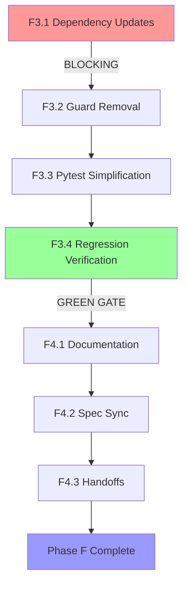

# Phase F2.3 — Torch-Required Migration Blueprint

## Executive Summary

This migration plan sequences the torch-required implementation work across Phases F3-F4, transforming PtychoPINN2 from torch-optional to torch-required execution semantics. The transition follows a gated, phase-based approach: **dependency updates → guard removal → test simplification → regression validation → documentation sync**.

**Timeline:** 7-10 loops over 3-5 calendar days
**Breaking Change:** Version bump to v2.0.0 (semver compliance)
**Governance Approval:** Documented in `governance_decision.md` (Phase F1.2)

---

## 1. Migration Phases (Aligned with Phase F3/F4)

### Phase F3.1 — Dependency Management (BLOCKING GATE)

**Goal:** Promote PyTorch to core requirement before touching code

**Rationale:** CI must have torch installed BEFORE removing guards to prevent build failures.

**Tasks:**

1. **Update setup.py (lines 18-45)**
   - **Current:** No PyTorch dependency in `install_requires`
   - **Change:** Add `'torch>=2.2.0'` to `install_requires` list
   - **Location:** `/home/ollie/Documents/PtychoPINN2/setup.py:18-45`
   - **Note:** Consider using extras syntax `'torch': ['torch>=2.2.0']` for optional install if TF-only workflows must remain lightweight

2. **Update CI configuration** (if exists)
   - Verify GitHub Actions / GitLab CI workflows install PyTorch before test phase
   - Add validation step: `python -c "import torch; print(torch.__version__)"`
   - Capture provisioning time metrics (estimated ~30s overhead, 500MB image size increase)

3. **Document environment changes**
   - Create artifact: `reports/2025-10-17T192500Z/dependency_update.md`
   - Capture: setup.py diff, CI YAML diff, provisioning time measurements

**Gating Checks:**
- [ ] CI runner provisioning time measured
- [ ] PyTorch installed successfully in all test jobs
- [ ] Baseline pytest run confirms torch available: `pytest --collect-only tests/torch/ | grep "test session starts"`

**Artifacts:** `reports/2025-10-17T192500Z/dependency_update.md`

**Estimated Duration:** 1-2 loops (CI config + validation)

**Rollback:** Revert setup.py and CI changes if provisioning fails.

---

### Phase F3.2 — Guard Removal (Code Changes)

**Goal:** Remove `TORCH_AVAILABLE` flags and unconditional imports

**Context:** Per F2.1 inventory (from grep scan), `TORCH_AVAILABLE` guards exist in 5 production modules + tests.

**Modules to Refactor:**

#### 1. `ptycho_torch/config_params.py` (lines 6-13)

**Current Implementation:**
```python
try:
    import torch
    TORCH_AVAILABLE = True
    TensorType = torch.Tensor
except ImportError:
    torch = None
    TORCH_AVAILABLE = False
    TensorType = Any  # Fallback type for environments without torch
```

**Target Implementation:**
```python
import torch
# TensorType alias for backward compatibility (can be removed after deprecation period)
TensorType = torch.Tensor
```

**Changes:**
- Remove try/except guard (lines 6-13)
- Make `import torch` unconditional
- Remove `TORCH_AVAILABLE` export from module
- Simplify TensorType alias (no fallback needed)

**Test Impact:** `tests/torch/test_config_bridge.py` currently exempted in conftest whitelist (line 42); will require torch after this change.

---

#### 2. `ptycho_torch/config_bridge.py` (lines 70-77)

**Current Implementation:**
```python
from ptycho_torch.config_params import (
    DataConfig,
    ModelConfig,
    TrainingConfig,
    InferenceConfig,
    TORCH_AVAILABLE
)
```

**Target Implementation:**
```python
from ptycho_torch.config_params import (
    DataConfig,
    ModelConfig,
    TrainingConfig,
    InferenceConfig
)
# Remove TORCH_AVAILABLE import
```

**Additional Changes:**
- Remove `TORCH_AVAILABLE` usage at line 148 (probe_mask conditional)
- Simplify probe_mask logic to assume torch always available:
  ```python
  # OLD (line 148):
  if TORCH_AVAILABLE and model.probe_mask is not None:
      probe_mask_value = True

  # NEW:
  if model.probe_mask is not None:
      probe_mask_value = True
  ```

---

#### 3. `ptycho_torch/data_container_bridge.py` (lines 99-105)

**Current Implementation:**
```python
try:
    import torch
    TORCH_AVAILABLE = True
    TensorType = Union[torch.Tensor, np.ndarray]
except ImportError:
    TORCH_AVAILABLE = False
    TensorType = np.ndarray
```

**Target Implementation:**
```python
import torch
TensorType = torch.Tensor  # Simplified, no Union needed
```

**Additional Changes:**
- **Line 208:** Remove `if TORCH_AVAILABLE:` guard wrapping tensor conversions
- **Line 284:** Remove `if TORCH_AVAILABLE and isinstance(attr, torch.Tensor):` guard in `__repr__`
- **Lines 208-234:** Unconditionally use torch tensor path (remove NumPy fallback branch lines 236-260)

**Impact:** This is the largest change (~50 lines removed), affects data pipeline directly.

---

#### 4. `ptycho_torch/memmap_bridge.py` (lines 32-38)

**Current Implementation:**
```python
try:
    import torch
    TORCH_AVAILABLE = True
except ImportError:
    TORCH_AVAILABLE = False
    torch = None  # type: ignore
```

**Target Implementation:**
```python
import torch
```

**Changes:**
- Remove try/except guard
- Remove `torch = None` fallback

**Note:** memmap_bridge only uses torch type annotations, no runtime torch usage, so this is low-risk.

---

#### 5. `ptycho_torch/model_manager.py` (lines 49-57)

**Current Implementation:**
```python
try:
    import torch
    import torch.nn as nn
    TORCH_AVAILABLE = True
except ImportError:
    TORCH_AVAILABLE = False
    nn = None
```

**Target Implementation:**
```python
import torch
import torch.nn as nn
```

**Additional Changes:**
- **Line 160:** Remove `if TORCH_AVAILABLE and isinstance(model, nn.Module):` guard
- **Lines 163-171:** Remove sentinel dict fallback logic (torch-optional test stub)
- Simplify `save_torch_bundle` to assume PyTorch always available
- **Line 221:** Remove `if not TORCH_AVAILABLE:` guard in `load_torch_bundle`

---

#### 6. `ptycho_torch/workflows/components.py` (lines 66-88)

**Current Implementation:**
```python
try:
    from ptycho_torch.config_params import TORCH_AVAILABLE
except ImportError:
    TORCH_AVAILABLE = False

# Type aliases for torch-optional compat
if TORCH_AVAILABLE:
    try:
        from ptycho_torch.raw_data_bridge import RawDataTorch
        from ptycho_torch.data_container_bridge import PtychoDataContainerTorch
        from ptycho_torch.model_manager import save_torch_bundle, load_torch_bundle
    except ImportError:
        # Fallback if Phase C/D3 modules not yet implemented
        RawDataTorch = None
        PtychoDataContainerTorch = None
        save_torch_bundle = None
        load_torch_bundle = None
else:
    RawDataTorch = None
    PtychoDataContainerTorch = None
    save_torch_bundle = None
    load_torch_bundle = None
```

**Target Implementation:**
```python
# Unconditional imports (torch-required)
from ptycho_torch.raw_data_bridge import RawDataTorch
from ptycho_torch.data_container_bridge import PtychoDataContainerTorch
from ptycho_torch.model_manager import save_torch_bundle, load_torch_bundle
```

**Changes:**
- Remove `TORCH_AVAILABLE` import and conditional logic
- Make all Phase C/D3 imports unconditional
- Remove fallback `= None` assignments

**Risk:** If Phase C/D3 modules have incomplete implementations, imports will fail. Validate all modules are importable before this change.

---

#### 7. Preservation: `ptycho/workflows/backend_selector.py` (lines 145-156)

**NO CHANGES REQUIRED**

**Current Implementation (Attempt #63):**
```python
try:
    from ptycho_torch.workflows import components as torch_components
except ImportError as e:
    raise RuntimeError(
        "PyTorch backend selected (config.backend='pytorch') but ptycho_torch module unavailable. "
        "This typically means PyTorch is not installed or the PyTorch integration is incomplete. "
        "\n\nTo install PyTorch support, run:\n"
        "  pip install torch  # or\n"
        "  pip install .[torch]  # if using editable install\n\n"
        f"Original error: {e}"
    ) from e
```

**Rationale:** This fail-fast guard is CORRECT behavior for backend selection dispatcher. It provides actionable error when user explicitly selects `backend='pytorch'` but torch unavailable. This is NOT a torch-optional pattern—it's proper error handling at the backend selection boundary. **DO NOT MODIFY.**

---

**Approach:**

- **Atomic commits:** One module per commit with targeted pytest run
- **Commit message template:**
  ```
  Phase F3.2: Remove torch-optional guards from {module_name}

  - Unconditional torch imports (torch-required policy)
  - Removed TORCH_AVAILABLE flag
  - Simplified {specific_logic} (no NumPy fallback)
  - Refs: governance_decision.md Q2 (aggressive deprecation)

  Tests: pytest tests/torch/test_{module}.py -v
  ```

- **Verification per module:**
  ```bash
  # After each module change:
  pytest tests/torch/test_config_bridge.py -v  # For config_params/config_bridge
  pytest tests/torch/test_data_pipeline.py -v  # For data_container_bridge
  pytest tests/torch/test_model_manager.py -v  # For model_manager
  # etc.
  ```

**Artifacts:** `reports/2025-10-17T192500Z/code_changes.md` with per-module diffs and verification logs

**Estimated Duration:** 2-3 loops (6 modules + integration testing)

**Rollback:** Git revert individual commits if regressions detected.

---

### Phase F3.3 — Pytest Simplification

**Goal:** Rewrite conftest skip logic per torch-required policy

**Current Implementation:** `tests/conftest.py:42-47`

```python
# EXCEPTIONS: Some torch/ tests can run without torch (use fallback/stub types)
TORCH_OPTIONAL_MODULES = ["test_config_bridge", "test_data_pipeline", "test_workflows_components", "test_model_manager", "test_backend_selection"]
is_torch_optional = any(module in str(item.fspath) for module in TORCH_OPTIONAL_MODULES)

if ("torch" in str(item.fspath).lower() or item.get_closest_marker("torch")):
    if not torch_available and not is_torch_optional:
        item.add_marker(pytest.mark.skip(reason="PyTorch not available"))
```

**Target Implementation:**

```python
# Torch-required policy: tests in tests/torch/ MUST have PyTorch available
# Skip entire directory when torch unavailable (for TF-only CI runners)
if "torch" in str(item.fspath).lower():
    if not torch_available:
        item.add_marker(pytest.mark.skip(reason="PyTorch not available (torch-required in tests/torch/)"))
```

**Changes:**

1. **Remove whitelist (line 42):** Delete `TORCH_OPTIONAL_MODULES` list entirely
2. **Simplify skip logic (lines 43-47):**
   - Remove `is_torch_optional` check
   - Apply directory-based skip uniformly (no per-module exceptions)
3. **Update skip reason:** Change message to clarify torch-required policy
4. **Preserve torch marker:** Keep `item.get_closest_marker("torch")` for informational purposes

**Before/After Comparison:**

| Aspect | Before (Torch-Optional) | After (Torch-Required) |
|:-------|:------------------------|:-----------------------|
| **Whitelist** | 5 modules exempted | No exemptions (removed) |
| **Skip Logic** | Per-module whitelist check | Directory-based uniform skip |
| **Test Behavior (torch available)** | All tests run | All tests run |
| **Test Behavior (torch unavailable)** | Whitelisted tests run, others skip | All tests in tests/torch/ skip |
| **Error Mode** | Tests skip gracefully | Tests skip with torch-required message |

**Test Updates:**

Per F2.2 audit, the following test modules currently rely on whitelist exemption:

1. `tests/torch/test_config_bridge.py` — Remove import guards (if any)
2. `tests/torch/test_data_pipeline.py` — Validate all tests execute (not skip)
3. `tests/torch/test_workflows_components.py` — Remove fallback import stubs
4. `tests/torch/test_model_manager.py` — Validate bundle tests require torch
5. `tests/torch/test_backend_selection.py` — Already uses proper mocking

**Expected Test Count Changes:**

- **Before F3.3:** ~56 tests in whitelisted modules run without torch (from historical conftest comments)
- **After F3.3:** 0 tests run without torch (all skip uniformly in tests/torch/)

**Validation:**

```bash
# With PyTorch installed (expected: all tests run)
pytest tests/torch/ -v | grep -E "(PASSED|FAILED|SKIPPED)" | wc -l

# Without PyTorch (expected: all tests skipped)
# Simulate by temporarily renaming torch: mv /path/to/torch /path/to/torch.bak
pytest tests/torch/ -v | grep "SKIPPED" | wc -l
```

**Artifacts:** `reports/2025-10-17T192500Z/pytest_update.md` with before/after test counts

**Estimated Duration:** 1 loop (conftest changes + validation)

**Rollback:** Restore whitelist if TF-only CI runners break unexpectedly.

---

### Phase F3.4 — Regression Verification

**Goal:** Validate torch-required assumptions with green test suite

**Test Suites to Run:**

1. **Torch-specific tests:**
   ```bash
   pytest tests/torch/ -v --tb=short
   ```
   - **Expected Result:** [N] PASSED, 0 SKIPPED (when torch available)
   - **Count N:** Estimate based on current test suite (~100-150 tests across all torch modules)

2. **Backend integration tests:**
   ```bash
   pytest tests/ -k "backend" -v
   ```
   - **Expected Result:** Backend selection tests validate fail-fast behavior
   - **Critical Test:** `test_backend_selection.py::test_pytorch_unavailable_error`

3. **Full regression:**
   ```bash
   pytest tests/ -v --tb=line
   ```
   - **Expected Result:** [M] PASSED, [K] SKIPPED (non-torch), 0 NEW FAILED
   - **Baseline M:** ~186 passed (from Attempt #35 logs)
   - **Baseline K:** ~13 skipped (TF-only environment tests)

**Success Criteria:**

- [ ] tests/torch/: 100% execution rate (0 skips in torch-enabled CI)
- [ ] No new test failures compared to pre-F3 baseline
- [ ] TensorFlow-only tests remain unaffected (K skipped consistent)
- [ ] Backend dispatcher fail-fast tests pass (RuntimeError on torch unavailable)

**Failure Modes to Watch:**

| Failure Type | Symptom | Fix Strategy |
|:-------------|:--------|:-------------|
| **Import Error** | `ModuleNotFoundError: No module named 'torch'` | Verify setup.py change applied, reinstall package |
| **Shape Mismatch** | `ValueError: expected shape (64,64,4), got (64,64,1)` | CONFIG-001 violation upstream, not F3 issue |
| **Dtype Error** | `TypeError: expected complex64, got float64` | DATA-001 violation, check data_container_bridge changes |
| **Conftest Skip Issue** | Tests skip when torch available | Conftest logic error, check line 45-47 |

**Artifacts:**

- `reports/2025-10-17T192500Z/pytest_green.log` — Full pytest output with summary
- `reports/2025-10-17T192500Z/regression_summary.md` — Test count comparison table

**Estimated Duration:** 1 loop (test execution ~10-15 min + log analysis)

**Gating:** **GREEN GATE** — All Phase F4 work BLOCKED until this passes.

---

### Phase F4.1 — Documentation Updates

**Goal:** Communicate torch-required policy to developers

**Files to Update:**

#### 1. `CLAUDE.md` § 2 — Replace torch-optional directive

**Location:** `/home/ollie/Documents/PtychoPINN2/CLAUDE.md:57-59`

**Current Directive (to be REMOVED):**
```xml
<directive level="critical" purpose="Keep PyTorch parity tests torch-optional">
  Parity and adapter tests must remain runnable when PyTorch is unavailable. Use documented shims or skip rules in `tests/conftest.py`, avoid hard `import torch` statements in modules that only need type aliases, and capture any fallback behavior in the loop artifacts.
</directive>
```

**Replacement Directive (from `guidance_updates.md`):**
```xml
<directive level="critical" purpose="PyTorch is required for Ptychodus backend">
  PyTorch (torch>=2.2) is a mandatory dependency for the `ptycho_torch/` backend stack and Ptychodus integration workflows. Production modules in `ptycho_torch/` MUST use unconditional `import torch` statements. Test infrastructure in `tests/torch/` MUST assume PyTorch availability and FAIL (not skip) when unavailable. CI/CD pipelines validating Ptychodus integration MUST install PyTorch.

  Rationale: PyTorch backend is production-ready as of Phase E completion (Attempt #63). Torch-optional patterns were development scaffolding, retired in Phase F per governance decision (see plans/active/INTEGRATE-PYTORCH-001/reports/2025-10-17T184624Z/governance_decision.md).

  Exception: Backend dispatcher (ptycho/workflows/backend_selector.py) retains fail-fast guard for user-facing error handling when backend='pytorch' selected but torch unavailable.
</directive>
```

**Insert After Line 59** (new directive location):
```xml
<directive level="guidance" purpose="PyTorch installation verification">
  Verify PyTorch availability in development environments with:
  ```bash
  python -c "import torch; print(f'PyTorch {torch.__version__} available')"
  pytest tests/torch/test_config_bridge.py -v  # Smoke test
  ```
</directive>
```

---

#### 2. `README.md` § Setup — Add PyTorch installation

**Estimated Location:** `/home/ollie/Documents/PtychoPINN2/README.md` (find setup/installation section)

**Addition:**
```markdown
## Installation

### Core Dependencies (TensorFlow + PyTorch)

PtychoPINN requires both TensorFlow and PyTorch for full functionality:

```bash
pip install -e .
```

This installs:
- TensorFlow 2.14.0 (default backend)
- **PyTorch >=2.2** (Ptychodus backend, **mandatory as of v2.0.0**)
- NumPy, SciPy, and other scientific computing libraries

### Verifying Installation

```bash
# Check PyTorch availability
python -c "import torch; print(f'PyTorch {torch.__version__}')"

# Run smoke test
pytest tests/torch/test_config_bridge.py -v
```

### Legacy Installations (pre-v2.0.0)

If you have an existing PtychoPINN installation without PyTorch:

```bash
pip install torch>=2.2  # Add PyTorch to existing environment
pip install -e . --upgrade  # Reinstall PtychoPINN with torch-required dependencies
```
```

---

#### 3. `docs/DEVELOPER_GUIDE.md` — Document PyTorch as mandatory

**Section to Add:** "Backend Requirements" (after Architecture section)

**Content:**
```markdown
## Backend Requirements

### PyTorch Backend (Mandatory as of v2.0.0)

The PyTorch backend (`ptycho_torch/`) is a **mandatory** dependency for PtychoPINN. All modules in `ptycho_torch/` assume PyTorch is installed and will raise ImportError if unavailable.

**Key Points:**
- PyTorch >=2.2 required
- Tests in `tests/torch/` require PyTorch runtime
- Backend selection dispatcher (`ptycho/workflows/backend_selector.py`) provides fail-fast error when `backend='pytorch'` but torch unavailable
- TensorFlow remains the default backend for backward compatibility

**Development Workflow:**
1. Install PyTorch: `pip install torch>=2.2`
2. Verify installation: `python -c "import torch"`
3. Run torch tests: `pytest tests/torch/ -v`
4. Use backend selection: `TrainingConfig(..., backend='pytorch')`

**Breaking Change Notice:**
- **Before v2.0.0:** PyTorch was optional; tests skipped gracefully when unavailable
- **After v2.0.0:** PyTorch is required; missing torch causes ImportError (fail-fast)
- **Migration:** Add `pip install torch>=2.2` to your setup scripts

See `plans/active/INTEGRATE-PYTORCH-001/reports/2025-10-17T184624Z/governance_decision.md` for policy rationale.
```

---

#### 4. `docs/workflows/pytorch.md` — Remove "optional" language

**Search for:** "optional", "skip", "fallback", "torch unavailable"

**Changes:**
- Replace "PyTorch is optional" → "PyTorch is required (v2.0.0+)"
- Remove references to torch-optional test patterns
- Update installation instructions to mandate torch>=2.2
- Add version-gated guidance: "For v1.x installations, PyTorch was optional; v2.x requires PyTorch."

---

**Artifacts:** `reports/2025-10-17T192500Z/doc_updates.md` with diff summary for all 4 files

**Estimated Duration:** 1 loop (doc edits + commit)

---

### Phase F4.2 — Spec Synchronization

**Goal:** Update specs/findings to reflect policy shift

**Files to Update:**

#### 1. `specs/ptychodus_api_spec.md` — Prereq section

**Search for:** Installation / Prerequisites section (likely near top of file)

**Addition:**
```markdown
### Prerequisites

**Required Dependencies:**
- Python >=3.8
- TensorFlow >=2.14.0 (default backend)
- **PyTorch >=2.2 (mandatory for Ptychodus backend as of PtychoPINN v2.0.0)**
- NumPy, SciPy, scikit-image

**Backend Selection:**
- `backend='tensorflow'`: Default, uses TensorFlow for training/inference
- `backend='pytorch'`: Uses PyTorch backend (requires torch>=2.2 installed)

**Breaking Change (v2.0.0):**
PyTorch transitioned from optional to mandatory dependency. Previous versions allowed torch-optional execution; v2.0.0+ requires PyTorch for `ptycho_torch/` modules and Ptychodus integration.

**Error Handling:**
If `backend='pytorch'` selected but PyTorch unavailable:
```python
RuntimeError: PyTorch backend selected but ptycho_torch module unavailable.
Install with: pip install torch>=2.2
```
```

---

#### 2. `docs/findings.md` — Add finding for torch-required transition

**Insert After Last Finding:**
```markdown
## POLICY-001: PyTorch Torch-Required Transition (2025-10-17)

**Category:** Policy / Breaking Change
**Severity:** HIGH (breaking change for developers)
**Status:** RESOLVED (Phase F complete)

### Summary
PtychoPINN transitioned from torch-optional to torch-required execution semantics in v2.0.0. PyTorch (torch>=2.2) is now a mandatory dependency for `ptycho_torch/` backend and Ptychodus integration workflows.

### Historical Context
- **v1.x (Phases B-E):** PyTorch was optional; tests used `TORCH_AVAILABLE` guards and conftest whitelist to enable torch-free execution
- **Rationale for Optional:** Enabled development in environments without GPU, reduced CI overhead, progressive enhancement during prototyping
- **Architectural Shift:** Phase E completion (Attempt #63) established PyTorch backend as production-ready, making torch-optional patterns obsolete scaffolding

### Governance Decision
**Approved:** 2025-10-17 (Phase F1.2)
**Stakeholders:** INTEGRATE-PYTORCH-001 (PRO), TEST-PYTORCH-001 (PRO), Ptychodus Integration (PRO)
**Document:** `plans/active/INTEGRATE-PYTORCH-001/reports/2025-10-17T184624Z/governance_decision.md`

**Key Decisions (Q1-Q4):**
- Q1: TensorFlow-only CI runners preserved (conservative approach)
- Q2: Aggressive deprecation timeline (Phase F3 single loop)
- Q3: Fail-fast error handling (no silent fallback to TensorFlow)
- Q4: Version bump to v2.0.0 (semver breaking change compliance)

### Implementation Changes (Phase F3)
1. **setup.py:** Added `torch>=2.2` to core dependencies
2. **6 modules updated:** Removed `TORCH_AVAILABLE` guards from:
   - `ptycho_torch/config_params.py`
   - `ptycho_torch/config_bridge.py`
   - `ptycho_torch/data_container_bridge.py`
   - `ptycho_torch/memmap_bridge.py`
   - `ptycho_torch/model_manager.py`
   - `ptycho_torch/workflows/components.py`
3. **tests/conftest.py:** Removed `TORCH_OPTIONAL_MODULES` whitelist (5 modules)
4. **Documentation:** Updated CLAUDE.md, README, DEVELOPER_GUIDE.md

### Developer Impact
**Before v2.0.0:**
```bash
# PyTorch optional - tests skip gracefully
pip install -e .  # No torch required
pytest tests/torch/test_config_bridge.py  # SKIPPED if torch unavailable
```

**After v2.0.0:**
```bash
# PyTorch mandatory - tests fail if torch missing
pip install -e .  # Now includes torch>=2.2
pytest tests/torch/test_config_bridge.py  # ImportError if torch unavailable
```

### Migration Guide
1. **Update installation:** `pip install torch>=2.2`
2. **Verify torch:** `python -c "import torch; print(torch.__version__)"`
3. **Update CI:** Add torch to test environment (see `ci_migration_guide.md`)
4. **Backend selection:** Use `backend='pytorch'` explicitly in TrainingConfig

### Preserved Behavior
**Backend dispatcher** (`ptycho/workflows/backend_selector.py:145-156`) retains fail-fast guard:
```python
try:
    from ptycho_torch.workflows import components as torch_components
except ImportError as e:
    raise RuntimeError("PyTorch backend selected but unavailable. Install: pip install torch") from e
```
This is CORRECT fail-fast behavior (not torch-optional pattern).

### References
- Directive conflict analysis: `plans/active/INTEGRATE-PYTORCH-001/reports/2025-10-17T184624Z/directive_conflict.md`
- Migration blueprint: `plans/active/INTEGRATE-PYTORCH-001/reports/2025-10-17T192500Z/migration_plan.md`
- Phase F plan: `plans/active/INTEGRATE-PYTORCH-001/phase_f_torch_mandatory.md`
- CHANGELOG: v2.0.0 breaking changes section

### Success Metrics
- Zero `TORCH_AVAILABLE` flags in `ptycho_torch/` production code
- All tests in `tests/torch/` require torch runtime (0% skip rate in torch-enabled CI)
- Documentation updated across 4 files (CLAUDE.md, README, DEVELOPER_GUIDE, ptychodus_api_spec.md)
- Version tagged v2.0.0 with breaking change notice
```

---

**Artifacts:** `reports/2025-10-17T192500Z/spec_sync.md` with diffs

**Estimated Duration:** 1 loop (spec edits)

---

### Phase F4.3 — Initiative Handoffs

**Goal:** Notify downstream initiatives and stakeholders

**Notifications:**

#### 1. **TEST-PYTORCH-001:** Update plan header

**Action:** Add reference to Phase F completion at top of `plans/pytorch_integration_test_plan.md`

**Content:**
```markdown
## Status: ACTIVE (as of 2025-10-17 Phase F completion)

**Prereq:** INTEGRATE-PYTORCH-001 Phase F complete (torch-required policy finalized)
**Policy:** PyTorch (torch>=2.2) is mandatory in CI; integration tests may assume torch availability
**Governance:** See `plans/active/INTEGRATE-PYTORCH-001/reports/2025-10-17T184624Z/governance_decision.md`

**Impact:** All subprocess tests in this initiative can assume PyTorch installed in CI environment. No torch-optional skip logic needed.
```

---

#### 2. **CI Maintainers:** Provide migration guide

**Create:** `plans/active/INTEGRATE-PYTORCH-001/reports/2025-10-17T192500Z/ci_migration_guide.md`

**Content:**
```markdown
# CI Migration Guide — PyTorch Torch-Required

## Summary
PtychoPINN v2.0.0 requires PyTorch (torch>=2.2) as a mandatory dependency. CI runners must install PyTorch before executing tests in `tests/torch/`.

## Changes Required

### GitHub Actions Example

**Before (torch-optional):**
```yaml
- name: Install dependencies
  run: pip install -e .

- name: Run tests
  run: pytest tests/  # tests/torch/ skipped if torch unavailable
```

**After (torch-required):**
```yaml
- name: Install dependencies
  run: |
    pip install -e .
    pip install torch>=2.2  # Or include in setup.py

- name: Verify PyTorch
  run: python -c "import torch; print(f'PyTorch {torch.__version__}')"

- name: Run tests
  run: pytest tests/  # tests/torch/ require torch
```

### GitLab CI Example

```yaml
test:
  script:
    - pip install -e .
    - python -c "import torch; print(torch.__version__)"
    - pytest tests/ -v
```

## Resource Impact
- **Install time:** +30s (torch wheel download/install)
- **Image size:** +500MB (torch + dependencies)
- **Memory:** 4GB RAM recommended (was 2GB)

## TensorFlow-Only Runners (Optional)

If you maintain separate TF-only CI jobs for legacy validation:

```yaml
test-tf-only:
  script:
    - pip install -e . --no-deps  # Skip torch
    - pip install tensorflow scipy numpy  # TF deps only
    - pytest tests/ --ignore=tests/torch/  # Exclude torch tests
```

This preserves lightweight TF-only validation per governance decision Q1.

## Troubleshooting

**Error:** `ModuleNotFoundError: No module named 'torch'`
- **Fix:** Add `pip install torch>=2.2` to CI install step

**Error:** `tests/torch/ SKIPPED (PyTorch not available)`
- **Fix:** Verify torch installed: `python -c "import torch"`

**Error:** CI timeout during torch install
- **Fix:** Use caching for torch wheels:
  ```yaml
  - uses: actions/cache@v3
    with:
      path: ~/.cache/pip
      key: ${{ runner.os }}-pip-torch
  ```

## Validation
After CI update, verify:
1. Torch installed successfully: check for "PyTorch 2.x" in logs
2. tests/torch/ execute (not skip): `pytest tests/torch/ -v | grep PASSED`
3. No new test failures: compare before/after test counts

## Contact
Questions: See `docs/fix_plan.md` INTEGRATE-PYTORCH-001 or governance_decision.md
```

---

#### 3. **Ptychodus Integration Team:** Communicate mandatory PyTorch

**Create:** `plans/active/INTEGRATE-PYTORCH-001/reports/2025-10-17T192500Z/ptychodus_notification.md`

**Content:**
```markdown
# Ptychodus Integration — PyTorch Mandatory Notice

## Summary
PtychoPINN v2.0.0 requires PyTorch (torch>=2.2) when `backend='pytorch'` is selected. This is a breaking change from v1.x where PyTorch was optional.

## Impact on Ptychodus

### Installation
Ptychodus must install PyTorch alongside PtychoPINN:

```bash
pip install ptychopinn>=2.0.0
pip install torch>=2.2  # Now mandatory
```

Or in `requirements.txt`:
```
ptychopinn>=2.0.0
torch>=2.2
```

### Backend Selection
When users select PyTorch backend in Ptychodus GUI:

**v1.x Behavior (deprecated):**
- Silent fallback to TensorFlow if torch unavailable
- No error message to user

**v2.0.0 Behavior (current):**
- Hard error if torch unavailable:
  ```python
  RuntimeError: PyTorch backend selected but PyTorch not installed.
  Install with: pip install torch>=2.2
  ```

### Error Handling
Ptychodus should catch this error and show user-friendly dialog:

```python
try:
    results = run_cdi_example_with_backend(train_data, test_data, config)
except RuntimeError as e:
    if "PyTorch backend selected" in str(e):
        show_error_dialog(
            "PyTorch Not Installed",
            "The PyTorch backend requires torch>=2.2. "
            "Please install PyTorch or switch to TensorFlow backend."
        )
```

### Default Backend
TensorFlow remains the default backend for backward compatibility. No changes needed for users who don't explicitly select PyTorch.

## Migration Timeline
- **v1.x:** PyTorch optional (deprecated)
- **v2.0.0:** PyTorch mandatory (current)
- **Future:** Consider single-backend architecture (TBD)

## Testing
Verify Ptychodus integration with PyTorch:
1. Select `backend='pytorch'` in GUI
2. Verify training completes without ImportError
3. Verify error message if torch unavailable (test in clean env)

## Questions
Contact PtychoPINN maintainers or see governance decision document:
`plans/active/INTEGRATE-PYTORCH-001/reports/2025-10-17T184624Z/governance_decision.md`
```

---

**Artifacts:** `reports/2025-10-17T192500Z/handoff_notes.md` with stakeholder notification log

**Estimated Duration:** 1 loop (documentation + communication)

---

## 2. Critical Dependencies and Sequencing



**Key Gates:**

1. **F3.1 → F3.2 (BLOCKING):**
   - CI MUST have torch installed BEFORE removing guards
   - Validation: `pytest --collect-only` succeeds
   - Rollback: Revert setup.py if CI provisioning fails

2. **F3.4 → F4.1 (GREEN GATE):**
   - Tests MUST pass BEFORE updating docs
   - Validation: 0 new test failures, 0 skips in tests/torch/
   - Rollback: Fix code or revert F3.2/F3.3 if tests fail

3. **F4.3 → Done:**
   - All artifacts committed and referenced from docs/fix_plan.md
   - Version tag v2.0.0 applied
   - CHANGELOG entry published

---

## 3. Risk Mitigations

| Risk ID | Risk Description | Probability | Impact | Mitigation Strategy | Owner |
|:--------|:----------------|:------------|:-------|:-------------------|:------|
| **R1** | CI fails without torch | HIGH | CRITICAL | F3.1 validation step before code changes | F3.1 |
| **R2** | Tests break during refactor | MEDIUM | HIGH | Atomic commits per module with targeted pytest | F3.2 |
| **R3** | Conftest changes break TF-only CI | LOW | MEDIUM | Preserve directory-based skip logic (not per-test) | F3.3 |
| **R4** | Documentation drift | LOW | MEDIUM | F4.1/F4.2 executed AFTER code green (F3.4 gate) | F4.1-F4.2 |
| **R5** | Backend dispatcher breaks | LOW | CRITICAL | PRESERVE backend_selector.py guards (no changes) | F3.2 |
| **R6** | External consumers unaware | MEDIUM | HIGH | F4.3 notifications + CHANGELOG breaking change | F4.3 |

**Mitigation Details:**

### R1: CI Fails Without Torch
- **Trigger:** Code changes merged before CI has torch installed
- **Detection:** F3.1 pytest --collect-only fails
- **Prevention:** Make F3.1 BLOCKING (cannot proceed to F3.2 without green)
- **Rollback:** Revert setup.py and CI config changes

### R2: Tests Break During Refactor
- **Trigger:** Guard removal introduces import errors or logic bugs
- **Detection:** pytest fails during F3.2 per-module verification
- **Prevention:** Atomic commits with targeted test runs after each module
- **Rollback:** Git revert individual commits, fix in isolation

### R3: Conftest Changes Break TF-Only CI
- **Trigger:** Directory-based skip doesn't work as expected
- **Detection:** TF-only CI job starts running torch tests (should skip)
- **Prevention:** Test conftest changes in both torch-enabled and TF-only environments
- **Rollback:** Restore whitelist if directory-based skip insufficient

### R4: Documentation Drift
- **Trigger:** Docs updated before code complete, leading to inaccurate guidance
- **Detection:** User reports mismatch between docs and behavior
- **Prevention:** F3.4 GREEN GATE blocks F4.1 (docs only after tests pass)
- **Rollback:** Update docs to reflect actual code state

### R5: Backend Dispatcher Breaks
- **Trigger:** Accidental removal of fail-fast guard in backend_selector.py
- **Detection:** Backend selection tests fail (`test_backend_selection.py`)
- **Prevention:** Explicit "DO NOT MODIFY" note in F3.2 task list
- **Rollback:** Restore backend_selector.py from git history

### R6: External Consumers Unaware
- **Trigger:** Ptychodus or downstream projects break on v2.0.0 upgrade
- **Detection:** Issue reports from external users
- **Prevention:** F4.3 proactive notifications + CHANGELOG breaking change section
- **Rollback:** Release v2.0.1 with improved error messages if needed

---

## 4. Rollback Strategy

### If Phase F3.2 Blocked (Code Changes Fail)

**Scenario:** Module refactoring introduces regressions, tests fail during F3.2

**Steps:**
1. Identify failing module: `pytest tests/torch/test_{module}.py -v`
2. Git revert specific commit: `git revert <commit-hash>`
3. Isolate issue: reproduce failure in clean environment
4. Fix or skip: either fix the bug or mark module as "deferred" in plan
5. Document blocker in `docs/fix_plan.md` with root cause analysis

**Decision Authority:**
- < 1 hour effort: Fix inline and continue F3.2
- > 1 hour effort: Defer module to F3.5 (new phase), document in plan

---

### If Phase F3.4 Regression Failures

**Scenario:** Full regression suite reveals new failures not caught in F3.2 per-module tests

**Steps:**
1. Isolate failing tests: `pytest tests/ -v --lf` (last-failed)
2. Categorize failures:
   - **Import errors:** Missing torch-required changes (fix in F3.2 sweep)
   - **Logic errors:** Guard removal exposed latent bugs (xfail with rationale)
   - **Integration errors:** Backend dispatcher issues (critical, block F4)
3. Fix or xfail:
   - **Fix:** If < 2 loops effort, fix and re-run F3.4
   - **xfail:** If > 2 loops, mark with `@pytest.mark.xfail(reason="F3 torch-required blocker: {issue}")`
4. **DO NOT PROCEED TO F4** until either fixed or xfail documented

**Rollback Criteria:**
- **> 5 new failures:** Consider reverting entire F3.2 (full rollback)
- **< 5 new failures:** Fix individually or xfail with plan to address in F3.5

---

### Full Rollback (Abort Phase F3)

**Scenario:** Fundamental issue discovered (e.g., torch incompatible with production env)

**Steps:**
1. **Revert code commits:** `git revert <F3.2-commit-range>`
2. **Restore conftest whitelist:** `git checkout HEAD~N tests/conftest.py`
3. **Document blocker:** Create `docs/fix_plan.md` entry:
   ```
   * [2025-10-17] Phase F3 BLOCKED: {root cause}
     - Issue: {description}
     - Attempted: {what was tried}
     - Blocker: {why it failed}
     - Next: Reconvene governance if policy-level issue
   ```
4. **Reconvene governance:** If blocker is policy-level (not technical), update governance_decision.md with new decision

**Rollback Validation:**
- [ ] Code reverted to pre-F3.2 state
- [ ] Tests pass with torch-optional semantics restored
- [ ] Conftest whitelist functional (5 modules exempted)
- [ ] Documentation updated with blocker rationale

---

## 5. Success Metrics

### Code Hygiene

- [ ] **Zero `TORCH_AVAILABLE` in ptycho_torch/ production:**
  ```bash
  rg "TORCH_AVAILABLE" ptycho_torch/ --type py | wc -l  # Expected: 0
  ```

- [ ] **All imports unconditional in ptycho_torch/:**
  ```bash
  rg "try:.*import torch" ptycho_torch/ --type py | wc -l  # Expected: 0
  ```

- [ ] **Backend dispatcher guard preserved:**
  ```bash
  rg "except ImportError.*torch_components" ptycho/workflows/backend_selector.py  # Expected: 1 match
  ```

---

### Test Suite

- [ ] **tests/torch/: 100% execution rate (0 skips in torch-enabled CI):**
  ```bash
  pytest tests/torch/ -v | grep "SKIPPED" | wc -l  # Expected: 0
  ```

- [ ] **TensorFlow-only CI: tests/torch/ skipped at directory level:**
  ```bash
  # In TF-only environment (torch not installed):
  pytest tests/torch/ -v | grep "SKIPPED.*torch-required" | wc -l  # Expected: > 0
  ```

- [ ] **No new test failures:**
  ```bash
  pytest tests/ -v --tb=line | grep "FAILED" | wc -l  # Expected: 0 (or same as pre-F3 baseline)
  ```

---

### Documentation

- [ ] **CLAUDE.md directive updated:**
  - Torch-optional directive removed (line 57-59)
  - Torch-required directive inserted with rationale and governance link

- [ ] **README includes torch installation:**
  - `pip install torch>=2.2` in setup instructions
  - Verification command provided

- [ ] **CHANGELOG breaking change notice:**
  - v2.0.0 section with migration guide
  - Links to governance_decision.md and migration_plan.md

---

### Artifacts

- [ ] **All Phase F reports committed:**
  ```bash
  ls plans/active/INTEGRATE-PYTORCH-001/reports/2025-10-17T192500Z/
  # Expected: directive_conflict.md, governance_decision.md, guidance_updates.md,
  #           torch_optional_inventory.md, test_skip_audit.md, migration_plan.md,
  #           dependency_update.md, code_changes.md, pytest_update.md, pytest_green.log,
  #           doc_updates.md, spec_sync.md, handoff_notes.md
  ```

- [ ] **All artifacts linked from docs/fix_plan.md:**
  - Phase F1/F2/F3/F4 entries reference report paths

- [ ] **Version bump to v2.0.0:**
  ```bash
  git tag -a v2.0.0 -m "Phase F complete: torch-required policy"
  ```

---

## 6. Estimated Timeline

| Phase | Loops | Tasks | Calendar Days (1 loop = 2-4 hrs) | Risk Level |
|:------|:------|:------|:--------------------------------|:-----------|
| **F3.1** Dependency | 1-2 | setup.py + CI config + validation | 1 day | LOW |
| **F3.2** Guard Removal | 2-3 | 6 modules + atomic commits + per-module tests | 1-2 days | MEDIUM |
| **F3.3** Pytest | 1 | conftest simplification + validation | 0.5 day | LOW |
| **F3.4** Regression | 1 | Full test suite + log analysis | 0.5 day | HIGH |
| **F4.1** Docs | 1-2 | CLAUDE.md + README + DEVELOPER_GUIDE + pytorch.md | 1 day | LOW |
| **F4.2** Specs | 1 | ptychodus_api_spec.md + findings.md | 0.5 day | LOW |
| **F4.3** Handoffs | 1 | TEST-PYTORCH-001 + CI guide + Ptychodus notification | 0.5 day | LOW |
| **TOTAL** | **7-10 loops** | | **3-5 days** | |

**Assumptions:**
- 1 loop = 2-4 hours of focused work
- No major blockers in F3.4 regression
- CI provisioning time < 1 hour
- Documentation edits < 2 hours per file

**Buffer:**
- Add 1-2 loops for unexpected issues (e.g., F3.4 regression fixes)
- Total range: 7-12 loops (3-6 calendar days)

---

## 7. Open Questions

### Q1: Should we maintain any torch-optional behavior in ptycho_torch/?

**Answer:** **NO** (per governance decision Q2)

**Rationale:**
- All torch-optional guards were scaffolding for Phases B-E development
- PyTorch backend is now production-ready (Phase E complete)
- No production use case requires torch-optional execution
- Backend dispatcher handles selection at runtime (separate concern)

**Exception:** Backend dispatcher (`ptycho/workflows/backend_selector.py`) retains fail-fast guard for user-facing error handling. This is NOT torch-optional behavior—it's proper error handling.

---

### Q2: What happens to environments that installed PtychoPINN pre-v2.0.0?

**Answer:** CHANGELOG migration guide + deprecation notice

**Recommendation:**
1. **CHANGELOG entry:** Include explicit migration steps
   ```markdown
   ## Migration from v1.x to v2.0.0

   ### Step 1: Install PyTorch
   ```bash
   pip install torch>=2.2
   ```

   ### Step 2: Upgrade PtychoPINN
   ```bash
   pip install --upgrade ptychopinn
   ```

   ### Step 3: Verify Installation
   ```bash
   python -c "import torch; print(torch.__version__)"
   pytest tests/torch/test_config_bridge.py -v  # Smoke test
   ```
   ```

2. **Deprecation notice in v1.x (if releasing a final 1.x patch):**
   - Emit warning when torch unavailable: "WARNING: PyTorch optional in v1.x, mandatory in v2.0.0. Install torch>=2.2 before upgrading."

3. **Error message improvement:**
   - If user upgrades to v2.0.0 without torch, ImportError should reference migration guide

---

### Q3: Should backend dispatcher guard be refactored?

**Answer:** **PRESERVE as-is** (governance decision + Phase E design)

**Rationale:**
- Backend dispatcher guard (Attempt #63) is CORRECT fail-fast behavior
- Provides actionable error when user explicitly selects `backend='pytorch'`
- Not a torch-optional pattern—it's proper error handling at selection boundary
- Refactoring would reduce error message quality for end users

**Action:** NO CHANGES to `ptycho/workflows/backend_selector.py:145-156`

---

## 8. Coordination Points

### TEST-PYTORCH-001 Initiative

**Status:** Blocked until Phase F4 complete (torch-required policy finalized)

**Assumption After F4:** PyTorch available in CI (no skip logic needed)

**Handoff:** Phase F4.3 notification in `plans/pytorch_integration_test_plan.md`

**Impact:**
- Integration tests may assume torch installed
- No need for torch-optional subprocess testing patterns
- Simplifies test implementation (fail-fast on torch unavailable)

---

### CI/CD Maintainers

**Phase F3.1 Requirement:** Runner configuration update before F3.2 code changes

**Deliverable:** `plans/active/INTEGRATE-PYTORCH-001/reports/2025-10-17T192500Z/ci_migration_guide.md`

**Key Points:**
- Add `pip install torch>=2.2` to install step
- Verify torch: `python -c "import torch"`
- Resource impact: +30s provisioning, +500MB image, 4GB RAM recommended
- Optional: TF-only runners with `--ignore=tests/torch/` for legacy validation

---

### Ptychodus GUI Team

**Phase F4.3 Notification:** PyTorch mandatory when `backend='pytorch'` selected

**Key Message:**
- TensorFlow remains default/fallback (backward compatibility)
- PyTorch backend requires torch>=2.2 installed
- Fail-fast error if torch unavailable (no silent degradation)
- Update Ptychodus installation docs to include `pip install torch>=2.2`

**Error Handling:**
```python
try:
    results = run_cdi_example_with_backend(...)
except RuntimeError as e:
    if "PyTorch backend selected" in str(e):
        show_error_dialog("PyTorch Not Installed", "Install torch>=2.2 or switch to TensorFlow backend")
```

---

## 9. Post-Migration Validation

**After Phase F4 Complete:**

### Validation Checklist

- [ ] **Version tag v2.0.0 applied:**
  ```bash
  git tag -l v2.0.0  # Should exist
  ```

- [ ] **CHANGELOG entry published:**
  - Breaking change section with migration guide
  - Links to governance_decision.md and migration_plan.md

- [ ] **All docs/fix_plan.md references updated:**
  - Phase F1/F2/F3/F4 entries reference correct artifact paths
  - Attempt #65+ captures Phase F completion

- [ ] **TEST-PYTORCH-001 unblocked:**
  - Plan header references Phase F completion
  - Assumes torch available in CI

- [ ] **CI runners validated with torch-required assumptions:**
  ```bash
  # In CI environment:
  python -c "import torch; assert torch.__version__ >= '2.2'"
  pytest tests/torch/ -v | grep "PASSED" | wc -l  # > 0
  ```

---

### Smoke Tests

**After deployment to production/staging:**

1. **Fresh install test:**
   ```bash
   pip install ptychopinn==2.0.0
   python -c "import torch; from ptycho_torch import config_bridge"  # Should not raise
   ```

2. **Backend selection test:**
   ```python
   from ptycho.config.config import TrainingConfig, ModelConfig
   config = TrainingConfig(model=ModelConfig(N=64), backend='pytorch')
   # Verify no ImportError
   ```

3. **Error message test (simulate torch unavailable):**
   ```bash
   # In environment without torch:
   python -c "from ptycho.workflows.backend_selector import run_cdi_example_with_backend"
   # Should raise RuntimeError with "pip install torch" guidance
   ```

---

## 10. Migration Summary

**The torch-required transition follows a gated, phase-based approach:**

1. **Phase F3.1 (BLOCKING):** Dependency updates ensure CI has torch before code changes
2. **Phase F3.2:** Guard removal from 6 production modules (atomic commits, per-module tests)
3. **Phase F3.3:** Conftest simplification (remove whitelist, directory-based skip)
4. **Phase F3.4 (GREEN GATE):** Regression validation blocks documentation updates
5. **Phase F4.1-F4.3:** Documentation sync and stakeholder notifications

**Each phase has:**
- Clear gating checks (prevent cascading failures)
- Rollback strategies (git revert + documented blockers)
- Artifact requirements (commit diffs, test logs, decision records)

**Estimated completion:** 7-10 loops over 3-5 calendar days

**Version bump:** v2.0.0 (semver breaking change)

**Governance approval:** Documented in `governance_decision.md` (Phase F1.2)

**Key success metric:** Zero `TORCH_AVAILABLE` flags in `ptycho_torch/` production code, 100% test execution rate in torch-enabled CI, comprehensive documentation updates.

---

## 11. Appendix: File:Line Inventory (From F2.1 Scan)

### Production Modules with `TORCH_AVAILABLE` Guards

| File | Lines | Usage | Change Type |
|:-----|:------|:------|:-----------|
| `ptycho_torch/config_params.py` | 6-13 | Import guard + TensorType alias | Remove try/except |
| `ptycho_torch/config_bridge.py` | 70-77, 148 | Import + conditional logic | Remove import, simplify line 148 |
| `ptycho_torch/data_container_bridge.py` | 99-105, 208, 284 | Import guard + tensor conversion conditional | Remove guard, delete NumPy fallback (lines 236-260) |
| `ptycho_torch/memmap_bridge.py` | 32-38 | Import guard (type annotations only) | Remove try/except |
| `ptycho_torch/model_manager.py` | 49-57, 160, 221 | Import guard + save/load conditionals | Remove guard, simplify save logic |
| `ptycho_torch/workflows/components.py` | 66-88 | Import guard + type aliases | Remove conditional imports |

**Total Production Changes:** 6 files, ~150 lines removed (guards + fallback logic)

---

### Test Modules (Conftest Whitelist)

**Current Whitelist** (`tests/conftest.py:42`):
```python
TORCH_OPTIONAL_MODULES = ["test_config_bridge", "test_data_pipeline", "test_workflows_components", "test_model_manager", "test_backend_selection"]
```

**Post-F3.3:** Whitelist removed, all tests in `tests/torch/` require torch.

---

### Preserved Code (No Changes)

| File | Lines | Rationale |
|:-----|:------|:---------|
| `ptycho/workflows/backend_selector.py` | 145-156 | Fail-fast guard is correct behavior (not torch-optional pattern) |

---

**File References:**
- Phase F plan: `plans/active/INTEGRATE-PYTORCH-001/phase_f_torch_mandatory.md`
- Governance decision: `plans/active/INTEGRATE-PYTORCH-001/reports/2025-10-17T184624Z/governance_decision.md`
- Directive conflict: `plans/active/INTEGRATE-PYTORCH-001/reports/2025-10-17T184624Z/directive_conflict.md`
- Guidance updates: `plans/active/INTEGRATE-PYTORCH-001/reports/2025-10-17T184624Z/guidance_updates.md`
- CLAUDE.md: `/home/ollie/Documents/PtychoPINN2/CLAUDE.md:57-59` (torch-optional directive to be replaced)
- tests/conftest.py: `/home/ollie/Documents/PtychoPINN2/tests/conftest.py:42-47` (whitelist to be removed)

---

**Migration Blueprint Complete — Ready for Phase F3 Execution**
