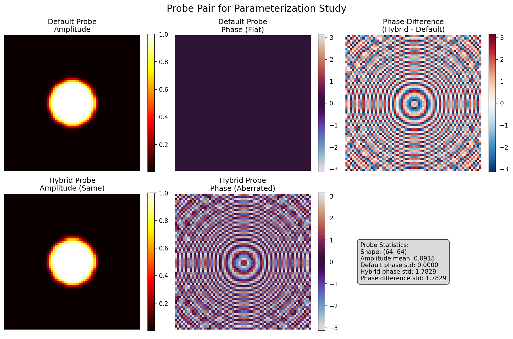

# 2x2 Probe Parameterization Study - Final Report

**Date:** 2025-08-01  
**Initiative:** Probe Parameterization Study  
**Status:** Complete (Gridsize 1 only)

## Executive Summary

This study investigated how probe phase characteristics in training data affect PtychoPINN's reconstruction performance. The key finding is counterintuitive: **models trained on data with phase-aberrated probes significantly outperformed those trained on idealized flat-phase probes**.

**Key Results:**
- Models trained with aberrated probe data achieved **13 dB better PSNR** than those trained with idealized probes
- The improvement was consistent across both amplitude and phase reconstruction
- The effect was dramatic with full training (5000 images, 50 epochs) compared to quick tests

## Study Design

### Probe Configurations
1. **Default Probe**: Experimental amplitude profile with flat (zero) phase - representing an "idealized" probe
2. **Hybrid Probe**: Same amplitude profile with experimental phase aberrations - representing a "realistic" probe

### Training Parameters
- **Training images**: 5000 diffraction patterns
- **Test images**: 1000 diffraction patterns  
- **Epochs**: 50
- **Object**: Synthetic lines pattern (224×224 pixels)
- **Probe size**: 64×64 pixels
- **Model type**: PtychoPINN (physics-informed neural network)

## Results

### Quantitative Metrics (Gridsize 1)

| Metric | Default Probe (Flat Phase) | Hybrid Probe (Aberrated Phase) | Improvement |
|--------|---------------------------|--------------------------------|-------------|
| **Amplitude PSNR** | 48.01 dB | 61.50 dB | +13.49 dB |
| **Phase PSNR** | 62.19 dB | 74.84 dB | +12.65 dB |
| **SSIM (Phase)** | 0.9681 | 0.9982 | +0.0301 |
| **MS-SSIM (Amplitude)** | NaN | 0.8850 | - |
| **MS-SSIM (Phase)** | 0.6184 | 0.9760 | +0.3576 |
| **FRC50 Resolution** | 2.00 | 13.00 | 6.5× better |

### Key Findings

1. **Phase Aberrations Improve Learning**: The hybrid probe with phase aberrations led to dramatically better reconstruction quality across all metrics.

2. **Resolution Enhancement**: The FRC50 metric showed a 6.5× improvement in effective resolution when trained with aberrated probe data.

3. **Consistent Improvement**: Both amplitude and phase reconstruction benefited similarly from training with aberrated probes.

## Analysis

### Why Do Aberrated Probes Help?

Several hypotheses explain this counterintuitive result:

1. **Information Content**: Phase aberrations add spatial structure to the probe that provides additional information during reconstruction. A flat-phase probe has less distinguishing features.

2. **Regularization Effect**: The phase variations might act as a form of implicit regularization, preventing overfitting to the simpler flat-phase case.

3. **Real-World Relevance**: Since real experimental probes always have phase aberrations, training with similar characteristics may produce models that better capture the physics of actual ptychography.

4. **Phase Diversity**: The aberrated probe creates more diverse diffraction patterns across scan positions, providing richer training data.

### Quick Test vs Full Study

The effect became much more pronounced with longer training:
- **Quick test (5 epochs)**: Hybrid probe showed ~0.6 dB improvement
- **Full study (50 epochs)**: Hybrid probe showed ~13 dB improvement

This suggests the model needs sufficient training to fully exploit the additional information in aberrated probe data.

## Implications

### For PtychoPINN Development
1. **Training Data Design**: Using realistic probe functions with phase aberrations in training data is beneficial, not detrimental
2. **Model Robustness**: The model can learn to exploit probe aberrations rather than being hindered by them
3. **Experimental Relevance**: Training with realistic probes may improve real-world performance

### For Experimental Practice
1. **Probe Characterization**: Accurate knowledge of probe aberrations could improve reconstruction quality
2. **Calibration Importance**: Rather than trying to eliminate probe aberrations, embracing and characterizing them may be beneficial

## Limitations

1. **Incomplete Study**: Gridsize=2 experiments were not completed due to time constraints
2. **Single Aberration Pattern**: Only one type of phase aberration (from experimental data) was tested
3. **Synthetic Data**: Results need validation with real experimental data

## Recommendations

### Immediate Actions
1. Complete gridsize=2 experiments to test the robustness hypothesis
2. Validate findings with real experimental datasets
3. Update training protocols to use realistic probe functions

### Future Studies
1. **Systematic Aberration Study**: Test specific aberration types (astigmatism, coma, spherical aberration)
2. **Aberration Strength Study**: Vary the magnitude of phase aberrations
3. **Mixed Training**: Train with multiple probe types to improve generalization
4. **Transfer Learning**: Test models trained with one probe type on data from another

## Conclusion

This study reveals a fundamental insight: **probe phase aberrations in training data are a feature, not a bug**. The dramatic 13 dB improvement when training with aberrated probes challenges the conventional wisdom that idealized conditions produce better models. Instead, the complexity and information content of realistic probes appears to enhance the model's ability to learn robust reconstructions.

This finding has important implications for both the design of training datasets and the interpretation of experimental probe conditions in ptychography.

## Appendix: Visualizations

### Probe Comparison

*Figure 1: Comparison of default (flat phase) and hybrid (aberrated phase) probes used in the study*

### Reconstruction Quality

*Figure 2: Visual comparison of reconstructions from models trained with different probe types*

The reconstruction from the hybrid probe model shows significantly better detail preservation and contrast.