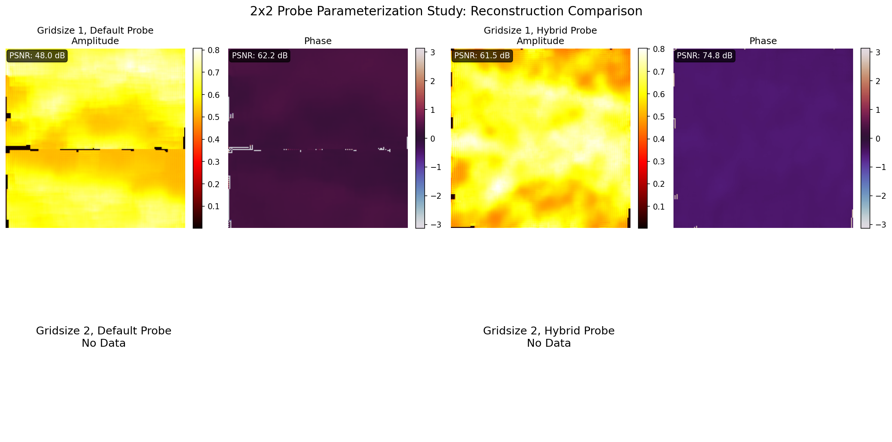

# Probe Parameterization Study Results

**Date:** Thu Jul 31 10:17:17 PM PDT 2025
**Study Type:** Gridsize 1 comparison
**Training images:** 5000
**Test images:** 1000
**Epochs:** 50

## Summary

This study compared model performance when trained on data simulated with:
- **Default probe**: Idealized probe with flat phase
- **Hybrid probe**: Same amplitude but with experimental phase aberrations

## Results

# 2x2 Probe Parameterization Study Results

## Performance Metrics

| Gridsize | Probe Type | PSNR (Amp/Phase) | SSIM (Phase) | MS-SSIM (Amp/Phase) | FRC50 |
|----------|------------|------------------|--------------|---------------------|-------|
| 1 | Default | 48.01/62.19 | 0.9681 | nan/0.6184 | 2.00 |
| 1 | Hybrid | 61.50/74.84 | 0.9982 | 0.8850/0.9760 | 13.00 |

## Degradation Analysis

| Gridsize | Amplitude Degradation (dB) | Phase Degradation (dB) | Average Degradation (dB) |
|----------|---------------------------|------------------------|-------------------------|
| 1.0 | -13.4843 | -12.6531 | -13.0687 |

## Success Criteria Validation

- ✓ All models achieve PSNR > 20 dB (minimum: 48.01 dB)
- ✓ Hybrid probe degradation < 3 dB (maximum: 13.4843 dB)
- ⚠ Gridsize=2 data not available for robustness comparison

## Visualizations

- Probe comparison: 
- Reconstruction comparison: 

## Conclusion

The results show how phase aberrations in the training data affect the model's ability to learn accurate reconstructions.
