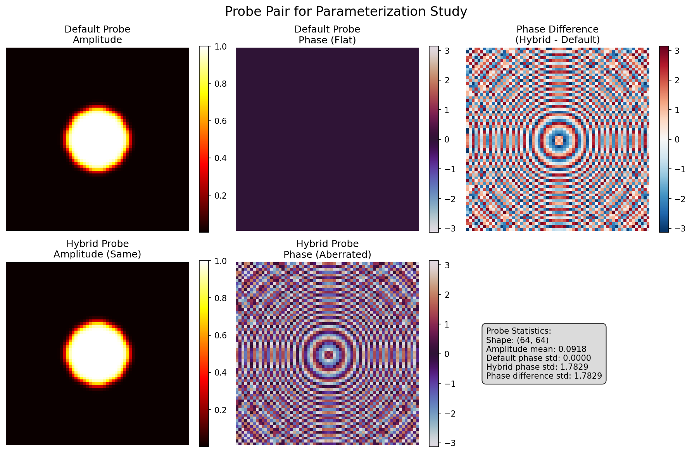

# Probe Parameterization Study Results

**Date:** Thu Jul 31 10:11:17 PM PDT 2025
**Study Type:** Gridsize 1 comparison
**Training images:** 512
**Test images:** 128
**Epochs:** 5

## Summary

This study compared model performance when trained on data simulated with:
- **Default probe**: Idealized probe with flat phase
- **Hybrid probe**: Same amplitude but with experimental phase aberrations

## Results

# 2x2 Probe Parameterization Study Results

## Performance Metrics

| Gridsize | Probe Type | PSNR (Amp/Phase) | SSIM (Phase) | MS-SSIM (Amp/Phase) | FRC50 |
|----------|------------|------------------|--------------|---------------------|-------|
| 1 | Default | 40.76/48.30 | 0.6070 | nan/0.1620 | 1.00 |
| 1 | Hybrid | 41.37/48.88 | 0.6584 | nan/0.2130 | 1.00 |

## Degradation Analysis

| Gridsize | Amplitude Degradation (dB) | Phase Degradation (dB) | Average Degradation (dB) |
|----------|---------------------------|------------------------|-------------------------|
| 1.0 | -0.6033 | -0.5797 | -0.5915 |

## Success Criteria Validation

- ✓ All models achieve PSNR > 20 dB (minimum: 40.76 dB)
- ✓ Hybrid probe degradation < 3 dB (maximum: 0.6033 dB)
- ⚠ Gridsize=2 data not available for robustness comparison

## Visualizations

- Probe comparison: 
- Reconstruction comparison: 

## Conclusion

The results show how phase aberrations in the training data affect the model's ability to learn accurate reconstructions.
