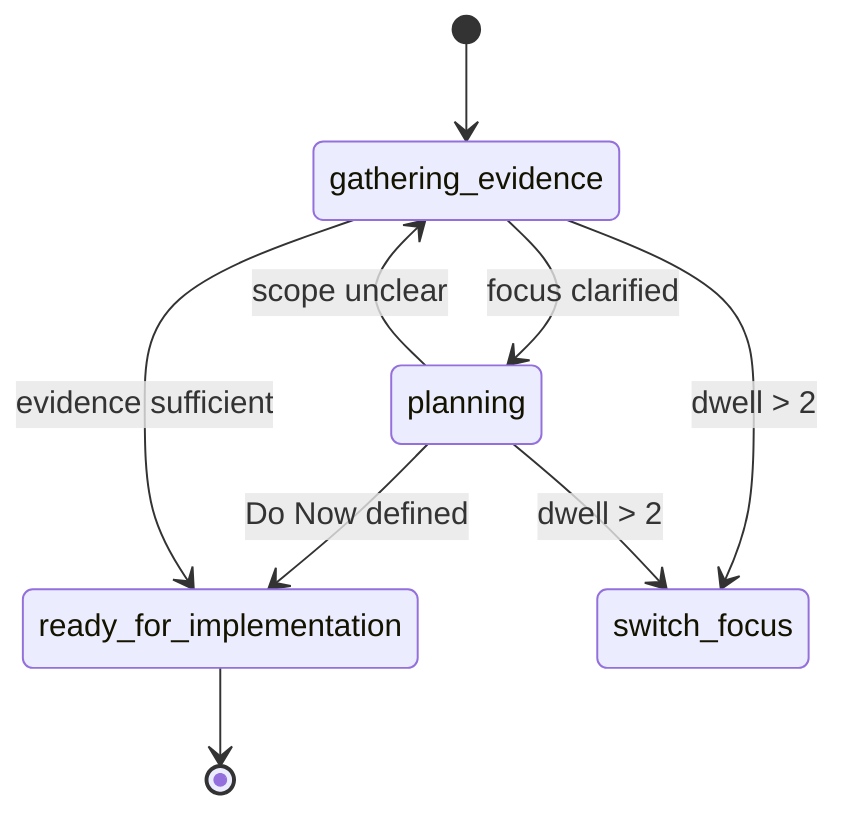

# FSM Analysis — Supervisor Action State Model (PtychoPINN)

## Purpose
- Make the supervisor’s control flow explicit as a small FSM, so loops are auditable and predictable without changing existing mechanics.

## States (canonical set)
- `gathering_evidence` — reading context, mapping tests, collecting artifacts
- `planning` — scoping, drafting Do Now, reconciling dependencies
- `ready_for_implementation` — Do Now is concrete; hand off to engineer

## Dwell Guard (hard rule)
- You may remain in `gathering_evidence` or `planning` for at most 2 consecutive turns per focus.
- On the 3rd turn for the same focus:
  - EITHER transition to `ready_for_implementation` and emit an executable Do Now that includes a code change
  - OR `switch_focus` and record the block in `docs/fix_plan.md` + `galph_memory.md`

## Transitions (examples)
- `gathering_evidence` → `planning` (focus clarified)
- `gathering_evidence` → `ready_for_implementation` (evidence sufficient)
- `planning` → `ready_for_implementation` (Do Now defined, deps satisfied)
- `planning` → `gathering_evidence` (requirements unclear)
- `gathering_evidence|planning` → `switch_focus` (dwell > 2)

## Logging Requirements
- At the end of every supervisor turn, append to `galph_memory.md`:
  - `focus=<id/slug>`
  - `state=<gathering_evidence|planning|ready_for_implementation>`
  - `dwell=<integer>` (consecutive turns in this state for this focus)
  - `artifacts=<plans/active/<initiative>/reports/<timestamp>/>`
  - `next_action=<one line or 'switch_focus'>`

## Minimal Diagram (optional)

## Notes
- This formalism documents behavior that already exists in PtychoPINN prompts; it does not change acceptance gates (parity, tests, artifacts).
