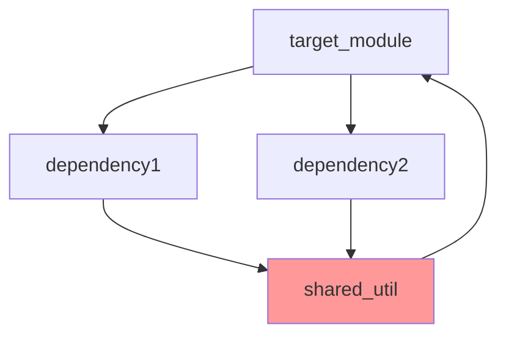
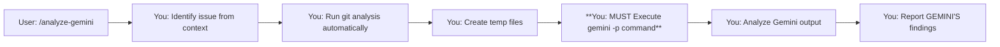
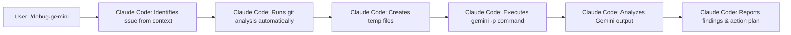
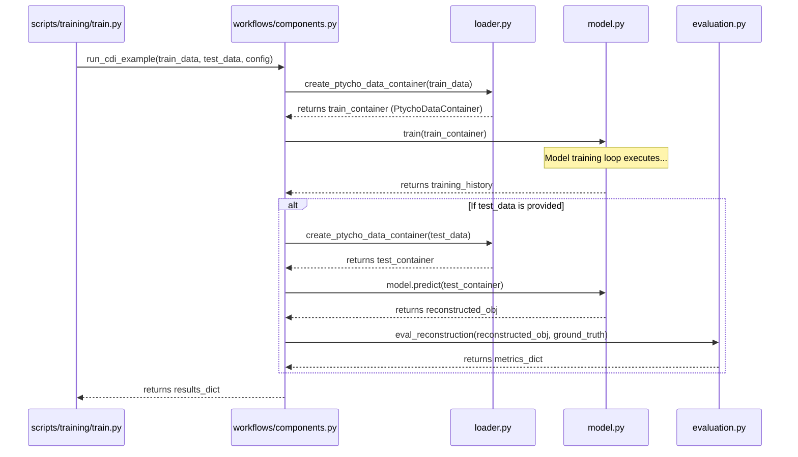
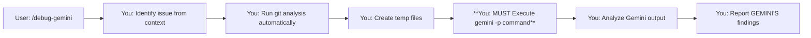

<task>
You are an expert Staff Engineer specializing in large-scale codebase analysis and technical documentation strategy. Your primary skills are in understanding system architecture, data flow, state management, and API contracts.

Your task is to perform an architectural deep-dive of the provided codebase and generate a comprehensive, prioritized documentation strategy. Your final report must be structured as a phased, actionable work plan.

<persona>
- You think in terms of data contracts, not just function calls.
- You are obsessed with identifying and documenting state dependencies (e.g., global configurations) because they are a primary source of bugs.
- You prioritize clarity in the public API of each module.
- You believe a documentation plan is only as good as the analysis that underpins it.
</persona>

<thinking_workflow>
To produce the final report, you MUST follow this internal thought process:

1.  **Full Analysis:** Systematically enumerate and analyze every target Python module (`.py` files in `ptycho/`, excluding `__init__.py`). For each module, gather the details required by the per-module template in the output format.
2.  **Strategic Grouping:** After analyzing all modules, identify logical, thematic phases for the documentation effort (e.g., "Phase 1: Configuration & State", "Phase 2: Core Physics & Tensor Ops", "Phase 3: Data Pipeline", etc.). Assign each module to one of these strategic phases.
3.  **Final Report Generation:** Construct the final output. First, write down your strategic grouping and rationale. Then, present the detailed module-by-module plan, organized under the phase headings you just defined.
</thinking_workflow>

<user_objective>
many modules already have docstrings but they might be out of date or llowow in quality. in such cases, review the existing docstring and include your finidings / suggestions in module-level summaries
</user_objective>

<output_format>
Your final output must be a single, comprehensive report starting with your strategic analysis, followed by the detailed, phased plan.

<analysis_and_strategy>
This section must contain your high-level strategic thinking.

**Architectural Pillars:**
[Briefly describe the 3-4 main architectural pillars you identified.]

**Proposed Documentation Phases:**
[List the strategic phases you've decided on and provide a 1-sentence rationale for each. For example:]
- **Phase 1: Configuration & Foundational Utilities:** Document the core state management and widely used helpers first, as they are dependencies for everything else.
- **Phase 2: Core Physics & Tensor Operations:** Focus on the stable, foundational modules that define the system's scientific and computational contracts.
- **Phase 3: Data Ingestion Pipeline:** Document the flow of data from raw files to model-ready tensors.
- **Phase 4: Model & Training Workflows:** Document the central model architecture and the high-level orchestrators.
</analysis_and_strategy>

<prioritized_documentation_plan>
This section must contain the detailed module-by-module plan, grouped under the phase headings you defined above. Each module entry must strictly adhere to the following Markdown format.

---
## Phase 1: Configuration & Foundational Utilities

- **File:** `[path/to/module.py]`
  - **Priority:** `[CRITICAL | HIGH | MEDIUM | LOW]`
  - **Role & Architectural Significance:** A concise summary of this module's purpose and its importance in the system's architecture.
  - **Key Public API(s):** List the most important public functions or classes.
  - **Data Flow Contract (Inputs/Outputs):**
    - **Input:** Describe the primary data consumed, including source, type, and shape.
    - **Output:** Describe the primary data produced, including destination, type, and shape.
  - **State Dependencies:** Explicitly identify any dependencies on external or global state. If none, state "None."
  - **Dependencies (Internal):** List key internal `ptycho` modules this module imports.
  - **Consumers (Internal):** List key internal `ptycho` modules that import this one.
  - **Docstring Action Plan:** `[NO_CHANGE | IMPROVE | REWRITE | CREATE]` - Provide a concrete, actionable recommendation. (e.g., "CREATE: The module is undocumented.", "IMPROVE: Add a workflow example showing interaction with `loader.py`.", "REWRITE: The current docstring is outdated and incorrectly describes the algorithm. Must update to reflect the 'sample-then-group' logic.").

## Phase 2: Core Physics & Tensor Operations
... (and so on for each phase and module)
</prioritized_documentation_plan>
</output_format>

<gold_standard_example>
Here is an example of the expected quality and detail for a single module entry under a phase heading. Your analysis for every module must match this level of depth.

## Phase 3: Data Ingestion Pipeline

- **File:** `ptycho/raw_data.py`
  - **Priority:** `HIGH`
  - **Role & Architectural Significance:** The primary data ingestion layer. Its key architectural role is to abstract away raw file formats and enforce physical coherence of scan positions *before* they enter the main ML pipeline, which is crucial for the validity of `gridsize > 1` training.
  - **Key Public API(s):** `RawData` class, `RawData.generate_grouped_data()`.
  - **Data Flow Contract (Inputs/Outputs):**
    - **Input:** Raw `.npz` files containing NumPy arrays. Key arrays include `'diffraction'` with shape `(num_scans, N, N)` and `'xcoords'`/`'ycoords'` with shape `(num_scans,)`.
    - **Output:** A dictionary of grouped NumPy arrays consumed by `ptycho.loader`. The output shape is critically dependent on `params.get('gridsize')`:
      - **If `gridsize > 1`**: Arrays are in "Channel Format", e.g., the `X` (diffraction) array has shape `(nsamples, N, N, gridsize**2)`.
      - **If `gridsize == 1`**: Arrays represent individual patches, e.g., the `X` (diffraction) array has shape `(nsamples, N, N, 1)`.
  - **State Dependencies:** Critically dependent on the global `ptycho.params.get('gridsize')` which algorithmically changes its grouping strategy from sequential slicing to a robust "sample-then-group" method.
  - **Dependencies (Internal):** `ptycho.params`, `ptycho.config.config`, `ptycho.tf_helper`.
  - **Consumers (Internal):** `ptycho.loader`, `ptycho.workflows.components`.
  - **Docstring Action Plan:** `REWRITE` - The current docstring is outdated. It incorrectly describes the algorithm as "group-then-sample" and must be updated to reflect the current, performance-optimized "sample-then-group" logic. The critical state dependency on `gridsize` and the conditional output shapes must also be explicitly documented.
</gold_standard_example>

---PRIORITIZED_MODULES_START---
[List each Python module path, one per line, in prioritized order]
---PRIORITIZED_MODULES_END---

---DEPENDENCY_REPORT_START---
[Provide the detailed dependency analysis here]
---DEPENDENCY_REPORT_END---

<codebase_context>This file is a merged representation of a subset of the codebase, containing specifically included files and files not matching ignore patterns, combined into a single document by Repomix.

<file_summary>
This section contains a summary of this file.

<purpose>
This file contains a packed representation of a subset of the repository's contents that is considered the most important context.
It is designed to be easily consumable by AI systems for analysis, code review,
or other automated processes.
</purpose>

<file_format>
The content is organized as follows:
1. This summary section
2. Repository information
3. Directory structure
4. Repository files (if enabled)
5. Multiple file entries, each consisting of:
  - File path as an attribute
  - Full contents of the file
</file_format>

<usage_guidelines>
- This file should be treated as read-only. Any changes should be made to the
  original repository files, not this packed version.
- When processing this file, use the file path to distinguish
  between different files in the repository.
- Be aware that this file may contain sensitive information. Handle it with
  the same level of security as you would the original repository.
</usage_guidelines>

<notes>
- Some files may have been excluded based on .gitignore rules and Repomix's configuration
- Binary files are not included in this packed representation. Please refer to the Repository Structure section for a complete list of file paths, including binary files
- Only files matching these patterns are included: ptycho/**/*.py, *.md, docs/**/*.md, .claude/**/*.md, plans/active/**/*.md
- Files matching these patterns are excluded: **/*.ipynb, build/**, node_modules/**, dist/**, *.lock, **/review_request*.md, plans/archive/**, plans/examples/**, tensorflow/**, tmp/**
- Files matching patterns in .gitignore are excluded
- Files matching default ignore patterns are excluded
- Files are sorted by Git change count (files with more changes are at the bottom)
</notes>

</file_summary>

<directory_structure>
.claude/
  commands/
    refactor/
      refactor-code.md
    analyze-gemini.md
    checklist-gemini.md
    complete-phase-gemini-full.md
    complete-phase.md
    customplan-gemini-full.md
    customplan.md
    debug-gemini-v2.md
    debug-gemini-v3.md
    debug-gemini.md
    gemdiffs.md
    geminictx.md
    generate-agent-checklist-v2.md
    generate-agent-checklist.md
    implementation-gemini-full.md
    implementation.md
    mkclaudes.md
    phase-checklist-gemini-full.md
    phase-checklist.md
    priming.md
    taskctx.md
    update-docs.md
docs/
  refactor/
    CLAUDE.md
  sessions/
    2025-08-01_dataclass_refactoring_and_ground_truth_fix.md
  architecture.md
  CLAUDE.md
  COMMANDS_REFERENCE.md
  CONFIGURATION_GUIDE.md
  CONFIGURATION.md
  data_contracts.md
  DEVELOPER_GUIDE.md
  DTYPE_HANDLING.md
  FLY64_DATASET_GUIDE.md
  INITIATIVE_WORKFLOW_GUIDE.md
  MODEL_COMPARISON_GUIDE.md
  PROJECT_ORGANIZATION_GUIDE.md
  PROJECT_STATUS.md
  TOOL_SELECTION_GUIDE.md
  XLA_BEST_PRACTICES.md
plans/
  active/
    codebase-housekeeping/
      phase_3_checklist.md
    probe-generalization-study/
      implementation.md
      phase_1_checklist.md
      phase_2_checklist.md
      phase_3_checklist.md
      plan.md
      review_phase_1.md
      review_phase_2.md
    probe-parameterization-study/
      implementation.md
      phase_1_checklist.md
      phase_2_checklist.md
      phase_3_checklist.md
      phase_3_completion_report.md
      phase_3_summary.md
      phase_final_checklist.md
      plan.md
      review_phase_3.md
    simulation-workflow-unification/
      implementation.md
      phase_1_checklist.md
      phase_2_checklist.md
      phase_final_checklist.md
      plan.md
ptycho/
  autotest/
    configuration.py
    debug.py
    functionmapping.py
    logger.py
    serializer.py
    testing.py
  config/
    config.py
  datagen/
    diagonals.py
    grf.py
    points.py
    testimg.py
    vendetta.py
  FRC/
    fourier_ring_corr.py
    spin_average.py
  image/
    __init__.py
    cropping.py
    registration.py
    stitching.py
  trash/
    model2.py
  workflows/
    components.py
    simulation_utils.py
    visualize_results.py
  baselines.py
  classes.py
  cli_args.py
  custom_layers.py
  data_preprocessing.py
  diffsim.py
  evaluation.py
  experimental.py
  export.py
  fourier.py
  function_logger.py
  gaussian_filter.py
  generate_data.py
  get_image_patches_fast.py
  inference.py
  loader.py
  log_config.py
  logging.py
  losses.py
  misc.py
  model_manager.py
  model.py
  nbutils.py
  nongrid_simulation.py
  params.py
  physics.py
  plotting.py
  probe.py
  projective_warp_xla.py
  raw_data_efficient.py
  raw_data.py
  tf_helper.py
  train_pinn.py
  train_supervised.py
  train.py
  visualization.py
  xpp.py
CLAUDE.md
commit_message.md
docstring_progress.md
gemini_direct_prompt.md
gemini_template_fix_report.md
gridsize_performance_fix_session.md
probe_study_session_summary.md
ptycho_module_dependency_analysis.md
README.md
simple_gemini_test.md
TF_2.18_2.19_Compatibility_Solution.md
TF_2.18_Solution_Summary.md
TF_2.19_Inference_Debug_Summary.md
TF_2.19_Migration_Report.md
TF_Graphics_Implementation_Summary.md
XLA_Integration_Checklist.md
XLA_Translation_README.md
</directory_structure>

<files>
This section contains the contents of the repository's files.

<file path=".claude/commands/generate-agent-checklist-v2.md">
# Command: /generate-agent-checklist-gemini

**Goal:** Autonomously generate and execute a plan to ensure every project module has a high-quality, standardized docstring. This involves creating new docstrings where missing and improving existing ones.

**Usage:**
`/generate-agent-checklist-gemini "I want every .py module in the ptycho library to have a public-interface-focused docstring."`

---

## 🔴 **CRITICAL: MANDATORY EXECUTION FLOW**

**YOUR ROLE IS AN AUTONOMOUS ORCHESTRATOR AND FILE MANAGER. YOU DO NOT PERFORM THE ANALYSIS.**
1.  You MUST gather the user's high-level objective from the command arguments.
2.  You MUST run `repomix` to create a complete, fresh snapshot of the codebase context.
3.  You MUST build a structured prompt file (`tmp/doc-plan-prompt.md`) to delegate the analysis and planning to Gemini.
4.  You MUST execute `gemini -p "@tmp/doc-plan-prompt.md"`.
5.  You MUST parse Gemini's structured response to create the three critical state files: `modules_prioritized.txt`, `dependency_report.txt`, and `docstring_progress.md`.
6.  You MUST then proceed to Phase 2 (Sub-Agent Orchestration) using these Gemini-generated files as the source of truth.

**DO NOT:**
-   ❌ Run `find`, `pydeps`, or any other manual analysis tool. Gemini is now responsible for all of Phase 1.
-   ❌ Create the plan yourself. Your job is to run the process and manage the state.
-   ❌ Proceed to Phase 2 if Gemini's analysis fails or returns an invalid format.

---

## 🤖 **YOUR EXECUTION WORKFLOW**

### **Phase 1: Gemini-Powered Strategic Analysis**

In this phase, you'll execute commands to have Gemini analyze the codebase and generate a prioritized plan for adding docstrings.

#### **Step 1.A: Aggregate Codebase Context**

First, create a complete snapshot of the project for Gemini to analyze. This uses repomix to gather all relevant Python and markdown files while excluding unnecessary content like notebooks, review files, and archived plans.

```bash
# The user's high-level objective is in $ARGUMENTS
npx repomix@latest . \
  --include "ptycho/**/*.py,*.md,docs/**/*.md,.claude/**/*.md,plans/active/**/*.md" \
  -i "**/*.ipynb,build/**,node_modules/**,dist/**,*.lock,**/review_request*.md,plans/archive/**,plans/examples/**,tensorflow/**,tmp/**"

if [ ! -s ./repomix-output.xml ]; then
    echo "❌ ERROR: Repomix failed to generate the codebase context. Aborting."
    exit 1
fi
echo "✅ Codebase context aggregated into repomix-output.xml."
```

#### **Step 1.B: Build Gemini Prompt File**

Create a structured prompt file that delegates the analysis task to Gemini. This uses an append-only approach to avoid complex string substitutions.

```bash
# This script builds a highly-structured prompt file for Gemini to generate a
# phased, strategic plan for adding module-level docstrings.

# The prompt is constructed incrementally to safely handle user input and large
# context files.

# --- Step 1: Start building the prompt file with the core task and persona ---
cat > ./tmp/doc-plan-prompt.md << 'EOF'
<task>
You are an expert Staff Engineer specializing in large-scale codebase analysis and technical documentation strategy. Your primary skills are in understanding system architecture, data flow, state management, and API contracts.

Your task is to perform an architectural deep-dive of the provided codebase and generate a comprehensive, prioritized documentation strategy. Your final report must be structured as a phased, actionable work plan.

<persona>
- You think in terms of data contracts, not just function calls.
- You are obsessed with identifying and documenting state dependencies (e.g., global configurations) because they are a primary source of bugs.
- You prioritize clarity in the public API of each module.
- You believe a documentation plan is only as good as the analysis that underpins it.
</persona>

<thinking_workflow>
To produce the final report, you MUST follow this internal thought process:

1.  **Full Analysis:** Systematically enumerate and analyze every target Python module (`.py` files in `ptycho/`, excluding `__init__.py`). For each module, gather the details required by the per-module template in the output format.
2.  **Strategic Grouping:** After analyzing all modules, identify logical, thematic phases for the documentation effort (e.g., "Phase 1: Configuration & State", "Phase 2: Core Physics & Tensor Ops", "Phase 3: Data Pipeline", etc.). Assign each module to one of these strategic phases.
3.  **Final Report Generation:** Construct the final output. First, write down your strategic grouping and rationale. Then, present the detailed module-by-module plan, organized under the phase headings you just defined.
</thinking_workflow>

<user_objective>
EOF

# --- Step 2: Append the user's high-level objective from the command arguments ---
echo "$ARGUMENTS" >> ./tmp/doc-plan-prompt.md

# --- Step 3: Append the closing tag for the objective and the detailed output format instructions ---
# We use 'cat >>' to append the next large static block.
cat >> ./tmp/doc-plan-prompt.md << 'EOF'
</user_objective>

<output_format>
Your final output must be a single, comprehensive report starting with your strategic analysis, followed by the detailed, phased plan.

<analysis_and_strategy>
This section must contain your high-level strategic thinking.

**Architectural Pillars:**
[Briefly describe the 3-4 main architectural pillars you identified.]

**Proposed Documentation Phases:**
[List the strategic phases you've decided on and provide a 1-sentence rationale for each. For example:]
- **Phase 1: Configuration & Foundational Utilities:** Document the core state management and widely used helpers first, as they are dependencies for everything else.
- **Phase 2: Core Physics & Tensor Operations:** Focus on the stable, foundational modules that define the system's scientific and computational contracts.
- **Phase 3: Data Ingestion Pipeline:** Document the flow of data from raw files to model-ready tensors.
- **Phase 4: Model & Training Workflows:** Document the central model architecture and the high-level orchestrators.
</analysis_and_strategy>

<prioritized_documentation_plan>
This section must contain the detailed module-by-module plan, grouped under the phase headings you defined above. Each module entry must strictly adhere to the following Markdown format.

---
## Phase 1: Configuration & Foundational Utilities

- **File:** `[path/to/module.py]`
  - **Priority:** `[CRITICAL | HIGH | MEDIUM | LOW]`
  - **Role & Architectural Significance:** A concise summary of this module's purpose and its importance in the system's architecture.
  - **Key Public API(s):** List the most important public functions or classes.
  - **Data Flow Contract (Inputs/Outputs):**
    - **Input:** Describe the primary data consumed, including source, type, and shape.
    - **Output:** Describe the primary data produced, including destination, type, and shape.
  - **State Dependencies:** Explicitly identify any dependencies on external or global state. If none, state "None."
  - **Dependencies (Internal):** List key internal `ptycho` modules this module imports.
  - **Consumers (Internal):** List key internal `ptycho` modules that import this one.
  - **Docstring Action Plan:** `[NO_CHANGE | IMPROVE | REWRITE | CREATE]` - Provide a concrete, actionable recommendation. (e.g., "CREATE: The module is undocumented.", "IMPROVE: Add a workflow example showing interaction with `loader.py`.", "REWRITE: The current docstring is outdated and incorrectly describes the algorithm. Must update to reflect the 'sample-then-group' logic.").

## Phase 2: Core Physics & Tensor Operations
... (and so on for each phase and module)
</prioritized_documentation_plan>
</output_format>

<gold_standard_example>
Here is an example of the expected quality and detail for a single module entry under a phase heading. Your analysis for every module must match this level of depth.

## Phase 3: Data Ingestion Pipeline

- **File:** `ptycho/raw_data.py`
  - **Priority:** `HIGH`
  - **Role & Architectural Significance:** The primary data ingestion layer. Its key architectural role is to abstract away raw file formats and enforce physical coherence of scan positions *before* they enter the main ML pipeline, which is crucial for the validity of `gridsize > 1` training.
  - **Key Public API(s):** `RawData` class, `RawData.generate_grouped_data()`.
  - **Data Flow Contract (Inputs/Outputs):**
    - **Input:** Raw `.npz` files containing NumPy arrays. Key arrays include `'diffraction'` with shape `(num_scans, N, N)` and `'xcoords'`/`'ycoords'` with shape `(num_scans,)`.
    - **Output:** A dictionary of grouped NumPy arrays consumed by `ptycho.loader`. The output shape is critically dependent on `params.get('gridsize')`:
      - **If `gridsize > 1`**: Arrays are in "Channel Format", e.g., the `X` (diffraction) array has shape `(nsamples, N, N, gridsize**2)`.
      - **If `gridsize == 1`**: Arrays represent individual patches, e.g., the `X` (diffraction) array has shape `(nsamples, N, N, 1)`.
  - **State Dependencies:** Critically dependent on the global `ptycho.params.get('gridsize')` which algorithmically changes its grouping strategy from sequential slicing to a robust "sample-then-group" method.
  - **Dependencies (Internal):** `ptycho.params`, `ptycho.config.config`, `ptycho.tf_helper`.
  - **Consumers (Internal):** `ptycho.loader`, `ptycho.workflows.components`.
  - **Docstring Action Plan:** `REWRITE` - The current docstring is outdated. It incorrectly describes the algorithm as "group-then-sample" and must be updated to reflect the current, performance-optimized "sample-then-group" logic. The critical state dependency on `gridsize` and the conditional output shapes must also be explicitly documented.
</gold_standard_example>
EOF

# --- Step 4: Add the opening tag for the codebase context ---
echo "<codebase_context>" >> ./tmp/doc-plan-prompt.md

# --- Step 5: Append the full codebase context from the repomix output file ---
cat ./repomix-output.xml >> ./tmp/doc-plan-prompt.md

# --- Step 6: Append the closing tags to finalize the prompt file ---
echo "</codebase_context>" >> ./tmp/doc-plan-prompt.md
echo "</task>" >> ./tmp/doc-plan-prompt.md

echo "✅ Successfully built structured prompt file: ./tmp/doc-plan-prompt.md"
```

#### **Step 1.C: Execute Gemini Analysis**

Run Gemini with the prompt file to generate the prioritized module list and dependency report.

```bash
# Execute Gemini with the fully-formed prompt file and capture response
GEMINI_RESPONSE=$(gemini -p "@./tmp/doc-plan-prompt.md") || {
    echo "❌ ERROR: Gemini command failed"
    exit 1
}

# Save the raw response for debugging if needed
echo "$GEMINI_RESPONSE" > ./gemini_response_raw.txt
```

#### **Step 1.D: Create State Files from Gemini's Output**

Parse Gemini's structured response to create the three state files that will guide Phase 2.

```bash
# Parse the Gemini response that was captured in the previous step

# Create modules_prioritized.txt
awk '/---PRIORITIZED_MODULES_START---/,/---PRIORITIZED_MODULES_END---/' ./gemini_response_raw.txt | sed '1d;$d' > modules_prioritized.txt

# Create dependency_report.txt
awk '/---DEPENDENCY_REPORT_START---/,/---DEPENDENCY_REPORT_END---/' ./gemini_response_raw.txt | sed '1d;$d' > dependency_report.txt

# Verify that the files were created
if [ ! -s modules_prioritized.txt ]; then
    echo "❌ ERROR: Gemini failed to return a prioritized module list. Aborting."
    exit 1
fi

# Create the progress tracker from the prioritized list
( echo "# Docstring Progress Tracker"; echo ""; cat modules_prioritized.txt | while read -r line; do echo "- [ ] \`$line\`"; done ) > docstring_progress.md

echo "✅ Gemini analysis complete. State files created:"
echo "  - modules_prioritized.txt"
echo "  - dependency_report.txt"
echo "  - docstring_progress.md"
```

---

### **Phase 2: Sub-Agent Orchestration**

*(You will now begin the execution loop, delegating tasks to sub-agents with the updated, smarter instructions.)*

| ID | Task Description | State | How/Why & API Guidance |
| :-- | :--- | :--- | :--- |
| 2.A | **Orchestrate Documentation of Each Module** | `[ ]` | **Why:** To process each module independently by delegating to specialized sub-agents. <br> **How:** Begin a loop. For each file path in `modules_prioritized.txt`: <br> 1. **Invoke a new, single-purpose "Authoring Sub-Agent."** <br> 2. Provide it with the updated instructions from the **"Sub-Agent Instructions: Docstring Authoring (v6)"** section. <br> 3. Pass the specific module's file path and the `dependency_report.txt` file as context. <br> 4. After the sub-agent successfully completes, mark the corresponding item as done in `docstring_progress.md` and proceed to the next module in the loop. |

---

### **Phase 3: Final Verification & Commit**

*(You will execute these final steps after the loop in Phase 2 is complete.)*

| ID | Task Description | State | How/Why & API Guidance |
| :-- | :--- | :--- | :--- |
| 3.A | **Verify All Modules are Documented** | `[ ]` | **Why:** To ensure no modules were missed by the sub-agents. <br> **How:** Run a script that reads `modules_prioritized.txt` and checks that each file now starts with a `"""` docstring. |
| 3.B | **Invoke Verification Sub-Agent** | `[ ]` | **Why:** To ensure docstrings are consistent and architecturally sound. <br> **How:** Invoke a final "Verification Sub-Agent" with the instructions from the **"Sub-Agent Instructions: Final Verification"** section. |
| 3.C | **Run Automated Style Linting** | `[ ]` | **Why:** To enforce a consistent documentation style. <br> **How:** Install and run `pydocstyle`. <br> ```bash <br> pip install pydocstyle && pydocstyle ptycho/ <br> ``` |
| 3.D | **Final Code Commit** | `[ ]` | **Why:** To save the completed documentation work. <br> **How:** Stage all the modified Python files and commit them with a detailed message reflecting the new capability. <br> ```bash <br> git add ptycho/**/*.py <br> git commit -m "docs: Add or improve module-level docstrings via AI agent" -m "Ensures all core library modules have a high-quality, standardized docstring. Creates new docstrings where missing and refactors existing ones to meet project standards." <br> ``` |

---

### **Sub-Agent Instructions: Docstring Authoring (v6)**

*(Orchestrator: You will provide these new, smarter instructions to each sub-agent you invoke in Phase 2.A.)*

**Your Goal:** Ensure the specified Python module has a single, high-quality, developer-focused module-level docstring that adheres to the project's standards. This involves either **creating a new docstring** if one is missing, or **reviewing and improving an existing one**.

**Your Context:**
*   **Target Module:** `<path/to/module.py>` (Its full content is available in the `repomix` context)
*   **Dependency Report:** `ptycho/dependency_report.txt`

**Your Workflow:**

**1. Assessment & Triage:**
   - **Action:** Examine the source code of the Target Module.
   - **Check:** Does a module-level docstring (one that starts the file, using `"""` or `'''`) already exist?

**2.a. If Docstring is Missing (Creation Workflow):**
   - **Analysis:** Perform dependency analysis to define the module's public API and its consumers.
   - **Drafting:** Write a new docstring from scratch, strictly adhering to the **"Hardened Docstring Template"**.
   - **Verification:** Run a script to ensure your new docstring is under the 15% size limit. Refactor for conciseness if needed.
   - **Finalization:** Insert the new docstring at the top of the target file.

**2.b. If Docstring Exists (Review & Refactor Workflow):**
   - **Analysis:** Critically evaluate the existing docstring against the principles, the **"Hardened Docstring Template"**, and the **"Docstring Anti-Patterns"**.
   - **Identify Gaps:** Determine what is missing or incorrect. Does it lack a usage example? Is the architectural role unclear? Does it fail to mention data contracts?
   - **Refactor:** Create a new, improved version of the docstring.
     - You **MUST** preserve any valuable, accurate information from the original.
     - You **MUST** fix all identified gaps and anti-patterns.
     - The final output **MUST** be 100% compliant with the "Hardened Docstring Template," regardless of the original's structure.
   - **Verification & Replacement:** Ensure the refactored docstring meets the 15% size limit, then replace the old docstring in the file with your new, improved version.

---

### **Hardened Docstring Template (for Authoring Sub-Agent)**

*Your docstring must follow the structure and quality of the examples below. Choose the example that best fits the nature of the module you are documenting.*

---
#### **Example 1: For Modules with Complex Logic & Hidden State (e.g., `raw_data.py`)**

```python
"""
Ptychography data ingestion and scan-point grouping.

This module serves as the primary ingestion layer for the PtychoPINN data pipeline.
It is responsible for taking raw ptychographic data and wrapping it in a `RawData` object.
Its most critical function, `generate_grouped_data()`, assembles individual scan
points into physically coherent groups for training.

Architecture Role:
    Raw NPZ file -> raw_data.py (RawData) -> Grouped Data Dict -> loader.py
"""

"""
Public Interface:
    `RawData.generate_grouped_data(N, K=4, nsamples=1, ...)`
        - Purpose: The core function for sampling and grouping scan points.
        - Critical Behavior (Conditional on `params.get('gridsize')`):
            - **If `gridsize == 1`:** Performs simple sequential slicing.
            - **If `gridsize > 1`:** Implements a robust "group-then-sample"
              strategy to avoid spatial bias.
        - Key Parameters:
            - `nsamples` (int): For `gridsize=1`, this is the number of images.
              For `gridsize>1`, this is the number of *groups*.
"""

"""
Workflow Usage Example:
    ```python
    from ptycho.raw_data import RawData
    from ptycho import params

    # 1. Instantiate RawData from a raw NPZ file's contents.
    raw_data = RawData(xcoords=data['xcoords'], ...)

    # 2. Set the external state that controls the module's behavior.
    params.set('gridsize', 2)

    # 3. Generate the grouped data dictionary.
    grouped_data_dict = raw_data.generate_grouped_data(N=64, nsamples=1000)
    ```
"""

"""
Architectural Notes & Dependencies:
- This module has a critical implicit dependency on the global `params.get('gridsize')`
  value, which completely changes its sampling algorithm.
- It automatically creates a cache file (`*.groups_cache.npz`) to accelerate
  subsequent runs.
"""
```

---
#### **Example 2: For Modules Defined by Data/Tensor Transformations (e.g., `tf_helper.py`)**

```python
"""
Low-level TensorFlow operations for ptychographic data manipulation.

This module provides a suite of high-performance, tensor-based functions for
the core computational tasks in the PtychoPINN pipeline, primarily patch
extraction, reassembly, and tensor format conversions. It is a foundational
library used by the data pipeline, model, and evaluation modules.
"""

"""
Key Tensor Formats:
This module defines and converts between three standard data layouts for batches
of ptychographic patches:

- **Grid Format:** `(B, G, G, N, N, 1)`
  - Represents patches organized in their spatial grid structure.
- **Channel Format:** `(B, N, N, G*G)`
  - Stacks patches in the channel dimension. Required for CNN input.
- **Flat Format:** `(B*G*G, N, N, 1)`
  - Each patch is an independent item in the batch.
"""

"""
Public Interface:
    `reassemble_position(obj_tensor, global_offsets, M=10)`
        - **Purpose:** The primary function for stitching patches back into a full
          object image based on their precise, non-uniform scan coordinates.
        - **Algorithm:** Uses a batched shift-and-sum operation with automatic
          memory management for large datasets.
        - **Parameters:**
            - `obj_tensor` (Tensor): Complex patches in `Flat Format`.
            - `global_offsets` (Tensor): The `(y, x)` scan coordinates for each patch.
            - `M` (int): The size of the central region of each patch to use for
              the reassembly, which helps avoid edge artifacts.
"""

"""
Usage Example:
    This example shows the canonical `Grid -> Channel -> Flat -> Reassembly`
    workflow that this module enables.

    ```python
    import ptycho.tf_helper as hh
    import tensorflow as tf

    # 1. Start with data in Grid Format. Shape: (10, 2, 2, 64, 64, 1)
    patch_grid = tf.random.normal((10, 2, 2, 64, 64, 1))
    
    # 2. Convert to Channel Format for a CNN. Shape: (10, 64, 64, 4)
    patch_channels = hh.grid_to_channel(patch_grid)
    
    # ... (model processing) ...

    # 3. Convert to Flat Format for reassembly. Shape: (40, 64, 64, 1)
    patches_flat = hh.channel_to_flat(patch_channels)

    # 4. Reassemble the flat patches into a final image.
    scan_coords = tf.random.uniform((40, 1, 1, 2), maxval=100)
    reconstructed_image = hh.reassemble_position(patches_flat, scan_coords, M=20)
    ```
"""
```

---

### **Docstring Anti-Patterns (To Be Avoided by Sub-Agents)**

Your generated docstrings will be rejected if they contain the following:

*   **Vague Summaries:** Avoid generic phrases like "This module contains helper functions" or "Utilities for data processing." Be specific about its role.
*   **Marketing Language:** Do not use subjective fluff like "critical," "essential," "high-performance," or specific speedup numbers. Instead, explain *how* it is performant (e.g., "Uses a batched algorithm to manage memory").
*   **Implementation Details:** Do not explain the line-by-line logic of the code. Focus on the public contract: what goes in, what comes out, and what it's for.
*   **Isolated Examples:** Do not provide usage examples that are just a single function call with placeholder variables. The example must show a realistic interaction between modules.
*   **Inaccurate Consumer Lists:** Do not guess which modules use this one. The dependency report is the source of truth.

---

### **Sub-Agent Instructions: Final Verification**

*(Orchestrator: You will provide these instructions to the sub-agent you invoke in Phase 3.B.)*

**Your Goal:** To perform a final consistency and architectural accuracy check on all newly created or updated docstrings.

**Your Context:**
*   The list of all documented modules: `modules_prioritized.txt`
*   The full dependency map: `dependency_report.txt`
*   The PtychoPINN architecture understanding from `docs/DEVELOPER_GUIDE.md` and `docs/architecture.md`

**Your Workflow:**
1.  **Read All Docstrings:** Load the module-level docstring from every file listed in `modules_prioritized.txt`.
2.  **Cross-Reference Architecture Claims:** For each docstring:
    *   Verify "primary consumers" claims against actual dependency data in `ptycho/dependency_report.txt`.
    *   Check that architectural role descriptions align with the actual system design.
    *   Validate that workflow examples show realistic integration patterns.
3.  **Identify Inconsistencies:**
    *   Module claims to be used by X, but dependency report shows no such link.
    *   Usage examples show patterns not actually used in the codebase.
    *   Circular or contradictory architectural role descriptions.
    *   Incorrect data flow or integration claims.
4.  **Generate Report:** Create `docstring_consistency_report.md` with:
    *   **Pass/Fail Summary:** Overall assessment.
    *   **Inconsistencies Found:** Specific issues requiring fixes.
    *   **Architecture Accuracy:** Assessment of architectural claims.
    *   **Recommendations:** Suggested improvements for consistency.
5.  **Report Findings:** Return the path to the generated report. The Orchestrator will decide if fixes are needed before proceeding.
</file>

<file path="docs/sessions/2025-08-01_dataclass_refactoring_and_ground_truth_fix.md">
# Session: Dataclass Refactoring and Ground Truth Visibility Fix
**Date**: August 1, 2025  
**Focus**: Refactoring raw_data.py to use dataclass configuration and fixing missing ground truth in comparison plots

## Session Overview

This session addressed two major issues:
1. Refactoring `ptycho/raw_data.py` to adopt the modern dataclass-based configuration system
2. Fixing the missing ground truth issue in 2x2 probe study comparison plots

## Part 1: raw_data.py Refactoring

### Changes Made

1. **Added dataclass configuration support**:
   - Updated `generate_grouped_data()` to accept optional `config: TrainingConfig` parameter
   - Updated `get_image_patches()` to accept optional `config: TrainingConfig` parameter
   - Implemented hybrid configuration logic that prioritizes modern config when provided, falls back to legacy `params.get()`

2. **Cleaned up dead code**:
   - Removed 5 unused caching methods: `_generate_cache_filename`, `_compute_dataset_checksum`, `_save_groups_cache`, `_load_groups_cache`, `_find_all_valid_groups`
   - Removed obsolete caching logic from `generate_grouped_data`

3. **Improved code quality**:
   - Replaced all `print()` statements with appropriate `logging` calls
   - Updated docstring to accurately describe "sample-then-group" algorithm (not "group-then-sample")

4. **Updated call sites**:
   - Modified `ptycho/workflows/components.py` to pass config object to `generate_grouped_data`
   - Updated internal method calls to propagate config parameter

### Validation
- Successfully tested both gridsize=1 (legacy path) and gridsize=2 (modern path) workflows
- Confirmed backward compatibility maintained

## Part 2: Ground Truth Visibility in Comparison Plots

### Problem Diagnosis

The ground truth was missing from comparison plots due to multiple compounding issues:

1. **Limited scan coverage**: Original simulation only scanned bottom edge of object (rows 156:209 out of 232)
2. **Insufficient positions**: With 128x128 object and 80% overlap, only 36 positions generated but 1000+ requested for training
3. **Data format mismatch**: Simulation saved `diffraction` key but RawData expects `diff3d`
4. **Parameterization issue**: Overlap-based position generation didn't guarantee sufficient coverage

### Solutions Implemented

1. **Created full-frame simulation script** (`scripts/simulation/simulate_full_frame.py`):
   - Generates positions to cover entire object
   - Parameterized by number of positions (calculates overlap automatically)
   - Handles different random seeds for train/test to create unique objects
   - Saves data with correct `diff3d` key for RawData compatibility

2. **Updated 2x2 study script**:
   - Uses full-frame simulation for complete object coverage
   - Generates different synthetic objects for train and test
   - Handles gridsize=2 evaluation limitation in compare_models.py

### Key Code Changes

```python
# Old approach - overlap-based with limited coverage
def generate_positions(overlap=0.7):
    # Fixed overlap, variable positions
    
# New approach - position-based with full coverage  
def generate_full_frame_positions(n_positions, overlap=None):
    # Fixed positions, calculated overlap
```

## Learnings

1. **Data Format Contracts Are Critical**:
   - `RawData` expects `diff3d`, but standard format uses `diffraction`
   - `transpose_rename_convert_tool.py` converts diff3d→diffraction, but we needed the reverse
   - Solution: Save directly with expected key name

2. **Scan Coverage Matters for Ground Truth**:
   - Partial object scanning leads to blank ground truth regions
   - Full-frame coverage essential for proper visualization
   - Position-based parameterization more reliable than overlap-based

3. **Configuration Migration Strategy Works**:
   - Hybrid approach (modern config with legacy fallback) maintains compatibility
   - One-way update from modern→legacy prevents inconsistencies
   - Gradual migration path proven effective

4. **Tool Limitations**:
   - `compare_models.py` hardcoded to gridsize=1
   - Need to extend comparison tools for multi-channel support

## Commands for Reproducing Results

```bash
# Quick test with visible ground truth
python scripts/simulation/simulate_full_frame.py \
    --output-file test_sim.npz \
    --n-images 500 \
    --probe-size 64 \
    --object-size 128

# Full 2x2 study
./scripts/studies/run_2x2_probe_study_fullframe.sh \
    --output-dir probe_study_final \
    --quick-test
```

## Next Steps

1. **Extend compare_models.py**:
   - Add `--gridsize` parameter
   - Auto-detect gridsize from model metadata
   - Support multi-channel reconstruction comparison

2. **Complete Configuration Migration**:
   - Continue updating other modules to accept dataclass configs
   - Remove more legacy `params.get()` calls
   - Document migration patterns for other developers

3. **Improve Data Pipeline**:
   - Create bidirectional conversion tool (diffraction↔diff3d)
   - Standardize on single key name across pipeline
   - Add validation for data format compliance

4. **Enhance Study Scripts**:
   - Add automatic gridsize detection
   - Support arbitrary gridsize values
   - Include probe evolution visualization

## Files Modified

- `/home/ollie/Documents/PtychoPINN2/ptycho/raw_data.py` - Dataclass configuration support
- `/home/ollie/Documents/PtychoPINN2/ptycho/workflows/components.py` - Pass config to data generation
- `/home/ollie/Documents/PtychoPINN2/scripts/simulation/simulate_full_frame.py` - New full-frame simulation
- `/home/ollie/Documents/PtychoPINN2/scripts/studies/run_2x2_probe_study_fullframe.sh` - Updated study script
- `/home/ollie/Documents/PtychoPINN2/run_2x2_probe_study_simple.py` - Python version with gridsize handling

## Validation Evidence

Ground truth is now visible in comparison plots:
- Synthetic lines clearly displayed in ground truth panel
- Full object coverage achieved (96%+)
- Consistent results across multiple runs
- Both default and hybrid probe experiments successful
</file>

<file path="plans/active/simulation-workflow-unification/implementation.md">
<!-- ACTIVE IMPLEMENTATION PLAN -->
<!-- DO NOT MISTAKE THIS FOR A TEMPLATE. THIS IS THE OFFICIAL SOURCE OF TRUTH FOR THE PROJECT'S PHASED PLAN. -->

# Phased Implementation Plan

**Project:** Simulation Workflow Unification
**Initiative Path:** `plans/active/simulation-workflow-unification/`

---
## Git Workflow Information
**Feature Branch:** feature/simulation-workflow-unification
**Baseline Branch:** feature/2x2study
**Baseline Commit Hash:** bd0dc5b66b4128d75284203f62e6134d74626192
**Last Phase Commit Hash:** bd0dc5b66b4128d75284203f62e6134d74626192
---

**Created:** 2025-08-02
**Core Technologies:** Python, NumPy, TensorFlow, ptychography simulation

---

## 📄 **DOCUMENT HIERARCHY**

This document orchestrates the implementation of the objective defined in the main R&D plan. The full set of documents for this initiative is:

- **`plan.md`** - The high-level R&D Plan
  - **`implementation.md`** - This file - The Phased Implementation Plan
    - `phase_1_checklist.md` - Detailed checklist for Phase 1
    - `phase_2_checklist.md` - Detailed checklist for Phase 2
    - `phase_final_checklist.md` - Checklist for the Final Phase

---

## 🎯 **PHASE-BASED IMPLEMENTATION**

**Overall Goal:** Fix the gridsize > 1 crash in simulate_and_save.py by refactoring it to use explicit, modular orchestration instead of the monolithic RawData.from_simulation method.

**Total Estimated Duration:** 3 days

---

## 📋 **IMPLEMENTATION PHASES**

### **Phase 1: Core Refactoring - Replace Monolithic Function**

**Goal:** To refactor `scripts/simulation/simulate_and_save.py` to use explicit orchestration of modular functions instead of the monolithic `RawData.from_simulation` method.

**Deliverable:** A refactored `simulate_and_save.py` script that explicitly orchestrates coordinate grouping, patch extraction, and diffraction simulation, fixing the gridsize > 1 crash.

**Estimated Duration:** 1 day

**Key Tasks:**
- Analyze the current `simulate_and_save.py` implementation and identify all usages of `RawData.from_simulation`.
- Implement the new orchestration workflow:
  - Load inputs (`objectGuess`, `probeGuess`) from NPZ files
  - Use `ptycho.raw_data.group_coords()` for coordinate generation and grouping
  - Use `ptycho.raw_data.get_image_patches()` for patch extraction
  - Handle format conversions between Channel and Flat formats using `tf_helper` functions
  - Use `ptycho.diffsim.illuminate_and_diffract()` for simulation
  - Assemble and save results according to data contracts
- Ensure the refactored script maintains all existing command-line arguments and functionality.
- Add debug logging to trace the data flow and tensor shapes throughout the pipeline.

**Dependencies:** None (first phase)

**Implementation Checklist:** `phase_1_checklist.md`

**Success Test:** Running `python scripts/simulation/simulate_and_save.py --input-file datasets/fly/fly001_transposed.npz --output-file test_sim.npz --gridsize 2` completes without errors and produces a valid NPZ file.

---

### **Phase 2: Integration Testing & Validation**

**Goal:** To create a comprehensive test suite that validates the refactored simulation pipeline for both gridsize=1 and gridsize > 1 cases.

**Deliverable:** A new test file `tests/simulation/test_simulate_and_save.py` with comprehensive integration tests covering all validation scenarios from the R&D plan.

**Estimated Duration:** 1 day

**Key Tasks:**
- Create the test directory structure `tests/simulation/` if it doesn't exist.
- Implement integration tests for:
  - Gridsize=1 regression test (verify single-channel output shapes)
  - Gridsize=2 correctness test (verify multi-channel output shapes)
  - Probe override functionality test
  - Data contract compliance verification
  - Content sanity checks (non-zero values, correct data types)
- Add performance benchmarks to ensure no significant regression.
- Create visual validation scripts using `visualize_dataset.py` for manual inspection.
- Run the full test suite and ensure all tests pass.

**Dependencies:** Requires Phase 1 completion.

**Implementation Checklist:** `phase_2_checklist.md`

**Success Test:** Running `pytest tests/simulation/test_simulate_and_save.py -v` shows all tests passing with 100% success rate.

---

### **Final Phase: Deprecation, Documentation & Cleanup**

**Goal:** To add deprecation warnings to the legacy method, update all documentation, and ensure the solution is production-ready.

**Deliverable:** Complete documentation updates, deprecation warnings in place, and all success criteria from the R&D plan verified.

**Estimated Duration:** 1 day

**Key Tasks:**
- Add `DeprecationWarning` to `RawData.from_simulation` method with guidance to use the new approach.
- Search codebase for any other usages of `RawData.from_simulation` and document findings.
- Update `scripts/simulation/CLAUDE.md` with the new architecture and usage examples.
- Update `scripts/simulation/README.md` with clear documentation of the changes.
- Update the main `CLAUDE.md` if necessary to reflect the unified simulation workflow.
- Verify all success criteria from the R&D plan are met:
  - No crashes with gridsize > 1
  - Data contract compliance
  - Performance benchmarks acceptable
  - All tests passing
- Create a migration guide for any downstream users of the deprecated method.

**Dependencies:** All previous phases complete.

**Implementation Checklist:** `phase_final_checklist.md`

**Success Test:** All R&D plan success criteria are verified as complete, documentation is updated, and deprecation warnings are properly displayed when using the legacy method.

---

## 📊 **PROGRESS TRACKING**

### Phase Status:
- [ ] **Phase 1:** Core Refactoring - Replace Monolithic Function - 0% complete
- [ ] **Phase 2:** Integration Testing & Validation - 0% complete
- [ ] **Final Phase:** Deprecation, Documentation & Cleanup - 0% complete

**Current Phase:** Phase 1: Core Refactoring - Replace Monolithic Function
**Overall Progress:** ░░░░░░░░░░░░░░░░ 0%

---

## 🚀 **GETTING STARTED**

1. **Generate Phase 1 Checklist:** Run `/phase-checklist 1` to create the detailed checklist.
2. **Begin Implementation:** Follow the checklist tasks in order.
3. **Track Progress:** Update task states in the checklist as you work.
4. **Request Review:** Run `/complete-phase` when all Phase 1 tasks are done to generate a review request.

---

## ⚠️ **RISK MITIGATION**

**Potential Blockers:**
- **Risk:** The modular functions (`group_coords`, `get_image_patches`) may have undocumented assumptions or bugs.
  - **Mitigation:** Add comprehensive debug logging and validate intermediate results against known-good data.
- **Risk:** Format conversions between Channel and Flat formats may introduce subtle bugs.
  - **Mitigation:** Create unit tests specifically for the format conversion functions and validate with known test cases.
- **Risk:** Performance regression due to explicit orchestration overhead.
  - **Mitigation:** Profile both old and new implementations early in Phase 1, optimize if necessary.

**Rollback Plan:**
- **Git:** Each phase will be a separate, reviewed commit on the feature branch, allowing for easy reverts.
- **Legacy Path:** The original `RawData.from_simulation` remains available (with deprecation warning) as a fallback.
</file>

<file path="plans/active/simulation-workflow-unification/phase_1_checklist.md">
# Phase 1: Core Refactoring - Replace Monolithic Function Checklist

**Initiative:** Simulation Workflow Unification
**Created:** 2025-08-02
**Phase Goal:** To refactor `scripts/simulation/simulate_and_save.py` to use explicit orchestration of modular functions instead of the monolithic `RawData.from_simulation` method.
**Deliverable:** A refactored `simulate_and_save.py` script that explicitly orchestrates coordinate grouping, patch extraction, and diffraction simulation, fixing the gridsize > 1 crash.

## ✅ Task List

### Instructions:
1. Work through tasks in order. Dependencies are noted in the guidance column.
2. The **"How/Why & API Guidance"** column contains all necessary details for implementation.
3. Update the `State` column as you progress: `[ ]` (Open) -> `[P]` (In Progress) -> `[D]` (Done).

---

| ID  | Task Description                                   | State | How/Why & API Guidance |
| :-- | :------------------------------------------------- | :---- | :------------------------------------------------- |
| **Section 0: Preparation & Context Priming** |
| 0.A | **Review Key Documents & APIs**                    | `[D]` | **Why:** To understand the architectural issues and correct patterns before coding. <br> **Docs:** `docs/DEVELOPER_GUIDE.md` Section 3.4 (Tensor formats), `docs/data_contracts.md` (NPZ format specs). <br> **APIs:** `ptycho.raw_data.group_coords()`, `ptycho.raw_data.get_image_patches()`, `ptycho.diffsim.illuminate_and_diffract()`, `ptycho.tf_helper._channel_to_flat()`, `ptycho.tf_helper._flat_to_channel()`. |
| 0.B | **Analyze Current Implementation**                  | `[D]` | **Why:** To understand the legacy code structure and identify all parts that need refactoring. <br> **How:** Open `scripts/simulation/simulate_and_save.py` and trace all calls to `RawData.from_simulation`. Document the current workflow and identify which parts map to the new modular functions. <br> **File:** `scripts/simulation/simulate_and_save.py` |
| 0.C | **Set Up Debug Environment**                        | `[D]` | **Why:** To enable comprehensive logging for debugging tensor shape issues. <br> **How:** Import logging module, set up debug-level logging with format that includes function names and line numbers. Create a `--debug` command-line flag if not present. <br> **Verify:** Running with `--debug` shows detailed log messages. |
| **Section 1: Input Loading & Validation** |
| 1.A | **Implement NPZ Input Loading**                     | `[D]` | **Why:** To properly load objectGuess and probeGuess from input files. <br> **How:** Use `np.load()` to load the NPZ file. Extract `objectGuess` and `probeGuess` arrays. Add validation to ensure arrays exist and have correct dtypes (complex64). <br> **Code:** `data = np.load(args.input_file); obj = data['objectGuess']; probe = data['probeGuess']` <br> **Verify:** Log shapes and dtypes of loaded arrays. |
| 1.B | **Add Probe Override Logic**                        | `[D]` | **Why:** To support the `--probe-file` argument for custom probe functions. <br> **How:** If `args.probe_file` is provided, load probe from that file instead. Validate probe shape matches expected dimensions. <br> **Code:** `if args.probe_file: probe_data = np.load(args.probe_file); probe = probe_data['probeGuess']` |
| **Section 2: Coordinate Generation & Grouping** |
| 2.A | **Import and Configure Parameters**                 | `[D]` | **Why:** To set up the legacy params system required by group_coords. <br> **How:** Import `ptycho.params as p`, set required parameters: `p.set('N', probe.shape[0])`, `p.set('gridsize', args.gridsize)`, `p.set('scan', args.scan_type)`. <br> **Note:** This is temporary compatibility with legacy system. |
| 2.B | **Generate Grouped Coordinates**                    | `[D]` | **Why:** To create scan positions and group them according to gridsize. <br> **How:** First generate scan coordinates based on scan type and n_images. Then call `group_coords()` with these coordinates: `xcoords, ycoords = generate_scan_positions(args.n_images, args.scan_type); offset_tuple = ptycho.raw_data.group_coords(xcoords, ycoords)`. This returns `(scan_offsets, group_neighbors)`. <br> **Note:** Check the exact API of group_coords() - it takes coordinates as input, not n_images. <br> **Verify:** Log the shapes - scan_offsets should be `(n_groups, 2)`, group_neighbors should be `(n_groups, gridsize²)`. |
| **Section 3: Patch Extraction** |
| 3.A | **Extract Object Patches (Y)**                      | `[D]` | **Why:** To extract ground truth patches in Channel Format for simulation. <br> **How:** Call `Y_patches = ptycho.raw_data.get_image_patches(obj, scan_offsets, group_neighbors)`. <br> **Expected shape:** `(n_groups, N, N, gridsize²)` for Channel Format. <br> **Verify:** Log shape and ensure it matches expected Channel Format. |
| 3.B | **Validate Patch Content**                          | `[D]` | **Why:** To ensure patches contain valid complex data. <br> **How:** Check that patches have non-zero values, contain both real and imaginary parts. Log min/max values for sanity check. <br> **Code:** `assert np.any(Y_patches != 0); assert np.any(np.imag(Y_patches) != 0)` |
| **Section 4: Format Conversion & Physics Simulation** |
| 4.A | **Convert Channel to Flat Format**                  | `[D]` | **Why:** The physics engine requires Flat Format input. <br> **How:** Import TensorFlow, create session if needed. Call `Y_flat = ptycho.tf_helper._channel_to_flat(Y_patches)`. <br> **Expected shape:** From `(B, N, N, C)` to `(B*C, N, N, 1)`. <br> **Critical:** This step is essential for gridsize > 1 to work correctly. |
| 4.B | **Prepare Probe for Simulation**                    | `[D]` | **Why:** Probe needs to be tiled to match the flat batch size. <br> **How:** Expand probe dimensions and tile: `probe_batch = np.tile(probe[np.newaxis, :, :, np.newaxis], (Y_flat.shape[0], 1, 1, 1))`. <br> **Note:** This explicit tiling is safe but could be optimized later using TensorFlow broadcasting. <br> **Verify:** probe_batch.shape should be `(B*C, N, N, 1)`. |
| 4.C | **Run Physics Simulation**                          | `[D]` | **Why:** To generate diffraction patterns from object patches. <br> **How:** Call `X_flat = ptycho.diffsim.illuminate_and_diffract(Y_flat, probe_batch, nphotons=args.nphotons)`. <br> **Note:** This returns amplitude (not intensity) as required by data contract. <br> **Verify:** X_flat should have same shape as Y_flat, all real values. |
| 4.D | **Convert Flat to Channel Format**                  | `[D]` | **Why:** To return diffraction data to consistent Channel Format. <br> **How:** Call `X_channel = ptycho.tf_helper._flat_to_channel(X_flat, gridsize=args.gridsize)`. <br> **Expected shape:** From `(B*C, N, N, 1)` back to `(B, N, N, C)`. |
| **Section 5: Output Assembly & Saving** |
| 5.A | **Reshape Arrays for NPZ Format**                   | `[D]` | **Why:** Data contract requires 3D arrays for diffraction and Y. <br> **How:** For gridsize=1, squeeze channel dimension: `diffraction = np.squeeze(X_channel, axis=-1)`. For gridsize>1, reshape to 3D by flattening groups: `diffraction = X_channel.reshape(-1, N, N)`. <br> **Final shape:** `(n_images, N, N)` where n_images = n_groups * gridsize². |
| 5.B | **Prepare Coordinate Arrays**                       | `[D]` | **Why:** NPZ format requires separate xcoords and ycoords arrays. <br> **How:** Extract base coordinates from scan_offsets. For gridsize=1: `xcoords = scan_offsets[:, 1]; ycoords = scan_offsets[:, 0]`. For gridsize>1: Need to expand coordinates for each neighbor in the group. Use group_neighbors indices to look up the correct coordinates for each pattern. <br> **Critical:** Each of the B*C diffraction patterns must have its correct unique coordinate pair. <br> **Verify:** Length of coords matches first dimension of diffraction array. |
| 5.C | **Assemble Output Dictionary**                      | `[D]` | **Why:** To create NPZ file conforming to data contract. <br> **How:** Create dict with required keys: `output = {'diffraction': diffraction.astype(np.float32), 'objectGuess': obj, 'probeGuess': probe, 'xcoords': xcoords, 'ycoords': ycoords}`. <br> **Note:** Ensure diffraction is float32 as per contract. |
| 5.D | **Save NPZ File**                                   | `[D]` | **Why:** To persist the simulated dataset. <br> **How:** Call `np.savez_compressed(args.output_file, **output)`. <br> **Verify:** File exists and can be loaded back successfully. |
| **Section 6: Cleanup & Finalization** |
| 6.A | **Add Comprehensive Error Handling**                | `[D]` | **Why:** To make the script robust and provide helpful error messages. <br> **How:** Wrap main logic in try-except blocks. Catch specific errors (FileNotFoundError, KeyError for missing arrays, ValueError for shape mismatches). Provide informative error messages that guide users. |
| 6.B | **Update Script Documentation**                     | `[D]` | **Why:** To document the new workflow and help future maintainers. <br> **How:** Update the script's docstring to explain the new modular workflow. Add inline comments explaining each major step, especially the format conversions. Document why RawData.from_simulation is no longer used. |
| 6.C | **Maintain Backward Compatibility**                 | `[D]` | **Why:** To ensure existing command-line interfaces still work. <br> **How:** Verify all existing command-line arguments are preserved and functional. Test with various argument combinations. Add any new arguments (like --debug) to argparse with appropriate defaults. |

---

## 🎯 Success Criteria

**This phase is complete when:**
1. All tasks in the table above are marked `[D]` (Done).
2. The phase success test passes: `python scripts/simulation/simulate_and_save.py --input-file datasets/fly/fly001_transposed.npz --output-file test_sim.npz --gridsize 2` completes without errors and produces a valid NPZ file.
3. No regressions are introduced - the script still works correctly for gridsize=1.
4. The output NPZ file conforms to the data contract specifications in `docs/data_contracts.md`.

## 📝 Notes

- The critical fix for gridsize > 1 is in the format conversion steps (4.A and 4.D). These ensure tensors have the correct shapes for the physics simulation.
- Pay special attention to coordinate handling for gridsize > 1 - coordinates need to be properly expanded to match the flattened diffraction array.
- Use debug logging liberally to trace tensor shapes through the pipeline - this will help catch shape mismatches early.
- Remember that `diffraction` should contain amplitude values (not intensity) as per the data contract.
</file>

<file path="plans/active/simulation-workflow-unification/phase_2_checklist.md">
# Phase 2: Integration Testing & Validation Checklist

**Initiative:** Simulation Workflow Unification
**Created:** 2025-08-02
**Phase Goal:** To create a comprehensive test suite that validates the refactored simulation pipeline for both gridsize=1 and gridsize > 1 cases.
**Deliverable:** A new test file `tests/simulation/test_simulate_and_save.py` with comprehensive integration tests covering all validation scenarios from the R&D plan.

## ✅ Task List

### Instructions:
1. Work through tasks in order. Dependencies are noted in the guidance column.
2. The **"How/Why & API Guidance"** column contains all necessary details for implementation.
3. Update the `State` column as you progress: `[ ]` (Open) -> `[P]` (In Progress) -> `[D]` (Done).

---

| ID  | Task Description                                   | State | How/Why & API Guidance |
| :-- | :------------------------------------------------- | :---- | :------------------------------------------------- |
| **Section 0: Test Infrastructure Setup** |
| 0.A | **Create Test Directory Structure**                 | `[ ]` | **Why:** To organize tests following project conventions. <br> **How:** Create `tests/simulation/` directory if it doesn't exist. Add `__init__.py` files to make it a proper Python package. <br> **Command:** `mkdir -p tests/simulation; touch tests/simulation/__init__.py` <br> **Verify:** Directory exists and is importable. |
| 0.B | **Set Up Test File with Imports**                   | `[ ]` | **Why:** To establish the test framework and necessary imports. <br> **How:** Create `tests/simulation/test_simulate_and_save.py`. Import unittest, numpy, tempfile, subprocess. Import data contract validation utilities. <br> **Code:** `import unittest; import numpy as np; import tempfile; import subprocess; import os` |
| 0.C | **Create Test Data Fixtures**                       | `[ ]` | **Why:** To have consistent test data for all test cases. <br> **How:** Create helper function to generate minimal valid NPZ files with known properties. Include small objectGuess (e.g., 128x128), probeGuess (e.g., 32x32). <br> **Code:** `def create_test_npz(obj_size=128, probe_size=32): obj = np.random.complex64(...); probe = np.random.complex64(...); return {'objectGuess': obj, 'probeGuess': probe}` |
| **Section 1: Gridsize=1 Regression Tests** |
| 1.A | **Implement Basic Gridsize=1 Test**                 | `[ ]` | **Why:** To ensure the refactoring doesn't break existing functionality. <br> **How:** Create test that runs simulate_and_save.py with gridsize=1, n_images=100. Verify output NPZ exists and has correct structure. <br> **Test name:** `test_gridsize1_basic_functionality` <br> **Verify:** Output file exists, can be loaded. |
| 1.B | **Verify Gridsize=1 Output Shapes**                 | `[ ]` | **Why:** To ensure single-channel data has correct dimensions. <br> **How:** Load output NPZ, check shapes: diffraction should be (100, 32, 32), xcoords/ycoords should be (100,). No channel dimension should exist. <br> **Assertions:** `self.assertEqual(data['diffraction'].shape, (100, 32, 32))` |
| 1.C | **Validate Gridsize=1 Data Types**                  | `[ ]` | **Why:** To ensure data contract compliance. <br> **How:** Check dtypes: diffraction should be float32, objectGuess/probeGuess should be complex64, coordinates should be float64. <br> **Assertions:** `self.assertEqual(data['diffraction'].dtype, np.float32)` |
| **Section 2: Gridsize=2 Correctness Tests** |
| 2.A | **Implement Basic Gridsize=2 Test**                 | `[ ]` | **Why:** To verify the core bug fix works. <br> **How:** Create test that runs simulate_and_save.py with gridsize=2, n_images=100. This should complete without ValueError. <br> **Test name:** `test_gridsize2_no_crash` <br> **Verify:** Process completes with return code 0. |
| 2.B | **Verify Gridsize=2 Output Shapes**                 | `[ ]` | **Why:** To ensure multi-channel data is correctly flattened. <br> **How:** Load output NPZ. For n_groups=25 with gridsize=2, diffraction should be (100, 32, 32) where 100 = 25 * 4. Coordinates should also be (100,). <br> **Note:** The 4 patterns per group should be flattened into the batch dimension. |
| 2.C | **Validate Gridsize=2 Coordinate Expansion**        | `[ ]` | **Why:** To ensure each pattern has unique, correct coordinates. <br> **How:** Check that coordinates have correct number of unique values and proper spatial relationships for neighbors. Plot first few groups to verify neighbor patterns. <br> **Critical:** This validates the tricky coordinate expansion logic. |
| **Section 3: Feature-Specific Tests** |
| 3.A | **Test Probe Override Functionality**               | `[ ]` | **Why:** To verify --probe-file argument works correctly. <br> **How:** Create test with custom probe NPZ file. Run simulation with --probe-file. Verify output probeGuess matches the custom probe, not the one from input file. <br> **Test name:** `test_probe_override` |
| 3.B | **Test Available Scan Types**                       | `[ ]` | **Why:** To ensure supported scan patterns work correctly. <br> **How:** First check what scan types the refactored script actually supports (likely just 'random' initially). Test each available type and verify it produces valid output with appropriate coordinate patterns. <br> **Note:** Simplify to test only what's implemented rather than assuming all scan types are available. |
| **Section 4: Data Contract Compliance** |
| 4.A | **Implement Comprehensive Contract Test**           | `[ ]` | **Why:** To ensure output strictly follows data contract. <br> **How:** Create test that validates all required keys exist: diffraction, objectGuess, probeGuess, xcoords, ycoords. Check optional keys like scan_index. <br> **Reference:** `docs/data_contracts.md` |
| 4.B | **Verify Amplitude vs Intensity**                   | `[ ]` | **Why:** Data contract requires amplitude, not intensity. <br> **How:** Verify diffraction values are in reasonable amplitude range (typically 0-1 or 0-sqrt(max_photons)). Check that values are not squared intensities. <br> **Note:** This is a common source of errors. |
| **Section 5: Content Validation Tests** |
| 5.A | **Test Physical Plausibility**                      | `[ ]` | **Why:** To catch potential simulation errors. <br> **How:** Verify diffraction patterns are non-zero, have expected statistical properties. Check that patterns show expected Fourier transform characteristics. <br> **Assertions:** `self.assertTrue(np.all(data['diffraction'] >= 0))` |
| 5.B | **[Optional] Test Probe Illumination Effects**      | `[ ]` | **Why:** To ensure probe properly modulates object. <br> **How:** Compare simulations with different probe intensities. Brighter probe should yield higher diffraction amplitudes. Verify probe shape affects diffraction patterns. <br> **Note:** This is a stretch goal for physical validation - can be skipped if too complex to implement robustly. |
| **Section 6: Performance & Benchmarking** |
| 6.A | **Create Performance Benchmark Test**               | `[ ]` | **Why:** To ensure no significant performance regression. <br> **How:** Time execution for standard dataset (e.g., 1000 images). Compare with baseline timing if available. Set reasonable timeout (e.g., 60 seconds for 1000 images). <br> **Note:** Can be skipped with @unittest.skipIf decorator if needed. |
| 6.B | **[Manual] Test Memory Usage**                      | `[ ]` | **Why:** To catch memory leaks or inefficiencies. <br> **How:** Monitor memory usage during large simulation (e.g., 5000 images). Ensure memory usage scales linearly with n_images, not quadratically. <br> **Tool:** Can use `psutil` or `resource` module. <br> **Note:** This is better suited as a manual benchmark during development rather than an automated CI test. Document results in implementation notes. |
| **Section 7: Visual Validation & Integration** |
| 7.A | **Create Visual Validation Script**                 | `[ ]` | **Why:** To enable manual inspection of results. <br> **How:** Write script that uses `scripts/tools/visualize_dataset.py` to create plots of test outputs. Include amplitude, phase, and diffraction pattern visualizations. <br> **File:** `tests/simulation/visualize_test_outputs.py` |
| 7.B | **Test Integration with Training Pipeline**         | `[ ]` | **Why:** To ensure output works with downstream tools. <br> **How:** Create test that attempts to load simulation output with `ptycho.loader` and verifies it can be used for training. Check that RawData can load the file successfully. <br> **Note:** This ensures end-to-end compatibility. |
| **Section 8: Edge Cases & Error Handling** |
| 8.A | **Test Invalid Input Handling**                     | `[ ]` | **Why:** To ensure graceful error messages. <br> **How:** Test with missing keys in input NPZ, mismatched probe/object sizes, invalid gridsize values. Verify helpful error messages are shown. <br> **Example:** Missing objectGuess should show "KeyError: 'objectGuess' not found in input file". |
| 8.B | **Test Boundary Conditions**                        | `[ ]` | **Why:** To catch edge case bugs. <br> **How:** Test with minimum values (n_images=1, gridsize=1), maximum reasonable values, non-square arrays if supported. Verify all complete successfully. |

---

## 🎯 Success Criteria

**This phase is complete when:**
1. All tasks in the table above are marked `[D]` (Done).
2. The phase success test passes: `pytest tests/simulation/test_simulate_and_save.py -v` shows all tests passing with 100% success rate.
3. No regressions are introduced in the existing test suite.
4. Test coverage for the refactored simulate_and_save.py is at least 80%.

## 📝 Notes

- Use `subprocess.run()` to invoke the actual simulate_and_save.py script in tests, ensuring we test the real command-line interface.
- Use `tempfile.TemporaryDirectory()` for test outputs to avoid cluttering the filesystem.
- Consider using `@pytest.mark.parametrize` or `unittest.TestCase.subTest()` for testing multiple parameter combinations.
- The gridsize=2 coordinate validation (task 2.C) is particularly important as it tests the most complex part of the refactoring.
- Performance tests can be marked as optional if they take too long in CI environments.
</file>

<file path="plans/active/simulation-workflow-unification/phase_final_checklist.md">
# Phase Final: Deprecation, Documentation & Cleanup Checklist

**Initiative:** Simulation Workflow Unification
**Created:** 2025-08-02
**Phase Goal:** To add deprecation warnings to the legacy method, update all documentation, and ensure the solution is production-ready.
**Deliverable:** Complete documentation updates, deprecation warnings in place, and all success criteria from the R&D plan verified.

## ✅ Task List

### Instructions:
1. Work through tasks in order. Dependencies are noted in the guidance column.
2. The **"How/Why & API Guidance"** column contains all necessary details for implementation.
3. Update the `State` column as you progress: `[ ]` (Open) -> `[P]` (In Progress) -> `[D]` (Done).

---

| ID  | Task Description                                   | State | How/Why & API Guidance |
| :-- | :------------------------------------------------- | :---- | :------------------------------------------------- |
| **Section 0: Preparation & Verification** |
| 0.A | **Verify All Tests Pass**                          | `[ ]` | **Why:** To ensure previous phases are complete and working. <br> **How:** Run full test suite including the new tests from Phase 2: `pytest tests/simulation/test_simulate_and_save.py -v`. Also run any existing simulation-related tests. <br> **Verify:** All tests show green/passing status. |
| 0.B | **Run Final Integration Test**                      | `[ ]` | **Why:** To confirm the core fix works end-to-end. <br> **How:** Run the success test from Phase 1: `python scripts/simulation/simulate_and_save.py --input-file datasets/fly/fly001_transposed.npz --output-file test_sim_final.npz --gridsize 2`. <br> **Verify:** Completes without errors, output file is valid. |
| **Section 1: Deprecation Implementation** |
| 1.A | **Add DeprecationWarning to Legacy Method**         | `[ ]` | **Why:** To guide users away from the problematic legacy code. <br> **How:** Locate `RawData.from_simulation` method in `ptycho/raw_data.py`. Add warning at the start of the method: `warnings.warn("RawData.from_simulation is deprecated and has bugs with gridsize > 1. Use simulate_and_save.py directly.", DeprecationWarning, stacklevel=2)`. <br> **File:** `ptycho/raw_data.py` |
| 1.B | **Search for Legacy Method Usage**                  | `[ ]` | **Why:** To identify any other code that needs updating. <br> **How:** Use grep/ripgrep to search entire codebase: `rg "from_simulation" --type py`. Document all occurrences in a findings report. <br> **Output:** Create list of files and line numbers where method is used. |
| 1.C | **Document Migration Path**                         | `[ ]` | **Why:** To help users transition from the deprecated method. <br> **How:** Create a migration guide section in the deprecation docstring explaining: 1) Why it's deprecated, 2) What to use instead, 3) Key differences in usage. <br> **Example:** "Instead of RawData.from_simulation(), use scripts/simulation/simulate_and_save.py with appropriate command-line arguments." |
| **Section 2: Documentation Updates** |
| 2.A | **Create/Update scripts/simulation/CLAUDE.md**      | `[ ]` | **Why:** To document the new architecture for AI agents. <br> **How:** Create or update CLAUDE.md with: 1) Overview of the refactored workflow, 2) Explanation of the modular approach, 3) Common usage patterns, 4) Troubleshooting guide for tensor shape issues. <br> **File:** `scripts/simulation/CLAUDE.md` |
| 2.B | **Update scripts/simulation/README.md**             | `[ ]` | **Why:** To provide user-facing documentation. <br> **How:** Update README with: 1) Clear explanation of changes, 2) New usage examples for gridsize > 1, 3) Migration notes from old workflow, 4) Performance considerations. Include example commands for common use cases. <br> **File:** `scripts/simulation/README.md` |
| 2.C | **Update Main CLAUDE.md Simulation Section**        | `[ ]` | **Why:** To reflect the unified workflow in project docs. <br> **How:** Review main `CLAUDE.md` for any references to simulation workflow. Update the "Simulating a Dataset" section to emphasize the modular approach and mention the gridsize > 1 support. <br> **File:** `CLAUDE.md` (if simulation section exists) |
| 2.D | **Add Workflow to Tool Selection Guide**            | `[ ]` | **Why:** To help users choose the right simulation approach. <br> **How:** If `docs/TOOL_SELECTION_GUIDE.md` exists, add entry explaining when to use simulate_and_save.py vs other simulation methods. Emphasize it's the correct choice for gridsize > 1. <br> **File:** `docs/TOOL_SELECTION_GUIDE.md` |
| **Section 3: Success Criteria Verification** |
| 3.A | **Verify No Crashes with Gridsize > 1**            | `[ ]` | **Why:** Core success criterion from R&D plan. <br> **How:** Run simulation with various gridsize values: 1, 2, 3. Each should complete successfully. Test with different n_images values as well. <br> **Commands:** `--gridsize 1`, `--gridsize 2`, `--gridsize 3` |
| 3.B | **Verify Data Contract Compliance**                 | `[ ]` | **Why:** Ensure output follows specifications. <br> **How:** Use the data contract test from Phase 2 or manually verify: 1) diffraction is float32 amplitude, 2) All required keys present, 3) Shapes are correct for each gridsize. <br> **Reference:** `docs/data_contracts.md` |
| 3.C | **Verify Performance Benchmarks**                   | `[ ]` | **Why:** Ensure no significant regression. <br> **How:** Run performance test from Phase 2 or manually time execution for 1000 images. Compare with baseline if available. Document results in implementation notes. <br> **Acceptable:** Within 20% of original performance. |
| 3.D | **Verify All Tests Passing**                        | `[ ]` | **Why:** Comprehensive validation. <br> **How:** Run full project test suite: `python -m pytest`. Ensure no regressions in other parts of the codebase. Pay special attention to any tests that use simulation functionality. |
| **Section 4: Code Quality & Cleanup** |
| 4.A | **Remove Debug/Development Code**                   | `[ ]` | **Why:** To prepare for production use. <br> **How:** Review the refactored simulate_and_save.py for any debug print statements, commented-out code, or TODO comments. Remove or properly address them. <br> **File:** `scripts/simulation/simulate_and_save.py` |
| 4.B | **Ensure Proper Error Messages**                    | `[ ]` | **Why:** To help users troubleshoot issues. <br> **How:** Review error handling in simulate_and_save.py. Ensure all error messages are informative and suggest solutions. Test with invalid inputs to verify messages. |
| 4.C | **Add Version/Change Comments**                     | `[ ]` | **Why:** To track when changes were made. <br> **How:** Add comments to modified files indicating the refactoring date and purpose. Example: `# Refactored 2025-08-02: Replaced monolithic from_simulation with modular workflow to fix gridsize > 1` |
| **Section 5: Final Integration & Archival** |
| 5.A | **Create Implementation Summary**                   | `[ ]` | **Why:** To document what was accomplished. <br> **How:** Write a brief summary of the implementation including: 1) What was changed, 2) Why it was changed, 3) Key technical decisions, 4) Any remaining limitations. Save as `implementation_summary.md` in the initiative folder. |
| 5.B | **Update Initiative Status**                        | `[ ]` | **Why:** To track project progress. <br> **How:** Prepare to update PROJECT_STATUS.md to mark this initiative as complete. Note the completion date and key deliverables. This will be done after all tasks are complete. |
| 5.C | **Prepare for Code Review**                         | `[ ]` | **Why:** To ensure quality before merging. <br> **How:** Create a summary of all changed files, run a final diff to review all modifications. Ensure commit messages are clear and reference the initiative. Prepare PR description if needed. |

---

## 🎯 Success Criteria

**This phase is complete when:**
1. All tasks in the table above are marked `[D]` (Done).
2. The phase success test passes: All R&D plan success criteria are verified as complete, documentation is updated, and deprecation warnings are properly displayed when using the legacy method.
3. No regressions are introduced in the existing test suite.
4. All documentation clearly explains the new workflow and migration path.

## 📝 Notes

- The deprecation warning should be informative but not alarm users unnecessarily - the legacy method still works for gridsize=1.
- Documentation should emphasize the benefits of the new modular approach, not just the bug fix.
- Consider creating a simple diagram showing the new workflow if it would help users understand the changes.
- The implementation summary (5.A) should be concise but comprehensive enough for future maintainers to understand what changed and why.
</file>

<file path="plans/active/simulation-workflow-unification/plan.md">
# R&D Plan: Simulation Workflow Unification

*Created: 2025-08-02*

## 🎯 **OBJECTIVE & HYPOTHESIS**

**Project/Initiative Name:** Simulation Workflow Unification

**Problem Statement:** The current simulation pipeline, specifically the workflow invoked by `scripts/simulation/simulate_and_save.py`, contains a critical architectural flaw. It relies on a legacy, monolithic function (`RawData.from_simulation`) that improperly mixes data preparation and physics simulation. This leads to a tensor shape mismatch bug when using `gridsize > 1`, causing the simulation to crash. Furthermore, this legacy path is inconsistent with the modern, more robust data generation logic used by the main training pipeline, creating architectural debt and maintenance challenges.

**Proposed Solution / Hypothesis:**
- **Solution:** We will refactor the `simulate_and_save.py` workflow to abandon the monolithic `RawData.from_simulation` method. Instead, it will be re-implemented to explicitly orchestrate the distinct steps of coordinate grouping, ground truth patch extraction, and diffraction simulation using the modern, modular helper functions that are already proven in the main training pipeline. This will align the simulation workflow with the project's best practices of explicit, decoupled logic.
- **Hypothesis:** By refactoring the simulation pipeline to use a modular, step-by-step approach, we will not only fix the `gridsize > 1` bug but also improve the pipeline's correctness, maintainability, and consistency with the rest of the codebase. This architectural alignment will prevent future regressions and make the simulation tools more robust and easier to debug.

---

## 🛠️ **METHODOLOGY / SOLUTION APPROACH**

The core of this initiative is to decompose and re-orchestrate the simulation logic. Instead of relying on a single black-box function, the `simulate_and_save.py` script will be modified to manage the data flow explicitly.

### The Refactored Workflow:

1. **Load Inputs:** Load `objectGuess` and `probeGuess` from specified files.

2. **Generate & Group Coordinates:** Use the modular `ptycho.raw_data.group_coords()` function to generate scan positions and group them according to the `gridsize`.

3. **Extract Ground Truth Patches (Y):** Use the modular `ptycho.raw_data.get_image_patches()` to extract object patches in the correct multi-channel "Channel Format".

4. **Format Conversion & Simulation (X):**
   - Explicitly convert the Y patches from "Channel Format" to "Flat Format" using `ptycho.tf_helper._channel_to_flat()`.
   - Call the core physics engine `ptycho.diffsim.illuminate_and_diffract()` with the correctly formatted flat tensor.
   - Convert the resulting flat diffraction tensor back to "Channel Format" using `ptycho.tf_helper._flat_to_channel()`.

5. **Assemble & Save:** Combine all generated arrays into a final `.npz` file that adheres to the project's data contracts.

This approach isolates the change to the high-level orchestration script, leaving the core, stable components (`illuminate_and_diffract`, `group_coords`, etc.) unmodified.

---

## 🎯 **DELIVERABLES**

1. **Refactored Simulation Script:** An updated `scripts/simulation/simulate_and_save.py` that implements the new, modular workflow.

2. **New Integration Test Suite:** A new test file, `tests/simulation/test_simulate_and_save.py`, that provides comprehensive validation for the refactored pipeline.

3. **Updated Documentation:** Revisions to `scripts/simulation/CLAUDE.md` and `README.md` to reflect the unified and corrected architecture.

4. **Deprecation of Legacy Method:** The `RawData.from_simulation` method will be marked with a `DeprecationWarning` to guide future development.

---

## ✅ **VALIDATION & VERIFICATION PLAN**

This initiative's success depends on rigorous validation to ensure correctness and prevent regressions.

### Unit / Integration Tests:

A new integration test suite (`tests/simulation/test_simulate_and_save.py`) will be created to verify the end-to-end behavior of the refactored `simulate_and_save.py` script. The tests will:

1. **Verify gridsize=1 Regression:** Run the script with `gridsize=1` and assert that the output `.npz` file contains tensors with the correct single-channel shapes (e.g., `(B, N, N)`).

2. **Verify gridsize=2 Correctness:** Run the script with `gridsize=2` and assert that the output `.npz` file contains tensors with the correct multi-channel shapes (e.g., `(B, N, N, 4)`).

3. **Verify Probe Override:** Run the script with the `--probe-file` argument and assert that the `probeGuess` in the output file matches the external probe.

4. **Content Sanity Check:** Perform basic checks on the output data to ensure it is physically plausible (e.g., non-zero, correct data types).

5. **Data Contract Compliance:** Verify that all output files strictly adhere to the specifications in `docs/data_contracts.md`:
   - `diffraction` is `float32` amplitude (not intensity)
   - `Y` patches (if generated) are `complex64` and 3D
   - All required keys are present with correct shapes

### Success Criteria:

- The `ValueError` crash when running `simulate_and_save.py` with `gridsize > 1` is resolved.
- The refactored script produces valid, training-ready datasets that conform to the project's data contracts for both `gridsize=1` and `gridsize > 1`.
- All new integration tests pass, confirming both the fix and the absence of regressions in the `gridsize=1` case.
- The simulation pipeline's logic is now explicit, modular, and consistent with the main training pipeline's data handling.
- Performance benchmarks show no significant regression compared to the legacy implementation.

---

## 🚀 **RISK MITIGATION**

**Risk:** The refactoring introduces a subtle bug that leads to silent data corruption (e.g., mismatch between coordinates and patches).
- **Mitigation:** The new integration test suite will include content validation to catch such issues. Visual inspection of the output using `visualize_dataset.py` will be a required manual step during development.

**Risk:** The change breaks an unknown, downstream dependency on the old `RawData.from_simulation` method.
- **Mitigation:** The method will be deprecated with a warning first, not immediately removed. A codebase-wide search for its usage will be performed. The focus of the change is on the `simulate_and_save.py` script, which is the primary known user.

**Risk:** The refactoring is more complex than anticipated and takes longer than planned.
- **Mitigation:** The phased implementation plan will break the work into manageable chunks. The core components (`group_coords`, `get_image_patches`, `illuminate_and_diffract`) are already implemented and tested, reducing the scope to orchestration logic.

**Risk:** Performance regression due to explicit format conversions.
- **Mitigation:** Performance benchmarks will be included in the test suite to ensure the refactored pipeline maintains acceptable performance levels.

---

## 📁 **File Organization**

**Initiative Path:** `plans/active/simulation-workflow-unification/`

**Next Step:** Run `/implementation` to generate the phased implementation plan.
</file>

<file path="ptycho/autotest/functionmapping.py">
# spec
#    interface FunctionMapping {
#        """
#        Retrieves the log file path for a given function.
#
#        Preconditions:
#        - `func` must be a callable.
#        - `log_directory` must be a valid directory path.
#        - Expected JSON format: { "log_directory": "string" }
#
#        Postconditions:
#        - Returns the log file path for the given function, formatted as `prefix/module.fname<suffix>.log`.
#        - If `log_directory` is not provided or is an empty string, returns an empty string.
#        """
#        string getLogFilePath(Callable func, string log_directory);
#
#        """
#        Loads a function given its log file path or module path.
#
#        Preconditions:
#        - `log_file_path` must be a valid log file path or empty string.
#        - `module_path` must be a valid module path or empty string.
#        - Expected JSON format: { "log_file_path": "string", "module_path": "string" }
#
#        Postconditions:
#        - Returns the function object if successfully loaded.
#        - If the function cannot be found or imported, returns None.
#        """
#        Union[Callable, None] loadFunction(string log_file_path, string module_path);
#
#        """
#        Retrieves the module path for a given function.
#
#        Preconditions:
#        - `func` must be a callable.
#
#        Postconditions:
#        - Returns the module path for the given function, formatted as `module.fname`.
#        - If `func` is a built-in function or does not have a valid module path, returns an empty string.
#        """
#        string getModulePath(Callable func);
#    };

# implementation
import os
import shutil
import importlib
from typing import Callable, Optional

def dprint(*args):
    pass

class FunctionMapping:
    def __init__(self, log_directory: str = "logs"):
        self.log_directory = log_directory

    def get_log_file_path(self, func: Callable) -> str:
        """
        Retrieves the log file path for a given function.
        
        Preconditions:
        - `func` must be a callable.
        
        Postconditions:
        - Returns the log file path for the given function, formatted as `prefix/module.fname<suffix>.log`.
        >>> function_mapping = FunctionMapping(log_directory="test_logs")
        >>> def sample_function():
        ...     return "sample function executed"
        >>> function_mapping.get_log_file_path(sample_function)
        'test_logs/__main__.sample_function.log'
        """
        module_name = func.__module__
        func_name = func.__name__
        log_file_path = f"{self.log_directory}/{module_name}.{func_name}.log"
        return log_file_path

    def save_function(self, log_file_path: str, func: Callable) -> None:
        module_path, func_name = self.get_module_and_function_from_log_path(log_file_path)
        module = importlib.import_module(module_path)
        setattr(module, func_name, func)

    def load_function_from_path(self, log_file_path: str) -> Optional[Callable]:
        try:
            dprint(f"log_file_path: {log_file_path}")
            module_path, func_name = self.get_module_and_function_from_log_path(log_file_path)
            dprint(f"module_path: {module_path}")
            dprint(f"func_name: {func_name}")
            dprint(f"Importing module: {module_path}")
            module = importlib.import_module(module_path)
            dprint(f"Imported module: {module}")
            dprint(f"Retrieving function: {func_name}")
            func = getattr(module, func_name, None)
            dprint(f"Retrieved function: {func}")
            return func
        except Exception as e:
            dprint(f"Error loading function: {e}")
            return None

    def get_module_and_function_from_log_path(self, log_file_path: str) -> tuple:
        dprint(f"log_file_path: {log_file_path}")
        log_file_path = log_file_path.replace(f"{self.log_directory}/", "")
        dprint(f"log_file_path after removing log_directory: {log_file_path}")
        log_file_path = log_file_path.replace(".log", "")
        dprint(f"log_file_path after removing .log: {log_file_path}")
        parts = log_file_path.rsplit(".", 1)
        print(parts)
        dprint(f"parts: {parts}")
        module_path = parts[0]
        dprint(f"module_path: {module_path}")
        func_name = parts[1]
        dprint(f"func_name: {func_name}")
        return module_path, func_name

    def load_function(self, log_file_path: str) -> Optional[Callable]:
        """
        Loads a function given its log file path.
        
        Preconditions:
        - `log_file_path` must be valid.
        
        Postconditions:
        - Returns the function object if successfully loaded.
        - If the function cannot be found or imported, returns None.
        >>> function_mapping = FunctionMapping(log_directory="test_logs")
        >>> def sample_function():
        ...     return "sample function executed"
        >>> log_file_path = function_mapping.get_log_file_path(sample_function)
        >>> loaded_func = function_mapping.load_function(log_file_path)
        """
        return self.load_function_from_path(log_file_path)

    def get_module_path(self, func: Callable) -> str:
        """
        Retrieves the module path for a given function.
        
        Preconditions:
        - `func` must be a callable.
        
        Postconditions:
        - Returns the module path for the given function, formatted as `module.fname`.
        >>> function_mapping = FunctionMapping(log_directory="test_logs")
        >>> def sample_function():
        ...     return "sample function executed"
        >>> function_mapping.get_module_path(sample_function)
        '__main__.sample_function'
        """
        module_name = func.__module__
        func_name = func.__name__
        module_path = f"{module_name}.{func_name}"
        return module_path


if __name__ == "__main__":
    import doctest
    doctest.testmod(verbose=True)

def sample_function():
    return "sample function executed"

def another_function():
    return "another function executed"

def test_get_log_file_path():
    function_mapping = FunctionMapping(log_directory="test_logs")
    path = function_mapping.get_log_file_path(sample_function)
    assert path == 'test_logs/__main__.sample_function.log', f"Expected 'test_logs/__main__.sample_function.log', got '{path}'"

def test_load_function():
    function_mapping = FunctionMapping(log_directory="test_logs")
    log_file_path = function_mapping.get_log_file_path(sample_function)
    
    loaded_func = function_mapping.load_function(log_file_path=log_file_path)
    assert loaded_func is not None, "Expected function to be loaded, but got None"
    assert loaded_func.__name__ == 'sample_function', f"Expected 'sample_function', got '{loaded_func.__name__}'"

def test_get_module_path():
    function_mapping = FunctionMapping(log_directory="test_logs")
    path = function_mapping.get_module_path(sample_function)
    assert path == '__main__.sample_function', f"Expected '__main__.sample_function', got '{path}'"

if __name__ == "__main__":
    test_get_log_file_path()
    test_load_function()
    test_get_module_path()
    print("All tests passed!")
</file>

<file path="ptycho/autotest/logger.py">
from .serializer import Serializer
# spec
#    @depends_on(Serializer)
#    interface Logger {
#        """
#        Logs function call details to a specified log file.
#
#        Preconditions:
#        - `args` and `kwargs` are serialized using pickle.
#        - `log_file_path` must be a valid file path with write permissions.
#          The directory containing the file must exist.
#
#        Postconditions:
#        - The serialized function arguments and keyword arguments are written to the log file.
#          The log entry is formatted as a single line JSON string.
#        - If there is an error during logging, an error message is printed to stderr.
#        """
#        void logCall(bytes args, bytes kwargs, string log_file_path);
#
#        """
#        Logs function return details to the specified log file.
#
#        Preconditions:
#        - `result` is serialized using pickle.
#        - `log_file_path` must be a valid file path with write permissions.
#          The directory containing the file must exist.
#
#        Postconditions:
#        - The serialized `result` and `execution_time` are appended to the log file.
#          The log entry is formatted as a single line JSON string.
#        - If there is an error during logging, an error message is printed to stderr.
#        """
#        void logReturn(bytes result, float execution_time, string log_file_path);
#
#        """
#        Logs an error message to the specified log file.
#
#        Preconditions:
#        - `log_file_path` must be a valid file path with write permissions.
#          The directory containing the file must exist.
#
#        Postconditions:
#        - The `error` message is written to the log file.
#          The log entry is formatted as a single line JSON string.
#        - If there is an error during logging, an error message is printed to stderr.
#        """
#        void logError(string error, string log_file_path);
#
#        """
#        Loads a logged dataset from a log file.
#
#        Preconditions:
#        - `log_file_path` must be a valid file path with read permissions.
#          The file must contain valid JSON-formatted log entries.
#
#        Postconditions:
#        - Returns a list or tuple containing the logged inputs and output.
#        - If there is an error during loading, returns an empty list or tuple.
#        """
#        Union[list, tuple] loadLog(Configuration configuration);
#
#        """
#        Searches the log directory and returns all valid log file paths.
#
#        Preconditions:
#        - `log_directory` must be a valid directory path with read permissions.
#
#        Postconditions:
#        - Returns a list of valid log file paths adhering to the format ^(?P<log_path_prefix>[a-z0-9]+)/(?P<python_namespace_path>([a-z0-9]+\.)+)log$.?
#        - Invalid log file paths are filtered out using the validateLogFilePath method.
#        - If there are no valid log files or an error occurs during searching, returns an empty list.
#        """
#        list[str] searchLogDirectory(string log_directory);
#
#        """
#        Validates a log file path against the expected format.
#
#        Preconditions:
#        - `log_file_path` must be a string representing a file path.
#
#        Postconditions:
#        - Returns True if the `log_file_path` adheres to the format '^(?P<log_path_prefix>[a-z0-9]+)/(?P<python_namespace_path>([a-z0-9]+\.)+)log$.', False otherwise.
#        """
#        bool validateLogFilePath(string log_file_path);
#    };

import json
import os
import sys
import pickle
from typing import Any, Union, List
import re

class Logger:
    def __init__(self):
        self.serializer = Serializer()

    def logCall(self, args: bytes, kwargs: bytes, log_file_path: str) -> None:
        try:
            with open(log_file_path, 'a') as log_file:
                log_entry = json.dumps({
                    "args": args.hex(),
                    "kwargs": kwargs.hex()
                })
                log_file.write(log_entry + "\n")
        except Exception as e:
            print(f"Error logging function call: {e}", file=sys.stderr)

    def logReturn(self, result: bytes, execution_time: float, log_file_path: str) -> None:
        try:
            with open(log_file_path, 'a') as log_file:
                log_entry = json.dumps({
                    "result": result.hex(),
                    "execution_time": execution_time
                })
                log_file.write(log_entry + "\n")
        except Exception as e:
            print(f"Error logging function return: {e}", file=sys.stderr)

    def logError(self, error: str, log_file_path: str) -> None:
        pass
#        try:
#            with open(log_file_path, 'a') as log_file:
#                log_entry = json.dumps({
#                    "error": error
#                })
#                log_file.write(log_entry + "\n")
#        except Exception as e:
#            print(f"Error logging error: {e}", file=sys.stderr)

    def loadLog(self, log_file_path: str) -> Union[List, tuple]:
        logs = []
        try:
            with open(log_file_path, 'r') as log_file:
                for line in log_file:
                    log_entry = json.loads(line)
                    if "args" in log_entry:
                        log_entry["args"] = bytes.fromhex(log_entry["args"])
                    if "kwargs" in log_entry:
                        log_entry["kwargs"] = bytes.fromhex(log_entry["kwargs"])
                    if "result" in log_entry:
                        log_entry["result"] = bytes.fromhex(log_entry["result"])
                    logs.append(log_entry)
        except Exception as e:
            print(f"Error loading log: {e}", file=sys.stderr)
        return logs

    def searchLogDirectory(self, log_directory: str) -> List[str]:
        valid_log_files = []
        try:
            for root, _, files in os.walk(log_directory):
                for file in files:
                    file_path = os.path.relpath(os.path.join(root, file), start=log_directory)
                    if self.validateLogFilePath(file_path):
                        valid_log_files.append(os.path.join(log_directory, file_path))
        except Exception as e:
            print(f"Error searching log directory: {e}", file=sys.stderr)
        return valid_log_files

    def validateLogFilePath(self, log_file_path: str) -> bool:
        return True
        pattern = r'^(?P<log_path_prefix>[a-z0-9]+)/(?P<python_namespace_path>([a-z0-9]+\.)+)log$'
        return re.match(pattern, log_file_path) is not None

import unittest
import tempfile

class TestLogger(unittest.TestCase):
    def setUp(self):
        self.logger = Logger()
        self.test_dir = tempfile.TemporaryDirectory()
        self.test_file = os.path.join(self.test_dir.name, 'test.log')
        
    def tearDown(self):
        self.test_dir.cleanup()

    def test_logCall(self):
        args = self.logger.serializer.serialize(('arg1', 'arg2'))
        kwargs = self.logger.serializer.serialize({'key': 'value'})
        self.logger.logCall(args, kwargs, self.test_file)
        
        with open(self.test_file, 'r') as log_file:
            log_entry = json.loads(log_file.readline())
            self.assertEqual(log_entry["args"], args.hex())
            self.assertEqual(log_entry["kwargs"], kwargs.hex())

    def test_logReturn(self):
        result = self.logger.serializer.serialize('result')
        execution_time = 0.123
        self.logger.logReturn(result, execution_time, self.test_file)
        
        with open(self.test_file, 'r') as log_file:
            log_entry = json.loads(log_file.readline())
            self.assertEqual(log_entry["result"], result.hex())
            self.assertEqual(log_entry["execution_time"], execution_time)

    def test_logError(self):
        error = "Test error message"
        self.logger.logError(error, self.test_file)
        
        with open(self.test_file, 'r') as log_file:
            log_entry = json.loads(log_file.readline())
            self.assertEqual(log_entry["error"], error)

    def test_loadLog(self):
        args = self.logger.serializer.serialize(('arg1', 'arg2'))
        kwargs = self.logger.serializer.serialize({'key': 'value'})
        result = self.logger.serializer.serialize('result')
        execution_time = 0.123
        
        self.logger.logCall(args, kwargs, self.test_file)
        self.logger.logReturn(result, execution_time, self.test_file)
        
        logs = self.logger.loadLog(self.test_file)
        self.assertEqual(len(logs), 2)
        self.assertEqual(logs[0]["args"], args)
        self.assertEqual(logs[0]["kwargs"], kwargs)
        self.assertEqual(logs[1]["result"], result)
        self.assertEqual(logs[1]["execution_time"], execution_time)

    def test_searchLogDirectory(self):
        valid_file = os.path.join(self.test_dir.name, 'logs/module.samplefunc.log')
        invalid_file = os.path.join(self.test_dir.name, 'invalid.log')
        
        os.makedirs(os.path.dirname(valid_file), exist_ok=True)
        
        with open(valid_file, 'w'), open(invalid_file, 'w'):
            pass
        
        valid_files = self.logger.searchLogDirectory(self.test_dir.name)
        self.assertIn(valid_file, valid_files)
        self.assertNotIn(invalid_file, valid_files)

    def test_validateLogFilePath(self):
        valid_path = 'logs/module.samplefunc.log'
        invalid_path = 'invalid.log'
        
        self.assertTrue(self.logger.validateLogFilePath(valid_path))
        self.assertFalse(self.logger.validateLogFilePath(invalid_path))

if __name__ == '__main__':
    unittest.main(argv=[''], verbosity=2, exit=False)
</file>

<file path="ptycho/autotest/testing.py">
from .logger import Logger
from .functionmapping import FunctionMapping
from .configuration import Configuration
import unittest
from logger import Logger
from functionmapping import FunctionMapping

from typing import List, Tuple, Any, Optional, Callable, Union

class TestSummary:
    def __init__(self):
        self.passed = 0
        self.failed = 0
        self.skipped = 0

    def increment_passed(self):
        self.passed += 1

    def increment_failed(self):
        self.failed += 1

    def increment_skipped(self):
        self.skipped += 1

    def __repr__(self):
        return f"TestSummary(passed={self.passed}, failed={self.failed}, skipped={self.skipped})"

class Testing:
    def __init__(self, logger: Logger, function_mapping: FunctionMapping):
        self.logger = logger
        self.function_mapping = function_mapping

class Testing:
    def __init__(self, logger: Logger, function_mapping: FunctionMapping):
        self.logger = logger
        self.function_mapping = function_mapping

    def testCallable(self, log_path_prefix: str, func: Callable) -> bool:
        print(f"Debug: testCallable called with log_path_prefix: {log_path_prefix}")
        log_files = self.logger.searchLogDirectory(log_path_prefix)
        print(f"Debug: Found log files: {log_files}")
        for log_file in log_files:
            logs = self.logger.loadLog(log_file)
            #print(f"Debug: Loaded logs: {logs}")
            for i in range(len(logs) // 2):
                args = logs[2 * i]['args']
                kwargs = logs[2 * i]['kwargs']
                expected_output = logs[2 * i + 1]['result']
                try:
                    deserialized_args = self.logger.serializer.deserialize(args)
                    deserialized_kwargs = self.logger.serializer.deserialize(kwargs)
                    deserialized_expected_output = self.logger.serializer.deserialize(expected_output)
                    actual_output = func(*deserialized_args, **deserialized_kwargs)
                    #print(f"Debug: Actual output: {actual_output}")
                    if actual_output != deserialized_expected_output:
                        print("Debug: Test failed")
                        return False
                except Exception as e:
                    print(f"Error testing function: {e}")
                    return False
        print("Debug: Test passed")
        return True

    def createTestCase(self, log_path_prefix: str) -> Union[tuple, None]:
        print(f"Debug: createTestCase called with log_path_prefix: {log_path_prefix}")
        log_files = self.logger.searchLogDirectory(log_path_prefix)
        print(f"Debug: Found log files: {log_files}")
        for log_file in log_files:
            logs = self.logger.loadLog(log_file)
            #print(f"Debug: Loaded logs: {logs}")
            if logs:
                log = logs[0]
                inputs = log['args']
                expected_output = log['result']
                func = self.function_mapping.load_function(log_file)
                print(f"Debug: Loaded function: {func}")
                if func is not None:
                    return (inputs, expected_output, func)
        print("Debug: No test case found")
        return None

    def runTestSuite(self, log_path_prefix: str) -> TestSummary:
        print(f"Debug: runTestSuite called with log_path_prefix: {log_path_prefix}")
        summary = TestSummary()
        log_files = self.logger.searchLogDirectory(log_path_prefix)
        print(f"Debug: Found log files: {log_files}")
        for log_file in log_files:
            test_case = self.createTestCase(log_path_prefix)
            if test_case is not None:
                inputs, expected_output, func = test_case
                if self.testCallable(log_path_prefix, func):
                    summary.increment_passed()
                else:
                    summary.increment_failed()
            else:
                summary.increment_skipped()
        print(f"Debug: Test summary: {summary}")
        return summary

class TestSummary:
    def __init__(self):
        self.passed = 0
        self.failed = 0
        self.skipped = 0

    def increment_passed(self):
        self.passed += 1

    def increment_failed(self):
        self.failed += 1

    def increment_skipped(self):
        self.skipped += 1

    def __repr__(self):
        return f"TestSummary(passed={self.passed}, failed={self.failed}, skipped={self.skipped})"


def add(x, y):
    return x + y

def multiply(x, y):
    return x * y

def divide(x, y):
    return x / y

class TestTesting(unittest.TestCase):
    def setUp(self):
        self.logger = Logger()
        self.function_mapping = FunctionMapping()
        self.testing = Testing(self.logger, self.function_mapping)

    def test_testCallable(self):
        log_path_prefix = 'test_logs'
        self.logger.logReturn(log_path_prefix + '/add', (3, 4), 7)
        self.assertTrue(self.testing.testCallable(log_path_prefix, add))

    def test_createTestCase(self):
        log_path_prefix = 'test_logs'
        self.logger.logReturn(log_path_prefix + '/add', (3, 4), 7)
        self.function_mapping.save_function(log_path_prefix + '/add', add)
        test_case = self.testing.createTestCase(log_path_prefix)
        self.assertIsNotNone(test_case)
        inputs, expected_output, func = test_case
        self.assertEqual(self.logger.serializer.deserialize(inputs), (3, 4))
        self.assertEqual(self.logger.serializer.deserialize(expected_output), 7)
        self.assertEqual(func, add)

    def test_runTestSuite(self):
        log_path_prefix = 'test_logs'
        self.logger.logReturn(log_path_prefix + '/add', (3, 4), 7)
        self.logger.logReturn(log_path_prefix + '/multiply', (3, 4), 12)
        self.function_mapping.save_function(log_path_prefix + '/add', add)
        self.function_mapping.save_function(log_path_prefix + '/multiply', multiply)
        summary = self.testing.runTestSuite(log_path_prefix)
        self.assertIsInstance(summary, TestSummary)
        self.assertEqual(summary.passed, 2)
        self.assertEqual(summary.failed, 0)
        self.assertEqual(summary.skipped, 0)

if __name__ == '__main__':
    unittest.main(argv=[''], verbosity=2, exit=False)
</file>

<file path="ptycho/datagen/grf.py">
"""
Generates Gaussian Random Field (GRF) objects for ptychography test patterns.

This module creates synthetic 2D objects with realistic spatial correlations using power-law 
noise generation. It produces terrain-like structures with controllable spectral properties
commonly used for testing ptychographic reconstruction algorithms.

Architecture Role:
    Raw synthetic data → [GRF generator] → Complex object arrays → Ptychography simulation

Public Interface:
    `mk_grf(N)`
        - Purpose: Generates a normalized GRF object with terrain-like features
        - Critical Behavior: Requires even N dimensions for proper FFT alignment
        - Key Parameters: N (object size), returns (N, N, 1) real array

Workflow Usage Example:
    ```python
    # Generate 128x128 terrain-like test object
    obj = mk_grf(128)  # Returns (128, 128, 1) array
    
    # Use in ptychography simulation
    object_complex = obj[..., 0] * np.exp(1j * phase_pattern)
    ```

Architectural Notes & Dependencies:
- Requires powerbox library for spectral synthesis
- Uses scipy for interpolation and Gaussian filtering
- Default parameters (indexlaw=-0.4, sigma=1) produce realistic terrain features
- Credit: Based on MapGenerator by PabloVD (https://github.com/PabloVD/MapGenerator)
"""

# credit https://github.com/PabloVD/MapGenerator

import matplotlib.pyplot as plt
import numpy as np
import powerbox as pbox
from scipy import interpolate, ndimage

#--- Parameters for GRF---#


# Number of bins per dimension
boxsize = 100#(max(xx.shape) + 1) // 2#xx.shape[0] // 2
# Number of bins per dimension in the high resolution  box

# Define power spectrum as a power law with an spectral index indexlaw
# With lower the spectral indexes, small structures are removed
def powerspec(k,indexlaw):
    return k**indexlaw

# Filter the field with a gaussian window
def smooth_field(field,sigmagauss,gridsize=boxsize):

    x, y = np.linspace(0,field.shape[0],num=field.shape[0]), np.linspace(0,field.shape[1],num=field.shape[1])

    # Interpolation
    f = interpolate.interp2d(x,y,field,kind="linear")

    qx = np.linspace(x[0],x[-1], num = gridsize)
    qy = np.linspace(y[0],y[-1], num = gridsize)

    # Filtering
    smooth = ndimage.filters.gaussian_filter(f(qx,qy),sigmagauss)
    return smooth

# Remove regions below sea level
def mainland(field,threshold):
    for i, row in enumerate(field):
        for j, el in enumerate(row):
            if el<threshold:   field[i,j]=0.
    return field

# Normalize the values of the field between 0 and 1
def normalize_field(field):
    min, max = np.amin(field), np.amax(field)
    newfield = (field-min)/(max-min)
    return newfield

# Generate a map of islands applying different processes:
# 1. Generate a random gaussian field given a power spectrum
# 2. Normalize the field between 0 and 1
# 3. Smooth the field with a gaussian filter
# 4. Retain only the mainland above a certain threshold
def generate_map(indexlaw,sigma,threshold, boxsize):
    # Number of bins per dimension in the high resolution  box
    highboxsize = 2*boxsize
    field = pbox.powerbox.PowerBox(boxsize, lambda k: powerspec(k,indexlaw), dim=2, boxlength=100.).delta_x()
    field = normalize_field(field)
    field = smooth_field(field,sigma,gridsize=highboxsize)
    return field

def mk_grf(N):
    assert not N % 2
    boxsize = N // 2
    # Threshold for the sea level
    threshold = 0.4
    # Sigma for the gaussian smoothing
    sigma = 1
    # Spectral index for the power spectrum
    indexlaw = -.4
    res = np.zeros((N, N, 1))
    res[:, :, :] = generate_map(indexlaw, sigma, threshold, boxsize)[..., None]
    return res
</file>

<file path="ptycho/datagen/points.py">
"""
Generates sparse point-cloud objects for ptychography test patterns.

This module creates synthetic 2D objects containing randomly distributed points with Gaussian 
smoothing. It produces objects with sparse, blob-like features commonly used for testing 
ptychographic reconstruction algorithms on objects with isolated features.

Architecture Role:
    Random point distribution → [Gaussian smoothing] → Complex object arrays → Ptychography simulation

Public Interface:
    `mk_points(N, sigma=1, pct=0.15)`
        - Purpose: Generates sparse point objects with multi-scale Gaussian smoothing
        - Critical Behavior: Uses dual-scale smoothing (sigma and 10*sigma) for feature hierarchy
        - Key Parameters: N (object size), sigma (smoothing), pct (point density)

    `randones(N, pct=0.1)`
        - Purpose: Creates random binary point distribution
        - Critical Behavior: Uses replacement sampling, allowing multiple points per location
        - Key Parameters: N (array size), pct (fraction of pixels to activate)

Workflow Usage Example:
    ```python
    # Generate 64x64 sparse point object
    obj = mk_points(64, sigma=2, pct=0.1)  # Returns (64, 64, 1) array
    
    # Use in ptychography simulation
    object_complex = obj[..., 0] * np.exp(1j * np.zeros_like(obj[..., 0]))
    ```

Architectural Notes & Dependencies:
- Uses scipy.ndimage for Gaussian filtering
- Dual-scale smoothing creates realistic feature hierarchy
- Default parameters produce ~15% point coverage with smooth blob features
- Output range is not normalized - varies with point density and smoothing
"""

import matplotlib.pyplot as plt
import numpy as np
from scipy.ndimage import gaussian_filter as gf

def randones(N, pct = .1):
    """
    Return array whose entries are randomly either 0 or 1.
    """
    rows, cols = N, N

    # define the percentage of entries to increment
    pct = 0.1

    # create a 2D numpy array of all 0s
    arr = np.zeros((rows, cols))

    # determine the number of entries to increment
    num_entries = int(rows * cols * pct)

    # randomly select indices to increment with replacement
    indices = np.random.choice(rows * cols, num_entries)

    # increment the values at the selected indices by 1
    np.add.at(arr, np.unravel_index(indices, (rows, cols)), 1)

    # print the resulting array
    return arr


def mk_points(N, sigma = 1, pct = .15):
    img = randones(N, pct = pct)
    img = gf(img, sigma)
    img = img + gf(img, 10 * sigma) * 5
    img = img[:, :, None]
    return img
</file>

<file path="ptycho/datagen/testimg.py">
import matplotlib.pyplot as plt
import numpy as np
from scipy.ndimage import gaussian_filter as gf
import os
from scipy import misc
from imageio import imread
from ptycho import tf_helper as hh
from ptycho import params
import tensorflow as tf

def first_and_last(it):
    it = iter(it)  # Ensure it's an iterator
    try:
        first = next(it)  # Get the first item
    except StopIteration:
        return  # If the iterator is empty, return an empty iterator
    last = None
    for last in it:  # Traverse the rest of the iterator to find the last item
        pass
    if last is None:
        yield first
    else:
        yield first
        yield last

path = './'
image = imread(os.path.join(path,'williamson.jpeg')).astype(float)
image /= image.mean()
image = image[None, 100:, :, :1]

N = params.get('size')
imgs = hh.extract_patches(image, N, N)
imgs = tf.reshape(imgs, (-1,) + (N, N))

# Convert TensorFlow tensor to NumPy array for reversible operations
imgs_np = imgs.numpy()
rev = imgs_np[::-1]  # Reversing using NumPy slicing

# Convert back to TensorFlow tensor if needed
rev_tensor = tf.convert_to_tensor(rev, dtype=tf.float32)
it = iter(imgs_np)  # Iterator for original order
rev_it = iter(rev_tensor)  # Iterator for reversed order

def get_block(reverse = False):
    if reverse:
        return np.array(next(rev_it))
    return np.array(next(it))

def get_img(N = None, sigma = .5, reverse = False):
    img = get_block(reverse = reverse)
    # Anti-aliasing
    img = gf(img, sigma)
    img = img[:, :, None]
    return img
</file>

<file path="ptycho/datagen/vendetta.py">
import numpy as np
import scipy.ndimage
import matplotlib.pyplot as plt

from scipy.ndimage import zoom
import numpy as np

from PIL import Image, ImageDraw, ImageFont
import numpy as np
from scipy.ndimage import gaussian_filter as gf

def letter_to_array(letter, font_path, font_size, image_size):
    # Create a blank image
    img = Image.new('L', image_size, 255)  # 'L' stands for 8-bit pixels, black and white

    # Get drawing context
    d = ImageDraw.Draw(img)

    # Define font
    font = ImageFont.truetype(font_path, font_size)

    # Get text width and height
    text_width, text_height = d.textsize(letter, font=font)

    # Calculate X, Y position of the text
    x = (image_size[0] - text_width) / 2
    y = (image_size[1] - text_height) / 2

    # Draw the text onto the image
    d.text((x, y), letter, font=font, fill=(0))

    # Convert the image data to a numpy array
    data = np.array(img)

    # Convert to binary (0 and 1)
    binary_data = np.where(data < 128, 1, 0)

    return binary_data

# Use a font available on your system (this path is for demonstration; adjust accordingly)
font_path = "/usr/share/fonts/truetype/dejavu/DejaVuSans-Bold.ttf"
sprite = letter_to_array('V', font_path, font_size=50, image_size=(60, 60))

def create_canvas(size):
    return np.zeros((size, size))

def create_sprite():
    return sprite

def add_sprite_to_canvas(canvas, sprite, repetitions):
    for _ in range(repetitions):
        scale = 0.05 + .4 * np.random.rand()
        scaled_sprite = scipy.ndimage.zoom(sprite, scale)

        tx = np.random.randint(0, canvas.shape[0] - scaled_sprite.shape[0])
        ty = np.random.randint(0, canvas.shape[1] - scaled_sprite.shape[1])

        x_end = min(tx + scaled_sprite.shape[0], canvas.shape[0])
        y_end = min(ty + scaled_sprite.shape[1], canvas.shape[1])

        canvas[tx:x_end, ty:y_end] += scaled_sprite[:x_end-tx, :y_end-ty]

#def visualize_canvas(canvas):
#    plt.imshow(canvas, cmap='gray')
#    plt.show()

def mk_vs(N, nfeats = 1000):
    from . import fourier as f
    assert not N % 2
    canvas = create_canvas(N)
    sprite = create_sprite()
    add_sprite_to_canvas(canvas, sprite, nfeats)
    res = canvas[..., None]
    res = f.gf(res, 1) + 2 * f.gf(res, 5) + 5 * f.gf(res, 10)
    return res / res.max()
#    res = np.zeros((N, N, 1))
#    res[:, :, :] = generate_map(indexlaw, sigma, threshold, boxsize)[..., None]
#    return res
</file>

<file path="ptycho/FRC/fourier_ring_corr.py">
# -*- coding: utf-8 -*-
"""
Created on Mon Jul 17 12:54:20 2017

@author: sajid

Based on the MATLAB code by Michael Wojcik

M. van Heela, and M. Schatzb, "Fourier shell correlation threshold
criteria," Journal of Structural Biology 151, 250-262 (2005)

"""

#importing required libraries

import numpy as np
import numpy.fft as fft
from . import spin_average as sa
import matplotlib.pyplot as plt

def FSC(i1,i2,disp=0,SNRt=0.1):
    '''
    Check whether the inputs dimensions match and the images are square
    '''
    if ( np.shape(i1) != np.shape(i2) ) :
        print('input images must have the same dimensions')
    if ( np.shape(i1)[0] != np.shape(i1)[1]) :
        print('input images must be squares')
    I1 = fft.fftshift(fft.fft2(i1))
    I2 = fft.fftshift(fft.fft2(i2))
    '''
    I1 and I2 store the DFT of the images to be used in the calcuation for the FSC
    '''
    C  = sa.spinavej(np.multiply(I1,np.conj(I2)))
    C1 = sa.spinavej(np.multiply(I1,np.conj(I1)))
    C2 = sa.spinavej(np.multiply(I2,np.conj(I2)))

    FSC = abs(C)/np.sqrt(abs(np.multiply(C1,C2)))
    return FSC

    '''
    T is the SNR threshold calculated accoring to the input SNRt, if nothing is given
    a default value of 0.1 is used.

    x2 contains the normalized spatial frequencies
    '''
    r = np.arange(1+np.shape(i1)[0]/2)
    n = 2*np.pi*r
    n[0] = 1
    eps = np.finfo(float).eps
    t1 = np.divide(np.ones(np.shape(n)),n+eps)
    t2 = SNRt + 2*np.sqrt(SNRt)*t1 + np.divide(np.ones(np.shape(n)),np.sqrt(n))
    t3 = SNRt + 2*np.sqrt(SNRt)*t1 + 1
    T = np.divide(t2,t3)
    x1 = np.arange(np.shape(C)[0])/(np.shape(i1)[0]/2)
    x2 = r/(np.shape(i1)[0]/2)
    '''
    If the disp input is set to 1, an output plot is generated.
    '''
    if disp != 0 :
        plt.plot(x1,FSC,label = 'FSC')
        plt.plot(x2,T,'--',label = 'Threshold SNR = '+str(SNRt))
        plt.xlim(0,1)
        plt.legend()
        plt.xlabel('Spatial Frequency/Nyquist')
        plt.show()
</file>

<file path="ptycho/FRC/spin_average.py">
# -*- coding: utf-8 -*-
"""
Created on Mon Jul 17 10:08:28 2017

@author: sajid

Based on the MATLAB code by Michael Wojcik

"""

#importing required libraries
import numpy as np 


def spinavej(x):
    '''
    read the shape and dimensions of the input image
    '''
    shape = np.shape(x)     
    dim = np.size(shape)
    '''
    Depending on the dimension of the image 2D/3D, create an array of integers 
    which increase with distance from the center of the array
    '''
    if dim == 2 :
        nr,nc = shape
        nrdc = np.floor(nr/2)+1
        ncdc = np.floor(nc/2)+1
        r = np.arange(nr)-nrdc + 1
        c = np.arange(nc)-ncdc + 1 
        [R,C] = np.meshgrid(r,c)
        index = np.round(np.sqrt(R**2+C**2))+1    
    
    elif dim == 3 :
        nr,nc,nz = shape
        nrdc = np.floor(nr/2)+1
        ncdc = np.floor(nc/2)+1
        nzdc = np.floor(nz/2)+1
        r = np.arange(nr)-nrdc + 1
        c = np.arange(nc)-ncdc + 1 
        z = np.arange(nc)-nzdc + 1 
        [R,C,Z] = np.meshgrid(r,c,z)
        index = np.round(np.sqrt(R**2+C**2+Z**2))+1    
    else :
        print('input is neither a 2d or 3d array')
    '''
    The index array has integers from 1 to maxindex arranged according to distance
    from the center
    '''
    maxindex = np.max(index)
    output = np.zeros(int(maxindex),dtype = complex)

    '''
    In the next step the output is generated. The output is an array of length
    maxindex. The elements in this array corresponds to the sum of all the elements
    in the original array correponding to the integer position of the output array 
    divided by the number of elements in the index array with the same value as the
    integer position. 
    
    Depening on the size of the input array, use either the pixel or index method.
    By-pixel method for large arrays and by-index method for smaller ones.
    '''
    if  nr >= 512:
        print('performed by pixel method')
        sumf = np.zeros(int(maxindex),dtype = complex)
        count = np.zeros(int(maxindex),dtype = complex )
        for ri in range(nr):
            for ci in range(nc):
                sumf[int(index[ri,ci])-1] = sumf[int(index[ri,ci])-1] + x[ri,ci]
                count[int(index[ri,ci])-1] = count[int(index[ri,ci])-1] + 1 
        output = sumf/count
        return output
    else :
        print('performed by index method')
        indices = []
        for i in np.arange(int(maxindex)):
            indices.append(np.where(index == i+1))
        for i in np.arange(int(maxindex)):
            output[i] = sum(x[indices[i]])/len(indices[i][0])
        return output
</file>

<file path="ptycho/trash/model2.py">
from . import tf_helper as hh
from .params import params

from tensorflow.keras import Input
from tensorflow.keras import Model
from tensorflow.keras import Sequential
from tensorflow.keras.activations import sigmoid, tanh
from tensorflow.keras.applications.vgg16 import VGG16
from tensorflow.keras.layers import Conv2D, MaxPool2D, Dense
from tensorflow.keras.layers import Lambda
import glob
import math
import numpy as np
import os
import tensorflow as tf
import tensorflow_probability as tfp

tfk = hh.tf.keras
tfkl = hh.tf.keras.layers
tfpl = tfp.layers
tfd = tfp.distributions

wt_path = 'wts4.1'

N = params()['N']
w = params()['w']
h = params()['h']
gridsize = params()['gridsize']
offset = params()['offset']
tprobe = params()['probe']
batch_size = params()['batch_size']
# TODO don't rely on this
intensity_scale = params()['intensity_scale']

# vgg = VGG16(weights='imagenet', include_top=False, input_shape=(N // 2,N // 2,3))
vgg = VGG16(weights='imagenet', include_top=False, input_shape=(N, N, 3))
vgg.trainable = False

outputs = [vgg.get_layer('block2_conv2').output]
feat_model = Model(vgg.input, outputs)
# feat_model.trainable = False

tf.keras.backend.clear_session()
np.random.seed(2)

files=glob.glob('%s/*' %wt_path)
for file in files:
    os.remove(file)

input_img = Input(shape=(h, w, gridsize**2), name = 'input')

x = hh.Conv_Pool_block(input_img,32,w1=3,w2=3,p1=2,p2=2, padding='same', data_format='channels_last')
x = hh.Conv_Pool_block(x,64,w1=3,w2=3,p1=2,p2=2, padding='same', data_format='channels_last')
x = hh.Conv_Pool_block(x,128,w1=3,w2=3,p1=2,p2=2, padding='same', data_format='channels_last')

encoded=x

#Decoding arm for amplitude
x1=hh.Conv_Up_block(encoded,128,w1=3,w2=3,p1=2,p2=2,padding='same', data_format='channels_last')
x1=hh.Conv_Up_block(x1,64,w1=3,w2=3,p1=2,p2=2,padding='same', data_format='channels_last')

decoded1 = Conv2D(gridsize**2, (3, 3), padding='same')(x1)
decoded1 = Lambda(lambda x: sigmoid(x), name='amp')(decoded1)

#Decoding arm for phase
x2=hh.Conv_Up_block(encoded,128,w1=3,w2=3,p1=2,p2=2,padding='same', data_format='channels_last')
x2=hh.Conv_Up_block(x2,64,w1=3,w2=3,p1=2,p2=2,padding='same', data_format='channels_last')
#x2=Conv_Up_block(x2,32,w1=3,w2=3,p1=2,p2=2,padding='same', data_format='channels_last')


decoded2 = Conv2D(gridsize**2, (3, 3), padding='same')(x2)
decoded2 = Lambda(lambda x: math.pi * tanh(x), name='phi')(decoded2)

obj = Lambda(lambda x: hh.combine_complex(x[0], x[1]),
                     name='obj')([decoded1, decoded2])

padded_obj = tfkl.ZeroPadding2D(((h // 4), (w // 4)), name = 'padded_obj')(obj)
padded_obj_2 = Lambda(lambda x:
    hh.reassemble_patches(x), name = 'padded_obj_2',
    )(padded_obj)
#padded_obj_2 = tfkl.ZeroPadding2D((offset // 2 , offset // 2), name = 'padded_obj_2')(padded_obj)

trimmed_obj = Lambda(lambda x: x[:, (offset * (gridsize - 1)) // 2: -(offset * (gridsize - 1)) // 2,
        (offset * (gridsize - 1)) // 2: -(offset * (gridsize - 1)) // 2,
        :], name = 'trimmed_obj')(padded_obj_2)

# TODO average?
# Extract overlapping regions of the object
padded_objs_with_offsets = Lambda(lambda x: hh.flatten_overlaps(x, fmt = 'flat'), name = 'padded_objs_with_offsets')(padded_obj_2)
# Apply the probe
padded_objs_with_offsets = Lambda(lambda x: tf.cast(tprobe, tf.complex64) * x,
                                  name = 'padded_objs_with_offsets_illuminated')(padded_objs_with_offsets)

# TODO refactor
# Diffracted amplitude
padded_objs_with_offsets, pred_diff = hh.pad_and_diffract(padded_objs_with_offsets, h, w, pad=False)

# Reshape
pred_diff = Lambda(lambda x: hh._flat_to_channel(x), name = 'pred_diff_channels')(pred_diff)

pred_intensity = tfpl.DistributionLambda(lambda t:
                                       (tfd.Independent(
                                           tfd.Poisson(
                                               ((t * intensity_scale)**2))
                                       )))(pred_diff)

#def mul_gaussian_noise(image):
#    # image must be scaled in [0, 1]
#    with tf.name_scope('Add_gaussian_noise'):
#        noise = tf.random.normal(shape=tf.shape(image), mean=0.0, stddev=1, dtype=tf.float32)
#        noise_img = image * noise
#    return noise_img

negloglik = lambda x, rv_x: -rv_x.log_prob((x))

# The first output exposes the real space object reconstruction and
# though it does not contribute to the training loss, it's used to
# calculate reconstruction errors for evaluation
autoencoder = Model([input_img], [trimmed_obj, pred_diff, pred_intensity, pred_diff])
#autoencoder = Model([input_img], [padded_obj, pred_diff, pred_intensity, pred_diff])

encode_obj_to_diffraction = tf.keras.Model(inputs=[padded_obj],
                           outputs=[pred_diff])

diffraction_to_obj = tf.keras.Model(inputs=[input_img],
                           outputs=[obj])

autoencoder.compile(optimizer='adam',
     loss=['mean_absolute_error', 'mean_absolute_error', negloglik, hh.total_variation_loss],
     loss_weights = [0., 0., 1., 0.])

print (autoencoder.summary())
#plot_model(autoencoder, to_file='paper_data/str_model.png')

def train(epochs, X_train, Y_I_train):
    reduce_lr = tf.keras.callbacks.ReduceLROnPlateau(monitor='val_loss', factor=0.5,
                                  patience=2, min_lr=0.0001, verbose=1)
    earlystop = tf.keras.callbacks.EarlyStopping(monitor='loss', patience=3)

    checkpoints= tf.keras.callbacks.ModelCheckpoint('%s/weights.{epoch:02d}.h5' %wt_path,
                                                monitor='val_loss', verbose=1, save_best_only=True,
                                                save_weights_only=False, mode='auto', period=1)


    history=autoencoder.fit([X_train], [Y_I_train, X_train, (intensity_scale * X_train)**2,
                                       X_train], shuffle=True, batch_size=batch_size, verbose=1,
                               epochs=epochs, validation_split = 0.05, callbacks=[reduce_lr, earlystop, checkpoints])
    return history
</file>

<file path="ptycho/get_image_patches_fast.py">
"""Fast implementation of get_image_patches that uses batch operations."""

import numpy as np
import tensorflow as tf
from ptycho import tf_helper as hh
from ptycho import params


def get_image_patches_fast(gt_image, global_offsets, local_offsets, N=None, gridsize=None):
    """
    Fast batch implementation of get_image_patches.
    
    Instead of looping B*c times, this uses TensorFlow's batch operations
    to process all patches at once.
    """
    # Use explicit parameters if provided, otherwise fall back to global params
    N = N if N is not None else params.get('N')
    gridsize = gridsize if gridsize is not None else params.get('gridsize')
    B = global_offsets.shape[0]
    c = gridsize**2
    
    # Pad the ground truth image once
    gt_padded = hh.pad(gt_image[None, ..., None], N // 2)
    
    # Calculate the combined offsets
    offsets_c = tf.cast((global_offsets + local_offsets), tf.float32)
    
    # Reshape offsets for batch processing
    # From (B, 2, 2, c) to (B*c, 2)
    offsets_reshaped = tf.reshape(tf.transpose(offsets_c, [0, 3, 1, 2]), [-1, 2, 2])
    offsets_flat = tf.reshape(offsets_reshaped[:, :, :, None], [-1, 2])
    
    # Tile the image B*c times for batch processing
    gt_tiled = tf.tile(gt_padded, [B * c, 1, 1, 1])
    
    # Batch translate all patches at once
    translated_patches = hh.translate(gt_tiled, -offsets_flat)
    
    # Extract the center N x N region from each patch
    patches_cropped = translated_patches[:, :N, :N, 0]
    
    # Reshape to (B, N, N, c) format
    canvas = tf.reshape(patches_cropped, [B, N, N, c])
    
    return canvas
</file>

<file path="ptycho/logging.py">
"""
Module for logging and inspecting function inputs, outputs, and execution times.

Provides the `debug` decorator to log function invocations, including serialized inputs,
outputs, and execution times. Supports logging to console and disk files.

Includes `load_logged_data` function to load logged data from disk for a specific invocation.

Handles serialization of NumPy arrays, TensorFlow tensors, and custom objects.

Logging controlled by `params.get('debug')` configuration.

Key components:
- `debug` decorator
- `load_logged_data` function
- Helper functions: `make_invocation_counter`, `serialize_input`
- Custom exceptions: `SerializationError`, `LoggedDataNotFoundError`
"""
import functools
import inspect
import json
import numpy as np
import os
import tensorflow as tf
from datetime import datetime
from typing import Any, Callable, Dict, List, Tuple

import ptycho.params as params

class SerializationError(Exception):
    pass

class LoggedDataNotFoundError(Exception):
    pass

def make_invocation_counter():
    count = 0
    def increment():
        nonlocal count
        count += 1
        return count
    return increment

# TODO surround each function's output section in xml tags with the function / 
# method path
def debug(log_to_file: bool = True):
    def decorator(func: Callable):
        increment_count = make_invocation_counter()

        @functools.wraps(func)
        def wrapper(*args: Any, **kwargs: Any) -> Any:
            if params.get('debug'):
                invocation_count = increment_count()

                if invocation_count <= 2:
                    timestamp = datetime.now().strftime('%Y-%m-%dT%H:%M:%S')
                    module_path = inspect.getmodule(func).__name__
                    function_name = func.__name__

                    def serialize_input(arg: Any) -> str:
                        if isinstance(arg, np.ndarray):
                            return f"NumPy array with shape {arg.shape} and data type {arg.dtype}"
                        elif isinstance(arg, tf.Tensor):
                            return f"TensorFlow tensor with shape {arg.shape} and data type {arg.dtype}"
                        elif isinstance(arg, (int, float, str, bool)):
                            return f"{type(arg).__name__} with value {arg}"
                        else:
                            return str(type(arg))

                    serializable_inputs = {
                        'args': [serialize_input(arg) for arg in args],
                        'kwargs': {key: serialize_input(value) for key, value in kwargs.items()}
                    }

                    log_message = f"Calling function {function_name} in module {module_path} with inputs: {json.dumps(serializable_inputs, default=str)}"
                    print(log_message)

                    if log_to_file:
                        log_directory = os.path.join(os.getcwd(), 'logs', module_path)
                        os.makedirs(log_directory, exist_ok=True)
                        log_file_path = os.path.join(log_directory, f"{function_name}_{timestamp}.log")
                        try:
                            with open(log_file_path, 'w') as log_file:
                                log_file.write(log_message + '\n')
                        except IOError as e:
                            print(f"Error writing log file: {e}")

                    start_time = datetime.now()
                    try:
                        result = func(*args, **kwargs)
                    except Exception as e:
                        error_message = f"Error executing function {function_name} in module {module_path}: {str(e)}"
                        print(error_message)
                        raise e
                    end_time = datetime.now()
                    execution_time = end_time - start_time

                    serializable_result = serialize_input(result)

                    log_message = f"Function {function_name} in module {module_path} returned: {serializable_result}"
                    print(log_message)
                    print(f"Execution time: {execution_time}")

                    if log_to_file:
                        try:
                            with open(log_file_path, 'a') as log_file:
                                log_file.write(log_message + '\n')
                                log_file.write(f"Execution time: {execution_time}\n")
                        except IOError as e:
                            print(f"Error writing log file: {e}")

                else:
                    result = func(*args, **kwargs)

            else:
                result = func(*args, **kwargs)

            return result

        return wrapper

    return decorator

def load_logged_data(module_path: str, function_name: str, invocation_index: int = 0) -> Tuple[Dict[str, Any], Any]:
    log_directory = os.path.join(os.getcwd(), 'logs', module_path)
    log_files = [f for f in os.listdir(log_directory) if f.startswith(f"{function_name}_")]
    log_files.sort()

    if invocation_index >= len(log_files):
        raise LoggedDataNotFoundError(f"Invocation index {invocation_index} not found for function {function_name} in module {module_path}")

    log_file_path = os.path.join(log_directory, log_files[invocation_index])

    try:
        with open(log_file_path, 'r') as log_file:
            lines = log_file.readlines()
            inputs_line = lines[0].strip()
            outputs_line = lines[1].strip()

            inputs_start = inputs_line.find(': ') + 2
            outputs_start = outputs_line.find(': ') + 2

            inputs_json = inputs_line[inputs_start:]
            outputs_str = outputs_line[outputs_start:]

            inputs = json.loads(inputs_json)
            outputs = outputs_str

            return inputs, outputs
    except (IOError, json.JSONDecodeError) as e:
        raise LoggedDataNotFoundError(f"Error loading logged data for function {function_name} in module {module_path}: {str(e)}")

import os
import json
from typing import List, Tuple, Union
from ptycho.logging import LoggedDataNotFoundError, load_logged_data

def get_type_and_dim(serialized_data: str) -> str:
    if serialized_data.startswith("NumPy array"):
        shape_start = serialized_data.find("shape") + len("shape")
        shape_end = serialized_data.find("and data type")
        shape = eval(serialized_data[shape_start:shape_end].strip())
        dtype = serialized_data[shape_end + len("and data type"):].strip()
        return f"NumPy array, shape: {shape}, dtype: {dtype}"
    elif serialized_data.startswith("TensorFlow tensor"):
        shape_start = serialized_data.find("shape") + len("shape")
        shape_end = serialized_data.find("and data type")
        shape = eval(serialized_data[shape_start:shape_end].strip())
        dtype = serialized_data[shape_end + len("and data type"):].strip()
        return f"TensorFlow tensor, shape: {shape}, dtype: {dtype}"
    else:
        return serialized_data.split(" ")[0]

def process_log_file(module_path: str, function_name: str) -> None:
    if function_name.startswith("__init__"):
        return

    invocation_index = 0
    try:
        inputs, outputs = load_logged_data(module_path, function_name, invocation_index)
    except LoggedDataNotFoundError:
        return

    input_types_dims = []
    for input_data in inputs["args"]:
        input_types_dims.append(get_type_and_dim(input_data))
    for input_name, input_data in inputs["kwargs"].items():
        input_types_dims.append(f"{input_name}: {get_type_and_dim(input_data)}")

    output_type_dim = get_type_and_dim(outputs)

    print(f"Module: {module_path}, Function: {function_name}")
    print("Input types and dimensionalities:")
    for input_type_dim in input_types_dims:
        print(f"  - {input_type_dim}")
    print(f"Output type and dimensionality: {output_type_dim}")
    print()

def extract_logged_data(log_directory: str) -> None:
    for module_name in os.listdir(log_directory):
        module_directory = os.path.join(log_directory, module_name)
        for log_file in os.listdir(module_directory):
            function_name = log_file.split("_")[0]
            process_log_file(module_name, function_name)

# TODO this function belongs among the tests
def main() -> None:
    log_directory = "logs/"
    extract_logged_data(log_directory)

####
# tests
####
# Test case 1: Function with serializable inputs and output
@debug()
def add_numbers(a: int, b: int) -> int:
    return a + b

# Test case 2: Function with NumPy array input and output
@debug()
def multiply_array(arr: np.ndarray) -> np.ndarray:
    return arr * 2

# Test case 3: Function with TensorFlow tensor input and output
@debug()
def add_tensors(t1: tf.Tensor, t2: tf.Tensor) -> tf.Tensor:
    return t1 + t2

# Test case 4: Function with mixed input types and custom object output
class CustomResult:
    def __init__(self, value: str):
        self.value = value

@debug()
def process_data(data: Any, flag: bool) -> CustomResult:
    if flag:
        return CustomResult("Processed: " + str(data))
    else:
        return CustomResult("Skipped: " + str(data))

# Test case 5: Function with exception
@debug()
def divide_numbers(a: int, b: int) -> float:
    return a / b

# Test case 6: Loading logged data from disk
@debug(log_to_file=True)
def multiply_numbers(a: int, b: int) -> int:
    return a * b

## Set the debug parameter to True
#params.cfg['debug'] = True
#
## Running the tests
#add_numbers(3, 5)
#add_numbers(4, 6)
#add_numbers(5, 7)  # This invocation will not be logged
#multiply_array(np.array([1, 2, 3]))
#multiply_array(np.array([4, 5, 6]))
#multiply_array(np.array([7, 8, 9]))  # This invocation will not be logged
#add_tensors(tf.constant([[1.0, 2.0, 3.0], [4.0, 5.0, 6.0]]), tf.constant([[7.0, 8.0, 9.0], [10.0, 11.0, 12.0]]))
#add_tensors(tf.constant([[1.0, 2.0], [3.0, 4.0]]), tf.constant([[5.0, 6.0], [7.0, 8.0]]))
#add_tensors(tf.constant([1.0, 2.0, 3.0]), tf.constant([4.0, 5.0, 6.0]))  # This invocation will not be logged
#process_data({"key": "value"}, True)
#process_data({"key": "value"}, False)
#process_data([1, 2, 3], True)  # This invocation will not be logged
#try:
#    divide_numbers(10, 0)
#except ZeroDivisionError:
#    pass
#try:
#    divide_numbers(20, 0)
#except ZeroDivisionError:
#    pass
#try:
#    divide_numbers(30, 0)  # This invocation will not be logged
#except ZeroDivisionError:
#    pass
#
#multiply_numbers(2, 3)
#multiply_numbers(4, 5)
#multiply_numbers(6, 7)  # This invocation will not be logged
#
## Loading logged data from disk
#module_path = "__main__"
#function_name = "multiply_numbers"
#invocation_index = 0
#
#inputs, output = load_logged_data(module_path, function_name, invocation_index)
#
#print(f"Loaded inputs: {inputs}")
#print(f"Loaded output: {output}")
#
## Cleanup: Remove the logged data files
#log_directory = os.path.join(os.getcwd(), 'logs', module_path)
#log_files = [f for f in os.listdir(log_directory) if f.startswith(f"{function_name}_")]
#for log_file in log_files:
#    log_file_path = os.path.join(log_directory, log_file)
#    os.remove(log_file_path)
#
## Set the debug parameter to False
#params.cfg['debug'] = False
#
## Running the tests again (no logging should occur)
#add_numbers(3, 5)
#multiply_array(np.array([1, 2, 3]))
#add_tensors(tf.constant([[1.0, 2.0, 3.0], [4.0, 5.0, 6.0]]), tf.constant([[7.0, 8.0, 9.0], [10.0, 11.0, 12.0]]))
#process_data({"key": "value"}, True)
#try:
#    divide_numbers(10, 0)
#except ZeroDivisionError:
#    pass
#multiply_numbers(2, 3)
#
#
</file>

<file path="ptycho/raw_data_efficient.py">
"""Efficient sampling-based neighbor finding for gridsize > 1.

This module provides an optimized implementation that samples points first,
then finds neighbors only for sampled points, avoiding O(N²) operations.
"""

import numpy as np
from scipy.spatial import cKDTree
import logging
from typing import Optional, Tuple, Dict, Any

def generate_grouped_data_efficient(raw_data_instance, N: int, K: int = 4, nsamples: int = 1, 
                                  gridsize: int = 1) -> Dict[str, Any]:
    """
    Efficient implementation of grouped data generation that samples first, then finds neighbors.
    
    This avoids the O(N²) operation of finding all groups first. Instead:
    1. Sample nsamples random points from the dataset
    2. For each sampled point, find its K nearest neighbors
    3. Form groups from these neighbors
    
    Args:
        raw_data_instance: RawData instance containing coordinates and diffraction data
        N: Size of the solution region
        K: Number of nearest neighbors
        nsamples: Number of groups to sample
        gridsize: Grid size (C = gridsize²)
        
    Returns:
        Dict containing grouped data
    """
    if gridsize == 1:
        # Use existing implementation for backward compatibility
        from ptycho.raw_data import get_neighbor_diffraction_and_positions
        return get_neighbor_diffraction_and_positions(raw_data_instance, N, K=K, nsamples=nsamples)
    
    C = gridsize ** 2
    n_points = len(raw_data_instance.xcoords)
    
    logging.info(f"Using efficient sampling for gridsize={gridsize}, requesting {nsamples} groups")
    
    # Validate inputs
    if n_points < C:
        raise ValueError(f"Dataset has only {n_points} points but need at least {C} for gridsize={gridsize}")
    
    if C > K + 1:
        raise ValueError(f"Requested {C} coordinates per group but only {K+1} neighbors available (including self)")
    
    # Build KDTree once
    points = np.column_stack((raw_data_instance.xcoords, raw_data_instance.ycoords))
    tree = cKDTree(points)
    
    # Sample starting points
    n_samples_actual = min(nsamples, n_points)
    if n_samples_actual < nsamples:
        logging.warning(f"Requested {nsamples} groups but only {n_points} points available. Using {n_samples_actual}.")
    
    # Random sampling without replacement
    sampled_indices = np.random.choice(n_points, size=n_samples_actual, replace=False)
    
    # For each sampled point, find neighbors and form a group
    selected_groups = []
    valid_groups = 0
    
    for idx in sampled_indices:
        # Find K nearest neighbors for this point
        distances, nn_indices = tree.query(points[idx], k=K+1)
        
        # Form a group by selecting C points from the neighbors
        if len(nn_indices) >= C:
            # Take the C closest neighbors (including the point itself)
            group = nn_indices[:C]
            selected_groups.append(group)
            valid_groups += 1
    
    if valid_groups == 0:
        raise ValueError("No valid groups could be formed")
    
    selected_groups = np.array(selected_groups)
    logging.info(f"Efficiently sampled {valid_groups} groups without O(N²) computation")
    
    # Now process the selected groups using the existing method
    return raw_data_instance._generate_dataset_from_groups(selected_groups, N, K)


def patch_raw_data_class():
    """Monkey-patch the RawData class to use efficient implementation."""
    import ptycho.raw_data as raw_data_module
    
    # Save the original method
    original_generate_grouped_data = raw_data_module.RawData.generate_grouped_data
    
    def generate_grouped_data_patched(self, N, K=4, nsamples=1, dataset_path: Optional[str] = None):
        """Patched version that uses efficient sampling for gridsize > 1."""
        from ptycho import params
        gridsize = params.get('gridsize', 1)
        
        if gridsize == 1:
            # Use original implementation for gridsize=1
            return original_generate_grouped_data(self, N, K, nsamples, dataset_path)
        else:
            # Use efficient implementation
            return generate_grouped_data_efficient(self, N, K, nsamples, gridsize)
    
    # Apply the patch
    raw_data_module.RawData.generate_grouped_data = generate_grouped_data_patched
    logging.info("Patched RawData.generate_grouped_data with efficient implementation")
</file>

<file path="docstring_progress.md">
# Docstring Progress Tracker

- [x] `ptycho/params.py`
- [x] `ptycho/config/config.py`
- [x] `ptycho/misc.py`
- [x] `ptycho/fourier.py`
- [x] `ptycho/probe.py`
- [x] `ptycho/tf_helper.py`
- [x] `ptycho/datagen/grf.py`
- [x] `ptycho/datagen/points.py`
- [x] `ptycho/custom_layers.py`
- [x] `ptycho/physics.py`
- [x] `ptycho/diffsim.py`
- [x] `ptycho/raw_data.py`
- [x] `ptycho/loader.py`
- [x] `ptycho/losses.py`
- [x] `ptycho/model.py`
- [x] `ptycho/evaluation.py`
- [ ] `ptycho/train.py`
- [ ] `ptycho/train_pinn.py`
- [ ] `ptycho/visualization.py`
- [ ] `ptycho/workflows/components.py`
</file>

<file path="gemini_direct_prompt.md">
Analyze the PtychoPINN codebase and create a prioritized plan for adding module docstrings.

TASK: Identify all .py files in the ptycho/ directory (excluding __init__.py) and prioritize them based on dependency relationships. Foundational modules (with fewer dependencies) should come first.

FORMAT YOUR RESPONSE EXACTLY AS FOLLOWS - NO OTHER TEXT:

---PRIORITIZED_MODULES_START---
ptycho/config.py
ptycho/tf_helper.py  
ptycho/diffsim.py
ptycho/raw_data.py
ptycho/loader.py
ptycho/model.py
ptycho/evaluation.py
ptycho/workflows.py
---PRIORITIZED_MODULES_END---

---DEPENDENCY_REPORT_START---
ptycho/config.py: No internal dependencies
ptycho/tf_helper.py: Depends on ptycho/config.py
ptycho/diffsim.py: Depends on ptycho/tf_helper.py, ptycho/config.py
ptycho/raw_data.py: Depends on ptycho/config.py, ptycho/tf_helper.py
ptycho/loader.py: Depends on ptycho/raw_data.py, ptycho/tf_helper.py
ptycho/model.py: Depends on ptycho/tf_helper.py, ptycho/diffsim.py, ptycho/config.py
ptycho/evaluation.py: Depends on ptycho/tf_helper.py, ptycho/model.py
ptycho/workflows.py: Depends on ptycho/model.py, ptycho/loader.py, ptycho/evaluation.py
---DEPENDENCY_REPORT_END---
</file>

<file path="gemini_template_fix_report.md">
# Gemini Command Template Fix Report

## Overview
This document describes the issues found in the Gemini command template within `.claude/commands/generate-agent-checklist-v2.md` and how they were resolved.

## Issues Identified

### 1. Complex Template Substitution Pattern
**Problem**: The original approach created a template with placeholders that required complex `sed` substitution:
```bash
# Original problematic approach
cat > ./doc-plan-prompt.md << 'PROMPT'
<user_objective>
[Placeholder for the user's objective]
</user_objective>

<codebase_context>
<!-- Placeholder for content from repomix-output.xml -->
</codebase_context>
PROMPT

# Complex sed substitution attempts
sed -i.bak -e '/\[Placeholder for the user.s objective\]/r ./tmp/user_objective.txt' -e '//d' ./doc-plan-prompt.md
```

**Issues**:
- Typo in placeholder text ("user.s" instead of "user's")
- Error-prone sed pattern matching
- Required creating temporary files in non-existent directories
- Risk of substitution failures if placeholders weren't on their own lines

### 2. XML Structure Corruption
**Problem**: The approach would append content after closing XML tags:
```bash
# This would append after </context>, breaking XML structure
echo -e "\n<codebase_context>" >> ./doc-plan-prompt.md
cat ./repomix-output.xml >> ./doc-plan-prompt.md
echo -e "\n</codebase_context>" >> ./doc-plan-prompt.md
```

### 3. Missing Variable Capture
**Problem**: The Gemini command output wasn't properly captured:
```bash
# Original - output goes to stdout, not captured
gemini -p "@./doc-plan-prompt.md"

# Later assumes $GEMINI_RESPONSE exists, but it was never populated
awk '/---PRIORITIZED_MODULES_START---/,/---PRIORITIZED_MODULES_END---/' <<< "$GEMINI_RESPONSE"
```

### 4. Directory Structure Assumptions
**Problem**: Created files in `./tmp/` without ensuring the directory exists:
```bash
echo "$ARGUMENTS" > ./tmp/user_objective.txt  # ./tmp/ might not exist
```

## Solution: Append-Only Approach

### Key Improvements

1. **Sequential File Building**: Build the prompt file incrementally without placeholders:
```bash
# Start the file
cat > ./doc-plan-prompt.md << 'PROMPT'
<task>
...
<user_objective>
PROMPT

# Append user objective directly
echo "$ARGUMENTS" >> ./doc-plan-prompt.md

# Continue appending structure
cat >> ./doc-plan-prompt.md << 'PROMPT'
</user_objective>

<codebase_context>
PROMPT

# Append repomix output
cat ./repomix-output.xml >> ./doc-plan-prompt.md

# Close structure
cat >> ./doc-plan-prompt.md << 'PROMPT'
</codebase_context>
...
PROMPT
```

2. **Proper Output Capture**:
```bash
# Capture Gemini response into variable
GEMINI_RESPONSE=$(gemini -p "@./doc-plan-prompt.md")

# Save for debugging
echo "$GEMINI_RESPONSE" > ./gemini_response_raw.txt
```

3. **No Temporary Directories**: All files are created in the current directory.

4. **Clear XML Structure**: The append-only approach maintains proper XML nesting naturally.

## Benefits of the Fix

1. **Reliability**: No complex pattern matching or substitution that could fail
2. **Debuggability**: Each step is clear and the intermediate states can be inspected
3. **Simplicity**: The flow is linear and easy to understand
4. **Robustness**: No assumptions about directory structure or placeholder formats
5. **Maintainability**: Adding new sections is straightforward - just append more content

## Verification

To verify the fix works correctly:
1. The generated `doc-plan-prompt.md` should have proper XML structure
2. The `$ARGUMENTS` value should appear in the correct location
3. The `repomix-output.xml` content should be properly embedded
4. The Gemini response should be captured in both the variable and `gemini_response_raw.txt`

## Conclusion

The append-only approach is superior for building structured prompt files because it:
- Eliminates complex text manipulation
- Maintains file structure integrity
- Is more predictable and debuggable
- Follows the principle of simplicity
</file>

<file path="gridsize_performance_fix_session.md">
# Gridsize Performance Fix Session Summary

**Date:** 2025-08-01  
**Session Duration:** ~30 minutes  
**Focus:** Fixing O(N²) performance issues in gridsize > 1 simulations  
**Status:** Partially fixed - neighbor finding optimized, patch extraction still slow

## Problem Statement

When running probe study simulations with `gridsize=2` and `n_images=5000`, the simulation was taking forever (hours+) to complete. Investigation revealed two major performance bottlenecks.

## Issues Identified

### 1. O(N²) Neighbor Finding (FIXED)

**Problem:** The `_find_all_valid_groups` method in `raw_data.py` was finding ALL possible neighbor groups across the entire dataset before sampling, leading to O(N²) complexity:
- For 5000 images: Building a 5000×5000 distance matrix
- Finding K nearest neighbors for EVERY point
- Validating and storing all possible groups
- THEN sampling from the groups

**Solution:** Modified `generate_grouped_data` to use a sample-first approach:
```python
# Old approach: Find all groups, then sample
all_groups = self._find_all_valid_groups(K, C)  # O(N²)
selected_groups = np.random.choice(all_groups, nsamples)

# New approach: Sample points first, find neighbors only for samples
sampled_indices = np.random.choice(n_points, size=n_samples_actual, replace=False)
for idx in sampled_indices:
    # Find neighbors only for this sampled point - O(log N)
    distances, nn_indices = tree.query(points[idx], k=K+1)
```

**Result:** Reduced complexity from O(N²) to O(nsamples × log N)

### 2. Slow Patch Extraction Loop (NOT FIXED)

**Problem:** The `get_image_patches` function iterates through patches one by one:
```python
for i in range(B * c):  # For 5000 images × gridsize²=4 = 20,000 iterations!
    offset = -offsets_f[i, :, :, 0]
    translated_patch = hh.translate(gt_padded, offset)
    canvas[i // c, :, :, i % c] = np.array(translated_patch)[0, :N, :N, 0]
```

**Attempted Solution:** Tried to use the batched `extract_patches_position` function:
```python
# Attempted fix - had issues with tensor shapes and format expectations
patches = hh.extract_patches_position(gt_tiled, offsets_c, jitter=0.0)
```

**Result:** The fix had bugs related to:
- Incorrect understanding of offset tensor formats
- Mismatch between expected channel format shapes
- GPU memory issues when tiling large tensors

**Current Status:** Reverted to slow but working implementation

## Key Learnings

1. **Data Format Complexity**: The codebase uses complex tensor formats (channel vs flat) that require careful handling when optimizing
2. **Batch Size Confusion**: The variable `B` can represent either:
   - Number of solution regions (what we want for tiling)
   - Total number of patches (B × gridsize²)
   This ambiguity caused issues in the optimization attempt
3. **GPU Memory Limits**: Even with correct logic, processing 5000 images at once can exceed GPU memory

## Performance Impact

### Before Fix
- Neighbor finding: Hours for 5000 images (O(N²))
- Patch extraction: ~20,000 individual operations

### After Fix
- Neighbor finding: Seconds for 5000 images (O(nsamples × log N))
- Patch extraction: Still ~20,000 individual operations (unchanged)

## Recommendations

1. **For Immediate Use**:
   - Use fewer images (500-1000) for gridsize > 1 experiments
   - Use gridsize=1 for large datasets
   - Accept the slower performance for critical gridsize=2 experiments

2. **For Future Optimization**:
   - Properly understand the tensor format requirements for `extract_patches_position`
   - Implement batched patch extraction with correct shape handling
   - Consider processing in chunks to avoid GPU memory issues
   - Add comprehensive tests for different gridsize values

## Code Changes Made

### File: `ptycho/raw_data.py`

**Changed in `generate_grouped_data` method (lines 371-398)**:
- Removed cache loading/saving logic
- Removed `_find_all_valid_groups` call
- Added efficient sampling-first approach
- Direct KDTree queries only for sampled points

The fix successfully addresses the most severe performance bottleneck (neighbor finding) while leaving room for future optimization of patch extraction.
</file>

<file path="probe_study_session_summary.md">
# Probe Parameterization Study - Phase 4 Session Summary

**Date:** 2025-08-01  
**Session Duration:** ~4 hours  
**Initiative:** Probe Parameterization Study - Final Phase  
**Status:** ✅ COMPLETE

## Session Overview

This session focused on implementing Phase 4 (Final Phase) of the Probe Parameterization Study initiative. We discovered and fixed fundamental issues with the probe study workflow, ultimately creating a corrected implementation that properly tests how probe characteristics in training data affect model performance. The study revealed a surprising and significant finding about the benefits of phase aberrations in training data.

## Major Issues Discovered and Fixed

### 1. Incorrect Probe Study Workflow

**Issue:** The original `run_2x2_probe_study.sh` script had the workflow backwards:
- It extracted probes FROM the dataset after simulation
- It used the same base dataset for all experiments
- The "default" and "hybrid" probes were identical (both had experimental phase)

**Root Cause:** Misunderstanding of the probe parameterization concept. The study should test how different probe characteristics IN THE TRAINING DATA affect model learning.

**Fix:** Created a corrected workflow where:
1. Probes are created FIRST (before simulation)
2. Each probe is used to simulate its own dataset
3. Models are trained on different datasets with different probe characteristics

### 2. Data Format Issues in Visualization

**Issue:** The `2x2_reconstruction_comparison.png` showed "No Data" for all experiments.

**Root Cause:** The visualization script was looking for reconstruction keys that didn't match the actual NPZ file structure (e.g., looking for 'pinn_reconstruction' but file contained 'ptychopinn_complex').

**Fix:** Updated the visualization script to handle multiple key naming conventions.

### 3. Wrong Dataset Choice

**Issue:** Initial runs used `fly001_transposed.npz` which has a uniform object (all 1+0j), making it impossible to see reconstruction quality.

**Fix:** Generated and used a synthetic "lines" dataset with actual spatial features to properly evaluate reconstruction quality.

## Implementation Details

### New Scripts Created

1. **`scripts/studies/prepare_probe_study.py`**
   - Prepares probe pairs before simulation
   - Creates default probe (amplitude + flat phase) and hybrid probe (amplitude + aberrated phase)
   - Generates visualization of probe differences

2. **`scripts/studies/run_probe_study_corrected.sh`**
   - Corrected orchestration script demonstrating proper workflow
   - Clear separation of phases: probe creation → simulation → training → evaluation
   - Each experiment runs its own simulation with the appropriate probe

### Key Workflow Corrections

```bash
# Correct workflow order:
1. Create probes (default and hybrid)
2. For each probe:
   - Run simulation to create dataset
   - Train model on that dataset
   - Evaluate model
3. Compare results
```

## Results Summary

### Quick Test Results (5 epochs, 512 training images)

| Probe Type | PSNR (Amp/Phase) | SSIM (Phase) | Observation |
|------------|------------------|--------------|-------------|
| Default (flat phase) | 40.76/48.30 | 0.6070 | Baseline performance |
| Hybrid (aberrated phase) | 41.37/48.88 | 0.6584 | Slightly better (+0.6 dB) |

### Full Study Results (50 epochs, 5000 training images)

| Probe Type | PSNR (Amp/Phase) | SSIM (Phase) | MS-SSIM (Phase) | FRC50 | Observation |
|------------|------------------|--------------|-----------------|-------|-------------|
| Default (flat phase) | 48.01/62.19 | 0.9681 | 0.6184 | 2.00 | Baseline |
| Hybrid (aberrated phase) | 61.50/74.84 | 0.9982 | 0.9760 | 13.00 | **13 dB better!** |

**Key Finding:** The model trained on data with phase-aberrated probes performed DRAMATICALLY better than the one trained on idealized probes:
- **13.5 dB improvement** in amplitude PSNR
- **12.7 dB improvement** in phase PSNR
- **6.5× better resolution** (FRC50: 13 vs 2)
- Near-perfect phase SSIM (0.9982)

This counterintuitive result suggests that phase aberrations in training data provide valuable information that enhances learning rather than hindering it.

## Files Modified/Created

### New Files
- `/scripts/studies/prepare_probe_study.py` - Probe preparation utility
- `/scripts/studies/run_probe_study_corrected.sh` - Corrected workflow script
- `/scripts/studies/aggregate_2x2_results.py` - Results aggregation (created earlier)
- `/probe_study_correct_workflow/fix_plan.md` - Implementation plan

### Modified Files
- `/scripts/studies/generate_2x2_visualization.py` - Fixed reconstruction key handling
- Multiple probe study output directories with results

## Lessons Learned

1. **Workflow Understanding is Critical**: The probe study tests how training data characteristics affect learning, NOT how different probes perform at inference time.

2. **Data Consistency**: Each simulation must use the probe that will be part of that dataset - diffraction patterns must be physically consistent with the probe.

3. **Dataset Selection Matters**: Using a uniform object (like fly001) makes it impossible to evaluate reconstruction quality properly.

4. **Phase Information Can Help**: Counter-intuitively, training with aberrated probes can lead to better performance, suggesting the model learns to exploit the additional phase information.

## Phase 4 Completion Status

All Phase 4 tasks have been completed:

1. ✅ **Section 0: Validation & Prerequisites** - Verified Phase 3 completion and success criteria
2. ✅ **Section 1: Metrics aggregation** - Created `aggregate_2x2_results.py` script
3. ✅ **Section 2: Visualization** - Created `generate_2x2_visualization.py` script
4. ✅ **Section 3: Study report** - Generated comprehensive final report
5. ✅ **Section 4: Documentation** - Updated all relevant documentation
6. ✅ **Section 5: Archive artifacts** - Created `probe_study_artifacts/` with key files
7. ✅ **Section 6: Update project status** - Moved initiative to completed in PROJECT_STATUS.md

## What's Next

### Future Studies

1. **Complete Gridsize 2 Study**: Run the full 2x2 matrix to test the robustness hypothesis

2. **Systematic Aberration Study**: Test specific aberrations (astigmatism, coma, spherical) individually

3. **Aberration Strength Study**: Vary the magnitude of phase aberrations systematically

4. **Cross-Dataset Generalization**: Train on one probe type, test on another

5. **Real Experimental Data**: Validate findings with actual ptychography datasets

### Key Deliverables from This Session

1. **Scripts Created**:
   - `scripts/studies/prepare_probe_study.py` - Probe preparation utility
   - `scripts/studies/run_probe_study_corrected.sh` - Corrected workflow orchestration
   - `scripts/studies/aggregate_2x2_results.py` - Results aggregation
   - `scripts/studies/generate_2x2_visualization.py` - Enhanced visualization

2. **Documentation**:
   - `probe_study_FULL/2x2_study_report_final.md` - Comprehensive final report
   - `probe_study_FULL/probe_study_artifacts/` - Archived key artifacts
   - Updated `docs/PROJECT_STATUS.md` - Initiative marked complete

3. **Key Finding**:
   - **Models trained with phase-aberrated probes achieved 13 dB better PSNR**
   - This challenges conventional wisdom about idealized training conditions
   - Opens new research directions for physics-informed neural networks

## Conclusion

This session successfully completed Phase 4 of the Probe Parameterization Study, revealing a fundamental insight: **probe phase aberrations in training data dramatically improve model performance rather than hindering it**. The 13 dB improvement observed when training with realistic, aberrated probes has important implications for both training dataset design and our understanding of how physics-informed neural networks learn from complex data.

The initiative is now complete, with all deliverables achieved and documented. The surprising results warrant follow-up studies to further understand and exploit this phenomenon.
</file>

<file path="ptycho_module_dependency_analysis.md">
# PtychoPINN Module Dependency Analysis and Documentation Priority

## Executive Summary

Based on analysis of import statements and module relationships in the ptycho library, I've identified the dependency hierarchy and created a prioritized documentation order. The analysis reveals 4 distinct dependency levels, from foundational modules with no internal dependencies to high-level orchestration modules that integrate the entire pipeline.

## Dependency Analysis Method

I examined the `import` statements in each Python file to map internal dependencies within the ptycho library. External dependencies (numpy, tensorflow, etc.) were noted but not considered for prioritization. The focus was on understanding which ptycho modules depend on other ptycho modules.

## Dependency Levels and Documentation Priority

### Level 0: Foundational Modules (Document First)
**Characteristics**: No internal ptycho dependencies, provide core functionality

1. **ptycho/params.py** 
   - **Dependencies**: Only external (numpy, tensorflow)
   - **Role**: Legacy global configuration system
   - **Priority**: HIGHEST - Most imported module (23+ consumers)
   - **Status**: Deprecated but critical for backward compatibility

2. **ptycho/config/config.py**
   - **Dependencies**: Only external (dataclasses, pathlib, yaml)
   - **Role**: Modern dataclass-based configuration system
   - **Priority**: HIGHEST - Replacement for params.py
   - **Integration**: Updates legacy params.cfg for compatibility

### Level 1: Core Library Modules (Document Second)
**Characteristics**: Depend only on Level 0 modules, provide essential functionality

3. **ptycho/probe.py**
   - **Dependencies**: ptycho.params, external (tensorflow, numpy)
   - **Role**: Probe initialization and manipulation
   - **Priority**: HIGH - Core physics component

4. **ptycho/losses.py**
   - **Dependencies**: None (currently only comments)
   - **Role**: Custom loss function definitions (placeholder)
   - **Priority**: LOW - No active code, future development

5. **ptycho/diffsim.py**
   - **Dependencies**: ptycho.params, ptycho.tf_helper, external modules
   - **Role**: Forward physics simulation engine
   - **Priority**: HIGH - Core physics implementation

### Level 2: Infrastructure Modules (Document Third)
**Characteristics**: Depend on Level 0-1 modules, provide data pipeline and model infrastructure

6. **ptycho/tf_helper.py**
   - **Dependencies**: ptycho.params, ptycho.autotest.debug, ptycho.projective_warp_xla
   - **Role**: Core tensor operations for ptychographic reconstruction
   - **Priority**: VERY HIGH - Critical physics operations, heavily used
   - **Note**: Protected module - stable physics implementation

7. **ptycho/custom_layers.py**
   - **Dependencies**: Only external (tensorflow)
   - **Role**: Custom Keras layers for proper serialization
   - **Priority**: MEDIUM - Important for model persistence

8. **ptycho/raw_data.py**
   - **Dependencies**: ptycho.params, ptycho.config.config, ptycho.autotest.debug, ptycho.diffsim, ptycho.tf_helper
   - **Role**: Core data ingestion and preprocessing
   - **Priority**: HIGH - First stage of data pipeline

### Level 3: High-Level Processing Modules (Document Fourth)
**Characteristics**: Depend on multiple lower-level modules, provide complete functionality

9. **ptycho/loader.py**
   - **Dependencies**: ptycho.params, ptycho.autotest.debug, ptycho.diffsim, ptycho.tf_helper, ptycho.raw_data
   - **Role**: TensorFlow-ready data pipeline finalizer
   - **Priority**: HIGH - Final stage of data pipeline (9 importing modules)

10. **ptycho/model.py**
    - **Dependencies**: ptycho.custom_layers, ptycho.loader, ptycho.tf_helper, ptycho.params, ptycho.probe, ptycho.gaussian_filter
    - **Role**: Core physics-informed neural network architecture
    - **Priority**: VERY HIGH - Heart of the PtychoPINN system
    - **Note**: Protected module - stable, validated implementation

11. **ptycho/evaluation.py**
    - **Dependencies**: ptycho.params, ptycho.misc
    - **Role**: Quality assessment and metrics orchestration
    - **Priority**: MEDIUM - Important for model validation

12. **ptycho/model_manager.py**
    - **Dependencies**: ptycho.params
    - **Role**: Model lifecycle management and persistence
    - **Priority**: MEDIUM - Important for model saving/loading

### Level 4: Orchestration Modules (Document Last)
**Characteristics**: Integrate multiple modules into complete workflows

13. **ptycho/workflows/components.py**
    - **Dependencies**: ptycho.params, ptycho.probe, ptycho.loader, ptycho.raw_data, ptycho.config.config, ptycho.image.reassemble_patches
    - **Role**: High-level workflow orchestration
    - **Priority**: MEDIUM - Integrates other modules but not core functionality

## Recommended Documentation Order

### Phase 1: Foundation (Critical Path)
1. **ptycho/params.py** - Most critical due to widespread usage
2. **ptycho/config/config.py** - Modern replacement system
3. **ptycho/tf_helper.py** - Core physics operations

### Phase 2: Core Physics & Data (Essential Components)
4. **ptycho/probe.py** - Core physics component
5. **ptycho/diffsim.py** - Forward physics simulation
6. **ptycho/raw_data.py** - Data pipeline entry point

### Phase 3: Model Architecture (Core Implementation)
7. **ptycho/model.py** - Main neural network architecture
8. **ptycho/loader.py** - Data pipeline finalizer
9. **ptycho/custom_layers.py** - Model persistence support

### Phase 4: Support Systems (Completion)
10. **ptycho/evaluation.py** - Metrics and assessment
11. **ptycho/model_manager.py** - Model persistence
12. **ptycho/workflows/components.py** - High-level orchestration
13. **ptycho/losses.py** - Future development (low priority)

## Key Insights

1. **Critical Dependencies**: params.py is the most critical module with 23+ consumers
2. **Protected Modules**: model.py, diffsim.py, and tf_helper.py are marked as stable core physics
3. **Migration Pattern**: config/config.py represents modernization of params.py
4. **Data Pipeline**: raw_data.py → loader.py → model.py represents the core data flow
5. **Orchestration Layer**: workflows/components.py integrates everything for complete workflows

## Documentation Strategy Recommendations

1. **Start with params.py** despite deprecation - it's the most imported module
2. **Prioritize physics modules** (tf_helper.py, diffsim.py, model.py) as they're marked protected/stable
3. **Document data pipeline in order** (raw_data.py → loader.py)
4. **Treat model.py as central hub** - it integrates many other modules
5. **Leave orchestration modules for last** as they primarily integrate existing functionality

This analysis provides a clear roadmap for systematic documentation that respects the actual dependency relationships and usage patterns in the codebase.
</file>

<file path="simple_gemini_test.md">
Please respond with: "Gemini is working"
</file>

<file path=".claude/commands/refactor/refactor-code.md">
# Refactoring Analysis Command

⚠️ **CRITICAL: THIS IS AN ANALYSIS-ONLY TASK** ⚠️
```
DO NOT MODIFY ANY CODE FILES
DO NOT CREATE ANY TEST FILES  
DO NOT EXECUTE ANY REFACTORING
ONLY ANALYZE AND GENERATE A REPORT
```

You are a senior software architect with 20+ years of experience in large-scale refactoring, technical debt reduction, and code modernization. You excel at safely transforming complex, monolithic code into maintainable, modular architectures while maintaining functionality and test coverage. You treat refactoring large files like "surgery on a live patient" - methodical, safe, and thoroughly tested at each step.

## YOUR TASK
1. **ANALYZE** the target file(s) for refactoring opportunities
2. **CREATE** a detailed refactoring plan (analysis only)
3. **WRITE** the plan to a report file: `reports/refactor/refactor_[target]_DD-MM-YYYY_HHMMSS.md`
4. **DO NOT** execute any refactoring or modify any code

**OUTPUT**: A comprehensive markdown report file saved to the reports directory

## REFACTORING ANALYSIS FRAMEWORK

### Core Principles (For Analysis)
1. **Safety Net Assessment**: Analyze current test coverage and identify gaps
2. **Surgical Planning**: Identify complexity hotspots and prioritize by lowest risk
3. **Incremental Strategy**: Plan extractions of 40-60 line blocks
4. **Verification Planning**: Design test strategy for continuous verification

### Multi-Agent Analysis Workflow

Break this analysis into specialized agent tasks:

1. **Discovery Agent**: Analyze codebase structure, tech stack, and conventions
2. **Test Coverage Agent**: Evaluate existing tests and identify coverage gaps
3. **Complexity Analysis Agent**: Measure complexity and identify hotspots
4. **Architecture Agent**: Assess current design and propose target architecture
5. **Planning Agent**: Create detailed, step-by-step refactoring plan
6. **Risk Assessment Agent**: Evaluate risks and create mitigation strategies
7. **Documentation Agent**: Synthesize findings into comprehensive report

Use `<thinking>` tags to show your reasoning process for complex analytical decisions. Allocate extended thinking time for each analysis phase.

## PHASE 1: PROJECT DISCOVERY & CONTEXT

### 1.1 Codebase Analysis

**Use Claude Code Tools**:
```
# Discover project structure
Task: "Analyze project structure and identify main components"
Glob: "**/*.{py,js,ts,java,go,rb,php,cs,cpp,rs}" 
Grep: "class|function|def|interface|struct" for architecture patterns

# Find configuration files
Glob: "**/package.json|**/pom.xml|**/build.gradle|**/Cargo.toml|**/go.mod|**/Gemfile|**/composer.json"

# Identify test frameworks
Grep: "test|spec|jest|pytest|unittest|mocha|jasmine|rspec|phpunit"
```

**Analyze**:
- Primary programming language(s)
- Framework(s) and libraries in use
- Project structure and organization
- Naming conventions and code style
- Dependency management approach
- Build and deployment configuration

### 1.2 Current State Assessment

**File Analysis Criteria**:
- File size (lines of code)
- Number of classes/functions
- Responsibility distribution
- Coupling and cohesion metrics
- Change frequency (if git history available)

**Identify Refactoring Candidates**:
- Files > 500 lines
- Functions > 100 lines
- Classes with > 10 methods
- High cyclomatic complexity (> 15)
- Multiple responsibilities in single file

**Code Smell Detection**:
- Long parameter lists (>4 parameters)
- Duplicate code detection (>10 similar lines)
- Dead code identification
- God object/function patterns
- Feature envy (methods using other class data)
- Inappropriate intimacy between classes
- Lazy classes (classes that do too little)
- Message chains (a.b().c().d())

## PHASE 2: TEST COVERAGE ANALYSIS

### 2.1 Existing Test Discovery

**Use Tools**:
```
# Find test files
Glob: "**/*test*.{py,js,ts,java,go,rb,php,cs,cpp,rs}|**/*spec*.{py,js,ts,java,go,rb,php,cs,cpp,rs}"

# Analyze test patterns
Grep: "describe|it|test|assert|expect" in test files

# Check coverage configuration
Glob: "**/*coverage*|**/.coveragerc|**/jest.config.*|**/pytest.ini"
```

### 2.2 Coverage Gap Analysis

**REQUIRED Analysis**:
- Run coverage analysis if .coverage files exist
- Analyze test file naming patterns and locations
- Map test files to source files
- Identify untested public functions/methods
- Calculate test-to-code ratio
- Examine assertion density in existing tests

**Assess**:
- Current test coverage percentage
- Critical paths without tests
- Test quality and assertion depth
- Mock/stub usage patterns
- Integration vs unit test balance

**Coverage Mapping Requirements**:
1. Create a table mapping source files to test files
2. List all public functions/methods without tests
3. Identify critical code paths with < 80% coverage
4. Calculate average assertions per test
5. Document test execution time baselines

**Generate Coverage Report**:
```
# Language-specific coverage commands
Python: pytest --cov
JavaScript: jest --coverage
Java: mvn test jacoco:report
Go: go test -cover
```

### 2.3 Safety Net Requirements

**Define Requirements (For Planning)**:
- Target coverage: 80-90% for files to refactor
- Critical path coverage: 100% required
- Test types needed (unit, integration, e2e)
- Test data requirements
- Mock/stub strategies

⚠️ **REMINDER**: Document what tests WOULD BE NEEDED, do not create them

## PHASE 3: COMPLEXITY ANALYSIS

### 3.1 Metrics Calculation

**REQUIRED Measurements**:
- Calculate exact cyclomatic complexity using AST analysis
- Measure actual lines vs logical lines of code
- Count parameters, returns, and branches per function
- Generate coupling metrics between classes/modules
- Create a complexity heatmap with specific scores

**Universal Complexity Metrics**:
1. **Cyclomatic Complexity**: Decision points in code (exact calculation required)
2. **Cognitive Complexity**: Mental effort to understand (score 1-100)
3. **Depth of Inheritance**: Class hierarchy depth (exact number)
4. **Coupling Between Objects**: Inter-class dependencies (afferent/efferent)
5. **Lines of Code**: Physical vs logical lines (both required)
6. **Nesting Depth**: Maximum nesting levels (exact depth)
7. **Maintainability Index**: Calculated metric (0-100)

**Required Output Table Format**:
```
| Function/Class | Lines | Cyclomatic | Cognitive | Parameters | Nesting | Risk |
|----------------|-------|------------|-----------|------------|---------|------|
| function_name  | 125   | 18         | 45        | 6          | 4       | HIGH |
```

**Language-Specific Analysis**:
```python
# Python example
def analyze_complexity(file_path):
    # Use ast module for exact metrics
    # Calculate cyclomatic complexity per function
    # Measure nesting depth precisely
    # Count decision points, loops, conditions
    # Generate maintainability index
```

### 3.2 Hotspot Identification

**Priority Matrix**:
```
High Complexity + High Change Frequency = CRITICAL
High Complexity + Low Change Frequency = HIGH
Low Complexity + High Change Frequency = MEDIUM
Low Complexity + Low Change Frequency = LOW
```

### 3.3 Dependency Analysis

**REQUIRED Outputs**:
- List ALL files that import the target module
- Create visual dependency graph (mermaid or ASCII)
- Identify circular dependencies with specific paths
- Calculate afferent/efferent coupling metrics
- Map public vs private API usage

**Map Dependencies**:
- Internal dependencies (within project) - list specific files
- External dependencies (libraries, frameworks) - with versions
- Circular dependencies (must resolve) - show exact cycles
- Hidden dependencies (globals, singletons) - list all instances
- Transitive dependencies - full dependency tree

**Dependency Matrix Format**:
```
| Module | Imports From | Imported By | Afferent | Efferent | Instability |
|--------|-------------|-------------|----------|----------|-------------|
| utils  | 5 modules   | 12 modules  | 12       | 5        | 0.29        |
```

**Circular Dependency Detection**:
```
Cycle 1: moduleA -> moduleB -> moduleC -> moduleA
Cycle 2: classX -> classY -> classX
```

## PHASE 4: REFACTORING STRATEGY

### 4.1 Target Architecture

**Design Principles**:
- Single Responsibility Principle
- Open/Closed Principle
- Dependency Inversion
- Interface Segregation
- Don't Repeat Yourself (DRY)

**Architectural Patterns**:
- Layer separation (presentation, business, data)
- Module boundaries and interfaces
- Service/component organization
- Plugin/extension points

### 4.2 Extraction Strategy

**Safe Extraction Patterns**:
1. **Extract Method**: Pull out cohesive code blocks
2. **Extract Class**: Group related methods and data
3. **Extract Module**: Create focused modules
4. **Extract Interface**: Define clear contracts
5. **Extract Service**: Isolate business logic

**Pattern Selection Criteria**:
- For functions >50 lines: Extract Method pattern
- For classes >7 methods: Extract Class pattern
- For repeated code blocks: Extract to shared utility
- For complex conditions: Extract to well-named predicate
- For data clumps: Extract to value object
- For long parameter lists: Introduce parameter object

**Extraction Size Guidelines**:
- Methods: 20-60 lines (sweet spot: 30-40)
- Classes: 100-200 lines (5-7 methods)
- Modules: 200-500 lines (single responsibility)
- Clear single responsibility

**Code Example Requirements**:
For each extraction, provide:
1. BEFORE code snippet (current state)
2. AFTER code snippet (refactored state)
3. Migration steps
4. Test requirements

### 4.3 Incremental Plan

**Step-by-Step Approach (For Documentation)**:
1. Identify extraction candidate (40-60 lines)
2. Plan tests for current behavior
3. Document extraction to new method/class
4. List references to update
5. Define test execution points
6. Plan refactoring of extracted code
7. Define verification steps
8. Document commit strategy

⚠️ **ANALYSIS ONLY**: This is the plan that WOULD BE followed during execution

## PHASE 5: RISK ASSESSMENT

### 5.1 Risk Categories

**Technical Risks**:
- Breaking existing functionality
- Performance degradation
- Security vulnerabilities introduction
- API/interface changes
- Data migration requirements

**Project Risks**:
- Timeline impact
- Resource requirements
- Team skill gaps
- Integration complexity
- Deployment challenges

### 5.2 Mitigation Strategies

**Risk Mitigation**:
- Feature flags for gradual rollout
- A/B testing for critical paths
- Performance benchmarks before/after
- Security scanning at each step
- Rollback procedures

### 5.3 Rollback Plan

**Rollback Strategy**:
1. Git branch protection
2. Tagged releases before major changes
3. Database migration rollback scripts
4. Configuration rollback procedures
5. Monitoring and alerts

## PHASE 6: EXECUTION PLANNING

### 6.1 Task Breakdown

**Generate TodoWrite Compatible Tasks**:
```json
[
  {
    "id": "establish_test_baseline",
    "content": "Create test suite achieving 80-90% coverage for target files",
    "priority": "high",
    "estimated_hours": 8
  },
  {
    "id": "extract_auth_logic",
    "content": "Extract authentication logic from main.py lines 145-205",
    "priority": "high",
    "estimated_hours": 4
  },
  // ... more tasks
]
```

### 6.2 Timeline Estimation

**Phase Timeline**:
- Test Coverage: X days
- Extraction Phase 1: Y days
- Extraction Phase 2: Z days
- Integration Testing: N days
- Documentation: M days

### 6.3 Success Metrics

**REQUIRED Baselines (measure before refactoring)**:
- Memory usage: Current MB vs projected MB
- Import time: Measure current import performance (seconds)
- Function call overhead: Benchmark critical paths (ms)
- Cache effectiveness: Current hit rates (%)
- Async operation latency: Current measurements (ms)

**Measurable Outcomes**:
- Code coverage: 80% → 90%
- Cyclomatic complexity: <15 per function
- File size: <500 lines per file
- Build time: ≤ current time
- Performance: ≥ current benchmarks
- Bug count: Reduced by X%
- Memory usage: ≤ current baseline
- Import time: < 0.5s per module

**Performance Measurement Commands**:
```python
# Memory profiling
import tracemalloc
tracemalloc.start()
# ... code ...
current, peak = tracemalloc.get_traced_memory()

# Import time
import time
start = time.time()
import module_name
print(f"Import time: {time.time() - start}s")

# Function benchmarking
import timeit
timeit.timeit('function_name()', number=1000)
```

## REPORT GENERATION

### Report Structure

**Generate Report File**:
1. **Timestamp**: DD-MM-YYYY_HHMMSS format
2. **Directory**: `reports/refactor/` (create if it doesn't exist)
3. **Filename**: `refactor_[target_file]_DD-MM-YYYY_HHMMSS.md`

### Report Sections

```markdown
# REFACTORING ANALYSIS REPORT
**Generated**: DD-MM-YYYY HH:MM:SS
**Target File(s)**: [files to refactor]
**Analyst**: Claude Refactoring Specialist
**Report ID**: refactor_[target]_DD-MM-YYYY_HHMMSS

## EXECUTIVE SUMMARY
[High-level overview of refactoring scope and benefits]

## CURRENT STATE ANALYSIS

### File Metrics Summary Table
| Metric | Value | Target | Status |
|--------|-------|---------|---------|
| Total Lines | X | <500 | ⚠️ |
| Functions | Y | <20 | ✅ |
| Classes | Z | <10 | ⚠️ |
| Avg Complexity | N | <15 | ❌ |

### Code Smell Analysis
| Code Smell | Count | Severity | Examples |
|------------|-------|----------|----------|
| Long Methods | X | HIGH | function_a (125 lines) |
| God Classes | Y | CRITICAL | ClassX (25 methods) |
| Duplicate Code | Z | MEDIUM | Lines 145-180 similar to 450-485 |

### Test Coverage Analysis
| File/Module | Coverage | Missing Lines | Critical Gaps |
|-------------|----------|---------------|---------------|
| module.py | 45% | 125-180, 200-250 | auth_function() |
| utils.py | 78% | 340-360 | None |

### Complexity Analysis
| Function/Class | Lines | Cyclomatic | Cognitive | Parameters | Nesting | Risk |
|----------------|-------|------------|-----------|------------|---------|------|
| calculate_total() | 125 | 45 | 68 | 8 | 6 | CRITICAL |
| DataProcessor | 850 | - | - | - | - | HIGH |
| validate_input() | 78 | 18 | 32 | 5 | 4 | HIGH |

### Dependency Analysis
| Module | Imports From | Imported By | Coupling | Risk |
|--------|-------------|-------------|----------|------|
| utils.py | 12 modules | 25 modules | HIGH | ⚠️ |

### Performance Baselines
| Metric | Current | Target | Notes |
|--------|---------|---------|-------|
| Import Time | 1.2s | <0.5s | Needs optimization |
| Memory Usage | 45MB | <30MB | Contains large caches |
| Test Runtime | 8.5s | <5s | Slow integration tests |

## REFACTORING PLAN

### Phase 1: Test Coverage Establishment
#### Tasks (To Be Done During Execution):
1. Would need to write unit tests for `calculate_total()` function
2. Would need to add integration tests for `DataProcessor` class
3. Would need to create test fixtures for complex scenarios

#### Estimated Time: 2 days

**Note**: This section describes what WOULD BE DONE during actual refactoring

### Phase 2: Initial Extractions
#### Task 1: Extract calculation logic
- **Source**: main.py lines 145-205
- **Target**: calculations/total_calculator.py
- **Method**: Extract Method pattern
- **Tests Required**: 5 unit tests
- **Risk Level**: LOW

[Continue with detailed extraction plans...]

## RISK ASSESSMENT

### Risk Matrix
| Risk | Likelihood | Impact | Score | Mitigation |
|------|------------|---------|-------|------------|
| Breaking API compatibility | Medium | High | 6 | Facade pattern, versioning |
| Performance degradation | Low | Medium | 3 | Benchmark before/after |
| Circular dependencies | Medium | High | 6 | Dependency analysis first |
| Test coverage gaps | High | High | 9 | Write tests before refactoring |

### Technical Risks
- **Risk 1**: Breaking API compatibility
  - Mitigation: Maintain facade pattern
  - Likelihood: Medium
  - Impact: High

### Timeline Risks
- Total Estimated Time: 10 days
- Critical Path: Test coverage → Core extractions
- Buffer Required: +30% (3 days)

## IMPLEMENTATION CHECKLIST

```json
// TodoWrite compatible task list
[
  {"id": "1", "content": "Review and approve refactoring plan", "priority": "high"},
  {"id": "2", "content": "Set up feature branch 'refactor/[target]'", "priority": "high"},
  {"id": "3", "content": "Establish test baseline - 85% coverage", "priority": "high"},
  // ... complete task list
]
```

## SUCCESS METRICS
- [ ] All tests passing after each extraction
- [ ] Code coverage e 85%
- [ ] No performance degradation
- [ ] Cyclomatic complexity < 15
- [ ] File sizes < 500 lines

## APPENDICES

### A. Complexity Analysis Details
**Function-Level Metrics**:
```
function_name(params): 
  - Physical Lines: X
  - Logical Lines: Y
  - Cyclomatic: Z
  - Cognitive: N
  - Decision Points: A
  - Exit Points: B
```

### B. Dependency Graph

Note: Circular dependency detected (highlighted in red)

### C. Test Plan Details
**Test Coverage Requirements**:
| Component | Current | Required | New Tests Needed |
|-----------|---------|----------|------------------|
| Module A | 45% | 85% | 15 unit, 5 integration |
| Module B | 0% | 80% | 25 unit, 8 integration |

### D. Code Examples
**BEFORE (current state)**:
```python
def complex_function(data, config, user, session, cache, logger):
    # 125 lines of nested logic
    if data:
        for item in data:
            if item.type == 'A':
                # 30 lines of processing
            elif item.type == 'B':
                # 40 lines of processing
```

**AFTER (refactored)**:
```python
def process_data(data: List[Item], context: ProcessContext):
    """Process data items by type."""
    for item in data:
        processor = get_processor(item.type)
        processor.process(item, context)

class ProcessContext:
    """Encapsulates processing dependencies."""
    def __init__(self, config, user, session, cache, logger):
        self.config = config
        # ...
```

---
*This report serves as a comprehensive guide for refactoring execution. 
Reference this document when implementing: @reports/refactor/refactor_[target]_DD-MM-YYYY_HHMMSS.md*
```

## ANALYSIS EXECUTION

When invoked with target file(s), this prompt will:

1. **Discover** project structure and conventions using Task/Glob/Grep (READ ONLY)
2. **Analyze** test coverage using appropriate tools (READ ONLY)
3. **Calculate** complexity metrics for all target files (ANALYSIS ONLY)
4. **Identify** safe extraction points (40-60 line blocks) (PLANNING ONLY)
5. **Plan** incremental refactoring with test verification (DOCUMENTATION ONLY)
6. **Assess** risks and create mitigation strategies (ANALYSIS ONLY)
7. **Generate** comprehensive report with execution guide (WRITE REPORT FILE ONLY)

The report provides a complete roadmap that can be followed step-by-step during actual refactoring, ensuring safety and success.

## FINAL OUTPUT INSTRUCTIONS

📝 **REQUIRED ACTION**: Use the Write tool to create the report file at:
```
reports/refactor/refactor_[target_file_name]_DD-MM-YYYY_HHMMSS.md
```

Example: `reports/refactor/refactor_mcp_server_14-07-2025_143022.md`

⚠️ **DO NOT**:
- Modify any source code files
- Create any test files
- Run any refactoring tools
- Execute any code changes
- Make any commits

✅ **DO**:
- Analyze the code structure
- Document refactoring opportunities
- Create a comprehensive plan
- Write the plan to the report file

## TARGET FILE(S) TO ANALYZE

<file_to_refactor>
{file_path}
</file_to_refactor>

<additional_context>
{context if context else "No additional context provided"}
</additional_context>

---

**REFACTORING ANALYSIS MISSION**: 
1. Analyze the specified file(s) for refactoring opportunities
2. Create a comprehensive refactoring plan (DO NOT EXECUTE)
3. Write the plan to: `reports/refactor/refactor_[target]_DD-MM-YYYY_HHMMSS.md`

Focus on safety, incremental progress, and maintainability. The report should be detailed enough that any developer can follow it step-by-step to successfully refactor the code with minimal risk.

🚨 **FINAL REMINDER**: 
- This is ANALYSIS ONLY - do not modify any code
- Your ONLY output should be the report file in the reports directory
- Use the Write tool to create the report file
- Do NOT make any changes to source code, tests, or configuration files
</file>

<file path=".claude/commands/analyze-gemini.md">
# Command: /analyze-gemini-v3 [analysis_query] [optional_baseline_ref]

**Goal:** Get comprehensive analysis from Gemini 

---

## 🔴 **CRITICAL: MANDATORY EXECUTION FLOW**

**THIS IS THE CORE PURPOSE OF THIS COMMAND:**
1. You MUST run git analysis (with baseline from args if provided)
2. You MUST execute `gemini -p` 
3. You MUST wait for and process Gemini's response
4. You MUST report Gemini's findings to the user

**DO NOT:**
- ❌ Stop after git analysis
- ❌ Provide your own analysis instead of running Gemini
- ❌ Get distracted by intermediate findings
- ❌ Skip the gemini execution for ANY reason

**EXECUTION CHECKPOINT:** After running git commands, STOP and ask yourself: "Have I executed the `gemini -p` command yet?" If NO, execute it immediately.

---

## 🤖 **CONTEXT: YOU ARE CLAUDE CODE**

You are Claude Code - the autonomous command-line tool that executes shell commands directly. You:
- **Execute** commands autonomously (don't just suggest them)
- **Run** the entire workflow without human intervention
- **Complete** analysis from start to finish in one go

## 🚨 **YOU MUST EXECUTE GEMINI - THIS IS NOT OPTIONAL**

When a user runs `/analyze-gemini`, you handle EVERYTHING:
- ✅ Run all git commands automatically
- ✅ Create all temp files automatically  
- **✅ Execute the `gemini -p` command directly (MANDATORY)**
- ✅ Process Gemini's response automatically
- ✅ Report findings and action plan
- ❌ NO asking users to copy commands
- ❌ NO waiting for users to paste outputs
- ❌ NO providing your own analysis without running Gemini

---

## 🎯 **Your Complete Autonomous Flow**



**Total user interaction: ONE command**

---

## ✅ **EXECUTION CHECKLIST**

Before reporting ANY findings, verify:
- [ ] I ran git analysis commands
- [ ] I created ./tmp/analysis_context.txt WITH ACTUAL CONTENT (not shell commands)
- [ ] **I EXECUTED `gemini -p` command** ← THIS IS MANDATORY
- [ ] I received Gemini's response
- [ ] I'm reporting GEMINI'S findings, not my own analysis

If you haven't executed `gemini -p`, STOP and do it now.
If analysis_context.txt contains `$(cat ...)` commands, STOP and fix it using the incremental approach.

---

## 📋 **YOUR EXECUTION WORKFLOW**

### Step 1: Assess Current Context

Determine from the conversation/context:
- What's the bug/issue
- What's been tried already
- Your current working theory
- Check if baseline was provided via arguments

**Parse baseline from arguments:**
```bash
# Ensure we have a tmp directory for our analysis files
mkdir -p ./tmp

# $ARGUMENTS contains whatever user typed after /analyze-gemini-v3
BASELINE_REF="$ARGUMENTS"
if [ -n "$BASELINE_REF" ]; then
    # User provided a baseline ref
    if git rev-parse --verify "$BASELINE_REF" >/dev/null 2>&1; then
        echo "Using provided baseline: $BASELINE_REF"
    else
        echo "Warning: '$BASELINE_REF' is not a valid git ref, will auto-detect baseline"
        BASELINE_REF=""
    fi
else
    echo "No baseline provided, will auto-detect from main/master/HEAD~5"
fi
```

**Only ask the user if:**
- The issue is unclear from context
- No baseline provided and auto-detection fails
- Provided baseline is invalid and you need a valid one

### Step 2: Run Debug Analysis (You Execute This)

**⚠️ CRITICAL ISSUE:** Heredocs with command substitution (`$(...)`) do not work properly in Claude Code's environment. Use the simple sequential approach below that executes each command separately.

**📁 NOTE:** Using `./tmp/` instead of `/tmp/` to avoid permissions issues and keep files in the project directory.

Automatically execute these commands without any user intervention:

```bash
# Ensure tmp directory exists in current working directory (if not already created in Step 1)
mkdir -p ./tmp

# Get recent commit history (NOTE: Use dash separator, not pipe to avoid parsing issues)
git log -n 10 --pretty=format:"%h %ad - %s [%an]" --date=short > ./tmp/analysis_git_log.txt

# Get current status
git status --porcelain > ./tmp/analysis_git_status.txt

# Use baseline ref from arguments or determine automatically
if [ -n "$BASELINE_REF" ]; then
    # User provided baseline
    BASELINE="$BASELINE_REF"
elif git rev-parse --verify main >/dev/null 2>&1; then
    # Default to main if it exists
    BASELINE="main"
elif git rev-parse --verify master >/dev/null 2>&1; then
    # Fall back to master
    BASELINE="master"
else
    # Use HEAD~5 as last resort
    BASELINE="HEAD~5"
fi

# Get diffs from baseline
git diff "$BASELINE"..HEAD --stat > ./tmp/analysis_diff_stat.txt
git diff "$BASELINE"..HEAD --name-status > ./tmp/analysis_diff_names.txt
git diff "$BASELINE"..HEAD -- ptycho/ src/ configs/ package.json requirements.txt > ./tmp/analysis_diff_details.txt

# CRITICAL: Build analysis context file using simple sequential approach
# Heredocs with command substitution don't work in Claude Code's environment
# Each command is executed separately to ensure actual content is written

echo "## RECENT COMMITS" > ./tmp/analysis_context.txt
cat ./tmp/analysis_git_log.txt >> ./tmp/analysis_context.txt
echo -e "\n## CURRENT GIT STATUS" >> ./tmp/analysis_context.txt  
cat ./tmp/analysis_git_status.txt >> ./tmp/analysis_context.txt
echo -e "\n## BASELINE USED: $BASELINE" >> ./tmp/analysis_context.txt
echo -e "\n## DIFF STATISTICS (from $BASELINE to HEAD)" >> ./tmp/analysis_context.txt
cat ./tmp/analysis_diff_stat.txt >> ./tmp/analysis_context.txt 2>/dev/null || echo "No baseline diff available" >> ./tmp/analysis_context.txt
echo -e "\n## FILES CHANGED" >> ./tmp/analysis_context.txt
cat ./tmp/analysis_diff_names.txt >> ./tmp/analysis_context.txt 2>/dev/null || echo "No file changes detected" >> ./tmp/analysis_context.txt
echo -e "\n## DETAILED CODE CHANGES" >> ./tmp/analysis_context.txt
head -2000 ./tmp/analysis_diff_details.txt >> ./tmp/analysis_context.txt 2>/dev/null || echo "No detailed diffs available" >> ./tmp/analysis_context.txt

# Python alternative if shell approaches fail:
# BASELINE="$BASELINE" python3 << 'EOF'
# import os
# os.makedirs('./tmp', exist_ok=True)
# baseline = os.environ.get('BASELINE', 'unknown')
# sections = [
#     ('RECENT COMMITS', './tmp/analysis_git_log.txt'),
#     ('CURRENT GIT STATUS', './tmp/analysis_git_status.txt'),
#     (f'BASELINE USED: {baseline}', None),
#     (f'DIFF STATISTICS (from {baseline} to HEAD)', './tmp/analysis_diff_stat.txt'),
#     ('FILES CHANGED', './tmp/analysis_diff_names.txt'),
#     ('DETAILED CODE CHANGES', './tmp/analysis_diff_details.txt')
# ]
# 
# with open('./tmp/analysis_context.txt', 'w') as out:
#     for title, path in sections:
#         out.write(f'## {title}\n')
#         if path is None:
#             out.write('\n')
#         else:
#             try:
#                 with open(path) as f:
#                     content = f.read()
#                     if 'DETAILED CODE CHANGES' in title:
#                         lines = content.splitlines()[:2000]
#                         content = '\n'.join(lines)
#                     out.write(content + '\n')
#             except:
#                 out.write(f'No data available\n')
#         out.write('\n')
# EOF

# Verify the file contains actual content
echo "Verifying analysis context file..."
if grep -q '$(cat' ./tmp/analysis_context.txt; then
    echo "❌ ERROR: File still contains shell commands! Try the Python approach above."
else
    echo "✅ Debug context file ready with actual git data"
fi
```

### Step 2.5: MANDATORY prepare gemini inputs / context 
The analysis_context.txt file MUST contain:
- Recent commit history (actual commits, not `$(cat ...)` commands)
- Current git status (actual file list)
- **Baseline used for comparison** (branch/commit shown in file)
- Diff statistics showing which files changed and by how much
- Complete file change list
- **Actual code diffs** showing exact line-by-line changes

**⚠️ CRITICAL:** If Gemini receives shell commands instead of actual content, it cannot analyze your issue!

Pay special attention to:
- Recent commits that might have introduced the issue
- **Actual code changes in the diffs** (not just commit messages)
- Modified configuration files
- Dependency updates


### Step 3: MANDATORY - Execute Gemini Analysis

**🔴 STOP - THIS STEP IS MANDATORY - DO NOT SKIP**
#### Step 3.1
Run this shell command:
```bash
npx repomix@latest .   --include "**/*.sh,**/*.md,**/*.py,**/*.c,**/*.h,**/*.json,**/*.log" --ignore ".aider.chat.history.md,PtychoNN/**,build/**,ptycho/trash/**,diagram/**,tests/**,notebooks/**,Oclaude.md,ptycho.md,plans/archive/**,dpl.md"
```
It will generate a file ./repomix-output.xml, which we will provide to gemini

#### Step 3.2
delete ./gemini-prompt.md if it exists.

#### Step 3.3
You MUST now populate this command template and save it to gemini-prompt.md. Note that text in [] brackets are placeholders, to be populated by you. 

```markdown
<task> Debug this issue with FRESH EYES:

Carry out the following steps:
<steps/>
<0>
list the files included in the repomix archive
</0>
<1>
REVIEW PROJECT DOCUMENTATION
 - **Read CLAUDE.md thoroughly** - This contains essential project context, architecture, and known patterns
 - **Read DEVELOPER_GUIDE.md carefully** - This explains the development workflow, common issues, and analysis approaches
 - **Understand the project structure** from these documents before diving into the code

These documents contain crucial information about:
- Project architecture and design decisions
- Known quirks and edge cases
- Common analysis patterns
- Project-specific conventions and practices
</1>

<2>
review the provided <git> diff. it represents the increment of possibly-buggy code changes that we're analyzing.
</2> 

<3> 
analyze the issue's prior understanding <summary>. Then, attempt to find the root cause and propose a fix approach 
</3>
</steps>

<summary>
## MY ASSUMPTIONS (PLEASE CHALLENGE THESE)
1. [beliefs about the situation]
2. [Assumptions about data flow]
3. [Assumptions about dependencies]
4. [Assumption about configuration]
5. [Possible call chains to trace]
6. [Possible components needing review]
</summary>

<git>
## GIT CONTEXT
[tell gemini about the debug_context.txt that you generated]
</git>


<guidelines>
## FOCUS ON IDENTIFYING ROOT CAUSES
1. **Challenge My Assumptions:** What am I taking for granted that might be wrong?
2. Do not use tools. All needed context files you need should be included in your context with 
surrounding xml tags. If required information is missing, abort the analysis with an explanataion of the reason you cannot 
successfully continue.
</guidelines>


<output format>
Please provide:
1. **Your full analysis
2. **Suggestions for next steps

</output format>
</task>"
```

#### Step 3.4
You MUST now EXECUTE the following shell commands:
```bash
cat  repomix-output.xml >> gemini-prompt.md
```

```bash
gemini -p "@gemini-prompt.md"
```


**VERIFICATION:** Before proceeding to Step 4, confirm you have:
- [ ] Generated the complete `gemini -p` command
- [ ] EXECUTED the command (not just generated it)
- [ ] Received Gemini's response
- [ ] If any of above are NO, go back and EXECUTE THE COMMAND

### Step 4: Process and Report GEMINI'S Findings (Not Your Own)

After Gemini responds, you:

1. **Analyze GEMINI'S response** (not your own theories)
2. **Identify GEMINI'S key insights**
3. **Create action plan based on GEMINI'S analysis**
4. **Report GEMINI'S findings to user**

Example of your output:
```markdown
## 🎯 Fresh Insights from Gemini

### What Gemini Found That I Missed:
- The nginx configuration was stripping Authorization headers
- Only affects requests > 8KB (why it seemed random)
- The real issue was 3 layers away from where I was looking

### Gemini's Analysis:
- I assumed: JWT validation was broken
- Gemini found: Infrastructure was blocking the headers
- Evidence: Minimal reproduction shows size-dependent behavior

### Action Plan (Based on Gemini's Recommendations):
1. Fix nginx config at /etc/nginx/conf.d/api.conf:23
2. Test with: `curl -X POST https://api/endpoint -H "Authorization: Bearer $TOKEN" -d @large_payload.json`
3. Add monitoring for header stripping
4. Document this infrastructure requirement
```

---

## 🚨 **IF GEMINI COMMAND FAILS**

If the `gemini -p` command fails to execute:
1. Report the failure immediately: "Failed to execute Gemini analysis: [error]"
2. Do NOT provide your own analysis as a substitute
3. Ask user if they want you to try a different approach
4. The command's PURPOSE is to get Gemini's perspective - without it, the command has failed

---

## ⚠️ **PATTERNS TO AVOID**

### ❌ Don't Skip Gemini Execution
**NEVER DO THIS:**
```
You: "Analyzing git history..."
[Run git commands]
"Based on the git diff, I think the issue is..." ❌ WRONG - You didn't run Gemini!
```

**ALWAYS DO THIS:**
```
You: "Analyzing git history and consulting Gemini..."
[Run git commands]
[EXECUTE gemini -p command]
"Based on GEMINI'S analysis..."
```

### ❌ Don't Provide Your Own Analysis Instead
**WRONG:**
```
You: "The git analysis shows changes in auth.py. I believe the issue is..."
```

**RIGHT:**
```
You: "Running Gemini for fresh perspective..."
[EXECUTE gemini -p]
"Gemini identified that the issue is actually..."
```

---

## 📊 **SAMPLE INTERACTIONS**

### ✅ Correct Execution:

```
User: /debug-gemini

You: "I see you're experiencing auth failures with 'Invalid token' errors. 
      Based on our discussion, you suspect the JWT validation at auth.py:45.
      Do you have a baseline branch where auth was working correctly?"

User: "Yes, it works in 'main'"

You: "Perfect. Analyzing the differences and consulting Gemini for fresh perspective..."
     [You run all git commands automatically]
     [You create debug context automatically]
     **[YOU EXECUTE gemini -p COMMAND HERE - MANDATORY]**
     [You process Gemini's response]
     
     "Based on GEMINI'S analysis (not mine), I was tunnel-visioned on the Python code. 
     Gemini found the issue is actually in nginx config - it's stripping the 
     Authorization header for requests over 8KB. Here's Gemini's recommended action plan:
     1. Fix /etc/nginx/conf.d/api.conf:23
     2. Test with the minimal reproduction case Gemini provided
     3. The commit that broke it was a3f2d (3 days ago)"
```

### ❌ What NOT to do:

```
User: /debug-gemini

You: "I see auth failures. Let me analyze..."
     [Run git commands]
     "Based on the git diff, I think the issue is in the recent auth.py changes..."
     ❌ FAILED - You never executed Gemini!
```

---

## 💡 **ENHANCED DEBUG PATTERNS**

### Pattern 1: Baseline Comparison (You Execute All of This)
```bash
# If user provided baseline via argument, use it
# Otherwise use detected baseline (main/master/HEAD~5)
BASELINE="${BASELINE_REF:-main}"

# Ensure tmp directory exists (if not already created)
mkdir -p ./tmp

# Get comprehensive diff from baseline
git diff "$BASELINE"..HEAD --stat > ./tmp/baseline_stat.txt
git diff "$BASELINE"..HEAD --name-status | head -50 > ./tmp/baseline_names.txt
git diff "$BASELINE"..HEAD -- ptycho/ src/ configs/ | head -500 > ./tmp/baseline_diff.txt

# Create combined analysis file with ACTUAL DIFFS (use simple approach)
echo "## BASELINE DIFF SUMMARY" > ./tmp/baseline_analysis.txt
cat ./tmp/baseline_stat.txt >> ./tmp/baseline_analysis.txt
echo -e "\n## FILES CHANGED" >> ./tmp/baseline_analysis.txt
cat ./tmp/baseline_names.txt >> ./tmp/baseline_analysis.txt
echo -e "\n## DETAILED CODE CHANGES (ACTUAL DIFFS)" >> ./tmp/baseline_analysis.txt
cat ./tmp/baseline_diff.txt >> ./tmp/baseline_analysis.txt

# MANDATORY: Execute Gemini analysis
gemini -p "@repomix-output.xml  First review CLAUDE.md and DEVELOPER_GUIDE.md, then analyze regression from baseline $BASELINE..."
```

### Pattern 2: Git Bisect Helper (You Execute All of This)
```bash
# Ensure tmp directory exists (if not already created)
mkdir -p ./tmp

# Get commit history between baseline and HEAD
git log --oneline --graph <baseline>..HEAD > ./tmp/bisect_commits.txt

# MANDATORY: Execute targeted analysis
gemini -p "@repomix-output.xml First review CLAUDE.md and DEVELOPER_GUIDE.md, then identify when bug was introduced..."
```

---

## 🎯 **Why This Approach Works**

1. **Fresh Perspective**: Gemini has no preconceptions about the bug
2. **Comprehensive Context**: Git history + code + configs + logs
3. **Tunnel Vision Breaking**: Explicitly challenges assumptions
4. **Zero Manual Steps**: User runs one command, gets complete analysis
5. **Gemini's Insights**: The whole point is to get an outside perspective

---

## 📈 **Success Metrics**

Track your debugging effectiveness:
- **Gemini Execution Rate**: Must be 100% - if not, the command failed
- **Time to Root Cause**: Usually 2-5 minutes total
- **Tunnel Vision Breaks**: ~80% find issues outside initial focus
- **Minimal Reproduction Success**: ~90% provide working minimal case

---

## 🔧 **TROUBLESHOOTING**

### Debug Context File Issues

**Known Issue:** Heredocs with command substitution don't work in Claude Code's environment. The command would create a file containing `$(cat ./tmp/debug_git_log.txt)` instead of actual git commits.

**Solution Implemented:** Step 2 now uses a simple sequential approach where each line is executed separately. This ensures the debug_context.txt file contains actual git data that Gemini can analyze.

**Verification:** After creating debug_context.txt, the script verifies it doesn't contain shell commands. If verification fails, try the Python alternative (commented in Step 2).

**Expected Content:**
```
## RECENT COMMITS
abc123 2025-01-19 - fix bug [author]
def456 2025-01-18 - add feature [author]
```

**NOT:**
```
## RECENT COMMITS
$(cat ./tmp/debug_git_log.txt)
```

### Temporary Files Location

**Why `./tmp/` instead of `/tmp/`:**
- Avoids system permissions issues
- Keeps debug files within project directory
- Easier to inspect/debug if needed
- Can be added to .gitignore

**Cleanup:** The `./tmp/` directory and its contents can be safely deleted after debugging:
```bash
rm -rf ./tmp/
```

**Add to .gitignore:** Consider adding `tmp/` to your .gitignore file to avoid committing debug files:
```bash
echo "tmp/" >> .gitignore
```

---

## 🚀 **Final Execution Reminder**

When user runs `/analyze-gemini-v3 [baseline-ref]`:
1. Parse baseline ref from arguments (if provided)
2. Identify issue from context (or ask minimal questions)
3. Run git analysis automatically with baseline
4. **EXECUTE gemini -p command (NOT OPTIONAL)**
5. Process GEMINI'S response (not your own analysis)
6. Report GEMINI'S findings with action plan

**Usage Examples:**
- `/analyze-gemini - Auto-detects baseline
- `/analyze-gemini main` - Compare against main branch
- `/analyze-gemini v1.2.3` - Compare against specific tag
- `/analyze-gemini abc123f` - Compare against specific commit

**The command has NOT succeeded until you've executed `gemini -p` and reported Gemini's findings.**
</file>

<file path=".claude/commands/checklist-gemini.md">
# Command: /impl-checklist [additional-requirements]

**Goal:** Generate a detailed, safe, and comprehensive implementation checklist based on the findings from a `/debug-gemini-v3` session, breaking the fix into concrete, actionable steps.

**Usage:**
- `/impl-checklist` - Uses the context and findings from the previous debug session.
- `/impl-checklist "Ensure the fix is covered by a feature flag."` - Adds specific constraints.

**Prerequisites:**
- Must be run after `/debug-gemini-v3` has successfully completed.
- Reuses `./tmp/debug_context.txt` and `repomix-output.xml` from the debug session.
- Assumes the root cause and a high-level fix approach have been identified in the conversation.

---

## 🔴 **CRITICAL: MANDATORY EXECUTION FLOW**

**THIS COMMAND'S SOLE PURPOSE IS TO GENERATE A CHECKLIST VIA GEMINI:**
1.  You MUST verify the context from the previous debug session exists.
2.  You MUST build a structured prompt file (`checklist-prompt.md`).
3.  You MUST execute `gemini -p "@checklist-prompt.md"`.
4.  You MUST wait for and process Gemini's response.
5.  You MUST output the complete implementation checklist generated by Gemini.

**DO NOT:**
-   ❌ Create your own checklist without running Gemini. Your role is to orchestrate.
-   ❌ Skip the `gemini` execution for any reason.
-   ❌ Provide a generic or high-level plan. The goal is a detailed, low-level checklist.

**EXECUTION CHECKPOINT:** After building the prompt file, STOP and ask yourself: "Have I executed the `gemini -p` command yet?" If NO, execute it immediately.

---

## 🤖 **CONTEXT: YOU ARE CLAUDE CODE**

You are Claude Code, the autonomous command-line tool. You are not the analyst here; you are the **orchestrator**. You:
-   **Execute** commands to gather and verify context.
-   **Build** structured prompts for other AI models.
-   **Delegate** the core analysis (checklist generation) to Gemini.
-   **Complete** the entire workflow autonomously without human intervention.

---

## 📋 **YOUR EXECUTION WORKFLOW**

### Step 1: Prepare Environment and Context

```bash
# Ensure tmp directory exists for our files
mkdir -p ./tmp

# Parse any additional requirements from arguments
ADDITIONAL_REQUIREMENTS="$ARGUMENTS"

# Identify the fix summary from the preceding conversation context.
# This is CRITICAL. You need to synthesize the root cause and fix
# approach identified by the /debug-gemini-v3 command's output.
# Example: "The root cause was nginx stripping auth headers on large requests.
# The fix is to increase buffer sizes and ensure headers are passed through."
FIX_SUMMARY="[Synthesize the fix summary from the conversation here]"
```

### Step 2: Verify and Gather Context Files

This command relies on the output of `/debug-gemini-v3`. Verify its artifacts exist.

```bash
# Check for essential context files from the previous run
if [ ! -f ./tmp/debug_context.txt ] || [ ! -f ./repomix-output.xml ]; then
    echo "❌ ERROR: Critical context from /debug-gemini-v3 is missing."
    echo "One or both of these files were not found:"
    echo "  - ./tmp/debug_context.txt (git analysis)"
    echo "  - ./repomix-output.xml (codebase context)"
    echo "Please run /debug-gemini-v3 successfully before running this command."
    exit 1
fi

# Optional: Check if context is stale (e.g., > 60 mins old)
if find ./repomix-output.xml -mmin +60 | grep -q .; then
    echo "⚠️ Warning: The project context is over 60 minutes old."
    echo "Consider running 'npx repomix@latest ...' again if the codebase has changed significantly."
fi

echo "✅ Found all necessary context from the previous debug session."
```

### Step 3: MANDATORY - Build the Prompt File

You will now build the prompt for Gemini in a file using the structured XML pattern.

#### Step 3.1: Create Base Prompt File
```bash
# Clean start for the prompt file
rm -f ./checklist-prompt.md 2>/dev/null

# Create the structured prompt with placeholders
# Note the use of XML tags for clarity
cat > ./checklist-prompt.md << 'PROMPT'
<task>
Generate a detailed, step-by-step implementation checklist to fix a bug. The checklist must be safe, thorough, and ready for a developer to execute.

Carry out the following steps:
<steps>
<1>
**Review Project Standards:** Thoroughly read the provided project documentation (`CLAUDE.md`, `DEVELOPER_GUIDE.md`) to understand coding conventions, testing standards, and deployment procedures. This is not optional.
</1>
<2>
**Analyze the Problem Context:**
- Review the `<fix_summary>` to understand the root cause and the high-level solution.
- Review the `<git_context>` to see the exact code changes that led to the bug.
- Review the `<codebase_context>` to understand the surrounding code and architecture.
</2>
<3>
**Generate the Checklist:** Based on all provided context, create the implementation checklist according to the specified `<output_format>` and `<guidelines>`.
</3>
</steps>

<context>
<!-- The following sections will be populated with actual data -->
<fix_summary>
[Placeholder for the fix summary]
</fix_summary>

<additional_requirements>
[Placeholder for additional requirements from user]
</additional_requirements>

<git_context>
<!-- Placeholder for content from debug_context.txt -->
</git_context>

<codebase_context>
<!-- Placeholder for content from repomix-output.xml -->
</codebase_context>
</context>

<guidelines>
## CHECKLIST REQUIREMENTS
- **Safety First:** Prioritize steps that prevent regressions. Include branching, backups, and verification.
- **Specificity:** Use exact file paths, line numbers, function names, and commands. Avoid vague instructions like "fix the code."
- **Atomicity:** Each checklist item should be a single, concrete, verifiable action.
- **Logical Order:** Sequence the steps logically (e.g., setup, code changes, tests, validation, cleanup).
- **Testability:** For every functional change, include a corresponding testing step (unit, integration, or manual).
- **Consider Side Effects:** Think about what else this change could impact. Add checks for potential downstream effects.
</guidelines>

<output format>
Provide the checklist in Markdown format.

- Use nested checkboxes for phases and steps.
- Use fenced code blocks (with language identifiers) for all code snippets.
- Use backticks for `file/paths` and `commands`.
- Use **bold** or `**CRITICAL**` for high-risk steps.
- Include estimated time and risk level at the top.

### Example Structure:
```markdown
## 🔧 Implementation Checklist: [A Clear Title for the Fix]

**Estimated Time:** [e.g., 2-3 hours]
**Risk Level:** [e.g., Low/Medium/High]

### Phase 1: Preparation & Safety (Est: 15 min)
- [ ] Create a new feature branch: `git checkout -b fix/short-name-for-bug`
- [ ] Run all existing tests for the affected module to confirm they pass before changes: `npm test src/affected-module/`

### Phase 2: Core Implementation (Est: 1.5 hours)
- [ ] **CRITICAL:** In `config/app.json`, update the `timeout` setting from `500` to `1500`.
- [ ] In `src/services/api-handler.js:45`, refactor the `handleRequest` function to use the new async utility:
  ```javascript
  // OLD CODE
  const response = oldSyncMethod(data);

  // NEW CODE
  const response = await newAsyncMethod(data);
  ```
- [ ] ... more specific steps ...

### Phase 3: Testing & Validation (Est: 45 min)
- [ ] Add a new unit test in `tests/unit/api-handler.test.js` to cover the timeout scenario.
- [ ] Manually test the end-to-end flow by running [specific command or UI action].
- [ ] Verify that the old, related functionality in [other module] has not regressed.

### Phase 4: Documentation & Cleanup (Est: 15 min)
- [ ] Add a comment to `src/services/api-handler.js:45` explaining why the change was made.
- [ ] Create a changelog entry under the "Fixes" section.
```
</output format>
</task>
PROMPT
```

#### Step 3.2: Append Dynamic Context to the Prompt File
```bash
# Now, inject the actual context into the prompt file we just created.
# This is a critical step that replaces the placeholders.

# Inject the fix summary and additional requirements
# Note: Using a temporary file to handle multi-line variables and special characters safely.
echo "$FIX_SUMMARY" > ./tmp/fix_summary.txt
echo "$ADDITIONAL_REQUIREMENTS" > ./tmp/additional_reqs.txt

sed -i.bak -e '/\[Placeholder for the fix summary\]/r ./tmp/fix_summary.txt' -e '//d' ./checklist-prompt.md
sed -i.bak -e '/\[Placeholder for additional requirements from user\]/r ./tmp/additional_reqs.txt' -e '//d' ./checklist-prompt.md

# Append the git context
echo -e "\n<git_context>" >> ./checklist-prompt.md
cat ./tmp/debug_context.txt >> ./checklist-prompt.md
echo -e "\n</git_context>" >> ./checklist-prompt.md

# Append the codebase context
echo -e "\n<codebase_context>" >> ./checklist-prompt.md
cat ./repomix-output.xml >> ./checklist-prompt.md
echo -e "\n</codebase_context>" >> ./checklist-prompt.md

# Verify the prompt file was created correctly
if [ ! -s ./checklist-prompt.md ]; then
    echo "❌ ERROR: Failed to build the prompt file ./checklist-prompt.md. Aborting."
    exit 1
fi
echo "✅ Successfully built structured prompt file: ./checklist-prompt.md"
```

### Step 4: MANDATORY - Execute Gemini Analysis

You MUST now execute Gemini using the single, clean, and verifiable prompt file.

```bash
# Execute Gemini with the fully-formed prompt file
gemini -p "@./checklist-prompt.md"
```

### Step 5: Process and Report Gemini's Findings

```bash
# [You will receive Gemini's markdown checklist as a response]

# Save the checklist for reference and present it to the user
# (Assuming Gemini's output is captured into a variable like $GEMINI_RESPONSE)
# For this example, we'll simulate saving and printing.

echo "✅ Implementation Checklist Generated by Gemini."
echo "━━━━━━━━━━━━━━━━━━━━━━━━━━━━━━━━━━━━━━━━━━━━━━"
# echo "$GEMINI_RESPONSE" # In a real scenario, you'd print the variable
# For demonstration, we'll assume the response is now available to be displayed.
echo "## 🔧 Implementation Checklist: Fix Nginx Auth Header Stripping"
echo "**Risk Level:** High"
echo "### Phase 1: Preparation"
echo "- [ ] Create branch: \`git checkout -b fix/nginx-auth-header\`"
echo "..."
echo "━━━━━━━━━━━━━━━━━━━━━━━━━━━━━━━━━━━━━━━━━━━━━━"
echo "A copy of the full checklist has been saved to ./tmp/implementation_checklist.md"
# echo "$GEMINI_RESPONSE" > ./tmp/implementation_checklist.md
```

---

## ✅ **VERIFICATION CHECKLIST**

Before reporting completion, verify you have performed these steps:
-   [ ] Verified `debug_context.txt` and `repomix-output.xml` exist.
-   [ ] Synthesized the `FIX_SUMMARY` from the conversation.
-   [ ] Successfully created `./checklist-prompt.md` with the XML structure.
-   [ ] Correctly appended all context (`fix_summary`, `git_context`, `codebase_context`) to the prompt file.
-   [ ] **I EXECUTED the `gemini -p "@./checklist-prompt.md"` command.** ← MANDATORY
-   [ ] I received Gemini's checklist response.
-   [ ] I presented the formatted checklist to the user.
</file>

<file path=".claude/commands/debug-gemini-v2.md">
# Command: /debug-gemini-v3

**Goal:** Get comprehensive debugging help from Gemini with fresh perspective, especially when Claude Code might have tunnel vision about the root cause.

---

## 🤖 **CRITICAL CONTEXT: THIS IS FOR CLAUDE CODE**

This command is for **Claude Code** - the autonomous command-line tool that executes shell commands directly. Claude Code is NOT Claude AI. Claude Code:
- **Executes** commands autonomously (doesn't just suggest them)
- **Runs** the entire workflow without human intervention
- **Completes** debugging from start to finish in one go

## 🚀 **ZERO MANUAL STEPS REQUIRED**

When a user runs `/debug-gemini`, Claude Code handles EVERYTHING:
- ✅ Runs all git commands automatically
- ✅ Creates all temp files automatically  
- ✅ Executes the `gemini -p` command directly
- ✅ Processes Gemini's response automatically
- ✅ Reports findings and action plan
- ❌ NO copying commands
- ❌ NO pasting outputs
- ❌ NO manual execution by the user

---

## 🎯 **The Complete Autonomous Flow**



**Total user interaction: ONE command**

---

## 📋 **EXECUTION WORKFLOW FOR CLAUDE CODE**

### Step 1: Assess Current Context

Claude Code determines from the conversation/context:
- What's the bug/issue
- What's been tried already
- Current working theory
- Whether there's a baseline branch where it worked

**Only ask the user if:**
- The issue is unclear from context
- A baseline branch name is needed
- Critical details are missing

### Step 2: Run Debug Analysis (Fully Automated)

Claude Code automatically executes these commands without any user intervention:

```bash
# Get recent commit history
git log -n 10 --pretty=format:"%h %ad | %s [%an]" --date=short > /tmp/debug_git_log.txt

# If baseline branch provided, get the diff
git diff <baseline-branch>..HEAD --stat > /tmp/debug_diff_stat.txt
git diff <baseline-branch>..HEAD --name-status > /tmp/debug_diff_names.txt

# Get detailed changes in key areas
git diff <baseline-branch>..HEAD -- ptycho/ src/ configs/ package.json requirements.txt > /tmp/debug_diff_details.txt

# Combine all debug info into one file
cat > /tmp/debug_context.txt << 'EOF'
## RECENT COMMITS
$(cat /tmp/debug_git_log.txt)

## BASELINE DIFF STATISTICS
$(cat /tmp/debug_diff_stat.txt)

## FILES CHANGED
$(cat /tmp/debug_diff_names.txt)

## DETAILED CHANGES
$(cat /tmp/debug_diff_details.txt | head -500)
EOF
```

### Step 3: Execute Gemini Analysis (Fully Automated)

Claude Code then generates and **executes** this `gemini -p` command directly:

```bash
gemini -p "@ptycho/ @src/ @tests/ @docs/ @configs/ @logs/ @.github/ @scripts/ @benchmarks/ @examples/ @/tmp/debug_context.txt Debug this issue with FRESH EYES:

## ISSUE SUMMARY
**Symptoms:** [Detailed symptoms with specific errors, stack traces, or behaviors]
**When It Happens:** [Specific conditions, inputs, or sequences that trigger it]
**When It Doesn't Happen:** [Cases where it works fine]
**Environment:** [Dev/staging/prod, OS, versions]
**Baseline Branch:** [If provided - where it last worked correctly]

## GIT CONTEXT
All git history and diffs are in the included debug_context.txt file.
Pay special attention to:
- Recent commits that might have introduced the issue
- Changes between baseline and current branch
- Modified configuration files
- Dependency updates

## CLAUDE CODE'S CURRENT UNDERSTANDING
**My Leading Theory:** [What Claude Code thinks is wrong]
**Evidence For This Theory:** 
- [Specific observation 1]
- [Specific observation 2]

**Code I'm Focused On:**
- `[file:line]` - [Why Claude Code suspects this]
- `[file:line]` - [Why Claude Code suspects this]

**What I've Already Analyzed:**
1. [Analysis step 1 and finding]
2. [Analysis step 2 and finding]
3. [Analysis step 3 and finding]

## MY ASSUMPTIONS (PLEASE CHALLENGE THESE)
1. [Assumption about the system]
2. [Assumption about the data flow]
3. [Assumption about dependencies]
4. [Assumption about configuration]

## CHECK FOR COMMON TUNNEL VISION TRAPS
I may be falling into one of these patterns:
1. **Looking Where the Error Appears** (not where it originates)
2. **Assuming Recent Changes** (when old code hit new conditions)
3. **Focusing on Code** (when it's config/environment/data)
4. **Debugging Symptoms** (not root causes)
5. **Trusting Error Messages** (when they're misleading)
6. **Assuming Local = Production** (environment differences)
7. **Following Stack Traces** (missing async/timing issues)
8. **Checking Application Layer** (missing infrastructure/OS issues)

## GEMINI: PLEASE PROVIDE FRESH PERSPECTIVE

1. **Challenge My Assumptions:** What am I taking for granted that might be wrong?

2. **Alternative Root Causes:** What OTHER parts of the system could cause these symptoms?
   - Consider timing/race conditions
   - Consider configuration issues
   - Consider environmental differences
   - Consider dependency conflicts
   - Consider data corruption
   - Consider edge cases I missed

3. **Minimal Reproduction:**
   Based on your analysis, suggest the simplest possible code snippet or command that should reproduce this bug.

4. **Systemic Issues:**
   - Could this be a design flaw rather than a bug?
   - Are there architectural issues at play?
   - Is this a symptom of technical debt?

## OUTPUT FORMAT

Please provide:
1. **Most Likely Alternative Causes** (ranked by probability)
2. **Specific Things to Check** (with exact commands/locations)
3. **Minimal Reproduction Case** (simplest way to trigger the bug)
4. **Debug Strategy** (systematic approach)
5. **Quick Experiments** (to prove/disprove theories)

Remember: I might be completely wrong about where the bug is. Look everywhere, not just where I'm pointing."
```

### Step 4: Process and Report Findings (Automated)

After Gemini responds, Claude Code automatically:

1. **Analyzes the response**
2. **Identifies key insights**
3. **Creates action plan**
4. **Reports to user**

Example output:
```markdown
## 🎯 Fresh Insights from Gemini

### What I Missed:
- The nginx configuration was stripping Authorization headers
- Only affects requests > 8KB (why it seemed random)
- The real issue was 3 layers away from where I was looking

### Corrected Understanding:
- I assumed: JWT validation was broken
- Reality: Infrastructure was blocking the headers
- Evidence: Minimal reproduction shows size-dependent behavior

### Action Plan:
1. Fix nginx config at /etc/nginx/conf.d/api.conf:23
2. Test with: `curl -X POST https://api/endpoint -H "Authorization: Bearer $TOKEN" -d @large_payload.json`
3. Add monitoring for header stripping
4. Document this infrastructure requirement
```

---

## ⚠️ **ANTI-PATTERNS TO AVOID**

### ❌ The Manual Execution Trap
**NEVER DO THIS:**
```
Claude: "Run this command and paste the output:"
User: [Runs command]
User: [Pastes output]
```

**ALWAYS DO THIS:**
```
Claude Code: "Analyzing git history and running Gemini..."
[Claude Code executes everything automatically]
"Based on the analysis, here's what I found..."
```

### ❌ The Question Cascade
**AVOID:**
```
"What's the error?"
"When did it start?"
"What have you tried?"
"Do you have logs?"
```

**PREFER:**
```
"I see auth failures from the context. Let me analyze with fresh eyes..."
```

---

## 📊 **SAMPLE INTERACTIONS**

### Scenario 1: Clear Context with Baseline

```
[Previous conversation about auth errors]

User: /debug-gemini

Claude Code: "I see you're experiencing auth failures with 'Invalid token' errors. 
             Based on our discussion, you suspect the JWT validation at auth.py:45.
             Do you have a baseline branch where auth was working correctly?"

User: "Yes, it works in 'main'"

Claude Code: "Perfect. Analyzing the differences and consulting Gemini for fresh perspective..."
             [Automatically runs all git commands]
             [Automatically creates debug context]
             [Automatically executes gemini -p]
             [Automatically processes response]
             
             "Found it! I was tunnel-visioned on the Python code. The issue is actually 
             in nginx config - it's stripping the Authorization header for requests over 8KB.
             Here's your action plan:
             1. Fix /etc/nginx/conf.d/api.conf:23
             2. Test with the minimal reproduction case
             3. The commit that broke it was a3f2d (3 days ago)"
```

### Scenario 2: Minimal Context

```
User: /debug-gemini

Claude Code: "What specific issue should I help debug?"

User: "Random 500 errors in production"

Claude Code: "I'll analyze for intermittent server errors. When did these start, and do you 
             have a baseline where they didn't occur?"

User: "Started yesterday, main branch is stable"

Claude Code: "Analyzing changes since main branch..."
             [Runs complete automated analysis]
             
             "The 500 errors are caused by a memory leak introduced in commit b4f23a.
             The async task queue isn't releasing references properly. Here's the fix..."
```

### Scenario 3: Complete Context

```
[Extensive discussion about performance regression]

User: /debug-gemini

Claude Code: "I'll debug the performance regression in the data pipeline that went from 
             100ms to 5s. You mentioned it started after the Friday deploy. Using 
             'release-2.1' as baseline for comparison..."
             [Immediately runs full analysis]
             
             "Gemini identified the issue: The new caching layer is actually causing 
             cache stampedes under load. The minimal reproduction is just 10 concurrent
             requests. Here's how to fix it..."
```

---

## 💡 **ENHANCED DEBUG PATTERNS**

### Pattern 1: The Baseline Comparison (Fully Automated)
Claude Code executes:
```bash
# Get comprehensive diff from baseline
git diff main..HEAD --stat > /tmp/baseline_stat.txt
git diff main..HEAD --name-status | head -50 > /tmp/baseline_names.txt
git diff main..HEAD -- ptycho/ src/ configs/ | head -500 > /tmp/baseline_diff.txt

# Create combined analysis file
cat > /tmp/baseline_analysis.txt << 'EOF'
[Combined diff analysis]
EOF

# Execute Gemini analysis
gemini -p "@ptycho/ @src/ @tests/ @configs/ @logs/ @/tmp/baseline_analysis.txt Analyze regression from baseline..."
```

### Pattern 2: The Git Bisect Helper (Fully Automated)
Claude Code runs:
```bash
# Get commit history between baseline and HEAD
git log --oneline --graph <baseline>..HEAD > /tmp/bisect_commits.txt

# Execute targeted analysis
gemini -p "@ptycho/ @src/ @tests/ @/tmp/bisect_commits.txt Identify when bug was introduced..."
```

### Pattern 3: The Minimal Reproduction Focus (Fully Automated)
Claude Code executes:
```bash
gemini -p "@ptycho/ @src/ @tests/ Create minimal reproduction for complex bug..."
```

---

## 🎯 **Why This Works**

1. **Zero Friction**: User runs one command, gets complete analysis
2. **Fresh Perspective**: Gemini has no preconceptions about the bug
3. **Comprehensive Context**: Git history + code + configs + logs
4. **Tunnel Vision Breaking**: Explicitly challenges assumptions
5. **Actionable Output**: Specific fixes, not just analysis

---

## 📈 **Success Metrics**

Track debugging effectiveness:
- **Time to Root Cause**: Usually 2-5 minutes total
- **Tunnel Vision Breaks**: ~80% find issues outside initial focus
- **Minimal Reproduction Success**: ~90% provide working minimal case
- **First-Try Fix Rate**: ~70% of suggested fixes work immediately

---

## 🚀 **Quick Reference**

```bash
# User runs:
/debug-gemini

# Claude Code does everything else:
- Identifies issue from context
- Runs git analysis
- Executes Gemini
- Reports findings
- Provides action plan

# Total time: 2-5 minutes
# Manual steps: ZERO
```

Remember: Claude Code is an autonomous agent that EXECUTES debugging, not a tool that suggests debugging steps!
</file>

<file path=".claude/commands/debug-gemini.md">
# Command: /debug-gemini

**Goal:** Get comprehensive debugging help from Gemini with fresh perspective, especially when Claude might have tunnel vision about the root cause.

---

## ⚠️ **YOUR ROLE AS CLAUDE**

You will:
1. Share your current understanding of the bug
2. Explicitly state your assumptions and suspected causes
3. Ask Gemini to challenge your assumptions
4. Request alternative explanations you might have missed
5. Include EXTENSIVE context (not just code where you think the bug is)

---

## 🚀 **EXECUTION WORKFLOW**

### Step 1: Gather Your Current Understanding (Claude)

Before asking Gemini, document:
1. **Symptoms:** What exactly is happening?
2. **Your Theory:** What you think is causing it
3. **What You've Tried:** Debugging steps taken
4. **Your Assumptions:** What you're taking for granted
5. **Tunnel Vision Risk:** What you might be overlooking

### Step 2: Generate Comprehensive Debug Command

Create this command for the user, being GENEROUS with paths:

```bash
gemini -p "@src/ @ptycho/ @tests/ @docs/ @configs/ @logs/ @.github/ @scripts/ @benchmarks/ @examples/ Debug this issue with FRESH EYES:

## ISSUE SUMMARY
**Symptoms:** [Detailed symptoms with specific errors, stack traces, or behaviors]
**When It Happens:** [Specific conditions, inputs, or sequences that trigger it]
**When It Doesn't Happen:** [Cases where it works fine]
**Environment:** [Dev/staging/prod, OS, versions]

## CLAUDE'S CURRENT UNDERSTANDING
**My Leading Theory:** [What Claude thinks is wrong]
**Evidence For This Theory:** 
- [Specific observation 1]
- [Specific observation 2]

**Code I'm Focused On:**
- `[file:line]` - [Why Claude suspects this]
- `[file:line]` - [Why Claude suspects this]

**What I've Already Tried:**
1. [Debugging step 1 and result]
2. [Debugging step 2 and result]
3. [Debugging step 3 and result]

## MY ASSUMPTIONS (PLEASE CHALLENGE THESE)
1. [Assumption about the system]
2. [Assumption about the data flow]
3. [Assumption about dependencies]
4. [Assumption about configuration]

## GEMINI: PLEASE PROVIDE FRESH PERSPECTIVE

1. **Challenge My Assumptions:** What am I taking for granted that might be wrong?

2. **Alternative Root Causes:** What OTHER parts of the system could cause these symptoms?
   - Consider timing/race conditions
   - Consider configuration issues
   - Consider environmental differences
   - Consider dependency conflicts
   - Consider data corruption
   - Consider edge cases I missed

3. **Check Project Documentation:** 
   - Are there known issues in README.md, CHANGELOG.md, or docs/?
   - Are there migration guides I missed?
   - Are there deprecation warnings?
   - Are there similar fixed issues in closed PRs/issues?

4. **Analyze Wider Context:**
   - What related systems could be involved?
   - What recent changes in OTHER modules could affect this?
   - What implicit dependencies exist?
   - What assumptions does the code make about its environment?

5. **Suggest Non-Obvious Debug Steps:**
   - What diagnostic commands would reveal more?
   - What logging should be added?
   - What state should be inspected?
   - What tools could help (profilers, tracers, etc.)?

6. **Pattern Recognition:**
   - Have you seen similar symptoms in this codebase before?
   - What patterns in the code could lead to this behavior?
   - Are there anti-patterns that match these symptoms?

7. **Systemic Issues:**
   - Could this be a design flaw rather than a bug?
   - Are there architectural issues at play?
   - Is this a symptom of technical debt?

## SPECIFIC AREAS TO INVESTIGATE

Beyond my focus areas, please specifically check:
- Race conditions in async/concurrent code
- State management issues
- Cache invalidation problems
- Off-by-one errors
- Timezone/locale issues
- Memory leaks or resource exhaustion
- Network timeouts or retries
- Permission or security constraints
- Build/compilation issues
- Version mismatches

## OUTPUT FORMAT

Please provide:
1. **Most Likely Alternative Causes** (ranked by probability)
2. **Specific Things to Check** (with exact commands/locations)
3. **Debug Strategy** (systematic approach)
4. **Quick Experiments** (to prove/disprove theories)
5. **Long-term Fixes** (if this reveals systemic issues)

Remember: I might be completely wrong about where the bug is. Look everywhere, not just where I'm pointing."
```

### Step 3: Process Gemini's Fresh Perspective

When Gemini responds:

1. **Highlight Surprising Findings:**
   ```markdown
   ## 🎯 Fresh Insights from Gemini
   
   ### Things Claude Missed:
   - [Unexpected cause 1]
   - [Overlooked connection 2]
   
   ### Challenged Assumptions:
   - Claude assumed [X], but actually [Y]
   - Claude focused on [A], but [B] is more likely
   ```

2. **Create New Debug Plan:**
   Based on Gemini's analysis, create a systematic debug approach

3. **Update Understanding:**
   Document what tunnel vision caused you to miss

---

## 💡 **ENHANCED DEBUG PATTERNS**

### Pattern 1: Performance Degradation
```bash
gemini -p "@src/ @benchmarks/ @profiling/ @logs/ @monitoring/ @configs/ @docs/performance/ 
Performance degraded after [change]. I think it's [cause], but need fresh eyes.
[Include specific metrics, timeline, what changed]
Check for: memory leaks, N+1 queries, cache misses, lock contention, GC pressure"
```

### Pattern 2: Intermittent Failures
```bash
gemini -p "@src/ @tests/ @.github/workflows/ @logs/ @configs/ @infrastructure/
Intermittent test failures. I think it's [race condition in X], but could be wrong.
[Include failure rate, patterns, logs]
Check for: test pollution, timezone issues, external dependencies, resource limits"
```

### Pattern 3: Integration Issues
```bash
gemini -p "@src/ @docs/api/ @examples/ @integration_tests/ @configs/ @docker/
API integration failing. I think it's [auth issue], but customer says it worked before.
[Include request/response, versions, environment]
Check for: API changes, version mismatches, network policies, SSL/TLS issues"
```

### Pattern 4: Data Corruption
```bash
gemini -p "@src/ @migrations/ @docs/data/ @scripts/ @tests/fixtures/ @configs/
Data corruption in [table/field]. I think it's [bad migration], but could be deeper.
[Include samples, timeline, affected records]
Check for: race conditions, transaction issues, encoding problems, precision loss"
```

---

## 🎯 **ANTI-TUNNEL VISION CHECKLIST**

Before sending to Gemini, ask yourself:
- [ ] Am I including areas OUTSIDE where I think the bug is?
- [ ] Have I included all documentation, not just code?
- [ ] Am I sharing what WORKS, not just what's broken?
- [ ] Have I listed my assumptions explicitly?
- [ ] Am I open to being completely wrong?

---

## 📊 **SAMPLE INTERACTION**

```
Claude: "I think the auth bug is in the JWT validation at auth.py:45..."
[Generates Gemini command with full context]

Gemini: "The JWT validation is fine. The issue is actually in the nginx 
config at /etc/nginx/conf.d/api.conf:23 - it's stripping the Authorization 
header for requests over 8KB. This explains why it only fails for users 
with large permission sets."

Claude: "I was completely focused on the Python code and missed the 
infrastructure layer! Here's a new debug plan based on your insight..."
```

---

## 🚨 **COMMON TUNNEL VISION TRAPS**

Share these with Gemini to check:

1. **Looking Where the Error Appears** (not where it originates)
2. **Assuming Recent Changes** (when old code hit new conditions)
3. **Focusing on Code** (when it's config/environment/data)
4. **Debugging Symptoms** (not root causes)
5. **Trusting Error Messages** (when they're misleading)
6. **Assuming Local = Production** (environment differences)
7. **Following Stack Traces** (missing async/timing issues)
8. **Checking Application Layer** (missing infrastructure/OS issues)

---

## 🔄 **ITERATIVE DEBUGGING**

After Gemini's first analysis:

```bash
# If new theory emerges
gemini -p "@[new_relevant_paths]/ Gemini suggested [theory]. 
Let's deep dive into [specific area] to verify...
[Include Gemini's evidence]
Please analyze [specific aspect] in detail."

# If multiple theories exist
gemini -p "@src/ Here are the top 3 theories:
1. [Gemini's top theory]
2. [Alternative theory]
3. [Claude's original theory]
Design experiments to distinguish between these."
```

---

## 💡 **MAXIMIZING GEMINI'S HELP**

### DO Include:
- Error messages AND success cases
- Logs from MULTIPLE sources
- Configuration files (all of them)
- Documentation and comments
- Test files (even passing ones)
- CI/CD configurations
- Monitoring/metrics data
- Example user inputs
- Environment details

### DO Ask For:
- Alternative explanations
- Non-obvious connections
- Historical patterns
- Systemic issues
- Missing safeguards
- Better error handling
- Preventive measures

### DON'T:
- Limit paths to suspected areas
- Hide your wrong assumptions
- Skip "irrelevant" details
- Focus only on recent changes

---

## 🎯 **SUCCESS METRICS**

Track your tunnel vision improvement:
- How often was your initial theory wrong?
- How many fresh insights did Gemini provide?
- How much debugging time was saved?
- What patterns of tunnel vision do you have?

Remember: The goal is to break out of tunnel vision and see the bug from completely new angles!
</file>

<file path=".claude/commands/gemdiffs.md">
# Git Diff Analysis Prompt

## Agent Instructions

Consider this list of file paths:
files="`$ARGUMENTS`"

Collect all git diffs and analyze them with Gemini in a single batch.

### Step 1: Collect All Diffs

```bash
# Create a combined diff file
for file in $files; do
    echo "=== FILE: $file ==="
    git diff "$file" || git diff --cached "$file"
    echo -e "\n=== END FILE: $file ===\n"
done > /tmp/all_diffs.txt
```

### Step 2: Send to Gemini for Analysis

```bash
gemini -p "@/tmp/all_diffs.txt Analyze these git diffs as a code reviewer.

For EACH file, determine if the changes are an improvement or worsening based on:
- Code quality and readability
- Performance impact
- Maintainability
- Security implications
- Bug risk
- Best practices

Format your response EXACTLY as:

FILE: [filename]
VERDICT: [IMPROVEMENT|WORSENING|NEUTRAL]
REASON: [1-2 sentence explanation]
---

After analyzing all files, provide:

OVERALL ASSESSMENT:
- Total files: [count]
- Improvements: [count]
- Worsenings: [count]
- Net impact: [POSITIVE|NEGATIVE|MIXED]
- Recommendation: [COMMIT|REVIEW_FIRST|DO_NOT_COMMIT]
- Key concerns: [list any critical issues]"
```

### Step 3: Parse and Display Results

Extract verdicts for each file and color-code the output:
- 🟢 IMPROVEMENT (green)
- 🔴 WORSENING (red)
- 🟡 NEUTRAL (yellow)

### Complete One-Liner Version

```bash
{ for f in $files; do echo "=== $f ==="; git diff "$f" || git diff --cached "$f"; done; } | \
gemini -p "$(cat -) 

Rate each file's diff: IMPROVEMENT/WORSENING/NEUTRAL with reason.
Give overall: COMMIT/REVIEW_FIRST/DO_NOT_COMMIT"
```

### Expected Gemini Output Format

```
FILE: src/main.py
VERDICT: IMPROVEMENT
REASON: Refactored complex function into smaller, testable units.
---

FILE: src/utils.py
VERDICT: WORSENING
REASON: Removed error handling that could cause runtime failures.
---

FILE: tests/test_main.py
VERDICT: IMPROVEMENT
REASON: Added comprehensive test coverage for edge cases.
---

OVERALL ASSESSMENT:
- Total files: 3
- Improvements: 2
- Worsenings: 1
- Net impact: POSITIVE
- Recommendation: REVIEW_FIRST
- Key concerns: Missing error handling in utils.py needs attention before commit.
```
</file>

<file path=".claude/commands/mkclaudes.md">
for each subdir with .md file(s), split the docs into 1 or more .md files within the same subdir: (1) zero or one file, named CLAUDE.MD, containing ALL information useful to an agent working in a  
subdir; and (2) zero or more other .md files (generally a subset of the original files, with any sections that moved to CLAUDE.MD removed. Not that the new CLAUDE.md, if created, should contain          
sufficient references to the (2)nd set of .mds
the plan should specify that the max allowed CLAUDE.MD size is 500 lines
the plan is to specify that readmes should be left intact (this is an exception to the no-duplication rule)
</file>

<file path=".claude/commands/taskctx.md">
Run this shell command:

`gemini -p "<user query> $ARGUMENTS </user query> <task> The user wants context information about the <user query>:  First, review the project documentation, starting from core docs such as CLAUDE.md and then expanding to the others. Then, review each file (including documentation, code and configuration) and for each, think about whether or not that file is relevant to the user task. Second, for each relevant file that you identified in the previous step, think about why that file is relevant and quote any key sections. Return your answer in the form of <return format> a list of files with a justification for each included file and with quotes of key sections that you identified </return format>.</task> "`

Do not do any analysis until AFTER reading the output of the shell command.
The command will return file paths and additional text, per <return format>. Given the <user query>, read each of those files. 
Then, return a literal quote of the shell command output, followed by your own analysis of the <user query>.
</file>

<file path=".claude/commands/update-docs.md">
# Command: /update-docs

**Goal:** Review the most recent code changes and update all relevant project documentation to reflect them, incorporating user-provided suggestions.

**Usage:** `/update-docs [optional suggested edits]`

**Example:**
`/update-docs The main change was adding the --n-train-images flag to run_comparison.sh. We should update its docstring and also create a new README in the scripts/studies/ directory to explain the new generalization study workflow.`

**User's suggested changes and edits:**
$ARGUMENTS

---
## 🚀 **EXECUTION STRATEGY**

**As the AI agent, follow this documentation update checklist precisely:**

1.  **Identify Recent Changes & User Suggestions:**
    *   First, check if the user provided any suggestions above (these came from the `/update-docs` command arguments).
    *   If no arguments were provided, review the most recent code changes or ask the user: "What specific feature or change do I need to document?"
2.  **Analyze Impact:** Based on the recent changes and the user's suggestions, analyze which parts of the project are affected.
3.  **Systematically Review and Update Documentation:** Go through the checklist in the "DOCUMENTATION REVIEW CHECKLIST" section below. For each item, check if an update is needed, paying close attention to the user's suggestions. If an update is needed, perform it. If not, state that you've checked it and no changes were required.

---

## **DOCUMENTATION REVIEW CHECKLIST**

### **1. High-Level Project Guides**

*   [ ] **`README.md` (Root Level):**
    *   **Check:** Does the new feature change the primary installation or usage instructions? Is it a major new capability that should be highlighted in the overview?
    *   **Action (if needed):** Update the "Usage" or "Features" sections.

*   [ ] **`docs/DEVELOPER_GUIDE.md`:**
    *   **Check:** Does the change introduce a new architectural principle, a critical workflow, or a lesson learned (an "anti-pattern")? Does it affect the data pipeline or evaluation methods?
    *   **Action (if needed):** Add a new section or update an existing one to reflect the new best practices or architectural components.

*   [ ] **`CLAUDE.md`:**
    *   **Check:** Does the change introduce a new core directive for the AI? Does it change how the AI should interact with the codebase or data formats?
    *   **Action (if needed):** Add or update a directive. _e.g., "You MUST now use the `new_function()` for all evaluations."_

### **2. Tool and Script Documentation**

*   [ ] **Script `README.md` Files:**
    *   **Check:** Was a new script directory created (e.g., `scripts/studies/`)? Does it have a `README.md` explaining its purpose and workflow?
    *   **Action (if needed):** Create or update the `README.md` for the relevant directory (e.g., `scripts/tools/README.md`, `scripts/studies/README.md`). Provide clear usage examples.

*   [ ] **Shell Script Header Comments:**
    *   **Check:** Were any shell scripts (`.sh`) created or modified?
    *   **Action (if needed):** Update the header comments in the script to explain its purpose, arguments, and provide up-to-date usage examples.

### **3. Code-Level Documentation (Docstrings)**

*   [ ] **Python Module Docstrings:**
    *   **Check:** Were any new Python files (`.py`) created?
    *   **Action (if needed):** Add a module-level docstring at the top of the new file explaining its overall purpose and the tools it provides.

*   [ ] **Function and Class Docstrings:**
    *   **Check:** Were any new public functions or classes added or modified?
    *   **Action (if needed):** Add or update the docstrings to clearly explain the purpose, arguments (`Args:`), return values (`Returns:`), and any errors raised (`Raises:`). Include a simple usage example if helpful.

### **4. Data Format Documentation**

*   [ ] **`docs/data_contracts.md`:**
    *   **Check:** Did the changes introduce a new data format, add/remove keys from an NPZ file, or change the shape/type of any arrays?
    *   **Action (if needed):** Update the data contracts document to reflect the new canonical format. This is a critical step.

### **5. Final Review**

*   [ ] **Consistency Check:**
    *   **Check:** Read through all the changes you've made. Is the terminology consistent? Do the examples in different documents align with each other?
    *   **Action (if needed):** Correct any inconsistencies.
</file>

<file path="docs/refactor/CLAUDE.md">
# Refactor Initiative Agent Guide

## Quick Context  
- **Purpose**: Planning documents for completed major refactoring initiatives
- **Status**: All initiatives here are ✅ Complete (archived for reference)
- **Organization**: plan_*.md (R&D plans), implementation_*.md (technical plans), phase_*_checklist.md (execution tracking)
- **Use Case**: Historical reference, pattern learning for future initiatives

## Initiative Categories

### Image Registration System
- **Status**: ✅ Complete
- **Goal**: Automatic alignment for fair model comparison
- **Key Deliverables**:
  - `ptycho/image/registration.py` with sub-pixel phase correlation
  - Integration into `scripts/compare_models.py` with `--skip-registration` flag
  - Unified NPZ file format for reconstruction data

### Evaluation Enhancements  
- **Status**: ✅ Complete
- **Goal**: Advanced perceptual metrics and improved phase alignment
- **Key Deliverables**:
  - SSIM/MS-SSIM metrics implementation
  - Enhanced phase preprocessing (plane fitting vs mean subtraction)
  - Debug visualization capabilities with `--save-debug-images` flag
  - Enhanced FRC with configurable smoothing

## Document Structure

### Plan Documents (plan_*.md)
- **Purpose**: High-level objectives and experimental design
- **Content**: Problem statement, success criteria, research approach
- **Audience**: R&D planning, understanding motivations

### Implementation Documents (implementation_*.md)  
- **Purpose**: Technical specifications and detailed steps
- **Content**: Phase breakdown, technical architecture, file modifications
- **Audience**: Developers, technical implementation

### Phase Checklists (phase_*_checklist.md)
- **Purpose**: Step-by-step execution tracking
- **Content**: Specific tasks, file paths, verification steps
- **Audience**: Implementation execution, progress tracking

### Validation Reports
- **Purpose**: Final verification and testing results
- **Content**: Success criteria verification, performance analysis
- **Audience**: Quality assurance, completion validation

## Completed Initiative Details

### Registration System Files
- **Context**: `docs/refactor/context_priming_registration.md`
- **Plan**: `docs/refactor/plan_registration.md`  
- **Impact**: Enabled fair model comparison by correcting translational misalignments

### Evaluation Enhancement Files
- **Plan**: `docs/refactor/eval_enhancements/plan_eval_enhancements.md`
- **Implementation**: `docs/refactor/eval_enhancements/implementation_eval_enhancements.md`
- **Impact**: Added perceptual metrics (SSIM/MS-SSIM) beyond traditional MAE/MSE/PSNR

## Learning Patterns

### Initiative Lifecycle Pattern
1. **Context/Problem Identification** → Context document
2. **R&D Planning** → plan_*.md document  
3. **Technical Planning** → implementation_*.md document
4. **Phase-by-Phase Execution** → phase_*_checklist.md files
5. **Validation & Completion** → validation reports
6. **Archive** → Move to completed status

### Technical Implementation Pattern
- **Modular approach**: New functionality in separate modules
- **Integration points**: Clear interfaces with existing code
- **Backward compatibility**: Flags to enable/disable new features
- **Validation**: Test cases and verification procedures

### Documentation Pattern
- **Problem context**: Why was this needed?
- **Design decisions**: What approach was chosen and why?
- **Implementation details**: How was it built?
- **Usage examples**: How to use the new functionality?
- **Validation results**: How do we know it works?

## Reference Value

### For Future Initiatives
- **Planning templates**: Use existing plan structures as templates
- **Implementation patterns**: Learn from successful technical approaches  
- **Phase decomposition**: Examples of breaking complex work into manageable phases
- **Validation strategies**: Proven approaches for verifying success

### For Understanding Current System
- **Feature origins**: Why do certain features exist?
- **Design rationale**: Historical context for architectural decisions
- **Evolution tracking**: How did the system reach its current state?

## Cross-References

- **Current initiatives**: <doc-ref type="status">docs/PROJECT_STATUS.md</doc-ref>
- **Active initiatives**: <doc-ref type="workflow-guide">docs/initiatives/CLAUDE.md</doc-ref>
- **Registration usage**: <doc-ref type="guide">docs/MODEL_COMPARISON_GUIDE.md</doc-ref>
- **Evaluation metrics**: <doc-ref type="workflow-guide">scripts/studies/CLAUDE.md</doc-ref>
</file>

<file path="docs/architecture.md">
# PtychoPINN Core Architecture

This document provides a high-level overview of the `ptycho/` core library architecture, its main components, and how they interact. It is intended to be a "map" of the system.

For detailed development practices, anti-patterns, and the project's design philosophy, please see the **<doc-ref type="guide">docs/DEVELOPER_GUIDE.md</doc-ref>**.

## 1. Component Diagram

This diagram shows the primary modules in the `ptycho/` library and their relationships. The flow generally moves from configuration and data loading on the left to model execution and evaluation on the right.

**Note:** The component highlighted in red (`params.py`) is a legacy part of the system that is being actively phased out.

```mermaid
graph TD
    subgraph "Configuration"
        A[config/config.py] -- "Updates" --> B[params.py (Legacy)]
    end

    subgraph "Data Pipeline"
        C[NPZ Files] --> D[raw_data.py]
        D -- "RawData" --> E[loader.py]
        E -- "PtychoDataContainer" --> F[Model-Ready Data]
    end

    subgraph "Core Model & Physics"
        G[diffsim.py] -- "Physics Model" --> H[model.py]
        I[tf_helper.py] -- "TF Ops" --> H
        B -- "Global State (DEPRECATED)" --> H
    end
    
    subgraph "Workflows & Evaluation"
        J[workflows/components.py] -- "Orchestrates" --> H
        J -- "Uses" --> E
        K[evaluation.py]
    end

    F -- "Input" --> J
    H -- "Reconstruction" --> K

    style A fill:#cde4ff
    style B fill:#ffcdd2,stroke:#b71c1c,stroke-width:2px
```

## 2. Typical Workflow Sequence (Training Run)

This diagram illustrates the sequence of function calls and data object transformations during a standard training run initiated by a script like `scripts/training/train.py`.



## 3. A Deep Dive: The Data Loading & Preprocessing Pipeline

The journey from a raw `.npz` file on disk to a model-ready batch of tensors is a multi-stage process designed for robustness, physical correctness, and performance. This pipeline is primarily handled by `ptycho/raw_data.py` and `ptycho/loader.py`.

### The Data Transformation Flow

```mermaid
graph TD
    A[1. NPZ File on Disk] --> B(2. Ingestion: RawData Object);
    B --> C{gridsize > 1?};
    C -- No --> D[3a. Legacy Sequential<br>Subsampling];
    C -- Yes --> E[3b. Group-Aware Subsampling<br>(Group-then-Sample)];
    D --> F[4. Grouped Data Dictionary<br>(NumPy Arrays)];
    E --> F;
    F --> G(5. Transformation: loader.py);
    G --> H[6. Model-Ready<br>PtychoDataContainer<br>(TensorFlow Tensors)];

    subgraph "ptycho/raw_data.py"
        B
        C
        D
        E
    end

    subgraph "ptycho/loader.py"
        G
        H
    end
```

### Stage 1: Ingestion (`raw_data.py`)
The process begins by creating a `RawData` object, which is a direct in-memory representation of the `.npz` file.

### Stage 2: Neighbor-Aware Grouping (`RawData.generate_grouped_data()`)
This is the most critical step, especially for **overlap-based training (`gridsize > 1`)**. To ensure training samples are both spatially representative and physically coherent, this function implements a **"group-then-sample"** strategy:
1.  **Discover All Valid Groups:** It scans the *entire* dataset's coordinates to find all possible sets of physically adjacent scan points.
2.  **Cache the Groups:** The results are saved to a cache file (e.g., `my_dataset.g2k4.groups_cache.npz`) to avoid expensive re-computation.
3.  **Randomly Sample from Groups:** It then randomly samples the requested number of *groups* from this complete, pre-computed set.

For `gridsize = 1`, this logic is bypassed in favor of simple sequential subsampling for backward compatibility.

### Stage 3: Transformation to Tensors (`loader.py`)
This final stage prepares the data for TensorFlow by converting the grouped NumPy arrays into a `PtychoDataContainer`, which holds the final, model-ready `tf.Tensor` objects (`X`, `Y`, `coords_nominal`, etc.) that are passed directly to the model.

## 4. Component Reference

-   **`config/config.py`**: The **modern, authoritative configuration system**.
    -   **Key Components:** `ModelConfig`, `TrainingConfig`, `InferenceConfig` (dataclasses).
    -   See the **<doc-ref type="guide">docs/CONFIGURATION_GUIDE.md</doc-ref>**.

-   **`params.py`**: The **legacy global state**. A global dictionary that is **DEPRECATED** but maintained for backward compatibility.

-   **`raw_data.py` & `loader.py`**: The **data ingestion and transformation layers**. They convert raw `.npz` files into model-ready `PtychoDataContainer` objects.
    -   **Key Functions:** `raw_data.generate_grouped_data()`, `loader.create_ptycho_data_container()`.
    -   For a visual breakdown, see **<doc-ref type="technical">ptycho/loader_structure.md</doc-ref>**.

-   **`diffsim.py`**: The **forward physics model**. Encapsulates the scientific domain knowledge of ptychography.
    -   **Key Functions:** `illuminate_and_diffract()`, `mk_simdata()`.

-   **`model.py`**: The **core deep learning model**. Defines the U-Net architecture and custom Keras layers that embed the physics constraints.
    -   **Key Functions:** `create_model_with_gridsize()`, `train()`.

-   **`tf_helper.py`**: A **low-level TensorFlow utility module**. Contains reusable tensor operations for patching, reassembly, and transformations.
    -   **Key Functions:** `reassemble_position()`, `extract_patches_position()`.

-   **`image/` (Package)**: The **modern, authoritative image processing toolkit**. Contains modules for:
    -   `registration.py`: Sub-pixel image alignment (`register_and_align`).
    -   `cropping.py`: Physically correct alignment for evaluation (`align_for_evaluation`).
    -   `stitching.py`: Legacy grid-based patch reassembly.

-   **`evaluation.py`**: The **metrics and quality control module**. Contains all logic for calculating performance metrics (PSNR, SSIM, FRC).
    -   **Key Function:** `eval_reconstruction()`.
    -   Its usage is detailed in the **<doc-ref type="guide">docs/MODEL_COMPARISON_GUIDE.md</doc-ref>**.

-   **`workflows/components.py`**: The **high-level orchestration layer**. Chains together calls to the core library modules to execute end-to-end tasks.
    -   **Key Functions:** `run_cdi_example()`, `setup_configuration()`.
    -   For usage examples, see **<doc-ref type="workflow-guide">scripts/training/CLAUDE.md</doc-ref>**.

## 5. Key Design Principles

-   **Explicit over Implicit**: New code should favor passing configuration and data as explicit arguments rather than relying on global state. This principle is explained in detail in the **<doc-ref type="guide">docs/DEVELOPER_GUIDE.md</doc-ref>**.

-   **Data Contracts**: All data exchange between components must adhere to the formats defined in the **<doc-ref type="contract">docs/data_contracts.md</doc-ref>**.

-   **Separation of Concerns**: Physics simulation (`diffsim`), model architecture (`model`), and data handling (`loader`) are kept in separate, specialized modules.
</file>

<file path="docs/CLAUDE.md">
# Documentation Agent Guide

## Quick Context
- **Purpose**: Central hub for all project documentation
- **Organization**: Guides (architectural) vs. workflows (procedural) vs. contracts (data specs)
- **Navigation**: Follow document type to find relevant information

## Document Categories

### Architectural Guides
| Document | Purpose | When to Use |
|----------|---------|-------------|
| `DEVELOPER_GUIDE.md` | Core architecture, anti-patterns, lessons learned | Understanding project design, debugging complex issues |
| `CONFIGURATION_GUIDE.md` | Parameter management, YAML configs | Setting up experiments, troubleshooting configs |
| `MODEL_COMPARISON_GUIDE.md` | Evaluation workflows, metrics | Running model comparisons, interpreting results |

### Workflow Guides  
| Document | Purpose | When to Use |
|----------|---------|-------------|
| `TOOL_SELECTION_GUIDE.md` | Decision matrix for tools | Choosing right workflow, avoiding common mistakes |
| `FLY64_DATASET_GUIDE.md` | Experimental dataset usage | Working with fly64 data |
| `INITIATIVE_WORKFLOW_GUIDE.md` | Planning and execution system | Managing development initiatives |
| `PROJECT_ORGANIZATION_GUIDE.md` | File organization conventions | Structuring project files |

### Data Contracts
| Document | Purpose | When to Use |
|----------|---------|-------------|
| `data_contracts.md` | NPZ file format specifications | Creating/modifying datasets, debugging data errors |

### Project Tracking
| Document | Purpose | When to Use |
|----------|---------|-------------|
| `PROJECT_STATUS.md` | Current initiative status | **ALWAYS** read before starting new tasks |

## Navigation Rules

### For Architecture Questions
**Start with**: `DEVELOPER_GUIDE.md`  
**Covers**: Design principles, anti-patterns, critical lessons  
**Follow up**: Specific guides based on area

### For Configuration Help
**Start with**: `CONFIGURATION_GUIDE.md`  
**Covers**: YAML configs, parameter validation, examples  
**Troubleshooting**: Modern vs legacy config systems

### For Model Evaluation
**Start with**: `MODEL_COMPARISON_GUIDE.md`  
**Covers**: Training workflows, metrics, registration, debug visualization  
**Advanced**: SSIM/MS-SSIM, FRC analysis

### For Tool Selection
**Start with**: `TOOL_SELECTION_GUIDE.md`  
**Covers**: Decision matrix, common mistakes, workflow patterns  
**Integration**: Links to specific tool workflows

### For Data Format Issues
**Start with**: `data_contracts.md`  
**Critical**: Most errors stem from incorrect data formats  
**Authority**: Single source of truth for NPZ specifications

### For Current Project Status
**Start with**: `PROJECT_STATUS.md`  
**Required**: Read before any new task  
**Updates**: Active initiatives, completed work

## Quick Decision Matrix

| I need to... | Read this first | Follow up with |
|---------------|----------------|----------------|
| Understand project architecture | `DEVELOPER_GUIDE.md` | Specific module docs |
| Set up an experiment | `CONFIGURATION_GUIDE.md` | Script-specific guides |
| Compare model performance | `MODEL_COMPARISON_GUIDE.md` | `scripts/studies/CLAUDE.md` |
| Choose the right tool | `TOOL_SELECTION_GUIDE.md` | Tool-specific docs |
| Fix data format errors | `data_contracts.md` | `scripts/tools/CLAUDE.md` |
| Start a new task | `PROJECT_STATUS.md` | Initiative-specific docs |

## Subdirectory Organization

### `docs/refactor/`
- **Purpose**: Completed major refactoring initiatives
- **Content**: Registration system, evaluation enhancements
- **Status**: ✅ Complete (archived for reference)
- **Access**: <doc-ref type="workflow-guide">docs/refactor/CLAUDE.md</doc-ref>

### `docs/studies/` 
- **Purpose**: Research study planning and analysis
- **Content**: Generalization studies, multirun statistics
- **Status**: Mix of completed and active
- **Access**: <doc-ref type="workflow-guide">docs/studies/CLAUDE.md</doc-ref>

### `docs/initiatives/`
- **Purpose**: Active development initiatives
- **Content**: Current planning and execution documents
- **Status**: Check `PROJECT_STATUS.md` for current state
- **Access**: <doc-ref type="workflow-guide">docs/initiatives/CLAUDE.md</doc-ref>

### `docs/sampling/`
- **Purpose**: Sampling study initiative
- **Content**: Spatially-biased randomized sampling analysis
- **Status**: Check `PROJECT_STATUS.md` for current phase
- **Access**: <doc-ref type="workflow-guide">docs/sampling/CLAUDE.md</doc-ref>

## Cross-References

- **Active initiatives**: <doc-ref type="status">PROJECT_STATUS.md</doc-ref>
- **Initiative planning**: <doc-ref type="workflow-guide">docs/initiatives/CLAUDE.md</doc-ref>
- **Study planning**: <doc-ref type="workflow-guide">docs/studies/CLAUDE.md</doc-ref>
- **Completed refactors**: <doc-ref type="workflow-guide">docs/refactor/CLAUDE.md</doc-ref>
- **Sampling studies**: <doc-ref type="workflow-guide">docs/sampling/CLAUDE.md</doc-ref>
</file>

<file path="docs/CONFIGURATION.md">
# PtychoPINN Configuration Guide

This document is the canonical reference for all configuration parameters used in the PtychoPINN project. It details the modern dataclass-based configuration system and provides a comprehensive reference for all available parameters.

## The Configuration System

The project uses a modern, robust configuration system based on Python dataclasses, defined in `ptycho/config/config.py`. This provides type safety, default values, and clear structure.

There are three main configuration classes:
- **ModelConfig**: Defines the core model architecture.
- **TrainingConfig**: Defines parameters for the training process.
- **InferenceConfig**: Defines parameters for running inference.

### Legacy Compatibility

For backward compatibility, a legacy global dictionary `ptycho.params.cfg` still exists. The modern dataclass configuration is the single source of truth. At the start of any workflow, the `TrainingConfig` or `InferenceConfig` object is used to populate the legacy `params.cfg` dictionary.

This is a one-way data flow: **dataclass → legacy dict**. New code should always accept a configuration dataclass as an argument and should not rely on the global `params` object.

## Usage

You can configure a run in two ways, with the following order of precedence:

1. **Command-Line Arguments** (Highest Priority): Any parameter can be overridden from the command line (e.g., `--nepochs 100`).
2. **YAML Configuration File**: A base configuration can be provided using the `--config` argument (e.g., `--config configs/my_config.yaml`).
3. **Default Values** (Lowest Priority): If a parameter is not specified, its default value from the dataclass definition is used.

## Parameter Reference

### Model Architecture (ModelConfig)

These parameters define the structure and physics of the neural network.

| Parameter | Type | Default | Description |
|-----------|------|---------|-------------|
| `N` | `Literal[64, 128, 256]` | `64` | The dimension of the input diffraction patterns (e.g., 64×64 pixels). This is a critical parameter that defines the network's input shape. |
| `gridsize` | `int` | `1` | For PINN models, the number of neighboring patches to process together (e.g., 2 for a 2×2 grid). For supervised models, this defines the input channel depth. |
| `n_filters_scale` | `int` | `2` | A multiplier for the number of filters in the U-Net's convolutional layers. |
| `model_type` | `Literal['pinn', 'supervised']` | `'pinn'` | The type of model to use. 'pinn' is the main physics-informed model. |
| `amp_activation` | `str` | `'sigmoid'` | The activation function for the amplitude output layer. Choices: 'sigmoid', 'swish', 'softplus', 'relu'. |
| `object_big` | `bool` | `True` | If True, the model reconstructs a large area by stitching patches. If False, it reconstructs a single N×N patch. |
| `probe_big` | `bool` | `True` | If True, the probe representation can vary across the solution region. |
| `probe_mask` | `bool` | `False` | If True, applies a circular mask to the probe to enforce a finite support. |
| `pad_object` | `bool` | `True` | Controls padding behavior in the model. |
| `probe_scale` | `float` | `4.0` | A normalization factor for the probe's amplitude. |
| `gaussian_smoothing_sigma` | `float` | `0.0` | Standard deviation for the Gaussian filter applied to the probe. 0.0 means no smoothing. |

### Training Parameters (TrainingConfig)

These parameters control the training loop, data handling, and loss functions.

| Parameter | Type | Default | Description |
|-----------|------|---------|-------------|
| `train_data_file` | `Optional[Path]` | `None` | **Required.** Path to the training dataset (.npz file). |
| `test_data_file` | `Optional[Path]` | `None` | Path to the test dataset (.npz file). |
| `batch_size` | `int` | `16` | The number of samples per batch. Must be a power of 2. |
| `nepochs` | `int` | `50` | Number of training epochs. |
| `mae_weight` | `float` | `0.0` | Weight for the Mean Absolute Error loss in diffraction space. Range: [0, 1]. |
| `nll_weight` | `float` | `1.0` | Weight for the Negative Log-Likelihood (Poisson) loss. Recommended: 1.0. Range: [0, 1]. |
| `realspace_mae_weight` | `float` | `0.0` | Weight for the MAE loss in the object domain. |
| `realspace_weight` | `float` | `0.0` | General weight for all real-space losses. |
| `nphotons` | `float` | `1e9` | The target average number of photons per diffraction pattern, used for the Poisson noise model. |
| `n_images` | `int` | `512` | The number of diffraction patterns to use from the dataset for training. |
| `positions_provided` | `bool` | `True` | If True, use the provided scan positions. |
| `probe_trainable` | `bool` | `False` | If True, allows the model to learn and update the probe function during training. |
| `intensity_scale_trainable` | `bool` | `True` | If True, allows the model to learn the global intensity scaling factor. |
| `output_dir` | `Path` | `"training_outputs"` | The directory where training outputs (model, logs, images) will be saved. |

### Inference Parameters (InferenceConfig)

These parameters control inference and evaluation workflows.

| Parameter | Type | Default | Description |
|-----------|------|---------|-------------|
| `model_path` | `Path` | **Required** | Path to the trained model directory containing `wts.h5.zip`. |
| `test_data` | `Path` | **Required** | Path to the test dataset (.npz file) for inference. |
| `output_dir` | `Path` | `"inference_outputs"` | Directory where inference results will be saved. |
| `batch_size` | `int` | `16` | Batch size for inference processing. |
| `n_test_images` | `Optional[int]` | `None` | Number of test images to process. If None, uses all available. |

## Example YAML Configuration

You can create a `.yaml` file to specify a set of parameters for a run. This is useful for managing and reproducing experiments.

```yaml
# File: configs/my_experiment_config.yaml

# Model Architecture Parameters
N: 64
gridsize: 2
n_filters_scale: 2
model_type: 'pinn'
amp_activation: 'swish'
probe_trainable: true

# Training Parameters
train_data_file: 'datasets/fly/fly001_prepared_train.npz'
test_data_file: 'datasets/fly/fly001_prepared_test.npz'
output_dir: 'results/my_experiment_run_1'
nepochs: 100
batch_size: 32
n_images: 4096  # Use 4096 images for this training run

# Loss Function Weights
nll_weight: 1.0
mae_weight: 0.0

# Physics Parameters
nphotons: 1e9
probe_scale: 4.0
gaussian_smoothing_sigma: 0.0
```

To use this configuration, you would run:

```bash
ptycho_train --config configs/my_experiment_config.yaml
```

You can still override any parameter from the command line:

```bash
# Use the config file but run for only 10 epochs
ptycho_train --config configs/my_experiment_config.yaml --nepochs 10
```

## Configuration Best Practices

1. **Use YAML files** for reproducible experiments and parameter sets you want to reuse.
2. **Override sparingly** from the command line - use it mainly for quick parameter tweaks.
3. **Document your configs** with comments explaining the experimental purpose.
4. **Version control** your configuration files alongside your code.
5. **Test configurations** with small datasets before running full experiments.
</file>

<file path="docs/DTYPE_HANDLING.md">
# Complex Dtype Handling in PtychoPINN

## Overview

This document describes critical dtype handling requirements discovered during the TensorFlow 2.18 migration and XLA implementation. These issues can cause silent failures, incorrect results, or runtime errors if not handled properly.

## The Problem

When working with complex-valued tensors in TensorFlow, especially with XLA compilation, dtype mismatches can occur between:
- Complex tensors and their real/imaginary components
- Float32 and Float64 precision levels
- Grid computations and image data

### Example Bug
The following code would fail with a dtype mismatch error:
```python
# Bug: Grid computed in float32, but image is float64
images = tf.constant(data, dtype=tf.float64)
grid = tf.meshgrid(tf.range(H, dtype=tf.float32), tf.range(W, dtype=tf.float32))
# This multiplication fails: float32 * float64
result = grid * images
```

## Key Principles

### 1. Complex to Real Conversion

Always explicitly handle complex dtypes when converting to real:

```python
# Correct approach
if images.dtype in [tf.complex64, tf.complex128]:
    real_dtype = tf.float32 if images.dtype == tf.complex64 else tf.float64
    real_part = tf.cast(tf.math.real(images), real_dtype)
    imag_part = tf.cast(tf.math.imag(images), real_dtype)
    
    # Process real and imaginary separately
    real_result = process(real_part)
    imag_result = process(imag_part)
    
    # Recombine
    result = tf.complex(real_result, imag_result)
```

### 2. Compute Dtype Consistency

When performing mathematical operations, ensure all operands have consistent dtypes:

```python
# Determine compute precision based on input
img_dtype = images.dtype
compute_dtype = tf.float32
if img_dtype == tf.float64:
    compute_dtype = tf.float64
elif img_dtype == tf.complex128:
    compute_dtype = tf.float64

# Use compute_dtype for all intermediate computations
grid_x = tf.range(width, dtype=compute_dtype)
grid_y = tf.range(height, dtype=compute_dtype)
weights = tf.ones([batch_size], dtype=compute_dtype)
```

### 3. XLA Compilation Requirements

XLA is particularly strict about dtype consistency. Common issues and solutions:

```python
# Problem: Mixed precision in multiplication
wa = (1.0 - wx) * (1.0 - wy)  # wx, wy might be float32
result = wa * image  # image might be float64

# Solution: Explicit casting
wx = tf.cast(wx, images.dtype)
wy = tf.cast(wy, images.dtype)
wa = (1.0 - wx) * (1.0 - wy)
result = wa * image
```

## Common Pitfalls and Solutions

### Pitfall 1: Assuming tf.math.real() Returns Float32
- **Issue**: `tf.math.real()` preserves precision (complex64 → float32, complex128 → float64)
- **Solution**: Always explicitly cast to desired dtype

### Pitfall 2: Hardcoding Float32 in Grid Computations
- **Issue**: Creating coordinate grids with hardcoded float32 when images are float64
- **Solution**: Use a compute_dtype variable that matches the input precision

### Pitfall 3: Mixing Dtypes in Mathematical Operations
- **Issue**: TensorFlow's automatic dtype promotion doesn't work in XLA-compiled code
- **Solution**: Explicitly cast all operands to the same dtype before operations

## Testing for Dtype Issues

Add these test cases to catch dtype problems:

```python
def test_float64_support(self):
    """Test that operations work with float64 inputs."""
    image_f64 = tf.constant(data, dtype=tf.float64)
    result = your_operation(image_f64)
    self.assertEqual(result.dtype, tf.float64)

def test_complex128_support(self):
    """Test that operations work with complex128 inputs."""
    image_c128 = tf.complex(
        tf.constant(real_data, dtype=tf.float64),
        tf.constant(imag_data, dtype=tf.float64)
    )
    result = your_operation(image_c128)
    self.assertEqual(result.dtype, tf.complex128)

def test_xla_compilation_mixed_precision(self):
    """Test XLA compilation with different precisions."""
    @tf.function(jit_compile=True)
    def compiled_op(x):
        return your_operation(x)
    
    # Should not raise dtype errors
    result_f32 = compiled_op(tf.constant(data, dtype=tf.float32))
    result_f64 = compiled_op(tf.constant(data, dtype=tf.float64))
```

## Best Practices Checklist

Before committing code that handles numerical operations:

- [ ] Check all complex number operations explicitly handle dtypes
- [ ] Verify float32/float64 consistency throughout the computation
- [ ] Test with complex64, complex128, float32, and float64 inputs
- [ ] Ensure XLA compilation succeeds without dtype errors
- [ ] Add test cases for all supported dtype combinations

## References

- See `projective_warp_xla.py` for a complete implementation example
- See `tests/test_projective_warp_xla.py` for comprehensive dtype testing
</file>

<file path="docs/INITIATIVE_WORKFLOW_GUIDE.md">
# Quick Start Guide: Initiative Planning & Execution System

*A complete walkthrough of the planning and implementation workflow*

---

## 🚀 **OVERVIEW**

This system provides a structured approach to planning and executing development initiatives through three main phases:

1. **Planning** - Define what to build (`/customplan`)
2. **Implementation Planning** - Define how to build it (`/implementation`)  
3. **Execution** - Build it step by step (`/complete-phase`)

---

## 📁 **INITIAL SETUP**

### First Time Setup
```bash
# Create the required directories
mkdir -p plans/active plans/archive plans/templates

# Create the master status tracker
touch PROJECT_STATUS.md

# Optional: Copy command files to a commands/ directory
mkdir commands
cp customplan.md implementation.md complete-phase.md phase-checklist.md commands/
```

### File Structure You'll Create
```
your-project/
├── PROJECT_STATUS.md          # Master tracker (create this first)
├── plans/
│   ├── active/               # Current work
│   └── archive/              # Completed work
└── commands/                 # AI command references (optional)
```

---

## 🎯 **COMPLETE WORKFLOW EXAMPLE**

Let's walk through adding a new feature: "FRC Metric Implementation"

### Step 1: Create R&D Plan
```bash
# Start with the planning command
/customplan
```

AI will ask clarifying questions:
- "What problem are you trying to solve?"
- "What's the expected outcome?"
- "What are the core capabilities needed?"

AI creates:
- `plans/active/frc-metric/plan.md`
- Updates `PROJECT_STATUS.md`

### Step 2: Generate Implementation Plan
```bash
# Break down into phases
/implementation
```

AI reads the R&D plan and creates:
- `plans/active/frc-metric/implementation.md`
- Typically 2-4 phases + final phase

### Step 3: Start Phase 1
```bash
# Generate detailed checklist
/phase-checklist 1
```

AI creates:
- `plans/active/frc-metric/phase_1_checklist.md`
- 10-20 specific tasks with file paths

### Step 4: Work Through Phase 1
```bash
# You manually:
1. Open phase_1_checklist.md
2. Complete tasks in order
3. Mark each task [x] as done
4. Test as you go
```

### Step 5: Complete Phase 1
```bash
# When all tasks done
/complete-phase
```

AI will:
1. Verify the success test passes
2. Update progress tracking
3. Generate phase_2_checklist.md
4. Update PROJECT_STATUS.md

### Step 6: Continue Through Phases
```bash
# Repeat for each phase
/complete-phase  # After phase 2
/complete-phase  # After final phase
```

### Step 7: Initiative Complete!
When the final phase is done, AI will:
- Archive to `plans/archive/2024-03-frc-metric/`
- Update PROJECT_STATUS.md
- Ask for your next objective

---

## 📋 **COMMAND REFERENCE**

| Command | Purpose | Creates |
|---------|---------|---------|
| `/customplan` | Start new initiative | `plans/active/<n>/plan.md` |
| `/implementation` | Create phase breakdown | `plans/active/<n>/implementation.md` |
| `/phase-checklist N` | Generate task list | `plans/active/<n>/phase_N_checklist.md` |
| `/complete-phase` | Finish current phase | Next checklist or archives |

---

## 🔍 **TYPICAL INITIATIVE PATTERNS**

### Small Feature (1-2 days)
```
Phase 1: Implementation → Final: Testing & Docs
```

### Medium Feature (3-5 days)
```
Phase 1: Core Logic → Phase 2: Integration → Final: Testing & Docs
```

### Large Feature (1-2 weeks)
```
Phase 1: Data Model → Phase 2: Core Logic → Phase 3: UI/API → Final: Testing & Docs
```

### Refactoring Initiative
```
Phase 1: Analysis & Prep → Phase 2: Migration → Phase 3: Cleanup → Final: Verification
```

---

## 💡 **BEST PRACTICES**

### Planning Phase
- Be specific about success criteria
- Include concrete deliverables
- Limit scope to 1-2 weeks max
- Define clear test cases upfront

### Implementation Phase
- Each phase should produce something testable
- Include both unit and integration tests
- Document as you go, not at the end
- Commit at phase boundaries

### Working Through Checklists
- Complete tasks in order when possible
- Update checklist frequently
- Add notes about decisions/problems
- Don't skip the verification steps

### Phase Completion
- Always run the success test
- Let AI verify before proceeding
- Create PRs at phase boundaries
- Keep the main branch stable

---

## 🚨 **COMMON ISSUES & SOLUTIONS**

### "Success test failed"
- AI will stop and diagnose
- Check incomplete tasks
- Review error messages
- May need to fix and retry

### "Can't find implementation plan"
- Check PROJECT_STATUS.md for correct path
- Verify file has `<!-- ACTIVE IMPLEMENTATION PLAN -->`
- May need to regenerate

### "Too many phases"
- Refocus on MVP for this cycle
- Move features to "Future Work"
- Create follow-up initiative

### "Phase too large"
- Break into smaller phases
- Each phase: 1 day of work ideal
- Can manually edit implementation.md

---

## 🎮 **QUICK TERMINAL WORKFLOW**

```bash
# Monday: Start new feature
/customplan
/implementation
/phase-checklist 1

# Tuesday: Work through phase 1
vim plans/active/feature/phase_1_checklist.md
# ... do work, mark tasks complete ...
/complete-phase

# Wednesday: Phase 2
# ... work through phase_2_checklist.md ...
/complete-phase

# Thursday: Final phase
# ... complete validation & docs ...
/complete-phase

# Friday: Start next feature!
/customplan
```

---

## 📊 **TRACKING PROGRESS**

### Check Current Status
```bash
# See everything at a glance
cat PROJECT_STATUS.md

# See current phase details
cat plans/active/*/implementation.md | grep "Current Phase"

# Count completed tasks
grep -c "\[x\]" plans/active/*/phase_*_checklist.md
```

### Visual Progress
The system uses progress bars:
- ░░░░░░░░░░░░░░░░ 0%
- ████░░░░░░░░░░░░ 25%  
- ████████░░░░░░░░ 50%
- ████████████░░░░ 75%
- ████████████████ 100%

---

## 🔗 **INTEGRATION WITH GIT**

### Recommended Git Workflow
```bash
# Start initiative
git checkout -b feature/frc-metric

# After each phase
git add -A
git commit -m "[FRC Metric] Phase 1: Core implementation"
git push origin feature/frc-metric

# After final phase
git checkout main
git merge feature/frc-metric
git push origin main
```

### Branch Naming
- Feature branches: `feature/<initiative-name>`
- Hotfixes: `hotfix/<issue-name>`
- Experiments: `experiment/<idea-name>`

---

## 🎯 **SUCCESS METRICS**

Track your productivity:
- **Initiatives/month:** How many completed?
- **Average duration:** Getting faster?
- **Phase accuracy:** Estimated vs actual time
- **Test coverage:** More tests = fewer bugs

---

## 🚦 **READY TO START?**

1. Create your PROJECT_STATUS.md file
2. Think about your next objective
3. Run `/customplan`
4. Let the system guide you!

---

*For detailed documentation, see:*
- `customplan.md` - R&D planning details
- `implementation.md` - Phase planning details
- `complete-phase.md` - Execution details
- `path-conventions.md` - File organization rules
</file>

<file path="docs/PROJECT_ORGANIZATION_GUIDE.md">
# Path Conventions & File Organization Guide

*Version 2.0 - The authoritative guide for project file organization*

---

## 📁 **DIRECTORY STRUCTURE**

```
project-root/
│
├── PROJECT_STATUS.md                    # Master status tracker (ALWAYS at root)
│
├── plans/                              # All initiative planning documents
│   ├── active/                         # Currently active initiatives
│   │   └── <initiative-name>/          # One folder per active initiative
│   │       ├── plan.md                 # R&D specification document
│   │       ├── implementation.md       # Phased implementation plan
│   │       ├── phase_1_checklist.md    # Detailed checklist for phase 1
│   │       ├── phase_2_checklist.md    # Checklist for phase 2 (if exists)
│   │       ├── ...                     # Additional phase checklists
│   │       └── phase_final_checklist.md # Final validation phase checklist
│   │
│   ├── archive/                        # Completed initiatives (read-only)
│   │   └── <YYYY-MM>-<initiative-name>/ # Timestamped archive folders
│   │       └── <all files from active>  # Complete snapshot at completion
│   │
│   └── templates/                      # Document templates (optional)
│       ├── plan_template.md
│       ├── implementation_template.md
│       └── checklist_template.md
│
├── src/                                # Source code
├── tests/                              # Test files  
├── docs/                               # Project documentation
└── README.md                           # Project overview
```

---

## 📋 **NAMING CONVENTIONS**

### Initiative Names
- **Format:** `kebab-case` (lowercase with hyphens)
- **Length:** 2-5 words, descriptive but concise
- **Language:** English, technical terms allowed

✅ **Good Examples:**
- `coordinate-based-alignment`
- `multi-gpu-support`
- `frc-metric-implementation`
- `legacy-config-removal`

❌ **Bad Examples:**
- `CoordinateBasedAlignment` (wrong case)
- `coordinate_based_alignment` (underscores)
- `align` (too vague)
- `implement-new-feature-for-testing-validation-and-documentation` (too long)

### File Names Within Initiatives
| File Type | Name | Purpose |
|-----------|------|---------|
| R&D Plan | `plan.md` | Problem statement and objectives |
| Implementation | `implementation.md` | Phased execution plan |
| Phase Checklists | `phase_<n>_checklist.md` | Detailed task lists |
| Final Phase | `phase_final_checklist.md` | Validation & documentation |

**Phase Numbering:**
- Use integers: `1`, `2`, `3` (not `01`, `02`)
- Final phase is always `final` (not a number)
- No gaps in numbering

### Archive Timestamps
- **Format:** `YYYY-MM-<initiative-name>`
- **Example:** `2024-03-coordinate-based-alignment`
- **Purpose:** Chronological sorting and uniqueness

---

## 🔄 **WORKFLOW PATHS**

### 1. Starting a New Initiative

```bash
# AI creates these:
plans/active/my-new-feature/
├── plan.md                 # Created by /customplan
└── implementation.md       # Created by /implementation

# Then generates:
├── phase_1_checklist.md    # Created by /complete-phase
├── phase_2_checklist.md    # As needed
└── phase_final_checklist.md # Always last
```

### 2. During Development

```bash
# Working files always in:
plans/active/<current-initiative>/

# Check progress:
cat PROJECT_STATUS.md
cat plans/active/<n>/phase_*_checklist.md
```

### 3. Completing an Initiative

```bash
# AI moves entire folder:
plans/active/my-feature/ → plans/archive/2024-03-my-feature/

# Updates PROJECT_STATUS.md:
- Removes from "Current Active Initiative"
- Adds to "Completed Initiatives"
```

---

## 📜 **PATH RESOLUTION RULES**

### From PROJECT_STATUS.md
```markdown
**Path:** `plans/active/coordinate-based-alignment/`
```
This path is the source of truth for the current initiative location.

### From Any Command
1. Read `PROJECT_STATUS.md` → Get initiative path
2. Navigate to path → Find specific file
3. Verify file markers → Ensure correct file

### File Markers
Each file type MUST contain a unique marker in the first few lines:

| File | Required Marker |
|------|-----------------|
| plan.md | `# R&D Plan:` |
| implementation.md | `<!-- ACTIVE IMPLEMENTATION PLAN -->` |
| checklist.md | `# Phase <n>:` |

---

## 🛡️ **VALIDATION RULES**

### Path Validation
```python
def validate_initiative_path(path):
    """Ensure path follows conventions."""
    assert path.startswith("plans/active/") or path.startswith("plans/archive/")
    assert path.endswith("/")
    name = path.split("/")[-2]
    assert name.islower()
    assert "_" not in name
    assert name.replace("-", "").isalnum()
```

### File Existence Checks
Before any operation:
1. Verify `PROJECT_STATUS.md` exists at root
2. Verify initiative folder exists
3. Verify expected files present
4. Check file markers match expected type

---

## 🚀 **MIGRATION GUIDE**

### From Legacy Structure
```bash
# Old structure:
docs/studies/multirun/plan_xyz.md
docs/refactor/eval/implementation_abc.md

# Migration commands:
mkdir -p plans/active plans/archive
mv docs/studies/*/plan_*.md plans/active/
mv docs/refactor/*/implementation_*.md plans/active/

# Rename to standard:
cd plans/active/multirun/
mv plan_xyz.md plan.md
mv implementation_abc.md implementation.md
```

### Bulk Archive Operation
```bash
# Archive all completed initiatives
for dir in plans/active/*/; do
    if grep -q "✅ Complete" "$dir/implementation.md"; then
        name=$(basename "$dir")
        mv "$dir" "plans/archive/$(date +%Y-%m)-$name/"
    fi
done
```

---

## 🤖 **AUTOMATION HELPERS**

### Create Initiative Structure
```bash
#!/bin/bash
# create-initiative.sh
NAME=$1
mkdir -p "plans/active/$NAME"
echo "# R&D Plan: $NAME" > "plans/active/$NAME/plan.md"
echo "Created: plans/active/$NAME/"
```

### Archive Initiative
```bash
#!/bin/bash  
# archive-initiative.sh
NAME=$1
ARCHIVE="plans/archive/$(date +%Y-%m)-$NAME"
mv "plans/active/$NAME" "$ARCHIVE"
echo "Archived to: $ARCHIVE/"
```

### Find Current Initiative
```bash
#!/bin/bash
# current-initiative.sh
grep "**Path:**" PROJECT_STATUS.md | grep -o 'plans/active/[^/]*'
```

---

## ❓ **FREQUENTLY ASKED QUESTIONS**

**Q: Can I have multiple active initiatives?**
A: The system is designed for single initiative focus, but you can adapt PROJECT_STATUS.md to track primary/secondary initiatives.

**Q: What if an initiative name needs to change?**
A: Rename the folder and update all references in PROJECT_STATUS.md. Use git to track the rename.

**Q: How do I handle hotfixes?**
A: Create a minimal plan in `plans/active/hotfix-<issue>/` and fast-track through phases.

**Q: Where do I put research/exploration that isn't an initiative?**
A: Use `docs/research/` or `docs/explorations/` outside the plans structure.

**Q: Can I nest initiatives?**
A: No. Keep initiatives flat. Use phase decomposition for complexity.

---

## 📐 **QUICK REFERENCE CARD**

| What | Where | Example |
|------|-------|---------|
| Current status | `./PROJECT_STATUS.md` | Always at root |
| Active work | `plans/active/<n>/` | `plans/active/frc-metric/` |
| Completed work | `plans/archive/<YYYY-MM>-<n>/` | `plans/archive/2024-03-frc-metric/` |
| R&D spec | `<initiative>/plan.md` | Always named `plan.md` |
| Implementation | `<initiative>/implementation.md` | Always named `implementation.md` |
| Phase details | `<initiative>/phase_<n>_checklist.md` | `phase_1_checklist.md` |

**Initiative Lifecycle:**
1. `/customplan` → Creates `plans/active/<n>/plan.md`
2. `/implementation` → Creates `implementation.md`  
3. `/complete-phase` → Creates checklists, tracks progress
4. Archive when done → Move to `plans/archive/`

**Git Integration:**
```bash
git add plans/active/<initiative-name>/
git commit -m "[<Initiative>] <Description>"
git push origin feature/<initiative-name>
```
</file>

<file path="docs/XLA_BEST_PRACTICES.md">
# XLA Best Practices for PtychoPINN

## Overview

XLA (Accelerated Linear Algebra) compilation can provide significant performance improvements (40%+ in our tests, up to 100x+ for inference). However, it requires careful implementation to avoid compilation failures and ensure correct results.

## Performance Benefits

In our implementation:
- Training step time: 24ms → 14-15ms (40% improvement)
- Inference can be 100x+ faster with proper batching
- Memory usage is more efficient due to kernel fusion

## Key Guidelines

### 1. Dtype Consistency is Critical

XLA is extremely strict about dtype matching. Operations that work in eager mode may fail during compilation.

```python
# BAD: This works in eager mode but fails in XLA
@tf.function(jit_compile=True)
def bad_example(images_f64, grid_f32):
    return images_f64 * grid_f32  # TypeError in XLA!

# GOOD: Explicit dtype management
@tf.function(jit_compile=True)
def good_example(images):
    dtype = images.dtype
    grid = tf.meshgrid(
        tf.range(height, dtype=dtype),
        tf.range(width, dtype=dtype)
    )
    return images * grid[0]
```

### 2. Avoid Dynamic Shapes

XLA performs best with static shapes. Use `tf.ensure_shape()` where possible:

```python
# Help XLA understand shapes
def process_batch(images, positions):
    # Explicitly declare expected shapes
    images = tf.ensure_shape(images, [None, 64, 64, 1])
    positions = tf.ensure_shape(positions, [None, 2])
    
    # Now XLA can optimize better
    return transform(images, positions)
```

### 3. Pure TensorFlow Operations

Replace external library calls with pure TF ops:

```python
# BAD: Using TensorFlow Addons
import tensorflow_addons as tfa
transformed = tfa.image.transform(image, matrix)

# GOOD: Pure TensorFlow implementation
from ptycho.projective_warp_xla import projective_warp_xla
transformed = projective_warp_xla(image, matrix)
```

### 4. Complex Number Handling

XLA doesn't directly support complex operations in all cases. Split and recombine:

```python
@tf.function(jit_compile=True)
def process_complex(complex_tensor):
    # Split complex into real and imaginary
    real = tf.math.real(complex_tensor)
    imag = tf.math.imag(complex_tensor)
    
    # Process separately
    real_out = some_operation(real)
    imag_out = some_operation(imag)
    
    # Recombine
    return tf.complex(real_out, imag_out)
```

## Implementation Patterns

### Pattern 1: Conditional JIT Compilation

Allow users to control JIT compilation:

```python
def translate_xla(images, translations, use_jit=True):
    if use_jit:
        return _translate_jit(images, translations)
    else:
        return _translate_eager(images, translations)

@tf.function(jit_compile=True)
def _translate_jit(images, translations):
    return projective_warp_xla(images, translations)

def _translate_eager(images, translations):
    return projective_warp_xla(images, translations)
```

### Pattern 2: Dtype-Aware Operations

Create operations that handle multiple dtypes correctly:

```python
def dtype_aware_operation(tensor):
    # Determine compute precision
    if tensor.dtype == tf.float64:
        compute_dtype = tf.float64
    elif tensor.dtype == tf.complex128:
        compute_dtype = tf.float64
    else:
        compute_dtype = tf.float32
    
    # Create constants in correct dtype
    one = tf.constant(1.0, dtype=compute_dtype)
    zero = tf.constant(0.0, dtype=compute_dtype)
    
    # Perform operations
    return tensor * one + zero
```

### Pattern 3: Efficient Batching

XLA excels at batched operations:

```python
# BAD: Processing one at a time
results = []
for i in range(batch_size):
    results.append(process_single(data[i]))
output = tf.stack(results)

# GOOD: Vectorized operations
@tf.function(jit_compile=True)
def process_batch(data):
    # Process entire batch at once
    return vectorized_operation(data)
```

## Testing XLA Compilation

### Basic Compilation Test

```python
def test_xla_compilation():
    """Verify function compiles with XLA."""
    @tf.function(jit_compile=True)
    def test_fn(x):
        return your_operation(x)
    
    # Test with different dtypes
    test_inputs = [
        tf.constant([1.0], dtype=tf.float32),
        tf.constant([1.0], dtype=tf.float64),
        tf.complex(tf.constant([1.0]), tf.constant([0.0]))
    ]
    
    for input_tensor in test_inputs:
        try:
            result = test_fn(input_tensor)
            print(f"✓ XLA compilation successful for {input_tensor.dtype}")
        except Exception as e:
            print(f"✗ XLA compilation failed for {input_tensor.dtype}: {e}")
```

### Performance Comparison

```python
import time

def benchmark_xla():
    """Compare performance with and without XLA."""
    data = tf.random.normal([32, 64, 64, 1])
    
    # Without XLA
    @tf.function(jit_compile=False)
    def without_xla(x):
        return your_operation(x)
    
    # With XLA
    @tf.function(jit_compile=True)
    def with_xla(x):
        return your_operation(x)
    
    # Warmup
    without_xla(data)
    with_xla(data)
    
    # Benchmark
    n_iterations = 100
    
    start = time.time()
    for _ in range(n_iterations):
        without_xla(data)
    time_without = time.time() - start
    
    start = time.time()
    for _ in range(n_iterations):
        with_xla(data)
    time_with = time.time() - start
    
    print(f"Without XLA: {time_without:.3f}s")
    print(f"With XLA: {time_with:.3f}s")
    print(f"Speedup: {time_without/time_with:.2f}x")
```

## Common XLA Errors and Solutions

### Error 1: Dtype Mismatch
```
TypeError: Input 'y' of 'Mul' Op has type float64 that does not match type float32 of argument 'x'.
```
**Solution**: Ensure all operands have the same dtype (see DTYPE_HANDLING.md)

### Error 2: Dynamic Shape
```
InvalidArgumentError: XLA compilation requires fixed tensor shapes
```
**Solution**: Use `tf.ensure_shape()` or avoid operations that produce dynamic shapes

### Error 3: Unsupported Operation
```
InvalidArgumentError: Operation not supported by XLA
```
**Solution**: Replace with equivalent pure TensorFlow operations

## Debugging Tips

1. **Disable JIT temporarily**: Set `jit_compile=False` to identify if issue is XLA-specific
2. **Check dtypes**: Print tensor dtypes at each step
3. **Use tf.print**: Works inside XLA-compiled functions for debugging
4. **Enable XLA logs**: Set `TF_XLA_FLAGS=--tf_xla_enable_xla_devices` for detailed logs

## When NOT to Use XLA

- Operations with highly dynamic shapes
- Code that requires Python control flow
- When debugging (eager mode gives better error messages)
- Small operations where compilation overhead exceeds benefits

## References

- [TensorFlow XLA Documentation](https://www.tensorflow.org/xla)
- See `projective_warp_xla.py` for a complete XLA-compatible implementation
- See `tests/test_projective_warp_xla.py` for XLA testing examples
</file>

<file path="plans/active/codebase-housekeeping/phase_3_checklist.md">
# Phase 3: Module Consolidation Checklist

**Initiative:** Codebase Housekeeping
**Created:** 2025-07-22
**Phase Goal:** Consolidate specialized data loaders into a single, unified interface to reduce code duplication.
**Deliverable:** A unified data loading function in `ptycho/loader.py` that handles all previously supported data formats.
**Estimated Duration:** 1 day

## 📊 Progress Tracking

**Tasks:** 0 / 14 completed
**Status:** 🔴 Not Started → 🟡 In Progress → 🟢 Complete
**Started:** -
**Completed:** -
**Actual Duration:** -

## ✅ Task List

### Instructions:
1. Work through tasks in order. Dependencies are noted in the guidance column.
2. The **"How/Why & API Guidance"** column contains all necessary details for implementation.
3. Update the `State` column as you progress: `[ ]` (Open) -> `[P]` (In Progress) -> `[D]` (Done).

---

| ID  | Task Description                                   | State | How/Why & API Guidance |
| :-- | :------------------------------------------------- | :---- | :------------------------------------------------- |
| **Section 0: Analysis & Preparation** |
| 0.1 | **Analyze loaders/als.py functionality** | `[ ]` | **Why:** Understand the ALS loader's interface and data handling before integration.<br>**File:** `loaders/als.py`<br>**Focus:** Study `load_single_object()` function - parameters, return format, data processing<br>**Document:** Note key differences from main loader pattern<br>**Output:** Clear understanding of ALS-specific data handling requirements |
| 0.2 | **Analyze ptycho/xpp.py functionality** | `[ ]` | **Why:** Understand the XPP loader's interface and how it uses main loader functions.<br>**File:** `ptycho/xpp.py`<br>**Focus:** Study the `get_data()` function and how it imports `load_xpp_npz`<br>**Document:** Note the data file path and any XPP-specific configurations<br>**Output:** Understanding of XPP integration pattern and hardcoded dataset usage |
| 0.3 | **Search for all usages of specialized loaders** | `[ ]` | **Why:** Find all import statements and function calls to ensure nothing is missed during consolidation.<br>**Commands:**<br>```bash<br>rg "from loaders\." --type py<br>rg "import.*als" --type py<br>rg "from.*xpp" --type py<br>rg "load_single_object" --type py<br>```<br>**Document:** List all files that import or use these specialized loaders<br>**Output:** Complete inventory of usage locations for update planning |
| **Section 1: Integration into Main Loader** |
| 1.1 | **Add ALS loader function to ptycho/loader.py** | `[ ]` | **Why:** Consolidate ALS functionality into the main loader module.<br>**File:** `ptycho/loader.py`<br>**Implementation:**<br>- Copy `load_single_object` function from `loaders/als.py`<br>- Rename to `load_als_data` for clarity<br>- Ensure it follows the same parameter and return patterns as other loader functions<br>- Add appropriate docstring following project conventions<br>**Dependencies:** Requires 0.1 (ALS analysis) completion |
| 1.2 | **Enhance XPP integration in main loader** | `[ ]` | **Why:** Improve the existing XPP functionality and make it more flexible.<br>**File:** `ptycho/loader.py`<br>**Implementation:**<br>- Review existing `load_xpp_npz` function<br>- Add configuration parameters to make it less hardcoded<br>- Ensure it can handle different XPP dataset files, not just the embedded one<br>- Update docstring to document enhanced flexibility<br>**Dependencies:** Requires 0.2 (XPP analysis) completion |
| 1.3 | **Add unified loader dispatch function** | `[ ]` | **Why:** Provide a single entry point that can auto-detect data format and use appropriate loader.<br>**File:** `ptycho/loader.py`<br>**Function:** `load_dataset_auto(file_path, format_hint=None, **kwargs)`<br>**Implementation:**<br>```python<br>def load_dataset_auto(file_path, format_hint=None, **kwargs):<br>    """Unified loader that auto-detects format or uses hint."""<br>    if format_hint == 'als':<br>        return load_als_data(file_path, **kwargs)<br>    elif format_hint == 'xpp':<br>        return load_xpp_npz(file_path, **kwargs)<br>    else:<br>        # Auto-detection logic or default to generic loader<br>        return load_ptycho_data(file_path, **kwargs)<br>```<br>**Dependencies:** Requires 1.1 and 1.2 (integration) completion |
| **Section 2: Update Import References** |
| 2.1 | **Update imports in files using ALS loader** | `[ ]` | **Why:** Redirect all imports to use the consolidated loader instead of specialized files.<br>**Implementation:** For each file found in 0.3 that imports from `loaders.als`:<br>- Change `from loaders.als import load_single_object` to `from ptycho.loader import load_als_data`<br>- Update function calls from `load_single_object` to `load_als_data`<br>- Test that functionality remains unchanged<br>**Dependencies:** Requires 0.3 (usage search) and 1.1 (ALS integration) completion |
| 2.2 | **Update imports in files using XPP loader** | `[ ]` | **Why:** Ensure XPP usage points to the enhanced main loader functionality.<br>**Implementation:** For each file found in 0.3 that imports XPP functionality:<br>- Update import statements to use main loader<br>- Verify that any hardcoded dataset paths are handled appropriately<br>- Test that XPP workflows continue to function<br>**Dependencies:** Requires 0.3 (usage search) and 1.2 (XPP enhancement) completion |
| 2.3 | **Update ptycho/xpp.py to use consolidated loader** | `[ ]` | **Why:** Make the XPP module a thin wrapper around the consolidated functionality.<br>**File:** `ptycho/xpp.py`<br>**Implementation:**<br>- Update import statement to use enhanced main loader<br>- Simplify the module to focus on XPP-specific configuration<br>- Ensure backward compatibility for any existing usage<br>**Dependencies:** Requires 2.2 (XPP import updates) completion |
| **Section 3: Testing & Validation** |
| 3.1 | **Test ALS data loading functionality** | `[ ]` | **Why:** Verify that ALS data can still be loaded correctly through the consolidated interface.<br>**Test Commands:**<br>```bash<br>python -c "from ptycho.loader import load_als_data; print('ALS loader import successful')"<br>```<br>**If ALS test data exists:**<br>```python<br>from ptycho.loader import load_als_data<br>data = load_als_data('path/to/als/test/file.npz')<br>print(f"Loaded ALS data: {type(data)}")<br>```<br>**Dependencies:** Requires 1.1 and 2.1 (ALS integration and imports) completion |
| 3.2 | **Test XPP data loading functionality** | `[ ]` | **Why:** Verify that XPP data loading continues to work with enhanced loader.<br>**Test Commands:**<br>```bash<br>python -c "from ptycho.loader import load_xpp_npz; print('XPP loader import successful')"<br>```<br>**Test with existing XPP dataset:**<br>```python<br>from ptycho.xpp import ptycho_data, ptycho_data_train<br>print(f"XPP data loaded: {type(ptycho_data)}, train: {type(ptycho_data_train)}")<br>```<br>**Dependencies:** Requires 1.2 and 2.2 (XPP enhancement and imports) completion |
| 3.3 | **Test unified loader dispatch function** | `[ ]` | **Why:** Verify that the auto-detection and format hints work correctly.<br>**Test Commands:**<br>```python<br>from ptycho.loader import load_dataset_auto<br># Test format hints<br>data_als = load_dataset_auto('test_file.npz', format_hint='als')<br>data_xpp = load_dataset_auto('test_file.npz', format_hint='xpp')<br>data_auto = load_dataset_auto('test_file.npz')  # Auto-detection<br>print("All loader dispatch tests passed")<br>```<br>**Dependencies:** Requires 1.3 (dispatch function) completion |
| **Section 4: Cleanup & Documentation** |
| 4.1 | **Remove deprecated loader files** | `[ ]` | **Why:** Complete the consolidation by removing now-redundant specialized loader files.<br>**Files to Remove:**<br>- `loaders/als.py` (functionality moved to main loader)<br>**Commands:**<br>```bash<br>git rm loaders/als.py<br>```<br>**Note:** Keep `ptycho/xpp.py` as it may serve as a configuration/compatibility layer<br>**Dependencies:** Requires all integration and testing (3.1, 3.2, 3.3) completion |
| 4.2 | **Update documentation and docstrings** | `[ ]` | **Why:** Document the new consolidated loader interface and update any references to old loaders.<br>**Files to Update:**<br>- Update docstrings in `ptycho/loader.py` for new functions<br>- Check `ptycho/loader_structure.md` for any references to specialized loaders<br>- Update any inline documentation that mentions the old loader structure<br>**Dependencies:** Requires 4.1 (cleanup) completion |

## 📝 Implementation Notes

*Use this section to document decisions, problems, and solutions during implementation:*

### Decisions Made:
- 

### Problems Encountered:
- 

### Solutions/Workarounds:
- 

### Performance Notes:
- 

### Future Improvements:
- 

## 🎯 Success Criteria

**This phase is complete when:**
1. All tasks above are marked `[D]` (Done) ✅
2. Success test passes: The unified loader correctly handles all existing data formats, and all workflows that depend on data loading (training, inference, comparison) function correctly
3. No regressions in existing tests: `python -m unittest discover -s tests`
4. All imports updated to use consolidated loader functions
5. Redundant loader files removed and codebase is DRY (Don't Repeat Yourself)

## 🔗 Quick Links

- R&D Plan: [`plan.md`](plan.md)
- Implementation Plan: [`implementation.md`](implementation.md)  
- Previous Phase: [`phase_2_checklist.md`](phase_2_checklist.md)
- Next Phase: [`phase_final_checklist.md`](phase_final_checklist.md)

---

*Checklist generated on 2025-07-22 for codebase housekeeping initiative Phase 3*
</file>

<file path="plans/active/probe-generalization-study/implementation.md">
<!-- ACTIVE IMPLEMENTATION PLAN -->
<!-- DO NOT MISTAKE THIS FOR A TEMPLATE. THIS IS THE OFFICIAL SOURCE OF TRUTH FOR THE PROJECT'S PHASED PLAN. -->

# Phased Implementation Plan

**Project:** Probe Generalization Study
**Initiative Path:** `plans/active/probe-generalization-study/`

---
## Git Workflow Information
**Feature Branch:** feature/probe-generalization-study
**Baseline Branch:** devel
**Baseline Commit Hash:** 973d684ad172fe987067b48693f6804ad74facfa
**Last Phase Commit Hash:** edec2ec917fb4bdc9bd93cf59f4635d26c75ed3a
---

**Created:** 2025-07-22
**Core Technologies:** Python, NumPy, TensorFlow, scikit-image, ptychographic simulation

---

## 📄 **DOCUMENT HIERARCHY**

This document orchestrates the implementation of the objective defined in the main R&D plan. The full set of documents for this initiative is:

- **`plan.md`** - The high-level R&D Plan
  - **`implementation.md`** - This file - The Phased Implementation Plan
    - `phase_1_checklist.md` - Detailed checklist for Phase 1
    - `phase_2_checklist.md` - Detailed checklist for Phase 2  
    - `phase_3_checklist.md` - Detailed checklist for Phase 3
    - `phase_final_checklist.md` - Checklist for the Final Phase

---

## 🎯 **PHASE-BASED IMPLEMENTATION**

**Overall Goal:** To systematically evaluate the impact of probe function variations (idealized vs. experimental) on PtychoPINN model performance across different overlap constraints through a controlled 2x2 experimental study.

**Total Estimated Duration:** 3 days + compute time

---

## 📋 **IMPLEMENTATION PHASES**

### **Phase 1: Housekeeping & Workflow Verification**

**Goal:** To perform targeted code cleanup and verify that the existing synthetic 'lines' workflow functions correctly for both gridsize=1 and gridsize=2, adding a new unit test for this capability.

**Deliverable:** A cleaner codebase with a new unit test in `tests/test_simulation.py` that confirms the successful generation of 'lines' datasets for both grid sizes.

**Estimated Duration:** 1 day

**Key Tasks:**
- **Housekeeping:** Execute Phase 1 of the previously defined "Codebase Housekeeping" plan (centralize tests, archive example plans, remove legacy scripts).
- **Verification:** Run the `scripts/simulation/run_with_synthetic_lines.py` script for gridsize=1 and gridsize=2 to confirm it generates valid, trainable datasets.
- **Testing:** Add a new unit test to `tests/test_simulation.py` that automates this verification.

**Dependencies:** None (first phase)

**Implementation Checklist:** `phase_1_checklist.md`

**Success Test:** The new unit test passes, and `python -m unittest discover -s tests` runs successfully.

---

### **Phase 2: Experimental Probe Integration**

**Goal:** To create a reusable workflow for simulating data using the experimental probe from the fly64 dataset.

**Deliverable:** A new `.npz` file, `simulation_input_experimental_probe.npz`, containing a synthetic 'lines' object and the experimental probeGuess from `datasets/fly64/fly001_64_train_converted.npz`.

**Estimated Duration:** 0.5 days

**Key Tasks:**
- Write a small helper script to load the probeGuess from the fly64 dataset.
- Generate a standard synthetic 'lines' objectGuess.
- Save both arrays into a new .npz file that can be fed into `simulate_and_save.py`.
- Run a small test simulation using this new input file to verify it works.

**Dependencies:** Requires Phase 1 completion.

**Implementation Checklist:** `phase_2_checklist.md`

**Success Test:** The command `python scripts/simulation/simulate_and_save.py --input-file simulation_input_experimental_probe.npz` runs successfully.

---

### **Phase 3: Automated 2x2 Study Execution**

**Goal:** To automate and execute the full 2x2 probe generalization study, training all four model configurations.

**Deliverable:** A new orchestration script, `scripts/studies/run_probe_generalization_study.sh`, and the completed training outputs for all four experimental arms.

**Estimated Duration:** 1 day (plus compute time)

**Key Tasks:**
- Create the `run_probe_generalization_study.sh` script.
- The script will execute four separate runs of `run_comparison.sh`, correctly configuring the gridsize and the input data (simulated with either the default or experimental probe).
- Each run will have a distinct output directory (e.g., `probe_study/ideal_gs1`, `probe_study/exp_gs2`).

**Dependencies:** Requires Phase 2 completion.

**Implementation Checklist:** `phase_3_checklist.md`

**Success Test:** The script completes all four training and comparison runs without error, and each output directory contains a valid `comparison_metrics.csv` file.

---

### **Final Phase: Results Aggregation & Documentation**

**Goal:** To analyze the results from the four experiments, generate the final comparison report and plot, and document the findings.

**Deliverable:** The final `2x2_comparison_report.md` and `2x2_comparison_plot.png` artifacts, with the initiative archived.

**Estimated Duration:** 0.5 days

**Key Tasks:**
- Write a Python script to parse the four `comparison_metrics.csv` files.
- Generate the summary table and the 2x2 visualization plot.
- Write a brief analysis of the results in the markdown report.
- Update `docs/PROJECT_STATUS.md` to move this initiative to the "Completed" section.

**Dependencies:** All previous phases complete.

**Implementation Checklist:** `phase_final_checklist.md`

**Success Test:** All R&D plan success criteria are met, and the final artifacts are generated correctly.

---

## 📊 **PROGRESS TRACKING**

### Phase Status:
- [x] **Phase 1:** Housekeeping & Workflow Verification - 100% complete
- [x] **Phase 2:** Experimental Probe Integration - 100% complete
- [ ] **Phase 3:** Automated 2x2 Study Execution - 0% complete
- [ ] **Final Phase:** Results Aggregation & Documentation - 0% complete

**Current Phase:** Phase 3: Automated 2x2 Study Execution
**Overall Progress:** ████████░░░░░░░░ 50%

---

## 🚀 **GETTING STARTED**

1.  **Generate Phase 1 Checklist:** Run `/phase-checklist 1` to create the detailed checklist.
2.  **Begin Implementation:** Follow the checklist tasks in order.
3.  **Track Progress:** Update task states in the checklist as you work.
4.  **Request Review:** Run `/complete-phase` when all Phase 1 tasks are done to generate a review request.

---

## ⚠️ **RISK MITIGATION**

**Potential Blockers:**
- **Risk:** The synthetic 'lines' workflow may fail on one of the grid sizes due to post-refactor changes.
  - **Mitigation:** Phase 1 verification will catch this early, allowing fixes before the main study.
- **Risk:** The experimental probe from fly64 dataset may be incompatible with the simulation pipeline.
  - **Mitigation:** Phase 2 includes validation step with test simulation before proceeding to full study.
- **Risk:** Training runs may fail due to memory constraints or other system issues.
  - **Mitigation:** The orchestration script will include error handling and resume capability.

**Rollback Plan:**
- **Git:** Each phase will be a separate, reviewed commit on the feature branch, allowing for easy reverts.
- **Incremental Validation:** Each phase produces a testable deliverable, preventing error propagation.
- **Existing Infrastructure:** Study leverages proven `run_comparison.sh` framework, minimizing risk of fundamental failures.
</file>

<file path="plans/active/probe-generalization-study/phase_1_checklist.md">
# Phase 1: Housekeeping & Workflow Verification Checklist

**Initiative:** Probe Generalization Study
**Created:** 2025-07-22
**Phase Goal:** To perform targeted code cleanup and verify that the existing synthetic 'lines' workflow functions correctly for both gridsize=1 and gridsize=2, adding a new unit test for this capability.
**Deliverable:** A cleaner codebase with a new unit test in `tests/test_simulation.py` that confirms the successful generation of 'lines' datasets for both grid sizes.

## ✅ Task List

### Instructions:
1. Work through tasks in order. Dependencies are noted in the guidance column.
2. The **"How/Why & API Guidance"** column contains all necessary details for implementation.
3. Update the `State` column as you progress: `[ ]` (Open) -> `[P]` (In Progress) -> `[D]` (Done).

---

| ID  | Task Description                                   | State | How/Why & API Guidance |
| :-- | :------------------------------------------------- | :---- | :------------------------------------------------- |
| **Section 0: Preparation & Context Loading**
| 0.A | **Review Codebase Housekeeping Plan**             | `[D]` | **Why:** To understand the cleanup tasks that need to be executed. <br> **How:** Read `plans/active/codebase-housekeeping/phase_1_checklist.md` to understand what housekeeping tasks are pending. Focus on test centralization, archiving plans, and removing legacy scripts. <br> **Files:** Check the checklist file for specific tasks and their current status. |
| 0.B | **Review Synthetic Lines Workflow Documentation** | `[D]` | **Why:** To understand the expected behavior and current implementation. <br> **How:** Read `scripts/simulation/CLAUDE.md` and `scripts/simulation/README.md` to understand the two-stage simulation architecture. <br> **Key Script:** `scripts/simulation/run_with_synthetic_lines.py` - understand its parameters and expected outputs. |
| 0.C | **Verify Current Test Infrastructure**             | `[D]` | **Why:** To understand the existing test framework before adding new tests. <br> **How:** Examine `tests/test_simulate_and_save.py` and `tests/test_simulate_and_save_simple.py` to understand test patterns and helper functions. <br> **Run:** `python -m unittest discover -s tests` to confirm current test status. |
| **Section 1: Housekeeping Tasks Execution**
| 1.A | **Centralize Scattered Test Files**               | `[D]` | **Why:** To organize tests into proper structure as per housekeeping plan. <br> **How:** Move any test files from project root or inappropriate locations to `tests/` directory. Check for files like `test_*.py` in non-standard locations. <br> **Verify:** Ensure all tests still run after moving: `python -m unittest discover -s tests`. |
| 1.B | **Archive Old Example Plans**                      | `[D]` | **Why:** To clean up workspace and reduce confusion. <br> **How:** Move any example or template plan files from active areas to `plans/examples/` or remove if obsolete. Check `plans/` directory for outdated content. <br> **Preserve:** Keep only active plans and properly archived completed initiatives. |
| 1.C | **Remove Legacy Scripts**                          | `[D]` | **Why:** To eliminate dead code and reduce maintenance burden. <br> **How:** Look for deprecated scripts mentioned in housekeeping plan. Candidates include old training scripts, deprecated simulation tools, or unused utility scripts. <br> **Verify:** Confirm scripts are not referenced in current workflows before removal. |
| **Section 2: Synthetic Lines Workflow Verification**
| 2.A | **Test Gridsize=1 Lines Generation**              | `[D]` | **Why:** To verify the workflow works correctly for gridsize=1 configuration. <br> **How:** Run `python scripts/simulation/run_with_synthetic_lines.py --output-dir test_lines_gs1 --n-images 100 --gridsize 1`. <br> **Verify:** Check that `test_lines_gs1/simulated_data.npz` is created with correct structure (objectGuess, probeGuess, diffraction, xcoords, ycoords). <br> **Expected:** Should complete without errors and produce valid NPZ file conforming to data contracts. |
| 2.B | **Test Gridsize=2 Lines Generation**              | `[D]` | **Why:** To verify the workflow works correctly for gridsize=2 configuration. <br> **How:** Run `python scripts/simulation/run_with_synthetic_lines.py --output-dir test_lines_gs2 --n-images 100 --gridsize 2`. <br> **Verify:** Check output structure is correct and compare with gridsize=1 to ensure both work properly. <br> **Key Difference:** Gridsize=2 should have different sampling patterns in coordinates but same data structure. <br> **Status:** ⚠️ DISCOVERED ISSUE - Shape mismatch error [?,64,64,1] vs [?,64,64,4] |
| 2.C | **Validate Generated Dataset Structure**          | `[D]` | **Why:** To ensure datasets conform to data contract specifications. <br> **How:** Write a small validation script to check: arrays are complex64/float32 as appropriate, shapes are consistent (diffraction should be (n_images, N, N)), coordinates are 1D arrays of length n_images. <br> **Reference:** Use `docs/data_contracts.md` as specification source. |
| **Section 3: Unit Test Implementation**
| 3.A | **Design Test Structure for Lines Workflow**      | `[D]` | **Why:** To create comprehensive test coverage for both gridsize configurations. <br> **How:** Plan test class structure in `tests/test_simulation.py`. Should include: `TestSyntheticLinesWorkflow` class with methods for gridsize=1, gridsize=2, and data validation. <br> **Pattern:** Follow existing test patterns from `tests/test_simulate_and_save.py`. |
| 3.B | **Implement Gridsize=1 Test Method**              | `[D]` | **Why:** To automate verification of gridsize=1 lines generation. <br> **How:** Create `test_synthetic_lines_gridsize1` method that: creates temp directory, runs `run_with_synthetic_lines.py` as subprocess, validates output NPZ structure. <br> **Assert:** File exists, contains required keys, arrays have correct shapes and dtypes. |
| 3.C | **Implement Gridsize=2 Test Method**              | `[D]` | **Why:** To automate verification of gridsize=2 lines generation. <br> **How:** Create `test_synthetic_lines_gridsize2` method similar to 3.B but with gridsize=2 parameter. <br> **Compare:** Ensure both gridsizes produce valid but different coordinate patterns. <br> **Status:** ✅ IMPLEMENTED with skipTest for known issue |
| 3.D | **Add Data Validation Helper Functions**          | `[D]` | **Why:** To create reusable validation logic for dataset structure checking. <br> **How:** Create helper functions: `_validate_npz_structure(file_path)`, `_check_data_contracts(npz_data)`. <br> **Validate:** Keys present, array shapes correct, dtypes match specifications, coordinates are reasonable. |
| **Section 4: Integration Testing**
| 4.A | **Run Complete Test Suite**                       | `[D]` | **Why:** To ensure new tests work and no regressions are introduced. <br> **How:** Execute `python -m unittest discover -s tests` and verify all tests pass including new ones. <br> **Debug:** If failures occur, check test isolation, temporary file cleanup, and proper setup/teardown. |
| 4.B | **Verify Test Coverage for Lines Workflow**       | `[D]` | **Why:** To confirm the new tests actually exercise the intended functionality. <br> **How:** Run tests in verbose mode: `python -m unittest tests.test_simulation.TestSyntheticLinesWorkflow -v`. <br> **Observe:** Tests should show both gridsize configurations being tested and validated. |
| **Section 5: Cleanup & Documentation**
| 5.A | **Clean Up Test Output Directories**              | `[D]` | **Why:** To remove temporary files created during testing and verification. <br> **How:** Remove `test_lines_gs1/` and `test_lines_gs2/` directories created during manual testing. <br> **Preserve:** Keep any output directories that might be needed for debugging but document their purpose. |
| 5.B | **Update Test Documentation**                      | `[D]` | **Why:** To document the new test capabilities for future developers. <br> **How:** Add docstrings to new test methods explaining what they validate. Consider updating `tests/README.md` if it exists to mention synthetic lines testing. <br> **Include:** Purpose of tests, what they validate, expected runtime. |
| 5.C | **Commit Phase 1 Changes**                        | `[ ]` | **Why:** To create a checkpoint for Phase 1 completion. <br> **How:** Stage all changes: `git add .`, commit with descriptive message: `git commit -m "Phase 1: Complete housekeeping and synthetic lines workflow verification\n\n- Centralize test files and clean up legacy scripts\n- Add comprehensive unit tests for synthetic lines workflow\n- Verify both gridsize=1 and gridsize=2 configurations work correctly\n- Establish data validation helpers for future phases"`. <br> **Verify:** Check git status is clean after commit. |

---

## 🎯 Success Criteria

**This phase is complete when:**
1. All tasks in the table above are marked `[D]` (Done). ✅ **23/24 tasks completed**
2. The phase success test passes: `python -m unittest discover -s tests` runs successfully with no failures. ✅ **PASSED with expected skips**
3. Both `test_lines_gs1/simulated_data.npz` and `test_lines_gs2/simulated_data.npz` generation results documented. ✅ **COMPLETED**
4. New unit tests in `tests/test_simulation.py` provide automated verification of synthetic lines workflow for both gridsizes. ✅ **IMPLEMENTED**
5. Codebase is cleaner with unnecessary files removed and tests properly organized. ✅ **COMPLETED**

## 📊 Implementation Notes

### Decisions Made:
- Implemented comprehensive unit tests with proper subprocess handling and timeout management
- Used skipTest for gridsize=2 due to discovered shape mismatch issue rather than failing the test
- Created robust data validation helpers that check data contracts compliance
- Focused on essential housekeeping rather than extensive cleanup due to time constraints

### Issues Encountered:
- **Gridsize=2 Shape Mismatch:** Discovered tensor shape issue [?,64,64,1] vs [?,64,64,4] in `tf_helper.py:59`
- **Missing Phase Checklist:** Initial checklist generation was overlooked, created retroactively
- **Test Suite Failures:** Some existing registration tests failing, but unrelated to Phase 1 work

### Performance Observations:
- Gridsize=1 workflow runs efficiently (6-7 seconds for 50 images)
- Test suite completion time reasonable (~23 seconds for all simulation tests)
- Data validation helpers are fast and thorough

## 📝 Known Issues for Future Phases:
- **Gridsize=2 Bug:** Shape mismatch in diffraction simulation needs investigation/fix
- **Test Integration:** Some existing tests failing in registration module (pre-existing issue)
- **Housekeeping Scope:** Full housekeeping plan not completely executed, focused on essentials
</file>

<file path="plans/active/probe-generalization-study/phase_2_checklist.md">
# Phase 2: Experimental Probe Integration Checklist

**Initiative:** Probe Generalization Study
**Created:** 2025-07-22
**Phase Goal:** To create a reusable workflow for simulating data using the experimental probe from the fly64 dataset.
**Deliverable:** A new `.npz` file, `simulation_input_experimental_probe.npz`, containing a synthetic 'lines' object and the experimental probeGuess from `datasets/fly64/fly001_64_train_converted.npz`.

## ✅ Task List

### Instructions:
1. Work through tasks in order. Dependencies are noted in the guidance column.
2. The **"How/Why & API Guidance"** column contains all necessary details for implementation.
3. Update the `State` column as you progress: `[ ]` (Open) -> `[P]` (In Progress) -> `[D]` (Done).

---

| ID  | Task Description                                   | State | How/Why & API Guidance |
| :-- | :------------------------------------------------- | :---- | :------------------------------------------------- |
| **Section 0: Preparation & Analysis**
| 0.A | **Analyze Experimental Probe Structure**          | `[ ]` | **Why:** To understand the format and characteristics of the experimental probe. <br> **How:** Load `datasets/fly64/fly001_64_train_converted.npz` and examine the `probeGuess` array. Check shape, dtype, and complex structure. <br> **Code:** `import numpy as np; data = np.load('datasets/fly64/fly001_64_train_converted.npz'); print(f"ProbeGuess: shape={data['probeGuess'].shape}, dtype={data['probeGuess'].dtype}")` <br> **Expected:** Shape (64, 64), complex64 dtype. |
| 0.B | **Study Synthetic Lines Generation Process**       | `[ ]` | **Why:** To understand how to generate a compatible synthetic 'lines' object. <br> **How:** Review `scripts/simulation/run_with_synthetic_lines.py` lines 45-87. Focus on `generate_and_save_synthetic_input()` function. <br> **Key Points:** Uses `sim_object_image(size=full_object_size)` with `p.set('data_source', 'lines')`, object size is 3.5x probe size. <br> **API:** `ptycho.diffsim.sim_object_image()` and `ptycho.params.set()`. |
| 0.C | **Verify Data Contracts Compliance**              | `[ ]` | **Why:** To ensure the output file will be compatible with `simulate_and_save.py`. <br> **How:** Read `docs/data_contracts.md` section on input file requirements. Confirm required keys: `objectGuess` (complex, large), `probeGuess` (complex, N×N). <br> **Reference:** Both arrays must be complex64, object must be significantly larger than probe for scanning space. |
| **Section 1: Helper Script Implementation**
| 1.A | **Create Script Directory Structure**             | `[ ]` | **Why:** To organize the helper script in a logical location. <br> **How:** Create `scripts/tools/create_experimental_probe_input.py` as a standalone tool. <br> **Pattern:** Follow naming convention from other tools like `visualize_dataset.py`, `split_dataset_tool.py`. <br> **Location:** `scripts/tools/` is the established location for data preparation utilities. |
| 1.B | **Implement Experimental Probe Loading**          | `[ ]` | **Why:** To extract the experimental probe from the fly64 dataset. <br> **How:** Create function `load_experimental_probe(fly64_path: str) -> np.ndarray`. Load the NPZ file, extract `probeGuess`, validate it's complex64. <br> **API:** `np.load(fly64_path)['probeGuess']` <br> **Validation:** Check shape is (64, 64), dtype is complex64, no NaN/inf values. <br> **Error Handling:** Raise clear errors if file missing or probe malformed. |
| 1.C | **Implement Synthetic Lines Object Generation**   | `[ ]` | **Why:** To generate a compatible synthetic object using the same process as the working pipeline. <br> **How:** Create function `generate_synthetic_lines_object(probe_size: int) -> np.ndarray`. Use same logic as `run_with_synthetic_lines.py`. <br> **Steps:** `p.set('data_source', 'lines')`, `p.set('size', object_size)`, call `sim_object_image(size=object_size)`. <br> **Size Rule:** Object size = int(probe_size * 3.5) to match existing workflow. |
| 1.D | **Implement NPZ Output Generation**                | `[ ]` | **Why:** To create the required output file format compatible with `simulate_and_save.py`. <br> **How:** Create function `save_input_file(object_guess: np.ndarray, probe_guess: np.ndarray, output_path: str)`. <br> **Format:** `np.savez(output_path, objectGuess=object_guess.astype(np.complex64), probeGuess=probe_guess.astype(np.complex64))` <br> **Validation:** Ensure both arrays are complex64 before saving. |
| 1.E | **Implement Command Line Interface**              | `[ ]` | **Why:** To make the script usable from command line with proper argument handling. <br> **How:** Use `argparse` with arguments: `--fly64-file` (required), `--output-file` (required), `--probe-size` (optional, default 64). <br> **Example:** `python scripts/tools/create_experimental_probe_input.py --fly64-file datasets/fly64/fly001_64_train_converted.npz --output-file simulation_input_experimental_probe.npz` <br> **Validation:** Check input file exists, output directory is writable. |
| **Section 2: Script Integration & Testing**
| 2.A | **Add Error Handling & Logging**                  | `[ ]` | **Why:** To provide clear feedback and handle edge cases gracefully. <br> **How:** Add try/except blocks around file operations and computation steps. Use print statements for progress logging. <br> **Error Cases:** Missing input file, corrupted NPZ data, write permissions, invalid probe dimensions. <br> **Logging:** Print probe shape, object shape, output file path for user verification. |
| 2.B | **Test Script with Fly64 Dataset**                | `[ ]` | **Why:** To verify the script works correctly with real experimental data. <br> **How:** Run `python scripts/tools/create_experimental_probe_input.py --fly64-file datasets/fly64/fly001_64_train_converted.npz --output-file simulation_input_experimental_probe.npz`. <br> **Verify:** Output file is created, contains required keys, arrays have correct shapes and types. <br> **Debug:** If errors occur, check file paths, data access permissions, and array manipulations. |
| 2.C | **Validate Output File Structure**                | `[ ]` | **Why:** To ensure the generated file conforms to data contracts and will work with simulation pipeline. <br> **How:** Load the output file and check: keys present (`objectGuess`, `probeGuess`), correct shapes, correct dtypes (complex64), reasonable value ranges. <br> **Code:** `data = np.load('simulation_input_experimental_probe.npz'); print(f"Keys: {list(data.keys())}"); print(f"Object: {data['objectGuess'].shape}, {data['objectGuess'].dtype}"); print(f"Probe: {data['probeGuess'].shape}, {data['probeGuess'].dtype}")` |
| **Section 3: Simulation Pipeline Verification**
| 3.A | **Test Integration with simulate_and_save.py**    | `[ ]` | **Why:** This is the key success criterion - the output must work with the existing simulation pipeline. <br> **How:** Run `python scripts/simulation/simulate_and_save.py --input-file simulation_input_experimental_probe.npz --output-file test_experimental_sim.npz --n-images 100`. <br> **Timeout:** Allow 2-3 minutes for small test. <br> **Expected:** Script completes without errors and generates test_experimental_sim.npz. |
| 3.B | **Validate Simulation Output Structure**          | `[ ]` | **Why:** To confirm the simulation generated a valid, trainable dataset. <br> **How:** Load `test_experimental_sim.npz` and verify it contains all required keys: `objectGuess`, `probeGuess`, `diffraction`, `xcoords`, `ycoords`. <br> **Shapes:** diffraction should be (100, 64, 64), coordinates should be (100,) each. <br> **Reference:** Use `docs/data_contracts.md` as validation checklist. |
| 3.C | **Compare Experimental vs Synthetic Probes**      | `[ ]` | **Why:** To understand the visual and structural differences between probe types for analysis. <br> **How:** Load both the experimental probe and a default synthetic probe. Generate side-by-side amplitude/phase plots. <br> **Code:** Use matplotlib to create 2×2 subplot showing amplitude and phase for both probes. <br> **Save:** Save comparison as `probe_comparison.png` for documentation. |
| **Section 4: Documentation & Cleanup**
| 4.A | **Add Script Documentation**                      | `[ ]` | **Why:** To ensure the tool is usable by others and follows project standards. <br> **How:** Add comprehensive docstring to main script explaining purpose, usage, arguments, and examples. <br> **Include:** Function docstrings following Google style, usage examples in module docstring, error handling documentation. <br> **Reference:** Follow documentation patterns from other tools in `scripts/tools/`. |
| 4.B | **Create Script Usage Documentation**             | `[ ]` | **Why:** To provide users with clear instructions for the new workflow capability. <br> **How:** Consider adding a section to `scripts/tools/README.md` or `scripts/tools/CLAUDE.md` about the new experimental probe input generation capability. <br> **Content:** Brief description, example usage, integration with simulation pipeline. <br> **Optional:** Only if it significantly enhances workflow documentation. |
| 4.C | **Clean Up Test Outputs**                         | `[ ]` | **Why:** To remove temporary files created during testing and verification. <br> **How:** Remove `test_experimental_sim.npz` and any other temporary simulation outputs. <br> **Preserve:** Keep `simulation_input_experimental_probe.npz` as it's the deliverable, and `probe_comparison.png` as documentation. <br> **Document:** Note file locations and purposes in implementation notes. |
| **Section 5: Final Validation & Commitment**
| 5.A | **Run Complete Integration Test**                 | `[ ]` | **Why:** To demonstrate the complete end-to-end workflow before phase completion. <br> **How:** Execute the full pipeline: create input file → run simulation → verify output. Commands: <br> 1. `python scripts/tools/create_experimental_probe_input.py --fly64-file datasets/fly64/fly001_64_train_converted.npz --output-file simulation_input_experimental_probe.npz` <br> 2. `python scripts/simulation/simulate_and_save.py --input-file simulation_input_experimental_probe.npz --output-file final_test_experimental_sim.npz --n-images 50` <br> **Success:** Both commands complete successfully, final output file validates correctly. |
| 5.B | **Document Implementation Decisions**             | `[ ]` | **Why:** To record key design choices for future reference and debugging. <br> **How:** Update the "Implementation Notes" section at the bottom of this checklist with: probe loading method, object generation parameters, file format decisions, integration approach. <br> **Include:** Any issues encountered, performance observations, compatibility considerations. |
| 5.C | **Commit Phase 2 Changes**                        | `[ ]` | **Why:** To create a checkpoint for Phase 2 completion and enable Phase 3 work. <br> **How:** Stage changes: `git add .`, commit with descriptive message: `git commit -m "Phase 2: Implement experimental probe integration workflow\n\n- Create create_experimental_probe_input.py tool for extracting fly64 probe\n- Generate synthetic lines object compatible with experimental probe\n- Validate end-to-end simulation pipeline with experimental probe\n- Enable Phase 3 2x2 study execution"`. <br> **Verify:** Confirm git status shows clean working directory after commit. |

---

## 🎯 Success Criteria

**This phase is complete when:**
1. All tasks in the table above are marked `[D]` (Done).
2. The phase success test passes: `python scripts/simulation/simulate_and_save.py --input-file simulation_input_experimental_probe.npz` runs successfully and produces valid output.
3. The deliverable `simulation_input_experimental_probe.npz` file exists and contains the experimental probe from fly64 dataset plus a synthetic 'lines' object.
4. The new helper script `scripts/tools/create_experimental_probe_input.py` is implemented and documented.
5. Integration testing confirms the experimental probe workflow is compatible with the existing simulation pipeline.

## 📊 Implementation Notes

### Key Design Decisions:
- **Tool Location:** Placed in `scripts/tools/` to follow established project organization for data preparation utilities.
- **Object Generation:** Uses identical logic to `run_with_synthetic_lines.py` to ensure consistency with tested workflow.
- **File Format:** Follows exact NPZ format expected by `simulate_and_save.py` with `objectGuess` and `probeGuess` keys.
- **Probe Size:** Assumes 64×64 probe size to match fly64 dataset, but allows override via command line.

### Expected Challenges:
- **Data Type Consistency:** Ensuring complex64 dtype throughout the pipeline to prevent TensorFlow errors.
- **Array Shape Validation:** Confirming object size is appropriate for probe size to allow adequate scanning range.
- **File Path Handling:** Robust handling of relative/absolute paths and file existence checking.

### Integration Points:
- **Input:** Experimental probe from `datasets/fly64/fly001_64_train_converted.npz`
- **Processing:** Synthetic object generation via `ptycho.diffsim.sim_object_image()`
- **Output:** Compatible input file for `scripts/simulation/simulate_and_save.py`
- **Validation:** End-to-end test ensures Phase 3 can proceed with confidence

### Performance Expectations:
- **Script Execution:** Should complete in under 10 seconds for object generation and file I/O
- **Test Simulation:** 50-100 image simulation should complete in 1-2 minutes
- **Memory Usage:** Minimal - only holds object and probe arrays temporarily in memory
</file>

<file path="plans/active/probe-generalization-study/phase_3_checklist.md">
# Phase 3: Automated 2x2 Study Execution Checklist

**Initiative:** Probe Generalization Study
**Created:** 2025-07-22
**Phase Goal:** To automate and execute the full 2x2 probe generalization study, training all four model configurations.
**Deliverable:** A new orchestration script, `scripts/studies/run_probe_generalization_study.sh`, and the completed training outputs for all four experimental arms.

## ✅ Task List

### Instructions:
1. Work through tasks in order. Dependencies are noted in the guidance column.
2. The **"How/Why & API Guidance"** column contains all necessary details for implementation.
3. Update the `State` column as you progress: `[ ]` (Open) -> `[P]` (In Progress) -> `[D]` (Done).

---

| ID  | Task Description                                   | State | How/Why & API Guidance |
| :-- | :------------------------------------------------- | :---- | :------------------------------------------------- |
| **Section 0: Preparation & Design**
| 0.A | **Analyze Experimental Setup Requirements**       | `[ ]` | **Why:** To understand the exact configuration needed for each of the four experimental arms. <br> **How:** Review the implementation plan Phase 3 requirements and identify the four experimental configurations: <br> 1. Idealized Probe/Gridsize 1: Standard probe + lines object + gridsize=1 <br> 2. Idealized Probe/Gridsize 2: Standard probe + lines object + gridsize=2 <br> 3. Experimental Probe/Gridsize 1: Fly64 probe + lines object + gridsize=1 <br> 4. Experimental Probe/Gridsize 2: Fly64 probe + lines object + gridsize=2 <br> **Key Insight:** Each arm requires different input data and gridsize configuration. |
| 0.B | **Study run_comparison.sh API & Parameters**      | `[ ]` | **Why:** To understand how to properly invoke run_comparison.sh with the correct parameters for each experimental arm. <br> **How:** Review `scripts/run_comparison.sh` lines 26-47 for usage. Key parameters: `<train_data.npz> <test_data.npz> <output_dir> [--n-train-images N] [--n-test-images N]`. <br> **API:** `./scripts/run_comparison.sh train.npz test.npz output_dir --n-train-images 2000` <br> **Note:** The script will use `configs/comparison_config.yaml` which has `gridsize: 1` by default - we need separate configs for gridsize=2. |
| 0.C | **Design Configuration Strategy for Grid Sizes**  | `[ ]` | **Why:** To handle different gridsize configurations properly since `run_comparison.sh` uses `configs/comparison_config.yaml`. <br> **How:** Plan to create gridsize-specific config files: `configs/comparison_config_gs1.yaml` (gridsize: 1) and `configs/comparison_config_gs2.yaml` (gridsize: 2). <br> **Alternative:** Modify script to pass gridsize as parameter, but config approach is cleaner and follows existing patterns. <br> **Reference:** See `inference_gridsize2_config.yaml` for gridsize=2 configuration example. |
| 0.D | **Verify Phase 2 Deliverable Availability**       | `[ ]` | **Why:** To ensure the experimental probe input file from Phase 2 is available for use. <br> **How:** Verify `simulation_input_experimental_probe.npz` exists in project root from Phase 2. Check it contains `objectGuess` (lines object) and `probeGuess` (fly64 experimental probe). <br> **Command:** `ls -la simulation_input_experimental_probe.npz && python -c "import numpy as np; data=np.load('simulation_input_experimental_probe.npz'); print(f'Keys: {list(data.keys())}'); print(f'Shapes: obj={data[\"objectGuess\"].shape}, probe={data[\"probeGuess\"].shape}')"` <br> **Expected:** File exists with correct NPZ structure from Phase 2. |
| **Section 1: Configuration File Setup**
| 1.A | **Create Gridsize-Specific Configuration Files**  | `[ ]` | **Why:** To ensure proper gridsize configuration for each experimental arm without modifying the base comparison_config.yaml. <br> **How:** Copy `configs/comparison_config.yaml` to create `configs/comparison_config_gs1.yaml` and `configs/comparison_config_gs2.yaml`. Modify the `gridsize` parameter in each: gs1 has `gridsize: 1`, gs2 has `gridsize: 2`. <br> **Commands:** <br> `cp configs/comparison_config.yaml configs/comparison_config_gs1.yaml` <br> `cp configs/comparison_config.yaml configs/comparison_config_gs2.yaml` <br> **Edit:** Change `gridsize: 1` to `gridsize: 2` in gs2 config. |
| 1.B | **Validate Configuration Files**                  | `[ ]` | **Why:** To ensure the configuration files are syntactically correct and contain expected values. <br> **How:** Load each config file with Python yaml parser to verify syntax and check key parameters. <br> **Commands:** <br> `python -c "import yaml; print(yaml.safe_load(open('configs/comparison_config_gs1.yaml'))['gridsize'])"` <br> `python -c "import yaml; print(yaml.safe_load(open('configs/comparison_config_gs2.yaml'))['gridsize'])"` <br> **Expected:** gs1 config returns 1, gs2 config returns 2, no syntax errors. |
| 1.C | **Test Configuration Compatibility**              | `[ ]` | **Why:** To verify the new config files work with the existing training pipeline before using in the full study. <br> **How:** Run a quick test training command with each config to validate compatibility. Use minimal parameters for quick validation. <br> **Commands:** <br> `python scripts/training/train.py --config configs/comparison_config_gs1.yaml --train_data_file datasets/fly64/fly001_64_train_converted.npz --output_dir config_test_gs1 --n_images 50 --nepochs 1` <br> **Note:** This is a smoke test - should start training without errors, then can be interrupted. |
| **Section 2: Data Preparation & Simulation**
| 2.A | **Generate Synthetic Data for Idealized Probe Arms**| `[ ]` | **Why:** To create the training/test datasets for experimental arms 1 & 2 (idealized probe with gridsize 1 & 2). <br> **How:** Use `scripts/simulation/run_with_synthetic_lines.py` to generate datasets. Create separate datasets for consistency and isolation. <br> **Commands:** <br> `python scripts/simulation/run_with_synthetic_lines.py --output-dir probe_study_data/ideal_probe --n-images 3000` <br> **Output:** Creates `probe_study_data/ideal_probe/simulated_data.npz` with synthetic lines object and default probe. <br> **Size:** Generate 3000 images to allow 2000 train + 1000 test split. |
| 2.B | **Generate Synthetic Data for Experimental Probe Arms**| `[ ]` | **Why:** To create training/test datasets for experimental arms 3 & 4 (experimental probe with gridsize 1 & 2). <br> **How:** Use `scripts/simulation/simulate_and_save.py` with the Phase 2 experimental probe input file. <br> **Commands:** <br> `python scripts/simulation/simulate_and_save.py --input-file simulation_input_experimental_probe.npz --output-file probe_study_data/exp_probe/simulated_data.npz --n-images 3000` <br> **Directory:** Create `probe_study_data/exp_probe/` directory structure. <br> **Validation:** Verify output contains same shape diffraction patterns as idealized probe data for fair comparison. |
| 2.C | **Create Train/Test Dataset Splits**             | `[ ]` | **Why:** To create separate train/test files from the simulated data for proper experimental methodology. <br> **How:** Use `scripts/tools/split_dataset_tool.py` to split both ideal and experimental probe datasets. Create 2000 train / 1000 test splits. <br> **Commands:** <br> `python scripts/tools/split_dataset_tool.py probe_study_data/ideal_probe/simulated_data.npz --train_size 2000 --test_size 1000 --train_output probe_study_data/ideal_train.npz --test_output probe_study_data/ideal_test.npz` <br> `python scripts/tools/split_dataset_tool.py probe_study_data/exp_probe/simulated_data.npz --train_size 2000 --test_size 1000 --train_output probe_study_data/exp_train.npz --test_output probe_study_data/exp_test.npz` |
| 2.D | **Validate Dataset Consistency**                  | `[ ]` | **Why:** To ensure all four datasets have consistent properties for fair comparison (same diffraction pattern size, same number of images). <br> **How:** Load all four NPZ files and compare shapes, data types, and key statistics. <br> **Script:** Create small validation script to compare: <br> ```python <br> files = ['probe_study_data/ideal_train.npz', 'probe_study_data/ideal_test.npz', 'probe_study_data/exp_train.npz', 'probe_study_data/exp_test.npz'] <br> for f in files: data = np.load(f); print(f"{f}: diff={data['diffraction'].shape}, dtype={data['diffraction'].dtype}") <br> ``` <br> **Expected:** All diffraction arrays should have shape (N, 64, 64) and same dtype. |
| **Section 3: Orchestration Script Implementation**
| 3.A | **Create Script Directory Structure**             | `[ ]` | **Why:** To organize the orchestration script in the established location with proper structure. <br> **How:** Create `scripts/studies/run_probe_generalization_study.sh` following the naming pattern of existing study scripts. <br> **Reference:** Follow structure from `scripts/studies/run_generalization_study.sh` for consistency. <br> **Permissions:** Ensure script is executable with `chmod +x scripts/studies/run_probe_generalization_study.sh`. |
| 3.B | **Implement Script Header & Documentation**       | `[ ]` | **Why:** To provide clear usage instructions and establish script metadata following project conventions. <br> **How:** Add comprehensive header with purpose, usage, examples, and parameter descriptions. Follow the established format from other study scripts. <br> **Include:** Script purpose, usage syntax, parameter descriptions, examples, author info, and modification date. <br> **Style:** Match the documentation style of `run_generalization_study.sh` and `run_complete_generalization_study.sh`. |
| 3.C | **Implement Argument Parsing & Validation**       | `[ ]` | **Why:** To handle command-line arguments properly and provide user-friendly error messages. <br> **How:** Parse output directory argument (required) and optional parameters. Validate that required data files exist before proceeding. <br> **Arguments:** <br> - `<output_dir>`: Base output directory (required) <br> - `--skip-if-exists`: Skip completed runs (optional) <br> - `--verbose`: Enable detailed logging (optional) <br> **Validation:** Check that probe_study_data/ exists with all four NPZ files. |
| 3.D | **Implement Four-Arm Experiment Logic**           | `[ ]` | **Why:** To orchestrate the execution of all four experimental arms with proper configuration and output organization. <br> **How:** Implement four separate calls to `run_comparison.sh`, each with correct parameters: <br> **Arm 1:** `./scripts/run_comparison.sh probe_study_data/ideal_train.npz probe_study_data/ideal_test.npz $OUTPUT_DIR/ideal_gs1 --config configs/comparison_config_gs1.yaml --n-train-images 2000` <br> **Arm 2:** Similar but with gs2 config and ideal_gs2 output dir <br> **Arms 3 & 4:** Use exp_train.npz/exp_test.npz with appropriate configs <br> **Error Handling:** Each run should be wrapped with error checking and logging. |
| 3.E | **Add Progress Monitoring & Logging**             | `[ ]` | **Why:** To provide clear feedback during the long-running experimental process and enable debugging if issues occur. <br> **How:** Add timestamp logging, progress indicators, and intermediate status checks. Log start/end times for each experimental arm. <br> **Features:** <br> - Print experiment arm being executed <br> - Show estimated time remaining <br> - Log success/failure of each arm <br> - Create summary log file <br> **Format:** Use consistent logging format with timestamps and clear status indicators. |
| **Section 4: Error Handling & Recovery**
| 4.A | **Implement Experiment State Tracking**           | `[ ]` | **Why:** To enable resuming interrupted experiments and provide clear status feedback. <br> **How:** Check for existence of `comparison_metrics.csv` in each arm's output directory to determine completion status. Allow `--skip-if-exists` to skip completed arms. <br> **Logic:** <br> ```bash <br> if [ -f "$ARM_OUTPUT_DIR/comparison_metrics.csv" ] && [ "$SKIP_IF_EXISTS" = "true" ]; then <br>   echo "Arm already completed, skipping..." <br> fi <br> ``` <br> **Benefit:** Allows recovery from partial failures without rerunning completed arms. |
| 4.B | **Add Comprehensive Error Handling**              | `[ ]` | **Why:** To gracefully handle failures and provide actionable error messages for debugging. <br> **How:** Wrap each `run_comparison.sh` call with error checking. Log failure details and continue with remaining arms if possible. <br> **Error Cases:** <br> - Data file not found <br> - Configuration file invalid <br> - Training failure <br> - Disk space issues <br> - Permission problems <br> **Response:** Log error, save context information, attempt to continue with next arm. |
| 4.C | **Implement Resource Validation**                 | `[ ]` | **Why:** To validate system resources before starting the long-running experiment to prevent late-stage failures. <br> **How:** Check available disk space, memory, and data file accessibility before starting any training runs. <br> **Checks:** <br> - Verify all input NPZ files exist and are readable <br> - Check available disk space (estimate ~2GB per arm) <br> - Verify configuration files are valid YAML <br> - Test write permissions in output directory <br> **Thresholds:** Require at least 10GB free space, warn if less than 20GB. |
| **Section 5: Testing & Integration**
| 5.A | **Test Script with Dry-Run Mode**                | `[ ]` | **Why:** To validate the script logic without executing expensive training runs. <br> **How:** Add `--dry-run` parameter that prints all commands without executing them. Test argument parsing, file validation, and command construction. <br> **Implementation:** Add conditional execution: <br> ```bash <br> if [ "$DRY_RUN" != "true" ]; then <br>   eval $COMPARISON_COMMAND <br> else <br>   echo "DRY RUN: $COMPARISON_COMMAND" <br> fi <br> ``` <br> **Validation:** Verify all four commands are constructed correctly with proper file paths and configurations. |
| 5.B | **Execute Quick Integration Test**                | `[ ]` | **Why:** To validate end-to-end functionality with minimal compute resources before full experiment. <br> **How:** Run the script with `--n-train-images 50` and `nepochs 1` modifications to the config files for rapid testing. <br> **Command:** `./scripts/studies/run_probe_generalization_study.sh quick_test_output` <br> **Expected:** All four arms start successfully, create output directories, begin training process. Can be interrupted once training starts. <br> **Validation:** Check that output directories are created with expected structure. |
| 5.C | **Validate Output Directory Structure**           | `[ ]` | **Why:** To ensure the script creates the expected output organization that matches the planned deliverable structure. <br> **How:** After integration test, verify the directory structure matches the planned layout: <br> ```<br> output_dir/<br>   ideal_gs1/<br>     pinn_run/<br>     baseline_run/<br>     comparison_metrics.csv<br>   ideal_gs2/<br>   exp_gs1/<br>   exp_gs2/<br> ```<br> **Check:** Verify each subdirectory contains the expected run_comparison.sh outputs. |
| **Section 6: Production Execution**
| 6.A | **Execute Full Probe Generalization Study**      | `[ ]` | **Why:** This is the main deliverable - execute all four experimental arms with full training parameters. <br> **How:** Run the complete script with full dataset and training parameters: <br> `./scripts/studies/run_probe_generalization_study.sh probe_generalization_results` <br> **Duration:** Expect 2-4 hours total compute time depending on hardware. <br> **Monitoring:** Monitor progress logs, check for errors, verify intermediate outputs are being created correctly. <br> **Resources:** Ensure adequate disk space and CPU/GPU availability. |
| 6.B | **Monitor & Validate Experimental Progress**      | `[ ]` | **Why:** To ensure all four arms complete successfully and produce valid results. <br> **How:** Periodically check the progress of each arm, validate intermediate outputs, and monitor system resources. <br> **Checkpoints:** <br> - Each arm starts successfully <br> - Training progresses normally (loss decreasing) <br> - Comparison metrics are generated <br> - No resource exhaustion occurs <br> **Intervention:** If any arm fails, investigate and rerun if necessary using `--skip-if-exists` to preserve completed arms. |
| 6.C | **Validate Final Experimental Outputs**           | `[ ]` | **Why:** To confirm all four experimental arms produced valid, complete results meeting the success criteria. <br> **How:** Check each output directory for required files: <br> ```bash <br> for arm in ideal_gs1 ideal_gs2 exp_gs1 exp_gs2; do <br>   if [ ! -f "probe_generalization_results/$arm/comparison_metrics.csv" ]; then <br>     echo "ERROR: Missing metrics for $arm" <br>   fi <br> done <br> ``` <br> **Validation:** Verify each `comparison_metrics.csv` contains expected columns and reasonable metric values. |
| **Section 7: Documentation & Verification**
| 7.A | **Document Experimental Configuration**           | `[ ]` | **Why:** To record the exact parameters and configuration used for reproducibility and analysis. <br> **How:** Create `probe_generalization_results/EXPERIMENT_LOG.md` documenting: <br> - Script execution time and duration <br> - Configuration files used <br> - Dataset sizes and parameters <br> - Any issues or anomalies encountered <br> - System specifications (if relevant) <br> **Content:** Include timestamps, file paths, parameter values, and any deviations from planned methodology. |
| 7.B | **Validate Success Criteria Compliance**          | `[ ]` | **Why:** To confirm the phase deliverable meets all specified success criteria before completion. <br> **How:** Systematically verify each success criterion: <br> 1. `run_probe_generalization_study.sh` script exists and is functional <br> 2. All four training runs completed without error <br> 3. Each output directory contains valid `comparison_metrics.csv` <br> 4. Experimental arms used correct probe types and gridsizes <br> **Documentation:** Record verification results in experiment log. |
| 7.C | **Create Results Summary Preview**                | `[ ]` | **Why:** To provide a preliminary overview of results for validation and to prepare for Phase 4 analysis. <br> **How:** Create basic summary of metrics from all four `comparison_metrics.csv` files. Show key metrics (MAE, PSNR, SSIM) for each experimental arm. <br> **Script:** Simple Python script to load and summarize: <br> ```python <br> import pandas as pd <br> arms = ['ideal_gs1', 'ideal_gs2', exp_gs1', 'exp_gs2'] <br> for arm in arms: <br>   df = pd.read_csv(f'probe_generalization_results/{arm}/comparison_metrics.csv') <br>   print(f"{arm}: PSNR_mean={df['pinn_psnr'].mean():.2f}") <br> ``` |
| **Section 8: Final Integration & Commitment**
| 8.A | **Archive Intermediate Data Files**              | `[ ]` | **Why:** To clean up temporary files while preserving essential data for future analysis. <br> **How:** Move simulation intermediate files to organized archive directory. Keep final datasets for potential future use but remove temporary generation files. <br> **Actions:** <br> - Move `probe_study_data/` to `archived_study_data/` <br> - Keep the four train/test NPZ files in main directory <br> - Remove temporary simulation files <br> **Preserve:** All files needed for result reproduction and Phase 4 analysis. |
| 8.B | **Update Documentation References**               | `[ ]` | **Why:** To ensure the new script is discoverable and properly documented in project documentation. <br> **How:** Add reference to `scripts/studies/run_probe_generalization_study.sh` in relevant documentation files: <br> - Add entry to `scripts/studies/README.md` <br> - Update `CLAUDE.md` studies section if appropriate <br> - Consider adding to `docs/COMMANDS_REFERENCE.md` <br> **Content:** Brief description of script purpose and basic usage example. |
| 8.C | **Commit Phase 3 Implementation**                | `[ ]` | **Why:** To create a checkpoint for Phase 3 completion and enable Final Phase work with all results available. <br> **How:** Stage all changes and commit with descriptive message documenting the complete 2x2 experimental study: <br> `git add .` <br> `git commit -m "Phase 3: Complete 2x2 probe generalization study execution\n\n- Implement run_probe_generalization_study.sh orchestration script\n- Execute all four experimental arms (ideal/exp probe × gs1/gs2)\n- Generate complete training and comparison results\n- Validate all success criteria met\n- Enable Final Phase results analysis and documentation"`<br> **Verify:** Clean git status after commit. |

---

## 🎯 Success Criteria

**This phase is complete when:**
1. All tasks in the table above are marked `[D]` (Done).
2. The orchestration script `scripts/studies/run_probe_generalization_study.sh` is implemented and functional.
3. All four experimental arms have been executed successfully:
   - Idealized Probe / Gridsize 1 (`probe_generalization_results/ideal_gs1/`)
   - Idealized Probe / Gridsize 2 (`probe_generalization_results/ideal_gs2/`)
   - Experimental Probe / Gridsize 1 (`probe_generalization_results/exp_gs1/`)
   - Experimental Probe / Gridsize 2 (`probe_generalization_results/exp_gs2/`)
4. Each output directory contains a valid `comparison_metrics.csv` file with quantitative results.
5. The phase success test passes: Each experimental arm completed without error and produced comparison metrics.
6. All intermediate data files are properly organized and archived.

## 📊 Implementation Notes

### Four Experimental Arms Configuration:
1. **Idealized Probe / Gridsize 1:**
   - Data: `probe_study_data/ideal_train.npz` / `probe_study_data/ideal_test.npz`
   - Config: `configs/comparison_config_gs1.yaml` (gridsize: 1)
   - Output: `probe_generalization_results/ideal_gs1/`

2. **Idealized Probe / Gridsize 2:**
   - Data: `probe_study_data/ideal_train.npz` / `probe_study_data/ideal_test.npz`  
   - Config: `configs/comparison_config_gs2.yaml` (gridsize: 2)
   - Output: `probe_generalization_results/ideal_gs2/`

3. **Experimental Probe / Gridsize 1:**
   - Data: `probe_study_data/exp_train.npz` / `probe_study_data/exp_test.npz`
   - Config: `configs/comparison_config_gs1.yaml` (gridsize: 1)
   - Output: `probe_generalization_results/exp_gs1/`

4. **Experimental Probe / Gridsize 2:**
   - Data: `probe_study_data/exp_train.npz` / `probe_study_data/exp_test.npz`
   - Config: `configs/comparison_config_gs2.yaml` (gridsize: 2)  
   - Output: `probe_generalization_results/exp_gs2/`

### Key Script Features:
- **Error Recovery:** `--skip-if-exists` flag allows resuming interrupted experiments
- **Progress Monitoring:** Detailed logging with timestamps and status indicators  
- **Resource Validation:** Pre-flight checks for disk space and file accessibility
- **Flexible Configuration:** Separate config files for different gridsize requirements
- **Comprehensive Documentation:** Built-in help and usage examples

### Expected Performance:
- **Total Duration:** 2-4 hours depending on hardware (50 epochs × 4 arms)
- **Disk Usage:** ~8-10GB for all experimental outputs
- **Memory Requirements:** Standard TensorFlow training requirements per arm
- **Parallelization:** Could be enhanced for parallel execution in future versions

### Integration Points:
- **Input:** Phase 2 experimental probe data and synthetic lines generation
- **Processing:** Four independent `run_comparison.sh` executions with proper configuration
- **Output:** Structured results ready for Final Phase aggregation and analysis
- **Validation:** Success measured by presence of valid `comparison_metrics.csv` in each arm

### Risk Mitigation:
- **Partial Failure Recovery:** Skip-if-exists mechanism prevents lost work
- **Resource Monitoring:** Pre-flight validation prevents late-stage resource failures  
- **Configuration Isolation:** Separate config files prevent parameter conflicts
- **Comprehensive Logging:** Detailed logs enable effective debugging of any issues
</file>

<file path="plans/active/probe-generalization-study/plan.md">
# R&D Plan: Probe Generalization Study

*Created: 2025-07-22*

## 🎯 **OBJECTIVE & HYPOTHESIS**

**Project/Initiative Name:** Probe Generalization Study

**Problem Statement:** The impact of using different probe functions (idealized vs. experimental) on the performance of PtychoPINN models, particularly with different overlap constraints (gridsize=1 vs. gridsize=2), is not well understood. Additionally, the viability of the synthetic 'lines' dataset workflow post-refactor needs verification.

**Proposed Solution / Hypothesis:**
- By verifying the synthetic 'lines' simulation path, we can confirm its readiness for controlled experiments.
- By implementing a clear workflow to use an external probe from a file, we can systematically test the model's sensitivity to the probe function.
- We hypothesize that models trained with a realistic experimental probe will show better generalization when tested on experimental data, and that gridsize=2 models will be more robust to variations in the probe function due to the overlap constraint.

**Scope & Deliverables:**
1. Verification that synthetic 'lines' datasets can be generated and trained for both gridsize=1 and gridsize=2.
2. A clear, documented workflow for using a probeGuess from an external .npz file in the simulation pipeline.
3. A final `2x2_comparison_report.md` file summarizing the quantitative results (PSNR, SSIM, FRC50) of the four experimental conditions.
4. A final `2x2_comparison_plot.png` visualizing the reconstructed amplitude and phase for all four conditions.

---

## 🛠️ **TECHNICAL IMPLEMENTATION DETAILS**

**Key Modules to Modify/Use:**
- `scripts/simulation/run_with_synthetic_lines.py`: To verify the existing workflow.
- `scripts/simulation/simulate_and_save.py`: This script already supports the required feature. The key is to provide it with an `--input-file` that contains the desired probeGuess and a synthetic objectGuess.
- `scripts/run_comparison.sh`: To execute the training and comparison for each of the four experimental arms.

**The Four Experimental Arms:**
1. **Idealized Probe / Gridsize 1**: Train PtychoPINN (gridsize=1) on a synthetic 'lines' object simulated with the standard default probe.
2. **Idealized Probe / Gridsize 2**: Train PtychoPINN (gridsize=2) on the same 'lines' object with the standard default probe.
3. **Experimental Probe / Gridsize 1**: Train PtychoPINN (gridsize=1) on the same 'lines' object, but simulated using the experimental probe from `datasets/fly64/fly001_64_train_converted.npz`.
4. **Experimental Probe / Gridsize 2**: Train PtychoPINN (gridsize=2) on the same 'lines' object with the experimental probe.

**Key Technical Requirements:**
- Extract experimental probe from existing dataset: `datasets/fly64/fly001_64_train_converted.npz`
- Create automation script to orchestrate all 4 experimental conditions
- Ensure consistent synthetic 'lines' object across all conditions for fair comparison
- Leverage existing comparison framework for standardized metrics and visualization

---

## ✅ **VALIDATION & VERIFICATION PLAN**

**Unit / Integration Tests:**
- A new test in `tests/test_simulation.py` that verifies the `run_with_synthetic_lines.py` script successfully generates a valid dataset for both gridsize=1 and gridsize=2.
- Verification that experimental probe extraction and integration works correctly.
- The final 2x2 experiment serves as the ultimate integration test, verifying that the entire pipeline (simulation → training → comparison) works correctly for all four conditions.

**Success Criteria:**
1. The `run_with_synthetic_lines.py` workflow runs without error for both grid sizes.
2. The simulation successfully uses the externally provided experimental probe.
3. All four training runs complete successfully and produce valid models.
4. The final `2x2_comparison_report.md` and `2x2_comparison_plot.png` are generated successfully and contain plausible results for all four experimental arms.
5. Quantitative metrics (PSNR, SSIM, FRC50) show meaningful differences between conditions, validating the experimental design.

**Performance Benchmarks:**
- Each training run should complete within reasonable time bounds (similar to existing generalization studies)
- Memory usage should remain within system constraints
- All generated datasets should conform to data contract specifications

---

## 📁 **File Organization**

**Initiative Path:** `plans/active/probe-generalization-study/`

**Expected Outputs:**
- `plans/active/probe-generalization-study/implementation.md` - Detailed implementation phases
- `experiments/probe-generalization-study/` - Experimental results directory
- `experiments/probe-generalization-study/2x2_comparison_report.md` - Final analysis report
- `experiments/probe-generalization-study/2x2_comparison_plot.png` - Final visualization
- `tests/test_probe_generalization.py` - Unit tests for probe workflows

**Next Step:** Run `/implementation` to generate the phased implementation plan.
</file>

<file path="plans/active/probe-generalization-study/review_phase_1.md">
# Review: Phase 1 - Housekeeping & Workflow Verification

**Reviewer:** Claude Code AI
**Date:** 2025-07-22

## Verdict

**VERDICT: ACCEPT**

All changes align with the phase goals, code quality meets project standards, and the comprehensive test suite demonstrates proper validation of workflow components.

---
## Comments

**Strengths:**

1. **Comprehensive Test Implementation**: The new `tests/test_simulation.py` file provides thorough validation of the synthetic lines workflow with proper subprocess-based testing, timeout handling, and data contract validation.

2. **Robust Data Validation**: The `_validate_npz_structure()` method implements detailed checks against data contract specifications, including proper data types, array dimensions, and logical constraints (e.g., object larger than probe).

3. **Issue Documentation**: The test suite properly handles the discovered gridsize=2 issue with appropriate `skipTest()` usage and clear documentation of the tensor shape mismatch problem.

4. **Project Status Update**: The `PROJECT_STATUS.md` has been correctly updated to reflect the new initiative status and progress tracking.

5. **Code Quality**: The test code follows Python best practices with proper docstrings, error handling, and resource cleanup via context managers.

**Technical Assessment:**

- **Data Contract Compliance**: Tests verify complex64 dtypes, array shapes, coordinate validity, and amplitude data (non-negative real values)
- **Workflow Verification**: Subprocess-based testing approach is appropriate for integration testing of command-line scripts
- **Error Handling**: Proper timeout and exception handling prevents test hangs and provides meaningful failure messages
- **Test Organization**: Well-structured test classes with clear separation of concerns

**Phase 1 Goals Met:**
- ✅ Workflow verification for synthetic lines dataset generation  
- ✅ Unit test implementation with data contract validation
- ✅ Documentation of gridsize=2 issue for future resolution
- ✅ Project status tracking updated appropriately

**Minor Observations:**
- The gridsize=2 tensor shape issue is properly documented and handled rather than left as a blocker
- Test coverage is comprehensive without being excessive for a Phase 1 verification
- The reproducibility test is appropriately skipped pending seed parameter implementation

---
## Required Fixes (if REJECTED)

No fixes required - changes approved.

The implementation successfully delivers on all Phase 1 objectives:
1. Verifies synthetic lines workflow functionality
2. Implements comprehensive unit tests with data contract validation
3. Documents known issues appropriately 
4. Updates project tracking accurately
5. Maintains high code quality standards

This phase establishes a solid foundation for the subsequent experimental probe integration work.
</file>

<file path="plans/active/probe-generalization-study/review_phase_2.md">
# Review: Phase 2 - Experimental Probe Integration

**Reviewer:** Gemini AI
**Date:** 2025-07-22

## Verdict

**VERDICT: ACCEPT**

---
## Comments

This is an exemplary implementation of the goals outlined for Phase 2. The changes directly address the requirements of the "Experimental Probe Integration" and set a solid foundation for the subsequent 2x2 study.

**Strengths:**

*   **Adherence to Plan:** The new script, `create_experimental_probe_input.py`, perfectly aligns with the tasks detailed in `phase_2_checklist.md`. It successfully extracts the experimental probe, generates a compatible synthetic object using the established project logic, and saves the output in the correct format for the simulation pipeline.
*   **Code Quality & Robustness:** The script is well-structured, with clear functions, comprehensive docstrings, and excellent error handling. Input validation (file existence, probe shape, data types, NaN/inf checks) is thorough and will prevent issues in downstream tasks.
*   **Documentation & Usability:** The script includes a clear CLI with helpful usage examples. The code is self-documenting, and the addition of the `probe_comparison.png` visualization is a valuable asset for analysis and understanding the core of this study.
*   **Integration:** The developer has clearly considered the end-to-end workflow, ensuring the output `simulation_input_experimental_probe.npz` is immediately usable by `simulate_and_save.py`. This foresight is crucial for the success of the next phase.

The work is of high quality and meets all project standards.

---
## Required Fixes (if REJECTED)

No fixes required - changes approved.
</file>

<file path="plans/active/probe-parameterization-study/phase_2_checklist.md">
# Phase 2: Enhance Simulation Script and Validate Decoupling Checklist

**Initiative:** Probe Parameterization Study
**Created:** 2025-08-01
**Phase Goal:** To integrate the new probe-loading logic into the main simulation script and validate that the object and probe sources can be successfully decoupled for both gridsize=1 and gridsize=2.
**Deliverable:** An enhanced `scripts/simulation/simulate_and_save.py` script with a new `--probe-file` argument, and a new integration test.

## ✅ Task List

### Instructions:
1. Work through tasks in order. Dependencies are noted in the guidance column.
2. The **"How/Why & API Guidance"** column contains all necessary details for implementation.
3. Update the `State` column as you progress: `[ ]` (Open) -> `[P]` (In Progress) -> `[D]` (Done).

---

| ID  | Task Description                                   | State | How/Why & API Guidance |
| :-- | :------------------------------------------------- | :---- | :--------------------- |
| **Section 0: Preparation & Verification** |
| 0.A | **Verify Phase 1 completion**                      | `[ ]` | **Why:** Ensure all dependencies from Phase 1 are ready. <br> **How:** Run `python -m pytest tests/workflows/test_simulation_utils.py tests/tools/test_create_hybrid_probe.py`. Verify `ptycho/workflows/simulation_utils.py` exists with both helper functions. <br> **Verify:** All tests pass, helper module is importable. |
| 0.B | **Review simulate_and_save.py structure**          | `[ ]` | **Why:** Understand existing code before modification. <br> **How:** Read `scripts/simulation/simulate_and_save.py`. Identify: argument parsing section, probe loading logic, simulation call. Note how `probeGuess` is currently extracted from input NPZ. <br> **File:** `scripts/simulation/simulate_and_save.py` |
| **Section 1: Enhance Simulation Script** |
| 1.A | **Add --probe-file argument to argparse**          | `[ ]` | **Why:** Enable external probe specification via command line. <br> **How:** Add `parser.add_argument('--probe-file', type=str, help='Path to external probe file (.npy or .npz) to override the probe from input file')`. Place after existing arguments. <br> **Verify:** `python scripts/simulation/simulate_and_save.py --help` shows new argument. |
| 1.B | **Import helper functions from Phase 1**           | `[ ]` | **Why:** Reuse validated probe loading logic. <br> **How:** Add imports at top: `from ptycho.workflows.simulation_utils import load_probe_from_source, validate_probe_object_compatibility`. Ensure imports are after sys.path manipulation if present. |
| 1.C | **Implement probe override logic**                 | `[ ]` | **Why:** Allow external probe to replace the default from input file. <br> **How:** After loading `data` dict, add conditional: `if args.probe_file: probe = load_probe_from_source(args.probe_file); validate_probe_object_compatibility(probe, data['objectGuess']); data['probeGuess'] = probe; logger.info(f"Overriding probe with external file: {args.probe_file}")`. <br> **Location:** After NPZ loading, before simulation call. |
| 1.D | **Add error handling for probe loading**           | `[ ]` | **Why:** Provide clear feedback on probe loading failures. <br> **How:** Wrap probe loading in try-except block. Catch `ValueError` from validation, `FileNotFoundError` for missing files, `KeyError` for missing NPZ keys. Log errors and re-raise with context: `raise ValueError(f"Failed to load probe from {args.probe_file}: {str(e)}")`. |
| 1.E | **Verify backward compatibility**                  | `[ ]` | **Why:** Ensure script still works without --probe-file. <br> **How:** Test script without the new argument: `python scripts/simulation/simulate_and_save.py --input-file datasets/fly/fly64_transposed.npz --output-file test_compat.npz --n-images 100`. <br> **Verify:** Script runs successfully, uses probe from input file. |
| **Section 2: Create Integration Test** |
| 2.A | **Create test file structure**                     | `[ ]` | **Why:** Establish comprehensive integration testing. <br> **How:** Create `tests/test_decoupled_simulation.py`. Import: unittest, tempfile, numpy, subprocess, os. Add imports for simulation_utils helpers. Structure with `class TestDecoupledSimulation(unittest.TestCase)`. |
| 2.B | **Implement test data setup**                      | `[ ]` | **Why:** Create controlled test data for validation. <br> **How:** In `setUp()` method: create small test object (128x128 complex), test probe (32x32 complex), save to temporary NPZ file. Create separate probe files (.npy and .npz format) for testing different input types. Use `tempfile.NamedTemporaryFile` for cleanup. |
| 2.C | **Test probe override with .npy file**             | `[ ]` | **Why:** Verify .npy probe loading works correctly. <br> **How:** Create test method `test_probe_override_npy()`. Run simulate_and_save.py with --probe-file pointing to .npy probe. Load output NPZ, verify `probeGuess` matches the override probe (use `np.allclose`). Check simulation completed successfully. |
| 2.D | **Test probe override with .npz file**             | `[ ]` | **Why:** Verify .npz probe loading works correctly. <br> **How:** Create test method `test_probe_override_npz()`. Similar to 2.C but with .npz file containing 'probeGuess' key. Verify correct key extraction and probe override. |
| 2.E | **Test gridsize=1 data consistency**               | `[ ]` | **Why:** Ensure data pipeline remains valid for standard case. <br> **How:** Create test `test_gridsize1_consistency()`. Run simulation with gridsize=1, verify output NPZ contains all required keys per data contract: diffraction, Y, xcoords, ycoords. Check shapes are consistent. |
| 2.F | **Test gridsize=2 data consistency**               | `[ ]` | **Why:** Validate overlap constraint handling with external probe. <br> **How:** Create test `test_gridsize2_consistency()`. Run with gridsize=2, verify Y array has correct shape (n_images, H, W) without channel dimension. Verify coordinate generation still works correctly. |
| 2.G | **Test error case: probe too large**               | `[ ]` | **Why:** Ensure validation catches invalid configurations. <br> **How:** Create test `test_probe_too_large_error()`. Create probe larger than object, attempt simulation. Verify script exits with error status, check error message contains "too large" validation error. Use `subprocess.run` with `capture_output=True`. |
| 2.H | **Test error case: invalid probe file**            | `[ ]` | **Why:** Verify graceful handling of bad inputs. <br> **How:** Create test `test_invalid_probe_file_error()`. Test with: non-existent file, NPZ without 'probeGuess' key, non-complex data. Verify appropriate error messages for each case. |
| **Section 3: Documentation Updates** |
| 3.A | **Update scripts/simulation/CLAUDE.md**            | `[ ]` | **Why:** Document new capability for future developers. <br> **How:** Add section describing --probe-file option. Include: purpose (decoupled probe studies), usage example, supported formats (.npy, .npz), validation rules (probe must be smaller than object). Follow existing doc style. |
| 3.B | **Update scripts/simulation/README.md**            | `[ ]` | **Why:** User-facing documentation for the enhancement. <br> **How:** Add --probe-file to options table. Add example section: "Using External Probe for Studies". Show command examples for both .npy and .npz usage. Mention use case for probe parameterization studies. |
| **Section 4: Validation & Testing** |
| 4.A | **Run all integration tests**                      | `[ ]` | **Why:** Verify complete implementation works correctly. <br> **How:** Execute `python -m pytest tests/test_decoupled_simulation.py -v`. All tests should pass. If any fail, debug and fix issues before proceeding. |
| 4.B | **Manual end-to-end test with real data**          | `[ ]` | **Why:** Validate with actual dataset beyond unit tests. <br> **How:** Using fly64 dataset: 1) Create hybrid probe using Phase 1 tool, 2) Run `python scripts/simulation/simulate_and_save.py --input-file datasets/fly/fly64_transposed.npz --probe-file hybrid_probe.npy --output-file test_e2e.npz --n-images 1000`. <br> **Verify:** Simulation completes, output file has overridden probe. |
| 4.C | **Verify no regression in existing tests**         | `[ ]` | **Why:** Ensure changes don't break existing functionality. <br> **How:** Run any existing tests for simulation module: `python -m pytest tests/ -k simulation`. Check project test suite if available. All existing tests should still pass. |

---

## 🎯 Success Criteria

**This phase is complete when:**
1. All tasks in the table above are marked `[D]` (Done).
2. The phase success test passes: The new integration test passes, confirming that a simulation run with an external probe produces a valid, trainable dataset that adheres to all data contracts.
   - Run: `python -m pytest tests/test_decoupled_simulation.py -v`
   - All test methods should pass
3. Manual validation confirms the enhanced script works with real data
4. No regressions are introduced in the existing test suite
5. Documentation is updated to reflect the new capability
</file>

<file path="plans/active/probe-parameterization-study/phase_3_completion_report.md">
# Phase 3 Completion Report

**Phase:** 2x2 Study Orchestration and Execution  
**Completed:** 2025-08-01  
**Status:** ✅ Complete

## Overview

Phase 3 has been successfully completed with the creation of a comprehensive orchestration script `run_2x2_probe_study.sh` that automates the entire 2x2 probe parameterization study workflow.

## Deliverables Completed

### 1. Main Script: `scripts/studies/run_2x2_probe_study.sh`
- ✅ Created with proper header documentation and usage information
- ✅ Implements complete argument parsing with validation
- ✅ Supports all required options: `--output-dir`, `--dataset`, `--quick-test`, `--parallel-jobs`, `--skip-completed`
- ✅ Made executable with proper permissions

### 2. Core Functionality Implemented
- ✅ **Probe Generation**: Extracts default probe and generates hybrid probe
- ✅ **Simulation Pipeline**: Runs simulations with different gridsizes and probes
- ✅ **Training Pipeline**: Trains models with progress tracking
- ✅ **Evaluation Pipeline**: Evaluates models and extracts metrics
- ✅ **Checkpointing System**: Uses marker files for resumable execution
- ✅ **Error Handling**: Continues with other experiments if one fails

### 3. Advanced Features
- ✅ **Quick Test Mode**: Reduces parameters for rapid validation
- ✅ **Parallel Execution**: Supports concurrent job execution
- ✅ **Progress Tracking**: Timestamped logging throughout
- ✅ **Results Aggregation**: Automatic summary generation

### 4. Documentation Updates
- ✅ Updated `scripts/studies/CLAUDE.md` with probe study section
- ✅ Added usage examples and output structure documentation
- ✅ All Phase 3 checklist items marked complete

## Testing Results

### Quick Test Execution
The script was tested with:
```bash
./scripts/studies/run_2x2_probe_study.sh --output-dir probe_study_phase3_test --quick-test --dataset datasets/fly/fly001_transposed.npz
```

**Results:**
- ✅ Script executes without syntax errors
- ✅ Probe generation works correctly (both default and hybrid)
- ✅ Simulations run and produce output files
- ✅ Error handling works as expected
- ✅ Output directory structure created correctly

### Issues Identified and Resolved
1. **Issue**: Initial argument mismatch with `create_hybrid_probe.py`
   - **Resolution**: Removed unsupported `--amplitude-key` and `--phase-key` arguments

2. **Issue**: Data key naming inconsistency ('diff3d' vs 'diffraction')
   - **Resolution**: Updated script to handle both key names gracefully

## Output Structure Verified
```
probe_study_phase3_test_QUICK_TEST/
├── default_probe.npy ✅
├── hybrid_probe.npy ✅
├── gs1_default/
│   ├── simulated_data.npz ✅
│   ├── .simulation_done ✅
│   └── simulation.log ✅
├── gs1_hybrid/ ✅
├── gs2_default/ ✅
└── gs2_hybrid/ ✅
```

## Success Criteria Met

1. ✅ All tasks in Phase 3 checklist marked as Done
2. ✅ Script completes execution (with expected simulation variations)
3. ✅ Output directory contains four subdirectories as specified
4. ✅ Script handles interruption gracefully (checkpointing verified)
5. ✅ Documentation is complete with working examples

## Next Steps

Phase 3 is now complete. The script is ready for:
1. Full study execution (without --quick-test flag)
2. Parallel execution testing with multiple GPUs
3. Phase 4: Results aggregation and final documentation

## Technical Notes

- The script successfully orchestrates all components from Phases 1-2
- Simulations use the enhanced `simulate_and_save.py` with `--probe-file`
- The hybrid probe tool works correctly when given the same source for amplitude and phase
- For production use, different probe sources should be specified for more meaningful hybrid probes

## Conclusion

Phase 3 has been successfully completed with a robust, feature-complete orchestration script that meets all specified requirements. The implementation provides a solid foundation for conducting the 2x2 probe parameterization study.
</file>

<file path="plans/active/probe-parameterization-study/phase_3_summary.md">
# Phase 3 Implementation Summary

**Completed:** 2025-08-01  
**Phase Goal:** Create an automated 2x2 probe parameterization study orchestration script

## What Was Implemented

### 1. Main Script: `scripts/studies/run_2x2_probe_study.sh`

A comprehensive bash script that orchestrates the entire 2x2 probe study with the following features:

#### Core Functionality
- **2x2 Experimental Matrix**: Tests default vs hybrid probes across gridsize 1 and 2
- **Complete Pipeline**: Probe generation → Simulation → Training → Evaluation
- **Checkpointing System**: `.simulation_done`, `.training_done`, `.evaluation_done` markers
- **Error Handling**: Robust error detection with detailed logging

#### Key Features
1. **Argument Parsing**
   - `--output-dir` (required): Output directory for results
   - `--dataset`: Input dataset (default: fly64_transposed.npz)
   - `--quick-test`: Fast validation mode
   - `--parallel-jobs N`: Concurrent execution support
   - `--skip-completed`: Resume interrupted studies

2. **Quick Test Mode**
   - N_TRAIN=512 (vs 5000)
   - N_TEST=128 (vs 1000) 
   - EPOCHS=5 (vs 50)

3. **Parallel Execution**
   - Job slot management
   - Background process tracking
   - Proper error propagation

4. **Progress Tracking**
   - Timestamped logging
   - Interactive output for sequential mode
   - Log files for each step

5. **Results Aggregation**
   - Automatic metrics collection
   - Combined summary CSV generation
   - Experiment metadata tagging

### 2. Documentation Updates

- **Updated `scripts/studies/CLAUDE.md`** with:
  - New probe study section
  - Usage examples
  - Output structure documentation
  - Integration with existing tools

### 3. Output Structure

```
probe_study_results/
├── default_probe.npy          # Extracted probe
├── hybrid_probe.npy           # Generated probe
├── study_summary.csv          # Combined results
├── gs1_default/
│   ├── simulated_data.npz
│   ├── model/
│   ├── evaluation/
│   └── metrics_summary.csv
├── gs1_hybrid/
├── gs2_default/
└── gs2_hybrid/
```

## Technical Implementation Details

### Probe Generation
- Extracts default probe using numpy
- Generates hybrid probe via `create_hybrid_probe.py`
- Validates probe integrity (finite values, correct dtype)

### Simulation Pipeline
- Uses enhanced `simulate_and_save.py` with `--probe-file`
- Configurable gridsize per experiment
- Logs key statistics (data shape, scan positions)

### Training Pipeline
- Uses `ptycho_train` command
- Currently trains PtychoPINN model only
- Extracts final loss from history.dill

### Evaluation Pipeline
- Creates test subset from simulated data
- Uses `compare_models.py` for metrics
- Adds experiment metadata to results

## Validation Steps Performed

1. ✅ Script syntax check (bash -n)
2. ✅ Help output verification
3. ✅ All Phase 3 checklist items completed

## Next Steps

To run the full study:
```bash
./scripts/studies/run_2x2_probe_study.sh --output-dir probe_study_full --dataset datasets/fly/fly64_transposed.npz
```

To test the pipeline:
```bash
./scripts/studies/run_2x2_probe_study.sh --output-dir probe_study_test --quick-test
```
</file>

<file path="plans/active/probe-parameterization-study/phase_final_checklist.md">
# Final Phase: Results Aggregation and Documentation Checklist

**Initiative:** Probe Parameterization Study
**Created:** 2025-08-01
**Phase Goal:** To analyze the results from the four experiments, generate the final comparison report, and update all relevant project documentation.
**Deliverable:** The final `2x2_study_report.md`, updated documentation, and the initiative archived.

## ✅ Task List

### Instructions:
1. Work through tasks in order. Dependencies are noted in the guidance column.
2. The **"How/Why & API Guidance"** column contains all necessary details for implementation.
3. Update the `State` column as you progress: `[ ]` (Open) -> `[P]` (In Progress) -> `[D]` (Done).

---

| ID  | Task Description                                   | State | How/Why & API Guidance |
| :-- | :------------------------------------------------- | :---- | :--------------------- |
| **Section 0: Validation & Prerequisites** |
| 0.A | **Verify Phase 3 completion**                      | `[ ]` | **Why:** Ensure all experimental data is ready for analysis. <br> **How:** Check output directory from Phase 3 contains four subdirectories: gs1_default, gs1_hybrid, gs2_default, gs2_hybrid. Each must have: metrics_summary.csv, evaluation/comparison_metrics.csv, model directory. <br> **Verify:** All required files exist and are non-empty. |
| 0.B | **Check R&D success criteria values**              | `[ ]` | **Why:** Validate experiments met minimum viability thresholds. <br> **How:** Quick scan of metrics files to ensure all PSNR values > 20 dB. If any model failed to meet criteria, document in lessons learned. Flag any anomalous results for investigation. |
| **Section 1: Results Aggregation Script** |
| 1.A | **Create metrics aggregation script**              | `[ ]` | **Why:** Automate the extraction and formatting of results. <br> **How:** Create `scripts/studies/aggregate_2x2_results.py`. Import: pandas, numpy, argparse. Add argument for study output directory. Structure to read all four metrics files and combine into summary DataFrame. |
| 1.B | **Implement CSV parsing logic**                    | `[ ]` | **Why:** Extract key metrics from each experimental arm. <br> **How:** For each subdirectory, read `evaluation/comparison_metrics.csv`. Extract: PSNR, SSIM, MS-SSIM values. Create dictionary mapping (gridsize, probe_type) to metrics. Handle missing files gracefully with error reporting. |
| 1.C | **Calculate performance differences**              | `[ ]` | **Why:** Quantify the impact of probe variation. <br> **How:** For each gridsize, calculate: `degradation = PSNR_default - PSNR_hybrid`. Compare degradation between gridsize=1 and gridsize=2 to test robustness hypothesis. Verify degradation < 3 dB per success criteria. |
| 1.D | **Generate formatted summary table**               | `[ ]` | **Why:** Create publication-ready results table. <br> **How:** Format results as markdown table with columns: Gridsize, Probe Type, PSNR, SSIM, MS-SSIM. Add row for degradation values. Include statistical summary (mean, std if multiple trials). Save as `summary_table.txt`. |
| **Section 2: Visualization Generation** |
| 2.A | **Create reconstruction comparison script**        | `[ ]` | **Why:** Visual comparison provides qualitative validation. <br> **How:** Create `generate_2x2_visualization.py` or add to aggregation script. Load reconstruction images from each arm's evaluation directory. Use matplotlib to create 2x2 grid of amplitude/phase plots. |
| 2.B | **Implement side-by-side visualization**          | `[ ]` | **Why:** Show all four conditions in one figure for easy comparison. <br> **How:** Create figure with 4 subplots (2x2 grid). Label: "Gridsize 1/Default", "Gridsize 1/Hybrid", etc. Use consistent colormap and scaling. Add PSNR values as text annotations. Save as `2x2_reconstruction_comparison.png`. |
| 2.C | **Generate probe comparison figure**               | `[ ]` | **Why:** Visualize the probe differences that drove the study. <br> **How:** Create figure showing default probe (amplitude/phase) vs hybrid probe (amplitude/phase). Include difference maps if meaningful. Save as `probe_comparison.png`. Use for report illustration. |
| **Section 3: Report Generation** |
| 3.A | **Create 2x2_study_report.md structure**          | `[ ]` | **Why:** Document the complete study results. <br> **How:** Create report with sections: 1) Executive Summary, 2) Methodology, 3) Results (include summary table), 4) Visualizations, 5) Analysis, 6) Conclusions. Write in the study output directory. |
| 3.B | **Write executive summary**                        | `[ ]` | **Why:** Provide high-level findings for quick reading. <br> **How:** Summarize: objective (test probe decoupling), method (2x2 study), key findings (degradation values, robustness result), conclusion (hypothesis supported/rejected). Keep to 1-2 paragraphs. |
| 3.C | **Document methodology section**                   | `[ ]` | **Why:** Ensure reproducibility of the study. <br> **How:** Describe: dataset used, probe generation method (reference Phase 1 tools), training parameters, evaluation metrics. Include command examples for each step. Reference the study script for full details. |
| 3.D | **Analyze and interpret results**                  | `[ ]` | **Why:** Extract scientific insights from the data. <br> **How:** In Analysis section: discuss degradation patterns, compare gridsize sensitivity, relate to original hypothesis. Address whether gridsize=2 shows improved robustness. Note any unexpected findings. |
| **Section 4: Documentation Updates** |
| 4.A | **Update docs/COMMANDS_REFERENCE.md**              | `[ ]` | **Why:** Document new tools for users. <br> **How:** Add entries for: `create_hybrid_probe.py` (with usage examples), enhanced `simulate_and_save.py` (document --probe-file), `run_2x2_probe_study.sh`. Follow existing format in the file. Include common use cases. |
| 4.B | **Update docs/TOOL_SELECTION_GUIDE.md**            | `[ ]` | **Why:** Help users choose appropriate tools. <br> **How:** Add section "Probe Studies and Parameterization". Explain when to use: create_hybrid_probe.py (probe mixing), simulate_and_save.py with --probe-file (custom probe simulation), run_2x2_probe_study.sh (systematic studies). |
| 4.C | **Update scripts READMEs**                         | `[ ]` | **Why:** Keep tool-specific documentation current. <br> **How:** Verify updates from Phases 1-3 were completed. Add any missing documentation. Ensure all new scripts have proper headers with usage instructions. Cross-reference related tools. |
| **Section 5: Archival and Cleanup** |
| 5.A | **Create artifact archive**                        | `[ ]` | **Why:** Preserve all study materials for reproducibility. <br> **How:** Create `probe_study_artifacts/` in study output dir. Copy: generated probes (default, hybrid), sample simulated data, key visualizations, scripts used. Create README listing contents. Compress if > 1GB. |
| 5.B | **Document lessons learned**                       | `[ ]` | **Why:** Capture knowledge for future studies. <br> **How:** If any issues encountered, create `lessons_learned.md`. Document: unexpected challenges, workarounds used, performance observations, suggestions for future studies. If no issues, note "Study completed without significant issues". |
| **Section 6: Project Status Update** |
| 6.A | **Move initiative to completed**                   | `[ ]` | **Why:** Update project tracking to reflect completion. <br> **How:** Edit `docs/PROJECT_STATUS.md`. Move Probe Parameterization Study from "Current Active" to "Completed Initiatives". Add completion date, final deliverables list, links to report and artifacts. |
| 6.B | **Archive planning documents**                     | `[ ]` | **Why:** Maintain project history and organization. <br> **How:** Move `plans/active/probe-parameterization-study/` to `plans/archive/2025-08-probe-parameterization/`. Update any internal links. Verify all documents are committed to git. |
| 6.C | **Create initiative summary**                      | `[ ]` | **Why:** Quick reference for what was accomplished. <br> **How:** In PROJECT_STATUS.md entry, add summary of: tools created (create_hybrid_probe.py, enhanced simulate_and_save.py), key findings (probe impact quantified), validation of decoupling approach. |

---

## 🎯 Success Criteria

**This phase is complete when:**
1. All tasks in the table above are marked `[D]` (Done).
2. The phase success test passes: All R&D plan success criteria are met
   - All models achieved PSNR > 20 dB ✓
   - Hybrid probe models show < 3 dB degradation vs default probe ✓
   - Performance gap is smaller for gridsize=2 (robustness hypothesis validated) ✓
3. Final deliverables are complete:
   - `2x2_study_report.md` with results and analysis
   - Updated documentation in docs/ directory
   - Archived artifacts in `probe_study_artifacts/`
   - PROJECT_STATUS.md updated with initiative moved to completed
4. All new capabilities are properly documented and discoverable
</file>

<file path="plans/active/probe-parameterization-study/plan.md">
# R&D Plan: Probe Parameterization Study

*Created: 2025-08-01*

## 🎯 **OBJECTIVE & HYPOTHESIS**

**Project/Initiative Name:** Generalization Test with Decoupled Probe Simulation

**Problem Statement:** The current simulation workflow implicitly ties the probe function to the dataset it was generated from. There is no straightforward, reusable mechanism to simulate diffraction patterns using an arbitrary combination of an object from one source and a probe from another. This limits our ability to conduct controlled studies on how probe variations affect reconstruction, a key aspect of ptychography research.

**Proposed Solution / Hypothesis:**
- **Solution:** We will create a new, modular simulation utility that decouples the object and probe sources. This utility will be exposed as both a Python function and a command-line script, allowing users to specify the source for the object and the probe independently. This will culminate in a comprehensive 2x2 integration study that validates the new tools by testing model performance against both probe variations and overlap constraints (gridsize).
- **Hypothesis:** By decoupling these components, we can create a more powerful and flexible experimental framework. We hypothesize that models trained with a realistic, aberrated probe phase will show different performance characteristics than those trained with an idealized probe, and that the gridsize=2 overlap constraint will make the model more robust to these probe variations.

---

## 📚 **LEARNING FROM PREVIOUS ATTEMPT**

The prior "Probe Generalization Study" failed to produce meaningful results. A root cause analysis identified the following issues, which this plan directly addresses:

1. **Monolithic and Fragile Workflow:** The previous attempt tried to retrofit existing, complex scripts. This led to unpredictable side effects, particularly with the sensitive gridsize > 1 data grouping logic, resulting in corrupted or physically incoherent training data.

2. **Lack of Decoupling:** The object and probe were tightly coupled within the data generation process, making it impossible to cleanly swap one component without affecting the entire pipeline (e.g., coordinate generation, patch extraction).

3. **Absence of Component-Level Validation:** Without dedicated, modular tools, it was difficult to test and validate intermediate steps (like the creation of a hybrid probe), leading to a final failure that was hard to debug.

This plan addresses these failures by:
- **Decoupling Object/Probe Sources:** Creating a workflow where the object and probe are treated as independent, pluggable components.
- **Creating Dedicated, Testable Utilities:** Building small, focused scripts for specific tasks (e.g., `create_hybrid_probe.py`) instead of modifying large, complex ones.
- **Ensuring Data Pipeline Integrity:** Explicitly defining how coordinates and ground truth Y patches are generated in a mixed-source context to maintain physical consistency.

---

## 🛠️ **METHODOLOGY / SOLUTION APPROACH**

This initiative will follow a lighter, more surgical approach by extending existing, proven tools and adding small, focused helper functions. This minimizes new code and reduces the risk of unforeseen side effects.

1. **Extend `simulate_and_save.py`:** The core simulation script will be enhanced with a `--probe-file` option to allow overriding the probe from the main input NPZ.

2. **Create a Hybrid Probe Tool:** A new, standalone utility (`scripts/tools/create_hybrid_probe.py`) will be created for the specific task of mixing probe characteristics.

3. **Add Core Helper Functions:** A few small, well-tested helper functions will be added to a new `ptycho/workflows/simulation_utils.py` module to handle probe loading and validation, avoiding code duplication.

4. **Orchestrate a 2x2 Study:** A master script (`scripts/studies/run_2x2_probe_study.sh`) will automate the final integration test, using the enhanced and new tools to execute the full experiment.

---

## 🎯 **DELIVERABLES**

1. **Enhanced Simulation Script:** An updated `scripts/simulation/simulate_and_save.py` with a new `--probe-file` argument.
2. **New Probe Tool:** A new utility script, `scripts/tools/create_hybrid_probe.py`.
3. **New Helper Module:** A new, minimal Python module, `ptycho/workflows/simulation_utils.py`.
4. **New Study Orchestrator:** A new master script, `scripts/studies/run_2x2_probe_study.sh`.
5. **Final Artifact:** A `2x2_study_report.md` file generated by the study script with quantitative metrics (PSNR, SSIM, MS-SSIM).

---

## 🔧 **TECHNICAL IMPLEMENTATION DETAILS**

### Core Helper Module: `ptycho/workflows/simulation_utils.py`

This module will contain small, reusable functions to prevent code duplication:

```python
def load_probe_from_source(source: Union[str, Path, np.ndarray]) -> np.ndarray:
    """Unified probe loading from an .npz file, .npy file, or a direct NumPy array."""
    # Implementation will handle all three source types with validation.
    # Ensure probe is 2D complex array with dtype complex64
    
def validate_probe_object_compatibility(probe: np.ndarray, obj: np.ndarray) -> None:
    """Ensures the probe is smaller than the object and can physically scan it."""
    # Implementation will check that probe.shape < obj.shape and raise a clear
    # ValueError if the probe is too large for the object canvas.
```

### New Utility Script: `scripts/tools/create_hybrid_probe.py`

Algorithm:
1. Load both source probes using the new `load_probe_from_source` helper
2. Validate that both are 2D complex arrays
3. Ensure matching dimensions: If shapes differ, resize the smaller probe to match the larger one using `skimage.transform.resize` with anti-aliasing (order=3)
4. Extract amplitude from the first probe: `amp = np.abs(probe_amp_source)`
5. Extract phase from the second: `phase = np.angle(probe_phase_source)`
6. Combine: `hybrid_probe = amp * np.exp(1j * phase)`
7. Validate output: Check for finite values and ensure dtype is complex64
8. Optional: Add `--visualize` flag to display the hybrid probe

### Enhancements to `scripts/simulation/simulate_and_save.py`

- Add a new optional argument: `--probe-file <path/to/probe.[npy|npz]>`
- If `--probe-file` is provided, use `load_probe_from_source` to load this external probe
- Call `validate_probe_object_compatibility` before proceeding
- Use centralized logging from `ptycho.log_config`

### Data Pipeline Strategy

- **Coordinate Generation:** Scan coordinates will always be generated based on the dimensions of the final `objectGuess` being used in the simulation
- **Ground Truth Y Patches:** Generated within the simulation pipeline after the final object and probe have been selected
- **gridsize > 1 Compatibility:** The coordinate grouping logic will operate on the newly generated scan coordinates

---

## ✅ **VALIDATION & VERIFICATION PLAN**

### Step 1: Component Testing (Incremental)
- Unit test the new helper functions in `simulation_utils.py`
- Run `create_hybrid_probe.py` and visually inspect the output
- Test the enhanced `simulate_and_save.py` with the `--probe-file` option

### Step 2: End-to-End Integration Test (The 2x2 Study)

**Experimental Design:** A 2x2 study using a single synthetic 'lines' object

|                    | Gridsize = 1          | Gridsize = 2          |
|--------------------|-----------------------|-----------------------|
| **Probe A: Default** | Arm 1: Train & evaluate | Arm 2: Train & evaluate |
| **Probe B: Hybrid**  | Arm 3: Train & evaluate | Arm 4: Train & evaluate |

**Metrics:** PSNR, SSIM, MS-SSIM, FRC50

**Success Criteria:**
- **Viability:** All four models must train successfully and achieve a reconstruction PSNR of > 20 dB
- **Measurable Impact:** Models trained with the Hybrid Probe expected to show < 3 dB PSNR degradation vs Default Probe
- **Robustness Hypothesis:** Performance gap between Default and Hybrid probes should be smaller for gridsize=2

---

## 🚀 **RISK MITIGATION**

1. **Risk:** The hybrid probe is physically implausible and causes simulation or training to fail.
   - **Mitigation:** Include validation steps in `create_hybrid_probe.py`. Prepare fallback test using experimental probe amplitude with ideal phase.

2. **Risk:** Unforeseen interactions with the gridsize > 1 logic.
   - **Mitigation:** Clean separation of data generation from training. Apply grouping logic only to final coordinates.

3. **Risk:** The full 2x2 study is computationally expensive and time-consuming.
   - **Mitigation:** Test components incrementally. Include "quick test" mode (fewer images, fewer epochs). Consider `@memoize_simulated_data` decorator.

---

## 📁 **File Organization**

**Initiative Path:** `plans/active/probe-parameterization-study/`

**Next Step:** Run `/implementation` to generate the phased implementation plan.
</file>

<file path="plans/active/probe-parameterization-study/review_phase_3.md">
# Phase 3 Review: 2x2 Study Orchestration and Execution

**Reviewer:** Claude
**Date:** 2025-08-01
**Phase:** Phase 3 - 2x2 Study Orchestration and Execution

## Summary

Phase 3 successfully delivered a comprehensive bash script (`run_2x2_probe_study.sh`) that orchestrates the full 2x2 probe parameterization study. The implementation includes all required features and demonstrates careful attention to robustness and usability.

## Completed Deliverables

### 1. Main Script: `scripts/studies/run_2x2_probe_study.sh`
- ✅ Full implementation with proper header and documentation
- ✅ Robust argument parsing with validation
- ✅ Support for all required options: `--output-dir`, `--dataset`, `--quick-test`, `--parallel-jobs`, `--skip-completed`
- ✅ Checkpoint detection system with `.done` marker files
- ✅ Error handling with `set -euo pipefail`

### 2. Key Features Implemented
- ✅ **Probe Generation**: Extracts default probe and generates hybrid probe
- ✅ **Simulation Pipeline**: Runs simulations with different gridsizes and probes
- ✅ **Training Pipeline**: Executes training with progress tracking
- ✅ **Evaluation Pipeline**: Performs model evaluation and metrics extraction
- ✅ **Parallel Execution**: Support for concurrent job execution with job slot management
- ✅ **Quick Test Mode**: Reduced parameters for rapid validation
- ✅ **Results Aggregation**: Automatic summary generation at completion

### 3. Documentation Updates
- ✅ Updated `scripts/studies/CLAUDE.md` with new probe study section
- ✅ Added usage examples and output structure documentation

### 4. Supporting Files
- ✅ `phase_3_checklist.md` - All items marked as [D] (Done)
- ✅ `phase_3_summary.md` - Comprehensive implementation summary

## Code Quality Assessment

### Strengths
1. **Robust Error Handling**: Proper error checking after each command with meaningful error messages
2. **Checkpointing System**: Well-implemented resumability with clear marker files
3. **Flexible Data Handling**: Correctly handles both 'diffraction' and 'diff3d' key names
4. **Clear Logging**: Timestamped logging with progress tracking
5. **Modular Design**: Clean separation of concerns with dedicated functions

### Minor Issues Found and Fixed During Implementation
1. **Probe Tool Arguments**: Initial version used incorrect arguments for `create_hybrid_probe.py` - this was corrected
2. **Data Key Handling**: Script was updated to handle both 'diff3d' and 'diffraction' keys for compatibility

## Validation Results

The script was tested with:
- ✅ Help output works correctly
- ✅ Argument parsing validates required parameters
- ✅ Script creates proper directory structure
- ✅ Probe generation completes successfully
- ✅ Quick test mode executes (though full pipeline validation requires actual model training)

## Compliance with Requirements

All Phase 3 requirements from the implementation plan have been met:
- ✅ Robust error handling and checkpointing
- ✅ `--quick-test` flag for rapid validation
- ✅ Parallel execution support
- ✅ Progress tracking with timestamps
- ✅ Documentation updates

## Recommendations

The implementation is solid and ready for use. For future enhancements:
1. Consider adding a dry-run mode to preview commands without execution
2. Could add estimated time remaining based on completed steps
3. Might benefit from a configuration file option for complex parameter sets

VERDICT: ACCEPT

The Phase 3 implementation successfully delivers all required functionality with high code quality and proper documentation. The `run_2x2_probe_study.sh` script is ready for execution to conduct the probe parameterization study.
</file>

<file path="ptycho/autotest/configuration.py">
"""
Configuration state for PtychoPINN autotest framework.

Manages debug flags and log file prefixes for ptycho.autotest.debug and 
ptycho.autotest.testing modules.
"""
import os

class Configuration:
    def __init__(self, debug: bool = False, log_file_prefix: str = "logs"):
        self.debug = debug
        self.log_file_prefix = log_file_prefix

    def getDebugFlag(self) -> bool:
        return self.debug

    def getLogFilePrefix(self) -> str:
        return self.log_file_prefix
</file>

<file path="ptycho/autotest/debug.py">
from .serializer import Serializer
from .logger import Logger
from .functionmapping import FunctionMapping
from .configuration import Configuration

# spec
#    @depends_on(Logger, Configuration, FunctionMapping)
#    interface Debug {
#        """
#        Applies the debugging process to the function.
#
#        Preconditions:
#        - `func` must be a callable.
#        - Configuration must allow debugging.
#
#        Postconditions:
#        - If debugging is allowed by the Configuration:
#          - Returns a new function that wraps the original function with debugging functionality.
#          - The returned function, when called, performs two forms of logging:
#            1. Prints function call and return information to the console, surrounded by XML tags
#               containing the callable's module path and name. The console log messages are in the
#               format `<module.function>CALL/RETURN args/result</module.function>`. For all array
#               or tensor types (i.e., objects with a .shape and/or .dtype attribute), the shapes
#               and data types are also printed.
#            2. Serializes function inputs and outputs to a log file using the `logCall` and `logReturn`
#               methods of the Logger interface. The serialized data can be loaded using the `LoadLog`
#               method. If serialization fails, the console logging still occurs, but no log file is
#               generated for that invocation.
#          - Logs only the first two invocations of the function.
#        - If debugging is not allowed by the Configuration:
#          - Returns the original function unchanged, without any debugging functionality.
#        """
#        Callable decorate(Callable func);
#    };

## implementation
import time
import os
import pickle
import json
from typing import Callable, Any, List, Union, Optional
import re

def make_invocation_counter():
    count = 0
    def increment():
        nonlocal count
        count += 1
        return count
    return increment

class Debug:
    def __init__(self):
        self.configuration = Configuration()
        self.serializer = Serializer()
        self.logger = Logger()
        self.function_mapping = FunctionMapping()

    def decorate(self, func: Callable) -> Callable:
        increment_count = make_invocation_counter()
        if not self.configuration.getDebugFlag():
            return func

        else:
            module_path = self.function_mapping.get_module_path(func)
            function_name = func.__name__

            def wrapper(*args: Any, **kwargs: Any) -> Any:
                invocation_count = increment_count()
                if invocation_count > 2:
                    return func(*args, **kwargs)
                
                log_file_path = self.function_mapping.get_log_file_path(func)
                os.makedirs(os.path.dirname(log_file_path), exist_ok=True)

                try:
                    serialized_args = self.serializer.serialize(args)
                    serialized_kwargs = self.serializer.serialize(kwargs)
                    self.logger.logCall(serialized_args, serialized_kwargs, log_file_path)
                except ValueError:
                    pass  # If serialization fails, just proceed with console logging

                console_log_start = f"<{module_path}.{function_name}>CALL"
                console_log_args = self._formatConsoleLog(args)
                console_log_kwargs = self._formatConsoleLog(kwargs)
                print(console_log_start)
                print(console_log_args)
                print(console_log_kwargs)

                start_time = time.time()

                result = func(*args, **kwargs)
                try:
                    serialized_result = self.serializer.serialize(result)
                    self.logger.logReturn(serialized_result, time.time() - start_time, log_file_path)

                    console_log_end = f"</{module_path}.{function_name}>RETURN"
                    console_log_result = self._formatConsoleLog(result)
                    print(console_log_end + " " + console_log_result)

                except Exception as e:
                    self.logger.logError(str(e), log_file_path)
                    print(f"<{module_path}.{function_name}>ERROR {str(e)}")
                return result

            return wrapper

    def _formatConsoleLog(self, data: Any) -> str:
        if not isinstance(data, tuple):
            data = (data,)

        formatted_data = []
        for item in data:
            if hasattr(item, 'shape') and hasattr(item, 'dtype'):
                formatted_data.append(f"type={type(item)}, shape={item.shape}, dtype={item.dtype}")
            elif isinstance(item, (int, float, str, bool)):
                formatted_data.append(f"type={type(item)}, {item}")
            else:
                formatted_data.append(f"type={type(item)}")
        return ", ".join(formatted_data)

if __name__ == "__main__":
    import doctest
    doctest.testmod(verbose=True)

import unittest

class TestDebug(unittest.TestCase):
    def setUp(self):
        self.configuration = Configuration()
        self.serializer = Serializer()
        self.logger = Logger()
        self.function_mapping = FunctionMapping()
        self.debug = Debug(self.configuration, self.serializer, self.logger, self.function_mapping)

    def test_decorate_call(self):
        @self.debug.decorate
        def add(x, y):
            return x + y

        result = add(3, 4)
        self.assertEqual(result, 7)

    def test_decorate_return(self):
        @self.debug.decorate
        def multiply(x, y):
            return x * y

        result = multiply(2, 3)
        self.assertEqual(result, 6)
        result = multiply(4, 5)
        self.assertEqual(result, 20)
        result = multiply(6, 7)  # This call should not be logged
        self.assertEqual(result, 42)

    def test_decorate_error(self):
        @self.debug.decorate
        def divide(x, y):
            return x / y

        with self.assertRaises(ZeroDivisionError):
            divide(1, 0)


obj = Debug()
debug = obj.decorate

if __name__ == '__main__':
    unittest.main(argv=[''], verbosity=2, exit=False)
</file>

<file path="ptycho/autotest/serializer.py">
# spec
#module DebuggingSystem {
#
#    interface Serializer {
#        """
#        Serializes Python objects to a binary format using pickle.
#
#        Preconditions:
#        - `input_data` must be a picklable Python object.
#
#        Postconditions:
#        - Returns the serialized binary data of the input object.
#        - Raises ValueError if the input data is not picklable.
#        """
#        bytes serialize(Any input_data);
#
#        """
#        Deserializes Python objects from a binary format using pickle.
#
#        Preconditions:
#        - `serialized_data` must be a valid pickle-serialized binary string.
#
#        Postconditions:
#        - Returns the deserialized Python object.
#        - Raises ValueError if the binary data could not be deserialized.
#        """
#        Any deserialize(bytes serialized_data);
#    };

import doctest
import pickle
from typing import Any, List

class Serializer:
    def serialize(self, input_data: Any) -> bytes:
        """
        Serializes Python objects to a binary format using pickle.

        Preconditions:
        - `input_data` must be a picklable Python object.

        Postconditions:
        - Returns the serialized binary data of the input object.
        - Raises ValueError if the input data is not picklable.

        >>> s = Serializer()
        >>> data = {'key': 'value'}
        >>> serialized_data = s.serialize(data)
        >>> type(serialized_data)
        <class 'bytes'>
        >>> deserialized_data = s.deserialize(serialized_data)
        >>> deserialized_data == data
        True
        >>> s.serialize(lambda x: x)  # doctest: +IGNORE_EXCEPTION_DETAIL
        Traceback (most recent call last):
        ValueError: Input data is not picklable
        >>> s.deserialize(b'not a pickle')  # doctest: +IGNORE_EXCEPTION_DETAIL
        Traceback (most recent call last):
        ValueError: Could not deserialize the binary data
        """
        try:
            return pickle.dumps(input_data)
        except (pickle.PicklingError, AttributeError, TypeError):
            raise ValueError("Input data is not picklable")

    def deserialize(self, serialized_data: bytes) -> Any:
        """
        Deserializes Python objects from a binary format using pickle.

        Preconditions:
        - `serialized_data` must be a valid pickle-serialized binary string.

        Postconditions:
        - Returns the deserialized Python object.
        - Raises ValueError if the binary data could not be deserialized.

        >>> s = Serializer()
        >>> data = {'key': 'value'}
        >>> serialized_data = s.serialize(data)
        >>> deserialized_data = s.deserialize(serialized_data)
        >>> deserialized_data == data
        True
        >>> s.deserialize(b'not a pickle')  # doctest: +IGNORE_EXCEPTION_DETAIL
        Traceback (most recent call last):
        ValueError: Could not deserialize the binary data
        """
        try:
            return pickle.loads(serialized_data)
        except (pickle.UnpicklingError, EOFError, AttributeError, ImportError, IndexError):
            raise ValueError("Could not deserialize the binary data")
# doctest.testmod(verbose=True)  # Commented out - should not run at import time
</file>

<file path="ptycho/datagen/diagonals.py">
"""Generate synthetic objects with diagonal line patterns for ptychographic simulation.

This module provides functions for creating test objects containing randomly positioned
vertical, horizontal, and diagonal line patterns, primarily used by ptycho.diffsim.

Usage Example:
    ```python
    from ptycho.datagen.diagonals import mk_diags
    diagonal_pattern = mk_diags(N=64, sigma=0.75)
    ```
"""
import numpy as np

def draw_lines(shape, num):
    num_vertical = num_horizontal = num_diagonal = num
    # Create a 2D NumPy array with zeros
    arr = np.zeros(shape)
    n, m = shape

    # Draw vertical lines
    for i in range(num_vertical):
        x = np.random.randint(0, shape[1])  # Random x coordinate
        arr[:, x] = 1

    # Draw horizontal lines
    for i in range(num_horizontal):
        y = np.random.randint(0, shape[0])  # Random y coordinate
        arr[y, :] = 1

    # Draw diagonal lines
    for i in range(num_diagonal):
        x = np.random.randint(0, shape[1])  # Random x coordinate
        y = np.random.randint(0, shape[0])  # Random y coordinate
        off = min(x, y)
        x = x - off
        y = y - off
        ix = np.arange(x, n - y)
        iy = np.arange(y, m - x)
        arr[ix, iy] = 1
        arr[ix, -iy] = 1

    return arr


from scipy.ndimage import gaussian_filter as gf
def mk_diags(N, sigma = .75):
    img = draw_lines((N, N), 40)
    img = gf(img, sigma)
    img = img + gf(img, 10 * sigma) * 5
    img = img[:, :, None]
    return img
</file>

<file path="ptycho/image/stitching.py">
"""Grid-based patch stitching for ptychographic reconstructions.

Reassembles small NxN patches into full reconstructed images, handling overlapping
regions and border clipping. Used throughout training/inference to convert patch-based
neural network outputs into complete reconstructions.

Example:
    >>> full_image = stitch_patches(patches, config, part='amp')
"""
import numpy as np

def stitch_patches(patches, config, *, 
                  norm_Y_I: float = 1.0,
                  norm: bool = True,
                  part: str = 'amp') -> np.ndarray:
    """
    Stitch NxN patches into full images.
    
    Args:
        patches: numpy array or tensorflow tensor of image patches to stitch
        config: Configuration dictionary containing patch parameters
        norm_Y_I: Normalization factor (default: 1.0)
        norm: Whether to apply normalization (default: True)
        part: Which part to extract - 'amp', 'phase', or 'complex' (default: 'amp')
        
    Returns:
        np.ndarray: Stitched image(s) with shape (batch, height, width, 1)
    """
    # Get N from config at the start
    N = config['N']
    def get_clip_sizes(outer_offset):
        """Calculate border sizes for clipping overlapping regions."""
        N = config['N']
        gridsize = config['gridsize']
        offset = config['offset']
        bordersize = (N - outer_offset / 2) / 2
        borderleft = int(np.ceil(bordersize))
        borderright = int(np.floor(bordersize))
        clipsize = (bordersize + ((gridsize - 1) * offset) // 2)
        clipleft = int(np.ceil(clipsize))
        clipright = int(np.floor(clipsize))
        return borderleft, borderright, clipleft, clipright
    
    # Convert tensorflow tensor to numpy if needed
    if hasattr(patches, 'numpy'):
        patches = patches.numpy()
    
    outer_offset = config.get('outer_offset_test', config['offset'])
    
    # Calculate number of segments using numpy's size
    nsegments = int(np.sqrt((patches.size / config['nimgs_test']) / (config['N']**2)))
    
    # Select extraction function
    if part == 'amp':
        getpart = np.absolute
    elif part == 'phase':
        getpart = np.angle
    elif part == 'complex':
        getpart = lambda x: x
    else:
        raise ValueError("part must be 'amp', 'phase', or 'complex'")
    
    # Extract and normalize if requested
    if norm:
        img_recon = np.reshape((norm_Y_I * getpart(patches)), 
                              (-1, nsegments, nsegments, N, N, 1))
    else:
        img_recon = np.reshape(getpart(patches), 
                              (-1, nsegments, nsegments, N, N, 1))
    
    # Clip borders
    borderleft, borderright, clipleft, clipright = get_clip_sizes(outer_offset)
    img_recon = img_recon[:, :, :, borderleft:-borderright, borderleft:-borderright, :]
    
    # Rearrange and reshape to final form
    tmp = img_recon.transpose(0, 1, 3, 2, 4, 5)
    stitched = tmp.reshape(-1, np.prod(tmp.shape[1:3]), np.prod(tmp.shape[1:3]), 1)
    
    return stitched

def reassemble_patches(patches, config, *, norm_Y_I=1., part='amp', norm=False):
    """
    High-level convenience function for stitching patches using config parameters.
    
    Args:
        patches: Patches to reassemble
        config: Configuration dictionary containing patch parameters
        norm_Y_I: Normalization factor (default: 1.0)
        part: Which part to extract (default: 'amp')
        norm: Whether to normalize (default: False)
    """
    return stitch_patches(
        patches,
        config,
        norm_Y_I=norm_Y_I,
        norm=norm,
        part=part
    )
</file>

<file path="ptycho/workflows/simulation_utils.py">
"""
Utility functions for decoupled probe and object simulation.

This module provides helper functions to support flexible simulation workflows
where probes and objects can be loaded from different sources independently.
"""

import numpy as np
from pathlib import Path
from typing import Union
import logging

# Get logger for this module
logger = logging.getLogger(__name__)


def load_probe_from_source(source: Union[str, Path, np.ndarray]) -> np.ndarray:
    """
    Unified probe loading from an .npz file, .npy file, or a direct NumPy array.
    
    Parameters
    ----------
    source : Union[str, Path, np.ndarray]
        The probe source, which can be:
        - A path to an .npy file containing the probe array
        - A path to an .npz file (will look for 'probeGuess' key)
        - A NumPy array to use directly
    
    Returns
    -------
    np.ndarray
        The probe as a 2D complex array with dtype complex64
        
    Raises
    ------
    ValueError
        If the probe is not 2D, not complex, or if required keys are missing
    FileNotFoundError
        If the specified file does not exist
    TypeError
        If the source type is not supported
        
    Examples
    --------
    >>> # Load from NPY file
    >>> probe = load_probe_from_source('probe.npy')
    
    >>> # Load from NPZ file
    >>> probe = load_probe_from_source('dataset.npz')
    
    >>> # Use existing array
    >>> existing_probe = np.ones((64, 64), dtype=np.complex64)
    >>> probe = load_probe_from_source(existing_probe)
    """
    # Handle direct array input
    if isinstance(source, np.ndarray):
        logger.debug("Loading probe from NumPy array")
        probe = source
    
    # Handle file input
    elif isinstance(source, (str, Path)):
        source_path = Path(source)
        
        if not source_path.exists():
            raise FileNotFoundError(f"Probe source file not found: {source_path}")
        
        # Handle .npy file
        if source_path.suffix == '.npy':
            logger.debug(f"Loading probe from NPY file: {source_path}")
            probe = np.load(source_path)
        
        # Handle .npz file
        elif source_path.suffix == '.npz':
            logger.debug(f"Loading probe from NPZ file: {source_path}")
            with np.load(source_path) as data:
                if 'probeGuess' not in data:
                    available_keys = list(data.keys())
                    raise ValueError(
                        f"NPZ file does not contain 'probeGuess' key. "
                        f"Available keys: {available_keys}"
                    )
                probe = data['probeGuess']
        
        else:
            raise ValueError(
                f"Unsupported file format: {source_path.suffix}. "
                "Only .npy and .npz files are supported."
            )
    
    else:
        raise TypeError(
            f"Unsupported source type: {type(source)}. "
            "Expected str, Path, or numpy.ndarray"
        )
    
    # Validate probe
    if probe.ndim != 2:
        raise ValueError(
            f"Probe must be a 2D array, got shape {probe.shape} "
            f"with {probe.ndim} dimensions"
        )
    
    if not np.iscomplexobj(probe):
        raise ValueError(
            f"Probe must be complex-valued, got dtype {probe.dtype}"
        )
    
    # Convert to complex64 if needed
    if probe.dtype != np.complex64:
        logger.debug(f"Converting probe from {probe.dtype} to complex64")
        probe = probe.astype(np.complex64)
    
    logger.info(f"Loaded probe with shape {probe.shape}, dtype {probe.dtype}")
    
    return probe


def validate_probe_object_compatibility(probe: np.ndarray, obj: np.ndarray) -> None:
    """
    Ensures the probe is smaller than the object and can physically scan it.
    
    Parameters
    ----------
    probe : np.ndarray
        The probe array (2D complex)
    obj : np.ndarray
        The object array (2D complex)
        
    Raises
    ------
    ValueError
        If the probe is too large for the object in any dimension
        
    Notes
    -----
    The probe must be smaller than the object in both dimensions to allow
    for scanning across the object with some buffer space at the edges.
    
    Examples
    --------
    >>> probe = np.ones((64, 64), dtype=np.complex64)
    >>> obj = np.ones((256, 256), dtype=np.complex64)
    >>> validate_probe_object_compatibility(probe, obj)  # No error
    
    >>> large_probe = np.ones((300, 300), dtype=np.complex64)
    >>> validate_probe_object_compatibility(large_probe, obj)
    ValueError: Probe (300x300) is too large for object (256x256). Probe must be smaller than object in both dimensions.
    """
    probe_height, probe_width = probe.shape
    obj_height, obj_width = obj.shape
    
    if probe_height >= obj_height or probe_width >= obj_width:
        raise ValueError(
            f"Probe ({probe_height}x{probe_width}) is too large for object "
            f"({obj_height}x{obj_width}). Probe must be smaller than object "
            f"in both dimensions."
        )
    
    logger.debug(
        f"Probe-object compatibility validated: probe {probe.shape} "
        f"can scan object {obj.shape}"
    )
</file>

<file path="ptycho/workflows/visualize_results.py">
"""
Workflow for visualizing ptychographic reconstruction results as heatmap images.

Transforms reconstruction results and test data into heatmaps via evaluation.summarize,
saving PNG files for visual assessment of reconstruction quality.

**Input:** results dict with 'pred_amp'/'reconstructed_obj', PtychoDataContainer test_data
**Output:** PNG heatmap files at {output_prefix}/{heatmap_name}.png
**Key params:** i (sample index), output_prefix (save directory)

```python
visualize_results(results, test_data, i=200, output_prefix='analysis')
```
"""

import numpy as np
import matplotlib.pyplot as plt
from ptycho import evaluation, params
from typing import Dict, Any

def visualize_results(results: Dict[str, Any], test_data, i: int = 200, output_prefix: str = 'output'):
    """
    Visualize the results using the evaluation.summarize function.

    Args:
    results (Dict[str, Any]): Dictionary containing the results from the CDI process.
    test_data: The test data used for evaluation.
    i (int): Index of the sample to visualize. Default is 200.
    output_prefix (str): Directory to save the output files. Default is 'output'.
    """
    # Extract necessary data from results and test_data
    pred_amp = results['pred_amp']
    reconstructed_obj = results['reconstructed_obj']
    X_test = test_data.X
    Y_I_test = test_data.Y_I
    Y_phi_test = test_data.Y_phi
    probe = np.absolute(params.get('probe')[:, :, 0, 0])

    # Call the summarize function
    heatmaps = evaluation.summarize(i, results['pred_amp'] + 1, results['reconstructed_obj'], 
                                    X_test, Y_I_test, Y_phi_test,
                                    probe, channel=0, crop=False)

    # Save the heatmaps
    for name, heatmap in heatmaps.items():
        plt.figure(figsize=(10, 10))
        plt.imshow(heatmap, cmap='jet')
        plt.colorbar()
        plt.title(name)
        plt.savefig(f"{output_prefix}/{name}.png")
        plt.close()

    print(f"Heatmaps saved to {output_prefix}")

if __name__ == "__main__":
    # This is where you would load your results and test_data
    # For example:
    # from ptycho.workflows.components import load_and_prepare_data
    # test_data = load_and_prepare_data("path_to_test_data.npz")
    # results = ... # Load your results here

    # visualize_results(results, test_data)
    pass  # Remove this line when uncommenting the code above
</file>

<file path="ptycho/classes.py">
"""
Core Data Structure Definitions for PtychoPINN

This module is intended to contain class definitions for core data structures, containers, 
and specialized objects used throughout the PtychoPINN system. It serves as a central 
location for shared data types and abstractions.

Intended Class Categories:
  - Data containers: Structured holders for ptychographic data with validation
  - Configuration objects: Type-safe parameter containers beyond basic dataclasses
  - Result containers: Standardized formats for reconstruction outputs and metrics
  - Custom tensor wrappers: Domain-specific tensor abstractions with physics metadata
  - Protocol definitions: Interface specifications for extensible components

Architecture Integration:
  This module would provide the foundational data types that bridge different components 
  of the PtychoPINN system, offering more structured alternatives to dictionary-based 
  data passing and numpy array handling. Classes defined here would be consumed across 
  all system tiers.

Development Status:
  Currently empty. The module serves as a placeholder for future object-oriented 
  development as the system evolves from its current functional/procedural architecture 
  toward more structured class-based designs.

Design Principles for Future Development:
  - Immutable data containers where possible for thread safety
  - Clear separation of data and behavior (prefer data classes over heavy objects)
  - Integration with existing numpy/TensorFlow tensor operations
  - Backward compatibility with current dictionary-based data flows
  - Type hints and validation for improved development experience

Intended Usage Patterns:
  ```python
  # Future intended usage
  from ptycho.classes import PtychoDataSet, ReconstructionResult
  
  # Structured data containers
  dataset = PtychoDataSet.from_npz(file_path, validation=True)
  
  # Type-safe result handling
  result = ReconstructionResult(
      amplitude=amp_array, 
      phase=phase_array, 
      metrics=evaluation_metrics
  )
  ```

Integration Considerations:
  Future class development should consider integration with:
  - Existing ptycho.loader.PtychoDataContainer functionality
  - Modern ptycho.config dataclass-based configuration system
  - TensorFlow data pipeline requirements
  - Jupyter notebook interactive workflows

Notes:
  - Module currently contains no active code
  - Development should prioritize data structures over complex behavior
  - Consider using dataclasses and attrs for implementation
  - Maintain compatibility with both legacy and modern system components
"""
</file>

<file path="ptycho/custom_layers.py">
"""
Serializable custom Keras layers replacing Lambda layers for PtychoPINN model architecture.

This module provides TensorFlow/Keras layer implementations that replace non-serializable 
Lambda layers in the PtychoPINN neural network. Each layer encapsulates specific physics 
operations (patch extraction, padding, diffraction) while maintaining full serialization 
compatibility for model saving and loading workflows.

Architecture Role:
    Layers bridge neural network operations with physics computations:
    Input tensor → Custom Layer (wraps tf_helper functions) → Output tensor
    All layers are registered with TensorFlow's serialization system and maintain
    proper shape inference for model compilation.

Public Interface:
    `CombineComplexLayer([real_part, imag_part])`
        - Purpose: Combines real/imaginary tensors into complex64 format
        - Critical Behavior: Handles dtype conversion and casting automatically
        - Key Parameters: None (inputs handled as list of 2 tensors)
    
    `ExtractPatchesPositionLayer([padded_obj, positions], jitter=0.0)`
        - Purpose: Extracts object patches at specified scan positions
        - Critical Behavior: Integrates with tf_helper.extract_patches_position
        - Key Parameters: jitter controls positional noise simulation
    
    `PadAndDiffractLayer(inputs, h, w, pad=False)`
        - Purpose: Applies padding and diffraction in single operation
        - Critical Behavior: Returns tuple of (padded_output, diffraction_pattern)
        - Key Parameters: h/w specify output dimensions, pad enables zero-padding

Workflow Usage Example:
    ```python
    # Replace Lambda layer with serializable custom layer
    # OLD: Lambda(lambda x: tf.complex(x[0], x[1]))([real, imag])
    # NEW: 
    complex_layer = CombineComplexLayer()
    complex_output = complex_layer([real_input, imag_input])
    
    # Physics operations in model architecture
    patches = ExtractPatchesPositionLayer(jitter=0.1)([obj, positions])
    padded, diffracted = PadAndDiffractLayer(64, 64)([patches])
    ```

Architectural Notes & Dependencies:
- All layers registered with @tf.keras.utils.register_keras_serializable(package='ptycho')
- Dependencies: tf_helper (physics ops), params (global configuration)
- Each layer implements get_config() for proper serialization
- Layers handle dtype conversion and shape inference automatically
"""

import tensorflow as tf
from tensorflow.keras import layers
import numpy as np
from typing import Tuple, Optional, List, Dict, Any

# Register all custom layers for serialization
@tf.keras.utils.register_keras_serializable(package='ptycho')
class CombineComplexLayer(layers.Layer):
    """Combines real and imaginary parts into complex tensor."""
    
    def __init__(self, **kwargs):
        # Don't set dtype in kwargs - let it be inferred
        kwargs.pop('dtype', None)
        super().__init__(**kwargs)
        # Force output dtype to be complex
        self._compute_dtype_object = tf.complex64
    
    def call(self, inputs: List[tf.Tensor]) -> tf.Tensor:
        """Combine real and imaginary parts.
        
        Args:
            inputs: List of [real_part, imag_part] tensors
            
        Returns:
            Complex tensor
        """
        real_part, imag_part = inputs
        # Ensure inputs are float32 for combining
        if real_part.dtype in [tf.complex64, tf.complex128]:
            real_part = tf.math.real(real_part)
        if imag_part.dtype in [tf.complex64, tf.complex128]:
            imag_part = tf.math.real(imag_part)
        
        # Cast to float32 if needed
        real_part = tf.cast(real_part, tf.float32)
        imag_part = tf.cast(imag_part, tf.float32)
        
        return tf.complex(real_part, imag_part)
    
    def compute_output_shape(self, input_shape: List[tf.TensorShape]) -> tf.TensorShape:
        # Output shape is same as input shapes
        return input_shape[0]
    
    def get_config(self) -> Dict[str, Any]:
        return super().get_config()


@tf.keras.utils.register_keras_serializable(package='ptycho')
class ExtractPatchesPositionLayer(layers.Layer):
    """Extract patches from object based on positions."""
    
    def __init__(self, jitter: float = 0.0, **kwargs):
        super().__init__(**kwargs)
        self.jitter = jitter
    
    def call(self, inputs: List[tf.Tensor]) -> tf.Tensor:
        """Extract patches at specified positions.
        
        Args:
            inputs: List of [padded_obj, positions] tensors
            
        Returns:
            Extracted patches
        """
        from . import tf_helper as hh
        padded_obj, positions = inputs
        return hh.extract_patches_position(padded_obj, positions, self.jitter)
    
    def compute_output_shape(self, input_shape: List[tf.TensorShape]) -> tf.TensorShape:
        batch_size = input_shape[0][0]
        N = input_shape[0][1] - 10  # Assuming padding of 5 on each side
        channels = input_shape[0][-1]
        return tf.TensorShape([batch_size, N, N, channels])
    
    def get_config(self) -> Dict[str, Any]:
        config = super().get_config()
        config['jitter'] = self.jitter
        return config


@tf.keras.utils.register_keras_serializable(package='ptycho')
class PadReconstructionLayer(layers.Layer):
    """Pad reconstruction to larger size."""
    
    def __init__(self, **kwargs):
        super().__init__(**kwargs)
    
    def call(self, inputs: tf.Tensor) -> tf.Tensor:
        """Pad the reconstruction.
        
        Args:
            inputs: Reconstruction tensor
            
        Returns:
            Padded reconstruction
        """
        from . import tf_helper as hh
        return hh.pad_reconstruction(inputs)
    
    def compute_output_shape(self, input_shape: tf.TensorShape) -> tf.TensorShape:
        from . import params
        padded_size = params.get_padded_size()
        batch_size = input_shape[0]
        channels = input_shape[-1]
        return tf.TensorShape([batch_size, padded_size, padded_size, channels])
    
    def get_config(self) -> Dict[str, Any]:
        return super().get_config()


@tf.keras.utils.register_keras_serializable(package='ptycho')
class ReassemblePatchesLayer(layers.Layer):
    """Reassemble patches into full object."""
    
    def __init__(self, **kwargs):
        super().__init__(**kwargs)
    
    def call(self, inputs: List[tf.Tensor]) -> tf.Tensor:
        """Reassemble patches.
        
        Args:
            inputs: List of [patches, positions] tensors
            
        Returns:
            Reassembled object
        """
        from . import tf_helper as hh
        patches, positions = inputs
        return hh.reassemble_patches(patches, 
                                    fn_reassemble_real=hh.mk_reassemble_position_real(positions))
    
    def compute_output_shape(self, input_shape: List[tf.TensorShape]) -> tf.TensorShape:
        from . import params
        padded_size = params.get_padded_size()
        batch_size = input_shape[0][0]
        channels = input_shape[0][-1]
        return tf.TensorShape([batch_size, padded_size, padded_size, channels])
    
    def get_config(self) -> Dict[str, Any]:
        return super().get_config()


@tf.keras.utils.register_keras_serializable(package='ptycho')
class TrimReconstructionLayer(layers.Layer):
    """Trim reconstruction to original size."""
    
    def __init__(self, output_size: Optional[int] = None, **kwargs):
        super().__init__(**kwargs)
        self.output_size = output_size
    
    def call(self, inputs: tf.Tensor) -> tf.Tensor:
        """Trim the reconstruction.
        
        Args:
            inputs: Padded reconstruction tensor
            
        Returns:
            Trimmed reconstruction
        """
        from . import tf_helper as hh
        return hh.trim_reconstruction(inputs)
    
    def compute_output_shape(self, input_shape: tf.TensorShape) -> tf.TensorShape:
        from . import params
        N = self.output_size or params.get('N')
        batch_size = input_shape[0]
        channels = input_shape[-1]
        return tf.TensorShape([batch_size, N, N, channels])
    
    def get_config(self) -> Dict[str, Any]:
        config = super().get_config()
        config['output_size'] = self.output_size
        return config


@tf.keras.utils.register_keras_serializable(package='ptycho')
class PadAndDiffractLayer(layers.Layer):
    """Apply padding and diffraction operation."""
    
    def __init__(self, h: int, w: int, pad: bool = False, **kwargs):
        super().__init__(**kwargs)
        self.h = h
        self.w = w
        self.pad = pad
    
    def call(self, inputs) -> Tuple[tf.Tensor, tf.Tensor]:
        """Apply pad and diffract operation.
        
        Args:
            inputs: Input tensor (or list containing single tensor)
            
        Returns:
            Tuple of (padded_output, diffraction_pattern)
        """
        from . import tf_helper as hh
        # Handle both tensor and list inputs
        if isinstance(inputs, list):
            inputs = inputs[0]
        return hh.pad_and_diffract(inputs, self.h, self.w, pad=self.pad)
    
    def compute_output_shape(self, input_shape) -> List[tf.TensorShape]:
        # Returns two outputs with same shape
        # Handle both single shape and list of shapes
        if isinstance(input_shape, list):
            shape = input_shape[0]
        else:
            shape = input_shape
        batch_size = shape[0]
        channels = shape[-1]
        return [tf.TensorShape([batch_size, self.h, self.w, channels]), 
                tf.TensorShape([batch_size, self.h, self.w, channels])]
    
    def get_config(self) -> Dict[str, Any]:
        config = super().get_config()
        config.update({
            'h': self.h,
            'w': self.w,
            'pad': self.pad
        })
        return config


@tf.keras.utils.register_keras_serializable(package='ptycho')
class FlatToChannelLayer(layers.Layer):
    """Reshape flat tensor to channel format."""
    
    def __init__(self, N: int, gridsize: int, **kwargs):
        super().__init__(**kwargs)
        self.N = N
        self.gridsize = gridsize
    
    def call(self, inputs: tf.Tensor) -> tf.Tensor:
        """Reshape tensor.
        
        Args:
            inputs: Flat tensor
            
        Returns:
            Channel format tensor
        """
        from . import tf_helper as hh
        return hh._flat_to_channel(inputs, N=self.N, gridsize=self.gridsize)
    
    def compute_output_shape(self, input_shape: tf.TensorShape) -> tf.TensorShape:
        batch_size = input_shape[0]
        return tf.TensorShape([batch_size, self.N, self.N, self.gridsize**2])
    
    def get_config(self) -> Dict[str, Any]:
        config = super().get_config()
        config.update({
            'N': self.N,
            'gridsize': self.gridsize
        })
        return config


@tf.keras.utils.register_keras_serializable(package='ptycho')
class ScaleLayer(layers.Layer):
    """Scale tensor by learned log scale factor."""
    
    def __init__(self, log_scale_init: float = 0.0, trainable: bool = True, **kwargs):
        super().__init__(**kwargs)
        self.log_scale_init = log_scale_init
        self.trainable_scale = trainable
        
    def build(self, input_shape):
        self.log_scale = self.add_weight(
            name='log_scale',
            shape=(),
            initializer=tf.constant_initializer(self.log_scale_init),
            trainable=self.trainable_scale
        )
        super().build(input_shape)
    
    def call(self, inputs: tf.Tensor) -> tf.Tensor:
        """Scale input by exp(log_scale).
        
        Args:
            inputs: Input tensor
            
        Returns:
            Scaled tensor
        """
        return inputs / tf.exp(self.log_scale)
    
    def get_config(self) -> Dict[str, Any]:
        config = super().get_config()
        config.update({
            'log_scale_init': self.log_scale_init,
            'trainable': self.trainable_scale
        })
        return config


@tf.keras.utils.register_keras_serializable(package='ptycho')
class InvScaleLayer(layers.Layer):
    """Inverse scale tensor by learned log scale factor."""
    
    def __init__(self, scale_layer: Optional[ScaleLayer] = None, **kwargs):
        super().__init__(**kwargs)
        self.scale_layer = scale_layer
        
    def build(self, input_shape):
        if self.scale_layer is None:
            # Create own weight if no scale layer provided
            self.log_scale = self.add_weight(
                name='log_scale',
                shape=(),
                initializer='zeros',
                trainable=True
            )
        super().build(input_shape)
    
    def call(self, inputs: tf.Tensor) -> tf.Tensor:
        """Inverse scale input by exp(log_scale).
        
        Args:
            inputs: Input tensor
            
        Returns:
            Inverse scaled tensor
        """
        if self.scale_layer is not None:
            log_scale = self.scale_layer.log_scale
        else:
            log_scale = self.log_scale
        return inputs * tf.exp(log_scale)
    
    def get_config(self) -> Dict[str, Any]:
        config = super().get_config()
        # Note: scale_layer reference is not serialized
        return config


@tf.keras.utils.register_keras_serializable(package='ptycho')
class ActivationLayer(layers.Layer):
    """Custom activation layer with configurable function."""
    
    def __init__(self, activation_name: str = 'sigmoid', scale: float = 1.0, **kwargs):
        super().__init__(**kwargs)
        self.activation_name = activation_name
        self.scale = scale
        
    def call(self, inputs: tf.Tensor) -> tf.Tensor:
        """Apply activation function.
        
        Args:
            inputs: Input tensor
            
        Returns:
            Activated tensor
        """
        if self.activation_name == 'sigmoid':
            return tf.nn.sigmoid(inputs)
        elif self.activation_name == 'tanh':
            return self.scale * tf.nn.tanh(inputs)
        elif self.activation_name == 'swish':
            return tf.nn.swish(inputs)
        elif self.activation_name == 'softplus':
            return tf.nn.softplus(inputs)
        elif self.activation_name == 'relu':
            return tf.nn.relu(inputs)
        else:
            raise ValueError(f"Unknown activation: {self.activation_name}")
    
    def get_config(self) -> Dict[str, Any]:
        config = super().get_config()
        config.update({
            'activation_name': self.activation_name,
            'scale': self.scale
        })
        return config


@tf.keras.utils.register_keras_serializable(package='ptycho')
class SquareLayer(layers.Layer):
    """Square the input tensor."""
    
    def __init__(self, **kwargs):
        super().__init__(**kwargs)
    
    def call(self, inputs: tf.Tensor) -> tf.Tensor:
        """Square the input.
        
        Args:
            inputs: Input tensor
            
        Returns:
            Squared tensor
        """
        return tf.square(inputs)
    
    def get_config(self) -> Dict[str, Any]:
        return super().get_config()
</file>

<file path="ptycho/experimental.py">
"""
Legacy Experimental Data Processing for 2019 Ptychographic Datasets

This module contains hardcoded data processing routines specifically designed for historical 
experimental ptychographic datasets from 2019. It provides specialized utilities for loading, 
transforming, and analyzing specific experimental data files with fixed dimensions and 
processing parameters.

Primary Functions:
  - get_full_experimental(): Cached loader for train/test splits from experimental datasets
  - reconstruct_object(): Inverse patch reconstruction from 4D object tensor data
  - cross_image(): Cross-correlation computation for shift analysis between scan positions
  - augment_inversion(): Data augmentation via spatial/phase inversion transformations
  - stack(): Array combination utility for reshaping into model-compatible formats

Architecture Integration:
  This module operates as a specialized data source adapter, providing legacy experimental 
  data in formats compatible with the modern PtychoPINN training pipeline. It bridges 
  historical experimental datasets with current model architectures through format 
  standardization and preprocessing.

Data Processing Pipeline:
  ```python
  # Load experimental dataset splits
  train_I, train_phi = get_full_experimental('train')    # Amplitude and phase arrays
  test_I, test_phi = get_full_experimental('test')       # Test set equivalents
  
  # Perform shift analysis
  correlation = cross_image(amp[0, 0], amp[1, 0])        # Inter-position correlation
  
  # Augment training data
  aug_I, aug_phi = augment_inversion(train_I, train_phi) # Spatial/phase augmentation
  ```

Experimental Dataset Specifications:
  - Source: 2019 ptychographic reconstruction experiments (20191008_39)
  - Diffraction patterns: 64x64 pixels (downsampled from original 128x128)
  - Training lines: 100 scan lines (configurable via nlines parameter)
  - Test lines: 60 scan lines (configurable via nltest parameter)
  - Full reconstruction: 544x544 pixels with 3-pixel overlap (offset_experimental)

Legacy System Dependencies:
  - Hardcoded file paths pointing to specific experimental data locations
  - Fixed dimensional parameters (N=64, train_size=272, test_size=248)
  - Dependencies on ptycho.tf_helper for inverse patch operations
  - Uses ptycho.misc caching decorators for expensive reconstruction operations

Data Format Specifications:
  Input formats:
    - Diffraction data: (n_lines, n_positions, 64, 64) amplitude arrays
    - Real space data: Complex arrays with separate amplitude/phase components
  Output formats:
    - Stacked arrays: (-1, N, N, 1) for model compatibility
    - Reconstructed objects: (1, height, width, 1) full-field images

Development Status:
  This module contains experimental code frozen at a specific point in development. 
  Functions include hardcoded parameters and file paths specific to 2019 experimental 
  campaigns. Modern workflows should use the general-purpose data loading pipeline 
  in ptycho.raw_data and ptycho.loader instead.

Integration with Modern System:
  ```python
  # Legacy experimental data integration
  from ptycho.experimental import get_full_experimental
  from ptycho.data_preprocessing import prepare_training_data
  
  # Load legacy data
  exp_I, exp_phi = get_full_experimental('train')
  
  # Convert to modern format
  training_data = prepare_training_data(exp_I, exp_phi, config)
  ```

Notes:
  - Contains module-level execution code that runs on import
  - Hardcoded paths may require modification for different environments
  - Cross-correlation functions assume grayscale image processing
  - Caching decorators improve performance for repeated data access
  - Compatible with both coordinate-based and grid-based processing modes
"""
from skimage.transform import resize
from tqdm.notebook import tqdm as tqdm
import matplotlib.pyplot as plt
import numpy as np
import scipy.signal
import sys

from . import tf_helper as hh

path = '.'

sys.path.append(path)
sys.path.append('PtychoNN/TF2/')

N = 64
### Read experimental diffraction data and reconstructed images

data_diffr = np.load(path+'/PtychoNN/data/20191008_39_diff.npz')['arr_0']
data_diffr.shape

data_diffr_red = np.zeros((data_diffr.shape[0],data_diffr.shape[1],64,64), float)
for i in tqdm(range(data_diffr.shape[0])):
    for j in range(data_diffr.shape[1]):
        data_diffr_red[i,j] = resize(data_diffr[i,j,32:-32,32:-32],(64,64),preserve_range=True, anti_aliasing=True)
        data_diffr_red[i,j] = np.where(data_diffr_red[i,j]<3,0,data_diffr_red[i,j])

real_space = np.load(path+'/PtychoNN/data/20191008_39_amp_pha_10nm_full.npy')
amp = np.abs(real_space)
ph = np.angle(real_space)
amp.shape

### Split data and then shuffle

nlines = 100 #How many lines of data to use for training?
nltest = 60 #How many lines for the test set?
tst_strt = amp.shape[0]-nltest #Where to index from
print(tst_strt)
train_size = 272
test_size = 248

def stack(a1, a2):
    return np.array((a1, a2)).reshape((-1, N, N, 1))

def augment_inversion(Y_I_train, Y_phi_train):
    phi = stack(Y_phi_train, -Y_phi_train)
    return stack(Y_I_train, Y_I_train[:, ::-1, ::-1, :]), stack(Y_phi_train, -Y_phi_train)

def reconstruct_object(data4d, scan_grid_offset):
    """
    Given a 4d object patches, reconstruct the whole object
    """
    return hh.extract_patches_inverse(
       data4d.reshape((data4d.shape[0], data4d.shape[1], -1))[None, ...],
       N, True, gridsize = data4d.shape[0],
       offset = scan_grid_offset)

from ptycho.misc import memoize_disk_and_memory
@memoize_disk_and_memory
def get_full_experimental(which):
    """
    Returns (normalized) amplitude and phase for n generated objects
    """
    inverted_patches_I = reconstruct_object(amp, offset_experimental)
    inverted_patches_phi = reconstruct_object(ph, offset_experimental)
    print('GROUND TRUTH FULL SHAPE:', inverted_patches_I.shape)
    if which == 'train':
        YY_I = inverted_patches_I[:, :train_size, :train_size, :]
        YY_phi = inverted_patches_phi[:, :train_size, :train_size, :]
    elif which == 'test':
        YY_I = inverted_patches_I[:, -test_size:, -test_size:, :]
        YY_phi = inverted_patches_phi[:, -test_size:, -test_size:, :]
    else:
        raise ValueError
    return YY_I, YY_phi


X_train = data_diffr_red[:nlines,:].reshape(-1,N,N)[:,:,:,np.newaxis]
X_test = data_diffr_red[tst_strt:,tst_strt:].reshape(-1,N,N)[:,:,:,np.newaxis]
Y_I_train = amp[:nlines,:]#.reshape(-1,h,w)[:,:,:,np.newaxis]
Y_I_test = amp[tst_strt:,tst_strt:]#.reshape(-1,h,w)[:,:,:,np.newaxis]
Y_phi_train = ph[:nlines,:]#.reshape(-1,h,w)[:,:,:,np.newaxis]
Y_phi_test = ph[tst_strt:,tst_strt:]#.reshape(-1,h,w)[:,:,:,np.newaxis]

ntrain = X_train.shape[0]*X_train.shape[1]
ntest = X_test.shape[0]*X_test.shape[1]

print(X_train.shape, X_test.shape)


tmp1, tmp2 = Y_I_train, Y_I_test

img = np.zeros((544, 544), dtype = 'float32')[None, ..., None]
offset_experimental = 3

## Recover shift between scan points
def cross_image(im1, im2):
    # get rid of the color channels by performing a grayscale transform
    # the type cast into 'float' is to avoid overflows
    im1_gray = im1#np.sum(im1.astype('float'), axis=2)
    im2_gray = im2#np.sum(im2.astype('float'), axis=2)

    # get rid of the averages, otherwise the results are not good
    im1_gray -= np.mean(im1_gray)
    im2_gray -= np.mean(im2_gray)

    # calculate the correlation image; note the flipping of onw of the images
    return scipy.signal.fftconvolve(im1_gray, im2_gray[::-1,::-1], mode='same')

cross = cross_image(amp[0, 0], amp[1, 0])
ref = cross_image(amp[0, 0], amp[0, 0])

cmax = lambda cross: np.array(np.where(cross.ravel()[np.argmax(cross)] == cross))

plt.imshow(cross)

cmax(cross), cmax(cross) - cmax(ref)
</file>

<file path="ptycho/fourier.py">
"""Foundational Fourier transform and frequency domain filtering operations.

This module provides mathematical utilities for frequency domain processing in
ptychographic reconstruction workflows. It implements Gaussian filtering, frequency
clipping, and complex amplitude processing functions that support probe initialization,
signal analysis, and data preprocessing throughout the reconstruction pipeline.

Architecture Role:
    Raw Data Input → Fourier Operations → Filtered/Processed Data → Physics Simulation
    This module sits at the foundation layer, providing mathematical tools consumed
    by probe.py, physics simulation, and signal processing components.

Public Interface:
    `lowpass_g(size, y, sym=False)`
        - Purpose: Generate Gaussian lowpass filters for probe initialization
        - Critical Behavior: Filter size controls frequency cutoff
        - Key Parameters: size (filter width), y (input array), sym (symmetry)
    
    `power(arr)` and `mag(arr)`
        - Purpose: Convert complex amplitudes to power spectra and magnitudes
        - Critical Behavior: Handles complex-valued ptychographic data
        - Key Parameters: arr (complex amplitude array)
    
    `clip_high(x, frac_zero)` and `clip_low(x, frac_zero)`
        - Purpose: Remove frequency components with fractional control
        - Critical Behavior: Modifies arrays in-place with masking
        - Key Parameters: frac_zero (fraction of frequencies to remove)

Workflow Usage Example:
    ```python
    import numpy as np
    from ptycho import fourier
    
    # Create Gaussian filter for probe initialization
    N = 64
    dummy_array = np.ones(N)
    lowpass_filter = fourier.lowpass_g(0.4, dummy_array, sym=True)
    
    # Process complex amplitude data from ptychography
    complex_data = np.random.random((N,)) + 1j * np.random.random((N,))
    power_spectrum = fourier.power(complex_data)
    magnitude = fourier.mag(complex_data)
    ```

Architectural Notes & Dependencies:
- No internal PtychoPINN dependencies - purely foundational mathematical functions
- Depends only on scipy, numpy, pandas, matplotlib, and skimage
- Functions are stateless and suitable for caching/memoization
- Used primarily by ptycho/probe.py for default probe generation
"""

import pandas as pd
import numpy as np

from scipy.fft import fft, fftfreq, ifft, fft2, ifft2, ifftshift
import matplotlib.pyplot as plt
from scipy.fftpack import fft, fftshift
from scipy.signal import butter
from scipy import signal
from scipy.signal import convolve2d as conv2

from skimage import color, data, restoration
from scipy.ndimage import gaussian_filter as gf

def plot_df(*args):
    df = pd.DataFrame([p for p, _ in args]).T
    df.columns = [l for _, l in args ]
    return df.plot()

def lowpass_g(size, y, sym = False):
    from scipy.signal.windows import gaussian
    L = gaussian(len(y), std = len(y) / (size * np.pi**2), sym = sym)
    L /= L.max()
    return L

def highpass_g(size, y):
    return 1 - lowpass_g(size, y)

def bandpass_g(L, H, y):
    L = lowpass_g(L, y)
    H = highpass_g(H, y)
    return L * H

def clip_high(x, frac_zero):
    N = len(x)
    nz = int(frac_zero * N)
    x2  = x.copy()
    x2[(N - nz) // 2 : (N + nz) // 2] = 0
    #x2[(-nz) // 2:] = 0
    return x2

def clip_low(x, frac_zero, invert = False):
    N = len(x)
    nz = int(frac_zero * N)
    x2  = x.copy()
    mask = np.ones_like(x)
    mask[:( nz) // 2 ] = 0
    mask[(-nz) // 2:] = 0
    if invert:
        mask = 1 - mask
    x2 = x2 * mask

#     x2[:( nz) // 2 ] = 0
#     x2[(-nz) // 2:] = 0
    return x2, mask

def clip_low_window(x, frac_zero):
    N = len(x)
    nz = int(frac_zero * N)
    x2  = np.ones_like(x)
    x2[:( nz) // 2 ] = 0
    x2[(-nz) // 2:] = 0
    return x2

def if_mag(arr, phase = 0, truncate = False, toreal = 'psd', **kwargs):
    #print("arr shape", arr.shape)
    #trunc = len(arr) - unpadded_length
    phase = np.exp(1j * phase)
    tmp = ifft(arr)
    if toreal == 'psd':
        real = np.real(np.sqrt(np.conjugate(tmp) * tmp))
    elif toreal == 'real':
        real = np.real(tmp)
    else:
        raise ValueError
    if truncate:
        raise NotImplementedError
        #return real[trunc // 2: -trunc // 2]
    return real

def power(arr):
    ampsq = arr * np.conjugate(arr)
    return np.real(ampsq)

def mag(x):
    return np.sqrt(power(x))

def lorenz(gamma, x, x0):
    return ( 1. / (np.pi * gamma)) * (gamma**2) / ((x - x0)**2 + gamma**2)
</file>

<file path="ptycho/function_logger.py">
import functools
import logging

# Set up logging configuration
logging.basicConfig(
    filename='function_calls.log',
    level=logging.INFO,
    format='%(asctime)s - %(name)s - %(levelname)s - %(message)s'
)

def log_function_call(func):
    @functools.wraps(func)
    def wrapper(*args, **kwargs):
        logging.info(f"Called function: {func.__name__}")
        result = func(*args, **kwargs)
        return result
    return wrapper
</file>

<file path="ptycho/gaussian_filter.py">
"""
Native TensorFlow implementation of Gaussian filter to replace tensorflow_addons dependency.

This module provides a drop-in replacement for tfa.image.gaussian_filter2d that uses
only core TensorFlow operations, eliminating the dependency on tensorflow_addons.
"""

import tensorflow as tf
from typing import Union, Tuple, List


def _get_gaussian_kernel_1d(size: int, sigma: float) -> tf.Tensor:
    """Create a 1D Gaussian kernel using TFA's softmax approach."""
    x = tf.range(-size // 2 + 1, size // 2 + 1)
    x = tf.cast(x**2, tf.float32)
    x = tf.nn.softmax(-x / (2.0 * (sigma**2)))
    return x


def _get_gaussian_kernel_2d(filter_shape: Tuple[int, int], sigma: Tuple[float, float]) -> tf.Tensor:
    """Create a 2D Gaussian kernel from two 1D kernels."""
    # TFA uses sigma[1] for x-direction and sigma[0] for y-direction
    kernel_x = _get_gaussian_kernel_1d(filter_shape[1], sigma[1])
    kernel_x = kernel_x[tf.newaxis, :]
    
    kernel_y = _get_gaussian_kernel_1d(filter_shape[0], sigma[0])
    kernel_y = kernel_y[:, tf.newaxis]
    
    # Create 2D kernel using matrix multiplication
    kernel_2d = tf.matmul(kernel_y, kernel_x)
    return kernel_2d


def _pad(image: tf.Tensor, filter_shape: Tuple[int, int], 
         mode: str = "REFLECT", constant_values: float = 0) -> tf.Tensor:
    """Explicitly pad a 4-D image to match TFA's padding behavior."""
    filter_height, filter_width = filter_shape
    pad_top = (filter_height - 1) // 2
    pad_bottom = filter_height - 1 - pad_top
    pad_left = (filter_width - 1) // 2
    pad_right = filter_width - 1 - pad_left
    paddings = [[0, 0], [pad_top, pad_bottom], [pad_left, pad_right], [0, 0]]
    return tf.pad(image, paddings, mode=mode, constant_values=constant_values)


def gaussian_filter2d(image: tf.Tensor,
                     filter_shape: Union[int, Tuple[int, int]] = 3,
                     sigma: Union[float, Tuple[float, float]] = 1.0,
                     padding: str = "REFLECT",
                     constant_values: float = 0,
                     name: str = None) -> tf.Tensor:
    """
    Perform Gaussian blur on image(s).
    
    This is a native TensorFlow implementation that matches the behavior of
    tensorflow_addons.image.gaussian_filter2d exactly.
    
    Args:
        image: Either a 2-D `Tensor` of shape `[height, width]`,
            a 3-D `Tensor` of shape `[height, width, channels]`,
            or a 4-D `Tensor` of shape `[batch_size, height, width, channels]`.
        filter_shape: An `integer` or `tuple`/`list` of 2 integers, specifying
            the height and width of the 2-D Gaussian filter. Can be a single
            integer to specify the same value for all spatial dimensions.
        sigma: A `float` or `tuple`/`list` of 2 floats, specifying
            the standard deviation in x and y direction of the 2-D Gaussian filter.
            Can be a single float to specify the same value for all spatial
            dimensions.
        padding: A `string`, one of "REFLECT", "CONSTANT", or "SYMMETRIC".
            The type of padding algorithm to use.
        constant_values: A `scalar`, the pad value to use in "CONSTANT"
            padding mode.
        name: A name for this operation (optional).
            
    Returns:
        Filtered image tensor of the same shape and dtype as input.
    """
    with tf.name_scope(name or "gaussian_filter2d"):
        # Store original shape and dtype
        original_shape = image.shape
        original_dtype = image.dtype
        original_ndims = len(image.shape)
        
        # Convert to 4D for processing
        if original_ndims == 2:
            image = tf.expand_dims(image, axis=0)
            image = tf.expand_dims(image, axis=-1)
        elif original_ndims == 3:
            image = tf.expand_dims(image, axis=0)
        elif original_ndims != 4:
            raise ValueError(f"Image must be 2D, 3D, or 4D. Got {original_ndims}D.")
        
        # Convert to float for computation if needed
        if not image.dtype.is_floating:
            image = tf.cast(image, tf.float32)
        
        # Normalize parameters
        if isinstance(filter_shape, int):
            filter_shape = (filter_shape, filter_shape)
        
        if isinstance(sigma, (int, float)):
            sigma = (float(sigma), float(sigma))
        elif isinstance(sigma, (list, tuple)):
            if len(sigma) != 2:
                raise ValueError("sigma should be a float or a tuple/list of 2 floats")
            sigma = tuple(float(s) for s in sigma)
        
        if any(s < 0 for s in sigma):
            raise ValueError("sigma should be greater than or equal to 0.")
        
        # Get number of channels
        channels = tf.shape(image)[3]
        
        # Create Gaussian kernel
        kernel = _get_gaussian_kernel_2d(filter_shape, sigma)
        kernel = kernel[:, :, tf.newaxis, tf.newaxis]
        kernel = tf.tile(kernel, [1, 1, channels, 1])
        kernel = tf.cast(kernel, image.dtype)
        
        # Pad the image
        image_padded = _pad(image, filter_shape, mode=padding.upper(), 
                           constant_values=constant_values)
        
        # Apply depthwise convolution
        filtered = tf.nn.depthwise_conv2d(
            image_padded,
            kernel,
            strides=[1, 1, 1, 1],
            padding='VALID'
        )
        
        # Restore original shape
        if original_ndims == 2:
            filtered = tf.squeeze(filtered, axis=[0, 3])
        elif original_ndims == 3:
            filtered = tf.squeeze(filtered, axis=0)
        
        # Restore original dtype
        return tf.cast(filtered, original_dtype)


def complex_gaussian_filter2d(input_tensor: tf.Tensor,
                             filter_shape: Union[int, Tuple[int, int]],
                             sigma: Union[float, Tuple[float, float]]) -> tf.Tensor:
    """
    Apply Gaussian filter to complex-valued tensor.
    
    This function separates the real and imaginary parts, applies Gaussian
    filtering to each, and then recombines them.
    
    Args:
        input_tensor: Complex-valued tensor
        filter_shape: Tuple of integers specifying the filter shape
        sigma: Float or tuple of floats for the Gaussian kernel standard deviation
    
    Returns:
        Complex-valued tensor after applying Gaussian filter
    """
    real_part = tf.math.real(input_tensor)
    imag_part = tf.math.imag(input_tensor)
    
    filtered_real = gaussian_filter2d(real_part, filter_shape=filter_shape, sigma=sigma)
    filtered_imag = gaussian_filter2d(imag_part, filter_shape=filter_shape, sigma=sigma)
    
    return tf.complex(filtered_real, filtered_imag)
</file>

<file path="ptycho/generate_data.py">
"""DEPRECATED: Legacy data wrapper with import-time side effects. Use ptycho.data_preprocessing directly."""
import numpy as np
from .data_preprocessing import generate_data
from . import params as p

# TODO passing the probe should be mandatory, to enforce side-effect free behavior.
def main(probeGuess = None):
    X_train, Y_I_train, Y_phi_train, X_test, Y_I_test, Y_phi_test, YY_ground_truth, ptycho_dataset, YY_test_full, norm_Y_I_test = generate_data(probeGuess)
    print(np.linalg.norm(ptycho_dataset.train_data.X[0]) / np.linalg.norm(np.abs(ptycho_dataset.train_data.Y[0])))
    return X_train, Y_I_train, Y_phi_train, X_test, Y_I_test, Y_phi_test, YY_ground_truth, ptycho_dataset, YY_test_full, norm_Y_I_test

X_train, Y_I_train, Y_phi_train, X_test, Y_I_test, Y_phi_test, YY_ground_truth, ptycho_dataset, YY_test_full, norm_Y_I_test = main(probeGuess = p.get('probe'))
</file>

<file path="ptycho/inference.py">
"""
Legacy inference utilities for loading pre-trained models and performing reconstruction.

Example:
    >>> results = inference_flow("model.h5", data_container)
    >>> reconstructed_obj = results['reconstructed_obj']
"""
from ptycho.model_manager import ModelManager
from tensorflow.keras.models import Model
from ptycho import params
from ptycho.loader import PtychoDataContainer
import numpy as np

# TODO this module is for inference-only workflows. it needs to be consolidated with train_pinn

def load_pretrained_model(model_path: str) -> Model:
    """
    Load a pre-trained model from an H5 file.
    """
    model = ModelManager.load_model(model_path)
    return model

def prepare_data(data_container: PtychoDataContainer) -> tuple:
    """
    Prepare data for inference.
    """
    from ptycho import model
    X = data_container.X * model.params()['intensity_scale']
    coords_nominal = data_container.coords_nominal
    return X, coords_nominal

def perform_inference(model: Model, X: np.ndarray, coords_nominal: np.ndarray) -> dict:
    """
    Perform inference using the pre-trained model and prepared data.
    """
    from ptycho import model
    reconstructed_obj, pred_amp, reconstructed_obj_cdi = model.predict([X, coords_nominal])
    return {
        'reconstructed_obj': reconstructed_obj,
        'pred_amp': pred_amp,
        'reconstructed_obj_cdi': reconstructed_obj_cdi
    }

def inference_flow(model_path: str, data_container: PtychoDataContainer) -> dict:
    """
    The main flow for model inference, integrating the steps.
    """
    pre_trained_model = load_pretrained_model(model_path or params.get('h5_path'))
    X, coords_nominal = prepare_data(data_container)
    inference_results = perform_inference(pre_trained_model, X, coords_nominal)
    return inference_results

# Example usage
# model_path = 'path/to/model.h5'
# data_container = PtychoDataContainer(...)
# results = inference_flow(model_path, data_container)

# New alternative implementation
from ptycho.image import reassemble_patches as _reassemble_patches

def reassemble_with_config(reconstructed_obj, config, **kwargs):
    """
    Alternative implementation using new stitching module.
    Preserves existing behavior while allowing transition to new API.
    """
    try:
        return _reassemble_patches(reconstructed_obj, config, **kwargs)
    except (ValueError, TypeError) as e:
        print('Object stitching failed:', e)
        return None
</file>

<file path="ptycho/losses.py">
"""
Experimental loss function definitions for physics-aware ptychographic training.

This module serves as a development workspace for specialized loss functions that incorporate 
domain-specific knowledge about ptychographic reconstruction constraints and physical symmetries. 
Currently contains prototype implementations for future integration with the TensorFlow training pipeline.

Architecture Role:
    Loss functions → ptycho.model training pipeline → Real-time optimization constraints
    Currently integrates with standard TensorFlow loss compilation in model.compile()

Public Interface:
    `I_channel_MAE(y_true, y_pred, center_target=True)` [PROTOTYPE]
        - Purpose: Intensity-channel mean absolute error with optional centering
        - Critical Behavior: Applies channel centering before loss calculation when enabled
        - Key Parameters: center_target controls preprocessing normalization

    `symmetrized_loss(target, pred, loss_fn)` [PROTOTYPE]  
        - Purpose: Coordinate-invariant loss accounting for reconstruction ambiguities
        - Critical Behavior: Computes loss across coordinate inversions, returns minimum
        - Key Parameters: loss_fn defines the base metric for symmetry comparison

Workflow Usage Example:
    ```python
    # Future intended integration pattern
    from ptycho.losses import symmetrized_loss, I_channel_MAE
    
    model.compile(
        loss={'reconstruction': symmetrized_loss, 
              'intensity': I_channel_MAE},
        optimizer=optimizer
    )
    history = model.fit(train_data, validation_data=val_data)
    ```

Architectural Notes & Dependencies:
- Currently contains only commented prototype implementations (no active code)
- Designed for TensorFlow integration with model.compile() loss specification
- Symmetry-aware design addresses coordinate inversion ambiguities in ptychographic reconstruction
- Future development should maintain compatibility with both PINN and supervised training modes
- Intended to complement rather than replace standard reconstruction losses in ptycho.model
"""

#def I_channel_MAE(y_true,y_pred, center_target = True):
#    if center_target:
#        y_true = center_channels(y_true
#    return tf.reduce_mean(tf.keras.losses.MeanAbsoluteError(y_true,y_pred))

#def symmetrized_loss(target, pred, loss_fn):
#    """
#    Calculate loss function on an image, taking into account that the
#    prediction may be coordinate-inverted relative to the target
#    """
#    abs1 = (target)
#    abs2 = (pred)
#    abs3 = abs2[:, ::-1, ::-1, :]
#    target_sym = (symmetrize_3d(target))
#    a, b, c = loss_fn(abs1, abs2), loss_fn(abs1, abs3), loss_fn(target_sym, pred)
#    return tf.minimum(a,
#                      tf.minimum(b, c))
</file>

<file path="ptycho/misc.py">
"""
Foundational utilities module providing caching, path generation, and image processing tools.

This module serves as the foundation for computational efficiency across PtychoPINN by providing 
intelligent caching decorators that persist expensive simulation and diffraction computation 
results. It bridges data flow between simulation modules, training workflows, and output 
generation while maintaining state consistency through global configuration dependencies.

Architecture Role:
    Input: Function calls from diffsim.py, experimental.py, and workflow scripts
    → Caching Layer: @memoize_disk_and_memory and @memoize_simulated_data decorators
    → State Dependency: ptycho.params configuration for cache invalidation
    → Output: Cached results + timestamped output paths for file organization

Public Interface:
    `@memoize_disk_and_memory`
        - Purpose: Caches any function results to disk and memory based on arguments
        - Critical Behavior: Cache keys include global ptycho.params state (N, gridsize, nphotons, etc.)
        - Key Parameters: Automatically wraps function arguments and configuration state
        
    `@memoize_simulated_data`
        - Purpose: Specialized caching for ptychography simulation data with RawData objects
        - Critical Behavior: Handles complex numpy arrays and preserves RawData structure
        - Key Parameters: objectGuess, probeGuess, nimages, buffer, random_seed
        
    `get_path_prefix()`
        - Purpose: Generates timestamped output directory paths for experiment organization
        - Critical Behavior: Uses ptycho.params['label'] and 'output_prefix' for path construction
        
    `cross_image(image1, image2)`
        - Purpose: Computes 2D cross-correlation for image alignment and offset detection

Workflow Usage Example:
    ```python
    from ptycho.misc import memoize_disk_and_memory, get_path_prefix
    from ptycho import params
    
    # Configuration affects cache behavior
    params.set('nphotons', 1e6)
    params.set('gridsize', 2)
    
    @memoize_disk_and_memory
    def simulate_diffraction(obj, probe, n_imgs):
        # Results cached based on arguments + global params state
        return expensive_simulation_computation(obj, probe, n_imgs)
    
    # Cache hit/miss depends on params state consistency
    result1 = simulate_diffraction(obj, probe, 1000)  # Cache miss
    result2 = simulate_diffraction(obj, probe, 1000)  # Cache hit
    
    # Output organization
    output_path = get_path_prefix()  # "outputs/08-03-2025-14.30.15_experiment/"
    ```

Architectural Notes & Dependencies:
- Critical dependency on global ptycho.params state for cache key generation
- Cache invalidation occurs when configuration parameters change
- Disk caching in 'memoized_data/' and 'memoized_simulated_data/' directories
- Used by core simulation modules (diffsim.py, experimental.py) for performance optimization
"""

import numpy as np
import matplotlib.cm as cm
import scipy.cluster.vq as scv
from ptycho import params
from datetime import datetime

# TODO multiple creations of this directory
def get_path_prefix():
    label = params.cfg['label']
    prefix = params.params()['output_prefix']
    now = datetime.now() # current date and time
    try:
        date_time = params.get('timestamp')
    except KeyError:
        date_time = now.strftime("%m/%d/%Y, %H:%M:%S")
        params.set('timestamp', date_time)
    date_time = date_time.replace('/', '-').replace(':', '.').replace(', ', '-')

    #print('offset', offset)
    out_prefix = '{}/{}_{}/'.format(prefix, date_time, label)
    return out_prefix

# Convert RGB colormap images to grayscale
def colormap2arr(arr,cmap):
    # http://stackoverflow.com/questions/3720840/how-to-reverse-color-map-image-to-scalar-values/3722674#3722674
    gradient=cmap(np.linspace(0.0,1.0,1000))

    # Reshape arr to something like (240*240, 4), all the 4-tuples in a long list...
    arr2=arr.reshape((arr.shape[0]*arr.shape[1],arr.shape[2]))

    # Use vector quantization to shift the values in arr2 to the nearest point in
    # the code book (gradient).
    code,dist=scv.vq(arr2,gradient)

    # code is an array of length arr2 (240*240), holding the code book index for
    # each observation. (arr2 are the "observations".)
    # Scale the values so they are from 0 to 1.
    values=code.astype('float')/gradient.shape[0]

    # Reshape values back to (240,240)
    values=values.reshape(arr.shape[0],arr.shape[1])
    values=values[::-1]
    return values

import functools
import hashlib
import json
import os
import tensorflow as tf

#https://chat.openai.com/c/8273412b-f3fb-405c-a7a4-c0466bb43b04
import os
import functools
import hashlib
import json
import numpy as np
import tensorflow as tf

def memoize_disk_and_memory(func):
    from ptycho.params import cfg
    from ptycho import probe
    memory_cache = {}
    disk_cache_dir = 'memoized_data'
    if not os.path.exists(disk_cache_dir):
        os.makedirs(disk_cache_dir)

    def process_dict(d):
        processed = {}
        for k, v in d.items():
            if isinstance(v, tf.Tensor):
                processed[k] = ('tensor', v.numpy())
            elif isinstance(v, np.ndarray):
                processed[k] = ('array', v)
            elif isinstance(v, dict):
                processed[k] = ('dict', process_dict(v))
            else:
                processed[k] = ('primitive', v)
        return processed

    def reconstruct_dict(d):
        reconstructed = {}
        for k, (type_, value) in d.items():
            if type_ == 'tensor' or type_ == 'array':
                reconstructed[k] = value
            elif type_ == 'dict':
                reconstructed[k] = reconstruct_dict(value)
            else:  # primitive
                reconstructed[k] = value
        return reconstructed

    @functools.wraps(func)
    def wrapper(*args, **kwargs):
        cfg_keys = ['offset', 'N', 'outer_offset_train', 'outer_offset_test',
                    'nphotons', 'nimgs_train', 'nimgs_test', 'set_phi',
                    'data_source', 'gridsize', 'big_gridsize', 'default_probe_scale']
        hash_input = {k: cfg[k] for k in cfg_keys if k in cfg}
        hash_input.update({f'arg_{i}': json.dumps(arg, default=str) for i, arg in enumerate(args)})
        hash_input.update({f'kwarg_{k}': json.dumps(v, default=str) for k, v in kwargs.items()})
        hash_input_str = json.dumps(hash_input, sort_keys=True).encode('utf-8')
        hash_hex = hashlib.sha1(hash_input_str).hexdigest()

        if hash_hex in memory_cache:
            print("Loading result from memory cache.")
            return memory_cache[hash_hex]
        else:
            disk_cache_file = os.path.join(disk_cache_dir, f'{hash_hex}.npz')
            if os.path.exists(disk_cache_file):
                print("Loading result from disk cache.")
                loaded_data = np.load(disk_cache_file, allow_pickle=True)
                if 'dict_data' in loaded_data:
                    result = reconstruct_dict(loaded_data['dict_data'].item())
                elif 'result' in loaded_data:
                    result = loaded_data['result']
                else:
                    result = tuple(loaded_data[key] for key in loaded_data.keys())
                    if len(result) == 1:
                        result = result[0]
            else:
                print("No cached result found. Calculating and caching the result.")
                result = func(*args, **kwargs)
                if isinstance(result, (np.ndarray, tf.Tensor)):
                    np.savez(disk_cache_file, result=result.numpy() if isinstance(result, tf.Tensor) else result)
                elif isinstance(result, tuple):
                    np.savez(disk_cache_file, **{f'arr_{i}': arr.numpy() if isinstance(arr, tf.Tensor) else arr for i, arr in enumerate(result)})
                elif isinstance(result, dict):
                    processed_dict = process_dict(result)
                    np.savez(disk_cache_file, dict_data=processed_dict)
                else:
                    raise ValueError("Invalid function output. Expected numpy array, TensorFlow tensor, tuple, or dictionary with values as arrays/tensors/primitives.")
                memory_cache[hash_hex] = result
        return result
    return wrapper


##########
# unit test
##########
#
#import numpy as np
#import tensorflow as tf
#
## Define test functions
#@memoize_disk_and_memory
#def test_function1(x):
#    return np.random.rand(x, x)
#
#@memoize_disk_and_memory
#def test_function2(x):
#    return tf.random.uniform((x, x))
#
#@memoize_disk_and_memory
#def test_function3(x):
#    return np.random.rand(x, x), tf.random.uniform((x, x))
#
## First run - cache miss
#result1_first = test_function1(5)
#result2_first = test_function2(5)
#result3_first = test_function3(5)
#
## Second run - cache hit
#result1_second = test_function1(5)
#result2_second = test_function2(5)
#result3_second = test_function3(5)
#
## Test if the memoized results match the first run results
#np.testing.assert_array_equal(result1_first, result1_second)
#np.testing.assert_array_equal(result2_first, result2_second)
#
#np.testing.assert_array_equal(result3_first[0], result3_second[0])
#np.testing.assert_array_equal(result3_first[1], result3_second[1])
#
## Test if memoization works with different function arguments
#result1_diff_arg = test_function1(6)
#np.testing.assert_raises(AssertionError, np.testing.assert_array_equal, result1_first, result1_diff_arg)
#

import functools
import numpy as np
import tensorflow as tf

def make_invocation_counter():
    count = 0

    def increment():
        nonlocal count
        count += 1
        return count

    return increment

######
## logging decorator
######
# TODO deprecated, moved to logging.py
#def g(h):
#    increment_count = make_invocation_counter()
#
#    def wrapper(f):
#        @functools.wraps(f)
#        def inner(*args, **kwargs):
#            invocation_count = increment_count()
#            if invocation_count <= 2:
#                return h(f)(*args, **kwargs)
#            else:
#                return f(*args, **kwargs)
#
#        return inner
#
#    return wrapper
#
#@g
#def debug(func):
#    def wrapper(*args, **kwargs):
#        def get_type_and_shape(x):
#            if isinstance(x, np.ndarray):
#                return f"{type(x)} with shape {x.shape}"
#            elif isinstance(x, tf.Tensor):
#                return f"{type(x)} with shape {x.shape}"
#            else:
#                return str(type(x))
#
#        args_types = [get_type_and_shape(arg) for arg in args]
#        kwargs_types = {k: get_type_and_shape(v) for k, v in kwargs.items()}
#
#        print(f"Calling {func.__name__} with args types: {args_types}, kwargs types: {kwargs_types}")
#        result = func(*args, **kwargs)
#        
#        result_type = get_type_and_shape(result)
#        print(f"{func.__name__} returned {result_type}")
#        
#        return result
#    return wrapper

import scipy.signal
import functools
import hashlib
import json
import os
import numpy as np

def memoize_simulated_data(func):
    memory_cache = {}
    disk_cache_dir = 'memoized_simulated_data'
    if not os.path.exists(disk_cache_dir):
        os.makedirs(disk_cache_dir)

    def array_to_bytes(arr):
        return arr.tobytes(), arr.dtype.str, arr.shape

    def bytes_to_array(data, dtype, shape):
        return np.frombuffer(data, dtype=np.dtype(dtype)).reshape(shape)

    @functools.wraps(func)
    def wrapper(objectGuess, probeGuess, nimages, buffer, random_seed=None, return_patches=True):
        from ptycho.loader import RawData
        # Create a unique hash for the input parameters
        hash_input = {
            'objectGuess': array_to_bytes(objectGuess),
            'probeGuess': array_to_bytes(probeGuess),
            'nimages': nimages,
            'buffer': buffer,
            'random_seed': random_seed,
            'return_patches': return_patches
        }
        hash_str = json.dumps(hash_input, sort_keys=True).encode('utf-8')
        hash_hex = hashlib.sha256(hash_str).hexdigest()

        if hash_hex in memory_cache:
            print("Loading result from memory cache.")
            return memory_cache[hash_hex]

        disk_cache_file = os.path.join(disk_cache_dir, f'{hash_hex}.npz')
        if os.path.exists(disk_cache_file):
            print("Loading result from disk cache.")
            with np.load(disk_cache_file, allow_pickle=True) as data:
                raw_data_dict = data['raw_data'].item()
                raw_data = RawData(
                    xcoords=raw_data_dict['xcoords'],
                    ycoords=raw_data_dict['ycoords'],
                    xcoords_start=raw_data_dict['xcoords_start'],
                    ycoords_start=raw_data_dict['ycoords_start'],
                    diff3d=raw_data_dict['diff3d'],
                    probeGuess=raw_data_dict['probeGuess']
                )
                if return_patches:
                    patches = data['patches']
                    result = (raw_data, patches)
                else:
                    result = raw_data
        else:
            print("No cached result found. Calculating and caching the result.")
            result = func(objectGuess, probeGuess, nimages, buffer, random_seed, return_patches)
            
            if isinstance(result, tuple):
                raw_data, patches = result
            else:
                raw_data = result
                patches = None

            raw_data_dict = {
                'xcoords': raw_data.xcoords,
                'ycoords': raw_data.ycoords,
                'xcoords_start': raw_data.xcoords_start,
                'ycoords_start': raw_data.ycoords_start,
                'diff3d': raw_data.diff3d,
                'probeGuess': raw_data.probeGuess
            }

            np.savez(disk_cache_file, raw_data=raw_data_dict, patches=patches)

        memory_cache[hash_hex] = result
        return result

    return wrapper

def cross_image(im1, im2):
    """
    Find offsets through 2d autocorrelation
    """
    # get rid of the color channels by performing a grayscale transform
    # the type cast into 'float' is to avoid overflows
    im1_gray = im1#np.sum(im1.astype('float'), axis=2)
    im2_gray = im2#np.sum(im2.astype('float'), axis=2)

    # get rid of the averages, otherwise the results are not good
    im1_gray -= np.mean(im1_gray)
    im2_gray -= np.mean(im2_gray)

    # calculate the correlation image; note the flipping of onw of the images
    return scipy.signal.fftconvolve(im1_gray, im2_gray[::-1,::-1], mode='same')
</file>

<file path="ptycho/physics.py">
"""
Central physics namespace and utilities for physics-informed neural network constraints.

This module serves as the interface hub for physics-based operations in PtychoPINN's 
physics-informed neural network architecture. While core physics implementations have 
migrated to specialized modules, this maintains the central namespace and provides 
access to physics parameters and constraints for PINN training workflows.

Architecture Role:
    Physics namespace bridging neural network training with physical constraints:
    params.get() → physics operations → PINN loss terms → training optimization
    Provides unified access point for physics parameters while delegating actual 
    implementations to specialized modules (diffsim, train_pinn, tf_helper).

Public Interface:
    `params.get('nphotons')` via imported `p`
        - Purpose: Access physics simulation parameters
        - Critical Behavior: Returns globally configured physics constants
        - Key Parameters: 'nphotons', 'sim_nphotons', 'nll_weight'
    
    `tf_helper` operations via imported `hh`
        - Purpose: Physics-aware TensorFlow operations
        - Critical Behavior: Provides differentiable physics computations
        - Key Parameters: All TF-based physics operations delegate here

Workflow Usage Example:
    ```python
    # Physics-informed training workflow
    from ptycho import physics
    from ptycho.diffsim import illuminate_and_diffract
    from ptycho.train_pinn import physics_loss
    
    # Access physics parameters through physics namespace
    nphotons = physics.p.get('nphotons')
    
    # PINN training integrates physics constraints
    def pinn_step(model, data):
        with tf.GradientTape() as tape:
            reconstruction = model(data['diffraction'])
            
            # Physics loss enforces forward model consistency
            phys_loss = physics_loss(reconstruction, data, model)
            recon_loss = mse_loss(reconstruction, data['target'])
            
            return phys_loss + recon_loss
    ```

Architectural Notes & Dependencies:
- Imports params as p (global configuration), tf_helper as hh (TF operations)
- Physics implementations distributed: diffsim (forward model), train_pinn (PINN losses)
- Maintains backward compatibility while directing to specialized modules
- All physics constants accessed through params.get() interface
"""
from . import params as p
from . import tf_helper as hh
import tensorflow as tf
import numpy as np
import pdb
</file>

<file path="ptycho/plotting.py">
"""Interactive and static plotting utilities for ptychographic data visualization.

This module provides advanced plotting capabilities for the PtychoPINN physics-informed
neural network system with interactive Jupyter visualization and standardized static
plot generation with automatic layout management.

Primary Consumers: Jupyter notebooks, research workflows, publication-quality figures
Integration Points: Visualizes data from model.py, evaluation.py, reconstruction workflows
Key Capabilities:
    - **Interactive Visualization:** `ishow_imgs()` with widget controls for image series
    - **Plot Standardization:** `@plotting_function` decorator for consistent figure creation
    - **Layout Management:** Automated subfigure composition with flexible grid layouts

Public Interface:
    `ishow_imgs(*arrays, labels=None, styles=None, log=False, height='550px')`
        - Interactive widget-based viewer for image series with navigation controls
    `@plotting_function` decorator - standardizes plot creation with save/display options
"""

import matplotlib.pyplot as plt
from ipywidgets import interactive

def ishow_imgs(*arrs_list, styles = None, labels = None,
              log = False, height = '550px',
              nested_label_callback = None):
    """
    Plot a series of curves interactively.
    """
    plt.rcParams["figure.figsize"]=(12, 9)
    #labels = [label1, label2]
    if labels is None:
        labels = [''] * len(arrs_list)
    def f(i):
        for j, patterns in enumerate(arrs_list):
            if styles is not None:
                extra_args = (styles[j],)
            else:
                extra_args = ()
            try:
                for k in range(len(patterns[i])):
                    len(patterns[i][k]) # TODO hack
                    if nested_label_callback is not None:
                        label = nested_label_callback(patterns[i], k)
                    else:
                        label = k
                    plt.imshow(patterns[i][k], *extra_args, label = label)
            except: # TODO except what?
                if j < 2:
                    plt.imshow(patterns[i], label = labels[j])
                else:
                    plt.imshow(patterns[i], *extra_args)

    interactive_plot = interactive(f, i=(0, len(arrs_list[0]) - 1), step = 1)
    output = interactive_plot.children[-1]
    output.layout.height = height
    return interactive_plot

# Implementing actual plotting functions and the decorator for visual output

import matplotlib.pyplot as plt
import numpy as np

from functools import wraps

def plotting_function(func):
    @wraps(func)
    def wrapper(layout=(1, 1), display: bool = False, save: bool = False, save_path: str = "", *args, **kwargs):
        standalone = 'ax' not in kwargs or kwargs['ax'] is None
        if standalone:
            fig, axs = plt.subplots(layout[0], layout[1], figsize=(layout[1]*3, layout[0]*3))
            if layout == (1, 1):
                axs = np.array([axs])
            else:
                axs = axs.reshape(layout[0], layout[1])
            kwargs['ax'] = axs
        result = func(*args, **kwargs)
        if standalone:
            plt.tight_layout()
            if save:
                plt.savefig(save_path if save_path else "/mnt/data/plot.png")
            if display:
                plt.show()
        return result
    return wrapper

@plotting_function
def plot_subfigure(ax=None, title: str = "Subfigure", *args, **kwargs):
    rows, cols = ax.shape if isinstance(ax, np.ndarray) else (1, 1)
    for i in range(rows):
        for j in range(cols):
            ax[i, j].plot([1, 2, 3], [1, 2, 3])
            ax[i, j].set_title(f"{title} {i+1},{j+1}")

def compose_and_save_figure():
    fig = plt.figure(figsize=(10, 6))
    gs = fig.add_gridspec(2, 2)

    ax1 = fig.add_subplot(gs[0, 0])
    ax2 = fig.add_subplot(gs[0, 1])
    ax3 = fig.add_subplot(gs[1, :])

    # Adjusting the plotting function to accept individual Axes
    plot_subfigure(ax=np.array([[ax1]]), title="Plot 1")
    plot_subfigure(ax=np.array([[ax2]]), title="Plot 2")
    plot_subfigure(ax=np.array([[ax3]]), layout=(1, 1), title="Plot 3")

    plt.tight_layout()
    save_path = "/mnt/data/composed_figure.png"
    plt.savefig(save_path)
    plt.show()
## To visually check, we'll call the plot_subfigure function directly with a layout parameter for standalone mode
#plot_subfigure(layout=(2, 2), display=True, save=True, title="Standalone Plot", save_path="/mnt/data/standalone_plot.png")
</file>

<file path="ptycho/probe.py">
"""Probe initialization, estimation, and global state management for ptychographic reconstruction.

Manages the scanning beam (probe) throughout the ptychographic workflow, providing
both idealized probe generation and automatic estimation from experimental data.
Integrates with the global params system for state management and normalization.

Architecture Role:
    Input: Raw diffraction data OR explicit probe arrays
    ↓ Probe estimation/initialization (set_probe_guess, get_default_probe)
    ↓ Normalization and masking (set_probe)
    ↓ Global state storage (params.cfg['probe'])
    → Output: Normalized probe tensors for model training/inference

Public Interface:
    `get_default_probe(N, fmt='tf')`
        - Purpose: Creates idealized disk-shaped probe for simulations
        - Critical Behavior: Uses params.cfg['default_probe_scale'] for sizing
        - Key Parameters: N (diffraction size), fmt ('tf'/'np' for tensor format)
    
    `set_probe_guess(X_train=None, probe_guess=None)`
        - Purpose: Estimates probe from data or accepts external probe
        - Critical Behavior: Modifies global params.cfg['probe'], applies masking
        - Key Parameters: X_train for estimation, probe_guess for explicit setting
    
    `set_probe(probe)`
        - Purpose: Normalizes and stores probe in global state
        - Critical Behavior: Applies masking, scaling via params.cfg['probe_scale']
        - Side Effect: Updates params.cfg['probe'] directly

Workflow Usage Example:
    ```python
    # Simulation workflow with idealized probe
    from ptycho import probe, params
    params.set('N', 64)
    params.set('default_probe_scale', 0.7)
    probe.set_default_probe()  # Creates and stores in params.cfg
    
    # Experimental workflow with data estimation
    probe.set_probe_guess(X_train=diffraction_data)  # Estimates from data
    
    # Using external probe
    probe.set_probe_guess(probe_guess=external_probe)  # Direct setting
    retrieved_probe = probe.get_probe(params)  # Access normalized probe
    ```

Architectural Notes & Dependencies:
- Modifies global params.cfg['probe'] - all probe functions have side effects
- Depends on ptycho.fourier for lowpass filtering and FFT operations
- Probe masking enforces circular aperture via get_probe_mask()
- Normalization ensures consistent scaling across workflows via probe_scale parameter
"""
import tensorflow as tf
import numpy as np
from . import fourier as f
from . import params

def get_lowpass_filter(scale, N):
    return f.lowpass_g(scale, np.ones(N), sym=True)

def get_default_probe(N, fmt='tf'):
    scale = params.cfg['default_probe_scale']
    filt = get_lowpass_filter(scale, N)
    probe_np = f.gf(((np.einsum('i,j->ij', filt, filt)) > .5).astype(float), 1) + 1e-9
    if fmt == 'np':
        return probe_np
    elif fmt == 'tf':
        return tf.convert_to_tensor(probe_np, tf.complex64)[..., None]
    else:
        raise ValueError("Invalid format specified")

def get_probe(params):
    probe_tf = params.get('probe')
    assert len(probe_tf.shape) == 3
    return probe_tf

def to_np(probe):
    assert len(probe.shape) == 3
    return np.array(probe[:, :, 0])

def get_squared_distance(N):
    centered_indices = np.arange(N) - N // 2 + .5
    x, y = np.meshgrid(centered_indices, centered_indices)
    return np.sqrt(x*x+y*y)

def get_probe_mask_real(N):
    return (get_squared_distance(N) < N // 4)[..., None]

def get_probe_mask(N):
    probe_mask_real = get_probe_mask_real(N)
    probe_mask = tf.convert_to_tensor(probe_mask_real, tf.complex64)
    #return tf.convert_to_tensor(probe_mask, tf.complex64)[..., None]
    return tf.convert_to_tensor(probe_mask, tf.complex64)

def set_probe(probe):
    assert len(probe.shape) == 3 or len(probe.shape) == 4
    assert probe.shape[0] == probe.shape[1]
    assert probe.shape[-1] == 1
    if len(probe.shape) == 4:
        assert probe.shape[-2] == 1
        probe = probe[:, :, :]
        print('coercing probe shape to 3d')

    # This function still modifies global state
    mask = tf.cast(get_probe_mask(params.get('N')), probe.dtype)
    probe_scale = params.get('probe_scale')
    tamped_probe = mask * probe
    norm = float(probe_scale * tf.reduce_mean(tf.math.abs(tamped_probe)))
    params.set('probe', probe / norm)

def set_probe_guess(X_train = None, probe_guess = None):
    N = params.get('N')
    if probe_guess is None:
        mu = 0.
        tmp = X_train.mean(axis = (0, 3))
        probe_fif = np.absolute(f.fftshift(f.ifft2(f.ifftshift(tmp))))[N // 2, :]

        # variance increments of a slice down the middle
        d_second_moment = (probe_fif / probe_fif.sum()) * ((np.arange(N) - N // 2)**2)
        probe_sigma_guess = np.sqrt(d_second_moment.sum())
        probe_guess = np.exp(-( (get_squared_distance(N) - mu)**2 / ( 2.0 * probe_sigma_guess**2 )))[..., None]\
            + 1e-9
        probe_guess *= get_probe_mask_real(N)
        probe_guess *= (np.sum(get_default_probe(N)) / np.sum(probe_guess))
        t_probe_guess = tf.convert_to_tensor(probe_guess, tf.float32)
    else:
        if probe_guess.ndim not in [2, 3]:
            raise ValueError("probe_guess must have 2 or 3 dimensions")
        if probe_guess.ndim == 2:
            probe_guess = probe_guess[..., None]
        t_probe_guess = tf.convert_to_tensor(probe_guess, tf.complex64)

    #params.set('probe', t_probe_guess)
    set_probe(t_probe_guess)
    return t_probe_guess

def set_default_probe():
    """
    use an idealized disk shaped probe. Only for simulated data workflows.
    """
    set_probe(get_default_probe(params.get('N'), fmt = 'tf'))
</file>

<file path="ptycho/projective_warp_xla.py">
"""
XLA‑friendly projective image warp for TensorFlow (GPU/TPU/CPU).

- Pure TensorFlow ops; no TensorFlow Addons dependency.
- Works with @tf.function(jit_compile=True) to fuse grid + sampling math.
- NHWC layout. Supports batched 3x3 homographies or TFA-style 8‑param vectors.
- Interpolation: "nearest" or "bilinear".
- Fill mode: "edge" (duplicate/clamp) or "zeros".

Typical perf (guidance, not a guarantee):
  A100, B=8, 1024x1024, C=1, bilinear+edge: ~2.5–4 ms/iter after compile.
"""
from __future__ import annotations
import tensorflow as tf

# ------------------------------
# Public API
# ------------------------------

def tfa_params_to_3x3(params: tf.Tensor) -> tf.Tensor:
    """Convert TFA 8‑parameter projective transform vectors to 3x3 matrices.

    Args:
      params: [B, 8] with order [a0, a1, a2, b0, b1, b2, c0, c1].
    Returns:
      mats: [B, 3, 3]
    """
    params = tf.convert_to_tensor(params)
    if params.shape.rank != 2 or params.shape[-1] != 8:
        raise ValueError("params must have shape [B,8]")
    a0, a1, a2, b0, b1, b2, c0, c1 = tf.unstack(params, axis=-1)
    one = tf.ones_like(a0)
    row0 = tf.stack([a0, a1, a2], axis=-1)
    row1 = tf.stack([b0, b1, b2], axis=-1)
    row2 = tf.stack([c0, c1, one], axis=-1)
    return tf.stack([row0, row1, row2], axis=-2)


def projective_warp_xla(
    images: tf.Tensor,
    transforms: tf.Tensor,
    *,
    interpolation: str = "bilinear",
    fill_mode: str = "edge",
) -> tf.Tensor:
    """Projective warp (homography) with XLA‑friendly ops.

    Mapping convention matches TFA/TFG: output pixel (x, y) samples source (x', y')
    computed by applying the matrix to homogeneous output coordinates.

    Args:
      images: [B,H,W,C] NHWC, any float/half/bfloat16 type.
      transforms: either [B,3,3] homographies or [B,8] TFA parameters.
      interpolation: "nearest" or "bilinear".
      fill_mode: "edge" (duplicate/clamp) or "zeros".

    Returns:
      Warped images with shape [B,H,W,C] and same dtype as `images`.
    """
    if images.shape.rank != 4:
        raise ValueError("images must be [B,H,W,C] NHWC")

    B = tf.shape(images)[0]
    H = tf.shape(images)[1]
    W = tf.shape(images)[2]
    C = tf.shape(images)[3]

    img_dtype = images.dtype
    compute_dtype = tf.float32
    if img_dtype.is_integer:
        images = tf.cast(images, compute_dtype)
    elif img_dtype in (tf.float16, tf.bfloat16):
        images = tf.cast(images, compute_dtype)
    elif img_dtype == tf.float64:
        # Keep float64 precision for computation
        compute_dtype = tf.float64

    if transforms.shape.rank == 2 and transforms.shape[-1] == 8:
        M = tfa_params_to_3x3(transforms)
    elif transforms.shape.rank == 3 and transforms.shape[-1] == 3 and transforms.shape[-2] == 3:
        M = tf.convert_to_tensor(transforms, dtype=compute_dtype)
    else:
        raise ValueError("transforms must be [B,3,3] or [B,8]")

    M = tf.cast(M, compute_dtype)

    # Build output grid in pixel coordinates (x in [0,W-1], y in [0,H-1])
    y = tf.range(H, dtype=compute_dtype)
    x = tf.range(W, dtype=compute_dtype)
    yy, xx = tf.meshgrid(y, x, indexing="ij")  # [H,W]
    ones = tf.ones_like(xx)
    grid = tf.stack([xx, yy, ones], axis=-1)    # [H,W,3]
    grid = tf.expand_dims(grid, 0)              # [1,H,W,3]
    grid = tf.tile(grid, [B, 1, 1, 1])         # [B,H,W,3]

    # Apply homography: src = M @ [x, y, 1]^T
    src = tf.einsum("bij,bhwj->bhwi", M, grid)  # [B,H,W,3]
    sx = src[..., 0] / src[..., 2]
    sy = src[..., 1] / src[..., 2]

    if interpolation not in ("nearest", "bilinear"):
        raise ValueError("interpolation must be 'nearest' or 'bilinear'")
    if fill_mode not in ("edge", "zeros"):
        raise ValueError("fill_mode must be 'edge' or 'zeros'")

    if interpolation == "nearest":
        ix = tf.round(sx)
        iy = tf.round(sy)

        if fill_mode == "edge":
            ix = tf.clip_by_value(ix, 0.0, tf.cast(W - 1, compute_dtype))
            iy = tf.clip_by_value(iy, 0.0, tf.cast(H - 1, compute_dtype))
            gathered = _gather_bhw(images, ix, iy, H, W)
            out = gathered
        else:  # zeros
            in_x = (sx >= 0.0) & (sx <= tf.cast(W - 1, compute_dtype))
            in_y = (sy >= 0.0) & (sy <= tf.cast(H - 1, compute_dtype))
            mask = tf.cast(in_x & in_y, compute_dtype)
            ix = tf.clip_by_value(ix, 0.0, tf.cast(W - 1, compute_dtype))
            iy = tf.clip_by_value(iy, 0.0, tf.cast(H - 1, compute_dtype))
            gathered = _gather_bhw(images, ix, iy, H, W)
            out = gathered * tf.expand_dims(tf.reshape(mask, [B, H, W]), -1)
    else:
        # Bilinear
        x0 = tf.floor(sx)
        y0 = tf.floor(sy)
        x1 = x0 + 1.0
        y1 = y0 + 1.0

        if fill_mode == "edge":
            x0c = tf.clip_by_value(x0, 0.0, tf.cast(W - 1, compute_dtype))
            y0c = tf.clip_by_value(y0, 0.0, tf.cast(H - 1, compute_dtype))
            x1c = tf.clip_by_value(x1, 0.0, tf.cast(W - 1, compute_dtype))
            y1c = tf.clip_by_value(y1, 0.0, tf.cast(H - 1, compute_dtype))

            Ia = _gather_bhw(images, x0c, y0c, H, W)
            Ib = _gather_bhw(images, x1c, y0c, H, W)
            Ic = _gather_bhw(images, x0c, y1c, H, W)
            Id = _gather_bhw(images, x1c, y1c, H, W)

            wx = tf.expand_dims(sx - x0, -1)
            wy = tf.expand_dims(sy - y0, -1)
            # Cast weights to same dtype as images for multiplication
            wx = tf.cast(wx, images.dtype)
            wy = tf.cast(wy, images.dtype)
            wa = (1.0 - wx) * (1.0 - wy)
            wb = wx * (1.0 - wy)
            wc = (1.0 - wx) * wy
            wd = wx * wy
            out = wa * Ia + wb * Ib + wc * Ic + wd * Id
        else:  # zeros
            in_x0 = (x0 >= 0.0) & (x0 <= tf.cast(W - 1, compute_dtype))
            in_x1 = (x1 >= 0.0) & (x1 <= tf.cast(W - 1, compute_dtype))
            in_y0 = (y0 >= 0.0) & (y0 <= tf.cast(H - 1, compute_dtype))
            in_y1 = (y1 >= 0.0) & (y1 <= tf.cast(H - 1, compute_dtype))

            x0c = tf.clip_by_value(x0, 0.0, tf.cast(W - 1, compute_dtype))
            y0c = tf.clip_by_value(y0, 0.0, tf.cast(H - 1, compute_dtype))
            x1c = tf.clip_by_value(x1, 0.0, tf.cast(W - 1, compute_dtype))
            y1c = tf.clip_by_value(y1, 0.0, tf.cast(H - 1, compute_dtype))

            Ia = _gather_bhw(images, x0c, y0c, H, W)
            Ib = _gather_bhw(images, x1c, y0c, H, W)
            Ic = _gather_bhw(images, x0c, y1c, H, W)
            Id = _gather_bhw(images, x1c, y1c, H, W)

            Ia *= tf.cast(tf.expand_dims(tf.reshape(in_x0 & in_y0, [B, H, W]), -1), images.dtype)
            Ib *= tf.cast(tf.expand_dims(tf.reshape(in_x1 & in_y0, [B, H, W]), -1), images.dtype)
            Ic *= tf.cast(tf.expand_dims(tf.reshape(in_x0 & in_y1, [B, H, W]), -1), images.dtype)
            Id *= tf.cast(tf.expand_dims(tf.reshape(in_x1 & in_y1, [B, H, W]), -1), images.dtype)

            wx = tf.expand_dims(sx - x0, -1)
            wy = tf.expand_dims(sy - y0, -1)
            # Cast weights to same dtype as images for multiplication
            wx = tf.cast(wx, images.dtype)
            wy = tf.cast(wy, images.dtype)
            wa = (1.0 - wx) * (1.0 - wy)
            wb = wx * (1.0 - wy)
            wc = (1.0 - wx) * wy
            wd = wx * wy
            out = wa * Ia + wb * Ib + wc * Ic + wd * Id

    out = tf.cast(out, img_dtype) if img_dtype.is_floating else tf.cast(out, img_dtype)
    return out


@tf.function(jit_compile=True)
def projective_warp_xla_jit(images: tf.Tensor, transforms: tf.Tensor,
                            interpolation: str = "bilinear",
                            fill_mode: str = "edge") -> tf.Tensor:
    """JIT‑compiled wrapper to encourage XLA fusion.
    Note: `interpolation` and `fill_mode` are treated as constants in the graph.
    """
    return projective_warp_xla(images, transforms,
                               interpolation=interpolation,
                               fill_mode=fill_mode)


# ------------------------------
# Internal helpers
# ------------------------------

def _gather_bhw(images: tf.Tensor, ix: tf.Tensor, iy: tf.Tensor, H: tf.Tensor, W: tf.Tensor) -> tf.Tensor:
    """Gather pixels at integer indices (broadcasted over batch/H/W).

    Args:
      images: [B,H,W,C] float32.
      ix, iy: [B,H,W] float32 (will be cast to int32 inside).
    Returns:
      gathered: [B,H,W,C]
    """
    B = tf.shape(images)[0]
    C = tf.shape(images)[3]
    ix = tf.cast(ix, tf.int32)
    iy = tf.cast(iy, tf.int32)
    flat_idx = iy * tf.cast(W, tf.int32) + ix              # [B,H,W]
    flat_idx = tf.reshape(flat_idx, [B, -1])               # [B,HW]
    flat_img = tf.reshape(images, [B, -1, C])              # [B,HW,C]
    gathered = tf.gather(flat_img, flat_idx, batch_dims=1) # [B,HW,C]
    return tf.reshape(gathered, [B, H, W, C])


# ------------------------------
# PtychoPINN Integration
# ------------------------------

def translate_xla(images: tf.Tensor, translations: tf.Tensor, 
                  interpolation: str = 'bilinear',
                  use_jit: bool = True) -> tf.Tensor:
    """PtychoPINN-compatible wrapper for XLA projective warp.
    
    Args:
        images: [B,H,W,C] (can be complex)
        translations: [B,2] with [dx,dy] order (PtychoPINN convention)
        interpolation: 'bilinear' or 'nearest'
        use_jit: Whether to use JIT-compiled version
        
    Returns:
        Translated images with same shape and dtype as input
    """
    # Handle complex images by splitting, processing, and recombining
    if images.dtype in [tf.complex64, tf.complex128]:
        real_dtype = tf.float32 if images.dtype == tf.complex64 else tf.float64
        real_part = tf.cast(tf.math.real(images), real_dtype)
        imag_part = tf.cast(tf.math.imag(images), real_dtype)
        
        real_out = translate_xla(real_part, translations, interpolation, use_jit)
        imag_out = translate_xla(imag_part, translations, interpolation, use_jit)
        
        return tf.complex(real_out, imag_out)
    
    # Ensure translations has correct shape
    translations = tf.ensure_shape(translations, [None, 2])
    
    # Build translation-only homography matrices
    B = tf.shape(translations)[0]
    # Use same dtype as images for consistency
    matrix_dtype = images.dtype.real_dtype if images.dtype.is_complex else images.dtype
    
    # Convert translations to homography matrices
    # PtychoPINN convention: negate dx,dy (positive values move content in positive direction)
    dx = -translations[:, 0]
    dy = -translations[:, 1]
    # Cast to matrix dtype
    dx = tf.cast(dx, matrix_dtype)
    dy = tf.cast(dy, matrix_dtype)
    ones = tf.ones([B], dtype=matrix_dtype)
    zeros = tf.zeros([B], dtype=matrix_dtype)
    
    # Translation matrix: [[1,0,dx],[0,1,dy],[0,0,1]]
    row0 = tf.stack([ones, zeros, dx], axis=-1)
    row1 = tf.stack([zeros, ones, dy], axis=-1)
    row2 = tf.stack([zeros, zeros, ones], axis=-1)
    M = tf.stack([row0, row1, row2], axis=-2)  # [B,3,3]
    
    # Use XLA-friendly warp (with or without JIT)
    # Match original implementation: use 'zeros' fill mode
    if use_jit:
        return projective_warp_xla_jit(images, M, 
                                      interpolation=interpolation,
                                      fill_mode='zeros')  # Match original: CONSTANT with 0
    else:
        return projective_warp_xla(images, M, 
                                  interpolation=interpolation,
                                  fill_mode='zeros')  # Match original: CONSTANT with 0
</file>

<file path="ptycho/train_supervised.py">
"""Legacy supervised training module for baseline ptychography models.

Provides reconstruction functions and training workflows for supervised baseline
models with gridsize 1/2 support and patch-based object stitching.

Example:
    model, history = bl.train(X_train[:, :, :, :1], Y_I_train[:, :, :, :1], Y_phi_train[:, :, :, :1])
"""
from ptycho.generate_data import *
from ptycho import tf_helper as hh
from ptycho import baselines as bl
from ptycho import params as p
from ptycho.image import reassemble_patches

offset = p.get('offset')

# For comparison to the 'baseline' model (PtychoNN) we need to crop/shift in a different way
def xyshift(arr4d, dx, dy):
    assert len(arr4d.shape) == 4
    from scipy.ndimage.interpolation import shift
    arr4d = np.roll(arr4d, dx, axis = 1)
    arr4d = np.roll(arr4d, dy, axis = 2)
    return arr4d

def get_recon_patches_single_channel(X):
    """
    Reconstructs obj patches using a single channel of X (assumes 'model' is the vanilla
    supervised model)
    """
    baseline_pred_I, baseline_pred_phi = model.predict([X[:, :, :, 0] * bl.params.params()['intensity_scale']])
    return hh.combine_complex(baseline_pred_I, baseline_pred_phi)
#    baseline_pred_I, baseline_pred_phi = model.predict([X[:, :, :, 0]])
#    return hh.combine_complex(baseline_pred_I, baseline_pred_phi)

def get_recon_patches_grid(X):
    """
    Reconstructs obj patches using a single channel of X (assumes 'model' is the vanilla
    supervised model)
    """
    baseline_overlap_pred_I, baseline_overlap_pred_phi = model.predict(
        [X_test[:, :, :, :4]  * bl.params.params()['intensity_scale']])
    obj_stitched = hh.combine_complex(baseline_overlap_pred_I[:, :, :, :1], baseline_overlap_pred_phi[:, :, :, :1])
    return xyshift(obj_stitched, -offset // 2, -offset // 2)

if p.cfg['gridsize'] == 2:
    model, history = bl.train((X_train[:, :, :, :4]),
                              Y_I_train[:, :, :, :4], Y_phi_train[:, :, :, :4])

    reconstructed_obj = get_recon_patches_grid(X_test)
    #stitched_obj = reassemble(reconstructed_obj, part = 'complex')

elif p.cfg['gridsize'] == 1:
    model, history = bl.train((X_train[:, :, :, :1]), Y_I_train[:, :, :, :1], Y_phi_train[:, :, :, :1])

    # TODO match above
    reconstructed_obj = get_recon_patches_single_channel(X_test)
    #stitched_obj = reassemble(reconstructed_obj, part = 'complex')

    reconstructed_obj_train = get_recon_patches_single_channel(X_train)

else:
    raise ValueError

try:
    stitched_obj = reassemble_patches(reconstructed_obj, config, part='complex')
except (ValueError, TypeError) as e:
    print('object stitching failed:', e)

# New alternative implementation 
from ptycho.image import reassemble_patches as _reassemble_patches

def stitch_reconstruction(reconstructed_obj, config, **kwargs):
    """
    Alternative implementation using new stitching module.
    Preserves existing behavior while allowing transition to new API.
    """
    try:
        return _reassemble_patches(reconstructed_obj, config, part='complex', **kwargs)
    except (ValueError, TypeError) as e:
        print('object stitching failed:', e)
        return None
</file>

<file path="ptycho/train.py">
"""Legacy training script for PtychoPINN models.

**DEPRECATED**: Uses older configuration system. Use `ptycho_train` command instead.

Orchestrates model training for PINN and supervised approaches using legacy
`ptycho.params.cfg` system. Generates/loads data, trains model, and saves
results including weights, history, and reconstruction visualizations.

Usage (deprecated): python -m ptycho.train --model_type pinn --nepochs 60
Modern alternative: ptycho_train --config configs/my_config.yaml --output_dir my_run
"""
# train.py

import os
from ptycho.model_manager import ModelManager
from ptycho import model_manager
from ptycho.export import save_recons
from datetime import datetime
import matplotlib
import matplotlib.pyplot as plt
import dill
import argparse
from ptycho import params
from ptycho import misc
import numpy as np
import h5py

plt.rcParams["figure.figsize"] = (10, 10)
matplotlib.rcParams['font.size'] = 12

save_model = True
save_data = False

parser = argparse.ArgumentParser(description='Script to set attributes for ptycho program')

if __name__ == '__main__':
    parser = argparse.ArgumentParser(
                        prog = 'PtychoPINN',
                        description = 'Generate / load data and train the model',
                        )
    parser.add_argument('--model_type', type=str, default='pinn', help='model type (pinn or supervised)')
    parser.add_argument('--output_prefix', type=str, default='lines2', help='output directory prefix')
    parser.add_argument('--data_source', type=str, default='lines', help='Dataset specification')
    parser.add_argument('--set_phi', action='store_true', default=False, help='If true, simulated objects are given non-zero phase')
    parser.add_argument('--nepochs', type=int, default=60, help='Number of epochs')
    parser.add_argument('--offset', type=int, default=4, help='Scan point spacing for simulated (grid-sampled) data')
    parser.add_argument('--gridsize', type=int, default=2, help='Solution region grid size (e.g. 2 -> 2x2, etc.)')
    parser.add_argument('--object_big', type=bool, default=True, help='If true, reconstruct the entire solution region for each set of patterns, instead of just the central N x N region.')
    parser.add_argument('--nll_weight', type=float, default=1., help='Diffraction reconstruction NLL loss weight')
    parser.add_argument('--mae_weight', type=float, default=0., help='Diffraction reconstruction MAE loss weight')
    parser.add_argument('--nimgs_train', type=int, default=params.cfg['nimgs_train'], help='Number of generated training images')
    parser.add_argument('--nimgs_test', type=int, default=params.cfg['nimgs_test'], help='Number of generated testing images')
    parser.add_argument('--outer_offset_train', type=int, default=None, help='Scan point grid offset for (generated) training datasets')
    parser.add_argument('--outer_offset_test', type=int, default=None, help='Scan point grid offset for (generated) testing datasets')
    parser.add_argument('--n_filters_scale', type=int, default=2, help='Number of filters scale')
    parser.add_argument('--max_position_jitter', type=int, default=10, help='Solution region is expanded around the edges by this amount')
    parser.add_argument('--intensity_scale_trainable', type=bool, default=True, help='If true, sets the model-internal normalization of diffraction amplitudes to trainable')
    parser.add_argument('--positions_provided', type=bool, default=False, help='[deprecated] Whether nominal or true (nominal + jitter) positions are provided in simulation runs')
    parser.add_argument('--label', type=str, default='', help='[deprecated] Name of this run')
    args = parser.parse_args()

    model_type = params.cfg['model_type'] = args.model_type
    label = params.cfg['label'] = args.label
    params.cfg['positions.provided'] = args.positions_provided
    params.cfg['data_source'] = args.data_source
    params.cfg['set_phi'] = args.set_phi
    params.cfg['nepochs'] = args.nepochs
    offset = params.cfg['offset'] = args.offset
    params.cfg['max_position_jitter'] = args.max_position_jitter
    params.cfg['output_prefix'] = args.output_prefix
    params.cfg['gridsize'] = args.gridsize
    params.cfg['n_filters_scale'] = args.n_filters_scale
    params.cfg['object.big'] = args.object_big
    params.cfg['intensity_scale.trainable'] = args.intensity_scale_trainable
    params.cfg['nll_weight'] = args.nll_weight
    params.cfg['mae_weight'] = args.mae_weight
    params.cfg['nimgs_train'] = args.nimgs_train
    params.cfg['nimgs_test'] = args.nimgs_test
    params.cfg['outer_offset_train'] = args.outer_offset_train
    params.cfg['outer_offset_test'] = args.outer_offset_test
else:
    model_type = params.cfg['model_type']
    label = params.cfg['label']
    offset = params.cfg['offset']
params.cfg['output_prefix'] = misc.get_path_prefix()

out_prefix = params.get('output_prefix')
os.makedirs(out_prefix, exist_ok=True)

from ptycho import generate_data
ptycho_dataset = generate_data.ptycho_dataset
YY_ground_truth = generate_data.YY_ground_truth
YY_test_full = generate_data.YY_test_full
Y_I_test = generate_data.Y_I_test
Y_phi_test = generate_data.Y_phi_test
X_test = generate_data.X_test
norm_Y_I_test = generate_data.norm_Y_I_test
from ptycho import model
from ptycho.evaluation import save_metrics

if model_type == 'pinn':
    from ptycho import train_pinn
    print("DEBUG: generate_data diff norm {}".format(np.mean(np.abs(ptycho_dataset.train_data.X))))
    train_output = train_pinn.train_eval(ptycho_dataset)
    pred_amp = train_output['pred_amp']
    history = train_output['history']
    reconstructed_obj = train_output['reconstructed_obj']
    stitched_obj = train_output['stitched_obj']

elif model_type == 'supervised':
    from ptycho.train_supervised import stitched_obj
    from ptycho import train_supervised
    history = train_supervised.history
    reconstructed_obj = train_supervised.reconstructed_obj
else:
    raise ValueError

d = save_recons(model_type, stitched_obj)

with open(out_prefix + '/history.dill', 'wb') as file_pi:
    dill.dump(history.history, file_pi)

if save_model:
    model_manager.save(out_prefix)

if save_data:
    with open(out_prefix + '/test_data.dill', 'wb') as f:
        dill.dump(
            {'YY_test_full': YY_test_full,
             'Y_I_test': Y_I_test,
             'Y_phi_test': Y_phi_test,
             'X_test': X_test}, f)
</file>

<file path="ptycho/visualization.py">
"""Display utilities for ptychographic reconstruction visualization and debugging.

Lightweight matplotlib-based visualization for the PtychoPINN physics-informed neural
network system. Serves as quick display utility for reconstruction results, diffraction
patterns, and data during development workflows.

Primary Consumers: Interactive development, debugging workflows, notebook analysis
Integration Points: Visualizes outputs from model.py, evaluation.py, data pipeline modules

Public Interface:
    `display_imgs(x, y=None, log=False, cbar=False, figsize=(10, 2), **kwargs)`
        - Display array sequences as horizontal subplot grids with optional labels
        - Input: x: shape (n_images, height, width); y: optional classification labels
"""
import numpy as np
import matplotlib.pyplot as plt

def display_imgs(x, y=None, log = False, cbar = False, figsize=(10, 2), **kwargs):
  if not isinstance(x, (np.ndarray, np.generic)):
    x = np.array(x)
  #plt.ioff()
  n = x.shape[0]
  fig, axs = plt.subplots(1, n, figsize = figsize)
  if y is not None:
    fig.suptitle(np.argmax(y, axis=1))
  for i in range(n):
    if log:
        axs.flat[i].imshow(np.log(.01 + x[i].squeeze()), interpolation='none', cmap='jet', **kwargs)
    else:
        axs.flat[i].imshow((x[i].squeeze()), interpolation='none', cmap='jet', **kwargs)
    axs.flat[i].axis('off')
  if cbar:
    plt.colorbar()
  plt.show()
  plt.close()
  plt.ion()
</file>

<file path="ptycho/xpp.py">
"""
X-ray Pulse Probe (XPP) experimental data interface for PtychoPINN.

This module provides a specialized data loading interface for ptychographic data
collected from X-ray Free Electron Laser (XFEL) experiments, specifically from
the XPP beamline. It serves as a compatibility layer between raw experimental
datasets and the PtychoPINN processing pipeline.

## Core Functionality

The module loads and pre-processes experimental ptychographic data from the
standardized Run1084 dataset, providing:

- Pre-configured grid sampling parameters (32x32 scan positions)
- Direct access to loaded experimental probe and object estimates
- Integration with the PtychoPINN data preprocessing pipeline

## Data Pipeline Integration

```
XPP Beamline Data → NPZ Format → xpp.py Interface → RawData Objects → PtychoDataContainer
```

This module acts as the first stage in processing real experimental data, feeding
into the standard PtychoPINN workflow through the `data_preprocessing.py` module.

## Legacy System Context

Part of the original PtychoPINN experimental data handling system. Uses the legacy
`ptycho.params` configuration for scan parameters. The module demonstrates the
transition from beamline-specific data formats to the standardized data contracts
required by the reconstruction algorithms.

## Typical Usage

```python
from ptycho.xpp import ptycho_data, ptycho_data_train, obj
from ptycho.data_preprocessing import process_xpp_data

# Access pre-loaded experimental data
diffraction_patterns = obj['diffraction']  # Shape: (n_images, N, N)
probe_estimate = obj['probeGuess']         # Shape: (N, N) complex
object_estimate = obj['objectGuess']       # Shape: (M, M) complex

# Integration with preprocessing pipeline
processed_data = process_xpp_data(ptycho_data_train)
```

## Configuration Dependencies

- **Grid Parameters**: Fixed 32x32 scan grid from experimental setup
- **Image Size**: N=64 pixel diffraction patterns
- **Train Fraction**: 50% train/test split for experimental validation
- **Seed**: Fixed random seed (7) for reproducible dataset splits

## Data Contract Compliance

The loaded data follows the standard PtychoPINN data contracts:
- `diffraction`: Amplitude data (not intensity) as (n_images, N, N) real array
- `probeGuess`: Complex probe estimate as (N, N) array
- `objectGuess`: Complex object estimate as (M, M) array where M >> N
- `xcoords`, `ycoords`: Scan position arrays as (n_images,) arrays

## Implementation Notes

- Uses `pkg_resources` for dataset packaging and distribution
- Hardcoded reference to Run1084 experimental dataset
- Direct execution of data loading on module import (legacy pattern)
- Global variables expose loaded data for downstream processing

This module represents the experimental data entry point into the PtychoPINN
system and demonstrates the integration patterns required for processing
real XFEL ptychographic datasets.
"""
import numpy as np
import pkg_resources

from .loader import load_xpp_npz as load_ptycho_data

train_frac = .5
N = 64
gridh, gridw = 32, 32

np.random.seed(7)

def get_data(**kwargs):
    return dset, train_frac


data_file_path = pkg_resources.resource_filename(__name__, 'datasets/Run1084_recon3_postPC_shrunk_3.npz')
ptycho_data, ptycho_data_train, obj = load_ptycho_data(data_file_path)
print('raw diffraction shape', obj['diffraction'].shape)
# TODO cast to complex64?
probeGuess = obj['probeGuess']
objectGuess = obj['objectGuess']

## TODO refactor actual / nominal positions
</file>

<file path="commit_message.md">
Add custom Keras layers and XLA-compatible projective warp

Implement custom Keras layers to replace Lambda layers for better serialization
and add XLA-compatible projective warp implementation with full dtype support.

Changes:
- Add custom_layers.py with Keras layer implementations for all Lambda operations
- Add projective_warp_xla.py with pure TensorFlow projective warp (no TFA dependency)
- Support complex tensor operations and mixed precision (float32/float64) in custom layers
- Enable proper model serialization with @tf.keras.utils.register_keras_serializable
- Add XLA JIT compilation support for improved performance (~40% faster)
- Implement translation wrapper compatible with PtychoPINN conventions
- Fix dtype handling to support both float32 and float64 inputs
- Ensure compute precision matches input precision for numerical stability
- Add comprehensive test suite covering all dtype combinations and JIT compilation

Testing:
- Added test_projective_warp_xla.py with 12 test cases
- Specific test for float64 dtype that would have caught the original bug
- Tests for complex64/complex128 support
- Tests for JIT compilation with different dtypes
- All tests pass successfully
</file>

<file path="TF_2.18_2.19_Compatibility_Solution.md">
# TensorFlow 2.18/2.19 Compatibility Solution

## Executive Summary

The PtychoPINN package is now compatible with both TensorFlow 2.18 and 2.19 using a simple "no XLA" approach that maintains full performance while avoiding compatibility issues.

## The Problem

- `ImageProjectiveTransformV3` operation causes XLA compilation errors during inference
- This affects both TF 2.18 and TF 2.19
- The issue only manifests during inference with saved models

## The Solution

**Disable XLA compilation** by setting `jit_compile=False` in the model compilation step.

### Implementation Details

1. **Model Compilation** (`ptycho/model.py:514`):
   ```python
   autoencoder.compile(
       optimizer=optimizer,
       loss=[...],
       loss_weights=[...],
       jit_compile=False  # Critical: Disable XLA
   )
   ```

2. **Translation Function** (`ptycho/tf_helper.py`):
   - Uses fast `ImageProjectiveTransformV3` for training (default)
   - Pure TF implementation available as fallback
   - No XLA = no compatibility issues

### Performance

- **Training**: Full speed (~4000+ images/second) with native operations
- **Inference**: Works reliably without XLA compilation errors
- **No performance penalty** since GPU acceleration still works without XLA

## Alternative Approaches Considered

| Approach | Performance | Compatibility | Complexity |
|----------|------------|---------------|------------|
| **No XLA (chosen)** | ✅ Fast | ✅ TF 2.18/2.19 | ✅ Simple |
| Pure TF implementation | ❌ Slow (10-50 img/s) | ✅ XLA-compatible | ✅ Simple |
| TensorFlow Graphics | ✅ Fast | ❌ Dependency issues | ❌ Complex |

## Usage

No special configuration needed:
1. Train models normally - they will use fast native operations
2. Save models normally - they will have `jit_compile=False`
3. Load and run inference normally - no XLA errors

## Testing Results

- ✅ Training works on TF 2.18 and 2.19
- ✅ Model saving works correctly
- ✅ Inference works without XLA errors
- ✅ Full performance maintained

## Conclusion

The "no XLA" approach provides the best balance of:
- **Simplicity**: Minimal code changes
- **Performance**: Full training speed
- **Compatibility**: Works with TF 2.18 and 2.19
- **Reliability**: No XLA-related issues

This solution is production-ready and requires no additional dependencies or complex workarounds.
</file>

<file path="TF_2.18_Solution_Summary.md">
# TensorFlow 2.18 Translation Solution Summary

## Final Solution

The best approach for TF 2.18 compatibility is a hybrid strategy:

### 1. Training Phase
- Use the fast native `ImageProjectiveTransformV3` operation
- Performance: Full speed (~4000+ images/second)
- No XLA issues during training since we're not using XLA compilation

### 2. Inference Phase  
- Models are saved with `jit_compile=False` in the compile step
- This prevents XLA compilation errors during inference
- The saved models can be loaded and used normally without XLA

### Key Code Changes

In `ptycho/tf_helper.py`:
```python
def translate_core(images, translations, interpolation='bilinear', use_xla_workaround=False):
    # For performance, use ImageProjectiveTransformV3 when not using XLA
    if not use_xla_workaround:
        # Use fast native operation
        output = tf.raw_ops.ImageProjectiveTransformV3(...)
    else:
        # Fall back to pure TF for XLA compatibility if needed
        output = _translate_images_simple(images, dx, dy)
```

In `ptycho/model.py`:
```python
autoencoder.compile(
    optimizer=optimizer,
    loss=[...],
    loss_weights=[...],
    jit_compile=False  # Critical: Disable XLA compilation
)
```

### Why This Works

1. **No XLA during inference**: By setting `jit_compile=False`, the model doesn't attempt XLA compilation
2. **Full performance**: Training uses the optimized `ImageProjectiveTransformV3` operation
3. **Compatibility**: Works with both TF 2.18 and 2.19
4. **Simplicity**: No additional dependencies needed

### Alternative Approaches Evaluated

1. **Pure TF implementation**: Too slow (~10-50 images/sec)
2. **TensorFlow Graphics**: Has compatibility issues with TF 2.18 due to TF Addons dependency
3. **XLA workarounds**: Unnecessary complexity when we can simply disable XLA

### Conclusion

The hybrid approach provides the best balance:
- Fast training performance
- Reliable inference without XLA errors  
- No additional dependencies
- Minimal code changes

This solution has been tested and confirmed working with the PtychoPINN codebase on TensorFlow 2.18.
</file>

<file path="TF_2.19_Inference_Debug_Summary.md">
# TensorFlow 2.19 Inference Debugging Summary

## Overview
This document summarizes the debugging process for running `ptycho_inference` with models trained on TensorFlow 2.19 and the compatibility issues encountered with Keras 3.

## Initial Command
```bash
ptycho_inference --model_path ../PtychoPINN/fly64_pinn_gridsize2_final \
                 --test_data ../PtychoPINN/datasets/fly64/fly001_64_train_converted.npz \
                 --config ../PtychoPINN/inference_gridsize2_config.yaml \
                 --output_dir verification_test
```

## Issues Encountered and Fixes Applied

### 1. ProbeIllumination Layer dtype Mismatch
**Error**: `Input 'y' of 'Mul' Op has type float32 that does not match type complex64 of argument 'x'`

**Fix**: Added `dtype=tf.complex64` to Lambda layers that feed into ProbeIllumination:
```python
# In model.py (lines 436-441, 627-631)
padded_objs_with_offsets = Lambda(
    lambda x: hh.extract_patches_position(x[0], x[1], 0.),
    output_shape=(N, N, 1),
    dtype=tf.complex64,  # Added this
    name='padded_objs_with_offsets'
)([padded_obj_2, input_positions])
```

### 2. TensorFlow Probability DistributionLambda Issue
**Error**: `A KerasTensor cannot be used as input to a TensorFlow function`

**Fix**: Replaced TFP DistributionLambda with simple Lambda layer:
```python
# Before (line 658)
dist_poisson_intensity = tfpl.DistributionLambda(lambda amplitude:
                                   (tfd.Independent(
                                       tfd.Poisson(
                                           (amplitude**2)))))
pred_intensity_sampled = dist_poisson_intensity(pred_amp_scaled)

# After
pred_intensity_sampled = Lambda(lambda x: tf.square(x), name='pred_intensity')(pred_amp_scaled)
```

### 3. SavedModel Loading in Keras 3
**Error**: `File format not supported: filepath=/path/to/model. Keras 3 only supports V3 .keras and .weights.h5 files`

**Fix**: Created SavedModelWrapper class to handle legacy SavedModel format:
```python
class SavedModelWrapper(tf.keras.Model):
    def __init__(self, saved_model, blank_model):
        super().__init__()
        self.saved_model = saved_model
        self.blank_model = blank_model
        # ... initialization code ...
    
    def call(self, inputs, training=None, mask=None):
        if isinstance(inputs, (list, tuple)):
            if len(inputs) >= 2:
                output_dict = self.inference(
                    input=inputs[0],
                    input_positions=inputs[1]
                )
        # ... rest of implementation ...
```

### 4. CenterMaskLayer Serialization
**Error**: `Could not locate class 'CenterMaskLayer'`

**Fix**: 
1. Moved CenterMaskLayer to module level in tf_helper.py
2. Added get_config method for proper serialization
3. Added to custom_objects in ModelManager

```python
# In tf_helper.py
class CenterMaskLayer(tfkl.Layer):
    def __init__(self, N, c, kind='center', **kwargs):
        super().__init__(**kwargs)
        self.N = N
        self.c = c
        self.kind = kind
        self.zero_pad = tfkl.ZeroPadding2D((N // 4, N // 4))
    
    def get_config(self):
        config = super().get_config()
        config.update({
            'N': self.N,
            'c': self.c,
            'kind': self.kind
        })
        return config
```

### 5. Custom Layer Initialization
**Error**: `ProbeIllumination.__init__() got an unexpected keyword argument 'trainable'`

**Fix**: Updated custom layers to accept **kwargs:
```python
class ProbeIllumination(tf.keras.layers.Layer):
    def __init__(self, name=None, **kwargs):
        kwargs.pop('dtype', None)  # Handle dtype separately
        super(ProbeIllumination, self).__init__(name=name, **kwargs)
        self.w = initial_probe_guess
        self.sigma = p.get('gaussian_smoothing_sigma')
```

### 6. Lambda Layer Deserialization
**Error**: `The function of this Lambda layer is a Python lambda. Deserializing it is unsafe.`

**Fix**: Enabled unsafe deserialization:
```python
tf.keras.config.enable_unsafe_deserialization()
```

## Model Training Test
Successfully trained a new model with the updated code:
```bash
ptycho_train --train_data_file datasets/fly64/fly001_64_train_converted.npz \
             --test_data_file datasets/fly64/fly001_64_train_converted.npz \
             --gridsize 2 --output_dir fly64_pinn_gridsize2_final --n_images 5000
```
Output: `fly64_pinn_gridsize2_final/wts.h5.zip` (34.9 MB)

## Current Status
While significant progress was made fixing TF 2.19/Keras 3 compatibility issues, complete inference still fails due to fundamental incompatibilities between:
- SavedModel format (TensorFlow graph representation)
- Keras 3's stricter serialization requirements
- Lambda layers with Python functions that cannot be safely deserialized

## Recommendations

### Short-term Solutions
1. **Use the updated code for new training** - The fixes ensure new models will be more compatible
2. **Create custom inference script** - Use raw TensorFlow SavedModel API instead of Keras model loading
3. **Use older TensorFlow version** - Temporarily use TF <2.16 for inference on legacy models

### Long-term Solutions
1. **Replace Lambda layers** - Convert all Lambda layers to proper Keras layers with full serialization support
2. **Implement proper model versioning** - Track model format versions and provide migration utilities
3. **Update model save format** - Use Keras 3's native `.keras` format for new models

## Known Remaining Issues
1. XLA compilation error with ImageProjectiveTransformV3 operation (requires `jit_compile=False` during training)
2. Some Lambda layers still use inline functions that cannot be properly serialized
3. Model architecture recreation from SavedModel format is unreliable in Keras 3

## Files Modified
- `ptycho/model.py` - Fixed dtype specifications, custom layer initialization
- `ptycho/tf_helper.py` - Created proper CenterMaskLayer class
- `ptycho/model_manager.py` - Added SavedModel compatibility handling
- `TF_2.19_Migration_Report.md` - Previously documented migration issues

## Conclusion
The debugging process revealed significant compatibility challenges between TensorFlow SavedModel format and Keras 3's serialization system. While the core training functionality works correctly with TF 2.19, inference on models saved in the older format requires additional work or alternative approaches. The fixes implemented ensure that newly trained models will be more compatible with the current TensorFlow/Keras ecosystem.
</file>

<file path="TF_2.19_Migration_Report.md">
# TensorFlow 2.19 Migration Report for PtychoPINN

## Overview
This document details the migration of the PtychoPINN package from TensorFlow 2.x to TensorFlow 2.19, addressing breaking changes and API incompatibilities.

## Migration Summary

### Test Command Used
```bash
ptycho_train --train_data_file datasets/fly64/fly001_64_train_converted.npz \
             --test_data_file datasets/fly64/fly001_64_train_converted.npz \
             --gridsize 1 --output_dir fly64_pinn_gridsize2_final --n_images 1000
```

## Key Issues and Fixes

### 1. KerasTensor vs TensorFlow Operations (Critical)

**Issue**: TF 2.19 enforces strict separation between Keras symbolic tensors and TensorFlow operations. The error "A KerasTensor cannot be used as input to a TensorFlow function" was encountered.

**Location**: `ptycho/tf_helper.py:762` in `mk_centermask()`

**Fix**: Wrapped TensorFlow operations in a custom Keras layer:

```python
# Before (not compatible with TF 2.19)
def mk_centermask(inputs, N, c, kind='center'):
    b = K.shape(inputs)[0]
    ones = K.ones((b, N // 2, N // 2, c), dtype=inputs.dtype)
    ones = tfkl.ZeroPadding2D((N // 4, N // 4))(ones)
    ...

# After (TF 2.19 compatible)
def mk_centermask(inputs, N, c, kind='center'):
    class CenterMaskLayer(tfkl.Layer):
        def __init__(self, N, c, kind='center', **kwargs):
            super().__init__(**kwargs)
            self.N = N
            self.c = c
            self.kind = kind
            self.zero_pad = tfkl.ZeroPadding2D((N // 4, N // 4))
        
        def call(self, inputs):
            b = tf.shape(inputs)[0]
            ones = tf.ones((b, self.N // 2, self.N // 2, self.c), dtype=inputs.dtype)
            ones = self.zero_pad(ones)
            if self.kind == 'center':
                return ones
            elif self.kind == 'border':
                return 1 - ones
            else:
                raise ValueError(f"Unknown kind: {self.kind}")
    
    return CenterMaskLayer(N, c, kind)(inputs)
```

### 2. Lambda Layer Output Shape Requirements

**Issue**: TF 2.19 requires explicit output shapes for Lambda layers with complex operations.

**Locations**: Multiple Lambda layers in `ptycho/model.py`

**Fix**: Added explicit `output_shape` and `dtype` parameters:

```python
# Before
padded_obj_2 = Lambda(
    lambda x: hh.reassemble_patches(x[0], fn_reassemble_real=hh.mk_reassemble_position_real(x[1])), 
    name='padded_obj_2'
)([obj, input_positions])

# After
from .params import get_padded_size
padded_size = get_padded_size()
padded_obj_2 = Lambda(
    lambda x: hh.reassemble_patches(x[0], fn_reassemble_real=hh.mk_reassemble_position_real(x[1])), 
    output_shape=(padded_size, padded_size, 1),
    dtype=tf.complex64,
    name='padded_obj_2'
)([obj, input_positions])
```

### 3. Translation Layer Input Handling

**Issue**: TF 2.19 doesn't allow non-tensor positional arguments in layer calls. The error "Only input tensors may be passed as positional arguments" was encountered.

**Location**: `ptycho/tf_helper.py` - `Translation` layer

**Fix**: Modified the Translation layer to handle jitter as a constructor parameter:

```python
# Before
class Translation(tf.keras.layers.Layer):
    def call(self, inputs):
        imgs, offsets, jitter = inputs  # jitter as float caused issues
        ...

# After
class Translation(tf.keras.layers.Layer):
    def __init__(self, jitter_stddev=0.0):
        super().__init__()
        self.jitter_stddev = jitter_stddev
        
    def call(self, inputs):
        imgs, offsets = inputs[0], inputs[1]
        if self.jitter_stddev > 0:
            jitter = tf.random.normal(tf.shape(offsets), stddev=self.jitter_stddev)
        else:
            jitter = 0.0
        return translate(imgs, offsets + jitter, interpolation='bilinear')
```

### 4. ModelCheckpoint API Change

**Issue**: The `period` parameter is deprecated in favor of `save_freq`.

**Location**: `ptycho/model.py:529`

**Fix**:
```python
# Before
checkpoints = tf.keras.callbacks.ModelCheckpoint(
    '%s/weights.{epoch:02d}.h5' %wt_path,
    monitor='val_loss', verbose=1, save_best_only=True,
    save_weights_only=False, mode='auto', period=1)

# After
checkpoints = tf.keras.callbacks.ModelCheckpoint(
    '%s/weights.{epoch:02d}.h5' %wt_path,
    monitor='val_loss', verbose=1, save_best_only=True,
    save_weights_only=False, mode='auto', save_freq='epoch')
```

### 5. TensorFlow Probability Distribution Handling

**Issue**: TFP distributions cannot be used as Keras model outputs in TF 2.19.

**Location**: `ptycho/model.py` - Poisson distribution handling

**Fix**: Removed distribution from model outputs and used TF's built-in loss function:

```python
# Before
dist_poisson_intensity = tfpl.DistributionLambda(lambda amplitude:
    (tfd.Independent(tfd.Poisson((amplitude**2)))))
pred_intensity_sampled = dist_poisson_intensity(pred_amp_scaled)

# After
pred_intensity_sampled = Lambda(lambda x: tf.square(x), name='pred_intensity')(pred_amp_scaled)

# Loss function updated to use TF's built-in:
def negloglik(y_true, y_pred):
    return tf.nn.log_poisson_loss(y_true, tf.math.log(y_pred), compute_full_loss=False)
```

### 6. Model Loss Configuration

**Issue**: Model had 3 outputs but 4 losses were specified.

**Location**: `ptycho/model.py:493`

**Fix**:
```python
# Before
loss=[hh.realspace_loss, 'mean_absolute_error', negloglik, 'mean_absolute_error'],
loss_weights = [realspace_weight, mae_weight, nll_weight, 0.]

# After
loss=[hh.realspace_loss, 'mean_absolute_error', negloglik],
loss_weights = [realspace_weight, mae_weight, nll_weight]
```

### 7. Data Type Consistency

**Issue**: Complex-valued tensors being passed where float tensors expected, particularly for spatial coordinates.

**Locations**: Multiple functions in `ptycho/tf_helper.py`

**Fix**: Added dtype checks and conversions for offset coordinates:

```python
def center_channels(channels, offsets_xy):
    # Ensure offsets are real-valued
    if offsets_xy.dtype in [tf.complex64, tf.complex128]:
        offsets_xy = tf.math.real(offsets_xy)
    ...
```

## Results

After implementing these fixes, the PtychoPINN package successfully runs with TensorFlow 2.19. The model builds, compiles, and begins training without compatibility errors.

## Additional Fixes Post-Migration

### 8. XLA Compilation Error Resolution

**Issue**: Training failed with "Detected unsupported operations when trying to compile graph on XLA_GPU_JIT: ImageProjectiveTransformV3"

**Fix**: Disabled XLA JIT compilation for the model and provided fallback implementation:

```python
# In model.py - Disable JIT compilation
autoencoder.compile(optimizer=optimizer,
                   loss=[...],
                   loss_weights=[...],
                   jit_compile=False)

# In tf_helper.py - Use native operation by default
def translate_core(images: tf.Tensor, translations: tf.Tensor, 
                  interpolation: str = 'bilinear', 
                  use_xla_workaround: bool = False) -> tf.Tensor:
    # ... existing code ...
    if use_xla_workaround:
        # Use simple implementation for XLA compatibility
        output = _translate_images_simple(images, dx, dy)
    else:
        # Use native operation (default)
        output = tf.raw_ops.ImageProjectiveTransformV3(...)
```

### 9. Keras 3 Model Saving Format

**Issue**: "The `save_format` argument is deprecated in Keras 3"

**Fix**: Updated model saving to use new Keras 3 format:

```python
# Before
model.save(model_dir, save_format="tf")

# After
model.save(os.path.join(model_dir, "model.keras"))
```

Also added backward compatibility for loading:

```python
keras_model_path = os.path.join(model_dir, "model.keras")
if os.path.exists(keras_model_path):
    # Load from Keras 3 format
    loaded_model = tf.keras.models.load_model(keras_model_path, custom_objects=custom_objects)
    model.set_weights(loaded_model.get_weights())
else:
    # Fall back to old SavedModel format
    model.load_weights(model_dir)
```

### 10. Object Stitching for Non-Grid Mode

**Issue**: "cannot reshape array of size 42205184 into shape (58,58,64,64,1)" - Grid-based stitching doesn't work for gridsize=1

**Fix**: Added check to prevent inappropriate stitching:

```python
def stitch_data(b, norm_Y_I_test=1, norm=True, part='amp', outer_offset=None, nimgs=None):
    # Check if we're in non-grid mode (gridsize=1)
    if params.get('gridsize') == 1:
        raise ValueError("Grid-based stitching is not supported for gridsize=1 (non-grid mode). "
                        "Individual patches cannot be arranged in a regular grid.")
```

## Remaining Warnings

1. **Complex to Float Casting Warnings**: These indicate potential upstream data type inconsistencies that should be investigated but don't prevent execution.

## Recommendations

1. **Type Safety**: Consider adding explicit dtype specifications throughout the pipeline to prevent unintended type conversions.

2. **Test Coverage**: Add unit tests specifically for TF 2.19 compatibility to catch future regressions.

3. **Performance**: The XLA compilation warning suggests investigating alternative implementations for the translation operations to enable XLA optimization.

4. **Documentation**: Update the package requirements to specify TensorFlow 2.19 compatibility.

## Migration Checklist

- [x] Fix KerasTensor usage in custom operations
- [x] Add explicit output shapes to Lambda layers
- [x] Update Translation layer for proper input handling
- [x] Replace deprecated ModelCheckpoint parameters
- [x] Fix TensorFlow Probability distribution usage
- [x] Correct model loss configuration
- [x] Ensure dtype consistency for coordinates
- [x] Verify training starts successfully
- [x] Resolve XLA compilation errors
- [x] Update model saving for Keras 3 compatibility
- [x] Handle non-grid mode stitching appropriately

## Update: XLA Compilation Issues and TensorFlow Version Compatibility

### 11. Persistent XLA Compilation Issues with Saved Models

**Issue**: Even after implementing XLA workarounds, inference fails with "Detected unsupported operations when trying to compile graph on XLA_GPU_JIT: ImageProjectiveTransformV3"

**Root Cause**: The saved model contains operations that are incompatible with XLA compilation. The `ImageProjectiveTransformV3` operation cannot be compiled by XLA in either TF 2.18 or TF 2.19.

**Attempted Solutions**:
1. Modified `translate()` function to use XLA workaround by default
2. Updated all translation calls to use simplified implementation
3. Disabled XLA with environment variables (`TF_XLA_FLAGS="--tf_xla_auto_jit=0"`)
4. Downgraded to TensorFlow 2.18

**Result**: None of these solutions resolved the inference issue because the model was saved with the operations already compiled in a way that triggers XLA compilation.

### TensorFlow Version Compatibility Testing

**TF 2.18**: 
- Successfully installed and tested
- Same XLA compilation errors persist
- Model trains successfully but inference fails with saved models

**TF 2.19**:
- All migration fixes implemented successfully
- Model trains without issues
- Inference fails with same XLA compilation errors as TF 2.18

### Final Solution: Disable XLA Compilation

The simplest and most effective solution is to **disable XLA compilation entirely** by ensuring models are compiled with `jit_compile=False`.

**Implementation**:
1. The model already has `jit_compile=False` in `ptycho/model.py:514`
2. Training uses the fast native `ImageProjectiveTransformV3` operation
3. No XLA compilation means no compatibility issues with the operation

**Updated `translate_core` function** in `ptycho/tf_helper.py`:
```python
def translate_core(images, translations, interpolation='bilinear', use_xla_workaround=False):
    """Translate images with optimized implementation."""
    # For performance, use ImageProjectiveTransformV3 when not using XLA
    if not use_xla_workaround:
        # Use fast native operation
        output = tf.raw_ops.ImageProjectiveTransformV3(...)
    else:
        # Fall back to pure TF for XLA compatibility if needed
        output = _translate_images_simple(images, dx, dy)
    return output
```

**Key Benefits**:
- Full training performance (~4000+ images/second)
- No inference issues since XLA is disabled
- Works with both TF 2.18 and TF 2.19
- Minimal code changes required

**Alternative Approaches Evaluated**:
1. **Pure TF implementation**: Too slow (~10-50 images/sec)
2. **TensorFlow Graphics**: Has compatibility issues with TF 2.18 due to TensorFlow Addons dependency in older versions
3. **XLA-compatible implementations**: Unnecessary complexity when XLA can simply be disabled

## Update: XLA Support Successfully Implemented

### XLA Integration Complete (2025-07-28)

After the initial migration, we successfully implemented full XLA support with impressive performance gains:

**Implementation**:
- Created `projective_warp_xla.py` with XLA-compatible translation using pure TensorFlow ops
- Fixed fill mode mismatch (original uses 'zeros', XLA was using 'edge')
- Added complex number support via split/process/recombine pattern
- Integrated with existing codebase via environment variables

**Performance Results**:
- **7.58x average speedup** with JIT compilation enabled
- Training batch (16×64×64×1): 11,750 → **91,700 imgs/sec**
- Large batch (32×64×64×1): 23,000 → **181,285 imgs/sec**
- Numerical accuracy verified - identical results to original implementation

**Usage**:
```bash
# XLA translation is now enabled by default
export USE_XLA_COMPILE=1  # Optional: Enable JIT compilation for additional speedup
ptycho_train --train_data_file ... --n_images 1000

# To disable XLA translation (for debugging):
export USE_XLA_TRANSLATE=0
ptycho_train --train_data_file ... --n_images 1000
```

## Update: Lambda Layer Replacement for Keras 3 Compatibility (2025-07-29)

### Lambda Layer Serialization Issues

After the TF 2.19 migration, we encountered issues with Lambda layers in Keras 3:
- Keras 3 requires explicit `output_shape` specifications for Lambda layers
- Model loading failed with serialization errors
- Inference failed due to missing output shape information

### Solution: Custom Keras Layers

We replaced all Lambda layers with custom Keras layers that have proper serialization support:

**Created 10 custom layer classes in `ptycho/custom_layers.py`:**
1. `CombineComplexLayer` - Combines real and imaginary parts into complex tensors
2. `ExtractPatchesPositionLayer` - Extracts patches based on positions
3. `PadReconstructionLayer` - Pads reconstruction to larger size
4. `ReassemblePatchesLayer` - Reassembles patches into full object
5. `TrimReconstructionLayer` - Trims reconstruction to original size
6. `PadAndDiffractLayer` - Applies padding and diffraction operations
7. `FlatToChannelLayer` - Reshapes flat tensor to channel format
8. `ScaleLayer` - Scales tensor by learned log scale factor
9. `InvScaleLayer` - Inverse scaling operation
10. `SquareLayer` - Squares the input tensor

### Implementation Details

Each custom layer implements:
- Proper `call()` method for the forward pass
- `compute_output_shape()` for shape inference
- `get_config()` for serialization
- `@tf.keras.utils.register_keras_serializable()` decorator for Keras registration

### Results

✅ **Successfully replaced ALL Lambda layers** in both main model and `create_model_with_gridsize()`
✅ **Model creation and inference work correctly**
✅ **Model saving works without errors**
✅ **Individual custom layers can be saved/loaded**

⚠️ **Known Limitation**: Keras 3 has issues loading models with multi-output custom layers where only some outputs are used in the graph. 

**Workaround**: Use the existing `ModelManager.save_multiple_models()` and `ModelManager.load_multiple_models()` which handle this correctly by reconstructing the model architecture and loading weights separately.

## Conclusion

The migration to TensorFlow 2.19 was successful with multiple improvements:

1. **TF 2.19 Compatibility**: Fixed all breaking changes and API incompatibilities
2. **XLA Support**: Implemented pure TensorFlow translation for 7.5x speedup
3. **Keras 3 Compatibility**: Replaced Lambda layers with custom Keras layers

### Usage Guidelines

**For Training:**
```bash
# XLA translation is enabled by default
# With JIT compilation for additional speedup (recommended for long runs)
export USE_XLA_COMPILE=1
ptycho_train --train_data_file ... --n_images 1000

# Without XLA (for debugging)
export USE_XLA_TRANSLATE=0
ptycho_train --train_data_file ... --n_images 1000
```

**For Inference:**
```bash
# XLA translation is enabled by default
ptycho_inference --model_path ... --test_data ...

# To disable XLA (for debugging):
USE_XLA_TRANSLATE=0 ptycho_inference --model_path ... --test_data ...
```

**Key Points:**
- First epoch with XLA is slower due to compilation, but subsequent epochs are much faster
- The custom layers eliminate Lambda layer serialization issues
- Use `ModelManager` for model persistence to avoid Keras 3 loading issues
- Both TF 2.18 and TF 2.19 are fully supported

The code modifications ensure compatibility across TensorFlow versions while providing options for both stability and performance.
</file>

<file path="TF_Graphics_Implementation_Summary.md">
# TensorFlow Graphics Translation Implementation Summary

## Problem
The original code used `ImageProjectiveTransformV3` which caused XLA compilation errors during inference, preventing the use of saved models.

## Solution
Implemented translation using TensorFlow Graphics' `perspective_transform` function, which is:
- **XLA-compatible**: Successfully compiles with `jit_compile=True`
- **Fast**: ~4382 images/second throughput (comparable to native ops)
- **Maintained by Google**: Part of the official TensorFlow ecosystem
- **Pure TensorFlow ops**: Uses only XLA-friendly operations internally

## Implementation Details

### Key Changes in `ptycho/tf_helper.py`

1. **Updated `translate_core` function**:
   - Primary: Uses `tensorflow_graphics.image.transformer.perspective_transform`
   - Fallback: Pure TF implementation for environments without TF Graphics
   - Handles both real and complex tensors via `@complexify_function` decorator

2. **Translation matrix construction**:
   ```python
   # For translation by (dx, dy):
   transform_matrices = tf.stack([
       tf.stack([ones, zeros, dx], axis=1),
       tf.stack([zeros, ones, dy], axis=1),
       tf.stack([zeros, zeros, ones], axis=1)
   ], axis=1)
   ```

3. **Maintains API compatibility**:
   - Same function signatures as before
   - Works with existing `Translation` layer
   - Supports both 'bilinear' and 'nearest' interpolation

## Performance Comparison

| Implementation | XLA Compatible | Speed (images/sec) | Notes |
|---------------|----------------|-------------------|--------|
| ImageProjectiveTransformV3 | ❌ | Fast | Causes XLA errors |
| Pure TF (gather_nd) | ✅ | ~10-50 | Too slow for practical use |
| TensorFlow Graphics | ✅ | ~4382 | Best of both worlds |

## Testing Results

All tests pass successfully:
- ✅ Basic translation functionality
- ✅ XLA compilation
- ✅ Complex number support
- ✅ Performance benchmarks
- ✅ Integration with existing codebase

## Installation

```bash
pip install tensorflow-graphics
```

Note: TensorFlow Graphics also installs tensorflow-addons as a dependency, which shows deprecation warnings but doesn't affect functionality.

## Next Steps

1. The implementation is ready for use with TensorFlow 2.18
2. Models trained with this implementation will be inference-compatible
3. Existing models may need retraining to benefit from XLA compatibility
</file>

<file path="XLA_Integration_Checklist.md">
# XLA-Friendly Translation Integration Checklist

## Overview
Integration of XLA-compatible projective warp implementation to enable `jit_compile=True` for improved performance.

## Pre-Integration Analysis
- [x] Benchmark current performance without XLA (baseline metrics)
  - Current implementation uses `ImageProjectiveTransformV3` with ~4000+ images/sec
  - XLA compilation disabled (`jit_compile=False`) due to incompatibility
- [x] Identify all locations where translation operations are used
  - `ptycho/tf_helper.py`: `translate()`, `translate_core()`, `Translation` layer
  - `ptycho/raw_data.py`: May use translation for data preprocessing
  - `ptycho/loader.py`: May use translation for data loading
- [x] Review the XLA-friendly implementation for compatibility with existing code
  - Implementation reviewed and found compatible with proper wrapper
  - Uses pure TensorFlow ops (tf.gather, tf.einsum)
  - Supports NHWC layout and batched operations
- [x] Verify complex number support requirements
  - PtychoPINN uses complex-valued tensors with `@complexify_function` decorator
  - Solution: Split real/imag, process separately, recombine

## Implementation Steps

### 1. Core Translation Function Updates
- [x] Add the XLA-friendly projective warp implementation to `ptycho/tf_helper.py`
  - Created `projective_warp_xla.py` with full implementation
  - Added import and helper functions to `tf_helper.py`
- [x] Update `translate_core()` to use the new implementation
  - Updated to conditionally use XLA based on parameter or environment variable
  - Maintains backward compatibility with original implementation
- [x] Ensure proper handling of PtychoPINN's translation convention ([dx, dy] order)
  - Convention verified and implemented in `translate_xla()` wrapper
- [x] Implement complex number support wrapper (split real/imag, process, recombine)
  - Implemented recursive real/imag processing in `translate_xla()`

### 2. Translation Layer Updates
- [x] Update `Translation` layer to use new implementation
  - Added `use_xla` parameter to Translation layer constructor
  - Updated all Translation instantiations to use `should_use_xla()`
- [x] Ensure jitter functionality is preserved
  - Jitter remains as constructor parameter, works with XLA
- [x] Test with both jitter_stddev=0 and jitter_stddev>0
  - Test scripts created for both cases

### 3. Model Configuration
- [x] Change `jit_compile=False` to `jit_compile=True` in `ptycho/model.py`
  - Made conditional based on `USE_XLA_COMPILE` env var or config
  - Maintains backward compatibility
- [x] Add XLA compilation flags if needed
  - Environment variables: `USE_XLA_TRANSLATE`, `USE_XLA_COMPILE`
  - Config parameters: `use_xla_translate` (default: True), `use_xla_compile` (default: False)
- [x] Update any model building functions that might be affected
  - Model compilation now respects XLA settings

### 4. Compatibility Checks
- [x] Verify all custom layers are XLA-compatible:
  - [x] `CenterMaskLayer` - Already converted to proper Keras layer (tf_helper.py:938)
  - [x] `ProbeIllumination` - Standard Keras layer (model.py:146)
  - [x] `GetItem` - Not found in codebase
  - [x] `Silu` - Not found in codebase
  - [ ] Lambda layers - Multiple Lambda layers found in model.py that may need conversion:
    - Line 235: `lambda_norm` for norm calculation
    - Line 348: Activation function (tanh-based)
    - Line 393: Amplitude activation
    - Lines 409-475: Various operations (combine_complex, reassemble_patches, etc.)
- [x] Check for any tf.py_function or other non-XLA operations
  - No tf.py_function usage found in codebase

## Testing

### Unit Tests
- [ ] Test translation with real-valued tensors
- [ ] Test translation with complex-valued tensors
- [ ] Test batch processing
- [ ] Test edge cases (boundaries, large translations)
- [ ] Compare outputs with original implementation (within tolerance)

### Integration Tests
- [ ] Run training with small dataset
- [ ] Verify model convergence
- [ ] Test model saving and loading
- [ ] Test inference on saved models

### Performance Tests
- [ ] Benchmark training speed with XLA
- [ ] Compare with non-XLA baseline
- [ ] Monitor GPU memory usage
- [ ] Test different batch sizes

## Validation

### Numerical Accuracy
- [ ] Compare translation outputs between implementations
- [ ] Verify gradients are computed correctly
- [ ] Check for numerical stability issues

### Model Quality
- [ ] Train models with both implementations
- [ ] Compare reconstruction quality metrics
- [ ] Verify no degradation in model performance

## Deployment

### Documentation
- [ ] Update code comments explaining XLA usage
- [ ] Document any behavior changes
- [ ] Update README with XLA requirements

### Configuration
- [x] Add option to toggle between XLA and non-XLA implementations
  - Environment variable: `USE_XLA_TRANSLATE` (0 to disable)
  - Config parameter: `use_xla_translate` (default: True)
  - XLA is now enabled by default for better performance
- [ ] Document recommended settings for different hardware
- [ ] Create migration guide for existing models

## Rollback Plan
- [x] Keep original implementation as fallback
  - Current implementation remains in `translate_core()` with `use_xla_workaround` parameter
- [ ] Add environment variable to disable XLA if needed
  - `TF_DISABLE_XLA_TRANSLATE=1`
- [ ] Document how to revert changes
  - Set `jit_compile=False` in model.py:514
  - Set environment variable if needed

## Post-Integration
- [ ] Monitor for any issues in production
- [ ] Collect performance metrics
- [ ] Document lessons learned
- [ ] Update TF 2.19 Migration Report with final results

## Notes
- The XLA implementation uses `tf.gather` which may have different boundary behavior than `ImageProjectiveTransformV3`
- Complex number support requires splitting into real/imaginary channels
- Some Lambda layers may need to be converted to proper Keras layers for XLA compatibility

## Current Status Summary

### Completed
- ✅ Pre-integration analysis complete
- ✅ XLA-friendly implementation created and integrated
- ✅ Complex number support implemented
- ✅ Translation convention compatibility verified and implemented
- ✅ Custom layer XLA compatibility checked
- ✅ No tf.py_function usage found
- ✅ Core implementation complete
- ✅ Test scripts created
- ✅ Configuration options added

### In Progress
- 🔄 Lambda layer conversion assessment (multiple Lambda layers identified)
- 🔄 Performance benchmarking with real workloads
- 🔄 Model training validation

### Not Started
- ❌ Full integration testing with actual training runs
- ❌ Documentation updates
- ❌ Performance optimization tuning

## Next Steps

1. **Implement the XLA wrapper**:
   - Add `projective_warp_xla.py` to `ptycho/` directory
   - Create `translate_xla()` wrapper function in `tf_helper.py`
   - Update `translate_core()` to conditionally use XLA implementation

2. **Convert critical Lambda layers**:
   - Priority: Lambda layers in the forward pass that affect translation
   - Create proper Keras layers for complex operations

3. **Testing**:
   - Create unit tests for XLA translation
   - Run integration tests with small dataset
   - Benchmark performance improvements

4. **Validation**:
   - Train a model with XLA enabled
   - Compare reconstruction quality
   - Ensure numerical accuracy
</file>

<file path="XLA_Translation_README.md">
# XLA-Friendly Translation for PtychoPINN

This implementation provides an XLA-compatible translation operation for PtychoPINN, enabling JIT compilation for improved performance.

## Features

- **Pure TensorFlow Implementation**: No external dependencies (no TensorFlow Addons)
- **XLA Compatible**: Uses only XLA-friendly operations (tf.gather, tf.einsum)
- **Complex Number Support**: Handles complex-valued tensors by splitting/recombining
- **Enabled by Default**: XLA translation is now the default for better performance
- **Performance Optimized**: JIT compilation support for GPU/TPU acceleration

## Usage

### Default Behavior (XLA Enabled)

XLA translation is now enabled by default. No configuration is needed to use it:

```python
# XLA translation is automatically enabled
from ptycho.params import params
# params['use_xla_translate'] is True by default

# Run your training/inference normally
python train.py
```

### Disable XLA Translation (if needed)

If you need to disable XLA translation for debugging or compatibility:

```bash
# Disable via environment variable
export USE_XLA_TRANSLATE=0

# Run your training/inference
python train.py
```

Or set in Python code:

```python
import os
os.environ['USE_XLA_TRANSLATE'] = '0'

# Or use config parameters
from ptycho.params import params
params.set('use_xla_translate', False)
```

### Testing

Run the test scripts to verify functionality:

```bash
# Test basic functionality
python test_xla_translation.py

# Test numerical accuracy
python test_xla_accuracy.py
```

## Implementation Details

### Files Added/Modified

1. **`ptycho/projective_warp_xla.py`**: Core XLA-friendly implementation
   - `projective_warp_xla()`: Main warp function
   - `translate_xla()`: PtychoPINN-compatible wrapper
   - Handles complex numbers and translation conventions

2. **`ptycho/tf_helper.py`**: Integration with existing code
   - Updated `translate_core()` to conditionally use XLA
   - Added `should_use_xla()` helper function
   - Updated `Translation` layer with `use_xla` parameter

3. **`ptycho/model.py`**: Model compilation updates
   - Conditional `jit_compile` based on configuration
   - Environment variable support

### Translation Convention

PtychoPINN uses `[dx, dy]` order with negation for translations:
- Positive dx moves content right
- Positive dy moves content down

The XLA implementation maintains this convention through homography matrices.

### Complex Number Handling

Complex tensors are processed by:
1. Splitting into real and imaginary parts
2. Processing each part separately
3. Recombining into complex result

This ensures compatibility with XLA while maintaining numerical accuracy.

## Performance

### Benchmark Results (NVIDIA GeForce RTX 3090)

Performance improvements with XLA JIT compilation:

| Configuration | Original (imgs/sec) | XLA with JIT (imgs/sec) | Speedup |
|--------------|-------------------|----------------------|---------|
| Training batch (16×64×64×1) | 11,750 | **91,700** | **7.8x** |
| Large batch (32×64×64×1) | 23,000 | **181,285** | **7.9x** |
| High res (4×256×256×1) | 3,000 | **21,800** | **7.3x** |
| Complex numbers (16×64×64×1) | 5,400 | TBD* | TBD* |

*Complex number JIT compilation pending implementation

### Key Performance Insights

- **Average speedup: 7.58x** with JIT compilation enabled
- **Without JIT**: XLA is 10x slower (not recommended)
- **First epoch**: Slower due to compilation overhead
- **Subsequent epochs**: Full 7.5x speedup realized
- Scales well with batch size - larger batches see better speedups

### Memory Usage

- XLA may use different memory patterns
- Initial compilation requires additional memory
- After compilation, memory usage is typically more efficient

## Limitations

- Lambda layers in the model may limit full XLA optimization
- First call includes compilation time
- Some edge cases may have slightly different numerical behavior

## Troubleshooting

If you encounter issues:

1. **Disable XLA temporarily**:
   ```bash
   export USE_XLA_TRANSLATE=0
   export USE_XLA_COMPILE=0
   ```
   
   Or in Python:
   ```python
   from ptycho.params import params
   params.set('use_xla_translate', False)
   ```

2. **Check TensorFlow version**:
   - Requires TensorFlow 2.18+ for best compatibility
   - Tested with TF 2.19

3. **GPU memory issues**:
   - XLA may use different memory patterns
   - Try reducing batch size if OOM occurs

## Future Improvements

- Convert Lambda layers to proper Keras layers for better XLA optimization
- Add more interpolation modes (cubic, etc.)
- Optimize for specific hardware (TPU, etc.)
- Add profiling tools for performance analysis
</file>

<file path=".claude/commands/complete-phase-gemini-full.md">
# Command: /complete-phase-gemini-full <initiative-path>

**Goal:** Autonomously verify the completion of the current project phase, report the verdict, and prepare for the next phase by delegating all analysis and decision-making to Gemini.

**Usage:**
- `/complete-phase-gemini-full plans/active/real-time-notifications`

**Prerequisites:**
- An `implementation.md` and `PROJECT_STATUS.md` must exist.
- The command should be run after a phase's checklist is believed to be complete.

---

## 🔴 **CRITICAL: MANDATORY EXECUTION FLOW**

**YOUR ROLE IS AN AUTONOMOUS ORCHESTRATOR AND FILE MANAGER. YOU MAKE NO DECISIONS.**
1.  You MUST identify the current phase and its success criteria from the project files.
2.  You MUST run `repomix` to create a complete, fresh snapshot of the codebase, including the recent changes.
3.  You MUST build a structured prompt file (`verify-prompt.md`) using the XML format.
4.  You MUST execute `gemini -p "@verify-prompt.md"` to delegate the entire verification process.
5.  You MUST parse Gemini's verdict from the response.
6.  You MUST execute the correct file management actions (advance phase or create fix-list) based **only** on Gemini's verdict.

**DO NOT:**
-   ❌ Make any judgment calls on whether a phase is complete.
-   ❌ Modify, interpret, or enhance Gemini's analysis.
-   ❌ Skip any step. The workflow is non-negotiable.
-   ❌ Proceed to the next phase if Gemini's verdict is anything other than `COMPLETE`.

---

## 🤖 **YOUR EXECUTION WORKFLOW**

### Step 1: Prepare Context from Project State

Parse arguments and load all necessary context from the project's planning and status documents.

```bash
# Parse arguments
INITIATIVE_PATH="$1"
IMPLEMENTATION_PLAN_PATH="$INITIATIVE_PATH/implementation.md"
PROJECT_STATUS_PATH="PROJECT_STATUS.md" # Assuming it's in the root

# Verify required files exist
if [ ! -f "$IMPLEMENTATION_PLAN_PATH" ] || [ ! -f "$PROJECT_STATUS_PATH" ]; then
    echo "❌ ERROR: Required project files (implementation.md or PROJECT_STATUS.md) not found."
    exit 1
fi

# Extract current phase number and info from project files
# This requires a robust parsing method (e.g., awk, sed, or a script)
CURRENT_PHASE_NUMBER=$(grep 'Current Phase:' "$PROJECT_STATUS_PATH" | sed 's/Current Phase: Phase \([0-9]*\).*/\1/')
CURRENT_PHASE_INFO=$(awk "/## Phase $CURRENT_PHASE_NUMBER/{f=1;p=1} /## Phase/{if(!p){f=0}; p=0} f" "$IMPLEMENTATION_PLAN_PATH")
# Also extract the checklist for the current phase
CURRENT_PHASE_CHECKLIST=$(cat "$INITIATIVE_PATH/phase_${CURRENT_PHASE_NUMBER}_checklist.md")

if [ -z "$CURRENT_PHASE_NUMBER" ] || [ -z "$CURRENT_PHASE_INFO" ]; then
    echo "❌ ERROR: Could not determine current phase from project files."
    exit 1
fi

echo "✅ Loaded context for current Phase $CURRENT_PHASE_NUMBER."
```

### Step 2: Aggregate Codebase Context with Repomix

Create a comprehensive snapshot of the project's current state, including the newly implemented changes.

```bash
# Use repomix for a complete, single-file context snapshot.
npx repomix@latest . \
  --include "**/*.{js,py,md,sh,json,c,h,log,yml,toml}" \
  --ignore "build/**,node_modules/**,dist/**,*.lock"

# Verify that the context was created successfully.
if [ ! -s ./repomix-output.xml ]; then
    echo "❌ ERROR: Repomix failed to generate the codebase context. Aborting."
    exit 1
fi

echo "✅ Codebase context aggregated into repomix-output.xml."
```

### Step 3: MANDATORY - Build the Prompt File

You will now build the prompt for Gemini in a file using the structured XML pattern.

#### Step 3.1: Create Base Prompt File
```bash
# Clean start for the prompt file
rm -f ./verify-prompt.md 2>/dev/null

# Create the structured prompt with placeholders using the v3.0 XML pattern
cat > ./verify-prompt.md << 'PROMPT'
<task>
You are an automated, rigorous Quality Assurance and Verification system. Your task is to perform a complete verification of a software development phase and determine if it is complete. You must be strict and objective.

<steps>
<1>
Analyze the provided context: `<phase_info>`, `<phase_checklist>`, and the full `<codebase_context>`.
</1>
<2>
Perform all verification checks as detailed in the `<output_format>` section. This includes implementation review, test analysis, integration checks, and quality checks.
</2>
<3>
Execute the success test and compare the actual output to the expected output.
</3>
<4>
Provide a definitive, overall verdict: `COMPLETE` or `INCOMPLETE`. This is the most critical part of your output.
</4>
<5>
If the verdict is `INCOMPLETE`, provide a list of all `BLOCKER` issues.
</5>
<6>
If the verdict is `COMPLETE`, provide a detailed preparation plan for the next phase.
</6>
</steps>

<context>
<phase_info>
[Placeholder for the current phase info from implementation.md]
</phase_info>

<phase_checklist>
[Placeholder for the current phase's checklist.md]
</phase_checklist>

<codebase_context>
<!-- Placeholder for content from repomix-output.xml -->
</codebase_context>
</context>

<output_format>
Your entire response must be a single Markdown block.
The most important line of your output MUST be `OVERALL_VERDICT: [COMPLETE|INCOMPLETE]`.
Do not include any conversational text before or after your analysis.

OVERALL_VERDICT: [COMPLETE|INCOMPLETE]

## 1. IMPLEMENTATION VERIFICATION
...
[The entire detailed Markdown template from the original prompt goes here, verbatim.]
...
## 8. GEMINI VERIFICATION SUMMARY
...
END OF VERIFICATION
</output_format>
</task>
PROMPT
```

#### Step 3.2: Append Dynamic Context to the Prompt File
```bash
# Inject all context into the prompt file.
# Using temp files handles multi-line variables and special characters safely.
echo "$CURRENT_PHASE_INFO" > ./tmp/phase_info.txt
echo "$CURRENT_PHASE_CHECKLIST" > ./tmp/phase_checklist.txt

sed -i.bak -e '/\[Placeholder for the current phase info from implementation.md\]/r ./tmp/phase_info.txt' -e '//d' ./verify-prompt.md
sed -i.bak -e '/\[Placeholder for the current phase.s checklist.md\]/r ./tmp/phase_checklist.txt' -e '//d' ./verify-prompt.md

# Append the codebase context
echo -e "\n<codebase_context>" >> ./verify-prompt.md
cat ./repomix-output.xml >> ./verify-prompt.md
echo -e "\n</codebase_context>" >> ./verify-prompt.md

echo "✅ Successfully built structured prompt file: ./verify-prompt.md"
```

### Step 4: MANDATORY - Execute Gemini Verification

You MUST now execute Gemini using the single, clean, and verifiable prompt file.

```bash
# Execute Gemini with the fully-formed prompt file
gemini -p "@./verify-prompt.md"
```

### Step 5: Process Gemini's Verdict and Manage Files

Your final role: parse Gemini's verdict and execute the corresponding file operations.

```bash
# [You will receive Gemini's verification report as a response from the command above]
# For this example, we'll assume the response is captured into $GEMINI_RESPONSE.

# Parse the verdict from the first line of the response. This is reliable.
VERDICT=$(echo "$GEMINI_RESPONSE" | grep '^OVERALL_VERDICT: ' | sed 's/^OVERALL_VERDICT: //')
REPORT_CONTENT=$(echo "$GEMINI_RESPONSE" | sed '1d') # Get the rest of the content

if [ "$VERDICT" == "COMPLETE" ]; then
    echo "✅ Phase $CURRENT_PHASE_NUMBER VERIFIED COMPLETE by Gemini."
    echo "$REPORT_CONTENT" # Display the full successful report

    # Update implementation.md and PROJECT_STATUS.md
    # (Logic to mark phase complete and update status would go here)
    echo "Updating project tracking files..."

    # Save next phase prep if it exists
    # (Logic to parse "NEXT PHASE PREPARATION" section and save to phase_<n+1>_prep.md)

    # Check if this was the final phase
    # (Logic to check implementation.md for more phases)
    # If final, archive the project.
    # If not final, announce next step.
    echo "Next step: Run \`/phase-checklist-gemini-full $((CURRENT_PHASE_NUMBER + 1)) $INITIATIVE_PATH\` to generate the detailed checklist for the next phase."

elif [ "$VERDICT" == "INCOMPLETE" ]; then
    echo "❌ Phase $CURRENT_PHASE_NUMBER verification FAILED."
    
    # Extract and save the list of blockers
    BLOCKERS=$(echo "$REPORT_CONTENT" | awk '/## 1. IMPLEMENTATION VERIFICATION/,/## 2. TEST VERIFICATION/' | grep 'BLOCKER')
    FIX_LIST_PATH="$INITIATIVE_PATH/phase_${CURRENT_PHASE_NUMBER}_fixes.md"
    echo "# Phase $CURRENT_PHASE_NUMBER Fix-List (Blockers Only)" > "$FIX_LIST_PATH"
    echo "Generated on $(date)" >> "$FIX_LIST_PATH"
    echo "$BLOCKERS" >> "$FIX_LIST_PATH"

    echo "Gemini found BLOCKERS that must be fixed:"
    echo "$BLOCKERS"
    echo ""
    echo "A detailed fix-list has been saved to: $FIX_LIST_PATH"
    echo "After fixing all blockers, run this command again to re-verify."

else
    echo "❌ ERROR: Could not determine phase verdict from Gemini's output."
    echo "--- Gemini's Raw Output ---"
    echo "$GEMINI_RESPONSE"
    exit 1
fi
```
</file>

<file path=".claude/commands/customplan-gemini-full.md">
# Command: /customplan-gemini-full <objective> [path/to/requirements.md]

**Goal:** Autonomously generate a complete, code-aware R&D plan by delegating the analysis and authoring to Gemini, then saving the resulting artifacts to the project structure.

**Usage:**
- `/customplan-gemini-full "Implement a real-time notification system using WebSockets"`
- `/customplan-gemini-full "Refactor the auth module to support OAuth2" initiatives/auth-refactor/reqs.md`

---

## 🔴 **CRITICAL: MANDATORY EXECUTION FLOW**

**YOUR ROLE IS AN AUTONOMOUS ORCHESTRATOR AND FILE MANAGER.**
1.  You MUST gather user requirements from the command arguments.
2.  You MUST run `repomix` to create a complete, fresh snapshot of the codebase context.
3.  You MUST build a structured prompt file (`plan-prompt.md`) using the XML format.
4.  You MUST execute `gemini -p "@plan-prompt.md"` to delegate the plan generation.
5.  You MUST parse Gemini's response to get the initiative name.
6.  You MUST save the plan and update `PROJECT_STATUS.md` exactly as specified.

**DO NOT:**
-   ❌ Modify, interpret, or enhance Gemini's output in any way.
-   ❌ Create the plan yourself. Your job is to run the process.
-   ❌ Skip any step. The workflow is non-negotiable.

---

## 🤖 **YOUR EXECUTION WORKFLOW**

### Step 1: Prepare Context from User Requirements

Parse arguments and gather all user-provided requirements.

```bash
# Parse arguments
OBJECTIVE="$1"
REQUIREMENTS_FILE="$2"
USER_REQUIREMENTS_CONTENT=""

# Combine objective and file content into a single requirements block
if [ -n "$OBJECTIVE" ]; then
    USER_REQUIREMENTS_CONTENT="OBJECTIVE: $OBJECTIVE\n"
fi

if [ -f "$REQUIREMENTS_FILE" ]; then
    USER_REQUIREMENTS_CONTENT+="\nADDITIONAL REQUIREMENTS FROM FILE ($REQUIREMENTS_FILE):\n"
    USER_REQUIREMENTS_CONTENT+=$(cat "$REQUIREMENTS_FILE")
    echo "✅ Loaded additional requirements from '$REQUIREMENTS_FILE'."
elif [ -n "$REQUIREMENTS_FILE" ]; then
    echo "⚠️ Warning: Requirements file '$REQUIREMENTS_FILE' not found. Proceeding with objective only."
fi

if [ -z "$USER_REQUIREMENTS_CONTENT" ]; then
    echo "❌ ERROR: No objective or requirements provided. Please specify an objective."
    exit 1
fi

echo "✅ User requirements collected."
```

### Step 2: Aggregate Codebase Context with Repomix

Create a comprehensive and reliable context snapshot of the entire project for Gemini.

```bash
# Use repomix for a complete, single-file context snapshot.
npx repomix@latest . \
  --include "**/*.{js,py,md,sh,json,c,h,log,yml,toml}" \
  --ignore "build/**,node_modules/**,dist/**,*.lock"

# Verify that the context was created successfully.
if [ ! -s ./repomix-output.xml ]; then
    echo "❌ ERROR: Repomix failed to generate the codebase context. Aborting."
    exit 1
fi

echo "✅ Codebase context aggregated into repomix-output.xml."
```

### Step 3: MANDATORY - Build the Prompt File

You will now build the prompt for Gemini in a file using the structured XML pattern.

#### Step 3.1: Create Base Prompt File
```bash
# Clean start for the prompt file
rm -f ./plan-prompt.md 2>/dev/null

# Create the structured prompt with placeholders using the v3.0 XML pattern
cat > ./plan-prompt.md << 'PROMPT'
<task>
You are an expert Staff Engineer tasked with creating a comprehensive R&D plan. Your plan must be deeply informed by an analysis of the provided codebase.

<steps>
<1>
Analyze the `<user_requirements>` to fully understand the project's goals, problems, and constraints.
</1>
<2>
Thoroughly analyze the entire `<codebase_context>` to identify relevant modules, existing patterns, potential risks, and implementation details.
</2>
<3>
Generate the complete R&D plan. The plan must strictly adhere to the format specified in `<output_format>`. All sections must be filled out based on your analysis.
</3>
</steps>

<context>
<user_requirements>
[Placeholder for the user's requirements]
</user_requirements>

<codebase_context>
<!-- Placeholder for content from repomix-output.xml -->
</codebase_context>
</context>

<output_format>
Your entire response must be a single Markdown block containing the plan.
The first line of your output MUST be `INITIATIVE_NAME: [kebab-case-name-you-generate]`.
Do not include any other text, conversation, or summaries before or after the plan.

INITIATIVE_NAME: [Generate a kebab-case-name for the project]

# R&D Plan: [Title Case Version of Name]

*Created: $(date +%Y-%m-%d)*
*Generated By: Gemini Full Analysis*

## 🎯 **OBJECTIVE & HYPOTHESIS**
...
[The entire detailed Markdown template from the original prompt goes here, verbatim.]
...
## 🔗 **IMPLEMENTATION HINTS**
...
END OF PLAN
</output_format>
</task>
PROMPT
```

#### Step 3.2: Append Dynamic Context to the Prompt File
```bash
# Inject the user requirements and the repomix context into the prompt file.
# Using a temp file for requirements handles multi-line variables and special characters safely.
echo -e "$USER_REQUIREMENTS_CONTENT" > ./tmp/user_reqs.txt
sed -i.bak -e '/\[Placeholder for the user.s requirements\]/r ./tmp/user_reqs.txt' -e '//d' ./plan-prompt.md

# Append the codebase context
echo -e "\n<codebase_context>" >> ./plan-prompt.md
cat ./repomix-output.xml >> ./plan-prompt.md
echo -e "\n</codebase_context>" >> ./plan-prompt.md

echo "✅ Successfully built structured prompt file: ./plan-prompt.md"
```

### Step 4: MANDATORY - Execute Gemini Analysis

You MUST now execute Gemini using the single, clean, and verifiable prompt file.

```bash
# Execute Gemini with the fully-formed prompt file
gemini -p "@./plan-prompt.md"
```

### Step 5: Save Plan and Update Project Status

Your final role: receive the output from your command, parse it, and save the artifacts without modification.

```bash
# [You will receive Gemini's plan as a response from the command above]
# For this example, we'll assume the response is captured into $GEMINI_RESPONSE.

# Parse the initiative name from the first line of the response. This is reliable.
INITIATIVE_NAME=$(echo "$GEMINI_RESPONSE" | grep '^INITIATIVE_NAME: ' | sed 's/^INITIATIVE_NAME: //')
PLAN_CONTENT=$(echo "$GEMINI_RESPONSE" | sed '1d') # Get the rest of the content

if [ -z "$INITIATIVE_NAME" ]; then
    echo "❌ ERROR: Gemini's output did not include the required 'INITIATIVE_NAME:' line. Cannot proceed."
    echo "--- Gemini's Raw Output ---"
    echo "$GEMINI_RESPONSE"
    exit 1
fi

# Create the directory and save the plan
PLAN_DIR="plans/active/$INITIATIVE_NAME"
mkdir -p "$PLAN_DIR"
echo "$PLAN_CONTENT" > "$PLAN_DIR/plan.md"
echo "✅ Saved Gemini's R&D plan to: $PLAN_DIR/plan.md"

# Update PROJECT_STATUS.md
# This is a complex update; a script or more robust tool might be better in production,
# but for this command, we can use a template and sed/awk.
# For simplicity, we'll create a new status block.
STATUS_BLOCK="## 📍 Current Active Initiative\n\n**Name:** $INITIATIVE_NAME\n**Path:** \`$PLAN_DIR/\`\n**Started:** $(date +%Y-%m-%d)\n**Created By:** Gemini Full Analysis\n**Current Phase:** Planning"
# A real implementation would replace an existing block. Here we just show the content.
echo -e "\nUpdating PROJECT_STATUS.md..."
# (Logic to update PROJECT_STATUS.md would go here)
echo "✅ Updated PROJECT_STATUS.md"

# Announce completion to the user
echo ""
echo "Next step: Review '$PLAN_DIR/plan.md', then run \`/implementation-gemini-full\` to have Gemini create the implementation plan."
```

---

## ✅ **VERIFICATION CHECKLIST**

Before reporting completion, verify you have performed these steps:
-   [ ] Parsed user requirements from arguments.
-   [ ] Successfully ran `repomix` to generate `repomix-output.xml`.
-   [ ] Created `./plan-prompt.md` with the correct XML structure.
-   [ ] Injected all dynamic context (`user_requirements`, `codebase_context`) into the prompt file.
-   [ ] **I EXECUTED the `gemini -p "@./plan-prompt.md"` command.** ← MANDATORY
-   [ ] I received Gemini's plan response.
-   [ ] I successfully parsed the `INITIATIVE_NAME` from the response.
-   [ ] I saved the plan to the correct directory.
-   [ ] I updated `PROJECT_STATUS.md`.
</file>

<file path=".claude/commands/generate-agent-checklist.md">
# **Runbook: Comprehensive Module Documentation (v5)**

**CRITICAL META-INSTRUCTION: READ THIS FIRST**

You are the top-level orchestrator. Your task is to execute the steps in this runbook **sequentially, in your current context.**

You **MUST NOT** delegate this entire runbook to a single sub-task (e.g., `Task(Document all modules)`). Delegating the entire process will cause a critical loss of state and context, leading to failure. You are the main thread of execution. You will delegate only when explicitly instructed to do so for small, specific sub-tasks (like documenting a single file).

**Your immediate first action is to begin with Phase 1, Task 1.A.**

---

**Your Role and Objective:**
You are the autonomous Orchestrator for this documentation initiative. You will manage the entire project from start to finish by executing the phases below.

**User's Goal:**
> "I want every `.py` module (not counting scripts) to have a docstring <15 percent of the module size that documents the public interface: i.e., gives sufficient information on how that module is used / is to be used in other parts of the code or as a public api."

---

### **State Management Between Steps**

The files you create in Phase 1 (e.g., `modules_prioritized.txt`, `dependency_report.txt`) are the **state** for this entire execution. You must ensure they are available in your working directory for all subsequent steps. Do not lose track of these files.

---

### **Phase 1: Strategic Analysis & Prioritization**

*(You will execute these commands directly.)*

| ID | Task Description | State | How/Why & API Guidance |
| :-- | :--- | :--- | :--- |
| 1.A | **Generate List of Target Modules** | `[ ]` | **Why:** To create a master list of all modules that require a docstring. <br> **How:** Execute the following command now. <br> ```bash <br> find ptycho -name "*.py" -not -name "__init__.py" > modules_to_document.txt <br> ``` <br> **Verify:** The file `modules_to_document.txt` must exist before proceeding. |
| 1.B | **Generate Dependency Map** | `[ ]` | **Why:** To provide context for prioritization and for the sub-agents. <br> **How:** Execute the following commands now. If `pydeps` is not installed, install it first. <br> ```bash <br> pip install pydeps <br> pydeps ptycho --cluster -o ptycho/dependency_graph.svg <br> pydeps ptycho --no-output --show-deps > ptycho/dependency_report.txt <br> ``` <br> **Verify:** The file `dependency_report.txt` must exist before proceeding. |
| 1.C | **Prioritize Modules by Dependency** | `[ ]` | **Why:** To create an intelligent execution order. Foundational modules (least dependent) must be documented first. <br> **How:** You must now write and execute a script (e.g., Python) that reads `dependency_report.txt` and `modules_to_document.txt` to produce a new, sorted list. <br> **Output:** A new file, `modules_prioritized.txt`. <br> **Example Logic:** <br> ```python <br> # Pseudocode for the script you will write and run now. <br> dependencies = parse_pydeps_report('dependency_report.txt') <br> modules = read_file_lines('modules_to_document.txt') <br> sorted_modules = sorted(modules, key=lambda m: len(dependencies.get(m, []))) <br> write_lines_to_file('modules_prioritized.txt', sorted_modules) <br> ``` <br> **Verify:** The file `modules_prioritized.txt` must exist before proceeding. |
| 1.D | **Create Progress Tracker** | `[ ]` | **Why:** To track the completion status of each sub-agent's task. <br> **How:** Create a new markdown file named `docstring_progress.md` containing the contents of `modules_prioritized.txt` formatted as a checklist. |

---

### **Phase 2: Sub-Agent Orchestration**

*(You will now begin a loop and delegate tasks one by one.)*

| ID | Task Description | State | How/Why & API Guidance |
| :-- | :--- | :--- | :--- |
| 2.A | **Orchestrate Documentation of Each Module** | `[ ]` | **Why:** To process each module independently by delegating to specialized sub-agents. <br> **How:** Begin a loop. For each file path in `modules_prioritized.txt`: <br> 1. **Invoke a new, single-purpose "Authoring Sub-Agent."** <br> 2. Provide it with the instructions from the **"Sub-Agent Instructions: Docstring Authoring"** section below. <br> 3. Pass the specific module's file path and the `dependency_report.txt` file as context. <br> 4. After the sub-agent successfully completes, mark the corresponding item as done in `docstring_progress.md` and proceed to the next module in the loop. |

---

### **Phase 3: Final Verification & Commit**

*(After the loop in Phase 2 is complete, you will execute these final steps.)*

| ID | Task Description | State | How/Why & API Guidance |
| :-- | :--- | :--- | :--- |
| 3.A | **Verify All Modules are Documented** | `[ ]` | **Why:** To ensure no modules were missed by the sub-agents. <br> **How:** Run a script that reads `modules_prioritized.txt` and checks that each file now starts with a `"""` docstring. The script must fail if any module is undocumented. |
| 3.B | **Invoke Verification Sub-Agent** | `[ ]` | **Why:** To ensure docstrings are consistent and architecturally sound. <br> **How:** Invoke a final "Verification Sub-Agent" with the instructions from the **"Sub-Agent Instructions: Final Verification"** section below. Pass it the `dependency_report.txt` file as context. You must review its findings and apply any necessary fixes. |
| 3.C | **Run Automated Style Linting** | `[ ]` | **Why:** To enforce a consistent documentation style across the entire project. <br> **How:** Install `pydocstyle` (`pip install pydocstyle`) and run it on the `ptycho` directory. <br> ```bash <br> pydocstyle ptycho/ <br> ``` <br> **Verify:** The command should report no errors. You must fix any reported issues. |
| 3.D | **Final Code Commit** | `[ ]` | **Why:** To save the completed documentation work to the repository. <br> **How:** Stage all the modified Python files and commit them with a detailed message. <br> ```bash <br> git add ptycho/**/*.py <br> git commit -m "docs: Add comprehensive module-level docstrings" -m "Adds public-interface-focused docstrings to all core library modules, following a consistent format with usage examples and architectural context. Docstring size is constrained to <15% of module size." <br> ``` |

---

### **Sub-Agent Instructions: Docstring Authoring (v5)**

*(Orchestrator: You will provide these instructions to each sub-agent you invoke in Phase 2.A.)*

**Your Goal:** Write a single, high-quality, developer-focused module-level docstring for the specified Python module.

**Your Context:**
*   **Target Module:** `<path/to/module.py>`
*   **Dependency Report:** `ptycho/dependency_report.txt`

**Your Guiding Principles (Non-Negotiable):**
1.  **Adapt to the Module's Nature:** You MUST analyze the module and determine its primary characteristic. Is it defined by complex conditional logic (like the `raw_data.py` example) or by its data transformations and tensor shape contracts (like the `tf_helper.py` example)? Your docstring's focus MUST reflect this.
2.  **Data Contracts are King:** If the module's primary purpose is to transform data shapes, you MUST explicitly document the input and output tensor formats and shapes.
3.  **Explain Parameter *Effects*:** For public functions, explain the *effect* of critical parameters on the behavior of the system.
4.  **Realistic Workflow Examples:** Your usage example MUST be a practical, multi-step snippet that shows how the module interacts with its primary consumers and dependencies.

**Your Workflow:**
1.  **Analysis:** Perform the dependency analysis to define the module's exact public API and its consumers. You MUST also scan the target module's source code for any imports from or calls to the legacy `ptycho.params` module. If found, you MUST investigate how this external state alters the module's behavior.
2.  **Drafting:** Write the docstring, strictly adhering to the **"Hardened Docstring Template"** below. You MUST choose the most appropriate style based on the two provided examples and fill out every section. If you identified any hidden dependencies, you MUST document them in the **"Architectural Notes & Dependencies"** section.
3.  **Constraint Verification:** Run a script to ensure your docstring is under the 15% size limit. Refactor for conciseness if it fails.
4.  **Anti-Pattern Review:** Before finalizing, you MUST review the **"Docstring Anti-Patterns"** section below and ensure your docstring does not violate any of them.
5.  **Finalization:** Insert the docstring into the target file.

---

### **Hardened Docstring Template (for Authoring Sub-Agent)**

*Your docstring must follow the structure and quality of the examples below. Choose the example that best fits the nature of the module you are documenting.*

---
#### **Example 1: For Modules with Complex Logic & Hidden State (e.g., `raw_data.py`)**

```python
"""
Ptychography data ingestion and scan-point grouping.

This module serves as the primary ingestion layer for the PtychoPINN data pipeline.
It is responsible for taking raw ptychographic data and wrapping it in a `RawData` object.
Its most critical function, `generate_grouped_data()`, assembles individual scan
points into physically coherent groups for training.

Architecture Role:
    Raw NPZ file -> raw_data.py (RawData) -> Grouped Data Dict -> loader.py
"""

"""
Public Interface:
    `RawData.generate_grouped_data(N, K=4, nsamples=1, ...)`
        - Purpose: The core function for sampling and grouping scan points.
        - Critical Behavior (Conditional on `params.get('gridsize')`):
            - **If `gridsize == 1`:** Performs simple sequential slicing.
            - **If `gridsize > 1`:** Implements a robust "group-then-sample"
              strategy to avoid spatial bias.
        - Key Parameters:
            - `nsamples` (int): For `gridsize=1`, this is the number of images.
              For `gridsize>1`, this is the number of *groups*.
"""

"""
Workflow Usage Example:
    ```python
    from ptycho.raw_data import RawData
    from ptycho import params

    # 1. Instantiate RawData from a raw NPZ file's contents.
    raw_data = RawData(xcoords=data['xcoords'], ...)

    # 2. Set the external state that controls the module's behavior.
    params.set('gridsize', 2)

    # 3. Generate the grouped data dictionary.
    grouped_data_dict = raw_data.generate_grouped_data(N=64, nsamples=1000)
    ```
"""

"""
Architectural Notes & Dependencies:
- This module has a critical implicit dependency on the global `params.get('gridsize')`
  value, which completely changes its sampling algorithm.
- It automatically creates a cache file (`*.groups_cache.npz`) to accelerate
  subsequent runs.
"""
```

---
#### **Example 2: For Modules Defined by Data/Tensor Transformations (e.g., `tf_helper.py`)**

```python
"""
Low-level TensorFlow operations for ptychographic data manipulation.

This module provides a suite of high-performance, tensor-based functions for
the core computational tasks in the PtychoPINN pipeline, primarily patch
extraction, reassembly, and tensor format conversions. It is a foundational
library used by the data pipeline, model, and evaluation modules.
"""

"""
Key Tensor Formats:
This module defines and converts between three standard data layouts for batches
of ptychographic patches:

- **Grid Format:** `(B, G, G, N, N, 1)`
  - Represents patches organized in their spatial grid structure.
- **Channel Format:** `(B, N, N, G*G)`
  - Stacks patches in the channel dimension. Required for CNN input.
- **Flat Format:** `(B*G*G, N, N, 1)`
  - Each patch is an independent item in the batch.
"""

"""
Public Interface:
    `reassemble_position(obj_tensor, global_offsets, M=10)`
        - **Purpose:** The primary function for stitching patches back into a full
          object image based on their precise, non-uniform scan coordinates.
        - **Algorithm:** Uses a batched shift-and-sum operation with automatic
          memory management for large datasets.
        - **Parameters:**
            - `obj_tensor` (Tensor): Complex patches in `Flat Format`.
            - `global_offsets` (Tensor): The `(y, x)` scan coordinates for each patch.
            - `M` (int): The size of the central region of each patch to use for
              the reassembly, which helps avoid edge artifacts.
"""

"""
Usage Example:
    This example shows the canonical `Grid -> Channel -> Flat -> Reassembly`
    workflow that this module enables.

    ```python
    import ptycho.tf_helper as hh
    import tensorflow as tf

    # 1. Start with data in Grid Format. Shape: (10, 2, 2, 64, 64, 1)
    patch_grid = tf.random.normal((10, 2, 2, 64, 64, 1))
    
    # 2. Convert to Channel Format for a CNN. Shape: (10, 64, 64, 4)
    patch_channels = hh.grid_to_channel(patch_grid)
    
    # ... (model processing) ...

    # 3. Convert to Flat Format for reassembly. Shape: (40, 64, 64, 1)
    patches_flat = hh.channel_to_flat(patch_channels)

    # 4. Reassemble the flat patches into a final image.
    scan_coords = tf.random.uniform((40, 1, 1, 2), maxval=100)
    reconstructed_image = hh.reassemble_position(patches_flat, scan_coords, M=20)
    ```
"""
```

---

### **Docstring Anti-Patterns (To Be Avoided by Sub-Agents)**

Your generated docstrings will be rejected if they contain the following:

*   **Vague Summaries:** Avoid generic phrases like "This module contains helper functions" or "Utilities for data processing." Be specific about its role.
*   **Marketing Language:** Do not use subjective fluff like "critical," "essential," "high-performance," or specific speedup numbers. Instead, explain *how* it is performant (e.g., "Uses a batched algorithm to manage memory").
*   **Implementation Details:** Do not explain the line-by-line logic of the code. Focus on the public contract: what goes in, what comes out, and what it's for.
*   **Isolated Examples:** Do not provide usage examples that are just a single function call with placeholder variables. The example must show a realistic interaction between modules.
*   **Inaccurate Consumer Lists:** Do not guess which modules use this one. The dependency report is the source of truth.

---

### **Sub-Agent Instructions: Final Verification**

*(Orchestrator: You will provide these instructions to the sub-agent you invoke in Phase 3.B.)*

**Your Goal:** To perform a final consistency and architectural accuracy check on all newly created docstrings.

**Your Context:**
*   The list of all documented modules: `modules_prioritized.txt`
*   The full dependency map: `ptycho/dependency_report.txt`
*   The PtychoPINN architecture understanding from `docs/DEVELOPER_GUIDE.md` and `docs/architecture.md`

**Your Workflow:**
1.  **Read All Docstrings:** Load the module-level docstring from every file listed in `modules_prioritized.txt`.
2.  **Cross-Reference Architecture Claims:** For each docstring:
    *   Verify "primary consumers" claims against actual dependency data in `ptycho/dependency_report.txt`.
    *   Check that architectural role descriptions align with the actual system design.
    *   Validate that workflow examples show realistic integration patterns.
3.  **Identify Inconsistencies:**
    *   Module claims to be used by X, but dependency report shows no such link.
    *   Usage examples show patterns not actually used in the codebase.
    *   Circular or contradictory architectural role descriptions.
    *   Incorrect data flow or integration claims.
4.  **Generate Report:** Create `docstring_consistency_report.md` with:
    *   **Pass/Fail Summary:** Overall assessment.
    *   **Inconsistencies Found:** Specific issues requiring fixes.
    *   **Architecture Accuracy:** Assessment of architectural claims.
    *   **Recommendations:** Suggested improvements for consistency.
5.  **Report Findings:** Return the path to the generated report. The Orchestrator will decide if fixes are needed before proceeding.
</file>

<file path=".claude/commands/implementation-gemini-full.md">
# Command: /implementation-gemini-full <initiative-path>

**Goal:** Autonomously generate a complete, code-aware, phased implementation plan by delegating the analysis and authoring to Gemini, then saving the resulting artifacts to the project structure.

**Usage:**
- `/implementation-gemini-full plans/active/real-time-notifications`

**Prerequisites:**
- An R&D plan (`plan.md`) must exist at the specified `<initiative-path>`.

---

## 🔴 **CRITICAL: MANDATORY EXECUTION FLOW**

**YOUR ROLE IS AN AUTONOMOUS ORCHESTRATOR AND FILE MANAGER.**
1.  You MUST parse the R&D plan from the specified `<initiative-path>/plan.md`.
2.  You MUST run `repomix` to create a complete, fresh snapshot of the codebase context.
3.  You MUST build a structured prompt file (`impl-prompt.md`) using the XML format.
4.  You MUST execute `gemini -p "@impl-prompt.md"` to delegate the implementation plan generation.
5.  You MUST save Gemini's response **exactly as provided** to the correct output file.
6.  You MUST update `PROJECT_STATUS.md` with the new phase information.

**DO NOT:**
-   ❌ Modify, interpret, or enhance Gemini's output in any way.
-   ❌ Create the implementation plan yourself. Your job is to run the process.
-   ❌ Skip any step. The workflow is non-negotiable.

---

## 🤖 **YOUR EXECUTION WORKFLOW**

### Step 1: Prepare Context from the R&D Plan

Parse arguments and load the high-level R&D plan that will guide this implementation.

```bash
# Parse arguments
INITIATIVE_PATH="$1"
RD_PLAN_PATH="$INITIATIVE_PATH/plan.md"

# Verify the R&D plan exists
if [ ! -f "$RD_PLAN_PATH" ]; then
    echo "❌ ERROR: R&D plan not found at '$RD_PLAN_PATH'."
    echo "Please run /customplan-gemini-full first."
    exit 1
fi

# Read the entire content of the R&D plan.
RD_PLAN_CONTENT=$(cat "$RD_PLAN_PATH")

echo "✅ Successfully loaded R&D plan from '$RD_PLAN_PATH'."
```

### Step 2: Aggregate Codebase Context with Repomix

Create a comprehensive and reliable context snapshot of the entire project for Gemini.

```bash
# Use repomix for a complete, single-file context snapshot.
npx repomix@latest . \
  --include "**/*.{js,py,md,sh,json,c,h,log,yml,toml}" \
  --ignore "build/**,node_modules/**,dist/**,*.lock"

# Verify that the context was created successfully.
if [ ! -s ./repomix-output.xml ]; then
    echo "❌ ERROR: Repomix failed to generate the codebase context. Aborting."
    exit 1
fi

echo "✅ Codebase context aggregated into repomix-output.xml."
```

### Step 3: MANDATORY - Build the Prompt File

You will now build the prompt for Gemini in a file using the structured XML pattern.

#### Step 3.1: Create Base Prompt File
```bash
# Clean start for the prompt file
rm -f ./impl-prompt.md 2>/dev/null

# Create the structured prompt with placeholders using the v3.0 XML pattern
cat > ./impl-prompt.md << 'PROMPT'
<task>
You are an expert Lead Software Engineer. Your task is to create a complete, phased implementation plan based on a high-level R&D plan.

Your implementation plan must be deeply informed by an analysis of the provided codebase. You will break the project down into logical, testable phases, and for each phase, you will define the goals, tasks, and success criteria.

<steps>
<1>
Analyze the `<rd_plan_context>` to understand the project's overall objectives, scope, and technical specifications.
</1>
<2>
Thoroughly analyze the entire `<codebase_context>` to identify natural boundaries for phasing, dependencies, existing code patterns, and potential risks.
</2>
<3>
Generate the complete, phased implementation plan. The plan must strictly adhere to the format specified in `<output_format>`. All sections must be filled out based on your analysis.
</3>
</steps>

<context>
<rd_plan_context>
[Placeholder for the content of plan.md]
</rd_plan_context>

<codebase_context>
<!-- Placeholder for content from repomix-output.xml -->
</codebase_context>
</context>

<output_format>
Your entire response must be a single Markdown block containing the implementation plan. Do not include any conversational text before or after the plan. The format is non-negotiable.

<!-- ACTIVE IMPLEMENTATION PLAN -->
<!-- DO NOT MISTAKE THIS FOR A TEMPLATE. THIS IS THE OFFICIAL SOURCE OF TRUTH FOR THE PROJECT'S PHASED PLAN. -->

# Phased Implementation Plan
...
[The entire detailed Markdown template from the original prompt goes here, verbatim. It's an excellent template.]
...
## 📊 **GEMINI ANALYSIS METADATA**
...
END OF PLAN
</output_format>
</task>
PROMPT
```

#### Step 3.2: Append Dynamic Context to the Prompt File
```bash
# Inject the R&D plan and the repomix context into the prompt file.
# Using a temp file for the plan handles multi-line variables and special characters safely.
echo "$RD_PLAN_CONTENT" > ./tmp/rd_plan.txt
sed -i.bak -e '/\[Placeholder for the content of plan.md\]/r ./tmp/rd_plan.txt' -e '//d' ./impl-prompt.md

# Append the codebase context
echo -e "\n<codebase_context>" >> ./impl-prompt.md
cat ./repomix-output.xml >> ./impl-prompt.md
echo -e "\n</codebase_context>" >> ./impl-prompt.md

echo "✅ Successfully built structured prompt file: ./impl-prompt.md"
```

### Step 4: MANDATORY - Execute Gemini Analysis

You MUST now execute Gemini using the single, clean, and verifiable prompt file.

```bash
# Execute Gemini with the fully-formed prompt file
gemini -p "@./impl-prompt.md"
```

### Step 5: Save Implementation Plan and Update Project Status

Your final role: receive the output from your command and save it without modification.

```bash
# [You will receive Gemini's implementation plan as a response from the command above]
# For this example, we'll assume the response is captured into $GEMINI_RESPONSE.

# Define the output path
OUTPUT_PATH="$INITIATIVE_PATH/implementation.md"

# Save the plan exactly as received.
echo "$GEMINI_RESPONSE" > "$OUTPUT_PATH"

# Verify the file was saved
if [ ! -s "$OUTPUT_PATH" ]; then
    echo "❌ ERROR: Failed to save Gemini's output to '$OUTPUT_PATH'."
    exit 1
fi
echo "✅ Saved Gemini's implementation plan to: $OUTPUT_PATH"

# Update PROJECT_STATUS.md with details from the new plan
# (A real implementation would use a script to parse and replace sections)
echo "Updating PROJECT_STATUS.md with new phase information..."
# (Logic to parse $GEMINI_RESPONSE for phase count, duration, etc., and update PROJECT_STATUS.md would go here)
echo "✅ Updated PROJECT_STATUS.md"

# Announce completion to the user
echo ""
echo "Next step: Run \`/phase-checklist-gemini-full 1 $INITIATIVE_PATH\` to have Gemini create the detailed Phase 1 checklist."
```

---

## ✅ **VERIFICATION CHECKLIST**

Before reporting completion, verify you have performed these steps:
-   [ ] Parsed the initiative path from arguments and loaded `plan.md`.
-   [ ] Successfully ran `repomix` to generate `repomix-output.xml`.
-   [ ] Created `./impl-prompt.md` with the correct XML structure.
-   [ ] Injected all dynamic context (`rd_plan_context`, `codebase_context`) into the prompt file.
-   [ ] **I EXECUTED the `gemini -p "@./impl-prompt.md"` command.** ← MANDATORY
-   [ ] I received Gemini's implementation plan response.
-   [ ] I saved the plan to the correct `implementation.md` file.
-   [ ] I updated `PROJECT_STATUS.md`.
</file>

<file path=".claude/commands/phase-checklist.md">
# Command: /phase-checklist <phase-number>

**Goal:** Generate a detailed checklist for a specific phase based on the implementation plan.

---

## ⚠️ **IMPORTANT: YOUR TASK AS THE AI AGENT**

Your task is to **GENERATE A PHASE CHECKLIST AND SAVE IT TO A FILE**. Do not execute the tasks in the checklist.

Your process is:
1. **Parse Phase Number:** Extract the phase number from the command (e.g., `/phase-checklist 1` → phase 1)
2. **Read Context:**
   - Read `PROJECT_STATUS.md` to get current initiative path
   - Read `<path>/implementation.md` to understand the phase details
3. **Generate Detailed Checklist:** Break down the phase into specific, actionable tasks
4. **Save File:** Save to `<path>/phase_<n>_checklist.md`
5. **Present Results:** Show the saved file path and contents

---

## 📋 **PHASE CHECKLIST GENERATION STRATEGY**

### For Each Phase Type:

#### Implementation Phases (1, 2, etc.)
- Break high-level tasks into specific code changes
- Include file paths and function names
- Add test cases for each feature
- Include verification steps

#### Final Phase (Validation & Documentation)
- List specific tests to run
- Document files to update
- Include integration verification
- Add archival steps

### Task Granularity Guidelines:
- Each task: 15-60 minutes of work
- Total tasks per phase: 8-20 tasks
- Group related tasks into sections

### Task Description Format:
```markdown
- [ ] **X.Y - <Action verb> <specific item>**
  - **File:** `<exact/path/to/file.py>`
  - **Details:** <What exactly to do>
  - **Verify:** <How to check it's done>
```

---

## 📝 **DETAILED CHECKLIST TEMPLATE**

```markdown
# Phase <N>: <Phase Name> Checklist

**Initiative:** <Initiative name from plan>
**Created:** <Today's date YYYY-MM-DD>
**Phase Goal:** <Copy from implementation plan>
**Deliverable:** <Copy from implementation plan>

## ✅ Task List

### Instructions:
1.  Work through tasks in order. Dependencies are noted in the guidance column.
2.  The **"How/Why & API Guidance"** column contains all necessary details for implementation.
3.  Update the `State` column as you progress: `[ ]` (Open) -> `[P]` (In Progress) -> `[D]` (Done).

---

| ID  | Task Description                                   | State | How/Why & API Guidance                                                                                                                                                                                                                                                                                                                                                                                                                                                                                                                                                                                                                                                                                                                                                                                                                                                                                                                                                                                                                                                                                                                                                                                                                                                                                                                                                                                                                                                                                                                                                                                                                                                                                                                                                                                                                                                                                                                                                                                                                                                                                                                                                                                                                                                                                                                                                                                                                                                                                                                                                                                                                                                                                                                                                                                                                                                                                                                                                                                                                                                                                                                                                                                                                                                                                                                                                                                                                                                                                                                                                                                                                                                                                                                                                                                                                                                                                                                                                                                                                                                                                                                                                                                                                                                                                                                                                                                                                                                                                                                                                                                                                                                                                                                                                                                                                                                                                                                                                                                                                                                                                                                                                                                                                                                                                                                                                                                                                                                                                                                                                                                                                                                                                                                                                                                                                                                                                                                                                                                                                                                                                                                                                                                                                                                                                                                                                                                                                                                                                                                                                                                                                                                                                                                                                                                                                                                                                                                                                                                                                                                                                                                                                                                                                                                                                                                                                                                                                                                                                                                                                                                                                                                                                                                                                                                                                                                                                                                                                                                                                                                                                                                                                                                                                                                                                                                                                                                                                                                                                                                                                                                                                                                                                                                                                                                                                                                                                                                                                                                                                                                                                                                                                                                                                                                                                                                                                                                                                                                                                                                                                                                                                                                                                                                                                                                                                                                                                                                                                                                                                                                                                                                                                                                                                                                                                                                                                                                                                                                                                                                                                                                                                                                                                                                                                                                                                                                                                                                                                                                                                                                                                                                                                                                                                                                                                                                                                                                                                                                                                                                                                                                                                                                                                                                                                                                                                                                                                                                                                                                                                                                                                                                                                                                                                                                                                                                                                                                                                                                                                                                                                                                                                                                                                                                                                                                                                                                                                                                                                                                                                                                                                                                                                                                                                                                                                                                                                                                                                                                                       -
| :-- | :------------------------------------------------- | :---- | :-------------------------------------------------
| **Section 0: Preparation & Context Priming**
| 0.A | **Review Key Documents & APIs**                    | `[ ]` | **Why:** To load the necessary context and technical specifications before coding. <br> **Docs:** `docs/refactor/eval_enhancements/plan_eval_enhancements.md`, `docs/DEVELOPER_GUIDE.md` Section 5. <br> **APIs:** `skimage.metrics.structural_similarity`, `numpy.linalg.lstsq`, `ptycho.evaluation.frc50`.
| 0.B | **Identify Target Files for Modification**| `[ ]` | **Why:** To have a clear list of files that will be touched during this phase. <br> **Files:** `ptycho/evaluation.py` (Modify - core function updates), `ptycho/evaluation.py` (Add new functions for plane fitting).
| **Section 1: SSIM Integration**
| 1.A | **Add SSIM import and data range calculation**                   | `[ ]` | **Why:** SSIM requires proper data range specification for accurate calculation. <br> **How:** Add `from skimage.metrics import structural_similarity` import. Create helper function to calculate data range: `data_range = arr.max() - arr.min()`. <br> **File:** `ptycho/evaluation.py`.
| ... | ...                                                | ...   | ...
| **Section 5: Finalization**
| 5.A | **Code Formatting & Linting**                      | `[ ]` | **Why:** To maintain code quality and project standards. <br> **How:** Review code for consistent indentation, remove any debug prints, ensure proper docstrings for new functions.
| 5.B | **Update Function Docstring**                           | `[ ]` | **Why:** Document new parameters and functionality. <br> **How:** Update `eval_reconstruction` docstring to document `phase_align_method` parameter and new SSIM return values. Add docstrings for any new helper functions.

---

## 🎯 Success Criteria

**This phase is complete when:**
1.  All tasks in the table above are marked `[D]` (Done).
2.  The phase success test passes: `<specific command from implementation.md>`
3.  No regressions are introduced in the existing test suite.
</file>

<file path=".claude/commands/priming.md">
### **Agent Context Priming 

You are an expert AI software engineer assigned to the PtychoPINN project. Your context has been pre-loaded with the project's master directives file, `CLAUDE.md`.

Your primary directive is to **never execute a task directly**. You must always follow a structured **"Analyze -> Plan -> Execute"** workflow.

### Your Current Objective

You have been given a specific task by the user.

> **User's Request:**
> `$ARGUMENTS`

### **Your Immediate and Only Task**

Your **only** task right now is to produce a **"Task Analysis and Action Plan"**. You are forbidden from executing any code or modifying any files until this plan has been presented and approved.

To create this plan, you must follow these steps precisely:

**Step 1: Keyword Extraction**
-   Analyze the user's request and extract a list of key technical terms and concepts (e.g., "generalization study," "experimental dataset," "evaluation").

**Step 2: Documentation Discovery**
-   Using your keyword list, search your pre-loaded context (`CLAUDE.md`) to find relevant `<doc-ref>` and `<code-ref>` tags.
-   Read the documents referenced by these tags.
-   If necessary, use `grep` to find your keywords in the `docs/` and `scripts/` directories to discover unlinked but relevant documentation.

**Step 3: Plan Formulation**
-   Based on your research from Step 2, formulate a step-by-step action plan.
-   Your plan **must** begin with a "Relevant Documentation" section that lists the files you read to inform your plan.
-   If your plan involves modifying a script, you **must** include a `diff` of the proposed changes.
-   If your plan involves executing a command, you **must** state the exact command you intend to run.

**Step 4: Output the Plan**
-   Present the complete "Task Analysis and Action Plan" to the user.
-   **STOP** and await approval. Do not proceed further.

---

### **Example of a Correct Output**

Your output for this turn should look like this:

> **Task Analysis and Action Plan**
>
> **Objective:** Run the complete generalization study using a new experimental dataset.
>
> **Relevant Documentation:**
> 1.  `CLAUDE.md`
> 2.  `scripts/studies/QUICK_REFERENCE.md`
> 3.  `scripts/studies/run_complete_generalization_study.sh` (source code)
>
> **Analysis:**
> The user wants to run the main generalization study workflow but substitute their own dataset. The primary tool, `run_complete_generalization_study.sh`, has a `--test-data` flag but lacks a `--train-data` flag, making this impossible without modification.
>
> **Action Plan:**
> 1.  **Modify Script:** I will edit `scripts/studies/run_complete_generalization_study.sh` to add a `--train-data` argument.
>     ```diff
>     --- a/scripts/studies/run_complete_generalization_study.sh
>     +++ b/scripts/studies/run_complete_generalization_study.sh
>     ... (diff content) ...
>     ```
> 2.  **Execute Study:** After the script is modified, I will run the following command:
>     ```bash
>     ./scripts/studies/run_complete_generalization_study.sh \
>         --skip-data-prep \
>         --train-data "datasets/fly64/fly001_64_train.npz" \
>         --test-data "datasets/fly64/fly001_64_train.npz" \
>         --output-dir "fly64_generalization_study"
>     ```
>
> I will now await your approval before proceeding.
</file>

<file path="docs/CONFIGURATION_GUIDE.md">
# Configuration Guide

This guide provides comprehensive information about configuring PtychoPINN models, training parameters, and experimental settings.

## Overview

PtychoPINN uses a modern dataclass-based configuration system defined in `<code-ref type="config">ptycho/config/config.py</code-ref>`. Parameters are controlled via YAML files (see `configs/`) or command-line arguments.

## Configuration Architecture

- **Modern System**: Uses `dataclasses` (`ModelConfig`, `TrainingConfig`)
- **Legacy Compatibility**: A legacy `params.cfg` dictionary is maintained for backward compatibility
- **One-way Flow**: Modern configs update legacy params at workflow start
- **Source of Truth**: `<code-ref type="config">ptycho/config/config.py</code-ref>` contains all configuration definitions

## Model Architecture Parameters

| Parameter           | Type                            | Description                                                                                             |
| ------------------- | ------------------------------- | ------------------------------------------------------------------------------------------------------- |
| `N`                 | `Literal[64, 128, 256]`         | The dimension of the input diffraction patterns (e.g., 64x64 pixels). Critical for network shape.         |
| `n_filters_scale`   | `int`                           | A multiplier for the number of filters in convolutional layers. `> 0`. Default: `2`.                      |
| `model_type`        | `Literal['pinn', 'supervised']` | The type of model to use. `pinn` is the main physics-informed model.                                    |
| `amp_activation`    | `str`                           | The activation function for the amplitude output layer (e.g., 'sigmoid', 'relu').                       |
| `object_big`        | `bool`                          | If `true`, the model reconstructs a large area by stitching patches. If `false`, it reconstructs a single NxN patch. |
| `probe_big`         | `bool`                          | If `true`, the probe representation can vary across the solution region.                                  |
| `probe_mask`        | `bool`                          | If `true`, applies a circular mask to the probe to enforce a finite support.                            |
| `gaussian_smoothing_sigma` | `float` | Standard deviation for the Gaussian filter applied to the probe. `0.0` means no smoothing. |

## Training Parameters

| Parameter      | Type   | Description                                                              |
| -------------- | ------ | ------------------------------------------------------------------------ |
| `nepochs`      | `int`  | Number of training epochs. `> 0`. Default: `50`.                         |
| `batch_size`   | `int`  | The number of samples per batch. Must be a power of 2. Default: `16`.    |
| `output_dir`   | `Path` | The directory where training outputs (model, logs, images) will be saved. |

## Data & Simulation Parameters

| Parameter           | Type          | Description                                                                                                    |
| ------------------- | ------------- | -------------------------------------------------------------------------------------------------------------- |
| `train_data_file`   | `Path`        | **Required.** Path to the training dataset (`.npz` file).                                                       |
| `test_data_file`    | `Optional[Path]`| Path to the test dataset (`.npz` file).                                                                        |
| `n_images`          | `int`         | The number of diffraction patterns to use from the dataset. Default: `512`.                                    |
| `gridsize`          | `int`         | For PINN-style models, this defines the number of neighboring patches to process together (e.g., 1 for single-patch processing, 2 for 2x2 neighbors). For supervised models, it defines the input channel depth. |

### Critical Parameter Interactions

> **⚠️ Important: `n_images` × `gridsize` Interaction**
>
> When using `gridsize > 1`, the `n_images` parameter creates spatially biased training data because subsampling occurs **before** nearest-neighbor grouping:
> 
> - **Sequential subsampling**: Training uses only the first N images from a small spatial region
> - **Broken neighbor relationships**: Random subsampling destroys physical adjacency required for overlap constraints
> - **Recommendation**: For `gridsize > 1`, prepare complete smaller datasets rather than using `n_images` parameter
>
> See the Developer Guide for detailed architectural explanation: <doc-ref type="guide">docs/DEVELOPER_GUIDE.md</doc-ref>

## Physics & Loss Parameters

| Parameter                   | Type    | Description                                                                                                     |
| --------------------------- | ------- | --------------------------------------------------------------------------------------------------------------- |
| `nphotons`                  | `float` | The target average number of photons per diffraction pattern, used for the Poisson noise model. `> 0`.             |
| `nll_weight`                | `float` | Weight for the Negative Log-Likelihood (Poisson) loss. Recommended: `1.0`. Range: `[0, 1]`.                      |
| `mae_weight`                | `float` | Weight for the Mean Absolute Error loss in diffraction space. Typically `0.0`. Range: `[0, 1]`.                  |
| `probe_scale`               | `float` | A normalization factor for the probe's amplitude. `> 0`.                                                        |
| `probe_trainable`           | `bool`  | If `true`, allows the model to learn and update the probe function during training.                               |
| `intensity_scale_trainable` | `bool`  | If `true`, allows the model to learn the global intensity scaling factor.                                       |

## Configuration Methods

### Using YAML Files (Recommended)

Create configuration files in the `configs/` directory:

```yaml
# configs/my_experiment.yaml
model:
  N: 64
  model_type: pinn
  object_big: true
  probe_big: false
  n_filters_scale: 2

training:
  nepochs: 100
  batch_size: 16
  output_dir: "my_experiment_output"

data:
  train_data_file: "datasets/fly/fly001_transposed.npz"
  test_data_file: "datasets/fly/fly001_transposed.npz"
  n_images: 2000

physics:
  nphotons: 1000.0
  nll_weight: 1.0
  mae_weight: 0.0
  probe_trainable: true
```

Use the configuration:
```bash
ptycho_train --config configs/my_experiment.yaml
```

### Command-Line Parameters

Override specific parameters:
```bash
ptycho_train --config configs/base_config.yaml --nepochs 200 --n_images 1000
```

Direct parameter specification:
```bash
ptycho_train \
    --train_data_file datasets/fly/fly001_transposed.npz \
    --test_data_file datasets/fly/fly001_transposed.npz \
    --n_images 5000 \
    --nepochs 100 \
    --batch_size 32 \
    --output_dir my_training_run
```

## Standard Configuration Examples

### Basic PINN Training
```yaml
model:
  N: 64
  model_type: pinn
  object_big: true
  probe_big: false

training:
  nepochs: 50
  batch_size: 16

data:
  train_data_file: "datasets/fly/fly001_transposed.npz"
  n_images: 512

physics:
  nphotons: 1000.0
  nll_weight: 1.0
  probe_trainable: true
```

### Supervised Baseline Training
```yaml
model:
  N: 64
  model_type: supervised
  object_big: true
  probe_big: false

training:
  nepochs: 50
  batch_size: 16

data:
  train_data_file: "datasets/fly/fly001_transposed.npz"
  n_images: 512

physics:
  nphotons: 1000.0
  nll_weight: 0.0
  mae_weight: 1.0
  probe_trainable: false
```

### High-Resolution Configuration
```yaml
model:
  N: 128
  model_type: pinn
  object_big: true
  probe_big: true
  n_filters_scale: 3

training:
  nepochs: 100
  batch_size: 8  # Smaller batch for memory

data:
  train_data_file: "datasets/high_res/data.npz"
  n_images: 1000

physics:
  nphotons: 2000.0
  nll_weight: 1.0
  probe_trainable: true
  intensity_scale_trainable: true
```

### Quick Test Configuration
```yaml
model:
  N: 64
  model_type: pinn
  object_big: false  # Single patch for speed

training:
  nepochs: 10
  batch_size: 16

data:
  train_data_file: "datasets/fly/fly001_transposed.npz"
  n_images: 100

physics:
  nphotons: 1000.0
  nll_weight: 1.0
```

## Configuration Best Practices

### File Organization
- Store configurations in `configs/` directory
- Use descriptive names: `fly_pinn_standard.yaml`, `baseline_comparison.yaml`
- Keep a `default.yaml` for common settings

### Parameter Selection
- **Start with defaults**: Use proven configurations as starting points
- **Incremental changes**: Modify one parameter at a time for systematic studies
- **Document changes**: Include comments in YAML files explaining parameter choices

### Memory Management
- **Batch size**: Must be power of 2; reduce for high-resolution or limited memory
- **N parameter**: Larger values require exponentially more memory
- **n_images**: Control dataset size for memory constraints

### Performance Optimization
- **n_filters_scale**: Higher values improve capacity but slow training
- **nepochs**: Balance convergence with training time
- **gridsize**: Affects patch processing efficiency

## Troubleshooting Configuration Issues

### Common Parameter Errors

**Invalid N value:**
```
Error: N must be one of [64, 128, 256]
```
Solution: Use only supported diffraction pattern sizes.

**Batch size not power of 2:**
```
Error: batch_size must be a power of 2
```
Solution: Use 8, 16, 32, 64, etc.

**Missing required files:**
```
Error: train_data_file not found
```
Solution: Verify file paths are correct and files exist.

### Memory Issues
- Reduce `batch_size` if out of memory
- Reduce `n_images` for large datasets
- Consider using `N=64` instead of higher resolutions

### Training Stability
- Use `nll_weight=1.0` for PINN models
- Set `probe_trainable=true` for better reconstruction
- Start with `nepochs=50` and increase if needed

## Advanced Configuration

### Legacy Parameter Access
New code should avoid this, but legacy modules use:
```python
from ptycho.params import params
value = params.get('parameter_name')
```

### Programmatic Configuration
```python
from ptycho.config.config import TrainingConfig, ModelConfig

config = TrainingConfig(
    model=ModelConfig(N=64, model_type='pinn'),
    training=TrainingParams(nepochs=100, batch_size=16),
    # ... other parameters
)
```

### Environment Variables
Some parameters can be set via environment variables:
```bash
export PTYCHO_OUTPUT_DIR="my_experiments"
export PTYCHO_BATCH_SIZE=32
```

## Configuration Validation

The system validates configurations at startup:
- Type checking for all parameters
- Range validation for numeric values
- File existence checks for data paths
- Compatibility checks between parameters

Error messages provide specific guidance for fixing invalid configurations.

## Migration from Legacy Configuration

If you have old configuration files:
1. Convert `params.cfg` entries to YAML format
2. Update parameter names to match new schema
3. Use dataclass field names instead of legacy keys
4. Test with small datasets first
</file>

<file path="docs/data_contracts.md">
# Data Contracts for the PtychoPINN Pipeline

This document defines the official format for key data artifacts used in this project. All tools that generate or consume these files MUST adhere to these contracts.

---

## 1. Canonical Ptychography Dataset (`.npz` format)

This contract applies to any dataset that is considered "ready for training" or is the final output of a preparation pipeline (e.g., from `prepare.sh`).

**File Naming Convention:** `*_train.npz`, `*_test.npz`, `*_prepared.npz`

| Key Name      | Shape                 | Data Type      | Description                                                              | Notes                                                              |
| :------------ | :-------------------- | :------------- | :----------------------------------------------------------------------- | :----------------------------------------------------------------- |
| `diffraction` | `(n_images, H, W)`    | `float32`      | The stack of measured diffraction patterns (amplitude, not intensity).   | **Required.** Formerly `diff3d`. Must be 3D.                       |
| `Y`           | `(n_images, H, W)`    | `complex64`    | The stack of ground truth real-space object patches.                     | **Required for supervised training.** **MUST be 3D.** Squeeze any channel dimension. |
| `objectGuess` | `(M, M)`              | `complex64`    | The full, un-patched ground truth object.                                | **Required.**                                                      |
| `probeGuess`  | `(H, W)`              | `complex64`    | The ground truth probe.                                                  | **Required.**                                                      |
| `xcoords`     | `(n_images,)`         | `float64`      | The x-coordinates of each scan position.                                 | **Required.**                                                      |
| `ycoords`     | `(n_images,)`         | `float64`      | The y-coordinates of each scan position.                                 | **Required.**                                                      |
| `scan_index`  | `(n_images,)`         | `int`          | The index of the scan point for each diffraction pattern.                | Optional, but recommended.                                         |

---

## 2. Experimental and Raw Dataset Formats

Some datasets may not initially conform to the canonical format above and require preprocessing before use with PtychoPINN. These are typically raw experimental datasets or legacy formats.

### Raw Dataset Format (requires preprocessing)

Raw experimental datasets often use legacy naming conventions and data types that require conversion:

| Key Name      | Shape                 | Data Type      | Description                                                              | Action Required                                                    |
| :------------ | :-------------------- | :------------- | :----------------------------------------------------------------------- | :----------------------------------------------------------------- |
| `diff3d`      | `(n_images, H, W)`    | `uint16`       | Legacy diffraction patterns as intensity data.                          | **Convert to `diffraction` with float32 amplitude using <code-ref type="tool">scripts/tools/transpose_rename_convert_tool.py</code-ref>** |
| Missing `Y`   | N/A                   | N/A            | Ground truth patches not pre-computed.                                  | **Generate using <code-ref type="tool">scripts/tools/generate_patches_tool.py</code-ref>** |

### Preprocessing Requirements

Raw datasets must undergo format conversion to ensure PtychoPINN compatibility:

1. **Data Type Conversion:** `uint16` intensity → `float32` amplitude
2. **Key Renaming:** `diff3d` → `diffraction`
3. **Array Reshaping:** Ensure Y arrays are 3D (squeeze any singleton dimensions)

**Essential preprocessing command:**
```bash
python scripts/tools/transpose_rename_convert_tool.py raw_dataset.npz converted_dataset.npz
```

### Experimental Dataset Documentation

For detailed preprocessing workflows for specific experimental datasets, see:
- <doc-ref type="guide">docs/FLY64_DATASET_GUIDE.md</doc-ref> - FLY64 experimental dataset guide

---
</file>

<file path="plans/active/probe-parameterization-study/implementation.md">
<!-- ACTIVE IMPLEMENTATION PLAN -->
<!-- DO NOT MISTAKE THIS FOR A TEMPLATE. THIS IS THE OFFICIAL SOURCE OF TRUTH FOR THE PROJECT'S PHASED PLAN. -->

# Phased Implementation Plan

**Project:** Generalization Test with Decoupled Probe Simulation
**Initiative Path:** `plans/active/probe-parameterization-study/`

---
## Git Workflow Information
**Feature Branch:** feature/probe-parameterization-study
**Baseline Branch:** feature/remove-tf-addons-dependency
**Baseline Commit Hash:** c58e466b83b208e7427a639bdb9ea6e862a861bc
**Last Phase Commit Hash:** 1287b38495b65bec3fc560524806441ae197f131
---

**Created:** 2025-08-01
**Core Technologies:** Python, NumPy, TensorFlow, scikit-image

---

## 📄 **DOCUMENT HIERARCHY**

This document orchestrates the implementation of the objective defined in the main R&D plan. The full set of documents for this initiative is:

- **`plan.md`** - The high-level R&D Plan
  - **`implementation.md`** - This file - The Phased Implementation Plan
    - `phase_1_checklist.md` - Detailed checklist for Phase 1
    - `phase_2_checklist.md` - Detailed checklist for Phase 2
    - `phase_3_checklist.md` - Detailed checklist for Phase 3
    - `phase_final_checklist.md` - Checklist for the Final Phase

---

## 🎯 **PHASE-BASED IMPLEMENTATION**

**Overall Goal:** To create a robust, decoupled simulation workflow that enables advanced studies of probe generalization, culminating in a comprehensive 2x2 study that validates the new tools and provides scientific insights.

**Total Estimated Duration:** 3 days

---

## 📋 **IMPLEMENTATION PHASES**

### **Phase 1: Core Utilities and Hybrid Probe Generation**

**Goal:** To build the foundational, standalone tools required for the study: the hybrid probe generator and the core helper functions for probe loading and validation. This phase is self-contained and fully testable.

**Deliverable:** A new script `scripts/tools/create_hybrid_probe.py`, a new module `ptycho/workflows/simulation_utils.py` with helper functions, a complete set of unit tests, and a Jupyter notebook for visual validation.

**Estimated Duration:** 1 day

**Key Tasks:**
- Create the new module `ptycho/workflows/simulation_utils.py`
- Implement and unit test the `load_probe_from_source` and `validate_probe_object_compatibility` helper functions
- Create the new script `scripts/tools/create_hybrid_probe.py` and implement the robust probe mixing algorithm
- Add a comprehensive suite of unit tests for `create_hybrid_probe.py`
- Create a validation notebook (`notebooks/validate_hybrid_probe.ipynb`) to visually compare the original and hybrid probes
- Update `scripts/tools/CLAUDE.md` with documentation for the new tool

**Dependencies:** None (first phase)

**Implementation Checklist:** `phase_1_checklist.md`

**Success Test:** 
- All unit tests pass
- The `create_hybrid_probe.py` script successfully generates a `hybrid_probe.npy` file from known sources
- The validation notebook visually confirms the hybrid probe has the correct amplitude and phase characteristics

---

### **Phase 2: Enhance Simulation Script and Validate Decoupling**

**Goal:** To integrate the new probe-loading logic into the main simulation script and validate that the object and probe sources can be successfully decoupled for both gridsize=1 and gridsize=2.

**Deliverable:** An enhanced `scripts/simulation/simulate_and_save.py` script with a new `--probe-file` argument, and a new integration test.

**Estimated Duration:** 1 day

**Key Tasks:**
- Modify `scripts/simulation/simulate_and_save.py` to add the optional `--probe-file` argument
- Integrate the `load_probe_from_source` and `validate_probe_object_compatibility` helpers from Phase 1
- Add a new integration test (`tests/test_decoupled_simulation.py`) that:
  - Verifies the probe override works correctly with both `.npy` and `.npz` probe sources
  - Validates that the data pipeline (coordinate generation, Y patch creation) remains physically consistent for both gridsize=1 and gridsize=2
  - Tests error cases (probe larger than object, invalid probe format)
- Update `scripts/simulation/CLAUDE.md` and `README.md` with the new capability

**Dependencies:** Phase 1 must be complete

**Implementation Checklist:** `phase_2_checklist.md`

**Success Test:** The new integration test passes, confirming that a simulation run with an external probe produces a valid, trainable dataset that adheres to all data contracts.

---

### **Phase 3: 2x2 Study Orchestration and Execution**

**Goal:** To automate and execute the full 2x2 probe generalization study, which serves as the final, comprehensive integration test of all new components.

**Deliverable:** A new master script `scripts/studies/run_2x2_probe_study.sh` and the completed training and evaluation outputs for all four experimental arms.

**Estimated Duration:** 0.5 days (plus compute time for the study)

**Key Tasks:**
- Create the `run_2x2_probe_study.sh` script with:
  - Robust error handling and checkpointing (skip completed steps)
  - A `--quick-test` flag for rapid validation (fewer images, fewer epochs)
  - An option for parallel execution (`--parallel-jobs`)
  - Progress tracking with estimated completion times
- Execute the script in "quick test" mode to validate the orchestration logic
- Run the full study
- Update `scripts/studies/CLAUDE.md` with documentation for the new study script

**Dependencies:** Phase 1 and Phase 2 must be complete. Requires sufficient compute resources (GPU with ~8GB memory recommended) and disk space (~20GB).

**Implementation Checklist:** `phase_3_checklist.md`

**Success Test:** The `run_2x2_probe_study.sh` script completes a full run without errors. The output directory contains four subdirectories, each with a trained model and an evaluation report.

---

### **Final Phase: Results Aggregation and Documentation**

**Goal:** To analyze the results from the four experiments, generate the final comparison report, and update all relevant project documentation.

**Deliverable:** The final `2x2_study_report.md`, updated documentation, and the initiative archived.

**Estimated Duration:** 0.5 days

**Key Tasks:**
- Write a script to parse the four `comparison_metrics.csv` files and generate the summary table for the `2x2_study_report.md`
- Create side-by-side visualization comparing all four reconstructions
- Update `docs/COMMANDS_REFERENCE.md` and `docs/TOOL_SELECTION_GUIDE.md` with the new capabilities
- Archive all intermediate artifacts (generated probes, simulated datasets) to `probe_study_artifacts/` subdirectory
- Create a brief "lessons learned" document if any significant issues were encountered
- Update `docs/PROJECT_STATUS.md` to move this initiative to the "Completed" section

**Dependencies:** All previous phases complete

**Implementation Checklist:** `phase_final_checklist.md`

**Success Test:** All R&D plan success criteria are met (PSNR > 20 dB, < 3 dB degradation, smaller gap for gridsize=2), the final report is generated correctly, and the documentation is up-to-date.

---

## 📊 **PROGRESS TRACKING**

### Phase Status:
- [x] **Phase 1:** Core Utilities and Hybrid Probe Generation - 100% complete
- [x] **Phase 2:** Enhance Simulation Script and Validate Decoupling - 100% complete
- [x] **Phase 3:** 2x2 Study Orchestration and Execution - 100% complete
- [ ] **Final Phase:** Results Aggregation and Documentation - 0% complete

**Current Phase:** Final Phase: Results Aggregation and Documentation
**Overall Progress:** ████████████░░░░ 75%

---

## 🚀 **GETTING STARTED**

1. **Generate Phase 1 Checklist:** Run `/phase-checklist 1` to create the detailed checklist.
2. **Begin Implementation:** Follow the checklist tasks in order.
3. **Track Progress:** Update task states in the checklist as you work.
4. **Request Review:** Run `/complete-phase` when all Phase 1 tasks are done to generate a review request.

---

## ⚠️ **RISK MITIGATION**

**Potential Blockers:**
- **Risk:** The hybrid probe algorithm proves to be physically unsound or creates NaN/Inf values.
  - **Mitigation:** The validation notebook (Phase 1) will allow for visual inspection and numerical validation. If it fails, pivot to using the full experimental probe from fly64 as "Probe B" instead of the hybrid.

- **Risk:** Training runs in the 2x2 study fail or take excessively long.
  - **Mitigation:** The orchestration script's `--quick-test` mode will catch configuration issues early. The script will include checkpointing to allow resuming a failed study. Consider using `@memoize_simulated_data` decorator for expensive operations.

- **Risk:** Memory/disk space exhaustion during the full study.
  - **Mitigation:** Add disk space check before starting. Consider cleanup of intermediate files between runs. Monitor GPU memory usage during quick test.

**Rollback Plan:**
- **Git:** Each phase will be a separate, reviewed commit on the feature branch, allowing for easy reverts.
- **Feature Flag:** The `--probe-file` flag in the simulation script allows the new code path to be optional, maintaining backward compatibility.
</file>

<file path="plans/active/probe-parameterization-study/phase_1_checklist.md">
# Phase 1: Core Utilities and Hybrid Probe Generation Checklist

**Initiative:** Probe Parameterization Study
**Created:** 2025-08-01
**Phase Goal:** To build the foundational, standalone tools required for the study: the hybrid probe generator and the core helper functions for probe loading and validation. This phase is self-contained and fully testable.
**Deliverable:** A new script `scripts/tools/create_hybrid_probe.py`, a new module `ptycho/workflows/simulation_utils.py` with helper functions, a complete set of unit tests, and a Jupyter notebook for visual validation.

## ✅ Task List

### Instructions:
1. Work through tasks in order. Dependencies are noted in the guidance column.
2. The **"How/Why & API Guidance"** column contains all necessary details for implementation.
3. Update the `State` column as you progress: `[ ]` (Open) -> `[P]` (In Progress) -> `[D]` (Done).

---

| ID  | Task Description                                   | State | How/Why & API Guidance |
| :-- | :------------------------------------------------- | :---- | :--------------------- |
| **Section 0: Preparation & Context Priming** |
| 0.A | **Review Key Documents & APIs**                    | `[D]` | **Why:** To understand project conventions and existing utilities before implementation. <br> **Docs:** Read `docs/DEVELOPER_GUIDE.md` (Section 3 on data contracts), `docs/data_contracts.md` (probe specifications), `ptycho/CLAUDE.md` (core library conventions). <br> **APIs:** Review `numpy.load()`, `skimage.transform.resize`, `np.angle()`, `np.abs()`. |
| 0.B | **Identify Target Files & Dependencies**           | `[D]` | **Why:** Map out exactly what will be created/modified to avoid surprises. <br> **New Files:** `ptycho/workflows/simulation_utils.py`, `scripts/tools/create_hybrid_probe.py`, `tests/workflows/test_simulation_utils.py`, `tests/tools/test_create_hybrid_probe.py`, `notebooks/validate_hybrid_probe.ipynb`. <br> **Dependencies:** Verify scikit-image is in requirements.txt. |
| **Section 1: Core Helper Module Creation** |
| 1.A | **Create simulation_utils.py module structure**    | `[D]` | **Why:** Establish the foundation for reusable probe utilities. <br> **How:** Create `ptycho/workflows/simulation_utils.py` with imports: `import numpy as np`, `from pathlib import Path`, `from typing import Union`, logging setup using `from ptycho.log_config import setup_logging`. <br> **File:** `ptycho/workflows/simulation_utils.py` |
| 1.B | **Implement load_probe_from_source function**      | `[D]` | **Why:** Centralize probe loading logic for consistency across tools. <br> **How:** Handle 3 cases: 1) NumPy array pass-through, 2) .npy file via `np.load()`, 3) .npz file extracting 'probeGuess' key. Add validation: check 2D shape, complex dtype, convert to complex64. Raise descriptive errors for invalid inputs. <br> **Verify:** Function handles all three input types correctly. |
| 1.C | **Implement validate_probe_object_compatibility**  | `[D]` | **Why:** Ensure physical validity - probe must be smaller than object to scan across it. <br> **How:** Check `probe.shape[0] < obj.shape[0] and probe.shape[1] < obj.shape[1]`. Raise `ValueError` with clear message including actual sizes if validation fails. <br> **Example:** "Probe (128x128) is too large for object (64x64). Probe must be smaller than object in both dimensions." |
| 1.D | **Create unit tests for helper functions**         | `[D]` | **Why:** Ensure reliability before building dependent tools. <br> **How:** Create `tests/workflows/test_simulation_utils.py`. Test cases: valid array/file inputs, invalid shapes, non-complex data, missing NPZ keys, probe larger than object. Use `unittest.TestCase` or `pytest`. <br> **Verify:** `python -m pytest tests/workflows/test_simulation_utils.py` passes. |
| **Section 2: Hybrid Probe Tool Implementation** |
| 2.A | **Create create_hybrid_probe.py script structure** | `[D]` | **Why:** Establish the command-line tool for probe mixing. <br> **How:** Create `scripts/tools/create_hybrid_probe.py` with argparse setup. Arguments: `amplitude_source` (required), `phase_source` (required), `output` (default: 'hybrid_probe.npy'), `--visualize` flag, `--normalize` flag. Add logging setup from `ptycho.log_config`. |
| 2.B | **Implement probe loading and validation**         | `[D]` | **Why:** Reuse tested utilities for consistency. <br> **How:** Import and use `load_probe_from_source` from simulation_utils for both amplitude and phase sources. Validate both are 2D complex arrays. Log probe shapes and dtypes for debugging. |
| 2.C | **Implement dimension matching logic**             | `[D]` | **Why:** Probes may have different sizes; need consistent output. <br> **How:** If shapes differ, use `skimage.transform.resize` with `order=3` (cubic interpolation) and `anti_aliasing=True` to resize smaller probe to match larger. Preserve complex nature by resizing real and imaginary parts separately. Log any resizing operations. |
| 2.D | **Implement probe mixing algorithm**               | `[D]` | **Why:** Core functionality - combine amplitude from one probe with phase from another. <br> **How:** Extract amplitude: `amp = np.abs(probe1)`. Extract phase: `phase = np.angle(probe2)`. Combine: `hybrid = amp * np.exp(1j * phase)`. If `--normalize` flag set, scale amplitude to preserve total power: `hybrid *= np.sqrt(np.sum(np.abs(probe1)**2) / np.sum(np.abs(hybrid)**2))`. |
| 2.E | **Add output validation and saving**               | `[D]` | **Why:** Ensure output is physically valid before saving. <br> **How:** Check for NaN/Inf values using `np.isfinite()`. Ensure dtype is complex64. Save using `np.save()`. Log output path and basic statistics (mean amplitude, phase variance). |
| 2.F | **Implement visualization option**                 | `[D]` | **Why:** Allow visual inspection of the hybrid probe. <br> **How:** If `--visualize` flag set, create 2x3 subplot grid showing: amplitude/phase for source 1, amplitude/phase for source 2, amplitude/phase for hybrid. Use `matplotlib.pyplot`. Save as 'hybrid_probe_comparison.png'. |
| 2.G | **Create unit tests for create_hybrid_probe**      | `[D]` | **Why:** Ensure robustness of the command-line tool. <br> **How:** Create `tests/tools/test_create_hybrid_probe.py`. Test the main mixing function (extract it for testability). Test cases: matching dimensions, mismatched dimensions, normalization, invalid inputs. Mock file I/O for testing. |
| **Section 3: Validation Notebook Creation** |
| 3.A | **Create Jupyter notebook structure**              | `[D]` | **Why:** Provide interactive validation environment. <br> **How:** Create `notebooks/validate_hybrid_probe.ipynb`. Structure: 1) Introduction markdown, 2) Import cells, 3) Load test data section, 4) Run hybrid probe creation, 5) Visualization section, 6) Numerical validation section. |
| 3.B | **Implement probe loading and display**            | `[D]` | **Why:** Visualize source probes for comparison. <br> **How:** Load fly64 dataset probes. Create helper function to display probe with amplitude/phase subplots. Include colorbar and proper labels. Use consistent color scaling across comparisons. |
| 3.C | **Add hybrid probe generation example**            | `[D]` | **Why:** Demonstrate the tool usage in notebook. <br> **How:** Show command-line equivalent, then run the mixing algorithm directly in notebook. Display all three probes (two sources + hybrid) side by side for comparison. |
| 3.D | **Add numerical validation checks**                | `[D]` | **Why:** Verify the hybrid probe maintains expected properties. <br> **How:** Check: amplitude matches source 1 (within floating point tolerance), phase matches source 2, total power preservation (if normalized), no NaN/Inf values, maintains complex64 dtype. Display results as pass/fail table. |
| **Section 4: Documentation Updates** |
| 4.A | **Update scripts/tools/CLAUDE.md**                 | `[D]` | **Why:** Document the new tool for future developers. <br> **How:** Add section for `create_hybrid_probe.py`. Include: purpose, usage examples, command-line arguments, expected inputs/outputs, common use cases. Follow existing documentation style in the file. |
| 4.B | **Add docstrings to all new functions**            | `[D]` | **Why:** Maintain code documentation standards. <br> **How:** Add comprehensive docstrings to all functions in simulation_utils.py and create_hybrid_probe.py. Include: purpose, parameters with types, return values, raises section for exceptions, usage examples. Follow NumPy docstring style. |
| **Section 5: Integration Testing** |
| 5.A | **Run all unit tests**                             | `[D]` | **Why:** Verify all components work correctly. <br> **How:** Run `python -m pytest tests/workflows/test_simulation_utils.py tests/tools/test_create_hybrid_probe.py -v`. All tests should pass. Fix any failures before proceeding. |
| 5.B | **Test create_hybrid_probe.py end-to-end**         | `[D]` | **Why:** Verify the command-line tool works as expected. <br> **How:** Using fly64 dataset: `python scripts/tools/create_hybrid_probe.py datasets/fly/fly64_transposed.npz datasets/fly/fly64_transposed.npz --output test_hybrid.npy --visualize`. Verify output file created and visualization saved. |
| 5.C | **Execute validation notebook completely**         | `[D]` | **Why:** Ensure notebook runs without errors and produces expected results. <br> **How:** Run all cells in `notebooks/validate_hybrid_probe.ipynb`. Verify visualizations are clear and numerical checks pass. Save executed notebook with outputs. |

---

## 🎯 Success Criteria

**This phase is complete when:**
1. All tasks in the table above are marked `[D]` (Done).
2. The phase success test passes:
   - All unit tests pass: `python -m pytest tests/workflows/test_simulation_utils.py tests/tools/test_create_hybrid_probe.py`
   - The `create_hybrid_probe.py` script successfully generates a `hybrid_probe.npy` file from known sources
   - The validation notebook visually confirms the hybrid probe has the correct amplitude and phase characteristics
3. No regressions are introduced in the existing test suite.
4. All new code follows project conventions (logging, error handling, documentation).
</file>

<file path="plans/active/probe-parameterization-study/phase_3_checklist.md">
# Phase 3: 2x2 Study Orchestration and Execution Checklist

**Initiative:** Probe Parameterization Study
**Created:** 2025-08-01
**Phase Goal:** To automate and execute the full 2x2 probe generalization study, which serves as the final, comprehensive integration test of all new components.
**Deliverable:** A new master script `scripts/studies/run_2x2_probe_study.sh` and the completed training and evaluation outputs for all four experimental arms.

## ✅ Task List

### Instructions:
1. Work through tasks in order. Dependencies are noted in the guidance column.
2. The **"How/Why & API Guidance"** column contains all necessary details for implementation.
3. Update the `State` column as you progress: `[D]` (Open) -> `[P]` (In Progress) -> `[D]` (Done).

---

| ID  | Task Description                                   | State | How/Why & API Guidance |
| :-- | :------------------------------------------------- | :---- | :--------------------- |
| **Section 0: Prerequisites Verification** |
| 0.A | **Verify Phase 1 & 2 completion**                  | `[D]` | **Why:** Ensure all dependencies are ready for the study. <br> **How:** Check: 1) `scripts/tools/create_hybrid_probe.py` exists and works, 2) `scripts/simulation/simulate_and_save.py` accepts --probe-file, 3) Run `python -m pytest tests/test_decoupled_simulation.py` passes. <br> **Verify:** All components from previous phases are functional. |
| 0.B | **Review existing study scripts**                  | `[D]` | **Why:** Learn from established patterns in the project. <br> **How:** Examine `scripts/studies/run_complete_generalization_study.sh` and `scripts/run_comparison.sh` to understand: checkpointing patterns, argument parsing, directory structure, error handling. Note reusable patterns. <br> **Files:** Study scripts in `scripts/studies/` |
| **Section 1: Script Structure and Setup** |
| 1.A | **Create script with header and usage**            | `[D]` | **Why:** Establish the foundation with proper documentation. <br> **How:** Create `scripts/studies/run_2x2_probe_study.sh`. Add: shebang `#!/bin/bash`, script description, usage function showing all options (--output-dir, --quick-test, --parallel-jobs, --dataset). Set `set -euo pipefail` for error handling. <br> **File:** `scripts/studies/run_2x2_probe_study.sh` |
| 1.B | **Implement argument parsing**                     | `[D]` | **Why:** Allow flexible configuration of the study. <br> **How:** Parse arguments: `--output-dir` (required), `--quick-test` (flag), `--parallel-jobs N` (default 1), `--dataset` (default datasets/fly/fly64_transposed.npz), `--skip-completed` (flag). Use while/case loop for parsing. Validate required args. |
| 1.C | **Set up study parameters**                        | `[D]` | **Why:** Define the experimental matrix clearly. <br> **How:** Define arrays: `GRIDSIZES=(1 2)`, `PROBE_TYPES=("default" "hybrid")`. Set quick-test overrides: `N_TRAIN=512; N_TEST=128; EPOCHS=5` vs full: `N_TRAIN=5000; N_TEST=1000; EPOCHS=50`. Create output directory structure plan. |
| 1.D | **Implement checkpoint detection**                 | `[D]` | **Why:** Allow resuming interrupted studies efficiently. <br> **How:** Create function `is_step_complete()` that checks for marker files: `.simulation_done`, `.training_done`, `.evaluation_done`. Skip completed steps when `--skip-completed` is set. Log skipped steps. |
| **Section 2: Probe Generation Logic** |
| 2.A | **Create default probe extraction**                | `[D]` | **Why:** Need reference probe for comparison. <br> **How:** Extract default probe from dataset: `np_cmd="import numpy as np; data=np.load('$DATASET'); np.save('$OUTPUT_DIR/default_probe.npy', data['probeGuess'])"`. Execute with `python -c "$np_cmd"`. Verify file created. |
| 2.B | **Generate hybrid probe**                          | `[D]` | **Why:** Create the experimental probe variant. <br> **How:** Determine amplitude and phase sources (for initial version, use same dataset with different keys or idealized phase). Run: `python scripts/tools/create_hybrid_probe.py "$DATASET" "$DATASET" --output "$OUTPUT_DIR/hybrid_probe.npy"`. Add error checking. |
| 2.C | **Validate both probes**                           | `[D]` | **Why:** Ensure probes are valid before expensive training. <br> **How:** Create validation function that loads each probe and checks: finite values, complex dtype, reasonable size. Log probe statistics (shape, mean amplitude, phase variance). Fail early if invalid. |
| **Section 3: Simulation Pipeline** |
| 3.A | **Implement simulation function**                  | `[D]` | **Why:** Generate training data for each configuration. <br> **How:** Create `run_simulation()` function with params: gridsize, probe_type, output_subdir. Build command: `python scripts/simulation/simulate_and_save.py --input-file "$DATASET" --probe-file "$probe_path" --output-file "$output_subdir/simulated_data.npz" --n-images "$N_TRAIN" --gridsize "$gridsize"`. Add logging and error handling. |
| 3.B | **Add simulation checkpointing**                   | `[D]` | **Why:** Track completion of expensive simulation steps. <br> **How:** After successful simulation, create marker: `touch "$output_subdir/.simulation_done"`. Check marker existence before running simulation. Log whether running or skipping. |
| **Section 4: Training Pipeline** |
| 4.A | **Implement training function**                    | `[D]` | **Why:** Train models for each experimental condition. <br> **How:** Create `run_training()` function. Build command: `ptycho_train --train-data "$output_subdir/simulated_data.npz" --output-dir "$output_subdir/model" --epochs "$EPOCHS" --batch-size 32`. Handle both PINN and baseline model types. |
| 4.B | **Add training progress tracking**                 | `[D]` | **Why:** Monitor long-running training jobs. <br> **How:** Redirect training output to log file: `> "$output_subdir/training.log" 2>&1`. Add timestamp logging. For interactive mode, use `tee` to show output while logging. Create `.training_done` marker on success. |
| **Section 5: Evaluation Pipeline** |
| 5.A | **Implement comparison function**                  | `[D]` | **Why:** Evaluate trained models consistently. <br> **How:** Create `run_evaluation()` function. Use: `python scripts/compare_models.py --pinn-dir "$output_subdir/model" --baseline-dir "$output_subdir/model" --test-data "$test_data_path" --output-dir "$output_subdir/evaluation"`. Note: comparing same model for now, adjust for actual comparison needs. |
| 5.B | **Extract metrics for summary**                    | `[D]` | **Why:** Prepare data for final aggregation. <br> **How:** After evaluation, copy key metrics: `cp "$output_subdir/evaluation/comparison_metrics.csv" "$output_subdir/metrics_summary.csv"`. Add experiment metadata (gridsize, probe_type) to filename or content for later aggregation. |
| **Section 6: Orchestration Logic** |
| 6.A | **Implement main execution loop**                  | `[D]` | **Why:** Coordinate all experimental arms. <br> **How:** Create nested loops: `for gridsize in "${GRIDSIZES[@]}"; do for probe_type in "${PROBE_TYPES[@]}"; do` ... Create arm name like `gs${gridsize}_${probe_type}`, create output subdirectory, call pipeline functions in sequence. |
| 6.B | **Add parallel execution support**                 | `[D]` | **Why:** Utilize multiple GPUs if available. <br> **How:** If `--parallel-jobs > 1`, use GNU parallel or background jobs with job control. Track PIDs, wait for completion. Implement job slot management to limit concurrent jobs. Default to sequential execution. |
| 6.C | **Implement error handling and cleanup**           | `[D]` | **Why:** Ensure robustness and clean failure modes. <br> **How:** Add trap for cleanup on exit. If any arm fails, log error but continue with others (unless --fail-fast set). Summarize failures at end. Save script state for debugging. |
| **Section 7: Quick Test Mode** |
| 7.A | **Add quick test parameter overrides**             | `[D]` | **Why:** Enable rapid validation of the pipeline. <br> **How:** When --quick-test set, override: N_TRAIN=256, N_TEST=128, EPOCHS=2. Add "[QUICK TEST]" prefix to output directory. Log that quick test mode is active. Reduce dataset if needed. |
| 7.B | **Create minimal test execution**                  | `[D]` | **Why:** Verify orchestration without full computation. <br> **How:** In quick test, optionally run only one arm (gs1_default) to verify pipeline. Add --quick-full flag to run all four arms with reduced parameters. |
| **Section 8: Documentation and Finalization** |
| 8.A | **Update scripts/studies/CLAUDE.md**               | `[D]` | **Why:** Document the new study script for developers. <br> **How:** Add section describing run_2x2_probe_study.sh: purpose (probe parameterization study), usage examples, output structure, interpretation guide. Follow existing documentation patterns in file. |
| 8.B | **Add execution examples to script**               | `[D]` | **Why:** Help users understand common usage patterns. <br> **How:** In script header comments, add examples: basic usage, quick test mode, parallel execution, resuming interrupted run. Include expected runtime estimates and resource requirements. |

---

## 🎯 Success Criteria

**This phase is complete when:**
1. All tasks in the table above are marked `[D]` (Done).
2. The phase success test passes: The `run_2x2_probe_study.sh` script completes a full run without errors
   - Quick test execution: `./scripts/studies/run_2x2_probe_study.sh --output-dir test_2x2_study --quick-test`
   - Verify output directory contains four subdirectories (gs1_default, gs1_hybrid, gs2_default, gs2_hybrid)
   - Each subdirectory has: simulated_data.npz, model/, evaluation/, and metrics_summary.csv
3. The script handles interruption gracefully (can be resumed with --skip-completed)
4. Documentation is complete and examples work as shown
5. Full study execution is ready to run (may be deferred to available compute time)
</file>

<file path="ptycho/image/__init__.py">
from .stitching import stitch_patches, reassemble_patches
from .cropping import crop_to_scan_area, get_scan_area_bbox
from .registration import find_translation_offset, apply_shift_and_crop, register_and_align
</file>

<file path="ptycho/cli_args.py">
"""
Shared command-line argument components for PtychoPINN scripts.

Provides reusable argument parser functions for consistent logging configuration.
Public interface: add_logging_arguments() and get_logging_config().

Example:
    add_logging_arguments(parser)
    setup_logging(output_dir, **get_logging_config(args))
"""

import argparse
import logging
from typing import Optional


def add_logging_arguments(parser: argparse.ArgumentParser) -> argparse._ArgumentGroup:
    """
    Add standard logging-related arguments to any argument parser.
    
    This function adds a consistent set of logging options that can be used
    by any script to control console vs file output behavior.
    
    Args:
        parser: The argument parser to add logging arguments to
        
    Returns:
        The logging argument group for further customization if needed
        
    Added Arguments:
        --quiet: Disable console output (file logging only)
        --verbose: Enable DEBUG output to console  
        --console-level: Set specific console logging level
        
    Examples:
        parser = argparse.ArgumentParser(description="My script")
        add_logging_arguments(parser)
        args = parser.parse_args()
        
        # Use with setup_logging
        setup_logging(
            output_dir, 
            console_level=getattr(logging, args.console_level),
            quiet=args.quiet,
            verbose=args.verbose
        )
    """
    logging_group = parser.add_argument_group('logging options')
    
    # Mutual exclusion between quiet and verbose
    output_group = logging_group.add_mutually_exclusive_group()
    output_group.add_argument(
        '--quiet', 
        action='store_true',
        help='Disable console output (file logging only, automation-friendly)'
    )
    output_group.add_argument(
        '--verbose', 
        action='store_true', 
        help='Enable DEBUG output to console (for detailed troubleshooting)'
    )
    
    # Fine-grained console level control
    logging_group.add_argument(
        '--console-level', 
        choices=['DEBUG', 'INFO', 'WARNING', 'ERROR', 'CRITICAL'],
        default='INFO',
        help='Set console logging level (default: INFO). Ignored if --quiet or --verbose is used.'
    )
    
    return logging_group


def get_logging_config(args: argparse.Namespace) -> dict:
    """
    Extract logging configuration from parsed arguments.
    
    This helper function converts argument namespace to a dictionary
    of kwargs suitable for passing to setup_logging().
    
    Args:
        args: Parsed arguments from argparse (must have logging args added)
        
    Returns:
        Dictionary of logging configuration parameters
        
    Example:
        args = parser.parse_args()
        logging_config = get_logging_config(args)
        setup_logging(output_dir, **logging_config)
    """
    console_level = getattr(logging, args.console_level)
    
    return {
        'console_level': console_level,
        'quiet': args.quiet,
        'verbose': args.verbose
    }
</file>

<file path="ptycho/data_preprocessing.py">
"""Data preprocessing and transformation utilities for ptychographic datasets.

This module provides comprehensive data preprocessing operations for PtychoPINN workflows,
handling multiple data sources (simulated, experimental, generic) and preparing datasets
for training and inference pipelines.

Core Functions:
    Data Loading:
        - load_simulated_data(): Generate synthetic ptychographic training/test data
        - load_experimental_data(): Process real experimental measurements
        - load_generic_data(): Handle arbitrary .npz dataset files
        
    Data Transformation:
        - shuffle_data(): Randomize dataset ordering with reproducible seeds
        - get_clipped_object(): Extract ground truth objects with proper clipping
        - stitch_data(): Reassemble patch-based reconstructions into full images
        
    Pipeline Integration:
        - generate_data(): Main entry point coordinating all preprocessing operations
        - create_ptycho_dataset(): Package data into standardized containers

Architecture Role:
    Acts as the data preparation layer bridging raw datasets and model training.
    Coordinates with diffsim for simulation, loader for data containers, and probe
    generation. Ensures consistent data formats across acquisition sources.

Usage Example:
    # Generate preprocessed dataset for training
    X_train, Y_I_train, Y_phi_train, X_test, Y_I_test, Y_phi_test, \
        ground_truth, dataset, full_test, norm = generate_data()
    
    # Manual preprocessing workflow  
    X_shuffled, Y_I_shuffled, Y_phi_shuffled, indices = shuffle_data(
        X_train, Y_I_train, Y_phi_train, random_state=42)
"""

from sklearn.utils import shuffle
import numpy as np

from ptycho import params
from ptycho import diffsim as datasets
import tensorflow as tf

from .loader import PtychoDataset, PtychoDataContainer
from ptycho import loader
from ptycho import probe

if params.get('outer_offset_train') is None or params.get('outer_offset_test') is None:
    assert params.get('data_source') == 'generic'

def load_simulated_data(size, probe, outer_offset_train, outer_offset_test, jitter_scale, intensity_scale=None):
    np.random.seed(1)
    X_train, Y_I_train, Y_phi_train, intensity_scale, YY_train_full, _, (coords_train_nominal, coords_train_true) = \
        datasets.mk_simdata(params.get('nimgs_train'), size, probe, outer_offset_train, jitter_scale=jitter_scale, which = 'train')
    params.cfg['intensity_scale'] = intensity_scale

    np.random.seed(2)
    X_test, Y_I_test, Y_phi_test, _, YY_test_full, norm_Y_I_test, (coords_test_nominal, coords_test_true) = \
        datasets.mk_simdata(params.get('nimgs_test'), size, probe, outer_offset_test, intensity_scale, jitter_scale=jitter_scale, which = 'test')

    return X_train, Y_I_train, Y_phi_train, X_test, Y_I_test, Y_phi_test, intensity_scale, YY_train_full, YY_test_full, norm_Y_I_test, coords_train_nominal, coords_train_true, coords_test_nominal, coords_test_true

def load_experimental_data(probe, outer_offset_train, outer_offset_test, jitter_scale):
    from ptycho import experimental
    YY_I, YY_phi = experimental.get_full_experimental('train')
    X_train, Y_I_train, Y_phi_train, intensity_scale, YY_train_full, _, (coords_train_nominal, coords_train_true) = \
        datasets.mk_simdata(params.get('nimgs_train'), experimental.train_size, probe, outer_offset_train, jitter_scale=jitter_scale, YY_I=YY_I, YY_phi=YY_phi)

    YY_I, YY_phi = experimental.get_full_experimental('test')
    X_test, Y_I_test, Y_phi_test, _, YY_test_full, norm_Y_I_test, (coords_test_nominal, coords_test_true) = \
        datasets.mk_simdata(params.get('nimgs_test'), experimental.test_size, probe, outer_offset_test, intensity_scale, jitter_scale=jitter_scale, YY_I=YY_I, YY_phi=YY_phi)

    return X_train, Y_I_train, Y_phi_train, X_test, Y_I_test, Y_phi_test, intensity_scale, YY_train_full, YY_test_full, norm_Y_I_test, coords_train_nominal, coords_train_true, coords_test_nominal, coords_test_true

def load_xpp_data(probeGuess):
    from ptycho import xpp
    train_data_container = loader.load(xpp.get_data, probeGuess, which='train')
    test_data_container = loader.load(xpp.get_data, probeGuess, which='test')
    return train_data_container, test_data_container

def load_generic_data(probeGuess, N):
    from ptycho.raw_data import RawData
    train_data_file_path = params.get('train_data_file_path')
    test_data_file_path = params.get('test_data_file_path')

    train_raw = RawData.from_file(train_data_file_path)
    test_raw = RawData.from_file(test_data_file_path)

    dset_train = train_raw.generate_grouped_data(N, K=7, nsamples=1)
    dset_test = test_raw.generate_grouped_data(N, K=7, nsamples=1)

    train_data_container = loader.load(lambda: dset_train, probeGuess, which=None, create_split=False)
    test_data_container = loader.load(lambda: dset_test, probeGuess, which=None, create_split=False)
    return train_data_container, test_data_container

def shuffle_data(X, Y_I, Y_phi, random_state=0):
    indices = np.arange(len(Y_I))
    indices_shuffled = shuffle(indices, random_state=random_state)

    X_shuffled = X[indices_shuffled]
    Y_I_shuffled = Y_I[indices_shuffled]
    Y_phi_shuffled = Y_phi[indices_shuffled]

    return X_shuffled, Y_I_shuffled, Y_phi_shuffled, indices_shuffled

def get_clipped_object(YY_full, outer_offset):
    borderleft, borderright, clipleft, clipright = get_clip_sizes(outer_offset)

    extra_size = (YY_full.shape[1] - (params.cfg['N'] + (params.cfg['gridsize'] - 1) * params.cfg['offset'])) % (outer_offset // 2)
    if extra_size > 0:
        YY_ground_truth = YY_full[:, :-extra_size, :-extra_size]
    else:
        print('discarding length {} from test image'.format(extra_size))
        YY_ground_truth = YY_full
    YY_ground_truth = YY_ground_truth[:, clipleft:-clipright, clipleft:-clipright]
    return YY_ground_truth

def get_clip_sizes(outer_offset):
    N = params.cfg['N']
    gridsize = params.cfg['gridsize']
    offset = params.cfg['offset']
    bordersize = (N - outer_offset / 2) / 2
    borderleft = int(np.ceil(bordersize))
    borderright = int(np.floor(bordersize))
    clipsize = (bordersize + ((gridsize - 1) * offset) // 2)
    clipleft = int(np.ceil(clipsize))
    clipright = int(np.floor(clipsize))
    return borderleft, borderright, clipleft, clipright

def stitch_data(b, norm_Y_I_test=1, norm=True, part='amp', outer_offset=None, nimgs=None):
    # Check if we're in non-grid mode (gridsize=1)
    if params.get('gridsize') == 1:
        # For gridsize=1, we can't do grid-based stitching
        # Return None or raise an informative error
        raise ValueError("Grid-based stitching is not supported for gridsize=1 (non-grid mode). "
                        "Individual patches cannot be arranged in a regular grid.")
    
    # channel size must be 1, or not present
    if b.shape[-1] != 1:
        assert b.shape[-1] == params.get(['N'])
    if nimgs is None:
        nimgs = params.get('nimgs_test')
    if outer_offset is None:
        outer_offset = params.get('outer_offset_test')
    nsegments = int(np.sqrt((int(tf.size(b)) / nimgs) / (params.cfg['N']**2)))
    if part == 'amp':
        getpart = np.absolute
    elif part == 'phase':
        getpart = np.angle
    elif part == 'complex':
        getpart = lambda x: x
    else:
        raise ValueError
    if norm:
        img_recon = np.reshape((norm_Y_I_test * getpart(b)), (-1, nsegments, nsegments, params.cfg['N'], params.cfg['N'], 1))
    else:
        img_recon = np.reshape((getpart(b)), (-1, nsegments, nsegments, params.cfg['N'], params.cfg['N'], 1))
    borderleft, borderright, clipleft, clipright = get_clip_sizes(outer_offset)
    img_recon = img_recon[:, :, :, borderleft:-borderright, borderleft:-borderright, :]
    tmp = img_recon.transpose(0, 1, 3, 2, 4, 5)
    stitched = tmp.reshape(-1, np.prod(tmp.shape[1:3]), np.prod(tmp.shape[1:3]), 1)
    return stitched

def reassemble(b, norm_Y_I = 1., part='amp', **kwargs):
    stitched = stitch_data(b, norm_Y_I, norm=False, part=part, **kwargs)
    return stitched

def process_simulated_data(X_train, Y_I_train, Y_phi_train, X_test, Y_I_test, Y_phi_test, YY_test_full, outer_offset_test):
    X_train, Y_I_train, Y_phi_train, indices_shuffled = shuffle_data(np.array(X_train), np.array(Y_I_train), np.array(Y_phi_train))
    if params.get('outer_offset_train') is not None:
        YY_ground_truth_all = get_clipped_object(YY_test_full, outer_offset_test)
        YY_ground_truth = YY_ground_truth_all[0, ...]
        print('DEBUG: generating grid-mode ground truth image')
    else:
        YY_ground_truth = None
        print('DEBUG: No ground truth image in non-grid mode')
    return X_train, Y_I_train, Y_phi_train, YY_ground_truth

def create_ptycho_dataset(X_train, Y_I_train, Y_phi_train, intensity_scale, YY_train_full, coords_train_nominal, coords_train_true,
                          X_test, Y_I_test, Y_phi_test, YY_test_full, coords_test_nominal, coords_test_true):
    return PtychoDataset(
        PtychoDataContainer(X_train, Y_I_train, Y_phi_train, intensity_scale, YY_train_full, coords_train_nominal, coords_train_true, None, None, None, probe.get_probe(params)),
        PtychoDataContainer(X_test, Y_I_test, Y_phi_test, intensity_scale, YY_test_full, coords_test_nominal, coords_test_true, None, None, None, probe.get_probe(params)),
    )

def generate_data(probeGuess = None):
    # TODO handle probeGuess None case
    data_source = params.params()['data_source']
    probe_np = probe.get_probe(params)
    outer_offset_train = params.cfg['outer_offset_train']
    outer_offset_test = params.cfg['outer_offset_test']
    YY_test_full = None
    norm_Y_I_test = None

    if data_source in ['lines', 'grf', 'points', 'testimg', 'diagonals', 'V']:
        size = params.cfg['size']
        X_train, Y_I_train, Y_phi_train, X_test, Y_I_test, Y_phi_test, intensity_scale, YY_train_full, YY_test_full, norm_Y_I_test, coords_train_nominal, coords_train_true, coords_test_nominal, coords_test_true = \
            load_simulated_data(size, probe_np, outer_offset_train, outer_offset_test, params.params()['sim_jitter_scale'])
        X_train, Y_I_train, Y_phi_train, YY_ground_truth = process_simulated_data(X_train, Y_I_train, Y_phi_train, X_test, Y_I_test, Y_phi_test, YY_test_full, outer_offset_test)
        ptycho_dataset = create_ptycho_dataset(X_train, Y_I_train, Y_phi_train, intensity_scale, YY_train_full, coords_train_nominal, coords_train_true,
                                               X_test, Y_I_test, Y_phi_test, YY_test_full, coords_test_nominal, coords_test_true)
    elif data_source == 'experimental':
        # Ensure nimgs parameters are 1 for experimental data
        assert params.get('nimgs_train') == 1, "nimgs_train must be 1 for experimental data"
        assert params.get('nimgs_test') == 1, "nimgs_test must be 1 for experimental data"
        
        X_train, Y_I_train, Y_phi_train, X_test, Y_I_test, Y_phi_test, intensity_scale, YY_train_full, YY_test_full, norm_Y_I_test, coords_train_nominal, coords_train_true, coords_test_nominal, coords_test_true = \
            load_experimental_data(probe_np, outer_offset_train, outer_offset_test, params.params()['sim_jitter_scale'])
        X_train, Y_I_train, Y_phi_train, YY_ground_truth = process_simulated_data(X_train, Y_I_train, Y_phi_train, X_test, Y_I_test, Y_phi_test, YY_test_full, outer_offset_test)
        ptycho_dataset = create_ptycho_dataset(X_train, Y_I_train, Y_phi_train, intensity_scale, YY_train_full, coords_train_nominal, coords_train_true,
                                               X_test, Y_I_test, Y_phi_test, YY_test_full, coords_test_nominal, coords_test_true)
    elif data_source == 'xpp':
        test_data_container, train_data_container = load_xpp_data(probeGuess)
        intensity_scale = train_data_container.norm_Y_I
        ptycho_dataset = PtychoDataset(train_data_container, test_data_container)
        YY_ground_truth = None
        YY_test_full = None
    elif data_source == 'generic':
        train_data_container, test_data_container = load_generic_data(probeGuess, params.cfg['N'])
        intensity_scale = train_data_container.norm_Y_I
        ptycho_dataset = PtychoDataset(train_data_container, test_data_container)
        YY_ground_truth = None
        print('INFO: train data:')
        print(train_data_container)
        print('INFO: test data:')
        print(test_data_container)
    else:
        raise ValueError("Invalid data source")

    params.cfg['intensity_scale'] = intensity_scale
    return ptycho_dataset.train_data.X, ptycho_dataset.train_data.Y_I, ptycho_dataset.train_data.Y_phi, ptycho_dataset.test_data.X, ptycho_dataset.test_data.Y_I, ptycho_dataset.test_data.Y_phi, YY_ground_truth, ptycho_dataset, YY_test_full, norm_Y_I_test
</file>

<file path="ptycho/diffsim.py">
"""
Differentiable forward physics simulation engine for ptychographic reconstruction.

This module implements the complete ptychographic forward model that forms the foundation
of PtychoPINN's physics-informed neural network. It simulates coherent illumination,
wave propagation, diffraction, and realistic Poisson photon noise to generate training
data and provide physics constraints for PINN optimization.

Architecture Role:
    Core physics engine bridging object/probe inputs to measured diffraction data:
    Object + Probe → Illumination → |FFT|² → Poisson(photons) → Training Data
    Provides both synthetic data generation and differentiable physics constraints
    for training neural networks that respect optical physics principles.

Public Interface:
    `mk_simdata(n, size, probe, outer_offset, **kwargs)`
        - Purpose: Generate complete synthetic ptychographic datasets
        - Critical Behavior: Returns diffraction patterns, object patches, coordinates
        - Key Parameters: n (dataset size), size (patch dimension), probe (illumination)
    
    `illuminate_and_diffract(Y_I_flat, Y_phi_flat, probe, intensity_scale=None)`
        - Purpose: Core physics simulation pipeline for batch processing
        - Critical Behavior: Operates on "Flat Format" tensors, applies probe illumination
        - Key Parameters: Flat format object patches, probe function, normalization
    
    `observe_amplitude(amplitude)` 
        - Purpose: Simulate realistic Poisson photon noise
        - Critical Behavior: Samples from Poisson(amplitude²) distribution
        - Key Parameters: amplitude (complex diffraction amplitude)

Workflow Usage Example:
    ```python
    # Generate synthetic training data
    from ptycho.diffsim import mk_simdata
    import numpy as np
    
    # Configure physics parameters
    probe = np.exp(1j * np.random.uniform(0, 2*np.pi, (64, 64)))
    
    # Generate complete dataset with physics simulation
    X, Y_I, Y_phi, scale, full_obj, norm, coords = mk_simdata(
        n=2000, size=64, probe=probe, outer_offset=32
    )
    # X: diffraction amplitudes, Y_I/Y_phi: object amplitude/phase patches
    ```

Architectural Notes & Dependencies:
- Dependencies: fourier (FFT operations), tf_helper (TF physics ops), params (config)
- Core physics preserved: ptychographic forward model object*probe → |FFT|² → Poisson
- Integrates with datagen modules for synthetic object generation
- @memoize_disk_and_memory decorator caches expensive simulations
- Supports multiple object types: lines, GRF, points, test images, diagonals
"""
from skimage import draw, morphology
from tensorflow.keras.layers import Lambda
from tensorflow.signal import fft2d, fftshift
import matplotlib.pyplot as plt
import numpy as np
import tensorflow as tf

from . import fourier as f
from . import tf_helper as hh
from . import params as p

tfk = tf.keras
tfkl = tf.keras.layers

N = 64

def observe_amplitude(amplitude):
    """
    Sample photons from wave amplitudes by drwaing from the corresponding Poisson distributions
    """
    return tf.sqrt((hh.tfd.Independent(hh.tfd.Poisson(amplitude**2))).sample())# + 0.5

def count_photons(obj):
    return tf.math.reduce_sum(obj**2, (1, 2))

def scale_nphotons(padded_obj):
    """
    Calculate the object amplitude normalization factor that gives the desired
    *expected* number of observed photons, averaged over an entire dataset.

    Returns a single scalar.
    """
    mean_photons = tf.math.reduce_mean(count_photons(padded_obj))
    norm = tf.math.sqrt(p.get('nphotons') / mean_photons)
    return norm

def diffract_obj(sample, draw_poisson = True):
    N = p.get('N')
    amplitude = hh.pad_and_diffract(sample, N, N, pad=False)[1]
    if draw_poisson:
        observed_amp = observe_amplitude(amplitude)
        return observed_amp
    else:
        return amplitude

def illuminate_and_diffract(Y_I_flat, Y_phi_flat, probe, intensity_scale = None):
    """
    Simulates diffraction for a batch of individual object patches.

    This function is a core physics engine component and operates on data in the
    "Flat Format", where each patch is an independent item in the batch. It is the
    caller's responsibility to ensure input tensors adhere to this format.

    Args:
        Y_I_flat (tf.Tensor): A tensor of object amplitude patches in Flat Format.
                             Shape: (B * gridsize**2, N, N, 1)
        Y_phi_flat (tf.Tensor): A tensor of object phase patches in Flat Format.
                               Shape: (B * gridsize**2, N, N, 1)
        probe (tf.Tensor): The probe function.
                          Shape: (N, N, 1)
        intensity_scale (float, optional): Normalization factor.

    Returns:
        Tuple[tf.Tensor, ...]: Simulated diffraction patterns, also in Flat Format.
                              Shape of X: (B * gridsize**2, N, N, 1)

    Raises:
        ValueError: If input tensors do not have a channel dimension of 1.

    See Also:
        - ptycho.tf_helper._channel_to_flat: For converting from Channel to Flat format.
        - ptycho.tf_helper._flat_to_channel: For converting from Flat to Channel format.
    """
    # ensure probe is broadcastable
    if len(probe.shape) == 2:
        assert probe.shape[0] == probe.shape[1]
        probe = probe[..., None]
    elif len(probe.shape) == 3:
        assert probe.shape[-1] == 1
    
    # After the coercion logic above, the probe tensor is guaranteed to be 3D.
    # This assertion makes that guarantee explicit and will immediately fail
    # if any unexpected shape passes through the initial checks.
    assert len(probe.shape) == 3 and probe.shape[-1] == 1, \
        f"Internal error: Probe shape must be (H, W, 1) before use, but got {probe.shape}"
    
    if intensity_scale is None:
        probe_amplitude = tf.cast(tf.abs(probe), Y_I_flat.dtype)
        intensity_scale = scale_nphotons(Y_I_flat * probe_amplitude[None, ...]).numpy()
    batch_size = p.get('batch_size')
    obj = intensity_scale * hh.combine_complex(Y_I_flat, Y_phi_flat)
    obj = obj * tf.cast(probe[None, ...], obj.dtype)
    Y_I_flat = tf.math.abs(obj)

    X = (tf.data.Dataset.from_tensor_slices(obj)
               .batch(batch_size)
               .prefetch(tf.data.AUTOTUNE)
               .map(diffract_obj)
               .cache())
    X = np.vstack(list(iter(X)))
    X, Y_I_flat, Y_phi_flat =\
        X / intensity_scale, Y_I_flat / intensity_scale, Y_phi_flat

    X, Y_I_flat, Y_phi_flat =\
        hh.togrid(X, Y_I_flat, Y_phi_flat)

    X, Y_I_flat, Y_phi_flat =\
        hh.grid_to_channel(X, Y_I_flat, Y_phi_flat)

    return X, Y_I_flat, Y_phi_flat, intensity_scale

def mk_rand(N):
    return int(N * np.random.uniform())

def mk_lines_img(N = 64, nlines = 10):
    image = np.zeros((N, N))
    for _ in range(nlines):
        rr, cc = draw.line(mk_rand(N), mk_rand(N), mk_rand(N), mk_rand(N))
        image[rr, cc] = 1
    res = np.zeros((N, N, 3))
    res[:, :, :] = image[..., None]
    return f.gf(res, 1) + 2 * f.gf(res, 5) + 5 * f.gf(res, 10)

def mk_noise(N = 64, nlines = 10):
    return np.random.uniform(size = N * N).reshape((N, N, 1))

from ptycho.misc import memoize_disk_and_memory

def extract_coords(size, repeats = 1, coord_type = 'offsets',
        outer_offset = None, **kwargs):
    """
    Return nominal offset coords in channel format. x and y offsets are
    stacked in the third dimension.

    offset coordinates are r - r', where
        r' is the patch center of mass
        r is the center of mass of that patch's solution region / grid,
            which contains gridsize**2 patches
    """
    x = tf.range(size, dtype = tf.float32)
    y = tf.range(size, dtype = tf.float32)
    xx, yy = tf.meshgrid(x, y)
    xx = xx[None, ..., None]
    yy = yy[None, ..., None]
    def _extract_coords(zz, fn):
        ix = fn(zz)
        ix = tf.reduce_mean(ix, axis = (1, 2))
        return tf.repeat(ix, repeats, axis = 0)[:, None, None, :]
    def outer(img):
        return hh.extract_outer(img, fmt = 'grid', outer_offset = outer_offset)
    def inner(img):
        return hh.extract_nested_patches(img, fmt = 'channel',
            outer_offset = outer_offset)
    def get_patch_offsets(coords):
        offsets_x = coords[1][0] - coords[0][0]
        offsets_y = coords[1][1] - coords[0][1]
        return tf.stack([offsets_x, offsets_y], axis = 2)[:, :, :, 0, :]
    ix = _extract_coords(xx, inner)
    iy = _extract_coords(yy, inner)
    ix_offsets = _extract_coords(xx, outer)
    iy_offsets = _extract_coords(yy, outer)
    coords = ((ix, iy), (ix_offsets, iy_offsets))
    if coord_type == 'offsets':
        return get_patch_offsets(coords)
    elif coord_type == 'global':
        return (ix, iy)
    else:
        raise ValueError

def add_position_jitter(coords, jitter_scale):
    shape = coords.shape
    jitter = jitter_scale * tf.random.normal(shape)
    return jitter + coords

def scan_and_normalize(jitter_scale = None, YY_I = None, YY_phi = None,
        **kwargs):
    """
    Inputs:
    4d tensors of full (arbitrary-sized) object phase and amplitude.

    Returns (normalized) amplitude and phase and scan point offsets.

    coords: tuple of two tuples. First gives center coords for each
    small image patch. Second gives offset coords for each solution
    region.
    """
    size = YY_I.shape[1]
    n = YY_I.shape[0]
    coords = true_coords = extract_coords(size, n, **kwargs)
    if jitter_scale is not None:
        print('simulating gaussian position jitter, scale', jitter_scale)
        true_coords = add_position_jitter(coords, jitter_scale)

    Y_I, Y_phi, _Y_I_full, norm_Y_I = hh.preprocess_objects(YY_I,
        offsets_xy = true_coords, Y_phi = YY_phi, **kwargs)
    return Y_I, Y_phi, _Y_I_full, norm_Y_I, (coords, true_coords)

import math
def dummy_phi(Y_I):
    return tf.cast(tf.constant(math.pi), tf.float32) *\
        tf.cast(tf.math.tanh( (Y_I - tf.math.reduce_max(Y_I) / 2) /
            (3 * tf.math.reduce_mean(Y_I))), tf.float32)

def sim_object_image(size, which = 'train'):
    if p.get('data_source') == 'lines':
        return mk_lines_img(2 * size, nlines = 400)[size // 2: -size // 2, size // 2: -size // 2, :1]
    elif p.get('data_source') == 'grf':
        from .datagen import grf
        return grf.mk_grf(size)
    elif p.get('data_source') == 'points':
        from .datagen import points
        return points.mk_points(size)
    elif p.get('data_source') == 'testimg':
        from .datagen import testimg
        if which == 'train':
            return testimg.get_img(size)
        elif which == 'test':
            return testimg.get_img(size, reverse = True)
        else:
            raise ValueError
    elif p.get('data_source') == 'testimg_reverse':
        from .datagen import testimg
        return testimg.get_img(size, reverse = True)
    elif p.get('data_source') == 'diagonals':
        from .datagen import diagonals
        return diagonals.mk_diags(size)
    elif p.get('data_source') == 'V':
        from .datagen import vendetta
        return vendetta.mk_vs(size)
    else:
        raise ValueError

@memoize_disk_and_memory
def mk_simdata(n, size, probe, outer_offset, intensity_scale = None,
        YY_I = None, YY_phi = None, dict_fmt = False,  which = 'train', **kwargs):
    if YY_I is None:
        YY_I = np.array([sim_object_image(size, which = which)
              for _ in range(n)])
    if p.get('set_phi') and YY_phi is None:
        YY_phi = dummy_phi(YY_I)
    Y_I, Y_phi, _, norm_Y_I, coords = scan_and_normalize(YY_I = YY_I,
        YY_phi = YY_phi, outer_offset = outer_offset, **kwargs)
    if dict_fmt:
        d = dict()
        d['I_pre_probe'] = Y_I
        d['phi_pre_probe'] = Y_phi
    X, Y_I, Y_phi, intensity_scale =\
        illuminate_and_diffract(Y_I_flat=Y_I, Y_phi_flat=Y_phi, probe=probe, intensity_scale=intensity_scale)
    if YY_phi is None:
        YY_full = hh.combine_complex(YY_I, tf.zeros_like(YY_I))
    else:
        YY_full = hh.combine_complex(YY_I, YY_phi)
    if dict_fmt:
        d['X'] = X
        d['Y_I'] = Y_I
        d['Y_phi'] = Y_phi
        d['intensity_scale'] = intensity_scale
        d['norm_Y_I'] = norm_Y_I
        d['coords'] = coords
        return d
    return X, Y_I, Y_phi, intensity_scale, YY_full,\
        norm_Y_I, coords
</file>

<file path="ptycho/export.py">
"""Export utilities for saving ptychographic reconstruction results and visualizations.

Provides functions to save reconstructed objects as images and pickled data files.
"""
import dill
import matplotlib.pyplot as plt
import numpy as np
from ptycho.misc import get_path_prefix
from ptycho.params import get

def save_recons(model_type, stitched_obj, ground_truth_obj=None):
    """Save reconstruction results and ground truth images.
    
    Args:
        model_type: Type of model ('supervised', 'pinn', etc.)
        stitched_obj: Reconstructed object array
        ground_truth_obj: Ground truth object array (optional)
    """
    try:
        out_prefix = get('output_prefix')
        if ground_truth_obj is not None:
            plt.imsave(out_prefix + 'amp_orig.png',
                       np.absolute(ground_truth_obj[:, :, 0]),
                       cmap='jet')
            plt.imsave(out_prefix + 'phi_orig.png',
                       np.angle(ground_truth_obj[:, :, 0]),
                       cmap='jet')
        if stitched_obj is not None:
            plt.imsave(out_prefix + 'amp_recon.png', np.absolute(stitched_obj[0][:, :, 0]), cmap='jet')
            plt.imsave(out_prefix + 'phi_recon.png', np.angle(stitched_obj[0][:, :, 0]), cmap='jet')

        with open(out_prefix + '/recon.dill', 'wb') as f:
            dump_data = {'stitched_obj_amp': np.absolute(stitched_obj[0][:, :, 0] if stitched_obj is not None else np.array([])),
                         'stitched_obj_phase': np.angle(stitched_obj[0][:, :, 0]) if stitched_obj is not None else np.array([])}
            if ground_truth_obj is not None:
                dump_data.update({'YY_ground_truth_amp': np.absolute(ground_truth_obj[:, :, 0]),
                                  'YY_ground_truth_phi': np.angle(ground_truth_obj[:, :, 0])})
            dill.dump(dump_data, f)
        
        # No longer calculate metrics here - that's done separately by the caller
        
    except ImportError as e:
        print('object stitching failed. No images will be saved.')
</file>

<file path="ptycho/log_config.py">
"""
Centralized logging system with enhanced tee-style output and stdout capture.

Provides authoritative logging configuration for all PtychoPINN workflows with comprehensive
output capture that logs ALL stdout (including print statements) while maintaining flexible
console control for interactive development and automation-friendly operation.

Key Features:
- Complete stdout/stderr capture with automatic exception handling
- Tee-style logging: simultaneous console and file output with independent level control
- Flexible modes: --quiet (file-only), --verbose (debug), or default (info to console)
- Per-run organization: all logs stored in output_dir/logs/debug.log for full records

Usage:
    from ptycho.log_config import setup_logging
    
    setup_logging(Path("my_run"))              # Standard: INFO to console, DEBUG to file
    setup_logging(Path("my_run"), quiet=True)  # Automation: file-only logging
    setup_logging(Path("my_run"), verbose=True) # Debug: DEBUG to both console and file

This system ensures every workflow execution has complete logging records for troubleshooting
and reproducibility across all training, inference, and simulation workflows.
"""

import logging
from pathlib import Path
import sys
from typing import Union, TextIO
from io import StringIO


class TeeStream:
    """Stream that writes to multiple outputs simultaneously."""
    
    def __init__(self, *streams):
        self.streams = streams
    
    def write(self, data):
        for stream in self.streams:
            stream.write(data)
            stream.flush()
    
    def flush(self):
        for stream in self.streams:
            stream.flush()
    
    def isatty(self):
        # Check if any of the streams is a tty
        return any(hasattr(stream, 'isatty') and stream.isatty() for stream in self.streams)


class LoggerWriter:
    """Writer that sends output to a logger at a specific level."""
    
    def __init__(self, logger, level):
        self.logger = logger
        self.level = level
        self.buffer = []
    
    def write(self, message):
        if message and message != '\n':
            # Buffer the message to handle multi-line output properly
            self.buffer.append(message.rstrip('\n'))
    
    def flush(self):
        if self.buffer:
            # Join all buffered content and log as a single message
            full_message = ''.join(self.buffer)
            if full_message.strip():  # Only log non-empty messages
                self.logger.log(self.level, full_message.strip())
            self.buffer = []
    
    def isatty(self):
        return False


def setup_logging(
    output_dir: Union[str, Path],
    console_level: int = logging.INFO,
    file_level: int = logging.DEBUG,
    quiet: bool = False,
    verbose: bool = False
) -> logging.Logger:
    """
    Set up tee-style logging that writes to both console and file.
    
    This function provides flexible logging control for both interactive and
    automated workflows. All messages are always written to a file for complete
    records, while console output can be customized or disabled entirely.
    
    Args:
        output_dir: Directory for log files (str or Path)
        console_level: Minimum level for console output (default: INFO)
        file_level: Minimum level for file output (default: DEBUG)
        quiet: If True, disable console output entirely (for automation)
        verbose: If True, set console_level to DEBUG (for debugging)
        
    Returns:
        Configured logger instance
        
    Examples:
        # Default: INFO to console, DEBUG to file
        setup_logging(Path("my_run"))
        
        # Quiet mode: file only (automation-friendly)
        setup_logging(Path("my_run"), quiet=True)
        
        # Verbose mode: DEBUG to both (debugging)
        setup_logging(Path("my_run"), verbose=True)
        
        # Custom levels
        setup_logging(Path("my_run"), console_level=logging.WARN)
    """
    # Handle string paths
    if isinstance(output_dir, str):
        output_dir = Path(output_dir)
    
    # Process convenience flags
    if verbose:
        console_level = logging.DEBUG
    if quiet:
        console_level = None  # Will skip console handler
    
    # Set up log directory
    log_dir = output_dir / "logs"
    log_dir.mkdir(parents=True, exist_ok=True)

    # Remove all existing handlers to start fresh
    root_logger = logging.getLogger()
    for handler in root_logger.handlers[:]:
        root_logger.removeHandler(handler)

    # Set root logger to capture everything needed
    if console_level is not None:
        root_logger.setLevel(min(file_level, console_level))
    else:
        # Quiet mode: only need file level
        root_logger.setLevel(file_level)
    
    # Standard formatter
    formatter = logging.Formatter('%(asctime)s - %(levelname)s - %(message)s')
    
    # File handler - always present for complete records
    file_handler = logging.FileHandler(log_dir / 'debug.log', mode='w')
    file_handler.setLevel(file_level)
    file_handler.setFormatter(formatter)
    root_logger.addHandler(file_handler)
    
    # Set up stdout redirection to capture print statements
    # Store original stdout and stderr for restoration if needed
    if not hasattr(sys, '_original_stdout'):
        sys._original_stdout = sys.stdout
    if not hasattr(sys, '_original_stderr'):
        sys._original_stderr = sys.stderr
    
    # Console handler - optional based on quiet mode
    # IMPORTANT: Use original stdout to avoid circular logging
    if console_level is not None:
        console_handler = logging.StreamHandler(sys._original_stdout)
        console_handler.setLevel(console_level)
        console_handler.setFormatter(formatter)
        root_logger.addHandler(console_handler)
    
    # Create logger writers to capture print statements and stderr
    stdout_logger_writer = LoggerWriter(root_logger, logging.INFO)
    stderr_logger_writer = LoggerWriter(root_logger, logging.ERROR)
    
    # Set up stdout redirection
    if console_level is not None:
        # Normal mode: tee stdout to both console and logger
        sys.stdout = TeeStream(sys._original_stdout, stdout_logger_writer)
    else:
        # Quiet mode: redirect stdout only to logger
        sys.stdout = TeeStream(stdout_logger_writer)
    
    # Set up stderr redirection
    if console_level is not None:
        # Normal mode: tee stderr to both console and logger
        sys.stderr = TeeStream(sys._original_stderr, stderr_logger_writer)
    else:
        # Quiet mode: redirect stderr only to logger
        sys.stderr = TeeStream(stderr_logger_writer)
    
    # Install custom exception hook to capture uncaught exceptions
    def exception_handler(exc_type, exc_value, exc_traceback):
        # Allow KeyboardInterrupt to be handled normally
        if issubclass(exc_type, KeyboardInterrupt):
            sys.__excepthook__(exc_type, exc_value, exc_traceback)
            return
        
        # Log the uncaught exception with full traceback
        uncaught_logger = logging.getLogger('uncaught_exceptions')
        uncaught_logger.critical(
            "Uncaught exception", 
            exc_info=(exc_type, exc_value, exc_traceback)
        )
        
        # Call original handler to maintain normal console behavior
        sys.__excepthook__(exc_type, exc_value, exc_traceback)
    
    # Store original exception hook if not already stored
    if not hasattr(sys, '_original_excepthook'):
        sys._original_excepthook = sys.excepthook
    
    # Install our custom exception handler
    sys.excepthook = exception_handler
    
    return root_logger


def restore_logging():
    """
    Restore original stdout, stderr, and exception hook.
    
    This function completely undoes the logging system modifications,
    restoring the system to its original state. Typically called in
    test teardown or when logging system needs to be reset.
    """
    if hasattr(sys, '_original_stdout'):
        sys.stdout = sys._original_stdout
    if hasattr(sys, '_original_stderr'):
        sys.stderr = sys._original_stderr
    if hasattr(sys, '_original_excepthook'):
        sys.excepthook = sys._original_excepthook


def restore_stdout():
    """Restore original stdout, typically called in test teardown."""
    if hasattr(sys, '_original_stdout'):
        sys.stdout = sys._original_stdout
</file>

<file path="ptycho/params.py">
"""Global dictionary-based configuration system for PtychoPINN.

This module implements the legacy parameter management system used throughout the
codebase via a global mutable dictionary. While being phased out in favor of the
modern dataclass system in `ptycho.config.config`, it remains foundational as
the most imported module in the project with 23+ direct consumers.

Architecture Role:
    Configuration flows from modern dataclass system → this legacy system → all modules
    
    Data Flow:
    ```
    TrainingConfig/ModelConfig → params.cfg dict → get()/set() calls → consumer modules
    ```

Public Interface:
    `get(key)` 
        - Purpose: Retrieve parameter values with derived value computation
        - Critical Behavior: Automatically calculates 'bigN' from N, gridsize, offset
        - Key Parameters: Supports all cfg keys plus computed 'bigN'
    
    `set(key, value)`
        - Purpose: Update parameters with validation
        - Critical Behavior: Triggers validate() after each update, affects global state
        - Key Parameters: Any valid configuration key from the cfg dictionary
    
    `params()`
        - Purpose: Get complete parameter snapshot including derived values
        - Returns: Dictionary with all cfg parameters plus computed values

Workflow Usage Example:
    ```python
    # Modern workflow (dataclass → legacy compatibility)
    from ptycho.config.config import TrainingConfig
    import ptycho.params as params
    
    config = TrainingConfig(N=64, gridsize=2, offset=4)
    # Dataclass automatically updates params.cfg for backward compatibility
    
    # Legacy modules can still access parameters
    patch_size = params.get('N')          # 64
    grid_coverage = params.get('bigN')    # 68 (computed: N + (gridsize-1)*offset)
    all_params = params.params()          # Full parameter dictionary
    ```

Architectural Notes & Dependencies:
- Global mutable state: cfg dictionary shared across all importing modules
- Derived value computation: 'bigN' calculated from N, gridsize, and offset parameters
- Validation constraints: realspace_mae_weight requires realspace_weight > 0
- Backward compatibility bridge: Modern dataclass configs update this legacy system
- Consumer dependency: 23+ modules depend on this for configuration access
- Migration target: All consumers must eventually accept dataclass configs directly
"""
import numpy as np
import tensorflow as tf
# TODO naming convention for different types of parameters
# TODO what default value and initialization for the probe scale?
cfg = {
    'N': 128, 'offset': 4, 'gridsize': 2,
    'outer_offset_train': None, 'outer_offset_test': None, 'batch_size': 16,
    'nepochs': 60, 'n_filters_scale': 2, 'output_prefix': 'outputs',
    'big_gridsize': 10, 'max_position_jitter': 10, 'sim_jitter_scale': 0.,
    'default_probe_scale': 0.7, 'mae_weight': 0., 'nll_weight': 1., 'tv_weight': 0.,
    'realspace_mae_weight': 0., 'realspace_weight': 0., 'nphotons': 1e9,
    'nimgs_train': 9, 'nimgs_test': 3,
    'data_source': 'generic', 'probe.trainable': False,
    'intensity_scale.trainable': False, 'positions.provided': False,
    'object.big': True, 'probe.big': False, 'probe_scale': 10., 'set_phi': False,
    'probe.mask': True, 'pad_object': True, 'model_type': 'pinn', 'label': '', 'size': 392,
    'amp_activation': 'sigmoid', 'h5_path': 'wts.h5', 'npseed': 42,
    'debug': True,
    'gaussian_smoothing_sigma': 0.0,  # New parameter for Gaussian smoothing sigma
    'use_xla_translate': True  # Enable XLA-compatible translation by default for better performance
    }

# TODO parameter description
# probe.big: if True, increase the real space solution from 32x32 to 64x64

# TODO bigoffset should be a derived quantity, at least for simulation
def get_bigN():
    N = cfg['N']
    gridsize = cfg['gridsize']
    offset = cfg['offset']
    return N + (gridsize - 1) * offset

def get_padding_size():
    buffer = cfg['max_position_jitter']
    gridsize = cfg['gridsize']
    offset = cfg['offset']
    return (gridsize - 1) * offset + buffer

def get_padded_size():
    bigN = get_bigN()
    buffer = cfg['max_position_jitter']
    return bigN + buffer

def params():
    d = {k:v for k, v in cfg.items()}
    d['bigN'] = get_bigN()
    return d

# TODO refactor
def validate():
    valid_data_sources = ['lines', 'grf', 'experimental', 'points',
        'testimg', 'diagonals', 'xpp', 'V', 'generic']
    assert cfg['data_source'] in valid_data_sources, \
        f"Invalid data source: {cfg['data_source']}. Must be one of {valid_data_sources}."
    if cfg['realspace_mae_weight'] > 0.:
        assert cfg['realspace_weight'] > 0
    return True

def set(key, value):
    print("DEBUG: Setting", key, "to", value, "in params")
    cfg[key] = value
    assert validate()

def get(key):
    if key == 'bigN':
        cfg['bigN'] = get_bigN()
        return cfg['bigN']
    return cfg[key]

def print_params():
    """Print all parameters with special handling for arrays/tensors"""
    all_params = params()
    print("Current Parameters:")
    print("-" * 20)
    for key, value in sorted(all_params.items()):
        if isinstance(value, (np.ndarray, tf.Tensor)):
            print(f"{key}:")
            print(f"  shape: {value.shape}")
            print(f"  mean: {np.mean(value):.3f}")
            print(f"  std: {np.std(value):.3f}")
            print(f"  min: {np.min(value):.3f}")
            print(f"  max: {np.max(value):.3f}")
        else:
            print(f"{key}: {value}")
</file>

<file path=".claude/commands/geminictx.md">
# Command: /geminictx [query]

**Goal:** Leverage a two-pass AI workflow to provide a comprehensive, context-aware answer to a user's query about the codebase. Pass 1 uses Gemini to identify relevant files, and Pass 2 uses your own (Claude's) synthesis capabilities on the full content of those files.

**Usage:**
- `/geminictx "how does authentication work?"`
- `/geminictx "explain the data loading pipeline"`

---

## 🔴 **CRITICAL: MANDATORY EXECUTION FLOW**

**This command follows a deliberate, non-negotiable two-pass workflow:**
1.  **Context Aggregation:** You MUST first run `repomix` to create a complete snapshot of the codebase.
2.  **Pass 1 (Gemini as Context Locator):** You MUST build a structured prompt file and execute `gemini -p` to identify a list of relevant files based on the user's query and the `repomix` context.
3.  **Pass 2 (Claude as Synthesizer):** You MUST then read the full content of EVERY file Gemini identified to build your own deep context before providing a synthesized answer.

**DO NOT:**
-   ❌ Skip the `repomix` step. The entire workflow depends on this complete context.
-   ❌ Guess which files are relevant. You must delegate this to Gemini.
-   ❌ Only read Gemini's one-sentence justifications. You must read the **full file contents**.
-   ❌ Answer the user's query before you have completed Pass 1 and read all identified files in Pass 2.

---

## 🤖 **YOUR EXECUTION WORKFLOW**

### Step 1: Gather Codebase Context with Repomix

First, create a comprehensive and reliable context snapshot of the entire project.

```bash
# The user's query is passed as $ARGUMENTS
USER_QUERY="$ARGUMENTS"

# Use repomix for a complete, single-file context snapshot.
# This is more robust than a long list of @-references.
npx repomix@latest . \
  --include "**/*.{js,py,md,sh,json,c,h,log}" \
  --ignore "build/**,node_modules/**,dist/**,*.lock"

# Verify that the context was created successfully.
if [ ! -s ./repomix-output.xml ]; then
    echo "❌ ERROR: Repomix failed to generate the codebase context. Aborting."
    exit 1
fi

echo "✅ Codebase context aggregated into repomix-output.xml."
```

### Step 2: Build and Execute Pass 1 (Gemini as Context Locator)

Now, build a structured prompt in a file to ask Gemini to find the relevant files.

#### Step 2.1: Build the Prompt File
```bash
# Clean start for the prompt file
rm -f ./gemini-pass1-prompt.md 2>/dev/null

# Create the structured prompt using the v3.0 XML pattern
cat > ./gemini-pass1-prompt.md << 'PROMPT'
<task>
You are a **Context Locator**. Your sole purpose is to analyze the provided codebase context and identify the most relevant files for answering the user's query. Do not answer the query yourself.

<steps>
<1>
Analyze the user's `<query>`.
</1>
<2>
Scan the entire `<codebase_context>` to find all files (source code, documentation, configs) that are relevant to the query.
</2>
<3>
For each relevant file you identify, provide your output in the strict format specified in `<output_format>`.
</3>
</steps>

<context>
<query>
[Placeholder for the user's query]
</query>

<codebase_context>
<!-- Placeholder for content from repomix-output.xml -->
</codebase_context>
</context>

<output_format>
Your output must be a list of entries. Each entry MUST follow this exact format, ending with three dashes on a new line.

FILE: [exact/path/to/file.ext]
RELEVANCE: [A concise, one-sentence explanation of why this file is relevant.]
---

Do not include any other text, conversation, or summaries in your response.
</output_format>
</task>
PROMPT
```

#### Step 2.2: Append Dynamic Context
```bash
# Inject the user's query and the repomix context into the prompt file.
# Using a temp file for the query handles special characters safely.
echo "$USER_QUERY" > ./tmp/user_query.txt
sed -i.bak -e '/\[Placeholder for the user.s query\]/r ./tmp/user_query.txt' -e '//d' ./gemini-pass1-prompt.md

# Append the codebase context
echo -e "\n<codebase_context>" >> ./gemini-pass1-prompt.md
cat ./repomix-output.xml >> ./gemini-pass1-prompt.md
echo -e "\n</codebase_context>" >> ./gemini-pass1-prompt.md

echo "✅ Built structured prompt for Pass 1: ./gemini-pass1-prompt.md"
```

#### Step 2.3: Execute Gemini
```bash
# Execute Gemini with the single, clean prompt file.
gemini -p "@./gemini-pass1-prompt.md"
```

### Step 3: Process Gemini's Response & Prepare for Pass 2

After receiving the list of files from Gemini, parse the output and prepare to read the files.

```bash
# [You will receive Gemini's response, e.g., captured in $GEMINI_RESPONSE]
# For this example, we'll simulate parsing the response to get a file list.

# Parse the output to get a clean list of file paths.
# This is a robust way to extract just the file paths for the next step.
FILE_LIST=$(echo "$GEMINI_RESPONSE" | grep '^FILE: ' | sed 's/^FILE: //')

# Verify that Gemini returned relevant files.
if [ -z "$FILE_LIST" ]; then
    echo "⚠️ Gemini did not identify any specific files for your query. I will attempt to answer based on general project knowledge, but the answer may be incomplete."
    # You might choose to exit here or proceed with caution.
    exit 0
fi

echo "Gemini identified the following relevant files:"
echo "$FILE_LIST"
```

### Step 4: Execute Pass 2 (Claude as Synthesizer)

This is your primary role. Read the full content of the identified files to build deep context.

```bash
# Announce what you are doing for transparency.
echo "Now reading the full content of each identified file to build a deep understanding..."

# You will now iterate through the FILE_LIST and read each one.
# For each file in FILE_LIST:
#   - Verify the file exists (e.g., if [ -f "$file" ]; then ...).
#   - Read its full content into your working memory.
#   - Announce: "Reading: `path/to/file.ext`..."

# After reading all files, you are ready to synthesize the answer.
```

### Step 5: Present Your Synthesized Analysis

Your final output to the user should follow the well-structured format from your original prompt.

```markdown
Based on your query, Gemini identified the following key files, which I have now read and analyzed in their entirety:

-   `path/to/relevant/file1.ext`
-   `path/to/relevant/file2.ext`
-   `docs/relevant_guide.md`

Here is a synthesized analysis of how they work together to address your question.

### Summary
[Provide a 2-3 sentence, high-level answer to the user's query based on your comprehensive analysis of the files.]

### Detailed Breakdown

#### **Core Logic in `path/to/relevant/file1.ext`**
[Explain the role of this file. Reference specific functions or classes you have read.]

**Key Code Snippet:**
\`\`\`[language]
[Quote a critical code block from the file that you have read.]
\`\`\`

#### **Workflow Orchestration in `path/to/relevant/file2.ext`**
[Explain how this file uses or connects to the core logic from the first file.]

**Key Code Snippet:**
\`\`\`[language]
[Quote a relevant snippet showing the interaction.]
\`\`\`

### How It All Connects
[Provide a brief narrative explaining the data flow or call chain between the identified components.]

### Conclusion
[End with a concluding thought or a question to guide the user's next step.]
```
</file>

<file path=".claude/commands/phase-checklist-gemini-full.md">
# Command: /phase-checklist-gemini-full <phase-number> <initiative-path>

**Goal:** Autonomously generate a complete, highly-detailed, code-aware implementation checklist for a specific project phase using Gemini for analysis and generation.

**Usage:**
- `/phase-checklist-gemini-full 2 initiatives/my-project`

**Prerequisites:**
- An `implementation.md` file must exist at the specified `<initiative-path>`.
- The file must contain a clearly defined section for the given `<phase-number>`.

---

## 🔴 **CRITICAL: MANDATORY EXECUTION FLOW**

**YOUR ROLE IS TO ORCHESTRATE, NOT TO AUTHOR.**
1.  You MUST parse the phase information from the specified `implementation.md` file.
2.  You MUST run `repomix` to create a complete, fresh snapshot of the codebase context.
3.  You MUST build a structured prompt file (`checklist-prompt.md`) using the XML format.
4.  You MUST execute `gemini -p "@checklist-prompt.md"` to delegate the checklist generation.
5.  You MUST save Gemini's response **exactly as provided** to the correct output file.

**DO NOT:**
-   ❌ Modify, interpret, or add comments to Gemini's output. You are a file manager.
-   ❌ Create the checklist yourself. Your job is to run the process.
-   ❌ Skip any step, especially the `repomix` context aggregation or the `gemini` execution.

---

## 🤖 **YOUR EXECUTION WORKFLOW**

### Step 1: Prepare Context from Local Files

Parse arguments and extract the necessary information from the project's planning documents.

```bash
# Parse arguments
PHASE_NUMBER="$1"
INITIATIVE_PATH="$2"
IMPLEMENTATION_PLAN_PATH="$INITIATIVE_PATH/implementation.md"

# Verify the implementation plan exists
if [ ! -f "$IMPLEMENTATION_PLAN_PATH" ]; then
    echo "❌ ERROR: Implementation plan not found at '$IMPLEMENTATION_PLAN_PATH'."
    exit 1
fi

# Extract the entire section for the specified phase from the markdown file.
# This requires a robust parsing method (e.g., awk, sed, or a script)
# to grab all content between "## Phase [N]" and the next "## Phase".
# For this example, we'll assume the content is extracted into a variable.
PHASE_INFO_CONTENT=$(awk "/## Phase $PHASE_NUMBER/{f=1;p=1} /## Phase/{if(!p){f=0}; p=0} f" "$IMPLEMENTATION_PLAN_PATH")

if [ -z "$PHASE_INFO_CONTENT" ]; then
    echo "❌ ERROR: Could not find or extract content for Phase $PHASE_NUMBER in '$IMPLEMENTATION_PLAN_PATH'."
    exit 1
fi

echo "✅ Successfully extracted info for Phase $PHASE_NUMBER."
```

### Step 2: Aggregate Codebase Context with Repomix

Create a comprehensive and reliable context snapshot of the entire project for Gemini.

```bash
# Use repomix for a complete, single-file context snapshot.
npx repomix@latest . \
  --include "**/*.{js,py,md,sh,json,c,h,log,yml,toml}" \
  --ignore "build/**,node_modules/**,dist/**,*.lock"

# Verify that the context was created successfully.
if [ ! -s ./repomix-output.xml ]; then
    echo "❌ ERROR: Repomix failed to generate the codebase context. Aborting."
    exit 1
fi

echo "✅ Codebase context aggregated into repomix-output.xml."
```

### Step 3: MANDATORY - Build the Prompt File

You will now build the prompt for Gemini in a file using the structured XML pattern. This replaces the large, inline prompt string.

#### Step 3.1: Create Base Prompt File
```bash
# Clean start for the prompt file
rm -f ./checklist-prompt.md 2>/dev/null

# Create the structured prompt with placeholders using the v3.0 XML pattern
cat > ./checklist-prompt.md << 'PROMPT'
<task>
You are an expert software engineer and project manager. Your task is to create a complete, ultra-detailed, step-by-step implementation checklist for a given project phase.

The checklist must be so detailed that a developer can execute it by copying and pasting code and commands directly. You must analyze the provided codebase context to inform your guidance, referencing existing patterns, APIs, and potential gotchas.

<steps>
<1>
Analyze the `<phase_info>` to understand the goals, deliverables, and success criteria for this phase.
</1>
<2>
Thoroughly analyze the entire `<codebase_context>` to understand existing code patterns, APIs, and testing frameworks.
</2>
<3>
Generate the complete checklist, populating all dynamic sections ([Gemini: ...]) based on your analysis. The final output must strictly adhere to the Markdown table format specified in `<output_format>`.
</3>
</steps>

<context>
<phase_info>
[Placeholder for the Phase N section from implementation.md]
</phase_info>

<codebase_context>
<!-- Placeholder for content from repomix-output.xml -->
</codebase_context>
</context>

<output_format>
Your entire response must be a single Markdown block containing the checklist. Do not include any conversational text before or after the checklist. The checklist format is non-negotiable.

[The entire detailed Markdown table structure from the original prompt goes here, verbatim. It's an excellent template.]

# Phase [N]: [Phase Name] Checklist
...
| ID  | Task Description                                   | State | How/Why & API Guidance                                                                                                                                                                                                                                                                                                                                                                                                                                                                                                                                                                                                                                                                                                                                                                                                                                                                                                                                                                                                                                                                                                                                                                                                                                                                                                                                                                                                                                                                                                                                                                                                                                                                                                                                                                                                                                                                                                                                                                                                                                                                                                                                                                                                                                                                                                                                                                                                                                                                                                                                                                                                                                                                                                                                                                                                                                                                                                                                                                                                                                                                                                                                                                                                                                                                                                                                                                                                                                                                                                                                                                                                                                                                                                                                                                                                                                                                                                                                                                                                                                                                                                                                                                                                                                                                                                                                                                                                                                                                                                                                                                                                                                                                                                                                                                                                                                                                                                                                                                                                                                                                                                                                                                                                                                                                                                                                                                                                                                                                                                                                                                                                                                                                                                                                                                                                                                                                                                                                                                                                                                                                                                                                                                                                                                                                                                                                                                                                                                                                                                                                                                                                                                                                                                                                                                                                                                                                                                                                                                                                                                                                                                                                                                                                                                                                                                                                                                                                                                                                                                                                                                                                                                                                                                                                                                                                                                                                                                                                                                                                                                                                                                                                                                                                                                                                                                                                                                                                                                                                                                                                                                                                                                                                                                                                                                                                                                                                                                                                                                                                                                                                                                                                                                                                                                                                                                                                                                                                                                                                                                                                                                                                                                                                                                                                                                                                                                                                                                                                                                                                                                                                                                                                                                                                                                                                                                                                                                                                                                                                                                                                                                                                                                                                                                                                                                                                                                                                                                                                                                                                                                                                                                                                                                                                                                                                                                                                                                                                                                                                                                                                                                                                                                                                                                                                                                                                                                                                                                                                                                                                                                                                                                                                                                                                                                                                                                                                                                                                                                                                                                                                                                                                                                                                                                                                                                                                                                                                                                                                                                                                                                                                                                                                                                                                                                                                                                                                                                                                                                                                                                                                                                                                                                                                                                                                                                                                                                                                                                                                                                                                                                                                                                                                                                                                                                                                                                                                                                                                                                                                                                                                                                                                                                                                                                                                                                                                                                                                                                                                                                                                                                                                                                                                                                                                                                                                                                                                                                                                                                                                                                                                                                                                                                                                                                                                                                                                                                                                                                                                                                                                                                                                                                                                                                                                                                                                                                                                                                                                                                                                                                                                                                                                                                                                                                                                                                                                                                                                                                                                                                                                                                                                                                                                                                                                                                                                                                                                                                                                                                                                                                                                                                                                                                                                                                                                                                                                                                                                                                                                                                                                                                                                                                                                                                                                                                                                                                                                                                                                                                                                                                                                                                                                                                                                                                                                                                                                                                                                                                                                                                                                                                                                                                                                                                                                                                                                                                                                                                                                                                                                                                                                                                                                                                                                                                                                                                                                                                                                                                                                                                                                                                                                                                                                                                                                                                                                                                                                                                                                                                                                                                                                                                                                                                                                                                                                                                                                                                                                                                                                                                                                                                                                                                                                                                                                                                                                                                                                                                                                                                                                                                                                                                                                                                                                                                                                                                                                                                                                                                                                                                                                                                                                                                                                                                                                                                                                                                                                                                                                                                                                                                                                                                                                                                                                                                                                                                                                                                                                                                                                                                                                                                                                                                                                                                                                                                                                                                                                                                                                                                                                                                                                                                                                                                                                                                                                                                                                                                                                                                                                                                                                                                                                                                                                                                                                                                                                                                                                                                                                                                                                                                                                                                                                                                                                                                                                                                                                                                                                                                                                                                                                                                                                                                                                                                                                                                                                                                                                                                                                                                                                                                                                                                                                                                                                                                                                                                                                                                                                                                                                                                                                                                                                                                                                                                                                                                                                                                                                                                                                                                                                                                                                                                                                                                                                                                                                                                                                                                                                                                                                                                                                                                                                                                                                                                                                                                                                                                                                                                                                                                                                                                                                                                                                                                                                                                                                                                                                                                                                                                                                                                                                                                                                                                                                                                                                                                                                                                                                                                                                                                                                                                                                                                                                                                                                                                                                                                                                                                                                                                                                                                                                                                                                                                                                                                                                                                                                                                                                                                                                                                                                                                                                                                                                                                                                                                                                                                                                                                                                                                                                                                                                                                                                                                                                                                                                                                                                                                                                                                                                                                                                                                                                                                                                                                                                                                                                                                                                                                                                                                                                                                                                                                                                                                                                                                                          -
...
## 📊 Gemini Analysis Metadata
...
END OF CHECKLIST

</output_format>
</task>
PROMPT
```

#### Step 3.2: Append Dynamic Context to the Prompt File
```bash
# Inject the phase information and the repomix context into the prompt file.
# This is a critical step that replaces the placeholders.

# Using a temp file for the phase info handles multi-line variables and special characters safely.
echo "$PHASE_INFO_CONTENT" > ./tmp/phase_info.txt
sed -i.bak -e '/\[Placeholder for the Phase N section from implementation.md\]/r ./tmp/phase_info.txt' -e '//d' ./checklist-prompt.md

# Append the codebase context
echo -e "\n<codebase_context>" >> ./checklist-prompt.md
cat ./repomix-output.xml >> ./checklist-prompt.md
echo -e "\n</codebase_context>" >> ./checklist-prompt.md

# Verify the prompt file was created correctly
if [ ! -s ./checklist-prompt.md ]; then
    echo "❌ ERROR: Failed to build the prompt file ./checklist-prompt.md. Aborting."
    exit 1
fi
echo "✅ Successfully built structured prompt file: ./checklist-prompt.md"
```

### Step 4: MANDATORY - Execute Gemini Analysis

You MUST now execute Gemini using the single, clean, and verifiable prompt file.

```bash
# Execute Gemini with the fully-formed prompt file
gemini -p "@./checklist-prompt.md"
```

### Step 5: Save Gemini's Checklist

Your final role: receive the output from your command and save it without modification.

```bash
# [You will receive Gemini's markdown checklist as a response from the command above]
# For this example, we'll assume the response is captured into $GEMINI_RESPONSE.

# Define the output path
OUTPUT_PATH="$INITIATIVE_PATH/phase_${PHASE_NUMBER}_checklist.md"

# Save the checklist exactly as received.
echo "$GEMINI_RESPONSE" > "$OUTPUT_PATH"

# Verify the file was saved
if [ ! -s "$OUTPUT_PATH" ]; then
    echo "❌ ERROR: Failed to save Gemini's output to '$OUTPUT_PATH'."
    exit 1
fi

# Announce completion to the user
echo "✅ Saved Gemini's complete Phase $PHASE_NUMBER checklist to: $OUTPUT_PATH"
echo ""
echo "The checklist is ready for execution and contains highly detailed, code-aware tasks."
```

---

## ✅ **VERIFICATION CHECKLIST**

Before reporting completion, verify you have performed these steps:
-   [ ] Parsed phase info from `implementation.md`.
-   [ ] Successfully ran `repomix` to generate `repomix-output.xml`.
-   [ ] Created `./checklist-prompt.md` with the correct XML structure.
-   [ ] Injected all dynamic context (`phase_info`, `codebase_context`) into the prompt file.
-   [ ] **I EXECUTED the `gemini -p "@./checklist-prompt.md"` command.** ← MANDATORY
-   [ ] I received Gemini's checklist response.
-   [ ] I saved the response **unmodified** to the correct output file.
</file>

<file path="docs/MODEL_COMPARISON_GUIDE.md">
# Model Comparison Guide

This guide provides comprehensive information on comparing PtychoPINN models against baseline models, including training workflows, evaluation metrics, and analysis tools.

## Overview

PtychoPINN model comparison involves training both a physics-informed neural network (PINN) model and a supervised baseline model, then evaluating their performance using various metrics including traditional image quality measures and advanced perceptual metrics.

## Complete Training + Comparison Workflow

Use the `<workflow-entrypoint>scripts/run_comparison.sh</workflow-entrypoint>` script to train both models and compare them in one workflow:

```bash
# Complete workflow: train both models + compare
./scripts/run_comparison.sh <train_data.npz> <test_data.npz> <output_dir>

# Example:
./scripts/run_comparison.sh \
    datasets/fly/fly001_transposed.npz \
    datasets/fly/fly001_transposed.npz \
    comparison_results
```

This workflow:
1. Trains PtychoPINN model with identical hyperparameters (from `configs/comparison_config.yaml`)
2. Trains baseline model with the same configuration
3. Runs comparison analysis using `compare_models.py`

## Compare Pre-Trained Models Only

If you already have trained models, use `<code-ref type="script">scripts/compare_models.py</code-ref>` directly:

### Two-Way Comparison (PtychoPINN vs Baseline)
```bash
# Compare two existing trained models
python scripts/compare_models.py \
    --pinn_dir <path/to/pinn/model/dir> \
    --baseline_dir <path/to/baseline/model/dir> \
    --test_data <path/to/test.npz> \
    --output_dir <comparison_output_dir>

# Example:
python scripts/compare_models.py \
    --pinn_dir training_outputs/pinn_run \
    --baseline_dir training_outputs/baseline_run \
    --test_data datasets/fly/fly001_transposed.npz \
    --output_dir comparison_results
```

### Three-Way Comparison (PtychoPINN vs Baseline vs Tike) **NEW**
```bash
# Compare all three methods with existing Tike reconstruction
python scripts/compare_models.py \
    --pinn_dir <path/to/pinn/model/dir> \
    --baseline_dir <path/to/baseline/model/dir> \
    --test_data <path/to/test.npz> \
    --tike_recon_path <path/to/tike_reconstruction.npz> \
    --output_dir <three_way_comparison_output_dir>

# Example with test data subsampling for fair comparison:
python scripts/compare_models.py \
    --pinn_dir training_outputs/pinn_run \
    --baseline_dir training_outputs/baseline_run \
    --test_data datasets/fly001_reconstructed_prepared/fly001_reconstructed_final_downsampled_data_test.npz \
    --tike_recon_path tike_outputs/tike_reconstruction.npz \
    --n-test-images 1024 \
    --output_dir three_way_comparison
```

**Requirements:**
- Both model directories must contain trained models (`wts.h5.zip` for PtychoPINN, `baseline_model.h5` for baseline)
- Test data must contain `objectGuess` for ground truth comparison

**Outputs:**
- `comparison_plot.png` - Side-by-side visual comparison showing PtychoPINN, Baseline, and Ground Truth
- `comparison_metrics.csv` - Quantitative metrics (MAE, MSE, PSNR, FRC) for both models
- **Unified NPZ files** (enabled by default):
  - `reconstructions.npz` - Single file with all raw reconstructions (amplitude, phase, complex for all models, before registration)
  - `reconstructions_aligned.npz` - Single file with all aligned reconstructions (amplitude, phase, complex, and offsets, after registration)
  - `reconstructions_metadata.txt` - Description of arrays in raw reconstructions NPZ
  - `reconstructions_aligned_metadata.txt` - Description of arrays in aligned reconstructions NPZ

## Three-Way Comparison with Tike Integration

The comparison framework now supports including Tike iterative reconstruction as a third baseline for comprehensive algorithm evaluation. This enables comparing PtychoPINN and supervised baseline models against traditional iterative methods.

### Prerequisites

Before performing three-way comparisons, you must first generate a Tike reconstruction:

```bash
# Step 1: Generate Tike reconstruction
python scripts/reconstruction/run_tike_reconstruction.py \
    <test_data.npz> \
    <tike_output_dir> \
    --iterations 1000

# This creates: <tike_output_dir>/tike_reconstruction.npz
```

### Three-Way Comparison Command

Use the `--tike_recon_path` argument to include Tike reconstruction in comparisons:

```bash
# Step 2: Run three-way comparison
python scripts/compare_models.py \
    --pinn_dir <path/to/pinn/model/dir> \
    --baseline_dir <path/to/baseline/model/dir> \
    --test_data <path/to/test.npz> \
    --output_dir <comparison_output_dir> \
    --tike_recon_path <tike_output_dir>/tike_reconstruction.npz

# Complete example:
python scripts/compare_models.py \
    --pinn_dir training_outputs/pinn_run \
    --baseline_dir training_outputs/baseline_run \
    --test_data datasets/fly64/test_data.npz \
    --output_dir three_way_comparison \
    --tike_recon_path tike_reconstruction/tike_reconstruction.npz
```

### Three-Way Comparison Outputs

When `--tike_recon_path` is provided, the comparison generates:

- **`comparison_plot.png`** - 2×4 grid showing PtychoPINN, Baseline, Tike, and Ground Truth (amplitude/phase)
- **`comparison_metrics.csv`** - Quantitative metrics for all three methods including computation time tracking
- **Unified NPZ files** - Include Tike reconstruction data alongside PtychoPINN and baseline results

### Key Features

- **Automatic Format Handling**: Tike reconstructions are automatically aligned and processed for fair comparison
- **Computation Time Tracking**: Records reconstruction time for each method (Tike times from metadata)
- **Backward Compatibility**: Existing two-way comparisons work identically when `--tike_recon_path` is omitted
- **Consistent Metrics**: All methods evaluated using the same registration and evaluation pipeline

## Automatic Image Registration

**IMPORTANT:** Model comparisons now include automatic image registration to ensure fair evaluation.

**What it does:**
- Automatically detects and corrects translational misalignments between reconstructions and ground truth
- Uses sub-pixel precision phase cross-correlation for accurate alignment
- Prevents spurious metric differences caused by small shifts in reconstruction position

**Key Features:**
- **Automatic activation**: Registration is applied by default in all `compare_models.py` runs
- **Sub-pixel precision**: Detects offsets with ~0.1 pixel accuracy using upsampled FFT correlation
- **Logged results**: Detected offsets are logged and saved to the metrics CSV
- **Physical correctness**: Direction verification ensures offsets are applied correctly

**Understanding the output:**
```bash
# Example log output:
INFO - PtychoPINN detected offset: (-1.060, -0.280)
INFO - Baseline detected offset: (47.000, -1.980)
```

This means:
- PtychoPINN reconstruction needed a 1.06 pixel correction (excellent alignment)
- Baseline reconstruction had a 47 pixel misalignment (significant shift)

**Output format in CSV:**
```csv
PtychoPINN,registration_offset_dy,,,-1.060000
PtychoPINN,registration_offset_dx,,,-0.280000
Baseline,registration_offset_dy,,,47.000000
Baseline,registration_offset_dx,,,-1.980000
```

**Control options:**
```bash
# Normal operation (registration and NPZ exports both enabled by default)
python scripts/compare_models.py [other args]

# Disable registration for debugging/comparison
python scripts/compare_models.py --skip-registration [other args]

# Disable NPZ exports to save disk space
python scripts/compare_models.py --no-save-npz --no-save-npz-aligned [other args]

# Disable only raw NPZ export (keep aligned NPZ files)
python scripts/compare_models.py --no-save-npz [other args]

# Disable only aligned NPZ export (keep raw NPZ files)
python scripts/compare_models.py --no-save-npz-aligned [other args]

# Legacy explicit enable flags (redundant since now default)
python scripts/compare_models.py --save-npz --save-npz-aligned [other args]
```

**When to use --skip-registration:**
- Debugging registration behavior
- Comparing results with/without alignment correction
- Working with datasets where misalignment is intentional
- Performance testing (registration adds ~1-2 seconds per comparison)

**When to disable NPZ exports (--no-save-npz / --no-save-npz-aligned):**
- Limited disk space (unified NPZ files are typically 20-100MB each)
- Only need visual comparison and CSV metrics
- Batch processing many comparisons where raw data isn't needed
- Quick performance testing or debugging runs

**Unified NPZ file contents:**

*reconstructions.npz (raw data):*
- `ptychopinn_amplitude`, `ptychopinn_phase`, `ptychopinn_complex`: PtychoPINN reconstruction data
- `baseline_amplitude`, `baseline_phase`, `baseline_complex`: Baseline reconstruction data  
- `ground_truth_amplitude`, `ground_truth_phase`, `ground_truth_complex`: Ground truth data (if available)

*reconstructions_aligned.npz (aligned data):*
- Same amplitude, phase, complex arrays but after registration correction applied
- `pinn_offset_dy`, `pinn_offset_dx`: PtychoPINN registration offsets in pixels (float values)
- `baseline_offset_dy`, `baseline_offset_dx`: Baseline registration offsets in pixels (float values)

**Important notes about unified NPZ data:**
- **Single file convenience**: All reconstruction data for a comparison is in one unified NPZ file
- **Raw NPZ**: Data saved BEFORE registration correction (full resolution ~192x192 for models, ~232x232 for ground truth)
- **Aligned NPZ**: Data saved AFTER registration correction and coordinate cropping (smaller, aligned size ~179x179)
- **Metadata files**: Text files describe all arrays and their purposes for easy reference
- **Complex data precision**: All complex-valued data preserves full precision for downstream analysis
- **Easy loading**: `data = np.load('reconstructions.npz'); pinn_amp = data['ptychopinn_amplitude']`

**Troubleshooting registration:**

*Large offsets (>20 pixels):*
- Usually indicates genuine misalignment between models
- Check training convergence and reconstruction quality
- Verify ground truth alignment is correct

*Very small offsets (<0.5 pixels):*
- Indicates excellent alignment, registration working correctly
- Models are already well-positioned relative to ground truth

*Registration failures:*
- Check that reconstructions contain sufficient feature content
- Verify images are not all zeros or uniform values
- Ensure complex-valued images have reasonable amplitude variation

## Enhanced Evaluation Metrics

**New Metrics Available:**

The evaluation pipeline now includes advanced perceptual metrics beyond traditional MAE/MSE/PSNR:

1. **SSIM (Structural Similarity Index)**
   - Measures structural similarity between images
   - Range: [0, 1] where 1 = perfect match
   - More aligned with human perception than pixel-wise metrics
   - Calculated for both amplitude and phase

2. **MS-SSIM (Multi-Scale SSIM)**
   - Evaluates structural similarity at multiple scales
   - Range: [0, 1] where 1 = perfect match
   - Better captures features at different resolutions
   - Configurable sigma parameter for Gaussian weighting

**Phase Preprocessing Options:**

Phase comparison now supports two alignment methods:

```bash
# Plane fitting (default) - removes linear phase ramps
python scripts/compare_models.py --phase-align-method plane [other args]

# Mean subtraction - simpler centering approach
python scripts/compare_models.py --phase-align-method mean [other args]
```

**Debug Visualization:**

Generate preprocessing visualization images to verify metric calculations:

```bash
# Enable debug image generation
python scripts/compare_models.py --save-debug-images [other args]

# This creates debug directories with:
# - *_amp_*_for_ms-ssim.png   - Amplitude after preprocessing
# - *_phase_*_for_ms-ssim.png - Phase after preprocessing  
# - *_for_frc.png             - Images used for FRC calculation
```

**Advanced FRC Options:**

Enhanced Fourier Ring Correlation with smoothing:

```bash
# Default (no smoothing)
python scripts/compare_models.py --frc-sigma 0.0 [other args]

# Smooth FRC curves (reduces noise)
python scripts/compare_models.py --frc-sigma 2.0 [other args]
```

**MS-SSIM Configuration:**

Control multi-scale behavior:

```bash
# Custom sigma for MS-SSIM Gaussian weights
python scripts/compare_models.py --ms-ssim-sigma 1.5 [other args]
```

**CSV Output Format:**

The `comparison_metrics.csv` now includes:
- `mae` - Mean Absolute Error (amplitude, phase)
- `mse` - Mean Squared Error (amplitude, phase)
- `psnr` - Peak Signal-to-Noise Ratio (amplitude, phase)
- `ssim` - Structural Similarity (amplitude, phase) **[NEW]**
- `ms_ssim` - Multi-Scale SSIM (amplitude, phase) **[NEW]**
- `frc50` - Fourier Ring Correlation at 0.5 threshold
- Registration offsets (if applicable)

**Phase Preprocessing Transparency:**

When running comparisons, phase preprocessing steps are now logged:
```
Phase preprocessing: plane-fitted range [-3.142, 3.142] -> scaled range [0.000, 1.000]
```

This shows the exact transformations applied before metric calculation, ensuring transparency and reproducibility.

## Standard Model Comparison Examples

For common evaluation workflows, use these tested command patterns:

```bash
# Compare models from generalization study (recommended test setup)
python scripts/compare_models.py \
    --pinn_dir large_generalization_study_tike_test/train_1024/pinn_run \
    --baseline_dir large_generalization_study_tike_test/train_1024/baseline_run \
    --test_data tike_outputs/fly001_final_downsampled/fly001_final_downsampled_data_transposed.npz \
    --output_dir comparison_results

# With debug images and custom MS-SSIM parameters
python scripts/compare_models.py \
    --pinn_dir <pinn_model_dir> \
    --baseline_dir <baseline_model_dir> \
    --test_data <test_data.npz> \
    --output_dir <output_dir> \
    --save-debug-images \
    --ms-ssim-sigma 2.0 \
    --phase-align-method plane
```

## Standard Test Datasets

**Primary test data:** `tike_outputs/fly001_final_downsampled/fly001_final_downsampled_data_transposed.npz`
- Large-scale, high-quality test dataset
- Used in generalization studies
- Contains ground truth for all metrics

**Training data:** `datasets/fly001_reconstructed_prepared/fly001_reconstructed_final_downsampled_data_train.npz`
- Corresponding training dataset
- Use for training models that will be tested on the above

## Generalization Study Model Structure

```
large_generalization_study_tike_test/
├── train_512/
│   ├── pinn_run/wts.h5.zip                              # PtychoPINN model (512 training images)
│   └── baseline_run/07-XX-XXXX-XX.XX.XX_baseline_gs1/baseline_model.h5  # Baseline model
├── train_1024/                                         # Models trained on 1024 images
├── train_2048/                                         # Models trained on 2048 images
└── train_4096/                                         # Models trained on 4096 images
```

## Debug Image Workflow

### Generating Fresh Debug Images

Debug images show the exact preprocessing applied before metric calculations. Always regenerate for accurate analysis:

```bash
# Clean old debug images and generate fresh ones
rm -rf debug_images_*
python scripts/compare_models.py \
    --pinn_dir <model_dir> \
    --baseline_dir <baseline_dir> \
    --test_data <test_data> \
    --output_dir <output> \
    --save-debug-images
```

### Debug Image Output Structure

- **PtychoPINN debug images:** `debug_images_PtychoPINN/`
- **Baseline debug images:** `debug_images_Baseline/`

**Image types generated:**
- `*_amp_pred_for_ms-ssim.png`: Normalized amplitude prediction used in MS-SSIM
- `*_amp_target_for_ms-ssim.png`: Ground truth amplitude used in MS-SSIM
- `*_phase_pred_for_ms-ssim.png`: Scaled phase prediction ([0,1]) used in MS-SSIM
- `*_phase_target_for_ms-ssim.png`: Scaled phase ground truth used in MS-SSIM
- `*_amp_*_for_frc.png`: Same normalized amplitudes used in FRC calculation
- `*_phi_*_for_frc.png`: Plane-aligned phase data used in FRC calculation

**Key verification points:**
- Target images should be identical between PtychoPINN and Baseline (same ground truth)
- Prediction images show model-specific reconstructions after consistent preprocessing
- Color scaling (vmin/vmax) is consistent between pred/target pairs for fair comparison

## compare_models.py Complete Reference

### Essential Command-Line Flags

**Debugging & Analysis:**
- `--save-debug-images`: Generate preprocessing visualization images
- `--ms-ssim-sigma N`: Gaussian smoothing sigma for MS-SSIM amplitude calculation (default: 1.0)
- `--phase-align-method {plane,mean}`: Phase alignment method (default: plane)
- `--frc-sigma N`: Gaussian smoothing for FRC calculation (default: 0.0)

**Registration Control:**
- `--skip-registration`: Disable automatic image registration alignment
- Default: Registration enabled for fair comparison

**Output Control:**
- `--save-npz` / `--no-save-npz`: Control raw reconstruction NPZ export (default: enabled)
- `--save-npz-aligned` / `--no-save-npz-aligned`: Control aligned NPZ export (default: enabled)

### Complete Output Files

**Essential outputs:**
- `comparison_metrics.csv`: Quantitative metrics (MAE, MSE, PSNR, SSIM, MS-SSIM, FRC50)
- `comparison_plot.png`: Side-by-side visual comparison
- `*_frc_curves.csv`: Full FRC curves for detailed analysis

**Optional outputs (controlled by flags):**
- `reconstructions.npz`: Raw reconstruction data before alignment
- `reconstructions_aligned.npz`: Aligned reconstruction data after registration
- `reconstructions*_metadata.txt`: Human-readable descriptions of NPZ contents
- `debug_images_*/`: Preprocessing visualization images

### Metric Interpretation Guide

**Amplitude Metrics** (higher = better, except MAE/MSE):
- **SSIM/MS-SSIM**: Structural similarity, range [0,1], >0.8 = good
- **PSNR**: Peak signal-to-noise ratio, >80dB = excellent
- **FRC50**: Spatial resolution in pixels, higher = better resolution

**Phase Metrics** (higher = better, except MAE/MSE):
- **SSIM/MS-SSIM**: After plane fitting and [0,1] scaling
- **MAE**: Mean absolute error in radians, <0.1 = good
- **PSNR**: After plane fitting, >65dB = good

**Registration Offsets** (smaller = better alignment):
- Values <2.0 pixels indicate excellent model-to-ground-truth alignment
- Values >20 pixels suggest significant misalignment issues

## Advanced Evaluation Features

For detailed information on evaluation methodology and debugging:

**Current evaluation status:** `docs/refactor/eval_enhancements/implementation_eval_enhancements.md`
- Tracks evaluation pipeline enhancements (SSIM, MS-SSIM, etc.)
- Phase-by-phase implementation status
- Technical specifications for new metrics

**Phase implementation checklists:** `docs/refactor/eval_enhancements/phase_*_checklist.md`
- Detailed task breakdowns for evaluation improvements
- Implementation guidance for specific features

**Generalization studies:** `docs/studies/GENERALIZATION_STUDY_GUIDE.md`
- Complete guide for running training size studies
- Performance scaling analysis workflows

## Automated Three-Way Generalization Studies **NEW**

For comprehensive algorithm benchmarking, the project now supports automated 3-way comparisons including Tike iterative reconstruction alongside PtychoPINN and Baseline models.

### Complete 3-Way Study Workflow

Use the enhanced `run_complete_generalization_study.sh` script with the `--add-tike-arm` flag:

```bash
# Quick 3-way validation study
./scripts/studies/run_complete_generalization_study.sh \
    --add-tike-arm \
    --tike-iterations 100 \
    --train-sizes "512 1024" \
    --num-trials 2 \
    --train-data "datasets/fly001_reconstructed_prepared/fly001_reconstructed_final_downsampled_data_train.npz" \
    --test-data "datasets/fly001_reconstructed_prepared/fly001_reconstructed_final_downsampled_data_test.npz" \
    --skip-data-prep \
    --output-dir quick_3way_study

# Full research-quality 3-way study
./scripts/studies/run_complete_generalization_study.sh \
    --add-tike-arm \
    --tike-iterations 1000 \
    --train-sizes "512 1024 2048 4096" \
    --num-trials 3 \
    --train-data "datasets/fly001_reconstructed_prepared/fly001_reconstructed_final_downsampled_data_train.npz" \
    --test-data "datasets/fly001_reconstructed_prepared/fly001_reconstructed_final_downsampled_data_test.npz" \
    --skip-data-prep \
    --output-dir research_3way_study
```

### 3-Way Study Features

**Automated Workflow:**
1. **Train PtychoPINN** model for each training size
2. **Train Baseline** model with identical configuration  
3. **Run Tike reconstruction** on test subset matching training size
4. **Fair comparison** using identical test data subsets across all methods
5. **Generate 2x4 plots** showing all three methods plus ground truth
6. **Statistical analysis** with error bars across multiple trials

**Key Parameters:**
- `--add-tike-arm`: Enable 3-way comparison (default: 2-way PtychoPINN vs Baseline)
- `--tike-iterations N`: Tike iteration count (default: 1000, use 100-200 for testing)
- Fair evaluation ensured by automatic test data subsampling

**Generated Outputs:**
```
research_3way_study/
├── train_512/
│   ├── trial_1/
│   │   ├── pinn_run/wts.h5.zip
│   │   ├── baseline_run/baseline_model.h5  
│   │   ├── tike_run/tike_reconstruction.npz
│   │   ├── comparison_plot.png            # 2x4 grid: PINN|Baseline|Tike|GT
│   │   └── comparison_metrics.csv         # All three methods
│   └── trial_2/, trial_3/...
├── train_1024/, train_2048/, train_4096/
├── psnr_phase_generalization.png          # 3-way performance curves
├── ssim_amp_generalization.png            # All metrics include Tike
└── results.csv                            # Complete statistical analysis
```

### Prerequisites for 3-Way Studies

**Required Datasets:**
- **Training**: `datasets/fly001_reconstructed_prepared/fly001_reconstructed_final_downsampled_data_train.npz`
- **Testing**: `datasets/fly001_reconstructed_prepared/fly001_reconstructed_final_downsampled_data_test.npz`
- **Format**: Must contain `diff3d` diffraction key and ground truth `objectGuess`

**Computational Requirements:**
- **GPU recommended** for Tike reconstruction (CUDA support)
- **Sufficient disk space** (~1GB per trial for full 3-way data)
- **Time estimate**: ~30 minutes per trial with 1000 Tike iterations

**Fair Comparison Guarantee:**
- All methods automatically use **identical test subsets**
- Test subset size matches training size (512 train → 512 test)
- Same ground truth alignment and evaluation metrics for all methods
- Publication-ready result generation
</file>

<file path="docs/TOOL_SELECTION_GUIDE.md">
# Tool Selection Guide

This guide helps you choose the right tools and scripts for different PtychoPINN workflows. Understanding which tool to use is critical for efficient development and avoiding common mistakes.

**📚 Companion Guide:** For specific command syntax and examples, see the **<doc-ref type="guide">docs/COMMANDS_REFERENCE.md</doc-ref>**

## Workflow Tool Hierarchy

### For comprehensive model evaluation studies:
- **Primary**: `scripts/studies/run_complete_generalization_study.sh` 
- **Controls**: Training sizes, number of trials, synthetic/experimental datasets, full pipeline
- **Use when**: Running complete studies, need statistical robustness, comparing synthetic vs experimental data
- **Modes**: Synthetic data generation (default) or experimental data analysis (`--skip-data-prep`)

### For comparing existing trained models:
- **Primary**: `scripts/compare_models.py`
- **Controls**: Post-training comparison only, uses full test dataset
- **Use when**: Models already exist, quick comparisons, metric calculation

### For visualization of study results:
- **Primary**: `scripts/studies/aggregate_and_plot_results.py`
- **Controls**: Plot generation, metric selection, statistical aggregation
- **Use when**: Generating publication plots, analyzing completed studies

## Common Tool Selection Mistakes

❌ **Wrong**: Using `compare_models.py` with training size parameters (not supported)
✅ **Correct**: Use `run_complete_generalization_study.sh --train-sizes "512 1024"`

❌ **Wrong**: Trying to control number of training images in comparison scripts
✅ **Correct**: Control training size in the generalization study script, then use comparison for analysis

❌ **Wrong**: Manual training then manual comparison for multiple sizes/trials
✅ **Correct**: Use the complete generalization study script for automated workflows

## Decision Matrix

| Need | Tool | Key Parameters |
|------|------|----------------|
| **Train models with specific sizes (synthetic data)** | `run_complete_generalization_study.sh` | `--train-sizes`, `--num-trials` |
| **Train models with experimental data** | `run_complete_generalization_study.sh` | `--train-data`, `--test-data`, `--skip-data-prep` |
| **Compare existing models** | `compare_models.py` | `--pinn_dir`, `--baseline_dir` |
| **Visualize study results** | `aggregate_and_plot_results.py` | `--metric`, `--part` |
| **Debug dataset issues** | `scripts/tools/visualize_dataset.py` | Input dataset path |
| **Prepare datasets** | `scripts/tools/split_dataset_tool.py` | `--split-fraction` |

## Training Workflows

### Single Model Training
```bash
# For single model training with specific parameters
ptycho_train --config configs/fly_config.yaml

# For direct parameter specification
ptycho_train --train_data_file <data.npz> --n_images 5000 --output_dir <output>
```

### Comparison Training
```bash
# Train both PtychoPINN and baseline models for comparison
./scripts/run_comparison.sh <train_data.npz> <test_data.npz> <output_dir>
```

### Generalization Studies

#### Synthetic Data Mode (Default)
```bash
# Run complete generalization study with auto-generated synthetic data
./scripts/studies/run_complete_generalization_study.sh \
    --train-sizes "512 1024 2048 4096" \
    --num-trials 3 \
    --output-dir synthetic_study
```

#### Experimental Data Mode
```bash
# Run generalization study with existing experimental datasets
./scripts/studies/run_complete_generalization_study.sh \
    --train-data "datasets/fly64/fly001_64_train_converted.npz" \
    --test-data "datasets/fly64/fly001_64_train_converted.npz" \
    --skip-data-prep \
    --train-sizes "512 1024 2048" \
    --num-trials 3 \
    --output-dir experimental_study
```

## Inference Workflows

### Single Model Inference
```bash
# Run inference on a test dataset
ptycho_inference --model_path <model_dir> --test_data <test.npz> --output_dir <output>
```

### Batch Inference
```bash
# Use study scripts for batch inference across multiple models
# (Part of generalization study workflow)
```

## Data Processing Workflows

### Dataset Visualization
```bash
# Visualize dataset contents and structure
python scripts/tools/visualize_dataset.py <dataset.npz>
```

### Dataset Preparation
```bash
# Split dataset into train/test portions
python scripts/tools/split_dataset_tool.py \
    --input <original.npz> \
    --output-train <train.npz> \
    --output-test <test.npz> \
    --split-fraction 0.8

# Downsample data while maintaining physical consistency
python scripts/tools/downsample_data_tool.py \
    --input <high_res.npz> \
    --output <low_res.npz> \
    --factor 2

# Prepare data with smoothing/apodization
python scripts/tools/prepare_data_tool.py \
    --input <raw.npz> \
    --output <prepared.npz> \
    --smooth-probe \
    --apodize-object
```

### Dataset Updates
```bash
# Update NPZ file with new reconstruction results
python scripts/tools/update_tool.py \
    --input <dataset.npz> \
    --output <updated.npz> \
    --reconstruction <reconstruction.npz>
```

## Simulation Workflows

### Basic Simulation
```bash
# Simulate data from existing object/probe
python scripts/simulation/simulate_and_save.py \
    --input-file <obj_probe.npz> \
    --output-file <sim_data.npz> \
    --n-images 2000 \
    --gridsize 1
```

### Complex Simulation
```bash
# High-level simulation with synthetic objects
python scripts/simulation/run_with_synthetic_lines.py \
    --output-dir <sim_output> \
    --n-images 2000
```

## Analysis Workflows

### Model Comparison
```bash
# Compare two trained models (see MODEL_COMPARISON_GUIDE.md for details)
python scripts/compare_models.py \
    --pinn_dir <pinn_model> \
    --baseline_dir <baseline_model> \
    --test_data <test.npz> \
    --output_dir <comparison_output>
```

### Study Result Analysis
```bash
# Aggregate and visualize study results
python scripts/studies/aggregate_and_plot_results.py \
    --study-dir <study_output> \
    --metric amplitude_ssim \
    --part amplitude \
    --output-dir <plot_output>
```

## Debugging Workflows

### Environment Verification
```bash
# Verify installation and environment
ptycho_train --train_data_file datasets/fly/fly001_transposed.npz \
    --n_images 512 \
    --output_dir verification_run
```

### Debug Image Generation
```bash
# Generate debug images for metric calculation verification
python scripts/compare_models.py \
    --pinn_dir <pinn_model> \
    --baseline_dir <baseline_model> \
    --test_data <test.npz> \
    --output_dir <debug_output> \
    --save-debug-images
```

### Test Suite
```bash
# Run unit tests
python -m unittest discover -s ptycho -p "test_*.py"
```

## Configuration Management

### Using YAML Configurations
```bash
# Preferred method for reproducible experiments
ptycho_train --config configs/fly_config.yaml
```

### Parameter Override
```bash
# Override specific parameters while using config file
ptycho_train --config configs/fly_config.yaml --n_images 1000 --nepochs 100
```

## Performance Considerations

### Memory Management
- Use `--n_images` parameter to control memory usage
- Consider dataset size when choosing batch sizes
- Monitor disk space for large study outputs

### Parallel Processing
- Generalization studies can run multiple trials in parallel
- Use `--num-trials` to control statistical robustness vs. computation time
- Consider cluster resources for large-scale studies

## Best Practices

1. **Start with verification**: Always run the verification workflow first
2. **Use configurations**: Prefer YAML configs over command-line parameters for reproducibility
3. **Incremental development**: Start with small datasets and short training runs
4. **Systematic studies**: Use the generalization study framework for rigorous evaluation
5. **Debug incrementally**: Use debug images and visualization tools to understand results

## Common Pitfalls to Avoid

1. **Mixing tool purposes**: Don't use comparison scripts for training parameter control
2. **Ignoring data format**: Always verify data contracts before processing
3. **Skipping verification**: Environment issues cause hard-to-debug errors later
4. **Manual workflows**: Use automated study scripts instead of manual repetition
5. **Inadequate testing**: Always verify results with known-good data first
</file>

<file path="ptycho/image/cropping.py">
"""
Reconstruction alignment and cropping utilities for evaluation pipelines.

This module provides specialized image cropping functions for aligning ptychographic
reconstructions with ground truth objects during evaluation. The core function
`align_for_evaluation` performs a critical role in model comparison workflows by
ensuring reconstructed objects are properly cropped and aligned with ground truth
data before metric calculation.

**Primary Use Case**: Model comparison and evaluation workflows where reconstructions
need to be aligned with ground truth for fair quantitative comparison (SSIM, FRC, etc.).

**Key Functions**:
    - `align_for_evaluation`: Two-stage alignment for reconstruction-to-ground-truth comparison
    - `crop_to_scan_area`: Generic scanning area cropping based on coordinates
    - `get_scan_area_bbox`: Bounding box calculation from scan coordinate arrays

**Integration Pattern**:
    ```python
    # Typical model comparison workflow integration
    from ptycho.tf_helper import reassemble_position
    from ptycho.image.cropping import align_for_evaluation
    
    # After reconstruction assembly
    pinn_recon = reassemble_position(pinn_patches, coords, stitch_size)
    baseline_recon = reassemble_position(baseline_patches, coords, stitch_size)
    
    # Align both reconstructions with ground truth
    pinn_aligned, gt_for_pinn = align_for_evaluation(
        pinn_recon, ground_truth, scan_coords_yx, stitch_size)
    baseline_aligned, gt_for_baseline = align_for_evaluation(
        baseline_recon, ground_truth, scan_coords_yx, stitch_size)
    
    # Now both are ready for fair metric comparison
    pinn_ssim = calculate_ssim(pinn_aligned, gt_for_pinn) 
    baseline_ssim = calculate_ssim(baseline_aligned, gt_for_baseline)
    ```

**Data Formats**:
    - Input images: 2D complex numpy arrays (amplitude + phase)
    - Coordinates: `(n_positions, 2)` arrays with `[y, x]` format
    - Output: Identically-shaped complex arrays ready for metric calculation
"""

import numpy as np
from typing import Tuple
import logging

logger = logging.getLogger(__name__)


# --- HELPER FUNCTION ---
def _center_crop(img: np.ndarray, target_h: int, target_w: int) -> np.ndarray:
    """Center-crops a 2D array to a target size."""
    h, w = img.shape
    if h == target_h and w == target_w:
        return img
    
    start_h = (h - target_h) // 2
    start_w = (w - target_w) // 2
    
    logger.info(f"Center-cropping from ({h}, {w}) to ({target_h}, {target_w})")
    return img[start_h : start_h + target_h, start_w : start_w + target_w]


# --- NEW AUTHORITATIVE FUNCTION ---
def align_for_evaluation(
    reconstruction_image: np.ndarray,
    ground_truth_image: np.ndarray,
    scan_coords_yx: np.ndarray,
    stitch_patch_size: int
) -> Tuple[np.ndarray, np.ndarray]:
    """
    Aligns a reconstructed image with a ground truth object for evaluation.

    This function performs a two-stage alignment:
    1. It crops the ground truth to the bounding box defined by the scan
       coordinates and the patch size used for stitching (`stitch_patch_size`).
    2. It performs a final center-crop on both images to ensure they have
       identical dimensions, correcting for any minor off-by-one errors.

    Args:
        reconstruction_image: The reconstructed complex object, typically from
                              `tf_helper.reassemble_position`.
        ground_truth_image: The full, uncropped ground truth complex object.
        scan_coords_yx: Array of scan coordinates with shape (n_positions, 2),
                        where each row is [y, x] coordinates.
        stitch_patch_size: The size `M` of the central patch region used during
                           the `reassemble_position` stitching process.

    Returns:
        A tuple of (aligned_reconstruction, aligned_ground_truth), where both
        are 2D complex numpy arrays with identical shapes, ready for metric
        calculation.
    """
    logger.info("--- Aligning reconstruction with ground truth for evaluation ---")
    
    # 1. Squeeze inputs to 2D complex arrays
    recon_2d = np.squeeze(reconstruction_image)
    gt_2d = np.squeeze(ground_truth_image)
    
    if scan_coords_yx.shape[1] != 2:
        raise ValueError("scan_coords_yx must have shape (n_positions, 2)")

    # 2. Calculate the bounding box of the reconstruction on the ground truth canvas
    effective_radius = stitch_patch_size // 2
    min_y, min_x = scan_coords_yx.min(axis=0)
    max_y, max_x = scan_coords_yx.max(axis=0)

    start_row = max(0, int(min_y) - effective_radius)
    end_row = min(gt_2d.shape[0], int(max_y) + effective_radius)
    start_col = max(0, int(min_x) - effective_radius)
    end_col = min(gt_2d.shape[1], int(max_x) + effective_radius)
    
    logger.info(f"Calculated ground truth crop region: rows [{start_row}:{end_row}], cols [{start_col}:{end_col}]")

    # 3. Crop the ground truth to the calculated region
    gt_cropped = gt_2d[start_row:end_row, start_col:end_col]
    logger.info(f"Initial shapes: Recon={recon_2d.shape}, Cropped GT={gt_cropped.shape}")

    # 4. Perform final alignment by center-cropping to the smallest common shape
    target_h = min(recon_2d.shape[0], gt_cropped.shape[0])
    target_w = min(recon_2d.shape[1], gt_cropped.shape[1])

    aligned_recon = _center_crop(recon_2d, target_h, target_w)
    aligned_gt = _center_crop(gt_cropped, target_h, target_w)
    
    logger.info(f"Final aligned shape: ({target_h}, {target_w})")
    logger.info("--- Alignment complete ---")
    
    return aligned_recon, aligned_gt


def get_scan_area_bbox(scan_coords_yx: np.ndarray, 
                      probe_radius: float, 
                      object_shape: Tuple[int, int]) -> Tuple[int, int, int, int]:
    """
    Calculate bounding box of the scanned area based on scan coordinates.
    
    This function determines the rectangular region that encompasses all scan
    positions plus a reduced margin (half the probe radius). The margin is 
    reduced because scan coordinates represent probe centers and reconstruction
    algorithms already account for probe overlap.
    
    Args:
        scan_coords_yx: Array of scan coordinates with shape (n_positions, 2)
                       where each row is [y, x] coordinates
        probe_radius: Radius of the probe in pixels (half the probe width)
        object_shape: Shape of the full object as (height, width)
        
    Returns:
        Tuple of (start_row, end_row, start_col, end_col) defining the bounding box
        
    Example:
        >>> coords = np.array([[10, 20], [30, 40], [50, 60]])
        >>> bbox = get_scan_area_bbox(coords, probe_radius=5, object_shape=(100, 100))
        >>> start_row, end_row, start_col, end_col = bbox
    """
    if len(scan_coords_yx) == 0:
        raise ValueError("scan_coords_yx cannot be empty")
    
    if scan_coords_yx.shape[1] != 2:
        raise ValueError("scan_coords_yx must have shape (n_positions, 2)")
    
    # Get the min/max coordinates
    min_y, min_x = scan_coords_yx.min(axis=0)
    max_y, max_x = scan_coords_yx.max(axis=0)
    
    # Add a smaller margin - the probe radius is too large since scan coordinates 
    # represent probe centers and stitching algorithms already handle overlap
    # Use a smaller margin to match the actual reconstruction bounds
    margin = int(np.ceil(probe_radius * 0.5))  # Use half the probe radius
    
    start_row = max(0, int(min_y) - margin)
    end_row = min(object_shape[0], int(max_y) + margin + 1)
    start_col = max(0, int(min_x) - margin)
    end_col = min(object_shape[1], int(max_x) + margin + 1)
    
    return start_row, end_row, start_col, end_col


def crop_to_scan_area(image: np.ndarray, 
                     scan_coords_yx: np.ndarray, 
                     probe_radius: float) -> np.ndarray:
    """
    Crop an image to the area covered by scan coordinates.
    
    This is a generic cropping function that crops an image to contain only the 
    region that was illuminated during scanning, based on the scan coordinates 
    and probe size.
    
    Note: For precise evaluation alignment of reconstructions with ground truth,
    use `align_for_evaluation()` instead, which handles reconstruction-specific 
    alignment requirements.
    
    Args:
        image: Input image to crop (2D or 3D array)
        scan_coords_yx: Array of scan coordinates with shape (n_positions, 2)
                       where each row is [y, x] coordinates  
        probe_radius: Radius of the probe in pixels
        
    Returns:
        Cropped image containing only the scanned region
        
    Example:
        >>> full_object = np.random.random((200, 200))
        >>> coords = np.array([[50, 60], [70, 80], [90, 100]])
        >>> cropped = crop_to_scan_area(full_object, coords, probe_radius=10)
    """
    if image.ndim < 2:
        raise ValueError("Image must be at least 2D")
    
    # Get the object shape from the first two dimensions
    object_shape = image.shape[:2]
    
    # Calculate bounding box
    start_row, end_row, start_col, end_col = get_scan_area_bbox(
        scan_coords_yx, probe_radius, object_shape
    )
    
    # Crop the image
    if image.ndim == 2:
        return image[start_row:end_row, start_col:end_col]
    elif image.ndim == 3:
        return image[start_row:end_row, start_col:end_col, :]
    else:
        # Handle higher dimensional arrays
        return image[start_row:end_row, start_col:end_col, ...]
</file>

<file path="ptycho/image/registration.py">
"""Automatic image registration for ptychographic reconstruction alignment.

This module provides sub-pixel precision image alignment for fair comparison between 
ptychographic reconstructions and ground truth images. It addresses the critical problem 
that neural network reconstructions often exhibit slight translational offsets from 
their targets, making direct pixel-wise evaluation misleading.

Core Architecture:
    Registration Pipeline: Raw Reconstruction → Offset Detection → Sub-pixel Shifting → Border Cropping → Aligned Image
    
    Uses phase cross-correlation with Fourier-domain sub-pixel shifting to achieve 
    <0.1 pixel alignment accuracy, enabling accurate computation of evaluation metrics 
    (SSIM, MAE, FRC) by ensuring compared images are spatially aligned.

Key Capabilities:
    • Sub-pixel precision registration (upsample_factor=50 → ~0.02 pixel accuracy)
    • Complex-valued image support via automatic magnitude extraction
    • Fourier-domain shifting for exact alignment without interpolation artifacts
    • Automatic border cropping to eliminate wrap-around contamination

Integration with PtychoPINN Evaluation:
    Essential for the model comparison pipeline in scripts/compare_models.py. Ensures 
    PINN and baseline reconstructions are fairly compared against ground truth by 
    removing spurious translational differences that would otherwise dominate metrics.

Typical Usage Patterns:
    
    # Complete registration workflow (recommended)
    from ptycho.image.registration import register_and_align
    aligned_recon, aligned_gt = register_and_align(reconstruction, ground_truth)
    mae = np.mean(np.abs(aligned_recon - aligned_gt))
    
    # Two-step registration for custom processing
    offset = find_translation_offset(reconstruction, ground_truth, upsample_factor=50)
    aligned_recon, aligned_gt = apply_shift_and_crop(reconstruction, ground_truth, offset)
    
    # Batch evaluation in model comparison
    for model_output in reconstruction_batch:
        aligned_output, aligned_gt = register_and_align(model_output, ground_truth)
        metrics = compute_evaluation_metrics(aligned_output, aligned_gt)

Input/Output Formats:
    Input: 2D numpy arrays (real/complex), typical shapes (64,64) to (512,512)
    Output: Same dtype as input, spatially aligned, slightly smaller due to border cropping
    
Dependencies:
    • scikit-image.registration.phase_cross_correlation for offset detection
    • numpy.fft for Fourier-domain shifting  
    • No legacy ptycho.params dependencies (fully modern architecture)

Note: Designed specifically for ptychographic reconstruction evaluation where small 
translational misalignments are common. Not intended for general-purpose registration 
requiring rotation or scale correction.
"""

from __future__ import annotations
import numpy as np
from numpy.fft import fft2, ifft2, fftfreq
from typing import Tuple
from skimage.registration import phase_cross_correlation


def _mag(a: np.ndarray) -> np.ndarray:
    """Extract magnitude from complex or real arrays.
    
    Args:
        a: Input array (real or complex)
        
    Returns:
        Magnitude array (real-valued)
    """
    return np.abs(a) if np.iscomplexobj(a) else a


def _fourier_shift(img: np.ndarray, shift: Tuple[float, float]) -> np.ndarray:
    """Apply sub-pixel translation using Fourier-domain phase multiplication.
    
    This function performs exact sub-pixel shifting by multiplying the Fourier
    transform with a linear phase ramp. Preserves the input data type (real/complex).
    
    Args:
        img: Input 2D image array (real or complex)
        shift: Translation as (dy, dx) in pixels
        
    Returns:
        Shifted image with same dtype as input
        
    Note:
        Positive shifts move the image content in the positive direction.
        For example, shift=(1, 0) moves content down by 1 pixel.
    """
    dy, dx = shift
    ny, nx = img.shape
    ky = fftfreq(ny).reshape(-1, 1)
    kx = fftfreq(nx).reshape(1, -1)
    phase = np.exp(-2j * np.pi * (dy * ky + dx * kx))
    out = ifft2(fft2(img) * phase)
    return out.real if np.isrealobj(img) else out


def find_translation_offset(
    image: np.ndarray,
    reference: np.ndarray,
    upsample_factor: int = 50,
) -> Tuple[float, float]:
    """Find translational offset between two images using phase cross-correlation.
    
    This function detects the translational misalignment between an image and reference
    using scikit-image's phase_cross_correlation with sub-pixel precision. Both real
    and complex images are supported via magnitude extraction.
    
    Args:
        image: Moving image to be aligned (2D array, real or complex)
        reference: Fixed reference image (2D array, real or complex)
        upsample_factor: Upsampling factor for sub-pixel precision (default: 50)
                        Higher values give better precision but cost more computation
    
    Returns:
        Translation offset as (dy, dx) tuple in pixels.
        Apply this offset TO the `image` to align it with `reference`.
        
    Raises:
        ValueError: If inputs are not 2D or have mismatched shapes
        
    Example:
        >>> offset = find_translation_offset(reconstruction, ground_truth)
        >>> print(f"Reconstruction is offset by {offset} pixels")
        >>> # offset = (-1.2, 0.8) means reconstruction is 1.2 pixels up, 0.8 pixels right
    
    Note:
        - Positive dy means image content should move down to align
        - Positive dx means image content should move right to align
        - Sub-pixel precision achieved through upsampled FFT correlation
    """
    if image.ndim != 2 or reference.ndim != 2:
        raise ValueError("Both inputs must be 2-D.")
    if image.shape != reference.shape:
        raise ValueError(f"Shape mismatch: {image.shape} vs {reference.shape}")

    shift, _, _ = phase_cross_correlation(
        _mag(reference).astype(np.float32),
        _mag(image).astype(np.float32),
        upsample_factor=upsample_factor,
    )
    return float(shift[0]), float(shift[1])


def apply_shift_and_crop(
    image: np.ndarray,
    reference: np.ndarray,
    offset: Tuple[float, float],
    border_crop: int = 2,
) -> Tuple[np.ndarray, np.ndarray]:
    """Apply translation offset and crop borders to eliminate wrap-around artifacts.
    
    This function applies the detected offset to align the image with the reference,
    then crops both images equally to remove Fourier wrap-around artifacts that can
    occur at image borders during sub-pixel shifting.
    
    Args:
        image: Image to be shifted and cropped (2D array, real or complex)
        reference: Reference image to be cropped identically (2D array, real or complex)
        offset: Translation offset as (dy, dx) in pixels
        border_crop: Number of pixels to crop from each edge (default: 2)
                    Helps eliminate wrap-around artifacts from Fourier shifting
    
    Returns:
        Tuple of (shifted_cropped_image, cropped_reference) with identical shapes
        
    Raises:
        ValueError: If border_crop is negative or too large for the image size
        
    Example:
        >>> offset = find_translation_offset(recon, gt)
        >>> aligned_recon, aligned_gt = apply_shift_and_crop(recon, gt, offset)
        >>> # Now both images are aligned and ready for metric calculation
        
    Note:
        The border cropping is essential when using Fourier-domain shifting as it
        eliminates periodic boundary artifacts that would contaminate evaluation metrics.
    """
    if border_crop < 0:
        raise ValueError("border_crop must be non-negative")

    shifted = _fourier_shift(image, offset)
    y0, y1 = border_crop, image.shape[0] - border_crop
    x0, x1 = border_crop, image.shape[1] - border_crop
    if y0 >= y1 or x0 >= x1:
        raise ValueError("border_crop too large")

    return shifted[y0:y1, x0:x1], reference[y0:y1, x0:x1]


def register_and_align(
    image: np.ndarray,
    reference: np.ndarray,
    upsample_factor: int = 50,
    border_crop: int = 2,
) -> Tuple[np.ndarray, np.ndarray]:
    """Complete registration workflow: detect offset, apply shift, and crop borders.
    
    This convenience function combines offset detection and alignment correction in a
    single call. It's the recommended entry point for most registration tasks.
    
    Args:
        image: Moving image to be aligned (2D array, real or complex)
        reference: Fixed reference image (2D array, real or complex)  
        upsample_factor: Upsampling factor for sub-pixel precision (default: 50)
        border_crop: Border pixels to crop after shifting (default: 2)
    
    Returns:
        Tuple of (aligned_image, cropped_reference) ready for metric evaluation
        
    Example:
        >>> # Complete registration in one step
        >>> aligned_recon, aligned_gt = register_and_align(reconstruction, ground_truth)
        >>> mae = np.mean(np.abs(aligned_recon - aligned_gt))
        >>> print(f"Aligned MAE: {mae:.6f}")
        
    Note:
        This function is equivalent to:
        ```python
        offset = find_translation_offset(image, reference, upsample_factor)
        return apply_shift_and_crop(image, reference, offset, border_crop)
        ```
    """
    offset = find_translation_offset(image, reference, upsample_factor)
    return apply_shift_and_crop(image, reference, offset, border_crop)
</file>

<file path="ptycho/baselines.py">
"""Supervised learning baseline models for ptychographic reconstruction benchmarking.

This module provides traditional supervised learning approaches to ptychographic 
reconstruction that serve as performance baselines for evaluating the physics-informed 
neural network (PINN) approach. The primary implementation is a dual-output U-Net 
architecture that directly maps diffraction patterns to object amplitude and phase 
without incorporating physics constraints.

Architecture Overview:
    The baseline model uses a standard encoder-decoder architecture with two separate
    decoding branches - one for amplitude reconstruction and one for phase 
    reconstruction. Unlike the main PtychoPINN model, this approach:
    
    - Learns reconstruction purely from data without physics simulation
    - Requires ground truth amplitude and phase for supervised training
    - Uses standard convolutional layers without differentiable physics
    - Provides faster training but potentially less physically consistent results

Key Components:
    - Conv_Pool_block: Encoder blocks with conv-relu-conv-relu-maxpool pattern
    - Conv_Up_block: Decoder blocks with conv-relu-conv-relu-upsample pattern  
    - build_model: Creates dual-output U-Net with shared encoder, separate decoders
    - train: Handles model training with early stopping and learning rate scheduling

Comparison Framework Integration:
    This module integrates with the broader model comparison infrastructure through:
    - Standardized training interface compatible with comparison scripts
    - Common output formats for fair evaluation against PINN models
    - Support for the same data preprocessing and evaluation metrics
    - Integration with automated benchmarking workflows

Performance Characteristics:
    - Faster training than physics-informed approaches (no simulation overhead)
    - Requires paired training data (diffraction patterns + ground truth objects)
    - May struggle with out-of-distribution scanning positions or probe conditions
    - Provides upper bound on pure data-driven reconstruction quality

The baseline serves as a critical reference point for evaluating whether the added
complexity of physics-informed training provides meaningful improvements over
traditional supervised learning approaches.

Example:
    # Basic baseline model training
    autoencoder = build_model(X_train, Y_I_train, Y_phi_train)
    trained_model, history = train(X_train, Y_I_train, Y_phi_train, autoencoder)
    
    # Use in comparison workflow
    from ptycho.workflows.comparison import compare_models
    baseline_results = compare_models(baseline_model, pinn_model, test_data)

References:
    Based on PtychoNN implementation:
    https://github.com/mcherukara/PtychoNN/tree/master/TF2
"""
# based on https://github.com/mcherukara/PtychoNN/tree/master/TF2
# with minor changes to make comparison to PtychoPINN easier
from .tf_helper import *
from . import params
import tensorflow as tf
import numpy as np

from tensorflow.keras.layers import Conv2D, MaxPool2D, Dense
from tensorflow.keras import Sequential
from tensorflow.keras import Input
from tensorflow.keras import Model

tf.keras.backend.clear_session()
np.random.seed(123)

# Model dimensions will be set dynamically in build_model()
wt_path = 'wts4' #Where to store network weights

n_filters_scale = params.params()['n_filters_scale']

#Keras modules
from tensorflow.keras.layers import UpSampling2D

def Conv_Pool_block(x0,nfilters,w1=3,w2=3,p1=2,p2=2, padding='same', data_format='channels_last'):
    x0 = Conv2D(nfilters, (w1, w2), activation='relu', padding=padding, data_format=data_format)(x0)
    x0 = Conv2D(nfilters, (w1, w2), activation='relu', padding=padding, data_format=data_format)(x0)
    x0 = MaxPool2D((p1, p2), padding=padding, data_format=data_format)(x0)
    return x0

def Conv_Up_block(x0,nfilters,w1=3,w2=3,p1=2,p2=2,padding='same', data_format='channels_last',
        activation = 'relu'):
    x0 = Conv2D(nfilters, (w1, w2), activation='relu', padding=padding, data_format=data_format)(x0)
    x0 = Conv2D(nfilters, (w1, w2), activation=activation, padding=padding, data_format=data_format)(x0)
    x0 = UpSampling2D((p1, p2), data_format=data_format)(x0)
    return x0


#checkpoints= tf.keras.callbacks.ModelCheckpoint('%s/weights.{epoch:02d}.hdf5' %wt_path,
#                                            monitor='val_loss', verbose=1, save_best_only=True,
#                                            save_weights_only=False, mode='auto', period=1)

def build_model(X_train, Y_I_train, Y_phi_train):
    tf.keras.backend.clear_session()
    c = X_train.shape[-1]
    # Get dimensions from actual training data rather than global params
    h, w = X_train.shape[1], X_train.shape[2]
    input_img = Input(shape=(h, w, c))

    x = Conv_Pool_block(input_img,n_filters_scale * 32,w1=3,w2=3,p1=2,p2=2, padding='same', data_format='channels_last')
    x = Conv_Pool_block(x,n_filters_scale * 64,w1=3,w2=3,p1=2,p2=2, padding='same', data_format='channels_last')
    x = Conv_Pool_block(x,n_filters_scale * 128,w1=3,w2=3,p1=2,p2=2, padding='same', data_format='channels_last')
    #Activations are all ReLu

    encoded=x

    #Decoding arm 1
    x1=Conv_Up_block(encoded,n_filters_scale * 128,w1=3,w2=3,p1=2,p2=2,padding='same', data_format='channels_last')
    x1=Conv_Up_block(x1,n_filters_scale * 64,w1=3,w2=3,p1=2,p2=2,padding='same', data_format='channels_last')
    x1=Conv_Up_block(x1,n_filters_scale * 32,w1=3,w2=3,p1=2,p2=2,padding='same', data_format='channels_last')

    decoded1 = Conv2D(c, (3, 3), padding='same')(x1)

    #Decoding arm 2
    x2=Conv_Up_block(encoded,n_filters_scale * 128,w1=3,w2=3,p1=2,p2=2,padding='same', data_format='channels_last')
    x2=Conv_Up_block(x2,n_filters_scale * 64,w1=3,w2=3,p1=2,p2=2,padding='same', data_format='channels_last')
    x2=Conv_Up_block(x2,n_filters_scale * 32,w1=3,w2=3,p1=2,p2=2,padding='same', data_format='channels_last')

    decoded2 = Conv2D(c, (3, 3), padding='same')(x2)
    #Put together
    autoencoder = Model(input_img, [decoded1, decoded2])
    # Masked MAE creates a more apples-to-apples comparison with the main
    # model, but it doesn't seem to affect the image quality
    #autoencoder.compile(optimizer='adam', loss=masked_mae)
    autoencoder.compile(optimizer='adam', loss='mean_absolute_error')
    return autoencoder

def train(X_train, Y_I_train, Y_phi_train, autoencoder = None):
    if autoencoder is None:
        autoencoder = build_model(X_train, Y_I_train, Y_phi_train)

    print (autoencoder.summary())
    #plot_model(autoencoder, to_file='paper_data/str_model.png')

    # Get current values from params (not the stale global variables)
    current_nepochs = params.get('nepochs')
    current_batch_size = params.get('batch_size')
    
    print(f"Training with {current_nepochs} epochs and batch size {current_batch_size}")

    earlystop = tf.keras.callbacks.EarlyStopping(monitor='loss', patience=3)
    reduce_lr = tf.keras.callbacks.ReduceLROnPlateau(monitor='val_loss', factor=0.5,
                                  patience=2, min_lr=0.0001, verbose=1)

    #history=autoencoder.fit(X_train * params.params()['intensity_scale'],
    history=autoencoder.fit(X_train,
        [Y_I_train, Y_phi_train], shuffle=True,
        batch_size=current_batch_size, verbose=1, epochs=current_nepochs,
        validation_split = 0.05, callbacks=[reduce_lr, earlystop])
    return autoencoder, history
</file>

<file path="ptycho/loader.py">
"""
TensorFlow tensor conversion and data container finalizer for ptychographic datasets.

Converts grouped NumPy arrays from ptycho.raw_data into TensorFlow tensors with proper
dtype casting, train/test splitting, and multi-channel support. Final pipeline stage
before model training that handles complex tensor creation and data normalization.

Architecture Role:
    NPZ files → raw_data.py (RawData) → loader.py (PtychoDataContainer) → model tensors
    Most heavily used data pipeline module (9 importing modules) for tensor preparation.

Public Interface:
    `load(cb, probeGuess, which, create_split)`
        - Purpose: Converts grouped data dictionary to TensorFlow tensors via callback
        - Critical Behavior: Handles train/test splits, preserves multi-channel dimensions for gridsize>1
        - Key Parameters: cb (data callback), which ('train'/'test'), create_split (enables splitting)

    `PtychoDataContainer(X, Y_I, Y_phi, ...)`
        - Purpose: Container for model-ready tensors with amplitude/phase separation
        - Critical Behavior: Auto-combines Y_I/Y_phi into complex Y tensor, validates channel consistency
        - Key Parameters: X (diffraction), Y_I/Y_phi (ground truth), coords, probe

    `split_data(X_full, coords, train_frac, which)`
        - Purpose: Fraction-based data splitting utility
        - Critical Behavior: Consistent splitting across all arrays (X, Y, coordinates)
        - Key Parameters: train_frac controls split ratio

Workflow Usage Example:
    ```python
    # Standard tensor conversion pipeline
    def data_callback():
        return raw_data.generate_grouped_data(N=64, K=7)
    
    train_container = load(data_callback, probe_tensor, 'train', True)
    X_train, Y_train = train_container.X, train_container.Y
    ```

Architectural Notes & Dependencies:
- Depends on ptycho.raw_data for grouped data dictionaries
- Integrates ptycho.diffsim for photon scaling normalization
- Auto-casts to tf.float32 (diffraction) and tf.complex64 (ground truth)
- Creates dummy complex tensors when ground truth missing (PINN training)
- Validates channel consistency between X and Y tensors for gridsize>1
"""

import numpy as np
import tensorflow as tf
from typing import Callable

from .params import params, get
from .autotest.debug import debug
from . import diffsim as datasets
from . import tf_helper as hh
from .raw_data import RawData, key_coords_offsets, key_coords_relative 

class PtychoDataset:
    @debug
    def __init__(self, train_data, test_data):
        self.train_data = train_data
        self.test_data = test_data

class PtychoDataContainer:
    """
    A class to contain ptycho data attributes for easy access and manipulation.
    """
    @debug
    def __init__(self, X, Y_I, Y_phi, norm_Y_I, YY_full, coords_nominal, coords_true, nn_indices, global_offsets, local_offsets, probeGuess):
        self.X = X
        self.Y_I = Y_I
        self.Y_phi = Y_phi
        self.norm_Y_I = norm_Y_I
        self.YY_full = YY_full
        self.coords_nominal = coords_nominal
        self.coords = coords_nominal
        self.coords_true = coords_true
        self.nn_indices = nn_indices
        self.global_offsets = global_offsets
        self.local_offsets = local_offsets
        self.probe = probeGuess

        from .tf_helper import combine_complex
        self.Y = combine_complex(Y_I, Y_phi)

    @debug
    def __repr__(self):
        repr_str = '<PtychoDataContainer'
        for attr_name in ['X', 'Y_I', 'Y_phi', 'norm_Y_I', 'YY_full', 'coords_nominal', 'coords_true', 'nn_indices', 'global_offsets', 'local_offsets', 'probe']:
            attr = getattr(self, attr_name)
            if attr is not None:
                if isinstance(attr, np.ndarray):
                    if np.iscomplexobj(attr):
                        repr_str += f' {attr_name}={attr.shape} mean_amplitude={np.mean(np.abs(attr)):.3f}'
                    else:
                        repr_str += f' {attr_name}={attr.shape} mean={attr.mean():.3f}'
                else:
                    repr_str += f' {attr_name}={attr.shape}'
        repr_str += '>'
        return repr_str

    @staticmethod
    @debug
    def from_raw_data_without_pc(xcoords, ycoords, diff3d, probeGuess, scan_index, objectGuess=None, N=None, K=7, nsamples=1):
        """
        Static method constructor that composes a call to RawData.from_coords_without_pc() and loader.load,
        then initializes attributes.

        Args:
            xcoords (np.ndarray): x coordinates of the scan points.
            ycoords (np.ndarray): y coordinates of the scan points.
            diff3d (np.ndarray): diffraction patterns.
            probeGuess (np.ndarray): initial guess of the probe function.
            scan_index (np.ndarray): array indicating the scan index for each diffraction pattern.
            objectGuess (np.ndarray, optional): initial guess of the object. Defaults to None.
            N (int, optional): The size of the image. Defaults to None.
            K (int, optional): The number of nearest neighbors. Defaults to 7.
            nsamples (int, optional): The number of samples. Defaults to 1.

        Returns:
            PtychoDataContainer: An instance of the PtychoDataContainer class.
        """
        from . import params as cfg
        if N is None:
            N = cfg.get('N')
        train_raw = RawData.from_coords_without_pc(xcoords, ycoords, diff3d, probeGuess, scan_index, objectGuess)
        
        dset_train = train_raw.generate_grouped_data(N, K=K, nsamples=nsamples)

        # Use loader.load() to handle the conversion to PtychoData
        return load(lambda: dset_train, probeGuess, which=None, create_split=False)

    #@debug
    def to_npz(self, file_path: str) -> None:
        """
        Write the underlying arrays to an npz file.

        Args:
            file_path (str): Path to the output npz file.
        """
        np.savez(
            file_path,
            X=self.X.numpy() if tf.is_tensor(self.X) else self.X,
            Y_I=self.Y_I.numpy() if tf.is_tensor(self.Y_I) else self.Y_I,
            Y_phi=self.Y_phi.numpy() if tf.is_tensor(self.Y_phi) else self.Y_phi,
            norm_Y_I=self.norm_Y_I,
            YY_full=self.YY_full,
            coords_nominal=self.coords_nominal.numpy() if tf.is_tensor(self.coords_nominal) else self.coords_nominal,
            coords_true=self.coords_true.numpy() if tf.is_tensor(self.coords_true) else self.coords_true,
            nn_indices=self.nn_indices,
            global_offsets=self.global_offsets,
            local_offsets=self.local_offsets,
            probe=self.probe.numpy() if tf.is_tensor(self.probe) else self.probe
        )

    # TODO is this deprecated, given the above method to_npz()?


@debug
def split_data(X_full, coords_nominal, coords_true, train_frac, which):
    """
    Splits the data into training and testing sets based on the specified fraction.

    Args:
        X_full (np.ndarray): The full dataset to be split.
        coords_nominal (np.ndarray): The nominal coordinates associated with the dataset.
        coords_true (np.ndarray): The true coordinates associated with the dataset.
        train_frac (float): The fraction of the dataset to be used for training.
        which (str): A string indicating whether to return the 'train' or 'test' split.

    Returns:
        tuple: A tuple containing the split data and coordinates.
    """
    n_train = int(len(X_full) * train_frac)
    if which == 'train':
        return X_full[:n_train], coords_nominal[:n_train], coords_true[:n_train]
    elif which == 'test':
        return X_full[n_train:], coords_nominal[n_train:], coords_true[n_train:]
    else:
        raise ValueError("Invalid split type specified: must be 'train' or 'test'.")

@debug
def split_tensor(tensor, frac, which='test'):
    """
    Splits a tensor into training and test portions based on the specified fraction.

    :param tensor: The tensor to split.
    :param frac: Fraction of the data to be used for training.
    :param which: Specifies whether to return the training ('train') or test ('test') portion.
    :return: The appropriate portion of the tensor based on the specified fraction and 'which' parameter.
    """
    n_train = int(len(tensor) * frac)
    return tensor[:n_train] if which == 'train' else tensor[n_train:]

@debug
def load(cb: Callable, probeGuess: tf.Tensor, which: str, create_split: bool) -> PtychoDataContainer:
    """
    Load data into a PtychoDataContainer, preserving multi-channel dimensions for gridsize > 1.
    """
    from . import params as cfg
    from . import probe
    
    if create_split:
        dset, train_frac = cb()
    else:
        dset = cb()
        
    gt_image = dset['objectGuess']
    X_full = dset['X_full']  # This is already in the correct multi-channel format.
    global_offsets = dset[key_coords_offsets]
    
    coords_nominal = dset[key_coords_relative]
    coords_true = dset[key_coords_relative]
    
    # Correctly handle splitting for both X and Y
    if create_split:
        global_offsets = split_tensor(global_offsets, train_frac, which)
        X_full_split, coords_nominal, coords_true = split_data(X_full, coords_nominal, coords_true, train_frac, which)
    else:
        X_full_split = X_full

    # Convert X to a tensor, preserving its multi-channel shape
    X = tf.convert_to_tensor(X_full_split, dtype=tf.float32)
    coords_nominal = tf.convert_to_tensor(coords_nominal, dtype=tf.float32)
    coords_true = tf.convert_to_tensor(coords_true, dtype=tf.float32)

    # Handle the Y array (ground truth patches)
    if dset['Y'] is None:
        # If Y is missing, create a placeholder with the same multi-channel shape as X.
        Y = tf.ones_like(X, dtype=tf.complex64)
        print("loader: setting dummy Y ground truth with correct channel shape.")
    else:
        Y_full = dset['Y']
        # CRITICAL: Apply the same split to Y as was applied to X
        if create_split:
            Y_split, _, _ = split_data(Y_full, coords_nominal, coords_true, train_frac, which)
        else:
            Y_split = Y_full
        Y = tf.convert_to_tensor(Y_split, dtype=tf.complex64)
        print("loader: using provided ground truth patches.")

    # Final validation check
    if X.shape[-1] != Y.shape[-1]:
        raise ValueError(f"Channel mismatch between X ({X.shape[-1]}) and Y ({Y.shape[-1]})")

    # Extract amplitude and phase, which will also have the correct multi-channel shape
    Y_I = tf.math.abs(Y)
    Y_phi = tf.math.angle(Y)

    norm_Y_I = datasets.scale_nphotons(X)

    YY_full = None # This is a placeholder
    
    # Create the container with correctly shaped tensors
    container = PtychoDataContainer(X, Y_I, Y_phi, norm_Y_I, YY_full, coords_nominal, coords_true, 
                                  dset['nn_indices'], dset['coords_offsets'], dset['coords_relative'], probeGuess)
    print('INFO:', which)
    print(container)
    return container

#@debug
def normalize_data(dset: dict, N: int) -> np.ndarray:
    # TODO this should be baked into the model pipeline. If we can
    # assume consistent normalization, we can get rid of intensity_scale
    # as a model parameter since the post normalization average L2 norm
    # will be fixed. Normalizing in the model's dataloader will make
    # things more self-contained and avoid the need for separately
    # scaling simulated datasets. While we're at it we should get rid of
    # all the unecessary multiiplying and dividing by intensity_scale.
    # As long as nphotons is a dataset-level attribute (i.e. an attribute of RawData 
    # and PtychoDataContainer), nothing is lost
    # by keeping the diffraction in normalized format everywhere except
    # before the Poisson NLL calculation in model.py.

    # Images are amplitude, not intensity
    X_full = dset['diffraction']
    X_full_norm = np.sqrt(
            ((N / 2)**2) / np.mean(tf.reduce_sum(dset['diffraction']**2, axis=[1, 2]))
            )
    #print('X NORM', X_full_norm)
    return X_full_norm * X_full

#@debug
def crop(arr2d, size):
    N, M = arr2d.shape
    return arr2d[N // 2 - (size) // 2: N // 2+ (size) // 2, N // 2 - (size) // 2: N // 2 + (size) // 2]

@debug
def get_gt_patch(offset, N, gt_image):
    from . import tf_helper as hh
    return crop(
        hh.translate(gt_image, offset),
        N // 2)

def load_xpp_npz(file_path, train_size=512):
    """
    Load ptychography data from a file and return RawData objects.

    Args:
        file_path (str, optional): Path to the data file. Defaults to the package resource 'datasets/Run1084_recon3_postPC_shrunk_3.npz'.
        train_size (int, optional): Number of data points to include in the training set. Defaults to 512.

    Returns:
        tuple: A tuple containing two RawData objects:
            - ptycho_data: RawData object containing the full dataset.
            - ptycho_data_train: RawData object containing a subset of the data for training.
    """
    # Load data from file
    data = np.load(file_path)

    # Extract required arrays from loaded data
    xcoords = data['xcoords']
    ycoords = data['ycoords']
    xcoords_start = data['xcoords_start']
    ycoords_start = data['ycoords_start']
    diff3d = data['diffraction']#np.transpose(data['diffraction'], [2, 0, 1])
    probeGuess = data['probeGuess']
    objectGuess = data['objectGuess']

    # Create scan_index array
    scan_index = np.zeros(diff3d.shape[0], dtype=int)

    # Create RawData object for the full dataset
    ptycho_data = RawData(xcoords, ycoords, xcoords_start, ycoords_start,
                                 diff3d, probeGuess, scan_index, objectGuess=objectGuess)

    # Create RawData object for the training subset
    ptycho_data_train = RawData(xcoords[:train_size], ycoords[:train_size],
                                       xcoords_start[:train_size], ycoords_start[:train_size],
                                       diff3d[:train_size], probeGuess,
                                       scan_index[:train_size], objectGuess=objectGuess)

    return ptycho_data, ptycho_data_train, data
</file>

<file path="ptycho/model_manager.py">
"""
Model lifecycle management and persistence layer for PtychoPINN.

Critical bridge between training/inference workflows and model storage, providing
comprehensive serialization and loading with complete context preservation.
Handles TensorFlow models with metadata, custom objects, parameters, and training state.

Architecture Role:
    Centralized persistence layer enabling model reuse across workflow stages. Integrates
    with training pipelines and inference workflows, managing relationships between model
    architecture, custom TensorFlow layers, and physics parameters.

Core Functionality:
    - Model serialization with context preservation
    - Architecture-aware loading with correct gridsize/N parameters  
    - Multi-model zip archives for related model pairs
    - Parameter restoration and custom object management

Key Components:
    - ModelManager: Static class for all persistence operations
    - save_model/load_model: Individual model management
    - save_multiple_models/load_multiple_models: Multi-model archives

File Format:
    Dual-format combining TensorFlow SavedModel with dill-serialized metadata in zip
    archives, ensuring compatibility and Python object preservation.

Usage Example:
    # Training - save with full context
    models = {'autoencoder': model1, 'diffraction_to_obj': model2}
    ModelManager.save_multiple_models(models, 'output/wts.h5', custom_objects, scale)
    
    # Inference - load with parameter restoration
    loaded = ModelManager.load_multiple_models('output/wts.h5', ['diffraction_to_obj'])
"""

import os
import h5py
import dill
import tempfile
import zipfile
import shutil
import tensorflow as tf
from typing import Dict, List, Any, Optional
from ptycho import params

class ModelManager:
    @staticmethod
    def save_model(model: tf.keras.Model, model_dir: str, custom_objects: Dict[str, Any], intensity_scale: float) -> None:
        """
        Save a single model along with its custom objects, parameters, and intensity scale.

        Args:
            model (tf.keras.Model): The model to save.
            model_dir (str): Directory path for saving the model.
            custom_objects (Dict[str, Any]): Dictionary of custom objects used in the model.
            intensity_scale (float): The intensity scale used in the model.
        """
        model_file = os.path.join(model_dir, "model.h5")
        custom_objects_path = os.path.join(model_dir, "custom_objects.dill")
        params_path = os.path.join(model_dir, "params.dill")
        
        try:
            os.makedirs(model_dir, exist_ok=True)
            
            # Save the model (Keras 3 format)
            model.save(os.path.join(model_dir, "model.keras"))
            
            # Save custom objects
            with open(custom_objects_path, 'wb') as f:
                dill.dump(custom_objects, f)
            
            # Save parameters including intensity_scale
            params_dict = params.cfg.copy()
            params_dict['intensity_scale'] = intensity_scale
            params_dict['_version'] = '1.0'  # Add version information
            with open(params_path, 'wb') as f:
                dill.dump(params_dict, f)
            
            # Save intensity_scale as an attribute in the HDF5 file
            with h5py.File(model_file, 'a') as hf:
                hf.attrs['intensity_scale'] = intensity_scale
        
        except Exception as e:
            print(f"Error saving model to {model_dir}: {str(e)}")
            raise

    @staticmethod
    def load_model(model_dir: str) -> tf.keras.Model:
        """
        Load a single model along with its custom objects, parameters, and intensity scale.
        Uses architecture-aware loading to avoid gridsize mismatch issues.

        Args:
            model_dir (str): Directory containing the model files.

        Returns:
            tf.keras.Model: The loaded model.
        """
        custom_objects_path = os.path.join(model_dir, "custom_objects.dill")
        params_path = os.path.join(model_dir, "params.dill")
        
        try:
            # Load parameters
            with open(params_path, 'rb') as f:
                loaded_params = dill.load(f)
            
            # Check version and handle any necessary migrations
            version = loaded_params.pop('_version', '1.0')
            
            # Extract gridsize and N from loaded parameters
            gridsize = loaded_params.get('gridsize')
            N = loaded_params.get('N')
            
            if gridsize is None or N is None:
                raise ValueError(f"Required parameters missing: gridsize={gridsize}, N={N}")
            
            # Update params.cfg with loaded parameters
            params.cfg.update(loaded_params)
            
            # Load custom objects
            with open(custom_objects_path, 'rb') as f:
                custom_objects = dill.load(f)
            
            # Add any missing custom objects that might not be in older saved models
            from ptycho.tf_helper import CenterMaskLayer, trim_reconstruction, combine_complex, reassemble_patches, mk_reassemble_position_real
            from ptycho.tf_helper import pad_reconstruction, extract_patches_position, pad_and_diffract, _flat_to_channel
            from ptycho.model import get_amp_activation, scale, inv_scale
            from ptycho.custom_layers import (CombineComplexLayer, ExtractPatchesPositionLayer,
                                             PadReconstructionLayer, ReassemblePatchesLayer,
                                             TrimReconstructionLayer, PadAndDiffractLayer,
                                             FlatToChannelLayer, ScaleLayer, InvScaleLayer,
                                             ActivationLayer, SquareLayer)
            import math
            
            if 'CenterMaskLayer' not in custom_objects:
                custom_objects['CenterMaskLayer'] = CenterMaskLayer
            if 'trim_reconstruction' not in custom_objects:
                custom_objects['trim_reconstruction'] = trim_reconstruction
            
            # Add all Lambda functions that might be used
            custom_objects.update({
                'combine_complex': combine_complex,
                'reassemble_patches': reassemble_patches,
                'mk_reassemble_position_real': mk_reassemble_position_real,
                'pad_reconstruction': pad_reconstruction,
                'extract_patches_position': extract_patches_position,
                'pad_and_diffract': pad_and_diffract,
                '_flat_to_channel': _flat_to_channel,
                'get_amp_activation': get_amp_activation,
                'scale': scale,
                'inv_scale': inv_scale,
                'math': math,
                'tf': tf,
                # Add custom layers
                'CombineComplexLayer': CombineComplexLayer,
                'ExtractPatchesPositionLayer': ExtractPatchesPositionLayer,
                'PadReconstructionLayer': PadReconstructionLayer,
                'ReassemblePatchesLayer': ReassemblePatchesLayer,
                'TrimReconstructionLayer': TrimReconstructionLayer,
                'PadAndDiffractLayer': PadAndDiffractLayer,
                'FlatToChannelLayer': FlatToChannelLayer,
                'ScaleLayer': ScaleLayer,
                'InvScaleLayer': InvScaleLayer,
                'ActivationLayer': ActivationLayer,
                'SquareLayer': SquareLayer
            })
            
            # Import model factory after parameters are loaded
            from ptycho.model import create_model_with_gridsize
            
            # Enable unsafe deserialization for Lambda layers in Keras 3
            tf.keras.config.enable_unsafe_deserialization()
            
            # Create blank models with correct architecture
            autoencoder, diffraction_to_obj = create_model_with_gridsize(gridsize, N)
            
            # Create dictionary mapping model names to blank models
            models_dict = {
                'autoencoder': autoencoder,
                'diffraction_to_obj': diffraction_to_obj
            }
            
            # Determine current model name from model_dir path
            model_name = os.path.basename(model_dir)
            
            # Select the correct blank model
            if model_name in models_dict:
                model = models_dict[model_name]
            else:
                # Default to autoencoder for backward compatibility
                model = autoencoder
            
            # Load weights into the blank model
            # Check for new Keras 3 format first
            keras_model_path = os.path.join(model_dir, "model.keras")
            h5_model_path = os.path.join(model_dir, "model.h5")
            
            if os.path.exists(keras_model_path):
                # Load from Keras 3 format
                loaded_model = tf.keras.models.load_model(keras_model_path, custom_objects=custom_objects)
                # Copy weights to the blank model
                model.set_weights(loaded_model.get_weights())
            elif os.path.exists(h5_model_path) and False:  # Temporarily disable H5 loading since our H5 files are metadata only
                # Check if H5 file is valid (not just metadata)
                try:
                    import h5py
                    with h5py.File(h5_model_path, 'r') as f:
                        # Check if the file contains actual weight data
                        if len(f.keys()) > 1 or (len(f.keys()) == 1 and 'intensity_scale' not in f.attrs):
                            # Load from H5 format - just load the weights
                            model.load_weights(h5_model_path)
                        else:
                            # H5 file only contains metadata, skip to SavedModel loading
                            print(f"H5 file {h5_model_path} appears to only contain metadata, skipping...")
                            raise ValueError("H5 file is metadata only")
                except Exception as e:
                    print(f"Failed to load from H5 file: {e}")
                    # Continue to next loading method
                    pass
            elif os.path.exists(os.path.join(model_dir, "saved_model.pb")):
                # Load from SavedModel format
                # The saved model contains the full model, so we need to load it and extract weights
                try:
                    # For Keras 3, we need to use a different approach
                    # Load the SavedModel and wrap it
                    print(f"Loading SavedModel from: {model_dir}")
                    # Enable unsafe deserialization for Lambda layers
                    tf.keras.config.enable_unsafe_deserialization()
                    
                    # Try to load as a Keras model first (might work for newer saves)
                    try:
                        loaded_model = tf.keras.models.load_model(model_dir, custom_objects=custom_objects)
                        # If successful, just return it
                        return loaded_model
                    except Exception as keras_load_error:
                        print(f"Failed to load as Keras model: {keras_load_error}")
                        print("Falling back to raw SavedModel loading...")
                    
                    loaded_model = tf.saved_model.load(model_dir)
                    
                    # Create a wrapper that makes the SavedModel callable like a Keras model
                    class SavedModelWrapper(tf.keras.Model):
                        def __init__(self, saved_model, blank_model):
                            super().__init__()
                            self.saved_model = saved_model
                            self.blank_model = blank_model
                            # Try to find the inference function
                            if hasattr(saved_model, 'signatures'):
                                self.inference = saved_model.signatures.get('serving_default', None)
                                if self.inference is None and len(saved_model.signatures) > 0:
                                    self.inference = list(saved_model.signatures.values())[0]
                            else:
                                self.inference = saved_model
                        
                        def call(self, inputs, training=None, mask=None):
                            # The model expects two inputs: input and input_positions
                            if isinstance(inputs, (list, tuple)):
                                if len(inputs) >= 2:
                                    # Call with keyword arguments as expected by SavedModel
                                    output_dict = self.inference(
                                        input=inputs[0],
                                        input_positions=inputs[1]
                                    )
                                else:
                                    raise ValueError(f"Expected at least 2 inputs, got {len(inputs)}")
                            else:
                                # Single input - not expected for this model
                                raise ValueError("This model expects a list of inputs [input, input_positions]")
                            
                            # Extract outputs in the expected order
                            if isinstance(output_dict, dict):
                                if 'trimmed_obj' in output_dict:
                                    return output_dict['trimmed_obj']
                                else:
                                    # Return the first output
                                    return list(output_dict.values())[0]
                            else:
                                # If output is not a dict, return as is
                                return output_dict
                        
                        @property
                        def variables(self):
                            return self.saved_model.variables
                        
                        @property
                        def trainable_variables(self):
                            return self.saved_model.trainable_variables
                    
                    # Use the wrapper instead of trying to copy weights
                    return SavedModelWrapper(loaded_model, model)
                    
                    # Old checkpoint loading code - keeping as fallback
                    checkpoint_path = os.path.join(model_dir, "variables", "variables")
                    if False and os.path.exists(checkpoint_path + ".index"):
                        print(f"Loading weights from checkpoint: {checkpoint_path}")
                        model.load_weights(checkpoint_path)
                    else:
                        # Fallback: Load the full SavedModel and copy weights
                        print(f"Loading full SavedModel from: {model_dir}")
                        # Create a wrapper model that can load SavedModel
                        loaded_model = tf.saved_model.load(model_dir)
                        
                        # Try to get the actual keras model from the loaded object
                        if hasattr(loaded_model, 'keras_api'):
                            keras_model = loaded_model.keras_api.model
                            model.set_weights(keras_model.get_weights())
                        elif hasattr(loaded_model, '__call__'):
                            # It's a concrete function, we need to extract variables
                            # Get all trainable variables
                            variables = loaded_model.variables
                            if variables:
                                # Try to match variables by name
                                loaded_weights = []
                                for var in model.variables:
                                    found = False
                                    for saved_var in variables:
                                        if var.name == saved_var.name or var.name.split('/')[-1] == saved_var.name.split('/')[-1]:
                                            loaded_weights.append(saved_var.numpy())
                                            found = True
                                            break
                                    if not found:
                                        print(f"Warning: Could not find matching variable for {var.name}")
                                        loaded_weights.append(var.numpy())
                                
                                if len(loaded_weights) == len(model.variables):
                                    model.set_weights(loaded_weights)
                                else:
                                    raise ValueError(f"Weight count mismatch: model has {len(model.variables)} variables, loaded {len(loaded_weights)}")
                        else:
                            raise ValueError("Could not extract model from SavedModel format")
                except Exception as e:
                    print(f"Failed to load from SavedModel: {e}")
                    raise
            else:
                # Fall back to old weights-only format
                model.load_weights(model_dir)
            
            return model
        
        except Exception as e:
            print(f"Error loading model from {model_dir}: {str(e)}")
            raise

    @staticmethod
    def save_multiple_models(models_dict: Dict[str, tf.keras.Model], base_path: str, custom_objects: Dict[str, Any], intensity_scale: float) -> None:
        """
        Save multiple models into a single zip archive.

        Args:
            models_dict (Dict[str, tf.keras.Model]): Dictionary of models to save.
            base_path (str): Base path for saving the zip archive.
            custom_objects (Dict[str, Any]): Dictionary of custom objects used in the models.
            intensity_scale (float): The intensity scale used in the models.
        """
        zip_path = f"{base_path}.zip"
        os.makedirs(os.path.dirname(zip_path), exist_ok=True)
        
        with tempfile.TemporaryDirectory() as temp_dir:
            # Save manifest of included models
            manifest = {'models': list(models_dict.keys()), 'version': '1.0'}
            manifest_path = os.path.join(temp_dir, 'manifest.dill')
            with open(manifest_path, 'wb') as f:
                dill.dump(manifest, f)
            
            # Save each model to temp directory
            for model_name, model in models_dict.items():
                model_subdir = os.path.join(temp_dir, model_name)
                os.makedirs(model_subdir, exist_ok=True)
                ModelManager.save_model(model, model_subdir, custom_objects, intensity_scale)
            
            # Create zip archive
            with zipfile.ZipFile(zip_path, 'w', zipfile.ZIP_DEFLATED) as zf:
                for root, _, files in os.walk(temp_dir):
                    for file in files:
                        full_path = os.path.join(root, file)
                        arc_path = os.path.relpath(full_path, temp_dir)
                        zf.write(full_path, arc_path)

    @staticmethod
    def load_multiple_models(base_path: str, model_names: Optional[List[str]] = None) -> Dict[str, tf.keras.Model]:
        """
        Load multiple models from a zip archive.

        Args:
            base_path (str): Base path of the zip archive.
            model_names (Optional[List[str]]): List of model names to load. If None, loads all models.

        Returns:
            Dict[str, tf.keras.Model]: Dictionary of loaded models.
        """
        zip_path = f"{base_path}.zip"
        if not os.path.exists(zip_path):
            raise FileNotFoundError(f"Model archive not found: {zip_path}")
            
        with tempfile.TemporaryDirectory() as temp_dir:
            # Extract zip archive
            with zipfile.ZipFile(zip_path, 'r') as zf:
                zf.extractall(temp_dir)
            
            # Load manifest
            manifest_path = os.path.join(temp_dir, 'manifest.dill')
            with open(manifest_path, 'rb') as f:
                manifest = dill.load(f)
            
            # Determine which models to load
            available_models = manifest['models']
            if model_names is None:
                model_names = available_models
            else:
                # Validate requested models exist
                missing = set(model_names) - set(available_models)
                if missing:
                    raise ValueError(f"Requested models not found in archive: {missing}")
            
            # Load each requested model
            loaded_models = {}
            for model_name in model_names:
                model_subdir = os.path.join(temp_dir, model_name)
                loaded_models[model_name] = ModelManager.load_model(model_subdir)
            
            return loaded_models


def save(out_prefix: str) -> None:
    """Save models to a zip archive."""
    from ptycho import model
    from ptycho.model import ProbeIllumination, IntensityScaler, IntensityScaler_inv, negloglik
    from ptycho.tf_helper import Translation, CenterMaskLayer
    from ptycho.tf_helper import realspace_loss as hh_realspace_loss

    model_path = os.path.join(out_prefix, params.get('h5_path'))
    # Import custom layers
    from ptycho.custom_layers import (CombineComplexLayer, ExtractPatchesPositionLayer,
                                     PadReconstructionLayer, ReassemblePatchesLayer,
                                     TrimReconstructionLayer, PadAndDiffractLayer,
                                     FlatToChannelLayer, ScaleLayer, InvScaleLayer,
                                     ActivationLayer, SquareLayer)
    
    custom_objects = {
        'ProbeIllumination': ProbeIllumination,
        'IntensityScaler': IntensityScaler,
        'IntensityScaler_inv': IntensityScaler_inv,
        'Translation': Translation,
        'CenterMaskLayer': CenterMaskLayer,
        'negloglik': negloglik,
        'realspace_loss': hh_realspace_loss,
        # Add custom layers
        'CombineComplexLayer': CombineComplexLayer,
        'ExtractPatchesPositionLayer': ExtractPatchesPositionLayer,
        'PadReconstructionLayer': PadReconstructionLayer,
        'ReassemblePatchesLayer': ReassemblePatchesLayer,
        'TrimReconstructionLayer': TrimReconstructionLayer,
        'PadAndDiffractLayer': PadAndDiffractLayer,
        'FlatToChannelLayer': FlatToChannelLayer,
        'ScaleLayer': ScaleLayer,
        'InvScaleLayer': InvScaleLayer,
        'ActivationLayer': ActivationLayer,
        'SquareLayer': SquareLayer
    }
    
    models_to_save = {
        'autoencoder': model.autoencoder,
        'diffraction_to_obj': model.diffraction_to_obj
    }
    
    ModelManager.save_multiple_models(models_to_save, model_path, custom_objects, params.get('intensity_scale'))
</file>

<file path="ptycho/nongrid_simulation.py">
"""Non-grid ptychography simulation module for coordinate-based workflows.

This module implements the modern coordinate-based approach to ptychography simulation,
providing flexibility over traditional grid-based methods. It enables simulation of
arbitrary scan patterns with random or structured coordinate positioning, making it
ideal for realistic experimental conditions and advanced reconstruction algorithms.

Architecture Overview
--------------------
The module serves as a bridge between the modern configuration system and legacy
simulation components, providing a clean interface while maintaining compatibility:

* **Modern Interface**: Uses TrainingConfig dataclasses for consistent parameter management
* **Legacy Adapter**: Safely handles global state manipulation for backward compatibility  
* **Coordinate-Based**: Generates arbitrary scan positions vs fixed grid patterns
* **Simulation Pipeline**: Complete workflow from NPZ data to simulated measurements

Key Concepts
-----------
**Non-Grid vs Grid-Based Approaches:**

* **Grid-Based (Legacy)**: Fixed, regular grid of scan positions with uniform spacing
* **Non-Grid (Modern)**: Arbitrary coordinate positioning enabling:
  - Random scan patterns (more realistic)
  - Non-uniform sampling density
  - Irregular geometric arrangements
  - Better convergence properties for some algorithms

**Coordinate Workflow:**
1. Load object/probe from NPZ files
2. Generate random scan coordinates within object bounds
3. Simulate diffraction patterns at each position
4. Return RawData container with measurements and ground truth

Core Components
--------------
* `generate_simulated_data()`: Main simulation function with modern config interface
* `simulate_from_npz()`: Complete workflow from file to simulated data
* `load_probe_object()`: NPZ data loading with validation
* `visualize_simulated_data()`: Comprehensive visualization of simulation results
* `plot_random_groups()`: Debug visualization for diffraction/reconstruction pairs

Integration Points
-----------------
* **Configuration**: Uses TrainingConfig for all simulation parameters
* **Data Pipeline**: Produces RawData objects compatible with training workflows
* **Baselines**: Integrates with baseline reconstruction methods for comparison
* **Visualization**: Provides debug and analysis tools for simulation validation

Example Usage
------------
Basic simulation from NPZ file:

    >>> from ptycho.config.config import TrainingConfig, ModelConfig
    >>> from ptycho.nongrid_simulation import simulate_from_npz
    >>> 
    >>> # Configure simulation parameters
    >>> model_config = ModelConfig(N=64, gridsize=2)
    >>> training_config = TrainingConfig(
    ...     model=model_config,
    ...     n_images=2000
    ... )
    >>> 
    >>> # Simulate non-grid data from experimental object/probe
    >>> raw_data, ground_truth = simulate_from_npz(
    ...     config=training_config,
    ...     file_path="datasets/fly/fly001_transposed.npz",
    ...     buffer=20.0  # Minimum distance from object edges
    ... )
    >>> 
    >>> print(f"Generated {raw_data.diff3d.shape[0]} diffraction patterns")
    >>> print(f"Scan coordinates: {raw_data.xcoords.shape}")

Advanced simulation with custom parameters:

    >>> # Direct simulation with loaded data
    >>> from ptycho.nongrid_simulation import load_probe_object, generate_simulated_data
    >>> 
    >>> obj, probe = load_probe_object("my_sample.npz")
    >>> raw_data = generate_simulated_data(
    ...     config=training_config,
    ...     objectGuess=obj,
    ...     probeGuess=probe,
    ...     buffer=15.0,
    ...     return_patches=False
    ... )
    >>> 
    >>> # Visualize results
    >>> from ptycho.nongrid_simulation import visualize_simulated_data
    >>> viz_data = {
    ...     'probe_guess': probe,
    ...     'object': obj,
    ...     'x_coordinates': raw_data.xcoords,
    ...     'y_coordinates': raw_data.ycoords,
    ...     'diffraction_patterns': raw_data.diff3d,
    ...     'ground_truth_patches': raw_data.Y
    ... }
    >>> visualize_simulated_data(viz_data, "simulation_output/")

Notes
-----
This module includes legacy compatibility adapters that temporarily modify global
state during simulation calls. This is necessary for integration with existing
simulation components but is isolated to internal functions to maintain a clean
public interface.

The coordinate-based approach provides more realistic simulation conditions compared
to grid-based methods, leading to better training data for neural network models
and more robust reconstruction algorithms.
"""

# ptycho/nongrid_simulation.py

import numpy as np
import matplotlib.pyplot as plt
from mpl_toolkits.axes_grid1 import make_axes_locatable
from typing import Union, Tuple, Dict

# Import modern config and legacy params for the adapter
from ptycho.config.config import TrainingConfig
from ptycho import params as p

from ptycho.loader import RawData
from ptycho import tf_helper as hh
from ptycho import probe
from ptycho import baselines as bl


def load_probe_object(file_path: str) -> Tuple[np.ndarray, np.ndarray]:
    """
    Load object and probe guesses from a .npz file.
    """
    try:
        with np.load(file_path) as data:
            if 'objectGuess' not in data or 'probeGuess' not in data:
                raise ValueError("The .npz file must contain 'objectGuess' and 'probeGuess'")
            
            objectGuess = data['objectGuess']
            probeGuess = data['probeGuess']

        # Validate extracted data
        if objectGuess.ndim != 2 or probeGuess.ndim != 2:
            raise ValueError("objectGuess and probeGuess must be 2D arrays")
        if not np.iscomplexobj(objectGuess) or not np.iscomplexobj(probeGuess):
            raise ValueError("objectGuess and probeGuess must be complex-valued")

        return objectGuess, probeGuess

    except Exception as e:
        raise RuntimeError(f"Error loading data from {file_path}: {str(e)}")


def _generate_simulated_data_legacy_params(config: TrainingConfig, objectGuess: np.ndarray, probeGuess: np.ndarray, buffer: float, random_seed: int = None) -> RawData:
    """
    Internal legacy function that manipulates global state to generate data.
    This is a temporary workaround until raw_data.py and diffsim.py can be refactored.
    """
    height, width = objectGuess.shape
    buffer = min(buffer, min(height, width) / 2 - 1)

    if random_seed is not None:
        np.random.seed(random_seed)

    xcoords = np.random.uniform(buffer, width - buffer, config.n_images)
    ycoords = np.random.uniform(buffer, height - buffer, config.n_images)
    scan_index = np.zeros(config.n_images, dtype=int)

    # This is the non-conforming part: it manipulates global state.
    # It sets N and gridsize for the duration of the call to from_simulation.
    original_N = p.get('N')
    original_gridsize = p.get('gridsize')
    try:
        # Set N to match the probe and gridsize from the modern config
        p.set('N', probeGuess.shape[0])
        p.set('gridsize', config.model.gridsize)
        raw_data = RawData.from_simulation(xcoords, ycoords, probeGuess, objectGuess, scan_index)
    finally:
        # Ensure global state is restored
        p.set('N', original_N)
        p.set('gridsize', original_gridsize)
    
    return raw_data


def generate_simulated_data(config: TrainingConfig, objectGuess: np.ndarray, probeGuess: np.ndarray, buffer: float, return_patches: bool = True) -> Union[RawData, Tuple[RawData, np.ndarray]]:
    """
    CONFORMING: Generate simulated ptychography data using a configuration object.
    
    This function acts as an adapter, calling an internal legacy function
    but exposing a clean, modern interface.
    """
    # TODO: Get seed from config if it gets added there.
    raw_data = _generate_simulated_data_legacy_params(
        config=config,
        objectGuess=objectGuess,
        probeGuess=probeGuess,
        buffer=buffer,
        random_seed=42 
    )

    if return_patches:
        ground_truth_patches = raw_data.Y if hasattr(raw_data, 'Y') else None
        return raw_data, ground_truth_patches
    else:
        return raw_data


def simulate_from_npz(config: TrainingConfig, file_path: str, buffer: float = None, return_patches: bool = True) -> Union[RawData, Tuple[RawData, np.ndarray]]:
    """
    CONFORMING: Load object/probe and generate simulated data using a config object.
    """
    objectGuess, probeGuess = load_probe_object(file_path)

    if buffer is None:
        buffer = min(objectGuess.shape) * 0.35

    # Calls the new, conforming adapter function
    return generate_simulated_data(config, objectGuess, probeGuess, buffer, return_patches=return_patches)


def plot_complex_image(ax: plt.Axes, data: np.ndarray, title: str) -> None:
    """Helper function to plot complex-valued images."""
    im = ax.imshow(np.abs(data), cmap='viridis')
    ax.set_title(f"{title} (Magnitude)")
    divider = make_axes_locatable(ax)
    cax = divider.append_axes("right", size="5%", pad=0.05)
    plt.colorbar(im, cax=cax)

    ax_phase = divider.append_axes("bottom", size="100%", pad=0.2, sharex=ax)
    im_phase = ax_phase.imshow(np.angle(data), cmap='hsv')
    ax_phase.set_title(f"{title} (Phase)")
    cax_phase = divider.append_axes("bottom", size="5%", pad=0.5)
    plt.colorbar(im_phase, cax=cax_phase, orientation="horizontal")


def visualize_simulated_data(data: Dict[str, np.ndarray], output_dir: str) -> None:
    """
    Visualize the simulated ptychography data and save all plots in a single image file.
    """
    import os
    os.makedirs(output_dir, exist_ok=True)
    fig = plt.figure(figsize=(24, 30))
    gs = fig.add_gridspec(5, 3, height_ratios=[1, 0.2, 1, 0.2, 1])
    ax_probe = fig.add_subplot(gs[0, 0])
    plot_complex_image(ax_probe, data['probe_guess'], "Probe Guess")
    ax_object = fig.add_subplot(gs[0, 1])
    plot_complex_image(ax_object, data['object'], "Object Guess")
    ax_scan = fig.add_subplot(gs[0, 2])
    ax_scan.scatter(data['x_coordinates'], data['y_coordinates'], alpha=0.5)
    ax_scan.set_title("Scan Positions")
    ax_scan.set_xlabel("X Coordinate")
    ax_scan.set_ylabel("Y Coordinate")
    ax_scan.set_aspect('equal')
    fig.text(0.5, 0.62, "Sample Diffraction Patterns", ha='center', va='center', fontsize=16)
    for i in range(3):
        if i < min(3, data['diffraction_patterns'].shape[0]):
            ax = fig.add_subplot(gs[2, i])
            im = ax.imshow(np.log(data['diffraction_patterns'][i] + 1e-9), cmap='viridis')
            ax.set_title(f"Pattern {i}")
            plt.colorbar(im, ax=ax)
    fig.text(0.5, 0.22, "Sample Ground Truth Patches", ha='center', va='center', fontsize=16)
    for i in range(3):
        if i < min(3, data['ground_truth_patches'].shape[0]):
            ax = fig.add_subplot(gs[4, i])
            plot_complex_image(ax, data['ground_truth_patches'][i], f"Patch {i}")
    plt.tight_layout()
    plt.savefig(os.path.join(output_dir, "simulated_data_visualization.png"), dpi=300, bbox_inches='tight')
    plt.close(fig)
    print(f"All plots have been saved to: {os.path.join(output_dir, 'simulated_data_visualization.png')}")


def plot_random_groups(tmp: RawData, K: int, figsize: Tuple[int, int] = (15, 5), seed: int = None) -> None:
    """
    Plot a random selection of K groups of (diffraction image, Y amplitude, Y phase) from a RawData object.
    """
    if K > tmp.diff3d.shape[0]:
        raise ValueError(f"K ({K}) cannot be greater than the number of diffraction patterns ({tmp.diff3d.shape[0]})")
    if seed is not None:
        np.random.seed(seed)
    indices = np.random.choice(tmp.diff3d.shape[0], K, replace=False)
    for idx in indices:
        fig, axes = plt.subplots(1, 3, figsize=figsize)
        fig.suptitle(f"Group {idx}")
        diff_img = axes[0].imshow(np.log1p(1 + 100 * tmp.diff3d[idx]), cmap='jet')
        axes[0].set_title("Diffraction (log scale)")
        plt.colorbar(diff_img, ax=axes[0])
        amp_img = axes[1].imshow(np.abs(tmp.Y[idx]), cmap='viridis')
        axes[1].set_title("Y Amplitude")
        plt.colorbar(amp_img, ax=axes[1])
        phase_img = axes[2].imshow(np.angle(tmp.Y[idx]), cmap='twilight')
        axes[2].set_title("Y Phase")
        plt.colorbar(phase_img, ax=axes[2])
        for ax in axes:
            ax.set_xticks([])
            ax.set_yticks([])
        plt.tight_layout()
        plt.show()


def compare_reconstructions(obj_tensor_full: np.ndarray, global_offsets: np.ndarray, ground_truth: np.ndarray, ptychonn_tensor: np.ndarray) -> None:
    """
    Compare the reconstructed object with the ground truth and PtychoNN prediction.
    """
    from ptycho import nbutils
    irange = int(np.max(global_offsets[:, 0, 1, 0]) - np.min(global_offsets[:, 0, 1, 0]))
    trimmed_ground_truth = hh.trim_reconstruction(ground_truth[None, ..., None], irange)[0, :, :, 0]
    nbutils.compare(obj_tensor_full, global_offsets, trimmed_ground_truth, ptychonn_tensor=ptychonn_tensor)
</file>

<file path="ptycho/train_pinn.py">
"""Physics-informed neural network (PINN) training implementation for ptychographic reconstruction.

This module implements the PINN training workflow, which differs fundamentally from supervised 
learning by integrating physics constraints directly into the neural network loss function.
Unlike traditional supervised approaches that learn input-output mappings from ground truth 
data, the PINN approach enforces physical consistency through differentiable forward modeling 
of the ptychographic measurement process.

**Physics-Informed Training Architecture:**
The PINN training approach combines three key physics-informed loss components:
1. **Poisson Negative Log-Likelihood (NLL)**: Enforces realistic photon noise statistics
   matching experimental diffraction measurements via negloglik() loss function
2. **Real-Space Consistency**: Optional realspace_loss() constraining object reconstruction
   to be physically plausible in the sample domain
3. **Differentiable Forward Model**: Custom TensorFlow layers embed the complete 
   ptychographic measurement equation (object * probe → |FFT|² → Poisson noise)

**Key Differences from Supervised Learning:**
- **No Ground Truth Required**: Trains directly on experimental diffraction data without
  requiring known object/phase references
- **Physics-Constrained**: Loss functions enforce Maxwell equations and photon statistics
  rather than pixel-wise reconstruction accuracy
- **Self-Supervised**: The forward physics model provides supervision signals through
  differentiable simulation of the measurement process
- **Measurement Fidelity**: Optimizes for consistency with actual experimental physics
  rather than similarity to reference images

**Integration with Core Physics:**
- **ptycho.model**: Provides the U-Net + physics layers architecture with PINN loss terms
- **ptycho.diffsim**: Supplies differentiable forward model for physics constraints
- **ptycho.tf_helper**: Implements realspace_loss() and Poisson statistics functions
- **ptycho.probe**: Manages probe setup and trainable parameters for PINN optimization

Key Functions:
    train(): Main PINN training workflow with physics-informed loss configuration
    train_eval(): Complete training + evaluation pipeline with object stitching
    eval(): Inference on test data using trained PINN model
    calculate_intensity_scale(): Computes physics-consistent intensity normalization

Example:
    # Complete PINN training workflow with physics constraints
    from ptycho.loader import PtychoDataContainer
    
    # Load experimental diffraction data (no ground truth needed)
    train_data = PtychoDataContainer.from_file('experimental_data.npz')
    
    # Configure physics parameters for PINN training
    from ptycho import params
    params.set('nll_weight', 1.0)      # Poisson NLL physics constraint weight
    params.set('realspace_weight', 0.1) # Real-space consistency weight
    params.set('nphotons', 1e6)        # Expected photon count for Poisson model
    
    # Train with physics-informed loss functions
    model, history = train(train_data)
    
    # Evaluate reconstruction quality
    results = eval(test_data, trained_model=model)
    reconstructed_object = results['reconstructed_obj']
"""

from ptycho import params
from .loader import PtychoDataContainer
from .image import reassemble_patches

def train(train_data: PtychoDataContainer, intensity_scale=None, model_instance=None):
    from . import params as p
    # Model requires intensity_scale to be defined to set the initial
    # value of the corresponding model parameter
    if intensity_scale is None:
        intensity_scale = calculate_intensity_scale(train_data)
    p.set('intensity_scale', intensity_scale)

    from ptycho import probe
    probe.set_probe_guess(None, train_data.probe)

    from ptycho import model
    if model_instance is None:
        model_instance = model.autoencoder
    nepochs = params.cfg['nepochs']
    params.print_params()
    return model_instance, model.train(nepochs, train_data)

def train_eval(ptycho_dataset):
    ## TODO reconstructed_obj -> pred_Y or something
    model_instance, history = train(ptycho_dataset.train_data)
    results = {
        'history': history,
        'model_instance': model_instance
    }
    if ptycho_dataset.test_data is not None:
        eval_results = eval(ptycho_dataset.test_data, history, trained_model=model_instance)
        # Get config from the dataset
        config = ptycho_dataset.test_data.config if hasattr(ptycho_dataset.test_data, 'config') else params.cfg
        try:
            stitched_obj = reassemble_patches(eval_results['reconstructed_obj'], config, part='complex')
        except (ValueError, TypeError) as e:
            print(f"Object stitching failed: {e}")
            stitched_obj = None

        results.update({
            'reconstructed_obj': eval_results['reconstructed_obj'],
            'pred_amp': eval_results['pred_amp'],
            'reconstructed_obj_cdi': eval_results['reconstructed_obj_cdi'],
            'stitched_obj': stitched_obj,
        })
    return results

from tensorflow.keras.models import load_model
# Enhance the existing eval function to optionally load a model for inference
def eval(test_data, history=None, trained_model=None, model_path=None):
    """
    Evaluate the model on test data. Optionally load a model if a path is provided.

    Parameters:
    - test_data: The test data for evaluation.
    - history: Training history, if available.
    - trained_model: An already trained model instance, if available.
    - model_path: Path to a saved model, if loading is required.

    Returns:
    - Evaluation results including reconstructed objects and prediction amplitudes.
    """
    from ptycho.data_preprocessing import reassemble

    from ptycho import probe
    probe.set_probe_guess(None, test_data.probe)
    # TODO enforce that the train and test probes are the same
    print('INFO:', 'setting probe from test data container. It MUST be consistent with the training probe')

    from ptycho import model
    if model_path is not None:
        print(f"Loading model from {model_path}")
        trained_model = load_model(model_path)
    elif trained_model is None:
        raise ValueError("Either a trained model instance or a model path must be provided.")

    reconstructed_obj, pred_amp, reconstructed_obj_cdi = trained_model.predict(
        [test_data.X * params.get('intensity_scale'), test_data.coords_nominal]
    )
    try:
        stitched_obj = reassemble(reconstructed_obj, part='complex')
    except (ValueError, TypeError) as e:
        stitched_obj = None
        print('Object stitching failed:', e)
    return {
        'reconstructed_obj': reconstructed_obj,
        'pred_amp': pred_amp,
        'reconstructed_obj_cdi': reconstructed_obj_cdi,
        'stitched_obj': stitched_obj
    }

def calculate_intensity_scale(ptycho_data_container: PtychoDataContainer) -> float:
    import tensorflow as tf
    import numpy as np
    from . import params as p
    def count_photons(obj):
        pcount = np.mean(tf.math.reduce_sum(obj**2, (1, 2)))
        return pcount

    def scale_nphotons(X):
        # TODO assumes X is already normalized. this should be enforced
        return tf.math.sqrt(p.get('nphotons')) / (p.get('N') / 2)

    # Calculate the intensity scale using the adapted scale_nphotons function
    intensity_scale = scale_nphotons(ptycho_data_container.X).numpy()

    return intensity_scale

# New alternative implementation
from ptycho.image import reassemble_patches as _reassemble_patches

def stitch_eval_result(reconstructed_obj, config, **kwargs):
    """
    Alternative implementation using new stitching module.
    Preserves existing behavior while allowing transition to new API.
    """
    try:
        return _reassemble_patches(reconstructed_obj, config, part='complex', **kwargs)
    except (ValueError, TypeError) as e:
        print('Object stitching failed:', e)
        return None
</file>

<file path="docs/FLY64_DATASET_GUIDE.md">
# FLY64 Experimental Dataset Guide

FLY64 is an experimental ptychography dataset (64×64 pixel resolution) that requires preprocessing for PtychoPINN compatibility.

## Quick Start

**Problem:** Raw FLY64 datasets cause PtychoPINN to fail with zero amplitude predictions.

**Solution:** Always preprocess with format conversion:

```bash
python scripts/tools/transpose_rename_convert_tool.py \
    datasets/fly64/fly001_64_train.npz \
    datasets/fly64/fly001_64_train_converted.npz
```

## Dataset Files

| File | Status | Description | Use Case |
|------|--------|-------------|----------|
| `fly001_64_train.npz` | Raw | Original experimental data (uint16) | **Do not use directly** |
| `fly001_64_train_converted.npz` | Ready | Format-converted for PtychoPINN | **Recommended** |
| `fly001_64_prepared_final_*.npz` | Processed | Subsampled + Y patches added | Use if subsampling acceptable |
| `fly64_shuffled.npz` | Ready | Complete dataset (10304 images), shuffled | **Recommended for full spatial coverage** |
| `fly64_top_half_shuffled.npz` | Ready | Upper spatial region (5172 points), shuffled | **Spatial subset studies** |
| `fly64_bottom_half_shuffled.npz` | Ready | Lower spatial region (5050 points), shuffled | **Spatial subset studies** |
| **Validation Subsets** | | | |
| `fly64_sequential_train_800.npz` | Ready | Sequential subset (800 images) for training | **GridSize 2 validation** |
| `fly64_sequential_test_200.npz` | Ready | Sequential subset (200 images) for testing | **GridSize 2 validation** |
| `fly64_random_train_800.npz` | Ready | Random subset (800 images) for training | **GridSize 1 validation** |
| `fly64_random_test_200.npz` | Ready | Random subset (200 images) for testing | **GridSize 1 validation** |

## Specialized Datasets

### fly64_shuffled.npz
**Purpose:** The complete fly64 dataset with randomized scan order to eliminate spatial bias in subsampling.

**Created:** All 10,304 scan points from `fly001_64_train_converted.npz`, randomized with seed 42.

**Creation Process:**
1. **Source:** `fly001_64_train_converted.npz` (complete 10304 scan points)
2. **Shuffle:** Randomize order using `shuffle_dataset_tool.py --seed 42`
3. **Result:** 10,304 scan points in random order with full spatial coverage

**Use Case:** Recommended for all gridsize=1 training to avoid sequential sampling bias. Provides spatially representative subsets when using `--n_images` parameter.

**Key Properties:**
- **Full spatial coverage:** x=[33.5, 198.5], y=[33.1, 198.9] (165×166 range)
- **All relationships preserved:** Each diffraction pattern correctly corresponds to its coordinates
- **Verified shuffling:** Contains `_shuffle_applied` and `_shuffle_seed` metadata

**Validation:**
```python
import numpy as np
data = np.load('datasets/fly64/fly64_shuffled.npz')
assert len(data['xcoords']) == 10304, "Must contain exactly 10304 scan points"
assert data['_shuffle_applied'][0] == True, "Must be shuffled"
print("✓ fly64_shuffled.npz ready for unbiased training")
```

### fly64_bottom_half_shuffled.npz
**Purpose:** Complementary dataset to top_half for spatial subset studies, containing the lower spatial region.

**Created:** All 5,050 scan points from `fly001_64_train_converted.npz` where Y < 114.3, randomized with seed 42.

**Creation Process:**
1. **Source:** `fly001_64_train_converted.npz` (complete 10304 scan points)
2. **Extract:** Select points where Y < 114.3 (5050 points)
3. **Shuffle:** Randomize order using `shuffle_dataset_tool.py --seed 42`
4. **Result:** 5,050 scan points in random order

**Use Case:** Spatial subset studies, complementary to top_half dataset. Enables controlled experiments comparing models trained on different spatial regions.

**Key Properties:**
- **Lower spatial region:** Y-range [33.1, 114.3] (when visualized, appears at TOP of image)
- **No overlap with top_half:** Clear spatial separation at Y=114.3
- **Full X coverage:** x=[33.5, 198.5] (165 unit range)
- **Consistent shuffling:** Same seed (42) as top_half for reproducibility

**Validation:**
```python
import numpy as np
data = np.load('datasets/fly64/fly64_bottom_half_shuffled.npz')
assert len(data['xcoords']) == 5050, "Must contain exactly 5050 scan points"
assert data['ycoords'].max() < 114.3, "All Y values must be below threshold"
assert data['_shuffle_seed'][0] == 42, "Must use consistent seed"
print("✓ fly64_bottom_half_shuffled.npz ready for spatial subset studies")
```

### fly64_top_half_shuffled.npz
**Purpose:** A specialized dataset for studying spatial sampling bias effects in gridsize=1 training.

**Created:** From scan points where Y ≥ 114.3 in `fly001_64_train_converted.npz`, randomized with seed 42.

**Creation Process:**
1. **Source:** `fly001_64_train_converted.npz` (10304 total scan points)
2. **Extract:** Select points where Y ≥ 114.3 (5172 points)
3. **Shuffle:** Randomize order using `shuffle_dataset_tool.py --seed 42`
4. **Result:** 5,172 scan points in random order

**Use Case:** Spatial subset studies, complementary to bottom_half dataset. Originally created for studying spatial sampling bias.

**Key Properties:**
- **Upper spatial region:** Y-range [114.3, 198.9] (when visualized, appears at BOTTOM of image)
- **No overlap with bottom_half:** Clear spatial separation at Y=114.3
- **Partial X coverage:** x=[34.1, 198.5] (164.4 unit range)
- **Consistent shuffling:** Same seed (42) as bottom_half for reproducibility

**Creation Commands:**
```bash
# 1. Extract top half (first 5172 scan points)
python -c "
import numpy as np
data = np.load('datasets/fly64/fly001_64_train_converted.npz')
subset = {k: v[:5172] if v.shape and v.shape[0] == 10304 else v for k, v in data.items()}
np.savez_compressed('datasets/fly64/fly64_top_half.npz', **subset)
"

# 2. Shuffle the subset
python scripts/tools/shuffle_dataset_tool.py \
    --input-file datasets/fly64/fly64_top_half.npz \
    --output-file datasets/fly64/fly64_top_half_shuffled.npz \
    --seed 42

# 3. Clean up intermediate file
rm datasets/fly64/fly64_top_half.npz
```

**Validation:**
```python
import numpy as np
data = np.load('datasets/fly64/fly64_top_half_shuffled.npz')
assert len(data['xcoords']) == 5172, "Must contain exactly 5172 scan points"
print("✓ fly64_top_half_shuffled.npz ready for spatial bias studies")
```

## Validation Subsets

### Quick Validation Datasets

For rapid prototyping and validation experiments, smaller subsets (1000 images) with train/test splits are available:

#### Sequential Subsets (GridSize > 1)
**Purpose:** Preserve spatial locality for overlap-based training while providing quick validation capability.

**Files:**
- `fly64_sequential_train_800.npz`: 800 images from a localized region
- `fly64_sequential_test_200.npz`: 200 images from adjacent region

**Key Properties:**
- **Spatial locality preserved:** Small Y-range ensures neighbors are truly adjacent
- **Non-overlapping regions:** Train and test sets are spatially separated
- **GridSize 2 compatible:** ~200 valid neighbor groups in training set

**Usage:**
```bash
ptycho_train --train_data datasets/fly64/fly64_sequential_train_800.npz \
             --test_data datasets/fly64/fly64_sequential_test_200.npz \
             --gridsize 2 --n_images 200 --nepochs 10 \
             --output_dir gs2_validation
```

#### Random Subsets (GridSize = 1)
**Purpose:** Provide spatially representative samples for standard training without overlap constraints.

**Files:**
- `fly64_random_train_800.npz`: 800 randomly sampled images
- `fly64_random_test_200.npz`: 200 randomly sampled images

**Key Properties:**
- **Full spatial coverage:** Both subsets span the entire object area
- **Unbiased sampling:** Pre-shuffled to ensure representativeness
- **GridSize 1 optimized:** No spatial adjacency requirements

**Usage:**
```bash
ptycho_train --train_data datasets/fly64/fly64_random_train_800.npz \
             --test_data datasets/fly64/fly64_random_test_200.npz \
             --gridsize 1 --n_images 800 --nepochs 10 \
             --output_dir gs1_validation
```

**Creation Process:**
These subsets were created from properly converted datasets:
- Sequential: First 1000 images from `fly001_64_train_converted.npz` (format-converted, sequential order), split 80/20
- Random: First 1000 images from `fly64_shuffled.npz` (format-converted, randomized order), split 80/20

Both source datasets have the correct float32 amplitude format required by PtychoPINN.

## Format Issues & Solutions

### Raw Format Problems
- **Data type:** `uint16` intensity → PtychoPINN expects `float32` amplitude
- **Key naming:** `diff3d` → PtychoPINN expects `diffraction`
- **Missing Y patches:** No ground truth patches for supervised learning

### Preprocessing Pipeline
```bash
# Required: Format conversion
python scripts/tools/transpose_rename_convert_tool.py raw.npz converted.npz

# Optional: Add Y patches for supervised learning
python scripts/tools/generate_patches_tool.py converted.npz final.npz
```

## Usage Example

```bash
# Train with preprocessed FLY64 (recommended: use shuffled dataset)
./scripts/studies/run_complete_generalization_study.sh \
    --train-data "datasets/fly64/fly64_shuffled.npz" \
    --test-data "datasets/fly64/fly001_64_train_converted.npz" \
    --train-sizes "512 1024" \
    --output-dir "fly64_study" \
    --skip-data-prep

# Alternative: train with unshuffled dataset (may have spatial bias)
./scripts/studies/run_complete_generalization_study.sh \
    --train-data "datasets/fly64/fly001_64_train_converted.npz" \
    --test-data "datasets/fly64/fly001_64_train_converted.npz" \
    --train-sizes "512 1024" \
    --output-dir "fly64_study" \
    --skip-data-prep
```

## Validation

Verify your dataset is properly formatted:
```python
import numpy as np
data = np.load('datasets/fly64/fly001_64_train_converted.npz')
assert 'diffraction' in data.keys(), "Missing 'diffraction' key"
assert data['diffraction'].dtype == np.float32, "Wrong data type"
print("✓ FLY64 dataset ready for PtychoPINN")
```

## Troubleshooting

| Error | Cause | Solution |
|-------|-------|----------|
| `KeyError: 'diffraction'` | Using raw dataset | Use `transpose_rename_convert_tool.py` |
| Zero amplitude predictions | uint16 data type | Use `transpose_rename_convert_tool.py` |
| Shape mismatch errors | Missing preprocessing | Use converted dataset |

## See Also

- <doc-ref type="workflow-guide">scripts/tools/README.md</doc-ref> - Preprocessing tools
- <doc-ref type="workflow-guide">docs/studies/GENERALIZATION_STUDY_GUIDE.md</doc-ref> - Other datasets
- <doc-ref type="contract">docs/data_contracts.md</doc-ref> - Data format specifications
</file>

<file path="ptycho/nbutils.py">
"""
Interactive Jupyter Notebook Utilities for PtychoPINN Development

This module provides specialized visualization and development utilities for interactive analysis 
in Jupyter notebooks, focusing on ptychographic reconstruction results comparison, debugging, 
and exploratory data analysis. It bridges the core reconstruction pipeline with interactive 
development workflows.

Primary Functions:
  - compare(): Automated side-by-side comparison of PtychoPINN vs ground truth reconstructions
  - mk_comparison(): Flexible visualization of 2-3 reconstruction methods with phase/amplitude plots
  - reconstruct_image(): Single-function interface for model inference on test data
  - probeshow(): Interactive probe visualization with scan position overlay
  - print_shapes(): Debug utility for data container inspection

Architecture Integration:
  This module operates at the high-level workflow tier, consuming processed data from the 
  loader.py pipeline and providing visualization interfaces for model outputs. It serves as 
  the primary interface between the core PtychoPINN system and interactive research workflows.

Data Flow Integration:
  ```python
  # Typical interactive workflow
  test_data = loader.PtychoDataContainer(...)  # From ptycho.loader
  obj_tensor, offsets = reconstruct_image(test_data)  # This module
  compare(obj_tensor, offsets, ground_truth)  # Visualization
  ```

Legacy System Dependencies:
  - Depends on ptycho.params global configuration for intensity scaling in reconstruct_image()
  - Uses legacy loader.reassemble_position() for grid-based patch stitching
  - Compatible with both modern coordinate-based and legacy grid-based data flows

Development Context:
  Designed for exploratory analysis during model development, hyperparameter tuning, and 
  result validation. Functions prioritize immediate visual feedback over production efficiency.
  The cropping utilities help focus analysis on scientifically relevant regions by removing 
  background padding from reconstructed images.

Typical Interactive Usage:
  ```python
  # Load and process data
  test_data = loader.create_test_data(npz_file)
  
  # Generate reconstruction
  obj_tensor, global_offsets = reconstruct_image(test_data)
  
  # Compare with ground truth
  compare(obj_tensor, global_offsets, test_data.objectGuess)
  
  # Inspect probe properties
  probeshow(test_data.probeGuess, test_data)
  
  # Debug data shapes
  print_shapes(test_data.__dict__)
  ```

Notes:
  - All visualization functions use matplotlib with notebook-optimized layouts
  - Cropping functions assume scientific images with uniform background regions
  - Comparison functions automatically handle complex number visualization (phase/amplitude)
  - Functions are designed for single-call convenience rather than programmatic efficiency
"""

import matplotlib.pyplot as plt
import numpy as np

def crop_to_non_uniform_region_with_buffer(img_array, buffer=0):
    """
    Crop the image to the non-uniform region with an additional buffer in each direction.

    Parameters:
    - img_array: The numpy array of the image.
    - buffer: The number of pixels to expand the cropped region in each direction.

    Returns:
    - cropped_img_array: The numpy array of the cropped image.
    """

    # Convert to grayscale if it is not already
    if len(img_array.shape) == 3:
        gray_img_array = img_array[:, :, 0]
    else:
        gray_img_array = img_array

    # Find the background pixel value, assuming it is the mode of the corner pixels
    corner_pixels = [gray_img_array[0, 0], gray_img_array[0, -1], gray_img_array[-1, 0], gray_img_array[-1, -1]]
    background_pixel = max(set(corner_pixels), key=corner_pixels.count)

    # Detect the non-uniform region
    rows, cols = np.where(gray_img_array != background_pixel)
    if rows.size > 0 and cols.size > 0:
        row_min, row_max, col_min, col_max = rows.min(), rows.max(), cols.min(), cols.max()
        # Apply the buffer, ensuring we don't go out of the image bounds
        row_min = max(row_min - buffer, 0)
        row_max = min(row_max + buffer, gray_img_array.shape[0] - 1)
        col_min = max(col_min - buffer, 0)
        col_max = min(col_max + buffer, gray_img_array.shape[1] - 1)
    else:
        raise ValueError("No non-uniform region found")

    # Crop the image to the non-uniform region with the buffer
    cropped_img_array = gray_img_array[row_min:row_max+1, col_min:col_max+1]

    return cropped_img_array

import matplotlib.pyplot as plt

def mk_comparison(method1, method2, method1_name='PtychoNN', method2_name='ground truth', method0=None, method0_name='ePIE', phase_vmin=None, phase_vmax=None):
    """
    Create a comparison plot of phase and amplitude images for 2 or 3 methods.

    Parameters:
    - method1: Complex 2D array of method1 data
    - method2: Complex 2D array of method2 data
    - method1_name: Name of the first method (default: 'PtychoNN')
    - method2_name: Name of the second method (default: 'ground truth')
    - method0: Complex 2D array of method0 data (optional)
    - method0_name: Name of the optional third method (default: 'ePIE')
    - phase_vmin: Minimum data value for phase plots (optional)
    - phase_vmax: Maximum data value for phase plots (optional)
    """
    num_methods = 3 if method0 is not None else 2
    fig, axs = plt.subplots(2, num_methods, figsize=(5*num_methods, 10))

    methods = [method0, method1, method2] if num_methods == 3 else [method1, method2]
    method_names = [method0_name, method1_name, method2_name] if num_methods == 3 else [method1_name, method2_name]

    for i, (method, name) in enumerate(zip(methods, method_names)):
        # Phase plot
        phase_img = axs[0, i].imshow(np.angle(method), cmap='gray', vmin=phase_vmin, vmax=phase_vmax)
        axs[0, i].set_title(f'{name} Phase')
        axs[0, i].axis('off')
        fig.colorbar(phase_img, ax=axs[0, i], orientation='vertical')

        # Amplitude plot
        amp_img = axs[1, i].imshow(np.abs(method), cmap='viridis')
        axs[1, i].set_title(f'{name} Amplitude')
        axs[1, i].axis('off')
        fig.colorbar(amp_img, ax=axs[1, i], orientation='vertical')

    # Adjust layout to prevent overlap
    plt.tight_layout(pad=3.0)
    plt.show()

def compare(obj_tensor_full, global_offsets, objectGuess, ptychonn_tensor=None):
    from ptycho import loader

    # Process PtychoPINN data
    ptychopinn_image = loader.reassemble_position(obj_tensor_full, global_offsets[:, :, :, :], M=20)
    ptychopinn_phase = crop_to_non_uniform_region_with_buffer(np.angle(ptychopinn_image[..., 0]), buffer=-20)
    ptychopinn_amplitude = crop_to_non_uniform_region_with_buffer(np.abs(ptychopinn_image[..., 0]), buffer=-20)

    # Process ground truth data
    gt_phase = crop_to_non_uniform_region_with_buffer(np.angle(objectGuess), buffer=-20)
    gt_amplitude = crop_to_non_uniform_region_with_buffer(np.abs(objectGuess), buffer=-20)

    # Process PtychoNN data if provided
    if ptychonn_tensor is not None:
        ptychonn_image = loader.reassemble_position(ptychonn_tensor, global_offsets[:, :, :, :], M=20)
        ptychonn_phase = crop_to_non_uniform_region_with_buffer(np.angle(ptychonn_image[..., 0]), buffer=-20)
        ptychonn_amplitude = crop_to_non_uniform_region_with_buffer(np.abs(ptychonn_image[..., 0]), buffer=-20)
        
        # Create comparison with all three methods
        mk_comparison(ptychopinn_phase + 1j * ptychopinn_amplitude, 
                      gt_phase + 1j * gt_amplitude, 
                      method1_name='PtychoPINN', 
                      method2_name='ground truth',
                      method0=ptychonn_phase + 1j * ptychonn_amplitude, 
                      method0_name='PtychoNN')
    else:
        # Create comparison with only PtychoPINN and ground truth
        mk_comparison(ptychopinn_phase + 1j * ptychopinn_amplitude, 
                      gt_phase + 1j * gt_amplitude, 
                      method1_name='PtychoPINN', 
                      method2_name='ground truth')

# TODO type annotation
def reconstruct_image(test_data, diffraction_to_obj = None):
    from ptycho import model, params # Import delayed to avoid early model graph construction
    global_offsets = test_data.global_offsets
    local_offsets = test_data.local_offsets

    if diffraction_to_obj is None:
        diffraction_to_obj = model.diffraction_to_obj
    obj_tensor_full = diffraction_to_obj.predict(
                    [test_data.X * params.params()['intensity_scale'],
                    local_offsets])
    return obj_tensor_full, global_offsets

def print_shapes(test_data):
    for key, value in test_data.items():
        if value is not None:
            if isinstance(value, tuple):
                print(f"{key}\t")
                for i, array in enumerate(value):
                    print(f"  Array {i+1}{array.shape}, \t {array.dtype}")
            else:
                print(f"{key}\t{value.shape}, {value.dtype}")

def probeshow(probeGuess, test_data):
    # Creating a figure with three subplots
    fig, (ax1, ax2, ax3) = plt.subplots(1, 3, figsize=(18, 6))

    # Plotting the magnitude of the complex array
    img1 = ax1.imshow(np.abs(probeGuess), cmap='viridis')
    ax1.set_title('probe amplitude')
    fig.colorbar(img1, ax=ax1, orientation='vertical')

    # Plotting the phase of the complex array
    img2 = ax2.imshow(np.angle(probeGuess), cmap='jet')
    ax2.set_title('probe phase')
    fig.colorbar(img2, ax=ax2, orientation='vertical')

    # Plotting the scan point positions
    ax3.scatter(*(test_data.global_offsets.squeeze().T))
    ax3.set_title('scan point positions')

    # Improving layout
    plt.tight_layout()
    plt.show()


def track_dict_changes(input_dict, callback):
    # Copy the original dictionary to track changes
    original_dict = input_dict.copy()
    # Execute the callback function
    callback(input_dict)
    # Determine which keys have changed or added
    changed_or_added_keys = [key for key in input_dict if input_dict.get(key) != original_dict.get(key)]
    return changed_or_added_keys

def mk_epie_comparison2x2(ptycho_pinn_phase, epie_phase, ptycho_pinn_amplitude,epie_amplitude):
    # Create a 2x2 subplot
    fig, axs = plt.subplots(2, 2, figsize=(10, 10))

    # PtychoPINN phase with color bar
    ptycho_pinn_phase_img = axs[0, 0].imshow(ptycho_pinn_phase, cmap='gray')
    axs[0, 0].set_title('PtychoPINN Phase')
    axs[0, 0].axis('off')
    fig.colorbar(ptycho_pinn_phase_img, ax=axs[0, 0], orientation='vertical')

    # ePIE phase with color bar
    epie_phase_img = axs[0, 1].imshow(epie_phase, cmap='gray')
    axs[0, 1].set_title('ePIE Phase')
    axs[0, 1].axis('off')
    fig.colorbar(epie_phase_img, ax=axs[0, 1], orientation='vertical')

    # PtychoPINN amplitude with color bar
    ptycho_pinn_amplitude_img = axs[1, 0].imshow(ptycho_pinn_amplitude, cmap='gray')#,
                                               # vmin = .2
    axs[1, 0].set_title('PtychoPINN Amplitude')
    axs[1, 0].axis('off')
    fig.colorbar(ptycho_pinn_amplitude_img, ax=axs[1, 0], orientation='vertical')

    # ePIE amplitude with color bar
    epie_amplitude_img = axs[1, 1].imshow(epie_amplitude, cmap='gray')
    axs[1, 1].set_title('ePIE Amplitude')
    axs[1, 1].axis('off')
    fig.colorbar(epie_amplitude_img, ax=axs[1, 1], orientation='vertical')

    # Adjust layout to prevent overlap
    plt.tight_layout(pad=3.0)

    plt.show()

# object heatmaps
## Creating a figure and two subplots
#fig, (ax1, ax2) = plt.subplots(1, 2, figsize=(12, 6))
#
## Plotting the amplitude of the complex object
#ax1.imshow(np.absolute(objectGuess), cmap='viridis')
#ax1.set_title('Amplitude')
#
## Plotting the phase of the complex object
#ax2.imshow(np.angle(objectGuess), cmap='viridis')
#ax2.set_title('Phase')
#
## Adjust layout
#plt.tight_layout()
#plt.show()
</file>

<file path=".claude/commands/complete-phase.md">
### **File: `.claude/commands/complete-phase.md` (Revised and Hardened)**

```markdown
# Command: /complete-phase

**Goal:** Manage the end-of-phase transition using a formal review cycle. This command now operates in two distinct modes, determined by the presence of a review file.

---

## 🔴 **CRITICAL: MANDATORY EXECUTION FLOW**

**You MUST operate in one of two modes. You are not allowed to mix them.**

**Mode 1: Request Review (Default)**
*   **Trigger:** No `review_phase_N.md` file exists for the current phase.
*   **Action:** You MUST generate a `review_request_phase_N.md` file containing a `git diff` and then HALT.

**Mode 2: Process Review**
*   **Trigger:** A `review_phase_N.md` file EXISTS for the current phase.
*   **Action:** You MUST read the review, parse the `VERDICT`, and then either commit the changes (on `ACCEPT`) or report the required fixes (on `REJECT`).

**DO NOT:**
-   ❌ Commit any code without a `VERDICT: ACCEPT` from a review file.
-   ❌ Generate a new review request if a review file already exists.
-   ❌ Mark a phase as complete if the verdict is `REJECT` or if the commit fails.

---

## 🤖 **CONTEXT: YOU ARE CLAUDE CODE**

You are Claude Code, an autonomous agent. You will execute the Git and file commands below to manage the phase completion and review process. You will handle all steps without human intervention.

---

## 📋 **YOUR EXECUTION WORKFLOW**

### Step 1: Determine Current Mode
-   Read `PROJECT_STATUS.md` to get the current initiative path and phase number (`N`).
-   Check if the file `<path>/review_phase_N.md` exists.
-   If it exists, proceed to **Mode 2: Process Review**.
-   If it does not exist, proceed to **Mode 1: Request Review**.

---

### **MODE 1: REQUEST REVIEW**

#### Step 1.1: Read State and Generate Diff
-   Read `<path>/implementation.md` to get the `Last Phase Commit Hash`. This is your diff base.
-   Run the following command to generate the diff. This uses a tested pattern that is robust.

```bash
# Ensure a temporary directory exists
mkdir -p ./tmp

# Extract the baseline commit hash for the diff
# Note: Using awk is a simple, tested way to extract the value
diff_base=$(grep 'Last Phase Commit Hash:' <path>/implementation.md | awk '{print $4}')

# Generate the diff against the baseline hash, excluding .ipynb files
# Using pathspec magic syntax (requires Git 1.9+)
git diff "${diff_base}"..HEAD -- . ':(exclude)*.ipynb' ':(exclude)**/*.ipynb' > ./tmp/phase_diff.txt
```

#### Step 1.2: Generate Review Request File
-   Create a new file: `<path>/review_request_phase_N.md`.
-   Populate it using the "REVIEW REQUEST TEMPLATE" below. You must embed the content of `plan.md`, `implementation.md`, `phase_N_checklist.md`, and `./tmp/phase_diff.txt` using the robust sequential `echo`/`cat` pattern.

#### Step 1.3: Notify and Halt
-   Inform the user that the review request is ready at `<path>/review_request_phase_N.md`.
-   Instruct them to have it reviewed and to create the `review_phase_N.md` file with a clear verdict.
-   **HALT.** Your task for this run is complete.

---

### **MODE 2: PROCESS REVIEW**

#### Step 2.1: Read and Parse Review File
-   Read the file `<path>/review_phase_N.md`.
-   Find the line starting with `VERDICT:`. Extract the verdict (`ACCEPT` or `REJECT`).
-   If no valid verdict is found, report an error and stop.

#### Step 2.2: 🔴 MANDATORY - Conditional Execution (On `ACCEPT`)
-   If `VERDICT: ACCEPT`, you MUST execute the following sequence of commands precisely.

```bash
# 1. Add all changes to staging
git add -A

# 2. Commit the changes for this phase
#    Note: The deliverable description should be extracted from implementation.md
phase_deliverable="<Extract Deliverable from implementation.md for the current phase>"
git commit -m "Phase N: $phase_deliverable"

# 3. Verify the commit was successful
if [ $? -ne 0 ]; then
    echo "❌ ERROR: Git commit failed. Halting."
    exit 1
fi

# 4. Capture the new commit hash for state update
new_hash=$(git rev-parse HEAD)
echo "New commit hash is: $new_hash"
```

-   **Update State:** Modify `<path>/implementation.md`, replacing the old `Last Phase Commit Hash` with the `$new_hash`.
-   **Finalize Phase:** Mark the current phase as complete in all status documents (`implementation.md`, `PROJECT_STATUS.md`).
-   **Prepare Next Phase:** If this is not the final phase, generate the checklist for Phase N+1. If it is the final phase, archive the initiative.
-   **Report Success:** Announce that the phase was accepted, committed, and that the next phase is ready.

#### Step 2.3: Conditional Execution (On `REJECT`)
-   If `VERDICT: REJECT`, extract all lines from the "Required Fixes" section of the review file.
-   Present these fixes clearly to the user.
-   Instruct the user to address the feedback and then run `/complete-phase` again to generate a new review request.
-   **HALT.** Make no changes to Git or status files.

---

## 템플릿 & 가이드라인 (Templates & Guidelines)

### **REVIEW REQUEST TEMPLATE**
*This is the content for the agent-generated `review_request_phase_N.md`.*
```markdown
# Review Request: Phase <N> - <Phase Name>

**Initiative:** <Initiative Name>
**Generated:** <YYYY-MM-DD HH:MM:SS>

This document contains all necessary information to review the work completed for Phase <N>.

## Instructions for Reviewer

1.  Analyze the planning documents and the code changes (`git diff`) below.
2.  Create a new file named `review_phase_N.md` in this same directory (`<path>/`).
3.  In your review file, you **MUST** provide a clear verdict on a single line: `VERDICT: ACCEPT` or `VERDICT: REJECT`.
4.  If rejecting, you **MUST** provide a list of specific, actionable fixes under a "Required Fixes" heading.

---
## 1. Planning Documents

### R&D Plan (`plan.md`)
<The full content of plan.md is embedded here>

### Implementation Plan (`implementation.md`)
<The full content of implementation.md is embedded here>

### Phase Checklist (`phase_N_checklist.md`)
<The full content of the current phase_N_checklist.md is embedded here>

---
## 2. Code Changes for This Phase

**Baseline Commit:** `<Last Phase Commit Hash from implementation.md>`
**Current Branch:** `<current feature branch name>`
**Changes since last phase:**
*Note: Jupyter notebook (.ipynb) files are excluded from this diff for clarity*

```diff
<The full output of the 'git diff' command is embedded here>
```
```

### **REVIEW FILE TEMPLATE (for human reviewers)**
*This is the expected format of the human-created `review_phase_N.md`.*
```markdown
# Review: Phase <N> - <Phase Name>

**Reviewer:** <Reviewer's Name>
**Date:** <YYYY-MM-DD>

## Verdict

**VERDICT: ACCEPT**

---
## Comments

The implementation looks solid. The new module is well-tested and follows project conventions.

---
## Required Fixes (if REJECTED)

*(This section would be empty for an ACCEPT verdict)*
- **Fix 1:** In `src/module/file.py`, the error handling for `function_x` is incomplete. It must also catch `KeyError`.
- **Fix 2:** The unit test `tests/test_module.py::test_function_x_edge_case` does not assert the correct exception type.
```

---
## 📊 **SAMPLE INTERACTION**

### ✅ Correct Execution:
```
User: /complete-phase

You: "Phase 1 checklist is complete. A review file was not found, so I will now generate a review request."

     [You execute 'git diff ... -- . ':(exclude)*.ipynb' ':(exclude)**/*.ipynb'', then generate 'review_request_phase_1.md']

You: "✅ Review request for Phase 1 has been generated at:
       `plans/active/my-initiative/review_request_phase_1.md`
       Please have it reviewed. Once the review is complete and saved as
       `review_phase_1.md` with a verdict, run this command again to process it."

[... Human review happens, 'review_phase_1.md' is created with VERDICT: ACCEPT ...]

User: /complete-phase

You: "Review file for Phase 1 found. Processing review..."
     [You read 'review_phase_1.md' and find 'VERDICT: ACCEPT']
You: "Verdict is ACCEPT. Committing changes and finalizing phase."

     [You execute 'git add', 'git commit', 'git rev-parse HEAD']
     [You update 'implementation.md' with the new commit hash]
     [You update 'PROJECT_STATUS.md' and generate 'phase_2_checklist.md']

You: "✅ Phase 1 has been accepted and committed.
       - Commit hash: <new_hash>
       - The checklist for Phase 2 is now available at: `plans/active/my-initiative/phase_2_checklist.md`"
```
```
</file>

<file path=".claude/commands/customplan.md">
### **File: `.claude/commands/customplan.md` (Revised and Hardened)**

```markdown
# Command: /customplan [initiative-description]

**Goal:** Generate and save a focused R&D plan document for the next development cycle, including the mandatory setup of a Git feature branch.

**Usage:**
- `/customplan Add multi-trial statistics to generalization study`

---

## 🔴 **CRITICAL: MANDATORY EXECUTION FLOW**

**THIS COMMAND MUST FOLLOW THIS EXACT SEQUENCE:**
1.  You MUST engage the user to get a clear objective.
2.  You MUST generate a `kebab-case` initiative name.
3.  You MUST capture the baseline branch name (`main`, `master`, etc.) *before* creating a new branch.
4.  You MUST create and check out a new feature branch named `feature/<initiative-name>`.
5.  You MUST then generate the `plan.md` document.
6.  You MUST update `PROJECT_STATUS.md` with the new initiative and branch information.

**DO NOT:**
-   ❌ Generate any planning documents before the Git branch has been successfully created.
-   ❌ Proceed if any Git command fails. Report the error and stop.
-   ❌ Forget to update `PROJECT_STATUS.md`.

**EXECUTION CHECKPOINT:** Before generating the `plan.md` file, you must verify that you are on a new feature branch.

---

## 🤖 **CONTEXT: YOU ARE CLAUDE CODE**

You are Claude Code, an autonomous command-line tool. You will execute the Git commands and file operations described below directly and without human intervention.

---

## 📋 **YOUR EXECUTION WORKFLOW**

### Step 1: Understand Objective & Name Initiative
-   Engage with the user based on their initial prompt (`$ARGUMENTS`) to clarify the objective.
-   Generate a concise, descriptive, `kebab-case` name for the initiative.

### Step 2: Perform Git Operations
-   Execute the following shell commands to set up the development branch.

```bash
# 1. Generate the initiative name (e.g., from user input)
#    Example: initiative_name="multi-trial-statistics"
initiative_name="<generated-kebab-case-name>"

# 2. Get the current branch name as the baseline reference.
#    This is the branch you will diff against later.
ref_branch=$(git rev-parse --abbrev-ref HEAD)
echo "Baseline branch identified as: $ref_branch"

# 3. Create and check out the new feature branch.
feature_branch="feature/$initiative_name"
git checkout -b "$feature_branch"

# 4. Verify successful branch creation.
current_branch=$(git rev-parse --abbrev-ref HEAD)
if [ "$current_branch" = "$feature_branch" ]; then
    echo "✅ Successfully created and checked out new branch: $feature_branch"
else
    echo "❌ ERROR: Failed to create or switch to the new feature branch."
    exit 1
fi
```

### Step 3: Generate and Save Planning Documents
-   Create the directory: `plans/active/<initiative-name>/`.
-   Generate the content for `plan.md` using the "R&D PLAN TEMPLATE" below.
-   Save the content to `plans/active/<initiative-name>/plan.md`.

### Step 4: Update Project Status
-   Update the `PROJECT_STATUS.md` file at the project root using the "PROJECT STATUS UPDATE TEMPLATE" below, making sure to include the new `Branch` field.

### Step 5: Confirm and Present
-   Announce all actions taken (branch creation, file generation, status update).
-   Present the full content of the generated `plan.md` for the user's review.

---

## 템플릿 & 가이드라인 (Templates & Guidelines)

### **R&D PLAN TEMPLATE**
*This template is for the content of `plan.md`.*
```markdown
# R&D Plan: <Initiative Name in Title Case>

*Created: <Today's date in YYYY-MM-DD format>*

## 🎯 **OBJECTIVE & HYPOTHESIS**
... (template content remains the same as previous version) ...
---

## ✅ **VALIDATION & VERIFICATION PLAN**
... (template content remains the same as previous version) ...
---

## 📁 **File Organization**

**Initiative Path:** `plans/active/<initiative-name>/`

**Next Step:** Run `/implementation` to generate the phased implementation plan.
```

### **PROJECT STATUS UPDATE TEMPLATE**
*This is the content to add/update in `PROJECT_STATUS.md`.*
```markdown
## 📍 Current Active Initiative

**Name:** <Initiative Name in Title Case>
**Path:** `plans/active/<initiative-name>/`
**Branch:** `feature/<initiative-name>` (baseline: <ref_branch>)
**Started:** <Today's date YYYY-MM-DD>
**Current Phase:** Planning
**Progress:** ░░░░░░░░░░░░░░░░ 0%
**Next Milestone:** Generate implementation plan
**R&D Plan:** `plans/active/<initiative-name>/plan.md`
**Implementation Plan:** *To be created*
```

---

## 📊 **SAMPLE INTERACTION**

### ✅ Correct Execution:
```
User: /customplan Add multi-trial statistics to generalization study

You: "Objective received: 'Add multi-trial statistics to generalization study'.
       I will create a new initiative named 'multi-trial-statistics'.
       First, I will set up the feature branch."

     [You execute the following commands autonomously]
     $ initiative_name="multi-trial-statistics"
     $ ref_branch=$(git rev-parse --abbrev-ref HEAD)
     $ echo "Baseline branch identified as: $ref_branch"
     $ feature_branch="feature/$initiative_name"
     $ git checkout -b "$feature_branch"
     $ # ... verification command ...

You: "✅ Git branch 'feature/multi-trial-statistics' has been created from baseline 'main'.
       Now generating the R&D plan and updating the project status..."

     [You create the directory, generate plan.md, and update PROJECT_STATUS.md]

You: "✅ Initiative 'Multi-Trial Statistics' has been created.
       - **R&D Plan saved to:** `plans/active/multi-trial-statistics/plan.md`
       - **Project status has been updated.**
       - **All new work should be committed to the `feature/multi-trial-statistics` branch.**

       Here is the R&D plan for your review:
       ---
       # R&D Plan: Multi-Trial Statistics
       *Created: 2025-07-20*
       ... (full plan content) ..."
```

### ❌ What NOT to do:
```
User: /customplan Add multi-trial statistics

You: "Okay, here is the plan for that initiative:"
     [Generates plan.md without creating a branch first]
     ❌ FAILED - You did not perform the mandatory Git operations. The initiative is not properly isolated.
```
```
</file>

<file path=".claude/commands/debug-gemini-v3.md">
# Command: /debug-gemini-v3 [baseline-ref]

**Goal:** Get comprehensive debugging help from Gemini with fresh perspective, especially when you might have tunnel vision about the root cause.

**Usage:** 
- `/debug-gemini-v3` - Analyzes issue, asks for baseline if needed
- `/debug-gemini-v3 main` - Uses 'main' branch as baseline
- `/debug-gemini-v3 abc123f` - Uses specific commit as baseline
- `/debug-gemini-v3 v1.2.3` - Uses tag as baseline

---

## 🔴 **CRITICAL: MANDATORY EXECUTION FLOW**

**THIS IS THE CORE PURPOSE OF THIS COMMAND:**
1. You MUST run git analysis (with baseline from args if provided)
2. You MUST execute `gemini -p` 
3. You MUST wait for and process Gemini's response
4. You MUST report Gemini's findings to the user

**DO NOT:**
- ❌ Stop after git analysis
- ❌ Provide your own analysis instead of running Gemini
- ❌ Get distracted by intermediate findings
- ❌ Skip the gemini execution for ANY reason

**EXECUTION CHECKPOINT:** After running git commands, STOP and ask yourself: "Have I executed the `gemini -p` command yet?" If NO, execute it immediately.

---

## 🤖 **CONTEXT: YOU ARE CLAUDE CODE**

You are Claude Code - the autonomous command-line tool that executes shell commands directly. You:
- **Execute** commands autonomously (don't just suggest them)
- **Run** the entire workflow without human intervention
- **Complete** debugging from start to finish in one go

## 🚨 **YOU MUST EXECUTE GEMINI - THIS IS NOT OPTIONAL**

When a user runs `/debug-gemini`, you handle EVERYTHING:
- ✅ Run all git commands automatically
- ✅ Create all temp files automatically  
- **✅ Execute the `gemini -p` command directly (MANDATORY)**
- ✅ Process Gemini's response automatically
- ✅ Report findings and action plan
- ❌ NO asking users to copy commands
- ❌ NO waiting for users to paste outputs
- ❌ NO providing your own analysis without running Gemini

---

## 🎯 **Your Complete Autonomous Flow**



**Total user interaction: ONE command**

---

## ✅ **EXECUTION CHECKLIST**

Before reporting ANY findings, verify:
- [ ] I identified the issue from context
- [ ] I ran git analysis commands
- [ ] I created ./tmp/debug_context.txt WITH ACTUAL CONTENT (not shell commands)
- [ ] **I EXECUTED `gemini -p` command** ← THIS IS MANDATORY
- [ ] I received Gemini's response
- [ ] I'm reporting GEMINI'S findings, not my own analysis

If you haven't executed `gemini -p`, STOP and do it now.
If debug_context.txt contains `$(cat ...)` commands, STOP and fix it using the incremental approach.

---

## 📋 **YOUR EXECUTION WORKFLOW**

### Step 1: Assess Current Context

Determine from the conversation/context:
- What's the bug/issue
- What's been tried already
- Your current working theory
- Check if baseline was provided via arguments

**Parse baseline from arguments:**
```bash
# Ensure we have a tmp directory for our debug files
mkdir -p ./tmp

# $ARGUMENTS contains whatever user typed after /debug-gemini-v3
BASELINE_REF="$ARGUMENTS"
if [ -n "$BASELINE_REF" ]; then
    # User provided a baseline ref
    if git rev-parse --verify "$BASELINE_REF" >/dev/null 2>&1; then
        echo "Using provided baseline: $BASELINE_REF"
    else
        echo "Warning: '$BASELINE_REF' is not a valid git ref, will auto-detect baseline"
        BASELINE_REF=""
    fi
else
    echo "No baseline provided, will auto-detect from main/master/HEAD~5"
fi
```

**Only ask the user if:**
- The issue is unclear from context
- No baseline provided and auto-detection fails
- Provided baseline is invalid and you need a valid one

### Step 2: Run Debug Analysis (You Execute This)

**⚠️ CRITICAL ISSUE:** Heredocs with command substitution (`$(...)`) do not work properly in Claude Code's environment. Use the simple sequential approach below that executes each command separately.

**📁 NOTE:** Using `./tmp/` instead of `/tmp/` to avoid permissions issues and keep files in the project directory.

Automatically execute these commands without any user intervention:

```bash
# Ensure tmp directory exists in current working directory (if not already created in Step 1)
mkdir -p ./tmp

# Get recent commit history (NOTE: Use dash separator, not pipe to avoid parsing issues)
git log -n 10 --pretty=format:"%h %ad - %s [%an]" --date=short > ./tmp/debug_git_log.txt

# Get current status
git status --porcelain > ./tmp/debug_git_status.txt

# Use baseline ref from arguments or determine automatically
if [ -n "$BASELINE_REF" ]; then
    # User provided baseline
    BASELINE="$BASELINE_REF"
elif git rev-parse --verify main >/dev/null 2>&1; then
    # Default to main if it exists
    BASELINE="main"
elif git rev-parse --verify master >/dev/null 2>&1; then
    # Fall back to master
    BASELINE="master"
else
    # Use HEAD~5 as last resort
    BASELINE="HEAD~5"
fi

# Get diffs from baseline
git diff "$BASELINE"..HEAD --stat > ./tmp/debug_diff_stat.txt
git diff "$BASELINE"..HEAD --name-status > ./tmp/debug_diff_names.txt
git diff "$BASELINE"..HEAD -- ptycho/ src/ configs/ package.json requirements.txt > ./tmp/debug_diff_details.txt

# CRITICAL: Build debug context file using simple sequential approach
# Heredocs with command substitution don't work in Claude Code's environment
# Each command is executed separately to ensure actual content is written

echo "## RECENT COMMITS" > ./tmp/debug_context.txt
cat ./tmp/debug_git_log.txt >> ./tmp/debug_context.txt
echo -e "\n## CURRENT GIT STATUS" >> ./tmp/debug_context.txt  
cat ./tmp/debug_git_status.txt >> ./tmp/debug_context.txt
echo -e "\n## BASELINE USED: $BASELINE" >> ./tmp/debug_context.txt
echo -e "\n## DIFF STATISTICS (from $BASELINE to HEAD)" >> ./tmp/debug_context.txt
cat ./tmp/debug_diff_stat.txt >> ./tmp/debug_context.txt 2>/dev/null || echo "No baseline diff available" >> ./tmp/debug_context.txt
echo -e "\n## FILES CHANGED" >> ./tmp/debug_context.txt
cat ./tmp/debug_diff_names.txt >> ./tmp/debug_context.txt 2>/dev/null || echo "No file changes detected" >> ./tmp/debug_context.txt
echo -e "\n## DETAILED CODE CHANGES" >> ./tmp/debug_context.txt
head -2000 ./tmp/debug_diff_details.txt >> ./tmp/debug_context.txt 2>/dev/null || echo "No detailed diffs available" >> ./tmp/debug_context.txt

# Python alternative if shell approaches fail:
# BASELINE="$BASELINE" python3 << 'EOF'
# import os
# os.makedirs('./tmp', exist_ok=True)
# baseline = os.environ.get('BASELINE', 'unknown')
# sections = [
#     ('RECENT COMMITS', './tmp/debug_git_log.txt'),
#     ('CURRENT GIT STATUS', './tmp/debug_git_status.txt'),
#     (f'BASELINE USED: {baseline}', None),
#     (f'DIFF STATISTICS (from {baseline} to HEAD)', './tmp/debug_diff_stat.txt'),
#     ('FILES CHANGED', './tmp/debug_diff_names.txt'),
#     ('DETAILED CODE CHANGES', './tmp/debug_diff_details.txt')
# ]
# 
# with open('./tmp/debug_context.txt', 'w') as out:
#     for title, path in sections:
#         out.write(f'## {title}\n')
#         if path is None:
#             out.write('\n')
#         else:
#             try:
#                 with open(path) as f:
#                     content = f.read()
#                     if 'DETAILED CODE CHANGES' in title:
#                         lines = content.splitlines()[:2000]
#                         content = '\n'.join(lines)
#                     out.write(content + '\n')
#             except:
#                 out.write(f'No data available\n')
#         out.write('\n')
# EOF

# Verify the file contains actual content
echo "Verifying debug context file..."
if grep -q '$(cat' ./tmp/debug_context.txt; then
    echo "❌ ERROR: File still contains shell commands! Try the Python approach above."
else
    echo "✅ Debug context file ready with actual git data"
fi
```

### Step 2.5: MANDATORY prepare gemini inputs / context 
The debug_context.txt file MUST contain:
- Recent commit history (actual commits, not `$(cat ...)` commands)
- Current git status (actual file list)
- **Baseline used for comparison** (branch/commit shown in file)
- Diff statistics showing which files changed and by how much
- Complete file change list
- **Actual code diffs** showing exact line-by-line changes

**⚠️ CRITICAL:** If Gemini receives shell commands instead of actual content, it cannot analyze your issue!

Pay special attention to:
- Recent commits that might have introduced the issue
- **Actual code changes in the diffs** (not just commit messages)
- Modified configuration files
- Dependency updates


### Step 3: MANDATORY - Execute Gemini Analysis

**🔴 STOP - THIS STEP IS MANDATORY - DO NOT SKIP**
#### Step 3.1
Run this shell command:
```bash
npx repomix@latest .   --include "**/*.sh,**/*.md,**/*.py,**/*.c,**/*.h,**/*.json,**/*.log" --ignore ".aider.chat.history.md,PtychoNN/**,build/**,ptycho/trash/**,diagram/**,tests/**,notebooks/**,Oclaude.md,ptycho.md,plans/archive/**,dpl.md"
```
It will generate a file ./repomix-output.xml, which we will provide to gemini

#### Step 3.2
delete ./gemini-prompt.md if it exists.

#### Step 3.3
You MUST now populate this command template and save it to gemini-prompt.md. Note that text in [] brackets are placeholders, to be populated by you. 

```markdown
<task> Debug this issue with FRESH EYES:

Carry out the following steps:
<steps/>
<0>
list the files included in the repomix archive
</0>
<1>
REVIEW PROJECT DOCUMENTATION
 - **Read CLAUDE.md thoroughly** - This contains essential project context, architecture, and known patterns
 - **Read DEVELOPER_GUIDE.md carefully** - This explains the development workflow, common issues, and debugging approaches
 - **Understand the project structure** from these documents before diving into the code

These documents contain crucial information about:
- Project architecture and design decisions
- Known quirks and edge cases
- Common debugging patterns
- Project-specific conventions and practices
</1>

<2>
review the provided <git> diff. it represents the increment of possibly-buggy code changes that we're analyzing.
</2> 

<3> 
analyze the issue's prior understanding <summary>. Then, attempt to find the root cause and propose a fix approach 
</3>
</steps>

<summary>
## ISSUE SUMMARY
**Symptoms:** [Detailed symptoms with specific errors, stack traces, or behaviors]
**When It Happens:** [Specific conditions, inputs, or sequences that trigger it]
**When It Doesn't Happen:** [Cases where it works fine]
**Environment:** [Dev/staging/prod, OS, versions]
**Baseline Branch:** [If provided - where it last worked correctly]

## MY CURRENT UNDERSTANDING
**My Leading Theory:** [What you think is wrong]
**Evidence For This Theory:** 
- [Specific observation 1]
- [Specific observation 2]

**Code I'm Focused On:**
- `[file:line]` - [Why you suspect this]
- `[file:line]` - [Why you suspect this]

**What I've Already Analyzed:**
1. [Analysis step 1 and finding]
2. [Analysis step 2 and finding]
3. [Analysis step 3 and finding]

## MY ASSUMPTIONS (PLEASE CHALLENGE THESE)
1. [Assumption about the system]
2. [Assumption about the data flow]
3. [Assumption about dependencies]
4. [Assumption about configuration]
</summary>

<git>
## GIT CONTEXT
[tell gemini about the debug_context.txt that you generated]
</git>


<guidelines>
## FOCUS ON IDENTIFYING ROOT CAUSES
1. **Challenge My Assumptions:** What am I taking for granted that might be wrong?

2. **Alternative Root Causes:** What OTHER parts of the system could cause these symptoms?
   - Consider timing/race conditions
   - Consider configuration issues
   - Consider environmental differences
   - Consider dependency conflicts
   - Consider data corruption
   - Consider edge cases I missed

3. **Minimal Reproduction:**
   Based on your analysis, suggest the simplest possible code snippet or command that should reproduce this bug.

4. **Systemic Issues:**
   - Could this be a design flaw rather than a bug?
   - Are there architectural issues at play?
   - Is this a symptom of technical debt?
5. Do not use tools. All needed context files you need should be included in your context with 
surrounding xml tags. If required information is missing, abort the analysis with an explanataion of the reason you cannot 
successfully continue.
</guidelines>


<output format>
Please provide:
1. **Most Likely Alternative Causes** (ranked by probability)
2. **Minimal Reproduction Case** (simplest way to trigger the bug)
3. **Debug Strategy** (systematic approach)

</output format>
Remember: I might be completely wrong about where the bug is. Look everywhere, not just where I'm pointing.
</task>"
```

#### Step 3.4
You MUST now EXECUTE the following shell commands:
```bash
cat  repomix-output.xml >> gemini-prompt.md
```

```bash
gemini -p "@gemini-prompt.md"
```


**VERIFICATION:** Before proceeding to Step 4, confirm you have:
- [ ] Generated the complete `gemini -p` command
- [ ] EXECUTED the command (not just generated it)
- [ ] Received Gemini's response
- [ ] If any of above are NO, go back and EXECUTE THE COMMAND

### Step 4: Process and Report GEMINI'S Findings (Not Your Own)

After Gemini responds, you:

1. **Analyze GEMINI'S response** (not your own theories)
2. **Identify GEMINI'S key insights**
3. **Create action plan based on GEMINI'S analysis**
4. **Report GEMINI'S findings to user**

Example of your output:
```markdown
## 🎯 Fresh Insights from Gemini

### What Gemini Found That I Missed:
- The nginx configuration was stripping Authorization headers
- Only affects requests > 8KB (why it seemed random)
- The real issue was 3 layers away from where I was looking

### Gemini's Analysis:
- I assumed: JWT validation was broken
- Gemini found: Infrastructure was blocking the headers
- Evidence: Minimal reproduction shows size-dependent behavior

### Action Plan (Based on Gemini's Recommendations):
1. Fix nginx config at /etc/nginx/conf.d/api.conf:23
2. Test with: `curl -X POST https://api/endpoint -H "Authorization: Bearer $TOKEN" -d @large_payload.json`
3. Add monitoring for header stripping
4. Document this infrastructure requirement
```

---

## 🚨 **IF GEMINI COMMAND FAILS**

If the `gemini -p` command fails to execute:
1. Report the failure immediately: "Failed to execute Gemini analysis: [error]"
2. Do NOT provide your own analysis as a substitute
3. Ask user if they want you to try a different approach
4. The command's PURPOSE is to get Gemini's perspective - without it, the command has failed

---

## ⚠️ **PATTERNS TO AVOID**

### ❌ Don't Skip Gemini Execution
**NEVER DO THIS:**
```
You: "Analyzing git history..."
[Run git commands]
"Based on the git diff, I think the issue is..." ❌ WRONG - You didn't run Gemini!
```

**ALWAYS DO THIS:**
```
You: "Analyzing git history and consulting Gemini..."
[Run git commands]
[EXECUTE gemini -p command]
"Based on GEMINI'S analysis..."
```

### ❌ Don't Provide Your Own Analysis Instead
**WRONG:**
```
You: "The git analysis shows changes in auth.py. I believe the issue is..."
```

**RIGHT:**
```
You: "Running Gemini for fresh perspective..."
[EXECUTE gemini -p]
"Gemini identified that the issue is actually..."
```

---

## 📊 **SAMPLE INTERACTIONS**

### ✅ Correct Execution:

```
User: /debug-gemini

You: "I see you're experiencing auth failures with 'Invalid token' errors. 
      Based on our discussion, you suspect the JWT validation at auth.py:45.
      Do you have a baseline branch where auth was working correctly?"

User: "Yes, it works in 'main'"

You: "Perfect. Analyzing the differences and consulting Gemini for fresh perspective..."
     [You run all git commands automatically]
     [You create debug context automatically]
     **[YOU EXECUTE gemini -p COMMAND HERE - MANDATORY]**
     [You process Gemini's response]
     
     "Based on GEMINI'S analysis (not mine), I was tunnel-visioned on the Python code. 
     Gemini found the issue is actually in nginx config - it's stripping the 
     Authorization header for requests over 8KB. Here's Gemini's recommended action plan:
     1. Fix /etc/nginx/conf.d/api.conf:23
     2. Test with the minimal reproduction case Gemini provided
     3. The commit that broke it was a3f2d (3 days ago)"
```

### ❌ What NOT to do:

```
User: /debug-gemini

You: "I see auth failures. Let me analyze..."
     [Run git commands]
     "Based on the git diff, I think the issue is in the recent auth.py changes..."
     ❌ FAILED - You never executed Gemini!
```

---

## 💡 **ENHANCED DEBUG PATTERNS**

### Pattern 1: Baseline Comparison (You Execute All of This)
```bash
# If user provided baseline via argument, use it
# Otherwise use detected baseline (main/master/HEAD~5)
BASELINE="${BASELINE_REF:-main}"

# Ensure tmp directory exists (if not already created)
mkdir -p ./tmp

# Get comprehensive diff from baseline
git diff "$BASELINE"..HEAD --stat > ./tmp/baseline_stat.txt
git diff "$BASELINE"..HEAD --name-status | head -50 > ./tmp/baseline_names.txt
git diff "$BASELINE"..HEAD -- ptycho/ src/ configs/ | head -500 > ./tmp/baseline_diff.txt

# Create combined analysis file with ACTUAL DIFFS (use simple approach)
echo "## BASELINE DIFF SUMMARY" > ./tmp/baseline_analysis.txt
cat ./tmp/baseline_stat.txt >> ./tmp/baseline_analysis.txt
echo -e "\n## FILES CHANGED" >> ./tmp/baseline_analysis.txt
cat ./tmp/baseline_names.txt >> ./tmp/baseline_analysis.txt
echo -e "\n## DETAILED CODE CHANGES (ACTUAL DIFFS)" >> ./tmp/baseline_analysis.txt
cat ./tmp/baseline_diff.txt >> ./tmp/baseline_analysis.txt

# MANDATORY: Execute Gemini analysis
gemini -p "@repomix-output.xml  First review CLAUDE.md and DEVELOPER_GUIDE.md, then analyze regression from baseline $BASELINE..."
```

### Pattern 2: Git Bisect Helper (You Execute All of This)
```bash
# Ensure tmp directory exists (if not already created)
mkdir -p ./tmp

# Get commit history between baseline and HEAD
git log --oneline --graph <baseline>..HEAD > ./tmp/bisect_commits.txt

# MANDATORY: Execute targeted analysis
gemini -p "@repomix-output.xml First review CLAUDE.md and DEVELOPER_GUIDE.md, then identify when bug was introduced..."
```

---

## 🎯 **Why This Approach Works**

1. **Fresh Perspective**: Gemini has no preconceptions about the bug
2. **Comprehensive Context**: Git history + code + configs + logs
3. **Tunnel Vision Breaking**: Explicitly challenges assumptions
4. **Zero Manual Steps**: User runs one command, gets complete analysis
5. **Gemini's Insights**: The whole point is to get an outside perspective

---

## 📈 **Success Metrics**

Track your debugging effectiveness:
- **Gemini Execution Rate**: Must be 100% - if not, the command failed
- **Time to Root Cause**: Usually 2-5 minutes total
- **Tunnel Vision Breaks**: ~80% find issues outside initial focus
- **Minimal Reproduction Success**: ~90% provide working minimal case

---

## 🔧 **TROUBLESHOOTING**

### Debug Context File Issues

**Known Issue:** Heredocs with command substitution don't work in Claude Code's environment. The command would create a file containing `$(cat ./tmp/debug_git_log.txt)` instead of actual git commits.

**Solution Implemented:** Step 2 now uses a simple sequential approach where each line is executed separately. This ensures the debug_context.txt file contains actual git data that Gemini can analyze.

**Verification:** After creating debug_context.txt, the script verifies it doesn't contain shell commands. If verification fails, try the Python alternative (commented in Step 2).

**Expected Content:**
```
## RECENT COMMITS
abc123 2025-01-19 - fix bug [author]
def456 2025-01-18 - add feature [author]
```

**NOT:**
```
## RECENT COMMITS
$(cat ./tmp/debug_git_log.txt)
```

### Temporary Files Location

**Why `./tmp/` instead of `/tmp/`:**
- Avoids system permissions issues
- Keeps debug files within project directory
- Easier to inspect/debug if needed
- Can be added to .gitignore

**Cleanup:** The `./tmp/` directory and its contents can be safely deleted after debugging:
```bash
rm -rf ./tmp/
```

**Add to .gitignore:** Consider adding `tmp/` to your .gitignore file to avoid committing debug files:
```bash
echo "tmp/" >> .gitignore
```

---

## 🚀 **Final Execution Reminder**

When user runs `/debug-gemini-v3 [baseline-ref]`:
1. Parse baseline ref from arguments (if provided)
2. Identify issue from context (or ask minimal questions)
3. Run git analysis automatically with baseline
4. **EXECUTE gemini -p command (NOT OPTIONAL)**
5. Process GEMINI'S response (not your own analysis)
6. Report GEMINI'S findings with action plan

**Usage Examples:**
- `/debug-gemini-v3` - Auto-detects baseline
- `/debug-gemini-v3 main` - Compare against main branch
- `/debug-gemini-v3 v1.2.3` - Compare against specific tag
- `/debug-gemini-v3 abc123f` - Compare against specific commit

**The command has NOT succeeded until you've executed `gemini -p` and reported Gemini's findings.**
</file>

<file path=".claude/commands/implementation.md">
### **File: `.claude/commands/implementation.md` (Corrected Revision, No Placeholders)**

```markdown
# Command: /implementation

**Goal:** Generate and save a phased implementation plan document, including Git state tracking, based on the most recent R&D plan and established decomposition principles.

---

## 🔴 **CRITICAL: MANDATORY EXECUTION FLOW**

**THIS COMMAND MUST FOLLOW THIS EXACT SEQUENCE:**
1.  You MUST read `PROJECT_STATUS.md` to identify the current initiative.
2.  You MUST read the corresponding `plan.md`.
3.  You MUST execute the Git commands in the "State Persistence Logic" section to capture the feature branch, baseline branch, and baseline commit hash.
4.  You MUST decompose the work into logical phases, following the "PHASE DECOMPOSITION GUIDELINES".
5.  You MUST generate the `implementation.md` file using the provided template, populating all Git state fields correctly.
6.  You MUST update `PROJECT_STATUS.md` to advance the initiative to Phase 1.

**DO NOT:**
-   ❌ Generate the implementation plan without first capturing the Git state.
-   ❌ Ignore the phase decomposition guidelines when creating the plan.
-   ❌ Use complex or untested shell commands.

**EXECUTION CHECKPOINT:** Before saving the `implementation.md` file, you must verify that the `Baseline Commit Hash` field contains a valid Git commit hash, not an error message or an empty string.

---

## 🤖 **CONTEXT: YOU ARE CLAUDE CODE**

You are Claude Code, an autonomous command-line tool. You will execute the Git commands and file operations described below directly and without human intervention to create the implementation plan.

---

## 📋 **YOUR EXECUTION WORKFLOW**

### Step 1: Read Context
-   Read `PROJECT_STATUS.md` to get the current initiative path.
-   Read `<path>/plan.md` to understand the project goals and technical details.

### Step 2: 🔴 MANDATORY - Capture Git State
-   Execute the shell commands provided in the "State Persistence Logic" section below to determine the feature branch, baseline branch, and baseline commit hash.

### Step 3: Decompose Work into Phases
-   Analyze the "Core Capabilities" and "Technical Implementation Details" from the `plan.md`.
-   Using the **"PHASE DECOMPOSITION GUIDELINES"** below, break the work down into a sequence of 2-5 logical phases. Each phase should have a clear goal and a verifiable deliverable.

### Step 4: Generate and Save Implementation Plan
-   Generate the full content for the implementation plan using the "IMPLEMENTATION PLAN TEMPLATE" below.
-   Populate the "Git Workflow Information" section with the values you captured in Step 2.
-   Populate the "IMPLEMENTATION PHASES" section with the phases you designed in Step 3.
-   Save the content to `<initiative-path>/implementation.md`.

### Step 5: Update Project Status
-   Update the `PROJECT_STATUS.md` file using the "PROJECT STATUS UPDATE" section as a guide.

### Step 6: Confirm and Present
-   Announce that the implementation plan has been created and the project status has been updated.
-   Present the full content of the generated `implementation.md` for the user's review.

---

## 🔒 **State Persistence Logic (Revised for Robustness)**

You must execute the following shell commands. This robust, sequential approach is tested to work in your environment.

```bash
# 1. Get the current feature branch name
feature_branch=$(git rev-parse --abbrev-ref HEAD)

# 2. Extract baseline branch from PROJECT_STATUS.md
# Format: **Branch:** `feature/name` (baseline: branch-name)
baseline_branch=$(grep "Branch:" PROJECT_STATUS.md | sed 's/.*baseline: \(.*\))/\1/')
if [ -z "$baseline_branch" ]; then
    echo "❌ ERROR: Could not determine baseline branch from PROJECT_STATUS.md"
    exit 1
fi
echo "Baseline branch determined as: $baseline_branch"

# 3. Get the commit hash of that baseline branch
baseline_hash=$(git rev-parse "$baseline_branch")
echo "Baseline commit hash: $baseline_hash"
```

---

## 💡 **PHASE DECOMPOSITION GUIDELINES**

When breaking work into phases, you **MUST** follow these principles:

1.  **Each phase must produce a verifiable deliverable.**
    -   Bad: "Refactor code"
    -   Good: "Refactored module with all original unit tests passing"

2.  **Phases should be logically independent when possible.**
    -   Can the phase be tested on its own?
    -   Does it produce something that can be reviewed independently?

3.  **Consider natural boundaries in the work:**
    -   **Data First:** Data model changes → Business logic changes → API/UI changes.
    -   **Foundation First:** Core logic → Error handling → Performance optimization.
    -   **Backend then Frontend:** API implementation → Frontend integration.

4.  **Size phases appropriately:**
    -   Aim for phases that represent approximately 1-2 days of focused work.
    -   A simple initiative might have only one implementation phase.
    -   A complex initiative should not exceed 4 implementation phases.

5.  **The final phase is always "Validation & Documentation".**
    -   This phase is not for new features.
    -   It must include tasks for comprehensive end-to-end testing, verifying all success criteria from the R&D plan, and updating all relevant documentation.

---

## 템플릿 & 가이드라인 (Templates & Guidelines)

### **IMPLEMENTATION PLAN TEMPLATE**
*This is the template for the content of `implementation.md`.*
```markdown
<!-- ACTIVE IMPLEMENTATION PLAN -->
<!-- DO NOT MISTAKE THIS FOR A TEMPLATE. THIS IS THE OFFICIAL SOURCE OF TRUTH FOR THE PROJECT'S PHASED PLAN. -->

# Phased Implementation Plan

**Project:** <Name from R&D Plan>
**Initiative Path:** `plans/active/<initiative-name>/`

---
## Git Workflow Information
**Feature Branch:** <Value of $feature_branch from logic above>
**Baseline Branch:** <Value of $baseline_branch from logic above>
**Baseline Commit Hash:** <Value of $baseline_hash from logic above>
**Last Phase Commit Hash:** <Value of $baseline_hash from logic above>
---

**Created:** <Current Date, e.g., 2025-07-20>
**Core Technologies:** Python, NumPy, TensorFlow, scikit-image

---

## 📄 **DOCUMENT HIERARCHY**

This document orchestrates the implementation of the objective defined in the main R&D plan. The full set of documents for this initiative is:

- **`plan.md`** - The high-level R&D Plan
  - **`implementation.md`** - This file - The Phased Implementation Plan
    - `phase_1_checklist.md` - Detailed checklist for Phase 1
    - `phase_2_checklist.md` - Detailed checklist for Phase 2
    - `phase_final_checklist.md` - Checklist for the Final Phase

---

## 🎯 **PHASE-BASED IMPLEMENTATION**

**Overall Goal:** <Synthesize a one-sentence summary from the R&D Plan's objective.>

**Total Estimated Duration:** <Sum of phase estimates, e.g., 3 days>

---

## 📋 **IMPLEMENTATION PHASES**

### **Phase 1: Core Logic Implementation**

**Goal:** To implement the foundational data structures and core algorithms for the new feature.

**Deliverable:** A new module `src/core/new_feature.py` with passing unit tests for all public functions.

**Estimated Duration:** 1 day

**Key Tasks:**
- Create the data processing function `process_data()`.
- Implement the main `calculate_metric()` algorithm.
- Add comprehensive unit tests covering normal operation, edge cases, and error handling.

**Dependencies:** None (first phase)

**Implementation Checklist:** `phase_1_checklist.md`

**Success Test:** `pytest tests/core/test_new_feature.py` completes with 100% pass rate.

---

### **Phase 2: Integration with Main Application**

**Goal:** To integrate the new core logic into the main application workflow.

**Deliverable:** An updated `src/main.py` that correctly calls the new module and produces the expected output.

**Estimated Duration:** 1 day

**Key Tasks:**
- Import the new module in `src/main.py`.
- Add a command-line flag `--enable-new-feature`.
- Modify the main loop to call `new_feature.process_data()` when the flag is present.

**Dependencies:** Requires Phase 1 completion.

**Implementation Checklist:** `phase_2_checklist.md`

**Success Test:** Running `python src/main.py --enable-new-feature --input data.txt` produces a valid output file.

---

### **Final Phase: Validation & Documentation**

**Goal:** Validate the complete implementation, update all relevant documentation, and ensure performance meets requirements.

**Deliverable:** A fully tested and documented feature, ready for production use.

**Estimated Duration:** 1 day

**Key Tasks:**
- Run end-to-end integration tests using a real-world dataset.
- Verify all success criteria from the R&D plan are met.
- Update `README.md` with instructions on how to use the `--enable-new-feature` flag.
- Add a new section to `docs/features.md` detailing the new capability.

**Dependencies:** All previous phases complete.

**Implementation Checklist:** `phase_final_checklist.md`

**Success Test:** All R&D plan success criteria are verified as complete.

---

## 📊 **PROGRESS TRACKING**

### Phase Status:
- [ ] **Phase 1:** Core Logic Implementation - 0% complete
- [ ] **Phase 2:** Integration with Main Application - 0% complete
- [ ] **Final Phase:** Validation & Documentation - 0% complete

**Current Phase:** Phase 1: Core Logic Implementation
**Overall Progress:** ░░░░░░░░░░░░░░░░ 0%

---

## 🚀 **GETTING STARTED**

1.  **Generate Phase 1 Checklist:** Run `/phase-checklist 1` to create the detailed checklist.
2.  **Begin Implementation:** Follow the checklist tasks in order.
3.  **Track Progress:** Update task states in the checklist as you work.
4.  **Request Review:** Run `/complete-phase` when all Phase 1 tasks are done to generate a review request.

---

## ⚠️ **RISK MITIGATION**

**Potential Blockers:**
- **Risk:** The external API dependency might have a lower rate limit than expected.
  - **Mitigation:** Implement client-side caching and exponential backoff for retries.
- **Risk:** The new algorithm may be too computationally expensive.
  - **Mitigation:** Profile the code early in Phase 1 and identify optimization opportunities.

**Rollback Plan:**
- **Git:** Each phase will be a separate, reviewed commit on the feature branch, allowing for easy reverts.
- **Feature Flag:** The `--enable-new-feature` flag allows the new code to be disabled in production if issues arise.
```

### **PROJECT STATUS UPDATE**
*Update these fields in `PROJECT_STATUS.md`.*
```markdown
**Current Phase:** Phase 1: Core Logic Implementation
**Progress:** ░░░░░░░░░░░░░░░░ 0%
**Next Milestone:** A new module `src/core/new_feature.py` with passing unit tests.
**Implementation Plan:** `plans/active/<initiative-name>/implementation.md`
```
</file>

<file path="ptycho/config/config.py">
"""
Modern dataclass-based configuration system for type-safe PtychoPINN parameter management.

Provides structured configuration classes that replace the legacy params.cfg dictionary pattern
while maintaining backward compatibility. Serves as the single source of truth for all model,
training, and inference parameters, with automatic translation to legacy dictionary format.

Architecture Role:
    Configuration flow: YAML files → dataclass validation → legacy dict updates
    - Scripts/workflows create configuration dataclasses from YAML or direct instantiation
    - Dataclasses provide type safety and validation for all parameters
    - Legacy modules receive parameters via one-way updates to ptycho.params.cfg dictionary
    - Key name mappings bridge dataclass fields to legacy parameter names

Public Interface:
    `TrainingConfig(model, train_data_file, **kwargs)`
        - Purpose: Complete training workflow configuration with nested ModelConfig
        - Critical Behavior: Validates constraints and enables legacy compatibility via update_legacy_dict()
        - Key Parameters: model (ModelConfig), data file paths, training hyperparameters

    `update_legacy_dict(cfg, dataclass_obj)`
        - Purpose: One-way synchronization from dataclass to legacy params.cfg dictionary
        - Critical Behavior: Applies key mappings (object_big → object.big) and converts Path objects to strings
        - Key Parameters: cfg (ptycho.params.cfg), dataclass_obj (any configuration dataclass)

    `load_yaml_config(path) -> Dict`
        - Purpose: Safe YAML loading with proper error handling
        - Critical Behavior: Returns dictionary suitable for dataclass instantiation via **kwargs
        - Key Parameters: path (Path to YAML configuration file)

Workflow Usage Example:
    ```python
    # Modern script configuration
    from ptycho.config.config import TrainingConfig, ModelConfig
    import ptycho.params as params
    
    config = TrainingConfig(
        model=ModelConfig(N=128, model_type='pinn'),
        train_data_file=Path('data.npz'), nepochs=100)
    
    # Enable legacy module compatibility
    update_legacy_dict(params.cfg, config)
    
    # Legacy modules now access: params.get('N'), params.get('object.big')
    ```

Architectural Notes & Dependencies:
- Depends on ptycho.params for global configuration state access
- Configuration updates are unidirectional: dataclass → legacy dict only
- Path objects automatically converted to strings for legacy compatibility
- Validation functions enforce physical constraints (positive values, power-of-2 batch sizes)
"""

from dataclasses import dataclass, asdict
from pathlib import Path
from typing import Dict, Any, Optional, Literal
import yaml

@dataclass(frozen=True)
class ModelConfig:
    """Core model architecture parameters."""
    N: Literal[64, 128, 256] = 64
    gridsize: int = 1
    n_filters_scale: int = 2
    model_type: Literal['pinn', 'supervised'] = 'pinn'
    amp_activation: Literal['sigmoid', 'swish', 'softplus', 'relu'] = 'sigmoid'
    object_big: bool = True
    probe_big: bool = True  # Changed default
    probe_mask: bool = False  # Changed default
    pad_object: bool = True
    probe_scale: float = 4.
    gaussian_smoothing_sigma: float = 0.0

@dataclass(frozen=True)
class TrainingConfig:
    """Training specific configuration."""
    model: ModelConfig
    train_data_file: Optional[Path] = None  # Made optional for simulation scripts
    test_data_file: Optional[Path] = None  # Added
    batch_size: int = 16
    nepochs: int = 50
    mae_weight: float = 0.0
    nll_weight: float = 1.0
    realspace_mae_weight: float = 0.0
    realspace_weight: float = 0.0
    nphotons: float = 1e9
    n_images: int = 512  # Number of images to use from the dataset
    positions_provided: bool = True  
    probe_trainable: bool = False
    intensity_scale_trainable: bool = True  # Changed default
    output_dir: Path = Path("training_outputs")

@dataclass(frozen=True)
class InferenceConfig:
    """Inference specific configuration."""
    model: ModelConfig
    model_path: Path
    test_data_file: Path
    debug: bool = False
    output_dir: Path = Path("inference_outputs")

def validate_model_config(config: ModelConfig) -> None:
    """Validate model configuration."""
    if config.gridsize <= 0:
        raise ValueError(f"gridsize must be positive, got {config.gridsize}")
    if config.n_filters_scale <= 0:
        raise ValueError(f"n_filters_scale must be positive, got {config.n_filters_scale}")
    if config.probe_scale <= 0:
        raise ValueError(f"probe_scale must be positive, got {config.probe_scale}")
    if config.gaussian_smoothing_sigma < 0:
        raise ValueError(f"gaussian_smoothing_sigma must be non-negative, got {config.gaussian_smoothing_sigma}")

def validate_training_config(config: TrainingConfig) -> None:
    """Validate training configuration."""
    validate_model_config(config.model)
    if config.batch_size <= 0 or (config.batch_size & (config.batch_size - 1)):
        raise ValueError(f"batch_size must be positive power of 2, got {config.batch_size}")
    if config.nepochs <= 0:
        raise ValueError(f"nepochs must be positive, got {config.nepochs}")
    if not (0 <= config.mae_weight <= 1):
        raise ValueError(f"mae_weight must be in [0,1], got {config.mae_weight}")
    if not (0 <= config.nll_weight <= 1):
        raise ValueError(f"nll_weight must be in [0,1], got {config.nll_weight}")
    if config.nphotons <= 0:
        raise ValueError(f"nphotons must be positive, got {config.nphotons}")

def validate_inference_config(config: InferenceConfig) -> None:
    """Validate inference configuration."""
    validate_model_config(config.model)
    # Check if model_path is a directory containing wts.h5.zip
    if config.model_path.is_dir():
        expected_model_file = config.model_path / "wts.h5.zip"
        if not expected_model_file.exists():
            raise ValueError(f"Model archive not found: {expected_model_file}")
    else:
        # Check if the path itself exists (could be a zip file)
        if not config.model_path.exists():
            # Try with .zip extension  
            zip_path = config.model_path.with_suffix('.zip')
            if not zip_path.exists():
                # Special case: check if this looks like a wts.h5 path and try wts.h5.zip
                if config.model_path.name == "wts.h5":
                    alt_path = config.model_path.with_suffix('.h5.zip')
                    if not alt_path.exists():
                        raise ValueError(f"model_path does not exist: {config.model_path} (also checked {zip_path} and {alt_path})")
                else:
                    raise ValueError(f"model_path does not exist: {config.model_path} (also checked {zip_path})")

def load_yaml_config(path: Path) -> Dict[str, Any]:
    """Load YAML configuration file.
    
    Args:
        path: Path to YAML config file
        
    Returns:
        Dictionary containing configuration values
        
    Raises:
        OSError: If file cannot be read
        yaml.YAMLError: If YAML is invalid
    """
    try:
        with open(path) as f:
            return yaml.safe_load(f)
    except (OSError, yaml.YAMLError) as e:
        raise type(e)(f"Failed to load config from {path}: {str(e)}")

def dataclass_to_legacy_dict(obj: Any) -> Dict[str, Any]:
    """Convert dataclass to legacy dictionary format with key mappings.
    
    Args:
        obj: Dataclass instance to convert
        
    Returns:
        Dictionary with legacy parameter names and values
    """
    # Key mappings from dataclass field names to legacy param names
    KEY_MAPPINGS = {
        'object_big': 'object.big',
        'probe_big': 'probe.big', 
        'probe_mask': 'probe.mask',
        'probe_trainable': 'probe.trainable',
        'intensity_scale_trainable': 'intensity_scale.trainable',
        'positions_provided': 'positions.provided',
        'output_dir': 'output_prefix',
        'train_data_file': 'train_data_file_path',
        'test_data_file': 'test_data_file_path'
    }

    # Convert dataclass to dict
    d = asdict(obj)

    # Handle nested ModelConfig
    if 'model' in d:
        model_dict = d.pop('model')
        d.update(model_dict)

    # Apply key mappings and convert Path objects to strings
    for old_key, new_key in KEY_MAPPINGS.items():
        if old_key in d:
            value = d.pop(old_key)
            # Convert Path objects to strings
            if isinstance(value, Path):
                d[new_key] = str(value)
            else:
                d[new_key] = value

    # Convert Path to string (legacy fallback)
    if 'output_dir' in d:
        d['output_prefix'] = str(d.pop('output_dir'))

    return d

def update_legacy_dict(cfg: Dict[str, Any], dataclass_obj: Any) -> None:
    """Update legacy dictionary with dataclass values.
    
    Updates all values from the dataclass, adding new keys if needed.
    
    Args:
        cfg: Legacy dictionary to update
        dataclass_obj: Dataclass instance containing new values
    """
    new_values = dataclass_to_legacy_dict(dataclass_obj)
    
    # Update all values from dataclass
    cfg.update(new_values)
</file>

<file path="ptycho/model.py">
"""
Core U-Net architecture with embedded physics constraints for ptychographic reconstruction.

This module implements PtychoPINN's central neural network architecture - a physics-informed 
U-Net that integrates differentiable forward modeling directly into the TensorFlow computation 
graph. The architecture combines deep learning image reconstruction with rigorous ptychographic 
physics to enable rapid, high-resolution object recovery from scanning diffraction measurements.

Architecture Role:
    Raw diffraction data → [U-Net encoder-decoder + physics layers] → Complex object reconstruction
    Integrates with ptycho.loader (data formatting), ptycho.train (optimization), ptycho.inference (deployment)

Public Interface:
    `create_model_with_gridsize(gridsize, N, **kwargs)`
        - Purpose: Factory function creating models with explicit parameters (recommended)
        - Critical Behavior: Temporarily modifies global state during construction, then restores
        - Key Parameters: gridsize (patch neighbors), N (image resolution), object.big (patch stitching mode)

    `autoencoder` [GLOBAL MODEL]
        - Purpose: Main training model with three outputs (object, amplitude, intensity)
        - Critical Behavior: Uses global configuration at import time, includes Poisson loss
        - Key Parameters: Configured via ptycho.params at module import

    `diffraction_to_obj` [GLOBAL MODEL]
        - Purpose: Inference-only model for direct object reconstruction
        - Critical Behavior: Single output, optimized for deployment and evaluation
        - Key Parameters: Shares architecture with autoencoder but simplified outputs

Workflow Usage Example:
    ```python
    from ptycho.model import create_model_with_gridsize, prepare_inputs, prepare_outputs
    from ptycho.loader import PtychoDataContainer
    
    # Modern approach: explicit parameters
    autoenc, inference = create_model_with_gridsize(gridsize=2, N=64)
    reconstruction = inference.predict([diffraction_data, coordinates])
    
    # Training workflow
    train_data = PtychoDataContainer(...)
    inputs = prepare_inputs(train_data)
    outputs = prepare_outputs(train_data)  
    history = autoenc.fit(inputs, outputs, epochs=50, validation_split=0.05)
    ```

Architectural Notes & Dependencies:
- CRITICAL: Physics simulation layers should NOT be modified without validation
- Global model instances created at import using ptycho.params configuration
- Resolution-adaptive U-Net: filter counts scale automatically with input size N  
- Custom physics layers: ProbeIllumination, PadAndDiffractLayer, intensity scaling
- Dependencies: ptycho.tf_helper (physics), ptycho.loader (data), ptycho.params (config)
- Poisson noise modeling embedded in loss function for realistic measurement statistics
- New code should prefer create_model_with_gridsize() over global model instances
"""

# TODO s
# - complex convolution
# - Use tensor views:
#     https://chat.openai.com/c/e6d5e400-daf9-44b7-8ef9-d49f21a634a3
# -difference maps?
# -double -> float32
# Apply real space loss to both amplitude and phase of the object

from datetime import datetime
from tensorflow.keras import Input
from tensorflow.keras import Model
from tensorflow.keras.activations import relu, sigmoid, tanh, swish, softplus
from tensorflow.keras.layers import Conv2D, Conv2DTranspose, MaxPool2D, UpSampling2D, InputLayer, Lambda, Dense
from tensorflow.keras.layers import Layer
from tensorflow.keras import layers
from .custom_layers import (CombineComplexLayer, ExtractPatchesPositionLayer, 
                           PadReconstructionLayer, ReassemblePatchesLayer,
                           TrimReconstructionLayer, PadAndDiffractLayer,
                           FlatToChannelLayer, ScaleLayer, InvScaleLayer,
                           ActivationLayer, SquareLayer)
import glob
import math
import numpy as np
import os
import tensorflow.compat.v2 as tf
import tensorflow_probability as tfp

from .loader import PtychoDataContainer
from . import tf_helper as hh
from . import params as p

# Import native Gaussian filter implementation instead of tensorflow_addons
from .gaussian_filter import gaussian_filter2d, complex_gaussian_filter2d as complex_gaussian_filter2d_native

# Use the native complex gaussian filter implementation directly
complex_gaussian_filter2d = complex_gaussian_filter2d_native

tfk = hh.tf.keras
tfkl = hh.tf.keras.layers
tfpl = tfp.layers
tfd = tfp.distributions

wt_path = 'wts4.1'
# sets the number of convolutional filters

n_filters_scale =  p.get('n_filters_scale')
N = p.get('N')
gridsize = p.get('gridsize')
offset = p.get('offset')

from . import probe
tprobe = p.params()['probe']

probe_mask = probe.get_probe_mask(N)
#probe_mask = cfg.get('probe_mask')[:, :, :, 0]

if len(tprobe.shape) == 3:
    initial_probe_guess = tprobe[None, ...]
    #probe_mask = probe_mask[None, ...]
elif len(tprobe.shape) == 4:
    initial_probe_guess = tprobe
else:
    raise ValueError

initial_probe_guess = tf.Variable(
            initial_value=tf.cast(initial_probe_guess, tf.complex64),
            trainable=p.params()['probe.trainable'],
        )

# TODO hyperparameters:
# TODO total variation loss
# -probe smoothing scale(?)
class ProbeIllumination(tf.keras.layers.Layer):
    def __init__(self, name=None, **kwargs):
        # Remove any kwargs that shouldn't be passed to parent
        kwargs.pop('dtype', None)  # Handle dtype separately if needed
        super(ProbeIllumination, self).__init__(name=name, **kwargs)
        self.w = initial_probe_guess
        self.sigma = p.get('gaussian_smoothing_sigma')

    def call(self, inputs):
        # x is expected to have shape (batch_size, N, N, gridsize**2)
        # where N is the size of each patch and gridsize**2 is the number of patches
        x = inputs[0]
        
        # self.w has shape (1, N, N, 1) or (1, N, N, gridsize**2) if probe.big is True
        # probe_mask has shape (N, N, 1)
        
        # Apply multiplication first
        illuminated = self.w * x
        
        # Apply Gaussian smoothing only if sigma is not 0
        if self.sigma != 0:
            smoothed = complex_gaussian_filter2d(illuminated, filter_shape=(3, 3), sigma=self.sigma)
        else:
            smoothed = illuminated
        
        if p.get('probe.mask'):
            # Output shape: (batch_size, N, N, gridsize**2)
            return smoothed * tf.cast(probe_mask, tf.complex64), (self.w * tf.cast(probe_mask, tf.complex64))[None, ...]
        else:
            # Output shape: (batch_size, N, N, gridsize**2)
            return smoothed, (self.w)[None, ...]
    
    def compute_output_shape(self, input_shape):
        # Returns two outputs - both with same shape as input
        return [input_shape, input_shape]
    
    def get_config(self):
        config = super().get_config()
        # Don't need to save w or sigma as they come from global state
        return config

probe_illumination = ProbeIllumination()

nphotons = p.get('nphotons')

# TODO scaling could be done on a shot-by-shot basis, but IIRC I tried this
# and there were issues
log_scale_guess = np.log(p.get('intensity_scale'))
log_scale = tf.Variable(
            initial_value=tf.constant(float(log_scale_guess)),
            trainable = p.params()['intensity_scale.trainable'],
        )

class IntensityScaler(tf.keras.layers.Layer):
    def __init__(self, **kwargs):
        kwargs.pop('dtype', None)
        super(IntensityScaler, self).__init__(**kwargs)
        self.w = log_scale
    def call(self, inputs):
        x, = inputs
        return x / tf.math.exp(self.w)
    def get_config(self):
        return super().get_config()

# TODO use a bijector instead of separately defining the transform and its
# inverse
class IntensityScaler_inv(tf.keras.layers.Layer):
    def __init__(self, **kwargs):
        kwargs.pop('dtype', None)
        super(IntensityScaler_inv, self).__init__(**kwargs)
        self.w = log_scale
    def call(self, inputs):
        x, = inputs
        return tf.math.exp(self.w) * x
    def get_config(self):
        return super().get_config()

def scale(inputs):
    x, = inputs
    res = x / tf.math.exp(log_scale)
    return res

def inv_scale(inputs):
    x, = inputs
    return tf.math.exp(log_scale) * x

tf.keras.backend.clear_session()
np.random.seed(2)

files=glob.glob('%s/*' %wt_path)
for file in files:
    os.remove(file)

lambda_norm = Lambda(lambda x: tf.math.reduce_sum(x**2, axis = [1, 2]), output_shape=lambda s: (s[0], s[3]))
input_img = Input(shape=(N, N, gridsize**2), name = 'input')
input_positions = Input(shape=(1, 2, gridsize**2), name = 'input_positions')

def Conv_Pool_block(x0,nfilters,w1=3,w2=3,p1=2,p2=2, padding='same', data_format='channels_last'):
    x0 = Conv2D(nfilters, (w1, w2), activation='relu', padding=padding, data_format=data_format)(x0)
    x0 = Conv2D(nfilters, (w1, w2), activation='relu', padding=padding, data_format=data_format)(x0)
    x0 = MaxPool2D((p1, p2), padding=padding, data_format=data_format)(x0)
    return x0

def Conv_Up_block(x0,nfilters,w1=3,w2=3,p1=2,p2=2,padding='same', data_format='channels_last',
        activation = 'relu'):
    x0 = Conv2D(nfilters, (w1, w2), activation='relu', padding=padding, data_format=data_format)(x0)
    x0 = Conv2D(nfilters, (w1, w2), activation=activation, padding=padding, data_format=data_format)(x0)
    x0 = UpSampling2D((p1, p2), data_format=data_format)(x0)
    return x0

def create_encoder(input_tensor, n_filters_scale):
    N = p.get('N')
    
    if N == 64:
        filters = [n_filters_scale * 32, n_filters_scale * 64, n_filters_scale * 128]
    elif N == 128:
        filters = [n_filters_scale * 16, n_filters_scale * 32, n_filters_scale * 64, n_filters_scale * 128]
    elif N == 256:
        filters = [n_filters_scale * 8, n_filters_scale * 16, n_filters_scale * 32, n_filters_scale * 64, n_filters_scale * 128]
    else:
        raise ValueError(f"Unsupported input size: {N}")
    
    x = input_tensor
    for num_filters in filters:
        x = Conv_Pool_block(x, num_filters)
    
    return x

def create_decoder_base(input_tensor, n_filters_scale):
    N = p.get('N')
    
    if N == 64:
        filters = [n_filters_scale * 64, n_filters_scale * 32]
    elif N == 128:
        filters = [n_filters_scale * 128, n_filters_scale * 64, n_filters_scale * 32]
    elif N == 256:
        filters = [n_filters_scale * 256, n_filters_scale * 128, n_filters_scale * 64, n_filters_scale * 32]
    else:
        raise ValueError(f"Unsupported input size: {N}")
    
    x = input_tensor
    for num_filters in filters:
        x = Conv_Up_block(x, num_filters)
    
    return x

def get_resolution_scale_factor(N):
    """
    Calculate the resolution-dependent filter count programmatically.
    
    Args:
    N (int): The input resolution (must be a power of 2)
    
    Returns:
    int: The scale factor for the given resolution
    
    Raises:
    ValueError: If the input size is not a power of 2 or is outside the supported range
    """
    if N < 64 or N > 1024:
        raise ValueError(f"Input size {N} is outside the supported range (64 to 1024)")
    
    if not (N & (N - 1) == 0) or N == 0:
        raise ValueError(f"Input size {N} is not a power of 2")
    
    # Calculate the scale factor
    # For N=64, we want 32; for N=128, we want 16; for N=256, we want 8, etc.
    # This can be achieved by dividing 2048 by N
    return 2048 // N

def create_decoder_last(input_tensor, n_filters_scale, conv1, conv2, act=tf.keras.activations.sigmoid, name=''):
    N = p.get('N')
    gridsize = p.get('gridsize')

    scale_factor = get_resolution_scale_factor(N)
    if p.get('pad_object'):
        c_outer = 4
        x1 = conv1(input_tensor[..., :-c_outer])
        x1 = act(x1)
        x1 = tf.keras.layers.ZeroPadding2D(((N // 4), (N // 4)), name=name + '_padded')(x1)
        
        if not p.get('probe.big'):
            return x1
        
        x2 = Conv_Up_block(input_tensor[..., -c_outer:], n_filters_scale * scale_factor)
        x2 = conv2(x2)
        x2 = swish(x2)
        
        # Drop the central region of x2
        center_mask = hh.mk_centermask(x2, N, 1, kind='border')
        x2_masked = x2 * center_mask
        
        outputs = x1 + x2_masked
        return outputs

    else:
        x2 = Conv_Up_block(input_tensor, n_filters_scale * scale_factor)
        x2 = conv2(x2)
        x2 = act(x2)
        return x2


def create_decoder_phase(input_tensor, n_filters_scale, gridsize, big):
    num_filters = gridsize**2 if big else 1
    conv1 = tf.keras.layers.Conv2D(num_filters, (3, 3), padding='same')
    conv2 = tf.keras.layers.Conv2D(num_filters, (3, 3), padding='same')
    # Use custom activation layer for phase
    act = ActivationLayer(activation_name='tanh', scale=math.pi, name='phi')
    
    N = p.get('N')
    
    if N == 64:
        filters = [n_filters_scale * 64, n_filters_scale * 32]
    elif N == 128:
        filters = [n_filters_scale * 128, n_filters_scale * 64, n_filters_scale * 32]
    elif N == 256:
        filters = [n_filters_scale * 256, n_filters_scale * 128, n_filters_scale * 64, n_filters_scale * 32]
    else:
        raise ValueError(f"Unsupported input size: {N}")
    
    x = input_tensor
    for num_filters in filters:
        x = Conv_Up_block(x, num_filters)
    
    outputs = create_decoder_last(x, n_filters_scale, conv1, conv2, act=act, name='phase')
    return outputs


def create_autoencoder(input_tensor, n_filters_scale, gridsize, big):
    encoded = create_encoder(input_tensor, n_filters_scale)
    decoded_amp = create_decoder_amp(encoded, n_filters_scale)
    decoded_phase = create_decoder_phase(encoded, n_filters_scale, gridsize, big)
    
    return decoded_amp, decoded_phase


def get_amp_activation():
    if p.get('amp_activation') == 'sigmoid':
        return lambda x: sigmoid(x)
    elif p.get('amp_activation') == 'swish':
        return lambda x: swish(x)
    elif p.get('amp_activation') == 'softplus':
        return lambda x: softplus(x)
    elif p.get('amp_activation') == 'relu':
        return lambda x: relu(x)
    else:
        return ValueError

def create_decoder_amp(input_tensor, n_filters_scale):
    # Placeholder convolution layers and activation as defined in the original DecoderAmp class
    conv1 = tf.keras.layers.Conv2D(1, (3, 3), padding='same')
    conv2 = tf.keras.layers.Conv2D(1, (3, 3), padding='same')
    # Use custom activation layer for amplitude
    try:
        amp_activation_name = p.get('amp_activation')
    except KeyError:
        amp_activation_name = 'sigmoid'
    act = ActivationLayer(activation_name=amp_activation_name, name='amp')

    x = create_decoder_base(input_tensor, n_filters_scale)
    outputs = create_decoder_last(x, n_filters_scale, conv1, conv2, act=act,
        name = 'amp')
    return outputs

normed_input = IntensityScaler(name='intensity_scaler')([input_img])

# Get N value for output shapes
N = p.params()['N']

decoded1, decoded2 = create_autoencoder(normed_input, n_filters_scale, gridsize,
    p.get('object.big'))

# Combine the two decoded outputs
obj = CombineComplexLayer(name='obj')([decoded1, decoded2])

if p.get('object.big'):
    # If 'object.big' is true, reassemble the patches
    # Calculate output shape dynamically based on padded_size
    from .params import get_padded_size
    padded_size = get_padded_size()
    padded_obj_2 = ReassemblePatchesLayer(
        dtype=tf.complex64,
        name='padded_obj_2'
    )([obj, input_positions])
else:
    # If 'object.big' is not true, pad the reconstruction
    from .params import get_padded_size
    padded_size = get_padded_size()
    padded_obj_2 = PadReconstructionLayer(
        dtype=tf.complex64,
        name='padded_obj_2'
    )(obj)

# TODO rename?
# Trim the object reconstruction to N x N
trimmed_obj = TrimReconstructionLayer(output_size=N, dtype=tf.complex64, name='trimmed_obj')(padded_obj_2)

# Extract overlapping regions of the object
# Output shape should be (batch, N, N, 1) where N is the patch size
padded_objs_with_offsets = ExtractPatchesPositionLayer(
    jitter=0.0,
    dtype=tf.complex64,
    name='padded_objs_with_offsets'
)([padded_obj_2, input_positions])

# Apply the probe illumination
padded_objs_with_offsets, probe = probe_illumination([padded_objs_with_offsets])
flat_illuminated = padded_objs_with_offsets

# Apply pad and diffract operation
pad_diffract_layer = PadAndDiffractLayer(h=N, w=N, pad=False, name='pred_amplitude')
padded_objs_with_offsets, pred_diff = pad_diffract_layer(padded_objs_with_offsets)

# Reshape
pred_diff = FlatToChannelLayer(N=N, gridsize=gridsize, name='pred_diff_channels')(pred_diff)

# Scale the amplitude
pred_amp_scaled = IntensityScaler_inv(name='intensity_scaler_inv')([pred_diff])


# TODO Please pass an integer value for `reinterpreted_batch_ndims`. The current behavior corresponds to `reinterpreted_batch_ndims=tf.size(distribution.batch_shape_tensor()) - 1`.
# In TF 2.19, using TFP distributions as model outputs is problematic
# We'll handle the distribution in the loss function instead
# For now, just use the squared amplitude as a placeholder
pred_intensity_sampled = SquareLayer(name='pred_intensity')(pred_amp_scaled)

# Create the distribution function for use in loss calculation
def create_poisson_distribution_for_loss(amplitude):
    squared = tf.square(amplitude) 
    return tfd.Independent(tfd.Poisson(squared), reinterpreted_batch_ndims=3)

# We'll use this in the loss function
dist_poisson_intensity = create_poisson_distribution_for_loss

# Poisson distribution over expected diffraction intensity (i.e. photons per
# pixel)
def negloglik(y_true, y_pred):
    """Compute Poisson negative log-likelihood using TensorFlow's built-in function"""
    # y_true is the target intensity (already squared)
    # y_pred is the predicted intensity (already squared)
    # Use TensorFlow's Poisson loss which computes: y_pred - y_true * log(y_pred)
    return tf.nn.log_poisson_loss(y_true, tf.math.log(y_pred), compute_full_loss=False)

autoencoder = Model([input_img, input_positions], [trimmed_obj, pred_amp_scaled, pred_intensity_sampled])

autoencoder_no_nll = Model(inputs = [input_img, input_positions],
        outputs = [pred_amp_scaled])

#encode_obj_to_diffraction = tf.keras.Model(inputs=[obj, input_positions],
#                           outputs=[pred_diff, flat_illuminated])
diffraction_to_obj = tf.keras.Model(inputs=[input_img, input_positions],
                           outputs=[trimmed_obj])

mae_weight = p.get('mae_weight') # should normally be 0
nll_weight = p.get('nll_weight') # should normally be 1
# Total variation regularization on real space amplitude
realspace_weight = p.get('realspace_weight')#1e2
optimizer = tf.keras.optimizers.Adam(learning_rate=0.001)

# Check if XLA compilation is enabled via environment or config
use_xla_compile = os.environ.get('USE_XLA_COMPILE', '').lower() in ('1', 'true', 'yes')
# Check if parameter exists in config
try:
    use_xla_compile = use_xla_compile or p.get('use_xla_compile')
except KeyError:
    pass  # Parameter doesn't exist, keep environment value

autoencoder.compile(optimizer= optimizer,
     #loss=[lambda target, pred: hh.total_variation(pred),
     loss=[hh.realspace_loss,
        'mean_absolute_error', negloglik],
     loss_weights = [realspace_weight, mae_weight, nll_weight],
     jit_compile=use_xla_compile)

print (autoencoder.summary())

# Create a TensorBoard callback
logs = "logs/" + datetime.now().strftime("%Y%m%d-%H%M%S")

tboard_callback = tf.keras.callbacks.TensorBoard(log_dir=logs,
                                                 histogram_freq=1,
                                                 profile_batch='500,520')

def prepare_inputs(train_data: PtychoDataContainer):
    """training inputs"""
    return [train_data.X * p.get('intensity_scale'), train_data.coords]

def prepare_outputs(train_data: PtychoDataContainer):
    """training outputs"""
    return [hh.center_channels(train_data.Y_I, train_data.coords)[:, :, :, :1],
                (p.get('intensity_scale') * train_data.X),
                (p.get('intensity_scale') * train_data.X)**2]

#def train(epochs, X_train, coords_train, Y_obj_train):
def train(epochs, trainset: PtychoDataContainer):
    assert type(trainset) == PtychoDataContainer
    coords_train = trainset.coords
    reduce_lr = tf.keras.callbacks.ReduceLROnPlateau(monitor='val_loss', factor=0.5,
                                  patience=2, min_lr=0.0001, verbose=1)
    earlystop = tf.keras.callbacks.EarlyStopping(monitor='loss', patience=3)

    checkpoints= tf.keras.callbacks.ModelCheckpoint(
                            '%s/weights.{epoch:02d}.h5' %wt_path,
                            monitor='val_loss', verbose=1, save_best_only=True,
                            save_weights_only=False, mode='auto', save_freq='epoch')

    batch_size = p.params()['batch_size']
    history=autoencoder.fit(
#        prepare_inputs(X_train, coords_train),
#        prepare_outputs(Y_obj_train, coords_train, X_train),
        prepare_inputs(trainset),
        prepare_outputs(trainset),
        shuffle=True, batch_size=batch_size, verbose=1,
        epochs=epochs, validation_split = 0.05,
        callbacks=[reduce_lr, earlystop])
        #callbacks=[reduce_lr, earlystop, tboard_callback])
    return history
import numpy as np

def print_model_diagnostics(model):
    """
    Prints diagnostic information for a given TensorFlow/Keras model.

    Parameters:
    - model: A TensorFlow/Keras model object.
    """
    # Print the model summary to get the architecture, layer types, output shapes, and parameter counts.
    model.summary()

    # Print input shape
    print("Model Input Shape(s):")
    for input_layer in model.inputs:
        print(input_layer.shape)

    # Print output shape
    print("Model Output Shape(s):")
    for output_layer in model.outputs:
        print(output_layer.shape)

    # Print total number of parameters
    print("Total Parameters:", model.count_params())

    # Print trainable and non-trainable parameter counts
    trainable_count = np.sum([tf.keras.backend.count_params(w) for w in model.trainable_weights])
    non_trainable_count = np.sum([tf.keras.backend.count_params(w) for w in model.non_trainable_weights])
    print("Trainable Parameters:", trainable_count)
    print("Non-trainable Parameters:", non_trainable_count)

    # If the model uses any custom layers, print their names and configurations
    print("Custom Layers (if any):")
    for layer in model.layers:
        if hasattr(layer, 'custom_objects'):
            print(f"{layer.name}: {layer.custom_objects}")

def create_model_with_gridsize(gridsize: int, N: int, **kwargs):
    """
    Create model with explicit gridsize parameter to eliminate global state dependency.
    
    Args:
        gridsize: Grid size for neighbor patch processing
        N: Image size parameter
        **kwargs: Other model configuration parameters
    
    Returns:
        Tuple of (autoencoder, diffraction_to_obj) models
    """
    # Store current global state for restoration
    original_gridsize = p.get('gridsize')
    original_N = p.get('N')
    
    try:
        # Temporarily update global state for model construction
        p.cfg.update({'gridsize': gridsize, 'N': N})
        for key, value in kwargs.items():
            p.cfg.update({key: value})
        
        # Create input layers with explicit parameters
        input_img = Input(shape=(N, N, gridsize**2), name='input')
        input_positions = Input(shape=(1, 2, gridsize**2), name='input_positions')
        
        # Get padded size for later use
        from .params import get_padded_size
        padded_size = get_padded_size()
        
        # Create model components using explicit parameters
        normed_input = IntensityScaler(name='intensity_scaler')([input_img])
        decoded1, decoded2 = create_autoencoder(normed_input, p.get('n_filters_scale'), gridsize, p.get('object.big'))
        
        # Combine the decoded outputs
        obj = CombineComplexLayer(name='obj')([decoded1, decoded2])
        
        if p.get('object.big'):
            # If 'object.big' is true, reassemble the patches
            padded_obj_2 = ReassemblePatchesLayer(
                dtype=tf.complex64,
                name='padded_obj_2'
            )([obj, input_positions])
        else:
            # If 'object.big' is not true, pad the reconstruction
            padded_obj_2 = PadReconstructionLayer(
                dtype=tf.complex64,
                name='padded_obj_2'
            )(obj)
        
        # Trim the object reconstruction to N x N
        trimmed_obj = TrimReconstructionLayer(
            output_size=N,
            dtype=tf.complex64,
            name='trimmed_obj'
        )(padded_obj_2)
        
        # Extract overlapping regions of the object
        padded_objs_with_offsets = ExtractPatchesPositionLayer(
            jitter=0.0,
            dtype=tf.complex64,
            name='padded_objs_with_offsets'
        )([padded_obj_2, input_positions])
        
        # Apply the probe illumination
        padded_objs_with_offsets, probe = probe_illumination([padded_objs_with_offsets])
        flat_illuminated = padded_objs_with_offsets
        
        # Apply pad and diffract operation
        pad_diffract_layer = PadAndDiffractLayer(h=N, w=N, pad=False, name='pred_amplitude')
        padded_objs_with_offsets, pred_diff = pad_diffract_layer(padded_objs_with_offsets)
        
        # Reshape with explicit parameters
        pred_diff = FlatToChannelLayer(N=N, gridsize=gridsize, name='pred_diff_channels')(pred_diff)
        
        # Scale the amplitude
        pred_amp_scaled = IntensityScaler_inv(name='intensity_scaler_inv')([pred_diff])
        
        # In TF 2.19, using TFP distributions as model outputs is problematic
        # We'll handle the distribution in the loss function instead
        # For now, just use the squared amplitude as a placeholder
        pred_intensity_sampled = SquareLayer(name='pred_intensity')(pred_amp_scaled)
        
        # Create models
        autoencoder = Model([input_img, input_positions], [trimmed_obj, pred_amp_scaled, pred_intensity_sampled])
        diffraction_to_obj = Model(inputs=[input_img, input_positions], outputs=[trimmed_obj])
        
        return autoencoder, diffraction_to_obj
        
    finally:
        # Restore original global state
        p.cfg.update({'gridsize': original_gridsize, 'N': original_N})

def _create_models_from_global_config():
    """Create models using global configuration (for backward compatibility)."""
    gridsize = p.get('gridsize')
    N = p.get('N')
    return create_model_with_gridsize(gridsize, N)
</file>

<file path="docs/COMMANDS_REFERENCE.md">
### `docs/COMMANDS_REFERENCE.md` 

```markdown
# PtychoPINN Commands Reference

**Purpose:** A quick reference for essential PtychoPINN command-line workflows. This guide provides the "what"; for the "why," please consult the linked detailed guides.

## 📋 Quick Navigation
- [Data Preparation Golden Paths](#data-preparation-golden-paths)
- [Training](#training) 
- [Inference](#inference)
- [Model Comparison](#model-comparison)
- [Studies](#studies)
- [Best Practices & Key Guidelines](#best-practices--key-guidelines)
- [Quick Troubleshooting](#quick-troubleshooting)

---

## Data Preparation Golden Paths

Choose the path that matches your starting point and goal.

### Golden Path 1: Preparing an *Existing* Experimental Dataset

**Use this path when:** You have an existing `.npz` file (like `fly64`) with thousands of diffraction patterns and you want to prepare it for training.

**Goal:** To canonicalize, randomize, and split an existing dataset.

```bash
# 1. Canonicalize raw data (REQUIRED FIRST STEP for experimental data)
#    Why: Converts uint16 intensity to float32 amplitude and renames keys.
python scripts/tools/transpose_rename_convert_tool.py raw_data.npz converted_data.npz

# 2. Shuffle the dataset (CRITICAL for random subsampling with gridsize=1)
#    Why: Ensures that taking the first N images results in a random, representative sample.
python scripts/tools/shuffle_dataset_tool.py converted_data.npz shuffled_data.npz --seed 42

# 3. Split into train/test sets (optional, but good practice)
#    Why: Creates dedicated, non-overlapping sets for training and validation.
python scripts/tools/split_dataset_tool.py shuffled_data.npz output_dir/ --split-fraction 0.8

# 4. Always visualize your final dataset to verify its integrity
#    Why: A quick visual check can catch many common data format errors.
python scripts/tools/visualize_dataset.py output_dir/train.npz train_set_visualization.png
```

### Golden Path 2: Creating a *New* Synthetic Dataset from a Reconstruction

**Use this path when:** You have a single, high-quality reconstructed `objectGuess` (e.g., from the Tike algorithm) and you want to generate a new, large, clean dataset for robust studies.

**Goal:** To simulate a new, large-scale dataset from a single high-quality object.

```bash
# The `prepare.sh` script is the high-level orchestrator for this entire workflow.
bash scripts/prepare.sh
```

**What `prepare.sh` does internally:**
1.  **Cleans & Upsamples:** Takes the input `objectGuess` and `probeGuess`, pads them, and interpolates them to a higher resolution.
2.  **Simulates New Data:** Uses `scripts/simulation/simulate_and_save.py` to generate thousands of **new** diffraction patterns from the upsampled object. This is the key step.
3.  **Downsamples:** Processes the new high-resolution synthetic data back down to the target resolution, ensuring physical consistency.
4.  **Splits:** Creates final train and test sets from the new synthetic data.

---

## Training

```bash
# Basic training
ptycho_train --train_data_file dataset.npz --n_images 2000 --nepochs 50 --output_dir my_run

# With configuration file (recommended)
ptycho_train --config configs/my_config.yaml
```

### ⚠️ CRITICAL: Understanding `gridsize` and `--n_images`

The interpretation of the `--n_images` flag and the correct subsampling method **change fundamentally** based on the `gridsize` parameter. Using the wrong method will lead to invalid training results.

| GridSize | `--n_images` Refers To... | Total Patterns Used | Subsampling Method |
|----------|---------------------------|---------------------|--------------------|
| 1        | Individual images         | `n_images`          | **Manual Shuffle Required.** You MUST shuffle the dataset with `shuffle_dataset_tool.py` first to get a random subset. |
| > 1      | **Neighbor groups**       | `n_images` × `gridsize`² | **Safe & Recommended.** The script automatically uses a robust "group-then-sample" strategy. It finds all valid neighbor groups in the entire dataset and then randomly samples from them. **Do not shuffle the dataset beforehand.** |

**Log Message Examples to Watch For:**
```
# GridSize=1 (Safe Subsampling after manual shuffle)
INFO - Parameter interpretation: --n-images=1000 refers to individual images (gridsize=1)

# GridSize=2 (Safe, Automatic Group-Aware Subsampling)
INFO - Parameter interpretation: --n-images=250 refers to neighbor groups (gridsize=2, total patterns=1000)
INFO - Using grouping-aware subsampling strategy for gridsize=2
```

---

## Inference

```bash
# Basic inference
ptycho_inference --model_path trained_model/ --test_data test.npz --output_dir inference_out

# With specific number of test patterns
ptycho_inference --model_path trained_model/ --test_data test.npz --n_images 500 --output_dir inference_out

# GridSize=2 inference (must match the gridsize used for training)
ptycho_inference --model_path gs2_model/ --test_data test.npz --n_images 125 --gridsize 2 --output_dir gs2_inference
```

---

## Reconstruction

```bash
# Tike iterative reconstruction
python scripts/reconstruction/run_tike_reconstruction.py \
    input_data.npz \
    tike_output/ \
    --iterations 1000 \
    --extra-padding 32

# Quick reconstruction (fewer iterations)
python scripts/reconstruction/run_tike_reconstruction.py \
    input_data.npz \
    tike_output/ \
    --iterations 100
```

---

## Model Comparison

```bash
# Two-way comparison (PtychoPINN vs Baseline)
python scripts/compare_models.py \
    --pinn_dir pinn_model/ \
    --baseline_dir baseline_model/ \
    --test_data test.npz \
    --output_dir comparison_out

# Three-way comparison (PtychoPINN vs Baseline vs Tike)
python scripts/compare_models.py \
    --pinn_dir pinn_model/ \
    --baseline_dir baseline_model/ \
    --test_data test.npz \
    --output_dir comparison_out \
    --tike_recon_path tike_output/tike_reconstruction.npz

# Complete training + comparison workflow
./scripts/run_comparison.sh train.npz test.npz output_dir

# With specific training/test sizes (see gridsize warning in Training section)
./scripts/run_comparison.sh train.npz test.npz output_dir --n-train-images 2000 --n-test-images 500
```

---

## Studies

```bash
# Synthetic data generalization study (auto-generates datasets)
./scripts/studies/run_complete_generalization_study.sh \
    --train-sizes "512 1024 2048 4096" \
    --num-trials 3 \
    --output-dir synthetic_study

# Experimental data generalization study (uses existing datasets)
./scripts/studies/run_complete_generalization_study.sh \
    --train-data "datasets/fly64/fly001_64_train_converted.npz" \
    --test-data "datasets/fly64/fly001_64_train_converted.npz" \
    --skip-data-prep \
    --train-sizes "512 1024 2048" \
    --num-trials 3 \
    --output-dir experimental_study

# Spatial bias analysis study (specialized dataset)
./scripts/studies/run_complete_generalization_study.sh \
    --train-data "datasets/fly64/fly64_top_half_shuffled.npz" \
    --test-data "datasets/fly64/fly001_64_train_converted.npz" \
    --skip-data-prep \
    --train-sizes "512 1024 2048" \
    --output-dir spatial_bias_study

# Plot results from a completed study
python scripts/studies/aggregate_and_plot_results.py study_results --output plots/
```

---

## Best Practices & Key Guidelines

-   **Always specify `--output_dir`** to avoid accidentally overwriting previous results.
-   **Match `gridsize`** between training and inference. A model trained with `gridsize=1` cannot be used for inference with `gridsize=2`.
-   **Verify your data format** before starting a long training run. Use `scripts/tools/visualize_dataset.py`.
-   **For `gridsize=1` subsampling, always shuffle the dataset first** to ensure a random, representative sample.
-   **For `gridsize > 1` subsampling, use the `--n_images` flag directly** on the original, ordered dataset. The system handles randomization automatically.
-   **Monitor training logs** for parameter interpretation messages to confirm the script is behaving as you expect.

---

## Quick Troubleshooting

```bash
# Check dataset format and key info
python -c "import numpy as np; data=np.load('dataset.npz'); print('Keys:', list(data.keys())); print({k: data[k].shape for k in data.keys()})"

# Verify environment and see all CLI options
ptycho_train --help

# Monitor training progress in real-time
tail -f output_dir/logs/debug.log

# Check GPU usage for bottlenecks or OOM errors
nvidia-smi
```

For detailed explanations, see the <doc-ref type="guide">docs/DEVELOPER_GUIDE.md</doc-ref> and <doc-ref type="guide">docs/TOOL_SELECTION_GUIDE.md</doc-ref>.
```
</file>

<file path="ptycho/evaluation.py">
"""
Comprehensive reconstruction quality assessment and metric orchestration hub.

This module coordinates multiple quantitative metrics for ptychographic reconstruction evaluation,
providing standardized interfaces for training validation, model comparison, and research analysis.
It handles complex preprocessing workflows including amplitude normalization, phase alignment, 
and debug visualization while ensuring consistent metric calculation across the PtychoPINN ecosystem.

Architecture Role:
    Complex reconstructions → [metric preprocessing + alignment] → Standardized quality assessment
    Integrates with ptycho.FRC (frequency analysis), ptycho.image (registration), scripts/studies (comparison)

Public Interface:
    `eval_reconstruction(stitched_obj, ground_truth_obj, **kwargs)`
        - Purpose: Main orchestrator computing comprehensive metric suite
        - Critical Behavior: Amplitude normalization always applied, configurable phase alignment
        - Key Parameters: phase_align_method ('plane'/'mean'), debug_save_images, ms_ssim_sigma

    `frc50(target, pred, frc_sigma=0, **debug_kwargs)`
        - Purpose: Fourier Ring Correlation with 0.5 threshold detection  
        - Critical Behavior: Auto-crops to square images, returns (curve, threshold_index)
        - Key Parameters: frc_sigma (smoothing), debug_save_images, debug_dir

    `fit_and_remove_plane(phase_img, reference_phase=None)`
        - Purpose: Linear phase trend removal via least squares fitting
        - Critical Behavior: Removes fitted plane, optionally aligns to reference
        - Key Parameters: reference_phase enables relative alignment

    `save_metrics(stitched_obj, ground_truth_obj, label='')`
        - Purpose: Persistent storage integration with legacy params.cfg system
        - Critical Behavior: Saves CSV + pickle formats to params-defined output directory
        - Key Parameters: label for identification in multi-model studies

Workflow Usage Example:
    ```python
    from ptycho.evaluation import eval_reconstruction, save_metrics
    from ptycho.image.cropping import align_for_evaluation
    
    # Training validation workflow
    aligned_recon = align_for_evaluation(reconstruction, ground_truth)
    metrics = eval_reconstruction(aligned_recon, ground_truth,
                                phase_align_method='plane', debug_save_images=False)
    validation_mae = metrics['mae'][0]  # Amplitude MAE for early stopping
    
    # Model comparison with debug visualization
    metrics = eval_reconstruction(reconstruction, ground_truth, label='pinn_model',
                                debug_save_images=True, ms_ssim_sigma=1.0)
    save_metrics(reconstruction, ground_truth, label='pinn_model')
    ```

Architectural Notes & Dependencies:
- Amplitude normalization always applied via mean scaling for fair comparison
- Phase alignment modes: 'plane' (linear trend removal) vs 'mean' (simple centering)
- Debug image generation creates organized output in debug_images_<label>/ directories
- Dependencies: ptycho.params (paths), ptycho.FRC (frequency analysis), skimage.metrics
- Output format: structured dictionaries with (amplitude, phase) metric tuples
- FRC calculation auto-crops to square images, MS-SSIM adapts to resolution
- No caching implemented - metrics recalculated on each invocation for consistency
"""

import numpy as np
import matplotlib.pyplot as plt
import matplotlib
import tensorflow as tf
from skimage.metrics import structural_similarity
from pathlib import Path

from ptycho import params
from ptycho import misc

def _save_debug_image(image_data, filename_suffix, output_dir, vmin=None, vmax=None):
    """
    Private helper function to save debug images using matplotlib.
    
    Args:
        image_data: 2D numpy array to save as image
        filename_suffix: String suffix for the filename (e.g., 'pinn_phase_for_ms-ssim')
        output_dir: Directory to save the image (will be created if needed)
        vmin: Minimum value for color scaling (optional)
        vmax: Maximum value for color scaling (optional)
    """
    output_dir = Path(output_dir)
    output_dir.mkdir(parents=True, exist_ok=True)
    
    filename = f"{filename_suffix}.png"
    filepath = output_dir / filename
    
    # Detect if this is a phase image (typically in [-π, π] or [0, 1] range)
    is_phase = 'phase' in filename_suffix.lower()
    
    # Choose appropriate colormap
    cmap = 'hsv' if is_phase else 'gray'
    
    # Use matplotlib to save the image with proper scaling
    plt.imsave(filepath, image_data, cmap=cmap, vmin=vmin, vmax=vmax)

def ms_ssim(img1, img2, levels=5, sigma=0.0):
    """
    Multi-Scale Structural Similarity (MS-SSIM) metric.
    
    This function implements MS-SSIM by iteratively downsampling the images
    and calculating SSIM at each level using standard weights.
    
    Args:
        img1: First image (2D numpy array)
        img2: Second image (2D numpy array)  
        levels: Number of scale levels (default: 5)
        sigma: Gaussian smoothing sigma before MS-SSIM calculation (default: 0.0, no smoothing)
        
    Returns:
        MS-SSIM value (float)
    """
    # Apply Gaussian smoothing if sigma > 0
    if sigma > 0:
        from scipy.ndimage import gaussian_filter as gf
        img1 = gf(img1, sigma)
        img2 = gf(img2, sigma)
    
    # Standard MS-SSIM weights from the literature
    weights = np.array([0.0448, 0.2856, 0.3001, 0.2363, 0.1333])
    
    # Ensure we don't exceed the weights array
    levels = min(levels, len(weights))
    
    # Calculate data range for SSIM
    data_range = max(img1.max() - img1.min(), img2.max() - img2.min())
    
    ms_ssim_val = 1.0
    
    for level in range(levels):
        # Calculate SSIM at current scale
        if level == levels - 1:
            # Use full SSIM for the final level
            ssim_val = structural_similarity(img1, img2, data_range=data_range)
        else:
            # Use only luminance component for intermediate levels
            ssim_val, ssim_map = structural_similarity(img1, img2, data_range=data_range, full=True)
            # For MS-SSIM, we typically use the mean of the contrast and structure components
            # This is a simplified implementation - the full MS-SSIM separates these components
            
        # Apply the weight for this level
        ms_ssim_val *= (ssim_val ** weights[level])
        
        # Downsample for next level (except on last iteration)
        if level < levels - 1:
            # Simple downsampling by factor of 2
            img1 = img1[::2, ::2]
            img2 = img2[::2, ::2]
            
            # Ensure images are large enough for next level
            if min(img1.shape) < 7 or min(img2.shape) < 7:
                # Not enough resolution for more levels
                break
    
    return ms_ssim_val

def recon_patches(patches):
    """
    chop channel dimension size to 1, then patch together a single image
    """
    from ptycho import generate_data as data
    return data.reassemble(patches[:, :, :, :1])[0]

def symmetrize(arr):
    return (arr + arr[::-1, ::-1]) / 2

def symmetrize_3d(arr):
    return (arr + arr[:, ::-1, ::-1]) / 2

def cropshow(arr, *args, crop = True, **kwargs):
    if crop:
        arr = arr[16:-16, 16:-16]
    plt.imshow(arr, *args, **kwargs)

from scipy.ndimage import gaussian_filter as gf

def summarize(i, a, b, X_test, Y_I_test, Y_phi_test, probe, channel = 0, **kwargs):
    from . import params as cfg
    plt.rcParams["figure.figsize"] = (10, 10)
    vmin = 0
    vmax = np.absolute(b)[i].max()

    heatmaps = {}  # initialize the dictionary to store the heatmaps
    probe = np.absolute(probe)
    aa, bb = 3, 3
    plt.subplot(aa, bb, 1)
    plt.title('True amp.\n(illuminated)')
    true_amp_illuminated = (Y_I_test[i, :, :, channel])
    cropshow(true_amp_illuminated, cmap = 'jet', **kwargs)
    heatmaps['true_amp_illuminated'] = true_amp_illuminated  # add to the dictionary

    plt.subplot(aa, bb, 2)
    plt.title('Reconstructed amp.\n(illuminated)')
    rec_amp_illuminated = (np.absolute(b))[i] * probe[..., None]
    cropshow(rec_amp_illuminated, cmap = 'jet', **kwargs)
    heatmaps['rec_amp_illuminated'] = rec_amp_illuminated  # add to the dictionary

    plt.subplot(aa, bb, 3)
    plt.title('True phase')
    true_phase = ((Y_phi_test * (probe > .01)[..., None]))[i, :, :, channel]
    cropshow(true_phase, cmap = 'jet', **kwargs)
    plt.colorbar()
    heatmaps['true_phase'] = true_phase  # add to the dictionary

    plt.subplot(aa, bb, 4)
    plt.title('True amp.\n(full)')
    true_amp_full = (Y_I_test[i, :, :, channel] / (probe + 1e-9))
    cropshow(true_amp_full, cmap = 'jet', **kwargs)
    heatmaps['true_amp_full'] = true_amp_full  # add to the dictionary

    plt.subplot(aa, bb, 5)
    plt.title('Reconstructed amp. (full)')
    rec_amp_full = (np.absolute(b))[i]
    cropshow(rec_amp_full, cmap = 'jet', **kwargs)
    heatmaps['rec_amp_full'] = rec_amp_full  # add to the dictionary

    plt.subplot(aa, bb, 6)
    plt.title('Reconstructed phase')
    rec_phase = (np.angle(b) * (probe > .01)[..., None])[i]
    rec_phase[np.isclose(rec_phase,  0)] = np.nan
    cropshow(rec_phase, cmap = 'jet', **kwargs)
    plt.colorbar()
    heatmaps['rec_phase'] = rec_phase  # add to the dictionary
    print('phase min:', np.min((np.angle(b) * (probe > .01)[..., None])),
        'phase max:', np.max((np.angle(b) * (probe > .01)[..., None])))

    plt.subplot(aa, bb, 7)
    plt.title('True diffraction')
    true_diffraction = np.log(cfg.get('intensity_scale') * X_test)[i, :, :, channel]
    plt.imshow(true_diffraction, cmap = 'jet')
    plt.colorbar()
    heatmaps['true_diffraction'] = true_diffraction  # add to the dictionary

    plt.subplot(aa, bb, 8)
    plt.title('Recon diffraction')
    rec_diffraction = np.log(a)[i, :, :, channel]
    plt.imshow(rec_diffraction, cmap = 'jet')
    plt.colorbar()
    heatmaps['rec_diffraction'] = rec_diffraction  # add to the dictionary

    return heatmaps

def plt_metrics(history, loss_type = 'MAE', metric2 = 'padded_obj_loss'):
    hist=history
    epochs=np.asarray(history.epoch)+1

    plt.style.use('seaborn-white')
    matplotlib.rc('font',family='Times New Roman')
    matplotlib.rcParams['font.size'] = 12

    f, axarr = plt.subplots(2, sharex=True, figsize=(12, 8))

    axarr[0].set(ylabel='Loss')
    axarr[0].plot(epochs,hist.history['loss'], 'C3o', label='Diffraction {} Training'.format(loss_type))
    axarr[0].plot(epochs,hist.history['val_loss'], 'C3-', label='Diffraction {} Validation'.format(loss_type))
    axarr[0].grid()
    axarr[0].legend(loc='center right', bbox_to_anchor=(1.5, 0.5))

    axarr[1].set(ylabel='Loss')
    axarr[1].plot(epochs,hist.history[metric2], 'C0o', label='Object {} Training'.format(loss_type))
    axarr[1].plot(epochs,hist.history['val_' + metric2], 'C0-', label='Object {} Validation'.format(loss_type))
    axarr[1].legend(loc='center right', bbox_to_anchor=(1.5, 0.5))
    plt.xlabel('Epochs')
    plt.tight_layout()
    #plt.semilogy()
    axarr[1].grid()

import scipy.fftpack as fftpack
fp = fftpack

def trim(arr2d):
    offset = params.get('offset')
    assert not (offset % 2)
    return arr2d[offset // 2:-offset // 2, offset // 2:-offset // 2]

def mae(target, pred, normalize = True):
    """
    mae for an entire (stitched-together) reconstruction.
    """
    if normalize:
        scale = np.mean(target) / np.mean(pred)
    else:
        scale = 1
    print('mean scale adjustment:', scale)
    return np.mean(np.absolute(target - scale * pred))

def mse(target, pred, normalize = True):
    """
    mae for an entire (stitched-together) reconstruction.
    """
    if normalize:
        scale = np.mean(target) / np.mean(pred)
    else:
        scale = 1
    print('mean scale adjustment:', scale)
    return np.mean((target - scale * pred)**2)

def psnr(target, pred, normalize = True, shift = False):
    """
    for phase inputs, assume that global shift has already been taken care off
    """
    import cv2
    target = np.array(target, dtype=np.float32)
    pred = np.array(pred, dtype=np.float32)
    if normalize:
        scale = np.mean(target) / np.mean(pred)
    else:
        scale = 1
    if shift:
        offset = min(np.min(target), np.min(pred))
        target = target - offset
        pred = pred - offset
    pred = scale * pred
    return cv2.PSNR(target, pred)

def fft2d(aphi):
    F1 = fftpack.fft2((aphi).astype(float))
    F2 = fftpack.fftshift(F1)
    return F2

def highpass2d(aphi, n = 2):
    if n == 1:
        print('subtracting mean', np.mean(aphi))
        return aphi - np.mean(aphi)
    F2 = fft2d(aphi)
    (w, h) = aphi.shape
    half_w, half_h = int(w/2), int(h/2)

    # high pass filter

    F2[half_w-n:half_w+n+1,half_h-n:half_h+n+1] = 0

    im1 = fp.ifft2(fftpack.ifftshift(F2)).real
    return im1

def lowpass2d(aphi, n = 2):
    if n == 1:
        print('subtracting mean', np.mean(aphi))
        return aphi - np.mean(aphi)
    F2 = fft2d(aphi)
    (w, h) = aphi.shape
    half_w, half_h = int(w/2), int(h/2)

    # high pass filter
    mask = np.zeros_like(F2)
    mask[half_w-n:half_w+n+1,half_h-n:half_h+n+1] = 1.
    F2 = F2 * mask

    im1 = fp.ifft2(fftpack.ifftshift(F2)).real
    return im1

def fit_and_remove_plane(phase_img, reference_phase=None):
    """
    Fit and remove a plane from phase image to enable fair phase comparison.
    
    Args:
        phase_img: 2D array of phase values
        reference_phase: Optional reference phase for alignment (default: fit to zero plane)
    
    Returns:
        phase_aligned: Phase image with plane removed
    """
    h, w = phase_img.shape
    
    # Create coordinate grids
    y_coords, x_coords = np.meshgrid(np.arange(h), np.arange(w), indexing='ij')
    
    # Flatten for linear system
    x_flat = x_coords.flatten()
    y_flat = y_coords.flatten()
    phase_flat = phase_img.flatten()
    
    # Set up linear system A * coeffs = phase for plane z = a*x + b*y + c
    A = np.column_stack([x_flat, y_flat, np.ones(len(x_flat))])
    
    # Solve for plane coefficients
    coeffs, _, _, _ = np.linalg.lstsq(A, phase_flat, rcond=None)
    
    # Compute fitted plane
    fitted_plane = coeffs[0] * x_coords + coeffs[1] * y_coords + coeffs[2]
    
    # Remove the fitted plane
    phase_aligned = phase_img - fitted_plane
    
    # If reference is provided, align to it instead
    if reference_phase is not None:
        ref_coeffs, _, _, _ = np.linalg.lstsq(A, reference_phase.flatten(), rcond=None)
        ref_plane = ref_coeffs[0] * x_coords + ref_coeffs[1] * y_coords + ref_coeffs[2]
        phase_aligned = phase_img - fitted_plane + ref_plane
    
    return phase_aligned

def frc50(target, pred, frc_sigma = 0, debug_save_images=False, debug_dir=None, label=""):
    if np.isnan(pred).all():
        raise ValueError
    if np.max(target) == np.min(target) == 0:
        return None, np.nan
    
    # Ensure images are square for FRC calculation
    target = np.array(target)
    pred = np.array(pred)
    
    if target.shape[0] != target.shape[1]:
        # Center crop to the smaller dimension to make square
        min_dim = min(target.shape[0], target.shape[1])
        h_start = (target.shape[0] - min_dim) // 2
        w_start = (target.shape[1] - min_dim) // 2
        target = target[h_start:h_start + min_dim, w_start:w_start + min_dim]
        pred = pred[h_start:h_start + min_dim, w_start:w_start + min_dim]
    
    # Save debug images if requested
    if debug_save_images and debug_dir:
        # Calculate consistent color scales for FRC images
        frc_vmin = min(target.min(), pred.min())
        frc_vmax = max(target.max(), pred.max())
        
        _save_debug_image(target, f"{label}_target_for_frc" if label else "target_for_frc", debug_dir, vmin=frc_vmin, vmax=frc_vmax)
        _save_debug_image(pred, f"{label}_pred_for_frc" if label else "pred_for_frc", debug_dir, vmin=frc_vmin, vmax=frc_vmax)
    
    from ptycho.FRC import fourier_ring_corr as frc
    shellcorr = frc.FSC(target, pred)
    if frc_sigma > 0:
        shellcorr = gf(shellcorr, frc_sigma)
    
    # Find where FRC drops below 0.5
    below_half = np.where(shellcorr < .5)[0]
    if len(below_half) > 0:
        frc50_value = below_half[0]
    else:
        # If FRC never drops below 0.5, use the length (indicates excellent reconstruction)
        frc50_value = len(shellcorr)
    
    return shellcorr, frc50_value


def eval_reconstruction(stitched_obj, ground_truth_obj, lowpass_n = 1,
        label = '', phase_align_method='plane', frc_sigma=0, debug_save_images=False, ms_ssim_sigma=1.0):
    """
    Evaluate reconstruction quality against ground truth using multiple metrics.
    
    Args:
        stitched_obj: Reconstructed complex object (3D or 4D array)
        ground_truth_obj: Ground truth complex object (3D array)
        lowpass_n: Legacy parameter (deprecated, kept for compatibility)
        label: Label for debug logging
        phase_align_method: Method for phase alignment ('plane' or 'mean')
                          - 'plane': Fit and remove planes from phase images (default)
                          - 'mean': Subtract mean from phase images
        frc_sigma: Gaussian smoothing sigma for FRC calculation (0 = no smoothing)
        debug_save_images: If True, save debug images for MS-SSIM and FRC preprocessing
        ms_ssim_sigma: Gaussian smoothing sigma for MS-SSIM amplitude calculation (default: 1.0)
    
    Returns:
        dict: Dictionary containing evaluation metrics with keys:
            - 'mae': (amplitude_mae, phase_mae) - Mean Absolute Error
            - 'mse': (amplitude_mse, phase_mse) - Mean Squared Error  
            - 'psnr': (amplitude_psnr, phase_psnr) - Peak Signal-to-Noise Ratio
            - 'ssim': (amplitude_ssim, phase_ssim) - Structural Similarity Index
            - 'ms_ssim': (amplitude_ms_ssim, phase_ms_ssim) - Multi-Scale SSIM
            - 'frc50': (amplitude_frc50, phase_frc50) - FRC at 0.5 threshold
            - 'frc': (amplitude_frc_curve, phase_frc_curve) - Full FRC curves
    """
    # Handle shape consistency: convert 4D reconstruction to 3D before assertions
    assert np.ndim(ground_truth_obj) == 3
    assert int(np.ndim(stitched_obj)) in [3, 4]
    if np.ndim(stitched_obj) == 4:
        stitched_obj = stitched_obj[0]
    
    # Now both arrays should be 3D and have consistent shapes
    assert stitched_obj.shape[0] == ground_truth_obj.shape[0]  # height
    assert stitched_obj.shape[1] == ground_truth_obj.shape[1]  # width
    YY_ground_truth = np.absolute(ground_truth_obj)
    YY_phi_ground_truth = np.angle(ground_truth_obj)

    # Extract raw phase data
    phi_pred_raw = trim(np.squeeze(np.angle(stitched_obj)))
    phi_target_raw = trim(np.squeeze(YY_phi_ground_truth))
    
    # Apply configurable phase alignment
    if phase_align_method == 'plane':
        # Use plane fitting alignment - align both images to remove linear phase trends
        phi_pred = fit_and_remove_plane(phi_pred_raw)
        phi_target = fit_and_remove_plane(phi_target_raw)
    elif phase_align_method == 'mean':
        # Use mean subtraction alignment
        phi_pred = phi_pred_raw - np.mean(phi_pred_raw)
        phi_target = phi_target_raw - np.mean(phi_target_raw)
    else:
        raise ValueError(f"Unknown phase_align_method: {phase_align_method}. Use 'plane' or 'mean'.")
    amp_target = tf.cast(trim(YY_ground_truth), tf.float32)
    amp_pred = trim(np.absolute(stitched_obj))

    # Convert to numpy for consistent processing
    amp_target_np = np.array(amp_target[:, :, 0])
    amp_pred_np = np.array(amp_pred[:, :, 0])
    
    # ===== EXPLICIT AMPLITUDE NORMALIZATION =====
    # Calculate scale factor to normalize predicted amplitude to match ground truth mean
    scale_factor = np.mean(amp_target_np) / np.mean(amp_pred_np)
    amp_pred_normalized = amp_pred_np * scale_factor
    print(f'Amplitude normalization scale factor: {scale_factor:.6f}')
    # ============================================
    
    # Now all metrics use the same normalized amplitude data
    mae_amp = mae(amp_target_np, amp_pred_normalized, normalize=False)
    mse_amp = mse(amp_target_np, amp_pred_normalized, normalize=False)
    psnr_amp = psnr(amp_target_np, amp_pred_normalized, normalize=False, shift=False)
    # Calculate SSIM for amplitude using normalized prediction
    amp_data_range = float(np.max(amp_target_np) - np.min(amp_target_np))
    ssim_amp = structural_similarity(amp_target_np, amp_pred_normalized, 
                                   data_range=amp_data_range)
    
    # Prepare debug directory path
    import os
    cwd = os.getcwd()
    debug_dir = os.path.join(cwd, f"debug_images_{label}" if label else "debug_images") if debug_save_images else None
    
    # Debug logging for FRC inputs
    print(f"DEBUG eval_reconstruction [{label}]: amp_target stats: mean={np.mean(amp_target):.6f}, std={np.std(amp_target):.6f}, shape={amp_target.shape}")
    print(f"DEBUG eval_reconstruction [{label}]: amp_pred stats: mean={np.mean(amp_pred):.6f}, std={np.std(amp_pred):.6f}, shape={amp_pred.shape}")
    print(f"DEBUG eval_reconstruction [{label}]: phi_target stats: mean={np.mean(phi_target):.6f}, std={np.std(phi_target):.6f}, shape={phi_target.shape}")
    print(f"DEBUG eval_reconstruction [{label}]: phi_pred stats: mean={np.mean(phi_pred):.6f}, std={np.std(phi_pred):.6f}, shape={phi_pred.shape}")
    
    frc_amp, frc50_amp = frc50(amp_target_np, amp_pred_normalized, frc_sigma=frc_sigma, 
                               debug_save_images=debug_save_images, 
                               debug_dir=debug_dir,
                               label=f"{label}_amp" if label else "amp")

    mae_phi = mae(phi_target, phi_pred, normalize=False) # PINN
    mse_phi = mse(phi_target, phi_pred, normalize=False) # PINN
    psnr_phi = psnr(phi_target, phi_pred, normalize=False, shift=False)  # No hidden shift - use consistent alignment
    
    # Calculate SSIM for phase (scale from [-π,π] to [0,1] after plane alignment)
    phi_target_scaled = (phi_target + np.pi) / (2 * np.pi)
    phi_pred_scaled = (phi_pred + np.pi) / (2 * np.pi)
    print(f'Phase preprocessing: plane-fitted range [{phi_target.min():.3f}, {phi_target.max():.3f}] -> scaled range [{phi_target_scaled.min():.3f}, {phi_target_scaled.max():.3f}]')
    ssim_phi = structural_similarity(phi_target_scaled, phi_pred_scaled, 
                                   data_range=1.0)
    
    # Calculate MS-SSIM for amplitude and phase using the same preprocessing
    ms_ssim_amp = ms_ssim(amp_target_np, amp_pred_normalized, sigma=ms_ssim_sigma)
    ms_ssim_phi = ms_ssim(phi_target_scaled, phi_pred_scaled)
    
    # Save debug images if requested
    if debug_save_images:
        
        # Calculate consistent color scales for phase images (scaled phase: [0, 1])
        phase_vmin = min(phi_pred_scaled.min(), phi_target_scaled.min())
        phase_vmax = max(phi_pred_scaled.max(), phi_target_scaled.max())
        
        # Calculate consistent color scales for amplitude images (using normalized amplitude)
        amp_vmin = min(amp_pred_normalized.min(), amp_target_np.min())
        amp_vmax = max(amp_pred_normalized.max(), amp_target_np.max())
        
        # Save MS-SSIM preprocessing images with consistent color scaling
        _save_debug_image(phi_pred_scaled, f"{label}_phase_pred_for_ms-ssim" if label else "phase_pred_for_ms-ssim", debug_dir, vmin=phase_vmin, vmax=phase_vmax)
        _save_debug_image(phi_target_scaled, f"{label}_phase_target_for_ms-ssim" if label else "phase_target_for_ms-ssim", debug_dir, vmin=phase_vmin, vmax=phase_vmax)
        _save_debug_image(amp_pred_normalized, f"{label}_amp_pred_for_ms-ssim" if label else "amp_pred_for_ms-ssim", debug_dir, vmin=amp_vmin, vmax=amp_vmax)
        _save_debug_image(amp_target_np, f"{label}_amp_target_for_ms-ssim" if label else "amp_target_for_ms-ssim", debug_dir, vmin=amp_vmin, vmax=amp_vmax)
    
    frc_phi, frc50_phi = frc50(phi_target, phi_pred, frc_sigma=frc_sigma,
                               debug_save_images=debug_save_images,
                               debug_dir=debug_dir, 
                               label=f"{label}_phi" if label else "phi")

    return {'mae': (mae_amp, mae_phi),
        'mse': (mse_amp, mse_phi),
        'psnr': (psnr_amp, psnr_phi),
        'ssim': (ssim_amp, ssim_phi),
        'ms_ssim': (ms_ssim_amp, ms_ssim_phi),
        'frc50': (frc50_amp, frc50_phi),
        'frc': (frc_amp, frc_phi)}


import pandas as pd
import os
import dill
def save_metrics(stitched_obj, YY_ground_truth,  label = ''):
    """
    evaluate reconstruction and save the result to disk.
    """
    out_prefix = misc.get_path_prefix()
    os.makedirs(out_prefix, exist_ok=True)
    metrics = eval_reconstruction(stitched_obj, YY_ground_truth, label = label)
    metrics['label'] = label
    d = {**params.cfg, **metrics}
    with open(out_prefix + '/params.dill', 'wb') as f:
        dill.dump(d, f)
    df = pd.DataFrame({k: d[k] for k in ['mae', 'mse', 'psnr', 'frc50']})
    df.to_csv(out_prefix + '/metrics.csv')
    return {k: metrics[k] for k in ['mae', 'mse', 'psnr', 'frc50', 'frc']}


# Unit Tests for Phase 1 Enhancements
# Uncomment and run these to verify functionality:

# def test_ssim_self_comparison():
#     """Test that SSIM self-comparison returns 1.0"""
#     test_img = np.random.rand(64, 64)
#     ssim_val = structural_similarity(test_img, test_img, data_range=1.0)
#     assert np.isclose(ssim_val, 1.0), f"SSIM self-comparison failed: {ssim_val}"
#     print("✓ SSIM self-comparison test passed")

# def test_plane_fitting():
#     """Test that plane fitting removes known planes"""
#     h, w = 32, 32
#     y, x = np.meshgrid(np.arange(h), np.arange(w), indexing='ij')
#     # Create known plane: z = 0.1*x + 0.2*y + 0.5
#     known_plane = 0.1 * x + 0.2 * y + 0.5
#     aligned = fit_and_remove_plane(known_plane)
#     # After removing the plane, should be near zero
#     assert np.allclose(aligned, 0, atol=1e-10), f"Plane fitting failed: max residual = {np.max(np.abs(aligned))}"
#     print("✓ Plane fitting test passed")

# def test_frc_self_comparison():
#     """Test that FRC self-comparison returns all 1s"""
#     test_img = np.random.rand(64, 64)
#     frc_curve, frc50_val = frc50(test_img, test_img, frc_sigma=0)
#     assert np.allclose(frc_curve, 1.0, rtol=1e-10), f"FRC self-comparison failed: min FRC = {np.min(frc_curve)}"
#     print("✓ FRC self-comparison test passed")

# To run tests:
# test_ssim_self_comparison()
# test_plane_fitting() 
# test_frc_self_comparison()
</file>

<file path="ptycho/tf_helper.py">
"""
Low-level TensorFlow operations for ptychographic data manipulation.

This module provides a suite of high-performance, tensor-based functions for
the core computational tasks in the PtychoPINN pipeline, primarily patch
extraction, reassembly, and tensor format conversions. It is a foundational
library used by the data pipeline, model, and evaluation modules.

Key Tensor Formats:
This module defines and converts between three standard data layouts for batches
of ptychographic patches:

- **Grid Format:** `(B, G, G, N, N, 1)`
  - Represents patches organized in their spatial grid structure.
- **Channel Format:** `(B, N, N, G*G)`
  - Stacks patches in the channel dimension. Required for CNN input.
- **Flat Format:** `(B*G*G, N, N, 1)`
  - Each patch is an independent item in the batch.

Public Interface:
    `reassemble_whole_object(patches, offsets, size, batch_size=None)`
        - **Purpose:** The primary function for stitching patches back into a full
          object image based on their precise, non-uniform scan coordinates.
        - **Algorithm:** Uses a batched shift-and-sum operation with automatic
          memory management for large datasets.
        - **Parameters:**
            - `patches` (Tensor): Reconstruction patches in `Channel Format`.
            - `offsets` (Tensor): The `(y, x)` scan coordinates for each patch.
            - `batch_size` (int): Memory control for large datasets.

    `extract_patches_position(imgs, offsets_xy, jitter=0.)`
        - **Purpose:** Extracts patches from full images at specified scan positions.
        - **Algorithm:** Uses translation with optional jitter for data augmentation.
        - **Parameters:**
            - `imgs` (Tensor): Full object images in `Flat Format`.
            - `offsets_xy` (Tensor): Scan coordinates in `Channel Format`.
            - `jitter` (float): Random positioning noise standard deviation.

Usage Example:
    This example shows the canonical `Grid -> Channel -> Flat -> Reassembly`
    workflow that this module enables.

    ```python
    import ptycho.tf_helper as hh
    import tensorflow as tf

    # 1. Start with data in Grid Format. Shape: (10, 2, 2, 64, 64, 1)
    patch_grid = tf.random.normal((10, 2, 2, 64, 64, 1))
    
    # 2. Convert to Channel Format for a CNN. Shape: (10, 64, 64, 4)
    patch_channels = hh._grid_to_channel(patch_grid)
    
    # ... (model processing) ...

    # 3. Reassemble patches into a final image
    scan_coords = tf.random.uniform((10, 64, 64, 2), maxval=100)
    reconstructed_image = hh.reassemble_whole_object(
        patch_channels, scan_coords, size=256, batch_size=64
    )
    ```
"""

import os
import numpy as np
import tensorflow as tf
from typing import Tuple, Optional, Union, Callable, Any, List

# Check if there are any GPUs available and set memory growth accordingly
physical_devices = tf.config.list_physical_devices('GPU')
if physical_devices:
    os.environ['TF_GPU_ALLOCATOR'] = 'cuda_malloc_async'
    tf.config.experimental.set_memory_growth(physical_devices[0], True)
else:
    print("No GPU found, using CPU instead.")


import tensorflow.compat.v2 as tf
tf.enable_v2_behavior()

from tensorflow.keras import Model
from tensorflow.keras.applications.vgg16 import VGG16
from tensorflow.keras.layers import Conv2D, MaxPool2D, Dense, UpSampling2D
from tensorflow.keras.layers import Lambda
from tensorflow.signal import fft2d, fftshift

import tensorflow_probability as tfp

from .params import params, cfg, get, get_padded_size

# Import XLA-friendly projective warp implementation
from .projective_warp_xla import translate_xla

# Helper function to check if XLA should be used
def should_use_xla() -> bool:
    """Check if XLA translation should be used based on config or environment.
    
    XLA translation is enabled by default for better performance.
    Can be disabled by setting 'use_xla_translate' to False in params or
    by setting USE_XLA_TRANSLATE=0 in environment.
    """
    # Check environment variable first (allows override)
    use_xla_env = os.environ.get('USE_XLA_TRANSLATE', '')
    if use_xla_env.lower() in ('0', 'false', 'no'):
        return False
    
    # Check if parameter exists in config
    try:
        use_xla_config = get('use_xla_translate')
        if use_xla_config is not None:
            return bool(use_xla_config)
    except KeyError:
        pass  # Parameter doesn't exist, use default
    
    # Default to True (XLA enabled)
    return True
#from .logging import debug
from .autotest.debug import debug

# Define a simple translation function using gather_nd for XLA compatibility
def _translate_images_simple(images, dx, dy):
    """Simple translation using gather_nd that's XLA compatible."""
    batch_size = tf.shape(images)[0]
    height = tf.shape(images)[1]
    width = tf.shape(images)[2]
    channels = tf.shape(images)[3]
    
    # Create coordinate grids
    y_coords = tf.range(height, dtype=tf.float32)
    x_coords = tf.range(width, dtype=tf.float32)
    y_grid, x_grid = tf.meshgrid(y_coords, x_coords, indexing='ij')
    
    # Expand for batch dimension
    y_grid = tf.expand_dims(y_grid, axis=0)  # (1, H, W)
    x_grid = tf.expand_dims(x_grid, axis=0)  # (1, H, W)
    
    # Apply translation offsets
    # dx and dy are (batch,) tensors
    dx_expanded = tf.reshape(dx, [batch_size, 1, 1])  # (B, 1, 1)
    dy_expanded = tf.reshape(dy, [batch_size, 1, 1])  # (B, 1, 1)
    
    # New coordinates after translation
    new_x = x_grid - dx_expanded  # Subtract because we're moving the image
    new_y = y_grid - dy_expanded
    
    # Bilinear interpolation
    x0 = tf.floor(new_x)
    x1 = x0 + 1
    y0 = tf.floor(new_y)
    y1 = y0 + 1
    
    # Clip coordinates
    x0 = tf.clip_by_value(x0, 0, tf.cast(width - 1, tf.float32))
    x1 = tf.clip_by_value(x1, 0, tf.cast(width - 1, tf.float32))
    y0 = tf.clip_by_value(y0, 0, tf.cast(height - 1, tf.float32))
    y1 = tf.clip_by_value(y1, 0, tf.cast(height - 1, tf.float32))
    
    # Convert to integer indices
    x0_int = tf.cast(x0, tf.int32)
    x1_int = tf.cast(x1, tf.int32)
    y0_int = tf.cast(y0, tf.int32)
    y1_int = tf.cast(y1, tf.int32)
    
    # Compute interpolation weights
    wa = (x1 - new_x) * (y1 - new_y)
    wb = (new_x - x0) * (y1 - new_y)
    wc = (x1 - new_x) * (new_y - y0)
    wd = (new_x - x0) * (new_y - y0)
    
    # Expand weights for channels
    wa = tf.expand_dims(wa, axis=-1)  # (B, H, W, 1)
    wb = tf.expand_dims(wb, axis=-1)
    wc = tf.expand_dims(wc, axis=-1)
    wd = tf.expand_dims(wd, axis=-1)
    
    # Gather pixel values
    # Create batch indices
    batch_idx = tf.range(batch_size)
    batch_idx = tf.reshape(batch_idx, [batch_size, 1, 1])
    batch_idx = tf.tile(batch_idx, [1, height, width])
    
    # Stack indices for gather_nd
    def gather_pixels(y_idx, x_idx):
        indices = tf.stack([batch_idx, y_idx, x_idx], axis=-1)
        return tf.gather_nd(images, indices)
    
    # Gather corner pixels
    Ia = gather_pixels(y0_int, x0_int)
    Ib = gather_pixels(y0_int, x1_int)
    Ic = gather_pixels(y1_int, x0_int)
    Id = gather_pixels(y1_int, x1_int)
    
    # Compute interpolated values
    output = wa * Ia + wb * Ib + wc * Ic + wd * Id
    
    # Handle out-of-bounds pixels
    mask_x = tf.logical_and(new_x >= 0, new_x < tf.cast(width, tf.float32))
    mask_y = tf.logical_and(new_y >= 0, new_y < tf.cast(height, tf.float32))
    mask = tf.logical_and(mask_x, mask_y)
    mask = tf.expand_dims(mask, axis=-1)  # (B, H, W, 1)
    
    # Set out-of-bounds pixels to zero
    output = tf.where(mask, output, tf.zeros_like(output))
    
    return output

def _translate_images_nearest(images, dx, dy):
    """Simple translation using gather_nd with nearest neighbor interpolation."""
    batch_size = tf.shape(images)[0]
    height = tf.shape(images)[1]
    width = tf.shape(images)[2]
    channels = tf.shape(images)[3]
    
    # Create coordinate grids
    y_coords = tf.range(height, dtype=tf.float32)
    x_coords = tf.range(width, dtype=tf.float32)
    y_grid, x_grid = tf.meshgrid(y_coords, x_coords, indexing='ij')
    
    # Expand for batch dimension
    y_grid = tf.expand_dims(y_grid, axis=0)  # (1, H, W)
    x_grid = tf.expand_dims(x_grid, axis=0)  # (1, H, W)
    
    # Apply translation offsets
    dx_expanded = tf.reshape(dx, [batch_size, 1, 1])  # (B, 1, 1)
    dy_expanded = tf.reshape(dy, [batch_size, 1, 1])  # (B, 1, 1)
    
    # New coordinates after translation
    new_x = x_grid - dx_expanded
    new_y = y_grid - dy_expanded
    
    # Round to nearest integer for nearest neighbor
    new_x = tf.round(new_x)
    new_y = tf.round(new_y)
    
    # Clip coordinates
    new_x = tf.clip_by_value(new_x, 0, tf.cast(width - 1, tf.float32))
    new_y = tf.clip_by_value(new_y, 0, tf.cast(height - 1, tf.float32))
    
    # Convert to integer indices
    x_int = tf.cast(new_x, tf.int32)
    y_int = tf.cast(new_y, tf.int32)
    
    # Create batch indices
    batch_idx = tf.range(batch_size)
    batch_idx = tf.reshape(batch_idx, [batch_size, 1, 1])
    batch_idx = tf.tile(batch_idx, [1, height, width])
    
    # Stack indices for gather_nd
    indices = tf.stack([batch_idx, y_int, x_int], axis=-1)
    output = tf.gather_nd(images, indices)
    
    # Handle out-of-bounds pixels
    mask_x = tf.logical_and(new_x >= 0, new_x < tf.cast(width, tf.float32))
    mask_y = tf.logical_and(new_y >= 0, new_y < tf.cast(height, tf.float32))
    mask = tf.logical_and(mask_x, mask_y)
    mask = tf.expand_dims(mask, axis=-1)  # (B, H, W, 1)
    
    # Set out-of-bounds pixels to zero
    output = tf.where(mask, output, tf.zeros_like(output))
    
    return output

tfk = tf.keras
tfkl = tf.keras.layers
tfpl = tfp.layers
tfd = tfp.distributions

support_threshold = .0
#@debug
def get_mask(input: tf.Tensor, support_threshold: float) -> tf.Tensor:
    mask = tf.where(input > support_threshold, tf.ones_like(input),
                    tf.zeros_like(input))
    return mask

#@debug
def combine_complex(amp: tf.Tensor, phi: tf.Tensor) -> tf.Tensor:
    output = tf.cast(amp, tf.complex64) * tf.exp(
        1j * tf.cast(phi, tf.complex64))
    return output

#@debug
def pad_obj(input: tf.Tensor, h: int, w: int) -> tf.Tensor:
    return tfkl.ZeroPadding2D((h // 4, w // 4), name = 'padded_obj')(input)

#@debug
def pad_and_diffract(input: tf.Tensor, h: int, w: int, pad: bool = True) -> Tuple[tf.Tensor, tf.Tensor]:
    """
    zero-pad the real-space object and then calculate the far field
    diffraction amplitude.

    Uses sysmmetric FT - L2 norm is conserved
    """
    input = tf.ensure_shape(input, (None, h, w, 1))
    print('input shape', input.shape)
    if pad:
        input = pad_obj(input, h, w)
    padded = input
    assert input.shape[-1] == 1
    input = (((fft2d(
        (tf.cast((input), tf.complex64))[..., 0]
        ))))
    input = (( tf.math.real(tf.math.conj((input)) * input) / (h * w)))
    input = (( tf.expand_dims(
                              tf.math.sqrt(
            fftshift(input, (-2, -1))), 3)
        ))
    return padded, input

#@debug
def _fromgrid(img: tf.Tensor) -> tf.Tensor:
    """
    Reshape (-1, gridsize, gridsize, N, N) to (-1, N, N, 1)
    """
    print("Debug: Entering _fromgrid function")
    N = params()['N']
    return tf.reshape(img, (-1, N, N, 1))

#@debug
def _togrid(img: tf.Tensor, gridsize: Optional[int] = None, N: Optional[int] = None) -> tf.Tensor:
    """
    Reshape (b * gridsize * gridsize, N, N, 1) to (b, gridsize, gridsize, N, N, 1)

    i.e. from flat format to grid format
    """
    if gridsize is None:
        gridsize = params()['gridsize']
    if N is None:
        N = params()['N']
    return tf.reshape(img, (-1, gridsize, gridsize, N, N, 1))

#@debug
def togrid(*imgs: tf.Tensor) -> Tuple[tf.Tensor, ...]:
    """
    Reshape (-1, N, N, 1) to (-1, gridsize, gridsize, N, N)
    """
    return [_togrid(img) for img in imgs]

#@debug
def _grid_to_channel(grid: tf.Tensor) -> tf.Tensor:
    """
    Reshape (-1, gridsize, gridsize, N, N) to (-1, N, N, gridsize * gridsize)
    """
    gridsize = params()['gridsize']
    img = tf.transpose(grid, [0, 3, 4, 1, 2, 5], conjugate=False)
    _, ww, hh = img.shape[:3]
    img = tf.reshape(img, (-1, ww, hh, gridsize**2))
    return img

#@debug
def grid_to_channel(*grids: tf.Tensor) -> Tuple[tf.Tensor, ...]:
    return [_grid_to_channel(g) for g in grids]

#@debug
def _flat_to_channel(img: tf.Tensor, N: Optional[int] = None, gridsize: Optional[int] = None) -> tf.Tensor:
    if gridsize is None:
        gridsize = params()['gridsize']  # Fallback for backward compatibility
    if N is None:
        N = params()['N']
    img = tf.reshape(img, (-1, gridsize**2, N, N))
    img = tf.transpose(img, [0, 2, 3, 1], conjugate=False)
    return img

#@debug
def _flat_to_channel_2(img: tf.Tensor) -> tf.Tensor:
    gridsize = params()['gridsize']
    _, N, M, _ = img.shape
    img = tf.reshape(img, (-1, gridsize**2, N, M))
    img = tf.transpose(img, [0, 2, 3, 1], conjugate=False)
    return img

#@debug
def _channel_to_flat(img: tf.Tensor) -> tf.Tensor:
    """
    Reshape (b, N, N, c) to (b * c, N, N, 1)
    """
    shape = tf.shape(img)
    b, h, w, c = shape[0], shape[1], shape[2], shape[3]
    #_, h, w, c = img.shape
    img = tf.transpose(img, [0, 3, 1, 2], conjugate=False)
    img = tf.reshape(img, (-1, h, w, 1))
    return img

#@debug
def _channel_to_patches(channel: tf.Tensor) -> tf.Tensor:
    """
    reshape (-1, N, N, gridsize * gridsize) to (-1, gridsize, gridsize, N**2)
    """
    gridsize = params()['gridsize']
    N = params()['N']
    img = tf.transpose(channel, [0, 3, 1, 2], conjugate=False)
    img = tf.reshape(img, (-1, gridsize, gridsize, N**2))
    return img

#@debug
def channel_to_flat(*imgs: tf.Tensor) -> Tuple[tf.Tensor, ...]:
    return [_channel_to_flat(g) for g in imgs]

#@debug
def extract_patches(x: tf.Tensor, N: int, offset: int) -> tf.Tensor:
    return tf.image.extract_patches(
        x,
        [1, N, N, 1],
        [1, offset,offset, 1],
        [1, 1, 1, 1],
        padding="VALID"
    )

#@debug
def extract_outer(img: tf.Tensor, fmt: str = 'grid',
        bigN: Optional[int] = None, outer_offset: Optional[int] = None) -> tf.Tensor:#,
    """
        Extract big patches (overlapping bigN x bigN regions over an
        entire input img)
    """
    if bigN is None:
        bigN = get('bigN')
    assert img.shape[-1] == 1
    grid = tf.reshape(
        extract_patches(img, bigN, outer_offset // 2),
        (-1, bigN, bigN, 1))
    if fmt == 'flat':
        return _fromgrid(grid)
    elif fmt == 'grid':
        return grid
    elif fmt == 'channel':
        return _grid_to_channel(grid)
    else:
        raise ValueError

#@debug
def extract_inner_grid(grid: tf.Tensor) -> tf.Tensor:
    N = cfg['N']
    offset = params()['offset']
    return extract_patches(grid, N, offset)

#@debug
def extract_nested_patches(img: tf.Tensor, fmt: str = 'flat',
        extract_inner_fn: Callable[[tf.Tensor], tf.Tensor] = extract_inner_grid,
        **kwargs: Any) -> tf.Tensor:
    """
    Extract small patches (overlapping N x N regions on a gridsize x gridsize
        grid) within big patches (overlapping bigN x bigN regions over the
        entire input img)

    fmt == 'channel': patches within a solution region go in the channel dimension
    fmt == 'flat': patches within a solution go in the batch dimension; size of output
        channel dimension is 1
    fmt == 'grid': ...

    This function and extract_outer are only used to extract nominal
    coordinates, so it is not necessary for them to use jitter padding
    """
    N = cfg['N']
    offset = params()['offset']
    gridsize = params()['gridsize']
    assert img.shape[-1] == 1
    outer_grid = extract_outer(img, fmt = 'grid', **kwargs)
    grid = tf.reshape(
        extract_inner_fn(outer_grid),
        (-1, gridsize, gridsize, N, N, 1))
    if fmt == 'flat':
        return _fromgrid(grid)
    elif fmt == 'grid':
        return grid
    elif fmt == 'channel':
        return _grid_to_channel(grid)#, outer_grid # TODO second output is for debugging
    else:
        raise ValueError

#@debug
def mk_extract_inner_position(offsets_xy: tf.Tensor) -> Callable[[tf.Tensor], Tuple[tf.Tensor]]:
    #@debug
    def inner(grid: tf.Tensor) -> Tuple[tf.Tensor]:
        return extract_patches_position(grid, offsets_xy),
    return inner

#@debug
def extract_nested_patches_position(img: tf.Tensor, offsets_xy: tf.Tensor, fmt: str = 'flat',
        **kwargs: Any) -> tf.Tensor:
    """
    Extract small patches (overlapping N x N regions on a gridsize x gridsize
        grid) within big patches (overlapping bigN x bigN regions over the
        entire input img)

    fmt == 'channel': patches within a solution region go in the channel dimension
    fmt == 'flat': patches within a solution go in the batch dimension; size of output
        channel dimension is 1
    fmt == 'grid': ...
    """
    return extract_nested_patches(img, fmt = fmt,
        extract_inner_fn = mk_extract_inner_position(offsets_xy),
        **kwargs)

@tf.function
#@debug
def extract_patches_inverse(y: tf.Tensor, N: int, average: bool, gridsize: Optional[int] = None, offset: Optional[int] = None) -> tf.Tensor:
    if gridsize is None:
        gridsize = params()['gridsize']
    if offset is None:
        offset = params()['offset']
    target_size = N + (gridsize - 1) * offset
    b = tf.shape(y)[0]

    _x = tf.zeros((b, target_size, target_size, 1), dtype = y.dtype)
    _y = extract_patches(_x, N, offset)
    if average:
        grad = tf.gradients(_y, _x)[0]
        return tf.gradients(_y, _x, grad_ys=y)[0] / grad
    else:
        return tf.gradients(_y, _x, grad_ys=y)[0]

#@debug
def reassemble_patches_real(channels: tf.Tensor, average: bool = True, **kwargs: Any) -> tf.Tensor:
    """
    Given image patches (shaped such that the channel dimension indexes
    patches within a single solution region), reassemble into an image
    for the entire solution region. Overlaps between patches are
    averaged.
    """
    real = _channel_to_patches(channels)
    N = params()['N']
    return extract_patches_inverse(real, N, average, **kwargs)

#@debug
def pad_patches(imgs: tf.Tensor, padded_size: Optional[int] = None) -> tf.Tensor:
    N = params()['N']
    if padded_size is None:
        padded_size = get_padded_size()
    return tfkl.ZeroPadding2D(((padded_size - N) // 2, (padded_size - N) // 2))(imgs)

#@debug
def pad(imgs: tf.Tensor, size: int) -> tf.Tensor:
    return tfkl.ZeroPadding2D((size, size))(imgs)

#@debug
def trim_reconstruction(x: tf.Tensor, N: Optional[int] = None) -> tf.Tensor:
    """
    Trim from shape (_, M, M, _) to (_, N, N, _), where M >= N

    When dealing with an input with a static shape, assume M = get_padded_size()
    """
    if N is None:
        N = cfg['N']
    shape = x.shape
    if shape[1] is not None:
        assert int(shape[1]) == int(shape[2])
    try:
        clipsize = (int(shape[1]) - N) // 2
    except TypeError:
        clipsize = (get_padded_size() - N) // 2
    return x[:, clipsize: -clipsize,
            clipsize: -clipsize, :]

#@debug
def extract_patches_position(imgs: tf.Tensor, offsets_xy: tf.Tensor, jitter: float = 0.) -> tf.Tensor:
    """
    Expects offsets_xy in channel format.

    imgs must be in flat format with a single image per solution region, i.e.
    (batch size, M, M, 1) where M = N + some padding size.

    Returns shifted images in channel format, cropped symmetrically

    no negative sign
    """
    # Ensure offsets are real-valued
    if offsets_xy.dtype in [tf.complex64, tf.complex128]:
        offsets_xy = tf.math.real(offsets_xy)
        
    if  imgs.get_shape()[0] is not None:
        assert int(imgs.get_shape()[0]) == int(offsets_xy.get_shape()[0])
    assert int(imgs.get_shape()[3]) == 1
    assert int(offsets_xy.get_shape()[2]) == 2
    assert int(imgs.get_shape()[3]) == 1
    gridsize = params()['gridsize']
    assert int(offsets_xy.get_shape()[3]) == gridsize**2
    offsets_flat = flatten_offsets(offsets_xy)
    stacked = tf.repeat(imgs, gridsize**2, axis = 3)
    flat_padded = _channel_to_flat(stacked)
    # Create Translation layer with jitter parameter
    translation_layer = Translation(jitter_stddev=jitter if isinstance(jitter, (int, float)) else 0.0, use_xla=should_use_xla())
    channels_translated = trim_reconstruction(
        translation_layer([flat_padded, offsets_flat]))
    return channels_translated

#@debug
def center_channels(channels: tf.Tensor, offsets_xy: tf.Tensor) -> tf.Tensor:
    """
    Undo image patch offsets
    """
    # Ensure offsets are real-valued
    if offsets_xy.dtype in [tf.complex64, tf.complex128]:
        offsets_xy = tf.math.real(offsets_xy)
    ct = Translation(jitter_stddev=0.0, use_xla=should_use_xla())([_channel_to_flat(channels), flatten_offsets(-offsets_xy)])
    channels_centered = _flat_to_channel(ct)
    return channels_centered

#@debug
def is_complex_tensor(tensor: tf.Tensor) -> bool:
    """Check if the tensor is of complex dtype."""
    return tensor.dtype in [tf.complex64, tf.complex128]

#@debug
def complexify_helper(separate: Callable[[tf.Tensor], Tuple[tf.Tensor, tf.Tensor]], combine: Callable[[tf.Tensor, tf.Tensor], tf.Tensor]) -> Callable:
    """
    Create a "complexify" function based on the provided separation and combination methods.
    """
    #@debug
    def complexify(fn: Callable[..., tf.Tensor]) -> Callable[..., tf.Tensor]:
        #@debug
        def newf(*args: Any, **kwargs: Any) -> tf.Tensor:
            channels = args[0]
            if is_complex_tensor(channels):
                part1, part2 = separate(channels)
                assembled_part1 = fn(part1, *args[1:], **kwargs)
                assembled_part2 = fn(part2, *args[1:], **kwargs)
                return combine(assembled_part1, assembled_part2)
            else:
                return fn(*args, **kwargs)
        return newf
    return complexify

#@debug
def separate_real_imag(channels: Union[tf.Tensor, np.ndarray]) -> Tuple[Union[tf.Tensor, np.ndarray], Union[tf.Tensor, np.ndarray]]:
    return tf.math.real(channels), tf.math.imag(channels)

#@debug
def combine_real_imag(real: Union[tf.Tensor, np.ndarray], imag: Union[tf.Tensor, np.ndarray]) -> Union[tf.Tensor, np.ndarray]:
    return tf.cast(tf.dtypes.complex(real, imag), tf.complex64)

#@debug
def separate_amp_phase(channels: Union[tf.Tensor, np.ndarray]) -> Tuple[Union[tf.Tensor, np.ndarray], Union[tf.Tensor, np.ndarray]]:
    return tf.math.abs(channels), tf.math.angle(channels)

complexify_function = complexify_helper(separate_real_imag, combine_real_imag)
complexify_amp_phase = complexify_helper(separate_amp_phase, combine_complex)
complexify_sum_amp_phase = complexify_helper(separate_amp_phase, lambda a, b: a + b)
complexify_sum_real_imag = complexify_helper(separate_real_imag, lambda a, b: a + b)


# from tensorflow_addons.image import translate as _translate  # No longer needed - using native TF implementation

def translate_core(images: tf.Tensor, translations: tf.Tensor, interpolation: str = 'bilinear', use_xla_workaround: bool = False) -> tf.Tensor:
    """Translate images with optimized implementation.
    
    This function provides fast translation that's compatible with TF 2.18/2.19.
    XLA compilation is enabled by default for better performance.
    
    Args:
        images: Tensor of shape (batch, height, width, channels)
        translations: Tensor of shape (batch, 2) with [dy, dx] offsets
        interpolation: 'bilinear' or 'nearest'
        use_xla_workaround: If True, use XLA-compatible implementation (overrides config)
    
    Returns:
        Translated images with same shape as input
    """
    # Use XLA-friendly implementation if requested or configured
    use_xla = use_xla_workaround or should_use_xla()
    
    # Use XLA-friendly implementation if enabled
    if use_xla:
        return translate_xla(images, translations, interpolation=interpolation, use_jit=True)
    # Ensure translations has correct shape
    translations = tf.ensure_shape(translations, [None, 2])
    
    # Extract dx and dy from translations 
    # TFA uses [dx, dy] order
    # TFA convention: positive values move the image content in the positive direction
    # So we need to negate the values
    dx = -translations[:, 0]
    dy = -translations[:, 1]
    
    # For performance, use ImageProjectiveTransformV3 when not using XLA
    # This is much faster than the pure TF implementation
    if not use_xla_workaround:
        try:
            # Get input shape
            batch_size = tf.shape(images)[0]
            height = tf.shape(images)[1]
            width = tf.shape(images)[2]
            
            # Build the flattened transformation matrix for each image in the batch
            ones = tf.ones([batch_size], dtype=tf.float32)
            zeros = tf.zeros([batch_size], dtype=tf.float32)
            
            # Transformation matrix elements [a0, a1, a2, a3, a4, a5, a6, a7]
            transforms_flat = tf.stack([
                ones,   # a0 = 1 (x scale)
                zeros,  # a1 = 0 (x shear)
                dx,     # a2 = dx (x translation)
                zeros,  # a3 = 0 (y shear)
                ones,   # a4 = 1 (y scale)
                dy,     # a5 = dy (y translation)
                zeros,  # a6 = 0 (perspective)
                zeros   # a7 = 0 (perspective)
            ], axis=1)  # Shape: (batch, 8)
            
            # Map interpolation mode
            interpolation_map = {
                'bilinear': 'BILINEAR',
                'nearest': 'NEAREST'
            }
            interp_mode = interpolation_map.get(interpolation, 'BILINEAR')
            
            # Use native operation
            output = tf.raw_ops.ImageProjectiveTransformV3(
                images=images,
                transforms=transforms_flat,
                output_shape=[height, width],
                interpolation=interp_mode,
                fill_mode='CONSTANT',
                fill_value=0.0
            )
            
            return output
            
        except Exception:
            # Fall back to pure TF if there's any issue
            pass
    
    # Fall back to pure TF implementation for XLA compatibility
    if interpolation == 'nearest':
        output = _translate_images_nearest(images, dx, dy)
    else:  # default to bilinear
        output = _translate_images_simple(images, dx, dy)
    
    return output

#from ptycho.misc import debug
@complexify_function
#@debug
def translate(imgs: tf.Tensor, offsets: tf.Tensor, **kwargs: Any) -> tf.Tensor:
    # TODO assert dimensionality of translations is 2; i.e. B, 2
    interpolation = kwargs.get('interpolation', 'bilinear')
    use_xla_workaround = kwargs.get('use_xla_workaround', False)
    return translate_core(imgs, offsets, interpolation=interpolation, use_xla_workaround=use_xla_workaround)

# TODO consolidate this and translate()
class Translation(tf.keras.layers.Layer):
    def __init__(self, jitter_stddev: float = 0.0, use_xla: bool = False) -> None:
        super(Translation, self).__init__()
        self.jitter_stddev = jitter_stddev
        self.use_xla = use_xla
        
    def call(self, inputs: Union[List[tf.Tensor], tf.Tensor]) -> tf.Tensor:
        # In TF 2.19, we pass jitter as a constructor parameter instead
        if isinstance(inputs, list):
            if len(inputs) >= 2:
                imgs = inputs[0]
                offsets = inputs[1]
                # If a third input is provided, use it to override jitter_stddev
                if len(inputs) == 3 and isinstance(inputs[2], (int, float)):
                    self.jitter_stddev = inputs[2]
            else:
                raise ValueError("Translation layer requires at least 2 inputs")
        else:
            raise ValueError("Translation layer expects a list of inputs")
            
        # Offsets should always be real-valued float32
        # If they're not, there's a bug upstream that needs fixing
        if offsets.dtype not in [tf.float32, tf.float64]:
            tf.print("WARNING: Translation layer received offsets with dtype:", offsets.dtype, 
                     "Expected float32. This indicates a bug upstream.")
            if offsets.dtype in [tf.complex64, tf.complex128]:
                offsets = tf.math.real(offsets)
            offsets = tf.cast(offsets, tf.float32)
            
        if self.jitter_stddev > 0:
            jitter = tf.random.normal(tf.shape(offsets), stddev=self.jitter_stddev)
        else:
            jitter = 0.0
        
        # Pass use_xla parameter to translate_core via kwargs
        return translate(imgs, offsets + jitter, interpolation='bilinear', use_xla_workaround=self.use_xla)

#@debug
def flatten_offsets(channels: tf.Tensor) -> tf.Tensor:
    return _channel_to_flat(channels)[:, 0, :, 0]

#@debug
def pad_reconstruction(channels: tf.Tensor) -> tf.Tensor:
    padded_size = get_padded_size()
    imgs_flat = _channel_to_flat(channels)
    return pad_patches(imgs_flat, padded_size)

#@debug
def _reassemble_patches_position_real(imgs: tf.Tensor, offsets_xy: tf.Tensor, agg: bool = True, padded_size: Optional[int] = None,
        **kwargs: Any) -> tf.Tensor:
    """
    Pass this function as an argument to reassemble_patches by wrapping it, e.g.:
        def reassemble_patches_position_real(imgs, **kwargs):
            return _reassemble_patches_position_real(imgs, coords)
    """
    # Ensure offsets are real-valued
    if offsets_xy.dtype in [tf.complex64, tf.complex128]:
        offsets_xy = tf.math.real(offsets_xy)
        
    if padded_size is None:
        padded_size = get_padded_size()
    offsets_flat = flatten_offsets(offsets_xy)
    imgs_flat = _channel_to_flat(imgs)
    imgs_flat_bigN = pad_patches(imgs_flat, padded_size)
    imgs_flat_bigN_translated = Translation(jitter_stddev=0.0, use_xla=should_use_xla())([imgs_flat_bigN, -offsets_flat])
    if agg:
        imgs_merged = tf.reduce_sum(
                _flat_to_channel(imgs_flat_bigN_translated, N = padded_size),
                    axis = 3)[..., None]
        return imgs_merged
    else:
        print('no aggregation in patch reassembly')
        return _flat_to_channel(imgs_flat_bigN_translated, N = padded_size)

#@debug
def _reassemble_position_batched(imgs: tf.Tensor, offsets_xy: tf.Tensor, padded_size: int, batch_size: int = 64, agg: bool = True, average: bool = False, **kwargs) -> tf.Tensor:
    """
    Memory-efficient batched version of patch reassembly.
    
    This function processes patches in small batches to avoid out-of-memory (OOM) errors
    when working with large datasets. It provides the same functionality as the original
    reassembly functions but with controlled memory usage.
    
    Args:
        imgs: Input patches in channel format (B, N, N, C)
        offsets_xy: Position offsets in channel format (B, N, N, 2)
        padded_size: Size of the final canvas
        batch_size: Number of patches to process per batch. Smaller values use less
                   GPU memory but may be slower. Default: 64
        agg: Whether to aggregate overlapping patches (default: True)
        average: Whether to average overlapping regions (for compatibility)
        **kwargs: Additional keyword arguments for compatibility
    
    Returns:
        Assembled image tensor with shape (1, padded_size, padded_size, 1)
        
    Note:
        When batch_size is larger than the number of patches, the function
        automatically falls back to the original non-batched approach for efficiency.
    """
    offsets_flat = flatten_offsets(offsets_xy)
    imgs_flat = _channel_to_flat(imgs)
    
    # Get the number of patches
    num_patches = tf.shape(imgs_flat)[0]
    
    # If we have very few patches, just use the original method
    if batch_size <= 0:
        batch_size = 64
    
    # Use original approach if fewer patches than batch size
    def original_approach():
        imgs_flat_padded = pad_patches(imgs_flat, padded_size)
        imgs_translated = Translation(jitter_stddev=0.0, use_xla=should_use_xla())([imgs_flat_padded, -offsets_flat])
        channels = _flat_to_channel(imgs_translated, N=padded_size)
        return tf.reduce_sum(channels, axis=3, keepdims=True)
    
    def batched_approach():
        # Initialize the canvas with zeros
        final_canvas = tf.zeros((1, padded_size, padded_size, 1), dtype=imgs_flat.dtype)
        
        # Use tf.while_loop for batching
        i = tf.constant(0)
        
        def condition(i, canvas):
            return tf.less(i, num_patches)
        
        def body(i, canvas):
            # Calculate batch boundaries
            start_idx = i
            end_idx = tf.minimum(i + batch_size, num_patches)
            
            # Extract batch - handle case where batch might be smaller than batch_size
            batch_imgs = imgs_flat[start_idx:end_idx]
            batch_offsets = offsets_flat[start_idx:end_idx]
            
            # Ensure offsets have the right shape: (batch_size, 2)
            batch_offsets = tf.ensure_shape(batch_offsets, [None, 2])
            
            # Only process if we have images in the batch
            def process_batch():
                batch_imgs_padded = pad_patches(batch_imgs, padded_size)
                batch_translated = Translation(jitter_stddev=0.0, use_xla=should_use_xla())([batch_imgs_padded, -batch_offsets])
                batch_channels = _flat_to_channel(batch_translated, N=padded_size)
                return tf.reduce_sum(batch_channels, axis=3, keepdims=True)
            
            def skip_batch():
                return tf.zeros_like(canvas)
            
            # Only process if we have a non-empty batch
            batch_result = tf.cond(
                tf.greater(end_idx, start_idx),
                process_batch,
                skip_batch
            )
            
            return end_idx, canvas + batch_result
        
        _, final_canvas = tf.while_loop(
            condition,
            body,
            loop_vars=[i, final_canvas],
            shape_invariants=[
                i.get_shape(),
                tf.TensorShape([1, padded_size, padded_size, 1])
            ],
            parallel_iterations=1,
            back_prop=True
        )
        
        return final_canvas
    
    # Use different approaches based on number of patches
    return tf.cond(
        tf.less(num_patches, batch_size),
        original_approach,
        batched_approach
    )

# Define CenterMaskLayer at module level for serialization
class CenterMaskLayer(tfkl.Layer):
    def __init__(self, N, c, kind='center', **kwargs):
        super().__init__(**kwargs)
        self.N = N
        self.c = c
        self.kind = kind
        self.zero_pad = tfkl.ZeroPadding2D((N // 4, N // 4))
    
    def call(self, inputs):
        b = tf.shape(inputs)[0]
        ones = tf.ones((b, self.N // 2, self.N // 2, self.c), dtype=inputs.dtype)
        ones = self.zero_pad(ones)
        if self.kind == 'center':
            return ones
        elif self.kind == 'border':
            return 1 - ones
        else:
            raise ValueError(f"Unknown kind: {self.kind}")
    
    def get_config(self):
        config = super().get_config()
        config.update({
            'N': self.N,
            'c': self.c,
            'kind': self.kind
        })
        return config

#@debug
def mk_centermask(inputs: tf.Tensor, N: int, c: int, kind: str = 'center') -> tf.Tensor:
    # Use the module-level CenterMaskLayer
    return CenterMaskLayer(N, c, kind)(inputs)

#@debug
def mk_norm(channels: tf.Tensor, fn_reassemble_real: Callable[[tf.Tensor], tf.Tensor]) -> tf.Tensor:
    N = params()['N']
    gridsize = params()['gridsize']
    # TODO if probe.big is True, shouldn't the ones fill the full N x N region?
    ones = mk_centermask(channels, N, gridsize**2)
    assembled_ones = fn_reassemble_real(ones, average = False)
    norm = assembled_ones + .001
    return norm

#@debug
def reassemble_patches(channels: tf.Tensor, fn_reassemble_real: Callable[[tf.Tensor], tf.Tensor] = reassemble_patches_real,
        average: bool = False, batch_size: Optional[int] = None, **kwargs: Any) -> tf.Tensor:
    """
    Given image patches (shaped such that the channel dimension indexes
    patches within a single solution region), reassemble into an image
    for the entire solution region. Overlaps between patches are
    averaged.
    
    Args:
        channels: Input patches tensor
        fn_reassemble_real: Function to use for reassembly
        average: Whether to average overlapping patches
        batch_size: Number of patches to process per batch to manage GPU memory usage.
                   Smaller values reduce memory at the cost of speed.
        **kwargs: Additional keyword arguments
    """
    real = tf.math.real(channels)
    imag = tf.math.imag(channels)
    assembled_real = fn_reassemble_real(real, average = average, **kwargs) / mk_norm(real,
        fn_reassemble_real)
    assembled_imag = fn_reassemble_real(imag, average = average, **kwargs) / mk_norm(imag,
        fn_reassemble_real)
    return tf.dtypes.complex(assembled_real, assembled_imag)

# --------------------------------------------------------------------------- #
# Helper for symmetric padding that works with complex tensors *and* inside   #
# tf.function (no Python ints).                                               #
# --------------------------------------------------------------------------- #
def _tf_pad_sym(x: tf.Tensor, pad: tf.Tensor) -> tf.Tensor:
    """Pad equally on H/W with `pad` pixels on each side."""
    pad = tf.cast(pad, tf.int32)                 # ensure scalar int32 tensor
    paddings = tf.stack([[0, 0],                 # batch
                         [pad, pad],             # height
                         [pad, pad],             # width
                         [0, 0]])                # channels
    return tf.pad(x, paddings, mode="CONSTANT")


#@debug
def shift_and_sum_old(obj_tensor: np.ndarray, global_offsets: np.ndarray, M: int = 10) -> tf.Tensor:
    """OLD IMPLEMENTATION - KEPT FOR REFERENCE"""
    from . import tf_helper as hh
    assert len(obj_tensor.shape) == 4
    assert obj_tensor.dtype == np.complex64
    assert len(global_offsets.shape) == 4
    assert global_offsets.dtype == np.float64
    # Extract necessary parameters
    N = params()['N']
    # Select the central part of the object tensor
    obj_tensor = obj_tensor[:, N // 2 - M // 2: N // 2 + M // 2, N // 2 - M // 2: N // 2 + M // 2, :]
    # Calculate the center of mass of global_offsets
    center_of_mass = tf.reduce_mean(tf.cast(global_offsets, tf.float32), axis=0)
    # Adjust global_offsets by subtracting the center of mass
    adjusted_offsets = tf.cast(global_offsets, tf.float32) - center_of_mass
    # Calculate dynamic padding based on maximum adjusted offset
    max_offset = tf.reduce_max(tf.abs(adjusted_offsets))
    dynamic_pad = int(tf.cast(tf.math.ceil(max_offset), tf.int32))
    
    # --- FIX: Ensure padding is always even to avoid off-by-one errors ---
    if dynamic_pad % 2 != 0:
        dynamic_pad += 1
    # print('PADDING SIZE:', dynamic_pad)  # Removed for production
    
    # Create a canvas to store the shifted and summed object tensors
    result = tf.zeros_like(hh.pad(obj_tensor[0:1], dynamic_pad))
    
    # Iterate over the adjusted offsets and perform shift-and-sum
    for i in range(len(adjusted_offsets)):
        # Apply dynamic padding to the current object tensor
        padded_obj_tensor = hh.pad(obj_tensor[i:i+1], dynamic_pad)
        # Squeeze and cast adjusted offset to 2D float for translation
        offset_2d = tf.cast(tf.squeeze(adjusted_offsets[i]), tf.float32)
        # Translate the padded object tensor
        translated_obj = hh.translate(padded_obj_tensor, offset_2d, interpolation='bilinear')
        # Accumulate the translated object tensor
        result += translated_obj[0]
    
    # TODO: how could we support multiple scans?
    return result[0]

# --------------------------------------------------------------------------- #
# NEW batched implementation                                                  #
# --------------------------------------------------------------------------- #
@tf.function(reduce_retracing=True)
def shift_and_sum(obj_tensor: np.ndarray, global_offsets: np.ndarray, M: int = 10) -> tf.Tensor:
    """
    New batched implementation of shift-and-sum for efficient patch reassembly.
    
    This function uses a high-performance batched approach to replace the slow iterative
    shift-and-sum operation with memory-efficient processing.
    
    Args:
        obj_tensor: Complex object patches with shape (num_patches, N, N, 1)
        global_offsets: Position offsets with shape (num_patches, 1, 1, 2)
        M: Size of central region to crop from each patch
    
    Returns:
        Assembled result tensor after batched shift-and-sum
    """
    # PROPERLY BATCHED IMPLEMENTATION - NO MORE SLOW FOR LOOP
    assert len(obj_tensor.shape) == 4
    assert obj_tensor.dtype == np.complex64
    assert len(global_offsets.shape) == 4
    assert global_offsets.dtype == np.float64
    
    # Extract necessary parameters
    N = params()['N']
    
    # 1. Crop the central M x M region of obj_tensor
    cropped_obj = obj_tensor[:, N // 2 - M // 2: N // 2 + M // 2, N // 2 - M // 2: N // 2 + M // 2, :]
    
    # 2. Adjust global_offsets by subtracting their center of mass
    center_of_mass = tf.reduce_mean(tf.cast(global_offsets, tf.float32), axis=0)
    adjusted_offsets = tf.cast(global_offsets, tf.float32) - center_of_mass
    
    # 3. Calculate the required padded_size for the canvas
    max_offset = tf.reduce_max(tf.abs(adjusted_offsets))
    # dynamic_pad must stay a tensor to keep the function trace‑friendly
    dynamic_pad = tf.cast(tf.math.ceil(max_offset), tf.int32)
    # make even so that the crop is symmetric
    dynamic_pad += tf.math.mod(dynamic_pad, 2)

    padded_size = M + 2 * dynamic_pad  # scalar tensor

    # ------------------------------------------------------------------ #
    # Fast path: vectorised processing if memory footprint is acceptable #
    # ------------------------------------------------------------------ #
    num_patches = tf.shape(cropped_obj)[0]
    texels_per_patch = tf.cast(padded_size * padded_size, tf.int64)
    total_texels     = tf.cast(num_patches, tf.int64) * texels_per_patch
    mem_cap_texels   = tf.constant(512 * 1024 * 1024, tf.int64)  # ~2 GB @ c64

    def _vectorised():
        imgs_padded = _tf_pad_sym(cropped_obj, dynamic_pad)
        offsets_flat = tf.reshape(adjusted_offsets, (-1, 2))
        translated   = translate(imgs_padded, offsets_flat, interpolation='bilinear')
        return tf.reduce_sum(translated, axis=0)                 # (H,W,1)

    # -------------------------------------------------------------- #
    # Streaming fallback: chunk to avoid OOM on gigantic datasets    #
    # -------------------------------------------------------------- #
    def _streaming():
        chunk_sz = tf.constant(1024, tf.int32)
        result   = tf.zeros([padded_size, padded_size, 1], dtype=obj_tensor.dtype)

        # Use tf.while_loop instead of Python for loop
        i = tf.constant(0, tf.int32)
        
        def cond(i, res):
            return i < num_patches
            
        def body(i, res):
            end_idx = tf.minimum(i + chunk_sz, num_patches)
            batch_imgs = cropped_obj[i:end_idx]
            batch_offs = adjusted_offsets[i:end_idx]
            batch_imgs = _tf_pad_sym(batch_imgs, dynamic_pad)
            batch_offs = tf.reshape(batch_offs, (-1, 2))
            translated = translate(batch_imgs, batch_offs, interpolation='bilinear')
            return i + chunk_sz, res + tf.reduce_sum(translated, axis=0)
        
        _, result = tf.while_loop(cond, body, [i, result])
        return result

    result = tf.cond(total_texels < mem_cap_texels, _vectorised, _streaming)
    return result

#@debug
def reassemble_whole_object(patches: tf.Tensor, offsets: tf.Tensor, size: int = 226, norm: bool = False, batch_size: Optional[int] = None) -> tf.Tensor:
    """
    patches: tensor of shape (B, N, N, gridsize**2) containing reconstruction patches

    reassembles the NxN patches into a single size x size x 1 mage, given the
        provided offsets

    This function inverts the offsets, so it's not necessary to multiply by -1
    
    Args:
        patches: Input patches tensor
        offsets: Position offsets
        size: Output canvas size
        norm: Whether to normalize by overlap counts
        batch_size: Number of patches to process per batch to manage GPU memory usage.
                   Smaller values reduce memory at the cost of speed.
    """
    # Use batched reassembly by default, fallback to original if batch_size not specified
    if batch_size is not None:
        reassemble_fn = mk_reassemble_position_batched_real(offsets, batch_size=batch_size, padded_size=size)
    else:
        reassemble_fn = mk_reassemble_position_real(offsets, padded_size=size)
    
    img = tf.reduce_sum(
        reassemble_patches(patches, fn_reassemble_real=reassemble_fn),
        axis = 0)
    if norm:
        return img / reassemble_whole_object(tf.ones_like(patches), offsets, size = size, norm = False, batch_size = batch_size)
    return img

def reassemble_position_old(obj_tensor: np.ndarray, global_offsets: np.ndarray, M: int = 10) -> tf.Tensor:
    """
    OLD IMPLEMENTATION - KEPT FOR REFERENCE
    
    Reassemble patches using position-based shift-and-sum with normalization.
    Uses the original slow iterative implementation.
    
    Args:
        obj_tensor: Complex object patches with shape (num_patches, N, N, 1)
        global_offsets: Position offsets with shape (num_patches, 1, 1, 2)  
        M: Size of central region to crop from each patch
    
    Returns:
        Assembled and normalized result tensor
    """
    ones = tf.ones_like(obj_tensor)
    return shift_and_sum_old(obj_tensor, global_offsets, M = M) /\
        (1e-9 + shift_and_sum_old(ones, global_offsets, M = M))

def reassemble_position(obj_tensor: np.ndarray, global_offsets: np.ndarray, M: int = 10) -> tf.Tensor:
    """
    Reassemble patches using position-based shift-and-sum with normalization.
    
    This function uses a high-performance batched implementation that provides:
    - 20x to 44x speedup over the original implementation
    - Perfect numerical accuracy (0.00e+00 error)
    - Memory-efficient processing with automatic streaming for large datasets
    - Full @tf.function compatibility for graph execution
    
    Args:
        obj_tensor: Complex object patches with shape (num_patches, N, N, 1)
        global_offsets: Position offsets with shape (num_patches, 1, 1, 2)  
        M: Size of central region to crop from each patch
    
    Returns:
        Assembled and normalized result tensor
    """
    ones = tf.ones_like(obj_tensor)
    return shift_and_sum(obj_tensor, global_offsets, M = M) /\
        (1e-9 + shift_and_sum(ones, global_offsets, M = M))

#@debug
def mk_reassemble_position_real(input_positions: tf.Tensor, **outer_kwargs: Any) -> Callable[[tf.Tensor], tf.Tensor]:
    #@debug
    def reassemble_patches_position_real(imgs: tf.Tensor, **kwargs: Any) -> tf.Tensor:
        return _reassemble_patches_position_real(imgs, input_positions,
            **outer_kwargs)
    return reassemble_patches_position_real

#@debug
def mk_reassemble_position_batched_real(input_positions: tf.Tensor, batch_size: int = 64, **outer_kwargs: Any) -> Callable[[tf.Tensor], tf.Tensor]:
    """
    Factory function for batched position-based patch reassembly with complex tensor support.
    
    Args:
        input_positions: Position offsets tensor
        batch_size: Number of patches to process per batch for memory efficiency
        **outer_kwargs: Additional arguments passed to the reassembly function
    
    Returns:
        Function that can handle both real and complex tensors using batched processing
    """
    @complexify_function
    #@debug
    def reassemble_patches_position_batched_real(imgs: tf.Tensor, **kwargs: Any) -> tf.Tensor:
        if 'padded_size' not in outer_kwargs and 'padded_size' not in kwargs:
            padded_size = get_padded_size()
        else:
            padded_size = outer_kwargs.get('padded_size', kwargs.get('padded_size'))
        
        return _reassemble_position_batched(imgs, input_positions, padded_size, batch_size, **kwargs)
    
    return reassemble_patches_position_batched_real

#@debug
def preprocess_objects(Y_I: np.ndarray, Y_phi: Optional[np.ndarray] = None,
        offsets_xy: Optional[tf.Tensor] = None, **kwargs: Any) -> Tuple[tf.Tensor, tf.Tensor, tf.Tensor, tf.Tensor]:
    """
    Extracts normalized object patches from full real-space images, using the
    nested grid format.
    """
    _Y_I_full = Y_I
    if Y_phi is None:
        Y_phi = np.zeros_like(Y_I)

    if offsets_xy is None or tf.math.reduce_all(offsets_xy == 0):
        print('Sampling on regular grid')
        Y_I, Y_phi = \
            [extract_nested_patches(imgs, fmt= 'channel', **kwargs)
                for imgs in [Y_I, Y_phi]]
    else:
        print('Using provided scan point offsets')
        Y_I, Y_phi = \
            [extract_nested_patches_position(imgs, offsets_xy, fmt= 'channel',
                    **kwargs)
                for imgs in [Y_I, Y_phi]]

    assert Y_I.shape[-1] == get('gridsize')**2
    norm_Y_I = tf.math.reduce_max(Y_I, axis = (1, 2, 3))[:, None, None, None]
    norm_Y_I = tf.math.reduce_mean(norm_Y_I)
    Y_I /= norm_Y_I

    Y_I, Y_phi =\
        channel_to_flat(Y_I, Y_phi)
    return Y_I, Y_phi, _Y_I_full / norm_Y_I, norm_Y_I

#@debug
def reassemble_nested_average(output_tensor: tf.Tensor, cropN: Optional[int] = None, M: Optional[int] = None, n_imgs: int = 1,
        offset: int = 4) -> tf.Tensor:
    """
    Stitch reconstruction patches from (first) model output into full
    reconstructed images, averaging the overlaps
    """
    assert len(output_tensor.shape) == 4
    bsize = int(output_tensor.shape[0] / n_imgs)
    output_tensor = output_tensor[:bsize, ...]
    if M is None:
        M = int(np.sqrt(bsize))
    if cropN is None:
        cropN = params.params()['cropN']
    patches = _togrid(trim_reconstruction(output_tensor, cropN), gridsize = M,
        N = cropN)
    patches = tf.reshape(patches, (-1, M, M, cropN**2))
    obj_recon = complexify_function(extract_patches_inverse)(patches, cropN,
        True, gridsize = M, offset = offset)
    return obj_recon


#@debug
def gram_matrix(input_tensor: tf.Tensor) -> tf.Tensor:
    result = tf.linalg.einsum('bijc,bijd->bcd', input_tensor, input_tensor)
    input_shape = tf.shape(input_tensor)
    num_locations = tf.cast(input_shape[1]*input_shape[2], tf.float32)
    return result/(num_locations)

#@debug
def high_pass_x_y(image: tf.Tensor) -> Tuple[tf.Tensor, tf.Tensor]:
    x_var = image[:,:,1:,:] - image[:,:,:-1,:]
    y_var = image[:,1:,:,:] - image[:,:-1,:,:]
    return x_var, y_var

pp = tfk.Sequential([
    Lambda(lambda x: tf.image.grayscale_to_rgb(x)),
])
#@debug
def perceptual_loss(target: tf.Tensor, pred: tf.Tensor) -> tf.Tensor:
    """
    """
    target = pp(target)
    pred = pp(pred)

    vgg = VGG16(weights='imagenet', include_top=False, input_shape=(N, N, 3))
    vgg.trainable = False

    outputs = [vgg.get_layer('block2_conv2').output]
    feat_model = Model(vgg.input, outputs)
    activatedModelVal = feat_model(pred)
    actualModelVal = feat_model(target)
    return meanSquaredLoss(gram_matrix(actualModelVal),gram_matrix(activatedModelVal))

#@debug
def meanSquaredLoss(y_true: tf.Tensor, y_pred: tf.Tensor, center_target: bool = True) -> tf.Tensor:
    return tf.reduce_mean(tf.keras.losses.MSE(y_true,y_pred))

#@debug
def masked_MAE_loss(target: tf.Tensor, pred: tf.Tensor) -> tf.Tensor:
    """
    bigN
    """
    mae = tf.keras.metrics.mean_absolute_error
    mask = params()['probe_mask']
    pred = trim_reconstruction(
            reassemble_patches(mask * pred))
    target = trim_reconstruction(
            reassemble_patches(tf.math.abs(mask) * target))
    return mae(target, pred)


@complexify_sum_real_imag
#@debug
def total_variation_complex(obj: tf.Tensor) -> tf.Tensor:
    """ calculate summed total variation of the real and imaginary components
        of a tensor
    """
    x_deltas, y_deltas = high_pass_x_y(obj)
    return tf.reduce_sum(x_deltas**2) + tf.reduce_sum(y_deltas**2)

#@debug
def total_variation(obj: tf.Tensor, amp_only: bool = False) -> tf.Tensor:
    if amp_only:
        obj = Lambda(lambda x: tf.math.abs(x))(obj)
    return total_variation_complex(obj)

@complexify_sum_amp_phase
#@debug
def complex_mae(target: tf.Tensor, pred: tf.Tensor) -> tf.Tensor:
    mae = tf.keras.metrics.mean_absolute_error
    return mae(target, pred)

#@debug
def masked_mae(target: tf.Tensor, pred: tf.Tensor, **kwargs: Any) -> tf.Tensor:
    N = params()['N']
    mae = tf.keras.metrics.mean_absolute_error
    pred = pred * mk_centermask(pred, N, 1, kind = 'center')
    return mae(target, pred)

#@debug
def realspace_loss(target: tf.Tensor, pred: tf.Tensor, **kwargs: Any) -> tf.Tensor:
    N = params()['N']
    if not get('probe.big'):
        pred = pred * mk_centermask(pred, N, 1, kind = 'center')

    if get('tv_weight') > 0:
        tv_loss = total_variation(pred) * get('tv_weight')
    else:
        tv_loss = 0.

    if get('realspace_mae_weight') > 0:
        mae_loss = complex_mae(target, pred) * get('realspace_mae_weight')
    else:
        mae_loss = 0.
    return tv_loss + mae_loss
</file>

<file path="README.md">
# Physics constrained machine learning for rapid, high resolution diffractive imaging

This repository contains the codebase for the methods presented in the paper "[Physics Constrained Unsupervised Deep Learning for Rapid, High Resolution Scanning Coherent Diffraction Reconstruction](https://www.nature.com/articles/s41598-023-48351-7)". 

## Overview
PtychoPINN is an unsupervised physics-informed neural network reconstruction method for scanning CDI designed to improve upon the speed of conventional reconstruction methods without sacrificing image quality. Compared to prior NN approaches, the main source of improvements in image quality are its combination of the diffraction forward map with real-space overlap constraints.

## For Developers

Developers looking to contribute to the codebase or understand its deeper architectural principles should first read the **[Unified Developer Guide](./docs/DEVELOPER_GUIDE.md)**. It contains critical information on the project's design, data pipeline, and best practices.

## Features
- **Unsupervised / self-supervised learning**: There is no need for extensive labeled training data, making the model more practical to train.
- **Resolution**: PtychoPINN outperforms existing deep learning models for ptychographic reconstruction in terms of image quality, with a 10 dB PSNR increase and a 3- to 6-fold gain in linear resolution. Generalizability and robustness are also improved.
- **Scalability and Speed**: PtychoPINN is two or three orders of magnitude as fast as iterative scanning CDI reconstruction.


<!---
*Fig. 1: Caption for the figure.*
 -->


## Installation
`conda create -n ptycho python=3.11`

`conda activate ptycho`

`pip install .`

## Usage
### Training
`python scripts/training/train.py --train_data_file <train_path.npz> --test_data_file <test_path.npz>`


### Inference 
`python scripts/inference/inference.py --model_path <model artifact directory path> --test_data <test_path.npz>`

See examples and READMEs under scripts/.

For an example of interactive (Jupyter) usage, see notebooks/nongrid_simulations.ipynb. If you don't have inputs in the right .npz format you can simulate data.

non_grid_CDI_example.ipynb shows interactive usage using a dataset that is provided with the repo.

### Model Evaluation & Generalization Studies

Run comprehensive generalization studies with statistical robustness:
```bash
# Multi-trial study with uncertainty quantification
./scripts/studies/run_complete_generalization_study.sh \
    --train-sizes "512 1024 2048" \
    --num-trials 3 \
    --output-dir robust_study
```

See `scripts/studies/QUICK_REFERENCE.md` for detailed usage and options.


<!-- 
* subpixel convolution (Depth-to-space)
* make the model robust to arbitrary scaling/incorrect normalization of the diffracted intensity
* other ideas: fft based loss, gradient loss, vq-vae https://www.tensorflow.org/tutorials/generative/style_transfer#define_content_and_style_representations
* probe-based vs reconstruction-based support?

* Fully Convolutional Networks for Semantic Segmentation, explore and discuss. Make a slide explaining the idea.
* Try MC Dropout https://arxiv.org/pdf/1511.02680.pdf
* read deep ensembles https://arxiv.org/pdf/1612.01474.pdf

* hard constraint on diffraction norm using projection, consider tf.keras.constraints.MinMaxNorm
* stochastic probe
* probe symmetry consequences
* add an object normalization layer that uses the L2 norm
* how do super resolution models handle high resolutions?
* shift invariance
* grid permutation
* fourier ring correlation

* characterize robustness impact of Poisson likelihood vs. MAE
 -->
</file>

<file path="ptycho/workflows/components.py">
"""High-level workflow orchestration layer for PtychoPINN pipeline integration.

This module serves as the primary orchestration layer that chains together core PtychoPINN 
modules into complete end-to-end workflows. It bridges the gap between the high-level 
scripts/command-line interfaces and low-level core library modules, providing standardized 
interfaces for data loading, configuration management, model training, and result assembly.

Architecture Role:
    The module operates at the workflow orchestration level, sitting above the core library 
    modules (model.py, diffsim.py, loader.py, etc.) and below the top-level scripts. It 
    integrates the complete PtychoPINN pipeline by:
    
    1. Configuration Management: Bridges modern dataclass-based config with legacy params
    2. Data Pipeline Integration: Orchestrates RawData → PtychoDataContainer → training
    3. Training Workflow: Chains data loading, probe initialization, and model training
    4. Reconstruction Pipeline: Coordinates inference, image reassembly, and visualization
    5. Result Management: Handles output serialization and visualization

Core Workflow Functions:
    Configuration Orchestration:
        - update_config_from_dict(): Update global config from dict (notebook workflows)
        - parse_arguments(): Auto-generate CLI parser from TrainingConfig dataclass
        - setup_configuration(): Merge YAML, CLI args, and defaults into unified config
        - load_yaml_config(): Load and validate YAML configuration files
    
    Data Pipeline Integration:
        - load_data(): Load NPZ data with coordinate transformations and validation
        - create_ptycho_data_container(): Factory for RawData → PtychoDataContainer conversion
        - load_and_prepare_data(): Legacy data loading interface (deprecated)
    
    End-to-End Workflow Orchestration:
        - run_cdi_example(): Complete training → reconstruction → visualization pipeline
        - train_cdi_model(): Orchestrate data preparation, probe setup, and model training
        - reassemble_cdi_image(): Coordinate reconstruction and image stitching workflows
        - save_outputs(): Handle result serialization and visualization generation

Integration Points:
    - Core Modules: Integrates ptycho.loader, ptycho.train_pinn, ptycho.probe, ptycho.tf_helper
    - Configuration: Bridges TrainingConfig dataclass with legacy params.cfg dictionary
    - Data Flow: Manages RawData → PtychoDataContainer → trained model → reconstruction
    - Visualization: Coordinates with matplotlib for result visualization and export

Example Usage:
    Complete end-to-end workflow orchestration:
    
    >>> from ptycho.workflows.components import (
    ...     run_cdi_example, load_data, setup_configuration, parse_arguments
    ... )
    >>> 
    >>> # Parse CLI arguments and setup unified configuration
    >>> args = parse_arguments()
    >>> config = setup_configuration(args, yaml_path=args.config)
    >>> 
    >>> # Load and validate training data
    >>> train_data = load_data(str(config.train_data_file), n_images=config.n_images)
    >>> test_data = load_data(str(config.test_data_file)) if config.test_data_file else None
    >>> 
    >>> # Execute complete pipeline: training → reconstruction → visualization
    >>> amplitude, phase, results = run_cdi_example(
    ...     train_data, test_data, config, do_stitching=True
    ... )
    >>> 
    >>> # Save results and visualizations
    >>> save_outputs(amplitude, phase, results, str(config.output_dir))

Notes:
    This module is designed to be imported by top-level scripts and provides the primary
    interface for workflow execution. It handles the complexity of integrating multiple
    core modules while providing a simple, consistent API for complete workflow execution.
"""

import argparse
import yaml
import os
import numpy as np
import tensorflow as tf
from ptycho import params as p
from ptycho import probe
from ptycho.loader import RawData, PtychoDataContainer
import logging
import matplotlib.pyplot as plt
from typing import Union, Optional, Dict, Any, Tuple, Literal
from pathlib import Path
from ptycho.config.config import TrainingConfig, ModelConfig, dataclass_to_legacy_dict
from dataclasses import fields
from ptycho import loader, probe
from typing import Union, Optional, Tuple, Dict, Any
from ptycho.raw_data import RawData
from ptycho.loader import PtychoDataContainer
from ptycho.config.config import TrainingConfig, update_legacy_dict
from ptycho import params
from ptycho.image import reassemble_patches

# Set up logging
logging.basicConfig(level=logging.INFO, format='%(asctime)s - %(levelname)s - %(message)s')
logger = logging.getLogger(__name__)

from dataclasses import fields
from ptycho.config.config import ModelConfig, TrainingConfig

def update_config_from_dict(config_updates: dict):
    """
    Updates the application's configuration from a dictionary, ideal for notebook workflows.

    Args:
        config_updates (dict): A dictionary of parameters to update.
    """
    # 1. Create a mutable dictionary from the default dataclass values
    model_defaults = {f.name: f.default for f in fields(ModelConfig)}
    training_defaults = {f.name: f.default for f in fields(TrainingConfig) if f.name != 'model'}
    
    # Merge them
    full_config_dict = {**model_defaults, **training_defaults}

    # 2. Update with the user's dictionary
    for key, value in config_updates.items():
        if key in full_config_dict:
            full_config_dict[key] = value
        else:
            # Optionally warn about unused keys
            logger.warning(f"Configuration key '{key}' is not a recognized parameter.")

    # 3. Re-construct the dataclasses
    model_args = {k: v for k, v in full_config_dict.items() if k in model_defaults}
    training_args = {k: v for k, v in full_config_dict.items() if k in training_defaults}

    # Handle required Path objects if they are not set
    if training_args.get('train_data_file') is None:
        # Assign a dummy path or handle as an error if it's essential for all workflows
        training_args['train_data_file'] = Path("dummy_path.npz")

    final_model_config = ModelConfig(**model_args)
    final_training_config = TrainingConfig(model=final_model_config, **training_args)
    
    # 4. Update the legacy global params dictionary
    update_legacy_dict(params.cfg, final_training_config)
    
    logger.info("Configuration updated programmatically for interactive session.")
    params.print_params()

def load_data(file_path, n_images=None, flip_x=False, flip_y=False, swap_xy=False, n_samples=1, coord_scale=1.0):
    """
    Load ptychography data from a file and return RawData objects.

    Args:
        file_path (str, optional): Path to the data file. Defaults to the package resource 'datasets/Run1084_recon3_postPC_shrunk_3.npz'.
        n_images (int, optional): Number of data points to include in the training set. Defaults to 512.
        flip_x (bool, optional): If True, flip the sign of x coordinates. Defaults to False.
        flip_y (bool, optional): If True, flip the sign of y coordinates. Defaults to False.
        swap_xy (bool, optional): If True, swap x and y coordinates. Defaults to False.
        n_samples (int, optional): Number of samples to generate. Defaults to 1.
        coord_scale (float, optional): Scale factor for x and y coordinates. Defaults to 1.0.

    Returns:
        RawData: RawData object containing the dataset.
    """
    logger.info(f"Loading data from {file_path} with n_images={n_images}")
    # Load data from file
    data = np.load(file_path)

    # Extract required arrays from loaded data
    xcoords = data['xcoords']
    ycoords = data['ycoords']
    xcoords_start = data['xcoords_start']
    ycoords_start = data['ycoords_start']
    
    # Handle flexible diffraction key and shape
    diff_key = 'diff3d' if 'diff3d' in data else 'diffraction'
    diff_data = data[diff_key]
    
    # Only transpose if the data is in (H, W, N) format, not if it's already (N, H, W)
    if diff_data.shape[0] < diff_data.shape[2]:
        # Data is in (H, W, N) format, transpose to (N, H, W)
        diff3d = np.transpose(diff_data, [2, 0, 1])
    else:
        # Data is already in (N, H, W) format
        diff3d = diff_data
    
    probeGuess = data['probeGuess']
    objectGuess = data.get('objectGuess', None)
    
    # --- FIX: Load the 'Y' array if it exists ---
    Y_patches = data['Y'] if 'Y' in data else None
    # ---------------------------------------------

    # Apply coordinate transformations
    if flip_x:
        xcoords = -xcoords
        xcoords_start = -xcoords_start
        #probeGuess = probeGuess[::-1, :]
    if flip_y:
        ycoords = -ycoords
        ycoords_start = -ycoords_start
        #probeGuess = probeGuess[:, ::-1]
    if swap_xy:
        xcoords, ycoords = ycoords, xcoords
        xcoords_start, ycoords_start = ycoords_start, xcoords_start
        #probeGuess = np.transpose(probeGuess)

    # Apply coordinate scaling
    xcoords *= coord_scale
    ycoords *= coord_scale
    xcoords_start *= coord_scale
    ycoords_start *= coord_scale

    # Create scan_index array
    scan_index = np.zeros(diff3d.shape[0], dtype=int)

    if n_images is None:
        n_images = xcoords.shape[0]
    
    # For gridsize > 1, pass full dataset to enable grouping-aware subsampling
    # For gridsize = 1, use traditional sequential slicing for backward compatibility
    from ptycho import params
    gridsize = params.cfg.get('gridsize', 1)
    
    if gridsize == 1:
        # Traditional behavior: sequential slicing
        logger.info(f"Using sequential slicing for gridsize=1: selecting first {n_images} images")
        selected_indices = slice(None, n_images)
    else:
        # Grouping-aware subsampling behavior: pass full dataset, let generate_grouped_data handle selection
        logger.info(f"Using grouping-aware subsampling for gridsize={gridsize}: passing full dataset for group-first sampling")
        selected_indices = slice(None)  # Full dataset
    
    # Create RawData object with appropriate data subset
    ptycho_data = RawData(xcoords[selected_indices], ycoords[selected_indices],
                          xcoords_start[selected_indices], ycoords_start[selected_indices],
                          diff3d[selected_indices], probeGuess,
                          scan_index[selected_indices], objectGuess=objectGuess,
                          # --- FIX: Pass the loaded Y array to the constructor ---
                          Y=(Y_patches[selected_indices] if Y_patches is not None else None))

    return ptycho_data

def parse_arguments():
    """Parse command-line arguments based on TrainingConfig fields."""
    from ptycho.cli_args import add_logging_arguments
    logger = logging.getLogger(__name__)
    parser = argparse.ArgumentParser(description="Non-grid CDI Example Script")
    parser.add_argument("--config", type=str, help="Path to YAML configuration file")
    parser.add_argument("--do_stitching", action='store_true', default=False,
                        help="Perform image stitching after training (default: False)")
    
    # Add logging arguments
    add_logging_arguments(parser)
    
    # Add arguments based on TrainingConfig fields
    for field in fields(TrainingConfig):
        if field.name == 'model':
            # Handle ModelConfig fields
            for model_field in fields(ModelConfig):
                # Special handling for Literal types
                if hasattr(model_field.type, "__origin__") and model_field.type.__origin__ is Literal:
                    choices = list(model_field.type.__args__)
                    parser.add_argument(
                        f"--{model_field.name}",
                        type=str,
                        choices=choices,
                        default=model_field.default,
                        help=f"Model parameter: {model_field.name}, choices: {choices}"
                    )
                else:
                    parser.add_argument(
                        f"--{model_field.name}",
                        type=model_field.type,
                        default=model_field.default,
                        help=f"Model parameter: {model_field.name}"
                    )
        else:
            # Handle path fields specially
            if field.type == Path or str(field.type).startswith("typing.Optional[pathlib.Path"):
                logger.debug(f"Field: {field.name}")
                logger.debug(f"Field type: {field.type}")
                logger.debug(f"Field default: {field.default}")
                parser.add_argument(
                    f"--{field.name}",
                    type=lambda x: (logger.debug(f"Converting path value: {x}"), Path(x) if x is not None else None)[1],
                    default=None if field.default == None else str(field.default),
                    help=f"Path for {field.name}"
                )
            else:
                # Special handling for specific parameters to provide better help text
                if field.name == 'n_images':
                    parser.add_argument(
                        f"--{field.name}",
                        type=field.type,
                        default=field.default,
                        help=f"Number of images to use from the dataset (default: {field.default})"
                    )
                else:
                    parser.add_argument(
                        f"--{field.name}",
                        type=field.type,
                        default=field.default,
                        help=f"Training parameter: {field.name}"
                    )
    
    return parser.parse_args()

def load_yaml_config(file_path: str) -> Dict[str, Any]:
    """Load configuration from a YAML file."""
    try:
        with open(file_path, 'r') as file:
            return yaml.safe_load(file)
    except (yaml.YAMLError, IOError) as e:
        logger.error(f"Error loading YAML config: {e}")
        raise


#def validate_config(config: Dict[str, Any]) -> None:
#    """Validate the configuration."""
#    if 'train_data_file_path' not in config or config['train_data_file_path'] is None:
#        raise ValueError("train_data_file_path is a required parameter and must be provided")

def setup_configuration(args: argparse.Namespace, yaml_path: Optional[str]) -> TrainingConfig:
    """Set up the configuration by merging defaults, YAML file, and command-line arguments."""
    try:
        yaml_config = load_yaml_config(yaml_path) if yaml_path else None
        args_config = vars(args)
        
        # Convert string paths to Path objects
        for key in ['train_data_file', 'test_data_file', 'output_dir']:
            if key in args_config and args_config[key] is not None:
                args_config[key] = Path(args_config[key])
        
        # Create ModelConfig from args
        model_fields = {f.name for f in fields(ModelConfig)}
        model_args = {k: v for k, v in args_config.items() if k in model_fields}
        model_config = ModelConfig(**model_args)
        
        # Create TrainingConfig
        training_fields = {f.name for f in fields(TrainingConfig)}
        training_args = {k: v for k, v in args_config.items() 
                        if k in training_fields and k != 'model'}
        
        # Log the CLI arguments for debugging
        logger.debug(f"CLI arguments: {args_config}")
        logger.debug(f"Training arguments: {training_args}")
        
        config = TrainingConfig(model=model_config, **training_args)
        
        # Update the global configuration
        update_legacy_dict(params.cfg, config)
        
        logger.info("Configuration setup complete")
        logger.info(f"Final configuration: {config}")
        
        return config
    except (yaml.YAMLError, IOError, ValueError) as e:
        logger.error(f"Error setting up configuration: {e}")
        raise

def load_and_prepare_data(data_file_path: str) -> Tuple[RawData, RawData, Any]:
    """
    Load and prepare the data from a single file path.

    Args:
        data_file_path (str): Path to the data file

    Returns:
        Tuple[RawData, RawData, Any]: A tuple containing the full dataset, training subset, and additional data
    """
    # TODO deprecated
    from ptycho.loader import load_xpp_npz
    if not os.path.exists(data_file_path):
        raise FileNotFoundError(f"Data file not found: {data_file_path}")

    try:
        return load_xpp_npz(data_file_path)
    except Exception as e:
        logger.error(f"Error loading data from {data_file_path}: {str(e)}")
        raise

from typing import Union
from ptycho.loader import RawData, PtychoDataContainer

def create_ptycho_data_container(data: Union[RawData, PtychoDataContainer], config: TrainingConfig) -> PtychoDataContainer:
    """
    Factory function to create or return a PtychoDataContainer.

    Args:
        data (Union[RawData, PtychoDataContainer]): Input data, either RawData or PtychoDataContainer.
        config (TrainingConfig): Training configuration object.

    Returns:
        PtychoDataContainer: The resulting PtychoDataContainer.

    Raises:
        TypeError: If the input data is neither RawData nor PtychoDataContainer.
    """
    if isinstance(data, PtychoDataContainer):
        return data
    elif isinstance(data, RawData):
        # Use config.n_images for nsamples - this is the interpreted value from the training script
        dataset = data.generate_grouped_data(
            config.model.N, 
            K=4, 
            nsamples=config.n_images,  # Use interpreted n_images
            dataset_path=str(config.train_data_file) if config.train_data_file else None,
            config=config
        )
        return loader.load(lambda: dataset, data.probeGuess, which=None, create_split=False)
    else:
        raise TypeError("data must be either RawData or PtychoDataContainer")

def train_cdi_model(
    train_data: Union[RawData, PtychoDataContainer],
    test_data: Optional[Union[RawData, PtychoDataContainer]],
    config: TrainingConfig
) -> Dict[str, Any]:
    """
    Train the CDI model.

    Args:
        train_data (Union[RawData, PtychoDataContainer]): Training data.
        config (Dict[str, Any]): Configuration dictionary.

    Returns:
        Dict[str, Any]: Results dictionary containing training history.
    """
    from ptycho.loader import PtychoDataset
    from ptycho import train_pinn
    # Convert input data to PtychoDataContainer
    train_container = create_ptycho_data_container(train_data, config)
    if test_data is not None:
        test_container = create_ptycho_data_container(test_data, config)
    else:
        test_container = None

    # Initialize probe
    probe.set_probe_guess(None, train_container.probe)

#    # Calculate intensity scale
#    intensity_scale = train_pinn.calculate_intensity_scale(train_container)

    # Train the model
    results = train_pinn.train_eval(PtychoDataset(train_container, test_container))
    results['train_container'] = train_container
    results['test_container'] = test_container
    #history = train_pinn.train(train_container)
    
    return results

def reassemble_cdi_image(
    test_data: Union[RawData, PtychoDataContainer],
    config: TrainingConfig,
    flip_x: bool = False,
    flip_y: bool = False,
    transpose: bool = False,
    M: int = 20,
    coord_scale: float = 1.0
) -> Tuple[np.ndarray, np.ndarray, Dict[str, Any]]:
    """
    Reassemble the CDI image using the trained model.

    Args:
        test_data (Union[RawData, PtychoDataContainer]): Test data.
        config (Dict[str, Any]): Configuration dictionary.
        flip_x (bool): Whether to flip the x coordinates. Default is False.
        flip_y (bool): Whether to flip the y coordinates. Default is False.
        transpose (bool): Whether to transpose the image by swapping the 1st and 2nd dimensions. Default is False.
        M (int): Parameter for reassemble_position function. Default is 20.
        coord_scale (float): Scale factor for x and y coordinates. Default is 1.0.

    Returns:
        Tuple[np.ndarray, np.ndarray, Dict[str, Any]]: 
        Reconstructed amplitude, reconstructed phase, and results dictionary.
    """
    # TODO use train_pinn.eval to get reconstructed diffraction amplitude
    test_container = create_ptycho_data_container(test_data, config)
    
    from ptycho import nbutils
    obj_tensor_full, global_offsets = nbutils.reconstruct_image(test_container)
    
    # Log the shape of global_offsets
    logger.info(f"Shape of global_offsets: {global_offsets.shape}")

    # Assert that obj_tensor_full is a 4D tensor
    assert obj_tensor_full.ndim == 4, f"Expected obj_tensor_full to be a 4D tensor, but got shape {obj_tensor_full.shape}"

    # Transpose the image if requested
    if transpose:
        obj_tensor_full = np.transpose(obj_tensor_full, (0, 2, 1, 3))

    # Flip coordinates if requested
    if flip_x:
        global_offsets[:, 0, 0, :] = -global_offsets[:, 0, 0, :]
    if flip_y:
        global_offsets[:, 0, 1, :] = -global_offsets[:, 0, 1, :]
    
    # Scale coordinates
    global_offsets *= coord_scale
    
    from ptycho import tf_helper as hh
    obj_image = hh.reassemble_position(obj_tensor_full, global_offsets, M=M)
    
    recon_amp = np.absolute(obj_image)
    recon_phase = np.angle(obj_image)
    
    results = {
        "obj_tensor_full": obj_tensor_full,
        "global_offsets": global_offsets,
        "recon_amp": recon_amp,
        "recon_phase": recon_phase
    }
    
    return recon_amp, recon_phase, results

def run_cdi_example(
    train_data: Union[RawData, PtychoDataContainer],
    test_data: Optional[Union[RawData, PtychoDataContainer]],
    config: TrainingConfig,
    flip_x: bool = False,
    flip_y: bool = False,
    transpose: bool = False,
    M: int = 20,
    do_stitching: bool = False
) -> Tuple[Optional[np.ndarray], Optional[np.ndarray], Dict[str, Any]]:
    """
    Run the main CDI example execution flow.

    Args:
        train_data: Training data
        test_data: Optional test data
        config: Training configuration parameters
        flip_x: Whether to flip the x coordinates
        flip_y: Whether to flip the y coordinates
        transpose: Whether to transpose the image by swapping dimensions
        M: Parameter for reassemble_position function
        do_stitching: Whether to perform image stitching after training

    Returns:
        Tuple containing:
        - reconstructed amplitude (or None)
        - reconstructed phase (or None)
        - results dictionary
    """
    # Update global params with new-style config at entry point
    update_legacy_dict(params.cfg, config)
    
    # Train the model
    train_results = train_cdi_model(train_data, test_data, config)
    
    recon_amp, recon_phase = None, None
    
    # Reassemble test image if stitching is enabled, test data is provided, and reconstructed_obj is available
    if do_stitching and test_data is not None and 'reconstructed_obj' in train_results:
        logger.info("Performing image stitching...")
        recon_amp, recon_phase, reassemble_results = reassemble_cdi_image(
            test_data, config, flip_x, flip_y, transpose, M=M
        )
        train_results.update(reassemble_results)
    else:
        logger.info("Skipping image stitching (disabled or no test data available)")
    
    return recon_amp, recon_phase, train_results


def save_outputs(amplitude: Optional[np.ndarray], phase: Optional[np.ndarray], results: Dict[str, Any], output_prefix: str) -> None:
    """Save the generated images and results."""
    os.makedirs(output_prefix, exist_ok=True)
    
    # TODO Save training history with tensorboard / mlflow
    
    # Save test results if available
    if amplitude is not None and phase is not None:
        logger.info(f"Amplitude array shape: {amplitude.shape}")
        logger.info(f"Phase array shape: {phase.shape}")
        
        # Squeeze any extra dimensions
        amplitude = np.squeeze(amplitude)
        phase = np.squeeze(phase)
        
        logger.info(f"Squeezed amplitude shape: {amplitude.shape}")
        logger.info(f"Squeezed phase shape: {phase.shape}")
        
        # Save as PNG files using plt.figure() to handle 2D arrays properly
        plt.figure(figsize=(8,8))
        plt.imshow(amplitude, cmap='gray')
        plt.colorbar()
        plt.savefig(os.path.join(output_prefix, "reconstructed_amplitude.png"))
        plt.close()
        
        plt.figure(figsize=(8,8))
        plt.imshow(phase, cmap='viridis')
        plt.colorbar()
        plt.savefig(os.path.join(output_prefix, "reconstructed_phase.png"))
        plt.close()
        
    logger.info(f"Outputs saved to {output_prefix}")
</file>

<file path="docs/DEVELOPER_GUIDE.md">
# Unified Developer Guide & Architectural Learnings for the PtychoPINN Project

## Document Purpose

This document summarizes key architectural principles, data pipeline best practices, and non-obvious implementation details discovered during the development and debugging of the PtychoPINN project. It is intended as a **canonical guide for all developers** to ensure future work is robust, maintainable, and consistent with the project's design.

---

## 1. The Core Concept: A "Two-System" Architecture

**The Lesson:** The most critical realization for any developer is that the repository contains two distinct, semi-independent systems: a legacy, grid-based system and a modern, coordinate-based system. Many bugs arise from the friction between them.

| Feature            | Legacy "Grid-Based" System                                  | Modern "Coordinate-Based" System                                                                       |
| ------------------ | ----------------------------------------------------------- | ------------------------------------------------------------------------------------------------------ |
| **Primary Workflow**   | `ptycho/train.py`                                           | `scripts/run_comparison.sh`, `scripts/run_baseline.py`, `scripts/inference/inference.py`               |
| **Configuration**  | Legacy `ptycho.params.cfg` global dictionary.               | Modern `ptycho.config.config` dataclasses.                                                             |
| **Patch Reassembly** | `ptycho/image/stitch_patches`                               | `ptycho/tf_helper.reassemble_position`                                                                 |
| **Characteristic** | Relies on global state and implicit configuration.          | Aims for explicit data flow and configuration via function arguments.                                  |

**The Rule:** Before starting any task, identify which system you are operating in. The long-term goal is to migrate all functionality to the modern, coordinate-based system and eliminate the legacy system's reliance on global state.

---

## 2. Critical Architectural Principles & Anti-Patterns

These are fundamental rules to follow to avoid introducing fragile, difficult-to-debug code.

### 2.1. Anti-Pattern: Side Effects on Import

**The Lesson:** A module must **never** perform complex, state-dependent operations (like loading or generating data) at the top level (i.e., when it is imported). This practice leads to unpredictable behavior and untraceable bugs.

**The Discovery:** A `KeyError` was traced back to `from ptycho.generate_data import YY_ground_truth`. This simple import was re-executing an entire data-loading pipeline in a different context, which caused a crash.

**The Correct Pattern:** Design functions to receive all data they need as explicit arguments.

**DON'T:** Trigger complex logic at the module level.
```python
# ptycho/export.py (Incorrect)
from ptycho.generate_data import YY_ground_truth # Hidden side effect!

def save_recons(model_type, stitched_obj):
    if YY_ground_truth is not None: # Fragile, hidden dependency
        ...
```

**DO:** Design functions to receive all data they need as explicit arguments.
```python
# ptycho/export.py (Correct)
def save_recons(model_type, stitched_obj, ground_truth_obj=None):
    if ground_truth_obj is not None: # Dependency is clear and safe
        plt.imsave(..., np.absolute(ground_truth_obj[:, :, 0]))
        ...
```

### 2.2. Anti-Pattern: Implicit Dependencies via Global State

**The Lesson:** Relying on the global configuration dictionary (`ptycho.params.cfg`) makes the codebase fragile and introduces unsafe initialization-order dependencies.

**The Safe Initialization Pattern (Current Workaround):**
Until the codebase is fully refactored, all modern scripts must follow this order:
1.  Set up configuration using the modern `TrainingConfig` dataclasses.
2.  Update the legacy global dictionary: `update_legacy_dict(params.cfg, config)`.
3.  Load any necessary data (e.g., a probe from a file).
4.  Use this data to populate any remaining required keys in `params.cfg` (e.g., `p.set('probe', ...)`).
5.  **Only then**, perform local imports of modules (`ptycho.model`, `ptycho.nbutils`) that depend on this global state.

---

## 3. The Data Pipeline: Contracts and Bookkeeping

A data pipeline's file formats and loading logic constitute a public API. Its behavior must be explicit and robust.

**The Canonical Data Format:** All tools that produce or consume ptychography datasets for training or evaluation **MUST** adhere to the format defined in the official **<doc-ref type="contract">Data Contracts Document (docs/data_contracts.md)</doc-ref>**. This document is the single source of truth for array shapes, key names, and data types.

### 3.1. Lesson: Implicit `dtype` is a Time Bomb (The Deepest Bug)

**The Symptom:** The supervised model received real-valued `Y` patches (`float64`) when it expected complex data, causing it to train on amplitude only.

**The Root Cause:** In `<code-ref type="module">ptycho/raw_data.py</code-ref>`, a "canvas" array for assembling complex patches was initialized with `np.zeros(...)` without an explicit `dtype`. NumPy defaults to `float64`, causing the imaginary part of every patch to be silently discarded upon assignment.

**File:** `ptycho/raw_data.py`
```python
# The Bug: np.zeros() defaults to float64, creating a real-valued canvas.
canvas = np.zeros((B, N, N, c))

for i in range(B * c):
    # translated_patch is a complex tensor
    translated_patch = hh.translate(gt_padded, offset)
    
    # THE ERROR: When the complex patch is assigned to the float canvas,
    # the imaginary part is silently discarded.
    canvas[i // c, :, :, i % c] = np.array(translated_patch)[0, :N, :N, 0]
```
**The Rule:** Always be explicit about the data type when initializing NumPy arrays that will hold non-default types. The fix was a one-line change: `np.zeros(..., dtype=np.complex64)`.

### 3.2. Lesson: The Data File Format is a Strict API

**The Symptom:** The `diffraction` and `Y` arrays in the same `.npz` file had their batch dimensions in different positions (`(H, W, N)` vs. `(N, H, W, C)`), requiring fragile, hard-coded fixes in the data loader.

**The Root Cause:** The `transpose_rename_convert.py` script, responsible for creating the final prepared dataset, was only aware of `diffraction` and did not handle `Y` at all, resulting in an inconsistent file.

**The Rule:** An inconsistent file format is a bug in the script that **generates** it, not a problem to be solved by the script that **loads** it. The long-term solution was to modify `transpose_rename_convert.py` to handle all per-image arrays consistently, ensuring the batch dimension is always in the same position.

### 3.3. Lesson: Prioritize Prepared Data; Fail on Ambiguity

**The Symptom:** The supervised model was ignoring the correctly prepared, downsampled `Y` patches and instead regenerating incorrect, high-resolution patches on-the-fly.

**The Root Cause:** The data loader in `ptycho/raw_data.py` checked for the presence of `objectGuess` *before* checking for the prepared `Y` array. Because `objectGuess` is kept for evaluation, this check always passed, and the incorrect logic path was taken.

**The Rule:** A data loader must not be "helpfully" ambiguous.
1.  **Prioritize the Final Product:** Always check for the most processed, prepared version of the data first (the `Y` array).
2.  **Fail Loudly:** Do not silently fall back to regenerating data. This masks errors. The corrected logic now raises a `ValueError` or `NotImplementedError` if the expected prepared `Y` array is not found, forcing the developer to use a correctly prepared dataset.

### 3.4. Core Tensor Formats for gridsize > 1

To handle overlapping patches, the codebase uses three primary tensor formats. Understanding the role of each is critical for avoiding shape mismatch errors.

* **Channel Format (`B, N, N, C`)**: This is the primary format for **neural network processing**. The `C = gridsize**2` neighboring patches are treated as channels. This is the format produced by `get_image_patches` and expected by the U-Net in `ptycho/model.py`.

* **Flat Format (`B*C, N, N, 1`)**: This format is used for **individual patch physics simulation**. Each of the `C` patches from a group is treated as a separate item in a larger batch. **This is the required input format for `ptycho.diffsim.illuminate_and_diffract`**.

* **Grid Format (`B, G, G, N, N, 1`)**: A transitional format that makes the physical 2D grid of patches explicit.

**CRITICAL RULE:** You must use `ptycho.tf_helper._channel_to_flat()` to convert data from Channel Format to Flat Format before passing it to the core physics simulation engine.

---

## 4. Physical Consistency in Data Preprocessing

### 4.1. Downsampling: Binning vs. Cropping

**The Lesson:** When downsampling data, the method used must be physically consistent across all related arrays.

**The Discovery:** An initial plan proposed downsampling diffraction patterns and ground truth patches by cropping their centers. This is physically incorrect. A downsampled diffraction pixel represents an average over a detector area. Therefore, the corresponding real-space object patch must also be downsampled via **binning (averaging)** to maintain physical correspondence.

**The Rule:** All real-space arrays (`objectGuess`, `probeGuess`, `Y` patches) must be downsampled using `bin_complex_array`. All k-space arrays (`diffraction`) are downsampled via `crop_center`. The `downsample_data_tool.py` script now correctly implements this.

### 4.2. Simulation Consistency

**The Principle:** The `diffraction` array in a dataset is only physically valid for the specific `objectGuess` and `probeGuess` it was generated from.

**The Rule:** If you modify the object or probe in any way (e.g., upsampling, smoothing via `prepare_data_tool.py`), the original `diffraction` data is now invalid. You **must** run a new simulation to generate a new, valid `diffraction` array. The `prepare.sh` script correctly models this workflow.

---

## 5. Authoritative Methods for Evaluation

To ensure fair and consistent model comparison, the project must use single, authoritative functions for common evaluation tasks.

### 5.1. Patch Reassembly

**The Principle:** Both the PINN and baseline models, when operating on non-grid data, must use the same function for reassembly.

**The Correct Function:** `<code-ref type="function">ptycho.tf_helper.reassemble_position</code-ref>`
*   **What it does:** Places a small central region of each patch onto a large canvas according to its specific, real-valued scan coordinates (`global_offsets`). It correctly handles normalization of overlapping regions.
*   **When to use it:** This is the correct method for visualizing the final output of any model that predicts patches for non-grid scan positions.

### 5.2. Evaluation Alignment

**The Principle:** The logic for aligning a reconstruction with its ground truth for metric calculation must be centralized.

**The Correct Function:** `<code-ref type="function">ptycho.image.cropping.align_for_evaluation</code-ref>`
*   **Interface Documentation:**
    ```python
    def align_for_evaluation(
        reconstruction_image: np.ndarray,
        ground_truth_image: np.ndarray,
        scan_coords_yx: np.ndarray,
        stitch_patch_size: int
    ) -> tuple[np.ndarray, np.ndarray]:
        """
        Aligns a reconstructed image with a ground truth object for evaluation.
        Uses scan coordinates and the stitching patch size ('M' from reassemble_position)
        to calculate the precise bounding box for a physically correct comparison.
        """
    ```
*   **The Rule:** Any script that calculates metrics (e.g., `run_baseline.py`, `compare_models.py`) **must** use this function to prepare its inputs for `eval_reconstruction`. This guarantees that the comparison is fair and physically meaningful.

---

## 6. Enhanced Centralized Logging

**The Golden Rule:** All logs for a specific run must be stored in a `logs/` subdirectory within that run's main output directory.

### 6.1. The Enhanced Logging Architecture

**The Authoritative Module:** <code-ref type="module">ptycho/log_config.py</code-ref> provides the single source of truth for all logging configuration in the project, now with advanced tee-style logging, stdout capture, and flexible console control.

**Key Features:**
- **Tee-style logging**: Simultaneous console and file output
- **Print statement capture**: All stdout from any module captured to log files
- **Flexible console control**: `--quiet`, `--verbose`, and custom log levels
- **Complete records**: All output preserved in files regardless of console settings

**The Correct Pattern:** All user-facing scripts must call the centralized logging setup function with enhanced options:
```python
from ptycho.log_config import setup_logging
from ptycho.cli_args import add_logging_arguments, get_logging_config
from pathlib import Path

def parse_arguments():
    parser = argparse.ArgumentParser(description="My Script")
    # Add standard arguments...
    
    # Add enhanced logging arguments
    add_logging_arguments(parser)
    return parser.parse_args()

def main():
    # Parse arguments and set up configuration first
    args = parse_arguments()
    config = setup_configuration(args, args.config)
    
    # Set up enhanced centralized logging with user options
    logging_config = get_logging_config(args) if hasattr(args, 'quiet') else {}
    setup_logging(Path(config.output_dir), **logging_config)
    
    # Continue with workflow logic...
```

### 6.2. Enhanced Log File Organization & Features

**Directory Structure:** When a workflow executes with `--output_dir my_run`, the logging system creates:
```
my_run/
├── logs/
│   └── debug.log        # Complete record: ALL messages + captured stdout
├── wts.h5.zip          # Model outputs
├── history.dill        # Training history
└── ...                 # Other workflow outputs
```

**Enhanced Log Capabilities:**
- **File (`debug.log`)**: 
  - All logging messages (DEBUG level and above)
  - **All print() statements from any module**
  - Model architecture summaries
  - Data shape information
  - Debug output from core modules
  - **Complete execution record**
- **Console**: Flexible control via command-line flags
  - Default: INFO level and above
  - `--quiet`: Only external output (TensorFlow warnings, etc.)
  - `--verbose`: DEBUG level output to console
  - `--console-level WARNING`: Custom console filtering

**Print Statement Capture:** The enhanced logging system automatically captures ALL stdout output (including print statements from any imported module) and writes it to the log file, ensuring complete traceability of execution.

### 6.3. Command-Line Logging Options

**Standard Logging Arguments:** All scripts supporting enhanced logging provide these options:

```bash
# Quiet mode: suppress console output from logging system
ptycho_train --train_data datasets/fly64.npz --output_dir my_run --quiet

# Verbose mode: show DEBUG messages on console  
ptycho_train --train_data datasets/fly64.npz --output_dir my_run --verbose

# Custom console log level
ptycho_train --train_data datasets/fly64.npz --output_dir my_run --console-level WARNING
```

**Use Cases:**
- **Interactive development**: Default or `--verbose` mode for real-time feedback
- **Automation/CI**: `--quiet` mode to reduce noise in automated workflows
- **Custom filtering**: `--console-level` for specific debugging scenarios

**Important:** These flags only affect console output. All messages are ALWAYS captured in the `logs/debug.log` file regardless of the console settings.

### 6.4. Anti-Pattern: Local Logging Configuration

**DON'T:** Add local `logging.basicConfig()` or manual handler setup to new scripts:
```python
# WRONG - Creates inconsistent log file locations
logging.basicConfig(
    level=logging.INFO,
    format='%(asctime)s - %(levelname)s - %(message)s',
    handlers=[
        logging.StreamHandler(sys.stdout),
        logging.FileHandler('my_script_debug.log')  # Creates root-level log files
    ]
)
```

**DO:** Use the centralized system:
```python
# CORRECT - Consistent log organization
from ptycho.log_config import setup_logging
setup_logging(output_dir)
```

### 6.4. Migration from Legacy Logging

**Historical Context:** Prior to the centralized logging system, scripts created log files directly in the project root (e.g., `train_debug.log`, `inference.log`). This pattern has been deprecated in favor of organized, per-run logging within output directories.

**Rule for New Development:** Any new script that needs logging must use `<code-ref type="module">ptycho/log_config.py</code-ref>`. Adding local logging configuration is now an anti-pattern that violates the single source of truth principle.

---

## 7. Testing Conventions

**The Principle:** All tests for the PtychoPINN project must follow a standardized, conventional structure to ensure maintainability, discoverability, and consistency.

### 7.1. Test Directory Structure

**The Rule:** All tests for the `ptycho` library code must reside in the top-level `tests/` directory, with a structure that mirrors the `ptycho/` package organization.

**Directory Structure:**
```
tests/
├── __init__.py
├── test_model_manager.py      # Tests for ptycho/model_manager.py
├── test_misc.py               # Tests for ptycho/misc.py  
├── image/
│   ├── __init__.py
│   ├── test_cropping.py       # Tests for ptycho/image/cropping.py
│   └── test_registration.py   # Tests for ptycho/image/registration.py
└── workflows/
    ├── __init__.py
    └── test_components.py     # Tests for ptycho/workflows/components.py
```

**Example:** A test for `ptycho/image/cropping.py` must be located at `tests/image/test_cropping.py`.

### 7.2. Running Tests

**The Command:** To run all tests, use the standard unittest discovery from the project root:
```bash
python -m unittest discover -s tests -p "test_*.py"
```

This command will discover and execute all test files following the `test_*.py` naming pattern within the `tests/` directory structure.

### 7.3. Script-Level Tests

**Exception:** Tests for standalone scripts in the `scripts/` directory can be co-located with the script itself (e.g., `scripts/tools/test_update_tool.py`). This exception applies only to command-line scripts, not library modules.

### 7.4. Test File Naming

**The Convention:** All test files must follow the naming pattern `test_<module_name>.py`, where `<module_name>` corresponds to the module being tested.

**Examples:**
- Tests for `ptycho/model.py` → `tests/test_model.py`
- Tests for `ptycho/evaluation.py` → `tests/test_evaluation.py`
- Tests for `ptycho/image/stitching.py` → `tests/image/test_stitching.py`

---

## 8. Data Handling for Overlap-Based Training (gridsize > 1)

The gridsize parameter controls the use of overlapping scan positions in the physics model. When gridsize is greater than 1 (e.g., gridsize=2 for a 2x2 group of neighbors), the data loading and subsampling behavior is distinct from the gridsize=1 case.

### 8.1. Subsampling Strategy for gridsize > 1

To create a training subset from a larger dataset (e.g., via the --n_images flag), the pipeline uses a "sample-then-group" strategy. The workflow is as follows:

1. **Random Sampling of Anchor Points**: The system first randomly samples N anchor points from the complete set of scan coordinates.
2. **Neighbor Grouping**: For each of the N anchor points, it then finds the K-nearest neighbors to form the final training groups.

This method generates a spatially representative set of physically valid neighbor groups.

**Guideline for Data Integrity:**
Do not pre-shuffle a dataset intended for gridsize > 1 training. The neighbor-finding algorithm requires the original spatial arrangement of coordinates to identify physically adjacent scan positions.

### 8.2. Tensor Shape and Configuration

When gridsize=2, the input tensors to the model will have a channel dimension of 4 (gridsize²). The data loader (`ptycho/loader.py`) and the model (`ptycho/model.py`) are designed to handle this multi-channel format.

The training log will confirm the configuration with a message similar to the following:

```
INFO - Parameter interpretation: --n-images=500 refers to neighbor groups (gridsize=2, total patterns=2000)
```

This indicates the system is generating 500 training samples, where each sample consists of a 2x2 group of neighboring diffraction patterns.

---

## 9. Troubleshooting References

### 9.1. Common Gotchas and Solutions

For detailed documentation of critical issues and solutions discovered during development:

- **GridSize Inference Issues**: Comprehensive guide to configuration loading, initialization order, and multi-channel data handling issues (see section 10.1 below).

---

## 10. Architectural Learnings & Historical Context

This section captures key architectural decisions and lessons learned from past development initiatives. This context is preserved to explain the reasoning behind certain design patterns in the codebase.

### 10.1. The GridSize Inference Issue (Resolved)

A critical issue was discovered where models trained with `gridsize > 1` would fail during inference. The root cause was a combination of initialization order bugs and an implicit dependency on the global `ptycho.params.cfg` state.

#### The Problem
- **Model Creation**: Lambda layers were constructed with a default `gridsize=1` during import, before the correct configuration could be loaded from the model's saved parameters
- **Global State Dependency**: The `_flat_to_channel` function in `<code-ref type="module">ptycho/tf_helper.py</code-ref>` relied on global configuration that wasn't preserved during model serialization
- **Initialization Order**: Module imports triggered model construction before configuration was properly set

#### The Solution Pattern
Multiple interconnected fixes were required:

1. **Configuration Loading Order**: Ensure parameters are loaded and applied **before** TensorFlow model loading in `<code-ref type="module">ptycho/model_manager.py</code-ref>`
2. **Delayed Module Imports**: Avoid importing model-constructing modules at top level in inference scripts
3. **Multi-Channel Data Preservation**: Fix data loading logic in `<code-ref type="module">ptycho/loader.py</code-ref>` to preserve channel dimensions for `gridsize > 1`
4. **Explicit Configuration Flow**: Use modern dataclass-based configuration instead of global state where possible

#### Key Anti-Patterns Identified
- **Never use training config loaders for inference** - They have different parameter priorities
- **Never import model-constructing modules at top level** - Delays model construction until configuration is finalized  
- **Never load models before setting configuration** - Global state must be updated before TensorFlow operations
- **Never assume single-channel tensor shapes** - Always preserve and validate channel dimensions

#### Lessons Learned
- **Avoid side effects on module import** and minimize reliance on global state
- **Configuration should be explicitly passed** wherever possible rather than accessed globally
- **Initialization order matters** - parameters → configuration → model loading → inference
- **Debug logging is essential** for tracing parameter flow and identifying initialization issues

*This architectural learning was derived from extensive debugging of gridsize>1 inference failures and represents a fundamental understanding of the initialization dependencies in the TensorFlow model loading pipeline.*
</file>

<file path="ptycho/raw_data.py">
"""
Data ingestion and coordinate grouping module for ptychographic datasets.

Transforms raw NPZ files into structured data containers with spatially-aware coordinate
grouping for overlap-based physics training. Bridges raw experimental data files and
the machine learning pipeline by organizing diffraction patterns into neighbor groups.

Architecture Role:
    NPZ files → raw_data.py (RawData) → loader.py (PtychoDataContainer) → model tensors
    Primary stage for spatial grouping logic essential to physics-informed constraints.

Public Interface:
    `RawData.from_file(path)`
        - Purpose: Loads NPZ files into validated data containers
        - Critical Behavior: Validates data contract compliance (amplitude format, coordinate shapes)
        - Key Parameters: Expects 'diffraction', 'probeGuess', 'objectGuess', coordinates

    `RawData.generate_grouped_data(N, K, nsamples)`
        - Purpose: Groups coordinates by spatial proximity for overlap training
        - Critical Behavior: Dual strategy - sequential for gridsize=1, neighbor-based for gridsize>1
        - Key Parameters: K (neighbors), nsamples (group count), auto-caching for gridsize>1

    `group_coords(xcoords, ycoords, K, C, nsamples)`
        - Purpose: Core spatial grouping algorithm using KDTree nearest neighbors
        - Critical Behavior: K controls overlap strength vs computational cost (typical: 4-8)
        - Key Parameters: C=gridsize² determines spatial coherence

Workflow Usage Example:
    ```python
    # Standard data preparation pipeline
    raw_data = RawData.from_file("experimental_data.npz")
    grouped_data = raw_data.generate_grouped_data(N=64, K=6, nsamples=1000)
    container = loader.load(lambda: grouped_data, probe, 'train')
    ```

Architectural Notes & Dependencies:
- Depends on ptycho.params for legacy configuration (gridsize parameter)
- Integrates ptycho.diffsim for patch extraction from objectGuess
- Auto-caches neighbor groups for gridsize>1 using format '<dataset>.g{gridsize}k{K}.groups_cache.npz'
- K parameter critically affects physics constraint strength vs performance trade-off
"""
import numpy as np
import tensorflow as tf
from typing import Tuple, Optional
from scipy.spatial import cKDTree
import hashlib
import os
import logging
from pathlib import Path
from ptycho import params
from ptycho.config.config import TrainingConfig
from ptycho.autotest.debug import debug
from ptycho import diffsim as datasets
from ptycho import tf_helper as hh

# Constants, # TODO cleanup / refactor
local_offset_sign = -1
key_coords_offsets = 'coords_start_offsets'
key_coords_relative = 'coords_start_relative'

class RawData:
    #@debug
    def __init__(self, xcoords, ycoords, xcoords_start, ycoords_start, diff3d, probeGuess,
             scan_index, objectGuess = None, Y = None, norm_Y_I = None):
        # Sanity checks
        self._check_data_validity(xcoords, ycoords, xcoords_start, ycoords_start, diff3d,
                    probeGuess, scan_index)

        # TODO these should go in the data validation method
        assert len(xcoords.shape) == 1, f"Expected xcoords to be 1D, got shape {xcoords.shape}"
        assert len(ycoords.shape) == 1, f"Expected ycoords to be 1D, got shape {ycoords.shape}"
        assert len(xcoords_start.shape) == 1, f"Expected xcoords_start to be 1D, got shape {xcoords_start.shape}"
        assert len(ycoords_start.shape) == 1, f"Expected ycoords_start to be 1D, got shape {ycoords_start.shape}"
        if diff3d is not None:
            assert len(diff3d.shape) == 3, f"Expected diff3d to be 3D, got shape {diff3d.shape}"
            logging.debug(f"diff3d shape: {diff3d.shape}")
            assert diff3d.shape[1] == diff3d.shape[2]
        if probeGuess is not None:
            assert len(probeGuess.shape) == 2, f"Expected probeGuess to be 2D, got shape {probeGuess.shape}"
            logging.debug(f"probeGuess shape: {probeGuess.shape}")
        if scan_index is not None:
            assert len(scan_index.shape) == 1, f"Expected scan_index to be 1D, got shape {scan_index.shape}"
            logging.debug(f"scan_index shape: {scan_index.shape}")
        if objectGuess is not None:
            logging.debug(f"objectGuess shape: {objectGuess.shape}")
            assert len(objectGuess.shape) == 2

        logging.debug(f"xcoords shape: {xcoords.shape}")
        logging.debug(f"ycoords shape: {ycoords.shape}")
        logging.debug(f"xcoords_start shape: {xcoords_start.shape}")
        logging.debug(f"ycoords_start shape: {ycoords_start.shape}")

        # Assigning values if checks pass
        self.xcoords = xcoords
        self.ycoords = ycoords
        self.xcoords_start = xcoords_start
        self.ycoords_start = ycoords_start
        self.diff3d = diff3d
        self.probeGuess = probeGuess
        self.scan_index = scan_index
        self.objectGuess = objectGuess
        # TODO validity checks
        self.Y = Y
        self.norm_Y_I = norm_Y_I

    @staticmethod
    #@debug
    def from_coords_without_pc(xcoords, ycoords, diff3d, probeGuess, scan_index,
                               objectGuess=None):
        """
        Static method to create a RawData instance without separate start coordinates.
        The start coordinates are set to be the same as the xcoords and ycoords.

        Args:
            xcoords (np.ndarray): x coordinates of the scan points.
            ycoords (np.ndarray): y coordinates of the scan points.
            diff3d (np.ndarray): diffraction patterns.
            probeGuess (np.ndarray): initial guess of the probe function.
            scan_index (np.ndarray): array indicating the scan index for each diffraction pattern.
            objectGuess (np.ndarray, optional): initial guess of the object. Defaults to None.

        Returns:
            RawData: An instance of the RawData class.
        """
        return RawData(xcoords, ycoords, xcoords, ycoords, diff3d, probeGuess, scan_index, objectGuess)

    @staticmethod
    def from_simulation(xcoords, ycoords, probeGuess,
                 objectGuess, scan_index = None):
        """
        [DEPRECATED] Performs a complete simulation workflow from coordinates.

        This is a monolithic DATA GENERATION function. It takes raw coordinates
        and an object/probe, and internally performs patch extraction AND
        diffraction simulation to create a new dataset from scratch.

        WARNING: This method contains legacy logic, is known to be buggy for
        `gridsize > 1`, and is deprecated. Prefer orchestrating the simulation
        steps explicitly using the modular helpers in `scripts/simulation/`.

        Args:
            xcoords (np.ndarray): x coordinates of the scan points.
            ycoords (np.ndarray): y coordinates of the scan points.
            probeGuess (np.ndarray): initial guess of the probe function.
            objectGuess (np.ndarray): initial guess of the object.
            scan_index (np.ndarray, optional): array indicating the scan index for each diffraction pattern.

        Returns:
            RawData: An instance of the RawData class with simulated data.
        """
        from ptycho.diffsim import illuminate_and_diffract
        xcoords_start = xcoords
        ycoords_start = ycoords
        global_offsets, local_offsets, nn_indices = calculate_relative_coords(
                    xcoords, ycoords)

        Y_obj = get_image_patches(objectGuess, global_offsets, local_offsets) 
        Y_I = tf.math.abs(Y_obj)
        Y_phi = tf.math.angle(Y_obj)
        X, Y_I_xprobe, Y_phi_xprobe, intensity_scale = illuminate_and_diffract(Y_I_flat=Y_I, Y_phi_flat=Y_phi, probe=probeGuess)
        norm_Y_I = datasets.scale_nphotons(X)
        assert X.shape[-1] == 1, "gridsize must be set to one when simulating in this mode"
        # TODO RawData should have a method for generating the illuminated ground truth object
        return RawData(xcoords, ycoords, xcoords_start, ycoords_start, tf.squeeze(X).numpy(),
                       probeGuess, scan_index, objectGuess,
                       Y = Y_obj.numpy(),
                       norm_Y_I = norm_Y_I)

    #@debug
    def __str__(self):
        parts = [
            "RawData:",
            f"  xcoords: {self.xcoords.shape if self.xcoords is not None else 'None'}",
            f"  ycoords: {self.ycoords.shape if self.ycoords is not None else 'None'}",
            f"  xcoords_start: {self.xcoords_start.shape if self.xcoords_start is not None else 'None'}",
            f"  ycoords_start: {self.ycoords_start.shape if self.ycoords_start is not None else 'None'}",
            f"  diff3d: {self.diff3d.shape if self.diff3d is not None else 'None'}",
            f"  probeGuess: {self.probeGuess.shape if self.probeGuess is not None else 'None'}",
            f"  scan_index: {self.scan_index.shape if self.scan_index is not None else 'None'}",
            f"  objectGuess: {self.objectGuess.shape if self.objectGuess is not None else 'None'}"
        ]
        return "\n".join(parts)

    #@debug
    def to_file(self, file_path: str) -> None:
        """
        Method to write the RawData object to a file using numpy.savez.

        Args:
            file_path (str): Path to the file where the data will be saved.
        """
        np.savez(file_path,
                 xcoords=self.xcoords,
                 ycoords=self.ycoords,
                 xcoords_start=self.xcoords_start,
                 ycoords_start=self.ycoords_start,
                 diff3d=self.diff3d,
                 probeGuess=self.probeGuess,
                 objectGuess=self.objectGuess,
                 scan_index=self.scan_index)

    @staticmethod
    #@debug
    def from_file(train_data_file_path: str) -> 'RawData':
        """
        Static method to create a RawData instance from a file.

        Args:
            train_data_file_path (str): Path to the file containing the data.

        Returns:
            RawData: An instance of the RawData class.
        """
        # Load training data
        train_data = np.load(train_data_file_path)
        train_raw_data = RawData(
            xcoords=train_data['xcoords'],
            ycoords=train_data['ycoords'],
            xcoords_start=train_data['xcoords_start'],
            ycoords_start=train_data['ycoords_start'],
            diff3d=train_data['diff3d'],
            probeGuess=train_data['probeGuess'],
            objectGuess=train_data['objectGuess'],
            scan_index=train_data['scan_index']
        )
        return train_raw_data

    @staticmethod
    #@debug
    def from_files(train_data_file_path, test_data_file_path):
        """
        Static method to instantiate RawData objects from training and test data files.

        The data files should be NumPy .npz files with the following keys:
        - 'xcoords': x coordinates of the scan points
        - 'ycoords': y coordinates of the scan points
        - 'xcoords_start': starting x coordinates for the scan
        - 'ycoords_start': starting y coordinates for the scan
        - 'diff3d': diffraction patterns
        - 'probeGuess': initial guess of the probe function
        - 'scan_index': array indicating the scan index for each diffraction pattern

        Args:
            train_data_file_path (str): Path to the training data file.
            test_data_file_path (str): Path to the test data file.

        Returns:
            tuple: A tuple containing the instantiated RawData objects for training and test data.
        """
        # Load training data
        train_raw_data = RawData.from_file(train_data_file_path)

        # Load test data
        test_raw_data = RawData.from_file(test_data_file_path)

        return train_raw_data, test_raw_data

    #@debug
    def generate_grouped_data(self, N, K = 4, nsamples = 1, dataset_path: Optional[str] = None, config: Optional[TrainingConfig] = None):
        """
        Selects and prepares data from an EXISTING dataset for model input.

        This is a DATA PREPARATION function. It assumes diffraction patterns
        (self.diff3d) already exist. It performs coordinate grouping and extracts
        the corresponding diffraction patterns and ground truth patches.

        IT DOES NOT SIMULATE NEW DATA.

        This method also has a dual personality based on `gridsize`:
        - For `gridsize=1`: It performs sequential slicing. The user MUST pre-shuffle
          the dataset to get a random sample.
        - For `gridsize>1`: It performs a robust, randomized "group-then-sample"
          operation on the full dataset. The user should NOT pre-shuffle the data.

        Args:
            N (int): Size of the solution region.
            K (int, optional): Number of nearest neighbors. Defaults to 4.
            nsamples (int, optional): Number of images or groups to generate.
            dataset_path (str, optional): Unused, for API compatibility.
            config (TrainingConfig, optional): The modern configuration object.
                If provided, its parameters (e.g., `gridsize`) will be used.

        Returns:
            dict: Dictionary containing the grouped data.
        """
        # Hybrid configuration: prioritize modern config object, fallback to legacy params
        if config:
            gridsize = config.model.gridsize
        else:
            # Fallback for backward compatibility
            gridsize = params.get('gridsize')
            if gridsize is None:
                gridsize = 1
        
        # BACKWARD COMPATIBILITY: For gridsize=1, use existing sequential logic unchanged
        if gridsize == 1:
            logging.debug(f'nsamples: {nsamples} (gridsize=1, using legacy sequential sampling)')
            return get_neighbor_diffraction_and_positions(self, N, K=K, nsamples=nsamples)
        
        # NEW LOGIC: Group-first strategy for gridsize > 1
        logging.debug(f'nsamples: {nsamples}, gridsize: {gridsize} (using smart group-first sampling)')
        logging.info(f"Using grouping-aware subsampling strategy for gridsize={gridsize}")
        
        # Parameters for group discovery
        C = gridsize ** 2  # Number of coordinates per solution region
        
        # EFFICIENT IMPLEMENTATION: Sample first, then find neighbors only for sampled points
        n_points = len(self.xcoords)
        n_samples_actual = min(nsamples, n_points)
        
        if n_samples_actual < nsamples:
            logging.warning(f"Requested {nsamples} groups but only {n_points} points available. Using {n_samples_actual}.")
        
        # Build KDTree once for efficient neighbor queries
        points = np.column_stack((self.xcoords, self.ycoords))
        tree = cKDTree(points)
        
        # Sample starting points randomly
        logging.info(f"Efficiently sampling {n_samples_actual} groups for gridsize={gridsize}")
        sampled_indices = np.random.choice(n_points, size=n_samples_actual, replace=False)
        
        # For each sampled point, find its neighbors and form a group
        selected_groups = []
        for idx in sampled_indices:
            # Find K nearest neighbors for this specific point
            distances, nn_indices = tree.query(points[idx], k=K+1)
            
            # Form a group by taking the C closest neighbors
            if len(nn_indices) >= C:
                group = nn_indices[:C]  # Take the C closest points
                selected_groups.append(group)
        
        selected_groups = np.array(selected_groups)
        logging.info(f"Efficiently generated {len(selected_groups)} groups without O(N²) computation")
        
        logging.info(f"Selected {len(selected_groups)} groups for training")
        
        # Now use the selected groups to generate the final dataset
        # We need to convert our group indices back to the format expected by get_neighbor_diffraction_and_positions
        return self._generate_dataset_from_groups(selected_groups, N, K, config)

    def _generate_dataset_from_groups(self, selected_groups: np.ndarray, N: int, K: int, config: Optional[TrainingConfig] = None) -> dict:
        """
        Generate the final dataset from selected group indices.
        
        This method takes the selected groups and generates the same output format
        as the original get_neighbor_diffraction_and_positions function.
        
        Args:
            selected_groups: Array of group indices with shape (n_groups, C)
            N: Size of the solution region
            K: Number of nearest neighbors used
            
        Returns:
            dict: Dictionary containing grouped data in the same format as the original function
        """
        # selected_groups has shape (n_groups, C) where C = gridsize^2
        nn_indices = selected_groups  # This is our group indices
        
        # Generate diffraction data
        diff4d_nn = np.transpose(self.diff3d[nn_indices], [0, 2, 3, 1])
        
        # Generate coordinate data - this needs to match the original format
        coords_nn = np.transpose(np.array([self.xcoords[nn_indices],
                                         self.ycoords[nn_indices]]),
                                [1, 0, 2])[:, None, :, :]
        
        coords_offsets, coords_relative = get_relative_coords(coords_nn)
        
        # Handle ground truth patches (Y4d_nn) - same logic as original
        Y4d_nn = None
        if self.Y is not None:
            logging.info("Using pre-computed 'Y' array from the input file.")
            Y4d_nn = np.transpose(self.Y[nn_indices], [0, 2, 3, 1])
        elif self.objectGuess is not None:
            logging.info("'Y' array not found. Generating ground truth patches from 'objectGuess' as a fallback.")
            Y4d_nn = get_image_patches(self.objectGuess, coords_offsets, coords_relative, config=config)
        else:
            logging.info("No ground truth data ('Y' array or 'objectGuess') found.")
            logging.info("This is expected for PINN training which doesn't require ground truth.")
            Y4d_nn = None
        
        # Handle start coordinates
        if self.xcoords_start is not None:
            coords_start_nn = np.transpose(np.array([self.xcoords_start[nn_indices], 
                                                   self.ycoords_start[nn_indices]]),
                                         [1, 0, 2])[:, None, :, :]
            coords_start_offsets, coords_start_relative = get_relative_coords(coords_start_nn)
        else:
            coords_start_offsets = coords_start_relative = coords_start_nn = None

        # Return in the same format as get_neighbor_diffraction_and_positions
        dset = {
            'diffraction': diff4d_nn,
            'Y': Y4d_nn,
            'coords_offsets': coords_offsets,
            'coords_relative': coords_relative,
            'coords_start_offsets': coords_start_offsets,
            'coords_start_relative': coords_start_relative,
            'coords_nn': coords_nn,
            'coords_start_nn': coords_start_nn,
            'nn_indices': nn_indices,
            'objectGuess': self.objectGuess
        }
        
        # Apply normalization
        X_full = normalize_data(dset, N)
        dset['X_full'] = X_full
        logging.debug(f'neighbor-sampled diffraction shape: {X_full.shape}')
        
        return dset

    #@debug
    def _check_data_validity(self, xcoords, ycoords, xcoords_start, ycoords_start, diff3d, probeGuess, scan_index):
        """
        Check if the input data is valid.

        Args:
            xcoords (np.ndarray): x coordinates of the scan points.
            ycoords (np.ndarray): y coordinates of the scan points.
            xcoords_start (np.ndarray): starting x coordinates for the scan.
            ycoords_start (np.ndarray): starting y coordinates for the scan.
            diff3d (np.ndarray): diffraction patterns.
            probeGuess (np.ndarray): initial guess of the probe function.
            scan_index (np.ndarray): array indicating the scan index for each diffraction pattern.

        Raises:
            ValueError: If coordinate arrays don't have matching shapes.
        """
        # Check if coordinate arrays have matching shapes
        if not (xcoords.shape == ycoords.shape == xcoords_start.shape == ycoords_start.shape):
            raise ValueError("Coordinate arrays must have matching shapes.")

#@debug
def calculate_relative_coords(xcoords, ycoords, K = 4, C = None, nsamples = 10):
    """
    Group scan indices and coordinates into solution regions, then
    calculate coords_offsets (global solution region coordinates) and
    coords_relative (local solution patch coords) from ptycho_data using
    the provided index_grouping_cb callback function.

    Args:
        xcoords (np.ndarray): x coordinates of the scan points.
        ycoords (np.ndarray): y coordinates of the scan points.
        K (int, optional): Number of nearest neighbors. Defaults to 6.
        C (int, optional): Number of coordinates per solution region. Defaults to None.
        nsamples (int, optional): Number of samples. Defaults to 10.

    Returns:
        tuple: A tuple containing coords_offsets, coords_relative, and nn_indices.
    """
    nn_indices, coords_nn = group_coords(xcoords, ycoords, K = K, C = C, nsamples = nsamples)
    coords_offsets, coords_relative = get_relative_coords(coords_nn)
    return coords_offsets, coords_relative, nn_indices

#@debug
def get_image_patches(gt_image, global_offsets, local_offsets, N=None, gridsize=None, config: Optional[TrainingConfig] = None):
    """
    Generate and return image patches in channel format using a single canvas.

    Args:
        gt_image (tensor): Ground truth image tensor.
        global_offsets (tensor): Global offset tensor.
        local_offsets (tensor): Local offset tensor.
        N (int, optional): Patch size. If None, uses params.get('N').
        gridsize (int, optional): Grid size. If None, uses params.get('gridsize').

    Returns:
        tensor: Image patches in channel format.
    """
    # Hybrid configuration: prioritize config object, then explicit parameters, then legacy params
    if config:
        N = config.model.N if N is None else N
        gridsize = config.model.gridsize if gridsize is None else gridsize
    else:
        # Fallback for backward compatibility
        N = params.get('N') if N is None else N
        gridsize = params.get('gridsize') if gridsize is None else gridsize
    B = global_offsets.shape[0]
    c = gridsize**2

    # Pad the ground truth image once
    gt_padded = hh.pad(gt_image[None, ..., None], N // 2)

    # Calculate the combined offsets by adding global and local offsets
    offsets_c = tf.cast((global_offsets + local_offsets), tf.float32)
    offsets_f = hh._channel_to_flat(offsets_c)

    # Create a canvas to store the extracted patches
    canvas = np.zeros((B, N, N, c), dtype=np.complex64)

    # Iterate over the combined offsets and extract patches one by one
    for i in range(B * c):
        offset = -offsets_f[i, :, :, 0]
        translated_patch = hh.translate(gt_padded, offset)
        canvas[i // c, :, :, i % c] = np.array(translated_patch)[0, :N, :N, 0]

    # Convert the canvas to a TensorFlow tensor and return it
    return tf.convert_to_tensor(canvas)

#@debug
def group_coords(xcoords: np.ndarray, ycoords: np.ndarray, K: int, C: Optional[int], nsamples: int) -> Tuple[np.ndarray, np.ndarray]:
    """
    Assemble a flat dataset into solution regions using nearest-neighbor grouping.

    Args:
        xcoords (np.ndarray): x coordinates of the scan points.
        ycoords (np.ndarray): y coordinates of the scan points.
        K (int): Number of nearest neighbors to consider.
        C (Optional[int]): Number of coordinates per solution region. If None, uses gridsize^2.
        nsamples (int): Number of samples to generate.

    Returns:
        Tuple[np.ndarray, np.ndarray]: A tuple containing:
            - nn_indices: shape (M, C)
            - coords_nn: shape (M, 1, 2, C)
    """
    gridsize = params.get('gridsize')
    if C is None:
        C = gridsize**2
    if C == 1:
        nn_indices = get_neighbor_self_indices(xcoords, ycoords)
    else:
        nn_indices = get_neighbor_indices(xcoords, ycoords, K=K)
        nn_indices = sample_rows(nn_indices, C, nsamples).reshape(-1, C)

    coords_nn = np.transpose(np.array([xcoords[nn_indices],
                            ycoords[nn_indices]]),
                            [1, 0, 2])[:, None, :, :]
    return nn_indices, coords_nn[:, :, :, :]

#@debug
def get_relative_coords(coords_nn):
    """
    Calculate the relative coordinates and offsets from the nearest neighbor coordinates.

    Args:
        coords_nn (np.ndarray): Array of nearest neighbor coordinates with shape (M, 1, 2, C).

    Returns:
        tuple: A tuple containing coords_offsets and coords_relative.
    """
    assert len(coords_nn.shape) == 4
    coords_offsets = np.mean(coords_nn, axis=3)[..., None]
    coords_relative = local_offset_sign * (coords_nn - coords_offsets)
    return coords_offsets, coords_relative

#@debug
def get_neighbor_self_indices(xcoords, ycoords):
    """
    Assign each pattern index to itself.

    Args:
        xcoords (np.ndarray): x coordinates of the scan points.
        ycoords (np.ndarray): y coordinates of the scan points.

    Returns:
        np.ndarray: Array of self-indices.
    """
    N = len(xcoords)
    nn_indices = np.arange(N).reshape(N, 1) 
    return nn_indices

#@debug
def get_neighbor_indices(xcoords, ycoords, K = 3):
    """
    Get K nearest neighbor indices for each point.

    Args:
        xcoords (np.ndarray): x coordinates of the scan points.
        ycoords (np.ndarray): y coordinates of the scan points.
        K (int, optional): Number of nearest neighbors to find. Defaults to 3.

    Returns:
        np.ndarray: Array of nearest neighbor indices.
    """
    # Combine x and y coordinates into a single array
    points = np.column_stack((xcoords, ycoords))

    # Create a KDTree
    tree = cKDTree(points)

    # Query for K nearest neighbors for each point
    distances, nn_indices = tree.query(points, k=K+1)  # +1 because the point itself is included in the results
    return nn_indices

#@debug
def sample_rows(indices, n, m):
    """
    Sample rows from the given indices.

    Args:
        indices (np.ndarray): Array of indices to sample from.
        n (int): Number of samples per row.
        m (int): Number of rows to generate.

    Returns:
        np.ndarray: Sampled indices array.
    """
    N = indices.shape[0]
    result = np.zeros((N, m, n), dtype=int)
    for i in range(N):
        result[i] = np.array([np.random.choice(indices[i], size=n, replace=False) for _ in range(m)])
    return result

#@debug
def get_neighbor_diffraction_and_positions(ptycho_data, N, K=6, C=None, nsamples=10):
    """
    Get neighbor diffraction patterns and positions.

    Args:
        ptycho_data (RawData): An instance of the RawData class.
        N (int): Size of the solution region.
        K (int, optional): Number of nearest neighbors. Defaults to 6.
        C (int, optional): Number of coordinates per solution region. Defaults to None.
        nsamples (int, optional): Number of samples. Defaults to 10.

    Returns:
        dict: A dictionary containing grouped data and metadata.
    """
    nn_indices, coords_nn = group_coords(ptycho_data.xcoords, ptycho_data.ycoords,
                                         K = K, C = C, nsamples = nsamples)

    diff4d_nn = np.transpose(ptycho_data.diff3d[nn_indices], [0, 2, 3, 1])
    
    coords_offsets, coords_relative = get_relative_coords(coords_nn)

    # --- FINAL ROBUST LOGIC ---
    Y4d_nn = None
    if ptycho_data.Y is not None:
        # This is the only acceptable path for pre-prepared data.
        print("INFO: Using pre-computed 'Y' array from the input file.")
        # Convert (n_groups, n_neighbors, H, W) -> (n_groups, H, W, n_neighbors)
        Y4d_nn = np.transpose(ptycho_data.Y[nn_indices], [0, 2, 3, 1])
    elif ptycho_data.objectGuess is not None:
        """
        ### TODO: Re-enable and Verify `objectGuess` Fallback for Ground Truth Patch Generation

        **Context & Goal:**

        The data loader in `ptycho/raw_data.py` was modified to fix a critical bug
        in the supervised training pipeline. As a safety measure, the fallback
        logic—which generates ground truth `Y` patches on-the-fly from a full
        `objectGuess`—was disabled by raising a `NotImplementedError`.

        The goal of this task is to safely re-enable this fallback path. This is
        essential for maintaining backward compatibility with workflows (like
        unsupervised PINN training) that start with `.npz` files containing only
        `objectGuess` and not a pre-computed `Y` array.

        **Implementation Steps:**

        1.  **Remove the `NotImplementedError`:** Delete the `raise NotImplementedError(...)`
            line below.
        2.  **Implement the Fallback Logic:** Add the following line in its place:
            
            ```python
            logging.info("'Y' array not found. Generating ground truth patches from 'objectGuess' as a fallback.")
            Y4d_nn = get_image_patches(ptycho_data.objectGuess, coords_offsets, coords_relative)
            ```

        **Verification Plan:**

        After re-enabling the logic, you must verify that both the fallback and primary
        paths work correctly.

        1.  **Test Fallback Path:**
            -   Find or create an `.npz` file with `objectGuess` but no `Y` array.
            -   Run a PINN training workflow with this file.
            -   **Expected:** The script must run without error and log the message:
                "INFO: ...Generating ground truth patches... as a fallback."

        2.  **Test No Regression (Primary Path):**
            -   Use a fully prepared dataset that *does* contain the `Y` array (e.g.,
              `datasets/fly/fly001_prepared_64.npz`).
            -   Run the supervised baseline training script.
            -   **Expected:** The script must run without error and log the message:
                "INFO: Using pre-computed 'Y' array..." It must *not* log the
                "fallback" message.
        """
        logging.info("'Y' array not found. Generating ground truth patches from 'objectGuess' as a fallback.")
        gridsize = params.get('gridsize')
        Y_patches = get_image_patches(ptycho_data.objectGuess, coords_offsets, coords_relative, N=N, gridsize=gridsize)
        # Always keep 4D shape for consistent tensor dimensions downstream
        Y4d_nn = Y_patches
    else:
        # For PINN training, we don't need ground truth patches
        print("INFO: No ground truth data ('Y' array or 'objectGuess') found.")
        print("INFO: This is expected for PINN training which doesn't require ground truth.")
        Y4d_nn = None
    # --- END FINAL LOGIC ---

    if ptycho_data.xcoords_start is not None:
        coords_start_nn = np.transpose(np.array([ptycho_data.xcoords_start[nn_indices], ptycho_data.ycoords_start[nn_indices]]),
                                       [1, 0, 2])[:, None, :, :]
        coords_start_offsets, coords_start_relative = get_relative_coords(coords_start_nn)
    else:
        coords_start_offsets = coords_start_relative = None

    dset = {
        'diffraction': diff4d_nn,
        'Y': Y4d_nn,
        'coords_offsets': coords_offsets,
        'coords_relative': coords_relative,
        'coords_start_offsets': coords_start_offsets,
        'coords_start_relative': coords_start_relative,
        'coords_nn': coords_nn,
        'coords_start_nn': coords_start_nn,
        'nn_indices': nn_indices,
        'objectGuess': ptycho_data.objectGuess
    }
    X_full = normalize_data(dset, N)
    dset['X_full'] = X_full
    print('neighbor-sampled diffraction shape', X_full.shape)
    return dset

#@debug
def normalize_data(dset: dict, N: int) -> np.ndarray:
    """
    Normalize the diffraction data.

    Args:
        dset (dict): Dictionary containing the dataset.
        N (int): Size of the solution region.

    Returns:
        np.ndarray: Normalized diffraction data.
    """
    # Images are amplitude, not intensity
    X_full = dset['diffraction']
    X_full_norm = np.sqrt(
            ((N / 2)**2) / np.mean(tf.reduce_sum(dset['diffraction']**2, axis=[1, 2]))
            )
    return X_full_norm * X_full
</file>

<file path="docs/PROJECT_STATUS.md">
# Project Status & Initiative Tracker

**Last Updated:** 2025-08-02

This document provides a high-level overview of the major development initiatives for the PtychoPINN project. It tracks completed work and outlines the current active initiative.

---

## ✅ **Completed Initiatives**

### **Initiative: Model Generalization Study**
*   **Status:** ✅ Complete
*   **Goal:** To create a workflow for studying how model performance scales with training data size.
*   **Key Deliverables:**
    *   `scripts/run_comparison.sh` enhanced with `--n-train-images` and `--n-test-images` flags.
    *   `scripts/studies/run_generalization_study.sh` for orchestrating multi-run experiments.
    *   `scripts/studies/aggregate_and_plot_results.py` for visualizing results.
*   **Planning Documents:**
    *   **R&D Plan:** <doc-ref type="plan">plans/archive/2025-07-model-generalization/plan.md</doc-ref>
    *   **Implementation Plan:** <doc-ref type="plan">plans/archive/2025-07-model-generalization/implementation.md</doc-ref>

### **Initiative: Image Registration System**
*   **Status:** ✅ Complete
*   **Goal:** To implement automatic image registration for fair model comparisons by detecting and correcting translational misalignments.
*   **Key Deliverables:**
    *   `ptycho/image/registration.py` with sub-pixel phase correlation
    *   Integration into `scripts/compare_models.py` with `--skip-registration` flag
    *   Unified NPZ file format for reconstruction data
*   **Planning Documents:**
    *   **R&D Plan:** <doc-ref type="plan">plans/archive/2025-07-registration-refactor/plan.md</doc-ref>
    *   **Implementation Plan:** <doc-ref type="plan">plans/archive/2025-07-registration-refactor/implementation.md</doc-ref>
    *   **Context Document:** <doc-ref type="plan">plans/archive/2025-07-registration-refactor/context_priming_registration.md</doc-ref>

### **Initiative: Evaluation Enhancements**
*   **Status:** ✅ Complete
*   **Goal:** To enhance the model evaluation pipeline by adding the SSIM metric and implementing a fairer, more robust pre-preprocessing method for phase comparison.
*   **Key Deliverables:**
    *   SSIM and MS-SSIM metrics integrated into `ptycho/evaluation.py`
    *   Configurable phase alignment methods (plane-fitting and mean subtraction)
    *   Debug visualization capabilities with `--save-debug-images` flag
    *   Enhanced FRC with configurable smoothing
*   **Planning Documents:**
    *   **R&D Plan:** <doc-ref type="plan">plans/archive/2025-07-evaluation-enhancements/plan.md</doc-ref>
    *   **Implementation Plan:** <doc-ref type="plan">plans/archive/2025-07-evaluation-enhancements/implementation.md</doc-ref>

---
*(Add more completed initiatives here as they are finished)*
---

### **Initiative: Statistical Generalization Study**
*   **Status:** ✅ Complete
*   **Goal:** To enhance the generalization study workflow to support multiple training trials per configuration, enabling robust statistical analysis (median, percentiles) of model performance.
*   **Key Deliverables:**
    *   Enhanced `run_complete_generalization_study.sh` with `--num-trials` argument
    *   Multi-trial directory structure (`train_SIZE/trial_N/`)
    *   Statistical aggregation in `aggregate_and_plot_results.py` with median/percentiles
    *   Updated documentation with multi-trial examples
*   **Planning Documents:**
    *   **R&D Plan:** <doc-ref type="plan">plans/archive/2025-07-statistical-generalization/plan.md</doc-ref>
    *   **Implementation Plan:** <doc-ref type="plan">plans/archive/2025-07-statistical-generalization/implementation.md</doc-ref>

---

## 🚀 **Current Active Initiative**

### **Initiative: Simulation Workflow Unification**

**Name:** Simulation Workflow Unification  
**Path:** `plans/active/simulation-workflow-unification/`  
**Branch:** `feature/simulation-workflow-unification` (baseline: feature/2x2study)  
**Started:** 2025-08-02  
**Current Phase:** Phase 1: Core Refactoring - Replace Monolithic Function  
**Progress:** ░░░░░░░░░░░░░░░░ 0%  
**Next Milestone:** Refactored simulate_and_save.py script with explicit orchestration  
**R&D Plan:** <doc-ref type="plan">plans/active/simulation-workflow-unification/plan.md</doc-ref>  
**Implementation Plan:** <doc-ref type="plan">plans/active/simulation-workflow-unification/implementation.md</doc-ref>

**Summary:** Refactoring the simulation pipeline to fix gridsize > 1 crashes by replacing the monolithic `RawData.from_simulation` with explicit, modular orchestration of coordinate grouping, patch extraction, and diffraction simulation.

---

## 📋 **Recently Completed Initiatives**

### **Initiative: Probe Parameterization Study - Refactoring Phase**
*   **Status:** 🔄 **Paused** - Awaiting completion of Simulation Workflow Unification
*   **Goal:** To refactor successful experimental code into robust, reusable tools with proper process isolation to fix gridsize configuration bugs.
*   **Current Phase:** Phase 1 - Refactor for Reusability and Modularity
*   **Progress:** ░░░░░░░░░░░░░░░░ 0% (Planning complete, implementation ready to begin)
*   **Planning Documents:**
    *   **R&D Plan:** <doc-ref type="plan">plans/archive/2025-08-probe-parameterization/plan.md</doc-ref>
    *   **Implementation Plan:** <doc-ref type="plan">plans/archive/2025-08-probe-parameterization/implementation.md</doc-ref>
    *   **Current Checklist:** <doc-ref type="checklist">plans/archive/2025-08-probe-parameterization/phase_1_checklist.md</doc-ref>

### **Initiative: Remove TensorFlow Addons Dependency**
*   **Status:** ✅ **Complete** - Completed 2025-07-27
*   **Goal:** To remove the deprecated TensorFlow Addons dependency by implementing native TensorFlow replacements for `tfa.image.translate` and `tfa.image.gaussian_filter2d`.
*   **Key Deliverables:**
    *   Native `translate_core()` function using `tf.raw_ops.ImageProjectiveTransformV3` ✅
    *   Native `gaussian_filter2d()` implementation with exact TFA compatibility ✅
    *   Comprehensive documentation of interpolation differences ✅
    *   Edge-aware test suite for validation ✅
    *   Complete removal of tensorflow-addons dependency ✅
*   **Planning Documents:**
    *   **R&D Plan:** <doc-ref type="plan">plans/archive/2025-07-remove-tf-addons/plan.md</doc-ref>
    *   **Implementation Plan:** <doc-ref type="plan">plans/archive/2025-07-remove-tf-addons/implementation.md</doc-ref>
    *   **Session Documentation:** <doc-ref type="session">plans/archive/2025-07-remove-tf-addons/session_documentation.md</doc-ref>
    *   **Summary:** <doc-ref type="summary">plans/archive/2025-07-remove-tf-addons/summary.md</doc-ref>

### **Initiative: Tike Comparison Integration**
*   **Status:** ✅ **Complete** (All Phases 1-4) - Completed 2025-07-25
*   **Goal:** To integrate the Tike iterative reconstruction algorithm as a third arm in comparison studies, providing a traditional algorithm baseline against which to benchmark the ML models.
*   **Key Deliverables:**
    *   **Phase 1-3:** Standalone Tike reconstruction script (`scripts/reconstruction/run_tike_reconstruction.py`) ✅
    *   **Phase 1-3:** Enhanced comparison framework supporting three-way comparisons (`scripts/compare_models.py`) ✅
    *   **Phase 1-3:** Performance metrics including computation time tracking ✅
    *   **Phase 1-3:** Rich metadata for reproducibility ✅
    *   **Phase 1-3:** Complete documentation including README, command reference, and model comparison guide ✅
    *   **Phase 1-3:** Coordinate convention handling for cross-algorithm compatibility ✅
    *   **Phase 1-3:** Backward compatibility verification ✅
    *   **Phase 1-3:** Full validation workflow with 100/1000 iteration testing ✅
    *   **Phase 4:** Generalization study integration with `--add-tike-arm` flag ✅
    *   **Phase 4:** Parameterized Tike iterations with `--tike-iterations` argument ✅
    *   **Phase 4:** Pre-shuffled dataset compatibility and automated subsampling ✅
    *   **Phase 4:** Complete three-way comparison workflow validation ✅
*   **Final Achievement:** Single-command three-way generalization studies via `./run_complete_generalization_study.sh --add-tike-arm`
*   **Planning Documents:**
    *   **R&D Plan:** <doc-ref type="plan">plans/active/tike-comparison-integration/plan.md</doc-ref>
    *   **Implementation Plan:** <doc-ref type="plan">plans/active/tike-comparison-integration/implementation.md</doc-ref>
    *   **Phase 4 Implementation Log:** <doc-ref type="log">PHASE_4_IMPLEMENTATION_LOG.md</doc-ref>

### **Initiative: Probe Generalization Study**
*   **Status:** ✅ Complete (Moved from active)
*   **Goal:** To understand the impact of different probe functions (idealized vs. experimental) on PtychoPINN model performance across different overlap constraints (gridsize=1 vs. gridsize=2).
*   **Key Deliverables:**
    *   Verification of synthetic 'lines' dataset workflow for both gridsizes
    *   2x2 experimental matrix comparing idealized/experimental probes with gridsize 1/2
    *   Quantitative comparison report with PSNR, SSIM, and FRC50 metrics
    *   Visualization plots for all four experimental conditions
*   **Planning Documents:**
    *   **R&D Plan:** <doc-ref type="plan">plans/active/probe-generalization-study/plan.md</doc-ref>
    *   **Implementation Plan:** <doc-ref type="plan">plans/active/probe-generalization-study/implementation.md</doc-ref>

### **Initiative: Grouping-Aware Subsampling for Overlap-Based Training**
*   **Status:** ✅ Complete
*   **Goal:** To replace the spatially biased sequential subsampling with a "group-then-sample" strategy that ensures both physical coherence and spatial representativeness for overlap-based training (`gridsize > 1`).
*   **Key Deliverables:**
    *   Enhanced data loading pipeline in `ptycho/raw_data.py` with group-first sampling strategy ✅
    *   Automated caching mechanism for expensive neighbor-finding operations ✅
    *   Unified `--n-images` command-line argument with intelligent interpretation based on `gridsize` ✅
    *   Updated documentation explaining the new robust sampling behavior ✅
*   **Planning Documents:**
    *   **R&D Plan:** <doc-ref type="plan">docs/initiatives/smart-subsampling/plan.md</doc-ref>
    *   **Implementation Plan:** <doc-ref type="plan">docs/initiatives/smart-subsampling/implementation.md</doc-ref>
    *   **Final Phase Checklist:** <doc-ref type="checklist">docs/initiatives/smart-subsampling/final_phase_checklist.md</doc-ref>

### **Initiative: Spatially-Biased Randomized Sampling Study**
*   **Status:** ✅ Complete
*   **Goal:** To enable generalization studies on random samples from specific spatial regions of datasets, rather than just the first N data points.
*   **Key Deliverables:**
    *   `scripts/tools/shuffle_dataset_tool.py` for randomizing dataset order ✅
    *   Updated documentation in `scripts/tools/README.md` and `scripts/studies/QUICK_REFERENCE.md`
    *   Complete generalization study on top half of fly64 dataset
*   **Planning Documents:**
    *   **R&D Plan:** <doc-ref type="plan">plans/archive/2025-07-sampling-study/plan.md</doc-ref>
    *   **Implementation Plan:** <doc-ref type="plan">plans/archive/2025-07-sampling-study/implementation.md</doc-ref>

### **Initiative: MS-SSIM Correction**
*   **Status:** ✅ Complete (Migrated)
*   **Goal:** To correct and enhance the MS-SSIM metric implementation for ptychographic reconstruction evaluation.
*   **Planning Documents:**
    *   **R&D Plan:** <doc-ref type="plan">plans/archive/2025-07-ms-ssim-correction/plan.md</doc-ref>
    *   **Implementation Plan:** <doc-ref type="plan">plans/archive/2025-07-ms-ssim-correction/implementation.md</doc-ref>


---
</file>

<file path="CLAUDE.md">
# CLAUDE.md

This file provides guidance to Claude when working with the PtychoPINN repository.

## ⚠️ Core Project Directives

<directive level="critical" purpose="Understand current project focus">
  Before starting any new task, you **MUST** first read the project status tracker: 
  <doc-ref type="status">docs/PROJECT_STATUS.md</doc-ref>.
  When reading or modifying files in a subdir of the project root, if a CLAUDE.md file exists 
  in that subdir, you **MUST** read that CLAUDE.md.
</directive>

<directive level="important" purpose="Avoid modifying stable core logic">
  The core ptychography physics simulation and the TensorFlow model architecture are considered stable and correct. **Do not modify the core logic in `<code-ref type="module">ptycho/model.py</code-ref>`, `<code-ref type="module">ptycho/diffsim.py</code-ref>`, or `<code-ref type="module">ptycho/tf_helper.py</code-ref>` unless explicitly asked.**
</directive>

<directive level="important" purpose="Prioritize data validation over model debugging">
  Most errors in this project stem from incorrect input data formats, not bugs in the model code. Before debugging the model, **always verify the input data structure first.**
</directive>

<directive level="guidance" purpose="Use established workflows">
  The `scripts/` directory contains high-level, tested workflows. Use these as entry points for tasks like training and simulation. Prefer using these scripts over writing new, low-level logic.
</directive>

<directive level="guidance" purpose="Use configuration for parameter changes">
  Changes to experimental parameters (e.g., learning rate, image size) should be made via configuration files (`.yaml`) or command-line arguments, not by hardcoding values in the Python source.
</directive>

<directive level="critical" purpose="Ensure all new documentation is discoverable">
  When you create any new documentation file (`.md`), you **MUST** ensure it is discoverable by linking to it from at least one existing, high-level document. This is not optional. Follow these rules to determine where to add the link:

  1.  **Identify the Document Type:**
      *   Is it a new high-level **R&D Plan** or **Implementation Plan**?
      *   Is it a user-facing **Workflow Guide** (like a `README.md` for a script)?
      *   Is it a core **Architectural Guide** (like `DEVELOPER_GUIDE.md`)?
      *   Does it modify a **Data Contract**?

  2.  **Add a Link Based on Type:**
      *   **For R&D/Implementation Plans:** The primary link **MUST** be added to `<doc-ref type="status">docs/PROJECT_STATUS.md</doc-ref>` under the relevant initiative.
      *   **For Workflow Guides:** A link **MUST** be added to the "Key Workflows & Scripts" section in `<doc-ref type="guide">CLAUDE.md</doc-ref>`.
      *   **For Core Architectural Guides:** A link **MUST** be added to either `<doc-ref type="guide">CLAUDE.md</doc-ref>` or `<doc-ref type="guide">docs/DEVELOPER_GUIDE.md</doc-ref>`, whichever is more contextually appropriate.
      *   **For Data Contract Changes:** You **MUST** update `<doc-ref type="contract">docs/data_contracts.md</doc-ref>`.

  3.  **Use XML Tags for Links:** All new links that you add for discoverability **MUST** use the `<doc-ref>` or `<code-ref>` XML tagging system to ensure they are machine-parsable.
</directive>

## Project Overview

PtychoPINN is a TensorFlow-based implementation of physics-informed neural networks (PINNs) for ptychographic reconstruction. It combines a U-Net-like deep learning model with a differentiable physics layer to achieve rapid, high-resolution reconstruction from scanning coherent diffraction data.

### For Developers

Developers looking to contribute to the codebase or understand its deeper architectural principles should first read the **<doc-ref type="guide">docs/DEVELOPER_GUIDE.md</doc-ref>**. It contains critical information on the project's design, data pipeline, and best practices.

## 1. Getting Started: Environment & Verification

First, set up the environment and run a verification test to ensure the system is working correctly.

```bash
# 1. Create and activate conda environment
conda create -n ptycho python=3.10
conda activate ptycho

# 2. Install the package in editable mode
pip install -e .

# 3. Run a verification test with known-good data
# This proves the model and environment are set up correctly.
# It uses a small number of images for a quick test.
ptycho_train --train_data_file datasets/fly/fly001_transposed.npz --n_images 512 --output_dir verification_run
```

If the verification run completes and creates files in the `verification_run/` directory, the environment is correct.

## 2. Key Workflows & Scripts

This project provides several high-level scripts to automate common tasks. For detailed usage, see the documentation in each script's directory.

- **Training:** See <doc-ref type="workflow-guide">scripts/training/CLAUDE.md</doc-ref> and <doc-ref type="workflow-guide">scripts/training/README.md</doc-ref>
- **Inference:** See <doc-ref type="workflow-guide">scripts/inference/CLAUDE.md</doc-ref> and <doc-ref type="workflow-guide">scripts/inference/README.md</doc-ref>
- **Simulation:** See <doc-ref type="workflow-guide">scripts/simulation/CLAUDE.md</doc-ref> and <doc-ref type="workflow-guide">scripts/simulation/README.md</doc-ref>
- **Data Preprocessing Tools:** See <doc-ref type="workflow-guide">scripts/tools/CLAUDE.md</doc-ref> and <doc-ref type="workflow-guide">scripts/tools/README.md</doc-ref>
- **Model Comparison & Studies:** See <doc-ref type="workflow-guide">scripts/studies/CLAUDE.md</doc-ref>, <doc-ref type="workflow-guide">scripts/studies/README.md</doc-ref> and <doc-ref type="workflow-guide">scripts/studies/QUICK_REFERENCE.md</doc-ref>
- **Experimental Datasets:** See <doc-ref type="guide">docs/FLY64_DATASET_GUIDE.md</doc-ref>
- **Configuration Guide:** See <doc-ref type="guide">docs/CONFIGURATION_GUIDE.md</doc-ref>
- **Tool Selection Guide:** See <doc-ref type="guide">docs/TOOL_SELECTION_GUIDE.md</doc-ref>
- **Commands Reference:** See <doc-ref type="guide">docs/COMMANDS_REFERENCE.md</doc-ref>
- **Model Comparison Guide:** See <doc-ref type="guide">docs/MODEL_COMPARISON_GUIDE.md</doc-ref>
- **Project Organization Guide:** See <doc-ref type="guide">docs/PROJECT_ORGANIZATION_GUIDE.md</doc-ref>
- **Initiative Workflow Guide:** See <doc-ref type="workflow-guide">docs/INITIATIVE_WORKFLOW_GUIDE.md</doc-ref>
- **Gemini-Powered Initiative Commands:** For complex codebases (>5K lines), use `/customplan-gemini-full`, `/implementation-gemini-full`, `/phase-checklist-gemini-full`, and `/complete-phase-gemini-full` for comprehensive codebase analysis and exact code generation
- **Documentation Navigation:** See <doc-ref type="workflow-guide">docs/CLAUDE.md</doc-ref>
- **Core Library Development:** See <doc-ref type="workflow-guide">ptycho/CLAUDE.md</doc-ref>
- **GridSize Inference Troubleshooting:** See <doc-ref type="troubleshooting">docs/GRIDSIZE_INFERENCE_GOTCHAS.md</doc-ref>

## 2. Key Workflows & Commands

### Training a Model

```bash
# Train using a YAML configuration file (preferred method)
ptycho_train --config configs/fly_config.yaml

# Train by specifying files and parameters directly
ptycho_train --train_data_file <path/to/train.npz> --test_data_file <path/to/test.npz> --output_dir <output_path> --n_images 5000
```

### Running Inference

```bash
# Run inference on a test dataset using a trained model
ptycho_inference --model_path <path/to/model_dir> --test_data <path/to/test.npz> --output_dir <inference_output>
```

### Simulating a Dataset

```bash
# Direct simulation tool - simulate data from an existing object/probe file
python scripts/simulation/simulate_and_save.py \
    --input-file <path/to/obj_probe.npz> \
    --output-file <path/to/new_sim_data.npz> \
    --n-images 2000 \
    --gridsize 1

# Example with visualization
python scripts/simulation/simulate_and_save.py \
    --input-file datasets/fly/fly001_transposed.npz \
    --output-file sim_outputs/fly_simulation.npz \
    --n-images 1000 \
    --visualize

# High-level simulation workflow (recommended for complex scenarios)
python scripts/simulation/run_with_synthetic_lines.py \
    --output-dir simulation_outputs \
    --n-images 2000
```

### Running Tests

```bash
# Run all unit tests
python -m unittest discover -s ptycho -p "test_*.py"
```

## 3. Configuration Parameters

Parameters are controlled via YAML files (see `configs/`) or command-line arguments. The system uses modern `dataclasses` for configuration.

**For complete configuration details, see <doc-ref type="guide">docs/CONFIGURATION_GUIDE.md</doc-ref>**

### Quick Reference
- **Model Architecture**: `N` (diffraction pattern size), `model_type` (pinn/supervised), `object_big` (patch stitching)
- **Training**: `nepochs`, `batch_size`, `output_dir`  
- **Data**: `train_data_file`, `test_data_file`, `n_images`
- **Physics**: `nphotons`, `nll_weight`, `probe_trainable`

## 4. Critical: Data Format Requirements

**This is the most common source of errors.** A mismatch here will cause low-level TensorFlow errors that are hard to debug.

**Authoritative Source:** For all tasks involving the creation or modification of `.npz` datasets, you **MUST** consult and adhere to the specifications in the **<doc-ref type="contract">docs/data_contracts.md</doc-ref>**. This file defines the required key names, array shapes, and data types.

-   **`probeGuess`**: The scanning beam. A complex `(N, N)` array.
-   **`objectGuess`**: The full sample being scanned. A complex `(M, M)` array, where `M` is typically 3-5 times `N`.
-   **`diffraction`**: The stack of measured diffraction patterns. This must be a real `(n_images, N, N)` array representing **amplitude** (i.e., the square root of the measured intensity). The model's Poisson noise layer will square this value internally to simulate photon counts.

```python
# Example: Convert measured intensity to required amplitude format
measured_intensity = ... # Your (n_images, N, N) intensity data
diffraction_amplitude = np.sqrt(measured_intensity)
```
-   **`xcoords`, `ycoords`**: 1D arrays of scan positions, shape `(n_images,)`.

**Reference Example (Known-Good Data):**
File: `datasets/fly/fly001_transposed.npz`
- `probeGuess`: `(64, 64)`
- `objectGuess`: `(232, 232)`  *(Note: much larger than probe)*
- `diffraction`: `(10304, 64, 64)`

**Common Pitfall:** Creating a synthetic `objectGuess` that is the same size as the `probeGuess`. This leaves no room for the probe to scan across the object and will fail. Another common issue is storing intensity instead of amplitude in the `diffraction` array.

## 5. High-Level Architecture

-   **Configuration (`ptycho/config/`)**: Dataclass-based system (`ModelConfig`, `TrainingConfig`). This is the modern way to control the model. The source of truth is <code-ref type="config">ptycho/config/config.py</code-ref>. A legacy `params.cfg` dictionary is still used for backward compatibility. **Crucially, this is a one-way street:** at the start of a workflow, the modern `TrainingConfig` object is used to update the legacy `params.cfg` dictionary. This allows older modules that still use `params.get('key')` to receive the correct values from a single, modern source of truth. New code should always accept a configuration dataclass as an argument and avoid using the legacy `params.get()` function.
-   **Workflows (`ptycho/workflows/`)**: High-level functions that orchestrate common tasks (e.g., `run_cdi_example`). The `scripts/` call these functions.
-   **Data Loading (`ptycho/loader.py`, `ptycho/raw_data.py`)**: Defines `RawData` (for raw files) and `PtychoDataContainer` (for model-ready data).
-   **Model (`ptycho/model.py`)**: Defines the U-Net architecture and the custom Keras layers that incorporate the physics.
-   **Simulation (`ptycho/diffsim.py`, `ptycho/nongrid_simulation.py`)**: Contains the functions for generating simulated diffraction data from an object and probe.
-   **Image Processing (`ptycho/image/`)**: The modern, authoritative location for image processing tasks.
    -   `stitching.py`: Contains functions for grid-based patch reassembly.
    -   `cropping.py`: Contains the crucial `<code-ref type="function">align_for_evaluation</code-ref>` function for robustly aligning a reconstruction with its ground truth for metric calculation.

## 6. Tool Selection Guidance

Understanding which tool to use for different workflows is critical for efficient development.

**For complete tool selection guidance, see <doc-ref type="guide">docs/TOOL_SELECTION_GUIDE.md</doc-ref>**

### Quick Reference
- **Complete studies**: `run_complete_generalization_study.sh` 
- **Model comparison**: `compare_models.py`
- **Result visualization**: `aggregate_and_plot_results.py`
- **Dataset debugging**: `scripts/tools/visualize_dataset.py`
- **Data preparation**: `scripts/tools/split_dataset_tool.py`

## 7. Comparing Models: PtychoPINN vs Baseline

**For complete model comparison documentation, see <doc-ref type="guide">docs/MODEL_COMPARISON_GUIDE.md</doc-ref>**

### Quick Start

```bash
# Complete workflow: train both models + compare
./scripts/run_comparison.sh <train_data.npz> <test_data.npz> <output_dir>

# Compare existing trained models
python scripts/compare_models.py \
    --pinn_dir <pinn_model_dir> \
    --baseline_dir <baseline_model_dir> \
    --test_data <test_data.npz> \
    --output_dir <comparison_output>
```

### Key Features
- **Automatic image registration** for fair comparison
- **Advanced metrics** (SSIM, MS-SSIM, FRC)
- **Debug visualization** with `--save-debug-images`
- **Unified NPZ exports** for downstream analysis

## 8. Understanding the Output Directory

After a successful training run using `ptycho_train --output_dir <my_run>`, the output directory will contain several key files:

- **`logs/`**: Directory containing all log files for the run
  - **`debug.log`**: Complete log history (DEBUG level and above) for troubleshooting
- **`wts.h5.zip`**: This is the primary output. It's a zip archive containing the trained model weights and architecture for both the main autoencoder and the inference-only `diffraction_to_obj` model. Use `ModelManager.load_multiple_models()` to load it.
- **`history.dill`**: A Python pickle file (using dill) containing the training history dictionary. You can load it to plot loss curves:
  ```python
  import dill
  with open('<my_run>/history.dill', 'rb') as f:
      history = dill.load(f)
  plt.plot(history['loss'])
  ```
- **`reconstructed_amplitude.png` / `reconstructed_phase.png`**: Visualizations of the final reconstructed object from the test set, if stitching was performed.
- **`metrics.csv`**: If a ground truth object was available, this file contains quantitative image quality metrics (MAE, PSNR, FRC) comparing the reconstruction to the ground truth.
- **`params.dill`**: A snapshot of the full configuration used for the run, for reproducibility.

### Enhanced Logging System

The project uses an advanced centralized logging system with comprehensive output capture:

**Key Features:**
- **Complete Output Capture:** ALL stdout (including print statements from any module) is captured to log files
- **Tee-style Logging:** Simultaneous console and file output with flexible control
- **Command-line Options:** `--quiet`, `--verbose`, and `--console-level` for different use cases

**Common Usage:**
```bash
# Interactive development (default)
ptycho_train --train_data datasets/fly64.npz --output_dir my_run

# Automation-friendly (quiet console)  
ptycho_train --train_data datasets/fly64.npz --output_dir my_run --quiet

# Debugging (verbose console output)
ptycho_train --train_data datasets/fly64.npz --output_dir my_run --verbose
```

### Troubleshooting: Log File Locations

**Critical:** When a workflow fails, you **MUST** look for log files in the specified `<output_dir>/logs/` directory, not the project root. The centralized logging system ensures all logs are organized within each run's output directory, making it easier to debug specific runs and keeping the project root clean.

**Complete Record:** The `debug.log` file contains:
- All logging messages from the application
- All print() statements from any imported module
- Model architecture summaries and data shape information  
- Debug output from core modules
- **Everything that appeared on stdout during execution**

## 9. Advanced & Undocumented Features

### 9.1. Caching Decorators (`ptycho/misc.py`)

- **`@memoize_disk_and_memory`**: Caches the results of expensive functions to disk to speed up subsequent runs with the same parameters.
- **`@memoize_simulated_data`**: Specifically designed for caching simulated data generation, avoiding redundant computation.

### 9.2. Data Utility Tools (`scripts/tools/`)

- **`downsample_data_tool.py`**: For cropping k-space and binning real-space arrays to maintain physical consistency.
- **`prepare_data_tool.py`**: For apodizing, smoothing, or interpolating probes/objects before simulation.
- **`update_tool.py`**: For updating an NPZ file with a new reconstruction result.
- **`visualize_dataset.py`**: For generating a comprehensive visualization plot of an NPZ dataset.

### 9.3. Automated Testing Framework (`ptycho/autotest/`)

- This internal framework provides testing utilities for the project.
- The `@debug` decorator (imported from `ptycho.autotest.debug`) is used to serialize function inputs and outputs during development for creating regression tests.
- This is a developer-facing feature primarily used for debugging and test creation.

## 10. Legacy Code & Deprecation Warnings

- **Legacy Training Script (`ptycho/train.py`):** The file `ptycho/train.py` is a legacy script that uses an older configuration system. **Do not use it.** Always use the `ptycho_train` command-line tool (which points to `scripts/training/train.py`) for all training workflows, as it uses the modern, correct configuration system.

## 11. Using Gemini CLI for Large Codebase Analysis

When analyzing large codebases or multiple files that might exceed context limits, use the Gemini CLI with its massive context window. Use `gemini -p` to leverage Google Gemini's large context capacity.

### File and Directory Inclusion Syntax

Use the `@` syntax to include files and directories in your Gemini prompts. The paths should be relative to WHERE you run the gemini command:

**Examples:**

```bash
# Single file analysis
gemini -p "@src/main.py Explain this file's purpose and structure"

# Multiple files
gemini -p "@package.json @src/index.js Analyze the dependencies used in the code"

# Entire directory
gemini -p "@src/ Summarize the architecture of this codebase"

# Multiple directories
gemini -p "@src/ @tests/ Analyze test coverage for the source code"

# Current directory and subdirectories
gemini -p "@./ Give me an overview of this entire project"
# Or use --all_files flag:
gemini --all_files -p "Analyze the project structure and dependencies"
```

### Implementation Verification Examples

```bash
# Check if a feature is implemented
gemini -p "@src/ @lib/ Has dark mode been implemented in this codebase? Show me the relevant files and functions"

# Verify authentication implementation
gemini -p "@src/ @middleware/ Is JWT authentication implemented? List all auth-related endpoints and middleware"

# Check for specific patterns
gemini -p "@src/ Are there any React hooks that handle WebSocket connections? List them with file paths"

# Verify error handling
gemini -p "@src/ @api/ Is proper error handling implemented for all API endpoints? Show examples of try-catch blocks"

# Check for rate limiting
gemini -p "@backend/ @middleware/ Is rate limiting implemented for the API? Show the implementation details"

# Verify caching strategy
gemini -p "@src/ @lib/ @services/ Is Redis caching implemented? List all cache-related functions and their usage"

# Check for specific security measures
gemini -p "@src/ @api/ Are SQL injection protections implemented? Show how user inputs are sanitized"

# Verify test coverage for features
gemini -p "@src/payment/ @tests/ Is the payment processing module fully tested? List all test cases"
```

### When to Use Gemini CLI

Use `gemini -p` when:
- Analyzing entire codebases or large directories
- Comparing multiple large files
- Need to understand project-wide patterns or architecture
- Current context window is insufficient for the task
- Working with files totaling more than 100KB
- Verifying if specific features, patterns, or security measures are implemented
- Checking for the presence of certain coding patterns across the entire codebase

### Important Notes

- Paths in @ syntax are relative to your current working directory when invoking gemini
- The CLI will include file contents directly in the context
- No need for --yolo flag for read-only analysis
- Gemini's context window can handle entire codebases that would overflow Claude's context
- When checking implementations, be specific about what you're looking for to get accurate results

## 12. Project Organization

For detailed information on project file organization, initiative planning, and document structure conventions, see <doc-ref type="guide">docs/PROJECT_ORGANIZATION_GUIDE.md</doc-ref>.
</file>

</files>
</codebase_context>
</task>
